# CODRIVE: CROSS-VEHICLE WORLD-CONSISTENTVIDEO GENERATION WITH PRECISE TRAJECTORYCONTROL FOR COOPERATIVE DRIVING

Yu Meng\*†2, Baining Zhao\*†2, Junta Wu1, Tengfei Wang‡1, Rongze Tang3, Haiyu Zhang1, Wenqiang Sun1, Chen Gao‡ 2 3, Zhibo Chen3, Xinlei Chen2, Yong Li2, Xiao-Ping Zhang2, Chunchao Guo‡ 1

1Tencent Hunyuan, 2Tsinghua University, 3Zhongguancun Academy

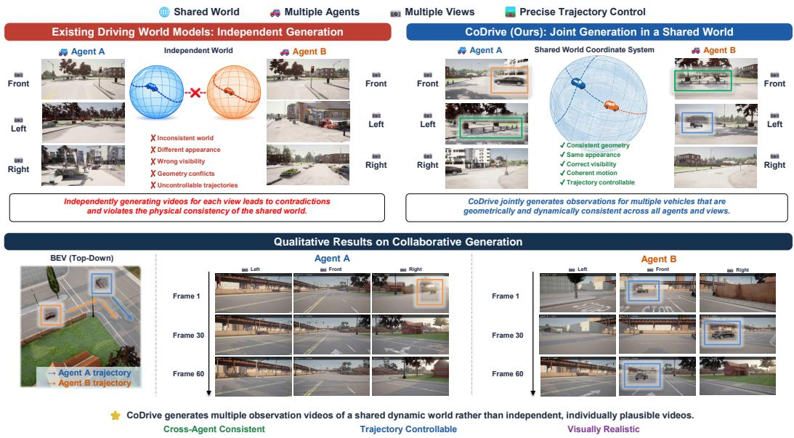  
Figure 1: CoDrive enables controllable, cross-vehicle consistent driving video generation.

## ABSTRACT

Real-world driving is inherently multi-agent, yet most existing driving world models generate observations from a single ego vehicle. Independently extending them to multiple vehicles does not ensure that different agents observe a consistent shared world. We present CoDrive, a cross-vehicle, multi-view driving video generation framework that jointly generates observations of vehicles sharing the same dynamic scene with precise camera-trajectory control. CoDrive interleaves local self-attention, which models spatiotemporal dependencies among the views of each vehicle, with global self-attention, which enables information exchange and consistency modeling across vehicles. To explicitly encode their spatial relationships, all camera trajectories are represented in a shared world coordinate system and injected into the attention layers through projective relative positional encoding. We further adopt a progressive mixed-task training strategy that combines large-scale real-world single-agent data with synthetic crossagent interaction data, allowing the model to benefit from real-world appearance distributions while learning cross-agent consistency from simulation. For systematic evaluation, we introduce CoDrive-Bench, a benchmark covering real and synthetic multi-vehicle scenarios and evaluating trajectory controllability, scene geometry consistency, and instance-level consistency. Experiments show that

CoDrive improves trajectory controllability and cross-agent geometric and instance consistency while maintaining competitive visual quality. Project page: https://codrive-project-page.github.io/.

## 1 INTRODUCTION

Recent advances in video generation have enabled generative models to produce visually realistic and temporally coherent videos, opening up the possibility of learning world models directly from large-scale visual data. By modeling how a scene evolves over time under different conditions, video world models provide a scalable approach to simulating complex dynamic environments. Autonomous driving is a particularly important application of this paradigm, as a capable driving world model could support data generation, closed-loop evaluation, rare-event simulation, and the development of perception and planning systems. Existing driving world models have made substantial progress in visual fidelity, controllability, long-horizon generation, multimodal prediction, and physical plausibility. However, most existing methods model the driving world from the perspective of a single ego vehicle.

Real-world traffic environments are inherently multi-agent. Multiple vehicles simultaneously observe and interact with the same dynamic scene from different locations, orientations, and fields of view. A world model for such environments should therefore generate not only individually plausible observations, but observations that are mutually consistent with a single shared world. For example, when two vehicles observe the same road user, intersection, or traffic event, the generated observations should agree on the identity, location, appearance, motion, and visibility of the shared content. Independently generating the observation of each vehicle can easily lead to contradictions: an object may appear in only one view, follow incompatible trajectories across agents, or occupy geometrically inconsistent positions. Such inconsistencies limit the use of conventional single-agent generators for cooperative perception, multi-vehicle planning, and interactive traffic simulation.

In this work, we introduce CoDrive, a generative framework that jointly models multi-view observations of vehicles interacting in a shared driving scene. The task naturally involves two levels of con sistency: coherence among the views of each vehicle and agreement across vehicles. Accordingly, we interleave local self-attention for intra-agent multi-view modeling with global self-attention for cross-agent information exchange. To provide explicit geometric guidance, we express all camera trajectories in a common world coordinate system and inject their relative geometry into the atten tion layers. This enables cross-vehicle interaction to depend on the physical relationship between cameras rather than appearance similarity alone. Through multi-stage progressive mixed training on diverse data, CoDrive demonstrates consistent generation capabilities in cross-agent scenarios.

To enable systematic evaluation, we introduce CoDrive-Bench, a dedicated benchmark for crossagent, multi-view driving world models. Beyond conventional video quality, CoDrive-Bench evaluates whether generated observations follow the commanded trajectories, reconstruct consistent scene geometry, and place shared vehicle instances consistently across agents.

Our contributions are summarized as follows:

• We introduce CoDrive, a framework for jointly generating multi-view observations of two vehicles in a shared dynamic scene with explicit camera-trajectory control.

• We construct CoDrive-Bench, a comprehensive benchmark that quantitatively evaluates controllability and cross-agent consistency across vehicles.

• We conduct experiments on CoDrive-Bench and demonstrate that CoDrive improves trajectory controllability and cross-agent consistency over the evaluated baselines while retaining competitive visual quality.

## 2 RELATED WORK

Video World Models. In recent years, large-scale latent-space video diffusion pretraining (Zheng et al., 2024; Rombach et al., 2022; Kong et al., 2025; Wan et al., 2025; Hong et al., 2022) has endowed video diffusion models with rich world knowledge, giving rise to emergent capabilities for understanding and predicting the visual world. As a result, they are able to generate video sequences with high visual fidelity, temporal coherence, and physical plausibility. Moreover, a growing body of work has introduced various conditioning signals into the world generation process, including text (Mao et al., 2025), camera poses (He et al., 2025; Ren et al., 2025; Zhang et al., 2026; Sun et al., 2025; Zhu et al., 2026a; Wang et al., 2026a), and actions (He et al., 2026; Wang et al., 2026b; Tang et al., 2026; NVIDIA et al., 2026), thereby enabling video generation to be controlled through multiple modalities and allowing more precise manipulation of the visual worlds predicted by the models.

Multi-Agent World Models. With the rapid advancement of video world models, recent studies have begun to explore joint world modeling shared across multiple agents. Existing approaches either control multiple agents within a single viewpoint (Pondaven et al., 2026; Zhu et al., 2026c) or jointly generate the egocentric views of multiple agents (Savva et al., 2026; Hu et al., 2026b; Wu et al., 2026; Sun et al., 2026; Liu et al., 2026; Hu et al., 2026a), thereby achieving spatiotemporal consistency across agents. However, most of these methods are confined to game environments such as Minecraft and It Takes Two. Multi-agent world models for real-world applications such as autonomous driving remain largely underexplored.

Driving World Models. Autonomous driving represents an important application domain for video world models with powerful world-simulation capabilities. Early studies (Hu et al., 2023; Yang et al., 2024) trained video generation models on driving videos to simulate driving scenarios. Subsequent works further advanced driving world models in terms of controllability (Li et al., 2023; Lu et al., 2024; Wang et al., 2025; Hassan et al., 2025; Jiang et al., 2024; Gao et al., 2024), resolution (Wu et al., 2024; Gao et al., 2025), output modalities (Li et al., 2025a; Guo et al., 2025; Li et al., 2025b), generation horizon (Chen et al., 2025a; Zhang et al., 2025), physical consistency (Yang et al., 2026; Zhou et al., 2026a), and scene plausibility (Wang et al., 2024; Yan et al., 2026; Zhou et al., 2025). However, most of these approaches generate the driving world from a single ego-vehicle perspective. Tao et al. (2026) explores multi-agent street view generation, but focuses primarily on image generation task rather than video world modeling. Zhu et al. (2026b) explores dual-vehicle world video generation, but focuses only on simulated environments and does not provide a systematic evaluation of cross-vehicle controllability and consistency.

## 3 CODRIVE

## 3.1 MODEL ARCHITECTURE

As shown in Figure 2, our generator is built on a pretrained latent video diffusion transformer. A 3D VAE encodes video into a compact latent and a diffusion transformer denoises it under a text prompt and a reference frame. We retain the pretrained backbone and extend it to jointly generate observations from multiple vehicles through two complementary mechanisms: cross-agent information exchange and explicit shared-camera geometry.

Cross-agent multi-view formulation. We model the shared scene as the set of views captured by N vehicles, each equipped with M forward-facing cameras, giving $V = N M$ views in total. Let $\mathbf { x } _ { v }$ denote the video of view v. We encode each view independently with the frozen VAE encoder $\mathcal { E }$ and concatenate the per-view latents along the width axis:

$$
\mathbf { z } _ { v } = { \mathcal { E } } ( \mathbf { x } _ { v } ) \in \mathbb { R } ^ { T \times H \times W \times C } , \qquad \mathbf { z } = \left[ \mathbf { z } _ { 1 } \parallel \mathbf { z } _ { 2 } \parallel \cdots \parallel \mathbf { z } _ { V } \right] _ { \mathrm { w } } \in \mathbb { R } ^ { T \times H \times ( V \times W ) \times C } ,\tag{1}
$$

where $[ \cdot \| \cdot ] _ { \mathrm { w } }$ is concatenation along width and $( T , H , W , C )$ are the per-view latent dimensions. The transformer operates on the token sequence of this wide latent z.

Interleaved Global-Local Self-Attention. Cross-agent consistency first requires each vehicle’s own multi-view observations to remain spatiotemporally coherent. We therefore use Local Self-Attention to model dependencies among the views belonging to the same vehicle. Given the video tokens associated with one agent, this module captures their spatiotemporal dependencies across different views. Specifically, for each agent, the tokens from all views are sequentially fed into the Local Self-Attention module, and the corresponding outputs are concatenated to form a unified representation:

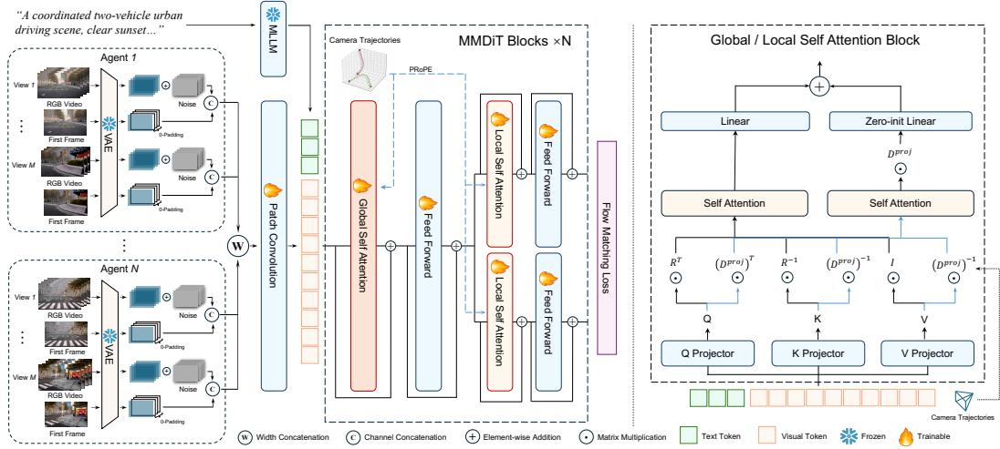  
Figure 2: Model architecture and training framework overview. Given text prompt, reference frames, and camera poses from multiple agents and views, CoDrive encodes each video and jointly denoises them with a pretrained video DiT. Interleaved local self-attention models intra-agent spatial-temporal dependencies across multiple views, while global self-attention enables information exchange and consistency modeling across vehicles. Camera poses are expressed in a shared world coordinate system and injected into both attention modules through projective relative positional encoding (PRoPE), providing explicit geometric guidance for cross-view and cross-agent alignment.

$$
\mathrm { A t t } \mathrm { n } _ { \mathrm { l o c a l } } ( \mathbf { z } ) = \big \| _ { n = 1 } ^ { N } \mathrm { A t t n } ( \mathbf { z } ^ { ( n ) } ) , \qquad \mathbf { z } ^ { ( n ) } = \big [ \mathbf { z } _ { ( n - 1 ) M + 1 } \big \| \cdot \cdot \cdot \big \| \mathbf { z } _ { n M } \big ] _ { \mathbf { w } } ,\tag{2}
$$

where $\mathbf { z } ^ { ( n ) }$ gathers the M views of agent $n .$

However, local attention alone cannot make different agents agree on the world they share. We therefore apply Global Self-Attention to the wide latent spanning all agents, allowing tokens from one vehicle to attend to observations from other vehicles and reconcile shared scene content:

$$
{ \mathrm { A t t n } } _ { \mathrm { g l o b a l } } ( \mathbf { z } ) = { \mathrm { A t t n } } ( \left[ \mathbf { z } _ { 1 } \parallel \mathbf { z } _ { 2 } \parallel \cdots \parallel \mathbf { z } _ { V } \right] _ { \mathrm { w } } ) .\tag{3}
$$

We interleave local and global attention across transformer blocks. Local blocks preserve intraagent multi-view structure, while global blocks progressively propagate information across vehicles, allowing cross-agent consistency to emerge without replacing per-agent representations with fully global attention at every layer.

Global Camera Geometry Injection. Global Self-Attention allows tokens from different agents to interact, but does not by itself specify how their cameras are positioned in the shared scene. Therefore, we express all cameras relative to one common reference camera, rather than normalizing each agent independently. This places all views in a shared geometric gauge, so that cross-agent attention can depend on their physical camera relationships rather than on appearance correspondence alone. Let $a = ( t , \boldsymbol { v } )$ index view v at latent time $t ,$ and let $\mathbf { E } _ { a } = \mathbf { \overset { . } { C } } \mathbf { \overset { . } { T } } \mathbf { \overset { . } { W } } \mathbf { \overset { . } { \in } } \mathbf { \mathrm { S E } } ( 3 )$ be its world-to-camera transform. Using $a _ { 0 } = ( 0 , 0 )$ as the shared reference, we define

$$
\widetilde { \mathbf { E } } _ { a } = \mathbf { E } _ { a } \mathbf { E } _ { a _ { 0 } } ^ { - 1 } = { } ^ { C _ { a } } \mathbf { T } _ { C _ { a _ { 0 } } } ,\tag{4}
$$

which maps coordinates from the reference-camera frame to camera a. Thus, $\widetilde { \mathbf { E } } _ { a }$ is a relative camera transform in one shared canonical gauge, rather than an absolute world-to-camera pose.

We inject these poses using an implementation of projective relative positional encoding (PRoPE) adapted from (Li et al., 2025c; Sun et al., 2025). After normalizing the focal lengths and removing the principal-point entries, we construct an invertible homogeneous intrinsic transform

$$
\widehat { \mathbf { K } } _ { a } = \left[ \overset { \mathrm { d i a g } ( \kappa _ { a } ^ { x } , \kappa _ { a } ^ { y } , 1 ) } { \mathbf { 0 } ^ { \top } } \quad \mathbf { 1 } \right] \in \mathrm { G L } ( 4 ) , \qquad \mathbf { P } _ { a } = \widehat { \mathbf { K } } _ { a } \widetilde { \mathbf { E } } _ { a } \in \mathrm { G L } ( 4 ) .\tag{5}
$$

Here ${ \bf P } _ { a }$ is an invertible homogeneous feature transform, not a physical perspective projection involving depth division.

The camera tensors have shapes $\widetilde { \mathbf { E } } \in \mathbb { R } ^ { B \times T \times V \times 4 \times 4 }$ and $\mathbf { K } \in \mathbb { R } ^ { B \times T \times V \times 3 \times 3 }$ , and are broadcast to the image tokens belonging to the corresponding (t, v). Specifically, for an attention head of dimension $d _ { h } = 4 R$ , PRoPE divides each learned query, key, and value into R four-dimensional channel groups and applies the block-diagonal transform ${ \mathcal { P } } _ { a } \doteq { \mathbf { I } } _ { R } \otimes { \mathbf { P } } _ { a } \in \mathbb { R } ^ { d _ { h } \times d _ { h } }$

$$
\mathbf { q } _ { a } ^ { \prime } = \mathcal { P } _ { a } ^ { \top } \mathbf { q } _ { a } , \qquad \mathbf { k } _ { a } ^ { \prime } = \mathcal { P } _ { a } ^ { - 1 } \mathbf { k } _ { a } , \qquad \mathbf { v } _ { a } ^ { \prime } = \mathcal { P } _ { a } ^ { - 1 } \mathbf { v } _ { a } .\tag{6}
$$

${ \bf q } _ { a } , { \bf k } _ { a }$ and ${ \bf v } _ { a }$ are the learned image Q/K/V features after their linear projections and Q/K normalization. As shown in the right part of Figure 2, the transformed features are processed by an additional attention branch, whose image output is mapped back by $\mathcal { P } _ { a }$ and added to the pretrained attention output through a zero-initialized projection. For image tokens i and j, the resulting attention logit is

$$
\begin{array} { r } { \left. \mathbf { q } _ { i } ^ { \prime } , \mathbf { k } _ { j } ^ { \prime } \right. = \mathbf { q } _ { i } ^ { \top } \mathcal { P } _ { i } \mathcal { P } _ { j } ^ { - 1 } \mathbf { k } _ { j } , \qquad \mathbf { P } _ { i } \mathbf { P } _ { j } ^ { - 1 } = \widehat { \mathbf { K } } _ { i } \mathbf { E } _ { i } \mathbf { E } _ { j } ^ { - 1 } \widehat { \mathbf { K } } _ { j } ^ { - 1 } . } \end{array}\tag{7}
$$

The shared reference ${ \bf E } _ { a _ { 0 } }$ therefore cancels, while $\mathbf { E } _ { i } \mathbf { E } _ { i } ^ { - 1 } = { \bf \nabla } ^ { C _ { i } } \mathbf { T } _ { C _ { i } }$ is the relative extrinsic transform from camera $j$ to camera i. The full expression additionally contains the two camera intrinsics and is therefore an intrinsic-calibrated relative projective operator, rather than a pure relative rigid transform. It supplies intra-agent camera geometry in local-attention blocks and cross-agent camera geometry in global-attention blocks. The invariance to the original world-coordinate gauge and the complete derivation are provided in Appendix A.2. Intuitively, the resulting attention interaction depends on the calibrated relative geometry between the source and target cameras, while remaining invariant to the arbitrary choice of the shared world-coordinate gauge.

Training Objective. Following the base model, we train with a flow-matching objective. Given the clean wide latent z and Gaussian noise $\mathbf { \epsilon } \gets \mathcal { N } ( \mathbf { 0 } , \mathbf { I } )$ , we draw a flow time $\tau \in \ [ 0 , \dot { 1 } ]$ and form the linear interpolant

$$
\mathbf { z } _ { \tau } = \left( 1 - \tau \right) \mathbf { z } + \tau \mathbf { \epsilon } ,\tag{8}
$$

whose constant velocity along the path is $\epsilon - \mathbf { z }$ . The transformer $\mathbf { v } _ { \theta }$ regresses this velocity from the noised latent, conditioned on the text and the reference frame conditions $c ,$ and the per-view cameras $\{ \mathbf { P } _ { v } \}$

$$
\begin{array} { r } { \mathcal { L } = \mathbb { E } _ { \tau , \mathbf { z } , \epsilon } \Big [ \big \| \mathbf { v } _ { \boldsymbol { \theta } } ( \mathbf { z } _ { \tau } , \tau , c , \{ \mathbf { P } _ { v } \} ) - ( \epsilon - \mathbf { z } ) \big \| _ { 2 } ^ { 2 } \Big ] . } \end{array}\tag{9}
$$

## 3.2 TRAINING RECIPE

We carefully design a multi-stage progressive training pipeline. First, we train the base model on large-scale single-view driving videos using a text-and-image-to-video (TI2V) objective to facilitate domain adaptation. Next, we train the model on driving videos annotated with camera poses to enable controllable camera motion during generation. In the third stage, we further introduce singlevehicle, multi-view data with camera-pose annotations to increase the number of views supported by the model. In the fourth stage, the model is trained on multi-vehicle, multi-view data to establish spatial consistency across vehicles. Across these stages, we progressively increase the training resolution and combine real-world and simulated data according to the supervision available at each stage.

Moreover, since real-world multi-vehicle data are scarce, we introduce an additional mixed-task fine-tuning stage. During this stage, the model is jointly trained on dual-agent video generation using synthetic data and single-agent video generation using real-world data. This mixed-task formulation is designed to retain cross-agent supervision from simulation while exposing the model to the appearance and motion distributions of real-world driving scenes.

## 3.3 DATASET CONSTRUCTION

Our training data include multiple open-source autonomous driving datasets (Caesar et al., 2020; Sun et al., 2020; Yang et al., 2024; Xiao et al., 2021; Arai et al., 2025) collected in real-world environments. We use a large vision-language model that has been trained with reinforcement learning on captioning tasks (Wu et al., 2025) to generate textual annotations for these video data. However, real-world multi-agent data are relatively scarce and costly to collect. To alleviate this limitation, we develop a synthetic video data collection pipeline in the CARLA (Dosovitskiy et al., 2017) simulator to capture interactions among dual vehicles.

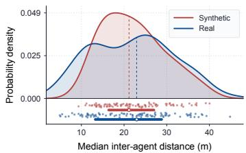  
(a) Agent distance distribution.

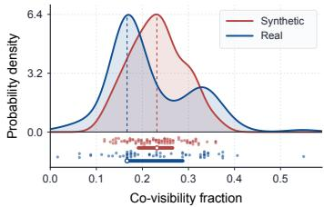  
(b) Co-visibility distribution.

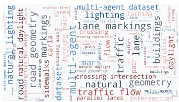  
(c) Prompt word cloud.  
Figure 3: CoDrive-Bench data statistics. (a) Distribution of inter-agent distances in the dataset. (b) Distribution of co-visibility between the two agents. (c) Word cloud of text prompts.

The synthetic data are collected under diverse scene configurations and weather conditions, covering a wide range of multi-vehicle interaction patterns, including same-direction following, oncoming encounters, merging, cut-ins, and side-by-side driving. Specifically, the dataset encompasses eight map scenarios, eleven weather conditions, and six vehicle interaction modes. To further enhance the realism and diversity of the simulated data, we introduced random perturbations into vehicle motions and added task-irrelevant background traffic as distractors. Finally, we curate 15K high-quality video clips of two-vehicle interactions from simulated environments, along with their corresponding camera pose data, for training. Further details of data collection are in Appendix A.1.

## 4 CODRIVE-BENCH

For cross-agent, multi-view driving world models, the generated content must maintain spatial consistency across agents. However, quantitatively evaluating such consistency remains challenging. Most existing video generation benchmarks and metrics are designed for single-agent ego videos, making them unsuitable for effectively assessing cross-agent video generation.

To address this gap, we introduce CoDrive-Bench, a benchmark suite for the quantitative evaluation of cross-agent driving world models. CoDrive-Bench includes cross-agent data collected from both real-world and simulated environments, covering diverse weather conditions, driving scenarios, and vehicle interaction patterns. It evaluates three complementary dimensions: camera-trajectory controllability, cross-agent scene consistency, and cross-agent instance consistency.

## 4.1 DATA COLLECTION

CoDrive-Bench contains 200 distinct two-vehicle interaction scenarios together with their corresponding textual descriptions. For each vehicle, the benchmark provides RGB videos captured from three camera views, along with a camera pose trajectory describing the vehicle’s motion. In total, the benchmark includes 1,200 RGB videos and 400 trajectories. Among the 200 scenarios, 100 are real-world scenarios and 100 are synthetic scenarios.

The real-world data are drawn from OpenMars (Li et al., 2024), an open-source multi-agent, multiview interactive video dataset, while the synthetic scenarios are collected using the pipeline described in Section 3.3. As illustrated in Fig. 3, during data filtering, we remove video clips in which the two vehicles are too far apart or share too little overlapping field of view. We also ensure that the selected data are as diverse as possible in terms of weather conditions, scene types, and vehicle interaction patterns.

## 4.2 EVALUATION METRICS

Our metrics address three complementary questions: (1) whether each generated video follows its commanded camera trajectory, (2) whether different agents reconstruct the same static scene, and (3) whether participating vehicles appear consistently at their geometrically expected locations.

Controllability. A driving world model should accurately follow the user-specified camera trajectory while preserving realistic scene dynamics. Following DrivingGen (Zhou et al., 2026b), we estimate the camera trajectory from each generated video using monocular depth estimation together with visual SLAM. We then evaluate trajectory accuracy using Average Displacement Error (ADE) and Dynamic Time Warping (DTW). ADE measures the average spatial deviation between the generated and target trajectories, whereas DTW evaluates trajectory similarity under temporal misalignment, making it more robust to variations in motion speed.

Scene Consistency. Trajectory control alone does not ensure that different vehicles produce geometrically compatible observations under the supplied camera conditions. We therefore evaluate geometric agreement between the reconstructed scenes of different agents from both three-dimensional and image-space perspectives. Specifically, we compute Chamfer Distance (CD) between crossagent point clouds reconstructed in the commanded world frame, measuring their geometric agreement under the supplied camera trajectories. We further introduce Relative Reprojection Depth Error (RE), which measures cross-view depth consistency by reprojecting static scene points between different agents. Both metrics are computed after removing dynamic foreground objects, ensuring that the evaluation focuses on the shared static environment rather than independently moving vehicles.

Instance Consistency. Scene-level geometry does not by itself guarantee that interacting vehicles are rendered consistently across agents. We therefore evaluate whether the other participating vehicle appears along the image-space trajectory implied by the known cross-agent geometry. Since both agents are defined in a shared world coordinate frame, the target vehicle’s location is directly determined by the observing agent’s camera extrinsics, eliminating the need for object annotations. We therefore place a vehicle-sized bounding box at the corresponding location and evaluate whether the observer’s video contains a vehicle at its projected image position. Soft Hit Rate (Hit) measures whether a persistent vehicle track aligns with the geometrically predicted image trajectory by jointly considering its temporal coverage, spatial deviation, and depth consistency. Because the prediction inherently captures the target’s motion, vehicles rendered with incorrect velocity or heading deviate from the expected trajectory and are penalized, whereas transient false positives are naturally suppressed. 3D Localization Error (LE) measures the Euclidean distance, in meters, between the back-projected position of the detected vehicle and its ground-truth position, conditioned on successful rendering and detection.

Detailed metric definitions, computation procedures, and analysis are provided in Appendix B.1.

## 5 EXPERIMENTS

Implementation Details. CoDrive is built upon HunyuanVideo-1.5, a pretrained video generation backbone. Although the formulation in Section 3 supports N vehicles, our current implementation and evaluation use N = 2 vehicles, each equipped with three views, following the format of the available real-world multi-vehicle data. The training process consists of five stages and uses approximately 900K video clips in total. More detailed information on the training procedure and dataset is provided in Appendices A.1 and A.3.

Baselines. We compare CoDrive with: (1) general-purpose video generation models, including Wan2.2-I2V-A14B and HunyuanVideo-1.5, (2) driving-specific world models, represented by MagicDrive-V2 and Cosmos3-Nano, (3) multi-vehicle driving scene generation model for synthetic driving scenarios, represented by ShareVerse. For each baseline, we provide the available first-frame and camera-control conditions in the format supported by that method.

Evaluation Protocol. We conduct experimental evaluations on CoDrive-Bench and report the Controllability, Scene Consistency, and Instance Consistency metrics. In addition, we report FVD to measure the visual quality. None of the benchmark data is included in our training.

## 5.1 MAIN RESULTS

Table 1 shows that CoDrive performs favorably across trajectory controllability, scene consistency, and instance consistency, while maintaining competitive FVD. Among pose-controllable baselines,

Table 1: Quantitative comparison of video generation methods. ↑ indicates that higher values are better, while ↓ indicates that lower values are better.
<table><tr><td rowspan="2">Method</td><td rowspan="2"></td><td colspan="2">Controllability</td><td colspan="2">Scene Consistency</td><td colspan="2">Instance Consistency</td></tr><tr><td>FVD↓ ADE↓</td><td>DTW↓</td><td>CD↓</td><td>RE↓</td><td>Hit ↑</td><td>LE↓</td></tr><tr><td>HunyuanVideo-1.5</td><td>1082.4</td><td>11.96</td><td>573</td><td>2.08</td><td>0.61</td><td>0.322</td><td>10.92</td></tr><tr><td>Wan2.2-I2V</td><td>444.2</td><td>22.95</td><td>1189</td><td>1.82</td><td>0.64</td><td>0.302</td><td>11.16</td></tr><tr><td>MagicDrive-V2</td><td>2815.4</td><td>10.71</td><td>546</td><td>19.53</td><td>1.27</td><td>0.007</td><td>12.00</td></tr><tr><td>ShareVerse</td><td>228.0</td><td>15.25</td><td>399</td><td>4.21</td><td>1.11</td><td>0.159</td><td>9.40</td></tr><tr><td>Cosmos3</td><td>103.2</td><td>5.69</td><td>241</td><td>3.62</td><td>1.27</td><td>0.373</td><td>9.83</td></tr><tr><td>CoDrive</td><td>108.8</td><td>3.05</td><td>116</td><td>1.64</td><td>0.52</td><td>0.482</td><td>5.81</td></tr></table>

Table 2: Component ablation. Component ablation on CoDrive-Bench. We isolate Interleaved Global-Local Self-Attention (IGLA) and Global Camera Geometry Injection (GCGI) respectively and verify their complementary effects.
<table><tr><td></td><td></td><td></td><td colspan="2">Controllability</td><td colspan="2">Scene Consistency</td><td colspan="2">Instance Consistency</td></tr><tr><td>IGLA</td><td>GCGI</td><td>FVD↓</td><td>ADE↓</td><td>DTW↓</td><td>CD↓</td><td>RE↓</td><td>Hit ↑</td><td>LE↓</td></tr><tr><td></td><td>√</td><td>161.2</td><td>6.71</td><td>321</td><td>1.77</td><td>0.59</td><td>0.409</td><td>7.25</td></tr><tr><td>√</td><td></td><td>238.1</td><td>13.40</td><td>688</td><td>1.75</td><td>0.55</td><td>0.342</td><td>8.28</td></tr><tr><td>√</td><td>√</td><td>108.8</td><td>3.05</td><td>116</td><td>1.64</td><td>0.52</td><td>0.482</td><td>5.81</td></tr></table>

CoDrive obtains the lowest ADE and DTW. Compared with independently composed or existing multi-agent generation baselines, it also achieves better cross-agent consistency. For trajectory control, CoDrive achieves the lowest ADE (3.05) and DTW (116) among the evaluated methods. For scene consistency, CoDrive obtains the lowest CD (1.64) and RE (0.52), indicating better crossagent scene agreement under the commanded camera geometry. For instance consistency, CoDrive achieves the highest Hit Rate (0.482) and the lowest LE (5.81), indicating more accurate cross-agent rendering and localization of the participating vehicles. Meanwhile, its FVD of 108.8 remains comparable to the best baseline result of 103.2, suggesting that the gains in cross-agent consistency do not require a substantial degradation in perceptual video quality.

## 5.2 ABLATION STUDIES

Interleaved Global-Local Self-Attention. As shown in Table 2, removing IGLA degrades performance across trajectory, scene-consistency, instance-consistency, and visual-quality metrics. Without IGLA, the visual realism of the generated videos decreases, as evidenced by the FVD worsening from 108.8 in the full model to 161.2. Furthermore, cross-agent scene consistency is compromised, with the CD increasing from 1.64 to 1.77 and the RE metric rising from 0.52 to 0.59. The omission of IGLA also negatively impacts instance consistency, causing the Soft Hit Rate to drop from 0.482 to 0.409 and LE to increase from 5.81 to 7.25. Controllability also suffers, as ADE increases to 6.71 and DTW reaches 321. These results indicate that interleaving local and global attention contributes to both cross-agent consistency and trajectory controllability.

Global Camera Geometry Injection. Table 2 also shows the contribution of Global Camera Geometry Injection (GCGI). Without GCGI, trajectory controllability degrades substantially. This is highlighted by a sharp increase in ADE to 13.40 and DTW to 688, compared to the full model’s 3.05 and 116 respectively. Additionally, removing GCGI harms overall video quality, pushing the FVD up to 238.1. Cross-agent instance consistency is also heavily degraded without this explicit geometric guidance, leading to the lowest Soft Hit Rate of 0.342 and a high LE of 8.28. These results suggest that explicit camera-geometry conditioning complements cross-agent attention, particularly for trajectory control and spatial alignment.

Mixed-Task Fine-Tuning. As shown in Table 3, mixed-task fine-tuning consistently improves performance on the real-world split across the reported metrics. It reduces FVD from 282.9 to 104.3, ADE from 6.86 to 1.53, and DTW from 343 to 61, while increasing Hit Rate from 0.560 to

Table 3: Impact of mixed-task fine-tuning on performance in real-world scenarios.
<table><tr><td></td><td></td><td colspan="2">Controllability</td><td colspan="2">Scene Consistency</td><td colspan="2">Instance Consistency</td></tr><tr><td></td><td>FVD↓</td><td>ADE↓</td><td>DTW↓</td><td>CD↓</td><td>RE↓</td><td>Hit ↑</td><td>LE↓</td></tr><tr><td>w/o Mixed Fine-tuning</td><td>282.9</td><td>6.86</td><td>343</td><td>1.68</td><td>0.47</td><td>0.560</td><td>7.69</td></tr><tr><td>w/ Mixed Fine-tuning</td><td>104.3</td><td>1.53</td><td>61</td><td>1.57</td><td>0.45</td><td>0.646</td><td>5.99</td></tr></table>

BEV Views  
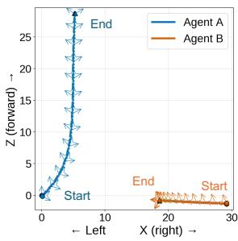  
Agent A  
Agent B

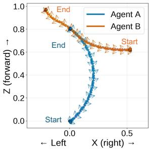

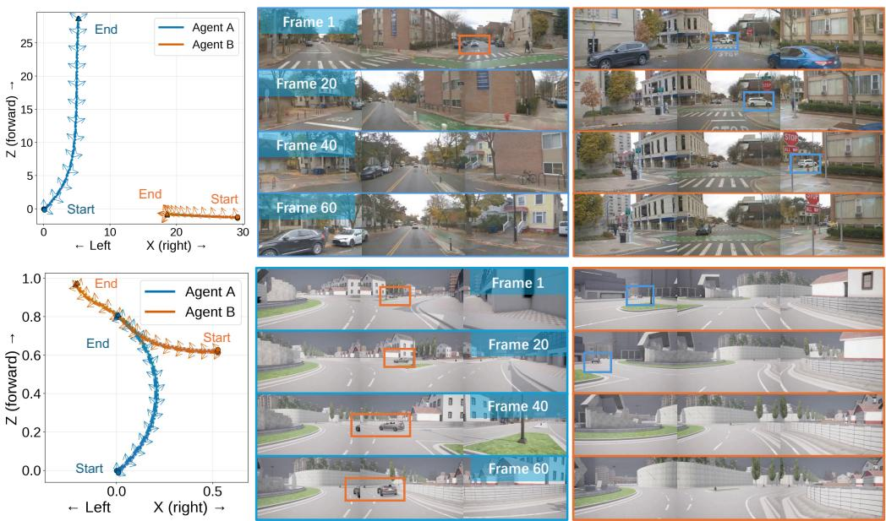  
Figure 4: Qualitative results on both real-world and synthetic data. Blue image borders indicate Agent A’s three views, while orange image borders indicate Agent B’s three views. Blue bounding boxes mark Agent A in Agent B’s views, whereas orange bounding boxes mark Agent B in Agent A’s views.

0.646 and reducing LE from 7.69 to 5.99. These results suggest that incorporating real-world singleagent data during mixed-task fine-tuning improves transfer to real-world scenarios while retaining the cross-agent supervision learned from simulated dual-agent data.

## 5.3 QUALITATIVE RESULTS

Figure 4 presents qualitative results in both real-world and synthetic environments. CoDrive follows the trajectories while maintaining coherent scene layouts across views. Shared static structures remain visually and geometrically compatible between agents, while the participating vehicles appear at positions and scales consistent with their relative poses and maintain continuous motion across frames.

## 6 CONCLUSION AND FUTURE WORK

We present CoDrive, a framework for jointly generating multi-view observations of vehicles that share the same dynamic driving scene. We also introduce CoDrive-Bench to evaluate camera controllability, cross-agent scene consistency, and instance consistency. Experiments on CoDrive-Bench show that CoDrive improves cross-agent consistency and trajectory controllability while maintaining competitive visual quality. Our current implementation focuses on dual-vehicle interactions. Extending shared-world video generation to larger numbers of interacting vehicles and incorporating real-world multi-vehicle training data are important directions for future work.

## REFERENCES

Nir Aharon, Roy Orfaig, and Ben-Zion Bobrovsky. Bot-sort: Robust associations multi-pedestrian tracking. arXiv preprint arXiv:2206.14651, 2022.

Hidehisa Arai, Keita Miwa, Kento Sasaki, Kohei Watanabe, Yu Yamaguchi, Shunsuke Aoki, and Issei Yamamoto. Covla: Comprehensive vision-language-action dataset for autonomous driving. In Proceedings of the Winter Conference on Applications of Computer Vision (WACV), pp. 1933– 1943, February 2025.

Holger Caesar, Varun Bankiti, Alex H Lang, Sourabh Vora, Venice Erin Liong, Qiang Xu, Anush Krishnan, Yu Pan, Giancarlo Baldan, and Oscar Beijbom. nuscenes: A multimodal dataset for autonomous driving. In Proceedings of the IEEE/CVF conference on computer vision and pattern recognition, pp. 11621–11631, 2020.

Rui Chen, Zehuan Wu, Yichen Liu, Yuxin Guo, Jingcheng Ni, Haifeng Xia, and Siyu Xia. Unimlvg: Unified framework for multi-view long video generation with comprehensive control capabilities for autonomous driving, 2025a. URL https://arxiv.org/abs/2412.04842.

Sili Chen, Hengkai Guo, Shengnan Zhu, Feihu Zhang, Zilong Huang, Jiashi Feng, and Bingyi Kang. Video depth anything: Consistent depth estimation for super-long videos. arXiv:2501.12375, 2025b.

Alexey Dosovitskiy, German Ros, Felipe Codevilla, Antonio Lopez, and Vladlen Koltun. Carla: An open urban driving simulator. In Conference on robot learning, pp. 1–16. PMLR, 2017.

Ruiyuan Gao, Kai Chen, Bo Xiao, Lanqing Hong, Zhenguo Li, and Qiang Xu. MagicDrive-V2: High-resolution long video generation for autonomous driving with adaptive control. In Proceedings of the IEEE/CVF International Conference on Computer Vision, 2025.

Shenyuan Gao, Jiazhi Yang, Li Chen, Kashyap Chitta, Yihang Qiu, Andreas Geiger, Jun Zhang, and Hongyang Li. Vista: A generalizable driving world model with high fidelity and versatile controllability. In Advances in Neural Information Processing Systems (NeurIPS), 2024.

Xiangyu Guo, Zhanqian Wu, Kaixin Xiong, Ziyang Xu, Lijun Zhou, Gangwei Xu, Shaoqing Xu, Haiyang Sun, Bing Wang, Guang Chen, Hangjun Ye, Wenyu Liu, and Xinggang Wang. Genesis: Multimodal driving scene generation with spatio-temporal and crossmodal consistency. In Advances in Neural Information Processing Systems, volume 38, 2025. URL https://proceedings.neurips.cc/paper\_files/paper/2025/ hash/571082ea18d30060177dfcaf662ff0e5-Abstract-Conference.html.

Mariam Hassan, Sebastian Stapf, Ahmad Rahimi, Pedro Rezende, Yasaman Haghighi, David Bruggemann, Isinsu Katircioglu, Lin Zhang, Xiaoran Chen, Suman Saha, et al. Gem: A gen-¨ eralizable ego-vision multimodal world model for fine-grained ego-motion, object dynamics, and scene composition control. In Proceedings ofthe IEEE/CVF Conference on Computer Vision and Pattern Recognition, pp. 22404–22415, 2025.

Hao He, Yinghao Xu, Yuwei Guo, Gordon Wetzstein, Bo DAI, Hongsheng Li, and Ceyuan Yang. Cameractrl: Enabling camera control for video diffusion models. In Y. Yue, A. Garg, N. Peng, F. Sha, and R. Yu (eds.), International Conference on Learning Representations, volume 2025, pp. 100433–100464, 2025. URL https://proceedings.iclr.cc/paper\_files/paper/2025/file/ f98fd73d59d8494489ea970747b91fe4-Paper-Conference.pdf.

Xianglong He, Chunli Peng, Zexiang Liu, Boyang Wang, Yifan Zhang, Qi Cui, Fei Kang, Biao Jiang, Mengyin An, Yangyang Ren, Baixin Xu, Hao-Xiang Guo, Kaixiong Gong, Size Wu, Wei Li, Xuchen Song, Yang Liu, Yangguang Li, and Yahui Zhou. Matrix-game 2.0: An open-source real-time and streaming interactive world model, 2026. URL https://arxiv.org/abs/ 2508.13009.

Wenyi Hong, Ming Ding, Wendi Zheng, Xinghan Liu, and Jie Tang. Cogvideo: Large-scale pretraining for text-to-video generation via transformers, 2022. URL https://arxiv.org/ abs/2205.15868.

Anthony Hu, Lloyd Russell, Hudson Yeo, Zak Murez, George Fedoseev, Alex Kendall, Jamie Shot ton, and Gianluca Corrado. Gaia-1: A generative world model for autonomous driving, 2023. URL https://arxiv.org/abs/2309.17080.

Anthony Hu, Vaclav Volhejn, Adrien Ramanana Rahary, Chris Mulder, Aditya Makkar, Alyx Liao,´ Amelie Royer, Manu Orsini, Adam Jelley, Eloi Alonso, Florian Laurent, Fredrik Nor´ en, James´ Swingos, Jan Hunermann, Kent Rollins, Lucas Hosseini, Matthieu Le Cauchois, Maxim Peter,¨ Pim de Witte, Tim Brown, Vincent Micheli, Moritz Bohle, Gabriel de Marmiesse, Viktoriia Shar-¨ manska, Lucia Specia, Michael Black, and Patrick Perez. Multiplayer interactive world models´ with representation autoencoders, 2026a. URL https://arxiv.org/abs/2607.05352.

Teng Hu, Mingchun Lu, Yating Wang, Jiangning Zhang, Jinkun Hao, Ye Pan, Ran Yi, Lizhuang Ma, and Dacheng Tao. Metaworld: Scaling multi-agent video world model from single-view video data, 2026b. URL https://arxiv.org/abs/2606.02753.

Junpeng Jiang, Gangyi Hong, Lijun Zhou, Enhui Ma, Hengtong Hu, Xia Zhou, Jie Xiang, Fan Liu, Kaicheng Yu, Haiyang Sun, Kun Zhan, Peng Jia, and Miao Zhang. Dive: Dit-based video generation with enhanced control, 2024. URL https://arxiv.org/abs/2409.01595.

Weijie Kong, Qi Tian, Zijian Zhang, Rox Min, Zuozhuo Dai, Jin Zhou, Jiangfeng Xiong, Xin Li, Bo Wu, Jianwei Zhang, Kathrina Wu, Qin Lin, Junkun Yuan, Yanxin Long, Aladdin Wang, Andong Wang, Changlin Li, Duojun Huang, Fang Yang, Hao Tan, Hongmei Wang, Jacob Song, Jiawang Bai, Jianbing Wu, Jinbao Xue, Joey Wang, Kai Wang, Mengyang Liu, Pengyu Li, Shuai Li, Weiyan Wang, Wenqing Yu, Xinchi Deng, Yang Li, Yi Chen, Yutao Cui, Yuanbo Peng, Zhen tao Yu, Zhiyu He, Zhiyong Xu, Zixiang Zhou, Zunnan Xu, Yangyu Tao, Qinglin Lu, Songtao Liu, Dax Zhou, Hongfa Wang, Yong Yang, Di Wang, Yuhong Liu, Jie Jiang, and Caesar Zhong. Hunyuanvideo: A systematic framework for large video generative models, 2025. URL https://arxiv.org/abs/2412.03603.

Bohan Li, Jiazhe Guo, Hongsi Liu, Yingshuang Zou, Yikang Ding, Xiwu Chen, Hu Zhu, Feiyang Tan, Chi Zhang, Tiancai Wang, et al. Uniscene: Unified occupancy-centric driving scene generation. In Proceedings of the computer vision and pattern recognition conference, pp. 11971–11981, 2025a.

Bohan Li, Zhuang Ma, Dalong Du, Baorui Peng, Zhujin Liang, Zhenqiang Liu, Chao Ma, Yueming Jin, Hao Zhao, Wenjun Zeng, et al. Omninwm: Omniscient driving navigation world models. arXiv preprint arXiv:2510.18313, 2025b.

Ruilong Li, Brent Yi, Junchen Liu, Hang Gao, Yi Ma, and Angjoo Kanazawa. Cameras as relative positional encoding. In D. Belgrave, C. Zhang, H. Lin, R. Pascanu, P. Koniusz, M. Ghassemi, and N. Chen (eds.), Advances in Neural Information Processing Systems, volume 38, pp. 15984–16009. Curran Associates, Inc., 2025c. URL https://proceedings.neurips.cc/paper\_files/paper/2025/ file/17a7075094632c88cccdd86270ad715b-Paper-Conference.pdf.

Xiaofan Li, Yifu Zhang, and Xiaoqing Ye. Drivingdiffusion: Layout-guided multi-view driving scene video generation with latent diffusion model. arXiv preprint arXiv:2310.07771, 2023.

Yiming Li, Zhiheng Li, Nuo Chen, Moonjun Gong, Zonglin Lyu, Zehong Wang, Peili Jiang, and Chen Feng. Multiagent multitraversal multimodal self-driving: Open mars dataset. In Proceedings of the IEEE/CVF Conference on Computer Vision and Pattern Recognition, pp. 22041– 22051, 2024.

Fangfu Liu, Kai He, Tianchang Shen, Tianshi Cao, Sanja Fidler, Yueqi Duan, Jun Gao, Igor Gilitschenski, Zian Wang, and Xuanchi Ren. Gamma-world: Generative multi-agent world modeling beyond two players, 2026. URL https://arxiv.org/abs/2605.28816.

Jiachen Lu, Ze Huang, Jiahui Zhang, Zeyu Yang, and Li Zhang. Wovogen: World volume-aware diffusion for controllable multi-camera driving scene generation. In European Conference on Computer Vision (ECCV), 2024.

Xiaofeng Mao, Zhen Li, Chuanhao Li, Xiaojie Xu, Kaining Ying, Tong He, Jiangmiao Pang, Yu Qiao, and Kaipeng Zhang. Yume-1.5: A text-controlled interactive world generation model, 2025. URL https://arxiv.org/abs/2512.22096.

NVIDIA, :, Aditi, Niket Agarwal, Arslan Ali, Jon Allen, Martin Antolini, Adeline Aubame, Alis son Azzolini, Junjie Bai, Maciej Bala, Yogesh Balaji, Josh Bapst, Aarti Basant, Mukesh Be ladiya, Mohammad Qazim Bhat, Zaid Pervaiz Bhat, Dan Blick, Vanni Brighella, Han Cai, Tiffany Cai, Eric Cameracci, Jiaxin Cao, Yulong Cao, Mark Carlson, Carlos Casanova, Ting-Yun Chang, Yan Chang, Yu-Wei Chao, Prithvijit Chattopadhyay, Roshan Chaudhari, Chieh-Yun Chen, Junyu Chen, Ke Chen, Qizhi Chen, Wenkai Chen, Xiaotong Chen, Yu Chen, An-Chieh Cheng, Click Cheng, Xiu Chia, Jeana Choi, Chaeyeon Chung, Wenyan Cong, Yin Cui, Magdalena Dadela, Nalin Dadhich, Wenliang Dai, Joyjit Daw, Alperen Degirmenci, Rodrigo Vieira Del Monte, Robert Denomme, Sameer Dharur, Marco Di Lucca, Ke Ding, Wenhao Ding, Yifan Ding, Yuzhu Dong, Nicole Drumheller, Yilun Du, Aigul Dzhumamuratova, Aleksandr Efitorov, Hamid Eghbalzadeh, Naomi Eigbe, Imad El Hanafi, Hassan Eslami, Benedikt Falk, Jiaojiao Fan, Jim Fan, Amol Fasale, Sergiy Fefilatyev, Liang Feng, Francesco Ferroni, Sanja Fidler, Xiao Fu, Vikram Fugro, Prashant Gaikwad, TJ Galda, Katelyn Gao, Yihuai Gao, Wenhang Ge, Sreyan Ghosh, Arushi Goel, Vivek Goel, Akash Gokul, Rama Govindaraju, Jinwei Gu, Miguel Guerrero, Elfie Guo, Aryaman Gupta, Siddharth Gururani, Hugo Hadfield, Song Han, Ankur Handa, Zekun Hao, Mo hammad Harrim, Ali Hassani, Nathan Hayes-Roth, Yufan He, Chris Helvig, Cyrus Hogg, Madi son Huang, Michael Huang, Sophia Huang, Yufan Huang, Jacob Huffman, DeLesley Hutchins, Suneel Indupuru, Boris Ivanovic, Arihant Jain, Joel Jang, Ryan Ji, Yanan Jian, Dongfu Jiang, Jingyi Jin, Atharva Joshi, Nikhilesh Joshi, Pranjali Joshi, Andy Ju, Jaehun Jung, Weiwei Kang, Scott Kassekert, Jan Kautz, Ashna Khetan, Julia Kiczka, Slawek Kierat, Gwanghyun Kim, Kuno Kim, Sunny Kim, Kezhi Kong, Xin Kong, Zhifeng Kong, Tomasz Kornuta, Egor Krivov, Hui Kuang, Saurav Kumar, Chia-Wen Kuo, George Kurian, Wojciech Kutak, JF Lafleche, Himangshu Lahkar, Omar Laymoun, Jayjun Lee, Sanggil Lee, Gabriele Leone, Boyi Li, Freya Li, Jiajun Li, Jinfeng Li, Ling Li, Pengcheng Li, Shangru Li, Tingle Li, Xiaolong Li, Xuan Li, Zhaoshuo Li, Zhiqi Li, Hao Liang, Maosheng Liao, Chen-Hsuan Lin, Tsung-Yi Lin, Ming-Yu Liu, Sifei Liu, Zihan Liu, Hai Loc Lu, Xiangyu Lu, Alice Luo, Ruipu Luo, Wenjie Luo, Jiangran Lyu, Martin Ding Ma, Nic Ma, Qianli Ma, Dawid Majchrowski, Louis Marcoux, Miguel Martin, Qing Miao, Ashkan Mirzaei, Shreyas Misra, Kaichun Mo, Durra Mohsin, Hyejin Moon, Pawel Morkisz, Saeid Motiian, Kirill Motkov, Seungjun Nah, Yashraj Narang, Deepak Narayanan, Thabang Ngazimbi, Julian Ouyang, Shubham Pachori, David Page, Yatian Pang, Sehwi Park, Mahesh Patekar, Mostofa Patwary, Marco Pavone, Trung Pham, Wei Ping, Soha Pouya, Shrimai Prabhumoye, Varun Praveen, Delin Qu, Hesam Rabeti, Morteza Ramezanali, Marilyn Reeb, Xuanchi Ren, Kristen Rumley, Wojciech Rymer, Jun Saito, Yeongho Seol, John Shao, Piyush Shekdar, Tianwei Shen, Humphrey Shi, Min Shi, Stella Shi, Kevin Shih, Mohammad Shoeybi, Mateusz Sieniawski, Shuran Song, Alexander Sotelo, Amir Sotoodeh, Sunil Srinivasa, Vignesh Srinivasakumar, Bartosz Stefaniak, Rahul Heinrich Steiger, Shangkun Sun, Jiaxiang Tang, Shitao Tang, Yangyang Tang, Yue Tang, Tolou Tavakkoli, Kayley Ting, Krzysztof Tomala, Wei Cheng Tseng, Jibin Varghese, Sergei Vasilev, Thomas Volk, Raju Wagwani, Roger Waleffe, Andrew Z. Wang, Boxiang Wang, Haoxiang Wang, Qiao Wang, Shihao Wang, Shijie Wang, Ting Chun Wang, Yan Wang, Yu Wang, Rohit Watve, David Wehr, Fangyin Wei, Xinshuo Weng, Jay Zhangjie Wu, Kedi Wu, Hongchi Xia, Summer Xiao, Tianjun Xiao, Kevin Xie, Daguang Xu, Jiashu Xu, Mengyao Xu, Ruqing Xu, Xingqian Xu, Yao Xu, Dinghao Yang, Dong Yang, Hans Yang, Xiaodong Yang, Xuning Yang, Yichu Yang, Yurong You, Zhiding Yu, Hao Yuan, Simon Yuen, Xiaohui Zeng, Pengcuo Zeren, Cindy Zha, Haotian Zhang, Jenny Zhang, Jing Zhang, Liangkai Zhang, Paris Zhang, Shun Zhang, Xuanmeng Zhang, Zhizheng Zhang, Ann Zhao, Yilin Zhao, Yuliya Zhautouskaya, Charles Zhou, Fengzhe Zhou, Shilin Zhu, Yuke Zhu, Dima Zhylko, and Artur Zolkowski. Cosmos 3: Omnimodal world models for physical ai, 2026. URL https://arxiv.org/abs/2606.02800.

Luigi Piccinelli, Christos Sakaridis, Yung-Hsu Yang, Mattia Segu, Siyuan Li, Wim Abbeloos, and Luc Van Gool. UniDepthV2: Universal monocular metric depth estimation made simpler, 2025. URL https://arxiv.org/abs/2502.20110.

Alexander Pondaven, Ziyi Wu, Igor Gilitschenski, Philip Torr, Sergey Tulyakov, Fabio Pizzati, and Aliaksandr Siarohin. Actionparty: Multi-subject action binding in generative video games, 2026. URL https://arxiv.org/abs/2604.02330.

Xuanchi Ren, Tianchang Shen, Jiahui Huang, Huan Ling, Yifan Lu, Merlin Nimier-David, Thomas Muller, Alexander Keller, Sanja Fidler, and Jun Gao. Gen3c: 3d-informed world-consistent video¨ generation with precise camera control. In Proceedings of the IEEE/CVF Conference on Computer Vision and Pattern Recognition, 2025.

Robin Rombach, Andreas Blattmann, Dominik Lorenz, Patrick Esser, and Bjorn Ommer. High-¨ resolution image synthesis with latent diffusion models. In Proceedings ofthe IEEE/CVF conference on computer vision and pattern recognition, pp. 10684–10695, 2022.

Georgy Savva, Oscar Michel, Daohan Lu, Suppakit Waiwitlikhit, Timothy Meehan, Dhairya Mishra, Srivats Poddar, Jack Lu, and Saining Xie. Solaris: Building a multiplayer video world model in minecraft, 2026. URL https://arxiv.org/abs/2602.22208.

Huiqiang Sun, Zhan Peng, Size Wu, Kun Wang, Kang Liao, Dianyi Wang, Xingyu Zeng, Sheng Jin, Yangguang Li, Zhiguo Cao, Ziwei Liu, and Wei Li. Prisma-world: Camera-controllable multi-agent video world model, 2026. URL https://arxiv.org/abs/2606.09507.

Pei Sun, Henrik Kretzschmar, Xerxes Dotiwalla, Aurelien Chouard, Vijaysai Patnaik, Paul Tsui, James Guo, Yin Zhou, Yuning Chai, Benjamin Caine, et al. Scalability in perception for autonomous driving: Waymo open dataset. In Proceedings of the IEEE/CVF conference on computer vision and pattern recognition, pp. 2446–2454, 2020.

Wenqiang Sun, Haiyu Zhang, Haoyuan Wang, Junta Wu, Zehan Wang, Zhenwei Wang, Yunhong Wang, Jun Zhang, Tengfei Wang, and Chunchao Guo. Worldplay: Towards long-term geometric consistency for real-time interactive world model. arXiv preprint, 2025.

Junshu Tang, Jiacheng Liu, Jiaqi Li, Longhuang Wu, Haoyu Yang, Penghao Zhao, Siruis Gong, Xiang Yuan, Shuai Shao, Linfeng Zhang, and Qinglin Lu. Hunyuan-gamecraft-2: Instructionfollowing interactive game world model, 2026. URL https://arxiv.org/abs/2511. 23429.

Yihang Tao, Yu Guo, Senkang Hu, Yanan Ma, Zihan Fang, Sam Kwong, and Yuguang Fang. V2vcrafter: Consistent street-view image generation across vehicles, 2026. URL https: //arxiv.org/abs/2605.29471.

Team Wan, Ang Wang, Baole Ai, Bin Wen, Chaojie Mao, Chen-Wei Xie, Di Chen, Feiwu Yu, Haiming Zhao, Jianxiao Yang, Jianyuan Zeng, Jiayu Wang, Jingfeng Zhang, Jingren Zhou, Jinkai Wang, Jixuan Chen, Kai Zhu, Kang Zhao, Keyu Yan, Lianghua Huang, Mengyang Feng, Ningyi Zhang, Pandeng Li, Pingyu Wu, Ruihang Chu, Ruili Feng, Shiwei Zhang, Siyang Sun, Tao Fang, Tianxing Wang, Tianyi Gui, Tingyu Weng, Tong Shen, Wei Lin, Wei Wang, Wei Wang, Wenmeng Zhou, Wente Wang, Wenting Shen, Wenyuan Yu, Xianzhong Shi, Xiaoming Huang, Xin Xu, Yan Kou, Yangyu Lv, Yifei Li, Yijing Liu, Yiming Wang, Yingya Zhang, Yitong Huang, Yong Li, You Wu, Yu Liu, Yulin Pan, Yun Zheng, Yuntao Hong, Yupeng Shi, Yutong Feng, Zeyinzi Jiang, Zhen Han, Zhi-Fan Wu, and Ziyu Liu. Wan: Open and advanced large-scale video generative models, 2025. URL https://arxiv.org/abs/2503.20314.

Xiaofeng Wang, Zheng Zhu, Guan Huang, Xinze Chen, Jiagang Zhu, and Jiwen Lu. Drivedreamer: Towards real-world-drive world models for autonomous driving. In Ales Leonardis, Elisa Ricci,ˇ Stefan Roth, Olga Russakovsky, Torsten Sattler, and Gul Varol (eds.),¨ Computer Vision – ECCV 2024, pp. 55–72, Cham, 2025. Springer Nature Switzerland. ISBN 978-3-031-73195-2.

Yuqi Wang, Ke Cheng, Jiawei He, Qitai Wang, Hengchen Dai, Yuntao Chen, Fei Xia, and Zhaoxiang Zhang. Drivingdojo dataset: Advancing interactive and knowledge-enriched driving world model. In A. Globerson, L. Mackey, D. Belgrave, A. Fan, U. Paquet, J. Tomczak, and C. Zhang (eds.), Advances in Neural Information Processing Systems, volume 37, pp. 13020–13034. Curran Associates, Inc., 2024. doi: 10.52202/079017-0414. URL https://proceedings.neurips.cc/paper\_files/paper/2024/file/ 178f4666a84ecdd61e3b85145ed56484-Paper-Datasets\_and\_Benchmarks\_ Track.pdf.

Zehan Wang, Tengfei Wang, Haiyu Zhang, Xuhui Zuo, Junta Wu, Haoyuan Wang, Wenqiang Sun, Zhenwei Wang, Chenjie Cao, Hengshuang Zhao, et al. Worldcompass: Reinforcement learning for long-horizon world models. arXiv preprint, 2026a.

Zile Wang, Zexiang Liu, Jiaxing Li, Kaichen Huang, Baixin Xu, Fei Kang, Mengyin An, Peiyu Wang, Biao Jiang, Yichen Wei, Yidan Xietian, Jiangbo Pei, Liang Hu, Boyi Jiang, Hua Xue, Zidong Wang, Haofeng Sun, Wei Li, Wanli Ouyang, Xianglong He, Yang Liu, Yangguang Li, and Yahui Zhou. Matrix-game 3.0: Real-time and streaming interactive world model with longhorizon memory, 2026b. URL https://arxiv.org/abs/2604.08995.

Bing Wu, Chang Zou, Changlin Li, Duojun Huang, Fang Yang, Hao Tan, Jack Peng, Jianbing Wu, Jiangfeng Xiong, Jie Jiang, Linus, Patrol, Peizhen Zhang, Peng Chen, Penghao Zhao, Qi Tian, Songtao Liu, Weijie Kong, Weiyan Wang, Xiao He, Xin Li, Xinchi Deng, Xuefei Zhe, Yang Li, Yanxin Long, Yuanbo Peng, Yue Wu, Yuhong Liu, Zhenyu Wang, Zuozhuo Dai, Bo Peng, Coopers Li, Gu Gong, Guojian Xiao, Jiahe Tian, Jiaxin Lin, Jie Liu, Jihong Zhang, Jiesong Lian, Kaihang Pan, Lei Wang, Lin Niu, Mingtao Chen, Mingyang Chen, Mingzhe Zheng, Miles Yang, Qiangqiang Hu, Qi Yang, Qiuyong Xiao, Runzhou Wu, Ryan Xu, Rui Yuan, Shanshan Sang, Shisheng Huang, Siruis Gong, Shuo Huang, Weiting Guo, Xiang Yuan, Xiaojia Chen, Xiawei Hu, Wenzhi Sun, Xiele Wu, Xianshun Ren, Xiaoyan Yuan, Xiaoyue Mi, Yepeng Zhang, Yifu Sun, Yiting Lu, Yitong Li, You Huang, Yu Tang, Yixuan Li, Yuhang Deng, Yuan Zhou, Zhichao Hu, Zhiguang Liu, Zhihe Yang, Zilin Yang, Zhenzhi Lu, Zixiang Zhou, and Zhao Zhong. Hunyuanvideo 1.5 technical report, 2025. URL https://arxiv.org/abs/2511.18870.

Haoyu Wu, Jiwen Yu, Yingtian Zou, and Xihui Liu. Multiworld: Scalable multi-agent multi-view video world models, 2026. URL https://arxiv.org/abs/2604.18564.

Wei Wu, Xi Guo, Weixuan Tang, Tingxuan Huang, Chiyu Wang, Dongyue Chen, and Chenjing Ding. Drivescape: Towards high-resolution controllable multi-view driving video generation, 2024. URL https://arxiv.org/abs/2409.05463.

Pengchuan Xiao, Zhenlei Shao, Steven Hao, Zishuo Zhang, Xiaolin Chai, Judy Jiao, Zesong Li, Jian Wu, Kai Sun, Kun Jiang, Yunlong Wang, and Diange Yang. Pandaset: Advanced sensor suite dataset for autonomous driving. In 2021 IEEE International Intelligent Transportation Systems Conference (ITSC), pp. 3095–3101, 2021. doi: 10.1109/ITSC48978.2021.9565009.

Tianyi Yan, Huan Zheng, Dubing Chen, Meizhi Qu, Yingying Shen, Lijun Zhou, Mingfei Tu, Bing Wang, Guang Chen, Hangjun Ye, Haiyang Sun, Cheng zhong Xu, and Jianbing Shen. Causaldrive: Real-time causal world models for autonomous driving, 2026. URL https://arxiv.org/ abs/2606.15341.

Jiazhi Yang, Shenyuan Gao, Yihang Qiu, Li Chen, Tianyu Li, Bo Dai, Kashyap Chitta, Penghao Wu, Jia Zeng, Ping Luo, Jun Zhang, Andreas Geiger, Yu Qiao, and Hongyang Li. Generalized predictive model for autonomous driving. In Proceedings of the IEEE/CVF Conference on Computer Vision and Pattern Recognition, 2024.

Zhenya Yang, Zhe Liu, Yuxiang Lu, Liping Hou, Chenxuan Miao, Siyi Peng, Bailan Feng, Xiang Bai, and Hengshuang Zhao. Geniedrive: Towards physics-aware driving world model with 4d occupancy guided video generation. In Proceedings of the IEEE/CVF Conference on Computer Vision and Pattern Recognition, pp. 35680–35690, 2026.

Kaiwen Zhang, Zhenyu Tang, Xiaotao Hu, Xingang Pan, Xiaoyang Guo, Yuan Liu, Jingwei Huang, Li Yuan, Qian Zhang, Xiao-Xiao Long, Xun Cao, and Wei Yin. Epona: Autoregressive diffusion world model for autonomous driving. In Proceedings ofthe IEEE/CVF International Conference on Computer Vision (ICCV), 2025.

Yifu Zhang, Peize Sun, Yi Jiang, Dongdong Yu, Fucheng Weng, Zehuan Yuan, Ping Luo, Wenyu Liu, and Xinggang Wang. Bytetrack: Multi-object tracking by associating every detection box. 2022.

Yisu Zhang, Chenjie Cao, Tengfei Wang, Xuhui Zuo, Junta Wu, Jianke Zhu, and Chunchao Guo. Worldstereo: Bridging camera-guided video generation and scene reconstruction via 3d geometric memories. arXiv preprint arXiv:2603.02049, 2026.

Zangwei Zheng, Xiangyu Peng, Tianji Yang, Chenhui Shen, Shenggui Li, Hongxin Liu, Yukun Zhou, Tianyi Li, and Yang You. Open-sora: Democratizing efficient video production for all, 2024. URL https://arxiv.org/abs/2412.20404.

Jiawei Zhou, Linye Lyu, Zhuotao Tian, Cheng Zhuo, and Yu Li. Safemvdrive: Multi-view safetycritical driving video synthesis in the real world domain. arXiv preprint arXiv:2505.17727, 2025.

Jiawei Zhou, Zhenxin Zhu, Lingyi Du, Linye Lyu, Lijun Zhou, Zhanqian Wu, Hongcheng Luo, Zhuotao Tian, Bing Wang, Guang Chen, Hangjun Ye, Haiyang Sun, and Yu Li. Toward physically consistent driving video world models under challenging trajectories, 2026a. URL https:// arxiv.org/abs/2603.24506.

Yang Zhou, Hao Shao, Letian Wang, Zhuofan Zong, Hongsheng Li, and Steven L. Waslander. Drivinggen: A comprehensive benchmark for generative video world models in autonomous driving. In The Fourteenth International Conference on Learning Representations, 2026b. URL https://openreview.net/forum?id=OrgL5DsU0f.

Haoyi Zhu, Haozhe Liu, Yuyang Zhao, Tian Ye, Junsong Chen, Jincheng Yu, Tong He, Song Han, and Enze Xie. Sana-wm: Efficient minute-scale world modeling with hybrid linear diffusion transformer, 2026a. URL https://arxiv.org/abs/2605.15178.

Jiayi Zhu, Jianing Zhang, Yiying Yang, Wei Cheng, and Xiaoyun Yuan. Shareverse: Multi-agent consistent video generation for shared world modeling, 2026b. URL https://arxiv.org/ abs/2603.02697.

Shangwen Zhu, Qianyu Peng, Zhao Pu, Zhilei Shu, Xiangrui Ke, Zhaohu Xing, Zizhao Tong, Zeqing Wang, Xinyu Cui, Zian Zheng, Huangji Wang, Jian Zhao, Yeying Jin, Fan Cheng, and Ruili Feng. Incantation: Natural language as the action interface for multi-entity video world models, 2026c. URL https://arxiv.org/abs/2605.18601.

## A METHOD DETAILS

## A.1 DETAILS OF SYNTHETIC DATA COLLECTION

Overview. We construct a CARLA-based synthetic data collection pipeline for generating synchronized dual-vehicle, multi-view driving interactions. Each synthetic sample contains two focal vehicles, denoted as Agent A and Agent B, following a controlled pair of interacting trajectories. Three forward-facing RGB cameras are mounted on each vehicle, resulting in six temporally synchronized video streams per sample. Along with the RGB observations, we record frame-wise vehicle poses, camera extrinsics and intrinsics, and structured metadata describing the environment and interaction. After quality filtering, we retain 15K two-vehicle interaction clips for training.

Environment configurations. To increase visual and geometric diversity, we sample simulation environments from eight CARLA maps containing diverse road layouts, including urban intersections, multi-lane roads, residential streets, curved roads, and complex junctions.

For each sample, we additionally select one of eleven CARLA weather presets: ClearNoon, CloudyNoon, WetNoon, WetCloudyNoon, SoftRainNoon, MidRainyNoon, HardRainNoon, ClearSunset, CloudySunset, WetSunset, and SoftRainSunset. Maps, weather conditions, and target interaction types are sampled uniformly. All random variables are generated from case-specific deterministic seeds, making the collection process reproducible while maintaining diversity across samples.

Interaction types. We consider six vehicle interaction modes: (i) intersection crossing, (ii) samedirection following, (iii) oncoming passing, (iv) turning interactions, (v) merging or cut-in, and (vi) parallel-lane driving. Their semantic definitions are summarized in Table 4.

Table 4: Vehicle interaction modes used in the synthetic data collection pipeline.
<table><tr><td>Interaction mode</td><td>Description</td></tr><tr><td>Intersection crossing</td><td>The two vehicles approach a common region from substantially different directions and interact near an intersection or road crossing.</td></tr><tr><td>Same-direction follow- ing</td><td>The two vehicles travel in approximately the same direction while maintain- ing a relatively short longitudinal distance.</td></tr><tr><td>Oncoming passing</td><td>The two vehicles approach one another with nearly opposite headings and pass each other on opposing lanes or nearby roads.</td></tr><tr><td>Turning interaction</td><td>At least one of the two vehicles undergoes a significant heading change while the vehicles remain spatially close.</td></tr><tr><td>Merging or cut-in</td><td>The vehicles have approximately aligned headings and become substantially closer over time, covering road merging, lane convergence, and cut-in-like</td></tr><tr><td>Parallel-lane driving</td><td>interactions. The two vehicles travel on approximately parallel roads or lanes without sat- isfying the stronger geometric conditions of the other interaction modes.</td></tr></table>

Trajectory generation. For each sample, we first randomly select two valid spawn points from the CARLA road network. The speed of each focal vehicle is independently sampled from a predefined range, which is $4 . 8 – 8 . 8 \mathrm { m } / \mathrm { s }$ in our implementation. Starting from the selected spawn points, we construct trajectories by iteratively querying successor waypoints from the CARLA road graph. The distance between consecutive waypoints is determined by the sampled speed and simulation frame rate. At road junctions, alternative waypoint branches are randomly selected, with a preference for turning branches when generating crossing, turning, or merging interactions.

Trajectory diversity is introduced by varying initial locations, vehicle speeds, road branches, and turning choices. Vehicle categories and colors are also randomized independently for the two focal agents. Agent A is sampled from a warm-colored palette and agent B from a complementary coolcolored palette, making the two focal vehicles easier to distinguish across views.

For each target interaction type, we generate multiple trajectory-pair candidates and evaluate their geometric relationships. Let $\bar { \mathbf { p } } _ { A } ^ { t }$ and $\mathrm { ~ \bf ~ p } _ { B } ^ { t }$ denote the positions of the two vehicles at frame t, and let $\theta _ { A } ^ { t }$ and $\theta _ { B } ^ { t }$ denote their headings. We compute the inter-agent distance

$$
d _ { t } = \left. \mathbf { p } _ { A } ^ { t } - \mathbf { p } _ { B } ^ { t } \right. _ { 2 } ,\tag{10}
$$

as well as their wrapped heading difference

$$
\Delta \theta _ { t } = \left| \mathrm { w r a p } \left( \theta _ { A } ^ { t } - \theta _ { B } ^ { t } \right) \right| .\tag{11}
$$

The minimum distance, mean heading difference, heading difference at the closest frame, distance variation over time, and accumulated turning angles are used to classify and rank candidate interactions. In particular, crossing interactions favor small minimum distances and large heading differences; following interactions favor small mean heading differences; oncoming interactions favor heading differences close to $1 8 0 ^ { \circ } ;$ and merging interactions favor approximately aligned headings together with a substantial reduction in inter-agent distance. Among the valid candidates, we select the trajectory pair that best matches the target interaction while maintaining sufficient spatial proximity and mutual visibility.

Kinematic trajectory replay. After selecting a valid trajectory pair, the two focal vehicles are replayed kinematically in the simulator. Specifically, vehicle physics are disabled for the two focal agents, and their transforms are updated to the corresponding trajectory waypoints before each simulation tick. This design avoids trajectory deviations caused by stochastic low-level vehicle control and ensures that all intended interactions are reproduced consistently. Background actors, in contrast, can be controlled by CARLA’s Traffic Manager and therefore retain independent motion dynamics.

Background distractors. The pipeline supports the insertion of task-irrelevant background vehicles and pedestrians. Background vehicle types, colors, spawn locations, and driving speeds are randomized. They are controlled by a synchronized CARLA Traffic Manager and are prevented from spawning within a protected corridor around the focal trajectories. To ensure that distractors are visible without excessively interfering with the target interaction, the sampler can bias a configurable fraction of background actors toward spawn points near the focal routes. Optional pedestrians are sampled from navigable regions using a similar distance-based protection strategy. We reject a sample if background density constraints are enabled but the required number of visible or nearby distractors cannot be generated.

Each focal vehicle is additionally equipped with a collision sensor. A sample is discarded if either focal vehicle triggers a collision event during collection, preventing invalid examples caused by overlapping actors or unintended collisions with background traffic.

Multi-view camera configuration. Each focal vehicle carries a three-camera rig consisting of left, center, and right forward-facing RGB cameras. In the 81-frame configuration used in our experiments, the left, center, and right cameras have relative yaw angles of −55◦, 0◦, and $5 5 ^ { \circ }$ respectively. All cameras use a pitch angle of $- 4 ^ { \circ }$ and are mounted approximately 1.65 m above the vehicle reference point. The lateral offsets of the left and right cameras are approximately −0.35 m and 0.35 m, respectively. The center camera is mounted slightly farther forward than the side cameras.

We record the following six RGB streams:

$$
\begin{array} { r } { \mathcal { V } = \{ A _ { \mathrm { l e f t } } , A _ { \mathrm { c e n t e r } } , A _ { \mathrm { r i g h t } } , } \\ { B _ { \mathrm { l e f t } } , B _ { \mathrm { c e n t e r } } , B _ { \mathrm { r i g h t } } \} . } \end{array}\tag{12}
$$

The ordering remains fixed for all samples. The configuration used for our dataset contains 81 frames captured at 10 frames per second, corresponding to approximately eight seconds of simulated interaction. The images are rendered at $6 4 0 \times 3 8 4$ resolution with a horizontal field of view of $7 0 ^ { \circ }$ For each camera, the intrinsic calibration matrix is computed from the image resolution and field of view, while its world-coordinate extrinsic pose is recorded at every frame.

Temporal synchronization. CARLA is operated in synchronous mode with a fixed simulation interval of 0.1 seconds. Before recording, we perform several warm-up simulation ticks to initialize the rendering and sensor pipelines, after which all pending sensor messages are discarded. At each recording step, the transforms of both focal vehicles are first updated, followed by exactly one call to the simulator tick function. The six RGB observations and auxiliary sensor measurements are then retrieved according to the returned CARLA frame identifier. This procedure ensures that all views in a multi-view frame correspond to the same simulation state.

Quality filtering. We apply geometric and visibility constraints before accepting a trajectory pair. First, the minimum distance between the focal vehicles is constrained to be between 8 m and 34 m, preventing both physically implausible overlap and interactions that are too distant. The vehicles must remain within 30 m of each other for at least 24 frames and within 22 m for at least 10 frames.

We further perform a camera-frustum-based visibility test. At each frame, the relative position of one vehicle is projected into the viewing sectors of the three cameras mounted on the other vehicle. A vehicle is considered geometrically visible if it is in front of at least one camera, lies within its horizontal field of view, and is no farther than 42 m away. We require at least one agent to observe the other for a minimum of 24 frames. In addition, each agent must observe its counterpart for at least eight frames. Although this geometric test does not explicitly model object-level occlusions, it efficiently removes trajectory pairs in which the two focal agents rarely appear in one another’s camera views.

If route generation, visibility validation, collision checking, sensor acquisition, or video encoding fails, the current sample is discarded and regenerated using a different case-specific random seed. The collection configuration allows multiple attempts per sample, which substantially improves the yield of valid interactions without relaxing the quality criteria.

Auxiliary geometry and metadata. For every frame, we store the world-coordinate poses of agents A and B, their relative longitudinal and lateral relationships, and the world-coordinate extrinsics of all six cameras. We additionally record the states of visible scene actors, camera intrinsics, camera rig parameters, map identity, weather condition, interaction category, and collection quality statistics. A structured textual description is generated from the scene configuration and interaction metadata. The six independent RGB videos, rather than a spatially tiled preview, are used as the multi-view training data.

Finally, we scan all successfully completed cases and retain 15K clips that satisfy the trajectory, visibility, collision, and sensor-integrity requirements. Each retained sample consists of six synchronized RGB videos together with the corresponding agent and camera poses, providing controlled yet diverse dual-agent supervision for model training.

## A.2 PROPE PARAMETERIZATION AND GAUGE INVARIANCE

Coordinate convention. Let $\mathbf { E } _ { a } = \mathbf { \mathcal { C } } _ { a } \mathbf { \mathbf { T } } _ { W }$ be the world-to-camera transform and ${ \bf C } _ { a } = { \bf E } _ { a } ^ { - 1 } =$ ${ { \mathbf { \mathit { W } } } _ { \mathbf { \mathit { T } } _ { C _ { c } } } }$ its inverse. The implementation first computes

$$
\bar { \mathbf { C } } _ { a } = \mathbf { C } _ { a _ { 0 } } ^ { - 1 } \mathbf { C } _ { a } = { } ^ { C _ { a _ { 0 } } } \mathbf { T } _ { C _ { a } } ,\tag{13}
$$

and then returns

$$
\widetilde { \bf E } _ { a } = \bar { \bf C } _ { a } ^ { - 1 } = { \bf E } _ { a } { \bf E } _ { a _ { 0 } } ^ { - 1 } = { ^ { C _ { a } } } { \bf T } _ { C _ { a _ { 0 } } } .\tag{14}
$$

Thus, $\widetilde { \mathbf { E } } _ { a }$ expresses every camera in the coordinate frame of the same reference camera $a _ { 0 }$ , providing a shared gauge across agents and views.

Tensor parameterization. For each batch element, attention head, and image token, the learned features have shape

$$
\mathbf { Q } , \mathbf { K } , \mathbf { V } \in \mathbb { R } ^ { B \times N _ { h } \times L \times d _ { h } } , \qquad d _ { h } = 4 R .\tag{15}
$$

The wide latent is flattened in $( t , h , v , u )$ order, with

$$
L = T _ { p } H _ { p } V W _ { p } , \qquad \ell = ( ( t H _ { p } + h ) V + v ) W _ { p } + u .\tag{16}
$$

Thus, token $\ell$ receives the transform of camera $( t , v )$ . All spatial tokens belonging to the same view and latent time step therefore share the same camera transform. Writing $\begin{array} { r l } { \mathbf { q } _ { \ell } } & { { } = } \end{array}$

$[ ( \mathbf { q } _ { \ell } ^ { ( 1 ) } ) ^ { \top } , \dots , ( \mathbf { q } _ { \ell } ^ { ( R ) } ) ^ { \top } ] ^ { \top }$ with $\mathbf { q } _ { \ell } ^ { ( r ) } \in \mathbb { R } ^ { 4 }$ , the implementation applies $\mathbf { P } _ { \ell } ^ { \top }$ independently to every query group and $\mathbf { P } _ { \ell } ^ { - 1 }$ independently to every key/value group. This is equivalent to applying

$$
\mathcal { P } _ { \ell } = \mathop { \mathrm { d i a g } } ( \underbrace { \mathbf { P } _ { \ell } , \ldots , \mathbf { P } _ { \ell } } _ { R \ \mathrm { t i m e s } } ) = \mathbf { I } _ { R } \otimes \mathbf { P } _ { \ell } .\tag{17}
$$

The construction requires $d _ { h }$ to be divisible by four, with the same $4 \times 4$ projective transform independently applied to each channel group.

World-gauge invariance. Consider an arbitrary change of the source world coordinates $\mathbf { x } _ { W ^ { \prime } } =$ $\mathbf { G x } _ { W }$ . The camera-to-world poses then become $\dot { \mathbf { C } } _ { a } ^ { \prime } = \check { \mathbf { G } } \mathbf { C } _ { a }$ . Their canonicalized versions satisfy

$$
\bar { \mathbf { C } } _ { a } ^ { \prime } = ( \mathbf { G } \mathbf { C } _ { a _ { 0 } } ) ^ { - 1 } ( \mathbf { G } \mathbf { C } _ { a } ) = \mathbf { C } _ { a _ { 0 } } ^ { - 1 } \mathbf { C } _ { a } = \bar { \mathbf { C } } _ { a } .\tag{18}
$$

Consequently, $\widetilde { \mathbf { E } } _ { a } ^ { \prime } = \widetilde { \mathbf { E } } _ { a } , \mathbf { P } _ { a } ^ { \prime } = \mathbf { P } _ { a }$ , and $\mathcal { P } _ { a } ^ { \prime } = \mathcal { P } _ { a }$ . Therefore all transformed Q/K/V features, attention logits, and transported outputs are unchanged by an arbitrary reparameterization of the original world frame. In other words, PRoPE depends on relative camera geometry rather than on the arbitrary coordinate system used to represent the scene.

Reference cancellation. The pairwise projective operator is

$$
\mathbf { P } _ { i } \mathbf { P } _ { j } ^ { - 1 } = \widehat { \mathbf { K } } _ { i } \mathbf { E } _ { i } \mathbf { E } _ { a _ { 0 } } ^ { - 1 } \left( \widehat { \mathbf { K } } _ { j } \mathbf { E } _ { j } \mathbf { E } _ { a _ { 0 } } ^ { - 1 } \right) ^ { - 1 }\tag{19}
$$

$$
= \widehat { \mathbf { K } } _ { i } \mathbf { E } _ { i } \mathbf { E } _ { a _ { 0 } } ^ { - 1 } \mathbf { E } _ { a _ { 0 } } \mathbf { E } _ { j } ^ { - 1 } \widehat { \mathbf { K } } _ { j } ^ { - 1 }\tag{20}
$$

$$
\begin{array} { r } { { \bf \Xi } = \widehat { \bf K } _ { i } \bf E } _ { i } \bf E _ { \widehat { j } } ^ { - 1 } \widehat { \bf K } _ { \widehat { j } } ^ { - 1 } .  \end{array}\tag{21}
$$

Hence, for image tokens i and $j ,$

$$
\left. \mathcal { P } _ { i } ^ { \top } \mathbf { q } _ { i } , \mathcal { P } _ { j } ^ { - 1 } \mathbf { k } _ { j } \right. = \mathbf { q } _ { i } ^ { \top } \left[ \mathbf { I } _ { R } \otimes \left( \widehat { \mathbf { K } } _ { i } \mathbf { E } _ { i } \mathbf { E } _ { j } ^ { - 1 } \widehat { \mathbf { K } } _ { j } ^ { - 1 } \right) \right] \mathbf { k } _ { j } .\tag{22}
$$

The shared reference camera cancels exactly from the pairwise operator. The extrinsic component $\mathbf { E } _ { i } \mathbf { E } _ { { \bar { i } } } ^ { - 1 }$ maps camera-j coordinates to camera-i coordinates, while the lifted intrinsics calibrate this relative transform in the PRoPE feature space. Consequently, pairwise attention depends only on the calibrated relative relationship between cameras i and $j ,$ not on which camera was selected as the canonical reference.

Output-side transport. For the image-to-image component, the PRoPE output at token i is

$$
\mathbf { o } _ { i } ^ { \mathrm { P R o P E } } = \mathcal { P } _ { i } \sum _ { j } \alpha _ { i j } \mathcal { P } _ { j } ^ { - 1 } \mathbf { v } _ { j } , \qquad \alpha _ { i j } = \mathrm { s o f t m a x } _ { j } \left( \frac { \mathbf { q } _ { i } ^ { \top } \mathcal { P } _ { i } \mathcal { P } _ { j } ^ { - 1 } \mathbf { k } _ { j } } { \sqrt { d _ { h } } } \right) .\tag{23}
$$

Thus, both attention weights and value transport are governed by the same calibrated pairwise camera geometry. The text Q/K/V features remain untransformed in the implemented auxiliary branch.

## A.3 TRAINING DETAILS

Stage 1: Backbone domain adaptation. In this stage, we perform text-image-to-video (TI2V) training on the backbone using large-scale driving video data with text annotations. The objective is to adapt the backbone to the domain of driving video generation, thereby reducing the training burden in subsequent stages. The only data requirement at this stage is the availability of text annotations; additional information such as camera poses is not required. Therefore, the entirety of our dataset can be used for training. We segment front-view videos from public datasets, including OpenDV-2K (Yang et al., 2024), nuScenes (Caesar et al., 2020), Waymo (Sun et al., 2020), and PandaSet (Xiao et al., 2021), as well as from our collected CARLA synthetic dataset. This process yields approximately 900K video clips, each containing 61–81 frames. We then use a specialized visionlanguage model to generate text annotations for these clips. The model is subsequently trained for 15K iterations with a batch size of 64 at dynamic resolution. The resulting checkpoint is used as the initialization for the next stage.

Stage 2: Single-vehicle, single-view camera controllability training. In this stage, we train the model to acquire fundamental camera trajectory control capabilities. From the Stage 1 training data, we select all videos annotated with ego-camera pose trajectories, resulting in approximately 45K video clips. We augment the attention layers of the Stage 1 checkpoint with zero-initialized PRoPE Attention branches to learn camera trajectory control. Training is conducted in two phases. First, the model is trained at a resolution of $1 9 2 \times 3 2 0$ for 15K iterations with a batch size of 32. The resolution is then increased to $3 8 4 \times 6 4 0$ , and the model is trained for another 15K iterations with a batch size of 16 and learning rate of $1 \times 1 0 ^ { - 5 }$

Stage 3: Single-vehicle, multi-view extension training. In this stage, we extend the cameracontrollable single-view video generation model to single-vehicle, multi-view generation. Since all 45K video samples with camera pose trajectory annotations used in Stage 2 contain at least a shared set of three front-facing views, we continue to use the same dataset in Stage 3. However, instead of using only a single front-facing view, we jointly use all three views for training. The model is first trained at a resolution of $1 9 2 \times 9 6 0$ for 15K iterations. The resolution is then increased to 384 × 1920, followed by another 15K training iterations. The batch size is set to 16 for both phases. The learning rate of this stage is $1 \times 1 0 ^ { - 5 }$

Stage 4: Multi-vehicle, multi-view consistency training. In this stage, we train the model to generate videos with cross-agent consistency using cross-agent, multi-view data. Since real-world multi-agent video data is extremely scarce, we use only the 15K dual-agent interaction samples collected from the CARLA simulation environment for training. During this stage, we apply the Interleaved Global-Local Self-Attention and Global Camera Geometry Injection proposed in the main paper during the model’s forward pass, enabling the model to efficiently learn cross-agent spatial consistency. At this stage, the model is trained to generate 61-frame videos at a resolution of $3 8 4 \times 9 6 0$ , with a batch size of 16 and learning rate of $3 ^ { - } \times 1 0 ^ { - 5 }$ , for 10K iterations.

Stage 5: Mixed-task fine-tuning. Since our dual-agent training data consists exclusively of data from simulated environments, we introduce an additional stage of mixed-task fine-tuning. During this stage, the model randomly alternates between training on real-world single-vehicle, multi-view data and simulated multi-vehicle, multi-view data. The objective is to combine the visual realism learned from real-world data with the cross-vehicle consistency learned from simulated data. The two training tasks are sampled with equal probability, at 50% each. The batch size is set to 16, and the learning rate is set to $\mathrm { 1 ^ { \overline { { } } } \times 1 0 ^ { - 5 } }$

## B BENCHMARK DETAILS

## B.1 METRICS DEFINITION

## B.1.1 CONTROLLABILITY

Following DrivingGen (Zhou et al., 2026b), we estimate monocular depth for each generated video and use the resulting depth together with visual SLAM to recover the camera trajectory. We use the same depth-estimation and visual-SLAM pipelines as DrivingGen.

Because monocular trajectory recovery determines the camera path only up to an arbitrary rigid gauge, the recovered and commanded trajectories are brought into a common frame before either metric is evaluated. We express the ground-truth trajectory in its own ego frame, placing its first position at the origin and aligning its initial heading with the +x axis, and then rotate the recovered trajectory onto it by solving an orthogonal Procrustes problem with the first frame pinned to the origin. Both trajectories are finally smoothed with a Savitzky–Golay filter, since frame-to-frame recovery is noisy. We do not optimize a scale factor during alignment, so errors in traveled distance remain part of the controllability metric. Accordingly, we report Average Displacement Error rather than the SLAM convention of Absolute Trajectory Error after full similarity alignment.

Average Displacement Error (ADE). ADE is the average Euclidean distance between the corresponding positions at each time step. For a predicted trajectory $p _ { t }$ of length T and its ground-truth trajectory $g _ { t }$ , both expressed in the aligned frame described above:

$$
\mathrm { A D E } ( p , g ) = \frac { 1 } { T } \sum _ { t = 1 } ^ { T } \left. p _ { t } - g _ { t } \right. _ { 2 } .
$$

ADE is measured in meters, and a lower value indicates better performance. It quantifies the deviation between the trajectory of the model-generated video and the given input trajectory. Each two-vehicle clip contributes two independent single-agent samples, one per vehicle, since each vehicle is driven by its own commanded trajectory.

Dynamic Time Warping (DTW). We employ the classical Dynamic Time Warping (DTW) algorithm, where the pairwise cost is defined as the two-dimensional Euclidean distance:

$$
d ( i , j ) = \lVert p _ { i } - g _ { j } \rVert _ { 2 } .
$$

The dynamic programming recurrence is given by:

$$
D ( i , j ) = d ( i , j ) + \operatorname* { m i n } \left\{ \begin{array} { l l } { D ( i - 1 , j ) , } \\ { D ( i , j - 1 ) , } \\ { D ( i - 1 , j - 1 ) } \end{array} \right. .
$$

The boundary condition is:

$$
D ( 0 , 0 ) = 0 .
$$

All other entries in the zeroth row and zeroth column are initialized to infinity. The final result is:

$$
\begin{array} { r } { \mathrm { D T W } ( p , g ) = D ( T _ { p } , T _ { g } ) . } \end{array}
$$

## B.1.2 SCENE CONSISTENCY

A two-vehicle scenario consists of two agents (vehicles), a and $b ,$ each equipped with a set of forward-facing cameras (views). Let $\gamma _ { a }$ and $\mathcal { V } _ { b }$ denote the sets of views associated with the two agents. For any frame and any view $c ,$ the following three quantities are known or can be estimated:

• A metric depth map $D _ { c } \in \mathbb { R } ^ { H \times W }$ , which provides the per-pixel metric depth in meters estimated by a monocular depth estimator;

• Camera intrinsics $K _ { c }$ , including the focal lengths $( f _ { x } , f _ { y } )$ and the principal point $( c _ { x } , c _ { y } )$

• Camera extrinsics $T _ { c } \in S E ( 3 )$ , representing the rigid-body transformation from the world coordinate system to the camera coordinate system. Its inverse, $T _ { c } ^ { - 1 }$ , maps points from the camera coordinate system to the world coordinate system.

Define the back-projection operator $\Phi _ { c } ,$ which maps a pixel $( u , v )$ in view $c ,$ together with its depth $z = D _ { c } ( u , v )$ , to a three-dimensional point in the world coordinate system:

$$
\Phi _ { c } ( u , v ) = T _ { c } ^ { - 1 } \left[ \frac { \frac { u - c _ { x } } { f _ { x } } z } { \frac { v - c _ { y } } { f _ { y } } z } \right] .
$$

Correspondingly, the projection operator $\pi _ { c } ( X )$ projects a world point X onto view c and returns its pixel coordinates and depth in the camera coordinate system. A world point X is said to be observed by agent $g$ if there exists a view $c \in \mathcal { V } _ { g }$ such that $\bar { \pi _ { c } ( X ) }$ lies within the image boundaries and its camera-frame depth belongs to the interval

$$
( 0 , d _ { \mathrm { m a x } } ] .
$$

Both metrics are computed after foreground removal. Pixels corresponding to dynamic vehicles are removed using vehicle detection bounding boxes, leaving only the set of static-background pixels

$$
\mathcal S _ { c } \subseteq \{ 1 , \dots , W \} \times \{ 1 , \dots , H \}
$$

for view $c .$ The resulting metrics therefore focus on cross-agent agreement of static scene geometry rather than independently moving vehicles.

Chamfer Distance (CD). First, we construct the point clouds. The static-background point cloud of agent a is defined as the union of the back-projected static pixels from all of its views:

$$
P _ { a } = \left\{ \Phi _ { c } ( u , v ) \ | \ c \in \mathcal { V } _ { a } , ( u , v ) \in \mathcal { S } _ { c } \right\} , \qquad P _ { b } \ \mathrm { i s \ d e f i n e d \ a n a l o g o u s l y } .\tag{24}
$$

We define the co-visible regions by retaining only the points that can be observed by the other agent:

$$
P _ { a } ^ { \mathrm { c o v } } = \left\{ X \in P _ { a } \mid X { \mathrm { i s ~ o b s e r v e d ~ b y ~ } } b \right\} , \qquad P _ { b } ^ { \mathrm { c o v } } = \left\{ X \in P _ { b } \mid X { \mathrm { i s ~ o b s e r v e d ~ b y ~ } } a \right\}\tag{25}
$$

Both point clouds are reconstructed directly in the commanded world frame using the camera extrinsics supplied to the generator. CD is therefore a conditioned scene-consistency metric. It evaluates whether the generated observations are mutually compatible under the prescribed camera geometry, rather than isolating pose-invariant reconstruction quality. Consequently, CD penalizes both mutually inconsistent scene reconstructions and inconsistencies caused by deviations from the supplied camera trajectories. This coupling is intentional for our end-to-end conditioned generation setting, in which the observations are required to be consistent with both one another and the prescribed camera geometry. The symmetric Chamfer distance is

$$
\mathrm { C D } = \frac { 1 } { 2 } \Bigg [ \frac { 1 } { | P _ { a } ^ { \mathrm { c o v } } | } \sum _ { p \in P _ { a } ^ { \mathrm { c o v } } } \operatorname* { m i n } _ { q \in P _ { b } ^ { \mathrm { c o v } } } \| p - q \| _ { 2 } + \frac { 1 } { | P _ { b } ^ { \mathrm { c o v } } | } \sum _ { q \in P _ { b } ^ { \mathrm { c o v } } } \operatorname* { m i n } _ { p \in P _ { a } ^ { \mathrm { c o v } } } \| q - p \| _ { 2 } \Bigg ] .\tag{26}
$$

The metric is computed frame by frame and averaged over frames with sufficient co-visible regions. It is measured in meters, and a smaller value indicates greater consistency between the threedimensional world reconstructions produced by the two agents.

Reprojection Depth Error (RE). RE measures cross-agent depth consistency through imagespace reprojection under the supplied camera geometry. Consider a cross-agent view pair $( c _ { A } , c _ { B } )$ where $c _ { A } \in \mathcal { V } _ { a }$ is the target view and $c _ { B } \in \mathcal { V } _ { b }$ is the source view.

We first perform cross-view reprojection. For each static-background pixel $( u , v )$ in the target view with depth $z = D _ { c _ { A } } ( u , v )$ , we first back-project it into the world coordinate system,

$$
X = \Phi _ { c _ { A } } ( u , v ) ,\tag{27}
$$

and then project it into the source view:

$$
( ( u ^ { \prime } , v ^ { \prime } ) , z _ { \mathrm { p r e d } } ) = \pi _ { c _ { B } } ( X ) ,\tag{28}
$$

where $z _ { \mathrm { p r e d } }$ denotes the predicted depth of the point in the source camera coordinate system. The observed depth is obtained by bilinearly sampling the source depth map at $( u ^ { \prime } , v ^ { \prime } )$ :

$$
z _ { \mathrm { o b s } } = D _ { c _ { B } } ( u ^ { \prime } , v ^ { \prime } ) .\tag{29}
$$

The set of valid pixels, denoted by P, consists of those satisfying all of the following conditions:

• the reprojected pixel $( u ^ { \prime } , v ^ { \prime } )$ lies within the source image boundaries;

• both z and $z _ { \mathrm { p r e d } }$ fall within the valid depth range $( 0 , d _ { \mathrm { m a x } } ]$

• both $( u , v )$ and $( u ^ { \prime } , v ^ { \prime } )$ belong to the static-background regions.

We compare depths in metric units, so disagreement in absolute scene scale contributes directly to the error. The relative reprojection depth error is defined as

$$
E = \frac { 1 } { | \mathcal { P } | } \sum _ { ( u , v ) \in \mathcal { P } } \frac { | z _ { \mathrm { p r e d } } - z _ { \mathrm { o b s } } | } { z _ { \mathrm { p r e d } } } .\tag{30}
$$

The final RE metric is obtained by averaging E over all cross-agent view pairs and all frames. A smaller value indicates better depth consistency between the two views on the image plane.

## B.1.3 INSTANCE CONSISTENCY

Each agent corresponds to one of the two focal vehicles, whose pose is determined from the camera extrinsics provided as generation conditions. We take its reference position $X ^ { \star }$ to be the centroid of the agent’s camera centers, $\begin{array} { r } { X ^ { \star } = \frac { 1 } { | \mathcal { V } _ { a } | } \sum _ { c \in \mathcal { V } _ { g } } T _ { c } ^ { - 1 } \mathbf { 0 } . } \end{array}$ , and its heading to be the optical axis of its front camera projected onto the horizontal plane. We then represent the target as a three-dimensional bounding box centered at $X ^ { \star }$ and oriented by that heading. The rig centroid is a proxy for the physical vehicle center. Because the same proxy is used for both the generated and reference geometry, the corresponding offset does not introduce a relative bias between them.

Given an observation direction—that is, a view $c$ of the observer agent, with the other agent treated as the target—we project $B ^ { \star }$ onto view c to obtain:

• a predicted two-dimensional bounding box $b _ { \mathrm { p r e d } }$ , whose center is denoted by $m _ { \mathrm { p r e d } }$ and whose diagonal length is denoted by $\ell ;$

• a predicted distance $z _ { \mathrm { p r e d } }$ , defined as the depth of the target in the coordinate system of camera $c .$

For each generated view, we apply a vehicle detector to obtain frame-level bounding boxes and a multi-object tracker to associate them across time. Soft Hit Rate is evaluated on the resulting tracks, whereas LE is evaluated on individual matched detections.

We first define a common set of geometrically valid observations, Ω, which is used by both instanceconsistency metrics.

$$
( { \mathrm { f r a m e } } , \ { \mathrm { o b s e r v a t i o n ~ v i e w } } \ c , \ { \mathrm { o t h e r ~ a g e n t } } )
$$

that satisfy the following conditions: $B ^ { \star }$ is visible in view $^ { c , }$ lies entirely within the image without touching its boundaries, and satisfies

$$
z _ { \mathrm { p r e d } } \leq d _ { \mathrm { m a x } } .\tag{31}
$$

Both observation directions, namely a observing b and b observing $^ { a , }$ are included. Thus, Ω contains all observations for which the geometry predicts that the observer should see the other vehicle.

Observations in which the projected box touches the image boundary or the target exceeds the maximum distance are excluded. A partially out-of-frame vehicle or a distant vehicle beyond the detector’s effective resolution may be missed because of the detector’s limitations rather than the quality of the generated view.

For conciseness, we define a truncated linear decay kernel. Given thresholds $\tau < \kappa ,$

$$
R ( x ; \tau , \kappa ) = \left\{ \begin{array} { l l } { 1 , } & { x \le \tau , } \\ { \displaystyle \frac { \kappa - x } { \kappa - \tau } , } & { \tau < x < \kappa , } \\ { 0 , } & { x \ge \kappa . } \end{array} \right.\tag{32}
$$

The kernel decreases monotonically from 1 to 0.

Soft Hit Rate (Hit). This metric asks whether a persistent vehicle trackfollows the geometrically predicted trajectory throughout the co-visible window. Since the predicted box sequence varies with the target vehicle’s motion, incorrect speed or heading causes the detected track to drift from the geometric prediction over time. The metric therefore evaluates temporal cross-agent consistency rather than frame-wise spatial coincidence alone.

Fix an observer view c and let the other agent be the target. Let

$$
\mathcal { F } _ { c } = \left\{ t : ( t , c , \mathrm { t a r g e t } ) \in \Omega \right\} , \qquad n _ { c } = \left| \mathcal { F } _ { c } \right|\tag{33}
$$

denote the frames of the co-visible window, i.e. those frames retained by the gating conditions above. For each $t \in { \mathcal { F } } _ { c }$ c the projection of $B ^ { \star }$ supplies the predicted center $m _ { \mathrm { p r e d } } ( t )$ , the diagonal length $\ell ( t )$ and the predicted distance $z _ { \mathrm { p r e d } } ( t )$ . Views with $n _ { c } = 0$ are not scored, since the geometry never predicts a valid observation there.

We apply a multi-object tracker to view $c ,$ which assigns persistent identities across frames and yields a set of tracks $\bar { \kappa } _ { c } .$ . A track $k \in \mathcal { K } _ { c }$ is observed on frames $\mathcal { T } _ { k }$ with centers $m _ { k } ( t )$ ; detections that the tracker fails to associate carry no identity and are discarded, as they provide no evidence of persistence. Writing $\mathcal { C } _ { k } = \mathcal { T } _ { k } \cap \mathcal { F } _ { c }$ for the frames shared with the predicted window, we define three quantities per track:

$$
\mathrm { c o v } _ { k } = { \frac { | { \mathcal { C } } _ { k } | } { n _ { c } } } ,\tag{34}
$$

$$
\delta _ { k } = \frac { 1 } { | \mathcal { C } _ { k } | } \sum _ { t \in \mathcal { C } _ { k } } \frac { \| m _ { k } ( t ) - m _ { \mathrm { p r e d } } ( t ) \| _ { 2 } } { \ell ( t ) } ,\tag{35}
$$

$$
g _ { k } = \frac { 1 } { | \mathcal { C } _ { k } | } \sum _ { t \in \mathcal { C } _ { k } } R \bigg ( \frac { | z _ { k } ( t ) - z _ { \mathrm { p r e d } } ( t ) | } { z _ { \mathrm { p r e d } } ( t ) } \bigg ) ,\tag{36}
$$

namely the temporal coverage of the predicted window, the mean scale-normalized trajectory deviation, and the mean depth agreement. Here $z _ { k } ( t )$ is the median depth inside the track’s box at frame t. As before, each displacement is normalized by $\ell ( t )$ so that near and distant targets are comparable, and the depth term uses a relative error because monocular depth error grows with distance. When depth is unavailable we set $g _ { k } \equiv 1$ , so depth gating can only tighten the criterion and never manufacture score.

Among the tracks that persist for a sufficient fraction of the window,

$$
K _ { c } ^ { \mathrm { a d m } } = \left\{ k \in { \mathcal { K } } _ { c } : \mathrm { c o v } _ { k } \geq \rho \right\} ,\tag{37}
$$

we retain the one that best follows the prediction, $\begin{array} { r } { k ^ { \star } = \arg \operatorname* { m i n } _ { k \in \mathcal { K } _ { c } ^ { \mathrm { a d m } } } \delta _ { k } } \end{array}$ , and define the score of the observation direction as

$$
s _ { c } = \left\{ \begin{array} { l l } { \mathrm { c o v } _ { k ^ { \star } } \cdot R ( \delta _ { k ^ { \star } } ) \cdot g _ { k ^ { \star } } , } & { { K } _ { c } ^ { \mathrm { a d m } } \neq \emptyset , } \\ { 0 , } & { \mathrm { o t h e r w i s e } . } \end{array} \right.\tag{38}
$$

The Soft Hit Rate is the mean of $s _ { c }$ over all scored observation directions, covering both a observing b and b observing a.

The score combines temporal coverage, image-space trajectory agreement, and relative-depth agreement, so each failure mode independently reduces the final score. The coverage threshold $\rho$ further suppresses transient distractors whose tracks overlap the predicted path only briefly.

3D Localization Error (LE). The LE metric is computed only over the subset of observations $\mathcal { H } \subseteq \Omega$ that produce a binary hit, meaning that the overlap between the detected bounding box and the predicted bounding box exceeds a predefined threshold and a vehicle is successfully detected. For each $\omega \in \mathcal { H }$ , we take the center pixel of the matched detected bounding box and back-project it into the world coordinate system using the median depth within that box in the observation view. This yields the estimated three-dimensional position of the other vehicle from the observer’s perspective:

$$
\hat { X } = \Phi _ { c } ( \mathrm { c e n t e r \ o f \ t h e \ d e t e c t e d \ b o u n d i n g \ b o x } ) .\tag{39}
$$

We then compare $\hat { X }$ with the geometrically specified ground-truth position $X ^ { \star }$

$$
\operatorname { m - e r r } ( \omega ) = \left. { \hat { X } } - X ^ { \star } \right. _ { 2 } , \qquad \operatorname { m - e r r } = \operatorname * { m e d i a n } _ { \omega \in { \mathcal { H } } } \operatorname { m - e r r } ( \omega ) .\tag{40}
$$

We aggregate localization errors with the median because occasional large monocular-depth errors can otherwise dominate the mean.

LE is conditional on successful rendering and detection. It measures localization accuracy when the other vehicle is present, but not how often that vehicle is generated. Soft Hit Rate captures the complementary failure mode. The two metrics should therefore be interpreted jointly. For example, low LE with low Hit indicates accurate localization when successful but frequent failures to render the target vehicle.

Table 5: The scored observation set is constructed from pose-based criteria that apply identi cally to all methods, yielding an exactly paired comparison free of gating bias.
<table><tr><td></td><td colspan="2">Synthetic</td><td colspan="2">Real</td></tr><tr><td></td><td>count</td><td>share</td><td>count</td><td>share</td></tr><tr><td colspan="5">Not resolvable by the camera rig</td></tr><tr><td>Target behind the observer</td><td>10,802</td><td>29.5%</td><td>13,255</td><td>36.2%</td></tr><tr><td>Projects to &lt;0.3% of image</td><td>14,020</td><td>38.3%</td><td>14,606</td><td>39.9%</td></tr><tr><td>Geometrically visible</td><td>11,778</td><td>32.2%</td><td>8,739</td><td>23.9%</td></tr><tr><td colspan="5">Excluded by the metric, as a share of the visible set</td></tr><tr><td>Beyond  $d _ { \operatorname* { m a x } } = 3 5 \mathbf { m }$ </td><td>2,676</td><td>22.7%</td><td>874</td><td>10.0%</td></tr><tr><td>Box touches the frame edge</td><td>2,896</td><td>24.6%</td><td>2,257</td><td>25.8%</td></tr><tr><td>Scored observations</td><td>6,206</td><td>52.7%</td><td>5,608</td><td>64.2%</td></tr></table>

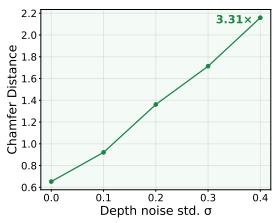

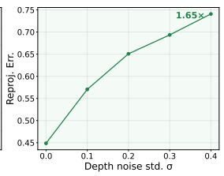

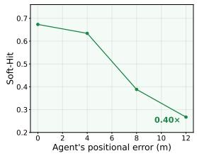

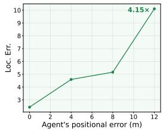  
Figure 5: Sensitivity analysis of CoDrive-Bench consistency metrics under controlled pertur bations. We progressively perturb the depth estimates and participating-agent position starting from the unperturbed reference setting. Increasing depth noise monotonically increases CD and RE, while increasing agent-position perturbation decreases Soft Hit Rate and increases LE. The annotations report the relative change between the largest perturbation and the unperturbed setting.

Selection effect of instance metrics. LE is explicitly conditioned on successful rendering and detection, whereas Hit measures persistence and visibility. The scored observation set is constructed from transparent, pose-based criteria that apply identically to all methods, ensuring a fair and exactly paired comparison. Table 5 separates observations that no camera could resolve from the two conditions that reflect deliberate design choices, and reports the latter as a share of the geometrically visible set. Observations where the target lies behind the observer or subtends too few pixels are excluded regardless of generation quality, because no camera could physically capture them. Of the geometrically visible observations that remain, 52.7% on CARLA and 64.2% on real data survive the two deliberate exclusion criteria and are scored, yielding several thousand observations per domain. Since every condition is a function solely of the ground-truth poses and never of the generated pixels, the same observations are scored for every method and for the recorded videos. No method can be advantaged by the gating, and the comparison is exactly paired.

## B.2 SENSITIVITY ANALYSIS OF CONSISTENCY METRICS

## B.2.1 METRIC RESULTS VARIATION UNDER CONTROLLED PERTURBATION

To examine whether the proposed consistency metrics respond to their intended failure modes, we conduct controlled perturbation experiments starting from the unperturbed reference video. For scene consistency, we progressively inject Gaussian noise with standard deviation σ into the depth maps and evaluate the resulting changes in CD and RE. For instance consistency, we introduce increasing positional perturbations to the participating agent and measure the corresponding changes in Hit and LE.

As shown in Figure 5, all four metrics change monotonically with perturbation strength. Increasing the depth-noise standard deviation from 0 to 0.4 increases CD from approximately 0.65 to 2.15 (3.31×) and RE from 0.45 to 0.74 (1.65×). Similarly, increasing the agent position perturbation from 0 to 12m reduces Soft Hit Rate from approximately 0.67 to 0.27, while increasing LE from 2.4m to

Table 6: Robustness of CoDrive-Bench metrics to evaluator choice. We compare model rankings obtained using alternative depth estimators for CD and RE, and alternative multi-object trackers for Hit and LE. Spearman’s $\rho$ is computed across all evaluated methods. Rankings remain highly consistent across evaluator variants, and CoDrive retains the top rank in all cases.
<table><tr><td>Metric</td><td>Evaluator Variants</td><td>Spearman  $\rho$ </td><td>CoDrive Rank</td></tr><tr><td>CD</td><td>UniDepth vs. VideoDepthAnything</td><td>1.00</td><td>#1</td></tr><tr><td>RE</td><td>UniDepth vs. VideoDepthAnything</td><td>0.94</td><td>#1</td></tr><tr><td>Hit</td><td>ByteTrack vs. BoT-SORT</td><td>1.00</td><td>#1</td></tr><tr><td>LE</td><td>ByteTrack vs. BoT-SORT</td><td>1.00</td><td>#1</td></tr></table>

10.1m. These monotonic trends provide a sanity check that the proposed metrics respond predictably to controlled violations of scene- and instance-level consistency.

## B.2.2 METRIC ROBUSTNESS TO EVALUATOR CHOICE

Since our consistency metrics rely on off-the-shelf perception components, we further examine whether the resulting model rankings are sensitive to the choice of evaluator. Specifically, we replace UniDepth (Piccinelli et al., 2025) with VideoDepthAnything (Chen et al., 2025b) for the scene-consistency metrics and ByteTrack (Zhang et al., 2022) with BoT-SORT (Aharon et al., 2022) for the instance-consistency metrics. As shown in Table 6, the rankings remain highly stable across evaluator variants, with Spearman rank correlations of 1.00 for CD, 0.94 for RE, and 1.00 for both Hit and LE. Importantly, CoDrive remains ranked first under all evaluator configurations. These results suggest that the conclusions drawn from our benchmark are robust to reasonable changes in the underlying evaluation pipeline.

## C DETAILED QUANTITATIVE RESULTS

The results reported in the main text are aggregated across both the synthetic and real splits of the benchmark. Here, we present the individual results for each split separately. As shown in Tables 7 and 8, CoDrive achieves leading performance on both the real and synthetic sets.

Table 7: Quantitative comparison of video generation methods on real-world data.
<table><tr><td></td><td></td><td colspan="2">Controllability</td><td colspan="2">Scene Consistency</td><td colspan="2">Instance Consistency</td></tr><tr><td>Method</td><td>FVD↓</td><td>ADE↓</td><td>DTW↓</td><td>CD↓</td><td>RE↓</td><td>Hit ↑</td><td>LE↓</td></tr><tr><td>HunyuanVideo-1.5</td><td>882.3</td><td>11.20</td><td>599</td><td>2.04</td><td>0.53</td><td>0.527</td><td>8.87</td></tr><tr><td>Wan2.2-I2V</td><td>850.5</td><td>27.13</td><td>1524</td><td>1.81</td><td>0.62</td><td>0.470</td><td>8.82</td></tr><tr><td>Cosmos3-Nano</td><td>106.4</td><td>2.60</td><td>117</td><td>3.40</td><td>1.33</td><td>0.632</td><td>6.71</td></tr><tr><td>MagicDrive-V2</td><td>2277.0</td><td>5.29</td><td>270</td><td>13.19</td><td>1.42</td><td>0.013</td><td>6.43</td></tr><tr><td>ShareVerse</td><td>416.6</td><td>19.65</td><td>544</td><td>3.76</td><td>1.01</td><td>0.290</td><td>7.29</td></tr><tr><td>CoDrive</td><td>104.3</td><td>1.53</td><td>61</td><td>1.57</td><td>0.45</td><td>0.646</td><td>5.99</td></tr></table>

Table 8: Quantitative comparison of video generation methods on synthetic data.
<table><tr><td></td><td></td><td colspan="2">Controllability</td><td colspan="2">Scene Consistency</td><td colspan="2">Instance Consistency</td></tr><tr><td>Method</td><td>FVD↓</td><td>ADE↓</td><td>DTW↓</td><td>CD↓</td><td>RE↓</td><td>Hit ↑</td><td>LE↓</td></tr><tr><td>HunyuanVideo-1.5</td><td>1676.8</td><td>12.71</td><td>548</td><td>2.11</td><td>0.69</td><td>0.118</td><td>12.97</td></tr><tr><td>Wan2.2-I2V</td><td>283.0</td><td>18.77</td><td>855</td><td>1.82</td><td>0.66</td><td>0.134</td><td>13.49</td></tr><tr><td>Cosmos3-Nano</td><td>205.8</td><td>8.78</td><td>366</td><td>3.85</td><td>1.22</td><td>0.115</td><td>12.96</td></tr><tr><td>MagicDrive-V2</td><td>3468.9</td><td>16.1</td><td>822</td><td>25.86</td><td>1.13</td><td>0.001</td><td>19.57</td></tr><tr><td>ShareVerse</td><td>240.0</td><td>10.86</td><td>254</td><td>4.66</td><td>1.20</td><td>0.027</td><td>11.51</td></tr><tr><td>CoDrive</td><td>192.3</td><td>4.56</td><td>170</td><td>1.71</td><td>0.58</td><td>0.317</td><td>5.64</td></tr></table>

## D MORE QUALITATIVE RESULTS

Figure 6 presents additional qualitative examples with diverse relative vehicle trajectories. Each row shows the commanded top-down trajectories together with selected frames from the corresponding observations of Agents A and B, illustrating cross-agent scene and instance consistency over time.

## E LIMITATIONS

Our work still has several limitations: (1) Due to the scarcity and collection cost of synchronized real-world multi-vehicle data, cross-agent supervision in CoDrive currently comes from simulation. Although mixed-task fine-tuning improves performance on real-world scenarios, incorporating real world cross-agent supervision remains important for reducing the simulation-to-real gap. (2) PRoPE introduces an additional attention branch for geometric conditioning, increasing the computational cost of each transformer block in which it is applied. (3) Although our formulation is written for N vehicles, the current implementation and evaluation focus on two-vehicle interactions. Scaling joint generation and global attention to larger numbers of interacting vehicles remains an important direction for future work.

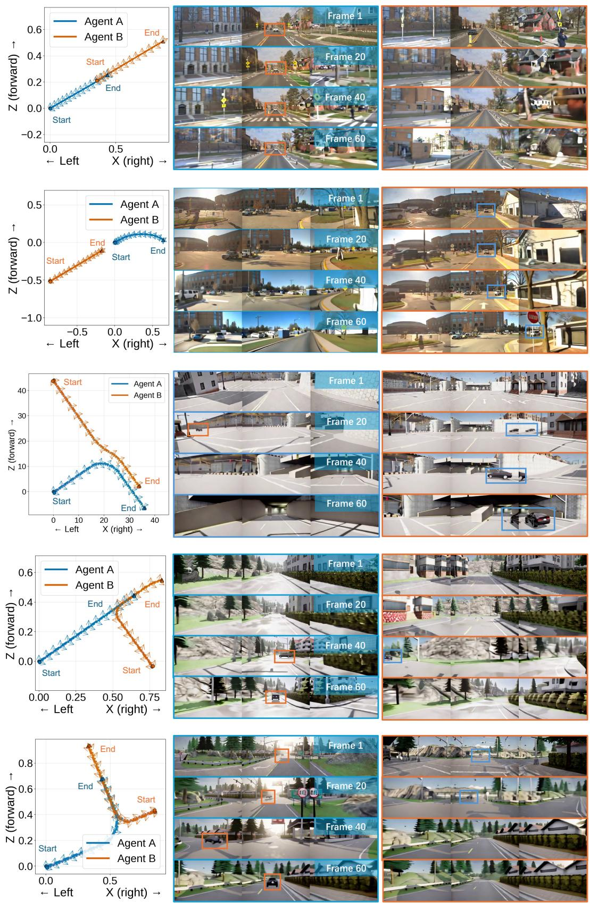

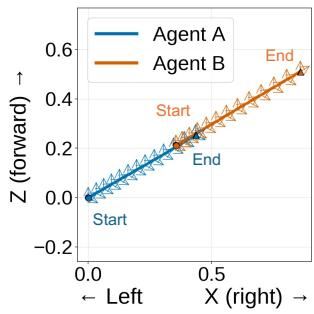

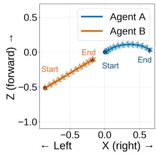

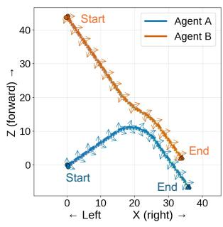

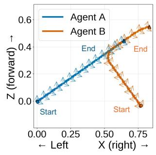

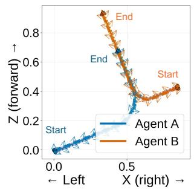  
Figure 6: Additional qualitative results. Each row shows the relative trajectories of Agents A and B together with selected generated frames from both agents.