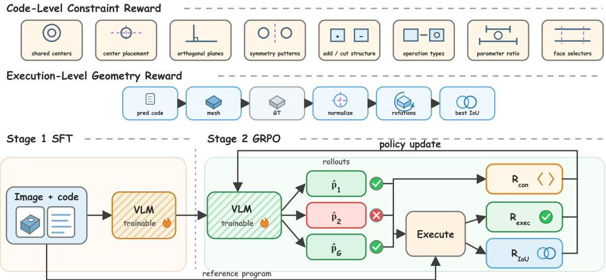
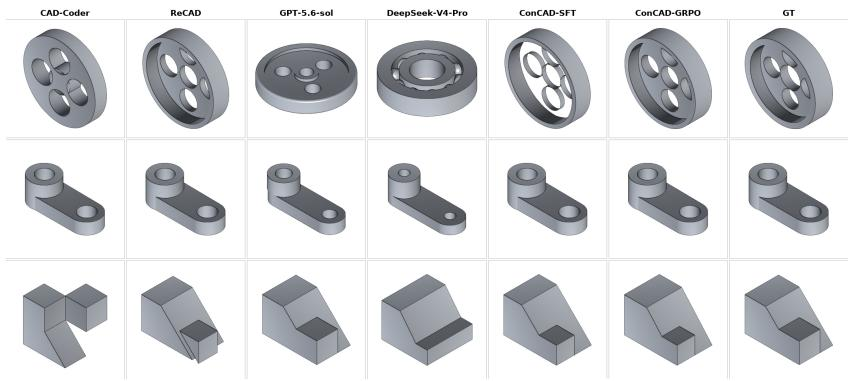

# CONCAD: CONSTRAINT-AWARE IMAGE-TO-CAD GENERATION WITHDUAL-GRANULARITY REWARDS

Chenxi Zhai Mingyu Fan

Xi Cheng Yanzhe Tang

Hang Cheng Pingfa Feng

Zhicheng Guan Long Zeng∗

Tsinghua University, Shenzhen International Graduate School

## ABSTRACT

Image-to-CAD generation seeks executable parametric programs that recover both the geometry and design intent of a reference object. Existing systems are commonly evaluated by validity and shape overlap, although two solids with similar volume can encode different CAD relations. We introduce ConCAD, a constraint-aware image-to-CAD framework optimized via Group Relative Policy Optimization (GRPO) with rewards at two complementary granularities: a code-level constraint reward and an execution-level geometric reward. This complementary design disambiguates structurally distinct yet volumetrically similar shapes while ensuring valid 3D geometry. To verify that these rewards recover geometry and design intent, we introduce a B-rep geometric constraint satisfaction rate (G-CSR), which analytically extracts and evaluates geometric constraints from boundary representations. Experiments on the DeepCAD and Zero2CAD demonstrate that ConCAD achieves the best IoU and Chamfer Distance over competitive baselines, while also outperforming them on G-CSR, validating its superior recovery of both geometric fidelity and parametric design intent.

Index Terms— Image-to-CAD, Geometric constraints, Vision-Language Models, Reinforcement learning.

## 1. INTRODUCTION

Reconstructing parametric CAD programs from images underpins key applications in reverse engineering [1], editable asset creation [2], and mechanical design automation. Recent vision-language models (VLMs) translate rendered parts directly into CAD programs [3, 4, 5, 6, 7, 8], bypassing task-specific decoders while inheriting rich program priors. Nevertheless, existing systems are predominantly evaluated by execution validity, Chamfer Distance (CD) [9], and volumetric Intersection-over-Union (IoU) [10]. While these metrics indicate whether solids look alike, they fail to assess whether the generated design preserves the underlying relations that make CAD models structured and editable.

Design intent is intrinsically expressed through geometric constraints such as coaxiality, symmetry, and concentricity. Crucially, such relations are easily violated even when global IoU remains high. Evaluating intent purely through source-code text similarity is inadequate, as geometrically identical solids can stem from vastly different scripts. Nonetheless, extracting structural relations directly from code offers distinct advantages during learning: it delivers dense feedback on partially correct or non-executable programs by capturing syntactic cues and operational structures before the policy reliably yields valid boundary representations.

We therefore decouple policy optimization from intent verification and propose ConCAD. Trained via GRPO [11], ConCAD incorporates dual-granularity supervision coupling the code-level constraint reward $( R _ { \mathrm { c o n } } )$ with the execution-level geometry reward $( R _ { \mathrm { i o u } } )$ . Specifically, the code-level constraint reward $( R _ { \mathrm { c o n } } )$ provides dense structural feedback prior to kernel execution, while the execution-level geometry reward $\left( R _ { \mathrm { i o u } } \right)$ enforces spatial fidelity through inertia-normalized volumetric overlap. For rigorous evaluation, we introduce the B-rep Geometric Constraint Satisfaction Rate (G-CSR) to analytically quantify topological relations directly on solid boundaries. Our contributions are threefold:

• We formulate image-to-CAD synthesis as constraint-aware parametric program generation, presenting the ConCAD framework that optimizes policy training via GRPO to align editable programs with visual inputs.

• We propose a dual-granularity reward scheme integrating the code-level constraint reward with the execution-level geometry reward, simultaneously enforcing topological constraint consistency and 3D spatial fidelity.

• We introduce G-CSR to quantify relational design constraints directly on B-rep topology, and demonstrate across the Deep-CAD and Zero2CAD datasets that ConCAD achieves stateof-the-art geometric fidelity and topological constraint preservation.

## 2. RELATED WORK

Parametric CAD generation. Early CAD generation approaches represent the modeling process as structured command sequences. DeepCAD [12] encodes and decodes CAD sequence tokens via dedicated autoregressive networks. Text2CAD [13], CAD-recode [14], CAD-Diffuser [15], Img2CAD [16], and CADCrafter [17] introduce text, point cloud, or image conditioning, employing autoregressive models, diffusion frameworks, or conditional factorizations to bolster cross-modal synthesis. More recent approaches shift toward executable code generation, leveraging the rich programming priors of vision-language models (VLMs) to produce editable scripts, as exemplified by CAD-Coder [3] and Zero2CAD [18]. While framing CAD synthesis as code generation inherits powerful priors, standard supervised training inherently relies on surface-level token imitation, struggling to capture parametric dependencies and underlying geometric constraints.

Reinforcement learning for CAD. To enhance code executability and spatial reasoning, recent efforts incorporate reinforcement learning (RL) into CAD program generation. Cadrille [19] introduces an online reinforcement learning strategy to interactively refine program synthesis. CADCoder [5]combines CoT prompting with RL fine-tuning. ReCAD [20] optimizes generation policy by coupling aligned volumetric IoU with rendered visual feature similarity as rewards. Despite their effectiveness, these methods rely predominantly on execution-level geometric surrogates or rendered visual cues, leaving the optimization process agnostic to whether underlying parametric design relations are faithfully satisfied.

## 3. METHOD

## 3.1. Problem Formulation

Given a single rendered image $I ,$ our goal is to synthesize an executable CadQuery program $\hat { p } \sim \pi _ { \boldsymbol { \theta } } ( \cdot \ \vert \ I )$ that instantiates an editable 3D solid $\hat { \Omega } = \mathcal { E } ( \hat { p } )$ through a CAD modeling kernel $\varepsilon .$ Let $p ^ { * }$ denote the ground-truth program and $\Omega ^ { * } = \mathcal { E } ( p ^ { * } )$ its reference boundary representation (B-rep). While standard supervised fine-tuning (SFT) optimizes policy πθ via next-token prediction, it struggles to capture structural design intent and execution robustness. We therefore formulate image-to-CAD generation as a reinforcement learning problem, seeking to maximize the expected reward over rollouts:

$$
\operatorname* { m a x } _ { \theta } \mathbf { E } _ { I \sim \mathcal { D } , \hat { p } \sim \pi _ { \theta } ( \cdot | I ) } [ R ( I , \hat { p } , p ^ { * } ) ] .\tag{1}
$$

The overall training pipeline of ConCAD with dual-granularity rewards is illustrated in Fig. 1.

## 3.2. Policy Optimization via GRPO

We initialize $\pi \theta$ via supervised fine-tuning on paired data, setting $\pi _ { \mathrm { r e f } } ~ = ~ \pi _ { \theta }$ . In the RL stage, Group Relative Policy Optimization (GRPO) [11] optimizes πθ without a critic network. For each input image I, the policy samples rollouts $\{ \hat { p } _ { i } \} _ { i = 1 } ^ { G } \sim \pi _ { \theta } ( \cdot \mid I )$ , each scored by:

$$
R _ { i } = \lambda _ { \mathrm { e } } R _ { \mathrm { e x e c } , i } + \lambda _ { \mathrm { c } } R _ { \mathrm { c o n } , i } + \lambda _ { \mathrm { i } } R _ { \mathrm { i o u } , i } ,\tag{2}
$$

with balancing weights empirically set to $( 0 . 1 , 0 . 3 , 1 . 0 )$ . Withingroup advantages are standardized as $A _ { i } = ( R _ { i } - \mu _ { R } ) / ( \sigma _ { R } + \epsilon )$ where $\mu _ { R }$ and $\sigma _ { R }$ denote the group statistics. The policy is optimized via the clipped surrogate objective with a KL penalty:

$$
\mathcal { L } ( \theta ) = - \frac { 1 } { G } \sum _ { i = 1 } ^ { G } \mathcal { L } _ { \mathrm { c l i p } } ( \hat { p } _ { i } , A _ { i } ; \theta ) + \beta D _ { \mathrm { K L } } ( \pi _ { \theta } \parallel \pi _ { \mathrm { r e f } } ) ,\tag{3}
$$

where $\mathcal { L } _ { \mathrm { c l i p } }$ denotes the standard PPO clipping term. This relative ranking assigns differential advantages to unexecutable rollouts preserving valid parametric patterns, mitigating exploration plateaus caused by sparse geometric feedback.

## 3.3. Dual-Granularity Reward Formulation

Relying on a naive execution signal easily induces reward hacking, driving the policy toward trivial, easily executable primitives (e.g., degenerating into a simple cube); conversely, without the grounding of execution, optimizing code-level rewards in isolation tends to produce syntactically dense yet unexecutable scripts. We therefore design a dual-granularity reward scheme, where the execution validity gate serves as a foundational baseline, while code-level constraints and execution-level geometric signals provide complementary guidance.

Foundational Execution Validity Gate $\left( R _ { \mathbf { e x e c } } \right) .$ . Because generated code may harbor syntax errors, infinite loops, or topological anomalies, all candidate programs are executed within isolated subprocesses guarded by strict timeouts. The CAD executor $\mathcal { E }$ parses the program, constructs the underlying OpenCASCADE topology, and exports a triangle mesh. We assess program viability via a gating signal $R _ { \mathrm { { e x e c } } } \in \{ 0 , 1 \}$

$$
R _ { \mathrm { e x e c } } = \mathbf { 1 } \left[ { \mathcal { E } } ( { \hat { p } } ) { \mathrm { s u c c e e d s } } \ \wedge \ \mathrm { V o l } ( { \hat { \Omega } } ) > 0 \right] .\tag{4}
$$

If execution crashes, times out, or produces a degenerate solid, $R _ { \mathrm { e x e c } } = 0$

Granularity 1: Code-Level Constraint Reward $( R _ { \mathrm { c o n } } )$ . A rulebased pattern matcher inspects the syntactic patterns and operational structures of $\hat { p }$ against $p ^ { * }$ via regular expressions without CAD kernel execution. The matcher summarizes design intent across an eight-relation engineering constraint set $\kappa _ { \mathrm { c o d e } }$ , including geometric datums and positional constraints, modeling features and operation distributions, numerical parameters and proportions, as well as mirror and pattern configurations. For each constraint category $k \in \mathcal { K } _ { \mathrm { c o d e } } .$ , let $n _ { k } ^ { * }$ denote the number of ground-truth relations in $p ^ { * }$ , and $s _ { k }$ the number of satisfied relations matched in ${ \hat { p } } .$ The code-level constraint reward is computed as the average ratio:

$$
R _ { \mathrm { c o n } } = \frac { \sum _ { k \in { \mathcal K } _ { \mathrm { c o d e } } } s _ { k } } { \sum _ { k \in { \mathcal K } _ { \mathrm { c o d e } } } n _ { k } ^ { * } } .\tag{5}
$$

This reward provides effective feedback for generated programs possessing valid structural patterns.

Granularity 2: Execution-Level Geometric Reward $\left( R _ { \mathrm { i o u } } \right)$ . When $R _ { \mathrm { e x e c } } = 1$ , we evaluate the physical geometric agreement between Ωˆ and $\Omega ^ { * }$ . To resolve scale ambiguity in single-view images as well as coordinate frame variations arising from different CadQuery modeling workflows, each solid is first centered and normalized by its inertia-derived characteristic radius:

$$
n ( \Omega ) = \left\{ \frac { \mathbf { x } - \bar { \mathbf { x } } } { \sqrt { \mathrm { t r } ( \mathbf { I } ) / ( 2 \mathrm { V o l } ( \Omega ) ) } } : \mathbf { x } \in \Omega \right\} ,\tag{6}
$$

where x¯ is the center of mass and I is the moment-of-inertia tensor. To resolve sign ambiguities in principal axes, let $U _ { \hat { \Omega } }$ and $U _ { \Omega ^ { * } }$ denote the principal-inertia eigenbases of the predicted and reference solids, respectively. We compute candidate alignment rotations using the four proper sign-flip matrices:

$$
\begin{array} { r } { Q _ { s } = U _ { \Omega ^ { * } } S _ { s } U _ { \hat { \Omega } } ^ { \top } , \quad S _ { s } = \mathrm { d i a g } ( \pmb { \sigma } _ { s } ) , \quad } \\ { \mathrm { s . t . } \quad \pmb { \sigma } _ { s } \in \{ \pm 1 \} ^ { 3 } , \mathrm { d e t } S _ { s } = 1 , s \in \{ 1 , 2 , 3 , 4 \} . } \end{array}\tag{7}
$$

The continuous geometric alignment reward $R _ { \mathrm { i o u } }$ is defined as the maximum volumetric intersection-over-union across identity and the sign-flip rotations $\mathcal { Q } = \{ I \} \cup \{ Q _ { s } \} _ { s = 1 } ^ { 4 } \colon$

$$
R _ { \mathrm { i o u } } = \operatorname* { m a x } _ { Q \in \mathcal { Q } } \mathrm { I o U } \left( n ( \Omega ^ { * } ) , Q \cdot n ( \hat { \Omega } ) \right) .\tag{8}
$$

In practice, volumetric IoU is estimated via Monte Carlo sampling with 8,192 points in the joint bounding container. When $R _ { \mathrm { e x e c } } = 0 _ { \mathrm { \cdot } }$ we set $R _ { \mathrm { i o u } } = 0$

## 3.4. Evaluation Metric: G-CSR

To evaluate the capability of generative models in recovering underlying parametric design intent, we establish the Boundary Representation (B-rep) Geometric Constraint Satisfaction Rate (G-CSR), which is specifically tailored to inspect authentic relational geometric constraints between solid entities (e.g., coaxiality, concentricity, tangency, parallelism, perpendicularity, and symmetry).

Constraint-aware Image-to-CAD  
  
Fig. 1. Overview of the ConCAD training pipeline. Following supervised initialization, the policy samples G candidate programs from an input image and is optimized via Group Relative Policy Optimization (GRPO), combining the pre-execution code-level constraint reward $R _ { \mathrm { c o n } }$ with the execution-level geometry reward $R _ { \mathrm { i o u } }$ computed via inertia-aligned volumetric overlap on valid solids. This complementary formulation ensures both parametric design intent and 3D spatial fidelity.

After normalizing scales and aligning orientations via $\mathcal { Q } ,$ greedy bipartite matching pairs predicted and reference B-rep primitives under predefined tolerances to verify topological relations.Let K denote the set of active constraint categories; for category $k \in \mathcal { K }$ , with $n _ { k } ^ { * }$ reference constraints and $s _ { k }$ satisfied constraints, G-CSR is formulated as the macro-averaged satisfaction rate:

$$
\mathrm { G - C S R } = \frac { 1 } { | \mathcal { K } | } \sum _ { k \in \mathcal { K } } \frac { s _ { k } } { n _ { k } ^ { * } } .\tag{9}
$$

This metric quantifies the parametric topological consistency of 3D solids, effectively compensating for the limitation of superficial geometric metrics in capturing engineering design logic.

## 4. EXPERIMENTS

## 4.1. Experimental Setup

Datasets. We evaluate on two CAD datasets: DeepCAD [12] and Zero2CAD [18]. For DeepCAD, we adopt the dataset processed by CAD-Coder [3], comprising 147k training instances and the official test split. For Zero2CAD, we use the Zero2CAD-100K dataset for training and validation, restricting inputs strictly to a single-view setting for fair alignment.

Evaluation Protocol. To ensure strict comparability, our evaluation adheres to the benchmark protocol established by CAD-Coder [3], reporting four complementary metrics: Invalidity Ratio (IR, percentage of unexecutable or empty outputs), IoU (computed via exact boolean intersection of solids normalized and aligned via principal inertia axes under proper sign-flips), Chamfer Distance (CD), and G-CSR measuring topological constraint satisfaction on successfully executed solids.

Implementation Details. We adopt Qwen3-VL-2B-Instruct[21] as our common backbone and train all models on a single NVIDIA

A800-80GB GPU. We first perform SFT for one epoch over the full dataset with an effective batch size of 8 and an initial learning rate of $1 0 ^ { - 5 }$ to yield the reference policy $\pi _ { \mathrm { r e f } } .$ . GRPO fine-tuning is scheduled for 800 updates with $G = 4$ rollouts per prompt, a sampling temperature of 0.8. On DeepCAD, GRPO samples from a constraintrich subset filtered to prevent reward saturation on trivial primitives. Both SFT and GRPO stages are optimized using AdamW paired with a cosine annealing learning rate schedule.

## 4.2. Main Results

We compare ConCAD against both general foundation models and CAD-specialized baselines. During inference, all models are evaluated on a single NVIDIA H20-96GB GPU with a maximum generation limit of 4096 tokens and a sampling temperature of $T = 0 . 3$

Table 1 presents the evaluation results on the DeepCAD test set. Domain specialization proves decisive across all metrics. Without specialized training, the open-source vanilla Qwen3-VL-2B[21] struggles with domain-specific grammar, yielding a prohibitive invalidity ratio of 98%. Meanwhile, although proprietary general models such as GPT-5.6-Sol[22] and DeepSeek-V4-Pro[23] produce mostly executable code, they lack strict parametric and geometric grounding, lagging significantly behind specialized methods in both IoU and G-CSR. In contrast, CAD-specialized architectures reliably capture CadQuery syntax while accurately preserving underlying design intent.

Compared to the supervised SFT initialization, ConCAD achieves comprehensive improvements across all primary geometric metrics, boosting IoU from 0.717 to 0.734, lowering Chamfer Distance to 0.009, and completely eliminating execution failures with an IR of 0%. On the G-CSR metric, it also reaches the best performance at 0.913. Because this metric is not used as an optimization reward during reinforcement learning and evaluates the intrinsic B-rep topological constraints of the resulting solids, this confirms that our policy captures deep parametric design intent rather than merely fitting surface-level syntax. Relative to ReCAD, which relies on rendered image similarity, our dual-granularity reinforcement learning approach achieves superior solid fidelity and higher topological constraint satisfaction. This demonstrates that dense code-level proxy signals effectively guide policy exploration toward solid models that satisfy rigorous engineering standards. Figure 2 illustrates qualitative reconstructions across representative geometric structures.

  
Fig. 2. Reconstruction examples produced by different methods on the DeepCAD test set.

Table 1. Results on the DeepCAD test set, evaluated using the identical test split as CAD-Coder [3].
<table><tr><td>Method</td><td>IR↓</td><td>IoU↑</td><td>CD↓</td><td>G-CSR↑</td></tr><tr><td>GPT-5.6-Sol[22]</td><td>2</td><td>0.599</td><td>0.016</td><td>0.879</td></tr><tr><td>DeepSeek-V4-Pro[23]</td><td>4</td><td>0.466</td><td>0.027</td><td>0.798</td></tr><tr><td>Qwen3-VL-2B[21]</td><td>98</td><td>0.160</td><td>0.106</td><td>0.850</td></tr><tr><td>CAD-Coder [3]</td><td>2</td><td>0.662</td><td>0.022</td><td>0.837</td></tr><tr><td>ReCAD [20]</td><td>2</td><td>0.723</td><td>0.011</td><td>0.906</td></tr><tr><td>Ours: SFT</td><td>1</td><td>0.717</td><td>0.011</td><td>0.903</td></tr><tr><td>Ours: ConCAD</td><td>0</td><td>0.734</td><td>0.009</td><td>0.913</td></tr></table>

Table 2. Results on the Zero2CAD test set.
<table><tr><td>Method</td><td>IR↓</td><td>IoU↑</td><td>CD↓</td><td>G-CSR↑</td></tr><tr><td>Zero2CAD [18]</td><td>40</td><td>0.357</td><td>0.198</td><td>0.535</td></tr><tr><td>Ours: SFT</td><td>23</td><td>0.443</td><td>0.016</td><td>0.768</td></tr><tr><td>Ours: ConCAD</td><td>23</td><td>0.507</td><td>0.013</td><td>0.781</td></tr></table>

Table 2 reports performance on the Zero2CAD-100K test set, where we evaluate on a test subset using only single-view inputs. On this benchmark, starting from the supervised SFT checkpoint, our proposed dual-granularity reinforcement learning method brings marked gains. ConCAD elevates volumetric IoU from 0.443 to 0.507, reduces Chamfer Distance to 0.013, and improves the topological constraint score G-CSR to 0.781. These results demonstrate that our approach also achieves compelling performance on more challenging Image-to-CAD tasks.

## 4.3. Ablation Study

To thoroughly investigate the contributions of individual components in ConCAD, we conduct controlled ablation experiments on the DeepCAD test set. All ablations share the identical supervised SFT initialization, curriculum filtering, rollout configuration, optimizer hyperparameters, and training budget.

Table 3 decouples the individual terms in the reward function. Applying executable volume overlap alone via $R _ { \mathrm { e x e c } } + R _ { \mathrm { i o u } }$ leads to a slight performance drop compared to the SFT baseline, reflecting the sparsity of 3D spatial boolean feedback. Relying exclusively on code-level constraints via $R _ { \mathrm { e x e c } } + R _ { \mathrm { c o n } }$ preserves topological relations well but lacks continuous spatial grounding, causing IoU to drop to 0.654. Notably, directly employing the B-rep G-CSR metric as an online reward, denoted as $R _ { \mathrm { G C S R } } .$ , in the formulation $R _ { \mathrm { e x e c } } + R _ { \mathrm { G C S R } } + R _ { \mathrm { i o u } }$ reaches an IoU of only 0.702. Because G-CSR evaluation is strictly gated by solid reconstruction, execution errors cut off structural signals, disrupting informative credit assignment. In contrast, our full formulation combining the codelevel constraint reward $R _ { \mathrm { c o n } }$ with volumetric IoU achieves the best overall performance with 0.734 IoU and 0.913 G-CSR, proving that code-level constraints serve as an effective execution-free prior.

Table 3. Reward-component ablation on the DeepCAD test set.
<table><tr><td>Reward Formulation</td><td>IR↓</td><td>IoU↑</td><td>CD↓</td><td>G-CSR↑</td></tr><tr><td>SFT</td><td>1</td><td>0.717</td><td>0.011</td><td>0.903</td></tr><tr><td> $R _ { \mathrm { e x e c } } + R _ { \mathrm { i o u } }$ </td><td>1</td><td>0.700</td><td>0.013</td><td>0.897</td></tr><tr><td> $R _ { \mathrm { e x e c } } + R _ { \mathrm { c o n } }$ </td><td>1</td><td>0.654</td><td>0.010</td><td>0.908</td></tr><tr><td> $R \mathrm { e x e c } + R \mathrm { G C S R } + R \mathrm { i o u }$ </td><td>2</td><td>0.702</td><td>0.009</td><td>0.910</td></tr><tr><td> $\underbrace { R _ { \mathrm { e x e c } } + R _ { \mathrm { c o n } } + R _ { \mathrm { i o u } } } _ { \mathrm { ~ } }$ </td><td>0</td><td>0.734</td><td>0.009</td><td>0.913</td></tr></table>

Table 4. Code-level constraint reward coefficient ablation on the DeepCAD test set. Setting ${ \lambda } _ { c } = 0$ corresponds to the overlap-only formulation.
<table><tr><td> $\overline { { \lambda _ { c } } }$ </td><td>IR↓</td><td>IoU↑</td><td>CD↓</td><td>G-CSR↑</td></tr><tr><td>0.0</td><td>1</td><td>0.700</td><td>0.013</td><td>0.897</td></tr><tr><td>0.1</td><td>3</td><td>0.705</td><td>0.011</td><td>0.919</td></tr><tr><td>0.3</td><td>0</td><td>0.734</td><td>0.009</td><td>0.913</td></tr><tr><td>0.5</td><td>2</td><td>0.721</td><td>0.009</td><td>0.899</td></tr></table>

Table 4 studies the sensitivity of the code-level constraint reward weighting coefficient $\lambda _ { c } .$ Balancing the reward at $\lambda _ { c } = 0 . 3$ establishes an optimal synergy between code-level guidance and spatial volume alignment, yielding the lowest IR, highest IoU, and robust topological fidelity. Increasing the coefficient excessively to 0.5 overemphasizes syntactic pattern matching at the expense of global shape accuracy.

## 5. CONCLUSION

In this paper, we presented ConCAD, a constraint-aware framework optimizing editable parametric CAD generation via GRPO. The policy is trained with dual-granularity supervision combining the codelevel constraint reward and the execution-level geometry reward. Furthermore, we introduced G-CSR to rigorously quantify relational design constraints directly on B-rep topology. Evaluations across DeepCAD and Zero2CAD show that ConCAD achieves state-ofthe-art performance in both geometric fidelity and topological constraint preservation, paving the way toward production-ready generative CAD modeling.

## 6. REFERENCES

[1] Tamas V´ arady, Ralph R Martin, and Jordan Cox, “Reverse en-´ gineering of geometric models—an introduction,” Computeraided design, vol. 29, no. 4, pp. 255–268, 1997.

[2] Karl DD Willis, Yewen Pu, Jieliang Luo, Hang Chu, Tao Du, Joseph G Lambourne, Armando Solar-Lezama, and Wojciech Matusik, “Fusion 360 gallery: A dataset and environment for programmatic cad construction from human design sequences,” ACM Transactions on Graphics (TOG), vol. 40, no. 4, pp. 1–24, 2021.

[3] Anna C Doris, Ferdous Alam, Amin Heyrani Nobari, and Faez Ahmed, “Cad-coder: An open-source vision-language model for computer-aided design code generation,” Journal of Mechanical Design, vol. 148, no. 7, pp. 071702, 2026.

[4] Kamel Alrashedy, Pradyumna Tambwekar, Zulfiqar Haider Zaidi, Megan Langwasser, Wei Xu, and Matthew Gombolay, “Generating cad code with vision-language models for 3d designs,” in International Conference on Learning Representations, 2025, vol. 2025, pp. 52236–52262.

[5] Yandong Guan, Xilin Wang, Ximing Xing, Jing Zhang, Dong Xu, and Qian Yu, “Cad-coder: Text-to-cad generation with chain-of-thought and geometric reward,” Advances in Neural Information Processing Systems, vol. 38, pp. 59765–59789, 2026.

[6] Siyu Wang, Cailian Chen, Xinyi Le, Qimin Xu, Lei Xu, Yanzhou Zhang, and Jie Yang, “Cad-gpt: Synthesising cad construction sequence with spatial reasoning-enhanced multimodal llms,” in Proceedings of the AAAI conference on artificial intelligence, 2025, vol. 39, pp. 7880–7888.

[7] Jiahao Li, Weijian Ma, Xueyang Li, Yunzhong Lou, Guichun Zhou, and Xiangdong Zhou, “Cad-llama: Leveraging large language models for computer-aided design parametric 3d model generation,” 2025.

[8] Xueyang Li, Yu Song, Yunzhong Lou, and Xiangdong Zhou, “Cad translator: An effective drive for text to 3d parametric computer-aided design generative modeling,” in Proceedings of the 32nd ACM International Conference on Multimedia, 2024, pp. 8461–8470.

[9] Yaoqing Yang, Chen Feng, Yiru Shen, and Dong Tian, “Foldingnet: Point cloud auto-encoder via deep grid deformation,” in 2018 IEEE/CVF conference on computer vision and pattern recognition. IEEE, 2018, pp. 206–215.

[10] Anna C Doris, Jacob Thomas Sony, Ghadi Nehme, Era Syla, Amin Heyrani Nobari, and Faez Ahmed, “Cadbench: A multimodal benchmark for ai-assisted cad program generation,” arXiv preprint arXiv:2605.10873, 2026.

[11] Zhihong Shao, Peiyi Wang, Qihao Zhu, Runxin Xu, Junxiao Song, Xiao Bi, Haowei Zhang, Mingchuan Zhang, YK Li, Yang Wu, et al., “Deepseekmath: Pushing the limits of mathematical reasoning in open language models,” arXiv preprint arXiv:2402.03300, 2024.

[12] Rundi Wu, Chang Xiao, and Changxi Zheng, “Deepcad: A deep generative network for computer-aided design models,” in 2021 IEEE/CVF International Conference on Computer Vision (ICCV). IEEE, 2021, pp. 6752–6762.

[13] Mohammad S Khan, Sankalp Sinha, Talha U Sheikh, Didier Stricker, Sk A Ali, and Muhammad Z Afzal, “Text2cad: Generating sequential cad designs from beginner-to-expert level

text prompts,” Advances in Neural Information Processing Systems, vol. 37, pp. 7552–7579, 2024.

[14] Danila Rukhovich, Elona Dupont, Dimitrios Mallis, Kseniya Cherenkova, Anis Kacem, and Djamila Aouada, “Cadrecode: Reverse engineering cad code from point clouds,” in 2025 IEEE/CVF International Conference on Computer Vision (ICCV). IEEE, 2025, pp. 9801–9811.

[15] Weijian Ma, Shuaiqi Chen, Yunzhong Lou, Xueyang Li, and Xiangdong Zhou, “Draw step by step: Reconstructing cad construction sequences from point clouds via multimodal diffusion,” in 2024 IEEE/CVF Conference on Computer Vision and Pattern Recognition (CVPR). IEEE, 2024, pp. 27144–27153.

[16] Xingang Li, Yuewan Sun, and Zhenghui Sha, “Image2cadseq: Computer-aided design sequence and knowledge inference from product images,” Journal ofComputing and Information Science in Engineering, vol. 26, no. 6, pp. 061003, 2026.

[17] Cheng Chen, Jiacheng Wei, Tianrun Chen, Chi Zhang, Xiaofeng Yang, Shangzhan Zhang, Bingchen Yang, Chuan-Sheng Foo, Guosheng Lin, Qixing Huang, et al., “Cadcrafter: Generating computer-aided design models from unconstrained images,” in 2025 IEEE/CVF Conference on Computer Vision and Pattern Recognition (CVPR). IEEE, 2025, pp. 11073– 11082.

[18] Mohammadmehdi Ataei, Farzaneh Askari, Kamal Rahimi Malekshan, and Pradeep Kumar Jayaraman, “Zero-to-cad: Agentic synthesis of interpretable cad programs at millionscale without real data,” arXiv preprint arXiv:2604.24479, 2026.

[19] Maksim Kolodiazhnyi, Denis Tarasov, Dmitrii Zhemchuzhnikov, Alexander Nikulin, Ilya Zisman, Anna Vorontsova, Anton Konushin, Vladislav Kurenkov, and Danila Rukhovich, “cadrille: Multi-modal cad reconstruction with reinforcement learning,” arXiv preprint arXiv:2505.22914, 2025.

[20] Jiahao Li, Yusheng Luo, Yunzhong Lou, and Xiangdong Zhou, “Recad: Reinforcement learning enhanced parametric cad model generation with vision-language models,” in Proceedings of the AAAI Conference on Artificial Intelligence, 2026, vol. 40, pp. 6190–6198.

[21] An Yang, Anfeng Li, Baosong Yang, Beichen Zhang, Binyuan Hui, Bo Zheng, Bowen Yu, Chang Gao, Chengen Huang, Chenxu Lv, et al., “Qwen3 technical report,” arXiv preprint arXiv:2505.09388, 2025.

[22] Aaditya Singh, Adam Fry, Adam Perelman, Adam Tart, Adi Ganesh, Ahmed El-Kishky, Aidan McLaughlin, Aiden Low, AJ Ostrow, Akhila Ananthram, et al., “Openai gpt-5 system card,” arXiv preprint arXiv:2601.03267, 2025.

[23] Anyi Xu, Bangcai Lin, Bing Xue, Bingxuan Wang, Bingzheng Xu, Bochao Wu, Bowei Zhang, Chaofan Lin, Chen Dong, Chenchen Ling, et al., “Deepseek-v4: Towards highly efficient million-token context intelligence,” arXiv preprint arXiv:2606.19348, 2026.