# CONTROLTRACE: RECOVERING CONTROL FIELDS FOR HIDDEN-CONTENT RECOGNITION

Zijian Liu1 Yaoguang Chen2 Liwei Liu1 Weixi Wu2

Hanming Zhang2 Jiashui Wang2 Na Ruan1,\*

1Shanghai Jiao Tong University 2Ant Group

Corresponding author: naruan@sjtu.edu.cn

## ABSTRACT

Spatially conditioned diffusion models can embed words and contours in naturallooking images, but vision–language models (VLMs) may fail to recognize the hidden content. Transformation-based recovery depends on parameter and view selection. To evaluate hidden-content recovery and recognition, we construct FreqBlind, a 6,000-image benchmark spanning contours, real words and non-words across three conditioning strengths. The evaluated transformation-based methods show limited recognition of contour patterns and weakly conditioned hidden content. To address this limitation, we propose ControlTrace to recover the grayscale control field used during generation. An 8.4M-parameter U-Net predicts this field from the carrier image, and a VLM then identifies its content. With Qwen2.5-VL-7B-Instruct, ControlTrace achieves 60.2% open-ended contour recognition accuracy across the three conditioning strengths, exceeding the best of the three evaluated prior methods by 26.9 percentage points. On an A100 GPU, the complete pipeline adds only 7.4 ms (5.3%) to direct VLM inference. Recovered fields have lower pixel errors and higher structural similarity than the evaluated transformation views. Across four evaluated VLMs, ControlTrace retains its overall contour recognition advantage. Recognition remains stable under the tested JPEG compression, Gaussian noise and downsampling. These results support control-field recovery for hidden-content recognition in the evaluated setting.

## 1 INTRODUCTION

ControlNet-based diffusion pipelines can embed a rendered word, silhouette or symbol within a natural-looking image (Zhang et al., 2023; Qu et al., 2025). At low conditioning strength, the embedded structure may survive as faint large-scale luminance variations within the generated image, which we call the carrier. Squinting or viewing the carrier from a distance can reveal this structure, yet a vision–language model (VLM), used here as a reader, may fail to identify it. Such images pose a challenge for content inspection, as both hidden text and symbols can evade moderation models (Qu et al., 2025).

Recent methods improve hidden-content recognition by transforming the carrier before VLM recognition. SemVink (Li et al., 2025) downsamples images, SMSP (Tu et al., 2026) combines low-pass views at multiple scales, and the question-answering variant of Adaptive View Retrieval (AVR) (Chen & Soydaner, 2026) queries seven complementary views independently. These strategies rely on choices of resolution, filtering and view construction to suppress background detail while preserving hidden structure.

To evaluate hidden-content recovery and recognition across target types and conditioning strengths, we construct FreqBlind, a benchmark of contour targets and rendered words and non-words. With Qwen2.5-VL-7B-Instruct, our implementations of SemVink, SMSP and AVR seven-view QA achieve 19.43%, 33.33% and 19.37% open-ended contour recognition accuracy, respectively. AVR uses our fixed plurality readout; its 45.10% any-view coverage is a separate diagnostic that counts any correct response among the seven views.

To address this limitation, we propose ControlTrace, which learns to recover the grayscale control field supplied during image generation (Figure 2). This field directly specifies the hidden structure and provides a spatial recovery target without the generated scene texture (Figure 1). We train a U-Net (Ronneberger et al., 2015) on paired carriers and control fields, then pass the recovered field to a VLM for open-ended recognition. This separates structural recovery from semantic interpretation while requiring only the carrier image for recovery at inference.

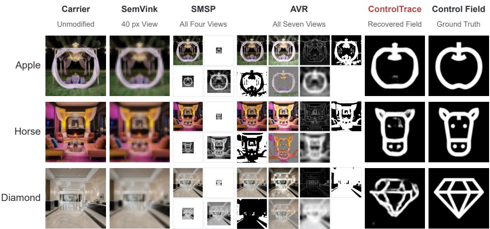  
Figure 1: Qualitative examples on the same carriers. SemVink shows its transformed view; SMSP and AVR show all four and seven views, respectively. ControlTrace predicts the control field, shown alongside the ground truth.

Across the three conditioning strengths, ControlTrace achieves 60.2% open-ended contour accuracy on FreqBlind, exceeding SMSP, the best of the three evaluated prior methods, by 26.9 percentage points and AVR any-view coverage by 15.1 points. The gain over SMSP is largest under weak conditioning. Direct comparisons with the generating control fields show lower pixel errors and higher structural similarity than the evaluated transformed views in both domains. With Qwen2.5- VL-7B-Instruct, ControlTrace requires a single VLM call with a small measured latency increase over direct inference.

Our contributions are as follows:

• We construct FreqBlind, a test dataset for hidden-content recovery containing contour targets and rendered words and non-words across three conditioning strengths.

• We propose ControlTrace, which learns to recover the generator’s grayscale control field from a carrier image. A VLM then recognizes hidden content in the recovered field.

• We evaluate reconstruction quality, recognition, inference efficiency and component ablations, together with generalization across VLM readers and generators and robustness to image perturbations. These experiments show improved contour recognition, especially under weak conditioning, and identify limitations in word recognition and cross-generator transfer.

## 2 RELATED WORK

Hidden-content generation and evaluation. Diffusion models with spatial conditioning can embed text and shapes within natural-looking scenes. Qu et al. (2025) used Stable Diffusion and ControlNet to construct Hateful Illusion and demonstrated failures of moderation models and VLMs on hidden hateful content. HC-Bench (Li et al., 2025) evaluates recognition of hidden text and objects, whereas IlluChar (Tu et al., 2026) examines hidden-character perception across pattern scales. These benchmarks establish hidden-content recognition as a distinct challenge for visual understanding.

Hidden-content recognition. SemVink (Li et al., 2025) downsamples carriers to emphasize global structure, whereas SMSP (Tu et al., 2026) combines low-pass filtering and spatial rescaling to expose patterns at different scales. AVR (Chen & Soydaner, 2026) learns to weight seven complementary views for hidden-message template retrieval. Its open-ended VLM protocol questions these views independently; we evaluate this QA variant, without the template bank or learned retrieval gate. These approaches expose hidden structure through carrier transformations and view construction. Our comparison asks whether learning to recover the underlying control field provides a more effective reconstruction objective.

Learned recovery of visual encodings. NeuralMagicEye (Zou et al., 2020) learns to recover depth encoded by texture disparities in autostereograms. Its watermarking experiments encode character and QR-code patterns as depth, blend the resulting autostereograms with background carrier images, and recover the patterns. This is related to our use of paired synthetic data to train a recovery network. The encoding mechanisms and reconstruction targets differ: NeuralMagicEye decodes depth represented by texture disparities, whereas ControlTrace predicts the grayscale control field from a ControlNet-generated carrier. A VLM then performs open-ended recognition on the recovered field.

## 3 PROBLEM SETTING

Task. A carrier image I is generated from a scene prompt and a grayscale control field c by a textto-image diffusion model with ControlNet. The contours or text encoded in c are hidden within the generated scene. Conditioning strength s controls the field’s influence on generation. Given only I, the task is to identify the hidden content represented by c through an open-ended response, without a candidate list or target template.

Training and inference conditions. For learned recovery, we retain the control fields used to generate the training carriers. Training and FreqBlind share the SD1.5 architecture and QR Code Monster encoder, but use different base checkpoints and sampling budgets (Appendix A.1). At test time, the control field and generation prompt are unavailable. Inference requires only the carrier image and a recognition prompt, with no generator call.

FreqBlind benchmark. We construct FreqBlind with 50 contour targets and 50 word targets. Each target is rendered with 20 scene prompts drawn from a pool of 200, at three conditioning strengths s ∈ {1.0, 1.5, 2.0}, yielding 6,000 carriers. The contour targets are named by English common nouns, excluding proper nouns and landmarks. The word targets comprise 25 real fourletter words and 25 pronounceable non-words of the same length. Word-domain scores therefore combine equal lexical and non-lexical halves.

Carriers use Realistic Vision V5.1, a Stable Diffusion 1.5 checkpoint (Rombach et al., 2022), with QR Code Monster ControlNet. Both domains share ordinary indoor and outdoor scene prompts. Conditioning strength s scales the control branch’s contribution during generation.

## 4 CONTROLTRACE

## 4.1 CONTROL-FIELD RECONSTRUCTION

Transforming a carrier requires balancing scene-texture suppression against retention of hidden structure. We therefore predict the generating control field, which directly specifies the target’s spatial structure. For a given control field, different scene prompts produce different carrier appearances while retaining the same spatial target. Retained carrier–control pairs therefore provide a common supervision signal across these variants, without requiring the recovery network to reproduce scene-dependent textures (Figure 2).

To combine spatial context with boundary detail, ControlTraceNet uses a four-level U-Net with skip connections between corresponding encoder and decoder scales (Ronneberger et al., 2015). The 8.37M-parameter network predicts a grayscale field gˆ and auxiliary edge logits eˆ from shared decoder features (Appendix C).

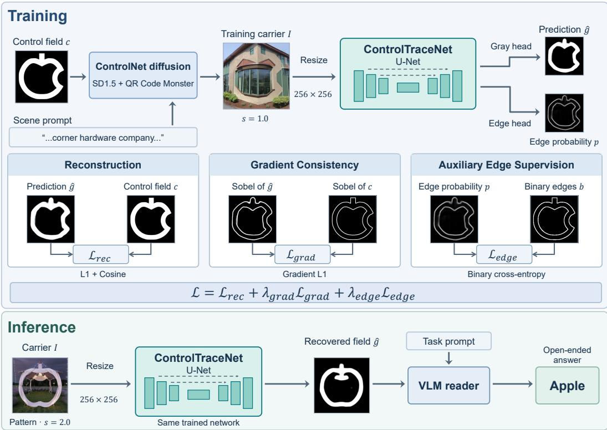  
Figure 2: ControlTrace workflow and training losses. Reconstruction and gradient losses supervise the recovered control field; the auxiliary edge loss is used only during training. At inference, a VLM reads the recovered field with a task prompt.

At inference, a $5 1 2 \times 5 1 2$ carrier is resized to $2 5 6 \times 2 5 6$ for recovery. A VLM reads the grayscale field $\hat { g }$ with the task prompt in Appendix A.2 to produce an open-ended answer; auxiliary edge predictions are discarded.

## 4.2 TRAINING OBJECTIVE

Reconstruction. For target $c \in [ 0 , 1 ] ^ { N }$ and prediction $\hat { g } \in [ 0 , 1 ] ^ { N }$ with $N$ pixels, L1 penalizes absolute grayscale error, while cosine measures normalized alignment across pixels. Fields are flattened, with stabilized norms $d ( x ) = \operatorname* { m a x } \{ \| x \| _ { 2 } , \varepsilon _ { c } \}$

$$
\mathcal { L } _ { \mathrm { r e c } } = \frac { 1 } { N } \sum _ { i = 1 } ^ { N } \left| \hat { g } _ { i } - c _ { i } \right| + 1 - \frac { \hat { g } ^ { \mathsf { T } } c } { d ( \hat { g } ) d ( c ) } ,
$$

The L1 term penalizes absolute intensity differences that cosine alignment alone cannot resolve. The cosine term compares normalized grayscale values at corresponding pixels, adding a field-level alignment signal to the pixelwise penalty.

Gradient consistency. Reconstruction does not explicitly constrain local boundary transitions in the field. We therefore compare Sobel gradient magnitudes $E ( x )$ , clipped to $[ 0 , 1 ]$ , directly on the recovered and target fields:

$$
\mathcal { L } _ { \mathrm { g r a d } } = \frac { 1 } { N } \sum _ { i = 1 } ^ { N } | E ( \hat { g } ) _ { i } - E ( c ) _ { i } | .
$$

Auxiliary edge supervision. The auxiliary head adds edge-location supervision to the shared decoder features. It predicts $p _ { i } = \mathrm { s i g m o i d } ( \hat { e } _ { i } )$ for binary labels $b _ { i } = { \bf 1 } [ E ( \bar { c } ) _ { i } > \tau ]$ ], using

$$
\mathcal { L } _ { \mathrm { e d g e } } = - \frac { 1 } { N } \sum _ { i = 1 } ^ { N } \left[ b _ { i } \log p _ { i } + \left( 1 - b _ { i } \right) \log ( 1 - p _ { i } ) \right] .
$$

Gradient magnitudes do not determine the grayscale field itself, so gradient consistency complements rather than replaces reconstruction. The auxiliary head separately predicts edge locations from shared features; its supervision acts on the decoder representation, while the gradient loss acts directly on the grayscale output. Their weighted combination gives the per-example objective:

$$
\begin{array} { r } { \mathcal { L } = \mathcal { L } _ { \mathrm { r e c } } + \lambda _ { \mathrm { g r a d } } \mathcal { L } _ { \mathrm { g r a d } } + \lambda _ { \mathrm { e d g e } } \mathcal { L } _ { \mathrm { e d g e } } . } \end{array}\tag{1}
$$

Losses are averaged over the batch; Appendix C specifies the Sobel operator and numerical stabilization, including cross-entropy from logits.

## 5 EXPERIMENTS

## 5.1 EXPERIMENTAL SETUP

Evaluation protocol. FreqBlind recognition used Qwen2.5-VL-7B-Instruct (Bai et al., 2025) with 1,000 carriers per domain–strength cell. Our implementations use SemVink’s 40-pixel view (Li et al., 2025), SMSP’s three low-pass views plus the original (Tu et al., 2026), and AVR’s seven independently queried views with fixed plurality voting (Chen & Soydaner, 2026). Separate from single-answer accuracy, any-view coverage measures the reference-scored fraction with at least one correct response. Appendix A.3 specifies AVR parameters and voting.

Training data and optimization. The data pool is built from 2,000 FIGR-8 control images (Clouatre & Demers, 2019) andˆ 750 scene prompts. The reference model uses the 12,000 carrier– control pairs generated at $s = 1 . 0$ . Splitting by source control gives 9,600 training, 1,200 validation and 1,200 internal test pairs, shared across three seeds. We train from scratch for 30 epochs at learning rate $2 \times 1 0 ^ { - 4 }$ , with $\lambda _ { \mathrm { g r a d } } = 0 . 2 5 , \lambda _ { \mathrm { e d g e } } = 0 . 5$ and edge threshold $\tau = 0 . 1 2$ , selecting checkpoints by validation loss. FreqBlind evaluates all three strengths with controls and scene prompts disjoint from training (Appendix C.3).

Perturbation protocol. We evaluate ControlTrace under image perturbations using 300 carriers per domain–strength cell and one checkpoint. Perturbations are applied to the carrier before recovery. A white-box 20-step PGD attack uses the recovery network and true control field to maximize control-field reconstruction error within an $\ell _ { \infty }$ budget on the recovery input grid, without optimizing through the VLM.

Reconstruction metrics. We compare outputs with their paired control fields using mean squared error (MSE), mean absolute error (MAE), and structural similarity (SSIM) (Wang et al., 2004). Evaluation uses grayscale fields on a common 256 × 256 grid in [0, 1]. We average metrics across each method’s views or training seeds before averaging images; Appendix C.1 specifies geometry and aggregation.

Efficiency protocol. We measured latency and token use on 300 FreqBlind carriers spanning all target types and strengths, with two repetitions per method on one A100 80GB GPU. All methods used Qwen2.5-VL-7B-Instruct, batch size one, and greedy decoding capped at 128 tokens; ControlTrace used one checkpoint. After warmup, synchronized timing covered preprocessing through the final answer, excluding model loading and disk I/O. SMSP used one four-image request; AVR used seven serial queries and voting.

Metrics and uncertainty. All methods use lowercase ASCII normalization and target-substring matching or at least 80% token coverage for multi-token targets. Trained methods’ main recognition and fidelity results average three seeds. Main AVR comparisons bootstrap target items 20,000 times, retaining scenes and using trained-model scores averaged per record (Efron et al., 2000). These 95% intervals condition on selected models and configurations and differ from seed standard deviations. Appendices A.2, A.4 and B.2 provide prompts, alternative scoring and HC-Bench protocols.

## 5.2 RECOGNITION PERFORMANCE

Across strengths, ControlTrace achieved 60.21% contour accuracy, versus 19.43% for SemVink, 33.33% for SMSP and 19.37% for AVR plurality (Table 1). The gain over SMSP, the strongest of these baselines, was 26.88 points. Returning one answer, ControlTrace also exceeded AVR any-view coverage (45.10%) by 15.11 points (paired item-bootstrap 95% CI, [9.17, 21.21]).

Table 1: Open-ended recognition on FreqBlind (%), with 1,000 carriers per domain–strength cell. Trained methods average three seeds; † denotes our implementations. AVR QA uses fixed plurality voting; AVR any-view coverage is a reference-scored seven-answer diagnostic. Bold numbers mark the highest single-answer accuracy.
<table><tr><td rowspan="2">Method</td><td colspan="4">Contour ↑</td><td colspan="4">Word ↑</td></tr><tr><td>All</td><td>1.0</td><td>1.5</td><td>2.0</td><td>All</td><td>1.0</td><td>1.5</td><td>2.0</td></tr><tr><td>Carrier, read directly</td><td>6.30</td><td>1.1</td><td>5.5</td><td>12.3</td><td>2.57</td><td>0.1</td><td>0.7</td><td>6.9</td></tr><tr><td>SemVink† (training-free)</td><td>19.43</td><td>2.8</td><td>18.1</td><td>37.4</td><td>53.60</td><td>9.1</td><td>68.8</td><td>82.9</td></tr><tr><td>SMSP† (training-free)</td><td>33.33</td><td>12.7</td><td>40.1</td><td>47.2</td><td>63.37</td><td>17.6</td><td>80.2</td><td>92.3</td></tr><tr><td>AVR seven-view QA†</td><td>19.37</td><td>2.9</td><td>18.5</td><td>36.7</td><td>23.03</td><td>0.6</td><td>17.1</td><td>51.4</td></tr><tr><td>AVR any-view coverage</td><td>45.10</td><td>19.2</td><td>49.6</td><td>66.5</td><td>43.00</td><td>5.8</td><td>44.1</td><td>79.1</td></tr><tr><td>NAFNet (trained, matched)</td><td>56.51</td><td>38.1</td><td>62.8</td><td>68.6</td><td>56.76</td><td>19.3</td><td>70.8</td><td>80.2</td></tr><tr><td>ControlTrace (Ours)</td><td>60.21</td><td>45.4</td><td>65.6</td><td>69.6</td><td>61.62</td><td>28.3</td><td>75.1</td><td>81.5</td></tr></table>

The gain over SMSP peaked at s = 1.0, where ControlTrace achieved 45.4%, versus 12.7% for SMSP and 19.2% AVR coverage. The gap to AVR coverage narrowed to 3.1 points at s = 2.0, with a 95% interval containing zero. Figure 1 contrasts scene-retaining transformed views with recovered outlines.

Sweeping Gaussian blur and downsampling isolated parameter sensitivity from complete pipeline comparisons. Both operations peaked inside the tested grids, consistent with a balance between suppressing scene texture and preserving hidden structure. Their best tested settings still trailed ControlTrace on weak contours (Appendix D).

Word recognition followed a different pattern. The aggregate scores of ControlTrace and SMSP were 61.62% and 63.37%, with an interval for their difference containing zero. Although ControlTrace led at the weakest strength, SMSP reached 92.3% at the strongest, compared with 81.5% for ControlTrace. The principal advantage therefore concerns contour recovery, rather than every target type or conditioning strength.

Lexical effects. To examine lexical effects, we generated 1,500 carriers from exact anagrams of real words, preserving each pair’s letters, font and rendering procedure. Replacing words with anagrams reduced aggregate single-answer accuracy by 34.8 points for SemVink, 23.2 for SMSP, 24.3 for AVR plurality and 31.8 for ControlTrace. AVR any-view coverage decreased by 30.5 points. This supports a lexical contribution to recognition, although the changed spatial arrangement prevents attributing the entire difference to lexical completion. Appendix B.3 presents the paired results and separates them from the benchmark’s unmatched non-words.

## 5.3 RECOVERY QUALITY

We compared method outputs directly with their generating control fields to measure recovery before VLM recognition (Table 2). On contours, ControlTrace achieved an MSE of 0.0327 and SSIM of 0.8312, compared with 0.1172 and 0.1193 for SMSP’s view mean. The paired MSE reduction was 0.0846 (95% item-bootstrap CI, [0.0726, 0.0929]).

ControlTrace had lower MSE and MAE and higher SSIM than the evaluated transformation summaries in both domains. However, SMSP retained higher aggregate word recognition (Table 1), separating field fidelity from semantic recognition. Multi-view fidelity averages characterize the available views rather than the selected answer (Appendix C.1).

With the same U-Net, data and training budget, control-field supervision achieved 45.40% weakcontour accuracy, compared with 13.27% for stronger-conditioning scene supervision. The losses were shared without target-specific retuning (Appendix C.2). Replacing the U-Net with NAFNet (Chen et al., 2022) at matched approximate capacity yielded 56.51% aggregate contour recognition, 3.70 points below the U-Net (95% CI, [2.39, 5.10]). Both backbones exceeded SMSP.

Table 2: Control-field fidelity on FreqBlind (3,000 carriers per domain). Trained methods average three seeds; SMSP and AVR average four and seven view scores per carrier after fixed geometric mapping. Bold marks the best point estimate in each column.
<table><tr><td></td><td colspan="3">Contour</td><td colspan="3">Word</td></tr><tr><td>Method</td><td>MSE↓</td><td>MAE↓</td><td>SSIM↑</td><td>MSE↓</td><td>MAE↓</td><td>SSIM ↑</td></tr><tr><td>Carrier</td><td>0.1049</td><td>0.2732</td><td>0.1259</td><td>0.1210</td><td>0.2966</td><td>0.0621</td></tr><tr><td>SemVink</td><td>0.1038</td><td>0.2859</td><td>0.1276</td><td>0.1168</td><td>0.3042</td><td>0.0631</td></tr><tr><td>SMSP (view mean)</td><td>0.1172</td><td>0.2960</td><td>0.1193</td><td>0.1401</td><td>0.3247</td><td>0.0583</td></tr><tr><td>AVR (view mean)</td><td>0.2579</td><td>0.3832</td><td>0.1710</td><td>0.2678</td><td>0.3935</td><td>0.1346</td></tr><tr><td>Gaussian blur (σ = 16)</td><td>0.1252</td><td>0.3234</td><td>0.1096</td><td>0.1278</td><td>0.3254</td><td>0.0479</td></tr><tr><td>NAFNet</td><td>0.0341</td><td>0.0508</td><td>0.8259</td><td>0.0365</td><td>0.0559</td><td>0.8039</td></tr><tr><td>ControlTrace (Ours)</td><td>0.0327</td><td>0.0496</td><td>0.8312</td><td>0.0319</td><td>0.0493</td><td>0.8272</td></tr></table>

Table 3: Component ablations on weak contours (s = 1.0), averaged over three training seeds. Values are changes in recognition accuracy, in percentage points, relative to the corresponding reference configuration. Training-data and input settings are given in Appendix C.3.
<table><tr><td>Change</td><td>∆ accuracy (pp)</td></tr><tr><td>Uniform training allocation across strengths</td><td>-6.60 -2.20</td></tr><tr><td>Remove gradient loss</td><td></td></tr><tr><td>Remove auxiliary edge head</td><td>-0.27</td></tr><tr><td>Increase U-Net depth to five levels</td><td>-1.13</td></tr><tr><td>Increase U-Net depth to six levels</td><td>-1.07</td></tr></table>

Component ablations. Training allocation had a larger effect than additional architectural complexity (Table 3). Concentrating training on s = 1.0 improved weak-contour accuracy by 6.60 points relative to uniform allocation across strengths. Removing the gradient loss reduced accuracy by 2.20 points, whereas removing the auxiliary edge head changed it by 0.27 points. Greater depth provided no consistent benefit. Appendix C.3 gives the training-data and input settings. Configuration selection used downstream recognition; within each run, checkpoint selection used validation loss (Appendix C.4).

## 5.4 GENERALIZATION AND ROBUSTNESS

VLM readers. We held the recovery model fixed and evaluated four readers on the same 1,800- carrier subset: Qwen2.5-VL-7B, InternVL3-8B (Zhu et al., 2025), Qwen2.5-VL-32B, and LLaVA-OneVision-7B (Li et al., 2024). At weak conditioning, ControlTrace exceeded both SMSP and AVR plurality on contours for every reader. Its gains over SMSP were 15.0–39.3 points, with each paired interval excluding zero (Figure 3a). Its gains over AVR any-view coverage ranged from 14.7 to 27.0 points. Aggregate contour scores favored ControlTrace for every reader, although individual cells reversed this ordering: InternVL3-8B at s = 2.0 reached 49.0%, below AVR coverage of 56.3%. Word results were more reader-dependent (Appendix E.1).

Generating models. Without adaptation, ControlTrace exceeded SMSP in aggregate contour accuracy on three of five QR-based configurations: QR Code Monster with SD1.5 and SDXL, and QR Pattern with SD1.5 (Figure 3b). Both QR Code configurations reversed this ordering. On SD1.5 with QR Code, accuracy was 4.78%, versus 22.56% for SMSP and 27.89% AVR coverage. Transfer therefore depended on the control encoder (Appendix E.3).

Image perturbations. JPEG compression, Gaussian noise and downsampling changed weakcontour accuracy by at most 2.0 points; band-limited noise changed it by at most 1.33 points (Figure 4a). Across strengths, the three redistribution operations changed average accuracy by at most one point in both domains (Appendix F.1).

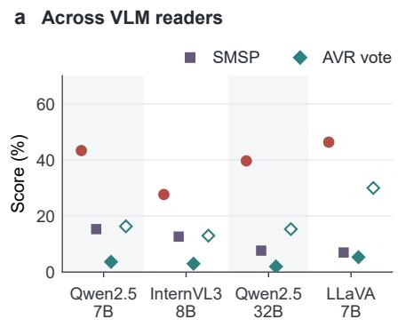

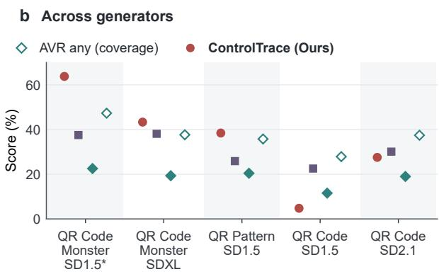  
Figure 3: Contour recognition across readers and generators. (a) Four readers on 300 weak-contour carriers each. (b) Five QR-based generator configurations, each with 900 carriers across strengths; the asterisk marks the training architecture and control encoder. ControlTrace uses one checkpoint. AVR any denotes reference-scored coverage across seven answers.

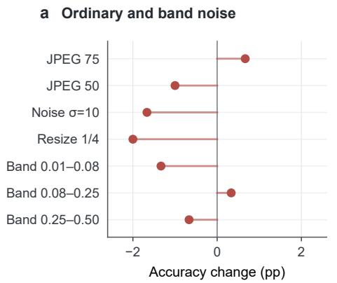

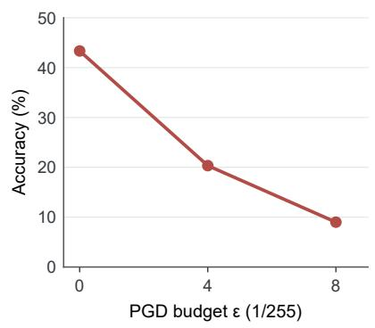  
Figure 4: ControlTrace under image perturbations, using 300 weak-contour carriers and one checkpoint. (a) Accuracy changes under redistribution and band-limited noise. (b) Accuracy under PGD targeting the recovery network.

By contrast, 20-step PGD (Madry et al., 2017) reduced weak-contour accuracy from 43.33% to 20.33% at $\varepsilon = 4 / \hat { 2 } 5 5$ and $\dot { 9 . 0 0 \% }$ at 8/255 (Figure 4b). The attack impaired recovery at every strength, although post-attack contour recognition remained higher under stronger conditioning. Because PGD targets reconstruction without differentiating through the VLM, this decline identifies a vulnerability in the recovery stage (Appendix F.2).

## 5.5 SPECIFICITY

Using a shared none-capable prompt, we evaluated hidden contours and four negative sets: COCO photographs (Lin et al., 2014), matched control-off generations, dense-texture scenes and nonsemantic conditioning. Non-semantic conditioning keeps ControlNet active with checkerboards, stripes and other patterns that encode no text or object-contour target. This tests whether geometric structure elicits false reports. Positive accuracy requires the embedded target; negative content reports count as false positives (Appendices A.2, G.1 and G.2).

ControlTrace recognized 36.3% of targets, versus 0.7% for SemVink, 3.9% for SMSP and 0.1% for AVR. Its 2.9–5.3% false-positive rates (Table 4) were lower than SemVink and SMSP on COCO but higher on other negatives. Recognition and rejection therefore require joint assessment.

Table 4: Target recognition and false-positive reporting (%) under the same none-capable prompt. Arrows indicate the preferred direction. Positives are contours at s = 1.0; ControlTrace uses one checkpoint. AVR selects one answer by plurality voting.
<table><tr><td>Image set</td><td>n</td><td>SemVink</td><td>SMSP</td><td>AVR</td><td>ControlTrace (Ours)</td></tr><tr><td>Positive images: target accuracy ↑</td><td></td><td></td><td></td><td></td><td></td></tr><tr><td>Hidden contours</td><td>1,000</td><td>0.70</td><td>3.90</td><td>0.10</td><td>36.30</td></tr><tr><td>Negative images: false-positive rate ↓</td><td></td><td></td><td></td><td></td><td></td></tr><tr><td>Matched, control off</td><td>1,000</td><td>2.30</td><td>0.40</td><td>0.00</td><td>3.80</td></tr><tr><td>Dense-texture scenes</td><td>1,000</td><td>1.30</td><td>2.00</td><td>0.40</td><td>5.20</td></tr><tr><td>COCO photographs</td><td>10,000</td><td>10.54</td><td>9.04</td><td>1.45</td><td>5.28</td></tr><tr><td>Non-semantic conditioning</td><td>960</td><td>2.81</td><td>1.15</td><td>0.00</td><td>2.92</td></tr></table>

Table 5: Mean latency and VLM token use per carrier over 300 images and two repetitions. Latency includes preprocessing and answer generation. Input counts include visual tokens; total tokens sum inputs and outputs. AVR sums all seven calls.
<table><tr><td>Method</td><td>Time (ms) ↓</td><td>Input tokens ↓</td><td>Output tokens ↓</td><td>Total tokens ↓</td></tr><tr><td>Direct VLM</td><td>138.6</td><td>384</td><td>2.97</td><td>386.97</td></tr><tr><td>SemVink</td><td>83.5</td><td>85</td><td>2.72</td><td>87.72</td></tr><tr><td>SMSP</td><td>373.8</td><td>1400</td><td>2.70</td><td>1402.70</td></tr><tr><td>AVR</td><td>1125.8</td><td>2688</td><td>20.01</td><td>2708.01</td></tr><tr><td>ControlTrace (Ours)</td><td>146.0</td><td>384</td><td>2.68</td><td>386.68</td></tr></table>

## 5.6 INFERENCE EFFICIENCY

ControlTrace required 146.0 ms per carrier, versus 138.6 ms for direct VLM reading, a net increase of 7.4 ms (5.3%; Table 5). Recovery took 12.6 ms including resizing, transfers and postprocessing; shorter generated answers partly offset this cost. ControlTrace used 384 input tokens on average, identical to direct reading, and 72.4% and 85.7% fewer total tokens than SMSP and AVR, respectively. SemVink had the lowest latency and token use with its 40-pixel input. ControlTrace retained one VLM call without increasing its input length, while reducing both latency and token use relative to the evaluated multi-view pipelines.

## 6 LIMITATIONS

ControlTrace’s advantage is concentrated in contours; SMSP performs better on strongly conditioned words, and transfer depends on the control encoder. Paired carrier–field data are required; multi-generator training and adaptation remain untested. Enhanced-scene supervision shares losses developed for control fields.

Our AVR evaluation covers fixed seven-view queries and plurality selection, excluding learned retrieval and parameter optimization. Transformations and learned configurations were selected by downstream accuracy without a held-out split; intervals do not capture selection uncertainty. PGD reveals recovery-network vulnerability, while post-attack human legibility and adversarial training remain untested. Specificity results do not estimate precision at unknown deployment prevalence.

## 7 CONCLUSION

On FreqBlind, recovering generator control fields improves contour recognition with a small measured increase in complete inference latency. Fidelity measurements, parameter sweeps and anagram controls distinguish structural recovery from transformed-image readability. The advantage transfers across VLM readers, while dependence on control encoders and susceptibility to adapted attacks bound its applicability.

## AI USE STATEMENT

We used generative AI tools to assist with language polishing of the manuscript, including improvements to grammar, wording, and clarity. The authors take full responsibility for the final content.

## ETHICS STATEMENT

This work builds a tool that reads content deliberately hidden inside images. The motivating application is content moderation: prior work has shown that hateful messages embedded this way pass both automated classifiers and vision–language models (Qu et al., 2025). The same tool could be used to read hidden content that its author intended to be private, and publishing the method and weights makes both uses easier. We judge the disclosure favorable because the construction being defended against is already public, cheap and demonstrated to evade deployed moderation; our experiments evaluate image-only recovery methods against this construction. Our experiments do not establish precision at deployment prevalence (§5.5); recovered content therefore requires independent verification. The adapted attack also shows that releasing recovery weights enables white-box evasion (§6). Our benchmark contains neutral objects and words only; it includes no hateful, personal or otherwise sensitive content. The COCO negative set is used under its original license.

## REPRODUCIBILITY STATEMENT

Training and evaluation code, three trained checkpoints, and FreqBlind and training manifests are available at https://anonymous.4open.science/r/ControlTrace. The repository also provides raw records and analysis scripts for the main recognition, recovery-quality and efficiency results. It documents external model dependencies and image preparation; complete image datasets are not included. Generation manifests record scene prompts, targets, conditioning strengths and seeds. We retain the evaluated images and their hashes because identical seeds do not guarantee bitwise reproduction across software and hardware environments. The sampled image plates also record their draw seeds.

Model, data and evaluation details are specified in §3, §4 and §5, with reader prompts in Appendix A.2. Trained-method results in the main recognition and recovery-quality comparisons average three training seeds, with seed standard deviations reported separately from item-bootstrap intervals. AVR uses fixed greedy decoding and no training seeds. Its archive includes the frozen view configuration, input manifests, all seven raw answers, voting diagnostics and scoring code (Appendix A.3).

## REFERENCES

Shuai Bai, Keqin Chen, Xuejing Liu, Jialin Wang, Wenbin Ge, Sibo Song, Kai Dang, Peng Wang, Shijie Wang, Jun Tang, Humen Zhong, Yuanzhi Zhu, Mingkun Yang, Zhaohai Li, Jianqiang Wan, Pengfei Wang, Wei Ding, Zheren Fu, Yiheng Xu, Jiabo Ye, Xi Zhang, Tianbao Xie, Zesen Cheng, Hang Zhang, Zhibo Yang, Haiyang Xu, and Junyang Lin. Qwen2.5-VL technical report, 2025. URL https://arxiv.org/abs/2502.13923.

Liangyu Chen, Xiaojie Chu, Xiangyu Zhang, and Jian Sun. Simple baselines for image restoration. In European conference on computer vision, pp. 17–33. Springer, 2022.

Qianpu Chen and Derya Soydaner. Now you see the hate: Adaptive view retrieval for hidden hateful illusions. arXiv preprint arXiv:2607.19061, 2026.

Louis Clouatre and Marc Demers. Figr: Few-shot image generation with reptile.ˆ arXiv preprint arXiv:1901.02199, 2019.

Bradley Efron, Robert J Tibshirani, et al. An introduction to the bootstrap. Boca Raton, Florida, 2000.

Bo Li, Yuanhan Zhang, Dong Guo, Renrui Zhang, Feng Li, Hao Zhang, Kaichen Zhang, Peiyuan Zhang, Yanwei Li, Ziwei Liu, et al. Llava-onevision: Easy visual task transfer. arXiv preprint arXiv:2408.03326, 2024.

Sifan Li, Yujun Cai, and Yiwei Wang. SemVink: Advancing VLMs’ semantic understanding of optical illusions via visual global thinking. In Proceedings of the 2025 Conference on Empirical Methods in Natural Language Processing, pp. 27155–27165, 2025.

Tsung-Yi Lin, Michael Maire, Serge Belongie, James Hays, Pietro Perona, Deva Ramanan, Piotr Dollar, and C Lawrence Zitnick. Microsoft coco: Common objects in context. In´ European conference on computer vision, pp. 740–755. Springer, 2014.

Aleksander Madry, Aleksandar Makelov, Ludwig Schmidt, Dimitris Tsipras, and Adrian Vladu. Towards deep learning models resistant to adversarial attacks. arXiv preprint arXiv:1706.06083, 2017.

Nobuyuki Otsu. A threshold selection method from gray-level histograms. IEEE transactions on systems, man, and cybernetics, 9(1):62–66, 1979.

Dustin Podell, Zion English, Kyle Lacey, Andreas Blattmann, Tim Dockhorn, Jonas Muller, Joe¨ Penna, and Robin Rombach. Sdxl: Improving latent diffusion models for high-resolution image synthesis. In International Conference on Learning Representations, volume 2024, pp. 1862– 1874, 2024.

Yiting Qu, Ziqing Yang, Yihan Ma, Michael Backes, Savvas Zannettou, and Yang Zhang. Hate in plain sight: On the risks of moderating ai-generated hateful illusions. In 2025 IEEE/CVF International Conference on Computer Vision (ICCV), pp. 19617–19627. IEEE, 2025.

Robin Rombach, Andreas Blattmann, Dominik Lorenz, Patrick Esser, and Bjorn Ommer. High-¨ resolution image synthesis with latent diffusion models. In 2022 IEEE/CVF conference on computer vision and pattern recognition (CVPR), pp. 10674–10685. ieee, 2022.

Olaf Ronneberger, Philipp Fischer, and Thomas Brox. U-net: Convolutional networks for biomedical image segmentation. In International Conference on Medical image computing and computerassisted intervention, pp. 234–241. Springer, 2015.

Jinzhe Tu, Ruilei Guo, Zihan Guo, Junxiao Yang, Shiyao Cui, and Minlie Huang. SMSP: A plugand-play strategy of multi-scale perception for MLLMs to perceive visual illusions. arXiv preprint arXiv:2603.23118, 2026.

Zhou Wang, Alan C Bovik, Hamid R Sheikh, and Eero P Simoncelli. Image quality assessment: from error visibility to structural similarity. IEEE transactions on image processing, 13(4):600– 612, 2004.

Lvmin Zhang, Anyi Rao, and Maneesh Agrawala. Adding conditional control to text-to-image diffusion models. In 2023 IEEE/CVF International Conference on Computer Vision (ICCV), pp. 3813–3824. IEEE, 2023.

Jinguo Zhu, Weiyun Wang, Zhe Chen, Zhaoyang Liu, Shenglong Ye, Lixin Gu, Hao Tian, Yuchen Duan, Weijie Su, Jie Shao, et al. Internvl3: Exploring advanced training and test-time recipes for open-source multimodal models. arXiv preprint arXiv:2504.10479, 2025.

Zhengxia Zou, Tianyang Shi, Yi Yuan, and Zhenwei Shi. NeuralMagicEye: Learning to see and understand the scene behind an autostereogram. arXiv preprint arXiv:2012.15692, 2020.

## A EVALUATION PROTOCOLS

This appendix details the reader prompts, baseline implementations, and scoring checks introduced in Section 5.1.

## A.1 GENERATION SETTINGS

FreqBlind uses the FP16, non-EMA Realistic Vision V5.1 checkpoint and QR Code Monster for SD1.5. Carriers are 512 × 512 pixels, generated in FP16 with the PNDM scheduler, 30 inference steps and classifier-free guidance scale 7.5. The retained manifest specifies the prompt, negative prompt, control image, conditioning strength and seed for each carrier.

The training pairs instead use the standard SD1.5 base checkpoint with the same control encoder and 20 inference steps. Thus, the two datasets share a generator architecture and control encoder, but not identical base weights or sampling budgets. The training-generation records specify PyTorch 2.3.1 with CUDA 12.1 and Diffusers 0.35.2.

The 50 contour controls comprise 20 pre-existing animal images and 30 object shapes rendered from SVG files. The latter are centered on a 512 × 512 canvas, targeting 20% foreground coverage with a longest-side cap of 92% of the canvas. Controls are converted to grayscale and inverted to bright structure on a dark background. Words use Lato Black with zero stroke expansion and −10-pixel letter spacing; the renderer fits each string within 86% of the canvas width and 30% of its height. The control inventory records the exact source files.

Scene assignment uses seed 20260908 and excludes prompts containing the target name or its listed aliases before drawing 20 scenes per target. A separate seed is recorded for each target–scene– strength record. The two domains reuse the same seed sequence; seeds are not unique across the full benchmark. Checkpoint hashes identify the retained local artifacts; upstream commit revisions were not recorded.

## A.2 READER PROMPTS

The FreqBlind contour task prompt used for SemVink, SMSP and AVR is:

The image contains a hidden ANIMAL or OBJECT pattern formed by the arrangement of scene elements. Identify what animal or object is hidden. Answer with ONLY the name (e.g., ’panda’, ’cat’), nothing else.

The word-domain prompt, used for both real words and pronounceable non-words, is:

The image contains a hidden WORD formed by the arrangement of objects, structures, or visual patterns. Identify the hidden word. Answer with ONLY the word, nothing else.

All four methods use the following complete prompt for positive and negative specificity inputs, without additional view-specific text:

The image contains a hidden ANIMAL or OBJECT pattern formed by the arrangement of scene elements. Identify what animal or object is hidden. Answer with ONLY the name (for example, ’panda’ or ’cat’), nothing else. If there is no hidden animal or object, answer with ONLY ’none’.

For FreqBlind recognition, the SemVink task prompt is preceded by:

This image has been converted to a low-resolution global view. Focus on global shape rather than local texture.

For FreqBlind recognition, the SMSP task prompt uses the following prefix:

I provide four views of the SAME image: the original and three low-frequency global views. There is hidden content embedded in these images. With the help of the views, what is it?

These prefixes apply to recognition; specificity uses the shared prompt alone. AVR asks the task question independently for each view, without a view-description prefix. In the three-seed main ControlTrace evaluation, the contour prompt uses “for example, ’panda’ or ’cat”’ in place of “e.g., ’panda’, ’cat”’. Generation limits are specified in Appendix A.3.

The alternative HC-Bench regime uses the questions quoted by SemVink (Li et al., 2025). For hidden objects:

What is within this image? Is there any other content hidden within this image?

For hidden text:

What is within this image? Is there any text hidden within this image?

HC-Bench’s other regime uses the FreqBlind task prompts above. Neither regime supplies the correct target, a candidate list or an answer-informed follow-up. AVR’s seven views use the same question within each regime.

## A.3 BASELINE IMPLEMENTATIONS

SemVink. SemVink resizes the RGB carrier to a width of 40 pixels using bilinear interpolation, preserving its aspect ratio. The reader receives this view with the task prompt and, for recognition, the global-shape prefix given above.

SMSP. Our SMSP implementation converts the carrier to grayscale and applies hard circular masks around the centered Fourier origin. The radius ratios are 0.012, $\sqrt { 0 . 0 1 2 \times 0 . 0 5 }$ and 0.05, relative to the shorter image side; integer truncation gives radii 6, 12 and 25 for $5 1 2 \times 5 1 2$ inputs. Each inverse transform is converted to its magnitude, min–max scaled to [0, 255] and stored as an RGB image.

The filtered images are resized with Lanczos interpolation to 100, 200 and 400 pixels square, respectively. Each is centered on a white canvas with the original carrier’s dimensions. The reader receives the original RGB carrier followed by these three views in increasing size order and returns one answer. Recognition uses the four-view prefix given above; specificity uses the shared none-capable prompt without that prefix.

AVR. AVR Experiment 3 queries seven transformed views independently (Chen & Soydaner, 2026). We implement this VLM protocol without the template bank, learned CLIP projection, query gate or calibration head. The published processing sequences do not specify numerical parameters; Table 6 gives the values fixed before recognition evaluation. These values instantiate the described operations and are not claimed to reproduce the authors’ settings or their optimum.

Table 6: Fixed parameters of our AVR seven-view implementation, in evaluation order. Values refer to a longest image side of 512 pixels. Gaussian and box values are Pillow radius arguments. Each output retains the carrier’s dimensions before the reader’s usual preprocessing.
<table><tr><td>View</td><td>Operations and parameters</td></tr><tr><td>Original</td><td>RGB copy.</td></tr><tr><td>Contrast</td><td>Gaussian radius 1; YCbCr conversion; equalize Y only; RGB conversion.</td></tr><tr><td>Closure-edge</td><td>Grayscale; 3×3 Sobel magnitude; min-max normalization; 3×3 closing once; Gaus- sian radius 1; normalization.</td></tr><tr><td>Mask</td><td>Grayscale; Gaussian radius 4; normalization; 256-bin Otsu threshold; 3 × 3 opening and closing, once each.</td></tr><tr><td>Inverse-mask</td><td> $2 5 5 - M ,$  using the cleaned mask M above.</td></tr><tr><td>Foreground</td><td>Original RGB foreground selected by M over RGB (128, 128, 128).</td></tr><tr><td>Low-pass</td><td>Gaussian radius 16; box radius 8; median  $5 \times 5 ;$  grayscale; unsharp Gaussian radius 2, amount 0.5; normalization.</td></tr></table>

For other sizes, Gaussian and box radii scale by $\rho = \operatorname* { m a x } ( W , H ) / 5 1 2$ . Morphological and median radii scale by $\rho ,$ round half up and yield odd widths capped by the smaller dimension. Sobel retains its $3 \times 3$ kernel, uses replicated boundaries and takes the Euclidean gradient magnitude. Min– max normalization uses nearest-even rounding; constant maps retain their level. Otsu chooses the smallest tied threshold, marks values strictly above it as foreground and returns all background when no nondegenerate split exists. Sharpening computes cli $) ( \mathbf { \bar { G } } + 0 . 5 ( G - \mathrm { G a u s s i a n } _ { 2 \rho } \mathbf { \bar { ( } } G ) ) , 0 , 2 5 5 )$ before normalization. The release records the exact Pillow/NumPy code and configuration hashes.

Single-answer selection and any-view coverage. Our plurality adapter groups complete answers after Unicode NFKC normalization, case folding and whitespace collapse. It retains punctuation and uses no target labels or aliases. The most frequent answer wins; a tie selects the earliest supporting view in the table’s order. We score that view’s original answer using the experiment’s recognition rule. Separately, any-view coverage counts an image as correct when at least one of its seven answers is correct, following AVR Experiment 3. This reference-based coverage does not provide an inference-time selector. Complete seven-view diagnostics are retained in the accompanying source data.

Empty responses and responses without a Unicode letter or numeral are invalid. They remain in voting and in the evaluation denominator; a selected invalid response is an error and never a correct rejection. The main contour evaluation selects the original view in 58.8% of cases and has tied winning answers in 26.3%, illustrating the limits of exact-answer voting when views elicit different descriptions.

Specificity. All four methods use the same none-capable task prompt on positive and negative images, without additional view-specific prefixes. It retains the assertion that hidden content is present while allowing an explicit “none” response. Reported rates are conditional on this wording, not upper bounds for other prompts. For all four methods, after separating invalid outputs, the primary comparison retains the existing rejection parser: ASCII normalization followed by an initial “none”, “nothing” or “no”; valid responses with no remaining ASCII tokens also count as rejections. A stricter diagnostic accepts only the complete answers “none”, “nothing”, “no”, “no hidden shape” or “nothing hidden”, after vote normalization and removal of one final ASCII period. These parsers score each method’s final answer. AVR’s all-seven-NONE and any-view-content rates remain separate diagnostics. Any-NONE is not counted as correct rejection.

Inference settings. AVR uses batch size one, deterministic decoding and seven independent reader calls per image. The generation limits are 128 tokens per view for FreqBlind recognition, 24 for specificity and 160 for HC-Bench. The SemVink and SMSP specificity evaluations use batch size one, deterministic decoding and a 24-token limit, with one reader call per image. SMSP supplies all four views jointly within that single reader call. The main ControlTrace evaluation uses a 64-token limit. These limits specify the permitted output length, rather than measured token use.

The separate efficiency experiment used a common 128-token limit for all methods (§5.1). Token counts came from the actual sequences passed to and returned by the reader, including chat-format and generated ending tokens. We summed all calls per carrier, then averaged repetitions and carriers; no call reached the generation limit. Token counts measure sequence use, not monetary charges.

The 1,800-image Qwen7B reader subset uses the corresponding main recognition outputs under the same inference conditions. Image perturbations are applied to the carrier before view construction. PGD optimizes against ControlTrace, so AVR scores on these carriers measure attack transfer. For recovery-quality evaluation, Appendix C.1 reports each transformed view and their unweighted mean without reference-based view selection.

## A.4 SCORING SENSITIVITY

FreqBlind uses the substring-or-80%-of-target-tokens rule in Section 5.1. Table 7 compares it with an alternative rule requiring the target’s final token to appear as a complete token in the response. This changes both substring and token matching, so it is not uniformly more permissive. AVR’s selected answer is fixed before either scorer is applied. Results are aggregated across strengths, and ControlTrace uses seed 42 here, rather than the three-seed mean of Table 1.

Changing the response-matching rule can raise or lower a score. In particular, complete-token matching excludes embedded substrings, while matching only the final target token can accept less specific responses. These results assess sensitivity to automatic judgement without changing the images, reader outputs or AVR selection rule.

Table 7: Recognition accuracy (%) under the reported scoring rule and an alternative requiring the final target token to appear as a complete response token. Results aggregate the three conditioning strengths. ControlTrace uses seed 42; AVR uses the same plurality-selected answer under both rules. Higher values indicate better recognition.
<table><tr><td rowspan="2">Method</td><td colspan="2">Contours ↑</td><td colspan="2">Words ↑</td></tr><tr><td>Reported</td><td>Alternative</td><td>Reported</td><td>Alternative</td></tr><tr><td>Carrier, read directly</td><td>6.30</td><td>6.40</td><td>2.57</td><td>2.40</td></tr><tr><td>SemVink</td><td>19.43</td><td>19.77</td><td>53.60</td><td>51.33</td></tr><tr><td>SMSP</td><td>33.33</td><td>34.17</td><td>63.37</td><td>62.90</td></tr><tr><td>AVR</td><td>19.37</td><td>19.77</td><td>23.03</td><td>22.37</td></tr><tr><td>ControlTrace (Ours)</td><td>60.10</td><td>62.00</td><td>61.23</td><td>59.90</td></tr></table>

## B RECOGNITION PERFORMANCE

This appendix expands Section 5.2 with intermediate conditioning strengths, HC-Bench implementation checks, and paired lexical controls.

## B.1 INTERMEDIATE CONDITIONING STRENGTHS

We evaluate 3,000 additional contour carriers at $s \in \{ 1 . 2 , 1 . 3 , 1 . 4 \}$ (Figure 5), covering the conditioning range used in HC-Bench (Li et al., 2025). These carriers share FreqBlind’s 50 targets and 20 scenes per target, with an independent generation seed for each record. All methods use the recognition protocol in Appendix A.

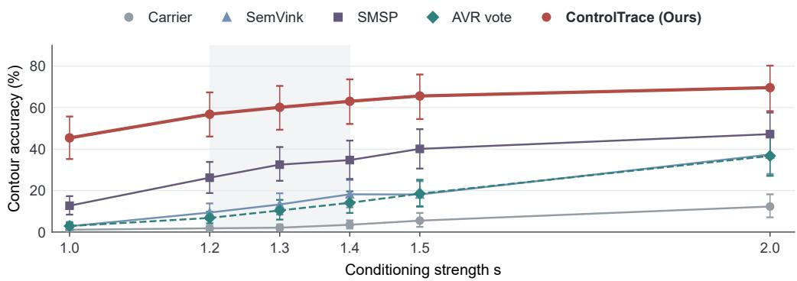  
Figure 5: Single-answer contour recognition across conditioning strengths. Each strength contains 1,000 carriers; ControlTrace averages three training seeds. Error bars show 95% item-bootstrap intervals from 20,000 resamples of 50 targets. AVR uses its fixed plurality answer. The shaded region marks the additional strengths s = 1.2–1.4.

The contour-recognition advantage extends across the added strengths. ControlTrace reaches 56.8%, 60.1% and 63.0%, compared with 9.4%, 13.3% and 18.2% for SemVink, 26.2%, 32.5% and 34.7% for SMSP, and 6.8%, 10.4% and 14.1% for AVR plurality. AVR any-view coverage is 32.5%, 39.6% and 44.8%. These results do not isolate the causes of the difference from SemVink’s published performance; the HC-Bench evaluation below examines dataset, prompt and scoring differences.

SemVink reported 91–100% accuracy on HC-Bench under a different dataset, reader, and judgement protocol. That published range provides context for the implementation check and is not plotted as a directly comparable FreqBlind reference.

## B.2 HC-BENCH EVALUATION

We compare the baseline implementations on HC-Bench’s 56 hidden-object and 28 Latin-text images using Qwen2.5-VL-7B-Instruct (Table 8). Each method uses the same transformation implementation as on FreqBlind and is evaluated with both SemVink’s quoted question and the FreqBlind task question. Scoring follows the FreqBlind matching rule with HC-Bench’s word-spacing aliases, including “newyork”/“new york” and “notredame”/“notre dame”. The scorer is shared across methods and is not used to select AVR’s answer.

The published AVR evaluation instead uses all 112 HC-Bench images, including Chinese text, with Qwen2-VL-2B and any-view scoring. Our 84-image subset, reader and automatic scoring protocol define a separate comparison.

Table 8: HC-Bench baseline recognition accuracy (%) under two prompt regimes. The shared automatic substring/token rule includes word-spacing aliases. Each regime uses the same 56 object and 28 Latin-text images. Downscaling rows give the output width; a dash marks an unevaluated setting. Higher values indicate better recognition.
<table><tr><td rowspan="2">Input / method</td><td colspan="2">SemVink quoted question</td><td colspan="2">FreqBlind task question</td></tr><tr><td>Objects ↑</td><td>Text ↑</td><td>Objects ↑</td><td>Text ↑</td></tr><tr><td>Carrier, read directly</td><td>3.6</td><td>3.6</td><td></td><td></td></tr><tr><td>Downscale to 32 px</td><td>21.4</td><td>28.6</td><td>21.4</td><td>25.0</td></tr><tr><td>Downscale to 40 px</td><td>28.6</td><td>35.7</td><td>30.4</td><td>28.6</td></tr><tr><td>Downscale to 64 px</td><td>28.6</td><td>50.0</td><td>21.4</td><td>50.0</td></tr><tr><td>Downscale to 85 px</td><td>26.8</td><td>57.1</td><td>25.0</td><td>53.6</td></tr><tr><td>Downscale to 128 px</td><td>17.9</td><td>46.4</td><td>14.3</td><td>50.0</td></tr><tr><td>SMSP</td><td>19.6</td><td>10.7</td><td>19.6</td><td>42.9</td></tr><tr><td>AVR</td><td>3.6</td><td>3.6</td><td>8.9</td><td>21.4</td></tr></table>

Replacing SemVink’s quoted question with the FreqBlind task question changes each downsampling score by at most 7.2 points and raises SMSP’s text score from 10.7% to 42.9%. AVR uses the same view bank and voting rule under both questions. Its single-answer scores increase in both domains (Table 8). The effect of the prompt therefore depends on the target domain and method.

HC-Bench also differs from FreqBlind in what a correct name requires. Its object subset comprises 36 common nouns, six person or scene categories, and 14 named entities or non-English labels. These targets can require more specific names than FreqBlind’s common-noun contours; a general category answer may therefore fail the automatic matching rule.

SemVink improves over direct reading on HC-Bench but remains below its published result. Differences in targets, readers, prompts and scoring prevent attributing the gap to a single cause. The matched-input and matched-reader comparisons on FreqBlind therefore evaluate the stated implementations, rather than reproductions of each method’s published headline score.

## B.3 LEXICAL CONTROLS

The benchmark word domain contains real words and unmatched pronounceable non-words. A separate paired experiment replaced each real word with an exact anagram, preserving its letters and rendering procedure while changing their order and spatial arrangement. Figure 6 separates these paired comparisons from the unmatched benchmark controls.

Real-word advantages appeared for every evaluated method. The aggregate paired drops in singleanswer accuracy were 34.8 points for SemVink, 23.2 for SMSP, 24.3 for AVR plurality (33.8% to 9.5%), and 31.8 for ControlTrace. AVR any-view coverage decreased from 57.3% to 26.8%. These differences support a lexical contribution, but the simultaneous change in spatial arrangement prevents attributing the full effect to lexical completion.

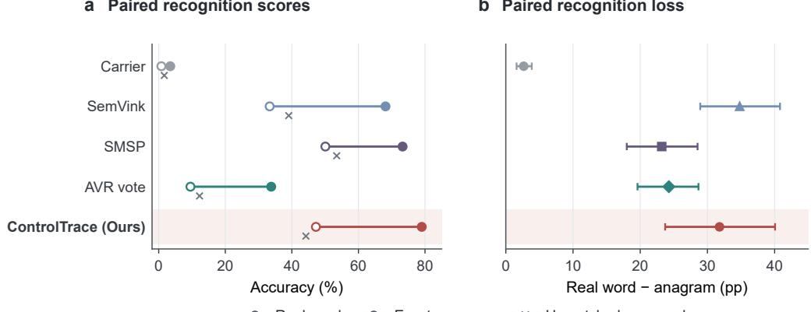  
Figure 6: Real-word and non-word recognition averaged across conditioning strengths. Paired endpoints compare 25 real words with exact anagrams using the same letter multiset, font, and rendering procedure (1,500 carriers per target type). Unmatched benchmark non-words are shown separately. Difference intervals are 95% paired bootstraps over the 25 word pairs; ControlTrace averages three training seeds. AVR uses its plurality-selected answer; seven-answer coverage is retained in the source data.

## C RECOVERY QUALITY AND TRAINING DESIGN

This appendix provides implementation details for Section 4, training-data details for Section 5.1, and reconstruction-quality evaluation and training controls for Section 5.3.

ControlTraceNet takes a 256 × 256 RGB carrier without a generation prompt or text encoder. The four encoder stages have 48, 96, 192 and 384 channels, followed by a 384-channel bottleneck at $1 6 \times 1 6$ resolution. Each block contains two $3 \times 3$ convolutions, each followed by group normalization with eight groups and a SiLU activation. Downsampling uses $2 \times 2$ average pooling. The decoder uses bilinear upsampling and concatenated skip connections, with 192, 192, 96 and 48 output channels from coarse to fine. The grayscale and edge heads use $1 \times 1$ convolutions; the grayscale output uses a sigmoid. Table 9 summarizes the reference training configuration.

Table 9: Implementation settings for the reference ControlTrace model. Training batches group six carrier variants from each of four control images.
<table><tr><td>Setting</td><td>Value</td></tr><tr><td>Optimizer</td><td>AdamW</td></tr><tr><td>Learning rate</td><td> $2 \times 1 0 ^ { - 4 }$ </td></tr><tr><td>Weight decay</td><td> $1 0 ^ { - 4 }$ </td></tr><tr><td>Training batch size Validation batch size</td><td>24 (4 controls × 6 variants) 16</td></tr><tr><td>Training duration</td><td>30 epochs</td></tr><tr><td>Training seeds</td><td>42, 43, 44</td></tr><tr><td>Checkpoint selection</td><td>Minimum validation loss</td></tr></table>

Equation 1 defines the training objective. Edge cross-entropy uses logits with no pixel or class weighting. The cosine term uses flattened fields and $d ( x ) = \operatorname* { m a x } \{ \| x \| _ { 2 } , \varepsilon _ { c } \}$ . The Sobel operation uses convolution ∗ with one-pixel zero padding; its squared magnitude is floored before taking the square root. We set $\varepsilon _ { c } = 1 0 ^ { - 8 }$ and $\varepsilon _ { s } = \bar { 1 0 ^ { - 6 } }$

$$
\begin{array} { r l } & { \cos _ { \varepsilon } ( \hat { g } , c ) = \frac { \hat { g } ^ { \mathsf { T } } c } { d ( \hat { g } ) d ( c ) } , } \\ & { \qquad E ( x ) = \operatorname* { m i n } \biggl ( 1 , \sqrt { \operatorname* { m a x } \bigl ( ( K _ { x } * x ) ^ { 2 } + ( K _ { y } * x ) ^ { 2 } , \varepsilon _ { s } \bigr ) } \biggr ) , } \\ & { \qquad K _ { x } = \left[ \begin{array} { l l l } { - 1 } & { 0 } & { 1 } \\ { - 2 } & { 0 } & { 2 } \\ { - 1 } & { 0 } & { 1 } \end{array} \right] , \qquad K _ { y } = K _ { x } ^ { \mathsf { T } } . } \end{array}\tag{2}
$$

## C.1 CONTROL-FIELD FIDELITY

We evaluate all 6,000 FreqBlind carriers against the control images used to generate them, retaining 1,000 images per domain–strength cell. Reference images are converted to grayscale, resized with bicubic interpolation to $2 5 6 \times \bar { 2 5 6 }$ , and divided by 255. ControlTrace and NAFNet use their three existing checkpoints, with unquantized floating-point predictions clipped to [0, 1]. No model is retrained for this evaluation.

Transformation views use the implementations and settings from the recognition experiments. Each view is converted to grayscale, resized with bicubic interpolation to the same reference grid, and divided by 255. For SMSP, we first remove the known canvas padding around its 100, 200 and 400- pixel content regions, then resize those regions. The original SMSP view remains unchanged before common-grid conversion. This deterministic mapping reverses view placement; it does not search for alignment using the reference. AVR retains all seven fixed views, and direct Gaussian blur uses $\sigma = 1 6$ . We apply no additional intensity normalization, polarity inversion, or reference-dependent view selection.

For an evaluated field x and reference c with N pixels, the pixel-error metrics are

$$
\mathrm { M S E } ( { \boldsymbol { x } } , { \boldsymbol { c } } ) = \frac { 1 } { N } \sum _ { i = 1 } ^ { N } ( x _ { i } - c _ { i } ) ^ { 2 } , \qquad \mathrm { M A E } ( { \boldsymbol { x } } , { \boldsymbol { c } } ) = \frac { 1 } { N } \sum _ { i = 1 } ^ { N } | x _ { i } - c _ { i } | .\tag{3}
$$

SSIM compares corresponding local windows using their Gaussian-weighted means, variances and covariance (Wang et al., 2004):

$$
\mathrm { S S I M } ( x , c ) = \frac { 1 } { | \Omega | } \sum _ { w \in \Omega } \frac { ( 2 \mu _ { x , w } \mu _ { c , w } + C _ { 1 } ) ( 2 \sigma _ { x c , w } + C _ { 2 } ) } { ( \mu _ { x , w } ^ { 2 } + \mu _ { c , w } ^ { 2 } + C _ { 1 } ) ( \sigma _ { x , w } ^ { 2 } + \sigma _ { c , w } ^ { 2 } + C _ { 2 } ) } .\tag{4}
$$

We use an $1 1 \times 1 1$ Gaussian window with standard deviation 1.5, population covariance, $C _ { 1 } = 0 . 0 1 ^ { 2 }$ and $C _ { 2 } = 0 . 0 3 ^ { 2 }$ . The set Ω excludes five boundary pixels on each side. Lower MSE and MAE indicate smaller pixel errors; higher SSIM indicates greater local structural similarity.

Metrics are calculated separately for each output. SMSP and AVR summaries average their four and seven view scores per image, respectively; trained-model summaries average scores from three seeds per image. These operations average scores, not images. Dataset summaries then average images, giving equal weight to the three conditioning strengths. View means describe the fixed view banks, not a fused reconstruction or the quality of an answer selected by the VLM. Per-view results are reported separately to retain variation within each bank.

Uncertainty is estimated by resampling the 50 targets in each domain 20,000 times, keeping all scenes, strengths, views and seeds of each target together. Seed variability is recorded separately from item-bootstrap uncertainty. The metrics measure fidelity to the generating field; they do not replace open-ended recognition, and are not the training objectives of the transformation-based methods.

As a diagnostic, an all-zero field obtained MSE/MAE/SSIM of 0.2090/0.2166/0.6445 on contours and 0.1149/0.1185/0.7870 on words. Large shared backgrounds can yield high SSIM without recovered content. ControlTrace improved all three metrics over this reference in both domains; SSIM should nevertheless be interpreted alongside pixel errors and recognition.

Tables 10 and 11 report strength-specific and individual-view means. Per-image scores, bootstrap intervals and seed summaries accompany the evaluation scripts.

Table 10: Control-field fidelity by conditioning strength, with 1,000 carriers per domain–strength cell. The view and seed aggregation rules match Table 2; values are means.
<table><tr><td colspan="2"></td><td colspan="3">Contour</td><td colspan="3">Word</td></tr><tr><td>Method</td><td>S</td><td>MSE↓</td><td>MAE↓</td><td>SSIM ↑</td><td>MSE↓</td><td>MAE↓</td><td>SSIM ↑</td></tr><tr><td rowspan="3">Carrier</td><td>1.0</td><td>0.1381</td><td>0.3201</td><td>0.0855</td><td>0.1491</td><td>0.3319</td><td>0.0453</td></tr><tr><td>1.5</td><td>0.0990</td><td>0.2651</td><td>0.1322</td><td>0.1161</td><td>0.2897</td><td>0.0650</td></tr><tr><td>2.0</td><td>0.0777</td><td>0.2343</td><td>0.1600</td><td>0.0979</td><td>0.2683</td><td>0.0760</td></tr><tr><td rowspan="3">SemVink</td><td>1.0</td><td>0.1327</td><td>0.3270</td><td>0.1115</td><td>0.1421</td><td>0.3361</td><td>0.0546</td></tr><tr><td>1.5</td><td>0.0980</td><td>0.2786</td><td>0.1325</td><td>0.1119</td><td>0.2977</td><td>0.0659</td></tr><tr><td>2.0</td><td>0.0805</td><td>0.2522</td><td>0.1388</td><td>0.0963</td><td>0.2787</td><td>0.0688</td></tr><tr><td rowspan="3">SMSP (view mean)</td><td>1.0</td><td>0.1490</td><td>0.3389</td><td>0.0998</td><td>0.1699</td><td>0.3599</td><td>0.0491</td></tr><tr><td>1.5</td><td>0.1111</td><td>0.2883</td><td>0.1231</td><td>0.1334</td><td>0.3163</td><td>0.0606</td></tr><tr><td>2.0</td><td>0.0916</td><td>0.2609</td><td>0.1349</td><td>0.1171</td><td>0.2980</td><td>0.0653</td></tr><tr><td rowspan="3">AVR (view mean)</td><td>1.0</td><td>0.2708</td><td>0.4001</td><td>0.1415</td><td>0.2793</td><td>0.4070</td><td>0.1187</td></tr><tr><td>1.5</td><td>0.2555</td><td>0.3804</td><td>0.1744</td><td>0.2654</td><td>0.3907</td><td>0.1352</td></tr><tr><td>2.0</td><td>0.2474</td><td>0.3691</td><td>0.1971</td><td>0.2587</td><td>0.3829</td><td>0.1500</td></tr><tr><td rowspan="3">Gaussian blur (σ = 16)</td><td>1.0</td><td>0.1471</td><td>0.3527</td><td>0.1054</td><td>0.1478</td><td>0.3504</td><td>0.0457</td></tr><tr><td>1.5</td><td>0.1210</td><td>0.3185</td><td>0.1115</td><td>0.1240</td><td>0.3204</td><td>0.0492</td></tr><tr><td>2.0</td><td>0.1076</td><td>0.2990</td><td>0.1120</td><td>0.1117</td><td>0.3055</td><td>0.0488</td></tr><tr><td rowspan="3">NAFNet</td><td>1.0</td><td>0.0593</td><td>0.0816</td><td>0.7486</td><td>0.0566</td><td>0.0831</td><td>0.7367</td></tr><tr><td>1.5</td><td>0.0251</td><td>0.0399</td><td>0.8503</td><td>0.0291</td><td>0.0459</td><td>0.8267</td></tr><tr><td>2.0</td><td>0.0178</td><td>0.0310</td><td>0.8789</td><td>0.0239</td><td>0.0387</td><td>0.8484</td></tr><tr><td rowspan="3">ControlTrace (Ours)</td><td>1.0</td><td>0.0561</td><td>0.0782</td><td>0.7601</td><td>0.0509</td><td>0.0755</td><td>0.7645</td></tr><tr><td>1.5</td><td>0.0242</td><td>0.0393</td><td>0.8533</td><td>0.0244</td><td>0.0391</td><td>0.8493</td></tr><tr><td>2.0</td><td>0.0178</td><td>0.0312</td><td>0.8802</td><td>0.0205</td><td>0.0333</td><td>0.8679</td></tr></table>

Table 11: Fidelity of individual SMSP and AVR views, averaged over 3,000 carriers per domain. These scores retain variation within each view bank; no view is selected using the control field.
<table><tr><td colspan="2"></td><td colspan="3">Contour</td><td colspan="3">Word</td></tr><tr><td>Method</td><td>View</td><td>MSE↓</td><td>MAE↓</td><td>SSIM↑</td><td>MSE↓</td><td>MAE↓</td><td>SSIM↑</td></tr><tr><td rowspan="4">SMSP</td><td>Original</td><td>0.1049</td><td>0.2732</td><td>0.1259</td><td>0.1210</td><td>0.2966</td><td>0.0621</td></tr><tr><td>Low-pass, 100 px</td><td>0.1557</td><td>0.3485</td><td>0.1048</td><td>0.1920</td><td>0.3872</td><td>0.0451</td></tr><tr><td>Low-pass, 200 px</td><td>0.1068</td><td>0.2867</td><td>0.1184</td><td>0.1289</td><td>0.3158</td><td>0.0607</td></tr><tr><td>Low-pass, 400 px</td><td>0.1015</td><td>0.2757</td><td>0.1279</td><td>0.1186</td><td>0.2994</td><td>0.0654</td></tr><tr><td rowspan="6">AVR</td><td>Original</td><td>0.1049</td><td>0.2732</td><td>0.1259</td><td>0.1210</td><td>0.2966</td><td>0.0621</td></tr><tr><td>Contrast</td><td>0.1725</td><td>0.3387</td><td>0.1369</td><td>0.2338</td><td>0.4018</td><td>0.0697</td></tr><tr><td>Closure edge</td><td>0.1764</td><td>0.2699</td><td>0.0633</td><td>0.1027</td><td>0.1920</td><td>0.0729</td></tr><tr><td>Mask</td><td>0.1614</td><td>0.1745</td><td>0.6385</td><td>0.2720</td><td>0.2822</td><td>0.5181</td></tr><tr><td>Inverse mask</td><td>0.8093</td><td>0.8225</td><td>0.0286</td><td>0.7068</td><td>0.7170</td><td>0.1267</td></tr><tr><td>Foreground</td><td>0.2219</td><td>0.4550</td><td>0.0858</td><td>0.2370</td><td>0.4745</td><td>0.0408</td></tr><tr><td></td><td>Low pass</td><td>0.1588</td><td>0.3485</td><td>0.1182</td><td>0.2015</td><td>0.3907</td><td>0.0523</td></tr></table>

## C.2 SUPERVISION AND BACKBONE CONTROLS

We compare control-field supervision with a stronger-conditioning scene target to assess the choice of reconstruction target. The scene target uses the same prompt and generation seed as the input carrier, regenerated at s = 2.0 and converted to grayscale. This comparison holds the U-Net, data, losses, optimization budget and training seeds fixed; loss weights are not retuned for the scene target.

To assess sensitivity to the recovery backbone, Table 12 also includes NAFNet with approximately matched capacity and training budget. NAFNet received no additional hyperparameter tuning, whereas the U-Net depth had been selected in a separate sweep.

Table 12: Contour recognition for supervision-target and backbone controls. Accuracy (%) is averaged over three training seeds, with 1,000 carriers per conditioning strength. The All strengths column aggregates the three evaluated strengths. Higher values indicate better recognition.
<table><tr><td>Supervision target</td><td>Backbone</td><td>s=1.0↑</td><td>All strengths ↑</td></tr><tr><td>Scene at s=2.0</td><td>U-Net</td><td>13.27</td><td>29.13</td></tr><tr><td>Control field</td><td>NAFNet</td><td>38.13</td><td>56.51</td></tr><tr><td>Control field</td><td>U-Net (Ours)</td><td>45.40</td><td>60.21</td></tr></table>

At s = 1.0, replacing the stronger-conditioning scene target with the control field increased accuracy by 32.13 points (95% paired item-bootstrap CI, [23.90, 40.87]). Under control-field supervision, replacing NAFNet with the U-Net increased accuracy by 7.27 points ([4.83, 9.77]). These comparisons average three training seeds on the same 1,000 carriers.

## C.3 TRAINING CONFIGURATIONS

The complete pool contains 36,000 carrier–control pairs across three conditioning strengths, using 2,000 FIGR-8 control images and 750 scene prompts. The reference model uses the 12,000 pairs at s = 1.0, with seeds 42, 43 and 44. FreqBlind instead uses separate silhouette images for contours and rendered glyphs for words. None of its control images or 200 scene prompts appears in the training pool. The reference uses three-channel carrier inputs. Table 3 reports the component comparisons, averaged over these three training seeds.

## C.4 MODEL SELECTION

Within each training run, we selected the checkpoint with the lowest loss on the internal validation split. FreqBlind uses separate control images and scene prompts, but its recognition results informed selection among training configurations. We did not reserve a separate subset for configuration selection. The fixed-operation sweeps characterize parameter sensitivity; their best observed settings were identified on the evaluated data. Item-bootstrap intervals quantify target-item variation for the selected configurations and do not account for the configuration-selection process.

Table 13 reports variability across three independently trained checkpoints on the same evaluation images. Seed standard deviations describe training variability and are distinct from the itembootstrap intervals used for method comparisons.

Table 13: Training-seed variability of ControlTrace (Ours) on FreqBlind. Each domain contains 50 target items and 1,000 carriers per strength. The seed scores and Mean column report recognition accuracy (%); SD is the sample standard deviation across the three training seeds, in percentage points. The All rows aggregate the three strengths within each seed.
<table><tr><td colspan="2"></td><td colspan="4">Accuracy (%) ↑</td><td rowspan="2">SD (pp)</td></tr><tr><td>Domain</td><td>S</td><td>Seed 42</td><td>Seed 43</td><td>Seed 44</td><td>Mean</td></tr><tr><td rowspan="4">Contours</td><td>1.0</td><td>45.10</td><td>46.80</td><td>44.30</td><td>45.40</td><td>1.28</td></tr><tr><td>1.5</td><td>65.10</td><td>66.90</td><td>64.80</td><td>65.60</td><td>1.14</td></tr><tr><td>2.0</td><td>70.10</td><td>68.80</td><td>70.00</td><td>69.63</td><td>0.72</td></tr><tr><td>All</td><td>60.10</td><td>60.83</td><td>59.70</td><td>60.21</td><td>0.57</td></tr><tr><td rowspan="4">Words</td><td>1.0</td><td>27.40</td><td>29.60</td><td>27.80</td><td>28.27</td><td>1.17</td></tr><tr><td>1.5</td><td>75.10</td><td>75.70</td><td>74.40</td><td>75.07</td><td>0.65</td></tr><tr><td>2.0</td><td>81.20</td><td>83.10</td><td>80.30</td><td>81.53</td><td>1.43</td></tr><tr><td>All</td><td>61.23</td><td>62.80</td><td>60.83</td><td>61.62</td><td>1.04</td></tr></table>

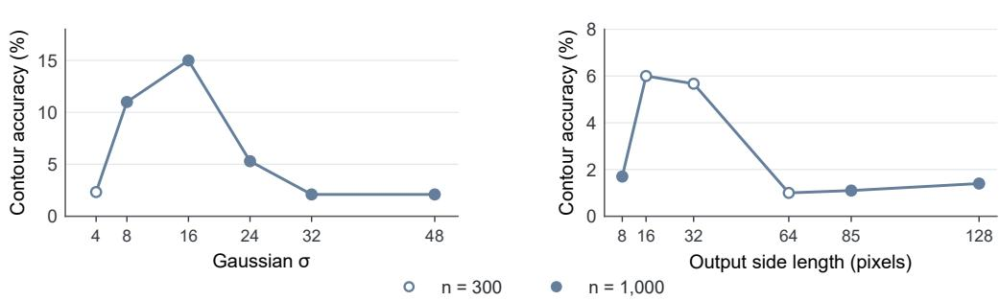  
b Downsampling

## D TRANSFORMATION SENSITIVITY

The method comparison in Section 5.2 evaluates SemVink, SMSP and AVR as complete recognition pipelines. Here, we sweep fixed image operations to examine how transformation parameters affect recognition. Gaussian blur and downsampling expose the balance between suppressing scene texture and preserving hidden structure (Figure 7).

## D.1 FIXED-OPERATION SWEEP

## a Gaussian blur

Figure 7: Parameter sensitivity on weak contours. Gaussian blur and downsampling vary within the tested grids; hollow markers use 300 carriers and filled markers use 1,000. The panels use separate vertical scales. Lines connect tested settings and do not imply an exhaustive search.  
Table 14: Selected transformation families. Aggregate cells use 3,000 carriers per domain; weakcondition cells use 1,000. The final column is the contour-minus-word difference in percentage points. Method comparisons appear in Table 1; Table 15 lists all 27 operations.
<table><tr><td></td><td colspan="2">Contour ↑</td><td colspan="2">Word ↑</td><td></td></tr><tr><td>Operation / method</td><td>All</td><td>s=1.0</td><td>All</td><td>s=1.0</td><td>C-W</td></tr><tr><td>Sobel (edge operator)</td><td>8.03</td><td>1.00</td><td>4.67</td><td>0.00</td><td>+3.37</td></tr><tr><td>Otsu (pointwise map) (Otsu, 1979)</td><td>12.17</td><td>2.00</td><td>18.23</td><td>0.10</td><td>-6.07</td></tr><tr><td>blur + histogram equalization (Qu et al., 2025)</td><td>29.53</td><td>10.10</td><td>56.30</td><td>13.10</td><td>-26.77</td></tr><tr><td>Gaussian blur σ=8</td><td>34.83</td><td>11.00</td><td>59.83</td><td>13.80</td><td>-25.00</td></tr><tr><td>Gaussian blur σ=16</td><td>34.33</td><td>15.00</td><td>39.17</td><td>7.50</td><td>-4.83</td></tr></table>

The sweep contains 20 operations initially evaluated on 300 carriers per domain–strength cell and seven additional settings near the grid boundaries. Selected initial settings and all seven additional settings were evaluated on 1,000 weak-contour carriers. Table 15 reports each operation’s largest available sample; its n column gives that sample size, not the screening batch.

Within the tested grids, peak scores occur away from the endpoints (Figure 7). Gaussian blur reaches 15.00% at $\sigma = 1 6$ (95% item-bootstrap CI, [9.80, 20.60]), compared with 11.00% at $\sigma = 8$ ([7.40, 15.00]); these intervals do not resolve which setting is better. For downsampling, the 0.33- point difference between 16 and 32 pixels does not establish an advantage outside SemVink’s stated 32–128-pixel range. The best tested single operation remains below ControlTrace on weak contours.

These results cover the tested grids rather than an upper bound on image transformations. Both the fixed-operation settings and the learned configuration were selected using downstream recognition accuracy, so configuration selection can affect both sides of the comparison. The intervals quantify item variation conditional on the selected settings and do not include this selection uncertainty. AVR’s view parameters were fixed before recognition evaluation; its composite seven-view protocol is separate from the 27 single-operation sweep.

Table 15: All 27 tested operations on contours at $s = 1 . 0 \mathrm { . }$ . The n column gives the sample size for the reported result; rows with different sample sizes should not be compared at subpercentage-point precision. Operations are grouped into four families. A dash denotes no parameter sweep.
<table><tr><td>Family and grid</td><td>Setting</td><td>Contour s=1.0 ↑</td></tr><tr><td>low-pass (16 operations)</td><td></td><td></td></tr><tr><td>Gaussian blur,  $\overline { { \sigma } } \in \{ 4 , 8 , 1 6 , 2 4 , 3 2 , 4 8 \} $ </td><td> $\sigma = 1 6$   $\sigma = 8$ </td><td>15.001,000</td></tr><tr><td></td><td></td><td>11.001,000</td></tr><tr><td></td><td> $\sigma = 2 4$ </td><td>5.301,000</td></tr><tr><td></td><td> $\sigma = 4$ </td><td>2.33 300</td></tr><tr><td>downscale,</td><td> $\sigma = 3 2$   $\sigma = 4 8$ </td><td>2.101,000 2.101,000</td></tr><tr><td> $f \in \{ 4 , 6 , 8 , 1 6 , 3 2 , 6 4 \}$ </td><td> $f = 3 2 \ ( 1 6 \mathrm { p x } )$ </td><td>6.00300</td></tr><tr><td></td><td> $f = 1 6 ( 3 2 \mathrm { p x } )$ </td><td>5.67 300</td></tr><tr><td></td><td> $f = 6 4 \ ( 8 \mathrm { p x } )$ </td><td>1.701,000</td></tr><tr><td></td><td> $f = 4 \ ( 1 2 8 \mathrm { p x } )$ </td><td>1.401,000</td></tr><tr><td></td><td> $f = 6 ( 8 5 \mathrm { p x } )$ </td><td>1.101,000</td></tr><tr><td> $f = 8 ( 6 4 \mathrm { p x } )$ </td><td></td><td>1.00 300</td></tr><tr><td>FFT low-pass, r ∈ {12, 25, 50, 100} r = 25</td><td></td><td>8.67 300</td></tr><tr><td>r = 50</td><td>4.00</td><td>300</td></tr><tr><td>r = 12</td><td></td><td>1,000</td></tr><tr><td>r = 100</td><td>1.50 1.33</td><td>300</td></tr><tr><td>combination (2 operations)</td><td></td><td></td></tr><tr><td>blur then equalize,  $\sigma \in \{ 8 \}$  (Qu et al., 2025)  $\sigma = 8$ </td><td></td><td>10.101,000</td></tr><tr><td>downscale 1/16 then Otsu  $f = 1 6 ( 3 2 \mathrm { p x } )$ </td><td>10.33</td><td>300</td></tr><tr><td>pointwise (6 operations)</td><td></td><td></td></tr><tr><td>Otsu threshold (Otsu, 1979) adaptive threshold, block ∈ {51 }</td><td></td><td>2.001,000</td></tr><tr><td>histogram equalization</td><td>Block size 51</td><td>2.00 300</td></tr><tr><td>percentile stretch,  $p \in \{ 2 \}$   $p = 2$ </td><td></td><td>1.67 300</td></tr><tr><td></td><td>1.67</td><td>300</td></tr><tr><td>grayscale  ${ \bar { \mathrm { C L A H E } } } ,$ </td><td></td><td>1.33 300</td></tr><tr><td>clip  $\in \{ 3 \}$  Clip limit 3</td><td>1.33</td><td>300</td></tr><tr><td>edge (3 operations)</td><td></td><td></td></tr><tr><td>Canny edges</td><td>1.33</td><td>300</td></tr><tr><td></td><td> $\sigma = 8$ </td><td>1.33 300</td></tr><tr><td>unsharp mask,  $\sigma \in \{ 8 \}$ </td><td></td><td></td></tr><tr><td>Sobel magnitude</td><td></td><td>1.001,000</td></tr></table>

## E READER AND GENERATOR GENERALIZATION

This appendix provides the reader and generator comparisons supporting Section 5.4, together with clean-field recognition references. The generator tables separate five QR-based hidden-content configurations from an auxiliary edge-control reference. The tables report single-answer accuracy, with complete AVR seven-answer coverage diagnostics retained in the accompanying Source Data.

## E.1 READER GENERALIZATION

At $s \ = \ 1 . 0 .$ , ControlTrace gains approximately 14 points over SMSP on words with three readers; InternVL3-8B instead gives a −5.33-point difference whose interval contains zero. Across strengths, the differences from SMSP are −0.89 points for Qwen2.5-VL-7B, −9.44 for InternVL3- 8B, +11.33 for Qwen2.5-VL-32B and +11.00 for LLaVA-OneVision-7B; the paired intervals for the latter three differences exclude zero. Thus even the aggregate word comparison depends on the reader.

Across strengths, ControlTrace’s word accuracy exceeds AVR’s selected-answer accuracy and its separate seven-answer coverage for all four readers. Individual conditions can reverse the coverage comparison: with InternVL3-8B at s = 2.0, AVR any-view coverage reaches 82.67%, compared with 80.33% for ControlTrace.

Tables 16 and 17 report SMSP, AVR and ControlTrace on the same 1,800 carriers for each reader, with 300 per domain–strength cell. The word domain combines real words and non-words. All four readers use the same fixed recovery checkpoint trained with seed 42; these results are separate from the three-seed main comparison.

For Qwen2.5-VL-7B, InternVL3-8B, Qwen2.5-VL-32B and LLaVA-OneVision-7B, direct weakcontour recognition is 1.67%, 1.67%, 2.33% and 0.67%, respectively. The corresponding ControlTrace gains over SMSP are 28.00, 15.00, 32.00 and 39.33 percentage points; all paired intervals exclude zero. Clean-field references appear in Table 18.

Table 16: Contour recognition accuracy (%) across readers, with 300 carriers per strength and the same recovery checkpoint (training seed 42). AVR uses plurality voting.
<table><tr><td>Reader</td><td>S</td><td></td><td>SMSP↑ AVR↑</td><td>ControlTrace (Ours) ↑</td></tr><tr><td>Qwen2.5-VL-7B</td><td>1.0</td><td>15.33</td><td>3.67</td><td>43.33</td></tr><tr><td rowspan="4">InternVL3-8B</td><td>1.5</td><td>41.00</td><td>18.33</td><td>65.00</td></tr><tr><td>2.0</td><td>48.33</td><td>36.67</td><td>69.67</td></tr><tr><td>1.0</td><td>12.67</td><td>3.00</td><td>27.67</td></tr><tr><td>1.5</td><td>30.67</td><td>13.00</td><td>48.33</td></tr><tr><td rowspan="3">Qwen2.5-VL-32B</td><td>2.0</td><td>38.33</td><td>22.33</td><td>49.00</td></tr><tr><td>1.0</td><td>7.67</td><td>2.00</td><td>39.67</td></tr><tr><td>1.5</td><td>26.00</td><td>16.33</td><td>58.67</td></tr><tr><td rowspan="3">LLaVA-OneVision-7B</td><td>2.0</td><td>41.33</td><td>29.67</td><td>65.33</td></tr><tr><td>1.0</td><td>7.00</td><td>5.33</td><td>46.33</td></tr><tr><td>1.5</td><td>21.00</td><td>31.33</td><td>73.67</td></tr><tr><td></td><td>2.0</td><td>38.00</td><td>56.33</td><td>81.33</td></tr></table>

Table 17: Word recognition accuracy (%) across readers, with 300 carriers per strength and the same recovery checkpoint (training seed 42). AVR uses plurality voting.
<table><tr><td>Reader</td><td>S</td><td>SMSP↑ AVR↑</td><td></td><td>ControlTrace (Ours) ↑</td></tr><tr><td rowspan="3">Qwen2.5-VL-7B</td><td>1.0</td><td>14.33</td><td>1.00</td><td>28.33</td></tr><tr><td>1.5</td><td>79.67</td><td>16.33</td><td>76.67</td></tr><tr><td>2.0</td><td>93.67</td><td>49.00</td><td>80.00</td></tr><tr><td rowspan="3">InternVL3-8B</td><td>1.0</td><td>27.00</td><td>1.33</td><td>21.67</td></tr><tr><td>1.5</td><td>85.67</td><td>18.67</td><td>76.67</td></tr><tr><td>2.0</td><td>94.33</td><td>60.00</td><td>80.33</td></tr><tr><td rowspan="3">Qwen2.5-VL-32B</td><td>1.0</td><td>8.67</td><td>0.33</td><td>22.67</td></tr><tr><td>1.5</td><td>64.00</td><td>16.67</td><td>81.33</td></tr><tr><td>2.0</td><td>85.00</td><td>48.67</td><td>87.67</td></tr><tr><td rowspan="3">LLaVA-OneVision-7B</td><td>1.0</td><td>14.00</td><td>1.33</td><td>28.67</td></tr><tr><td>1.5</td><td>60.67</td><td>20.67</td><td>76.00</td></tr><tr><td>2.0</td><td>77.33</td><td>55.67</td><td>80.33</td></tr></table>

## E.2 CLEAN-FIELD RECOGNITION

Table 18 reports direct recognition of clean control fields associated with the s = 1.0 subset of the reader evaluation. Word accuracy exceeds contour accuracy by 2–38 points across the four readers. These scores provide reader references; the paired anagram comparison in Section 5.2 examines lexical content more directly.

Table 18: Direct recognition of clean control fields (%) associated with the s = 1.0 subset of the reader evaluation.
<table><tr><td>Reader</td><td>Contours ↑</td><td>Words ↑</td></tr><tr><td>Qwen2.5-VL-7B</td><td>78.0</td><td>80.0</td></tr><tr><td>InternVL3-8B</td><td>56.0</td><td>94.0</td></tr><tr><td>Qwen2.5-VL-32B</td><td>78.0</td><td>92.0</td></tr><tr><td>LLaVA-OneVision-7B</td><td>90.0</td><td>94.0</td></tr></table>

## E.3 GENERATOR TRANSFER

We evaluate transfer without adaptation on five QR-based generator configurations, including SD1.5 with QR Code Monster, which also supplies the training pairs. Canny ControlNet uses a different control objective and remains an auxiliary reference. Table 19 reports contour recognition by strength and across all 900 carriers per configuration; the SDXL backbone follows Podell et al. (2024).

Among the five QR-based configurations, ControlTrace has higher aggregate contour accuracy than SMSP in three configurations and than AVR vote in four (Table 19). QR Code Monster with SD1.5 yields 63.78%, compared with 37.56% for SMSP and 22.56% for AVR vote. The seven-answer diagnostic reaches 47.33% in this configuration; it exceeds ControlTrace at $s \ = \ 2 . 0$ on SDXL (65.00% versus 54.33%) and QR Pattern (69.67% versus 60.00%).

The QR Code configurations show a larger transfer failure. On SD1.5, ControlTrace reaches 4.78% across strengths, below SMSP’s 22.56%, AVR plurality’s 11.56% and AVR any-view coverage of 27.89%. On SD2.1, ControlTrace reaches 27.56%, below SMSP’s 30.11% and AVR coverage of 37.44%. Increasing conditioning strength does not resolve the SD1.5 failure: at $s ~ = ~ 2 . 0$ , ControlTrace reaches 6.33% while SMSP reaches 38.00% and AVR coverage reaches 47.33%.

Word recognition also limits transfer. Across strengths, AVR any-view coverage exceeds ControlTrace on QR Pattern and both QR Code configurations; its plurality readout exceeds ControlTrace on both QR Code configurations. The single-answer comparisons appear in Tables 19 and 20. These results support sensitivity to the encoding process, rather than a general transfer advantage of learned recovery.

In the auxiliary Canny configuration, ControlTrace reaches 16.00% contour accuracy, compared with 34.33% for direct reading, 38.89% for SMSP and 35.33% for AVR vote; AVR any-view coverage is 54.67%. Word accuracy is 5.44% for ControlTrace and 45.67% for AVR vote, with 56.56% any-view coverage. These results describe transfer to edge-based control and are separate from the QR-based hidden-content comparison.

Tables 19 and 20 give both domains at each strength, with 300 carriers per cell. Each method reads the same carriers, and ControlTrace uses one recovery checkpoint without adaptation. Direct denotes recognition from the unmodified carrier.

For the five QR configurations in table order, the aggregate ControlTrace–SMSP differences are +26.2, +5.2, +12.6, −17.8 and −2.6 percentage points. At s = 1.0, they are +38.3, +15.3, +21.0, −2.3 and +1.7 points. Paired intervals exclude zero for the first, third and fourth aggregate differences and the first three weak-condition differences. The auxiliary Canny differences are −22.9 points overall and −14.3 points at s = 1.0.

## F ROBUSTNESS

This appendix expands the ControlTrace perturbation results in Section 5.4 and Figure 4. The tables report single-answer accuracy at all tested strengths in both domains, with methods evaluated on the same perturbed carriers. The corresponding AVR seven-answer coverage diagnostics are retained in the accompanying Source Data.

Table 19: Contour recognition accuracy (%) across generators, with 300 carriers per strength and one recovery checkpoint. The All rows aggregate the 900 carriers across strengths. SD1.5 and QR Code Monster also generate the training pairs; Canny is an auxiliary edge-control reference. AVR uses plurality voting.
<table><tr><td>Configuration</td><td>S</td><td></td><td>Direct ↑ SemVink ↑</td><td>SMSP↑ AVR↑</td><td></td><td>ControlTrace (Ours) ↑</td></tr><tr><td>SD1.5 / QR Code Monster</td><td>1.0</td><td>1.33</td><td>2.33</td><td>12.67</td><td>4.00</td><td>51.00</td></tr><tr><td rowspan="5">SDXL / QR Code Monster</td><td>1.5</td><td>10.33</td><td>17.67</td><td>44.33</td><td>21.00</td><td>68.33</td></tr><tr><td>2.0</td><td>19.00</td><td>33.33</td><td>55.67</td><td>42.67</td><td>72.00</td></tr><tr><td>All</td><td>10.22</td><td>17.78</td><td>37.56</td><td>22.56</td><td>63.78</td></tr><tr><td>1.0</td><td>2.00</td><td>3.00</td><td>12.33</td><td>2.00</td><td>27.67</td></tr><tr><td>1.5</td><td>6.33</td><td>16.33</td><td>39.00</td><td>14.33</td><td>48.00</td></tr><tr><td rowspan="5">SD1.5 / QR Pattern</td><td>2.0</td><td>33.00</td><td>46.33</td><td>63.00</td><td>41.67</td><td>54.33</td></tr><tr><td>All</td><td>13.78</td><td>21.89</td><td>38.11</td><td>19.33</td><td>43.33</td></tr><tr><td>1.0</td><td>1.00</td><td>1.67</td><td>3.33</td><td>0.33</td><td>24.33</td></tr><tr><td>1.5</td><td>9.00</td><td>9.00</td><td>20.67</td><td>12.33</td><td>31.00</td></tr><tr><td>2.0</td><td>31.33</td><td>39.33</td><td>53.67</td><td>48.67</td><td>60.00</td></tr><tr><td rowspan="4">SD1.5 / QR Code</td><td>All</td><td>13.78</td><td>16.67</td><td>25.89</td><td>20.44</td><td>38.44</td></tr><tr><td>1.0</td><td>3.00 2.00</td><td>1.33 11.67</td><td>5.00</td><td>2.00</td><td>2.67</td></tr><tr><td>1.5 2.0</td><td>10.67</td><td>23.67</td><td>24.67 38.00</td><td>8.67</td><td>5.33</td></tr><tr><td>All</td><td>5.22</td><td>12.22</td><td>22.56</td><td>24.00 11.56</td><td>6.33</td></tr><tr><td rowspan="5">SD2.1 / QR Code</td><td>1.0</td><td></td><td></td><td></td><td></td><td>4.78</td></tr><tr><td>1.5</td><td>1.67 8.67</td><td>1.33 16.33</td><td>2.00 32.67</td><td>1.67</td><td>3.67</td></tr><tr><td>2.0</td><td>20.33</td><td>38.00</td><td>55.67</td><td>17.33 38.00</td><td>30.00</td></tr><tr><td>All</td><td>10.22</td><td>18.56</td><td>30.11</td><td>19.00</td><td>49.00</td></tr><tr><td></td><td></td><td></td><td></td><td></td><td>27.56</td></tr><tr><td>Auxiliary edge-control reference</td><td></td><td></td><td></td><td></td><td></td><td></td></tr><tr><td rowspan="5">SD1.5 / Canny</td><td>1.0</td><td>19.00</td><td>8.00</td><td>20.00</td><td>17.00</td><td>5.67</td></tr><tr><td>1.5</td><td>38.00</td><td>24.33</td><td>43.33</td><td>38.33</td><td>16.67</td></tr><tr><td>2.0</td><td>46.00</td><td>37.00</td><td>53.33</td><td>50.67</td><td>25.67</td></tr><tr><td>All</td><td>34.33</td><td>23.11</td><td>38.89</td><td>35.33</td><td>16.00</td></tr><tr><td></td><td></td><td></td><td></td><td></td><td></td></tr></table>

Table 20: Word recognition accuracy (%) across generators, with 300 carriers per strength and one recovery checkpoint. Canny is an auxiliary edge-control reference. AVR uses plurality voting.
<table><tr><td>Configuration</td><td>S</td><td></td><td>Direct ↑ SemVink ↑ SMSP ↑ AVR ↑</td><td></td><td></td><td>ControlTrace (Ours) ↑</td></tr><tr><td>SD1.5 / QR Code Monster</td><td>1.0</td><td>0.00</td><td>14.67</td><td>31.00</td><td>1.33</td><td>40.67</td></tr><tr><td rowspan="4">SDXL / QR Code Monster</td><td>1.5</td><td>1.67</td><td>69.33</td><td>78.33</td><td>20.67</td><td>73.33</td></tr><tr><td>2.0</td><td>14.33</td><td>85.00</td><td>92.00</td><td>58.67</td><td>81.33</td></tr><tr><td>1.0</td><td>0.00</td><td>18.33</td><td>29.67</td><td>1.67</td><td>25.33</td></tr><tr><td>1.5</td><td>6.33</td><td>72.33</td><td>82.00</td><td>28.00</td><td>65.33</td></tr><tr><td rowspan="3">SD1.5 / QR Pattern</td><td>2.0</td><td>40.67</td><td>80.00</td><td>96.00</td><td>72.00</td><td>72.67</td></tr><tr><td>1.0</td><td>0.00</td><td>15.00</td><td>24.33</td><td>1.67</td><td>26.67</td></tr><tr><td>1.5</td><td>0.33</td><td>20.33</td><td>23.33</td><td>6.67</td><td>13.33</td></tr><tr><td>SD1.5 / QR Code</td><td>2.0</td><td>20.33</td><td>67.00</td><td>78.33</td><td>57.33</td><td>46.00</td></tr><tr><td rowspan="3"></td><td>1.0</td><td>1.00</td><td>2.67</td><td>4.67</td><td>2.33</td><td>0.00</td></tr><tr><td>1.5</td><td>6.67 22.33</td><td>39.33 63.00</td><td>48.33 77.00</td><td>18.67</td><td>2.33</td></tr><tr><td>2.0</td><td></td><td></td><td></td><td>42.67</td><td>5.00</td></tr><tr><td rowspan="3">SD2.1 / QR Code</td><td>1.0</td><td>0.33 10.33</td><td>0.67 43.67</td><td>2.67</td><td>0.67</td><td>0.67</td></tr><tr><td>1.5 2.0</td><td>32.00</td><td>76.67</td><td>56.00 90.00</td><td>28.67 70.33</td><td>35.00</td></tr><tr><td></td><td></td><td></td><td></td><td></td><td>61.33</td></tr><tr><td>Auxiliary edge-control reference</td><td></td><td></td><td></td><td></td><td></td><td></td></tr><tr><td>SD1.5 / Čanny</td><td>1.0</td><td>6.00</td><td>2.33</td><td>6.00</td><td>5.67</td><td>1.00</td></tr><tr><td></td><td>1.5</td><td>52.67</td><td>23.67</td><td>58.00</td><td>54.67</td><td>6.33</td></tr><tr><td></td><td>2.0</td><td>72.67</td><td>42.33</td><td>78.00</td><td>76.67</td><td>9.00</td></tr></table>

## F.1 COMMON IMAGE PERTURBATIONS

To test common image changes during distribution, we apply JPEG compression, Gaussian noise or downsampling followed by restoration to the original dimensions. Gaussian noise has a standard deviation of 10 in 8-bit intensity units (10/255 on [0, 1]). Each method receives the same perturbed carrier; AVR constructs its seven views afterwards. Each condition contains 1,800 carriers, with 300 per domain and strength. Tables 21 and 22 report all strengths using the same single-checkpoint Qwen2.5-VL-7B subset as the reader comparison.

At weak conditioning, ControlTrace reaches 41.3–44.0% contour accuracy after these perturbations. Across the two domains, its largest absolute change from the unperturbed score is 2.33 points; the paired intervals include zero. AVR any-view coverage ranges from 16.7% to 19.0% on contours and from 3.7% to 5.3% on words.

Across strengths, ControlTrace remains within one point of its unperturbed score in both domains. AVR any-view coverage is also similar across these conditions: 43.2–44.6% for contours and 42.0– 43.3% for words, compared with 43.3% and 41.7% before perturbation. Its single-answer readout changes more under downsampling, with word accuracy rising from 22.1% to 27.9%. At s = 2.0 after downsampling, word coverage reaches 80.3%, slightly above ControlTrace’s 79.3%.

Direct weak-contour accuracy is 1.67% without perturbation and 1.33%, 2.00%, 2.00% and 1.00% after JPEG $( q = 7 5 )$ , JPEG $( q = 5 0 )$ , noise and downsampling, respectively. Direct weak-word accuracy is 0.33% in all five conditions. Across strengths, downsampling raises direct word recognition from 2.56% to 6.44%, showing that the operation also affects recognition without a recovery step.

Table 21: Contour recognition accuracy (%) under common image perturbations, with 300 carriers per strength and one recovery checkpoint. AVR uses plurality voting.
<table><tr><td>Configuration</td><td>S</td><td>SMSP↑</td><td>AVR↑</td><td>ControlTrace (Ours) ↑</td></tr><tr><td>Unperturbed</td><td>1.0</td><td>15.33</td><td>3.67</td><td>43.33</td></tr><tr><td rowspan="4">JPEG (q = 75)</td><td>1.5</td><td>41.00</td><td>18.33</td><td>65.00</td></tr><tr><td>2.0</td><td>48.33</td><td>36.67</td><td>69.67</td></tr><tr><td>1.0</td><td>16.00</td><td>5.00</td><td>44.00</td></tr><tr><td>1.5</td><td>39.67</td><td>18.67</td><td>66.33</td></tr><tr><td rowspan="3">JPEG (q = 50)</td><td>2.0</td><td>49.00</td><td>36.67</td><td>69.33</td></tr><tr><td>1.0</td><td>14.33</td><td>2.67</td><td>42.33</td></tr><tr><td>1.5</td><td>40.33</td><td>19.33</td><td>66.33</td></tr><tr><td rowspan="3">Gaussian noise (σ = 10)</td><td>2.0</td><td>50.33</td><td>37.67</td><td>70.67</td></tr><tr><td>1.0</td><td>16.33</td><td>3.67</td><td>41.67</td></tr><tr><td>1.5 2.0</td><td>39.00 50.33</td><td>20.00 38.67</td><td>64.67</td></tr><tr><td rowspan="3">Downsample 4×</td><td></td><td></td><td></td><td>71.00</td></tr><tr><td>1.0 1.5</td><td>15.67 41.00</td><td>3.67 20.33</td><td>41.33 66.33</td></tr><tr><td>2.0</td><td>51.00</td><td>40.67</td><td>70.67</td></tr></table>

## F.2 ADVERSARIAL EVASION

Band-limited noise uses frequency intervals [0.01, 0.08), [0.08, 0.25) and [0.25, 0.50) cycles per pixel, with a per-channel standard deviation of 12/255. For the white-box attack, let $I _ { \mathrm { r } }$ denote the carrier on the $2 5 6 \times 2 5 6$ recovery-input grid, and let f denote the grayscale recovery mapping. PGD maximizes $\lVert f ( I _ { \mathrm { r } } + \delta ) - c \rVert .$ subject to $\| \delta \| _ { \infty } \leq \varepsilon$ , for $\varepsilon \in \{ 4 / \bar { 2 } 5 5 , 8 / 2 5 5 \}$ . Both budgets use 20 steps of size 1/255, uniform random initialization within the perturbation budget, and projection followed by clipping to [0, 1] at each step. The perturbed input is upsampled to $5 1 2 \times 5 1 2$ before saving; the stated budget applies on the recovery-input grid. All compared methods receive these same saved carriers, so SMSP and AVR measure transfer of the recovery-targeted attack.

Tables 23 and 24 report all tested strengths, with 300 carriers per domain–strength cell and one recovery checkpoint. Gaussian blur $( \sigma = 1 6 )$ provides an auxiliary VLM readability diagnostic, with unperturbed weak-contour accuracy of 13.67%. This diagnostic does not measure human readability after attack. Unperturbed SMSP, AVR and ControlTrace scores appear in the Qwen2.5-VL-7B rows of Tables 16 and 17.

Table 22: Word recognition accuracy (%) under common image perturbations, with 300 carriers per strength and one recovery checkpoint. AVR uses plurality voting.
<table><tr><td>Configuration</td><td>S</td><td>SMSP↑ AVR↑</td><td></td><td>ControlTrace (Ours) ↑</td></tr><tr><td>Unperturbed</td><td>1.0</td><td>14.33</td><td>1.00</td><td>28.33</td></tr><tr><td rowspan="4">JPEG (q = 75)</td><td>1.5</td><td>79.67</td><td>16.33</td><td>76.67</td></tr><tr><td>2.0</td><td>93.67</td><td>49.00</td><td>80.00</td></tr><tr><td>1.0</td><td>15.33</td><td>0.33</td><td>29.67</td></tr><tr><td>1.5</td><td>78.67</td><td>15.33</td><td>77.00</td></tr><tr><td rowspan="3">JPEG (q = 50)</td><td>2.0</td><td>94.00</td><td>48.67</td><td>79.67</td></tr><tr><td>1.0</td><td>13.67</td><td>0.67</td><td>28.67</td></tr><tr><td>1.5</td><td>78.33</td><td>18.00</td><td>76.00</td></tr><tr><td rowspan="3">Gaussian noise (σ = 10)</td><td>2.0</td><td>94.00</td><td>47.67</td><td>79.33</td></tr><tr><td>1.0 1.5</td><td>16.33 80.00</td><td>0.67 17.67</td><td>28.67</td></tr><tr><td>2.0</td><td>93.67</td><td>49.33</td><td>77.67</td></tr><tr><td rowspan="3">Downsample 4×</td><td></td><td></td><td></td><td>80.00</td></tr><tr><td>1.0 1.5</td><td>15.67 82.67</td><td>1.00 22.33</td><td>26.00 78.00</td></tr><tr><td>2.0</td><td>92.67</td><td>60.33</td><td>79.33</td></tr></table>

Table 23: Contour recognition accuracy (%) under perturbations and attacks, with 300 carriers per strength and one recovery checkpoint. All methods read the same perturbed carriers. AVR uses plurality voting; Blur denotes the auxiliary Gaussian-blur reference (σ = 16).
<table><tr><td>Configuration</td><td>S</td><td>Blur ↑</td><td>SMSP↑</td><td>AVR↑</td><td>ControlTrace (Ours) ↑</td></tr><tr><td>Band noise (0.01–0.08)</td><td>1.0</td><td>13.33</td><td>15.67</td><td>3.33</td><td>42.00</td></tr><tr><td rowspan="4"></td><td>1.5</td><td>41.00</td><td>41.67</td><td>20.33</td><td>66.00</td></tr><tr><td>2.0</td><td>49.33</td><td>51.00</td><td>35.33</td><td>70.00</td></tr><tr><td>Band noise (0.08–0.25) 1.0</td><td>13.33</td><td>17.00</td><td>5.00</td><td>43.67</td></tr><tr><td>1.5</td><td>39.67</td><td>40.00</td><td>20.33</td><td>66.67</td></tr><tr><td rowspan="3">Band noise (0.25–0.50)</td><td>2.0</td><td>48.67</td><td>51.00</td><td>40.00</td><td>70.00</td></tr><tr><td>1.0</td><td>14.00</td><td>15.67</td><td>3.00</td><td>42.67</td></tr><tr><td>1.5</td><td>40.00</td><td>39.67</td><td>20.67</td><td>65.67</td></tr><tr><td>PGD (4/255)</td><td>2.0</td><td>49.67</td><td>51.33</td><td>36.67</td><td>69.67</td></tr><tr><td rowspan="3"></td><td>1.0</td><td>12.33</td><td>12.67</td><td>3.67</td><td>20.33</td></tr><tr><td>1.5</td><td>38.67</td><td>39.00</td><td>18.00</td><td>50.33</td></tr><tr><td>2.0</td><td>48.67</td><td>49.00</td><td>39.00</td><td>57.00</td></tr><tr><td rowspan="3">PGD (8/255)</td><td>1.0</td><td>10.33</td><td>11.00</td><td>4.00</td><td>9.00</td></tr><tr><td>1.5</td><td>36.00</td><td>37.00</td><td>16.33</td><td>35.00</td></tr><tr><td>2.0</td><td>47.00</td><td>49.67</td><td>38.67</td><td>51.33</td></tr><tr><td rowspan="3">PGD (8/255) + JPEG</td><td>1.0</td><td>9.33</td><td>10.67</td><td>2.00</td><td>9.67</td></tr><tr><td>1.5</td><td>36.00</td><td>37.33</td><td>17.33</td><td>34.67</td></tr><tr><td>2.0</td><td>47.00</td><td>48.33</td><td>38.33</td><td>51.00</td></tr></table>

Table 24: Word recognition accuracy (%) under perturbations and attacks, with 300 carriers per strength and one recovery checkpoint. All methods read the same perturbed carriers. AVR uses plurality voting; Blur denotes the auxiliary Gaussian-blur reference (σ = 16).
<table><tr><td>Configuration</td><td>S</td><td>Blur ↑</td><td>SMSP↑</td><td>AVR↑</td><td>ControlTrace (Ours) ↑</td></tr><tr><td>Band noise (0.01–0.08)</td><td>1.0</td><td>6.33</td><td>16.67</td><td>0.33</td><td>26.00</td></tr><tr><td rowspan="4"></td><td>1.5</td><td>46.00</td><td>77.33</td><td>19.33</td><td>78.67</td></tr><tr><td>2.0</td><td>62.67</td><td>92.33</td><td>51.67</td><td>81.33</td></tr><tr><td>Band noise (0.08–0.25) 1.0</td><td>6.33</td><td>15.33</td><td>1.00</td><td>29.00</td></tr><tr><td>1.5</td><td>46.33</td><td>80.00</td><td>19.33</td><td>77.00</td></tr><tr><td rowspan="3">Band noise (0.25–0.50)</td><td>2.0</td><td>64.67</td><td>93.67</td><td>57.33</td><td>79.33</td></tr><tr><td>1.0</td><td>6.00</td><td>16.00</td><td>1.00</td><td>29.33</td></tr><tr><td>1.5</td><td>48.00</td><td>81.00</td><td>17.00</td><td>77.00</td></tr><tr><td>PGD (4/255)</td><td>2.0</td><td>65.33</td><td>93.00</td><td>52.33</td><td>79.67</td></tr><tr><td rowspan="3"></td><td>1.0</td><td>6.00</td><td>12.67</td><td>0.00</td><td>6.33</td></tr><tr><td>1.5</td><td>45.67</td><td>75.67</td><td>17.33</td><td>46.67</td></tr><tr><td>2.0</td><td>62.67</td><td>93.33</td><td>50.00</td><td>66.33</td></tr><tr><td rowspan="3">PGD (8/255)</td><td>1.0</td><td>4.33</td><td>10.33</td><td>1.00</td><td>1.00</td></tr><tr><td>1.5</td><td>44.33</td><td>74.33</td><td>14.67</td><td>15.33</td></tr><tr><td>2.0</td><td>63.00</td><td>92.33</td><td>50.33</td><td>42.33</td></tr><tr><td rowspan="3">PGD (8/255) + JPEG</td><td>1.0</td><td>4.67</td><td>9.67</td><td>0.33</td><td>1.00</td></tr><tr><td>1.5</td><td>43.67</td><td>73.00</td><td>14.67</td><td>17.00</td></tr><tr><td>2.0</td><td>63.00</td><td>92.33</td><td>54.00</td><td>44.33</td></tr></table>

and coverage 39.00%; SMSP remains at 59.00%. After JPEG recompression, the corresponding word scores are 20.78%, 23.00%, 39.22% and 58.33%. Tables 23 and 24 give the single-answer comparisons.

## G SPECIFICITY AND QUALITATIVE RESULTS

The negative controls and recovered-field statistics supplement Section 5.5. The qualitative examples expand the recognition results in Section 5.2 and Figure 1.

## G.1 NEGATIVE CONTROLS

Table 25: Content-reporting rates (%) under the shared none-capable prompt. Positive-image reports need not identify the correct target; reports on negative images are false positives. ControlTrace uses one checkpoint, with 95% intervals in brackets. All four methods produced valid final answers, and both rejection parsers agreed. AVR uses its plurality-selected answer.
<table><tr><td>Image set</td><td></td><td></td><td></td><td></td><td>n SemVink SMSP AVR ControlTrace (Ours)</td></tr><tr><td>Positive images: content reporting</td><td></td><td></td><td></td><td></td><td></td></tr><tr><td>Hidden contours</td><td>1,000</td><td>3.50</td><td>9.60</td><td>0.10</td><td>61.5 [53.1, 69.8]</td></tr><tr><td colspan="6">Negative images: false-positive rate ↓</td></tr><tr><td>Matched, control off</td><td>1,000</td><td>2.30</td><td>0.40</td><td>0.00</td><td>3.8 [2.4, 5.5]</td></tr><tr><td>Dense-texture scenes</td><td>1,000</td><td>1.30</td><td>2.00</td><td>0.40</td><td>5.2 [3.1, 7.6]</td></tr><tr><td>COCO photographs</td><td>10,000</td><td>10.54</td><td>9.04</td><td>1.45</td><td>5.3 [4.8, 5.7]</td></tr><tr><td>Non-semantic conditioning</td><td>960</td><td>2.81</td><td>1.15</td><td>0.00</td><td>2.9 [1.8, 4.3]</td></tr></table>

Photographs. We use all 5,000 images of the COCO 2017 validation set and 5,000 images sampled from its test set with seed 20260912. Each image is center-cropped, resized to $5 1 2 \times { \bar { 5 } } 1 2$ with Lanczos resampling and saved as PNG to match the carrier resolution and format.

Matched counterfactuals. For each of the 1,000 contour carriers at $s = 1 . 0 $ , we generate a negative image with the same base model, scheduler, step count, guidance scale, scene prompt, negative prompt and seed, using a blank control field and zero conditioning strength. Seeds are unique across the set, and each negative is paired with one positive.

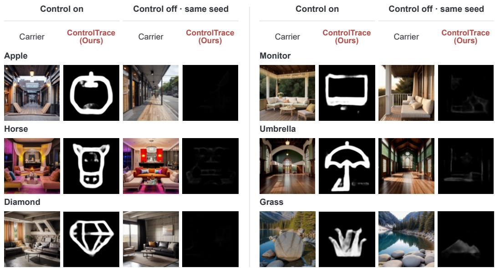  
Figure 8: Configuration-matched positive and negative carriers, with their recovered fields. Six targets were sampled with seed 20260913, one scene per target, from 1,000 matched pairs. Each pair shares the seed, prompt, scheduler, steps and guidance, with the control branch on or off. Removing control residuals changes the generation trajectory, so the match is by configuration rather than by pixels.

Non-semantic conditioning. To test active conditioning without a text or object-contour target, we generated 960 carriers at s = 1.0 from 48 fields. The fields cover eight families: QR-like block lattices with finder squares, checkerboards, concentric rings, stripes, maze hatching, thresholded low-frequency blobs, halftone dot grids, and spirals. These geometric patterns test whether imposed structure alone elicits false reports of meaningful hidden content. Six fields per family were generated from a stated seed. Each field uses the twenty scenes and prompts of one contour item, matching the positive scene distribution. The sampling unit is the field because responses across its scenes are not independent.

Dense-texture scenes. Twenty scene prompts chosen for repetitive, high-contrast, contour-rich content (weathered brick, overlapping foliage, cobblestone, patterned tile, turbulent cloud, forest canopy, rocky shore, market crowd, packed bookshelf, circuit board, bare branches, coarse weave, cracked paint, gravel, chain-link fence, stacked firewood, coral, trampled snow, torn posters, rusted metal), fifty seeds each, generated the same way with control off.

## G.2 RECOVERED-FIELD STATISTICS

We computed gradient energy from the saved grayscale outputs of the seed-42 checkpoint, using 1,000 positive contour carriers at $s = 1 . 0$ . For an output f clipped to [0, 1], the score is the mean magnitude of two-pixel central differences:

$$
\begin{array} { l } { { \displaystyle { \mathcal E } _ { \mathrm { g r a d } } ( f ) = \frac { 1 } { H W } \sum _ { i , j } \sqrt { d _ { x } ( i , j ) ^ { 2 } + d _ { y } ( i , j ) ^ { 2 } } , } } \\ { { \displaystyle d _ { x } ( i , j ) = f _ { i , j + 1 } - f _ { i , j - 1 } , \qquad d _ { y } ( i , j ) = f _ { i + 1 , j } - f _ { i - 1 , j } . } } \end{array}\tag{5}
$$

Each directional difference is zero at its corresponding image boundary. Higher scores indicate positive carriers. AUC is computed from ranks, with tied pairs counting as one half; the direction is not reversed for any negative set. Every comparison uses the same positive outputs. Figure 9 shows the empirical ROC curves obtained by thresholding these saved scores. Lower discrimination on non-semantic conditioning indicates sensitivity to imposed non-semantic structure. This diagnostic does not measure correct content recognition or deployment precision.

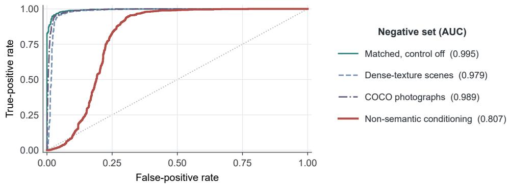  
Figure 9: Empirical ROC curves for recovered-field gradient energy. All curves share 1,000 positive contours. Negative sets comprise matched control-off images $( n = 1 , 0 0 0 .$ , AUC 0.9947), densetexture scenes $( n = 1 , 0 0 0 , 0 . 9 7 9 2 )$ , COCO photographs $( n = 1 0 , 0 0 0 , 0 . 9 8 9 5 )$ , and non-semantic conditioning $( n = 9 6 0 , 0 . 8 0 7 0 )$ . No deployment threshold is selected.

## G.3 QUALITATIVE RECOVERY

Figure 10 shows the complete sampled comparison underlying Figure 1, including its weaker recoveries. Figure 8 instead compares configuration-matched positive and negative generations; their purpose is to examine recovery when the conditioning branch is removed.

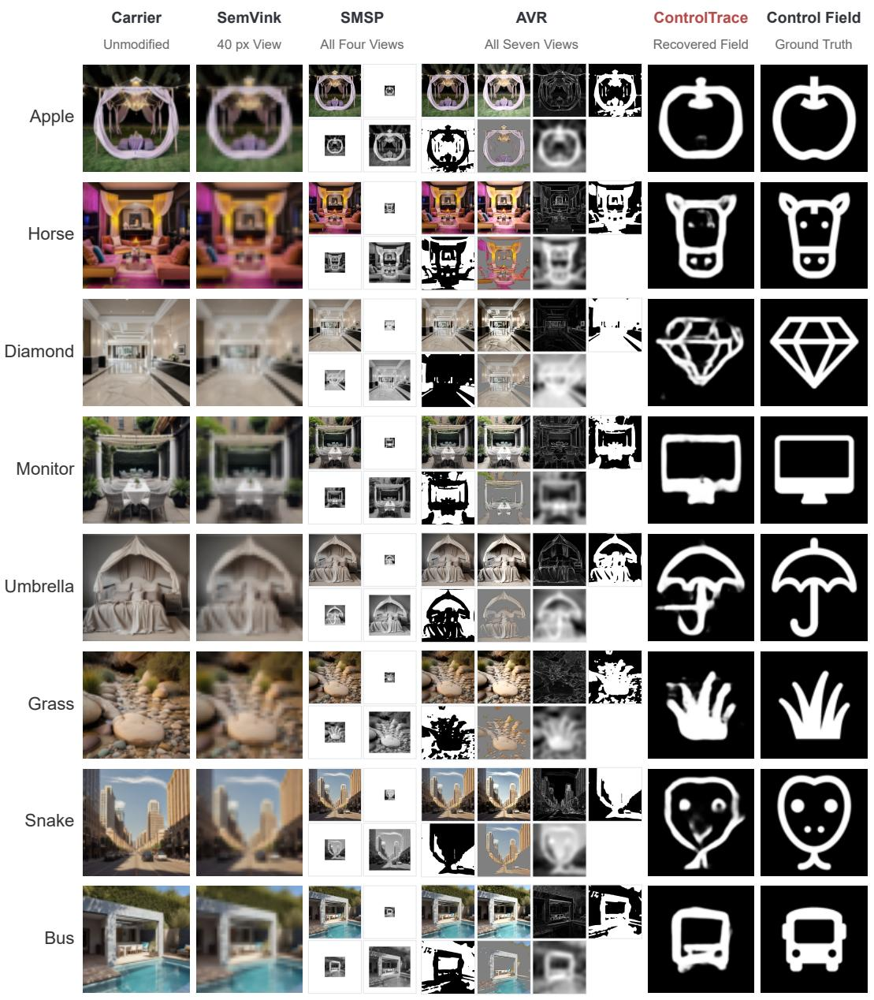  
Figure 10: All eight sampled targets, using the same columns as Figure 1, which shows the first three. Diamond has missing facets, and Snake is recovered as a different shape.