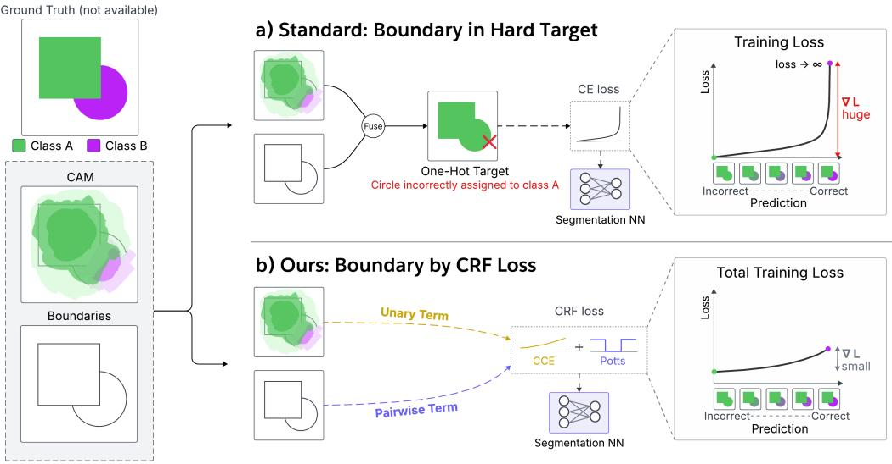
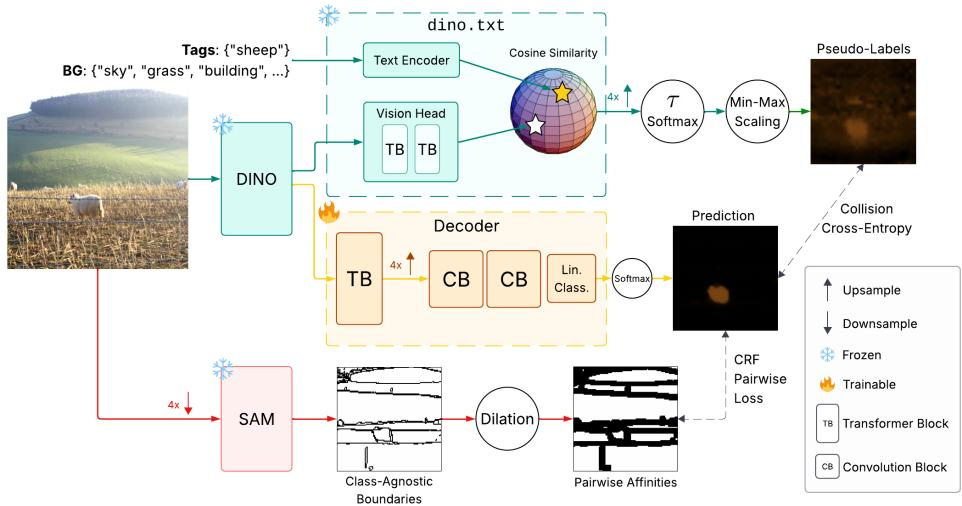
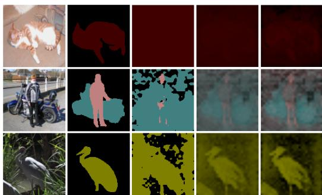
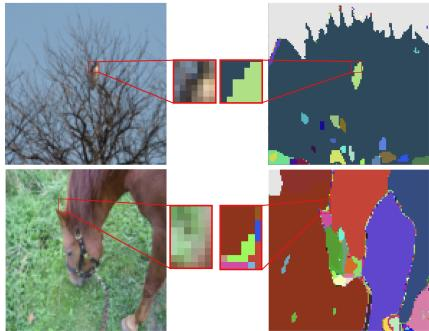
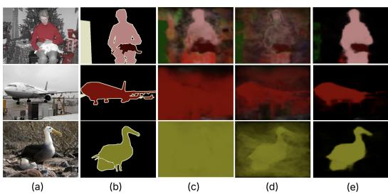
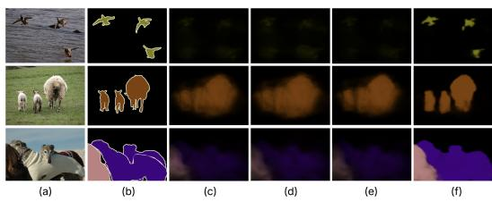

# CRF Loss is How Networks Should Learn Boundaries in Weakly Supervised Segmentation

Joshua Li Yuri Boykov   
Cheriton School of Computer Science University of Waterloo   
{j234li,yboykov}@uwaterloo.ca

## Abstract

Weakly Supervised Semantic Segmentation (WSSS) learns pixel-level predictions from image-level tags. Recent work focuses on improving coarse CAMs extracted from large vision-language models (commonly CLIP), but does little to improve their accuracy along segment boundaries. That job is instead delegated to a postprocessing method like DenseCRF. However, because DenseCRF relies on lowlevel colour cues, it can flip correct labels to incorrect ones when neighbouring pixels share similar colours. SAM has recently been adopted as a natural alternative, yet it simply takes on DenseCRF’s role as an intermediate "refinement" step that outputs one-hot pseudo-labels in prior work. By discarding the valuable uncertainty in CAMs, these one-hot pseudo-labels turn borderline errors into confidently wrong targets. Our key insight is that CAMs should supervise training alongside SAM boundaries, each through its own loss, rather than being fused together into a single hard target. Inspired by CRF potentials, we propose a framework that disentangles soft pseudo-labels as unary supervision and binary edge maps as pairwise supervision. We realize our framework in a single-stage model, DS-CRF, using CAMs from dino.txt and boundaries from SAM. DS-CRF sets a new state-of-the-art of 56.5% mIoU on MS COCO.

## 1 Introduction

Semantic segmentation predicts a class label for each pixel in an image. Unlike fully supervised methods that rely on dense pixel-level annotations, Weakly Supervised Semantic Segmentation (WSSS) leverages cheaper forms of supervision, such as scribbles [1], bounding boxes [2], or imagelevel tags [3–5]. Among these, image-level tags are especially popular due to their wide availability in web-scale datasets as captions, and will be our focus in this work.

Unsurprisingly, the central question in WSSS has been how to turn image-level tags into dense pixel-level labels. Once such labels exist, training a segmentation network on them with cross-entropy is straightforward, since the problem is reduced to fully supervised segmentation. The labels usually start as Class Activation Maps (CAMs) from a CNN or, increasingly, from a CLIP ViT. However, CNN CAMs are known to exhibit imprecise boundaries, and ViT CAMs are limited by the patch resolution (e.g., 16 × 16 pixels). As such, a common practice is to refine CAM boundaries with DenseCRF [6] post-processing and argmax them into one-hot pseudo-labels. Some recent works replace DenseCRF with SAM [7], for example by labelling each SAM mask with the class whose CAM it overlaps most. While SAM provides higher-level object boundaries, these methods still apply it as an intermediate refinement step and output one-hot pseudo-labels.

If CAMs were sufficiently accurate, this approach would have no issues. In practice CAMs are never sufficiently accurate, and "refining" them into one-hot pseudo-labels can amplify their errors in both size and confidence. DenseCRF adds errors of its own, since it relies on low-level appearance cues that need not align with semantic object boundaries. Segmentation networks trained on such confidently incorrect pseudo-labels are thus prone to reproduce the same errors themselves.

  
Figure 1: Boundary in hard target vs. boundary by CRF loss. The CAM for class A leaks into the circle, which belongs to class B. (a) Prior work uses DenseCRF or SAM to fuse the CAM and the boundaries into a one-hot (hard) target that assigns the whole circle to class A, so the correct prediction incurs infinite loss. (b) Our CRF loss disentangles the two signals, using soft CAM-derived pseudo-labels as unary supervision and boundaries as pairwise supervision. Since no class is ever hard-imposed, the correct prediction is penalized far less.

Figure 1 illustrates the problem. The $\mathbf { C A M } ^ { 1 }$ for class A spills into the circle, whose pixels belong to class B. Methods that use DenseCRF or SAM as a refinement step fuse these incorrect CAMs with the boundaries and argmax the result into a one-hot target, assigning the entire circle to class A. A segmentation network trained on this target is encouraged to reproduce the error, since predicting the correct ground truth segmentation would incur infinite cross-entropy loss. Note that in the figure we draw SAM-like boundaries for DenseCRF as well, where they can instead be read as colour-coherent regions.

We argue that these two forms of supervision should be disentangled into two terms of a Conditional Random Field (CRF) loss. Rather than folding boundaries into one-hot pseudo-labels, we supervise the segmentation network explicitly on a boundary term that encourages uniform predictions within a region, without prescribing which label that region should take. We further exploit the uncertainty information in CAMs by converting them into soft rather than hard (i.e. one-hot) pseudo-labels, which modulates the strength of the unary cross-entropy term so that pixels with uncertain pseudo-labels are penalized less than certain ones. In fig. 1, our network can assign the circle to class B at much lower loss, while still being pushed to give every pixel in it the same label.

Our framework builds on a quadratic relaxation of the CRF model. It extends the idea of [8], which uses the CRF energy as a training objective rather than minimizing it over discrete labels at inference time (e.g. graph cut [9] or DenseCRF [6]), making it compatible with standard deep learning. We make two further contributions relative to prior work in this area.

First, classical CRF formulations [6, 10, 9] derive continuous pairwise affinities $w _ { i , j }$ from low-level colour differences. To exploit the high-level, discrete boundaries produced by SAM, we define binary pairwise affinities instead (0 for an edge and 1 otherwise). To our knowledge, we are the first to incorporate such discrete boundaries as binary affinities within a simple 4-connected CRF grid. However, directly converting boundaries into binary affinities leads to poor model convergence in practice. We hypothesize that this is because image quantization creates ambiguous pixels near object boundaries that cannot be definitively assigned to a class. We refer to this effect as partial voluming, borrowing terminology from 3D medical imaging. We address this with a simple dilation (or widening) of the boundaries.

Second, we replace standard cross-entropy with the more robust collision cross-entropy [1]. While [8] assumes access to accurate ground truth scribbles, tag-derived CAMs are much more inaccurate. Collision cross-entropy accounts for this by weighting the loss by pseudo-label confidence, allowing the model to learn from soft pseudo-labels without treating them as definitive targets. In contrast to [1], which jointly optimizes the pseudo-labels alongside the network, we apply collision cross-entropy to fixed pseudo-labels and thus simplify the training process.

We realize our framework in a single-stage method, DS-CRF, built around a DINOv3 backbone with a dino.txt head for CAM generation and a separate SAM branch for boundary generation. DS-CRF achieves state-of-the-art WSSS performance, including a new best of 56.5% mIoU on MS COCO [11].

## 2 Related Works and Preliminaries

## 2.1 Weakly Supervised Semantic Segmentation

WSSS approaches typically fall into multi- and single-stage paradigms. Multi-stage approaches follow a sequential pipeline: (1) generating Class Activation Maps (CAMs) [12] from a classification network, (2) refining these CAMs into pseudo-labels, and (3) training a fully supervised segmentation model using the pseudo-labels as ground truth. In contrast, traditional single-stage approaches are trained with a unified model containing both a classification head and a segmentation head. While more streamlined, single-stage approaches typically underperform multi-stage approaches.

Regardless of the paradigm, most WSSS methods train a segmentation model with cross-entropy using refined pseudo-labels as targets. Let Ω denote the set of image pixels and C the number of classes (including background). Given a discrete pseudo-label $\bar { y } _ { i } \in \left\{ 1 , \ldots , C \right\}$ at pixel $i \in \Omega$ , the per-pixel loss is the negative log-likelihood (NLL)

$$
- \ln \sigma _ { i } ^ { \bar { y } _ { i } } ,\tag{1}
$$

where $\sigma _ { i } \in \Delta ^ { C }$ is the trained model prediction (i.e. a categorical distribution from softmax). Here, $\Delta ^ { C } = \{ ( p ^ { 1 } , . . . , p ^ { C } ) ~ | ~ p ^ { c } \geq 0 , \sum _ { c = 1 } ^ { C } p ^ { c } = 1 \}$ denotes the C-class probability simplex. If y¯i is represented as a one-hot distribution $\bar { y } _ { i } = ( y _ { i } ^ { 1 } , \dots , y _ { i } ^ { C } ) \in \Delta _ { \{ 0 , 1 \} } ^ { C }$ such that $y _ { i } ^ { c } = [ c = \bar { y } _ { i } ] \in \{ 0 , 1 \}$ for the Iverson bracket [·], then NLL (1) is equivalent to the standard cross-entropy

$$
H _ { \mathrm { C E } } ( y _ { i } , \sigma _ { i } ) = - \sum _ { c } y _ { i } ^ { c } \ln \sigma _ { i } ^ { c } .\tag{2}
$$

This formulation naturally extends to soft pseudo-labels $y _ { i } \in \Delta ^ { C }$ , which we discuss together with cross-entropy variants in section 3.2.

Early research in WSSS explored pixel-wise affinities [3, 13], adversarial erasing [4, 14], and saliency maps as auxiliary supervision [15, 4]. More recently, the field has progressed by integrating large pre-trained models like CLIP [16], DINO [17], and SAM [7]. Given that WSSS relies on image-text modalities, CLIP has become the most prevalent choice. For instance, CLIMS [18] leverages CLIP to ensure target region completeness and background suppression in CAMs, while CLIP-ES [5] introduces a Softmax-GradCAM that produces CAMs directly from CLIP’s image encoder. WeCLIP [19] builds on CLIP-ES by adopting a single-stage framework with online affinity-based refinement.

In contrast, DINO has seen relatively limited use within WSSS. Existing methods such as ECA [20] and WeCLIP+ [21] employ DINO as an auxiliary feature encoder rather than as a source of CAMs. We instead adopt dino.txt [22], which extends DINO with additional training on image-caption pairs (similar to CLIP), and use it to generate CAMs directly. Its CAMs remain fairly inaccurate, but cover object extents more completely than Softmax-GradCAM [5] on CLIP, likely thanks to the stronger features from DINO’s image-only pre-training. As a result, fewer pixels in the object interior are misclassified with high confidence, which aligns better with our confidence-weighted unary loss.

SAM [7] has recently become another powerful tool for WSSS, owing to its ability to produce accurate class-agnostic masks. Some approaches [23, 24] prompt SAM with bounding boxes obtained from open-vocabulary detectors [25], while others [26] apply it as post-processing to one-hot pseudo-labels taken from prior WSSS methods. S2C [27] offers a more principled framework, prompting SAM with the local maxima of CAMs, yet still hardens the result into one-hot pseudo-labels. These are produced online, supervising a CAM-generating network as it trains. At inference, its output is post-processed by DenseCRF into another set of one-hot pseudo-labels, which then supervise the final segmentation network. Each such "refinement" step that outputs one-hot pseudo-labels is another opportunity for CAM errors to be amplified. FMA-WSSS [28] falls into the same pattern, as it assigns each SAM mask the label of the CAM it overlaps most to produce one-hot pseudo-labels.

## 2.2 CRF Model

Pairwise or higher-order CRF models have long been a staple in image segmentation and other computer vision literature [29, 30, 9, 6, 31–33]. Among them, DenseCRF [6] is particularly influential in the context of semantic segmentation and WSSS. It is often used as a post-processing step, either to refine CAMs, as discussed earlier [3, 34, 5, 35, 36], or to clean up the final predictions of a segmentation network [37, 19, 38]. With slight abuse of terminology (for an easier comparison with our approach later), we refer to both inputs as model predictions $\sigma _ { i } .$ . To refine them, DenseCRF uses a Gaussian kernel over colour differences, guiding segmentation boundaries to high-resolution (but non-discriminative) intensity edges in the input image. Using mean-field approximation, DenseCRF optimizes the following energy over discrete variables $\bar { y } _ { i } \in \{ 1 , . . . , C \}$ representing refined class labels:

$$
- \sum _ { i \in \Omega } \ln \sigma _ { i } ^ { \bar { y } _ { i } } + \lambda \sum _ { ( i , j ) \in { \cal N } } w _ { i , j } \cdot [ \bar { y } _ { i } \not = \bar { y } _ { j } ] ,\tag{3}
$$

where $\lambda$ is a weighting hyperparameter for the pairwise regularization term. In eq. (3), the first term denotes the per-pixel or unary cost of assigning variable $\bar { y } _ { i }$ to class c, given coarse prediction $\boldsymbol { \sigma } _ { i } = ( \sigma _ { i } ^ { 1 } , \dots , \sigma _ { i } ^ { \hat { C } } )$ . The second term, known as the Potts model in CRF literature [39], penalizes label discontinuities between pairs of pixels $( i , j ) \in \mathcal { N }$ in a given neighbourhood N, weighed by pairwise affinities $w _ { i , j }$

We have already seen that post-processing CAMs can amplify incorrect training signals. Postprocessing final predictions also introduces errors that the network cannot recover from, as the pipeline is no longer end-to-end trainable. As such, there have been efforts to integrate CRF into model training itself. Some approaches incorporate CRF inference into the network architecture, e.g. using RNNs [40] or message estimator CNNs [41]. Other methods directly use CRF as a loss function for scribble-supervised training of segmentation networks [8].

In fact, using CRF as network loss represents a conceptual shift from using CRF as post-processing or as network architecture. It inspired our approach to WSSS with image-level tags. Rather than treating the given predictions $\sigma _ { i }$ as coarse input and postprocessing it into refined discrete class labels ${ \bar { y } } _ { i } .$ , we directly CRF-regularize WSSS network output $\sigma _ { i }$ during its training. To do so, the pairwise CRF loss is relaxed to operate on continuous predictions $\sigma _ { i } \in \bar { \Delta } ^ { C }$ . We derive coarse pseudo-labels $y _ { i } \in \Delta ^ { C }$ from CAMs without post-processing and use them as approximate targets. To train refined predictions $\sigma _ { i }$ , we adopt the quadratic relaxation [10, 1] of the Potts regularization model:

$$
\sum _ { i \in \Omega } H ( y _ { i } , \sigma _ { i } ) + \lambda \sum _ { ( i , j ) \in \mathcal { N } } w _ { i , j } \cdot \frac { 1 } { 2 } \| \sigma _ { i } - \sigma _ { j } \| ^ { 2 } ,\tag{4}
$$

where H denotes a cross-entropy loss $\left( \mathbf { e . g . \nabla } H _ { \mathrm { C E } } \right.$ in eq. (2)) and $\lVert \cdot \rVert ^ { 2 }$ is the squared $L _ { 2 }$ norm. This objective can be optimized via standard gradient descent.

Within the Potts model, the neighbourhood $\mathcal { N }$ can be defined in several ways, including as the nearest-neighbour grid [10, 9] or fully connected graph [6]. Fully connected graphs capture longrange interactions but require specialized implementations like bilateral filtering [8]. In contrast, nearest-neighbour grids limit interactions to local pixels, resulting in a much simpler implementation. We use the 4-connected nearest-neighbour grid and show that it provides sufficient regularization.

Given a neighbourhood, the pairwise affinity $w _ { i , j }$ is typically designed to encourage label consistency between pixels with similar low-level appearances. Let $I _ { i }$ and $I _ { j }$ denote the colour vectors at pixels i and j. A common choice [10, 9, 6] is the Gaussian kernel over their colour difference:

$$
w _ { i , j } = \exp \left( - \frac { \| I _ { i } - I _ { j } \| ^ { 2 } } { 2 \delta ^ { 2 } } \right) .\tag{5}
$$

  
Figure 2: DS-CRF architecture. We design a lightweight decoder on top of the frozen DINO backbone, running in parallel with the dino.txt vision head. CAMs are generated by computing the cosine similarity between dino.txt patch and text embeddings, which serve as soft unary targets for collision cross-entropy after normalization. Separately, the image is passed through SAM to produce class-agnostic boundaries, then dilated to define pairwise affinities within our CRF pairwise loss. (Sphere image from [42]).

This is used in both nearest-neighbour and fully connected settings, sometimes augmented with additional term(s) based on positional difference. It weakens regularization across high-contrast intensity edges, aligning predictions with low-level contours and improving boundary accuracy.

## 3 Method

## 3.1 Architecture

Our architecture consists of four main components: the DINO backbone, the dino.txt vision head and text encoder, the SAM model, and a lightweight segmentation decoder (see fig. 2). The first three modules are kept frozen, and only the decoder is trained. We reuse rich features from the DINO backbone for two purposes: CAM generation through dino.txt, and segmentation prediction through our decoder. In this section, we briefly describe the DINO backbone and the decoder.

Given an input image $\mathbf { I } \in \mathbb { R } ^ { 3 \times H \times W }$ , the DINO backbone outputs patch tokens $\mathbf { P } \in \mathbb { R } ^ { D \times \frac { H W } { 2 5 6 } }$ (using a patch size of $1 6 \times 1 6 )$ , four register tokens and a CLS token. These are passed to the decoder, which consists of a Transformer Block (TB), two Convolution Blocks (CB) and a linear classifier.

The transformer block first jointly processes all tokens. We then remove the register and CLS tokens, reshape the patch tokens, and bilinearly upsample them by a factor of 4 to obtain a feature map of shape $\begin{array} { r } { D \times \frac { \dot { H } } { 4 } \times \frac { W } { 4 } } \end{array}$ . This spatial resolution enables more precise boundary regularization while being computationally cheaper than full resolution. The upsampled features are subsequently refined by two convolution blocks, each implemented as a ResNet basic block with two $3 \times 3$ convolutions and a residual connection. A linear classifier projects the features to C channels (including background), and we apply a final softmax to yield segmentation predictions $\pmb { \sigma } \in ( \Delta ^ { C } ) ^ { \frac { H } { 4 } \times \frac { W } { 4 } }$ . Unless otherwise specified, we refer to a “pixel” with respect to this 4× downsampled resolution.

## 3.2 Pseudo-labels and Cross-Entropy Variants

To generate CAMs, the DINO patch, register, and CLS tokens are also passed through two transformer blocks within the frozen dino.txt vision head. Similar to the decoder, we only use the output patch tokens $\mathbf { Z } \in \mathbb { R } ^ { D \times \frac { H W } { 2 5 6 } }$ and discard the rest.

We turn to the dino.txt text encoder to generate text embeddings from natural language prompts. Following CLIP-ES [5], we define a set of classes $\{ { \mathcal { T } } \cup B \}$ , where $\bar { \boldsymbol { \tau } }$ contains image-specific ground truth tags (such as boat or cat) and B contains predefined background classes (such as grass and sky). We also use common techniques like class name optimization [22] and prompt ensembling. The text encoder processes prompts to return text embeddings $\mathbf { T } \in \mathbb { R } ^ { \bar { D } \times ( | \mathcal { T } | + | \tilde { B _ { | } } ) }$

We normalize both the patch and text embeddings along the feature dimension $D _ { \mathbf { \delta } }$ , then compute their cosine similarities as

$$
{ \bf S } ^ { \prime } = { \bf T } ^ { \top } { \bf Z } ,\tag{6}
$$

which is reshaped to obtain $\begin{array} { r } { \mathbf { S } ^ { \prime } \in \mathbb { R } ^ { ( | T | + | B | ) \times \frac { H } { 1 6 } \times \frac { W } { 1 6 } } } \end{array}$ . We take the maximum similarity across background set $\bar { \boldsymbol { { \mathbf { \mathit { B } } } } }$ at every pixel to produce a single background channel. After bilinear upsampling, this arrives at our $\begin{array} { r } { \mathbf { C A M } \bar { \mathbf { S } } \in \mathbb { R } ^ { ( | \mathcal { T } | + 1 ) \times \frac { H } { 4 } \times \frac { W } { 4 } } } \end{array}$ , which can then be processed into pseudo-labels.

Standard Cross-Entropy. The de facto way to supervise segmentation training is crossentropy on one-hot pseudo-labels. For each pixel i, we take the argmax of the CAM S over classes to obtain a hard target $\bar { y } _ { i } \in \{ 1 , . . . , C \}$ which can be substituted directly into the NLL loss in eq. (1) to train the decoder’s pixel-level predictions $\sigma _ { i } .$

However, as fig. 3(c) shows, these hard pseudolabels contain many false positives, i.e. background pixels assigned to a foreground class. Because NLL loss treats every label as equally certain, the decoder is pushed to fit these errors as strongly as the correct labels, which leads to highly inaccurate segmentation.

(a)

(b)

(c)

(d)

(e)

Figure 3: Pseudo-labels from dino.txt CAMs. (a) Image. (b) Ground truth. (c) Hard pseudolabels. (d) Soft pseudo-labels. (e) Soft pseudolabels with min-max scaling.

We argue that CAM uncertainty is a valuable signal for supervision strength that should be

retained rather than discarded. As such, we move away from hard (i.e. one-hot) pseudo-labels in favour of soft distributions. We transform CAMs into probability distributions using temperaturescaled softmax

$$
y _ { i } ^ { c } = \frac { \exp ( \mathbf { S } _ { i } ^ { c } / \tau ) } { \sum _ { k \in \mathcal { T } ^ { + 1 } } \exp ( \mathbf { S } _ { i } ^ { k } / \tau ) } \qquad \mathrm { ~ f o r ~ } c \in \mathcal { T } ^ { + 1 } ,\tag{7}
$$

where $\tau$ controls the sharpness of the distribution and c ranges only over the tag classes $\tau$ plus background, i.e. ${ \boldsymbol { \tau } } ^ { + 1 }$ . We notice that small τ values approximate argmax and thus amplify error as before, while large τ values overly smooth the distribution and prevent effective learning. Ideally, a pseudo-label should be sharp when it is correct and close to uniform when it is not.

To achieve this, we fix a relatively large $\tau$ to maintain softness and then apply a simple min-max scaling across the spatial dimension (similar to [5, 27]). Our intuition is that for every present tag (plus background), the corresponding pseudo-label map should correctly identify at least one pixel that belongs to the class and one that does not. Concretely, we apply the following operation after softmax:

$$
y _ { i } ^ { c } = \frac { y _ { i } ^ { c } - \operatorname* { m i n } _ { j } ( y _ { j } ^ { c } ) } { \operatorname* { m a x } _ { j } ( y _ { j } ^ { c } ) - \operatorname* { m i n } _ { j } ( y _ { j } ^ { c } ) } \qquad \quad \mathrm { f o r } c \in \mathcal { T } ^ { + 1 } .\tag{8}
$$

Following this scaling, we re-normalize the vector at each pixel i and pad non-present classes with probability 0 to obtain pseudo-labels $y _ { i } \in \Delta ^ { C }$ . Effectively, min-max scaling allows us to sharpen the distribution of pseudo-labels likey to be correct while preserving uncertainty in others. This is illustrated qualitatively in fig. 3(d) and (e).

We can now use $y _ { i }$ as a soft target in the standard cross-entropy loss defined in eq. (2). However, doing so simply propagates pseudo-label uncertainty to the segmentation output. This becomes clear from the decomposition

$$
H _ { \mathrm { C E } } ( y _ { i } , \sigma _ { i } ) = K L ( y _ { i } \| \sigma _ { i } ) + H ( y _ { i } ) ,\tag{9}
$$

where KL denotes KL-divergence and H is the standard entropy. Since the entropy term is constant with respect to $\sigma _ { i } .$ , minimizing the loss reduces to minimizing KL divergence, which is uniquely 0 when $\sigma _ { i } = y _ { i }$ . Evidently, $\sigma _ { i }$ will be uncertain if the pseudo-label $y _ { i }$ is uncertain. Moreover, because the quadratic relaxation used in the pairwise loss is not tight, the model is never explicitly encouraged to produce hard outputs. As a result, training with standard cross-entropy on soft pseudo-labels yields uncertain segmentation predictions.

Collision Cross-Entropy. Instead, we adopt collision cross-entropy [1] with soft pseudo-labels, defined as

$$
H _ { \mathrm { C C E } } ( y _ { i } , \sigma _ { i } ) = - \ln \sum _ { c } y _ { i } ^ { c } \sigma _ { i } ^ { c } .\tag{10}
$$

This can equivalently be expressed as

$$
H _ { \mathrm { C C E } } ( y _ { i } , \sigma _ { i } ) = - \ln { c o s ( y _ { i } , \sigma _ { i } ) } + \frac { H _ { 2 } ( y _ { i } ) + H _ { 2 } ( \sigma _ { i } ) } { 2 } ,\tag{11}
$$

where $c o s ( y _ { i } , \sigma _ { i } )$ denotes the cosine similarity between vectors $y _ { i }$ and $\sigma _ { i } .$ , and $H _ { 2 }$ is the second-order Rényi entropy.

Collision cross-entropy offers two advantages. First, in contrast to eq. (9), collision cross-entropy contains an entropy term $H _ { 2 } ( \sigma _ { i } )$ which encourages hard predictions. Second, its gradient scales with the confidence of the pseudo-label: sharper pseudo-labels induce stronger gradients in the loss landscape, while more uniform pseudo-labels produce weaker ones. In the limiting cases, the loss reduces to NLL when $y _ { i }$ is one-hot, and a constant when $y _ { i }$ is uniform. We argue that this behaviour enables the model to prioritize learning from confident pseudo-labels, which are more likely to be correct, while remaining flexible towards uncertain pseudo-labels.

## 3.3 Pairwise Regularization

We now consider the pairwise term that encourages boundary regularization in eq. (4). We replace its single weighting parameter λ with class-specific weights $\lambda ^ { \bar { c } } ,$ , which gives our final CRF loss:

$$
\mathcal { L } _ { \mathrm { C R F } } = \sum _ { i \in \Omega } H ( y _ { i } , \sigma _ { i } ) + \sum _ { ( i , j ) \in \mathcal { N } } w _ { i , j } \cdot \sum _ { c } \frac { \lambda ^ { c } } { 2 } ( \sigma _ { i } ^ { c } - \sigma _ { j } ^ { c } ) ^ { 2 } .\tag{12}
$$

This pairwise term enables different regularization strengths for different classes. Some classes $( \mathrm { e . g . }$ cat, aeroplane) benefit from a higher $\bar { \lambda ^ { c } }$ . However, for other classes, strong regularization can cause the pairwise term to dominate the unary term, leading to degenerate solutions where predictions collapse to a single class (typically the background). In such cases, lower values for $\lambda ^ { c }$ are desirable.

To compute the pairwise affinities $w _ { i , j }$ between adjacent pixels i and j on a 4-connected grid, we use high-level boundaries extracted from SAM. Specifically, we apply SAM’s automatic mask generator to a 4× downsampled version of the input image to produce a set of N binary masks

$$
\mathcal { M } = \{ M ^ { 1 } , \ldots , M ^ { N } \} ,\tag{13}
$$

where each mask is $M ^ { n } \in \{ 0 , 1 \} ^ { \frac { H } { 4 } \times \frac { W } { 4 } }$ . We then define the binary pairwise affinity as

$$
w _ { i , j } = \left\{ \begin{array} { l l } { { 0 , } } & { { \mathrm { i f } \ M _ { i } ^ { n } \neq M _ { j } ^ { n } \ \mathrm { f o r \ a n y } \ n } } \\ { { 1 , } } & { { \mathrm { o t h e r w i s e . } } } \end{array} \right.\tag{14}
$$

That is, $w _ { i , j } = 0$ iff a boundary exists between pixels i and j on any produced mask. This ensures that the regularization term in eq. (12) only enforces prediction consistency within mask interiors. Along the boundaries,

  
Figure 4: Effect of partial voluming on SAM superpixels. Left: input images. Right: SAM superpixels from aggregating SAM boundaries.

the term evaluates to 0 and thus predictions are free to perform sharp class transitions. Importantly, to account for possible over-segmentation of the image, our loss acts as a permissive guide that allows for transitions at SAM boundaries without actively encouraging them. We also note that our binary $w _ { i , j }$ is markedly different from the standard Gaussian kernel defined in eq. (5).

In practice, however, this naive implementation struggles. We attribute this to the partial voluming effect at object boundaries. Because boundary pixels often contain a mixture of the object and the background, there is no single "correct" way to draw a boundary through them. SAM tends to group these ambiguous pixels arbitrarily (see fig. 4), capturing only specific combinations rather than allowing boundaries to be drawn around each individual pixel. As a result, the model receives inconsistent training signals across different images that prevent it from learning a generalized, sharp class transition at semantic boundaries.

Table 1: Comparison with state-of-the-art WSSS methods. We report mIoU (%) on the PASCAL VOC 2012 and MS COCO 2014 datasets. Supervision (Sup.) types are defined as: I (image-level labels), L (language), and S (SAM masks). For multi-stage methods, the backbone refers to the final segmentation model.
<table><tr><td>Method</td><td>dCRF</td><td>Sup.</td><td>Backbone</td><td>VOC val</td><td>VOC test</td><td>COCO val</td></tr><tr><td colspan="7">Multi-Stage WSSS Methods</td></tr><tr><td> $\mathrm { K T S E } _ { \mathrm { E C C V } ^ { \prime } 2 4 } \ [ 4 3 ]$ </td><td>√</td><td>I</td><td>RN101</td><td>73.0</td><td>72.9</td><td>45.9</td></tr><tr><td>MuP-VSSCVPR&#x27;25 [44]</td><td>√ √</td><td>I  $\mathcal { T } + \mathcal { L }$ </td><td>WRN38 RN50</td><td>73.6 70.4</td><td>74.7 70.0</td><td>46.6</td></tr><tr><td>CLIMSCVPR&#x27;22 [18] CLIP-ESCVPR’23 [5]</td><td>√</td><td> $\mathcal { T } + \mathcal { L }$ </td><td>RN101</td><td>73.8</td><td>73.9</td><td></td></tr><tr><td></td><td></td><td> $\mathcal { T } + \mathcal { L }$ </td><td></td><td></td><td></td><td>45.4</td></tr><tr><td>MMCSTCVPR’23 [45]</td><td>√</td><td></td><td>WRN38</td><td>72.2</td><td>72.2</td><td>45.9</td></tr><tr><td>CPALCVPR&#x27;24 [35]</td><td>√</td><td> $\mathcal { T } + \mathcal { L }$ </td><td>RN101</td><td>74.5</td><td>74.7</td><td>46.8</td></tr><tr><td>PSDPMCVPR&#x27;24 [36]</td><td>√</td><td> $\mathcal { T } + \mathcal { L }$ </td><td>RN101</td><td>74.1</td><td>74.9</td><td>47.2</td></tr><tr><td> $\mathrm { P O T } _ { \mathrm { C V P R } ^ { \prime } 2 5 }$  [46]</td><td>√</td><td> $\mathcal { T } + \mathcal { L }$ </td><td>RN101</td><td>76.1</td><td>76.7</td><td>47.9</td></tr><tr><td colspan="7">Single-Stage WSSS Methods</td></tr><tr><td>DuPLCVPR&#x27;24 [47]</td><td>√</td><td>I</td><td>ViT-B</td><td>73.3</td><td>72.8</td><td>44.6</td></tr><tr><td> $\mathrm { P C R E } _ { \mathrm { C V P R } ^ { \prime } 2 5 } \ [ 4 8 ]$ </td><td>√</td><td>I</td><td>ViT-B</td><td>75.5</td><td>75.9</td><td>47.2</td></tr><tr><td> $\mathrm { D I A L } _ { \mathrm { E C C V } ^ { * } 2 4 } \ [ 3 8 ]$ </td><td>√</td><td> $\mathcal { T } + \mathcal { L }$ </td><td>ViT-B</td><td>74.5</td><td>74.9</td><td>44.4</td></tr><tr><td>WeCLIPCVPR&#x27;24 [19]</td><td>√</td><td> $\mathcal { T } + \mathcal { L }$ </td><td>CLIP</td><td>76.4</td><td>77.2</td><td>47.1</td></tr><tr><td> $\mathrm { E x C E L } _ { \mathrm { C V P R } ^ { \prime } 2 5 } \ [ 4 9 ]$ </td><td>√</td><td> $\mathcal { T } + \mathcal { L }$ </td><td>CLIP</td><td>78.4</td><td>78.5</td><td>50.3</td></tr><tr><td>DS-CRF (Ours)</td><td>X</td><td> ${ \mathcal { T } } + { \mathcal { S } } + { \mathcal { L } }$ </td><td>DINO</td><td>81.1</td><td>81.0</td><td>56.5</td></tr></table>

To resolve this, we propose a simple dilation operation on the pairwise affinities to artificially widen the area where transitions are permitted. We achieve this by decomposing the affinities $w _ { i , j }$ into vertical and horizontal binary edge maps $E _ { v } \in \{ 0 , 1 \} ^ { ( \frac { H } { 4 } - 1 ) \times \frac { W } { 4 } }$ and $E _ { h } \in \{ 0 , 1 \} ^ { \frac { H } { 4 } \times ( \frac { W } { 4 } - 1 ) }$ . We define them as

$$
E _ { v } ( x , y ) = w _ { ( x , y ) , ( x + 1 , y ) } , \quad E _ { h } ( x , y ) = w _ { ( x , y ) , ( x , y + 1 ) } ,\tag{15}
$$

where pixel indices in $w _ { i , j }$ are replaced by the corresponding coordinates in the image, $i \Leftrightarrow ( x , y )$ We then apply morphological dilation to both edge maps:

$$
E _ { v } ^ { d } = E _ { v } \oplus B ^ { d } , \quad E _ { h } ^ { d } = E _ { h } \oplus B ^ { d }\tag{16}
$$

where B is a $d \times d$ square structuring element, dependent on dilation size $d \in \mathbb { N }$ . Finally, we recombine $E _ { v } ^ { d }$ and $E _ { h } ^ { d }$ back into affinities $w _ { i , j } ^ { d }$ for use in eq. (12). By dilating these affinities, we effectively expand the boundaries, enabling the model to more reliably learn sharp class transitions.

## 4 Experiments

## 4.1 Datasets and Evaluation Metric

We evaluate our framework on the PASCAL VOC 2012 [54] and MS COCO 2014 [11] datasets. PASCAL VOC 2012 contains 20 foreground classes and one background class, with 1,464 training, 1,449 validation, and 1,456 test images in the original split. Following common WSSS practice [27, 5], we instead use the augmented training set of 10, 582 images. MS COCO 2014 includes 80 object categories plus background and is divided into approximately 80k training images and 40k validation images. We report performance using the standard mean Intersection over Union (mIoU) metric.

Table 2: Comparison with SAM-based WSSS methods. We report mIoU (%) on the PASCAL VOC 2012 and MS COCO 2014 datasets. Supervision (Sup.) types are defined as: I (image-level labels), L (language), S (SAM masks), and M (saliency maps).
<table><tr><td>Method</td><td>Sup.</td><td>VOC val</td><td>VOC test</td><td>COCO val</td></tr><tr><td></td><td>SEPLNeurIPS&#x27;23 (Workshop) [26]-enhanced</td><td></td><td></td><td></td></tr><tr><td> $\mathrm { E P S } _ { \mathrm { C V P R } ^ { \prime } 2 1 } \ [ 5 0 ]$ </td><td> ${ \mathcal { T } } + { \mathcal { S } } + { \dot { \mathcal { M } } }$ </td><td>72.1</td><td></td><td>41.6</td></tr><tr><td> $\mathrm { S I P E } _ { \mathrm { C V P R } ^ { \prime } 2 2 } \ [ 5 1 ]$ </td><td> $\mathcal { T } + \mathcal { S }$ </td><td>69.7</td><td></td><td>45.2</td></tr><tr><td> $\mathrm { L 2 G _ { C V P R } } , _ { 2 2 } \ [ 5 2 ]$ </td><td> ${ \mathcal { T } } + { \mathcal { S } } + { \mathcal { M } }$ </td><td>72.4</td><td></td><td>46.4</td></tr><tr><td>CLIMSCVPR&#x27;22 [18]</td><td> ${ \mathcal { T } } + { \mathcal { S } } + { \mathcal { L } }$ </td><td>71.1</td><td></td><td></td></tr><tr><td>CLIP-ESCVPR’23 [5]</td><td> ${ \mathcal { T } } + { \mathcal { S } } + { \mathcal { L } }$ </td><td>73.1</td><td></td><td>47.9</td></tr><tr><td> $\mathrm { S } 2 \mathrm { C } _ { \mathrm { C V P R } ^ { \prime } 2 4 } \ [ 2 7 ]$ </td><td> $\mathcal { T } + \mathcal { S }$ </td><td>78.2</td><td>77.5</td><td>49.8</td></tr><tr><td>Chen and SunACM Comput. Surv.&#x27;25 [23]</td><td> $\mathcal { S } + \mathcal { L }$ </td><td>74.0</td><td>73.8</td><td>54.6</td></tr><tr><td> $\operatorname { S u n } { e t a l . _ { \mathrm { a r X i v } ^ { \prime } 2 3 } } \ [ 5 3 ]$ </td><td> ${ \mathcal { T } } + { \mathcal { S } } + { \mathcal { L } }$ </td><td>77.2</td><td>77.1</td><td>55.6</td></tr><tr><td>DS-CRF (Ours)</td><td> ${ \mathcal { T } } + { \mathcal { S } } + { \mathcal { L } }$ </td><td>81.1</td><td>81.0</td><td>56.5</td></tr></table>

## 4.2 Implementation Details

We use DINOv3 (ViT-L/16) [55] as our backbone, and generate CAMs with its pre-trained dino.txt head. For SAM, we opt for the lighter ViT-B model for efficiency.

Training is performed using stochastic gradient descent with a fixed learning rate of 1e−3. The batch size is set to 16 for PASCAL VOC and 32 for MS COCO. We train for 10 epochs on VOC and 4 epochs on COCO, selecting the checkpoint with the best validation performance. Following [55], we apply image rescaling and horizontal flipping during inference. However, instead of using multiple scales, we find that a single scale at 4× the training resolution works best.

Within our framework, we set the softmax temperature to $\tau = 0 . 0 5$ and dilation to d = 5. The class-specific weights λc are provided in the supplementary material. Importantly, tuning all class-specific weights incurs minimal additional cost compared to tuning a single hyperparameter.

Table 3: Ablation study of cross-entropy variants and min-max scaling. We report mIoU (%) on the PASCAL VOC val set.
<table><tr><td rowspan="2"></td><td colspan="2">CE</td><td rowspan="2">CCE</td></tr><tr><td>Hard</td><td>Soft</td></tr><tr><td>w/o min-max</td><td>40.2</td><td>43.3</td><td>Soft 74.6</td></tr><tr><td>w/ min-max</td><td>-</td><td>53.5</td><td>77.8</td></tr></table>

Since optimizing our full objective from random weight initializations can lead to degenerate solutions, we first train our model using only the

zero-avoiding KL divergence loss $K L ( y _ { i } \| \sigma _ { i } )$ with soft dino.txt pseudo-labels as targets. This warm-up stage teaches the model to reproduce the soft pseudo-label distributions, which gives a good starting point before we switch to the CRF loss.

## 4.3 Comparison to State-of-the-Arts

As shown in table 1, our approach outperforms prior single-stage and multi-stage WSSS methods. Notably, it is the only method in the comparison that does not rely on DenseCRF (dCRF).

Table 4: Ablation study of pairwise affinity designs. We report mIoU (%) on the PASCAL VOC val set.
<table><tr><td>Gaussian Kernel Superpixel SAM</td><td></td><td></td><td> $\mathbf { S A M } ^ { d = 3 }$ </td><td> $\mathrm { S A M } ^ { d = 5 }$ </td><td> $\mathbf { S A M } ^ { d = 7 }$ </td></tr><tr><td>50.8</td><td>51.6</td><td>50.6</td><td>74.9</td><td>77.8</td><td>75.8</td></tr></table>

It therefore avoids dCRF’s low-level, colour-based regularization. It also sidesteps the drawbacks of using dCRF to post-process CAMs or final segmentations, as discussed earlier. We further compare against recent SAM-based methods in table 2. Here, our method again achieves state-of-the-art performance, showing that our CRF loss is an effective and principled way to use SAM.

## 4.4 Ablation Studies

Cross-Entropy and Min-Max Scaling. We ablate standard versus collision cross-entropy and min-max scaling in table 3, keeping pairwise regularization hyperparameters fixed. When supervised by dino.txt softmax outputs (without min-max scaling), collision crossentropy with soft pseudo-labels markedly outperforms standard cross-entropy with both hard (argmaxed) pseudo-labels and soft pseudolabels. Applying min-max scaling to soft pseudo-labels adds another ≈ 3% boost to the results. We visualize model predictions using different cross-entropy variants in fig. 5. The differences are most pronounced for images dominated by a single large object. In such cases, standard cross-entropy with hard pseudo-labels produces confident but over-expanded predic-

  
Figure 5: Network predictions using different cross-entropy variants. (a) Image. (b) Ground truth. (c) Standard cross-entropy w/ hard pseudo-labels. (d) Standard cross-entropy w/ soft pseudo-labels after min-max scaling. (e) Collision cross-entropy w/ soft pseudo-labels after min-max scaling.

tions, while soft pseudo-labels yield more regularized but uncertain ones. In contrast, collision cross-entropy achieves a balance, producing predictions that are both regularized and confident.

Pairwise Affinity. In table 4, we ablate different pairwise affinity designs in our regularization term while keeping the class-specific weights fixed. With the naive implementation, low-level affinities (e.g. Gaussian kernel on colour differences (5) and SLIC [56] superpixel boundaries) perform on par with high-level SAM boundaries. Dilating the SAM boundaries, however, substantially improves performance, peaking at 77.8% mIoU with d = 5. Low-level affinities do not see the same benefit, since our dilation scheme does not apply to Gaussian kernels and dilating SLIC boundaries reaches only

  
Figure 6: Network predictions using different pairwise affinity designs. (a) Image. (b) Ground truth. (c) Gaussian kernel. (d) Superpixel. (e) SAM. (f) SAM with dilation d = 5.

64.7% mIoU at d = 5 (not shown in the table). This highlights the value of high-level semantic boundaries in our framework. We also visualize model predictions when trained on these affinities in fig. 6. Qualitatively, dilating SAM boundaries is the only design that produces confident predictions with clearly defined boundaries.

## 5 Conclusion

In this paper, we proposed a CRF loss for supervising WSSS training. We realize this loss in DS-CRF, which builds its unary loss term from dino.txt CAMs and its pairwise loss term from SAM boundaries. By keeping these two forms of supervision as separate terms in the loss, our approach departs from prior methods that fuse CAMs and boundaries into a single hard target, a strategy that can propagate CAM errors in both size and confidence. Our method also exploits high-level semantic boundaries, rather than the low-level colour cues that DenseCRF relies on. We additionally build our framework from two key insights. First, collision cross-entropy outperforms standard cross-entropy because it lets pseudo-label uncertainty determine the strength of supervision, while still encouraging confident predictions. Second, dilating pairwise affinities is crucial for addressing the partial voluming effect at object boundaries. DS-CRF achieves state-of-the-art performance, including a new best of 56.5% mIoU on MS COCO.

## References

[1] Zhongwen Zhang and Yuri Boykov. Soft self-labeling and potts relaxations for weaklysupervised segmentation. In 2025 IEEE/CVF Conference on Computer Vision and Pattern Recognition (CVPR), pages 20244–20253, 2025. doi: 10.1109/CVPR52734.2025.01885.

[2] Viveka Kulharia, Siddhartha Chandra, Amit Agrawal, Philip Torr, and Ambrish Tyagi. Box2seg: Attention weighted loss and discriminative feature learning for weakly supervised segmentation. In Computer Vision – ECCV 2020: 16th European Conference, Glasgow, UK, August 23–28, 2020, Proceedings, Part XXVII, page 290–308, Berlin, Heidelberg, 2020. Springer-Verlag. ISBN 978-3-030-58582-2. doi: 10.1007/978-3-030-58583-9\_18.

[3] Jiwoon Ahn and Suha Kwak. Learning Pixel-Level Semantic Affinity with Image-Level Supervision for Weakly Supervised Semantic Segmentation . In 2018 IEEE/CVF Conference on Computer Vision and Pattern Recognition (CVPR), pages 4981–4990, Los Alamitos, CA, USA, June 2018. IEEE Computer Society. doi: 10.1109/CVPR.2018.00523. URL https: //doi.ieeecomputersociety.org/10.1109/CVPR.2018.00523.

[4] Yunchao Wei, Jiashi Feng, Xiaodan Liang, Ming-Ming Cheng, Yao Zhao, and Shuicheng Yan. Object Region Mining with Adversarial Erasing: A Simple Classification to Semantic Segmentation Approach . In 2017 IEEE Conference on Computer Vision and Pattern Recognition (CVPR), pages 6488–6496, Los Alamitos, CA, USA, July 2017. IEEE Computer Society. doi: 10.1109/CVPR.2017.687. URL https://doi.ieeecomputersociety.org/10.1109/ CVPR.2017.687.

[5] Yuqi Lin, Minghao Chen, Wenxiao Wang, Boxi Wu, Ke Li, Binbin Lin, Haifeng Liu, and Xiaofei He. CLIP is Also an Efficient Segmenter: A Text-Driven Approach for Weakly Supervised Semantic Segmentation . In 2023 IEEE/CVF Conference on Computer Vision and Pattern Recognition (CVPR), pages 15305–15314, Los Alamitos, CA, USA, June 2023. IEEE Computer Society. doi: 10.1109/CVPR52729.2023.01469. URL https://doi.ieeecomputersociety. org/10.1109/CVPR52729.2023.01469.

[6] Philipp Krähenbühl and Vladlen Koltun. Efficient inference in fully connected crfs with gaussian edge potentials. In Proceedings ofthe 25th International Conference on Neural Information Processing Systems, NIPS’11, page 109–117, Red Hook, NY, USA, 2011. Curran Associates Inc. ISBN 9781618395993.

[7] Alexander Kirillov, Eric Mintun, Nikhila Ravi, Hanzi Mao, Chloe Rolland, Laura Gustafson, Tete Xiao, Spencer Whitehead, Alexander C. Berg, Wan-Yen Lo, Piotr Dollar, and Ross Girshick. Segment Anything . In 2023 IEEE/CVF International Conference on Computer Vision (ICCV), pages 3992–4003, Los Alamitos, CA, USA, October 2023. IEEE Computer Society. doi: 10.1109/ICCV51070.2023.00371. URL https://doi.ieeecomputersociety. org/10.1109/ICCV51070.2023.00371.

[8] Meng Tang, Federico Perazzi, Abdelaziz Djelouah, Ismail Ben Ayed, Christopher Schroers, and Yuri Boykov. On regularized losses for weakly-supervised cnn segmentation. In Vittorio Ferrari, Martial Hebert, Cristian Sminchisescu, and Yair Weiss, editors, Computer Vision – ECCV 2018, pages 524–540, Cham, 2018. Springer International Publishing. ISBN 978-3-030-01270-0.

[9] Yuri Y. Boykov and Marie-Pierre Jolly. Interactive Graph Cuts for Optimal Boundary & Region Segmentation of Objects in N-D Images . In Computer Vision, IEEE International Conference on, volume 2, page 105, Los Alamitos, CA, USA, July 2001. IEEE Computer Society. doi: 10.1109/ICCV.2001.10011. URL https://doi.ieeecomputersociety.org/ 10.1109/ICCV.2001.10011.

[10] L. Grady. Random walks for image segmentation. IEEE Transactions on Pattern Analysis and Machine Intelligence, 28(11):1768–1783, 2006. doi: 10.1109/TPAMI.2006.233.

[11] Tsung-Yi Lin, Michael Maire, Serge Belongie, James Hays, Pietro Perona, Deva Ramanan, Piotr Dollár, and C. Lawrence Zitnick. Microsoft coco: Common objects in context. In David Fleet, Tomas Pajdla, Bernt Schiele, and Tinne Tuytelaars, editors, Computer Vision – ECCV 2014, pages 740–755, Cham, 2014. Springer International Publishing. ISBN 978-3-319-10602-1.

[12] Bolei Zhou, Aditya Khosla, Agata Lapedriza, Aude Oliva, and Antonio Torralba. Learning Deep Features for Discriminative Localization . In 2016 IEEE Conference on Computer Vision and Pattern Recognition (CVPR), pages 2921–2929, Los Alamitos, CA, USA, June 2016. IEEE Computer Society. doi: 10.1109/CVPR.2016.319. URL https://doi.ieeecomputersociety. org/10.1109/CVPR.2016.319.

[13] Junsong Fan, Zhaoxiang Zhang, Tieniu Tan, Chunfeng Song, and Jun Xiao. CIAN: crossimage affinity net for weakly supervised semantic segmentation. In The Thirty-Fourth AAAI Conference on Artificial Intelligence, AAAI 2020, The Thirty-Second Innovative Applications ofArtificial Intelligence Conference, IAAI 2020, The Tenth AAAI Symposium on Educational Advances in Artificial Intelligence, EAAI 2020, New York, NY, USA, February 7-12, 2020, pages 10762–10769. AAAI Press, 2020. doi: 10.1609/AAAI.V34I07.6705. URL https: //doi.org/10.1609/aaai.v34i07.6705.

[14] Qibin Hou, Peng-Tao Jiang, Yunchao Wei, and Ming-Ming Cheng. Self-erasing network for integral object attention. In Proceedings of the 32nd International Conference on Neural Information Processing Systems, NIPS’18, page 547–557, Red Hook, NY, USA, 2018. Curran Associates Inc.

[15] Yunchao Wei, Huaxin Xiao, Honghui Shi, Zequn Jie, Jiashi Feng, and Thomas S. Huang. Revisiting dilated convolution: A simple approach for weakly- and semi-supervised semantic segmentation. In 2018 IEEE/CVF Conference on Computer Vision and Pattern Recognition, pages 7268–7277, 2018. doi: 10.1109/CVPR.2018.00759.

[16] Alec Radford, Jong Wook Kim, Chris Hallacy, Aditya Ramesh, Gabriel Goh, Sandhini Agarwal, Girish Sastry, Amanda Askell, Pamela Mishkin, Jack Clark, Gretchen Krueger, and Ilya Sutskever. Learning transferable visual models from natural language supervision. In Marina Meila and Tong Zhang, editors, Proceedings of the 38th International Conference on Machine Learning, volume 139 of Proceedings ofMachine Learning Research, pages 8748–8763. PMLR, 18–24 Jul 2021. URL https://proceedings.mlr.press/v139/radford21a.html.

[17] Maxime Oquab, Timothée Darcet, Théo Moutakanni, Huy V. Vo, Marc Szafraniec, Vasil Khalidov, Pierre Fernandez, Daniel Haziza, Francisco Massa, Alaaeldin El-Nouby, Mido Assran, Nicolas Ballas, Wojciech Galuba, Russell Howes, Po-Yao Huang, Shang-Wen Li, Ishan Misra, Michael Rabbat, Vasu Sharma, Gabriel Synnaeve, Hu Xu, Hervé Jégou, Julien Mairal, Patrick Labatut, Armand Joulin, and Piotr Bojanowski. Dinov2: Learning robust visual features without supervision. Transactions on Machine Learning Research, 2024, 2024. URL https://openreview.net/forum?id=a68SUt6zFt.

[18] Jinheng Xie, Xianxu Hou, Kai Ye, and Linlin Shen. Clims: Cross language image matching for weakly supervised semantic segmentation. In 2022 IEEE/CVF Conference on Computer Vision and Pattern Recognition (CVPR), pages 4473–4482, 2022. doi: 10.1109/CVPR52688.2022. 00444.

[19] Bingfeng Zhang, Siyue Yu, Yunchao Wei, Yao Zhao, and Jimin Xiao. Frozen clip: A strong backbone for weakly supervised semantic segmentation. In 2024 IEEE/CVF Conference on Computer Vision and Pattern Recognition (CVPR), pages 3796–3806, 2024. doi: 10.1109/ CVPR52733.2024.00364.

[20] Yuanchen Wu, Xiaoqiang Li, Jide Li, Kequan Yang, Pinpin Zhu, and Shaohua Zhang. Dino is also a semantic guider: Exploiting class-aware affinity for weakly supervised semantic segmentation. In Proceedings ofthe 32nd ACM International Conference on Multimedia, MM ’24, page 1389–1397, New York, NY, USA, 2024. Association for Computing Machinery. ISBN 9798400706868. doi: 10.1145/3664647.3681710. URL https://doi.org/10.1145/ 3664647.3681710.

[21] Bingfeng Zhang, Siyue Yu, Jimin Xiao, Yunchao Wei, and Yao Zhao. Frozen clip-dino: A strong backbone for weakly supervised semantic segmentation. IEEE Transactions on Pattern Analysis and Machine Intelligence, 47(5):4198–4214, 2025. doi: 10.1109/TPAMI.2025.3543191.

[22] Cijo Jose, Théo Moutakanni, Dahyun Kang, Federico Baldassarre, Timothée Darcet, Hu Xu, Daniel Li, Marc Szafraniec, Michaël Ramamonjisoa, Maxime Oquab, Oriane Siméoni, Huy V. Vo, Patrick Labatut, and Piotr Bojanowski. Dinov2 meets text: A unified framework for imageand pixel-level vision-language alignment. In 2025 IEEE/CVF Conference on Computer Vision and Pattern Recognition (CVPR), pages 24905–24916, 2025. doi: 10.1109/CVPR52734.2025. 02319.

[23] Zhaozheng Chen and Qianru Sun. Weakly-supervised semantic segmentation with image-level labels: From traditional models to foundation models. ACM Comput. Surv., 57(5), January 2025. ISSN 0360-0300. doi: 10.1145/3707447. URL https://doi.org/10.1145/3707447.

[24] Chunmeng Liu, Yao Shen, Haoran Zhou, Qingguo Xiao, Qiaochuan Chen, and Guangyao Li. Co2sam: Exploring co-occurrence challenges with sam in weakly supervised semantic segmentation. IEEE Internet ofThings Journal, 12(21):45094–45105, 2025. doi: 10.1109/JIOT. 2025.3598824.

[25] Shilong Liu, Zhaoyang Zeng, Tianhe Ren, Feng Li, Hao Zhang, Jie Yang, Qing Jiang, Chunyuan Li, Jianwei Yang, Hang Su, Jun Zhu, and Lei Zhang. Grounding dino: Marrying dino with grounded pre-training for open-set object detection. In Computer Vision – ECCV 2024: 18th European Conference, Milan, Italy, September 29–October 4, 2024, Proceedings, Part XLVII, page 38–55, Berlin, Heidelberg, 2024. Springer-Verlag. ISBN 978-3-031-72969-0. doi: 10. 1007/978-3-031-72970-6\_3. URL https://doi.org/10.1007/978-3-031-72970-6\_3.

[26] Tianle Chen, Zheda Mai, Ruiwen Li, and Wei-Lun Chao. Segment anything model (SAM) enhances pseudo-labels for weakly supervised semantic segmentation. In I Can’t Believe It’s Not Better Workshop: Failure Modes in the Age of Foundation Models, 2024. URL https://openreview.net/forum?id=EooD8NMyQM.

[27] Hyeokjun Kweon and Kuk-Jin Yoon. From sam to cams: Exploring segment anything model for weakly supervised semantic segmentation. In 2024 IEEE/CVF Conference on Computer Vision and Pattern Recognition (CVPR), pages 19499–19509, 2024. doi: 10.1109/CVPR52733. 2024.01844.

[28] Xiaobo Yang and Xiaojin Gong. Foundation Model Assisted Weakly Supervised Semantic Segmentation . In 2024 IEEE/CVF Winter Conference on Applications of Computer Vision (WACV), pages 512–521, Los Alamitos, CA, USA, January 2024. IEEE Computer Society. doi: 10.1109/WACV57701.2024.00058. URL https://doi.ieeecomputersociety.org/ 10.1109/WACV57701.2024.00058.

[29] S.Z. Li. Markov Random Field Modeling in Image Analysis. Springer-Verlag, 3nd edition, 2009.

[30] A. Blake and A. Zisserman. Visual Reconstruction. Cambridge, 1987.

[31] Pushmeet Kohli, L’ubor Ladicky, and Philip H. S. Torr. Robust higher order potentials for enforcing label consistency. In 2008 IEEE Conference on Computer Vision and Pattern Recognition, pages 1–8, 2008. doi: 10.1109/CVPR.2008.4587417.

[32] L’ubor Ladický, Chris Russell, Pushmeet Kohli, and Philip H.S. Torr. Associative hierarchical crfs for object class image segmentation. In 2009 IEEE 12th International Conference on Computer Vision, pages 739–746, 2009. doi: 10.1109/ICCV.2009.5459248.

[33] Alexander Kolesnikov and Christoph H Lampert. Seed, expand and constrain: Three principles for weakly-supervised image segmentation. In European Conference on Computer Vision (ECCV), pages 695–711, 2016.

[34] Yude Wang, Jie Zhang, Meina Kan, Shiguang Shan, and Xilin Chen. Self-Supervised Equivariant Attention Mechanism for Weakly Supervised Semantic Segmentation . In 2020 IEEE/CVF Conference on Computer Vision and Pattern Recognition (CVPR), pages 12272–12281, Los Alamitos, CA, USA, June 2020. IEEE Computer Society. doi: 10.1109/ CVPR42600.2020.01229. URL https://doi.ieeecomputersociety.org/10.1109/ CVPR42600.2020.01229.

[35] Feilong Tang, Zhongxing Xu, Zhaojun Qu, Wei Feng, Xingjian Jiang, and Zongyuan Ge. Hunting attributes: Context prototype-aware learning for weakly supervised semantic segmentation. In Proceedings of the IEEE/CVF Conference on Computer Vision and Pattern Recognition (CVPR), pages 3324–3334, June 2024.

[36] Xinqiao Zhao, Ziqian Yang, Tianhong Dai, Bingfeng Zhang, and Jimin Xiao. Psdpm: Prototypebased secondary discriminative pixels mining for weakly supervised semantic segmentation. In 2024 IEEE/CVF Conference on Computer Vision and Pattern Recognition (CVPR), pages 3437–3446, 2024. doi: 10.1109/CVPR52733.2024.00330.

[37] Liang-Chieh Chen, George Papandreou, Iasonas Kokkinos, Kevin Murphy, and Alan L. Yuille. DeepLab: Semantic Image Segmentation with Deep Convolutional Nets, Atrous Convolution, and Fully Connected CRFs . IEEE Transactions on Pattern Analysis & Machine Intelligence, 40(04):834–848, April 2018. ISSN 1939-3539. doi: 10.1109/TPAMI.2017.2699184. URL https://doi.ieeecomputersociety.org/10.1109/TPAMI.2017.2699184.

[38] Soojin Jang, Jungmin Yun, Junehyoung Kwon, Eunju Lee, and Youngbin Kim. Dial: Dense image-text alignment for weakly supervised semantic segmentation. In Aleš Leonardis, Elisa Ricci, Stefan Roth, Olga Russakovsky, Torsten Sattler, and Gül Varol, editors, Computer Vision – ECCV 2024, pages 248–266, Cham, 2025. Springer Nature Switzerland. ISBN 978-3-031- 72890-7.

[39] Y. Boykov, O. Veksler, and R. Zabih. Fast approximate energy minimization via graph cuts. In Proceedings of the Seventh IEEE International Conference on Computer Vision, volume 1, pages 377–384 vol.1, 1999. doi: 10.1109/ICCV.1999.791245.

[40] Shuai Zheng, Sadeep Jayasumana, Bernardino Romera-Paredes, Vibhav Vineet, Zhizhong Su, Dalong Du, Chang Huang, and Philip H. S. Torr. Conditional random fields as recurrent neural networks. In Proceedings of the 2015 IEEE International Conference on Computer Vision (ICCV), ICCV ’15, page 1529–1537, USA, 2015. IEEE Computer Society. ISBN 9781467383912. doi: 10.1109/ICCV.2015.179. URL https://doi.org/10.1109/ICCV. 2015.179.

[41] Guosheng Lin, Chunhua Shen, Ian Reid, and Anton van den Hengel. Deeply learning the messages in message passing inference. In Proceedings ofthe 29th International Conference on Neural Information Processing Systems - Volume 1, NIPS’15, page 361–369, Cambridge, MA, USA, 2015. MIT Press.

[42] Eric W. Weisstein. Sphere. From MathWorld—A Wolfram Resource. URL https: //mathworld.wolfram.com/Sphere.html.

[43] Tao Chen, Xiruo Jiang, Gensheng Pei, Zeren Sun, Yucheng Wang, and Yazhou Yao. Knowledge transfer with simulated inter-image erasing for weakly supervised semantic segmentation. In Aleš Leonardis, Elisa Ricci, Stefan Roth, Olga Russakovsky, Torsten Sattler, and Gül Varol, editors, Computer Vision – ECCV 2024, pages 441–458, Cham, 2025. Springer Nature Switzerland. ISBN 978-3-031-72946-1.

[44] Songsong Duan, Xi Yang, and Nannan Wang. Multi-label prototype visual spatial search for weakly supervised semantic segmentation. In Proceedings of the IEEE/CVF Conference on Computer Vision and Pattern Recognition (CVPR), pages 30241–30250, June 2025.

[45] Lian Xu, Wanli Ouyang, Mohammed Bennamoun, Farid Boussaid, and Dan Xu. Learning multi modal class-specific tokens for weakly supervised dense object localization. In 2023 IEEE/CVF Conference on Computer Vision and Pattern Recognition (CVPR), pages 19596–19605, 2023. doi: 10.1109/CVPR52729.2023.01877.

[46] Jian Wang, Tianhong Dai, Bingfeng Zhang, Siyue Yu, Eng Gee Lim, and Jimin Xiao. Pot: Prototypical optimal transport for weakly supervised semantic segmentation. In Proceedings of the IEEE/CVF Conference on Computer Vision and Pattern Recognition (CVPR), pages 15055–15064, June 2025.

[47] Yuanchen Wu, Xichen Ye, Kequan Yang, Jide Li, and Xiaoqiang Li. Dupl: Dual student with trustworthy progressive learning for robust weakly supervised semantic segmentation. In Proceedings of the IEEE/CVF Conference on Computer Vision and Pattern Recognition (CVPR), pages 3534–3543, June 2024.

[48] Xiangfeng Xu, Pinyi Zhang, Wenxuan Huang, Yunhang Shen, Haosheng Chen, Jingzhong Lin, Wei Li, Gaoqi He, Jiao Xie, and Shaohui Lin. Weakly supervised semantic segmentation via progressive confidence region expansion. In Proceedings of the IEEE/CVF Conference on Computer Vision and Pattern Recognition (CVPR), pages 9829–9838, June 2025.

[49] Zhiwei Yang, Yucong Meng, Kexue Fu, Feilong Tang, Shuo Wang, and Zhijian Song. Exploring CLIP’s Dense Knowledge for Weakly Supervised Semantic Segmentation . In 2025 IEEE/CVF Conference on Computer Vision and Pattern Recognition (CVPR), pages 20223–20232, Los Alamitos, CA, USA, June 2025. IEEE Computer Society. doi: 10.1109/CVPR52734.2025.01883. URL https://doi.ieeecomputersociety.org/10. 1109/CVPR52734.2025.01883.

[50] Seungho Lee, Minhyun Lee, Jongwuk Lee, and Hyunjung Shim. Railroad is not a train: Saliency as pseudo-pixel supervision for weakly supervised semantic segmentation. In 2021 IEEE/CVF Conference on Computer Vision and Pattern Recognition (CVPR), pages 5491–5501, 2021. doi: 10.1109/CVPR46437.2021.00545.

[51] Qi Chen, Lingxiao Yang, Jianhuang Lai, and Xiaohua Xie. Self-supervised image-specific prototype exploration for weakly supervised semantic segmentation. In 2022 IEEE/CVF Conference on Computer Vision and Pattern Recognition (CVPR), pages 4278–4288, 2022. doi: 10.1109/CVPR52688.2022.00425.

[52] Peng-Tao Jiang, Yuqi Yang, Qibin Hou, and Yunchao Wei. L2g: A simple local-to-global knowledge transfer framework for weakly supervised semantic segmentation. In 2022 IEEE/CVF Conference on Computer Vision and Pattern Recognition (CVPR), pages 16865–16875, 2022. doi: 10.1109/CVPR52688.2022.01638.

[53] Weixuan Sun, Zheyuan Liu, Yanhao Zhang, Yiran Zhong, and Nick Barnes. An alternative to wsss? an empirical study of the segment anything model (sam) on weakly-supervised semantic segmentation problems, 2023.

[54] Mark Everingham, Luc Van Gool, Christopher K. I. Williams, John Winn, and Andrew Zisserman. The pascal visual object classes (voc) challenge. International Journal ofComputer Vision, 88:303–338, 2010. doi: 10.1007/s11263-009-0275-4.

[55] Oriane Siméoni, Huy V. Vo, Maximilian Seitzer, Federico Baldassarre, Maxime Oquab, Cijo Jose, Vasil Khalidov, Marc Szafraniec, Seungeun Yi, Michaël Ramamonjisoa, Francisco Massa, Daniel Haziza, Luca Wehrstedt, Jianyuan Wang, Timothée Darcet, Théo Moutakanni, Leonel Sentana, Claire Roberts, Andrea Vedaldi, Jamie Tolan, John Brandt, Camille Couprie, Julien Mairal, Hervé Jégou, Patrick Labatut, and Piotr Bojanowski. Dinov3, 2025. URL https: //arxiv.org/abs/2508.10104.

[56] Radhakrishna Achanta, Appu Shaji, Kevin Smith, Aurelien Lucchi, Pascal Fua, and Sabine Süsstrunk. Slic superpixels compared to state-of-the-art superpixel methods. IEEE Transactions on Pattern Analysis and Machine Intelligence, 34(11):2274–2282, 2012. doi: 10.1109/TPAMI. 2012.120.