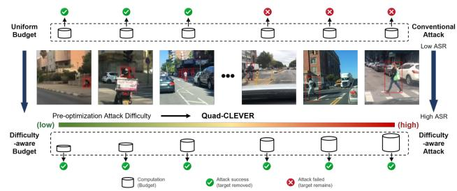
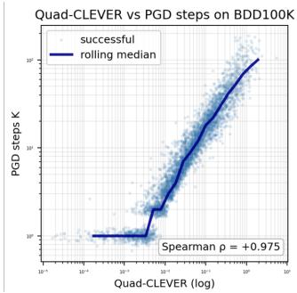
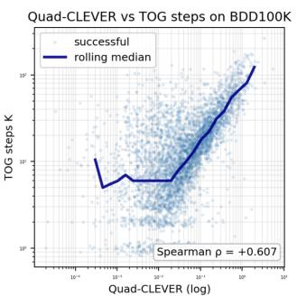
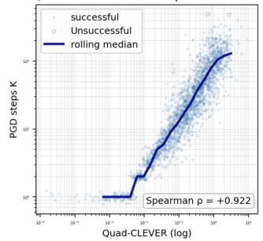
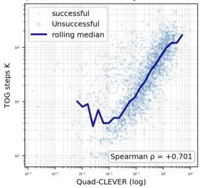
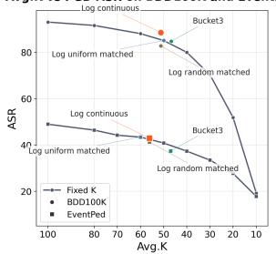
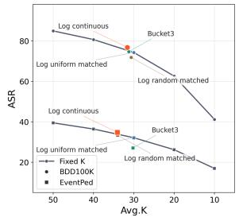
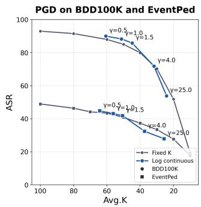
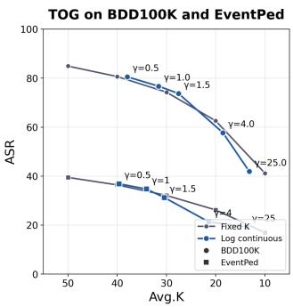

# Can Attack Dificulty Be Characterized Before Optimization? A Study of Pre-optimization Dificulty in Person-Vanishing Attacks

Jingyao Xu1∗, Dongdong Wang2∗, Siyang Lu1†

1School of Computer Science and Technology, Beijing Jiaotong University 2College of Design, Construction, and Planning, University of Florida {jingyaoxu, sylu}@bjtu.edu.cn, dongdongwang@ufl.edu

## Abstract

Adversarial attacks against object detectors are traditionally studied from an optimization perspective, where attack difficulty is regarded as an outcome observed only after adversarial optimization. This raises a fundamental question: can the relative attack dificulty of diferent inputs be characterized before optimization begins? In this paper, we investigate this question for person-vanishing attacks by introducing the concept of pre-optimization attack dificulty, which captures intrinsic diferences in optimization efort across input images. To estimate this latent dificulty before optimization, we propose Quad-CLEVER, an eficient geometry-based estimator derived from a quadratic approximation of the local person-vanishing margin along the most attack-relevant direction. Extensive experiments across multiple attack algorithms demonstrate that Quad-CLEVER consistently correlates with the observed optimization cost, providing empirical evidence that attack dificulty exhibits a predictable pre-optimization structure. Building upon this finding, we further propose a dificulty-aware attack framework that leverages the estimated dificulty to adaptively allocate optimization budgets for a base attack under a fixed computational budget. On BDD100K, the proposed framework improves the image-level attack success rate by up to 5.78% while reducing the average optimization cost by up to 11.42 iterations. On the more challenging EventPed dataset, it saves 2.25 optimization iterations while maintaining comparable attack performance. These results demonstrate that attack dificulty can be meaningfully estimated before optimization and that exploiting such estimates enables more computationally eficient adversarial attacks.

## Introduction

Recent advances in artificial intelligence have accelerated the deployment of autonomous driving systems, where object detection serves as a fundamental perception component for recognizing surrounding trafic participants and supporting downstream driving decisions. Among all detection targets, pedestrians are particularly safety-critical because failing to detect even a single pedestrian may lead to catastrophic consequences (El Hamdani, Benamar, and Younis 2020; Lyssenko et al. 2024). Consequently, understanding the vulnerability of pedestrian detection is essential for improving the safety and reliability of autonomous driving systems (Zhang et al. 2021).

Person-vanishing attacks deliberately suppress pedestrian detections and have become an important benchmark for evaluating the robustness of object detectors (Wu et al. 2020; Hu et al. 2022; Guesmi et al. 2024; Lin et al. 2025). Existing studies have primarily focused on developing stronger attack objectives, more efective optimization algorithms, and higher attack success rates. While these eforts have substantially advanced attack capability, they largely view attack dificulty as an outcome of the optimization process itself. As a result, comparatively little attention has been devoted to understanding whether attack dificulty is merely produced during optimization or reflects a property that can be characterized prior to optimization.

This observation motivates a fundamental scientific question:

Does person-vanishing attack dificulty emerge solely from adversarial optimization, or does it contain an observable input-dependent component that exists before optimization begins?

Answering this question has important implications. If attack dificulty is determined entirely by the optimization procedure, the same image may exhibit arbitrarily diferent dificulty under diferent attack algorithms, making meaningful pre-optimization estimation impossible. Conversely, if attack dificulty contains an observable input-dependent component, two testable consequences should follow. First, the relative dificulty of images should be at least partially preserved across diferent attack algorithms. Second, attack dificulty should be estimable directly from clean inputs before any adversarial optimization is performed. Establishing these properties would shift the study of person-vanishing attacks from exclusively designing stronger optimization procedures toward understanding the structure of attack dificulty itself.

Motivated by this question, we investigate whether data dificulty in person-vanishing attacks can be estimated before adversarial optimization. Rather than treating attack difficulty solely as a retrospective quantity observed after optimization, we investigate whether the relative attack dificulty across data samples can be characterized directly from clean inputs. To this end, we introduce Quad-CLEVER, a preoptimization estimator that predicts the relative attack dificulty of clean inputs without executing adversarial optimization. We further evaluate whether the estimated dificulty is consistent with observed attack dificulty across diferent attack algorithms and whether it supports more efective attack decision making through adaptive budget routing.

  
Figure 1: Images exhibit substantially diferent attack dificulty, making a uniform attack budget ineficient: easy images may receive redundant computation, while hard images remain under-optimized

Rather than asking how to construct stronger personvanishing attacks, this work asks whether attack dificulty itself can be systematically characterized before adversarial optimization. Our contributions are summarized as follows.

• We investigate whether attack dificulty in personvanishing attacks can be characterized before adversarial optimization. Through extensive experiments, we provide empirical evidence that the relative attack dificulty across input samples exhibits a predictable pre-optimization structure.

• We propose Quad-CLEVER, an eficient geometry-based estimator that predicts the relative attack dificulty of clean inputs before adversarial optimization through a quadratic approximation of the local person-vanishing margin.

• We develop a dificulty-aware attack framework that leverages the estimated dificulty to adaptively allocate optimization budgets, enabling more eficient attacks under a fixed computational budget.

• We demonstrate that Quad-CLEVER generalizes across multiple attack algorithms and is consistently correlated with the observed optimization cost. The resulting framework achieves higher attack eficiency while maintaining competitive attack performance on two challenging benchmarks.

## Related Work

## Person-vanishing attacks on object detectors

Adversarial attacks on object detectors (Madry et al. 2017; Xie et al. 2017; Chow et al. 2020) are more complex than classification attacks because detectors jointly predict object locations, categories, and confidence scores. Early physical studies showed that adversarial patches could suppress person detections under realistic viewing conditions (Thys, Van Ranst, and Goedemé 2019). Subsequent work explored diferent vulnerabilities within the detection pipeline.

Daedalus attacks the non-maximum suppression stage by manipulating bounding-box predictions (Wang et al. 2021). DetectSec further provides a systematic framework for evaluating detector robustness under diferent adversarial attacks and model architectures (Du et al. 2022). More recently, AFOG uses learnable attention to identify vulnerable image regions and attacks both transformer- and CNN-based object detectors (Yahn et al. 2025). While these eforts have substantially advanced attack capability, attack dificulty is typically assessed retrospectively through optimizationdependent outcomes, such as attack success rate, residual detection confidence, perturbation magnitude, or the number of optimization iterations or queries. Whether relative personvanishing dificulty can be characterized directly from clean inputs before optimization has received comparatively limited attention.

## Sample-level adversarial vulnerability

Adversarial vulnerability can vary substantially across input samples. Source-image selection has been shown to influence attack success, transferability, and the perturbation required to generate adversarial examples (Ozbulak et al. 2021). Raina and Gales further studied sample attackability in image classification by predicting whether individual samples can be attacked within a given perturbation range (Raina and Gales 2023). Recent work has also examined sample dificulty in adversarial training. Liu et al. (Liu et al. 2024) introduced an instance-level dificulty metric and showed that hard adversarial instances contribute disproportionately to robust overfitting. These findings provide evidence that adversarial behavior contains meaningful sample-dependent structure rather than being determined entirely by an attack algorithm or a uniform perturbation budget. Our work difers from these studies. We study person-vanishing attacks on structured object detectors rather than label-changing attacks on image classifiers; Our target quantity is the optimization efort required by an attack, rather than transferability or minimum perturbation magnitude; Quad-CLEVER is derived analytically from the clean detector response and does not require an auxiliary predictor trained with attack-generated dificulty labels. It is therefore designed to expose pre-optimization difficulty directly from the local geometry of each clean input.

## Robustness estimation

A related research direction characterizes adversarial vulnerability through the local geometry of prediction functions. DeepFool estimates adversarial perturbations by repeatedly linearizing a classifier and approaching its decision boundary (Moosavi-Dezfooli, Fawzi, and Frossard 2016). Analyses of decision-boundary geometry further show that both boundary distance and curvature influence adversarial robustness (Fawzi, Moosavi-Dezfooli, and Frossard 2016). CLEVER introduced an attack-independent robustness score based on local Lipschitz estimation and extreme value theory (Weng et al. 2018b). Its second-order extension incorporates local curvature for twice-diferentiable prediction functions (Weng et al. 2018a). These studies demonstrate that first- and second-order information around clean inputs can provide useful estimates of adversarial vulnerability. Quad-CLEVER transfers the local-geometric perspective to this structured setting but addresses a diferent prediction target. The resulting score is not presented as a certified robustness radius. Instead, it serves as a pre-optimization proxy for the relative computational efort subsequently observed across multiple attack algorithms.

## Adaptive adversarial optimization

Sample-specific adversarial properties have also been used to adapt adversarial training. MMA training estimates individual sample margins and applies diferent perturbation radii according to the shortest successful adversarial perturbation (Ding et al. 2018). Friendly Adversarial Training terminates inner-loop optimization after a suitable misclassified example has been found, reducing unnecessary attack iterations (Zhang et al. 2020a). Geometry-Aware Instance-Reweighted Adversarial Training uses the number of attack steps required to misclassify a sample as an indicator for assigning training weights (Zhang et al. 2020b). Customized Adversarial Training similarly assigns sample-dependent perturbation strengths rather than applying a uniform radius to all training inputs (Cheng et al. 2020).

## Preliminaries

## Attack Dificulty

Let f denote an object detector, $x \in \mathcal { X }$ an input image, and $A \in { \mathcal { A } }$ an adversarial attack algorithm. We denote by $C ( x , A ; f )$ the optimization cost required by attack algorithm A to successfully suppress all pedestrian detections in x. Depending on the attack algorithm, the optimization cost may correspond to the number of optimization iterations, optimization time, query count, or other measures of optimization efort. Since the observed optimization cost varies across attack algorithms, we define the attack dificulty of an input as the expected optimization cost over an attack family,

$$
K ( x ; f ) = \mathbb { E } _ { A \sim \mathcal { P } ( A ) } [ C ( x , A ; f ) ] ,\tag{1}
$$

where $\mathcal { P } ( A )$ denotes a distribution over attack algorithms. A larger value of $K ( x ; f )$ indicates that the input requires, on average, greater optimization efort to be successfully attacked.

## Bayesian Perspective of Attack Dificulty

The intrinsic attack dificulty of an input is not directly observable before adversarial optimization. We therefore model it as a latent variable $D ( x )$ and denote the observable preoptimization information derived from the clean input and target model by $E ( x )$ . From a Bayesian perspective, the latent dificulty is inferred from the posterior

$$
P ( D ( x ) \mid E ( x ) ) = { \frac { P ( E ( x ) \mid D ( x ) ) P ( D ( x ) ) } { P ( E ( x ) ) } } .\tag{2}
$$

This formulation suggests that pre-optimization dificulty estimation should rely on observable evidence rather than directly measuring the latent dificulty. Inspired by the local robustness perspective of CLEVER, we hypothesize that the local decision geometry surrounding the clean input provides informative evidence of the subsequent optimization dificulty. This motivates the search for a computationally efficient geometry-based evidence that can be extracted before adversarial optimization.

## CLEVER

The Cross Lipschitz Extreme Value for nEtwork Robustness (CLEVER) (Weng et al. 2018b,a) score is an attackindependent robustness metric for neural networks. Unlike attack-based evaluation, CLEVER estimates a lower bound on the minimum adversarial perturbation using only the local geometry of the decision boundary, without performing adversarial optimization. Owing to its strong theoretical foundation and extensive empirical validation, CLEVER has become a reliable and well-established measure of local adversarial robustness. In this work, we do not use CLEVER to measure robustness. Instead, we build upon its pre-optimization geometric formulation and investigate whether similar geometry-derived quantities can serve as observable evidence for estimating latent attack dificulty before adversarial optimization.

## Methodology

Following the Bayesian formulation in Section 3, we instantiate the geometry-based evidence using Quad-CLEVER and develop a dificulty-aware attack framework for eficient person-vanishing attacks. The framework consists of two stages. First, we instantiate the geometry-based evidence using Quad-CLEVER, a quadratic approximation of the detector’s local margin geometry, and infer the latent attack dificulty from the resulting pre-optimization evidence. Second, the inferred dificulty is used to adaptively allocate the optimization budget of a base attack, enabling more eficient attacks under a fixed computational budget.

## Quad-CLEVER for Dificulty Estimation

Quad-CLEVER estimates the relative optimization dificulty of suppressing each detected person before adversarial optimization. Inspired by the local geometric formulation of CLEVER, we replace its sampling-based local Lipschitz estimation with a second-order approximation of the detector margin, yielding a closed-form estimate of the local margincrossing distance.

Let $\tilde { s } _ { o } ( x )$ denote the diferentiable confidence score of the pre-NMS hypothesis matched to target person o, and let τ denote the detector threshold. Following CLEVER, we define the person-vanishing margin as

$$
g _ { o } ( x ) = \log \tilde { s } _ { o } ( x ) - \log \tau ,\tag{3}
$$

where $g _ { o } ( x ) > 0$ indicates that the matched hypothesis remains detectable.

Instead of estimating the local Lipschitz constant through repeated gradient sampling, we directly model the local margin geometry. For each target object, let

$$
g _ { 0 , o } = g _ { o } ( x ) , \qquad b _ { o } = \| \nabla _ { x } g _ { o } ( x ) \| _ { 2 } , \qquad u _ { o } = - \frac { \nabla _ { x } g _ { o } ( x ) } { b _ { o } } ,\tag{4}
$$

where $b _ { o }$ is the gradient magnitude and $u _ { o }$ is the direction of the steepest margin decrease. The corresponding directional curvature is

$$
\kappa _ { o } = u _ { o } ^ { \top } \nabla _ { x } ^ { 2 } g _ { o } ( x ) u _ { o } .\tag{5}
$$

Using a second-order Taylor approximation along $u _ { o } ,$ the local margin is approximated as

$$
g _ { o } ( x + r u _ { o } ) \approx g _ { 0 , o } - b _ { o } r + \frac { 1 } { 2 } \kappa _ { o } r ^ { 2 } , \qquad r \geq 0 .\tag{6}
$$

The local margin-crossing distance is obtained by solving the quadratic approximation in Eq. (6), resulting in the proposed Quad-CLEVER estimator

$$
\mathrm { Q u a d \mathrm { - } C L E V E R } ( x , o ) = \frac { 2 g _ { 0 , o } } { b _ { o } + \sqrt { b _ { o } ^ { 2 } - 2 \kappa _ { o } g _ { 0 , o } } } ,\tag{7}
$$

which is algebraically equivalent $\begin{array} { r l r l } { \mathbf { { t o } } } & { { } } & { \left( b _ { o } \right. } & { { } - } \end{array}$ $\sqrt { b _ { o } ^ { 2 } - 2 \kappa _ { o } g _ { 0 , o } } ) / \kappa _ { o }$ while remaining numerically stable as $\kappa _ { o }  0$ , where it naturally reduces to the first-order estimate $g _ { 0 , o } / b _ { o }$

A smaller Quad-CLEVER score indicates that the detector margin reaches the decision boundary under a smaller local perturbation and is therefore expected to require less optimization efort. Compared with sampling-based CLEVER, Quad-CLEVER requires only one gradient evaluation and one Hessian-vector product, eliminating the sampling overhead of local Lipschitz estimation.

Since an image may contain multiple target persons, we aggregate the object-level estimates into an image-level difficulty score,

$$
\widehat { D } ( x ; f ) = \operatorname* { m i n } _ { o \in \mathcal { O } ( x ) } \mathrm { Q u a d - C L E V E R } ( x , o ) ,\tag{8}
$$

where ${ \mathcal { O } } ( x )$ denotes the detected target persons. Since a person-vanishing attack succeeds once any target disappears, the minimum naturally characterizes the dificulty of the attack objective.

## Dificulty-Aware Attack

Having established Quad-CLEVER as an efective preoptimization estimator ofattack dificulty, we next investigate whether the estimated dificulty can be exploited to improve attack eficiency. To this end, we propose a dificulty-aware attack framework that consists of three steps: (1) estimating the image-level attack dificulty using Quad-CLEVER; (2) allocating an image-level optimization budget through a budget allocation policy; and (3) executing a base attack with the assigned budget. Algorithm 1 summarizes the overallframework.

all framework. The framework follows the three steps in Algorithm 1. Given an input image, Quad-CLEVER first estimates its preoptimization attack dificulty. The estimated dificulty is then converted into an image-level optimization budget through the budget allocation policy $\pi ( \cdot )$ under the total budget B. Finally, the allocated budget is used by the base attack to generate the adversarial example. Compared with a fixed optimization budget, the proposed framework allocates more computation to dificult inputs while avoiding unnecessary optimization on easier ones. We consider two implementations of the budget allocation policy $\pi ( \cdot )$

Algorithm 1: Dificulty-Aware Attack Framework   
Require: Inputs X, detector $f ,$ base attack A, total opti  
mization budget B   
1: for each input $x \in \mathcal { X }$ do   
2: Estimate attack dificulty: $\hat { D } ( x ) \gets \Phi ( x , f )$   
3: Allocate optimization budget: $K ( \underline { { x } } ) \gets \pi ( \hat { D } ( x ) , B )$   
4: Generate adversarial example: $x ^ { a \dot { d } v }  A ( \dot { x } , \dot { f } , \dot { K } ( x ) )$   
5: end for   
6: return $\chi ^ { a d v }$

Discrete Budget Routing The first implementation partitions inputs into three dificulty levels and assigns a predefined optimization budget to each level,

$$
K ( x ) = \left\{ \begin{array} { l l } { K _ { \mathrm { e a s y } } , } & { \widehat { D } ( x ; f ) \leq \gamma _ { 1 } , } \\ { K _ { \mathrm { m e d } } , } & { \gamma _ { 1 } < \widehat { D } ( x ; f ) \leq \gamma _ { 2 } , } \\ { K _ { \mathrm { h a r d } } , } & { \widehat { D } ( x ; f ) > \gamma _ { 2 } , } \end{array} \right.\tag{9}
$$

where $\gamma _ { 1 }$ and $\gamma _ { 2 }$ are calibration thresholds estimated from a calibration set.

Continuous Budget Routing Instead of assigning one of three predefined budgets, the second implementation directly maps the estimated dificulty to the optimization budget through a continuous monotonic function,

$$
K ( x ) = 1 0 \cdot \mathrm { { r o u n d } } \left( { \frac { K _ { \operatorname* { m i n } } + ( K _ { \operatorname* { m a x } } - K _ { \operatorname* { m i n } } ) \rho ( \widehat { D } ( x ; f ) ) ^ { \gamma } } { 1 0 } } \right) ,\tag{10}
$$

where $\rho ( \cdot )$ is obtained through logarithmic normalization followed by percentile clipping,

$$
z ( x ) = \log ( \widehat { D } ( x ; f ) + \eta ) ,\tag{11}
$$

$$
\rho ( \widehat { D } ) = \mathrm { c l i p } \left( \frac { z - P _ { 5 } ^ { z } } { P _ { 9 5 } ^ { z } - P _ { 5 } ^ { z } } , 0 , 1 \right) .\tag{12}
$$

The logarithmic transformation mitigates the heavy-tailed distribution of dificulty scores, while percentile clipping improves robustness by limiting the influence of extreme values.

## Experiments

Our experiments are designed to answer the following two research questions.

RQ1: Can attack dificulty be reliably estimated before adversarial optimization begins? To answer this question, we evaluate whether Quad-CLEVER consistently predicts

Quad-CLEVER vs PGD steps on EventPed

the relative optimization dificulty across input samples using multiple attack algorithms and optimization cost metrics.

RQ2: Can pre-optimization dificulty estimation improve the eficiency of adversarial attacks? To answer this question, we incorporate the estimated dificulty into our dificultyaware attack framework and evaluate whether adaptive budget allocation improves attack eficiency under a fixed computational budget.

## Experiment Setup

Threat model. We consider a white-box person-vanishing attack setting. The attacker has full access to the target detector including its architecture, parameters, gradients, and post-processing procedure. Given a clean image containing one or more correctly detected person instances, our goal is to generate an adversarial image that causes the detector to miss the target persons while satisfying a predefined $\ell _ { 2 }$ perturbation constraint. Specifically, we aim to suppress the person predictions associated with the original ground-truth instances after the complete detection pipeline, including confidence filtering and non-maximum suppression. A target person instance is regarded as successfully attacked if no remaining person prediction can be matched to it under the match IoU threshold 0.5. This criterion accounts for detection regeneration, where suppressing one prediction may cause another highly overlapping bounding box to survive after non-maximum suppression. At the image level, an attack is considered successful if at least one target person instance is removed.

Dataset. Our primary datasets are BDD100K (Yu et al. 2020) and EventPed (Zhang et al. 2024). BDD100K is a large-scale autonomous-driving dataset with diverse road, weather, and illumination conditions. Meanwhile, EventPed serves as a more challenging pedestrian-detection benchmark, containing approximately 9K RGB-event image pairs collected in varied outdoor scenes, including daytime, nighttime, and occluded conditions. For both datasets, we retain images containing at least one annotated person instance.

Models. YOLOv8s (Jocher, Chaurasia, and Qiu 2023) is selected as the target object detector. Specifically, we initialize the model using the oficial checkpoint pretrained on the COCO dataset and fine-tune it on two datasets separately. All adversarial attacks and evaluations are subsequently conducted on the fine-tuned YOLOv8s model.

Attacks. We evaluate the efectiveness ofour dificulty-aware routing strategy on two gradient-based baseline attacks. PGD: an $\ell _ { p } { \mathrm { - b o u n d e d } }$ projected gradient attack adapted to the object-vanishing objective; TOG: a targeted objectnessgradient vanishing attack following (Chow et al. 2020). Both attacks are conducted under the same configuration, using an $\ell _ { 2 }$ perturbation constraint with a maximum perturbation budget of $\epsilon = 2 . 0$ and a step size $\alpha ~ = ~ 0 . 0 0 5$ . We apply our routing strategy to both baselines to evaluate whether it can efectively allocate attack iterations according to the estimated dificulty of each input image.

Metrics. The evaluation metrics are Attack Success Rate (ASR) and the average number of attack iterations (Avg.K). ASR measures the proportion of evaluated images for which at least one target person instance is successfully removed after confidence filtering and non-maximum suppression. Avg.K denotes the mean number of attack iterations allocated to each image and is used to quantify the computational cost of the attack. Together, these two metrics characterize the trade-of between attack efectiveness and attack eficiency.

<table><tr><td rowspan="2">Dataset</td><td rowspan="2">Attack</td><td colspan="3">ASR gain of Log continuous (pp)</td><td rowspan="2"> $\Delta K _ { \mathrm { s a v e } }$  at same ASR</td></tr><tr><td>vs. Random</td><td>vs. Uniform</td><td>vs. Fixed K</td></tr><tr><td>BDD100K</td><td>PGD</td><td>+5.78</td><td>+3.45</td><td>+3.08</td><td>+11.42</td></tr><tr><td>BDD100K</td><td>TOG</td><td>+5.00</td><td>+2.52</td><td>+1.50</td><td>+2.36</td></tr><tr><td>EventPed</td><td>PGD</td><td>+1.69</td><td>-0.41</td><td>+0.58</td><td>+2.25</td></tr><tr><td>EventPed</td><td>TOG</td><td>+0.07</td><td>+2.67</td><td>+0.92</td><td>+2.13</td></tr></table>

Table 1: ASR gains and iteration eficiency of Log continuous routing. ASR gains are measured in percentage points. Positive $\Delta K _ { \mathrm { s a v e } }$ indicates fewer iterations required to achieve the same ASR.

  
Figure 2: Quad-CLEVER versus the first successful attack iteration for PGD and TOG on BDD100K and EventPed. Filled points denote successfully attacked images, while hollow red points indicate images that remain unsuccessful within the maximum iteration budget. The solid curve shows the rolling median over successful images.

Baseline. The baselines include fixed-K, which assigns the same iteration budget to all images, and bucket3 routing (9), which divides images into easy, medium, and hard groups according to Quad-CLEVER. The main evaluation focuses on our continuous log-normalized routing strategy (10) with default $\gamma = 1 . 0$

Hardware. All experiments were conducted on a workstation equipped with RTX 3090 GPU under Ubuntu 22.04, using Pytorch 2.0 and CUDA 12.2.

Avg.K vs PGD ASR on BDD100K and EventPed Avg.K vs TOG ASR on BDD100K and EventPed

## RQ1: Can Attack Dificulty Be Estimated Before Optimization?

We first investigate whether Quad-CLEVER can estimate attack dificulty prior to adversarial optimization. For each image x, we compute the image-level Quad-CLEVER score defined in Eq. (8) , where $\tilde { \mathcal { O } ( x ) }$ denotes the set of detected person instances. We then execute each attack with a maximum budget of 500 optimization iterations and record the iteration at which the first successful attack occurs. This first successful iteration serves as an empirical measure of attack dificulty, with larger values indicating greater optimization efort. Since both Quad-CLEVER scores and attack iterations span multiple orders of magnitude, we visualize them on logarithmic axes and quantify their relationship using Spearman’s rank correlation. A rolling median over successful attacks is additionally plotted to highlight the overall trend.

As shown in Fig. 2, Quad-CLEVER exhibits a strong monotonic relationship with the optimization efort required by PGD. The Spearman correlation reaches $\rho = 0 . 9 7 5$ on BDD100K and $\rho = 0 . 9 2 2$ on EventPed. Images with small Quad-CLEVER scores are typically attacked within only a few iterations, producing a visible floor near $K = 1$ . As the score increases, the rolling median rises almost monotonically, eventually exceeding one hundred iterations for the most dificult samples. The consistent behavior across both datasets suggests that the observed relationship is not specific to a particular data distribution.

Quad-CLEVER also remains predictive for TOG, although the relationship is weaker than for PGD. The corresponding Spearman correlations are $\rho ~ = ~ 0 . 6 0 7$ on BDD100K and $\rho = 0 . 7 0 1$ on EventPed. Greater variability is observed among low-dificulty samples, resulting in a flatter rolling median in this region. Nevertheless, the median attack cost increases steadily with the Quad-CLEVER score, indicating that more dificult samples consistently require more optimization iterations. The weaker correlation is expected because TOG optimizes an objectness-oriented objective whose optimization trajectory is additionally affected by interactions among multiple detector hypotheses, confidence filtering, and NMS regeneration.

Overall, these results provide strong empirical evidence that Quad-CLEVER captures an image-dependent component of attack dificulty before adversarial optimization begins. The estimated score consistently predicts the relative optimization efort required by two substantially diferent attack algorithms across two datasets, supporting its use as a pre-optimization dificulty estimator. This property motivates its use in the subsequent dificulty-aware routing framework, where attack budgets are allocated according to the estimated dificulty.

## RQ2: Can Pre-optimization Dificulty Improve Attack Eficiency?

The preceding experiments show that Quad-CLEVER characterizes the local robustness of person instances. We further investigate whether it can provide a dificulty ordering for allocating attack iterations. Two strategies are considered,

Figure 3: Average executed iterations versus image-level ANY ASR for PGD and TOG on BDD100K and EventPed. Fixed-K results form the reference curves, while Bucket3 and Log continuous routing allocate diferent iteration budgets according to the Quad-CLEVER score.  

  
Figure 4: ASR–Budget Trade-of of Quad-CLEVER-Guided Routing. We vary $\gamma$ to produce continuous-routing results with diferent Avg. $K$ and compare them with fixed-K attacks under similar average budgets.

Bucket3 from Eq.(9) and Log continuous from Eq. (10). We additionally construct two matched baselines. Log uniform matched applies a fixed budget close to the average budget of continuous routing, whereas Log random matched randomly permutes the budgets assigned by continuous routing across images. The latter preserves the nominal budget distribution while removing the correspondence between the Quad-CLEVER ranking and attack strength. Under early stopping, the average number of actually executed iterations may difer slightly between the continuous and randomly permuted variants.

Figure 3 and Table 1 demonstrate that dificulty-aware routing is stable on BDD100K. For both PGD and TOG, Log continuous routing consistently improves over random matching, uniform allocation, and fixed-K attacks under the same average computational budget. The substantial gains over random matching show that the improvement is produced by assigning larger budgets to more dificult images according to the Quad-CLEVER ordering, rather than by merely changing the overall budget distribution.

The routing strategy also provides a clear eficiency improvement. At an equivalent ASR, Log continuous routing saves approximately 11.42 iterations per image for PGD and 2.36 iterations for TOG on BDD100K. Thus, the proposed routing not only increases ASR under the same average budget, but also requires fewer iterations to attain the same attack success rate. This consistent improvement across two diferent attacks supports the efectiveness of Quad-CLEVER as a dificulty-aware routing signal.

<table><tr><td rowspan="2">Dataset</td><td colspan="3">Top-20% Overlap (%)</td><td colspan="6">Top-10% → Top-20% (%)</td></tr><tr><td>Q-P</td><td>Q-T</td><td>P-T</td><td>Q→P</td><td>P→Q</td><td>Q→T</td><td> $\mathrm { T } {  } \mathrm { Q }$ </td><td>P→T</td><td>T→P</td></tr><tr><td>BDD100K</td><td>85.17</td><td>66.09</td><td>70.57</td><td>98.39</td><td>98.62</td><td>87.82</td><td>76.55</td><td>94.02</td><td>79.31</td></tr><tr><td>EventPed</td><td>73.13</td><td>64.79</td><td>80.21</td><td>82.50</td><td>82.92</td><td>75.42</td><td>69.17</td><td>95.42</td><td>85.83</td></tr></table>

Table 2: Consistency between dificulty rankings produced by Quad-CLEVER (Q), PGD (P), and TOG (T). $A _ { 1 0 } \to B _ { 2 0 }$ denotes the proportion of A’s top-10% samples contained in B’s top-20%.

The gains on EventPed are smaller because the dataset is more dificult to attack, as reflected by its lower and flatter fixed-K curves. Nevertheless, Log continuous routing remains above the interpolated fixed-K baseline for both attacks. At the same ASR, it saves 2.25 iterations for PGD and 2.13 iterations for TOG. For PGD, routing also improves over random matching, although it remains close to the uniform baseline. For TOG, it improves over the uniform baseline and is approximately comparable to random matching. These results indicate that the dificult nature of EventPed compresses the absolute routing gains, but does not eliminate the improvement in the computation–ASR trade-of.

Overall, Quad-CLEVER enables Log continuous routing to achieve both higher ASR at a matched computational budget and lower computation at a matched ASR. The improvements are strongest and most consistent on BDD100K, while the more challenging EventPed dataset still exhibits positive eficiency gains for both PGD and TOG.

## Ablation study

Efectiveness of Quad-CLEVER-guided budget allocation. We vary γ only to obtain continuous-routing results at diferent average iteration budgets, allowing a direct comparison with fixed-K attacks at similar Avg. K. As shown in Fig. 4, Quad-CLEVER-guided routing generally achieves a higher attack success rate than uniformly assigning the same number of iterations to every image. The improvement is most evident when the routing preserves suficient budget for dificult samples: easy images receive fewer iterations, while the saved computation is redirected to harder ones. When γ becomes excessively large, most budgets are compressed toward $K _ { \mathrm { m i n } } ,$ weakening this adaptive allocation and causing the advantage over fixed-K to diminish or disappear. These results verify that Quad-CLEVER provides a meaningful dificulty ordering and can improve the allocation of attack computation across images.

Consistency across attack algorithms. We investigate whether Quad-CLEVER is confined to a specific attack algorithm. We rank images using Quad-CLEVER and the optimization steps required by standalone PGD and TOG. We compare both the overlap between their top-20% dificult subsets and whether the most dificult top-10% samples identified by one method fall within the top-20% of another. As shown in Table 2, Quad-CLEVER is highly consistent with the empirical dificulty measured by PGD and also maintains clear agreement with TOG. All dificult-subset overlaps are substantially above the random reference, while the strong PGD–TOG agreement further indicates that many difficult images are shared across attack algorithms. These results suggest that Quad-CLEVER captures an attack-agnostic property of image dificulty.

<table><tr><td>Dataset</td><td>Attack</td><td>All</td><td>Person=1</td><td>Person=2</td><td>Person=3</td></tr><tr><td>BDD100K</td><td>PGD</td><td>0.9754</td><td>0.9789</td><td>0.9770</td><td>0.9825</td></tr><tr><td>BDD100K</td><td>TOG</td><td>0.6063</td><td>0.7437</td><td>0.5996</td><td>0.5019</td></tr><tr><td>EventPed</td><td>PGD</td><td>0.9289</td><td>0.8793</td><td>0.9240</td><td>0.9360</td></tr><tr><td>EventPed</td><td>TOG</td><td>0.7349</td><td>0.6818</td><td>0.7148</td><td>0.7487</td></tr></table>

Table 3: Spearman correlation between Quad-CLEVER and attack consumption for diferent numbers of persons.

Efect of the Number of Persons. To examine whether the efectiveness of Quad-CLEVER is afected by the number of target persons, we divide the images according to their clean person count and separately calculate the Spearman correlation between Quad-CLEVER and the required attack iterations in Table 3. For PGD, Quad-CLEVER maintains a consistently strong correlation across diferent person counts on both datasets, indicating that its dificulty ordering is not dominated by the number of targets. The correlations with TOG remain positive but show greater dataset-dependent variation. In particular, the correlation decreases as the person count increases on BDD100K, whereas it remains stable or slightly improves on EventPed. This diference may arise because the image-level minimum Quad-CLEVER score characterizes the most vulnerable target, while the optimization cost of TOG can additionally depend on interactions among multiple persons. Overall, these results demonstrate that Quad-CLEVER captures attack dificulty beyond the simple efect of person count.

## Conclusion

In this work, we investigated whether person-vanishing attack dificulty contains an input-dependent structure that can be characterized before adversarial optimization. To provide observable evidence, we proposed Quad-CLEVER, an eficient geometry-based estimator derived from a directional secondorder approximation of the detector margin. Experiments show that Quad-CLEVER consistently predicts the relative optimization efort required by diferent attack algorithms, indicating that attack dificulty is not solely an outcome of a particular optimization process. Based on this ordering, we further developed dificulty-aware routing strategies that adaptively allocate fewer iterations to easier images and more computation to harder ones. The resulting routing strategies improve the trade-of between attack success and optimization cost across multiple attacks and datasets. Overall, our findings demonstrate that person-vanishing attack dificulty can be meaningfully estimated from clean inputs and that exploiting this information enables more eficient adversarial optimization for object detectors.

## References

Cheng, M.; Lei, Q.; Chen, P.-Y.; Dhillon, I.; and Hsieh, C.- J. 2020. Cat: Customized adversarial training for improved robustness. arXiv preprint arXiv:2002.06789.

Chow, K.-H.; Liu, L.; Loper, M.; Bae, J.; Emre Gursoy, M.; Truex, S.; Wei, W.; and Wu, Y. 2020. Adversarial Objectness Gradient Attacks in Real-time Object Detection Systems. In IEEE International Conference on Trust, Privacy and Security in Intelligent Systems, and Applications, 263–272. IEEE.

Ding, G. W.; Sharma, Y.; Lui, K. Y. C.; and Huang, R. 2018. Mma training: Direct input space margin maximization through adversarial training. arXiv preprint arXiv:1812.02637.

Du, T.; Ji, S.; Wang, B.; He, S.; Li, J.; Li, B.; Wei, T.; Jia, Y.; Beyah, R.; and Wang, T. 2022. DetectSec: Evaluating the robustness of object detection models to adversarial attacks. International Journal of Intelligent Systems, 37(9): 6463– 6492.

El Hamdani, S.; Benamar, N.; and Younis, M. 2020. Pedestrian support in intelligent transportation systems: challenges, solutions and open issues. Transportation research part C: emerging technologies, 121: 102856.

Fawzi, A.; Moosavi-Dezfooli, S.-M.; and Frossard, P. 2016. Robustness of classifiers: from adversarial to random noise. Advances in neural information processing systems, 29.

Guesmi, A.; Ding, R.; Hanif, M. A.; Alouani, I.; and Shafique, M. 2024. Dap: A dynamic adversarial patch for evading person detectors. In Proceedings of the IEEE/CVF conference on computer vision and pattern recognition, 24595–24604.

Hu, Z.; Huang, S.; Zhu, X.; Sun, F.; Zhang, B.; and Hu, X. 2022. Adversarial texture for fooling person detectors in the physical world. In Proceedings of the IEEE/CVF conference on computer vision and pattern recognition, 13307–13316.

Jocher, G.; Chaurasia, A.; and Qiu, J. 2023. Ultralytics YOLOv8.

Lin, G.; Niu, M.; Zhu, Q.; Yin, Z.; Li, Z.; He, S.; and Zheng, Y. 2025. Adversarial attacks on event-based pedestrian detectors: a physical approach. In Proceedings of the AAAI Conference onArtificial Intelligence, volume 39, 5227–5235.

Liu, C.; Huang, Z.; Salzmann, M.; Zhang, T.; and Süsstrunk, S. 2024. On the impact of hard adversarial instances on overfitting in adversarial training. Journal of Machine Learning Research, 25(356): 1–46.

Lyssenko, M.; Pimplikar, P.; Bieshaar, M.; Nozarian, F.; and Triebel, R. 2024. A safety-adapted loss for pedestrian detection in automated driving. arXiv preprint arXiv:2402.02986.

Madry, A.; Makelov, A.; Schmidt, L.; Tsipras, D.; and Vladu, A. 2017. Towards deep learning models resistant to adversarial attacks. arXiv preprint arXiv:1706.06083.

Moosavi-Dezfooli, S.-M.; Fawzi, A.; and Frossard, P. 2016. Deepfool: a simple and accurate method to fool deep neural networks. In Proceedings of the IEEE conference on computer vision and pattern recognition, 2574–2582.

Ozbulak, U.; Anzaku, E. T.; De Neve, W.; and Van Messem, A. 2021. Selection of source images heavily influences the efectiveness of adversarial attacks. arXiv preprint arXiv:2106.07141.

Raina, V.; and Gales, M. 2023. Identifying adversarially attackable and robust samples. arXiv preprint arXiv:2301.12896.

Thys, S.; Van Ranst, W.; and Goedemé, T. 2019. Fooling automated surveillance cameras: adversarial patches to attack person detection. In Proceedings of the IEEE/CVF conference on computer vision andpattern recognition workshops, 0–0.

Wang, D.; Li, C.; Wen, S.; Han, Q.-L.; Nepal, S.; Zhang, X.; and Xiang, Y. 2021. Daedalus: Breaking nonmaximum suppression in object detection via adversarial examples. IEEE Transactions on Cybernetics, 52(8): 7427–7440.

Weng, T.-W.; Zhang, H.; Chen, P.-Y.; Lozano, A.; Hsieh, C.-J.; and Daniel, L. 2018a. On extensions of clever: A neural network robustness evaluation algorithm. In 2018 IEEE Global Conference on Signal and Information Processing (GlobalSIP), 1159–1163. IEEE.

Weng, T.-W.; Zhang, H.; Chen, P.-Y.; Yi, J.; Su, D.; Gao, Y.; Hsieh, C.-J.; and Daniel, L. 2018b. Evaluating the robustness of neural networks: An extreme value theory approach. arXiv preprint arXiv:1801.10578.

Wu, Z.; Lim, S.-N.; Davis, L. S.; and Goldstein, T. 2020. Making an invisibility cloak: Real world adversarial attacks on object detectors. In European Conference on Computer Vision, 1–17. Springer.

Xie, C.; Wang, J.; Zhang, Z.; Zhou, Y.; Xie, L.; and Yuille, A. 2017. Adversarial examples for semantic segmentation and object detection. In Proceedings of the IEEE international conference on computer vision, 1369–1378.

Yahn, Z.; Tekin, S. F.; Ilhan, F.; Hu, S.; Huang, T.; Xu, Y.; Loper, M.; and Liu, L. 2025. Adversarial Attention Perturbations for Large Object Detection Transformers. In Proceedings ofthe IEEE/CVFInternational Conference on Computer Vision, 3184–3193.

Yu, F.; Chen, H.; Wang, X.; Xian, W.; Chen, Y.; Liu, F.; Madhavan, V.; and Darrell, T. 2020. Bdd100k: A diverse driving dataset for heterogeneous multitask learning. In Proceedings of the IEEE/CVF conference on computer vision and pattern recognition, 2636–2645.

Zhang, J.; Lou, Y.; Wang, J.; Wu, K.; Lu, K.; and Jia, X. 2021. Evaluating adversarial attacks on driving safety in vision-based autonomous vehicles. IEEE Internet of Things Journal, 9(5): 3443–3456.

Zhang, J.; Xu, X.; Han, B.; Niu, G.; Cui, L.; Sugiyama, M.; and Kankanhalli, M. 2020a. Attacks which do not kill training make adversarial learning stronger. In International conference on machine learning, 11278–11287. PMLR.

Zhang, J.; Zhu, J.; Niu, G.; Han, B.; Sugiyama, M.; and Kankanhalli, M. 2020b. Geometry-aware instance-reweighted adversarial training. arXiv preprint arXiv:2010.01736.

Zhang, Y.; Zeng, W.; Jin, S.; Qian, C.; Luo, P.; and Liu, W. 2024. When Pedestrian Detection Meets Multi-Modal Learning: Generalist Model and Benchmark Dataset. In European Conference on Computer Vision (ECCV).