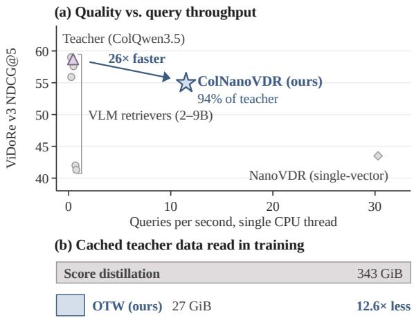
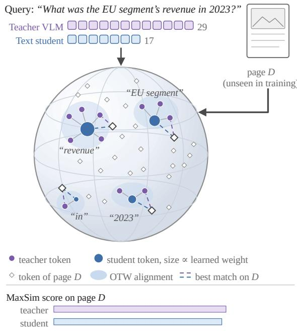
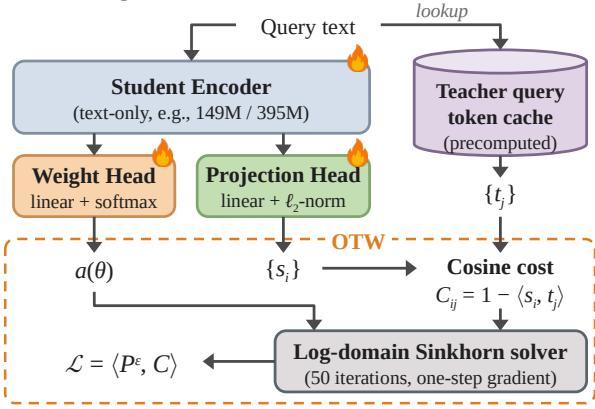
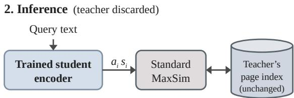
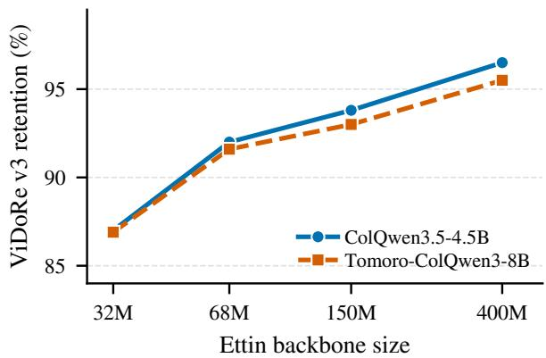
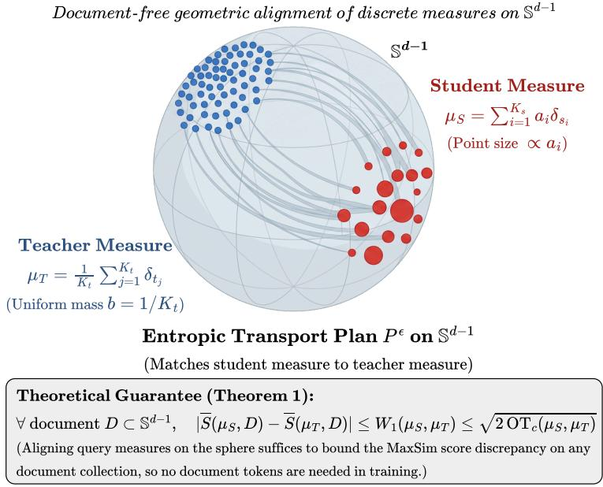

# ColNanoVDR: Document-Free Query Distillation for Multi-Vector Visual Document Retrieval via Optimal Transport

Zhuchenyang Liu1 Ziyi Wang2 Yao Zhang1 Yu Xiao1

1Aalto University, Finland

2Independent Researcher, Netherlands zhuchenyang.liu@aalto.fi

Code: github.com/Ryenhails/NanoVDR Models: huggingface.co/nanovdr

## Abstract

Multi-vector retrievers built on vision-language models lead visual document retrieval (VDR), but they run a multi-billion-parameter query encoder on every search. Distilling this encoder into a small student that queries the teacher’s existing index would remove the bottleneck. The standard recipe, however, matches the teacher’s MaxSim scores and so requires encoding and caching every training page, which can reach terabytes of page tokens. NanoVDR avoids pages entirely by training on the teacher’s query embeddings alone, but only for single-vector retrievers. We present ColNanoVDR, to our knowledge the first framework to bring this document-free distillation to multi-vector VDR. Its objective, OTW (Optimal Transport with Learned Weights), aligns the student’s query tokens with the teacher’s by entropic optimal transport, with a learned weight for each student token, and needs no correspondence between the two tokenizations. We prove that the resulting alignment cost bounds the MaxSim score difference on every page. Distilled from five state-of-the-art teachers, the 149M textonly students retain about 95% of their teachers NDCG@5 on ViDoRe v1–v3 while encoding queries up to 26× faster. Under identical training, OTW matches score distillation while encoding no page and reading 12.6× less cached teacher data.

## 1 Introduction

Visual document retrieval (VDR) matches textual queries directly against page images, without relying on optical character recognition (OCR) (Faysse et al., 2025). State-of-the-art retrievers build both the query and document encoders on large visionlanguage models (VLMs) with up to 9B parameters (Loison et al., 2026). Pages are indexed offline once, but the query encoder runs on every request, so a multi-billion-parameter VLM sits on the online path of every search. Query-side distillation removes this bottleneck: it replaces only the teacher’s query encoder with a small student and keeps the teacher’s document encoder and page index unchanged. NanoVDR (Liu et al., 2026b) showed that this works for VDR with a text-only student trained on the teacher’s query embeddings alone, with no page encoded or read during training; we call such training document-free.

  
Figure 1: ColNanoVDR approaches its teacher’s quality at a fraction of its inference and training cost. (a) ViDoRe v3 NDCG@5 against query throughput on a single CPU thread. (b) Cached teacher data read during training: score distillation reads query and page tokens, OTW only query tokens.

However, NanoVDR targets single-vector retrievers, whereas the strongest VDR systems are multi-vector: they represent queries and pages as sets of token vectors and score them by late interaction, matching each query token to its most similar page token and summing these maxima (MaxSim) (Khattab and Zaharia, 2020; Faysse et al., 2025). On ViDoRe v3, the multi-vector teachers we consider lead the best single-vector system by 15 to 19 NDCG@5 points (Table 1). Extending query-side distillation to multi-vector teachers would bring a compact query encoder to the strongest retrievers and let it serve their existing indices without re-indexing. We hypothesize that such a student can retain most of its teacher’s quality at a small fraction of its size and latency.

The direct route is score distillation, the standard recipe for late-interaction students (Santhanam et al., 2022; Huang and Chen, 2024; Clavié, 2024), which trains the student to reproduce the teacher’s MaxSim scores on candidate pages. It is documentdependent, however: every training page must be encoded by the teacher, and each high-resolution page yields over a thousand token vectors. For ColVec1.1 (webAI, 2026), we estimate that one million training pairs would require about 2 TiB of cached page tokens (Appendix C.2), and the cache must be rebuilt for every new teacher. Keeping training document-free, as in NanoVDR, would remove this page-side overhead entirely.

Compared with the single-vector case, document-free training for multi-vector retrievers raises two problems. First, the two encoders tokenize a query differently and produce token sets of different sizes with no correspondence between them. Second, MaxSim takes a maximum over page tokens, so it is not obvious that aligning query tokens controls the score on pages never seen in training.

To address both problems, we propose Col-NanoVDR, to our knowledge the first documentfree, query-side distillation framework for multivector VDR, trained with OTW (Optimal Transport with Learned Weights). OTW treats each query as a weighted set of token embeddings on the unit sphere and aligns the student’s set with the teacher’s by entropic optimal transport (Figure 2). The transport plan couples tokens without requiring a correspondence, and a lightweight linear head predicts a weight for each student token from the query, so that one student token can stand in for several teacher tokens; this addresses the first problem. For the second, we show that the alignment cost between the two token sets bounds the MaxSim score difference on every page (Theorem 1), so aligning queries suffices in principle and training reads only the teacher’s query tokens. At inference, the student’s tokens are rescaled by their weights and scored with standard MaxSim against the teacher’s unchanged index.

We distill five state-of-the-art multi-vector retrievers and evaluate on ViDoRe v1, v2, and v3 (Faysse et al., 2025; Macé et al., 2025; Loison et al., 2026). With 30×–60× fewer parameters, ColNanoVDR retains about 95% of its teacher’s

  
Figure 2: Intuition behind OTW. The teacher and the student encode the same query into token sets of different sizes on the unit sphere. OTW aligns the two sets softly (shaded regions): each student token covers nearby teacher tokens, and its learned weight grows with the number it covers. On a page D never seen in training, aligned student and teacher tokens find the same best-matching page token, so the two MaxSim scores nearly coincide. Schematic.

NDCG@5, and the ColQwen3.5 student encodes a query 26× faster than its teacher on a single CPU thread (Figure 1a). Under identical training, OTW matches score distillation while encoding no page and reading 12.6× less cached teacher data (Figure 1b). Overall, ColNanoVDR offers a practical path to deploying multi-vector visual document retrieval at scale: queries are encoded on a single CPU thread and scored against the teacher’s existing index, and adding a new teacher requires only encoding its training queries.

## 2 Related Work

Cost of multi-vector visual document retrieval. Late interaction scores a query against a document by matching every query token to its best document token (Khattab and Zaharia, 2020). ColPali brought it to page images (Faysse et al., 2025), and the ViDoRe benchmarks (Faysse et al., 2025; Macé et al., 2025; Loison et al., 2026) have since driven multi-vector retrievers built on ever larger vision-language backbones (TomoroAI, 2026; Soju, 2026). Much of the work on the resulting overhead targets the index: storing fewer or merged document tokens (Hofstätter et al., 2022; Kankanampati et al., 2026; Ma et al., 2025; Liu et al., 2026a), or reducing multi-vector search to single-vector search (Dhulipala et al., 2026). Another direction trains compact retrievers natively (Teiletche et al., 2025), rebuilding both encoders. This requires reindexing every collection, and the small document encoder limits quality. Neither direction addresses the overhead that remains once the multi-vector index is fixed. ColNanoVDR targets this overhead: it keeps the teacher’s document encoder and index as they are and replaces only the query encoder, so pages keep the teacher’s high-capacity representations, no collection is re-indexed, and the method is complementary to index-side compression.

Distillation for retrievers. Existing distillation recipes split along the axis that matters for our setting: whether training reads documents. Lateinteraction students have been distilled through their scores on sampled query-document pairs, with a cross-encoder or pairwise reranker as the teacher (Santhanam et al., 2022; Huang and Chen, 2024), or by matching a strong teacher’s ranking distribution over sampled documents (Clavié, 2024; Takehi et al., 2025); the same score-level signal has compressed late interaction into a single-vector student (Lin et al., 2020). All of these read documents during training, which in visual retrieval means pages that the vision-language teacher must first encode. Single-vector retrievers admit a document-free alternative: the student regresses the teacher’s embedding directly. This has been used to distill full dual encoders (Yang et al., 2024; Lei et al., 2024) and, in the asymmetric setting where the two towers are parameterized separately (Dong et al., 2022), to replace only the query encoder against a frozen document encoder (Kim et al., 2023; Wang and Hong, 2023), including NanoVDR, the closest prior work to ours, which does so with a text-only student for visual documents (Liu et al., 2026b). Regressing one vector onto another has no direct counterpart in late interaction, where each side is a set of token vectors of different sizes with no correspondence between them. ColNanoVDR supplies this counterpart, making query-side distillation document-free in the multi-vector setting.

Optimal transport and token weighting. Optimal transport has served as a distillation objective for aligning teacher and student distributions and representations: over labels (Bhardwaj et al.,

2022), over the output distributions and hidden states of language models, including across different tokenizers (Cui et al., 2025a,b; Vuong et al., 2026), and over features within a batch (Chen et al., 2021). Vision-language pretraining has aligned image patches with words at the token level, contrastively through a token-wise maximum similarity (Yao et al., 2021) or through a one-to-one matching used only during training (Nie et al., 2023). Our use differs in what is transported: we transport between the two token-embedding sets from which the retrieval score itself is computed, which is what makes the alignment cost a bound on the score difference on every page (Theorem 1). On the weighting side, late interaction sums query-token matches with equal weight, and a reproduction study traces the failure of multi-vector retrievers on long, narrative queries to this uniform weighting (Ghosh et al., 2026). Proposed remedies attach weights to vocabulary items, set from corpus statistics or fitted on relevance labels (S et al., 2025), or produce them with a gating module trained on relevance labels (Kang et al., 2025). Our weights are instead predicted per token from the query’s context and learned without relevance labels or documents, as the student-side marginal of the transport plan; the same weights are kept at inference, so the quantity trained is the quantity served.

## 3 Method

ColNanoVDR keeps the teacher’s document encoder and page index unchanged and replaces only its query encoder (Figure 3). For a query, the frozen teacher produces $K _ { t }$ unit-norm token embeddings $\{ t _ { j } \} _ { j = 1 } ^ { K _ { t } }$ , computed once and cached; the student produces $K _ { s }$ unit-norm embeddings $\{ s _ { i } \} _ { i = 1 } ^ { K _ { s } }$ in the same space, together with a weight for each token. The two models tokenize differently, so $K _ { s } \neq K _ { t }$ in general and their tokens have no correspondence. OTW trains the student by aligning the two token sets with optimal transport. We first define the weighted score both models share (Section 3.1), then the alignment and its cost (Section 3.2), the learned weights and the training objective (Section 3.3), and finally show why aligning queries controls the score on every page (Section 3.4). Section 3.5 covers the architecture, solver, and inference, and Appendix A proves every formal claim.

1. Training (document-free, end to end)

  
Figure 3: The ColNanoVDR pipeline. Training (top): the student outputs unit-norm query tokens $\left\{ s _ { i } \right\}$ and token weights $a ( \theta )$ ; OTW (dashed box) aligns them with the cached teacher query tokens $\{ t _ { j } \}$ by entropic optimal transport, and the loss is the soft alignment cost $\langle P ^ { \varepsilon } , C \rangle$ . Inference (bottom): the teacher is discarded; weighted student tokens $a _ { i } s _ { i }$ are scored with standard MaxSim against the unchanged teacher index.

## 3.1 Queries as weighted token sets

We represent a query by its unit-norm token embeddings $q _ { 1 } , \ldots , q _ { K }$ with nonnegative weights $\omega _ { 1 } , \ldots , \omega _ { K }$ summing to one, i.e., as a weighted token set $\mu \ : = \ : \textstyle \sum _ { i } \omega _ { i } \delta _ { q _ { i } }$ , a discrete probability measure in which $\delta _ { q }$ is a unit point mass at $q .$ For a page D, a set of unit-norm page tokens, let $h _ { D } ( q ) = \operatorname* { m a x } _ { d \in D } \langle q , d \rangle$ be the best match a single query token $q$ finds on the page. The weighted lateinteraction score is the weighted average of these best matches,

$$
\bar { S } ( \mu , D ) \ = \ \sum _ { i } \omega _ { i } h _ { D } ( q _ { i } ) .\tag{1}
$$

With uniform weights this is standard MaxSim divided by the query length, which leaves the ranking unchanged. The two models differ in their weights. The teacher keeps uniform weights $\boldsymbol { b } ~ = ~ \left( b _ { 1 } , \ldots , b _ { K _ { t } } \right)$ with $b _ { j } ~ = ~ 1 / K _ { t }$ , so $\mu _ { T } =$ $\sum _ { j } b _ { j } \delta _ { t _ { j } }$ is scored by its standard MaxSim; the student uses learned weights $a = \left( a _ { 1 } , \ldots , a _ { K _ { s } } \right)$ so $\begin{array} { r } { \mu _ { S } = \sum _ { i } a _ { i } \delta _ { s } } \end{array}$ (Section 3.3). Distillation asks that $\bar { S } ( \mu _ { S } , D ) \approx \bar { S } ( \mu _ { T } , D )$ on every page D, without seeing any page during training.

## 3.2 Aligning token sets with optimal transport

Transport plans. We compare the two token sets through a soft alignment, much like a wordalignment matrix in machine translation: a nonnegative matrix $P \in \mathbb { R } ^ { K _ { s } \times K _ { t } }$ in which $P _ { i j }$ is the share of student token i’s weight assigned to teacher token $j$ . Every student token hands out exactly its weight $a _ { i } .$ , and every teacher token receives exactly its weight $b _ { j } { \mathrm { : } }$

$$
\begin{array} { r } { \sum _ { j } P _ { i j } = a _ { i } , \qquad \sum _ { i } P _ { i j } = b _ { j } . } \end{array}\tag{2}
$$

We call such a matrix a transport plan and write $U ( a , b )$ for the set of them. A plan needs no correspondence between the two tokenizations: one student token may cover several teacher tokens, and one teacher token may be split across several student tokens.

Alignment cost. We measure the disagreement between two tokens by the cosine cost $c ( x , y ) =$ $1 - \langle x , y \rangle$ , built on the inner product that MaxSim uses, and collect it in the cost matrix $C _ { i j }$ = $c ( s _ { i } , t _ { j } )$ . The cost of a plan, $\begin{array} { r } { \langle P , C \rangle = \sum _ { i j } P _ { i j } C _ { i j } } \end{array}$ is the average disagreement between aligned tokens, and the lowest cost over all plans,

$$
\operatorname { O T } _ { c } ( \mu _ { S } , \mu _ { T } ) \ = \ \operatorname* { m i n } _ { P \in U ( a , b ) } \ \langle P , C \rangle ,\tag{3}
$$

is an earth mover’s problem between the two token sets, the formulation behind Word Mover’s Distance (Kusner et al., 2015), here posed between two encoders’ embeddings of the same query. We refer to it as the alignment cost. It is small when every teacher token has student weight close to it, and Section 3.4 shows that it bounds the MaxSim score difference on every page.

Entropic smoothing. The optimal plan of Equation 3 solves a linear program: it is sparse and can jump between alignments under small changes of the embeddings, a poor target for gradient training. We add an entropy term (Cuturi, 2013; Peyré and Cuturi, 2020), which spreads weight over plausible partners:

$$
P ^ { \varepsilon } ( a ) = \arg \operatorname* { m i n } _ { P \in U ( a , b ) } \langle P , C \rangle - \varepsilon H ( P ) ,\tag{4}
$$

where $\begin{array} { r } { H ( P ) = - \sum _ { i j } P _ { i j } } \end{array}$ log $P _ { i j }$ . We write $P ^ { \varepsilon } ( a )$ because the student weights a are learned, whereas the teacher weights b are fixed. The strength ε acts as a temperature: $\mathrm { ~ a s ~ } \varepsilon  0$ the plan approaches the optimal one, and a large ε spreads each token’s weight evenly. The plan is unique, differentiable in $C$ and $^ { a , }$ and computed with Sinkhorn iterations (Section 3.5).

## 3.3 Learned token weights and the OTW objective

The alignment cost depends on the student’s weights. Uniform weights, which recover plain MaxSim, fit poorly whenever the two encoders tokenize a query differently. This is the general case for query-side distillation: the student and teacher backbones differ in vocabulary, segmentation, and special tokens such as ColBERT-style query augmentation. On our training queries, for instance, the student produces 17 tokens on average against the teacher’s 29 (Appendix B.1). Some student tokens must then stand in for several teacher tokens, while others have little to align with, yet uniform weights make every student token hand out the same mass, which keeps the alignment cost high. Rather than engineering the two tokenizers into correspondence for each teacher–student pair, we let the student learn its own weights, a lightweight design that applies to any pair.

If the weights could be chosen freely to minimize the alignment cost, each teacher token would send its mass to its nearest student token, and a student token’s weight would become the share of teacher tokens for which it is nearest (Proposition A.4). However, these weights depend on the teacher’s tokens, which are not available at inference. We therefore train the student to predict its own weights from the query alone. A linear head $w _ { \theta }$ reads each token’s hidden state $z _ { i }$ before the projection, and a softmax over the query’s tokens turns the scores into weights,

$$
a ( \theta ) = \mathrm { s o f t m a x } \big ( w _ { \theta } ( z _ { 1 } ) , \dots , w _ { \theta } ( z _ { K _ { s } } ) \big ) ,\tag{5}
$$

where θ collects all student parameters: the encoder, the projection, and the weight head.

Training objective. The OTW loss is the soft alignment cost of the entropic plan under the student’s predicted weights,

$$
\begin{array} { r } { \mathcal { L } ( \boldsymbol { \theta } ) = \left. P ^ { \varepsilon } \big ( \boldsymbol { a } ( \boldsymbol { \theta } ) \big ) , C ( \boldsymbol { \theta } ) \right. = \sum _ { i j } P _ { i j } ^ { \varepsilon } C _ { i j } , } \end{array}\tag{6}
$$

minimized end to end over the encoder, the projection, and the weight head. The weight head receives no direct supervision: through the loss, each student token moves toward the teacher tokens aligned with it, and weight shifts toward student tokens that lie close to many teacher tokens. Every term of $\mathcal { L }$ is computed from the two query token sets, so training requires no pages and no document cache.

## 3.4 Why aligning queries suffices

The OTW objective aligns the student’s query tokens with the teacher’s, but it is not obvious that this also aligns their MaxSim scores: the score takes a maximum over the tokens of a page, and training never sees a page. Viewing each query as a discrete measure on the unit sphere (Section 3.1), we bound the score difference directly by the quantities OTW computes (proof in Appendix A.2).

Theorem 1. For every non-empty finite page D on the unit sphere,

$$
\begin{array} { r l } & { \left| \bar { S } ( \mu _ { S } , D ) - \bar { S } ( \mu _ { T } , D ) \right| } \\ & { \quad \leq \sqrt { 2 \operatorname { O T } _ { c } ( \mu _ { S } , \mu _ { T } ) } \leq \sqrt { 2 \mathscr { L } ( \theta ) } . } \end{array}
$$

In plain terms, the objective OTW minimizes is an upper bound on the MaxSim score difference between student and teacher on every page, including pages absent from training. OTW thus provides a direct sufficient condition for retrieval fidelity.

## 3.5 Architecture, solver, and inference

Architecture. The student is a text-only encoder with two linear heads on its token states (Figure 3, top): a bias-free projection to the teacher’s width followed by $\ell _ { 2 }$ normalization, which yields $\{ s _ { i } \}$ and the weight head of Equation 5 (Appendix B.2). The teacher’s query tokens are cached once, so the teacher is never run during training.

Solver. We solve Equation 4 with log-domain Sinkhorn iterations. The first iterations run without gradient tracking; only the last one is recomputed inside the autograd graph, and gradients flow through it to both the embeddings (through C) and the weights (through a) (Luise et al., 2018; Eisenberger et al., 2022). Backpropagation thus needs the memory of a single iteration. On query-sized matrices (about 17 × 29), training with the solver is about as fast as score distillation (Appendix B.3, Algorithm 1).

Inference. At inference time the teacher is discarded (Figure 3, bottom). The student scales each token by its weight, $\tilde { s } _ { i } = a _ { i } s _ { i }$ , and MaxSim then returns

$$
\begin{array} { r } { \sum _ { i } \operatorname* { m a x } _ { d \in D } \langle \tilde { s } _ { i } , d \rangle = \sum _ { i } a _ { i } h _ { D } ( s _ { i } ) = \bar { S } ( \mu _ { S } , D ) , } \end{array}
$$

<table><tr><td>Model</td><td>Params</td><td>v1</td><td>v2</td><td>v3</td></tr><tr><td colspan="5">Reference systems (native retrieval)</td></tr><tr><td>Tomoro-ColQwen3-8B</td><td>8.8B</td><td>90.6</td><td>65.0</td><td>59.0</td></tr><tr><td>ColVec1.1-8b</td><td>8.4B</td><td>91.5</td><td>67.8</td><td>62.6</td></tr><tr><td>ColNomic-7B</td><td>7.8B</td><td>89.8</td><td>60.4</td><td>55.9</td></tr><tr><td>ColQwen3.5-4.5B</td><td>4.5B</td><td>91.6</td><td>63.7</td><td>58.7</td></tr><tr><td>Vultron-4.5B</td><td>4.5B</td><td>91.8</td><td>67.6</td><td>61.0</td></tr><tr><td>ColVec1.1-4b</td><td>4.5B</td><td>90.7</td><td>66.6</td><td>61.6</td></tr><tr><td>Tomoro-ColQwen3-4B</td><td>4.4B</td><td>90.2</td><td>65.3</td><td>57.6</td></tr><tr><td>DSE-Qwen2</td><td>2.2B</td><td>85.1</td><td>55.7</td><td>41.3</td></tr><tr><td>ColPali-v1.3</td><td>3.0B</td><td>84.2</td><td>54.7</td><td>42.0</td></tr><tr><td>ColModernVBert</td><td>259M</td><td>76.7</td><td>33.4</td><td>17.4</td></tr><tr><td>NanoVDR-S (single-vector)</td><td>69M</td><td>82.2</td><td>60.5</td><td>43.5</td></tr><tr><td colspan="5">ColNanoVDR (149M text-only student, document-free OTW), by teacher</td></tr><tr><td>from ColQwen3.5-4.5B</td><td>149M</td><td>90.7 (99.0)</td><td>60.0 (94.2)</td><td>55.1 (93.8)</td></tr><tr><td>from Tomoro-ColQwen3-8B</td><td>149M</td><td>90.0 (99.3)</td><td>60.6 (93.3)</td><td>54.9 (93.0)</td></tr><tr><td>from Vultron-4.5B</td><td>149M</td><td>91.3 (99.4)</td><td>65.0 (96.1)</td><td>58.3 (95.5)</td></tr><tr><td>from ColVec1.1-4b</td><td>149M</td><td>90.3 (99.5)</td><td>64.0 (96.1)</td><td>59.1 (95.8)</td></tr><tr><td>from ColVec1.1-8b</td><td>149M</td><td>90.9 (99.3)</td><td>65.4 (96.5)</td><td>60.1 (96.0)</td></tr></table>

Table 1: Main results. NDCG@5 per benchmark and, for ColNanoVDR, retention of its own teacher in parentheses, each student scored against that teacher’s index. Reference systems are evaluated by us under the identical protocol (model identifiers in Appendix B.5).

since positive weights move out of the maximum (Proposition A.5). This is exactly the weighted score that training aligns with the teacher’s, so the student plugs into an existing late-interaction engine with no change to its index or scoring kernel.

## 4 Experiments

Our experiments answer four questions. Fidelity: how much of a multi-vector teacher’s retrieval quality does a document-free student retain, across teachers and student sizes? Efficiency: what does the student save in query latency at inference and in cached teacher data during training? These two are answered in Section 4.2. Objective: under identical training, does OTW match document-dependent score distillation, and do its learned weights matter (Section 4.3)? Deployment: does the student stay compatible with a compressed index (Section 4.4)?

## 4.1 Setup

Teachers. Because OTW needs the teacher only on the training queries, adding a teacher is cheap, which makes a multi-teacher study feasible. We distill the five strongest multi-vector retrievers on ViDoRe v3 (Loison et al., 2026) under our protocol (upper block of Table 1), spanning two backbone generations, two embedding dimensions (320 and 640), and 4.5B to 8.8B parameters. ColQwen3.5- 4.5B, our main teacher, is abbreviated ColQwen3.5 in the text.

Students. We use the Ettin encoder suite (Weller et al., 2026), pretrained with one recipe across all sizes, so that capacity is the only scaling variable, with the two heads of Section 3.5. Its tokenizer differs from every teacher’s, the general case that OTW targets. Main results use Ettin-150M, which with its heads gives a 149M-parameter student; a capacity ablation covers Ettin-32M, -68M, -150M, and -400M.

Training data and optimization. We adopt the NanoVDR training set (Liu et al., 2026b)1: 711,603 (query, page-image) pairs from four public sets, plus 777,649 machine-translated query variants that reuse the base pairs’ pages (Appendix B.4). OTW and every alternative objective of Section 4.3 are trained on identical data with identical optimization; hyperparameters and transport settings are given in Appendix B.2.

Evaluation. We measure retrieval quality by NDCG@5, the standard ViDoRe metric, averaged within each benchmark (Faysse et al., 2025; Macé et al., 2025; Loison et al., 2026): v1 (10 datasets), v2 (4 datasets), and v3 (8 datasets), together with retention, the ratio of the student’s to the teacher’s benchmark-average NDCG@5 under the same index, computed before rounding. The v3 suite consists of enterprise collections (finance, human resources, industrial, pharmaceutical, physics, computer science, energy), largely outside the training domains, with queries authored against long multi-page documents. Efficiency is measured by single-query encoding latency on CPU and GPU and by the volume of cached teacher data read during training.

<table><tr><td></td><td></td><td colspan="2">Encode (ms)</td></tr><tr><td>Query encoder</td><td>Params CPU</td><td>GPU</td><td>v3</td></tr><tr><td>Vision-language retrievers</td></tr><tr><td>Tomoro-ColQwen3-8B</td><td>8.8B 4,277</td><td>18.4 59.0</td></tr><tr><td>ColNomic-7B</td><td>7.8B 3,845</td><td>23.4 55.9</td></tr><tr><td>ColQwen3.5-4.5B (teacher)</td><td>4.5B 2,290 4.4B 2,118</td><td>110.7† 58.7 18.6 57.6</td></tr><tr><td>Tomoro-ColQwen3-4B</td></tr><tr><td>ColPali-v1.3</td><td>3.0B 1,504 17.0 42.0</td></tr><tr><td>DSE-Qwen2 2.2B 1,343</td><td>13.9 41.3</td></tr><tr><td colspan="2">Compact retrievers 13.8</td></tr><tr><td>ColModernVBert</td><td>259M 89</td></tr><tr><td>NanoVDR-S (single-vector)</td><td>69M 33</td></tr><tr><td>ColNanoVDR-400M 395M</td><td>286 13.2 56.7</td></tr><tr><td>ColNanoVDR 149M</td><td>87 10.8 55.1</td></tr></table>

Table 2: Query-encoding cost on one node, median over 20 queries at batch size 1, excluding MaxSim scoring: one CPU thread (float32) and one H200 (bf16); v3 is ViDoRe v3 NDCG@5. ColNanoVDR students of the same size share the encoder, so one row per size; v3 is that of the ColQwen3.5 student. †Torch fallback for the hybrid linear-attention layers. Protocol in Appendix C.1.

Comparisons. We compare each student with its own teacher and with ten further retrievers evaluated under the identical protocol (Table 1): multivector vision-language retrievers from ColPali-v1.3 to the current state of the art, the single-vector DSE-Qwen2, and two compact retrievers, ColModern-VBert and the single-vector NanoVDR-S. To isolate the objective, Section 4.3 retrains the same student under two document-dependent and two document-free alternatives.

## 4.2 Main results

Multi-vector quality is retained. In Table 1, each row of the lower block is a separate 149M student scored on its own teacher’s index. On v1, every student retains about 99% of its teacher’s NDCG@5; on the harder v2 suite and the out-ofdomain v3 enterprise collections, retention stays between 93.0% and 96.5% for all five teachers. A text-only student with 30×–60× fewer parameters, trained without any document-side supervision, thus preserves most of its vision-language teacher’s ranking quality.

  
Figure 4: ViDoRe v3 retention across the Ettin family, for the ColQwen3.5 and the Tomoro-ColQwen3-8B students.

Inference latency. Table 2 and Figure 1a measure the query path on one node. On a single CPU thread, ColNanoVDR encodes a query in 87 ms, 26× faster than its ColQwen3.5 teacher with 30× fewer parameters, while every vision-language retriever needs more than a second per query. On a GPU at batch size 1 the gap is smaller, 1.3– 2.2× against the other vision-language retrievers; ColQwen3.5’s 110.7 ms reflects a fallback kernel path rather than its model size.

Supervision cost. OTW reads the teacher’s query tokens only. Score distillation reads, in addition, the cached tokens of the training pages and inbatch negatives at every step, 12.6 times as much cached teacher data in total (measured in Table 5 in Appendix C.2). The document-free recipe removes this page-side cost for every new teacher. Per epoch, OTW trains at a speed comparable to score distillation (Appendix B.2), so the saving lies in storage and reads rather than computation.

Capacity. Across student capacity (Figure 4, numbers in Appendix C.3), retention rises monotonically from Ettin-32M to Ettin-400M on every benchmark, with the gains concentrated on v2 and v3. The Ettin-32M student already retains 87% of its teacher on v3. On v3, the retention curves of the two teachers agree to within 1.0 point at every size.

## 4.3 Comparison of training objectives

We isolate the contribution of the objective by retraining the student under four alternative objectives with everything else fixed, on both ColQwen3.5 and Tomoro-ColQwen3-8B.

The objectives. Two baselines are documentdependent. InfoNCE contrasts the student’s

<table><tr><td></td><td></td><td></td><td colspan="3">ColQwen3.5-4.5B teacher</td><td colspan="3">Tomoro-ColQwen3-8B teacher</td></tr><tr><td>Objective</td><td>Reads</td><td>Weights</td><td>v1</td><td>v2</td><td>v3</td><td>v1</td><td>v2</td><td>v3</td></tr><tr><td colspan="9">document-dependent</td></tr><tr><td>InfoNCE</td><td>D</td><td>uniform</td><td>88.9</td><td>51.7</td><td>47.1</td><td>87.9</td><td>52.1</td><td>46.2</td></tr><tr><td>Listwise KL</td><td>Q+D</td><td>uniform</td><td>90.9</td><td>61.2</td><td>55.0</td><td>89.0</td><td>57.3</td><td>49.9</td></tr><tr><td>document-free</td><td></td><td></td><td></td><td></td><td></td><td></td><td></td><td></td></tr><tr><td>Coverage</td><td>Q</td><td>uniform</td><td>90.2</td><td>58.3</td><td>53.9</td><td>88.5</td><td>57.0</td><td>53.0</td></tr><tr><td>OT-uniform</td><td>Q</td><td>uniform</td><td>89.6</td><td>58.7</td><td>53.4</td><td>84.4</td><td>51.4</td><td>50.2</td></tr><tr><td>OTW (ours)</td><td>Q</td><td>learned</td><td>90.7</td><td>60.0</td><td>55.1</td><td>90.0</td><td>60.6</td><td>54.9</td></tr></table>

Table 3: Training objectives on two teachers (NDCG@5; same 149M Ettin student and training setup throughout). “Reads”: cached teacher data per step, query tokens (Q), document tokens with in-batch negatives (D), or both (Q+D). Bold: best per column.

MaxSim score on the paired page with its scores on the other in-batch pages. Listwise KL matches the softmax over the student’s in-batch MaxSim scores to the teacher’s.

The other two are document-free and, like OTW, read only teacher query tokens, one query at a time. Coverage minimizes the average cosine distance from each teacher token to its nearest student token, the ε → 0 limit of the semi-relaxed formulation (Appendix A.6), and scores with uniform weights at inference. OT-uniform is OTW with the student weights fixed to $1 / K _ { s } ,$ i.e., without the weight head.

Against score distillation. OTW is on par with the strongest document-dependent baseline, Listwise KL: on ColQwen3.5 it trails on v2 (60.0 vs. 61.2) and matches it on v1 and v3, and on Tomoro-ColQwen3-8B it leads on all three benchmarks, by 5.0 points on v3. Document-free query alignment thus matches score distillation without its page-side cache. InfoNCE trails both on both teachers: a contrastive signal from paired pages alone transfers the teacher’s token geometry poorly.

Against fixed-weight document-free objectives. Without learned weights, results become teacherdependent. OT-uniform stays within 1.7 points of OTW on ColQwen3.5 but falls 4.7–9.2 points behind on Tomoro-ColQwen3-8B. Coverage, with hard assignments, is more robust than OT-uniform yet trails OTW on every benchmark for both teachers. Adding a weight head to a trained Coverage student in a second stage closes this gap on ColQwen3.5 (Appendix D.2); OTW obtains the same result in a single stage. Uniform weights thus fit poorly when the two token sets differ, and the learned weights keep distillation stable across teachers. Appendices D and E give further analysis.

<table><tr><td>Pool factor f</td><td>Vec./page</td><td>Teacher</td><td>Student</td><td>Ret.</td></tr><tr><td>1 (uncompressed)</td><td>1,764</td><td>61.6</td><td>59.1</td><td>95.8</td></tr><tr><td>3</td><td>587</td><td>61.6</td><td>59.0</td><td>95.7</td></tr><tr><td>9</td><td>195</td><td>61.1</td><td>58.2</td><td>95.3</td></tr></table>

Table 4: Index compression on ViDoRe v3 (mean NDCG@5 over its 8 datasets; retention in %). The ColVec1.1-4b index is pooled with hierarchical token pooling at pool factor f; the teacher and its 149M student are scored against the same pooled index.

## 4.4 Deployment with index compression

Multi-vector indices are often compressed before deployment by merging each page’s tokens into fewer vectors (Ma et al., 2025; Kankanampati et al., 2026). We pool the ViDoRe v3 index of ColVec1.1-4b with hierarchical token pooling (Clavié et al., 2024)2 and score teacher and student queries against the same pooled index. The student degrades about as much as the teacher: even with 9× fewer vectors, retention drops only from 95.8% to 95.3% (Table 4; per dataset in Appendix C.4). The two savings therefore compose: a compact query encoder works with a compressed index at nearly unchanged retention.

## 5 Conclusion

We introduced ColNanoVDR, a document-free, query-side distillation framework for multi-vector VDR built on OTW, which aligns query token sets by entropic optimal transport with learned token weights and bounds the MaxSim score difference on every page. Across five teachers, the 149M textonly students retain about 95% of their teachers’ NDCG@5 and encode queries up to 26× faster on a single CPU thread, while OTW matches score distillation with 12.6× less cached teacher data.

## Limitations

All students come from a single encoder family (Ettin), and every configuration is a single run with a fixed seed; we report no variance. On ColQwen3.5, the margins between document-free objectives in Table 3 are at most two points, and those on v1 lie within the range a single run cannot resolve. The objective comparison covers two teachers, ColQwen3.5 and Tomoro-ColQwen3-8B; for the remaining three teachers in Table 1 we train OTW only, so whether score distillation and the fixed-weight alternatives order the same way under them is not tested. Although OTW reads no query– page pairing, all of our training queries come from a paired set; training on unpaired query logs is not exercised. Only the query encoder is compressed: the document index and its storage remain the teacher’s, and search cost falls only through the shorter query, so the method lowers queryencoding latency but not index size. The theoretical guarantee is a sufficient condition on the score discrepancy and is loose by a factor of about eight on the students we measure (Appendix E); it does not distinguish between weightings of the student measure, and score distillation, which does not opti mize it, retrieves comparably. Finally, the students are English-centric encoders evaluated on ViDoRe, whose queries are predominantly English; although the training data include machine-translated queries and ViDoRe v3 includes a French subset (Table 7), we do not break results down by language.

## References

Rishabh Bhardwaj, Tushar Vaidya, and Soujanya Poria. 2022. KNOT: Knowledge distillation using optimal transport for solving NLP tasks. In Proceedings of the 29th International Conference on Computational Linguistics, pages 4801–4820, Gyeongju, Republic of Korea. International Committee on Computational Linguistics.

Liqun Chen, Dong Wang, Zhe Gan, Jingjing Liu, Ricardo Henao, and Lawrence Carin. 2021. Wasserstein contrastive representation distillation. Preprint, arXiv:2012.08674.

Marco Cimolai and Logan Markewich. 2025. Visual document retrieval goes multilingual. Hugging Face Blog. https://huggingface.co/blog/ vdr-2b-multilingual.

Benjamin Clavié. 2024. Jacolbertv2.5: Optimising multi-vector retrievers to create state-of-theart japanese retrievers with constrained resources. Preprint, arXiv:2407.20750.

Benjamin Clavié, Antoine Chaffin, and Griffin Adams. 2024. Reducing the footprint of multi-vector retrieval with minimal performance impact via token pooling. Preprint, arXiv:2409.14683.

Xiao Cui, Yulei Qin, Yuting Gao, Enwei Zhang, Zihan Xu, Tong Wu, Ke Li, Xing Sun, Wengang Zhou, and Houqiang Li. 2025a. Sinkd: Sinkhorn distance minimization for knowledge distillation. IEEE Transactions on Neural Networks and Learning Systems, 36(7):11887–11901.

Xiao Cui, Mo Zhu, Yulei Qin, Liang Xie, Wengang Zhou, and Houqiang Li. 2025b. Multi-level optimal transport for universal cross-tokenizer knowledge distillation on language models. Preprint, arXiv:2412.14528.

Marco Cuturi. 2013. Sinkhorn distances: Lightspeed computation of optimal transport. Advances in neural information processing systems, 26.

Laxman Dhulipala, Majid Hadian, Rajesh Jayaram, Jason Lee, and Vahab Mirrokni. 2026. Muvera: Multi-vector retrieval via fixed dimensional encodings. Preprint, arXiv:2405.19504.

Zhe Dong, Jianmo Ni, Daniel M. Bikel, Enrique Alfonseca, Yuan Wang, Chen Qu, and Imed Zitouni. 2022. Exploring dual encoder architectures for question answering. Preprint, arXiv:2204.07120.

Marvin Eisenberger, Aysim Toker, Laura Leal-Taixé, Florian Bernard, and Daniel Cremers. 2022. A unified framework for implicit sinkhorn differentiation. Preprint, arXiv:2205.06688.

Manuel Faysse, Hugues Sibille, Tony Wu, Bilel Omrani, Gautier Viaud, Céline Hudelot, and Pierre Colombo. 2025. Colpali: Efficient document retrieval with vision language models. Preprint, arXiv:2407.01449.

Utshab Kumar Ghosh, Ashish David, and Shubham Chatterjee. 2026. Reproduction beyond benchmarks: Constbert and colbert-v2 across backends and query distributions. In Proceedings of the 49th International ACM SIGIR Conference on Research and Development in Information Retrieval, pages 2921– 2930. ACM.

Sebastian Hofstätter, Omar Khattab, Sophia Althammer, Mete Sertkan, and Allan Hanbury. 2022. Introducing neural bag of whole-words with colberter: Contextualized late interactions using enhanced reduction. Preprint, arXiv:2203.13088.

Chao-Wei Huang and Yun-Nung Chen. 2024. PairDistill: Pairwise relevance distillation for dense retrieval. In Proceedings of the 2024 Conference on Empirical Methods in Natural Language Processing, pages 18225–18237, Miami, Florida, USA. Association for Computational Linguistics.

Hyukkyu Kang, Injung Kim, and Wook-Shin Han. 2025. TRIAL: Token relations and importance aware lateinteraction for accurate text retrieval. In Proceedings

of the 2025 Conference on Empirical Methods in Natural Language Processing, pages 16864–16877, Suzhou, China. Association for Computational Linguistics.

Yash Kankanampati, Yuxuan Zong, Nadi Tomeh, Benjamin Piwowarski, and Joseph Le Roux. 2026. A voronoi cell formulation for principled token pruning in late-interaction retrieval models. In Proceedings ofthe 49th International ACM SIGIR Conference on Research and Development in Information Retrieval, pages 756–766. ACM.

Omar Khattab and Matei Zaharia. 2020. Colbert: Efficient and effective passage search via contextualized late interaction over bert. Preprint, arXiv:2004.12832.

Seungyeon Kim, Ankit Singh Rawat, Manzil Zaheer, Sadeep Jayasumana, Veeranjaneyulu Sadhanala, Wittawat Jitkrittum, Aditya Krishna Menon, Rob Fergus, and Sanjiv Kumar. 2023. Embeddistill: A geometric knowledge distillation for information retrieval. Preprint, arXiv:2301.12005.

Matt Kusner, Yu Sun, Nicholas Kolkin, and Kilian Weinberger. 2015. From word embeddings to document distances. In International conference on machine learning, pages 957–966. PMLR.

Youbo Lei, Feifei He, Chen Chen, Yingbin Mo, Sijia Li, Defeng Xie, and Haonan Lu. 2024. MCAD: Multi-teacher cross-modal alignment distillation for efficient image-text retrieval. In Findings ofthe Associationfor Computational Linguistics: NAACL 2024, pages 1491–1503, Mexico City, Mexico. Association for Computational Linguistics.

Sheng-Chieh Lin, Jheng-Hong Yang, and Jimmy Lin. 2020. Distilling dense representations for ranking using tightly-coupled teachers. Preprint, arXiv:2010.11386.

Zhuchenyang Liu, Ziyu Hu, Yao Zhang, and Yu Xiao. 2026a. Structural anchor pruning: Training-free multi-vector compression for visual document retrieval. Preprint, arXiv:2601.20107.

Zhuchenyang Liu, Yao Zhang, and Yu Xiao. 2026b. Nanovdr: Distilling a 2b vision-language retriever into a 70m text-only encoder for visual document retrieval. Preprint, arXiv:2603.12824.

António Loison, Quentin Macé, Antoine Edy, Victor Xing, Tom Balough, Gabriel Moreira, Bo Liu, Manuel Faysse, Céline Hudelot, and Gautier Viaud. 2026. Vidore v3: A comprehensive evaluation of retrieval augmented generation in complex real-world scenarios. Preprint, arXiv:2601.08620.

Giulia Luise, Alessandro Rudi, Massimiliano Pontil, and Carlo Ciliberto. 2018. Differential properties of sinkhorn approximation for learning with wasserstein distance. Preprint, arXiv:1805.11897.

Yubo Ma, Jinsong Li, Yuhang Zang, Xiaobao Wu, Xiaoyi Dong, Pan Zhang, Yuhang Cao, Haodong Duan, Jiaqi Wang, Yixin Cao, and Aixin Sun. 2025. Towards storage-efficient visual document retrieval: An empirical study on reducing patch-level embeddings. Preprint, arXiv:2506.04997.

Quentin Macé, António Loison, and Manuel Faysse. 2025. Vidore benchmark v2: Raising the bar for visual retrieval. Preprint, arXiv:2505.17166.

Ying Nie, Wei He, Kai Han, Yehui Tang, Tianyu Guo, Fanyi Du, and Yunhe Wang. 2023. Lightclip: Learning multi-level interaction for lightweight visionlanguage models. Preprint, arXiv:2312.00674.

Gabriel Peyré and Marco Cuturi. 2020. Computational optimal transport. Preprint, arXiv:1803.00567.

Archish S, Ankit Garg, Kirankumar Shiragur, and Neeraj Kayal. 2025. Incorporating token importance in multi-vector retrieval. Preprint, arXiv:2511.16106.

Keshav Santhanam, Omar Khattab, Jon Saad-Falcon, Christopher Potts, and Matei Zaharia. 2022. Col-BERTv2: Effective and efficient retrieval via lightweight late interaction. In Proceedings of the 2022 Conference of the North American Chapter of the Associationfor Computational Linguistics: Human Language Technologies, pages 3715–3734, Seattle, United States. Association for Computational Linguistics.

Athrael Soju. 2026. Colqwen3.5-4.5b-v3. Model card, HuggingFace: athrael-soju/colqwen3.5-4.5B-v3.

Rikiya Takehi, Benjamin Clavié, Sean Lee, and Aamir Shakir. 2025. Fantastic (small) retrievers and how to train them: mxbai-edge-colbert-v0 tech report. Preprint, arXiv:2510.14880.

Paul Teiletche, Quentin Macé, Max Conti, Antonio Loison, Gautier Viaud, Pierre Colombo, and Manuel Faysse. 2025. Modernvbert: Towards smaller visual document retrievers. Preprint, arXiv:2510.01149.

TomoroAI. 2026. Tomoro-colqwen3-embed-8b. Model card, HuggingFace: TomoroAI/tomoro-colqwen3- embed-8b.

Cédric Villani et al. 2009. Optimal transport: old and new, volume 338. Springer.

Hoang Tran Vuong, Tue Le, Quyen Tran, Linh Ngo Van, and Trung Le. 2026. Mcw-kd: multi-cost wasserstein knowledge distillation for large language models. In Proceedings of the Fortieth AAAI Conference on Artificial Intelligence and Thirty-Eighth Conference on Innovative Applications ofArtificial Intelligence and Sixteenth Symposium on Educational Advances in Artificial Intelligence, AAAI’26/IAAI’26/EAAI’26. AAAI Press.

Yuxuan Wang and Lyu Hong. 2023. Query encoder distillation via embedding alignment is a strong baseline method to boost dense retriever online efficiency. In Proceedings of the Fourth Workshop on Simple and Efficient Natural Language Processing (SustaiNLP), pages 290–298, Toronto, Canada (Hybrid). Association for Computational Linguistics.

webAI. 2026. webai-colvec1.1-4b: A bidirectional multi-vector model for visual document retrieval.

Orion Weller, Kathryn Ricci, Marc Marone, Antoine Chaffin, Dawn Lawrie, and Benjamin Van Durme. 2026. Seq vs seq: An open suite of paired encoders and decoders. Preprint, arXiv:2507.11412.

Chuanguang Yang, Zhulin An, Libo Huang, Junyu Bi, Xinqiang Yu, Han Yang, Boyu Diao, and Yongjun Xu. 2024. Clip-kd: An empirical study of clip model distillation. Preprint, arXiv:2307.12732.

Lewei Yao, Runhui Huang, Lu Hou, Guansong Lu, Minzhe Niu, Hang Xu, Xiaodan Liang, Zhenguo Li, Xin Jiang, and Chunjing Xu. 2021. Filip: Fine-grained interactive language-image pre-training. Preprint, arXiv:2111.07783.

Shi Yu, Chaoyue Tang, Bokai Xu, Junbo Cui, Junhao Ran, Yukun Yan, Zhenghao Liu, Shuo Wang, Xu Han, Zhiyuan Liu, and Maosong Sun. 2025. Visrag: Vision-based retrieval-augmented generation on multi-modality documents. Preprint, arXiv:2410.10594.

## A Proofs for Section 3

This appendix states and proves the formal claims of Section 3 in the order in which the main text uses them. Appendix A.1 fixes the notation. Appendices A.2 and A.3 prove Theorem 1 and its consequence for rankings (Section 3.4). Appendix A.4 relates the cosine bound to the tighter chordal one, and Appendix A.5 accounts for the plan that the solver actually returns. Appendix A.6 derives the nearest-neighbor weights of Section 3.3, and $\mathsf { A p - }$ pendix $\mathrm { A } . 7$ shows that token scaling realizes the weighted score at inference (Section 3.5).

## A.1 Setting and notation

All token embeddings lie on the unit sphere of the teacher’s m-dimensional embedding space, $\mathbb { S } ^ { m - 1 } \subset \mathbb { R } ^ { m }$ . A page is a non-empty finite set $D \subset \mathbb { S } ^ { m - 1 }$ , and its best-match function $h _ { D } ( x ) =$ $\operatorname* { m a x } _ { d \in D } \langle x , d \rangle$ is defined for every $x \in \mathbb { R } ^ { m }$ . For $ { \boldsymbol { { x } } } ^ { \mathrm { ~ } } \in \mathrm { ~ } \mathbb { S } ^ { m - 1 }$ , Cauchy–Schwarz gives $h _ { D } ( x ) \ \in$ [−1, 1].

A weighted token set is a discrete probability measure $\begin{array} { r } { \mu = \sum _ { i = 1 } ^ { K } \omega _ { i } \delta _ { q _ { i } } } \end{array}$ with $q _ { i } \in \mathbb { S } ^ { m - 1 }$ and ω in the probability simplex $\Delta _ { K }$ . Its score on a page is $\begin{array} { r } { \bar { S } ( \mu , D ) \ = \ \sum _ { i } \omega _ { i } h _ { D } ( q _ { i } ) } \end{array}$ (Equation 1). The student measure is $\begin{array} { r } { \mu _ { S } = \sum _ { i } a _ { i } \delta _ { s } , } \end{array}$ with $a \in \Delta _ { K _ { s } }$ and the teacher measure is $\begin{array} { r } { \mu _ { T } = \sum _ { j } b _ { j } \delta _ { t _ { j } } } \end{array}$ with $b \in$ $\Delta _ { K _ { t } }$ . In our setting $b _ { j } = 1 / K _ { t }$ , but every result below holds for arbitrary b. Figure 5 illustrates the setting.

The set of transport plans is

$$
\begin{array} { r } { U ( a , b ) = \{ P \in \mathbb { R } _ { \geq 0 } ^ { K _ { s } \times K _ { t } } : \ P \mathbf { 1 } = a , \ P ^ { \top } \mathbf { 1 } = b \} . } \end{array}
$$

It contains the product plan $a b ^ { \top }$ and is a compact polytope, and every $P \in U ( a , b )$ has total mass $\begin{array} { r } { \sum _ { i j } P _ { i j } = 1 } \end{array}$ . We use two costs between tokens: the chordal distance $\rho ( x , y ) = \| x - y \|$ and the cosine cost $c ( x , y ) = 1 - \langle x , y \rangle$ , which satisfy $c = { \textstyle { \frac { 1 } { 2 } } } \rho ^ { 2 }$ on the sphere. We write $C _ { i j } = c ( s _ { i } , t _ { j } )$ and define

$$
\begin{array} { r l } & { W _ { 1 } ( \mu _ { S } , \mu _ { T } ) = \underset { P \in U ( a , b ) } { \mathrm { m i n } } \sum _ { i j } P _ { i j } \rho ( s _ { i } , t _ { j } ) , } \\ & { \mathrm { O T } _ { c } ( \mu _ { S } , \mu _ { T } ) = \underset { P \in U ( a , b ) } { \mathrm { m i n } } \langle P , C \rangle . } \end{array}
$$

Both minima are attained, since the objectives are linear and $U ( a , b )$ is compact. The entropic plan $P ^ { \varepsilon } ( a )$ is the unique solution of Equation 4. It lies in $U ( a , b )$ , and when a and b are strictly positive, as in our setting, all of its entries are strictly positive for $\varepsilon > 0$

## A.2 Proof of Theorem 1

Two lemmas give a bound under the chordal distance $\rho ( x , y ) = \| x - y \|$ for every transport plan (Proposition A.1): a token’s best match on a page is 1-Lipschitz in the token (Lemma A.1), and a plan rewrites the score difference as a weighted sum over aligned pairs (Lemma A.2). A Cauchy– Schwarz step turns the chordal bound into the cosine bound (Proposition A.2), from which Theorem 1 follows.

Lemma A.1. For every page D and all x, $y \in \mathbb { R } ^ { m }$ $| h _ { D } ( x ) - h _ { D } ( y ) | \leq \| x - y \|$

Proof. For each $d \in D$ , Cauchy–Schwarz and $\| d \| = 1$ give $\langle x , d \rangle \leq \langle y , d \rangle + \| x - y \|$ . Let $d ^ { \ast } \in \mathrm { a r g }$ max $\cdot _ { d \in D } \left. x , d \right.$ , which exists because D is finite. Then $h _ { D } ( x ) = \langle x , d ^ { * } \rangle \leq \langle y , d ^ { * } \rangle + \| x -$ $y \| \leq h _ { D } ( y ) + \| x - y \|$ . Exchanging the roles of x and y gives the reverse inequality. □

Lemma A.2. For every $P \in U ( a , b )$ and every function $f : \mathbb { R } ^ { m }  \mathbb { R }$

$$
\begin{array} { r l } & { \sum _ { i , j } P _ { i j } \big ( f ( s _ { i } ) - f ( t _ { j } ) \big ) } \\ & { \quad = \sum _ { i } a _ { i } f ( s _ { i } ) - \sum _ { j } b _ { j } f ( t _ { j } ) . } \end{array}
$$

  
Figure 5: The setting of Appendix A: the teacher’s query tokens form a uniform measure $\mu _ { T }$ on the sphere, the student’s a weighted measure $\mu _ { S }$ , and a transport plan aligns them. By Proposition A.2, the cost of any such plan bounds the difference between the two weighted MaxSim scores on every page.

Taking $\begin{array} { r c l } { f } & { = } & { h _ { D } } \end{array}$ rewrites the score difference through any plan,

$$
\begin{array} { r l } & { \bar { S } ( \mu _ { S } , D ) - \bar { S } ( \mu _ { T } , D ) } \\ & { \qquad = \sum _ { i , j } P _ { i j } \big ( h _ { D } ( s _ { i } ) - h _ { D } ( t _ { j } ) \big ) . } \end{array}\tag{7}
$$

Proof. Summing $P _ { i j } f ( s _ { i } )$ over j first and using $\sum _ { j } P _ { i j } = a _ { i }$ gives $\textstyle \sum _ { i } a _ { i } f ( s _ { i } )$ . Summing $P _ { i j } f ( t _ { j } )$ over i first and using $\textstyle \sum _ { i } P _ { i j } = b _ { j }$ gives $\textstyle \sum _ { j } b _ { j } f ( t _ { j } )$ □

Proposition A.1. For every non-empty finite page D on the unit sphere, $\mid \bar { S } ( \mu _ { S } , \bar { D } ) \ -$ $\bar { S } ( \mu _ { T } , D ) \vert \le W _ { 1 } ( \mu _ { S } , \mu _ { T } ) .$ , where $\dot { W } _ { 1 } ( \mu _ { S } , \mu _ { T } ) =$ $\begin{array} { r } { \operatorname* { m i n } _ { P \in U ( a , b ) } \sum _ { i j } P _ { i j } \rho ( s _ { i } , t _ { j } ) } \end{array}$ is the 1-Wasserstein distance under the chordal distance.

Proof. Fix a page D and any $\begin{array} { l l l } { P } & { \in } & { U ( a , b ) } \end{array}$ By Lemma A.2, the nonnegativity of $P$ , and Lemma A.1,

$$
\begin{array} { r l } & { | \bar { S } ( \mu _ { S } , D ) - \bar { S } ( \mu _ { T } , D ) | } \\ & { \quad = \Big | \sum _ { i , j } P _ { i j } \big ( h _ { D } ( s _ { i } ) - h _ { D } ( t _ { j } ) \big ) \Big | } \\ & { \quad \le \sum _ { i , j } P _ { i j } \big | h _ { D } ( s _ { i } ) - h _ { D } ( t _ { j } ) \big | } \\ & { \quad \le \sum _ { i , j } P _ { i j } \rho ( s _ { i } , t _ { j } ) . } \end{array}\tag{8}
$$

The left-hand side does not depend on $P ,$ so we may take the minimum of the right-hand side over $U ( a , b )$ , which is $W _ { 1 } ( \mu _ { S } , \mu _ { T } )$ □

Proposition A.2. For every $P \in U ( a , b )$ and every page D,

$$
\begin{array} { r l } & { \left| \bar { S } ( \mu _ { S } , D ) - \bar { S } ( \mu _ { T } , D ) \right| } \\ & { \quad \leq \sum _ { i , j } P _ { i j } \rho ( s _ { i } , t _ { j } ) \leq \sqrt { 2 \left. P , C \right. } . } \end{array}
$$

Proof. The first inequality is Equation 8. For the second, the entries of $P$ are nonnegative and sum to one, so Cauchy–Schwarz gives

$$
\begin{array} { r l } & { \sum _ { i j } P _ { i j } \rho ( s _ { i } , t _ { j } ) } \\ & { \quad \leq \big ( \sum _ { i j } P _ { i j } \big ) ^ { 1 / 2 } \big ( \sum _ { i j } P _ { i j } \rho ( s _ { i } , t _ { j } ) ^ { 2 } \big ) ^ { 1 / 2 } , } \end{array}
$$

and $\rho ^ { 2 } = 2 c \mathrm { o n }$ the sphere turns the right-hand side into $\sqrt { 2 \langle P , C \rangle }$ □

ProofofTheorem 1. Let $\begin{array} { r l r } { P ^ { * } } & { { } \in } & { U ( a , b ) } \end{array}$ attain $\operatorname { O T } _ { c } ( \mu _ { S } , \mu _ { T } )$ , which exists because $U ( a , b )$ is compact and $\langle P , C \rangle$ is continuous. Proposition A.2 with $P = P ^ { * }$ gives the first inequality. The entropic plan $P ^ { \varepsilon } ( a )$ also lies in $U ( a , b )$ , so $\operatorname { O T } _ { c } ( \mu _ { S } , \mu _ { T } ) \leq \left. P ^ { \varepsilon } ( a ) , C \right. = { \mathcal { L } } ( \theta )$ , which gives the second. □

Remark A.1. Two consequences are worth stating. First, a student with a low loss scores every page nearly as its teacher does, and keeps the teacher’s order for any pair of pages whose teacher margin exceeds twice the bound (Corollary 1). Second, the condition is sufficient rather than necessary: we use it as a design principle rather than as a predictor of retrieval quality (Appendix E).

Remark A.2. The proofs use nothing about D beyond its tokens having unit norm, so both bounds hold uniformly, with the supremum over all pages, including pages absent from training. Since $h _ { D }$ is 1-Lipschitz by Lemma A.1, Proposition A.1 is also an instance of Kantorovich–Rubinstein duality (Villani et al., 2009). We give the primal argument because Equation 8 holds for every plan, not only the optimal one, and Appendices A.4 and A.5 rely on this.

## A.3 Consequence for rankings

Corollary 1. For any pages D and $D ^ { \prime } { } _ { ; }$

$$
\begin{array} { r l } & { ~ \left| [ \bar { S } ( \mu _ { S } , D ) - \bar { S } ( \mu _ { S } , D ^ { \prime } ) ] \right. } \\ & { - \left. [ \bar { S } ( \mu _ { T } , D ) - \bar { S } ( \mu _ { T } , D ^ { \prime } ) ] \right| \ \leq \ 2 W _ { 1 } ( \mu _ { S } , \mu _ { T } ) . } \end{array}
$$

In particular, if the teacher prefers D to D′ by a margin larger than $2 W _ { 1 } ( \mu _ { S } , \mu _ { T } )$ , and a fortiori larger than $2 \sqrt { 2 \operatorname { O T } _ { c } ( \mu _ { S } , \mu _ { T } ) }$ , the student ranks them in the same order.

Proof. By the triangle inequality, the left-hand side is at most $| \bar { S } ( \mu _ { S } , D ) - \bar { S } ( \mu _ { T } , D ) | + | \bar { S } ( \mu _ { S } , D ^ { \prime } ) -$ $\bar { S } ( \mu _ { T } , D ^ { \prime } ) \vert$ , and Proposition A.1 bounds each term by $W _ { 1 } ( \mu _ { S } , \mu _ { T } )$ . For the second claim, the student’s margin is then at least the teacher’s margin minus $2 W _ { 1 } ( \mu _ { S } , \mu _ { T } )$ , which is positive; the a fortiori case follows from Corollary 2. □

## A.4 Chordal and cosine bounds

Theorem 1 and the training loss use the cosine cost $c ,$ while Proposition A.1 uses the chordal distance $\rho .$ The entropy term of Equation 4 only smooths the plan: the loss keeps the linear cost $\langle P ^ { \varepsilon } , C \rangle$ , because that is what Proposition A.2 bounds, whereas the entropic value $\langle P ^ { \varepsilon } , C \rangle - \varepsilon H ( P ^ { \varepsilon } )$ can be negative and then bounds nothing. Applying Proposition $\mathsf { A } . 2$ to the optimal plans and to the entropic plan orders the resulting bounds, which $\mathsf { A p - }$ pendix E measures.

Corollary 2. For every $\varepsilon > 0$

$$
\begin{array} { r l } & { \underset { ^ D } { \operatorname* { s u p } } \big | \bar { S } ( \mu _ { S } , D ) - \bar { S } ( \mu _ { T } , D ) \big | \leq W _ { 1 } ( \mu _ { S } , \mu _ { T } ) } \\ & { \qquad \leq \sqrt { 2 \operatorname { O T } _ { c } ( \mu _ { S } , \mu _ { T } ) } } \\ & { \qquad \leq \sqrt { 2 \left. P ^ { \varepsilon } ( a ) , C \right. } . } \end{array}
$$

Proof. The first inequality is Proposition A.1. For the second, let $P ^ { * } ~ \in ~ U ( a , b )$ attain $\mathrm { O T } _ { c } ;$ by the definition of $W _ { 1 }$ and Proposition A.2, $\begin{array} { r } { W _ { 1 } \ \leq \ \sum _ { i j } P _ { i j } ^ { * } \rho ( s _ { i } , t _ { j } ) \ \leq \ \sqrt { 2 \mathrm { O T } _ { c } } . } \end{array}$ . The third holds because $P ^ { \varepsilon } ( a ) ~ \in ~ U ( a , b )$ , so $\mathrm { O T } _ { c } \quad \leq$ $\langle P ^ { \varepsilon } ( a ) , C \rangle$ □

## A.5 The plan returned by the solver

Corollary 2 assumes a plan in $U ( a , b )$ . The solver of Appendix B.3 stops after a column update, so the plan $\hat { P }$ it returns matches the teacher weights exactly, ${ \hat { P } } ^ { \top } \mathbf { 1 } = b $ , while its row sums $\hat { a } = \hat { P } \mathbf { 1 }$ match a only up to a truncation residual. The bound degrades gracefully with this residual.

Proposition A.3. Let ${ \hat { P } } \geq 0 ~ s a t i s f y ~ { \hat { P } } ^ { \top } \mathbf { 1 } = b ,$ and let $\hat { a } = \hat { P } \mathbf { 1 }$ . For every page D,

$$
\left| \bar { S } ( \mu _ { S } , D ) - \bar { S } ( \mu _ { T } , D ) \right| \leq \sqrt { 2 \left. \hat { P } , C \right. } + \| a - \hat { a } \| _ { 1 } .
$$

Proof. The entries of aˆ are nonnegative and sum to $\textstyle \sum _ { j } b _ { j } = 1$ , so $\hat { a } \in \Delta _ { K _ { s } }$ and $\hat { P } \in U ( \hat { a } , b )$ . Let $\begin{array} { r } { \hat { \mu } _ { S } = \sum _ { i } \hat { a } _ { i } \delta _ { s _ { i } } } \end{array}$ . Proposition A.2, applied to $\hat { \mu } _ { S }$ and $\hat { P } _ { : }$ , gives $| \bar { S } ( { \hat { \mu } } _ { S } , D ) - \bar { S } ( \mu _ { T } , D ) | \ \leq \ \sqrt { 2 \langle \hat { P } , C \rangle }$ Moreover, $\begin{array} { r } { | \bar { S } ( \mu _ { S } , D ) - \bar { S } ( \hat { \mu } _ { S } , D ) | = | \sum _ { i } ( a _ { i } - } \end{array}$ $\hat { a } _ { i } ) h _ { D } ( s _ { i } ) | \leq \| a - \hat { a } \| _ { 1 }$ , since $| h _ { D } ( s _ { i } ) | \leq 1$ . The triangle inequality combines the two. □

The residual $\| a - { \hat { a } } \| _ { 1 }$ vanishes as the Sinkhorn iterations converge.

## A.6 Free student weights and the coverage loss

Section 3.3 motivates the weight head by asking what the student weights would be if they were optimized together with the plan. Keeping only the teacher-side constraint in this way gives a semirelaxed transport problem, and the following proposition solves it. The same constraint explains why the learned weights do not collapse onto a single student token: every teacher token must still receive its full mass, so that token would have to align with all teacher tokens, including distant ones, at a high cost.

Proposition A.4. Fix the student and teacher tokens, the teacher weights b, and $\varepsilon > 0 .$ . Then

$$
\begin{array} { r l } { \underset { a \in \Delta _ { K _ { s } } } { \mathrm { m i n } } } & { \underset { P \in U ( a , b ) } { \mathrm { m i n } } \left. P , C \right. - \varepsilon H ( P ) } \\ & { = \underset { P \geq 0 , P ^ { \top } { \bf 1 } = b } { \mathrm { m i n } } \left. P , C \right. - \varepsilon H ( P ) , } \end{array}\tag{9}
$$

and the right-hand problem is solved by $P _ { i j } ^ { \varepsilon } =$ $b _ { j } \sigma _ { i j } ^ { \varepsilon } ,$ where $\begin{array} { r } { \sigma _ { i j } ^ { \varepsilon } = e ^ { - C _ { i j } / \varepsilon } / \sum _ { k } e ^ { - C _ { k j } / \varepsilon } } \end{array}$ , with induced student weights $\begin{array} { r } { a _ { i } ^ { \varepsilon } = \sum _ { j } b _ { j } \sigma _ { i j } ^ { \varepsilon } } \end{array}$ . If every teacher token has a unique nearest student token, then as $\varepsilon  0 , \sigma _ { i j } ^ { \varepsilon }  \mathbf { 1 } [ i = \arg \operatorname* { m i n } _ { k } C _ { k j } ] .$ ; the induced weights converge to the share of teacher mass whose nearest student token is $i ;$ and both the optimal value and the transport cost $\langle P ^ { \varepsilon } , C \rangle$ converge to $\textstyle \sum _ { j } b _ { j }$ mini Cij .

Proof. Every $P \geq 0$ with $P ^ { \top } \mathbf { 1 } = b$ has nonnegative row sums that add up to one, so $P \in U ( P \mathbf { 1 } , b )$ conversely, every element of some $U ( a , b )$ satisfies these constraints. The two feasible sets therefore coincide, which gives Equation 9. The right-hand objective separates over teacher tokens: column $j$ solves

$$
\operatorname* { m i n } _ { \substack { p \geq 0 , \sum _ { i } p _ { i } = b _ { j } } } \sum _ { i } p _ { i } C _ { i j } + \varepsilon \sum _ { i } p _ { i } \log p _ { i } ,
$$

a strictly convex problem. Stationarity of its Lagrangian gives $C _ { i j } + \varepsilon ( 1 + \log p _ { i } ) = \lambda _ { j }$ , so $\bar { p } _ { i } \propto \bar { e } ^ { - C _ { i j } / \varepsilon }$ , and normalization gives $p _ { i } = b _ { j } \sigma _ { i j } ^ { \varepsilon }$ Summing over j gives $a ^ { \varepsilon }$ . Substituting back, the optimal value of column $j$ is $- \varepsilon b _ { j }$ log $\begin{array} { r } { \sum _ { i } e ^ { - C _ { i j } / \varepsilon } + } \end{array}$ $\varepsilon b _ { j } \log b _ { j }$ $\mathbf { A s } ~ \varepsilon  ~ 0$ with a unique minimizer, the softmax concentrates on arg mini $C _ { i j }$ , the first term tends to $b _ { j }$ mini $C _ { i j }$ , and the second vanishes; the transport cost $\begin{array} { r } { \sum _ { i } b _ { j } \sigma _ { i j } ^ { \varepsilon } C _ { i j } } \end{array}$ has the same limit. □

With uniform teacher weights $b _ { j } = 1 / K _ { t } ,$ the limiting weights are the nearest-neighbor shares

$$
\begin{array} { r } { a _ { i } ^ { \mathrm { N N } } ~ = ~ \frac { 1 } { K _ { t } } \big | \big \{ j : i = \arg \operatorname* { m a x } _ { k } \langle s _ { k } , t _ { j } \rangle \big \} \big | , } \end{array}\tag{10}
$$

so a student token that covers several teacher tokens receives proportionally more mass, and one that covers none receives none. The limiting loss is

$$
\mathcal { L } _ { \mathrm { c o v } } = \frac { 1 } { K _ { t } } \sum _ { j = 1 } ^ { K _ { t } } \Bigl ( 1 - \operatorname* { m a x } _ { i } \langle s _ { i } , t _ { j } \rangle \Bigr ) ,\tag{11}
$$

the coverage objective of Section 4.3. Coverage is therefore the $\varepsilon \to 0$ limit of transport with free student weights, trained against the implicit weights $a ^ { \mathrm { N N } }$ but deployed with uniform ones. Both $\bar { a } ^ { \mathrm { N N } }$ and its soft version $a ^ { \varepsilon }$ depend on the teacher’s tokens and cannot be computed at inference, which is why OTW predicts the weights from the query. If a teacher token has several nearest student tokens, the limit of $\sigma ^ { \varepsilon }$ splits its mass evenly among them, and $a ^ { \mathrm { N N } }$ is defined accordingly.

## A.7 Weighted scoring at inference

Proposition A.5. Let $a _ { i } > 0 f o r$ every i, and let ${ \tilde { s } } _ { i } = a _ { i } s _ { i } .$ . For every page D,

$$
\textstyle \sum _ { i } \operatorname* { m a x } _ { d \in D } \langle \tilde { s } _ { i } , d \rangle = \bar { S } ( \mu _ { S } , D ) .
$$

Consequently, the mean over the student’s tokens, $\bar { S } ( \mu _ { S } , D ) / K _ { s }$ , ranks pages identically. Likewise, standard MaxSim on the teacher’s tokens equals $K _ { t } \bar { S } ( \mu _ { T } , D )$ and ranks pages as $\bar { S } ( \mu _ { T } , D )$ does.

Proof. Since $\begin{array} { r l r } { a _ { i } } & { { } > } & { 0 } \end{array}$ , m $\operatorname { \ u x } _ { d \in D } \langle a _ { i } s _ { i } , d \rangle$ $a _ { i }$ maxd∈ $_ D \langle s _ { i } , d \rangle = a _ { i } h _ { D } ( s _ { i } )$ ; summing over i gives $\bar { S } ( \mu _ { S } , D )$ . For the teacher, $\textstyle \sum _ { j } h _ { D } ( t _ { j } )$ = $\begin{array} { r } { K _ { t } \sum _ { j } \frac { 1 } { K _ { t } } h _ { D } ( t _ { j } ) } \end{array}$ . Multiplying every score of a query by the same positive constant preserves the ranking. □

The softmax head of Equation 5 produces strictly positive weights, so the proposition applies. Renormalizing $\tilde { s } _ { i }$ before scoring maps it back to $s _ { i }$ and yields uniform-weight MaxSim, which is why the weights must be kept in the norms of the query vectors (Section 3.5).

## B Implementation Details

This appendix gives the details needed to reproduce training and evaluation, in the order in which the main text uses them: the cached teacher query tokens that the loss consumes (Section 3.3), the student and its optimization (Sections 3.5 and 4.1), the Sinkhorn solver (Section 3.5), the training data, and the evaluation protocol (Section 4.1).

## B.1 Teacher caches and query tokenization

Teacher caches. Teacher embeddings are precomputed once in float16 at each teacher’s own width (320 or 640 dimensions). For ColQwen3.5 we cache the 711,603 training pairs (queries and page images), the 777,649 translated query variants, and all evaluation query and corpus sets. We cache the same parts for Tomoro-ColQwen3-8B, the second teacher of the objective comparison; for the other three teachers of Table 1 we cache the same queries and evaluation sets and no training page. Those teachers are Tomoro-ColQwen3-8B (8.8B parameters, 320 dimensions), Vultron-4.5B (4.5B, 320), and ColVec1.1-4b and -8b (4.5B and 8.4B, 640). For every teacher, tokens are retained by nonzero norm, which keeps the ColBERT-style query augmentation tokens and drops the padding rows a model may emit inside the attention mask. Visual inputs use each teacher’s own processor: ColQwen3.5 caps a page at 768 visual tokens (749 per page on average over the evaluation corpora); Tomoro-ColQwen3-8B caps at 1,280 and Vultron-4.5B at 1,792, caps the evaluation pages do not reach, so both encode a page into 1,227 tokens on average; and the two ColVec models resize pages to 1,792 tokens (1,709 on average). For the Vi-DoRe v1 datasets, corpora are deduplicated by image hash in first-appearance order, and cached embeddings follow the same order as evaluation.

Algorithm 1: OTW training (one query; batches average the loss over queries)   
Require: query text $Q ;$ cached teacher query tokens $t _ { 1 } , \ldots , t _ { K _ { t } }$ (L2-normalized, from the frozen   
teacher); student encoder with parameters $\theta \colon$ backbone $E _ { \theta } ,$ , projection $W _ { \mathrm { p r o j } }$ , weight head $w ;$   
regularization $\varepsilon = 0 . 0 5 ;$ iterations $N = 5 0$   
1: $z _ { 1 } , \dots , z _ { K _ { s } } \gets E _ { \theta } ( Q )$ ▷ token states; special tokens masked out   
2: $s _ { i }  W _ { \mathrm { p r o j } } z _ { i } / \| W _ { \mathrm { p r o j } } z _ { i } \| _ { 2 }$ ▷ student tokens on the sphere, $i = 1 , \ldots , K _ { s }$   
3: $\log a \gets \log \operatorname { s o f t m a x } \bigl ( w _ { \theta } ( z _ { 1 } ) , \dots , w _ { \theta } ( z _ { K _ { s } } ) \bigr )$ ▷ learned student weights (Eq. 5)   
4: log $b _ { j }  - \log K _ { t }$ for all $j$ ▷ uniform teacher weights   
5: $C _ { i j } \gets 1 - \langle s _ { i } , t _ { j } \rangle$ ▷ cosine cost, float32   
6: $f  \mathbf { 0 } ; \quad g  \mathbf { 0 }$   
7: for $n = 1 , \ldots , N$ do ▷ without gradient tracking   
8: $\begin{array} { r } { f _ { i } \gets \varepsilon \log a _ { i } - \varepsilon \log \sum _ { j } \exp \bigl ( ( g _ { j } - C _ { i j } ) / \varepsilon \bigr ) } \end{array}$ ▷ enforces $P \mathbf { 1 } = a$   
9: $\begin{array} { r } { g _ { j }  \varepsilon \log b _ { j } - \varepsilon \log \sum _ { i } \exp \bigl ( ( f _ { i } - C _ { i j } ) / \varepsilon \bigr ) } \end{array}$ ▷ enforces $P ^ { \top } \mathbf { 1 } = b$   
10: end for   
11: recompute one $( f , g )$ update pair inside the autograd graph ▷ one-step gradient   
12: $P _ { i j }  \exp \big ( ( f _ { i } + g _ { j } - C _ { i j } ) / \varepsilon \big )$ ▷ transport plan (Eq. 13)   
13: $\begin{array} { r } { \mathcal { L }  \sum _ { i j } P _ { i j } C _ { i j } } \end{array}$ ▷ gradients flow through C and log a   
14: update θ by AdamW on $\mathcal { L }$   
Inference: scale each student token by its weight $a _ { i }$ and run MaxSim against the teacher’s   
document index, unchanged (Proposition A.5).

Token counts. On the training queries, ColQwen3.5 produces 28.6 tokens per query on average against 17.1 for the student. Over the evaluation suites, the teacher averages 27.9/31.5/37.2 tokens on v1/v2/v3 against 16.5/27.2/33.9 for the student. Excluding the teacher’s ten augmentation tokens, the student produces 0.92/1.26/1.25 times as many tokens as the teacher on average.

Extrapolated cache for ColVec1.1. ColVec1.1 encodes a page into 1,792 visual tokens (1,709 on average over the evaluation corpora) at 640 dimensions, about 2.1 MiB per page in float16. Assuming one distinct page per pair, one million training pairs would therefore require about 2.0 TiB of page cache, whereas its measured query cache (67 GiB for 1,489,252 queries) corresponds to about 45 GiB per million queries, a ratio of roughly 45. These figures are estimates; we did not cache training pages for this teacher.

Each student is an Ettin encoder (Weller et al., 2026) with the two heads of Section 3.5: a bias-free linear projection to the teacher’s width followed by L2 normalization, and a weight head that is a single linear layer to one logit per token. The tokenizer’s [CLS], [SEP], and padding positions are masked; every other position inside the attention mask is a

## B.2 Student architecture and optimization

valid token.

Optimization. Every run trains for 10 epochs with an effective batch size of 1,024 (128 per step, gradient accumulation 4, two H200 GPUs), using AdamW with weight decay 0.01, a peak learning rate of $3 \times 1 0 ^ { - 4 }$ under a one-cycle cosine schedule with 3% warmup, and mixed precision. The transport objective uses $\varepsilon = 0 . 0 5$ with 50 log-domain Sinkhorn iterations and a full-precision cost matrix (Appendix B.3); sensitivity to ε is reported in Appendix D.5. Listwise KL normalizes MaxSim scores by query length so that a fixed temperature stays calibrated; it uses temperatures of 0.07 for the teacher and 0.05 for the student, InfoNCE a temperature of 0.05, and both take as negatives the other pages of the same 128-query micro-batch. All results are single runs with seed 42.

A run takes under 30 wall-clock hours on two H200 GPUs. Per epoch, OTW trains at a speed comparable to Listwise KL and InfoNCE. The Sinkhorn iterations of Appendix B.3 act on small per-query matrices, roughly $1 7 \times 2 9$ on the training queries with ColQwen3.5 and at most $1 7 \times 3 6$ with the other teachers.

## B.3 Sinkhorn solver

Iterations. The solution of Equation 4 has the form $P _ { i j } ^ { \varepsilon } = u _ { i } e ^ { - C _ { i j } / \varepsilon } v _ { j }$ , and the Sinkhorn algorithm finds it by alternately rescaling the rows and the columns of $e ^ { - C / \varepsilon }$ until they sum to a and b: a softmax over similarities, normalized along both axes. For numerical stability at small ε we run it in the log domain, with $\varepsilon = 0 . 0 5$ and 50 iterations, and compute the cost matrix $C _ { i j } = 1 - \left. { s _ { i } , t _ { j } } \right.$ in float32 under mixed-precision training. The solver maintains potentials $f \in \mathbb { R } ^ { K _ { s } }$ and $\boldsymbol { g } \in \mathbb { R } ^ { K _ { t } }$ , initialized at zero and alternately updated as

<table><tr><td>Part</td><td>Items</td><td>Token vectors</td><td>Size</td></tr><tr><td>queries, base</td><td>711,603</td><td>20,388,709</td><td>12.2 GiB</td></tr><tr><td>queries, translated</td><td>777,649</td><td>25,398,098</td><td>15.1 GiB</td></tr><tr><td>page images</td><td>711,603</td><td>529,150,162</td><td>315.4 GiB</td></tr></table>

Table 5: ColQwen3.5 teacher cache written to disk for training (float16, 320-dimensional tokens). The translated variants add queries only.

$$
\begin{array} { r l } & { f _ { i } \gets \varepsilon \log a _ { i } - \varepsilon \log \sum _ { j } \exp \bigl ( \frac { g _ { j } - C _ { i j } } { \varepsilon } \bigr ) , } \\ & { g _ { j } \gets \varepsilon \log b _ { j } - \varepsilon \log \sum _ { i } \exp \bigl ( \frac { f _ { i } - C _ { i j } } { \varepsilon } \bigr ) , } \end{array}\tag{12}
$$

with numerically stable log-sum-exp reductions. The plan is recovered in closed form,

$$
\begin{array} { r } { P _ { i j } ^ { \varepsilon } = \exp \Bigl ( \frac { f _ { i } + g _ { j } - C _ { i j } } { \varepsilon } \Bigr ) . } \end{array}\tag{13}
$$

Each update enforces its own constraint exactly: after the f update, $P \mathbf { 1 } = a ;$ after the $g$ update, $P ^ { \top } \mathbf { 1 } = b$ . Masked positions carry zero cost and negative infinity in the log-marginals.

Gradients. The updates of Equation 12 run without gradient tracking. One final update pair is then recomputed inside the autograd graph from the converged potentials, and the loss of Equation 6 is evaluated from Equation 13. Gradients reach the student through two inputs: the cost matrix $C , { \mathfrak { a } }$ function of the token embeddings $s _ { i } .$ and the log-marginal log a, a function of the weight-head logits. This one-step scheme is a truncation of implicit Sinkhorn differentiation (Eisenberger et al., 2022). By an envelope argument, it is exact for the gradient of the entropic optimal value, whereas the exact gradient of the transport cost $\langle P ^ { \varepsilon } , C \rangle$ would require solving an additional linear system at the fixed point (Luise et al., 2018). We use the onestep form, which avoids backpropagating through all 50 iterations and which we found sufficient in development runs. Because each pair ends with the $g$ update, the returned plan satisfies the column constraint exactly and the row constraint up to a truncation residual, whose effect on the bound Proposition A.3 controls. Algorithm 1 summarizes the procedure.

<table><tr><td>Student</td><td>v1</td><td>v2</td><td>v3</td></tr><tr><td colspan="4">ColQwen3.5-4.5B teacher</td></tr><tr><td>Ettin-32M</td><td>89.8 (98.0)</td><td>55.2 (86.7)</td><td>51.0 (87.0)</td></tr><tr><td>Ettin-68M</td><td>90.4 (98.7)</td><td>59.2 (92.9)</td><td>54.0 (92.0)</td></tr><tr><td>Ettin-150M</td><td>90.7 (99.0)</td><td>60.0 (94.2)</td><td>55.1 (93.8)</td></tr><tr><td>Ettin-400M</td><td>91.2 (99.5)</td><td>62.1 (97.4)</td><td>56.7 (96.5)</td></tr><tr><td colspan="4">Tomoro-ColQwen3-8B teacher</td></tr><tr><td>Ettin-32M</td><td>88.8 (98.0)</td><td>56.7 (87.2)</td><td>51.3 (86.9)</td></tr><tr><td>Ettin-68M</td><td>89.8 (99.1)</td><td>59.6 (91.7)</td><td>54.1 (91.6)</td></tr><tr><td>Ettin-150M</td><td>90.0 (99.3)</td><td>60.6 (93.3)</td><td>54.9 (93.0)</td></tr><tr><td>Ettin-400M</td><td>90.3 (99.6)</td><td>62.5 (96.1)</td><td>56.4 (95.5)</td></tr></table>

Table 6: Retention across the Ettin family for both ablation teachers (NDCG@5; % retention of that teacher).

## B.4 Training data

The 711,603 base pairs comprise the VisRAG synthetic set (234K, 32.9%) and the VisRAG indomain set (94K, 13.2%) (Yu et al., 2025), the VDR multilingual set covering five languages (275K, 38.6%) (Cimolai and Markewich, 2025), and the ColPali training set (109K, 15.3%) (Faysse et al., 2025). The 777,649 translated variants are machine translations of base queries that reuse the corresponding page images.

## B.5 Evaluation

Reference systems and teachers in Table 1 are the following public checkpoints on HuggingFace:

TomoroAI/tomoro-colqwen3-embed-8b   
athrael-soju/colqwen3.5-4.5B-v3   
vultr/VultronRetrieverCore-Qwen3.5-4.5B   
webAI-Official/webAI-ColVec1.1-4b   
webAI-Official/webAI-ColVec1.1-8b   
TomoroAI/tomoro-colqwen3-embed-4b   
nomic-ai/colnomic-embed-multimodal-7b   
MrLight/dse-qwen2-2b-mrl-v1   
vidore/colpali-v1.3   
ModernVBERT/colmodernvbert   
nanovdr/NanoVDR-Q-DistilBERT-  
Qwen3VL2B-2048-ML

NDCG@5 is computed with pytrec\_eval and averaged per benchmark over 10 (v1), 4 (v2), and 8 (v3) datasets. Student scores use mean-MaxSim over query tokens with each token scaled by its weight, which realizes $\bar { S } ( \mu _ { S } , D ) / K _ { s }$ and ranks pages as $\bar { S } ( \mu _ { S } , D )$ does (Proposition A.5). Teacher ceilings are computed from the same cached em-

<table><tr><td></td><td></td><td colspan="3">Uncompressed (f = 1)</td><td colspan="3">f = 3</td><td colspan="3">f = 9</td></tr><tr><td>Dataset</td><td>Pages</td><td>Teacher</td><td>Student</td><td>Ret.</td><td>Teacher</td><td>Student</td><td>Ret.</td><td>Teacher</td><td>Student</td><td>Ret.</td></tr><tr><td>Finance (en)</td><td>2,942</td><td>66.9</td><td>63.3</td><td>94.6</td><td>66.5</td><td>62.8</td><td>94.5</td><td>66.3</td><td>62.8</td><td>94.8</td></tr><tr><td>Finance (fr)</td><td>2,384</td><td>48.9</td><td>47.4</td><td>96.8</td><td>48.8</td><td>47.2</td><td>96.8</td><td>48.2</td><td>46.1</td><td>95.8</td></tr><tr><td>Computer sci.</td><td>1,360</td><td>78.1</td><td>74.2</td><td>95.1</td><td>77.9</td><td>74.2</td><td>95.2</td><td>77.6</td><td>73.5</td><td>94.8</td></tr><tr><td>Human res.</td><td>1,110</td><td>64.8</td><td>61.6</td><td>95.1</td><td>64.7</td><td>61.6</td><td>95.2</td><td>64.5</td><td>61.0</td><td>94.6</td></tr><tr><td>Energy</td><td>2,225</td><td>66.4</td><td>65.2</td><td>98.2</td><td>66.6</td><td>64.8</td><td>97.4</td><td>65.9</td><td>63.8</td><td>96.9</td></tr><tr><td>Industrial</td><td>5,244</td><td>54.8</td><td>51.4</td><td>93.8</td><td>55.2</td><td>51.4</td><td>93.1</td><td>54.8</td><td>51.1</td><td>93.2</td></tr><tr><td>Pharmaceutical</td><td>2,313</td><td>65.3</td><td>64.0</td><td>97.9</td><td>65.2</td><td>63.9</td><td>97.9</td><td>64.4</td><td>63.0</td><td>97.8</td></tr><tr><td>Physics</td><td>1,674</td><td>47.9</td><td>45.5</td><td>95.0</td><td>48.0</td><td>45.9</td><td>95.8</td><td>47.3</td><td>44.6</td><td>94.3</td></tr><tr><td>Average</td><td>19,252</td><td>61.6</td><td>59.1</td><td>95.8</td><td>61.6</td><td>59.0</td><td>95.7</td><td>61.1</td><td>58.2</td><td>95.3</td></tr></table>

Table 7: Index compression on ViDoRe v3 (NDCG@5; retention in %). The ColVec1.1-4b index is pooled with hierarchical token pooling at pool factor f, and the teacher and its 149M student are scored against the same pooled index. Average vectors per page: 1,764 (f = 1), 587 (f = 3), 195 (f = 9).

beddings and index.

## C Efficiency and Capacity

This appendix reports the measurements behind Sections 4.2 and 4.4.

## C.1 Query-encoding cost

Table 2 reports the measurements and Figure 1a plots its CPU column as throughput. All systems are measured on the same node: CPU numbers on an Intel Xeon Platinum 8562Y+ with a single thread, float32, and batch size 1; GPU numbers on one H200 in bf16. Each number is the median over 20 queries after 3 warmup runs, and none includes MaxSim scoring. For our students the document index is identical to the teacher’s by construction. ColQwen3.5’s GPU number reflects the torch fallback for its hybrid linear-attention layers. ColNanoVDR students of the same size share the encoder and differ only in projection width, so Table 2 reports one row per size.

## C.2 Supervision cost

Table 5 measures the caches that the objectives read during training. Document tokens dominate: the 711,603 page images produce 26 times as many cached token vectors as their queries, because a page is encoded into up to 768 visual tokens plus prompt text while a query is a few dozen tokens. Document-dependent objectives read the page part at every step (Listwise KL also the query part); the document-free objectives read only the query part, which is 8.0% of the cache. Including the translated variants, the page cache is 11.6 times the size of the query cache, so score distillation reads 12.6 times as much cached teacher data as the document-free objectives (342.7 against 27.3 GiB), the ratio quoted in Section 4.2.

Encoding the training set with ColQwen3.5 ran as eight shard jobs of 2.4 to 4.0 hours each on one H200 (23 GPU-hours in total), with page tokens making up 96% of the tokens written. These jobs encoded queries and pages together; the query-only cost is bounded by a separate job that encoded the 777,649 translated queries and all evaluation sets in 2 hours 2 minutes on one H200. The pages involved are those of the distillation set, not the deployment index, which the teacher encodes for retrieval regardless of how the student is trained. A new teacher therefore pays the page-side cost again before score distillation can start, and only the query-side cost for the document-free recipe. For the three teachers cached without pages, encoding the 1,489,252 training and translated queries took 1.0 to 1.7 hours on one H200 each, model loading included, and the resulting query caches occupy 27 GiB at 320 dimensions and 67 GiB at 640.

## C.3 Student capacity

Table 6 lists the retention numbers behind Figure 4.

## C.4 Index compression

Table 7 lists the numbers behind Section 4.4. The student is the 149M ColVec1.1-4b student of Table 1, and the index is that teacher’s cached ViDoRe v3 corpus embeddings: 19,252 pages at 640 dimensions, 1,764 tokens per page on average (33.95M vectors in total).

Pooling. We use the hierarchical token pooling of Clavié et al. (2024), through HierarchicalTokenPooler in the colpali-engine library with its default settings.

For each page separately, it computes the cosine distances $1 - \langle d _ { k } , d _ { l } \rangle$ between the page’s tokens, builds a Ward agglomerative clustering on them, and cuts it into at most $\lfloor n / f \rfloor$ clusters, where n is the page’s token count and f the pool factor. Each cluster is replaced by the mean of its tokens, renormalized to unit length. Pages are pooled independently, so no token is shared across pages. The pooled index keeps 11.31M vectors at $f = 3$ (587 per page) and 3.76M at $f ~ = ~ 9 ~ ( 1 9 5$ per page), realized compression ratios of 3.00 and 9.02. Pooling is applied to the index once, offline, in float32 on $\mathrm { C P U } ;$ it touches neither encoder.

Scoring. Teacher queries are the teacher’s cached query embeddings; student queries are encoded by the student and scaled by their weights, as in Appendix B.5. Both are scored with exhaustive MaxSim against the same pooled index, with no approximate search, and evaluated with the protocol of Appendix B.5. Retention is the student’s NDCG@5 divided by the teacher’s on the same pooled index. The uncompressed rows $( f = 1 )$ reproduce the ColVec1.1-4b entries of Table 1.

## D Analyses of the Training Objectives

This appendix asks where the advantage of OTW over the fixed-weight alternatives of Section 4.3 comes from. Appendix D.1 tests whether the weight head also helps score distillation, and Appendix D.2 a two-stage alternative in which the weights are trained after the embeddings. Appendices D.3–D.5 then fix trained students and vary only the weights used at inference, to measure how much the deployed weights matter, how they compare with teacher-derived oracle weights, and how sensitive both are to ε. Every student here is distilled from ColQwen3.5.

## D.1 Weighted score distillation

The weight head is part of OTW but not of score distillation, so a learned-weight variant of Listwise KL separates the objective from the architecture. Training Listwise KL with the same head, its weights scaling the student’s tokens inside the MaxSim score as at inference, gives 90.9/60.9/54.9 on v1/v2/v3 against 90.9/61.2/55.0 for uniformweight Listwise KL: within 0.3 points on every benchmark, and no higher on any. The head therefore does not transfer the gain it produces under OTW (Table 3) to score distillation, which is why

<table><tr><td>Head target</td><td>vl</td><td> $\mathbf { v } 2$ </td><td> $\mathbf { v } 3$ </td></tr><tr><td>hard assignment</td><td>90.7 (99.0)</td><td>60.0 (94.1)</td><td>55.1 (93.9)</td></tr><tr><td>soft assignment</td><td>90.7 (99.0)</td><td>60.1 (94.3)</td><td>55.1 (93.9)</td></tr><tr><td>OTW, joint</td><td>90.7 (99.0) </td><td>60.0 (94.2)</td><td>)55.1 (93.8)</td></tr></table>

Table 8: Two-stage weight heads on frozen coverage geometry, 149M student (NDCG@5; % retention). The OTW row is the jointly trained reference.

Table 3 compares the two families at their own settings rather than crediting the head to both.

## D.2 Two-stage weight heads

Table 8 freezes the encoder of the 149M student trained with coverage and trains only a weight head for two epochs, supervised per query by either the hard assignment (cross-entropy to the nearestneighbor shares of Equation 10) or the soft assignment $a ^ { \varepsilon }$ of Proposition A.4 at $\varepsilon = 0 . 0 5$ . Either head reproduces the jointly trained OTW student to within 0.1 points on ColQwen3.5. This two-stage recipe is the only configuration in this paper that is not trained in a single stage, which is why Table 3, whose variants are all single-stage, does not list it. It is simple to add on top of an existing coverage student, and we retain it as an engineering alternative. OTW remains our default: it trains the encoder and the weights end to end in one stage, keeps a single training pipeline, and needs fewer epochs (10, against 10 + 2 for the two-stage recipe). Appendix D.4 measures the effect of the deployed weights directly.

## D.3 Protocol for inference-time analyses

Section 4.3 compares objectives end to end: each row of Table 3 is a separately trained student. The analyses of Appendices D.4 and D.5 use a different control. They take one trained student, freeze its token embeddings, and replace only the weight vector used at inference, so that a difference in NDCG@5 is attributable to the weights alone. Retrieval numbers are NDCG@5 over the complete benchmark, with the same protocol and cached teacher embeddings as Table 1. A student token is dead if it is the nearest student token of no teacher token of its query, that is, if $a _ { i } ^ { \mathrm { N N } } = 0$ in Equation 10. Every weight vector other than learned and uniform is computed from the teacher’s query tokens and is therefore an oracle that cannot be deployed.

<table><tr><td rowspan="2">Weights</td><td colspan="3">149M student</td><td colspan="3">395M student</td></tr><tr><td>v1</td><td>v2</td><td>v3</td><td>v1</td><td>v2</td><td>v3</td></tr><tr><td>Learned (default)</td><td>90.7</td><td>60.0</td><td>55.1</td><td>91.2</td><td>62.1</td><td>56.7</td></tr><tr><td>Dead tokens pruned</td><td>90.7</td><td>60.0</td><td>54.9</td><td>91.1</td><td>62.2</td><td>56.4</td></tr><tr><td>Uniform</td><td>89.1</td><td>56.5</td><td>51.6</td><td>89.8</td><td>60.8</td><td>54.8</td></tr><tr><td>Inverted (dead only)</td><td>73.8</td><td>27.0</td><td>26.2</td><td>80.0</td><td>34.3</td><td>31.2</td></tr></table>

Table 9: Inference-time weight interventions (NDCG@5): embeddings fixed, only the per-token weights replaced; dead tokens as defined in Appendix D.3.

<table><tr><td>Weights</td><td>149M (coverage)</td><td>395M</td></tr><tr><td>hard assignment</td><td>55.2</td><td>56.6</td></tr><tr><td> $\mathrm { s o f t } , \varepsilon = \mathrm { \bar { 0 } } . 0 0 5$ </td><td>55.2</td><td>56.6</td></tr><tr><td> $\mathrm { s o f t } , \varepsilon = 0 . 0 2$ </td><td>55.2</td><td>56.7</td></tr><tr><td> $\mathrm { s o f t } , \varepsilon = 0 . 0 5$ </td><td>55.3</td><td>56.7</td></tr><tr><td> $\mathrm { s o f t } , \varepsilon = 0 . 1$ </td><td>55.3</td><td>56.6</td></tr><tr><td> $\mathrm { s o f t } , \varepsilon = 0 . 2$ </td><td>55.0</td><td>56.3</td></tr><tr><td> $\mathrm { s o f t } , \varepsilon = 0 . 5$ </td><td>54.5</td><td>55.6</td></tr><tr><td>soft, ε = 1.0</td><td>54.3</td><td>55.2</td></tr><tr><td>flattened,  $T = 2$ </td><td>54.8</td><td>56.1</td></tr><tr><td>flattened,  $T = 4$ </td><td>54.5</td><td>55.5</td></tr><tr><td>flattened,  $T = 8$ </td><td>54.2</td><td>55.2</td></tr><tr><td>flattened,  $T \to \infty$ </td><td>54.0</td><td>54.9</td></tr><tr><td>uniform</td><td>53.9</td><td>54.8</td></tr><tr><td>learned</td><td>一</td><td>56.7</td></tr></table>

Table 10: Inference-weight variants on fixed geometries, NDCG@5 on ViDoRe v3. “149M (coverage)” is the 149M student trained with coverage; $" 3 9 5 \mathbf { M } ^ { \prime \prime }$ is the 395M OTW student. All variants except learned and uniform use the teacher’s query tokens at inference.

## D.4 Weight interventions

Table 9 replaces the learned weights of the 149M and 395M OTW students at inference. Pruning the dead tokens changes almost nothing, so the head has effectively already removed them. Reverting to uniform weights costs 1.6/3.5/3.5 points on the 149M student and 1.4/1.3/1.9 on the 395M student, more than the gap between OTW and OTuniform under separate training (Table 3): the embeddings of a student trained with learned weights are adapted to them. Placing all mass on the dead tokens collapses retrieval.

## D.5 Oracle weights and the role of ε

Table 10 sweeps teacher-derived oracle weights on two fixed geometries, the 149M student trained with coverage and the 395M OTW student. The variants are the hard assignment of Equation 10; the soft assignment $a ^ { \varepsilon }$ of Proposition $_ { \mathrm { A . 4 , } }$ in which each teacher token spreads its mass over student tokens in proportion to $e ^ { - C _ { i j } / \varepsilon }$ ; and temperatureflattened versions of the hard assignment. The hard, soft, and learned weights lie within 0.1 points of one another for $\varepsilon \le 0 . 1$ , and the hard and soft assignments beat uniform weights by 1 to 2 points; the soft assignment degrades toward uniform as ε grows past 0.2. The learned weights therefore recover what a reasonable teacher-derived weighting would give, without the teacher, and the choice of ε is not delicate below the training value.

Training-time sensitivity is of the same size. Retraining the 149M student with $\varepsilon = 0 . 0 2$ gives 90.8/59.1/55.1 on v1/v2/v3, and with $\varepsilon = 0 . 1$ gives 90.3/59.5/54.2, against 90.7/60.0/55.1 at the default 0.05. The default is within a point of either neighbor on every benchmark and best or tied on two of three.

## E Empirical Check of the Bound

Theorem 1 is a sufficient condition, used in Section 3 as a design principle. This appendix measures whether the chain of Corollary 2 holds on trained students, how loose it is, and whether the alignment cost tracks retrieval quality.

Protocol. We use a fixed sample of 4,735 evaluation queries, the analysis sample: arxivqa (500) and docvqa (451) from v1, biomedical\_lectures (640) from $\mathbf { v } 2 .$ , and finance\_en (1,854) and cs (1,290) from v3, chosen to span the three benchmarks. For every query of this sample and each singleobjective ColQwen3.5 student of Table 3 (the learned-weight KL student of Appendix D.1 is not included), we score every page of the corresponding corpus with the student’s and the teacher’s measures, using the weights the student deploys (learned for OTW, uniform for the others), and take $\mathrm { s u p } _ { D } \left| \bar { S } ( \mu _ { S } , D ) - \bar { S } ( \mu _ { T } , D ) \right|$ . We compare it with the three bounds of Corollary 2: $W _ { 1 }$ , computed exactly by linear programming under the chordal distance; $\sqrt { 2 \mathrm { O T } _ { c } } ,$ approximated by entropic transport $\mathbf { a t } \varepsilon = 0 . 0 0 5$ with 300 iterations; and $\sqrt { 2 \left. P ^ { \varepsilon } , C \right. }$ at the training setting. Atoms carrying less than $1 0 ^ { - 6 }$ of the student’s mass are dropped before the linear program, which changes

<table><tr><td>Objective</td><td>Reads</td><td> $\operatorname* { s u p } _ { D } | \Delta \bar { S } |$ </td><td>centered</td><td> $\rho _ { s }$ </td><td> $W _ { 1 }$ </td><td> $\sqrt { 2 \mathrm { O T } _ { c } }$ </td><td> $\sqrt { 2 \langle P ^ { \varepsilon } , C \rangle }$ </td></tr><tr><td>InfoNCE</td><td>D</td><td>0.335</td><td>0.251</td><td>0.780</td><td>1.256</td><td>1.262</td><td>1.287</td></tr><tr><td>Listwise KL</td><td> $\mathrm { Q + D }$ </td><td>0.157</td><td>0.106</td><td>0.936</td><td>0.913</td><td>0.925</td><td>0.953</td></tr><tr><td>Coverage</td><td>Q</td><td>0.084</td><td>0.079</td><td>0.949</td><td>0.613</td><td>0.656</td><td>0.694</td></tr><tr><td>OT-uniform</td><td>Q</td><td>0.083</td><td>0.082</td><td>0.945</td><td>0.656</td><td>0.674</td><td>0.723</td></tr><tr><td>OTW</td><td>Q</td><td>0.069</td><td>0.059</td><td>0.956</td><td>0.568</td><td>0.596</td><td>0.621</td></tr></table>

Table 11: Measured discrepancy against the bounds of Corollary 2 for the ColQwen3.5 students of Table 3, medians over the analysis sample. “centered” removes the per-query mean offset; $\rho _ { s }$ is the Spearman correlation between the student’s and the teacher’s document scores; “Reads” as in Table 3.

$W _ { 1 }$ by at most twice the dropped mass; every query solves. Table 11 reports medians over queries.

The bound holds and is not vacuous. The chordal bound $W _ { 1 }$ (Proposition A.1) and the training-setting bound $\sqrt { 2 \langle P ^ { \varepsilon } , C \rangle }$ hold on every query of every student. The intermediate $\sqrt { 2 \mathrm { O T } _ { c } } ,$ which we only approximate, falls below $W _ { 1 }$ on a minority of queries (at most 12%, for OT-uniform, and by at most 0.07), a residual of the approximation rather than a failure of the chain. It is not vacuous: $| \bar { S } | \le 1$ makes 2 the trivial bound, and the document-free students measure $W _ { 1 }$ between 0.57 and 0.66. It is not tight either: for those students $W _ { 1 }$ exceeds the worst-case discrepancy it certifies by 7.3 to 8.3 times. Most of that slack is already present in the chordal bound: passing to the cosine cost of Theorem 1 inflates it by a further 3 to 7 percent, and the entropic term at the training setting by 4 to 7 percent. Removing the per-query offset, which shifts every page equally and cannot change a ranking, changes the discrepancy of the document-free students by less than 20 percent.

Orderings. Among the document-free objectives, $W _ { 1 }$ orders the students as their average NDCG@5 does, OTW below coverage below OTuniform (Table 3; the single benchmark-level exception is v2), and OTW has the highest Spearman correlation with the teacher’s document scores. The document-dependent objectives, in which nothing drives the two measures together, leave $W _ { 1 }$ at 0.91 and 1.26, yet Listwise KL reaches a Spearman correlation of 0.94: a student can score accurately while its measure remains far from the teacher’s. This is consistent with the bound being sufficient rather than necessary (Section 3.4).