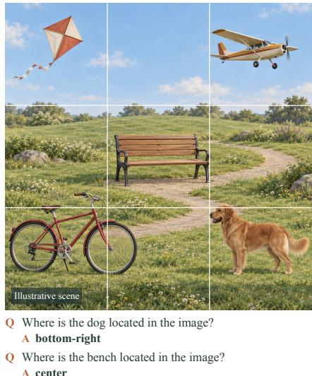
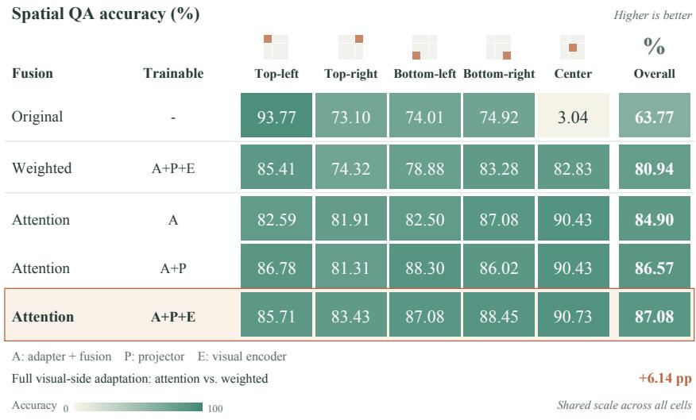
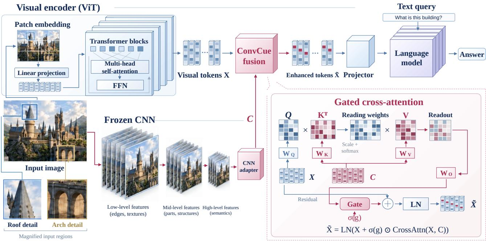
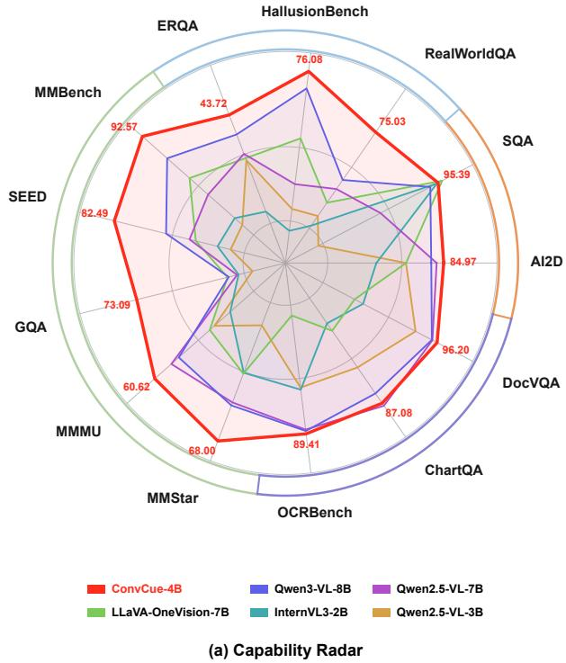
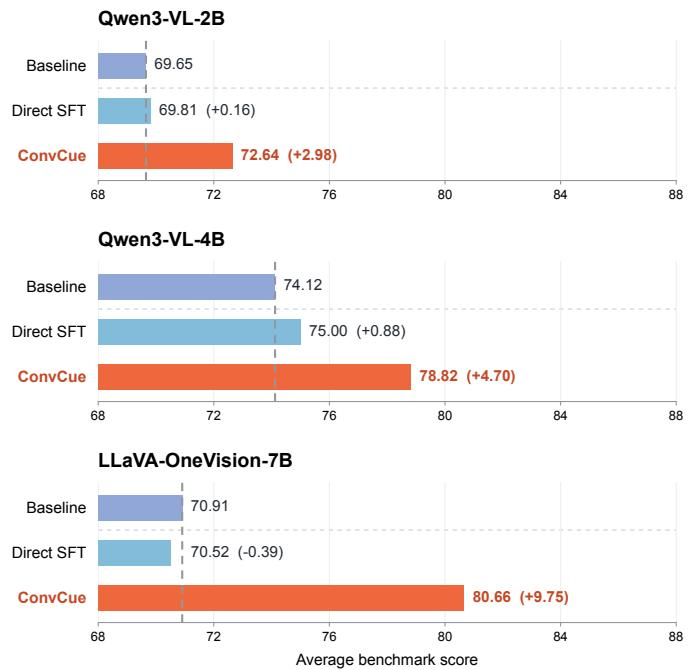
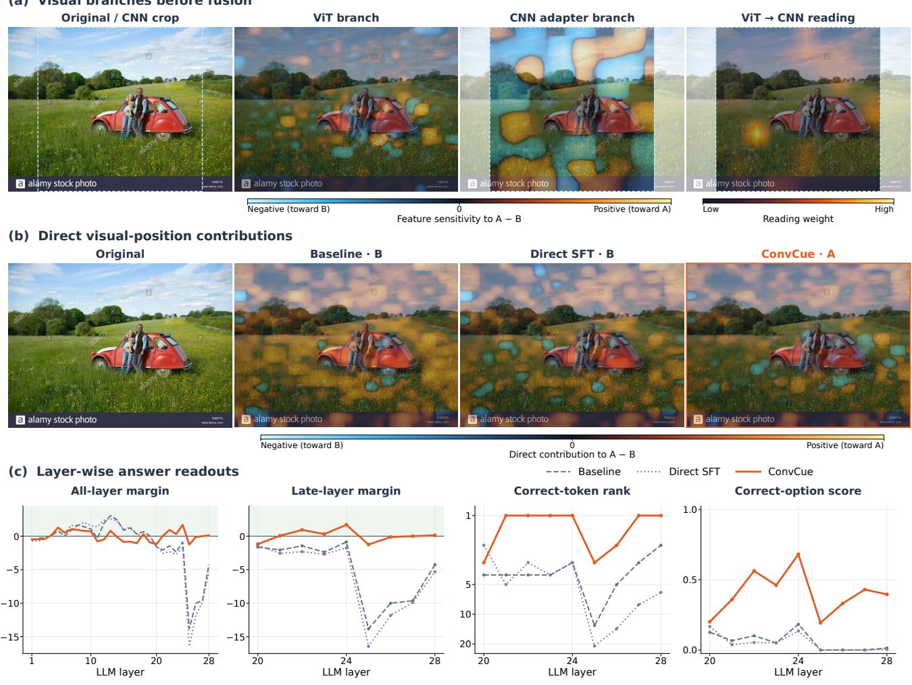
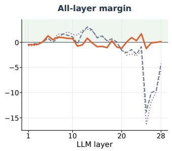
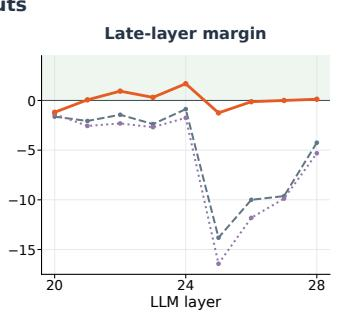
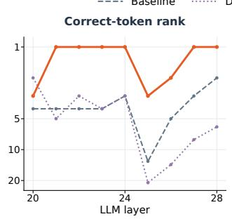
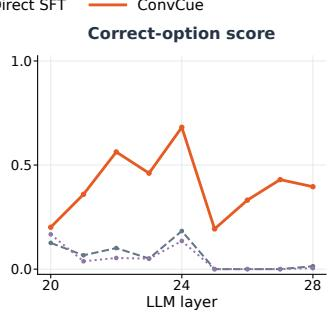

# ConvCue: Complementary Visual Inductive Biases for Vision-Language Models

Zixuan Lan1 and Shichu Sun2

1The University of Chicago 2University of Chinese Academy of Sciences

## Abstract

Modern vision-language models (VLMs) achieve strong performance across a broad range of multimodal tasks, yet still struggle with visual questions that require fine-grained discrimination and spatial understanding. These limitations motivate investigating whether supplementary visual representations can improve existing VLMs without replacing thei native visual encoders. Pretrained convolutional networks ofer a candidate feature source, motivated by their local connectivity and spatial weight sharing. We introduce CONVCUE, which augments the native visual representations of a pretrained VLM with final-stage features from a parallel, frozen pretrained CNN. A learnable adapter maps convolutional features to the native visual feature dimension, while gated cross-attention allows the original visual tokens to retrieve information from the CNN features. The enhanced tokens are passed through the original visual-to-language projector, and the model is adapted through a two-stage training procedure. We evaluate CONVCUE on Qwen3-VL-2B, Qwen3-VL-4B, and LLaVA-OneVision-7B across 13 multimodal benchmarks covering visual question answering, document and chart understanding, and multimodal reasoning. CONVCUE improves average benchmark performance over both the original models and matched two-stage fine-tuning controls on all three backbones. On Qwen3-VL-4B, it improves over the origina model on all 13 benchmarks and raises the average score from 75.00 to 78.82 relative to the matched fine-tuning control. These results show that pretrained convolutional representations, when integrated through learned adaptation and fusion, can improve the visual understanding of existing VLMs without replacing their original visual encoders. Code will be released at https://github.com/LanLanLan-Ian/CONVCUE

## 1 Introduction

Vision-language models (VLMs) have made great progress across a broad range of tasks, yet they still make mistakes on simple visual questions. Strong performance on multimodal tasks does not always mean that a model can reliably distinguish what it sees. Prior work shows that visual encoders can produce similar representations for visually distinct images, and that downstream VLMs can struggle with questions that depend on these distinctions (Tong et al., 2024b; Lan et al., 2026). These findings raise a practical question: can integrating supplementary visual representations into pretrained VLMs improve their downstream visual understanding?

A visual representation may support its training task without making all the distinctions needed to answer downstream questions. For example, consider two images of the same building, one with an intact window and the other with broken glass. Both images may match the caption a building with glass windows, but answering Is the window intact? requires distinguishing local details such as cracks and missing glass, rather than merely recognizing the building and its windows. Prior work shows that models can score well on image–text retrieval yet struggle to distinguish captions that difer in object attributes, relationships, or word order (Yuksekgonul et al., 2023). Thus, strong retrieval performance alone does not guarantee sensitivity to the specific attributes and relationships queried in downstream tasks. The visua information expressed in these representations depends on how the encoder is trained and how it aggregates image features. For example, DINO finds that object regions appear more clearly in the attention maps of self-supervised ViTs than in those of the supervised ViTs examined (Caron et al., 2021). Studies comparing ViTs and ResNets also find diferences in how local and global information is represented: ViTs incorporate global information in early layers, while ResNets aggregate local features over progressively larger regions (Raghu et al., 2022). These observations motivate investigating whether representations from a pretrained CNN can provide useful supplementary information for an existing VLM.

  
(a) Spatial QA Illustration

  
(b) Fusion and Adaptation Results  
Figure 1: Pilot experiments on Spatial QA. (a) Illustration of the example question–answer pairs. (b) Overall and per-position accuracy for diferent fusion strategies and trainable component configurations. A denotes the adapter and fusion module, P the original projector, and E the original visual encoder. The outlined row highlights the full visual-side adaptation setting, under which cross-attention outperforms weighted fusion by 6.14 percentage points.

Combining diferent visual representations is an established direction in multimodal modeling. Eyes Wide Shut combines CLIP features with features learned through visual self-supervision, exploring how representations learned with diferent objectives can support visual understanding together (Tong et al., 2024b). Cambrian-1 studies multiple visual encoders and introduces a spatially aware module to aggregate their features for language models (Tong et al., 2024a). Eagle examines which encoders to combine, how to integrate their features, and how to align them with the language model before joint training (Shi et al., 2025). LLaVA-HR combines low-resolution ViT and high-resolution CNN pathways through mixture-of-resolution adapters (Luo et al., 2025). Together, these studies show that improving visual representations is not limited to building stronger individual encoders: features from diferent sources can also be brought together to support multimodal understanding. This direction involves choosing supplementary features, designing how they interact with the original representations, and adapting the combined features for use by the existing model.

Following this direction, we investigate pretrained convolutional representations as a supplementary feature source for the visual pathways of existing VLMs. Convolutional networks explicitly incorporate two-dimensional neighborhood structure into feature extraction through local connectivity and spatial weight sharing, providing architectural motivation for this exploration (Dosovitskiy et al., 2020; Lahoti et al., 2024). To this end, we introduce ConvCue, a visual representation augmentation framework that integrates convolutional feature extraction, representation adaptation, and gated fusion. ConvCue retains the original visual encoding pathway and processes the same source image with a separate frozen pretrained CNN branch. A learnable adapter maps the CNN’s final-stage features to the native visual feature dimension, after which the original visual tokens aggregate supplementary information through cross-attention and incorporate it through gated residual updates. The enhanced visual representations are passed to the language model through the original visual-to-language projection module, allowing the supplementary branch to contribute to downstream predictions without replacing the original visual encoder.

We evaluate ConvCue on Qwen3-VL-2B, Qwen3-VL-4B, and LLaVA-OneVision-7B across 13 visual understanding benchmarks. Across all three backbones, ConvCue achieves higher average performance than both the original models and matched Direct SFT controls, demonstrating gains from the integrated augmentation design beyond those obtained through the same additional training. On our main Qwen3-VL-4B backbone, ConvCue improves over the original model on all 13 benchmarks and also outperforms Qwen3-VL-8B on each benchmark. Pilot experiments examine fusion strategies and the scope of visual-side adaptation, while subsequent representation analyses and a case study examine changes in visual features and answer preferences. Together, these results show that pretrained convolutional representations, when integrated through learned adaptation and fusion, can improve the visual understanding of existing VLMs without

replacing their original visual encoders.

## 2 Pilot Experiments

Adding convolutional representations to an existing VLM requires choosing how to fuse the features and which components to train. We first explore these two design choices through small-scale experiments to guide the subsequent framework. We use LLaVA-1.5-7B (Liu et al., 2023) and Spatial QA constructed from MS COCO (Lin et al., 2015), keeping the language model and CNN frozen. Figure 1 presents the task illustration and results. Dataset construction is detailed in Appendix B.

An initial comparison of fusion strategies. We initially use weighted fusion to directly combine the adapted convolutional features with the original visual features after aligning their spatial grids. As an alternative, we consider cross-attention, which uses the original visual tokens as queries to aggregate convolutional features without requiring one-to-one spatial correspondence. This comparison evaluates the two fusion configurations, including their respective spatial alignment procedures. In both configurations, we train the original visual encoder, projector, and added learnable components. Cross-attention achieves an overall accuracy of 87.08%, compared with 80.94% for weighted fusion, and obtains higher accuracy in all five position categories. These results provide initial support for adopting the cross-attention configuration in our subsequent framework.

Exploring the scope of visual-side adaptation. For the cross-attention configuration, we first train only the added adapter and fusion module, keeping the original VLM parameters fixed. The fused features still pass through the original projector, while the visual tokens used for fusion come from the original visual encoder. We therefore also examine configurations that allow these components to adapt. Training only the added modules yields an overall accuracy of 84.90%. Including the projector raises accuracy to 86.57%, and additionally training the visual encoder raises it to 87.08%. Among the configurations examined, allowing the original visual components to adapt yields higher overall accuracy, with a smaller improvement from additionally training the visual encoder. This observation motivates jointly adapting the added modules and the original visual pathway in the subsequent framework. These pilot results guide our initial design choices; they do not establish their efects on other models or tasks. We incorporate the selected fusion strategy and visual-side adaptation configuration into ConvCue and evaluate the complete framework in broader experiments.

## 3 Method

## 3.1 Preliminaries

We consider a vision-language model composed of a visual encoder, a visual-to-language projector, and a language model (Liu et al., 2023). The model takes an image � and a text instruction � as input and generates a textual response �. The visual encoder $E _ { v }$ first processes the image to produce visual features $\bar { X } = \bar { E _ { v } ( I ) } \in \mathbb { R } ^ { \bar { N } \times d _ { v } }$ , where � is the number of visual tokens and $d _ { v }$ is their feature dimension. Each token corresponds to a spatial location in the image and may also encode contextual information acquired through the visual encoder. The projector � maps these features into representations compatible with the language model, $\breve { Z } = P ( X ) \in \mathbb { R } ^ { M \times d _ { \ell } }$ , where $d _ { \ell }$ is the language model’s embedding dimension and � is the number of projected visual tokens. This mapping may include spatial token aggregation, so � need not equal �. Together, $Z$ and the token embeddings of $q$ form the multimodal input, conditioned on which the language model autoregressively generates �. Throughout this paper, visual tokens refer to the features � before projection. Building on the pilot observations, we introduce ConvCue, which augments these tokens using a pretrained CNN branch, a learnable adapter, and gated cross-attention. The enhanced representations are passed to the original projector, preserving the model’s existing visual-to-language pathway. Figure 2 illustrates the framework.

## 3.2 Convolutional Feature Extraction and Adaptation

To complement the original visual tokens �, a separate pretrained CNN encoder $E _ { c }$ processes the same image � and extracts its final-stage feature map $F _ { c } = E _ { c } ( I ) \in \bar { \mathbb { R } ^ { d _ { c } \times h \times w } }$ , where $d _ { c }$ is the channel dimension and ℎ and � denote the spatial dimensions. A learnable CNN adapter maps these features to the visual token dimension $d _ { v }$ while preserving their spatial grid. Specifically, a $1 \times 1$ convolution projects the channels from $d _ { c }$ to $d _ { v } ,$ followed by spatial flattening and LayerNorm to obtain $U = \mathrm { L N } _ { 1 } ( \mathrm { F l a t t e n } ( \mathrm { C o n v } _ { 1 \times 1 } ( F _ { c } ) ) ) \in \mathbb { R } ^ { N _ { c } \times d _ { v } }$ , where $N _ { c } = h w$ . The adapted tokens are then computed as $C = \mathrm { L N } _ { 2 } ( U + \mathrm { M L P } ( U ) )$ , using a two-layer MLP with a GELU activation and hidden dimension $4 d _ { v }$ . The output $C \in \mathbb { R } ^ { N _ { c } \times d _ { v } }$ serves as the feature sequence for subsequent cross-attention fusion, without requiring $N _ { c }$ to match the original visual token count �. The pretrained CNN remains frozen throughout training, while the adapter is trained in both stages.

  
Figure 2: Overview of ConvCue. The original visual encoder processes image patches, while a frozen CNN extracts convolutional features from the same image and a trainable adapter maps them to the visual token dimension. Gated cross-attention uses the origina visual tokens as queries and the adapted CNN features as keys and values. A channel-wise gate controls the residual update, followed by LayerNorm. The enhanced tokens then enter the original visual-to-language mapping and language model. The enlarged panel details the fusion mechanism; feature grids and token colors are schematic.

## 3.3 Gated Cross-Attention Fusion

Given the original visual tokens $\boldsymbol { X } \in \mathbb { R } ^ { N \times d _ { v } }$ and the adapted CNN tokens $C \in \mathbb { R } ^ { N _ { c } \times d _ { v } }$ , we compute $A = { \mathrm { M H A } } ( X , C , C ) \in$ $\mathbb { R } ^ { N \times d _ { v } }$ , using � as queries and � as keys and values. Here, MHA includes the query, key, and value projections for each attention head and the output projection. Each visual token involved in fusion can attend to all CNN tokens based on their feature content, without requiring equal token counts or a one-to-one spatial correspondence. To control the convolutional update, we introduce a learnable channel-wise gate $g = \sigma ( a )$ , where � $\epsilon \mathbb { R } ^ { d _ { v } }$ and � denotes the sigmoid function. The gate is shared across token positions and images, learning a separate scaling factor for each channel rather than being dynamically generated for each input. The fused representation is computed as $\widetilde { X } = \mathrm { L N } ( X + g \odot A )$ , where ⊙ denotes element-wise multiplication with � broadcast across token positions. This gated residual update preserves the shape of $X ,$ and the enhanced tokens are passed through the original projector to obtain $Z = P ( { \widetilde { X } } )$ .

## 3.4 Training

We train ConvCue in two stages: vision-language alignment and joint supervised fine-tuning. The pretrained CNN encoder remains frozen throughout both stages. Vision-language alignment. We freeze the language model and jointly train the original visual encoder, CNN adapter, gated cross-attention fusion module, and projector using image–text pairs. This stage adapts the convolutional features to the original visual representations and aligns the fused features with the frozen language model. Joint supervised fine-tuning. We initialize from the alignment checkpoint and additionally unfreeze the language model. Using visual instruction data, we jointly update the visual encoder, adapter, fusion module, projector, and language model, allowing visual feature extraction, fusion, and language generation to adapt together. Both stages optimize the autoregressive objective $\begin{array} { r } { \mathcal { L } = - \frac { 1 } { T } \sum _ { t = 1 } ^ { T } \log p _ { \theta } ( y _ { t } \mid I , q , y _ { < t } ) } \end{array}$ , where $Y = \left( y _ { 1 } , \dots , y _ { T } \right)$ is the target response and � denotes the parameters optimized in the current stage. Training uses ground-truth preceding response tokens, and the loss is computed only over target response tokens, excluding image and instruction positions.

  
(b) Effect of Convolutional Feature Augmentation  
Figure 3: (a) Comparison across 13 visual understanding benchmarks. ConvCue uses Qwen3-VL-4B; red labels indicate its scores. (b) Average scores across the same 13 benchmarks for the original models, direct supervised fine-tuning, and ConvCue. Parentheses show score-point changes from each original model; dashed vertical lines mark its average score.

## 4 Experiments

## 4.1 Experimental Setup

Our main model, ConvCue-4B, is built on Qwen3-VL-4B (Bai et al., 2025a). We compare it across 13 benchmarks with GPT-4.1 and GPT-4V (OpenAI, 2025), Claude-3.7-Sonnet (Anthropic, 2025), Gemini-1.5-Pro (Gemini Team, 2024), and open-source models including Qwen2.5-VL (Bai et al., 2025b), InternVL3/3.5 (Zhu et al., 2025; Wang et al., 2025), LLaVA-OneVision (Li et al., 2024), Gemma3 (Gemma Team, 2025), DeepSeek-VL2 (Wu et al., 2024), MiMo-VL (Core Team, 2025), Phi-4-Multimodal (Microsoft, 2025), MiniCPM-V-4 (Yao et al., 2024), Kimi-VL (Kimi Team, 2025), SAIL-VL (Dong et al., 2025), and Ovis2 (Lu et al., 2024). Ablations compare the original model, direct supervised fine-tuning, and ConvCue on Qwen3-VL-2B (Bai et al., 2025a), Qwen3-VL-4B (Bai et al., 2025a), and LLaVA-OneVision-7B (Li et al., 2024). We use the LLaVA image–text pretraining data for vision-language alignment in the first stage (Liu et al., 2023), followed by the visual instruction data used in LLaVA-UHD for joint supervised fine-tuning in the second stage (Guo et al., 2024). The training data are shared across the three model backbones. Data processing procedures and training hyperparameters are provided in the appendix. We evaluate on 13 visual understanding benchmarks: AI2D (Kembhavi et al., 2016), SEED-Bench (Li et al., 2023), HallusionBench (Guan et al., 2024), RealWorldQA (xAI, 2024), ScienceQA (Lu et al., 2022), OCRBench (Liu et al., 2024b), ERQA (Team et al., 2025), MMBench (Liu et al., 2024a), MMMU (Yue et al., 2024), ChartQA (Masry et al., 2022), DocVQA (Mathew et al., 2021), GQA (Hudson & Manning, 2019), MMStar (Chen et al., 2024b). For models evaluated in our experiments, we use greedy decoding without stochastic sampling. We additionally compare ConvCue with Cambrian-1-8B (Tong et al., 2024a), LLaVA-UHD-v3-7B (Sun et al., 2025), Eagle-X4-8B-Plus (Shi et al., 2025), and Florence-VL-8B (Chen et al., 2024a) on nine shared benchmarks. All the tests follow their paper.

## 4.2 Main Results

Table 1 and Fig. 3(a) show that ConvCue-4B improves over its original Qwen3-VL-4B backbone across all 13 evaluated benchmarks. The gains span GQA and HallusionBench, multimodal reasoning benchmarks such as MMMU and MMStar, and document and chart understanding. This breadth shows that the benefits of the complete augmentation framework are not confined to a single task category, even when applied to an already capable VLM.

Table 1: Comparison on visual-language benchmarks.
<table><tr><td>Model</td><td>Scale</td><td>Avg.</td><td>MMBench</td><td>SEED</td><td>RealWorldQA</td><td>SQA</td><td>AI2D</td><td>HallusionBench</td><td>OCRBench</td><td>ERQA</td><td>MMMU</td><td>ChartQA DocVQA</td><td></td><td>GQA</td><td>MMStar</td></tr><tr><td>Closed-source MLLMs</td><td></td><td></td><td></td><td></td><td></td><td></td><td></td><td></td><td></td><td></td><td></td><td></td><td></td><td></td><td></td></tr><tr><td>GPT-4.1-nano-20250414</td><td></td><td>58.47</td><td>62.40</td><td></td><td></td><td>65.90</td><td>68.00</td><td>36.90</td><td>71.00</td><td></td><td>57.60</td><td></td><td></td><td></td><td>47.50</td></tr><tr><td>GPT-4.1-mini-20250414</td><td></td><td>67.68</td><td>80.90</td><td></td><td></td><td></td><td>76.00</td><td>49.30</td><td>84.00</td><td></td><td>55.00</td><td></td><td></td><td></td><td>60.90</td></tr><tr><td>GPT-4V (0409)</td><td></td><td>70.75</td><td>79.80</td><td>73.00</td><td>68.00</td><td>84.80</td><td>78.60</td><td>43.90</td><td>65.60</td><td></td><td>61.70</td><td>78.50</td><td>88.40</td><td></td><td>56.00</td></tr><tr><td>Claude-3.7-Sonnet</td><td>=</td><td>72.18</td><td>79.70</td><td>74.30</td><td>55.40</td><td>90.90</td><td>82.50</td><td>55.40</td><td>70.10</td><td>35.50</td><td>71.00</td><td>92.20</td><td>94.10</td><td>=</td><td>65.10</td></tr><tr><td>Gemini-1.5-Pro</td><td>一</td><td>72.71</td><td>73.90</td><td>76.00</td><td>64.10</td><td>85.70</td><td>79.10</td><td>45.60</td><td>75.40</td><td>1</td><td>60.60</td><td>87.20</td><td>93.10</td><td>1</td><td>59.10</td></tr><tr><td>Open-source MLLMs</td><td></td><td></td><td></td><td></td><td></td><td></td><td></td><td></td><td></td><td></td><td></td><td></td><td></td><td></td><td></td></tr><tr><td>Gemma-3-4B-IT</td><td>4B</td><td>58.36</td><td>66.40</td><td>65.39</td><td>44.00</td><td>67.20</td><td>70.70</td><td>40.80</td><td>66.00</td><td>=</td><td>47.30</td><td>68.80</td><td>75.80</td><td>40.00</td><td>47.90</td></tr><tr><td>InternVL3-1B</td><td>1B</td><td>63.09</td><td>68.20</td><td>71.16</td><td>58.20</td><td>89.84</td><td>69.70</td><td>37.20</td><td>79.80</td><td>30.30</td><td>43.20</td><td>75.30</td><td>81.90</td><td>=</td><td>52.30</td></tr><tr><td>InternVL3-2B</td><td>2B</td><td>68.20</td><td>78.00</td><td>74.95</td><td>64.30</td><td>95.23</td><td>78.60</td><td>41.90</td><td>83.10</td><td>31.50</td><td>48.70</td><td>80.20</td><td>88.30</td><td>60.70</td><td>61.10</td></tr><tr><td>Qwen2.5-VL-3B</td><td>3B</td><td>68.37</td><td>76.80</td><td>74.00</td><td>65.40</td><td>79.40</td><td>81.40</td><td>46.60</td><td>82.80</td><td>38.00</td><td>51.20</td><td>84.00</td><td>93.90</td><td>59.00</td><td>56.30</td></tr><tr><td>DeepSeek-VL2-Tiny</td><td>3.4B</td><td>68.47</td><td>70.90</td><td>72.30</td><td>64.20</td><td>88.46</td><td>74.60</td><td>39.60</td><td>80.50</td><td>一</td><td>42.90</td><td>81.00</td><td>88.90</td><td></td><td>49.80</td></tr><tr><td>MiMo-VL-7B-RL</td><td>7B</td><td>68.79</td><td>80.70</td><td>=</td><td>72.68</td><td>83.33</td><td>82.80</td><td>63.80</td><td>82.90</td><td>37.80</td><td>26.40</td><td>91.70</td><td>95.70</td><td>1</td><td>38.90</td></tr><tr><td>Phi-4-MultiModal</td><td>5.6B</td><td>70.45</td><td>77.20</td><td>73.20</td><td>64.10</td><td>97.50</td><td>83.00</td><td>40.50</td><td>84.40</td><td>36.00</td><td>56.00</td><td>81.40</td><td>93.20</td><td></td><td>58.90</td></tr><tr><td>InternVL3.5-4B</td><td>4B</td><td>70.47</td><td>80.30</td><td>=</td><td>66.30</td><td>一</td><td>82.60</td><td>44.80</td><td>82.20</td><td>38.50</td><td>66.60</td><td>86.00</td><td>92.40</td><td>一</td><td>65.00</td></tr><tr><td>LLaVA-OneVision-7B</td><td>7B</td><td>70.91</td><td>85.13</td><td>76.54</td><td>66.93</td><td>95.93</td><td>81.41</td><td>61.71</td><td>72.50</td><td>38.25</td><td>51.93</td><td>80.84</td><td>87.39</td><td>62.04</td><td>61.20</td></tr><tr><td>Qwen2.5-VL-7B</td><td>7B</td><td>72.71</td><td>82.20</td><td>77.00</td><td>68.50</td><td>87.70</td><td>84.30</td><td>51.90</td><td>88.80</td><td>38.80</td><td>58.00</td><td>87.30</td><td>95.70</td><td>60.88</td><td>64.10</td></tr><tr><td>MiniCPM-V-4</td><td>4B</td><td>73.62</td><td>79.70</td><td></td><td>68.50</td><td>一</td><td>82.90</td><td>50.80</td><td>89.40</td><td>一</td><td>51.20</td><td>84.40</td><td>92.90</td><td>一</td><td>62.80</td></tr><tr><td>Kimi-VL-A3B-Instruct</td><td>A3B</td><td>74.93</td><td>83.10</td><td>76.80</td><td>68.10</td><td>95.30</td><td>84.90</td><td>48.40</td><td>86.70</td><td>=</td><td>57.00</td><td>87.70</td><td>1</td><td>=</td><td>61.30</td></tr><tr><td>Qwen3-VL-8B</td><td>8B</td><td>75.59</td><td>88.66</td><td>78.71</td><td>69.54</td><td>94.34</td><td>83.79</td><td>72.42</td><td>89.00</td><td>41.25</td><td>56.83</td><td>86.24</td><td>95.64</td><td>61.89</td><td>64.40</td></tr><tr><td>SAIL-VL-8B</td><td>8B</td><td>75.79</td><td>79.50</td><td>75.50</td><td>71.90</td><td>98.20</td><td>83.70</td><td>52.20</td><td>83.50</td><td>一</td><td>48.20</td><td>84.60</td><td>92.20</td><td>1</td><td>64.20</td></tr><tr><td>Ovis2-4B</td><td>4B</td><td>76.58</td><td>81.40</td><td>76.20</td><td>71.10</td><td>94.00</td><td>85.70</td><td>53.80</td><td>91.10</td><td></td><td>49.00</td><td>84.20</td><td>94.00</td><td></td><td>61.90</td></tr><tr><td>Baseline and our model</td><td></td><td></td><td></td><td></td><td></td><td></td><td></td><td></td><td></td><td></td><td></td><td></td><td></td><td></td><td></td></tr><tr><td>Baseline</td><td>4B</td><td>74.12</td><td>87.59</td><td>78.74</td><td>71.37</td><td>92.36 81.76</td><td></td><td>69.39</td><td>88.09</td><td>39.45</td><td>52.34</td><td>84.84</td><td>94.72</td><td>61.98</td><td>60.93</td></tr><tr><td>CONVCUE (ours)</td><td>4B</td><td>78.82</td><td>92.57</td><td>82.49</td><td>75.03</td><td>95.3984.97</td><td></td><td>76.08</td><td>89.41</td><td>43.72</td><td>60.62</td><td>87.08</td><td>96.20</td><td>73.09</td><td>68.00</td></tr></table>

Table 2: Comparison with other baselines. Avg. denotes the unweighted mean over these nine benchmarks. Bold indicates the highest score in each column.
<table><tr><td>Method</td><td>Avg.</td><td>MMBench</td><td>SEEDI</td><td>RealWorldQA</td><td>SQAI</td><td>AI2D</td><td>OCRBench</td><td>MMMU</td><td>ChartQA</td><td>DocVQA</td></tr><tr><td>Cambrian-1-8B</td><td>69.38</td><td>75.90</td><td>74.70</td><td>64.20</td><td>80.40</td><td>73.00</td><td>62.40</td><td>42.70</td><td>73.30</td><td>77.80</td></tr><tr><td>LLaVA-UHD-v3-7B</td><td>79.69</td><td>81.30</td><td>77.20</td><td>70.30</td><td>97.00</td><td>82.90</td><td>82.70</td><td>50.20</td><td>82.80</td><td>92.80</td></tr><tr><td>Eagle-X4-8B-Plus</td><td>72.42</td><td>75.90</td><td>76.30</td><td>66.50</td><td>84.30</td><td>76.10</td><td>62.60</td><td>43.40</td><td>80.10</td><td>86.60</td></tr><tr><td>Florence-VL-8B</td><td>71.34</td><td>76.20</td><td>74.90</td><td>64.20</td><td>85.90</td><td>74.20</td><td>63.40</td><td>43.70</td><td>74.70</td><td>84.90</td></tr><tr><td>CoNvCUE-4B (Ours)</td><td>84.86</td><td>92.57</td><td>82.49</td><td>75.03</td><td>95.39</td><td>84.97</td><td>89.41</td><td>60.62</td><td>87.08</td><td>96.20</td></tr></table>

These improvements also make ConvCue-4B competitive with larger models: it outperforms Qwen3-VL-8B on all 13 benchmarks. Its advantage is therefore consistent across the evaluated tasks rather than driven by a few exceptional results. While this comparison does not isolate architecture from training diferences, it shows that augmenting an existing VLM can yield strong downstream performance without moving to a larger language backbone. Together, these results support our approach of combining supplementary visual representations, learned fusion, and joint adaptation to improve the complete model.

To distinguish the gains of ConvCue from those attributable to additional training alone, we include matched Direct SFT controls for Qwen3-VL-2B, Qwen3-VL-4B, and LLaVA-OneVision-7B. Each control follows the same two-stage training procedure as ConvCue, using the same data at each stage, unfreezing settings for the original model components, and training hyperparameters, but without ConvCue. This comparison evaluates ConvCue as an integrated augmentation design. As shown in Fig. 3(b), Direct SFT provides only modest average gains on the two Qwen3-VL backbones, whereas ConvCue achieves larger improvements and outperforms both the original models and the matched training controls. The diference is more pronounced on LLaVA-OneVision-7B: Direct SFT slightly reduces its average score, while ConvCue substantially improves it. Across all three backbones, the same data and training procedure without ConvCue do not reproduce the gains of the complete framework. These results support the efectiveness of the integrated augmentation architecture together with joint adaptation, with benefits extending across model sizes and families. Complete perbenchmark comparisons are provided in Appendix Table 3.

(a) Visual branches before fusion Original / CNN crop  

  
Figure 4: An example asking where the red car is located. The correct answer is A (centered), while B denotes the foreground left. (a) Original image with the CNN crop boundary, ViT and CNN feature sensitivities in ConvCue, and cross-attention reading weights over CNN features. (b) Original image and direct visual-position contributions from tokens for the baseline, direct SFT, and ConvCue Warm/cool colors in signed maps indicate positive/negative values toward A relative to B; brighter reading weights indicate stronger attention. (c) Layer-wise readouts: correct-versus-best-incorrect logit margin, its late-layer detail, correct-token vocabulary rank, and correct-option softmax score.

To evaluate ConvCue against existing approaches to visual representation enhancement, we compare it with Cambrian-1-8B, Eagle-X4-8B-Plus, Florence-VL-8B, and LLaVA-UHD-v3-7B on nine shared benchmarks. As shown in Table 2, ConvCue-4B achieves the highest average score and outperforms all four methods on eight benchmarks, with ScienceQA being the exception. Its advantages cover both general visual understanding and text, chart, and document understanding, rather than depending on a few isolated results. These comparisons show that retaining the original visual pathway and adding a jointly adapted augmentation branch can achieve competitive performance against existing visual enhancemen methods, even with a smaller language backbone.

## 5 Analysis

We first measure the size of the updates that ConvCue adds to the original visual features. We then examine visual feature responses in ConvCue and use a case study to compare how answer preferences change across language-model layers in the original model, the matched-training baseline, and ConvCue.

## 5.1 Magnitude of Visual Representation Updates

We measure how much the gated fusion module adds to the original visual features. For image �, we compute $r _ { i } ~ =$ ∥� $\odot A _ { i } \| _ { F } / \| X _ { i } \| _ { F }$ , where $X _ { i }$ denotes the global-view visual tokens before fusion and $A _ { i }$ is the cross-attention output. Both are taken from the same forward pass before the fusion LayerNorm. On an ERQA subset, LLaVA-OneVision-7B equipped with ConvCue yields a mean ratio of 18.40% and a median of 18.16%, with the 10th–90th percentiles ranging from 16.15% to 20.51%. The added residual is therefore substantial relative to the original feature magnitude across the analyzed samples.

## 5.2 Case Study of Visual Responses and Answer Preferences

Visual branches before fusion. Figure 4(a) compares the two visual branches in the trained ConvCue model on a question about the red car’s location. The correct answer is A (centered), while B denotes the foreground left. We extract the ViT features and adapted CNN features before fusion and compute their sensitivity to the answer-logit diference $s = z _ { A } - z _ { B }$ at the first response position. For the feature vector $F _ { i }$ at spatial position �, we use the signed gradient-times-activation score $\begin{array} { r } { R _ { i } = \sum _ { k } F _ { i , k } \partial s / \partial F _ { i , k } } \end{array}$ , where � indexes channels. A positive score means that slightly scaling up this feature vector would increase the preference for A over B; a negative score means the opposite. We map the scores to each branch’s image grid using a shared color scale, restricting the CNN map to its input crop. We also visualize where the fusion module reads CNN features. For attention weight $\alpha _ { h i j }$ from ViT query � to CNN position � in head $h ,$ we compute $\begin{array} { r } { \bar { \alpha } _ { j } = ( H N ) ^ { - 1 } \sum _ { h = 1 } ^ { H } \sum _ { i = 1 } ^ { N } \alpha _ { h i j } } \end{array}$ Brighter regions indicate larger average attention weights. These weights depend on the image features, not the question, and do not indicate support for either answer. The two branches show diferent spatial sensitivity patterns. The fusion module also assigns relatively high attention weights to surrounding regions, including the grass below and to the left of the car, near positive responses in the CNN sensitivity map. In this example, feature retrieval therefore extends beyond the target object to its surroundings.

Direct visual-position contributions. We next examine how visual tokens contribute to answer preference inside the language model. Figure 4(b) compares the original model, the matched-training baseline, and ConvCue on the same image and question. Before generating the first response token, we compute $\begin{array} { r } { D _ { i } = \sum _ { \ell , h } a _ { q i } ^ { ( \ell , h ) } \langle { \bf u } _ { A - B } , W _ { O } ^ { ( \ell , h ) } v _ { i } ^ { ( \ell , h ) } \rangle } \end{array}$ ⟩, where $q$ is the final prompt position, $a _ { q i } ^ { ( \ell , h ) }$ is its attention weight to visual token �, and $v _ { i } ^ { ( \ell , h ) }$ and $W _ { O } ^ { ( \ell , h ) }$ are the value vector and output projection for head ℎ in layer ℓ. The vector $\mathbf { u } _ { A - B }$ is the diference between the output-head vectors for A and $\mathrm { B , }$ adjusted by the final RMSNorm scaling from the same forward pass. We map scores for whole-image-view tokens back to the image using a shared color scale: warm colors indicate direct contributions toward A over B, and cool colors indicate the opposite. These scores account for attention weights and value content, but exclude indirect efects through subsequent computation. Both comparison models show direct contributions toward the correct option A in parts of the sky and grass, yet ultimately select B. Their errors therefore do not imply that visual tokens provide no support for the correct answer; these contributions account for only part of the final answer score. ConvCue shows a diferent distribution of positive and negative contributions around the car and ultimately selects A, without uniformly increasing support for A at every position. These maps reveal how visual positions directly contribute to the option-score diference, but do not by themselves explain the final answer choice. We therefore next examine how answer preferences change across language-model layers.

Layer-wise answer readouts. We next compare how answer preferences change across language-model layers in the original model, the matched-training baseline, and ConvCue (Fig. 4(c)). After each decoder layer $\ell ,$ we extract the hidden state $h _ { q } ^ { ( \ell ) }$ at the final prompt position and compute $z ^ { ( \ell ) } = \mathrm { H e a d } ( \mathrm { N o r m } ( h _ { q } ^ { ( \ell ) } ) )$ using each model’s own final normalization and output head. These are readouts from intermediate representations, not answers generated at each layer. The final-layer readouts match the model’s native output logits. We measure whether the correct option A leads the other options using $\begin{array} { r } { m ^ { ( \ell ) } = z _ { A } ^ { ( \ell ) } - \operatorname* { m a x } _ { b \in O \backslash \{ A \} } z _ { b } ^ { ( \ell ) } } \end{array}$ , where $o$ is the answer-option set. A positive margin means that A ranks above every incorrect option. We also report A’s token rank in the full vocabulary, allowing ties, and its option-relative softmax score, $\begin{array} { r } { \dot { p } _ { A } ^ { ( \ell ) } = \exp ( z _ { A } ^ { ( \ell ) } ) / { \sum _ { b \in O } \exp ( z _ { b } ^ { ( \ell ) } ) } } \end{array}$ . This score measures preference among the options, not a calibrated probability of correctness. We focus on how preferences change within each model, rather than comparing raw logit magnitudes across models. Both comparison models favor A in some intermediate layers, but this preference does not persist to the final output. Around layer 25, their margins fall and A’s vocabulary ranking worsens; both ultimately select B. ConvCue also shows a decline around this layer, but A’s ranking subsequently recovers, and A leads the other options at the final layer. Thus, the diference in this case is not whether a correct answer can be read from an intermediate layer: all three models show such a preference. Rather, ConvCue recovers the correct-answer preference in later layers and outputs A, whereas the comparison models ultimately favor B.

## 6 Related Work

Prior work enhances VLM visual representations through image processing, encoder combinations, and feature fusion. LLaVA-UHD preserves high-resolution information through image slicing and token compression (Guo et al., 2024), while S2 extracts features at multiple image scales (Shi et al., 2024). Cambrian-1 and Eagle study how features from diferent visual encoders can be combined and connected to language models (Tong et al., 2024a; Shi et al., 2025). Florence-VL instead combines features from diferent depths and task prompts of a generative vision model (Chen et al., 2024a). These studies explore diferent ways to obtain and integrate visual representations. Our work follows this direction by studying a supplementary convolutional branch together with its fusion and adaptation to an existing VLM.

Convolutional representations have also been explored in VLMs. ConvLLaVA replaces the ViT with a hierarchical ConvNeXt encoder (Ge et al., 2024), while LLaVA-HR integrates high-resolution CNN features into a low-resolution ViT pathway through mixture-of-resolution adapters (Luo et al., 2025). ConvCue instead augments the native visual representations of an existing pretrained VLM while retaining its original encoder. Its native visual tokens serve as queries to selectively retrieve features from a frozen pretrained CNN through gated cross-attention. This design incorporates supplementary convolutional information without requiring one-to-one spatial correspondence or increasing the number of visual tokens passed to the language model.

## 7 Conclusion and Limitations

We introduced ConvCue, a visual representation augmentation framework that integrates pretrained convolutional features into existing VLMs. It retains the original visual encoding pathway and uses a frozen CNN branch to provide supplementary representations. A learnable adapter and gated cross-attention allow native visual tokens to retrieve and incorporate these features before passing through the original visual-to-language mapping. Together with two-stage adaptation, this design enables the model to use supplementary convolutional information without replacing its original visual encoder or increasing the number of projected visual tokens. Experiments on Qwen3-VL-2B, Qwen3-VL-4B, and LLaVA-OneVision-7B across 13 benchmarks demonstrate higher average performance than both the original models and matched fine-tuning controls. On Qwen3-VL-4B, ConvCue improves over the original model on all 13 benchmarks, with gains spanning visual question answering, document and chart understanding, and multimodal reasoning. Pilot experiments inform the fusion and visual-side adaptation choices, while further analyses characterize representation updates, visual-position contributions, and layer-wise answer preferences. These findings support pretrained convolutional representations as a useful complement to the native representations of modern VLMs and demonstrate the efectiveness of incorporating them through learned adaptation and fusion. Our experiments focus on image-based tasks and use a single pretrained CNN backbone at a fixed input resolution. The performance and eficiency trade-ofs of other CNN architectures and input resolutions remain to be evaluated. Extending the framework to video also requires investigating how supplementary features should be integrated across frames. Future work will explore these settings to assess the broader applicability of convolutional representation augmentation.

## References

Anthropic. Claude 3.7 Sonnet system card. https://www-cdn.anthropic.com 9ff93dfa8f445c932415d335c88852ef47f1201e/claude-3-7-sonnet-system-card.pdf, 2025.

Shuai Bai, Yuxuan Cai, Ruizhe Chen, Keqin Chen, Xionghui Chen, Zesen Cheng, Lianghao Deng, Wei Ding, Chang Gao, Chunjiang Ge, et al. Qwen3-vl technical report. arXiv preprint arXiv:2511.21631, 2025a.

Shuai Bai, Keqin Chen, Xuejing Liu, Jialin Wang, Wenbin Ge, et al. Qwen2.5-VL technical report, 2025b. URL https: //arxiv.org/abs/2502.13923.

Mathilde Caron, Hugo Touvron, Ishan Misra, Hervé Jégou, Julien Mairal, Piotr Bojanowski, and Armand Joulin. Emerging properties in self-supervised vision transformers, 2021. URL https://arxiv.org/abs/2104.14294.

Jiuhai Chen, Jianwei Yang, Haiping Wu, Dianqi Li, Jianfeng Gao, Tianyi Zhou, and Bin Xiao. Florence-vl: Enhancing vision-language models with generative vision encoder and depth-breadth fusion, 2024a. URL https://arxiv.org abs/2412.04424.

Lin Chen, Jinsong Li, Xiaoyi Dong, Pan Zhang, Yuhang Zang, Zehui Chen, Haodong Duan, Jiaqi Wang, Yu Qiao, Dahua Lin, et al. Are we on the right way for evaluating large vision-language models? Advances in Neural Information Processing Systems, 37:27056–27087, 2024b.

Core Team. MiMo-VL technical report, 2025. URL https://arxiv.org/abs/2506.03569.

Hongyuan Dong, Zijian Kang, Weijie Yin, Xiao Liang, Chao Feng, and Jiao Ran. Scalable vision language model training via high quality data curation, 2025. URL https://arxiv.org/abs/2501.05952.

Alexey Dosovitskiy, Lucas Beyer, Alexander Kolesnikov, Dirk Weissenborn, Xiaohua Zhai, Thomas Unterthiner, Mostafa Dehghani, Matthias Minderer, Georg Heigold, Sylvain Gelly, et al. An image is worth 16x16 words: Transformers for image recognition at scale. arXiv preprint arXiv:2010.11929, 2020.

Chunjiang Ge, Sijie Cheng, Ziming Wang, Jiale Yuan, Yuan Gao, Jun Song, Shiji Song, Gao Huang, and Bo Zheng. Convllava: Hierarchical backbones as visual encoder for large multimodal models. arXiv preprint arXiv:2405.15738, 2024.

Gemini Team. Gemini 1.5: Unlocking multimodal understanding across millions of tokens of context, 2024. URL https: //arxiv.org/abs/2403.05530.

Gemma Team. Gemma 3 Technical Report, 2025. URL https://arxiv.org/abs/2503.19786.

Tianrui Guan, Fuxiao Liu, Xiyang Wu, Ruiqi Xian, Zongxia Li, Xiaoyu Liu, Xijun Wang, Lichang Chen, Furong Huang, Yaser Yacoob, et al. Hallusionbench: an advanced diagnostic suite for entangled language hallucination and visual illusion in large vision-language models. In 2024 IEEE/CVF Conference on Computer Vision and Pattern Recognition (CVPR), pp. 14375–14385. IEEE, 2024.

Zonghao Guo, Ruyi Xu, Yuan Yao, Junbo Cui, Zanlin Ni, Chunjiang Ge, Tat-Seng Chua, Zhiyuan Liu, and Gao Huang. Llava-uhd: an lmm perceiving any aspect ratio and high-resolution images. In European Conference on Computer Vision, pp. 390–406. Springer, 2024.

Drew A Hudson and Christopher D Manning. Gqa: A new dataset for real-world visual reasoning and compositional question answering. In 2019 IEEE/CVF Conference on Computer Vision and Pattern Recognition (CVPR), pp. 6693–6702. IEEE, 2019.

Aniruddha Kembhavi, Mike Salvato, Eric Kolve, Minjoon Seo, Hannaneh Hajishirzi, and Ali Farhadi. A diagram is worth a dozen images. In European conference on computer vision, pp. 235–251. Springer, 2016.

Kimi Team. Kimi-VL technical report, 2025. URL https://arxiv.org/abs/2504.07491.

Aakash Lahoti, Stefani Karp, Ezra Winston, Aarti Singh, and Yuanzhi Li. Role of locality and weight sharing in image-based tasks: A sample complexity separation between cnns, lcns, and fcns, 2024. URL https://arxiv.org/abs/2403.15707.

Zixuan Lan, Luzhe Sun, Matthew R Walter, and Jiawei Zhou. Seeing without looking: Do vision-language benchmarks really test vision? arXiv preprint arXiv:2605.22903, 2026.

Bo Li, Yuanhan Zhang, Dong Guo, Renrui Zhang, Feng Li, Hao Zhang, Kaichen Zhang, Peiyuan Zhang, Yanwei Li, Ziwei Liu, et al. Llava-onevision: Easy visual task transfer. arXiv preprint arXiv:2408.03326, 2024.

Bohao Li, Rui Wang, Guangzhi Wang, Yuying Ge, Yixiao Ge, and Ying Shan. Seed-bench: Benchmarking multimodal llms with generative comprehension. arXiv preprint arXiv:2307.16125, 2023.

Tsung-Yi Lin, Michael Maire, Serge Belongie, Lubomir Bourdev, Ross Girshick, James Hays, Pietro Perona, Deva Ramanan, C. Lawrence Zitnick, and Piotr Dollár. Microsoft coco: Common objects in context, 2015. URL https://arxiv.org

abs/1405.0312.

Haotian Liu, Chunyuan Li, Qingyang Wu, and Yong Jae Lee. Visual instruction tuning. Advances in neural information processing systems, 36:34892–34916, 2023.

Yuan Liu, Haodong Duan, Yuanhan Zhang, Bo Li, Songyang Zhang, Wangbo Zhao, Yike Yuan, Jiaqi Wang, Conghui He, Ziwei Liu, et al. Mmbench: Is your multi-modal model an all-around player? In European conference on computer vision, pp. 216–233. Springer, 2024a.

Yuliang Liu, Zhang Li, Mingxin Huang, Biao Yang, Wenwen Yu, Chunyuan Li, Xu-Cheng Yin, Cheng-Lin Liu, Lianwen Jin, and Xiang Bai. Ocrbench: on the hidden mystery of ocr in large multimodal models. Science China Information Sciences, 67(12):220102, 2024b.

Pan Lu, Swaroop Mishra, Tanglin Xia, Liang Qiu, Kai-Wei Chang, Song-Chun Zhu, Oyvind Tafjord, Peter Clark, and Ashwin Kalyan. Learn to explain: Multimodal reasoning via thought chains for science question answering. Advances in neural information processing systems, 35:2507–2521, 2022.

Shiyin Lu, Yang Li, Qing-Guo Chen, Zhao Xu, Weihua Luo, Kaifu Zhang, and Han-Jia Ye. Ovis: Structural embedding alignment for multimodal large language model, 2024. URL https://arxiv.org/abs/2405.20797.

Gen Luo, Yiyi Zhou, Yuxin Zhang, Xiawu Zheng, Xiaoshuai Sun, and Rongrong Ji. Feast your eyes: Mixture-of-resolution adaptation for multimodal large language models. In International Conference on Learning Representations, volume 2025, pp. 84491–84506, 2025.

Ahmed Masry, Jia Qing Tan, Shafiq Joty, Enamul Hoque, et al. Chartqa: A benchmark for question answering about charts with visual and logical reasoning. In Findings of the association for computational linguistics: ACL 2022, pp. 2263–2279, 2022.

Minesh Mathew, Dimosthenis Karatzas, and CV Jawahar. Docvqa: A dataset for vqa on document images. In 2021 IEEE Winter Conference on Applications ofComputer Vision (WACV), pp. 2199–2208. IEEE, 2021.

Microsoft. Phi-4-Mini technical report: Compact yet powerful multimodal language models via mixture-of-loras, 2025. URL https://arxiv.org/abs/2503.01743.

OpenAI. Introducing GPT-4.1 in the API. https://openai.com/index/gpt-4-1/, 2025. Accessed: 2026-09-22.

Maithra Raghu, Thomas Unterthiner, Simon Kornblith, Chiyuan Zhang, and Alexey Dosovitskiy. Do vision transformers see like convolutional neural networks?, 2022. URL https://arxiv.org/abs/2108.08810.

Baifeng Shi, Ziyang Wu, Maolin Mao, Xin Wang, and Trevor Darrell. When do we not need larger vision models?, 2024. URL https://arxiv.org/abs/2403.13043.

Min Shi, Fuxiao Liu, Shihao Wang, Shijia Liao, Subhashree Radhakrishnan, Yilin Zhao, De-An Huang, Hongxu Yin, Karan Sapra, Yaser Yacoob, Humphrey Shi, Bryan Catanzaro, Andrew Tao, Jan Kautz, Zhiding Yu, and Guilin Liu. Eagle: Exploring the design space for multimodal llms with mixture of encoders, 2025. URL https://arxiv.org/abs/2408. 15998.

Shichu Sun, Yichen Zhang, Haolin Song, Zonghao Guo, Chi Chen, Yidan Zhang, Yuan Yao, Zhiyuan Liu, and Maosong Sun. Llava-uhd v3: Progressive visual compression for eficient native-resolution encoding in mllms, 2025. URL https://arxiv.org/abs/2511.21150.

Gemini Robotics Team, Saminda Abeyruwan, Joshua Ainslie, Jean-Baptiste Alayrac, Montserrat Gonzalez Arenas, Travis Armstrong, Ashwin Balakrishna, Robert Baruch, Maria Bauza, Michiel Blokzijl, et al. Gemini robotics: Bringing ai into the physical world. arXiv preprint arXiv:2503.20020, 2025.

Shengbang Tong, Ellis Brown, Penghao Wu, Sanghyun Woo, Manoj Middepogu, Sai C Akula, Jihan Yang, Shusheng Yang, Adithya Iyer, Xichen Pan, et al. Cambrian-1: A fully open, vision-centric exploration of multimodal llms. Advances in Neural Information Processing Systems, 37:87310–87356, 2024a.

Shengbang Tong, Zhuang Liu, Yuexiang Zhai, Yi Ma, Yann LeCun, and Saining Xie. Eyes wide shut? exploring the visual shortcomings of multimodal llms. In 2024 IEEE/CVF Conference on Computer Vision and Pattern Recognition (CVPR), pp. 9568–9578. IEEE, 2024b.

Weiyun Wang, Zhangwei Gao, Lixin Gu, Hengjun Pu, Long Cui, et al. InternVL3.5: Advancing open-source multimoda models in versatility, reasoning, and eficiency, 2025. URL https://arxiv.org/abs/2508.18265.

Zhiyu Wu, Xiaokang Chen, Zizheng Pan, Xingchao Liu, Wen Liu, et al. DeepSeek-VL2: Mixture-of-experts vision-language models for advanced multimodal understanding, 2024. URL https://arxiv.org/abs/2412.10302.

xAI. Grok-1.5 Vision Preview. https://x.ai/news/grok-1.5v, 2024.

Yuan Yao, Tianyu Yu, Ao Zhang, Chongyi Wang, Junbo Cui, Hongji Zhu, Tianchi Cai, Haoyu Li, Weilin Zhao, Zhihui He, et al. Minicpm-v: A gpt-4v level mllm on your phone. arXiv preprint arXiv:2408.01800, 2024.

Xiang Yue, Yuansheng Ni, Kai Zhang, Tianyu Zheng, Ruoqi Liu, Ge Zhang, Samuel Stevens, Dongfu Jiang, Weiming Ren, Yuxuan Sun, et al. Mmmu: A massive multi-discipline multimodal understanding and reasoning benchmark for expert agi. In Proceedings ofthe IEEE/CVF conference on computer vision and pattern recognition, pp. 9556–9567, 2024.

Mert Yuksekgonul, Federico Bianchi, Pratyusha Kalluri, Dan Jurafsky, and James Zou. When and why vision-language models behave like bags-of-words, and what to do about it?, 2023. URL https://arxiv.org/abs/2210.01936.

Jinguo Zhu, Weiyun Wang, Zhe Chen, Zhaoyang Liu, Shenglong Ye, et al. InternVL3: Exploring advanced training and test-time recipes for open-source multimodal models, 2025. URL https://arxiv.org/abs/2504.10479.

# Technical Appendices

## A Experimental Settings

Implementation details. We implement ConvCue on Qwen3-VL-2B, Qwen3-VL-4B, and LLaVA-OneVision-7B, retaining the image processor and tokenizer associated with each backbone. The supplementary branch uses a pretrained ConvNeXt Base and extracts its final-stage feature map. The CNN remains frozen throughout both training stages. CNN inputs are resized using bicubic interpolation, center-cropped to $3 3 6 \times 3 3 6 ,$ , and normalized using the ImageNet mean and standard deviation. The fusion module uses eight attention heads, with channel-wise gate logits initialized to −3. The backbone operates in BF16, while the CNN branch, adapter, and fusion module use FP32. Training is conducted on NVIDIA A100 GPUs with gradient checkpointing enabled. All the experiments are done with A100 GPUS.

Training data. The first stage uses image–text pairs from the LLaVA pretraining dataset for vision-language alignment. The second stage uses visual instruction examples from uhd (Guo et al., 2024) for supervised fine-tuning. The same stage-specific training data are used for ConvCue and its matched Direct SFT control.

Training configuration. In the first stage, we freeze the language model and train the original visual encoder, visualto-language mapping modules, CNN adapter, and fusion module. In the second stage, we initialize from the first-stage checkpoint and additionally unfreeze the language model. We train for one epoch per stage with a per-GPU micro-batch size of 2 and eight gradient accumulation steps, giving an efective batch size of 16� for � training GPUs. Both stages use AdamW with $( \beta _ { 1 } , \beta _ { 2 } ) = ( 0 . 9 , 0 . 9 5 )$ , weight decay of 0.01, and cosine learning-rate decay with a 3% warmup ratio. The learning rates are $1 0 ^ { - 4 }$ for the CNN adapter and fusion module, $1 0 ^ { - 6 }$ for the original visual encoder, and $1 0 ^ { - 5 }$ for the main Qwen visual merger or the LLaVA-OneVision projector. The Qwen DeepStack mergers use $5 \times 1 0 ^ { - 6 }$ . The language model uses $1 0 ^ { - 5 }$ when unfrozen in the second stage. The maximum training sequence length is 2,048, the gradient clipping norm is 1.0, and the random seed is 42.

Matched-training controls. For each backbone, Direct SFT follows the same two-stage procedure as ConvCue, but without ConvCue. The controls use the same data, training duration, batch configuration, and optimization settings. The original visual encoder and visual-to-language mapping modules are trained in both stages, while the language model is frozen in the first stage and unfrozen in the second. Each control starts its second stage from its own first-stage checkpoint. Learning rates for the original model components are matched to those used in ConvCue. The original-model baseline receives no additional training.

Inference and answer extraction. For models evaluated with our implementation, we use each backbone’s native chat template and disable stochastic sampling. The evaluation code limits generation to 8 new tokens for AI2D, SEEDBench, HallusionBench, ScienceQA, ERQA, MMBench, and MMMU; 16 for RealWorldQA and GQA; 32 for OCRBench, ChartQA, and DocVQA; and 64 for MMStar. Multiple-choice prompts request an option letter, HallusionBench prompts request a yes/no answer, and text-answer tasks request a short answer. Responses are processed using task-specific answer extraction and normalization rules. The training implementation defaults to SDPA, while evaluation defaults to FlashAttention 2 with length-based batching.

Evaluation splits and scoring. The evaluation implementation loads the test splits for AI2D, SEEDBench, RealWorldQA, ScienceQA, OCRBench, ERQA, and ChartQA; the development split for MMBench; the validation splits for MMMU, DocVQA, and MMStar; the balanced test-dev split for GQA; and the image subset of HallusionBench. The implementation computes choice accuracy for multiple-choice tasks, question-level accuracy for HallusionBench, normalized answer matching for RealWorldQA and GQA, relaxed accuracy for ChartQA, and ANLS for DocVQA. It also outputs alternative matching scores for several text-answer tasks.

Score aggregation and published comparisons. All reported scores are expressed on a 0–100 scale. For the original models, Direct SFT controls, and ConvCue, the overall average is the unweighted arithmetic mean across the 13 benchmarks. For Table 2, we separately compute the unweighted mean over the nine benchmarks shared by all listed methods. Results for Cambrian-1-8B, LLaVA-UHD-v3-7B, Eagle-X4-8B-Plus, and Florence-VL-8B are tested from the same split.

## B Spatial QA Construction

We construct Spatial QA from images and object instance annotations in the MS COCO 2017 training split for our pilot experiments (Lin et al., 2015). The task asks the model to identify the image region containing an object of a specified category. Questions and answers are generated automatically from category names and bounding boxes, without additional manual question–answer annotation.

Position labels and question construction. For an image of width � and height � and an object bounding box $( x , y , w , h )$ , we compute the normalized center coordinates as $\boldsymbol { u } = ( \boldsymbol { x } + \boldsymbol { w } / 2 ) / W$ and $v = ( y + h / 2 ) / H$ . We divide the image into a $3 \times 3$ grid using boundaries at $1 / 3$ and $2 / 3$ along each axis. We retain only objects whose centers fall within the four corner cells or the central cell, assigning one of five labels: top-left, top-right, bottom-left, bottom-right, and center. Objects with centers in the remaining four cells or exactly on a grid boundary are excluded. Labels depend only on the bounding-box center; the entire object need not lie within the assigned region. Each question follows the template “Where is the [category] located in the image?”, with [category] replaced by the corresponding COCO category name.

Sample filtering. To reduce ambiguity in referring to an object by its category, we exclude any image–category pair associated with multiple annotated instances. We also discard objects whose bounding-box area is less than 0.5% of the image area and retain only samples with available image files. An image may yield multiple questions about diferent categories, but each retained image–category pair contributes exactly one question–answer example.

Data splits and sampling. Using random seed 42, we shufle the IDs of images containing valid examples and divide them into training, validation, and test sets in an 8 : 1 : 1 ratio. We then collect the corresponding question–answer examples and perform sampling independently within each split. For training, we retain at most 8,000 examples per position label, keeping all examples for labels with fewer samples. For validation and testing, we downsample each position label to the count of the least frequent label within that split. The training set is therefore not strictly balanced, whereas the validation and test sets contain equal numbers of examples for all five labels.

The resulting training set contains 34,395 question–answer examples from 27,318 images. The validation set contains 3,290 examples from 2,695 images, with 658 examples per position label. The test set contains 3,175 examples from 2,629 images, with 635 examples per label. We verify that the final splits share no images. This dataset supports small-scale exploration of feature fusion and visual-side adaptation, with a task scope limited to coarse absolute object localization within an image.

## C Ablation Study

## C.1 Additional Details of Pilot Experiments

Experimental setup. We provide implementation details for the pilot experiments in Section 2. All experiments use LLaVA-1.5-7B and the same COCO-derived Spatial QA dataset. Dataset construction and splits are described in Appendix B. The language model and pretrained CNN remain frozen throughout these experiments. We report overall and per-position answer accuracy in Fig. 1.

Fusion configurations. We compare weighted fusion with gated cross-attention, training the original visual encoder, projector, CNN adapter, and fusion module in both settings. The data splits and training hyperparameters are kept the same.

For weighted fusion, a 1×1 convolution projects the CNN features into the ViT feature dimension. Adaptive average pooling then maps the feature grid to $2 4 \times 2 4$ , matching the 576 visual tokens. After flattening, the adapter applies LayerNorm, a residual MLP, and a second LayerNorm. The aligned features are combined as $\mathbf { z } _ { i } = \pmb { \alpha } \odot \mathbf { v } _ { i } + \left( 1 - \pmb { \alpha } \right) \odot \mathbf { c } _ { i } ,$ , where $\mathbf { v } _ { i }$ and $\mathbf { c } _ { i }$ are the ViT and adapted CNN features at the corresponding grid position, and ${ \pmb { \alpha } } = \sigma ( \mathbf { a } )$ . The channel-wise mixing weights are shared across positions and images and initialized to 0.9, initially assigning greater weight to the ViT features.

For cross-attention, the adapter retains the CNN feature grid without spatial resizing. The original visual tokens serve as queries, and the adapted CNN tokens serve as keys and values. The retrieved features are added through a channel-wise gated residual connection, followed by LayerNorm. This configuration allows each visual token to attend to all CNN positions without requiring equal token counts. The comparison therefore covers these two fusion configurations, including

their respective spatial alignment procedures.

Trainable-module configurations. With cross-attention fusion fixed, we compare three sets of trainable components: the CNN adapter and fusion module only; these added modules together with the original projector; and these components together with the original visual encoder. Thus, the “adapter-only” setting includes both the adapter and fusion module, while leaving all original VLM parameters frozen. The language model and CNN remain frozen even in the configuration with the largest trainable scope. These settings correspond to A, A+P, and A+P+E in Fig. 1, respectively. The comparisons guide the fusion and visual-side adaptation choices explored in the subsequent framework.

## C.2 Generalization Across Model Backbones

To examine whether the benefits of ConvCue extend beyond our main backbone, Qwen3-VL-4B, we also apply it to Qwen3-VL-2B and LLaVA-OneVision-7B, covering diferent model sizes and architectures. Across the 13 benchmarks, ConvCue improves the average score from 69.65 to 72.64 on Qwen3-VL-2B, from 74.12 to 78.82 on Qwen3-VL-4B, and from 70.91 to 80.66 on LLaVA-OneVision-7B.

The improvements at both Qwen3-VL scales indicate that the benefits of convolutional feature augmentation are not restricted to a single model capacity. The improvement on LLaVA-OneVision further supports its applicability across model families. Although the magnitude of improvement varies across backbones, these results show that ConvCue provides useful supplementary visual features while retaining each backbone’s original visual encoding pathway, rather than ofering benefits specific to Qwen3-VL-4B.

## C.3 Comparison with Direct Supervised Fine-Tuning

To distinguish the contribution of the added architecture from the benefits of continued training, we include a fine-tuning control without convolutional augmentation, denoted as Direct SFT, for all three backbones. This control uses the same data, two-stage training procedure, training hyperparameters, and unfreezing strategy for the original model components as ConvCue. In the first stage, both settings use LLaVA-pretrain data to update the visual encoder and projector or merger while keeping the language model frozen. In the second stage, both use the same 529K training examples and additionally unfreeze the language model for joint fine-tuning. The architectural diference is the inclusion of the CNN branch, CNN adapter, and fusion module in ConvCue. Thus, Direct SFT also undergoes both training stages rather than only second-stage fine-tuning from the original model.

Table 3 reports the complete results. Direct SFT achieves average scores of 69.81 and 75.00 on Qwen3-VL-2B and Qwen3- VL-4B, respectively, improving over their original baselines. On LLaVA-OneVision-7B, however, its average score is 70.52, slightly below the original baseline. In contrast, ConvCue achieves 72.64, 78.82, and 80.66 on the three backbones, consistently outperforming the corresponding Direct SFT controls. Under these matched training conditions, continued training alone does not reproduce the gains of ConvCue, supporting the additional value of the convolutional augmentation architecture.

The advantage is not driven solely by a small number of benchmarks. Compared with Direct SFT, ConvCue obtains higher scores on 10 benchmarks and ties on one for Qwen3-VL-2B, improves on 12 benchmarks for Qwen3-VL-4B, and outperforms the control on all 13 benchmarks for LLaVA-OneVision-7B. In particular, improvements on GQA, RealWorldQA, and HallusionBench occur across all three backbones, spanning compositional question answering, real-world scene understanding, and hallucination assessment. Although gains are not universal on every benchmark, their breadth across tasks and backbones supports the efectiveness of convolutional feature augmentation beyond the benefits of additional supervised training.

## D Inference Eficiency

We evaluate the inference overhead of ConvCue on Qwen3-VL-2B and Qwen3-VL-4B using a single NVIDIA A100 GPU. All measurements use eager attention, a batch size of one, and greedy generation of one token. We use a fixed synthetic image of 896 × 896 pixels, corresponding to 784 visual tokens after merging, and vary the total input length by adding synthetic text tokens. The CNN branch processes the same image at 336 × 336 resolution. The Qwen backbone uses BF16, while the CNN branch, adapter, and fusion module retain FP32, matching our evaluation implementation.

Table 3: Comparison under matched two-stage training settings across three backbones. Baseline denotes the original model without additional training. Direct SFT follows the same training procedure as ConvCue but omits the convolutional augmentation architecture. Avg. is the unweighted mean over the 13 benchmarks. Bold indicates the highest score within each backbone, including ties.
<table><tr><td rowspan="2">Benchmark</td><td colspan="3">Qwen3-VL-2B</td><td colspan="3">Qwen3-VL-4B</td><td colspan="3">LLaVA-OneVision-7B</td></tr><tr><td>Baseline</td><td>Direct SFT</td><td>ConvCue</td><td>Baseline</td><td>Direct SFT</td><td>ConvCue</td><td>Baseline</td><td>Direct SFT</td><td>ConvCue</td></tr><tr><td>AI2D</td><td>76.02</td><td>76.26</td><td>78.59</td><td>81.76</td><td>81.90</td><td>84.97</td><td>81.41</td><td>80.76</td><td>90.28</td></tr><tr><td>SEEDBench</td><td>75.90</td><td>76.02</td><td>79.94</td><td>78.74</td><td>77.99</td><td>82.49</td><td>76.54</td><td>76.56</td><td>84.94</td></tr><tr><td>HallusionBench</td><td>63.07</td><td>62.88</td><td>69.93</td><td>69.39</td><td>69.62</td><td>76.08</td><td>61.71</td><td>63.83</td><td>72.24</td></tr><tr><td>RealWorldQA</td><td>64.71</td><td>63.01</td><td>67.19</td><td>71.37</td><td>72.42</td><td>75.03</td><td>66.93</td><td>59.87</td><td>79.08</td></tr><tr><td>ScienceQA</td><td>87.66</td><td>88.70</td><td>89.04</td><td>92.36</td><td>95.74</td><td>95.39</td><td>95.93</td><td>96.92</td><td>97.97</td></tr><tr><td>OCRBench</td><td>85.13</td><td>85.30</td><td>83.80</td><td>88.09</td><td>87.50</td><td>89.41</td><td>72.50</td><td>75.60</td><td>88.20</td></tr><tr><td>ERQA</td><td>35.93</td><td>39.75</td><td>39.75</td><td>39.45</td><td>40.75</td><td>43.72</td><td>38.25</td><td>40.00</td><td>50.25</td></tr><tr><td>MMBench</td><td>83.06</td><td>83.09</td><td>87.11</td><td>87.59</td><td>87.82</td><td>92.57</td><td>85.13</td><td>85.26</td><td>90.48</td></tr><tr><td>MMMU</td><td>47.76</td><td>46.46</td><td>48.76</td><td>52.34</td><td>56.77</td><td>60.62</td><td>51.93</td><td>49.06</td><td>65.34</td></tr><tr><td>ChartQA</td><td>80.32</td><td>80.44</td><td>81.08</td><td>84.84</td><td>85.28</td><td>87.08</td><td>80.84</td><td>81.80</td><td>88.80</td></tr><tr><td>DocVQA</td><td>92.47</td><td>93.35</td><td>93.25</td><td>94.72</td><td>95.33</td><td>96.20</td><td>87.39</td><td>89.27</td><td>95.44</td></tr><tr><td>GQA</td><td>58.94</td><td>58.53</td><td>66.93</td><td>61.98</td><td>61.40</td><td>73.09</td><td>62.04</td><td>58.71</td><td>74.85</td></tr><tr><td>MMStar</td><td>54.53</td><td>53.73</td><td>58.93</td><td>60.93</td><td>62.53</td><td>68.00</td><td>61.20</td><td>59.07</td><td>70.67</td></tr><tr><td>Avg.</td><td>69.65</td><td>69.81</td><td>72.64</td><td>74.12</td><td>75.00</td><td>78.82</td><td>70.91</td><td>70.52</td><td>80.66</td></tr></table>

Table 4: Inference eficiency with synthetic inputs. Latency is the median time to first token with inputs already on the GPU. Memory is the maximum peak allocated GPU memory across repeated measurements. Input length includes both visual and text tokens.
<table><tr><td colspan="2"></td><td colspan="2">Latency (ms)</td><td colspan="2">Peak memory (GiB)</td></tr><tr><td>Model</td><td>Input tokens</td><td>Baseline</td><td>ConvCuE</td><td>Baseline</td><td>ConvCuE</td></tr><tr><td rowspan="4">Qwen3-VL-2B</td><td>1024</td><td>83.98</td><td>91.34</td><td>5.53</td><td>5.95</td></tr><tr><td>2048</td><td>104.52</td><td>112.84</td><td>5.54</td><td>5.95</td></tr><tr><td>4096</td><td>194.41</td><td>202.24</td><td>7.09</td><td>7.50</td></tr><tr><td>8192</td><td>543.02</td><td>551.61</td><td>15.22</td><td>15.63</td></tr><tr><td rowspan="4">Qwen3-VL-4B</td><td>1024</td><td>101.78</td><td>109.46</td><td>9.89</td><td>10.31</td></tr><tr><td>2048</td><td>160.54</td><td>168.36</td><td>10.01</td><td>10.42</td></tr><tr><td>4096</td><td>386.87</td><td>394.74</td><td>14.13</td><td>14.55</td></tr><tr><td>8192</td><td>1267.09</td><td>1276.66</td><td>29.95</td><td>30.36</td></tr></table>

We measure time to first token with the input tensors already on the GPU, including visual encoding, feature fusion where applicable, language-model prefill, and token selection. Timing uses wall-clock measurements with CUDA synchronization and excludes preprocessing, data transfer, and model loading. After 10 warm-up generation calls, we collect 30 measurements per configuration and report the median latency. We reset the peak-memory statistics before each measurement and report the maximum peak allocated GPU memory across the 30 measurements, including model parameters and inference tensors.

As shown in Table 4, ConvCue introduces a modest inference overhead under these settings. The additional latency ranges from 7.4 to 9.6 ms, while peak allocated memory increases by approximately 0.41 GiB across both model sizes and all input lengths. With image resolution held fixed, the added latency remains approximately constant as the text context grows, reducing its relative overhead at longer input lengths. These results show that the convolutional feature enhancement can be incorporated with a small additional memory footprint and limited first-token latency overhead in the evaluated setting.