# D2-VLA: DUAL-MEMORY DUAL-FREQUENCY VISION-LANGUAGE-ACTION MODEL FOR LONG DY-NAMIC MANIPULATION

Zijian Ye1,\*, Chengqi Wei2,\*, Wei Huang1,†, Anlin Zheng1,†, Chunyu Zou1, Liangyu Wu2 Zikang Zhao2, Zhenjie Peng2, Yushuo Yang2, Shuman Zhao1, Zhongrui Wang2,#, Xiaojuan Qi1,#

1 The University of Hong Kong 2 Southern University of Science and Technology

§ https://github.com/ZijianYY/Dual-Memory-Dual-Frequency-VLA

## ABSTRACT

Long-horizon manipulation requires robots to remember cues that are no longer in view while responding to moving objects. Yet vision-language-action (VLA) policies often rely on the latest observation, and refreshing their visual context typically requires another costly vision-language model (VLM) pass. We present D2- VLA, which combines dual memory and dual-frequency control at the KV-cache interface of a pretrained VLA. D2-VLA uses block-wise causal KV caching to encode observations incrementally and, guided by distinct temporal attention patterns, constructs separate historical KV read views for the VLM and action expert. Between periodic VLM updates, a gated adapter incorporates fresh visual features into the latest history-conditioned KV block, while a short fast-memory queue supports action replanning. We introduce DOMINO-Long, a ten-task benchmark requiring robots to use earlier visual cues when manipulating moving objects. D2- VLA achieves complete-task success rates of 29.3% on DOMINO, compared with 9.6% for $\pi _ { 0 . 5 }$ and 17.2% for PUMA, and 60.0% on DOMINO-Long, compared with 35.4% and 20.6%, respectively. It improves success rates on eight real-robot tasks and reaches 97.5% on LIBERO-Long and 74.3% on RoboTwin 2.0.

## 1 INTRODUCTION

Vision–language–action (VLA) models leverage pretrained vision–language models (VLMs) to map visual observations and language instructions to robot actions, enabling broad generalization across tasks, objects, and environments (Intelligence et al., 2025; Kim et al., 2024). Modern flow-based VLAs, such as $\pi _ { 0 . 5 }$ , naturally separate computation into a large VLM for semantic understanding and an action expert for continuous control. However, their inference loop is typically both memoryless and frequency-coupled: each action prediction relies primarily on the latest observation, and refreshing the action expert’s visual context requires another full VLM pass, as shown in Fig. 1.

However, real-world manipulation poses two coupled temporal challenges: long-horizon memory, because task cues, object identities, and progress may disappear from the current view; and fast responsiveness, because objects are not always static. For instance, grasping a rolling bottle and returning it to its original position requires both. Simply retaining longer VLM context histories increases attention costs, whereas frequent VLM refreshes are expensive. Therefore, effective control needs to know what history the VLM and action expert access, and howfrequently each is updated.

Prior work has largely studied these two dimensions separately. Memory-oriented methods aggregate recent frames (Li et al., 2025), retrieve perceptual and semantic history (Shi et al., 2026), propagate recurrent states (Li et al., 2026a), or combine short-term visual context with long-term semantic summaries or selected keyframes (Torne et al., 2026; Sridhar et al., 2025). KV-based approaches further retain or retrieve historical keys and values (Sun et al., 2026), reducing computational cost, but they do not explicitly account for the potentially different histories required by the VLM (for semantic reasoning) and the action expert (for action generation). In parallel, real-time and hierarchical approaches improve responsiveness through execution overlap (Black et al., 2025; Xie et al., 2026a) or slow–fast computation (Zhang et al., 2025; Li et al., 2026b). Their fast controllers, however, are typically conditioned on the latest slow representation. AHA-WAM maintains rolling KV memory in a low-frequency video-DiT world planner and adapts its context to current observations for a high-frequency action DiT (Cai et al., 2026). However, a low-level WAM policy typically does not need long video memory for higher-level semantic reasoning. These distinctions lead to our central question: can memory access and update frequency be co-designed at the native KV interface ofa pretrained VLA?

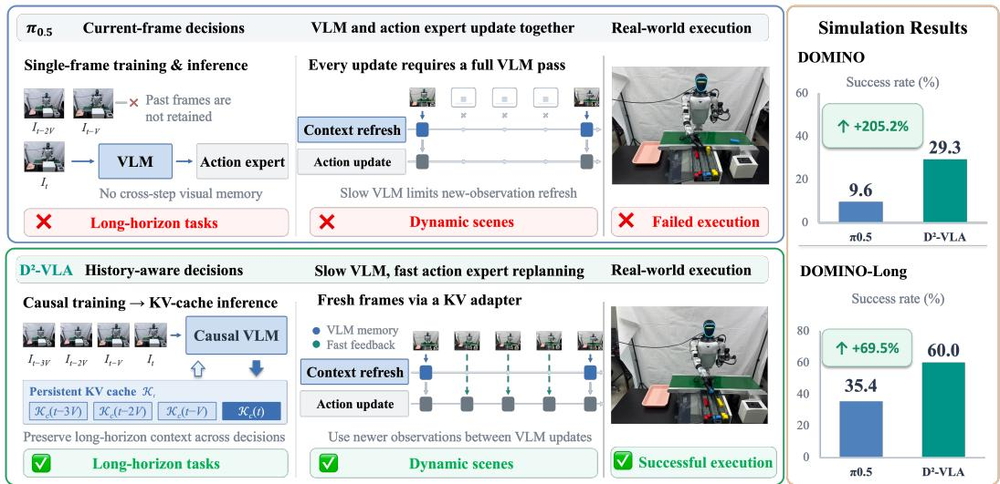  
Figure 1: Persistent memory and responsive control with $\mathbf { D } ^ { 2 } \mathbf { - V L A } .$ . Unlike single-frame $\pi _ { 0 . 5 }$ (top), D2-VLA (bottom) retains temporal context through causal KV caching and incorporates fresh observations through a KV adapter for fast replanning between slow VLM updates. Real-world examples and benchmark success rates illustrate improvements in long-horizon dynamic manipulation.

To investigate this question, we extend the single-observation $\pi _ { 0 . 5 }$ policy with block-causal temporal modeling and observe a pronounced temporal asymmetry: the VLM relies on broader history for semantic reasoning, whereas the action expert attends mostly to token subsets from recent observations that contain motion information, as shown in Fig. 3. These findings motivate decoupling KV-cache selection and refresh rates for the VLM and action expert.

We therefore introduce Dual-Memory Dual-Frequency VLA (D2-VLA) (Fig. 1). Block-causal training equips a single-frame VLA with temporal memory, enabling inference to encode only the latest observation while reusing historical KV states. Dual-Memory uses consumer-specific online attention statistics to select historical KV for the VLM and action expert, retaining relevant context while reducing history-read and attention costs. Dual-Frequency combines slow VLM refreshes with fast action replanning: between refreshes, a lightweight gated adapter refines the latest historyconditioned KV block using fresh visual features, without rerunning the VLM. A bounded fastmemory queue retains recent refined blocks to condition the action expert on short-range dynamics.

We further introduce DOMINO-Long, a benchmark whose tasks require robots to retain task information, such as earlier spatial configurations, presentation orders, or color cues, over long time scales while simultaneously manipulating dynamic objects which are constantly moving. Across DOMINO (Fang et al., 2026), DOMINO-Long, static long-horizon benchmarks, and real-robot experiments, D2-VLA consistently improves over single-frame and memory-augmented baselines. It achieves a 29.3% complete-task success rate and a 40.6 manipulation score on DOMINO, reaches 97.5% on LIBERO-Long (Liu et al., 2023) and 74.3% on RoboTwin 2.0 (Chen et al., 2025a), and outperforms $\pi _ { 0 . 5 }$ and MemoryVLA on all four reported dynamic real-robot tasks.

## Our main contributions are:

• We uncover a previously underexplored temporal asymmetry: the VLM and action expert require distinct historical contexts and memory update rates. Motivated by this finding, we introduce $\mathrm { D ^ { 2 } \mathrm { - } V L A }$ , a unified dual-memory, dual-frequency framework.

• We design a Dual-Memory method that enables the VLM and action expert to selectively retrieve KV from cache based on attention statistics, preserving relevant history while reducing redundant context computation.

• We develop a Dual-Frequency mechanism, which combines periodic VLM updates with lightweight gated visual adaptation, fast-memory buffering, and grouped fine-tuning, enabling responsive action replanning without rerunning the full VLM.

• We introduce DOMINO-Long, a benchmark demanding both long-term semantic reasoning and dynamic object interaction, and demonstrate consistent gains across comprehensive simulation and real-robot evaluations.

## 2 RELATED WORK

Long-horizon manipulation and memory-augmented policies. History-dependent manipulation requires information absent from the current observation. RoboMME evaluates temporal, spatial, object, and procedural memory (Dai et al., 2026). RoboFlamingo models history with a sequential policy head (Li et al., 2024b), while CronusVLA extends single-frame VLAs through multiframe post-training (Li et al., 2025). MemoryVLA retrieves perceptual and cognitive memories for action generation (Shi et al., 2026); MEM combines short-term video memory with long-term textual memory (Torne et al., 2026). MemER selects historical keyframes to guide a low-level policy through language instructions (Sridhar et al., 2025). We instead study consumer-specific historical KV selection, preserving complete stored blocks while tailoring their reads.

Dynamic manipulation and real-time control. Dynamic manipulation requires both timely sensory updates and effective task understanding. Recent works address this challenge through different forms of temporal adaptation. RTC reduces execution latency by overlapping action generation and execution without retraining (Black et al., 2025), while DynamicVLA introduces a dynamic manipulation benchmark and a compact VLA with streaming inference (Xie et al., 2026a). HiRT sepa rates fast visual control from slowly updated VLM context through hierarchical computation (Zhang et al., 2025), and FAVLA reuses VLM KV states while incorporating high-frequency force feedback into action generation (Li et al., 2026b). These studies highlight the importance of adaptive update schedules and efficient sensory conditioning for dynamic environments. Our dual-frequency control further explores how current visual observations can efficiently refresh a history-conditioned VLA through a lightweight KV refinement interface.

## 3 METHOD

We first formulate the task, then introduce block-wise causal KV reuse, component-specific historical read views, and dual-frequency visual conditioning. Implementation details and numerical configurations are provided in Appendix A.

## 3.1 PRELIMINARIES

Problem formulation. Generally, at each environment step t, the robot receives multi-view visual observations $I _ { t } ,$ a language instruction ℓ, and its proprioceptive state $s _ { t }$ . Let C denote the number of camera views, H the predicted action horizon, and E the executed chunk size. The observation set and predicted action chunk are

$$
I _ { t } = \{ I _ { t } ^ { ( c ) } \} _ { c = 1 } ^ { C } , \qquad A _ { t } = ( a _ { t } , \ldots , a _ { t + H - 1 } ) , \qquad 1 \leq E \leq H .\tag{1}
$$

Here $a _ { t }$ denotes an action at environment step t. The policy executes the first E actions and subsequently replans from the updated observation. We denote the vision–language model by Φ and the flow-matching action expert with parameters θ by $v _ { \boldsymbol { \theta } } ; \pi _ { \boldsymbol { \theta } }$ denotes the action distribution induced by flow integration. In $\mathrm { D ^ { 2 } \mathrm { - } V L A }$ , the current proprioceptive state is projected into a dedicated token and supplied directly to the action expert, rather than included in the VLM observation blocks or their cached history. For notational simplicity, we leave this state input implicit in the policy equations below. In our single-frame configuration initialized from $\pi _ { 0 . 5 }$ , action generation is conditioned on the current observation without historical context:

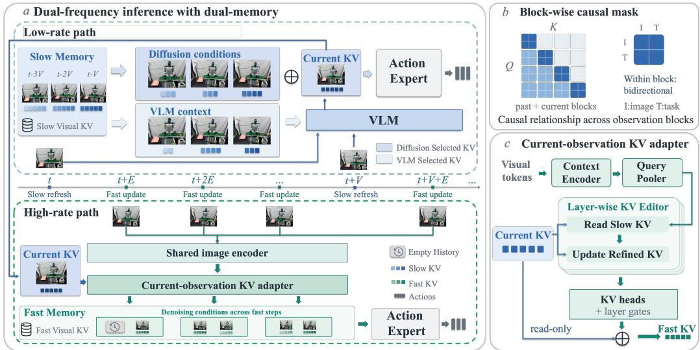  
Figure 2: Overview of $\mathbf { D } ^ { 2 } \mathbf { - V L A } .$ . (a) Dual memory provides component-specific KV reads; dualfrequency control combines slow VLM refreshes with fast action replanning. (b) Block-causal attention allows bidirectional reads within each observation block. (c) The adapter refines the latest slow KV block with current visual features.

$$
A _ { t } ^ { \mathrm { s i n g l e } } \sim \pi _ { \theta } ( \cdot \mid \Phi ( I _ { t } , \ell , s _ { t } ) ) .\tag{2}
$$

Here, the VLM encodes the current images and instruction into task-conditioned representations, which are subsequently consumed by the action expert to jointly generate the entire action chunk.

Limited temporal and high-frequency visual context. Single-frame policies such as $\pi _ { 0 . 5 }$ (Intelligence et al., 2025) lack historical context for handling occlusions, tracking task progress, and making long-horizon decisions. Refreshing their visual conditioning requires a full VLM pass at each replanning step. Re-encoding history adds computational cost, while reusing stale features can reduce action accuracy. This trade-off between temporal context, fresh visual feedback, and inference cost motivates $\mathrm { D } ^ { \mathrm { \bar { 2 } . } } \mathrm { V L A }$

## 3.2 CAUSAL TEMPORAL MODELING

Task-conditioned observation blocks. Within an episode, we sample N observations at interval ∆, including the current observation:

$$
\mathcal { T } _ { t } = \left[ I _ { t - ( N - 1 ) \Delta } , \dots , I _ { t - \Delta } , I _ { t } \right] .\tag{3}
$$

The image and text encoders, $E _ { \mathrm { i m g } }$ and $E _ { \mathrm { t e x t } }$ , form Image–Task blocks $B _ { j }$ with the instruction ℓ repeated at each sampled time j:

$$
B _ { j } = [ E _ { \mathrm { i m g } } ( I _ { j } ) ; E _ { \mathrm { t e x t } } ( \ell ) ] , \qquad B _ { \mathcal { T } } = \left[ B _ { t - ( N - 1 ) \Delta } ; \cdot \cdot \cdot ; B _ { t } \right] .\tag{4}
$$

Here $E _ { \mathrm { i m g } } ( I _ { j } )$ ) concatenates tokens from all camera views, semicolons denote token concatenation, and $B _ { T }$ is the resulting multimodal sequence.

Block-wise causal attention. The VLM uses bidirectional attention within each block and causal attention across blocks. Its observation KV and the separately projected current state condition the action expert; the full attention mask is given in Appendix A.2. At inference, retained history $\scriptstyle { \boldsymbol { \kappa } } _ { < t }$

is reused without re-encoding, and the current block’s complete visual and instruction $\mathrm { K V } , \kappa _ { c } ,$ is appended to form $\boldsymbol { \kappa } _ { t } \mathrm { : }$

$$
\mathcal { K } _ { c } = \Phi _ { \mathrm { K V } } \left( I _ { t } , \ell ; \mathcal { K } _ { < t } \right) , \qquad \mathcal { K } _ { t } = \mathcal { K } _ { < t } \oplus \mathcal { K } _ { c } , \qquad A _ { t } ^ { \mathrm { h i s t } } \sim \pi _ { \theta } ( \cdot \mid \mathcal { K } _ { t } ) .\tag{5}
$$

Here $\Phi _ { \mathrm { K V } }$ returns layer-wise KV and ⊕ denotes temporal concatenation; c identifies the current block, not a camera, and $\kappa _ { c } ( j )$ specifies its observation time. Each update uses up to the latest $N - 1$ historical blocks, using all available history during warm-up. We call this policy the KV-Cache prototype.

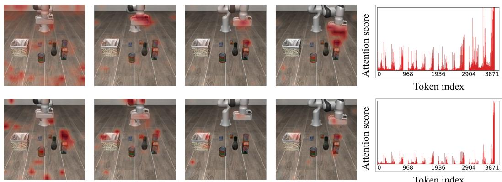  
Figure 3: Attention asymmetry and token concentration. Visual attention maps (left) and tokenwise attention scores (right) for the VLM (top) and action expert (bottom).

## 3.3 DUAL-MEMORY: ASYMMETRIC HISTORY SELECTION

The KV-Cache prototype improves success over single-observation $\pi _ { 0 . 5 }$ on LIBERO-Long and RoboTwin 2.0, but increases latency and memory (Tab. 10). Therefore, we analyze its attention patterns to identify opportunities for selective history access.

Attention asymmetry and token concentration. Aggregating historical attention by temporal distance reveals different temporal preferences for the VLM and action expert (attention asymmetry). Within observations, both modules concentrate attention on a small subset of tokens (token concentration; Fig. 3). These findings motivate independent historical KV reads for the two modules; additional visualizations are provided in Appendix D.1.

Asymmetric historical read views. The VLM and action expert use Read $\mathrm { V L M }$ and $\mathrm { R e a d } _ { \mathrm { a c t } }$ respectively, to select historical visual tokens from complete stored blocks $\kappa _ { < t }$ using independent online attention statistics, while retaining instruction tokens. Selection is inference-only; training uses uncompressed KV. The VLM reads its selected history to encode the current observation, while the expert combines its own selection with the complete current block:

$$
\begin{array} { r l r l } & { \mathcal { K } _ { c } = \Phi _ { \mathrm { K V } } \bigl ( I _ { t } , \ell ; \mathrm { R e a d } _ { \mathrm { V L M } } ( \mathcal { K } _ { < t } ) \bigr ) , } & & { \widehat { \mathcal { K } } _ { t } ^ { \mathrm { a c t } } = \mathrm { R e a d } _ { \mathrm { a c t } } ( \mathcal { K } _ { < t } ) \oplus \mathcal { K } _ { c } . } \end{array}\tag{6}
$$

Here $\widehat { \mathcal { K } } _ { t } ^ { \mathrm { a c t } }$ is the expert’s observation-KV condition. Selection changes only temporary reads, leaving stored blocks complete and the current block uncompressed. The condition remains fixed during each flow solve, whose attention statistics update subsequent reads. Online scoring and token selection are detailed in Appendix A.3.

## 3.4 DUAL-FREQUENCY: MULTI-RATE VISUAL CONDITIONING

$\mathrm { D ^ { 2 } \mathrm { - } V L A }$ updates VLM every V environment steps and replans every E steps, with V an integer multiple of E. A dynamic feature adapter supplies fresh visual conditioning between VLM refreshes.

Dual-memory mechanism. The queues $Q _ { \mathrm { s l o w } }$ and $Q _ { \mathrm { f a s t } }$ store complete VLM-generated and adapter-refined KV blocks with capacities $N _ { \mathrm { s l o w } }$ and $N _ { \mathrm { f a s t } }$ . Read operators act on their layer-wise temporal concatenations; for $Q _ { \mathrm { s l o w } }$ , this is $\textstyle { \boldsymbol { \mathcal { K } } } _ { t }$ at slow-refresh steps. VLM prefill, slow denoising, and fast denoising maintain independent selection statistics. Before insertion, each queue keeps the most recent historical blocks up to one less than its capacity, denoted by $Q _ { \mathrm { s l o w } } ^ { < t }$ or $\dot { Q } _ { \mathrm { f a s } 1 } ^ { < t }$ A slow refresh generates and stores the complete current block:

$$
\begin{array} { r } { \mathcal { K } _ { c } = \Phi _ { \mathrm { K V } } \left( I _ { t } , \ell ; \mathrm { R e a d } _ { \mathrm { V L M } } ( Q _ { \mathrm { s l o w } } ^ { < t } ) \right) , \qquad Q _ { \mathrm { s l o w } } = Q _ { \mathrm { s l o w } } ^ { < t } \oplus \mathcal { K } _ { c } , } \end{array}\tag{7}
$$

Dynamic Feature Adapter. Let $t _ { s }$ denote the latest slow-update time; within its cycle, we abbreviate the complete anchor $\mathcal { K } _ { c } ( t _ { s } )$ from Eq. 7 as $\kappa _ { c }$ . With steps counted from episode start, the normalized elapsed time $\delta _ { t }$ and configured history interval $\Delta$ are

$$
\Delta = V , \qquad \delta _ { t } = ( t - \lfloor ^ { t } / V \rfloor \cdot V ) \big / { V } .\tag{8}
$$

The encoder En $\dot { z } _ { \psi }$ combines current image features with the temporal offset, and the learned-query pooler $\mathrm { P o o l } _ { \psi }$ produces compact queries $\textstyle { \bar { \mathcal { Z } } } _ { t }$ . These queries read the anchor to produce a complete refined KV block $\widetilde { \mathcal { Z } } _ { t } .$ , which is appended to fast memory:

$$
\mathcal { Z } _ { t } = \mathrm { P o o l } _ { \psi } \big ( \mathrm { E n c } _ { \psi } \big ( E _ { \mathrm { i m g } } \big ( I _ { t } \big ) , \delta _ { t } \big ) \big ) , \ \widetilde { \mathcal { Z } } _ { t } = \mathcal { K } _ { c } + G _ { \psi } \odot \mathrm { F } _ { \psi } \big ( \mathcal { Z } _ { t } , \mathcal { K } _ { c } \big ) , \ Q _ { \mathrm { f a s t } } ^ { t } = Q _ { \mathrm { f a s t } } ^ { < t } \oplus \widetilde { \mathcal { Z } } _ { t } .\tag{9}
$$

Here ψ denotes adapter parameters, $\mathrm { F } _ { \psi }$ predicts full-block K/V residuals, $G _ { \psi }$ contains layer-wise K/V gates, and $\odot$ denotes elementwise multiplication. Each refinement preserves the KV layout and uses the unchanged complete slow anchor, not a compressed view or previous refinement. Task information enters through the anchor, without a separate text input (Appendix A.4).

Dual-frequency Mechanism. Every V steps, Eq. 7 refreshes slow memory and resets the fast queue and its scores. Intermediate replanning uses Eq. 9 without rerunning the VLM or modifying slow memory. At each E-step replanning call, the shared expert uses

$$
\widehat { \mathcal { K } } _ { t } ^ { \mathrm { a c t } } = \left\{ \begin{array} { l l } { \mathrm { R e a d } _ { \mathrm { a c t } } \left( Q _ { \mathrm { s l o w } } ^ { < t } \right) \oplus \mathcal { K } _ { c } , } & { t \bmod V = 0 , } \\ { \mathrm { R e a d } _ { \mathrm { a c t } } \left( Q _ { \mathrm { f a s t } } ^ { < t } \right) \oplus \widetilde { \mathcal { Z } } _ { t } , } & { t \bmod V \neq 0 , } \end{array} \right. \quad A _ { t } \sim \pi _ { \theta } \left( \cdot \vert \widehat { \mathcal { K } } _ { t } ^ { \mathrm { a c t } } \right) .\tag{10}
$$

Current state is supplied separately (Section 3.1). The two queues are never concatenated into one expert condition; fast calls inherit long-range context through the history-conditioned slow anchor.

## 4 DOMINO-LONG DATASET

Existing DOMINO tasks primarily target short-horizon manipulation, where actions are executed within a limited interaction window and therefore place relatively weak demands on long-term memory and extended decision-making. To address this limitation, we introduce DOMINO-Long, a benchmark designed to evaluate whether VLA models can retain task-relevant information over long temporal intervals and use it for subsequent decisions under dynamic interaction.

DOMINO-Long contains 10 multi-stage manipulation tasks with 50 demonstrations per task, yielding 500 demonstrations and 227,208 observation–action records in total. Each demonstration spans 201–911 interaction steps, with an average length of 454.4 steps. The tasks explicitly separate information acquisition from action execution: cues such as previous object locations, presentation order and color instructions are observed early in an episode but are required only at later stages. Representative tasks include restoring an earlier object configuration, executing actions according to a previously observed sequence, and selecting a moving object based on a cue that is no longer visible. Several tasks additionally involve moving objects, requiring the policy to combine retained historical information with current visual feedback. In this way, DOMINO-Long evaluates long-horizon context retention and dynamic responsiveness. Further details are provided in Appendix B.2.

## 5 EXPERIMENTS

Our evaluation examines whether $\mathrm { D ^ { 2 } \mathrm { - } V L A }$ can retain task context over long horizons while incorporating fresh visual feedback during dynamic manipulation. We consider DOMINO for dynamic interaction, LIBERO-Long for multi-stage manipulation, and our DOMINO-Long benchmark for long-horizon dynamic tasks. Eight real-world tasks provide complementary physical evaluation, while RoboTwin 2.0 serves as a supplementary manipulation benchmark.

## 5.1 EXPERIMENTAL SETUP

Model configuration. D2-VLA adds a full-block visual KV adapter to π Base, retaining its PaliGemma-3B VLM and shared flow-matching expert. For DOMINO, DOMINO-Long, and realworld tasks, the slow and fast memories hold up to four and two complete KV blocks, respectively, including the current block.

Model training. Each training sample is constructed within a single episode and contains a slow anchor, up to three historical observations, and three action branches: one at the anchor time and two at later steps. Each branch has its own images, robot state, and H-step action target. The anchor branch is processed with one block-causal VLM forward pass. The later branches reuse adapterrefined KV features from the shared anchor and, when available, from the previous refined block. We train all modules end-to-end using only the flow-matching loss, while masking unavailable history and action targets beyond the episode boundary. No auxiliary adapter loss or training-time KV selection is used. We optimize with AdamW using 40 anchor groups per batch for 75K updates on DOMINO and 50K updates on DOMINO-Long and real-world tasks. Additional training details are provided in Appendix A.5 and Tab. 5.

Model inference. On DOMINO, DOMINO-Long, and real-world tasks, we fix H = E = 25 and V = 75, with adapter updates between VLM refreshes. Inference uses EMA weights and ten Euler steps with a fixed KV condition per call. For the main results, VLM prefill, slow denoising, and fast denoising each retain 70% of historical visual tokens using independent scores, preserving instruction tokens, the current denoising block, and full stored KV. LIBERO-Long and RoboTwin 2.0 disable the high-rate path while retaining full-KV training and online selection (Section 5.5).

Evaluation Scenarios and Benchmarks. We evaluate D2-VLA in dynamic simulation, real-world manipulation, and static simulation to test responsiveness, temporal memory, and execution.

• Dynamic simulation. DOMINO Fang et al. (2026) comprises 35 dynamic tasks built on RoboTwin 2.0 Chen et al. (2025a) and SAPIEN Xiang et al. (2020). We use only the Aloha-AgileX embodiment, training on clean setting and evaluating on clean L1 to test responses to moving objects. DOMINO-Long (Section 4) adds 10 tasks requiring earlier observations to guide later actions, with 50 demonstrations per task used for training.

• Real-world manipulation. Eight long-horizon tasks on Unitree G1D comprise 4 static and 4 dynamic tasks. They test ordered execution, object assignments, and spatial memory; dynamic tasks additionally require remembered cues and fresh visual feedback during manipulation.

• Static simulation. LIBERO-Long tests instruction grounding and multi-stage execution across 10 tasks, with 50 demonstrations per task. RoboTwin 2.0 tests bimanual manipulation across 50 tasks; we train only on each task’s Aloha clean dataset and evaluate all 50 tasks in the clean setting.

Detailed evaluation protocols and task definitions are provided in Appendices A, B and C.

## 5.2 EVALUATION METRICS

Complete-task success rate (SR). It measures whether the policy completes the task. An episode is counted as successful only when all task requirements are satisfied. For long-horizon tasks, this includes completing the full action sequence with the correct object identities, ordering, and final configuration; partial execution or correct cue recognition alone does not count as success.

Manipulation Score (MS). DOMINO’s Manipulation Score (MS) measures manipulation quality beyond binary task completion. MS reflects how effectively the robot progresses toward the target while penalizing unsafe or undesirable behaviors, such as leaving the valid workspace or field of view and colliding with surrounding clutter, following the original DOMINO protocol.

## 5.3 EVALUATION ON DYNAMIC MANIPULATION BENCHMARKS

Dynamic manipulation on DOMINO. DOMINO tests D2-VLA’s responsiveness to changing observations through interception and tracking of independently moving objects, requiring correct target identification and continuous action adjustment. We fine-tune on clean demonstrations and evaluate on clean L1 with predictable low-order motion. Tab. 1(a) reports 29.3% SR and 40.6 MS, which measures execution quality beyond binary success. D2-VLA exceeds $\pi _ { 0 . 5 }$ by 19.7 percentage points in SR and 14.4 points in MS, and PUMA by 12.1 percentage points and 5.6 points, respectively. These gains support the effectiveness of combining historical context with frequent visual feedback for dynamic manipulation. Training and inference details are in Appendix A.

<table><tr><td>Method</td><td>SR (%)↑ MS↑</td></tr><tr><td>OpenVLA (Kim et al., 2024)</td><td>1.5 6.1</td></tr><tr><td>RDT-1B (Liu et al., 2025)</td><td>5.3 17.7</td></tr><tr><td> $\pi _ { 0 }$  (Black et al., 2026)</td><td>8.2 24.0</td></tr><tr><td> $\pi _ { 0 . 5 }$  (Intelligence et al., 2025)</td><td>9.6 26.2</td></tr><tr><td>InternVLA-M1 (Chen et al., 2025b)</td><td>5.4 27.6</td></tr><tr><td>VLA-Adapter (Wang et al., 2025)</td><td>4.4 24.3</td></tr><tr><td>π₀-FAST (Pertsch et al., 2025)</td><td>3.5 20.9</td></tr><tr><td>OpenVLA-OFT (Kim et al., 2025)</td><td>9.1 24.1</td></tr><tr><td>StarVLA-OFT (Community, 2026)</td><td>10.9 30.5</td></tr><tr><td>PUMA (Fang et al., 2026)</td><td>17.2 35.0</td></tr><tr><td>Ours</td><td>29.3 40.6</td></tr></table>

(a) DOMINO dynamic manipulation benchmark.

<table><tr><td>Subtask</td><td>PUMA</td><td>π0.5</td><td>Ours</td></tr><tr><td>Bottle Return</td><td>22%</td><td>20%</td><td>32%</td></tr><tr><td>Can Grasp</td><td>36%</td><td>92%</td><td>100%</td></tr><tr><td>Stack Two</td><td>24%</td><td>32%</td><td>38%</td></tr><tr><td>Two Color Cue</td><td>26%</td><td>22%</td><td>62%</td></tr><tr><td>Can Placement</td><td>42%</td><td>34%</td><td>52%</td></tr><tr><td>Tray Swap</td><td>14%</td><td>16%</td><td>38%</td></tr><tr><td>Screen Cue</td><td>20%</td><td>36%</td><td>90%</td></tr><tr><td>Stack Three</td><td>0%</td><td>6%</td><td>22%</td></tr><tr><td>Motion Memory</td><td>10%</td><td>52%</td><td>80%</td></tr><tr><td>Color Memory</td><td>12%</td><td>44%</td><td>86%</td></tr><tr><td>Average</td><td>20.6%</td><td>35.4%</td><td>60%</td></tr></table>

(b) DOMINO-Long benchmark.  
Table 1: Evaluation on dynamic and long-horizon manipulation. (a) Comparison on DOMINO, measured by SR and MS. (b) Per-subtask results on the 10 subtasks of DOMINO-Long.

Long-Horizon Dynamic Manipulation on DOMINO-Long. Tab. 1(b) reports 60% average complete-task SR, exceeding $\pi _ { 0 . 5 }$ (35.4%) and PUMA (20.6%) by 24.6 and 39.4 percentage points, respectively. These gains support the effectiveness of combining long-term memory with frequent visual updates for long-horizon dynamic manipulation. Observation/action interfaces are in Appendix A.1; task definitions and evaluation settings are in Appendix B.2.

## 5.4 REAL-WORLD EVALUATION

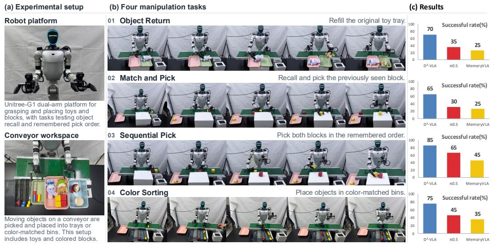  
Figure 4: Long-horizon dynamic real-world evaluation on the Unitree G1D robot. Representative task executions and success-rate comparisons with $\pi _ { 0 . 5 }$ and MemoryVLA.

<table><tr><td>Method</td><td>Params (B)↓ SR (%) ↑ Method</td><td></td><td></td><td>SR (%) ↑</td></tr><tr><td>Diffusion Policy (Chi et al., 2024)</td><td>0.1</td><td>28.0</td><td>CogACT (Li et al., 2024a)</td><td>53.2</td></tr><tr><td>ACT (Zhao et al., 2023)</td><td>0.1</td><td>29.7</td><td>OpenVLA (Kim et al., 2024)</td><td>53.7</td></tr><tr><td>DP3 (Ze et al., 2024)</td><td>0.3</td><td>55.2</td><td>π₀-FAST (Pertsch et al., 2025)</td><td>60.2</td></tr><tr><td> $\pi _ { 0 }$  (Black et al., 2026)</td><td>3.2</td><td>46.4</td><td>CronusVLA (Li et al., 2025)</td><td>68.7</td></tr><tr><td>FlowPolicy (Zhang et al., 2024)</td><td>0.3</td><td>41.0</td><td>CoT-VLA (Zhao et al., 2025)</td><td>69.0</td></tr><tr><td>RDT-1B (Liu et al., 2025)</td><td>1.7</td><td>34.5</td><td>SmolVLA (Shukor et al., 2025)</td><td>77.0</td></tr><tr><td>SeedPolicy (Gui et al., 2026)</td><td>0.2</td><td>42.8</td><td> $\pi _ { 0 }$  (Black et al., 2026)</td><td>85.2</td></tr><tr><td>Turbo-VLA (Xie et al., 2026b)</td><td>0.4</td><td>60.2</td><td>GR00T-N1 (NVIDIA et al., 2025)</td><td>90.6</td></tr><tr><td> $\pi _ { 0 . 5 }$  (Intelligence et al., 2025)</td><td>3.4</td><td>57.0</td><td> $\pi _ { 0 . 5 }$  (Intelligence et al., 2025)</td><td>92.4</td></tr><tr><td>StarVLA-α (Ye et al., 2026)</td><td>3.8</td><td>50.3</td><td>MemoryVLA (Shi et al., 2026)</td><td>93.4</td></tr><tr><td>D2-VLA (Ours)</td><td>3.5</td><td>74.3</td><td>D2-VLA (Ours)</td><td>97.5</td></tr><tr><td colspan="3">(a) RoboTwin 2.0.</td><td>(b) LIBERO-Long.</td><td></td></tr></table>

Table 2: Performance comparison on static manipulation benchmarks. (a) Model size and average success rate on RoboTwin 2.0, with all methods trained and evaluated exclusively on the clean setting. (b) Average success rate on LIBERO-Long.

Task design. We deploy $\mathrm { D ^ { 2 } \mathrm { - } V L A }$ on a Unitree G1D for bimanual manipulation; the robot and observation/action interfaces are described in Appendix C.1. Four static long-horizon tasks test ordered subgoals, object assignments, and memory of earlier spatial layouts. Four dynamic longhorizon tasks require decisions using current observations and task information retained from earlier in the episode. Together, they test whether $\mathrm { D ^ { 2 } \mathrm { - } V L A }$ integrates long-term context with fresh visual feedback for multi-stage physical manipulation.

Evaluation and results. We report complete-task SR, requiring the full instructed sequence. Fig. 4 presents dynamic-task examples and results. $\mathrm { D ^ { 2 } \mathrm { - } V L A }$ improves over $\pi _ { 0 . 5 }$ and MemoryVLA across tasks by varying margins, supporting retained context and frequent visual updates for real-world dynamic manipulation. Static-task results and additional examples are in Appendix C.

## 5.5 EVALUATION ON STANDARD STATIC BENCHMARKS

We evaluate $\mathrm { D ^ { 2 } \mathrm { - } V L A }$ on LIBERO-Long Liu et al. (2023) and RoboTwin 2.0 Chen et al. (2025a) with the high-rate pathway disabled, retaining full-KV training and online dual-memory selection at inference. Tab. 2 reports 97.5% SR on LIBERO-Long, exceeding $\pi _ { 0 . 5 }$ (92.4%) and MemoryVLA (93.4%) by 5.1 and 4.1 percentage points. On RoboTwin $2 . 0 , \mathrm { D ^ { 2 } \mathrm { - } V L A }$ reaches 74.3% SR, improving over $\pi _ { 0 . 5 }$ (57.0%) by 17.3 percentage points. These results support the usefulness of history-aware conditioning beyond dynamic scenes, without high-rate visual updates.

## 5.6 ABLATION STUDIES

Component ablation. We progressively add causal training with dual-memory selection and then dualfrequency control, including the adapter, to $\pi _ { 0 . 5 }$ on DOMINO. The first stage uses separate VLM and expert history reads without high-rate refinement; the second adds fast memory between VLM refreshes. Tab. 3 shows that the first stage raises SR from 9.6% to 16.1% (+6.5 percentage points), and dual-frequency control further increases it to 29.3% (+13.2 points). These gains support complementary benefits from historical context and intermediate visual updates. Additional ablations on historical KV retention and update periods are reported in Appendices D.3 and D.4, respectively. Memory and latency analysis can be seen in Appendix D.2.

<table><tr><td>Model</td><td>DM</td><td>DF</td><td>SR (%)</td></tr><tr><td>π0.5</td><td>一</td><td>一</td><td>9.6</td></tr><tr><td>+ Causal Training</td><td>√</td><td>一</td><td>16.1</td></tr><tr><td>D²-VLA</td><td>√</td><td>√</td><td>29.3</td></tr></table>

Table 3: Component ablation on DOMINO. DM: dual-memory; DF: dual-frequency.

## 6 CONCLUSION

We presented $\mathrm { D ^ { 2 } \mathrm { - } V L A }$ , combining causal KV reuse, consumer-specific history selection, and adapter-based dual-frequency control to retain context and use fresh observations without a VLM pass at every replanning step. We introduced DOMINO-Long to test long-horizon memory and dynamic responsiveness. $\mathrm { \bar { D } ^ { 2 } - \bar { V } L A }$ achieves 29.3% SR on DOMINO and 60.0% on DOMINO-Long, improves dynamic real-world manipulation, and extends memory-based design to static benchmarks, demonstrating the substantial benefits of combining historical context with timely visual feedback.

## AI USE STATEMENT

In this work, we used generative AI tools solely for language editing and proofreading, including improving grammar, readability, and overall clarity of the manuscript. We did not use generative AI tools for generating research ideas, designing methods, conducting experiments, analyzing results, producing scientific claims, or creating research artifacts. All AI-assisted edits were carefully reviewed and revised by the authors to ensure accuracy and consistency with the intended content. The authors take full responsibility for the final content of this work, including all text, claims, and artifacts.

## REPRODUCIBILITY STATEMENT

To facilitate reproducibility, we are willing to provide anonymous access to the source code, model weights, and the training and inference data used in our experiments for reproducibility. Detailed descriptions of the proposed method, experimental settings, and implementation details are provided in the main paper and appendix. These resources enable independent verification of our results and support further research on long-horizon vision-language-action models.

## REFERENCES

Lucas Beyer, Andreas Steiner, Andre Susano Pinto, Alexander Kolesnikov, Xiao Wang, Daniel´ Salz, Maxim Neumann, Ibrahim Alabdulmohsin, Michael Tschannen, Emanuele Bugliarello, Thomas Unterthiner, Daniel Keysers, Skanda Koppula, Fangyu Liu, Adam Grycner, Alexey Gritsenko, Neil Houlsby, Manoj Kumar, Keran Rong, Julian Eisenschlos, Rishabh Kabra, Matthias Bauer, Matko Bosnjak, Xi Chen, Matthias Minderer, Paul Voigtlaender, Ioana Bica, Ivana Bal-ˇ azevic, Joan Puigcerver, Pinelopi Papalampidi, Olivier Henaff, Xi Xiong, Radu Soricut, Jeremiah Harmsen, and Xiaohua Zhai. PaliGemma: A versatile 3B VLM for transfer. arXiv preprint arXiv:2407.07726, 2024.

Kevin Black, Manuel Y. Galliker, and Sergey Levine. Real-time execution of action chunking flow policies, 2025. URL https://arxiv.org/abs/2506.07339.

Kevin Black, Noah Brown, Danny Driess, Adnan Esmail, Michael Equi, Chelsea Finn, Niccolo Fusai, Lachy Groom, Karol Hausman, Brian Ichter, Szymon Jakubczak, Tim Jones, Liyiming Ke, Sergey Levine, Adrian Li-Bell, Mohith Mothukuri, Suraj Nair, Karl Pertsch, Lucy Xiaoyang Shi, James Tanner, Quan Vuong, Anna Walling, Haohuan Wang, and Ury Zhilinsky. π : A visionlanguage-action flow model for general robot control, 2026. URL https://arxiv.org/ abs/2410.24164.

Jisong Cai, Long Ling, Shiwei Chu, Zhongshan Liu, Jiayue Kang, Zhixuan Liang, Wenjie Xu, Yinan Mao, Weinan Zhang, Xiaokang Yang, et al. Aha-wam: Asynchronous horizon-adaptive worldaction modeling with observation-guided context routing, 2026. URL https://arxiv.org/ abs/2606.09811.

Tianxing Chen, Zanxin Chen, Baijun Chen, Zijian Cai, Yibin Liu, Zixuan Li, Qiwei Liang, Xianliang Lin, Yiheng Ge, Zhenyu Gu, et al. Robotwin 2.0: A scalable data generator and benchmark with strong domain randomization for robust bimanual robotic manipulation. arXiv preprint arXiv:2506.18088, 2025a.

Xinyi Chen, Yilun Chen, Yanwei Fu, Ning Gao, Jiaya Jia, Weiyang Jin, Hao Li, Yao Mu, Jiangmiao Pang, Yu Qiao, Yang Tian, Bin Wang, Bolun Wang, Fangjing Wang, Hanqing Wang, Tai Wang,

Ziqin Wang, Xueyuan Wei, Chao Wu, Shuai Yang, Jinhui Ye, Junqiu Yu, Jia Zeng, Jingjing Zhang, Jinyu Zhang, Shi Zhang, Feng Zheng, Bowen Zhou, and Yangkun Zhu. Internvla-m1: A spatially guided vision-language-action framework for generalist robot policy, 2025b. URL https://arxiv.org/abs/2510.13778.

Cheng Chi, Zhenjia Xu, Siyuan Feng, Eric Cousineau, Yilun Du, Benjamin Burchfiel, Russ Tedrake, and Shuran Song. Diffusion policy: Visuomotor policy learning via action diffusion, 2024. URL https://arxiv.org/abs/2303.04137.

StarVLA Community. Starvla: A lego-like codebase for vision-language-action model developing, 2026. URL https://arxiv.org/abs/2604.05014.

Yinpei Dai, Hongze Fu, Jayjun Lee, Yuejiang Liu, Haoran Zhang, Jianing Yang, Chelsea Finn, Nima Fazeli, and Joyce Chai. Robomme: Benchmarking and understanding memory for robotic generalist policies, 2026. URL https://arxiv.org/abs/2603.04639.

Heng Fang, Shangru Li, Shuhan Wang, Xuanyang Xi, Dingkang Liang, and Xiang Bai. Towards generalizable robotic manipulation in dynamic environments, 2026. URL https://arxiv. org/abs/2603.15620.

Youqiang Gui, Yuxuan Zhou, Shen Cheng, Xinyang Yuan, Haoqiang Fan, Peng Cheng, and Shuaicheng Liu. Seedpolicy: Horizon scaling via self-evolving diffusion policy for robot manipulation, 2026. URL https://arxiv.org/abs/2603.05117.

Physical Intelligence, Kevin Black, Noah Brown, James Darpinian, Karan Dhabalia, Danny Driess, Adnan Esmail, Michael Equi, Chelsea Finn, Niccolo Fusai, Manuel Y. Galliker, Dibya Ghosh, Lachy Groom, Karol Hausman, Brian Ichter, Szymon Jakubczak, Tim Jones, Liyiming Ke, Devin LeBlanc, Sergey Levine, Adrian Li-Bell, Mohith Mothukuri, Suraj Nair, Karl Pertsch, Allen Z. Ren, Lucy Xiaoyang Shi, Laura Smith, Jost Tobias Springenberg, Kyle Stachowicz, James Tanner, Quan Vuong, Homer Walke, Anna Walling, Haohuan Wang, Lili Yu, and Ury Zhilinsky. π0.5: a vision-language-action model with open-world generalization, 2025. URL https://arxiv. org/abs/2504.16054.

Moo Jin Kim, Karl Pertsch, Siddharth Karamcheti, Ted Xiao, Ashwin Balakrishna, Suraj Nair, Rafael Rafailov, Ethan Foster, Grace Lam, Pannag Sanketi, Quan Vuong, Thomas Kollar, Benjamin Burchfiel, Russ Tedrake, Dorsa Sadigh, Sergey Levine, Percy Liang, and Chelsea Finn. Openvla: An open-source vision-language-action model, 2024. URL https://arxiv.org/ abs/2406.09246.

Moo Jin Kim, Chelsea Finn, and Percy Liang. Fine-tuning vision-language-action models: Optimizing speed and success, 2025. URL https://arxiv.org/abs/2502.19645.

Hang Li, Fengyi Shen, Dong Chen, Liudi Yang, Xudong Wang, Jinkui Shi, Zhenshan Bing, Ziyuan Liu, and Alois Knoll. Remem-vla: Empowering vision-language-action model with memory via dual-level recurrent queries, 2026a. URL https://arxiv.org/abs/2603.12942.

Hao Li, Shuai Yang, Yilun Chen, Xinyi Chen, Xiaoda Yang, Yang Tian, Hanqing Wang, Tai Wang, Dahua Lin, Feng Zhao, and Jiangmiao Pang. Cronusvla: Towards efficient and robust manipulation via multi-frame vision-language-action modeling, 2025. URL https://arxiv.org/ abs/2506.19816.

Qixiu Li, Yaobo Liang, Zeyu Wang, Lin Luo, Xi Chen, Mozheng Liao, Fangyun Wei, Yu Deng, Sicheng Xu, Yizhong Zhang, Xiaofan Wang, Bei Liu, Jianlong Fu, Jianmin Bao, Dong Chen, Yuanchun Shi, Jiaolong Yang, and Baining Guo. Cogact: A foundational vision-language-action model for synergizing cognition and action in robotic manipulation, 2024a. URL https:// arxiv.org/abs/2411.19650.

Xinghang Li, Minghuan Liu, Hanbo Zhang, Cunjun Yu, Jie Xu, Hongtao Wu, Chilam Cheang, Ya Jing, Weinan Zhang, Huaping Liu, Hang Li, and Tao Kong. Vision-language foundation models as effective robot imitators, 2024b. URL https://arxiv.org/abs/2311.01378.

Yao Li, Peiyuan Tang, Wuyang Zhang, Chengyang Zhu, Yifan Duan, Weikai Shi, Xiaodong Zhang, Zijiang Yang, Jianmin Ji, and Yanyong Zhang. Favla: A force-adaptive fast-slow vla model for contact-rich robotic manipulation, 2026b. URL https://arxiv.org/abs/2602.23648.

Bo Liu, Yifeng Zhu, Chongkai Gao, Yihao Feng, Qiang Liu, Yuke Zhu, and Peter Stone. Libero: Benchmarking knowledge transfer for lifelong robot learning, 2023. URL https://arxiv. org/abs/2306.03310.

Songming Liu, Lingxuan Wu, Bangguo Li, Hengkai Tan, Huayu Chen, Zhengyi Wang, Ke Xu, Hang Su, and Jun Zhu. Rdt-1b: a diffusion foundation model for bimanual manipulation, 2025. URL https://arxiv.org/abs/2410.07864.

NVIDIA, :, Johan Bjorck, Fernando Castaneda, Nikita Cherniadev, Xingye Da, Runyu Ding,˜ Linxi ”Jim” Fan, Yu Fang, Dieter Fox, Fengyuan Hu, Spencer Huang, Joel Jang, Zhenyu Jiang, Jan Kautz, Kaushil Kundalia, Lawrence Lao, Zhiqi Li, Zongyu Lin, Kevin Lin, Guilin Liu, Edith Llontop, Loic Magne, Ajay Mandlekar, Avnish Narayan, Soroush Nasiriany, Scott Reed, You Liang Tan, Guanzhi Wang, Zu Wang, Jing Wang, Qi Wang, Jiannan Xiang, Yuqi Xie, Yinzhen Xu, Zhenjia Xu, Seonghyeon Ye, Zhiding Yu, Ao Zhang, Hao Zhang, Yizhou Zhao, Ruijie Zheng, and Yuke Zhu. Gr00t n1: An open foundation model for generalist humanoid robots, 2025. URL https://arxiv.org/abs/2503.14734.

Karl Pertsch, Kyle Stachowicz, Brian Ichter, Danny Driess, Suraj Nair, Quan Vuong, Oier Mees, Chelsea Finn, and Sergey Levine. Fast: Efficient action tokenization for vision-language-action models, 2025. URL https://arxiv.org/abs/2501.09747.

Hao Shi, Bin Xie, Yingfei Liu, Lin Sun, Fengrong Liu, Tiancai Wang, Erjin Zhou, Haoqiang Fan, Xiangyu Zhang, and Gao Huang. Memoryvla: Perceptual-cognitive memory in vision-languageaction models for robotic manipulation, 2026. URL https://arxiv.org/abs/2508. 19236.

Mustafa Shukor, Dana Aubakirova, Francesco Capuano, Pepijn Kooijmans, Steven Palma, Adil Zouitine, Michel Aractingi, Caroline Pascal, Martino Russi, Andres Marafioti, Simon Alibert, Matthieu Cord, Thomas Wolf, and Remi Cadene. Smolvla: A vision-language-action model for affordable and efficient robotics, 2025. URL https://arxiv.org/abs/2506.01844.

Ajay Sridhar, Jennifer Pan, Satvik Sharma, and Chelsea Finn. Memer: Scaling up memory for robot control via experience retrieval, 2025. URL https://arxiv.org/abs/2510.20328.

Jun Sun, Boyu Yang, Jiahao Zhang, Ning Ma, Chencheng Wu, Siqing Zhang, Yiou Huang, Qiufeng Wang, Shan Liang, and Yaran Chen. Tempofit: Plug-and-play layer-wise temporal kv memory for long-horizon vision-language-action manipulation, 2026. URL https://arxiv.org/abs 2603.07647.

Marcel Torne, Karl Pertsch, Homer Walke, Kyle Vedder, Suraj Nair, Brian Ichter, Allen Z. Ren, Haohuan Wang, Jiaming Tang, Kyle Stachowicz, Karan Dhabalia, Michael Equi, Quan Vuong, Jost Tobias Springenberg, Sergey Levine, Chelsea Finn, and Danny Driess. Mem: Multi-scale embodied memory for vision language action models, 2026. URL https://arxiv.org/ abs/2603.03596.

Yihao Wang, Pengxiang Ding, Lingxiao Li, Can Cui, Zirui Ge, Xinyang Tong, Wenxuan Song, Han Zhao, Wei Zhao, Pengxu Hou, Siteng Huang, Yifan Tang, Wenhui Wang, Ru Zhang, Jianyi Liu, and Donglin Wang. Vla-adapter: An effective paradigm for tiny-scale vision-language-action model, 2025. URL https://arxiv.org/abs/2509.09372.

Fanbo Xiang, Yuzhe Qin, Kaichun Mo, Yikuan Xia, Hao Zhu, Fangchen Liu, Minghua Liu, Hanxiao Jiang, Yifu Yuan, He Wang, Li Yi, Angel X. Chang, Leonidas J. Guibas, and Hao Su. SAPIEN: A simulated part-based interactive environment. In The IEEE Conference on Computer Vision and Pattern Recognition (CVPR), June 2020.

Haozhe Xie, Beichen Wen, Jiarui Zheng, Zhaoxi Chen, Fangzhou Hong, Haiwen Diao, and Ziwei Liu. Dynamicvla: A vision-language-action model for dynamic object manipulation, 2026a. URL https://arxiv.org/abs/2601.22153.

Hengyi Xie, Chenfei Yao, Xianjin Wu, Yingying Zhu, Dingkang Liang, Xiang Bai, and Han Ding. Turbovla: Real-time vision-language-action model at 32 hz on an rtx 4090 with ¡ 1 gb vram. arXiv preprint arXiv:2607.27205, 2026b.

Jinhui Ye, Ning Gao, Senqiao Yang, Jinliang Zheng, Zixuan Wang, Yuxin Chen, Pengguang Chen, Yilun Chen, Shu Liu, and Jiaya Jia. Starvla-α: Reducing complexity in vision-language-action systems, 2026. URL https://arxiv.org/abs/2604.11757.

Yanjie Ze, Gu Zhang, Kangning Zhang, Chenyuan Hu, Muhan Wang, and Huazhe Xu. 3d diffusion policy: Generalizable visuomotor policy learning via simple 3d representations, 2024. URL https://arxiv.org/abs/2403.03954.

Xiaohua Zhai, Basil Mustafa, Alexander Kolesnikov, and Lucas Beyer. Sigmoid loss for language image pre-training. In 2023 IEEE/CVF International Conference on Computer Vision (ICCV), pp. 11941–11952. IEEE, 2023.

Jianke Zhang, Yanjiang Guo, Xiaoyu Chen, Yen-Jen Wang, Yucheng Hu, Chengming Shi, and Jianyu Chen. Hirt: Enhancing robotic control with hierarchical robot transformers, 2025. URL https://arxiv.org/abs/2410.05273.

Qinglun Zhang, Zhen Liu, Haoqiang Fan, Guanghui Liu, Bing Zeng, and Shuaicheng Liu. Flowpolicy: Enabling fast and robust 3d flow-based policy via consistency flow matching for robot manipulation, 2024. URL https://arxiv.org/abs/2412.04987.

Qingqing Zhao, Yao Lu, Moo Jin Kim, Zipeng Fu, Zhuoyang Zhang, Yecheng Wu, Zhaoshuo Li, Qianli Ma, Song Han, Chelsea Finn, Ankur Handa, Ming-Yu Liu, Donglai Xiang, Gordon Wet zstein, and Tsung-Yi Lin. Cot-vla: Visual chain-of-thought reasoning for vision-language-action models, 2025. URL https://arxiv.org/abs/2503.22020.

Tony Z. Zhao, Vikash Kumar, Sergey Levine, and Chelsea Finn. Learning fine-grained bimanual manipulation with low-cost hardware, 2023. URL https://arxiv.org/abs/2304.13705.

## A IMPLEMENTATION AND TRAINING DETAILS

This appendix provides the implementation and training details of $\mathrm { D ^ { 2 } \mathrm { - } V L A }$ . We first describe the model architecture, observation and action interfaces. We then detail the implementation of the key VLA components, including the causal modeling and cache conventions, dynamic feature adaptation, model optimization and inference. Finally, we summarize the experiment-specific configurations for DOMINO, DOMINO-Long, and the real-world tasks, together with the corresponding simulation protocols, real-world evaluation settings, memory analysis, and ablation studies.

## A.1 MODEL ARCHITECTURE AND OBSERVATION–ACTION INTERFACES

Backbone and token layout. The VLM is initialized from the PaliGemma-3B backbone Beyer et al. (2024) used in $\pi _ { 0 . 5 }$ . It consists of a SigLIP vision encoder Zhai et al. (2023) and a Gemma language backbone. The language backbone follows the Gemma-2B configuration, while the action expert is based on Gemma-300M. Both Transformer stacks contain 18 layers, with 8 query heads, 1 KV head, and a head dimension of 256. Their hidden dimensions are 2048 and 1024, respectively.

The SigLIP Zhai et al. (2023) encoder processes each $2 2 4 \times 2 2 4$ image using $1 4 \times 1 4$ patches and produces 256 visual tokens. With three camera views, each observation contains 768 visual tokens. We allow up to 200 instruction tokens, resulting in a maximum of 968 token positions per observation block. Unused instruction positions and unavailable camera views are masked. The same instruction is repeated for each observation block.

The robot state is handled separately from the VLM input. The normalized state is padded to 32 dimensions and projected into a single 1024-dimensional token for the action expert. This state token is not stored in the visual-language cache.

Embodiment-specific inputs and actions. The simulation setup uses three camera views: one head camera and two wrist cameras. For DOMINO-Long, the original images are recorded at $6 4 0 \times$ 480 resolution. The ALOHA state and action vectors contain 14 dimensions, including 12 arm-joint dimensions and two gripper dimensions. The Unitree robot uses 16-dimensional state and action vectors, consisting of 14 arm-joint dimensions and two gripper dimensions. For a unified model interface, both representations are padded to 32 dimensions. In the real-world setup, the left and right head-camera images are combined into a single model view, while the two wrist-camera views are kept separate. Additional details are provided in Appendix C.1.

For training, arm-joint actions are represented relative to the current robot state:

$$
\widetilde { A } _ { t _ { j } , h , d } = A _ { t _ { j } + h , d } ^ { \mathrm { a b s } } - s _ { t _ { j } , d } ,\tag{11}
$$

where $t _ { j }$ denotes the current step of branch $j , h = 0 , \ldots , H - 1$ is the action offset, and d indexes an arm joint. The gripper actions remain in absolute coordinates. Relative joint actions are computed before quantile normalization. During inference, the current joint state is added back after denormalization to recover absolute joint commands, and padded dimensions are removed before execution. Normalization statistics are computed separately for each training dataset, and invalid action steps are excluded from the training loss as described in Appendix A.5.

## A.2 CAUSAL MODELING AND CACHE CONVENTIONS

Observation-level causality. We organize each training sample as a temporal window containing the current observation and up to three preceding observations. Tokens within the same observation block interact bidirectionally, whereas attention across observation blocks is causal: each block can attend to itself and all earlier blocks, but not to future ones. Missing history at the beginning of an episode is padded and masked, and temporal windows never cross episode boundaries. This follows the causal modeling scheme introduced in Section 3.2.

The action expert receives the encoded observation history together with the current state token $ { \boldsymbol { z } } _ { t } ^ { s }$ and the noisy action tokens $A _ { t } ^ { \tau }$ . The state token can attend to all valid observation blocks, while the action tokens can additionally attend to the current state and to one another. For a temporal window containing N observation blocks, the visibility pattern can be written as

$$
\mathcal { V } ( B _ { i } ) = \{ B _ { j } ~ | ~ j \leq i \} , \qquad \mathcal { V } ( z _ { t } ^ { s } ) = \{ B _ { 1 } , \ldots , B _ { N } , z _ { t } ^ { s } \} , \qquad \mathcal { V } ( A _ { t } ^ { \tau } ) = \{ B _ { 1 } , \ldots , B _ { N } , z _ { t } ^ { s } , A _ { t } ^ { \tau } \} ,\tag{12}
$$

where $\mathcal { V } ( \cdot )$ denotes the set of tokens visible to a given block or token group. In our implementation, $N = 4 ,$ , with $B _ { 1 } , \ldots , B _ { 4 }$ ordered from the oldest to the most recent observation, rather than indexing absolute environment times as in Section 3.2. The noisy action tokens $A _ { t } ^ { \tau }$ follow the flow-matching formulation defined in Appendix A.5. The VLM encodes the observation blocks, while the action expert operates on their layer-wise KV representations together with the state and action tokens.

Persistent slow-memory cache. The slow-memory queue $Q _ { \mathrm { s l o w } }$ stores complete layer-wise KV blocks in temporal order. At each slow update, the retained blocks are concatenated along the token dimension to form the current slow-memory context $\textstyle { \mathcal { K } } _ { t }$ . The concatenation is performed separately for keys and values at every Transformer layer while preserving the temporal order of the blocks:

$$
{ \cal K } _ { t } = \mathrm { C o n c a t } _ { \mathrm { K V } } \left( Q _ { \mathrm { s l o w } } ^ { t } \right) .\tag{13}
$$

Before encoding a new slow observation at step $t ,$ the queue retains at most the most recent $N _ { \mathrm { s l o w } } - 1$ historical blocks. Let $Q _ { \mathrm { s l o w } } ^ { t ^ { - } }$ denote the queue state immediately before the current update. The historical context, current $\mathrm { \ddot { K V } }$ block, and updated slow-memory queue are given by

$$
\begin{array} { r l } & { Q _ { \mathrm { s l o w } } ^ { < t } = \mathrm { P } _ { N _ { \mathrm { s l o w } } - 1 } \left( Q _ { \mathrm { s l o w } } ^ { t ^ { - } } \right) , } \\ & { \quad K _ { < t } = \mathrm { C o n c a t } _ { \mathrm { K V } } \left( Q _ { \mathrm { s l o w } } ^ { < t } \right) , } \\ & { \quad K _ { c } ( t ) = \Phi _ { \mathrm { K V } } \left( I _ { t } , \ell ; \mathrm { R e a d } _ { \mathrm { V L M } } \left( K _ { < t } \right) \right) , } \\ & { \quad Q _ { \mathrm { s l o w } } ^ { t } = Q _ { \mathrm { s l o w } } ^ { < t } \oplus K _ { c } ( t ) . } \end{array}\tag{14}
$$

Here, $\mathrm { P } _ { k } ( \cdot )$ preserves up to the most recent $k$ complete blocks, $\mathrm { { C o n c a t } _ { K V } ( \cdot ) }$ concatenates their keys and values separately along the token dimension, and ⊕ denotes temporal concatenation. In our implementation, $N _ { \mathrm { s l o w } } = 4$ , so the queue stores the current block together with up to three preceding slow observations. The history read follows the selection rule defined in Section 3.3, while the temporal ordering follows the causal formulation in Section 3.2.

Importantly, historical blocks are encoded only once and are not recomputed at every slow update. The history selector affects only the temporary read view used by $\Phi _ { \mathrm { K V } } ;$ complete retained blocks remain stored in $Q _ { \mathrm { s l o w } } .$ . Consequently, the slow-memory cache is not equivalent to repeatedly encoding a fresh four-frame window, since each retained block may already contain information propagated from earlier observations.

KV storage and positional encoding. Both the slow and fast memories store raw keys and values before rotary positional encoding is applied. Rotary embeddings are applied to the keys only when cached features are read, while the values remain unchanged. During each read, valid tokens preserve their original temporal and within-block order but are reassigned compact position indices. Masked camera tokens and padded instruction tokens remain invalid throughout this process. Thus, position reassignment affects only the positional encoding used at read time and does not modify the stored KV features. The online history selector follows the same Image–Task block layout and raw-KV storage format as the memory queues, ensuring consistent representations across caching, selection, and retrieval.

## A.3 ONLINE CONSUMER-SPECIFIC HISTORICAL KV SELECTION

Separate online statistics. Historical KV selection is applied only at inference and introduces no trainable parameters. Let $g \in \{ \mathrm { p } , \mathrm { s } , \mathrm { f } \}$ index VLM prefill, slow-branch action denoising, and fastbranch action denoising, respectively. Each stage maintains its own score tensor independently for each sample. Prefill and slow-denoising scores are associated with complete slow-memory blocks; fast-denoising scores are associated with the refined-block FIFO. The two action branches share expert weights, but maintain separate history-importance statistics. Within each consumer, selected token indices are shared across layers. In Eq. $6 , \mathrm { R e a d v _ { L M } }$ denotes the prefill read $( g = \operatorname { p } )$ , while $\mathrm { R e a d } _ { \mathrm { a c t } }$ denotes the slow-denoising read $( g ~ = ~ \mathrm { s } )$ . At intermediate replanning steps in Eq. 10, $\mathrm { R e a d } _ { \mathrm { a c t } }$ instead uses fast-denoising scores $( g = \operatorname { f } )$ to select from fast memory. The two action paths share the same read operator notation, but use separate source memories and importance statistics.

For each sample, let i index a token in the stage’s full stored memory and l index a Transformer layer. We denote its accumulated importance by $h _ { g , l , i }$ . The attention statistic $\bar { a } _ { g , l , i }$ averages the existing attention probabilities over heads and valid queries in the current call. For prefill, queries are the valid current observation tokens; for denoising, they include the current state token and action tokens. Denoising statistics are additionally averaged over flow-integration steps. With scoreretention coefficient $\rho \in [ 0 , 1 )$ ), fixed at 0.2 in the reported experiments, the update and cross-layer selection score are

$$
\begin{array} { r l } & { \boldsymbol { h } _ { g , l , i } ^ { + } = \displaystyle \left\{ \rho h _ { g , l , i } + ( 1 - \rho ) \bar { a } _ { g , l , i } , \quad i \mathrm { ~ i s ~ o b s e r v e d ~ i n ~ t h e ~ c u r r e n t ~ r e a d } , \right. } \\ & { \left. \begin{array} { l } { h _ { g , l , i } , } \\ { u _ { g , i } = \operatorname* { m a x } h _ { g , l , i } . } \end{array} \right. } \end{array}\tag{15}
$$

Here + denotes the score state after the current call, and $u _ { g , i }$ is computed from the score state available before each read. The current forward pass therefore updates scores for subsequent reads, not its own selection. Unobserved tokens are not decayed. New score slots are zero-initialized, scores are removed with evicted blocks, and all streaming state is reset between episodes. Statistics are obtained from the forward passes already used for encoding or denoising; selection does not require an additional full-memory scoring pass, an offline attention prior, or a K/V-magnitude term.

Per-block visual budgets and shared indices. Each stage supports a separately configurable visual-token budget for each historical block, specified either as a token count or as a retention ratio. In the reported experiments, all active consumers use the same retention ratio, while maintaining independent attention statistics. The main results use a historical visual-token retention ratio of 0.7. An explicit token budget takes precedence over the ratio. Without an explicit budget, the per-block visual budget is the ceiling of the retention ratio times the number of allocated visual slots; masked camera slots remain invalid and their quota is not reassigned. The budget is allocated across cameras: the implementation first reserves up to four tokens per camera when the budget permits, then distributes the remaining capacity proportionally. If the total budget is smaller, the initial allocation proceeds round-robin. Let $\kappa _ { g , c }$ be the resulting quota for camera c in each historical block at stage g. At time t, let $\mathcal { V } _ { t , j , c } ^ { g }$ denote the valid visual-token indices from camera c in a retained historical block with observation time $j < t ,$ within that stage’s source memory. We define $\mathcal { T } _ { t , j , c } ^ { g }$ as the set of visual-token indices selected from this group:

$$
\mathcal { I } _ { t , j , c } ^ { g } = \mathrm { T o p K } _ { i \in \mathcal { V } _ { t , j , c } ^ { g } } \big ( u _ { g , i } , \operatorname* { m i n } \big ( \kappa _ { g , c } , | \mathcal { V } _ { t , j , c } ^ { g } | \big ) \big ) .\tag{16}
$$

The operator TopK returns the highest-scoring indices. Thus, selection is performed separately within each historical block and camera, rather than globally across the entire history. Selected positions are sorted back into their original order; equal-score ties favor earlier source positions. The layerwise maximum in Eq. 15 yields one index set shared by keys and values at every layer, with separate selection for each batch element. Padding slots retained for static tensor shapes keep their validity masks and are not treated as valid selected tokens.

Protected tokens and read lifetime. The read operator combines the selected visual KV entries with all instruction tokens from each historical block while preserving their validity masks and temporal order. Instruction tokens are always retained and do not count toward the visual-token budget. During VLM prefill, all cached blocks are treated as history and are eligible for visual-token selection, while the current observation is encoded in full.

Table 4: Online KV selection settings for VLM prefill, slow-branch denoising, and fast-branch denoising. Source, Current, and Ret. denote historical source, current-block protection, and visual-token retention ratio, respectively.
<table><tr><td>Consumer</td><td>Source</td><td>Current</td><td>Ret.</td></tr><tr><td>VLM prefill</td><td>Slow</td><td></td><td>0.7</td></tr><tr><td>Slow denoising</td><td>Slow</td><td>Yes</td><td>0.7</td></tr><tr><td>Fast denoising</td><td>Fast FIFO</td><td>Yes</td><td>0.7</td></tr><tr><td> $\rho$ </td><td colspan="3">0.2 (fixed)</td></tr></table>

For action denoising, the newest block is always kept complete, and only earlier blocks are compressed. Thus, in the fast branch, compression is applied only to preceding refined blocks when available, while the current refined block remains intact. Selection affects only the temporary read view; the complete KV blocks remain stored in memory as described in Appendix A.2.

Each denoising read view is constructed once per expert call and remains fixed throughout the corresponding flow solve. Attention statistics collected during the current call are used only to update importance scores for subsequent reads. The selection mechanism operates within retained historical blocks and does not restrict the action expert to a fixed number of recent observations.

## A.4 FULL-BLOCK ADAPTER AND DUAL-RATE INFERENCE

Update schedule. Using the notation of Section 3.4, the slow-update period V is an integer multiple of the executed chunk size $E .$ The history-sampling interval matches this period, as specified in Eq. 8. With environment steps counted from episode start, the latest slow-update time and normalized elapsed time are

$$
t _ { s } = V \left\lfloor t / V \right\rfloor , \qquad \delta _ { t } = \frac { t - t _ { s } } { V } .\tag{17}
$$

A slow refresh occurs at $t = t _ { s }$ ; other replanning calls use the fast pathway. This elapsed-time input is distinct from flow time.

Current-observation encoding. The high-rate pathway applies the shared image encoder to the current three-view observation, producing $E _ { \mathrm { i m g } } ( I _ { t } )$ with 768 visual tokens of width 2048. The observation encoder in Eq. 9 expands as

$$
\operatorname { E n c } _ { \psi } ( E _ { \mathrm { i m g } } ( I _ { t } ) , \delta _ { t } ) = \operatorname { T r } _ { \psi } ( \left[ \operatorname { P r o j } ( E _ { \mathrm { i m g } } ( I _ { t } ) ) + E _ { \mathrm { c a m } } ; \mathrm { M L P } _ { \delta } ( \delta _ { t } ) + e _ { \delta } \right] ) .\tag{18}
$$

Here Proj maps visual features to width 1024, $E _ { \mathrm { { c a m } } }$ supplies learned camera embeddings, and $\mathrm { M L P } _ { \delta }$ with the learned embedding $e _ { \delta }$ produces one temporal-offset token; the semicolon denotes token concatenation. The context Transformer $\operatorname { T r } _ { \psi }$ has two layers, eight heads, and MLP width 4096, and processes the resulting 769 positions with validity masks. The pooler uses 32 learned base queries to attend to the encoded context, followed by normalization and an MLP, producing the compact queries $\mathcal { Z } _ { t }$ in Eq. 9. The base queries are learned parameters, whereas $\mathcal { Z } _ { t }$ depends on the current observation. The encoder and pooler are shared across VLM layers.

Layerwise full-block refinement. For layer $l ,$ separate normalization and projection operations map $\mathcal { Z } _ { t }$ and the raw keys and values of $\mathcal { K } _ { c } ( t _ { s } )$ to editor width $d _ { e } = 1 0 2 4$ , yielding $\widetilde { Q } _ { t , l } , \widetilde { K } _ { l } .$ , and $\widetilde { V _ { l } }$ The two-stage editor first reads the slow block and then decodes the routed features back to every block position:

$$
\begin{array} { c } { R _ { t , l } = \mathrm { s o f t m a x } \left( \frac { \widetilde Q _ { t , l } \widetilde K _ { l } ^ { \top } } { \sqrt { d _ { e } } } + \Lambda _ { t _ { s } } \right) \widetilde V _ { l } , } \\ { D _ { t , l } = \mathrm { s o f t m a x } \left( \frac { \widetilde K _ { l } R _ { t , l } ^ { \top } } { \sqrt { d _ { e } } } \right) R _ { t , l } , } \\ { \left[ \Delta K _ { t } ^ { ( l ) } , \Delta V _ { t } ^ { ( l ) } \right] = \mathrm { H e a d } _ { l } ( D _ { t , l } ) . } \end{array}\tag{19}
$$

Here $\Lambda _ { t _ { s } }$ is an additive validity mask, equal to zero at valid slow-block positions and negative infinity at invalid positions. The softmax operations normalize over slow-block positions and routing queries, respectively. The layer-specific head applies layer normalization and a 1024 → 4096 → 512 MLP with GELU, producing separate 256-dimensional key and value residuals. Residuals at invalid positions are set to zero. The residuals are added to the original, unprojected KV through layerwise gates:

$$
\begin{array} { r } { K _ { t , \mathrm { r e f } } ^ { ( l ) } = K _ { c } ^ { ( l ) } ( t _ { s } ) + \operatorname { t a n h } ( g _ { K } ^ { ( l ) } ) \Delta K _ { t } ^ { ( l ) } , } \\ { V _ { t , \mathrm { r e f } } ^ { ( l ) } = V _ { c } ^ { ( l ) } ( t _ { s } ) + \operatorname { t a n h } ( g _ { V } ^ { ( l ) } ) \Delta V _ { t } ^ { ( l ) } . } \end{array}\tag{20}
$$

Here $K _ { c } ^ { ( l ) } ( t _ { s } )$ and $V _ { c } ^ { ( l ) } ( t _ { s } )$ are the layer-l keys and values of the complete slow anchor $\mathcal { K } _ { c } ( t _ { s } )$ . The refined pairs across all layers form $\scriptstyle { \widetilde { \mathcal { Z } } } _ { t }$ in $\operatorname { E q . } 9 ; \operatorname { F } _ { \psi }$ collects their predicted residuals, while $G _ { \psi }$ collects the effective gates tanh $( g _ { K } ^ { ( l ) } )$ and tanh $( g _ { V } ^ { ( l ) } )$ , broadcast over token and feature dimensions. The final residual projections are zero-initialized, and the raw scalar gates $g _ { K } ^ { ( l ) }$ and $g _ { V } ^ { ( l ) }$ are initialized to arctanh(0.1). Refinement therefore starts as an identity update. The 32 routing queries are an internal bottleneck, not the number of output KV tokens: the output preserves all 968 physical positions. The adapter always reads the full canonical slow block, even when the VLM or expert uses compressed read views. It has no separate task-text input; task information is carried by the slow Image–Task KV. Current state enters the expert independently.

Algorithm 1 Dual-rate inference with online historical KV selection   
Require: Action horizon H, executed chunk size $E = H$ , slow period V   
Require: Slow capacity $N _ { \mathrm { s l o w } } = N = 4$ , fast capacity $N _ { \mathrm { f a s t } } = 2$   
1: Initialize empty slow/fast memories and consumer-specific scores   
2: for each replanning call at t within an episode do   
3: Observe current images $I _ { t } ,$ state $s _ { t } ,$ and instruction ℓ   
4: Set $t _ { s } = V \lfloor t / V \rfloor , \bar { \delta _ { t } } = ( \bar { t } - t _ { s } ) / \bar { V }$   
5: if $t = t _ { s }$ then   
6: Retain at most $N _ { \mathrm { s l o w } } - 1$ complete slow blocks and their scores   
7: Form ReadVLM $( K _ { < t } )$ and encode $\kappa _ { c }$   
8: Append full $\kappa _ { c }$ to slow memory; update prefill scores   
9: Form $\widehat { \mathcal { K } } _ { t } ^ { \mathrm { a c t } }$ by Eq. 6   
10: Set active consumer $g  s$   
11: else   
12: Encode $\mathcal { Z } _ { t }$ and refine $\mathcal { K } _ { c } ( t _ { s } )$ to obtain the complete $\scriptstyle { \widetilde { \mathcal { Z } } } _ { t }$   
13: Update the full fast FIFO using Eq. 21   
14: Form $\widehat { \mathcal { K } } _ { t } ^ { \mathrm { a c t } }$ by Eq. 10   
15: Set active consumer $g  f$   
16: end if   
17: Generate $A _ { t }$ using fixed $\widehat { \mathcal { K } } _ { t } ^ { \mathrm { a c t } }$ and current state   
18: Update consumer-g scores using the completed flow solve   
19: if $\mathbf { \boldsymbol { g } } = \mathbf { \boldsymbol { s } }$ then   
20: Clear fast FIFO and fast-denoising scores   
21: end if   
22: Execute the first E actions of $A _ { t }$   
23: end for

Slow and fast conditions. The slow cache $\boldsymbol { \mathcal { K } } _ { t _ { s } }$ retains at most $N _ { \mathrm { s l o w } } = N = 4$ complete blocks, including the latest block. At a slow refresh, the expert condition combines the complete $\kappa _ { c }$ with selected history as in Eq. 6. At an intermediate update, each $\scriptstyle { \widetilde { \mathcal { Z } } } _ { t }$ is generated independently from $\mathcal { K } _ { c } ( t _ { s } )$ . The ordered queue $Q _ { \mathrm { f a s t } }$ stores these complete refined blocks. Let $\mathcal { M } _ { t } ^ { f }$ denote its layerwise temporal concatenation at time t, and $\mathcal { M } _ { < t } ^ { f }$ the concatenation of its retained historical part $Q _ { \mathrm { f a s t } } ^ { < t }$ Their updates are

$$
\begin{array} { r l } & { \mathcal { M } _ { t _ { s } } ^ { f } = \emptyset , } \\ & { \mathcal { M } _ { < t } ^ { f } = \operatorname { P } _ { N _ { \mathrm { f a s t } } - 1 } ( \mathcal { M } _ { t - E } ^ { f } ) , } \\ & { \mathcal { M } _ { t } ^ { f } = \mathcal { M } _ { < t } ^ { f } \oplus \widetilde { \mathcal { Z } } _ { t } , \qquad t > t _ { s } , } \end{array}\tag{21}
$$

where $\mathrm { P } _ { k }$ preserves up to the latest k complete blocks and $N _ { \mathrm { f a s t } } = 2$ . The recursion applies only at intermediate replanning calls $t = t _ { s } + k E < V + t _ { s }$ , with integer $k \geq 1$ . The FIFO is reset to $\mathcal { M } _ { t _ { s } } ^ { f } = \emptyset$ at each slow refresh, so the first fast update has no historical fast block. At intermediate replanning calls, the expert uses the fast condition in Eq. 10, protecting $\widetilde { \mathcal { Z } } _ { t }$ while selecting historical visual tokens with independent fast-denoising statistics. Slow and fast caches are not concatenated into a single expert condition. The next slow refresh clears the fast FIFO and its scores.

## A.5 TRAINING OBJECTIVES AND OPTIMIZATION

Grouped supervision. Every dataset frame is eligible as a slow anchor. Each grouped sample supplies one slow branch and two subsequent fast branches in chronological order, each with an $\mathbf { \bar { \rho } } _ { H } .$ action target. The anchor branch uses the full slow condition, and no refined block from the anchor observation is inserted as a valid fast entry. Later branches use the available uncompressed refined FIFO in chronological order. The slow history is encoded once per grouped sample. Each branch has its own current images, state, target actions, noise, and flow time. Missing historical blocks, unavailable future branches, and action targets beyond the episode boundary are masked.

Flow-matching objective. For branch $j ,$ let ${ \cal K } _ { j } ^ { \mathrm { t r a i n } }$ denote its complete, uncompressed observation-KV condition, drawn from the slow cache or refined FIFO according to the branch. For normalized target actions $A _ { j }$ and independent standard Gaussian noise $\epsilon _ { j }$ , training constructs

$$
\widetilde { \tau } _ { j } \sim \mathrm { B e t a } ( 1 . 5 , 1 ) , \quad \tau _ { j } = 0 . 9 9 9 \widetilde { \tau } _ { j } + 0 . 0 0 1 , \quad A _ { j } ^ { \tau _ { j } } = ( 1 - \tau _ { j } ) A _ { j } + \tau _ { j } \epsilon _ { j } .\tag{22}
$$

The per-component velocity error and grouped loss are

$$
e _ { j h d } = v _ { \theta } ( A _ { j } ^ { \tau _ { j } } , \tau _ { j } ; \mathcal { K } _ { j } ^ { \mathrm { t r a i n } } , s _ { j } ) _ { h d } - ( \epsilon _ { j } - A _ { j } ) _ { h d } .\tag{23}
$$

$$
\mathcal { L } _ { \mathrm { d u a l } } = \mathbb { E } \left[ \frac { \sum _ { j , h } m _ { j h } D ^ { - 1 } \sum _ { d = 1 } ^ { D } e _ { j h d } ^ { 2 } } { \operatorname* { m a x } ( 1 , \sum _ { j , h } m _ { j h } ) } \right] , \qquad D = 3 2 .\tag{24}
$$

Here $h$ indexes the H action steps, d indexes the $D$ action coordinates, $s _ { j }$ is the current state of branch $j ,$ and $m _ { j h }$ masks invalid action steps. Here $j$ is a branch index, not an environment time: $A _ { j }$ is the normalized target chunk beginning at branch time $t _ { j } ,$ , and $s _ { j } ~ = ~ s _ { t _ { j } }$ is its current state in the model’s normalized, padded representation. Normalization is performed per anchor before averaging across the batch. No additional adapter loss is used. The adapter learns through the action objective, and online KV selection is not applied during training.

Initialization and gradient paths. Training starts from the original $\pi _ { 0 . 5 }$ Base parameters, not a previously fine-tuned causal or DOMINO-Long checkpoint. Full fine-tuning leaves the VLM, action expert, adapter, and state/action projections trainable, and slow KV is not detached. However, the high-rate visual tokens are explicitly stop-gradient outputs of SigLIP. The visual encoder is therefore trained through the slow path, not directly through the high-rate feature path. This distinction is retained even under full fine-tuning.

Flow integration. Inference uses ten Euler steps from Gaussian noise to the action chunk:

$$
X ^ { ( 0 ) } \sim \mathcal { N } ( 0 , I ) , \qquad X ^ { ( k + 1 ) } = X ^ { ( k ) } - \frac { 1 } { N _ { \mathrm { d e n o i s e } } } v _ { \theta } \left( X ^ { ( k ) } , 1 - \frac { k } { N _ { \mathrm { d e n o i s e } } } ; \widehat { K } _ { t } ^ { \mathrm { a c t } } , s _ { t } \right) .\tag{25}
$$

Here $N _ { \mathrm { d e n o i s e } } = 1 0$ and $k = 0 , \ldots , N _ { \mathrm { d e n o i s e } } - 1$ ; the normalized output is $A _ { t } = X ^ { ( N _ { \mathrm { d e n o i s e } } ) }$ before denormalization and conversion to executable actions. The read-view KV remains fixed within the solve. Each call predicts H actions and executes a chunk of size $E = H$ before replanning.

## A.6 EXPERIMENT-SPECIFIC CONFIGURATIONS

Table 5 lists the shared optimizer and model settings, with training budgets separated by evaluation setting. DOMINO-Long uses all 500 demonstrations from the ten-task dataset, comprising 227,208 frames, with dataset-specific quantile normalization statistics. A global batch of 40 anchors produces tensors of shape [40, 3, H, 32], corresponding to 120 action branches before validity masking. Dataset metadata timestamps do not determine the simulation or robot control frequency.

The documented DOMINO-Long run uses eight A100 80 GB GPUs with eight-way FSDP, 20 dataloader workers, prefetch factor two, ordered loading, persistent workers, and no pinned memory. Its cosine schedule spans 50,000 updates including warmup. Checkpoints are saved every 2,000 updates with model parameters, training state, and normalization assets; inference parameters are the EMA weights. These hardware and checkpoint details describe the supplied DOMINO-Long run.

## B SIMULATION EVALUATION PROTOCOLS

This appendix describes detailed experimental results for the four simulation benchmarks. Per-task results for DOMINO and RoboTwin are reported below; DOMINO-Long results and LIBERO-Long comparisons are provided in Tab. 1 and Tab. 2, respectively.

Table 5: Training and inference settings for DOMINO, DOMINO-Long, and the real-world tasks. Training steps count optimizer updates. Capacities include the current block.
<table><tr><td>Setting</td><td>Value</td></tr><tr><td>Initialization / training</td><td>π0.5Base / full fine-tuning</td></tr><tr><td>Slow / fast cache capacity</td><td> $4 / 2$  complete blocks</td></tr><tr><td>Action horizon H / executed chunk size E</td><td> $2 5 / 2 5$ </td></tr><tr><td>Slow-update period</td><td> $V = 3 E$ </td></tr><tr><td>Main-result historical visual retention</td><td>0.7 for all active consumers</td></tr><tr><td>Supervised branches</td><td>3</td></tr><tr><td>Global batch size</td><td>40 anchors</td></tr><tr><td>Optimizer</td><td>AdamW</td></tr><tr><td> $( \beta _ { 1 } , \beta _ { 2 } ) / \epsilon$ </td><td> $\left( 0 . 9 , 0 . 9 5 \right) / 1 0 ^ { - 8 }$ </td></tr><tr><td>Weight decay / global gradient clipping</td><td> $\mathrm { i 0 ^ { - 1 0 } / 1 . 0 }$ </td></tr><tr><td>Warmup</td><td>1,000 updates</td></tr><tr><td>Peak / terminal learning rate</td><td> $2 . 5 \times \bar { 1 0 ^ { - 5 } } / 2 . 5 \times 1 0 ^ { - 6 }$ </td></tr><tr><td>Learning-rate schedule</td><td>Warmup followed by cosine decay</td></tr><tr><td>Parameter EMA / random seed</td><td>0.99 / 42</td></tr><tr><td>Compute / parameter precision</td><td>BF16 /FP32</td></tr><tr><td>Flow solver / integration steps</td><td>Euler / 10</td></tr><tr><td>History selection during training</td><td>Disabled</td></tr><tr><td>History selection during inference</td><td>Online-H2O, all three consumers</td></tr><tr><td>DOMINO training updates</td><td>75,000</td></tr><tr><td>DOMINO-Long training updates</td><td>50,000</td></tr><tr><td>Real-world training updates</td><td>50,000</td></tr></table>

## B.1 DOMINO

We evaluate DOMINO in the L1 + clean setting. The evaluation covers the 35 tasks listed in Table 6. We report complete-task success rate (SR) and the benchmark’s Manipulation Score (MS), retaining the benchmark scoring conventions. Per-task entries are kept separate from the aggregate comparison in the main text. SR is reported in percent, and MS follows the benchmark definition. Training, memory capacities, and action-chunk settings are specified in Appendix A.6.

Table 6: Per-task DOMINO results under L1 + clean evaluation. Baseline SR (%) and MS for π and PUMA are transcribed from Table 16 of the DOMINO paper; $\mathrm { D ^ { 2 } \mathrm { - } V L A }$ results use a historical visual KV retention ratio of 0.7. All scores are displayed to two decimal places.
<table><tr><td rowspan="2">Task</td><td colspan="2">π0.5</td><td colspan="2">PUMA</td><td colspan="2"> $\mathbf { D } ^ { 2 } \mathbf { - V L A }$ </td></tr><tr><td>SR(%) ↑</td><td>MS(%) ↑</td><td>SR(%) ↑</td><td>MS(%) ↑</td><td>SR(%) ↑</td><td>MS(%) ↑</td></tr><tr><td>Adjust Bottle</td><td>52.00</td><td>71.45</td><td>65.00</td><td>74.04</td><td>75.00</td><td>78.18</td></tr><tr><td>Beat Block Hammer</td><td>10.00</td><td>23.22</td><td>15.00</td><td>29.09</td><td>23.00</td><td>32.29</td></tr><tr><td>Click Alarmclock</td><td>14.00</td><td>18.47</td><td>4.00</td><td>8.38</td><td>5.00</td><td>8.74</td></tr><tr><td>Click Bell</td><td>0.00</td><td>6.35</td><td>3.00</td><td>13.64</td><td>11.00</td><td>19.00</td></tr><tr><td>Dump Bin Bigbin</td><td>0.00</td><td>16.64</td><td>0.00</td><td>39.05</td><td>38.00</td><td>44.32</td></tr><tr><td>Grab Roller</td><td>10.00</td><td>34.32</td><td>33.00</td><td>56.48</td><td>38.00</td><td>42.05</td></tr><tr><td>Handover Block</td><td>1.00</td><td>33.95</td><td>17.00</td><td>64.79</td><td>13.00</td><td>46.45</td></tr><tr><td>Handover Mic</td><td>5.00</td><td>29.10</td><td>35.00</td><td>54.40</td><td>46.00</td><td>59.31</td></tr><tr><td>Hanging Mug</td><td>5.00</td><td>25.59</td><td>9.00</td><td>41.74</td><td>26.00</td><td>42.34</td></tr><tr><td>Move Can Pot</td><td>7.00</td><td>40.34</td><td>22.00</td><td>47.80</td><td>21.00</td><td>41.64</td></tr><tr><td>Move Pillbottle Pad</td><td>6.00</td><td>15.93</td><td>14.00</td><td>21.82</td><td>18.00</td><td>22.81</td></tr><tr><td>Move Playingcard Away</td><td>8.00</td><td>24.84</td><td>6.00</td><td>27.90</td><td>13.00</td><td>27.14</td></tr><tr><td>Move Stapler Pad</td><td>0.00</td><td>13.38</td><td>1.00</td><td>16.24</td><td>2.00</td><td>10.35</td></tr><tr><td>Place A2B Left</td><td>2.00</td><td>26.04</td><td>13.00</td><td>41.65</td><td>18.00</td><td>37.46</td></tr><tr><td>Place A2B Right</td><td>1.00</td><td>23.63</td><td>8.00</td><td>34.39</td><td>18.00</td><td>35.78</td></tr><tr><td>Place Bread Basket</td><td>8.00</td><td>15.89</td><td>12.00</td><td>22.44</td><td>50.00</td><td>53.56</td></tr><tr><td>Place Bread Skillet</td><td>9.00</td><td>22.30</td><td>19.00</td><td>35.95</td><td>25.00</td><td>44.46</td></tr><tr><td>Place Can Basket</td><td>6.00</td><td>29.48</td><td>14.00</td><td>45.79</td><td>14.00</td><td>34.18</td></tr><tr><td>Place Container Plate</td><td>22.00</td><td>28.46</td><td>26.00</td><td>34.45</td><td>78.00</td><td>78.53</td></tr><tr><td>Place Empty Cup</td><td>2.00</td><td>12.71</td><td>7.00</td><td>17.85</td><td>24.00</td><td>30.67</td></tr><tr><td>Place Fan</td><td>2.00</td><td>11.72</td><td>8.00</td><td>14.36</td><td>2.00</td><td>9.59</td></tr><tr><td>Place Mouse Pad</td><td>5.00</td><td>19.03</td><td>2.00</td><td>17.86</td><td>16.00</td><td>26.22</td></tr><tr><td>Place Object Basket</td><td>11.00</td><td>30.19</td><td>13.00</td><td>41.67</td><td>41.00</td><td>50.04</td></tr><tr><td>Place Object Scale</td><td>3.00</td><td>15.37</td><td>4.00</td><td>16.05</td><td>18.00</td><td>24.80</td></tr><tr><td>Place Object Stand</td><td>1.00</td><td>8.97</td><td>1.00</td><td>10.66</td><td>59.00</td><td>60.98</td></tr><tr><td>Place Phone Stand</td><td>2.00</td><td>17.98</td><td>6.00</td><td>19.02</td><td>32.00</td><td>38.57</td></tr><tr><td>Place Shoe</td><td>25.00</td><td>32.84</td><td>16.00</td><td>27.23</td><td>64.00</td><td>69.63</td></tr><tr><td>Press Stapler</td><td>6.00</td><td>13.27</td><td>10.00</td><td>18.40</td><td>36.00</td><td>42.75</td></tr><tr><td>Put Bottles Dustbin</td><td>17.00</td><td>33.30</td><td>23.00</td><td>36.82</td><td>14.00</td><td>20.41</td></tr><tr><td>Put Object Cabinet</td><td>11.00</td><td>46.24</td><td>34.00</td><td>61.64</td><td>41.00</td><td>66.63</td></tr><tr><td>Rotate QRcode</td><td>4.00</td><td>17.90</td><td>14.00</td><td>29.27</td><td>13.00</td><td>24.83</td></tr><tr><td>Scan Object</td><td>1.00</td><td>20.48</td><td>5.00</td><td>30.58</td><td>5.00</td><td>24.21</td></tr><tr><td>Shake Bottle</td><td>33.00</td><td>49.40</td><td>55.00</td><td>65.37</td><td>47.00</td><td>57.42</td></tr><tr><td>Shake Bottle Horizontally</td><td>42.00</td><td>62.72</td><td>75.00</td><td>80.57</td><td>61.00</td><td>79.53</td></tr><tr><td>Stamp Seal</td><td>6.00</td><td>22.58</td><td>13.00</td><td>26.50</td><td>21.00</td><td>36.48</td></tr><tr><td>Average</td><td>9.63</td><td>26.17</td><td>17.20</td><td>34.97</td><td>29.31</td><td>40.61</td></tr></table>

## B.2 DOMINO-LONG

DOMINO-Long Dai et al. (2026) comprises 10 simulated tabletop manipulation tasks that combine visual memory with manipulation of moving objects. The robot must retain information from earlier observations and use it to determine later manipulation goals. Such information includes object locations, identities, motion directions, presentation order, and color–region associations.

Table 7: DOMINO-Long tasks and their memory requirements.
<table><tr><td>ID</td><td>Task</td><td>Information retained for later action</td></tr><tr><td>1</td><td>Bottle Return</td><td>Original region of the moving bottle.</td></tr><tr><td>2</td><td>Can Grasp</td><td>Identity of the previously observed can.</td></tr><tr><td>3</td><td>Stack Two</td><td>Presentation order of two blocks.</td></tr><tr><td>4</td><td>Two Color Cue</td><td>Colors specifying the object and destination.</td></tr><tr><td>5</td><td>Can Placement</td><td>Basket indicated by a transient visual cue.</td></tr><tr><td></td><td>6 Tray Swap</td><td>Original source region of the transferred block.</td></tr><tr><td>7</td><td>Screen Cue</td><td>Screen color specifying the target block.</td></tr><tr><td>8</td><td>Stack Three</td><td>Presentation order of three blocks.</td></tr><tr><td>9</td><td>Motion Memory</td><td>Object that previously moved leftward.</td></tr><tr><td>10</td><td>Color Memory</td><td>Association between a color and a region.</td></tr></table>

The benchmark uses a simulated

Aloha-AgileX dual-arm robot with one head camera and two wrist cameras. The tasks introduce temporal dependence in different ways. In cue-based tasks, relevant visual cues disappear before execution; in sequence-based tasks, objects are presented earlier and later reappear in different spatial arrangements; and in manipulation-dependent tasks, previous actions modify the scene and must be remembered for later decisions.

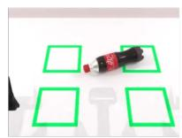  
Task1: Bottle Return

  
Task2: Can Grasp

  
Task3: Stack Two

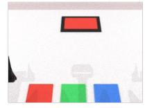  
Task4: Two Color Cue

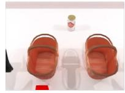  
Task5: Can Placement

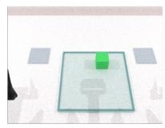  
Task6: Tray Swap

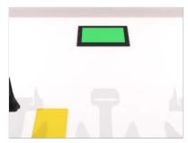  
Task7: Screen Cue

  
Task8: Stack Three

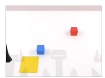  
Task9: Motion Memory

  
Task10: Color Memory  
Figure 5: Overview of DOMINO-Long tasks. Visualization of the ten long-horizon manipulation tasks introduced in DOMINO-Long.

The robot must preserve relevant history while interacting with moving objects. The 10 tasks and their memory requirements are shown in Fig. 5 and Tab. 7.

## B.2.1 TASK DEFINITIONS

Task 1: Bottle Return. Four visually identical square regions mark possible bottle origins on the table. A bottle initially occupies one of these regions and subsequently moves away from it. The robot must intercept and grasp the bottle, orient it upright, and return it to the region that it originally occupied. The required final configuration is an upright, released bottle stably contained within that region. The initial region varies across demonstrations using a balanced schedule over the four candidates, while the region layout remains fixed. This task requires retaining an object’s original location as its current position changes, and using that remembered location as the placement goal.

Task 2: Can Grasp. A single can first moves across the scene and exits the visible workspace. After an interval, the same can returns together with two distractor cans. The robot must recognize the previously observed can, grasp it while it moves, and place it upright at a designated drop-off location. The target identity is sampled from a set of six can appearances, and two distinct distractor identities are selected from the remaining candidates. The lane used during the initial presentation and the target’s lane during the subsequent encounter are varied separately, with small lane-position perturbations. The task therefore requires matching object identity across two encounters despite a change in spatial context and the introduction of distractors.

Task 3: Stack Two. A red block and a green block traverse the scene one at a time, establishing a temporal presentation order. After this presentation, both blocks re-enter the workspace together in a randomized spatial arrangement. The robot must construct a two-block stack at a designated stacking area: the first block observed must form the base, and the second must be placed on top. The presentation order and the assignment of colors to spatial slots are varied separately, so the required stacking order cannot be read directly from the blocks’ current left-to-right or lane arrangement. Correct completion requires the ordered stack to remain stable after release. This task combines memory for a two-item sequence with moving-object acquisition and precise placement.

Task 4: Two Color Cue. A screen presents two color cues in sequence, separated by a blank interval. The first cue specifies which colored block to manipulate, whereas the second specifies the destination region. Both cues disappear before manipulation. The robot subsequently encounters red, green, and blue moving blocks and must place the block specified by the first cue into the region specified by the second. The two cue colors are sampled independently and may coincide;

the block-to-lane assignment also varies. The three destination regions retain their visible colors and fixed color-to-location mapping. The central memory requirement is to preserve both cue values and their distinct semantic roles, binding the first to object selection and the second to destination selection.

Task 5: Can Placement. Two visually identical baskets occupy the left and right sides of the workspace. A transient red marker appears in front of one basket to indicate the intended destination and is then removed. The robot must retain this destination information while acquiring a moving can, and deposit the can inside the previously indicated basket. Correct completion requires releasing the can into the cued basket rather than the alternative basket. The cued side and the can’s motion-side configuration vary across demonstrations, while the basket and can models remain fixed. This task tests whether a transient spatial instruction can be maintained through the intervening tracking and grasping actions.

Task 6: Tray Swap. Two stationary source regions are located on opposite sides of the table. Block A starts in one of these regions, while block B is carried by a moving tray. The robot must first transfer A onto the tray and then retrieve B from the tray and place it into the region originally occupied by A. Once A has been removed, its source region is empty; the robot must retain this source assignment through the intervening transfer. The source side, the tray’s initial direction of travel along the table, and the distinct colors assigned to the two blocks vary across demonstrations. Completion requires both parts of the exchange: A is carried by the tray and B is released at A’s original source region.

Task 7: Screen Cue. A screen briefly displays red, green, or blue and subsequently turns off. Three blocks with these respective colors then move through the workspace. The robot must remember the displayed color, grasp the matching block, and place it at a fixed designated destination. The cue color and the permutation of block colors across spatial slots vary across demonstrations using a balanced sampling schedule. Consequently, the target is specified by the earlier screen cue rather than by a fixed lane. Unlike Task 4, this task requires remembering only one color instruction: it selects the object, while the destination remains unchanged across trials.

Task 8: Stack Three. Red, green, and yellow blocks traverse the scene individually in a sampled order. They subsequently re-enter together with a separately sampled assignment to spatial slots. The robot must reconstruct the presentation order as a vertical stack: the first observed block forms the bottom layer, the second forms the middle layer, and the third forms the top layer. All six temporal orders and all six spatial permutations are included in the randomization scheme. Correct completion requires a stable, released tower with the specified bottom-to-top ordering. Relative to Task 3, this task increases the number of identities whose order must be retained and extends the manipulation sequence to three object acquisitions and placements.

Task 9: Motion Memory. A red block and a blue block initially traverse the scene in opposite directions: one moves from left to right and the other from right to left. After the demonstration and an intervening interval, the blocks reappear with a randomized lane assignment. During this retrieval stage, both blocks move rightward. The robot must select the block that moved leftward during the earlier demonstration, grasp it, and place it at a fixed destination. The assignment of colors to initial motion directions, the demonstration lane assignment, and the target’s retrieval lane vary across demonstrations. The task therefore requires associating an object identity with its previous motion direction; its direction at the time of grasping does not identify the target.

Task 10: Color Memory. Two spatial regions briefly display red and blue, with one color assigned to each region. The colored cues then disappear, leaving visually identical neutral destination regions. A single red or blue query block subsequently enters the workspace. The robot must grasp this block and place it into the region that previously displayed the same color. The left–right assignment of the two region colors, the query-block color, and its entry lane vary across demonstrations. Correct completion requires releasing the block within the matching region. This task tests retention of a color-to-location association: the visible query color must retrieve a destination from an earlier scene, after the regions themselves no longer reveal their colors.

Average SR 74.32%

Table 8: Complete-task success rate (SR, %) on all 50 RoboTwin 2.0 Chen et al. (2025a) tasks. Task names are formatted from the corresponding environment identifiers.
<table><tr><td>Task</td><td>SR Task</td><td></td><td>SR Task</td><td></td><td>SR</td></tr><tr><td>Adjust Bottle</td><td>100%</td><td>Open Microwave</td><td>86%</td><td>Place Object Stand</td><td>90%</td></tr><tr><td>Beat Block Hammer</td><td>82%</td><td>Pick Diverse Bottles</td><td>48%</td><td>Place Phone Stand</td><td>72%</td></tr><tr><td>Blocks Ranking RGB</td><td>72%</td><td>Pick Dual Bottles</td><td>62%</td><td>Place Shoe</td><td>82%</td></tr><tr><td>Blocks Ranking Size</td><td>64%</td><td>Place A2B Left</td><td>70%</td><td>Press Stapler</td><td>86%</td></tr><tr><td>Click Alarmclock</td><td>100%</td><td>Place A2B Right</td><td>72%</td><td>Put Bottles Dustbin</td><td>68%</td></tr><tr><td>Click Bell</td><td>100%</td><td>Place Bread Basket</td><td>58%</td><td>Put Object Cabinet</td><td>38%</td></tr><tr><td>Dump Bin Bigbin</td><td>96%</td><td>Place Bread Skillet</td><td>78%</td><td>Rotate QRcode</td><td>78%</td></tr><tr><td>Grab Roller</td><td>100%</td><td>Place Burger Fries</td><td>94%</td><td>Scan Object</td><td>34%</td></tr><tr><td>Handover Block</td><td>62%</td><td>Place Can Basket</td><td>54%</td><td>Shake Bottle</td><td>100%</td></tr><tr><td>Handover Mic</td><td>96%</td><td>Place Cans Plasticbox</td><td>54%</td><td>Shake Bottle Horizontally</td><td>100%</td></tr><tr><td>Hanging Mug</td><td>24%</td><td>Place Container Plate</td><td>90%</td><td>Stack Blocks Three</td><td>84%</td></tr><tr><td>Lift Pot</td><td>96%</td><td>Place Dual Shoes</td><td>62%</td><td>Stack Blocks Two</td><td>96%</td></tr><tr><td>Move Can Pot</td><td>74%</td><td>Place Empty Cup</td><td>94%</td><td>Stack Bowls Three</td><td>78%</td></tr><tr><td>Move Pillbottle Pad</td><td>66%</td><td>Place Fan</td><td>72%</td><td>Stack Bowls Two</td><td>94%</td></tr><tr><td>Move Playingcard Away</td><td>80%</td><td>Place Mouse Pad</td><td>38%</td><td>Stamp Seal</td><td>76%</td></tr><tr><td>Move Stapler Pad</td><td>28%</td><td>Place Object Basket</td><td>76%</td><td>Turn Switch</td><td>42%</td></tr><tr><td>Open Laptop</td><td>92%</td><td>Place Object Scale</td><td>58%</td><td></td><td></td></tr></table>

## B.3 RANDOMIZATION AND DEMONSTRATION COLLECTION

Randomization is defined separately for each task to vary the relationship between the remembered information and the required action. Depending on the task, randomized factors include object identity, cue color, source or destination side, presentation order, motion-direction assignment, and object-to-lane assignment. Several tasks use balanced schedules over discrete factor combinations to improve coverage within a finite demonstration set. The suite does not assume that every scene attribute is randomized: destination layouts, camera configurations, and other environmental settings can remain fixed. These variations reduce specific correlations, such as always encountering a target in the same lane, but do not by themselves establish the absence of all alternative visual or behavioral cues.

The dataset used for the reported experiments contains 50 demonstrations for each of the ten tasks, totaling 500 demonstrations. All 500 demonstrations are used for training, as described in Section 5.3 and Appendix A.6.

## B.4 LIBERO-LONG

LIBERO-Long provides a complementary long-horizon simulation benchmark. We evaluate all ten tasks with the high-rate pathway disabled, using full-KV conditioning during training and online historical selection for the VLM and action expert during inference. Results are reported in Tab. 2.

## B.5 ROBOTWIN 2.0

We evaluate all 50 RoboTwin 2.0 tasks in the clean setting as a supplementary bimanual simulation benchmark. The high-rate pathway is disabled; training uses full-KV conditioning, and inference uses online historical selection for the VLM and action expert. Tab. 8 reports complete-task SR for each task, with task names corresponding to the environment identifiers.

## C REAL-WORLD SETUP, TASKS, AND EVALUATION

We design eight real-world manipulation tasks, organized into four long-horizon tasks and four longhorizon dynamic tasks. The first group evaluates the execution of ordered subgoals and tracking of object assignments across successive manipulations. The second group is designed to examine how task context is combined with updated visual observations during multi-stage interaction.

We first describe the real-world platform and the observation–action interface used for deployment in Appendix C.1. We then introduce the four long-horizon static tasks in Appendix C.2 and four long-horizon dynamic tasks in Appendix C.3, highlighting the memory and interaction requirement of each setting. Finally, we define the complete-task success criterion and report quantitative results together with representative real-world examples in Appendix C.4.

## C.1 PLATFORM AND OBSERVATION–ACTION INTERFACE

Experiments use a Unitree G1D robot. The observation interface includes stereo head images and left/right wrist views. For vertical concatenation, each head image is resized to width 224 and height 112 using bilinear interpolation. The left and right images are then stacked vertically, in that order, to form one 224 × 224 head-view input. Together with the two wrist views, this preserves the model’s three-view interface rather than introducing a fourth camera-token group.

The Unitree state/action interface contains seven joint dimensions per arm and two gripper dimensions in total. Joint actions are made relative to the branch’s current state, whereas gripper actions remain absolute; normalization and padding follow Appendix A.1. Real-world training uses 50,000 updates, four slow blocks, and two fast blocks, with action horizon H and executed chunk size E = H. Online selection is enabled for VLM prefill and for both slow- and fast-branch denoising at evaluation.

## C.2 LONG-HORIZON STATIC TASKS

(L1) Ordered Cup Stacking. The robot stacks a set of cups in a specified order. The task evaluates adherence to an ordered manipulation sequence and tracking of progress across successive stacking operations. Real world experiments photos can be seen in Fig. 6.

(L2) Cross-Plate Object Swap. The robot exchanges the objects between two plates so that each plate ends with the contents initially placed in the other. The task evaluates object reassignment across a sequence of pick-and-place operations. Real world experiments photos can be seen in Fig. 6.

(L3) Ordered Object Retrieval. The robot removes objects from a plate in a specified sequence. The task evaluates whether successive object selections follow the prescribed order throughout execution. Real world experiments photos can be seen in Fig. 6.

(L4) Original-Layout Restoration. The robot first places differently colored blocks into a plate, then retrieves them and returns each block to its original location. The task evaluates retention of object–location associations across an intervening rearrangement phase. Real world experiments photos can be seen in Fig. 6.

## C.3 LONG-HORIZON DYNAMIC TASKS

(D1) Object Return. The robot first transfers a toy from one plate to another. It then grasps a new toy arriving on a conveyor belt and places it at the original toy’s previous location in the source plate. The task combines an earlier spatial reference with manipulation of a newly arriving object. Real world experiments photos can be seen in Fig. 7.

(D2) Match and Pick. The robot first observes a colored reference block passing along the conveyor. When two differently colored blocks subsequently arrive, it must grasp the block matching the reference color. The task couples retention of an earlier color cue with timely selection of a moving target. Real world experiments photos can be seen in Fig. 7.

(D3) Sequential Pick. The robot first observes two differently colored blocks passing along the conveyor in sequence. When two blocks of the same colors subsequently arrive, it must grasp them in the previously observed color order. The task combines temporal-order recall with sequential grasping of moving objects. Real world experiments photos can be seen in Fig. 7.

(D4) Color Sorting. The robot first observes color cues indicating a color-to-compartment mapping. The cues subsequently disappear or become occluded, requiring the robot to retain this mapping. Objects move with a conveyor belt; the robot must grasp them and place each into the compartment associated with its color. The conveyor provides the scene dynamics, while other stationary

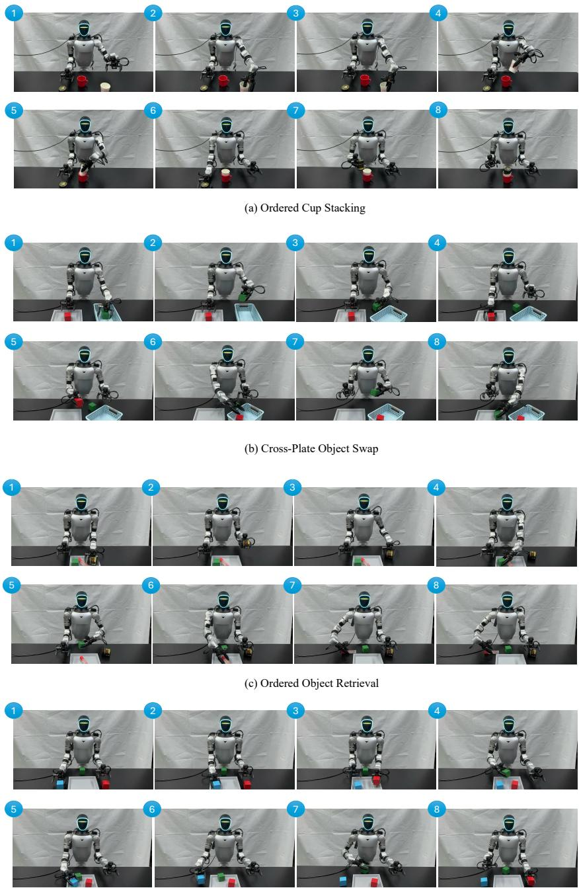  
(d) Original-Layout Restoration

Figure 6: Long-horizon tasks.

objects have no programmed autonomous changes. The task tests memory for earlier color–location associations together with timely manipulation of moving objects. Examples are shown in Fig. 7.

C.4 EVALUATION PROTOCOL AND ADDITIONAL EXAMPLES

Evaluation Protocol. We use complete-task success rate (SR) as the primary metric for real-world evaluation. A trial is considered successful only when the full manipulation sequence is completed, including the required object identities, action order, and final configuration when applicable. Intermediate success, such as a correct grasp or cue recognition, does not count as task completion. Fig. 4 presents representative dynamic-task executions and comparisons. Additional demonstrations of the static and dynamic tasks are provided in Appendices C.2 and C.3, respectively.

Table 9: Complete-task SR (%) on the four longhorizon static real-world tasks. M-VLA and Ours denotes Memory-VLA and D2−V LA, respectively.
<table><tr><td>Task</td><td>π0.5</td><td>M-VLA Ours</td><td></td></tr><tr><td>L1: Ordered Cup Stacking</td><td>70</td><td>60</td><td>80</td></tr><tr><td>L2: Cross-Plate Object Swap</td><td>50</td><td>40</td><td>75</td></tr><tr><td>L3: Ordered Object Retrieval</td><td>45</td><td>35</td><td>65</td></tr><tr><td>L4: Original-Layout Restoration</td><td>40</td><td>25</td><td>65</td></tr><tr><td>Average</td><td>51.25</td><td>40</td><td>71.25</td></tr></table>

## D MEMORY ANALYSIS AND ABLATION STUDIES

We provide detailed analysis of the memory mechanisms in $\mathrm { D ^ { 2 } \mathrm { - } V L A }$ and examine their effects on both task performance and inference efficiency in this section. We first visualize how the VLM and action expert attend to historical KV states, highlighting their distinct patterns of historical context usage. We then study the accuracy–memory–latency trade-off of historical KV caching by comparing single-observation inference, uncompressed full-KV reads, and our selective Dual-Memory design. Next, we analyze the effect of historical KV retention ratios to characterize how aggressively the cached context can be compressed without sacrificing task performance. Finally, we ablate the update frequency of the high-rate pathway to evaluate how intermediate visual updates between VLM refreshes contribute to dynamic long-horizon control.

## D.1 HISTORICAL KV ATTENTION ANALYSIS

Fig. 8 and Fig. 9 show the existing visualizations of historical KV attention for LIBERO Dai et al. (2026) and RoboTwin Chen et al. (2025a). They separate the VLM and action-expert read patterns at two observation chunks. These plots are diagnostic visualizations, not an offline prior used by the online selector. These examples supplement the qualitative attention-asymmetry and tokenconcentration analysis in Section 3.3. They do not establish that the expert always selects more recent frames: the implemented selector ranks tokens within each retained historical block, without a separate recent-frame-only rule.

## D.2 ACCURACY–MEMORY–LATENCY TRADE-OFF OF KV CACHING

Tab. 10 examines the efficiency–performance trade-off of historical KV memory. Full KV Cache denotes uncompressed historical KV reads for all active consumers in each benchmark. On LIBERO-Long and RoboTwin 2.0, the high-rate pathway is disabled, and Full KV Cache uses complete historical KV reads for VLM prefill and action-expert denoising. On DOMINO, the dual-frequency pathway remains enabled: VLM prefill and slow-branch denoising read the complete retained slowmemory history, while fast-branch denoising reads the complete retained fast-memory history. Thus, the DOMINO Full KV Cache baseline includes both adapter-based visual updates and fast memory. $\mathrm { D ^ { 2 } \mathrm { - } V L A }$ applies consumer-specific selection to the corresponding historical reads, while preserving instruction tokens and complete current blocks. Both historical-memory variants retain complete KV blocks in persistent storage; selection changes only the temporary read views.

Compared with the single-observation $\pi _ { 0 . 5 }$ baseline, these benchmark-specific $\mathrm { D ^ { 2 } \mathrm { - } V L A }$ configurations achieve substantially higher success rates with additional inference cost. On LIBERO-Long, the success rate increases from 92.4% to 97.5%, while latency increases from 141.03 ms to 174.92 ms and peak memory from 9,157 MiB to 9,654 MiB. On RoboTwin 2.0 and DOMINO, $\mathrm { D ^ { 2 } \mathrm { - } V L A }$ improves success by 17.3 and 19.7 percentage points, respectively, while increasing peak memory by only about 1–2% over the single-observation baseline. These results show that historical conditioning, together with intermediate visual updates on DOMINO, provides substantial performance gains with comparatively limited increases in peak memory usage.

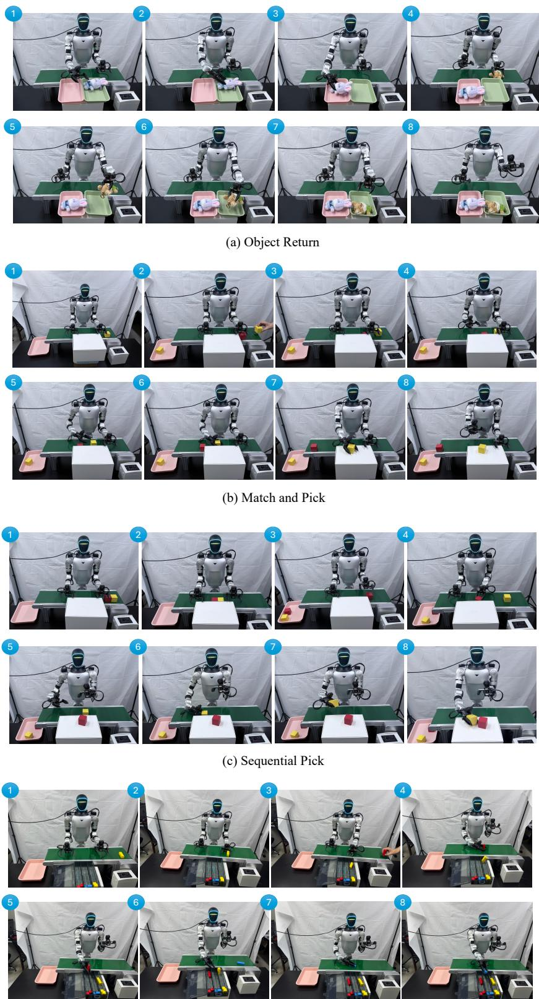  
(d) Color Sorting  
Figure 7: Long-horizon dynamic tasks.

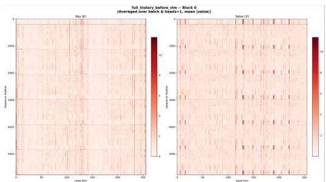  
(a) LIBERO chunk5 attention distribution.

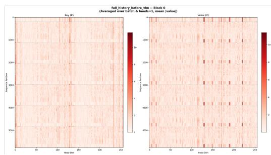  
(b) LIBERO chunk6 attention distribution.

Figure 8: Attention analysis of the VLM and diffusion action expert over historical KV caches.  
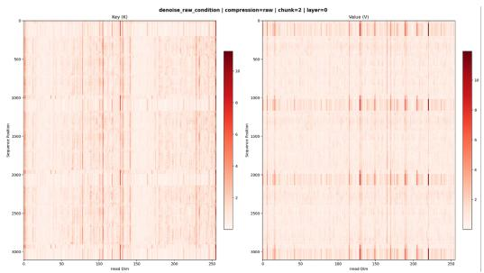  
(a) RoboTwin chunk2 attention distribution.

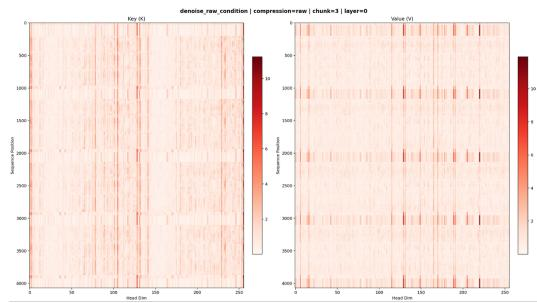  
(b) RoboTwin chunk3 attention distribution.  
Figure 9: Attention analysis of the VLM and diffusion action expert over historical KV caches.

Relative to Full KV Cache, D2-VLA achieves higher success rates on all three benchmarks while reducing both latency and peak memory usage. On LIBERO-Long, latency decreases from 184.69 ms to 174.92 ms and peak memory from 10,738 MiB to 9,654 MiB, corresponding to approximately 5.3% lower latency and 10.1% lower memory, while success increases from 94.5% to 97.5%. Similar trends hold on RoboTwin 2.0 and DOMINO, where peak memory decreases by approximately 4.1% and 6.4%, respectively, with lower inference latency in both cases. In particular, the DOMINO comparison evaluates selective versus uncompressed historical reads with the high-rate pathway enabled in both variants. These results support consumer-specific historical KV selection over reading all tokens in the retained blocks.

The comparison also suggests a benefit of selective historical KV reads beyond computational efficiency. Full KV Cache exposes each consumer to all tokens in its retained historical blocks, including potentially irrelevant or redundant context. In contrast, Dual-Memory constructs separate historical read views using consumer-specific online attention statistics: VLM prefill and slow de noising select from slow memory, while fast denoising selects from fast memory when the high-rate pathway is enabled. The higher success rates suggest that selective reads may help filter redundant context, although this comparison alone does not isolate that mechanism. Overall, $\mathrm { D ^ { 2 } \mathrm { - } V L A }$ provides a favorable balance between task performance and inference cost through selective historical reads, without discarding tokens from the retained persistent KV blocks.

## D.3 CONSUMER-SPECIFIC SELECTION ANALYSIS

We evaluate historical visual-token retention ratios of 1.0 (uncompressed), 0.9, 0.8, 0.7, 0.6, 0.5, 0.4, and 0.3. Within each experiment, VLM prefill, slow denoising, and fast denoising use the same ratio while maintaining independent attention statistics. The score-retention coefficient is held fixed at $\rho = 0 . 2$ across this sweep. The main results use a ratio of 0.7. Fig. 10 (b) shows DOMINO success rates across historical visual-token retention ratios. Instruction tokens and the current KV block remain uncompressed, so these ratios do not describe the entire denoising prefix. Equal retention ratios do not imply shared scores or identical selected indices. In the current implementation, an uncompressed read can be obtained either with unit retention ratios and no explicit token budgets, or by disabling selection; latency comparisons state that online scoring remains enabled.

Figure 10: Accuracy–efficiency and historical KV-retention analysis. (a) Comparison with the single-observation baseline and Full KV Cache. LBO-L, RBT2.0, and DMO denote the LIBERO-Long Dai et al. (2026), RoboTwin 2.0 Chen et al. (2025a), and DOMINO Dai et al. (2026) benchmarks, respectively. SR, Lat., and Mem. refer to average success rate, inference latency, and peak GPU memory usage; (b) DOMINO success rate under different historical visual KV-retention ratios.
<table><tr><td>Data</td><td>Method SR↑</td><td> $\mathbf { L a t . } \downarrow$ </td><td>Mem.↓</td></tr><tr><td rowspan="2">LBO-L Full KV</td><td> $\pi _ { 0 . 5 }$ </td><td>92.4 141.03 94.5</td><td>9157 10738</td></tr><tr><td>Ours 97.5</td><td>184.69 174.92</td><td>9654</td></tr><tr><td>RBT2.0 Full KV</td><td> $\pi _ { 0 . 5 }$  Ours</td><td>57.0 60.10 73.12 71.60 74.3 70.10</td><td>20854 21973 21068</td></tr><tr><td rowspan="2">DMO</td><td> $\pi _ { 0 . 5 }$ </td><td>9.6</td><td>89.62 20962</td></tr><tr><td>Full KV Ours</td><td>28.5 93.83 29.3</td><td>22773 91.43 21309</td></tr></table>

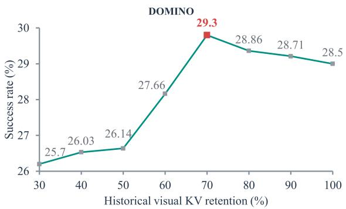  
(a) Accuracy–efficiency comparison.  
(b) Historical KV-retention analysis.

## D.4 UPDATE-FREQUENCY ABLATION

Table 10: Dual-frequency ablation on DOMINO. $^ { 6 6 } - ^ { 5 9 }$ disables the high-rate pathway; the enabled settings use $E = 2 5$ and vary the slow-update period V .
<table><tr><td>Setting</td><td>Period ratio  $V / E$ </td><td>SR (%)</td></tr><tr><td>Without dual-frequency mechanism</td><td>一</td><td>16.1</td></tr><tr><td> $V : E = 5 0 : 2 5$ </td><td>2</td><td>27.6</td></tr><tr><td> $V : E = 7 5 : 2 5$ </td><td>3</td><td>29.3</td></tr></table>

Tab. 10 compares slow-only inference with the dual-frequency mechanism disabled $( \ " _ { - } \ " )$ against $( V , E ) = ( 5 \bar { 0 } , 2 5 )$ and (75, 25). The enabled variants fix $H = E = 2 5$ , yielding period ratios of 2 and 3 and one or two intermediate adapter calls per slow cycle, respectively. They achieve SRs of 27.6% and 29.3%, compared with 16.1% without the high-rate pathway, supporting the benefit of incorporating fresh observations between VLM updates. The two enabled settings differ in the slow-refresh interval and the number of intermediate updates, not in the absolute action-replanning rate. Our main configuration uses $V = 3 E$ and $H = \bar { E ^ { = } } 2 5$