# DECFLOWEDIT: SELF-LOCALIZED FLOW-BASED IM-AGE EDITING VIA GUIDANCE DECOUPLING

Zheyuan Zhan1 Can Wang1 Jiawei Chen1 Chun Chen1 Siwei Lyu2 Zeyu Zheng3 Defang Chen3†

1Zhejiang University 2University at Buffalo 3University of California, Berkeley

## ABSTRACT

Flow-based image editing (FlowEdit) enables inversion-free semantic changes through the difference between source and target velocities. In this paper, we observe that FlowEdit’s default classifier-free guidance (CFG) configuration, with asymmetric source and target scales, causes substantial background leakage. Matching these guidance scales, for example by removing CFG, improves edit-relevant localization but severely degrades editability. To get the best of both worlds, we propose DecFlowEdit, which decouples the optimal guidance scales for localization and for editing in flow-based generative models. In particular, DecFlowEdit first extracts an edit-relevant prior by temporally aggregating velocity differences evaluated without CFG, and then uses this prior to reweight the original updates under default CFG. Our method remains training-free and inversion-free, requiring neither external spatial masks nor attention manipulation. Experiments on PIE-Bench across FLUX, SD3, and SD3.5 show that DecFlowEdit improves background preservation, reducing structure distance by approximately 61–73% and background LPIPS by 68–80% relative to FlowEdit at comparable editing fidelity.

## 1 INTRODUCTION

Text-guided image editing aims to realize a user-specified semantic change while preserving editirrelevant content. Achieving both objectives requires control over what changes and where those changes occur. Training-based methods learn this behavior from editing data (Brooks et al., 2023; Geng et al., 2023), whereas training-free methods exploit pretrained generative models without task-specific optimization. Despite their flexibility, training-free methods often face a trade-off: stronger semantic changes can introduce unintended modifications outside the edit region.

Many training-free editing methods follow an inversion-and-regeneration paradigm, first mapping the source image to a latent or noise representation and then regenerating it under the target condition (Su et al., 2023). However, preserving source content remains challenging, since these methods regenerate the whole image, including regions that should remain unchanged. Attention- and feature-control methods, including Prompt-to-Prompt (Hertz et al., 2023) and subsequent approaches (Tumanyan et al., 2023; Cao et al., 2023), improve background preservation by injecting source information into the generation process. Such interventions require access to internal model architectures and increase inference complexity. External spatial localization can also constrain the edit region, but it usually relies on additional localization signals (Couairon et al., 2023; Zhu et al., 2025) or external segmentation models (Li et al., 2023), which may be unavailable or may not align with the regions actually affected by the editing dynamics. Built on flow matching (Lipman et al., 2023), flowbased image editing (FlowEdit) (Kulikov et al., 2025) constructs paired stochastic source and target states and integrates their conditional velocity differences into a direct editing trajectory, without inversion or attention manipulation. Compared with inversion-and-regeneration (Su et al., 2023), this formulation improves source preservation, but its updates remain spatially global. Although its velocity differences are typically stronger in edit-relevant regions, residual differences in non-edit regions may accumulate across timesteps, causing background leakage (see Figure 1).

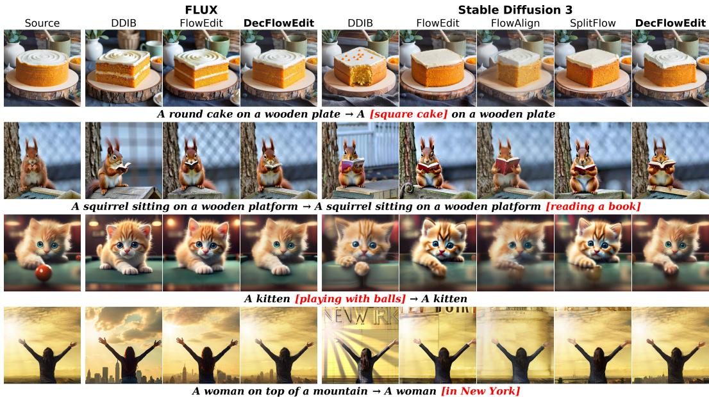  
Figure 1: Qualitative comparison on PIE-Bench using FLUX (left) and SD3 (right). Text below each row summarizes the source-to-target prompt change, with edited phrases highlighted in red brackets. DecFlowEdit performs the intended edits while better preserving non-edited content and structure.

In this work, we identify the source and target classifier-free guidance (CFG) scales as a key factor governing this leakage. By default, FlowEdit uses asymmetric source and target guidance scales (default CFG) to achieve effective semantic editing. However, this asymmetry creates mismatched source and target velocity responses even in semantically unchanged regions, weakening their cancellation in the velocity difference. We observe that matching the guidance scales improves editrelevant localization, especially when both scales are set to one, which removes CFG amplification. Without CFG (w/o CFG), velocity differences concentrate more closely on the intended edit region, but directly integrating them produces weak semantic changes (see Figure 2(a)). Thus, the guidance configuration that provides a localization signal differs from the one that enables effective editing.

Motivated by this observation, we propose DecFlowEdit, which decouples guidance for spatial localization from guidance for semantic editing. DecFlowEdit first extracts an edit-relevant spatial prior by temporally aggregating source–target velocity differences evaluated under w/o CFG. We then use the resulting soft prior to spatially reweight the FlowEdit updates under default CFG. This design separates the estimation of where to edit from the generation of the semantic change: the w/o CFG responses supply spatial localization, while the default CFG updates retain the strength needed for editing. Our main contributions are as follows: 1) We identify a guidance-dependent tradeoff between localization and editing in flow-based image editing: default CFG produces effective semantic changes but substantial background leakage, whereas w/o CFG improves localization at the cost of editability. 2) We develop DecFlowEdit, which extracts an intrinsic spatial prior by temporally aggregating velocity differences under w/o CFG and uses it to reweight editing updates under default CFG. The method requires no training, inversion, external masks, or attention manipulation. 3) We demonstrate consistent improvements in background and structure preservation on PIE-Bench across FLUX, SD3, and SD3.5 while maintaining comparable editing fidelity, supporting guidance decoupling as an effective approach to spatial control.

## 2 RELATED WORK

Training-free image editing via inversion and attention manipulation. A line of training-free real-image editing methods follows the inversion-and-regeneration paradigm of Dual Diffusion Implicit Bridges (DDIB), where the source image is first mapped to a latent noise representation and then regenerated under the target condition (Su et al., 2023). Within this paradigm, Promptto-Prompt (Hertz et al., 2023) introduces cross-attention replacement to preserve spatial layout, inspiring subsequent attention- and feature-manipulation methods (Tumanyan et al., 2023; Cao et al., 2023; Wang et al., 2025a; Jiao et al., 2026). While effective in improving structure preservation, these methods have three practical drawbacks. First, their behavior is sensitive to the choice of intervention layers and timesteps; inappropriate schedules or large source–target semantic gaps can introduce artifacts when preserved source patterns conflict with the intended target semantics. Second, they require overriding internal attention computations and maintaining source-branch representations during sampling, increasing implementation complexity and potentially incurring substantial inference overhead. Third, adapting these interventions to different backbones typically requires architecture-specific redesign.

FlowEdit and preservation-oriented flow editing. Built on flow matching models, FlowEdit constructs an inversion-free editing path from the difference between target- and source-conditioned velocity fields, yielding a more direct path between the source and target images and improved background preservation compared with inversion-based editing (Su et al., 2023; Lipman et al., 2023; Esser et al., 2024; Black Forest Labs, 2024; Kulikov et al., 2025). Recent follow-ups further improve content preservation and editing consistency through trajectory regularization (Kim et al., 2026), direct noise alignment (Xie et al., 2025), target-aware intermediate states (Wang et al., 2025b), or semantic flow decomposition (Yoon et al., 2025). However, under default CFG, FlowEdit’s velocity differences can extend beyond the intended edit region, leaving non-edit regions susceptible to unintended changes. Our work is motivated by the observation that w/o CFG, despite producing weak semantic edits, yields more spatially localized velocity differences than default CFG. This observation suggests that the guidance requirements for spatial localization and effective editing differ. Accordingly, DecFlowEdit decouples guidance for these two purposes: we extract a spatial prior under w/o CFG and use it to constrain the updates under default CFG.

Spatial localization for background preservation. Spatial localization provides explicit control over the regions affected by image editing. Attention-based methods extract regions from internal attention maps (Cao et al., 2023; Patashnik et al., 2023), requiring access to the model’s internal attention representations. Other approaches rely on user-provided masks or external segmentation models (Kirillov et al., 2023; Li et al., 2023; Zhu et al., 2025), introducing manual input or an additional model dependency. Prediction-based methods infer edit regions from source–target differences in noise predictions, as in DiffEdit (Couairon et al., 2023), or in velocity predictions, as in UniEdit-Flow (Jiao et al., 2026); because the contrast is taken on high-variance per-step predictions, the resulting masks are unstable and leak into non-edit regions. In contrast, our method obtains localization from FlowEdit’s own velocity differences, which are more spatially localized w/o CFG. We aggregate these responses along a w/o CFG trajectory into a soft spatial prior. This temporal aggregation makes the prior more stable than one extracted from a single timestep. The resulting prior provides spatial control over editing without requiring attention manipulation, external segmentation models, or user-provided masks.

## 3 BACKGROUND

Conditional flow-based generation. Recent training-free editing methods are increasingly built upon flow matching models, which learn a continuous mapping from a data distribution $\mathbf { x } _ { 0 } \sim p _ { 0 }$ to a prior $\mathbf { x } _ { 1 } ~ \sim ~ p _ { 1 }$ , typically the standard Gaussian N(0, I) (Lipman et al., 2023). A linear interpolation $\mathbf { x } _ { t } = ( 1 - t ) \mathbf { x } _ { 0 } + t \mathbf { x } _ { 1 } , t \in [ 0 , 1 ]$ , defines the forward trajectory, and the trajectory follows $d \mathbf x _ { t } = \mathbf V _ { \theta } ( \mathbf x _ { t } , t \mid P ) d t$ , where $\mathbf { V } _ { \theta }$ is the conditional velocity field and P denotes the textual condition. Flow matching trains the time-dependent conditional velocity field by minimizing $\mathcal { L } _ { \theta } = \mathbb { E } _ { t , \mathbf { x } _ { 0 } , \mathbf { x } _ { 1 } , P } [ \| ( \mathbf { x } _ { 1 } - \mathbf { x } _ { 0 } ) - \mathbf { V } _ { \theta } ( \mathbf { x } _ { t } , t \mid P ) \| ^ { 2 } ]$

Inversion-based editing using flow-based models. DDIB-style inversion-and-regeneration editing first maps a source image to a noise latent under the source prompt and then regenerates it under the target prompt (Su et al., 2023). Let $P _ { \mathrm { s r c } }$ and $P _ { \mathrm { t a r } }$ denote the source and target prompts. The source-side inversion trajectory is obtained by integrating $d \mathbf { z } _ { t } ^ { \mathrm { s r c } } = \mathbf { V } _ { \theta } ( \mathbf { z } _ { t } ^ { \mathrm { s r c } } , t \mid P _ { \mathrm { s r c } } ) \bar { d t }$ , starting from the source image ${ \bf z } _ { 0 } ^ { \mathrm { s r c } } : = { \bf x } ^ { \mathrm { s r c } }$ and proceeding toward a noise latent ${ \bf z } _ { 1 } ^ { \mathrm { s r c } }$ . Editing then integrates $d { \bf z } _ { t } ^ { \mathrm { t a r } } = { \bf V } _ { \theta } ( { \bf z } _ { t } ^ { \mathrm { t a r } } , t \mid P _ { \mathrm { t a r } } )$ dt backward from the shared noise latent ${ \bf z } _ { 1 } ^ { \mathrm { t a r } } = { \bf z } _ { 1 } ^ { \mathrm { s r c } }$ to obtain the edited image $\mathbf { z } _ { 0 } ^ { \mathrm { t a r } }$ . This shared latent provides only coarse structural control, and target-conditioned regeneration often introduces substantial changes to image details.

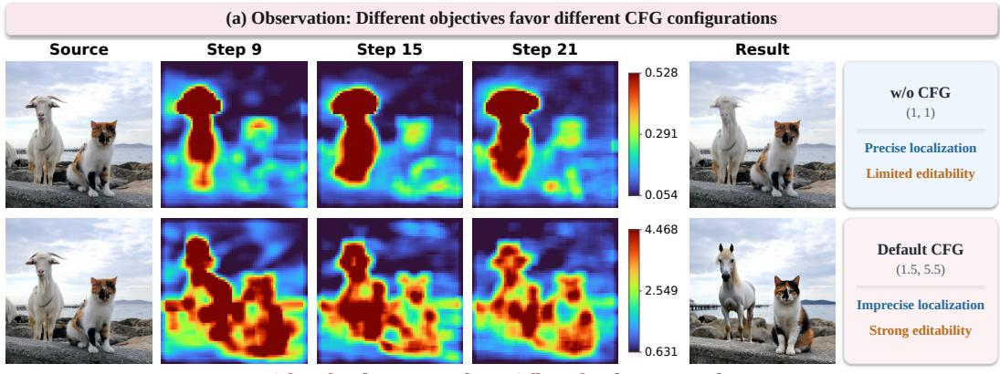

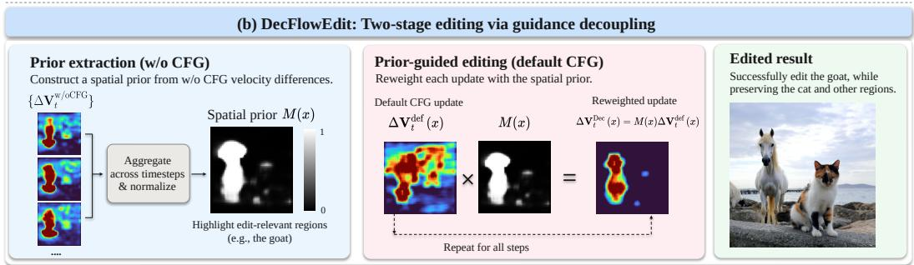  
Figure 2: Observation and overview of DecFlowEdit (FLUX). (a) Velocity-difference magnitude maps and final editing results under w/o CFG and default CFG. Colorbars indicate magnitude scales. (b) Prior extraction under w/o CFG and prior-guided editing under default CFG.

Inversion-free editing using velocity difference. FlowEdit constructs a direct editing path by explicitly pairing source and target states at each timestep, without first mapping the source image to Gaussian noise (Kulikov et al., 2025). Following FlowEdit’s time convention, the editing path starts from the source image ${ \bf z } _ { 1 } ^ { \mathrm { e d i t } } : = { \bf x } ^ { \mathrm { s r c } }$ and is integrated backward toward the edited image $\mathbf { z } _ { \mathrm { 0 } } ^ { \mathrm { e d i t } }$ At timestep t, given the current editing state $\mathbf { z } _ { t } ^ { \mathrm { e d i t } }$ and freshly sampled Gaussian noise $\epsilon _ { t } \sim \mathcal { N } ( \mathbf { 0 } , \mathbf { I } )$ , the paired noisy states are $\begin{array} { r } { \mathbf { z } _ { t } ^ { \mathrm { s r c } } = ( 1 - t ) \mathbf { \check { x } } ^ { \mathrm { s r c } } + t \epsilon _ { t } , \qquad \mathbf { \check { z } } _ { t } ^ { \mathrm { t a r } } = \mathbf { z } _ { t } ^ { \mathrm { e d i t } } + \mathbf { z } _ { t } ^ { \mathrm { s r c } } - \mathbf { x } ^ { \mathrm { s r c } } } \end{array}$ FlowEdit uses the difference between the two conditional velocity fields as the editing direction, $\Delta \mathbf { V } _ { t } = \mathbf { V } _ { \theta } ( \mathbf { z } _ { t } ^ { \mathrm { { t a r } } } , t \mid P _ { \mathrm { t a r } } ) - \mathbf { V } _ { \theta } ( \mathbf { z } _ { t } ^ { \mathrm { { s r c } } } , t \mid P _ { \mathrm { s r c } } )$ , and updates the editing trajectory by integrating $d { \bf z } _ { t } ^ { \mathrm { e d i t } } = \Delta { { \bf V } _ { t } } { { \bf \bar { \Gamma } } } d t$ . Sharing the same noise within each timestep promotes similar source and target velocity responses in semantically unchanged regions, facilitating their cancellation in the velocity difference. This construction keeps editing anchored to the source image and improves content preservation compared with inversion-and-regeneration.

In practice, FlowEdit relies on strong, asymmetric source and target CFG scales for effective semantic editing. Asymmetric guidance can introduce a mismatch between the source and target responses even in semantically unchanged regions, weakening their cancellation. Stronger guidance can further amplify residual updates in these regions. Consequently, effective semantic editing can be accompanied by background leakage.

## 4 METHOD

We first examine how CFG affects spatial localization and semantic editing in FlowEdit (Section 4.1). We then describe the two stages of DecFlowEdit: prior extraction, which constructs a soft spatial prior from velocity differences under w/o CFG (Section 4.2), and prior-guided editing, which uses this prior to spatially constrain the updates under default CFG (Section 4.3).

## 4.1 DECOUPLING LOCALIZATION FROM EDITING

Let $\mathbf { g } = ( g _ { \mathrm { s r c } } , g _ { \mathrm { t a r } } )$ denote the source and target CFG scales, and let $\Delta \mathbf { V } _ { t } ^ { \mathbf { g } }$ be the corresponding FlowEdit velocity difference. We refer to $\mathbf { g } ^ { \mathrm { w / o C F G } } = \left( 1 , 1 \right)$ , which applies no additional guidance amplification, as w/o CFG. We use default CFG to denote FlowEdit’s backbone-specific default source and target CFG scales.

For a CFG configuration $\mathbf { g } ,$ we visualize the spatial response of its velocity difference as

$$
r _ { t } ^ { \mathbf { g } } ( x ) = \| \Delta \mathbf { V } _ { t } ^ { \mathbf { g } } ( x ) \| _ { 2 } ,\tag{1}
$$

where x indexes a location in the latent spatial grid, and $\Delta \mathbf { V } _ { t } ^ { \mathbf { g } } ( x )$ denotes the channel vector of the velocity difference at that location, evaluated at the current paired source and target states. The norm is taken over channels.

Figure 2(a) shows the complementary behavior of the two CFG configurations. As indicated by the colorbars, FlowEdit under w/o CFG produces small-magnitude velocity differences that remain concentrated on the goat across steps 9, 15, and 21, leaving the final image almost unchanged. FlowEdit under default CFG produces velocity differences with much larger magnitudes and replaces the goat with a horse, but the updates also spread to the neighboring cat and cause an unintended change. These complementary behaviors motivate our two-stage editing framework (Figure 2(b)): the prior-extraction stage extracts a spatial prior under w/o CFG, and the prior-guided editing stage uses it to reweight updates under default CFG. This combines localized updates with effective semantic editing: the goat is replaced with a horse, while the cat and other regions are preserved.

## 4.2 PRIOR EXTRACTION W/O CFG

In the prior-extraction stage, we compute velocity differences $\Delta \mathbf { V } _ { t } ^ { \mathrm { w / o C F G } } ( x )$ along an auxiliary FlowEdit trajectory $\mathbf { z } _ { t } ^ { \mathrm { p r i o r } }$ under w/o CFG. As Figure 2 shows, these responses already reveal the intended edit region at individual intermediate steps. To obtain a stable spatial prior, we aggregate velocity differences from the middle of the prior-extraction schedule, where spatial localization is relatively stable, before taking the norm:

$$
E ( x ) = \bigg | \bigg | \sum _ { t \in \mathcal { T } _ { \operatorname* { m i d } } } \Delta \mathbf { V } _ { t } ^ { \mathrm { w / o C F G } } ( x ) \bigg | \bigg | _ { 2 } ,\tag{2}
$$

where $\mathcal { T } _ { \mathrm { m i d } } = \{ t _ { k } : 0 . 2 5 T \leq k \leq 0 . 7 5 T \}$ $T$ is the total number of steps in the prior-extraction schedule, and $t _ { k }$ is the sampling time at step index $k ,$ with k starting from zero. We refer to $E ( x )$ as the energy map. We then smooth the resulting spatial map using a $5 \times 5$ mean filter $S _ { ; }$ yielding $A ( x ) = { \bar { S } } ( E ) { \bar { ( x ) } }$ . In practice, this stage can use a reduced sampling schedule to reduce computational cost. On FLUX, SD3, and SD3.5, a schedule with approximately one quarter as many sampling steps yields comparable editing and preservation performance (Section 5.2).

To reduce sensitivity to the response scale across samples, we normalize the smoothed map using its spatial percentiles:

$$
\widetilde E ( x ) = \mathrm { c l i p } \left( \frac { A ( x ) - q _ { 1 0 } } { \mathrm { m a x } \{ q _ { 9 0 } - q _ { 1 0 } , \delta \} } , 0 , 1 \right) , \qquad \delta = 1 0 ^ { - 8 } ,\tag{3}
$$

where $q _ { 1 0 }$ and $q _ { 9 0 }$ are the 10th and 90th percentiles of all spatial values in A for the current sample. The normalized response is converted into a soft spatial prior:

$$
M ( x ) = \sigma \left( \frac { \widetilde { E } ( x ) - \tau } { s } \right) , \qquad s > 0 ,\tag{4}
$$

where $\sigma$ is the sigmoid function, and τ and s denote the threshold and softness parameters.

## 4.3 PRIOR-GUIDED EDITING WITH DEFAULT CFG

In the prior-guided editing stage, we retain the spatial prior M and initialize a separate trajectory $\mathbf { z } _ { t } ^ { \mathrm { e d i t } }$ from the source image and update it under default CFG. At each step, we construct the paired

source and target states from $\mathbf { z } _ { t } ^ { \mathrm { e d i t } }$ as in Section 3, evaluate their velocity difference $\Delta { \bf V } _ { t } ^ { \mathrm { d e f } }$ under default CFG, and apply the spatial prior:

$$
\Delta \mathbf { V } _ { t } ^ { \mathrm { D e c } } ( x ) = M ( x ) \Delta \mathbf { V } _ { t } ^ { \mathrm { d e f } } ( x ) .\tag{5}
$$

The scalar weight at each spatial location is broadcast across channels. Locations with large weights retain more of the default CFG update, while small weights suppress updates outside the edit region.

For consecutive sampling times $t _ { k + 1 } \leq t _ { k }$ , the discrete update is

$$
\begin{array} { r } { \mathbf { z } _ { t _ { k + 1 } } ^ { \mathrm { e d i t } } = \mathbf { z } _ { t _ { k } } ^ { \mathrm { e d i t } } + \left( t _ { k + 1 } - t _ { k } \right) M \odot \Delta { \mathbf { V } } _ { t _ { k } } ^ { \mathrm { d e f } } , \qquad \mathbf { z } _ { t _ { 0 } } ^ { \mathrm { e d i t } } = \mathbf { x } ^ { \mathrm { s r c } } . } \end{array}\tag{6}
$$

The velocity difference is re-evaluated along the spatially constrained trajectory at every step. We retain FlowEdit’s paired-state construction and integration rule, inserting spatial weighting before each update. The same soft spatial prior is used throughout the prior-guided editing stage.

## 5 EXPERIMENTS

## 5.1 EXPERIMENTAL SETUP

Dataset and metrics. We evaluate our method on the Prompt-based Image Editing Benchmark (PIE-Bench) (Ju et al., 2023), a widely used benchmark for text-guided image editing. PIE-Bench contains 700 editing samples covering diverse editing types, and each sample provides a source image, source and target prompts, an editing instruction, and a ground-truth edit mask. Following the standard PIE-Bench evaluation protocol, we report (1) structure distance based on DINO features, where a lower value indicates better structure preservation, (2) background preservation based on PSNR, LPIPS, MSE, and SSIM on the non-edit region specified by the ground-truth mask, and (3) semantic editing fidelity based on CLIP similarity on the whole image and on the edited region.

Baselines. We compare our method with recent training-free flow-based image editing methods, including FlowCycle (Wang et al., 2025b), SplitFlow (Yoon et al., 2025), FlowAlign (Kim et al., 2026), UniEdit-Flow (Jiao et al., 2026), iRFDS (Yang et al., 2025), DRFS (Beaudouin et al., 2026), DNAEdit (Xie et al., 2025), and FTEdit (Xu et al., 2025). For a controlled comparison, we further compare our method with the corresponding FlowEdit (Kulikov et al., 2025) baseline on FLUX (Black Forest Labs, 2024), Stable Diffusion 3 (SD3), and Stable Diffusion 3.5 (SD3.5) (Esser et al., 2024).

Implementation details. In the prior-guided editing stage, we follow FlowEdit’s default CFG, using 28 sampling steps with source/target guidance scales of (1.5, 5.5) for FLUX, and 50 sampling steps with (3.5, 13.5) for SD3/SD3.5. The prior-extraction stage uses FlowEdit under w/o CFG, i.e., source/target scales of (1, 1). We construct the spatial prior as a soft map with threshold $\tau = 0 . 5 5$ and softness parameter $s = 0 . 0 8$ . The main comparison uses the full sampling schedule for prior extraction (the same number of sampling steps as in the prior-guided editing stage). We also report a variant using a prior-extraction schedule with approximately one quarter as many sampling steps, while keeping the prior-guided editing stage fixed. More details are provided in Appendix C.

## 5.2 MAIN RESULTS ON PIE-BENCH

Table 1 shows that DecFlowEdit yields consistent preservation gains: compared with raw FlowEdit, our method improves all background-preservation metrics and reduces structure distance by approximately 61–73% across FLUX, SD3, and SD3.5. These results show that the spatial prior extracted from w/o CFG responses can constrain unintended changes in the final edit. The preservation gains are accompanied by a 2–3% reduction in CLIP similarity. Across FLUX, SD3, and SD3.5, DecFlowEdit retains strong content preservation and competitive text alignment when the prior-extraction stage uses a sampling schedule with approximately one quarter as many steps (Table 1). This shorter schedule reduces the prior-extraction time while retaining useful spatial localization information.

Figure 1 further illustrates how this spatial control affects the final images. DecFlowEdit performs the intended semantic modifications while better preserving surrounding background textures and non-edited objects, reducing the unintended changes observed with raw FlowEdit and other baselines. The visible changes in the target region and the preserved surrounding content illustrate the division of roles in our two-stage design: the prior-extraction stage identifies where the edit should act, and the prior-guided editing stage performs the semantic edit under the resulting spatial constraint. We analyze how the prior threshold, softness, and update strength affect the editing–preservation trade-off in Appendix D (Figures 7–9).

Table 1: Quantitative comparison on PIE-Bench. Ours-short uses approximately one quarter as many sampling steps for prior extraction, while keeping the prior-guided editing stage unchanged. †: results reported in prior work.
<table><tr><td rowspan="2">Method</td><td rowspan="2">Backbone</td><td>Structure</td><td colspan="4">Background Preservation</td><td colspan="2">CLIP Similarity</td></tr><tr><td>Distance ↓</td><td>PSNR ↑</td><td> $\mathrm { L P I P S } _ { \times 1 0 ^ { 3 } } \downarrow$ </td><td> $\mathbf { M S E } _ { \times 1 0 ^ { 4 } } \downarrow$ </td><td> $\mathbf { S S I M } _ { \times 1 0 0 } \uparrow$ </td><td>Whole ↑</td><td>Edited ↑</td></tr><tr><td>FlowEdit (Kulikov et al., 2025)</td><td>FLUX</td><td>28.99</td><td>21.72</td><td>104.79</td><td>98.32</td><td>83.87</td><td>25.88</td><td>22.71</td></tr><tr><td>Ours-short</td><td>FLUX</td><td>7.46</td><td>30.26</td><td>21.06</td><td>19.38</td><td>94.50</td><td>25.21</td><td>22.08</td></tr><tr><td>Ours</td><td>FLUX</td><td>7.86</td><td>30.54</td><td>20.90</td><td>19.23</td><td>94.54</td><td>25.25</td><td>22.15</td></tr><tr><td>FlowCycle† (Wang et al., 2025b)</td><td>SD3</td><td>13</td><td>26.83</td><td>63</td><td>30</td><td>88.6</td><td>25.48</td><td>22.46</td></tr><tr><td>SplitFlow† (Yoon et al., 2025)</td><td>SD3</td><td>14.55</td><td>25.22</td><td>68.53</td><td>44.96</td><td>87.54</td><td>26.23</td><td>23.01</td></tr><tr><td>iRFDS† (Yang et al., 2025)</td><td>SD3</td><td>62.72</td><td>19.61</td><td>186.39</td><td>179.76</td><td>74.59</td><td>24.54</td><td>21.67</td></tr><tr><td>FlowAlign (Kim et al., 2026)</td><td>SD3</td><td>36.70</td><td>24.02</td><td>65.02</td><td>56.91</td><td>86.55</td><td>26.65</td><td>22.70</td></tr><tr><td>UniEdit-Flow (Jiao et al., 2026)</td><td>SD3</td><td>21.31</td><td>25.22</td><td>94.80</td><td>46.06</td><td>86.71</td><td>26.45</td><td>22.87</td></tr><tr><td>FlowEdit (Kulikov et al., 2025)</td><td>SD3</td><td>26.39</td><td>22.27</td><td>100.15</td><td>85.71</td><td>83.93</td><td>27.51</td><td>23.92</td></tr><tr><td>Ours-short</td><td>SD3</td><td>10.35</td><td>27.93</td><td>32.69</td><td>28.94</td><td>91.62</td><td>26.66</td><td>23.35</td></tr><tr><td>Ours</td><td>SD3</td><td>10.01</td><td>28.16</td><td>31.34</td><td>27.85</td><td>91.75</td><td>26.71</td><td>23.37</td></tr><tr><td>SplitFlow† (Yoon et al., 2025)</td><td>SD3.5</td><td>11.68</td><td>27.12</td><td>52.93</td><td>30.61</td><td>89.76</td><td>26.29</td><td>22.89</td></tr><tr><td>DRFS (Beaudouin et al., 2026)</td><td>SD3.5</td><td>19.48</td><td>24.36</td><td>83.09</td><td>53.85</td><td>86.15</td><td>26.55</td><td>23.72</td></tr><tr><td>DNAEdit (Xie et al., 2025)</td><td>SD3.5</td><td>14.24</td><td>26.45</td><td>76.85</td><td>34.09</td><td>88.45</td><td>25.48</td><td>22.74</td></tr><tr><td>FTEdit (Xu et al., 2025)</td><td>SD3.5</td><td>18.40</td><td>25.23</td><td>92.36</td><td>41.59</td><td>88.77</td><td>23.96</td><td>21.17</td></tr><tr><td>FlowEdit (Kulikov et al., 2025)</td><td>SD3.5</td><td>22.55</td><td>23.27</td><td>88.78</td><td>69.66</td><td>85.57</td><td>27.62</td><td>23.95</td></tr><tr><td>Ours-short</td><td>SD3.5</td><td>9.10</td><td>28.68</td><td>29.71</td><td>25.06</td><td>91.99</td><td>26.90</td><td>23.47</td></tr><tr><td>Ours</td><td>SD3.5</td><td>8.90</td><td>28.78</td><td>28.79</td><td>24.59</td><td>92.03</td><td>26.86</td><td>23.35</td></tr></table>

## 5.3 CFG AFFECTS LOCALIZATION AND EDITING

To assess DecFlowEdit’s division of roles between prior extraction and prior-guided editing, we examine how CFG affects localization and editing in FlowEdit. We evaluate localization accuracy using the IoU between masks extracted under different CFG settings and the ground-truth edit masks, and editing fidelity using edited-region CLIP similarity. We test w/o CFG, FlowEdit’s default CFG, and symmetric CFG with guidance scale $g _ { \mathrm { s r c } } = g _ { \mathrm { t a r } } > 1$ (see Appendix E.1 for detailed settings).

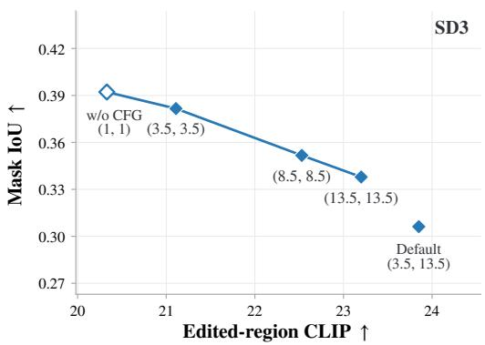  
Figure 3: CFG trade-off on SD3. Without CFG (1, 1) has the highest mask IoU; stronger symmetric CFG raises edited-region CLIP while reducing IoU. Default CFG (3.5, 13.5) gives the highest CLIP and lowest IoU.

Figure 3 shows three trends. (i) Without CFG achieves the highest IoU, indicating that its responses align most closely with the intended edit region, but the lowest CLIP, consistent with incomplete realization of the desired semantic changes. (ii) Default CFG achieves the highest CLIP but the lowest IoU, indicating stronger semantic editing but greater leakage of updates into background regions. (iii) Symmetric CFG lies between these configurations: as guidance strength increases, IoU decreases while CLIP improves. We hypothesize that matching the source and target guidance strengths promotes cancellation of shared semantic components in their velocities. Increasing guidance strength, however, may amplify fluctuations in the branch velocities and leave larger residual updates outside the intended edit region. The first two trends agree with the qualitative results in Figures 2 and 4. These results support DecFlowEdit’s two-stage design:

the prior-extraction stage obtains localization information under w/o CFG, and the prior-guided editing stage uses it to constrain semantic editing under default CFG. We further compare priors extracted under w/o CFG and default CFG, keeping the editing stage fixed at default CFG. Priors extracted under w/o CFG reduce background LPIPS by approximately 39–50% relative to those extracted under default CFG, while edited-region CLIP differs by less than 0.13%. These results show that the localization advantage of w/o CFG translates into better background preservation in the final edit. Experimental settings and detailed results are provided in Appendix E.

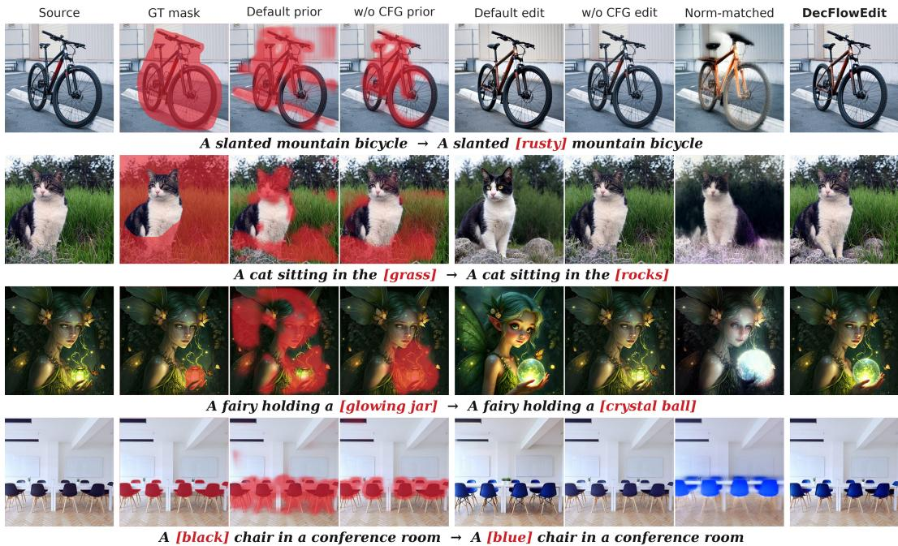  
Figure 4: Qualitative comparison of ground-truth masks, extracted priors, and editing results from FlowEdit under w/o CFG and default CFG, together with norm-matched editing and DecFlowEdit, all using FLUX.

Global amplification of w/o CFG updates. We additionally test whether amplifying w/o CFG updates can recover the editing performance of default CFG. At each step, we compute both updates at the same paired source/target states with the same sampled noise, and multiply the w/o CFG update by a single global scalar to match the Frobenius norm of the default CFG update. The norm-matched outputs in column 7 of Figure 4 exhibit severe blur and loss of detail. Quantitatively, this approach yields lower edited-region CLIP and higher structure distance than default CFG across FLUX, SD3, and SD3.5 (Appendix E.4).

## 5.4 UNDERSTANDING GUIDANCE-DEPENDENT LOCALIZATION

We analyze the localization advantage of w/o CFG through spatial and temporal differences between edit and non-edit regions. FlowEdit’s shared-noise construction favors cancellation of common content between the source and target velocities (Appendix A.1). In the goat-to-horse example in Figure 2, both prompts describe the same neighboring cat, but default CFG uses different guidance strengths and can produce different velocities even for this unchanged object. Their difference can therefore contain unintended changes. Without CFG removes this guidance mismatch, favoring cancellation in non-edit regions.

Within-step spatial contrast. We compare unmasked FlowEdit trajectories on PIE-Bench, using ground-truth masks mapped to the latent grid to define the edit region $\Omega _ { E }$ and its complement, the non-edit region $\Omega _ { N }$ . At each update step, $R _ { t }$ is the ratio of the non-edit-region to edit-region mean velocity-difference magnitude. Averaging over update steps within each sample and then across samples gives 0.5175 under w/o CFG and 0.8007 under default CFG on FLUX. Thus, non-edit-region magnitudes are roughly half the edit-region magnitudes under w/o CFG, whereas default CFG makes the regions harder to distinguish. SD3 and SD3.5 show the same trend (Appendix A.2).

Table 2: Localization quality and downstream editing performance of different spatial priors on PIE-Bench. All metrics use the same 490 local-edit tasks (Appendix B). IoU and CLIP (edited region) are higher-better; LPIPS (background, $\times 1 0 ^ { 3 } )$ and Structure (distance) are lower-better.
<table><tr><td>Source</td><td>Model for prior-extraction</td><td>IoU</td><td>CLIP</td><td>LPIPS</td><td>Structure</td></tr><tr><td>DiffEdit-Single</td><td>FLUX</td><td>0.3392</td><td>20.860</td><td>30.119</td><td>8.351</td></tr><tr><td>DiffEdit-Multi</td><td>FLUX</td><td>0.3678</td><td>21.075</td><td>36.842</td><td>10.849</td></tr><tr><td>MasaCtrl</td><td>FLUX</td><td>0.3288</td><td>21.392</td><td>58.935</td><td>16.430</td></tr><tr><td>MasaCtrl</td><td>SD1.4</td><td>0.3087</td><td>21.071</td><td>55.702</td><td>14.903</td></tr><tr><td>Prompt-to-Prompt</td><td>SD1.4</td><td>0.3436</td><td>21.588</td><td>69.940</td><td>20.707</td></tr><tr><td>Auto VLM→SAM3</td><td> $\mathrm { Q w e n } 3 \mathrm { - } \mathrm { V L } \mathrm { - } 8 \mathrm { B } + \mathrm { S A M } 3$ </td><td>0.5493</td><td>20.857</td><td>21.286</td><td>8.620</td></tr><tr><td>Ours</td><td>FLUX</td><td>0.4195</td><td>21.290</td><td>21.190</td><td>7.978</td></tr></table>

Temporal directional contrast. Beyond the within-step spatial contrast, we examine how velocity differences in edit and non-edit regions combine during temporal aggregation in Equation (2). More consistent directions favor accumulation in the vector sum. We therefore flatten each region’s velocity difference into $\mathbf { u } _ { t } ^ { \Omega } = \mathrm { v e c } ( \Delta \mathbf { V } _ { t } | _ { \Omega } )$ and measure the mean cosine similarity over all distinct timestep pairs in $T _ { \mathrm { m i d } } = \{ t _ { 1 } , \dots , t _ { m } \}$ , where $m = | T _ { \mathrm { m i d } } |$ is the number of selected timesteps:

$$
\mathrm { C o s } _ { \Omega } = \frac { 2 } { m ( m - 1 ) } \sum _ { i < j } \frac { \langle { \bf u } _ { t _ { i } } ^ { \Omega } , { \bf u } _ { t _ { j } } ^ { \Omega } \rangle } { \| { \bf u } _ { t _ { i } } ^ { \Omega } \| _ { 2 } \| { \bf u } _ { t _ { j } } ^ { \Omega } \| _ { 2 } } .\tag{7}
$$

Averaged over PIE-Bench editing tasks performed with FLUX, the edit-region Cos exceeds the nonedit-region Cos by a larger margin under w/o CFG than under default CFG (0.12740 vs. 0.04984). Together with the cancellation analysis in Appendix A.3, this indicates that temporal aggregation under w/o CFG more selectively retains edit-region velocity differences while attenuating residuals in non-edit regions.

## 5.5 COMPARISON OF SPATIAL PRIORS

To evaluate the spatial constraints provided by our prior-extraction stage, we compare our prior with localization signals from other common diffusion-based editing pipelines (Couairon et al., 2023; Cao et al., 2023; Hertz et al., 2023) and an external segmentation pipeline. The external pipeline uses Qwen3-VL-8B (Bai et al., 2025) as a vision-language model (VLM) to generate a query from the source image and editing instruction, followed by SAM3 (Carion et al., 2025) segmentation. Table 2 reports both IoU against the ground-truth edit masks and downstream editing and preservation metrics. Evaluation details and the mask extraction procedures for all baselines are provided in Appendix B.

Comparison with internal localization signals. DecFlowEdit obtains spatial information from the editing process by aggregating velocity differences under w/o CFG in the prior-extraction stage. Compared with the other internal localization methods in Table 2, our prior achieves higher IoU, lower background LPIPS, and lower structure distance, while retaining competitive edited-region CLIP. These results show that temporally aggregated velocity differences provide useful localization cues as well as effective spatial constraints for the prior-guided editing stage.

Comparison with external segmentation. In the end-to-end comparison with Auto VLM→SAM3, DecFlowEdit achieves higher edited-region CLIP and lower structure distance at similar background LPIPS, despite lower mask IoU. Our prior is intended to capture regions affected by editing. As a qualitative illustration, in the rusty-bicycle example in Figure 4, it highlights metal components such as the frame and rims rather than the entire object.

## 6 CONCLUSION

We present DecFlowEdit, a training-free and inversion-free method for improving spatial control in flow-based image editing. Our analysis reveals that the guidance configuration plays different roles in localization and semantic editing: w/o CFG favors localization, whereas default CFG favors effective semantic editing. By exploiting this distinction, DecFlowEdit improves the preservation of edit-irrelevant content without modifying the underlying generative model or requiring additional supervision. Experiments across three flow-based backbones show that this simple separation leads to more reliable editing trajectories and a better balance between semantic fidelity and structure preservation. More broadly, our results suggest that the internal dynamics of flow-based editors can provide useful spatial signals for controlling edits.

## AI USE STATEMENT

We used generative AI tools to assist with writing and language polishing, identifying and retrieving related literature, and research ideation and execution, including code implementation, debugging, and preparation of figures and tables. The authors take responsibility for the final manuscript and accompanying artifacts.

## REFERENCES

Shuai Bai, Yuxuan Cai, Ruizhe Chen, Keqin Chen, Xionghui Chen, Zesen Cheng, Lianghao Deng, Wei Ding, Chang Gao, Chunjiang Ge, Wenbin Ge, Zhifang Guo, Qidong Huang, Jie Huang, Fei Huang, Binyuan Hui, Shutong Jiang, Zhaohai Li, Mingsheng Li, Mei Li, Kaixin Li, Zicheng Lin, Junyang Lin, Xuejing Liu, Jiawei Liu, Chenglong Liu, Yang Liu, Dayiheng Liu, Shixuan Liu, Dunjie Lu, Ruilin Luo, Chenxu Lv, Rui Men, Lingchen Meng, Xuancheng Ren, Xingzhang Ren, Sibo Song, Yuchong Sun, Jun Tang, Jianhong Tu, Jianqiang Wan, Peng Wang, Pengfei Wang, Qiuyue Wang, Yuxuan Wang, Tianbao Xie, Yiheng Xu, Haiyang Xu, Jin Xu, Zhibo Yang, Mingkun Yang, Jianxin Yang, An Yang, Bowen Yu, Fei Zhang, Hang Zhang, Xi Zhang, Bo Zheng, Humen Zhong, Jingren Zhou, Fan Zhou, Jing Zhou, Yuanzhi Zhu, and Ke Zhu. Qwen3-VL technical report. arXiv preprint arXiv:2511.21631, 2025. URL https://arxiv.org/abs/2511.21631.

Gaspard Beaudouin, Minghan Li, Jaeyeon Kim, Sung-Hoon Yoon, and Mengyu Wang. Delta rectified flow sampling for text-to-image editing. In Proceedings of the IEEE/CVF Conference on Computer Vision and Pattern Recognition (CVPR), pp. 18662–18672, June 2026.

Black Forest Labs. FLUX. https://github.com/black-forest-labs/flux, 2024.

Tim Brooks, Aleksander Holynski, and Alexei A. Efros. Instructpix2pix: Learning to follow image editing instructions. In CVPR, 2023.

Mingdeng Cao, Xintao Wang, Zhongang Qi, Ying Shan, Xiaohu Qie, and Yinqiang Zheng. Masactrl: Tuning-free mutual self-attention control for consistent image synthesis and editing. In ICCV, 2023.

Nicolas Carion, Laura Gustafson, Yuan-Ting Hu, Shoubhik Debnath, Ronghang Hu, Didac Suris, Chaitanya Ryali, Kalyan Vasudev Alwala, Haitham Khedr, Andrew Huang, Jie Lei, Tengyu Ma, Baishan Guo, Arpit Kalla, Markus Marks, Joseph Greer, Meng Wang, Peize Sun, Roman Rädle, Triantafyllos Afouras, Effrosyni Mavroudi, Katherine Xu, Tsung-Han Wu, Yu Zhou, Liliane Momeni, Rishi Hazra, Shuangrui Ding, Sagar Vaze, Francois Porcher, Feng Li, Siyuan Li, Aishwarya Kamath, Ho Kei Cheng, Piotr Dollár, Nikhila Ravi, Kate Saenko, Pengchuan Zhang, and Christoph Feichtenhofer. SAM 3: Segment anything with concepts. arXiv preprint arXiv:2511.16719, 2025. URL https://arxiv.org/abs/2511.16719.

Guillaume Couairon, Jakob Verbeek, Holger Schwenk, and Matthieu Cord. Diffedit: Diffusion-based semantic image editing with mask guidance. In ICLR, 2023.

Patrick Esser, Sumith Kulal, Andreas Blattmann, Rahim Entezari, Jonas Müller, Harry Saini, Yam Levi, Dominik Lorenz, Axel Sauer, Frederic Boesel, et al. Scaling rectified flow transformers for high-resolution image synthesis. In ICML, 2024.

Zigang Geng, Binxin Yang, Tiankai Hang, Chen Li, Shuyang Gu, Ting Zhang, Jianmin Bao, Zheng Zhang, Han Hu, Dong Chen, et al. Instructdiffusion: A generalist modeling interface for vision tasks. arXiv:2309.03895, 2023.

Amir Hertz, Ron Mokady, Jay Tenenbaum, Kfir Aberman, Yael Pritch, and Daniel Cohen-Or. Promptto-prompt image editing with cross-attention control. In ICLR, 2023.

Guanlong Jiao, Biqing Huang, Kuan-Chieh Jackson Wang, and Renjie Liao. Uniedit-flow: Unleashing inversion and editing in the era of flow models. In ICLR, 2026.

Xuan Ju, Ailing Zeng, Yuxuan Bian, Shaoteng Liu, and Qiang Xu. Direct inversion: Boosting diffusion-based editing with 3 lines of code. arXiv:2310.01506, 2023.

Jeongsol Kim, Yeobin Hong, Jonghyun Park, and Jong Chul Ye. Flowalign: Trajectory-regularized, inversion-free flow-based image editing. In ICLR, 2026. URL https://openreview.net/ forum?id=nyttIJfwW7.

Alexander Kirillov, Eric Mintun, Nikhila Ravi, Hanzi Mao, Chloe Rolland, Laura Gustafson, Tete Xiao, Spencer Whitehead, Alexander C Berg, Wan-Yen Lo, et al. Segment anything. In ICCV, 2023.

Vladimir Kulikov, Matan Kleiner, Inbar Huberman-Spiegelglas, and Tomer Michaeli. Flowedit: Inversion-free text-based editing using pre-trained flow models. In ICCV, 2025.

Pengzhi Li, Qinxuan Huang, Yikang Ding, and Zhiheng Li. Layerdiffusion: Layered controlled image editing with diffusion models. In SIGGRAPH Asia. 2023.

Yaron Lipman, Ricky T. Q. Chen, Heli Ben-Hamu, Maximilian Nickel, and Matthew Le. Flow matching for generative modeling. In ICLR, 2023.

Or Patashnik, Daniel Garibi, Idan Azuri, Hadar Averbuch-Elor, and Daniel Cohen-Or. Localizing object-level shape variations with text-to-image diffusion models. In ICCV, 2023.

Xuan Su, Jiaming Song, Chenlin Meng, and Stefano Ermon. Dual diffusion implicit bridges for image-to-image translation. In ICLR, 2023.

Narek Tumanyan, Michal Geyer, Shai Bagon, and Tali Dekel. Plug-and-play diffusion features for text-driven image-to-image translation. In CVPR, 2023.

Jiangshan Wang, Junfu Pu, Zhongang Qi, Jiayi Guo, Yue Ma, Nisha Huang, Yuxin Chen, Xiu Li, and Ying Shan. Taming rectified flow for inversion and editing. In ICML, 2025a.

Yanghao Wang, Zhen Wang, and Long Chen. Flowcycle: Pursuing cycle-consistent flows for textbased editing. arXiv preprint arXiv:2510.20212, 2025b. URL https://arxiv.org/abs/ 2510.20212v1.

Chenxi Xie, Minghan Li, Shuai Li, Yuhui Wu, Qiaosi Yi, and Lei Zhang. Dnaedit: Direct noise alignment for text-guided rectified flow editing. arXiv preprint arXiv:2506.01430, 2025.

Pengcheng Xu, Boyuan Jiang, Xiaobin Hu, Donghao Luo, Qingdong He, Jiangning Zhang, Chengjie Wang, Yunsheng Wu, Charles Ling, and Boyu Wang. Unveil inversion and invariance in flow transformer for versatile image editing. In CVPR, 2025.

Xiaofeng Yang, Cheng Chen, Xulei Yang, Fayao Liu, and Guosheng Lin. Text-to-image rectified flow as plug-and-play priors. In ICLR, 2025.

Sung-Hoon Yoon, Minghan Li, Gaspard Beaudouin, Congcong Wen, Muhammad Rafay Azhar, and Mengyu Wang. Splitflow: Flow decomposition for inversion-free text-to-image editing. In NIPS, 2025.

Tianrui Zhu, Shiyi Zhang, Jiawei Shao, and Yansong Tang. Kv-edit: Training-free image editing for precise background preservation. arXiv:2502.17363, 2025.

## A ADDITIONAL ANALYSIS OF GUIDANCE-DEPENDENT LOCALIZATION

This appendix supplements Section 5.4 with a conceptual explanation, spatial-contrast measurements, and temporal directional and cancellation analysis.

## A.1 INTUITION FOR GUIDANCE-DEPENDENT LOCALIZATION

FlowEdit evaluates source and target velocities at paired states that share the same sampled noise. When the editing state stays close to the source image in a non-edit region, the paired states are locally similar, allowing velocity components associated with common content to partially cancel in their difference. Shared semantics alone, however, do not ensure identical velocities: default CFG applies different source and target guidance strengths, which can leave residual updates even on unchanged objects. In Figure 2, both prompts preserve the cat beside the goat, yet the guidance mismatch can produce different velocities on the cat. Without CFG substantially reduces this mismatch, favoring cancellation in non-edit regions. The spatial and temporal measurements in Section 5.4 quantify differences between edit and non-edit regions under the two CFG settings.

For the goat-to-horse example in Figure 2, Figure 5 evaluates both prompt branches at the same noisy source state at Step 15 of the 28-step FLUX schedule. We take the $\ell _ { 2 }$ norm over channels and smooth each magnitude map with a $5 \times 5$ mean filter. The four source/target maps share the pooled 10th–90th-percentile range [3.616, 7.156], while each velocity-difference map uses its own percentile range.

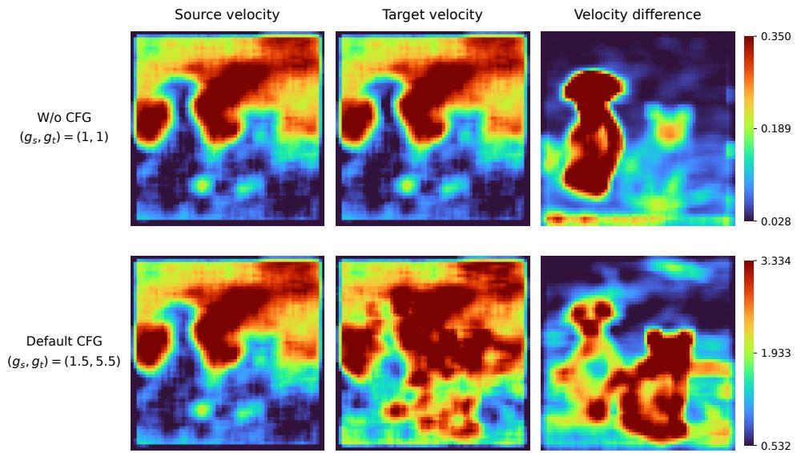  
Figure 5: Magnitudes of the source velocity, target velocity, and their vector difference, evaluated at the same noisy source state at Step 15 under w/o CFG and default CFG (FLUX).

## A.2 WITHIN-STEP SPATIAL CONTRAST

We detail the spatial-contrast experiment in Section 5.4 on PIE-Bench tasks with nonempty edit and non-edit regions. Ground-truth edit masks are resized to the 64 × 64 latent grid by nearest-neighbor interpolation to define the edit region $\Omega _ { E } ;$ its complement is the non-edit region $\Omega _ { N }$ . We compare unmasked FlowEdit trajectories under w/o CFG (1, 1) and default CFG: (1.5, 5.5) for FLUX and (3.5, 13.5) for SD3 and SD3.5. Within each backbone, both configurations use the same inputs, sampling schedule, and paired noise draws, while their states evolve separately.

Let $r _ { t } ( x ) = \| \Delta \mathbf { V } _ { t } ( x ) \| _ { 2 }$ denote the velocity-difference magnitude at location x, with the norm taken over channels. We compute the ratio of non-edit-region to edit-region mean magnitudes:

$$
R _ { t } = \frac { | \Omega _ { N } | ^ { - 1 } \sum _ { x \in \Omega _ { N } } r _ { t } ( x ) } { | \Omega _ { E } | ^ { - 1 } \sum _ { x \in \Omega _ { E } } r _ { t } ( x ) } .\tag{8}
$$

For each sample, we average $R _ { t }$ over all actual update steps: indices 4–27 of FLUX’s 28-step schedule and indices 17–49 of the 50-step SD3 and SD3.5 schedules, using zero-based indexing. We then average these per-sample values equally to obtain R. The calculation uses raw velocity differences, without percentile normalization or temporal aggregation.

Switching from w/o CFG to default CFG increases R from 0.5175 to 0.8007 on FLUX, from 0.5985 to 0.8334 on SD3, and from 0.5903 to 0.8409 on SD3.5. The sample-averaged $R _ { t }$ is higher under default CFG at every actual update step: 24/24 on FLUX and 33/33 on each SD backbone. Thus, w/o CFG produces a clearer magnitude contrast between edit and non-edit regions across all three backbones. These compare the evolving trajectories; the per-step trend refers to sample means.

## A.3 TEMPORAL DIRECTIONAL CONTRAST

Section 5.4 finds a larger gap in temporal directional consistency between edit and non-edit regions under w/o CFG. Here we detail the cosine computation and examine whether this directional contrast is accompanied by stronger relative cancellation of velocity differences in non-edit regions during temporal aggregation.

We use the FLUX trajectories and region definitions described above. Following Equation (7), $\mathbf { u } _ { t } ^ { \Omega } = \mathrm { v e c } ( \Delta \mathbf { V } _ { t } | \Omega )$ concatenates all spatial positions and channels within region Ω. The intermediate window $\mathcal { T } _ { \mathrm { m i d } }$ contains indices 7–21 of the full 28-step schedule. Cos averages the cosine similarities over all distinct timestep pairs in this window. To measure cancellation when these velocity differences are aggregated as in Equation (2), we additionally compute the temporal cancellation ratio:

$$
\mathrm { T C R } _ { \Omega } = \frac { \left. \sum \boldsymbol { t } \in \mathcal { T } _ { \operatorname* { m i d } } \mathbf { u } _ { t } ^ { \Omega } \right. _ { 2 } } { \sum _ { t \in \mathcal { T } _ { \operatorname* { m i d } } } \left. \mathbf { u } _ { t } ^ { \Omega } \right. _ { 2 } + \delta } ,\tag{9}
$$

where $\delta = 1 0 ^ { - 8 }$ . The raw vectors are summed with equal weights, without multiplying by timestep sizes. Lower TCR indicates that a smaller fraction of the summed per-step magnitudes remains after vector addition, corresponding to stronger cancellation. Unlike Cos, TCR depends on both directions and magnitudes. Both metrics are computed per sample and then averaged equally across samples; ∆ denotes the edit-region value minus the non-edit-region value.

Table 3: Temporal directional contrast and cancellation on FLUX. Cos and TCR use the same intermediate steps, indices 7–21. E and N denote the edit and non-edit regions; ∆ denotes E minus N.
<table><tr><td rowspan="2">CFG</td><td colspan="3">Cos</td><td colspan="3">TCR</td></tr><tr><td>E</td><td>N</td><td>Δ↑</td><td>E</td><td>N</td><td>Δ↑</td></tr><tr><td>w/o CFG</td><td>0.53305</td><td>0.40565</td><td>0.12740</td><td>0.74017</td><td>0.65547</td><td>0.08470</td></tr><tr><td>default CFG</td><td>0.55259</td><td>0.50275</td><td>0.04984</td><td>0.75860</td><td>0.72725</td><td>0.03135</td></tr></table>

Table 3 shows larger gaps between edit and non-edit regions under w/o CFG than under default CFG in both Cos (0.12740 vs. 0.04984) and TCR (0.08470 vs. 0.03135). These larger gaps indicate stronger contrast between the two regions in directional consistency and in the fraction of cumulative velocity-difference magnitude retained after vector aggregation. This stronger contrast helps temporal aggregation distinguish edit regions from non-edit regions, supporting the use of w/o CFG for prior extraction.

## B MASK EXTRACTION BASELINES

We describe the FLUX-based baselines, SD1.4 attention-control masks, and the external Auto VLM→SAM3 pipeline compared in Table 2.

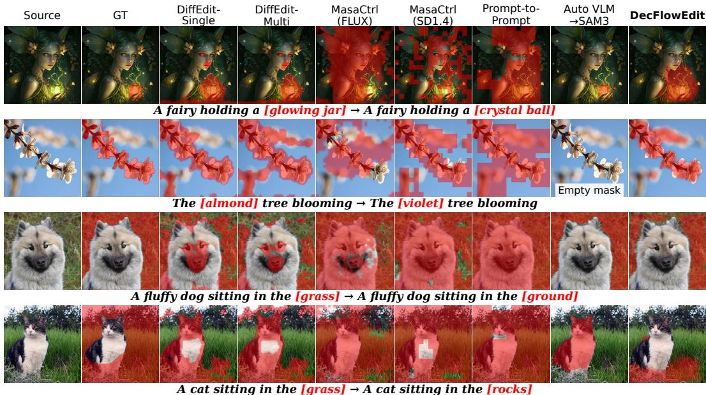  
Figure 6: Additional qualitative comparison of different localization masks. In the second row, SAM3 returns no instance above the confidence threshold (0.5) for the VLM-generated query “almond $\mathrm { t r e e } ^ { \prime \prime }$ yielding an empty mask. GT: ground-truth edit mask.

DiffEdit-Single and DiffEdit-Multi. Both variants localize edits using source–target velocity disagreement on noisy versions of the source image. Given the source latent $\mathbf { x } ^ { \mathrm { { s r c } } }$ and noise samples $\epsilon _ { i } \sim \mathcal { N } ( \mathbf { 0 } , \mathbf { I } )$ , we construct $\mathbf { z } _ { t _ { j } } ^ { ( i ) } = ( 1 - \sigma _ { j } ) \mathbf { x } ^ { \mathrm { s r c } } + \sigma _ { j } \mathbf { \epsilon } _ { i }$ and compute

$$
\begin{array} { r } { d ^ { ( i , j ) } ( h , w ) = \left\| \mathbf { V } _ { \theta } ( \mathbf { z } _ { t _ { j } } ^ { ( i ) } , t _ { j } \mid P _ { \mathrm { t a r } } ) ( : , h , w ) - \mathbf { V } _ { \theta } ( \mathbf { z } _ { t _ { j } } ^ { ( i ) } , t _ { j } \mid P _ { \mathrm { s r c } } ) ( : , h , w ) \right\| _ { 2 } . } \end{array}
$$

The localization map averages these magnitude maps over k timesteps and n noise samples:

$$
\bar { d } ( h , w ) = \frac { 1 } { k n } \sum _ { j = 1 } ^ { k } \sum _ { i = 1 } ^ { n } d ^ { ( i , j ) } ( h , w ) .
$$

DiffEdit-Single uses $k = 1$ , selecting a single noise level with strength 0.5 from a $T = 2 8$ schedule. DiffEdit-Multi uses k = 5 timesteps uniformly selected from $\sigma \in \ \left[ 0 . 2 , 0 . 8 \right]$ . Both use $n = 1 0$ and source/target guidance scales of (1, 1). We apply min–max normalization to ¯d before binarization.

Our baselines adapt DiffEdit to FLUX, whereas the original work uses class-conditional latent diffusion and text-conditional Stable Diffusion models (Couairon et al., 2023). On 556 local-edit tasks, applying the original default threshold of 0.5 to our FLUX implementation yields low IoUs of 0.0702 and 0.1228 for DiffEdit-Single and DiffEdit-Multi, respectively. We therefore sweep the threshold and adopt $\tau = 0 . 1 5$ for both variants (IoUs of 0.3368 and 0.3615 on the same subset).

MasaCtrl (SD1.4 and FLUX). SD1.4. We use $5 1 2 \times 5 1 2$ images, source-image DDIM inversion, and 50-step DDIM sampling with guidance scale 7.5. PIE-Bench blend words identify the source and target control tokens. MasaCtrl (Cao et al., 2023) collects $1 6 \times 1 6$ cross-attention maps within each step, aggregates the selected-token maps over heads and layers, and applies min–max normalization to each branch. The attention store is reset after each step. Mutual self-attention control starts at step 4 and block 10 (zero-based). The target map is resized by nearest-neighbor interpolation to the current attention resolution and binarized using the official default threshold of 0.1. We export the target mask from the last control application at the final sampling step.

FLUX. The MasaCtrl-style mask is extracted from joint attention maps in the FLUX double-stream transformer blocks. We first locate the token indices corresponding to the edited word in the source prompt. During the forward pass, we extract the cross-attention submatrix from the source text tokens

to image patches:

$$
\mathrm { A t t n } _ { \mathrm { e d i t } } = \mathrm { A t t n } [ : , : , \mathcal { T } _ { \mathrm { t o k e n } } , S _ { \mathrm { t e x t } } : ] ,
$$

where $\mathcal { T } _ { \mathrm { t o k e n } }$ denotes the token indices of the edited word and $S _ { \mathrm { t e x t } }$ is the text sequence length. We average the attention maps over tokens, heads, layers, and timesteps to obtain a spatial attention map. The map is min–max normalized to [0, 1] and binarized at $\tau = 0 .$ 1, using the same threshold as the official SD1.4 implementation. We use $\dot { T } = 2 8$ and guidance scale 3.5.

These FLUX-based baselines represent different localization signals: DiffEdit-Single uses singlestep source–target velocity disagreement, DiffEdit-Multi uses multi-step velocity-disagreement aggregation, and the MasaCtrl-style mask uses internal attention signals. In contrast, our spatial prior is derived directly from temporally aggregated FlowEdit velocity differences, making it better aligned with the editing operator used for subsequent reweighting.

Prompt-to-Prompt (SD1.4). We use $5 1 2 \times 5 1 2$ images, source-image DDIM inversion, and 50- step DDIM sampling with guidance scale 7.5. PIE-Bench blend words identify the source and target control tokens. We use the official attention-refinement controller (Hertz et al., 2023), with cross-attention and self-attention replacement fractions of 0.8 and 0.4. LocalBlend uses the $1 6 \times 1 6$ maps from down\_cross[2:4] and $\mathsf { u p \_ c r o s s } [ : 3 ]$ ], accumulated over all 50 sampling steps. It aggregates the selected-token maps over heads and layers, applies $3 \times 3$ max-pooling and nearestneighbor interpolation, and divides each branch’s map by its spatial maximum. The source and target maps are binarized using LocalBlend’s official default threshold of 0.3 and combined by union. We export the hard mask used by LocalBlend at the final step.

Auto VLM→SAM3. Qwen3-VL-8B-Instruct (Bai et al., 2025) receives the source image, source and target descriptions, and editing instruction, and returns a single source-side object or part phrase. We use greedy decoding with at most 32 generated tokens. SAM3 (Carion et al., 2025) segments the source image using this phrase, with its image processor resizing the input to 1008 × 1008. We retain all instances with confidence above the official default threshold of 0.5, resize their mask logits to the source-image resolution, and apply a sigmoid. For IoU evaluation, we binarize each instance using the official pixel-probability threshold of 0.5 and take the union. For downstream editing, we instead take the pixel-wise maximum of the retained instance probabilities.

Evaluation protocol for the spatial-prior comparison. All metrics in Table 2 are evaluated on the same 490 local-edit tasks in PIE-Bench. Starting from its 700 tasks, we exclude 144 whose ground-truth masks cover the entire image and 66 for which the SD1.4 controllers cannot identify the required source–target token pair (46 with unparseable blend-word pairs and 20 with no exact token match). Mask extraction succeeds for both SD1.4 methods on the remaining $7 0 0 - 1 4 4 - 6 6 = 4 9 0$ tasks. The Model column identifies the model used to produce each prior; all priors guide FLUX editing under default CFG. IoU is measured against the ground-truth edit masks. Edited-region CLIP is scaled by 100, and background LPIPS and structure distance by 1000. For Auto VLM→SAM3, if the extracted mask is empty, as in the second row of Figure 6, we use an all-one weight map. The SD1.4 binary masks and SAM3 soft probability maps are saved at source-image resolution; SAM3 probabilities are stored as 8-bit grayscale values. For editing, the maps are converted to [0, 1] and resized bilinearly to the FLUX latent resolution, without further thresholding, then used directly as the spatial update weights.

## C IMPLEMENTATION DETAILS

Backbones and environment. We evaluate DecFlowEdit on FLUX.1-dev, Stable Diffusion 3 (SD3), and Stable Diffusion 3.5-Medium (SD3.5), following the standard FlowEdit settings for each backbone. Experiments run on NVIDIA A100 GPUs under Ubuntu 24.04.3 and CUDA 13.0. FLUX.1- dev uses Python 3.8.20, PyTorch 2.4.1, and diffusers 0.30.1; SD3 and SD3.5 use Python 3.10.20, PyTorch 2.5.1+cu121, and diffusers 0.37.1. Table 4 reports compute resources and the runtime of a single FlowEdit editing stage.

Sampling schedules and CFG. The prior-guided editing stage uses 28 sampling steps for FLUX and 50 for SD3/SD3.5. Its default CFG configuration $\mathbf { g } = ( g _ { \mathrm { s r c } } , g _ { \mathrm { t a r } } )$ is (1.5, 5.5) for FLUX and (3.5, 13.5) for SD3/SD3.5. The prior-extraction stage uses $\mathbf { g } ^ { \mathrm { w / o C F G } } = \left( 1 , 1 \right)$ . The full variant uses the same number of sampling steps for both stages, whereas Ours-short uses approximately one quarter as many steps for prior extraction while keeping the prior-guided editing stage unchanged. Relative to a single FlowEdit edit, the total sampling budget is approximately 2× with the full prior-extraction schedule and 1.25× with the short schedule. These ratios reflect the sampling-step counts of the two stages.

Table 4: Compute resources and approximate per-image FlowEdit runtime on PIE-Bench.
<table><tr><td>Backbone</td><td>GPU</td><td>Peak Memory</td><td>FlowEdit Runtime</td></tr><tr><td>FLUX.1-dev</td><td> $1 \times \mathrm { A } 1 0 0$ </td><td>33.31GB</td><td>8.1 sec/img</td></tr><tr><td>Stable Diffusion 3</td><td> $1 \times \mathrm { A } 1 0 0$ </td><td>16.37GB</td><td>3.2 sec/img</td></tr><tr><td>Stable Diffusion 3.5-Medium</td><td> $1 \times \mathrm { A } 1 0 0$ </td><td>17.08GB</td><td>3.9 sec/img</td></tr></table>

Spatial-prior settings. We follow the prior construction in Section 4.2, including the aggregation window $\mathcal { T } _ { \mathrm { m i d } }$ defined by zero-based step indices, with threshold $\tau = 0 . 5 5$ and softness $s = 0 . 0 8$ . For mask-quality evaluation, we binarize the soft spatial prior M at 0.5. The prior-guided editing stage uses the soft M throughout, following Section 4.3.

## D PARAMETER SENSITIVITY AND EDITING–PRESERVATION TRADE-OFFS

We examine how update strength, the spatial-prior threshold τ, softness s, and the aggregation window affect localization and final editing. The first three controls change the amount or spatial distribution of the applied update; the window determines which responses form the prior. Unless specified otherwise, we use $\tau = 0 . 5 5$ and $s = 0 . 0 8$ , and retain each backbone’s default CFG in the prior-guided editing stage. These experiments characterize trade-offs rather than identify one setting that maximizes every metric.

## D.1 SPATIAL REWEIGHTING VERSUS UNIFORM SCALING

We test whether the background-preservation gains in Table 1 can be explained solely by weaker editing. To assess the benefit of spatial selectivity, we compare spatial reweighting with uniform update scaling at comparable edited-region CLIP.

Control formulas. Let $\Delta \mathbf { V } _ { t } ^ { \mathrm { d e f } } ( x )$ denote the velocity difference under default CFG and $M ( x ) \in$ [0, 1] the fixed soft spatial prior for an image. We compare

$$
\Delta \mathbf { V } _ { t } ^ { \mathrm { D e c } , \lambda } ( x ) = \big [ \lambda + ( 1 - \lambda ) M ( x ) \big ] \Delta \mathbf { V } _ { t } ^ { \mathrm { d e f } } ( x ) ,\tag{10}
$$

$$
\Delta \mathbf { V } _ { t } ^ { \mathrm { u n i f o r m } , \lambda } ( x ) = \lambda \Delta \mathbf { V } _ { t } ^ { \mathrm { d e f } } ( x ) .\tag{11}
$$

Both controls recover raw FlowEdit at $\lambda = 1 . \operatorname { A t } \lambda = 0 ,$ spatial reweighting recovers the DecFlowEdit update in Equation (5), whereas uniform scaling supplies no editing update. Decreasing λ therefore strengthens suppression in both controls, but spatial reweighting targets low-prior locations while uniform scaling attenuates every location and channel equally. We compare the controls at comparable CLIP, not at equal λ. Each setting evaluates the velocity difference along its own trajectory.

Experimental settings and evaluation. Both controls use $\lambda \in \{ 0 , 0 . 2 , 0 . 4 , 0 . 6 , 0 . 8 , 1 \}$ on PIE-Bench. We fix FLUX, default CFG (1.5, 5.5), a 28-step schedule with 24 actual updates, and one fresh paired noise sample per step. The prior built from the aggregated response E (Equation (2)) uses $\tau = 0 . 5 5$ and $s = 0 . 0 8$ . The sweeps share their raw-FlowEdit endpoint. Background LPIPS is evaluated on the 556 local tasks. $\mathbf { A } \mathbf { t } \lambda \bar { = } 0$ under uniform scaling, VAE encoding and decoding can still change pixels despite the absence of editing updates.

Results. At comparable edited-region CLIP, spatial reweighting achieves substantially lower background LPIPS than uniform scaling (Figure 7). Thus, spatial selectivity contributes to the preservation gains in Table 1 beyond the effect of uniformly reducing editing strength.

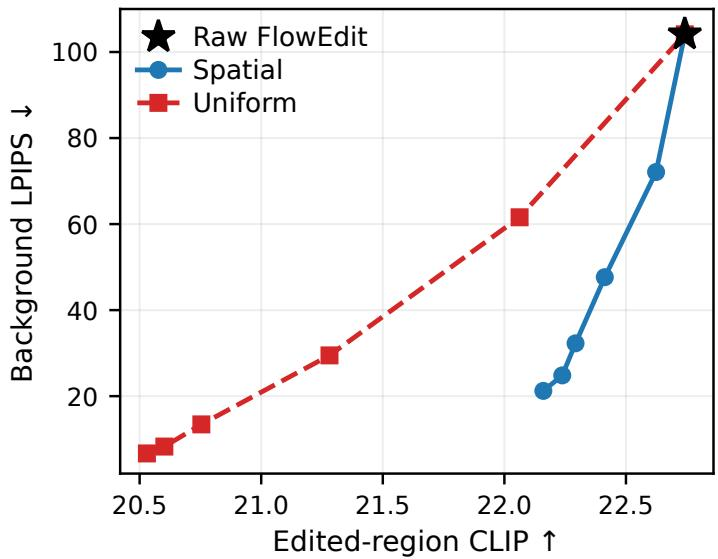  
Figure 7: Spatial reweighting and uniform update scaling on FLUX. Each point is a measured control setting; the curves share the raw-FlowEdit endpoint. At comparable edited-region CLIP, spatial reweighting attains lower background LPIPS. Background LPIPS is scaled by $1 0 ^ { 3 }$

## D.2 THRESHOLD: LOCALIZATION AND DOWNSTREAM EDITING

The threshold changes which locations receive large editing weights. We evaluate localization and downstream editing at $\tau \in \{ 0 . 3 0 , 0 . 4 0 , 0 . 5 0 \}$ with fixed $s = 0 . 0 8$ across FLUX, SD3, and SD3.5. Both rows of Figure 8 additionally show $\tau = 0 . 5 5$ as a separate reference from an earlier run with the original (unquantized) priors.

The three-point sweep reconstructs the aggregated responses E from saved quantized response/mask images, rather than recovering the original floating-point maps. The underlying priors use $E , 5 \times 5$ smoothing, and 10th/90th-percentile normalization, with recorded intermediate windows at indices 7–21 for FLUX and 17–38 for SD3/SD3.5 (zero-based). We evaluate localization by thresholding each soft prior at 0.5 and computing IoU on 556 local PIE-Bench tasks. For editing, we generate 700 outputs per setting; CLIP averages 700 tasks, and background LPIPS uses the 556 local tasks.

Among the displayed thresholds, $\tau = 0 . 4 0$ yields the highest mask IoU on all three backbones, whereas $\tau = 0 . 5 5$ favors more conservative spatial coverage. In the downstream sweep, increasing τ lowers both CLIP and background LPIPS: tighter spatial control improves preservation but limits the semantic change. The threshold with the highest binary-mask IoU therefore need not provide the desired final editing–preservation balance. We use $\tau = 0 . 5 5$ as a preservation-oriented operating point, not as a universal optimum.

## D.3 SOFTNESS: EDITING CHANGES DESPITE AN UNCHANGED BINARY MASK

For $s > 0$ , the sigmoid prior satisfies

$$
M ( x ) = \sigma \left( \frac { \widetilde { E } ( x ) - \tau } { s } \right) , \qquad M ( x ) > 0 . 5 \Longleftrightarrow \widetilde { E } ( x ) > \tau .\tag{12}
$$

Thus, changing s does not change the hard mask evaluated at threshold 0.5, although it changes the weights applied during editing. An offline FLUX check at $\tau ~ = ~ 0 . 5 5$ with s ∈ $\{ 0 . 0 \hat { 4 } , 0 . 0 6 , 0 . 0 8 , 0 . 1 2 , \hat { 0 . 1 6 } \}$ yields the same IoU, precision, and recall $( 0 . 4 1 5 0 , 0 . 6 1 3 0$ , and 0.6293) for every setting.

To evaluate the effect on final images, we separately $\mathrm { f i x } \ \tau = \ 0 . 3 0$ and sweep $s \in$ $\{ 0 . 0 4 , 0 . 0 8 , 0 . 1 6 , 0 . 3 2 \}$ on FLUX. We use the reconstructed priors and default CFG (1.5, 5.5); the $s = 0 . 0 8$ outputs are reused from the threshold sweep. All plotted metrics average the same 556 local tasks. Consequently, the CLIP values are not directly comparable to the 700-task averages in Figure 8.

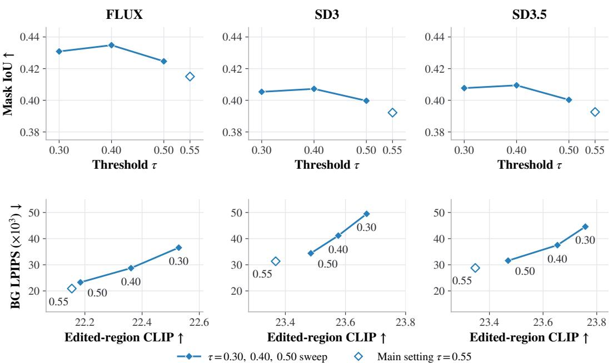  
Figure 8: Threshold sensitivity across three backbones at fixed $s = 0 . 0 8$ . Top: τ versus mask IoU. Bottom: edited-region CLIP versus background LPIPS, with points labeled by τ. Both rows show $0 . 3 0 / 0 . 4 0 / 0 . 5 0 / 0 . { \overset { \cdot } { . } } 5 5 \colon$ solid lines connect the three settings evaluated with reconstructed quantized priors, while unconnected hollow markers show the 0.55 reference from an earlier run with the original (unquantized) priors. IoU and background LPIPS use 556 local tasks; CLIP uses 700 tasks.

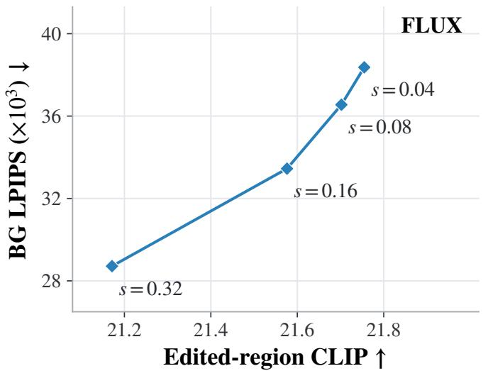  
Figure 9: Softness sensitivity on FLUX at fixed $\tau = 0 . 3 0$ . Point labels give s; both edited-region CLIP and background LPIPS use the same 556 local tasks. Increasing s in this sweep improves preservation while lowering CLIP, although the binary mask at threshold 0.5 is unchanged.

Figure 9 shows that s changes the editing–preservation trade-off even when hard-mask localization is invariant. Increasing s lowers both CLIP and background LPIPS in this sweep. The softness parameter must therefore be assessed through the final edits, rather than binary IoU alone.

## D.4 AGGREGATION-WINDOW SENSITIVITY

We keep the full FLUX prior-extraction trajectory fixed (28 scheduled steps, with 24 actual updates at indices 4–27) and aggregate three subsets of its velocity differences: all available steps (4–27), an intermediate window (7–21), and a narrower intermediate window (11–17). We use $\tau = 0 . 5 5$ $s = 0 . 0 8$ , and default CFG (1.5, 5.5) for prior-guided editing. This changes the responses included in the prior, not the number of updates executed during prior extraction.

Table 5: Aggregation-window sensitivity on FLUX. Indices are zero-based; the prior-extraction trajectory executes all 24 updates for every row. IoU is evaluated on 556 local tasks using masks from the same trajectory. Edited CLIP uses 700 tasks and background LPIPS uses the 556 local tasks. †: downstream editing reuses an earlier run with the original (unquantized) priors; its mask differs from the intermediate-window mask used for the paired IoU comparison.
<table><tr><td>Window</td><td>Indices</td><td>Responses</td><td>IoU↑</td><td>Edited CLIP ↑</td><td> $\mathbf { B G L P I P S } _ { \times 1 0 ^ { 3 } } \downarrow$ </td></tr><tr><td>Wide</td><td>4-27</td><td>24</td><td>0.4028</td><td>22.0479</td><td>21.1075</td></tr><tr><td>Intermediate†</td><td>7-21</td><td>15</td><td>0.4096</td><td>22.1543</td><td>20.8951</td></tr><tr><td>Narrow</td><td>11-17</td><td>7</td><td>0.4118</td><td>22.0093</td><td>21.2234</td></tr></table>

The small differences in localization and editing performance across the tested windows (Table 5) support the stability of the spatial localization signals in w/o CFG velocity differences and their robustness to the aggregation-window choice.

## D.5 GROUND-TRUTH-MASK DIAGNOSTIC

We also constrain FLUX updates with the binary ground-truth edit mask, resized to latent resolution without additional dilation or smoothing. This diagnostic uses CFG (1.5, 5.5) and a 28-step schedule with 24 actual updates.

Table 6: Ground-truth (GT) mask diagnostic on FLUX. Constraining edits with annotated regions improves preservation while also reducing CLIP similarity. Background SSIM, LPIPS, and MSE are scaled by 102, 103, and $1 0 ^ { 4 }$ , respectively.
<table><tr><td>Method</td><td>Edited CLIP ↑</td><td>Whole CLIP ↑</td><td>BG SSIM ↑</td><td>BG LPIPS ↓</td><td>BG PSNR ↑</td><td>BG MSE↓</td><td>Structure ↓</td></tr><tr><td>FlowEdit</td><td>22.71</td><td>25.88</td><td>83.87</td><td>104.79</td><td>21.72</td><td>98.32</td><td>28.99</td></tr><tr><td>FlowEdit + GT mask</td><td>22.41</td><td>25.27</td><td>96.23</td><td>7.76</td><td>36.44</td><td>4.46</td><td>9.75</td></tr></table>

Even with annotated edit regions, CLIP decreases from 22.71 to 22.41 (Table 6). A CLIP decrease alone therefore does not establish inaccurate automatic localization. The GT mask also defines the background evaluation region, giving this variant an oracle advantage; its preservation scores serve as diagnostic references rather than a fair baseline for automatic methods.

## E CFG CONFIGURATIONS: LOCALIZATION AND EDITING

This section supplements Section 5.3 with the experimental settings, additional backbone results, the prior-extraction CFG ablation, and the global norm-matching control.

## E.1 EXPERIMENTAL SETTINGS

For the direct-editing comparisons, we evaluate FlowEdit on the same 700 PIE-Bench tasks at $5 1 2 \times 5 1 2$ resolution, with seed 42 and one noise sample per step. Within each backbone, the configurations use the same input images and paired noise draws. Source and target branches share noise within a step, and fresh noise is sampled across steps. We compare w/o CFG (1, 1), default CFG, and three symmetric settings $g _ { \mathrm { s r c } } = g _ { \mathrm { t a r } } = g _ { } \left( \mathrm { T a b l e } 7 \right)$ . Images are generated directly without a spatial mask. The prior is subsequently extracted from each run’s velocity differences to evaluate localization.

Table 7: CFG settings and sampling schedules. Guidance pairs are (source, target). All backbones also use w/o CFG (1, 1). The final column distinguishes scheduled steps from actual updates.
<table><tr><td>Backbone</td><td>Default CFG</td><td>Symmetric g</td><td>Scheduled / actual steps</td></tr><tr><td>FLUX</td><td>(1.5,5.5)</td><td>1.5, 3.5, 5.5</td><td>28 / 24</td></tr><tr><td>SD3</td><td>(3.5, 13.5)</td><td>3.5, 8.5, 13.5</td><td>50 /33</td></tr><tr><td>SD3.5</td><td>(3.5, 13.5)</td><td>3.5, 8.5, 13.5</td><td>50 /33</td></tr></table>

Prior construction and evaluation. We use the aggregated response E (Equation (2)), $5 \times 5$ smoothing, 10th/90th-percentile normalization, and the same sigmoid parameters $\tau = 0 . 5 5$ and $s = 0 . 0 8$ . The recorded aggregation windows are zero-based indices 7–21 for FLUX and 17–38 for SD3/SD3.5. We binarize each soft prior at 0.5 and compare it with the ground-truth edit mask. IoU and background metrics use the 556 local tasks; structure distance is evaluated over the full image for those same local tasks. Displayed CLIP and SSIM are scaled by $1 0 ^ { 2 }$ , LPIPS and structure distance by $1 0 ^ { 3 }$ , and MSE by $1 0 ^ { 4 }$ ; PSNR is measured in dB.

## E.2 ADDITIONAL RESULTS ON FLUX AND SD3.5

Figure 10 extends the SD3 comparison in Section 5.3. Both backbones exhibit the same trends: w/o CFG has the highest prior IoU but the lowest edited-region CLIP among the tested configurations, whereas default CFG has the highest CLIP and lowest IoU. Increasing symmetric guidance raises CLIP while reducing IoU.

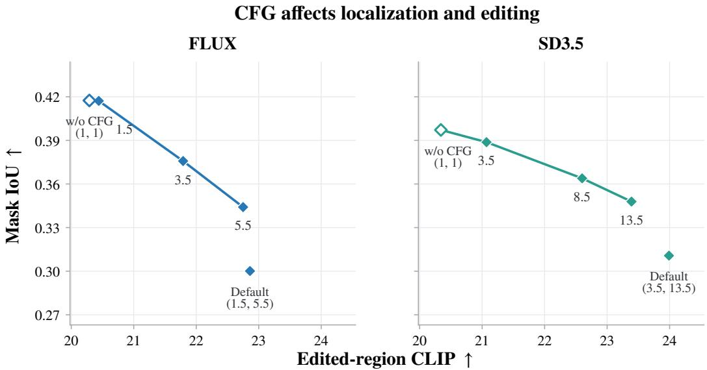  
Figure 10: Additional CFG comparisons on FLUX and SD3.5. Point labels give symmetric guidance strength $^ { g ; }$ the $\mathrm { w } / \mathrm { o }$ CFG and default CFG points show their complete (source, target) settings. Connected points form the symmetric guidance sweep. All edited images are generated without a spatial mask; mask IoU evaluates the prior extracted from the corresponding velocity differences.

## E.3 EFFECT OF PRIOR-EXTRACTION CFG

We evaluate this ablation on the same 556 local-edit tasks in PIE-Bench, excluding tasks whose ground-truth masks cover the entire image. All seven metrics, including both CLIP scores, are computed on this common subset. We compare a prior-extraction stage using w/o CFG (1, 1) with one using the backbone’s default CFG: (1.5, 5.5) for FLUX and (3.5, 13.5) for SD3/SD3.5. The prior guided editing stage uses default CFG in both cases, with the same downstream sampling settings within each backbone. Both prior-extraction configurations use the full schedules and aggregation windows specified in Appendix E.1, with $\tau = 0 . 5 5$ and $s = 0 . 0 8$ . The resulting soft prior is fixed throughout the editing stage. FLUX uses saved 8-bit soft masks, while SD3/SD3.5 use float32 priors.

Table 8: Effect of prior-extraction CFG with prior-guided editing fixed at default CFG. All metrics are evaluated on the same 556 local-edit tasks in PIE-Bench. Metric scaling follows Appendix E.1.
<table><tr><td rowspan="2"></td><td rowspan="2">Backbone Prior CFG</td><td rowspan="2">Structure ↓</td><td colspan="4">Background preservation</td><td colspan="2">CLIP↑</td></tr><tr><td>PSNR↑</td><td>LPIPS ↓</td><td>MSE↓</td><td>SSIM ↑</td><td>Whole</td><td>Edited</td></tr><tr><td rowspan="2">FLUX</td><td>w/o CFG</td><td>7.860</td><td>30.538</td><td>20.895</td><td>19.225</td><td>94.544</td><td>25.133</td><td>21.231</td></tr><tr><td>default CFG</td><td>12.179</td><td>25.968</td><td>41.770</td><td>45.080</td><td>91.744</td><td>25.256</td><td>21.228</td></tr><tr><td rowspan="2">SD3</td><td>w/o CFG</td><td>10.441</td><td>27.991</td><td>31.817</td><td>28.740</td><td>91.695</td><td>26.186</td><td>22.095</td></tr><tr><td>default CFG</td><td>15.647</td><td>24.828</td><td>54.023</td><td>54.934</td><td>89.167</td><td>26.367</td><td>22.121</td></tr><tr><td rowspan="2">SD3.5</td><td>w/o CFG</td><td>9.163</td><td>28.783</td><td>29.214</td><td>24.850</td><td>92.030</td><td>26.319</td><td>22.106</td></tr><tr><td>default CFG</td><td>13.389</td><td>25.673</td><td>48.216</td><td>45.470</td><td>89.836</td><td>26.586</td><td>22.129</td></tr></table>

As shown in Table 8, extracting priors under w/o CFG reduces background LPIPS by 50.0%, 41.1%, and 39.4% on FLUX, SD3, and SD3.5, respectively, and improves all other preservation metrics. The corresponding relative changes in edited-region CLIP are $+ 0 . 0 1 3 \% , - 0 . 1 2 1 \%$ , and −0.103%. All relative changes use the corresponding default-CFG-prior result as the reference. These results support using w/o CFG for prior extraction while retaining default CFG for semantic editing.

## E.4 PER-STEP GLOBAL NORM MATCHING

We test whether a single global rescaling of the w/o CFG update can recover default CFG editing. At every step of the norm-matched trajectory, we evaluate the w/o CFG update $\mathbf { U } _ { t }$ and default CFG update $\mathbf { \dot { H } } _ { t }$ at the same current source/target states and with the same sampled noise. We advance the state using only

$$
\widehat { \mathbf { U } } _ { t } = \frac { \Vert \mathbf { H } _ { t } \Vert _ { \mathrm { F } } } { \Vert \mathbf { U } _ { t } \Vert _ { \mathrm { F } } + 1 0 ^ { - 8 } } \mathbf { U } _ { t } .\tag{13}
$$

The Frobenius norm covers all spatial positions and channels, yielding one scalar for the entire update. Both updates are recomputed at the next state; the reference magnitude is not taken from a separately generated default-CFG trajectory. We use the same sampling settings as in Table 7.

Table 9: Direct editing with w/o CFG, global norm matching, and default CFG. Both CLIP metrics use the actual outputs of all 700 tasks; background and structure metrics use the 556 local tasks. The scale factors are those specified in Appendix E.1.
<table><tr><td rowspan="2">Backbone Update</td><td rowspan="2"></td><td rowspan="2">Structure ↓</td><td colspan="4">Background preservation</td><td colspan="2">CLIP↑</td></tr><tr><td>PSNR↑</td><td>LPIPS↓</td><td>MSE↓</td><td>SSIM↑</td><td>Whole</td><td>Edited</td></tr><tr><td rowspan="3">FLUX</td><td>w/o CFG</td><td>0.95</td><td>36.30</td><td>7.77</td><td>4.70</td><td>96.32</td><td>23.47</td><td>20.29</td></tr><tr><td>Norm-matched</td><td>42.84</td><td>20.34</td><td>95.92</td><td>142.43</td><td>85.35</td><td>25.13</td><td>21.30</td></tr><tr><td>default CFG</td><td>28.99</td><td>21.72</td><td>104.79</td><td>98.32</td><td>83.87</td><td>25.88</td><td>22.71</td></tr><tr><td rowspan="3">SD3</td><td>w/o CFG</td><td>0.97</td><td>35.32</td><td>10.23</td><td>6.11</td><td>94.31</td><td>23.49</td><td>20.33</td></tr><tr><td>Norm-matched</td><td>84.07</td><td>16.76</td><td>178.42</td><td>298.79</td><td>75.39</td><td>24.50</td><td>20.67</td></tr><tr><td>default CFG</td><td>26.39</td><td>22.27</td><td>100.15</td><td>85.71</td><td>83.93</td><td>27.51</td><td>23.92</td></tr><tr><td rowspan="3">SD3.5</td><td>w/o CFG</td><td>0.96</td><td>35.26</td><td>10.48</td><td>6.09</td><td>94.22</td><td>23.49</td><td>20.34</td></tr><tr><td>Norm-matched</td><td>64.17</td><td>18.39</td><td>149.86</td><td>214.27</td><td>78.70</td><td>24.60</td><td>20.80</td></tr><tr><td>default CFG</td><td>22.55</td><td>23.27</td><td>88.78</td><td>69.66</td><td>85.57</td><td>27.62</td><td>23.95</td></tr></table>

Global norm matching increases edited-region CLIP relative to w/o CFG but remains below default CFG on all three backbones, while structure distance is higher (Table 9). SD3 and SD3.5 also deteriorate in all four background metrics; FLUX has mixed background results. The norm-matched

Table 10: Multi-seed quantitative results on PIE-Bench. We report mean ± standard deviation over five runs with different random seeds. Lower is better for Structure Distance, LPIPS, and MSE; higher is better for PSNR, SSIM, and CLIP similarity.
<table><tr><td rowspan="2">Method</td><td rowspan="2">Backbone</td><td>Structure</td><td colspan="4">Background Preservation</td><td colspan="2">CLIP Similarity</td></tr><tr><td>Distance ↓</td><td>PSNR ↑</td><td> $\mathrm { L P I P S } _ { \times 1 0 ^ { 3 } } \downarrow$ </td><td> $\mathbf { M S E } _ { \times 1 0 ^ { 4 } } \downarrow$ </td><td> $\mathbf { S S I M } _ { \times 1 0 0 } \uparrow$ </td><td>Whole ↑</td><td>Edited ↑</td></tr><tr><td>FlowEdit</td><td>FLUX</td><td> $2 8 . 9 9 \pm 0 . 2 4$ </td><td> $2 1 . 7 2 \pm 0 . 0 6$ </td><td> $1 0 4 . 7 9 \pm 0 . 0 6$ </td><td> $9 8 . 3 2 \pm 0 . 2 6$ </td><td> $8 3 . 8 7 \pm 0 . 0 2$ </td><td> $2 5 . 8 8 \pm 0 . 0 1$ </td><td> $2 2 . 7 1 \pm 0 . 0 4$ </td></tr><tr><td>Ours</td><td>FLUX</td><td> $7 . 8 6 \pm 0 . 2 1$ </td><td> $3 0 . 5 4 \pm 0 . 0 5$ </td><td> $2 0 . 9 0 \pm 0 . 0 5$ </td><td> $1 9 . 2 3 \pm 0 . 2 2$ </td><td> $9 4 . 5 4 \pm 0 . 0 2$ </td><td> $2 5 . 2 5 \pm 0 . 0 1$ </td><td> $2 2 . 1 5 \pm 0 . 0 3$ </td></tr><tr><td>FlowEdit</td><td>SD3</td><td> $2 6 . 3 9 \pm 0 . 2 6$ </td><td> $2 2 . 2 7 \pm 0 . 0 7$ </td><td> $1 0 0 . 1 5 \pm 0 . 0 7$ </td><td> $8 5 . 7 1 \pm 0 . 2 9$ </td><td> $8 3 . 9 3 \pm 0 . 0 3$ </td><td> $2 7 . 5 1 \pm 0 . 0 2$ </td><td> $2 3 . 9 2 \pm 0 . 0 4$ </td></tr><tr><td>Ours</td><td>SD3</td><td> $1 0 . 0 1 \pm 0 . 2 2$ </td><td> $2 8 . 1 6 \pm 0 . 0 5$ </td><td> $3 1 . 3 4 \pm 0 . 0 5$ </td><td> $2 7 . 8 5 \pm 0 . 2 2$ </td><td> $9 1 . 7 5 \pm 0 . 0 2$ </td><td> $2 6 . 7 1 \pm 0 . 0 1$ </td><td> $2 3 . 3 7 \pm 0 . 0 3$ </td></tr><tr><td>FlowEdit</td><td>SD3.5</td><td> $2 2 . 5 5 \pm 0 . 2 5$ </td><td> $2 3 . 2 7 \pm 0 . 0 7$ </td><td> $8 8 . 7 8 \pm 0 . 0 6$ </td><td>69.66 ± 0.27</td><td> $8 5 . 5 7 \pm 0 . 0 2$ </td><td> $2 7 . 6 2 \pm 0 . 0 2$ </td><td> $2 3 . 9 5 \pm 0 . 0 4$ </td></tr><tr><td>Ours</td><td>SD3.5</td><td> $8 . 9 0 \pm 0 . 2 0$ </td><td> $2 8 . 7 8 \pm 0 . 0 5$ </td><td> $2 8 . 7 9 \pm 0 . 0 5$ </td><td> $2 4 . 5 9 \pm 0 . 2 1$ </td><td> $9 2 . 0 3 \pm 0 . 0 2$ </td><td> $2 6 . 8 6 \pm 0 . 0 1$ </td><td> $2 3 . 3 5 \pm 0 . 0 3$ </td></tr></table>

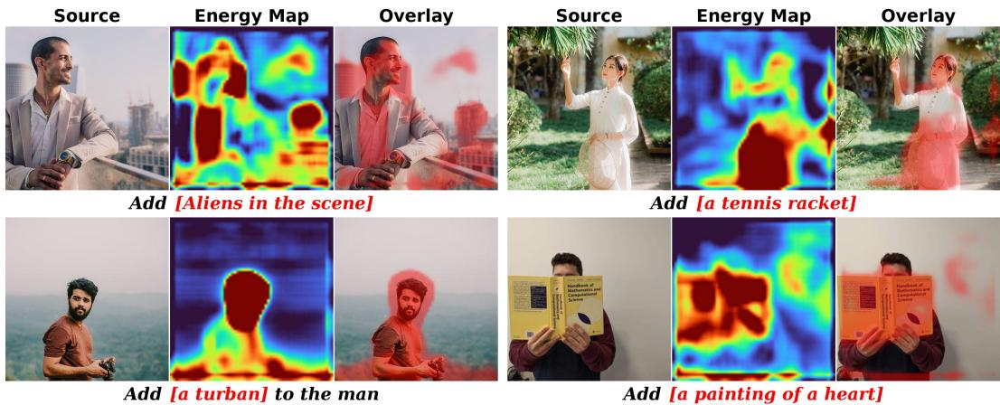  
Figure 11: Limitations of spatial-prior extraction in object-add edits using FLUX.

edits exhibit the severe blur shown in Figure 4. Matching total update magnitude is therefore insufficient to recover the editing quality of default CFG.

## F MULTI-SEED MAIN RESULTS

To assess the stability of the quantitative results, we repeat the main experiments five times with different random seeds. The random seeds affect the stochastic components of the editing process, including the noise samples used in FlowEdit-style updates and prior extraction. We report the mean and the run-to-run standard deviation over these five runs. The repeated experiments follow the same evaluation protocol as the main paper, using PIE-Bench and the same metrics for structure distance, background preservation, and semantic editing fidelity.

Across seeds, our method consistently improves background and structure preservation over the corresponding FlowEdit baseline. The standard deviations are small relative to the performance gains, indicating that the improvement is not caused by a particular random seed. The semantic editing metrics remain competitive, suggesting that the spatial reweighting improves preservation without substantially weakening the intended edit.

## G LIMITATIONS

Our method is most reliable for local edits where the source image already contains a clear editing target or spatial anchor. In such cases, temporally aggregating FlowEdit velocity differences $\Delta \mathbf { V } _ { t }$ can accumulate edit-driven responses around the relevant region and produce a selective spatial prior. This reliance on a spatial anchor also reveals several limitations.

First, for object-add edits, the target object usually has no clear source-side counterpart or spatial anchor in the source image. As a result, the edit-driven updates lack a stable region on which to accumulate across timesteps. The extracted prior may therefore become diffuse or attach to semantically related existing regions, rather than accurately localizing where the newly added object should appear, as illustrated in Figure 11.

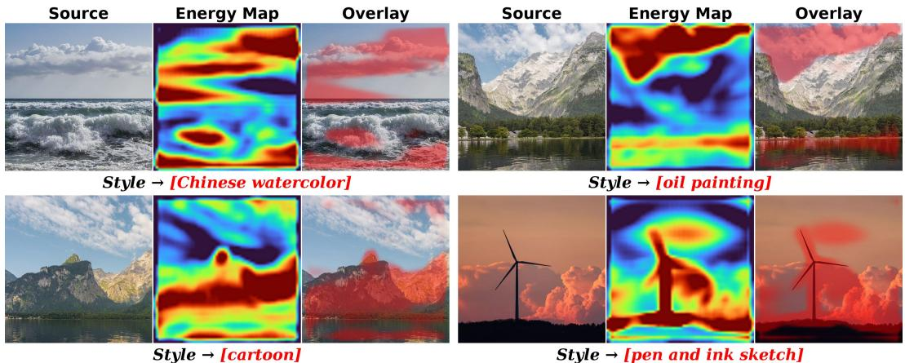  
Figure 12: Limitations of spatial-prior extraction in style-change edits using FLUX.

Second, for style-change edits, the target modification is often a global or large-range appearance transformation, such as changing texture, color, brushstroke, or overall rendering style. Such edits do not necessarily require a localized mask, because the desired change is expected to affect the whole image relatively consistently. Accordingly, our temporal aggregation mechanism is less suitable for this setting: the resulting prior does not uniformly cover the image, but is instead influenced by semantic structures, local textures, and high-response regions, leading to a content-dependent and non-uniform distribution, as shown in Figure 12. Therefore, these cases should not be interpreted simply as localization failures: our prior is deliberately designed for local, object-related, or spatially anchored edits, and style changes that require globally consistent modification are outside the scope of this method. For such edits, we recommend applying raw FlowEdit, whose spatially global velocity differences naturally support global transformations.

Our method also introduces one additional prior-extraction pass. Although this pass does not require training, optimization, external segmentation, or attention manipulation, it still increases inference time compared with the original FlowEdit (approximately 2× the sampling steps, or 1.25× with the short schedule; Appendix C).

## H BROADER IMPACT

This work improves training-free text-guided image editing by reducing unintended changes in background and non-edit regions. This can benefit creative editing, visual content production, and user-controlled image manipulation, especially where preserving source details is important.

However, more reliable image editing tools may also be misused to create misleading, manipulated, or deceptive visual content. The proposed method does not introduce a new generative model, but it can improve the controllability of existing pretrained image generation backbones. We encourage responsible use of the method and adherence to the usage policies and safety guidelines of the underlying pretrained generative models.

## I ASSETS AND LICENSES

We use publicly available datasets, pretrained models, and baseline methods. The main benchmark is PIE-Bench, which provides source images, source and target prompts, editing instructions, and ground-truth edit masks for text-guided image editing evaluation. We use publicly available pretrained flow backbones, including FLUX, SD3, and SD3.5, following their respective licenses and terms of use. We also compare with publicly described training-free editing baselines, including FlowEdit and recent flow-based editing methods.

All existing assets used in this paper are cited in the main text or references. The proposed method does not introduce a new dataset or a new pretrained generative model. The released asset is the anonymized implementation of our method, with instructions for reproducing the main experiments.