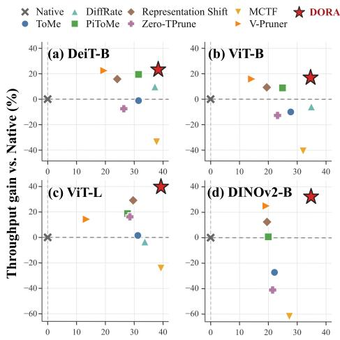
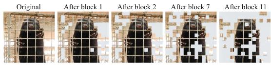
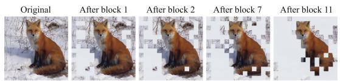
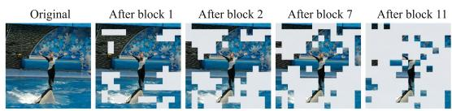
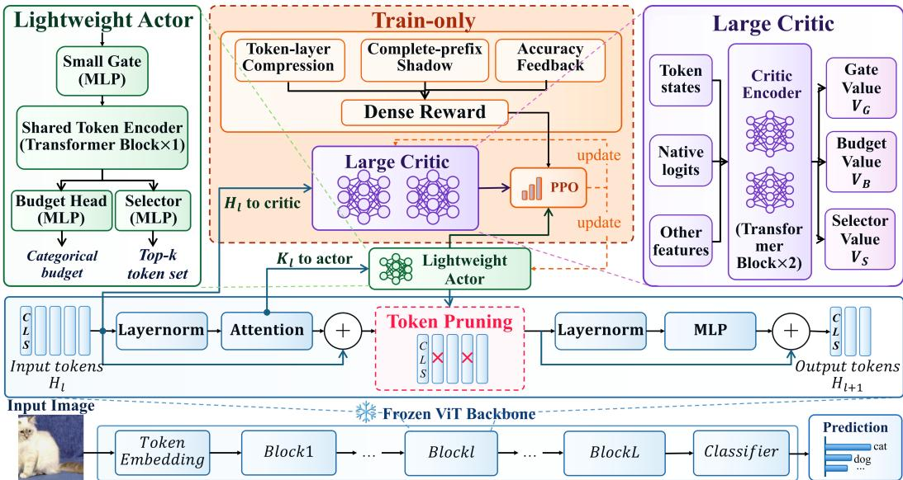
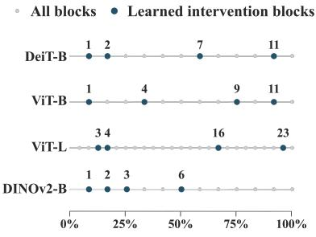
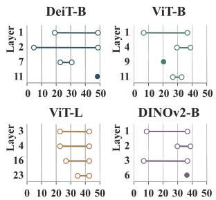
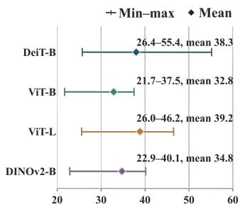
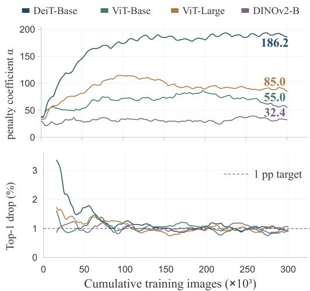
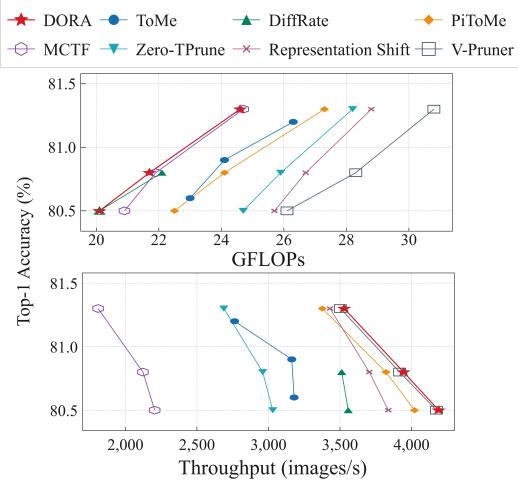

# DORA: DYNAMIC ONLINE REINFORCEMENT AGENT FOR TOKEN PRUNING IN VISION TRANSFORMERS

Kaixuan He1,2 Song Chen1 Yi Kang1∗

1University of Science and Technology of China, Hefei, China

2Institute of Artificial Intelligence, Hefei Comprehensive National Science Center, Hefei, China

hekaix@mail.ustc.edu.cn {songch,ykang}@ustc.edu.cn

## ABSTRACT

Vision Transformers (ViTs) incur quadratic self-attention cost in the number of tokens. Most token-reduction methods adapt token identities within a prescribed layer-wise compression schedule, or search a static mask offline, and thus limit online adaptation of when and how much to prune. We propose DORA (Dynamic Online Reinforcement Agent), which learns an input-adaptive pruning policy itself for frozen ViTs. At each eligible block, a hierarchical actor decides whether to prune, how many tokens to remove, and which tokens to remove from each image’s evolving representation. Because early deletions change the states observed by later decisions, DORA formulates pruning as a finite-horizon Markov decision process. Complete-prefix shadow evaluations convert final-prediction fidelity into localized per-step credit, while closed-loop accuracy feedback adjusts the fidelity penalty toward a shared accuracy-drop target. A privileged critic and all shadow computations are training-only. Deployment retains the frozen backbone and a lightweight actor that applies hard deletion and packed variable-length FlashAttention, converting token reduction into measured speedups. On ImageNet-1K with DeiT-Base, DORA reduces FLOPs by 38.4% relative to the uncompressed backbone within one percentage point of accuracy loss. Averaged across four ViT-type backbones at matched accuracy, DORA uses 13.2% fewer FLOPs and achieves 32.4% higher throughput than the corresponding per-backbone baseline means. Under zero-shot transfer to ImageNet-A, these gains widen to 20.3% and 45.6%, respectively.

## 1 INTRODUCTION

Vision Transformers (ViTs) (Dosovitskiy et al., 2021) incur quadratic self-attention cost in the number of tokens, making token pruning or merging a direct route to lower inference cost (Bolya et al., 2023; Wang et al., 2024). Most existing methods improve how tokens are scored, matched, or aggregated within a prescribed layer-wise compression schedule: token identities may depend on the image, but the per-layer budget is shared across inputs (Bolya et al., 2023; Wang et al., 2024; Lee et al., 2024; Tran et al., 2024; Choi et al., 2025). This restriction is mismatched to input-dependent redundancy: a common schedule can retain unnecessary tokens for one image and remove useful detail from another. We argue that the compression budget itself should be input-adaptive, decided online from each image’s evolving representations.

Token pruning is also not a sequence of independent local ranking problems. An early deletion saves more downstream computation, but it changes the representations on which later decisions are made; tokens that are individually expendable may be unsafe to remove together. We therefore treat pruning as online sequential control, formulated as a finite-horizon Markov decision process (MDP). This formulation lets the objective account for the long-term effect of discrete pruning actions rather than relying only on local attention or similarity proxies. V-Pruner also uses PPO, but searches for an offline mask shared across inputs (Yao et al., 2026); our learned policy remains active at inference.

  
GFLOPs reduction vs. Native (%)

  
(a) Low Pruning / Mink / GFLOPs reduction rate = 27.4%

  
(b) Medium Pruning / Red fox / GFLOPs reduction rate = 35.1%

  
(c) High Pruning / Orca / GFLOPs reduction rate = 48.3%  
Figure 1: Joint efficiency and input-dependent behavior. Left: GFLOPs reduction and measured throughput gain at accuracy-matched operating points across four ViT-type backbones; DORA (star) achieves the strongest joint efficiency at comparable accuracy. Right: representative DeiT-B trajectories showing that the learned policy applies different pruning intensities and retains different spatial evidence across images.

We introduce DORA (Dynamic Online Reinforcement Agent), an RL framework that learns the pruning policy itself for frozen ViTs. A hierarchical actor decides where to prune, how many tokens to remove, and which tokens to remove (Figure 1, right), with rollouts that physically delete tokens so that later decisions observe the state created by earlier actions. Two training-only mechanisms make this policy learnable without backbone-specific manual tuning: complete-prefix shadow evaluations convert final-prediction fidelity into localized credit for individual pruning actions, and closed-loop accuracy feedback adjusts the fidelity penalty toward a single accuracy-drop target shared across backbones. Deployment retains only the frozen backbone and a lightweight deterministic actor, whose hard deletion and packed variable-length attention turn token reduction into measured wall-clock speedups. At matched ImageNet-1K accuracy, DORA averages 13.2% fewer FLOPs and 32.4% higher throughput than the baseline means across four ViT-type backbones (Figure 1, left); under zero-shot transfer to ImageNet-A, these gains widen to 20.3% and 45.6% (Table 1).

## Our contributions are:

• We formulate dynamic online token pruning as a finite-horizon MDP and propose a hierarchical policy consisting of a gate, a budget head, and a selector, which jointly decide where to prune, how much to prune, and which tokens to remove for each input.

• We introduce localized credit assignment based on complete-prefix shadow evaluations, together with closed-loop accuracy feedback for regulating the compression–fidelity tradeoff, eliminating backbone-specific manual tuning.

• We couple adaptive hard pruning with packed variable-length FlashAttention and avoid attention-map materialization, token-size corrections, and batch-wide padding, all contribut ing to higher end-to-end throughput.

## 2 RELATED WORK

Token pruning and merging. Token reduction shortens the sequence processed by a ViT through either pruning or merging. Pruning methods score and discard tokens using attention- or graphbased importance: ATS samples tokens from classification-token attention scores without additional parameters, keeping a per-image varying number of tokens up to a preset maximum (Fayyaz et al., 2022), while Zero-TPrune builds an attention graph and ranks tokens with Weighted PageRank (Wang et al., 2024). Merging methods instead aggregate tokens: ToMe matches keys via bipartite soft matching (Bolya et al., 2023), ATC clusters tokens bottom-up (Haurum et al., 2024), MCTF combines similarity, informativeness, and token size with one-step-ahead attention (Lee et al., 2024), and PiToMe protects informative tokens with a graph-energy criterion before matching (Tran et al., 2024). These methods improve token scoring, matching, or aggregation; yet while the compressed tokens may be chosen per image, the per-layer budget is prescribed and shared across inputs.

  
Figure 2: Training–deployment separation in DORA. Training uses a hierarchical actor with complete-prefix rewards, accuracy feedback, and a privileged critic; deployment retains only the frozen ViT and deterministic actor with hard pruning and variable-length FlashAttention.

Adaptive token reduction. DynamicViT predicts image-conditioned token masks but keeps a prede fined token count at each sparsification stage and fine-tunes the backbone together with the prediction modules (Rao et al., 2021). DiffRate learns layer-wise compression rates under a computation constraint, but the learned rates are shared across images (Chen et al., 2023). RL4EViT formulates token pruning as a Markov game and uses MAPPO to learn input-dependent binary keep-or-prune decisions for individual tokens, but the pruning stages remain manually predefined and pruned tokens are suppressed through attention masking rather than physically removed from the sequence (Lu et al., 2025). V-Pruner applies PPO with a Fisher-information prior, but as an offline mask search whose pattern is shared across inputs (Yao et al., 2026). Across these methods, some element of the schedule—the stages, the token counts, or the mask pattern—remains fixed and shared across inputs.

Execution with fused attention. FlashAttention computes attention without materializing the full probability matrix (Dao et al., 2022), so methods that rank tokens by intermediate attention probabilities—ATS, Zero-TPrune, and MCTF among them—cannot use the standard fused operator directly (Fayyaz et al., 2022; Wang et al., 2024; Lee et al., 2024). Representation Shift restores compatibility with a training-free importance score derived from representation changes (Choi et al., 2025). Merging methods that add token-size terms to the attention logits, such as proportional attention, likewise require modifications to the operator (Bolya et al., 2023; Haurum et al., 2024).

## 3 METHODOLOGY

## 3.1 OVERVIEW AND FORMULATION

DORA addresses the limitations above with a single learned policy: the compression budget is decided per image rather than prescribed, each decision accounts for its downstream effects through sequential rollouts, and hard deletion keeps execution compatible with the unmodified fused attention operator. Figure 2 gives an overview. A lightweight hierarchical actor is attached to a frozen ViT:

its gate decides whether to prune, its budget head determines how many tokens to remove, and its selector chooses which tokens to remove.

Consider a pretrained ViT with L Transformer blocks. At block l, let $H _ { l } = [ x _ { l , \mathrm { C L S } } ; x _ { l , 1 } , \dots , x _ { l , N _ { l } } ] \in$ $\mathbb { R } ^ { ( N _ { l } + 1 ) \times d }$ , where $x _ { l , \mathrm { C L S } }$ is the CLS classification-token representation, $N _ { l }$ is the number of surviving visual tokens, and d is the token dimension. $N _ { 0 }$ denotes the initial visual-token count. DORA may prune at any $l \in \{ 0 , \ldots , L - 1 \}$ , while CLS is always retained.

Pruning operator. The actor makes its decision from the current attention keys, while deletion takes effect after the attention residual:

$$
\begin{array} { r l } & { H _ { l } ^ { \mathrm { a t t n } } = H _ { l } + \mathrm { A t t e n t i o n } _ { l } ( \mathrm { L a y e r N o r m } _ { l } ( H _ { l } ) ) , } \\ & { H _ { l + 1 } = H _ { l } ^ { \mathrm { k e e p } } + \mathrm { M L P } _ { l } ( \mathrm { L a y e r N o r m } _ { l } ^ { \prime } ( H _ { l } ^ { \mathrm { k e e p } } ) ) . } \end{array}\tag{1}
$$

Here $H _ { l } ^ { \mathrm { k e e p } }$ removes the selected visual-token rows while preserving CLS and survivor order. $\mathrm { I f } \ k _ { l }$ tokens are removed, $N _ { l + 1 } = N _ { l } - k _ { l }$ , with $k _ { l } = 0$ when the gate is off. Removed tokens therefore participate in the current attention but not in the current $\mathrm { M L P }$ or subsequent blocks; the sequence is physically shortened without merging or zero masking.

MDP formulation. We formulate dynamic online token pruning as a finite-horizon MDP $\mathcal { M } =$ $( S , { \mathcal { A } } , { \mathcal { P } } , { \mathcal { R } } , \gamma )$ with one decision step per block and $\gamma = 1$ At block l, the policy observes $o _ { l } = ( K _ { l } , h _ { l } , l )$ , where $K _ { l }$ contains the surviving attention keys and $h _ { l }$ summarizes the pruning history. Its hierarchical action $a _ { l } = ( g _ { l } , k _ { l } , S _ { l } )$ specifies whether to prune, how many tokens to remove, and their indices. The transition is deterministic under the frozen backbone, while the reward balances token-layer compression and incremental prediction-fidelity loss (Section 3.3).

DORA learns a policy π that maximizes the undiscounted return $\begin{array} { r } { J ( \pi ) = \mathbb { E } _ { \pi } \left\lceil \sum _ { l = 0 } ^ { L - 1 } r _ { l } \right\rceil } \end{array}$ , so that intervention locations, pruning budgets, and token identities adapt to each image’s evolving representation.

## 3.2 HIERARCHICAL POLICY

The actor consists of a gate followed by a budget–selector controller that shares a token encoder. All layer widths and embedding sizes are listed in Appendix A.1.

Gate. The gate reads only the CLS key of $K _ { l }$ , concatenated with $h _ { l }$ and a learned block embedding, and predicts an activation probability $\bar { p _ { l } ^ { G } }$ through a small MLP. When $g _ { l } = 0$ , no tokens are removed and the controller is skipped entirely; the gate is forced off at blocks where no positive removal count is legal. Reading only the CLS key keeps the gate’s cost negligible relative to the block it guards.

Shared encoder. When the gate is active, the controller projects all surviving keys, adds a learned block embedding and the pruning history $h _ { l }$ , and processes the sequence with a single lightweight Transformer block, producing $\bar { Z _ { l } } \in \mathbb { R } ^ { ( \bar { N _ { l } } + 1 ) \times 1 2 8 }$ . This encoder models relations among surviving tokens, so scores can depend on the context shaped by preceding pruning decisions.

Budget head and selector. A budget head maps the encoded CLS token to a categorical distribution $\pi _ { B } ( \cdot \mid o _ { l } )$ over a backbone-specific grid of candidate removal counts (Appendix $\mathbf { A } . 2 )$ , masking counts that are invalid at the current block before the softmax.

Given the chosen budget $k _ { l }$ , the selector scores each visual token for removal:

$$
s _ { l , j } = \mathrm { M L P } _ { S } \left( Z _ { l , j } + W _ { k } \frac { k _ { l } } { N _ { l } } \right) , \qquad j = 1 , \ldots , N _ { l } .\tag{2}
$$

Where $Z _ { l , j }$ is the encoded representation of token $j$ and $W _ { k }$ is a learned projection of the removal fraction. A higher score indicates a stronger preference for removal; the CLS token is never selected. Conditioning on $k _ { l } / N _ { l }$ allows token rankings to change with the requested pruning intensity.

Sampling and deployment. During training, the gate and budget are sampled from Bernoulli and categorical distributions, and exactly $k _ { l }$ distinct tokens are sampled without replacement using an ordered Plackett–Luce distribution over the scores (Plackett, 1975). Deployment uses a gate threshold of 0.5, the largest budget logit, and the $k _ { l }$ highest selector scores.

## 3.3 LOCALIZED REWARDS FROM COMPLETE-PREFIX EVALUATION

To localize prediction degradation, we ask, for every block l in a sampled rollout: what would the backbone predict if pruning stopped right after block l? We answer by replaying the recorded actions at blocks 0 through l and running all remaining blocks with no further pruning, producing logits $z ^ { ( l ) }$ from the original classifier. We call each such replay a complete-prefix shadow evaluation, as it branches off the realized trajectory without affecting it. Its fidelity cost relative to the unpruned logits $z ^ { \mathrm { N } }$ uses a temperature-scaled soft-target KL divergence with the conventional $\tau ^ { 2 }$ scaling from knowledge distillation (Hinton et al., 2015):

$$
D _ { l } = \tau ^ { 2 } \operatorname { K L } \Bigl ( \mathrm { s o f t m a x } ( z ^ { \mathrm { N } } / \tau ) \parallel \mathrm { s o f t m a x } ( z ^ { ( l ) } / \tau ) \Bigr ) , \qquad \tau = 3 .\tag{3}
$$

Because consecutive prefixes share all earlier actions and contain no later ones, $D _ { l } - D _ { l - 1 }$ attributes the change in final-prediction fidelity to the action at block l alone. The difference is signed: positive when the action moves the prediction away from the reference, negative when it moves closer.

Rewarding fidelity alone would discourage pruning altogether, so we pair it with a compression term measured across the whole backbone, since removing a token earlier saves computation in more downstream blocks. Let $N _ { 0 }$ denote the initial number of visual tokens and $N _ { l } ^ { \mathrm { p o s t } }$ the number remaining after pruning at block l. The token-layer compression, and the increment we assign to block l, are

$$
C = \frac { 1 } { L N _ { 0 } } \sum _ { l = 0 } ^ { L - 1 } \left( N _ { 0 } - N _ { l } ^ { \mathrm { { p o s t } } } \right) , \qquad \Delta C _ { l } = \frac { k _ { l } ( L - l ) } { L N _ { 0 } } ,\tag{4}
$$

so that $\begin{array} { r } { C = \sum _ { l = 0 } ^ { L - 1 } \Delta C _ { l } } \end{array}$ : each removed token contributes in proportion to the number of blocks it skips.

Combining the two terms, the reward at training update u is

$$
r _ { l } = 2 5 \Delta C _ { l } - a _ { u } \left( D _ { l } - D _ { l - 1 } \right) , \qquad D _ { - 1 } = 0 ,\tag{5}
$$

where the shared factor 25 sets the scale of the compression term relative to the fidelity cost, and $a _ { u }$ is the fidelity coefficient adjusted by accuracy feedback (Section 3.4). The incremental fidelity terms telescope to the final trajectory-level divergence, distributing the end-to-end cost across decisions; we add no separate terminal or classification-event reward. The derivation and shadow-evaluation procedure are provided in Appendix B.

## 3.4 CLOSED-LOOP ACCURACY FEEDBACK

A fixed fidelity coefficient does not produce the same quality regime across backbones. DORA therefore evaluates the deterministic deployment policy periodically on a held-out shard of the training set. Let $d _ { u }$ be its paired Top-1 drop relative to the Native model on that shard, i.e., degraded minus improved prediction fractions. The coefficient is updated toward a one-percentage-point target:

$$
a _ { u + 1 } = \mathrm { c l i p } \left( a _ { u } + 5 ~ \mathrm { c l i p } \left( \frac { d _ { u } - 0 . 0 1 } { 0 . 0 1 } , - 2 , 2 \right) , 0 , 3 0 0 \right) .\tag{6}
$$

The penalty increases when the measured drop exceeds the target and is relaxed otherwise; labels are used only to compute feedback accuracy, and the target regulates training without being a hard constraint on unseen validation data. Cadence, shard construction, and initialization are given in Appendix C.

## 3.5 OPTIMIZATION AND INFERENCE

Training-only critic. A separate, larger critic is available only during training. Beyond the current token state, it reads privileged information unavailable to the actor: the Native logits of the same image and scalar features describing the block position, token count, pruning history, reference confidence, and the current fidelity coefficient (Appendix D.1). It predicts value baselines for the gate, budget, and selector decisions; the gate and budget values are computed without the current removal count, while the selector value additionally receives the chosen budget and is evaluated before token selection, so no baseline observes which tokens will be removed or the resulting prediction.

Policy optimization. We use GAE (Schulman et al., 2016) and separate clipped PPO objectives (Schulman et al., 2017), one per decision type. A common λ-return is shared by all three decision types, each subtracting its own value baseline, and the advantages are normalized separately over their eligible transitions. The critic architecture, value targets, PCGrad handling (Yu et al., 2020), and hyperparameters are specified in Appendix D.

Inference. At inference, only the frozen backbone and deterministic actor are retained. Surviving sequences are compacted into a packed buffer with explicit sequence boundaries that prevent attention between different images, and processed with variable-length FlashAttention (Dao et al., 2022). Compaction preserves per-image token order, and only gate-active examples enter the controller. The actor requests neither attention probabilities nor token-size corrections, so the backbone uses the unmodified fused attention operator; reported throughput includes the actor, token selection, packing, and compaction.

## 4 EXPERIMENTS

## 4.1 EXPERIMENTAL SETUP

Backbones. We evaluate four frozen pretrained backbones: DeiT-B/16, ViT-B/16 and ViT-L/16 with AugReg checkpoints, and DINOv2-B/14 with its official linear readout (Touvron et al., 2021; Steiner et al., 2022; Oquab et al., 2024). The patch-16 backbones process 196 visual tokens at 224×224 resolution, while DINOv2-B/14 processes 256. All methods under a backbone use the same weights and the checkpoint’s official evaluation preprocessing.

Data and checkpoint selection. DORA is trained only on mutually disjoint subsets of the ImageNet-1K training set (Russakovsky et al., 2015); checkpoints are selected on a held-out development split by minimizing GFLOPs subject to a one-percentage-point Native accuracy drop. The DORA checkpoint is selected on the development split and frozen before evaluation on ImageNet-1K validation and ImageNet-A. Baseline operating points are matched to DORA’s realized accuracy under the protocol in Appendix E.2.

Baselines. We compare with seven frozen-backbone token-reduction methods: ToMe, PiToMe, MCTF, DiffRate, Representation Shift, Zero-TPrune, and V-Pruner. For Zero-TPrune, we use a paperbased reimplementation. For V-Pruner, the per-budget offline mask search is repeated independently on each backbone; this search is an offline cost and is excluded from deployment measurements.

Metrics and runtime measurement. All final numbers are produced under a single BF16 inference contract, so each backbone has exactly one Native reference. We report full-set Top-1 accuracy, complete-forward GFLOPs (1 MAC = 2 FLOPs, including patch embedding and the classifier), and GPU-resident end-to-end throughput on one RTX 4090 at batch size 320. Timing includes each method’s online selection, merging or pruning, packing, and compaction overhead, and excludes data loading and host-to-device transfer. DORA uses packed variable-length FlashAttention; other methods use the fastest attention path compatible with their semantics. Exact data splits, checkpoint selection, implementations, and timing protocol are given in Appendix E.

## 4.2 ACCURACY–COMPUTE–THROUGHPUT TRADE-OFFS

ImageNet-1K results. At matched accuracy, DORA has the highest measured throughput on every backbone and, with two small exceptions, also the lowest FLOPs. The pairwise comparisons show that lower FLOPs do not necessarily imply higher throughput: on DeiT-B, MCTF nearly matches DORA’s computation (21.9 vs. 21.7 GFLOPs) yet reaches only 2,122 images/s against DORA’s 3,944, while V-Pruner comes within 0.7% of DORA’s throughput but requires 28.3 GFLOPs to DORA’s 21.7. The two exceptions undercut DORA’s computation only marginally—DiffRate on ViT-B by 2.2% and MCTF on ViT-L by 2.0%—while DORA’s throughput is 23.4% and 84.7% higher, respectively, showing that FLOPs and wall-clock performance are not interchangeable. Averaged equally across the four backbones, DORA reduces FLOPs by 13.2% and raises throughput by 32.4% relative to the baseline means, indicating that the actor and dynamic-sequence operations do not erase the savings from hard deletion.

Table 1: Accuracy-matched comparison with seven token-reduction baselines on ImageNet-1K and ImageNet-A. Baseline operating points match DORA within 0.1 pp Top-1. Avg. baselines is the unweighted mean over available baselines; “–” denotes no matching point. Bold marks the best efficiency value in each backbone block and the DORA row.
<table><tr><td rowspan="2">Backbone</td><td rowspan="2">Method</td><td colspan="3">ImageNet-1K</td><td colspan="3">ImageNet-A</td></tr><tr><td>Top-1 Acc (%)</td><td>GFLOPs</td><td>Throughput Top-1 Acc (images/s)</td><td>(%)</td><td>GFLOPs</td><td>Throughput (images/s)</td></tr><tr><td rowspan="6">DeiT-B</td><td>Native ToMe</td><td>81.8 80.9</td><td>35.2 24.1</td><td>3230 3163</td><td>27.9 26.6</td><td>35.2 29.6</td><td>3230 2433</td></tr><tr><td>DiffRate</td><td>80.8</td><td>22.1</td><td>3512</td><td></td><td></td><td></td></tr><tr><td></td><td>80.8</td><td></td><td></td><td></td><td></td><td></td></tr><tr><td>PiToMe</td><td></td><td>24.1</td><td>3821</td><td>26.7</td><td>23.6</td><td>3844</td></tr><tr><td>MCTF</td><td>80.8</td><td>21.9</td><td>2122</td><td>26.7</td><td>26.6</td><td>1647</td></tr><tr><td>Zero-TPrune Representation Shift</td><td>80.8 80.8</td><td>25.9 26.7</td><td>2960 3705</td><td>26.7 26.7</td><td>23.2 28.5</td><td>3216 3480</td></tr><tr><td rowspan="6"></td><td>V-Pruner</td><td>80.8</td><td>28.3</td><td>3917</td><td>26.6</td><td>32.5</td><td>3441</td></tr><tr><td>Average of baselines</td><td>80.8</td><td>24.7</td><td>3314</td><td>26.7</td><td>27.3</td><td>3010</td></tr><tr><td>DORA</td><td>80.8</td><td>21.7</td><td>3944</td><td>26.7</td><td>21.0</td><td>4233</td></tr><tr><td>Native</td><td>84.6</td><td>35.2</td><td>3211</td><td>44.0</td><td>35.2</td><td>3209</td></tr><tr><td>ToMe</td><td>83.7</td><td>25.2</td><td>2887</td><td>43.1</td><td>29.6</td><td>2432</td></tr><tr><td rowspan="6">ViT-B</td><td>DiffRate</td><td>83.8</td><td>23.1</td><td>3018</td><td></td><td></td><td></td></tr><tr><td>PiToMe</td><td>83.8</td><td>26.2</td><td>3494</td><td>43.2</td><td>26.5</td><td>3458</td></tr><tr><td>MCTF</td><td>83.8</td><td>23.7</td><td>1900</td><td>43.2</td><td>26.6</td><td>1647</td></tr><tr><td>Zero-TPrune</td><td>83.8</td><td>26.8</td><td>2800</td><td>43.2</td><td>23.3</td><td>3201</td></tr><tr><td>Representation Shift</td><td>83.8</td><td>28.1</td><td>3508</td><td>43.2</td><td>28.6</td><td>3457</td></tr><tr><td>V-Pruner Average of baselines</td><td>83.8 83.8</td><td>29.9 26.1</td><td>3719 3046</td><td>43.2 43.2</td><td>34.3 28.2</td><td>3278 2912</td></tr><tr><td rowspan="6">ViT-L</td><td>DORA Native</td><td>83.8 85.8</td><td>23.6 123.4</td><td>3725 998</td><td>43.2 55.3</td><td>23.2 123.4</td><td>3831 997</td></tr><tr><td>ToMe</td><td>85.0</td><td>84.8</td><td>1013</td><td>54.6</td><td>115.7</td><td>726</td></tr><tr><td>DiffRate</td><td>85.1</td><td>81.8</td><td>963</td><td>54.6</td><td>77.2</td><td>1070</td></tr><tr><td>PiToMe</td><td>85.1</td><td>89.2</td><td>1184</td><td>54.7</td><td>102.9</td><td>1035</td></tr><tr><td>MCTF Zero-TPrune</td><td>85.1 85.1</td><td>73.4</td><td>755 1159</td><td>54.7</td><td>109.4 75.1</td><td>464 1304</td></tr><tr><td rowspan="6"></td><td>Representation Shift V-Pruner</td><td>85.1</td><td>88.2 86.8</td><td>1288</td><td>54.7 54.7</td><td>94.3</td><td>1182</td></tr><tr><td></td><td>85.1</td><td>106.7</td><td>1140</td><td>54.6</td><td>121.5</td><td>1012</td></tr><tr><td></td><td></td><td></td><td></td><td></td><td></td><td></td></tr><tr><td>Average of baselines</td><td>85.1</td><td>87.3</td><td>1071</td><td>54.7</td><td>99.4</td><td>970</td></tr><tr><td>DORA</td><td>85.1</td><td>74.9</td><td>1394</td><td>54.7</td><td>74.3</td><td>1456</td></tr><tr><td rowspan="6">DINOv2</td><td>Native</td><td>84.5</td><td>46.5</td><td>1842</td><td>57.3</td><td>46.5</td><td>1842</td></tr><tr><td>ToMe</td><td>83.6</td><td>36.2</td><td>1340</td><td>55.9</td><td>40.8</td><td>1176</td></tr><tr><td>DiffRate</td><td></td><td></td><td></td><td>56.0</td><td>33.5</td><td>1640</td></tr><tr><td>PiToMe</td><td>83.7</td><td>37.2</td><td>1854</td><td>56.0</td><td>37.4</td><td>1843</td></tr><tr><td>MCTF</td><td>83.7</td><td>33.8</td><td>701</td><td>56.0</td><td>36.8</td><td>628</td></tr><tr><td>Zero-TPrune</td><td>83.7</td><td>36.5</td><td>1085</td><td>56.0</td><td>33.9</td><td>1282</td></tr><tr><td>Representation Shift</td><td></td><td>37.4</td><td>2070</td><td></td><td></td><td></td><td>1879</td></tr><tr><td></td><td>83.7</td><td></td><td></td><td></td><td>56.0</td><td>41.3</td><td></td></tr><tr><td>V-Pruner</td><td>83.7</td><td>37.5</td><td>2301</td><td></td><td>55.9</td><td>44.0</td><td>1992</td></tr><tr><td>Average of baselines</td><td>83.7</td><td>36.4</td><td>1559</td><td></td><td>56.0</td><td>38.2</td><td>1491</td></tr><tr><td></td><td></td><td></td><td></td><td></td><td></td><td></td><td></td></tr><tr><td></td><td>DORA</td><td>83.7</td><td>30.3</td><td>2466</td><td>56.0</td><td>32.5</td><td>2389</td></tr></table>

Zero-shot transfer to ImageNet-A. ImageNet-A consists of naturally occurring adversarial examples with atypical object appearances, backgrounds, textures, poses, scales, and partial occlusions, providing a more challenging distribution-shift setting than ImageNet-1K for preserving recognition accuracy under token reduction (Hendrycks et al., 2021). We transfer the selected DORA policies directly from ImageNet-1K to ImageNet-A without retraining, checkpoint re-selection, or any adjustment of the DORA operating point (Section 4.1). For accuracy-matched comparison, each baseline is evaluated at its available ImageNet-A operating points, and we report the point whose Top-1 accuracy is closest to that of the transferred DORA policy. Under this protocol, DORA’s advantage widens under distribution shift: averaged across the four backbones, it uses 20.3% fewer FLOPs and achieves 45.6% higher throughput than the baseline means. DORA also has the lowest FLOPs and the highest measured throughput among the accuracy-matched operating points on all four backbones.

  
(a) intervention schedules

  
(b) Layer-wise budget ranges

  
(c) GFLOPs reduction ratio ranges (%)  
Figure 3: Learned adaptivity in where and how much to prune. (a) Intervention locations learned for each backbone. (b) Min–max deletion budgets over gate-active validation images at each intervention block; filled points denote collapsed single-budget decisions. (c) The resulting per-image GFLOPs-reduction ranges and means.

## 4.3 DORA LEARNS BACKBONE- AND INPUT-ADAPTIVE PRUNING

Where to intervene. Figure 3 analyzes where DORA intervenes and how much it prunes. On the first axis, the gate converges to backbone-specific intervention schedules rather than inheriting a common hand-designed placement: DeiT-B intervenes at blocks {1, 2, 7, 11}, ViT-B at {1, 4, 9, 11}, ViT-L at {3, 4, 16, 23}, and DINOv2-B at {1, 2, 3, 6}, where block 3 is conditional and activates on only 66.5% of validation images. This learned placement contrasts with hand-crafted patterns: ToMe merges tokens at every block (Bolya et al., 2023), and Zero-TPrune prunes only at predefined layers (Wang et al., 2024), whereas DORA discovers where to intervene through training, including input-conditioned activation at individual positions.

How much to prune. Several intervention blocks span broad budget ranges across images, while others converge to narrow or deterministic budgets (Figure 3(b)). Consequently, per-image GFLOPs reductions range from 26.4–55.4% on DeiT-B (mean 38.3%), 21.7–37.5% on ViT-B (mean 32.8%), 26.0–46.2% on ViT-L (mean 39.2%), and 22.9–40.1% on DINOv2-B (mean 34.8%), in line with the average reductions in Table 1. The qualitative trajectories in Figure 1 illustrate the corresponding differences in retained spatial evidence.

Which tokens to prune: selector quality. We ask whether the learned selector identifies the right tokens. Holding DORA’s per-image gate decisions and deletion budgets fixed, we replace only the token-identity rule with random, similarity-based (ToMe-style), or attention-importance (Zero-TPrune-style) hard-pruning rules, each operating on its own evolving features. Under the fixed trajectory, the learned selector preserves higher Top-1 accuracy: improvements of 1.6–1.8 points over Random, 0.3–0.9 points over Similarity, and 0.9–3.5 points over Attention-WPR across the four backbones. This conclusion is conditional on the jointly learned gate and budget trajectories and does not claim universal optimality under arbitrary pruning budgets. The controlled protocol and ful results are in Appendix F.1.

## 4.4 ACCURACY FEEDBACK CALIBRATES FIDELITY ACROSS BACKBONES

The same update rule yields different coefficient regimes: by 300K training images, a reaches 186.2, 55.0, 85.0, and 32.4 for DeiT-B, ViT-B, ViT-L, and DINOv2-B, respectively (Figure 4, top). All runs share the initialization a = 30, so these endpoints are not backbone-specific settings; they emerge from the measured behavior of each policy. The endpoint values describe the ends of the training trajectories and need not coincide with the coefficients of the checkpoints selected for final evaluation. At the same time, the recent feedback averages move toward and then fluctuate around the shared 1-pp target (Figure 4, bottom). The feedback signal is measured on a quality-control split that is disjoint from both the PPO rollout pool and the development split used for checkpoint selection, so the target is a training signal rather than a guarantee on the final validation set.

The shared initialization is benign only because the loop is closed. Fixing a at 30 for the entire run is catastrophic on DeiT-B: no saved checkpoint satisfies the development-set quality constraint, and the terminal checkpoint reaches only 78.65% Top-1 with a 3.14-pp Native drop (Table 2). This failure is consistent with the trajectory in Figure 4: holding the 1-pp target on DeiT-B requires the coefficient to rise sixfold, from 30 to 186.2. A fixed low coefficient under-penalizes fidelity loss and the policy over-prunes; the closed loop removes this failure mode without backbone-specific tuning.

  
Figure 4: Closed-loop accuracy feedback. Top: learned fidelity coefficient a across four backbones. Bottom: recent eight-check mean Top-1 drop.

  
Figure 5: Feedback-target sweep on DeiT-B. Top: ImageNet-1K Top-1 accuracy versus GFLOPs per image. Bottom: Top-1 accuracy versus throughput.

Table 2: Training-mechanism ablations on DeiT-B.
<table><tr><td>Setting</td><td>Top-1(%)</td><td>GFLOPs</td><td>Native drop (pp)</td></tr><tr><td>Full DORA</td><td>80.79</td><td>21.66</td><td>1.00</td></tr><tr><td>Terminal-only reward</td><td>80.81</td><td>22.95</td><td>0.98</td></tr><tr><td>Fixed coefficient (a=30)</td><td>78.65</td><td>17.78</td><td>3.14</td></tr></table>

The feedback target can also control the operating point. Retraining DORA on DeiT-B with target drops of 0.5, 1.0, and 1.5 percentage points produces three distinct accuracy–efficiency regimes without otherwise changing the method (Figure 5): at every target, DORA maintains competitive GFLOPs and the highest measured throughput among accuracy-matched methods, occupying the top-left of the accuracy–GFLOPs plane and the top-right of the accuracy–throughput plane. The wall-clock advantage thus persists across operating regimes rather than being tied to the default 1-pp target. Details are given in Appendix F.2.

## 4.5 ABLATIONS AND STABILITY

Replacing localized complete-prefix credit with a terminal-only reward produces a nearby but weaker selected operating point (80.81% Top-1, 22.95 GFLOPs versus 80.79%, 21.66 GFLOPs; Table 2), supporting the use of localized per-step credit. Repeating the full training procedure with three additional seeds yields closely clustered selected operating points: 80.82±0.07% Top-1 and 21.76±0.18 GFLOPs across four runs, indicating that the selected accuracy–efficiency regime is stable across the evaluated training seeds. Full results are reported in Appendix F.3.

## 5 CONCLUSION

We presented DORA, a reinforcement learning framework that formulates token pruning in vision transformers as a finite-horizon Markov decision process. A hierarchical actor separates whether, how much, and which tokens to prune, while complete-prefix shadow evaluations provide localized credit for these coupled decisions. A privileged critic and a closed-loop accuracy-feedback mechanism stabilize training, and the backbone remains frozen with a deterministic actor at deployment.

Across four ViT backbones, DORA consistently improves the accuracy-efficiency trade-off among the evaluated frozen-backbone methods, and hard deletion combined with packed variable-length FlashAttention converts the reduced computation into measured acceleration.

DORA targets throughput-oriented ViT inference where input redundancy varies across images. Our evaluation is limited to image classification on four ViT-type backbones, with runtime benefits measured on GPU execution with variable-length FlashAttention; training also incurs additional cost from shadow evaluations and the privileged critic.

## AI USE STATEMENT

We used AI assistants only for manuscript drafting and polishing, first-draft figure generation, discussion of experimental results, and reference checking. The authors reviewed and edited all AI-assisted material and take full responsibility for the final paper.

## REFERENCES

Daniel Bolya, Cheng-Yang Fu, Xiaoliang Dai, Peizhao Zhang, Christoph Feichtenhofer, and Judy Hoffman. Token merging: Your ViT but faster. In International Conference on Learning Representations, 2023. URL https://arxiv.org/abs/2210.09461.

Mengzhao Chen, Wenqi Shao, Peng Xu, Mingbao Lin, Kaipeng Zhang, Fei Chao, Rongrong Ji, Yu Qiao, and Ping Luo. DiffRate: Differentiable compression rate for efficient vision transformers. In IEEE/CVF International Conference on Computer Vision, 2023. URL https://arxiv. org/abs/2305.17997.

Joonmyung Choi, Sanghyeok Lee, Byungoh Ko, Eunseo Kim, Jihyung Kil, and Hyunwoo J. Kim. Representation shift: Unifying token compression with FlashAttention. In IEEE/CVF International Conference on Computer Vision, 2025. URL https://arxiv.org/abs/2508.00367.

Tri Dao, Dan Fu, Stefano Ermon, Atri Rudra, and Christopher Ré. FlashAttention: Fast and memoryefficient exact attention with IO-awareness. In Advances in Neural Information Processing Systems, volume 35, 2022. URL https://proceedings.neurips.cc/paper\_files/paper/ 2022/hash/67d57c32e20fd0a7a302cb81d36e40d5-Abstract-Conference. html.

Alexey Dosovitskiy, Lucas Beyer, Alexander Kolesnikov, Dirk Weissenborn, Xiaohua Zhai, Thomas Unterthiner, Mostafa Dehghani, Matthias Minderer, Georg Heigold, Sylvain Gelly, Jakob Uszkoreit, and Neil Houlsby. An image is worth 16x16 words: Transformers for image recognition at scale. In International Conference on Learning Representations, 2021. URL https://arxiv.org/ abs/2010.11929.

Mohsen Fayyaz, Soroush Abbasi Koohpayegani, Farnoush Rezaei Jafari, Sunando Sengupta, Hamid Reza Vaezi Joze, Eric Sommerlade, Hamed Pirsiavash, and Juergen Gall. Adaptive token sampling for efficient vision transformers. In European Conference on Computer Vision, 2022. URL https://arxiv.org/abs/2111.15667.

Joakim Bruslund Haurum, Sergio Escalera, Graham W. Taylor, and Thomas B. Moeslund. Agglomerative token clustering. In Computer Vision – ECCV 2024, 2024. URL https: //arxiv.org/abs/2409.11923.

Dan Hendrycks, Kevin Zhao, Steven Basart, Jacob Steinhardt, and Dawn Song. Natural adversarial examples. In IEEE/CVF Conference on Computer Vision and Pattern Recognition, 2021. URL https://arxiv.org/abs/1907.07174.

Geoffrey Hinton, Oriol Vinyals, and Jeff Dean. Distilling the knowledge in a neural network. arXiv preprint arXiv:1503.02531, 2015. URL https://arxiv.org/abs/1503.02531.

Sanghyeok Lee, Joonmyung Choi, and Hyunwoo J. Kim. Multi-criteria token fusion with one-stepahead attention for efficient vision transformers. In IEEE/CVF Conference on Computer Vision and Pattern Recognition, 2024. URL https://arxiv.org/abs/2403.10030.

Chenglong Lu, Shen Liang, Xuewei Wang, and Wei Wang. Reinforcement learning-based token pruning in vision transformers: A Markov game approach. In IEEE International Conference on Multimedia and Expo, 2025. URL https://arxiv.org/abs/2503.23459.

Maxime Oquab, Timothée Darcet, Théo Moutakanni, Huy V. Vo, Marc Szafraniec, Vasil Khalidov, Pierre Fernandez, Daniel Haziza, Francisco Massa, Alaaeldin El-Nouby, Mahmoud Assran, Nicolas Ballas, Wojciech Galuba, Russell Howes, Po-Yao Huang, Shang-Wen Li, Ishan Misra, Michael Rabbat, Vasu Sharma, Gabriel Synnaeve, Hu Xu, Hervé Jégou, Julien Mairal, Patrick

Labatut, Armand Joulin, and Piotr Bojanowski. DINOv2: Learning robust visual features without supervision. Transactions on Machine Learning Research, 2024. ISSN 2835-8856. URL https://openreview.net/forum?id=a68SUt6zFt.

R. L. Plackett. The analysis of permutations. Journal of the Royal Statistical Society Series C: Applied Statistics, 24(2):193–202, 1975. doi: 10.2307/2346567. URL https://academic. oup.com/jrsssc/article/24/2/193/6953554.

Yongming Rao, Wenliang Zhao, Benlin Liu, Jiwen Lu, Jie Zhou, and Cho-Jui Hsieh. DynamicViT: Efficient vision transformers with dynamic token sparsification. In Advances in Neural Information Processing Systems, 2021. URL https://arxiv.org/abs/2106.02034.

Olga Russakovsky, Jia Deng, Hao Su, Jonathan Krause, Sanjeev Satheesh, Sean Ma, Zhiheng Huang, Andrej Karpathy, Aditya Khosla, Michael Bernstein, Alexander C. Berg, and Li Fei-Fei. ImageNet large scale visual recognition challenge. International Journal of Computer Vision, 115:211–252, 2015. doi: 10.1007/s11263-015-0816-y. URL https://link.springer.com/article/ 10.1007/s11263-015-0816-y.

John Schulman, Philipp Moritz, Sergey Levine, Michael I. Jordan, and Pieter Abbeel. Highdimensional continuous control using generalized advantage estimation. In International Conference on Learning Representations, 2016. URL https://arxiv.org/abs/1506.02438.

John Schulman, Filip Wolski, Prafulla Dhariwal, Alec Radford, and Oleg Klimov. Proximal policy optimization algorithms. arXiv preprint arXiv:1707.06347, 2017. URL https://arxiv.org/ abs/1707.06347.

Andreas Steiner, Alexander Kolesnikov, Xiaohua Zhai, Ross Wightman, Jakob Uszkoreit, and Lucas Beyer. How to train your ViT? Data, augmentation, and regularization in vision transformers. Transactions on Machine Learning Research, 2022. URL https://openreview.net/ forum?id=4nPswr1KcP.

Hugo Touvron, Matthieu Cord, Matthijs Douze, Francisco Massa, Alexandre Sablayrolles, and Hervé Jégou. Training data-efficient image transformers & distillation through attention. In Proceedings ofthe 38th International Conference on Machine Learning, volume 139 of Proceedings ofMachine Learning Research, pp. 10347–10357, 2021. URL https://proceedings.mlr.press/ v139/touvron21a.html.

Hoai-Chau Tran, Duy M. H. Nguyen, Duy M. Nguyen, Trung-Tin Nguyen, Ngan Le, Pengtao Xie, Daniel Sonntag, James Y. Zou, Binh T. Nguyen, and Mathias Niepert. Accelerating transformers with spectrum-preserving token merging. In Advances in Neural Information Processing Systems, 2024. URL https://arxiv.org/abs/2405.16148.

Hongjie Wang, Bhishma Dedhia, and Niraj K. Jha. Zero-TPrune: Zero-shot token pruning through leveraging of the attention graph in pre-trained transformers. In IEEE/CVF Conference on Computer Vision and Pattern Recognition, 2024. URL https://arxiv.org/abs/2305. 17328.

Guangzhen Yao, Jiayun Zheng, Zezhou Wang, Wenxin Zhang, Renda Han, Chuangxin Zhao, Zeyu Zhang, and Runhao Liu. V-Pruner: A fast and globally-informed token pruning framework for vision transformer. Proceedings ofthe AAAI Conference on Artificial Intelligence, 40(40):34396– 34404, 2026. doi: 10.1609/aaai.v40i40.40737. URL https://ojs.aaai.org/index. php/AAAI/article/view/40737.

Tianhe Yu, Saurabh Kumar, Abhishek Gupta, Sergey Levine, Karol Hausman, and Chelsea Finn. Gradient surgery for multi-task learning. In Advances in Neural Information Processing Systems, 2020. URL https://arxiv.org/abs/2001.06782.

## A ACTOR ARCHITECTURE AND ACTION-SPACE DETAILS

## A.1 GATE, SHARED ENCODER, BUDGET HEAD, AND SELECTOR

Each backbone has an independently trained actor whose parameters are shared across blocks, with block-specific learned embeddings. At block $l \in \{ 0 , \ldots , \dot { L } - 1 \}$ , the actor reads the backbone keys $K _ { l } \in \bar { \mathbb { R } ^ { ( N _ { l } + 1 ) \times d } }$ , with attention-head channels concatenated. Token counts exclude CLS. The history vector is

$$
h _ { l } = \left[ \frac { N _ { l } } { N _ { 0 } } , \rho _ { l } , \frac { E _ { < l } } { L - 1 } \right] ,\tag{7}
$$

where $\rho _ { 0 } = 0 , \rho _ { l } = k _ { l - 1 } / N _ { l - 1 }$ for $l > 0 _ { ; }$ , and $E _ { < l }$ counts earlier pruning interventions. We take $k _ { j } = 0$ at gate-off steps.

The gate concatenates $K _ { l , \mathrm { C L S } }$ , a learned block embedding $e _ { l } ^ { G } \in \mathbb { R } ^ { 1 6 }$ , and $h _ { l } . \mathrm { ~ A ~ } ( d + 1 9 )  6 4  1$ MLP with a SiLU hidden activation and sigmoid output produces the activation probability $p _ { l } ^ { G }$ . The controller runs only when the gate is active.

The shared encoder constructs

$$
X _ { l , j } = W _ { \mathrm { i n } } K _ { l , j } + b _ { \mathrm { i n } } + e _ { l } ^ { C } + { \bf 1 } [ j = \mathrm { C L S } ] W _ { h } h _ { l } ,\tag{8}
$$

where $W _ { \mathrm { i n } } : d \to 1 2 8 , e _ { l } ^ { C } \in \mathbb { R } ^ { 1 2 8 }$ , and $W _ { h } : 3 \to 1 2 8$ . The gate and controller use separate block embeddings. The controller adds its block embedding to every token and injects history only into CLS. A single pre-LayerNorm Transformer block, with width 128, four attention heads, and a 128→256→128 GELU feed-forward sublayer, produces $Z _ { l }$

The budget head applies LayerNorm to $Z _ { l , { \mathrm { C L S } } }$ followed by a $1 2 8 \to 1 2 8 \to M$ MLP with GELU, where M is the output dimension in Table 3. Given $k _ { l } ,$ , the selector applies a shared $1 2 8 \to 6 4 \to 1$ SiLU MLP to $Z _ { l , j } \dot { + } W _ { k } ( k _ { l } / N _ { l } )$ , where $W _ { k } : 1 \to 1 2 8$ . The resulting score $s _ { l , j }$ indicates deletion preference; higher scores favor removal, and CLS is excluded.

## A.2 BACKBONE-SPECIFIC BUDGET GRIDS

All L blocks are eligible for pruning. The budget grid is $\mathcal { B } = \{ 2 , 4 , . . . , N _ { 0 } - 4 \}$ , with $M =$ $( N _ { 0 } - 4 ) / 2$ outputs. At block l, the feasible budgets preserve at least four visual tokens:

$$
B _ { l } = \{ k \in B : k \leq N _ { l } - 4 \} .\tag{9}
$$

The same rule applies at every depth. No pruning is represented by gate-off rather than a zero budget;   
if $\boldsymbol { B } _ { l }$ is empty, the gate remains off.

Table 3: Backbone dimensions and initial budget grids. M is the budget-head output dimension. Token counts exclude CLS.
<table><tr><td>Backbone</td><td> $d$ </td><td> $L$ </td><td> $N _ { 0 }$ </td><td> $M$ </td><td> $B _ { 0 }$ </td></tr><tr><td>DeiT-B/16</td><td>768</td><td>12</td><td>196</td><td>96</td><td> $\{ 2 , 4 , \dots , 1 9 2 \}$ </td></tr><tr><td>ViT-B/16</td><td>768</td><td>12</td><td>196</td><td>96</td><td> $\left\{ 2 , 4 , \dots , 1 9 2 \right\}$ </td></tr><tr><td>ViT-L/16</td><td>1024</td><td>24</td><td>196</td><td>96</td><td> $\{ 2 , 4 , \dots , 1 9 2 \}$ </td></tr><tr><td>DINOv2-B/14</td><td>768</td><td>12</td><td>256</td><td>126</td><td> $\{ 2 , 4 , \ldots , 2 5 2 \}$ </td></tr></table>

## A.3 TRAINING-TIME SAMPLING AND DETERMINISTIC INFERENCE

When $\boldsymbol { B _ { l } } \neq \boldsymbol { \mathcal { O } }$ , training samples $g _ { l } \sim$ Bernoulli $( p _ { l } ^ { G } )$ . Conditional on $g _ { l } = 1$ , kl is sampled from the categorical distribution $\pi _ { B } ( \cdot \mid o _ { l } )$ over $\boldsymbol { B } _ { l }$ . The selector computes its scores once and samples an ordered sequence ${ \pmb i } _ { l } = ( i _ { 1 } , \dots , i _ { k _ { l } } )$ without replacement. With $R _ { t } = \left\{ 1 , \ldots , N _ { l } \right\} \backslash \left\{ i _ { 1 } , \ldots , \hat { \iota } _ { t - 1 } \right\}$ the Plackett–Luce log-probability is

$$
\log \pi _ { S } ( i _ { l } \mid o _ { l } , k _ { l } ) = \sum _ { t = 1 } ^ { k _ { l } } \left[ s _ { l , i _ { t } } - \log \sum _ { j \in R _ { t } } \exp ( { s _ { l , j } } ) \right] .\tag{10}
$$

Although deletion depends only on the selected set, PPO retains the sampled order to evaluate the same action’s likelihood under the old and new policies.

At inference, the gate opens when $p _ { l } ^ { G } \ge 0 . 5$ and $\boldsymbol { B _ { l } } \ne \boldsymbol { \mathcal { O } }$ . The budget selects the highest-logit feasible budget, and the selector removes the $k _ { l }$ highest-scoring visual tokens. Deletion occurs after the attention residual and before the MLP, preserving CLS and the relative order of surviving tokens.

## B COMPLETE-PREFIX SHADOW EVALUATION AND REWARD DERIVATION

## B.1 TOKEN-LAYER COMPRESSION

Let L be the backbone depth and $N _ { 0 }$ the initial number of visual tokens. Token counts exclude CLS, and $k _ { l } = 0$ at gate-off steps. The token counts before and after deletion satisfy

$$
N _ { l } = N _ { 0 } - \sum _ { j = 0 } ^ { l - 1 } k _ { j } , \qquad N _ { l } ^ { \mathrm { p o s t } } = N _ { l } - k _ { l } .\tag{11}
$$

Since deleted tokens remain absent from subsequent blocks, exchanging the order of summation gives

$$
\begin{array} { l } { { \displaystyle C = \frac { 1 } { L N _ { 0 } } \sum _ { l = 0 } ^ { L - 1 } \bigl ( N _ { 0 } - N _ { l } ^ { \mathrm { p o s t } } \bigr ) } } \\ { { \displaystyle \quad = \frac { 1 } { L N _ { 0 } } \sum _ { l = 0 } ^ { L - 1 } \sum _ { j = 0 } ^ { l } k _ { j } = \sum _ { l = 0 } ^ { L - 1 } \underbrace { k _ { l } ( L - l ) } _ { \Delta C _ { l } } . } } \end{array}\tag{12}
$$

The factor $L - l$ counts the post-pruning block outputs in which the deleted tokens are absent. Because deletion follows the attention residual and precedes the MLP, these tokens still participate in current-block attention. Thus $C$ serves as a normalized token-layer training surrogate.

## B.2 SHADOW EVALUATION PROCEDURE

For each image, let $z ^ { N }$ be the logits of the unpruned Native model. A complete-prefix shadow produces $z ^ { ( l ) }$ by replaying the sampled rollout’s recorded deletions at blocks $0 , \ldots , l$ and completing all remaining blocks without further pruning. No actor decisions are resampled. Each shadow uses the same frozen model and preprocessing as the Native reference.

Define $p ^ { N } = \mathrm { s o f t m a x } ( z ^ { N } / \tau )$ and $p ^ { ( l ) } = \mathrm { s o f t m a x } ( z ^ { ( l ) } / \tau )$ . The per-image fidelity cost is

$$
{ \cal D } _ { l } = \tau ^ { 2 } \sum _ { c } p _ { c } ^ { N } \log \frac { p _ { c } ^ { N } } { p _ { c } ^ { ( l ) } } , \qquad \tau = 3 .\tag{13}
$$

The empty prefix is the Native forward, giving $D _ { - 1 } = 0 . \mathrm { ~ A ~ }$ gate-off step introduces no additional pruning, so $D _ { l } = D _ { l - 1 }$ when $k _ { l } = 0 ;$ ; the full prefix reproduces the rollout’s final prediction. Shadow evaluation and reward construction are gradient-free.

## B.3 TELESCOPING REWARD DERIVATION

The coefficient $a _ { u }$ remains fixed throughout a rollout and its associated PPO update, with feedback changes applied to subsequent rollouts. The local reward is

$$
r _ { l } = 2 5 \Delta C _ { l } - a _ { u } ( D _ { l } - D _ { l - 1 } ) .\tag{14}
$$

For the undiscounted objective $( \gamma = 1 )$ ), Eq. (12) and cancellation of adjacent fidelity terms yield

$$
\begin{array} { l } { { \displaystyle \sum _ { l = 0 } ^ { L - 1 } r _ { l } = 2 5 C - a _ { u } \sum _ { l = 0 } ^ { L - 1 } ( D _ { l } - D _ { l - 1 } ) } } \\ { { \mathrm { ~ } = 2 5 C - a _ { u } \big ( D _ { L - 1 } - D _ { - 1 } \big ) } } \\ { { \mathrm { ~ } = 2 5 C - a _ { u } D _ { \mathrm { f n a l } } , } } \end{array}\tag{15}
$$

where $D _ { \mathrm { f i n a l } } = D _ { L - 1 }$ is the complete rollout’s fidelity cost. The signed increment $D _ { l } - D _ { l - 1 }$ measures the current action’s marginal effect on final-prediction fidelity, rather than repeatedly penalizing previously accumulated divergence. No additional terminal reward is added, since the final fidelity cost is already included.

## C CLOSED-LOOP ACCURACY FEEDBACK

## C.1 FEEDBACK SPLIT AND CADENCE

We reserve 16,384 ImageNet-1K training images as a feedback split, disjoint from the PPO rollout pool and development split (Appendix E.1). The feedback split is used only to update the fidelity coefficient; development and validation data are not used for feedback.

The QC split contains eight fixed shards of 2,048 images, evaluated in round-robin order. Each rollout contains 256 images, and feedback is evaluated every eight PPO updates. Each check uses one shard and the deterministic actor defined in Appendix $\mathbf { A . } { \dot { 3 } } ,$ after rollout collection and before the corresponding policy update.

## C.2 COEFFICIENT INITIALIZATION AND UPDATE

Let $u = 1 , 2 , . . .$ . index PPO updates, and let $a _ { u }$ be the fidelity coefficient used in update u. All four backbones use $a _ { 1 } = 3 0$ . At feedback checks, $d _ { u }$ denotes the current shard’s paired Top-1 drop as an accuracy fraction. For target $d ^ { \star }$ , the update is

$$
a _ { u + 1 } = \left\{ \begin{array} { l l } { \mathrm { c l i p } _ { [ 0 , 3 0 0 ] } \left( a _ { u } + 5 \mathrm { c l i p } _ { [ - 2 , 2 ] } \left( \frac { d _ { u } - d ^ { \star } } { 0 . 0 1 } \right) \right) , } & { u \equiv 0 \pmod { 8 } , } \\ { a _ { u } , } & { \mathrm { o t h e r w i s e } . } \end{array} \right.\tag{16}
$$

The default target is $d ^ { \star } ~ = ~ 0 . 0 1$ , corresponding to one percentage point. The target sweep in Appendix F.2 uses $d ^ { \star } \in \{ 0 . 0 0 5 , 0 . 0 1 , 0 . 0 1 5 \}$ ; only the target changes, while the normalization scale remains 0.01 and all other feedback parameters remain fixed.

The coefficient $a _ { u }$ remains fixed throughout rollout collection and the associated PPO update $( \mathsf { A p } \cdot$ pendix B); $a _ { u + 1 }$ is applied from the next rollout onward. The target regulates training but does not guarantee the same accuracy drop on development or validation data.

## C.3 PAIRED ACCURACY-DROP COMPUTATION

Native and DORA predictions are compared on the same QC images, using the same frozen backbone weights and input preprocessing. For a shard of $M = 2 , 0 4 8$ images with labels $y _ { i }$ , let $c _ { i } ^ { N } = \mathbf { 1 } [ \hat { y } _ { i } ^ { N } =$ $y _ { i } ]$ and $c _ { i } ^ { D } = \mathbf { \dot { 1 } } [ \hat { y } _ { i } ^ { \bar { D } } = y _ { i } ]$ indicate correct Native and DORA Top-1 predictions. The paired drop is

$$
d _ { u } = \frac { 1 } { M } \sum _ { i = 1 } ^ { M } ( c _ { i } ^ { N } - c _ { i } ^ { D } ) = \mathrm { A c c } _ { N } - \mathrm { A c c } _ { D } ,\tag{17}
$$

where both accuracies are fractions evaluated on that shard. Equivalently, $d _ { u }$ is the fraction of Nativecorrect/DORA-wrong predictions minus the fraction of Native-wrong/DORA-correct predictions. It retains its sign, and $1 0 0 d _ { u }$ gives the drop in percentage points.

## D PRIVILEGED CRITIC AND PPO OPTIMIZATION

## D.1 CRITIC INPUTS AND ARCHITECTURE

The critic is used only during training. At block $l \in \{ 0 , \ldots , L - 1 \}$ , it reads the pre-action residual tokens $H _ { l }$ , the Native logits $z ^ { N } \in \mathbf { \mathbb { R } } ^ { 1 0 0 0 }$ of the same image, and a compact scalar state. Let $p ^ { N } = \mathrm { s o f t m a x } ( z ^ { N } ) , m ^ { N } = p _ { ( 1 ) } ^ { N } - p _ { ( 2 ) } ^ { N }$ , and

$$
\phi ^ { N } = \left[ p _ { ( 1 ) } ^ { N } , m ^ { N } , \mathcal { H } ( p ^ { N } ) , \mathbf { 1 } [ m ^ { N } \leq \tau _ { b } ] \right] ,
$$

where $p _ { ( 1 ) } ^ { N }$ and $p _ { ( 2 ) } ^ { N }$ are the two largest Native probabilities and $\tau _ { b }$ is a fixed backbone-specific low-margin threshold. The scalar input is

$$
q _ { l } = \left[ \frac { N _ { l } } { N _ { 0 } } , \frac { l } { L - 1 } , C _ { < l } , \frac { E _ { < l } } { L - 1 } , D _ { l - 1 } , \phi ^ { N } , \frac { a _ { u } } { 3 0 0 } \right] ,\tag{18}
$$

where $\begin{array} { r } { C _ { < l } = \sum _ { j < l } \Delta C _ { j } , E _ { < l } } \end{array}$ counts earlier pruning interventions, and $D _ { - 1 } = 0$ as defined in Appendix B.

The token branch projects $H _ { l }$ to width 256, adds learned block and CLS/visual-type embeddings, prepends a learned value token, and processes the sequence with two pre-LayerNorm Transformer blocks (width 256, four heads, feed-forward width 512). The value-token representation is concatenated with separate 64-dimensional projections of $q _ { l }$ and $z ^ { N }$ , yielding $u _ { l } \in \mathbb { R } ^ { 3 8 4 }$

Independent $3 8 4 \to 1 2 8 \to 1$ MLPs predict the gate and budget values $V _ { l } ^ { G }$ and $V _ { l } ^ { B }$ . The selector value additionally conditions on the chosen budget:

$$
V _ { l } ^ { S } = f _ { S } ( [ u _ { l } ; e ( k _ { l } ) ; k _ { l } / N _ { l } ] ) ,
$$

where $e ( k _ { l } ) \in \mathbb { R } ^ { 3 2 }$ is a learned budget embedding and $f _ { S }$ is a $. 4 1 7 \to 1 2 8 \to 1 \mathrm { M L P }$ No value head observes selected token identities, post-action states, or ground-truth labels.

## D.2 VALUE TARGETS AND PPO OPTIMIZATION

For each L-step trajectory, we use GAE with $\gamma = 1$ and $\lambda _ { \mathrm { G A E } } = 0 . 9 5$ . A common λ-return is constructed from the pre-update gate values:

$$
\begin{array} { r l } & { ~ \delta _ { l } = r _ { l } + V _ { l + 1 } ^ { G , \mathrm { o l d } } - V _ { l } ^ { G , \mathrm { o l d } } , } \\ & { { \cal A } _ { l } ^ { G } = \delta _ { l } + \lambda _ { \mathrm { G A E } } { \cal A } _ { l + 1 } ^ { G } , } \\ & { \widehat { R } _ { l } ^ { \lambda } = { \cal A } _ { l } ^ { G } + V _ { l } ^ { G , \mathrm { o l d } } , } \\ & { { \cal A } _ { l } ^ { X } = \widehat { R } _ { l } ^ { \lambda } - V _ { l } ^ { X , \mathrm { o l d } } , ~ X \in \{ G , B , S \} , } \end{array}\tag{19}
$$

with $V _ { L } ^ { G , \mathrm { o l d } } = A _ { L } ^ { G } = 0$ . Thus all three decision types share the same return while using their own value baselines.

Gate, budget, and selector are optimized with separate clipped PPO objectives with clip parameter $\epsilon = 0 . 2$ Their advantages are standardized separately over the corresponding eligible rollout transitions. Gate decisions require a nonempty feasible budget set, while budget and selector objectives are defined only for gate-on transitions. All steps contribute to GAE and $V _ { G }$ regression; $V _ { B }$ and $V _ { S }$ are trained only on gate-on transitions.

The three value heads regress the shared λ-return using running-return normalization and a PPO-style clipped Huber loss. Normalization is used only for value regression and does not alter the rewards or GAE computation.

## D.3 PCGRAD

Budget and selector share the controller encoder and can induce conflicting gradients. Let $g _ { B }$ and $g _ { S }$ denote the gradients of their respective PPO losses, including entropy regularization, with respect to the shared controller parameters, and define $c = \operatorname* { m i n } ( g _ { B } ^ { \top } g _ { S } , \mathbf { \bar { 0 } } )$ . We use symmetric PCGrad:

$$
\widetilde { g } _ { B } = g _ { B } - \frac { c g _ { S } } { \| g _ { S } \| _ { 2 } ^ { 2 } + 1 0 ^ { - 1 2 } } , \qquad \widetilde { g } _ { S } = g _ { S } - \frac { c g _ { B } } { \| g _ { B } \| _ { 2 } ^ { 2 } + 1 0 ^ { - 1 2 } } .\tag{20}
$$

The projected gradients are summed on the shared controller, while the budget and selector heads retain their original private gradients. The resulting controller gradient is clipped to norm 0.5 before optimization. Gate and critic updates do not use PCGrad.

## D.4 TRAINING HYPERPARAMETERS

The optimization settings in Table 4 are shared across all four backbones.

Table 4: Shared optimization settings for DORA training.
<table><tr><td>Setting</td><td>Value</td></tr><tr><td>Rollout / total training</td><td>256 images / 299,776 images (1,171 updates)</td></tr><tr><td>Actor / critic epochs</td><td>4/4 per update</td></tr><tr><td>Gate / controller / critic minibatch</td><td>512 / 64 / 128 transitions</td></tr><tr><td>Optimizer / gradient clipping</td><td>Separate Adam optimizers / max norm 0.5</td></tr><tr><td>Gate / critic learning rate</td><td> $5 \times 1 0 ^ { - 5 } / 1 0 ^ { - 4 }$ </td></tr><tr><td>Controller learning rates</td><td>Shared:  $2 \times 1 0 ^ { - 5 }$  ; budget:  $5 \times 1 0 ^ { - 5 }$  ; selector:  $2 \times 1 0 ^ { - 5 }$ </td></tr><tr><td>Learning-rate schedule / main-run Constant, no warm-up / 42 seed</td><td></td></tr></table>

## E EXPERIMENTAL PROTOCOL AND IMPLEMENTATION DETAILS

## E.1 DATA SPLITS

We use mutually disjoint ImageNet-1K training subsets of 299,776, 16,384, and 10,240 images for PPO rollouts, accuracy feedback (Appendix C), and checkpoint selection, respectively. Final accuracy is evaluated on all 50,000 ImageNet-1K validation images and all 7,500 ImageNet-A images. ImageNet-A predictions are restricted to its official 200-class mapping.

All splits use deterministic bicubic resizing and 224 × 224 center cropping, without stochastic augmentation. The resize short side is 248 for ViT-L/16 and 256 otherwise. ViT-B/16 and ViT-L/16 use RGB mean and standard deviation (0.5, 0.5, 0.5); DeiT-B/16 and DINOv2-B/14 use mean (0.485, 0.456, 0.406) and standard deviation (0.229, 0.224, 0.225).

## E.2 CHECKPOINT SELECTION

Let C be the checkpoints saved during training. The default checkpoint minimizes development-set GFLOPs subject to a Native-relative Top-1 drop of at most one percentage point:

$$
\boldsymbol { c } ^ { \star } \in \underset { \boldsymbol { c } \in \mathcal { C } : A _ { \mathrm { N } } ^ { \mathrm { d e v } } - A _ { \boldsymbol { c } } ^ { \mathrm { d e v } } \leq 1 . 0 } { \arg \operatorname* { m i n } } \ : \boldsymbol { F } _ { \boldsymbol { c } } ^ { \mathrm { d e v } } ,\tag{21}
$$

where accuracies are percentages and $F _ { c } ^ { \mathrm { d e v } }$ is mean GFLOPs per image. Neither validation accuracy nor throughput is used for DORA checkpoint selection. The selected checkpoint transfers to ImageNet-A unchanged. If an ablation has no feasible checkpoint, its final checkpoint is reported as constraintviolating.

Baseline operating points are matched separately on each dataset: we select the measured point closest to DORA’s Top-1 within 0.1 percentage points, without interpolation. Missing matches are omitted. Baseline means are unweighted over available matching methods, excluding Native and DORA.

## E.3 BASELINE IMPLEMENTATIONS

All methods share the frozen backbone weights, classifier, and preprocessing within each backbone setting. We use non-distilled DeiT-B/16, AugReg ViT-B/16 and ViT-L/16, and register-free DINOv2- B/14 with its official LC1 readout. The latter preserves LayerScale and concatenates normalized CLS with the mean of normalized surviving visual tokens.

Zero-TPrune is a paper-based reimplementation. DiffRate uses author schedules as candidates, including ViT-L-MAE schedules transferred to ViT-L and DeiT-B schedules scaled by 256/196 for DINOv2 token counts. All candidate GFLOPs are recomputed under the common accounting below. V-Pruner’s offline mask search is repeated independently for each backbone and budget; its exported mask is fixed across images and applied before the first block. Offline search is excluded from deployment measurements.

## E.4 GFLOPS ACCOUNTING

We count one multiply–accumulate as two FLOPs and include the complete online forward: patch embedding, backbone, classifier, and each method’s token-reduction computations, including DORA’s actor. With $F _ { i }$ denoting an image’s floating-point operation count, the dataset average is

$$
F _ { \mathcal { D } } = \frac { 1 } { 1 0 ^ { 9 } \vert \mathcal { D } \vert } \sum _ { i \in \mathcal { D } } F _ { i } \quad \mathrm { G F L O P s / i m a g e } .\tag{22}
$$

Counts follow each image’s realized token trajectory before averaging. At a DORA intervention block, attention uses $N _ { l } + 1$ tokens and the MLP uses $\mathbf { \bar { \Phi } } N _ { l } - k _ { l } + 1$ , including CLS. Non-floating-point selection and memory operations contribute to runtime rather than GFLOPs. Training-only critic and shadow computations are excluded.

## E.5 RUNTIME AND THROUGHPUT MEASUREMENT

Timing uses the same RTX 4090, PyTorch 2.11, and CUDA 12.6, with batch size 320 and BF16 matrix operations. Score comparisons use FP32; TF32 and torch.compile are disabled. In our evaluated implementations, DORA uses packed variable-length FlashAttention, while Native, PiToMe, Representation Shift, and V-Pruner also use FlashAttention. Zero-TPrune uses dense attention in blocks requiring explicit attention graphs and FlashAttention in the remaining blocks. ToMe, MCTF, and DiffRate retain dense attention to preserve their proportional-attention and token-size weighting operations.

ImageNet-1K timing uses 8,000 GPU-resident, preprocessed validation images in 25 batches. Each of five repeats cycles through these batches for 200 warm-up and 200 timed forwards, with CUDA synchronization immediately before and after the timed loop. For elapsed wall time $T _ { r }$ in seconds, repeat r yields

$$
t _ { r } = { \frac { 1 0 0 0 T _ { r } } { 2 0 0 } } { \mathrm { ~ m s / b a t c h } } , q _ { r } = { \frac { 3 2 0 \cdot 2 0 0 } { T _ { r } } } { \mathrm { ~ i m a g e s / s } } .\tag{23}
$$

We report the median latency and throughput across repeats.

For ImageNet-A, we use a fixed random subset of 7,360 images, arranged into 23 full batches of 320 without padding. The same GPU-resident procedure, warm-up, repeats, and aggregation apply.

Timed forwards include the model, online token selection, merging/pruning, packing, and compaction. DORA recomputes its decisions on every forward. Image decoding, preprocessing, host-to-device transfer, and offline training or search are excluded.

## F ADDITIONAL ABLATIONS AND ANALYSES

## F.1 SELECTOR SUBSTITUTION STUDY

We fix DORA’s per-image gate decisions and deletion budgets and replace only token selection. Random samples $k _ { l }$ visual tokens uniformly; Similarity removes the $k _ { l }$ most redundant tokens using a ToMe-style key-similarity rule (Bolya et al., 2023); and Attention-WPR removes the $k _ { l }$ lowestimportance tokens under a Zero-TPrune-style attention graph (Wang et al., 2024). Each substitute uses its own evolving pruned representation while following the recorded gate and budget decisions. These are component substitutions, not evaluations of the complete baseline methods.

Table 5: Selector substitution on ImageNet-1K (Top-1, %). Random reports mean ± standard deviation over five sampling seeds. Values are rounded to one decimal place.
<table><tr><td>Backbone</td><td>DORA selector</td><td>Random</td><td>Similarity</td><td>Attention-WPR</td></tr><tr><td>DeiT-B/16</td><td>80.8</td><td> $7 9 . 1 \pm 0 . 1$ </td><td>80.5</td><td>77.3</td></tr><tr><td>ViT-B/16</td><td>83.8</td><td> $8 2 . 0 \pm 0 . 2$ </td><td>83.1</td><td>81.6</td></tr><tr><td>ViT-L/16</td><td>85.1</td><td> $8 3 . 3 \pm 0 . 0$ </td><td>84.2</td><td>84.2</td></tr><tr><td>DINOv2-B/14</td><td>83.7</td><td> $8 2 . 1 \pm 0 . 1$ </td><td>83.3</td><td>82.2</td></tr></table>

The learned selector preserves higher Top-1 accuracy than all three substitutes on every backbone (Table 5). This result is conditional on DORA’s learned gate and budget decisions.

## F.2 ACCURACY-FEEDBACK TARGET SWEEP

We train DORA on DeiT-B with feedback targets $d ^ { \star } \in \{ 0 . 0 0 5 , 0 . 0 1 , 0 . 0 1 5 \}$ , corresponding to accuracy drops of 0.5, 1.0, and 1.5 percentage points. Only d⋆ changes: the feedback normalization scale remains 0.01 and all other training settings are fixed (Appendices A–D). Each operating point comes from a separate training run.

For each run, we select the lowest-GFLOPs checkpoint satisfying the corresponding Native-relative development-set accuracy constraint, following Appendix E.2. Baselines are matched to each DORA point’s realized validation accuracy within 0.1 percentage points. The resulting operating points are shown in Figure 5 (Section 4.4).

## F.3 FOUR-SEED STABILITY

We repeat DeiT-B training with three additional seeds, keeping the data and optimization protocol fixed. Each run’s checkpoint is selected independently under the 1-pp development-set constraint in Eq. (21).

Table 6: Four-seed DeiT-B results on ImageNet-1K validation. Checkpoints are selected on the development split. The final row reports mean ± sample standard deviation across the four training runs.
<table><tr><td>Run</td><td>Top-1 (%)</td><td>GFLOPs/image</td><td>Native drop (pp)</td></tr><tr><td>Original seed</td><td>80.79</td><td>21.66</td><td>1.00</td></tr><tr><td>Additional seed 1</td><td>80.83</td><td>21.90</td><td>0.96</td></tr><tr><td>Additional seed 2</td><td>80.75</td><td>21.57</td><td>1.04</td></tr><tr><td>Additional seed 3</td><td>80.90</td><td>21.93</td><td>0.89</td></tr><tr><td> $\mathbf { M e a n } \pm \mathbf { s t d } .$ </td><td> $8 0 . 8 2 \pm 0 . 0 7$ </td><td> $2 1 . 7 6 \pm 0 . 1 8$ </td><td> $0 . 9 7 \pm 0 . 0 7$ </td></tr></table>

The selected operating points remain closely clustered across the four runs (Table 6), with $8 0 . 8 2 \pm$ 0.07% Top-1 and $2 1 . 7 6 \pm 0 . 1 8 \mathrm { G F L O P s }$ per image. The development-set constraint is applied independently to each run; the reported Native drops are measured on ImageNet-1K validation.