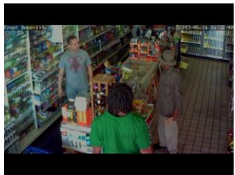
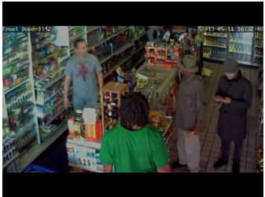

# A Benchmark & Dataset for Detecting AI-Manipulated Visual Evidence in the Court System

Kelly McConvey∗ University of Toronto Toronto, Canada

Jalehsadat Mahdavimoghaddam University of Toronto Toronto, Canada

Wentao Zhang University of Waterloo Waterloo, Canada

Karen Eltis   
University of Ottawa   
Ottawa, Canada

Sajad EbrahimiUniversity of TorontoToronto, Canada

Matina Mahdizadeh Sani University of Waterloo Waterloo, Canada

Jacquelyn Burkell University of Western Ontario London, Canada

Maura R. Grossman University of Waterloo Waterloo, Canada

Ebrahim Bagheri University of Toronto Toronto, Canada

Nima Jamali University of Waterloo Waterloo, Canada

Maksym Taranukhin University of British Columbia Vancouver, Canada

Yuntian Deng University of Waterloo Waterloo, Canada

Vered Shwartz University of British Columbia Vancouver, Canada

## Abstract

Photographic evidence is becoming increasingly vulnerable to forms of alteration and fabrication that existing legal and technical work- flows are not well equipped to evaluate. Surveillance frames, dash- cam stills, and phone photographs may be used to establish pres- ence, sequence, causation, damage, or identity, yet contemporary generative systems allow non-experts to alter or fabricate such images through ordinary prompt-based interfaces. Existing imageforensics benchmarks provide important resources for face manip- ulation, classical tampering, and general synthetic-image detection, but they are not organized around the forms of visual evidence sub- mitted in courts, the localized edits that can change what an exhibit appears to prove, or the consumer-tool threat model now facing the justice system. We introduce the CIFAR Synthetic Evidence Corpus for Detecting AI-Manipulated Images, a benchmark for evidentiary image authentication in court and justice-system contexts. The corpus contains 1,505 photographic items, including 720 authentic controls and 785 manipulated or fabricated images, spanning surveillance, dashcam, and consumer-photo imagery. Manipulations are organized into scene-condition edits, localized element edits, and full fabrications produced with contemporary generative systems. Each item is released with structured metadata covering source provenance, manipulation tier, subtype, generator, prompt

template, and scene attributes, enabling controlled evaluation be- yond aggregate binary detection. We also establish state-of-the-art baselines with publicly available image-manipulation detectors, showing that current systems exhibit error profiles that remain problematic for evidentiary use. The dataset, prompts, metadata manifest, code, and baseline evaluation scripts are released to sup- port research on visual evidence authentication, information integrity, and trustworthy AI for the justice system.

## CCS Concepts

• Computing methodologies → Computer vision; • Applied computing → Law; • Information systems → Multimedia and multimodal retrieval.

## Keywords

image forensics, evidentiary authentication, benchmark dataset, AI-generated content, visual evidence, deepfake detection

## ACM Reference Format:

Kelly McConvey, Sajad Ebrahimi, Nima Jamali, Jalehsadat Mahdavimoghaddam, Matina Mahdizadeh Sani, Maksym Taranukhin, Wentao Zhang, Jacquelyn Burkell, Yuntian Deng, Karen Eltis, Maura R. Grossman, Vered Shwartz, and Ebrahim Bagheri. 2026. A Benchmark & Dataset for Detecting AI-Manipulated Visual Evidence in the Court System. In Proceedings ofthe 35th ACM International Conference on Information and Knowledge Management (CIKM ’26), November 7–11, 2026, Rome, Italy. ACM, New York, NY, USA, 5 pages. https://doi.org/10.1145/3799682.3840194

## 1 Introduction

Courts increasingly receive photographs whose authenticity can no longer be taken for granted, including surveillance frames ofered to show that a person was present at a location, dashcam stills used to reconstruct trafic incidents, and phone photographs submitted to document damage, injury, possession, or the condition of a scene. In each case, the image is not merely visual content, but evidence whose value depends on whether the depicted scene can be trusted, whether relevant details have been altered, and whether the image can be situated within a reliable chain of provenance. This paper addresses that problem as one of evidentiary image authentication, where the task is to evaluate whether photographic evidence is authentic, manipulated, or synthetic under conditions that resemble legal and institutional use.

Photographs have never been self-authenticating records of re- ality, since courts have long required them to be connected to testi- mony, context, and procedure before they can function as evidence [11]. Historical accounts of photographic admissibility show that courts have repeatedly had to reconcile the apparent objectivity of photographs with the possibility of staging, selection, distortion, and later digital alteration [17]. The current challenge is therefore not that visual evidence has suddenly become uncertain, but that the practical conditions under which courts have managed that uncertainty have changed. Evidence that once required specialized skill to fabricate can now be altered or produced through widely available generative systems.

Fabricated and misleading evidence is not new, yet generative AI changes its cost, accessibility, and plausibility in ways that are directly relevant to evidentiary workflows. Earlier forms of pho- tographic manipulation often required specialized tools, technical expertise, or substantial efort, whereas contemporary image-generation systems allow non-experts to produce plausible visual alterations through ordinary prompt-based interfaces. A litigant, witness, or third party can change scene conditions, insert or remove salient objects, or generate a plausible image from scratch without the expertise that previously constrained visual forgery. The same technological shift also creates a second evidentiary risk, since genuine evidence may be dismissed as fabricated precisely because fabrication itself has become credible. This is the dynamic Chesney and Citron [3] describe as the liar’s dividend, and it places pressure on courts and related institutions not only to detect false evidence, but also to preserve confidence in authentic evidence.

Recent legal developments show that this concern has moved beyond speculation, as courts and judicial organizations are now confronting acknowledged and suspected AI-generated material, in- cluding fabricated legal authorities, synthetic media, and allegedly manipulated exhibits. In Mata v. Avianca [20], generative AI produced plausible but non-existent legal authorities that were sub- mitted in litigation, illustrating how synthetic material can enter formal legal processes when verification fails. More directly for visual evidence, judicial and legal scholarship has begun to ex-amine how courts should handle acknowledged and unacknowl- edged AI-generated evidence, while court-focused organizations have warned that synthetic evidence may afect public trust in judicial proceedings [14]. These developments make evidentiary image authentication a timely problem for legal institutions and for computational researchers working on information integrity, provenance, verification, and trustworthy decision support.

The evidentiary risk is not limited to fully synthetic images, because in many legal settings the more consequential manipulation is a localized or contextual edit to an otherwise ordinary photo- graph. A person may be removed from a surveillance frame, a road sign or trafic signal may be changed in a dashcam still, or visible damage may be added to or removed from a phone photograph. Such edits can alter what an image appears to prove while pre-serving most of its visual content, which makes them dificult for lay observers [1, 19] and also dificult for detectors trained mainly on whole-image synthesis or face-centered deepfakes. For eviden- tiary authentication, the relevant question is therefore not simply whether an image was generated by AI, but whether verification systems can identify the forms of manipulation that change the informational and evidentiary meaning of a visual item.

Existing datasets do not adequately support this domain. Facedeepfake corpora have enabled important progress in syntheticmedia detection, but they primarily address identity, expression, and facial manipulation rather than scene-level photographic evidence. General image-tampering datasets capture classical operations such as splicing, copy-move, and removal, but many predate prompt- driven consumer generation and do not reflect the artifacts, work- flows, or editing patterns now available to non-experts. Other pub- lic resources provide authentic surveillance, driving, or consumer imagery, yet they do not provide controlled AI-generated manipulations, prompt metadata, generator metadata, or benchmark-ready labels. What is missing is a public resource for evaluating authenti-cation systems on evidentiary image families, realistic manipulation types, consumer-interface generation, structured provenance, and detector behavior under conditions relevant to institutional use.

We introduce the CIFAR Synthetic Evidence Corpus for De- tecting AI-Manipulated Images, a dataset and benchmark for evidentiary image authentication. The corpus contains 1,505 photo-graphic items, including 720 authentic controls and 785 manipulated or fabricated images. It spans three families of visual evidence, namely surveillance imagery, dashcam stills, and consumer pho- tographs. Manipulations are organized into three tiers covering scene-condition changes, localized element edits, and complete fab- rication. The manipulated images are produced using contemporary generative systems from multiple organizations, and each item is paired with metadata describing its source provenance, evidentiary family, manipulation tier, generator, prompt template, and scene attributes.

This paper makes four contributions. First, it releases a benchmark corpus of authentic and AI-manipulated photographic evidence across surveillance, dashcam, and consumer-photo imagery. Second, it introduces a manipulation taxonomy grounded in evidentiary practice, with particular attention to localized edits that can alter the meaning of a visual exhibit while leaving most of the scene intact. Third, it provides a generation pipeline based on a realistic non-expert consumer-tool threat model. Fourth, it re- ports a zero-shot benchmark of of-the-shelf detectors, showing that current systems exhibit error profiles that remain problematic for evidentiary use. The corpus is available at https://github.com/ UofT-CIFAR/Synthetic-Evidence-Image-Corpus, DOI: 10.5281/zen-odo.22015105.

## 2 Distinction from Existing Resources

Our corpus complements rather than replaces existing image-forensics benchmarks by targeting the authentication of photographic evidence under contemporary AI-enabled manipulation. Face-manipulation corpora such as FaceForensics++, Celeb-DF, DFDC, ForgeryNet, and OpenForensics [7, 13, 15, 16, 21] primarily treat the face as the object of authentication, whereas our corpus treats the photograph as a visual claim about an event, location, object, or condition. Gen eral tampering benchmarks such as CASIA and the NIST Media Forensics Challenge datasets [8, 12] provide important coverage of splicing, copy-move, removal, and related operations, but largely reflect editing paradigms that predate consumer generative systems. Our corpus instead emphasizes prompt-driven generation and editing, including localized changes, scene-level modifications, and complete fabrication, capturing a contemporary non-expert threat model [2, 4]. Similarly, authentic-image resources such as VIRAT, UCF-Crime, BDD100K, and CASIA [8, 18, 22, 23] provide valuable source imagery but do not pair it with controlled genera- tive edits, generation metadata, and manipulation labels designed for authentication analysis.

Our corpus extends this ecosystem by organizing manipulated photographic evidence according to evidentiary family, manipulation tier and subtype, source dataset, generator, prompt, and scene attributes. This structure supports analysis beyond aggre-gate detection accuracy, allowing researchers to evaluate which evidentiary changes are detectable, which are missed, and which authentic images generate false positives. This focus addresses a gap identified by legal scholarship, which has increasingly empha- sized the need for reliable authentication of AI-generated evidence and stronger mechanisms for addressing synthetic-media risks in litigation [3, 5, 6, 10, 11]. While that literature establishes the institutional problem, it does not provide the empirical infrastructure needed to measure authentication performance on evidentiary photographs. Our corpus addresses this missing empirical layer without claiming that detection alone can resolve the legal problem; instead, it provides a benchmark for studying the reliability, failure modes, and limits of authentication systems in a setting aligned with evidentiary practice.

## 3 Resource Design and Construction

Our proposed corpus is designed for evidentiary image authentication rather than general synthetic-image detection. This setting requires a benchmark that represents the kinds of photographs submitted in legal and institutional contexts, includes manipula- tions that can change the evidentiary meaning of an image, reflects the consumer-tool threat model through which non-experts can now produce plausible edits, and provides metadata that supports controlled analysis beyond aggregate binary classification.

We operationalize these requirements along four axes. First, the corpus covers three evidentiary families: surveillance, dashcam, and consumer photographs. Second, it distinguishes three manipu lation tiers: scene-condition changes (T1), localized element edits (T2), and complete fabrication (T3); Table 1 reports the full subtype breakdown by family. Figure 1 shows representative T1 and T2 manipulations. Third, we use consumer-accessible generative systems from multiple organizations to reduce dependence on artifacts from a single provider. Fourth, each item includes metadata describing its source, evidentiary family, manipulation tier and subtype, generator, prompt, and scene attributes.

  
(a) Authentic source

  
(c) Authentic source

(b) T1: weather edit  
  
(d) T2: person added  
Figure 1: Example manipulations. Top: Tier-1 scenecondition edit adds snow to a dashcam frame. Botom: Tier-2 localized edit inserts a person into a surveillance frame.

For constructing the corpus, we first defined a fixed set ofprompt templates, each tied to a family, tier, and subtype. The templates were written to model a non-expert using a consumer image generation interface. Each prompt requests a single scoped change, asks the model to preserve all other scene content, and aims to produce a plausible evidentiary image rather than an arbitrary edit. The final prompt set contains 27 templates spanning the three families and three tiers.

We constructed the source pool from public datasets matched to the three evidentiary families: VIRAT and UCF-Crime for surveillance, BDD100K for dashcam imagery, and CASIA v2.0 for consumer photographs [8, 18, 22, 23]. Tier 1 and Tier 2 manipulations use authentic source frames, while Tier 3 images are generated directly from prompts. Candidate frames were filtered using auto- matically extracted scene attributes to satisfy predefined quotas, and no source frame is reused. Manipulated items were generated by applying the appropriate prompt template to the assigned source frame for Tier 1 and Tier 2, or from the prompt alone for Tier 3. Items were screened during generation and regenerated where the requested edit failed to appear or the scene was visibly degraded; this was not conducted as a formal annotation exercise, so we do not report inter-annotator agreement. The main corpus uses GPT Image 2, Gemini 3.1 with Nano Banana 2, and Firefly 5. GPT Image 2 and Gemini 3.1 were accessed through APIs, while Firefly 5 was accessed through its consumer interface. The corpus also includes a smaller Hero set produced through iterative human-in-the-loop refinement in Photoshop and ChatGPT. The main variants model ordinary single-pass manipulation, while the Hero set models a higher-efort adversary willing to manually refine an image.

## 4 Dataset Content and Benchmarking

To establish reference points for future work, we evaluate pub- licly available image-manipulation detectors on the corpus in a zero-shot setting. Each detector scores every image once using its released weights and default decision threshold, with no fine-tuning, and we report both threshold-free metrics (ROC-AUC, PR-AUC), which rank detectors independently of any operating point, and threshold-dependent metrics (accuracy, precision, recall, FPR) at each detector’s shipped default. The evaluation uses the DetectZoo framework [9] and treats the task as binary authentication over all 1,505 items. The detectors span released synthetic-image detectors: a difusion-reconstruction method (d3), a CLIP-feature classifier (univfd), a difusion-reconstruction contrastive detector (drct), and a CNN-based GAN-artifact detector (cnnspot).

Table 1: Manipulated image corpus by evidentiary family, source dataset, and manipulation tier.
<table><tr><td>Family</td><td>Source dataset(s)</td><td colspan="2">T1 (scene conditions)</td><td colspan="2">T2 (element edit)</td><td>T3</td><td>Total</td></tr><tr><td rowspan="4">Surveillance</td><td rowspan="4">VIRAT, UCF-Crime</td><td>Time of day</td><td>30</td><td>Swap object</td><td>28</td><td rowspan="4"></td><td rowspan="4">264</td></tr><tr><td>Weather</td><td>28</td><td>Remove person</td><td>26</td></tr><tr><td>Lighting</td><td>29</td><td>Remove signage</td><td>25</td></tr><tr><td>Crowd density</td><td>30</td><td>Add person</td><td>23</td></tr><tr><td rowspan="4">Dashcam</td><td rowspan="4">BDD100K</td><td>Time of day</td><td>29</td><td>Remove sign</td><td>30</td><td rowspan="4"></td><td rowspan="4">255</td></tr><tr><td>Weather</td><td>27</td><td>Traffic-light color</td><td>27</td></tr><tr><td>Lighting</td><td>29</td><td>Remove vehicle</td><td>27</td></tr><tr><td>Crowd density</td><td>27</td><td>Add hazard</td><td>14</td></tr><tr><td rowspan="4">Consumer photos</td><td rowspan="4">CASIA</td><td>Time of day</td><td>30</td><td>Add object</td><td>29</td><td rowspan="4"></td><td rowspan="4">266</td></tr><tr><td>Weather</td><td>30</td><td>Remove damage</td><td>28</td></tr><tr><td>Lighting</td><td>30</td><td>Swap object</td><td>25</td></tr><tr><td>Crowd density</td><td>30</td><td>Add damage</td><td>19</td></tr><tr><td>Total</td><td></td><td></td><td>349</td><td></td><td>301</td><td>135</td><td>785</td></tr></table>

Table 2: Performance of of-the-shelf detectors.
<table><tr><td>Detector</td><td>Acc.</td><td>Prec.</td><td>Rec.</td><td>FPR</td><td>ROC-AUC</td><td>PR-AUC</td></tr><tr><td>D3</td><td>0.616</td><td>0.696</td><td>0.469</td><td>0.224</td><td>0.674</td><td>0.684</td></tr><tr><td>UNIVFD</td><td>0.573</td><td>0.686</td><td>0.336</td><td>0.168</td><td>0.643</td><td>0.633</td></tr><tr><td>DRCT</td><td>0.535</td><td>0.647</td><td>0.238</td><td>0.141</td><td>0.621</td><td>0.642</td></tr><tr><td>CNNSPOT</td><td>0.478</td><td>0.500</td><td>0.003</td><td>0.003</td><td>0.639</td><td>0.587</td></tr></table>

Across all systems, performance is low: the best detector, d3, reaches only 0.674 ROC-AUC, and the rest sit near chance (Table 2). This is the central benchmarking result—of-the-shelf detectors, trained predominantly on fully synthesized GAN or difusion im-agery, transfer poorly to the localized edits and consumer-tool ma- nipulations that characterize evidentiary content. Default operating points are also poorly aligned with evidentiary use: at its shipped threshold d3 catches fewer than half of all manipulations (47% recall) yet wrongly flags 22% of authentic images as manipulated, and falsely impugning genuine evidence is the more damaging error in court. A benchmark for evidentiary authentication must therefore report this error structure, not only aggregate accuracy.

A breakdown of the strongest detector, d3, illustrates the diag- nostic value of the corpus design. Performance is uneven in ways that track evidentiary structure rather than overall dificulty. By family, dashcam imagery is markedly harder than surveillance or consumer photographs (AUC 0.55 versus 0.69 and 0.78). By generator, detectability varies sharply: items from one consumer model are far less detectable than another’s (per-generator recall ranging from

0.46 to 0.71), confirming that the corpus exposes cross-generator generalization gaps. The high-efort Hero set is the most revealing case: manually refined Photoshop edits receive extremely low manipulation scores, the lowest scoring at 0.04, and slip past the detector entirely, direct evidence that a motivated, hands-on ad- versary can defeat current systems. These findings position the corpus as a diagnostic benchmark for studying not just whether authentication systems succeed, but where they fail and which failure modes matter for evidentiary use.

## 5 Ethical Considerations

The corpus derives from publicly released research datasets and is redistributed in accordance with source licenses. No imagery was collected from human participants and no material originates from real legal proceedings. As the work involves secondary use of data with no participant interaction, it did not require research ethics board review. We draw only on the normal-activity subset of UCF-Crime; no individual appears in connection to a crime and no manipulation was designed to place an identifiable person at a real location or to attribute conduct to them. Manipulations were produced using capabilities already available through consumer interfaces so we judge the uplift from release to be small relative to the benefit to detection research.

## 6 Concluding Remarks

This paper introduces the CIFAR Synthetic Evidence Corpus for evidentiary image authentication. The corpus enables diagnostic evaluation of contemporary AI manipulations across diverse photo-graphic evidence, while our baselines show substantial weaknesses in current detectors, particularly for localized edits and authentic- image false positives. We release the corpus and benchmark in- frastructure to support future research on reliable visual evidence authentication.

## Acknowledgments

This work was supported by the Safeguarding Courts from Synthetic AI Content Solution Network, funded through the Canadian AI Safety Institute (CAISI) Research Program at CIFAR.

## GenAI Usage Disclosure

The generative models central to this work (GPT Image 2 (OpenAI), Gemini 3.1 with Nano Banana 2 (Google), and Firefly 5 (Adobe)) were used to construct the manipulated portion of the corpus, as described in Section 3. This use is the subject of the resource itself rather than an authoring aid, and all generated artifacts are released with the provenance metadata documented above.

In preparing the manuscript, the authors used Claude to assist with improving the clarity of author-written prose and generating draft LaTeX for tables. All AI-assisted text was reviewed and edited by the authors, who take full responsibility for the content of the paper. No AI system is listed as an author.

## References

[1] Sergi D Bray, Shane D Johnson, and Bennett Kleinberg. 2023. Testing human ability to detect ‘deepfake’ images of human faces. Journal ofCybersecurity 9, 1 (Jan. 2023), tyad011. doi:10.1093/cybsec/tyad011

[2] Nuria Alina Chandra, Ryan Murtfeldt, Lin Qiu, Arnab Karmakar, Hannah Lee, Emmanuel Tanumihardja, Kevin Farhat, Ben Cafee, Sejin Paik, Changyeon Lee, Jongwook Choi, Aerin Kim, and Oren Etzioni. 2025. Deepfake-Eval-2024: A Multi Modal In-the-Wild Benchmark of Deepfakes Circulated in 2024. arXiv:2503.02857 [cs] version: 1. doi:10.48550/arXiv.2503.02857

[3] Robert Chesney and Danielle Keats Citron. 2018. Deep Fakes: A Looming Chal lenge for Privacy, Democracy, and National Security. doi:10.2139/ssrn.3213954

[4] Riccardo Corvi, Davide Cozzolino, Giada Zingarini, Giovanni Poggi, Koki Nagano, and Luisa Verdoliva. 2022. On the detection of synthetic images generated by difusion models. arXiv:2211.00680 [cs]. doi:10.48550/arXiv.2211.00680

[5] Abhishek Dalal, Chongyang Gao, Hon Paul Grimm, Maura Grossman, Daniel Linna Jr, Chiara Pulice, V. S. Subrahmanian, and Hon John Tunheim. 2025. Deepfakes in Court: How Judges Can Proactively Manage Alleged AI Generated Material in National Security Cases. University ofChicago Legal Forum 2024, 1 (Jan. 2025). https://chicagounbound.uchicago.edu/uclf/vol2024/iss1/3

[6] Rebecca Delfino. 2023. Deepfakes on Trial: A Call To Expand the Trial Judge’s Gatekeeping Role To Protect Legal Proceedings from Technological Fakery. UC Law Journal 74, 2 (Feb. 2023), 293. https://repository.uclawsf.edu/hastings\_law\_ journal/vol74/iss2/3

[7] Brian Dolhansky, Joanna Bitton, Ben Pflaum, Jikuo Lu, Russ Howes, Menglin Wang, and Cristian Canton Ferrer. 2020. The DeepFake Detection Challenge (DFDC) Dataset. arXiv:2006.07397 [cs]. doi:10.48550/arXiv.2006.07397

[8] Jing Dong, Wei Wang, and Tieniu Tan. 2013. CASIA Image Tampering Detection Evaluation Database. In 2013 IEEE China Summit and International Conference on Signal and Information Processing. 422–426. doi:10.1109/ChinaSIP.2013.6625374

[9] Sajad Ebrahimi, Nima Jamali, Bardia Shirsalimian, Kelly McConvey, Wentao Zhan , Jalehsadat Mahdavimo haddam, Maks m Taranukhin, Maura Grossman, Vered Shwartz, Yuntian Deng, and Ebrahim Bagheri. 2026. DetectZoo: A Unified Toolkit for AI-Generated Content Detection Across Text, Audio, and Image Modalities. arXiv:2606.04205 [cs.MM]. doi:10.48550/arXiv.2606.04205

[10] Paul Grimm, Maura Grossman, and Gordon Cormack. 2021. Artificial Intelligence as Evidence. Northwestern Journal of Technology and Intellectual Property 19, 1

(Dec. 2021), 9. https://scholarlycommons.law.northwestern.edu/njtip/vol19/iss1/ 2

[11] Maura Grossman and Paul Grimm. 2025. Judicial Approaches to Acknowledged and Unacknowledged AI-Generated Evidence. Science and Technology Law Review 26, 2 (May 2025). doi:10.52214/stlr.v26i2.13890

[12] Haiying Guan, Mark Kozak, Eric Robertson, Yooyoung Lee, Amy Yates, Andrew Delgado, Daniel F. Zhou, Timothée N. Kheyrkhah, Jef Smith, and Jonathan G. Fiscus. 2019. MFC Datasets: Large-Scale Benchmark Datasets for Media Forensic Challenge Evaluation. In IEEE Winter Conference on Applications ofComputer Vision (WACV 2019). IEEE, Waikola, HI. Last Modified: 2019-12-31T06:12- 05:00. https://www.nist.gov/publications/mfc-datasets-large-scale-benchmarkdatasets-media-forensic-challenge-evaluation

[13] Yinan He, Bei Gan, Siyu Chen, Yichun Zhou, Guojun Yin, Luchuan Song, Lu Sheng, Jing Shao, and Ziwei Liu. 2021. ForgeryNet: A Versatile Benchmark for Comprehensive Forgery Analysis. arXiv:2103.05630 [cs]. doi:10.48550/arXiv.2103. 05630

[14] Connor Heaton, Shay Cleary, and Michael Navin. 2026. AI-generated evidence is a threat to public trust in the courts | National Center for State Courts. National Centerfor State Courts (Feb. 2026). https://www.ncsc.org/resources-courts/ai-generated-evidence-threat-public-trust-courts

[15] Trung-Nghia Le, Huy H. Nguyen, Junichi Yamagishi, and Isao Echizen. 2021. OpenForensics: Large-Scale Challenging Dataset For Multi-Face Forgery Detection And Segmentation In-The-Wild. In 2021 IEEE/CVF International Conference on Computer Vision (ICCV). IEEE Computer Society, Montreal, QC, 10097–10107. doi:10.1109/ICCV48922.2021.00996

[16] Yuezun Li, Xin Yang, Pu Sun, Honggang Qi, and Siwei Lyu. 2020. Celeb-DF: A Large-scale Challenging Dataset for DeepFake Forensics. arXiv:1909.12962 [cs]. doi:10.48550/arXiv.1909.12962

[17] Jennifer Mnookin. 1998. The Image of Truth: Photographic Evidence and the Power of Analogy. https://papers.ssrn.com/abstract=135311

[18] Sangmin Oh, Anthony Hoogs, Amitha Perera, Naresh Cuntoor, Chia-Chih Chen, Jong Taek Lee, Saurajit Mukherjee, J. K. Aggarwal, Hyungtae Lee, Larry Davis, Eran Swears, Xioyang Wang, Qiang Ji, Kishore Reddy, Mubarak Shah, Carl Vondrick, Hamed Pirsiavash, Deva Ramanan, Jenny Yuen, Antonio Torralba, Bi Song, Anesco Fon , Amit Ro -Chowdhur , and Mita Desai. 2011. A lar e-scale bench mark dataset for event reco nition in surveillance video. In CVPR 2011. CVPR 2011, Colorado Springs, Colorado, 3153–3160. doi:10.1109/CVPR.2011.5995586

[19] Thomas Roca, Anthony Cintron Roman, Jehú Torres Vega, Marcelo Duarte, Pengce Wang, Kevin White, Amit Misra, and Juan Lavista Ferres. 2025. How good are humans at detectin AI- enerated ima es? Learnin s from an ex eriment. arXiv:2507.18640 [cs] version: 1. doi:10.48550/arXiv.2507.18640

[20] William A. Ryan and Allen Garrett. 2023. Practical Lessons from the Attorney AI Missteps in Mata v. Avianca. Association of Corporate Counsel (Aug. 2023). https://www.acc.com/resource-library/practical-lessons-attorney-aimissteps-mata-v-avianca

[21] Andreas Rössler, Davide Cozzolino, Luisa Verdoliva, Christian Riess, Justus Thies, and Matthias Nießner. 2019. FaceForensics++: Learning to Detect Manipulated Facial Images. arXiv:1901.08971 [cs]. doi:10.48550/arXiv.1901.08971

[22] Waqas Sultani, Chen Chen, and Mubarak Shah. 2019. Real-world Anomaly Detection in Surveillance Videos. arXiv:1801.04264 [cs]. doi:10.48550/arXiv.1801. 04264

[23] Fisher Yu, Haofeng Chen, Xin Wang, Wenqi Xian, Yingying Chen, Fangchen Liu, Vashisht Madhavan, and Trevor Darrell. 2020. BDD100K: A Diverse Driving Dataset for Heterogeneous Multitask Learning. arXiv:1805.04687 [cs]. doi:10. 48550/arXiv.1805.04687