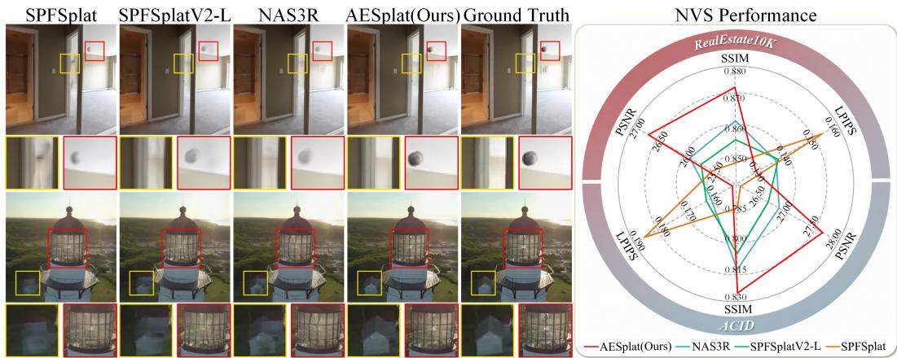
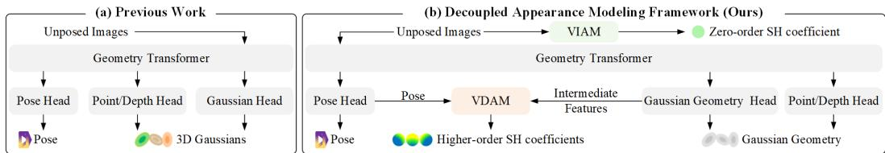
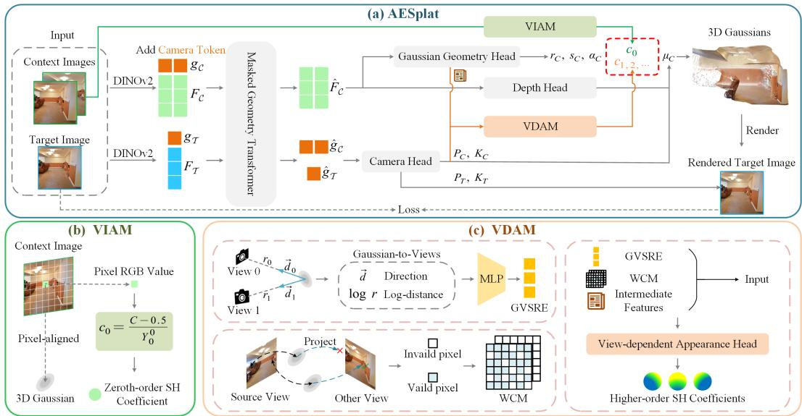
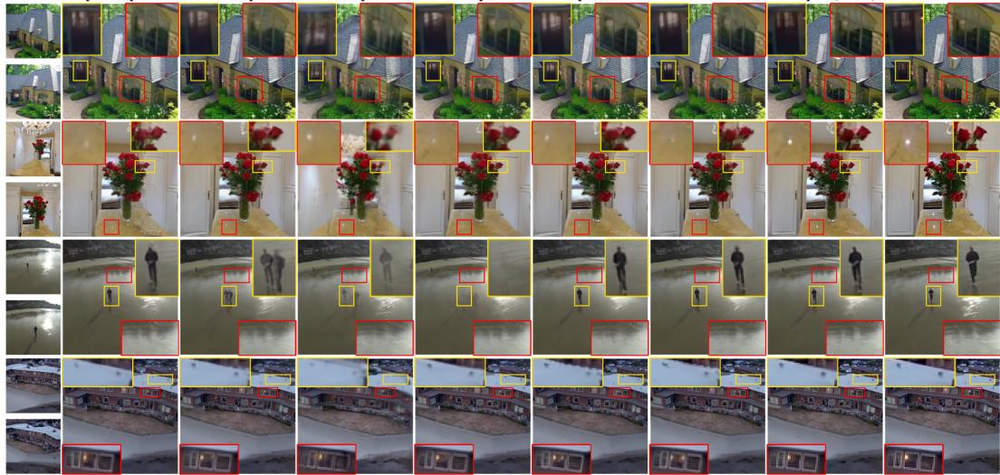
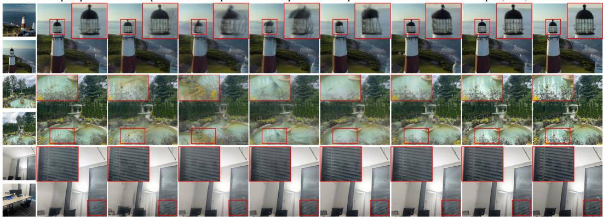
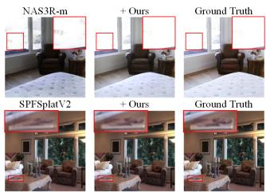
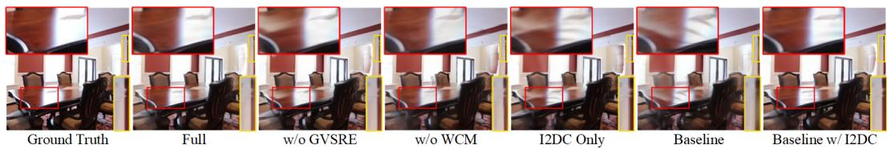

# AESPLAT: ADVANCING POSE-FREE FEED-FORWARD 3D GAUSSIAN SPLATTING VIA DECOUPLED APPEAR-ANCE MODELING

Shiwei Ren, Zhiang Liu, Yongchun Fang∗, Hongwei Chen Nankai University renshiwei@mail.nankai.edu.cn https://github.com/aesplat/AESplat

  
Figure 1: Our method AESplat consistently outperforms state-of-the-art pose-free feed-forward methods in rendering quality across both indoor and outdoor scenes. Yellow and red boxes highlight differences in diffuse (e.g., walls) and specular (e.g., mirrors and glass) appearance, respectively.

## ABSTRACT

Pose-free feed-forward 3D Gaussian Splatting (3DGS) has demonstrated remarkable potential for generalized novel view synthesis. However, existing methods typically predict Gaussian appearance attributes represented by spherical harmonics (SH) in the same manner, overlooking the fundamental distinction between view-independent and view-dependent appearance, which results in suboptimal rendering quality. In this paper, we present AESplat, a novel and general framework for pose-free feed-forward 3DGS that introduces an effective decoupled appearance modeling strategy based on an analysis of SH, enabling higher-quality rendering. Specifically, AESplat directly derives the zeroth-order SH coefficient, which represents the base view-independent appearance component, from the input images without training. The higher-order SH coefficients are subsequently predicted by a shallow multilayer perceptron equipped with two efficient 3Daware inductive biases to model view-dependent appearance variations. Extensive experiments across multiple datasets demonstrate that our method significantly outperforms state-of-the-art approaches, achieving a 0.8 dB improvement in PSNR over the pose-free method NAS3R and a 1.1 dB improvement over the pose-required method DepthSplat on the RealEstate10K dataset.

## 1 INTRODUCTION

Novel view synthesis (NVS) is a fundamental problem in computer vision and graphics, with broad applications in virtual reality, autonomous driving, and robotics. 3D Gaussian Splatting (3DGS) (Kerbl et al., 2023) enables high-fidelity real-time rendering, yet conventional approaches rely on costly per-scene optimization, hindering their deployment in user-friendly applications. Feed-forward 3DGS overcomes this limitation by directly regressing Gaussian primitives from input images in a single forward pass, enabling efficient and generalizable NVS for unseen scenes.

Most feed-forward 3DGS methods rely on accurate camera poses from SfM (Schonberger & Frahm, 2016), limiting their applicability to unposed image collections. To eliminate this dependency, recent studies have explored pose-free feed-forward 3DGS, reconstructing scenes directly from unposed images. Notably, many pose-free methods build upon powerful 3D foundation models (3DFMs) designed for geometric perception, such as point clouds, depth maps, and camera poses. For instance, several existing methods (Smart et al., 2024; Ye et al., 2025; Huang & Mikolajczyk, 2025a) build on MASt3R (Leroy et al., 2024), while others (Jiang et al., 2025; Huang et al., 2026) leverage VGGT (Wang et al., 2025). Powered by their pretrained representations, these pose-free methods achieve high-quality rendering and can even outperform pose-required approaches.

Despite encouraging progress, pose-free methods still exhibit a substantial rendering-quality gap compared to optimization-based approaches. As illustrated in Fig. 2a, building on pretrained 3DFMs, recent methods typically use predicted point clouds or depth maps to determine Gaussian positions, while the same multi-view features from the geometry transformer are used to predict the remaining geometric attributes. In contrast, all spherical harmonics (SH) coefficients representing the Gaussian appearance are jointly predicted by an additional Gaussian head. This disparity suggests that geometry modeling increasingly benefits from advances in 3DFMs, whereas appear ance modeling remains relatively simple and largely follows a homogeneous prediction paradigm. This motivates us to investigate appearance modeling as an important yet underexplored factor for improving rendering quality. As discussed in Sec. 4.1, the zeroth-order SH basis function is viewindependent, whereas higher-order SH terms are view-dependent, indicating their corresponding coefficients play distinct roles in representing appearance. Therefore, simply predicting these two appearance components in the same manner may limit the model’s rendering capability.

To address this limitation, we propose AESplat, a novel and general framework for pose-free feedforward 3DGS, as illustrated in Fig. 2b, which decoupledly models appearance to improve rendering quality. Our key insight is that SH coefficients play fundamentally different roles in appearance representation. The main challenge lies in simultaneously and effectively modeling both viewindependent and view-dependent appearance. For view-independent appearance, we observe that, under the pixel-aligned Gaussian paradigm, the pixel already provides a strong observation of the base appearance for its corresponding Gaussian. Instead of re-predicting this explicitly observed information, we directly derive the zeroth-order SH coefficient from the pixel RGB value without training. For view-dependent appearance, we believe that explicit 3D-aware inductive biases remain crucial for correctly modeling this multi-view attribute. Based on this, we design two effective inductive biases: Gaussian-to-Views Spatial Relation Embedding (GVSRE) and Warped Color Map (WCM). Furthermore, we use a shallow multilayer perceptron (MLP) that uses GVSRE and WCM as inputs to predict higher-order SH coefficients to effectively model view-dependent appearance. As shown in Fig. 1, our method effectively models these two appearances, substantially improving rendering quality. In summary, our main contributions are as follows:

• We propose AESplat, a novel and general framework for pose-free feed-forward 3DGS, which revisits Gaussian appearance modeling through the lens of SH and shift from unified to decoupled appearance modeling, enabling higher-quality rendering.

• We develop an effective decoupled strategy for appearance modeling. The zeroth-order SH coefficient of pixel-aligned Gaussians is directly obtained from the input images in a training-free manner. The higher-order SH coefficients are predicted by a shallow MLP conditioned on two effective 3D-aware inductive biases, GVSRE and WCM.

• Extensive experiments on multiple challenging benchmarks demonstrate that our method consistently achieves new state-of-the-art (SOTA) performance in rendering quality among both posefree and pose-required feed-forward 3DGS methods.

## 2 RELATED WORK

Pose-required Feed-Forward 3DGS. Feed-forward 3DGS has emerged as a mainstream paradigm for more generalizable NVS, without per-scene optimization. Most existing feed-forward 3DGS methods (Charatan et al., 2024; Chen et al., 2024a;b; Zhang et al., 2025a; Xu et al., 2025b;a; Ye et al., 2026) rely on accurate camera poses obtained via SfM for differentiable rendering during training and inference. Additionally, some methods (Zhang et al., 2024; Tang et al., 2024; Jin et al., 2025) convert camera poses into Plucker ray maps (Pl¨ ucker, 1865), which are jointly fed into the¨ transformer with the input images to predict Gaussian representations. However, their reliance on accurate camera poses limits their applicability to unposed image collections. In contrast, our approach operates in the pose-free setting, eliminating the need for ground-truth camera poses.

  
Figure 2: Architectural Differences. Unlike (a) existing pose-free methods that predict all appearance attributes with a unified prediction head, (b) we adopt a decoupled formulation that employs tailored strategies to model view-independent and view-dependent appearance separately.

Pose-free Feed-Forward 3DGS. Recent work has increasingly explored pose-free feed-forward 3DGS without ground-truth camera poses. NoPoSplat (Ye et al., 2025) predicts 3D Gaussians in a canonical coordinate system directly from unposed images and further estimates relative camera poses during inference. To remove the need for ground-truth poses during rendering, several selfsupervised pose-free frameworks have been proposed. PF3Splat (Hong et al., 2025) estimates camera poses from predicted depth and point correspondences via classical pose estimation techniques, followed by coarse-to-fine Gaussian reconstruction. SPFSplat (Huang & Mikolajczyk, 2025a) and its successor SPFSplatV2 (Huang & Mikolajczyk, 2025b) unify Gaussian prediction and camera pose estimation within a single feed-forward architecture. More recently, NAS3R (Huang et al., 2026) further demonstrates strong reconstruction capability without pretrained weights. Despite their promising performance, these methods uniformly regress Gaussian appearance without explicitly accounting for the distinct roles of zeroth-order and higher-order SH components in appearance representation, limiting rendering quality. Instead, our method adopts a decoupled appearance modeling framework with dedicated designs for each component to achieve higher-quality rendering.

Appearance Modeling in 3DGS. 3DGS (Kerbl et al., 2023) typically models Gaussian appearance with SH, while subsequent works improve its expressiveness through shading functions (Jiang et al., 2024), anisotropic spherical Gaussian appearance fields (Yang et al., 2024), or mirrored counterparts (Liu et al., 2024). However, their per-scene optimization limits efficiency and generalization. Recently, some pose-free feed-forward methods (Zhang et al., 2025b; Zhao et al., 2026; Jeong et al., 2026) leverage estimated camera poses to either predict all Gaussian attributes or fine-tune them using predicted attribute offsets. However, they still treat all SH coefficients uniformly, without distinguishing their fundamentally different roles. Unlike these methods, we explicitly exploit the functional distinction between zeroth-order and higher-order SH components and adopt tailored modeling strategies for them to improve rendering quality.

## 3 BACKGROUND: POSE-FREE FEED-FORWARD 3D GAUSSIAN SPLATTING

Our method is built upon NAS3R (Huang et al., 2026), a recent pose-free feed-forward 3D reconstruction method. It jointly estimates camera parameters and reconstructs 3D Gaussians from N unposed input images $\{ I ^ { v } \} _ { v = 1 } ^ { N }$ , which comprise $N _ { \mathcal { C } }$ context images $\mathcal { T } _ { \mathcal { C } }$ and $N _ { \mathcal { T } }$ target images $\mathcal { T } _ { T }$

Masked Geometry Transformer. The geometry transformer employs a ViT-based encoder-decoder architecture (Dosovitskiy et al., 2021) to extract multi-view features. Following the backbone design, each input image is first patchified and encoded by DINOv2 (Oquab et al., 2023) into image features $\pmb { F } ^ { v }$ . These features are then concatenated with a learnable camera token $\pmb { g } ^ { v }$ to form the input tokens for the decoder. The decoder employs Alternating-Attention (Wang et al., 2025) to aggregate information across multiple views, with masked attention (Huang & Mikolajczyk, 2025b) restricting interactions such that context tokens attend only to context tokens, while target tokens attend to both. This prevents target-view information from affecting Gaussian reconstruction while enabling pose estimation from global scene context.

  
Figure 3: Pipeline of AESplat. (a) Given unposed images, AESplat jointly predicts camera poses and Gaussian primitives in a single forward pass, with their appearance attributes obtained through decoupled appearance modeling. (b) Leveraging the strong observation provided by the input image itself, the zeroth-order SH coefficient of each pixel-aligned Gaussian is directly derived from its corresponding pixel RGB value. (c) Higher-order SH coefficients are predicted by a view-dependent appearance head, which takes two effective 3D-aware inductive biases, GVSRE and WCM, enabling more accurate modeling of view-dependent appearance.

Camera Parameter Estimation. Given refined camera tokens $\hat { \pmb { g } } ^ { v }$ , the camera head predicts camera extrinsics $P ^ { v  1 }$ and intrinsics $\pmb { K } ^ { v }$ for each view. Extrinsics use a 6D rotation representation and a 4D homogeneous translation vector, which are converted into a homogeneous transformation matrix. The first view is defined as the canonical frame. Intrinsics are parameterized by the field of view (FOV), assuming equal horizontal and vertical FOVs and a centered principal point.

Gaussian Prediction. Given refined context tokens $\hat { F } _ { { \mathcal C } } ^ { v } .$ the Gaussian prediction module estimates 3D Gaussians using two DPT (Ranftl et al., 2021) heads. One predicts depth to recover Gaussian centers with the estimated camera parameters, while the other predicts rotation, scale, opacity, and SH coefficients. All Gaussians are transformed into the canonical frame of the first view:

$$
\{ \mathcal { G } ^ { v \to 1 } \} _ { v = 1 } ^ { N _ { c } } = \{ ( \pmb { \mu } _ { j } ^ { v \to 1 } , \pmb { r } _ { j } ^ { v \to 1 } , \pmb { s } _ { j } , \alpha _ { j } , \pmb { c } _ { j } ^ { v \to 1 } ) \} _ { j = 1 } ^ { H \times W } ,\tag{1}
$$

where $\pmb { \mu } \in \mathbb { R } ^ { 3 } , \pmb { r } \in \mathbb { R } ^ { 4 } , \pmb { s } \in \mathbb { R } ^ { 3 } , \alpha \in \mathbb { R }$ , and $\pmb { c } \in \mathbb { R } ^ { ( l + 1 ) ^ { 2 } \times 3 }$ denote the Gaussian center, rotation quaternion, scale, opacity, and SH coefficients, respectively, with l denoting the SH degree.

## 4 AESPLAT

We propose AESplat, a novel and general pose-free feed-forward 3DGS framework that employs a decoupled strategy to predict view-independent and view-dependent Gaussian appearances separately. Given a pair of unposed images, our method jointly predicts Gaussian primitives in a canonical space together with the corresponding camera parameters. For view-independent appearance, we leverage a training-free strategy that directly drives the zeroth-order SH coefficient from the input images. Based on the predicted relative camera poses, we develop two effective 3D-aware inductive biases, GVSRE and WCM, to guide view-dependent appearance modeling through a shallow MLP. Through this effective decoupled appearance modeling strategy, our method produces a higher-quality Gaussian representation, resulting in better novel-view rendering.

The overall pipeline is illustrated in Fig. 3. We first present the motivation for our decoupled appearance modeling strategy in Sec. 4.1. We then describe in detail the proposed strategy in Sec. 4.2 and Sec. 4.3. Finally, the overall training objectives are described in Sec. 4.4.

## 4.1 MOTIVATION

Our motivation stems from a detailed analysis of SH. SH forms an orthogonal basis for functions defined on the sphere. In vanilla 3DGS (Kerbl et al., 2023), the appearance of each Gaussian $\mathcal { G }$ is represented by a linear combination of SH basis functions:

$$
\begin{array} { r } { C _ { \mathcal { G } } ( d ) = \operatorname* { m a x } \Big ( \underbrace { 0 . 5 + c _ { 0 } ^ { 0 } Y _ { 0 } ^ { 0 } } _ { \mathrm { v i e w - i n d e p e n d e n t a p p e a r a n c e } } + \underbrace { \sum _ { l = 1 } ^ { L } \sum _ { m = - l } ^ { l } c _ { l } ^ { m } Y _ { l } ^ { m } ( d ) } _ { \mathrm { v i e w - d e p e n d e n t a p p e a r a n c e } } , \quad 0 \Big ) . } \end{array}\tag{2}
$$

where d denotes the viewing direction, $Y _ { l } ^ { m } ( \cdot )$ denotes the real SH basis function of degree l and order $m ,$ , and $\boldsymbol { c } _ { l } ^ { m } \in \mathbb { R } ^ { 3 }$ is the corresponding learnable SH coefficient. In particular, the zeroth-order SH basis is a constant given by $\begin{array} { r } { Y _ { 0 } ^ { 0 } \ = \ \frac { \mathbf { \breve { 1 } } } { 2 \mathbf { \breve { \sigma } } \pi } } \end{array}$ , which is independent of the viewing direction. In contrast, higher-order SH basis functions are dependent on the viewing direction. This indicates that the zeroth-order coefficient corresponds to view-independent appearance, while higher-order SH terms correspond to view-dependent effects. Motivated by this distinction, we argue that predicting SH coefficients corresponding to different appearances in the same manner is suboptimal. Therefore, we adopt a decoupled approach that models the two components with tailored strategies.

## 4.2 VIEW-INDEPENDENT APPEARANCE MODELING (VIAM)

For the basic view-independent appearance represented by the zeroth-order SH coefficient, we observe that the pixel corresponding to each Gaussian provides strong direct information. Rather than designing an additional network to predict it, we directly derive the zeroth-order SH coefficient of each pixel-aligned Gaussian from its corresponding pixel RGB value. Specifically, given a pixel color $\bar { \boldsymbol { C } } _ { i } ^ { v } \in \bar { \mathbb { R } } ^ { 3 }$ for pixel j in context view v, we convert it to the zeroth-order SH coefficient by following the initialization strategy of the vanilla 3DGS (Kerbl et al., 2023):

$$
c _ { 0 } ^ { 0 } ( v , j ) = \frac { C _ { j } ^ { v } - 0 . 5 } { Y _ { 0 } ^ { 0 } } .\tag{3}
$$

This strategy, which we term Image-to-Direct Component (I2DC), provides a reliable estimation for the zeroth-order appearance component while avoiding the need to relearn color information already present in the input images. As shown in the ablation study in Sec. 5.3, the model is still able to achieve comparable rendering quality without higher-order SH coefficients.

## 4.3 VIEW-DEPENDENT APPEARANCE MODELING (VDAM)

As discussed above, higher-order SH coefficients are closely tied to view-dependent appearance. We therefore argue that explicit view information is essential for accurately estimating these coefficients. To better capture such complex view-dependent effects, we introduce a view-dependent appearance prediction head to estimate the higher-order SH coefficients. Unlike previous approaches that directly encode the ground-truth camera poses or convert them into Plucker ray embeddings for¨ interaction within a Transformer, we instead design two effective 3D-aware inductive biases based on the predicted camera parameters and provide them as inputs to the appearance prediction head. These biases encode the 3D spatial relationships between Gaussians and different viewpoints, as well as cross-view color information. This enables the network to more effectively model appear ance variations under different viewing directions.

Gaussian-to-Views Spatial Relation Embedding (GVSRE). As illustrated in Fig. 3c, we model the observation of each Gaussian from different viewpoints through the spatial relationship between its center and the corresponding viewpoint. For each Gaussian and viewpoint center, we adopt a compact representation (Jeong et al., 2026), consisting of a 3D directional vector and a scalar logdistance value. Specifically, for each Gaussian center $\mu _ { j } ^ { v _ { s } }$ from view $v _ { s } \in \mathcal { T } _ { C }$ , we form a multi-view spatial descriptor by concatenating its spatial relationship with each context camera center ${ \pmb O } ^ { v _ { c } } \in \mathbb { R } ^ { 3 }$

$$
\begin{array} { r } { \mathbf { r } _ { j } ^ { v _ { s } } = \big \| _ { v _ { c } \in \mathcal { T } _ { c } } \left[ \frac { \pmb { \sigma } ^ { v _ { c } } - \pmb { \mu } _ { j } ^ { v _ { s } } } { \| \pmb { \sigma } ^ { v _ { c } } - \pmb { \mu } _ { j } ^ { v _ { s } } \| _ { 2 } } , \log \| \pmb { \sigma } ^ { v _ { c } } - \pmb { \mu } _ { j } ^ { v _ { s } } \| _ { 2 } \right] \in \mathbb { R } ^ { 4 | \mathcal { V } _ { c } | } , } \end{array}\tag{4}
$$

where denotes concatenation over all context views. A shallow MLP then maps each $\mathbf { r } _ { j } ^ { v _ { s } }$ to a spatial relation embedding, GVSRE. Unlike the fine-tune method (Jeong et al., 2026), which encodes the pose feature only with respect to the target view, our GVSRE aggregates spatial relationships from all context cameras, providing a globally consistent geometric cue for appearance prediction.

Warped Color Map (WCM). In addition to GVSRE, we introduce a novel module that explicitly provides the view-dependent appearance head with the observed color of each Gaussian from the other context view, providing complementary appearance cue for view-dependent appearance prediction. Concretely, we project each source Gaussian center into the neighboring context view and sample its RGB observation. For a context view $v _ { p } \in \mathcal { T } c$ , the projected coordinate of Gaussian $\mathcal { G } _ { j }$ in other view $v _ { q } \in \mathcal { T } c$ is

$$
{ \pmb u } _ { j } ^ { v _ { q }  v _ { p } } = \pi ( { \pmb K } ^ { v _ { q } } { \pmb T } ^ { v _ { q }  v _ { p } } { \pmb \mu } _ { j } ^ { v _ { p } } ) ,\tag{5}
$$

where $\pmb { K } ^ { v _ { q } }$ denotes the intrinsic matrix of view $v _ { q } , T ^ { v _ { q }  v _ { p } }$ denotes the camera-to-camera transformation from view $v _ { p }$ to $v _ { q }$ , and $\pi ( \cdot )$ denotes the perspective projection. The warped color $\hat { C } _ { j } ^ { v _ { q }  v _ { p } }$ is obtained from $\pmb { I } ^ { v _ { q } }$ via bilinear interpolation at $\boldsymbol { u } _ { j } ^ { v _ { q }  v _ { p } }$ . We also compute a binary validity mask:

$$
m _ { j } ^ { v _ { q }  v _ { p } } = \mathbb { 1 } [ z _ { j } ^ { v _ { q }  v _ { p } } > 0 ] \cdot \mathbb { 1 } [ u _ { j } ^ { v _ { q }  v _ { p } } \in \Omega ] ,\tag{6}
$$

where $z _ { j } ^ { v _ { q }  v _ { p } }$ denotes the depth of the projected point in view $v _ { q } .$ , and Ω denotes the normalized image domain. Consequently, $m _ { i } ^ { v _ { q }  v _ { p } } = 1$ only if the projected point lies in front of the camera and falls within the image boundaries. Aggregating the warped colors and validity masks of all $H \times W$ Gaussians in view $v _ { p }$ produces the warped color map $\hat { C } ^ { v _ { q }  v _ { p } }$ and the corresponding validity mask $M ^ { v _ { q }  v _ { p } }$ in view $v _ { q } ,$ which together form the WCM.

View-dependent Appearance Prediction. We employ a four-layer MLP as the view-dependent appearance head, with GELU (Hendrycks & Gimpel, 2016) activations after the first three hidden layers and a linear output layer to predict view-dependent appearance. It takes the GVSRE, the WCM, and the intermediate features from the Gaussian geometry head as input. After layer normalization, the view-dependent appearance head predicts the higher-order SH coefficients.

## 4.4 LOSS FUNCTION

During training, the model is optimized solely using the photometric error between the rendered image and the corresponding ground-truth image at the target view. The training objective combines the MSE and LPIPS (Zhang et al., 2018) losses, formulated as

$$
\begin{array} { r } { \mathcal { L } = \lambda _ { \mathrm { m s e } } \left. I _ { \mathrm { r e n d e r } } - I _ { \mathrm { g t } } \right. _ { 2 } ^ { 2 } + \lambda _ { \mathrm { l p i p s } } \mathrm { L P I P S } ( I _ { \mathrm { r e n d e r } } , I _ { \mathrm { g t } } ) , } \end{array}\tag{7}
$$

where $\pmb { I } _ { \mathrm { r e n d e r } }$ and $\pmb { I } _ { \mathrm { g t } }$ denote the rendered image and the corresponding ground-truth image, respectively, and $\lambda _ { \mathrm { m s e } }$ and $\lambda _ { \mathrm { l p i p s } }$ are the corresponding loss weights.

## 5 EXPERIMENTS

## 5.1 EXPERIMENTAL SETTINGS

Datasets. We train and evaluate our method on RealEstate10K (Zhou et al., 2018) and ACID (Liu et al., 2021) with the official train/test splits used in prior work (Ye et al., 2025; Huang & Mikolajczyk, 2025a). RealEstate10K consists of large-scale indoor real-estate tour videos, whereas ACID covers outdoor natural environments filmed from aerial platforms. To evaluate cross-dataset generalization, we additionally evaluate on ACID, the large-scale outdoor dataset DL3DV (Ling et al., 2024), and the indoor dataset ScanNet++ (Yeshwanth et al., 2023).

Baselines. We compare our method against several SOTA approaches, including pose-required methods (pixelSplat (Charatan et al., 2024), MVSplat (Chen et al., 2024a), DepthSplat (Xu et al., 2025b), and YoNoSplat (Ye et al., 2026)), supervised pose-free methods (Splatt3R (Smart et al., 2024) and NoPoSplat (Ye et al., 2025)), and self-supervised pose-free methods (SelfSplat (Kang et al., 2025), PF3Splat (Hong et al., 2025), SPFSplat (Huang & Mikolajczyk, 2025a), SPFSplatV2- L (Huang & Mikolajczyk, 2025b), and NAS3R (Huang et al., 2026)).

Table 1: Performance comparison of novel view synthesis on RealEstate10K and ACID datasets. We report the average metrics across all test scenes. The best and second-best results are highlighted. − indicates that the result was not reported in the original paper.
<table><tr><td rowspan="2">Method</td><td colspan="3">RealEstate10K</td><td colspan="3">ACID</td></tr><tr><td>PSNR↑</td><td>SSIM ↑</td><td>LPIPS ↓</td><td>PSNR ↑</td><td>SSIM↑</td><td>LPIPS ↓</td></tr><tr><td>Supervised Pose-required</td><td></td><td></td><td></td><td></td><td></td><td></td></tr><tr><td>pixelSplat (Charatan et al., 2024)</td><td>23.859</td><td>0.808</td><td>0.184</td><td>25.889</td><td>0.780</td><td>0.194</td></tr><tr><td>MVSplat (Chen et al., 2024a)</td><td>24.012</td><td>0.812</td><td>0.175</td><td>25.561</td><td>0.775</td><td>0.195</td></tr><tr><td>DepthSplat (Xu et al., 2025b)</td><td>25.595</td><td>0.852</td><td>0.145</td><td></td><td></td><td></td></tr><tr><td>YoNoSplat (Ye et al., 2026)</td><td>24.233</td><td>0.813</td><td>0.162</td><td></td><td></td><td></td></tr><tr><td>Supervised Pose-free</td><td></td><td></td><td></td><td></td><td></td><td></td></tr><tr><td>Splatt3R (Smart et al., 2024)</td><td>18.688</td><td>0.337</td><td>0.596</td><td>18.060</td><td>0.510</td><td>0.407</td></tr><tr><td>NoPoSplat (Ye et al., 2025)</td><td>25.033</td><td>0.838</td><td>0.160</td><td>25.961</td><td>0.781</td><td>0.189</td></tr><tr><td>Self-Supervised Pose-free</td><td></td><td></td><td></td><td></td><td></td><td></td></tr><tr><td>SelfSplat (Kang et al., 2025)</td><td>19.152</td><td>0.680</td><td>0.328</td><td>22.089</td><td>0.694</td><td>0.298</td></tr><tr><td>PF3Splat (Hong et al., 2025)</td><td>21.042</td><td>0.739</td><td>0.233</td><td>21.206</td><td>0.632</td><td>0.293</td></tr><tr><td>SPFSplat (Huang &amp; Mikolajczyk, 2025a)</td><td>25.484</td><td>0.847</td><td>0.153</td><td>26.070</td><td>0.781</td><td>0.186</td></tr><tr><td>SPFSplatV2-L (Huang &amp; Mikolajczyk, 2025b)</td><td>25.668</td><td>0.855</td><td>0.137</td><td>26.674</td><td>0.806</td><td>0.162</td></tr><tr><td>NAS3R (Huang et al., 2026)</td><td>25.888</td><td>0.861</td><td>0.136</td><td>26.832</td><td>0.813</td><td>0.160</td></tr><tr><td>AESplat (Ours)</td><td>26.691</td><td>0.872</td><td>0.128</td><td>27.679</td><td>0.825</td><td>0.151</td></tr></table>

Ref.  
pixelSplat  
NoPoSplat  
SelfSplat  
SPFSplat  
SPFSplatV2-L  
NAS3R  
AESplat(Ours)  
Ground Truth  
  
Figure 4: Qualitative results of Tab. 1. The leftmost column shows the two-view context images. The top two rows are from RealEstate10K, and the bottom two are from ACID.

Evaluation Protocol. To evaluate performance, we report commonly used metrics for novel-view rendering quality, including PSNR (dB), SSIM (Wang et al., 2004), and LPIPS (Zhang et al., 2018).

Implementation Details. AESplat is implemented in PyTorch, and all models are trained on a single NVIDIA A6000 GPU. Following NAS3R (Huang et al., 2026), we adopt the same training setup, where each sample consists of two context views and one target view at an input resolution of $2 \bar { 2 } 4 \times 2 2 4$ . We use the AdamW (Loshchilov & Hutter, 2019) optimizer with a learning rate of $3 \times 1 0 ^ { - 4 }$ for the view-dependent appearance head, while keeping the same learning rate as NAS3R for the remaining modules. We use a batch size of 10 and train for 400k iterations. $\lambda _ { \mathrm { m s e } } = 1$ $\lambda _ { \mathrm { l p i p s } } = 0 . 0 5$ . Additional implementation details are provided in the supplementary material.

## 5.2 RESULTS

Novel View Synthesis. As shown in Tab. 1, AESplat achieves new SOTA performance across all evaluation metrics on both RealEstate10K and ACID. Compared with NAS3R, our method improves PSNR by 0.803 dB on RealEstate10K and 0.847 dB on ACID, with consistent improvements in SSIM and LPIPS. The qualitative comparisons in Fig. 4 show that our method consistently recovers finer, sharper, and more faithful appearance details across diverse scenes, demonstrating the effectiveness of our decoupled appearance modeling strategy.

NoPoSplat  
NAS3R  
Ground Truth  
Table 2: Cross-dataset generalization. All methods are trained on RealEstate10K and evaluated in a zero-shot setting on ACID, DL3DV, and ScanNet++.
<table><tr><td rowspan="2">Method</td><td colspan="3">ACID</td><td colspan="3">DL3DV</td><td colspan="3">ScanNet++</td></tr><tr><td>PSNR ↑</td><td>SSIM ↑</td><td>LPIPS↓</td><td>PSNR ↑</td><td>SSIM↑</td><td>LPIPS ↓</td><td>PSNR↑</td><td>SSIM↑</td><td>LPIPS ↓</td></tr><tr><td colspan="10">Supervised Pose-required</td></tr><tr><td>pixelSplat</td><td>25.477</td><td>0.770</td><td>0.207</td><td>18.688</td><td>0.582</td><td>0.354</td><td>18.422</td><td>0.720</td><td>0.278</td></tr><tr><td>MVSplat</td><td>25.525</td><td>0.773</td><td>0.199</td><td>17.786</td><td>0.545</td><td>0.357</td><td>17.138</td><td>0.687</td><td>0.297</td></tr><tr><td>DepthSplat</td><td>26.012</td><td>0.791</td><td>0.185</td><td>19.553</td><td>0.611</td><td>0.285</td><td>20.775</td><td>0.760</td><td>0.254</td></tr><tr><td>YoNoSplat</td><td>24.246</td><td>0.721</td><td>0.222</td><td>19.636</td><td>0.594</td><td>0.311</td><td>21.075</td><td>0.744</td><td>0.254</td></tr><tr><td colspan="10">Supervised Pose-free</td></tr><tr><td>NoPoSplat</td><td>25.764</td><td>0.776</td><td>0.199</td><td>19.974</td><td>0.612</td><td>0.305</td><td>22.136</td><td>0.798</td><td>0.232</td></tr><tr><td colspan="10">Self-Supervised Pose-free</td></tr><tr><td>SelfSplat</td><td>22.204</td><td>0.686</td><td>0.316</td><td>15.047</td><td>0.410</td><td>0.498</td><td>13.277</td><td>0.538</td><td>0.534</td></tr><tr><td>SPFSplat</td><td>25.965</td><td>0.781</td><td>0.190</td><td>19.172</td><td>0.573</td><td>0.315</td><td>19.971</td><td>0.738</td><td>0.265</td></tr><tr><td>SPFSplatV2-L</td><td>26.361</td><td>0.796</td><td>0.169</td><td>19.743</td><td>0.613</td><td>0.277</td><td>21.796</td><td>0.811</td><td>0.200</td></tr><tr><td>NAS3R</td><td>26.663</td><td>0.807</td><td>0.166</td><td>19.842</td><td>0.628</td><td>0.274</td><td>21.028</td><td>0.799</td><td>0.210</td></tr><tr><td>AESplat (Ours)</td><td>27.375</td><td>0.819</td><td>0.156</td><td>20.430</td><td>0.648</td><td>0.259</td><td>21.892</td><td>0.812</td><td>0.199</td></tr></table>

DepthSplat  
YoNoSplat  
SPFSplat  
SPFSplatV2-L  
  
Figure 5: Qualitative results of Tab. 2. From top to bottom, the three rows show zero-shot results on ACID, DL3DV, and ScanNet++ when trained on RealEstate10K.

Table 3: Baseline Generality. Our approach consistently improves the performance of different Baselines.
<table><tr><td rowspan="2">Method</td><td colspan="3">RealEstate10K</td></tr><tr><td>PSNR ↑</td><td>SSIM ↑</td><td>LPIPS ↓</td></tr><tr><td>NAS3R-m +Ours</td><td>25.814 26.294</td><td>0.856 0.860</td><td>0.149 0.141</td></tr><tr><td rowspan="2">SPFSplatV2 +Ours</td><td>25.693</td><td>0.853</td><td>0.149</td></tr><tr><td>26.181</td><td>0.859</td><td>0.141</td></tr></table>

  
Figure 6: Qualitative results of Tab. 3.

Cross-Dataset Generalization. To evaluate our method under cross-dataset distribution shifts, we train exclusively on the RealEstate10K dataset and perform zero-shot evaluation on ACID, DL3DV, and ScanNet++. As shown in Tab. 2 and Fig. 5, our method achieves the best overall performance across all three datasets, outperforming existing methods on nearly all metrics. These results demonstrate that our proposed strategy learns transferable representations that generalize beyond the training distribution of RealEstate10K.

Baseline Generality. To evaluate the generality of our approach, we further apply our decoupled appearance modeling strategy to NAS3R-m and SPFSplatV2, both of which use MASt3R as their backbone. As shown in Tab. 3 and Fig. 6, our strategy consistently improves rendering quality across different baselines, demonstrating its strong adaptability and generalizability to diverse methods.

  
Figure 7: Qualitative results of Tab. 4. GVSRE and WCM model view-dependent appearance variations (red boxes), while I2DC better preserves the base appearance component (yellow boxes).

## 5.3 ABLATION STUDIES

We provide results on ablation studies in Tab. 4 and Fig. 7. For a fair comparison, all models are trained on RealEstate10K for 50K steps, following SelfSplat (Kang et al., 2025).

No GVSRE. GVSRE encodes the spatial relationships between each Gaussian and all context views, providing the appearance head with explicit cues about how the Gaussian is observed from different viewpoints. As shown in Tab. 4, removing GVSRE causes a 0.269 dB drop in PSNR. Qualitatively, the reflection on the tabletop becomes noticeably blurred, indicating that the spatial cues provided by GVSRE are important for faithfully modeling view-dependent details.

No WCM. WCM provides cross-view appearance observations of each Gaussian by warping its color to other context views, offering complementary evidence for capturing view-dependent variations. As shown in Tab. 4 and Fig. 7, removing WCM causes a 0.256 dB drop in PSNR, while the tabletop reflection is visibly blurred in the qualitative comparison.

I2DC. We remove the view-dependent branch and retain only the view-independent appearance modeled by I2DC. As shown in Tab. 4, this variant achieves comparable rendering quality to the baseline, with only a 0.144 dB gap in PSNR, validating the effectiveness of I2DC. Replacing the zeroth-order SH coefficients in the baseline with those derived by I2DC further improves PSNR by 0.154 dB and yields more faithful reconstruction of wall appearance. These results demonstrate that I2DC effectively models view-independent appearance.

## 5.4 LIMITATIONS

Despite the strong rendering quality achieved by our method, several limitations remain. Despite the strong rendering quality achiev First, our method inherits an inherent limita- First, our method inherits an inherent limita-

tion of the feed-forward NVS paradigm: content that is completely absent from the context views cannot be reliably reconstructed, as no visual evidence is available for such regions. Second, I2DC directly derives the DC component from the observed RGB values, which only approximates view-independent appearance under severe exposure variations and non-Lambertian specularities. Future work could explore more accurate estimation and disentanglement of view-independent appearance.

Table 4: Ablations. We evaluate the contribution of the proposed method on RealEstate10K.
<table><tr><td>Method</td><td>PSNR↑</td><td>SSIM↑</td><td>LPIPS↓</td></tr><tr><td>Full</td><td>24.268</td><td>0.821</td><td>0.160</td></tr><tr><td>(1) w/o GVSRE</td><td>23.999</td><td>0.816</td><td>0.163</td></tr><tr><td>(2) w/o WCM</td><td>24.012</td><td>0.818</td><td>0.161</td></tr><tr><td>(3) I2DC only</td><td>23.610</td><td>0.808</td><td>0.173</td></tr><tr><td>(4) Baseline (NAS3R)</td><td>23.754</td><td>0.808</td><td>0.171</td></tr><tr><td>(5) Baseline (NAS3R) + I2DC</td><td>23.908</td><td>0.813</td><td>0.165</td></tr></table>

## 6 CONCLUSION

In summary, we present a novel and general framework for pose-free feed-forward 3DGS that shifts from unified to decoupled appearance modeling, substantially improving rendering quality. We introduce a decoupled appearance modeling strategy that directly obtains zeroth-order SH coefficient from input images without training, while leveraging two effective 3D-aware inductive biases to better predict higher-order SH coefficients. Extensive experiments demonstrate the effectiveness and generality of our approach, which consistently achieves state-of-the-art rendering quality among existing pose-free methods. We believe our work provides a new perspective on appearance modeling and offers an effective solution for high-fidelity pose-free feed-forward 3D Gaussian reconstruction.

## REFERENCES

David Charatan, Sizhe Lester Li, Andrea Tagliasacchi, and Vincent Sitzmann. pixelsplat: 3d gaussian splats from image pairs for scalable generalizable 3d reconstruction. In Proceedings of the IEEE/CVF conference on computer vision and pattern recognition, pp. 19457–19467, 2024.

Yuedong Chen, Haofei Xu, Chuanxia Zheng, Bohan Zhuang, Marc Pollefeys, Andreas Geiger, Tat-Jen Cham, and Jianfei Cai. Mvsplat: Efficient 3d gaussian splatting from sparse multi-view images. In European conference on computer vision, pp. 370–386. Springer, 2024a.

Yuedong Chen, Chuanxia Zheng, Haofei Xu, Bohan Zhuang, Andrea Vedaldi, Tat-Jen Cham, and Jianfei Cai. Mvsplat360: Feed-forward 360 scene synthesis from sparse views. Advances in Neural Information Processing Systems, 37:107064–107086, 2024b.

Alexey Dosovitskiy, Lucas Beyer, Alexander Kolesnikov, Dirk Weissenborn, Xiaohua Zhai, Thomas Unterthiner, Mostafa Dehghani, Matthias Minderer, Georg Heigold, Sylvain Gelly, et al. An image is worth 16x16 words: Transformers for image recognition at scale. In International Conference on Learning Representations, 2021.

Dan Hendrycks and Kevin Gimpel. Gaussian error linear units (gelus). arXiv preprint arXiv:1606.08415, 2016.

Sunghwan Hong, Jaewoo Jung, Heeseong Shin, Jisang Han, Jiaolong Yang, Chong Luo, and Seungryong Kim. PF3plat: Pose-free feed-forward 3d gaussian splatting for novel view synthesis. In Forty-second International Conference on Machine Learning, 2025.

Ranran Huang and Krystian Mikolajczyk. No pose at all: Self-supervised pose-free 3d gaussian splatting from sparse views. In Proceedings of the IEEE/CVF International Conference on Computer Vision, pp. 27947–27957, 2025a.

Ranran Huang and Krystian Mikolajczyk. Spfsplatv2: Efficient self-supervised pose-free 3d gaussian splatting from sparse views. arXiv preprint arXiv:2509.17246, 2025b.

Ranran Huang, Weixun Luo, Ye Mao, and Krystian Mikolajczyk. From none to all: Self-supervised 3d reconstruction via novel view synthesis. In Proceedings of the IEEE/CVF Conference on Computer Vision and Pattern Recognition, pp. 37358–37369, 2026.

Moonyeon Jeong, Seunggi Min, Suhyeon Lee, and Hongje Seong. Viewsplat: View-adaptive dynamic gaussian splatting for feed-forward synthesis. arXiv preprint arXiv:2603.25265, 2026.

Lihan Jiang, Yucheng Mao, Linning Xu, Tao Lu, Kerui Ren, Yichen Jin, Xudong Xu, Mulin Yu, Jiangmiao Pang, Feng Zhao, et al. Anysplat: Feed-forward 3d gaussian splatting from unconstrained views. ACM Transactions on Graphics (TOG), 44(6):1–16, 2025.

Yingwenqi Jiang, Jiadong Tu, Yuan Liu, Xifeng Gao, Xiaoxiao Long, Wenping Wang, and Yuexin Ma. Gaussianshader: 3d gaussian splatting with shading functions for reflective surfaces. In Proceedings ofthe IEEE/CVF conference on computer vision and pattern recognition, pp. 5322– 5332, 2024.

Haian Jin, Hanwen Jiang, Hao Tan, Kai Zhang, Sai Bi, Tianyuan Zhang, Fujun Luan, Noah Snavely, and Zexiang Xu. Lvsm: A large view synthesis model with minimal 3d inductive bias. In Y. Yue, A. Garg, N. Peng, F. Sha, and R. Yu (eds.), International Conference on Learning Representations, volume 2025, pp. 60001–60021, 2025.

Gyeongjin Kang, Jisang Yoo, Jihyeon Park, Seungtae Nam, Hyeonsoo Im, Sangheon Shin, Sangpil Kim, and Eunbyung Park. Selfsplat: Pose-free and 3d prior-free generalizable 3d gaussian splatting. In Proceedings of the Computer Vision and Pattern Recognition Conference, pp. 22012– 22022, 2025.

Bernhard Kerbl, Georgios Kopanas, Thomas Leimkuhler, George Drettakis, et al. 3d gaussian splat-¨ ting for real-time radiance field rendering. ACM Trans. Graph., 42(4):139–1, 2023.

Vincent Leroy, Yohann Cabon, and Jer´ ome Revaud. Grounding image matching in 3d with mast3r.ˆ In European conference on computer vision, pp. 71–91. Springer, 2024.

Lu Ling, Yichen Sheng, Zhi Tu, Wentian Zhao, Cheng Xin, Kun Wan, Lantao Yu, Qianyu Guo, Zixun Yu, Yawen Lu, et al. Dl3dv-10k: A large-scale scene dataset for deep learning-based 3d vision. In Proceedings ofthe IEEE/CVF Conference on Computer Vision and Pattern Recognition, pp. 22160–22169, 2024.

Andrew Liu, Richard Tucker, Varun Jampani, Ameesh Makadia, Noah Snavely, and Angjoo Kanazawa. Infinite nature: Perpetual view generation of natural scenes from a single image. In Proceedings of the IEEE/CVF International Conference on Computer Vision, pp. 14458–14467, 2021.

Jiayue Liu, Xiao Tang, Freeman Cheng, Roy Yang, Zhihao Li, Jianzhuang Liu, Yi Huang, Jiaqi Lin, Shiyong Liu, Xiaofei Wu, et al. Mirrorgaussian: Reflecting 3d gaussians for reconstructing mirror reflections. In European Conference on Computer Vision, pp. 377–393. Springer, 2024.

Ilya Loshchilov and Frank Hutter. Decoupled Weight Decay Regularization. In International Conference on Learning Representations, 2019.

Maxime Oquab, Timothee Darcet, Th´ eo Moutakanni, Huy Vo, Marc Szafraniec, Vasil Khalidov,´ Pierre Fernandez, Daniel Haziza, Francisco Massa, Alaaeldin El-Nouby, et al. Dinov2: Learning robust visual features without supervision. arXiv preprint arXiv:2304.07193, 2023.

Julius Plucker. Xvii. on a new geometry of space. ¨ Philosophical Transactions of the Royal Society ofLondon, (155):725–791, 1865.

Rene Ranftl, Alexey Bochkovskiy, and Vladlen Koltun. Vision transformers for dense prediction. In´ 2021 IEEE/CVF International Conference on Computer Vision (ICCV), pp. 12159–12168. IEEE, 2021.

Johannes L Schonberger and Jan-Michael Frahm. Structure-from-motion revisited. In Proceedings of the IEEE conference on computer vision and pattern recognition, pp. 4104–4113, 2016.

Brandon Smart, Chuanxia Zheng, Iro Laina, and Victor Adrian Prisacariu. Splatt3r: Zero-shot gaussian splatting from uncalibrated image pairs. arXiv preprint arXiv:2408.13912, 2024.

Jiaxiang Tang, Zhaoxi Chen, Xiaokang Chen, Tengfei Wang, Gang Zeng, and Ziwei Liu. Lgm: Large multi-view gaussian model for high-resolution 3d content creation. In European Conference on Computer Vision, pp. 1–18. Springer, 2024.

Jianyuan Wang, Minghao Chen, Nikita Karaev, Andrea Vedaldi, Christian Rupprecht, and David Novotny. Vggt: Visual geometry grounded transformer. In Proceedings of the Computer Vision and Pattern Recognition Conference, pp. 5294–5306, 2025.

Zhou Wang, Alan C Bovik, Hamid R Sheikh, and Eero P Simoncelli. Image quality assessment: from error visibility to structural similarity. IEEE transactions on image processing, 13(4):600– 612, 2004.

Haofei Xu, Daniel Barath, Andreas Geiger, and Marc Pollefeys. Resplat: Learning recurrent gaussian splatting. arXiv preprint arXiv:2510.08575, 2025a.

Haofei Xu, Songyou Peng, Fangjinhua Wang, Hermann Blum, Daniel Barath, Andreas Geiger, and Marc Pollefeys. Depthsplat: Connecting gaussian splatting and depth. In Proceedings of the Computer Vision and Pattern Recognition Conference, pp. 16453–16463, 2025b.

Ziyi Yang, Xinyu Gao, Yang-Tian Sun, Yi-Hua Huang, Xiaoyang Lyu, Wen Zhou, Shaohui Jiao, Xiaojuan Qi, and Xiaogang Jin. Spec-gaussian: Anisotropic view-dependent appearance for 3d gaussian splatting. In A. Globerson, L. Mackey, D. Belgrave, A. Fan, U. Paquet, J. Tomczak, and C. Zhang (eds.), Advances in Neural Information Processing Systems, volume 37, pp. 61192– 61216. Curran Associates, Inc., 2024.

Botao Ye, Sifei Liu, Haofei Xu, Xueting Li, Marc Pollefeys, Ming-Hsuan Yang, and Songyou Peng. No pose, no problem: Surprisingly simple 3d gaussian splats from sparse unposed images. In International Conference on Learning Representations, volume 2025, pp. 54009–54033, 2025.

Botao Ye, Boqi Chen, Haofei Xu, Daniel Barath, and Marc Pollefeys. Yonosplat: You only need one model for feedforward 3d gaussian splatting. In International Conference on Learning Representations, volume 2026, pp. 39852–39871, 2026.

Chandan Yeshwanth, Yueh-Cheng Liu, Matthias Nießner, and Angela Dai. Scannet++: A highfidelity dataset of 3d indoor scenes. In Proceedings of the IEEE/CVF International Conference on Computer Vision, pp. 12–22, 2023.

Chuanrui Zhang, Yingshuang Zou, Zhuoling Li, Minmin Yi, and Haoqian Wang. Transplat: Generalizable 3d gaussian splatting from sparse multi-view images with transformers. In Proceedings of the AAAI Conference on Artificial Intelligence, volume 39, pp. 9869–9877, 2025a.

Kai Zhang, Sai Bi, Hao Tan, Yuanbo Xiangli, Nanxuan Zhao, Kalyan Sunkavalli, and Zexiang Xu. Gs-lrm: Large reconstruction model for 3d gaussian splatting. In European Conference on Computer Vision, pp. 1–19. Springer, 2024.

Richard Zhang, Phillip Isola, Alexei A Efros, Eli Shechtman, and Oliver Wang. The unreasonable effectiveness of deep features as a perceptual metric. In Proceedings of the IEEE conference on computer vision and pattern recognition, pp. 586–595, 2018.

Shangzhan Zhang, Jianyuan Wang, Yinghao Xu, Nan Xue, Christian Rupprecht, Xiaowei Zhou, Yujun Shen, and Gordon Wetzstein. Flare: Feed-forward geometry, appearance and camera estimation from uncalibrated sparse views. In 2025 IEEE/CVF Conference on Computer Vision and Pattern Recognition (CVPR), pp. 21936–21947. IEEE, 2025b.

Qitao Zhao, Hao Tan, Qianqian Wang, Sai Bi, Kai Zhang, Kalyan Sunkavalli, Shubham Tulsiani, and Hanwen Jiang. E-rayzer: Self-supervised 3d reconstruction as spatial visual pre-training. In Proceedings of the IEEE/CVF Conference on Computer Vision and Pattern Recognition, pp. 7525–7535, 2026.

Tinghui Zhou, Richard Tucker, John Flynn, Graham Fyffe, and Noah Snavely. Stereo magnification: learning view synthesis using multiplane images. ACM Trans. Graph., 37(4), July 2018. ISSN 0730-0301.