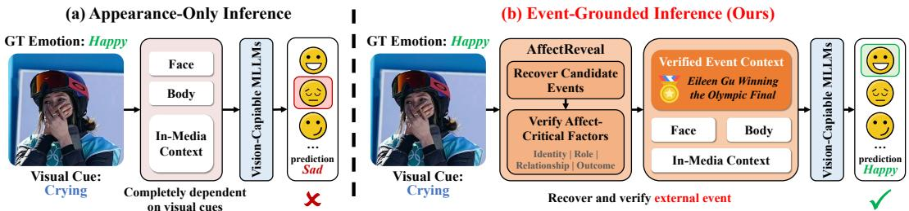
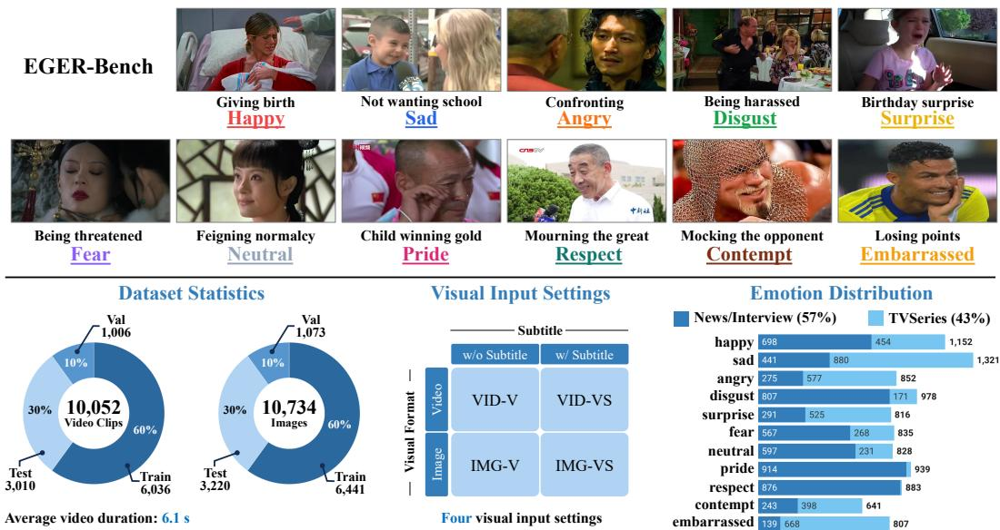
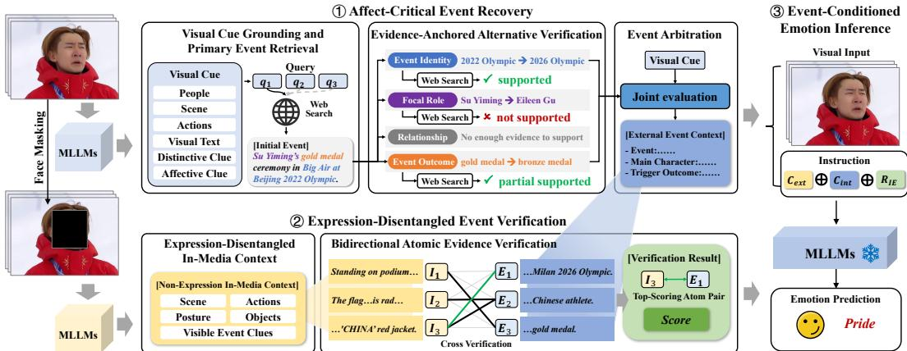
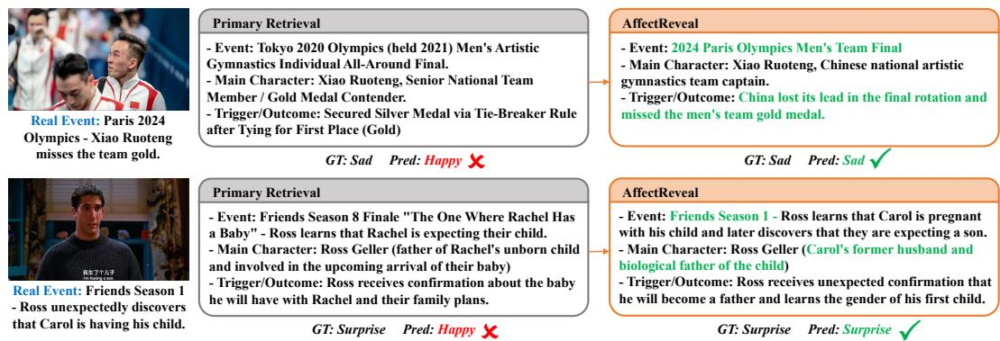
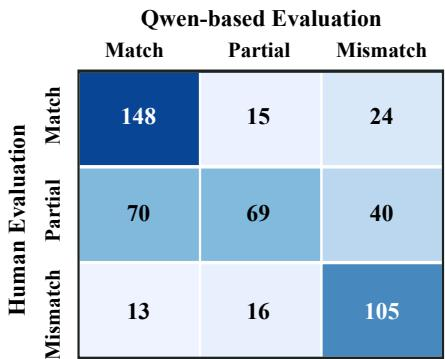

# AFFECTREVEAL: EVENT-GROUNDED EMOTION RECOGNITION BEYOND VISUAL APPEARANCES

Yihao Qian<sup>1</sup>, Runhao Zeng<sup>2</sup>, Sicheng Zhao<sup>3</sup>, Feng Liang<sup>2</sup>, Hongmin Cai<sup>1</sup>, Mingkui Tan<sup>1</sup>,

<sup>1</sup>South China University of Technology, Guangzhou, China

<sup>2</sup>Shenzhen MSU-BIT University, Shenzhen, China

<sup>3</sup>Tsinghua University, Beijing, China

202421045609@mail.scut.edu.cn

## ABSTRACT

Visual emotion recognition commonly assumes that all evidence required for prediction is contained in the observed image or video. Yet the same visible reaction can convey different emotions depending on events beyond the input: tears, for example, may indicate grief or joy. We formulate Event-Grounded Emotion Recognition (EGER), where emotion recognition requires recovering the affect-determining event. We construct EGER-Bench, comprising 10,052 videos and 10,734 images across 11 emotions, two source domains, and four visual settings. A study with six annotators shows that event context raises human recognition accuracy from 33.96% to 72.08%, confirming that visual evidence alone is often insufficient. Semantic relevance alone does not solve EGER: a plausible event may imply the wrong emotion if its identity, focal-person role, relationship, or outcome is misinterpreted. We therefore propose AffectReveal, a tuningfree framework that first constructs and independently verifies evidence-grounded alternatives over these affect-critical factors. It then cross-checks the recovered event against face-masked in-media facts through bidirectional atomic evidence support, while retaining the original unmasked input for final prediction. Across three downstream models and four input settings, AffectReveal yields average UAR gains of 5.26–10.53 points. For three fine-tunable models, it also enables untuned models to outperform their fine-tuned visual-only counterparts in all 12 accuracy comparisons, without updating downstream parameters.

## 1 INTRODUCTION

Visual emotion recognition infers a person’s emotional state from facial expressions, body movements, interactions, and scene context (Mollahosseini et al., 2017; Kosti et al., 2017; Lee et al., 2019). Despite substantial progress, it is still predominantly formulated as closed-input recognition, assuming that the observed image or video contains all evidence required for emotion prediction.

This assumption does not always hold. The same tears may arise from grief, relief, or victory, while the same smile may express happiness, embarrassment, or concealed distress. A visible reaction can therefore imply different emotions depending on what happened and how the focal person was involved (Xia & Ding, 2019; Poria et al., 2021). As illustrated in Figure 1, a crying athlete may appear sad from visual appearance alone, yet becomes understandable as happy once the underlying event—winning an Olympic final—is recovered.

Context-aware methods incorporate scenes, objects, actions, and social interactions (Kosti et al., 2017; 2019; Lee et al., 2019; Mittal et al., 2020), but still reason over evidence contained in the given media. They cannot resolve cases in which decisive information lies outside the observed sample, such as event identity, focal-person role, interpersonal relationship, or event outcome. We study this evidence gap through Event-Grounded Emotion Recognition (EGER), where recognizing an emotion requires recovering the external event needed to interpret the observed reaction.

To enable systematic evaluation, we construct EGER-Bench, comprising 10,052 video clips and 10,734 images across 11 emotions, two source domains, and four visual input settings. The bench mark focuses on reactions whose short-form visual evidence is insufficient or potentially misleading. A controlled human study confirms this information gap: providing event context increases emotion-recognition accuracy from 33.96% to 72.08%.

  
Figure 1: Appearance-based versus event-grounded emotion recognition. The visible reaction suggests sadness, whereas the recovered event context supports happiness. AffectReveal recovers and verifies the affect-determining event before prediction.

External retrieval is a natural starting point (Lewis et al., 2020; Yao et al., 2022; Asai et al., 2024), but introduces two task-specific challenges. First, a retrieved event may be topically plausible yet imply the wrong emotion if its identity, focal-person role, relationship, or outcome is misinterpreted, which we call affect-critical event ambiguity. Second, using a potentially misleading expression to validate the event retrieved from that expression creates appearance-induced circularity.

We propose AffectReveal, a tuning-free framework designed around these challenges. Affect-Critical Event Recovery constructs and independently verifies evidence-anchored alternatives over the four affect-critical factors before consolidating the external event context. Expression-Disentangled Event Verification then masks facial regions only in the verification branch and compares non-facial in-media facts with the recovered event through bidirectional atomic evidence support. The original unmasked input and the verified event evidence are jointly used for final prediction.

Across three downstream models and four input settings, AffectReveal improves both UAR and accuracy in all 16 direct comparisons, with average UAR gains of 5.26–10.53 points. An untuned model equipped with AffectReveal also outperforms its fine-tuned visual-only counterpart in all 12 corresponding accuracy comparisons. Component analysis further shows that non-facial context becomes useful when employed to verify the recovered event, rather than simply appended as additional text.

## Our contributions are:

(1) We formulate Event-Grounded Emotion Recognition (EGER), where the affect-determining event is not fully contained in the observed media and must be recovered to interpret the focal person’s visual reaction;

(2) We construct EGER-Bench, which pairs visually insufficient or misleading short-form observations with source-grounded event annotations across two domains and four controlled input settings, enabling systematic evaluation of emotion recognition under missing event evidence;

(3) We propose AffectReveal, a tuning-free framework that verifies emotion-relevant event details and cross-checks the recovered event with non-facial visual evidence, improving multiple downstream models without parameter updates.

## 2 RELATED WORK

Visual and Context-Aware Emotion Recognition. Visual emotion recognition has expanded from face-centered classification (Barsoum et al., 2016; Li et al., 2017; Jiang et al., 2020; Liu et al., 2022) to models incorporating body posture, scenes, objects, actions, and social interactions (Kosti et al., 2017; 2019; Lee et al., 2019; Hoang et al., 2021; Wu et al., 2022). Subsequent approaches further reduce dependence on facial appearance through masking, context deconfounding, and interaction modeling (Mittal et al., 2020; Yang et al., 2022; 2023; Li et al., 2026). However, their contextual evidence remains contained in the observed media. EGER instead addresses reactions whose affect-determining events are not fully observable in the input. Recent MLLMs and emotionoriented variants provide strong downstream reasoners, but the EGER challenge concerns missing evidence rather than a particular model architecture (Liu et al., 2023; Bai et al., 2023; Chen et al., 2024; Cheng et al., 2024; Lian et al., 2025; Peng et al., 2026).

Emotion Causes and Event-Level Affect Understanding. Emotion-cause research relates affective states to the situations that elicit them (Gui et al., 2016; Xia & Ding, 2019; Rashkin et al., 2019; Zadeh et al., 2019). Existing methods typically identify causes from a provided conversation, document, or complete multimodal sequence (Poria et al., 2021; Wang et al., 2022; Li et al., 2025). In EGER, the relevant event is not given and must be recovered externally. The model must therefore establish not only which event occurred, but also which role, relationship, and outcome apply to the focal person.

Retrieval-Augmented Affect Reasoning. Retrieval-augmented and tool-using models acquire external evidence for knowledge-intensive reasoning (Lewis et al., 2020; Guu et al., 2020; Izacard & Grave, 2021; Yao et al., 2022; Schick et al., 2023; Qin et al., 2024), while iterative retrieval and critique improve factual support (Madaan et al., 2023; Asai et al., 2024; Gou et al., 2024). Retrievalaugmented multi-agent reasoning has also been explored for multimodal emotion recognition (Wang et al., 2026). AffectReveal targets a distinct affective failure mode: retrieved information can be topically relevant yet imply the wrong emotion. It therefore verifies evidence-grounded alternatives over affect-critical event details and cross-checks the recovered event against non-facial visual evidence.

## 3 EVENT-GROUNDED EMOTION RECOGNITION AND EGER-BENCH

## 3.1 TASK DEFINITION

Let $x ^ { m }$ denote an image or video under visual setting $m \in { \mathcal { M } } ,$ and let $y \in \mathcal { V }$ be the emotion of a designated focal person. EGER considers cases in which the emotion depends not only on the observed reaction but also on a latent affect-determining event $z ^ { * }$

$$
\boldsymbol { y } = \boldsymbol { f } ( \boldsymbol { x } ^ { m } , z ^ { * } ) , \qquad \boldsymbol { \hat { z } } = \mathcal { R } ( \boldsymbol { x } ^ { m } ; \boldsymbol { K } ) , \qquad \boldsymbol { \hat { y } } = \boldsymbol { F } ( \boldsymbol { x } ^ { m } , \boldsymbol { \hat { z } } ) \in \mathcal { V } .\tag{1}
$$

At inference time, $z ^ { * }$ is unavailable. A method may instead query an external information space K to recover an event interpretation zˆ. Importantly, K is not sample-specific reference context supplied with the test input. Emotion prediction is the primary task; event recovery is evaluated separately through diagnostic analyses.

## 3.2 DATA COLLECTION

EGER-Bench draws from two complementary domains. News and interview sources provide realworld events documented by webpages and headlines, whereas television series, including Friends and Empresses in the Palace, provide richer relationships, intentions, and role-dependent reactions.

We use seed patterns such as “tears of joy,” “putting on a brave face,” and “forcing a smile” to discover reactions whose emotional meaning may differ from their appearance. For news and interview sources, we retrieve candidate videos and extract coherent, person-centered clips shorter than 10 seconds. For television series, we identify candidates from dialogue scripts, align them with episodes using subtitles, and extract clips centered on the focal person. These patterns are used only for discovery; inclusion and annotation are determined from the complete event context.

The resulting dataset contains 10,052 video clips with an average duration of 6.1 seconds. Sampling one representative frame per clip and adding 682 event-grounded news images yields 10,734 images, as shown in Figure 2.

## 3.3 EVENT-GROUNDED ANNOTATION

Using a dedicated interface, annotators inspect each restricted visual sample together with its sourcegrounded reference context: the original webpage and headline for news/interview samples, or expanded dialogue and scene context for television-series samples. They identify the focal person and retain samples for which the restricted input is insufficient or potentially misleading. Samples with low visual quality, no identifiable focal person, or inadequate event grounding are excluded.

  
Figure 2: Overview of EGER-Bench, covering 11 emotions from news/interview and televisionseries sources. The lower panel summarizes dataset statistics, four visual settings, and class distributions across the two domains.

Each retained sample is assigned one of 11 labels: happy, sad, angry, disgust, fear, surprise, neutral, pride, embarrassed, contempt, or respect. Labels are determined from the focal person’s reaction and role in the complete event rather than facial appearance alone. The reference materials are retained for diagnostic evaluation but are not provided in the standard EGER setting.

Human validation. We conduct an independent study with six annotators on 480 randomly sampled instances. For each instance, different annotators evaluate the emotion under two evidence conditions: the restricted visual input alone, or the same input together with its reference event context. All annotators are blinded to the benchmark labels, and no annotator sees the same instance under both conditions. As shown in Table 1, event context raises accuracy from

Table 1: Human performance with and without reference event context on 480 instances.
<table><tr><td>Evidence Condition</td><td>UAR</td><td>Acc.</td><td>WAF</td></tr><tr><td>Visual Input</td><td>27.80</td><td>33.96</td><td>33.89</td></tr><tr><td>Visual + Event Context</td><td>65.80</td><td>72.08</td><td>72.66</td></tr></table>

33.96% to 72.08%, with corresponding gains in UAR and WAF. This substantial gap supports the premise that the restricted visual input alone does not reliably determine the emotion label.

## 3.4 VISUAL INPUT SETTINGS AND SPLITS

We define four settings, M = {VID-V, VID-VS, IMG-V, IMG-VS}, where VID/IMG denotes video/image and VS retains visible subtitles or scene text, while V removes detected text regions. No audio or separately supplied transcript is used. PaddleOCR (Cui et al., 2025) detects text regions and ProPainter (Zhou et al., 2023) inpaints the resulting masks. Each text-retained and text-removed pair shares the same underlying frames, and AffectReveal and its downstream model always receive the same version.

The benchmark contains 57% news/interview and 43% television-series samples. We use an approximately 6:1:3 train/validation/test split, yielding 6,036/1,006/3,010 videos and 6,441/1,073/3,220 images. Representative frames inherit their source-video assignments to prevent frame-level overlap; the additional web images follow the same split ratio, with domain proportions maintained across subsets.

  
Figure 3: Overview of AffectReveal. The framework recovers external event context by retrieving a primary event and verifying evidence-anchored alternatives, then cross-checks the recovered event against non-facial in-media facts before emotion prediction.

## 4 AFFECTREVEAL

## 4.1 OVERVIEW

EGER presents two coupled challenges. First, limited visual evidence may support multiple event interpretations whose differences can change the implied emotion. We refer to this problem as affect-critical event ambiguity. Second, the expression that motivates event recovery may itself be misleading; using it again to validate the recovered event creates appearance-induced circularity. AffectReveal addresses these challenges through two corresponding stages, as illustrated in Figure 3.

First, Affect-Critical Event Recovery operationalizes event ambiguity through four recurrent factors: $\mathcal { D } = \{ d _ { \mathrm { i d } } , d _ { \mathrm { r o l e } } , d _ { \mathrm { r e l } } , d _ { \mathrm { o u t } } \}$ , corresponding to event identity, focal-person role, interpersonal relationship, and event outcome. This factorization organizes event verification rather than providing an exhaustive definition of event context. The stage retrieves and verifies candidate interpretations to produce an external event context:

$$
C _ { \mathrm { e x t } } = \operatorname { R e c o v e r } ( x ^ { m } , K ; { \mathcal { D } } ) .\tag{2}
$$

Second, Expression-Disentangled Event Verification masks facial regions and extracts non-facial in-media context:

$$
C _ { \mathrm { i n t } } = \mathrm { E x t r a c t } \left( \mathcal { M } _ { \mathrm { f a c e } } ( x ^ { m } ) \right) ,\tag{3}
$$

where $\mathcal { M } _ { \mathrm { f a c e } }$ denotes face masking. It then evaluates the observable compatibility between the internal and external contexts:

$$
R _ { I E } = \mathrm { V e r i f y } ( C _ { \mathrm { i n t } } , C _ { \mathrm { e x t } } ) .\tag{4}
$$

The original unmasked input, $C _ { \mathrm { e x t } } , C _ { \mathrm { i n t } }$ , and $R _ { I E }$ are jointly used for final emotion prediction.

## 4.2 AFFECT-CRITICAL EVENT RECOVERY

Visual Cue-Grounded Retrieval. To recover the external event context $C _ { \mathrm { e x t } }$ , we first extract structured clues from $\boldsymbol { x } ^ { m }$ , including people, scenes, actions, visible text, distinctive objects, and observable reactions. The strongest clues are combined into N ranked event-oriented queries, $Q = \{ ( q _ { i } , p _ { i } ) \} _ { i = 1 } ^ { N }$ , where $p _ { i }$ denotes query priority. The queries and representative visual frames are used for web and image search. Retrieved evidence is checked against the visual clues and summarized as a primary event $e _ { 0 }$ , including its description, time, location, affect-critical details, and supporting sources.

Alternative Verification. A plausible $e _ { 0 }$ may still contain an incorrect event identity, focal-person role, relationship, or outcome. For each uncertain factor $d _ { i } \in \mathcal { D } .$ , we construct an alternative that changes only that factor: $e _ { i } ^ { \mathrm { a l t } } \ = \ e _ { 0 } [ d _ { i } \  \ \widetilde { d } _ { i } ]$ . The alternative $\widetilde { d } _ { i }$ must be grounded in primary retrieval evidence rather than freely generated. Each alternative is independently checked through a factor-specific search and labeled as supported, partially supported, not supported, not found, or conflicting. Only supported and partially supported alternatives are retained.

Event Arbitration. The primary event, retained alternatives, visual clues, and retrieved evidence are jointly reconsidered to produce $C _ { \mathrm { e x t } }$ . It records the best-supported event identity, focal-person role, relationship, outcome, and sources without directly predicting an emotion label.

## 4.3 EXPRESSION-DISENTANGLED EVENT VERIFICATION

Non-Facial In-Media Context. To verify whether $C _ { \mathrm { e x t } }$ is compatible with the observed sample without reusing the potentially misleading facial expression, we mask facial regions frame by frame and extract $C _ { \mathrm { i n t } }$ from the masked input. $C _ { \mathrm { i n t } }$ describes scenes, body actions, objects, interactions, and visible event clues. Masking is restricted to this verification branch; the original unmasked input remains available for final emotion prediction.

Bidirectional Atomic Evidence Verification. We decompose the internal and external contexts into atomic facts:

$$
\begin{array} { r } { \mathcal { T } = \{ i _ { j } \} _ { j = 1 } ^ { n } , \qquad \mathcal { E } = \{ e _ { k } \} _ { k = 1 } ^ { m } , } \end{array}\tag{5}
$$

where each statement contains one independently assessable fact. An evidence judge assigns every pair a support score $M _ { j k } \in \{ 0 , 0 . 5 , 1 . 0 \}$ , denoting no, partial, or direct factual support.

Rather than averaging unrelated pairs, we retain the strongest counterpart for each fact and aggregate support in both directions:

$$
S _ { I E } = \frac { 1 } { 2 } \left( \frac { 1 } { n } \sum _ { j = 1 } ^ { n } \operatorname* { m a x } _ { k } M _ { j k } + \frac { 1 } { m } \sum _ { k = 1 } ^ { m } \operatorname* { m a x } _ { j } M _ { j k } \right) .\tag{6}
$$

The two terms measure how well the in-media facts are explained by the recovered event and how strongly the external event is grounded in observable evidence, respectively.

The strongest aligned pairs are retained as a textual explanation $A _ { I E }$ , giving the final verification result $R _ { I E } = ( S _ { I E } , A _ { I E } )$ ). $R _ { I E }$ measures observable compatibility rather than requiring every external event fact to appear in the media.

## 4.4 EVENT-CONDITIONED EMOTION INFERENCE

The external context, in-media context, and their verification relation are serialized into a fixedformat evidence package and provided with the original unmasked input:

$$
{ \cal C } _ { \mathrm { e v i } } = C _ { \mathrm { e x t } } \oplus C _ { \mathrm { i n t } } \oplus R _ { I E } , \qquad \widehat { \boldsymbol { y } } = F _ { \boldsymbol { \theta } } ( x ^ { m } , C _ { \mathrm { e v i } } ) , \qquad \widehat { \boldsymbol { y } } \in \mathcal { V }\tag{7}
$$

Here, $\oplus$ denotes textual serialization. No parameter of the downstream model $F _ { \theta }$ is updated.

## 5 EXPERIMENTS

## 5.1 EXPERIMENTAL SETUP

Benchmark and metrics. We evaluate on EGER-Bench under four visual input settings: video without visible text (VID-V), video with visible text (VID-VS), image without visible text (IMG V), and image with visible text (IMG-VS). We report Accuracy (Acc.), Unweighted Average Recall (UAR), and Weighted Average F1-score (WAF). Given the imbalanced emotion distribution, we use UAR as the primary metric and report Acc. and WAF as complementary measures.

Downstream emotion models. We evaluate AffectReveal with two general-purpose models, Qwen3.5-Omni-Plus (Team, 2026) and Qwen2.5-Omni-7B(Xu et al., 2025), and two emotionoriented models, Emotion-LLaMA (Cheng et al., 2024) and AffectGPT (Lian et al., 2025). External search is disabled for all downstream models. For the locally deployable models, we additionally report variants fine-tuned on the EGER-Bench training set, denoted by FT.

Table 2: Performance on EGER-Bench under four visual input settings. FT denotes task-specific fine-tuning, with gray rows indicating fine-tuned downstream models.
<table><tr><td rowspan="2">Method</td><td colspan="3">VID-V</td><td colspan="3">VID-VS</td><td colspan="3">IMG-V</td><td colspan="3">IMG-VS</td></tr><tr><td>UAR</td><td>Acc.</td><td>WAF</td><td>UAR</td><td>Acc.</td><td>WAF</td><td>UAR</td><td>Acc.</td><td>WAF</td><td>UAR</td><td>Acc.</td><td>WAF</td></tr><tr><td>Emotion-LLaMA (Cheng et al., 2024)</td><td>20.42</td><td>20.90</td><td>15.69</td><td>21.36</td><td>21.99</td><td>16.05</td><td>18.87</td><td>19.72</td><td>15.36</td><td>18.38</td><td>19.63</td><td>15.11</td></tr><tr><td>Emotion-LLaMA + AffectReveal</td><td>29.10</td><td>29.77</td><td>24.51</td><td>29.13</td><td>29.80</td><td>24.38</td><td>24.47</td><td>25.16</td><td>20.03</td><td>24.52</td><td>25.25</td><td>19.92</td></tr><tr><td>Emotion-LLaMA (FT)</td><td>26.70</td><td>26.61</td><td>19.96</td><td>28.38</td><td>28.64</td><td>24.88</td><td>23.40</td><td>25.12</td><td>18.83</td><td>23.48</td><td>25.16</td><td>18.93</td></tr><tr><td>Emotion-LLaMA (FT) + AffectReveal</td><td>31.17</td><td>31.69</td><td>26.96</td><td>32.08</td><td>32.69</td><td>28.39</td><td>28.14</td><td>28.91</td><td>24.35</td><td>28.73</td><td>29.60</td><td>25.41</td></tr><tr><td>AffectGPT (Lian et al., 2025)</td><td>25.63</td><td>25.59</td><td>24.44</td><td>25.82</td><td>26.08</td><td>24.51</td><td>24.60</td><td>24.66</td><td>22.76</td><td>24.11</td><td>25.06</td><td>23.85</td></tr><tr><td>AffectGPT + AffectReveal</td><td>29.48</td><td>30.00</td><td>28.02</td><td>29.93</td><td>30.46</td><td>28.51</td><td>30.70</td><td>30.25</td><td>28.70</td><td>31.07</td><td>30.87</td><td>29.44</td></tr><tr><td>AffectGPT (FT)</td><td>25.66</td><td>26.06</td><td>24.68</td><td>25.42</td><td>26.02</td><td>24.28</td><td>25.39</td><td>25.28</td><td>23.68</td><td>26.02</td><td>25.68</td><td>24.53</td></tr><tr><td>AffectGPT (FT) + AffectReveal</td><td>31.59</td><td>31.21</td><td>29.62</td><td>31.92</td><td>32.05</td><td>30.80</td><td>30.80</td><td>30.37</td><td>28.89</td><td>31.27</td><td>31.49</td><td>30.32</td></tr><tr><td>Qwen2.5-Omni-7B (Xu et al., 2025)</td><td>17.11</td><td>17.94</td><td>11.13</td><td>21.85</td><td>22.52</td><td>17.02</td><td>16.66</td><td>18.04</td><td>13.77</td><td>18.95</td><td>20.37</td><td>16.99</td></tr><tr><td>Qwen2.5-Omni-7B + AffectReveal</td><td>29.25</td><td>29.80</td><td>27.11</td><td>32.83</td><td>33.29</td><td>30.61</td><td>26.58</td><td>27.67</td><td>25.79</td><td>28.02</td><td>29.13</td><td>27.20</td></tr><tr><td>Qwen2.5-Omni-7B (FT)</td><td>25.34</td><td>25.45</td><td>21.54</td><td>33.19</td><td>32.72</td><td>29.50</td><td>22.39</td><td>22.48</td><td>19.25</td><td>28.88</td><td>28.60</td><td>25.90</td></tr><tr><td>Qwen2.5-Omni-7B (FT) + AffectReveal</td><td>36.55</td><td>36.08</td><td>35.44</td><td>36.48</td><td>36.78</td><td>33.54</td><td>33.13</td><td>32.55</td><td>32.07</td><td>35.94</td><td>35.31</td><td>34.86</td></tr></table>

Implementation details. We instantiate Affect-Critical Event Recovery with Qwen3.5- Flash (Team, 2026). Primary retrieval uses one web-search call and one image-search call; alternative verification uses at most three additional web-search calls. Facial regions are detected frame by frame using MediaPipe Face Detection with the short-range BlazeFace model (Bazarevsky et al., 2019). In-media context extraction, atomic decomposition, and evidence scoring are implemented with Qwen2.5-Omni-7B. All supporting and downstream models remain frozen, and fixed-format prompts are used. Complete prompts and inference configurations are provided in Appendix E.

## 5.2 MAIN RESULTS ACROSS MODELS AND INPUT SETTINGS

We first evaluate whether AffectReveal is effective across downstream model families and visual input settings. For each model, we compare visual-only inference with the same model augmented by AffectReveal. For the three locally deployable models, we further repeat this comparison after taskspecific fine-tuning on EGER-Bench, allowing us to examine whether inference-time event evidence remains useful after parameter adaptation. As shown in Table 2, AffectReveal improves UAR, accuracy, and WAF for every untuned downstream model under all four input settings. Averaged across the four settings, 7.05 for Emotion-LLaMA, 5.26 for AffectGPT, and 10.53 for Qwen2.5-Omni-7B. The improvements hold for both images and videos and remain substantial without visible text, indicating that AffectReveal is effective across visual formats and does not rely on textual cues being present.

AffectReveal also remains effective after task-specific fine-tuning. Across Emotion-LLaMA, AffectGPT, and Qwen2.5-Omni-7B, the untuned model augmented with AffectReveal outperforms its fine-tuned visual-only counterpart in all 12 accuracy comparisons. Applying AffectReveal to the fine-tuned models yields further gains across every model and input setting. This shows that taskspecific parameter adaptation and instance-specific event evidence are complementary: fine-tuning improves how a model interprets the available input, whereas AffectReveal supplies event information that the input itself does not contain.

## 5.3 DIAGNOSTIC VALUE OF EXTERNAL EVENT CONTEXT

To isolate the effect of missing event information, we conduct a diagnostic experiment with Qwen3.5-Omni-Plus under VID-V. We compare visual-only inference with two event-conditioned settings. Reference Event Context provides the source-grounded event description preserved during benchmark construction, whereas AffectReveal recovers event context automatically without access to this description. Explicit emotion labels and direct emotion-descriptive statements are removed from the reference context. Because it may still omit relevant role, relationship, or outcome details, it is treated as a diagnostic reference rather than a perfect oracle.

As shown in Table 3(a), reference event context raises UAR from 24.15% to 39.36%, confirming that missing event information constitutes a substantial bottleneck. AffectReveal reaches 34.76%

Table 3: Diagnostic and ablation results under VID-V. (a) Event-context diagnostic using Qwen3.5- Omni-Plus; (b) cumulative component analysis and (c) verification ablations using Qwen2.5-Omni-7B. UAR is the primary metric.  
(a) Event Context
<table><tr><td>Evidence Setting</td><td>UAR</td><td>WAF</td></tr><tr><td>Visual Input Only</td><td></td><td>24.15 20.35</td></tr><tr><td>Visual + Reference Event</td><td></td><td>39.36 39.02</td></tr><tr><td>Visual + AffectReveal</td><td></td><td>34.76 33.32</td></tr></table>

<table><tr><td colspan="3">(b) Evidence Components</td></tr><tr><td>Evidence Setting</td><td>UAR</td><td>WAF</td></tr><tr><td>Visual Input Only</td><td>17.11</td><td>11.13</td></tr><tr><td>+ External Event Context  $C _ { \mathrm { e x t } }$ </td><td>27.84</td><td>25.73</td></tr><tr><td>+ In-Media Context  $C _ { \mathrm { i n t } }$ </td><td>27.75</td><td>25.56</td></tr><tr><td>+ AffectReveal  $R _ { \mathrm { I E } }$ </td><td>29.25</td><td>27.11</td></tr></table>

(c) Verification Designs
<table><tr><td>Variant</td><td>UAR</td><td>WAF</td></tr><tr><td>w/o Face Masking</td><td>28.89</td><td>24.37</td></tr><tr><td>w/o Atomic Support</td><td>28.95</td><td>26.74</td></tr><tr><td>Full AffectReveal</td><td>29.25 27.11</td><td></td></tr></table>

Table 4: Event recovery quality under VID-V. Generic Multi-Search and Affect-Critical Event Recovery use the same maximum retrieval budget.
<table><tr><td rowspan="2">Method</td><td colspan="4">Affect-Critical Factor Correctness  $( \% ) \uparrow$ </td><td colspan="3">Overall Event Recovery (%)</td></tr><tr><td>Event Identity Focal Role Relationship Event Outcome</td><td></td><td></td><td></td><td>Match ↑ Partial ↑ Mismatch ↓</td><td></td><td></td></tr><tr><td>Primary Retrieval</td><td>16.35</td><td>36.67</td><td>23.33</td><td>12.25</td><td>13.25</td><td>21.55</td><td>65.20</td></tr><tr><td>Generic Multi-Search</td><td>15.44</td><td>38.90</td><td>25.53</td><td>14.32</td><td>12.96</td><td>25.92</td><td>61.12</td></tr><tr><td>Affect-Critical Event Recovery</td><td>16.52</td><td>40.64</td><td>31.06</td><td>15.03</td><td>13.95</td><td>28.91</td><td>57.14</td></tr></table>

UAR using automatically recovered evidence, closing 69.8% of the gap between the visual-only and reference-context conditions. Similar trends are observed for UAR and WAF. These results show that AffectReveal recovers a substantial portion of the task-relevant event information without privileged access to the benchmark reference context.

## 5.4 DOES AFFECT-CRITICAL VERIFICATION IMPROVE EVENT RECOVERY?

Retrieving a relevant event does not necessarily recover the details needed for emotion interpretation. We therefore compare three strategies: Primary Retrieval, which uses only the initial search; Generic Multi-Search, which performs unconstrained query refinement; and Affect-Critical Event Recovery, which verifies evidence-grounded alternatives that differ in one affect-critical factor. Generic Multi-Search and our method use the same maximum retrieval budget, isolating the effect of how additional searches are organized.

We evaluate the recovered context against the source-grounded reference event at both event and factor levels. A recovery is labeled Match when the central event and its affect-critical details agree with the reference, Partial when the central event is recovered but some details remain incomplete or unresolved, and Mismatch when the event or an affect-determining detail conflicts with the reference. We additionally measure correctness for event identity, focal-person role, interpersonal relationship, and event outcome. The complete evaluation protocol and its agreement with human judgments are provided in Appendix C.

As shown in Table 4, Primary Retrieval produces a fully or partially aligned event in 34.80% of the samples. Generic Multi-Search increases this rate to 38.88%, showing that additional retrieval itself is beneficial. Under the same retrieval budget, Affect-Critical Event Recovery further raises it to 42.86% and reduces the mismatch rate to 57.14%. The largest factor-level gain over Generic Multi-Search occurs for interpersonal relationship, increasing from 25.53% to 31.06%, with additional gains for event identity, focal-person role, and event outcome. These results show that organizing retrieval around affect-critical alternatives recovers emotion-relevant event details more reliably than unconstrained query refinement.

## 5.5 HOW DOES EVENT VERIFICATION CONTRIBUTE TO EMOTION RECOGNITION?

The recovered external context may be incomplete or partially mismatched with the observed sample. We therefore examine whether in-media facts should be treated simply as additional context or used to assess the compatibility of the recovered event. We first incrementally add the external event context $C _ { \mathrm { e x t } } ,$ the expression-disentangled in-media context $C _ { \mathrm { i n t } } ,$ , and their explicit support relation $R _ { I E }$ . As shown in Table 3(b), external event context provides the dominant gain, raising UAR from 17.11% to 27.84%. Directly adding in-media context provides no further improvement, whereas explicitly modeling its support relation with the external event raises UAR to 29.25% and WAF to 27.11%. This indicates that in-media facts are more useful for assessing the recovered event than as another unconstrained textual description.

  
Figure 4: Qualitative comparisons between Primary Retrieval and AffectReveal. Although Primary Retrieval identifies the correct focal person, it retrieves a topically related but affectively incorrect event. AffectReveal corrects the event identity and outcome in the Olympic example, and the event identity and interpersonal relationship in the television-series example, leading to reference-aligned emotion predictions. Green text highlights the corrected event details.

We next ablate the two mechanisms used to construct this support relation. The w/o face masking variant extracts $C _ { \mathrm { i n t } }$ from the original input, allowing the facial expression being interpreted to also participate in event verification. The w/o atomic support variant replaces fact-level decomposition and alignment with a holistic comparison of the two contexts. As shown in Table 3(c), removing face masking reduces WAF by 2.74 points, supporting the concern that a potentially misleading expression can introduce circular evidence during verification. Replacing atomic support with holistic comparison causes smaller but consistent decreases across all metrics. Together, these results show that event verification is most effective when it uses expression-disentangled in-media facts and compares them with external evidence at the level of individual factual statements.

## 5.6 QUALITATIVE ANALYSIS

Figure 4 illustrates that recognizing the focal person or retrieving a related event is insufficient for EGER. In the Olympic example, Primary Retrieval identifies Xiao Ruoteng but associates him with the Tokyo individual all-around final and a silver-medal outcome, leading to a prediction of happiness. AffectReveal instead recovers the Paris team final and the missed opportunity for gold, supporting sadness. In the television example, Primary Retrieval identifies Ross but confuses Carol’s pregnancy with a later storyline involving Rachel. Correcting the event identity and interpersonal relationship changes the prediction from happiness to surprise. These cases demonstrate that AffectReveal improves emotion recognition by resolving affect-critical event details rather than merely retrieving information about the visible person.

## 6 CONCLUSION

We introduced Event-Grounded Emotion Recognition and EGER-Bench for recognizing visual reactions whose affect-determining events are not fully observable. We also proposed AffectReveal, which verifies factorized event alternatives and cross-checks recovered context against expressiondisentangled visual evidence. Across multiple models and visual settings, AffectReveal consistently improves recognition and complements task-specific fine-tuning without updating downstream pa rameters. These results highlight the importance of acquiring and verifying the events behind visually ambiguous reactions. Future work will extend EGER to dynamic and interactive settings where systems actively seek evidence and revise emotion interpretations as events unfold.

## AI USE STATEMENT

Generative AI tools were used during manuscript preparation to assist with language polishing, text compression, and LAT X formatting. The authors reviewed and revised all AI-assisted content and independently verified the technical claims, citations, experimental results, and numerical analyses reported in the paper. Generative AI was not used as an authoritative source for scientific claims or references, nor was it used to fabricate experimental data or results. The authors take full responsibility for the final content of the submission.

## ETHICS STATEMENT

Emotion recognition from human behavior raises ethical concerns related to privacy, subjective interpretation, cultural variation, and potential misuse in surveillance or high-stakes decision-making. EGER-Bench is intended solely for research on event-grounded emotion understanding and should not be interpreted as providing objective psychological assessments of individuals. EGER-Bench is constructed from news/interview media and television-series content with source provenance retained for event grounding. For any release, we will respect applicable source licenses and copyright restrictions and provide documentation describing the intended research use and limitations of the benchmark. We do not advocate the use of AffectReveal or EGER-Bench for surveillance, clinical assessment, employment screening, law enforcement, or other high-stakes decisions about individuals.

## REPRODUCIBILITY STATEMENT

To facilitate reproducibility, Sections 3–5 describe the dataset construction, AffectReveal framework, and experimental settings. The appendix provides complete prompts, evaluation protocols, implementation details, and inference configurations used in our experiments.

## REFERENCES

Akari Asai, Zeqiu Wu, Yizhong Wang, Avi Sil, and Hannaneh Hajishirzi. Self-rag: Learning to retrieve, generate, and critique through self-reflection. In International conference on learning representations, volume 2024, pp. 9112–9141, 2024.

Jinze Bai, Shuai Bai, Shusheng Yang, Shijie Wang, Sinan Tan, Peng Wang, Junyang Lin, Chang Zhou, and Jingren Zhou. Qwen-vl: A versatile vision-language model for understanding, localization. Text Reading, and Beyond, 2(1):1, 2023.

Emad Barsoum, Cha Zhang, Cristian Canton Ferrer, and Zhengyou Zhang. Training deep networks for facial expression recognition with crowd-sourced label distribution. In Proceedings of the 18th ACM international conference on multimodal interaction, pp. 279–283, 2016.

Valentin Bazarevsky, Yury Kartynnik, Andrey Vakunov, Karthik Raveendran, and Matthias Grundmann. Blazeface: Sub-millisecond neural face detection on mobile gpus. arXiv preprint arXiv:1907.05047, 2019.

Zhe Chen, Jiannan Wu, Wenhai Wang, Weijie Su, Guo Chen, Sen Xing, Muyan Zhong, Qinglong Zhang, Xizhou Zhu, Lewei Lu, et al. Internvl: Scaling up vision foundation models and aligning for generic visual-linguistic tasks. In Proceedings of the IEEE/CVF conference on computer vision and pattern recognition, pp. 24185–24198, 2024.

Zebang Cheng, Zhi-Qi Cheng, Jun-Yan He, Jingdong Sun, Kai Wang, Yuxiang Lin, Zheng Lian, Xiaojiang Peng, and Alexander G Hauptmann. Emotion-llama: Multimodal emotion recognition and reasoning with instruction tuning. Advances in Neural Information Processing Systems, 37: 110805–110853, 2024.

Cheng Cui, Ting Sun, Manhui Lin, Tingquan Gao, Yubo Zhang, Jiaxuan Liu, Xueqing Wang, Zelun Zhang, Changda Zhou, Hongen Liu, et al. Paddleocr 3.0 technical report. arXiv preprint arXiv:2507.05595, 2025.

Zhibin Gou, Zhihong Shao, Yeyun Gong, Yujiu Yang, Nan Duan, Weizhu Chen, et al. Critic: Large language models can self-correct with tool-interactive critiquing. In International Conference on Learning Representations, volume 2024, pp. 57734–57811, 2024.

Lin Gui, Dongyin Wu, Ruifeng Xu, Qin Lu, and Yu Zhou. Event-driven emotion cause extraction with corpus construction. In Proceedings of the 2016 conference on empirical methods in natural language processing, pp. 1639–1649, 2016.

Kelvin Guu, Kenton Lee, Zora Tung, Panupong Pasupat, and Mingwei Chang. Retrieval augmented language model pre-training. In International conference on machine learning, pp. 3929–3938. PMLR, 2020.

Manh-Hung Hoang, Soo-Hyung Kim, Hyung-Jeong Yang, and Guee-Sang Lee. Context-aware emotion recognition based on visual relationship detection. IEEE Access, 9:90465–90474, 2021.

Gautier Izacard and Edouard Grave. Leveraging passage retrieval with generative models for open domain question answering. In Proceedings of the 16th conference of the european chapter of the associationfor computational linguistics: main volume, pp. 874–880, 2021.

Xingxun Jiang, Yuan Zong, Wenming Zheng, Chuangao Tang, Wanchuang Xia, Cheng Lu, and Jiateng Liu. Dfew: A large-scale database for recognizing dynamic facial expressions in the wild. In Proceedings ofthe 28th ACM international conference on multimedia, pp. 2881–2889, 2020.

Ronak Kosti, Jose M Alvarez, Adria Recasens, and Agata Lapedriza. Emotic: Emotions in context dataset. In 2017 IEEE conference on computer vision and pattern recognition workshops (CVPRW), pp. 2309–2317. IEEE, 2017.

Ronak Kosti, Jose M Alvarez, Adria Recasens, and Agata Lapedriza. Context based emotion recognition using emotic dataset. IEEE transactions on pattern analysis and machine intelligence, 42 (11):2755–2766, 2019.

Jiyoung Lee, Seungryong Kim, Sunok Kim, Jungin Park, and Kwanghoon Sohn. Context-aware emotion recognition networks. In 2019 IEEE/CVF international conference on computer vision (ICCV), pp. 10142–10151. IEEE, 2019.

Patrick Lewis, Ethan Perez, Aleksandra Piktus, Fabio Petroni, Vladimir Karpukhin, Naman Goyal, Heinrich Kuttler, Mike Lewis, Wen-tau Yih, Tim Rockt¨ aschel, et al. Retrieval-augmented gener-¨ ation for knowledge-intensive nlp tasks. Advances in neural information processing systems, 33: 9459–9474, 2020.

Bobo Li, Hao Fei, Fei Li, Tat-seng Chua, and Donghong Ji. Multimodal emotion-cause pair extraction with holistic interaction and label constraint. ACM Transactions on Multimedia Computing, Communications and Applications, 21(11):1–19, 2025.

Shan Li, Weihong Deng, and JunPing Du. Reliable crowdsourcing and deep locality-preserving learning for expression recognition in the wild. In Proceedings of the IEEE conference on com puter vision and pattern recognition, pp. 2852–2861, 2017.

Siyuan Li, Xinde Li, and Chuanfei Hu. Towards revealing trustworthy emotion states via humanobject interaction-aware emotion recognition with vision-language model. Pattern Recognition, pp. 113342, 2026.

Zheng Lian, Haoyu Chen, Lan Chen, Haiyang Sun, Licai Sun, Yong Ren, Zebang Cheng, Bin Liu, Rui Liu, Xiaojiang Peng, et al. Affectgpt: A new dataset, model, and benchmark for emotion understanding with multimodal large language models. arXiv preprint arXiv:2501.16566, 2025.

Haotian Liu, Chunyuan Li, Qingyang Wu, and Yong Jae Lee. Visual instruction tuning. Advances in neural information processing systems, 36:34892–34916, 2023.

Yuanyuan Liu, Wei Dai, Chuanxu Feng, Wenbin Wang, Guanghao Yin, Jiabei Zeng, and Shiguang Shan. Mafw: A large-scale, multi-modal, compound affective database for dynamic facial expression recognition in the wild. In Proceedings of the 30th ACM international conference on multimedia, pp. 24–32, 2022.

Aman Madaan, Niket Tandon, Prakhar Gupta, Skyler Hallinan, Luyu Gao, Sarah Wiegreffe, Uri Alon, Nouha Dziri, Shrimai Prabhumoye, Yiming Yang, et al. Self-refine: Iterative refinement with self-feedback. Advances in neural information processing systems, 36:46534–46594, 2023.

Trisha Mittal, Pooja Guhan, Uttaran Bhattacharya, Rohan Chandra, Aniket Bera, and Dinesh Manocha. Emoticon: Context-aware multimodal emotion recognition using frege’s principle. In 2020 IEEE/CVF Conference on Computer Vision and Pattern Recognition (CVPR), pp. 14222– 14231. IEEE, 2020.

Ali Mollahosseini, Behzad Hasani, and Mohammad H Mahoor. Affectnet: A database for facial expression, valence, and arousal computing in the wild. IEEE transactions on affective computing, 10(1):18–31, 2017.

Xiaojiang Peng, Jingyi Chen, Zebang Cheng, Bao Peng, Fengyi Wu, Yifei Dong, Shuyuan Tu, Qiyu Hu, Huiting Huang, Yuxiang Lin, et al. Emotion-llamav2 and mmeverse: A new framework and benchmark for multimodal emotion understanding. arXiv preprint arXiv:2601.16449, 2026.

Soujanya Poria, Navonil Majumder, Devamanyu Hazarika, Deepanway Ghosal, Rishabh Bhardwaj, Samson Yu Bai Jian, Pengfei Hong, Romila Ghosh, Abhinaba Roy, Niyati Chhaya, et al. Recognizing emotion cause in conversations. Cognitive Computation, 13(5):1317–1332, 2021.

Yujia Qin, Shihao Liang, Yining Ye, Kunlun Zhu, Lan Yan, Yaxi Lu, Yankai Lin, Xin Cong, Xiangru Tang, Bill Qian, et al. Toolllm: Facilitating large language models to master 16000+ real-world apis. In International Conference on Learning Representations, volume 2024, pp. 9695–9717, 2024.

Hannah Rashkin, Eric Michael Smith, Margaret Li, and Y-Lan Boureau. Towards empathetic opendomain conversation models: A new benchmark and dataset. In Proceedings of the 57th annual meeting ofthe associationfor computational linguistics, pp. 5370–5381, 2019.

Timo Schick, Jane Dwivedi-Yu, Roberto Dess\`ı, Roberta Raileanu, Maria Lomeli, Eric Hambro, Luke Zettlemoyer, Nicola Cancedda, and Thomas Scialom. Toolformer: Language models can teach themselves to use tools. Advances in neural information processing systems, 36:68539– 68551, 2023.

Qwen Team. Qwen3. 5-omni technical report. arXiv preprint arXiv:2604.15804, 2026.

Fanfan Wang, Zixiang Ding, Rui Xia, Zhaoyu Li, and Jianfei Yu. Multimodal emotion-cause pair extraction in conversations. IEEE Transactions on Affective Computing, 14(3):1832–1844, 2022.

Zeheng Wang, Zitong Yu, Yijie Zhu, Bo Zhao, Haochen Liang, Taorui Wang, Wei Xia, Jiayu Zhang, Zhishu Liu, Hui Ma, et al. Affectagent: Collaborative multi-agent reasoning for retrievalaugmented multimodal emotion recognition. arXiv preprint arXiv:2604.12735, 2026.

Shichao Wu, Lei Zhou, Zhengxi Hu, and Jingtai Liu. Hierarchical context-based emotion recognition with scene graphs. IEEE Transactions on Neural Networks and Learning Systems, 35(3): 3725–3739, 2022.

Rui Xia and Zixiang Ding. Emotion-cause pair extraction: A new task to emotion analysis in texts. In Proceedings of the 57th annual meeting of the association for computational linguistics, pp. 1003–1012, 2019.

Jin Xu, Zhifang Guo, Jinzheng He, Hangrui Hu, Ting He, Shuai Bai, Keqin Chen, Jialin Wang, Yang Fan, Kai Dang, Bin Zhang, Xiong Wang, Yunfei Chu, and Junyang Lin. Qwen2.5-omni technical report, 2025.

Dingkang Yang, Shuai Huang, Shunli Wang, Yang Liu, Peng Zhai, Liuzhen Su, Mingcheng Li, and Lihua Zhang. Emotion recognition for multiple context awareness. In European conference on computer vision, pp. 144–162. Springer, 2022.

Dingkang Yang, Zhaoyu Chen, Yuzheng Wang, Shunli Wang, Mingcheng Li, Siao Liu, Xiao Zhao, Shuai Huang, Zhiyan Dong, Peng Zhai, et al. Context de-confounded emotion recognition. In 2023 IEEE/CVF Conference on Computer Vision and Pattern Recognition (CVPR), pp. 19005– 19015. IEEE, 2023.

Shunyu Yao, Jeffrey Zhao, Dian Yu, Nan Du, Izhak Shafran, Karthik Narasimhan, and Yuan Cao. React: Synergizing reasoning and acting in language models. arXiv preprint arXiv:2210.03629, 2022.

Amir Zadeh, Michael Chan, Paul Pu Liang, Edmund Tong, and Louis-Philippe Morency. Social-iq: A question answering benchmark for artificial social intelligence. In 2019 IEEE/CVF Conference on Computer Vision and Pattern Recognition (CVPR), pp. 8799–8809. IEEE, 2019.

Shangchen Zhou, Chongyi Li, Kelvin CK Chan, and Chen Change Loy. Propainter: Improving propagation and transformer for video inpainting. In Proceedings ofthe IEEE/CVF international conference on computer vision, pp. 10477–10486, 2023.

## APPENDIX CONTENTS

The appendix is structured as follows:

• Appendix A reports additional EGER-Bench results with Qwen3.5-Omni-Plus, an API-accessed closed-source downstream model.

• Appendix B presents a vision-only transfer evaluation on MER2023, examining whether recovered event evidence can also benefit conventional visual emotion recognition.

• Appendix C validates the automatic event recovery evaluation by comparing Qwen-based assessments with human annotations.

• Appendix D analyzes AffectReveal’s performance across News/Interview and TV Series source domains.

• Appendix E provides the prompt templates and inference configuration used by AffectReveal’s core components.

## A ADDITIONAL RESULTS WITH QWEN3.5-OMNI-PLUS

In addition to the locally deployable downstream models reported in the main comparison, we evaluate AffectReveal with Qwen3.5-Omni-Plus, an API-accessed closed-source vision-capable MLLM. Since its model parameters are not available, we evaluate the untuned model only and do not include a task-specific fine-tuning variant. External search is disabled for the downstream model itself, following the same protocol as the main experiments; external evidence is introduced only through AffectReveal.

Table 5: Performance of Qwen3.5-Omni-Plus on EGER-Bench under four visual input settings.
<table><tr><td rowspan="2">Method</td><td colspan="3">VID-V</td><td colspan="3">VID-VS</td><td colspan="3">IMG-V</td><td colspan="3">IMG-VS</td></tr><tr><td>UAR</td><td>Acc.</td><td>WAF</td><td>UAR</td><td>Acc.</td><td>WAF</td><td>UAR</td><td>Acc.</td><td>WAF</td><td>UAR</td><td>Acc.</td><td>WAF</td></tr><tr><td>Qwen3.5-Omni-Plus (Team, 2026)</td><td>24.15</td><td>25.00</td><td>20.35</td><td>34.91</td><td>35.56</td><td>33.24</td><td>20.35</td><td>22.37</td><td>17.71</td><td>27.08</td><td>28.98</td><td>26.01</td></tr><tr><td>Qwen3.5-Omni-Plus + AffectReveal</td><td>34.76</td><td>35.41</td><td>33.32</td><td>39.50</td><td>40.11</td><td>38.30</td><td>29.16</td><td>30.84</td><td>28.77</td><td>31.70</td><td>33.25</td><td>31.45</td></tr></table>

As shown in Table 5, AffectReveal consistently improves Qwen3.5-Omni-Plus across all four visual input settings and all three evaluation metrics. The average UAR improvement across the four settings is 7.16 points. The largest UAR gain occurs under VID-V, increasing from 24.15 to 34.76, while IMG-V improves from 20.35 to 29.16. Improvements are also retained when visible text is available, with UAR increasing from 34.91 to 39.50 under VID-VS and from 27.08 to 31.70 under IMG-VS.

These results complement the locally deployable models reported in the main experiments and show that the benefit of AffectReveal is not restricted to downstream models whose parameters or training procedures are accessible.

## B VISION-ONLY TRANSFER TO MER2023

As a secondary transfer analysis, we evaluate the same inference-time framework on the vision only setting of MER2023. Table 6 reports the corresponding results. This experiment is not used to establish the EGER task because MER2023 does not explicitly require external event context; it instead tests whether recovered event evidence can help conventional visual emotion recognition when the observed media is limited.

## C VALIDATION OF AUTOMATIC EVENT RECOVERY EVALUATION

To analyze the correspondence between automatic and human assessment of event recovery quality, we compare Qwen-based judgments with human annotations on a randomly sampled subset. Specifically, we randomly select 500 test samples under the VID-VS setting and ask six annotators to categorize each recovered event context into three levels: Match, Partial Match, and Mismatch. Figure 5 presents the confusion matrix between Qwen-based and human assessments. The two evaluations agree at 64.4%, with most samples concentrated along the diagonal. The remaining differences mainly occur between neighboring categories, especially for partially recovered events, reflecting the ambiguity in assessing event-level consistency.

Table 6: Vision-only transfer results on MER2023.
<table><tr><td>Method</td><td>Acc.</td><td>UAR</td><td>WAF</td></tr><tr><td>Qwen3.5-Omni-Plus</td><td>78.63</td><td>69.66</td><td>79.20</td></tr><tr><td>Qwen3.5-Omni-Plus+AffectReveal</td><td>81.51</td><td>69.60</td><td>81.61</td></tr><tr><td>Emotion-LLaMA</td><td>42.81</td><td>32.71</td><td>36.60</td></tr><tr><td>Emotion-LLaMA+AffectReveal</td><td>50.96</td><td>38.44</td><td>48.18</td></tr><tr><td>AffectGPT</td><td>48.44</td><td>20.57</td><td>49.47</td></tr><tr><td>AffectGPT+AffectReveal</td><td>53.84</td><td>23.69</td><td>56.73</td></tr><tr><td>Qwen2.5-Omni-7B</td><td>36.69</td><td>37.64</td><td>36.86</td></tr><tr><td>Qwen2.5-Omni-7B+AffectReveal</td><td>41.25</td><td>45.54</td><td>44.24</td></tr></table>

  
Figure 5: Comparison between Qwen-based and human assessments of event recovery quality. The confusion matrix is computed on 500 randomly sampled VID-VS test samples using three recovery levels: Match, Partial, and Mismatch.

## D PERFORMANCE ACROSS SOURCE DOMAINS

EGER-Bench contains two source domains with different forms of event context. News and interview samples are typically associated with publicly documented events, whereas television-series samples depend more heavily on narrative context, character roles, and interpersonal relationships. We therefore examine whether AffectReveal improves upon initial event retrieval in both domains.

We partition the VID-V test set into News/Interview and TV Series subsets and evaluate Qwen2.5- Omni-7B separately on each. Primary Retrieval conditions the downstream model on the event interpretation obtained from the initial search, whereas AffectReveal applies the complete event recovery and cross-verification pipeline.

As shown in Table 7, AffectReveal improves all three metrics in both source domains. On News/Interview, it improves accuracy, UAR, and WAF over Primary Retrieval by 0.29, 0.58, and 0.76 points, respectively. The gains are larger on TV Series, reaching 2.08 points in accuracy, 1.60 in UAR, and 3.78 in WAF. Across all samples, AffectReveal improves accuracy from 28.74% to 29.80%, UAR from 28.09% to 29.25%, and WAF from 25.09% to 27.11%.

These results show that AffectReveal provides consistent benefits across both publicly documented and narrative-driven events. Its larger improvement on television-series samples is consistent with the motivation of resolving affect-critical ambiguity, as these samples more often require information about narrative outcomes, character roles, and interpersonal relationships beyond the focal visual input.

Table 7: Emotion recognition across source domains under VID-V using Qwen2.5-Omni-7B. News/Interview and TV Series account for 57% and 43% of the evaluation samples, respectively.
<table><tr><td rowspan="2">Method</td><td colspan="3">New/Interview (57%)</td><td colspan="3">TV Series (43%)</td><td colspan="3">All</td></tr><tr><td>UAR</td><td>Acc.</td><td>WAF</td><td>UAR</td><td>Acc.</td><td>WAF</td><td>UAR</td><td>Acc.</td><td>WAF</td></tr><tr><td>Primary Retrieval</td><td>28.87</td><td>32.40</td><td>27.23</td><td>23.64</td><td>23.92</td><td>23.67</td><td>28.09</td><td>28.74</td><td>25.09</td></tr><tr><td>AffectReveal</td><td>29.45</td><td>32.69</td><td>27.99</td><td>25.24</td><td>26.00</td><td>27.45</td><td>29.25</td><td>29.80</td><td>27.11</td></tr></table>

## E PROMPT TEMPLATES AND INFERENCE CONFIGURATION

This section lists the fixed prompts used by the core components of AffectReveal together with the corresponding inference settings. Following the presentation style of agentic systems, we represent sample-dependent inputs with brace-enclosed placeholders, while keeping the fixed instructions unchanged from the implementation.

Inference Configuration. For Qwen3.5-Flash, thinking is disabled for the initial visual analysis within Visual Cue-Grounded Retrieval, enabled for the tool-using primary retrieval and Alternative Verification, and disabled for Event Arbitration and the final serialization of the recovered external event context $C _ { \mathrm { e x t } }$ . Tool selection is automatic during the retrieval calls. For Qwen2.5-Omni-7B, which is used for Non-Facial In-Media Context and Bidirectional Atomic Evidence Verification, we use greedy decoding with do sample=False and max new tokens=512. Video input for Non-Facial In-Media Context is sampled at 1 FPS with audio disabled.

## E.1 AFFECT-CRITICAL EVENT RECOVERY

Visual Cue-Grounded Retrieval. The following is the complete video prompt used to extract retrieval-oriented visual cues and search queries in the reported visual-only setting.

VISUAL-ONLY MODE: Use visual information only. The supplied video has   
no audio track. Keep all audio fields empty and never use audio   
clues.   
Analyze the video across multiple moments for an external-information   
retrieval agent that will later assist an emotion classification   
model.   
Do not identify a final emotion label. Separate directly observed facts   
from hypotheses. Extract only clues useful for identifying the   
person, event, place, relationship, or outcome.   
Return exactly one JSON object with this schema:   
{   
"observed": {   
"people": ["brief visible description"],   
"scene": "brief scene description",   
"actions": ["important temporal action or interaction"],   
"visible\_text": ["OCR/logo/name/number if readable"],   
"distinctive\_clues": ["clothing, object, venue, organization,   
broadcast or event clue"],   
"affective\_cues": ["visible tears, smile, restrained posture,   
cheering, embrace, etc."],   
"uncertainties": ["important unclear visual point"]   
},   
"queries": [   
{   
"query": "concise web-search query",

"purpose": "identify\_event|identify\_person|verify\_fact",   
"basis": "objective|hypothesis"   
}   
],   
"visual\_search\_recommended": true   
Rules:   
1. Integrate the whole video rather than describing every frame.   
2. Produce 2 queries by default and no more than 3.   
3. Query 1 should be the most reliable objective query.   
4. Always set visual\_search\_recommended=true.   
5. Do not output a final emotion label, Markdown, or text outside JSON.

The structured visual analysis is then used for primary event retrieval and evidence-grounded alternative construction.

You are the primary retrieval module for a hidden-emotion understanding   
agent.   
Your first task is to identify the most likely real-world event. Your   
second task is NOT to invent counterfactual stories, but to harvest   
a small set of evidence-anchored alternative event interpretations   
from the material you actually retrieved.   
Stage-1 visual analysis:   
{stage1\_result\_json}   
Tool policy:   
1. Perform ONE focused web\_search using the strongest objective   
combination of   
visual, OCR, entity, number, place, and event clues.   
2. Representative visual input is attached. Perform exactly ONE   
image\_search for same/near-duplicate matching.   
3. Use web\_extractor only for up to 3 promising pages   
whose body is needed to verify identity, role, event outcome,   
relationship, or   
a concrete event title/description.   
4. Prefer reputable/directly matching sources. Preserve contradictions.   
5. Do not search generic emotion knowledge. Search the concrete event   
background.   
STEP A | Build a PRIMARY EVENT ANCHOR.   
Extract the stable event core from retrieved evidence: named people/   
teams/organization, place, date/time, competition/program/incident,   
score/result, quoted phrase, article headline, or exact/near  
duplicate image match. Separate verified and uncertain slots.   
STEP B | Harvest EVIDENCE-ANCHORED COUNTERFACTUAL CANDIDATES.   
Generate 0 to 3 alternatives ONLY if the retrieved material itself   
supplies a concrete reason for that alternative. A valid candidate   
must:   
share the primary event core or be a directly confusable nearby real   
event;   
change exactly ONE uncertainty slot: subject\_role, event\_outcome,   
relationship, or event\_identity;   
cite at least 1 concrete evidence\_anchor\_facts from the retrieved   
search result/snippet/extracted page/image match;   
remain compatible with Stage-1 directly observed visual facts;   
be specific enough to verify with a focused web query.   
IMPORTANT:   
- Do NOT create an alternative merely because it is semantically   
possible.

Do NOT use a generic opposite such as win->lose, parent->coach, award   
->elimination unless the retrieved material mentions or strongly   
implies that concrete alternative.   
Do NOT force a fixed number of candidates. Returning [] is correct   
when retrieval exposes no grounded alternative.   
Prefer a candidate mentioned by a second retrieved article/title/   
snippet over a candidate invented from world knowledge.   
Return exactly one JSON object:   
"primary\_query\_used": "main text query used for web\_search",   
"best\_event": "current best identified event, or not reliably   
identified",   
"best\_event\_confidence": 0.0,   
"image\_match\_strength": "exact|near\_duplicate|similar|none|not\_used",   
"event\_anchor": {   
"entities": ["person/team/organization explicitly supported"],   
"event\_name": "event/program/match/incident name or uncertain",   
"time\_place": "date/place if supported",   
"stable\_facts": ["facts shared by plausible interpretations"],   
"uncertain\_slots": ["subject\_role|event\_outcome|relationship|   
event\_identity"]   
},   
"subject\_identity\_role": "current best role interpretation",   
"trigger\_outcome": "current best result/trigger",   
"relationship\_social\_context": "current best relationship/social   
context",   
"verified\_facts": ["facts directly supported by retrieved sources"],   
"candidate\_facts": ["plausible but incompletely verified claims"],   
"contradictions": ["important mismatch or uncertainty"],   
"counterfactual\_candidates": [   
{   
"id": "CF1",   
"dimension": "subject\_role|event\_outcome|relationship|   
event\_identity",   
"priority": 1,   
"primary\_event": "primary event interpretation",   
"alternative\_event": "one concrete competing event interpretation   
",   
"shared\_anchor\_facts": ["facts preserved from the primary event   
"],   
"evidence\_anchor\_facts": ["retrieved fact that motivated this   
alternative"],   
"evidence\_grounding": "strong|medium|weak|none",   
"changed\_slot\_primary": "value under the primary interpretation",   
"changed\_slot\_alternative": "value under the alternative   
interpretation",   
"why\_plausible": "why this is a real competing interpretation   
under the retrieved evidence",   
"why\_emotion\_critical": "why this one changed slot matters for   
later affect interpretation",   
"expected\_discriminator": "specific fact that can distinguish the   
two",   
"verification\_query": "focused open-web query for this concrete   
alternative"   
}   
Return no more than 3 candidates. Never pad the list.   
Do not output a final emotion label. Do not output Markdown or text   
outside JSON.

Alternative Verification. Each evidence-grounded alternative is independently checked with th   
following prompt.   
You are an independent verification branch for one evidence-anchored   
competing event interpretation. The candidate already came from   
retrieved evidence; your job is to verify it, not to elaborate it   
into a new story.   
Stage-1 multimodal analysis:   
{stage1\_result\_json}   
Primary retrieval result:   
{primary\_result\_json}   
Candidate to verify:   
{candidate\_json}   
Perform exactly ONE focused web\_search using plan.verification\_query or   
a stricter equivalent. Do not repeat the broad primary query.   
image\_search is not available.   
Use web\_extractor only for up to 2 pages when body text is needed.   
Verification policy:   
1. Stage-1 directly observed visual facts and plan.shared\_anchor\_facts   
are invariants. The candidate may change only plan.dimension.   
2. First verify that plan.evidence\_anchor\_facts were not misread or   
taken out of context. A candidate collapses if its motivating   
evidence is itself incorrect.   
3. Prefer facts with high specificity: exact name+role, score/result,   
relation, quoted statement, date/place, event title, official   
roster/report, or a news description tied to the same event.   
4. Generic overlap (crying, hugging, interview, crowd, celebration) is   
weak evidence.   
5. Explicitly assess media\_consistency and evidence\_specificity.   
6. Do not invent a third interpretation. Only compare the supplied   
alternative with the primary interpretation.   
Return exactly one JSON object:   
{   
"counterfactual\_id": "{candidate\_id}",   
"dimension": "{candidate\_dimension}",   
"counterfactual\_query\_used": "actual query",   
"primary\_event": "primary interpretation",   
"alternative\_event": "candidate interpretation",   
"counterfactual\_status": "supported|partially\_supported|not\_supported   
|not\_found|conflicting",   
"media\_consistency": "high|medium|low|none",   
"evidence\_specificity": "high|medium|low|none",   
"supporting\_facts": ["specific facts supporting the candidate"],   
"refuting\_facts": ["specific facts refuting it or supporting primary   
"],   
"discriminative\_facts": ["facts that distinguish the two"],   
"effect\_on\_primary": "strengthens\_primary|weakens\_primary|ambiguous|   
unrelated",   
"confidence": 0.0,   
"summary": "concise evidence-based comparison"   
}   
Do not output a final emotion label. Do not output Markdown or text   
outside JSON.

## Event Arbitration. Reconsider the primary interpretation and retained alternatives together without further browsing.

Arbitrate ONE most likely event interpretation from a primary event and   
independently verified evidence-anchored alternatives. Do not   
browse and do not add facts.   
Stage-1 multimodal analysis:   
{stage1\_result\_json}   
Primary event:   
{primary\_result\_json}   
Retained competing candidates:   
{retained\_candidates\_json}   
All branch results (including rejected ones for audit):   
{counterfactual\_results\_json}   
Tool counts:   
{tool\_counts\_json}   
Source records:   
{source\_records\_json}   
Arbitration policy:   
1. Do not use majority voting.   
2. Prefer the interpretation that jointly maximizes: media consistency,   
source specificity, direct event/role/outcome evidence, and   
independent support.   
3. A candidate that needs changing more than its declared dimension is   
invalid.   
4. Evidence compatible with both interpretations is non-discriminative   
and should not decide the winner.   
5. If no interpretation is sufficiently discriminated, return uncertain   
/conflicting instead of forcing a winner.   
6. Keep the final output focused on objective event, role, relationship   
, and outcome; do not assign an emotion label.   
Return exactly one JSON object:   
{   
"status": "confirmed|probable|uncertain|conflicting|not\_found",   
"confidence": 0.0,   
"source\_agreement": "high|medium|low|none",   
"image\_match\_strength": "exact|near\_duplicate|similar|none|not\_used",   
"causal\_discrimination": "high|medium|low|none",   
"best\_event": "single selected event or not reliably identified",   
"verified\_facts": ["facts retained after comparison"],   
"main\_character": "focal person’s identity/role if supported",   
"event\_trigger\_outcome": "result/trigger if supported",   
"relationship\_context": "relationship if supported",   
"counterfactual\_test": "brief account of why alternatives were   
retained or rejected",   
"conflicts": ["remaining uncertainty"]   
}   
Do not output Markdown or text outside JSON.

The arbitration output is serialized into the compact external event context used by the subsequent verification stage.

Convert the materials below into a minimal JSON object for an emotion  
understanding model.   
Do not browse and do not add facts absent from the materials.   
Current counterfactual output mode: arbitrate   
Stage-1 media analysis:   
{stage1\_result\_json}   
Retrieval evidence note:   
{retrieval\_note}   
Actual tool counts:

{tool\_counts\_json}   
Actual source records:   
{source\_records\_json}   
ARBITRATION MODE:   
Use only the single BEST\_MATCH selected by the arbitration note.   
Prefer a compact structure inside the context string: "Event: ..   
Main Character: ..."   
Include objective role/relationship and trigger/outcome; avoid   
unnecessary affective interpretation and never assign the final   
emotion label.   
Return exactly this JSON schema:   
"status": "confirmed|probable|uncertain|conflicting|not\_found",   
"confidence": 0.0,   
"source\_agreement": "high|medium|low|none",   
"image\_match\_strength": "exact|near\_duplicate|similar|none|not\_used",   
"context": "one compact English string"   
Context-writing rules:   
1. context must never be empty, even when retrieval fails.   
2. Write 45-110 English words when enough material exists.   
3. Prioritize concrete event identity, main-character role,   
relationship, and outcome.   
4. Never introduce an event/candidate absent from the retrieval note.   
5. Do not mention URLs, tools, numerical scores, retrieval rounds, or   
source counts.   
6. If identity/event is uncertain, say so explicitly rather than   
inventing a story.   
7. Do not assign one final emotion-class label.   
8. In multi\_event mode, ambiguity is intentional: reliability refers to   
the candidate set, not to uniqueness of the true event.   
Do not output Markdown or text outside JSON.

## E.2 EXPRESSION-DISENTANGLED EVENT VERIFICATION

All Qwen2.5-Omni-7B calls in this stage use the following system message.

You are a multimodal context analysis assistant.

Non-Facial In-Media Context. After facial regions are masked, the following video prompt extracts only non-facial visual information.

The input video has masked human faces.   
Analyze ONLY non-facial visual information.   
Describe:   
human actions   
body posture   
objects   
environment   
human interactions   
visible event clues   
Do NOT infer emotion.   
Do NOT use facial expressions.   
Do NOT use audio.   
Do NOT use subtitles.

Return JSON:   
{   
"internal\_context":"..."

Bidirectional Atomic Evidence Verification. The internal and external contexts are first decomposed into atomic factual evidence.

```jsonl
Decompose the following two contexts into atomic factual evidence.
Rules:
One fact per evidence.
No emotion inference.
No additional information.
Generate at most 4 atomic evidence items for Internal Context.
Generate at most 4 atomic evidence items for External Context.
If more than 4 facts are available, keep only the 4 most informative
and event-relevant facts.
Use IDs I1, I2, ... for Internal Evidence and E1, E2, ... for
External Evidence.
Internal Context:
{internal}
External Context:
{external}
Return JSON:
{
"internal_evidence":[
{"id":"I1","text":"..."}
],
"external_evidence":[
{"id":"E1","text":"..."}
```

All internal–external evidence pairs are then scored in one ordered call.

Evaluate the support score for EVERY Internal-External evidence pair   
listed below.   
Score meaning:   
1.0: strongly supporting / describing the same factual clue   
0.5: compatible or partially supporting   
0.0: unrelated or conflicting   
Use ONLY 0.0, 0.5, or 1.0.   
Do NOT use intermediate values.   
Pairs are listed in the EXACT output order:   
{pair\_lines}   
There are exactly {n\_pairs} pairs.   
Output exactly ONE line in this format and nothing else:   
SCORES: {score\_placeholders}   
Requirements:   
After "SCORES:" there MUST be exactly {n\_pairs} numeric values   
separated by commas.

The k-th value corresponds to the k-th pair above.   
Do not omit any pair.   
Do not output JSON, IDs, explanations, relations, markdown, or any   
other text.

## E.3 EVENT-CONDITIONED EMOTION INFERENCE

For each downstream model, we retain the original emotion-classification instruction used by the corresponding baseline and only adapt its output label space to the 11 emotion categories of EGER-Bench. AffectReveal does not replace the baseline-specific classification instruction. Instead, the verified evidence package is appended to the original instruction as auxiliary context, while the original unmasked visual input remains unchanged.

The auxiliary evidence instruction is serialized as follows:

External Context:   
{external}   
Internal Context:   
{internal}   
Internal-External Evidence Alignment:   
Alignment Score: {score}   
Aligned Evidence: {aligned\_evidence\_pairs}

The resulting auxiliary instruction is concatenated with the original emotion-classification instruction of each downstream model before inference. No additional context-rewriting model is used.