# Adversarial Training for Pixel Difusion

Xin Lin1,2∗ Zhifei Zhang2 Yuqian Zhou2 Haitian Zheng2 Zhe Lin2 Ming-Hsuan Yang3 Truong Nguyen1

1UC San Diego 2Adobe Research 3UC Merced

∗Work done during an internship at Adobe Research

Abstract. Pixel difusion models generate RGB images directly, avoiding the bottleneck of an autoencoder, yet their outputs still systematically underrepresent fine-scale natural-image statistics. We show that adversarial learning provides an efective post-training correction for this deficiency. Starting from a pretrained model, we retain its original difusion or flow-matching objective and add an adversarial loss to the predicted output at non-high-noise timesteps, leaving the model architecture and sampling procedure unchanged. To our knowledge, this is the first systematic study of adversarial post-training for pixel difusion. Across two pixel backbones, the method jointly improves distribution fidelity, coverage, prompt alignment, and perceptual quality. We further investigate why it works. Frequency-band and power-law analyses show that the original models systematically underproduce natural-image high-frequency content, while adversarial post-training restores this missing spectral power. In contrast, perceptual loss also increases high-frequency content but sacrifices distribution fidelity and prompt alignment. Nearest-neighbor, recall, and matched no-GAN SFT controls further rule out memorization, mode dropping, and additional optimization as simple explanations. Finally, we examine the boundary of this efect. Under the tested latent difusion configurations, the same procedure does not produce comparable joint gains and adds almost no decoded high-frequency power. These results identify direct output access to the image statistics being corrected as a key factor governing when adversarial post-training succeeds.

w/o GAN  
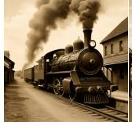

w/ GAN  
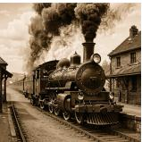

w/o GAN  

w/ GAN  

w/o GAN  
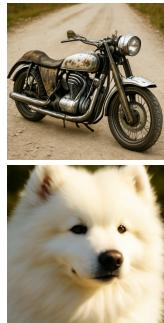

w/ GAN  
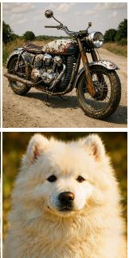

w/o GAN  
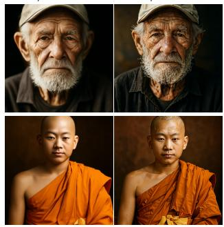  
w/ GAN

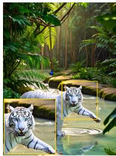  
w/o GAN

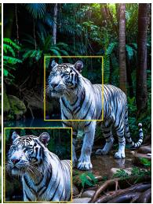  
w/ GAN

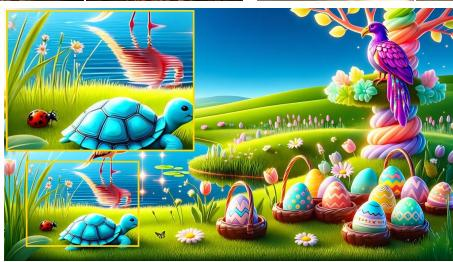  
w/o GAN

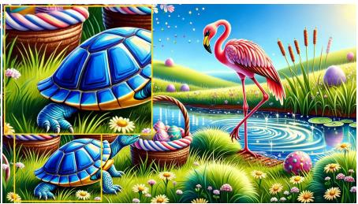  
w/ GAN

Figure 1 Each pair shows w/o GAN (left) and w/ GAN (right), where w/ GAN means adding the adversarial loss during post-training: eight $5 1 \dot { 2 } ^ { 2 }$ pairs across diverse prompts and styles (top) and two 1K pairs with zoom-ins (bottom).

## 1 Introduction

Recent work has renewed interest in pixel difusion for high-resolution text-to-image (T2I) generation (Hoogeboom et al., 2023; Chen, 2023; Ma et al., 2026a,b). Unlike latent difusion, which generates a compressed representation and relies on a separately trained decoder to render RGB (Rombach et al., 2022; Podell et al., 2024; Chen et al., 2024b; Xie et al., 2025), a pixel model predicts the final image. This direct parameterization removes the autoencoding bottleneck, but also makes the denoiser responsible for generating both global structure and fine image detail. Converged pixel models capture text semantics and coarse composition well, yet still underrepresent fine-scale image statistics (Ma et al., 2026b,a). This gap is visible in the smooth, under-textured outputs in Figure 1 and measurable in the radial power spectrum: the DeCo (Ma et al., 2026a) baseline exhibits a substantially steeper slope than real COCO images (α = 2.59 vs. ≈ 2.19; Table 2), indicating a measurable high-frequency deficit. We ask whether adversarial post-training can correct this residual detail gap without trading away distribution fidelity, diversity, or prompt alignment.

Adversarial objectives align a generator’s distribution with real data (Goodfellow et al., 2014; Lin et al., 2023, 2025). Within difusion systems, they are also used to pretrain the separately trained VAE/autoencoder decoder that maps latent codes to RGB, mitigating the blur of reconstruction-only training (Esser et al., 2021; Rombach et al., 2022). When applied to difusion generators, adversarial or distribution-matching objectives have mainly been used to enable large denoising transitions or distill models to one or a few sampling steps (Xiao et al., 2022; Sauer et al., 2024b; Yin et al., 2024b,a). We study a diferent role: adversarial post-training as a pure quality correction for an already-converged, multi-step pixel difusion model. We retain its original objective and add a hinge adversarial loss on the predicted clean image xˆ , excluding high-noise timesteps where global structure is not yet reliable. Throughout, we denote this adversarial-loss addition as +GAN (or w/ GAN in figures). The procedure uses no preference labels or reward model, performs no distillation, and does not reduce the number of sampling steps. Across DeCo Ma et al. (2026a) and PixelGen Ma et al. (2026b), it jointly improves distribution fidelity, coverage, prompt alignment, and no-reference image quality (Table 1). On DeCo, the DINOv2-text configuration improves FID from 33.27 to 28.59, recall from 0.361 to 0.406, and DPG Score (Hu et al., 2024) from 81.6 to 83.3.

We trace this gain to a systematic residual error in the pixel models’ outputs. Both baselines underproduce natural-image high-frequency (HF) statistics; adversarial post-training restores that missing power and, on DeCo, moves the radial power-spectrum slope from α = 2.59 to 2.24, close to real images at approximately 2.19. The efect is not generic sharpening. Non-adversarial perceptual supervision ofers another route to sharper pixel difusion, as explored by PixelGen with LPIPS/DINO features (Ma et al., 2026b). In our matched comparison, this perceptual objective also adds HF, but induces a desaturated, low-contrast domain shift and degrades FID and prompt alignment, whereas the GAN improves distributional and perceptual quality together. Recall increases, DINOv2 nearest-neighbor similarity to the training set is unchanged (Table 3), and all gains are measured against matched-step no-GAN SFT controls (Table 1), ruling out mode dropping, memorization, and additional optimization as simple explanations.

To explain when adversarial refinement can realize this gain, we adopt a two-condition view: it requires (i) a correctable error in an output subspace and (ii) suficient local access from the trainable output to that subspace. Pixel difusion satisfies both conditions: its output is HF-deficient RGB, and no decoder intervenes between the trainable prediction, the discriminator, and the final pixels. Two tested latent models provide a mechanism-matched output-access comparison. For each model, the GAN run is paired with its own no-GAN control under aligned training and evaluation. PixArt-α and SANA show no comparable joint improvement, while a direct perturbation probe through the frozen PixArt VAE measures a 3.5–11× weaker decoded-HF response. This matched comparison and direct probe identify limited decoded-HF access as an important mechanism; discriminator, weight, and noise-gate ablations separately show how design choices shift the empirical metric trade-ofs.

We organize our contributions around three questions—whether adversarial post-training works, why it works, and when it works:

• We propose adversarial post-training as a quality-refinement approach for pretrained T2I pixel difusion models. To our knowledge, we are the first to systematically study GAN-based post-training for pixel difusion. Across two pixel backbones, it jointly improves distribution fidelity, coverage, prompt alignment, and perceptual quality without changing the model architecture or inference procedure.

• We comprehensively analyze why adversarial post-training works in pixel space. Frequency-band and power-law analyses reveal a systematic deficit in natural-image HF statistics and show that the GAN restores the missing power. A matched perceptual-loss comparison further distinguishes this correction from generic sharpening: both objectives add HF, but only the GAN improves distributional and perceptual quality together.

• We characterize when adversarial refinement works through matched pixel–latent comparisons: direct pixel difusion models show consistent joint gains, whereas latent difusion models do not. Discriminator, noise-gate, and adversarial-weight ablations further map the operating conditions and metric trade-ofs within pixel difusion.

## 2 Related work

Generative adversarial networks. GANs (Goodfellow et al., 2014) long defined the state of the art in image synthesis, from the StyleGAN family (Karras et al., 2019, 2020b) to conditional image-to-image models built on patch discriminators (Isola et al., 2017). Scaled-up text-to-image GANs (Sauer et al., 2023; Kang et al., 2023) remain competitive on sharpness and sampling speed, but trail difusion on sample diversity and prompt controllability. A recurring lesson is that the discriminator governs what a GAN can learn. Projected and feature-space discriminators built on frozen pretrained backbones (Sauer et al., 2021, 2023) markedly stabilize and strengthen training, while augmentation schemes such as DifAugment and adaptive discriminator augmentation curb discriminator overfitting on limited data (Zhao et al., 2020; Karras et al., 2020a). We build directly on this line, using frozen DINOv2/DINOv3/SigLIP backbones (Oquab et al., 2023; Siméoni et al., 2025; Zhai et al., 2023) and text-conditioned projection heads (Sauer et al., 2023) as our discriminators throughout.

Adversarial losses in difusion. Although difusion models are trained by denoising (Ho et al., 2020; Song et al., 2021), an adversarial term still appears at two main points in the modern T2I stack. First, in tokenizer training: the VAE/autoencoder underlying latent difusion is trained with a combined perceptual (LPIPS) and patch-GAN objective (Esser et al., 2021; Rombach et al., 2022), so the discriminator acts on the decoder that renders pixels rather than on the difusion model itself. Second, in distillation: a discriminator lets a one- or few-step student match the data distribution, as in adversarial difusion distillation and distribution-matching distillation (Sauer et al., 2024b,a; Yin et al., 2024b,a). In both cases the GAN serves tokenization or step reduction. In contrast, we isolate the GAN as a pure multi-step quality term for an already-converged pixel-difusion model, changing neither its architecture nor its number of sampling steps.

Pixel difusion. Pixel difusion models denoise directly on RGB pixels (Ho et al., 2020; Dhariwal and Nichol, 2021; Nichol and Dhariwal, 2021), so the network outputs the final image and must synthesize all of its detail itself. Modern backbones adopt transformer denoisers (Peebles and Xie, 2023) and flow-matching or improved difusion formulations (Lipman et al., 2023; Karras et al., 2024). Once restricted to low resolution or multi-stage cascades, pixel difusion has recently re-emerged as a competitive single-stage paradigm: eficient high-resolution designs (Hoogeboom et al., 2023; Chen, 2023), flow- and neural-field variants (Chen et al., 2025b; Wang et al., 2026), and transformer backbones that decouple global structure from local detail (Chen et al., 2026; Yu et al., 2026), alongside strong text-to-image models such as DeCo (Ma et al., 2026a) and PixelGen (Ma et al., 2026b), which we adopt as our backbones.

## 3 Setup

Adversarial post-training. We treat the adversarial loss as post-training: from a converged model we add an adversarial/GAN loss to the original difusion/flow-matching objective and continue training. The generator sees the standard difusion/flow-matching loss plus $\mathcal { L } _ { G } = w _ { \mathrm { g a n } } \mathbb { E } [ - D ( h ( \hat { y } _ { 0 } ) ) ]$ ], while the discriminator minimizes $\begin{array} { r } { \mathcal { L } _ { D } = \frac { 1 } { 2 } \mathbb { E } [ \mathrm { r e l u } ( 1 - D ( h ( y _ { 0 } ) ) ) ] + \frac { 1 } { 2 } \mathbb { E } [ \mathrm { r e l u } ( 1 + D ( h ( \hat { y } _ { 0 } ) ) ) ] } \end{array}$ . Here y0 denotes the clean target in the model’s native output space—RGB x0 for DeCo and PixelGen, and latent z0 for SANA and PixArt-α—and h maps that space to the discriminator input. For velocity-prediction DeCo and SANA, $y _ { t } = ( 1 - \sigma _ { t } ) y _ { 0 } + \sigma _ { t } \epsilon$ and $\hat { y } _ { 0 } = y _ { t } - \sigma _ { t } v _ { \theta } ( y _ { t } , t )$ . PixelGen directly predicts $\hat { x } _ { 0 } = x _ { \theta } ( x _ { t } , t )$ ; eps-prediction PixArt-α uses $\hat { z } _ { 0 } =$ $( z _ { t } - \sqrt { 1 - \bar { \alpha } _ { t } } \epsilon _ { \theta } ( z _ { t } , t ) ) / \sqrt { \bar { \alpha } _ { t } }$ . For the pixel models h is the identity; decoded-RGB latent variants use the frozen VAE decoder, whereas the other latent ablations use native features as described in ${ \ S } 5 .$ 1.

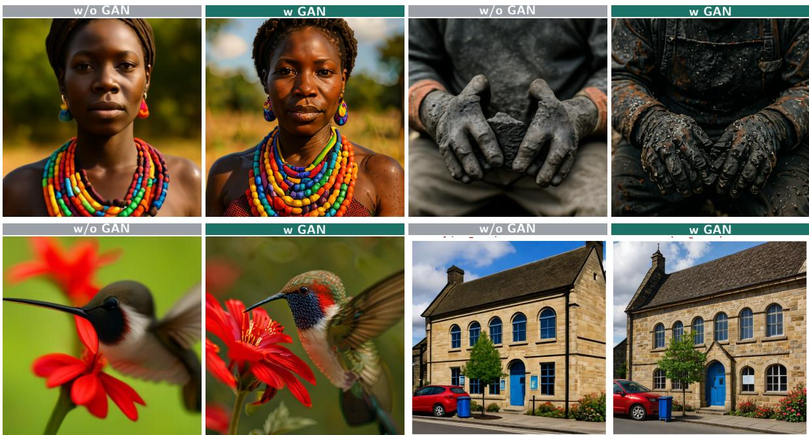  
Figure 2 Same-prompt, same-seed comparison with and without GAN fine-tuning.

Backbone and data. We study two pixel models, DeCo (Ma et al., 2026a) and PixelGen (Ma et al., 2026b), and two latent models, PixArt-α (Chen et al., 2024b) and SANA (Xie et al., 2025). All quantitative models are fine-tuned from public checkpoints on BLIP3o-60k Chen et al. (2025a), the same dataset originally used to train DeCo and PixelGen. For each backbone, the GAN and no-GAN controls share the same starting checkpoint, data, and training horizon. Please refer to Appendix A for details of the diferent discriminator architectures, model and training details.

Timestep gating. We apply the adversarial loss at non-high-noise (suficient-SNR) timesteps using the signal-fraction gate $\alpha _ { t } = 1 - \sigma _ { t } \geq \tau$ , since $\scriptstyle { \hat { x } } _ { 0 }$ is not yet a meaningful image in the high-noise regime. Exact gate choices, training details, and the discriminators are described in Appendix A. The gate thus excludes samples whose global layout is still unresolved while retaining the stage at which local appearance can be refined.

Evaluation. We report metrics in four groups. (i) Prompt alignment: DPG Score on DPG-Bench (Hu et al., 2024), which measures how faithfully the image follows the text. (ii) Distribution fidelity and diversity on COCO-30k (Lin et al., 2014): FID (Heusel et al., 2017) and patch-FID (pFID) for feature-distribution distance at the image and patch scale, CMMD (Jayasumana et al., 2024) as a lower-bias alternative to FID, IS (Salimans et al., 2016) for quality/diversity, recall (Kynkäänniemi et al., 2019) for mode coverage, and CLIP score (Radford et al., 2021) for image–text agreement. (iii) No-reference image quality, scoring a single image with no ground-truth reference: TOPIQ, MUSIQ, MANIQA, and NIQE (Chen et al., 2024a; Ke et al., 2021; Yang et al., 2022; Mittal et al., 2013). (iv) Naturalness of spatial statistics: the radial power spectrum and its fitted power-law slope α (natural images have α≈2 (Ruderman, 1994; van der Schaaf and van Hateren, 1996)), which reveals whether high-frequency content matches natural images rather than being over- or under-sharpened.

Table 1 GAN vs. no-GAN on two pixel backbones. DPG Score is evaluated on DPG-Bench (Hu et al., 2024); all other metrics use COCO-30k (Lin et al., 2014). Bold = better within each model.
<table><tr><td></td><td>variant</td><td>DPG Score↑</td><td>FID↓</td><td>IS↑</td><td>CMMD↓</td><td>Rec↑</td><td>pFID↓</td><td>TOPIQ↑</td><td>MUSIQ↑</td><td>MANIQA↑</td></tr><tr><td rowspan="2">DeCo (pixel)</td><td>no-GAN SFT</td><td>81.6</td><td>33.27</td><td>39.35</td><td>0.836</td><td>0.361</td><td>27.91</td><td>0.711</td><td>75.5</td><td>0.636</td></tr><tr><td>+GAN</td><td>83.3</td><td>28.59</td><td>39.77</td><td>0.736</td><td>0.406</td><td>24.38</td><td>0.768</td><td>76.5</td><td>0.712</td></tr><tr><td rowspan="2">PixelGen (pixel)</td><td>no-GAN SFT</td><td>78.4</td><td>33.94</td><td>38.58</td><td>0.762</td><td>0.319</td><td>30.81</td><td>0.755</td><td>75.7</td><td>0.645</td></tr><tr><td>+GAN</td><td>80.8</td><td>33.20</td><td>38.76</td><td>0.725</td><td>0.403</td><td>30.51</td><td>0.799</td><td>77.0</td><td>0.723</td></tr></table>

## 4 Adversarial post-training improves pixel difusion

## 4.1 Joint gains across pixel backbones

Adversarial post-training reliably improves pixel difusion for T2I on both backbones (Table 1). On DeCo, it improves the evaluation battery across DPG-Bench and COCO-30k: FID 33.3→28.6, pFID 27.9→24.4, CMMD 0.836→0.736, recall $0 . 3 6  0 . 4 1$ , TOPIQ 0.71→0.77, MANIQA 0.64→0.71, and DPG Score 81.6→83.3. The same GAN also improves PixelGen on every axis. Figure 2 shows the same efect qualitatively: the GAN adds fine detail while preserving global structure and color.

## 4.2 The GAN restores missing natural-image high frequencies

We inspect the frequency composition: the radial-profile band share $| \hat { I } ( f ) | ^ { 2 }$ in the mid and high bands. Mid frequency is $0 . 1 0 \leq f \leq 0 . 2 5$ cyc/px and high frequency is $0 . 2 5 < f \le 0 . 5 0$ cyc/px, with 0.50 cyc/px the Nyquist limit. Each bar in Figure 3 is the radial-profile power in that interval divided by the total radial-profile power, averaged over 30,000 images per model. On both pixel backbones, the GAN moves a substantial share of power into these bands: DeCo mid $4 . 9 \% \to 7 . 5 \%$ , high $2 . 1 \% $ 3.9%; PixelGen mid $6 . 6 \% \to 8 . 9 \%$ , high $3 . 9 \% \to 6 . 4 \%$ . To determine whether the added spectral power is natural detail rather than noise, we measure the radial power spectrum of the generations following the azimuthally-

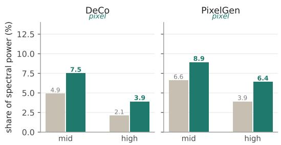  
Figure 3 Pixel radial-profile band share (%) over 30,000 images/model; $\mathrm { g r a y } = \mathrm { n o \mathrm { - } G A N } .$ , green = +GAN.

averaged power-spectrum method of Koch et al. (2010), applied to deep-network generations as in Dzanic et al. (2020). For each image we take the luminance channel, apply a 2-D Hann window, take the 2-D FFT, and azimuthally average the squared magnitude $| \hat { I } ( f ) | ^ { 2 }$ over rings of constant spatial frequency $f ;$ averaging over 30,000 images yields one power-vs-frequency curve per model, whose log–log slope we fit by least squares.

Natural images obey a power law $P ( f ) \propto f ^ { - \alpha }$ with α ≈ 2 (Ruderman, 1994; van der Schaaf and van Hateren, 1996): a larger α means power decays too fast with frequency, so the image is deficient in high frequency (soft, blurry), while α near the natural value means fine-scale detail matches real images. We summarize each model by two numbers: the fitted slope $\alpha ,$ and the change ∆ in high-frequency band power $( f > 0 . 2 5 \ \mathrm { c y c / p x } )$ between the GAN and no-GAN model, in dex $\left( \log _ { 1 0 } \right)$ . Unlike the normalized bandpower shares in Figure 3, HF $\log - \Delta$ measures the change in unnormalized high-band log-power (+GAN minus w/o GAN). On DeCo, the GAN raises the HF band by +0.34 dex and pulls the slope from an HF-deficient $\alpha { = } 2 . 5 9$ (no-GAN) toward the natural law $\alpha { = } 2 . 2 4$ (real $\mathrm { C O C O } \approx 2 . 1 9 )$ , without flattening toward white noise (which would drive $\alpha  0 ;$ Table 2). This is where the pixel model’s “added detail” is: it puts energy back into the frequencies a converged difusion model under-produces. The added energy is coherent texture, not artifacts.

Table 2 Pixel spectral statistics on COCO-30k; natural α≈2.19.
<table><tr><td></td><td>model HF log-∆ α w/o GAN</td><td> $\alpha + \mathrm { G A N }$ </td></tr><tr><td>DeCo</td><td>+0.34</td><td>2.59 2.24</td></tr><tr><td>real</td><td></td><td>≈ 2.19</td></tr></table>

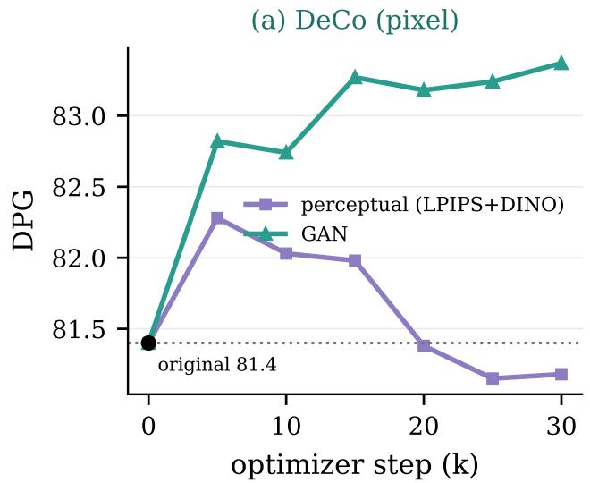

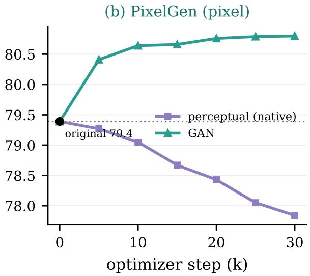  
Figure 4 DPG Score (Hu et al., 2024) trajectories initialized from the oficial, pre-SFT checkpoints. The GAN curves use an image-only DINOv2 discriminator. (a) DeCo; (b) PixelGen.

## 4.3 The gain is not generic sharpening or mode dropping

Sharpening without mode collapse or memorization. Unlike a GAN trained as the primary objective, ours is a posttraining term on $\scriptstyle { \hat { x } } _ { 0 }$ restricted to non-high-noise timesteps that adds high frequency without replacing the backbone, so it sharpens without dropping modes: recall rises (0.36 → 0.41) rather than falling as adversarial training usually does. To test memorization, we embed each generated image and each of the ∼60k training images with the frozen DINOv2 encoder. We then compute cosine similarity to all training images and retain the largest value as its training-set nearest-neighbor score. Table 3 reports the mean and maximum of these per-image scores over the evaluation set. The mean changes by only +0.0001 (both variants round to 0.586), while the maximum is lower with the GAN (0.929 vs. 0.943). The added detail is therefore synthesized, not copied from nearby training examples. To separate synthesis from generic sharpening, we apply a plain unsharp-mask filter to the no-GAN outputs, tuned to match the +GAN HF spectrum (HF log-∆ and α; Appendix Table 12). Even spectrum-matched sharpening improves FID only to 32.3 at best, versus 28.59 for the GAN, and falls short in no-reference quality, ruling out generic sharpening.

Table 3 DINOv2 nearest-neighbor similarity to ∼60k-image training set.
<table><tr><td>variant</td><td>mean NN↓</td><td>maximum NN↓</td></tr><tr><td>no-GAN</td><td>0.586</td><td>0.943</td></tr><tr><td>+GAN</td><td>0.586</td><td>0.929</td></tr><tr><td>∆</td><td>+0.0001</td><td>-0.014</td></tr></table>

GAN vs. perceptual: two routes to visual quality. The pixel GAN helps because it adds real high frequency, which raises the question of whether adding high frequency by any means is enough. Perceptual losses (LPIPS + deep DINO features), using the formulation and loss weights adopted by PixelGen, are the standard non-adversarial way to sharpen a converged model, and, as we show below, they also raise high-frequency power, yet they hurt, which makes them the natural point of comparison. Appendix Table 10 reports the SFT-checkpoint comparison used in Table 1: its no-GAN and +GAN rows match the main table, with the perceptual arm added. On DeCo, the perceptual arm raises no-reference quality scores (TOPIQ 0.711 → 0.749, MANIQA 0.636→0.661) but worsens FID (33.3→34.1), pFID (27.9→28.6), and DPG Score (81.6→81.4). The main GAN instead improves these metrics to 28.59, 24.38, and 83.3, respectively, while raising TOPIQ and MANIQA to 0.768 and 0.712. Thus, its quality gain is real rather than a metric artifact; real photographs themselves score lowest on TOPIQ (0.57), showing why no-reference metrics are insuficient on their own. PixelGen follows the same pattern: its native perceptual/SFT baseline has a DPG Score of 78.4, whereas +GAN reaches 80.8 and wins on every reported metric. Figure 4 separately reports trajectories initialized directly from the oficial pre-SFT checkpoints. DeCo changes from 81.4 to 81.2 with perceptual supervision and to 83.4 with GAN, while PixelGen changes from 79.4 to 77.8 and 80.8, respectively.

Table 4 Image statistics on DPG-Bench (Hu et al., 2024). Perceptual supervision reduces color statistics; GAN preserves them while adding sharpness and 2-D HF spectral energy.
<table><tr><td></td><td>Saturation</td><td>Contrast</td><td>Colorfulness</td><td>Sharpness (Lap. var)</td><td>2-D HF spectral-energy ratio (%)</td></tr><tr><td>original</td><td>0.532</td><td>0.240</td><td>0.260</td><td>0.0076</td><td>4.3</td></tr><tr><td>+perceptual</td><td>0.511</td><td>0.210</td><td>0.221</td><td>0.022</td><td>7.9</td></tr><tr><td>+GAN</td><td>0.544</td><td>0.239</td><td>0.256</td><td>0.052</td><td>13.9</td></tr></table>

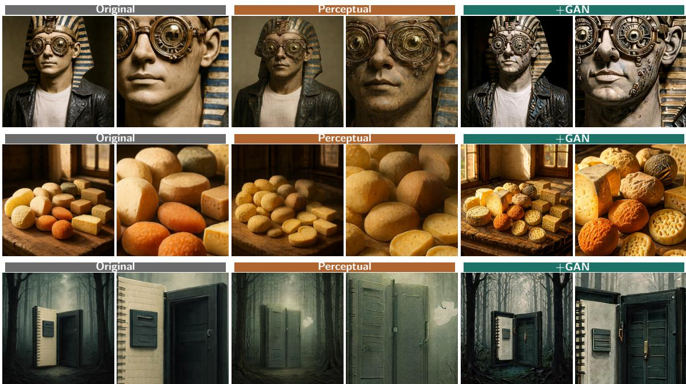  
Figure 5 PixelGen outputs (original, perceptual, and +GAN; full image + zoom).

Why the perceptual arm hurts: a color-domain shift, not a blur. Across both the SFT comparison in Appendix Table 10 and the pre-SFT trajectories in Figure 4, perceptual supervision weakens DPG Score, whereas GAN improves it. Both objectives add HF and increase Laplacian sharpness, so the perceptual failure is not over-smoothing. Instead, it consistently lowers saturation, contrast, and colorfulness, while the GAN preserves them (Table 4). The perceptual loss therefore buys texture by shifting images toward a desaturated, flattened domain; Figure 5 shows representative cases in which this shift degrades the target while the GAN keeps it sharp and vivid.

## 5 Pixel–latent contrast and design trade-ofs in pixel difusion

Having established the efectiveness and mechanism of adversarial post-training in pixel difusion, we now contrast its behavior with latent difusion. We then examine how discriminator design, timestep gating, and adversarial weight shape the trade-ofs within pixel difusion.

## 5.1 Pixel–latent outcome and spectral contrast

We apply adversarial refinement to two latent models: PixArt-α (XL/2, 0.61B) and SANA (1.6B). Relative to the pixel models, the mechanism-level distinction is the output path: DeCo and PixelGen directly produce RGB, whereas the latent models reach RGB through a frozen decoder. The latent rows in Table 5 test three discriminator placements. Self-GAN uses a copy of the corresponding generator architecture—SanaMS for SANA and the full DiT for PixArt—as a discriminator on the predicted clean latent. Feature-PatchGAN instead applies a lightweight PatchGAN-style discriminator directly to SANA’s predicted latent. In the decoded-RGB variants, the predicted latent passes through the frozen decoder and the resulting image is scored by either PatchGAN or the same frozen-DINOv2 discriminator used in the pixel experiments. The VAE remains frozen in every case; only the difusion model and discriminator are optimized.

Image-quality / preference win-rate vs no-GAN (1,065 DPG-Bench matched pairs)  
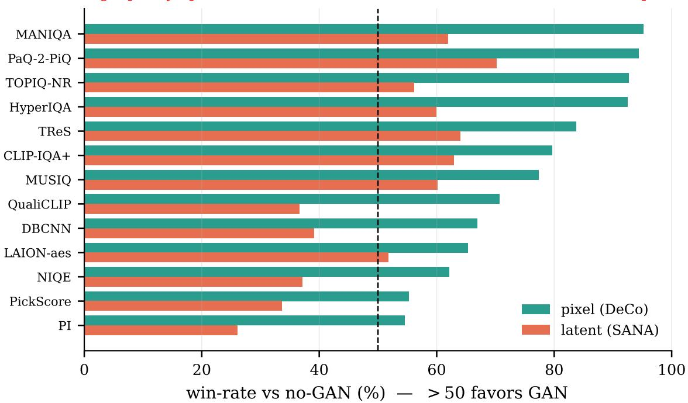  
Figure 6 Image-quality / preference win-rate vs. no-GAN (1,065 DPG-Bench matched pairs (Hu et al., 2024)). The pixel difusion’s GAN (DeCo) is preferred across metrics, well above the latent difusion’s GAN (SANA).

Table 5 Pixel–latent comparison. DPG Score uses DPG-Bench (Hu et al., 2024); other metrics use COCO-30k. Bold marks the better matched result.
<table><tr><td>variant</td><td></td><td>DPG Score ↑</td><td>FID↓</td><td>IS↑</td><td>CLIP↑</td><td>CMMD↓</td><td>Rec↑</td><td>pFID↓</td><td>TOPIQ↑</td><td>MUSIQ↑</td><td>MANIQA↑</td></tr><tr><td rowspan="2">DeCo (pixel)</td><td>no-GAN SFT</td><td>81.6</td><td>33.27</td><td>39.35</td><td>0.318</td><td>0.836</td><td>0.361</td><td>27.91</td><td>0.711</td><td>75.5</td><td>0.636</td></tr><tr><td>+GAN</td><td>83.3</td><td>28.59</td><td>39.77</td><td>0.319</td><td>0.736</td><td>0.406</td><td>24.38</td><td>0.768</td><td>76.5</td><td>0.712</td></tr><tr><td rowspan="5">SANA (latent)</td><td>no-GAN SFT (L1)</td><td>83.6</td><td>36.58</td><td>39.20</td><td>0.320</td><td>0.872</td><td>0.340</td><td>32.20</td><td>0.760</td><td>75.8</td><td>0.631</td></tr><tr><td>+GAN self-GAN (DiT)</td><td>83.4</td><td>36.24</td><td>38.75</td><td>0.321</td><td>0.853</td><td>0.325</td><td>33.29</td><td>0.727</td><td>76.2</td><td>0.614</td></tr><tr><td>+GAN feat-PatchGAN (L2)</td><td>83.5</td><td>38.41</td><td>36.41</td><td>0.320</td><td>0.915</td><td>0.334</td><td>35.18</td><td>0.764</td><td>76.0</td><td>0.646</td></tr><tr><td>+GAN dec-RGB PatchGAN (B1)</td><td>79.7</td><td>40.95</td><td>29.75</td><td>0.317</td><td>0.910</td><td>0.219</td><td>44.29</td><td>0.741</td><td>74.8</td><td>0.639</td></tr><tr><td>no-GAN SFT</td><td>73.3</td><td>33.70</td><td>38.96</td><td>0.315</td><td>0.940</td><td>0.433</td><td>30.07</td><td>0.737</td><td>74.9</td><td>0.599</td></tr><tr><td rowspan="3">PixArt (latent)</td><td>+GAN self-GAN (DiT)</td><td>75.5</td><td>35.08</td><td>38.81</td><td>0.316</td><td>0.892</td><td>0.425</td><td>31.46</td><td>0.660</td><td>74.3</td><td>0.534</td></tr><tr><td>+GAN dec-RGB DINÓv2</td><td>72.1</td><td>34.25</td><td>32.81</td><td>0.310</td><td>0.701</td><td>0.188</td><td>36.14</td><td>0.461</td><td>64.2</td><td>0.370</td></tr><tr><td></td><td></td><td></td><td></td><td></td><td></td><td></td><td></td><td></td><td></td><td></td></tr></table>

pixel DeCo pixel PixelGenTable 5 establishes the outcome contrast under matched no-12.5 (%GAN controls: the tested latent configurations yield at most weisolated metric gains, but none reproduces the joint improvement l 7.5of DeCo. Figure 6 transfers the broad image-quality/preference cevaluation to matched no-GAN pairs; the pixel GAN wins across f s 3.9 3.9metrics, whereas the latent GAN is substantially weaker and 2.5re 2.1often falls below the 50% preference threshold. We then transfer 0.0sthe frequency-band and power-law diagnostics from §4 to decoded latent outputs. Unlike pixel difusion, neither latent model restores decoded HF: the high-band share changes only from 2.2% to 2.3% for SANA and from 2.1% to 1.9% for PixArt (Figure 7).

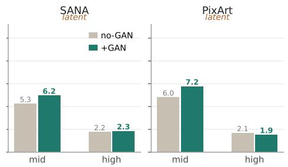  
Figure 7 Frequency response of the self GAN (DiT) variants in Table 5.

The HF log-power changes and fitted slopes move neither model toward the natural-image value $\alpha { \approx } 2 . 1 9$ (Table 6). Together, the tested latent models exhibit neither the joint quality gains nor the decoded-HF correction observed in pixel difusion; Appendix Figure 10 provides same-prompt comparisons, and we test the decoder-mediated output-access explanation directly below.

Table 6 Spectral statistics of the self-GAN (DiT) variants in Table 5.
<table><tr><td>model</td><td></td><td>HF log-∆ α w/o GAN α +GAN</td></tr><tr><td>SANA</td><td>+0.09</td><td>2.54 2.80</td></tr><tr><td>PixArt</td><td>-0.14</td><td>2.72 2.86</td></tr><tr><td>real</td><td></td><td>≈2.19</td></tr></table>

## 5.2 Frozen VAE decoding attenuates access to high frequencies

What an adversarial loss can change is the generator’s native output—pixels in pixel difusion and a latent z in latent difusion. We isolate this representation-to-image constraint with the output-access operator $A _ { H } = P _ { H } J _ { h } \colon$ h is the identity in pixel difusion, whereas PixArt’s frozen VAE decoder mediates the mapping. Under matched native-output perturbations, the VAE produces 3.5–11× less decoded-HF response than the pixel identity map (Figure 8); independently, VAE encoding and decoding steepens the real-image spectral slope to $\alpha = 2 . 4 8$ and removes approximately 0.2 dex of HF power (§5.1). Gradients are not blocked, but directions that afect decoded HF are strongly attenuated. Together with PixArt’s absent decoded-HF gain and paired quality results, this provides strong evidence that limited output access is an important mechanism behind the observed pixel–latent contrast.

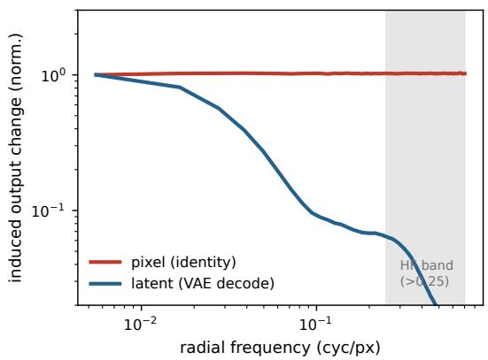  
Figure 8 The frozen PixArt VAE attenuates decoded-HF response by 3.5–11× relative to the pixel identity map.

## 5.3 Trends across discriminator design

Table 7 reports empirical trends across discriminator designs. In this sweep, pixel discriminators trained from scratch (PatchGAN, StyleGAN) stay near the no-GAN FID baseline (32.5–33.5), whereas discriminators built on frozen pretrained backbones (DINOv2, DINOv2-Large, DINOv3, SigLIP) tend to produce lower FID (28.6–31.0) and DPG Score up to 83.4. The individual rows, however, favor diferent metrics and do not define a complete ordering. The DINOv2-text main configuration is reported at $t { \geq } 0 . 5 3$ and emphasizes FID/CMMD/pFID, whereas the image-only DINOv2 row at $t { \geq } 0 . 3 5$ emphasizes a diferent balance including DPG Score, recall, and NR-IQA.

## 5.4 Gate and adversarial weight control the quality trade-of

Trends across the noise gate (Table 8). Because the discriminator scores the predicted clean image $\scriptstyle { \hat { x } } _ { 0 }$ and the GAN only supplies high-frequency detail, it can help only where two conditions hold at once: the coarse structure of $\scriptstyle { \hat { x } } _ { 0 }$ is already settled (otherwise the discriminator drives detail onto the wrong shapes and corrupts semantics) and the fine detail is still missing (otherwise there is nothing to add). Since difusion sampling is coarse-to-fine, these conditions co-occur only in a specific noise range, which Figure 9 makes quantitative: along the sampling trajectory we take the running clean estimate ${ \hat { x } } _ { 0 } ( t )$ and split its residual to the finished image into a low-frequency (structure) and a high-frequency (detail) band. Averaged over 1,000 prompts (Fig. 9a), the structure residual is already low and flattening by t≈ 0.35 while the detail residual stays large and only vanishes near $t = 1 ;$ the per-image residual maps (Fig. 9b) show the same coarse-to-fine pattern. This gives the gate a clear reading: below it $( t \lesssim 0 . 3 )$ the outline is unreliable and the GAN would push detail onto unformed structure, whereas a very tight gate $( t \ge 0 . 8 )$ exposes it to too few refinement steps. Consequently the sweep yields several useful operating points rather than a single optimum (Table 8): with the fixed DINOv2 discriminator and w=0.1, t≥0.35 emphasizes DPG Score and no-reference quality, t≥0.53 gives higher IS and recall with competitive distribution metrics, and broader gates favor CMMD and pFID—no threshold dominates the full suite. We therefore use t≥0.35 for the fixed-DINOv2 ablations and t≥0.53 for the DINOv2-text main configuration.

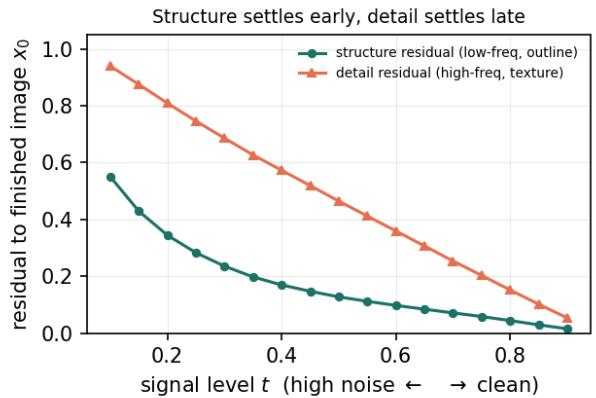

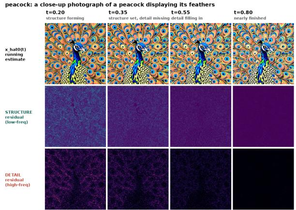  
Figure 9 Noise-gate rationale. Across 1,000 prompts, structure stabilizes by t ≈ 0.35 − 0.55 while detail remains incomplete; per-image residuals show the same coarse-to-fine pattern.

Trends across GAN weight (Table 9). The adversarial weight w is a single strength knob. Raising it monotonically increases no-reference sharpness, while lower and moderate weights preserve stronger distribution and alignment metrics. No value dominates across the full metric suite. We use w=0.1 as the reference operating point for the standard ablation configuration so that the remaining factors can be compared consistently.

Together, these ablations show how discriminator design, gate, and adversarial weight shift the balance among fidelity, alignment, coverage, and perceptual quality. They are intended to expose trends rather than identify a universally optimal configuration or provide a complete conclusion for every metric. We therefore report them as operating points and leave the configuration choice to the target metric balance.

## 6 Conclusion

We study adversarial post-training as a quality-refinement approach for pretrained pixel difusion models. Across two backbones, it jointly improves distributional, semantic, and perceptual quality without changing the architecture or inference procedure. Our analysis shows that adversarial supervision restores systematically missing natural-image high-frequency statistics, whereas existing perceptual losses introduce a domain shift. The pixel–latent contrast further suggests that efective refinement depends on direct access to the final image space: frozen decoders attenuate corrections to decoded high-frequency content. These results establish pixel difusion as a particularly efective setting for adversarial post-training and identify output access as a key factor governing its success.

## References

Chaofeng Chen, Jiadi Mo, Jingwen Hou, Haoning Wu, Liang Liao, Wenxiu Sun, Qiong Yan, and Weisi Lin. Topiq: A top-down approach from semantics to distortions for image quality assessment. IEEE Transactions on Image Processing, 2024a.

Jiuhai Chen, Zhiyang Xu, Xichen Pan, Yushi Hu, Can Qin, Tom Goldstein, Lifu Huang, Tianyi Zhou, Saining Xie, Silvio Savarese, et al. BLIP3-o: A family of fully open unified multimodal models—architecture, training and dataset. arXiv preprint arXiv:2505.09568, 2025a.

Junsong Chen, Jincheng Yu, Chongjian Ge, Lewei Yao, Enze Xie, Zhongdao Wang, James Kwok, Ping Luo, Huchuan Lu, and Zhenguo Li. PixArt-α: Fast training of difusion transformer for photorealistic text-to-image synthesis. In International conference on learning representations, 2024b.

Shoufa Chen, Chongjian Ge, Shilong Zhang, Peize Sun, and Ping Luo. Pixelflow: Pixel-space generative models with flow. arXiv preprint arXiv:2504.07963, 2025b.

Ting Chen. On the importance of noise scheduling for difusion models. arXiv preprint arXiv:2301.10972, 2023.

Zhennan Chen, Junwei Zhu, Xu Chen, Jiangning Zhang, Xiaobin Hu, Hanzhen Zhao, Chengjie Wang, Jian Yang, and Ying Tai. Dip: Taming difusion models in pixel space. In Proceedings of the IEEE/CVF Conference on Computer Vision and Pattern Recognition, 2026.

Prafulla Dhariwal and Alexander Nichol. Difusion models beat GANs on image synthesis. In Advances in Neural Information Processing Systems (NeurIPS), 2021.

Tarik Dzanic, Karan Shah, and Freddie Witherden. Fourier spectrum discrepancies in deep network generated images. In Advances in Neural Information Processing Systems (NeurIPS), 2020.

Patrick Esser, Robin Rombach, and Björn Ommer. Taming transformers for high-resolution image synthesis. In IEEE/CVF Conference on Computer Vision and Pattern Recognition (CVPR), 2021.

Ian J Goodfellow, Jean Pouget-Abadie, Mehdi Mirza, Bing Xu, David Warde-Farley, Sherjil Ozair, Aaron Courville, and Yoshua Bengio. Generative adversarial nets. Advances in neural information processing systems, 2014.

Martin Heusel, Hubert Ramsauer, Thomas Unterthiner, Bernhard Nessler, and Sepp Hochreiter. Gans trained by a two time-scale update rule converge to a local nash equilibrium. In Advances in Neural Information Processing Systems (NeurIPS), 2017.

Jonathan Ho, Ajay Jain, and Pieter Abbeel. Denoising difusion probabilistic models. In Advances in Neural Information Processing Systems (NeurIPS), 2020.

Emiel Hoogeboom, Jonathan Heek, and Tim Salimans. Simple difusion: End-to-end difusion for high resolution images. In International Conference on Machine Learning (ICML), 2023.

Xiwei Hu, Rui Wang, Yixiao Fang, Bin Fu, Pei Cheng, and Gang Yu. ELLA: Equip difusion models with LLM for enhanced semantic alignment. arXiv preprint arXiv:2403.05135, 2024.

Phillip Isola, Jun-Yan Zhu, Tinghui Zhou, and Alexei A Efros. Image-to-image translation with conditional adversarial networks. In 2017 IEEE conference on computer vision and pattern recognition (CVPR), 2017.

Sadeep Jayasumana, Srikumar Ramalingam, Andreas Veit, Daniel Glasner, Ayan Chakrabarti, and Sanjiv Kumar. Rethinking fid: Towards a better evaluation metric for image generation. In 2024 IEEE/CVF Conference on Computer Vision and Pattern Recognition (CVPR), 2024.

Minguk Kang, Jun-Yan Zhu, Richard Zhang, Jaesik Park, Eli Shechtman, Sylvain Paris, and Taesung Park. Scaling up gans for text-to-image synthesis. In 2023 IEEE/CVF Conference on Computer Vision and Pattern Recognition (CVPR), 2023.

Tero Karras, Samuli Laine, and Timo Aila. A style-based generator architecture for generative adversarial networks. In 2019 IEEE/CVF conference on computer vision and pattern recognition (CVPR), 2019.

Tero Karras, Miika Aittala, Janne Hellsten, Samuli Laine, Jaakko Lehtinen, and Timo Aila. Training generative adversarial networks with limited data. In Advances in Neural Information Processing Systems (NeurIPS), 2020a.

Tero Karras, Samuli Laine, Miika Aittala, Janne Hellsten, Jaakko Lehtinen, and Timo Aila. Analyzing and improving the image quality of stylegan. In 2020 IEEE/CVF Conference on Computer Vision and Pattern Recognition (CVPR), 2020b.

Tero Karras, Miika Aittala, Jaakko Lehtinen, Janne Hellsten, Timo Aila, and Samuli Laine. Analyzing and improving the training dynamics of difusion models. In 2024 IEEE/CVF Conference on Computer Vision and Pattern Recognition (CVPR), 2024.

Junjie Ke, Qifei Wang, Yilin Wang, Peyman Milanfar, and Feng Yang. Musiq: Multi-scale image quality transformer. In 2021 IEEE/CVF International Conference on Computer Vision (ICCV), 2021.

Michael Koch, Joachim Denzler, and Christoph Redies. 1/f 2 characteristics and isotropy in the Fourier power spectra of visual art, cartoons, comics, mangas, and diferent categories of photographs. PLoS ONE, 2010.

Tuomas Kynkäänniemi, Tero Karras, Samuli Laine, Jaakko Lehtinen, and Timo Aila. Improved precision and recal metric for assessing generative models. In Advances in Neural Information Processing Systems (NeurIPS), 2019.

Tsung-Yi Lin, Michael Maire, Serge Belongie, James Hays, Pietro Perona, Deva Ramanan, Piotr Dollár, and C Lawrence Zitnick. Microsoft coco: Common objects in context. In European conference on computer vision, 2014.

Xin Lin, Chao Ren, Xiao Liu, Jie Huang, and Yinjie Lei. Unsupervised image denoising in real-world scenarios via self-collaboration parallel generative adversarial branches. In 2023 IEEE/CVF International Conference on Computer Vision (ICCV), 2023.

Xin Lin, Yuyan Zhou, Jingtong Yue, Chao Ren, Kelvin CK Chan, Lu Qi, and Ming-Hsuan Yang. Re-boosting self-collaboration parallel prompt gan for unsupervised image restoration. IEEE Transactions on Pattern Analysis and Machine Intelligence, 2025.

Yaron Lipman, Ricky TQ Chen, Heli Ben-Hamu, Maximilian Nickel, and Matt Le. Flow matching for generative modeling. In International Conference on Learning Representations (ICLR), 2023.

Zehong Ma, Longhui Wei, Shuai Wang, Shiliang Zhang, and Qi Tian. Deco: Frequency-decoupled pixel difusion for end-to-end image generation. In Proceedings of the IEEE/CVF Conference on Computer Vision and Pattern Recognition, 2026a.

Zehong Ma, Ruihan Xu, and Shiliang Zhang. Pixelgen: Improving pixel difusion with perceptual supervision. arXiv preprint arXiv:2602.02493, 2026b.

Anish Mittal, Rajiv Soundararajan, and Alan C Bovik. Making a completely blind image quality analyzer. IEEE Signal Processing Letters, 2013.

Alexander Quinn Nichol and Prafulla Dhariwal. Improved denoising difusion probabilistic models. In International Conference on Machine Learning (ICML), 2021.

Maxime Oquab, Timothée Darcet, Théo Moutakanni, Huy Vo, Marc Szafraniec, Vasil Khalidov, Pierre Fernandez, Daniel Haziza, Francisco Massa, Alaaeldin El-Nouby, et al. Dinov2: Learning robust visual features without supervision. arXiv preprint arXiv:2304.07193, 2023.

William Peebles and Saining Xie. Scalable difusion models with transformers. In 2023 IEEE/CVF International Conference on Computer Vision (ICCV), 2023.

Dustin Podell, Zion English, Kyle Lacey, Andreas Blattmann, Tim Dockhorn, Jonas Müller, Joe Penna, and Robin Rombach. Sdxl: Improving latent difusion models for high-resolution image synthesis. In International Conference on Learning Representations, 2024.

Alec Radford, Jong Wook Kim, Chris Hallacy, Aditya Ramesh, Gabriel Goh, Sandhini Agarwal, Girish Sastry, Amanda Askell, Pamela Mishkin, Jack Clark, et al. Learning transferable visual models from natural language supervision. In International conference on machine learning, 2021.

Robin Rombach, Andreas Blattmann, Dominik Lorenz, Patrick Esser, and Björn Ommer. High-resolution image synthesis with latent difusion models. In 2022 IEEE/CVF conference on computer vision and pattern recognition (CVPR), 2022.

Daniel L Ruderman. The statistics of natural images. Network: Computation in Neural Systems, 1994.

Tim Salimans, Ian Goodfellow, Wojciech Zaremba, Vicki Cheung, Alec Radford, and Xi Chen. Improved techniques for training gans. In Advances in Neural Information Processing Systems (NeurIPS), 2016.

Axel Sauer, Kashyap Chitta, Jens Müller, and Andreas Geiger. Projected GANs converge faster. In Advances in Neural Information Processing Systems (NeurIPS), 2021.

Axel Sauer, Tero Karras, Samuli Laine, Andreas Geiger, and Timo Aila. Stylegan-t: Unlocking the power of gans for fast large-scale text-to-image synthesis. In International conference on machine learning, 2023.

Axel Sauer, Frederic Boesel, Tim Dockhorn, Andreas Blattmann, Patrick Esser, and Robin Rombach. Fast highresolution image synthesis with latent adversarial difusion distillation. In SIGGRAPH Asia 2024 Conference Papers, 2024a.

Axel Sauer, Dominik Lorenz, Andreas Blattmann, and Robin Rombach. Adversarial difusion distillation. In European Conference on Computer Vision, 2024b.

Oriane Siméoni et al. DINOv3. arXiv preprint arXiv:2508.10104, 2025.

Yang Song, Jascha Sohl-Dickstein, Diederik P Kingma, Abhishek Kumar, Stefano Ermon, and Ben Poole. Scorebased generative modeling through stochastic diferential equations. In International Conference on Learning Representations (ICLR), 2021.

A. van der Schaaf and J. H. van Hateren. Modelling the power spectra of natural images: statistics and information. Vision research, 1996.

Shuai Wang, Ziteng Gao, Chenhui Zhu, Weilin Huang, and Limin Wang. Pixnerd: Pixel neural field difusion. In International Conference on Learning Representations, 2026.

Zhisheng Xiao, Karsten Kreis, and Arash Vahdat. Tackling the generative learning trilemma with denoising difusion GANs. In International Conference on Learning Representations (ICLR), 2022.

Enze Xie, Junsong Chen, Junyu Chen, Han Cai, Haotian Tang, Yujun Lin, Zhekai Zhang, Muyang Li, Ligeng Zhu, Yao Lu, and Song Han. SANA: Eficient high-resolution image synthesis with linear difusion transformers. In International Conference on Learning Representations (ICLR), 2025.

Sidi Yang, Tianhe Wu, Shuwei Shi, Shanshan Lao, Yuan Gong, Mingdeng Cao, Jiahao Wang, and Yujiu Yang. Maniqa: Multi-dimension attention network for no-reference image quality assessment. In 2022 IEEE/CVF Conference on Computer Vision and Pattern Recognition Workshops (CVPRW), 2022.

Tianwei Yin, Michaël Gharbi, Taesung Park, Richard Zhang, Eli Shechtman, Fredo Durand, and William T Freeman. Improved distribution matching distillation for fast image synthesis. In Advances in Neural Information Processing Systems (NeurIPS), 2024a.

Tianwei Yin, Michaël Gharbi, Richard Zhang, Eli Shechtman, Fredo Durand, William T Freeman, and Taesung Park. One-step difusion with distribution matching distillation. In 2024 IEEE/CVF Conference on Computer Vision and Pattern Recognition (CVPR), 2024b.

Yongsheng Yu, Wei Xiong, Weili Nie, Yichen Sheng, Shiqiu Liu, and Jiebo Luo. Pixeldit: Pixel difusion transformers for image generation. In Proceedings of the IEEE/CVF Conference on Computer Vision and Pattern Recognition, 2026.

Xiaohua Zhai, Basil Mustafa, Alexander Kolesnikov, and Lucas Beyer. Sigmoid loss for language image pre-training. In 2023 IEEE/CVF International Conference on Computer Vision (ICCV), 2023.

Shengyu Zhao, Zhijian Liu, Ji Lin, Jun-Yan Zhu, and Song Han. Diferentiable augmentation for data-eficient gan training. Advances in neural information processing systems, 2020.

## A Implementation and model details

Implementation and training details. Backbones. DeCo is a 1.1B-parameter pixel difusion transformer that denoises directly in RGB at $5 1 2 ^ { 2 }$ uses flow matching, and is sampled in 25 steps. PixelGen uses a JiT backbone with approximately 1.1B parameters at $5 1 2 ^ { 2 }$ . The quantitative models are fine-tuned from their converged public checkpoints on the same public blip3o data. The DeCo main-table result instead uses DINOv2-text, which adapts the projection-discriminator conditioning of StyleGAN-T (Sauer et al., 2023): a pooled Qwen caption embedding is projected into each tapped DINOv2 feature space, and its inner product with the pooled image feature is added to the unconditional patch logits. Unlike StyleGAN-T, whose visual discriminator uses fixed 224×224 inputs, our DINOv2-text discriminator retains native-resolution scoring and resizes only to the nearest multiple of 14 (512→504). It uses gate $t \geq 0 . 5 3 ;$ as noted in Table 7, the $t \geq 0 . 3 5$ and $t \geq 0 . 5 3$ settings are reported as separate operating points with diferent metric profiles. Losses. Hinge GAN: $\mathcal { L } _ { G } = \lambda \mathbb { E } [ - D ( \hat { x } _ { 0 } ) ]$ and $\begin{array} { r } { \mathcal { L } _ { D } = \frac { 1 } { 2 } \mathbb { E } [ \mathrm { r e l u } ( 1 - D ( x ) ) ] + \frac { 1 } { 2 } \mathbb { E } [ \mathrm { r e l u } ( 1 + D ( \hat { x } _ { 0 } ) ) ] } \end{array}$ , with GAN weight $\lambda = 0 . 1$ , applied at non-high-noise timesteps $t \bar { \geq } 0 . 3 5$ . The original flow-matching objective is retained, together with a REPA feature-alignment term (weight 0.5) that aligns denoiser features to DINOv2 layer 6 (distinct from the discriminator’s blocks) through a 3-layer MLP projection (1536→1536→768). DifAugment (color,translation,cutout) is applied to both real and fake images before the discriminator and is diferentiable, so the gradient reaches the generator. Optimization. Generator: AdamW, lr $1 0 ^ { - 5 }$ , betas (0.9, 0.999), weight decay 0. Discriminator: AdamW, lr $2 \times 1 0 ^ { - 4 }$ , betas (0.0, 0.99), gradient clip 1.0 (a two-time-scale update; a 10× larger generator lr collapses training). We update the generator first with the discriminator frozen but retained in the computation graph, then update the discriminator on detached samples using its separate optimizer. One generator and one discriminator update per step (1:1), giving a global batch of 512; EMA decay 0.9999. Warm-start, steps, and data. We fine-tune from the converged DeCo model for 30k steps. The text encoder is Qwen3-1.7B (max length 128). Training data is BLIP3o-60k Chen et al. (2025a) (∼60k image–caption pairs) at 5122 with no random crop and training timeshift 4.0. At inference we use the AdamLM sampler. PixelGen +GAN follows the same discriminator, loss, and optimizer recipe.

Latent-model pairing and step units. For each latent backbone, the +GAN and no-GAN runs use the same converged starting checkpoint, model parameterization, data, training horizon, prompts, and evaluation. PixArt uses a frozen f8c4 VAE with eps-prediction, while SANA uses flow matching. PixArt no-GAN checkpoints are named by micro/dataloader step (optimizer = micro/4). All DPG-Bench/COCO-30k comparisons are aligned to a consistent unit within each figure and table.

Discriminator backbones. Table 7 compares discriminator designs from two families. All use the same hinge loss and optimizer described above; the tested gate threshold for each configuration is reported in the table. From-scratch discriminators learn from the RGB image with no pretrained prior. PatchGAN is the Pix2Pix / taming-transformers N-layer discriminator (Isola et al., 2017): 4×4 stride-2 convolutions with a patch (rather than whole-image) receptive field, applied directly to the [−1, 1] RGB tensor, with GroupNorm (batch-statistic-free, so real and fake can be scored in separate DDP passes) and spectralnormalized convolutions (ndf = 64, 3 layers). StyleGAN is the ProGAN/StyleGAN discriminator (Karras et al., 2019): equalized-learning-rate convolutions, a fromRGB 1×1 conv, a stack of downsampling blocks (two 3×3 convs + average-pool), a minibatch-standard-deviation layer at 4×4, and LeakyReLU(0.2), operating at 256px. Frozen-feature projected discriminators follow projected GANs (Sauer et al., 2021): a frozen pretrained backbone supplies features and only lightweight heads are trained. DINOv2 (our main choice) taps patch tokens from blocks {2, 5, 8, 11} of a frozen DINOv2 ViT-B/14 (Oquab et al., 2023); each tapped layer has a small head—1×1 conv (768→512), GroupNorm (32 groups), LeakyReLU(0.2), 1×1 conv (512→1)—that emits a per-patch real/fake logit, and the four layers’ logits are concatenated for the hinge loss. Crucially, the image is fed at its native resolution rounded down to a multiple of 14 (512 →504), not bilinearly resized to a fixed 224 crop, so the discriminator sees the full 36×36 patch grid and can score fine detail across the whole image. DINOv2-Large is the identical design on a frozen ViT-L/14 (24 blocks, width 1024, taps {5, 11, 17, 23}); DINOv3 swaps in a frozen DINOv3 ViT-B/16 (Siméoni et al., 2025); SigLIP swaps in a frozen SigLIP ViT-B/16 (Zhai et al., 2023), whose 224-px position embedding is interpolated to the native 32×32 token grid. DINOv2-text adds text conditioning to the DINOv2 discriminator in the projection-discriminator style of StyleGAN-T (Sauer et al., 2023): the pooled Qwen caption embedding is linearly projected (per tapped layer) into the DINOv2 feature space and added to the patch logits as an inner product with the pooled image feature, $D ( x , y ) = D _ { \mathrm { u n c o n d } } ( x ) + \langle V ( y ) , \phi ( x ) \rangle$ , so the score also reflects image–text consistency. We borrow only this conditioning mechanism: StyleGAN-T uses fixed 224×224 visual inputs, whereas our discriminator scores the native image grid, rounded only to a multiple of 14 (512→504). Every frozen-feature discriminator keeps the input→feature graph (no stop-gradient), so the generator’s adversarial gradient still reaches the image through the frozen backbone.

## B Additional quantitative ablations

Table 7 DeCo discriminator sweep. DPG Score uses DPG-Bench (Hu et al., 2024); other metrics use COCO-30k. Gate t≥0.35 unless shown; DINOv2-text uses t≥0.53. Shading is metric-wise.
<table><tr><td></td><td>discriminator</td><td>DPG Score↑</td><td>FID↓</td><td>IS↑</td><td>CLIP↑</td><td>CMMD↓</td><td>Rec↑</td><td>pFID↓</td><td>TOPIQ↑</td><td></td><td>MUSIQ↑ MANIQA↑</td></tr><tr><td rowspan="2"></td><td>no-GAN SFT</td><td>81.6</td><td>33.27</td><td>39.35</td><td>0.318</td><td>0.836</td><td>0.361</td><td>27.91</td><td>0.711</td><td>75.5</td><td>0.636</td></tr><tr><td>PatchGAN (t≥0.53)</td><td>81.7</td><td>33.50</td><td>39.09</td><td>0.318</td><td>0.843</td><td>0.365</td><td>28.07</td><td>0.711</td><td>75.5</td><td>0.633</td></tr><tr><td rowspan="2">no prior (from scratch)</td><td>PatchGAN (t≥0.20)</td><td>81.9</td><td>32.51</td><td>39.09</td><td>0.318</td><td>0.843</td><td>0.388</td><td>26.44</td><td>0.719</td><td>75.9</td><td>0.666</td></tr><tr><td>StyleGAN</td><td>82.1</td><td>32.93</td><td>38.84</td><td>0.318</td><td>0.834</td><td>0.365</td><td>26.73</td><td>0.695</td><td>75.5</td><td>0.603</td></tr><tr><td rowspan="5">with prior (frozen feat.)</td><td>DINOv2</td><td>83.4</td><td>31.02</td><td>39.72</td><td>0.318</td><td>0.825</td><td>0.447</td><td>26.70</td><td>0.787</td><td>76.6</td><td>0.729</td></tr><tr><td>DINOv2-Large</td><td>83.2</td><td>30.70</td><td>40.15</td><td>0.318</td><td>0.822</td><td>0.447</td><td>26.81</td><td>0.789</td><td>76.6</td><td>0.730</td></tr><tr><td>DINOv3</td><td>83.3</td><td>30.45</td><td>40.40</td><td>0.318</td><td>0.816</td><td>0.463</td><td>26.42</td><td>0.789</td><td>76.6</td><td>0.730</td></tr><tr><td>SigLIP</td><td>83.2</td><td>30.17</td><td>40.26</td><td>0.319</td><td>0.785</td><td>0.447</td><td>25.50</td><td>0.786</td><td>76.5</td><td>0.721</td></tr><tr><td>DINOv2-text</td><td>83.3</td><td>28.59</td><td>39.77</td><td>0.319</td><td>0.736</td><td>0.406</td><td>24.38</td><td>0.768</td><td>76.5</td><td>0.712</td></tr></table>

Table 8 DeCo noise-gate sweep (fixed DINOv2, w=0.1). DPG Score is evaluated on DPG-Bench (Hu et al., 2024); all other metrics use COCO-30k. Diferent thresholds trade prompt alignment, distribution fidelity, coverage, and no-reference quality; neither t≥0.35 nor t≥0.53 is uniformly superior.
<table><tr><td>gate</td><td>DPG Score ↑</td><td>FID↓</td><td>IS↑</td><td>CLIP↑</td><td>CMMD↓</td><td>Rec↑</td><td>pFID↓</td><td>TOPIQ↑</td><td>MUSIQ↑</td><td>MANIQA↑</td></tr><tr><td>t≥0.0 (full)</td><td>82.6</td><td>31.63</td><td>37.91</td><td>0.319</td><td>0.755</td><td>0.427</td><td>26.12</td><td>0.767</td><td>76.56</td><td>0.727</td></tr><tr><td>t≥0.20</td><td>83.1</td><td>31.16</td><td>38.93</td><td>0.318</td><td>0.798</td><td>0.427</td><td>26.16</td><td>0.778</td><td>76.63</td><td>0.724</td></tr><tr><td>t≥0.35</td><td>83.4</td><td>31.02</td><td>39.72</td><td>0.318</td><td>0.825</td><td>0.447</td><td>26.70</td><td>0.787</td><td>76.58</td><td>0.729</td></tr><tr><td>t≥0.53</td><td>82.9</td><td>31.20</td><td>41.40</td><td>0.319</td><td>0.799</td><td>0.450</td><td>26.55</td><td>0.781</td><td>76.36</td><td>0.715</td></tr><tr><td>t≥0.80</td><td>82.3</td><td>31.99</td><td>40.38</td><td>0.319</td><td>0.811</td><td>0.412</td><td>26.98</td><td>0.766</td><td>76.01</td><td>0.694</td></tr></table>

Table 9 DeCo GAN-weight sweep (DINOv2, gate t≥0.35). DPG Score is evaluated on DPG-Bench (Hu et al., 2024); all other metrics use COCO-30k.
<table><tr><td>weight</td><td>DPG Score↑</td><td>FID↓</td><td>IS↑</td><td>CLIP↑</td><td>CMMD↓</td><td>Rec↑</td><td>pFID↓</td><td>TOPIQ↑</td><td>MUSIQ↑</td><td>MANIQA↑</td></tr><tr><td>w = 0.01</td><td>82.4</td><td>31.71</td><td>40.59</td><td>0.318</td><td>0.798</td><td>0.420</td><td>26.32</td><td>0.769</td><td>76.44</td><td>0.715</td></tr><tr><td> $w = 0 . 0 5$ </td><td>82.9</td><td>30.93</td><td>40.31</td><td>0.318</td><td>0.805</td><td>0.447</td><td>26.05</td><td>0.777</td><td>76.51</td><td>0.721</td></tr><tr><td> $w = 0 . 1 0$ </td><td>83.4</td><td>31.02</td><td>39.72</td><td>0.318</td><td>0.825</td><td>0.447</td><td>26.70</td><td>0.787</td><td>76.58</td><td>0.729</td></tr><tr><td> $w = 0 . 5 0$ </td><td>83.0</td><td>30.73</td><td>38.65</td><td>0.318</td><td>0.846</td><td>0.436</td><td>27.80</td><td>0.798</td><td>76.94</td><td>0.736</td></tr><tr><td> $w = 1 . 0 0$ </td><td>82.9</td><td>30.73</td><td>38.08</td><td>0.318</td><td>0.866</td><td>0.424</td><td>28.97</td><td>0.804</td><td>76.98</td><td>0.749</td></tr></table>

Full GAN vs. perceptual comparison. Table 10 gives the complete GAN-vs-perceptual comparison on both pixel backbones, including the perceptual (LPIPS+DINO) arm omitted from the main-text Table 1. On DeCo, the perceptual arm raises no-reference sharpness (TOPIQ, MANIQA) but worsens the reference-based distribution and alignment metrics (FID, pFID, DPG Score), whereas the main DINOv2-text GAN improves both at once. PixelGen tells the same story. For PixelGen, “perceptual (native)” is the native perceptual/SFT baseline, and the +GAN variant replaces that perceptual supervision with the adversarial loss rather than adding GAN on top of it.

Table 10 GAN vs. perceptual fine-tuning on two pixel backbones. DPG Score is evaluated on DPG-Bench (Hu et al., 2024); all other metrics use COCO-30k. The perceptual arm raises no-reference sharpness but trades away distribution metrics; the GAN improves both. The DeCo GAN row uses the main DINOv2-text configuration. Bold marks the favorable value per column within each model.
<table><tr><td></td><td>variant</td><td>DPG Score ↑</td><td>FID↓</td><td>IS↑</td><td>CMMD↓</td><td>Rec↑</td><td>pFID↓</td><td>TOPIQ↑</td><td>MUSIQ↑</td><td>MANIQA↑</td></tr><tr><td rowspan="3">DeCo</td><td>no-GAN SFT</td><td>81.6</td><td>33.27</td><td>39.35</td><td>0.836</td><td>0.361</td><td>27.91</td><td>0.711</td><td>75.5</td><td>0.636</td></tr><tr><td>perceptual (LPIPS+DINO)</td><td>81.4</td><td>34.14</td><td>38.95</td><td>0.826</td><td>0.367</td><td>28.64</td><td>0.749</td><td>76.2</td><td>0.661</td></tr><tr><td>+GAN (DINOv2-text)</td><td>83.3</td><td>28.59</td><td>39.77</td><td>0.736</td><td>0.406</td><td>24.38</td><td>0.768</td><td>76.5</td><td>0.712</td></tr><tr><td rowspan="2">PixelGen</td><td>perceptual (native)</td><td>78.4</td><td>33.94</td><td>38.58</td><td>0.762</td><td>0.319</td><td>30.81</td><td>0.755</td><td>75.7</td><td>0.645</td></tr><tr><td>+GAN</td><td>80.8</td><td>33.20</td><td>38.76</td><td>0.725</td><td>0.403</td><td>30.51</td><td>0.799</td><td>77.0</td><td>0.723</td></tr></table>

## C Additional qualitative comparisons

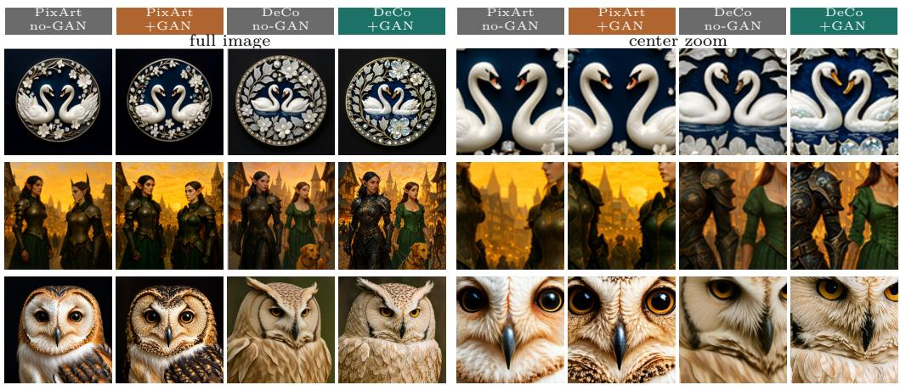  
Figure 10 Same-prompt output-access comparison (three prompts; full image + center zoom). PixArt no-GAN vs. +GAN are nearly identical, whereas DeCo +GAN visibly gains fine detail.

Figure 10 compares pixel and latent outputs under the same prompts, with full images and center crops. Figures 11 shows further no-GAN vs. +GAN pairs from DeCo at 5122 across a wide range of prompts and styles (landscapes, cities, architecture, people, animals, food, macro, night, and stylized art). In each adjacent pair the left image is without the GAN and the right image is with our GAN fine-tuning, generated from the same prompt and seed.

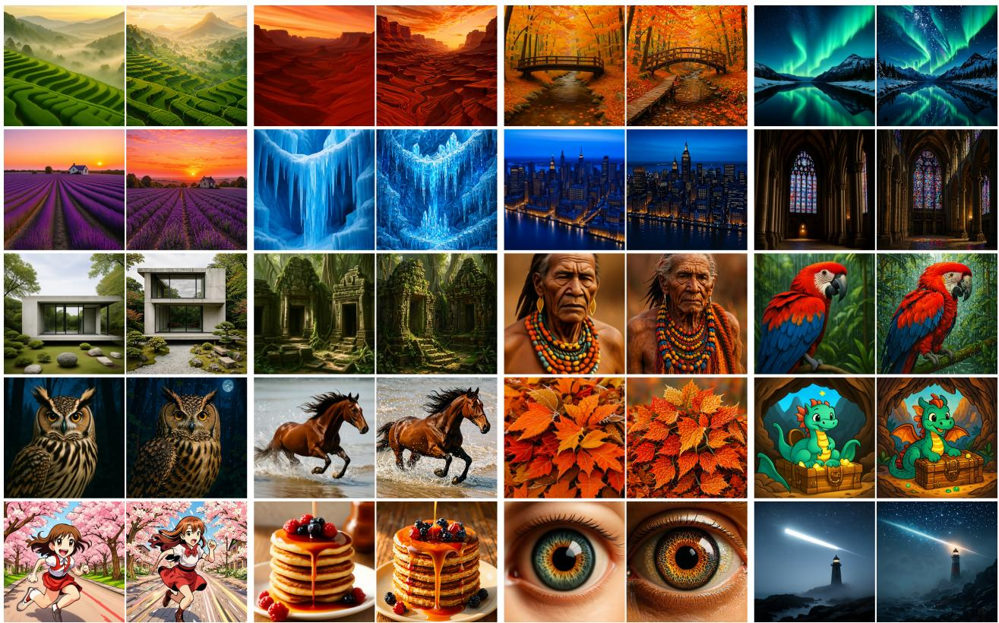  
Figure 11 Additional 512px comparisons. Each adjacent pair: left without GAN, right with our GAN fine-tuning (DeCo, same prompt and seed). Best viewed zoomed in.

## D Guidance and sampler controls

Spectral-measure conventions. The three percentage-valued spectral diagnostics use diferent normalizations and evaluation sets and therefore should not be compared numerically. Figure 3 reports the radial-profile band share on COCO-30k: after DC removal and Hann windowing, the 2-D power spectrum is azimuthally averaged, and the power in each radial interval is normalized by the total radial-profile power. Table 4 reports the 2-D HF spectral-energy ratio on the 1,065 DPG-Bench prompts: Fourier energy at $f > 0 . 2 5$ cyc/px is divided by total 2-D spectral energy, so outer radii receive more weight because they contain more Fourier coeficients. The CFG/order control below reports decoded radial-power shares on its own 300 fixed prompts and is intended only for comparisons among the settings within that control, not for direct numerical comparison with Figure 3 or Table 4.

A natural question is whether the GAN’s sharpness can instead be obtained from the no-GAN model by raising classifier-free guidance (CFG) or by using a higher-order sampler. It cannot. On a fixed set of 300 prompts (identical prompts and seeds across settings, 5122, 25-step AdamLM), we sweep the no-GAN model over $\mathrm { C F G } \in \{ 3 , 4 , 5 , 6 , 7 \}$ and sampler order ∈ {1, 2} and compare against the +GAN model at its default (CFG 4, order 2); Table 11 and Figure 12 report the decoded high-frequency band share (our spectrum pipeline), no-reference quality (TOPIQ, MANIQA), and mean HSV saturation. The +GAN model carries 0.198% of its power in the high band, whereas the best no-GAN setting reaches only 0.019% (CFG 7, order 2)—a ∼10× gap that no guidance or order setting closes, with the mid band showing the same pattern. Raising CFG does not help and actively hurts: it monotonically increases saturation (0.527 → 0.590), i.e. oversaturation, while no-reference quality falls at the high end (order-2 MANIQA drops from 0.404 to 0.387). Switching from order 1 to order 2 barely moves the high band. On no-reference quality the GAN is in a diferent regime entirely (MANIQA 0.66 vs. ≤ 0.40; TOPIQ 0.73 vs. ≤ 0.52). The added high-frequency detail is thus a property of the adversarial fine-tuning, not something recoverable by inference-time tuning.

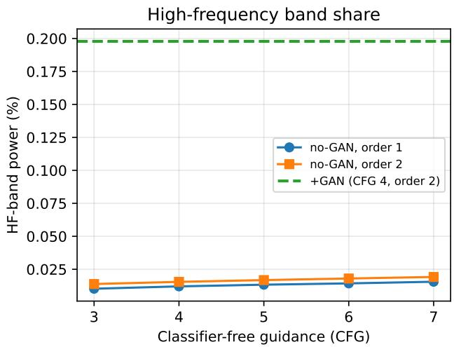

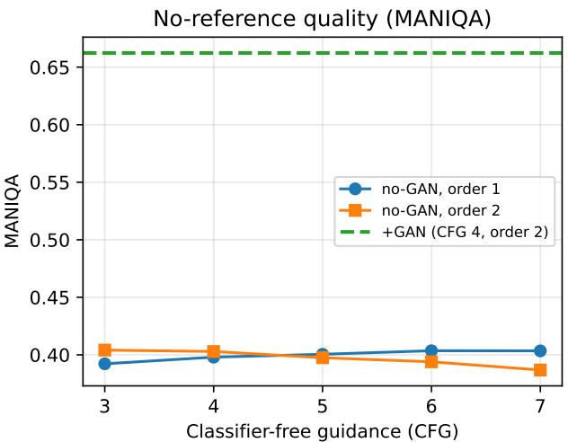  
Figure 12 Guidance and sampler order do not recover the GAN’s high frequency. No-GAN model swept over CFG and sampler order (orders 1 and 2); the +GAN model (CFG 4, order 2) is the green dashed reference. Left: decoded high-frequency band share; right: MANIQA. Both no-GAN curves stay far below +GAN.

Spectrum-matched sharpening control. A natural concern is that any operation that raises high-frequency power would reproduce our results. It does not. We apply a plain unsharp-mask filter to the no-GAN DeCo outputs and tune its strength to match the +GAN change in either high-frequency band power (HF log-∆) or spectral slope (α). As Table 12 shows, the filter reaches the GAN’s spectral signature (and even a small FID improvement), but recovers only a small fraction of the GAN’s FID gain and does not approach its no-reference quality—so the adversarial improvement is not generic sharpening.

Table 11 No-GAN CFG/order sweep vs. the +GAN model $( \mathrm { D e C o } ,$ , 300 fixed prompts/seeds). HF/mid bands are the decoded radial-power shares, and TOPIQ/MANIQA are no-reference quality metrics. Neither higher CFG nor order-2 sampling approaches the +GAN high-frequency or quality.
<table><tr><td>model</td><td>CFG</td><td>order</td><td>HF%</td><td>mid %</td><td>TOPIQ↑</td><td>MANIQA↑</td></tr><tr><td>no-GAN</td><td>3</td><td>1</td><td>0.010</td><td>0.190</td><td>0.502</td><td>0.392</td></tr><tr><td>no-GAN</td><td>3</td><td>2</td><td>0.014</td><td>0.221</td><td>0.520</td><td>0.404</td></tr><tr><td>no-GAN</td><td>4</td><td>1</td><td>0.012</td><td>0.204</td><td>0.510</td><td>0.398</td></tr><tr><td>no-GAN</td><td>4</td><td>2</td><td>0.015</td><td>0.234</td><td>0.516</td><td>0.403</td></tr><tr><td>no-GAN</td><td>5</td><td>1</td><td>0.013</td><td>0.215</td><td>0.512</td><td>0.401</td></tr><tr><td>no-GAN</td><td>5</td><td>2</td><td>0.017</td><td>0.245</td><td>0.505</td><td>0.398</td></tr><tr><td>no-GAN</td><td>6</td><td>1</td><td>0.014</td><td>0.223</td><td>0.516</td><td>0.404</td></tr><tr><td>no-GAN</td><td>6</td><td>2</td><td>0.018</td><td>0.256</td><td>0.498</td><td>0.394</td></tr><tr><td>no-GAN</td><td>7</td><td>1</td><td>0.016</td><td>0.231</td><td>0.515</td><td>0.404</td></tr><tr><td>no-GAN</td><td>7</td><td>2</td><td>0.019</td><td>0.255</td><td>0.485</td><td>0.387</td></tr><tr><td>+GAN</td><td>4</td><td>2</td><td>0.198</td><td>0.594</td><td>0.730</td><td>0.662</td></tr><tr><td>+GAN</td><td>4</td><td>1</td><td>0.160</td><td>0.515</td><td>0.746</td><td>0.664</td></tr></table>

Table 12 Spectrum-matched sharpening control (COCO-30k). A plain unsharp-mask filter applied to the no-GAN outputs, tuned to match the +GAN high-frequency spectrum (HF log- $. \Delta$ and slope α), reproduces the GAN’s spectral signature but recovers only a small fraction of its FID gain and does not reach its no-reference quality. The no-GAN and +GAN reference rows match Tables 1 and 2.
<table><tr><td>method</td><td>HF log-∆</td><td>α</td><td>FID ↓</td><td>TOPIQ ↑</td><td>MANIQA ↑</td></tr><tr><td>no-GAN</td><td>0.00</td><td>2.59</td><td>33.27</td><td>0.711</td><td>0.636</td></tr><tr><td>+unsharp (HF-matched)</td><td>+0.35</td><td>2.38</td><td>32.7</td><td>0.719</td><td>0.673</td></tr><tr><td>+unsharp (slope-matched)</td><td>+0.55</td><td>2.23</td><td>32.3</td><td>0.691</td><td>0.669</td></tr><tr><td>+GAN (main, Table 1)</td><td>+0.34</td><td>2.24</td><td>28.59</td><td>0.768</td><td>0.712</td></tr></table>