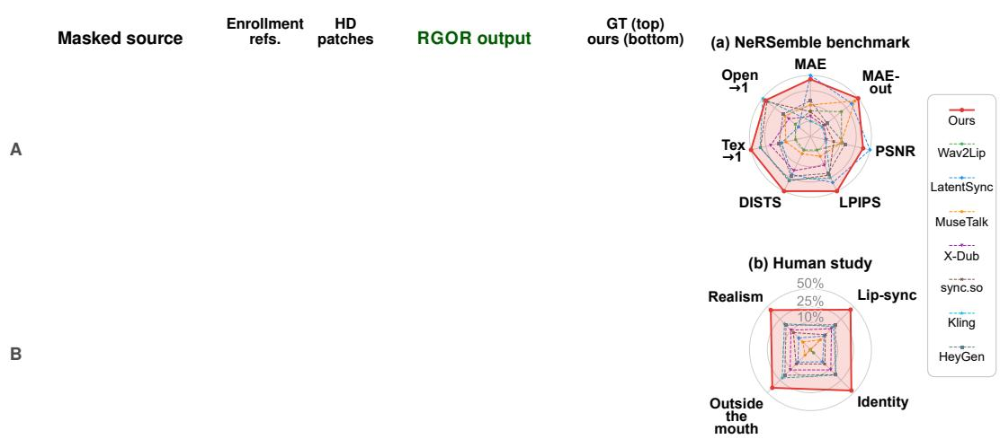
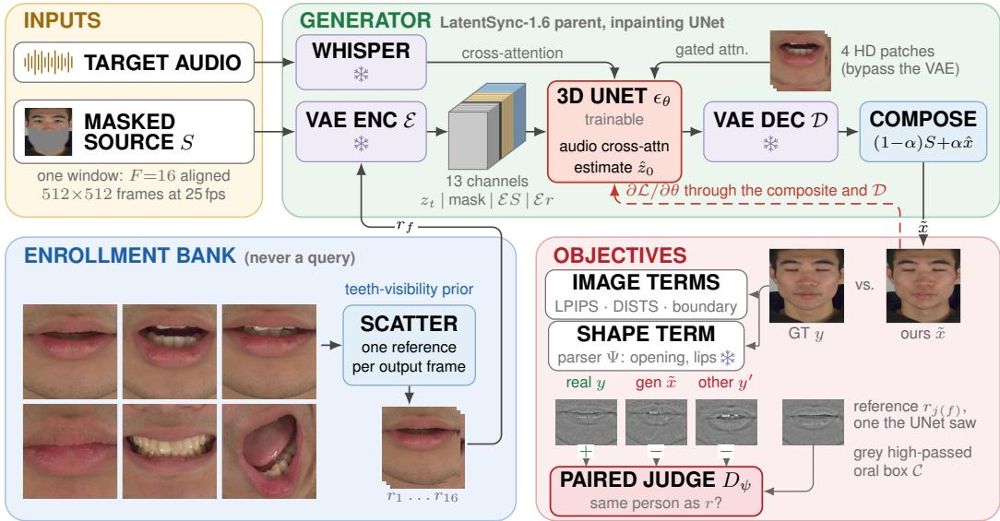
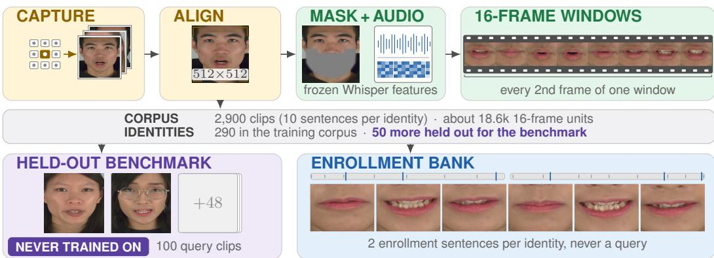
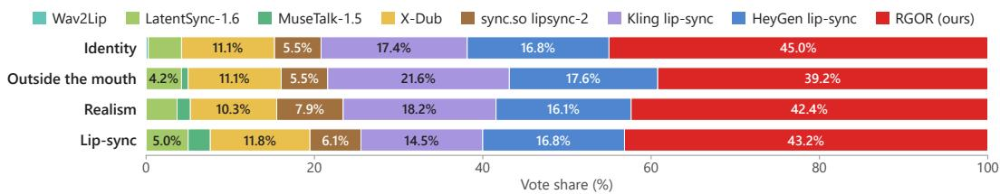
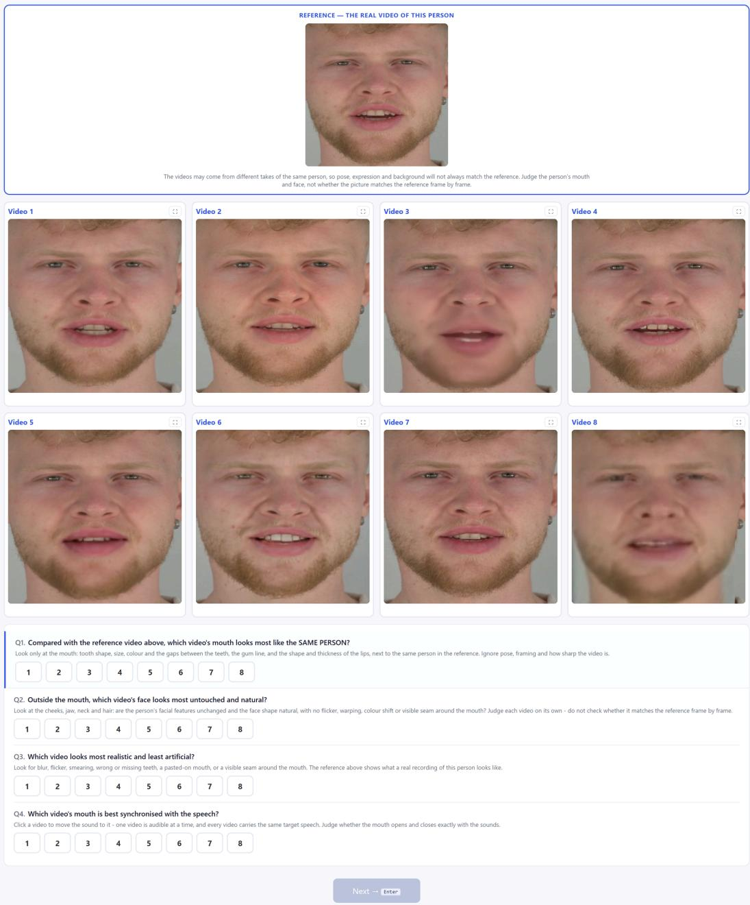
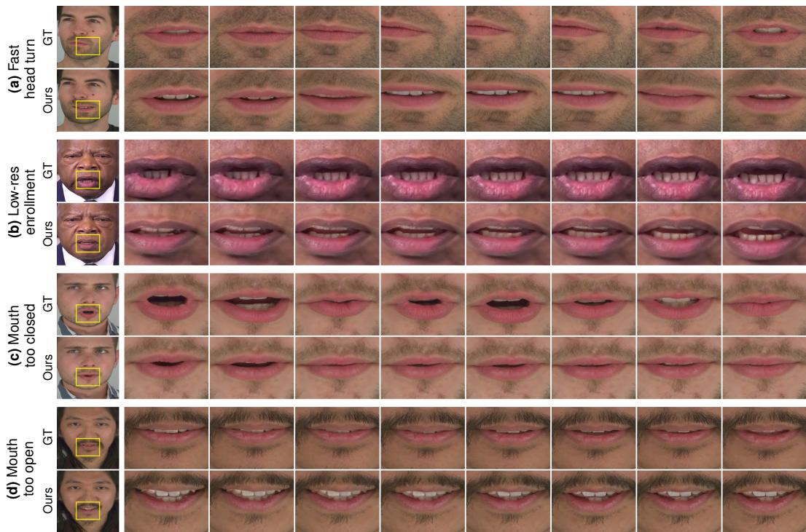

# BEYOND LIP SYNC: REFERENCE-GROUNDED ORAL REFINEMENT FOR AUDIO-DRIVEN PORTRAIT ANIMATION

Bangxun TangUniversity of California, Irvinebangxunt@uci.edu

  
Figure 1: Given a video with the mouth masked out, its speech, and enrollment frames and HD patches of the same person, RGOR renders that person’s own lips and teeth in sync with the audio and leaves the rest of the face untouched. Readers can click and play the video clips in this figure using Adobe Acrobat.

## ABSTRACT

We present RGOR (Reference-Grounded Oral Refinement), an audio-driven lipsync framework that renders the mouth of the specific person being dubbed rather than a generic one. Existing lip-sync systems follow the audio closely and keep the face recognizable, yet the mouth they render is an average mouth: the shape and texture of the lips, the arrangement of the teeth, and how much of them shows as the mouth opens are not that person’s. The problem persists because nothing in current training or evaluation asks for the person’s own mouth: perceptual losses accept any plausible mouth, face identity is carried mostly by the skin around it, and the released inference code of inpainting systems uses the unmasked target frame as the reference, which hides the gap. To address this, RGOR conditions every generated frame on frames from separate enrollment recordings of the same person and on HD patches of the mouth that bypass the VAE, and trains the generator against a paired judge that compares each rendered mouth with the person’s reference and learns to reject a realistic mouth of someone else. We further build an evaluation protocol and use it to compare open-source and commercial lip-sync systems on held-out identities. Experiments show that RGOR achieves the best or second-best result on most metrics, and preserves the person’s own lip and dental detail while keeping synchronization and the rest of the face intact.

## 1 INTRODUCTION

Audio-driven lip synchronization has advanced quickly: current systems follow the audio closely, render sharp frames, and keep the face recognizable to a face-recognition network (Prajwal et al., 2020; Li et al., 2024a; Zhang et al., 2025b). Yet a viewer who knows the person notices at once that the mouth is not theirs: the lips have a smooth, generic texture, the teeth form a neat, even row, and how much of them shows as the mouth opens follows an average face rather than this one. The mouth is a small part of the frame, but it is where speech is seen, and replacing it with an average mouth is exactly the change a dub should not make.

This failure goes unnoticed because neither training nor evaluation asks for the person’s own mouth. Perceptual losses reward any mouth with realistic statistics; face-identity embeddings are dominated by the skin and face shape around the mouth; and the released inference pipelines of LatentSync (Li et al., 2024a), MuseTalk (Zhang et al., 2025b), and Wav2Lip (Prajwal et al., 2020) use the unmasked frame being edited as the reference, so a paired test shows the model the very mouth it must produce, a leakage the Wav2Lip authors already noted. Given a reference from a different recording of the same person instead, the mouth fidelity of LatentSync and Wav2Lip drops markedly (Appendix C).

We propose Reference-Grounded Oral Refinement (RGOR), which builds on LatentSync and changes what its generator is conditioned on and trained toward. First, each frame of a training window receives its own reference frame from separate enrollment recordings of the same person, chosen so that the teeth are often visible; these scattered references show the person’s mouth in many shapes but offer no motion to copy. Second, since the VAE of the latent generator compresses away the fine structure of the teeth and lips, HD patches of the person’s mouth reach the generator in pixel space and bypass the VAE. Third, an available reference is not necessarily a used one, so we train, together with the generator, a reference-contrastive paired judge that compares the rendered mouth with the person’s reference and rejects a realistic mouth of someone else, which a perceptual loss cannot do. Fourth, since the judge compares appearance rather than geometry, a shape term compares the mouth opening and lip regions of the output with those of the real frame, as segmented by a frozen face parser. The four parts act as one: the scattered references keep the generator from copying a mouth motion, the HD patches carry the person’s detail past the VAE, the judge steers the generator toward this person’s mouth, and the shape term keeps the opening in step with the speech.

To evaluate this, we hold out a set of identities of NeRSemble (Kirschstein et al., 2023) from al training and split each person’s recordings into enrollment clips, which a system may use, and query clips, which it must reproduce. Every system receives the query with the mouth removed or, if it cannot take a masked input, a different recording of the person with the query audio. Our contributions are summarized as follows:

• We propose RGOR, a reference-grounded framework for audio-driven lip sync that renders the specific person’s lips and teeth rather than a generic mouth, by conditioning each frame on scattered enrollment references of that person and on HD patches of the mouth that bypass the VAE.

• We formulate oral identity as a paired comparison between the rendered mouth and the person’s own reference, trained with a reference-contrastive judge whose negatives include real mouths of other people, and complement it with a shape term that keeps the mouth opening and the lip shape faithful to the real frame.

• We introduce an evaluation protocol that withholds the target mouth from every system that accepts a separate reference. It measures how much the same-frame reference of released lip-sync inpainters inflates paired reconstruction scores, and under it we compare RGOR with open-source and commercial lip-sync systems on identities never seen in training.

## 2 RELATED WORK

Audio-driven visual dubbing. Audio-driven visual dubbing re-renders the mouth of a talkingface video so that it follows a new audio track. Wav2Lip (Prajwal et al., 2020) framed the task as inpainting supervised by a pretrained synchronization expert (Chung & Zisserman, 2016), and later GAN systems strengthened this formulation with lip-reading, expression, deformation, and landmark priors (Wang et al., 2023b; Cheng et al., 2022; Zhang et al., 2023; Zhong et al., 2023).

Diffusion models carried the same formulation forward, in latent and pixel space (Shen et al., 2023; Mukhopadhyay et al., 2024) and with SyncNet supervision on decoded frames (Li et al., 2024a), while MuseTalk reaches real time with single-step latent inpainting (Zhang et al., 2025b). A parallel line animates the whole portrait from a single image (Xu et al., 2024; Chen et al., 2025; Lin et al., 2025), and recent systems explore mask-free editing that replaces inpainting, released on the Wan2.2 video model (He et al., 2026; Wan Team et al., 2025), production-oriented post-training (Li et al., 2026), and commercial services that take a video and an audio track with no reference (Sync Labs, 2026; Kuaishou Technology, 2026; HeyGen, Inc., 2026). Despite this progress, the inpainting methods condition on a reference frame of the speaker but leave whose mouth is rendered unsupervised, so the lips and teeth drift toward an average mouth. RGOR builds on LatentSync, keeps its inpainting formulation, and adds this supervision with references from separate recordings of the person.

Identity and texture preservation with references. Generative models commonly preserve the identity and texture of a specific subject by conditioning on reference images. Appearance features of the reference can be injected through attention (Hu, 2024), identity embeddings through decoupled cross-attention (Ye et al., 2023; Wang et al., 2024) or merged into the text embedding (Li et al., 2024b), or the subject fitted into the weights themselves (Ruiz et al., 2023; Hu et al., 2022). Reference-based face restoration and super-resolution condition the restorer on clean reference images, of the same person in the face-restoration case (Hsiao et al., 2024; Liu et al., 2025; Zhang et al., 2025a; Yang et al., 2020; Jiang et al., 2021). In lip sync, references enter through an identity perceiver that counters averaged lips (Zhu et al., 2025) or through reference textures warped by motion fields (Liu et al., 2026; Hong et al., 2026). These mechanisms make identity available to the generator, yet nothing in their objectives requires the output to use it, so a reference branch can be read for lighting and mouth opening while ignoring who the person is. RGOR pairs its references with an objective that compares the rendered mouth against them.

Adversarial and contrastive judges. Adversarial training supervises a generator with a learned discriminator (Goodfellow et al., 2014); conditional GANs also show the discriminator the conditioning input (Mirza & Osindero, 2014; Isola et al., 2017), and the projection discriminator scores an image embedding against it (Miyato & Koyama, 2018), so the judge asks whether a pair is realistic given the condition. Later discriminators are built on frozen pretrained features (Sauer et al., 2021; Kumari et al., 2022; Sauer et al., 2023) and inherit their blind spots, and general-purpose self-supervised features such as DINOv2 (Oquab et al., 2024) are not trained to tell one person’s inner mouth from another’s. In lip sync, the pairwise SyncNet expert scores whether audio and video match and serves as both loss and metric (Chung & Zisserman, 2016; Prajwal et al., 2020), and as a loss it can be gamed by the generator. Perceptual losses compare an output with its target in a deep feature space and tolerate misalignment to varying degrees (Johnson et al., 2016; Zhang et al., 2018; Ding et al., 2022; Mechrez et al., 2018). Each of these judges asks whether an output is realistic, synchronized, or close to its target, and none tells one person’s teeth from another’s. The judge of RGOR is closest to Siamese verification (Chopra et al., 2005): it scores whether two mouths belong to the same person, and because real mouths of other people are negatives, realism alone cannot satisfy it.

Evaluating lip-sync fidelity and identity. Lip-sync evaluation measures synchronization with LSE-C and LSE-D from SyncNet (Chung & Zisserman, 2016; Prajwal et al., 2020), identity with ArcFace cosine similarity (Deng et al., 2019), and texture or distribution match with LPIPS, DISTS, and FVD (Zhang et al., 2018; Ding et al., 2022; Unterthiner et al., 2018). Each has a blind spot for the mouth of a specific person: LSE ignores whose mouth moves, ArcFace on a whole face is dominated by the copied upper face, PSNR rewards blur, and LPIPS and DISTS accept texture with the right statistics. Paired reconstruction adds a leak: the released LatentSync, MuseTalk, and Wav2Lip inference code takes the reference from the very frame being reconstructed and so shows the model the answer, a leakage the Wav2Lip authors noted and avoided by evaluating with audio from another video (Prajwal et al., 2020). NeRSemble (Kirschstein et al., 2023) records separate sentence and expression sequences for each identity, which allows a clean split into enrollment and query clips, and on this split we build a strict cross-clip protocol (Sec. 4).

  
Figure 2: Overview of RGOR. Each output frame gets its own scattered enrollment reference, and four HD patches bypass the VAE through gated attention; the masked source, the references, and the audio drive the inpainting UNet, and the composited output is trained with image terms, a shape term, and a paired judge that asks whether the rendered mouth belongs to the referenced person.

## 3 METHOD

## 3.1 OVERVIEW

RGOR builds on LatentSync-1.6 (Li et al., 2024a), which we call the parent: a 3D UNet $\epsilon _ { \theta }$ that denoises windows of F=16 aligned 512×512 face frames in the latent space of a frozen VAE (E, D), conditioned on Whisper audio features (Radford et al., 2023) through cross-attention. For each output frame it receives the noisy latent, the lower-face mask, the masked source frame $S _ { f }$ , which carries the pose and the surrounding skin, and one reference frame $r _ { f }$ . Since the lower face of the source is masked, the references are the only inputs that show the person’s mouth. During training, we noise the ground-truth latent at a random timestep and convert the model’s noise prediction into an estimate $\hat { z } _ { 0 }$ of the clean latent, which is decoded and composited back into the source through the feathered mask $\alpha \in [ 0 , 1 ] ^ { 5 1 2 \times 5 1 2 }$ of the editable region:

$$
\hat { x } = \mathcal { D } ( \hat { z } _ { 0 } ) , \qquad \tilde { x } _ { f } = ( 1 - \alpha ) \odot S _ { f } + \alpha \odot \hat { x } _ { f } , \qquad f = 1 , \ldots , F .\tag{1}
$$

All training objectives act on the composite ${ \tilde { x } } ,$ with gradients through the frozen decoder. RGOR changes four things in the parent (Fig. 2): the references it is conditioned on (Sec. 3.2), HD patches of the mouth that bypass the VAE (Sec. 3.3), a paired judge that compares the rendered mouth with those references (Sec. 3.4), and a shape term on the mouth opening (Sec. 3.5).

## 3.2 SCATTERED ENROLLMENT REFERENCES

Each person has an enrollment bank: aligned frames of a few other clips of that person that never serve as queries, each scored by a frozen face parser for visible-teeth area. Instead of a frame of the clip being edited, each of the sixteen frames of a training window receives its own reference drawn from the bank, with a preference for frames that show teeth. The references are unrelated in time, so together they show the person’s lips and teeth in many mouth shapes without a motion the model could copy. They enter the UNet through its reference input channels. At inference, sixteen bank frames are picked in a fixed order. We also explored a contiguous window of enrollment frames and a single static reference; the first carries the enrollment clip’s mouth motion into the output and the second shows only one mouth state, so we use scattered references.

  
Figure 3: Data construction from NeRSemble.

## 3.3 HD PATCHES

The references reach the UNet through the VAE, which compresses each frame eight-fold along each side; at this scale a tooth spans only a few latent cells, and the gaps between the teeth and the creases of the lips are lost before the generator sees them. RGOR therefore adds HD patches: four full-resolution crops of the person’s mouth from the enrollment bank, covering its states from closed to widest open, including the frame with the most visible teeth. The HD patches bypass the VAE. A reference encoder encodes them directly from their pixels, and gated attention adapters on the up blocks of the UNet let every position of the output attend to them, so the fine structure of the person’s lips and teeth reaches the generator at the resolution of the video.

## 3.4 REFERENCE-CONTRASTIVE PAIRED JUDGE

The paired judge $D _ { \psi }$ decides whether a rendered mouth and a reference mouth belong to the same person. A differentiable crop C takes the fixed oral box of a frame, converts it to grey, and high-passes it, so the judge reads the structure of the teeth and lips, such as tooth boundaries, gaps, and lip creases, rather than their colour. A shared encoder $\phi _ { \psi }$ embeds two such crops and a small head scores the pair, $D _ { \psi } ( a , r )$ . For output frame $f ,$ the reference $r _ { j ( f ) }$ is one of the sixteen references the generator received in the same step. With y the real frames, x˜ the composited prediction, $y _ { f } ^ { \prime }$ a real frame of another person, and $\operatorname { s p } ( u ) = \log ( 1 + e ^ { u } )$ , the judge minimizes

$$
\mathcal { L } _ { J } ( \psi ) = \frac { 1 } { F } \sum _ { f = 1 } ^ { F } \left[ \underbrace { \mathrm { s p } \big ( - D _ { \psi } \big ( y _ { f } , r _ { j ( f ) } \big ) \big ) } _ { \mathrm { s a m e ~ p e r s o n , ~ r e a l } } + \underbrace { \mathrm { s p } \big ( D _ { \psi } \big ( \tilde { x } _ { f } , r _ { j ( f ) } \big ) \big ) } _ { \mathrm { g e n e r a t e d } } + \underbrace { \mathrm { s p } \big ( D _ { \psi } \big ( y _ { f } ^ { \prime } , r _ { j ( f ) } \big ) \big ) } _ { \mathrm { o t h e r ~ p e r s o n , ~ r e a l } } \right] ,\tag{2}
$$

while the generator minimizes the non-saturating pair term

$$
\mathcal { L } _ { \mathrm { p a i r } } ( \theta ) = \frac { 1 } { F } \sum _ { f = 1 } ^ { F } \mathrm { s p } \big ( - D _ { \psi } ( \tilde { x } _ { f } , r _ { j ( f ) } ) \big ) ,\tag{3}
$$

with ψ frozen, back-propagated through C, the composite of Eq. 1, and D. Because a real mouth of another person is a negative, a realistic but generic mouth does not lower the generator’s cost; only a mouth that the judge cannot tell apart from the referenced person’s real mouth does. The judge is trained together with the generator.

## 3.5 SHAPE TERM

The shape term supervises how far the mouth opens and how much of the lips shows. A frozen face parser Ψ (Xie et al., 2021; Lee et al., 2020) runs on the composite with gradient, and its soft mouth-interior and lip probabilities are compared with the parser’s confident regions on ground truth. With $p ^ { \mathrm { m o u t h } }$ and $p ^ { \mathrm { l i p } }$ the parser’s soft mouth-interior and lip probabilities on x˜ (the lip probability covering both lips), $M ^ { \mathrm { m o u t h } }$ and $M ^ { \mathrm { l i p } }$ the corresponding confident supports of $\Psi ( y ) , \bar { \varrho } = \mathbf { 1 } [ \alpha > 0 ]$

Table 1: Held-out NeRSemble benchmark. †: run as released, with the target frame as reference.
<table><tr><td>Method (condition)</td><td>MAE↓</td><td>MAE-out↓</td><td>PSNR↑</td><td>LPIPS↓</td><td>DISTS↓</td><td>Tex→1</td><td>Open→1</td><td>LSE-C↑/D↓</td></tr><tr><td>Wav2Lip (xref)</td><td>0.0463</td><td>0.0285</td><td>23.7</td><td>0.473</td><td>0.340</td><td>0.200</td><td>0.493</td><td>4.28/8.19</td></tr><tr><td>LatentSync-1.6 (xref)</td><td>0.0328</td><td>0.0183</td><td>26.1</td><td>0.334</td><td>0.234</td><td>0.399</td><td>0.451</td><td>5.12/6.54</td></tr><tr><td>MuseTalk-1.5 (official)†</td><td>0.0440</td><td>0.0150</td><td>23.7</td><td>0.446</td><td>0.324</td><td>0.338</td><td>0.628</td><td>3.20/8.69</td></tr><tr><td>X-Dub (xvid)</td><td>0.0483</td><td>0.0460</td><td>22.5</td><td>0.408</td><td>0.251</td><td>0.555</td><td>1.42</td><td>3.90/9.11</td></tr><tr><td>sync.so lipsync-2 (xvid)</td><td>0.0466</td><td>0.0447</td><td>23.1</td><td>0.366</td><td>0.207</td><td>0.698</td><td>0.860</td><td>1.70/11.1</td></tr><tr><td>Kling lip-sync (xvid)</td><td>0.0502</td><td>0.0475</td><td>22.4</td><td>0.354</td><td>0.212</td><td>0.704</td><td>1.09</td><td>3.13/9.33</td></tr><tr><td>HeyGen lip-sync (xvid)</td><td>0.0423</td><td>0.0430</td><td>24.0</td><td>0.373</td><td>0.227</td><td>0.437</td><td>0.653</td><td>5.37/7.13</td></tr><tr><td>RGOR (ours)</td><td>0.0342</td><td>0.0117</td><td>25.5</td><td>0.297</td><td>0.163</td><td>0.833</td><td>0.880</td><td>4.24/6.56</td></tr><tr><td>Ground truth</td><td></td><td>一</td><td>一</td><td>一</td><td></td><td>一</td><td>一</td><td>4.02/8.26</td></tr></table>

the editable region of Eq. 1, and λ a fixed weight,

$$
\begin{array} { l } { { \mathrm { D i c e } ( q , M ) = 1 - \displaystyle \frac { 2 \sum \varrho q M + 1 } { \sum \varrho q + \sum \varrho M + 1 } , } \ } \\ { { \mathcal { L } _ { \mathrm { s h a p e } } = \mathrm { D i c e } ( p ^ { \mathrm { m o u t h } } , M ^ { \mathrm { m o u t h } } ) + \lambda \mathrm { D i c e } ( p ^ { \mathrm { l i p } } , M ^ { \mathrm { l i p } } ) . } } \end{array}\tag{4}
$$

A Dice score does not reward blurring, so this term constrains the geometry of the mouth without pulling its texture toward an average.

## 3.6 DATA

We build our data from the frontal camera of NeRSemble (Kirschstein et al., 2023), a multi-view recording in which each person reads ten sentences and performs lip, mouth, tongue, and jaw expression sequences. We split 340 of its identities by person into a 290-identity training corpus and a disjoint 50-identity held-out benchmark (Sec. 4). All clips are aligned to a 512×512 canvas, and the corpus provides 2,900 sentence clips, cut into about 18.6k units of 16 frames. Each identity contributes two parts: its sentence clips, which are the videos to be re-rendered, and an enrollment bank of other clips of the same person, which never serve as queries and supply the references (Fig. 3). A training sample is built from one identity and consists of five aligned parts: a 16-frame window of one of its clips with the lower face masked, the audio of that window, one reference frame per output frame drawn from the same identity’s bank, the four HD patches of that identity, and the unmasked window as the target.

## 3.7 TRAINING AND INFERENCE

The training objective adds the pair term of Eq. 3 and the shape term of Eq. 4 to three image terms: LPIPS on the composited frame, a boundary term, and DISTS on the oral box. We fine-tune the parent with this objective. At inference, each clip is denoised in 20 steps as one latent sequence: at every step the model runs on overlapping 16-frame windows whose predictions are fused (Bar-Tal et al., 2023; Wang et al., 2023a), so consecutive windows join without seams.

## 4 EVALUATION PROTOCOL

The held-out NeRSemble benchmark holds 50 identities never used in training; each has two query sentences, which a system must reproduce (100 query clips), and an enrollment bank of two other sentences, which it may use. Every system is scored against the target clip, and apart from MuseTalk-1.5, which we run as released, none is shown that clip’s mouth. The mouth-inpainting systems (Wav2Lip, LatentSync-1.6, and RGOR) receive the target frames with the lower face masked and reference frames from other clips of the same person (xref). The cross-video systems (X-Dub (He et al., 2026) and the commercial services) cannot take a masked input; they re-render another clip of the person with the target audio (xvid). The clips of a person are recorded in one session with the same frontal camera, so this clip is close to the target in head position and expression. The released inference code of Wav2Lip, LatentSync, and MuseTalk uses the unmasked copy of the frame being edited as the reference, which in a paired test shows the model the answer (Appendix C); for the xref rows we replace only this reference input. Fidelity is measured on the fixed oral box with MAE, PSNR, LPIPS (Zhang et al., 2018), DISTS (Ding et al., 2022), a texture ratio and an open-area ratio (the inner mouth’s high-frequency energy and the parser’s mouth-interior area, each divided by ground truth’s, both best at one), synchronization with LSE-C/LSE-D from the official SyncNet

<table><tr><td>LatentSync 1.6 (xref)</td><td>MuseTalk 1.5 (official)</td><td>Wav2Lip (xref)</td><td>X-Dub (xvid)</td><td>sync.so (xvid)</td><td>Kling (xvid)</td><td>HeyGen (xvid)</td><td>RGOR (ours, xref)</td><td>Ground truth</td></tr></table>

Figure 4: Qualitative comparison; click to play the video clips in Adobe Acrobat.  
(Chung & Zisserman, 2016; Prajwal et al., 2020); MAE-out, the error over the rest of the frame, measures how much a system changes outside the mouth (Appendix B).

## 5 EXPERIMENTS

## 5.1 EXPERIMENTAL SETUP

We evaluate all systems on the held-out NeRSemble benchmark under the protocol of Sec. 4, and compare with Wav2Lip (Prajwal et al., 2020), LatentSync-1.6 (Li et al., 2024a), MuseTalk-1.5 (Zhang et al., 2025b), the public X-Dub release (He et al., 2026), a mask-free model built on Wan2.2-TI2V-5B, and the commercial services sync.so lipsync-2, Kling lip-sync, and HeyGen lip-sync (Sync Labs, 2026; Kuaishou Technology, 2026; HeyGen, Inc., 2026). Each baseline is run from its released weights or public API with its officially recommended inference setting; the protocol changes only the inputs it is given (Appendix B).

## 5.2 RESULTS

Fig. 1 and Fig. 4 show RGOR on held-out identities. A key strength of our approach is that the rendered mouth is recognizably the person’s own. From a video whose lower face is masked and a few enrollment frames from other recordings of the same person, RGOR reconstructs the contour and texture of the lips and the shape and arrangement of the individual teeth, instead of falling back to a generic dentition. The teeth are rendered with crisp, well-separated boundaries, and the lips keep their natural texture rather than the smoothed appearance typical of inpainting-based dubbing. The mouth opens and closes in step with the speech, and since only the masked lower face is regenerated and composited back, everything outside it is kept from the source video, including the eyes, skin

Table 2: Ablation on the held-out benchmark (scored on lossless renders).
<table><tr><td>Variant</td><td>MAE↓</td><td>MAE-out↓</td><td>PSNR↑</td><td>LPIPS↓</td><td>DISTS↓</td><td>Tex→1</td><td>Open→1</td><td>LSE-C↑/D↓</td></tr><tr><td>w/o scattered references</td><td>0.0407</td><td>0.00992</td><td>24.7</td><td>0.311</td><td>0.184</td><td>0.869</td><td>0.777</td><td>4.28/6.49</td></tr><tr><td>w/o HD patches</td><td>0.0364</td><td>0.00639</td><td>25.2</td><td>0.295</td><td>0.165</td><td>0.815</td><td>0.740</td><td>4.06/6.52</td></tr><tr><td>w/o pairêd judge</td><td>0.0367</td><td>0.00763</td><td>25.3</td><td>0.326</td><td>0.185</td><td>0.778</td><td>0.430</td><td>3.86/6.95</td></tr><tr><td>w/o shape term</td><td>0.0395</td><td>0.00781</td><td>24.7</td><td>0.317</td><td>0.181</td><td>0.842</td><td>0.702</td><td>3.77/6.79</td></tr><tr><td>RGOR (full)</td><td>0.0352</td><td>0.00634</td><td>25.4</td><td>0.291</td><td>0.161</td><td>0.858</td><td>0.858</td><td>4.24/6.57</td></tr></table>

Figure 5: Ablation study; boxes mark the failures; click to play the video clips in Adobe Acrobat. texture, hair, and expression. These properties are consistent across the benchmark: the oral DISTS of RGOR is lower than that of every baseline on 95 of the 100 query clips.

## 5.3 COMPARISON AND EVALUATION

Quantitative evaluation. Table 1 reports the held-out benchmark, and the radar of Fig. 1 summarizes it. RGOR achieves the best oral LPIPS and DISTS of all systems, open-source and commercial, so the mouth it renders is the closest to the real one in perceptual structure and texture; its DISTS is lower even than that of LatentSync-1.6 given the target frame itself as its reference (Appendix C). Its texture ratio is the closest to one: the high-frequency detail of the inner mouth, which carries the tooth boundaries and gaps, is preserved rather than smoothed away. Among the masked inpainters, its open-area ratio is also the closest to one, so the mouth opens about as widely as the person’s does, and it has the lowest error outside the oral box, editing only the region it must. On pixel-averaging metrics RGOR is a close second to LatentSync-1.6. Such metrics favour a smooth, averaged mouth, as the low texture ratio of LatentSync-1.6 shows, and a sharper, more detailed mouth pays a small pixel-level price for its fidelity. The cross-video systems re-render a complete, unmasked recording of the person, so every frame they output starts from the person’s real mouth; even so, RGOR surpasses all of them on every perceptual metric. For synchronization, RGOR scores better than ground truth’s own recordings on both LSE-C and LSE-D, placing it on the synchronized side of real video.

Qualitative evaluation. Fig. 4 compares all systems on the same frame of four held-out identities. The inpainting baselines lose the person’s dentition: Wav2Lip and MuseTalk-1.5 produce blurred mouths in which individual teeth are hard to discern, and LatentSync-1.6 renders a smooth, generic row of teeth. X-Dub tends to open the mouth too wide, and the commercial services show lips and teeth that differ from the ground truth at the same frame. In contrast, RGOR produces sharp, well-separated teeth whose shape and arrangement follow the person’s enrollment, lips with a natural contour and texture, and an opening that matches the ground truth, blended seamlessly into the untouched face. The difference is clearest in the mouth close-ups, where the teeth of RGOR most closely resemble the person’s real ones.

## 5.4 ABLATION STUDY

We ablate RGOR on the held-out benchmark by removing one component at a time (Table 2 and Fig. 5). To compare fine detail, Table 2 is scored on lossless renders, so the full model’s values differ slightly from Table 1. The full model is the best or close to the best on every metric, and each removal damages the mouth in its own way, which shows that the components are not a stack of independent additions but parts of one mechanism, each of which the others rely on.

  
Figure 6: Human study: share of votes each system receives as the best result on each question.

Without scattered references. This variant conditions every frame on a contiguous window of enrollment frames instead of frames scattered over the whole bank. Such a window covers only the few mouth shapes of one short stretch of speech, so the generator copies the opening of that stretch rather than following the audio: in Fig. 5 its mouth closes while the person keeps it open, and in Table 2 its mouth is less faithful and opens less. Scattered frames show the person’s mouth in many opening states, from which the generator takes its appearance for any opening the audio calls for.

Without the HD patches. This variant removes the HD patches from training and inference, so the person’s mouth reaches the generator only through references encoded by the VAE. Fine detail is the first to go: in Fig. 5 the variant opens the mouth to a similar extent but renders the teeth as smooth, uniform shapes with soft outlines, and even more detail is lost on the lips and the surrounding skin, where the creases of the lower lip and the stubble flatten. In Table 2 the texture ratio drops further below one, the perceptual scores fall behind, and the mouth opens less. The HD patches are the only path by which the person’s teeth, lips, and skin reach the generator at the resolution of the video.

Without the paired judge. The judge compares the rendered mouth with the person’s reference and rejects a realistic mouth of someone else, so it is the part of the objective that asks the mouth to be this person’s. Without it, the image terms are satisfied by any plausible mouth, and the teeth drift toward a generic dentition: in Fig. 5 the variant renders a flat, uniform row of upper teeth where the person shows both tooth rows with their own shapes, and in Table 2 its perceptual scores and texture ratio fall behind the full model.

Without the shape term. The shape term matches the mouth interior and the lips of the rendered frame to those of the real frame, so it is the part of the objective that fixes how far the mouth opens and how the lips are shaped. Without it, the opening is left to the audio prior, which under-articulates: in Fig. 5 the variant opens the mouth at the right moments but only about half as wide as the person does, and its open-area ratio in Table 2 falls well below one.

## 5.5 HUMAN STUDY

We conduct a human study to evaluate the rendered mouths from a human perspective. Each screen shows the person’s real recording as the reference and the eight systems below it, anonymized and shuffled, and nineteen raters pick the best video on four criteria: mouth identity, the face outside the mouth, realism, and lip sync (Appendix A). As shown in Fig. 6, RGOR is clearly preferred on all four. The strongest preference is on mouth identity, where raters recognize the person’s own teeth and lip shape, which the generic mouths of the other systems lack. The preference on realism and on the face outside the mouth follows from a sharp, detailed mouth blended into an untouched face, and the equally clear preference on lip sync shows that grounding the mouth in the person’s references does not come at the cost of following the speech. These judgments agree with the perceptual metrics.

## 6 CONCLUSION

We presented RGOR, which makes an audio-driven lip-sync generator render the specific person’s mouth by grounding it in that person’s enrollment references and HD patches and training it against a paired judge. Under a protocol that withholds the target mouth from every system that accepts a separate reference, RGOR ranks first or second on every fidelity metric of Table 1 against open-source and commercial systems, raters prefer it on every question of the human study, and it preserves the person’s own lip and dental detail while leaving the rest of the face untouched. These results come from four components working as one: the scattered references show the person’s mouth in many shapes without a motion to copy, the HD patches carry its fine detail past the VAE, the paired judge steers the generator toward this person’s mouth, and the shape term keeps the opening in step with the real frame; removing any one of them degrades the mouth in its own way. We believe that the principle behind it, a reference that the objective must account for and a judge that compares against it, can extend to other person-specific fine structure, such as hands, eyes, and hair. Failure cases and limitations are analyzed in Appendix E.

## REFERENCES

Omer Bar-Tal, Lior Yariv, Yaron Lipman, and Tali Dekel. MultiDiffusion: Fusing Diffusion Paths for Controlled Image Generation. In International Conference on Machine Learning, 2023. URL https://arxiv.org/abs/2302.08113.

Zhiyuan Chen, Jiajiong Cao, Zhiquan Chen, Yuming Li, and Chenguang Ma. EchoMimic: Lifelike Audio-Driven Portrait Animations through Editable Landmark Conditions. In AAAI Conference on Artificial Intelligence, pp. 2403–2410, 2025. URL https://arxiv.org/abs/2407. 08136.

Kun Cheng, Xiaodong Cun, Yong Zhang, Menghan Xia, Fei Yin, Mingrui Zhu, Xuan Wang, Jue Wang, and Nannan Wang. VideoReTalking: Audio-based Lip Synchronization for Talking Head Video Editing In the Wild. In SIGGRAPH Asia Conference Papers, 2022. doi: 10.1145/3550469.3555399. URL https://arxiv.org/abs/2211.14758.

Sumit Chopra, Raia Hadsell, and Yann LeCun. Learning a Similarity Metric Discriminatively, with Application to Face Verification. In IEEE Conference on Computer Vision and Pattern Recognition, pp. 539–546, 2005. doi: 10.1109/CVPR.2005.202.

Joon Son Chung and Andrew Zisserman. Out of time: Automated lip sync in the wild. In Asian Conference on Computer Vision (ACCV) Workshops, pp. 251–263, 2016. URL https://www. robots.ox.ac.uk/\~vgg/publications/2016/Chung16a/.

Jiankang Deng, Jia Guo, Niannan Xue, and Stefanos Zafeiriou. ArcFace: Additive Angular Margin Loss for Deep Face Recognition. In IEEE/CVF Conference on Computer Vision and Pattern Recognition, pp. 4685–4694, 2019. doi: 10.1109/CVPR.2019.00482. URL https://openaccess. thecvf.com/content\_CVPR\_2019/html/Deng\_ArcFace\_Additive\_Angular\_ Margin\_Loss\_for\_Deep\_Face\_Recognition\_CVPR\_2019\_paper.html.

Keyan Ding, Kede Ma, Shiqi Wang, and Eero P. Simoncelli. Image quality assessment: Unifying structure and texture similarity. IEEE Transactions on Pattern Analysis and Machine Intelligence, 44(5):2567–2581, 2022. doi: 10.1109/TPAMI.2020.3045810. URL https://arxiv.org/ abs/2004.07728.

Ian Goodfellow, Jean Pouget-Abadie, Mehdi Mirza, Bing Xu, David Warde-Farley, Sherjil Ozair, Aaron Courville, and Yoshua Bengio. Generative Adversarial Nets. In Advances in Neural Information Processing Systems, 2014. URL https://arxiv.org/abs/1406.2661.

Kaiming He, Xiangyu Zhang, Shaoqing Ren, and Jian Sun. Deep Residual Learning for Image Recognition. In IEEE Conference on Computer Vision and Pattern Recognition, 2016. URL https://arxiv.org/abs/1512.03385.

Xu He, Haoxian Zhang, Hejia Chen, Changyuan Zheng, Liyang Chen, Songlin Tang, Jiehui Huang, Xiaoqiang Liu, Pengfei Wan, and Zhiyong Wu. From inpainting to editing: Unlocking robust mask-free visual dubbing via generative bootstrapping. In International Conference on Machine Learning, 2026. arXiv:2512.25066.

HeyGen, Inc. HeyGen Lipsync API. Commercial API, https://developers.heygen.com, 2026. Accessed September 2026.

Fa-Ting Hong, Runzhen Liu, Luchuan Song, Hongmin Cai, and Chuhua Xian. EfficientSync: Real-Time Lip Synchronization via Deformation-Based Reference Texture Mixing. arXiv preprint arXiv:2608.18832, 2026. URL https://arxiv.org/abs/2608.18832.

Chi-Wei Hsiao, Yu-Lun Liu, Cheng-Kun Yang, Sheng-Po Kuo, Kevin Jou, and Chia-Ping Chen. ReF-LDM: A Latent Diffusion Model for Reference-based Face Image Restoration. In Advances in Neural Information Processing Systems, 2024. URL https://arxiv.org/abs/2412. 05043. arXiv:2412.05043.

Edward J. Hu, Yelong Shen, Phillip Wallis, Zeyuan Allen-Zhu, Yuanzhi Li, Shean Wang, Lu Wang, and Weizhu Chen. LoRA: Low-Rank Adaptation of Large Language Models. In International Conference on Learning Representations, 2022. URL https://arxiv.org/abs/2106. 09685.

Li Hu. Animate Anyone: Consistent and Controllable Image-to-Video Synthesis for Character Animation. In IEEE/CVF Conference on Computer Vision and Pattern Recognition, pp. 8153–8163, 2024. doi: 10.1109/CVPR52733.2024.00779. URL https://openaccess.thecvf.com/content/CVPR2024/html/Hu\_Animate\_ Anyone\_Consistent\_and\_Controllable\_Image-to-Video\_Synthesis\_for\_ Character\_Animation\_CVPR\_2024\_paper.html.

Phillip Isola, Jun-Yan Zhu, Tinghui Zhou, and Alexei A. Efros. Image-to-Image Translation with Conditional Adversarial Networks. In IEEE Conference on Computer Vision and Pattern Recognition, pp. 5967–5976, 2017. URL https://arxiv.org/abs/1611.07004.

Yuming Jiang, Kelvin C. K. Chan, Xintao Wang, Chen Change Loy, and Ziwei Liu. Robust Referencebased Super-Resolution via C2-Matching. In IEEE/CVF Conference on Computer Vision and Pattern Recognition, 2021. URL https://arxiv.org/abs/2106.01863.

Justin Johnson, Alexandre Alahi, and Li Fei-Fei. Perceptual Losses for Real-Time Style Transfer and Super-Resolution. In European Conference on Computer Vision, pp. 694–711, 2016. URL https://arxiv.org/abs/1603.08155.

Tobias Kirschstein, Shenhan Qian, Simon Giebenhain, Tim Walter, and Matthias Nießner. NeRSemble: Multi-view radiance field reconstruction of human heads. ACM Transactions on Graphics, 42 (4):161, 2023. doi: 10.1145/3592455. URL https://doi.org/10.1145/3592455.

Kuaishou Technology. Kling AI Lip Sync. Commercial API, https://kling.ai, 2026. Accessed September 2026.

Nupur Kumari, Richard Zhang, Eli Shechtman, and Jun-Yan Zhu. Ensembling Off-the-shelf Models for GAN Training. In IEEE/CVF Conference on Computer Vision and Pattern Recognition, 2022. URL https://arxiv.org/abs/2112.09130. arXiv:2112.09130.

Cheng-Han Lee, Ziwei Liu, Lingyun Wu, and Ping Luo. MaskGAN: Towards Diverse and Interactive Facial Image Manipulation. In IEEE/CVF Conference on Computer Vision and Pattern Recognition, 2020. URL https://arxiv.org/abs/1907.11922.

Bihan Li, Xinyang Li, Zeran Xu, Meiguang Jin, and Junfeng Ma. TBDub: Production-oriented visual dubbing. arXiv preprint arXiv:2609.06144, 2026. URL https://arxiv.org/abs/2609. 06144.

Chunyu Li, Chao Zhang, Weikai Xu, Jingyu Lin, Jinghui Xie, Weiguo Feng, Bingyue Peng, Cunjian Chen, and Weiwei Xing. LatentSync: Taming audio-conditioned latent diffusion models for lip sync with SyncNet supervision. arXiv preprint arXiv:2412.09262, 2024a. URL https: //arxiv.org/abs/2412.09262.

Zhen Li, Mingdeng Cao, Xintao Wang, Zhongang Qi, Ming-Ming Cheng, and Ying Shan. PhotoMaker: Customizing Realistic Human Photos via Stacked ID Embedding. In IEEE/CVF Conference on Computer Vision and Pattern Recognition, pp. 8640–8650, 2024b. URL https: //arxiv.org/abs/2312.04461.

Gaojie Lin, Jianwen Jiang, Jiaqi Yang, Zerong Zheng, Chao Liang, Yuan Zhang, and Jingtuo Liu. OmniHuman-1: Rethinking the Scaling-Up of One-Stage Conditioned Human Animation Models. In IEEE/CVF International Conference on Computer Vision, pp. 13847–13858, 2025. URL https://openaccess.thecvf.com/content/ICCV2025/html/Lin\_ OmniHuman-1\_Rethinking\_the\_Scaling-Up\_of\_One-Stage\_Conditioned\_ Human\_Animation\_Models\_ICCV\_2025\_paper.html.

Runzhen Liu, Qinjie Lin, Yunfei Liu, Lijian Lin, Ye Zhu, Yu Li, Chuhua Xian, and Fa-Ting Hong. Identity-Preserving Video Dubbing Using Motion Warping. International Journal of Computer Vision, 134(5), 2026. doi: 10.1007/s11263-026-02800-8. URL https://arxiv.org/abs/ 2501.04586.

Siyu Liu, Zheng-Peng Duan, Jia OuYang, Jiayi Fu, Hyunhee Park, Zikun Liu, Chun-Le Guo, and Chongyi Li. FaceMe: Robust Blind Face Restoration with Personal Identification. In AAAI Conference on Artificial Intelligence, 2025. URL https://arxiv.org/abs/2501.05177. arXiv:2501.05177.

Roey Mechrez, Itamar Talmi, and Lihi Zelnik-Manor. The Contextual Loss for Image Transformation with Non-Aligned Data. In European Conference on Computer Vision, pp. 800–815, 2018. URL https://arxiv.org/abs/1803.02077.

Mehdi Mirza and Simon Osindero. Conditional Generative Adversarial Nets. arXiv preprint arXiv:1411.1784, 2014. URL https://arxiv.org/abs/1411.1784.

Takeru Miyato and Masanori Koyama. cGANs with Projection Discriminator. In International Conference on Learning Representations, 2018. URL https://arxiv.org/abs/1802. 05637. arXiv:1802.05637.

Soumik Mukhopadhyay, Saksham Suri, Ravi Teja Gadde, and Abhinav Shrivastava. Diff2Lip: Audio Conditioned Diffusion Models for Lip-Synchronization. In IEEE/CVF Winter Conference on Applications of Computer Vision, pp. 5280–5290, 2024. URL https://arxiv.org/abs/ 2308.09716.

Maxime Oquab, Timothée Darcet, Théo Moutakanni, Huy Vo, Marc Szafraniec, Vasil Khalidov, Pierre Fernandez, Daniel Haziza, Francisco Massa, Alaaeldin El-Nouby, Mahmoud Assran, Nicolas Ballas, Wojciech Galuba, Russell Howes, Po-Yao Huang, Shang-Wen Li, Ishan Misra, Michael Rabbat, Vasu Sharma, Gabriel Synnaeve, Hu Xu, Hervé Jegou, Julien Mairal, Patrick Labatut, Armand Joulin, and Piotr Bojanowski. DINOv2: Learning Robust Visual Features without Supervision. Transactions on Machine Learning Research, 2024. URL https://arxiv.org/ abs/2304.07193.

K R Prajwal, Rudrabha Mukhopadhyay, Vinay Namboodiri, and C V Jawahar. A Lip Sync Expert Is All You Need for Speech to Lip Generation In The Wild. In ACM International Conference on Multimedia, pp. 484–492, 2020. doi: 10.1145/3394171.3413532. URL https://arxiv.org/ abs/2008.10010.

Alec Radford, Jong Wook Kim, Tao Xu, Greg Brockman, Christine McLeavey, and Ilya Sutskever. Robust Speech Recognition via Large-Scale Weak Supervision. In International Conference on Machine Learning, 2023. URL https://arxiv.org/abs/2212.04356.

Nataniel Ruiz, Yuanzhen Li, Varun Jampani, Yael Pritch, Michael Rubinstein, and Kfir Aberman. DreamBooth: Fine Tuning Text-to-Image Diffusion Models for Subject-Driven Generation. In IEEE/CVF Conference on Computer Vision and Pattern Recognition, pp. 22500–22510, 2023. URL https://arxiv.org/abs/2208.12242.

Axel Sauer, Kashyap Chitta, Jens Müller, and Andreas Geiger. Projected GANs Converge Faster. In Advances in Neural Information Processing Systems, 2021. URL https://arxiv.org/ abs/2111.01007. arXiv:2111.01007.

Axel Sauer, Tero Karras, Samuli Laine, Andreas Geiger, and Timo Aila. StyleGAN-T: Unlocking the Power of GANs for Fast Large-Scale Text-to-Image Synthesis. In International Conference on Machine Learning, pp. 30105–30118, 2023. URL https://arxiv.org/abs/2301. 09515.

Shuai Shen, Wenliang Zhao, Zibin Meng, Wanhua Li, Zheng Zhu, Jie Zhou, and Jiwen Lu. DiffTalk: Crafting Diffusion Models for Generalized Audio-Driven Portraits Animation. In IEEE/CVF Conference on Computer Vision and Pattern Recognition, pp. 1982–1991, 2023. URL https: //arxiv.org/abs/2301.03786.

Sync Labs. lipsync-2 and lipsync-2-pro. Commercial API, https://sync.so/docs/models, 2026. Accessed September 2026.

Thomas Unterthiner, Sjoerd van Steenkiste, Karol Kurach, Raphael Marinier, Marcin Michalski, and Sylvain Gelly. Towards Accurate Generative Models of Video: A New Metric & Challenges. arXiv preprint arXiv:1812.01717, 2018. URL https://arxiv.org/abs/1812.01717.

Wan Team, Ang Wang, Baole Ai, Bin Wen, Chaojie Mao, Chen-Wei Xie, et al. Wan: Open and Advanced Large-Scale Video Generative Models. arXiv preprint arXiv:2503.20314, 2025. URL https://arxiv.org/abs/2503.20314.

Fu-Yun Wang, Wenshuo Chen, Guanglu Song, Han-Jia Ye, Yu Liu, and Hongsheng Li. Gen-L-Video: Multi-Text to Long Video Generation via Temporal Co-Denoising. arXiv preprint arXiv:2305.18264, 2023a. URL https://arxiv.org/abs/2305.18264.

Jiadong Wang, Xinyuan Qian, Malu Zhang, Robby T. Tan, and Haizhou Li. Seeing What You Said: Talking Face Generation Guided by a Lip Reading Expert. In IEEE/CVF Conference on Computer Vision and Pattern Recognition, 2023b. URL https://arxiv.org/abs/2303.17480. arXiv:2303.17480.

Qixun Wang, Xu Bai, Haofan Wang, Zekui Qin, Anthony Chen, Huaxia Li, Xu Tang, and Yao Hu. InstantID: Zero-shot Identity-Preserving Generation in Seconds. arXiv preprint arXiv:2401.07519, 2024. URL https://arxiv.org/abs/2401.07519.

Enze Xie, Wenhai Wang, Zhiding Yu, Anima Anandkumar, Jose M. Alvarez, and Ping Luo. Seg-Former: Simple and Efficient Design for Semantic Segmentation with Transformers. In Advances in Neural Information Processing Systems, 2021. URL https://arxiv.org/abs/2105. 15203.

Mingwang Xu, Hui Li, Qingkun Su, Hanlin Shang, Liwei Zhang, Ce Liu, Jingdong Wang, Yao Yao, and Siyu Zhu. Hallo: Hierarchical Audio-Driven Visual Synthesis for Portrait Image Animation. arXiv preprint arXiv:2406.08801, 2024. URL https://arxiv.org/abs/2406.08801.

Fuzhi Yang, Huan Yang, Jianlong Fu, Hongtao Lu, and Baining Guo. Learning Texture Transformer Network for Image Super-Resolution. In IEEE/CVF Conference on Computer Vision and Pattern Recognition, pp. 5790–5799, 2020. URL https://arxiv.org/abs/2006.04139.

Hu Ye, Jun Zhang, Sibo Liu, Xiao Han, and Wei Yang. IP-Adapter: Text Compatible Image Prompt Adapter for Text-to-Image Diffusion Models. arXiv preprint arXiv:2308.06721, 2023. URL https://arxiv.org/abs/2308.06721.

Howard Zhang, Yuval Alaluf, Sizhuo Ma, Achuta Kadambi, Jian Wang, and Kfir Aberman. InstantRestore: Single-Step Personalized Face Restoration with Shared-Image Attention. In ACM SIGGRAPH Conference Papers, 2025a. doi: 10.1145/3721238.3730628. URL https: //arxiv.org/abs/2412.06753.

Richard Zhang, Phillip Isola, Alexei A. Efros, Eli Shechtman, and Oliver Wang. The unreasonable effectiveness of deep features as a perceptual metric. In IEEE Conference on Computer Vision and Pattern Recognition, 2018. URL https://arxiv.org/abs/1801.03924.

Yue Zhang, Zhizhou Zhong, Minhao Liu, Zhaokang Chen, Bin Wu, Yubin Zeng, Chao Zhan, Yingjie He, Junxin Huang, and Wenjiang Zhou. MuseTalk: Real-time high-fidelity video dubbing via spatio-temporal sampling. arXiv preprint arXiv:2410.10122, 2025b. URL https://arxiv. org/abs/2410.10122v3. Version 3, revised 26 March 2025.

Zhimeng Zhang, Lincheng Li, Yu Ding, and Changjie Fan. Flow-guided one-shot talking face generation with a high-resolution audio-visual dataset. In IEEE/CVF Conference on Computer Vision and Pattern Recognition, pp. 3660–3669, 2021. doi: 10.1109/CVPR46437.2021.00366. URL https://github.com/MRzzm/HDTF.

Zhimeng Zhang, Zhipeng Hu, Wenjin Deng, Changjie Fan, Tangjie Lv, and Yu Ding. DINet: Deformation Inpainting Network for Realistic Face Visually Dubbing on High Resolution Video. In AAAI Conference on Artificial Intelligence, pp. 3543–3551, 2023. URL https://arxiv. org/abs/2303.03988.

Weizhi Zhong, Chaowei Fang, Yinqi Cai, Pengxu Wei, Gangming Zhao, Liang Lin, and Guanbin Li. Identity-Preserving Talking Face Generation with Landmark and Appearance Priors. In IEEE/CVF Conference on Computer Vision and Pattern Recognition, 2023. URL https://arxiv.org/ abs/2305.08293.

Yanyu Zhu, Lichen Bai, Jintao Xu, and Hai-tao Zheng. Removing averaging: Personalized lipsync driven characters based on identity adapter. arXiv preprint arXiv:2503.06397, 2025. URL https://arxiv.org/abs/2503.06397v2. Version 2.

## A HUMAN STUDY

Interface. Fig. 7 shows one screen of the study. The person’s real recording of the sentence plays at the top as the reference, and the eight systems play below it in a grid labelled only Video 1 to Video 8, in an order reshuffled for every rater and screen. All videos loop muted, and the sound moves to whichever video the rater selects, so every candidate is heard with the same target speech. Raters are told that a candidate may come from a different take of the same person, so that pose and background can differ, and that the mouth and the face are what is judged.

Questions. For each screen, raters pick one video for each of four questions:

• Identity: “Compared with the reference video above, which video’s mouth looks most like the SAME PERSON?”

• Outside: “Outside the mouth, which video’s face looks most untouched and natural?”

• Realism: “Which video looks most realistic and least artificial?”

• Lip-sync: “Which video’s mouth is best synchronised with the speech?”

Participants. The study covers 40 held-out identities, one query clip each, and each rater judges a random 20 of them. Twenty-two raters without prior exposure to the project took part. We removed three raters whose answers were not usable: one chose the same video for all four questions on almost every screen, and two answered in a few seconds per screen, faster than the videos can be watched. The remaining 19 raters give 380 votes per question.

Agreement with the automatic metrics. To verify that the metrics of our evaluation protocol reflect human judgment, Table 3 gives, for each question and metric, the Spearman rank correlation between the vote shares of the eight systems and their metric values, oriented so that a positive value means that the metric ranks the systems as the raters do. The perceptual and texture metrics on the oral box correlate positively with the raters on every question, DISTS and Tex significantly, whereas the pixel-averaging metrics do not: LatentSync-1.6, which leads on MAE and PSNR, receives few votes, because raters prefer a sharp, detailed mouth to an averaged one.

Table 3: Spearman correlation between the human vote shares of the eight systems and the metrics of Table $1 ; \ast _ { : p } < 0 . 0 5$ (exact permutation test). The eight systems receive the same vote ranking on Outside the mouth and on Realism, so these two columns coincide.
<table><tr><td>Metric</td><td>Identity</td><td>Outside the mouth</td><td>Realism</td><td>Lip-sync</td></tr><tr><td>MAE</td><td>-0.0952</td><td>-0.0714</td><td>-0.0714</td><td>0.0476</td></tr><tr><td>MAE-out</td><td>-0.238</td><td>-0.190</td><td>-0.190</td><td>-0.119</td></tr><tr><td>PSNR</td><td>-0.0714</td><td>-0.0952</td><td>-0.0952</td><td>0.0238</td></tr><tr><td>LPIPS</td><td>0.667</td><td>0.690</td><td>0.690</td><td>0.643</td></tr><tr><td>DISTS</td><td>0.786*</td><td>0.810*</td><td>0.810*</td><td>0.786*</td></tr><tr><td>Tex→1</td><td>0.881*</td><td>0.905*</td><td>0.905*</td><td>0.833*</td></tr><tr><td>Open→1</td><td>0.714</td><td>0.762*</td><td>0.762*</td><td>0.690</td></tr></table>

## B PROTOCOL AND METRICS

Benchmark. The 50 held-out NeRSemble identities are never used for training. Each contributes two query sentences (100 query clips) and an enrollment bank of two further sentences; a bank clip is never a query, so an enrollment bank never contains the target clip’s mouth. HDTF (Appendix E.1) has 24 in-the-wild speakers with two clips each; each clip is a query once, with the other clip as its enrollment (48 query clips).

Conditions. The mouth inpainters (Wav2Lip, LatentSync-1.6, and RGOR) run in xref: they receive the target clip with the lower face masked, the target audio, and reference frames from the person’s enrollment bank (for RGOR, also the four HD patches), so their output is frame-aligned with the target. X-Dub and the commercial services cannot take a masked input and run in xvid: they re-render an enrollment clip of the same person with the target audio. This clip is recorded in the same session with the same frontal camera, so its head position and expression are close to those of the target. MuseTalk-1.5 is run as released, with the target frame as its reference (†). For the xref rows of Wav2Lip and LatentSync-1.6 we replace only the reference input of the released code, and every baseline otherwise uses its officially recommended inference setting.

  
Figure 7: The human-study interface for one held-out query clip.

Metrics. Each output is aligned in time with the target clip and compared with it frame by frame in two regions: the oral box, a fixed rectangle around the mouth of the aligned canvas that is the same for every identity, system, and frame, and the rest of the frame. Inside the oral box we compute MAE, PSNR, LPIPS (Zhang et al., 2018), DISTS (Ding et al., 2022), and the two ratios below; outside it we compute the same pixel error, MAE-out. LSE-C and LSE-D use the public SyncNet evaluator (Chung & Zisserman, 2016; Prajwal et al., 2020) with the settings of the official LatentSync evaluation.

The two ratios. Both ratios compare the output with ground truth inside the oral box and are best at one. The texture ratio (Tex) divides the high-frequency energy of the output’s inner mouth by that of ground truth: below one for a smoothed or blurred mouth, above one for an over-textured one. The open-area ratio (Open) divides the mouth-interior area that a face parser finds in the output by that in ground truth: below one for a mouth held too closed, above one for one opened too wide.

## C SAME-FRAME REFERENCE LEAK

The released inference code of Wav2Lip, LatentSync, and MuseTalk takes a single video and uses the unmasked copy of each frame it edits as that frame’s reference, so in paired reconstruction the model is shown the answer. Table 4 runs Wav2Lip and LatentSync-1.6 both ways: with a reference from a different clip of the same person (xref, the rows of Table 1) and as released (official). With the answer as its reference, LatentSync-1.6’s oral LPIPS drops from 0.334 to 0.262 and its DISTS from 0.234 to 0.189. Wav2Lip moves the same way, and so does X-Dub when it is given the target clip itself as its input instead of another clip of the person; X-Dub completes 51 of the 100 NeRSemble clips in this condition, and Table 4 compares the two conditions on those clips. Part of the fidelity a paired evaluation credits to a system run this way is therefore copied from its input. MuseTalk-1.5 is run only in this form, so its row in Table 1 carries the same advantage.

Table 4: Same-frame reference leak. A ✓ marks the rows whose reference or input is the target clip.
<table><tr><td>Set</td><td>Method (condition)</td><td>sees</td><td>MAE↓</td><td>LPIPS↓</td><td>DISTS↓</td><td>Tex→1</td></tr><tr><td>NeRie</td><td>Wav2Lip (xref)</td><td>一</td><td>0.0463</td><td>0.473</td><td>0.340</td><td>0.200</td></tr><tr><td></td><td>Wav2Lip (official)</td><td>√</td><td>0.0352</td><td>0.435</td><td>0.315</td><td>0.239</td></tr><tr><td></td><td>LatentSync-1.6 (xref)</td><td>二</td><td>0.0328</td><td>0.334</td><td>0.234</td><td>0.399</td></tr><tr><td></td><td>LatentSync-1.6 (official)</td><td>√</td><td>0.0223</td><td>0.262</td><td>0.189</td><td>0.494</td></tr><tr><td></td><td>X-Dub (xvid, 51 clips)</td><td>一</td><td>0.0490</td><td>0.412</td><td>0.256</td><td>0.532</td></tr><tr><td></td><td>X-Dub (same-clip, 51 clips)</td><td>√</td><td>0.0392</td><td>0.366</td><td>0.233</td><td>0.586</td></tr><tr><td></td><td>Wav2Lip (xref)</td><td></td><td>0.0712</td><td>0.408</td><td>0.262</td><td>0.511</td></tr><tr><td>HDTF</td><td>Wav2Lip (official)</td><td>√</td><td>0.0446</td><td>0.322</td><td>0.219</td><td>0.571</td></tr><tr><td></td><td>LatentSnc-1.6 (xref)</td><td></td><td>0.0490</td><td>0.280</td><td>0.183</td><td>0.605</td></tr><tr><td></td><td>LatentSync-1.6 (official)</td><td>√</td><td>0.0325</td><td>0.191</td><td>0.135</td><td>0.700</td></tr></table>

## D IMPLEMENTATION DETAILS

Networks of the objective. The face parser of the shape term is a frozen SegFormer (Xie et al., 2021) fine-tuned on CelebAMask-HQ (Lee et al., 2020); its mouth-interior and lip classes give the masks of Eq. 4. The judge encodes a grey, high-pass-filtered crop of the mouth with a ResNet-18 (He et al., 2016), pre-trained to tell people apart by their inner mouths, and compares the rendered mouth with the reference through a small head on the two embeddings. The real mouths of other people in the same training batch serve as its negatives.

Computational cost. Training updates the 771.5M trainable parameters of the parent generator and the HD-patch modules on four NVIDIA RTX 5090 GPUs (32 GB each) in fp16 mixed precision, with one 16-frame window per GPU per update. The reported model is trained for 1,750 updates, with a peak of 21.2 GiB of memory per GPU.

  
Figure 8: Failure cases of RGOR: ground truth (top) and ours (bottom) at the same frames, beside the full frame with its fixed oral box. (a) Fast head turn: our mouth stays frontal and is stretched across the turned face. (b) Low-resolution enrollment (HDTF): the gapped lower teeth become a generic tooth row. (c, d) Opening amplitude: the mouth is held too closed (c) or too open (d).

## E FAILURE CASES

Fig. 8 shows four failure cases of RGOR, which the paragraphs below explain.

Fast head motion. The judge and the fidelity metrics act on a fixed oral box in the aligned canvas. When the head turns quickly, the real mouth turns with it toward the edge of that box, whereas RGOR keeps a frontal mouth inside the box, stretched across the turned face (Fig. 8a); whatever leaves the box is not seen by the judge.

Reference resolution bounds the result. The method carries the person’s tooth and lip structure out of the enrollment references, so the finest detail it can render is the detail those references contain. When the enrollment is itself low-resolution in-the-wild video with a single reference clip, as on HDTF, there is no fine structure to carry over and the mouth falls back to a generic one: in Fig. 8b the gapped lower teeth of the speaker become a generic tooth row. We take this to be the main reason the advantage of Table 1 does not carry over to the out-of-distribution check of Appendix E.1. The same bound holds inside a studio recording for anatomy the enrollment never exposes: sixteen enrollment frames cannot reveal a tooth surface the person never shows, the judge then has nothing to compare against, and such frames revert to a plausible generic mouth.

Opening amplitude follows the audio, not the person. How wide the mouth opens is predicted from the audio. Training matches the opening to the real frames on average, but nothing tells the model how wide this particular person opens their mouth, which affects every method we compare. The error goes both ways: the mouth can be held too closed (Fig. 8c) or opened too wide (Fig. 8d), and on average our open-area ratio is 0.880 on NeRSemble and 1.39 on HDTF. Making opening amplitude an explicit conditioning variable, estimated for instance from the person’s own enrollment clips, is the natural next step.

Addressing these limitations, in particular controlling the opening amplitude and judging a mouth that moves out of the oral box, remains an important direction for our future work.

## E.1 OUT-OF-DISTRIBUTION CHECK ON HDTF

HDTF (Zhang et al., 2021) is out of distribution for this setting on every axis the method relies on: the source resolution is low with a small face region, the only enrollment is a single other clip of the speaker, and head motion is larger. On it, LatentSync-1.6 (xref) is better than RGOR on the pixel and perceptual oral metrics and on LSE-C and LSE-D (Table 5). RGOR, trained on NeRSemble studio recordings, keeps the texture ratio closest to one and the lowest error outside the oral box, but opens the mouth too wide.

Table 5: HDTF (48 query clips, 24 speakers) under the strict protocol; columns and marks as in Table 1. Official Wav2Lip and LatentSync-1.6 rows are in Table 4. Ground truth’s own SyncNet score is 7.72 / 7.05.
<table><tr><td>Method (condition)</td><td>MAE↓</td><td>MAE-out↓</td><td>PSNR↑</td><td>LPIPS↓</td><td>DISTS↓</td><td>Tex→1</td><td>Open→1</td><td>LSE-C↑/D↓</td></tr><tr><td>Wav2Lip (xref)</td><td>0.0712</td><td>0.0381</td><td>20.0</td><td>0.408</td><td>0.262</td><td>0.511</td><td>1.17</td><td>8.47/6.93</td></tr><tr><td>LatentSync-1.6 (xref)</td><td>0.0490</td><td>0.0199</td><td>22.7</td><td>0.280</td><td>0.183</td><td>0.605</td><td>0.711</td><td>9.30/5.70</td></tr><tr><td>MuseTalk-1.5 (official)†</td><td>0.0564</td><td>0.0161</td><td>21.6</td><td>0.348</td><td>0.239</td><td>0.647</td><td>0.918</td><td>7.38/7.33</td></tr><tr><td>X-Dub (xvid)</td><td>0.0991</td><td>0.0887</td><td>17.2</td><td>0.445</td><td>0.246</td><td>0.814</td><td>1.65</td><td>6.81/8.22</td></tr><tr><td>sync.so lipsync-2 (xvid)</td><td>0.0938</td><td>0.0859</td><td>17.7</td><td>0.435</td><td>0.235</td><td>0.801</td><td>1.10</td><td>1.73/13.0</td></tr><tr><td>Kling lip-sync (xvid)</td><td>0.0953</td><td>0.0872</td><td>17.5</td><td>0.425</td><td>0.235</td><td>0.760</td><td>1.29</td><td>3.82/10.6</td></tr><tr><td>HeyGen lip-sync (xvid)</td><td>0.0903</td><td>0.0839</td><td>17.9</td><td>0.418</td><td>0.224</td><td>0.665</td><td>1.08</td><td>8.24/6.49</td></tr><tr><td>RGOR (ours)</td><td>0.0605</td><td>0.0138</td><td>21.4</td><td>0.335</td><td>0.202</td><td>1.05</td><td>1.39</td><td>7.22/7.32</td></tr></table>