# Beyond Binary Preferences: Graded Preference Optimization for Limb-Motion Captioning

Yanan Wang1,2,‡ Tingsong Li3,2,‡ Kaixun Jiang4,2,‡ Chenwei Xie2 Chongyang Zhong2 Zhaohe Liao5,2,†

1Zhejiang University 2Alibaba Token Hub, Alibaba Group

3University of Science and Technology of China 4Fudan University 5Shanghai Jiao Tong University

{mmwang@zju.edu.cn, zhaoheliao@sjtu.edu.cn}

‡Work done during internship at Alibaba Group. †Corresponding author.

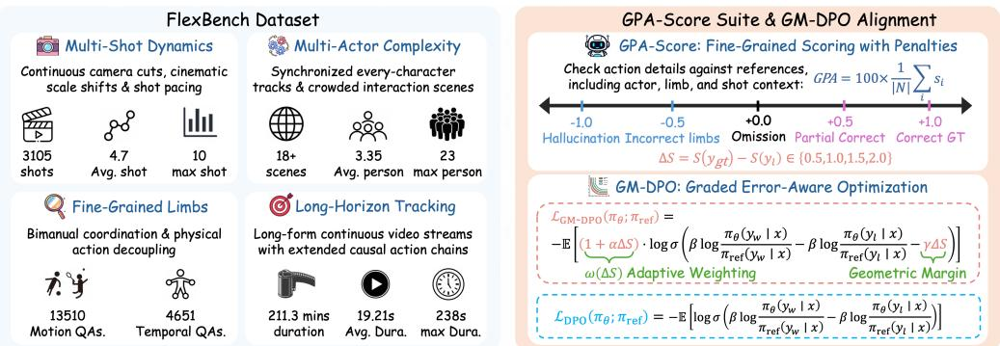  
Figure 1: Overview of our framework. FlexBench evaluates fine-grained limb motion for individual people across shots. GPA aggregates graded factual credit and explicit error penalties, while GM-DPO uses action-error severity to adjust preference margins and loss weights.

## Abstract

Vision-Language Models (VLMs) can generate rich video captions, yet often misidentify which person performs an action or which limb is involved, particularly across camera cuts. Improving these details requires evaluation and training that distinguish missing information from incorrect assertions. We introduce FlexBench, a benchmark spanning 3,105 shots and 18,161 evaluation queries, with human-verified identities and systematic per-person coverage of fine-grained limb actions and states. Its reference-derived checklists support automated assessment of complete captions in their person and shot contexts. Our Graded Physical Alignment score (GPA) awards credit for correct content and deducts points for incorrect or fabricated actions, making these errors explicit in the aggregate score. Building on this rubric, we propose Graded Margin Direct Preference Optimization (GM-DPO), which assigns stronger preference margins and greater training weight to more severe action errors. Across three VLM backbones, GM-DPO achieves the highest substantive-action and GPA scores among the evaluated preference objectives, improving GPA over DPO by 2.02–3.40 points. On Qwen3-8B, it reduces the weighted hallucination rate by 21.3% relative to DPO. These gains accompany sustained long-form output, improved shot structure, and competitive performance on three additional multimodal benchmarks.

Keywords: Video-Language Models, Limb Motion, Preference Optimization, Dense Captioning, Motion Benchmark

## 1 INTRODUCTION

Video captioning turns visual observations into language, making video content accessible for understanding and downstream learning. Recent Vision-Language Models (VLMs) can produce rich captions covering scenes, people, and events (Team, 2025; Clark et al., 2026), yet describing how an action unfolds remains challenging. Recognizing that someone opens a box, for example, does not establish which hand lifts the lid or how the other hand supports it. Across camera cuts and interacting people, these details must also remain attached to the correct person and shot. Our goal is to improve limb-motion fidelity within dense captions generated by general-purpose VLMs.

Progress toward this goal requires both targeted supervision and suitable evaluation. Supervised fine-tuning (SFT) teaches caption generation through reference imitation; subsequent preference optimization can further improve fidelity by contrasting better and worse captions (Yuan et al., 2025; Lee et al., 2025). Direct Preference Optimization (DPO) (Rafailov et al., 2023) makes this practical with fixed preference pairs, without a separate reward model or online sampling during optimization. However, its binary preference labels do not explicitly distinguish omissions, limb confusions, and fabricated actions. This distinction matters when captions become training annotations: missing information leaves supervision incomplete, whereas false assertions introduce incorrect video–text associations. Evaluation presents a related challenge. Widely used multiple-choice question answering (MCQA) benchmarks (Li et al., 2024; Hong et al., 2025) measure answer selection, which does not directly reveal what a model would assert in an unrestricted caption. Although recent bench marks directly evaluate motion captions (Tu et al., 2025; Lin et al., 2026), systematic limb-level assessment of every identifiable person across shots remains insufficiently addressed.

As shown in Figure 1, we address these needs through complementary advances in evaluation and training. We introduce FlexBench, a Fine-grained Limb-motion EXamination Benchmark, with human-verified identities and reference-derived checklists covering each person’s actions in their corresponding shots. Coverage extends to stationary limbs and limb visibility, ensuring that evaluation encompasses limb states as well as movements. Our GPA combines fine-grained grades through a weighted average, awarding full or partial credit, assigning zero credit to omissions, and deducting points for incorrect or fabricated actions. Guided by the same grading rubric, GM-DPO assigns larger preference margins and loss weights to more severe action errors. This focuses preference learning on limb-motion fidelity within complete, richly detailed video captions.

Our main contributions are three-fold:

• FlexBench: A multi-shot benchmark spanning 3,105 shots and 18,161 evaluation queries, with systematic per-person coverage of fine-grained limb motion, human-verified cross-shot identities, and checklists addressing actions, stationary limbs, and visibility.

• GPA: A graded, penalty-aware metric for automatically evaluating generated captions against detailed references, distinguishing incomplete coverage from incorrect motion claims.

• GM-DPO: An offline preference objective that incorporates action-error severity into margins and loss weights. Across three backbones, it achieves the best substantive-action and GPA scores among tested preference objectives while sustaining long-form output.

## 2 RELATED WORK

## 2.1 FROM VIDEO UNDERSTANDING TO LIMB-MOTION CAPTIONING

General-purpose VLMs increasingly capture not only video events but also their temporal structure, with benchmarks assessing long-video comprehension (Fu et al., 2025; Wu et al., 2024) and motion perception (Hong et al., 2025). Limb-motion captioning requires finer granularity: decomposing activities into constituent actions and grounding each action in the correct person, limb, and interaction. KPM-Bench (Lin et al., 2026) advances fine-grained motion captioning, accompanied by a training framework combining multi-level motion representations with SFT and GRPO. Our work addresses the complementary challenge of maintaining limb-level accuracy within dense captions that cover every identifiable person across shots. This scope includes stationary limbs and visibility, enabling assessment of both action coverage and unsupported motion claims.

## 2.2 PREFERENCE OPTIMIZATION FOR VIDEO CAPTIONING

Preference learning complements reference imitation with explicit comparisons between candidate outputs. DPO (Rafailov et al., 2023) provides an offline objective for this supervision, while c-DPO, IPO, and SimPO explore label smoothing, squared preference objectives, and length-normalized rewards, respectively (Mitchell, 2023; Azar et al., 2024; Meng et al., 2024). For video captioning, Tarsier2 (Yuan et al., 2025) applies DPO after supervised training to improve detailed captions. VidChain (Lee et al., 2025) combines supervised captioning and temporal grounding with metricbased DPO, using task metrics to select preference pairs. VideoComp (Kim et al., 2025) instead trains video–text matching models with a hierarchical pairwise preference loss over increasingly disrupted captions. These studies motivate targeted preference supervision for video understanding. GM-DPO uses a limb-motion error rubric to determine both the preference margin and the loss weight, distinguishing incomplete action content from incorrect or fabricated actions.

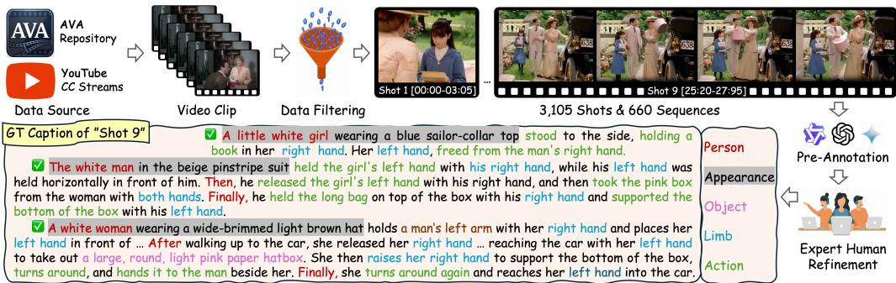  
Figure 2: FlexBench curation pipeline: video filtering, shot boundary calibration, VLM pre-labeling, and multi-stage expert refinement for granular limb-action modeling.

## 2.3 MOTION BENCHMARKS AND CAPTION EVALUATION

General video benchmarks assess broad perceptual and temporal capabilities (Li et al., 2024; Fu et al., 2025; Wu et al., 2024). Motion-focused evaluations examine fine-grained dynamics via multiple-choice queries (MotionBench (Hong et al., 2025)) and diverse QA-caption tasks (Temp-Compass (Liu et al., 2024)). Free-form generation additionally exposes the action claims a model produces without candidate answers. FAVOR-Bench (Tu et al., 2025) evaluates motion captions through LLM-assisted scoring and a separate structured sequence-matching protocol. Bridging these gaps, FlexBench emphasizes comprehensive, per-person and shot-specific limb assessments (covering stationary and hidden states). Our GPA metric resolves error severity via graded credits and penalties, supported by a temporal suite for consecutive-action coverage.

## 3 FLEXBENCH: FINE-GRAINED LIMB PHYSICAL BENCHMARKING

FlexBench evaluates fine-grained limb-motion fidelity within complete multi-shot video captions. By pairing verified references with detailed checklists, it audits each person’s active limbs and exact shot locations—enabling rigorous motion assessment without sacrificing descriptive richness.

## 3.1 DATA COLLECTION AND QUALITY ASSURANCE PIPELINE

To prevent models from exploiting static background shortcuts, video sequences in FlexBench are curated from untrimmed cinematic scenes in AVA (Gu et al., 2018) and CC-licensed YouTube streams, featuring domestic tasks, crafts, and complex tool manipulation. As shown in Figure 3A, the collection spans varied interactions. Automated shot detection with manual boundary calibration yields 660 sequences comprising 3,105 shots, with a mean sequence duration of 19.21 seconds.

As shown in Figure 2, 18 trained annotators refine VLM-generated captions to specify actor identities, interacted objects, limb laterality, and action order. Cross-shot identities are manually verified, with distinctive appearance cues used to distinguish similar-looking people. Annotations undergo blind review and consensus arbitration for ambiguous cases; details appear in Appendix A.

## 3.2 PER-PERSON COVERAGE AND CHECKLIST EVALUATION

Coverage across people and shots. Unlike conventional suites limited to isolated cuts or salient actors, FlexBench pairs multi-shot continuity with systematic, per-person limb annotation (Figure 3B). As shown in Figure 3C, sequences span 1–10 shots (mean 4.70) and 0–23 actors (mean 3.35). Reference captions structure each individual’s actions by shot—resolving granular limb movements and object interactions while accounting for stationary or hidden limb states.

<table><tr><td>Benchmark</td><td>Shot Person</td><td>Multi- Per-</td><td>Eval Format</td><td>Perception Level</td><td>Scale (Videos / QA)</td></tr><tr><td>MVBench (Li et al., 2024)</td><td>V</td><td>x</td><td>MCQA</td><td>motion &lt; 30%</td><td>4,000 / 1.0</td></tr><tr><td>TempCompass (Liu et al., 2024)</td><td>x</td><td>x</td><td>Matching</td><td>motion &lt; 20%</td><td>410/3.9</td></tr><tr><td>VideoMME (Fu et al., 2025)</td><td>V</td><td></td><td>MCQA</td><td>motion &lt; 20%</td><td>900 / 3.0</td></tr><tr><td>EgoSchema (Mangalam et al., 2023)</td><td>x</td><td>××</td><td>MCQA</td><td>event</td><td>5,031 / 1.0</td></tr><tr><td>Long VideoBench (Wu et al., 2024)</td><td>√</td><td>x</td><td>MCQA</td><td>event</td><td>3,763 / 1.8</td></tr><tr><td>MotionBench (Hong et al., 2025)</td><td>x</td><td>x</td><td>MCQA</td><td>motion</td><td>5,385 / 1.5</td></tr><tr><td>VideoComp (Kim et al., 2025)</td><td>x</td><td>Partial</td><td>Matching</td><td>sub-motion</td><td>2,002 / 1.0</td></tr><tr><td>KPM-Bench (HA) (Lin et al., 2026)</td><td>x</td><td>Partial</td><td>Caption</td><td>limb-motion</td><td>215/-</td></tr><tr><td>FlexBench (Ours)</td><td>√</td><td>√</td><td></td><td>Dense Caption limb-motion</td><td>3,105/5.9</td></tr></table>

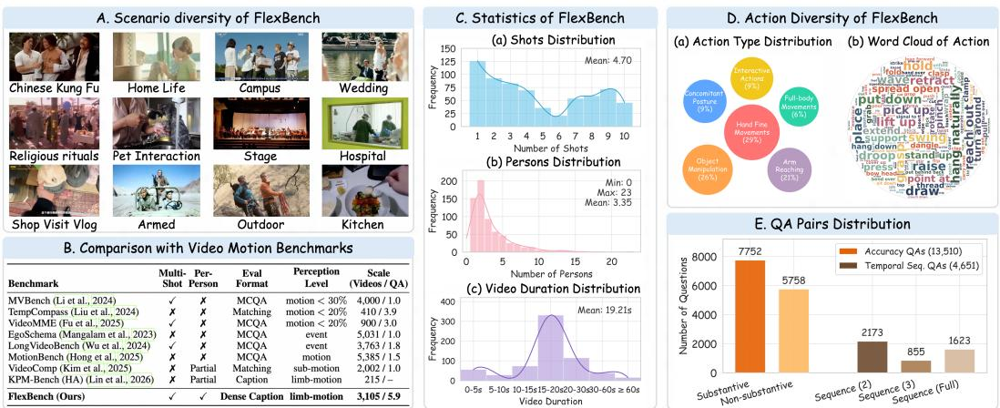

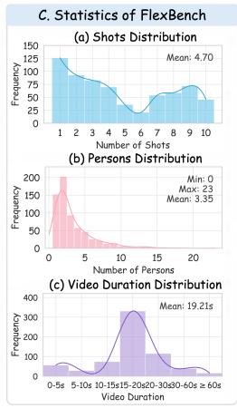  
Figure 3: Comprehensive overview of FlexBench: (A) Scenario coverage; (B) Dimensional comparison against existing video benchmarks; (C) Structural shot, actor, and duration distributions; (D) Kinematic action categories; (E) Action and temporal query counts.

Reference-derived factual checks. Human-verified captions are decomposed into positive checklist items covering actions, limb states, object interactions, and temporal order, each tied to a specific person and shot. During evaluation, an LLM judge scores the VLM-generated caption against both the checklist and ground-truth reference. Full credit strictly requires joint alignment across the action, person, and shot context—mismatched attributions receive no credit, while hallucinations and incorrect claims incur graded penalties. Human-evaluator agreement is analyzed in Section 5.4.

## 3.3 GRADED EVALUATION

As shown in Figure 3E, FlexBench spans 18,161 queries. The Action Accuracy Suite comprises 7,752 substantive action queries and 5,758 non-substantive posture queries. The Temporal Sequence Suite contains 4,651 queries assessing consecutive actions in their shot contexts. Together, the two suites measure the fidelity of individual action claims and their joint coverage across sequences.

The Graded Physical Alignment score (GPA) assigns action-evaluation items grades $s _ { i } \in$ $\{ - 1 , - 0 . 5 , 0 , 0 . 5 , 1 \}$ , distinguishing correct, partially specified actions, omissions, and contradictory or fabricated actions. For category $k \in \bar { \mathcal { K } } = \{ \mathrm { s u \bar { b } , \bar { n } o n } \}$ , let $N _ { k }$ denote scored items we report

$$
S _ { \mathrm { G P A } } = 1 0 0 \times \sum _ { k \in \mathcal { K } } w _ { k } \cdot \left( \frac { 1 } { \left| N _ { k } \right| } \sum _ { i \in N _ { k } } s _ { i } \right) = 1 0 0 \times \left( 0 . 6 \cdot \bar { S } _ { \mathrm { s u b } } + 0 . 4 \cdot \bar { S } _ { \mathrm { n o n } } \right) ,\tag{1}
$$

Thus, grades use the $[ - 1 , 1 ]$ scale, whereas reported GPA scores lie in [−100, 100]. The clipped variant $\mathrm { \bar { G P A } _ { c l i p } }$ replaces $s _ { i }$ with $\operatorname* { m a x } ( 0 , s _ { i } )$ in Equation 1, measuring credited content without negative penalties. We also report the weighted hallucination rate $\mathrm { W H R } { \bf \bar { \Psi } } = \mathrm { R a t i o } _ { - 0 . 5 } + 2 \mathrm { R a t i o } _ { - 1 }$ where Ratiov is the proportion of scored items assigned grade v.

Temporal queries evaluate consecutive substantive actions within shot contexts. For example, a Seq item earns credit when both constituent actions are correctly represented. We report $\mathrm { T S \dot { A } _ { w } = }$ $0 . 2 \bar { \mathrm { S e q } _ { 2 } } + 0 . 3 \mathrm { S e q } _ { 3 } + 0 . 5 \mathrm { S e q } _ { \mathrm { c h a i n } }$ , weighting two-action, three-action, and full-chain queries.

## 4 GM-DPO: GRADED MARGIN PREFERENCE OPTIMIZATION

In this section, we formulate GM-DPO, an error-aware offline alignment objective to suppress finegrained physical hallucinations in multimodal video understanding. GM-DPO addresses the core pathology of prevailing preference alignment algorithms: uniform treatment of non-preferred trajectories, obscuring the severe consequences of bodily chirality reversals and motion confabulations.

## 4.1 PRELIMINARIES AND LIMITATIONS OF STANDARD DPO

Given pairwise preferences $\mathcal { D } = \{ ( x , y _ { w } , y _ { l } ) \}$ and a frozen reference policy $\pi _ { \mathrm { r e f } } .$ , Rafailov et al. (2023) optimizes a parameterized policy $\pi _ { \theta } ( y \mid x )$ under the Bradley-Terry model by minimizing:

$$
\begin{array} { r } { \mathcal { L } _ { \mathrm { D P O } } ( \pi _ { \theta } ; \pi _ { \mathrm { r e f } } ) = - \mathbb { E } _ { ( x , y _ { w } , y _ { l } ) \sim \mathcal { D } } \left[ \log \sigma \left( h _ { \theta } ( x , y _ { w } ) - h _ { \theta } ( x , y _ { l } ) \right) \right] , } \end{array}\tag{2}
$$

where $\begin{array} { r } { h _ { \theta } ( x , y ) = \beta \log \frac { \pi _ { \theta } ( y | x ) } { \pi _ { \mathrm { r e f } } ( y | x ) } } \end{array}$ denotes the implicit reward. Differentiating Equation 2 with respect to θ yields the parameter gradient:

$$
\begin{array} { r } { \left\{ \begin{array} { l l } { \nabla _ { \theta } \mathcal { L } _ { \mathrm { D P O } } = - \beta \cdot \mathbb { E } _ { ( x , y _ { w } , y _ { l } ) \sim \mathcal { D } } \left[ \sigma \left( h _ { \theta } ( x , y _ { l } ) - h _ { \theta } ( x , y _ { w } ) \right) \cdot \Delta _ { \theta } \log { \pi ( y _ { w } , y _ { l } ) } \right] , } \\ { \Delta _ { \theta } \log { \pi ( y _ { w } , y _ { l } ) } \triangleq \nabla _ { \theta } \log { \pi _ { \theta } ( y _ { w } \mid x ) } - \nabla _ { \theta } \log { \pi _ { \theta } ( y _ { l } \mid x ) } , } \end{array} \right. } \end{array}\tag{3}
$$

Crucially, standard DPO assumes uniform binary preferences $( y _ { w } \ \succ \ y _ { l } )$ , scaling updates solely by prediction error $\sigma ( h _ { \theta } ( x , y _ { l } ) - h _ { \theta } ( x , y _ { w } ) )$ regardless of defect severity. Consequently, it applies identical gradient penalties to benign omissions and fatal chirality inversions (e.g., swapping hands), failing to penalize critical physical violations without over-correcting harmless variations.

## 4.2 PERTURBATION SEVERITY FROM THE GRADING RUBRIC

Each preference pair applies one error category e consistently to the targeted action descriptions within a selected shot, retaining the remaining caption. This restriction preserves the surrounding context and is intended to avoid preference pairs that are easily distinguished through errors distributed across multiple shots. The original targeted content has grade 1, and the perturbation is assigned $s _ { \mathrm { p e r t } } ( e ) \in \{ 0 . 5 , 0 , - 0 . 5 , - 1 \}$ under the action-grading rubric. We define

$$
\Delta S = 1 - s _ { \mathrm { p e r t } } ( e ) \in \{ 0 . 5 , 1 , 1 . 5 , 2 \} .\tag{4}
$$

This label represents local perturbation severity, not the GPA difference between complete captions. It uses the unscaled rubric, without the factor of 100 used for benchmark reporting. The preference objective below evaluates likelihoods over complete captions.

## 4.3 GM-DPO OBJECTIVE AND OPTIMIZATION DYNAMICS

Rather than enforcing uniform margins, GM-DPO governs policy updates through two coordinated mechanisms modulated by ∆S: an internal dynamic geometric margin $\gamma \Delta S$ enforcing separation, and an external gradient weight $\omega ( \Delta S ) = 1 + \alpha \Delta S ( \alpha \geq 0 , \gamma > 0 )$

$$
\mathcal { L } _ { \mathrm { G M - D P O } } ( \pi _ { \theta } ; \pi _ { \mathrm { r e f } } ) = - \mathbb { E } _ { ( x , y _ { w } , y _ { l } ) \sim \mathcal { D } } \left[ \omega ( \Delta S ) \log \sigma \left( h _ { \theta } ( x , y _ { w } ) - h _ { \theta } ( x , y _ { l } ) - \gamma \Delta S \right) \right] .\tag{5}
$$

Differentiating Equation 5 with respect to model parameters θ yields the explicit gradient:

$$
\nabla _ { \theta } \mathcal { L } _ { \mathrm { G M - D P O } } = - \beta \cdot \mathbb { E } _ { \mathcal { D } } \left[ \underbrace { \omega ( \Delta S ) } _ { \mathrm { S c a l i n g } } \cdot \underbrace { \sigma \left( h _ { \theta } ( x , y _ { l } ) - h _ { \theta } ( x , y _ { w } ) + \gamma \Delta S \right) } _ { \mathrm { M a r g i n } \cdot \mathrm { S h i f t e d R e s i d u a l } \mathrm { E r o r } } \cdot \Delta _ { \theta } \log \pi ( y _ { w } , y _ { l } ) \right] .\tag{6}
$$

Equation 6 reveals the dual modulation mechanics of GM-DPO for vision-language alignment:

(1) Margin-Shifted Residual Error: The offset $+ \gamma \Delta S$ shifts the logistic saturation boundary. When $h _ { \theta } ( y _ { w } ) > h _ { \theta } ( y _ { l } )$ , standard DPO gradients rapidly vanish; in contrast, GM-DPO sustains gradients until clearing a severity-scaled margin, ensuring continuous optimization on subtle dynamics.

(2) Magnitude Scaling: The multiplier ω(∆S) linearly magnifies parameter updates for severe physical flaws (up to $( 1 + 2 \alpha ) \times$ for confabulations), penalizing chirality flips more aggressively than harmless omissions. This error-sensitive scaling functions as an adaptive step size, guiding the policy away from catastrophic hallucination regimes without destabilizing language representation.

## 4.4 PREFERENCE PAIR CONSTRUCTION

We construct 125k preference pairs from single- and multi-shot videos, using expert-verified captions as chosen responses. To prevent data contamination, the training pool is completely disjoint from FlexBench: it strictly excludes AVA footage and shares no source videos (e.g., films or YouTube streams) with the 660 evaluation sequences.

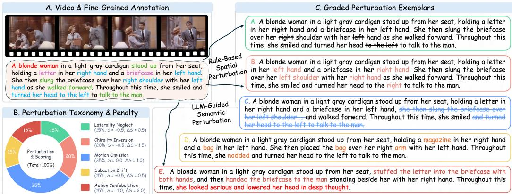  
Figure 4: The preference pair curation pipeline and perturbation spectrum. Ground-truth dense captions $( y _ { w } , S = + 1 . 0 )$ are perturbed via rule-based spatial editing and schema-constrained LLM rewriting to synthesize negative samples across five graded physical error regimes $( \Delta S \in [ 0 . 5 , 2 . 0 ] )$

As illustrated in Figure 4, rule-based editing produces Laterality Neglect $( \Delta S = 0 . 5 )$ and Chirality Inversion (1.5). Schema-constrained Gemini-3.5-Flash rewriting generates Motion Omission (1), Subaction Drift (0.5), and Action Confabulation (2). Untargeted descriptions are retained, and rewrites are constrained to preserve the original style. A double-blind study yielded 49.60% human accuracy in distinguishing human-refined from LLM-modified captions; generation and verification protocols are provided in Appendix A.3.

## 5 EXPERIMENTS

We evaluate whether GM-DPO improves limb-level action fidelity within long-form, shot-structured video captions. Our experiments first characterize existing models on FlexBench, then compare various preference optimization methods, examine the contributions of the proposed objective, and assess performance on broader multimodal benchmarks.

## 5.1 EXPERIMENTAL SETUP

Evaluated Model Suites. We benchmark physical motion perception across three representative foundation tiers: (1) Proprietary Frontier APIs: Gemini-3.1-Pro, Gemini-3.5-Flash (Google Gemini Team, 2026a;b), Seed-2.1-Pro (ByteDance Seed Team, 2026), Kimi-k2.6 (Kimi Team and Moonshot AI, 2026), alongside Qwen-3.5-Omni (Qwen Team, 2026a) and Qwen-3.8-Max (Qwen Team, 2026b); (2) Open-Source Models: Nemotron-3-Omni-30B (?), Gemma-4-31B (Team, 2026), Qwen3-32B (Team, 2025), and Qwen-3.8-27B (Qwen Team, 2026b). (3) Open-Weight Video Models (7B): Tarsier2-Recap-7B (Yuan et al., 2025) and VideoLLaMA2-7B (Cheng et al., 2024). To ensure comparability and consistency, all models are evaluated under identical prompts.

Training Setup. We compare GM-DPO with DPO (Rafailov et al., 2023), c-DPO (Mitchell, 2023), IPO (Azar et al., 2024), and SimPO (Meng et al., 2024) on Qwen2.5-7B, Qwen3-8B, and LLaVA-2-8B, with an additional SFT baseline on Qwen3-8B. All preference methods include a chosenresponse NLL term, $\mathcal { L } _ { \mathrm { t o t a l } } = \mathcal { L } _ { \mathrm { p r e f } } + \lambda \mathcal { L } _ { \mathrm { N L L } }$ , with λ = 1. Experiments are conducted on a cluster of 8×NVIDIA A800 (80GB) GPUs using the AdamW optimizer, updating language backbone parameters while keeping visual encoders frozen. For both SFT and preference tuning, runs are repeated across three random seeds with mean metrics reported. Training configurations and baseline objectives appear in Appendix B; results with standard deviations are provided in Appendix C.1.

Evaluation Metrics. We report GPA, TSA , and their sub-metrics (averaged across GPT-4o, Gemini-3.5-Flash, and Qwen-3.8-Max) to quantify motion fidelity and temporal continuity. Concurrently, we record caption length (Len, in words) and shot structure match rate (SMR). “N/S” denotes outputs failing to follow the requested multi-shot structure. For these models, Motion Accuracy is evaluated without shot matching, while retaining checks on action, person, and limb correctness.

Table 1: Zero-shot performance on FlexBench across SOTA VLMs. Best results are in bold.
<table><tr><td>Model</td><td colspan="4">Motion Accuracy</td><td colspan="4">Motion Sequence</td><td colspan="2">Output Statistics</td></tr><tr><td></td><td>Subs.</td><td>Non-subs.</td><td>GPA</td><td> $\mathbf { G P A } _ { \mathrm { c l i p } }$ </td><td> $\mathbf { S e q _ { 2 } }$ </td><td>Seq3</td><td> $\mathbf { S e q } _ { \mathrm { c h a i n } }$ </td><td> $\mathbf { T S A } _ { \mathbf { W } }$ </td><td>Len</td><td>SMR (%)</td></tr><tr><td colspan="9">Proprietary Frontier APIs</td></tr><tr><td>Gemini-3.1-Pro</td><td>17.80</td><td>42.21</td><td>27.56</td><td>34.27</td><td>26.53</td><td>28.18</td><td>30.04</td><td>28.78</td><td>855.7</td><td>50.27</td></tr><tr><td>Gemini-3.5-Flash</td><td>16.70</td><td>43.61</td><td>27.46</td><td>33.98</td><td>27.03</td><td>26.88</td><td>28.77</td><td>27.86</td><td>709.4</td><td>56.22</td></tr><tr><td>Seed-2.1-Pro</td><td>32.24</td><td>44.38</td><td>37.10</td><td>44.92</td><td>47.00</td><td>44.14</td><td>47.31</td><td>46.30</td><td>782.3</td><td>68.31</td></tr><tr><td>Kimi-k2.6</td><td>18.47</td><td>42.13</td><td>27.93</td><td>36.04</td><td>30.35</td><td>30.26</td><td>32.94</td><td>31.62</td><td>683.4</td><td>53.57</td></tr><tr><td>Qwen-3.8-Max</td><td>33.50</td><td>46.88</td><td>38.85</td><td>47.11</td><td>45.24</td><td>45.44</td><td>46.70</td><td>46.03</td><td>1233.3</td><td>99.18</td></tr><tr><td colspan="9">Open-Source Large Models</td></tr><tr><td>Nemotron-3-Omni-30B</td><td>5.94</td><td>41.22</td><td>20.05</td><td>25.10</td><td>14.92</td><td>16.24</td><td>15.22</td><td>15.47</td><td>310.4</td><td>64.23</td></tr><tr><td>Gemma-4-31B</td><td>7.63</td><td>48.37</td><td>23.93</td><td>26.49</td><td>13.68</td><td>15.90</td><td>17.12</td><td>16.07</td><td>424.9</td><td>78.98</td></tr><tr><td>Qwen3-32B</td><td>14.20</td><td>39.91</td><td>24.48</td><td>33.81</td><td>25.95</td><td>25.96</td><td>29.70</td><td>27.83</td><td>674.9</td><td>96.57</td></tr><tr><td>Qwen-3.8-27B</td><td>13.47</td><td>44.53</td><td>25.89</td><td>31.66</td><td>22.76</td><td>23.04</td><td>25.28</td><td>24.10</td><td>596.7</td><td>98.10</td></tr><tr><td colspan="9">Open-Weight Video Models (7B)</td></tr><tr><td>VideoLLaMA2-7B</td><td>2.01</td><td>21.47</td><td>9.79</td><td>13.89</td><td>6.84</td><td>4.62</td><td>9.68</td><td>7.59</td><td>142.4</td><td>N/S</td></tr><tr><td>Tarsier2-Recap-7B</td><td>8.96</td><td>41.75</td><td>22.08</td><td>24.98</td><td>9.99</td><td>6.84</td><td>12.17</td><td>10.13</td><td>127.9</td><td>N/S</td></tr></table>

Table 2: Main alignment results on FlexBench. Base models in gray italics; best aligned in bold.
<table><tr><td rowspan="2">Model Variant</td><td colspan="4">Motion Accuracy</td><td colspan="4">Motion Sequence</td><td colspan="2">Output Statistics</td></tr><tr><td>Subs.</td><td>Non-subs.</td><td>GPA</td><td> $\mathbf { G P A } _ { \mathrm { c l i p } }$ </td><td> $\mathbf { S e q _ { 2 } }$ </td><td>Seq3</td><td>Seqchain</td><td>TSAw</td><td>Len</td><td>SMR (%)</td></tr><tr><td>Qwen3-8B-SFT</td><td>6.92</td><td>42.31</td><td>21.08</td><td>29.88</td><td>13.30</td><td>15.54</td><td>15.81</td><td>15.23</td><td>1634</td><td>89.7</td></tr><tr><td>Qwen2.5-7B-Base</td><td>3.02</td><td>23.17</td><td>11.08</td><td>14.26</td><td>8.86</td><td>9.88</td><td>10.38</td><td>9.93</td><td>1131</td><td>49.0</td></tr><tr><td>Qwen2.5-7B-DPO</td><td>3.92</td><td>24.22</td><td>12.04</td><td>25.05</td><td>15.13</td><td>15.96</td><td>18.39</td><td>17.01</td><td>1420</td><td>94.0</td></tr><tr><td>Qwen2.5-7B-cDPO</td><td>3.05</td><td>25.80</td><td>12.15</td><td>25.20</td><td>15.25</td><td>14.55</td><td>17.65</td><td>16.24</td><td>1303</td><td>96.0</td></tr><tr><td>Qwen2.5-7B-IPO</td><td>2.94</td><td>27.14</td><td>12.62</td><td>26.40</td><td>17.83</td><td>18.42</td><td>19.22</td><td>18.70</td><td>1521</td><td>98.7</td></tr><tr><td>Qwen2.5-7B-SimPO</td><td>1.39</td><td>30.67</td><td>13.10</td><td>25.42</td><td>15.32</td><td>15.32</td><td>17.71</td><td>16.52</td><td>1561</td><td>97.8</td></tr><tr><td>Qwen2.5-7B-GM-DPO (Ours)</td><td>6.14</td><td>25.95</td><td>14.06</td><td>25.82</td><td>17.05</td><td>17.31</td><td>19.72</td><td>18.46</td><td>1506</td><td>98.2</td></tr><tr><td>Qwen3-8B-Base</td><td>5.85</td><td>40.25</td><td>19.61</td><td>25.67</td><td>13.09</td><td>12.75</td><td>15.99</td><td>14.44</td><td>1391</td><td>37.2</td></tr><tr><td>Qwen3-8B-DPO</td><td>7.16</td><td>38.40</td><td>19.66</td><td>28.86</td><td>17.69</td><td>19.94</td><td>20.52</td><td>19.78</td><td>1572</td><td>55.6</td></tr><tr><td>Qwen3-8B-cDPO</td><td>6.44</td><td>33.76</td><td>17.37</td><td>27.37</td><td>16.73</td><td>17.32</td><td>20.25</td><td>18.67</td><td>1514</td><td>63.7</td></tr><tr><td>Qwen3-8B-IPO</td><td>7.05</td><td>39.33</td><td>19.96</td><td>29.08</td><td>18.35</td><td>19.19</td><td>21.74</td><td>20.30</td><td>1563</td><td>86.3</td></tr><tr><td>Qwen3-8B-SimPO</td><td>6.64</td><td>39.58</td><td>19.82</td><td>28.60</td><td>18.84</td><td>19.77</td><td>21.35</td><td>20.37</td><td>1615</td><td>77.7</td></tr><tr><td>Qwen3-8B-GM-DPO (Ours)</td><td>9.30</td><td>43.69</td><td>23.06</td><td>30.52</td><td>21.81</td><td>20.58</td><td>23.60</td><td>22.34</td><td>1610</td><td>89.8</td></tr><tr><td>LLaVA-2-8B-Base</td><td>4.24</td><td>48.70</td><td>22.02</td><td>23.21</td><td>4.94</td><td>5.79</td><td>6.38</td><td>5.92</td><td>605</td><td>2.2</td></tr><tr><td>LLaVA-2-8B-DPO</td><td>10.66</td><td>40.73</td><td>22.69</td><td>29.15</td><td>21.17</td><td>22.53</td><td>23.33</td><td>22.66</td><td>1320</td><td>25.3</td></tr><tr><td>LLaVA-2-8B-cDPO</td><td>6.35</td><td>45.46</td><td>21.99</td><td>25.54</td><td>13.44</td><td>13.58</td><td>14.90</td><td>14.21</td><td>1298</td><td>36.9</td></tr><tr><td>LLaVA-2-8B-IPO</td><td>10.24</td><td>41.40</td><td>22.70</td><td>29.22</td><td>22.89</td><td>23.00</td><td>24.01</td><td>23.48</td><td>1413</td><td>39.5</td></tr><tr><td>LLaVA-2-8B-SimPO</td><td>6.93</td><td>47.42</td><td>23.13</td><td>26.56</td><td>16.90</td><td>18.19</td><td>15.71</td><td>16.69</td><td>1400</td><td>32.6</td></tr><tr><td>LLaVA-2-8B-GM-DPO (Ours)</td><td>13.89</td><td>42.66</td><td>25.40</td><td>31.77</td><td>25.87</td><td>25.49</td><td>27.04</td><td>26.34</td><td>1405</td><td>44.7</td></tr></table>

## 5.2 EVALUATING EXISTING MODELS ON FLEXBENCH

As shown in Table 1, substantive-action scores are consistently lower than non-substantive scores across evaluated models: Qwen-3.8-Max reaches 33.50 versus 46.88, and Gemini-3.1-Pro reaches 17.80 versus 42.21. Fine-grained limb-motion captioning thus remains challenging even for models producing rich captions. Tarsier2-Recap-7B achieves a notable 22.08 GPA at just 127.9 average words, though evaluated under relaxed shot matching. The gap between $\mathrm { G P A _ { c l i p } }$ and GPA shows correct content often coexists with errors in dense captions: Qwen-3.8-Max and Seed-2.1-Pro incur deductions of 8.26 and 7.82 points, respectively.

Sequence-level scores reveal a related limitation. Seed-2.1-Pro achieves the highest $\mathrm { T S A } _ { \mathrm { w } }$ at 46.30, while Qwen3-32B leads the evaluated large open-weight models at 27.83. These queries require consecutive actions to be correctly represented in their corresponding shot contexts, making their joint coverage more demanding. Output structure alone does not resolve this difficulty: Qwen-3.5- Omni achieves 99.34% SMR but only 13.72 on substantive actions. Conversely, the two evaluated 7B video models do not produce the requested shot structure. Together, these results motivate improving limb-motion fidelity within complete, shot-organized captions.

## 5.3 MAIN ALIGNMENT RESULTS

We next examine whether targeted preference optimization can address these limitations while retaining dense caption output. As shown in Table 2, we compare preference objectives across three backbones with the Qwen3-8B SFT baseline serving as a reference for caption imitation alone.

Fine-Grained Action Grounding. Standard DPO treats minor omissions identically to fatal chirality inversions, resulting in poor performance under evaluation systems that penalize hallucinations.

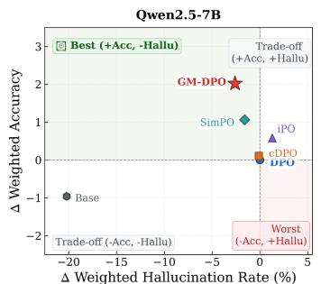

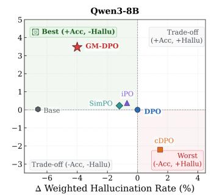  
Base DPO cDPO ▲ iPO SimPO ★ GM-DPO

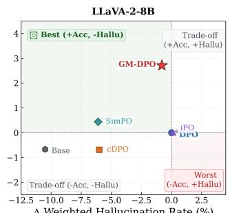

Figure 5: The accuracy-hallucination trade-off across three VLM architectures on FlexBench, normalized relative to standard DPO as origin (0, 0).  
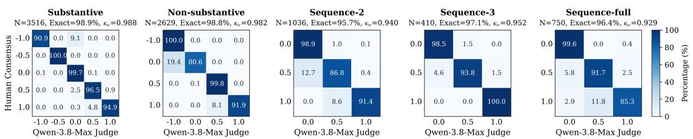  
Figure 6: Row-normalized agreement matrices between human consensus and LLM.

GM-DPO incorporates this information through severity-dependent margins and weights, achieving the highest Substantive scores among the evaluated preference methods on all three backbones. Relative to DPO, scores increase from 3.92 to 6.14 on Qwen2.5-7B, 7.16 to 9.30 on Qwen3-8B, and 10.66 to 13.89 on LLaVA-2-8B. Non-substantive scores also improve over DPO on every backbone. Although other objectives obtain higher non-substantive scores on Qwen2.5-7B and LLaVA-2-8B, GM-DPO consistently leads on the substantive actions targeted by our preference construction.

Robustness under Penalty-Aware Evaluation. To examine whether these improvements persist when incorrect assertions incur penalties, we compare the aggregate GPA scores. GM-DPO ranks first among the evaluated alignment methods on every backbone, reaching 14.06, 23.06, and 25.40, respectively, with gains of 2.02, 3.40, and 2.71 points over DPO. These gains contain two measurable contributions: $\mathrm { G P A _ { c l i p } }$ increases by 0.77, 1.02, and 2.62 points, while the aggregate penalty deduction, $\mathrm { G P A } _ { \mathrm { c l i p } } - \mathrm { G P A }$ , decreases from 13.01 to 11.76, 9.20 to 7.46, and 6.46 to 6.37. The improvement therefore combines higher positive credit with smaller penalties, with their relative contributions varying across backbones. In particular, the LLaVA-2-8B gain primarily reflects in creased positive credit rather than a large reduction in penalties.

Consecutive-Action Coverage across Shots. Sequence queries jointly evaluate consecutive substantive actions in their corresponding shot contexts, connecting individual action fidelity with coverage across shots. Compared to DPO, GM-DPO consistently improves $\mathrm { T S A } _ { \mathrm { w } }$ by 1.45, 2.56, and 3.68 points, respectively. It achieves the highest $\mathrm { S e q } _ { \mathrm { c h a i n } }$ on all three backbones and leads all sequence metrics on Qwen3-8B and LLaVA-2-8B. On Qwen2.5-7B, IPO retains a slightly higher $\mathrm { T S A } _ { \mathrm { w } }$ of 18.70. These results support improved joint coverage of consecutive actions; because the queries share action requirements, they do not isolate temporal reasoning from action accuracy.

Maintaining Caption Length and Shot Structure. A common failure mode in preference optimization is length or format collapse, where models generate truncated answers to avoid penalties. As shown in Table 2, all preference-tuned variants preserve descriptive length while improving SMR over base models. Notably, on Qwen3-8B, GM-DPO matches full-SFT in both length (1610 vs. 1634) and structure compliance (89.8% vs. 89.7% SMR), demonstrating that our auxiliary NLL loss prevents linguistic collapse without standalone SFT. Nevertheless, final SMR gains remain largely bounded by each backbone’s inherent instruction-following capacity.

## 5.4 DIAGNOSTIC ANALYSIS AND EVALUATOR FIDELITY

Physical Fidelity and Hallucination. As shown in Figure 5, we compare changes in GPA and WHR relative to DPO to examine how physical alignment improvements relate to hallucination penalties.

GM-DPO occupies the upper-left region on all three backbones, achieving the largest GPA increase among the compared alignment methods while also reducing WHR. Several baselines also reach this region, so the advantage is not exclusive quadrant membership. For example, SimPO achieves a larger WHR reduction on LLaVA-2-8B, but its GPA gain is smaller than GM-DPO’s (0.44 versus 2.71 points). On Qwen3-8B, GM-DPO reduces WHR from 18.8% to 14.8%, a reduction of 4.0 percentage points, while increasing GPA by 3.40 points. These results show that improved penaltyaware fidelity can accompany reduced hallucination rates, with the balance varying across objectives and backbones. Representative caption comparisons are provided in Appendix C.4.

Evaluator Reliability and Human Agreement. To validate the reliability of FlexBench’s automated evaluation protocol, we benchmark the LLM judge (Qwen-3.8-Max, $T = 0 . 0 )$ against consensus annotations from 20 trained experts across 8,341 query instances generated by 28 diverse models. As shown in Figure 6, exact agreement spans from 95.7% to 98.9% across all five suites, accompanied by outstanding quadratic weighted $\kappa _ { w }$ values ranging from 0.929 to 0.988. By demonstrating robust alignment across a broad spectrum of model outputs, these results confirm the high fidelity, objectivity, and practical viability of FlexBench’s automated protocol as a reliable proxy for human judgment in fine-grained video evaluation.

## 5.5 ABLATION ON GM-DPO LOSS FORMULATION

We ablate the severity-dependent weight (ω) and margin (m), recovering DPO when both are disabled while retaining the auxiliary NLL loss. As shown in Table 3, the margin alone improves GPA by 1.16, 0.41, and 1.86 points on Qwen2.5, Qwen3, and LLaVA-2, respectively, outperforming weighting alone on every backbone. Weighting alone also improves GPA, but its benefits do not consistently extend to credited content or sequence coverage. Combining both components yields the highest GPA, $\mathrm { G P \bar { A } _ { c l i p } , }$ and $\mathrm { T S A } _ { \mathrm { w } }$ in every ablation group, supporting their complementary roles in improving action fidelity and consecutive-action coverage. This benefit is clearest on Qwen3, where joint optimization reaches 23.06 GPA, compared with 19.93 for weighting alone and 20.07 for the margin alone. Detailed results appear in Appendix C.2.

Table 3: Ablation across backbones.
<table><tr><td rowspan=1 colspan=1>Model</td><td rowspan=1 colspan=1>ω m</td><td rowspan=1 colspan=4>GPA  $\mathbf { G P A } _ { \mathrm { c l i p } }$ </td><td rowspan=1 colspan=1>|TSAw</td></tr><tr><td rowspan=5 colspan=1>Qwen2.5</td><td rowspan=1 colspan=1>X X</td><td rowspan=2 colspan=4>12.04  25.05</td><td rowspan=1 colspan=1>12.</td></tr><tr><td rowspan=4 colspan=1>√ xx √√ √</td><td></td></tr><tr><td rowspan=3 colspan=4>12.2913.2014.06  25.82</td><td rowspan=1 colspan=1>25.00</td><td rowspan=1 colspan=1>16.52</td></tr><tr><td rowspan=1 colspan=1>17.73</td></tr><tr><td rowspan=1 colspan=1>18.46</td></tr><tr><td rowspan=4 colspan=1>Qwen3</td><td rowspan=4 colspan=1>x x√ xx √√ √</td><td rowspan=1 colspan=4>19.66  28.86</td><td rowspan=1 colspan=1>19.78</td></tr><tr><td rowspan=3 colspan=4>19.93  29.4220.07  29.8223.06  30.52</td><td rowspan=1 colspan=1>19.88</td></tr><tr><td rowspan=1 colspan=1>20.03</td></tr><tr><td rowspan=1 colspan=1>22.34</td></tr><tr><td rowspan=4 colspan=1>LLaVA-2</td><td rowspan=4 colspan=1>x x√ xx √√ √</td><td rowspan=1 colspan=4>22.69  29.15</td><td rowspan=1 colspan=1>22.66</td></tr><tr><td rowspan=1 colspan=4>23.77  28.97</td><td rowspan=1 colspan=1>23.27</td></tr><tr><td rowspan=2 colspan=4>24.55  30.6325.40  31.77</td><td rowspan=1 colspan=1>25.27</td></tr><tr><td rowspan=1 colspan=1>26.34</td></tr></table>

## 5.6 GENERALIZATION TO DOWNSTREAM MULTIMODAL BENCHMARKS

To examine whether fine-grained motion alignment retains   
broader multimodal capabilities, we evaluate the aligned   
checkpoints on Video-MME (Fu et al., 2025), POPE (Li   
et al., 2023), and Video-ChatGPT (Maaz et al., 2024). As   
shown in Table 4, GM-DPO achieves the highest POPE ac  
curacy and F1, together with the highest Video-ChatGPT   
overall score, among the compared alignment methods on   
all three backbones. It also leads Video-MME on Qwen2.5   
and LLaVA-2; on Qwen3, its accuracy of 62.72 is slightly   
below cDPO’s 62.73. Crucially, cross-benchmark compari  
son reveals an overarching diagnostic limitation of prevailing   
suites: performance deltas across disparate alignment objec  
tives remain heavily compressed (fluctuating within ±0.1 on   
Video-ChatGPT), as coarse event recognition and multiple  
choice probes lack sensitivity to granular physical dynamics.   
In stark contrast, FlexBench exposes decisive gaps across   
these identical models (spanning up to 3.40 GPA points and   
a 21.3% WHR delta in Section 5.4), confirming metric satu  
ration on standard benchmarks and highlighting FlexBench as an indispensable diagnostic testbed. Comprehensive breakdowns are provided in Appendix C.3. Comprehensive breakdowns are provided in Appendix C.3.

Table 4: Cross-benchmark generalization across backbones.
<table><tr><td rowspan=1 colspan=2>Method Variant</td><td rowspan=1 colspan=1>V-MMEAcc</td><td rowspan=1 colspan=1>POPEAcc F1</td><td rowspan=1 colspan=1>V-GPTScore</td></tr><tr><td rowspan=1 colspan=2>Q2.5-DPO</td><td rowspan=1 colspan=1>60.06</td><td rowspan=2 colspan=1>87.4386.0687.4686.0687.4486.09</td><td rowspan=3 colspan=1>2.502.502.462.482.51</td></tr><tr><td rowspan=1 colspan=2>Q2.5-cDPOQ2.5-IPO</td><td rowspan=1 colspan=1>59.5860.45</td></tr><tr><td rowspan=1 colspan=2>Q2.5-SimPOQ2.5-GM-DPO</td><td rowspan=1 colspan=1>60.2660.62</td><td rowspan=1 colspan=1>87.4186.0287.5686.15</td></tr><tr><td rowspan=1 colspan=2>Q3-DPO</td><td rowspan=1 colspan=1>62.35</td><td rowspan=1 colspan=1>89.3788.98</td><td rowspan=2 colspan=1>2.702.73</td></tr><tr><td rowspan=1 colspan=2>Q3-cDPO</td><td rowspan=1 colspan=1>62.73</td><td rowspan=1 colspan=1>89.3788.98</td></tr><tr><td rowspan=1 colspan=2>Q3-IPO</td><td rowspan=1 colspan=1>62.07</td><td rowspan=1 colspan=1>89.3788.96</td><td rowspan=1 colspan=1>2.66</td></tr><tr><td rowspan=1 colspan=2>Q3-SimPO</td><td rowspan=1 colspan=1>62.24</td><td rowspan=2 colspan=1>89.3588.9489.4089.02</td><td rowspan=2 colspan=1>2.642.75</td></tr><tr><td rowspan=1 colspan=2>Q3-GM-DPO</td><td rowspan=1 colspan=1>)</td><td rowspan=1 colspan=1>62.72</td></tr><tr><td rowspan=1 colspan=2>L2-DPO</td><td rowspan=1 colspan=1>64.67</td><td rowspan=1 colspan=1>88.7888.31</td><td rowspan=1 colspan=1>2.51</td></tr><tr><td rowspan=1 colspan=2>L2-cDPO</td><td rowspan=1 colspan=1>65.14</td><td rowspan=1 colspan=1>88.8888.34</td><td rowspan=1 colspan=1>2.56</td></tr><tr><td rowspan=1 colspan=2>L2-IPO</td><td rowspan=1 colspan=1>65.19</td><td rowspan=1 colspan=1>88.7788.11</td><td rowspan=1 colspan=1>2.56</td></tr><tr><td rowspan=1 colspan=2>L2-SimPO</td><td rowspan=1 colspan=1>64.78</td><td rowspan=1 colspan=1>88.4988.04</td><td rowspan=1 colspan=1>2.55</td></tr><tr><td rowspan=1 colspan=2>L2-GM-DPO</td><td rowspan=1 colspan=1>65.39</td><td rowspan=1 colspan=1>88.97 88.41</td><td rowspan=1 colspan=1>2.57</td></tr></table>

## 6 CONCLUSION

We presented a framework combining fine-grained evaluation and severity-aware preference learning to improve limb-motion fidelity in dense video captions. FlexBench systematically evaluates each identifiable person’s actions and limb states across shots, while GPA distinguishes credited content from incorrect claims through graded scores and penalties. GM-DPO brings this rubric into preference margins and loss weights, consistently improving substantive-action fidelity and consecutive-action coverage over DPO across three backbones and training seeds. These gains accompany sustained long-form output and competitive performance on broader multimodal benchmarks, supporting targeted motion alignment within general-purpose captioning models. However, monocular ambiguity remains a challenge, and these results do not establish the accuracy of other caption content, such as camera angles, camera motion, or sound. Future work will evaluate these dimensions and examine whether more accurate motion captions provide better supervision for downstream learning. Further limitations and research directions are discussed in Appendix D.

## REFERENCES

Mohammad Gheshlaghi Azar, Zhaohan Daniel Guo, Bilal Piot, Remi Munos, Mark Rowland,´ Michal Valko, and Daniele Calandriello. A general theoretical paradigm to understand learning from human preferences. In International Conference on Artificial Intelligence and Statistics (AISTATS), pp. 4447–4455, 2024.

ByteDance Seed Team. Seed-2.1-Pro: Multimodal foundation api for continuous visual understand ing. https://www.volcengine.com/product/seed, 2026.

Zesen Cheng, Sicong Leng, Hang Zhang, Yifei Xin, Xin Li, Guanzheng Chen, Yongxin Zhu, Wenqi Zhang, Ziyang Luo, Deli Zhao, and Lidong Bing. Videollama 2: Advancing spatial-temporal modeling and audio understanding in video-llms. arXiv preprint arXiv:2406.07476, 2024.

Christopher Clark, Jieyu Zhang, Zixian Ma, et al. Molmo2: Open weights and data for visionlanguage models with video understanding and grounding. arXiv preprint arXiv:2601.10611, 2026. URL https://arxiv.org/abs/2601.10611.

Chaoyou Fu, Yuhan Dai, Yondong Luo, Jiashuo Sun, Shuhuai Ren, Renrui Zhang, Ning Wang, Bin Wang, Ruoyu Wang, Yan Chen, Runpeng Yu, Liang Chen, Dong Shen, Shaohao Lu, Ming-Hsuan Yang, Caifeng Shan, and Xinglong Shen. Video-MME: The first-ever comprehensive evaluation benchmark of multi-modal LLMs in video analysis. In IEEE/CVF Conference on Computer Vision and Pattern Recognition (CVPR), 2025.

Google Gemini Team. Gemini 3.1 Pro: A smarter model for your most complex tasks. https://blog.google/innovation-and-ai/models-and-research/ gemini-models/gemini-3-1-pro/, 2026a.

Google Gemini Team. Gemini 3.5: Frontier intelligence with action. https://blog.google/ technology/ai/google-gemini-3-5/, 2026b.

Chunhui Gu, Chen Sun, David A. Ross, Carl Vondrick, Caroline Pantofaru, Yeqing Li, Sudheendra Vijayanarasimhan, George Toderici, Susanna Ricco, Rahul Sukthankar, Cordelia Schmid, and Jitendra Malik. AVA: A video dataset of spatio-temporally localized atomic visual actions. In IEEE/CVF Conference on Computer Vision and Pattern Recognition (CVPR), pp. 6047–6056, 2018.

Wenyi Hong, Yean Cheng, Zhuoyi Yang, Weihan Wang, Lefan Wang, Xiaotao Gu, Shiyu Huang, Yuxiao Dong, and Jie Tang. MotionBench: Benchmarking and improving fine-grained video motion understanding for vision language models. In IEEE/CVF Conference on Computer Vision and Pattern Recognition (CVPR), 2025.

Dahun Kim, AJ Piergiovanni, Ganesh Satish Mallya, and Anelia Angelova. VideoComp: Advancing fine-grained compositional and temporal alignment in video-text models. In IEEE/CVF Conference on Computer Vision and Pattern Recognition (CVPR), 2025.

Kimi Team and Moonshot AI. Kimi K2.5: Visual agentic intelligence, 2026. URL https:// arxiv.org/abs/2602.02276.

Ji Soo Lee, Jongha Kim, Jeehye Na, Jinyoung Park, and Hyunwoo J. Kim. VidChain: Chain-oftasks with metric-based direct preference optimization for dense video captioning. arXiv preprint arXiv:2501.06761, 2025.

Kunchang Li, Yali Wang, Yinan He, Yizhuo Li, Yi Wang, Yi Liu, Zun Wang, Jilan Xu, Guo Chen, Ping Luo, Limin Wang, and Yu Qiao. MVBench: A comprehensive multi-modal video understanding benchmark. In IEEE/CVF Conference on Computer Vision and Pattern Recognition (CVPR), pp. 22195–22206, 2024.

Yifan Li, Yifan Du, Kun Zhou, Jinpeng Wang, Wayne Xin Zhao, and Ji-Rong Wen. Evaluating object hallucination in large vision-language models. In Proceedings of the 2023 Conference on Empirical Methods in Natural Language Processing (EMNLP), pp. 292–305, 2023.

Boda Lin, Yongjie Zhu, Xiaocheng Gong, Wenyu Qin, and Meng Wang. KPM-Bench: A kinematic parsing motion benchmark for fine-grained motion-centric video understanding. arXiv preprint arXiv:2602.17768, 2026.

Yuanxin Liu, Shicheng Li, Yi Liu, Yuxiang Wang, Shuhuai Ren, Lei Li, Sishuo Chen, Xu Sun, and Lu Hou. TempCompass: Do video LLMs really understand video time? In Annual Meeting of the Association for Computational Linguistics (ACL), pp. 13745–13768, 2024.

Muhammad Maaz, Hanoona Rasheed, Salman Khan, and Fahad Shahbaz Khan. Video-ChatGPT: Towards detailed video understanding via large vision and language models. In Proceedings of the 62nd Annual Meeting of the Association for Computational Linguistics (Volume 1: Long Papers), pp. 12586–12602, 2024.

Karttikeya Mangalam, Raiymbek Akshulakov, and Jitendra Malik. EgoSchema: A diagnostic benchmark for very long-form video language understanding. In Advances in Neural Information Processing Systems (NeurIPS), volume 36, pp. 40645–40661, 2023.

Yu Meng, Mengzhou Xia, and Danqi Chen. SimPO: Simple preference optimization with a reference-free reward. In Advances in Neural Information Processing Systems (NeurIPS), volume 37, pp. 124430–124458, 2024.

Eric Mitchell. A note on DPO with noisy preferences & relationship to IPO. Technical note, 2023. URL https://ericmitchell.ai/cdpo.pdf.

Qwen Team. Qwen3.5-Omni technical report, 2026a. URL https://arxiv.org/abs/2604. 15804.

Qwen Team. On the design of Qwen3.8-Next architecture: Evaluation, efficiency, and training stability, 2026b. URL https://arxiv.org/abs/2608.30320.

Rafael Rafailov, Archit Sharma, Eric Mitchell, Christopher D. Manning, Stefano Ermon, and Chelsea Finn. Direct preference optimization: Your language model is secretly a reward model. In Advances in Neural Information Processing Systems (NeurIPS), volume 36, pp. 53728–53741, 2023.

Gemma Team. Gemma 4 technical report, 2026. URL https://arxiv.org/abs/2607. 02770.

Qwen Team. Qwen3 technical report, 2025. URL https://arxiv.org/abs/2505.09388.

Chongjun Tu, Lin Zhang, Pengtao Chen, Peng Ye, Xianfang Zeng, Wei Cheng, Gang Yu, and Tao Chen. Favor-bench: A comprehensive benchmark for fine-grained video motion understanding. arXiv preprint arXiv:2503.14935, 2025.

Haoning Wu, Dongxu Li, Bei Chen, and Junnan Li. LongVideoBench: A benchmark for longcontext interleaved video-language understanding. In Advances in Neural Information Processing Systems (NeurIPS) Datasets and Benchmarks Track, volume 37, 2024.

Liping Yuan, Jiawei Wang, Haomiao Sun, Yuchen Zhang, and Yuan Lin. Tarsier2: Advancing large vision-language models from detailed video description to comprehensive video understanding. arXiv preprint arXiv:2501.07888, 2025.

## APPENDIX OVERVIEW

The appendix is organized into four sections. Section A details FlexBench video selection, annotation, and quality assurance, together with perturbation protocols and human assessment of caption naturalness. Section B documents the training setup, random-seed settings, baseline objectives, and method-specific hyperparameters. Section C begins with results across three random seeds (Section C.1), followed by complete ablation results (Section C.2), evaluations on Video-MME, POPE, and Video-ChatGPT (Section C.3), and qualitative caption comparisons (Section C.4). Section D discusses limitations and future directions, including extensions of the grading rubric, ambiguity in monocular video, and broader evaluation of dense caption content.

## A FLEXBENCH CURATION AND ANNOTATION DETAILS

## A.1 VIDEO FILTERING AND SEQUENCE CURATION

Raw footage harvested from the AVA repository (Gu et al., 2018) and YouTube Creative Commons streams was re-segmented and concatenated to build an initial pool of over 56k candidate sequences. We applied automated heuristic screening to filter out sequences containing shots shorter than 1.5 s, instances with minimal physical motion, scenery-dominated sequences, and sensitive or unsafe footage, reducing the pool to 12k sequences. Subsequently, domain experts conducted stratified manual selection prioritizing scenario diversity, actor density, and rich limb-level physical interactions. This curation yielded the final FlexBench benchmark comprising 660 verified video sequences spanning 3,105 distinct continuous shots.

## A.2 HUMAN-IN-THE-LOOP ANNOTATION AND MULTI-ROUND VERIFICATION

Following automated VLM pre-captioning, an expert panel of 18 trained annotators holding bachelor’s degrees refined candidate annotations under a standardized rubric covering cross-shot subject tracking, visual appearance, interacted affordances, limb chirality (explicitly tagging left, right, or bimanual execution), and chronological connectives. Annotations underwent three rounds of blind cross-verification. Raw inter-annotator agreement was 94.2%, with Fleiss $\kappa = 0 . 8 9$ . For the remaining edge cases—primarily involving extreme perspective foreshortening or partial selfocclusions—chirality and action states were finalized via panel consensus arbitration based on a two-thirds majority voting protocol under multi-frame zoom examination. Finally, atomic positive QA probes were derived from the verified captions, with every probe independently audited across two rounds of human inspection to ensure precise physical factuality.

## A.3 LINGUISTIC NATURALNESS AND NON-SPURIOUSNESS OF PREFERENCE PAIRS

Locally Constrained Perturbation Protocols. To eliminate textual distribution discrepancies between preferred and dispreferred pairs, all perturbations are strictly confined to local limb kinematics, keeping the surrounding sentence structures, character appearances, and stylistic register completely frozen. As introduced in Section 4.4, directional laterality is modified via deterministic token substitution (e.g., swapping $" l e f t "$ and “right” hands or stripping laterality qualifiers), while temporal omissions, subtle subaction variations, and phantom actions are synthesized using Gemini-3.5-Flash under rigid schema constraints. Because ground-truth captions $( y _ { w } )$ are originally initialized by frontier VLMs before human refinement, both $y _ { w }$ and $y _ { l }$ share identical underlying linguistic foundations and syntactic distributions.

Double-Blind Human Indistinguishability Evaluation. To verify that models optimize genuine physical grounding rather than discriminating between human-edited and LLM-synthesized writing styles, we conducted a double-blind identification experiment. Ten independent annotators with no prior exposure to the dataset evaluated 500 randomly sampled blind pairs (5,000 total judgments)

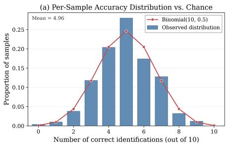

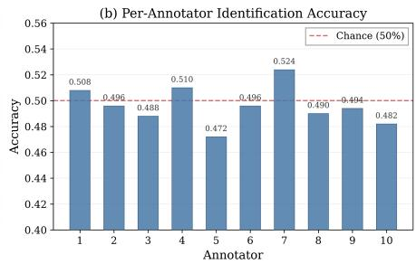  
Figure 7: Double-blind human identification study on preference pair naturalness. (a) The empirical distribution of correct identifications per sample closely matches the theoretical Binomial(10, 0.5) chance baseline. (b) Individual identification accuracies across all 10 human evaluators fluctuate tightly around the 50% chance threshold (overall accuracy = 49.60%, binomial $p = 0 . 5 8 1 3 > 0 . 0 5 )$

Table 5: Mathematical formulations and key hyperparameter configurations of benchmarked offline preference optimization objectives. Let $\begin{array} { r } { \Delta \dot { r _ { \theta } } = \beta \log \frac { \pi _ { \theta } ( y _ { w } | x ) } { \pi _ { \mathrm { r e f } } ( y _ { w } | x ) } - \bar { \beta } \log \frac { \pi _ { \theta } ( y _ { l } | x ) } { \pi _ { \mathrm { r e f } } ( y _ { l } | x ) } } \end{array}$ denote the implicit reward margin. All methods incorporate an auxiliary $+ 1 . 0 \times \mathcal { L } _ { \mathrm { N L L } }$ loss.
<table><tr><td>Method</td><td>Preference Loss  $\ell _ { M }$ </td><td>Hyperparameters</td></tr><tr><td>DPO (Rafailov et al., 2023)</td><td> $\log \sigma ( \Delta r _ { \theta } )$ </td><td> $\beta = 0 . 1$ </td></tr><tr><td>cDPO (Mitchell, 2023)</td><td> $\begin{array} { r } { \cdot ( 1 - \varepsilon ) \log \sigma ( \Delta r _ { \theta } ) - \varepsilon \log \sigma ( - \Delta r _ { \theta } ) } \end{array}$ </td><td> $\beta = 0 . 1 , \ \varepsilon = 0 . 1$ </td></tr><tr><td>IPO (Azar et al., 2024)</td><td> $\begin{array} { r } { \left( \bar { h } _ { \theta } - \frac { 1 } { 2 \beta } \right) ^ { 2 } } \end{array}$ </td><td> $\beta = 0 . 5$ </td></tr><tr><td>SimPO (Meng et al., 2024)</td><td> $- \log \sigma ( \beta [ q _ { \theta } ( y _ { w } \mid x ) - q _ { \theta } ( y _ { l } \mid x ) ] - \gamma _ { \mathrm { S } } )$ </td><td> $\beta = 2 . 0 , \gamma _ { \mathrm { S } } = 1 . 0$ </td></tr><tr><td>GM-DPO (Ours)</td><td> $\cdot ( 1 + \alpha \Delta S ) \log { \sigma ( \Delta r _ { \theta } - \gamma \Delta S ) }$ </td><td> $\beta = 0 . 1 , \gamma = 0 . 2 , \alpha = 0 . 1$ </td></tr></table>

to identify human-refined versus LLM-modified descriptions. As shown in Figure 7, human evaluators achieved an overall accuracy of 49.60% (virtually identical to random chance; binomial test $p = 0 . 5 8 1 3 > 0 . 0 5 )$ , with both sample-level and individual identification distributions conforming closely to the theoretical Binomial $( \bar { 1 } 0 , 0 . 5 )$ null distribution. This confirms that our targeted kinematic modifications introduce no stylistic artifacts or distributional drift, ensuring that GM-DPO is driven strictly by visual-physical motion perception.

## B EXPERIMENTAL SETUP AND BASELINE OBJECTIVES

All preference alignment experiments are conducted using the ms-swift framework. We perform full-parameter instruction tuning on the language backbones while freezing both the vision encoders and cross-modal projector modules. Training is executed in bfloat16 precision using the AdamW optimizer with a learning rate of $5 \times 1 0 ^ { - 7 }$ . The global batch size is 128. Across all alignment objectives, an auxiliary supervised next-token prediction loss $( + 1 . 0 \times \mathcal { L } _ { \mathrm { N L L } } )$ is incorporated to preserve generation fluency. Given preference tuples $\mathcal { D } = ( x , y _ { w } , y _ { l } )$ , Table 5 summarizes the mathematical formulations and key hyperparameter configurations across the evaluated offline alignment methods. For both SFT and preference optimization, we conduct three training runs with (seed, data seed) set to (42, 42), (106, 106), and (298, 298). The global seed controls stochastic training operations, while data seed controls data shuffling. Both seeds vary together across runs, and reported results for trained models are arithmetic means over the three runs.

## C COMPREHENSIVE EXPERIMENTAL RESULTS AND VISUALIZATIONS

## C.1 ROBUSTNESS ACROSS RANDOM SEEDS

We repeat each preference method on all three backbones and SFT on Qwen3-8B using the three seed configurations in Appendix B, jointly varying the training and data-order seeds while fixing all other settings. Table 6 reports means and sample standard deviations $( n \ = \ 3 .$ , denominator $n - 1 ) .$ with the highest mean per backbone in bold; the means match Table 2. GM-DPO leads the evaluated preference methods in substantive-action accuracy, GPA, and $\mathrm { S e q } _ { \mathrm { c h a i n } }$ on every backbone in all three runs. It also consistently leads in $\mathrm { G P A _ { c l i p } }$ and $\mathrm { T S A } _ { \mathrm { w } }$ on Qwen3-8B and LLaVA-2-8B, and exceeds SFT on Qwen3-8B in mean substantive-action accuracy (9.30 versus 6.92) and GPA (23.06 versus 21.08). On Qwen2.5-7B, IPO retains higher mean $\mathrm { G P A _ { c l i p } }$ and $\mathrm { T S A } _ { \mathrm { w } } ,$ with the TSA ranking between IPO and GM-DPO varying across runs.

Table 6: FlexBench results across three training seeds, reported as mean ± sample standard deviation. The highest mean within each backbone is highlighted in bold.
<table><tr><td rowspan="2">Method</td><td colspan="4">Motion Accuracy</td><td colspan="4">Motion Sequence</td></tr><tr><td>Subs.</td><td>Non-subs.</td><td>GPA</td><td> $\mathbf { G P A } _ { \mathrm { c l i p } }$ </td><td> $\mathbf { S e q } _ { 2 }$ </td><td> $\mathbf { S e q } _ { 3 }$ </td><td> $\mathbf { S e q } _ { \mathrm { c h a i n } }$ </td><td>TSAw</td></tr><tr><td colspan="9">Qwen2.5-7B</td></tr><tr><td>DPO</td><td> $3 . 9 2 \pm 0 . 1 2$ </td><td> $2 4 . 2 2 \pm 0 . 2 9$ </td><td> $1 2 . 0 4 \pm 0 . 1 1$ </td><td> $2 5 . 0 5 \pm 0 . 2 9$ </td><td> $1 5 . 1 3 \pm 0 . 3 4$ </td><td> $1 5 . 9 6 \pm 0 . 1 3$ </td><td> $1 8 . 3 9 \pm 0 . 2 1$ </td><td> $1 7 . 0 1 \pm 0 . 1 8$ </td></tr><tr><td>cDPO</td><td> $3 . 0 5 \pm 0 . 3 3$ </td><td> $2 5 . 8 0 \pm 0 . 1 3$ </td><td> $1 2 . 1 5 \pm 0 . 2 5$ </td><td> $2 5 . 2 0 \pm 0 . 2 9$ </td><td> $1 5 . 2 5 \pm 0 . 4 5$ </td><td> $1 4 . 5 5 \pm 0 . 3 3$ </td><td> $1 7 . 6 5 \pm 0 . 2 5$ </td><td> $1 6 . 2 4 \pm 0 . 1 3$ </td></tr><tr><td>IPO</td><td> $2 . 9 4 \pm 0 . 3 3$ </td><td> $2 7 . 1 4 \pm 0 . 1 4$ </td><td> $1 2 . 6 2 \pm 0 . 1 8$ </td><td> ${ \bf 2 6 . 4 0 \pm 0 . 2 7 }$ </td><td> ${ \bf 1 7 . 8 3 \pm 0 . 3 9 }$ </td><td> ${ \bf 1 8 . 4 2 \pm 0 . 3 3 }$ </td><td> $1 9 . 2 2 \pm 0 . 2 0$ </td><td> ${ \bf 1 8 . 7 0 \pm 0 . 2 5 }$ </td></tr><tr><td>SimPO</td><td> $1 . 3 9 \pm 0 . 3 9$ </td><td> ${ \bf 3 0 . 6 7 \pm 0 . 1 3 }$ </td><td> $1 3 . 1 0 \pm 0 . 2 0$ </td><td> $2 5 . 4 2 \pm 0 . 1 8$ </td><td> $1 5 . 3 2 \pm 0 . 2 5$ </td><td> $1 5 . 3 2 \pm 0 . 2 2$ </td><td> $1 7 . 7 1 \pm 0 . 4 2$ </td><td> $1 6 . 5 2 \pm 0 . 2 5$ </td></tr><tr><td>GM-DPO</td><td> ${ \bf 6 . 1 4 \pm 0 . 2 7 }$ </td><td> $2 5 . 9 5 \pm 0 . 3 1$ </td><td> ${ \bf 1 4 . 0 6 \pm 0 . 0 5 }$ </td><td> $2 5 . 8 2 \pm 0 . 2 2$ </td><td> $1 7 . 0 5 \pm 0 . 3 1$ </td><td> $1 7 . 3 1 \pm 0 . 1 7$ </td><td> ${ \bf 1 9 . 7 2 \pm 0 . 3 1 }$ </td><td> $1 8 . 4 6 \pm 0 . 2 5$ </td></tr><tr><td colspan="9">Qwen3-8B</td></tr><tr><td>SFT</td><td> $6 . 9 2 \pm 0 . 2 9$ </td><td> $4 2 . 3 1 \pm 0 . 1 4$ </td><td> $2 1 . 0 8 \pm 0 . 1 4$ </td><td> $2 9 . 8 8 \pm 0 . 1 2$ </td><td> $1 3 . 3 0 \pm 0 . 1 4$ </td><td> $1 5 . 5 4 \pm 0 . 2 0$ </td><td> $1 5 . 8 1 \pm 0 . 3 5$ </td><td> $1 5 . 2 3 \pm 0 . 2 3$ </td></tr><tr><td>DPO</td><td> $7 . 1 6 \pm 0 . 3 3$ </td><td> $3 8 . 4 0 \pm 0 . 4 6$ </td><td> $1 9 . 6 6 \pm 0 . 3 1$ </td><td> $2 8 . 8 6 \pm 0 . 2 4$ </td><td> $1 7 . 6 9 \pm 0 . 3 6$ </td><td> $1 9 . 9 4 \pm 0 . 2 8$ </td><td> $2 0 . 5 2 \pm 0 . 2 4$ </td><td> $1 9 . 7 8 \pm 0 . 1 4$ </td></tr><tr><td>cDPO</td><td> $6 . 4 4 \pm 0 . 3 6$ </td><td> $3 3 . 7 6 \pm 0 . 1 4$ </td><td> $1 7 . 3 7 \pm 0 . 1 6$ </td><td> $2 7 . 3 7 \pm 0 . 3 9$ </td><td> $1 6 . 7 3 \pm 0 . 1 7$ </td><td> $1 7 . 3 2 \pm 0 . 1 4$ </td><td> $2 0 . 2 5 \pm 0 . 2 3$ </td><td> $1 8 . 6 7 \pm 0 . 0 8$ </td></tr><tr><td>IPO</td><td> $7 . 0 5 \pm 0 . 1 5$ </td><td> $3 9 . 3 3 \pm 0 . 4 2$ </td><td> $1 9 . 9 6 \pm 0 . 2 4$ </td><td> $2 9 . 0 8 \pm 0 . 1 8$ </td><td> $1 8 . 3 5 \pm 0 . 2 5$ </td><td> $1 9 . 1 9 \pm 0 . 3 4$ </td><td> $2 1 . 7 4 \pm 0 . 2 5$ </td><td> $2 0 . 3 0 \pm 0 . 1 2$ </td></tr><tr><td>SimPO</td><td> $6 . 6 4 \pm 0 . 2 9$ </td><td> $3 9 . 5 8 \pm 0 . 4 1$ </td><td> $1 9 . 8 2 \pm 0 . 3 0$ </td><td> $2 8 . 6 0 \pm 0 . 1 8$ </td><td> $1 8 . 8 4 \pm 0 . 2 9$ </td><td> $1 9 . 7 7 \pm 0 . 1 8$ </td><td> $2 1 . 3 5 \pm 0 . 2 1$ </td><td> $2 0 . 3 7 \pm 0 . 2 1$ </td></tr><tr><td>GM-DPO</td><td> ${ \bf 9 . 3 0 \pm 0 . 3 0 }$ </td><td> ${ \bf 4 3 . 6 9 \pm 0 . 2 8 }$ </td><td> ${ \bf 2 3 . 0 6 \pm 0 . 1 6 }$ </td><td> ${ \bf 3 0 . 5 2 \pm 0 . 2 1 }$ </td><td> ${ \bf 2 1 . 8 1 \pm 0 . 4 6 }$ </td><td> ${ \bf 2 0 . 5 8 \pm 0 . 3 8 }$ </td><td> ${ \bf 2 3 . 6 0 \pm 0 . 3 7 }$ </td><td> ${ \bf 2 2 . 3 4 \pm 0 . 1 7 }$ </td></tr><tr><td colspan="9">LLaVA-2-8B</td></tr><tr><td>DPO</td><td> $1 0 . 6 6 \pm 0 . 3 1$ </td><td> $4 0 . 7 3 \pm 0 . 2 0$ </td><td> $2 2 . 6 9 \pm 0 . 1 9$ </td><td> $2 9 . 1 5 \pm 0 . 2 8$ </td><td> $2 1 . 1 7 \pm 0 . 2 6$ </td><td> $2 2 . 5 3 \pm 0 . 2 4$ </td><td> $2 3 . 3 3 \pm 0 . 3 5$ </td><td> $2 2 . 6 6 \pm 0 . 2 3$ </td></tr><tr><td>cDPO</td><td> $6 . 3 5 \pm 0 . 3 6$ </td><td> $4 5 . 4 6 \pm 0 . 3 9$ </td><td> $2 1 . 9 9 \pm 0 . 3 4$ </td><td> $2 5 . 5 4 \pm 0 . 1 5$ </td><td> $1 3 . 4 4 \pm 0 . 2 9$ </td><td> $1 3 . 5 8 \pm 0 . 3 1$ </td><td> $1 4 . 9 0 \pm 0 . 4 0$ </td><td> $1 4 . 2 1 \pm 0 . 3 0$ </td></tr><tr><td>IPO</td><td> $1 0 . 2 4 \pm 0 . 3 4$ </td><td> $4 1 . 4 0 \pm 0 . 2 8$ </td><td> $2 2 . 7 0 \pm 0 . 1 7$ </td><td> $2 9 . 2 2 \pm 0 . 2 8$ </td><td> $2 2 . 8 9 \pm 0 . 4 0$ </td><td> $2 3 . 0 0 \pm 0 . 3 8$ </td><td> $2 4 . 0 1 \pm 0 . 2 8$ </td><td> $2 3 . 4 8 \pm 0 . 2 3$ </td></tr><tr><td>SimPO</td><td> $6 . 9 3 \pm 0 . 2 7$ </td><td> ${ \bf 4 7 . 4 2 \pm 0 . 0 9 }$ </td><td> $2 3 . 1 3 \pm 0 . 1 5$ </td><td> $2 6 . 5 6 \pm 0 . 1 6$ </td><td> $1 6 . 9 0 \pm 0 . 1 7$ </td><td> $1 8 . 1 9 \pm 0 . 3 3$ </td><td> $1 5 . 7 1 \pm 0 . 3 2$ </td><td> $1 6 . 6 9 \pm 0 . 2 3$ </td></tr><tr><td>GM-DPO</td><td> ${ \bf 1 3 . 8 9 \pm 0 . 2 4 }$ </td><td> $4 2 . 6 6 \pm 0 . 3 2$ </td><td> ${ \bf 2 5 . 4 0 \pm 0 . 1 5 }$ </td><td> ${ \bf 3 1 . 7 7 \pm 0 . 0 7 }$ </td><td> ${ \bf 2 5 . 8 7 \pm 0 . 2 9 }$ </td><td> ${ \bf 2 5 . 4 9 \pm 0 . 4 4 }$ </td><td> ${ \bf 2 7 . 0 4 \pm 0 . 2 7 }$ </td><td> ${ \bf 2 6 . 3 4 \pm 0 . 2 2 }$ </td></tr></table>

Paired Improvements over DPO. We pair runs with identical training and data-order seed settings and compute the within-pair GPA difference $d _ { i }$ between GM-DPO and DPO. Table 7 reports these gains and pointwise 95% confidence intervals (CIs), calculated as $\bar { d } \pm$ $t _ { 0 . 9 7 5 , 2 } s _ { d } / \sqrt { 3 } .$ , where $s _ { d }$ is the sample standard deviation of the paired differences. The inter-

Table 7: Paired GPA gains over DPO.
<table><tr><td>Backbone</td><td colspan="3">GPA Gain</td><td>Mean</td><td>95% CI</td></tr><tr><td></td><td>Run 1</td><td></td><td>Run 2 Run 3</td><td></td><td></td></tr><tr><td>Qwen2.5-7B</td><td>+2.12</td><td></td><td> $+ 1 . 8 3 \ + 2 . 1 1$ </td><td>+2.02</td><td>[1.61, 2.43]</td></tr><tr><td>Qwen3-8B</td><td>+3.41</td><td></td><td> $+ 3 . 8 0 \ \mathrm { \Omega } + 2 . 9 9 $ </td><td>+3.40</td><td>[2.39, 4.41]</td></tr><tr><td>LLaVA-2-8B</td><td>+2.57</td><td> $+ 2 . 6 7 \ \mathrm { \Omega } + 2 . 9 0 $ </td><td></td><td></td><td>+2.71 [2.29, 3.13]</td></tr></table>

vals use two degrees of freedom and no multiple-comparison adjustment. All paired gains are positive, and all intervals lie above zero. These intervals summarize cross-run uncertainty on the fixed evaluation set under independent, approximately normal paired differences. With only three runs, this assumption cannot be reliably checked; the intervals therefore provide supplementary evidence alongside the consistently positive observed gains.

## C.2 FULL FINE-GRAINED KINEMATIC AND SEQUENTIAL ABLATION

Table 8 extends the main-paper ablation to all action and sequence metrics. We separately evaluate the severity-dependent margin and loss weight, retaining the same auxiliary NLL term across variants. Disabling both components recovers the DPO baseline.

Effect of the Severity-Dependent Margin. The margin-only variant improves substantive-action scores from 3.92 to 5.66 on Qwen2.5-7B, 7.16 to 8.76 on Qwen3-8B, and 10.66 to 11.88 on LLaVA-2-8B. Its GPA gains over DPO are 1.16, 0.41, and 1.86 points, respectively. Improvements also extend to $\mathrm { G P A _ { c l i p } }$ and $\mathrm { T S A } _ { \mathrm { w } }$ on all three backbones, indicating gains in both credited action content and consecutive-action coverage.

Effect of Severity-Dependent Weighting. Weighting alone increases GPA by 0.25, 0.27, and 1.08 points on the three backbones, but its effects on other metrics are mixed. On Qwen2.5-7B, $\mathrm { T S A } _ { \mathrm { w } }$ decreases from 17.01 to 16.52; on LLaVA-2-8B, $\mathrm { G P A _ { c l i p } }$ declines from 29.15 to 28.97 despite the higher GPA. Thus, weighting alone improves penalty-aware performance without consistently increasing credited content or sequence coverage.

Table 8: Comprehensive ablation study of GM-DPO core components across all backbones on FlexBench. Omitting both components recovers the standard DPO baseline. Best performance within each model family is in bold.
<table><tr><td rowspan="2">Model</td><td rowspan="2">Weight</td><td rowspan="2">Margin</td><td colspan="4">Motion Accuracy (Penalty-Aware)</td><td colspan="4">Motion Sequence (Non-Penalty)</td></tr><tr><td>Subs.</td><td>Non-subs.</td><td>GPA</td><td> $\mathbf { G P A } _ { \mathrm { c l i p } }$ </td><td>Seq2</td><td>Seq3</td><td> $\mathbf { S e q } _ { \mathrm { c h a i n } }$ </td><td> $\mathbf { T S A } _ { \mathrm { w } }$ </td></tr><tr><td rowspan="4">Qwen2.5-7B</td><td>x</td><td>x</td><td>3.92</td><td>24.22</td><td>12.04</td><td>25.05</td><td>15.13</td><td>15.96</td><td>18.39</td><td>17.01</td></tr><tr><td>√</td><td>x</td><td>4.19</td><td>24.44</td><td>12.29</td><td>25.00</td><td>15.86</td><td>14.61</td><td>17.92</td><td>16.52</td></tr><tr><td>x</td><td>√</td><td>5.66</td><td>24.51</td><td>13.20</td><td>25.44</td><td>16.16</td><td>15.89</td><td>19.47</td><td>17.73</td></tr><tr><td>V</td><td>√</td><td>6.14</td><td>25.95</td><td>14.06</td><td>25.82</td><td>17.05</td><td>17.31</td><td>19.72</td><td>18.46</td></tr><tr><td rowspan="4">Qwen3-8B</td><td>x</td><td>x</td><td>7.16</td><td>38.40</td><td>19.66</td><td>28.86</td><td>17.69</td><td>19.94</td><td>20.52</td><td>19.78</td></tr><tr><td>√</td><td>x</td><td>8.19</td><td>37.53</td><td>19.93</td><td>29.42</td><td>19.25</td><td>18.98</td><td>20.67</td><td>19.88</td></tr><tr><td>x</td><td>√</td><td>8.76</td><td>37.04</td><td>20.07</td><td>29.82</td><td>19.40</td><td>19.18</td><td>20.79</td><td>20.03</td></tr><tr><td>S</td><td>√</td><td>9.30</td><td>43.69</td><td>23.06</td><td>30.52</td><td>21.81</td><td>20.58</td><td>23.60</td><td>22.34</td></tr><tr><td rowspan="4">LLaVA-2-8B</td><td>x</td><td>x</td><td>10.66</td><td>40.73</td><td>22.69</td><td>29.15</td><td>21.17</td><td>22.53</td><td>23.33</td><td>22.66</td></tr><tr><td>√</td><td>x</td><td>10.23</td><td>44.09</td><td>23.77</td><td>28.97</td><td>21.52</td><td>23.66</td><td>23.73</td><td>23.27</td></tr><tr><td>x</td><td>√</td><td>11.88</td><td>43.55</td><td>24.55</td><td>30.63</td><td>24.81</td><td>25.00</td><td>25.62</td><td>25.27</td></tr><tr><td>√</td><td>√</td><td>13.89</td><td>42.66</td><td>25.40</td><td>31.77</td><td>25.87</td><td>25.49</td><td>27.04</td><td>26.34</td></tr></table>

Combining Both Components. The full objective achieves the highest GPA, $\mathrm { G P A _ { c l i p } , }$ , and $\mathrm { T S A } _ { \mathrm { w } }$ within every ablation group. On Qwen3-8B, joint optimization reaches 23.06 GPA, compared with 19.93 for weighting alone and 20.07 for the margin alone. On LLaVA-2-8B, it further improves $\mathrm { T S A } _ { \mathrm { w } }$ from the margin-only result of 25.27 to 26.34. These results support combining both components, though joint gains vary across backbones. The ablation establishes the full formulation’s benefit; isolating severity assignments from overall weighting and margin strength requires additional controls.

## C.3 EXTENDED DOWNSTREAM GENERALIZATION BENCHMARKS

To evaluate whether preference optimization on fine-grained physical dynamics induces catastrophic forgetting or impairs general multimodal reasoning, we benchmark aligned policies across three established downstream suites: Video-MME (Fu et al., 2025) for duration-stratified video understanding, POPE (Li et al., 2023) for binary object hallucination diagnosis, and Video-ChatGPT (Maaz et al., 2024) for open-ended conversational generation.

Comprehensive Temporal Reasoning on Video-MME. As shown in Table 9, GM-DPO achieves overall accuracies of 60.62%, 62.72%, and 65.39%, improving over the corresponding base models by 1.25, 1.02, and 0.69 percentage points. It also exceeds DPO on all three duration splits for every backbone. The gains vary by duration: on LLaVA-2-8B, the improvement is larger on Short videos (1.11 percentage points) than on Long videos (0.60 percentage points). These results support retained performance across video durations following motion-focused alignment.

Cross-Domain Object Hallucination Suppression on POPE. On the POPE benchmark (Table 10), GM-DPO demonstrates robust zero-shot transfer in suppressing existential object hallucinations across Adversarial, Popular, and Random subsets. GM-DPO attains the highest Overall Acc across all backbones (87.56 on Qwen2.5-7B, 89.40 on Qwen3-8B, and 88.97 on LLaVA-2-8B) alongside top balanced F1 scores (86.15, 89.02, and 88.41, respectively). Concurrently, baseline objectives such as IPO and SimPO exhibit mild degradation on LLaVA-2-8B (F1 falling to 88.11 and 88.04), suggesting that uncalibrated quadratic margins or rigid sequence-length penalties can skew response calibration under binary probes. In contrast, GM-DPO stabilizes Yes-ratio distributions around 40.12–46.53%, preventing the binary over-affirmation collapse common to multimodal alignment.

Open-Ended Video Question Answering on Video-ChatGPT. Table 11 details per-dimension evaluations on Video-ChatGPT across Generic Understanding, Temporal Reasoning, and Consistency suites. GM-DPO achieves the highest Overall score among the aligned variants on all three backbones: 2.51 on Qwen2.5-7B, 2.75 on Qwen3-8B, and 2.57 on LLaVA-2-8B. These correspond to improvements of 0.01, 0.05, and 0.06 over DPO, respectively. GM-DPO also leads Consistency on all three backbones, with scores of 2.99, 3.15, and 2.89, and achieves the best or tied-best Temporal Reasoning scores. The advantages are not uniform across every dimension: DPO scores higher on Qwen2.5-7B’s Context dimension (2.64 versus 2.63), while cDPO scores higher on Qwen3-8B’s Correctness dimension (2.57 versus 2.56). These results support competitive overall response quality, with consistent advantages in temporal reasoning and consistency among the compared align ment methods.

Table 9: Generalization performance on Video-MME across video duration splits and overall scores. Reference base models are shown in gray italics; within each backbone family, the best result among aligned models is in bold, and the second-best is underlined. The overall column is shaded in blue .
<table><tr><td>Model Variant</td><td>Short</td><td>Medium</td><td>Long</td><td>Overall</td></tr><tr><td>Qwen2.5-7B-Base</td><td>68.89</td><td>59.11</td><td>50.11</td><td>59.37</td></tr><tr><td>Qwen2.5-7B-DPO</td><td>69.11</td><td>60.18</td><td>50.89</td><td>60.06</td></tr><tr><td>Qwen2.5-7B-cDPO</td><td>68.89</td><td>59.53</td><td>50.33</td><td>59.58</td></tr><tr><td>Qwen2.5-7B-IPO</td><td>69.56 69.40</td><td>60.18</td><td>51.61 51.34</td><td>60.45 60.26</td></tr><tr><td>Qwen2.5-7B-SimPO Qwen2.5-7B-GM-DPO (Ours)</td><td>69.75</td><td>60.05</td><td>51.93</td><td>60.62</td></tr><tr><td></td><td></td><td>60.17</td><td></td><td></td></tr><tr><td>Qwen3-8B-Base</td><td>73.00</td><td>59.21</td><td>52.88</td><td>61.70</td></tr><tr><td>Qwen3-8B-DPO</td><td>73.33</td><td>59.60</td><td>54.11</td><td>62.35</td></tr><tr><td>Qwen3-8B-cDPO</td><td>73.89</td><td>59.62</td><td>54.67</td><td>62.73</td></tr><tr><td>Qwen3-8B-IPO</td><td>74.00</td><td>58.78</td><td>53.44</td><td>62.07</td></tr><tr><td>Qwen3-8B-SimPO</td><td>73.67</td><td>59.06</td><td>54.00</td><td>62.24</td></tr><tr><td>Qwen3-8B-GM-DPO (Ours)</td><td>74.22</td><td>59.61</td><td>54.34</td><td>62.72</td></tr><tr><td>LLaVA-2-8B-Base</td><td>77.56</td><td>61.44</td><td>55.11</td><td>64.70</td></tr><tr><td>LLaVA-2-8B-DPO</td><td>77.56</td><td>61.22</td><td>55.22</td><td></td></tr><tr><td>LLaVA-2-8B-cDPO</td><td>78.50</td><td>61.30</td><td>55.62</td><td>64.67</td></tr><tr><td>LLaVA-2-8B-IPO</td><td>78.56</td><td>61.33</td><td>55.67</td><td>65.14</td></tr><tr><td>LLaVA-2-8B-SimPO</td><td>78.22</td><td></td><td></td><td>65.19</td></tr><tr><td></td><td>78.67</td><td>60.56</td><td>55.56</td><td>64.78</td></tr><tr><td>LLaVA-2-8B-GM-DPO (Ours)</td><td></td><td>61.68</td><td>55.82</td><td>65.39</td></tr></table>

Table 10: Zero-shot object hallucination evaluation on POPE across adversarial, popular, and random splits. Best aligned results within each model group are highlighted in bold, and second-best are underlined; Overall Acc is shaded in light blue , and F1 is shaded in light pink
<table><tr><td>Model Variant</td><td>Adversarial</td><td>Popular</td><td>Random</td><td>Overall Acc</td><td>Yes%</td><td>F1</td></tr><tr><td>Qwen2.5-7B-Base</td><td>86.50</td><td>87.37</td><td>88.23</td><td>87.37</td><td>40.03</td><td>85.97</td></tr><tr><td>Qwen2.5-7B-DPO</td><td>86.53</td><td>87.43</td><td>88.33</td><td>87.43</td><td>40.14</td><td>86.06</td></tr><tr><td>Qwen2.5-7B-cDPO</td><td>86.57</td><td>87.47</td><td>88.33</td><td>87.46</td><td>40.12</td><td>86.06</td></tr><tr><td>Qwen2.5-7B-IPO</td><td>86.53</td><td>87.40</td><td>88.40</td><td>87.44</td><td>40.29</td><td>86.09</td></tr><tr><td>Qwen2.5-7B-SimPO</td><td>86.50</td><td>87.38</td><td>88.36</td><td>87.41</td><td>40.10</td><td>86.02</td></tr><tr><td>Qwen2.5-7B-GM-DPO (Ours)</td><td>86.67</td><td>87.53</td><td>88.47</td><td>87.56</td><td>40.12</td><td>86.15</td></tr><tr><td>Qwen3-8B-Base</td><td>87.17</td><td>89.17</td><td>91.57</td><td>89.30</td><td>46.08</td><td>88.86</td></tr><tr><td>Qwen3-8B-DPO</td><td>87.00</td><td>89.30</td><td>91.80</td><td>89.37</td><td>46.50</td><td>88.98</td></tr><tr><td>Qwen3-8B-cDPO</td><td>87.02</td><td>89.28</td><td>91.81</td><td>89.37</td><td>46.51</td><td>88.98</td></tr><tr><td>Qwen3-8B-IPO</td><td>87.01</td><td>89.28</td><td>91.81</td><td>89.37</td><td>46.48</td><td>88.96</td></tr><tr><td>Qwen3-8B-SimPO</td><td>87.00</td><td>89.26</td><td>91.78</td><td>89.35</td><td>46.47</td><td>88.94</td></tr><tr><td>Qwen3-8B-GM-DPO (Ours)</td><td>87.07</td><td>89.30</td><td>91.83</td><td>89.40</td><td>46.53</td><td>89.02</td></tr><tr><td>LLaVA-2-8B-Base</td><td>86.51</td><td>88.23</td><td>90.77</td><td>88.50</td><td>44.27</td><td>88.10</td></tr><tr><td>LLaVA-2-8B-DPO</td><td>86.72</td><td>88.50</td><td>91.13</td><td>88.78</td><td>45.20</td><td>88.31</td></tr><tr><td>LLaVA-2-8B-cDPO</td><td>86.88</td><td>88.61</td><td>91.16</td><td>88.88</td><td>45.11</td><td>88.34</td></tr><tr><td>LLaVA-2-8B-IPO</td><td>86.67</td><td>88.37</td><td>91.28</td><td>88.77</td><td>44.98</td><td>88.11</td></tr><tr><td>LLaVA-2-8B-SimPO</td><td>86.44</td><td>88.27</td><td>90.77</td><td>88.49</td><td>44.48</td><td>88.04</td></tr><tr><td>LLaVA-2-8B-GM-DPO (Ours)</td><td>86.80</td><td>88.65</td><td>91.47</td><td>88.97</td><td>45.16</td><td>88.41</td></tr></table>

## C.4 QUALITATIVE VISUALIZATIONS AND CASE STUDIES

Figure 8 illustrates both the relative improvement and remaining limitations of GM-DPO. It obtains the highest cumulative score in this example (+1.5), compared with -2.5 for the base model and -1.5 for DPO. However, its caption still contains two laterality errors, each assigned -0.5. The example therefore illustrates improved aggregate action fidelity rather than error-free limb grounding.

Table 11: Video-ChatGPT evaluation across five dimensions using Qwen-3.8-Max as the judge on a 1–5 scale. Overall is the unweighted mean of the five scores, rounded to two decimal places. Base models are shown in gray italics. Best and second-best aligned results within each backbone are bold and underlined, respectively; ties at the displayed precision share the same formatting.
<table><tr><td rowspan="2">Model Variant</td><td colspan="3">Generic Understanding</td><td rowspan="2">Temporal Reasoning</td><td rowspan="2">Consistency</td><td rowspan="2">Overall</td></tr><tr><td>Correctness</td><td>Detail</td><td>Context</td></tr><tr><td>Qwen2.5-7B-Base Qwen2.5-7B-DPO</td><td>2.33</td><td>2.23</td><td>2.63</td><td>2.16</td><td>2.91</td><td>2.45</td></tr><tr><td rowspan="4">Qwen2.5-7B-cDPO Qwen2.5-7B-IPO Qwen2.5-7B-SimPO</td><td>2.32</td><td>2.33</td><td>2.64</td><td>2.22</td><td>2.98</td><td>2.50</td></tr><tr><td>2.31</td><td>2.35</td><td>2.63</td><td>2.23</td><td>2.98</td><td>2.50</td></tr><tr><td>2.30</td><td>2.29</td><td>2.58</td><td>2.19</td><td>2.92</td><td>2.46</td></tr><tr><td>2.31</td><td>2.32</td><td>2.60</td><td>2.23</td><td>2.96</td><td>2.48</td></tr><tr><td>Qwen2.5-7B-GM-DPO (Ours)</td><td>2.32</td><td>2.35</td><td>2.63</td><td>2.25</td><td>2.99</td><td>2.51</td></tr><tr><td>Qwen3-8B-Base</td><td>2.55</td><td>2.57</td><td>2.89</td><td>2.52</td><td>3.14</td><td>2.73</td></tr><tr><td>Qwen3-8B-DPO</td><td>2.53</td><td>2.53</td><td>2.85</td><td>2.51</td><td>3.07</td><td>2.70</td></tr><tr><td>Qwen3-8B-cDPO</td><td>2.57</td><td>2.57</td><td>2.90</td><td>2.53</td><td>3.10</td><td>2.73</td></tr><tr><td>Qwen3-8B-IPO</td><td>2.47</td><td>2.49</td><td>2.79</td><td>2.48</td><td>3.07</td><td>2.66</td></tr><tr><td>Qwen3-8B-SimPO</td><td>2.45</td><td>2.48</td><td>2.79</td><td>2.45</td><td>3.04</td><td>2.64</td></tr><tr><td>Qwen3-8B-GM-DPO (Ours)</td><td>2.56</td><td>2.58</td><td>2.91</td><td>2.55</td><td>3.15</td><td>2.75</td></tr><tr><td>LLaVA-2-8B-Base</td><td>2.27</td><td>2.35</td><td>2.56</td><td>2.36</td><td>2.81</td><td>2.47</td></tr><tr><td>LLaVA-2-8B-DPO</td><td>2.31</td><td>2.45</td><td>2.56</td><td>2.41</td><td>2.84</td><td>2.51</td></tr><tr><td>LLaVA-2-8B-cDPO</td><td>2.33</td><td>2.54</td><td>2.65</td><td>2.40</td><td>2.87</td><td>2.56</td></tr><tr><td>LLaVA-2-8B-IPO</td><td>2.33</td><td>2.53</td><td>2.64</td><td>2.40</td><td>2.88</td><td>2.56</td></tr><tr><td>LLaVA-2-8B-SimPO</td><td>2.35</td><td>2.51</td><td>2.63</td><td>2.42</td><td>2.85</td><td>2.55</td></tr><tr><td>LLaVA-2-8B-GM-DPO (Ours)</td><td>2.36</td><td>2.55</td><td>2.64</td><td>2.42</td><td>2.89</td><td>2.57</td></tr></table>

CaptionKey Video Frames & Salient Action Ground Truth  
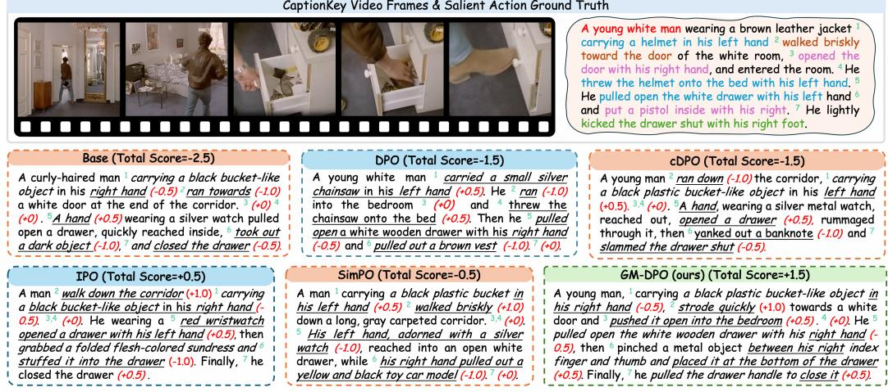  
Figure 8: Qualitative comparison of physical motion understanding on a representative multi-shot sequence from FlexBench. Predictions highlight salient limb manipulation and chronological interactions across 7 atomic checkpoints, with local premise scores annotated in parentheses (−1.0 for confabulations, −0.5 for chirality/imprecise errors, +0.5/ + 1.0 for grounded dynamics). Each block header reports the unnormalized raw cumulative score (Total $\textstyle \mathrm { S c o r e } = \sum _ { i = 1 } ^ { 7 } s _ { i } )$

## D LIMITATIONS AND FUTURE WORK

Our results support incorporating action-error severity into preference learning to improve limb motion fidelity. Despite consistent gains across three VLM backbones, several limitations warrant further investigation.

Extending the Grading Rubric to Broader Motion Domains. Our five-level action-grading rubric distinguishes correct and partially specified content, omissions, limb errors, and fabricated actions, yielding four perturbation-severity levels for training. It targets identifiable limb actions, including bimanual coordination and laterality, with explicit human-annotated reference facts. Extending this rubric to continuous, multi-phase activities requires additional criteria for whole-body transitions, movement speed, and deformable object interactions. Such activities may involve overlapping errors that a single perturbation category cannot capture. Future work could investigate richer grading schemes and their agreement with human judgments while preserving the distinction between incomplete coverage and incorrect assertions.

Ambiguity in Monocular Video. FlexBench and our training pipeline use monocular videos spanning diverse scenes and viewpoints. These inputs lack explicit depth measurements, while selfocclusion, extreme viewing angles, and camera cuts can obscure limb identity and motion. Such ambiguities may contribute to residual errors, although our experiments do not isolate their effects from limitations in model perception or caption generation. Skeletal representations or multi-view geometric priors may help resolve ambiguous interactions. Evaluating these approaches would require distinguishing recoverable information from details that remain unobservable.

Scope of Dense Caption Evaluation. Our evaluation focuses on limb-motion fidelity, per-person coverage, and shot structure. Caption length and structural compliance characterize the output but do not establish the accuracy or completeness of other content. Although experiments on three additional benchmarks provide evidence of broader multimodal performance, they do not directly assess camera angles, camera motion, scene details, or sound descriptions within dense captions. Dedicated evaluation of these dimensions, including audio-grounded assessment when audio inputs are available, remains future work.