# Brain-SAD: A Brain-Inspired Safe Autonomous Driving Control Framework with Dynamic Fear-Oriented Constraint on Dual-Policy

Huan Rong, Chao Yin, ANOUAR IMEL, Yijie Xia,Tinghuai Ma\*

Abstract—Constrained Reinforcement Learning (RL) has recently gained increasing attention in the field of Safe Autonomous Driving (AD), where the general mechanism is to maximize the expected reward while keeping the overall action risk bounded. In this way, the safety issues arising in AD can be mitigated through constrained actions. However, existing Constrained RL methods still lack dynamics on the imposed constraints. For instance, the action cost adopted by the existing Primal-Dual/soft-constrained methods is often defined as static state-to-cost mapping, and the safe-action projection in hard-constrained methods relies on the static projection with the fixed feasible region boundary estimated from offline demonstrations. The above drawback tightly couples the imposed constraints to the training scenarios, leaving the AD policy hard to handle different interaction scenarios, due to the improper state-level action-cost and the static projection boundary. Consequently, in this paper, we propose Brain-SAD, a brain-inspired safe autonomous driving contro framework with dynamic fear-oriented constraints. By perceiving the current vehicle-interaction scene, Brain-SAD generates dynamic fear signal as fear reaction to online decide long-term policy for regular interaction or short-term policy for urgent-collision defense. In such two policy, the above fear-reaction will be constructed as the dynamic fear constraints, respectively reflecting the overall fear cost directly coupled with action-impact, and the dynamic fear boundary of the feasible region derived from different risky neighbors, both of which will in turn serve for the online policy optimization. Experimental results show that Brain-SAD outperforms existing methods, achieving higher success rate in shorter task-completion and collision-recovery time, and exhibits stronger reliability across continuous intersections of fluctuating complexity.

Index Terms—Dynamic Constrained RL; Safe Autonomous Driving; Brain-Inspired Computation;

## 1 INTRODUCTION

W ITH the success of Reinforcement Learning (RL) ap-plied to Autonomous Driving (AD), the AD systems plied to Autonomous Driving (AD), the AD systems are now expected to operate in increasingly complex scenarios, such as heavy traffic with cross-lane vehicle interaction [1] or continuous intersections with traffic lights and roadblocks [2]. Consequently, the requirement of Safe RL has been emphasized, aimed at enhancing the robustness (or reliability) of RL policy on AD controlling [3]. As the major realization of Safe RL, Constrained RL incorporates safety constraints into traditional RL policy, where the policycontrolled ego-vehicle is enforced to complete entire driving task while adhering to safety constraints and avoiding collision risk [3].

Generally, as illustrated in Fig. 1, the formulation of

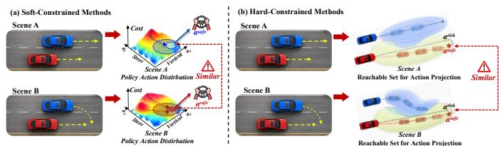  
Fig. 1. Two Constrained RL paradigms for Safe AD: Soft-constraint (Primal-dual) & Hard-constraint.

Constrained RL can be categorized into two paradigms including Primal-dual/soft-constrained (Cumulative) [4], [5], [6] & hard-constrained (Instantaneous) methods [7], [8]. Supposing that, at every t-th time step, the egovehicle currently in state $s _ { t }$ selects an action $a _ { t }$ by policy π, receiving reward $r _ { t }$ at cost $c _ { t } ( \mathrm { e . g . } ,$ the risk incurred by executing at), thereby generating a trajectory $\tau = \{ s _ { 1 } , a _ { 1 } , r _ { 1 } , c _ { 1 } , s _ { 2 } , a _ { 2 } , r _ { 2 } , c _ { 2 } , \ldots , s _ { t } , a _ { t } , r _ { t } , c _ { t } , \ldots \}$ . In Fig. 1 (a), given the trajectory starting from $( s _ { 1 } , a _ { 1 } )$ , the softconstrained (Cumulative) method (see Fig. 1 (a)) requires the policy π to maximize the cumulative future rewards as $\begin{array} { r l } { } & { { } \underset { \tau \sim \pi } { \dot { \mathbb { E } } } [ \sum _ { t = 1 } ^ { T } \gamma ^ { t } \cdot r ( s _ { t } , a _ { t } ) ] } \end{array}$ while satisfying cost constraints as $\begin{array} { r } { [ \sum _ { t = 1 } ^ { T } \gamma ^ { t } \cdot c o s t ( s _ { t } , a _ { t } ) \leq \delta ] } \end{array}$ (where δ is the cost threshold). In contrast, in Fig. 1 (b), the hard-constrained (Instantaneous) method (see Fig. 1 (b)) deals with the original risk action $a _ { t } ^ { r i s k }$ output by policy π directly via action projection for efficiency [7]. That is, given the current $( s _ { t } , a _ { t } ^ { r i s k } )$ of the ego-vehicle, its reachable set will be predicted as all the reachable states/actions over the future horizon t steps, and so will its surrounding vehicle’s [9]. Then, the intersection of the reachable sets between the ego and surrounding vehicles will be considered as the unsafe region, or the safety constraint used to project the original risk action $a _ { t } ^ { r i s k }$ of the ego-vehicle onto the closest safe action $a _ { t } ^ { s a f e }$ in the feasible region. Particularly, the above cumulative actioncost constraint for action distribution and instantaneous feasible-region constraint for action projection can be mixed to satisfy more stringent Safe RL requirements [10].

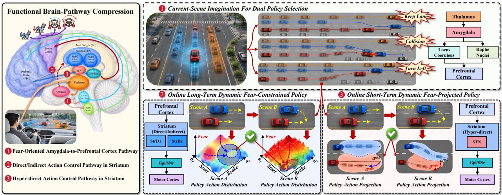  
Fig. 2. Our proposed Brain-SAD safe AD control framework with dynamic fear-oriented constraint (NOTE: Striatal D1/D2 (StrD1/StrD2) neurons belong to Direct/Indirect pathway in Striatum [14], Subthalamic Nucleus (STN) in Hyper-direct pathway [15]).

Unfortunately, it has been found that the constraints imposed by the current soft-(Cumulative) & hard-(Instantaneous) methods lacks dynamics across different interaction scenarios [11]. Specifically in Fig. 1, the red egocar always keeps straight in Scene A, while its blue neighbor has direction turning intent in Scene B. Obviously, in Scene B, the ego-vehicle is expected to avoid collision, however, similar actions have been selected in both the Scene A & B. The above drawback can be ascribed to the reason that, the action-cost constraint in soft-(Cumulative) methods often relies on static-rules [4], [5], [6], while the feasible-region constraint in hard-(Instantaneous) methods are often realized by static projection operators [7], [8]. Consequently, the cumulative action-cost (see Fig. 1(a)) and the instantaneous action-projection (see Fig. 1(b)) tend to induce similar action distributions and feasible regions across scenes with different safety requirements, preventing the ego-vehicle from reacting appropriately [12].

In our view, the key challenge in overcoming this drawback is how to construct a Dynamic Constraint adapted to different interaction scenarios [13]. For one thing, the action-cost constraint (i.e., $[ \sum _ { t = 1 } ^ { T } \gamma ^ { t } \cdot c o s t ( s _ { t } , a _ { t } ) \leq \delta ] )$ in soft-(Cumulative) methods should be dynamic action-cost estimation, instead of static-rules for $\mathit { c o s t } ( s _ { t } , a _ { t } )$ . For another, the feasible-region constraint in hard-(Instantaneous) methods should consider dynamic boundary, instead of static projection operators. If possible, we could further integrate these two constraints into a unified controlling framework via such a dynamic constraint, so as to deal with the regular scene-evolving and urgent-collision more flexibly and effectively.

Fortunately, the bottom-up-to-top-down action-control pathway of the human brain, which follows a Perception→ Determination→Action routine, offers a better inspiration. As the functional compression shown in Fig. 2 (left), when our brain observes the current driving scene (entailing implicit neighboring interaction intent), Amygdala (AMY)

will release the fear-oriented neurotransmitter (i.e., Norepinephrine (NE) for nervousness, Serotonin (5-HT) for calmness) as the production of perception. Such the fear-oriented neurotransmitter will be integrated into a unified signal conveyed to Prefrontal Cortex (PFC), determining the action (policy) more appropriate with the current interaction scene, or correspondingly invoking two Striatum action pathways in Basal Ganglia (BG). Here, the Direct/Indirect pathway in Striatum generates action in regular interaction scene, while Hyper-direction pathway generates emergent defensive action1.

Based on the above, in this paper, we propose Brain-SAD, a novel brain-inspired safe autonomous driving control framework with dynamic fear-oriented constraint. In Fig. 2 (right), Brain-SAD perceives and quantifies a dynamic fear-reaction from the current interaction scenario and its predicted evolution for policy selection. This fear-reaction penetrates into the long/short-term policies, respectively constructed as dynamic action fear-cost and feasible-region fear-boundary constraints, to handle different scenarios. To the best of our knowledge, Brain-SAD is the first to integrate two types of dynamic constraints via brain-inspiration as a dynamic Constrained RL for higher reliability in Safe AD. The overall contributions are listed as follows:

1) Inspired by the fear-oriented Amygdala-to-Prefrontal Cortex Pathway (AMY→PFC, see Fig. 2 left-⃝1 ), we perceive a dynamicfear-reaction of AMY from the ego-neighborvehicle interaction by rolling out future interaction trajectories (see Fig. 2 right-⃝1 ). The dynamic fear-reaction of AMY is further quantified into the learnable policy-selection signal of PFC to select long-/short-term policy, correspondingly generating ego-vehicle action under different safety requirements.

2) Inspired by the Direct/Indirect action-control pathway in Striatum (PFC→StrD1/StrD2, see Fig. 2 left-⃝2 ), we adopt an online long-term dynamic fear-constrained policy when the above fear-reaction is mild, particularly dealing with regular vehicle-interaction (see Fig. 2 right-⃝2 ). The long-term policy constructs a dynamic action reward-cost (StrD1-StrD2) constraint under the above fear-reaction to post-correct the prior action distribution, online adapted with different scenarios.

3) Inspired by the Hyper-direct action control Pathway in Striatum (PFC→STN, see Fig. $2 \ : l e f t - ( 3 ) )$ , we adopt a online short-term dynamic fear-projected policy when facing a fierce fear-reaction, to handle urgent braking in emergency (see Fig. 2 right-⃝3 ). The short-term policy constructs a $d y -$ namic fear boundary from risky neighboring vehicles to online tighten or loosen the projected feasible-region in different scenarios, selecting a safe action directly for efficiency(STN).

In this way, our proposed Brain-SAD can handle continuous vehicle-interaction scenes with flexible policy selection driven by the dynamic fear-reaction. The fear-reaction is constructed as a specific dynamic policy constraint that is online- adapted across different scenarios, with the strength to deal with both regular scene evolving and urgent braking in emergency.

According to the experimental results, first, by tracking the fear-reaction derived policy selection signal, Brain-SAD can adopt long-/short-term policy matched to the current vehicle-interaction scenario. Based on this dual-path policy collaboration, Brain-SAD outperforms existing works, achieving a higher success rate in shorter task-completion and collision-recovery time. More importantly, the dynamic fear-oriented constraint enables Brain-SAD to generate a more stable action distribution even across continuous intersections of fluctuating complexity, revealing stronger reliability in handling different scenarios.

## 2 RELATED WORKS

## 2.1 Constrained Behaviour Learning in Safe AD

To address the safety issues involved in AD, constrained RL has gained increasing attention to keep action risk below the predefined thresholds while optimizing expected reward. From an optimization standpoint, existing constrained RL works can be categorized into Primal-Dual/soft-constrained (Cumulative) and hard-constrained (Instantaneous) methods [3]. The soft-constrained ones enable an agent to select actions that balance reward maximization and constraint satisfaction, for instance, W. U. Mondal et al. [4] formulate a soft-constrained policy gradient algorithm based on a Markov Decision Process that guarantees an ε global optimality gap and ε constraint violation on sample complexity for general parameterized policies. Similarly, J. Dai et al. [5] and C. Zhang et al. [6] use static projection to estimate the cost of a state as caused by an action (e.g., action→speed/distance→cost), keeping the overall cost below a predefined threshold $( \mathrm { i . e . , }$ $\begin{array} { r } { \sum _ { t } ^ { T ^ { \dagger } } c o s t \le b ) } \end{array}$ , thereby deriving a cost-constrained gradient online to optimize the ego-vehicle policy. However, the above state-mapped cost incurs tight coupling between cost estimation and policy optimization, further causing policy instability during online exploration [3]. Consequently, lots of trajectory samples are needed in soft-constrained methods.

To overcome this instability, the hard-constrained methods, especially the projection-based ones, guarantee a statewise constraint during execution, where a sub-level of the constraint function is defined as the safe set/region, ensuring each action remaining within it [3]. Specifically,

S. Lin et al. [7] first constrain the current policy to remain close to a reference base policy under a divergence bound, and then derive the feasible action region from this constraint.Y. Zheng et al. [8] use Hamilton-Jacobi (HJ) to estimate the violation value of each state, where the optimal upper boundary of the safe state is estimated by offline (as static) regression, projecting an implicit feasible region that maximizes the action’s long-term reward. Consequently, an improperly estimated feasible-region boundary (e.g., an overly restrictive one) will reduce achievable rewards.

Beyond the soft-constrained and hard-constrained methods above, we further group the constrainedbehaviour-learning works by how the constraint is imposed, into ego-vehicle Policy-Oriented Constrained and Environment-Oriented Prior-Constrained methods.

For ego-vehicle policy-oriented constrained ones, Zhao Y. et al [16] propose CADRE, a cascade cumulative rewardconstrained model-free RL policy formulated via proximal optimization form to penalize risky actions online through a specifically designed reward for safe behavior learning. Similarly, Coelho D et al. [17] construct RLfOLD to maximize the probability on the explored action by online-generated expert demonstration as supervisory constraint. Pan M. et al [18] propose Iso-Dream++, which online-disentangles controllable and non-controllable dynamics during vehicle interactions, where by multi-step imagination, the controllable state-prediction at each step flows into the non-controllable state-transition as the corrected future trajectory, altogether fed into the ego-vehicle policy to decide the current safe action. Moreover, through offline trajectory (behavior) imitation, MARL-CCE [19] aggregates the K action distributions corresponding to the interactions between the ego-vehicle and its K neighbors, aligning them with the offline true actions as the constrained action space.

For environment-oriented prior-constrained ones, on the one hand, some works first pre-train a recurrent worldmodel to generate feasible state-transition trajectory in the simulated environment, as a prior-constraint on situational understanding. For instance, LS-Imagination, proposed by Li J et al. [20], decodes the quantified signal from the current interaction scene to adopt either short-term imagination over a single future step or long-term imagination directly across multiple future steps, jumping closer to the task-goal. CarPlanner proposed by Zhang D et al. [21], imagines multiple future state-trajectories for vehicleinteractions, and selects the one with the highest drivingmode consistency and safety-rule compliance.The above imagined state-trajectories are used to train a Critic network offline. In turn, the Critic is treated as an indirect supervisory reward constraint updating the Actor network to select actions critical to task-completion. On the other hand, LMbased models such as SimLingo [22], Hybrid-Driving [23], and SafeAuto [24], enhance reliable understanding of the current interaction scenario respectively by offline hazard exploration to constrain action space, a scenario-evolving knowledge graph that constrains reasoning hallucinations, and first-order predicate-logic embedding of traffic rules that corrects the initial action.

## 2.2 Brain-Inspired RL on Agent Action Control

Within the NeuroAI direction, brain-inspired Reinforcement Learning (RL) agents mainly adopt brain mechanisms to improve the policy-learning process, so as to improve the plausibility and performance of the artificial agent.

Specifically, Yang Z et al. [25] propose SVPG, a synaptic-plasticity-inspired spiking RL policy, which adopts Leaky Integrate-and-Fire (LIF) spiking neurons to build a Winner-Take-All (WTA) circuit as the policy network, trained by reward-modulated spike-timing-dependent plasticity (R-STDP). He X et al. [26] construct FNI-RL, an Amygdala fear-reaction inspired Safe-AD RL framework based on the interaction between a protagonist and an adversary agent: the protagonist maximizes long-term reward subject to a bound on its cumulative state-level fear reaction, while the adversary maximizes that same fear reaction to perturb the protagonist.The action distribution of the two agents are aggregated for action selection at each step. Notably, in FNI-RL, although the protagonist agent incorporates fear-reaction as a cost to train the policy $( \mathrm { i . e . , }$ $Q ( s , \bar { a } ) - f e a r ( s , a ) )$ , the fear-reaction $f e a r ( s , \bar { a } )$ is a static mapping from the current state, rather than an estimation of the future fear influence after taking an action. That is, the similar state in different interaction scenarios may incur similar fear-reaction, no direct causality with action itself. Therefore, FNI-RL should still be attributed as static fearconstraint at state-level.

Other representative brain-inspired RL works on action control include: FoG-RL [27], a hippocampus-inspired RL policy with memory forgetting and growth along temporal exploration; EFT-RL [28], a Theory-of-Mind like RL policy that makes its action by predicting other agents’ behavior; Goal-Reducer [29], a goal-decomposition RL policy that completes a task via sub-goal actions, similar to human problem-solving; BRYANT [30], a brain-inspired RL policy that transforms sequential latent representations, reward, and action signals into the frequency domain to capture temporal causality and establish the neural dynamics; and the spiking neural network (SNN)-based RL policy [31], which models the joint action-control function of multiple brain regions, including the PFC, motor cortex, hippocampus, and cerebellum.

## 2.3 Discussion on Existing Works

Based on the above analysis, it is evident that the current Primal-Dual/soft-constrained (Cumulative) and hardconstrained (Instantaneous) methods still lack dynamics on their constraints, where the action-cost (including the fear-cost imposed by the brain-inspired FNI-RL [26]) is, in effect, a static-state-mapping rule such as $C o s t ( s , a )$ $( \mathrm { i . e . , ~ } a c t i o n  s t a t e  c o s t )$ , and the projection boundary of the feasible-state/action-region is often estimated from offline sampled trajectories and remains fixed during training. Although online expert demonstration and other prior environmental explorations have been attempted, to the best of our knowledge, none has considered Dynamic Constrained RL that enforces the constraint to be directly online coupled with (adapted to) the action impact, or the subsequent influence after executing a certain action. Consequently, existing works are prone to action instability or reward inaccessibility, which limits the policy’s ability to learn how to handle collisions.

## 3 DETAILS ON OUR PROPOSED BRAIN-SAD

In sum, the key motivation for innovating on existing Constrained RL works on Safe AD is that constraints should be imposed more dynamically across different interaction scenarios, that is, by constructing a dynamic constraint that more explicitly reveals the difference in safety requirements, especially as caused by the adopted action. For this purpose, policy selection, policy execution and policy optimization should be considered as a whole.

## 3.1 Current-Scene Imagination for Dual Policy Selection

Inspired by the brain-cognition mechanism, the main controlled ego-vehicle should perceive interaction risk from the current scene, before it determines or selects the appropriate action policy. In Fig. 3, we incorporate the intent vectors of neighboring cars into ego-state as perception based on which L-step future ego-neighbor interaction trajectory will be rolled out or imagined from the current scene to derive dynamic fear-signal, then activating Norepinephrine (NE)-signal & Serotonin (5-HT)-signal as interaction risk & safety intensity $( \mathrm { i . e . }$ , inspired by Amygdala neurotransmitter release [32]), so as to aggregate the final policy selection signal (i.e., inspired by fear-oriented Amygdala→Prefrontal Cortex pathway [33]).

First, we construct the global ego-state of the controlled ego-vehicle (see Fig. 3 (a)). At the current t step, in order to directly incorporate the interaction intent of neighbouring vehicles into the ego-state $s _ { t } ,$ in eq (1) we extract relative distance $d i s t _ { r e l } ^ { i , t } ,$ bearing angle $\theta _ { r e l } ^ { i , t } ,$ velocity $v e l _ { r e l } ^ { i , t }$ and heading angle $\varphi _ { r e l } ^ { \imath , \tau }$ from each neighboring vehicle $( \mathrm { i . e . }$ $i \in [ 1 , m ] )$ , denoted as the i-th intent vector $\breve { Z _ { t } ^ { i } } \in \mathrm { R } ^ { 4 }$ . Consequently, the global ego-state $s _ { t }$ of the ego-vehicle consists of m neighboring intent vectors in all, along with its own velocity $\check { v e l } _ { t } ^ { e g o }$ and heading angle $\varphi _ { t } ^ { e g o }$

$$
\left\{ \begin{array} { l } { s _ { t } = [ Z _ { t } ^ { 1 } , \dots , Z _ { t } ^ { i } , \dots , Z _ { t } ^ { m } , v e l _ { t } ^ { e g o } , \varphi _ { t } ^ { e g o } ] , i \in [ 1 , m ] } \\ { Z _ { t } ^ { i } \in \mathrm { R } ^ { 4 } = [ d i s t _ { r e l } ^ { i , t } , \theta _ { r e l } ^ { i , t } , v e l _ { r e l } ^ { i , t } , \varphi _ { r e l } ^ { i , t } ] } \end{array} \right.\tag{1}
$$

Second, we roll out future interaction trajectories from the current scene (see Fig. 3 (b)). Based on eq (1), since the current ego-state $s _ { t }$ has intent vectors on m neighbors, thus in eq (2) we roll out future interaction trajectories (scene imagination) to reveal the entailed interaction risk. At the current t step, we invoke the default long-term policy $\pi _ { \theta _ { t - 1 } } ^ { l o n g - t e r m }$ (see Section 3.2) to generate the prior action distribution $A _ { t } ^ { \theta _ { t - 1 } }$ of the ego-vehicle in eq (2) (NOTE: the default long-term policy $\pi _ { \theta _ { t - 1 } } ^ { l o n g - t e r m }$ is still in old-parameter $\theta _ { t - 1 , }$ , not updated yet), from which one and only one prior action $a _ { t } ^ { \theta _ { t - 1 } } \in \mathsf { \Gamma } \bar { A } _ { t } ^ { \theta _ { t - 1 } }$ is sampled. Then, K structurally identical yet parameter-independent multi-layer MLPs or Ensemble Environment Model $( \pi _ { \Phi _ { k : 1 \to K } } ^ { M L P } )$ [26], take in the sampled action $a _ { t } ^ { \theta _ { t - 1 } }$ and roll-out (or imagine) K trajectories over future L-step from $( s _ { t } , a _ { t } ^ { \theta _ { t - 1 } } )$

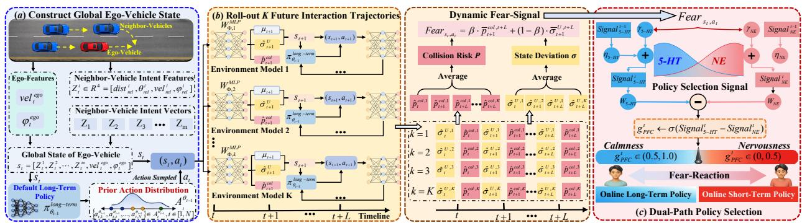  
Fig. 3. Current-Scene Imagination for Dual Policy Selection (NOTE: We use K parameter-independent yet structurally identical multi-layer MLPs as the Ensemble Environment Model; a multi-layer MLP as the default long-term policy (Actor) network).

$$
\{ \begin{array} { l l } { a _ { t + 1 } ^ { \theta _ { t - 1 } } \sim \hat { A } _ { t + 1 } ^ { \theta _ { t - 1 } } \in \mathrm { R } ^ { d i m }  \pi _ { \theta _ { t - 1 } } ^ { l o n g - t e r m } ( \hat { s } _ { t + 1 } ) } \\ { \hat { s } _ { t + 1 } \sim N \big ( \hat { \mu } _ { t + 1 } , ( \hat { \sigma } _ { t + 1 } ^ { U } ) ^ { 2 } \big ) } \\ { \big ( \hat { \mu } _ { t + 1 } , \hat { \sigma } _ { t + 1 } ^ { U } , \hat { p } _ { t + 1 } ^ { c o l } \big )  W _ { \Phi , k } ^ { M L P } \big ( s _ { t } , a _ { t } ^ { \theta _ { t - 1 } } \big ) , k \in [ 1 , K ] } \\ { a _ { t } ^ { \theta _ { t - 1 } } \sim A _ { t } ^ { \theta _ { t - 1 } } \in \mathrm { R } ^ { d i m }  \pi _ { \theta _ { t - 1 } } ^ { l o n g - t e r m } \big ( s _ { t } \big ) } \end{array}\tag{2}
$$

Specifically, in eq. (2), the k-th environment model takes in the current intent-entailed ego-state $s _ { t }$ and the sampled action $a _ { t } ^ { \theta _ { t - 1 } }$ of the ego-vehicle, then predicts the next potential state space of the ego-vehicle, consisting of the mean state shift $\hat { \mu } _ { t + 1 } ,$ the standard state deviation $\stackrel { \cup } { \sigma } _ { t + 1 } ^ { U }$ and the collision risk $\hat { p } _ { t + 1 } ^ { c o l } ,$ from which the next most possible ego-vehicle state is estimated as $\hat { s } _ { t + 1 } \sim N ( \hat { \mu } _ { t + 1 } , \bar { ( } \hat { \sigma } _ { t + 1 } ^ { U } ) ^ { 2 } )$ via a Gaussian distribution. In this way, standing at the predicted state $\hat { s } _ { t + 1 } ,$ the scene imagination continues up to L steps, outputting the k-th imagination-trajectory like $a _ { t + 1 } ^ { \theta _ { t - 1 } } \mathsf { \Omega } \in \mathsf { \Omega } \mathring { A } _ { t + 1 } ^ { { \theta _ { t - 1 } } } \ \in \mathsf { \Omega } \mathring { \mathbb { R } } ^ { { d i m } } \ \gets \ \pi _ { \theta _ { t - 1 } } ^ { l o n g - t e r m } \big ( \hat { s } _ { t + 1 } \big )$ , then $( \hat { s } _ { t + 1 } , \underset { \ldots } { a } _ { t + 1 } ^ { \theta _ { t - 1 } } ) \xrightarrow { W _ { \Phi , k } ^ { M , L P } } ( \hat { \mu } _ { t + 2 } , \hat { \sigma } _ { t + 2 } ^ { U } , \hat { p } _ { t + 2 } ^ { c o l } )  ( \hat { s } _ { t + 2 } , \boldsymbol { a } _ { t + 2 } ^ { \theta _ { t - 1 } } ) $ $\begin{array} { r } { \cdot \cdot \cdot \xrightarrow { W _ { \Phi , k } ^ { * * a ^ { 2 } } } ( \hat { \mu } _ { t + L } , \hat { \sigma } _ { t + L } ^ { U } , \hat { p } _ { t + L } ^ { c o l } )  \big ( \hat { s } _ { t + L } , a _ { t + L } ^ { \theta _ { t - 1 } } \big ) . } \end{array}$

$$
\{ \begin{array} { l l } { { \displaystyle F e a r _ { s _ { t } , a _ { t } ^ { \theta _ { t - 1 } } } \in { \mathrm { R } } = \beta \cdot \bar { p } _ { t + 1 } ^ { c o l , t + L } + ( 1 - \beta ) \cdot \bar { \sigma } _ { t + 1 } ^ { U , t + L } } } \\ { \displaystyle ( \bar { p } _ { t + 1 } ^ { c o l , t + L } , \bar { \sigma } _ { t + 1 } ^ { U , t + L } )  \displaystyle \frac { 1 } { K } \sum _ { k = 1 } ^ { K } \sum _ { l = t + 1 } ^ { t + L } W _ { \Phi , k } ^ { M L P } ( s _ { l } , a _ { l } ) } \end{array}\tag{3}
$$

All K of the L-step imagination-trajectories output by the K environment models are collected and averaged into $( \bar { p } _ { t + 1 } ^ { c o l , t + L } , \bar { \sigma } _ { t + 1 } ^ { U , t + L } )$ (see eq. (3)), with $\bar { p } _ { t + 1 } ^ { c o l , t + L }$ as overall collision risk and $\bar { \sigma } _ { t + 1 } ^ { U , t + L }$ as overall state deviation (from t + 1 to $t + L )$ ). Then, in eq. (3), by aggregating the overall collision risk $\bar { p } _ { t + 1 } ^ { c o l , t + L }$ and overall state deviation $\bar { \sigma } _ { t + 1 } ^ { U , t + L }$ via $\beta \in [ 0 , 1 ] .$ , we derive the dynamicfear-signal $F e a r _ { s _ { t } , a _ { t } ^ { \theta _ { t - \cdot } } }$ 1 as the overall ego-vehiclefear-reaction at the current $( s _ { t } , \dot { a } _ { t } ^ { \theta _ { t - 1 } } )$ This dynamic fear-signal $F e a r _ { s _ { t } , a _ { t } ^ { \theta _ { t - 1 } } }$ thus varies across different L-step scene-imaginations when given different $( s _ { t } , a _ { t } ^ { \theta _ { t - 1 } } ) \mathsf { s }$ .

Third, we competitively select long/short-term policy online (see Fig. 3 (c)). Based on the above dynamic fear-signal $F e a r _ { s _ { t } , a _ { t } ^ { \theta _ { t - 1 } } }$ at the current t-th time step, in eq (4), we induce the increment on the Norepinephrine (NE)-signal as $\gamma _ { N E } \cdot F e a r _ { s  a , a } .$ for nervousness alteration, and the opposite on the Serotonin (5-HT)-signal as $\gamma _ { 5 - H T } \cdot ( 1 - F e a r _ { s _ { t } , a _ { t } ^ { \theta _ { t - 1 } } } )$ for calmness alteration. These two signal-increments $\stackrel { \iota } { \gamma } _ { N E } \cdot F e a r _ { _ { S t } , { a _ { t } ^ { \theta } } - 1 } \& \gamma _ { 5 - H T } \cdot ( 1 -$

$F e a r _ { s _ { t } , a _ { \star } ^ { \theta _ { t - 1 } } } )$ are aggregated with the former $S i g n a l _ { N E } ^ { t - 1 }$ & $S i g n a l _ { 5 - H T } ^ { t - 1 }$ at t-1 time step, resulting in the latest $S i g n a l _ { N E } ^ { t } \ \& \ S i g n a l _ { 5 - H T } ^ { t }$ at the current t-th time step.

$$
\begin{array} { r } { \{ \begin{array} { l } { S i g n a l _ { N E } ^ { t } \in \mathrm { R }  \eta _ { N E } \cdot S i g n a l _ { N E } ^ { t - 1 } + \gamma _ { N E } \cdot F e a r _ { _ { S t , a _ { t } ^ { 0 } - 1 } } } \\ { S i g n a l _ { 5 - H T } ^ { t } \in \mathrm { R }  \eta _ { 5 - H T } \cdot S i g n a l _ { 5 - H T } ^ { t - 1 } } \\ { \qquad \quad \qquad \quad \qquad \quad \qquad \qquad \quad \qquad \qquad \quad \qquad \qquad \ F e a r _ { _ { S t , a _ { t } ^ { 0 } - 1 } } \Big ) } \\ { g _ { P F C } ^ { t } \in [ 0 , 1 ]  \sigma \Big ( W _ { 5 - H T } \cdot S i g n a l _ { 5 - H T } ^ { t } } \\ { \qquad \quad \qquad \quad \qquad \qquad \quad \qquad \qquad \qquad \qquad \ } \\ { \qquad \qquad \qquad \qquad \qquad \qquad \qquad \qquad \qquad \qquad \qquad \ } \end{array}  } \end{array}\tag{4}
$$

In eq (4), the latest $S i g n a l _ { N E } ^ { t }$ represents the interactionrisk intensity between the ego- and neighbor-vehicles induced by $( \dot { s } _ { t } , a _ { t } ^ { \theta _ { t - 1 } } )$ , whereas $S i g n a l _ { 5 - H T } ^ { t }$ represents the interaction-safety intensity. These two signals are fused via subtraction as $\bar { \sigma ( } \bar { S } i g n a l _ { 5 - H T } ^ { t } - S i g n a l _ { N E } ^ { t } )$ (σ for sigmoid), depicting the competition between interaction risk & safety, and deriving the online dual-path policy selection signal $g _ { P F C } ^ { t } \in ( 0 , \breve { 1 } )$ . The parameters $\left\{ \eta _ { N E } , \gamma _ { N E } , \eta _ { 5 - H T } , \gamma _ { 5 - H T } \right\}$ in eq (4) are set as trainable variables, rendering policyselection signal $g _ { P F C } ^ { t }$ learnable according to exploration feedback (see eq (17) in Section 3.4).

Obviously, by scene imagination from $( s _ { t } , a _ { t } ^ { \theta _ { t - 1 } } )$ via eq (2–4), when having lower-risk interaction between ego- and neighbor-vehicles, it will bring about lower dynamic fear-signal $F e a r _ { { } _ { s _ { t } , a _ { t } ^ { \theta _ { t - 1 } } } } \downarrow ,$ lower risk intensity $S i g n a l _ { N E } ^ { t } \downarrow _ { \cdot }$ , higher safety intensity $S i g n a l _ { 5 - H T } ^ { t } \uparrow$ , with $\mathit { S i g n a l } _ { 5 - H T } ^ { \bar { t } } - \mathit { S i g n a l } _ { N E } ^ { t } \dot { > } 0 \left( \mathrm { i . e . } \right.$ , calmness > nervousness) and $g _ { P F C } ^ { t }  ( 0 . 5 , 1 )$ , where Online Long-Term Dynamic Fear-Constrained Policy (see Section 3.2) for regular sceneevolving will be selected. Otherwise, the Online Short-Term Dynamic Fear-Projected Policy (see Section 3.3) for urgent-collision defense will be selected with $S i g n a l _ { 5 - H T } ^ { t } -$ $S i \breve { g } n a l _ { N E } ^ { t } \ < \ 0$ and $g _ { P F C } ^ { t }  ( 0 , 0 . 5 )$ . It should be noted that during policy selection in Fig. 3, we actually use the default long-term policy in old-parameter $\theta _ { t - 1 }$ (not $\theta _ { t } )$ . The prior action $a _ { t } ^ { \theta _ { t - \bar { 1 } } } ~  ~ \pi _ { \theta _ { t - 1 } } ^ { l o n g - \bar { t } e r m } ( s _ { t } )$ sampled for scene imagination in eq (2) is not the final action $a _ { t } ^ { \theta _ { t } }$ to be adopted before executing and updating the corresponding policy from $\theta _ { t - 1 } \to \theta _ { t }$

## 3.2 Online Long-Term Dynamic Fear-Constrained Policy

In terms of the controlled ego-vehicle in state $s _ { t }$ at the current t step, it executes Online Long-Term Dynamic

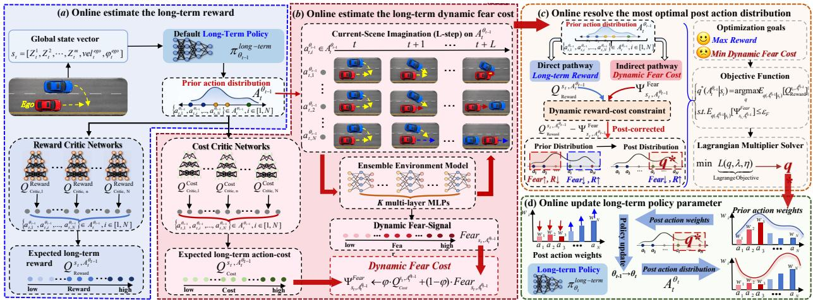  
Fig. 4. Online Long-Term Dynamic Fear-Constrained Policy (NOTE: We reuse the same K multi-layer MLPs mentioned in Fig. 3 as the Ensemble Environment Model in Fig. 4; a multi-layer MLP as long-term policy (Actor) network).

Fear-Constrained Policy when $g _ { P F C } ^ { t } ~ \in ~ ( 0 . 5 , 1 . 0 )$ (see Fig. 4) to deal with regular scene-evolving during vehicle interaction. In Particularly, the prior action distribution $A _ { t } ^ { \theta _ { t - 1 } } \sim \pi _ { \theta _ { t - 1 } } ^ { l o n g - t e r m } ( s _ { t } )$ output by the above current-scene imagination (see Fig. 3) is reused and estimated into the overall expected reward $Q _ { R e w a r d } ^ { s _ { t } , A _ { t } ^ { \theta _ { t - 1 } } }$ , along with the corresponding dynamic fear cost $\Psi _ { s _ { t } , A _ { t } ^ { \theta _ { t - 1 } } } ^ { F e a r } ,$ still via L-step scene imagination yet oriented to the whole prior distribution $A _ { t } ^ { \theta _ { t - 1 } }$ , not a single sampled action $a _ { t } ^ { \theta _ { t - 1 } } \in A _ { t } ^ { \theta _ { t - 1 } }$ . Then, inspired by the Direct/Indirect action control pathway in Striatum [14], the prior distribution $A _ { t } ^ { \theta _ { t - 1 } }$ is post-corrected via the dynamic constraint constructed from the reward $Q _ { R e w a r d } ^ { s _ { t } , A _ { t } ^ { \theta _ { t - 1 } } }$ and dynamic fear cost $\Psi _ { s _ { t } , A _ { t } ^ { \theta _ { t - 1 } } } ^ { F e a r } ,$ and further resolved into the most optimal posterior action distribution $q ^ { * } \ \sim \ \pi _ { \theta _ { t - 1 } } ^ { l o n g - t e r m } ( A _ { t } ^ { \theta _ { t - 1 } } \ | \ s _ { t } )$ . This $q ^ { * }$ is finally projected onto a set of post action weights that constrain the policy’s action distribution, updating the policy parameter (θ) online as $A _ { t } ^ { \theta _ { t - 1 } } \sim \pi _ { \theta _ { t - 1 } } ^ { l o n g - i e r ^ { \star } } ( s _ { t } ) \stackrel { \smile } { \to } A _ { t } ^ { \theta _ { t } ^ { \star } } \sim \pi _ { \theta _ { t } } ^ { \bar { l } o \acute { n } g - t e r m } ( s _ { t } )$

$$
\{ Q _ { R e w a r d } ^ { s _ { t } , A _ { t } ^ { \theta _ { t } } - 1 } = \frac { 1 } { N } \sum _ { i = 1 } ^ { N } Q _ { C r i t i c , i } ^ { R e w a r d } ( s _ { t } , A _ { t } ^ { \theta _ { t } - 1 } )  \qquad \\  A _ { t } ^ { \theta _ { t - 1 } } = \{ a _ { t , 1 } ^ { \theta _ { t - 1 } } , a _ { t , 2 } ^ { \theta _ { t - 1 } } , \dots , a _ { t , N } ^ { \theta _ { t - 1 } } \}   \pi _ { \theta _ { t - 1 } } ^ { l o n g - t e r m } ( s _ { t } )\tag{5}
$$

First, we online estimate the long-term reward of egovehicle in the current scene (see Fig. 4 (a)). When it comes to the ego-vehicle with state $s _ { t }$ in the current interaction scene, in eq (5), we reuse the prior action distribution $A _ { t } ^ { \theta _ { t - 1 } } = \{ a _ { t , 1 } ^ { \theta _ { t - 1 } ^ { \star } } , a _ { t , 2 } ^ { \theta _ { t - 1 } } , \ldots , a _ { t , N } ^ { \theta _ { t - 1 } } \} , a _ { t , i } ^ { \theta _ { t - 1 } } \in A _ { t } ^ { \theta _ { t - 1 } } , i \in [ 1 , N ]$ of the ego-vehicle, output by the default long-term policy $\pi _ { \theta _ { t - 1 } } ^ { l o n g - t e r m } ( s _ { t } )$ in the aforementioned scene imagination (see Fig. 3 & eq (2), NOTE: in old-parameter $\pmb { \theta } _ { t - 1 } )$ . Then, N parameter-independent yet structurally identical Reward Critic networks (i.e., each is a multi-layer MLP) are adopted to online estimate the expected long-term reward of $A _ { t } ^ { \dot { \theta } _ { t - 1 } }$ denoted as $\pi _ { \theta _ { t - 1 } } ^ { l o n g - t e r m } ( s _ { t } )  A _ { t } ^ { \theta _ { t - 1 } }  Q _ { R e w a r d } ^ { s _ { t } , A _ { t } ^ { \theta _ { t - 1 } } } ( s _ { t } , A _ { t } ^ { \theta _ { t - 1 } } )$ Obviously, starting from different $( s _ { t } , A _ { t } ^ { \theta _ { t - 1 } } ) \mathbf { s } ,$ , this longterm reward $Q _ { R e w a r d } ^ { s _ { t } , A _ { t } ^ { \theta _ { t - 1 } } }$ estimated in eq (5), varies with the interaction dynamics.

Second, we online estimate the long-term dynamicfear cost of ego-vehicle in the current scene (see Fig. 4 (b)). For the prior action distribution $A _ { t } ^ { \theta _ { t - 1 } }$ , in eq (6), we further roll out N future interaction trajectories over an L-step horizon for the ego-vehicle. Particularly, each trajectory rolledout by K multi-layer MLPs corresponds to one candidate action $a _ { t , i } ^ { \theta _ { t - 1 } } \in \mathsf { A } _ { t } ^ { \tilde { \theta _ { t - 1 } } } , \mathsf { \Omega } _ { i } ^ { } \in \mathsf { \Omega } [ 1 , N ]$ , resulting in the overall collision risk $\&$ state deviation $( \bar { p } _ { t + 1 } ^ { c o l , t + L } , \bar { \sigma } _ { t + 1 } ^ { U , t + L } )$ of each action, which are used to derive the dynamic fear-signal $F e a r _ { s _ { t } , A _ { t } ^ { \theta _ { t - 1 } } } ~ = ~ \{ F e a r _ { s _ { t } , a _ { t , 1 } ^ { \theta _ { t - 1 } } } , \dots , F e a r _ { s _ { t } , a _ { t , N } ^ { \theta _ { t - 1 } } } \}$ over the entire prior distribution $\stackrel { \triangledown } { \boldsymbol { A } } _ { t } ^ { \hat { \theta } _ { t - 1 } }$ . Then, N Cost Critic networks (i.e., each is a multi-layer MLP) [5], [6] are adopted to estimate the long-term action-cost $\boldsymbol { Q } _ { C o s t } ^ { s _ { t } , A _ { t } ^ { \theta _ { t - 1 } } } \ \mathrm { o f } \ \boldsymbol { A } _ { t } ^ { \bar { \theta } _ { t - 1 } }$ which is further fused with the above dynamic fear-signal $F e a r _ { s _ { t } , A _ { t } ^ { \theta _ { t } . } }$ −1 to online estimate the long-term dynamic fear cost $\Psi _ { s _ { t } , A _ { t } ^ { \theta _ { t - 1 } } } ^ { F e a r }$ of the prior action distribution $A _ { t } ^ { \theta _ { t - 1 } }$ . Obviously, the long-term dynamic fear cost $\Psi _ { s _ { t } , A _ { t } ^ { \theta _ { t - } } } ^ { F e a r }$ −1 in eq (6) can reflect different future cumulative action-costs coupled with the corresponding fear-signals, as the overall fear reaction of the ego-vehicle when given different $( s _ { t } , A _ { t } ^ { \theta _ { t - 1 } } ) \mathbf { s } .$

Third, we online resolve the most optimal posterior action distribution $q ^ { * } ( A _ { t } ^ { \theta _ { t - 1 } } \mid s _ { t } ) \sim \pi _ { \theta _ { t - 1 } } ^ { l o n g \dot { - } t e r m } ( \dot { A _ { t } ^ { \theta _ { t - 1 } } } \mid s _ { t } )$ (see Fig. 4(c)). Obviously, it is expected that the prior action distribution $A _ { t } ^ { \theta _ { t - 1 } } \sim \stackrel { \smile } { \pi } _ { \theta _ { t - 1 } } ^ { l o n g - t e r \ " { m } } ( s _ { t } )$ output by the longterm policy, should maximize long-term reward $Q _ { R e w a r d } ^ { s _ { t } , A _ { t } ^ { \theta _ { t - 1 } } }$ in eq (5) while minimizing the long-term dynamic fear cost $\Psi _ { s _ { t } , A _ { t } ^ { \theta _ { t - 1 } } } ^ { F e \hat { a } r } \leq \varepsilon _ { F }$ in eq (6). Therefore, the most optimal posterior action distribution $q ^ { * } ( A _ { t } ^ { \theta _ { t - 1 } } \mid s _ { t } )$ can be derived from the prior distribution $\pi _ { \theta _ { t - 1 } } ^ { \bar { l o n j } - \bar { t e r m } } \dot { ( A _ { t } ^ { \theta _ { t - 1 } } \ | \ s _ { t } ) }$ as the Constrained Optimization Problem defined in eq (7) [5], where the KL-divergence trust region $D _ { K L } [ \cdot ] \ \leq \ \bar { \varepsilon _ { K L } }$ prevents a dramatic policy shift from the prior $\pi _ { \theta _ { t - 1 } } ^ { \mathit { l o n g - t e r m } } ( \bar { \boldsymbol { A } } _ { t } ^ { \theta _ { t - 1 } } \mid s _ { t } )$ to the posterior $q ( A _ { t } ^ { \theta _ { t - 1 } } \mid s _ { t } )$ , with the constant $\varepsilon _ { F }$ as the upper limit on the dynamic fear cost $\Psi _ { s _ { t } , A _ { t } ^ { \theta _ { t - 1 } } } ^ { F e a r } .$

Next, by introducing a dynamicfear costfactor $\lambda \geq 0$ and KL trust regionfactor $\eta > 0 ,$ , we convert the constrained optimization in eq (7) into the equivalent Lagrange Objective in eq (8) [6]. Here, in eq (8), inspired by the action-control mechanism of the Striatum in our human brain that the Direct

$$
\{ \begin{array} { l l } { \displaystyle \Psi _ { s _ { t } , A _ { t } ^ { \theta _ { t - 1 } } } ^ { F e a r } \gets \varphi \cdot Q _ { C ^ { \theta _ { t } , A _ { t } ^ { \theta _ { t } } - 1 } } ^ { s _ { t } , A _ { t } ^ { \theta _ { t - 1 } } } + ( 1 - \varphi ) \cdot F e a r _ { s _ { t } , A _ { t } ^ { \theta _ { t - 1 } } } } \\ { \displaystyle Q _ { C o s t } ^ { s _ { t } , A _ { t } ^ { \theta _ { t - 1 } } } = \frac { 1 } { N } \sum _ { i = 1 } ^ { N } Q _ { c r i t i c , i } ^ { C o s t } ( s _ { t } , A _ { t } ^ { \theta _ { t - 1 } } ) } \\ { F e a r _ { s _ { t } , A _ { t } ^ { \theta _ { t } - 1 } } \gets \{ a _ { t , i } ^ { \theta _ { t - 1 } } | \beta \cdot p _ { t + 1 } ^ { c o l , t + L } + ( 1 - \beta ) \cdot \sigma _ { t + 1 } ^ { U , t + L } = \frac { 1 } { K } \sum _ { k = 1 } ^ { K } \sum _ { t + 1 } ^ { t + L } W _ { \Phi , k } ^ { M L P } ( s _ { t } , a _ { t , i } ^ { \theta _ { t - 1 } } ) \} } \\ { \displaystyle s _ { t } = [ Z _ { t } ^ { 1 } , . . . , Z _ { t } ^ { i } , . . . , Z _ { t } ^ { m } , v e l _ { t } ^ { e g o } , \varphi _ { t } ^ { e g o } ] , i \in [ 1 , m ] } \end{array}\tag{6}
$$

$$
\left\{ \begin{array} { l l } { q ^ { * } ( A _ { t } ^ { \theta _ { t - 1 } } \mid s _ { t } ) = \mathop { \operatorname { a r g m a x } } E _ { q ( A _ { t } ^ { \theta _ { t - 1 } } \mid s _ { t } ) } [ Q _ { R e w a r d } ^ { s _ { t } , A _ { t } ^ { \theta _ { t - 1 } } } ] } \\ { \mathrm { s . t . } E _ { q ( A _ { t } ^ { \theta _ { t - 1 } } \mid s _ { t } ) } [ \Psi _ { s t , A _ { t } ^ { \theta _ { t - 1 } } } ^ { F e a r } ] \leq \varepsilon _ { F } , D _ { K L } \Big [ q ( A _ { t } ^ { \theta _ { t - 1 } } \mid s _ { t } ) \Big \Vert \pi _ { \theta _ { t - 1 } } ^ { l o n g - t e r m } ( A _ { t } ^ { \theta _ { t - 1 } } \mid s _ { t } ) \Big ] \leq \varepsilon _ { K L } } \\ { \displaystyle \int q ( A _ { t } ^ { \theta _ { t - 1 } } \mid s _ { t } ) d A _ { t } ^ { \theta _ { t - 1 } } = 1 } \end{array} \right.\tag{7}
$$

$$
\begin{array} { r l } & { \quad \textup {  { S } } ^ { j } } \\ { \operatorname* { m i n } _ { { \textbf { L } } _ { \cup \mathrm { s e r o p e d i v e } } ^ { L ( q , \lambda , \eta ) } } } & { = - E _ { A _ { t } ^ { \theta _ { t } - 1 } \sim q ( \ s _ { t } ) } \left[ \underbrace { Q _ { \textup { R e x } 0 } ^ { s _ { t } , A _ { t } ^ { \theta _ { t } - 1 } } } _ { \textup { b e i n d u e l - b r i e d D y n a m i c c o u r d } } \right] + \eta \Big \{ D _ { K , L } \Big [ q ( A _ { t } ^ { \theta _ { t } - 1 } | s _ { t } ) \Big \| \tau _ { \theta _ { t - 1 } } ^ { \textup { l o g e t r m } } ( A _ { t } ^ { \theta _ { t } - 1 } | s _ { t } ) \Big ] - \varepsilon _ { K L } \Big \} } \\ & { \quad \textup { m e x p e c o p i s e d i v e } } \end{array}\tag{8}
$$

$$
\mathrm { m i n } \underbrace { L ( q , \lambda , \eta ) } _ { \mathrm { L a g r a n g e O b j e c i t i v e } }  q ^ { * } ( A _ { t } ^ { \theta _ { t - 1 } } \mid s _ { t } ) = \pi _ { \theta _ { t - 1 } } ^ { l o n g - t e r m } ( A _ { t } ^ { \theta _ { t - 1 } } \mid s _ { t } ) \cdot \exp ( \frac { Q _ { \mathrm { R e w a r d } } ^ { s _ { t , A _ { t } ^ { \theta _ { t } } - 1 } } - \lambda \cdot \Psi _ { s _ { t , A _ { t } ^ { \theta _ { t } - 1 } } } ^ { \mathrm { F e x r } } } { \eta } ) \cdot \frac { 1 } { Z ( s _ { t } ) }\tag{9}
$$

$$
\left\{ w _ { t , 1 } ^ { \theta _ { t - 1 } } \propto a _ { t , 1 } ^ { \theta _ { t - 1 } } , w _ { t , 2 } ^ { \theta _ { t - 1 } } \propto a _ { t , 2 } ^ { \theta _ { t - 1 } } , \ldots , w _ { t , N } ^ { \theta _ { t - 1 } } \propto a _ { t , N } ^ { \theta _ { t - 1 } } \right\} \gets \mathrm { s o f t m a x } \left( q ^ { * } \left( A _ { t } ^ { \theta _ { t - 1 } } \mid s _ { t } \right) \right) , w _ { t , i } ^ { \theta _ { t - 1 } } \propto a _ { t , i \in \left[ 1 , N \right] } ^ { \theta _ { t - 1 } } \in A _ { t } ^ { \theta _ { t - 1 } }\tag{10}
$$

$$
\begin{array} { r } { L o s s _ { \tau _ { \ell } } ^ { \mathrm { l a w s t e n } } ( \theta ) = - E _ { s  \kappa = d \ell } \Big [ \underbrace { \sum _ { i = 1 } ^ { N } w _ { t , i } ^ { \theta _ { \ell - 1 } } \cdot \log ^ { \pi _ { \ell } } \pi _ { \theta } ^ { \mathrm { l a w s t e n } } ( a _ { t , i } ^ { \theta _ { \ell } } \mid s \mathrm { t } ) } _ { \mathrm { i = 1 } } + \beta \cdot K L _ { s  \kappa = M \ell } \Big [ \pi _ { \theta } ^ { \mathrm { l a w s t e n } } ( A _ { t } ^ { \theta _ { \ell } } \mid s \mathrm { t } ) \Big ] \Big \vert \pi _ { \theta _ { t - 1 } } ^ { \mathrm { l a w s t e n } } ( A _ { t } ^ { \theta _ { \ell - 1 } } \mid s \mathrm { t } ) \Big ] \Big ] } \end{array}\tag{11}
$$

online posterior supervision from $q ^ { * } ( A _ { t } ^ { \theta _ { t - 1 } } | s _ { t } )$

pathway selects optimal action with higher reward, while the Indirect pathway avoids action with higher risk (or cost) [14], we construct a brain-inspired dynamic reward-cost constraint at action-level as $Q _ { R e w a r d } ^ { s _ { t } , A _ { t } ^ { \theta _ { t - 1 } } } - \lambda \cdot ( \Psi _ { s _ { t } , A _ { t } ^ { \theta _ { t - 1 } } } ^ { F e a r } - \varepsilon _ { F } )$ depicting the trade-off between long-term reward and longterm dynamic fear cost of action. In eq (8), since the dynamic fear cost $\lambda \cdot ( \Psi _ { s _ { t } , A _ { t } ^ { \theta _ { t - 1 } } } ^ { F e a r } - \varepsilon _ { F } )$ alters across different egoneighbor vehicle interactions, the reward-cost constraint $Q _ { R e w a r d } ^ { s _ { t } , A _ { t } ^ { \theta _ { t - 1 } } } - \lambda \cdot ( \Psi _ { s _ { t } , A _ { \iota } ^ { \theta _ { t - 1 } } } ^ { F e a r } - \varepsilon _ { F } )$ is constructed dynamically adapted to different scenarios.

Furthermore, we use the Lagrange Multiplier to online resolve the Stationary Point of the Lagrange Objective in eq (8), obtaining the most optimal posterior action distribution $q ^ { * } ( A _ { t } ^ { \theta _ { t - 1 } } \ | \ \bar { s } _ { t } )$ defined in eq (9), with $Z ( s _ { t } )$ as the State-Dependent Partition Function for normalization [34]. In this way, the prior action distribution $A _ { t } ^ { \theta _ { t - 1 } }$ is online corrected into the most optimal posterior one $q ^ { * } ( A _ { t } ^ { \theta _ { t - 1 } } \ | \ s _ { t } )$ . This resolved posterior distribution $q ^ { * } ( A _ { t } ^ { \theta _ { t - 1 } } \ | \ s _ { t } ) .$ in eq (9) is then projected onto N post action weights $w _ { t , i } ^ { \boldsymbol { \theta } _ { t - 1 } } \propto a _ { t , i } ^ { \boldsymbol { \theta } _ { t - 1 } } .$ $i \in [ 1 , N ]$ , for each candidate action $\{ a _ { t , 1 } ^ { \theta _ { t - 1 } } , a _ { t , 2 } ^ { \theta _ { t - 1 } } , . . . , a _ { t , N } ^ { \theta _ { t - 1 } } \}$ in $A _ { t } ^ { \theta _ { t - 1 } } ( \sec { \operatorname { e q } \left( 1 0 \right) } ) ^ { 2 }$

Finally, we online update long-term policy parameter θ via the posterior $q ^ { * } ( \mathbf { \hat { A } } _ { t } ^ { \theta _ { t - 1 } } \ | \ s _ { t } ) ^ { \mathbf { \tilde { \mathbf { \alpha } } } }$ (see Fig. 4 (d)). Obviously, the above N post action weights $\begin{array} { r } { \stackrel { \smile } { w } _ { t , i } ^ { \theta _ { t - 1 } } \propto a _ { t , i } ^ { \theta _ { t - 1 } } . } \end{array}$ $i \in [ 1 , N ]$ , in eq (11), derived from the most optimal posterior action distribution $q ^ { * } ( A _ { t } ^ { \theta _ { t - 1 } } \ | \ s _ { t } )$ in eq (9), entailed the expected evolve direction of the long-term policy $\pi _ { \theta _ { t - 1 } } ^ { l o n g - t e r m }$ . Therefore, the $L o s s _ { \pi _ { \theta } } ^ { l o n g - t e r m } ( \theta )$ in eq (11) takes the N post action weights in eq (10) as the online posterior supervision from $q ^ { * }$ , so as to post-constrain the action distribution of the long-term policy $\pi _ { \theta } ^ { l o n g - t e r m }$ , such as $w _ { t , i } ^ { \theta _ { t - 1 } }$ · log $\pi _ { \theta } ^ { l o n g - t e r m } ( \breve { a } _ { t , i } ^ { \theta _ { t } } \ | \ s _ { t } )$ , updating the parameter θ in $\pi _ { \boldsymbol { \theta } } ^ { l o n g - t e r m } ( a _ { t , i } ^ { \theta _ { t } } \mid s _ { t } ) \colon \theta _ { t - 1 } \to \theta _ { t }$ within KL a trust region, to prevent a dramatic policy shift.

In sum, when given prior action distribution $A _ { t } ^ { \theta _ { t - 1 } } \sim$ $\pi _ { \theta _ { t - 1 } } ^ { l o n g - t e r m } ( s _ { t } )$ , the long-term policy $\pi _ { \theta } ^ { l o n g - t e r m }$ expects a higher reward $Q _ { R e w a r d } ^ { s _ { t } , A _ { t } ^ { v _ { t } - 1 } } \uparrow$ in eq (7) alongside a lower $d y -$ namic fear cost $\Psi _ { s _ { t } , A _ { t } ^ { \theta _ { t - 1 } } } ^ { F e a r } \downarrow$ in eq (8), altogether constructing the dynamic reward-cost constraint $( Q _ { R e w a r d } ^ { s _ { t } , A _ { t } ^ { v _ { t - 1 } } } - \Psi _ { s _ { \star } A _ { \cdot } ^ { \theta _ { t - 1 } } } ^ { F e a r } )$ to correct the prior action distribution $A _ { t } ^ { \theta _ { t - 1 } }$ into the most optimal posterior action distribution $q ^ { * } ( A _ { t } ^ { \theta _ { t - 1 } } \ | \ s _ { t } )$ in eq (9), further projected onto post action weights $w _ { t , i } ^ { { \theta _ { t - 1 } } } \propto$ $a _ { t , i \in [ 1 , N ] } ^ { \theta _ { t - 1 } } \ \in \ A _ { t } ^ { \theta _ { t - 1 } }$ in eq (10) as the online supervision constraining the policy parameter update as $\pi _ { \theta } ^ { l o n g - t e r m }$ $\theta _ { t - 1 } \to \theta _ { t }$ via the $L o s s _ { \pi _ { \theta } } ^ { l o n g - t e r m } ( \theta )$ in eq (11).

## 3.3 Online Short-Term Dynamic Fear-Projected Policy

Since the long-term policy constrains action selection via online policy optimization with a dynamic reward-cost constraint, it lacks the efficiency to deal with urgent-collision defense $( \mathrm { e . g . }$ , a sudden side-lane cut-in) [7]. Consequently, to handle the urgent braking under high risk more efficiently, we adopt the Online Short-Term Dynamic Fear-Projected Policy when $g _ { P F C } ^ { t } \in ( 0 , 0 . 5 )$ ). Inspired by the Hyper-direct pathway in Striatum [15], the original risk action $a _ { t } ^ { r i s k } \sim$

$$
\begin{array} { r l } &  \{ \begin{array} { l l } { A _ { s a f c } ( s _ { t } ) = G _ { p r o f } ^ { s e t } \otimes ( a _ { t } ^ { r i s k } ) ^ { T } = \{ A _ { p r o j } , e _ { b r a k e } \} \otimes ( \begin{array} { l } { a _ { t } ^ { s t e e r } } \\ { a _ { t } ^ { s e r t i c a l } } \end{array} ) } \\ { G _ { p r o j } ^ { s e t } = \{ A _ { p r o j } , e _ { b r a k e } \} , A _ { p r o j } = ( \begin{array} { l l } { 1 } & { 0 } \\ { 0 } & { 1 } \end{array} ) , ~ e _ { b r a k e } = ( 0 } & { 1 ) } \\ { a _ { t } ^ { r i s k } = ( a _ { t } ^ { s t e r e } \in \mathrm { R } , a _ { t } ^ { w e r t i c a l } \in \mathrm { R } )  \pi _ { \varphi } ^ { s h o r t - t e r m } ( s _ { t } ) } \\ { A _ { s a f e } ( s _ { t } ) = G _ { p r o j } ^ { s e t } \otimes ( a _ { t } ^ { r i s k } ) ^ { T }  \{ \begin{array} { l l } { \frac { a _ { t } ^ { r i s k } } { ( 0 } , ~ 0 ) \cdot ( \begin{array} { l } { a _ { t } ^ { r i s k } } \end{array} ) ^ { T } } \\ { ( \begin{array} { l l } { a _ { t } ^ { s t e r t i c e n t } } \end{array} ) = ( \begin{array} { l } { \Gamma _ { t , s t e r t i c a l } ^ { r i s k } } \\ { \Gamma _ { t , v e r t i c a l } ^ { r i s k } } \end{array} ) , ~ \overbrace { ( 0 } ^ { a _ { t } ^ { s t e r t i c e n t } } ) ^ { \alpha _ { t } } = ( a _ { t } ^ { v e r t i c a l } ) } \end{array} \} } \end{array} \end{array}\tag{13}
$$

$\pi _ { \varphi } ^ { s h o r t - t e r m } ( s _ { t } )$ output by the short-term policy3 is directly projected as a reachable action set $\bar { A } _ { s a f e } ( s _ { t } )$ , from which a safe action $a _ { t } ^ { s a f e }$ with minimum action shift towards the original $a _ { t } ^ { r i s k }$ is selected as substitute. Furthermore, without policy optimization, the above action projection is online constrained by the dynamic fear boundary $\Psi _ { s _ { t } , a _ { t } } ^ { F e a r } ,$ , which tightens or loosens the reachable action set $A _ { s a f e } ( s _ { t } )$ according to the risk intent of the neighboring vehicles surrounding the ego-vehicle.

$$
\begin{array} { r } { \{ \begin{array} { l l } { N e i g h b o r ( s _ { t } ) = \{ i \mid d i s t _ { r e l } ^ { i , t } < d i s t _ { r } , } \\ { v e l _ { r e l } ^ { i , t } > 0 , T T C ^ { i , t } < T T C _ { r } , b r a k e _ { r e q } ^ { i , t } \} , i \in [ 1 , m ] } \\ { b r a k e _ { r e q } ^ { i , t } < 0  ( - \frac { \operatorname* { m a x } ( v e l _ { r e l } ^ { i , t } , 0 ) ^ { 2 } } { 2 \operatorname* { m a x } ( d i s t _ { r e l } ^ { i , t } - d i s t _ { m i n } , \varepsilon ) } ) , \varepsilon > 0 } \\ { T T C ^ { i , t } = \frac { d i s t _ { r e l } ^ { i , t } } { \operatorname* { m a x } ( v e l _ { r e l } ^ { i , t } , \varepsilon ) } , \varepsilon > 0 } \\ { ( T T C ^ { i , t } , v e l _ { r e l } ^ { i , t } , b e l _ { r e q } ^ { i , t } )  Z _ { t } ^ { i } \in s _ { t } } \end{array}  } \end{array}\tag{12}
$$

First, we identify risk neighboring vehicles. In eq (12), given the ego-vehicle state $s _ { t }$ containing m neighboring intent vectors $\{ Z _ { t } ^ { 1 } , Z _ { t } ^ { 2 } , \ldots , Z _ { t } ^ { m } \} , Z _ { t } ^ { i } \ \in \ \mathrm {  ~ { \cal { R } } ^ 4 ~ } =$ $[ d i s t _ { r e l } ^ { i , t } , \theta _ { r e l } ^ { i , t } , v e l _ { r e l } ^ { i , t } , \varphi _ { r e l } ^ { i , t } ]$ (see eq (1)), we extract risk neighbor set $N e i g h b o r ( s _ { t } )$ of the ego-vehicle: the i-th neighbor is included when its intent vector $Z _ { t } ^ { i }$ has with relative distance $d i s t _ { r e l } ^ { i , t } < d i s t _ { r . }$ , relative velocity $v e l _ { r e l } ^ { i , t } > 0$ , and Time-To-Collision $T T C ^ { i , t } < T T C _ { r }$ . Moreover, in eq (12), each risk-neighbor vehicle in $N e i g h b o r ( s _ { t } )$ is also been assigned a negative braking demand towards ego-vehicle $( \mathrm { i . e . , } \ b r a k e _ { r e q } ^ { i , t } < 0 )$ . The more negative $b r a k e _ { r e q } ^ { i , t } ,$ , the higher braking intensity.

Second, we online project original risk action as reachable action set. The short-term policy outputs the original two-dimensional risk action $a _ { t } ^ { r i s k } \ = \ ( a _ { t } ^ { s t e e r } , a _ { t } ^ { v e r t i c a l } ) \ \sim$ $\pi _ { \varphi } ^ { s h o r t - t e r m } ( s _ { t } )$ , where $a _ { t } ^ { s t e e r } \in \mathrm { ~  ~ R ~ }$ is the steering angle (negative for turning left, positive for right), and $\bar { a } _ { t } ^ { v e r t i c a l } \ \in \ \mathrm { ~ R ~ }$ is the vertical acceleration (negative for braking, positive for speeding). This original risk action $\boldsymbol a _ { t } ^ { r i s k } = \stackrel { \vartriangle } { \left( \boldsymbol a _ { t } ^ { s t e e r } , \boldsymbol a _ { t } ^ { v e r t i c a \dot { l } } \right) }$ is not to be adopted immediately, instead it is projected as a reachable action set $A _ { s a f e } ( s _ { t } ) \stackrel { \cdot } { = }$ $G _ { p r o j } ^ { s e t } \otimes ( a _ { t } ^ { r i \dot { s } k } ) ^ { \acute { T } }$ (see eq (13–14)).

(14)

Specifically, in eq (13), we incorporate complex projection operator $G _ { p r o j } ^ { s e t } \hat { \ } = \{ A _ { p r o j } , e _ { b r a k e } \} _ { }$ , consisting of the action-dimension operator $A _ { p r o j }$ and the vertical-braking operator $e _ { b r a k e } ,$ both applied element-wise to $( a _ { t } ^ { r i s k } ) ^ { T } \ =$ $( \dot { a } _ { t } ^ { s t e e r } , a _ { t } ^ { v e r t i c a l } ) ^ { T }$ as $A _ { p r o j } ^ { \enspace ^ { \enspace \bullet ^ { \enspace \bullet } } } \otimes ( a _ { t } ^ { r i s k } ) ^ { T }$ and $e _ { b r a k e } \mathbf { \dot { \otimes _ { } } } ( a _ { t } ^ { r i s k } ) ^ { T }$ These two terms are further computed via the dot-product in eq (14). In this way, by $A _ { p r o j } \stackrel { \bullet } { \otimes } ( a _ { t } ^ { r i s k } ) ^ { T }$ , we project the entire $( a _ { t } ^ { r i s k } ) ^ { T }$ restrictively onto $( a _ { t } ^ { r i s k } ) ^ { T } \ \to \ \Gamma _ { t , s t e e r } ^ { r i s k }$ and $( a _ { t } ^ { r i s k } ) ^ { \dot { T } }  \Gamma _ { t , v e r t i c a l } ^ { r i s k }$ from steering angle $a _ { t } ^ { s t e e r }$ and vertical acceleration $a _ { t } ^ { v e r t i c a l }$ aspects, while $e _ { b r a k e } \otimes ( a _ { t } ^ { r i s k } ) ^ { T }$ merely extracts the vertical acceleration $( a _ { t } ^ { v e r t i c a l } )$

Third, we online construct dynamic fear boundary for safe action selection. In order to ensure that the projected reachable action set $A _ { s a f e } ( s _ { t } ) \ = \ G _ { p r o j } ^ { s e t } \cdot ( a _ { t } ^ { r i s k } ) ^ { \mathbf { \bar { T } } }$ reflect the different braking demands towards the ego-vehicle when facing interactions with different risk neighbor sets $N e i g h b o r ( s _ { t } ) s$ across time steps (see eq (12)), we online construct a dynamic fear boundary $\Psi _ { s _ { t } , a _ { t } } ^ { \dot { F e } a \dot { r } }$ for $A _ { s a f e } ( s _ { t } )$ based on the current $\dot { N } e i g h b o r ( s _ { t } )$ in eq (15). This dynamic fear boundary $\Psi _ { s _ { t } , a _ { t } } ^ { F e a r }$ consists of the constant vector $\tau _ { s a f e } =$ $( - 1 , 1 ) ^ { T }$ and $b _ { t } ^ { r e q } < 0 .$ , where $\tau _ { s a f e }$ constrains the actiondimension projection $( \Gamma _ { t , s t e e r } ^ { r i s k } , \Gamma _ { t , v e r t i c a l } ^ { r i \check { s } k } )$ in eq (14) within value scope $( - 1 , 1 ) ^ { T }$ , and negative $b _ { t } ^ { r e q } < 0$ constrains the vertical-braking projection $e _ { b r a k e } \otimes ( \bar { a } _ { t } ^ { r i s k } ) ^ { T } = ( a _ { t } ^ { v e r t i c a l } )$ in eq (14) not to exceed the most negative braking demand (or the lowest bound as $\operatorname* { m i n } ( b r a k e _ { r e q } ^ { \breve { i } , t } )$ in eq (15)) among all the vehicles across the entire risk neighbor set Neighbor(st), altogether constraining $A _ { s a f e } ( s _ { t } ) \le \breve { \Psi } _ { s _ { t } , a _ { t } } ^ { F e a r } = \{ \tau _ { s a f e } , b _ { t } ^ { r e q } \}$

In this way, eq (15) formally couples the online reachable action set projection $A _ { s a \dot { f } e } \big ( s _ { t } \big ) ^ { \bullet } = G _ { p r o j } ^ { s e t } \otimes \big ( a _ { t } ^ { r i s k } \big ) ^ { T }$ with the dynamic fear boundary constraint $( \Psi _ { s _ { t } , a _ { t } } ^ { F e a r } )$ . As the ego- and neighbor-vehicles interact over time, the riskneighbor set $N e i g h b o r ( s _ { t } )$ derived from the ego-vehicle state $s _ { t }$ alters correspondingly, leading to different lowest braking demand $b _ { t } ^ { r e \bar { q } } < 0$ in $\Psi _ { s _ { t } , a _ { t } } ^ { F e a r }$ , in turn, dynamically tightening or loosening the action set $A _ { s a f e } ( s _ { t } )$ . Finally, the most optimal safe action $a _ { t } ^ { s a f e }$ with minimum shift from the original $a _ { t } ^ { r i s k } ~ \mathrm { ( i . e . }$ , arg min $\| a _ { t } ^ { s a f e } - a _ { t } ^ { r i s k } \| )$ is selected from $\tilde { A _ { s a f e } } ( s _ { t } ) \le \Psi _ { s _ { t } , a _ { t } } ^ { F e a r }$ as the short-term policy’s output, like $a _ { t } ^ { r i s k } ~ {  } ~ A _ { s a f e } ( s _ { t } ) ~ { = } ~ G _ { p r o j } ^ { s e t } ~ \cdot ~ ( a _ { t } ^ { r i s k } ) ^ { \hat { T } } ~ { \leq } ~ \Psi _ { s _ { t } , a _ { t } } ^ { F e a r } ~ {  } ~$ arg min $\mathsf { \Omega } _ { 1 } ( a _ { t } ^ { s a f e } )$ , without policy optimization, for efficiency4.

## 3.4 Online-to-Offline Optimization Loop

In fact, for the long-term policy, we construct the dynamic fear cost $\Psi _ { s _ { t } , A _ { t } ^ { \theta _ { t - 1 } } } ^ { F e a r }$ of the action in eq (6), then the derive dynamic action reward-cost constraint in eq (8) (i.e., $Q _ { R e w a r d } ^ { s _ { t } , A _ { t } ^ { \theta _ { t } - \mathrm { i } } } - \lambda \cdot ( \Psi _ { s _ { t } , A _ { t } ^ { \theta _ { t - 1 } } } ^ { F e a r } - \varepsilon _ { F } ) )$ . For the short-term policy, we directly take the dynamic fear boundary $\Psi _ { s _ { t } , a _ { t } } ^ { F e a r }$ in eq (15) as the constraint. Based on these two dynamic constraints, the long-term policy $\pi _ { \theta } ^ { l o n g - t e r m }$ is online optimized by the Lagrange Objective in eq (9) & $L o s s _ { \pi _ { \theta } } ^ { l o n g - t \bf { \dot { e } } r m } ( \theta )$ in eq $( 1 1 ) .$ , and the action-projection of the short-term policy $\pi _ { \varphi } ^ { s h o r t - t e r m }$ is online optimized by the minimum action shift (arg min $\lVert a _ { t } ^ { s a f e } - \bar { a } _ { t } ^ { r i s k } \rVert )$ in eq (15). In this way, the

(15)

$$
\left\{ \begin{array} { l l } { \underset { \displaystyle \theta _ { t } ^ { \mathrm { s e l } } } { \mathrm { a r g m i n } } } \\ { \underset { \displaystyle \theta _ { t } ^ { \mathrm { s e l } } } { \mathrm { a r g m i n } } } \\ { \underset { \displaystyle \theta _ { t } ^ { \mathrm { r e f } } } { \mathrm { a r g m i n } } } \\ { \underset { \displaystyle \theta _ { t } ^ { \mathrm { r e f } } } { \mathrm { a m i n } } } \end{array} \right\| a _ { t } ^ { a _ { t } f \epsilon } - a _ { t } ^ { r _ { i } s k } \bigg \| , \ \mathrm { s . t . } \ \frac { \mathrm { r e a t i n g l e a c i t y o c k ( a _ { t } ^ { \mathrm { r e f } } ) } } { A _ { s a f \epsilon } ( s _ { k } ) } \underset { \mathrm { P o l } \times \mathrm { t e r m } } { \mathrm { a r g m i n } } \big \% \leq \frac { \Psi _ { e , e , t } ^ { \mathrm { k e a t } } } { \underset { \mathrm { s g m i n } } { \mathrm { s g m i n } } } = \bigg \{ \tau _ { \mathrm { r e a f t } }  = ( - 1 , 1 ) ^ { T } , b _ { t } ^ { r _ { i } q } < 0 \bigg \}  \\ { \ \underset { \displaystyle \theta _ { t } ^ { \mathrm { r e f } } } { \mathrm { b r a t } } \mathrm { a r n u m i n } \bigg \{ b r a b _ { t } ^ { \mathrm { r e f } } } \bigg \} , \ t r a k _ { t } ^ { \mathrm { r e f } } < 0 \propto N e i g h b o r ( s _ { t } )  \\ { \ \ \dot { M L E } _ { - } L o s _ { \mathrm { t i } } \mathrm { b r a t } _ { \mathrm { t i } } - b _ { t } ^ { \mathrm { r e a t } } \mathrm { b r a t } } \\  \ \frac { \dot { S } _ { \mathrm { e l e m t i n } } } { A _ { \mathrm { t i } } ^ { \mathrm { s a } } ( y N _ { \mathrm { E } } , T ) } - E _ { \mathrm { a n g l } } \bigg \{ \frac { \dot { S } _ { \mathrm { t } } \epsilon _ { \mathrm { t } } } { \mathrm { a r g m i n } } \mathrm { b r a t } \bigg \} \underset  \mathrm { P o l }\tag{16}
$$

(17)

ego-vehicle can constantly interact with neighboring ones to generate sate-action-reward-signal trajectories such as $\{ s _ { t } , a _ { t } , s _ { t + 1 } , r _ { t } , F e a r _ { s _ { t } , a _ { t } } , p o l i c y _ { - } f l a g _ { t } = l o n g / s h o r t , y _ { t } =$ $0 / 1 \} \mathbf { s } ,$ all stored into offline-buffer for replay $( \mathrm { i . e . , } F e a r _ { s _ { t } , a _ { t } }$ as the dynamic fear-signal in eq (3), policy flagt as policyselection label, and $y _ { t }$ as whether the trajectory ended with a collision (1) or not (0)). All the above online optimizations provide the explored experiences for offline optimization.

Based on the offline-buffer, the Ensemble Environment Model for scene imagination, involved in both the policy selection (see Fig. 3) and the long-term policy (see Fig. 4) is first trained using $M L E \_ L o s s _ { \Phi _ { k } }$ defined in eq (16). Here, we expect the imagined trajectories to end with the same true collision label (yt) as in the buffer, where each imagination-step in the trajectory is enforced to fit the mean state shift $\hat { \mu } _ { t + 1 }$ and standard state deviation $\hat { \sigma } _ { t + 1 } ^ { U }$ via a Gaussian distribution, supervised by the true next state $s _ { t + 1 }$ in the buffer (i.e., log $N ( s _ { t + 1 } ; \bar { \mu } _ { t + 1 } , ( \hat { \sigma } _ { t + 1 } ^ { U } ) ^ { 2 } )$ , with N denoting the Gaussian distribution).

Next, after the Ensemble Environment Model becomes reliable via eq (16), we offline train the policy selection loading $\{ r _ { t } , F e a r _ { s _ { t } , a _ { t } } , p o l i c y \_ f l a g _ { t } , y _ { t } \}$ from the buffer, we initialize $S i g n a l _ { N E } ^ { \Phi , 0 } = S i g n a l _ { 5 - H T } ^ { \Phi , 0 } = 0 . 5$ in eq (4), then recompute policy-selection process in eq (4) to regenerated the signals $\{ S i \bar { g } n a l _ { N E } ^ { \Phi , t } , S i \bar { g } n a l _ { 5 - H T } ^ { \Phi , t } , g _ { P F C } ^ { \Phi , t } \}$ from $1 \  \ t$ via 4 trainable parameters $\Phi = \left\{ \eta _ { N E } , \gamma _ { N E } , \eta _ { 5 - H T } , \gamma _ { 5 - H T } \right\}$ (see eq (4)). Based on the above regenerate signals, we design 4 objective functions in eq (17) including: $g _ { P F C } ^ { \Phi , t } \ - \ ( 1 \ - \ y _ { t } )$ drives policy selection toward the true collision label yt; $g _ { P F C } ^ { \Phi , t ^ { * } } \ - \large ( 0 . 5 \pm \mathrm { t a n h } ( r _ { t } ) \large )$ drives policy selection toward the true long/short policy label policy flag (reward $r _ { t }$ as value projection factor), ${ S i g n a l _ { N E } ^ { \Phi , t } \ - \ \operatorname* { m i n } ( 1 , 1 . 5 \ \cdot \ F e a r _ { s _ { t } , a _ { t } } ) }$ and $\stackrel { \prime } { S } i g n a l _ { 5 - H T } ^ { \Phi , t } \stackrel { \cdot } { - }$ $\operatorname* { m a x } ( 0 , 1 - 1 . 5 \cdot F e a r _ { s _ { t } , a _ { t } } )$ collaboratively constrain the opposite polarity between $\langle S i g n a l _ { N E } ^ { \Phi , t } , S i g n a l _ { 5 - H T } ^ { \Phi , t } \rangle$ based on the true fear-signal $F e a r _ { s _ { t } , a _ { t } }$ . The above 4 functions are back-propagated to optimize the policy-selection parameters $\bar { \Phi } = \bar { \{ \eta _ { N E } , \gamma _ { N E } , \bar { \eta _ { 5 - H T } } , \gamma _ { 5 - H T } \} } o \dot { \rho } f l i n e ^ { 5 }$

When policy selection becomes reliable, based on the trajectories with policy flag = long in the buffer, we offline train the Reward & Cost Critic Networks of the long-term policy using $\begin{array} { r } { L o s s _ { R / C , C r i t i c } ^ { L o n g - t e r m } } \end{array}$ in eq (18). Here, following standard TD-error minimization [30] via offline-buffer replay, the (true) trajectories are reloaded to train Reward $\&$ Cost Critic Networks (N multi-layer MLPs in Fig. 4), providing more estimates of the ego-vehicle’s long-term reward in eq (5) and the corresponding dynamic fear cost in eq (6).

Following TD-error minimization, we offline train the Actor/Critic network in the short-term policy using $L o s s _ { A c t o r / C r i t i c } ^ { s h o r t - t e r m }$ in eq (19), based on the trajectories with policy $f l a g =$ short in the buffer. In eq (19), the safe action $a _ { t } ^ { s a f e }$ is the action $a _ { t }$ stored in buffer. After loading $\{ s _ { t } , \breve { a } _ { t } ^ { s a f e } \}$ from the buffer, $L o s s _ { C r i t i c } ^ { s h o r t - t e r m }$ trains Reward Critic Networks (N multi-layer MLPs) to evaluate long-term reward of the safe action $a _ { t } ^ { s a f e }$ in buffer. Then, based on Critic, $L o s s _ { A c t o r } ^ { s h o r t - t e r m }$ trains the short-term policy (Actor) Network (a multi-layer MLP as $\pi _ { \varphi } ^ { s h o r t - t e r m } )$ to directly generate a safe action by offline imitation like $\pi _ { \varphi } ^ { s h o r t - t e \breve { r } m } ( \hat { a } _ { t } ^ { s a f e } \mid s _ { t } )  a _ { t } ^ { s a f e }$ , skipping the action projection $A _ { s a f e } ( s _ { t } ) = G _ { p r o j } ^ { s e t } \otimes ( a _ { t } ^ { r i s k } ) ^ { T }$ in eq (15), where the Critic is used to evaluate the long-term reward of the generated imitated action $\hat { a } _ { t } ^ { s a f e }$

Finally, all the offline optimizations in eq (16–19) will be aggregated into eq (20) with $\lambda _ { 1 - 4 } \in [ 0 , 1 ]$ , to update all the components across Brain-SAD, which in turn serves the next round of online exploration and optimization (see eq (4, 11, 15)) to generate new trajectories into the offline-buffer. In this way, an Online-to-Offline optimization loop is formally enclosed (see full algorithm of Brain-SAD in Appendix B.3).

## 4 ANALYSIS ON EXPERIMENTAL RESULTS

## 4.1 Configuration on Simulation Environment

For experimental analysis, we adopt Simulation of Urban Mobility (SUMO) [35] to manage vehicle interaction scenes with dynamic traffic flows in different complexity. As the intersections shown in Fig. 5, in addition to the Brain-SAD controlled ego-vehicle in red, Scene A has other two background traffic flows including 1 ahead straight forward and 1 ahead turning left. The probabilities on vehicles departing per second are all configured as 0.7. Scene B has three background traffic flows including 2 ahead straight forward and 1 ahead turning left with departing probabilities all as 0.8. In addition, in Scene B, we add 1 sudden aside turning (in green), appearing at the 39-th second with initial speed 9 $m / \mathsf { s } .$ . Scene C has 5 background traffic flows with the highest complexity including 3 ahead straight forward (departing probability=0.5 in purple and white), 2 ahead turning (departing probability=0.7 in cyan, 0.3 in blue) and 2 sudden aside turning in green, appearing at the 43-rd &

$$
\{ \begin{array} { l l } { L o s s \frac { l o n g - t e r m } { R o r t + l e } = - E _ { B u f f } [ ( Q _ { R o w a d , C o r d i c i e s } ^ { l o n g \ - t e r m } ( s , a t ) - ( r _ { t } + \gamma \cdot E _ { _ { a v e n } u a n } - t e r m [ Q _ { R o w a f } ^ { l o n g \ - t e r m , T o r e p t } ( s _ { t } + 1 , a t _ { t + 1 } ) ] ) ) ^ { 2 } ] } & \\ { L o s s \frac { l o n g - t e r m } { c _ { \mathrm { c o r t i c } } } = - E _ { B u f f } [ ( Q _ { C o s t , C o r t , C o r t i c s } ^ { l o n g \ - t e r m } ( s , a _ { t } ) - ( c _ { t } + \gamma \cdot E _ { _ { a v e n } u a n } - t e r m [ Q _ { C o s t , C o r t , C o r t } ^ { l o n g \ \ } ( s _ { t + 1 } , a _ { t + 1 } ) ] ) ) ^ { 2 } ] } & \\ { L o s s \frac { \alpha _ { \mathrm { C } } { R o r t - t e r m } } { C _ { \mathrm { c o r t i c } } } = - E _ { B u f f } [ ( Q _ { R o s t - t e r m } ^ { l o r g \ - t e r m } ( s _ { t } , a _ { t } ^ { s o t _ { f } e } ) - ( r _ { t } + \gamma \cdot Q _ { R o w a r d , C o r t , C o r t } ^ { s e r m } ( s _ { t + 1 } , a _ { t } ^ { s o t _ { f } e } ) ) ) ^ { 2 } ] } & \\ { L o s s \frac { \alpha _ { \mathrm { C } } { R o r t - t e r m } } { C _ { \mathrm { c o r t i c } } } = - E _ { B u f f } [ ( Q _ { R o t a x d , C o r t , C o r t } ^ { s h o r e - t e r m } ( s _ { t } + \gamma \cdot Q _ { R o r t - t e r m } ^ { s h o r e - t e r m } / a _ { t } ^ { s o t _ { f } e } )  } & \\  L o s s \frac { \alpha _ { \mathrm { C } } { R o r t - t e r m } } { A _ { \mathrm { C o r t , C o r t } } } = - E _ \end{array}\tag{18}
$$

(19)

$$
\begin{array} { r } { \operatorname* { m i n } { L o s s _ { \mathrm { B r a i n : S A D } } ^ { \mathrm { O H i n e } } = \lambda _ { 1 } \cdot M L E _ { - } L o s s _ { \Phi _ { k } } + \lambda _ { 2 } \cdot L _ { \Phi } ^ { \mathrm { S e l e c t i o n } } + \lambda _ { 3 } \cdot L o s s _ { R / C , \mathrm { C r i f i c } } ^ { \mathrm { L o n g : e r m } } + \lambda _ { 4 } \cdot L o s s _ { \mathrm { C r i f i c \& A c k c t o r } } ^ { \mathrm { S h o r t r i e s } } } } \end{array}\tag{20}
$$

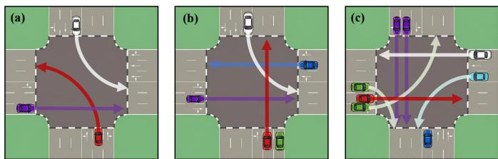  
Fig. 5. No traffic light intersection simulation with different complexity (NOTE: red as ego-vehicle; Scene A: Turn left at intersection only with multiple ahead interaction; Scene B: Straight across at intersection with multiple ahead and single aside interaction; Scene C: Straight across at intersection with multiple ahead and multiple aside interaction).

45-th second with initial speed 10 m/s & 8 m/s turning right & left respectively.

Taking the above SUMO simulation as environment, our proposed Brain-SAD is implemented in Python 3.7.1, PyTorch 1.9.1, where by adopting Traffic Control Interface (TraCI), we convey the two-dimensional action (i.e., steering angle & vertical acceleration) to the red ego-vehicle in SUMO playing with other neighbor-vehicles, in turn, the SUMO environmental feedback will be back-propagated still via TraCI for training.

When training, each Scene A/B/C in Fig. 5 will be run by one episode (about 60 second) consisting of at most 600 steps with early stopping by success or collision, and in all, we use 150 episodes as one round to train Brain-SAD. During each round, all the explored trajectories $( \{ s _ { t } , a _ { t } , s _ { t + 1 } , r _ { t } , F e a r _ { s _ { t } , a _ { t } } , p o l i c y _ { - } f l a g _ { t } = l o n g / s h o r t , y _ { t } =$ $0 / 1 \}$ will be stored into buffer with adequate size as $| \mathrm { { 1 0 ^ { 6 } } } |$ Specifically, in one episode, each step (600 at most) will bring about once online training via eq (9-11) & eq (15), then at intervals, 5 steps will result in once offline training via eq (20) based on the trajectories in buffer. When one round of 150 episodes completed, evaluation metrics of the current round will be computed, then averaged by 3 rounds for comparison. The above online-offline training has been conducted on NVIDIA GeForce RTX 2080 Ti, 32 GB memory (local workstation) and Intel Xeon Gold 6459C, 64 GB memory (online server), with source codes on detailed configuration at https://github.com/cy-research-lab/Brain-SAD.

Finally, we compute 5 offline metrics based on trajectories in buffer, including average Task Complete Time or Travel Time (TCT) [36] of one-episode running on the given scene, Success Rate (SR) [36] as non-collision ending at episode-level, average cumulative Reward [36] across episode, Speed Limit Compliance (SLC) [37] as the nonoverspeed rate in one-episode, Comfortable [37] as the average speed stability rate between adjacent steps across episode. We also compute 2 online metrics that after egovehicle makes action at each step in one-episode, we compute Time-to-Collision (TTC) [38] by the latest relative distance from ego- to neighbor-vehicles, further derive Recovery Time (RECT) as the average duration of ego-vehicle to react when TTC< τ , and Median TTC as the overall safe distance maintenance after ranking across steps in episode6. Obviously, except TCT & RECT, all the other 5 metrics are the higher, the better.

## 4.2 Ablation Study

Based on the above experimental setting, we first turn to the ablation study of Brain-SAD shown in Table 1 for Scene A and Table 2 for Scene B, where 10 variants or combos have been derived from Brain-SAD to ascertain the effectiveness of policy selection, long-term policy and shortterm policy.

Similar tendency has been detected in both Table 1 and Table 2 that, with the increase on interaction complexity from Scene A to Scene B, the FULL-version of Brain-SAD (Combo 1, see Fig. 2) has outperformed the single long-term (Combo 5) and single short-term policy (Combo 8) across all the metrics. Based on such the observation, it can be further detected that, the SR, Reward and SLC deteriorate from FULL-version, followed by single long-term, ending at single short-term in order (see Table 1 & 2). However, fluctuations on TCT and Comfortable have occurred across Table 1 & 2, where the long-term policy with higher TCT (in Table 1) needs more time to complete episode than short-term policy, and in Table 2, long-term policy has lower Comfortable speed stability than that of short-term policy, proving that merely long-term policy is inadequate to handle vehicle interaction with higher complexity (e.g., Scene B). Consequently, the collaboration between longterm and short-term policy (FULL-version in Table 1 & 2) by policy selection in eq (4), has ensured Brain-SAD to complete AD task most successfully with best efficiency and speed steadily when facing different interaction complexity.

Next, diving into each branch in Table 1 & Table 2 that, for Combo 1-4 on policy selection, we retain dual-path policy while gradually deducting State Deviation (Combo 2), Collision Rate (Combo 3) from scene imagination (see $( \stackrel {  } { p } _ { t + 1 } ^ { c o l , t + L } , \bar { \sigma } _ { t + 1 } ^ { U , t + L } )$ in eq (2-3) used to perceive fear-signal $F e a r _ { s _ { t } , a _ { t } ^ { \theta _ { t - 1 } } } ) _ { . }$ , finally discarding whole scene imagination (Combo 4). In this way, the policy selection via 5-HT & NE (Calmness & Nervousness) competition in eq (4) will degrade as random selection, or the worst in Combo 4. Following the above deduction, we focus on the dynamic constraint of long-term policy in Combo 5-7, keeping longterm reward $Q _ { \mathrm { r e w a r d } } ^ { s _ { t } , A _ { t } ^ { \theta _ { t - 1 } } }$ , gradually deleting dynamic fear cost $( \Psi _ { s _ { t } , A _ { \star } ^ { \theta _ { t - 1 } } } ^ { \mathrm { F e a r } } )$ and KL-divergence trust region $D _ { K L } [ \cdot ] \leq \varepsilon _ { K L }$ in eq (8-11), leading to the worst Combo 7 where longterm policy will only be online optimized by long-term reward without dynamic fear-oriented constraint. Similarly, we degrade the short-term policy by gradually removing dynamic fear boundary ${ \Psi } _ { s _ { t } , a _ { t } } ^ { \mathrm { F e a r } } ~ = ~ { \{ } \tau { _ { s a f e } } , b _ { t } ^ { r e q } { \} }$ in eq (15), with Combo 10 as the worst. Consequently, we take the FULL-version of Brain-SAD (see Fig. 1) as the most optimal one to be compared with the existing works.

TABLE 1  
The Ablation Study of Brain-SAD on Scene A (NOTE: all the performances are averaged by three rounds).
<table><tr><td>Combo</td><td>Module Combination</td><td>TCT ↓(s)</td><td>SR↑(%)</td><td>Reward↑</td><td> $\overline { { \mathbf { S L C } \uparrow ( \% ) } }$ </td><td>Comfortable ↑(%)</td></tr><tr><td>1</td><td>Brain-SAD-FULL</td><td> $\overline { { 2 8 . 5 0 \pm 0 . 1 0 } }$  _</td><td> $\overline { { 9 8 . 6 7 \pm 0 . 6 7 } }$ </td><td> $\overline { { 1 0 5 . 7 7 \pm 2 . 5 7 } }$ </td><td> $\overline { { 9 2 . 0 5 \pm 0 . 0 4 } }$ </td><td> $\overline { { 9 2 . 7 0 \pm 0 . 2 8 } }$ </td></tr><tr><td>2</td><td>only State Deviation in Scene Imagination</td><td> $2 9 . 2 0 \pm 0 . 8 0$ </td><td> $9 6 . 2 2 \pm 0 . 3 8$ </td><td> $9 5 . 1 1 \pm 3 . 0 1$ </td><td> $8 7 . 2 9 \pm 0 . 6 7$ </td><td> $8 8 . 9 0 \pm 0 . 9 6$ </td></tr><tr><td>3</td><td>only Collision Rate in Scene Imagination</td><td> $2 8 . 4 0 \pm 0 . 6 0$ </td><td> $9 8 . 4 4 \pm 0 . 7 7$ </td><td> $9 4 . 4 3 \pm 3 . 6 3$ </td><td> $8 9 . 1 0 \pm 0 . 2 8$ </td><td> $9 0 . 1 3 \pm 0 . 0 3$ </td></tr><tr><td>4</td><td>w/o Scene Imagination</td><td> $2 9 . 4 0 \pm 1 . 5 0$ </td><td> $9 5 . 3 3 \pm 1 . 1 5$ </td><td> $8 8 . 4 3 \pm 3 . 5 7$ </td><td> $8 3 . 2 7 \pm 2 . 1 8$ </td><td> $8 6 . 7 0 \pm 0 . 5 5$ </td></tr><tr><td>5</td><td>Brain-SAD only Long Term Policy</td><td> ${ \bf 3 0 . 0 0 \pm 2 . 2 0 }$  _</td><td> ${ \bf 9 7 . 7 8 \pm 0 . 3 8 }$  </td><td> ${ \pm 9 9 . 3 2 \pm 0 . 6 3 }$  </td><td> $8 4 . 5 5 \pm 2 . 4 3$ </td><td> ${ \pm 0 . 6 3 \pm 0 . 0 8 }$ </td></tr><tr><td>6</td><td>w/o Dynamic Fear Cost</td><td> $3 1 . 6 0 \pm 1 . 3 0$ </td><td> $9 6 . 6 7 \pm 1 . 3 3$ </td><td> $8 8 . 3 9 \pm 0 . 1 7$ </td><td> $8 1 . 3 5 \pm 2 . 0 9$ </td><td> $8 5 . 4 0 \pm 0 . 3 4$ </td></tr><tr><td>7</td><td>w/o Dynamic Fear Cost &amp; KL Divergence</td><td> $3 2 . 3 0 \pm 0 . 1 0$ </td><td> $9 4 . 0 0 \pm 0 . 6 7$ </td><td> $8 5 . 6 3 \pm 0 . 0 4$ </td><td> $7 9 . 8 0 \pm 0 . 1 4$ </td><td> $8 3 . 1 8 \pm 0 . 1 4$ </td></tr><tr><td>8</td><td>Brain-SAD only Short Term Policy</td><td> ${ \bf 2 9 . 5 0 \pm 0 . 2 0 }$  </td><td> ${ \pm 0 . 3 3 \pm 0 . 0 0 }$ </td><td> ${ \pm } 5 . 4 3 \pm 0 . 6 4$ </td><td> ${ \bf 8 1 . 8 3 \pm 1 . 7 8 }$ </td><td> ${ \bf 8 2 . 1 0 \pm 0 . 4 0 }$ </td></tr><tr><td>9</td><td>wlo  $b _ { t } ^ { r e q }$  in Dynamic Fear Boundary</td><td> $2 9 . 6 0 \pm 0 . 5 0$ </td><td> $9 3 . 1 1 \pm 1 . 0 2$ </td><td> $8 0 . 7 0 \pm 0 . 9 6$ </td><td> $7 6 . 5 6 \pm 0 . 0 8$ </td><td> $7 7 . 1 0 \pm 0 . 2 0$ </td></tr><tr><td>10</td><td>wlo  $( \tau _ { s a f e } , b _ { t } ^ { r e q } )$  / no Dynamic Fear Boundary</td><td> $3 0 . 6 0 \pm 0 . 6 0$ </td><td> $8 6 . 6 7 \pm 0 . 0 0$ </td><td> $6 9 . 8 8 \pm 0 . 6 8$ </td><td> $6 7 . 5 3 \pm 4 . 9 9$ </td><td> $7 5 . 3 0 \pm 0 . 2 5$ </td></tr></table>

<table><tr><td>Combo</td><td>Module Combination</td><td> $\overline { { \mathrm { { T C T } \downarrow ( \mathbf { s } ) } } }$ </td><td> $\overline { { \mathbf { S R } \uparrow ( \% ) } }$ </td><td> $\overline { { { \bf R e w a r d } \uparrow } }$ </td><td> $\overline { { \mathbf { S L C } \mathrm { \uparrow } ( \% ) } }$ </td><td> $\overline { { \mathrm { ~ C _ { 0 } m f o r t a b l e ~ } \uparrow ( \% ) } }$ </td></tr><tr><td>1</td><td>Brain-SAD-FULL</td><td> ${ \bf 2 2 . 3 0 \pm 0 . 1 0 }$  _</td><td> ${ \pm 0 7 . 5 6 \pm 0 . 3 8 }$ </td><td> $\overline { { \mathbf { 9 4 . 3 5 \pm 0 . 0 5 } } }$ </td><td> ${ \bf 8 8 . 9 1 \pm 0 . 1 7 }$ </td><td> $\overline { { 8 9 . 9 7 \pm 1 . 8 2 } }$ </td></tr><tr><td>2</td><td>only State Deviation in Scene Imagination</td><td> $2 7 . 1 0 \pm 0 . 1 0$ </td><td> $9 7 . 3 3 \pm 0 . 6 7$ </td><td> $8 9 . 9 1 \pm 0 . 2 4$ </td><td> $8 6 . 4 0 \pm 0 . 4 9$ </td><td> $8 7 . 0 0 \pm 0 . 4 0$ </td></tr><tr><td>3</td><td>only Collision Rate in Scene Imagination</td><td> $2 8 . 2 0 \pm 0 . 0 0$ </td><td> $9 6 . 6 7 \pm 1 . 1 5$ </td><td> $8 6 . 3 3 \pm 0 . 2 1$ </td><td> $8 2 . 8 0 \pm 0 . 3 1$ </td><td> $8 6 . 3 0 \pm 1 . 7 0$ </td></tr><tr><td>4</td><td>w/o Scene Imagination</td><td> $2 8 . 6 0 \pm 0 . 6 0$ </td><td> $9 6 . 0 0 \pm 0 . 6 7$ </td><td> $8 0 . 5 6 \pm 0 . 7 8$ </td><td> $8 0 . 6 0 \pm 1 . 0 9$ </td><td> $8 3 . 0 0 \pm 0 . 4 0$ </td></tr><tr><td>5</td><td>Brain-SAD only Long Term Policy</td><td> ${ \bf 2 9 . 8 0 \pm 0 . 1 0 }$  _</td><td> ${ \bf 9 7 . 3 3 \pm 1 . 1 5 }$ </td><td> ${ \bf 8 7 . 7 8 \pm 0 . 2 8 }$ </td><td> ${ \bf 8 6 . 5 0 \pm 1 . 8 0 }$ </td><td> ${ \bf 8 5 . 6 0 \pm 0 . 5 0 }$ </td></tr><tr><td>6</td><td>w/o Dynamic Fear Cost</td><td> $2 9 . 8 0 \pm 0 . 6 0$ </td><td> $9 3 . 5 6 \pm 0 . 7 7$ </td><td> $8 2 . 2 0 \pm 1 . 7 0$ </td><td> $7 6 . 2 0 \pm 1 . 8 3$ </td><td> $8 0 . 8 0 \pm 0 . 6 9$ </td></tr><tr><td>7</td><td>w/o Dynamic Fear Cost &amp; KL Divergence</td><td> $3 0 . 6 0 \pm 0 . 1 0$ </td><td> $9 4 . 8 9 \pm 1 . 0 2 $ </td><td> $7 8 . 5 7 \pm 1 . 6 0$ </td><td> $7 2 . 2 0 \pm 0 . 9 3$ </td><td> $7 7 . 2 0 \pm 0 . 2 2$ </td></tr><tr><td>8</td><td>Brain-SAD only Short Term Policy</td><td> ${ \pm 0 . 3 0 \pm 0 . 3 0 }$  </td><td> $9 3 . 3 3 \pm 0 . 0 0$ </td><td> $\pm 0 . 5 5 \pm 0 . 7 1$ </td><td> ${ \bf 7 8 . 7 0 \pm 0 . 7 9 }$ </td><td> $8 6 . 5 0 \pm 5 . 2 0$ </td></tr><tr><td>9</td><td>wlo  $b _ { t } ^ { r e q }$  in Dynamic Fear Boundary</td><td> $2 4 . 2 0 \pm 0 . 2 0$ </td><td> $9 2 . 0 0 \pm 0 . 6 7$ </td><td> $7 5 . 9 1 \pm 0 . 2 0$ </td><td> $6 6 . 7 0 \pm 1 . 3 1$ </td><td> $7 2 . 6 0 \pm 0 . 5 8$ </td></tr><tr><td>10</td><td>wlo  $( \tau _ { s a f e } , b _ { t } ^ { r e q } )$  / no Dynamic Fear Boundary</td><td> $2 6 . 4 0 \pm 0 . 2 0$ </td><td> $8 2 . 0 0 \pm 1 . 1 5$ </td><td> $6 3 . 3 2 \pm 0 . 5 6$ </td><td> $6 2 . 0 0 \pm 1 . 3 8$ </td><td> $7 0 . 6 0 \pm 0 . 2 8$ </td></tr></table>

LM-based models (Hybrid-Driving, SafeAuto, SimLingo), we use SUMO simulation to construct environment-related resources and take multi-modal scene features along with agent states in SUMO as input. For Brain-Inspired Action Control methods, we select SVPG [25], FoG-RL [27], EFT-RL [28] and Goal-Reducer [29]. All the above are trained in SUMO to as the ego-policy.

## 4.3 Comparative Study

Based on ablation study, we select FULL-version of Brain-SAD (see Fig. 2) in Table 1 & 2 to be compared with the current constrained and brain-inspired action control works directly or indirectly concerning Safe AD listed as follows (see Section II and Appendix C.2. for detailed explanations on the compared methods, with our reproduced codes here7). Moreover, Scene B and Scene C with increasing complexity (see Fig. 5) will be adopted for simulations.

In terms of the effectiveness on the AD task completion across Scene B and Scene C (see Table 3 & Table 4), our proposed Brain-SAD has achieved the most optimal performance with the shortest Task Completion Time (TCT), the shortest Recovery Time (RECT) handling collision risk, the highest Success Rate (SR) reaching the end, along with the highest averaged cumulative Reward compared with the others. Such the advantage has been presented more explicitly in Scene C (see Table 4) when dealing with traffic flows with more ahead and aside interactions. Moreover, we have selected TOP-2 methods in each category by Reward from Table 3 & Table 4 whose training traces on TCT, SR, Collision Rate (CR) and Reward of the best training round (with the highest average cumulative reward consisting of 150 episodes) have been demonstrated in Fig. 6 & Fig. 7 (a)– (d), from which it can be detected that, our proposed Brain-SAD can smoothly converge towards the most optimal level even when facing more complex interaction in Scene C.

For ego-vehicle Policy-Oriented Constrained methods, we select CADRE [16], Iso-Dream++ [18], RLfOLD [17] and MARL-CCE [19]. All the above will act as ego-vehicle policy to be trained in SUMO, so as to feedback trajectories, rewards and others via TraCI. For Environment-Oriented Prior Constrained methods, we select LS-Imagination [20], CarPlanner [21], Hybrid-Driving (LLM-based) [23], SafeAuto (MLLM-based) [24] and SimLingo (VLM-based) [22]. Here, in terms of LS-Imagination & CarPlanner, the state-transition imagination will be pre-trained by SUMO simulation then frozen as the foundation to train Actor/Critic of ego-vehicle. When it comes to the other three

More specifically, for SR, Reward in Table 3 & Table 4, it can be detected that environment-oriented constrained and brain-inspired methods have performed overall better than policy-oriented ones although with fluctuations. Furthermore, when turning to the most complex Scene C in Table 4, those environment-oriented constrained methods achieve better SR and Reward than brain-inspired ones, yet still all below Brain-SAD. Such the tendency can be ascribed to the reason that, compared with the current braininspired methods, only our Brain-SAD has been modeled by the complete perception-determination-action functional mapping in human brain, from fear-oriented policy selection (i.e., AMY→PFC in eq (3-4)) to selective policy execution (i.e., PFC→Striatum) between long-term policy for action distribution optimization in regular evolving scene (see eq (9-11)) and short-term policy for direct action-projection on urgent-braking (see eq (13-15)). That is, the dual-path policy collaboration has brought about higher performance than the single policy of the current methods.

The Comparative Study of Brain-SAD on Scene B (NOTE: the bold font represents the most optimal performance in each column, with the colored as the sub-optimal performance in each category. ALL the performance are averaged by three rounds).
<table><tr><td>NO</td><td>Category</td><td>Methods</td><td> $\overline { { \mathrm { ~ T C T ~ } \downarrow ( \mathbf { s } ) } }$ </td><td> $\overline { { { \bf { R E C T } } \downarrow ( { \bf { s } } ) } }$ </td><td> $\overline { { { \bf S R } \mathrm { \uparrow } ( \% ) } }$ </td><td>Reward↑</td><td> $\overline { { \mathbf { S L C } \mathrm { \uparrow } ( \% ) } }$ </td><td>Comfortable ↑(%)</td><td>Median-TTC↑(s)</td></tr><tr><td>1</td><td rowspan="4">Policy-Oriented Constrained</td><td>CADRE</td><td> $\overline { { 3 6 . 3 0 \pm 0 . 6 0 } }$ </td><td> $\overline { { 0 . 7 1 8 1 \pm 0 . 0 0 3 2 } }$ </td><td> $\overline { { 9 3 . 5 6 \pm 0 . 8 3 } }$ </td><td> $\overline { { 8 5 . 4 5 \pm 0 . 4 4 } }$ </td><td> $\overline { { 8 2 . 3 5 \pm 0 . 5 1 } }$ </td><td> $\overline { { 8 3 . 3 4 \pm 0 . 7 2 } }$ </td><td> $\overline { { 0 . 7 1 6 2 \pm 0 . 0 0 4 5 } }$ </td></tr><tr><td>2</td><td>Iso-Dream++</td><td> $3 0 . 2 0 \pm 0 . 2 0$ </td><td> $0 . 6 2 4 5 \pm 0 . 0 0 5 7$ </td><td> $9 7 . 2 9 \pm 0 . 1 3$  </td><td> $8 6 . 2 3 \pm 0 . 8 2$  </td><td> $8 6 . 1 2 \pm 0 . 1 0$ </td><td> $8 7 . 5 2 \pm 0 . 2 3$ </td><td> $1 . 1 3 8 7 \pm 0 . 0 1 0 2$ </td></tr><tr><td>3</td><td>RLfOLD</td><td> $3 3 . 2 0 \pm 0 . 8 0$ </td><td> $0 . 5 6 6 1 \pm 0 . 0 3 1 0$ </td><td> $9 2 . 0 0 \pm 0 . 9 4$ </td><td> $8 2 . 8 8 \pm 1 . 8 0 $ </td><td> $8 3 . 5 2 \pm 0 . 3 7$ </td><td> $8 4 . 7 5 \pm 2 . 1 1$ </td><td> $1 . 0 2 6 6 \pm 0 . 0 0 5 3$ </td></tr><tr><td>4</td><td>MARL-CCE</td><td> $3 1 . 6 0 \pm 0 . 4 0$ </td><td> $0 . 8 4 1 7 \pm 0 . 0 3 3 5$ </td><td> $9 2 . 6 7 \pm 1 . 1 0$ </td><td> $8 1 . 0 5 \pm 0 . 0 2$ </td><td> $8 1 . 7 2 \pm 2 . 5 8$ </td><td> $8 1 . 1 6 \pm 0 . 0 4$ </td><td> $0 . 7 3 4 0 \pm 0 . 0 0 5 7$ </td></tr><tr><td>5</td><td rowspan="5">Environment-Oriented Prior Constrained</td><td>LS-Imagination</td><td> $\overline { { 3 1 . 2 0 \pm 0 . 6 0 } }$ </td><td> $\overline { { 0 . 6 5 4 7 \pm 0 . 0 1 2 5 } }$ </td><td> $\overline { { 9 6 . 0 3 \pm 0 . 0 0 } }$ </td><td> $\overline { { 8 4 . 5 7 \pm 0 . 0 2 } }$ </td><td> $\overline { { 8 5 . 4 7 \pm 1 . 1 1 } }$ </td><td> $\overline { { 8 5 . 7 7 \pm 0 . 0 6 } }$ </td><td> $\overline { { 1 . 0 9 3 4 \pm 0 . 0 0 1 3 } }$ </td></tr><tr><td>6</td><td>CarPlanner</td><td> $3 3 . 1 0 \pm 0 . 1 0$ </td><td> $0 . 8 3 3 3 \pm 0 . 0 4 7 1$ </td><td> $9 5 . 5 7 \pm 0 . 5 7$ </td><td> $8 4 . 3 7 \pm 0 . 1 4$ </td><td> $8 5 . 3 0 \pm 1 . 7 9$ </td><td> $8 2 . 2 0 \pm 0 . 0 1$ </td><td> $0 . 8 9 5 6 \pm 0 . 0 0 6 0$ </td></tr><tr><td>7</td><td>SimLingo</td><td> $2 6 . 0 0 \pm 0 . 1 0$ </td><td>0.5127 ± 0.0034</td><td> $9 5 . 7 8 \pm 1 . 0 2$ </td><td> $9 3 . 7 9 \pm 0 . 2 9$ </td><td> $9 2 . 1 2 \pm 2 . 1 7$ </td><td> ${ \bf 9 2 . 5 6 \pm 0 . 1 9 }$ </td><td>1.6939 ± 0.0090</td></tr><tr><td>8</td><td>Hybrid-Driving</td><td> $2 5 . 3 0 \pm 0 . 1 0$ </td><td> $0 . 5 2 7 3 \pm 0 . 0 0 1 2$ </td><td> $9 7 . 1 1 \pm 0 . 3 8$  </td><td> $9 4 . 2 6 \pm 0 . 3 3$ </td><td> $9 2 . 0 1 \pm 0 . 2 2$ </td><td> $9 1 . 0 0 \pm 0 . 0 0$ </td><td> $\mathbf { 1 . 7 1 0 7 \pm 0 . 0 0 2 1 }$ </td></tr><tr><td>9</td><td>SafeAuto</td><td> $2 2 . 5 0 \pm 0 . 2 0$ </td><td> $0 . 4 6 0 1 \pm 0 . 0 0 5 4$ </td><td> $9 6 . 6 7 \pm 0 . 0 0$ </td><td> $9 1 . 8 3 \pm 1 . 0 3$ </td><td> $9 1 . 0 2 \pm 0 . 0 0$ </td><td> $9 1 . 0 2 \pm 0 . 0 0$ </td><td> $1 . 6 4 7 0 \pm 0 . 0 0 6 8$ </td></tr><tr><td>10</td><td rowspan="5">Brain-Inspired</td><td>SVPG</td><td> $\overline { { 2 4 . 6 0 \pm 0 . 1 0 } }$ </td><td> $\overline { { 0 . 6 1 0 6 \pm 0 . 0 2 0 1 } }$ </td><td> $\overline { { 9 6 . 8 9 \pm 0 . 3 8 } }$ </td><td> $\overline { { 8 5 . 5 9 \pm 0 . 2 7 } }$ </td><td> $\overline { { 8 5 . 9 8 \pm 0 . 1 0 } }$ </td><td> $\overline { { 8 7 . 0 4 \pm 0 . 0 0 } }$ </td><td> $\overline { { 1 . 2 6 5 3 \pm 0 . 0 0 0 6 } }$ </td></tr><tr><td>11</td><td>FNI-RL</td><td> $2 4 . 9 0 \pm 0 . 4 0$ </td><td> $0 . 5 4 6 6 \pm 0 . 0 2 5 2$ </td><td> $9 6 . 6 7 \pm 1 . 1 5$ </td><td> $8 9 . 1 5 \pm 0 . 4 4$ </td><td> $8 6 . 7 8 \pm 0 . 6 4$ </td><td> $8 7 . 0 1 \pm 1 . 5 9$ </td><td> $0 . 8 4 6 9 \pm 0 . 0 1 0 7$ </td></tr><tr><td>12</td><td>FoG-RL</td><td> $2 4 . 1 0 \pm 0 . 7 0$ </td><td> $0 . 6 4 2 9 \pm 0 . 0 0 2 7$ </td><td> $9 6 . 4 4 \pm 0 . 3 8$ </td><td> $8 5 . 0 8 \pm 0 . 3 5$ </td><td> $8 5 . 4 4 \pm 0 . 6 8$ </td><td> $8 9 . 6 0 \pm 0 . 6 2$ </td><td></td></tr><tr><td>13</td><td>EFT-RL</td><td> $2 9 . 0 0 \pm 1 . 0 0$ </td><td> $0 . 7 2 7 6 \pm 0 . 0 5 2 7$ </td><td> $9 0 . 8 6 \pm 0 . 2 1$ </td><td> $8 7 . 6 2 \pm 1 . 2 1$ </td><td> $8 9 . 5 6 \pm 1 . 4 5$ </td><td> $8 4 . 0 5 \pm 0 . 1 4$ </td><td> $1 . 1 5 3 3 \pm 0 . 0 1 1 8$ </td></tr><tr><td>14</td><td></td><td> $2 6 . 4 0 \pm 0 . 2 0$ </td><td></td><td> $9 6 . 0 0 \pm 0 . 6 7$ </td><td></td><td></td><td></td><td> $1 . 0 9 3 5 \pm 0 . 0 1 9 3$ </td></tr><tr><td>15</td><td></td><td>Goal-Reducer Brain-SAD (Ours)</td><td> ${ \pm 2 . 3 0 \pm 0 . 1 0 }$ </td><td> $0 . 6 5 2 0 \pm 0 . 0 0 2 5$   $\mathbf { 0 . 4 5 8 6 \pm 0 . 0 0 3 9 }$ </td><td> ${ \pm 0 7 . 5 6 \pm 0 . 3 8 }$  </td><td> $8 6 . 3 8 \pm 0 . 9 3$   ${ \pm } \mathbf { 0 . } 3 5 \pm \mathbf { 0 . 0 5 }$ </td><td> $8 3 . 7 2 \pm 0 . 0 3$   $8 8 . 9 1 \pm 0 . 1 7$ </td><td>84.39 ± 0.11  $8 9 . 9 7 \pm 1 . 8 2 $ </td><td>0.9887 ± 0.0020  $1 . 0 0 1 4 \pm 0 . 0 0 1 2$ </td></tr></table>

TABLE 4

<table><tr><td>NO</td><td>Category</td><td>Methods</td><td> $\overline { { \mathrm { ~ T C T ~ } \downarrow ( \mathsf { s } ) } }$ </td><td> $\overline { { { \bf { R E C T } } \downarrow ( { \bf { s } } ) } }$ </td><td>SR↑(%)</td><td> $\overline { { \mathbf { R e w a r d } \uparrow } }$ </td><td> $\overline { { \mathbf { S L C } \mathrm { \uparrow } ( \% ) } }$ </td><td> $\overline { { \mathrm { { C o m f o r t a b l e } \uparrow ( \% ) } } }$ </td><td></td><td> $\mathbf { \overline { { M e d i a n { \cdot } T T C \uparrow } } } ( s )$ </td></tr><tr><td>1</td><td></td><td>CADRE</td><td> $2 8 . 8 0 \pm 0 . 3 0$ </td><td> $\overline { { 0 . 7 2 6 1 \pm 0 . 0 2 2 3 } }$ </td><td> $\overline { { 8 9 . 5 6 \pm 2 . 5 2 } }$ </td><td> $\overline { { 9 0 . 4 5 \pm 0 . 9 0 } }$ </td><td> $\overline { { 7 6 . 2 0 \pm 0 . 1 2 } }$ </td><td> $\overline { { 7 9 . 9 1 \pm 0 . 5 4 } }$ </td><td></td><td> $\overline { { 1 . 0 7 1 2 \pm 0 . 0 0 5 0 } }$ </td></tr><tr><td>2</td><td>Policy-Oriented</td><td>Iso-Dream++</td><td> $4 7 . 3 0 \pm 0 . 9 0$ </td><td> $0 . 6 4 7 5 \pm 0 . 0 3 8 0$ </td><td> $9 4 . 4 4 \pm 0 . 7 7$ </td><td> $9 3 . 9 8 \pm 0 . 4 4$ </td><td> $8 4 . 2 7 \pm 1 . 3 4$ </td><td></td><td> $8 5 . 9 5 \pm 0 . 0 2$ </td><td> $\mathbf { 1 . 5 6 5 7 \pm 0 . 0 1 5 9 }$ </td></tr><tr><td>3</td><td>Constrained</td><td>RLfOLD</td><td> $4 1 . 7 0 \pm 0 . 1 0$ </td><td> $0 . 7 4 7 7 \pm 0 . 0 2 5 2$ </td><td> $8 9 . 5 6 \pm 1 . 0 2 $ </td><td> $8 8 . 1 5 \pm 0 . 3 4$ </td><td> $7 8 . 0 8 \pm 0 . 1 4$ </td><td></td><td> $7 8 . 8 4 \pm 0 . 1 4$ </td><td> $1 . 2 0 1 7 \pm 0 . 0 0 3 2$ </td></tr><tr><td>4</td><td></td><td>MARL-CCE</td><td> $4 2 . 0 0 \pm 0 . 5 0$ </td><td> $0 . 6 6 7 2 \pm 0 . 0 0 6 5$ </td><td> $9 0 . 0 0 \pm 0 . 0 0$ </td><td> $9 1 . 2 2 \pm 0 . 0 9$ </td><td> $7 9 . 9 6 \pm 0 . 1 5$ </td><td></td><td> $8 1 . 4 7 \pm 0 . 0 3$ </td><td> $1 . 4 3 4 1 \pm 0 . 0 0 2 2$ </td></tr><tr><td>5</td><td></td><td>LS-Imagination</td><td> $\overline { { 3 1 . 2 0 \pm 1 . 4 0 } }$ </td><td> $\overline { { 0 . 6 9 5 5 \pm 0 . 0 2 4 3 } }$ </td><td> $\overline { { 9 1 . 3 3 \pm 0 . 6 7 } }$ </td><td> $\overline { { 9 1 . 9 8 \pm 0 . 4 5 } }$ </td><td> $\overline { { 8 0 . 8 9 \pm 1 . 7 2 } }$ </td><td></td><td> $\overline { { 8 3 . 6 4 \pm 1 . 5 7 } }$ </td><td> $\overline { { 1 . 1 6 9 5 \pm 0 . 0 3 6 2 } }$ </td></tr><tr><td>6</td><td>Environment-Oriented Prior Constrained</td><td>CarPlanner</td><td> $3 7 . 1 0 \pm 0 . 5 0$ </td><td> $0 . 6 4 6 4 \pm 0 . 0 1 9 9$ </td><td> $9 5 . 3 5 \pm 1 . 1 5$ </td><td> $9 3 . 2 6 \pm 0 . 6 8$ </td><td> $8 2 . 4 7 \pm 0 . 6 7$ </td><td></td><td> $8 1 . 0 0 \pm 0 . 1 3$ </td><td> $1 . 4 1 5 0 \pm 0 . 0 0 5 3$ </td></tr><tr><td>7</td><td></td><td>SimLingo</td><td> $3 2 . 5 0 \pm 0 . 2 0$ </td><td> $0 . 5 9 5 0 \pm 0 . 0 3 4 2$ </td><td> $9 6 . 3 3 \pm 0 . 4 7$ </td><td> $8 9 . 3 1 \pm 0 . 2 4$ </td><td> ${ \bf 8 6 . 6 5 \pm 0 . 1 2 }$ </td><td></td><td> $8 7 . 6 9 \pm 1 . 1 3$ </td><td> $1 . 2 0 2 1 \pm 0 . 0 0 1 4$ </td></tr><tr><td>8</td><td></td><td>Hybrid-Driving</td><td> $3 9 . 1 0 \pm 0 . 2 0$ </td><td> $0 . 5 4 4 1 \pm 0 . 0 5 2 3$ </td><td> $9 5 . 7 8 \pm 1 . 3 9$ </td><td> $9 3 . 5 5 \pm 0 . 4 7$ </td><td> $8 4 . 1 1 \pm 0 . 4 3$ </td><td></td><td> $8 6 . 0 2 \pm 0 . 0 8$ </td><td> $1 . 4 0 0 7 \pm 0 . 0 0 9 6$ </td></tr><tr><td>9</td><td></td><td>SafeAuto</td><td> $3 1 . 6 0 \pm 0 . 1 0$ </td><td> $0 . 5 3 3 6 \pm 0 . 0 0 8 8$ </td><td> $9 6 . 6 7 \pm 0 . 6 7$ </td><td> $9 3 . 0 7 \pm 0 . 2 3$ </td><td> $8 6 . 2 5 \pm 0 . 0 0$ </td><td></td><td> $\mathbf { 8 8 . 9 3 \pm 0 . 6 0 }$ </td><td> $1 . 3 0 7 9 \pm 0 . 0 0 2 1$ </td></tr><tr><td>10</td><td></td><td>SVPG</td><td> $\overline { { 3 2 . 4 0 \pm 0 . 2 0 } }$ </td><td> $\overline { { 0 . 6 2 0 0 \pm 0 . 0 3 4 0 } }$ </td><td> $\overline { { 9 4 . 0 0 \pm 1 . 3 3 } }$ </td><td>1  $\overline { { 9 3 . 6 0 \pm 0 . 4 7 } }$ </td><td> $\overline { { 8 2 . 2 6 \pm 0 . 7 2 } }$ </td><td></td><td> $\overline { { 8 4 . 9 6 \pm 0 . 0 7 } }$ </td><td> $\overline { { 1 . 2 3 7 0 \pm 0 . 0 0 3 0 } }$ </td></tr><tr><td>11</td><td></td><td>FNI-RL</td><td> $3 0 . 9 0 \pm 1 . 5 0$ </td><td> $0 . 6 0 4 0 \pm 0 . 0 0 9 0$ </td><td> $9 3 . 4 8 \pm 1 . 7 2$ </td><td> $9 2 . 9 1 \pm 0 . 5 9$ </td><td> $8 4 . 4 3 \pm 0 . 8 6$ </td><td></td><td> $8 6 . 1 9 \pm 2 . 0 7$ </td><td> $1 . 1 3 6 0 \pm 0 . 0 3 0 0$ </td></tr><tr><td>12</td><td>Brain-Inspired</td><td>FoG-RL</td><td> $3 2 . 9 0 \pm 2 . 0 0$ </td><td> $0 . 6 5 5 9 \pm 0 . 0 3 0 2$ </td><td> $9 3 . 1 1 \pm 0 . 3 8$ </td><td> $8 3 . 3 3 \pm 0 . 1 1$ </td><td> $8 0 . 4 2 \pm 0 . 9 7$ </td><td></td><td> $8 3 . 9 6 \pm 0 . 7 8$ </td><td> $1 . 2 1 9 0 \pm 0 . 0 1 7 0$ </td></tr><tr><td>13</td><td></td><td>EFT-RL</td><td> $5 1 . 7 0 \pm 0 . 7 0$ </td><td> $0 . 9 2 7 0 \pm 0 . 0 1 8 0$ </td><td> $7 6 . 8 9 \pm 2 . 5 2$ </td><td> $9 0 . 0 0 \pm 0 . 4 9$ </td><td> $7 5 . 3 5 \pm 0 . 2 0$ </td><td></td><td> $8 1 . 3 8 \pm 0 . 0 4$ </td><td>1.4560 ± 0.0060</td></tr><tr><td>14</td><td></td><td>Goal-Reducer</td><td> $3 2 . 8 0 \pm 0 . 3 0$ </td><td> $0 . 7 1 8 1 \pm 0 . 0 0 5 8$ </td><td> $9 2 . 0 0 \pm 2 . 0 0$ </td><td> $8 8 . 6 1 \pm 0 . 7 3$ </td><td> $7 4 . 9 3 \pm 0 . 1 7$ </td><td></td><td> $8 2 . 6 5 \pm 0 . 1 1$ </td><td> $0 . 9 7 7 4 \pm 0 . 0 0 2 6$ </td></tr><tr><td>15</td><td></td><td>Brain-SAD (Ours)</td><td> ${ \bf 2 8 . 1 0 \pm 0 . 0 0 }$ </td><td> $\mathbf { 0 . 5 2 6 3 \pm 0 . 0 1 9 4 }$ </td><td> ${ \bf 9 7 . 1 1 \pm 0 . 7 7 }$ </td><td> ${ \bf 9 4 . 1 5 \pm 0 . 2 8 }$ </td><td> $8 6 . 1 2 \pm 0 . 0 7$ </td><td></td><td> $8 7 . 9 3 \pm 0 . 7 0$ </td><td>1.1011 ± 0.0043</td></tr></table>

state, weak connection with action impact), uncontrollable dynamics correction as policy input in Iso-Dream++ (no direct guiding on action distribution optimization), hazard action exploration in Hybrid-Driving (still as offline trajectory for replay).

Particularly, for FNI-RL, Iso-Dream++, Hybrid-Driving in Table $3 \ \&$ Table 4, although they have incorporated counterpart fear-constraint like Brain-SAD, only our Brain-SAD has coupled the dynamic fear constraint altering across scenarios with policy Value Estimation to online guide policy optimization. That ${ \mathrm { i } } \mathbf { s } ,$ in Brain-SAD, the overall impact after adopting action $a _ { t }$ has been estimated as dynamic fear constraint consisting of long-term reward & long-term fear-cost (see $Q _ { R e w a r d } ^ { s _ { t } , A _ { t } ^ { \theta _ { t - 1 } } } - \Psi _ { s _ { t } , A _ { t } ^ { \theta _ { t - 1 } } } ^ { F e a r }$ in eq (5-6)) , further resolved into the most optimal posterior action weights as the supervisory constraint to directly update the current policy action distribution online (see eq (11)). In this way, different actions will lead to different long-term fearreaction $( Q _ { R e w a r d } ^ { s _ { t } , A _ { t } ^ { \theta _ { t - 1 } } } - \Psi _ { s _ { t } , A _ { t } ^ { \theta _ { t - 1 } } } ^ { F e a r } ) .$ , resulting in different policy update directions. Consequently, in Brain-SAD, the causality between action and its corresponding fear-reaction has been maintained and incorporated into online policy update, which is different from the state-level fear-cost scoring in brain-inspired FNI-RL (fear-cost is statically projected from

It is worthwhile to be noted when observing TCT, RECT, SLC, Comfortable and Median-TTC in Table 3 (Scene B) & Table 4 (Scene C), another phenomenon has been detected on Brain-SAD. That is, our Brain-SAD can perform faster and better (i.e., lower TCT, RECT with higher SR, Reward), yet somewhat aggressive on speeding in confidence while still within acceptable scope (i.e., lower speed compliance in SLC, higher adjacent speeding to be not Comfortable, resulting in shorter median Time-to-Collision (Median-TTC) or shorter relative distance towards neighbors). Such the phenomenon can be explained as in terms of the long-term policy for regular scene-evolving in Brain-SAD, once the dynamic fear constraint has provided the right policy direction, the $D _ { K L } [ \cdot ] \leq \varepsilon _ { K L }$ KL-divergence in Lagrange Objective (see eq $( 8 ) \ \& \ ( 1 1 ) )$ will refine policy update within trust region preventing dramatic policy shift, so as to be formed into stable behaviour pattern. That is, in Fig. 6 & Fig. 7 (e)–(h), we select TOP-1 methods in each category from Table 3 & 4, scatter their adopted actions across the best episode (selected from the best training round in Fig. 6 & Fig. $7 \ ( a ) – ( d ) )$ , fully-connect all the (steer, accelerate) actions as distribution, where in Fig. 6 & Fig. 7 (e)–(h), Brain-SAD has finally converged to positive acceleration as fixed pattern, behaving confident speeding in the shortest TCT

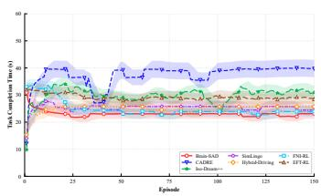  
(a) Task Completion Time

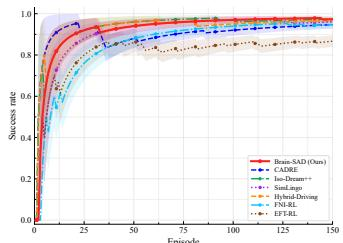  
(b) Success Rate

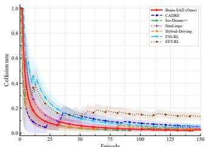  
(c) Collision Rate

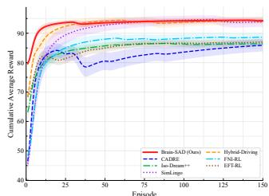  
(d) Cumulative Average Reward

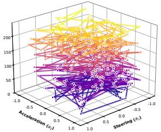  
(e) Iso-Dream++ action distribution

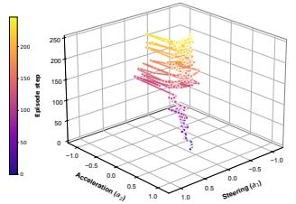  
(f) Hybrid-Driving action distribution

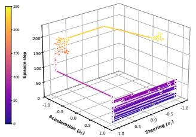  
(g) FNI-RL action distribution

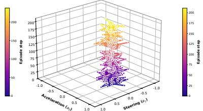  
(h) Brain-SAD action distribution

Fig. 6. The training traces and action distributions on representative methods selected from Table 3, simulated in Scene B. (NOTE: In (a)–(d), we present training traces on methods with TOP 2 Reward reported in Table 3; Here, the Reward are the average cumulative reward on the best training round (150 episodes, 3 rounds in all); In (e)–(h), we present action distributions across the best episode (selected in the above best training round) on methods with TOP 1 Reward reported in Table 3, X-axis for acceleration positive as speeding, Y-axis for steering angle, Z-axis for temporal steps in the best episode.)  
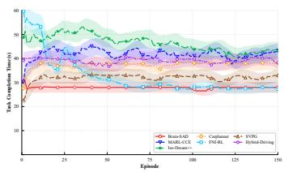  
(a) Task Completion Time

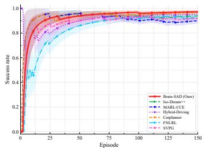  
(b) Success Rate

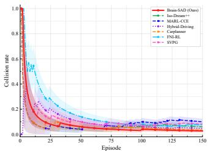  
(c) Collision Rate

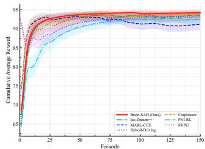  
(d) Cumulative Average Reward

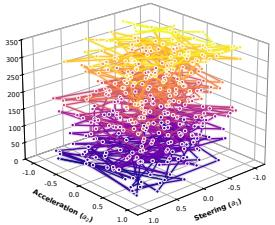  
(e) Iso-Dream++ action distribution

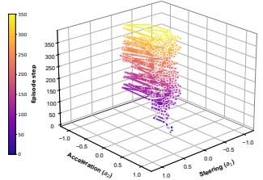  
(f) Hybrid-Driving action distribution

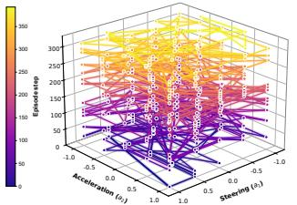  
(g) SVPG action distribution

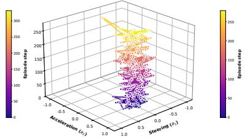  
(h) Brain-SAD action distribution  
Fig. 7. The training traces and action distributions on representative methods selected from Table 4, simulated in Scene C. (NOTE: In (a)–(d), we present training traces on methods with TOP 2 Reward reported in Table 4; Here, the Reward are the average cumulative reward on the best training round (150 episodes, 3 rounds in all); In (e)–(h), we present action distributions across the best episode (selected in the above best training round) on methods with TOP 1 Reward reported in Table 4, X-axis for acceleration positive as speeding, Y-axis for steering angle, Z-axis for temporal steps in the best episode.)

## 4.4 Stress Test by Continuous Intersections

Based on all the mentioned above, in Fig. 8, we further construct 6 continuous intersections as Stress Test on Brain-SAD to ascertain whether Brain-SAD could still present corresponding reliability in the long-term driving task. In Fig. 8 (left), the interaction complexity of each intersection has been disturbed (i.e., the density of traffic flow like the number of ahead or aside interactions), making the overall interaction complexity fluctuated as shown in Fig. 8 (right)8. In this way, we select three representative brain-inspired action control methods according to the performance in Table 3 & Table 4 for further discussion, including SVPG [25], spiking RL policy with synaptic plasticity; FNI-RL [26], static state-level fear-cost constrained RL policy; EFT-RL [28], goal-to-subgoal RL policy as human-problem solving.

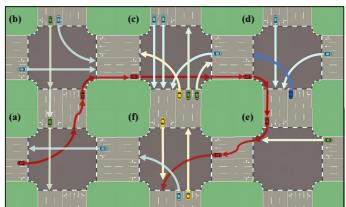

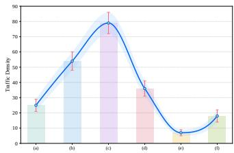  
Fig. 8. The scenario configuration with fluctuated interaction complexity across 6 continuous intersections. (NOTE: the distance between adjacent intersections are not fixed and ignored in Fig. 8)

First, as shown in Table 5, our proposed Brain-SAD can still maintain faster and better even in Stress Test, achieving the highest SR and Reward with the shortest TCT and RECT time across 6 continuous intersections shown in Fig. 8. We also open up the training traces on TCT, SR, Collision Rate (CR) and Reward across the best training round (with the highest average cumulative reward) in Fig. 9 (a)–(d), where Brain-SAD has behaved better than SVPG, FNI-RL and EFT-RL with more obvious convergence at the most optimal level. Such the observation proves that by imposing dynamic fear constraint coupled with action-impact (or Value Estimation) (see eq (5–8)), our proposed Brain-SAD has the reliability to resist the varying environmental disturbance, where the policy action distribution of Brain-SAD can be online optimized by the most optimal posterior-derived action weights (see eq (9–11)), adaptive to the evolving intersections in time.

Second, our proposed Brain-SAD has achieved the most optimal SLC, Comfortable in Table 5. That is, across the 6 continuous intersections with fluctuated complexity, Brain-SAD has been adapted to continuous scene-evolving with higher Speed Compliance (SLC), higher stability on adjacent speeding to be Comfortable. For Median-TTC (Time-to-Collision, reflected by relative distance to neighbors) in Table 5, although our Brain-SAD has achieved the suboptimal level than that of EFT-RL, yet the TCT on task completion and RECT on collision avoidance of EFT-RL is much longer than Brain-SAD. Such the phenomenon can be further explained by the action distribution shown in Fig. 9 (e)–(h), where we scatter and fully-connect all the (steer, accelerate) actions across the best episode selected in Fig. 9 (a)–(d). It can be detected in Fig. 9 (h) that, even facing continuous scene-evolving with fluctuated interaction complexity, Brain-SAD has still converged to fixed pattern with acceleration crowding at (-0.5-braking, 0.5-speeding) scope. However, since EFT-RL makes its own actions by predicting others to avoid collision, more fierce action shaking has occurred (see Fig. 9 (g)), presenting the characteristic as slower in task completion, better kept in relative distance (or higher Median-TTC in Table 5).

Consequently, based on the fierce action distribution shaking of SVPG, FNI-RL, EFT-RL (see Fig. 9 (e)–(g)), it can be drawn that the compared brain-inspired policy mainly learns how to avoid collision, while according to the converged action distribution of Brain-SAD in Fig. 9 (h), our Brain-SAD can learn-then-handle collision with constant speeding/braking in confidence, thus leading to the closer distance to neighbors. Such the conclusion can also be observed in Fig. 10, where the interaction trajectories with action intensity across 6 intersections have been compared between FNI-RL and Brain-SAD. It can be detected that compared with FNI-RL, Brain-SAD has passed each intersection with smoother traces in lower action intensity.

Finally, in Fig. 11, we fetch the best episode of Brain-SAD, SVPG, FNI-RL and EFT-RL, based on which we further compare their adaptability or reliability against the varying interaction complexity across the 6 continuous intersections in Fig. 8 (right). In Fig. 11 (a), we compare the perceptional fear-reaction of Brain-SAD and FNI-RL, where the purple line represents the static state-projected fearsignal of FNI-RL, with the brown line as dynamic fear signal of Brain-SAD computed by eq (3). The background in light blue and pink respectively means long- or short-term policy selected at each step. It can be observed in Fig. 11 (a) that Brain-SAD has better environmental adaptation, or better dynamic fear perception than FNI-RL, where the fear-signal of Brain-SAD gradually decrease when entering into longterm policy, presenting more coordinated tendency to the interaction complexity (easy-hard-easy) across 6 intersections configured in Fig. 8 (right).

TABLE 5  
The performance of Brain-SAD on continuous Stress Test across 6 intersections in Fig. 8 (NOTE: the bold font represents the most optimal performance in each column, with the colored as the sub-optimal in each column. ALL the performance are averaged by three rounds).
<table><tr><td>NO</td><td>Method</td><td>TCT ↓(s)</td><td>RECT ↓(s)</td><td>SR↑(%)</td><td>Reward↑</td><td>SLC ↑(%)</td><td>Comfortable ↑(%)</td><td>Median-TTC↑(s)</td></tr><tr><td>1</td><td>SVPG</td><td> $1 5 7 . 0 0 \pm 1 . 7 0$ </td><td> $\overline { { 0 . 6 8 6 8 \pm 0 . 0 1 4 5 } }$ </td><td> $\overline { { 8 8 . 8 9 \pm 2 . 3 4 } }$ </td><td> $\overline { { 8 9 . 4 9 \pm 0 . 5 2 } }$ </td><td> $\overline { { 8 2 . 3 3 \pm 1 . 3 2 } }$ </td><td> $8 2 . 2 6 \pm 0 . 1 5$ </td><td> $1 . 3 2 7 8 \pm 0 . 0 0 2 0$ </td></tr><tr><td>2</td><td>FNI-RL</td><td> $1 2 0 . 9 0 \pm 1 7 . 6 0$  _</td><td> $0 . 6 5 0 7 \pm 0 . 0 0 2 7$ </td><td> $9 2 . 2 2 \pm 0 . 3 8$ </td><td> $9 1 . 1 4 \pm 4 . 0 8$  </td><td> $8 4 . 4 3 \pm 0 . 5 0$ </td><td> $8 3 . 4 3 \pm 0 . 1 5$ </td><td> $1 . 2 4 8 8 \pm 0 . 1 1 3 2$ </td></tr><tr><td>3</td><td>EFT-RL</td><td> $2 3 8 . 7 0 \pm 2 1 . 7 0$ </td><td> $0 . 7 8 6 8 \pm 0 . 0 4 4 4$ </td><td> $8 0 . 4 4 \pm 1 1 . 1 6$ </td><td> $8 6 . 3 8 \pm 2 . 9 2$ </td><td> $7 7 . 2 8 \pm 2 . 4 3$ </td><td> $7 9 . 5 3 \pm 1 . 4 3$ </td><td> $\mathbf { 1 . 5 4 1 8 \ : \pm 0 . 0 8 9 9 }$ </td></tr><tr><td>4</td><td>Brain-SAD</td><td> ${ \bf 9 9 . 9 0 \pm 0 . 7 0 }$ </td><td> $\mathbf { 0 . 5 7 0 2 \pm 0 . 0 1 0 9 }$ </td><td> ${ \pm } \mathbf { 0 . 0 0 } \pm \mathbf { 0 . 6 7 }$ </td><td> ${ \bf 9 7 . 3 7 \pm 0 . 1 7 }$ </td><td> ${ \pm } 5 . 8 8 \pm 0 . 0 2$ </td><td> ${ \bf 8 6 . 7 3 \pm 0 . 0 5 }$ </td><td> $1 . 4 3 4 4 \pm 0 . 0 0 6 1$ </td></tr></table>

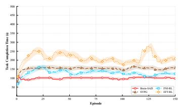  
(a) Task Completion Time

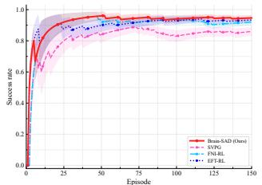

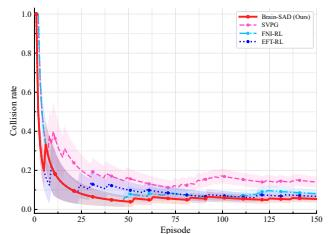  
(b) Success Rate

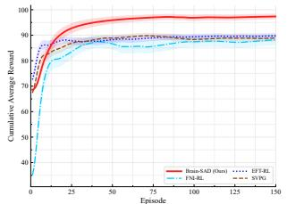

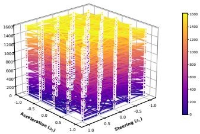  
(e) SVPG action distribution

(c) Collision Rate  
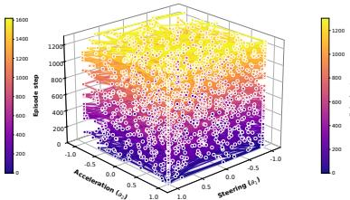  
(f) FNI-RL action distribution

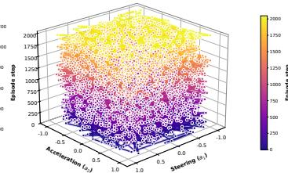  
(g) EFT-RL action distribution

(d) Cumulative Average Reward  
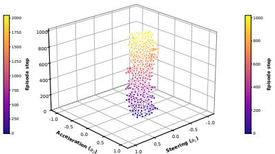  
(h) Brain-SAD action distribution  
Fig. 9. The training traces and action distributions on SVPG, EFT-RL, FNI-RL and Brain-SAD, simulated in 6 continuous intersections shown in Fig. 8. (NOTE: In (a)–(d), we present training traces on methods in Table 5; Here, the Reward are the average cumulative reward on the best training round (150 episodes, 3 rounds in all); In (e)–(h), we present action distributions across the best episode (selected in the above best training round), X-axis for acceleration positive as speeding, Y-axis for steering angle, Z-axis for temporal steps in the best episode.)

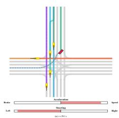  
(a) FNI-RL, 29.1s

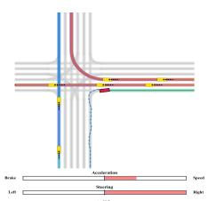  
(b) FNI-RL, 46.2s

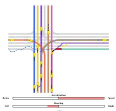

(g) Brain-SAD, 22.6s  
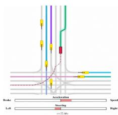

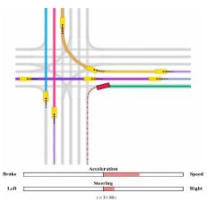  
(c) FNI-RL, 67.5s  
(h) Brain-SAD, 34.8s

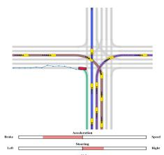

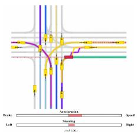  
(i) Brain-SAD, 51.9s

(d) FNI-RL, 84.2s  
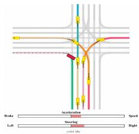

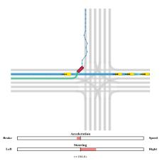  
(e) FNI-RL, 103.4s

(f) FNI-RL, 125.1s  
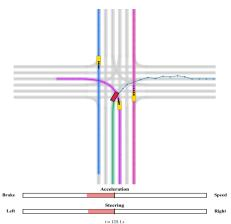

(j) Brain-SAD, 64.1s  
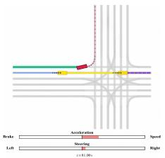

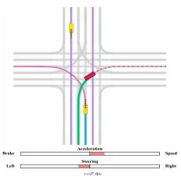  
(k) Brain-SAD, 81.0s  
(l) Brain-SAD, 97.4s

Fig. 10. The driving trace of the ego-vehicle when passing 6 continuous intersections controlled by FNI-RL (a–f) and Brain-SAD (g–l) in the same best episode used in Fig. 9 (e)–(h).  
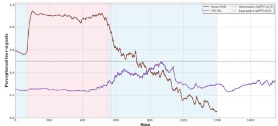  
(a) Perceptional fear-signal comparison

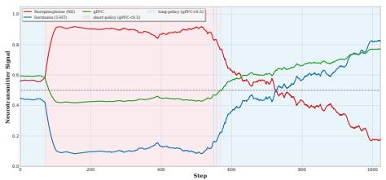

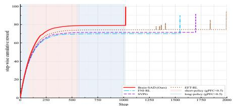  
(b) Policy selection in Brain-SAD  
(c) Policy adaptability comparison  
Fig. 11. Environmental adaptation comparison among Brain-SAD, SVPG, FNI-RL and EFT-RL. (NOTE: Simulated in the 6 continuous intersections in Fig. 8, we compare: (a). Perceptional fear-signals between Brain-SAD and FNI-RL; (b). Policy selection on Brain-SAD based on the fined-grained signals on calmness and nervousness; (c). Policy adaptability by step-wise cumulative reward across continuous intersections trained in the best episode).

In this way, when turning to the policy selection in Fig. 11 (b), our Brain-SAD has transited from short-term policy (in pink background) to long-term policy (in blue background), gradually learning how to handle collision or emergency as the regular evolving scenario via long-term policy. That is, in Fig. 11 (b), the policy selection signal gPFC grows into 1.0 entering long-term policy (see policy selection loss $L _ { \Phi } ^ { \mathrm { s e l e c t i o n } }$ in eq (17)) with distinct opposite tendency between Calmness $S i g n a l _ { 5 - H T } ^ { t }$ and Nervousness $S i g n a l _ { N E } ^ { t }$ constituting gPFC (see eq (4)). Consequently, in Fig. 11 (c), when observing the cumulative reward at each step of Brain-SAD, SVPG, FNI-RL and EFT-RL, our Brain-SAD has obtained steadier reward curve through less steps at higher level, revealing better environmentally coordinated policy guidance effect by the dynamic fear-perception (see Fig. 11 (a) & (c)).

## 5 CONCLUSION & FUTURE WORK

In this paper, we propose Brain-SAD, a dynamic fear constrained RL framework with dual-path policy selection for Safe AD. By a series of experiments, we have discovered that Brain-SAD first has the advantage on environmentally coordinated dynamic fear perception, by which to adopt long-term or short-term policy more properly matched with the current interaction scenario. Second, the above dynamic fear perception has been converted into dynamic fear constraint coupled with action impact or value estimation, further imposed onto online policy optimization, ensuring Brain-SAD can learn how to handle collision with stronger policy reliability against constant environmental disturbance. Finally, the dynamic fear constraint has also enabled Brain-SAD to complete continuous interactions in shorter time and higher success with more stable action distribution. In the future, we will devote effort to explore more fine-grained way to construct dynamic fear constraint, for instance, from value estimation via LM inference in more complex environment.

## REFERENCES

[1] Gu S, Yang L, Du Y, et al. A review of safe reinforcement learning: Methods, theories, and applications. IEEE Transactions on Pattern Analysis and Machine Intelligence, 46(12):11216–11235, 2024.

[2] Li Q, Peng Z, Feng L, et al. MetaDrive: Composing diverse driving scenarios for generalizable reinforcement learning. IEEE Transactions on Pattern Analysis and Machine Intelligence, 45(3):3461– 3475, 2022.

[3] Cheng X, Yuan W, Li B, et al. How does the lagrangian guide safe reinforcement learning through diffusion models? arXiv preprint arXiv:2602.02924, 2026.

[4] Mondal W U, Aggarwal V. Sample-efficient constrained reinforcement learning with general parameterization. Advances in Neural Information Processing Systems, 37:68380–68405, 2024.

[5] Juntao Dai, Yaodong Yang, Qian Zheng, Gang Pan. Safe reinforcement learning using finite-horizon gradient-based estimation. In Proceedings of the 41st International Conference on Machine Learning, volume 235 of Proceedings of Machine Learning Research, pages 9872–9903. PMLR, 2024.

[6] Zhang C, Zhang X, Lan Y, et al. Game-theoretic constrained policy optimization for safe reinforcement learning. IEEE Transactions on Neural Networks and Learning Systems, 36(10):17990–18004, 2025.

[7] Lin S, Wang H, Chen Z, et al. Projection-based fast and safe policy optimization for reinforcement learning. In 2024 IEEE International Conference on Robotics and Automation (ICRA), pages 7426–7432. IEEE, 2024.

[8] Zheng Y, Li J, Yu D, et al. Safe offline reinforcement learning with feasibility-guided diffusion model. In International Conference on Learning Representations, pages 3838–3867, 2024.

[9] Zheng L, Yang R, Zheng M, et al. Occlusion-aware contingency safety-critical planning for autonomous driving. IEEE Transactions on Cybernetics, 56(5):2777–2790, 2026.

[10] Gu S, Sel B, Ding Y, et al. Safe and balanced: A framework for constrained multi-objective reinforcement learning. IEEE Transactions on Pattern Analysis and Machine Intelligence, 47(5):3322–3331, 2025.

[11] Peng Y, Yan H, Liu Q, et al. Safe reinforcement learning for nonlinear multiagent systems based on min-max DMPC. IEEE Transactions on Cybernetics, 56(9):5258–5271, 2026.

[12] Yang Y, Zheng Z, Li S E. On the equilibrium between feasible zone and uncertain model in safe exploration. IEEE Transactions on Pattern Analysis and Machine Intelligence, 48(7):8344–8360, 2026.

[13] Zhang Y, Liang X, Li D, et al. Adaptive safe reinforcement learning with full-state constraints and constrained adaptation for autonomous vehicles. IEEE Transactions on Cybernetics, 54(3):1907– 1920, 2023.

[14] Bonnavion P, Varin C, Fakhfouri G, et al. Striatal projection neurons coexpressing dopamine D1 and D2 receptors modulate the motor function of D1- and D2-SPNs. Nature Neuroscience, 27(9):1783–1793, 2024.

[15] Szabo J P, Heged´ us P, Laszlovszky T, et al. Neurons of the human¨ subthalamic nucleus engage with local delta frequency processes during action cancellation. Nature Communications, 17:5536, 2026.

[16] Zhao Y, Wu K, Xu Z, et al. CADRE: A cascade deep reinforcement learning framework for vision-based autonomous urban driving. Proceedings of the AAAI Conference on Artificial Intelligence, 36(3):3481–3489, 2022.

[17] Coelho D, Oliveira M, Santos V. RLfOLD: Reinforcement learning from online demonstrations in urban autonomous driving. Proceedings of the AAAI Conference on Artificial Intelligence, 38(10):11660–11668, 2024.

[18] Pan M, Zhu X, Zheng Y, et al. Model-based reinforcement learning with isolated imaginations. IEEE Transactions on Pattern Analysis and Machine Intelligence, 46(5):2788–2803, 2023.

[19] Qiao G, Quan G, Qu R, et al. Modelling competitive behaviors in autonomous driving under generative world model. In European Conference on Computer Vision, pages 19–36. Springer Nature Switzerland, 2024.

[20] Li J, Wang Q, Wang Y, et al. Open-world reinforcement learning over long short-term imagination. In International Conference on Learning Representations, pages 30010–30032, 2025.

[21] Zhang D, Liang J, Guo K, et al. CarPlanner: Consistent autoregressive trajectory planning for large-scale reinforcement learning in autonomous driving. In 2025 IEEE/CVF Conference on Computer Vision and Pattern Recognition (CVPR), pages 17239–17248. IEEE, 2025.

[22] Renz K, Chen L, Arani E, et al. SimLingo: Vision-only closedloop autonomous driving with language-action alignment. In 2025 IEEE/CVF Conference on Computer Vision and Pattern Recognition (CVPR), pages 11993–12003. IEEE, 2025.

[23] Wang J, Wu Z, Dong Q, et al. Hybrid-driving: An autonomous driving decision framework integrating large language models, knowledge graphs and driving rules. Proceedings of the AAAI Conference on Artificial Intelligence, 39(1):826–833, 2025.

[24] Zhang J, Yang X, Wang T, et al. SafeAuto: Knowledge-enhanced safe autonomous driving with multimodal foundation models. In Proceedings of the 42nd International Conference on Machine Learning, volume 267 of Proceedings of Machine Learning Research, pages 76497–76517. PMLR, 2025.

[25] Yang Z, Guo S, Fang Y, et al. Spiking variational policy gradient for brain inspired reinforcement learning. IEEE Transactions on Pattern Analysis and Machine Intelligence, 47(3):1975–1990, 2024.

[26] He X, Wu J, Huang Z, et al. Fear-neuro-inspired reinforcement learning for safe autonomous driving. IEEE Transactions on Pattern Analysis and Machine Intelligence, 46(1):267–279, 2023.

[27] Zilin Kang, Chenyuan Hu, et al. A forget-and-grow strategy for deep reinforcement learning scaling in continuous control. In Proceedings of the 42nd International Conference on Machine Learning, volume 267 of Proceedings of Machine Learning Research, pages 28921–28942. PMLR, 2025.

[28] Lee D, Kwon M. Episodic future thinking mechanism for multiagent reinforcement learning. Advances in Neural Information Processing Systems, 37:11570–11601, 2024.

[29] Cheng H, Brown J W. Goal reduction with loop-removal accelerates RL and models human brain activity in goal-directed learning. Advances in Neural Information Processing Systems, 37:3185–3208, 2024.

[30] Wang C, Wang L, Lu Z, et al. Autonomous driving via braininspired causality-aware contrastive learning with time-frequency prediction. IEEE Internet of Things Journal, 12(14):26371–26386, 2025.

[31] Xing D, Yang Y, Zhang T, et al. A brain-inspired approach for probabilistic estimation and efficient planning in precision physical interaction. IEEE Transactions on Cybernetics, 53(10):6248– 6262, 2022.

[32] Tovote P, Fadok J P, Luthi A. Neuronal circuits for fear and anxiety.¨ Nature Reviews Neuroscience, 16(6):317–331, 2015.

[33] Garcia R, Vouimba R M, Baudry M, et al. The amygdala modulates prefrontal cortex activity relative to conditioned fear. Nature, 402(6759):294–296, 1999.

[34] Chen X, Li Y, Cao X, et al. Universal stabilization for maximum entropy optimization in reinforcement learning. IEEE Transactions on Neural Networks and Learning Systems, 37(4):1851–1863, 2025.

[35] Guan Y, Tang L, Lyu Y, et al. Enhanced integrated decision and control for high-level automated vehicles and its experiment verification. IEEE Transactions on Automation Science and Engineering, 2026. doi: 10.1109/TASE.2026.3695533.

[36] Liu S, Chen X, Zhao Y, et al. Comfort-aware lane change planning with exit strategy for autonomous vehicle. IEEE Transactions on Knowledge and Data Engineering, 36(7):2927–2941, 2024.

[37] Wu W, He H, Zhang C, et al. Towards autonomous micromobility through scalable urban simulation. In Proceedings of the IEEE/CVF Conference on Computer Vision and Pattern Recognition (CVPR), pages 27553–27563, 2025.

[38] Jin G, Li Z, Leng B, et al. Hybrid action-based reinforcement learning for multiobjective compatible autonomous driving. IEEE Transactions on Neural Networks and Learning Systems, 2026. doi: 10.1109/TNNLS.2026.3674573.