# Breaking the Uniformity Trap: Scaling Video Diffusion Model via SplitMoE

Yu Xu∗1,2, Yuxin Zhang2†, Xiao Yang3, Haotian Yang2, Yizhi Wang2 Xinwei Huang2, Minxuan Lin2, Angtian Wang2, Chongyang Ma2, Fan Tang4

1University of Chinese Academy of Sciences, 2ByteDance 3Canva Research, 4University of Science and Technology Beijing †Corresponding Author

## Abstract

Mixture-of-Experts (MoE), popularized by large language models, is a promising paradigm for scaling visual generative models. However, conventional token-wise MoE routes tokens independently within a homogeneous expert pool and regularizes expert usage toward uniformity, making it poorly matched to video data that is spatiotemporally redundant and semantically long-tailed. We show that existing visual MoEs fall into a uniformity trap: semantically under-organized routing, compounded by uniform expert-usage regularization, scatters coherent patches across disparate experts, causing routing fragmentation and structural distortion. To address this, we propose SplitMoE, a split-role sparse architecture that breaks the shackles of uniformity. To accommodate the inherent semantic imbalance, we explicitly bifurcate the expert pool into semantic experts and generic experts, with semantic experts capturing high-level semantic abstraction and generic experts preserving residual visual information and flexible generative capacity. Leverag ing prototype-guided routing and pull-push regularization, SplitMoE enables tokens to cluster naturally by semantic attributes rather than arbitrary balancing constraints. Extensive results show that under an equivalent activated-parameter budget, SplitMoE outperforms traditional load-balanced MoEs in convergence speed, routing coherence, and video generation quality across standard benchmarks. By revealing an emergent coarse-to-fine denoising logic, SplitMoE provides the community with a modality-aware scaling path, serving as a critical reference for building large-scale video world models.

Date: Sept 30, 2026   
Venue: NeurIPS 2026 (Spotlight)   
€ Project Page: https://yuci-gpt.github.io/SplitMoE/

## 1 Introduction

Difusion Transformers (DiTs) [24] have made significant advances in high-fidelity video generation [7, 8, 14, 20], yet scaling their parameters to capture complex motion remains computationally prohibitive. Mixture-of-Experts (MoE) provides a promising path toward scalable modeling by decoupling total model capacity from active FLOPs. However, standard MoE architectures are developed for language models [3, 4, 15];

Semantic Aligned Routing  
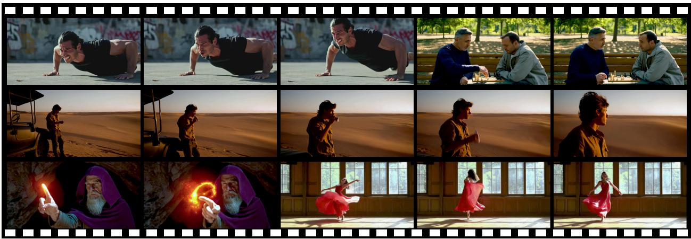

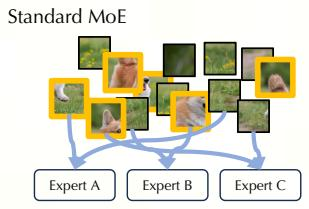

(a) Clips generated by SplitMoE  
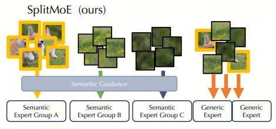  
(b) Intuitive explanation for standard MoE and the proposed SplitMoE

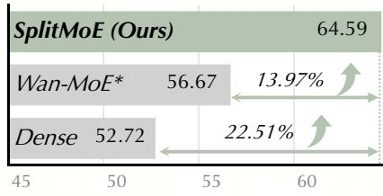  
(c) Overall Score on Vbench-2  
Figure 1 SplitMoE scales video difusion models by introducing semantic-aligned expert partitioning, reducing spatiotemporal fragmentation, and generating higher-quality videos than dense fine-tuning and WAN with a standard MoE.

nevertheless, current visual generative models [5, 31, 43] often naively adopt these language-centric designs, taking their cross-modal efectiveness for granted and assuming that mechanisms optimized for discrete syntax will naturally generalize to the highly redundant and heterogeneous spatiotemporal tokens of video.

In this study, we revisit one of the fundamental settings of standard MoE: load-balancing mechanisms which enforce tokens’ statistical uniformity across available experts when training. We argue that such unique distributional characteristics are poorly aligned with the unstructured and imbalanced nature of video data. While language tokens are often organized into distinguishable semantic units by discrete syntax, video tokens are highly imbalanced across diferent regions. Unconstrained sparse routing in video difusion features can therefore produce spatiotemporal fragmentation: neighboring patches from the same coherent object may be dispatched to diferent experts, while visually redundant background patches may dominate multiple experts (as illustrated in Fig. 1(b)).

To investigate such a “uniformity trap”, we compare the self-similarity patterns of language and visual tokens in Fig. 2(a). Unlike language tokens exhibiting relatively high entropy and low cohesion, visual tokens are densely correlated and spatially continuous. Directly routing such tokens leads the experts to redundantly specialize in ubiquitous visual patterns rather than distinct semantic entities. We further group video tokens with of-the-shelf semantic segmentation masks and analyze their routed experts in Fig. 2. Two complementary properties are measured: semantic distinctiveness (Fig. 2(b)) evaluates whether diferent semantic classes are assigned to more category-specific experts, and intra-sample routing dominance (Fig. 2(c)) evaluates whether tokens from the same semantic region are consistently routed to the same expert. High values in both metrics indicate routing that is discriminative across semantic classes and coherent within each semantic region. Standard MoE has consistently low semantic distinctiveness and routing dominance across most semantic classes, indicating that tokens from the same region are often dispersed across experts. Enforcing strict uniform allocation may therefore amplify spatiotemporal fragmentation, since tokens within semantically coherent regions are forced into uniform routing patterns.

Visual Tokens  
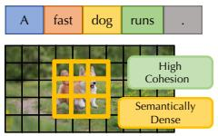  
Text Tokens  
(a) Self-similarity comparisons for text and visual tokens.

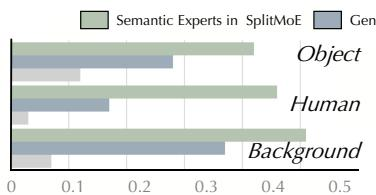  
(b) Different Semantic Different Experts

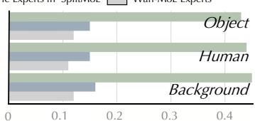  
(c) Same Semantic Same Experts  
Figure 2 Motivation for semantic-aware Video-MoE routing. Visual tokens exhibit much stronger cohesion than text tokens, making uniform MoE routing prone to fragmented assignments. Compared with standard MoE, SplitMoE routes tokens from diferent semantic regions to more distinguishable experts while assigning tokens within the same semantic region to more consistent expert groups.

Motivated by these observations, we propose SplitMoE, a structured routing framework that separates semantic abstraction from general visual residual modeling. As shown in Fig. 1(b), SplitMoE partitions experts into a semantic branch and a generic branch. The semantic branch is guided to route tokens from the same semantic region to consistent expert groups and to assign diferent semantic regions to more distinguishable expert groups, thereby improving semantic coherence while avoiding expert collapse. This efect is supported by the green bars in Fig. 2: compared with standard MoE, our semantic branch achieves higher routing dominance across all semantic classes and stronger semantic distinctiveness for most categories. This design addresses the fragmentation observed in common video MoE routing, where semantically similar regions may be split across unrelated experts. As shown in Fig. 1(c), semantically coherent token assignment encourages experts to develop more specialized capabilities, leading to better generation performance. Meanwhile, the generic branch retains flexible capacity for residual variations that are not well captured by discrete semantic grouping. In this way, SplitMoE avoids forcing all visual tokens into a single uniform routing space. To ensure meaningful specialization and prevent semantic collapse, we introduce a Prototype-Guided Semantic Routing mechanism. We use prototypes as a bridge between visual model features and DiT visual tokens, guiding the router toward semantic-aware expert assignment.

More importantly, we demonstrate that this role-aware decoupling aligns with the semantic-to-detail generation order of the difusion process [41] through Emergent Temporal Specialization. Without relying on any explicit timestep-conditioned routing constraints, SplitMoE naturally routes more capacity to Semantic Experts during the early, high-noise structural phase, and shifts more expert weights to Generic Experts during the final denoising stages. This emergent behavior validates the intuition behind our semantic-generic partition and establishes an efective paradigm for modeling heterogeneous video tokens. In summary, our core contributions are threefold:

• We propose SplitMoE, a sparse architecture tailored for video generation. By decoupling visual modeling into Semantic and Generic Experts, SplitMoE addresses the inherent cohesion of video tokens and mitigates spatiotemporal fragmentation and temporal flickering.

• We introduce Prototype-Guided Semantic Routing, which uses learnable prototypes to bridge reconstructive visual features and DiT visual tokens. It enables semantic-aware expert assignment, reduces expert homogenization, and promotes meaningful specialization while preserving flexible residual modeling.

• Under matched activated-parameter budgets, SplitMoE outperforms standard MoE and remains competitive with other baselines of comparable activated parameter counts. We provide empirical insights into Video-MoE routing dynamics and timestep analyses, which reveal a coarse-to-fine routing pattern consistent with denoising.

## 2 Related Work

Large-scale text-to-video generation. Text-to-video generation has advanced rapidly with the scaling of difusion models and transformer architectures. Closed-source systems [8, 14, 18, 19, 21, 22, 26, 27, 30] have set high standards in visual fidelity, physical plausibility, and long-video generation. Meanwhile, open-source models have shifted from 3D U-Nets [1] to Difusion Transformers [24], with recent systems [11, 13, 25, 34, 35] combining DiT backbones, advanced autoencoders, and multimodal language models to approach proprietary performance. Despite this progress, open-source models still sufer from spatio-temporal semantic inconsistency, structural distortion, and temporal jitter, motivating more efective semantic representation and token-level control during generation.

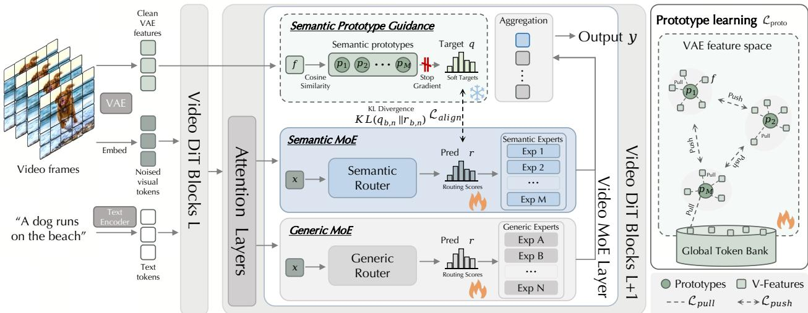  
Figure 3 Pipeline of SplitMoE. SplitMoE splits each Video MoE layer into Semantic and Generic MoE branches, where VAE-prototype induced soft targets guide semantic routing while the generic branch preserves flexible residual modeling capacity. Learnable prototypes are optimized in the VAE feature space with pull-push regularization and a global token bank, encouraging semantic experts to form diverse and well-covered visual concepts.

Mixture of experts for visual generation. MoE efectively scales LLMs [3, 4, 15] by ofering large capacity with manageable inference cost through sparse routing. This paradigm has extended to visual generation, where recent works [2, 5, 31, 39, 43] show that sparse architectures improve difusion transformers for image synthesis. For video generation, existing methods [35] adopt coarse timestep-level MoE routing, assigning one expert to all tokens at each denoising stage. While efective, this overlooks the spatio-temporal heterogeneity within video frames. Token-level routing can address this limitation but introduces another challenge: conventional load balancing objectives [6] uniformly scatter tokens across experts, disrupting strong video semantic correlations and temporal consistency.

Recent works have addressed homogeneous routing in static image generation. ProMoE [38] uses prototypeguided routing to segregate conditional and unconditional tokens, while MammothModa2 [29] decouples generation and understanding experts in a unified autoregressive-difusion framework. However, they focus on conditioning types or task modalities rather than video structure. In contrast, SplitMoE targets the long-tailed spatio-temporal redundancy of video by splitting experts into semantic and generic pools, decoupling high-level structural abstraction from localized high-frequency reconstruction.

## 3 Method

## 3.1 Preliminaries

A standard Mixture-of-Experts (MoE) layer [28] replaces a dense feed-forward network with a set of experts $\mathcal { E } = \{ E _ { 1 } , \dots , E _ { M } \}$ and a router that activates only a small subset of experts for each token:

$$
\mathbf { y } = \sum _ { i \in \mathbb { Z } ( \mathbf { x } ) } g _ { i } ( \mathbf { x } ) E _ { i } ( \mathbf { x } ) , \qquad | \mathbb { Z } ( \mathbf { x } ) | = K \ll M ,\tag{1}
$$

where $\mathcal { T } ( \mathbf { x } )$ denotes the set of selected experts and $g _ { i } ( \mathbf { x } )$ represents the corresponding routing weight. Most existing MoE architectures originate from language modeling [4], where load-balancing objectives are commonly employed. Specifically, an auxiliary loss is typically added during training to penalize routing skew, forcing a uniform distribution of tokens across all available experts to prevent expert collapse and maximize capacity utilization.

## 3.2 SplitMoE: Split-Role Visual Experts

We propose SplitMoE, which explicitly decouples the MoE layer into specialized functional roles. By utilizing continuous VAE features as a teacher signal to anchor tokens to learnable semantic prototypes, our approach separates high-level semantic abstraction from low-level generic reconstruction.

Decoupled expert partitioning. We partition the standard expert pool E into two disjoint subsets, specifically the semantic experts $\mathcal { E } ^ { \mathrm { s e m } }$ and the generic experts $\mathcal { E } ^ { \mathrm { g e n } }$ , formulated as:

$$
\mathcal { E } = \mathcal { E } ^ { \mathrm { s e m } } \cup \mathcal { E } ^ { \mathrm { g e n } } , \qquad \mathcal { E } ^ { \mathrm { s e m } } \cap \mathcal { E } ^ { \mathrm { g e n } } = \emptyset , \qquad M = M _ { s } + M _ { g } .\tag{2}
$$

Similar to an artist sketching a structural outline before rendering generic visual elements, semantic experts model high-level structures, while generic experts capture local appearance and generative residuals. This bifurcation alleviates capacity interference from forcing a single isotropic expert pool to jointly optimize low-frequency semantics and high-frequency generic features.

Given a patchified video token $\mathbf { x } \in \mathbb { R } ^ { C }$ , the router initially projects the token to compute the semantic-generic afinities:

$$
\mathbf { h } = \phi ( \mathbf { W } _ { 1 } \mathbf { x } ) , \qquad z _ { e } = \alpha \left. \frac { \mathbf { h } } { \| \mathbf { h } \| _ { 2 } } , \frac { \mathbf { w } _ { e } } { \| \mathbf { w } _ { e } \| _ { 2 } } \right. , \qquad s _ { e } = \sigma ( z _ { e } ) ,\tag{3}
$$

where $\phi$ denotes the GELU activation function and α represents a learnable, clipped scale that controls the sharpness of the sigmoid afinities. Unlike a global softmax operation that forces competition among all experts, the utilization of independent sigmoid scores $s _ { e }$ allows a single token to be highly compatible with both a semantic expert and a generic expert simultaneously.

The logits and scores are divided into the respective semantic and generic groups, enabling the independent selection of the top $K _ { s }$ and $K _ { g }$ experts:

$$
\begin{array} { r } { \boldsymbol { \mathcal { Z } } ^ { \mathrm { s e m } } = \mathrm { T o p K } ( \widetilde { \mathbf { s } } ^ { \mathrm { s e m } } , K _ { s } ) , \qquad \boldsymbol { \mathcal { Z } } ^ { \mathrm { g e n } } = \mathrm { T o p K } ( \widetilde { \mathbf { s } } ^ { \mathrm { g e n } } , K _ { g } ) , \qquad \boldsymbol { \mathcal { T } } = \boldsymbol { \mathcal { Z } } ^ { \mathrm { s e m } } \cup \boldsymbol { \mathcal { Z } } ^ { \mathrm { g e n } } . } \end{array}\tag{4}
$$

Here, ˜s represents the biased routing scores (detailed in Sec. 3.3), which are utilized solely for the discrete expert selection step and may incorporate exploration noise or non-gradient balancing biases. However, to maintain routing fidelity, the final mixture weights are consistently computed in a dynamic manner from the clean raw scores:

$$
g _ { e } ^ { \mathrm { s e m } } = \frac { s _ { e } } { \sum _ { j \in \mathbb { Z } ^ { \mathrm { s e m } } } s _ { j } + \epsilon } , \qquad g _ { e } ^ { \mathrm { g e n } } = \frac { s _ { e } } { \sum _ { j \in \mathbb { Z } ^ { \mathrm { g e n } } } s _ { j } + \epsilon } .\tag{5}
$$

The final MoE output aggregates the specialized contributions:

$$
\mathbf { y } = \sum _ { e \in \mathcal { T } ^ { \mathrm { s e m } } } g _ { e } ^ { \mathrm { s e m } } E _ { e } ( \mathbf { x } ) + \sum _ { e \in \mathcal { T } ^ { \mathrm { g e n } } } g _ { e } ^ { \mathrm { g e n } } E _ { e } ( \mathbf { x } ) .\tag{6}
$$

Crucially, a fixed active expert budget is maintained by ensuring that $K = K _ { s } + K _ { g }$ equals the Top-K value of the standard MoE baseline $( e . g . , K _ { s } = 1$ and $K _ { g } = 1$ for a Top-2 routing setup), ensuring the performance gains are not driven by an inflated computational budget, but rather by role-aware capacity allocation.

## 3.3 Prototype-Guided Semantic Routing

We introduce a set of learnable prototypes $\mathcal { P } = \{ { \bf p } _ { 1 } , \ldots , { \bf p } _ { M _ { s } } \}$ that act as a semantic bottleneck between continuous VAE features and discrete semantic experts. Inspired by SRA2 [36], we use clean VAE features as a cost-free guidance space for the rich visual priors without relying on external representation models. Each prototype $\mathbf { p } _ { m }$ serves as a semantic anchor for one semantic expert in the VAE feature space. To obtain a stable prototype topology, we decouple router learning from prototype optimization through two objectives.

Router alignment $( \mathcal { L } _ { \mathrm { a l i g n } } )$ . For the i-th visual token, we compute a teacher assignment $\mathbf { q } _ { i }$ by comparing its corresponding clean VAE feature $\mathbf { f } _ { i }$ with the semantic prototypes using temperature-scaled cosine similarity. The resulting $\mathbf { q } _ { i }$ is treated as a fixed target. Meanwhile, the router takes the DiT visual token $\mathbf { x } _ { i }$ as input and predicts a semantic routing distribution $\mathbf { r } _ { i }$ from the logits. We align this router prediction with the VAE-prototype induced soft target using Kullback–Leibler divergence:

$$
\mathcal { L } _ { \mathrm { a l i g n } } = \frac { 1 } { N } \sum _ { i = 1 } ^ { N } \mathrm { K L } ( \mathbf { q } _ { i } \parallel \mathbf { r } _ { i } ) .\tag{7}
$$

This objective trains the router to assign visually similar tokens to consistent semantic prototypes, while the stop-gradient operation prevents the router objective from directly distorting the prototype topology.

Prototype optimization $\scriptstyle ( { \mathcal { L } } _ { \mathrm { p r o t o } } )$ . The prototypes are explicitly optimized to track the underlying visual feature manifold. We formulate this process by treating prototypes as particles on a hypersphere governed by two complementary forces, attraction (pull) and repulsion (push) [37]:

$$
\mathcal { L } _ { \mathrm { p r o t o } } = \underbrace { - \frac { 1 } { N } \sum _ { i = 1 } ^ { N } \tau _ { c } \log \sum _ { m = 1 } ^ { M _ { c } } e ^ { \frac { \cos ( t _ { i } , \mathbf { p } _ { m } ) } { \tau _ { c } } } } _ { \mathrm { p u l t ~ k e r p ~ r o t o t y p e s ~ o n ~ c u r r e n t ~ a n d ~ h i s t o r i c a l ~ V a E ~ f o a t u r e s } } + \underbrace { \frac { 1 } { M _ { s } } \sum _ { j \neq k } \operatorname* { m a x } { ( 0 , \mathbf { c } , \mathbf { p } _ { i } ) } - \delta } _ { \mathrm { P u l t ~ s e p a r a t e ~ p r o t o t o t o t o t o t o t o t o t o t o t o t o t o t o t o t o t h e } }\tag{8}
$$

Specifically, the pull term attracts prototypes toward both current mini-batch features and recent historical features stored in the circular token bank B [10], ensuring that prototypes remain close to meaningful regions of the VAE feature manifold and reducing dead modes. Conversely, the push term imposes inter-prototype repulsion with margin $\delta ,$ preventing multiple prototypes from collapsing onto redundant background-dominated regions. Together, these two terms encourage prototypes to form separated and well-covered centers over the visual feature distribution. While ProMoE [38] also introduces prototype-based routing, we use prototypes as a bridge between DiT router logits and reconstructive VAE features, rather than relying on direct prototypical matching within DiT layers alone.

Conceptually, $\mathcal { L } _ { \mathrm { a l i g n } }$ aligns the router predictions with VAE-induced semantic assignments, while $\mathcal { L } _ { \mathrm { p r o t o } }$ learns a stable and diverse prototype topology.

Group-aware load balancing. Following DeepSeek-V3 [16], we employ a loss-free load-balancing strategy for the generic experts. Importantly, semantic experts avoid explicit load balancing, instead achieving adaptive balance naturally through semantic alignment.

## 3.4 Overall Objective

The full training objective is formulated as ${ \mathcal { L } } = { \mathcal { L } } _ { \mathrm { f l o w } } + \lambda _ { \mathrm { a l i g n } } { \mathcal { L } } _ { \mathrm { a l i g n } } + \lambda _ { \mathrm { p r o t o } } { \mathcal { L } } _ { \mathrm { p r o t o } } ,$ where ${ \mathcal { L } } _ { \mathrm { { f l o w } } }$ denotes flow matching loss. Notably, the proposed group-aware load balancing introduces no auxiliary optimization loss. The mechanism exclusively updates the non-gradient routing biases for the expert selection process.

## 4 Experiments

## 4.1 Implementation Details

We upcycle the low-noise checkpoint of Wan 2.2 [35] by replacing the dense feed-forward networks at evennumbered layers from 15 to 35 with sparse MoE layers, while keeping all other components unchanged. This alternating design balances stable global feature extraction with expert specialization [17]. Each MoE layer contains one continuously active shared expert and 100 routed experts, partitioned into 20 semantic and 80 generic experts. For each token, a Top-8 router activates $K _ { s } { = } 2$ semantic experts and $K _ { g } { = } 6$ generic experts. By matching the active intermediate dimension of the dense baseline, our model activates 14B of its 27B tota parameters per forward pass, maintaining computational parity with the dense model. We initialize experts from the dense FFN to preserve pre-trained generative priors and train all models under the same 80k-step optimization setting.

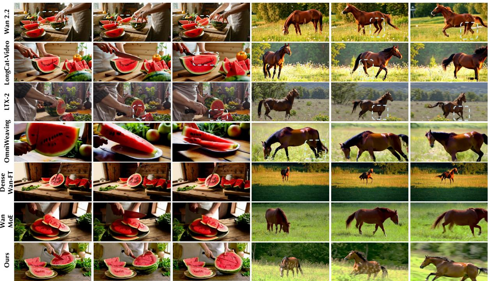  
A person is cutting a watermelon.  
A horse is grazing in the field, then it suddenly starts running across the meadow.

Figure 4 Qualitative comparison with baseline methods. Zoom in for better comparison. We provide more examples and comparisons with more baseline methods in the video demo.

## 4.2 Experimental Setup

Same-source baseline setup. To isolate component contributions, we compare same-source variants sharing the Wan 2.2 low-noise checkpoint, training data, step count, and inference settings. Unless specified, all MoE variants share the same configuration as in Sec. 4.1. Dense Wan2.2-FT finetunes the original dense model identically. Wan2.2-MoE converts Wan 2.2 into a standard MoE (100 generic experts, Top-8 routing), representing our model without the semantic branch. SplitMoE w/o ProtoGuidance (PG) retains the 20/80 semantic-generic partition and dual-track routing but omits VAE teacher features, semantic prototypes, $\mathcal { L } _ { \mathrm { a l i g n } } ,$ and $\mathcal { L } _ { \mathrm { p r o t o } } .$ SplitMoE w/o Pull and SplitMoE w/o Push respectively remove the attractive and repulsive terms of $\mathcal { L } _ { \mathrm { p r o t o } }$ . Full SplitMoE incorporates all proposed components. This protocol efectively disentangles dense fine-tuning, sparse scaling, role-aware expert partitioning, and prototype-guided semantic specialization.

Baseline methods and evaluation metrics. We compare SplitMoE against a wide range of SOTA text-tovideo generation models, including CogVideoX-1.5 [40], Mochi [33], HunyuanVideo [13], LongCat-Video [34], LTX-2 [9], Wan2.2 [35] and OmniWeaving (think) [23]. All videos are generated using the default inference settings of each respective model with 81 frames.

We evaluate SplitMoE on two complementary benchmarks. VBench-2.0 [42], which is an upgraded version of VBench [12], assesses intrinsic faithfulness across five capability dimensions: Creativity, Commonsense, Controllability, Human Fidelity, and Physics, using a combination of state-of-the-art VLMs/LLMs and specialist anomaly detectors. T2V-CompBench [32] targets compositional generation quality via MLLM-based, detection-based, and tracking-based metrics across three dimensions: Consistent Attribute, Interaction, and Numeracy.

Table 1 Text-to-Video evaluation results on VBench-2 and T2V-CompBench, best scores in bold and second scores with underline. A14B denotes MoE with 14B activated parameters.
<table><tr><td rowspan="2">Model name</td><td rowspan="2">#Params.</td><td colspan="5">VBench-2</td><td colspan="3">T2V-CompBench</td></tr><tr><td>Creativity↑</td><td>Common↑ Sense</td><td>Control- ↑ lability</td><td>Human Fidelity1</td><td>Physics↑</td><td>attr.</td><td> ton</td><td>Nu- meracy1 个</td></tr><tr><td>Dense Wan2.2-FT</td><td>14B</td><td>49.57%</td><td>55.92%</td><td>30.37%</td><td>73.08%</td><td>54.66%</td><td>77.51%</td><td>61.08%</td><td>36.71%</td></tr><tr><td>Wan2.2-MoE</td><td>A14B</td><td>53.88%</td><td>57.15%</td><td>35.51%</td><td>73.49%</td><td>63.32%</td><td>78.82%</td><td>63.89%</td><td>38.55%</td></tr><tr><td>SplitMoE w/o PG</td><td>A14B</td><td>51.05%</td><td>63.22%</td><td>34.83%</td><td>74.04%</td><td>55.89%</td><td>78.46%</td><td>61.96%</td><td>38.57%</td></tr><tr><td>SplitMoE w/o Push</td><td>A14B</td><td>50.54%</td><td>62.75%</td><td>33.92%</td><td>73.60%</td><td>56.44%</td><td>77.29%</td><td>59.05%</td><td>37.15%</td></tr><tr><td>SplitMoE w/o Pull</td><td>A14B</td><td>52.23%</td><td>61.10%</td><td>35.67%</td><td>73.81%</td><td>56.83%</td><td>78.14%</td><td>61.15%</td><td>38.32%</td></tr><tr><td>CogVideoX-1.5</td><td>5B</td><td>43.66%</td><td>58.19%</td><td>29.57%</td><td>72.14%</td><td>63.23%</td><td>61.64%</td><td>60.69%</td><td>37.06%</td></tr><tr><td>Mochi</td><td>10B</td><td>39.84%</td><td>61.08%</td><td>30.12%</td><td>78.91%</td><td>57.61%</td><td>59.73%</td><td>53.81%</td><td>27.18%</td></tr><tr><td>HunyuanVideo</td><td>13B</td><td>41.84%</td><td>63.44%</td><td>28.60%</td><td>82.41%</td><td>60.20%</td><td>78.58%</td><td>63.31%</td><td>25.05%</td></tr><tr><td>LongCat-Video</td><td>13.6B</td><td>54.73%</td><td>70.94%</td><td>44.79%</td><td>80.20%</td><td>59.92%</td><td>73.38%</td><td>61.76%</td><td>47.87%</td></tr><tr><td>LTX-2</td><td>14B</td><td>50.39%</td><td>67.09%</td><td>38.09%</td><td>73.69%</td><td>76.71%</td><td>69.93%</td><td>47.98%</td><td>25.83%</td></tr><tr><td>Wan2.2</td><td>A14B</td><td>58.35%</td><td>62.45%</td><td>48.73%</td><td>75.33%</td><td>69.07%</td><td>83.19%</td><td>73.29%</td><td>16.96%</td></tr><tr><td>OmniWeaving</td><td>8.3B+7B</td><td>50.12%</td><td>61.89%</td><td>40.21%</td><td>81.15%</td><td>67.21%</td><td>83.98%</td><td>73.94%</td><td>37.61%</td></tr><tr><td>Full SplitMoE (Ours)</td><td>A14B</td><td>58.46%</td><td>64.89%</td><td>45.72%</td><td>84.47%</td><td>69.41%</td><td>84.63%</td><td>69.98%</td><td>44.01%</td></tr></table>

Table 2 Speed comparison.
<table><tr><td>Method</td><td>Ours</td><td>Baseline MoE</td><td>Dense Model</td></tr><tr><td>Total Parameters</td><td>27B</td><td>27B</td><td>14B</td></tr><tr><td>Activated Parameters</td><td>14B</td><td>14B</td><td>14B</td></tr><tr><td>Training Speed</td><td>6.84s/it</td><td>6.69s/it</td><td>5.66s/it</td></tr><tr><td>Inference Speed</td><td>6.08s/it</td><td>6.12s/it</td><td>5.76s/it</td></tr></table>

## 4.3 Quantitative Comparison

Table 1 reports quantitative results on VBench-2 and T2V-CompBench. Our method achieves competitive performance across multiple evaluation dimensions. Compared with Wan2.2, it improves Creativity and Human Fidelity, suggesting that the proposed routing design benefits diverse content generation and human-centric video synthesis. On T2V-CompBench, our method obtains competitive compositional-alignment results, indicating that the introduced MoE structure preserves text-video consistency under compositional prompts. VBench scores for LongCat-Video and HunyuanVideo follow the LongCat-Video paper, and T2V-CompBench scores for CogVideoX-1.5 and Mochi follow the T2V-CompBench benchmark. Since independently developed models may difer in training data, scale, compute budget and post-training recipes, we use controlled same-source ablations to isolate the architectural contribution. The following section therefore focuses on MoE-specific comparisons.

## 4.4 Qualitative Comparisons

For a fair comparison, we use examples from VBench2. In Fig. 4, most baselines follow text prompts well, with Wan2.2 showing high visual quality and LTX-2 producing realistic efects. In the watermelon-cutting case, however, baselines struggle with complex object interactions: Wan2.2, LongCat-Video, and LTX-2 show local distortions as the action progresses, while the dashed boxes highlight unnatural deformation and fusion of hand morphology and watermelon geometry. OmniWeaving further sufers from abrupt content changes and inter-frame blurring. In contrast, our method maintains temporal consistency, stable physical boundaries, and structural details throughout the action. The horse case evaluates complex motion transitions from standing to running, where baselines produce multi-leg artifacts and structural anomalies under large spatiotemporal changes. Our method yields a smoother transition and preserves accurate physiological structure, benefiting from our split experts and semantic routing.

2D Spherical Latent Space  
Global Step  
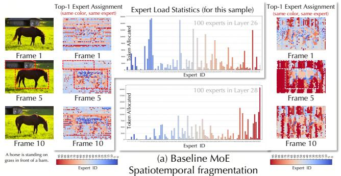

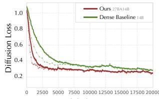

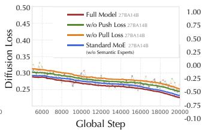  
(a) Loss curve comparison with dense baseline (b) Loss curve comparison with ablation

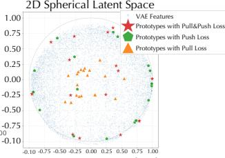

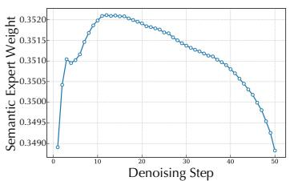  
(d) Timestep-aware routing dynamics

Figure 5 Ablation study analysis.  
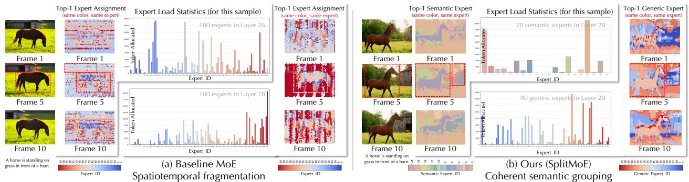  
Figure 6 Comparison of spatial routing and expert loads. (a) Baseline MoE scatters correlated patches across experts under strict capacity constraints, causing fragmented routing and poor spatiotemporal consistency. (b) SplitMoE routes coherent entities to Semantic Experts and residual textures to Generic Experts, achieving stable utilization without enforcing uniformity.

## 4.5 Ablation Studies

Computational overhead analysis. Tab. 2 compares training and inference speed under an iso-activatedparameter budget of 14B. Both our method and the baseline MoE show a slight per-iteration latency overhead over the dense model, mainly due to routing operations and memory bandwidth bottlenecks. Compared with the baseline MoE, our architecture adds negligible overhead and maintains highly comparable speed.

Eficacy of MoE Upcycling. We evaluate sparse capacity scaling by comparing SplitMoE with a dense fine-tuning baseline. As shown in the first row of Table 1, Dense Wan2.2-FT fine-tunes the low-noise Wan2.2 model on the same training data and evaluates it on VBench-2. Under the same active-parameter budget, the full SplitMoE outperforms this dense baseline across all evaluation dimensions, indicating that MoE upcycling raises capacity and the performance ceiling without increasing per-token activated parameters. The validation difusion loss in Fig. 5(a) further supports this trend: SplitMoE converges faster, reaches comparable loss with roughly 70% of the training steps, and maintains lower loss throughout training. These results show that our upcycling strategy preserves dense-model optimization stability while improving representational capacity through structure-aware sparse routing. Notably, whereas the oficial Wan2.2 uses a high-/low-noise dual-model ensemble, Dense Wan2.2-FT is trained only from the low-noise checkpoint and thus naturally underperforms the full ensemble due to missing high-noise priors and reduced capacity.

Efect of structured semantic routing. We compare SplitMoE with two MoE baselines using similar expert configurations and parameter budgets. As shown in Table 1 and Fig. 4, Wan2.2-MoE converts the low-noise Wan2.2 model into a standard MoE and fine-tunes it on the same data, while SplitMoE w/o PG keeps the same 20–80 expert partition as SplitMoE but removes prototype guidance. Their similar performance suggests that expert partitioning alone brings limited gains without explicit semantic guidance. In the left example in Fig. 4, the watermelon struggles to maintain its complete semantics. In contrast, the full SplitMoE performs better on semantics-sensitive dimensions such as Human Fidelity and Physics, indicating that prototype-guided semantic routing improves expert specialization beyond naive sparse scaling. Fig. 5(b) supports this conclusion, as removing the semantic branch yields higher validation difusion loss than the full model.

Coupled efects of pull-push prototype guidance. We ablate the two complementary terms in $\mathcal { L } _ { \mathrm { p r o t o } }$ to test whether prototype guidance needs balanced attraction and repulsion. As shown in Table 1, using only one term does not reliably improve quantitative metrics and can even underperform the variant without prototype guidance, since partial supervision may introduce a biased routing prior rather than a stable semantic partition. Fig. 5(b) shows the same trend in validation difusion loss, where removing either term worsens optimization against the full model. The VAE-space visualization in Fig. 5(c) explains these failure modes. Without push, pull attracts prototypes toward dominant visual regions, preventing full coverage of the VAE manifold and limiting the semantic experts’ representation space. Without pull, push drives many prototypes away from the data manifold, producing underused or dead semantic experts and weakening semantic routing. Thus, pull and push form a coupled mechanism: pull anchors prototypes to meaningful visual semantics, while push prevents redundant collapse. Together, they yield a balanced prototype layout that supports efective semantic expert specialization.

Routing pathologies in video MoE. Consistent with Fig. 2, where standard MoE shows low semantic distinctiveness and intra-region routing dominance, Fig. 6(a) visualizes how this mismatch appears spatially and temporally. The Top-1 expert maps across frames show that coherent regions such as the horse and barn are not routed consistently. As highlighted by the dashed boxes, standard routing produces three artifacts: (i) Temporal jitter, where similar regions switch experts across frames; (ii) Spatial striping, where homogeneous areas are artificially split to satisfy load constraints; and (iii) Semantic fragmentation, where adjacent tokens from the same object scatter across unrelated experts. These results indicate that rigid token-level balancing is ill-suited to video tokens. In contrast, Fig. 6(b) shows that SplitMoE assigns coherent object regions to stable semantic experts while using the generic branch to absorb residual textures and backgrounds, thereby reducing jitter, striping, and fragmentation.

Timestep-aware routing dynamics. We further track the routing weights assigned to semantic experts over a 50-step denoising trajectory in Fig. 5(d). The semantic weight peaks in the early high-noise stage, around steps 10–15, when the model establishes global layout, object placement, and coarse semantic structure. It then gradually decreases as denoising shifts toward local appearance and detail refinement. This coarse-to-fine pattern shows that the semantic branch is not redundant sparse capacity; instead, it learns a stage-dependent role, allocating semantic computation to the phases where high-level structure formation is most needed.

## 5 Conclusion

In this work, we identify the uniformity trap as a key limitation of LLM-style MoE routing for video difusion and propose SplitMoE, a split-role MoE that separates semantic abstraction from general visual residual modeling. With semantic-generic expert partitioning, prototype-guided routing, and pull-push regularization, SplitMoE improves convergence, routing coherence, and generation quality under matched activated-parameter budgets. Its timestep-aware routing reveals an emergent coarse-to-fine pattern, suggesting modality-aware sparse routing as a useful direction. Limitations include reliance on frozen visual features and sparse-routing overhead, motivating future work on adaptive partitioning, eficient distributed routing, and broader video generation tasks.

## References

[1] Andreas Blattmann, Tim Dockhorn, Sumith Kulal, Daniel Mendelevitch, Maciej Kilian, Dominik Lorenz, Yam Levi, Zion English, Vikram Voleti, Adam Letts, et al. Stable video difusion: Scaling latent video difusion models to large datasets. arXiv preprint arXiv:2311.15127, 2023.

[2] Siyu Cao, Hangting Chen, Peng Chen, Yiji Cheng, Yutao Cui, Xinchi Deng, Ying Dong, Kipper Gong, Tianpeng Gu, Xiusen Gu, et al. HunyuanImage 3.0 technical report. arXiv preprint arXiv:2509.23951, 2025.

[3] Nan Du, Yanping Huang, Andrew M Dai, Simon Tong, Dmitry Lepikhin, Yuanzhong Xu, Maxim Krikun, Yanqi Zhou, Adams Wei Yu, Orhan Firat, et al. GLaM: Eficient scaling of language models with mixture-of-experts. In International Conference on Machine Learning, pages 5547–5569. PMLR, 2022.

[4] William Fedus, Barret Zoph, and Noam Shazeer. Switch transformers: Scaling to trillion parameter models with simple and eficient sparsity. The Journal of Machine Learning Research, 23(1):5232–5270, 2022.

[5] Zhengcong Fei, Mingyuan Fan, Changqian Yu, Debang Li, and Junshi Huang. Scaling difusion transformers to 16 billion parameters. arXiv preprint arXiv:2407.11633, 2024.

[6] Trevor Gale, Deepak Narayanan, Clif Young, and Matei Zaharia. MegaBlocks: Eficient sparse training with mixture-of-experts. Proceedings of Machine Learning and Systems, 5:288–304, 2023.

[7] Yu Gao, Haoyuan Guo, Tuyen Hoang, Weilin Huang, Lu Jiang, Fangyuan Kong, Huixia Li, Jiashi Li, Liang Li, Xiaojie Li, et al. Seedance 1.0: Exploring the boundaries of video generation models. arXiv preprint arXiv:2506.09113, 2025.

[8] Google DeepMind. Veo: A state-of-the-art video generation model. https://deepmind.google/technologies/ veo/, 2024. Accessed: 2026-02-22.

[9] Yoav HaCohen, Benny Brazowski, Nisan Chiprut, Yaki Bitterman, Andrew Kvochko, Avishai Berkowitz, Daniel Shalem, Daphna Lifschitz, Dudu Moshe, Eitan Porat, et al. LTX-2: Eficient joint audio-visual foundation model. arXiv preprint arXiv:2601.03233, 2026.

[10] Kaiming He, Haoqi Fan, Yuxin Wu, Saining Xie, and Ross Girshick. Momentum contrast for unsupervised visual representation learning. In Proceedings of the IEEE/CVF Conference on Computer Vision and Pattern Recognition, pages 9729–9738, 2020.

[11] Wenyi Hong, Ming Ding, Wendi Zheng, Xinghan Liu, and Jie Tang. CogVideo: Large-scale pretraining for text-to-video generation via transformers. arXiv preprint arXiv:2205.15868, 2022.

[12] Ziqi Huang, Yinan He, Jiashuo Yu, Fan Zhang, Chenyang Si, Yuming Jiang, Yuanhan Zhang, Tianxing Wu, Qingyang Jin, Nattapol Chanpaisit, et al. VBench: Comprehensive benchmark suite for video generative models. In Proceedings of the IEEE/CVF Conference on Computer Vision and Pattern Recognition, pages 21807–21818, 2024.

[13] Weijie Kong, Qi Tian, Zijian Zhang, Rox Min, Zuozhuo Dai, Jin Zhou, Jiangfeng Xiong, Xin Li, Bo Wu, Jianwei Zhang, et al. HunyuanVideo: A systematic framework for large video generative models. arXiv preprint arXiv:2412.03603, 2024.

[14] Kuaishou. Kling AI. https://klingai.kuaishou.com/, 2024.

[15] Dmitry Lepikhin, HyoukJoong Lee, Yuanzhong Xu, Dehao Chen, Orhan Firat, Yanping Huang, Maxim Krikun, Noam Shazeer, and Zhifeng Chen. GShard: Scaling giant models with conditional computation and automatic sharding. arXiv preprint arXiv:2006.16668, 2020.

[16] Aixin Liu, Bei Feng, Bing Xue, Bingxuan Wang, Bochao Wu, Chengda Lu, Chenggang Zhao, Chengqi Deng, Chenyu Zhang, Chong Ruan, et al. DeepSeek-V3 technical report. arXiv preprint arXiv:2412.19437, 2024.

[17] Yahui Liu, Yang Yue, Jingyuan Zhang, Chenxi Sun, Yang Zhou, Wencong Zeng, Ruiming Tang, and Guorui Zhou. Eficient training of difusion mixture-of-experts models: A practical recipe. arXiv preprint arXiv:2512.01252, 2025.

[18] Luma Labs. Dream Machine. https://lumalabs.ai/dream-machine, June 2024. Accessed: 2026-02-22.

[19] MiniMax. Hailuo AI. https://hailuoai.com/video, September 2024. Accessed: 2026-02-22.

[20] OpenAI. Sora. https://openai.com/sora/, 2024.

[21] OpenAI. Video generation models as world simulators. https://openai.com/index/ video-generation-models-as-world-simulators/, 2024.

[22] OpenAI. Sora2. https://openai.com/index/sora-2/, 2025.

[23] Kaihang Pan, Qi Tian, Jianwei Zhang, Weijie Kong, Jiangfeng Xiong, Yanxin Long, Shixue Zhang, Haiyi Qiu, Tan Wang, Zheqi Lv, et al. OmniWeaving: Towards unified video generation with free-form composition and reasoning. arXiv preprint arXiv:2603.24458, 2026.

[24] William Peebles and Saining Xie. Scalable difusion models with transformers. In Proceedings of the IEEE/CVF International Conference on Computer Vision, pages 4195–4205, 2023.

[25] Xiangyu Peng, Zangwei Zheng, Chenhui Shen, Tom Young, Xinying Guo, Binluo Wang, Hang Xu, Hongxin Liu, Mingyan Jiang, Wenjun Li, et al. Open-Sora 2.0: Training a commercial-level video generation model in \$200k. arXiv preprint arXiv:2503.09642, 2025.

[26] Runway. Gen-2: Generate novel videos with text, images or video clips. https://runwayml.com/research/gen-2, 2023. Accessed: 2026-02-22.

[27] Runway. Gen-3. https://runwayml.com/, June 2024. Accessed: 2026-02-22.

[28] Noam Shazeer, Azalia Mirhoseini, Krzysztof Maziarz, Andy Davis, Quoc Le, Geofrey Hinton, and Jef Dean. Outrageously large neural networks: The sparsely-gated mixture-of-experts layer. In International Conference on Learning Representations, 2017.

[29] Tao Shen, Xin Wan, Taicai Chen, Rui Zhang, Junwen Pan, Dawei Lu, Fanding Lei, Zhilin Lu, Yunfei Yang, Chen Cheng, et al. MammothModa2: A unified AR-difusion framework for multimodal understanding and generation. arXiv preprint arXiv:2511.18262, 2025.

[30] ShengShu-AI. Vidu. https://www.vidu.studio/, July 2024. Accessed: 2026-02-22.

[31] Minglei Shi, Ziyang Yuan, Haotian Yang, Xintao Wang, Mingwu Zheng, Xin Tao, Wenliang Zhao, Wenzhao Zheng, Jie Zhou, Jiwen Lu, et al. DifMoE: Dynamic token selection for scalable difusion transformers. arXiv preprint arXiv:2503.14487, 2025.

[32] Kaiyue Sun, Kaiyi Huang, Xian Liu, Yue Wu, Zihan Xu, Zhenguo Li, and Xihui Liu. T2V-CompBench: A comprehensive benchmark for compositional text-to-video generation. In Proceedings of the Computer Vision and Pattern Recognition Conference, pages 8406–8416, 2025.

[33] Genmo Team. Mochi 1. https://github.com/genmoai/models, 2024.

[34] Meituan LongCat Team, Xunliang Cai, Qilong Huang, Zhuoliang Kang, Hongyu Li, Shijun Liang, Liya Ma, Siyu Ren, Xiaoming Wei, Rixu Xie, et al. LongCat-Video technical report. arXiv preprint arXiv:2510.22200, 2025.

[35] Team Wan, Ang Wang, Baole Ai, Bin Wen, Chaojie Mao, Chen-Wei Xie, Di Chen, Feiwu Yu, Haiming Zhao, Jianxiao Yang, Jianyuan Zeng, Jiayu Wang, Jingfeng Zhang, Jingren Zhou, Jinkai Wang, Jixuan Chen, Kai Zhu, Kang Zhao, Keyu Yan, Lianghua Huang, Mengyang Feng, Ningyi Zhang, Pandeng Li, Pingyu Wu, Ruihang Chu, Ruili Feng, Shiwei Zhang, Siyang Sun, Tao Fang, Tianxing Wang, Tianyi Gui, Tingyu Weng, Tong Shen, Wei Lin, Wei Wang, Wei Wang, Wenmeng Zhou, Wente Wang, Wenting Shen, Wenyuan Yu, Xianzhong Shi, Xiaoming Huang, Xin Xu, Yan Kou, Yangyu Lv, Yifei Li, Yijing Liu, Yiming Wang, Yingya Zhang, Yitong Huang, Yong Li, You Wu, Yu Liu, Yulin Pan, Yun Zheng, Yuntao Hong, Yupeng Shi, Yutong Feng, Zeyinzi Jiang, Zhen Han, Zhi-Fan Wu, and Ziyu Liu. Wan: Open and advanced large-scale video generative models. arXiv preprint arXiv:2503.20314, 2025.

[36] Mengmeng Wang, Dengyang Jiang, Liuzhuozheng Li, Yucheng Lin, Guojiang Shen, Xiangjie Kong, Yong Liu, Guang Dai, and Jingdong Wang. SRA 2: Variational autoencoder self-representation alignment for eficient difusion training. In Proceedings of the IEEE/CVF Conference on Computer Vision and Pattern Recognition, pages 32978–32987, 2026.

[37] Tongzhou Wang and Phillip Isola. Understanding contrastive representation learning through alignment and uniformity on the hypersphere. In International Conference on Machine Learning, pages 9929–9939. PMLR, 2020.

[38] Yujie Wei, Shiwei Zhang, Hangjie Yuan, Yujin Han, Zhekai Chen, Jiayu Wang, Difan Zou, Xihui Liu, Yingya Zhang, Yu Liu, et al. Routing matters in MoE: Scaling difusion transformers with explicit routing guidance. arXiv preprint arXiv:2510.24711, 2025.

[39] Yu Xu, Hongbin Yan, Juan Cao, Yiji Cheng, Tiankai Hang, Runze He, Zijin Yin, Shiyi Zhang, Yuxin Zhang, Jintao Li, et al. TAG-MoE: Task-aware gating for unified generative mixture-of-experts. arXiv preprint arXiv:2601.08881, 2026.

[40] Zhuoyi Yang, Jiayan Teng, Wendi Zheng, Ming Ding, Shiyu Huang, Jiazheng Xu, Yuanming Yang, Wenyi Hong, Xiaohan Zhang, Guanyu Feng, et al. CogVideoX: Text-to-video difusion models with an expert transformer. arXiv preprint arXiv:2408.06072, 2024.

[41] Yuxin Zhang, Weiming Dong, Fan Tang, Nisha Huang, Haibin Huang, Chongyang Ma, Tong-Yee Lee, Oliver Deussen, and Changsheng Xu. Prospect: Prompt spectrum for attribute-aware personalization of difusion models. ACM Transactions on Graphics (TOG), 42(6):1–14, 2023.

[42] Dian Zheng, Ziqi Huang, Hongbo Liu, Kai Zou, Yinan He, Fan Zhang, Lulu Gu, Yuanhan Zhang, Jingwen He, Wei-Shi Zheng, et al. VBench-2.0: Advancing video generation benchmark suite for intrinsic faithfulness. arXiv preprint arXiv:2503.21755, 2025.

[43] Youwei Zheng, Yuxi Ren, Xin Xia, Xuefeng Xiao, and Xiaohua Xie. Dense2MoE: Restructuring difusion transformer to MoE for eficient text-to-image generation. In Proceedings of the IEEE/CVF International Conference on Computer Vision, pages 18661–18670, 2025.