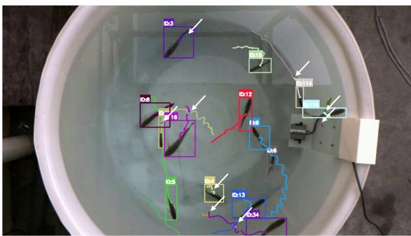
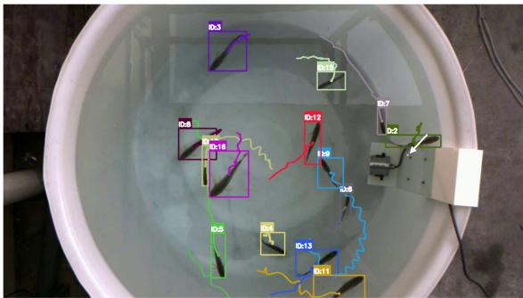
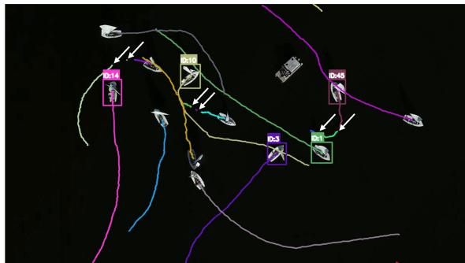
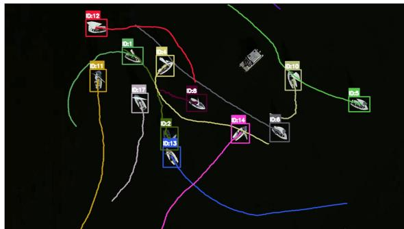
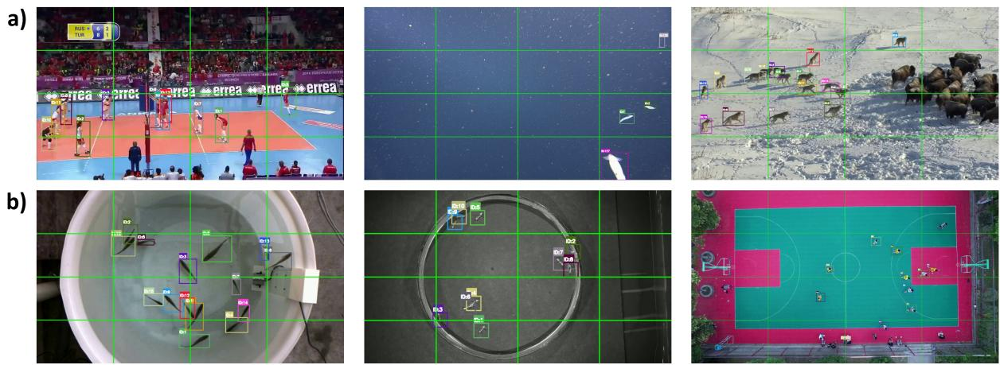
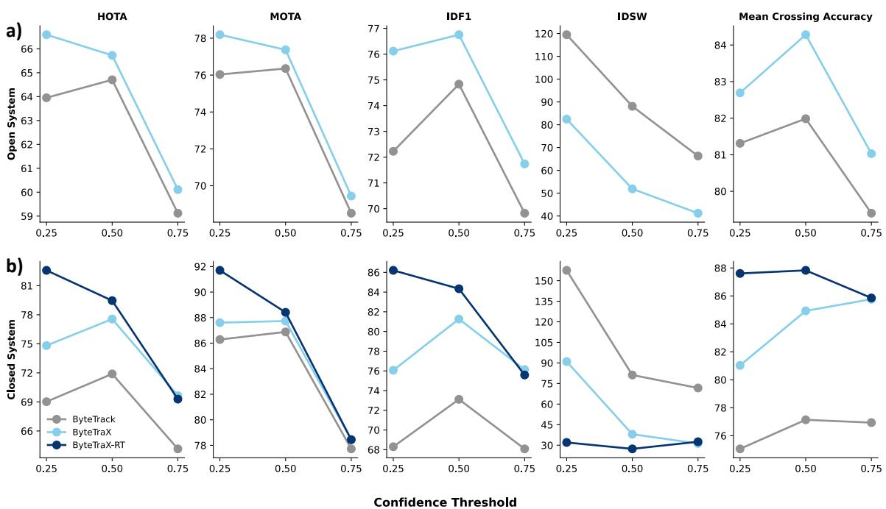
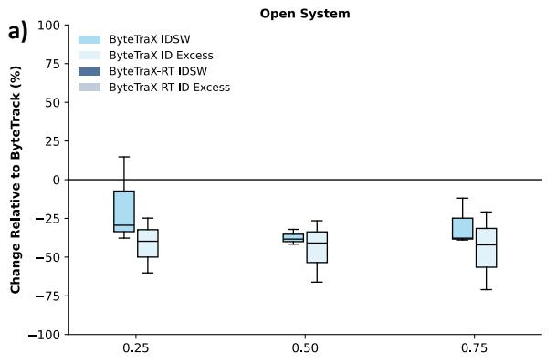
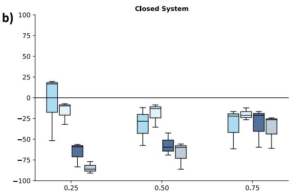

# ByteTraX: Enhancing the ByteTrack Architecture with Optimised Thresholding

Thomas A. O’Shea-Wheller1∗

1University of Exeter

## Abstract

The ByteTrack algorithm is a widely used and computationally eficient multi-object tracking architecture. Its core innovation lies in the combination oflenient bounding box associations with tracklet similarity matching to robustly deal with object occlusions. However, this strategy is nevertheless vulnerable to erroneous track reclassification and identity switching, as detection confidence scores dictate association priority. To address this, I present a simple enhancement of the ByteTrack architecture—named ByteTraX—that optimises track continuity via a single unified matching threshold, while penalising identity switches through stringent track initiation criteria. This approach achieves consistently improved performance across a range of diverse benchmarks including GMOT-40, LC-MOT, SportsMOT, TeamTrack, DAMUNT, and DeepSea-MOT, while simultaneously increasing processing speed by >10%. Specifically, results demonstrate a >40% reduction in identity switches, accompanied by mean increases in HOTA of 3.6, IDF1 of 5.6, and FPS of 6.3. As such, adoption of the ByteTraX algorithm has the potential to substantially enhance tracking performance over the ByteTrack baseline, while retaining the eficiency needed for real-time deployment. To facilitate usage, I provide the source code, integration functionality for the YOLO family of object detection models, and deployment instructions via an open source repository.

## 1. Introduction

Multi-object tracking algorithms have seen substantial growth in recent years, with approaches broadly being divided into traditional two-stage tracking-bydetection methods [1–3], and emerging end-to-end tracking-by-propagation techniques [4–6]. While the latter continue to advance the state-of-the-art in absolute tracking accuracy, algorithms belonging to the former category remain the most broadly adopted— ostensibly due to their reduced computational requirements and ease of integration [7]. Indeed, when considering the application of object tracking pipelines more broadly, accessibility and modularity serve in large part to dictate the popularity and uptake of a given framework [7, 8]. Consequently, there is substantial merit in optimising existing tracking-by-detection algorithms to improve baseline performance, as this has the potential to yield immediate benefits across established deployment pipelines.

Among current approaches, the ByteTrack [9] algorithm constitutes one of the most widely utilised architectures, with a modular design and strong integration into the YOLO [10] family of deep learning models. Its utility as a tracking solution stems from its computational eficiency and enhanced occlusion tolerance when compared to earlier approaches. Specifically, this is achieved by considering all bounding boxes when associating tracklets—rather than only those with high confidence scores [9, 11]. As such, low confidence detections associated with partially occluded objects are not erroneously discarded, and thus track continuity is preserved. The elegance of this approach lies in the understanding that lower confidence detections may not always represent errors if they adhere to the algorithm’s motion model, and instead may reflect true variance in an object’s appearance.

Despite its versatility, ByteTrack nevertheless exhibits several limitations in its default configuration. Chief among these are the propensity for erroneous track reclassification—the assignation of a new ID to the same object following a brief tracklet loss—and identity switching—the transposition of IDs between proximate objects (Fig. 1a). These issues serve to impede longterm track identity preservation, and rapidly elevate error rates as tracklet length and motion complexity increase. Interestingly, both are caused by the mistaken elimination or supersedure of low confidence detections during thresholding, as object appearances frequently shift during motion. As noted previously, such low confidence detections sometimes indicate true object positions, and thus filtering them out can lead to irreversible tracking errors [9]. The salient aspect of this, however, is that the tracking algorithm itself has no prior indication of which confidence distributions are likely to represent true or false detections for a given model, as both are highly dependent upon upstream training data and deployment context [12]. Consequently, while low confidence scores generally correlate with the likelihood of false detections, there is often substantial distributional overlap between these and true positives in all but the most tightly-fit models [13, 14]. This fundamentally undermines the assumption that confidence thresholds alone can reliably discriminate between true and false detections, thus indicating the need for additional tracking cues.

a)  
  
b)

  
Figure 1. Comparison of tracking ID losses across example video sequences for (a) ByteTrack, and (b) ByteTraX. The top two panels display a sequence from LC-MOT, a closed system dataset with fixed track counts; while the bottom two panels are from GMOT-40, an open system benchmark in which tracks can enter and leave the frame. Lines indicate tracked trajectories, coloured by ID, and white arrows denote instances of ID loss. ID losses occur when bounding box detection scores fall below a tracking algorithm’s matching or similarity threshold, which can lead to the rapid accumulation of identity errors over time.

With this in mind, there is merit in deferring to the motion and spatial prediction elements of trackingby-detection algorithms, as these are generally modelagnostic and hence less contextually dependent [15]. In the case of ByteTrack specifically, this can be achieved by ensuring that confidence-based matching thresholds are as permissive as possible, hence preserving all candidate detections that adhere to the motion model. This serves to limit the potential for erroneous tracklet breaks, and thus associated downstream identity reassignations. As such, it might be expected that minimising the thresholds for track association and similarity, while penalising the generation of new track IDs, could together substantially enhance baseline tracking performance (Fig. 1b). However, the optimal approach to implementing this strategy is dependent upon the attributes of the systems in which it is deployed. In open systems—where tracks may enter and exit the frame— threshold adjustment is likely to be the most efective approach; yet in closed systems—where track numbers remain constant—there is the opportunity for heuristicbased implementation. Specifically, this is because in closed systems, global constants can be leveraged to robustly infer the likelihood that new tracklets belong to an existing rather than lost track identity. There is thus impetus to test both approaches as a means to improve tracking fidelity, as each can be implemented at little to no additional computational cost.

  
Figure 2. Example video sequences from the (a) open, and (b) closed system benchmarks used in performance evaluations. The top three panels detail sequences from SportsMOT, DeepSea-MOT, and GMOT-40; while the bottom three display sequences from LC-MOT, DAMUNT, and TeamTrack. Bounding boxes indicate ground truth tracks, coloured by ID, and green lines denote the crossing counter regions utilised in the calculation of line crossing accuracy.

To this end, I present ByteTraX, an enhancement of the ByteTrack architecture that maximises the association of low confidence detections through optimised thresholding, thus limiting the occurrence of erroneous identity switches. Crucially, ByteTraX considers all detections equally rather than sorting them by confidence score, predicts trajectories with broad uncertainty bounds, and deploys bespoke tracking strategies across open and closed systems. I compare this approach to the default ByteTrack algorithm across six standardised benchmarks—GMOT-40 [16], LC-MOT [17], SportsMOT [18], TeamTrack [19], DAMUNT [20], and DeepSea-MOT [21]—representing a combination of open and closed systems from diverse usage scenarios (Fig. 2). To ensure consistency, both algorithms employ the same YOLO26 front-end detection models, and are assessed with standard HOTA, CLEAR, and ID metrics. Trackers are further evaluated via a simple line crossing accuracy approach, selected to reflect an explainable and ubiquitous real-world use case. Results demonstrate that ByteTraX achieves consistent performance improvements over ByteTrack across benchmarks, while at the same time delivering increased speed and eficiency.

## 2. Related Work

## 2.1. Tracking-by-detection

While tracking-by-detection approaches have been reviewed extensively elsewhere [1, 7, 22], there is merit in outlining the general paradigm as a primer to this work. At its core, tracking-by-detection functions by associating object detections from an upstream detection model across frames to form continuous tracks [7]. This method is computationally eficient, can utilise detections from a diversity of deep learning models, and is simple to integrate into real-time tracking pipelines [23]. Consequently, a wide range of architectures exist that employ tracking-by-detection, generally sharing the following key steps. First, a motion model is used to predict the future location of tracks via a Kalman filter [2], particle filter [24], moving horizon estimate [25], or similar method [22]. Second, intersection-over-union (IoU), appearance cues, or a combination of the two are used to assign similarity scores to high confidence detections corresponding to the predicted track location [7]. Third, a greedy or Hungarian matching algorithm is employed to pair one of these candidate detections with the track based upon its similarity score [7, 22]. Essentially, this can be reduced to the question of where an object is likely to be in the next frame, what detections overlap with this projection, and which of these corresponds to the same object given what is known about its past state.

Despite the efectiveness of this approach, dificulties emerge when objects are partially occluded, or otherwise fall below the detection confidence thresholds set by the tracking algorithm or upstream detection model. Such cases are non-trivial, as the complexity of real-world tracking encompasses changes in detection confidence that are frequently independent of actual object presence [26–28]. This consequently creates a bottleneck, as only detections with suficiently high confidence scores are considered in the tracking process, meaning that correct object detections with lower scores are discarded a priori.

## 2.2. ByteTrack

The ByteTrack algorithm and BYTE data association method were developed specifically to address the aforementioned challenge [9]. While ByteTrack’s general structure shares similarities with other trackingby-detection approaches, its central innovation lies in how the BYTE association algorithm filters candidate detections [9]. Specifically, utilising a two-stage detection matching technique, BYTE considers both high and low score bounding boxes in turn, ensuring that partially occluded detections associated with the latter are recovered. This is achieved by splitting detections into high and low confidence groups via a fixed threshold, matching the high confidence detections with associated tracklets, and then using the remaining low confidence detections to match any tracklets not associated in the first step. As a consequence, ByteTrack is able to utilise detections spanning the full range of confidence scores present in the data, thus avoiding the fundamental limitations inherent to techniques that consider only those with high scores.

The efectiveness of this method in dealing with partial occlusions and varying object appearances has positioned ByteTrack as one of the most widely-utilised tracking algorithms to date [7]. However, in its default configuration, ByteTrack sufers from a high rate of ID reassignations across trajectories. This is primarily because detection confidence is still used to score associations and prioritise track matches, meaning that track breaks and subsequent ID supersedures are common when the former fluctuates. Here, I argue that reducing the contribution of detection confidence to matching decisions represents a simple and robust solution to the issue. As such, I leverage this approach to develop a novel evolution of the ByteTrack architecture that prioritises target identity preservation and track continuity through optimised matching and association thresholds.

## 3. Methods

## 3.1. ByteTraX Architecture

The ByteTraX architecture incorporates two specific enhancements to improve tracking fidelity and identity persistence. First, it treats all detections as equally viable by removing the first and second stage matching thresholds utilised in ByteTrack [9], meaning that predictions are not segregated into high and low score groupings. This ensures that detections with higher confidence scores do not supersede those of lower confidence unless supported by the motion model, thus reducing erroneous ID switches when the two sources of information conflict. This can be calculated as:

$$
D _ { v } = D > \tau\tag{1}
$$

With $D _ { v }$ denoting valid detections used in track matching, specified as bounding boxes with a confidence score exceeding the threshold �.

Tracked detections are then passed to a central motion model that predicts their likely coordinates in the next frame, allowing for propagation of trajectories. Specifically, this utilises the change in state of detections from the previous to current timestep as a function to project future positions, represented by the following state-space equation:

$$
x _ { t } = F x _ { t - 1 } + w _ { t }\tag{2}
$$

Where $x _ { t }$ is the location, aspect ratio, height, and the respective velocities of each for the track in the current frame, $x _ { t - 1 }$ represents the same variables in the previous frame, � is a transition matrix that maps this previous state to the present state, and $w _ { t }$ is a measure of uncertainty that is used to update the prediction via one of several filtering methods [29].

The second modification implemented in ByteTraX is minimisation of the IoU overlap needed to meet the track association similarity threshold, resulting in consideration of all detections proximate to the projected track location, rather than only those with substantial overlap. This reflects the reality that motion model predictions are frequently limited in accuracy, and thus matching should aim to approximate the general area distribution of a predicated track, rather than requiring precise overlap. Specifically, the IoU between motion model predictions and candidate detections is calculated as:

$$
I o U ( D _ { v } , T ) = \frac { \mid D _ { v } \cup T \mid } { \mid D _ { v } \cap T \mid }\tag{3}
$$

In which $D _ { v } \cup T$ is the area of overlap between the predicted track location and detection, and $D _ { v } \cap T$ is their combined area when considered as a single shape.

The quantification of IoU-based similarity is then determined via the following equation:

$$
C = 1 - I o U ( T , D _ { v } )\tag{4}
$$

Where � is a cost function, calculated as the IoU of predicted track location � and valid detection $D _ { v }$ subtracted from 1. Consequently, by minimising the deviation from 1 required to satisfy the track association similarity threshold, the more robust predictions become to uncertainty, and the fewer track breaks and ID reassignations occur across trajectories.

Taken together, these modifications result in substantially more lenient trajectory propagation thresholds, thus lending increased weight to existing tracks. As such, there is a concomitant reduction in the establishment of new track IDs, as extant tracks must drop below a comparatively minimal association threshold before being lost. Broadly, this aims to address the issues of erroneous track loss and ID reassignation, while simultaneously increasing inference speed through a simplified association algorithm.

Beyond threshold modifications, ByteTraX introduces further improvements specific to closed systems—those in which the total number of tracks remain consistent as objects do not enter or leave the frame. These consti tute a special case in which global information as to the existing and expected track states can be leveraged to enhance association decisions. To this end, ByteTraX incorporates track reconnection and merging functions that further suppress ID reassignation, while enabling lost track recovery beyond that achievable by the motion model alone.

## 3.2. Track Reconnection

To enable extended track reconnection, a simple search heuristic is employed when a single track ID is lost and cannot be recovered by the motion model. This is possible in closed systems, as the fixed maximum track count ensures that when only a single ID is lost, any new trajectory must be associated with the same ID. Specifically, this heuristic associates any same-class detection within a fixed relative distance and time threshold with the lost tracklet, regardless of motion projections. This process is described by the following formula:

$$
R = [ \Delta t \leq \tau \land \Delta P \leq \alpha ]\tag{5}
$$

Where � denotes the decision to reconnect a lost track with a new trajectory, dependent upon their relative pairwise diference $\Delta$ in occurrence time �, and proximity �. To satisfy the reconnection criteria, both values must fall within their respective thresholds � and �.

In the case of multiple candidate detections, matching is filtered based on proximity to the last known track location, with the process repeating until a tracking lock is achieved, or the thresholds are exhausted. To ensure robustness, this heuristic is activated only when the standard association rules do not yield a suitable reconnection. The advantage of this approach is that it robustly handles cases where extreme non-linear movements lead to failure of the motion model, or those where extended occlusion or detection failure disrupt tracklet continuity. Additionally, this algorithm requires no knowledge of the total track count, only whether there has been a single or multiple losses in relation to the previous system state.

## 3.3. Tracklet Merging

To efectively resolve the issue of erroneous ID reassignation, a merging step is implemented for screening all new tracklets. This relies upon the logic that for a system with a fixed track count for which all tracks are currently present, additional tracklets that overlap with existing trajectories likely represents repeat detections of the same objects. Consequently, new tracks that meet these criteria are immediately merged into the existing same-class tracks with which they overlap, thus preventing the assignation of a new ID to an established track, even if the former exhibits higher detection confidence. This process is governed by the following equation:

$$
\mathrm { M } = I o U ( T _ { \mathrm { e x i s t i n g } } , D _ { \mathrm { n e w } } ) \geq \tau _ { \mathrm { m e r g e } }\tag{6}
$$

In which M represents the decision to merge a new detection $D _ { \mathrm { n e w } }$ into an existing track $T _ { \mathrm { e x i s t i n g } } ,$ dependent upon their combined IoU meeting or exceeding the threshold $\tau _ { \mathrm { m e r g e } }$

As with the reconnection function, this heuristic activates only once the standard association and matching steps have been completed, thus ensuring that lost tracks are not erroneously merged into existing trajectories. Additionally, this provides robustness to cases where tracks overlap or otherwise closely intersect, as the merging function only applies to those detections that cannot be reliably assigned via the motion model or reconnection steps.

To facilitate adaptable usage, the aforementioned heuristics can be activated in addition to the standard architecture when tracking within closed systems. This is important for ensuring flexibility, as they may be unsuitable for use in open systems where information on track counts and states is incomplete. Additionally, the ByteTraX algorithm aims to deliver performance improvements in closed systems even without these functions, meaning that all aspects can be implemented optionally or integrated into additional frameworks.

Table 1. Comparison of attributes across benchmark datasets. Values represent means averaged across all video sequences within each benchmark. Metrics are selected to outline target size, density, speed, propensity for sudden changes in acceleration and direction, occlusion rate, divergence from linear motion model predictions, and simultaneous class cooccurrence.
<table><tr><td>Dataset</td><td>Video Length</td><td>Track Count</td><td>Track Density (Tracks/ MP)</td><td>Track Speed (Px/ Frame)</td><td>Track Angular Acceleration (°/ Frame)</td><td>Track Occlu- sion Rate</td><td>Track Normalised Innovation Residual</td><td>Target Size (Px)</td><td>Class Count</td></tr><tr><td>DeepSea- MOT [21]</td><td>599</td><td>35</td><td>7.183</td><td>4.170</td><td>36.170</td><td>0.268</td><td>0.320</td><td>51542.470</td><td>37</td></tr><tr><td>DAMUNT [20]</td><td>573</td><td>23</td><td>40.453</td><td>1.810</td><td>59.360</td><td>0.677</td><td>0.160</td><td>2019.370</td><td>1</td></tr><tr><td>GMOT-40 [16]</td><td>237</td><td>49</td><td>14.830</td><td>10.040</td><td>21.180</td><td>0.561</td><td>0.740</td><td>12989.050</td><td>1</td></tr><tr><td>LC-MOT [17]</td><td>1124</td><td>15</td><td>11.398</td><td>1.030</td><td>55.200</td><td>0.400</td><td>0.380</td><td>4634.940</td><td>1</td></tr><tr><td>SportsMOT [18]</td><td>575</td><td>14</td><td>12.004</td><td>6.070</td><td>27.000</td><td>0.593</td><td>0.390</td><td>6756.340</td><td>1</td></tr><tr><td>TeamTrack [19]</td><td>900</td><td>23</td><td>2.773</td><td>1.880</td><td>20.540</td><td>0.126</td><td>0.160</td><td>922.680</td><td>1</td></tr></table>

Normalised innovation residuals are calculated using the standard ByteTrack motion model, sampled from 10% of tracks per video.

## 4. Experiments

## 4.1. Datasets

I utilise six standardised benchmarks to evaluate the performance of ByteTraX in comparison to that of the ByteTrack baseline. These encompass a diversity of tracking scenarios, target types, and motion patterns, while providing detailed ground truth annotations for both bounding boxes and track identities. The first three of these—GMOT-40 [16], SportsMOT [18], and DeepSea-MOT [21]—represent open systems in which tracks can enter and leave the frame (Fig. 2a); while the latter three—LC-MOT [17], TeamTrack [19], and DAMUNT [20]—are closed systems in which all tracks remain in view across videos (Fig. 2b). While the vast scope of potential real-world deployments cannot feasibly be encompassed by benchmarking alone [30], the aforementioned datasets allow for relative performance comparisons across widely divergent tracking scenarios. Illustrative of this, sequences contain from 4 to 100 simultaneously cooccurring tracks, encompass mean trajectory speeds between 0.2 and 89 pixels per second, and feature occlusion rates ranging from 0.010 to 0.983 (Table 1).

Such variance is further supported by a diversity of tracking target appearances, outlined as follows. GMOT-40 encompasses scenes with targets including humans, aircraft, cars, fish, insects, livestock, and boats, with the aim of testing generic multicategory tracking performance [16]. TeamTrack and

SportsMOT focus on tracking Football, Basketball, and Volleyball players, using footage filmed either laterally with high camera motion [18], or directly from above [19]. DAMUNT utilises colonies of the weaver ant Oecophylla smaragdina, and carpenter ant Camponotus aeneopilosus in the lab [20], combining high target density with rapid non-linear movement patterns. DeepSea-MOT encompasses ROV footage from the deep ocean, providing an extensive range of >40 co-occurring species classes from varied taxa across midwater and benthic environments [21]. Finally, LC-MOT consists of videos of the fish Larimichthys crocea filmed from above in rearing tanks, yielding dense aggregations of visually-similar individuals with frequent occlusions and severe surface reflectance [17].

## 4.2. Metrics

To comprehensively evaluate tracking performance, I employ HOTA [31], MOTA [32], IDF1 [33], IDSW [34], excess ID count [35], and FPS [34]. These metrics encompass tracking accuracy, identity preservation, and computational eficiency, enabling assessment of Byte-TraX’s potential to reduce erroneous ID reassignation, along with any resultant impacts on overall performance. Specifically, HOTA is selected to quantify combined tracking accuracy as it balances detection, association, and localisation performance [31], while MOTA provides a more detection-centric measure, and is included due to its extensive usage in earlier work [32]. Identity preservation and track switching are assessed via IDF1, IDSW, and excess ID count, as these allow for evaluation of the proportion of detections correctly assigned to their corresponding ground truth IDs [33], the absolute number of ID switches and supersedure events [32], and the resultant accumulation of erroneous IDs in comparison to ground truth counts [36, 37]. Finally, FPS is utilised as a general proxy for computational eficiency, as when hardware and detection model parameters are standardised, diferences in frame rate reliably reflect variance in algorithmic processing speed [38].

  
Figure 3. (a) Comparison of tracking performance across detection confidence thresholds for open system benchmarks (N=53). Each point represents the combined mean score for GMOT-40, SportsMOT, and DeepSea-MOT, coloured by tracker (ByteTrack, grey; ByteTraX, light blue). (b) Comparison of tracking performance across detection confidence thresholds for closed system benchmarks (N=15). Each point represents the mean score averaged across LC-MOT, TeamTrack, and DAMUNT, coloured by tracker (ByteTrack, grey; ByteTraX, light blue; ByteTraX-RT, dark blue).

In addition to the aforementioned multi-object tracking metrics, I integrate a simple line crossing accuracy measure to validate performance in a common counting task. This utilises six evenly spaced vertical and horizontal lines overlaid across the video frame, enabling quantification of trajectory crossing counts in comparison to ground truth values (Fig. 2). Such a measure encapsulates the ubiquitous use case of counting-bytracking [39–41], ensuring direct applicability to realworld deployments. In doing so, this links fundamental tracking metrics with higher-level counting outcomes, while furnishing an evaluation pipeline for use in future work. Together, these measures enable assessment of tracking performance from a fine to global scale, encompassing both standard computer vision metrics and a composite downstream task.

## 4.3. Implementation

Trials employed YOLO26n [42] as the common detection architecture, with a separate model trained on each benchmark for 100 epochs, thus serving as a consistent detection front-end for use across both tracking algorithms. As training and testing portions difered between datasets, a standard 40:10:50 training, validation, and testing split was adopted in all cases. This ensured that models were well-optimised to their respective testing benchmarks, allowing assessments to focus on identity association and tracking performance independently of detector-based limitations. While this necessarily limits comparisons to the two tracking algorithms described here, it ensures reliable and robust performance evaluations that are broadly generalisable across a range of use cases.

For the open system datasets, ByteTraX was evaluated only in its standard configuration, while in the closed system datasets, it was additionally tested with the track reconnection and merging features enabled— the latter henceforth being referred to as ‘ByteTraX-RT’. This allowed for additive evaluation of both the core ByteTraX architecture and specific closed system enhancements in comparison to the ByteTrack baseline. Metric extraction utilised the established ‘TrackEval’ framework [34, 43, 44], yielding HOTA [31], CLEAR [32], Identity [33], and VACE [45] metrics, along with a bespoke analysis pipeline for recording line crossing accuracy measures. To explore performance stability across input values, separate runs were undertaken at detection confidence thresholds of 0.25, 0.50, and 0.75 for each permutation of tracker and video sequence. All other model parameters remained identical across testing regimes to ensure comparability, with an IoU threshold of 0.70, image downsampling resolution of 640x640, and inference arguments set to the defaults present in YOLO26 [42]. Training and testing was conducted using a NVIDIA Tesla A100 Tensor Core GPU (NVIDIA) in a high-RAM runtime configuration, with associated FPS values derived from the same hardware. All statistical analyses were performed in Python (release v. 3.9.12).

Table 2. Comparison of tracking performance across open and closed systems. Values represent combined means averaged over all benchmark datasets and detection confidence thresholds belonging to each system type, with the highest scoring results shown in bold. The overall tracking algorithm rankings are determined based upon the proportion of top scoring metrics achieved by each.
<table><tr><td colspan="7"></td></tr><tr><td>System Type</td><td>Tracker</td><td>HOTA</td><td>MOTA</td><td>IDF1</td><td>Crossing Accuracy</td><td>IDSW</td><td>FPS</td></tr><tr><td rowspan="2">Open</td><td>ByteTrack</td><td>62.593</td><td>73.634</td><td>72.294</td><td>80.899</td><td>91</td><td>44.328</td></tr><tr><td>ByteTraX</td><td>64.143</td><td>75.002</td><td>74.869</td><td>82.667</td><td>58</td><td>49.498</td></tr><tr><td rowspan="3">Closed</td><td>ByteTrack</td><td>68.356</td><td>83.629</td><td>69.832</td><td>76.379</td><td>103</td><td>51.601</td></tr><tr><td>ByteTraX</td><td>74.009</td><td>84.597</td><td>77.819</td><td>83.909</td><td>53</td><td>58.645</td></tr><tr><td>ByteTraX-RT</td><td>77.111</td><td>86.185</td><td>82.043</td><td>87.098</td><td>30</td><td>59.265</td></tr></table>

## 4.4. Comparison with ByteTrack

As the principle aim of ByteTraX is not to challenge the state-of-the-art, but to improve upon the widelyestablished ByteTrack baseline, I focus my comparisons on these two architectures exclusively. Results are broadly divided into those from open and closed system benchmarks, and all assessments utilise the same upstream YOLO26 models across tracking algorithms to ensure parity.

Open System Benchmarks. When considering open system benchmarks, ByteTraX substantially outperforms ByteTrack in overall tracking accuracy and speed, achieving a mean increase in HOTA of 1.550, MOTA of 1.368, and FPS of 5.170 (Fig. 3a, Table 2). This is driven by markedly enhanced identity preservation, reflected in an IDF1 score increase of 2.575, and crucially, a >36% reduction in identity switches, with mean IDSW dropping from 91 to 58, and excess IDs from 1013 to 447 (Fig. 3a, Fig. 4, Table 2). Performance improvements are further reflected in elevated line crossing accuracy, with an aggregate increase in this metric of 1.768% over the ByteTrack baseline (Fig. 3a, Table 2).

These trends are generally consistent across confidence thresholds, although with a slight increase in relative performance gains at a threshold of 0.25, potentially indicating the increased cost of uncertainty for ByteTrack when presented with additional low confidence detections (Fig. 3a). At the dataset level, results for both GMOT-40 and SportsMOT are broadly comparable, with ByteTraX’s ability to reduce erroneous identity reassignments and switches driving similar performance improvements in HOTA, MOTA, IDF1, IDSW, and excess ID counts (Table 2, Fig. 4a). Notably however, despite the same being true for DeepSea-MOT in terms of HOTA, IDF1, and crossing accuracy scores, Byte-TraX did not achieve meaningfully elevated MOTA or reduced IDSW rates (Table 3). Investigation across confidence levels revealed this to be primarily driven by deficits at a threshold of 0.25, with IDSW rates dropping only at thresholds of 0.50 and 0.75 (Fig. 4a).

Closed System Benchmarks. In closed systems, Byte-TraX again demonstrates superior HOTA, MOTA, IDF1, and FPS in comparison to ByteTrack, along with reduced IDSW scores and excess ID counts (Fig. 3b and 4b, Table 2). Specifically, HOTA and IDF1 scores are increased by 5.653 and 7.987 respectively, while MOTA is elevated by 0.968, suggesting that performance gains are primarily due to improvements in association rather than detection accuracy. This is further supported by a >48% reduction in identity switches—with mean IDSW score dropping from 103 to 53—and a decline in excess IDs from 137 to 109 (Fig. 3b and 4b, Table 2). In combination, these improvements yield a mean line crossing accuracy increase of 7.530%, while elevating FPS by 7.044 (Fig. 3b, Table 2).

  
Figure 4. (a) Change in IDSW and excess ID counts relative to ByteTrack across detection confidence thresholds for open system benchmarks (N=53). Boxplots indicate the median percentage change in proportion to the corresponding value for ByteTrack, averaged across GMOT-40, SportsMOT, and DeepSea-MOT, and coloured by tracker (ByteTraX, light blue) and metric (IDSW, opaque; ID Excess, transparent). (b) Change in IDSW and excess ID counts relative to ByteTrack across detection confidence thresholds for closed system benchmarks (N=15). Boxplots again indicate the median percentage change in proportion to the corresponding value for ByteTrack, averaged across LC-MOT, TeamTrack, and DAMUNT, and coloured by tracker (ByteTraX, light blue ByteTraX-RT, dark blue) and metric (IDSW, opaque; ID Excess, transparent). Error bars represent 1.5 times the interquartile range from the median. Positive values indicate an increase in the given metric, negative values a decrease, and a score of 0 absolute parity with ByteTrack. ID excess is defined as the number of additional IDs generated by a tracker in comparison to ground truth, while IDSW is a count of all instances in which the same ground truth tracks are assigned sequentially diferent IDs.

Activation of the track reconnection and merging functions improves performance further, with ByteTraX-RT yielding superior scores across all metrics. When compared to ByteTrack, this manifests as an increase in HOTA of 8.755, MOTA of 2.556, and FPS of 7.664, while improvements over the standard ByteTraX configuration are reflected in an increase in HOTA of 3.102, MOTA of 1.588, and FPS of 0.620 (Fig. 3b, Table 2). Identity preservation metrics are likewise enhanced, with IDF1 score increases of 12.211 and 4.224 in comparison to ByteTrack and ByteTraX respectively, and a drop in mean IDSW from 103 and 53 to 30 (Fig. 3b, Table 2). Excess ID counts yield a similar pattern, falling to 36—equating to >73% and >66% reductions over ByteTrack and ByteTraX (Fig. 4b). Notably, such enhanced performance is reflected in mean line crossing accuracy increases of 10.719% over ByteTrack, and 3.189% over the standard ByteTraX implementation (Fig. 3b, Table 2). Comparisons across confidence thresholds reveal a notable trend, this being that the performance benefits of ByteTraX-RT over ByteTraX are comparatively diminished at a threshold of 0.75 (Fig. 3b and 4b). This may be due to refinements in the detections generated by the models themselves, as a greater proportion of false positives are filtered out, thus reducing the need for tracklet merging. Further, when considering dataset-level metrics, ByteTraX and ByteTraX-RT deliver the greatest performance improvements for DAMUNT and TeamTrack, while those for LC-MOT are comparatively modest (Table 3). Although it is not possible to attribute this to a single factor, the former two benchmarks do exhibit higher excess ID counts and lower HOTA scores for ByteTrack paired with reduced motion model innovation residuals, indicating a greater potential for performance gains when track breaks and erroneous ID reassignments are curtailed (Table 1, Table 3).

## 5. Conclusion

My results demonstrate that ByteTraX delivers substantially improved performance and speed across a range of diverse tracking scenarios—from trajectory resolution in insect colonies, to species quantification in the deep ocean. This is achieved via enhanced association and matching thresholds, combined with merging and reconnection functions that limit the impact of detection confidence upon track continuity. It should be noted that ByteTraX does not aim to challenge the state-of-the-art in multi-object tracking, but rather to improve upon the current most widelyutilised architecture—this being ByteTrack. As such, I make available the full ByteTraX integration pipeline for deployment with YOLO26, along with the source code required for expansion into additional detection frameworks. In sum, by combining enhanced accuracy and speed with ease-of-integration, ByteTraX aims to advance the current baseline for real-time tracking at scale, thus delivering fundamentally improved performance across a broad range of applications.

Table 3. Comparison of tracking performance across benchmark datasets. Values represent combined means averaged over all detection confidence thresholds, with the highest scoring results for each dataset shown in bold. The overall tracking algorithm rankings are determined based upon the proportion of top scoring metrics belonging to each.
<table><tr><td colspan="8">System Type</td></tr><tr><td></td><td>Dataset</td><td>Tracker</td><td>HOTA</td><td>MOTA</td><td>IDF1</td><td>Crossing Accuracy</td><td>IDSW</td><td>FPS</td></tr><tr><td>Open</td><td>GMOT-40 [16]</td><td>ByteTrack</td><td>62.557</td><td>77.971</td><td>74.519</td><td>82.880</td><td>107</td><td>46.476</td></tr><tr><td></td><td></td><td>ByteTraX</td><td>64.379</td><td>79.775</td><td>77.562</td><td>84.577</td><td>65</td><td>51.720</td></tr><tr><td></td><td>SportsMOT [18]</td><td>ByteTrack</td><td>62.049</td><td>90.146</td><td>71.400</td><td>78.559</td><td>67</td><td>57.249</td></tr><tr><td></td><td></td><td>ByteTraX</td><td>63.304</td><td>90.930</td><td>74.279</td><td>82.086</td><td>44</td><td>66.475</td></tr><tr><td></td><td>DeepSea-MOT [21]</td><td>ByteTrack</td><td>62.898</td><td>51.331</td><td>63.661</td><td>73.679</td><td>37</td><td>31.857</td></tr><tr><td></td><td></td><td>ByteTraX</td><td>63.452</td><td>51.128</td><td>64.272</td><td>75.203</td><td>38</td><td>35.517</td></tr><tr><td>Closed</td><td>DAMUNT [20]</td><td>ByteTrack</td><td>68.866</td><td>85.589</td><td>65.165</td><td>77.575</td><td>150</td><td>53.799</td></tr><tr><td></td><td></td><td>ByteTraX</td><td>77.856</td><td>87.25</td><td>77.366</td><td>89.004</td><td>67</td><td>61.621</td></tr><tr><td></td><td></td><td>ByteTraX-RT</td><td>81.962</td><td>89.242</td><td>82.651</td><td>94.048</td><td>39</td><td>62.845</td></tr><tr><td></td><td>LC-MOT [17]</td><td>ByteTrack</td><td>79.355</td><td>92.627</td><td>89.021</td><td>68.671</td><td>11</td><td>54.558</td></tr><tr><td></td><td></td><td>ByteTraX</td><td>79.574</td><td>92.587</td><td>89.677</td><td>69.994</td><td>11</td><td>61.577</td></tr><tr><td></td><td></td><td>ByteTraX-RT</td><td>81.081</td><td>93.391</td><td>92.146</td><td>69.788</td><td>5</td><td>60.512</td></tr><tr><td></td><td>TeamTrack [19]</td><td>ByteTrack</td><td>44.062</td><td>56.817</td><td>52.456</td><td>86.409</td><td>82</td><td>35.797</td></tr><tr><td></td><td></td><td>ByteTraX</td><td>45.572</td><td>56.677</td><td>56.137</td><td>88.808</td><td>79</td><td>39.383</td></tr><tr><td></td><td></td><td>ByteTraX-RT</td><td>47.344</td><td>58.017</td><td>59.104</td><td>90.444</td><td>45</td><td>40.656</td></tr></table>

## 6. Acknowledgements

I am grateful to Simon R. Nilsson and Katie I. Murray for their useful comments regarding the manuscript.

## 7. Code availability

All supporting data, source code, integration pipelines, evaluation scripts, and deployment instructions are available under an MIT license at: https://github.c om/Toshea111/ByteTraX.

## 8. References

[1] Zhiyu Guan, Zhaofa Wang, Gan Zhang, Luwei Li, Miaomiao Zhang, Zhiping Shi, and Na Jiang. Multiobject tracking review: retrospective and emerging trend. Artificial Intelligence Review, 58(8):235, 2025.

[2] Nicolai Wojke, Alex Bewley, and Dietrich Paulus. Simple online and realtime tracking with a deep association metric. arXiv, abs/1703.07402, 2017.

[3] Jinkun Cao, Jiangmiao Pang, Xinshuo Weng, Rawal Khirodkar, and Kris Kitani. Observation-centric sort: Rethinking sort for robust multi-object tracking. arXiv, abs/2203.14360, 2023.

[4] Mattia Segu, Luigi Piccinelli, Siyuan Li, Yung-Hsu Yang, Bernt Schiele, and Luc Van Gool. Samba: Synchronized set-of-sequences modeling for multiple object tracking. arXiv, abs/2410.01806, 2024.

[5] Fangao Zeng, Bin Dong, Yuang Zhang, Tiancai Wang, Xiangyu Zhang, and Yichen Wei. Motr: End-toend multiple-object tracking with transformer. arXiv, abs/2105.03247, 2022.

[6] Hyunseop Kim, Juheon Jeong, Hanul Kim, and Yeong Jun Koh. Dual-path temporal decoder for endto-end multi-object tracking. In Advances in Neural Information Processing Systems, pages 4626–4645. Curran Associates, Inc., 2025.

[7] Momir Adžemović. Deep learning-based multi-object tracking: A comprehensive survey from foundations to state-of-the-art. arXiv, abs/2506.13457, 2025.

[8] Pengyu Zhang, Dong Wang, and Huchuan Lu. Multi-

modal visual tracking: Review and experimental comparison. arXiv, abs/2012.04176, 2020.

[9] Yifu Zhang, Peize Sun, Yi Jiang, Dongdong Yu, Fucheng Weng, Zehuan Yuan, Ping Luo, Wenyu Liu, and Xinggang Wang. Bytetrack: Multi-object tracking by associating every detection box. arXiv, abs/2110.06864, 2022.

[10] Joseph Redmon, Santosh Divvala, Ross Girshick, and Ali Farhadi. You only look once: Unified, real-time object detection. arXiv, abs/1506.02640, 2016.

[11] Yifu Zhang, Xinggang Wang, Xiaoqing Ye, Wei Zhang, Jincheng Lu, Xiao Tan, Errui Ding, Peize Sun, and Jingdong Wang. Bytetrackv2: 2d and 3d multi-object tracking by associating every detection box. arXiv, abs/2303.15334, 2023.

[12] Chuan Guo, Geof Pleiss, Yu Sun, and Kilian Q. Weinberger. On calibration of modern neural networks. arXiv, abs/1706.04599, 2017.

[13] Matias Valdenegro-Toro. I find your lack of uncertainty in computer vision disturbing. arXiv, abs/2104.08188, 2021.

[14] Julia Grabinski, Paul Gavrikov, Janis Keuper, and Margret Keuper. Robust models are less overconfident. arXiv, abs/2210.05938, 2022.

[15] Mk Bashar, Samia Islam, Kashifa Kawaakib Hussain, Md. Bakhtiar Hasan, A. B. M. Ashikur Rahman, and Md. Hasanul Kabir. In pursuit of many: A review of modern multiple object tracking systems. arXiv, abs/2209.04796, 2026.

[16] Hexin Bai, Wensheng Cheng, Peng Chu, Juehuan Liu, Kai Zhang, and Haibin Ling. Gmot-40: A benchmark for generic multiple object tracking. arXiv, abs/2011.11858, 2021.

[17] Kexin Yuan, Yunchen Tian, and Jianing Quan. Diffish: a unified difusion model for robust multi-object fish tracking in aquaculture. The Visual Computer, 42 (7):272, 2026.

[18] Yutao Cui, Chenkai Zeng, Xiaoyu Zhao, Yichun Yang, Gangshan Wu, and Limin Wang. Sportsmot: A large multi-object tracking dataset in multiple sports scenes. arXiv, abs/2304.05170, 2023.

[19] Atom Scott, Ikuma Uchida, Ning Ding, Rikuhei Umemoto, Rory Bunker, Ren Kobayashi, Takeshi Koyama, Masaki Onishi, Yoshinari Kameda, and Keisuke Fujii. Teamtrack: A dataset for multisport multi-object tracking in full-pitch videos. arXiv, abs/2404.13868, 2024.

[20] Chamath Abeysinghe, Chris Reid, Hamid Rezatofighi, and Bernd Meyer. Tracking diferent ant species: An unsupervised domain adaptation framework and a dataset for multi-object tracking. arXiv, abs/2301.10559, 2023.

[21] Kevin Barnard, Elaine Liu, Kristine Walz, Brian Schlining, Nancy Jacobsen Stout, and Lonny Lundsten. Deepsea mot: A benchmark dataset for multi-object tracking on deep-sea video. arXiv, abs/2509.03499, 2025.

[22] Wenhan Luo, Junliang Xing, Anton Milan, Xiaoqin Zhang, Wei Liu, and Tae-Kyun Kim. Multiple object tracking: A literature review. Artificial Intelligence, 293:103448, 2021.

[23] Vladimir Somers, Baptiste Standaert, Victor Joos, Alexandre Alahi, and Christophe De Vleeschouwer. Cameltrack: Context-aware multi-cue exploitation for online multi-object tracking. arXiv, abs/2505.01257, 2025.

[24] Yu Xia, Shiru Qu, Sotirios Goudos, Yu Bai, and Shaohua Wan. Multi-object tracking by mutual supervision of cnn and particle filter. Personal and Ubiquitous Computing, 25(6):979–988, 2021.

[25] Neel P. Bhatt, Amir Khajepour, and Ehsan Hashemi. Mpc-pf: Socially and spatially aware object trajectory prediction for autonomous driving systems using potential fields. IEEE Transactions on Intelligent Transportation Systems, 24(5):5351–5361, 2023.

[26] Travis Mandel, Mark Jimenez, Emily Risley, Taishi Nammoto, Rebekka Williams, Max Panof, Meynard Ballesteros, and Bobbie Suarez. Detection confidence driven multi-object tracking to recover reliable tracks from unreliable detections. Pattern Recognition, 135: 109107, 2023.

[27] Yanchao Wang, Run Li, Dawei Zhang, Minglu Li, Jinli Cao, and Zhonglong Zheng. Catrack: Conditionaware multi-object tracking with temporally enhanced appearance features. Knowledge-Based Systems, 308: 112760, 2025.

[28] Hyun-Sung Yang, Sung-Wook Park, Chun-Bo Sim, and Se-Hoon Jung. Sentinel for confidence-aware multi-object tracking. Scientific Reports, 16(1):13571, 2026.

[29] James B. Rawlings and Bhavik R. Bakshi. Particle filtering and moving horizon estimation. Computers & Chemical Engineering, 30(10):1529–1541, 2006. Papers form Chemical Process Control VII.

[30] O’Shea-Wheller, Thomas A., Murray, and Katie I. Deep learning in biology faces a transferability crisis. PLOS Biology, 24(3):1–4, 2026.

[31] Jonathon Luiten, Aljoša Ošep, Patrick Dendorfer, Philip Torr, Andreas Geiger, Laura Leal-Taixé, and Bastian Leibe. Hota: A higher order metric for evaluating multi-object tracking. International Journal of Computer Vision, 129(2):548–578, 2020.

[32] Keni Bernardin and Rainer Stiefelhagen. Evaluating multiple object tracking performance: The clear mot metrics. EURASIP Journal on Image and Video Processing, 2008(1):246309, 2008.

[33] Ergys Ristani, Francesco Solera, Roger S. Zou, Rita Cucchiara, and Carlo Tomasi. Performance measures and a data set for multi-target, multi-camera tracking. arXiv, abs/1609.01775, 2016.

[34] Patrick Dendorfer, Aljoša Ošep, Anton Milan, Konrad Schindler, Daniel Cremers, Ian Reid, Stefan Roth, and Laura Leal-Taixé. Motchallenge: A benchmark for single-camera multiple target tracking. arXiv, abs/2010.07548, 2020.

[35] Yasuyuki Ihara. Enhancing multiple object tracking accuracy via quantum annealing. Scientific Reports, 15(1):24294, 2025.

[36] Vukasin Stanojevic and Branimir Todorovic. Boost track++: Using tracklet information to detect more objects in multiple object tracking. Filomat, 39(16): 5685–5702, 2025.

[37] Diankun Zhang, Guoan Wang, Runwen Zhu, Jianbo Zhao, Xiwu Chen, Siyu Zhang, Jiahao Gong, Qibin Zhou, Wenyuan Zhang, Ningzi Wang, Feiyang Tan, Hangning Zhou, Ziyao Xu, Haotian Yao, Chi Zhang, Xiaojun Liu, Xiaoguang Di, and Bin Li. Sparsead: Sparse query-centric paradigm for eficient end-to-end autonomous driving. arXiv, abs/2404.06892, 2024.

[38] Zhongdao Wang, Liang Zheng, Yixuan Liu, Yali Li, and Shengjin Wang. Towards real-time multi-object tracking. arXiv, abs/1909.12605, 2020.

[39] Jera Makar, Hani Hagras, Hugo Leon-Garza, and Anasol Pena-Rios. Object counting by tracking for complex video sequences. In 2025 IEEE Symposium on Computational Intelligence in Image, Signal Processing and Synthetic Media Companion (CISM Companion), pages 1–5, 2025.

[40] Igor Bisio, Chiara Garibotto, Halar Haleem, Fabio Lavagetto, and Andrea Sciarrone. A systematic review of drone based road trafic monitoring system. IEEE Access, 10:101537–101555, 2022.

[41] Ali Sattarzadeh. Destination-based people counting via full-cross line analysis using a cpu-friendly opencv– onnx pipeline. Preprints, 2025.

[42] Glenn Jocher, Jing Qiu, Mengyu Liu, Shuai Lyu, Fatih Cagatay Akyon, and Muhammet Esat Kalfaoglu. Ultralytics yolo26: Unified real-time end-to-end vision models. arXiv, abs/2606.03748, 2026.

[43] Jonathon Luiten and Arne Hofhues. Trackeval. https: //github.com/JonathonLuiten/TrackEval, 2020.

[44] Amine Aouini. Trackeval lite. https://github.com/30- A/trackeval\_lite, 2024.

[45] Vasant Manohar, Padmanabhan Soundararajan, Harish Raju, Dmitry Goldgof, Rangachar Kasturi, and John Garofolo. Performance evaluation of object detection and tracking in video. In Computer Vision – ACCV 2006, pages 151–161, Berlin, Heidelberg, 2006. Springer Berlin Heidelberg.