# CHOQOLATE: Organizing Concept Bottleneck Latent Spaces with Choquet Integrals

Rémi Kazmierczak1, Johanne Cohen2, Marianne Clausel1

1CRAN, Université de Lorraine, CNRS, Nancy, France 2LISN, Université Paris-Saclay, CNRS, Orsay, France

## Abstract

Concept Bottleneck Models (CBMs) built on vision-language models such as CLIP represent a latent space as humanunderstandable concepts. These representations are unfaithful: related concepts are entangled, so individual scores do not reflect their intended meaning. We propose CHOQOLATE, an interpretable-by-design layer based on 2-additive Choquet integrals, which merges correlated concepts into compact nodes. Across four datasets, CHOQOLATE achieves a favorable accuracy-interpretability trade-of, with weight-sparse and semantically coherent nodes. A closed-form gradient derivation, backed by experiments, explains why Choquet layers drive this organization without explicit supervision. Choquet weights also map directly to Shapley values, which enables test-time intervention. On standard bias-mitigation benchmarks, suppressing spurious concepts after training performs on par with methods that require group annotations or retraining, while needing neither.

## 1 Introduction

Deep image classifiers reach high accuracy while ofering little insight into what drives their predictions. One influential answer routes inference through Concept Bottleneck Models (CBMs) (Koh et al. 2020), that seek interpretability by routing inference through a layer of human-understandable concepts from which the prediction is derived. Early CBMs required manual concept annotations for every image. Visionlanguage foundation models such as CLIP (Radford et al. 2021) remove this cost: the similarity between an image embedding and a textual concept embedding directly provides a concept score, with no annotation at all (Oikarinen et al. 2023; Yuksekgonul, Wang, and Zou 2023; Yang et al. 2023). The annotations disappear, but a new problem takes their place: concept unfaithfulness. Individual concept scores do not reliably reflect their intended meaning (Debole et al. 2025; Lewis et al. 2024) because CLIP embeddings entangle related concepts. Figure 1b illustrates the underlying redundancy on Cats/Dogs/Cars (Kazmierczak et al. 2024): the CLIP similarities of hair, muzzle, and tail are strongly correlated, so a cat’s tail concept activates even on face-only images, where no tail is visible. This mirrors the “bag-ofwords” efect (Yuksekgonul et al. 2023): CLIP blurs semantically similar concepts into overlapping activations.

Rather than disentangling the backbone, we take this redundancy as given and reorganize the concept space, fusing co-activating concepts into a few latent nodes (Figure 1a). For the resulting representation to be both interpretable and predictive, we require five properties: (i) attribution sparsity (each node concentrates its attribution on a few concepts); (ii) semantic coherence (a node’s concepts are semantically related); (iii) attributability (each concept’s contribution to the nodes is directly computable); (iv) low dimensionality (few enough nodes to compress the concept space); and (v) informativeness (the nodes retain what classification needs, not everything the input contains). Properties (iii) and (iv) hold by construction, via closed-form Shapley values and a node count far below the concept count. Attributability, in particular, enables post-hoc removal of unwanted concepts. Properties (i), (ii), and (v) are quantified in Section 6 by Attribution Gini, Node Coherence, and accuracy, respectively.

Our tool is the 2-additive Choquet integral (Grabisch 1997), a classical aggregation operator from multicriteria decision theory that combines individual weights with pairwise interaction terms, capturing synergy when positive and redundancy when negative. Since redundancy is precisely the structure that CLIP similarities exhibit (Figure 1b), this operator is a natural choice for fusing co-activating concepts. We show that layers of 2-additive Choquet integrals, trained for classification, produce latent nodes that satisfy the five properties above, without any supervision of the concept-tonode assignment. CHOQOLATE stacks two such layers, one mapping concepts to a few latent nodes and one mapping nodes to class scores.

Our contributions are as follows:

• We introduce CHOQuet Organization of LATEnts (CHOQOLATE), which uses 2-additive Choquet integrals to build interpretable-by-design layers for concept bottleneck models.

• We show, across four datasets and metrics, that CHOQO-LATE ofers a favorable trade-of between accuracy and latent-space quality.

• We explain why and how CHOQOLATE organizes the latent space without explicit supervision, through both a closed-form gradient derivation and an empirical study of its training dynamics.

• We show that the architecture supports Post-hoc Concept Removal (CHOQ-PCR): on standard debiasing benchmarks, suppressing spurious concepts after training performs on par with methods that require group annotations or retraining, while needing neither.

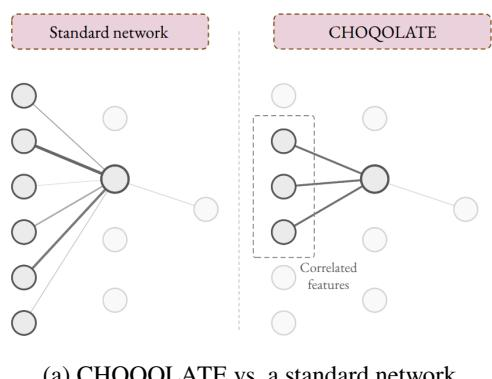  
(a) CHOQOLATE vs. a standard network

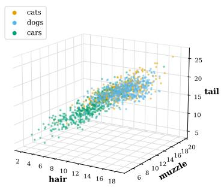  
(b) CLIP-similarity redundancy across related concepts  
Figure 1: Concept redundancy motivates CHOQOLATE’s structured design. (a) In a standard network, every input concept connects to each hidden node, mixing concepts indiscriminately; CHOQOLATE instead connects each node to a small group of correlated concepts, yielding sparse and interpretable nodes. (b) Visualizing a 3-concept bottleneck (hair, muzzle, tail) on Cats/Dogs/Cars reveals strongly correlated axes, with samples spreading along a shared diagonal rather than across independent concept dimensions.

## 2 Related Work

## 2.1 Concept Bottleneck Models

The term Concept Bottleneck Model (CBM), introduced by Koh et al. (2020), refers to the use of a bottleneck of human-specified concepts to perform a task, predominantly image classification, so that the resulting model is interpretable by design. The term names a longer lineage of attribute-based methods (Kumar et al. 2009; Lampert, Nickisch, and Harmeling 2009), whose early implementations were constrained by the need for per-sample concept annotations. Text-image contrastive foundation models have since lifted this constraint, enabling CBMs without explicit concept annotations (Yuksekgonul, Wang, and Zou 2023; Oikarinen et al. 2023; Yang et al. 2023), with CLIP (Radford et al. 2021) becoming the predominant backbone (Kazmierczak et al. 2025b). Several CLIP-based methods introduce hierarchical architectures, but rely on a manually specified structure (Panousis, Ienco, and Marcos 2024); our approach difers in that the hierarchy emerges from training, without supervision.

## 2.2 Interpreting and Debiasing CLIP-based CBMs

A critical concern with foundation models is whether they base their inferences on meaningful features. This expectation is often violated, as in the “Wolf vs. Husky” example (Ribeiro, Singh, and Guestrin 2016), where a classifier relies on snow rather than the object; such spurious correlations are widespread in CLIP (Moayeri et al. 2023; Zhang et al. 2024). They directly afect CLIP-based CBMs, which sufer from concept unfaithfulness (Debole et al. 2025): individual concepts do not faithfully reflect what they denote, being entangled with correlated ones, and Kazmierczak et al. (2025a) show that absent but semantically suggested concepts yield

CLIP scores comparable to present ones. Our word-cloud representation of each latent node, i.e., a cluster of mutually correlated concepts, makes this entanglement explicit rather than hiding it behind a single concept score. A parallel line of work translates embeddings into human-understandable structure, notably in mechanistic interpretability (Elhage et al. 2021). Sparse autoencoders (Bricken et al. 2023) are popular here, with variants adding hierarchy (Bussmann, Leask, and Nanda 2025) or multiple latent spaces (Dunefsky, Chlenski, and Nanda 2024). On the CBM side, Bhalla et al. (2024) propose a task-agnostic image-embedding decomposition and Rao et al. (2024) interpret the encoder output via a naming module; both operate on image embeddings rather than CLIP similarities, a richer signal, but one that loses the grounding in a named concept vocabulary on which our interpretations rely. Among works on the CLIP-similarity space, Zhao et al. (2026) seek concept-class attributions, and Feng, Bair, and Kolter (2024) target sparse attributions, but both remain single-layer frameworks. Several strategies mitigate the resulting biases, most by modifying model weights. One family retrains the last layer on a group-balanced calibration set (Sagawa et al. 2019; Kirichenko, Izmailov, and Wilson 2022), which is model-agnostic but requires knowing the spurious attribute per training sample. CLIP-specific methods instead leverage textual encodings: Chuang et al. (2023) project the shared embedding space to negate spurious concepts. Others (Peng et al. 2026; Debole et al. 2026) modify the CLIP vision encoder directly. Our method difers from both families: removal operates post hoc on the learned representation (CHOQ-PCR), with no retraining, no per-sample group labels, and the CLIP weights entirely unchanged.

## 2.3 Choquet Integrals: From Decision Aid to Neural Networks

Multicriteria decision aid (MCDA) studies transparent aggregation models for high-stakes settings where a human makes the final decision; such models are elicited from experts or learned from data (Sobrie, Mousseau, and Pirlot 2019; Martyn and Kadziński 2023). Among MCDA formalisms, the Choquet integral (Choquet 1953) aggregates criteria with respect to a capacity, weighting coalitions rather than isolated criteria, and can be learned from examples (Tehrani et al. 2012; Herin, Perny, and Sokolovska 2024); see Grabisch and Labreuche (2010) for a survey. Its 2-additive restriction (Grabisch 1997) keeps only individual weights and pairwise interactions and admits closed-form Shapley values, which model-agnostic explainers must otherwise approximate (Lundberg and Lee 2017; Pelegrina, Duarte, and Grabisch 2023); these exact attributions extend to hierarchical models (Labreuche and Fossier 2018; Labreuche 2022). Neural formulations are recent: Islam et al. (2020) use fuzzy integrals as aggregation layers, and Bresson et al. (2020) design networks whose parameter space coincides with hierarchical 2-additive Choquet integrals when the hierarchy is fixed a priori. More broadly, other non-linear aggregations replace the linear concept-to-logit map of standard CBMs: Bénard et al. (2026) build on the Hoefding decomposition of gradient-boosted trees for sparse, leakage-robust concept aggregation. Closest to our work, Atienza et al. (2024) also map images onto CLIP-based concepts, but their Choquet model is a student distilled to explain a pixel-based teacher. CHOQOLATE instead trains the Choquet layers as the predictor itself, with no teacher and no distillation, taking the concept space as its object of study: fusing redundant concepts into coherent nodes without supervision, explaining why this organization emerges, and supporting post-hoc concept removal (CHOQ-PCR).

## 3 Background

## 3.1 Concept Bottlenecks from CLIP Similarities

Task and notation. We consider C-way image classification: an image $I ~ \in ~ { \mathcal { X } }$ carries a one-hot label ${ \textbf { y } } =$ $( y _ { 1 } , \ l . . . , y _ { C } ) \in \mathbf { \bar { \{ 0 , 1 \} } } ^ { C }$ . Throughout, j and l index concepts (more generally, the coordinates of a Choquet integral input), $n \in \{ 1 , \ldots , \bar { N } \}$ the nodes of our intermediate layer, and $r \in \{ 1 , \ldots , C \}$ the classes.

Concept similarities. A vision-language model provides two encoders into a shared d-dimensional space, ${ \mathrm { C L I P } } _ { \mathrm { i m g } }$ $\mathcal X ~  ~ \mathbb R ^ { d }$ and $\mathrm { C L I P } _ { \mathrm { t e x t } } : \mathcal { T } \to \mathbb { R } ^ { d }$ , with $\tau$ a space of textual descriptions. We fix M textual concepts $\bar { \kappa } =$ $\{ k _ { 1 } , \dotsc , k _ { M } \} \subset \overline { { \mathcal { T } } }$ , each naming an attribute that may or may not be visible in an image. The CLIP similarity between an image I and $k _ { j }$ is

$$
\begin{array} { r } { S c o r e _ { j } = \langle \mathbf { C L I P _ { i m g } ( \boldsymbol { I } ) } , \mathbf { C L I P _ { t e x t } ( \boldsymbol { k } _ { j } ) } \rangle . } \end{array}\tag{1}
$$

A per-concept min-max normalization, fitted on the training set, maps this score to $z _ { j } ~ \in ~ [ 0 , 1 ]$ , which plays the role of a marginal utility in multicriteria models (Bresson et al. 2020). Stacking gives the concept bottleneck $\mathbf { Z } = ( z _ { 1 } , \ldots , z _ { M } ) \in [ 0 , \bar { 1 } ] ^ { M }$ , which a CLIP-based CBM feeds to a trainable classifier, both encoders frozen. Visionlanguage models entangle related concepts, so groups of coordinates co-activate; recovering these clusters automatically is our goal (Figure 2).

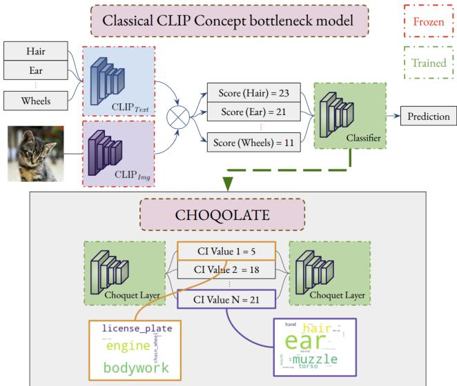  
Figure 2: Principle ofCHOQOLATE. Choquet layers guide the latent space toward merging semantically similar concepts, producing sparse and interpretable nodes, visualized as word clouds from closed-form Shapley values.

## 3.2 The 2-Additive Choquet Integral

The Choquet integral generalizes the weighted mean by letting criteria interact. Its 2-additive form keeps only pairwise interactions, hence a quadratic rather than exponential parameter count (Grabisch 1997; Grabisch and Labreuche 2010). We adopt the neural formulation of Bresson et al. (2020): for $\mathbf { u } = ( u _ { 1 } , \ldots , u _ { p } ) \in [ 0 , 1 ] ^ { p }$

$$
\mathcal { C } ( \mathbf { u } ) = \sum _ { j = 1 } ^ { p } a _ { j } u _ { j } + \sum _ { j < l } \Bigl ( b _ { j , l } \operatorname* { m i n } ( u _ { j } , u _ { l } ) + c _ { j , l } \operatorname* { m a x } ( u _ { j } , u _ { l } ) \Bigr ) ,\tag{2}
$$

where $a _ { j } , b _ { j , l } , c _ { j , l } \geq 0$ and $\begin{array} { r l } { \sum _ { j } a _ { j } + \sum _ { j < l } ( b _ { j , l } + c _ { j , l } ) = } & { { } } \end{array}$ 1, the normalization constraint. These conditions make $\mathcal { C }$ monotone in each coordinate, confine its output to [0, 1], and cost no expressiveness: nonnegative min/max decompositions parametrize exactly the monotone normalized 2- additive integrals (Grabisch 1997). The equation reads naturally: min $( u _ { j } , u _ { l } )$ is a soft conjunction, large only when both inputs are, so a positive $b _ { j , l }$ encodes complementarity; max $\mathbf { \Psi } ( u _ { j } , u _ { l } )$ is a soft disjunction, so a positive $c _ { j , l }$ encodes substitutability (Bresson et al. 2020); the weights $a _ { j }$ alone recover a weighted mean.

Shapley values. The contribution of coordinate $j$ to the output has a closed form, classical for 2-additive measures (Grabisch 1997):

$$
\mathrm { S h a p } ( j ) = a _ { j } + \frac { 1 } { 2 } \sum _ { l \neq j } \bigl ( b _ { j , l } + c _ { j , l } \bigr ) .\tag{3}
$$

A coordinate matters either on its own, through $a _ { j } .$ , or through its pairwise interactions, each counted for half.

## 4 CHOQOLATE

## 4.1 Architecture and Training

From classifier to Choquet layers. CHOQOLATE replaces the classifier of a CLIP-based CBM with two Choquet layers: the point is not to read the concept space out but to reshape it (Figure 2). The CLIP encoders stay frozen; only the Choquet weights are learned.

Choquet layers. A Choquet layer stacks N integrals $\mathcal { C } ^ { ( 1 ) } , \ldots , \mathcal { C } ^ { ( \bar { N } ) }$ , each applied to the whole input vector. Each $\mathcal { C } ^ { ( n ) }$ carries its own weights $a _ { j } ^ { ( n ) } , b _ { j , l } ^ { ( n ) } , c _ { j , l } ^ { ( n ) }$ , obtained from unconstrained parameters $\theta ^ { ( n ) }$ through a reparametrization that enforces nonnegativity and the normalization constraint by construction (Appendix A); gradient descent thus operates on $\theta ^ { ( n ) }$ while the integral always remains a valid 2-additive Choquet integral.

Two-layer architecture. The first layer takes the concept scores Z and outputs $N \ll M$ Choquet Integral (CI) values by grouping semantically related concepts through learned Choquet integrals, forming an interpretable bottleneck. The second layer maps these N CI values to class scores via another set of Choquet integrals. All the interpretability sits in the first layer, whose integrals we call nodes: the contribution of concept $k _ { j }$ to node n is its Shapley value $\operatorname { S h a p } ^ { ( n ) } ( j )$ obtained by applying (3) to the weights of $\mathcal { C } ^ { ( n ) }$ , rendered as word clouds (Figure 2), and edited by the intervention of Section 4.2.

Training objective. With y the one-hot label and $\hat { y } _ { r } ^ { ( T _ { \mathrm { c e } } ) }$ the temperature-scaled softmax of the second-layer outputs (Appendix $\mathbf { A } ) .$ , we train both layers end to end by minimizing

$$
\mathcal { L } o s s ^ { ( T _ { \mathrm { c e } } ) } = \underbrace { - \sum _ { r = 1 } ^ { C } y _ { r } \log \hat { y } _ { r } ^ { ( T _ { \mathrm { c e } } ) } } _ { \mathrm { s c a l e d ~ c r o s s - e n t r o p y } } + \lambda _ { \ell _ { 1 } } \underbrace { \sum _ { n = 1 } ^ { N } \sum _ { j < l } \bigl ( b _ { j , l } ^ { ( n ) } + c _ { j , l } ^ { ( n ) } \bigr ) } _ { \ell _ { 1 } \mathrm { ~ o n ~ f i r s t - l a y e r ~ i n t e r a c t i o n s } } .\tag{4}
$$

The $\ell _ { 1 }$ penalty, of strength $\lambda _ { \ell _ { 1 } } \ \geq 0 .$ , acts on the first-layer interaction weights only and pushes each node toward few pairwise interactions.

## 4.2 CHOQ-PCR: Post-hoc Concept Removal

Suppose a spurious attribute leaks into the prediction through a few identifiable concepts. CHOQOLATE lets us cut them out without retraining: CHOQ-PCR (Post-hoc Concept Removal) nullifies a concept $k _ { j }$ by zeroing every first-layer weight that involves $\mathrm { i t } , a _ { j } ^ { ( n ) } \gets 0$ and $b _ { j , l } ^ { ( n ) } , c _ { j , l } ^ { ( n ) } \gets 0$ for all l and n. The edit is unambiguous, weights being nonnegative and $\operatorname { S h a p } ^ { ( n ) } ( j )$ (3) fully summarizing what $k _ { j }$ brings to node n; and it is surgical: the remaining weights are only rescaled by a common factor to restore the normalization constraint, so the relative contributions within each node are unchanged. Unlike pruning a flat linear head (Yuksekgonul, Wang, and Zou 2023), which removes one weight per concept, the nullification also removes every pairwise interaction of the concept, and the Shapley values quantify exactly what each node lost.

## 5 Analysis of one Choquet layer

We now provide insights about why Choquet layers organize the concept space without any explicit supervision on concept clustering. To isolate the mechanism, we study a one-layer Choquet classifier. Once the input $\mathbf { u } \in [ 0 , 1 ] ^ { \bar { p } }$ is fixed, we can define the feature vector

$$
\phi ( \mathbf { u } ) = \left( { { \left( { { u _ { j } } } \right) _ { j \leq p } } , { { \left( { \operatorname* { m i n } } ( { { u _ { j } } , { u _ { l } } } ) \right) } _ { j < l } } , { { \left( { \operatorname* { m a x } } ( { { u _ { j } } , { u _ { l } } } ) \right) } _ { j < l } } } \right)\tag{5}
$$

The unnormalized weights of the Choquet layer are de noted $\theta ^ { ( r ) }$ ; their softmax $\begin{array} { r c l } { \mathbf { w } ^ { ( r ) } } & { = } & { \mathrm { s o f t m a x } ( \theta ^ { ( r ) } ) } \end{array} =$ $( \mathbf { a } ^ { ( r ) } , \mathbf { b } ^ { ( r ) } , \mathbf { c } ^ { ( r ) } )$ enforces the normalization constraint, and class r is scored by a plain inner product,

$$
\mathcal { C } ^ { ( r ) } ( \mathbf { u } ) \ = \ \langle \mathbf { w } ^ { ( r ) } , \phi ( \mathbf { u } ) \rangle .\tag{6}
$$

Proposition 1 (Choquet gradient). Consider the one-layer Choquet classifier (6) trained with the classical crossentropy loss Loss. For every class r and every feature index i,

$$
\frac { \partial \mathcal { L } o s s } { \partial \theta _ { i } ^ { ( r ) } } = \left( \hat { y } _ { r } - y _ { r } \right) \cdot w _ { i } ^ { ( r ) } \cdot \left( \phi _ { i } ( \mathbf { u } ) - \mathcal { C } ^ { ( r ) } ( \mathbf { u } ) \right) .\tag{7}
$$

The gradient factorizes into the classification error, the current weight of the feature, and its deviation from the integral’s output (proof in Appendix F). Hence two mechanisms: a small weight means a vanishing gradient, freezing unselected features out of the dynamics; and updates concentrate on features farthest from the integral value, inducing the anchoring of Section 6.3. Both need a non-negligible error term, which the inner factors, of magnitude at most one, can only shrink; hence a temperature ${ T _ { \mathrm { c e } } } ^ { - } > 0 .$ , which rescales the gradient by $1 / T _ { \mathrm { c e } }$ and replaces $\hat { y } _ { r }$ with $\hat { y } _ { r } ^ { ( T _ { \mathrm { c e } } ) }$ (Corollary 1, Appendix F): a small $T _ { \mathrm { c e } } ^ { \phantom { \dagger } }$ kills the error term, and the sparsity pressure with it, once the model is confident. In practice, class scores live in [0, 1], so logit gaps never exceed one and the untempered softmax stays near uniform; our $T _ { \mathrm { c e } } = 0 . 0 0 5$ restores a usual logit range without going as far as saturation.

## 6 Experiments

We structure our experiments around three research questions:

1. RQ1: Does CHOQOLATE achieve a favorable trade-of between classification accuracy and latent-space interpretability?

2. RQ2: Does the latent organization emerge as predicted by the gradient analysis in Section 5?

3. RQ3: Can post-hoc removal of spurious concepts efectively mitigate bias?

## 6.1 Setup

Datasets. We evaluate on four classification datasets: Cats/Dogs/Cars (CDC) (Kazmierczak et al. 2024) (3 classes, 39 concepts), MonumAI (Lamas et al. 2021) (architectural styles; 4 classes, 15 concepts), COCO (Lin et al. 2014) (location-type recognition; 6 classes, 80 concepts), and CUB-200-2011 (CUB) (Wah et al. 2011) (fine-grained bird species; 200 classes, 226 concepts). Bias mitigation is assessed on two binary datasets with controlled spurious correlations: Waterbirds (Sagawa et al. 2019) and CelebA (Liu et al. 2015). Dataset constructions, spurious/non-spurious concept splits, and full class and concept lists are given in Appendix B (Tables A1 and A2).

Metrics. Task performance is measured by accuracy; latent quality by two complementary metrics, detailed in Appendix C. Attribution Gini (Hurley and Rickard 2009) taking values in [0, 1] quantifies the concentration of Shapley attributions within a node: a high value indicates a node relying on a few salient concepts, a low value a difuse, polysemantic one. Node Coherence, which we introduce, measures whether these concepts are statistically related: It is defined as the average of the pairwise correlations $S _ { j l }$ between concept scores over the test set weighted by the attributions ${ \mathrm { S h a p } } ^ { ( n ) } ( j ) \cdot { \mathrm { S h a p } } ^ { ( n ) } ( l )$ , so that only the concepts a node relies on contribute. It takes values in [−1, 1], a high value meaning that a node aggregates correlated, semantically related concepts, and we report its average over the N nodes. While not related to interpretability or classification performance, we also measure two additional informationpreservation metrics, CKNNA and HSIC, in Appendix D.1.

Baselines. As one of the most widely used competitors, we first compare against PCBM (Yuksekgonul, Wang, and Zou 2023). We further compare against state-of-the-art methods that emphasize learning sparse and interpretable representations, namely SLR-AVD (Feng, Bair, and Kolter 2024), PSCBM (Zhao et al. 2026), and sparse autoencoders (Bricken et al. 2023).

Hyperparameters. CHOQOLATE is trained for 100 epochs with a batch size of 512 and a learning rate of 0.1. We apply an $\ell _ { 1 }$ penalty with strength $\lambda _ { \ell _ { 1 } } = 0 . 0 1$ to the first-layer interaction terms to encourage sparse concept interactions. The concept-to-class mapping uses a softmax with temperature $T _ { \mathrm { c e } } = 0 . 0 0 5$ . Unless stated otherwise, interaction terms are enabled in all reported experiments. For all methods, we fix the latent dimension to 8, chosen as a trade-of between a size large enough to preserve accuracy and one smal enough to yield compact explanations; a sensitivity analysis over smaller and larger values is provided in Appendix D.2. The hyperparameter search was performed by dichotomy. The CLIP backbone is the ViT-L/14@336px model from the original CLIP release (Radford et al. 2021).

## 6.2 RQ1: Accuracy–Interpretability Trade-of

We first ask whether CHOQOLATE achieves a better accuracy/organization-quality trade-of than existing interpretable representations. Figure 3 plots accuracy against each quality metric; numerical values are in Tables A3 and A4 (Appendix D.1). To further assess the validity of these comparisons, we report a Mann Whitney U-test in Appendix E. On accuracy, CHOQOLATE is on par with its competitors overall, ranking first on MonumAI and COCO and second on Cats/Dogs/Cars and CUB (Table A3). CUB, with 200 classes behind an 8-node bottleneck, is hard for every method: all accuracies drop, and CHOQOLATE matches the best baseline (34.20±1.56 vs. 35.84±12.26) with a far smaller run-to-run deviation. We further examine how this dificulty scales with the label space in Appendix D.2. Despite its constraints (nonnegative weights summing to one, hence monotone aggregation), CHOQOLATE thus stays competitive: they appear to act as a regularizing prior, and the interaction weights add expressivity. Only on Cats/Dogs/Cars, the simplest dataset, does this structure hinder rather than help. Figure 3 then carries our central claim: CHOQOLATE organizes the latent space better at comparable accuracy, sitting in the upper-right corner of nearly every panel. It dominates Attribution Gini everywhere, surpassing even SLR-AVD, which applies $\ell _ { 1 }$ to all weights. We attribute this to the softmax reparametrization, absent from SLR-AVD, whose role is confirmed by the ablation of Appendix D.2. CHOQOLATE also achieves the best or statistically comparable Node Coherence everywhere except MonumAI, whose more technical concept set (Table A1) is inherently harder to cluster. As a practical illustration, Figure 4 displays global explanations as word clouds, concept size reflecting Shapley importance (3), on Cats/- Dogs/Cars (more in Appendix D.3). The clouds of CHOQO-LATE are salient, a direct consequence of the dynamics of Section 5, and semantically grouped: one node collects ear, muzzle, and torso, another bodywork, license plate, and engine, shaped by the classification task. Some redundancy across nodes indicates that the model favors few strongly discriminative concepts over uniform coverage, suggesting several low-utility concepts in the original vocabulary.

## 6.3 RQ2: Emergence of the Organization

We next test whether the latent organization emerges as predicted by the analysis of Section 5. To this end, we use Equation (3) to track per-concept attributions throughout training, monitoring the concepts train, car, bed, frisbee, and surfboard on COCO, whose concept set spans contrasted semantic groups (transportation, leisure), and report their evolution in the nodes where they receive non-negligible weight in Figure 5. In both nodes, we observe a two-step process. First, a single concept, which we refer to as the anchor (train in node 2 andfrisbee in node 4), exhibits a rapid spike in attribution: attribution mass being conserved by the softmax, an early gain comes at the expense of all other concepts. Second, a refinement phase occurs in which concepts semantically related to the anchor progressively gain attribution, while unrelated concepts are driven to zero. Both steps match Proposition 1: the factor $w _ { i } ^ { ( r ) }$ freezes near-zero weights out of the dynamics, while the deviation factor $\phi _ { i } ( \mathbf { u } ) - \mathcal { C } ^ { ( r ) } ( \mathbf { u } )$ pushes down the concepts unrelated to the anchor, whose lost weight the softmax renormalization transfers to related ones.

## 6.4 RQ3: Post-hoc Bias Mitigation

Finally, we ask whether the exact concept attributions of CHOQOLATE can be exploited after training, using bias mitigation as a case study. We apply CHOQ-PCR (Section 4.2), assuming the spurious concepts are known, here identified from the dataset definition, and report accuracy and worstgroup accuracy (Appendix C) on datasets Waterbirds and CelebA, whose spurious factors are the background and gender.

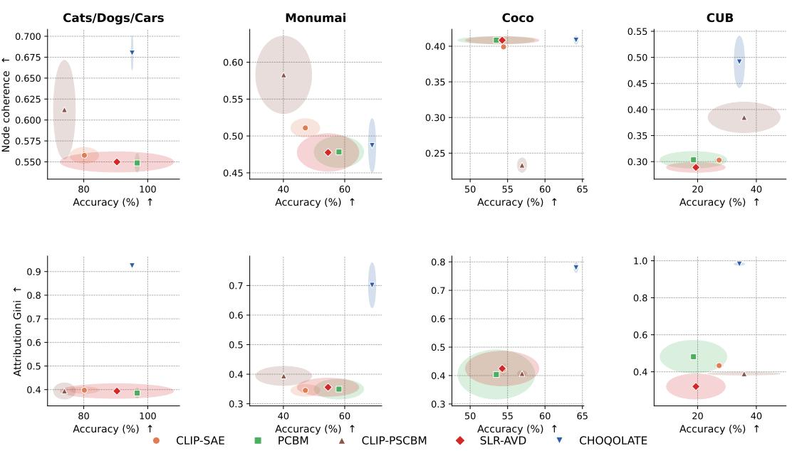

Figure 3: Accuracy vs. organization-quality metrics across datasets. Each column corresponds to one dataset (Cats/Dogs/Cars, MonumAI, COCO, CUB), each row to a quality metric. Each point is a method averaged over twenty runs, with ellipses indicating variance bounds.  
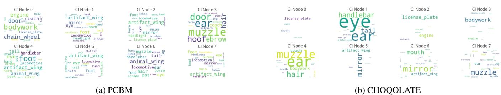  
Figure 4: Global explanations on Cats/Dogs/Cars. Word size reflects concept importance for the node. CHOQOLATE (right) yields sparser, more coherent word clouds than the PCBM baseline (left).

We compare two variants of our approach. Concept removal (oracle) knows the spurious concepts before training and excludes them from the bottleneck; CHOQ-PCR instead applies post-hoc weight nullification to a model trained on the full, biased concept set. The latter is the more practical setting, as bias is often identified only after deployment. We further compare against four established baselines: Group-DRO (Sagawa et al. 2019) and DFR (Kirichenko, Izmailov, and Wilson 2022), which require group labels and fine-tuning, and the CLIP-specific Ortho-Proj and Ortho-Cali (Chuang et al. 2023), which remove spurious directions from the embedding space. Results are in Table 1.

Both settings improve substantially over the biased model, and CHOQ-PCR performs on par with the oracle; the two confidence intervals overlap, so we read this as comparable rather than superior. We attribute it to two factors: training on the larger concept set may yield a richer gradient signal and better-structured representations, and nullification introduces an implicit negative signal that actively suppresses unwanted patterns rather than merely ignoring them. On worst-group accuracy, Group-DRO remains competitive and is strongest on CelebA, while our intervention is comparable on Waterbirds. The value of CHOQ-PCR is thus not raw dominance but its unique combination of properties: it is the only method that is simultaneously fine-tuning-free, annotation-free, and test-time. Reducing the high variance on worst-group accuracy, attributable to the small worst group, is left to future work.

## 7 Limitations

We now state the main limitations of CHOQOLATE and, more broadly, of Choquet layers. First, CHOQOLATE operates on concept-similarity scores and relies on these scores being strongly correlated across related concepts, in line with the bag-of-words efect of vision-language models (Yuksekgonul et al. 2023; Debole et al. 2025); this redundancy is precisely what makes merging efective. Transferring the approach to another backbone therefore requires an analogue of concept scores, and the redundancy assumption should be verified beforehand; the correlation matrix S used by Node Coherence provides exactly this diagnostic. Second, even in the 2-additive case, each first-layer node carries $M + 2 { \binom { M } { 2 } } = M ^ { 2 }$ weights, hence a quadratic dependence on the vocabulary size. This remains modest at the scale of our experiments (15 to 226 concepts) but becomes prohibitive for the tens of thousands of concepts handled by some recent CBM works (Yang et al. 2023), and rules out settings such as SAE feature interpretation, where latent units are typically far more numerous. Finally, since all weights are nonnegative and each integral is monotone, CHOQOLATE constrains attributions to be nonnegative: explanations can only invoke thepresence ofconcepts, and evidence ofabsence (predicting car because no ears are visible) never surfaces in them, even when it drives the prediction indirectly through the competition between class scores. This restriction is the price of the unambiguous edits of CHOQ-PCR; the competitive accuracy of our experiments indicates that the underlying monotone aggregation sufices for the tasks we consider, and extending the framework to negative contributions is left for future work.

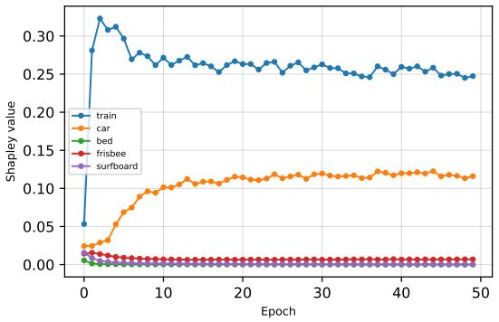  
(a) CI Node 2

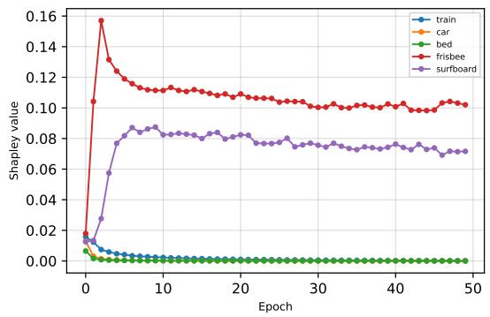  
(b) CI Node 4  
Figure 5: Training dynamics of Shapley attributions on COCO. Per-concept attributions (Eq. (3)) across training epochs, in the two nodes where the tracked concepts receive weight.

Table 1: Accuracy (%) of CHOQ-PCR versus debiasing baselines. Baseline: standard training. Concept removal (oracle): ground-truth spurious concepts removed. CHOQ-PCR (ours): concept-weight nullification on the biased model at test time. FT-free: no fine-tuning; Annot.-free: no group annotations; Test-time: applied at test time. Best per column in bold.
<table><tr><td></td><td colspan="2">Waterbirds</td><td colspan="2">CelebA</td><td colspan="3">Properties</td></tr><tr><td>Method</td><td>Acc. ↑</td><td>Worst group ↑</td><td>Acc. ↑</td><td>Worst group ↑</td><td>FT free</td><td>Annot. free</td><td>Test time</td></tr><tr><td>Baseline</td><td> $8 4 . 5 6 \pm 1 . 0 4$ </td><td> $4 6 . 5 1 \pm 2 . 8 7$ </td><td> $8 9 . 2 1 \pm 0 . 2 8$ </td><td> $2 3 . 8 9 \pm 2 . 7 2$ </td><td></td><td></td><td></td></tr><tr><td>Concept removal (oracle)</td><td> $8 8 . 4 2 \pm 0 . 6 1$ </td><td> $6 0 . 2 8 \pm 3 . 4 9$ </td><td> $9 1 . 8 1 \pm 0 . 1 5$ </td><td> $3 2 . 2 2 \pm 1 . 4 5$ </td><td>√</td><td>√</td><td></td></tr><tr><td>CHOQ-PCR (ours)</td><td> $\mathbf { 8 9 . 5 2 \pm 1 . 1 2 }$ </td><td> ${ \bf 6 8 . 2 6 \pm 1 0 . 1 4 }$ </td><td> $\mathbf { 9 2 . 4 4 \pm 1 . 5 3 }$ </td><td> $3 7 . 7 8 \pm 1 1 . 9 9$ </td><td>√</td><td>√</td><td>V</td></tr><tr><td>Ortho-Proj</td><td> $8 8 . 5 2 \pm 1 . 0 8$ </td><td> $5 8 . 8 2 \pm 3 . 6 8$ </td><td> $9 1 . 6 5 \pm 0 . 6 7$ </td><td> $3 2 . 0 0 \pm 3 . 3 3$ </td><td></td><td>√</td><td>√</td></tr><tr><td>Ortho-Cali</td><td> $8 8 . 6 1 \pm 0 . 3 3$ </td><td> $6 4 . 1 4 \pm 2 . 1 1$ </td><td> $8 9 . 4 4 \pm 0 . 4 7$ </td><td> $1 1 . 4 4 \pm 4 . 1 8$ </td><td></td><td>√</td><td>√</td></tr><tr><td>DFR</td><td> $8 5 . 6 5 \pm 2 . 0 2$ </td><td> $5 3 . 1 5 \pm 8 . 8 4$ </td><td> $8 7 . 0 1 \pm 1 . 5 5$ </td><td> $3 7 . 8 9 \pm 2 . 9 1$ </td><td></td><td></td><td>√</td></tr><tr><td>Group-DRO</td><td> $8 2 . 0 9 \pm 2 . 6 8$ </td><td> $6 7 . 3 4 \pm 9 . 4 6$ </td><td> $8 5 . 5 4 \pm 1 . 4 5$ </td><td> ${ \bf 4 7 . 2 2 \pm 3 . 2 0 }$ </td><td></td><td></td><td>√</td></tr></table>

## 8 Conclusion

We introduced CHOQOLATE, an architecture based on 2- additive Choquet integrals. Applied to CLIP-based concept bottleneck models, it ofers a favorable trade-of between classification accuracy and latent-space organization. Its pernode attributions are much sparser than those of competing approaches. Our gradient analysis explains this sparsity. Under the softmax reparametrization, the gradient of a concept is proportional to its current weight, so unselected concepts are progressively frozen out of training. This matches the anchor dynamics we observe empirically. Choquet weights also map to Shapley values in closed form, which enables targeted post-hoc edits: CHOQ-PCR suppresses spurious concepts after training and performs on par with debiasing methods that require group annotations or retraining, the edit operating directly in the interpretable concept space. More broadly, Choquet integrals are a promising tool for interpretable-by-design architectures: the structure they induce emerges without supervision, and they inherit a solid mathematical grounding from decision theory. Future work includes incorporating Choquet layers into prototype-based models (Chen et al. 2019) and, once the quadratic cost in the number of inputs is alleviated, into neuron identification methods (Kalibhat et al. 2023).

## References

Atienza, N.; Bresson, R.; Rousselot, C.; Caillou, P.; Cohen, J.; Labreuche, C.; and Sebag, M. 2024. Cutting the black box: Conceptual interpretation of a deep neural net with multi-modal embeddings and multi-criteria decision aid. In IJCAI2024, 33rdInternational Joint Conference onArtificial Intelligence, 3669–3678. International Joint Conferences on Artificial Intelligence Organization.

Bénard, C.; Arfib, M.; Labreuche, C.; and Quétu, V. 2026. Hoefding Concept Bottleneck Models with Applications to Overhead Images. arXiv preprint arXiv:2606.00082.

Bhalla, U.; Oesterling, A.; Srinivas, S.; Calmon, F.; and Lakkaraju, H. 2024. Interpreting clip with sparse linear concept embeddings (splice). Advances in Neural Information Processing Systems, 37: 84298–84328.

Bresson, R.; Cohen, J.; Hüllermeier, E.; Labreuche, C.; and Sebag, M. 2020. Neural Representation and Learning of Hierarchical 2-additive Choquet Integrals. In Proceedings of the Twenty-Ninth International Joint Conference onArtificial Intelligence (IJCAI), 1984–1991.

Bricken, T.; Templeton, A.; Batson, J.; Chen, B.; Jermyn, A.; Conerly, T.; Turner, N. L.; Anil, C.; Denison, C.; Askell, A.; Lasenby, R.; Wu, Y.; Kravec, S.; Schiefer, N.; Maxwell,

T.; Joseph, N.; Hatfield-Dodds, Z.; Tamkin, A.; Nguyen, K.; McLean, B.; Burke, J. E.; Hume, T.; Carter, S.; Henighan, T.; and Olah, C. 2023. Towards Monosemanticity: Decomposing Language Models With Dictionary Learning. Transformer Circuits Thread.

Bussmann, B.; Leask, P.; and Nanda, N. 2025. Learning Multi-Level Features with Matryoshka Sparse Autoencoders. In International Conference on Machine Learning (ICML).

Chen, C.; Li, O.; Tao, D.; Barnett, A.; Rudin, C.; and Su, J. K. 2019. This looks like that: deep learning for interpretable image recognition. Advances in neural information processing systems, 32.

Choquet, G. 1953. Theory of capacities. Annales de l’Institut Fourier.

Chuang, C.-Y.; Jampani, V.; Li, Y.; Torralba, A.; and Jegelka, S. 2023. Debiasing vision-language models via biased prompts. arXiv preprint arXiv:2302.00070.

Cukierski, W. 2013. Dogs vs. Cats.

Debole, N.; Barbiero, P.; Giannini, F.; Passerini, A.; Teso, S.; and Marconato, E. 2025. If Concept Bottlenecks are the Question, are Foundation Models the Answer? arXiv preprint arXiv:2504.19774.

Debole, N.; Passerini, A.; Teso, S.; Pugnana, A.; and Marconato, E. 2026. Concepts Worth Having: Refining VLM-Guided Concept Bottleneck Models with Minimal Annotations. arXiv preprint arXiv:2605.16405.

Dunefsky, J.; Chlenski, P.; and Nanda, N. 2024. Transcoders Find Interpretable LLM Feature Circuits. In Advances in Neural Information Processing Systems (NeurIPS).

Elhage, N.; Nanda, N.; Olsson, C.; Henighan, T.; Joseph, N.; Mann, B.; Askell, A.; Bai, Y.; Chen, A.; Conerly, T.; et al. 2021. A mathematical framework for transformer circuits. Transformer Circuits Thread, 1(1): 12.

Feng, Z.; Bair, A.; and Kolter, J. Z. 2024. Text Descriptions are Compressive and Invariant Representations for Visual Learning. Transactions on Machine Learning Research (TMLR).

Grabisch, M. 1997. K-order additive discrete fuzzy measures and their representation. Fuzzy sets and systems, 92(2): 167– 189.

Grabisch, M.; and Labreuche, C. 2010. A decade of application of the Choquet and Sugeno integrals in multi-criteria decision aid. Annals of Operations Research, 175(1): 247– 286.

Gretton, A.; Bousquet, O.; Smola, A.; and Schölkopf, B. 2005. Measuring statistical dependence with Hilbert-Schmidt norms. In International conference on algorithmic learning theory, 63–77. Springer.

Herin, M.; Perny, P.; and Sokolovska, N. 2024. Learning preference representations based on Choquet integrals for multicriteria decision making. Annals of Mathematics and Artificial Intelligence, 92(6): 1511–1544.

Huh, M.; Cheung, B.; Wang, T.; and Isola, P. 2024. The platonic representation hypothesis. arXiv preprint arXiv:2405.07987.

Hurley, N.; and Rickard, S. 2009. Comparing Measures of Sparsity. IEEE Transactions on Information Theory, 55(10): 4723–4741.

Islam, M. A.; Anderson, D. T.; Pinar, A. J.; Havens, T. C.; Scott, G.; and Keller, J. M. 2020. Enabling Explainable Fusion in Deep Learning with Fuzzy Integral Neural Networks. IEEE Transactions on Fuzzy Systems, 28(7): 1291–1300.

Kalibhat, N.; Bhardwaj, S.; Bruss, C. B.; Firooz, H.; Sanjabi, M.; and Feizi, S. 2023. Identifying Interpretable Subspaces in Image Representations. In International Conference on Machine Learning, 15623–15638.

Kazmierczak, R.; Azzolin, S.; Berthier, E.; Frehse, G.; and Franchi, G. 2025a. Enhancing Concept Localization in CLIP-based Concept Bottleneck Models. arXiv preprint arXiv:2510.07115.

Kazmierczak, R.; Azzolin, S.; Berthier, E.; Hedström, A.; Delhomme, P.; Filliat, D.; Bousquet, N.; Frehse, G.; Mancini, M.; Caramiaux, B.; et al. 2026. Benchmarking xai explanations with human-aligned evaluations. In Proceedings of the AAAI Conference on Artificial Intelligence, volume 40, 37491–37500.

Kazmierczak, R.; Berthier, E.; Frehse, G.; and Franchi, G. 2024. CLIP-QDA: An Explainable Concept Bottleneck Model. Transactions on Machine Learning Research Journal.

Kazmierczak, R.; Berthier, E.; Frehse, G.; and Franchi, G. 2025b. Explainability and vision foundation models: A survey. Information Fusion, 122: 103184.

Kirichenko, P.; Izmailov, P.; and Wilson, A. G. 2022. Last layer re-training is suficient for robustness to spurious correlations. arXiv preprint arXiv:2204.02937.

Koh, P. W.; Nguyen, T.; Tang, Y. S.; Mussmann, S.; Pierson, E.; Kim, B.; and Liang, P. 2020. Concept bottleneck models. In International Conference on Machine Learning, 5338– 5348.

Krause, J.; Stark, M.; Deng, J.; and Fei-Fei, L. 2013. 3D Object Representations for Fine-Grained Categorization. In Proceedings ofthe IEEE International Conference on Computer Vision (ICCV) Workshops, 554–561.

Kumar, N.; Berg, A. C.; Belhumeur, P. N.; and Nayar, S. K. 2009. Attribute and simile classifiers for face verification. In 2009 IEEE 12th International Conference on Computer Vision, 365–372. IEEE.

Labreuche, C. 2022. Explanation with the Winter value: Efficient computation for hierarchical Choquet integrals. International Journal ofApproximate Reasoning, 151: 225–250.

Labreuche, C.; and Fossier, S. 2018. Explaining Multi-Criteria Decision Aiding Models with an Extended Shapley Value. In IJCAI.

Lamas, A.; Tabik, S.; Cruz, P.; Montes, R.; Martinez-Sevilla, Á.; Cruz, T.; and Herrera, F. 2021. MonuMAI: Dataset, deep learning pipeline and citizen science based app for monumental heritage taxonomy and classification. Neurocomputing, 420: 266–280.

Lampert, C. H.; Nickisch, H.; and Harmeling, S. 2009. Learning to detect unseen object classes by between-class attribute transfer. In 2009 IEEE Conference on Computer Vision and Pattern Recognition, 951–958. IEEE.

Lewis, M.; Nayak, N.; Yu, P.; Merullo, J.; Yu, Q.; Bach, S.; and Pavlick, E. 2024. Does CLIP Bind Concepts? Probing Compositionality in Large Image Models. In Graham, Y.; and Purver, M., eds., Findings of the Association for Computational Linguistics: EACL 2024, 1487–1500. St. Julian’s, Malta: Association for Computational Linguistics.

Lin, T.-Y.; Maire, M.; Belongie, S.; Hays, J.; Perona, P.; Ramanan, D.; Dollár, P.; and Zitnick, C. L. 2014. Microsoft COCO: Common Objects in Context. In European Conference on Computer Vision (ECCV), 740–755. Springer.

Liu, Z.; Luo, P.; Wang, X.; and Tang, X. 2015. Deep Learning Face Attributes in the Wild. In Proceedings ofInternational Conference on Computer Vision (ICCV).

Lundberg, S. M.; and Lee, S.-I. 2017. A unified approach to interpreting model predictions. Advances in neural information processing systems, 30.

Martyn, K.; and Kadziński, M. 2023. Deep preference learning for multiple criteria decision analysis. European Journal ofOperational Research, 305(2): 781–805.

Moayeri, M.; Wang, W.; Singla, S.; and Feizi, S. 2023. Spuriosity rankings: Sorting data to measure and mitigate biases. Advances in Neural Information Processing Systems, 36: 41572–41600.

Oikarinen, T.; Das, S.; Nguyen, L. M.; and Weng, T.-W. 2023. Label-free Concept Bottleneck Models. In The Eleventh International Conference on Learning Representations, ICLR 2023.

Panousis, K. P.; Ienco, D.; and Marcos, D. 2024. Coarse-tofine concept bottleneck models. Advances in Neural Information Processing Systems, 37: 105171–105199.

Pelegrina, G. D.; Duarte, L. T.; and Grabisch, M. 2023. A k-additive Choquet Integral-Based Approach to Approximate the SHAP Values for Local Interpretability in Machine Learning. Artificial Intelligence, 325: 104014.

Peng, P.; Xie, M.-K.; Hao, H.; Jin, T.; and Huang, S.-J. 2026. Representation-Level Counterfactual Calibration for Debiased Zero-Shot Recognition. Advances in Neural Information Processing Systems, 38: 134547–134584.

Radford, A.; Kim, J. W.; Hallacy, C.; Ramesh, A.; Goh, G.; Agarwal, S.; Sastry, G.; Askell, A.; Mishkin, P.; Clark, J.; et al. 2021. Learning transferable visual models from natural language supervision. In International conference on machine learning, 8748–8763. PmLR.

Rao, C. R. 1982. Diversity and dissimilarity coeficients: a unified approach. Theoretical population biology, 21(1): 24–43.

Rao, S.; Mahajan, S.; Böhle, M.; and Schiele, B. 2024. Discover-then-Name: Task-Agnostic Concept Bottlenecks via Automated Concept Discovery. In European Conference on Computer Vision (ECCV).

Ribeiro, M. T.; Singh, S.; and Guestrin, C. 2016. “Why Should I Trust You?”: Explaining the Predictions of Any Classifier. In Proceedings of the 22nd ACM SIGKDD International Conference on Knowledge Discovery and Data Mining, San Francisco, CA, USA,August 13-17, 2016, 1135– 1144.

Sagawa, S.; Koh, P. W.; Hashimoto, T. B.; and Liang, P. 2019. Distributionally robust neural networks for group shifts: On the importance of regularization for worst-case generalization. arXiv preprint arXiv:1911.08731.

Sobrie, O.; Mousseau, V.; and Pirlot, M. 2019. Learning monotone preferences using a majority rule sorting model. International Transactions in Operational Research, 26(5): 1786–1809.

Tehrani, A. F.; Cheng, W.; Dembczyński, K.; and Hüllermeier, E. 2012. Learning monotone nonlinear models using the Choquet integral. Machine learning.

Wah, C.; Branson, S.; Welinder, P.; Perona, P.; and Belongie, S. 2011. Caltech-UCSD Birds-200-2011. Technical Report CNS-TR-2011-001, California Institute of Technology.

Yang, Y.; Panagopoulou, A.; Zhou, S.; Jin, D.; Callison-Burch, C.; and Yatskar, M. 2023. Language in a bottle: Language model guided concept bottlenecks for interpretable image classification. In Proceedings of the IEEE/CVF conference on computer vision and pattern recognition, 19187– 19197.

Yuksekgonul, M.; Bianchi, F.; Kalluri, P.; Jurafsky, D.; and Zou, J. 2023. When and why vision-language models behave like bags-of-words, and what to do about it? In International Conference on Learning Representations (ICLR).

Yuksekgonul, M.; Wang, M.; and Zou, J. 2023. Post-hoc Concept Bottleneck Models. In International Conference on Learning Representations (ICLR).

Zhang, M.; Colman, B.; Shahriyari, A.; Bharaj, G.; et al. 2024. Common-Sense Bias Discovery and Mitigation for Classification Tasks. arXiv preprint arXiv:2401.13213.

Zhao, D.; Huang, Q.; Yan, D.; Sun, Y.; and Yu, J. 2026. Partially shared concept bottleneck models. In Proceedings of the AAAI Conference on Artificial Intelligence, volume 40, 13117–13125.

Zhou, B.; Khosla, A.; Lapedriza, A.; Torralba, A.; and Oliva, A. 2016. Places: An image database for deep scene understanding. arXiv preprint arXiv:1610.02055.

# A Weight Parametrization and Training Procedure

Each Choquet integral is trained without any explicit constraint: its weights are the softmax of an unconstrained parameter vector $\theta \in \mathbb { R } ^ { q }$ , with $q = { \bar { p } } + 2 { \binom { p } { 2 } } = p ^ { 2 }$

$$
{ \bf w } = ( { \bf a } , { \bf b } , { \bf c } ) = \mathrm { s o f t m a x } ( \theta ) ,\tag{A1}
$$

which reads coordinatewise as

$$
a _ { j } = \frac { \exp ( \theta _ { j } ^ { a } ) } { \Omega } , \qquad b _ { j , l } = \frac { \exp ( \theta _ { j , l } ^ { b } ) } { \Omega } , \qquad c _ { j , l } = \frac { \exp ( \theta _ { j , l } ^ { c } ) } { \Omega } ,\tag{A2}
$$

where $\begin{array} { r } { \Omega = \sum _ { j = 1 } ^ { p } \mathrm { e x p } ( \theta _ { j } ^ { a } ) + \sum _ { j < l } \bigl ( \mathrm { e x p } ( \theta _ { j , l } ^ { b } ) + \mathrm { e x p } ( \theta _ { j , l } ^ { c } ) \bigr ) } \end{array}$ is the common normalizer. Nonnegativity and the sum-to-one condition hold by construction, so the normalization constraint never needs to be projected or penalized: training is plain gradient descent on the parameters.

CHOQOLATE architecture. CHOQOLATE chains two Choquet layers on top of the frozen CLIP encoders ${ \mathrm { C L I P } } _ { \mathrm { i m g } }$ and $\mathrm { C L I P } _ { \mathrm { t e x t } } ,$ which only serve to produce the concept vector Z (Algorithm A1, line 1). The first maps the concept vector Z to the CI values $\mathbf { h } = ( h _ { 1 } , \ldots , h _ { N } )$ , with $h _ { n } = { \mathcal { C } } ^ { ( n ) } ( \mathbf { Z } )$ ; the second maps h to the logit vector $\mathbf { o } = \left( o _ { 1 } , \ldots , o _ { C } \right)$

$$
o _ { r } \ = \ \mathcal { C } _ { o u t } ^ { ( r ) } ( { \bf h } ) , \qquad r = 1 , \dots , C ,\tag{A3}
$$

and a temperature-scaled softmax turns the logits into predicted probabilities, $\begin{array} { r } { \hat { y } _ { r } ^ { ( T _ { \mathrm { c e } } ) } = \mathrm { s o f t m a x } ( \mathbf { o } / T _ { \mathrm { c e } } ) } \end{array}$ r with $T _ { \mathrm { c e } } > 0$ . We train both layers end to end, encoders frozen, by minimizing

$$
\mathcal { L } o s s = \underbrace { - \sum _ { r = 1 } ^ { C } y _ { r } \log \hat { y } _ { r } ^ { ( T _ { \mathrm { c e } } ) } } _ { \mathrm { c r o s s - e n t r o p y } } + \lambda _ { \ell _ { 1 } } \underbrace { \sum _ { n = 1 } ^ { N } \sum _ { j < l } \bigl ( b _ { j , l } ^ { ( n ) } + c _ { j , l } ^ { ( n ) } \bigr ) } _ { \ell _ { 1 } \mathrm { o n } \mathrm { f i r s t - l a y e r i n t e r a c t i o n s } } ,\tag{4}
$$

where $\mathbf { y }$ is the one-hot label. The cross-entropy term fits the labels; the $\ell _ { 1 }$ penalty, of strength $\lambda _ { \ell _ { 1 } } \geq 0 ,$ , acts on the first-layer interaction weights only, pushing each node toward few pairwise interactions.

Algorithm A1 summarizes the procedure. The encoders being frozen, the concept similarities are computed once before training; each step then updates only the parameters of the $N + { \check { C } }$ integrals, that is, $\dot { N } M ^ { 2 } + C N ^ { 2 }$ scalars in total.

Algorithm A1: Training procedure of CHOQOLATE   
Require: training images with one-hot labels y; concepts K; frozen encoders $\mathrm { C L I P } _ { \mathrm { i m g } } , \mathrm { C L I P } _ { \mathrm { t e x t } } ;$ nodes N; temperature $T _ { \mathrm { c e } } ;$   
penalty $\lambda _ { \ell _ { 1 } }$   
1: Precompute for every image: similarities Scorej (1), then $z _ { j }$ by per-concept min-max normalization fit on the training set;   
store $\mathbf { Z } \overset { - } { = } ( z _ { 1 } , \dots , z _ { M } )$   
2: Initialize the unconstrained parameters θ of the $N + C$ integrals   
3: for each epoch do   
4: for each mini-batch do   
5: ${ \mathbf w } = ( a , b , c ) \gets$ softmax(θ) for every integral {Eq. (A1)}   
6: $h _ { n }  { \mathcal { C } } ^ { ( n ) } ( \mathbf { Z } )$ for $n = 1 , \ldots , N$ {CI values}   
7: $o _ { r } \gets \mathcal { C } _ { o u t } ^ { ( r ) } ( \mathbf { h } )$ for $r = 1 , \ldots , C$ {Eq. (A3)}   
8: $\hat { \mathbf { y } } ^ { ( T _ { \mathrm { c e } } ) } \xleftarrow { }$ softmax $( \mathbf { o } / T _ { \mathrm { c e } } )$   
9: Loss $ - \textstyle \sum _ { r } y _ { r }$ log $\begin{array} { r } { \hat { y } _ { r } ^ { ( T _ { \mathrm { c e } } ) } + \lambda _ { \ell _ { 1 } } \sum _ { n } \sum _ { j < l } \bigl ( b _ { j , l } ^ { ( n ) } + c _ { j , l } ^ { ( n ) } \bigr ) } \end{array}$ {Eq. (4)}   
10: one gradient step on all unconstrained parameters θ   
11: end for   
12: end for   
13: return the two trained layers, and the attributions $\operatorname { S h a p } ^ { ( n ) } ( j )$ (3) for interpretation

## B Dataset Details

We evaluate on four classification datasets, listed by increasing number of classes:

• Cats/Dogs/Cars (CDC) (Kazmierczak et al. 2024), built from the Kaggle Cats and Dogs (Cukierski 2013) and Stanford Cars (Krause et al. 2013) datasets (3 classes, 39 concepts);

• MonumAI (Lamas et al. 2021), architectural style classification from facade photographs (4 classes, 15 concepts);

• COCO (Lin et al. 2014), where the task is location-type recognition in everyday scenes (6 classes, the 80 standard COCO object categories as concepts);

• CUB-200-2011 (CUB) (Wah et al. 2011), fine-grained bird classification widely used in the CBM literature (200 classes, 226 concepts).

Bias mitigation is assessed on two binary datasets with controlled spurious correlations:

• Waterbirds (Sagawa et al. 2019) composites CUB birds onto Places backgrounds (Zhou et al. 2016), with a strong (95%) correlation between bird type and background at training time and a balanced test set (48 non-spurious, 9 spurious concepts).

• CelebA (Liu et al. 2015) targets the hair-color/gender correlation, with identical spurious-feature proportions across splits (35 non-spurious, 12 spurious concepts).

Tables A1 and A2 list the classes and human-annotated concepts associated with each dataset used in our experiments. Concepts were selected following the procedure of (Kazmierczak et al. 2026) and correspond to visually grounded attributes physically present in the image, so as to minimize the ambiguity inherent in more abstract descriptions.

## C Metrics

Attribution Gini. To measure the monosemanticity of nodes, we quantify this with the Gini index of the per-node attribution vector $w ^ { ( n ) } = \left( \operatorname { S h a p } ^ { ( n ) } ( 1 ) , \dots , \operatorname { S h a p } ^ { ( n ) } ( M ) \right)$ , with sorted entries $w _ { ( 1 ) } ^ { ( n ) } \leq \cdot \cdot \cdot \leq w _ { ( M ) } ^ { ( n ) }$

$$
\mathrm { G i n i } ( n ) \ = \ \frac { \sum _ { i = 1 } ^ { M } ( 2 i - M - 1 ) w _ { ( i ) } ^ { ( n ) } } { M \sum _ { i = 1 } ^ { M } w _ { ( i ) } ^ { ( n ) } } \ \in \ [ 0 , 1 ] .\tag{A4}
$$

A value near 0 means the node weights all concepts equally, while a value near 1 means its attribution concentrates on a single concept. Like coherence, the index is scale-invariant and thus comparable between our Choquet attributions and the raw weights of a linear layer; we report it averaged over nodes. The two metrics are complementary: a node may be sparse yet incoherent, or coherent yet difuse, and a desirable node scores high on both.

Node coherence. Let $S \in \mathbb { R } ^ { M \times M }$ be the correlation matrix of the concept scores $S c o r e _ { j }$ over the test set, and let $w ^ { ( n ) } =$ ${ \bigl ( } \operatorname { S h a p } ^ { ( n ) } ( 1 ) , \ldots , \operatorname { S h a p } ^ { ( n ) } ( M ) { \bigr ) }$ be the attribution vector of node $\mathcal { C } ^ { ( n ) }$ . We define the per-node coherence as the attribution weighted average of the pairwise correlations,

$$
\mathrm { C o h } ( n ) \ = \ \frac { \sum _ { j \neq l } w _ { j } ^ { ( n ) } w _ { l } ^ { ( n ) } S _ { j l } } { \sum _ { j \neq l } w _ { j } ^ { ( n ) } w _ { l } ^ { ( n ) } } \ \in \ [ - 1 , 1 ] ,\tag{A5}
$$

an instance of the similarity-weighted diversity of Rao (1982). Weighting each pair by $w _ { j } ^ { ( n ) } w _ { l } ^ { ( n ) }$ restricts the score to the concepts the node actually relies on, and the normalization makes it scale-invariant, hence comparable between our Choquet attributions and the raw weights of a linear layer. A value near 1 indicates a node aggregating correlated concepts, near 0 a node mixing unrelated ones, and negative a node driven by anti-correlated concepts. The Node Coherence metric reported in our experiments is the average $\begin{array} { r } { { \frac { 1 } { | \mathcal { N } | } } \bar { \sum } _ { n = 1 } ^ { N } \mathrm { C o h } ( n ) } \end{array}$ over the set of nodes.

Worst-group accuracy. Following (Sagawa et al. 2019), we partition the test set into groups $g \in { \mathcal { G } }$ defined by the joint value of the class label y and the spurious attribute a (e.g., bird type and background in Waterbirds). The worst-group accuracy is

$$
\operatorname { A c c } _ { \mathrm { w g } } = \operatorname* { m i n } _ { g \in \mathcal { G } } \ \frac { 1 } { | g | } \sum _ { i \in g } \mathbf { 1 } [ \hat { y } _ { i } = y _ { i } ] ,\tag{A6}
$$

i.e., the lowest accuracy attained over all groups. In contrast to the average accuracy, which can stay high while a model fails on under-represented groups, $\operatorname { A c c } _ { \mathrm { w g } }$ isolates the groups in which the spurious correlation is broken, and therefore directly measures the model’s reliance on the spurious feature.

## D Additional results

## D.1 Latent space quality

For convenience, we display here the numerical results of Figure 3 in Tables A3 and A4.

Table A3: Accuracy (%) on four classification benchmarks. The best result per dataset is in bold. Results are averaged over twenty runs, ± denoting standard deviations.
<table><tr><td>Architecture</td><td>CDC</td><td>MonumAI</td><td>COCO</td><td>CUB-200</td></tr><tr><td>PCBM</td><td> ${ \bf 9 6 . 7 0 \pm 0 . 7 2 }$ </td><td> $5 8 . 1 2 \pm 8 . 0 6$ </td><td> $5 3 . 4 9 \pm 5 . 1 3$ </td><td> $1 8 . 5 9 \pm 1 1 . 3 8$ </td></tr><tr><td>PSCBM</td><td> $7 3 . 9 6 \pm 3 . 4 0$ </td><td> $4 0 . 1 0 \pm 9 . 1 2$ </td><td> $5 6 . 9 3 \pm 0 . 6 2$ </td><td> $\mathbf { 3 5 . 8 4 \pm 1 2 . 2 6 }$ </td></tr><tr><td>Sparse AE</td><td> $8 0 . 1 9 \pm 4 . 4 9$ </td><td> $4 7 . 1 6 \pm 4 . 7 2$ </td><td> $5 4 . 4 6 \pm 0 . 3 3$ </td><td> $2 7 . 3 2 \pm 1 . 4 7$ </td></tr><tr><td>SLR-AVD</td><td> $9 0 . 3 7 \pm 1 7 . 7 0$ </td><td> $5 4 . 5 7 \pm 1 0 . 0 3$ </td><td> $5 4 . 2 8 \pm 4 . 9 0$ </td><td> $1 9 . 4 1 \pm 1 0 . 0 1$ </td></tr><tr><td> $\mathrm { C H O Q O L A T E }$ </td><td> $9 5 . 1 2 \pm 0 . 2 7$ </td><td> ${ \bf 6 8 . 9 4 \pm 1 . 1 8 }$ </td><td> ${ \bf 6 4 . 1 5 \pm 0 . 2 5 }$ </td><td> $3 4 . 2 0 \pm 1 . 5 6$ </td></tr></table>

Table A4: Latent space quality metrics across four benchmarks. The best result per column is in bold. ↑ higher is better. Results averaged among twenty runs, ± corresponding to standard deviations.
<table><tr><td rowspan="3">Architecture</td><td colspan="2">Cats/Dogs/Cars</td><td colspan="2">MonumAI</td><td colspan="2">COCO</td><td colspan="2">CUB-200</td></tr><tr><td>Attr.  $\operatorname { G i n i } \uparrow$ </td><td>Node Coh. ↑</td><td>Attr.</td><td>Node Coh. ↑</td><td>Attr.</td><td>Node</td><td>Attr.</td><td>Node</td></tr><tr><td></td><td></td><td>Gini ↑</td><td></td><td>Gini ↑</td><td>Coh. ↑</td><td>Gini ↑</td><td>Coh. ↑</td></tr><tr><td>PCBM</td><td> $0 . 3 8 6 \pm 0 . 0 2 1$ </td><td> $0 . 5 4 9 \pm 0 . 0 1 1$ </td><td> $0 . 3 4 9 \pm 0 . 0 3 4$ </td><td> $0 . 4 7 8 \pm 0 . 0 2 1$ </td><td> $0 . 4 0 4 \pm 0 . 0 8 6$ </td><td> $0 . 4 0 8 \pm 0 . 0 0 5$ </td><td> $0 . 4 8 2 \pm 0 . 0 8 8$ </td><td> $0 . 3 0 3 \pm 0 . 0 1 6$ </td></tr><tr><td>PSCBM</td><td> $0 . 3 9 4 \pm 0 . 0 3 4$ </td><td> $0 . 6 1 2 \pm 0 . 0 5 9$ </td><td> $0 . 3 9 4 \pm 0 . 0 3 2$ </td><td> $\mathbf { 0 . 5 8 3 \pm 0 . 0 5 2 }$ </td><td> $0 . 4 0 7 \pm 0 . 0 1 0$ </td><td> $0 . 2 3 3 \pm 0 . 0 1 0$ </td><td> $0 . 3 9 0 \pm 0 . 0 0 7$ </td><td> $0 . 3 8 5 \pm 0 . 0 2 9$ </td></tr><tr><td>Sparse AE</td><td> $0 . 3 9 8 \pm 0 . 0 1 3$ </td><td> $0 . 5 5 8 \pm 0 . 0 0 9$ </td><td> $0 . 3 4 5 \pm 0 . 0 2 0$ </td><td> $0 . 5 1 1 \pm 0 . 0 1 3$ </td><td> $0 . 4 2 2 \pm 0 . 0 1 9$ </td><td> $0 . 3 9 9 \pm 0 . 0 0 4$ </td><td> $0 . 4 3 3 \pm 0 . 0 0 6$ </td><td> $0 . 3 0 3 \pm 0 . 0 0 2$ </td></tr><tr><td>SLR-AVD</td><td> $0 . 3 9 4 \pm 0 . 0 3 1$ </td><td> $0 . 5 5 0 \pm 0 . 0 1 2$ </td><td> $0 . 3 5 6 \pm 0 . 0 3 1$ </td><td> $0 . 4 7 8 \pm 0 . 0 2 5$ </td><td> $0 . 4 2 5 \pm 0 . 0 6 1$ </td><td> $0 . 4 0 8 \pm 0 . 0 0 5$ </td><td> $0 . 3 2 1 \pm 0 . 0 6 8$ </td><td> $0 . 2 8 9 \pm 0 . 0 0 9$ </td></tr><tr><td>CHOQOLATE</td><td> $\mathbf { 0 . 9 2 4 \pm 0 . 0 1 2 }$ </td><td> $\mathbf { 0 . 6 8 0 \pm 0 . 0 2 0 }$ </td><td> $\mathbf { 0 . 7 0 1 \pm 0 . 0 7 6 }$ </td><td> $0 . 4 8 7 \pm 0 . 0 3 6$ </td><td> $\mathbf { 0 . 7 7 9 \pm 0 . 0 1 7 }$ </td><td> $\mathbf { 0 . 4 0 9 \pm 0 . 0 0 6 }$ </td><td> $\mathbf { 0 . 9 8 2 \pm 0 . 0 0 6 }$ </td><td> $\mathbf { 0 . 4 9 0 \pm 0 . 0 5 1 }$ </td></tr></table>

In addition, we report in Table A5 two additional metrics, CKNNA (Huh et al. 2024) and HSIC (Gretton et al. 2005), which both quantify the amount of information preserved between the input embedding (the CLIP-score vector Z) and the learned intermediate representation. These metrics are commonly used in representation-learning literature as proxies for how faithfully a layer preserves the structure of its input.

We deliberately exclude these two quantities from the main-paper evaluation, as they do not measure interpretability or representation quality in the sense we target. Rather, they answer a distinct question: should the intermediate latent representation maximize information sharing with the input? As discussed in Section 1, a good concept bottleneck representation must preserve enough information to maintain prediction quality, which corresponds to maximizing mutual information with the output distribution, but does not necessarily require maximizing mutual information with the input. In fact, an over-faithful preservation of the input is at odds with the goal of compressing redundant concepts into a low-dimensional, semantically coherent representation: a method that simply copies its input would obtain near-perfect CKNNA and HSIC while providing no interpretability benefit at all.

We therefore report these metrics for transparency rather than as a basis for ranking. As shown in Table A5, methods that operate close to the identity (such as Sparse AE on simple datasets) tend to score highly, while CHOQOLATE trades some of this raw input-preservation for the structural properties (sparsity, semantic coherence) reported in the main paper.

Table A5: CKNNA and HSIC across architectures and datasets. Both metrics quantify the amount of information shared between the CLIP-score input and the learned latent representation. High values indicate that the representation preserves the input structure but do not, on their own, indicate good interpretability or concept organization (see text).
<table><tr><td></td><td colspan="2">Cats/Dogs/Cars</td><td colspan="2">MonumAI</td><td colspan="2">COCO</td><td colspan="2">CUB-200</td></tr><tr><td>Architecture</td><td>HSIC ↑</td><td>CKNNA↑</td><td>HSIC ↑</td><td>CKNNA↑</td><td>HSIC ↑</td><td>CKNNA↑</td><td>HSIC ↑</td><td>CKNNA↑</td></tr><tr><td>PCBM</td><td> $0 . 5 8 8 \pm 0 . 1 3 0$ </td><td> $0 . 3 8 9 \pm 0 . 2 6 2$ </td><td> $0 . 5 4 0 \pm 0 . 1 8 0$ </td><td> $0 . 3 3 1 \pm 0 . 2 7 2$ </td><td> $0 . 0 8 8 \pm 0 . 0 5 1$ </td><td> $0 . 0 0 0 \pm 0 . 0 0 0$ </td><td> $0 . 7 4 5 \pm 0 . 1 1 6$ </td><td> $0 . 3 2 8 \pm 0 . 2 2 0$ </td></tr><tr><td>PSCBM</td><td> $0 . 7 7 9 \pm 0 . 0 0 9$ </td><td> $0 . 4 8 5 \pm 0 . 1 1 2$ </td><td> $0 . 8 7 4 \pm 0 . 0 1 5$ </td><td> $0 . 5 5 7 \pm 0 . 0 3 5$ </td><td> $0 . 4 9 9 \pm 0 . 0 1 3$ </td><td> $0 . 1 4 2 \pm 0 . 0 4 1$ </td><td> $0 . 9 3 8 \pm 0 . 0 1 1$ </td><td> $0 . 5 5 3 \pm 0 . 1 3 2$ </td></tr><tr><td>Sparse AE</td><td> $0 . 9 4 5 \pm 0 . 0 0 8$ </td><td> $1 . 0 8 4 \pm 0 . 1 7 3$ </td><td> $0 . 8 4 5 \pm 0 . 0 3 5$ </td><td> $0 . 7 1 0 \pm 0 . 3 5 9$ </td><td> $0 . 7 6 9 \pm 0 . 1 0 5$ </td><td> $0 . 0 8 2 \pm 0 . 0 8 0$ </td><td> $0 . 8 8 7 \pm 0 . 0 1 0$ </td><td> $1 . 1 1 3 \pm 0 . 1 4 9$ </td></tr><tr><td>SLR-AVD</td><td> $0 . 4 9 0 \pm 0 . 2 0 9$ </td><td> $0 . 2 7 9 \pm 0 . 3 0 1$ </td><td> $0 . 4 6 0 \pm 0 . 2 0 5$ </td><td> $0 . 2 0 4 \pm 0 . 2 3 3$ </td><td> $0 . 0 9 7 \pm 0 . 0 4 0$ </td><td> $0 . 0 0 0 \pm 0 . 0 0 0$ </td><td> $0 . 7 2 5 \pm 0 . 2 2 0$ </td><td> $0 . 3 9 4 \pm 0 . 3 1 6$ </td></tr><tr><td>CHOQOLATE</td><td> $0 . 9 2 4 \pm 0 . 0 3 5$ </td><td> $0 . 7 3 9 \pm 0 . 1 5 1$ </td><td> $0 . 9 2 7 \pm 0 . 0 2 4$ </td><td> $0 . 7 0 8 \pm 0 . 1 2 5$ </td><td> $0 . 9 5 0 \pm 0 . 0 1 4$ </td><td> $0 . 6 6 6 \pm 0 . 1 3 9$ </td><td> $0 . 7 0 6 \pm 0 . 0 4 7$ </td><td> $0 . 1 3 0 \pm 0 . 0 7 4$ </td></tr></table>

## D.2 Ablation study

Cross-entropy temperature We propose here to observe the implication of the hyperparameter $T _ { c e }$ by drawing accuracy / latent space quality plots for several values: 0.001, 0.002, 0.005, 0.01, 0.05, 0.1 and 1. Results are available on Table A6 and

Table A6: Efect of temperature $T _ { \mathrm { c e } }$ on CHOQOLATE on COCO. Accuracy (%) and latent space quality metrics reported on COCO. Results are averaged over five runs, ± denoting standard deviations.
<table><tr><td> $T _ { \mathrm { c e } }$ </td><td> $\operatorname { A c c . \uparrow }$ </td><td> $\mathbf { A t t r } .$  Gini ↑</td><td>Node Coh. ↑</td></tr><tr><td>0.001</td><td> $6 5 . 5 4 \pm 0 . 2 4$ </td><td> $0 . 3 7 7 \pm 0 . 0 1 6$ </td><td> $0 . 4 0 2 \pm 0 . 0 0 2$ </td></tr><tr><td>0.002</td><td> $6 5 . 3 7 \pm 0 . 1 6$ </td><td> $0 . 4 8 2 \pm 0 . 0 2 5$ </td><td> $0 . 4 0 3 \pm 0 . 0 0 2$ </td></tr><tr><td>0.005</td><td> $6 4 . 9 3 \pm 0 . 1 4$ </td><td> $0 . 6 9 4 \pm 0 . 0 0 8$ </td><td> $0 . 3 9 7 \pm 0 . 0 0 3$ </td></tr><tr><td>0.01</td><td> $6 3 . 6 0 \pm 0 . 4 1$ </td><td> $0 . 8 2 8 \pm 0 . 0 1 1$ </td><td> $0 . 4 1 0 \pm 0 . 0 0 8$ </td></tr><tr><td>0.05</td><td> $5 1 . 9 3 \pm 0 . 8 0$ </td><td> $0 . 9 6 8 \pm 0 . 0 0 3$ </td><td> $0 . 4 5 7 \pm 0 . 0 2 9$ </td></tr><tr><td>0.1</td><td> $5 1 . 0 5 \pm 1 . 1 9$ </td><td> $0 . 9 7 3 \pm 0 . 0 0 6$ </td><td> $0 . 4 6 2 \pm 0 . 0 3 0$ </td></tr><tr><td>1.0</td><td> $4 9 . 3 8 \pm 0 . 6 2$ </td><td> $0 . 9 5 5 \pm 0 . 0 1 3$ </td><td> $0 . 4 3 5 \pm 0 . 0 1 8$ </td></tr></table>

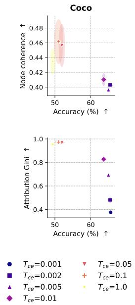  
Figure A1: Accuracy vs. organisation quality metrics for diferent values of $T _ { \mathrm { c e } } .$ Each row corresponds to a quality metric. Each point represents a method averaged over five runs, ellipses representing variance bounds.

Across nearly all configurations, $T _ { \mathrm { c e } }$ consistently controls the interpretability–accuracy trade-of. Consistent with the analysi of Section $5 ,$ large values of $T _ { \mathrm { c e } }$ drive the network toward overly difuse, low-confidence predictions that sustain sparsity promoting gradients at the cost of accuracy, while small values cause the error signal to collapse prematurely, yielding dense, non-sparse weights. Notably, setting $T _ { \mathrm { c e } } = 1$ , which amounts to removing this hyperparameter entirely, falls into the latter regime, confirming the necessity of its introduction.

Number of classes on CUB-200 We investigate here how the dificulty of the classification task, controlled by the number of classes, afects the accuracy / latent space quality trade-of. To this end, we train CHOQOLATE on subsets of CUB-200 (Wah et al. 2011) comprising 5, 10, 20, 50, 100 and 200 classes. Results are available in Table A7 and Figure A2. Experiments are performed with the standard configuration adopted in the main paper.

We observe a clear tension between task dificulty and representation quality. As the number of classes grows, the Attribution Gini increases steadily, indicating that the model concentrates each node on fewer concepts, an efect amplified by the lowdimensional bottleneck having to discriminate among more classes. Accuracy, however, degrades sharply beyond 20 classes, dropping from 88.47% at 20 classes to 54.56% at the full 200 classes, reflecting the limited capacity of the compact representation to accommodate a large label space. Node Coherence follows the opposite trend to Gini, decreasing as more classes are added, which suggests that the concept groups become more heterogeneous as the model is forced to encode finer-grained distinctions. Overall, this experiment delineates the regime in which CHOQOLATE remains efective: a moderate number of classes relative to the bottleneck dimensionality, consistent with the limitations discussed in the main paper.

CHOQOLATE components We assess the contribution of each component of CHOQOLATE through an ablation study. The components considered are:

• $\mathbf { 1 ^ { s t } }$ order: inclusion of the linear term $\textstyle \sum _ { j } a _ { j } u _ { j }$ in the Choquet integral.

$2 ^ { \mathbf { n d } }$ order: inclusion of the pairwise interaction terms $b _ { j , l } \operatorname* { m i n } ( u _ { j } , u _ { l } ) + c _ { j , l } \operatorname* { m a x } ( u _ { j } , u _ { l } )$ encoding complementarity and substitutability.

• Softmax weights: enforcing the simplex constraint $( a _ { j } , b _ { j , l } , c _ { j , l } \geq 0$ and $\begin{array} { r } { \sum _ { j } a _ { j } + \sum _ { j < l } ( b _ { j , l } + c _ { j , l } ) = 1 ) } \end{array}$ via a softmax reparametrization.

• $\ell _ { 1 }$ inter: $\ell _ { 1 }$ regularization applied to the first (intermediate) Choquet layer only.

• $\ell _ { 1 }$ all: $\ell _ { 1 }$ regularization applied to all Choquet layers.

Table A7: Efect of the number of classes on CHOQOLATE on CUB-200. Accuracy (%) and latent space quality metrics reported on CUB-200 subsets of increasing size. Results are averaged over five runs, ± denoting standard deviations.
<table><tr><td># classes</td><td> $\operatorname { A c c . \uparrow }$ </td><td>Attr.  $\operatorname { G i n i } \uparrow$ </td><td>Node Coh. ↑</td></tr><tr><td>5</td><td>86.52 ± 2.46</td><td> $0 . 3 6 5 \pm 0 . 1 5 8$ </td><td> $0 . 4 3 0 \pm 0 . 0 0 7$ </td></tr><tr><td>10</td><td>88.40 ± 1.92</td><td> $0 . 4 6 7 \pm 0 . 0 7 2$ </td><td> $0 . 3 9 7 \pm 0 . 0 0 3$ </td></tr><tr><td>20</td><td> $8 8 . 4 7 \pm 1 . 2 8$ </td><td> $0 . 7 3 2 \pm 0 . 0 1 7$ </td><td> $0 . 3 5 4 \pm 0 . 0 0 9$ </td></tr><tr><td>50</td><td> $7 6 . 0 5 \pm 0 . 9 4$ </td><td> $0 . 8 4 4 \pm 0 . 0 1 6$ </td><td> $0 . 3 0 7 \pm 0 . 0 1 0$ </td></tr><tr><td>100</td><td> $6 7 . 5 8 \pm 1 . 0 0$ </td><td> $0 . 8 7 6 \pm 0 . 0 1 5$ </td><td> $0 . 3 1 8 \pm 0 . 0 0 9$ </td></tr><tr><td>200</td><td> $5 4 . 5 6 \pm 0 . 8 6$ </td><td> $0 . 9 1 0 \pm 0 . 0 1 2$ </td><td> $0 . 3 2 2 \pm 0 . 0 0 3$ </td></tr></table>

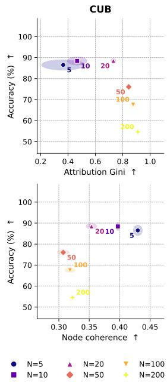  
Figure A2: Accuracy vs. organisation quality metrics for diferent numbers of classes on CUB-200. Each row corresponds to a quality metric. Each point represents a method averaged over five runs, ellipses representing variance bounds.

To do so, we trained on multiple variants on COCO. Results are available on Table A8. The visualisation on the accuracy / latent organisation plot is also presented, in Figure A3

Overall, row 6 (all components, with $\ell _ { 1 }$ regularization restricted to the interaction weights of the intermediate layer) achieves the most balanced trade-of on COCO and is therefore adopted as the default configuration throughout the main paper. Notably, the $\ell _ { 1 }$ penalty and the second-order weights appear to act in synergy: adding the second-order terms to the normalized variant (row 3 vs. row 5) leaves both accuracy and latent-space quality essentially unchanged, whereas combining them with the $\ell _ { 1 }$ penalty raises interpretability at comparable accuracy.

Number of latent nodes We study how the size of the interpretable bottleneck, controlled by the number of latent nodes N, affects the accuracy / latent-space quality trade-of. We train CHOQOLATE and all baselines on COCO for $N \in \{ 4 , 8 , 1 2 , 1 6 , 1 8 \}$ keeping every other hyperparameter fixed to the main-paper configuration. Results are reported in Figure A4, with each row corresponding to a value of N and each column to a quality metric plotted against test accuracy.

Two regimes emerge. For $N = 4 .$ , the bottleneck is too narrow to accommodate the COCO label space: accuracy drops sharply for every method, and the variance of the quality metrics grows, most visibly for CLIP-PSCBM, whose Node Coherence becomes highly unstable. Beyond this point, from $N = 8$ onward, we tend to observe a stabilisation: CHOQOLATE reaches its accuracy plateau immediately, whereas the baselines need a much wider bottleneck to approach it. CHOQOLATE dominates the Attribution Gini axis at every value of N, by a wide margin over all baselines, while simultaneously attaining the highest accuracy. On Node Coherence the margins are tighter: CHOQOLATE remains among the best throughout, whereas CLIP-PSCBM collapses once $N \geq 8$ , indicating that its nodes aggregate increasingly unrelated concepts as the bottleneck widens.

Importantly, increasing N beyond 8 yields no further accuracy gain for CHOQOLATE and only a marginal improvement in latent-space quality, while making the representation less compact and the word-cloud explanations more redundant across nodes. We therefore fix $N = 8$ in the main paper as the smallest bottleneck that already reaches the accuracy plateau while preserving strong sparsity and coherence, and keeping the explanations relatively simple.

## D.3 Additional Global Explanations

We complement the global explanations presented in Section 6 (Figures 4a and 4b) with analogous visualizations on the two remaining benchmarks, MonumAI and COCO. As in the main paper, each node is represented by a word cloud in which the size of a concept reflects its Shapley contribution to that node. We compare CHOQOLATE against the PCBM on each dataset.

The observations remain globally the same as for Cats/Dogs/Cars. The larger concept set leads to slightly noisier word

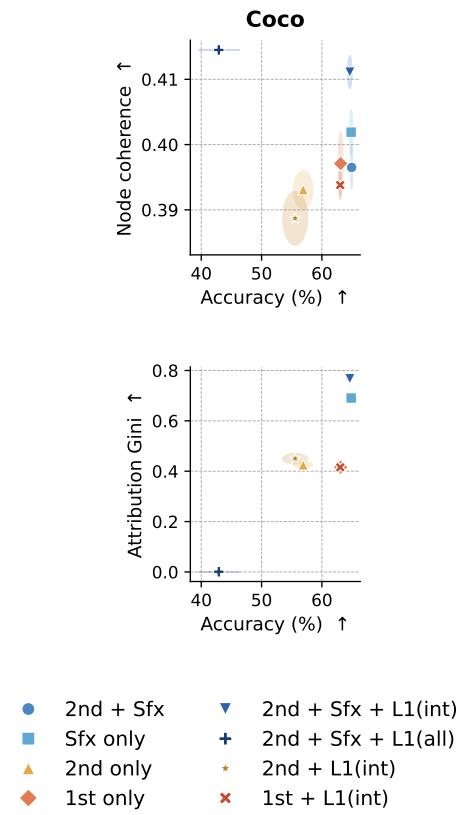

Table A8: Ablation study of CHOQOLATE components on COCO. Each row corresponds to a configuration of the model; checkmarks indicate enabled components. Accuracy (%) is reported on COCO. Results are averaged over five runs, ± denoting standard deviations.
<table><tr><td> $1 ^ { \mathrm { s t } }$  order</td><td> $2 ^ { \mathrm { n d } }$  order</td><td>Softmax weights</td><td> $\ell _ { 1 } \quad \ell _ { 1 }$  inter all</td><td></td><td>Acc. ↑</td><td>Attr. Gini ↑</td><td>Node Coh. ↑</td></tr><tr><td>√</td><td></td><td></td><td></td><td></td><td> $6 3 . 1 1 \pm 0 . 3 8$ </td><td> $0 . 4 1 6 \pm 0 . 0 0 9$ </td><td> $0 . 3 9 7 \pm 0 . 0 0 5$ </td></tr><tr><td>√</td><td></td><td></td><td></td><td>√</td><td> $6 3 . 1 2 \pm 0 . 4 5$ </td><td> $0 . 4 1 8 \pm 0 . 0 0 5$ </td><td> $0 . 3 9 5 \pm 0 . 0 0 1$ </td></tr><tr><td>√</td><td></td><td>√</td><td></td><td></td><td> $6 4 . 8 5 \pm 0 . 2 2$ </td><td> $0 . 6 9 1 \pm 0 . 0 1 8$ </td><td> $0 . 4 0 2 \pm 0 . 0 0 3$ </td></tr><tr><td>V</td><td>√</td><td></td><td></td><td></td><td> $5 6 . 9 0 \pm 1 . 6 0$ </td><td> $0 . 4 2 5 \pm 0 . 0 1 3$ </td><td> $0 . 3 9 3 \pm 0 . 0 0 3$ </td></tr><tr><td>V</td><td>√</td><td>√</td><td></td><td></td><td> $6 4 . 9 3 \pm 0 . 1 4$ </td><td> $0 . 6 9 4 \pm 0 . 0 0 8$ </td><td> $0 . 3 9 7 \pm 0 . 0 0 3$ </td></tr><tr><td>V</td><td>√</td><td>√</td><td>√</td><td></td><td> $6 4 . 4 3 \pm 0 . 2 9$ </td><td> $0 . 7 6 7 \pm 0 . 0 0 9$ </td><td> $0 . 4 1 1 \pm 0 . 0 0 3$ </td></tr><tr><td>V</td><td>√</td><td>√</td><td></td><td>√</td><td> $4 2 . 9 1 \pm 3 . 4 4$ </td><td> $0 . 0 0 1 \pm 0 . 0 0 0$ </td><td> $0 . 4 1 5 \pm 0 . 0 0 0$ </td></tr><tr><td>V</td><td>√</td><td></td><td>√</td><td></td><td> $5 5 . 5 6 \pm 2 . 0 5$ </td><td> $0 . 4 5 0 \pm 0 . 0 2 1$ </td><td> $0 . 3 8 9 \pm 0 . 0 0 4$ </td></tr></table>

Figure A3: Accuracy vs. organisation quality metrics for diferent variants of CHOQOLATE. Each row corresponds to a quality metric. Each point represents a method averaged over five runs, ellipses representing variance bounds.

## E Statistical Significance of the Main Results

To confirm that the performance diferences between CHOQOLATE and each baseline are statistically significant rather than caused by run-to-run variability (Figure 3), we perform a one-sided Mann–Whitney U test for every combination of dataset, metric, and baseline.

For each comparison, we test the null hypothesis $H _ { 0 }$ that the distributions of metric values for CHOQOLATE and the baseline are identical, against the one-sided alternative hypothesis $H _ { 1 }$ that CHOQOLATE achieves higher metric values than the baseline. A small $p$ value implies rejection of $H _ { 0 } .$ , and acceptance of the alternative.

We report the relative median distance $\Delta = ( m e d i a n _ { C H O Q O L A T E } - m e d i a n _ { b a s e l i n e } ) / m e d i a n _ { b a s e l i n e }$ and the p-values in Table A9 just below. Larger $\Delta$ and smaller p value indicate a more clearly separated, more favorable trade-of for CHOQOLATE:

Table A9: Mann Whitney U-test significance of the CHOQOLATE vs. baseline separation.
<table><tr><td rowspan="2">Dataset</td><td rowspan="2">Baseline</td><td colspan="2">Attr. Gini</td><td colspan="2">Node Coh.</td></tr><tr><td>∆</td><td>p</td><td>∆</td><td>p</td></tr><tr><td rowspan="4">Cats/Dogs/Cars</td><td>PCBM</td><td>1.37</td><td>&lt; 0.001</td><td>0.23</td><td>&lt; 0.001</td></tr><tr><td>PSCBM</td><td>1.35</td><td>&lt; 0.001</td><td>0.12</td><td>&lt; 0.001</td></tr><tr><td>Sparse AE</td><td>1.33</td><td>&lt; 0.001</td><td>0.21</td><td>&lt; 0.001</td></tr><tr><td>SLR-AVD</td><td>1.35</td><td>&lt; 0.001</td><td>0.23</td><td>&lt; 0.001</td></tr><tr><td rowspan="4">MonumAI</td><td>PCBM</td><td>0.99</td><td>&lt; 0.001</td><td>0.01</td><td>0.231</td></tr><tr><td>PSCBM</td><td>0.83</td><td>&lt; 0.001</td><td>-0.13</td><td>1.000</td></tr><tr><td>Sparse AE</td><td>1.10</td><td>&lt; 0.001</td><td>-0.05</td><td>0.994</td></tr><tr><td>SLR-AVD</td><td>1.04</td><td>&lt; 0.001</td><td>0.02</td><td>0.157</td></tr><tr><td rowspan="4">COCO</td><td>PCBM</td><td>1.06</td><td>&lt; 0.001</td><td>0.01</td><td>0.579</td></tr><tr><td>PSCBM</td><td>0.91</td><td>&lt; 0.001</td><td>0.76</td><td>&lt; 0.001</td></tr><tr><td>Sparse AE</td><td>0.85</td><td>&lt; 0.001</td><td>0.02</td><td>&lt; 0.001</td></tr><tr><td>SLR-AVD</td><td>0.85</td><td>&lt; 0.001</td><td>0.01</td><td>0.505</td></tr><tr><td rowspan="4">CUB-200</td><td>PCBM</td><td>1.07</td><td>&lt; 0.001</td><td>0.64</td><td>&lt; 0.001</td></tr><tr><td>PSCBM</td><td>1.53</td><td>&lt; 0.001</td><td>0.29</td><td>&lt; 0.001</td></tr><tr><td>Sparse AE</td><td>1.27</td><td>&lt; 0.001</td><td>0.63</td><td>&lt; 0.001</td></tr><tr><td>SLR-AVD</td><td>2.13</td><td>&lt; 0.001</td><td>0.73</td><td>&lt; 0.001</td></tr></table>

On Attribution Gini, the separation between CHOQOLATE and every baseline is statistically significant across all four datasets $( p < 0 . 0 0 1 )$ , with consistently large positive median distances $( \Delta$ between 0.83 and 2.13). This confirms that CHOQOLATE’s sparsity advantage is robust and not attributable to run-to-run variability. CHOQOLATE also improves Node Coherence over the baselines, significantly so on Cats/Dogs/Cars and CUB-200 and, on COCO, by a wide margin over PSCBM. The median distances on this metric are smaller than for Attribution Gini, and on MonumAI the methods are statistically comparable, consistent with the main-paper finding that CHOQOLATE’s coherence advantage is more modest than its sparsity advantage and narrows on datasets whose concept vocabularies are harder to cluster.

## F Proof for a Single Choquet Layer

Throughout this section, $\mathbf { u } = ( u _ { 1 } , \ldots , u _ { p } ) \in [ 0 , 1 ] ^ { p }$ denotes the input of a Choquet layer. Each class $r \in \{ 1 , \ldots , C \}$ is assigned a 2-additive Choquet integral $\mathcal { C } ^ { ( r ) }$ (see Eq. (2)) whose weights

$$
w ^ { ( r ) } ~ = ~ \underbrace { \big ( \underbrace { a _ { 1 } ^ { ( r ) } , \ldots , a _ { p } ^ { ( r ) } } _ { \mathrm { f i r s t - o r d e r ~ t e r m s } } , \underbrace { b _ { 1 , 2 } ^ { ( r ) } , \ldots , b _ { p - 1 , p } ^ { ( r ) } } _ { \mathrm { m i n i n t e r a c t i o n s } } , \underbrace { c _ { 1 , 2 } ^ { ( r ) } , \ldots , c _ { p - 1 , p } ^ { ( r ) } } _ { \mathrm { m a x ~ i n t e r a c t i o n s } } \big ) } _ { \mathrm { m a x ~ i n t e r a c t i o n s } }
$$

The 2-additive Choquet integral can be view as a linear function of a feature vector constructed from the input. We build the vector $\phi ( \mathbf { u } )$ , which contains the $p$ coordinates themselves, followed by all the $\operatorname* { m i n } ( u _ { j } , u _ { l } )$ and all the $\operatorname* { m a x } ( u _ { j } , u _ { l } )$ terms associated with pairs of coordinates. Therefore, Eq. (2) can be written as the inner product between this feature vector and the class weight vector:

$$
\begin{array} { l } { \displaystyle \mathcal { C } ^ { ( r ) } ( \mathbf { u } ) ~ = ~ \sum _ { j = 1 } ^ { p } a _ { j } , u _ { j } ~ + ~ \sum _ { j < l } \Bigl ( b _ { j , l } \operatorname* { m i n } ( u _ { j } , u _ { l } ) ~ + ~ c _ { j , l } \operatorname* { m a x } ( u _ { j } , u _ { l } ) \Bigr ) } \\ { \displaystyle ~ = ~ \langle w ^ { ( r ) } , \phi ( \mathbf { u } ) \rangle } \end{array}
$$

where $\begin{array} { r l r } { \phi ( { \bf u } ) } & { = } & { \underbrace { \left( u _ { 1 } , \ldots , u _ { p } \ , \underbrace { \mathrm { m i n } ( u _ { 1 } , u _ { 2 } ) , \ldots , \mathrm { m i n } ( u _ { p - 1 } , u _ { p } ) } _ { p \ \mathrm { c o o r d i n a t e s } } , \underbrace { \mathrm { m a x } ( u _ { 1 } , u _ { 2 } ) , \ldots , \mathrm { m a x } ( u _ { p - 1 } , u _ { p } ) } _ { \binom { p } { 2 } \ \mathrm { m i n i m a } } \right) } _ { \left( \frac { p } { 2 } \right) \mathrm { m i n i m a } } , \underbrace { \mathrm { m a x } ( u _ { 1 } , u _ { 2 } ) , \ldots , \mathrm { m a x } ( u _ { p - 1 } , u _ { p } ) } _ { \left( \frac { p } { 2 } \right) \mathrm { m a x i m a } } \ } \end{array}$ . We denote by $q = p +$

$2 { \binom { p } { 2 } } = p ^ { 2 }$ the number of components of $\phi ( \mathbf { u } )$

## F.1 Proof of Proposition 1 of the Main Paper

The logit of class r is $h _ { r } = \mathcal { C } ^ { { ( r ) } } ( \mathbf { u } )$ , and $\begin{array} { r } { \hat { y } _ { r } = \frac { \exp \left( h _ { r } \right) } { \sum _ { r ^ { \prime } = 1 } ^ { C } \exp \left( h _ { r ^ { \prime } } \right) } } \end{array}$ is the predicted probability of class r. The target of the sample is a one-hot vector $\mathbf { y } \in \{ 0 , 1 \} ^ { C }$ , with coordinates $y _ { r }$ and nonzero coordinate at index $y _ { \star } \in \{ 1 , \ldots , C \}$ . Finally, Loss denotes the cross-entropy loss; the $\ell _ { 1 }$ penalty of the training objective (4) does not depend on the logits and is omitted from the gradient computations below. Since the target is one-hot, the logit of the ground-truth class is $\textstyle \sum _ { r = 1 } ^ { C } y _ { r } h _ { r }$ , and the loss reads

$$
\mathcal { L } o s s \ : = \ : - \sum _ { r = 1 } ^ { C } y _ { r } h _ { r } \ : + \ : \log \sum _ { r = 1 } ^ { C } \exp ( h _ { r } ) .\tag{A7}
$$

Step 1: gradient with respect to the logits. We diferentiate the two terms of (A7) with respect to a logit $h _ { r }$ . In the first term, only the summand of index r depends on $h _ { r }$ , contributing $- y _ { r }$ . For the second term, the chain rule applied to the log-sum-exp gives

$$
\frac { \partial } { \partial h _ { r } } \log \sum _ { r ^ { \prime } = 1 } ^ { C } \exp ( h _ { r ^ { \prime } } ) ~ = ~ \frac { \exp ( h _ { r } ) } { \sum _ { r ^ { \prime } = 1 } ^ { C } \exp ( h _ { r ^ { \prime } } ) } ~ = ~ \hat { y } _ { r } .\tag{A8}
$$

Summing the two contributions,

$$
\frac { \partial \mathcal { L } o s s } { \partial h _ { r } } = \hat { y } _ { r } - y _ { r } .\tag{A9}
$$

Step $2 \cdot$ gradient with respect to the Choquet weights. The logit of class r expands as

$$
h _ { r } \ : = \ : \langle w ^ { ( r ) } , \phi ( { \bf u } ) \rangle \ : = \ : \sum _ { j = 1 } ^ { q } w _ { j } ^ { ( r ) } \phi _ { j } ( { \bf u } )\tag{A10}
$$

The features $\phi _ { j } ( \mathbf { u } )$ are functions of the input only: they involve no weight, so they are constants with respect to $w ^ { ( r ) }$ . The logit is therefore linear in the weights, and diferentiating the Eq. (A10) with respect to a single weight $w _ { i } ^ { ( r ) }$ keeps only the summand of index $j = i ,$

$$
\frac { \partial h _ { r } } { \partial w _ { i } ^ { ( r ) } } = \phi _ { i } ( { \bf u } ) .\tag{A11}
$$

Moreover, the weight vector $w ^ { ( r ) }$ enters the loss only through the logit $h _ { r } \colon$ the other logits $h _ { r ^ { \prime } } , r ^ { \prime } \neq r$ , are computed from their own weight vectors $w ^ { ( r ^ { \prime } ) }$ . The chain rule from Loss to $w _ { i } ^ { ( r ) }$ therefore goes through the single intermediate variable $h _ { r }$ , and combining (A9) with (A11),

$$
\frac { \partial \mathcal { L } o s s } { \partial w _ { i } ^ { ( r ) } } = \frac { \partial \mathcal { L } o s s } { \partial h _ { r } } \frac { \partial h _ { r } } { \partial w _ { i } ^ { ( r ) } } = \left( \hat { y } _ { r } - y _ { r } \right) \phi _ { i } ( \mathbf { u } ) .\tag{A12}
$$

Step 3: gradient with respect to the unconstrained parameters. The weights of class r are obtained from the unconstrained parameters by the softmax map,

$$
w _ { j } ^ { ( r ) } = \frac { \exp ( \theta _ { j } ^ { ( r ) } ) } { \sum _ { m = 1 } ^ { q } \exp ( \theta _ { m } ^ { ( r ) } ) } = \frac { \exp ( \theta _ { j } ^ { ( r ) } ) } { \Omega } , \qquad \Omega : = \sum _ { m = 1 } ^ { q } \exp ( \theta _ { m } ^ { ( r ) } ) ,\tag{A13}
$$

so each weight $w _ { j } ^ { ( r ) }$ depends on every coordinate of $\theta ^ { ( r ) }$ through the normalizer Ω. Diferentiating the quotient (A13) with respect to $\theta _ { i } ^ { ( r ) }$ , the numerator contributes $\exp ( \theta _ { j } ^ { ( r ) } ) \delta _ { j i }$ (it depends on $\theta _ { i } ^ { ( r ) }$ only when $j = i )$ and the normalizer contributes ${ \partial \Omega } / { \partial \theta _ { i } ^ { ( r ) } } = \exp ( \theta _ { i } ^ { ( r ) } )$ , so

$$
\frac { \partial w _ { j } ^ { ( r ) } } { \partial \theta _ { i } ^ { ( r ) } } = \frac { \exp ( \theta _ { j } ^ { ( r ) } ) \delta _ { j i } } { \Omega } - \frac { \exp ( \theta _ { j } ^ { ( r ) } ) \exp ( \theta _ { i } ^ { ( r ) } ) } { \Omega ^ { 2 } } = w _ { j } ^ { ( r ) } \big ( \delta _ { j i } - w _ { i } ^ { ( r ) } \big ) ,\tag{A14}
$$

where $\delta _ { j i }$ is the Kronecker delta and the last equality recognizes $w _ { j } ^ { ( r ) } = \exp ( \theta _ { j } ^ { ( r ) } ) / \Omega$ and $w _ { i } ^ { ( r ) } = \exp ( \theta _ { i } ^ { ( r ) } ) / \Omega$

Because a single parameter $\theta _ { i } ^ { ( r ) }$ moves all the weights $w _ { 1 } ^ { ( r ) } , \ldots , w _ { q } ^ { ( r ) }$ at once, the chain rule from Loss to $\theta _ { i } ^ { ( r ) }$ sums over the q weights,

$$
\frac { \partial \mathcal { L } o s s } { \partial \theta _ { i } ^ { ( r ) } } = \sum _ { j = 1 } ^ { q } \frac { \partial \mathcal { L } o s s } { \partial w _ { j } ^ { ( r ) } } \frac { \partial w _ { j } ^ { ( r ) } } { \partial \theta _ { i } ^ { ( r ) } } = \big ( \hat { y } _ { r } - y _ { r } \big ) \sum _ { j = 1 } ^ { q } \phi _ { j } ( { \mathbf { u } } ) w _ { j } ^ { ( r ) } \big ( \delta _ { j i } - w _ { i } ^ { ( r ) } \big ) ,\tag{A15}
$$

where the second equality substitutes $( \mathsf { A } 1 2 )$ and (A14), and factors $\left( { \hat { y } } _ { r } - y _ { r } \right)$ out of the sum since it does not depend on $j .$ Step 4: simplifying the inner sum. Splitting the sum along the Kronecker delta,

$$
\sum _ { j = 1 } ^ { q } \phi _ { j } ( \mathbf { u } ) w _ { j } ^ { ( r ) } \big ( \delta _ { j i } - w _ { i } ^ { ( r ) } \big ) \ = \ w _ { i } ^ { ( r ) } \phi _ { i } ( \mathbf { u } ) \ - \ w _ { i } ^ { ( r ) } \sum _ { j = 1 } ^ { q } w _ { j } ^ { ( r ) } \phi _ { j } ( \mathbf { u } ) \ = \ w _ { i } ^ { ( r ) } \big ( \phi _ { i } ( \mathbf { u } ) - \mathcal { C } ^ { ( r ) } ( \mathbf { u } ) \big ) ,\tag{A16}
$$

since the first term retains only $j = i$ and the second sum is the Choquet output. Substituting this expression into Eq. (A15) yields

$$
\frac { \partial \mathcal { L } o s s } { \partial \theta _ { i } ^ { ( r ) } } = \left( \hat { y } _ { r } - y _ { r } \right) \cdot w _ { i } ^ { ( r ) } \cdot \left( \phi _ { i } ( \mathbf { u } ) - \mathcal { C } ^ { ( r ) } ( \mathbf { u } ) \right) .
$$

This concludes the proof.

## F.2 Proof of Corollary 1

Corollary 1 (Efect of temperature scaling). Consider the one-layer Choquet classifier trained with the temperature-scaled cross-entropy $\mathcal { L } o s s ^ { ( T _ { \mathrm { c e } } ) }$ for a temperature $T _ { \mathrm { c e } } > 0 ,$ , under the hypotheses ofProposition 1. Then

$$
\frac { \partial \mathcal { L } o s s ^ { ( T _ { \mathrm { c e } } ) } } { \partial \theta _ { i } ^ { ( r ) } } = \frac { 1 } { T _ { \mathrm { c e } } } \big ( \hat { y } _ { r } ^ { ( T _ { \mathrm { c e } } ) } - y _ { r } \big ) w _ { i } ^ { ( r ) } \big ( \phi _ { i } ( \mathbf { u } ) - \mathcal { C } ^ { ( r ) } ( \mathbf { u } ) \big ) ,\tag{A17}
$$

where $\begin{array} { r } { \hat { y } _ { r } ^ { ( T _ { \mathrm { c e } } ) } = \mathrm { s o f t m a x } \Big ( \frac { h _ { r } } { T _ { \mathrm { c e } } } \Big ) } \end{array}$

The prefactor amounts to a change of learning rate; the efect sits in $\hat { y } _ { r } ^ { ( T _ { \mathrm { c e } } ) }$ . A small $T _ { \mathrm { c e } }$ sharpens predictions and kills the error term, and the sparsity pressure with it, as soon as the model gets confident; a large one keeps the signal alive at the cost of slower convergence. Since Choquet outputs live in [0, 1], logit gaps never exceed one: useful temperatures sit well below one, where $T _ { \mathrm { c e } }$ trades interpretability against accuracy (Appendix D.2).

With temperature, the loss (Eq. (A7)) is evaluated on the rescaled logits,

$$
\mathcal { L } o s s = - \sum _ { r = 1 } ^ { C } y _ { r } \frac { h _ { r } } { T _ { \mathrm { c e } } } + \log \sum _ { r = 1 } ^ { C } \exp \left( \frac { h _ { r } } { T _ { \mathrm { c e } } } \right) .\tag{A18}
$$

We diferentiate with respect to $h _ { r }$ , using $\partial ( h _ { r } / T _ { \mathrm { c e } } ) / \partial h _ { r } = 1 / T _ { \mathrm { c e } }$ . In the first term, only the summand of index r depends on $h _ { r } .$ contributing $- y _ { r } / T _ { \mathrm { c e } }$ . For the second term, the chain rule applied to the log-sum-exp gives, exactly as in (A8) but with rescaled arguments,

$$
\frac { \partial } { \partial h _ { r } } \log \sum _ { r ^ { \prime } = 1 } ^ { C } \mathrm { e x p } \left( \frac { h _ { r ^ { \prime } } } { T _ { \mathrm { c e } } } \right) = \frac { 1 } { T _ { \mathrm { c e } } } \frac { \mathrm { e x p } ( h _ { r } / T _ { \mathrm { c e } } ) } { \sum _ { r ^ { \prime } = 1 } ^ { C } \mathrm { e x p } ( h _ { r ^ { \prime } } / T _ { \mathrm { c e } } ) } = \frac { 1 } { T _ { \mathrm { c e } } } \hat { y } _ { r } ^ { ( T _ { \mathrm { c e } } ) } .\tag{A19}
$$

Summing the two contributions, Step 1 becomes

$$
\frac { \partial \mathcal { L } o s s } { \partial h _ { r } } = \frac { 1 } { T _ { \mathrm { c e } } } \big ( \hat { y } _ { r } ^ { ( T _ { \mathrm { c e } } ) } - y _ { r } \big ) .\tag{A20}
$$

Steps 2 to 4 concern only the map from $\theta ^ { ( r ) }$ to $h _ { r }$ , namely $h _ { r } = \langle w ^ { ( r ) } , \phi ( \mathbf { u } ) \rangle$ with $w ^ { ( r ) } = \mathrm { s o f t m a x } ( \theta ^ { ( r ) } )$ , in which $T _ { \mathrm { c e } }$ plays no role: the temperature acts on the classification softmax over the $l o g i t s$ , not on the reparametrization softmax over the weights. The factor $\begin{array} { r } { \frac { 1 } { T _ { \mathrm { c e } } } \bar { ( \hat { y } _ { r } ^ { ( T _ { \mathrm { c e } } ) } - y _ { r } ) } } \end{array}$ therefore carries through Steps 2 to 4 in place of $\left( \hat { y } _ { r } - y _ { r } \right)$ , yielding (A17). □

## G Technical details

All experiments were run on a single NVIDIA GeForce RTX 4070 SUPER GPU (12 GB of VRAM), using PyTorch on a Linux machine.

<table><tr><td>Dataset</td><td>Classes</td><td>Concepts</td></tr><tr><td>Cats-Dogs-Cars</td><td>cats, dogs, cars</td><td>engine, artifact wing, animal wing, stern, tail, locomotive, arm, hair, wheel, chain wheel, handlebar, hand, headlight, saddle, body, bodywork, beak, head, eye, foot, leg, neck, torso, cap, license plate, door, mirror, window, ear, muzzle, horn, nose, hoof, mouth, eyebrow, plant, pot, coach, screen</td></tr><tr><td>MonumAI</td><td>Baroque, Gothic, Hispanic-Muslim, Renaissance</td><td>horseshoe arch, lobed arch, pointed arch, ogee arch, trefoil arch, serliana, solomonic column pinnacle gothic, porthole, broken pediment, rounded arch, flat arch, segmental pediment, triangular pediment, lintelled doorway</td></tr><tr><td>COCO</td><td>shopping and dining, workplace, home or hotel, transportation, sports and leisure, cultural</td><td>person, backpack, umbrella, handbag, tie, suitcase, bicycle, car, motorcycle, airplane, bus, train, truck, boat, traffic light, fire hydrant, stop sign, parking meter, bench, bird, cat, dog, horse, sheep, cow, elephant, bear, zebra, giraffe, frisbee, skis, snowboard, sports ball, kite, baseball bat, baseball glove, skateboard, surfboard, tennis racket, bottle, wine glass, cup, fork, knife, spoon, bowl, banana, apple, sandwich, orange, broccoli, carrot, hot dog, pizza, donut, cake, chair, couch, potted plant, bed, dining table, toilet, tv, laptop, mouse, remote, keyboard, cell phone, microwave, oven, toaster, sink, refrigerator, book, clock, vase, scissors, teddy bear, hair drier, toothbrush</td></tr><tr><td>CUB-200-2011</td><td>200 fine-grained bird species (e.g., Black- footed Albatross, Indigo Bunting, Brown Pelican, Winter Wren) ; full list at https: //github.com/ yossigandelsman/ clip_text_span/blob/ main/utils/cub_ classes.py</td><td>a short, conical bill; a large, conical bill; a stout, conical bill; a long, thin bill; a long, curved bill; a thin, curved bill; a hooked bill; a long, hooked bill; a short, hooked beak; a short, stubby bill; a short, blunt beak; a long, pointed bill; a long, straight beak; a long, thick bill; a large bill; a small bill; a black bill; a yellow bill; a pink bill; a large, orange bill; a dark, glossy bill; a yellow bill with a red spot; a red spot on the beak; a black cap; a black hood; a black cap and bib; a brown cap; a rusty-brown cap; a red cap on the head; a gray crown; a yellow crown; a white crown; a rust-colored cap and nape; a brown cap and white eyebrows; a crest on the head; a black crest on the head; a red crest on the head; a pointy crest on the head; a black mask over the eyes; a black mask across the face; a black eye stripe; a black line through the eye; a black stripe on the head; a pale stripe above the eye; a white eyebrow; a white stripe over the eye; a black head; a black head and neck; a black face; a gray head; a red head; a blue head; a green head; a yellow head; a black and white striped head; a violet ear patch; all black plumage; all-white plumage; a black and white plumage; a gray and white plumage; a brown and white plumage; a black and orange plumage; spotted plumage; a streaked brown plumage; a brownish-gray plumage; grayish-brown plumage; a brown body; a gray body; a gray plumage; a dark coloration; a reddish-brown body; a grayish-brown body; a grayish- white body; a blue-gray body; a bright yellow body; a bright green body; a green body; iridescent plumage; iridescent green plumage; iridescent black feathers; iridescent blue-green back; a glossy, black plumage; bright golden-yellow plumage; a vibrant blue plumage; a Scarlet-red body; a bright red breast; a rusty-red breast; a bright orange breast; a rosy breast; a pinkish breast; a buffy breast; a white breast; a gray breast; a brown breast; a yellow breast; a black breast; a streaked breast; a black band across the breast; a black crescent on the breast; dark streaks on the breast; a ruby-red throat; a red throat; a yellow throat; a white throat; a white chin and throat; a yellow throat and breast; a orange breast and belly; a white belly; a yellow belly; a pale belly; a red belly; white underparts; grayish-white underparts; a white underbelly; a light-colored belly; a white rump; a white patch on the wing; a brown back; a black back; a gray back; a grayish-brown back; a reddish-brown back; a brownish back; a dark gray back; a green back; a blue back; iridescent blue-green back; blue upperparts; brown upperparts; gray upperparts; dark blue-black upperparts; olive-green upperparts; pale blue-gray upperparts; greenish upperparts; olive-gray upperparts; a streaked back; a gray back with black streaks; a brown back with dark streaks; black wingtips; dark wingtips; white wing bars; two white bars on the wings; black markings on the wings; white patches on the wings; white stripes on the wings; black wings with white bars; brown wings with white bars; black wings with orange bars; orange and black wings; blue wings with black bars; blue wings; brown wings; black and white wings; gray wings; blue-grey wings and back; long, blue-gray wings; long, pointed wings; long, narrow wings; long, tapered wings; long, dark wings; large wingspan; a forked tail; a long, deeply forked tail; a long tail; a short tail; a long, narrow tail; a long, pointed tail; a short, notched tail; a long, flowing tail; a tail with a distinct V-shape; a black tail; a white tail; a long, black tail; a black tail with white sides; a white tail with a black tip; a black and white barred tail; a tail with white bars; a small bird; a small, plump bird; a medium-sized bird; a large bird; a large, stocky body; a large, stocky bird; a slender body; a long, slender body; a plump body; a stocky body; a round body; a small, compact body; long legs; short legs; webbed feet; large webbed feet; long, webbed feet; orange legs; orange legs and feet; red legs; black legs; black legs and feet; gray legs; yellow legs and feet; pale pink legs; greenish-yellow legs; long, black legs; a long neck; a long, graceful neck; a long, slender neck; a long, curved neck; a white collar around the neck; a black ring around the neck; a black neck and head; red eyes; yellow eyes; orange eyes; blue eyes; a red ring around the eye; a white eye ring; orange or yellow eyes; shiny black eyes; a seabird; a swift, direct flight; a swift, acrobatic flight; shy and secretive behavior; a loud, melodious song; a loud, harsh cry; a raucous call</td></tr></table>

Table A1: Classes and supervised concepts for each dataset. Cats-Dogs-Cars uses 39 concepts, MonumAI 15, COCO 80 (the standard COCO object categories), and CUB-200-2011 226 concepts.

<table><tr><td>Dataset</td><td>Classes</td><td>Concepts</td></tr><tr><td></td><td>Waterbirdslandbird, waterbird</td><td>Non-spurious: hooked bill, conical bill, thin bill, long bill, curved bill, pointed bill, black cap, colored crown, eye stripe, face mask, crested head, all-black plumage, all- white plumage, iridescent plumage, streaked plumage, spotted plumage, colored breast, white belly, pale underparts, banded breast, wing bars, wing patches, dark wingtips, long wings, pointed wings, forked tail, long tail, short tail, barred tail, small body, large body, stocky body, slender body, long legs, webbed feet, colored legs, long neck, neck collar, streaked back, dark back, colored back, soaring flight, large wingspan, secretive</td></tr><tr><td rowspan="2">CelebA</td><td rowspan="2">not blond, blond</td><td>behavior, red eyes, yellow eyes, eye ring, melodious song Spurious: green, sea, river, lake, grass, rocks, trees, sky, blue</td></tr><tr><td>Non-spurious: blond hair, black hair, brown hair, gray hair, red hair, dark hair, light hair, straight hair, wavy hair, curly hair, long hair, short hair, bangs, bald head, oval face, round face, chubby cheeks, double chin, pale skin, rosy cheeks, high cheekbones, pointy nose, big nose, big lips, arched eyebrows, bushy eyebrows, narrow eyes, bags under eyes, wearing glasses, smiling, mouth open, young face, old face, attractive, receding hairline Spurious: feminine face, masculine face, heavy makeup, lipstick, wearing earrings,</td></tr></table>

Table A2: Classes and supervised concepts for the spurious-correlation benchmarks. Concepts are split into non-spurious (core, target-predictive attributes) and spurious (attributes correlated with the spurious factor, namely background for Waterbirds and gender for CelebA). Waterbirds uses 48 non-spurious and 9 spurious concepts; CelebA uses 35 non-spurious and 12 spurious concepts.

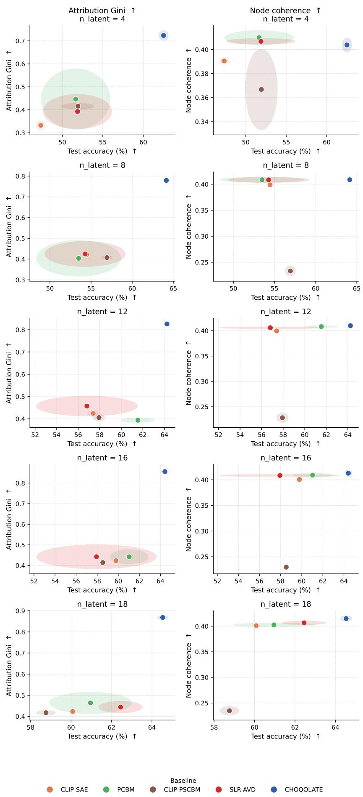  
Figure A4: Efect of the number of latent nodes N on CHOQOLATE on COCO. Accuracy vs. Attribution Gini (left) and Node Coherence (right), for N ∈ {4, 8, 12, 16, 18} (one value per row). Each point is a method averaged over five runs, with ellipses indicating variance bounds.

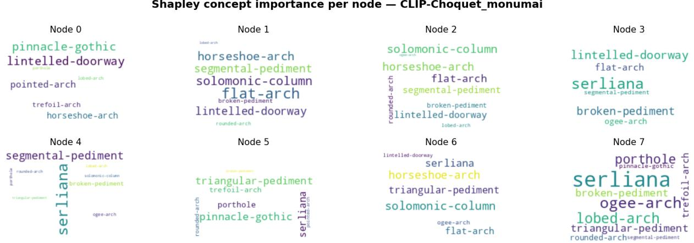  
Figure A5: Global explanations for PCBM. Dataset: MonumAI. The size of each word reflects the importance of the corresponding concept for the node.

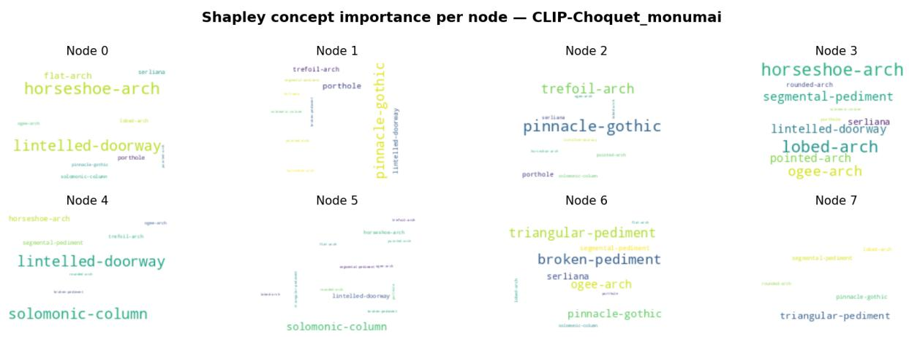  
Figure A6: Global explanations for CHOQOLATE. Dataset: MonumAI. The size of each word reflects the importance of the corresponding concept for the node.

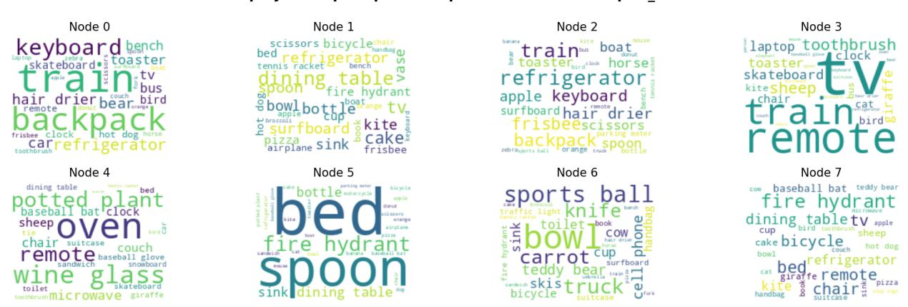  
Figure A7: Global explanations for the PCBM. Dataset: COCO. The size of each word reflects the importance of the corresponding concept for the node.

Shapley concept importance per node — CLIP-Choquet\_coco  
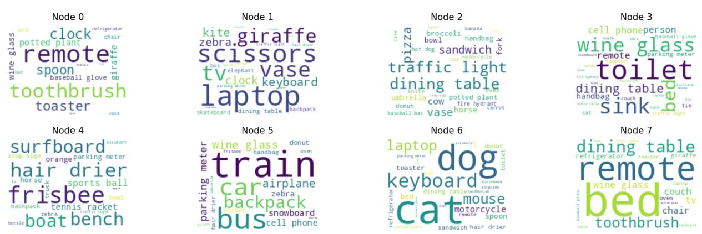  
Figure A8: Global explanations for CHOQOLATE. Dataset: COCO. The size of each word reflects the importance of the corresponding concept for the node.