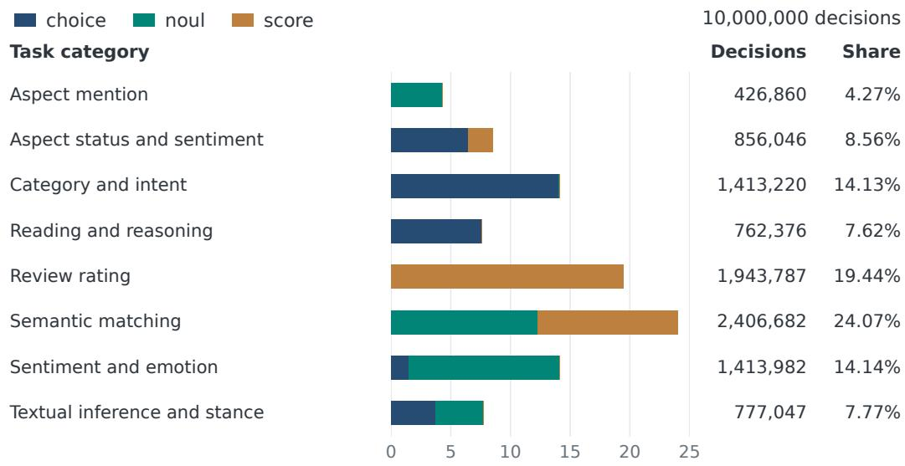
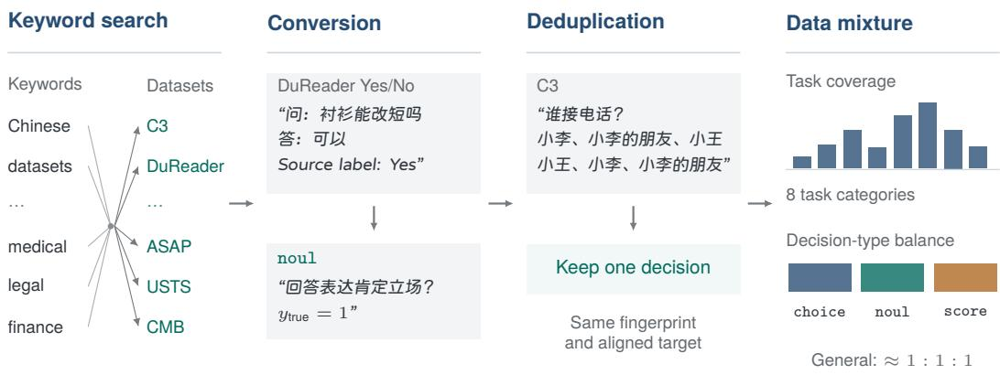
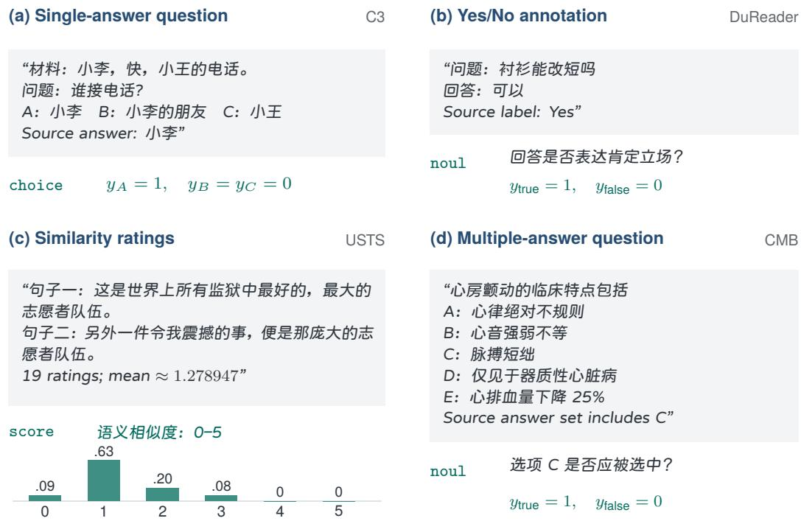
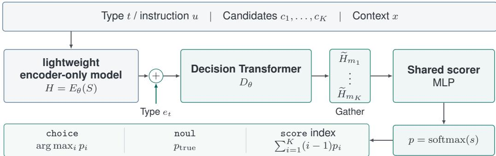
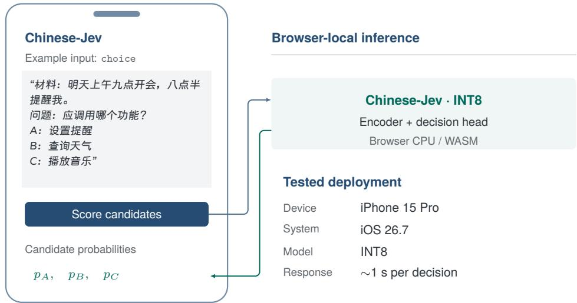
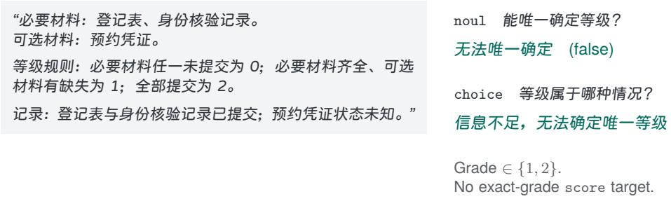

# Chinese-Jev: Bringing System One Model to Chinese-Language Tasks

Zexiao Wang1,∗, Zihao Zhang1,2,∗, Xudong Wang2, Pan Wang3, Ziyi Ye1, Haoyu Zhao1,2,†, Zuxuan Wu1, Shuicheng Yan2

1Fudan University 2National University of Singapore 3University of Chinese Academy of Sciences

## Abstract

System One models such as Jev offer an efficient alternative to generative language models for tasks that require decisions rather than open-ended responses. However, existing Jev models exhibit limited Chinese-language decision accuracy, restricting their utility in both general and specialized settings. In this paper, we introduce CHINESE-JEV, a System One model that addresses this gap through a unified data processing and training pipeline. Our data processing protocol converts heterogeneous Chinese-language annotations into probability targets over candidate options, enabling a shared training formulation across domains and question formats. To enable efficient inference, Chinese-Jev adopts a lightweight encoderonly backbone for text encoding and learns to score candidate answers through decision-oriented training. To address the misalignment between the pre-training distribution and downstream Chinese-language scenarios, we first train the model on a general-purpose corpus of 10 million examples, then fine-tune it separately for the medical, legal, and financial domains. To evaluate decision accuracy and calibration in both general and domain-specific Chinese-language settings, we introduce Chinese-Jev Bench (CJ-Bench). After first-stage pre-training, Chinese-Jev exceeds the accuracy of the closed-source Jev model by 1.24% on general-domain tasks while achieving a 20.3× speedup. Subsequent domain-specific fine-tuning yields a 4.0% accuracy improvement over Jev in medicine and retains 92% of Jev’s average accuracy across specialized domains, with a 17× speedup and an average latency of only 15 ms per example. We further demonstrate on-device deployment of an INT8-quantized model on mobile devices, achieving an inference latency of approximately 1 second per decision. We will release the models, training data, benchmark, and data construction code. The project is available at https://gulucaptain.github.io/Chinese-Jev/.

## 1 Introduction

An application does not always need a language model to write a response. It may need to route a request to a service (Larson et al., 2019; Casanueva et al., 2020), judge the relevance of a passage (Nogueira and Cho, 2019; Khattab and Zaharia, 2020), or select an answer from a set of alternatives (Lai et al., 2017; Sun et al., 2020). These tasks require language understanding, but their outputs are bounded. Large language models (LLMs) offer a flexible way to specify such tasks through instructions and examples (Wei et al., 2022; Sanh et al., 2022; Longpre et al., 2023). Repeatedly invoking a large model, however, can be costly when an application needs only a label or a score. The practical goal is to retain flexibility across tasks while reducing the cost of each decision.

Jev is a System One model designed for three forms of decision making: choice selects among candidate alternatives, noul determines the validity of a proposition, and score assigns an ordered rating (Almeida, 2026). Its structured outputs and associated probabilities can be used directly by software. Alongside the hosted Jev API, open implementations explore compact encoders and language-model-based decision systems (Kotoba Labs, 2026; NandhaKishorM, 2026; Cai, 2026; jaredpalmer, 2026; Lee, 2026). Chinese-oriented releases include a model trained primarily on football-domain data (xuhaodev, 2026) and a bilingual encoder for local agent decisions.

Building on these efforts, we introduce CHINESE-JEV, a compact System One model for Chineselanguage decision-making across general tasks and the medical, legal, and financial domains. Central to this work is a unified supervision formulation that accommodates heterogeneous decision tasks. Existing Chinese benchmarks and instruction collections provide diverse source data (Xu et al., 2020; Bai et al., 2025), but categorical labels, proposition judgments, and ordered ratings encode different forms of supervision. Our data processing protocol converts these annotations into probability distributions over candidate options while preserving label semantics and rating order. It also incorporates soft supervision when multiple ratings are available. Applying this protocol yields a general corpus of 10 million decisions spanning eight task categories, together with dedicated corpora for medicine, law, and finance. Figure 1 summarizes the composition of the general corpus. To reduce leakage between training and evaluation, decisions derived from the same source material are assigned to the same data partition. This formulation supports option selection, proposition judgment, and ordinal rating through a shared candidate-scoring interface in a single forward pass.

  
Share of training decisions (%)  
Figure 1: General training corpus composition across eight task categories, ordered alphabetically. Stacked bars indicate category proportions, with colors denoting choice, noul, and score.

Moreover, to address the mismatch between multilingual pre-training and downstream Chineselanguage tasks while maintaining efficient inference, we adopt a two-stage training pipeline built on a lightweight encoder-only backbone (Marone et al., 2025). We first train CHINESE-JEV GENERAL on a corpus of 10 million Chinese-language decisions spanning eight task categories, then independently fine-tune it on medical, legal, and financial corpora to obtain three domain specialists. All models retain the same architecture and decision interface, enabling domain specialization without increasing model size or changing how applications specify decisions.

We further introduce Chinese-Jev Bench (CJ-Bench), comprising 307,900 held-out decisions across general, medical, legal, and financial tasks, to evaluate decision accuracy, calibration, and inference latency under a common protocol. After first-stage pre-training, Chinese-Jev achieves 69.20% accuracy on the general subset, exceeding the closed-source Jev model by 1.24% in relative accuracy and reducing expected calibration error from 11.45% to 3.78%. Its measured latency is 20.3× lower than that of the hosted Jev API. Following domain-specific fine-tuning, Chinese-Jev improves medical accuracy over Jev by 4.0% and achieves 92% of Jev’s average accuracy across the three specialized domains, with an average latency of 15 ms per decision and a 17× reduction in measured latency. Finally, an INT8-quantized deployment enables local inference in mobile devices at approximately 1 second per decision, demonstrating the feasibility of on-device Chinese-language decision-making.

Our main contributions are:

• Chinese-Jev: a System One model for Chinese-language decision-making. We develop Chinese-Jev through general Chinese-language pre-training followed by independent fine-tuning in medicine, law, and finance. The resulting general and specialist models share a unified decision interface that supports option selection, proposition judgment, and ordinal rating in a single forward pass.

• A unified pipeline for Chinese-Jev training data construction. We design a reusable pipeline that converts heterogeneous Chinese QA annotations into probability targets over candidate options for Chinese-Jev training. Using this pipeline, we construct a pre-training corpus of 10 million examples spanning eight task categories, together with downstream fine-tuning corpora.

• CJ-Bench, empirical evaluation, and on-device deployment. We introduce CJ-Bench, comprising 307,900 held-out decisions, to evaluate accuracy, calibration, and latency across general and specialized tasks. Chinese-Jev surpasses the closed-source Jev model in general-task accuracy and achieves 92% of its average accuracy across specialized domains, with measured speedups of 20.3× and 17×, respectively, relative to the hosted Jev API. An INT8 browser deployment further enables local smartphone inference at approximately 1 second per decision.

## 2 Related Work

## 2.1 Generalist Text Classification

Generalist text classification uses natural-language label descriptions to predict across tasks and label sets (Yin et al., 2019; Laurer et al., 2023; Stepanov et al., 2025). Input–label embedding methods learn compatibility between texts and labels to transfer to unseen categories (Pappas and Henderson, 2019). Natural language inference (NLI) classifiers treat the input as a premise and each candidate label as a hypothesis (Yin et al., 2019). Universal NLI classifiers combine entailment data with classification datasets reformulated as premise–hypothesis pairs (Laurer et al., 2023). GLiClass jointly processes the input and all candidate labels in one encoder pass, allowing both text–label and label–label interactions (Stepanov et al., 2025). Chinese-Jev also encodes the input and candidate answers jointly, with separate readouts for choices, proposition judgments, and ordered ratings.

## 2.2 Jev and Typed Decision Models

Jev exposes choice, noul, and score decisions together with their associated probabilities (Almeida, 2026). Kotoba Labs’ Open-Jev and Laya learn candidate-scoring functions over bidirectional encoder representations, with Laya’s multilingual variant using mmBERT (Kotoba Labs, 2026; NandhaKishorM, 2026). Among language-model approaches, Zefan Cai’s Open-Jev adapts a Qwen backbone with decision training (Cai, 2026), Kev adds learned decision heads (jaredpalmer, 2026), and Nimble fine-tunes predictions over allowed answer tokens (Bespoke Labs and Sathiamoorthy, 2026). SemIF reads probabilities from option-token logits (Lee, 2026), while AnyJev supports debiasing, post-hoc calibration, and lightweight fitted heads (Zhang et al., 2026). Chinese-oriented releases include Qwen3-1.7B-Jev, which uses a language-model backbone and a learned decision head for football questions (xuhaodev, 2026), and MacJev, a bilingual encoder for tool routing and task-state checks (chaoliangUNSW, 2026). Chinese-Jev trains an encoder on general Chinese decisions and then adapts it separately to medicine, law, and finance.

## 2.3 Multitask Supervision and Chinese Resources

Multitask instruction tuning combines tasks through natural-language descriptions and shared training formats, enabling transfer beyond the tasks used for fine-tuning (Wei et al., 2022; Sanh et al., 2022; Wang et al., 2022). The Flan Collection examines task balancing, prompt diversity, and task reformulation, and shows the value of instruction-tuned checkpoints for subsequent task-specific adaptation (Longpre et al., 2023). For Chinese, CLUE covers general language understanding (Xu et al., 2020), while C-Eval and CMMLU assess knowledge and reasoning across disciplines (Huang et al., 2023; Li et al., 2024b). COIG-CQIA provides instruction-following data from real-world sources (Bai et al., 2025). Specialized resources address biomedical language understanding, legal case retrieval, and financial knowledge and applications (Zhang et al., 2022; Li et al., 2024a; Zhu et al., 2024). Chinese-Jev converts selected source annotations into candidate-probability targets, preserving categorical labels, the order of grades, and distributions of human ratings.

## 3 Methods

We develop CHINESE-JEV to adapt compact System One decision models to broad Chinese-language tasks while retaining a unified interface across general and specialized domains. A unified data construction pipeline (Section 3.1) maps diverse source annotations to probability distributions over candidate options while preserving their decision semantics. A general-to-domain training pipeline (Section 3.2) first adapts the model to broad Chinese supervision and then independently specializes it for medicine, law, and finance. Together, these components provide a common training and inference interface for choice, noul, and score decisions.

## 3.1 Data Construction Pipeline

Figure 2 demonstrates our data construction pipeline, which consists of source discovery, annotation conversion, deduplication, and mixture construction. We first identify Chinese datasets whose annotations can be expressed as candidate-based decisions. Each source annotation is then converted into a common representation consisting of a context, an instruction, a decision type, a candidate set, and a target probability distribution. After removing duplicate and conflicting supervision, we construct the mixtures according to task coverage, available supervision, and decision-type budgets.

  
Figure 2: Data construction pipeline comprising source discovery, annotation conversion, deduplication, and mixture selection. Examples illustrate mapping a “DuReader Yes label” to a noul stance target and deduplicating a C3 question across candidate permutations. The general training mixture spans eight task categories with approximately balanced budgets across the three decision types.

Source discovery and selection. We identify candidate datasets from published papers, authormaintained repositories, and Hugging Face using combinations of Chinese-language, task-specific, and domain-specific keywords. Aggregated collections are traced to their original sources, and we retain datasets with Chinese content, clear usage terms, and annotations that can be expressed as candidate-based decisions or ordered scores. Representative sources include C3 for reading comprehension Sun et al. (2020), T2Ranking for relevance (Xie et al., 2023), ASAP for review judgments (Bu et al., 2021), and USTS for similarity (Wang et al., 2023), alongside domain sources such as CMB (Wang et al., 2024), LeCaRDv2 (Li et al., 2024a), and FinRE (Li et al., 2019). We further construct 10,700 rule-based decisions for condition checking, counting, and grading, with construction details provided in Appendix A.3.

Conversion to decision supervision. Each decision consists of a context x, an instruction u, a type t, a candidate list $C = ( c _ { 1 } , \dots , c _ { K } )$ , and a target distribution y over C. Figure 3 illustrates four routes from source annotations to this format.

  
Figure 3: Conversion of source annotations into decision targets: (a) single-answer questions to choice; (b) Yes/No annotations to noul; (c) ratings to score; and (d) multiple-answer questions to option-wise noul. DuReader labels answer stance. In (c), bars show the soft target obtained from 19 human ratings, rounded to two decimals. Examples are shortened for display.

Single-answer questions and category labels → choice. For single-answer questions, we retain the original question and alternatives and assign probability one to the annotated answer. For categorical tasks, the candidate set comprises the source dataset’s labels, with all target probability mass assigned to the annotated class.

True/false and proposition annotations → noul. We express the annotated judgment as an explicit proposition and map its binary label $z \in \{ 0 , 1 \} \mathrm { t o } \mathbf { y } = ( 1 - z , z )$ , ordered as false and true. For DuReader, the proposition asks whether a supplied answer expresses an affirmative stance: a Yes label maps to true without asserting the answer’s factual correctness. Examples labeled Depends remain in the three-way choice task and are excluded from this noul conversion.

Ratings → score. For discrete ratings, we retain the original ordered scale and assign all target mass to the annotated level; relevance and quality grades follow the same rule. For continuous ratings, as in USTS, we distribute probability mass between adjacent integer levels for each rating and then average across raters. The soft target preserves the mean rating and inter-rater variation.

Multiple-answer questions → option-wise noul. We decompose each multiple-answer question into option-membership propositions. For a source question with K options, let $A \subseteq \{ 1 , \ldots , K \}$ be the correct option set and $\bar { z _ { j } } = \mathbf { 1 } [ j \in A ]$ indicate whether option j belongs to it. The target is:

$$
\mathbf { y } ^ { ( j ) } = ( 1 - z _ { j } , z _ { j } ) ,\tag{1}
$$

where the entries correspond to false and true. Each decision retains the full question and all alternatives but predicts membership for a single option. Complete multi-label annotations support the same conversion.

Inference annotations support relation selection or entailment judgments, while aspect annotations support mention detection and sentiment decisions. Synthetic rule tasks use the same formats, with targets computed from the underlying rules (Appendix A.3).

Decision-level deduplication. For the general corpus, we define each decision by its task identifier r, type t, context x, instruction u, and candidates C, while excluding the target distribution so

that conflicting supervision can be detected. After Unicode and whitespace normalization N, we canonicalize the candidates as:

$$
\widetilde { C } _ { t } = \Big \{ \begin{array} { l l } { \mathrm { s o r t } ( N ( C ) ) , } & { t = \mathrm { c h o i c e } , } \\ { N ( C ) , } & { t \in \{ \mathrm { n o u l } , \mathrm { s c o r e } \} . } \end{array}\tag{2}
$$

and compute the fingerprint:

$$
h = H \Big ( r , t , N ( x ) , N ( u ) , \widetilde { C } _ { t } \Big ) .\tag{3}
$$

where H denotes a hash function. Sorting makes choice fingerprints invariant to permutations of independent alternatives while preserving sensitivity to their content; the order of score levels and the false/true semantics of noul remain unchanged. For matching fingerprints, we align choice targets by candidate text and retain a single decision when the targets agree, discarding the entire group when they conflict. Decisions that share source material, such as different questions derived from the same passage, may remain distinct but are assigned to the same data partition. Appendix A.2 describes additional cases and checks against held-out material.

Task coverage and type balance. Decision-type budgets are defined separately for each corpus. For the general corpus, we allocate approximately one third of the training decisions to each of choice, noul, and score; within each type, source-level budgets preserve coverage of smaller tasks and diverse data sources before the remaining capacity is filled with eligible decisions. The legal and financial corpora follow the same balanced design, whereas the medical corpus contains a larger noul share due to its matching and multiple-label tasks; detailed domain statistics are reported in Appendix $\mathrm { A . 4 }$ . We characterize the general corpus using eight task categories defined by prediction target and annotation semantics (Figure 1); for example, semantic matching includes similarity, equivalence, and retrieval relevance, while reading and reasoning cover contextual questions, logical reasoning, and explicit-rule decisions.

Data partitions and CJ-Bench. Each corpus has separate training, development, calibration, and test partitions, with all decisions derived from the same source material assigned to a single partition to reduce source-level leakage. Development data are used for model validation, while the calibration and test partitions remain disjoint from training and development. CJ-Bench is constructed exclusively from the held-out test partitions of the general, medical, legal, and financial corpora. Its General component covers all eight task categories with approximately equal decision-type budgets. Appendix A.1 provides the complete partition statistics and benchmark composition.

## 3.2 Chinese-Jev Training

CHINESE-JEV adopts a lightweight encoder-only architecture for low-latency candidate scoring across general and domain-specific tasks. Given a decision $( x , u , t , C )$ , a bidirectional mmBERT encoder (Marone et al., 2025) jointly represents the input and candidate options, followed by a type-conditioned decision head that produces a probability distribution p over the candidates. We first train Chinese-Jev General on the general Chinese corpus and then independently specialize it for the medical, legal, and financial domains. The same architecture and training objective are retained throughout, preserving a consistent decision interface across all stages.

Model architecture. We serialize the decision type $t ,$ instruction $u ,$ all candidates $C ,$ , and context x into a single sequence S, placing a marker at position $m _ { i }$ before each candidate $c _ { i }$

As shown in Figure $^ { 4 , }$ the encoder $E _ { \theta }$ contextualizes the complete sequence:

$$
H = E _ { \theta } ( S ) .\tag{4}
$$

We then add a learned type embedding $e _ { t }$ at every position and apply the decision Transformer $D _ { \theta }$

$$
\widetilde H = D _ { \theta } ( H + \mathbf { 1 } e _ { t } ^ { \top } ) .
$$

A shared ML $. \mathrm { ~ P ~ } f _ { \theta }$ scores all candidate-marker representations in a single forward pass, with a softmax over the resulting logits yielding the decision probabilities:

$$
s _ { i } = f _ { \theta } ( \widetilde { H } _ { m _ { i } } ) , \qquad p _ { i } = \frac { \exp ( s _ { i } ) } { \sum _ { j = 1 } ^ { K } \exp ( s _ { j } ) } .\tag{5}
$$

  
Figure 4: Chinese-Jev architecture. A lightweight encoder-only model jointly processes the input and candidates, followed by a type-conditioned decision Transformer and a shared candidate scorer. All candidate probabilities are obtained in one forward pass. The score readout is an expected zero-based level index; source-scale ratings use the associated numerical level values.

Decision readouts. For choice, we return arg maxi $p _ { i } ;$ for noul, we return $p _ { \mathrm { t r u e } }$ . The score readout is the expected zero-based level index, $\textstyle \sum _ { i = 1 } ^ { K } ( i - 1 ) p _ { i }$ . On the source rating scale, the expectation is $\sum _ { i } v _ { i } p _ { i }$ , where $v _ { i }$ is the numerical value of level i.

Training objective. We train the predicted distribution p against a target distribution y over the candidates defined in Section 3.1. Following Laya’s RLCD formulation (NandhaKishorM, 2026), the objective combines supervised cross-entropy with a policy-gradient term over perturbed candidate logits. Both terms use $\mathbf { y }$ . For a batch of $B$ decisions, where decision b has $K _ { b }$ candidates, the cross-entropy loss is:

$$
\mathcal { L } _ { \mathrm { C E } } = - \frac { 1 } { B } \sum _ { b = 1 } ^ { B } \sum _ { i = 1 } ^ { K _ { b } } y _ { b i } \log p _ { b i } .\tag{6}
$$

RLCD draws centered Gaussian perturbations of each decision’s logits, reusing the same forward pass. Its reward uses log and spherical scores to measure agreement with the target distribution. For ordered score decisions, the reward also includes the ranked probability score (RPS) to account for distance along the ordered levels. The total objective is:

$$
\begin{array} { r } { \mathcal { L } = \mathcal { L } _ { \mathrm { C E } } + \mathcal { L } _ { \mathrm { R L } } . } \end{array}\tag{7}
$$

We provide the full RLCD perturbation, reward, and detached-advantage formulation in Appendix A.5, and report the training configuration in Section 4.1.

## 4 Experiments

## 4.1 Experimental Setup

Implementation details. We initialize the mmBERT encoder and decision head from Laya Multilingual (NandhaKishorM, 2026; Convai Innovations, 2026). The backbone is mmBERT-base with 22 layers and a hidden size of 768. The head contains two decision Transformer layers and a shared candidate scorer, bringing the model to approximately 322 million parameters. Training uses fullparameter fine-tuning on eight NVIDIA H200 GPUs. We first train for one epoch on the general corpus to obtain Chinese-Jev General. Starting independently from this checkpoint, each specialist is trained for four epochs on its corresponding domain corpus. Medical specialization uses 3,000,000 decisions, while legal and financial specialization each use 24,000. The RLCD objective samples four logit perturbations per decision in both stages, shown in Appendix A.5.

Benchmark and evaluation metrics. All comparisons use CJ-Bench (Section 3.1), comprising General, Medical, Legal, and Finance components with 100,000, 200,000, 4,300, and 3,600 decisions, respectively. All models receive the same retained context and candidates and are evaluated on the same eligible examples within each component. We mainly use three metrics for evaluation: 1) Accuracy (ACC) measures agreement between the highest-probability candidate and the gold label. 2) Expected calibration error (ECE) measures the gap between this candidate’s probability and empirical accuracy using 15 equal-width bins (Guo et al., 2017). ACC and ECE apply to single-label examples, including hard score targets; soft targets are excluded. We retain each checkpoint’s native probability transformations and apply no additional calibration on the target datasets. 3) Latency is the median end-to-end time per decision, measured on one NVIDIA H200 GPU at batch size one after warm-up. Timing includes input preparation and inference through the final candidate probabilities. For the hosted Jev API, we instead measure client-observed latency for one decision per request, including network round-trip time.

Table 1: Results on the general subset of Chinese-Jev Benchmark. Chinese-Jev General is evaluated after first-stage pre-training. The best and second-best results are shown in bold and underlined, respectively; ties share the same rank. † Jev uses a hosted API, and its latency includes network round-trip time.
<table><tr><td>Model</td><td>ACC (%) ↑</td><td>ECE (%) ↓</td><td>Latency (ms) ↓</td></tr><tr><td>Qwen3.5-2B (Qwen Team, 2026)</td><td>32.95</td><td>43.68</td><td>280</td></tr><tr><td>Open-Jev (Cai, 2026)</td><td>52.33</td><td>10.54</td><td>60</td></tr><tr><td>SemIF (Lee, 2026)</td><td>44.21</td><td>27.27</td><td>57</td></tr><tr><td>Laya Multilingual (Convai Innovations, 2026)</td><td>40.22</td><td>23.04</td><td>14</td></tr><tr><td>Jev† (Almeida, 2026)</td><td>68.35</td><td>11.45</td><td>284</td></tr><tr><td>Chinese-Jev General</td><td>69.20 (+0.85)</td><td>3.78 (-6.76)</td><td>14</td></tr></table>

Baselines. Qwen3.5-2B (Qwen Team, 2026) is the general-purpose LLM baseline, evaluated on text inputs in non-thinking mode by scoring candidate labels. Open-Jev (Cai, 2026) denotes Zefan Cai’s implementation, which adapts a Qwen backbone with decision training. SemIF (Lee, 2026) reads decision probabilities from pretrained language models. Laya Multilingual (Convai Innovations, 2026) uses a compact encoder. We access the official Jev model (Almeida, 2026; TypeSafe, 2026) through its hosted API. Each system supplies a candidate distribution for evaluation.

## 4.2 Experimental Results

Pre-training evaluation on general data. Table 1 demonstrates the effectiveness of first-stage Chinese-language pre-training. Starting from Laya Multilingual, Chinese-Jev improves accuracy from 40.22% to 69.20%, a gain of 28.98 percentage points, while reducing ECE from 23.04% to 3.78%. These improvements are achieved without changing the model architecture or increasing measured inference latency: both models require a median of 14 ms per decision. This comparison shows that Chinese-language training substantially improves decision accuracy and calibration without introducing additional inference cost. Chinese-Jev achieves the highest accuracy and lowest ECE among the evaluated models, while matching the lowest measured latency. It exceeds the closed-source Jev model by 0.85 percentage points in accuracy, corresponding to a 1.24% relative improvement, and reduces ECE by 67.0%, from 11.45% to 3.78%. Under the same local timing protocol, Chinese-Jev is 20× faster than Qwen3.5-2B while achieving substantially higher accuracy. Its measured latency is also 20.3× lower than that of the hosted Jev API, although this comparison includes network round-trip time for Jev and therefore reflects end-to-end response latency rather than a direct comparison of model inference speed.

Domain-specific evaluation. Table 2 shows that domain-specific fine-tuning substantially improves decision accuracy beyond general Chinese-language pre-training. Relative to Chinese-Jev General, the specialists improve accuracy by 47.88, 21.34, and 29.33 percentage points on Medical, Legal, and Finance, respectively, raising average accuracy from 37.97% to 70.82%. General pre-training alone provides uneven benefits across domains: on Finance, Chinese-Jev General achieves 35.39% accuracy, below the multilingual initialization’s 38.31%. These results highlight the value of supervision tailored to the target domain beyond broad Chinese-language training.

Chinese-Jev Specialist outperforms all four open baselines in accuracy across the three domains. On Medical, it achieves 87.65% accuracy, exceeding the closed-source Jev model by 3.36 percentage points, or 4.0% in relative terms. The Legal and Finance specialists reach 60.10% and 64.72%, respectively, after fine-tuning on 24,000 decisions per domain, although both remain below Jev.

Table 2: Domain-specific results on CJ-Bench. Chinese-Jev-G and Chinese-Jev-S denote the general model and the corresponding domain specialist, respectively. ACC and ECE are reported in %, and latency (Lat.) in ms. Avg. denotes the unweighted mean of domain-level metrics. The best and second-best results are shown in bold and underlined, respectively. † Jev’s hosted API latency includes network round-trip time.
<table><tr><td></td><td colspan="3">Medical</td><td colspan="3">Legal</td><td colspan="3">Finance</td><td colspan="3">Average</td></tr><tr><td>Model</td><td>ACC↑</td><td>ECE↓</td><td>Lat. ↓</td><td>ACC↑</td><td>ECE↓</td><td>Lat. ↓</td><td>ACC ↑</td><td>ECE↓</td><td>Lat. ↓</td><td>ACC ↑</td><td>ECE↓</td><td>Lat. ↓</td></tr><tr><td>Qwen3.5-2B (Qwen Team, 2026)</td><td>53.88</td><td>28.71</td><td>263</td><td>31.53</td><td>44.82</td><td>438</td><td>38.11</td><td>49.12</td><td>266</td><td>41.17</td><td>40.88</td><td>322.33</td></tr><tr><td>Open-Jev (Cai, 2026)</td><td>73.08</td><td>2.88</td><td>53</td><td>44.07</td><td>23.15</td><td>110</td><td>48.11</td><td>10.19</td><td>73</td><td>55.09</td><td>12.07</td><td>78.67</td></tr><tr><td>SemIF (Lee, 2026)</td><td>62.17</td><td>10.39</td><td>51</td><td>43.07</td><td>19.99</td><td>49</td><td>47.89</td><td>18.45</td><td>54</td><td>51.04</td><td>16.28</td><td>51.33</td></tr><tr><td>Laya (Convai Innovations, 2026)</td><td>24.55</td><td>43.05</td><td>15</td><td>34.72</td><td>31.49</td><td>15</td><td>38.31</td><td>26.18</td><td>15</td><td>32.53</td><td>33.57</td><td>15.00</td></tr><tr><td>Jev† (Almeida, 2026)</td><td>84.29</td><td>5.70</td><td>267</td><td>68.35</td><td>8.03</td><td>256</td><td>78.39</td><td>2.98</td><td>246</td><td>77.01</td><td>5.57</td><td>256.33</td></tr><tr><td>Chinese-Jev-G</td><td>39.77</td><td>17.33</td><td>15</td><td>38.76</td><td>15.37</td><td>15</td><td>35.39</td><td>14.43</td><td>15</td><td>37.97</td><td>15.71</td><td>15.00</td></tr><tr><td>Chinese-Jev-S</td><td>87.65</td><td>7.25</td><td>15</td><td>60.10</td><td>17.45</td><td>15</td><td>64.72</td><td>11.55</td><td>15</td><td>70.82</td><td>12.08</td><td>15.00</td></tr></table>

Across domains, the specialists achieve 92.0% of Jev’s average accuracy while retaining a median latency of 15 ms per decision in each domain. This corresponds to 17.5–29.2× speedups over Qwen3.5-2B under the same local timing protocol. Their average latency is also approximately one-seventeenth that of the hosted Jev API, whose measurements include network round-trip time. The calibration benefits of specialization are less consistent. ECE decreases from 17.33% to 7.25% on Medical and from 14.43% to 11.55% on Finance, but increases from 15.37% to 17.45% on Legal despite the accuracy gain. Across models, the Medical specialist achieves the highest accuracy, whereas Open-Jev obtains the lowest ECE. Moreover, the specialists’ average ECE remains higher than Jev’s (12.08% versus 5.57%). These results highlight the need to assess calibration separately from accuracy after domain adaptation.

## 4.3 Application: Interactive Decisions on Mobile Devices

  
Figure 5: On-device Chinese-Jev browser prototype. A Chinese reminder request and editable candidates are scored locally by the INT8 model. The interface is schematic, with $p _ { A } , p _ { B }$ , and pC standing for returned probabilities. The tested iPhone 15 Pro configuration responds in approximately one second per decision.

Our mobile browser prototype enables users to submit Chinese questions with context and editable candidate answers, and obtain option probabilities directly on their smartphones. Figure 5 illustrates this workflow using a meeting message with three candidate actions: setting a reminder, checking the weather, and playing music. On an iPhone 15 Pro running iOS 26.7, the INT8-quantized model achieves an inference latency of approximately 1 s per decision. Both tokenization and inference execute locally in the browser, with downloaded model files cached for reuse. Once the model is loaded, subsequent queries are processed entirely on-device without transmitting input text to a remote inference service.

## 5 Conclusion

We introduced CHINESE-JEV, a System One model for Chinese-language decision-making across general tasks and specialized domains. Our unified data construction pipeline supports large-scale Chinese pre-training and subsequent fine-tuning in medicine, law, and finance. We also introduced CJ-Bench to evaluate decision accuracy, calibration, and inference latency. Chinese-Jev surpasses the closed-source Jev model on general tasks and in medicine, while achieving 92% of its average accuracy across specialized domains. Measured latency improves by approximately 20.3× on general tasks and 17× across specialized domains relative to the hosted Jev API, whose latency includes network overhead. An INT8 mobile browser deployment further demonstrates on-device inference at approximately 1 second per decision. Remaining accuracy gaps in law and finance, together with uneven calibration gains after specialization, motivate further work on domain adaptation and confidence calibration. We will release the models, training data, benchmark, and data construction code to support reproducible research.

## References

Diogo Almeida. Introducing System One Models & Jev. https://typesafe.ai/blog/intro ducing-system-one-models-and-jev, 2026. Official release announcement, September 15, 2026; accessed September 27, 2026.

Yuelin Bai, Xeron Du, Yiming Liang, Leo Jin, Junting Zhou, Ziqiang Liu, et al. COIG-CQIA: Quality is all you need for Chinese instruction fine-tuning. In Luis Chiruzzo, Alan Ritter, and Lu Wang, editors, Findings ofthe Associationfor Computational Linguistics: NAACL 2025, pages 8205–8220, Albuquerque, New Mexico, April 2025. Association for Computational Linguistics. ISBN 979-8-89176-195-7. doi: 10.18653/v1/2025.findings-naacl.457. URL https://aclantho logy.org/2025.findings-naacl.457/.

Baidu. DuReader Yes/No. https://github.com/baidu/DuReader, 2019. Opinion-polarity dataset, released December 2019; accessed September 29, 2026.

Bespoke Labs and Maheswaran Sathiamoorthy. Nimble. https://github.com/bespokelabsai /nimble, 2026. Software release, revision 62076b4; accessed September 28, 2026.

Jiahao Bu, Lei Ren, Shuang Zheng, Yang Yang, Jingang Wang, Fuzheng Zhang, et al. ASAP: A Chinese review dataset towards aspect category sentiment analysis and rating prediction. In Proceedings of the 2021 Conference of the North American Chapter of the Association for Computational Linguistics: Human Language Technologies, pages 2069–2079. Association for Computational Linguistics, 2021. doi: 10.18653/v1/2021.naacl-main.167. URL https://aclanthology.org/2021.naacl-main.167/.

Zefan Cai. Open-Jev. https://github.com/Zefan-Cai/Open-Jev, 2026. Software release, revision 3308a15; accessed September 28, 2026.

Iñigo Casanueva, Tadas Temcinas, Daniela Gerz, Matthew Henderson, and Ivan Vuliˇ c. Efficient intent´ detection with dual sentence encoders. In Proceedings of the 2nd Workshop on Natural Language Processingfor Conversational AI, pages 38–45. Association for Computational Linguistics, 2020. doi: 10.18653/v1/2020.nlp4convai-1.5. URL https://aclanthology.org/2020.nlp4conv ai-1.5/.

chaoliangUNSW. MacJev-322M-4K-Laya. https://huggingface.co/chaoliangUNSW/MacJe v-322M-4K-Laya, 2026. Model card, revision 92b182e.

Yirong Chen, Weiquan Fan, Xiaofen Xing, Jianxin Pang, Minlie Huang, Wenjing Han, et al. CPED: A large-scale chinese personalized and emotional dialogue dataset for conversational AI. https: //arxiv.org/abs/2205.14727, 2022.

Convai Innovations. Laya Multilingual. Hugging Face model card (revision e4e9ddf21a7b), 2026. Accessed September 27, 2026.

Yiming Cui, Ting Liu, Ziqing Yang, Zhipeng Chen, Wentao Ma, Wanxiang Che, et al. A sentence cloze dataset for chinese machine reading comprehension. In Proceedings of the 28th International Conference on Computational Linguistics, pages 6717–6723. International Committee on Computational Linguistics, 2020. doi: 10.18653/v1/2020.coling-main.589. URL https://aclanthology.org/2020.coling-main.589/.

Jack FitzGerald, Christopher Hench, Charith Peris, Scott Mackie, Kay Rottmann, Ana Sanchez, et al. MASSIVE: A 1M-example multilingual natural language understanding dataset with 51 typologically-diverse languages. In Proceedings of the 61st Annual Meeting of the Association for Computational Linguistics (Volume 1: Long Papers), pages 4277–4302, Toronto, Canada, July 2023. Association for Computational Linguistics. doi: 10.18653/v1/2023.acl-long.235. URL https://aclanthology.org/2023.acl-long.235/.

Chuan Guo, Geoff Pleiss, Yu Sun, and Kilian Q. Weinberger. On calibration of modern neural networks. In Proceedings of the 34th International Conference on Machine Learning, volume 70 of Proceedings ofMachine Learning Research, pages 1321–1330. PMLR, 2017. URL https: //proceedings.mlr.press/v70/guo17a.html.

Hai Hu, Kyle Richardson, Liang Xu, Lu Li, Sandra Kübler, and Lawrence Moss. OCNLI: Original chinese natural language inference. In Findings ofthe Associationfor Computational Linguistics: EMNLP 2020, pages 3512–3526. Association for Computational Linguistics, 2020. doi: 10.18653 /v1/2020.findings-emnlp.314. URL https://aclanthology.org/2020.findings-emnlp.3 14/.

Yuting Huang, Meitong Guo, Yiquan Wu, Ang Li, Xiaozhong Liu, Keting Yin, et al. AppealCase: A dataset and benchmark for civil case appeal scenarios. https://arxiv.org/abs/2505.16514, 2025.

Yuzhen Huang, Yuzhuo Bai, Zhihao Zhu, Junlei Zhang, Jinghan Zhang, Tangjun Su, et al. C-Eval: A multi-level multi-discipline Chinese evaluation suite for foundation models. In Advances in Neural Information Processing Systems, volume 36, pages 62991–63010. Curran Associates, Inc., 2023. doi: 10.52202/075280-2749. URL https://proceedings.neurips.cc/paper\_files/pap er/2023/file/c6ec1844bec96d6d32ae95ae694e23d8-Paper-Datasets\_and\_Benchmar ks.pdf.

jaredpalmer. Kev-0.8B. Hugging Face model card (revision 9a45d25eb2ab), 2026. Model release September 24, 2026; accessed September 27, 2026.

Omar Khattab and Matei Zaharia. ColBERT: Efficient and effective passage search via contextualized late interaction over BERT. In Proceedings ofthe 43rd International ACM SIGIR Conference on Research and Development in Information Retrieval, pages 39–48. Association for Computing Machinery, 2020. doi: 10.1145/3397271.3401075. URL https://doi.org/10.1145/339727 1.3401075.

Kotoba Labs. open-jev-deberta-v3-large. Hugging Face model card (revision 188ee67a5c93), 2026. Accessed September 27, 2026.

Guokun Lai, Qizhe Xie, Hanxiao Liu, Yiming Yang, and Eduard Hovy. RACE: Large-scale ReAding comprehension dataset from examinations. In Proceedings of the 2017 Conference on Empirical Methods in Natural Language Processing, pages 785–794, Copenhagen, Denmark, September 2017. Association for Computational Linguistics. doi: 10.18653/v1/D17-1082. URL https: //aclanthology.org/D17-1082/.

Stefan Larson, Anish Mahendran, Joseph J. Peper, Christopher Clarke, Andrew Lee, Parker Hill, et al. An evaluation dataset for intent classification and out-of-scope prediction. In Proceedings of the 2019 Conference on Empirical Methods in Natural Language Processing and the 9th International Joint Conference on Natural Language Processing (EMNLP-IJCNLP), pages 1311– 1316, Hong Kong, China, November 2019. Association for Computational Linguistics. doi: 10.18653/v1/D19-1131. URL https://aclanthology.org/D19-1131/.

Moritz Laurer, Wouter van Atteveldt, Andreu Casas, and Kasper Welbers. Building Efficient Universal Classifiers with Natural Language Inference. https://arxiv.org/abs/2312.17543v1, 2023. Preprint, v1.

Theodore Lee. SemIf (formerly OpenJev). https://github.com/TheoLeeCJ/SemIf-OpenJev, 2026. Software release, revision 23cf1f3; accessed September 28, 2026.

Haitao Li, Yunqiu Shao, Yueyue Wu, Qingyao Ai, Yixiao Ma, and Yiqun Liu. LeCaRDv2: A large-scale Chinese legal case retrieval dataset. In Proceedings of the 47th International ACM SIGIR Conference on Research and Development in Information Retrieval, pages 2251–2260. Association for Computing Machinery, 2024a. doi: 10.1145/3626772.3657887.

Haonan Li, Yixuan Zhang, Fajri Koto, Yifei Yang, Hai Zhao, Yeyun Gong, et al. CMMLU: Measuring massive multitask language understanding in Chinese. In Findings ofthe Associationfor

Computational Linguistics: ACL 2024, pages 11260–11285, Bangkok, Thailand, August 2024b. Association for Computational Linguistics. doi: 10.18653/v1/2024.findings-acl.671. URL https://aclanthology.org/2024.findings-acl.671/.

Ziran Li, Ning Ding, Zhiyuan Liu, Hai-Tao Zheng, and Ying Shen. Chinese relation extraction with multi-grained information and external linguistic knowledge. In Proceedings of the 57th Annual Meeting ofthe Associationfor Computational Linguistics, pages 4377–4386. Association for Computational Linguistics, 2019. doi: 10.18653/v1/P19-1430.

Fan Liu, Delong Chen, Xiaoyu Du, Ruizhuo Gao, and Feng Xu. MEP-3M: A large-scale multi-modal e-commerce product dataset. Pattern Recognition, 140:109519, 2023a. doi: 10.1016/j.patcog.202 3.109519. URL https://doi.org/10.1016/j.patcog.2023.109519.

Hanmeng Liu, Jian Liu, Leyang Cui, Zhiyang Teng, Nan Duan, Ming Zhou, et al. LogiQA 2.0—an improved dataset for logical reasoning in natural language understanding. IEEE/ACM Transactions on Audio, Speech, and Language Processing, 31:2947–2962, 2023b. doi: 10.1109/TASLP.2023.3 293046. URL https://doi.org/10.1109/TASLP.2023.3293046.

Junling Liu, Peilin Zhou, Yining Hua, Dading Chong, Zhongyu Tian, Andrew Liu, et al. Benchmarking large language models on cmexam - a comprehensive chinese medical exam dataset. In A. Oh, T. Naumann, A. Globerson, K. Saenko, M. Hardt, and S. Levine, editors, Advances in Neural Information Processing Systems, volume 36, pages 52430–52452. Curran Associates, Inc., 2023c. doi: 10.52202/075280-2283. URL https://proceedings.neurips.cc/paper\_files/pap er/2023/file/a48ad12d588c597f4725a8b84af647b5-Paper-Datasets\_and\_Benchmar ks.pdf.

Shayne Longpre, Le Hou, Tu Vu, Albert Webson, Hyung Won Chung, Yi Tay, et al. The flan collection: Designing data and methods for effective instruction tuning. In Andreas Krause, Emma Brunskill, Kyunghyun Cho, Barbara Engelhardt, Sivan Sabato, and Jonathan Scarlett, editors, Proceedings ofthe 40th International Conference on Machine Learning, volume 202 of Proceedings ofMachine Learning Research, pages 22631–22648. PMLR, 23–29 Jul 2023. URL https://proceedings.mlr.press/v202/longpre23a.html.

Marc Marone, Orion Weller, William Fleshman, Eugene Yang, Dawn Lawrie, and Benjamin Van Durme. mmBERT: A Modern Multilingual Encoder with Annealed Language Learning. https://arxiv.org/abs/2509.06888v1, 2025. Preprint, v1.

NandhaKishorM. Laya. https://github.com/NandhaKishorM/laya, 2026. Version 0.3.11, commit 1e28ac2.

Rodrigo Nogueira and Kyunghyun Cho. Passage re-ranking with BERT. https://arxiv.org/ab s/1901.04085, 2019.

Nikolaos Pappas and James Henderson. GILE: A generalized input-label embedding for text classification. Transactions of the Association for Computational Linguistics, 7:139–155, 2019. doi: 10.1162/tacl\_a\_00259. URL https://aclanthology.org/Q19-1009/.

PoetryMTEB Contributors. Classical Poetry Retrieval: Multi-aspect graded retrieval for classical chinese poetry. https://huggingface.co/datasets/PoetryMTEB/ClassicalPoetryRetr ieval, 2026. Dataset, version 1.3.0; accessed September 29, 2026.

Qwen Team. Qwen3.5-2B. https://huggingface.co/Qwen/Qwen3.5-2B, 2026. Model card, accessed September 28, 2026.

Victor Sanh, Albert Webson, Colin Raffel, Stephen H. Bach, Lintang Sutawika, Zaid Alyafeai, et al. Multitask prompted training enables zero-shot task generalization. In International Conference on Learning Representations, 2022. URL https://openreview.net/forum?id=9Vrb9D0WI4.

Ihor Stepanov, Mykhailo Shtopko, Dmytro Vodianytskyi, Oleksandr Lukashov, Alexander Yavorskyi, and Mykyta Yaroshenko. GLiClass: Generalist Lightweight Model for Sequence Classification Tasks. https://arxiv.org/abs/2508.07662v1, 2025. Preprint, v1.

Kai Sun, Dian Yu, Dong Yu, and Claire Cardie. Investigating prior knowledge for challenging Chinese machine reading comprehension. Transactions of the Association for Computational Linguistics, 8:141–155, 2020. doi: 10.1162/tacl\_a\_00305. URL https://aclanthology.org /2020.tacl-1.10/.

Songbo Tan. ChnSentiCorp. https://github.com/PaddlePaddle/PaddleNLP/blob/develop /paddlenlp/datasets/chnsenticorp.py, n.d. Dataset distributed by PaddleNLP; accessed September 29, 2026.

TypeSafe. Jev: Models and language support. https://docs.typesafe.ai/models, 2026. Official documentation, accessed September 27, 2026.

utmhikari. Douban movie short comments dataset. https://www.kaggle.com/datasets/utmh ikari/doubanmovieshortcomments, 2017. Dataset, version 7; accessed September 29, 2026.

Xidong Wang, Guiming Hardy Chen, Dingjie Song, Zhiyi Zhang, Zhihong Chen, Qingying Xiao, et al. CMB: A comprehensive medical benchmark in Chinese. In Kevin Duh, Helena Gomez, and Steven Bethard, editors, Proceedings of the 2024 Conference of the North American Chapter of the Association for Computational Linguistics: Human Language Technologies (Volume 1: Long Papers), pages 6184–6205, Mexico City, Mexico, June 2024. Association for Computational Linguistics. doi: 10.18653/v1/2024.naacl-long.343. URL https://aclanthology.org/2024. naacl-long.343/.

Yizhong Wang, Swaroop Mishra, Pegah Alipoormolabashi, Yeganeh Kordi, Amirreza Mirzaei, Atharva Naik, et al. Super-NaturalInstructions: Generalization via declarative instructions on 1600+ NLP tasks. In Proceedings of the 2022 Conference on Empirical Methods in Natural Language Processing, pages 5085–5109, Abu Dhabi, United Arab Emirates, December 2022. Association for Computational Linguistics. doi: 10.18653/v1/2022.emnlp-main.340. URL https://aclanthology.org/2022.emnlp-main.340/.

Yuxia Wang, Shimin Tao, Ning Xie, Hao Yang, Timothy Baldwin, and Karin Verspoor. Collective human opinions in semantic textual similarity. Transactions of the Association for Computational Linguistics, 11:997–1013, 2023. doi: 10.1162/tacl\_a\_00584. URL https://aclanthology.o rg/2023.tacl-1.56/.

Jason Wei, Maarten Bosma, Vincent Y. Zhao, Kelvin Guu, Adams Wei Yu, Brian Lester, et al. Finetuned language models are zero-shot learners. In International Conference on Learning Representations, 2022. URL https://openreview.net/forum?id=gEZrGCozdqR.

Xiaohui Xie, Qian Dong, Bingning Wang, Feiyang Lv, Ting Yao, Weinan Gan, et al. T2Ranking: A large-scale Chinese benchmark for passage ranking. https://arxiv.org/abs/2304.03679, 2023.

Liang Xu, Hai Hu, Xuanwei Zhang, Lu Li, Chenjie Cao, Yudong Li, et al. CLUE: A Chinese language understanding evaluation benchmark. In Donia Scott, Nuria Bel, and Chengqing Zong, editors, Proceedings ofthe 28th International Conference on Computational Linguistics, pages 4762–4772, Barcelona, Spain (Online), December 2020. International Committee on Computational Linguistics. doi: 10.18653/v1/2020.coling-main.419. URL https://aclanthology.org/2020.coling-m ain.419/.

Ziyue Xu, Peilin Zhou, Xinyu Shi, Jiageng Wu, Yikang Jiang, Bin Ke, et al. FinTruthQA: A benchmark dataset for evaluating the quality of financial information disclosure. https://arxiv. org/abs/2406.12009v1, 2024. Preprint, v1.

xuhaodev. Qwen3-1.7B-Jev. https://huggingface.co/xuhaodev/Qwen3-1.7B-Jev, 2026. Model card, revision 22e7aa2.

Yinfei Yang, Yuan Zhang, Chris Tar, and Jason Baldridge. PAWS-X: A cross-lingual adversarial dataset for paraphrase identification. In Proceedings ofthe 2019 Conference on Empirical Methods in Natural Language Processing and the 9th International Joint Conference on Natural Language Processing (EMNLP-IJCNLP), pages 3687–3692. Association for Computational Linguistics, 2019. doi: 10.18653/v1/D19-1382. URL https://aclanthology.org/D19-1382/.

Wenpeng Yin, Jamaal Hay, and Dan Roth. Benchmarking zero-shot text classification: Datasets, evaluation and entailment approach. In Kentaro Inui, Jing Jiang, Vincent Ng, and Xiaojun Wan, editors, Proceedings of the 2019 Conference on Empirical Methods in Natural Language Processing and the 9th International Joint Conference on Natural Language Processing (EMNLP-IJCNLP), pages 3914–3923, Hong Kong, China, November 2019. Association for Computational Linguistics. doi: 10.18653/v1/D19-1404. URL https://aclanthology.org/D19-1404/.

Weijie Yu, Zhongxiang Sun, Jun Xu, Zhenhua Dong, Xu Chen, Hongteng Xu, et al. Explainable legal case matching via inverse optimal transport-based rationale extraction. In Proceedings of the 45th International ACM SIGIR Conference on Research and Development in Information Retrieval, pages 657–668. Association for Computing Machinery, 2022. doi: 10.1145/3477495.3531974.

Jiamu Zhang, Tianze Yang, Yucheng Shi, and Liang Wu. AnyJev: Turn any LLM into a Jev-style decision model. https://github.com/nokia-applied-research/AnyJev, 2026. Software release, revision 45add30; accessed September 28, 2026.

Ningyu Zhang, Mosha Chen, Zhen Bi, Xiaozhuan Liang, Lei Li, Xin Shang, et al. CBLUE: A Chinese biomedical language understanding evaluation benchmark. In Smaranda Muresan, Preslav Nakov, and Aline Villavicencio, editors, Proceedings ofthe 60th Annual Meeting ofthe Association for Computational Linguistics (Volume 1: Long Papers), pages 7888–7915, Dublin, Ireland, May 2022. Association for Computational Linguistics. doi: 10.18653/v1/2022.acl-long.544. URL https://aclanthology.org/2022.acl-long.544/.

Xiang Zhang and Yann LeCun. Which encoding is the best for text classification in chinese, english, japanese and korean? https://arxiv.org/abs/1708.02657, 2017.

Siwen Zhao, Yunnuo Xu, Zhe Chen, Feng Qiao, Hailong Chen, XiaoRui Li, et al. Bridging the gap in Chinese legal conflict review: A dataset, benchmark tasks, and framework. Scientific Data, 13: 835, 2026. doi: 10.1038/s41597-026-07195-2.

Chujie Zheng, Minlie Huang, and Aixin Sun. ChID: A large-scale Chinese IDiom dataset for cloze test. In Proceedings ofthe 57th Annual Meeting ofthe Associationfor Computational Linguistics, pages 778–787. Association for Computational Linguistics, 2019. doi: 10.18653/v1/P19-1075. URL https://aclanthology.org/P19-1075/.

Siying Zhou, Yiquan Wu, Hui Chen, Xueyu Hu, Kun Kuang, Adam Jatowt, et al. ClaimGen-CN: A large-scale Chinese dataset for legal claim generation. In Findings of the Association for Computational Linguistics: EMNLP 2025, pages 12296–12323. Association for Computational Linguistics, 2025. doi: 10.18653/v1/2025.findings-emnlp.658.

Jie Zhu, Junhui Li, Yalong Wen, and Lifan Guo. Benchmarking large language models on CFLUE - a Chinese financial language understanding evaluation dataset. In Findings of the Association for Computational Linguistics: ACL 2024, pages 5673–5693. Association for Computational Linguistics, 2024. doi: 10.18653/v1/2024.findings-acl.337.

Jie Zhu, Huaixia Dou, Junhui Li, Lifan Guo, Feng Chen, Chi Zhang, et al. Evaluating, synthesizing, and enhancing for customer support conversation. https://arxiv.org/abs/2508.04423, 2025.

Pengyun Zhu, Long Wen, Jinfei Liu, Feng Xue, Jian Lou, Zhibo Wang, et al. CAPP-130: A corpus of Chinese application privacy policy summarization and interpretation. In Advances in Neural Information Processing Systems, volume 36, pages 46773–46785, 2023. doi: 10.52202/075280-2 026.

## A Additional Data and Training Details

## A.1 Dataset Composition

Table 3 reports the corpus partitions. The four benchmark partitions form Chinese-Jev Benchmark; its General component is selected from the full General test pool. Counts refer to decisions, including those derived from a shared source record. Table 4 gives the general training contributions from 20 public sources and the programmatic rule supplement.

Table 3: Corpus partitions by decision type, counted in decisions. Rows labeled Benchmark make up Chinese-Jev Benchmark. The 100,000-decision General component is a subset of the full General test pool.
<table><tr><td>Partition</td><td>choice</td><td>noul</td><td>score</td><td>Total</td></tr><tr><td colspan="5">General</td></tr><tr><td>Train</td><td>3,333,334</td><td>3,333,333</td><td>3,333,333</td><td>10,000,000</td></tr><tr><td>Development pool</td><td>179,723</td><td>215,520</td><td>357,543</td><td>752,786</td></tr><tr><td>Calibration pool</td><td>63,820</td><td>96,679</td><td>107,454</td><td>267,953</td></tr><tr><td>Full test pool</td><td>214,513</td><td>929,814</td><td>823,368</td><td>1,967,695</td></tr><tr><td>Benchmark</td><td>33,334</td><td>33,333</td><td>33,333</td><td>100,000</td></tr><tr><td colspan="5">Medical</td></tr><tr><td>Train</td><td>1,194,496</td><td>1,792,223</td><td>13,281</td><td>3,000,000</td></tr><tr><td>Validation</td><td>49,416</td><td>49,416</td><td>1,168</td><td>100,000</td></tr><tr><td>Calibration</td><td>9,846</td><td>9,847</td><td>307</td><td>20,000</td></tr><tr><td>Benchmark</td><td>98,543</td><td>98,544</td><td>2,913</td><td>200,000</td></tr><tr><td colspan="5">Legal</td></tr><tr><td>Train</td><td>8,000</td><td>8,000</td><td>8,000</td><td>24,000</td></tr><tr><td>Validation</td><td>797</td><td>1,021</td><td>700</td><td>2,518</td></tr><tr><td>Calibration</td><td>317</td><td>450</td><td>250</td><td>1,017</td></tr><tr><td>Benchmark</td><td>1,500</td><td>1,500</td><td>1,300</td><td>4,300</td></tr><tr><td colspan="5">Finance</td></tr><tr><td>Train</td><td>8,000</td><td>8,000</td><td>8,000</td><td>24,000</td></tr><tr><td>Validation</td><td>600</td><td>600</td><td>600</td><td>1,800</td></tr><tr><td>Calibration</td><td>200</td><td>200</td><td>200</td><td>600</td></tr><tr><td>Benchmark</td><td>1,200</td><td>1,200</td><td>1,200</td><td>3,600</td></tr></table>

Full-input limits: 1,024 tokens for General and Finance, 2,048 for Medical, and 8,192 for Legal. Medical also uses a 256-token decision-header limit.

Table 4: Source contributions to the 10 million general training decisions, combining 20 public data sources and a programmatic rule supplement. Sources are listed in descending order of contribution down each half; percentages are rounded.
<table><tr><td>Source</td><td>Decisions</td><td>Share</td><td>Source</td><td>Decisions</td><td>Share</td></tr><tr><td>T2Ranking (Xie et al., 2023)</td><td>2,328,371</td><td>23.28%</td><td>CMRC2019 (Cui et al., 2020)</td><td>93,605</td><td>0.94%</td></tr><tr><td>ASAP (Bu et al., 2021)</td><td>1,318,889</td><td>13.19%</td><td>OCNLI (Hu et al., 2020)</td><td>59,158</td><td>0.59%</td></tr><tr><td>Dianping (Zhang and LeCun, 2017)</td><td>1,256,330</td><td>12.56%</td><td>PAWS-X (Chinese) (Yang et al., 2019)</td><td>45,508</td><td>0.46%</td></tr><tr><td>JD full reviews (Zhang and LeCun, 2017)</td><td>973,902</td><td>9.74%</td><td>Poetry retrieval (PoetryMTEB</td><td>29,796</td><td>0.30%</td></tr><tr><td>DMSC (utmhikari, 2017)</td><td>933,902</td><td>9.34%</td><td>Contributors, 2026) LogiQA 2 (Chinese) (Liu</td><td>11,526</td><td>0.12%</td></tr><tr><td>MEP-3M (Liu et al., 2023a)</td><td>898,261</td><td>8.98%</td><td>et al., 2023b) C3 (Sun et al., 2020)</td><td>11,502</td><td>0.12%</td></tr><tr><td>ChID (Zheng et al., 2019)</td><td>635,043</td><td>6.35%</td><td>Programmatic rules</td><td>10,700</td><td>0.11%</td></tr><tr><td>CMNLI (Xu et al., 2020)</td><td>587,172</td><td>5.87%</td><td>MASSIVE (Chinese) (FitzGerald et al.,</td><td>10,675</td><td>0.11%</td></tr><tr><td>Ifeng news (Zhang and</td><td>504,284</td><td>5.04%</td><td>2023) ChnSentiCorp (Tan, n.d.)</td><td>7,187</td><td>0.07%</td></tr><tr><td>LeCun, 2017) CPED (text) (Chen et al.,</td><td>150,465</td><td>1.50%</td><td>USTS (TED-X) (Wang et al.,</td><td>3,007</td><td>0.03%</td></tr><tr><td>2022) DuReader Yes/No (Baidu,</td><td>130,717</td><td>1.31%</td><td>2023)</td><td></td><td></td></tr><tr><td colspan="4">2019) Total</td><td>10,000,000</td><td>100.00%</td></tr></table>

General benchmark component. We select 100,000 decisions without replacement from the General test pool, with approximately equal budgets for choice, noul, and score. Within each type, source tasks receive equal budgets where capacity permits; smaller tasks contribute all available examples, and unused capacity is redistributed. Selection within each task is stratified by candidate count, label, and input length. Each source contributes at most 15% of the subset. Table 5 groups the selected decisions using the same eight category definitions as the training corpus, listed alphabetically. All categories are covered. Their shares reflect the number of constituent source tasks and the available test data, rather than equal category quotas.

Table 5: Task composition of the General benchmark component (100,000 decisions) and the general training corpus (10 million decisions). Categories are listed alphabetically; counts include hard and soft targets, and shares use the full size of each partition.
<table><tr><td>Task category</td><td>Train (%)</td><td>Test decisions</td><td>Test (%)</td></tr><tr><td>Aspect mention</td><td>4.269</td><td>4,480</td><td>4.480</td></tr><tr><td>Aspect status and sentiment</td><td>8.560</td><td>6,481</td><td>6.481</td></tr><tr><td>Category and intent</td><td>14.132</td><td>9,268</td><td>9.268</td></tr><tr><td>Reading and reasoning</td><td>7.624</td><td>11,784</td><td>11.784</td></tr><tr><td>Review rating</td><td>19.438</td><td>9,987</td><td>9.987</td></tr><tr><td>Semantic matching</td><td>24.067</td><td>26,295</td><td>26.295</td></tr><tr><td>Sentiment and emotion</td><td>14.140</td><td>11,961</td><td>11.961</td></tr><tr><td>Textual inference and stance</td><td>7.770</td><td>19,744</td><td>19.744</td></tr><tr><td>Total</td><td>100.000</td><td>100,000</td><td>100.000</td></tr></table>

## A.2 Deduplication and Shared Material

Equation 3 describes exact deduplication of general decisions after task-specific conversion. Unicode NFC and whitespace normalization preserve lexical content, including numbers and negation. Equality is evaluated within a task definition, so matching text under different task identities remains separate.

For choice, target comparison pairs each normalized candidate text with its probability before sorting. A changed answer letter caused solely by reordering does not create a label conflict. Table 6 summarizes the resulting decisions.

Table 6: Exact deduplication rules for general decisions. Unless a change is specified, examples share the same task, decision type, context, and instruction. Matching inputs are merged only when their aligned targets agree; conflicting groups are discarded.
<table><tr><td>Variation between examples</td><td>Treatment</td></tr><tr><td>Record identifier or normalized whitespace choice alternatives reordered</td><td>Same fingerprint; retain one when targets agree.</td></tr><tr><td></td><td>Same fingerprint; compare targets by candidate text, not answer letter.</td></tr><tr><td>Alternative added, removed, or replaced</td><td>Different decision, even when the question and correct answer are unchanged.</td></tr><tr><td>Same normalized input, different target</td><td>Exclude all examples with that fingerprint.</td></tr><tr><td>Different task, question, number, or negation</td><td>Different decision; preserve the changed meaning.</td></tr><tr><td>Ordered score levels changed or reordered</td><td>Different decision; the scale order is retained.</td></tr><tr><td>Shared passage, different questions</td><td>Retain distinct decisions in the same partition.</td></tr></table>

Position-dependent alternatives require special treatment. The general converter rejects detected references such as “A and B” or “all of the above” when no task-specific conversion resolves them, and rejects repeated candidate text within a choice question. The medical integration pipeline uses exact fingerprints that preserve candidate order, rather than the order-invariant general rule.

Split assignment operates on shared source material and its known derived examples. Distinct questions from one passage, and related views of one annotation, remain in one partition. Official held-out material takes priority over training candidates. A separate near-duplicate screen checks training candidates against indexed held-out text and excludes unresolved close matches while preserving numerical and negation differences. This screen is limited to held-out text available when a candidate is checked; paraphrases across the full training corpus are not exhaustively merged.

## A.3 Rule-Based Synthetic Data

We supplement public datasets with Chinese exercises generated from templates and rules defined in this project. The general training corpus retains 10,700 such decisions (0.107%): 10,526 concern table conditions and counts, and 174 concern rule-based grades. These counts refer to decisions, since one set of facts can support several questions.

Construction. For table tasks, we sample three to six candidate plans with prices, distances, and service availability, together with explicit selection conditions. The settings include accommodation, dining, and service packages. For grading tasks, we sample the submission status of required and optional materials for fictional registration or document-submission procedures. Chinese templates present the facts and all applicable rules. Answers are computed directly from these inputs and checked independently against the rendered text, without model-generated labels.

Some facts are marked as unknown. We retain a score question only when its exact count or grade is determined, and a noul proposition only when its truth value is determined. A choice question can include an insufficient-information alternative. Whether the available information determines a unique grade is itself a valid noul question.

Examples. Figure 6 shows two outputs of the generator. In (a), only the second accommodation plan satisfies all conditions, yielding three decisions from one table. In (b), the required materials have been submitted, but the submission status of the optional receipt is unknown. The grade could therefore be either 1 or 2: the choice answer is insufficient information, and the noul answer to whether the grade is uniquely determined is false. No exact-grade score question is emitted for this instance.

(a) Selecting accommodation
<table><tr><td colspan="4">“条件：价格不超过130元，距离不超过400米，并且包含 noul 方案乙满足全部条件？</td></tr><tr><td>早餐。 方案</td><td>价格（元）</td><td>距离(米) 早餐</td><td>满足 (true)</td></tr><tr><td></td><td>140</td><td></td><td>score 符合条件的方案数？</td></tr><tr><td>甲 乙</td><td>110</td><td>600 不包含 400 包含</td><td>1 (levels: 0, 1, 2, 3)</td></tr><tr><td>丙</td><td>140</td><td>400</td><td></td></tr><tr><td></td><td></td><td>包含</td><td>choice 符合数量属于哪类？</td></tr></table>

## (b) Applying a grading rule with missing information

  
Figure 6: Rule-based synthetic data. (a) Accommodation facts and selection conditions yield choice, noul, and score targets. (b) Missing information permits an insufficient-information choice target and a noul judgment about whether the grade is determined, but no exact-grade score target. Gray boxes contain the generated inputs, shortened for display; each displayed answer has target probability one. The grading rule is fictional.

## A.4 Domain Data Sources

The same pipeline in Section 3.1 produces 3,000,000 medical training decisions and 24,000 decisions each for law and finance. Table 7 reports their decision-type counts, and Table 8 lists the legal and financial source contributions. The legal and financial corpora each contain 8,000 decisions per type. Medical data have a larger noul share because of their matching and multiple-label tasks.

Table 7: Domain-specific training corpora, counted in decisions by type.
<table><tr><td>Domain</td><td>choice</td><td>noul</td><td>score</td><td>Total</td></tr><tr><td>Medical</td><td>1,194,496</td><td>1,792,223</td><td>13,281</td><td>3,000,000</td></tr><tr><td>Legal</td><td>8,000</td><td>8,000</td><td>8,000</td><td>24,000</td></tr><tr><td>Finance</td><td>8,000</td><td>8,000</td><td>8,000</td><td>24,000</td></tr></table>

Medical data. The medical corpus draws on 30 source families covering examinations, biomedical understanding, clinical text, and query matching. CMB (Wang et al., 2024) and CMExam (Liu et al., 2023c) supply examination questions, while CBLUE (Zhang et al., 2022) contributes biomedical language-understanding tasks. Multiple-answer examinations become option-membership judgments using Equation 1.

Selection checks the complete tokenized input, using limits of 2,048 tokens overall and 256 tokens for the decision header. A multiple-answer question is retained only when all of its option-wise decisions pass. Tasks with candidate sets that exceed the header budget are excluded. The resulting training set contains 3,000,000 decisions. Its 13,281 score examples all use the QTR query–title relevance scale.

The original medical train, validation, and test partitions remain separate. We select 100,000 validation and 20,000 calibration decisions from disjoint groups in the original validation partition. The Medical component of Chinese-Jev Benchmark contains 200,000 decisions from the original test partition.

Table 8: Legal and financial training decisions by source and decision type, after conversion and selection. Each corpus contains 8,000 decisions of each type, totaling 24,000.
<table><tr><td>Source</td><td>choice</td><td>noul</td><td>score</td><td>Total</td></tr><tr><td colspan="5">Legal</td></tr><tr><td>AppealCase (Huang et al., 2025)</td><td>1,008</td><td>4,081</td><td>3,373</td><td>8,462</td></tr><tr><td>ClaimGen-CN (Zhou et al., 2025)</td><td>6,133</td><td>2,267</td><td>0</td><td>8,400</td></tr><tr><td>LeCaRDv2 (Li et al., 2024a)</td><td>200</td><td>200</td><td>2,600</td><td>3,000</td></tr><tr><td>Explicit legal rules</td><td>200</td><td>400</td><td>1,600</td><td>2,200</td></tr><tr><td>LCR-CN (Zhao et al., 2026)</td><td>302</td><td>898</td><td>0</td><td>1,200</td></tr><tr><td>eCAIL (Yu et al., 2022)</td><td>0</td><td>0</td><td>400</td><td>400</td></tr><tr><td>CAPP-130 (Zhu et al., 2023)</td><td>157</td><td>154</td><td>27</td><td>338</td></tr><tr><td colspan="5">Financial</td></tr><tr><td>CFLUE (Zhu et al., 2024)</td><td>4,100</td><td>3,900</td><td>0</td><td>8,000</td></tr><tr><td>FinTruthQA (Xu et al., 2024)</td><td>0</td><td>1,000</td><td>5,000</td><td>6,000</td></tr><tr><td>Explicit financial rules</td><td>400</td><td>1,600</td><td>3,000</td><td>5,000</td></tr><tr><td>FinRE (Li et al., 2019)</td><td>2,000</td><td>1,000</td><td>0</td><td>3,000</td></tr><tr><td>RoleCS (Zhu et al., 2025)</td><td>1,500</td><td>500</td><td>0</td><td>2,000</td></tr></table>

Legal data. ClaimGen-CN provides causes of action for classification (Zhou et al., 2025), and AppealCase provides claim-support labels and changes across appeals (Huang et al., 2025). LeCaRDv2 supplies graded case relevance (Li et al., 2024a), while eCAIL supplies grades based on legalelement overlap (Yu et al., 2022). LCR-CN contributes judgments about conflicts between legal provisions (Zhao et al., 2026), and CAPP-130 adds privacy-policy annotations (Zhu et al., 2023). The resulting tasks span classification, proposition judgments, and ordered scoring through choice, noul, and score.

Financial data. CFLUE supplies professional-examination questions (Zhu et al., 2024), and FinRE supplies entity-relation labels (Li et al., 2019). RoleCS contributes customer-service strategy annotations from upstream model-generated dialogues (Zhu et al., 2025). FinTruthQA provides supervision for financial relevance, answer relevance, and readability (Xu et al., 2024). These annotations support choice and noul judgments, together with score targets that retain the original quality scales.

Legal and financial supplements add decisions governed by explicit fictional rules, including interest, fees, and repayment calculations in finance. Source licenses are retained, including noncommercial terms for ClaimGen-CN, AppealCase, and CFLUE.

## A.5 RLCD Objective

The adopted RLCD objective (NandhaKishorM, 2026) evaluates perturbed candidate distributions against the same targets used by cross-entropy.

RLCD samples $G = 4$ perturbations of each decision’s logits. Writing one decision without the batch index, we draw $\pmb { \eta } _ { g } \sim \dot { \mathcal { N } } ( \mathbf { 0 } , \sigma ^ { 2 } I )$ . We center each draw across candidates:

$$
\epsilon _ { g } = \eta _ { g } - \frac { \mathbf { 1 } ^ { \top } \eta _ { g } } { K } \mathbf { 1 } .\tag{8}
$$

Adding the centered noise to detached model logits defines the sampled logits:

$$
\begin{array} { r } { \mathbf { z } _ { g } = \mathrm { s g } ( \mathbf { s } ) + \epsilon _ { g } , } \end{array}\tag{9}
$$

where sg denotes stop-gradient. We convert each sample to a candidate distribution:

$$
\begin{array} { r } { \mathbf q _ { g } = \operatorname { s o f t m a x } ( \mathbf z _ { g } ) . } \end{array}\tag{10}
$$

All perturbations reuse the same model forward pass.

The reward combines log and spherical scores to measure agreement with the target. For ordered score decisions, it also accounts for distance between cumulative distributions through the ranked

probability score:

$$
\mathrm { R P S } ( \mathbf { q } , \mathbf { y } ) = \frac { 1 } { K - 1 } \sum _ { j = 1 } ^ { K - 1 } \left( \sum _ { i = 1 } ^ { j } ( q _ { i } - y _ { i } ) \right) ^ { 2 } .\tag{11}
$$

This term penalizes errors according to the ordering of levels. Combining the three terms gives the reward for each perturbed distribution:

$$
R ( \mathbf { q } , \mathbf { y } , t ) = \sum _ { i = 1 } ^ { K } y _ { i } \ell ( q _ { i } ) + 0 . 7 5 \frac { \mathbf { y } ^ { \top } \mathbf { q } } { \| \mathbf { q } \| _ { 2 } } - \mathcal { k } [ t = \mathrm { s c o r e } ] \ \mathrm { R P S } ( \mathbf { q } , \mathbf { y } ) ,\tag{12}
$$

where the log score uses the floor $\ell ( q _ { i } ) = \operatorname* { m a x } ( \log q _ { i } , - 9 . 2 1 )$ . The RPS term applies only to score decisions.

Rewards are centered within each decision’s perturbation group and the resulting advantages are standardized across the batch. Denoting these detached advantages by $A _ { b g }$ , the policy-gradient loss is

$$
\mathcal { L } _ { \mathrm { R L } } = - \frac { 1 } { B G } \sum _ { b = 1 } ^ { B } \sum _ { g = 1 } ^ { G } A _ { b g } \left[ - \frac { \| \mathbf { z } _ { b g } - \mathbf { s } _ { b } \| _ { 2 } ^ { 2 } } { 2 \sigma ^ { 2 } } \right] .\tag{13}
$$

The bracketed term is the Gaussian perturbation surrogate used for the policy-gradient update. With sampled logits and advantages held fixed during differentiation, the update favors perturbations with above-average reward.