# CogWAM: Aligning Semantic Cognition with World Action Modeling via Event-Driven Interfaces

Sen Wang1,2,∗, Liu Liu2,‡, Xinjiang Wang2, Zequn Chen2, Haoyi Jiang3, Taojun Ding2, Tingyang Xiao2, Zhizhong Su2,†, Jie Wang4, Sanping Zhou1,†

1Xi'an Jiaotong University, 2Horizon Robotics, 3 Huazhong University of Science and Technology ,   
4 University of Science and Technology of China

‡Project leads, †Corresponding authors, ∗Work done during an internship at Horizon Robotics.

Robot policies increasingly incorporate semantic reasoning and future-world prediction, yet combining these capabilities does not guarantee that local predictions and actions remain aligned with task progress. We introduce CogWAM, a cognition-guided world-action model that establishes an explicit semantic interface between task reasoning and world-action learning through a persistent Semantic State, which stores completed task events and the active subtask. CogWAM updates this state only when observations indicate semantic transitions, allowing task-level context to persist across multiple action chunks. To bridge semantic context with physical prediction and control, CogWAM employs progress-conditioned WORLD and ACTION queries that selectively extract task-relevant information for future-world prediction and action generation. During training, the Semantic State provides shared task-progress context for both branches, while inference removes the future-prediction branch and directly generates actions from observations and the maintained state. We further introduce semantic training strategies to improve transition learning and closed-loop conditioning. Without additional robot-action pretraining, CogWAM achieves 15.56 / 11.70% Score/SR on RoboDojo and state-of-the-art performance on BiCoord, while real-world experiments demonstrate closed-loop dualarm manipulation with 16.4× fewer Semantic State regenerations than step-wise updating.

Code: https://github.com/HorizonRobotics/CogWAM Webpage: https://horizonrobotics.github.io/CogWAM/ Model: https://huggingface.co/HorizonRobotics/CogWAM

## 1 Introduction

The promise of physical intelligence lies in embodied agents that can transform abstract intentions into purposeful changes in the physical world [1–4]. Doing so requires more than predicting isolated actions. As interaction unfolds, a robot needs task-level cognition to relate what has already been accomplished to what should happen next, while grounding its evolving intent in physical interaction [5, 6]. Robot policies should therefore connect task semantics, execution progress, and physical dynamics within a unified closed loop.

Current robot foundation models have advanced complementary parts of this loop. Vision-language-action models (VLAs) leverage large-scale vision-language pretraining to achieve strong semantic understanding and multi-task generalization [7, 8]. Recent approaches further introduce high-level reasoning, temporal memory, and subtask prediction to better track execution progress [6, 9–12]. In parallel, world-action models (WAMs) augment action learning with predictions of future world representations, providing supervision for spatia change and interaction dynamics [13–19]. Together, these directions address what should be accomplished next and how physical interaction may evolve. However, incorporating both capabilities does not by itself specify how task progress should be represented, maintained, and shared between them. A locally plausible scene prediction or action may still correspond to a subtask that has already been completed or has not yet been reached. This motivates a shared representation of task progress that both branches can condition on and that is revised in response to observed progress.

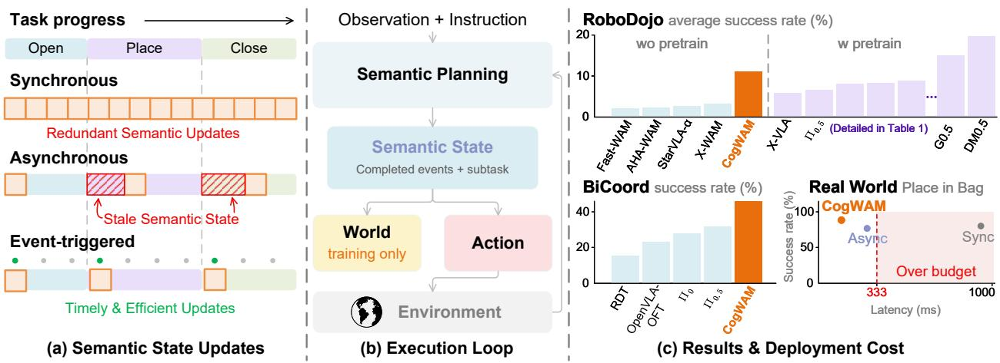  
Figure 1: Overview of CogWAM. (a) Event-triggered updates maintain a persistent Semantic State while avoiding redundant updates and stale states. (b) The Semantic State couples semantic planning with world prediction and action generation through a closed-loop execution loop. (c) Benchmark results and real-world success–latency trade-of.

To address this alignment problem, we introduce CogWAM (Fig. 1), which explicitly represents task progress as a persistent cognitive state rather than repeatedly inferring it from individual observations [20]. Existing hierarchical and memory-based policies demonstrate the importance of maintaining temporal context for long-horizon execution [6, 9, 10, 21], yet they primarily focus on semantic reasoning or memory accumulation without explicitly coupling task progress with predictive world modeling and action generation. CogWAM addresses this gap through a persistent Semantic State that records completed task events and the active subtask. During execution, the state is updated only when observations indicate meaningful task transitions, allowing semantic context to persist across multiple action chunks. This event-driven formulation decouple the semantic timescale from the control timescale: actions require frequent replanning for reactive control [22], whereas task semantics evolve only at a small number of stage transitions [21, 23].

Beyond maintaining task progress, an efective interface must also determine how semantic context is trans ferred to diferent physical objectives. Future-world prediction and action generation optimize diferent objectives, requiring representations that capture scene evolution and executable control. CogWAM therefore introduces progress-conditioned WORLD and ACTION queries, which are conditioned on the same Semantic State while selectively extracting branch-specific information for future multi-view latent prediction and continuous action generation. This allows task-level semantics to be shared while preserving objective-specific representations [24].

This state-conditioned formulation introduces two training challenges. First, semantic transitions are sparse relative to state persistence, causing imbalance between UPDATE and KEEP decisions. Second, training with annotated states creates exposure bias because closed-loop execution relies on predicted states [25]. We address these issues with boundary-aware semantic supervision and progressive semantic conditioning. Our main contributions are summarized as follows:

1. We present CogWAM, a semantics-aware world-action architecture that couples a persistent Semantic State with progress-conditioned WORLD/ACTION queries, enabling task-progress-aware future prediction and control.

2. We develop event-triggered semantic planning, which decouples semantic evolution from control frequency, together with training strategies that address sparse transitions and closed-loop semantic conditioning.

3. We demonstrate that explicit semantic interface design consistently improves robot policies across simulation, real-world, and diferent world-action architectures.

## 2 Related Work

Vision-Language-Action Models and Long-Horizon Reasoning. Vision-Language-Action (VLA) models leverage pretrained vision-language representations for language-conditioned robotic control [7, 26– 28]. Recent work increasingly augments such policies with higher-level reasoning and temporal context. π0.5 incorporates high-level semantic prediction to support open-world and long-horizon manipulation [4], while Hi Robot explicitly decomposes high-level semantic reasoning and low-level visuomotor execution [6]. Mem oryVLA introduces perceptual–cognitive memory for temporally dependent control [9], and Mem maintains multi-scale embodied memory across an episode [21]. SeqVLA explicitly predicts subtask completion to con trol transitions during sequential manipulation [10]. These works demonstrate the importance of reasoning beyond the current observation and global instruction. CogWAM similarly models execution progress, but difers by explicitly transferring maintained task progress into world-action learning through a structured semantic interface.

World-Action Models and Predictive Robot Policies. WAMs augment action learning with predictive models of future scene evolution [29]. Unified World Models jointly model future observations and actions [13], while DreamZero scales this paradigm and demonstrates strong zero-shot physical generalization [14]. Recent studies increasingly question whether dense future video generation is necessary. Fast-WAM shows that world-model co-training can provide substantial benefits even without explicit future generation at inference time [30]. In parallel, recent approaches move toward compact, action-relevant future representations: LaWAM predicts latent visual subgoals that condition robot actions [16], whereas SG-WAM models future dynamics directly in a geometry-aware policy representation space [17]. CogWAM follows this trend toward control-relevant future representations, while conditioning future prediction on an explici execution-aware Semantic State.

Task Progress across Semantic and Control Timescales. A related challenge is the mismatch be tween task-level semantics and the finer temporal scale of physical control. Hierarchical VLAs address this issue through intermediate semantic commands [4, 6], while completion-aware approaches track task progress across action chunks [10]. WALL-WM further organizes world-action learning around semantically coherent events to address the granularity mismatch among language, visual dynamics, and fixed-length actions [31]. CogWAM instead decouples Semantic State transitions from fixed-horizon action generation: the state persists across multiple replanning cycles and is updated only when observed progress indicates a semantic transition. This formulation is related to temporal abstraction in reinforcement learning [23], but operates on a language-level task state whose updates are event-triggered by execution progress [32].

Agentic Orchestration and System-1/System-2 Robot Policies. A growing line of work moves beyond improving a single visuomotor policy and instead couples fast learned control with slower foundationmodel reasoning, forming an emerging System-1/System-2 paradigm for robot decision making. Harness-WAM places a VLM-based task manager above a WAM to maintain global task state and trigger deliberation when needed [33]; VLAs-as-Tools lets a high-level VLM invoke specialized VLA policies as executable tools with progress-aware replanning [34]; and recent studies of hierarchical VLA agents systematically examine how planner–controller interfaces, memory, and switching mechanisms afect long-horizon execution [35]. More general agentic systems further extend this idea to policy routing, recovery, and autonomous policy improvement [36, 37]. At the other extreme, frontier multimodal models have been directly deployed as closed-loop robot policies: GPT-6 Astra is evaluated across all 42 RoboDojo tasks [38], while concurrent GPT-as-Policy work explores a hybrid setting in which Astra selectively reviews and corrects trajectories generated by a pretrained $\pi _ { 0 . 5 }$ controller [39]. Collectively, these systems reflect a broader shift from monolithic robot policies toward architectures that separate high-level semantic reasoning from high-frequency sensorimotor control. CogWAM follows the same separation of semantic and physical timescales, but takes a diferent route: rather than keeping System-2 reasoning as an external agent that repeatedly plans, routes, or corrects a downstream policy, CogWAM compresses its output into a persistent Semantic State and makes that state part of the learned world-action interface, allowing semantic cognition to persist across multiple System-1 control cycles without being recomputed at every step.

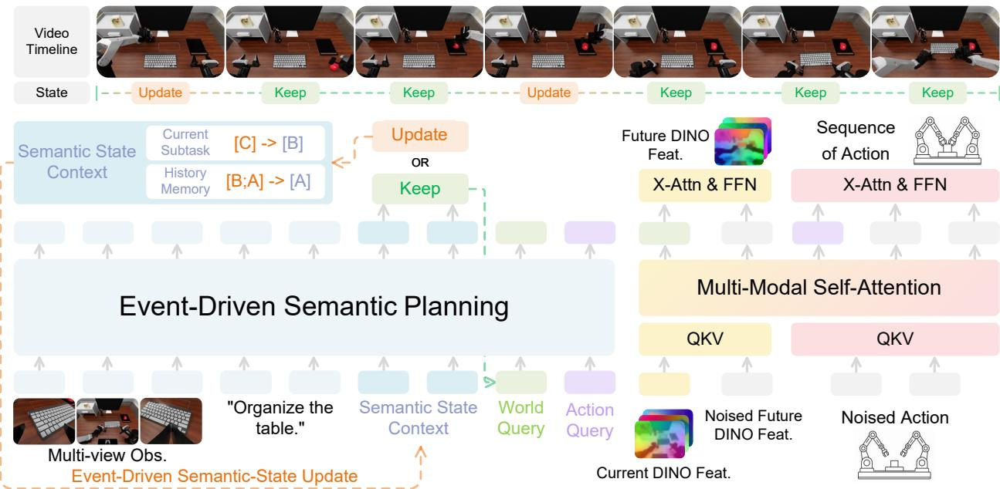  
Figure 2: Architecture of CogWAM. An event-triggered KEEP/UPDATE mechanism maintains a persisten Semantic State during closed-loop execution. WORLD and ACTION queries condition parallel branches for future multi-view DINO feature prediction and continuous action generation.

## 3 Method

## 3.1 Problem Formulation

We consider language-conditioned robot manipulation from multi-view observations. At timestep t, let $\mathcal { O } _ { t } = \{ I _ { t } ^ { ( v ) } \} _ { v = 1 } ^ { V }$ denote the current observation, ℓ the task instruction, and $\mathbf { } \mathbf { a } _ { t }$ an action chunk of horizon H. A standard visuomotor policy models $p _ { \theta } ( \boldsymbol { a } _ { t } \mid \mathcal { O } _ { t } , \boldsymbol { \ell } )$

For long-horizon manipulation, however, the current observation may not reveal which task events have already been completed or which subtask is currently active. CogWAM therefore maintains a persistent Semantic State $S _ { t ^ { - } } ~ = ~ ( m _ { t ^ { - } } , s _ { t ^ { - } } )$ , where $m _ { t }$ records completed task events and $s _ { t }$ denotes the active subtask. Given $\mathcal { O } _ { t } , \ell ,$ and $S _ { t ^ { - } } ,$ , the model first determines the Semantic State $S _ { t }$ consistent with the current task progress.

During training, CogWAM additionally predicts a future multi-view latent representation $\mathcal { Z } _ { t + H } = \{ \boldsymbol { z } _ { t + H } ^ { ( v ) } \} _ { v = 1 } ^ { V } ,$ We factorize the conditional distribution as

$$
p _ { \theta } ( S _ { t } , \mathcal { Z } _ { t + H } , a _ { t } \mid \mathcal { O } _ { t } , \ell , S _ { t - } ) = p _ { \theta } ( S _ { t } \mid \mathcal { O } _ { t } , \ell , S _ { t - } ) p _ { \theta } ( \mathcal { Z } _ { t + H } , a _ { t } \mid \mathcal { O } _ { t } , \ell , S _ { t } ) .\tag{1}
$$

The first factor models task-progress transitions, while the second models progress-conditioned world prediction and action generation. Importantly, action generation does not depend on the predicted future representation; future-world prediction is used only as a training-time objective. At inference time, the world branch is removed, and CogWAM directly predicts $p _ { \theta } ( \mathbf { { a } } _ { t } \mid \mathcal { O } _ { t } , \ell , S _ { t } )$ from the current observation and maintained Semantic State. The overall architecture is shown in Fig. 2.

## 3.2 Event-Triggered Semantic State

CogWAM maintains a persistent Semantic State throughout task execution and updates it only when visual evidence indicates a change in task progress. As a language-level summary of execution progress, the

Semantic State preserves task history that may no longer be recoverable from the current observation. Instead of regenerating semantic context at every step [20], CogWAM separates transition detection from state generation.

Semantic-State Transition. Let $d _ { t } \in \{ \mathrm { K E E P } , \mathrm { U P D A T E } \}$ denote whether the stored Semantic State remains valid at timestep t. Given the current observation ${ \mathcal { O } } _ { t }$ , task instruction $\ell ,$ and previous state $S _ { t ^ { - } }$ , the vision-language model (VLM) [40] predicts:

$$
d _ { t } \sim p _ { \theta } ( d _ { t } \mid \mathcal { O } _ { t } , \ell , S _ { t ^ { - } } ) .\tag{2}
$$

When $d _ { t } = { \tt U P D A T E }$ , the model generates a memory increment $\Delta m _ { t }$ describing the newly completed task event and the updated active subtask $s _ { t } \colon$

$$
\begin{array} { r } { ( \Delta m _ { t } , s _ { t } ) \sim p _ { \theta } ( \Delta m _ { t } , s _ { t } \mid \mathcal { O } _ { t } , \ell , S _ { t ^ { - } } , d _ { t } = \mathrm { U P D A T E } ) . } \end{array}\tag{3}
$$

The resulting Semantic State is updated as:

$$
\begin{array} { r } { \boldsymbol { S } _ { t } = \left\{ \begin{array} { l l } { \boldsymbol { S } _ { t ^ { - } } , } & { d _ { t } = \mathrm { K E P } , } \\ { ( m _ { t ^ { - } } \oplus \Delta m _ { t } , s _ { t } ) , } & { d _ { t } = \mathrm { U P D A T E } , } \end{array} \right. } \end{array}\tag{4}
$$

where $\oplus$ appends the newly completed event to the stored memory. $\mathrm { T h u s } , d _ { t }$ determines when the Semantic State changes, while $\left( \Delta m _ { t } , s _ { t } \right)$ determines how it changes. The state can persist across multiple action chunks until observed progress supports a transition, decoupling semantic evolution from fixed control horizons. At inference, $d _ { t }$ is predicted in a single forward pass. A KEEP decision avoids autoregressive semantic generation, whereas an UPDATE decision additionally generates $\left( \Delta m _ { t } , s _ { t } \right)$ . Details of semantic-state supervision are provided in Appendix C.

## 3.3 Progress-Conditioned World--Action Interface

Maintaining task progress alone does not determine how semantic context should influence diferent physical prediction objectives. Future-world prediction and action generation capture complementary aspects of robot behavior: the former models scene evolution, while the latter generates executable control trajectories. CogWAM therefore introduces progress-conditioned WORLD and ACTION queries to transfer the same task-progress context to both branches while preserving objective-specific representations.

Given the maintained Semantic State $S _ { t } ,$ CogWAM appends two sets of learnable query tokens after the current observation, task instruction, and semantic context in the causal sequence. The resulting hidden representations $\pmb { H } _ { t } ^ { w }$ and $\pmb { H } _ { t } ^ { a }$ are generated by the WORLD and ACTION queries:

$$
H _ { t } ^ { w } , H _ { t } ^ { a } = f _ { \theta } ( \mathcal { O } _ { t } , \ell , S _ { t } , Q ^ { w } , Q ^ { a } ) .\tag{5}
$$

The causal ordering allows both query sets to attend to the current observation, instruction, and Semantic State, while their outputs are routed to diferent downstream objectives. Specifically, $\pmb { H } _ { t } ^ { w }$ conditions future multi-view latent prediction, whereas $\pmb { H } _ { t } ^ { a }$ conditions continuous action generation. Their branch-specific supervision encourages the WORLD and ACTION queries to extract task-relevant information for their respective prediction targets, enabling shared task-level semantics with specialized physical representations. This design is supported by the gradient analysis in Appendix 5.1.1, which shows that World and Action objectives share perceptual grounding but require increasingly distinct representations at the query readout stage.

## 3.4 Latent World--Action Modeling

Given the progress-conditioned representations $\pmb { H } _ { t } ^ { w }$ and $\pmb { H } _ { t } ^ { a }$ , CogWAM jointly learns future-world prediction and continuous action generation over the action horizon.

Multi-View Future Latents. A frozen DINO encoder $E _ { \mathrm { D I N O } }$ maps each current image $\boldsymbol { I } _ { t } ^ { ( v ) }$ and its future counterpart $\pmb { I } _ { t + H } ^ { ( v ) }$ to latent features $ { \boldsymbol { z } } _ { t } ^ { ( v ) }$ and $\boldsymbol { z } _ { t + H } ^ { ( v ) }$ . Across V views, we denote the current and future representations as $\mathcal { Z } _ { t } = \{ z _ { t } ^ { ( v ) } \} _ { v = 1 } ^ { V }$ and $\mathcal { Z } _ { t + H } = \{ \boldsymbol { z } _ { t + H } ^ { ( v ) } \} _ { v = 1 } ^ { V }$ . Predicting future DINO features avoids appearance-level reconstruction while preserving object structure and spatial information relevant to physical state changes [41, 42]. Multi-view targets further capture complementary global and local interaction cues [21].

World and Action Branches. CogWAM instantiates the world and action branches as two streams in a Mixture-of-Transformers (MoT) architecture [43]. Both streams share $\mathcal { Z } _ { t }$ as the current visual anchor and interact through multimodal self-attention, while retaining modality-specific cross-attention and feedforward blocks. The World stream predicts $\mathcal { Z } _ { t + H }$ conditioned on ${ \cal { H } } _ { t } ^ { w }$ , whereas the Action stream generates $\mathbf { } \mathbf { a } _ { t }$ conditioned on $\pmb { H } _ { t } ^ { a }$ . During joint training, a structured attention mask prevents Action tokens from attending to future-latent tokens, avoiding target leakage and ensuring that action generation uses only information available at inference [30]. Future-latent prediction therefore serves as a training-time co-objective rather than an intermediate plan for action generation. At inference, the World stream is removed, leaving a direct action path conditioned on $\mathcal { Z } _ { t }$ and $\pmb { H } _ { t } ^ { a }$

## 3.5 Training Strategy

Joint Training Objective. CogWAM jointly optimizes action generation, future-latent prediction, and Semantic State modeling. For the action branch, Gaussian noise $\epsilon ^ { a } \sim \mathcal { N } ( 0 , I )$ is interpolated with the target action chunk $\mathbf { } \mathbf { a } _ { t }$ at flow time $\tau \sim \mathcal { U } ( 0 , 1 )$ . The world branch analogously interpolates $\epsilon ^ { w } \sim \mathcal { N } ( 0 , I )$ with the future representation $\mathcal { Z } _ { t + H } \mathbf { : }$

$$
\begin{array} { r } { a _ { t , \tau } = ( 1 - \tau ) a _ { t } + \tau \epsilon ^ { a } , \qquad \mathcal { Z } _ { t + H , \tau } = ( 1 - \tau ) \mathcal { Z } _ { t + H } + \tau \epsilon ^ { w } . } \end{array}\tag{6}
$$

Conditioned on the current visual representation and the corresponding progress-conditioned queries, the two branches predict their velocity fields:

$$
\mathcal { L } _ { \mathrm { a c t i o n } } = \mathbb { E } \left[ \| \pmb { v } _ { \theta } ^ { a } \left( \pmb { a } _ { t , \tau } , \tau ; \mathcal { Z } _ { t } , \pmb { H } _ { t } ^ { a } \right) - \left( \epsilon ^ { a } - \pmb { a } _ { t } \right) \| _ { 2 } ^ { 2 } \right] ,\tag{7}
$$

$$
\mathcal { L } _ { \mathrm { w o r l d } } = \mathbb { E } \left[ \Vert v _ { \theta } ^ { w } \left( \mathcal { Z } _ { t + H , \tau } , \tau ; \mathcal { Z } _ { t } , H _ { t } ^ { w } \right) - \left( \epsilon ^ { w } - \mathcal { Z } _ { t + H } \right) \Vert _ { 2 } ^ { 2 } \right] .\tag{8}
$$

Semantic State prediction uses a decision loss ${ \mathcal { L } } _ { \mathrm { d e c } }$ for KEEP/UPDATE classification and an autoregressive loss $\mathcal { L } _ { \mathrm { g e n } }$ for memory increment and updated subtask. Given annotated decision $d _ { t } ^ { \star }$

$$
\begin{array} { r } { \mathcal { L } _ { \mathrm { s e m } } = \mathcal { L } _ { \mathrm { d e c } } + \mathbf { 1 } \big [ \boldsymbol { d } _ { t } ^ { \star } = \boldsymbol { \mathrm { U P D A T E } } \big ] \mathcal { L } _ { \mathrm { g e n } } . } \end{array}\tag{9}
$$

The complete training objective is

$$
\begin{array} { r } { \mathcal { L } = \mathcal { L } _ { \mathrm { a c t i o n } } + \lambda _ { \mathrm { w o r l d } } \mathcal { L } _ { \mathrm { w o r l d } } + \lambda _ { \mathrm { s e m } } \mathcal { L } _ { \mathrm { s e m } } , } \end{array}\tag{10}
$$

where $\lambda _ { \mathrm { w o r l d } }$ and $\lambda _ { \mathrm { s e m } }$ control the contributions of future-latent and semantic supervision.

Boundary-Aware Semantic Sampling. Semantic transitions are sparse, so uniform sampling strongly favors KEEP. We therefore oversample UPDATE events together with hard-KEEP examples near annotated transition boundaries. These neighboring observations are visually similar to transition states but do no yet justify advancing the subtask, encouraging the model to localize semantic transitions more precisely. This rebalancing is applied only to semantic supervision; world and action training follow the original demonstration distribution.

Progressive Semantic Conditioning. Training the world and action branches only with annotated Semantic States creates a train–inference mismatch, since deployment conditions on model-predicted states. We therefore use the predicted state $\widehat { S } _ { t }$ as semantic context with probability $\rho _ { k }$ and the annotated state $S _ { t } ^ { \star }$ otherwise, where $\rho _ { k }$ bincreases with training progress k. Semantic prediction remains supervised by the annotated target; only the context used to construct ${ \cal { H } } _ { t } ^ { w }$ and $\pmb { H } _ { t } ^ { a }$ is progressively replaced. This exposes both branches to the semantic context encountered during closed-loop inference.

Table 1: Multi-Task Evaluation on RoboDojo. Each cell reports Score / Success Rate (in %). Methods are grouped by whether prior embodied robot-data pre-training is used before RoboDojo-specific training. Bold denotes the best result within each group.
<table><tr><td rowspan=1 colspan=1>Method</td><td rowspan=1 colspan=7>Generalization    Precision     Long-Horizon     Memory       Open       Average</td></tr><tr><td rowspan=1 colspan=8>w/ Prior Embodied Robot-Data Pre-training</td></tr><tr><td rowspan=1 colspan=1>X-VLA [28]</td><td rowspan=1 colspan=2>10.476.78    18.32</td><td rowspan=1 colspan=1>12.00   16.53</td><td rowspan=1 colspan=1>/9.75    4.76 /</td><td rowspan=1 colspan=1>3.56    0.55 /</td><td rowspan=1 colspan=2>0.50   10.13 / 6.52</td></tr><tr><td rowspan=7 colspan=1>InternVLA-A1.5 [46]π0.5 [4]Spatial Forcing [47]Hy-Embodied-0.5-VLA [48]Xiaomi-Robotics-1 [49]GalaxeaVLA (G0.5) [50]DM0.5 [51]</td><td rowspan=1 colspan=1>10.35/</td><td rowspan=1 colspan=1>6.83   15.23</td><td rowspan=1 colspan=1>/10.17   23.80</td><td rowspan=1 colspan=1>13.75    4.93 /</td><td rowspan=1 colspan=1>3.56    1.43 /</td><td rowspan=1 colspan=1>1.42   11.15</td><td rowspan=1 colspan=1>/ 7.14</td></tr><tr><td rowspan=1 colspan=1>13.38</td><td rowspan=1 colspan=1>/8.17    12.40/</td><td rowspan=1 colspan=1>5.50   23.54</td><td rowspan=1 colspan=1>/ 14.67    5.89 /</td><td rowspan=1 colspan=1>4.67    1.98 /</td><td rowspan=1 colspan=1>1.67   11.44</td><td rowspan=1 colspan=1>/ 6.93</td></tr><tr><td rowspan=1 colspan=1>14.12</td><td rowspan=1 colspan=1>9.34   17.32</td><td rowspan=1 colspan=1>10.58   23.26</td><td rowspan=1 colspan=1>/ 14.58    5.43 /</td><td rowspan=1 colspan=1>4.11    1.78 /</td><td rowspan=1 colspan=1>1.58   12.38</td><td rowspan=1 colspan=1>/8.04</td></tr><tr><td rowspan=1 colspan=1>11.78</td><td rowspan=1 colspan=1>8.39    13.81</td><td rowspan=1 colspan=1>/8.00   25.74</td><td rowspan=1 colspan=1>/14.92   13.37/</td><td rowspan=1 colspan=1>12.11   0.65</td><td rowspan=1 colspan=1> / 0.58   13.07</td><td rowspan=1 colspan=1>8.80</td></tr><tr><td rowspan=1 colspan=1>23.54</td><td rowspan=1 colspan=1>17.00  26.69</td><td rowspan=1 colspan=1>18.83   38.39</td><td rowspan=1 colspan=1>/23.67    7.81 /</td><td rowspan=1 colspan=1>6.56   3.94 /</td><td rowspan=1 colspan=1>3.58  20.07</td><td rowspan=1 colspan=1>13.93</td></tr><tr><td rowspan=1 colspan=1>18.46</td><td rowspan=1 colspan=1>/12.83  28.25</td><td rowspan=1 colspan=1>20.42 44.12</td><td rowspan=1 colspan=1>32.25   8.61 /</td><td rowspan=1 colspan=1>7.33</td><td rowspan=1 colspan=1>20.23</td><td rowspan=1 colspan=1>/14.88</td></tr><tr><td rowspan=1 colspan=1>15.77 /</td><td rowspan=1 colspan=1>10.95  24.82</td><td rowspan=1 colspan=1>/16.75   33.70</td><td rowspan=1 colspan=1>19.50  47.74 /</td><td rowspan=1 colspan=1>47.44 2.43 /</td><td rowspan=1 colspan=1>2.08  24.90 /</td><td rowspan=1 colspan=1>19.34</td></tr><tr><td rowspan=1 colspan=8>w/o Prior Embodied Robot-Data Pre-training</td></tr><tr><td rowspan=2 colspan=1>Fast-WAM [30]AHA-WAM [52]</td><td rowspan=1 colspan=1>2.33 /</td><td rowspan=1 colspan=1>1.11     1.96 /</td><td rowspan=1 colspan=1>0.00     9.14 /</td><td rowspan=1 colspan=1>5.17     3.55 /</td><td rowspan=1 colspan=1>3.44    0.42</td><td rowspan=1 colspan=1>/ 0.42    3.48 /</td><td rowspan=1 colspan=1>2.03</td></tr><tr><td rowspan=1 colspan=1>5.79/</td><td rowspan=1 colspan=1>3.27     5.86/</td><td rowspan=1 colspan=1>2.42     8.61</td><td rowspan=1 colspan=1>/2.67     2.97 /</td><td rowspan=1 colspan=1>2.78    0.88</td><td rowspan=1 colspan=1> / 0.83    4.82 /</td><td rowspan=1 colspan=1>2.39</td></tr><tr><td rowspan=1 colspan=1>StarVLA-α [53]</td><td rowspan=1 colspan=1>3.94</td><td rowspan=1 colspan=1>2.33     9.90</td><td rowspan=1 colspan=1>/4.33    14.15</td><td rowspan=1 colspan=1>/6.50    3.34 /</td><td rowspan=1 colspan=1>2.44    0.67</td><td rowspan=1 colspan=1>/0.58    6.40/</td><td rowspan=1 colspan=1>3.24</td></tr><tr><td rowspan=1 colspan=1>X-WAM [54]</td><td rowspan=1 colspan=1>7.39/</td><td rowspan=1 colspan=1>3.33     6.72</td><td rowspan=1 colspan=1>/1.83    17.47</td><td rowspan=1 colspan=1>/9.08    6.32</td><td rowspan=1 colspan=1>/4.67    0.57 /</td><td rowspan=1 colspan=1>0.25    7.69/</td><td rowspan=1 colspan=1>3.83</td></tr><tr><td rowspan=2 colspan=1>Fast-WAM + CogWAM InterfaceCogWAM (Ours)</td><td rowspan=1 colspan=1>12.28</td><td rowspan=1 colspan=1>/9.00   19.61</td><td rowspan=1 colspan=1>13.50   23.69</td><td rowspan=1 colspan=1>14.75   9.17</td><td rowspan=1 colspan=1>/8.00   1.93</td><td rowspan=1 colspan=1>/1.75   13.33</td><td rowspan=1 colspan=1>/9.40</td></tr><tr><td rowspan=1 colspan=1>15.53</td><td rowspan=1 colspan=1>12.17 24.45</td><td rowspan=1 colspan=1>19.00 28.14</td><td rowspan=1 colspan=1>19.00   7.65</td><td rowspan=1 colspan=1>/6.33   2.05</td><td rowspan=1 colspan=1>2.00 15.56</td><td rowspan=1 colspan=1>11.70</td></tr></table>

## 4 Experiments and Analysis

We evaluate CogWAM in both simulation and the real world. Following a question-driven evaluation protocol, our experiments are designed to answer the following four questions:

Q1: How does CogWAM perform on multi-task robotic manipulation benchmarks?

Q2: Does the Semantic State improve long-horizon manipulation?

Q3: How should the Semantic State be updated during closed-loop execution?

Q4: How well does CogWAM transfer to real-world robotic manipulation?

## 4.1 Experimental Setup

Benchmarks. We conduct simulation experiments on RoboDojo [44] and BiCoord [45], both under the multi-task setting. RoboDojo evaluates manipulation capabilities across Generalization, Precision, Long Horizon, Memory, and Open categories. BiCoord contains 18 long-horizon bimanual tasks with stage-wise annotations and an average of 4.27 stages per task, providing a complementary test bed for multi-stage bimanual coordination.

Metrics. For RoboDojo, we report Score and Success Rate (SR) for each capability dimension and average them across the five dimensions. Following the oficial protocol, each task is evaluated over 50 episodes; Generalization uses 25 standard and 25 randomized episodes. For BiCoord, we report task Success Rate (SR) and Stage-wise Success Rate (SSR) over 100 rollouts per task. For the update-strategy analysis, we additionally report semantic-model calls, inference latency, and transition delay relative to annotated stage boundaries, measured in the real-robot deployment where the control frequency imposes a fixed replanning budget.

## 4.2 Simulation Experiments

Q1: Multi-task benchmark performance. We compare CogWAM with representative VLA and WAM baselines on RoboDojo and BiCoord under the multi-task setting.

RoboDojo. As shown in Tab. 1, CogWAM achieves an average Score/SR of 15.56/11.70% without prior embodied robot-data pre-training, substantially outperforming existing methods under the same setting.

Table 2: Multi-Task Evaluation on BiCoord. Each cell reports Stage-wise Success Rate / Success Rate (in %). We show the six tasks with the longest average expert trajectories, while Avg. is computed over all 18 tasks. Complete per-task results are provided in Appendix Tab. A4.
<table><tr><td>Method</td><td>Clean Table</td><td>Cook</td><td>Exchange Mics</td><td>Exchange Pots</td><td>Match Blocks With Signs</td><td>Put Objects Cabinet</td><td></td><td>Average (18 Tasks)</td></tr><tr><td>RDT [55]</td><td>17.5 / 0.0</td><td>31.0 /9.0</td><td>35.0 / 23.0</td><td>96.0  / 92.0</td><td>7.0 / 1.0</td><td>49.0 / 31.0</td><td></td><td>34.8 /16.9</td></tr><tr><td>OpenVLA-OFT [7]</td><td>25.0 / 2.0</td><td>25.0 10.0</td><td>67.5 /66.0</td><td>56.0 /53.0</td><td>8.7 / 5.0</td><td>49.5 / 26.0</td><td></td><td>36.5 /23.1</td></tr><tr><td>π0 [8]</td><td>46.2 / 6.0</td><td>29.5 / 14.0</td><td>59.5 / 52.0</td><td>60.5 /52.0</td><td>18.7 /8.0</td><td>24.0 6.0</td><td></td><td>43.2 /27.2</td></tr><tr><td>π0.5 [4]</td><td>61.5 24.0</td><td>48.0 / 31.0</td><td>62.0 / 55.0</td><td>68.0 /61.0</td><td>15.0 / 6.0</td><td>58.5 42.0</td><td></td><td>50.8 /35.6</td></tr><tr><td>CogWAM (Ours)</td><td>80.0 50.0</td><td>77.5 52.0</td><td>56.5 / 49.0</td><td>76.5 /70.0</td><td>17.3 / 7.0</td><td>84.0 / 74.0</td><td>..</td><td>58.0 43.8</td></tr></table>

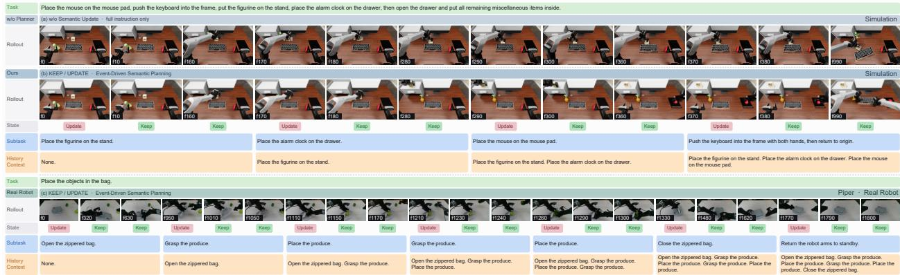  
Figure 3: Qualitative Analysis of Semantic State Progression. Simulation rollouts illustrate how persistent Semantic States track task progress across action chunks, reducing subtask drift, repetition, and premature transitions. The real-world rollout visualizes the predicted KEEP/UPDATE decisions together with the corresponding Semantic States throughout execution.

Relative to StarVLA-α [53], it improves the average Score by 9.16 and SR by 8.46 percentage points, with particularly strong gains in Precision and Long-Horizon manipulation. CogWAM also surpasses several methods that rely on prior embodied robot-data pre-training.

BiCoord. Tab. 2 further evaluates long-horizon bimanual manipulation. Averaged over all 18 tasks, Cog-WAM achieves an SSR/SR of 58.0/43.8%, outperforming the strongest evaluated baseline, π0.5 [4], by 7.2/8.2 percentage points. Its strongest gains occur on sustained multi-stage tasks such as Clean Table, Cook, and Put Objects Cabinet, while performance is less uniformly improved on tasks dominated by lowlevel bimanual coordination. Together, the two benchmarks show that CogWAM substantially strengthens multi-task and long-horizon execution without relying on prior robot-data pre-training.

Interface and Representation Analysis. We further analyze two design choices underlying CogWAM: whether the proposed semantic interface transfers across world-action architectures, and how the predictive representation afects performance. (1) Cross-architecture transfer. Applying the same semantic interface to Fast-WAM [30] improves its average Score/SR from 3.48/2.03% to 13.33/9.40%, while retaining the original Fast-WAM world-action formulation. This substantial gain shows that the benefit of the semantic interface is not specific to CogWAM’s underlying WAM architecture. (2) Predictive representation and model eficiency. We compare predictive formulations while keeping the semantic interface unchanged. Fast WAM repurposes a pretrained Wan2.2-TI2V-5B video backbone [56], whereas CogWAM predicts future DINOv3 features with a 0.44B world stream trained from scratch. Despite the reduced world-modeling capacity, CogWAM improves average Score/SR from 13.33/9.40% to 15.56/11.70%, with gains on Generalization, Precision, and Long-Horizon, while Wan2.2 remains stronger on Memory. This suggests that control-relevant visual representations can provide efective predictive supervision without large generative backbones. Since representation, capacity, and initialization difer jointly, we interpret this comparison as evidence of formulation eficiency rather than isolated representation quality.

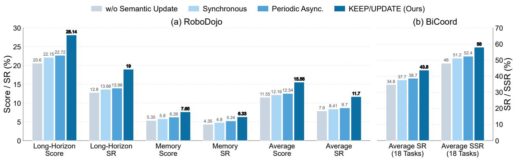  
Figure 4: Efect of Semantic State and Update Strategies. Task performance on (a) RoboDojo (Score / SR) and (b) BiCoord (SR / SSR), shown with benchmark-specific vertical scales. w/o Semantic State conditions the policy only on the current observation and global task instruction, while the remaining variants difer in how the Semantic State is updated.

Q2: Efect of the Semantic State. We isolate the contribution of the Semantic State by comparing CogWAM with a world-action MoT counterpart that shares the same backbone and training setting but conditions on only the current observation and global task instruction, without any persistent Semantic State. As illustrated in Fig. 3, this baseline is more prone to subtask drift, repetition of completed stages, and premature transitions. In contrast, CogWAM preserves the active subtask across multiple action chunks and advances it only when execution progress changes. Fig. 4 further quantifies these gains on the Long Horizon and Memory categories of RoboDojo and the stage-wise progression metrics of BiCoord.

Q3: Semantic State update strategies. We compare three update strategies: Synchronous, Asynchronous, and our Event-triggered update. Synchronous updating regenerates the Semantic State at every replanning step and therefore incurs substantial computation. Asynchronous updating reduces this overhead by running the semantic planner at a fixed lower frequency, but its updates can be misaligned with actual subtask transitions. CogWAM instead performs a lightweight KEEP/UPDATE decision and regenerates the Semantic State only when a semantic transition is detected. As shown in Fig. 4, the event-triggered strategy performs best on both benchmarks; notably, synchronous updating does not surpass asynchronous updating despite regenerating far more often, indicating that update timing matters more than update frequency. We further compare semantic-model calls, inference latency, and transition delay on the real robot (Sec. 4.3).

## 4.3 Real-World Experiments

Q4: Real-world evaluation. We evaluate CogWAM in the real world along two complementary tracks: task performance on six manipulation tasks and robustness under four controlled distribution shifts. Fig. 5 illustrates the robotic setup and representative task examples. Details of data collection, optimization, compute, and deployment hyperparameters are provided in Appendix B.

Evaluation Protocol. We evaluate Cog-WAM on six multi-stage tabletop tasks: Place Objects, Organize Utensils, Put in Drawer, Fill Pen Holder, Place in Bag, and Block Sorting,

Table 3: Real-world evaluation. Success counts across basic manipulation tasks and distribution shifts.
<table><tr><td rowspan=1 colspan=1>Basic Task       Success</td><td rowspan=1 colspan=1>Generalization    Success</td></tr><tr><td rowspan=1 colspan=1>Place Objects      20  / 20</td><td rowspan=5 colspan=1>Spatial Location     21  / 30Object Appearance 20 / 30Distractor            17 / 30Novel Objects        14 / 30一</td></tr><tr><td rowspan=1 colspan=1>Organize Utensils  17 / 20</td></tr><tr><td rowspan=1 colspan=1>Put in Drawer     18 / 20</td></tr><tr><td rowspan=1 colspan=1>Fill Pen Holder    18 / 20Place in Bag       16 / 20</td></tr><tr><td rowspan=1 colspan=1>Block Sorting      5 / 20</td></tr><tr><td rowspan=1 colspan=1>Total             94/120</td><td rowspan=1 colspan=1>Total               72/120</td></tr></table>

covering repeated manipulation, category-level organization, articulated and deformable object interaction, bimanual coordination, and precision placement. For the basic setting, each task is evaluated over 20 closedloop trials with predefined initial configurations, yielding 120 trials in total. We further assess robustness under four controlled distribution shifts, each evaluated independently across all six tasks. For each shift dimension, we perform 5 closed-loop trials per task, yielding 30 trials per dimension. Tab. 3 summarizes the successful trials across both settings. We additionally visualize a representative Place in Bag rollout, showing the predicted KEEP/UPDATE decisions and corresponding subtask memory in Fig. 3.

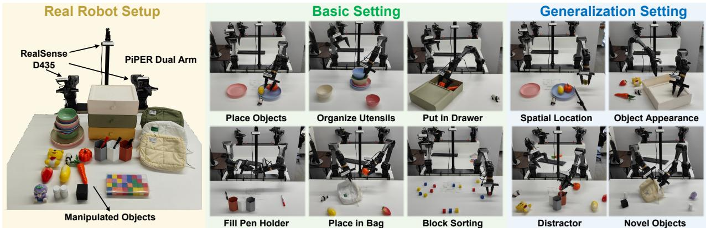  
Figure 5: Real-world setup and task examples. CogWAM is deployed on a dual-arm AgileX PIPER platform with two 6-DoF manipulators and parallel grippers, using synchronized RGB observations from one fixed head-mounted and two wrist-mounted Intel RealSense D435 cameras.

Table 4: Deployment cost of update strategies. Total denotes semantic-model calls per rollout, while Regen. counts calls that regenerate the Semantic State; Dec. tok. denotes tokens decoded per replanning step. Transition delay is the lag between a subtask boundary and the first replanning step at which the strategy can observe it. Latency is measured on an NVIDIA RTX 5090.
<table><tr><td rowspan="2">Update strategy</td><td colspan="2">Semantic-model calls</td><td colspan="2">Inference latency</td><td rowspan="2">Transition delay (ms) ↓</td></tr><tr><td>Total</td><td>Regen. ↓</td><td>Mean (ms) ↓ Dec. tok. ↓</td><td></td></tr><tr><td>Synchronous</td><td>65.4</td><td>65.4</td><td>927.8</td><td>45</td><td>152</td></tr><tr><td>Asynchronous (1 Hz)</td><td>22.1</td><td>22.1</td><td>309.3</td><td>45</td><td>502</td></tr><tr><td>Event-triggered (ours)</td><td>65.4</td><td>4.0</td><td>146.7</td><td>0</td><td>152</td></tr></table>

Real-time eficiency of semantic updating. The real robot runs a 30 Hz control loop and issues one replanning request every 10 control steps, leaving a 333 ms budget per replanning step. On Place in Bag, five held-out rollouts average 21.6 s, 65.4 replanning steps, and 4.00 semantic transitions per episode. As shown in Tab. 4, synchronous updating achieves a 152 ms transition delay but incurs 927.8 ms latency, exceeding the budget by 2.8×. Asynchronous updating reduces latency to 309.3 ms by updating every 30 control steps, but increases transition delay to 502 ms. In contrast, CogWAM evaluates the KEEP/UPDATE decision at every replanning step, as frequently as synchronous updating, but requires 16.4× fewer Semantic State regenerations. The KEEP/UPDATE decision is predicted from the semantic module’s final hidden state without autoregressive decoding, enabling frequent transition checks at low cost. This yields the same 152 m transition delay as synchronous updating, while reducing inference latency from 927.8 ms to 146.7 ms.

## 5 Model Analysis

## 5.1 Analysis of VLM-World-Action Interface

CogWAM bridges high-level semantic reasoning and low-level physical control through a structured World– Action interface, adding a predictive World branch alongside the Action branch that conventional policies optimize alone [4]. This section asks why the two branches need separate queries (§5.1.1), what future-world

(a) Agreement decays with depth  
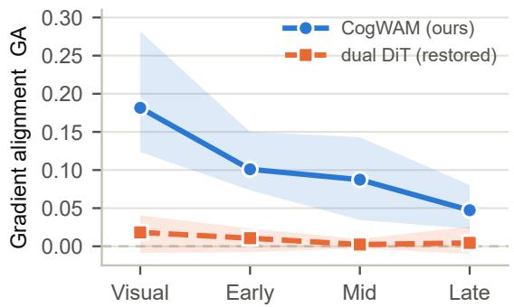

(b) World gradient reaching the trunk  
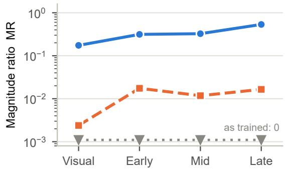  
Figure 6: World and Action gradients inside the shared VLM, by depth. (a) Gradient alignment, with 95% bootstrap intervals over 120 batches. CogWAM is significantly positive at every depth and decays inward from the visual tower; the dual-DiT baseline with its gradient path restored is indistinguishable from zero throughout. (b) World-gradient magnitude relative to the action gradient. As trained, the dual-DiT baseline detaches the world branch, so no world gradient reaches the trunk and GA is undefined.

prediction contributes beyond direct action supervision (§5.1.2), and whether the interface transfers to a diferent World–Action backbone (§5.1.3).

## 5.1.1 Semantic Interface between VLM and World-Action Learning

Future-world prediction and action generation share the same instruction and observation, but supervise the model through diferent output modalities: one learns a representation of scene evolution, the other a representation of executable control. Two design questions follow. How deep into the shared VLM should the objectives remain coupled, and through which interface should each read out the representation it needs? We answer both by measuring, rather than assuming, how the two objectives interact inside the trunk.

Treating the gradient direction as the update an objective requests from a parameter block, we report

$$
\operatorname { G A } ( \theta ) = \frac { \nabla _ { \theta } \mathcal { L } _ { \mathrm { w o r l d } } \cdot \nabla _ { \theta } \mathcal { L } _ { \mathrm { a c t i o n } } } { \left\| \nabla _ { \theta } \mathcal { L } _ { \mathrm { w o r l d } } \right\| _ { 2 } \left\| \nabla _ { \theta } \mathcal { L } _ { \mathrm { a c t i o n } } \right\| _ { 2 } } , \qquad \operatorname { M R } ( \theta ) = \frac { \left\| \nabla _ { \theta } \mathcal { L } _ { \mathrm { w o r l d } } \right\| _ { 2 } } { \left\| \nabla _ { \theta } \mathcal { L } _ { \mathrm { a c t i o n } } \right\| _ { 2 } } ,\tag{11}
$$

over depth-ordered blocks θ of the shared VLM trunk. GA asks whether the objectives request the same update direction, MR whether the world objective carries enough magnitude to matter. We compute both measures from the unweighted world and action losses in Eq. 11. At a fixed checkpoint, multiplying either gradient by a positive scalar does not change GA. Changing the loss weights during training may, however, change the learned parameters and gradient directions, so this scale invariance alone does not make GA directly comparable across diferently trained checkpoints. To attribute any diference to the interface alone, we compare the two architectures on a matched configuration that varies only in how the world and action branches attach to the VLM: both use a RynnBrain1.1 backbone [40], action horizon 16, the same RoboDojo recipe and the same frozen DINOv3-B teacher. This controlled pair is therefore not the final model of Tab. A1, which uses the RynnBrain1.1 backbone at horizon 25; we trade the exact deployment configuration for a clean attribution. All measurements use 120 training batches at 20k steps, report medians with 95% bootstrap intervals, and split the 24-layer language-model stack into equal thirds (layers 0–7, 8–15, 16–23).

Shared grounding, specialized abstraction. Sec. 3.3 motivates separate WORLD and ACTION queries as a way to share task-level semantics while preserving objective-specific representations; the gradients make that trade-of measurable. In CogWAM the objectives are positively but weakly aligned throughout the trunk, and the alignment decreases with depth (Fig. 6a): every interval excludes zero, and the medians fall monotonically from 0.182 [0.124, 0.282] in the visual tower through 0.101 and 0.087 to 0.047 [0.023, 0.080] in the last language-model third (0.081 over the trunk as a whole). Because the blocks are measured on the same batches, a paired test applies; the visual tower exceeds every language-model block (Wilcoxon $p < 1 0 ^ { - 3 } )$ , and LM-early exceeds LM-late; the median of the batch-wise paired diferences is 0.023 [0.011, 0.046], although adjacent blocks are not always separable. This is an expectation over batches rather than a per-batch property: 66% to 76% of batches are positive, so there is no systematic opposition between the objectives, but individual batches do disagree. Both objectives must recover the same objects, geometry and scene state, which makes the perceptual trunk genuinely shared; by the semantic depth at which the queries read out, the representation each requires is largely its own. Notably the deeper blocks receive proportionally more world gradient (Fig. 6b, MR rising from 0.17 to 0.53) while agreeing with the action objective less, so the divergence is one of direction rather than of the world signal fading out. A single query would have to summarise two only marginally related requirements within one fixed bottleneck, whereas separate WORLD and ACTION queries let each objective retain the full subspace for roughly $3 \times 1 0 ^ { 4 }$ additional parameters.

External heads in the evaluated dual-DiT configuration. The dual-DiT baseline attaches independent world and action heads to a standard VLM. As trained, its recipe detaches the world branch from the backbone, so $\| \nabla _ { \theta } \mathcal { L } _ { \mathrm { w o r l d } } \|$ is identically zero on every VLM block and GA is undefined: the world modality shapes only its own head. Since that detachment is a choice in the recipe rather than a consequence of using external heads, we also measure the counterfactual in which the path is restored. With the gradient path restored, the evaluated dual-DiT baseline has a whole-trunk GA of $0 . 0 1 2 \left[ - 0 . 0 0 5 , 0 . 0 2 2 \right]$ , with every per-block interval covering zero. Its MR is 0.02, compared with 0.37 for CogWAM, indicating a substantially smaller world-gradient contribution to the shared trunk. In this evaluated configuration, the external world head contributes little to shared representation learning even when its gradient path is restored.

Query ordering. Sec. 3.4 relies on a structured attention mask to keep ACTION tokens from attending to future-latent tokens; Fig. A1 shows the forward information path. The zero world-loss gradient on ACTION query parameters is consistent with this query ordering, while the attention mask directly prevents action tokens from accessing future-latent inputs. The WORLD queries receive gradients from both objectives (MR = 2.63), with positive alignment between them (GA = 0.152).

## Key Findings: Designing a VLM–World-Action Interface

An efective interface should therefore not hand one unified semantic representation to every downstream objective, but preserve shared context at the depth where the objectives agree and let each specialise where that agreement runs out.

## 5.1.2 Decomposing CogWAM

We next decompose CogWAM into the two additions that distinguish it from action-only control: predic tive world supervision and semantic conditioning. Tab. 5 follows the progression Action MoT → MoT → CogWAM. Action MoT retains the World–Action architecture but is trained only with the action objective. MoT additionally learns to predict future observations in the frozen DINO feature space. CogWAM further introduces the semantic interface, which conditions the policy on VLM-derived task progress and maintains an event-triggered Semantic State containing the active subtask and accumulated task history.

Table 5: Stepwise decomposition of CogWAM on RoboDojo. Each cell reports Score / Success Rate (in %). Action MoT → MoT adds DINO-space future-world prediction; MoT → CogWAM further adds the CogWAM Interface.
<table><tr><td></td><td colspan="2">Components</td><td colspan="8">RoboDojo Evaluation</td><td colspan="7"></td></tr><tr><td>Method</td><td colspan="2"></td><td>|Pred. VLM State</td><td>Gen.</td><td></td><td colspan="2">Prec.</td><td></td><td colspan="2">Long-H.</td><td>Mem.</td><td colspan="2"></td><td>Open</td><td colspan="2">Avg.</td></tr><tr><td>Action MoT</td><td></td><td></td><td></td><td>8.00</td><td>/5.20</td><td>18.20</td><td>/12.60</td><td>21.62</td><td>/12.00</td><td>3.50</td><td></td><td>/2.00</td><td>2.10</td><td>/1.90</td><td></td><td>10.68 6.74</td></tr><tr><td>MoT</td><td>√</td><td></td><td></td><td>11.73</td><td>8.83</td><td>21.24</td><td>14.00</td><td>21.88</td><td>13.64</td><td></td><td>5.72</td><td>4.67</td><td>1.05</td><td>1.00</td><td></td><td>12.32 8.43</td></tr><tr><td>CogWAM</td><td>√</td><td>」</td><td></td><td>15.53</td><td>12.17 24.45</td><td></td><td></td><td>19.00 28.14</td><td></td><td>19.00 7.65</td><td></td><td>6.33 2.05</td><td></td><td></td><td>2.00 15.56</td><td>11.70</td></tr></table>

Pred.: DINO-space future-world prediction; VLM: VLM-derived task-progress conditioning; State: event-triggered Semantic  
State.

Table 6: Transferability of the CogWAM Interface on RoboDojo. Each cell reports Score / Success Rate (in %). Applying the same semantic interface to Fast-WAM substantially improves performance without changing its underlying predictive formulation.
<table><tr><td>Method</td><td>Gen.</td><td>Prec.</td><td></td><td>Long-H.</td><td>Mem.</td><td>Open</td><td></td><td>Avg.</td></tr><tr><td>Fast-WAM [30]</td><td>2.33 /1.11</td><td>1.96</td><td>/ 0.00</td><td>9.14 / 5.17</td><td>3.55</td><td>3.44</td><td>0.42 /0.42</td><td>3.48 /2.03</td></tr><tr><td>Fast-WAM + CogWAM Interface</td><td>12.28 /9.00</td><td>19.61 / 13.50</td><td>23.69</td><td>14.75</td><td>9.17</td><td>8.00</td><td>1.93 /1.75</td><td>13.33 /9.40</td></tr><tr><td>CogWAM</td><td>15.53 12.17</td><td>24.45</td><td>19.00 28.14</td><td>19.00</td><td>7.65</td><td>6.33</td><td>2.05 2.00</td><td>15.56 11.70</td></tr></table>

Future prediction primarily improves perceptual grounding. Moving from Action MoT to MoT raises Generalization by +3.73 and Precision by +3.04 Score, while Long-Horizon changes by only +0.26. This pattern is consistent with future-world prediction acting mainly as a representation-learning signal: predicting how the scene will evolve encourages the shared representation to preserve objects, geometry, and interaction-relevant visual structure that are useful for selecting the next action. It does not, however, explicitly encode where the robot is within a multi-stage task, and therefore provides little direct mechanism for resolving progress ambiguity over long horizons.

The semantic interface reduces action uncertainty by conditioning on task progress. Moving from MoT to CogWAM produces the largest gain on Long-Horizon (+6.26 Score), but also improves Generalization (+3.80), Precision (+3.21), Memory (+1.93), and Open (+1.00). These broader gains are expected because semantic conditioning is useful beyond tasks that are nominally long-horizon. From a conditional-prediction perspective, an observation and instruction alone may admit several plausible action modes when the same visual configuration can occur at diferent stages of a task. Introducing the active subtask and task history supplies an additional condition $z _ { t } ,$ replacing the harder prediction problem $p ( a _ { t } \mid o _ { t } , \ell )$ with $p ( a _ { t } \mid o _ { t } , \ell , z _ { t } )$ Equivalently, the interface is intended to reduce the conditional uncertainty of the action distribution, $H ( A _ { t } \mid$ $O _ { t } , \ell , z _ { t } ) \le H ( A _ { t } \mid O _ { t } , \ell )$ , whenever task progress disambiguates otherwise plausible behaviors.

This reduction is most consequential in long-horizon tasks, where perceptually similar states can recur after diferent histories and therefore require diferent subsequent actions. The accumulated Semantic State explicitly records which task events have already occurred, reducing this form of history-dependent state aliasing. The same conditioning can nevertheless benefit shorter-horizon Generalization and Precision tasks: specifying the current semantic stage narrows the set of admissible behaviors and gives the action model a more stable task-relevant context, rather than requiring it to infer both task phase and motor command from the observation at every replanning step.

Importantly, the MoT-to-CogWAM comparison adds the complete semantic interface—VLM-derived taskprogress conditioning together with the event-triggered Semantic State. We therefore attribute the improvement in Tab. 5 to the semantic interface as a whole, rather than claiming that this ablation isolates either component individually. The disproportionately large Long-Horizon gain is consistent with the additional value of explicit task history, but separating current-subtask conditioning from accumulated semantic memory would require a further component-level ablation.

Unlike generative world models that optimize future reconstruction, CogWAM predicts future representations in a frozen DINO feature space [57]. Future prediction is used only as a training signal, so the World branch need not synthesize pixels at inference time. The compact target instead encourages the shared representation to capture task-relevant scene evolution while keeping the predictive objective lightweight.

## 5.1.3 Transferability of the CogWAM Interface

The decomposition above evaluates the CogWAM Interface within our DINO-based World–Action formulation. We next ask whether its benefit depends on this particular predictive backbone. To test this, we attach the same interface to Fast-WAM [30], while retaining Fast-WAM’s original world-action formulation, Wan2.2-TI2V-5B predictive backbone [56], and action decoder.

Adding the CogWAM Interface raises Fast-WAM’s average Score/SR from 3.48/2.03 to 13.33/9.40. The improvement is broad rather than confined to one capability: Generalization increases by +9.95 Score,

Put the pen into the White pen holder.  
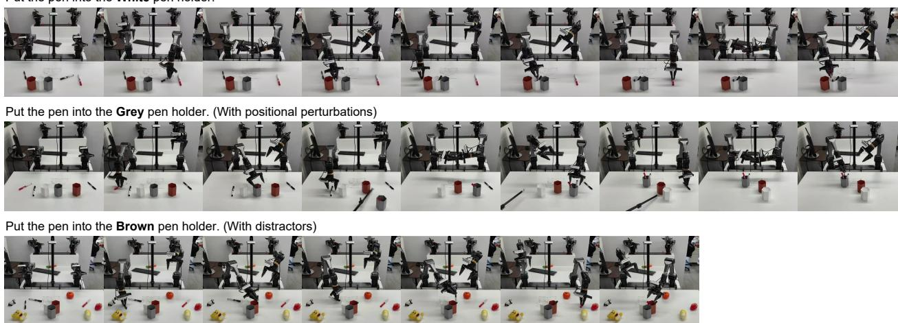  
Figure 7: Language grounding under visual perturbations. CogWAM follows instructions specifying diferent target pen holders: white, grey, and brown. The grey-holder setting introduces spatial perturbations of the target objects, while the brown-holder setting introduces additional distractor objects. Despite these variations, CogWAM consistently grounds the instructed target and completes the corresponding manipulation behavior.

Precision by +17.65, Long-Horizon by +14.55, Memory by +5.62, and Open by +1.51. This transfer is important because the underlying predictive model is unchanged; the gain therefore does not rely on CogWAM’s DINO-space future prediction.

Together with Tab. 5, the result separates two roles. Predictive world modeling shapes the representation of how the scene may evolve, while the CogWAM Interface conditions action generation on task progress and execution history. In conditional-prediction terms, the former enriches the predictive representation of the observation, whereas the latter supplies an additional task-state variable that narrows the set of plausible continuations. This explains why the interface improves not only Long-Horizon tasks, where historydependent ambiguity is strongest, but also Generalization and Precision tasks, where explicit task-phase conditioning can reduce ambiguity in the next-action distribution.

The remaining gap between Fast-WAM + CogWAM Interface and CogWAM should not be attributed to any single predictive component, since the two systems retain diferent world-action formulations. The transfer experiment supports the narrower conclusion that the CogWAM Interface is portable: its benefit persists when attached to a substantially diferent predictive backbone.

## 5.2 Language Grounding under Visual Perturbations

While the previous analysis studies how semantic information is transferred from the VLM to the World-Action model, we further investigate whether the CogWAM Interface enables fine-grained language grounding between instructions and visual entities.

Fig. 7 qualitatively evaluates language grounding on the Fill Pen Holder task. We vary the target specified by the instruction while keeping the underlying manipulation objective unchanged. The target object is changed among diferent pen holders with distinct visual appearances, including white, grey, and brown holders. Furthermore, we introduce two types of visual perturbations: spatial rearrangement of the target objects and additional distractor objects in the scene.

CogWAM successfully identifies the instructed target across these variations, demonstrating robust grounding between linguistic descriptions and visual observations. This behavior highlights a capability provided by the VLM Interface beyond task-progress modeling: instead of relying solely on a compact language embedding associated with demonstrations, the policy receives a semantically grounded representation that explicitly links instructions with the current visual context.

Beyond task-progress modeling, the VLM interface grounds language instructions to visual entities, allowing CogWAM to robustly follow fine-grained references under visual variations.

## 6 Conclusion and Discussion

CogWAM shows that explicitly aligning semantic task progress with world-action learning improves execution and deployment eficiency. Across simulation and real-world dual-arm manipulation, it consistently improves task completion without prior embodied robot-data pre-training. Importantly, transferring the same semantic interface to Fast-WAM also yields substantial gains, suggesting that the interface is not tied to a particular WAM architecture and can serve as a reusable bridge between VLM-style semantic reasoning and WAM-style predictive learning. Our analysis further shows that both update timing and predictive representation matter. Event-triggered updating remains aligned with task transitions while requiring far fewer Semantic State regenerations than synchronous updating. Meanwhile, CogWAM’s compact DINO based predictive formulation provides additional gains over the Fast-WAM-based variant, indicating that semantic alignment and predictive representation are complementary. A remaining limitation is that the Semantic State is append-only and cannot revise committed semantic errors. Future work could explore uncertainty-aware state revision and broader transfer across heterogeneous VLM and WAM backbones.

## References

[1] Michael Ahn, Anthony Brohan, Noah Brown, Yevgen Chebotar, Omar Cortes, Byron David, Chelsea Finn, Chuyuan Fu, Keerthana Gopalakrishnan, Karol Hausman, et al. Do as i can, not as i say: Grounding language in robotic afordances. arXiv preprint arXiv:2204.01691, 2022.

[2] Rodney A Brooks. Intelligence without representation. Artificial intelligence, 47(1-3):139–159, 1991.

[3] Danny Driess, Fei Xia, Mehdi SM Sajjadi, Corey Lynch, Aakanksha Chowdhery, Brian Ichter, Ayzaan Wahid, Jonathan Tompson, Quan Vuong, Tianhe Yu, et al. Palm-e: An embodied multimodal language model. arXiv preprint arXiv:2303.03378, 2023.

[4] Kevin Black, Noah Brown, James Darpinian, Karan Dhabalia, Danny Driess, Adnan Esmail, Michael Equi, Chelsea Finn, Niccolo Fusai, et al. π0.5: a vision-language-action model with open-world generalization. arXiv preprint arXiv:2504.16054, 2025.

[5] Wenlong Huang, Fei Xia, Ted Xiao, Harris Chan, Jacky Liang, Pete Florence, Andy Zeng, Jonathan Tompson, Igor Mordatch, Yevgen Chebotar, et al. Inner monologue: Embodied reasoning through planning with language models. arXiv preprint arXiv:2207.05608, 2022.

[6] Lucy Xiaoyang Shi, Brian Ichter, Michael Equi, Liyiming Ke, Karl Pertsch, Quan Vuong, James Tanner, Anna Walling, Haohuan Wang, Niccolo Fusai, et al. Hi robot: Open-ended instruction following with hierarchical vision-language-action models. arXiv preprint arXiv:2502.19417, 2025.

[7] Moo Jin Kim, Chelsea Finn, and Percy Liang. Fine-tuning vision-language-action models: Optimizing speed and success. arXiv preprint arXiv:2502.19645, 2025.

[8] Kevin Black, Noah Brown, Danny Driess, Adnan Esmail, Michael Equi, Chelsea Finn, Niccolo Fusai, Lachy Groom, Karol Hausman, Brian Ichter, et al. π : A vision-language-action flow model for general robot control. arXiv preprint arXiv:2410.24164, 2024.

[9] Hao Shi, Bin Xie, Yingfei Liu, Lin Sun, Fengrong Liu, Tiancai Wang, Erjin Zhou, Haoqiang Fan, Xiangyu Zhang, and Gao Huang. Memoryvla: Perceptual-cognitive memory in vision-language-action models for robotic manipulation. In ICLR, volume 2026, pages 18567–18602, 2026.

[10] Ran Yang, Zijian An, Lifeng Zhou, and Yiming Feng. Seqvla: Sequential task execution for long-horizon manipulation with completion-aware vision-language-action model. arXiv preprint arXiv:2509.14138, 2025.

[11] Kai Wang, Zhaopeng Gu, Yixiang Chen, Yuan Xu, Qisen Ma, Jiabing Yang, Zhaowen Li, Yan Huang, Liang Wang, and Peng Su. Dim-wam: World-action modeling with diverse historical event memory. arXiv preprint arXiv:2606.27677, 2026.

[12] Haisheng Su, Zongdai Liu, Xin Jin, Haoxuan Dou, Chengming Hu, Baorun Li, Zhanwang Liu, Ruiyan Xu, Jianjie Fang, Xin Zhang, Zhenjie Yang, Xue Yang, Chen Gao, Junchi Yan, Yong Li, and Wei Wu. Worldscape policy 2.0: Empowering steerable world action modeling with reasoning-augmented memory. arXiv preprint arXiv:2607.18840, 2026.

[13] Chuning Zhu, Raymond Yu, Siyuan Feng, Benjamin Burchfiel, Paarth Shah, and Abhishek Gupta. Unified world models: Coupling video and action difusion for pretraining on large robotic datasets. In RSS, 2025.

[14] Seonghyeon Ye, Yunhao Ge, Kaiyuan Zheng, Shenyuan Gao, Sihyun Yu, George Kurian, Suneel Indupuru, You Liang Tan, Chuning Zhu, Jiannan Xiang, et al. World action models are zero-shot policies. arXiv preprint arXiv:2602.15922, 2026.

[15] Jiangran Lyu, Kai Liu, Xuheng Zhang, Haoran Liao, Yusen Feng, Wenxuan Zhu, Tingrui Shen, Jiayi Chen, Jiazhao Zhang, Yifei Dong, et al. Lda-1b: Scaling latent dynamics action model via universal embodied data ingestion. RSS, 2026.

[16] Jialei Chen, Kai Wang, Kang Chen, Shuaihang Chen, Feng Gao, Wenhao Tang, Zhiyuan Li, Weilin Liu, Zhuyu Yao, Boxun Li, Yuanbo Xu, and Chao Yu. Lawam: Latent world action models for eficient dynamics-aware robot policies, 2026.

[17] Ruiteng Zhao, Zhengshen Zhang, Yue Su, Wenshuo Wang, Jiahui Li, Zhiyuan Yang, Francis EH Tay, Marcelo H Ang Jr, and Haiyue Zhu. Sg-wam: Self-guided world modeling in geometry-aware policy space. arXiv preprint arXiv:2608.01397, 2026.

[18] Lin Li, Qihang Zhang, Yiming Luo, Shuai Yang, Ruilin Wang, Fei Han, Mingrui Yu, Zelin Gao, Nan Xue, Xing Zhu, Yujun Shen, and Yinghao Xu. Causal world modeling for robot control. RSS, 2026.

[19] Qihang Zhang, Lin Li, Luyao Zhang, Shuai Yang, Yiming Luo, Shuaiting Li, Ruilin Wang, Junke Wang, Jiahao Shao, Gangwei Xu, et al. Native video-action pretraining for generalizable robot control. arXiv preprint arXiv:2607.08639, 2026.

[20] Yi Yang, Zhihong Liu, Siqi Kou, Yiyang Chen, Yanzhe Hu, Jianbo Zhou, Boyuan Zhao, Zhijie Wei, Xiao Xia, Xueqi Li, et al. World-language-action model for unified world modeling, language reasoning, and action synthesis. CoRL, 2026.

[21] Marcel Torne, Karl Pertsch, Homer Walke, Kyle Vedder, Suraj Nair, Brian Ichter, Allen Z Ren, Haohuan Wang, Jiaming Tang, Kyle Stachowicz, et al. Mem: Multi-scale embodied memory for vision language action models. arXiv preprint arXiv:2603.03596, 2026.

[22] Tony Z Zhao, Vikash Kumar, Sergey Levine, and Chelsea Finn. Learning fine-grained bimanual manip ulation with low-cost hardware. arXiv preprint arXiv:2304.13705, 2023.

[23] Richard S Sutton, Doina Precup, and Satinder Singh. Between mdps and semi-mdps: A framework for temporal abstraction in reinforcement learning. Artificial intelligence, 112(1-2):181–211, 1999.

[24] Junnan Li, Dongxu Li, Silvio Savarese, and Steven Hoi. Blip-2: Bootstrapping language-image pretraining with frozen image encoders and large language models. In ICML, pages 19730–19742. PmLR, 2023.

[25] Samy Bengio, Oriol Vinyals, Navdeep Jaitly, and Noam Shazeer. Scheduled sampling for sequence prediction with recurrent neural networks. NeurIPS, 28, 2015.

[26] Anthony Brohan, Noah Brown, Justice Carbajal, Yevgen Chebotar, Xi Chen, Krzysztof Choromanski, Tianli Ding, Danny Driess, Avinava Dubey, Chelsea Finn, et al. Rt-2: Vision-language-action models transfer web knowledge to robotic control. arXiv preprint arXiv:2307.15818, 2023.

[27] Moo Jin Kim, Karl Pertsch, Siddharth Karamcheti, Ted Xiao, Ashwin Balakrishna, Suraj Nair, Rafael Rafailov, Ethan Foster, Grace Lam, Pannag Sanketi, et al. Openvla: An open-source vision-languageaction model. arXiv preprint arXiv:2406.09246, 2024.

[28] Jinliang Zheng, Jianxiong Li, Zhihao Wang, Dongxiu Liu, Xirui Kang, Yuchun Feng, Yinan Zheng, Jiayin Zou, Yilun Chen, Jia Zeng, et al. X-vla: Soft-prompted transformer as scalable cross-embodiment vision-language-action model. In ICLR, volume 2026, pages 60580–60606, 2026.

[29] Yilun Du, Sherry Yang, Bo Dai, Hanjun Dai, Ofir Nachum, Josh Tenenbaum, Dale Schuurmans, and Pieter Abbeel. Learning universal policies via text-guided video generation. NeurIPS, 36:9156–9172, 2023.

[30] Tianyuan Yuan, Zibin Dong, Yicheng Liu, and Hang Zhao. Fast-wam: Do world action models need test-time future imagination? arXiv preprint arXiv:2603.16666, 2026.

[31] Shalfun Li, Victor Yao, Charles Yang, Truth Qu, Regis Cheng, Ryan Yu, Howard Lu, Newton Von, Vincent Chen, Yohann Tang, et al. Wall-wm: Carving world action modeling at the event joints. arXiv preprint arXiv:2606.01955, 2026.

[32] Paulo Tabuada. Event-triggered real-time scheduling of stabilizing control tasks. IEEE Transactions on Automatic control, 52(9):1680–1685, 2007.

[33] Zhaopeng Gu, Bingke Zhu, Tianxi Lin, Guibo Zhu, Yingying Chen, Kai Wang, Tingyu Yuan, Chaoyang Zhao, Zhaowen Li, Peng Su, et al. Harnesswam: Bridging prediction and deliberation in world action models. arXiv preprint arXiv:2608.09516, 2026.

[34] Zixing Lei, Changxing Liu, Yichen Xiong, Minhao Xiong, Yuanzhuo Ding, Zhipeng Zhang, Weixin Li, and Siheng Chen. Towards long-horizon embodied agents with tool-aligned vision-language-action models. arXiv preprint arXiv:2605.13119, 2026.

[35] Jiaheng Hu, Mohit Shridhar, Caden Lu, Dhruv Shah, Hao-Tien Lewis Chiang, Jie Tan, and Annie Xie. What matters in orchestrating robot policies: A systematic study of hierarchical vla agents. arXiv preprint arXiv:2606.10267, 2026.

[36] Jinbang Huang, Yuanzhao Hu, Zhiyuan Li, Ran Qi, Yixin Xiao, Zhanguang Zhang, Mark Coates, Tongtong Cao, and Yingxue Zhang. Roboharness: Memory-driven orchestration of heterogeneous robot policies for long-horizon planning. arXiv preprint arXiv:2607.18060, 2026.

[37] Ruiying Li, Yunlang Zhou, YuYao Zhu, Kylin Chen, Jingyuan Wang, Sukai Wang, Kongtao Hu, Minhui Yu, Bowen Jiang, Zhan Su, et al. Roboclaw: An agentic framework for scalable long-horizon robotic tasks. arXiv preprint arXiv:2603.11558, 2026.

[38] Wenbo Zhang, Kaixuan Wang, Yutao Ouyang, Xiaoyu Huang, Liyang Li, Kailun Su, Weiyang Jin, Wenhao Chai, Haotian Liang, Zhiyang Dou, et al. An unexpected robot policy: Early evaluations of gpt-6 astra on robodojo and beyond. arXiv preprint arXiv:2609.24170, 2026.

[39] Jiayi Su, Yixin Zheng, Mi Yan, Li Yi, Zhizheng Zhang, and He Wang. GPT 6 Astra as an embodied policy. Technical report and code, 2026. URL https://github.com/anonymous-report-421/evalof-gpt-6-astra-as-policy.

[40] Kehan Li, Bohan Hou, Minghao Zhu, Tianyi Zhang, Zesen Cheng, Zhikai Wang, Sicong Leng, Xin Li, Xiao Lin, Biying Yao, et al. Rynnbrain 1.1: Towards more capable and generalizable embodied foundation model. arXiv preprint arXiv:2607.17977, 2026.

[41] Nilaksh, Saurav Jha, Artem Zholus, and Sarath Chandar. Reconstruction or semantics? what makes a latent space useful for robotic world models. arXiv preprint arXiv:2605.06388, 2026. URL https: //arxiv.org/abs/2605.06388.

[42] Dujun Nie, Fengjiao Chen, Qi Lv, Jun Kuang, Xiaoyu Li, Xuezhi Cao, and Xunliang Cai. Lary: A latent action representation yielding benchmark for generalizable vision-to-action alignment, 2026. URL https://arxiv.org/abs/2604.11689.

[43] Weixin Liang, Lili Yu, Liang Luo, Srinivasan Iyer, Ning Dong, Chunting Zhou, Gargi Ghosh, Mike Lewis, Wen-tau Yih, Luke Zettlemoyer, et al. Mixture-of-transformers: A sparse and scalable architecture for multi-modal foundation models. arXiv preprint arXiv:2411.04996, 2024.

[44] Tianxing Chen, Yue Chen, Zixuan Li, Junyuan Tang, Kailun Su, Haoran Lu, Weijie Wan, Baijun Chen, Songling Liu, Haowen Yan, et al. Robodojo: A unified sim-and-real benchmark for comprehensive evaluation of generalist robot manipulation policies. arXiv preprint arXiv:2607.04434, 2026.

[45] Xingyu Peng, Chen Gao, Liankai Jin, Annan Li, and Si Liu. Bicoord: A bimanual manipulation benchmark towards long-horizon spatial-temporal coordination. arXiv preprint arXiv:2604.05831, 2026.

[46] Haoxiang Ma, Junhao Cai, Xiaoxu Xu, Hao Li, Yuyin Yang, Yang Tian, Jiafei Cao, Hongrui Zhu, Zherui Qiu, Yuqiang Yang, et al. Internvla-a1. 5: Unifying understanding, latent foresight, and action for compositional generalization. arXiv preprint arXiv:2607.04988, 2026.

[47] Fuhao Li, Wenxuan Song, Han Zhao, Jingbo Wang, Pengxiang Ding, Donglin Wang, Long Zeng, and Haoang Li. Spatial forcing: Implicit spatial representation alignment for vision-language-action model. In ICLR, volume 2026, pages 132324–132345, 2026.

[48] He Zhang, Lingzhu Xiang, Haitao Lin, Zeyu Huang, Minghui Wang, Dingyan Zhong, Yubo Dong, Yihao Wu, Yongming Rao, Dongsheng Zhang, et al. Hy-embodied-0.5-vla: From vision-language-action models to a real-world robot learning stack. arXiv preprint arXiv:2606.14409, 2026.

[49] Xiaomi Robotics Team, Jun Guo, Piaopiao Jin, Jason Li, Peiyan Li, Yingyan Li, Futeng Liu, Wanli Peng, Optimus Qin, Yifei Su, et al. Xiaomi-robotics-1: Scaling vision-language-action models with over 100k hours of real-world trajectories. arXiv preprint arXiv:2607.15330, 2026.

[50] Yicheng Liu, Zibin Dong, Baijun Ye, Tianyuan Yuan, Tao Jiang, Anqi Yang, Shicheng Cao, Haonan Liu, Yue Sun, Zihan Guo, et al. G0.5: One autoregressive stream for robot reasoning and action. arXiv preprint arXiv:2608.11739, 2026.

[51] Dexmal. Opendm: An open-world foundation model for general-purpose embodied intelligence. https: //github.com/dexmal/opendm, 2026. DM0.5.

[52] Jisong Cai, Long Ling, Shiwei Chu, Zhongshan Liu, Jiayue Kang, Zhixuan Liang, Wenjie Xu, Yinan Mao, Weinan Zhang, Xiaokang Yang, et al. Aha-wam: Asynchronous horizon-adaptive world-action modeling with observation-guided context routing. arXiv preprint arXiv:2606.09811, 2026.

[53] Jinhui Ye, Ning Gao, Senqiao Yang, Jinliang Zheng, Zixuan Wang, Yuxin Chen, Pengguang Chen, Yilun Chen, Shu Liu, and Jiaya Jia. Starvla-α: Reducing complexity in vision-language-action systems. In ECCV, 2026.

[54] Jun Guo, Qiwei Li, Peiyan Li, Zilong Chen, Nan Sun, Yifei Su, Heyun Wang, Yuan Zhang, Xinghang Li, and Huaping Liu. Unified 4d world action modeling from video priors with asynchronous denoising. arXiv preprint arXiv:2604.26694, 2026.

[55] Songming Liu, Lingxuan Wu, Bangguo Li, Hengkai Tan, Huayu Chen, Zhengyi Wang, Ke Xu, Hang Su, and Jun Zhu. Rdt-1b: a difusion foundation model for bimanual manipulation. In ICLR, volume 2025, pages 29982–30009, 2025.

[56] Team Wan. Wan: Open and advanced large-scale video generative models. arXiv preprint arXiv:2503.20314, 2025.

[57] Oriane Siméoni, Huy V Vo, Maximilian Seitzer, Federico Baldassarre, Maxime Oquab, Cijo Jose, Vasil Khalidov, Marc Szafraniec, Seungeun Yi, Michaël Ramamonjisoa, et al. Dinov3. arXiv preprint arXiv:2508.10104, 2025.

[58] Generalist Team. Gen-0: Embodied foundation models that scale with physical interaction. Generalist AI Blog, 2025. https://generalistai.com/blog/gen-0.

## A Implementation Details

## A.1 Model Architecture

CogWAM couples a vision-language backbone [40], a Mixture-of-Transformers (MoT) architecture [43] whose world and action streams are conditioned separately, and a frozen visual teacher [57]. Tab. A1 summarizes the three components.

Table A1: Model architecture. The backbone row reports its 24-layer language model; its vision tower is also 24 layers. The two MoT streams traverse the same 30 layers but keep separate widths, attention projections, and feed-forward blocks; attention head dimension is 128 for both. At inference, the worldprediction stream and future-target encoding are removed, while the frozen DINO encoder is retained to extract current visual features.
<table><tr><td rowspan="2"></td><td rowspan="2">VLM backbone RynnBrain1.1-2B</td><td colspan="2">World-Action MoT</td><td rowspan="2">Visual teacher DINOv3 ViT-B/16</td></tr><tr><td>World stream</td><td>Action stream</td></tr><tr><td>Parameters</td><td>2.72 B</td><td>442M</td><td>1.01 B</td><td>85.7M</td></tr><tr><td>Trained</td><td>yes</td><td>yes</td><td>yes</td><td>frozen</td></tr><tr><td>Layers</td><td>24</td><td>30</td><td></td><td>12</td></tr><tr><td>Attention heads</td><td>8</td><td colspan="2">24</td><td>12</td></tr><tr><td>Hidden dim</td><td>2048</td><td>512</td><td>1024</td><td>768</td></tr><tr><td>Feed-forward dim</td><td>6144</td><td>2048</td><td>4096</td><td>3072</td></tr></table>

Learned planner queries: 16 WORLD + 25 ACTION at dim 2048 (0.084 M)  
Trainable total: 4.19 B incl. projection layers • Full model incl. frozen teacher: 4.27 B

The attention masks used in CogWAM are illustrated in Fig. A1. For the VLM backbone (Fig. A1(a)), image tokens follow bidirectional attention, while text tokens and learned WORLD/ACTION queries adopt causal attention. During World–Action MoT training (Fig. A1(b)), future-latent tokens attend to the WORLD conditioning representations and current visual features, while action tokens are masked from future-latent tokens to avoid information leakage. At inference, the world stream is removed, leaving the action stream conditioned on current visual features and ACTION representations.

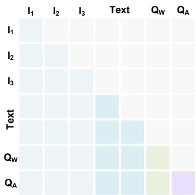

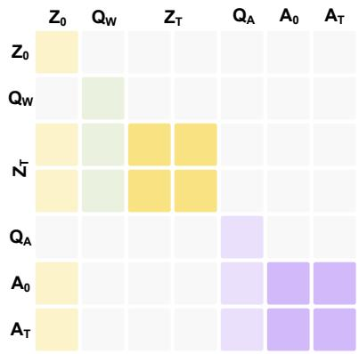

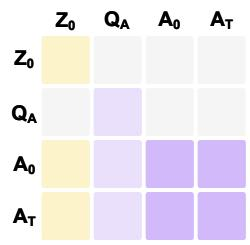  
(a) VLM Attention Mask  
(b) WAM Training Mask  
Figure A1: Illustration of attention masks in CogWAM.  
(c) WAM Inference Mask

Table A2: Training hyperparameters. The semantic stream is a second, independent dataloader: every step trains both a physical batch and a balanced semantic batch.
<table><tr><td>Configuration</td><td>Value</td></tr><tr><td>Optimizer</td><td> $\mathrm { A d a m W } , \beta = ( 0 . 9 , 0 . 9 5 ) , \epsilon = 1 0 ^ { - 8 }$ </td></tr><tr><td>Weight decay</td><td> $1 0 ^ { - 8 }$ </td></tr><tr><td>Learning rate (VLM backbone)</td><td> $1 \times 1 0 ^ { - 5 }$ </td></tr><tr><td>Learning rate (planner queries)</td><td> $1 \times 1 0 ^ { - 4 }$ </td></tr><tr><td>Learning rate (action model)</td><td> $1 \times 1 0 ^ { - 4 }$ </td></tr><tr><td>LR schedule</td><td>cosine, 2,000 warmup steps, floor  $5 \times 1 0 ^ { - 7 }$ </td></tr><tr><td>Gradient clipping</td><td>1.0 (global norm)</td></tr><tr><td>Training steps</td><td>50,000</td></tr><tr><td>Batch size (physical)</td><td>12 / device, 768 global</td></tr><tr><td>Batch size (semantic)</td><td>6 / device (2 UPDATE / 2 hard KEEP / 2 random KEEP)</td></tr><tr><td>Compute</td><td>8 × 8 NVIDIA H20</td></tr><tr><td>Precision Random seed</td><td>bfloat16, DeepSpeed ZeRO-2, gradient checkpointing</td></tr><tr><td></td><td>42</td></tr><tr><td>Loss  $\lambda _ { \mathrm { w o r l d } } , \lambda _ { \mathrm { s e m } }$ </td><td> ${ \mathcal { L } } _ { \mathrm { a c t i o n } } + \lambda _ { \mathrm { w o r l d } } { \mathcal { L } } _ { \mathrm { w o r l d } } + \lambda _ { \mathrm { s e m } } { \mathcal { L } } _ { \mathrm { s e m } }$ </td></tr><tr><td>Flow-matching schedule</td><td>1.0, 0.005</td></tr><tr><td>Train timesteps</td><td>shifted uniform,  $\sigma = s u / ( 1 + ( s - 1 ) u ) , s = 5 . 0$ </td></tr><tr><td>Regression target</td><td>1000</td></tr><tr><td>Inference solver</td><td> $\epsilon - x _ { 0 }$ </td></tr><tr><td></td><td>Euler, 20 steps, no classifier-free guidance</td></tr><tr><td>Action horizon H</td><td>25</td></tr><tr><td>Future-world stride</td><td>16 frames</td></tr><tr><td>Replanning interval</td><td>10 frames</td></tr><tr><td>Semantic offset</td><td>-10 frames</td></tr><tr><td>Scheduled-sampling  $\rho _ { k }$ </td><td>0 until 30k, → 0.2 at 40k, → 0.5 at 50k</td></tr><tr><td>Semantic decoding</td><td>greedy, ≤ 96 new tokens</td></tr></table>

## B Training Details

## B.1 RoboDojo Training Recipe

Objectives. Tab. A2 lists the full training recipe used for the RoboDojo benchmark. The pretrained backbone is fine-tuned an order of magnitude more slowly than the randomly initialized queries and action model. The semantic loss is the sum of two next-token cross-entropies over disjoint label spans, one covering the decision token and one the Memory Add and Current Subtask continuation; they are combined withou a relative coeficient, since their efective balance comes from the 2-of-6 composition of the semantic batch.

## B.2 Real-World Training Data

Table A3: Training data. Per-task counts after the 5% episode-level validation split.
<table><tr><td>Task</td><td>Train ep.</td><td>Train frames</td><td>Val ep.</td><td>Val frames</td></tr><tr><td>Place Objects</td><td>66</td><td>83,314</td><td>1</td><td>1,244</td></tr><tr><td>Organize Utensils</td><td>87</td><td>112,181</td><td>5</td><td>6,725</td></tr><tr><td>Put in Drawer</td><td>437</td><td>729,929</td><td>23</td><td>37,273</td></tr><tr><td>Fill Pen Holder</td><td>1,477</td><td>220,962</td><td>78</td><td>10,950</td></tr><tr><td>Place in Bag</td><td>954</td><td>392,681</td><td>49</td><td>19,131</td></tr><tr><td>Block Sorting</td><td>1,210</td><td>410,721</td><td>64</td><td>21,353</td></tr><tr><td>Total</td><td>4,231</td><td>1,949,788</td><td>220</td><td>96,676</td></tr></table>

Sampling. Episode counts and frame counts rank inversely (Tab. A3): Fill Pen Holder is 34.9% of episodes but 11.3% of frames, Put in Drawer 10.3% and 37.4%. Sampling over episodes would therefore undersample the long-horizon tasks, so the physical stream samples over frames. Validation is held out at the episode level, so no validation frame is ever seen in training.

## B.3 Real-World Training Progress

Fig. A2 tracks the action objective over the 50k-step run. Action MSE scores the predicted chunk against the logged one; reverse KL [58] asks whether the samples the policy actually draws land near that chunk rather than averaging across modes into an action that matches none of them.

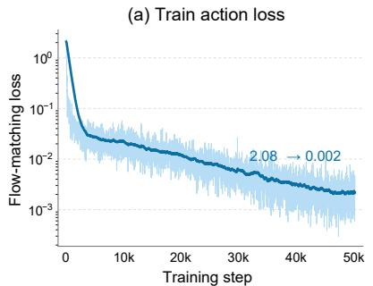

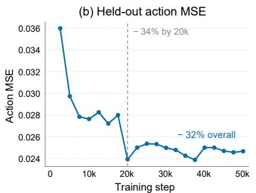

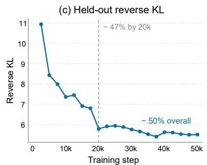  
Figure A2: Action learning over training. Panel (a) shows per-step training loss (light) with an exponential moving average (dark) on a log scale. Panels (b) and (c) show held-out action MSE and reverse KL at every validation checkpoint.

Convergence. Both held-out measures improve steeply through the first 20k steps and then flatten: action MSE falls 34% by 20k and 32% overall, reverse KL 47% and 50%. After 20k the curves separate. Action MSE oscillates within ±3% of its final value and reaches its minimum at 37.5k rather than at the end. The remaining fluctuations are small, with no sustained improvement in action MSE. Reverse KL keeps drifting down, indicating that late training sharpens the sampled distribution around the demonstrated action more than it moves the mean prediction. We therefore report 50k as converged rather than as the best of a still-improving run.

Relation to closed-loop behaviour. Ofline action metrics track closed-loop quality across checkpoints, but not across tasks. In informal on-robot checks the 20k and 40k checkpoints behaved comparably in grasp accuracy and generalization while 10k was visibly underfit, consistent with the elbow in Fig. A2; we did not run a controlled comparison across checkpoints. Across tasks the picture difers: at 50k, closed-loop success ranges from 20/20 on Place Objects to 5/20 on Block Sorting, a spread the aggregate curves cannot explain, since action MSE compares one predicted chunk to one logged chunk and cannot see whether an error is absorbed at the next replanning step or compounds into a failed grasp. This is also why we track reverse KL: a policy that averages across two viable behaviours can score well on MSE while every sample it draws falls between them, and it is the drawn sample that the robot executes.

## C Semantic Supervision

This section details the ofline procedure that produces the KEEP/UPDATE decision, the memory increment $\Delta m _ { t }$ , and the active subtask $s _ { t }$

Ofline subtask annotation. We generate subtask supervision once ofline using GPT-5.6 Sol as a fixed VLM annotator. For each episode, we provide sparsely sampled video frames, the task instruction, and a predefined ordered checklist of semantic stages, and ask the annotator to localize the completion boundary of each stage. The predicted boundaries are mapped back to the original video timeline and converted into right-open subtask spans, yielding the frame-level active subtask $s _ { t }$ . For tasks with an episode-dependent number of stages, such as Arrange Largest Number, the stage count is first inferred from early observations before constructing the checklist. These annotations are fixed before training; GPT-5.6 Sol is used only for ofline annotation and is not involved in policy training or inference.

Algorithm 1: Ofline subtask annotation   
Require: Episode $V = \{ x _ { t } \} _ { t = 1 } ^ { T } ,$ , instruction $\ell ,$ task c   
1: Retrieve the ordered stage checklist $ { \boldsymbol { S } } _ { c }$   
2: if c has an episode-dependent stage count then   
3: Infer the stage count from early observations and instantiate $ { \boldsymbol { S } } _ { c }$   
4: end if   
5: Sample representative observations O from V   
6: Predict ordered stage boundaries b from $( \ell , S _ { c } , \mathcal { O } )$   
7: Map b to the original timeline and construct right-open spans   
8: return Frame-level active-subtask labels $\{ s _ { t } ^ { \star } \} _ { t = 1 } ^ { \bar { T } }$

Some RoboDojo tasks require episode-specific checklist construction. For Arrange Largest Number, the number of digit-placement stages varies between four and five; we infer this count from up to three early observations using independent VLM queries followed by majority voting, and instantiate the corresponding checklist before boundary annotation. For tasks with a fixed semantic structure, such as Spell RoboDojo, the checklist is fixed in advance. Thus, the VLM annotator localizes transitions between predefined semantic stages rather than freely generating the task decomposition.

Canonicalization. The ofline annotation procedure above produces right-open segment ends paired with subtask text for each episode. Before constructing semantic supervision, we canonicalize these segments to remove annotation gaps. An unlabelled interval is not retained as a separate segment, because entering and leaving such a gap would otherwise create two artificial semantic transitions. Leading and internal gaps are therefore absorbed into the following labelled segment, while trailing gaps are absorbed into the final labelled segment, ensuring that each semantic stage boundary induces exactly one transition.

Decision labels. Let $( s _ { t } , m _ { t } )$ denote the active subtask and the cumulative memory of completed subtasks at frame t. With a semantic ofset matching the replanning interval of 10 frames,

$$
d _ { t } = { \left\{ \begin{array} { l l } { \scriptstyle { \mathtt { U P D A T E } } , } & { { \mathrm { i f ~ } } t < 1 0 , { \mathrm { ~ o r ~ } } { \mathrm { N 1 } } ( s _ { t } ) \neq { \mathrm { N 1 } } ( s _ { t - 1 0 } ) , { \mathrm { ~ o r ~ } } { \mathrm { N 1 } } ( m _ { t } ) \neq { \mathrm { N 1 } } ( m _ { t - 1 0 } ) , } \\ { \scriptstyle { \mathtt { K E E P } } , } & { { \mathrm { o t h e r w i s e } } , } \end{array} \right. }\tag{12}
$$

where N1(·) collapses whitespace, casefolds, and strips terminal punctuation. Frames with $t < 1 0$ have no valid cached state and are forced to UPDATE; we exclude them when scoring, since counting them would inflate recall for free.

The memory increment is computed positionally: we take the longest common prefix of the two item lists and emit the remaining sufix of $m _ { t }$ . Cumulative memory only grows at the tail, and a set-keyed diference erases a genuine second completion whenever two subtasks share a sentence. On this corpus the set-keyed variant produced an empty increment for 46% and 57% of UPDATE frames on two tasks, which trains the model to emit UPDATE and then write nothing.

Boundary-aware sampling. Only frames on the replanning phase are eligible. They are partitioned into UPDATE frames, hard KEEP frames one replanning interval before or after an UPDATE, and the remaining random KEEP frames. Hard KEEP frames are visually close to a transition but do not yet support advancing the subtask, so they are where a spurious UPDATE is most likely. Each semantic batch draws 2 frames from each pool. The training split holds 197,617 eligible frames, 9.19% of them UPDATE; the sampler replays the small pools and subsamples the large one so the model sees a 1:1:1 ratio.

Table A4: Multi-Task Evaluation on BiCoord. Each cell reports Stage-wise Success Rate (SSR) / Success Rate (SR) in %. Avg. is averaged over all 18 tasks. Bold denotes the best result in each column.
<table><tr><td>Method / Task</td><td>Average</td><td>Balance Roller</td><td>Build Bridge</td><td>Build Tower With Blocks</td><td>Clean Table</td><td>Collect Pens</td><td>Cook</td><td>Divide Block Tower</td><td>Exchange Mics</td></tr><tr><td>RDT [55]</td><td>34.8 / 16.9</td><td>43.0 /15.0</td><td>50.2 / 47.0</td><td>1.0 / 0.0</td><td>17.5 / 0.0</td><td>68.8 / 15.0</td><td>31.0 /9.0</td><td>12.8 / 2.0</td><td>35.0 / 23.0</td></tr><tr><td>OpenVLA-OFT [7]</td><td>36.5 /23.1</td><td>74.5 49.0</td><td>2.0 / 2.0</td><td>0.0 / 0.0</td><td>25.0 / 2.0</td><td>46.2 /5.0</td><td>25.0 10.0</td><td>11.1 /0.0</td><td>67.5 66.0</td></tr><tr><td>π0 [8]</td><td>43.2 27.2</td><td>81.5 68.0</td><td>47.0 / 44.0</td><td>5.0 2.0</td><td>46.2 6.0</td><td>81.8 47.0</td><td>29.5 /14.0</td><td>10.8 /0.0</td><td>59.5 52.0</td></tr><tr><td>π0.5 [4]</td><td>50.8 / /35.6 58.0 / 43.8</td><td>89.8 82.0</td><td>54.3 / 51.0</td><td>21.6 11.0</td><td>61.5 24.0</td><td>84.8 / /57.0</td><td>48.0 / / 31.0</td><td>14.8 1.0</td><td>62.0 / 55.0</td></tr><tr><td colspan="2">CogWAM (Ours)</td><td>96.5 95.0</td><td>60.2 / 58.0</td><td>35.0 / 19.0</td><td>80.0 / 50.0</td><td>87.2 / 66.0</td><td>77.5 / 52.0</td><td>18.0 / 1.0</td><td>56.5 / 49.0</td></tr><tr><td>Exchange Pots</td><td>Extract Bottom Block To Top</td><td>Fetch Block With Roller</td><td>Handover Block With Bowls</td><td>Jigsaw</td><td>Match Blocks With Signs</td><td>Place Plate And Cup</td><td>Put Objects Cabinet</td><td>Stack Bowls</td><td>Sweep Block</td></tr><tr><td>96.0 92.0</td><td>25.5 /17.0</td><td>49.5 / 0.0</td><td>20.0 /0.0</td><td>11.5</td><td>7.0 / 1.0</td><td>70.0  / 40.0</td><td>49.0 / 31.0</td><td>28.3 / 3.0</td><td>10.0 / 10.0</td></tr><tr><td>56.0 53.0</td><td>55.5 53.0</td><td>70.5 / 44.0</td><td>3.0 0.0</td><td>/0.0 25.2 / 0.0</td><td>8.7 / 5.0</td><td>79.2 55.0</td><td>49.5 /26.0</td><td>14.0 / 1.0</td><td>44.0 44.0</td></tr><tr><td>60.5 /52.0</td><td>43.5 40.0</td><td>69.5 / 43.0</td><td>9.0 /4.0</td><td>36.5 / 6.0</td><td>18.7 / 8.0</td><td>66.2 / 25.0</td><td>24.0 / 6.0</td><td>28.0 12.0</td><td>61.0 61.0</td></tr><tr><td>68.0 61.0</td><td>71.9 /68.0</td><td>71.4 / 45.0</td><td>5.7 / 2.0</td><td>44.5 / 8.0</td><td>15.0 / 6.0</td><td>73.8 /45.0</td><td>58.5 42.0</td><td>34.8 / 18.0</td><td>34.0 34.0</td></tr><tr><td>76.5 / 70.0</td><td>95.0 /95.0</td><td>73.0 /46.0</td><td>3.0 / 0.0</td><td>51.0 9.0</td><td>17.3 / 7.0</td><td>80.2 63.0</td><td>84.0 /74.0</td><td>40.3 23.0</td><td>12.0 / 12.0</td></tr></table>

## D Additional Results and Visualizations

## D.1 Complete BiCoord Results

Tab. A4 reports all 18 BiCoord tasks, complementing Tab. 2 in the main text, which shows only the six with the longest expert trajectories.

## D.2 Complete RoboDojo Results

Tab. A5 reports task-wise Score / Success Rate for all 42 RoboDojo simulation tasks, complementing the capability-level averages in Tab. 1. For the 12 Generalization tasks, the standard and randomized evaluation settings are reported separately.

## D.3 Qualitative Rollouts

Figs. A3–A5 show closed-loop rollouts on the real robot, RoboDojo, and BiCoord. Each strip pairs the video timeline with the KEEP/UPDATE decision at every replanning step, the active subtask, and the accumulated memory. The pattern the strips make visible is the one Tab. 4 quantifies: UPDATE fires a handful of times per episode, at subtask boundaries, and the state is simply carried in between.

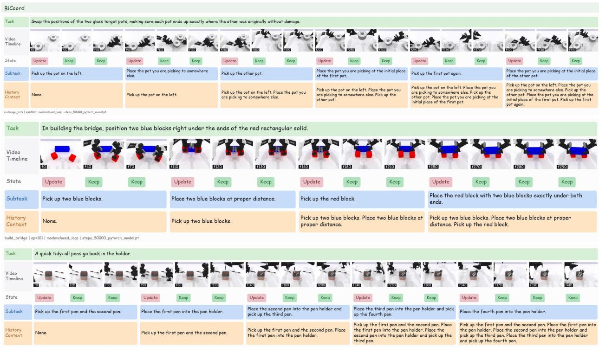  
Figure A3: Closed-loop rollouts on BiCoord. Bimanual tasks whose stages difer in which arm leads. Subtask text carries the arm assignment, so a transition changes both what is being done and which arm does it.

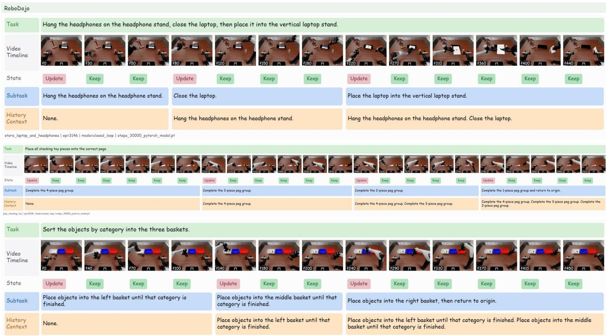  
Figure A4: Closed-loop rollouts on RoboDojo. Three episodes of increasing length. The memory row grows one entry per UPDATE, so the subtask the policy is conditioned on is always paired with an explicit record of what preceded it.

Table A5: Complete task-wise results on RoboDojo. Each cell reports Score / Success Rate (in %). For Generalization tasks, Std. and Rand. denote the standard and randomized evaluation settings, respectively. Methods are grouped according to whether prior embodied robot-data pre-training is used before RoboDojospecific training. Within the group without robot pre-training, bold and underlined numbers denote the best and second-best results for each metric, respectively. Methods with robot pre-training are reported for reference and are excluded from the ranking. Fast-WAM+Interface and CogWAM (Ours) are our own evaluation logs. Bold denotes the best result in each column.
<table><tr><td>Task</td><td>Fast-WAM</td><td>Fast-WAM+Interface</td><td>Without Robot Pre-training StarVLA-α</td><td>CogWAM (Ours)</td><td>With Robot Pre-training π0.5</td><td>GalaxeaVLA (G0.5)</td></tr><tr><td colspan="7">Generalization</td></tr><tr><td>stack_bowls (Std.)</td><td>5.87 /2.67</td><td>72.20 /68.00</td><td>15.27 10.67</td><td>72.20 / 68.00</td><td>76.00  / 72.00</td><td>64.07 /58.67</td></tr><tr><td>stack_bowls (Rand.)</td><td>0.80 0.00</td><td>3.00 0.00</td><td>1.20 0.00</td><td>4.80 0.00</td><td>14.20 4.00</td><td>20.33 13.33</td></tr><tr><td>push_T (Std.)</td><td>0.00 0.00</td><td>0.00 0.00</td><td>0.00 0.00</td><td>0.00 0.00</td><td>0.00 0.00</td><td>0.00 0.00</td></tr><tr><td>push_T (Rand.)</td><td>0.00 0.00</td><td>0.00 0.00</td><td>0.00 0.00</td><td>0.00 0.00</td><td>0.00 0.00</td><td>0.00 0.00</td></tr><tr><td>pack_objects_into_box (Std.)</td><td>2.87 0.00</td><td>14.40 / 0.00</td><td>8.07 2.67</td><td>14.60 /4.00</td><td>22.80 /4.00</td><td>23.80 /5.33</td></tr><tr><td>pack_objects_into_box (Rand.)</td><td>0.27 0.00</td><td>0.40 0.00</td><td>1.07 0.00</td><td>7.60 0.00</td><td>15.40 /1.33</td><td>12.67 1.33</td></tr><tr><td>fold_clothes (Std.)</td><td>32.00 22.67</td><td>53.60 52.00</td><td>23.47 16.00</td><td>63.20 60.00</td><td>48.00 38.67</td><td>53.87 48.00</td></tr><tr><td>fold_clothes (Rand.)</td><td>2.13 1.33</td><td>0.00 0.00</td><td>0.53 0.00</td><td>0.00 0.00</td><td>16.53 /9.33</td><td>18.67 14.67</td></tr><tr><td>hang_mugs (Std.)</td><td>2.20 0.00</td><td>11.00 4.00</td><td>4.33 0.00</td><td>15.20 /4.00</td><td>9.53 0.00</td><td>12.47 /4.00</td></tr><tr><td>hang_mugs (Rand.)</td><td>0.00 0.00</td><td>1.20 0.00</td><td>0.80 0.00</td><td>1.20 0.00</td><td>5.00 0.00</td><td>4.80 0.00</td></tr><tr><td>sweep_blocks (Std.)</td><td>0.00 0.00</td><td>4.00 4.00</td><td>1.33 1.33</td><td>0.00 0.00</td><td>0.00 0.00</td><td>2.67 2.67</td></tr><tr><td>sweep_blocks (Rand.)</td><td>0.00 0.00</td><td>0.00 0.00</td><td>0.00 0.00</td><td>0.00 0.00</td><td>0.00 0.00</td><td>1.33 1.33</td></tr><tr><td>pour_liquid_into_cup (Std.)</td><td>0.00 0.00 0.00</td><td>20.00 20.00</td><td>18.67 18.67</td><td>48.00 48.00</td><td>28.00 28.00</td><td>54.67 54.67</td></tr><tr><td>pour_liquid_into_cup (Rand.)</td><td>0.00 2.00</td><td>0.00 0.00</td><td>0.00 0.00</td><td>0.00 0.00</td><td>1.33 1.33</td><td>16.00 16.00</td></tr><tr><td>make_toast (Std.)</td><td>0.00</td><td>15.00 4.00</td><td>3.67 0.00</td><td>15.00 4.00</td><td>9.33 1.33</td><td>13.33 5.33</td></tr><tr><td>make_toast (Rand.)</td><td>0.67 0.00</td><td>1.00 0.00</td><td>0.00 0.00</td><td>3.00 0.00</td><td>2.67 0.00</td><td>10.67 1.33</td></tr><tr><td>arrange_largest_number (Std.)</td><td>0.80 0.00</td><td>16.80 12.00</td><td>1.20 0.00</td><td>11.60 4.00</td><td>5.13 1.33</td><td>7.67 1.33</td></tr><tr><td>arrange_largest_number (Rand.)</td><td>0.27 /0.00 0.00</td><td>0.20 0.00</td><td>0.13 0.00</td><td>0.20 0.00</td><td>0.40 0.00</td><td>1.73 0.00</td></tr><tr><td>sort_nesting_dolls_by_size (Std.)</td><td>0.00 0.00</td><td>28.00 28.00</td><td>1.33 1.33</td><td>24.00 24.00</td><td>10.67 10.67</td><td>14.67 14.67</td></tr><tr><td>sort_nesting_dolls_by_size (Rand.)</td><td>0.00</td><td>0.00 0.00</td><td>0.00 0.00</td><td>0.00 0.00</td><td>0.00 0.00</td><td>0.00 0.00</td></tr><tr><td>store_laptop_and_headphones (Std.)</td><td>0.80 0.00</td><td>26.40 /8.00</td><td>4.80 0.00</td><td>44.80 40.00</td><td>19.20 9.33</td><td>35.73 20.00</td></tr><tr><td>store_laptop_and_headphones (Rand.)</td><td>0.00 0.00 5.40</td><td>5.60 0.00</td><td>0.27 0.00</td><td>6.40 0.00</td><td>13.07 1.33</td><td>20.80 2.67</td></tr><tr><td>stack_blocks (Std.)</td><td>0.00 0.00</td><td>22.00 16.00 0.00 0.00</td><td>8.33 5.33 0.00 / 0.00</td><td>40.20 36.00 0.60 / 0.00</td><td>22.53 13.33 1.20 / 0.00</td><td>49.67 42.67 3.40 / 0.00</td></tr><tr><td colspan="7">stack_blocks (Rand.)</td></tr><tr><td>Precision</td><td></td><td></td><td></td><td></td><td></td><td></td></tr><tr><td>fasten_screws</td><td>0.40 /0.00</td><td>10.00 / 0.00 67.20 54.00</td><td>1.60 0.00 13.47 / 2.00</td><td>7.20 /0.00 66.80 56.00</td><td>15.13 / 2.67 17.87 3.33</td><td>30.00 /8.67 58.53 42.67</td></tr><tr><td>insert_tubes</td><td>3.73 0.00 0.00 0.00</td><td>2.00</td><td>0.00 0.00</td><td>6.00 6.00</td><td>0.00 0.00</td><td></td></tr><tr><td>plug_in_charger</td><td>0.00 0.00</td><td>2.00</td><td>5.33 5.33</td><td>24.00 24.00</td><td>13.33 13.33</td><td>0.67 0.67</td></tr><tr><td>pour_balls_into_vase</td><td>0.00 0.00</td><td>16.00 16.00 0.00</td><td>0.00 0.00</td><td>0.00 0.00</td><td>0.00 0.00</td><td>28.00 28.00</td></tr><tr><td>play_Xylophone</td><td>2.80 0.00</td><td>0.00 13.60 6.00</td><td>5.20 1.33</td><td>8.80 6.00</td><td>3.20 0.67</td><td>0.00 0.00 10.93 /4.67</td></tr><tr><td>deposit_coin insert_key</td><td>4.30 0.00</td><td>13.50 0.00</td><td>11.50 /0.00</td><td>14.40 / 0.00</td><td>11.90 0.00</td><td>14.90 0.00</td></tr><tr><td>build_tower</td><td>4.47 0.00</td><td>34.60 30.00</td><td>42.07 26.00</td><td>68.40 60.00</td><td>37.73 24.00</td><td>82.93 78.67</td></tr><tr><td colspan="7">Long-Horizon</td></tr><tr><td></td><td>57.37 /40.00</td><td></td><td>48.90</td><td></td><td></td><td></td></tr><tr><td>put_bottles_into_dustbin</td><td>0.00 0.00</td><td>95.20 92.00 5.80 0.00</td><td>28.00 2.40 0.00</td><td>87.70 82.00 5.20 2.00</td><td>79.93 69.33 8.23 1.33</td><td>96.30 94.00 65.23 40.00</td></tr><tr><td>play_tic_tac_toe classify_objects</td><td>3.10 1.33</td><td>9.20 2.00</td><td>2.90 0.00</td><td>9.30 2.00</td><td>24.67 12.67</td><td>10.33 4.00</td></tr><tr><td>fill_pen_holder</td><td>4.07 0.00</td><td>40.60 20.00</td><td>17.57 6.00</td><td>44.20 24.00</td><td>23.23 7.33</td><td>41.27 18.67</td></tr><tr><td>fill_egg_holder</td><td>0.73 0.00</td><td>2.20 0.00</td><td>1.13 0.00</td><td>3.20 0.00</td><td>2.23 0.00</td><td>3.03 0.00</td></tr><tr><td>organize_table</td><td>7.83 0.00</td><td>36.50 4.00</td><td>22.33 0.00</td><td>35.50 2.00</td><td>23.33 / 0.00</td><td>46.33 11.33</td></tr><tr><td>play_stacking_toy</td><td>0.00 0.00</td><td>0.00 0.00</td><td>0.00 0.00</td><td>0.00 0.00</td><td>0.00 0.00</td><td>0.47</td></tr><tr><td>make_kong</td><td>0.00 /0.00</td><td>0.00 /0.00</td><td>18.00 18.00</td><td>40.00 40.00</td><td>26.67 26.67</td><td>0.00 90.00 90.00</td></tr><tr><td colspan="7">Memory</td></tr><tr><td></td><td></td><td></td><td></td><td></td><td></td><td></td></tr><tr><td>cover_blocks</td><td>0.00 0.00</td><td>16.50 10.00</td><td>14.73 10.00</td><td>18.90 12.00</td><td>19.07 13.33</td><td>20.67 14.67</td></tr><tr><td>match_and_pick_from_conveyor</td><td>20.67 20.67</td><td>36.00 36.00</td><td>4.67 4.67</td><td>26.00 26.00</td><td>14.00 14.00</td><td>29.33 29.33</td></tr><tr><td>swap_T</td><td>0.00 0.00</td><td>0.00 0.00</td><td>0.00 0.00 0.00</td><td>0.00 0.00 0.00 0.00</td><td>0.67 0.67 0.00 0.00</td><td>0.00 0.00</td></tr><tr><td>press_by_number imitate_sorting_sequence</td><td>0.00 0.00 0.63 0.00</td><td>2.00 2.00</td><td>0.00 0.63 0.00</td><td>1.00 0.00</td><td>1.60 0.00</td><td>0.00 0.00</td></tr><tr><td>swap_blocks</td><td>0.00 0.00</td><td>0.50 0.00 0.00 / 0.00</td><td>0.00 / 0.00</td><td>0.00 0.00</td><td>0.00 0.00</td><td>1.67 0.00 0.00 0.00</td></tr><tr><td colspan="7">Open</td></tr><tr><td></td><td></td><td></td><td></td><td></td><td></td><td></td></tr><tr><td>align_blocks solve_equation</td><td>0.00 /0.00 0.00 0.00</td><td>0.00 /0.00 0.00</td><td>0.00 / 0.00 0.00 0.00</td><td>0.00 / 0.00 0.00 0.00</td><td>0.00 / 0.00 0.00 0.00</td><td>0.00 /0.00 0.00 0.00</td></tr><tr><td>stack_blocks_by_language</td><td>0.00 0.00</td><td>0.00 0.00 0.00</td><td>0.53 0.00</td><td>2.00 2.00</td><td>1.73 0.00</td><td>0.13 0.00</td></tr><tr><td>general_pickup</td><td>3.33 3.33</td><td>14.00 14.00</td><td>4.67 4.67</td><td>14.00 14.00</td><td>12.00 12.00</td><td>12.67 12.67</td></tr><tr><td>classify_objects_by_language</td><td>0.00 0.00</td><td>1.40 0.00</td><td>0.20 0.00</td><td>0.40 0.00</td><td>0.60 0.00</td><td>1.07 0.00</td></tr><tr><td>pick_from_conveyor_by_image</td><td>0.00 0.00 0.00 0.00</td><td>0.00 0.00</td><td>0.00 0.00</td><td>0.00 0.00</td><td>1.33 1.33</td><td>0.00 0.00</td></tr></table>

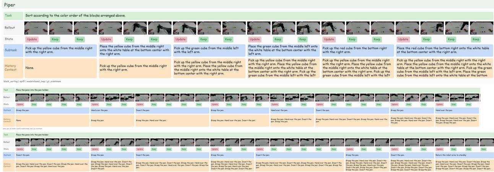  
Figure A5: Closed-loop rollouts on the real robot. Block Sorting and Fill Pen Holder. The latter repeats one grasp–hand-over–insert cycle many times, so the memory is the only signal distinguishing the third repetition from the first. Zoom in for a better view.