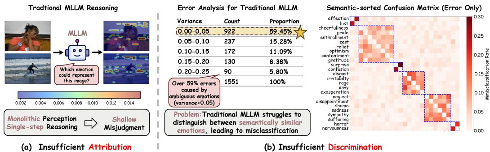
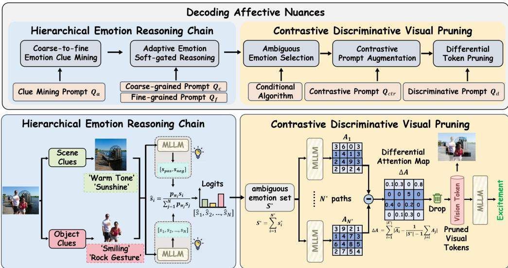
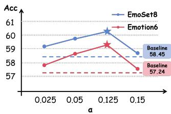
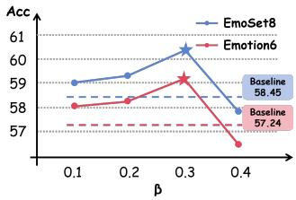
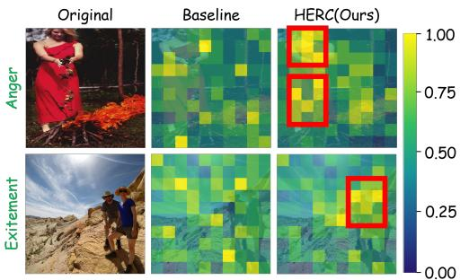
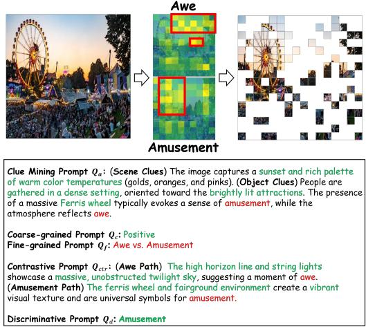
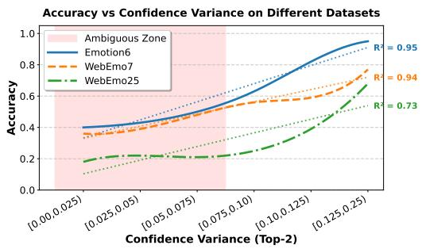
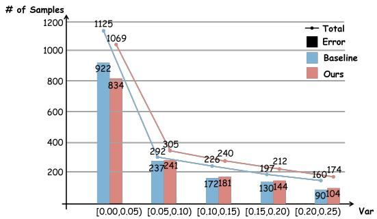
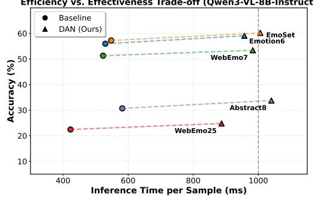

# DECODING AFFECTIVE NUANCES: ENHANCING MLLMS VIA HIERARCHICAL EMOTION REASONING AND CONTRASTIVE DISCRIMINATIVE PRUNING

Cheng Ye1, Weidong Chen1, Zhaobo Qi2, Beier Zhu1, Zhendong Mao1

1University of Science and Technology of China, Hefei

2Harbin Institute of Technology, Weihai

chenweidong@ustc.edu.cn

## ABSTRACT

While multimodal large language models (MLLMs) have demonstrated exceptional capabilities in objective understanding tasks, their performance in affective reasoning still falls significantly short of human standards. We attribute it to a central capability gap: MLLMs are difficult to reliably distinguish semantically proximal emotions based on fine-grained visual evidence, which could be decoupled as two limitations: 1) Insufficient Attribution. The global reasoning paradigm of conventional MLLMs severely dilutes fine-grained emotion cues, where subtle emotional states are usually implicitly encoded, thereby generating emotional misjudgments in complex scenarios. 2) Insufficient Discrimination. Existing methods could only identify regions generally associated with emotions, which fails to distinguish discriminative regions between semantically similar emotions, leading to ambiguous emotion judgements. To overcome these limitations, we present a training-free inference-time optimization framework, named Decoding Affective Nuances (DAN). Specifically, we propose a Hierarchical Emotional Reasoning Chain (HERC) that enhances the insufficient attribution by harmonizing fine-grained scene/object-level cues and performing a soft-gated reasoning. Furthermore, to discriminate between semantically proximal emotions, we design a Contrastive Discriminative Visual Pruning (CDVP), which isolates discriminative visual tokens to reason the final emotion category by computing the absolute discrepancy between the attention distributions of similar emotions. Performances on several benchmarks demonstrate that DAN significantly improves discrimination for affective nuances without consuming additional training resources, especially achieving +10.47% improvements with Qwen3-VL-8B-Instruct on WebEmo25 dataset that contains 25 fine-grained emotion categories.1

## 1 INTRODUCTION

Multimodal Large Language Models (MLLMs) have garnered widespread attention within the com munity due to their powerful reasoning and generation capabilities (Fei et al., 2024; Ye et al., 2024b; Mitra et al., 2024; Ye et al., 2024a). They have demonstrated exceptional performance across general tasks. However, when transitioning from general to emotion understanding, MLLMs still encounter significant bottlenecks. Unlike objective recognition, which is often supported by explicit visual entities and attributes, emotion understanding requires the model to integrate contextual information with subtle affective cues, such as facial expressions, body postures, and interactions among subjects. This requirement becomes particularly challenging when the candidate labels are semantically proximal and can only be distinguished through small but decisive visual differences.

In recent years, some studies have attempted to enhance the capabilities of MLLMs in emotion understanding (Cheng et al., 2024; Fang et al., 2025a; Huang et al., 2025; Chen et al., 2021). Specifically, some of them focus on constructing high-quality emotional datasets and introducing specialized fusion adapters to fine-tune the MLLMs (Lian et al., 2025a;b; Yang et al., 2025a; Chen et al., 2022). However, these works bring substantial overhead in both manual annotations and training costs, limiting their scalability and efficiency. Therefore, some studies have shifted toward training-free paradigms (Zhang et al., 2024; Chen et al., 2023; 2026a). They attempt to guide MLLMs to perform emotion reasoning by exploring the attention distribution on visual information through prompt engineering during the inference phase. Despite credible progress, existing methods still struggle with a central capability gap: MLLMs are difficult to reliably distinguish semantically proximal emotions based on fine-grained visual evidence. We attribute this capability gap to two crucial limitations. 1) Insufficient Attribution. Traditional MLLMs rely on global visual processing and directly predict an emotion label. Such global reasoning severely dilutes fine-grained cues, i.e., facial expressions and body postures, where subtle emotional states are usually implicitly encoded. As shown in Fig. 1(a), much irrelevant background information is erroneously highlighted, while key emotion-related regions are overshadowed, which ultimately leads to emotion misjudgments. 2) Insufficient Discrimination. Secondly, obtaining fine-grained evidence is not equivalent to achieving fine-grained discrimination. Semantically proximal emotions often share partial visual evidence. Existing pruning-based methods (Fang et al., 2025b) could only identify regions generally associated with emotions, which fails to reveal which regions tend to support one candidate over another. Such a mechanism inherently overlooks the fine-grained boundary delineation between semantically similar emotions. As shown in Fig. 1(b), we conduct statistical analysis for failure cases of the baseline model (Fang et al., 2025b) on the WebEmo25 dataset (Panda et al., 2018)2. We calculate the confidence variance between the top-2 predicted emotions for failure cases and observe that over 59% of the failure cases are concentrated in the low-confidence intervals, indicating severe ambiguity during inference. Furthermore, we plot a confusion matrix correlating the ground-truth labels with the misclassified predictions. Based on Parrott’s emotion theory (Parrott, 2001), we group the 25 fine-grained emotions into 6 macro-categories and order them accordingly along the axes. We observe that the misclassifications are densely concentrated within the six highlighted diagonal submatrices, which correspond to semantically proximal emotions. Such insufficient discrimination for semantically similar emotions leads to ambiguous confidence margins between candidate emotions, ultimately culminating in emotional misjudgments.

  
Figure 1: Two coupled limitations underlying the difficulty of MLLMs in distinguishing semantically proximal emotions using fine-grained visual evidence. (a) Insufficient Attribution: Global and undifferentiated visual processing dilutes localized affective cues. (b) Insufficient Discrimination: Failure cases exhibit small confidence margins and concentrated confusion among emotions within the same semantic macro-category, indicating difficulty in resolving ambiguous candidates.

To address these limitations, we propose Decoding Affective Nuances (DAN), a training-free inference-time framework to sharpen the ambiguous emotion discrimination through two successive modules. Specifically, we first introduce a Hierarchical Emotion Reasoning Chain (HERC) to improve fine-grained affective evidence acquisition by explicitly mining complementary scenelevel and object-level cues. It subsequently performs soft-gated reasoning from emotion polarity to fine-grained categories, producing a stable preliminary distribution while reducing error propagation from hard intermediate decisions. Subsequently, we propose the Contrastive Discriminative Visual Pruning (CDVP) module to perform evidence discrimination for ambiguous samples. CDVP first constructs an ambiguous emotion set and obtains candidate-specific attention maps through contrastive prompts. Regions with large attention discrepancies provide stronger evidence for distinguishing candidates. CDVP therefore preserves high-discrepancy visual tokens and prompts the

MLLM to reselect the final emotion based on the discriminative evidence. Experimental evaluations on several public benchmarks demonstrate that our proposed DAN framework significantly outperforms the state-of-the-art methods in emotion recognition. Notably, our framework achieves these gains without any additional training or annotations, offering a highly scalable and resource-efficient solution. In summary, our contributions are:

• We identify a capability gap in MLLM-based emotion understanding: the difficulty of distinguishing semantically proximal emotions using fine-grained visual evidence. We further characterize this gap through two limitations, namely insufficient attribution and insufficient discrimination.

• We propose Decoding Affective Nuances (DAN), a training-free inference-time framework that addresses two limitations through complementary modules. HERC acquires scene-level and objectlevel affective evidence to produce a stable preliminary emotion distribution, while CDVP explicitly compares ambiguous candidates and preserves discriminative visual tokens for final reselection.

• Extensive experiments on several public benchmarks prove the effectiveness of our framework and each proposed module. Especially on WebEmo25 dataset that contains 25 fine-grained emotion cat egories, DAN achieves +10.47% improvements with Qwen3-VL-8B-Instruct on emotion accuracy.

## 2 METHODOLOGY

## 2.1 PRELIMINARY

In this paper, we propose Decoding Affective Nuances (DAN), an inference-time training-free framework designed to enhance the emotion understanding of MLLMs, especially for confusing and ambiguous emotional scenarios. The model processes an input pair consisting of a visual image V and a textual prompt Q to generate a descriptive response that categorizes the emotion. As shown in Fig. 2, our proposed DAN mainly consists of two primary components: i) Hierarchical Emotion Reasoning Chain (HERC) that captures the preliminary emotion ranking and confidence scores, and ii) Contrastive Discriminative Visual Pruning (CDVP) that leverages the preliminary distribution to select ambiguous samples and emotions and then performs discriminative reselection.

## 2.2 HIERARCHICAL EMOTION REASONING CHAIN

Motivation. Given the complex and cue-dependent nature of emotions, emotional states are usually embedded in fine-grained visual cues that are difficult for global visual reasoning to detect (Weng et al., 2023; You et al., 2016; Ye et al., 2025b;a). Therefore, a fine-grained reasoning process ensures precise and logically grounded emotion reasoning. Inspired by it, we propose the Hierarchical Emotion Reasoning Chain (HERC) to empower MLLMs to focus on fine-grained affective cues during the inference phase.

Coarse-to-fine Emotion Clue Mining. Firstly, we design a prompt to mine affective clues from global scenes to local objects. When identifying an image, people usually first observe the global scene to capture the overall emotional tone $( e . g .$ ., lighting, color temperature). Subsequently, they further focus on fine-grained objects to encode crucial emotion evidence(e.g., facial expressions, bodily gestures). Thus, we guide MLLMs to identify two types of affective-arousing clues, namely scene-level and object-level clues through the clue mining prompt ${ \mathcal { Q } } _ { a } { } ^ { 3 }$

Adaptive Emotion Soft-gated Reasoning. Based on the above affective clue mining, we introduce an adaptive soft-gated reasoning strategy to achieve a multi-granular emotion reasoning. Specifically, the entire emotion word set $S = \{ e _ { i } \} _ { i = 1 } ^ { N }$ is divided into the positive emotion subset [PES] and the negative emotion subset [NES], where N is the number of emotion category. We first design a coarse-grained prompt $\mathcal { Q } _ { c }$ to determine the emotional polarity of the image. By combining ${ \mathcal { Q } } _ { a }$ and $\mathcal { Q } _ { c }$ , the MLLM could generate the emotion polarity label. However, to mitigate the impact of error propagation during hierarchical reasoning, instead of directly employing hard labels, we generate soft polarity scores by the logits generator of MLLM as follows:

$$
p _ { \mathrm { p o s } } , p _ { \mathrm { n e g } } = \mathrm { S o f t m a x } ( \mathrm { L o g G e n } _ { \mathcal { M } } ( [ \mathcal { Q } _ { a } , \mathcal { Q } _ { c } ] , \mathcal { V } ) ) ,\tag{1}
$$

  
Figure 2: The illustration of our proposed DAN framework. The Hierarchical Emotion Reasoning Chain module (HERC) firstly identifies the scene-level and object-level emotion clues, and then performs a soft-gated reasoning for a stable preliminary classification. Then, the Contrastive Discriminative Visual Pruning module (CDVP) is proposed to handle the affectively nuanced samples, which guides MLLM to focus on the most discriminative regions and reselect the final emotion.

where LogGen, M, V denote the logits generator, MLLM, and visual image, respectively. Subsequently, in the fine-grained stage, we modify a fine-grained prompt $\mathcal { Q } _ { f }$ to classify specific emotion categories. Similarly, combined ${ \mathcal { Q } } _ { a }$ and $\mathcal { Q } _ { f }$ , we generate soft fine-grained scores for each emotion word by the logits generator of MLLM:

$$
[ s _ { 1 } , s _ { 2 } , \cdots , s _ { N } ] = \mathrm { S o f t m a x } ( \mathrm { L o g G e n } _ { \mathcal { M } } ( [ \mathcal { Q } _ { a } , \mathcal { Q } _ { f } ] , \mathcal { V } ) ) ,\tag{2}
$$

Finally, the aggregated scores for each emotion word are computed by the combination of the polarity score and fine-grained score:

$$
\hat { s } _ { i } = \frac { p _ { \pi _ { i } } s _ { i } } { \sum _ { j = 1 } ^ { N } p _ { \pi _ { j } } s _ { j } } ,\tag{3}
$$

where $\pi _ { i } \in \{ p o s , n e g \} , \hat { S } = [ \hat { s } _ { 1 } , \hat { s } _ { 2 } , \cdot \cdot \cdot , \hat { s } _ { N } ]$ denote the polarity of i-th emotion word and entire probability distribution. The proposed HERC constraints MLLMs to generate preliminary emotion predictions by coarse-to-fine clue mining and adaptive soft-gated calculation, mitigating the error accumulation in hierarchical reasoning and providing a stable anchor for discriminative pruning.

## 2.3 CONTRASTIVE DISCRIMINATIVE VISUAL PRUNING

Motivation. Based on statistical analysis, we observe a significant positive correlation signal between the confidence variance of semantically proximal emotional categories and the overall classification accuracy. Meanwhile, rather than executing an open selection among confusing options, we analyze that it is inherently more manageable to perform a contrastive assessment. Consequently, we design the Contrastive Discriminative Visual Pruning (CDVP) module. By constructing contrastive prompts and performing differential attention computations, CDVP constraints the MLLM to focus on the most discriminative visual regions, thereby significantly enhancing reasoning precision.

Conditional Ambiguous Emotion Selection. Given the limited capability of MLLMs to discriminate between semantically similar emotions, we make a statistical analysis to find that the error rate improves significantly on hard samples that easily induce emotional confusion. To address this, we design a conditional ambiguous emotion selection algorithm to determine whether a sample is a hard sample by selecting the corresponding ambiguous emotion set $S ^ { * }$ . Specifically, we sort $\hat { S }$ in descending order and calculate the variance between the top-1 score $s _ { 1 }$ and each score. If the variance is less than a predefined threshold $\alpha ,$ these emotions are deemed ambiguous and are divided into $S ^ { * }$ . This iterative process continues until a variance exceeding the threshold. Besides, we set a truncation threshold k to balance the computational overhead. Meanwhile, we argue that the confidence of lower-ranked emotion scores diminishes progressively and contains noise. The overall procedure is summarized in Algorithm 1.

Finally, for samples with $| S ^ { * } | = 1$ , we argue that the prediction of HERC is highly confident, and directly output the emotion category with the highest score as the final prediction. Conversely, this sample will be classified as a hard sample and fed into the CDVP module for further discriminative re-selection:

$$
\mathcal { E } = \left\{ \stackrel { e } { \operatorname { c r g m a x } } ( \hat { S } ) ^ { \prime } \quad \left| S ^ { * } \right| = 1 , \right.\tag{4}
$$

2This adaptive mechanism ensures that compu-3tational resources are strategically allocated to resolve the most challenging and affectively nuanced cases. 5

6 Contrastive Discriminative Pruning. Guided   
7by the conditional ambiguous emotion selec-  
8 tion, we isolate challenging samples with sig-  
9 nificant emotional ambiguity. Subsequently, we   
10 introduce a contrastive prompting strategy to   
11bolster affective reasoning. Rather than forcing

12the MLLM to make a selection among the emotion set, we employ a contrastive enhancement mechanism that compels MLLM to explain the discriminative visual evidence justifying a spe-

Algorithm 1: Conditional Ambiguous Emo  
tion Selection   
Input: Descending Emotion Probability   
Distribution Sˆ, Variance Threshold $\alpha ,$   
Truncation Threshold k, Top-1 Score   
$s _ { 1 }$   
Output: Ambiguous emotion set $S ^ { * }$   
Initialize: $S ^ { * }  s _ { 1 }$   
for $i = 2 , \dots ,$ , min $( k + 1 , | S | - 1 )$ do   
$\mu _ { i }  ( s _ { i } + s _ { m a x } ) / 2 :$   
$\sigma _ { i } ^ { 2 } \gets \left[ ( s _ { i } - \mu _ { i } ) ^ { 2 } + ( s _ { m a x } - \mu _ { i } ) ^ { 2 } \right] / 2$   
if $\sigma _ { i } ^ { 2 } < \alpha$ then   
$S ^ { * }  S ^ { * } \cup \{ s _ { i } \}$   
end   
else   
break   
end   
end   
return Ambiguous emotion set $S ^ { * }$

cific emotional category over its competitors. Guided by the contrastive prompt $\mathcal { Q } _ { c t r }$ , MLLM no longer needs to make simple choices merely. It also needs to provide concrete visual evidence, which forces MLLM to shift from global perception to local mining, precisely focusing on discriminative visual regions closely related to the current emotion. Subsequently, to select the visual regions that best distinguish the ambiguous emotions, we employ contrastive prompts to guide MLLM to focus on each ambiguous emotion, respectively. Following this, a natural strategy is to extract the attention map from the average of the last-3 transformer layers of MLLM to quantify the significance of each visual token relative to the specific emotion. Specifically, we first extract the attention map from MLLM, and compute the average score of all textual tokens to quantify the significance of each visual token:

$$
\begin{array} { r } { \boldsymbol { \mathcal { A } } _ { i } = \mathrm { A t t n } _ { \boldsymbol { \mathcal { M } } } ( \mathcal { Q } _ { c t r } ( s _ { i } ^ { * } , S ^ { * } ) , \boldsymbol { \mathcal { V } } ) \in \mathbb { R } ^ { N _ { t } \times N _ { v } } , } \end{array}\tag{5}
$$

$$
\overline { { \mathcal { A } } } _ { i } = \operatorname { A v g } _ { \mathrm { T - a x i s } } ( \mathcal { A } _ { i } ) \in \mathbb { R } ^ { N _ { v } } , i = 1 t o | S ^ { * } |\tag{6}
$$

where $N _ { t } , N _ { v }$ denote the number of textual and visual tokens, respectively. Subsequently, we eliminate common redundancy and select the discriminative visual regions by a joint discrepancy computation. Specifically, we quantify the significance of visual tokens by computing the mean absolute discrepancy between each ambiguous emotion and its competitors. Under this mechanism, only tokens that significantly distinguish a particular category from all other categories will receive high scores:

$$
\Delta \mathcal { A } = \sum _ { i = 1 } ^ { | S ^ { * } | } | \overline { { \mathcal { A } } } _ { i } - \frac { 1 } { | S ^ { * } | - 1 } \sum _ { j \neq i } \overline { { \mathcal { A } _ { j } } } |\tag{7}
$$

In the differential attention map $\Delta { \mathcal { A } } ,$ we select low-ranking tokens to generate a dropping mask $\mathcal { D } _ { : }$ which guides MLLM to focus on the discriminative visual regions:

$$
\begin{array} { r } { \mathcal { D } = \{ a _ { i } | i \in \mathrm { a r g m i n } _ { \mathrm { G } } ( \Delta A ) \} , \quad G = \lfloor \beta N _ { v } \rfloor } \end{array}\tag{8}
$$

where $\beta$ is the dropping ratio. Finally, based on the dropping mask, we design a discriminative prompt $\mathcal { Q } _ { d }$ to select the final emotion category from $S ^ { * }$ . We apply $\mathcal { Q } _ { d }$ along with the pruned image into the MLLM for final selection:

$$
\mathcal { V } ^ { \prime } = \{ v _ { i } | v _ { i } \in ( \mathcal { V } - \mathcal { D } ) \} ,\tag{9}
$$

$$
\mathcal { E } = \mathcal { M } ( \mathcal { Q } _ { d } , \mathcal { V } ^ { \prime } ) ,\tag{10}
$$

Table 1: Comparison with state-of-the-art on various emotion datasets. The optimal results are denoted by boldface.
<table><tr><td>Dataset</td><td>Emotion6</td><td>EmoSet8</td><td>WebEmo7</td><td>WebEmo25</td><td>Abstract8</td><td>Average</td></tr><tr><td colspan="7">Qwen2.5-VL-7B-Instruct</td></tr><tr><td>Zero-shot</td><td>58.33</td><td>56.98</td><td>47.70</td><td>22.45</td><td>23.68</td><td>41.83</td></tr><tr><td>Zero-shot-CoT</td><td>59.76</td><td>57.19</td><td>47.25</td><td>22.15</td><td>23.25</td><td>41.92</td></tr><tr><td>SEPM</td><td>61.58</td><td>57.94</td><td>49.10</td><td>22.85</td><td>26.32</td><td>43.56</td></tr><tr><td>DAN(Ours)</td><td>63.13</td><td>59.10</td><td>50.90</td><td>24.85</td><td>29.82</td><td>45.56</td></tr><tr><td colspan="7">Qwen3-VL-4B-Instruct</td></tr><tr><td>Zero-shot</td><td>55.21</td><td>57.06</td><td>48.60</td><td>22.40</td><td>20.18</td><td>40.69</td></tr><tr><td>Zero-shot-CoT</td><td>56.22</td><td>59.26</td><td>47.70</td><td>22.45</td><td>20.00</td><td>41.13</td></tr><tr><td>SEPM</td><td>60.31</td><td>63.28</td><td>50.25</td><td>23.05</td><td>23.68</td><td>44.11</td></tr><tr><td>DAN(Ours)</td><td>62.29</td><td>65.66</td><td>52.05</td><td>24.95</td><td>26.75</td><td>46.34</td></tr><tr><td colspan="7"></td></tr><tr><td>Zero-shot</td><td>55.21</td><td>56.50</td><td>Qwen3-VL-8B-Instruct 48.00</td><td>21.10</td><td>29.38</td><td>42.04</td></tr><tr><td>Zero-shot-CoT</td><td>52.85</td><td>55.18</td><td>48.75</td><td>21.75</td><td>28.93</td><td>41.49</td></tr><tr><td>SEPM</td><td>55.97</td><td>57.25</td><td>51.30</td><td>22.45</td><td>30.70</td><td>43.53</td></tr><tr><td>DAN(Ours)</td><td>59.09</td><td>60.21</td><td>53.40</td><td>24.80</td><td>33.77</td><td>46.25</td></tr><tr><td colspan="7">InternVL3.5-8B</td></tr><tr><td>Zero-shot</td><td>54.37</td><td>55.81</td><td>42.55</td><td>14.45</td><td>26.79</td><td>38.79</td></tr><tr><td>Zero-shot-CoT</td><td>54.87</td><td>56.49</td><td>42.35</td><td>14.95</td><td>30.36</td><td>39.80</td></tr><tr><td>SEPM</td><td>55.55</td><td>57.53</td><td>44.05</td><td>18.15</td><td>32.89</td><td>41.63</td></tr><tr><td>DAN(Ours)</td><td>58.59</td><td>60.96</td><td>45.95</td><td>21.30</td><td>35.09</td><td>44.38</td></tr></table>

guided by the contrastive discriminative visual pruning, MLLM focuses on the visual regions that are most capable of distinguishing ambiguous emotions and correct potential initial misjudgments, which is crucial for more accurate and reliable emotion classification.

## 3 EXPERIMENT

## 3.1 EXPERIMENTAL SETUP

Dataset. Follow the existing work settings (Fang et al., 2025b; 2026; Chen et al., 2026b; Song et al., 2025), we evaluate the performance of our framework on four public emotion recognition benchmarks, EmoSet (Yang et al., 2023), WebEmo (Panda et al., 2018), Emotion6 (Peng et al., 2015), and Abstract (Machajdik & Hanbury, 2010). The EmoSet dataset contains ∼118k images and are annotated with 8 basic emotions. The WebEmo dataset contains ∼2k images collected from the web and includes emotion labels at two granularity levels with 7 and 25 categories. The Emotion6 dataset contains 1980 images and are annotated with 6 basic emotions. The Abstract dataset contains 228 abstract paintings labeled with 8 basic emotions through manual voting. Besides, we leverage emotion accuracy (Acc) as the evaluation metric for all experiments.

Implementation Details. We leverage four MLLMs to evaluate the effectiveness of our framework, including Qwen2.5-VL-7B-Instruct (Bai et al., 2025b), Qwen3-VL-4B-Instruct (Bai et al., 2025a), Qwen3-VL-8B-Instruct (Bai et al., 2025a), and InternVL3.5-8B (Wang et al., 2025b). We set the variance threshold α = 0.125, the dropping ratio $\beta = 0 . 3 .$ , and the truncation threshold $k = 2 .$ Since our framework is inference-time and training-free, all experiments are only conducted on a single NVIDIA A800 GPU with 80GB of memory. Unless otherwise specified, all ablation studies are conducted on the Qwen3-VL-8B-Instruct model, which has the largest number of parameters.

## 3.2 MAIN COMPARISON

Firstly, compared to the Zero-shot approach4, our model yields a significant improvement in the average accuracy, i.e., +8.8%/+13.8%/+10.0%/+14.4% with all four MLLMs, respectively. While conventional MLLMs excel in objective comprehension tasks, they encounter a critical bottleneck in subjective emotion understanding. Our proposed DAN framework effectively enhances the emotional sensitivity of MLLMs during the inference phase. Besides, our model also outperforms the

Zero-shot-CoT method in the average accuracy, i.e., +8.7%/+11.6%/+11.5%/+11.5% with all four MLLMs, respectively. We observe that the traditional Chain-of-Thought paradigm, characterized by a single-step sequential reasoning pattern, could be negative for emotion-related tasks, leading to a performance degradation relative to the Zero-shot baseline. In contrast, our HERC module enhances hierarchical emotion inference through coarse-to-fine cue mining and soft-gated reasoning. Finally, compared to the state-of-the-art pruning-based methods SEPM, our approach also achieves average accuracy gains, i.e., +3.8%/+5.0%/+6.2%/+6.6% for SEPM with all four MLLMs, respectively. Despite their progress in reducing visual redundancy, these methods struggle with ambiguous or semantically similar emotions. Our CDVP module addresses this gap by leveraging contrastive prompt augmentation and differential attention computation, significantly empowering the MLLM to resolve fine-grained emotional nuances with high precision. It is worth noting that the WebEmo25 dataset annotates 25 fine-grained and semantically proximal emotion categories. Across the five benchmark settings, our model leads all four zero-shot MLLMs on WebEmo25, i.e., +10.7%/+11.4%/+17.5%/+47.4%, respectively. This observation demonstrates that our proposed CDVP module could focus on the most discriminative visual regions and effectively decouple semantically similar emotional states.

## 3.3 ABLATION STUDY

Primary Component Discussion. To verify the effectiveness of proposed each module, we perform an ablation study for primary components, including scene-level and object-level cue mining, and the CDVP module. As shown in Table 2, we observe that relying solely on scene-level cues may cause a

Table 2: Ablation study for key components.
<table><tr><td colspan="2">HERC</td><td rowspan="2">CDVP</td><td rowspan="2">Emotion6</td><td rowspan="2">WebEmo25</td><td rowspan="2">Abstract8</td></tr><tr><td>Scene</td><td>Object</td></tr><tr><td>X</td><td>X</td><td>X</td><td>55.21</td><td>21.10</td><td>29.38</td></tr><tr><td>√</td><td>X</td><td>X</td><td>54.88</td><td>21.25</td><td>31.14</td></tr><tr><td>×</td><td>√</td><td>×</td><td>56.40</td><td>22.50</td><td>28.51</td></tr><tr><td>√</td><td>√</td><td>X</td><td>57.24</td><td>23.15</td><td>31.58</td></tr><tr><td>X</td><td>X</td><td>√</td><td>58.08</td><td>23.80</td><td>30.26</td></tr><tr><td>√</td><td>7</td><td>√</td><td>59.09</td><td>24.80</td><td>33.77</td></tr></table>

negative effect on some datasets, i.e., Emotion6. We analyze that the reason is that an overemphasis on the global emotional atmosphere leads to the neglect of fine-grained emotional details. However, in the abstract painting dataset Abstract8, the effect is positive. Meanwhile, the effect of object-level cues is opposite between normal and abstract datasets. Given that Abstract8 consists of abstract artworks with sparse objects, the emotion is predominantly implicit in global environ ments. Overall, the synergistic integration of these two clues provides consistent improvements across diverse scenarios. Furthermore, the CDVP module consistently enhances accuracy across all datasets by facilitating discriminative selection among semantically proximal emotions through contrastive prompting and differential pruning. These observations demonstrate the crucial role of each proposed component in boosting performance.

Discussion on Soft-gated Reasoning. To verify the superiority of soft-gating mechanisms, we make a comparison with hardgating and no-gating mechanisms. Specifically, hard-gating refers to directly removing irrelevant fine-grained emotion labels based on polarity. No-gating refers to predicting fine-grained emotion categories

Table 3: Discussion on soft-gated reasoning mechanism.
<table><tr><td>Setting</td><td>Emotion6</td><td>WebEmo25</td><td>Abstract8</td></tr><tr><td>No-gating</td><td>54.55</td><td>20.90</td><td>28.51</td></tr><tr><td>Hard-gating</td><td>58.42</td><td>24.05</td><td>32.02</td></tr><tr><td>Soft-gating</td><td>59.09</td><td>24.80</td><td>33.77</td></tr></table>

directly without using polarity. As shown in Table 3, without emotion polarity gating, No-gating mechanism is easy to mislead by local visual noise, making it difficult to directly pinpoint subtle differences for the recognition of fine-grained emotion categories. Besides, hard-gating mechanism is prone to misclassifying the emotion polarity of samples with ambiguous emotions, thereby directly discarding the correct answer and causing irreversible errors. Compared to them, our softgating mechanism employs cascaded score products instead of hard dropout, thereby mitigating error accumulation and maintaining a smooth probability distribution for CDVP module.

Selection of Attention Map. In our proposed CDVP module, we calculate the discriminative visual mask by the attention score of MLLMs. Therefore, it is crucial to discuss the selection way of the attention map. We conduct the ablation study under the following four settings:

Table 4: Discussion for strategies of attention scores.
<table><tr><td>Setting</td><td>Emotion6</td><td>WebEmo25</td><td>Abstract8</td></tr><tr><td>Global Average</td><td>58.59</td><td>24.55</td><td>32.46</td></tr><tr><td>First-3 Average</td><td>57.58</td><td>24.30</td><td>30.26</td></tr><tr><td>Last Layer</td><td>58.42</td><td>24.50</td><td>31.58</td></tr><tr><td>Last-3 Average</td><td>59.09</td><td>24.80</td><td>33.77</td></tr></table>

(a) Global Average, which computes the

mean attention scores across all Transformer layers, (b) First-3 Average, which considers only the initial three layers, (c) Last Layer, which directly utilizes the attention scores from the last layer, and (d) Last-3 Average, which averages the scores from only the final three layers. As shown in Table 4, we observe that Last-3 Average achieves the best performance. We infer that MLLMs are difficult to establish a semantic understanding of visual images in the early stages of inference. Furthermore, using only the last layer will result in the loss of semantic information and reduce inference stability.

Discussion on CDVP module. To explore the contributions of dense components in CDVP module, we conduct a progressive ablation study, as shown in Table 5. We use the top-1 emotion predicted by HERC as the baseline. We first observe that reranking over the full emotion set S even causes slight degradation, suggesting that the gain of CDVP does

Table 5: Discussion for CDVP module.
<table><tr><td>Setting</td><td>Emotion6</td><td>WebEmo25</td><td>Abstract8</td></tr><tr><td>Only HERC</td><td>57.24</td><td>23.15</td><td>31.58</td></tr><tr><td> $+ \textit { S }$ </td><td>56.57</td><td>22.95</td><td>30.70</td></tr><tr><td> $+ \mathbf { \nabla } S ^ { * }$ </td><td>57.41</td><td>23.25</td><td>32.01</td></tr><tr><td> $+ \ S ^ { * } + Q _ { c t r }$ </td><td>58.25</td><td>24.05</td><td>32.89</td></tr><tr><td>_  $+ S ^ { * } + \bar { Q } _ { c t r } + \mathrm { C D P }$ </td><td>59.09</td><td>24.80</td><td>33.77</td></tr></table>

not stem from repeated calls to MLLMs. Besides, we observe that replacing the entire emotion set as the ambiguous set $S ^ { * }$ only improves performance slightly, which indicates that narrowing the range of choices is not the crucial reason for improved performance. Instead, we observe that introducing the contrastive prompt $Q _ { \mathrm { c t r } }$ r and contrastive discriminative pruning CDP both significantly improve the performance, which validates our two motivations: 1) Compared to direct selections, contrastive questions are more effective at guiding the model to identify differences and provide correct answers. 2) Forcing the model to focus on the most discriminative visual regions significantly improves the ability to decode affective nuances.

Pruning Strategy Discussion. To demonstrate the effectiveness of contrastive discriminative pruning, we make a comparison of four different pruning strategies. (1) Random Pruning, which prunes a fixed number of tokens at random; (2) Query-related Pruning, which prunes tokens based on their attention scores rela-

Table 6: Results of different pruning strategies.
<table><tr><td>Dataset</td><td>Emotion6</td><td>WebEmo25</td><td>Abstract8</td></tr><tr><td>Random</td><td>55.56</td><td>23.70</td><td>27.63</td></tr><tr><td>Query-related</td><td>56.57</td><td>23.95</td><td>29.82</td></tr><tr><td>FoE-related</td><td>57.91</td><td>24.25</td><td>31.58</td></tr><tr><td>Ours</td><td>59.09</td><td>24.80</td><td>33.77</td></tr></table>

tive to the overall prompt; (3) FoE-related Pruning proposed in SEPM (Fang et al., 2025b), which utilizes attention scores derived from specific Focus-on-Emotion prompt to guide the pruning process; and (4) our proposed Contrastive-related Pruning, which identifies critical visual evidence by leveraging attention signals from contrastive prompts to determine the pruned tokens. As shown in Table 6, our contrastive-related pruning strategy achieves the best performance across all datasets, as it could pinpoint the most discriminative visual regions for ambiguous emotions. In contrast, random pruning may lead to the inaccurate loss of emotion-related tokens. Query-related pruning may introduce visual redundancies associated with emotion-irrelevant prompts. While FoE-related pruning successfully isolates broad emotion-related regions, it fails to differentiate between the subtle nuances of semantically similar emotions. These results demonstrate that the coarse-grained emotion-oriented pruning is insufficient. Instead, the fine-grained and discriminative pruning is essential to empower MLLMs to perceive subtle affective nuances.

## Parameter Sensitivity Discussion.

We conduct a parameter sensitivity discussion for α and β. As shown in Fig. 3, we first observe that with increasing α, the performance initially improves and then decreases. When α falls within an appropriate range, the CDVP module successfully corrects certain misclassified GT emotions. Conversely, when α is exces-

  
Figure 3: Parameter sensitivity analysis.

sively high, emotions with very low confidence, which are typically regarded as emotional noise, are included in the consideration, thereby interfering with accurate emotion classification. Furthermore, with increasing $\beta ,$ the performance initially improves and then declines. This suggests that while a small pruning rate effectively eliminates emotion-irrelevant visual redundancy, a too-high pruning rate leads to the erroneous removal of critical visual cues, thereby compromising emotion accuracy. Based on these observations, we select $\alpha = 0 . 1 2 5$ and $\beta = 0 . 3$ as the optimal setting to strike a balance between performance and inference efficiency.

## 3.4 DOES DAN ALLEVIATE INSUFFICIENT ATTRIBUTION AND DISCRIMINATION?

Visualization of Sufficient Attribution. To verify that our HERC module mitigates insufficient attribution, we extract the attention maps output by HERC module. As shown in Fig. 4, we observe that the baseline only performs global reasoning on these two images, resulting in a uniform attention distribution across the entire image. In contrast, our HERC module successfully focuses attention on key emotionrelated regions by guiding the MLLM to mine fine-grained scene and object cues. For example, in the first image, the flames, the woman’s

  
Figure 4: Case study of HERC.

facial expression, and the action of burning leaves are highlighted. For the second image, the couple’s excited facial expressions are also captured. These results demonstrate that our model successfully mitigates the insufficient attribution associated with global reasoning, thereby effectively focusing attention on fine-grained visual cues.

Visualization of Sufficient Discrimination. To verify that our CDVP module mitigates insufficient discrimination, we display the reasoning text and pruning process shown in Fig. 5. We observe that DAN selects two ambiguous emotions ‘awe’ and ‘amusement’. Then we employ the contrastive prompt on these two emotions for two contrastive attention maps. We find that ‘awe’ mainly focuses on the sky and light while ‘amusement’ focuses more on the ferris wheel and playground. Based on this, CDVP performs the discriminative discrepancy calculation to generate the discrepancy map and finally select the correct emotion ‘amusement based on it, which demonstrate that CDVP could enhance the discrimination between semantically similar emotions.

  
Figure 5: Case study of CDVP.

## 4 CONCLUSION

In this paper, we focus on enhancing the emotion understanding of Multimodal Large Language Models (MLLMs) during the inference phase, particularly for ambiguous scenarios with semantically proximal emotions. We propose the Decoding Affective Nuances (DAN) framework, which is composed of two crucial modules: the Hierarchical Emotion Reasoning Chain (HERC) and Contrastive Discriminative Visual Pruning (CDVP). Specifically, HERC guides the MLLM to a hierarchical emotion reasoning pattern, integrating coarse-to-fine clue mining and soft-gated emotion reasoning. Besides, CDVP enhances the discriminative ability of MLLM by focusing on ambiguous candidate emotions. We first design a conditional algorithm to select ambiguous emotions, and leverage a contrastive prompt to constrain the MLLM focus on discriminative visual regions associated with candidate emotions, followed by differential visual pruning to generate a visual dropping mask. Finally, a discriminative emotion re-selection is executed based on the dropping mask. Our approach enhances the discriminative capability and achieves significant accuracy improvements in emotion recognition without additional training or annotation. Extensive experiments on several benchmarks demonstrate the effectiveness and rationality of the framework and components.

## AI USE STATEMENT

In this work, we used generative AI tools for polishing the language of the manuscript and for writing and debugging portions of the experiment code. We have not used generative AI tools for the motivation or the production of the reported results and figures. These are carried out directly by the authors. All AI-assisted code was tested and verified by running the experiments reported in this paper, and the resulting claims were checked against the run outputs by the authors. We take responsibility for the final content of this work, including the text, claims, and artifacts produced with the aid of generative AI.

## REFERENCES

Md Atabuzzaman, Andrew Zhang, and Chris Thomas. Zero-shot fine-grained image classification using large vision-language models. In The 2025 Conference on Empirical Methods in Natural Language Processing, 2025.

Shuai Bai, Yuxuan Cai, Ruizhe Chen, Keqin Chen, Xionghui Chen, Zesen Cheng, Lianghao Deng, Wei Ding, Chang Gao, Chunjiang Ge, et al. Qwen3-vl technical report. arXiv preprint arXiv:2511.21631, 2025a.

Shuai Bai, Keqin Chen, Xuejing Liu, Jialin Wang, Wenbin Ge, Sibo Song, Kai Dang, Peng Wang, Shijie Wang, Jun Tang, et al. Qwen2. 5-vl technical report. arXiv preprint arXiv:2502.13923, 2025b.

Mu Cai, Haotian Liu, Siva Karthik Mustikovela, Gregory P Meyer, Yuning Chai, Dennis Park, and Yong Jae Lee. Vip-llava: Making large multimodal models understand arbitrary visual prompts. In Proceedings of the IEEE/CVF Conference on Computer Vision and Pattern Recognition, pp. 12914–12923, 2024.

Lin Chen, Jinsong Li, Xiaoyi Dong, Pan Zhang, Conghui He, Jiaqi Wang, Feng Zhao, and Dahua Lin. Sharegpt4v: Improving large multi-modal models with better captions. In European Conference on Computer Vision, pp. 370–387. Springer, 2024.

Weidong Chen, Guorong Li, Xinfeng Zhang, Hongyang Yu, Shuhui Wang, and Qingming Huang. Cascade cross-modal attention network for video actor and action segmentation from a sentence. In Proceedings ofthe 29th ACM International Conference on Multimedia, pp. 4053–4062, 2021.

Weidong Chen, Dexiang Hong, Yuankai Qi, Zhenjun Han, Shuhui Wang, Laiyun Qing, Qingming Huang, and Guorong Li. Multi-attention network for compressed video referring object segmentation. In Proceedings ofthe 30th ACM international conference on multimedia, pp. 4416–4425, 2022.

Weidong Chen, Guorong Li, Xinfeng Zhang, Shuhui Wang, Liang Li, and Qingming Huang. Weakly supervised text-based actor-action video segmentation by clip-level multi-instance learning. ACM Transactions on Multimedia Computing, Communications and Applications, 19(1):1–22, 2023.

Weidong Chen, Dexiang Hong, Zhendong Mao, Yutao Cheng, Xinyan Liu, Lei Zhang, and Yongdong Zhang. Creatiparser: Generative image parsing of raster graphic designs into editable layers. arXiv preprint arXiv:2604.19632, 2026a.

Weidong Chen, Cheng Ye, Peipei Song, Lei Zhang, Yongdong Zhang, and Zhendong Mao. Subjective-objective emotion correlated generation network for subjective video captioning. IEEE Transactions on Image Processing, 2026b.

Zebang Cheng, Zhi-Qi Cheng, Jun-Yan He, Jingdong Sun, Kai Wang, Yuxiang Lin, Zheng Lian, Xiaojiang Peng, and Alexander G Hauptmann. Emotion-llama: Multimodal emotion recognition and reasoning with instruction tuning. Advances in Neural Information Processing Systems, 37: 110805–110853, 2024.

Wenliang Dai, Junnan Li, Dongxu Li, Anthony Tiong, Junqi Zhao, Weisheng Wang, Boyang Li, Pascale N Fung, and Steven Hoi. Instructblip: Towards general-purpose vision-language models with instruction tuning. Advances in neural information processing systems, 36:49250–49267, 2023.

E Dataset. Novel datasets for fine-grained image categorization. In First workshop on fine grained visual categorization, CVPR. Citeseer. Citeseer. Citeseer, volume 5, pp. 2. Citeseer, 2011.

Yiyang Fang, Wenke Huang, Guancheng Wan, Kehua Su, and Mang Ye. Emoe: Modality-specific enhanced dynamic emotion experts. In Proceedings of the Computer Vision and Pattern Recognition Conference, pp. 14314–14324, 2025a.

Yiyang Fang, Jian Liang, Wenke Huang, He Li, Kehua Su, and Mang Ye. Catch your emotion: Sharpening emotion perception in multimodal large language models. In Forty-second Interna tional Conference on Machine Learning, 2025b.

Yiyang Fang, Wenke Huang, Pei Fu, Yihao Yang, Kehua Su, Zhenbo Luo, Jian Luan, and Mang Ye. Emo-r3: Reflective reinforcement learning for emotional reasoning in multimodal large language models. arXiv preprint arXiv:2602.23802, 2026.

Hao Fei, Shengqiong Wu, Wei Ji, Hanwang Zhang, Meishan Zhang, Mong-Li Lee, and Wynne Hsu. Video-of-thought: Step-by-step video reasoning from perception to cognition. In International Conference on Machine Learning, pp. 13109–13125. PMLR, 2024.

Dexiang Hong, Yijie Guo, Weidong Chen, Xinyan Liu, Zixuan Zou, Zhendong Mao, and Yongdong Zhang. Emostyle: Affective conditioning of style-specialist experts for emotional image generation. arXiv preprint arXiv:2607.10165, 2026.

Xiaoyu Huang, Weidong Chen, Bo Hu, and Zhendong Mao. Graph mixture of experts and memoryaugmented routers for multivariate time series anomaly detection. In Proceedings of the AAAI conference on artificial intelligence, volume 39, pp. 17476–17484, 2025.

Jeonghwan Kim and Heng Ji. Finer: Investigating and enhancing fine-grained visual concept recognition in large vision language models. In Proceedings of the 2024 Conference on Empirical Methods in Natural Language Processing, pp. 6187–6207, 2024.

Jonathan Krause, Michael Stark, Jia Deng, and Li Fei-Fei. 3d object representations for fine-grained categorization. In Proceedings of the IEEE international conference on computer vision workshops, pp. 554–561, 2013.

Yan Li, Xiangyuan Lan, Haifeng Chen, Ke Lu, and Dongmei Jiang. Multimodal pear chain-ofthought reasoning for multimodal sentiment analysis. ACM Transactions on Multimedia Computing, Communications and Applications, 20(9):1–23, 2025.

Zheng Lian, Haoyu Chen, Lan Chen, Haiyang Sun, Licai Sun, Yong Ren, Zebang Cheng, Bin Liu, Rui Liu, Xiaojiang Peng, et al. Affectgpt: A new dataset, model, and benchmark for emotion understanding with multimodal large language models. In International Conference on Machine Learning, pp. 36993–37014. PMLR, 2025a.

Zheng Lian, Haiyang Sun, Licai Sun, Haoyu Chen, Lan Chen, Hao Gu, Zhuofan Wen, Shun Chen, Zhang Siyuan, Hailiang Yao, et al. Ov-mer: Towards open-vocabulary multimodal emotion recognition. In International Conference on Machine Learning, pp. 37015–37050. PMLR, 2025b.

Zheng Lian, Licai Sun, Yong Ren, Hao Gu, Haiyang Sun, Lan Chen, Bin Liu, and Jianhua Tao. Merbench: A unified evaluation benchmark for multimodal emotion recognition. IEEE Transactions on Pattern Analysis and Machine Intelligence, 2026.

Gen Luo, Yiyi Zhou, Yuxin Zhang, Xiawu Zheng, Xiaoshuai Sun, and Rongrong Ji. Feast your eyes: Mixture-of-resolution adaptation for multimodal large language models. In The Thirteenth International Conference on Learning Representations.

Jana Machajdik and Allan Hanbury. Affective image classification using features inspired by psychology and art theory. In Proceedings of the 18th ACM international conference on Multimedia, pp. 83–92, 2010.

Subhransu Maji, Esa Rahtu, Juho Kannala, Matthew Blaschko, and Andrea Vedaldi. Fine-grained visual classification of aircraft. arXiv preprint arXiv:1306.5151, 2013.

Chancharik Mitra, Brandon Huang, Trevor Darrell, and Roei Herzig. Compositional chain-ofthought prompting for large multimodal models. In Proceedings of the IEEE/CVF Conference on Computer Vision and Pattern Recognition, pp. 14420–14431, 2024.

Rameswar Panda, Jianming Zhang, Haoxiang Li, Joon-Young Lee, Xin Lu, and Amit K Roy-Chowdhury. Contemplating visual emotions: Understanding and overcoming dataset bias. In Proceedings ofthe European Conference on Computer Vision (ECCV), pp. 579–595, 2018.

W Gerrod Parrott. Emotions in social psychology: Essential readings. psychology press, 2001.

Kuan-Chuan Peng, Tsuhan Chen, Amir Sadovnik, and Andrew C Gallagher. A mixed bag of emotions: Model, predict, and transfer emotion distributions. In Proceedings of the IEEE conference on computer vision and pattern recognition, pp. 860–868, 2015.

Ronald Seoh and Dan Goldwasser. Emogist: Efficient in-context learning for visual emotion understanding. In Findings of the Association for Computational Linguistics: EMNLP 2025, pp. 2171–2182, 2025.

Peipei Song, Long Zhang, Long Lan, Weidong Chen, Dan Guo, Xun Yang, and Meng Wang. Towards efficient partially relevant video retrieval with active moment discovering. IEEE Transactions on Multimedia, 2025.

Yuanmin Tang, Jue Zhang, Xiaoting Qin, Jing Yu, Gaopeng Gou, Gang Xiong, Qingwei Lin, Saravan Rajmohan, Dongmei Zhang, and Qi Wu. Reason-before-retrieve: One-stage reflective chainof-thoughts for training-free zero-shot composed image retrieval. In Proceedings of the Computer Vision and Pattern Recognition Conference, pp. 14400–14410, 2025.

Catherine Wah, Steve Branson, Peter Welinder, Pietro Perona, and Serge Belongie. The caltech-ucsd birds-200-2011 dataset. 2011.

Jinpeng Wang, Tianci Luo, Yaohua Zha, Yan Feng, Ruisheng Luo, Bin Chen, Tao Dai, Long Chen, Yaowei Wang, and Shu-Tao Xia. Embracing collaboration over competition: Condensing multiple prompts for visual in-context learning. In Proceedings of the Computer Vision and Pattern Recognition Conference, pp. 25156–25165, 2025a.

Qi Wang, Yanrui Yu, Ye Yuan, Rui Mao, and Tianfei Zhou. Videorft: Incentivizing video reasoning capability in mllms via reinforced fine-tuning. In The Thirty-ninth Annual Conference on Neural Information Processing Systems.

Ting Wang, Weidong Chen, Yuanhe Tian, Yan Song, and Zhendong Mao. Improving image captioning via predicting structured concepts. In Proceedings of the 2023 conference on empirical methods in natural language processing, pp. 360–370, 2023.

Weiyun Wang, Zhangwei Gao, Lixin Gu, Hengjun Pu, Long Cui, Xingguang Wei, Zhaoyang Liu, Linglin Jing, Shenglong Ye, Jie Shao, et al. Internvl3. 5: Advancing open-source multimodal models in versatility, reasoning, and efficiency. arXiv preprint arXiv:2508.18265, 2025b.

Yujing Wang, Ruotong Fang, Xing Huang, Zhiyuan Han, Xiaoqing Lin, Yuhao Shan, and Tong Chen. Emotion-qwen-vl: A fully fine-tuned multimodal large language model for microexpression visual question answering. In Proceedings of the 33rd ACM International Conference on Multimedia, pp. 13972–13978, 2025c.

Shuchen Weng, Peixuan Zhang, Zheng Chang, Xinlong Wang, Si Li, and Boxin Shi. Affective image filter: Reflecting emotions from text to images. In Proceedings of the IEEE/CVF International Conference on Computer Vision, pp. 10810–10819, 2023.

Jingyuan Yang, Qirui Huang, Tingting Ding, Dani Lischinski, Danny Cohen-Or, and Hui Huang. Emoset: A large-scale visual emotion dataset with rich attributes. In Proceedings of the IEEE/CVF International Conference on Computer Vision, pp. 20383–20394, 2023.

Yang Yang, Xunde Dong, and Yupeng Qiang. Mse-adapter: A lightweight plugin endowing llms with the capability to perform multimodal sentiment analysis and emotion recognition. In Proceedings ofthe AAAI Conference on Artificial Intelligence, volume 39, pp. 25642–25650, 2025a.

Zhongyu Yang, Junhao Song, Siyang Song, Wei Pang, and Yingfang Yuan. Mermaid: Multiperspective self-reflective agents with generative augmentation for emotion recognition. In Proceedings of the 2025 Conference on Empirical Methods in Natural Language Processing, pp. 24650–24666, 2025b.

Cheng Ye, Weidong Chen, Jingyu Li, Lei Zhang, and Zhendong Mao. Dual-path collaborative generation network for emotional video captioning. In Proceedings of the 32nd ACM International Conference on Multimedia, pp. 496–505, 2024a.

Cheng Ye, Weidong Chen, Bo Hu, Lei Zhang, Yongdong Zhang, and Zhendong Mao. Improving video summarization by exploring the coherence between corresponding captions. IEEE Transactions on Image Processing, 2025a.

Cheng Ye, Weidong Chen, Peipei Song, Xinyan Liu, Lei Zhang, and Zhendong Mao. Multi-round mutual emotion-cause pair extraction for emotion-attributed video captioning. In Proceedings of the 33rd ACM International Conference on Multimedia, pp. 3320–3329, 2025b.

Qinghao Ye, Haiyang Xu, Jiabo Ye, Ming Yan, Anwen Hu, Haowei Liu, Qi Qian, Ji Zhang, and Fei Huang. mplug-owl2: Revolutionizing multi-modal large language model with modality collaboration. In Proceedings of the ieee/cvf conference on computer vision and pattern recognition, pp. 13040–13051, 2024b.

Quanzeng You, Jiebo Luo, Hailin Jin, and Jianchao Yang. Building a large scale dataset for image emotion recognition: The fine print and the benchmark. In Proceedings of the AAAI conference on artificial intelligence, volume 30, 2016.

Qixuan Zhang, Zhifeng Wang, Dylan Zhang, Wenjia Niu, Sabrina Caldwell, Tom Gedeon, Yang Liu, and Zhenyue Qin. Visual prompting in llms for enhancing emotion recognition. In Proceedings of the 2024 Conference on Empirical Methods in Natural Language Processing, pp. 4484–4499, 2024.

## A APPENDIX

## A.1 RELATED WORK

Emotion Recognition in MLLMs. The emergence of Multimodal Large Language Models has ushered in a new paradigm in the field of multimodal perception and understanding tasks, characterized by their excellent reasoning and generative capabilities. By integrating powerful MLLMs with sophisticated encoder frameworks, these models have demonstrated remarkable proficiency on a variety of tasks across different modalities (Dai et al., 2023; Luo et al.; Cai et al., 2024; Chen et al., 2024; Hong et al., 2026). Despite their prowess in general tasks, applying MLLMs to emotionrelated tasks presents significant challenges. Emotion recognition is inherently subjective and usu ally fraught with ambiguity, requiring to disentangle fine-grained emotion nuances. Current MLLMs usually struggle to distinguish between emotionally proximal categories and become distracted by redundant visual information. To mitigate these issues, recent research explored various strategies to leverage MLLMs for emotion-related tasks. Some works (Lian et al., 2026; Wang et al., 2025c; Lian et al., 2025b; Wang et al., 2023) construct large-scale affective datasets and focus on supervised instruction tuning to enhance emotion understanding. AffectGPT (Lian et al., 2025a) establishes a descriptive emotion dataset with 2K fine-grained emotion categories and designs a pre-fusion operation to enhance multimodal integration. Emotion-LLaMA (Cheng et al., 2024) introduces an emotion-specific encoder to seamlessly integrate multimodal inputs and aligns multimodal features with instruction tuning, thereby enhancing the understanding and reasoning capabilities about emo tions. However, these methods require carefully designed datasets and fine-tuning, leading to high manual and training costs. In this paper, we aim to enhance the emotion understanding capabilities of MLLMs during inference without additional annotations and training costs to achieve more efficient emotion understanding.

Training-Free Methods. Despite impressive progress, MLLM-based methods with fine-tuning remain limited by extremely high annotation and computational costs. Therefore, training-free methods, which leverage the inherent capabilities of frozen pre-trained models during the inference phase, have garnered significant attention from the research community (Tang et al., 2025; Wang et al.; 2025a). Typical training-free methods involve techniques such as prompt engineering to optimize the textual instructions to guide the model to perform more complex reasoning, in-context strategies to leverage the model’s in-context learning abilities, token pruning to dynamically re-weight tokens to ensure the model focuses on the most informative regions, and multi-agent collaboration to assign different roles to multiple models to refine the output through iterative dialogue and self-reflection. MM-PEAR-CoT (Li et al., 2025) design a PEAR CoT prompt based on preliminaries, question, answer, and reason, to generate text-based reasoning processes and zero-shot sentiment prediction results. EmoGist (Seoh & Goldwasser, 2025) proposes an in-context emotion learning strategy, which re-generates multiple descriptions of emotion labels by analyzing the clusters of example images belonging to each label and retrieves a version of description based on the cosine similarity of images to cluster centroids for classification at test time. SEPM (Fang et al., 2025b), which performs visual token pruning by directing the attention of coarse-grained emotion prediction to relevant emotional cues in images. MERMAID (Yang et al., 2025b)designs a multi-agent framework to address the ambiguity of emotion recognition in the wild, which consists of a multi-perspective reflection agent, an emotion-guided augmentation agent, and a cross-modal verification agent.

## A.2 EXPERIMENTAL SETUP

Dataset. We evaluate the performance of our framework on four public emotion recognition benchmarks, EmoSet (Yang et al., 2023), WebEmo (Panda et al., 2018), Emotion6 (Peng et al., 2015), and Abstract (Machajdik & Hanbury, 2010). The EmoSet dataset contains ∼118k images from social media and artworks. They are annotated by both machines and humans with 8 basic emotions. The WebEmo dataset contains ∼2k images collected from the web and includes emotion labels at two granularity levels with 7 and 25 categories. The Emotion6 dataset contains 1980 images and are annotated with 6 basic emotions. The Abstract dataset contains 228 abstract paintings, including colors and textures. They are labeled with 8 basic emotions through manual voting. Besides, we leverage emotion accuracy (Acc) as the evaluation metric for all experiments.

Implementation Details. We leverage four MLLMs to evaluate the effectiveness of our framework, including Qwen2.5-VL-7B-Instruct (Bai et al., 2025b), Qwen3-VL-4B-Instruct (Bai et al., 2025a), Qwen3-VL-8B-Instruct (Bai et al., 2025a), and InternVL3.5-8B (Wang et al., 2025b). We set the variance threshold $\alpha = 0 . 1 2 5$ , the dropping ratio $\beta = 0 . 3$ , and the truncation threshold $k = 2 .$ Since our framework is inference-time and training-free, all experiments are only conducted on a single NVIDIA A800 GPU with 80GB of memory. Unless otherwise specified, all ablation studies are conducted on the Qwen3-VL-8B-Instruct model, which has the largest number of parameters.

## A.3 DETAILS OF BASELINES

We introduce four baseline methods in our experiments:

Zero-shot. Firstly, we leverage the zero-shot configuration as a fundamental baseline to characterize the inherent emotion understanding capabilities of MLLMs. Specifically, the prompt is directly set to “Which of the following descriptions best represents the image? [Emotion Set] Answer directly with the number ofthe chosen option.“.

Zero-shot CoT. Besides, we introduce the Zero-shot-CoT configuration to make a comparison with the native reasoning ability of MLLMs. Specifically, the prompt is directly set to “Let’s think step by step. Which ofthefollowing descriptions best represents the image? [Emotion Set] Answer directly with the number ofthe chosen option.“.

SEPM. SEPM is a training-free framework to sharpen emotion perception via emotion-related visual pruning. Despite achieving credible progress, SEPM indiscriminately focuses on all emotionrelated regions, which weakens its discriminative ability for semantically similar emotion categories, thereby hindering its ability to handle challenging samples with ambiguity and vagueness.

## A.4 WHY WE CHOOSE CONFIDENCE VARIANCE AS A STANDARD?

Is Confidence Variance a Gold Standard? To verify the motivation of our proposed CDVP module, we make a visualization of the variance distribution. Based on the preliminary emotion distribution generated by our HERC module, we calculate the confidence variance between the top-2 candidate emotions. The statistical distribution is shown in Fig. A.1. We observe that when the variance increases, the emotion accuracy of the corresponding subsets improves progressively. This trend suggests that the variance could serve as a robust metric to quantify the ambiguity of MLLM in emotion

  
Figure A.1: Visualization of variance distribution.

judgment. Specifically, a lower variance indicates that MLLM struggles to differentiate between semantically proximal emotions, leading to a higher possibility for error. These findings not only validate the motivation behind our CDVP module but also verify the rationality of employing variance as a gating metric to determine the necessity of performing the CDVP module.

Is $k \_ \mathrm { ~ \mathrm { ~ 2 ~ } ~ }$ enough for discrimination? In our proposed CDVP module, we introduce a truncation threshold $k = 2$ to constrain the number of the ambiguous emotion set, thereby seeking a balance between classification accuracy and computational efficiency. A

Table A.1: Result for different truncation threshold k.
<table><tr><td>k</td><td>Emotion6</td><td>EmoSet</td><td>WebEmo7</td><td>WebEmo25</td></tr><tr><td>1</td><td>72.39</td><td>72.36</td><td>76.70</td><td>29.39</td></tr><tr><td>2</td><td>91.41</td><td>94.86</td><td>92.10</td><td>41.22</td></tr><tr><td>3</td><td>91.41</td><td>94.94</td><td>93.00</td><td>42.11</td></tr></table>

natural question arises: Is $k = 2$ sufficient to bolster the discriminative capacity? To answer this, we conduct a statistical analysis on the preliminary emotion distribution from HERC. Specifically, we evaluate the Recall@k of the ambiguous set to the ground-truth at $k \in \{ 1 , 2 , 3 \}$ , that is, check ing whether the ground truth is included in the top-k + 1 predictions. It ensures that our choice of $k = 2$ does not prematurely exclude the ground-truth and lead to an irreversible failure. As shown in Table A.1, we observe that for benchmarks except WebEmo25, most samples have their groundtruth labels successfully covered when k = 2. Scaling from k = 1 to k = 2 yields a substantial improvement on Recall@k. Conversely, scaling from k = 2 to k = 3 brings negligible gains. Consequently, jointly considering precision and efficiency, we set the threshold at k = 2. Additionally, it is worth noting that the Recall@k on WebEmo25 under all settings is extremely low. Even for k = 3, the Recall@k is still only 42.11%. We infer that WebEmo25 contains 25 fine-grained emotional categories, which greatly increases the difficulty of human labeling. Therefore, it significantly exacerbates the subjective bias and ambiguity of human annotation, thereby objectively lowering the upper limit of model prediction performance. Meanwhile, constructing high-quality emotional labels in complex scenarios and designing robust discriminative models based on them constitute an important direction for our future research.

Comparison of Discrimination. To verify whether DAN framework substantially enhances the discrimination capacity of MLLMs, we perform a statistical analysis across different top-2 confidence variance intervals on WebEmo25 and compare the number of error samples against the baseline model. As shown in Fig. A.2, our framework significantly decreases the number in low-variance intervals that represent high semantic ambiguity. We infer that this substantial improvement is fundamentally empowered by the proposed

  
Figure A.2: Comparison of discriminative abilities.

CDVP module. Specifically, CDVP accurately isolates the ambiguous emotions and leverages contrastive prompting to synthesize a dropping mask, forcing MLLMs to anchor on the most discriminative visual regions. Consequently, the MLLMs execute a precise affective re-selection based on these discriminative visual regions, mitigating the risk of misclassifications.

## A.5 WHY ARE TOKENS THAT EXHIBIT SIGNIFICANT DIFFERENCES BETWEEN ATTENTION MAPS OF TWO EMOTIONS SELECTED FOR PRUNING?

Previous methods such as SEPM use a “Focus on emotion” prompt to identify visual tokens that are generally relevant to emotional perception, and prune tokens with low emotion relevance. While effective for removing emotion-irrelevant visual redundancy, such a relevance-based criterion does not explicitly determine which regions distinguish two semantically similar candidate emotions.

CDVP extends this idea by constructing candidate-conditioned contrastive prompts. For each ambiguous candidate emotion, the corresponding attention map measures how strongly each visual token is associated with that candidate under comparison with its competitors. A token receiving similarly high attention for both candidates may be emotion-related, but it provides shared evidence and therefore has limited discriminative value. For example, a human face may be important for recognizing both sadness and disappointment. In contrast, a token whose attention differs substantially between the two candidate-conditioned maps is associated asymmetrically with the competing emotions. Such asymmetric relevance provides more informative evidence for deciding which candidate better explains the image.

Therefore, we use the attention discrepancy as a proxy for inter-emotion discriminativeness. Specifically, CDVP assigns higher scores to tokens with larger attention discrepancies, retains these discriminative tokens, and prunes low-discrepancy tokens that mainly encode shared or irrelevant information. We agree that attention discrepancy alone does not constitute a theoretical guarantee that a region is causally decisive. We therefore interpret it as a candidate-conditioned discriminativeness score rather than direct causal evidence. Its effectiveness is supported empirically by our ablations: Table 5 shows an additional improvement when contrastive discriminative pruning is added on top of the ambiguous candidate set and contrastive prompting, while Table 6 shows that our discrepancybased pruning consistently outperforms random, query-related, and FoE-related pruning. These comparisons indicate that the gain comes from preserving candidate-discriminative visual information rather than from generic token removal or emotion-related attention alone.

## A.6 ADDITIONAL EXPERIMENTAL ANALYSIS

Scene/Object Clue Discussion. Within our HERC module, the fine-grained emotion set is strictly dependent on the outcomes of the coarse-grained stage. Consequently, achieving a stable and accurate coarse-grained polarity recognition serves as the cornerstone for enhancing overall framework performance. We conduct an

Table A.2: Results of emotion polarity classification.
<table><tr><td>Dataset</td><td>Emotion6</td><td>EmoSet8</td><td>Abstract8</td></tr><tr><td>SEPM</td><td>82.83</td><td>90.13</td><td>69.74</td></tr><tr><td>Scene</td><td>87.37</td><td>95.17</td><td>76.75</td></tr><tr><td>Object</td><td>86.03</td><td>92.91</td><td>71.93</td></tr><tr><td>HERC(Ours)</td><td>89.90</td><td>96.44</td><td>80.26</td></tr></table>

ablation study to investigate the influence of scene/object-level cues on coarse-grained polarity determination. As shown in Table A.2, we observe that scene-level cues play a more crucial role in polarity assessment. Our analysis suggests that an overemphasis on localized object details may trigger visual hallucinations in MLLMs, leading to mistakes for polarity judgments. Conversely, scene-level cues characterize the emotion polarity from a holistic perspective, focusing on the global environment and atmosphere, which proves to be more stable and reliable, while effectively mitigating the risk of hallucinations.

Prompt Sensitivity Discussion. In our proposed DAN framework, we employ extensive prompt engineering to activate the emotion understanding capabilities of MLLMs. Consequently, it is necessary to discuss the sensitivity to different prompt injection strategies. Specifically, we de-

Table A.3: Discussion for prompt injection strategies.
<table><tr><td>Setting</td><td>Emotion6</td><td>WebEmo25</td><td>Abstract8</td></tr><tr><td>Entire</td><td>58.59</td><td>24.60</td><td>32.01</td></tr><tr><td>Module-based</td><td>58.75</td><td>24.75</td><td>33.33</td></tr><tr><td>Alone</td><td>59.09</td><td>24.80</td><td>33.77</td></tr></table>

sign three distinct settings: (a) Entire Injection: Most prompts are aggregated into a single, longcontext sequence for one-shot input. Notably, as the discriminative prompt $Q _ { d }$ needs additional visual mask inputs, it remains separate, while all other prompts, including $Q _ { a } , Q _ { c } , Q _ { f } , Q _ { c t r }$ are concatenated into one entire prompt. (b) Module-based Injection: Prompts are grouped based on proposed modules. Specifically, $Q _ { a } , Q _ { c } ,$ and $Q _ { f } ,$ , which constitute the HERC module, are grouped into a single prompt. (c) Alone Injection: Each individual prompt is injected into the MLLM independently and sequentially, maintaining the granularity of each reasoning stage. As shown in Table A.3, we observe that the accuracy fluctuations across the three prompting strategies are remarkably negligible across all datasets. This consistency strongly demonstrates that the efficacy of our proposed method is inherent and based on architectural design, rather than prompt engineering. Furthermore, this also validates the robustness and stability of the overall framework.

Performance on FGIC task. To evaluate the scalability and generalization of the proposed DAN framework, we extend its application to Fine-Grained Image Classification (FGIC) task and benchmark its performance. Extensive experiments are conducted across four public datasets, including CUB-200-2011 (Wah et al.,

Table A.4: Performance on FGIC task.
<table><tr><td>Setting</td><td>CUB</td><td>Cars</td><td>Aircraft</td><td>Dogs</td></tr><tr><td>MCQA (2025)</td><td>23.30</td><td>21.94</td><td>31.14</td><td>22.50</td></tr><tr><td>FINER (2024)</td><td>20.67</td><td>29.97</td><td>32.29</td><td>36.30</td></tr><tr><td>DAN</td><td>25.90</td><td>28.64</td><td>33.97</td><td>34.50</td></tr></table>

2011), Stanford Cars (Krause et al., 2013), FGVC-Aircraft (Maji et al., 2013), and Stanford Dogs (Dataset, 2011). We compare our framework with two SOTA methods, including MCQA (Atabuzzaman et al., 2025) and FINER (Kim & Ji, 2024). As shown in Table A.4, our framework achieves highly competitive performance, surpassing existing methods on the CUB-200- 2011 and FGVC-Aircraft benchmarks, while performing on par with the best model on the Stanford Cars and Stanford Dogs datasets. The result demonstrates that our framework is not limited to emotion recognition but is effectively scalable to broader tasks requiring fine-grained recognition. This success is fundamentally attributed to the proposed CDVP module, which leverages contrastive prompting to enhance the discriminative sensitivity to subtle visual nuances.

Trigger Rate for CDVP. To intuitively demonstrate the role of our proposed CDVP, we statistically analyze the trigger rate of the CDVP module in each dataset. As shown in Table A.5, we observe a significant decrease in the trigger rate of the CDVP module as the model parameter size increases. We attribute this to the enhanced reasoning capabilities of larger models, which tend to be more confident in their preliminary judgments. Consequently, the confidence variance between top candidate emotions increases, naturally reducing the frequency of triggering the CDVP module. Furthermore, across different datasets, the trigger rates on WebEmo25 is notably higher than those on Emotion6, EmoSet8, and WebEmo7. This suggests that a richer set of fine-grained categories inherently escalates the difficulty of emotional reasoning, causing the model to generate more ambiguous and hesitant predictions. However, despite containing only 8 emotion categories, the Abstract8 dataset also exhibits a substantially high CDVP trigger rate. We infer that because this dataset consists of abstract art paintings, extracting implicit emotional semantics from them is fundamentally more challenging than analyzing real-life human scenarios. This intrinsic visual complexity drives up the ambiguity of the model’s predictions, thereby activating the CDVP module more frequently.

Clue Mining Prompt $\mathcal { Q } _ { a } \colon$   
Please identify potential affective-arousing clues in the image following these steps:   
Step 1: Identify scene-level clues that reflect emotions (e.g., lighting and colors).   
Step 2: Identify object-level clues that reflect emotions (e.g., facial and body expressions).   
Coarse-grained Prompt $\mathcal { Q } _ { c }$   
Based on the above analysis, choose an option that best represents the image:   
1. Positive 2. Negative   
Positive emotions include [PES]. Negative emotions include [NES]. Answer directly with the   
number ofthe chosen option.   
Fine-grained Prompt $\mathcal { Q } _ { f } \colon$   
Based on the above analysis, choose an option that best represents the image:   
1. e 2. e2 N. eN   
Answer directly with the number ofthe chosen option.   
Contrastive Prompt $\mathcal { Q } _ { c t r } ( s _ { i } ^ { * } , S ^ { * } ) \colon$   
Please analyze that why should this image be categorized as $s _ { i } ^ { * }$ rather than $S ^ { * } \backslash s _ { i } ^ { * } \ ?$ Please   
pinpoint the visual cues that support this distinction.

Table A.5: Result for the trigger rate of CDVP.
<table><tr><td>Setting</td><td>Emotion6</td><td>EmoSet8</td><td>WebEmo7</td><td>WebEmo25</td><td>Abstract8</td></tr><tr><td>Qwen2.5-VL-7B-Instruct</td><td>41.25</td><td>46.01</td><td>56.50</td><td>67.70</td><td>61.40</td></tr><tr><td>Qwen3-VL-4B-Instruct</td><td>59.26</td><td>62.44</td><td>69.85</td><td>78.20</td><td>71.93</td></tr><tr><td>Qwen3-VL-8B-Instruct</td><td>38.22</td><td>43.33</td><td>50.30</td><td>58.45</td><td>53.51</td></tr><tr><td>InternVL3.5-8B</td><td>40.57</td><td>44.68</td><td>52.15</td><td>60.05</td><td>50.88</td></tr></table>

Efficiency vs. Effectiveness Trade-off (Qwen3-VL-8B-Instruct)

Efficiency Analysis. Considering that DAN is a training-free and inference-time framework, it is necessary to limit computational overhead to an acceptable range while enhancing performance. Therefore, we conduct an efficiency analysis to evaluate the computational overhead. As shown in Fig. A.3, compared with the baseline method, due to the additional inference of the proposed CDVP module, it did indeed lead to a certain increase in the average inference time per sample. However, it still remains almost within 1 second across all datasets. We consider such efficiency to be user-friendly for practical applications. In the future, we will also explore more efficient and powerful models for emotional reasoning.

  
Figure A.3: Visualization of efficiency analysis.

## B DETAILS OF PROMPT TEMPLATES

Discriminative Prompt $\mathcal { Q } _ { d }$

$$
{ \bf 1 } . ~ s _ { 1 } ^ { * }
$$

$$
{ \mathbf { 2 } } , s _ { \mathrm { 2 } } ^ { * }
$$

Answer directly with the number of the chosen option.

Based on the discriminative visual image, choose an option that best represents the image:

$$
\mathbf { N } ^ { * } . \ s _ { N ^ { * } } ^ { * }
$$