# A Generalizable and Explainable Framework for Synthetic Video Detection Using First-Digit Gradient Statistics

Sidharth Shanu

Gautam Kumar

Tej Singh

B.Tech CSE

School of Automation & Robotics

Centre for Artificial Intelligence

IIT Jodhpur, India

GGSIPU, New Delhi, India

MITS Gwalior, India

sidharthshanukt@gmail.com

gautamkumar.kt@gmail.com

tejs@mitsgwalior.in

Abstract—Ai video generators have not only become harder to detect but are used to generate a diverse set of scenarios from landscapes to street view to animal videos. This creates a problem where cnn based detectors are effective but offer no insight in the inner working while the forensics based detectors are often pretrained for a set scenario or become too complex to derive meaningful insights. We present a unique way of ai video detection using sobel gradient values analysed using first digit law. Using Linear disriminant analysis, we visualize the discrimantory signal while mlp is used for classification. The detection method has no generator and scene specific features. We have ensured that model has no knowledge of container formats, codec,bitrate or compression artifact. The model is trained and tested on GenBuster-200K [1], GenBusterBench [1], GeneVA [2], FaceForensics++ C23 [3], and CelebDF [4]. We also show how zero shot detection fails even though the feature set has discrimintory signal.

Index Terms—Benford’s law, first-digit law, Sobel gradient, synthetic video detection, deepfake detection, AI-generated content, temporal derivative, video forensics, generalisation, pixel-mass hypothesis

## I. INTRODUCTION

The cost of producing an AI-generated video has shrunk rapidly in recent years, driven by advances in generative modelling [5]–[7] and increasingly efficient model designs [8], moving synthetic video from a research curiosity to a regular part of everyday online feeds. As the technology has matured, the obvious artefacts that a human viewer could once identify have steadily diminished, making the output ever more photo realistic and creating a pressing need for automated detection mechanisms and new human-interpretable signals [9], [10]. Detection and generation thus form a cat-and-mouse game, but an asymmetric one: any published detection artefact can be adopted as a training signal by the next generation of models, hardening them against that artefact, whereas detectors gain no comparable advantage from advances in generation. This asymmetry demands that sustained effort be invested in finding and refining new detection artefacts.

Existing detection mechanisms can be categorised into two broad families: forensics-based and heavy machine-learningbased. In the forensic approach the goal is to first identify a discriminative signal and then train a low-capacity model to discern on that signal [11]–[13]. Because a human decision determines the signal of choice, this approach keeps the detector interpretable and isolates which signals are actually useful. Heavy machine-learning models—CNNs, MLLMs, and other large architectures—instead take raw pixels with little or no hand-designed preprocessing of the input, and learn, refine, and construct the decision boundary end-to-end from data [1], [3], [9], [14]. Although this strategy has proven very powerful, it offers limited insight into what has been learned, so that insight cannot be transferred to bootstrap the next model, and each new detector instead requires large amounts of training data and heavy computation [10].

In forensics-based detection, the sole goal of extracting a discernible signal requires compacting the information contained in each video or file; failing to do so causes the model to lean more heavily on the machine-learning component and forfeits the benefit of forensic analysis. First-digit signal is a useful tool in this setting because it substantially reduces the amount of information while also making the process more intuitive. First-digit laws — primarily Benford’s law — have previously been used for AI-generated content detection, but mainly via DCT and other frequency transforms, because those coefficients are known to follow Benford’s law [13], [15], [16]. In this paper, we instead search for a discriminatory signal using the Sobel operator, a discrete differentiation operator that belongs to a completely different class of transform.

Existing mathematical theory does not predict that Sobelgradient magnitudes should follow Benford’s law, and and the present frame-level and temporal Sobel analysis (Section V-F) confirm that they do not. Even though direct goodness-offit comparisons against the ideal Benford distribution fail, we find that the MLP classifier is able to construct a clean decision boundary, achieving over 90% accuracy and AUC on AI-generated video detection, with LDA confirming strong class separability along a low-dimensional discriminant axis. The key takeaway is that even though the first-digit statistics do not follow Benford’s law, they still carry a clear and discernible discriminatory signal between AI-generated and real videos.

The paper is organised as follows. Section II reviews related work. Section III describes the methodology. Section IV details the experimental setup. Section V reports results across five datasets. Section VI concludes.

## II. RELATED WORK

Generative models. Goodfellow et al. [5] introduced generative adversarial networks (GANs), enabling photorealistic image synthesis at scale. Ho et al. [6] subsequently showed that denoising diffusion probabilistic models surpass GANs in sample quality and training stability. Both architectures, together with transformer-based video generators, now underpin a wave of synthetic media that undermines the integrity of visual evidence across news, social media, and legal proceedings.

CNN-based synthetic image and video detection. Wang et al. [9] demonstrated that a ResNet classifier trained on ProGAN outputs transfers surprisingly well to other GAN architectures, establishing the template for CNN-based generalisation. Gragnaniello et al. [10] provided a critical analysis of this family, showing that generalisation degrades substantially when generator architecture or post-processing differs from the training distribution. For video, FaceForensics++ [3] benchmarked neural detectors across face-swap and expression-reenactment forgeries under varying compression; Celeb-DF [4] revealed that detectors trained on one forgery pipeline generalise poorly to another. All these methods require GPU hardware for training and inference and offer no interpretable account of which image or video properties drive classification.

Frequency-domain and spectral fingerprints. Frank et al. [13] showed that GAN-generated images exhibit distinctive peaks in the discrete cosine transform (DCT) spectrum arising from periodic upsampling operations, enabling high classifica tion accuracy. Marra et al. [11], [12] and Yu et al. [17] extended this to GAN-fingerprint attribution. However, these spectral signals live in high-frequency DCT coefficients—precisely the components discarded by JPEG recompression applied universally by social-media platforms—limiting applicability to unprocessed content.

First-digit laws in image and video forensics. Benford’s law predicts that the leading significant digit of naturally occurring numerical sequences follows a logarithmic distribution. Bonettini et al. [15] applied this principle to DCT coefficient distributions of still images, measuring deviations between real and GAN-generated samples; the mechanism shares the compression vulnerability of spectral fingerprints because the signal resides in high-frequency coefficients. Chen and Shi [16] earlier applied first-digit statistics to quantised DCT AC coefficients in MPEG video streams to detect doublecompression artefacts, establishing that the first-digit law carries forensically useful information in the video domain.

Video-specific AI-generated content detection. BusterX [1] and its successor BusterX++ [14] approach AI-generated video detection through large multimodal language models, requiring substantial GPU compute and offering limited interpretability of the detection criterion. GeneVA [2] provides humanannotated artefact labels for text-to-video generative models, characterising the qualitative failure modes of current generators and motivating quantitative forensic features that must be generalisable across generators and robust to post-processing. The present work addresses this need by creating a temporalderivative feature bank built from a 3-D Sobel gradient is added alongside the spatial bank, encoding frame-to-frame pixel change rates that synthetic generators produce inconsistently relative to genuine optical flow.

THE TEN FEATURE CHANNELS DERIVED FROM EACH FRAME.  
TABLE I
<table><tr><td>Symbol</td><td>Definition</td><td>Rationale</td></tr><tr><td> $r , g , b$ </td><td>Raw BGR colour planes</td><td>Per-channel edge structure</td></tr><tr><td>br</td><td> $0 . 2 9 9 R + 0 . 5 8 7 G + 0 . 1 1 4 B$ </td><td>Luminance baseline</td></tr><tr><td>sh</td><td> $| \nabla ^ { 2 } \mathbf { b r } |$ </td><td>Sharpness / focus energy</td></tr><tr><td>rg</td><td> $R - G$ </td><td>Channel-correlation check</td></tr><tr><td>rb</td><td> $R - B$ </td><td>Channel-correlation check</td></tr><tr><td>gb</td><td>G-B</td><td>Channel-correlation check</td></tr><tr><td>Cb</td><td> $0 . 5 \mathrm { - } 0 . 1 6 9 R \mathrm { - } 0 . 3 3 1 G \mathrm { + } 0 . 5 0 0 B$ </td><td>BT.601 blue-difference chroma</td></tr><tr><td> $\mathrm { C r }$ </td><td>0.5+0.500R-0.419G-0.081B</td><td>BT.601 red-difference chroma</td></tr></table>

## III. METHODOLOGY

The pipeline consists of two complementary feature banks — spatial and temporal-derivative — extracted from a fixed set of ten image channels. Both banks share the same gradient and first-digit analysis machinery; their concatenation yields a 800-dimensional fixed-length vector that is the sole input to the classifier.

Channel set. Ten channels are derived from each BGR frame $F _ { t }$ as shown in Table I. Luminance br provides a channelagnostic measure of structural edges. The sharpness channel $\mathrm { s h } = | \nabla ^ { 2 } \mathrm { b r } |$ (Laplacian magnitude of luminance) encodes local focus energy. The signed channel-correlation differences rg,rb,gb measure how tightly the three colour planes co-vary spatially. The BT.601 chrominance channels Cb,Cr isolate colour from luminance.

Frame selection. Videos in a real-world corpus are recorded at heterogeneous native frame rates — commonly 24, 25, or 30 fps — so processing frames at their original rate would make the inter-frame motion depend on the source frame rate rather than the scene content. To normalise motion across all videos, each video is first resampled to a common target frame rate fs (e.g. 4 fps) by selecting the nearest native frame at uniform temporal intervals of $1 / f _ { s }$ seconds, discarding the intervening frames. At this rate, one inter-frame interval corresponds to the same real-world time regardless of whether the original video was shot at 24 or 30 fps. The target sampling rate must satisfy

$$
f _ { s } \leq \mathrm { f p s } _ { \mathrm { m i n } } ,\tag{1}
$$

where $\mathrm { f p s } _ { \mathrm { m i n } }$ denotes the lowest native frame rate among all the videos in the dataset being processed. Selecting an $f _ { s }$ larger than this value would require sampling frames that are not present in some of the lower-frame-rate videos, preventing a consistent resampling across the dataset.

Spatial features (below) are computed independently on every resampled frame $F _ { t }$ . Temporal-derivative features are computed from the difference between each consecutive pair of resampled frames,

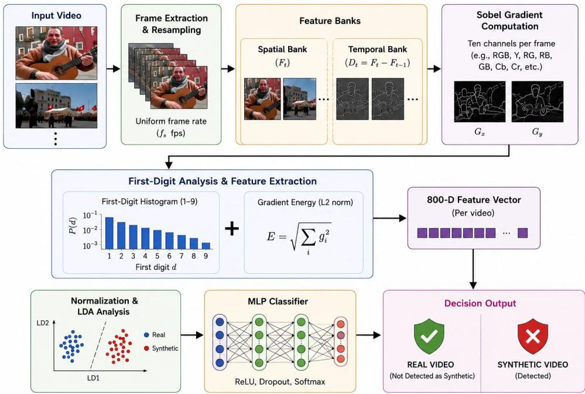  
Fig. 1. A Generalizable and Explainable Framework for Synthetic Video Detection Using First-Digit Gradient Statistics. Each video is resampled to a uniform frame rate, split into spatial $\left( F _ { t } \right)$ and temporal-derivative $( D _ { t } )$ banks, and passed through Sobel gradient computation over ten per-frame channels. The resulting gradient responses are summarised as first-digit histograms and energy terms, concatenated into an 800-D feature vector, and either projected with LDA for visualisation or classified directly by the MLP to yield a real/synthetic decision.

$$
D _ { t } = F _ { t } - F _ { t - 1 } ,\tag{2}
$$

i.e. a simple first-order finite difference between adjacent resampled frames, with no additional temporal filtering applied beforehand. $F _ { t }$ encodes what the scene looks like at that instant, while $D _ { t }$ encodes how each pixel is changing between the two consecutive sampled frames.

Sobel gradient computation. For a single-channel image $I ,$ horizontal and vertical partial derivatives are computed by convolving with a pair of $k { \times } k$ derivative kernels. For $k = 3$ these are the standard Sobel kernels:

$$
K _ { x } = \left( { \begin{array} { c c c } { - 1 } & { 0 } & { 1 } \\ { - 2 } & { 0 } & { 2 } \\ { - 1 } & { 0 } & { 1 } \end{array} } \right) , \quad K _ { y } = \left( { \begin{array} { c c c } { - 1 } & { - 2 } & { - 1 } \\ { 0 } & { 0 } & { 0 } \\ { 1 } & { 2 } & { 1 } \end{array} } \right) .\tag{3}
$$

For $k = 1$ the kernel reduces to a three-tap central difference. Two kernel sizes $k \in \{ 1 , 3 \}$ and two directions $( \partial _ { x } , \partial _ { y } )$ are applied independently to each of the ten channels.

Spatial bank. The Sobel kernels are applied directly to each channel of the resampled frame $F _ { t }$ , so the spatial response captures the distribution of edge energies within a single image.

Temporal-derivative bank. The same Sobel kernels are applied to the corresponding channel of the frame-difference image $D _ { t } \ ( { \mathrm { E q . ~ } } 2 )$ , so the temporal-derivative response captures the distribution of edge energies in how the scene changes between consecutive sampled frames. The two banks therefore share identical gradient machinery and differ only in which image $- F _ { t }$ or $D _ { t } -$ the Sobel kernels are applied to. Synthetic videos often present temporal transitions that differ from those observed in naturally captured footage; in our experiments these differences are frequently associated with a shifted gradientenergy distribution in the temporal-derivative bank relative to genuine videos.

First-significant-digit histogram and energy. For each combination of bank, channel, kernel size and gradient direction, the gradient response is spatially subsampled with a stride of eight pixels in both dimensions to form the set G. The non-zero elements of $\mathcal { G }$ are represented using a 9-bin first-significantdigit (FSD) histogram, and a single root-mean-square energy is computed over all of $\mathcal { G }$ (including any zero-valued entries), producing ten features per group. The leading digit of a positive response $g > 0$ is

$$
d ( g ) = \left\lfloor { \frac { g } { 1 0 ^ { \lfloor \log _ { 1 0 } g \rfloor } } } \right\rfloor \in \{ 1 , \ldots , 9 \} ,\tag{4}
$$

and, writing ${ \mathcal { G } } ^ { + } = \{ g \in { \mathcal { G } } : g > 0 \}$ for the non-zero subset, the histogram is

$$
h [ n ] = { \frac { 1 } { | { \mathcal { G } } ^ { + } | } } \sum _ { g \in { \mathcal { G } } ^ { + } } \mathbf { 1 } [ d ( g ) = n ] , \quad n = 1 , \ldots , 9 ,\tag{5}
$$

The histogram is L1-normalised so that $\begin{array} { r } { \sum _ { n } h [ n ] = 1 } \end{array}$ . For natural data obeying Benford’s law the expected bin probability is $\log _ { 1 0 } ( 1 + 1 / n )$ . Appended to the nine normalised bins is the

root-mean-square energy, taken over the full strided sample $\mathcal { G }$ rather than $\mathcal { G } ^ { + }$ alone:

$$
E = \sqrt { \frac { 1 } { | \mathcal { G } | } \sum _ { g \in \mathcal { G } } g ^ { 2 } } ,\tag{6}
$$

The energy term gives a measure of the overall strength of the gradient responses. This can help distinguish smoother or blurred synthesised areas, which exhibit lower gradient magnitudes from the richer regions containing stronger edge structure of a genuine face.

Feature banks and final vector. Let $\mathcal { B } \in \{ \mathrm { s p } , \mathrm { t d } \}$ denote the two banks. For the spatial bank, the per-group accumulator is updated for every resampled frame and divided by the total number of resampled frames. For the temporal-derivative bank, the accumulator is updated for every consecutive resampledframe pair $\left( F _ { t - 1 } , F _ { t } \right)$ and divided by the number of pairs. Concatenating both banks yields a 800-dimensional vector:

$$
\mathbf { f } = \left[ \mathbf { f } _ { \mathrm { t d } } ^ { \top } \left. \mathbf { f } _ { \mathrm { s p } } ^ { \top } \right. ^ { \top } \in \mathbb { R } ^ { 8 0 0 } , \right.\tag{7}
$$

where $8 0 0 \quad = \quad 2 \quad$ banks $\times \_ 1 0$ channels $\times \_ 2$ kernels $\times$ 2 directions × 10 values. The vector is computed entirely from deterministic, hand-crafted operations.

## IV. EXPERIMENTAL SETUP

Hardware. All experiments—feature extraction, model training, and inference—are conducted on a desktop workstation equipped with an Intel Core Ultra 7 270K Plus processor (3.70 GHz), 32.0 GB of installed RAM (31.6 GB usable), and an NVIDIA GeForce RTX 5070 GPU (12 GB VRAM), running a 64-bit operating system. The feature extraction pipeline is fully deterministic and hand-crafted; it applies no learned filters and requires no GPU at any stage, so all feature computation runs on the CPU alone. The GPU is used solely for MLP training and inference.

Feature extraction. The feature pipeline follows Section III exactly. Each video is resampled to a common target frame rate and divided into non-overlapping temporal windows of T frames; spatial and temporal-derivative Sobel responses are accumulated across all ten channels at two kernel sizes and two gradient directions, yielding one fixed 800-dimensional vector per video. No data augmentation is applied at the feature extraction stage.

Classifier and training. A three-layer multi-layer perceptron (MLP) with ReLU activations and dropout regularisation is trained on the 800-dimensional feature vectors. Class imbalance is addressed with focal loss [18].

LDA and discriminability analysis. Linear discriminant analysis (LDA) is applied to the 800-dimensional feature space to visualise class separability and to quantify the ratio of between-class to within-class variance. Per-feature discriminability is measured by Cohen’s $d ,$ computed as the standardised mean difference between the real and synthetic video feature distributions.

Datasets and evaluation protocol. Five datasets are used. GenBuster-200K [1] contains 14,000 videos: 6,918 real clips and 7,082 generated by twelve text-to-video models (CogVideoX, EasyAnimate, Gen3, HunyuanVideo, JiMeng, Kling, LTXVideo, Luma, Pika, Sora, ViDu, WanX); a stratified 60/10/30 split is used for train, validation, and test. Gen-BusterBench [1] provides 3,150 videos (1,000 real; 2,150 from 23 generators) evaluated across three benchmark-defined subsets: a standard subset sharing generator families with GenBuster-200K, an extended subset of additional contemporary generators, and a wild subset of the latest-generation models released after the benchmark was compiled. GenVA [2] contains 16,351 synthetic videos from three generators (Pika v1, Sora, VideoCrafter-2); it carries no real-video split and is used as a zero-shot cross-domain test, with real videos drawn from the GenBuster-200K test split. FaceForensics++ [3] (C23 compression) contains 1,000 videos per class across five forgery methods (Deepfakes, Face2Face, FaceShifter, FaceSwap, NeuralTextures) and 1,000 originals; a 1,600- dimensional face+background feature is used (two concatenated 800-D vectors: one for the detected face region and one for the zeroed-face background frame). CelebDF [4] contains 6,528 videos (889 real, drawn from Celeb-real and YouTube-real; 5,639 Celeb-synthesis face-swap fakes); an 80/20 stratified split (seed 42) is used, with the standard 800-D video feature and no face-crop bank, to check whether the detector generalises to a second, independently sourced face-swap benchmark beyond FaceForensics++. Primary metrics are ROC-AUC and balanced accuracy (BalAcc); per-class recall is reported for multi-class experiments.

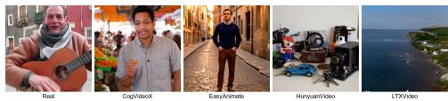  
Fig. 2. Representative frames from GenBuster-200K. From left to right: real, CogVideoX, EasyAnimate, HunyuanVideo, LTXVideo.

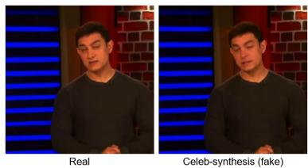  
Fig. 3. Representative frame pair from CelebDF. Left: real (Celeb-real). Right: Celeb-synthesis face-swap fake of the same subject. The manipulation is visually near-imperceptible, consistent with the low 0.624 AUC reported in Section V-E.

## V. RESULTS

## A. GenBuster-200K: In-Domain Binary Detection

Figure 2 shows representative real and generated frames from GenBuster-200K.

Fig. 4 shows the LDA projection on the GenBuster-200K test split. The first discriminant cleanly separates the twelve AI generators from the real class. The three-layer MLP trained on the 60% training split achieves ROC-AUC = 0.986 and balanced accuracy 0.945 (Table III); training convergence is shown in Fig. 5.

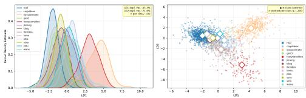  
Fig. 4. LDA on the GenBuster-200K test split. Left: LD1 kernel-density estimate per generator. Right: LD1 vs. LD2 scatter with class centroids (♦).

Training was performed on 14,000 videos rather than the full ∼200,000-video corpus. The grouped LDA in Fig. 8 reveals why additional volume from the same generators yields diminishing returns: each generator family occupies a distinct direction in the discriminant space, and that direction is well-represented after a few hundred clips. The generalisation bottleneck is directional diversity across generator families, not sample quantity within any one family. A model trained on 200 K clips of the same twelve generators would learn the same directions and produce essentially the same decision boundary while incurring an order of magnitude more compute and creating a false impression of data richness without improving out-of-distribution detection.

Fig. 6 shows the per-feature Cohen’s d analysis. The top discriminative features are spatial-channel gradient bins $( { \tt s p \_ c h \_ t } )$ , with 41 features reaching a large effect size $( | d | \geq 0 . 8 )$ . The cumulative power curve reaches 50% of total discriminative power at approximately 41 features and 80% at ∼145 features, indicating that the signal is moderately concentrated but not dominated by a handful of features— consistent with a broadly distributed artefact signature spanning multiple channels and gradient directions. Synthetic videos systematically exhibit lower gradient energy when compared to the real footage, as indicated by the predominance of red bars (fake < real) across the top features. Generative models tend to produce smoother pixel transitions on average, and a corresponding shift can be observed in the first digit histogram relative to those of naturally captured, edge rich scenes.

Table II breaks the in-domain result down by generator. Generators that produce larger and more consistent gradient deviations, such as EasyAnimate (99.6%), HunyuanVideo (100%), and ViDu (97.7%), achieve high detection rates, whereas those whose gradient-feature distributions lie closer to real videos, such as Gen3 (50.0%) and Kling (64.7%), are harder to distinguish from real footage at the chosen threshold even though they were included in the training set.

TABLE II  
PER-GENERATOR DETECTION ON THE GENBUSTER-200K IN-DOMAIN TEST SET.
<table><tr><td>Generator</td><td>Ntest</td><td>Det. rate</td><td>AUC</td></tr><tr><td>CogVideoX</td><td>534</td><td>93.1%</td><td>0.988</td></tr><tr><td>EasyAnimate</td><td>733</td><td>99.6%</td><td>0.998</td></tr><tr><td>Gen3</td><td>32</td><td>50.0%</td><td>0.922</td></tr><tr><td>HunyuanVideo</td><td>202</td><td>100.0%</td><td>1.000</td></tr><tr><td>JiMeng</td><td>31</td><td>80.6%</td><td>0.965</td></tr><tr><td>Kling</td><td>34</td><td>64.7%</td><td>0.954</td></tr><tr><td>LTXVideo</td><td>363</td><td>93.1%</td><td>0.985</td></tr><tr><td>Luma</td><td>30</td><td>73.3%</td><td>0.960</td></tr><tr><td>Pika</td><td>23</td><td>73.9%</td><td>0.969</td></tr><tr><td>Sora</td><td>59</td><td>74.6%</td><td>0.955</td></tr><tr><td>ViDu</td><td>43</td><td>97.7%</td><td>0.992</td></tr><tr><td>WanX</td><td>41</td><td>80.5%</td><td>0.952</td></tr></table>

TABLE III  
GENBUSTER-200K IN-DOMAIN BINARY DETECTION.
<table><tr><td>Metric</td><td>Value</td></tr><tr><td>ROC-AUC</td><td>0.986</td></tr><tr><td>Balanced Acc.</td><td>0.945</td></tr><tr><td>Real recall</td><td>97.1%</td></tr><tr><td>Fake recall</td><td>91.9%</td></tr></table>

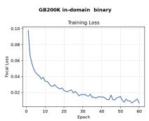

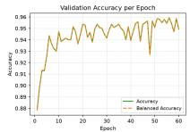

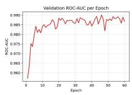  
Fig. 5. GenBuster-200K MLP training curves (loss, balanced accuracy, and ROC-AUC per epoch on the validation split).

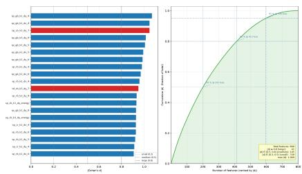  
Fig. 6. Cohen’s d on GenBuster-200K. Left: top-20 features by |d| (blue = synthetic>real, red = synthetic<real). Right: cumulative discriminative power; crosshairs at 50%, 80%, 95%.

TABLE IV  
GENBUSTERBENCH RESULTS BY EVALUATION TIER.
<table><tr><td>Tier</td><td>AUC</td><td>BalAcc</td><td>Real Rec.</td><td>Fake Rec.</td></tr><tr><td>Standard</td><td>0.976</td><td>0.938</td><td>93.0%</td><td>94.5%</td></tr><tr><td>Extended</td><td>0.984</td><td>0.950</td><td>93.0%</td><td>97.0%</td></tr><tr><td>Wild (newest)</td><td>0.939</td><td>0.898</td><td>93.0%</td><td>86.7%</td></tr></table>

## B. GenBusterBench: Benchmark Generalisation

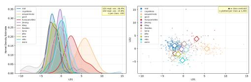  
Fig. 7. LDA on GenBusterBench (all generators). Multiple per-generator clusters are visible in the scatter, each deviating from the real centroid in a distinct direction—the geometric signature of generator-specific artefact distributions.

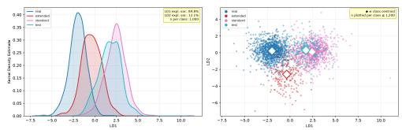  
Fig. 8. LDA on GenBuster-200K features coloured by distribution group (real, in-distribution fakes, benchmark fakes, test fakes). In-distribution and benchmark fakes deviate from the real class in different LD directions.

Table IV summarises results across the three GenBuster-Bench evaluation subsets. Performance on the standard subset (AUC 0.976) and extended subset (AUC 0.984) are comparable, indicating that the feature captures a broadly shared artefact signature across contemporary text-to-video generators regardless of whether a generator family was represented in the training corpus. Performance drops to AUC 0.939 on the wild subset of the latest-generation models, where synthesis quality has advanced furthest and artefact magnitudes are smallest.

Fig. 8 illuminates the underlying geometry. The standardsubset and extended-subset fakes each form a cluster that deviates from real in a different direction in the LDA space. The MLP learns a fixed decision boundary aligned to the artefact direction seen during training; it cannot fully intercept artefacts that propagate in an orthogonal direction. This directional divergence is the structural reason why performance degrades on the wild subset, independent of training-set size.

Fig. 9 shows the Cohen’s d analysis on GenBusterBench. All top-20 features show a negative sign (fake < real mean) and nearly all reach a large effect size, with |d| values extending above 1.3. The energy features $\scriptstyle ( \pm \mathrm { d \_ { - } } \star \_ { \mathrm { e n e r g y } } ,$ sp\_\*\_energy) dominate the ranking, indicating that the primary artefact signature on GenBusterBench is suppressed gradient magnitude rather than a redistribution of first-digit histogram bins. The cumulative power curve rises more slowly than for GB200K (50% ∼174 features, 80% ∼399 features), reflecting the greater diversity of generator families on this benchmark: no single cluster of features captures the full discriminative signal, because each generator contributes a slightly different flavour of gradient suppression.

TABLE V  
GENVA ZERO-SHOT DETECTION RESULTS (NO FINE-TUNING).
<table><tr><td>Generator</td><td>n</td><td>Det. rate</td></tr><tr><td>Pika v1</td><td>5,447</td><td>99.7%</td></tr><tr><td>Sora</td><td>5,452</td><td>99.2%</td></tr><tr><td>VideoCrafter-2</td><td>5,452</td><td>97.1%</td></tr><tr><td>Overall</td><td>16,351</td><td>AUC 0.993 / BalAcc 0.979</td></tr></table>

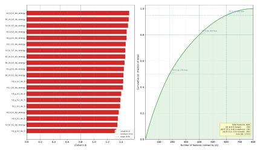  
Fig. 9. Cohen’s d on GenBusterBench. All top-20 features are negative (red); effect sizes are uniformly large (|d| ≳ 0.8), with energy features dominating.

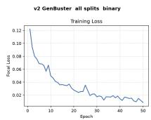

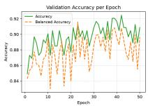

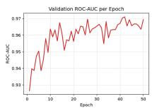  
Fig. 10. Training curves for the GenBusterBench MLP (loss, balanced accuracy, and ROC-AUC per epoch).

## C. GenVA: Zero-Shot Cross-Domain Generalisation

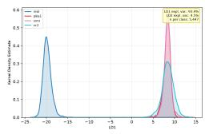

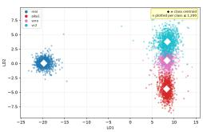  
Fig. 11. LDA on GenVA fakes combined with real videos from the GenBuster 200K test split. All three GenVA generators form tight clusters clearly separated from the real class, despite the model never having been trained on GenVA.

The GenVA experiment tests zero-shot cross-domain generalisation: the model is trained exclusively on GB200K and evaluated on GenVA without fine-tuning. Overall AUC reaches 0.993 and balanced accuracy 0.979 (Table V); Fig. 11 shows the LDA projection.

It should be noted that Pika (v1) and Sora are both present in the GB200K training set, so their near-perfect detection rates (99.7% and 99.2%) are partly expected—the model has already encountered artefact distributions from those generator families and the cross-domain transfer is thus partially in-distribution. VideoCrafter-2 (VC2), which was never seen during training, achieves 97.1% detection, demonstrating genuine cross-domain generalisation to an unseen synthesis architecture. The tight real cluster and well-separated fake generator clusters in the LDA scatter confirm that text-to-video generators introduce consistent gradient-statistic deviations that persist across model architectures and remain detectable without retraining.

Fig. 12 shows the Cohen’s d profile for GenVA. Effect sizes are extreme—the top feature reaches $\vert d \vert \approx 6 - \mathrm { a n d }$ all top features are negative (fake < real), confirming that text-to-video generators produce dramatically smoother gradient distributions than authentic video. The cumulative power curve rises steeply: 50% of total discriminative power is captured by ∼132 features and 80% by ∼291 features. This concentration of signal is consistent with the near-perfect classification results: the MLP achieves high accuracy with relatively few features because the effect sizes are so large. The extreme magnitude of the GenVA Cohen’s d values relative to GenBusterBench reflects the fact that Sora, Pika, and VideoCrafter-2 produce outputs that are more globally smooth—amplifying the systematic departure from Benford’s law across many feature channels simultaneously.

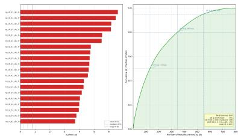  
Fig. 12. Cohen’s d on GenVA. Effect sizes are extreme (|d| up to ∼6); the steep cumulative curve indicates the signal is concentrated in a small feature subset, consistent with near-perfect zero-shot detection.

## D. FaceForensics++: Face-Swap Analysis

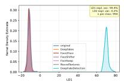

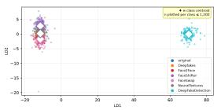  
Fig. 13. LDA on FaceForensics++ restricted to fake classes only. The five forgery methods form distinct clusters, yet their joint separation from the real class (cf. Fig. 14) is limited—consistent with the pixel-mass hypothesis: stitching-based forgeries transplant real pixels rather than synthesizing new gradient distributions.

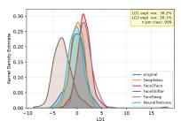

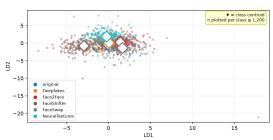  
Fig. 14. LDA vs. PLS-DA on FaceForensics++ (six classes). Rows from top: LDA distribution / scatter, PLS-DA distribution / scatter, PLS2 distribution and LD1-vs-PLS2 cross-scatter. The marginal separation under both projections (LDA BalAcc = 0.521) confirms limited discriminability of face-swap artefacts in the first-digit gradient feature space.

TABLE VI  
FACEFORENSICS++ COLLAPSED BINARY METRICS (REAL VS. ALL FAKES).
<table><tr><td>Metric Value</td></tr><tr><td>ROC-AUC (binary) 0.717</td></tr><tr><td>Balanced Acc. 0.596</td></tr><tr><td>Real recall 29.5%</td></tr><tr><td>Fake recall 89.6%</td></tr></table>

TABLE VII  
FACEFORENSICS++ PER-CLASS RECALL.
<table><tr><td>Class Recall</td></tr><tr><td>Deepfakes 43.0%</td></tr><tr><td>Face2Face 50.5%</td></tr><tr><td>FaceShifter 77.5%</td></tr><tr><td>FaceSwap 56.0%</td></tr><tr><td>NeuralTextures 58.0%</td></tr><tr><td>DeepFakeDetection* 79.4%</td></tr></table>

∗ Eval-only; withheld from training.

All FaceForensics++ experiments use the C23 (high-quality MPEG) compression variant and a 1,600-dimensional feature: the standard 800-D video feature concatenated with an additional 800-D feature computed on the face-cropped region (background pixels zeroed), giving the classifier direct access to the manipulated area. The DeepFakeDetection class (994 clips) is withheld from training as an eval-only class: Fig. 13 confirms it would achieve near-100% detection if trained on, as it is clearly separable in the discriminant space. It is excluded to prevent its 994 clips—the single largest subset in the corpus—from dominating the Deepfakes direction, biasing the decision boundary, and producing an artificially inflated headline accuracy; reporting it as eval-only yields a more conservative and honest evaluation.

The six-class classifier achieves balanced accuracy 0.524 and a collapsed binary AUC of 0.717 (Table VI), substantially below the text-to-video results. The per-class recall ordering (Table VII) is: FaceShifter (77.5%) > NeuralTextures (58.0%) > FaceSwap $( 5 6 . 0 \% ) \ > \ \mathrm { F a c e 2 F a c e }$ $( 5 0 . 5 \% ) \ >$ Deepfakes (43.0%). DeepFakeDetection, which was withheld from training, achieves a detection rate of 79.4% at inference, suggesting that the learned representation transfers partially to unseen manipulation methods. Training dynamics are shown in Fig. 15.

Fig. 16 provides the Cohen’s d profile for FaceForensics++. In contrast to the text-to-video datasets, the maximum effect size |d| barely exceeds 0.3, placing every feature well below the conventional “small” threshold $( | d | = 0 . 2 )$ . The highest ranked features are the temporal-derivative features which were extracted from the $( \mathtt { f a c e \_ t d \_ t } )$ , suggesting a possibility that the weak discriminative signal is concentrated around the manipulated area and is primarily captured by the temporal inconsistencies. The cumulative power curve is nearly linear (50% at ∼661 features, 80% at ∼961 features out of 1,600), indicating that the discriminative information is distributed across many features rather than being concentrated in a small group that stands out. This diffuse signal is consistent with the low LDA balanced accuracy and provides empirical support for the pixel-mass hypothesis: when only a small facial region is manipulated and the remaining pixels originate from genuine footage, the deviation from the natural-image statistics is observed to be substantially weaker than that observed in fully synthetic videos.

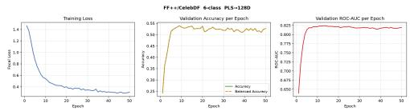  
Fig. 15. Training curves for the FaceForensics++ PLS+MLP pipeline.

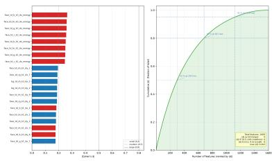  
Fig. 16. Cohen’s d on FaceForensics++ (original vs. all manipulated pooled, 1,600-D face+background). Effect sizes are uniformly small $\bar { ( } | d | < 0 . \bar { 3 } ) $ ; the nearly linear cumulative curve is the quantitative signature of the pixel-mass limitation.

The per-class recall ordering is not random: it tracks how much of the frame each forgery type synthesizes. Face-swap methods replace only the face region; surrounding pixels are unmodified real footage. The feature vector accumulates first digit gradient statistics across all sampled pixels at stride 8 over the full frame; when the manipulated region occupies a small fraction of total frame area, the synthetic signal is diluted by the dominant unmodified background, suppressing the measurable Benford deviation. Crucially, stitching operations transplant real pixel patches from a source identity—they do not synthesize new gradient distributions—so the first-digit statistics of the composited region remain close to natural-image statistics. The additional 800-D face-crop feature was included precisely to address this dilution problem; despite directly exposing the classifier to the manipulated pixels, results remain limited because the stitched content consists of real pixels from another person’s face and no new pixel patterns are introduced for the feature to detect.

By contrast, modern text-to-video generators synthesize every pixel from a learned prior, producing frame-wide deviations from natural gradient distributions that our feature captures reliably. The per-class recall ordering is consistent with this pixel-mass hypothesis: FaceShifter and NeuralTextures are more recent forgeries that typically occupy a larger blend region than earlier Deepfakes pipeline outputs, producing a larger effective area of synthesized pixels and a stronger detectable first-digit signal. The low original-class recall (29.5%) reflects the conservative threshold calibrated to maximise fake recall; it is a tuning artefact rather than a fundamental feature limitation.

## E. CelebDF: Cross-Dataset Face-Swap Check

CelebDF [4] provides a second, independently sourced faceswap benchmark to check whether the FaceForensics++ finding above generalises beyond a single forgery corpus. The standard 800-D video feature (no face-crop bank) is trained on an 80/20 stratified split (5,222 train, 1,306 test; 889 real vs. 5,639 Celeb-synthesis fakes) using the same MLP architecture and focal-loss training recipe as the other datasets, at a fixed 0.5 decision threshold (no validation-set threshold calibration, unlike GB200K and GenBusterBench). Figure 3 shows a representative real/fake pair; unlike the text-to-video generators above, the Celeb-synthesis manipulation is confined to the face region and is visually subtle.

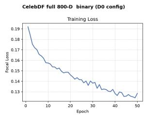

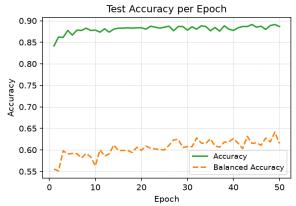

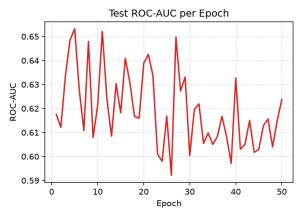  
Fig. 17. CelebDF MLP training curves (loss, test accuracy/balanced accuracy, and test ROC-AUC per epoch; full 800-D feature, 80/20 split).

Table VIII summarises the result. ROC-AUC (0.624) and balanced accuracy (0.615) are well above chance but far below the 0.94–0.99 AUC range achieved on the fully synthesized text-to-video benchmarks, and are close to the FaceForensics++ collapsed-binary result (AUC 0.717). The lopsided recall split (fake 98.8% vs. real 24.2%) at the uncalibrated 0.5 threshold reflects the same class imbalance and conservativethreshold effect discussed for FaceForensics++, rather than a fundamentally different failure mode. This result is consistent with the pixel-mass hypothesis (Section VI): CelebDF’s Celebsynthesis fakes are, like the FaceForensics++ manipulations, face-swap forgeries that transplant a real face region rather than synthesizing new pixels, so the detectable first-digit gradient deviation is weak and diluted by the unmodified background, on a dataset that shares no generator, encoding pipeline, or source footage with FaceForensics++.

TABLE VIII  
CELEBDF BINARY DETECTION (FULL 800-D FEATURE, 80/20 SPLIT).
<table><tr><td>Metric</td><td>Value</td></tr><tr><td>ROC-AUC</td><td>0.624</td></tr><tr><td>Balanced Acc.</td><td>0.615</td></tr><tr><td>Real recall</td><td>24.2%</td></tr><tr><td>Fake recall</td><td>98.8%</td></tr></table>

## F. Benford’s Law Deviation Analysis

To directly characterise the statistical behaviour underlying the classifier’s discriminative signal, we compared the empirical first-significant-digit (FSD) histogram of every (bank, channel, kernel size, direction) mode — 80 modes in total, spanning both the spatial and temporal-derivative banks across all ten feature channels (Table I) — against the theoretical Benford curve $p ( d ) = \log _ { 1 0 } ( 1 + 1 / d )$ [15], [16]. The comparison is run on all five datasets used elsewhere in this paper (GenBuster-200K, GenBusterBench, GenVA, FaceForensics++, and CelebDF [4]). Full per-mode overlays for all five datasets are given in the Appendix (Fig. 18).

Across every dataset, the extracted Sobel-gradient FSD histograms are Benford-like: probability mass is concentrated at the lower digits and decreases monotonically toward digit 9, in qualitative agreement with the theoretical curve. However, every mode shows a systematic and reproducible deviation from the logarithmic curve, appearing as localised excess mass at specific digits rather than the smooth Benford decay — most pronounced in the raw-colour and channel-correlation channels $( r , g , b , \mathbf { r g } , \mathbf { r b } , \mathbf { g } \mathbf { b } )$ . This deviation pattern is consistent across generators, datasets, and video-encoding settings, which rules out sampling noise as the explanation and instead indicates that it is an innate property of derivative-domain frame statistics. Critically, real and synthetic videos exhibit this same deviation structure: the two classes are not separated by how closely they adhere to Benford’s law, so no video can be classified as synthetic on that basis alone. This confirms that the discriminative signal exploited by the classifier and quantified by the Cohen’s d analyses above is a shift in where probability mass sits away from a shared non-Benford baseline, not a Benford-versus-non-Benford distinction. The overall picture is a stable, dataset-independent derivative-domain first-digit pattern that departs from classical Benford behaviour in a structured and repeatable way, which may itself be a useful statistical property for video forensics beyond the classification task considered here.

TABLE IX  
EMPIRICAL-VS-EMPIRICAL FSD HISTOGRAM STABILITY (NOT COMPARED TO THE THEORETICAL BENFORD CURVE). AVERAGED OVER ALL 80 MODES.
<table><tr><td>Comparison</td><td>Pairs</td><td>mean r</td><td>mean JSD</td></tr><tr><td>Cross-dataset, real class</td><td>6</td><td>0.959</td><td>0.093</td></tr><tr><td>Cross-dataset, pooled fake class</td><td>10</td><td>0.961</td><td>0.081</td></tr><tr><td>Cross-generator, GB200K (12 gens.)</td><td>66</td><td>0.993</td><td>0.038</td></tr><tr><td>Cross-generator, GenBusterBench (12 gens.)</td><td>66</td><td>0.994</td><td>0.038</td></tr><tr><td>Cross-generator, GenVA (3 gens.)</td><td>3</td><td>0.987</td><td>0.059</td></tr><tr><td>Cross-generator, FaceForensics++ (6 cls.)</td><td>15</td><td>0.990</td><td>0.025</td></tr><tr><td>Cross-generator, CelebDF (3 srcs.)</td><td>3</td><td>0.999</td><td>0.016</td></tr></table>

Quantifying stability independently of the Benford comparison. The consistency claim above compares each empirical histogram only to the theoretical Benford curve; it does not by itself measure how similar the empirical histograms are to each other. To quantify that separately, for every one of the 80 modes we computed the Pearson correlation (shape match) and the Jensen–Shannon (JS) distance — the square root of the Jensen–Shannon divergence, a bounded [0, 1] distributional distance with 0 indicating identical distributions — between pairs of empirical mean FSD histograms, then averaged over all 80 modes. Two comparisons are made: (i) across datasets, holding class fixed (real-vs-real across four independent realvideo sources, and pooled fake-vs-pooled fake across all five datasets); and (ii) across generators within a single dataset (fake-vs-fake, holding the dataset fixed). Table IX summarises the result.

Correlation is uniformly high $( r = 0 . 9 3  – 0 . 9 9 9 )$ and JS distance uniformly low $( \leq 0 . 1 2$ for any cross-dataset pair, $\leq 0 . 0 6$ for any cross-generator pair), confirming quantitatively that the FSD histogram shape is stable. Cross-generator stability exceeds cross-dataset stability in every dataset, consistent with the LDA and Cohen’s d findings above: different generators mainly shift feature magnitude (captured by Cohen’s d and the per-generator LDA directions) rather than the underlying histogram shape, whereas genuinely different scene content (general video vs. faces) is what moves the shape. The residual cross-dataset variation concentrates in the chrominance and channel-correlation modes at the smallest (k=1) kernel size (JSD up to 0.18 for individual modes), while sharpness and base-colour channels at k=3 are the most stable individual modes $( \mathrm { J S D } \approx 0 . 0 3 )$ .

## VI. CONCLUSION

In this work we provide a Sobel first-digit-law based AI detection pipeline. We examine the success and pitfalls of this type of detection. We note that purely AI-generated datasets such as GenBuster-200K and GenVA produce high AUC scores of 0.99 and 0.99 respectively, while datasets using face swaps and a smaller number of generated pixels, with stitching of two videos, produce much lower AUC scores of 0.717 and 0.624 on FF++ C23 and CelebDF respectively. Our hypothesis is that the deviation produced in the first-digit signal is directly proportional to the number of pixels generated.

Apart from the detector, we believe our main contribution is to show discriminatory signal in the first-digit distribution of non-scale-invariant properties. When the rate of change is uniform (the fps and the filter size) the first-digit distribution is incredibly stable and is shown to remain relatively the same across different scenes. This shows the first-digit signal to be more universal than previously thought.

For this research the main improvement will be to use other non-scale-invariant image properties and test their discriminatory strength and stability. The use of other forensic tools in addition to ours is a possible direction as well.

Author Contributions Sidharth Shanu: Conceptualization, Methodology, Formal Analysis, Validation, Visualization, Writ ing – Original Draft Preparation. Gautam Kumar: Software, Data Curation, Investigation, Writing – Editing. Tej Singh: Supervision, Methodology, Validation, Resources, Project Ad ministration, Writing – Review & Editing.

## Funding Not Applicable.

Data Availability The datasets analysed during the current study are publicly available. GenBuster-200K and GenBuster-Bench are released by their respective authors. GenVA [2] is publicly available. FaceForensics++ [3] is available at https: //github.com/ondyari/FaceForensics. CelebDF [4] is available at https://github.com/yuezunli/celeb-deepfakeforensics.

Code Availability The analysis code developed for this study is available from the corresponding author on reasonable request.

## DECLARATION

Conflicts of interest The authors declare no competing interests.

## REFERENCES

[1] H. Wen, Y. He, Z. Huang, T. Li, Z. Yu, X. Huang, L. Qi, B. Wu, X. Li, and G. Cheng, “BusterX: MLLM-powered AI-generated video forgery detection and explanation,” arXiv, 2025.

[2] J. Kang, M. B. Silva, P. Sangkloy, K. Chen, N. L. Williams, and Q. Sun, “GeneVA: A dataset of human annotations for generative text to video artifacts,” arXiv preprint arXiv:2509.08818, 2025.

[3] A. Rossler, D. Cozzolino, L. Verdoliva, C. Riess, J. Thies, and M. Nießner,¨ “FaceForensics++: Learning to detect manipulated facial images,” in IEEE/CVF International Conference on Computer Vision (ICCV), 2019.

[4] Y. Li, X. Yang, P. Sun, H. Qi, and S. Lyu, “Celeb-DF: A large-scale challenging dataset for DeepFake forensics,” in IEEE/CVF Conference on Computer Vision and Pattern Recognition (CVPR), 2020.

[5] I. Goodfellow, J. Pouget-Abadie, M. Mirza, B. Xu, D. Warde-Farley, S. Ozair, A. Courville, and Y. Bengio, “Generative adversarial nets,” Advances in Neural Information Processing Systems, vol. 27, pp. 2672– 2680, 2014.

[6] J. Ho, A. Jain, and P. Abbeel, “Denoising diffusion probabilistic models,” Advances in Neural Information Processing Systems, vol. 33, pp. 6840– 6851, 2020.

[7] J. Ho, T. Salimans, A. Gritsenko, W. Chan, M. Norouzi, and D. J. Fleet, “Video diffusion models,” Advances in Neural Information Processing Systems, vol. 35, pp. 8633–8646, 2022.

[8] A. Blattmann, T. Dockhorn, S. Kulal, D. Mendelevitch, M. Kilian, D. Lorenz, Y. Levi, Z. English, V. Voleti, A. Letts et al., “Stable video diffusion: Scaling latent video diffusion models to large datasets,” arXiv preprint arXiv:2311.15127, 2023.

[9] S.-Y. Wang, O. Wang, R. Zhang, A. Owens, and A. A. Efros, “CNNgenerated images are surprisingly easy to spot. . . for now,” in Proceedings of the IEEE/CVF Conference on Computer Vision and Pattern Recogni tion, 2020, pp. 8695–8704.

[10] D. Gragnaniello, D. Cozzolino, F. Marra, G. Poggi, and L. Verdoliva, “Are GAN generated images easy to detect? a critical analysis of the state-of-the-art,” in 2021 IEEE International Conference on Multimedia and Expo (ICME). IEEE, 2021, pp. 1–6.

[11] F. Marra, D. Gragnaniello, D. Cozzolino, and L. Verdoliva, “Detection of GAN-generated fake images over social networks,” in 2018 IEEE Conference on Multimedia Information Processing and Retrieval (MIPR). IEEE, 2018, pp. 384–389.

[12] F. Marra, D. Gragnaniello, L. Verdoliva, and G. Poggi, “Do GANs leave artificial fingerprints?” in 2019 IEEE Conference on Multimedia Information Processing and Retrieval (MIPR). IEEE, 2019, pp. 506–511.

[13] J. Frank, T. Eisenhofer, L. Schonherr, A. Fischer, D. Kolossa, and T. Holz,¨ “Leveraging frequency analysis for deep fake image recognition,” in International Conference on Machine Learning. PMLR, 2020, pp. 3247–3258.

[14] H. Wen, T. Li, Z. Huang, Y. He, and G. Cheng, “BusterX++: Towards unified cross-modal AI-generated content detection and explanation with MLLM,” arXiv, 2025.

[15] N. Bonettini, P. Bestagini, S. Milani, and S. Tubaro, “On the use of Benford’s law to detect GAN-generated images,” arXiv preprint arXiv:2004.07682, 2020.

[16] W. Chen and Y. Q. Shi, “Detection of double MPEG compression based on first digit statistics,” in Digital Watermarking (IWDW), ser. Lecture Notes in Computer Science, vol. 5703. Springer, 2009, pp. 16–30.

[17] N. Yu, L. S. Davis, and M. Fritz, “Attributing fake images to GANs: Learning and analyzing GAN fingerprints,” in Proceedings of the IEEE/CVF International Conference on Computer Vision, 2019, pp. 7556–7566.

[18] T.-Y. Lin, P. Goyal, R. Girshick, K. He, and P. Dollar, “Focal loss´ for dense object detection,” in Proceedings of the IEEE International Conference on Computer Vision, 2017, pp. 2980–2988.

## APPENDIX

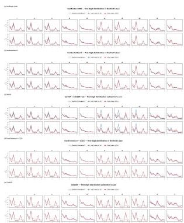

Fig. 18. Representative first-significant-digit distributions vs. the theoretical Benford curve (temporal-derivative, k=1, both gradient directions) for all five datasets: (a) GenBuster-200K, (b) GenBusterBench, (c) GenVA (fakes combined with GenBuster-200K real videos), (d) FaceForensics++ (C23, original vs. all manipulated classes pooled), (e) CelebDF [4] (cf. Section V-E classification results).

Fig. 18 gives a representative sample of the per-mode overlays supporting the Benford’s-law deviation analysis of Section V-F, for all five datasets. Each panel-block shows two representative row-modes (temporal-derivative bank, k=1, both gradient directions) across all ten feature channels of Table I; the full 80-panel grids (two feature banks × two kernel sizes × two gradient directions × ten channels) referenced in Section V-F follow the same pattern. Every panel plots the theoretical Benford curve $p ( d ) = \log _ { 1 0 } ( 1 + 1 / d )$ (dashed grey) against the empirical mean ±1 standard deviation FSD histogram for the real/original class (blue) and the fake/manipulated class (red), computed over all videos of that class in the dataset.