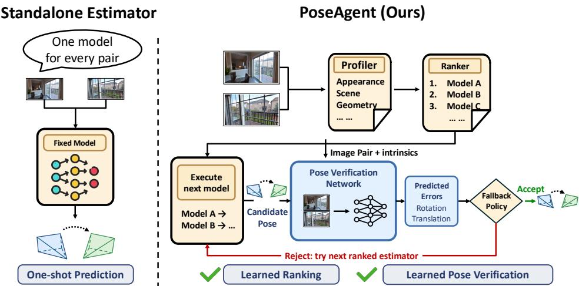
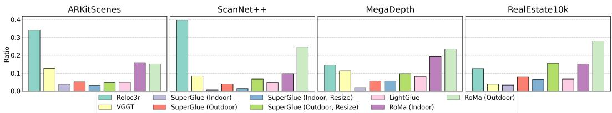
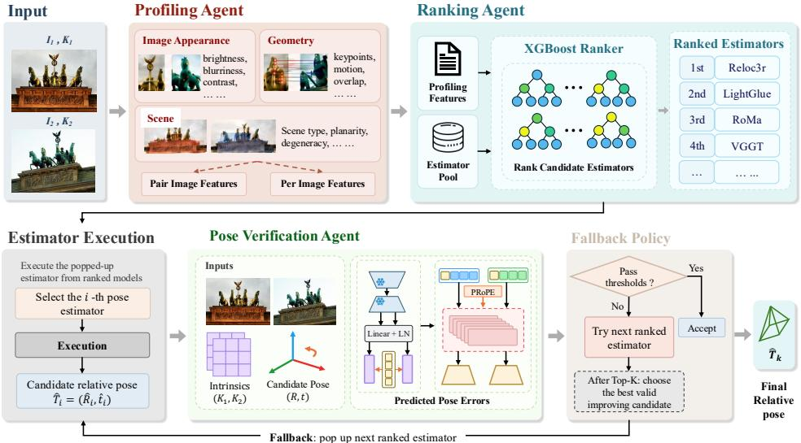
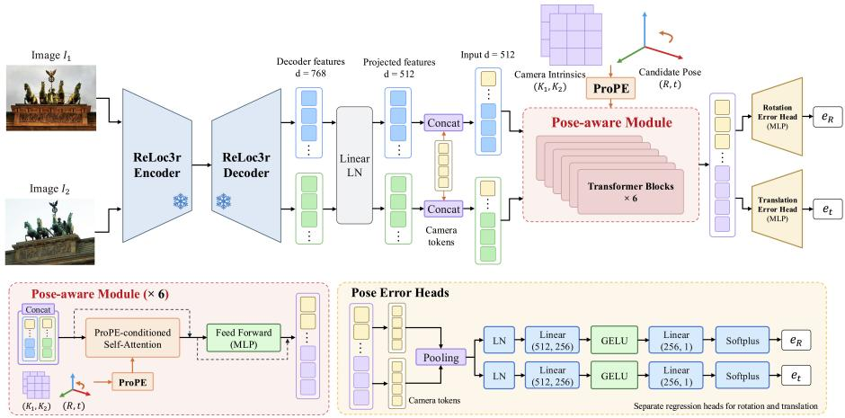
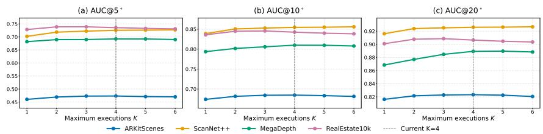
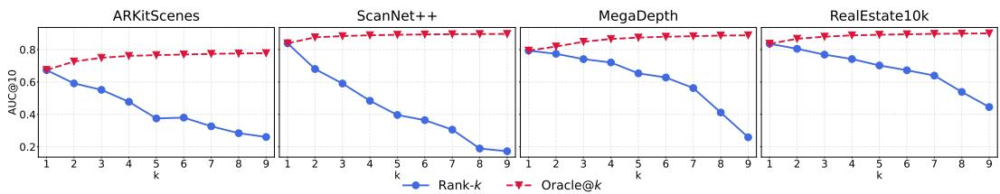
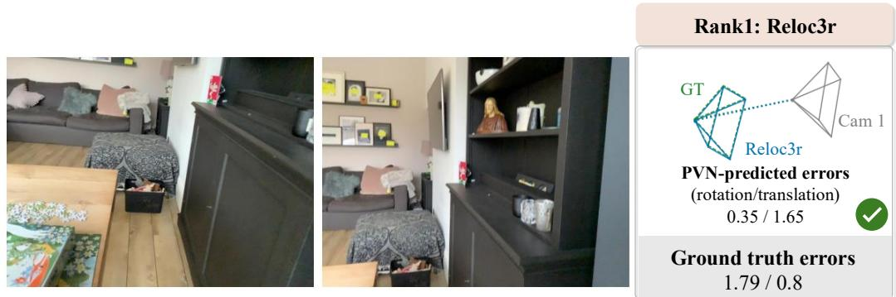
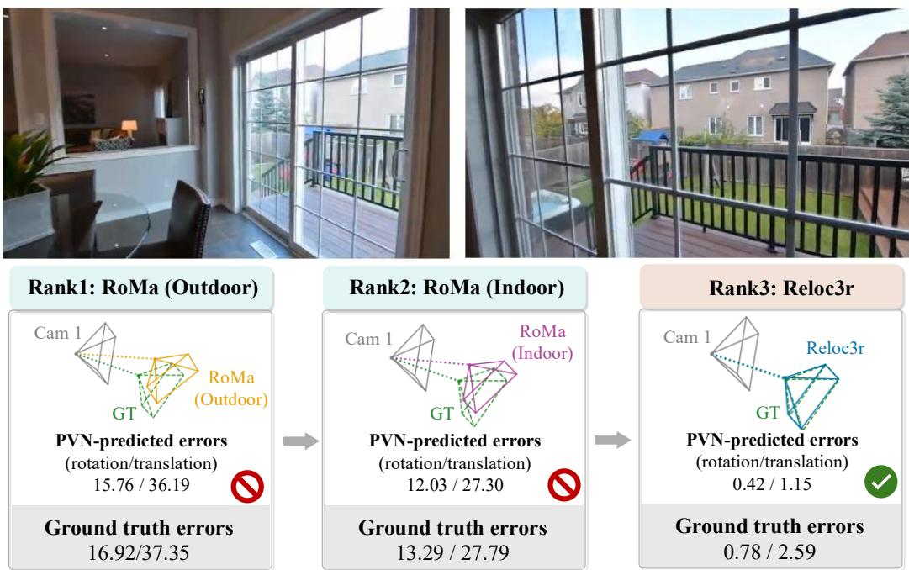
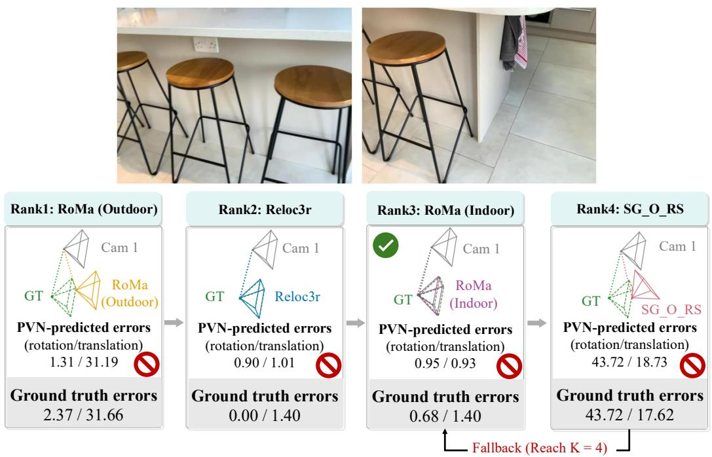
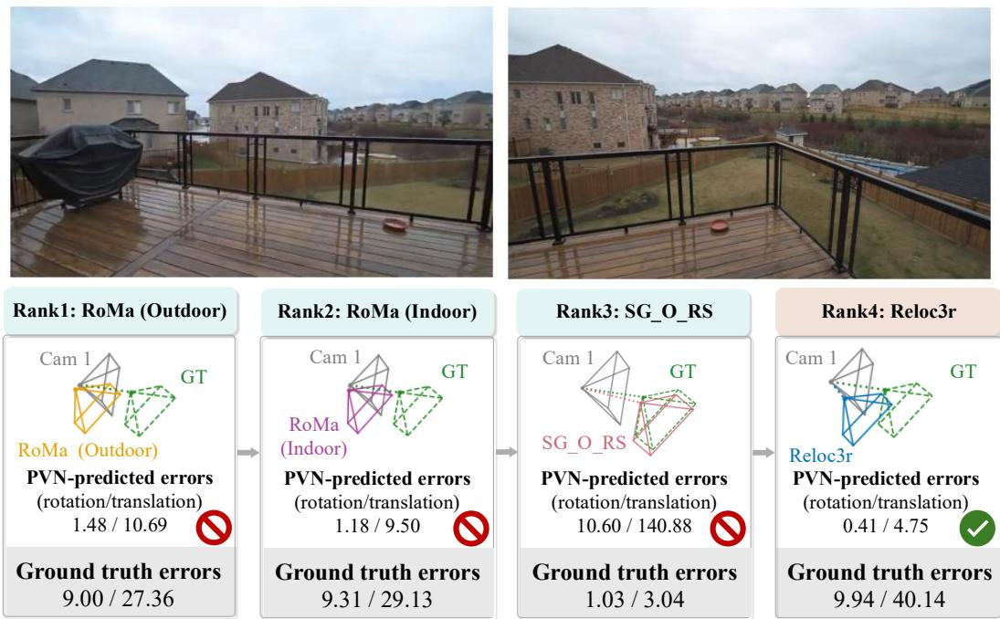

# AGENTIC RELATIVE CAMERA POSE ESTIMATION VIA LEARNED RANKING AND VERIFICATION

Zhining Gu1 Shangjie Du2 Weimin Qiu2 Carl Olsson3 Ping Liu4 Meng Tang2

1Arizona State University 2University of California, Merced 3Lund University 4University of Nevada, Reno

## ABSTRACT

A wide range of approaches have been developed for camera pose estimation, including correspondence-based methods, end-to-end pose regression, and recent 3D geometric foundation models. Our key observation is that no single estimator is optimal for diverse challenges, such as wide baselines, lack of texture, appearance changes, and occlusions. Further analysis reveals substantial performance variation across both benchmarks and individual image pairs, with different estimators exhibiting complementary strengths. We introduce PoseAgent, an agentic framework for relative camera pose estimation that dynamically orchestrates pose estimators through learnable ranking and verification. Given an image pair, a profiling agent first extracts appearance, semantic, and geometric features relevant to pose estimation, e.g., scene type. A learned ranking agent then predicts the relative competence of multiple pose estimators given the image-pair profile. The top-ranked estimator is executed, and its predicted pose is assessed by a learned verification agent that estimates the corresponding pose error. When verification fails, PoseAgent adaptively invokes lower-ranked estimators until a candidate is accepted or the execution budget is reached. For pose verification, our verification network predicts pose errors more accurately than prior models. For pose estimation, PoseAgent improves AUC@5◦up to 4.2% over the strongest standalone estimator on each of ARKitScenes, MegaDepth, ScanNet++, and RealEstate10K. On ARKitScenes, PoseAgent also outperforms VLM-based agents, which include a VLM ranker with the same verifier and fallback policy. These results demonstrate the effectiveness of our learned ranking and verification.

## 1 INTRODUCTION

Camera pose estimation is fundamental to virtual and augmented reality, autonomous navigation, 3D/4D reconstruction, and robotics. Relative camera pose estimation aims to recover the transformation between the camera coordinate systems of two images. Existing approaches span sparse keypoint-based methods (Lowe, 2004; Nister, 2004; Yi et al., 2016; Mishchuk et al., 2017; DeTone´ et al., 2018; Tian et al., 2019; Dusmanu et al., 2019; Sarlin et al., 2020; Tyszkiewicz et al., 2020; Lindenberger et al., 2023), dense correspondence methods (Sun et al., 2021; Edstedt et al., 2024), direct pose regression (Kendall et al., 2015; Dong et al., 2025), and recent geometric foundation models (Wang et al., 2024; Leroy et al., 2024; Wang et al., 2025).

Despite substantial progress, relative pose estimation remains challenging under extremely wide baselines, little overlap, repetitive texture, appearance changes, and scene dynamics. Our systematic evaluation reveals that no single estimator consistently excels across datasets or individual image pairs. Surprisingly, even classical or seemingly outdated estimators outperform more recent models in many cases, see detailed analysis in Section 3.1. This variation reflects complementary strengths across estimator families.

Among these estimator families, correspondence-based methods are highly accurate when reliable feature matches are available, but degrade under large viewpoint changes or limited visual overlap. In contrast, end-to-end regression methods are more robust for these challenges, while being less accurate than structure-based methods when reliable correspondences are present. Existing systems partially recognize this model specialization. For example, SuperGlue (Sarlin et al., 2020) and RoMa (Edstedt et al., 2024) provide separate models for indoor and outdoor scenes. However, such dataset-level specialization is too coarse to capture the varying characteristics of individual pairs

  
Figure 1: We propose PoseAgent, an agentic framework that adaptively ranks and executes pose estimators and verifies pose estimation with orchestration. Our framework is a meta-learner and improves a set of standalone pose estimators.

We therefore boost relative pose estimation at image-pair level via instance-adaptive model selection with verification. Given an image pair, a successful system should (1) predict which estimator is likely to be the best given image pair profile and (2) determine whether its output after execution can be trusted without access to ground-truth pose. Towards these goals, we introduce PoseAgent, a closed-loop agentic framework that orchestrates heterogeneous pose estimators as specialized tools, see outline in Fig. 1. Inspired by agentic vision systems that coordinate tools through profiling, planning, tool selection, execution, and feedback (Zuo et al., 2025; Lu et al., 2023), PoseAgent combines a learned ranker for model selection with a learned verifier for pose verification.

Given an image pair, a profiling agent extracts semantic and geometric characteristics related to visual overlap, appearance variation, scene structure, and matching difficulty. Conditioned on this profile, a ranking agent predicts the relative competence of a set of candidate estimators and invokes the highest-ranked one. Importantly, estimator selection is not treated as a one-shot decision. Next, the learnable verification agent evaluates the reliability of the predicted pose using geometric evi dence, without access to the ground-truth camera pose. If the verification fails, PoseAgent adaptively falls back to the next promising estimator according to the ranking. In this way, ranking provides a prior estimate of estimator competence, while verification provides feedback about the reliability of the actual prediction, enabling closed-loop recovery from unsuccessful estimator choices. Our main contributions are summarized as follows:

• We reveal substantial complementarity among existing pose estimators across datasets and individual image pairs, where even classical estimators outperform recent models in many cases, motivating instance-adaptive model selection.

• We introduce PoseAgent, an agentic framework that integrates image-pair profiling, learned estimator ranking, estimator execution, and learned pose verification into a closed-loop inference process with verification-guided fallback to lower-ranked estimators.

• Extensive experiments show that PoseAgent outperforms standalone estimators on four datasets and outperforms VLM-based agents on ARKitScenes, including a VLM ranker combined with the same verifier and fallback policy.

## 2 RELATED WORK

Relative Camera Pose Estimation Conventional methods first detect and describe local features using hand-crafted methods, such as SIFT (Lowe, 2004) and SURF (Bay et al., 2006), establish correspondences through descriptor matching, and estimate relative pose using robust geometric solvers (Hartley & Zisserman, 2003). Deep learning has introduced learned alternatives throughout this pipeline, including detectors and descriptors (e.g., SuperPoint (DeTone et al., 2018)), sparse matcher (e.g., SuperGlue (Sarlin et al., 2020) and LightGlue (Lindenberger et al., 2023)), and dense matchers (e.g., LoFTR (Sun et al., 2021), and RoMa (Edstedt et al., 2024)). Other geometric primitives beyond keypoint correspondences have also been explored. Line-based and hybrid point-line approaches improve robustness in weakly textured or structurally dominant scenes (Elqursh & Elgammal, 2011; Vakhitov et al., 2018; Hruby et al., 2024), while more specialized approaches es- ´ timate epipolar geometry or relative pose from conics and cylinder silhouettes (Kahl & Heyden, 1998; Gummeson & Oskarsson, 2024). Pose regression methods directly predict relative pose, bypassing explicit correspondence estimation (Kendall et al., 2015; Arnold et al., 2022; Ding et al., 2019; Khatib et al., 2024; Zhou et al., 2020; Winkelbauer et al., 2021; Dong et al., 2025). More recently, geometric foundation models, such as DUSt3R (Wang et al., 2024), Reloc3r (Dong et al., 2025), and VGGT (Wang et al., 2025) have leveraged Transformer architectures and large-scale 3D data to address many geometric vision tasks. These developments have produced a diverse set of estimators with complementary assumptions and failure modes, motivating instance-adaptive model selection.

Model Selection and Pose Verification Adaptive selection among pose estimation strategies has been explored in several settings. Camposeco et al. (2018) perform adaptive solver selection within RANSAC, while Rockwell et al. (2024) learn to balance geometric solver outputs and learned pose predictions. Yu et al. (2025) combine depth-aware and classical point-based solvers through hybrid scoring and refinement, and Panek et al. (2026) investigate scoring functions for selecting between structure-based and structure-less pose estimates. These approaches demonstrate the benefits of model selection, but primarily operate at the solver level or combine a small number of predefined paradigms within a fixed pipeline. Complementary to selection, pose verification determines whether a candidate estimate should be trusted. Classical verification relies on geometric criteria or correspondence consensus, such as Sampson and reprojection errors, or RANSAC consensus scores. In particular, RANSAC selects hypotheses by inlier count, while Torr & Zisserman (2000) replaces this criterion with a likelihood-based objective to reduce sensitivity to hard inlier thresholds. However, such criteria depend on the quality of the underlying correspondences. Learning-based methods instead predict hypothesis quality from visual and geometric evidence. For example, FS-Net (Barroso-Laguna et al., 2023) scores fundamental matrix hypotheses from an image pair without relying on sparse correspondence features. In contrast to prior work, we rank multiple estimators spanning correspondence-based methods, direct pose regression, and large-scale geometric models, and verify their final pose predictions within a closed-loop fallback process.

Multimodal Large Language Model (MLLM) Agent LLMs have enabled agents capable of planning, reasoning, and tool use (Yao et al., 2022; Hong et al., 2023; Wang et al., 2023; Hu et al., 2025; Zuo et al., 2025; Szot et al., 2025; Xu et al., 2026; Yao et al., 2026; Zhang et al., 2026). Multimodal agents have evolved from mediating visual inputs through textual descriptions or external perception modules (Wu et al., 2023; Sur´ıs et al., 2023; Yang et al., 2023; Gao et al., 2023) to jointly processing visual and textual inputs with native multimodal models. However, general-purpose multimodal representations often lack the precise geometric and spatial information required by vision tasks (Deng et al., 2026; Ma et al., 2024; Guo et al., 2025; Marsili et al., 2025). Tool-augmented agents address this limitation by leveraging external vision or geometry models during reasoning (Cho et al., 2026; Guo et al., 2025; Zuo et al., 2025; Wang et al., 2025; Kirillov et al., 2023; Guo et al., 2025; Ma et al., 2024; Marsili et al., 2025). Our work follows this tool-augmented agentic paradigm for pose estimation by including heterogeneous pose estimators as specialized tools. Unlike generalpurpose multimodal LLM, PoseAgent specializes the orchestration process for relative camera pose estimation through learned ranking and verification.

  
Figure 2: Distributions of best estimator across various datasets. No single estimator dominates the lowest pose error across all datasets or image pairs.

## 3 METHOD

## 3.1 MOTIVATING ANALYSIS

Recent estimators have achieved strong benchmark performance (Lindenberger et al., 2023; Edstedt et al., 2024; Dong et al., 2025; Wang et al., 2025), yet no single estimator is the most accurate across image pairs. To examine this, Figure 2 reports, for each dataset, the fraction of image pairs on which each estimator is the most accurate, i.e., produces the lowest pose error. This fraction is highest for Reloc3r on the indoor ARKitScenes (Baruch et al., 2021) and ScanNet++ (Yeshwanth et al., 2023) datasets, and for RoMa Outdoor (Edstedt et al., 2024) on MegaDepth (Li & Snavely, 2018) and RealEstate10K (Zhou et al., 2018). However, even these most frequent winners are the most accurate estimator on fewer than 40% of the image pairs in any dataset, and on only about 23% of the pairs on MegaDepth. The remaining pairs are often won by older estimators: the four SuperGlue variants together are the most accurate on about one third of the RealEstate10K pairs.

This per-pair variation translates into a large accuracy gap: an oracle that selects the most accurate of the nine estimators for each pair outperforms the strongest standalone estimator by 10.5 to 15.1 percentage points in AUC@5◦across the four datasets (Table 2). Such per-pair selection cannot be reduced to choosing by scene type, since Reloc3r and RoMa Outdoor each win a substantial fraction of pairs on both indoor and outdoor datasets. Estimator suitability therefore likely depend on pair-specific factors beyond scene type, such as viewpoint change, visual overlap, texture, and appearance variation, which is consistent with our profiling ablation in Section 4.3. Closing the oracle gap without ground truth requires two capabilities: predicting a suitable estimator for each image pair from these factors, and verifying its output.

## 3.2 PROBLEM FORMULATION

Both capabilities operate on the outputs of individual pose estimators. Given an image pair $( I _ { 1 } , I _ { 2 } )$ and the corresponding camera intrinsics $( \mathbf { K } _ { 1 } , \mathbf { K } _ { 2 } )$ , a pose estimator $M _ { m }$ predicts the relative camera pose between the two camera coordinate systems:

$$
M _ { m } ( I _ { 1 } , I _ { 2 } ; { \bf K } _ { 1 } , { \bf K } _ { 2 } ) \longrightarrow \widehat { \bf T } _ { 2 1 } ^ { m } = [ \widehat { \bf R } _ { 2 1 } ^ { m } \ | \ \widehat { \bf t } _ { 2 1 } ^ { m } ]\tag{1}
$$

where $\hat { \mathbf { R } } _ { 2 1 } ^ { m }$ denotes the rotation matrix and $\widehat { \mathbf { t } } _ { 2 1 } ^ { m }$ denotes the translation vector. PoseAgent is a metamethod that treats an arbitrary set of such estimators, $\mathcal { M } = \{ M _ { 1 } , . . . , M _ { N } \}$ , as callable tools and adaptively coordinates them:

$$
[ \widehat { \bf R } _ { 2 1 } ^ { * } \ | \ \widehat { \bf t } _ { 2 1 } ^ { * } ] = \boldsymbol { \mathcal { A } } ( I _ { 1 } , I _ { 2 } , { \bf K } _ { 1 } , { \bf K } _ { 2 } ; \mathcal { M } , K )\tag{2}
$$

where $K \leq N$ is the maximum number of estimator executions. The ranked execution route and verification feedback jointly determine the final pose estimate.

Figure 3 shows how PoseAgent, as a closed-loop agentic framework, produces this route and feedback for each image pair. The Image Pair Profiling Agent (Sec. 3.3) extracts appearance, semantic, and geometric features, which the Ranking Agent (Sec. 3.4) uses to rank candidate estimators into an execution route. For each executed estimator, the Pose Verification Agent (Sec. 3.5) predicts the rotation and translation errors of its pose. Finally, the verification-guided fallback policy (Sec. 3.6) uses these predicted errors to decide whether to accept the current pose or invoke the next estimator, up to the execution budget K.

  
Image Features for each image and pairsFigure 3: PoseAgent profiles an image pair, ranks and sequentially executes candidate estimators, and verifies each prediction until a pose is accepted following a fallback policy.

## 3.3 IMAGE PAIR PROFILING AGENT

The Profiling Agent constructs a structured feature profile for each image pair using OpenCV, CLIP (Radford et al., 2021), DINOv2 (Oquab et al., 2023), SegFormer (Xie et al., 2021), LoFTR (Sun et al., 2021), and SuperPoint (DeTone et al., 2018). The extracted appearance, semantic, and geometric features characterize individual images and their cross-view relationships, including scene composition, appearance changes, and matching conditions. The resulting profile is passed to the Ranking Agent to rank the candidate estimators. Appendix A.2 provides the complete list of tools and features.

## 3.4 RANKING AGENT

Given the image-pair features produced by the Profiling Agent, Ranking Agent estimates the suitability of each pose estimator and generates a ranking. Specifically, given image pair profile pi augmented with candidate estimator identity for image pair i, we train a light-weight XGBRanker (Chen & Guestrin, 2016) $r _ { \theta }$ , which is a tree-based ranking model, to predict an estimator suitability score $s _ { i } ^ { m } = r _ { \theta } \left( \mathbf { p } _ { i } ^ { m } \right)$ for a model $M _ { m }$ . Sorting the candidates by decreasing $s _ { i } ^ { m }$ produces the execution order, prioritizing suitable estimators without exhaustively executing all candidates.

Training data for ranking For each image pair i along with candidate estimator $M _ { m }$ , we define its pose error as $e _ { i } ^ { m } = \operatorname* { m a x } \left( e _ { R , i } ^ { m } , e _ { t , i } ^ { m } \right)$ , where $e _ { R , i } ^ { m }$ and $e _ { t , i } ^ { m }$ denote the rotation and translation direction errors with respect to the ground truth relative pose. We rank the N candidate estimators in ascending order of $e _ { i } ^ { m }$ and convert their ranks into relevance labels, assigning higher relevance to lower error candidates, to train an XGBRanker.

## 3.5 POSE VERIFICATION AGENT

Our Verification Agent evaluates each pose hypothesis: after each estimator along the ranked route is executed, it predicts the errors of the candidate pose. For image pair i, let the estimator at the k-th position of the execution route produce a candidate relative pose $\mathbf { \widehat { T } } _ { i } ^ { [ k ] } = [ \widehat { \mathbf { R } } _ { i } ^ { [ k ] } \ | \ \widehat { \mathbf { t } } _ { i } ^ { [ k ] } ]$ ]. We train a Pose Verification Network (PVN) $V _ { \phi }$ to predict its rotation and translation direction errors:

$$
\left( \widehat { e } _ { R , i } ^ { [ k ] } , \widehat { e } _ { t , i } ^ { [ k ] } \right) = V _ { \phi } \left( I _ { 1 , i } , I _ { 2 , i } , \mathbf { K } _ { 1 , i } , \mathbf { K } _ { 2 , i } , \widehat { \mathbf { T } } _ { i } ^ { [ k ] } \right)\tag{3}
$$

Network architecture. As shown in Fig. 4, PVN builds upon the pretrained Reloc3r encoder and decoder (Dong et al., 2025), whose parameters remain frozen during training. We use Reloc3r as the backbone because it is pretrained for pose regression, so its decoder features already encode cross-view geometry without relying on explicit correspondences. Although it is also one of the nine candidate estimators, PVN only reuses its image pair features, while the verification decision is conditioned on each candidate pose and applied to all estimators in the same way. On top of the frozen decoder, we append six trainable Transformer blocks (Kang et al., 2025) that alternate between within-view attention and pose-conditioned cross-view attention, in which the candidate pose and camera intrinsics are embedded using PRoPE (Li et al., 2025). Learnable register tokens (Kang et al., 2025) prepended to the visual tokens of each view aggregate these pose-conditioned features. The pooled register tokens of the two views are fed to two regression heads with Softplus activations, which predict non-negative rotation and translation direction errors.

  
Figure 4: Architecture of Pose Verification Network (PVN). The network is conditioned on camera intrinsics and a candidate pose to predict rotation and translation errors.

Training objective. PVN is supervised with the ground-truth rotation and translation direction errors of each candidate pose. To reduce the influence of the long-tailed error distribution and emphasize accuracy on small errors, we minimize an $\ell _ { 1 }$ loss in logarithmic space:

$$
\mathcal { L } _ { \mathrm { P V N } } = \left| \log ( 1 + \widehat { e } _ { R } ) - \log ( 1 + e _ { R } ) \right| + \lambda _ { t } \left| \log ( 1 + \widehat { e } _ { t } ) - \log ( 1 + e _ { t } ) \right|\tag{4}
$$

where $\lambda _ { t }$ controls the relative contribution of translation error regression. At inference, the predicted errors of each candidate are passed to the fallback policy.

## 3.6 CLOSED-LOOP INFERENCE PIPELINE

The fallback policy connects the three agents into a closed loop at inference time. For image pair $i ,$ the Ranking Agent orders the candidate estimators using the profile $\mathbf { p } _ { i }$ , and PoseAgent executes at most $K \leq { \bar { N } }$ of them along this route, passing each candidate to the Verification Agent and each prediction to the fallback policy. For the candidate $\widehat { \mathbf { T } } _ { i } ^ { [ k ] }$ at step k, the policy first checks whether its predicted errors satisfy the verification thresholds $\tau _ { R }$ and $\tau _ { t } \mathbf { : }$

$$
q _ { i } ^ { [ k ] } = \mathbb { I } \left[ \widehat { e } _ { R , i } ^ { [ k ] } < \tau _ { R } \ \land \ \widehat { e } _ { t , i } ^ { [ k ] } < \tau _ { t } \right]\tag{5}
$$

For $k > 1$ , it additionally checks whether the candidate improves upon the Rank-1 hypothesis in both error dimensions:

$$
b _ { i } ^ { [ k ] } = \mathbb { I } \left[ \widehat { e } _ { R , i } ^ { [ k ] } < \widehat { e } _ { R , i } ^ { [ 1 ] } \wedge \widehat { e } _ { t , i } ^ { [ k ] } < \widehat { e } _ { t , i } ^ { [ 1 ] } \right] , \qquad k > 1 .\tag{6}
$$

PoseAgent accepts the Rank-1 candidate if $q _ { i } ^ { [ 1 ] } = 1$ and a subsequent candidate if $q _ { i } ^ { [ k ] } b _ { i } ^ { [ k ] } = 1 ;$ otherwise, it executes the next estimator along the route until the budget K is reached. If no candidate is accepted, PoseAgent returns the candidate with the smallest predicted error max $( \widehat { e } _ { R , i } ^ { [ k ] } , \widehat { e } _ { t , i } ^ { [ k ] } )$ among those with $b _ { i } ^ { [ k ] } = 1$ , or the Rank-1 candidate if no such candidate exists. This closed loop makes PoseAgent agentic in the sense that it does not apply a fixed estimator or exhaustively run all models, but adapts its sequence of estimator calls to the verification feedback on each image pair.

Table 1: Relative pose AUC on four datasets at 5◦/10◦/20◦. Bold indicates the best result, and underline indicates the best standalone estimator.
<table><tr><td></td><td colspan="3">ARKitScenes</td><td colspan="3">MegaDepth</td><td colspan="3">ScanNet++</td><td colspan="3">RealEstate10K</td></tr><tr><td>Method</td><td>@5°</td><td>@10°</td><td>@20°</td><td>@5°</td><td>@10°</td><td>@20°</td><td>@5°</td><td>@10°</td><td>@20°</td><td>@5°</td><td>@10°</td><td>@20°</td></tr><tr><td>Reloc3r</td><td>0.456</td><td>0.675</td><td>0.819</td><td>0.562</td><td>0.732</td><td>0.847</td><td>0.684</td><td>0.833</td><td>0.915</td><td>0.605</td><td>0.764</td><td>0.861</td></tr><tr><td>VGGT</td><td>0.243</td><td>0.455</td><td>0.647</td><td>0.530</td><td>0.687</td><td>0.804</td><td>0.194</td><td>0.342</td><td>0.515</td><td>0.323</td><td>0.539</td><td>0.712</td></tr><tr><td>SG-I</td><td>0.161</td><td>0.296</td><td>0.451</td><td>0.162</td><td>0.257</td><td>0.355</td><td>0.094</td><td>0.184</td><td>0.299</td><td>0.359</td><td>0.524</td><td>0.662</td></tr><tr><td>SG-O</td><td>0.242</td><td>0.394</td><td>0.539</td><td>0.430</td><td>0.572</td><td>0.686</td><td>0.258</td><td>0.378</td><td>0.485</td><td>0.568</td><td>0.706</td><td>0.802</td></tr><tr><td>SG-I-RS</td><td>0.146</td><td>0.264</td><td>0.393</td><td>0.320</td><td>0.413</td><td>0.496</td><td>0.152</td><td>0.227</td><td>0.308</td><td>0.467</td><td>0.596</td><td>0.696</td></tr><tr><td>SG-O-RS</td><td>0.208</td><td>0.345</td><td>0.474</td><td>0.542</td><td>0.668</td><td>0.764</td><td>0.302</td><td>0.407</td><td>0.498</td><td>0.631</td><td>0.749</td><td>0.828</td></tr><tr><td>LightGlue</td><td>0.228</td><td>0.389</td><td>0.535</td><td>0.511</td><td>0.647</td><td>0.745</td><td>0.289</td><td>0.400</td><td>0.495</td><td>0.520</td><td>0.669</td><td>0.774</td></tr><tr><td>RoMa-I</td><td>0.378</td><td>0.561</td><td>0.702</td><td>0.662</td><td>0.776</td><td>0.854</td><td>0.440</td><td>0.582</td><td>0.699</td><td>0.649</td><td>0.778</td><td>0.861</td></tr><tr><td>RoMa-O</td><td>0.372</td><td>0.543</td><td>0.678</td><td>0.684</td><td>0.793</td><td>0.867</td><td>0.547</td><td>0.672</td><td>0.762</td><td>0.724</td><td>0.827</td><td>0.891</td></tr><tr><td>PoseAgent (Ours)</td><td>0.473</td><td>0.685</td><td>0.823</td><td>0.693</td><td>0.810</td><td>0.889</td><td>0.726</td><td>0.855</td><td>0.926</td><td>0.736</td><td>0.843</td><td>0.907</td></tr></table>

## 4 EXPERIMENTS

Datasets. We evaluate PoseAgent on four datasets covering indoor and outdoor scenes: ARKitScenes (Baruch et al., 2021), ScanNet++ (Yeshwanth et al., 2023), MegaDepth (Li & Snavely, 2018), and RealEstate10K (Zhou et al., 2018). We follow the split used by Reloc3r (Dong et al., 2025) for ARKitScenes and the provided split for RealEstate10K, and construct scene-disjoint training and test splits for MegaDepth and ScanNet++. For MegaDepth and ScanNet++, both the training and evaluation splits are drawn from scenes included in Reloc3r pretraining, while ARKitScenes and RealEstate10K use the held-out evaluation splits adopted by Reloc3r. Since Reloc3r is used as a frozen backbone in PVN, we additionally evaluate verification-guided fallback on the standard ScanNet1500 and MegaDepth1500 benchmarks (Dong et al., 2025) and assess its generalization beyond these splits. The number of image pairs in each split is reported in Appendix A.1.

Evaluation Metrics. We report the area under the cumulative error curve (AUC) at 5◦, 10◦, and 20◦(AUC@5◦, AUC@10◦, and AUC@20◦), where pose error is the maximum of the rotation and translation errors (Sarlin et al., 2020; Dong et al., 2025). For pose verification, we additionally report mAA@10◦and median errors for rotation, translation, and their maximum (Barroso-Laguna et al., 2023; Dong et al., 2025; Jin et al., 2021).

Candidate Pose Estimators. PoseAgent operates over nine candidate estimators, including four SuperGlue variants using indoor or outdoor weights, with or without image resizing (SG-I, SG-O, SG-I-RS, and SG-O-RS) (Sarlin et al., 2020), LightGlue (Lindenberger et al., 2023), two RoMa variants (RoMa-I and RoMa-O) (Edstedt et al., 2024), Reloc3r (Dong et al., 2025), and VGGT (Wang et al., 2025). I/O denotes indoor/outdoor weights, and RS denotes resizing the longer image side.

## 4.1 MAIN RESULTS

We compare PoseAgent with nine standalone estimators, each of which applies a fixed model to every image pair. As shown in Table 1, the strongest standalone estimator differs across datasets: Reloc3r is the best on ARKitScenes and ScanNet++, whereas RoMa-O is the best on MegaDepth and RealEstate10K. PoseAgent outperforms the best standalone estimator on all four datasets and at all AUC thresholds, without knowing in advance which estimator is the best for a given dataset. The AUC@5◦improvement ranges from 0.9% on MegaDepth to 4.2% on ScanNet++. These results demonstrate that instance-adaptive selection and verification can exploit estimator complementarity more effectively than relying on any single fixed estimator. More qualitative examples are shown in Appendix A.6.

## 4.2 COMPONENT ANALYSIS

## 4.2.1 RANKING AGENT

We evaluate whether the Ranking Agent prioritizes suitable estimators among the nine candidates. For $k \in \{ 1 , \ldots , 9 \}$ , Rank-k denotes the prediction produced by the estimator at predicted rank k, and Oracle@k selects the best pose among the top-k ranked estimators using the ground-truth pose, serving as an upper bound for selection within the top k. As shown in Table 2, Rank-1 is competitive with or better than the strongest standalone estimator in Table 1. The improvement is most evident on ScanNet++ and RealEstate10K, while performance on ARKitScenes and MegaDepth remains comparable to the strongest standalone baselines. Rank-1 also consistently outperforms Rank-2 across all datasets, indicating that the ranker places stronger estimators earlier. The gap between Rank-1 and Oracle@2 shows that the second-ranked estimator is more accurate than the first on a subset of pairs, which motivates verification-guided fallback.

Table 2: Ranking and model selection. Results are AUC@5◦/10◦/20◦. Verifier-Only runs all 9 estimators and picks the lowest predicted error. Fixed-Order + PVN uses one estimator order for all datasets (average win rate from train set) with the same PVN, fallback policy, and $K = 4$
<table><tr><td>Method</td><td>ARKitScenes</td><td>MegaDepth</td><td>ScanNet++</td><td>RealEstate10K</td></tr><tr><td>Rank-1 (Ranker-Only) Rank-2</td><td>0.460 / 0.674 / 0.816 0.393 / 0.591 / 0.742</td><td>0.682 / 0.794 / 0.869 0.655 / 0.774 / 0.855</td><td>0.702 / 0.839 / 0.916 0.543 / 0.680 / 0.779</td><td>0.729 / 0.836 / 0.901 0.682 / 0.805 / 0.882</td></tr><tr><td></td><td></td><td></td><td></td><td></td></tr><tr><td>Verifier-Only</td><td>0.455 / 0.669 / 0.813</td><td>0.668 / 0.794 / 0.879</td><td>0.728 / 0.856 / 0.927</td><td>0.698 / 0.820 / 0.894</td></tr><tr><td>Fixed-order Ranking + PVN</td><td>0.467 / 0.681 / 0.821</td><td>0.611 / 0.762 / 0.863</td><td>0.694 / 0.838 / 0.917</td><td>0.636 / 0.786 / 0.875</td></tr><tr><td>PoseAgent (Our Ranker + PVN)</td><td>0.473 / 0.685 / 0.823</td><td>0.693 / 0.810 / 0.889</td><td>0.726 / 0.855 / 0.926</td><td>0.736 / 0.843 / 0.907</td></tr><tr><td>Oracle@2</td><td>0.532 / 0.727 / 0.851</td><td>0.715 / 0.819 / 0.888</td><td>0.762 / 0.876 / 0.937</td><td>0.774 / 0.867 / 0.921</td></tr><tr><td>Oracle@9</td><td>0.607 / 0.778 / 0.881</td><td>0.803 / 0.888 / 0.940</td><td>0.800 / 0.897 / 0.948</td><td>0.829 / 0.900 / 0.941</td></tr></table>

Table 3: Pose error prediction and selection on MegaDepth and ScanNet++.
<table><tr><td rowspan="2">Dataset</td><td rowspan="2">Method</td><td> $\mathbf { m } \mathbf { A } \mathbf { A } @ 1 0 ^ { \circ } \uparrow$ </td><td>Median error (°) ↓</td><td> $\mathbf { M A E } \left( { \mathrm { ^ \circ } } \right) \downarrow$ </td></tr><tr><td> $e _ { R } / e _ { t } / e _ { \operatorname* { m a x } }$ </td><td> $e _ { R } / e _ { t } / e _ { \mathrm { m a x } }$ </td><td> $e _ { R } / e _ { t } / e _ { \mathrm { m a x } }$ </td></tr><tr><td rowspan="2">MegaDepth</td><td>FSNet</td><td>0.850 / 0.683 / 0.655</td><td>0.835 / 1.867 / 2.185</td><td>5.463 / 6.615 / 8.588</td></tr><tr><td>PVN</td><td>0.964 / 0.850 / 0.839</td><td>0.393 / 0.814 / 1.017</td><td>0.787 / 4.681 / 4.243</td></tr><tr><td rowspan="2">ScanNet++</td><td>FSNet</td><td>0.462 / 0.340 / 0.284</td><td>5.311 / 10.005 / 13.978</td><td>34.147 / 22.934 / 41.854</td></tr><tr><td>PVN</td><td>0.958 / 0.928 / 0.904</td><td>0.599 / 0.712 / 1.034</td><td>0.715 / 4.316 / 2.853</td></tr></table>

## 4.2.2 POSE VERIFICATION AGENT

Error Prediction and Pose Selection. Table 3 compares PVN with FSNet (Barroso-Laguna et al., 2023) on candidate poses for which both methods return valid predictions. PVN achieves lower MAE for rotation, translation direction, and their maximum. When selecting among all nine candidates by the smallest predicted maximum error, PVN also improves all mAA and median error metrics over FSNet.

Verification on Standard Benchmarks. We further evaluate verification-guided fallback on the ScanNet1500 (Sarlin et al., 2020) and MegaDepth1500 (Sun et al., 2021) benchmarks. For each benchmark, we keep the initial estimator fixed and randomly sample two orders for the remaining candidates, using the same PVN, thresholds $( \tau _ { R } = 0 . 5 ^ { \circ }$ and $\tau _ { t } = 6 ^ { \circ } )$ , fallback policy, and $K = 4 .$ As shown in Table 4, all PVN-based variants outperform the initial estimator alone across both benchmarks and all AUC thresholds, showing that verification remains effective across different execution orders.

Complementarity of Ranking and Verification Table 2 compares Verifier-Only selection over all nine candidates, Ranker-Only (Rank-1), Fixed-Order + PVN, and the full PoseAgent. The fixedorder baseline sorts estimators by their average win rate across the four training datasets, weighting each dataset equally, while sharing the same PVN, thresholds, fallback policy, and $K = 4$ PoseAgent outperforms Ranker-Only and Fixed-Order + PVN across all datasets, and outperforms exhaustive Verifier-Only selection on three datasets while being only marginally lower on Scan-Net++, despite executing at most four rather than all nine estimators. These results demonstrate that ranking and verification are complementary.

## 4.3 ABLATION STUDIES

Comparison with VLM-Based Agents We evaluate VLM-based agents on ARKitScenes using Claude Sonnet-5, including a coding agent, a VLM ranker, and the VLM ranker combined with our verifier and fallback policy. As shown in Tables 5 and 6, PoseAgent substantially outperforms the coding agent and achieves better ranking performance than the VLM ranker. Adding our verifier improves the VLM ranking results, but PoseAgent remains superior under the same verification and fallback settings, demonstrating the complementary benefits of learned ranking and verification.

Table 4: Verification-guided fallback on benchmarks. Each entry reports AUC at $5 ^ { \circ } / 1 0 ^ { \circ } / 2 0 ^ { \circ }$ We evaluate two fixed estimator orders while keeping the PVN, verification thresholds, fallback policy, and execution budget unchanged.
<table><tr><td>Method</td><td>ScanNet1500</td><td>MegaDepth1500</td></tr><tr><td>Rank-1</td><td>0.359 / 0.581 / 0.748</td><td>0.700 / 0.814 / 0.891</td></tr><tr><td>Order 1 + PVN</td><td>0.366 / 0.592 / 0.760</td><td>0.715 / 0.828 / 0.902</td></tr><tr><td>Order 2 + PVN</td><td>0.370 / 0.596 / 0.764</td><td>0.716 / 0.828 / 0.903</td></tr><tr><td>Oracle@9</td><td>0.522 / 0.716 / 0.843</td><td>0.818 / 0.897 / 0.944</td></tr></table>

ScanNet1500 orders: 1: VGGT→SG-O-RS→SG-I-RS→RoMa-I; 2: VGGT→RoMa-I→SG-O-RS→SG-I-RS.  
MegaDepth1500 orders: 1: RoMa-O→SG-O-RS→RoMa-I→LightGlue; 2: RoMa-O→RoMa-I→LightGlue→SG-O-RS.

Effect of maximum number of estimators used We change the maximum number of estimators executed K from 1 to 6, with $( \tau _ { R } = 0 . 5 ^ { \circ } )$ and $( \tau _ { t } =$ $6 ^ { \circ } )$ . Figure 5 shows performance improves with additional fallback candidates, but saturates for larger K. We therefore choose $K = 4$

Table 5: Results on ARKitScenes.
<table><tr><td>Method</td><td>AUC@5°/10°/20°</td></tr><tr><td>PoseAgent</td><td>VLM Coding Agent 0.090 / 0.163 / 0.259 0.473 / 0.685 / 0.823</td></tr></table>

Table 6: Ranking and verification on ARKitScenes $( \operatorname { A U C } @ 5 ^ { \circ } / 1 0 ^ { \circ } / 2 \bar { 0 } ^ { \circ } )$ . Both use the same learned verifier and fallback policy with $K = 4$
<table><tr><td>Setting</td><td>Method</td><td>@5°/10°/20°</td></tr><tr><td>Rank-1</td><td>VLM Ranker Ranker (Ours)</td><td>0.369 / 0.549 / 0.691 0.460 / 0.674 / 0.816</td></tr><tr><td>Oracle@2</td><td>VLM Ranker Ranker (Ours)</td><td>0.448 / 0.629 / 0.759 0.532 / 0.727 / 0.851</td></tr><tr><td>PVN + Fallback</td><td>VLM Ranker PoseAgent</td><td>0.449 / 0.650 / 0.795 0.473 / 0.685 / 0.823</td></tr></table>

Table 7: Average latency per image pair (ms). Model initialization is excluded.
<table><tr><td>Dataset</td><td>Profiling</td><td>Ranking</td><td>Verifier</td></tr><tr><td>ARKitScenes</td><td>583.18</td><td>25.11</td><td>82.14</td></tr><tr><td>ScanNet++</td><td>661.42</td><td>25.70</td><td>92.09</td></tr><tr><td>MegaDepth</td><td>691.00</td><td>25.99</td><td>90.63</td></tr><tr><td>RealEstate10K</td><td>613.15</td><td>25.28</td><td>84.47</td></tr></table>

  
Figure 5: Effect of the execution budget K on relative pose accuracy. We use $\tau _ { R } = 0 . 5 ^ { \circ }$ and $\tau _ { t } = 6 ^ { \circ }$ in this experiment. Dashed lines indicate the default setting with $K = 4 .$

Limitations and Future Work PoseAgent increases overall latency (Table 7) as it may run multiple estimators, especially for challenging image pairs. The profiling stage can be further optimized for efficiency. Future work includes faster profiling, extensions to absolute camera pose estimation, incorporating more pose estimators, and developing better fallback policies.

## 5 CONCLUSION

In this work, we introduce PoseAgent, an agentic framework for relative camera pose estimation that dynamically orchestrates specialized pose estimators through learnable ranking and verification. Given an arbitrary image pair, a profiling agent first extracts semantic and geometric characteristics that capture factors relevant to pose estimation. A learned ranking agent then predicts the relative competence of multiple pose estimators conditioned on the resulting image-pair profile. The top-ranked estimator is executed, and its predicted pose is assessed by a learned verification agent without access to ground-truth camera pose. When verification fails, PoseAgent adaptively invokes lower-ranked estimators until a reliable pose estimate is obtained. Our verification network substantially outperforms previous methods for pose verification. Extensive experiments on ARKitScenes, MegaDepth, ScanNet++, and RealEstate10K demonstrate that PoseAgent consistently outperforms individual standalone pose estimators. Moreover, PoseAgent outperforms VLM-based agents for relative camera pose estimation, demonstrating the effectiveness of ranking and verification.

## REPRODUCIBILITY STATEMENT

We provide comprehensive experimental and implementation details to facilitate reproducibility. Section 4 describes datasets, PVN optimization settings, ablation studies, and comparison with VLM-based agents. The appendices specify implementation details including training settings, profiling configuration, system prompts, and example visualization. The results distinguish develop ment evaluations from independent confirmation. The accompanying NumPy package reproduces the new offline curves and paired intervals from sufficient anonymous statistics.

## AI USE STATEMENT

In this work, we used generative AI tools to formulate mathematical claims, assist in translation and qualitative and thematic data analysis. We have not used generative AI tools for research idea formulation and dataset generation and preprocessing is not applicable to this work. Additionally, we used generative AI tools for editing a research paper to improve readability and formatting references. We have reviewed all AI-assisted work. For example, we refer AI-generated figure style and make figures on our own. We also use it to assist in code debugging to make sure the implementation runs successfully. We take responsibility for the final content of this work, including text, claims, or artifacts produced with the aid of generative AI.

## REFERENCES

Eduardo Arnold, Jamie Wynn, Sara Vicente, Guillermo Garcia-Hernando, Aron Monszpart, Victor Prisacariu, Daniyar Turmukhambetov, and Eric Brachmann. Map-free visual relocalization: Metric pose relative to a single image. In European Conference on Computer Vision, pp. 690–708. Springer, 2022.

Axel Barroso-Laguna, Eric Brachmann, Victor Adrian Prisacariu, Gabriel J Brostow, and Daniyar Turmukhambetov. Two-view geometry scoring without correspondences. In Proceedings of the IEEE/CVF Conference on Computer Vision and Pattern Recognition, pp. 8979–8989, 2023.

Gilad Baruch, Zhuoyuan Chen, Afshin Dehghan, Tal Dimry, Yuri Feigin, Peter Fu, Thomas Gebauer, Brandon Joffe, Daniel Kurz, Arik Schwartz, et al. Arkitscenes: A diverse real-world dataset for 3d indoor scene understanding using mobile rgb-d data. arXiv preprint arXiv:2111.08897, 2021.

Herbert Bay, Tinne Tuytelaars, and Luc Van Gool. Surf: Speeded up robust features. In European conference on computer vision, pp. 404–417. Springer, 2006.

Federico Camposeco, Andrea Cohen, Marc Pollefeys, and Torsten Sattler. Hybrid camera pose estimation. In 2018 IEEE/CVF Conference on Computer Vision and Pattern Recognition, pp. 136– 144. IEEE, 2018. URL https://openaccess.thecvf.com/content\_cvpr\_2018/ CameraReady/2462.pdf.

Tianqi Chen and Carlos Guestrin. Xgboost: A scalable tree boosting system. In Proceedings of the 22nd acm sigkdd international conference on knowledge discovery and data mining, pp. 785–794, 2016.

Seokju Cho, Ryo Hachiuma, Abhishek Badki, Hang Su, Byung-Kwan Lee, Chan Hee Song, Sifei Liu, Subhashree Radhakrishnan, Seungryong Kim, Yu-Chiang Frank Wang, et al. Spatialclaw: Rethinking action interface for agentic spatial reasoning. arXiv preprint arXiv:2606.13673, 2026.

Ken Deng, Yifu Qiu, Yoni Kasten, Shay B. Cohen, and Yftah Ziser. Lost in space? vision-language models struggle with relative camera pose estimation, 2026. URL https://arxiv.org/ abs/2601.22228.

Daniel DeTone, Tomasz Malisiewicz, and Andrew Rabinovich. Superpoint: Self-supervised interest point detection and description. In 2018 IEEE/CVF conference on computer vision and pattern recognition workshops (CVPRW), pp. 337–33712. IEEE, 2018.

Mingyu Ding, Zhe Wang, Jiankai Sun, Jianping Shi, and Ping Luo. Camnet: Coarse-to-fine retrieval for camera re-localization. In Proceedings of the IEEE/CVF International Conference on Computer Vision, pp. 2871–2880, 2019.

Siyan Dong, Shuzhe Wang, Shaohui Liu, Lulu Cai, Qingnan Fan, Juho Kannala, and Yanchao Yang. Reloc3r: Large-scale training of relative camera pose regression for generalizable, fast, and accurate visual localization. In Proceedings of the Computer Vision and Pattern Recognition Conference, pp. 16739–16752, 2025.

Mihai Dusmanu, Ignacio Rocco, Tomas Pajdla, Marc Pollefeys, Josef Sivic, Akihiko Torii, and Torsten Sattler. D2-net: A trainable cnn for joint description and detection of local features. In Proceedings of the ieee/cvf conference on computer vision and pattern recognition, pp. 8092– 8101, 2019.

Johan Edstedt, Qiyu Sun, Georg Bokman, M¨ arten Wadenb˚ ack, and Michael Felsberg. RoMa: Robust¨ Dense Feature Matching. In IEEE Conference on Computer Vision and Pattern Recognition, 2024.

Ali Elqursh and Ahmed Elgammal. Line-based relative pose estimation. In 2011 IEEE Conference on Computer Vision and Pattern Recognition (CVPR), pp. 3049–3056, 2011. doi: 10.1109/CVPR. 2011.5995512.

Difei Gao, Lei Ji, Luowei Zhou, Kevin Qinghong Lin, Joya Chen, Zihan Fan, and Mike Zheng Shou. Assistgpt: A general multi-modal assistant that can plan, execute, inspect, and learn. arXiv preprint arXiv:2306.08640, 2023.

Anna Gummeson and Magnus Oskarsson. Relative pose from cylinder silhouettes. In Proceedings ofthe Asian Conference on Computer Vision (ACCV), pp. 2545–2561, December 2024.

Yejie Guo, Yunzhong Hou, Wufei Ma, Meng Tang, and Ming-Hsuan Yang. Pursuing minimal sufficiency in spatial reasoning. arXiv preprint arXiv:2510.16688, 2025.

Richard Hartley and Andrew Zisserman. Multiple view geometry in computer vision. Cambridge university press, 2003.

Sirui Hong, Mingchen Zhuge, Jonathan Chen, Xiawu Zheng, Yuheng Cheng, Jinlin Wang, Ceyao Zhang, Zili Wang, Steven Ka Shing Yau, Zijuan Lin, et al. Metagpt: Meta programming for a multi-agent collaborative framework. In The Twelfth International Conference on Learning Representations, 2023.

Petr Hruby, Shaohui Liu, R´ emi Pautrat, Marc Pollefeys, and Daniel Barath. Handbook on leveraging´ lines for two-view relative pose estimation. In 2024 International Conference on 3D Vision (3DV), pp. 376–386. IEEE, 2024.

Wenbo Hu, Jingli Lin, Yilin Long, Yunlong Ran, Lihan Jiang, Yifan Wang, Chenming Zhu, Runsen Xu, Tai Wang, and Jiangmiao Pang. G2vlm: Geometry grounded vision language model with unified 3d reconstruction and spatial reasoning. arXiv preprint arXiv:2511.21688, 2025. URL https://arxiv.org/abs/2511.21688.

Yuhe Jin, Dmytro Mishkin, Anastasiia Mishchuk, Jiri Matas, Pascal Fua, Kwang Moo Yi, and Eduard Trulls. Image matching across wide baselines: From paper to practice. International Journal ofComputer Vision, 129(2):517–547, 2021.

Fredrik Kahl and Anders Heyden. Using conic correspondences in two images to estimate the epipolar geometry. In Proceedings of the Sixth International Conference on Computer Vision (ICCV ’98), pp. 761–766, Washington, DC, USA, 1998. IEEE Computer Society.

Gyeongjin Kang, Seungkwon Yang, Seungtae Nam, Younggeun Lee, Jungwoo Kim, and Eunbyung Park. Multi-view pyramid transformer: Look coarser to see broader. arXiv preprint arXiv:2512.07806, 2025.

Alex Kendall, Matthew Grimes, and Roberto Cipolla. Posenet: A convolutional network for realtime 6-dof camera relocalization. In Proceedings of the IEEE international conference on computer vision, pp. 2938–2946, 2015.

Fadi Khatib, Yuval Margalit, Meirav Galun, and Ronen Basri. Leveraging image matching toward end-to-end relative camera pose regression. In DAGM German Conference on Pattern Recognition, pp. 185–201. Springer, 2024.

Alexander Kirillov, Eric Mintun, Nikhila Ravi, Hanzi Mao, Chloe Rolland, Laura Gustafson, Tete Xiao, Spencer Whitehead, Alexander C Berg, Wan-Yen Lo, et al. Segment anything. In Proceedings ofthe IEEE/CVF international conference on computer vision, pp. 4015–4026, 2023.

Vincent Leroy, Yohann Cabon, and Jerome Revaud. Grounding image matching in 3d with mast3r, 2024.

Ruilong Li, Brent Yi, Junchen Liu, Hang Gao, Yi Ma, and Angjoo Kanazawa. Cameras as relative positional encoding. Advances in Neural Information Processing Systems, 2025.

Zhengqi Li and Noah Snavely. Megadepth: Learning single-view depth prediction from internet photos. In 2018 IEEE/CVF Conference on Computer Vision and Pattern Recognition, pp. 2041– 2050. IEEE, 2018.

Philipp Lindenberger, Paul-Edouard Sarlin, and Marc Pollefeys. LightGlue: Local Feature Matching at Light Speed. In ICCV, 2023.

David G Lowe. Distinctive image features from scale-invariant keypoints. International journal of computer vision, 60(2):91–110, 2004.

Pan Lu, Baolin Peng, Hao Cheng, Michel Galley, Kai-Wei Chang, Ying Nian Wu, Song-Chun Zhu, and Jianfeng Gao. Chameleon: Plug-and-play compositional reasoning with large language mod els. Advances in Neural Information Processing Systems, 36:43447–43478, 2023.

Chenyang Ma, Kai Lu, Ta-Ying Cheng, Niki Trigoni, and Andrew Markham. Spatialpin: Enhancing spatial reasoning capabilities of vision-language models through prompting and interacting 3d priors. Advances in neural information processing systems, 37:68803–68832, 2024.

Damiano Marsili, Rohun Agrawal, Yisong Yue, and Georgia Gkioxari. Visual agentic ai for spatial reasoning with a dynamic api. In Proceedings of the Computer Vision and Pattern Recognition Conference, pp. 19446–19455, 2025.

Anastasiia Mishchuk, Dmytro Mishkin, Filip Radenovic, and Jiri Matas. Working hard to know your neighbor’s margins: Local descriptor learning loss. Advances in neural information processing systems, 30, 2017.

David Nister. An efficient solution to the five-point relative pose problem.´ IEEE transactions on pattern analysis and machine intelligence, 26(6):756–770, 2004.

Maxime Oquab, Timothee Darcet, Th´ eo Moutakanni, Huy Vo, Marc Szafraniec, Vasil Khalidov,´ Pierre Fernandez, Daniel Haziza, Francisco Massa, Alaaeldin El-Nouby, et al. Dinov2: Learning robust visual features without supervision. arXiv preprint arXiv:2304.07193, 2023.

Vojtech Panek, Torsten Sattler, and Zuzana Kukelova. Combining absolute and semi-generalized relative poses for visual localization. International Journal ofComputer Vision, 134(6):312, 2026.

Alec Radford, Jong Wook Kim, Chris Hallacy, Aditya Ramesh, Gabriel Goh, Sandhini Agarwal, Girish Sastry, Amanda Askell, Pamela Mishkin, Jack Clark, et al. Learning transferable visual models from natural language supervision. In International conference on machine learning, pp. 8748–8763. PmLR, 2021.

Chris Rockwell, Nilesh Kulkarni, Linyi Jin, Jeong Joon Park, Justin Johnson, and David F Fouhey. Far: Flexible, accurate and robust 6dof relative camera pose estimation. In 2024 IEEE/CVF Conference on Computer Vision and Pattern Recognition (CVPR), pp. 19854–19864. IEEE, 2024. URL https://openaccess.thecvf.com/content/CVPR2024/papers/ Rockwell\_FAR\_Flexible\_Accurate\_and\_Robust\_6DoF\_Relative\_Camera\_ Pose\_Estimation\_CVPR\_2024\_paper.pdf.

Paul-Edouard Sarlin, Daniel DeTone, Tomasz Malisiewicz, and Andrew Rabinovich. Superglue: Learning feature matching with graph neural networks. In 2020 IEEE/CVF Conference on Computer Vision and Pattern Recognition (CVPR), pp. 4937–4946. IEEE, 2020.

Jiaming Sun, Zehong Shen, Yuang Wang, Hujun Bao, and Xiaowei Zhou. LoFTR: Detector-free local feature matching with transformers. CVPR, 2021.

D´ıdac Sur´ıs, Sachit Menon, and Carl Vondrick. Vipergpt: Visual inference via python execution for reasoning. In Proceedings of the IEEE/CVF international conference on computer vision, pp. 11888–11898, 2023.

Andrew Szot, Bogdan Mazoure, Omar Attia, Aleksei Timofeev, Harsh Agrawal, Devon Hjelm, Zhe Gan, Zsolt Kira, and Alexander Toshev. From multimodal llms to generalist embodied agents: Methods and lessons. In 2025 IEEE/CVF Conference on Computer Vision and Pattern Recognition (CVPR), pp. 10644–10655. IEEE, 2025.

Yurun Tian, Xin Yu, Bin Fan, Fuchao Wu, Huub Heijnen, and Vassileios Balntas. Sosnet: Second order similarity regularization for local descriptor learning. In Proceedings of the IEEE/CVF conference on computer vision and pattern recognition, pp. 11016–11025, 2019.

Philip H. S. Torr and Andrew Zisserman. Mlesac: A new robust estimator with application to estimating image geometry. Computer Vision and Image Understanding, 2000. doi: 10.1006/ cviu.1999.0832. URL https://doi.org/10.1006/cviu.1999.0832.

Michał Tyszkiewicz, Pascal Fua, and Eduard Trulls. Disk: Learning local features with policy gradient. Advances in neural information processing systems, 33:14254–14265, 2020.

Alexander Vakhitov, Victor Lempitsky, and Yinqiang Zheng. Stereo relative pose from line and point feature triplets. In Proceedings of the European Conference on Computer Vision (ECCV), September 2018.

Jianyuan Wang, Minghao Chen, Nikita Karaev, Andrea Vedaldi, Christian Rupprecht, and David Novotny. Vggt: Visual geometry grounded transformer. In Proceedings of the IEEE/CVF Conference on Computer Vision and Pattern Recognition, 2025.

Shuzhe Wang, Vincent Leroy, Yohann Cabon, Boris Chidlovskii, and Jerome Revaud. Dust3r: Geometric 3d vision made easy. In CVPR, 2024.

Zihao Wang, Shaofei Cai, Guanzhou Chen, Anji Liu, Xiaojian Ma, and Yitao Liang. Describe, explain, plan and select: Interactive planning with large language models enables open-world multi-task agents. arXiv preprint arXiv:2302.01560, 2023.

Dominik Winkelbauer, Maximilian Denninger, and Rudolph Triebel. Learning to localize in new environments from synthetic training data. In 2021 IEEE International Conference on Robotics and Automation (ICRA), pp. 5840–5846. IEEE, 2021.

Chenfei Wu, Shengming Yin, Weizhen Qi, Xiaodong Wang, Zecheng Tang, and Nan Duan. Visual chatgpt: Talking, drawing and editing with visual foundation models. arXiv preprint arXiv:2303.04671, 2023.

Enze Xie, Wenhai Wang, Zhiding Yu, Anima Anandkumar, Jose M Alvarez, and Ping Luo. Segformer: Simple and efficient design for semantic segmentation with transformers. Advances in neural information processing systems, 34:12077–12090, 2021.

Tianling Xu, Shengzhe Gan, Leslie Gu, Yuelei Li, Fangneng Zhan, and Hanspeter Pfister. Area3d: Active reconstruction agent with unified feed-forward 3d perception and vision-language guidance. In Proceedings ofthe IEEE/CVF Conference on Computer Vision and Pattern Recognition, pp. 37133–37142, 2026.

Zhengyuan Yang, Linjie Li, Jianfeng Wang, Kevin Lin, Ehsan Azarnasab, Faisal Ahmed, Zicheng Liu, Ce Liu, Michael Zeng, and Lijuan Wang. Mm-react: Prompting chatgpt for multimodal reasoning and action. arXiv preprint arXiv:2303.11381, 2023.

Mingde Yao, Zhiyuan You, King-Man Tam, Menglu Wang, and Tianfan Xue. Photoagent: Agentic photo editing with exploratory visual aesthetic planning. arXiv e-prints, pp. arXiv–2602, 2026.

Shunyu Yao, Jeffrey Zhao, Dian Yu, Nan Du, Izhak Shafran, Karthik R Narasimhan, and Yuan Cao. React: Synergizing reasoning and acting in language models. In The eleventh international conference on learning representations, 2022.

Chandan Yeshwanth, Yueh-Cheng Liu, Matthias Nießner, and Angela Dai. Scannet++: A highfidelity dataset of 3d indoor scenes. In 2023 IEEE/CVF International Conference on Computer Vision (ICCV), pp. 12–22. IEEE, 2023.

Kwang Moo Yi, Eduard Trulls, Vincent Lepetit, and Pascal Fua. Lift: Learned invariant feature transform. In European conference on computer vision, pp. 467–483. Springer, 2016.

Yifan Yu, Shaohui Liu, Remi Pautrat, Marc Pollefeys, and Viktor Larsson. Relative pose´ estimation through affine corrections of monocular depth priors. In 2025 IEEE/CVF Conference on Computer Vision and Pattern Recognition (CVPR), pp. 16706–16716. IEEE, 2025. URL https://openaccess.thecvf.com/content/CVPR2025/ papers/Yu\_Relative\_Pose\_Estimation\_through\_Affine\_Corrections\_ of\_Monocular\_Depth\_Priors\_CVPR\_2025\_paper.pdf.

Xuejun Zhang, Aditi Tiwari, Zhenhailong Wang, and Heng Ji. Predicting camera pose from perspective descriptions for spatial reasoning. arXiv preprint arXiv:2602.06041, 2026.

Qunjie Zhou, Torsten Sattler, Marc Pollefeys, and Laura Leal-Taixe. To learn or not to learn: Visual localization from essential matrices. In 2020 IEEE International Conference on Robotics and Automation (ICRA), pp. 3319–3326. IEEE, 2020.

Tinghui Zhou, Richard Tucker, John Flynn, Graham Fyffe, and Noah Snavely. Stereo magnification: Learning view synthesis using multiplane images. arXiv preprint arXiv:1805.09817, 2018.

Yushen Zuo, Qi Zheng, Mingyang Wu, Xinrui Jiang, Renjie Li, Jian Wang, Yide Zhang, Gengchen Mai, Lihong V. Wang, James Zou, Xiaoyu Wang, Ming-Hsuan Yang, and Zhengzhong Tu. 4kagent: Agentic any image to 4k super-resolution. 2025. URL https://arxiv.org/abs/ 2507.07105.

## A APPENDIX

## A.1 IMPLEMENTATION DETAILS

We train one ranker and one PVN using data pooled from all four datasets. Validation pairs are randomly held out from the training scenes, while the test scenes are scene-disjoint from both the training and validation sets. Dataset statistics are summarized in Table 8.

Table 8: Datasets for PoseAgent. It uses four datasets covering indoor and outdoor environments.
<table><tr><td>Datasets</td><td>Scene Type</td><td>Training Pairs</td><td>Test Pairs</td></tr><tr><td>ARKitScenes</td><td>Indoor</td><td>20,000</td><td>1,095</td></tr><tr><td>ScanNet++</td><td>Indoor</td><td>18,202</td><td>1,798</td></tr><tr><td>MegaDepth</td><td>Outdoor</td><td>17,879</td><td>2,121</td></tr><tr><td>RealEstate10K</td><td>Indoor &amp; Outdoor</td><td>20,000</td><td>5,449</td></tr></table>

Before verification and evaluation, their predictions are converted to the same camera convention, from camera 1 to camera 2.

We implement the Ranking Agent using XGBRanker with the rank:ndcg objective, 300 trees, a maximum depth of 6, and a learning rate of 0.05. For the PVN, we freeze the pretrained Reloc3r encoder and decoder and train only the newly introduced pose-conditioned modules and pose error prediction heads. Training runs for 60 epochs on 7 NVIDIA H100 GPUs using AdamW, with a batch size of 32 per GPU, an initial learning rate of $3 \times 1 0 ^ { - 4 }$ , a weight decay of 0.1, and cosine learning-rate scheduler.

## A.2 PROFILING TOOLS AND EXTRACTED FEATURES

Table 9 summarizes the computer vision tools used in the Image Pair Profiling Agent. The resulting profile describes each image pair’s appearance and scene features, as well as cross-view correspondence and geometry features. We also derive pair-level statistics, such as differences between two images and heuristic difficulty and degeneracy labels.

Table 9: Computer vision tools used to construct image-pair profiles.
<table><tr><td>Tool</td><td>Extracted information</td></tr><tr><td>OpenCV</td><td>Image quality and texture (Laplacian, FAST); ORB matches and RANSAC geo-</td></tr><tr><td>CLIP</td><td>metric inliers; Farneback optical flow variation. Zero-shot scene category, scene type</td></tr><tr><td>DINOv2</td><td>Appearance change measured from the cosine distance between image embeddings.</td></tr><tr><td>SegFormer</td><td>Semantic category pixel ratios, scene composition</td></tr><tr><td>LoFTR</td><td>Spatial coverage of confident matches, visual overlap</td></tr><tr><td>SuperPoint</td><td>Keypoints and descriptor matching statistics, texture and match quality</td></tr></table>

## A.3 RANKER

Figure 6 shows that Rank-k performance generally decreases with rank, while Oracle@k improves as more candidates are considered. This indicates that our ranker produces a meaningful ordering of candidate estimators. Oracle@9 provides upper bound, but requires evaluating all candidate estimators. This motivates the verifier introduced in the section 4.2.2, which aims to identify unreliable Rank-1 predictions and selectively fall back to lower-ranked candidates only when necessary.

## A.4 VLM AS A CODING AGENT

We use Claude Sonnet-5 with maximum output of 2,048 tokens, as a VLM coding agent baseline for relative camera pose estimation. For each image pair, we provide two images and their camera intrinsics. The model was given access to a code-execution tool and instructed to detect and match image features and return a relative rotation matrix and translation vector. The requested output is a JSON object containing R and t.

  
Figure 6: Performance across predicted estimator rank and oracle top-k selection. Rank-k reports the AUC@10◦using the estimator at predicted rank k; Oracle@k selects the best prediction among the top-k ranked estimators.

The prompt for code execution and output formatting is shown below.

## VLM as a Coding Agent

Your role is a research assistant specializing in computer vision.

Use available approaches to:

1. Detect and match feature points between the two images.

2. Estimate the essential matrix using the matched points and the provided camera intrinsics.

3. Decompose the essential matrix to obtain the relative rotation matrix (R) and translation vector (t).

4. If failed, return a JSON object with R as an identity matrix and t as a zero vector.

## CRITICAL INSTRUCTIONS:

• Code NEVER starts with ‘py\n or ends with ‘.

• Code starts with: import . . .

• NEVER wrap code in triple backticks (‘‘‘) or use markdown.

• You MUST write and execute Python code using the code interpreter.

• After execution, you MUST output ONLY a valid JSON object in the exact format below.

• DO NOT include any other text, explanation, code, or markdown before or after the JSON.

• The entire response must be parseable as JSON.

• When generating code for the code interpreter, output ONLY raw Python code.

• NEVER include comments like "## Step 1" unless necessary.

• The code must be immediately executable.

• Note: cv2.decomposeEssentialMat only has 3 returns instead of 4 or 2.

• (STRICT) If you use cv2.findEssentialMat, you can use cv2.LORANSAC as the method.

The exact image filenames available in the code interpreter are:

Image A: {image1 name}

You MUST use these exact filenames, including all file extensions, when calling cv2.imread().

Task: Estimate the relative camera pose between the two attached images (Image A and Image B) using the python tool.

Camera Intrinsics:

$$
\mathrm { I m a g e ~ 1 : ~ f x = \{ f x 1 \} , f y = \{ f y 1 \} , c x = \{ c x 1 \} , c y = \{ c y 1 \} }
$$

$$
\mathrm { I m a g e ~ 2 : ~ f x = \{ \varepsilon x 2 \} , \ : f y = \{ \varepsilon y 2 \} , \ : c x = \{ c x 2 \} , c y = \{ c y 2 \} }
$$

Output Format (STRICT): Provide the final result ONLY as a single JSON object for rotation matrix (R) and translation vector (t).

Output Format results must attach with a tag [JSON schema] at the beginning. For example: [JSON RESULTS]:{{"R": [[r11, r12, r13], [r21, r22, r23], [r31, r32, r33]], "t": [[t1], [t2], [t3]]}}

## A.5 VLM AS A RANKER

We evaluate a VLM ranking baseline. For each image pair, the model receives both images and a JSON object containing the extracted profiling features. A system prompt describes the nine candidate pose estimators and the meaning of the profiling features. The model is instructed to return a JSON array containing all nine candidates, ordered from the most to least suitable.

We use Claude Sonnet-5 and set the maximum output to 512 tokens. The complete system prompt and each pair’s content prompt are shown below.

## System Prompt

You need to rank relative camera pose estimators for each image pair.

Goal: Use provided two images and their extracted profiling features,

return all 9 candidates from the most suitable pose estimator (rank1) to the least suitable one.

Explanation of 9 candidate pose estimators:

• superglue indoor / superglue outdoor: SuperPoint + corresponding indoor or outdoor SuperGlue weights, followed by LO-RANSAC.

• superglue indoor resize1600 / superglue outdoor resize1600: the same model and weights as superglue indoor/superglue outdoor,

but resize the longest dimension to 1600.

• lightglue: LightGlue model, followed by LO-RANSAC.

• roma indoor / roma outdoor: dense RoMa correspondence with indoor / outdoor weights, followed by LO-RANSAC.

• reloc3r: end-to-end relative-pose regression.

• vggt: 3D foundation model that also can predict relative-camera pose.

## FEATURES:

Quality: blur score is mean Laplacian variance (higher normally means sharper, despite the name); brightness mean/std describe intensity; avg contrast and img1/2 contrast are std/mean; avg entropy is intensity richness; \* diff and texture imbalance measure cross-view mismatch; keypoint count and avg kp uniformity describe amount and spatial spread of detected texture.

Correspondence: visual overlap is spatial coverage of matches and, in accurate mode, normally equals visual overlap learned. The learned value is the occupied fraction of an 8x8 grid from confident LoFTR matches. appearance change normally equals appearance change learned in accurate mode; the learned value is DINOv2 cosine distance (0 similar, larger more different). Treat each duplicated pair as one signal. num putative matches is ORB cross-check count. match quality is that count times F-inlier ratio. sp num matches counts SuperPoint matches passing Lowe ratio <0.8; lower sp lowe ratio mean and higher sp match confidence mean, sp confident ratio, or sp match spatial consistency usually indicate more distinctive/consistent matches. Standard deviations measure variability. appearance per overlap=log(1+appearance change/(visual overlap+0.001)).

Geometry: h inlier ratio and e inlier ratio are homography and essential-matrix RANSAC inlier fractions. h f ratio=H/F inlier ratio; planarity score=H-F; geometry quality=max(H,F). rotation angle is recovered rotation in degrees. scale change ratio is median matched scale image2/image1 and scale change magnitude=abs(log(ratio)). baseline metric/estimate are heuristic: they may come from triangulated inverse depth or pixel displacement and are not metric translation.

Motion/difficulty: motion h score/f score repeat H/F evidence. motion rotation component and motion translation component are homography-based heuristics, not true motion magnitudes. flow spatial var is variance of mean Farneback-flow magnitude over four quadrants. motion dominant, difficulty, degeneracy, motion is degenerate, and degeneracy confidence are profiler summaries; corroborate them with images and underlying measurements.

Scene: img1/2 scene type are CLIP categories. building/wall/sky/vegetation ratios are mean SegFormer pixel fractions. lap var min mean summarizes the weakesttexture quadrant across the two images. Semantic predictions can be wrong.

Output Format: Return JSON object containing the candidate model names ordered from the most suitable pose estimator to the least one.

Use each of the following model names exactly once:

• superglue outdoor resize1600

• superglue indoor resize1600

• superglue outdoor

• reloc3r

• roma indoor

• lightglue

• roma outdoor

• superglue indoor

• vggt

Return exactly:

{”ranking”: [”best model name”,”second best model name”,”...”,”worst model name”]}

Do not rename, abbreviate, omit, or repeat any model.

## User Message Template

[Image A attached]

[Image B attached]

Rank this pair. Input JSON:

{profiling features as compact JSON}

## A.6 EXAMPLE VISUALIZATION

We show the execution behavior of PoseAgent on selected test pairs. For each image pair, we show the predicted estimator ordering, the candidates actually executed, the pose errors predicted by PVN, and the resulting acceptance or fallback decisions.

Figure 7: Successful early exit. PoseAgent ranks Reloc3r first and PVN accepts its estimate. The execution terminates after a single model. This example shows how accurate ranking combined with the verification avoids unnecessary model executions.  
  
Figure 8: Recovery from inaccurate top-ranked candidates. PVN rejects the first two candidates, RoMa (Outdoor) and RoMa (Indoor). It then accepts Rank-3 Reloc3r. PoseAgent reduces the final error from the Rank-1 error of 37.35◦ to 2.59◦ after three model executions.

Figure 9: Recovery through fallback. None of the Top-4 candidate models satisfies the strict PVN acceptance thresholds, so PoseAgent executes all four models before invoking fallback. Based on the predicted errors, fallback policy selects the earlier Rank-3 RoMa (Indoor) estimate, reducing the actual error from the Rank-1 error of 31.66◦ to 1.40◦. This example shows how fallback can recover a useful pose even when no candidate is directly accepted.  
  
Figure 10: Failure caused by verifier prediction accuracy. PVN rejects the Rank-3 model’s estimate despite its low actual error. It subsequently accepts Rank-4 Reloc3r. This failure example indicates that PVN underestimates the pose error on good candidates, but overestimate on poor ones.

Table 10: Ablation of profiling features. Each ranker is trained using the specified feature subset, while PVN, verification thresholds, the fallback policy, and the maximum execution budget (K = 4) are kept unchanged. Best results are shown in bold, including ties at the reported precision.
<table><tr><td>Dataset</td><td>Profiling configuration</td><td>AUC@5°</td><td>AUC@10°</td><td>AUC@20°</td></tr><tr><td rowspan="3">ARKitScenes</td><td>Scene Features</td><td>0.467</td><td>0.680</td><td>0.821</td></tr><tr><td>Geometry Features</td><td>0.473</td><td>0.685</td><td>0.824</td></tr><tr><td>All features</td><td>0.473</td><td>0.685</td><td>0.823</td></tr><tr><td rowspan="3">ScanNet++</td><td>Scene Features</td><td>0.694</td><td>0.838</td><td>0.917</td></tr><tr><td>Geometry Features</td><td>0.726</td><td>0.855</td><td>0.926</td></tr><tr><td>All features</td><td>0.726</td><td>0.855</td><td>0.926</td></tr><tr><td rowspan="3">MegaDepth</td><td>Scene Features</td><td>0.682</td><td>0.803</td><td>0.886</td></tr><tr><td>Geometry Features</td><td>0.691</td><td>0.808</td><td>0.888</td></tr><tr><td>All features</td><td>0.693</td><td>0.810</td><td>0.889</td></tr><tr><td rowspan="3">RealEstate10K</td><td>Scene Features</td><td>0.673</td><td>0.807</td><td>0.887</td></tr><tr><td>Geometry Features</td><td>0.733</td><td>0.840</td><td>0.904</td></tr><tr><td>All features</td><td>0.736</td><td>0.843</td><td>0.907</td></tr></table>

## A.7 MORE ABLATION STUDIES

Effect of profiling features We examine how different profiling features affect estimator ranking. Scene features use the predicted scene types of two input images. Geometry features correspondence, overlap, keypoint distribution, motion, and geometric consistency features. All features use all profiling features. We keep the same configuration for each ranker, PVN, verification thresholds, and the fallback policy as well as the maximum number of estimators (K=4).

As shown in Table 10, Geometry features outperforms Scene features across all four datasets on AUC@5/10/20◦. Although coarse scene type information alone already achieves good results, they are still insufficient to account for the performance of PoseAgent. Geometry features matches All features on ARKitScenes and ScanNet++, while All features result provides modest, consistent improvements on the other datasets. These results suggest that geometric profiling features further supply additional information needed for effective estimator ranking.