# ATOMIZER-IO: BEYOND PIXELS, PATCHES AND GRIDS

Hugo Riffaud de Turckheim1, Sylvain Lobry2, Nicolas Houdre´2, Damien Robert3, Roberto Interdonato4, Diego Marcos1

1INRIA, Montpellier, France

2LIPADE, Universite Paris Cit´ e, Paris, France´

3DM3L, University of Zurich, Zurich, Switzerland

4CIRAD, Montpellier, France

hugo.riffaud--de-turckheim@inria.fr

## ABSTRACT

Most vision architectures assume that observations lie on a regular grid, an effective abstraction for natural images but a restrictive one for sensing data whose channels, temporal sampling, spatial resolution, and geometry can vary. Generic set-based architectures remove the grid, but also remove useful spatial inductive biases. We introduce Atomizer-IO, an architecture that places observations first and derives structure from their physical relationships. Building on top of an atomic representation of the data, each observation is described by its measurement and acquisition metadata, while local cross-attention maps observations to anchor points that can be arbitrarily placed. We evaluate this design by progressively relaxing the grid assumption, from varying input raster configurations and incomplete channel sets to flexible output density and, ultimately, inputs without a raster grid. Atomizer-IO is competitive with flexible EO-specific architectures on most tasks, while offering post-training control over inference cost and competitive compute–performance trade-offs. The same formulation extends without architectural redesign to unordered 3D point clouds, showing that the atomic interface generalizes beyond regular raster inputs. These results suggest that pixels, patches, and grids do not need to define the interface of a sensing architecture.

## 1 INTRODUCTION

Most computer vision models, including convolutional neural networks (CNN) (LeCun et al., 1989) and vision transformers (ViT) (Dosovitskiy et al., 2020), see the world as a regular grid. They operate on tensors whose channels and spatial organization are known in advance. Natural images fit this interface well: RGB channels have fixed semantics, pixels lie on a regular lattice, and neighboring entries have a constant spatial offset. Convolutions exploit this structure explicitly, while ViTs retain the same regular input organization even as they relax locality. In many sensing domains, however, spectral content, spatial sampling, acquisition time, and even geometry vary, making a fixed tensor overly restrictive.

Earth observation (EO) is an acute instance of this mismatch. Data in this field is heterogeneous by nature, since different sensors observe different physical quantities, at different resolutions, and at different times. Channel position therefore provides no stable physical identity across sensors. A short-wave infrared measurement sensitive to moisture and a SAR backscatter measurement sensitive to surface roughness may occupy analogous tensor positions while representing fundamentally different physical quantities. In standard architectures, measurement identity is therefore encoded implicitly through channel position rather than explicitly through physical characteristics (Jakubik et al., 2025). Measurement identity is only one axis: resolution, acquisition time, channel availability, and geometry vary too.

Recent EO architectures increasingly accommodate these sources of variation through dedicated mechanisms. Rather than changing the underlying representation, they typically adapt a tensor- or patch-based interface to each source of variation. Within this fixed interface, a missing channel must be padded (Sumbul et al., 2025) with values the model cannot distinguish from real measurements, differing resolutions resampled or handled by resolution-aware processing (Marsocci et al., 2024), and irregular observations forced onto a grid before entering the model (Weinstein et al., 2021). Each mechanism compensates for an assumption introduced by the representation itself.

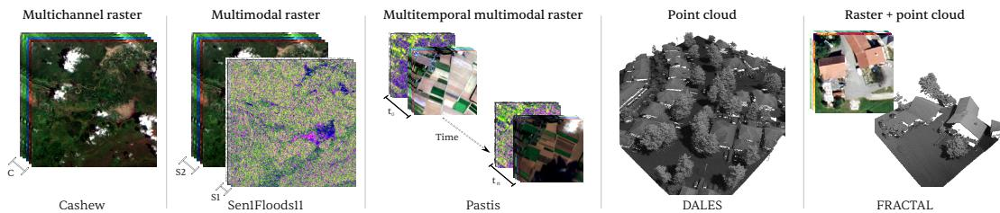  
Figure 1: Sensing configurations considered in this work. All are processed through the same atomic interface, without rasterization, resampling, or modality-specific branches.

Our proposed Atomizer-IO reverses this order: observations come first, structure second. Each observation is represented independently by its measurement and acquisition metadata, without requiring a fixed channel count, tensor shape, or neighboring measurement. Structure is introduced afterwards from physical relationships between observations: locality and relative geometry are defined directly in physical coordinates rather than inherited from tensor position.

Atomizer-IO implements this principle through an atomic encoder–processor–decoder architecture. Following Atomizer (de Turckheim et al., 2025), each observation is represented as an atom; for raster data, one atom corresponds to one measurement from one spectral band, at one pixel location and one acquisition time. The encoder aggregates atoms into spatially anchored latent vectors, the processor lets these latents interact, and a query-based decoder maps local latent neighborhoods to requested output locations. Because atomic granularity can produce millions of observations per scene, each latent attends only to a local neighborhood in physical space, while the number of spatial latents scales with the number of input observations. The same local aggregation serves as both input and output interface, allowing channel sets, input resolution, and output density to vary while extending the same architecture from regular rasters to unordered 3D point clouds.

We evaluate this design by progressively relaxing the assumptions of a fixed grid. We first assess competitiveness on conventional raster EO tasks, then vary available channels and output-query density, and finally remove the raster assumption with unordered LiDAR and joint image–point observations.

Our main contributions are:

• A physically grounded atomic representation in which measurement identity is described explicitly rather than tied to tensor position. A single trained model spans sensor configurations that a fixed-channel architecture can only reach by padding or redesign.

• A scalable, structured set-to-latent architecture that uses the same local geometric operation to encode observations and decode arbitrary query locations, removing the need for a fixed grid on either side.

• A single architecture across raster and irregular sensing geometries, spanning classification, regression, 2D and 3D segmentation, and optical, radar, and LiDAR observations. All models are trained from scratch under matched conditions, isolating architectural differences from pretraining.

## 2 RELATED WORK

Regular grids supply useful spatial structure, including locality, stable neighborhoods, and regular geometric relationships, that grid-based architectures can exploit directly. In Earth observation, the representation must additionally accommodate several physical axes: spatial resolution determines how space is sampled, spectral bands sample the electromagnetic spectrum, and acquisition times sample an evolving scene.

Recent EO models increasingly expose these physical properties to grid-based architectures through dedicated mechanisms. DOFA (Xiong et al., 2024), SenPa-MAE (Prexl & Schmitt, 2024), and Panopticon (Waldmann et al., 2025) primarily address spectral variation, while FlexiMo (Li et al., 2025) additionally handles spatial variation but does not natively model temporal sequences. Scale-MAE (Reed et al., 2023) incorporates ground sampling distance, AnySat (Astruc et al., 2024) defines patches in physical rather than pixel units, and Galileo (Tseng et al., 2025) and Prithvi (Szwarcman et al., 2025) introduce temporal structure. RAMEN (Houdre et al., 2026) and UniverSat (Perron´ et al., 2026) jointly accommodate spectral, spatial, and temporal variation within a single architecture, making them the closest flexible EO baselines to our framework.

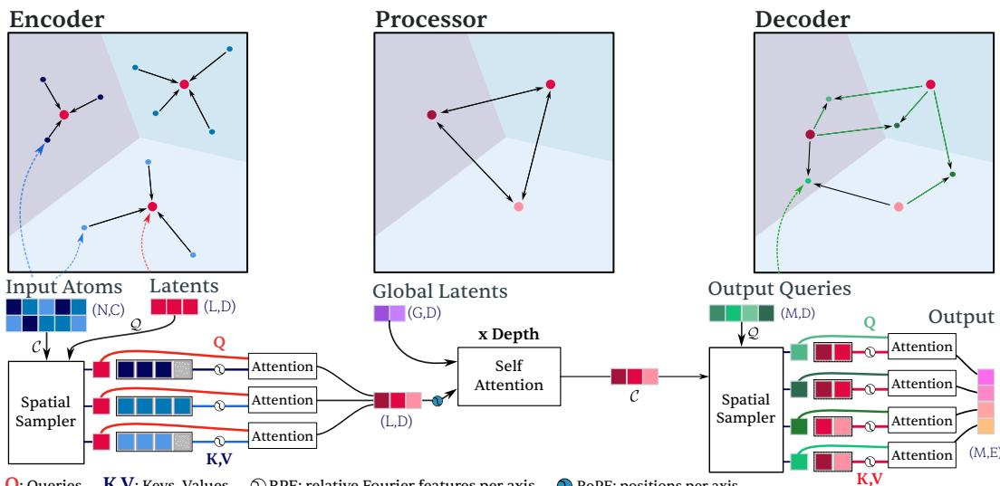  
Figure 2: The Atomizer-IO architecture. Atoms are locally aggregated into a compact spatial representation, processed globally in latent space, and decoded through spatial output queries. The same local context-to-query operation is used for encoding and decoding, with spatial relationships defined in physical coordinates rather than by a fixed input grid.

A separate line of work relaxes this requirement by changing the unit on which the model operates. Presto (Tseng et al., 2023) discards image structure entirely, modeling individual pixel time series and relying on temporal and multimodal signal instead, while Atomizer (de Turckheim et al., 2025) retains atomic measurements as the input representation and processes them as an unordered set. More generally, Set Transformer (Lee et al., 2019) showed that attention can operate directly on unordered sets, while Perceiver (Jaegle et al., 2021b) introduced cross-attention to a compact latent bottleneck and Perceiver IO (Jaegle et al., 2021a) extended this paradigm to query-defined outputs.

Moving beyond grids does not mean abandoning spatial structure. 3D point-cloud methods routinely operate on unordered, sparsely distributed points that do not fit the dense tensor representations common in 2D vision (Guo et al., 2019). Various alternatives have been proposed: PointNet (Qi et al., 2017a) operates on sets, PointNet++ (Qi et al., 2017b) and KPConv (Thomas et al., 2019) on multi-scale Euclidean neighborhoods, and Superpoint Transformer (Robert et al., 2023), not unlike our work, on geometric graphs over 3D partitions. However, these approaches are not designed to jointly accommodate multi-spectral, multi-temporal, and multi-resolution data. This creates a tension: grid-based models preserve useful spatial structure but require observations to conform to a fixed layout, while set-based models gain flexibility but provide no geometry by default. Atomizer-IO resolves this by enabling reasoning over an arbitrary Voronoi tessellation of space. Sensorspecific gridded structures are confined to the interfaces, where input observations are either read in, or output predictions are queried out.

## 3 METHODOLOGY

Atomizer-IO builds on Atomizer (de Turckheim et al., 2025), which decomposes an input into an unordered set of atoms. Where Atomizer lets non-spatial latents cross-attend to all atoms, and only for image classification, Atomizer-IO introduces locality. Each latent corresponds to a spatia anchor and attends only to nearby atoms, while still exchanging information with every other latent. Spatially dense outputs are produced by querying the latents near any requested location.

This section follows one observation through the model (Figure 2): token construction (Section 3.1), neighborhood assignment (Section 3.2), aggregation into a spatial latent (Section 3.3), latent interaction (Section 3.4), and output queries (Section 3.5). Notation is summarized in Appendix 18.

## 3.1 TOKEN CONSTRUCTION

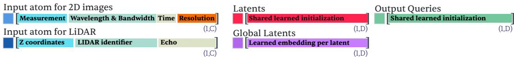  
Figure 3: Token construction in Atomizer-IO. 2D imagery and LiDAR share the same atomic interface of measurements and acquisition metadata; spatial latents, global latents, and output queries use learned initializations.

Atomizer-IO represents an input as a set of elementary observations, or atoms. Each atom holds a measured value $v \in \mathbb { R } \left( \mathrm { e . g } \right.$ . reflectance) and metadata $u _ { 1 } , \ldots , u _ { J }$ describing its acquisition. We combine these into tokens $\mathbf { \bar { f } } ~ = ~ [ \phi _ { 0 } ( v ) , \phi _ { 1 } ( u _ { 1 } ) , \dots , \phi _ { J } ( u _ { J } ) ]$ , where $\phi _ { 0 } , . . . , \phi _ { \mathcal { I } }$ are encoders for each metadata field (e.g. wavelength and resolution). The input is represented as $\mathcal { F } = \{ ( \mathbf { f } _ { i } , \mathbf { p } _ { i } ) \} _ { i = 1 } ^ { N } ,$ pairing each token with its spatial position $\mathbf { p } _ { i } \in \mathbb { R } ^ { 2 }$ . Appendix B.4 further specifies our encoding schemes. To prevent the model from learning position-specific features, $\mathbf { p } _ { i }$ is not included in $\mathbf { f } _ { i }$ and is used only by the spatial sampler (Section 3.2). An atom’s metadata fields follow from the sensor, and the architecture is indifferent to which ones it receives (Figure 3). For 2D rasters, v is the value measured at one pixel, in one spectral band, at one acquisition time, and the metadata describe that context: ground sampling distance, spectral support, and acquisition date. For 3D point clouds, v is the elevation, with a sensor identifier, the position of the return within the LiDAR pulse, and the return intensity when available as metadata. Nothing in the representation depends on a channe count or a grid, and atoms of different kinds can coexist in the same input set, as when LiDAR returns and co-registered image pixels are processed together.

## 3.2 SPATIAL SAMPLER

The spatial sampler (Figure 4) operates on two sets: a query set $\mathcal { Q } = \{ ( q _ { j } , \mathbf { p } _ { j } ) \} _ { j = 1 } ^ { | \mathcal { Q } | }$ seeking information from a context set ${ \mathcal C } = \{ ( c _ { i } , \mathbf { p } _ { i } ) \} _ { i = 1 } ^ { | c | }$ . It proceeds in two steps: first, it establishes which context elements belong to the receptive field of each query; then, information flows from each receptive field to its query. In the encoder, input atoms form the context set and spatial latents the query set; in the decoder, spatial latents form the context set and output locations the query set.

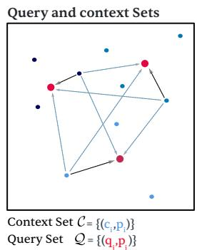

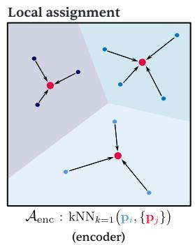

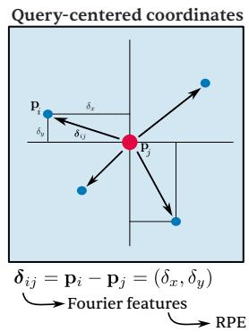

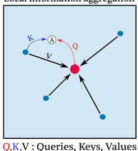  
Figure 4: Spatial sampler. From left to right: query and context sets; construction of a local receptive field from spatial proximity, illustrated by the encoder’s nearest-latent assignment and resulting Voronoi partition; query-centered relative coordinates; local cross-attention.

Assignment. We denote by $\mathcal { A } ( \mathcal { C } , \mathcal { Q } ) = \{ \mathcal { V } _ { j } \} _ { j = 1 } ^ { | \mathcal { Q } | }$ the spatial assignment, where $\nu _ { j }$ is the index set of context elements in the local receptive field of query $q _ { j }$ . Receptive fields are built by nearestneighbor search in the horizontal plane, which suits bird’s-eye-view reasoning in Earth observation and applies to both rasters and $\mathrm { 3 D } ^ { \circ }$ point clouds. In the encoder, each context element is assigned to its nearest query, inducing a Voronoi partition, which we denote by ${ \mathcal { A } } _ { \mathrm { e n c } } .$ In the decoder, each query instead gathers its k nearest context elements, which we denote by ${ \boldsymbol { A } } _ { \mathrm { d e c } }$ . Implementation details are given in Appendix B.8.

Information flow. Cross-attention defines a one-way flow: each query gathers information from its receptive field, while context elements themselves are not updated. Geometry is therefore expressed from the perspective of the receiving query. For a context element $i \in \mathcal { V } _ { j }$ , we use the relative offset $\delta _ { i j } = \mathbf { p } _ { i } - \mathbf { p } _ { j }$ and encode it as $\phi _ { \delta } ( \delta _ { i j } )$ using Fourier features, analogous to the positional encoding used in NeRF (Mildenhall et al., 2021). The encoded offset is concatenated to the context feature before information is passed to the query through cross-attention (Appendix B.5).

## 3.3 ENCODER

In the encoder, spatial latents form the query set and input atoms form the context set of the spatial sampler. de6

Adaptive latent allocation. No operation in the architecture requires a fixed number or layout of spatial latents. In practice, we scale the number $L$ of spatial latents with the number of input observations and place them uniformly over the spatial extent of the input. The values of $L$ and the layouts used in our experiments are given in Appendix D.2. Each latent has an anchor position $\mathbf { p } _ { \ell } \in \mathbb { R } ^ { 2 }$ and shares the same learned initialization $\mathbf { h } _ { \mathrm { i n i t } } \in \mathbb { R } ^ { D }$ , where $D$ is the latent embedding dimension. We denote the initialized latent set by $\mathcal { H } ^ { \mathrm { i n i t } } = \{ ( \mathbf { h } _ { \mathrm { i n i t } } , \mathbf { p } _ { \ell } ) \} _ { \ell = 1 } ^ { L }$ Figure 5 illustrates the one instance of a spatial partition on a DALES scene.

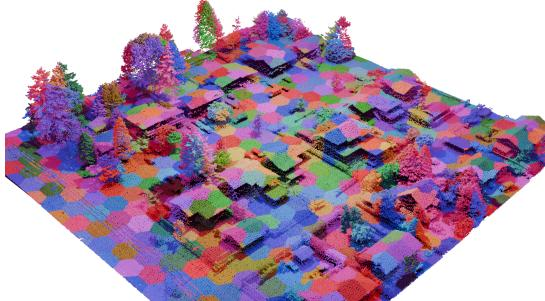  
Figure 5: Example spatial latent partition on DALES (Section 4.4). Colors show the local receptive fields induced by assigning each input atom to its nearest spatial latent.

Local encoding. For the encoder, the spatial sampler returns the assigned atoms for each anchored latent $\{ \mathcal { V } _ { \ell } \} _ { \ell = 1 } ^ { L } = \mathcal { A } _ { \mathrm { e n c } } ( \mathcal { F } , \mathcal { H } ^ { \mathrm { i n i t } } )$ . For an atom $i \in \mathcal { V } _ { \ell }$ , we compute the relative offset $\begin{array} { r } { \delta _ { i \ell } = \mathbf { p } _ { i } - \mathbf { p } _ { \ell } , } \end{array}$ concatenate its Fourier encoding to the atom feature, and process the result with a shared MLP: $\mathbf { z } _ { i \ell } =$ $\mathrm { M L P } ( [ \mathbf { f } _ { i } ; \phi _ { \delta } ( \delta _ { i \ell } ) ] )$ . Each spatial latent is then updated by local cross-attention over its processed context, $\mathbf { h } _ { \rho } ^ { ( 0 ) } = \mathbf { \Phi } ^ { ( }$ Cross $\mathrm { A t t n } _ { \mathrm { e n c } } ( \mathbf { h } _ { \mathrm { i n i t } } , \{ \mathbf { z } _ { i \ell } : i \in \mathcal { V } _ { \ell } \} )$ . The MLP and cross-attention weights are shared across latents, so the parameter count is independent of $L .$ The resulting encoded latent set is $\mathcal { H } ^ { ( 0 ) } = \{ ( \mathbf { h } _ { \ell } ^ { ( 0 ) } , \mathbf { p } _ { \ell } ) \} _ { \ell = 1 } ^ { L }$

For dense local contexts, we randomly sample at most m indices from each $\nu _ { \ell }$ before cross-attention, bounding the attention cost per latent. On Sen1Floods11 (Section 4.1), where inputs contain 15 channels at 512×512 resolution, a global cross-attention mechanism would need to discard 99.987% of the input atoms to match the same number of query–context interactions. Local sampling instead distributes this budget across the spatial partition and exposes the model to different subsets of each local context over training (Appendix $\mathbf { B . } \bar { 7 } )$

## 3.4 PROCESSOR

The processor operates on the encoded spatial latent set $\mathbf { \mathcal { H } } ^ { ( 0 ) } = \{ ( \mathbf { h } _ { \ell } ^ { ( 0 ) } , \mathbf { p } _ { \ell } ) \} _ { \ell = 1 } ^ { L }$ together with G learned global latents ${ \mathcal G } ^ { ( 0 ) } = \{ \mathbf { g } _ { r } ^ { ( 0 ) } \} _ { r = 1 } ^ { G }$ , with $\mathbf { g } _ { r } ^ { ( 0 ) } \in \mathbb { R } ^ { D }$ , similar in spirit to register tokens (Darcet et al., 2024). A processor of depth B stacks global multi-head self-attention blocks over the spatial and global latents, $( \mathcal { H } ^ { ( b ) } , \mathcal { G } ^ { ( b ) } ) ^ { \bullet } = \mathrm { B l o c k } _ { b } ( \mathcal { \Breve { \mathcal { H } } } ^ { ( b - 1 ) } , \mathcal { G } ^ { ( b - 1 ) } )$ for $b = 1 , \ldots , B$ , allowing information gathered from different local neighborhoods to propagate across the latent representation. The final processed spatial latent set is $\mathcal { H } ^ { ( \bar { B } ) }$

Latent spatial processing. While the encoder introduces atom–latent geometry through relative positional encoding in the spatial sampler, spatial relationships between latents are represented using two-dimensional rotary positional encoding (RoPE) (Heo et al., 2024) based on their anchor positions $\mathbf { p } _ { \ell } .$ . Because the distance between anchors depends on how they are distributed over the input extent, no single compression scale suits every input; we therefore use a learned scale $s _ { p } > 0 \AA$ initialized to a reference scale $s _ { 0 }$ (Appendix B.6). Coordinates are compressed with $s _ { p }$ before applying RoPE to the queries and keys of the spatial latents. Global latents have no associated spatial position and are therefore left unrotated.

Temporal processing. Multitemporal inputs require no dedicated temporal module: atoms from all acquisitions can be encoded jointly in the same input set, with acquisition time provided as metadata. When explicit temporal aggregation is preferred, the encoder instead processes each timestep independently, with shared weights and identical spatial anchor positions, producing $\mathcal { H } _ { t } ^ { ( 0 ) } = \{ ( \mathbf { h } _ { t \ell } ^ { ( 0 ) } , \mathbf { p } _ { \ell } ) \} _ { \ell = 1 } ^ { L }$ for each timestep t. The processor is then applied independently within each timestep, yielding $\mathcal { H } _ { t } ^ { ( B ) } = \{ ( \mathbf { h } _ { t \ell } ^ { ( B ) } , \mathbf { p } _ { \ell } ) \} _ { \ell = 1 } ^ { L }$ . For each spatial anchor ℓ, the T representations $\{ \mathbf { h } _ { t \ell } ^ { ( B ) } \} _ { t = 1 } ^ { T }$ are aggregated along the temporal axis by a small transformer with a learned aggregation token, using temporal RoPE with the same coordinate compression and a dedicated learned scale. This produces a temporally aggregated representation $\bar { \mathbf { h } } _ { \ell }$ for each anchor, defining $\bar { \mathcal { H } } ^ { ( B ) } = \{ ( \bar { \mathbf { h } } _ { \ell } , \mathbf { p } _ { \ell } ) \} _ { \ell = 1 } ^ { \bar { L } }$ . When temporal aggregation is used, this set replaces $\mathcal { H } ^ { ( B ) }$ as decoder context. Its contribution is evaluated in Appendix B.1.

## 3.5 DECODER

The decoder predicts at a set of requested spatial positions $\{ \mathbf { p } _ { j } \} _ { j = 1 } ^ { M }$ . Each output query shares the same learned initialization $\mathbf { q } _ { \mathrm { i n i t } } \in \mathbb { R } ^ { D }$ , giving the initialized query set ${ \mathcal { Q } } ^ { \mathrm { i n i t } } = \{ ( \mathbf { q } _ { \mathrm { i n i t } } , \mathbf { p } _ { j } ) \} _ { j = 1 } ^ { M }$ Below, $\mathcal { H } ^ { ( B ) }$ denotes the decoder context, replaced by $\bar { \mathcal { H } } ^ { ( B ) }$ when explicit temporal aggregation is used. The spatial sampler returns $\{ \mathcal { V } _ { j } \} _ { j = 1 } ^ { M } = \mathcal { A } _ { \mathrm { d e c } } ( \mathcal { H } ^ { ( B ) } , \mathcal { Q } ^ { \mathrm { i n i t } } )$ . For a latent $\ell \in \mathcal { V } _ { j } .$ we compute the relative offset $\delta _ { \ell j } = \mathbf { p } _ { \ell } - \mathbf { \bar { p } } _ { j }$ and concatenate its Fourier encoding to the latent feature. Each output query is then obtained by local cross-attention over this context, ${ \bf q } _ { j } = { \bf \Phi }$ $\mathrm { C r o s s A t t n } _ { \mathrm { d e c } } ( \mathbf { q } _ { \mathrm { i n i t } } , \{ [ \mathbf { h } _ { \ell } ^ { ( B ) } ; \phi _ { \delta } ( \delta _ { \ell j } ) ] : \ell \in \mathcal { V } _ { j } \} )$ , and passed to a task-specific prediction head; for dense prediction, the input ${ \bf { q } } _ { \mathrm { { i n i t } } }$ is replaced by the input-conditioned query $\tilde { \mathbf { q } } _ { j }$ defined below. Because output locations are queried explicitly, the decoder does not need to evaluate every spatial position uniformly. We exploit this property in Section 4.3.

For dense prediction, we additionally condition each output query on the observations at its target location before it attends to the latent representation, a local pathway analogous to the skip connections of U-Net (Ronneberger et al., 2015). Let $S _ { j } \subseteq \{ 1 , \dotsc , N \}$ be the indices of atoms co-located with query j: the atoms at the pixel being predicted for a 2D raster, and the atoms at the queried point for a point cloud. The query is first updated by cross-attention over their features, $\tilde { \mathbf { q } } _ { j } = \mathrm { C r o s s } \bar { \mathrm { A t t n } } _ { \mathrm { o b s } } ( \bar { \mathbf { q } } _ { \mathrm { i n i t } } , \{ \mathbf { f } _ { i } : i \in \mathcal { S } _ { j } \bar { \} } )$ , combining observations at the target location with the processed information its surroundings provide through the latent cross-attention above.

## 4 EXPERIMENTS

We evaluate Atomizer-IO by progressively relaxing the assumptions of a regular grid. We begin with conventional raster Earth observation tasks, then vary input composition and output density, remove the input grid entirely with irregular 3D point clouds, and finally test spatial reasoning under unseen input geometries.

## 4.1 PERFORMANCE ACROSS DIVERSE EO TASKS

Architectures that relax fixed input structure for greater generality may give up useful task- or sensorspecific priors, requiring more of the task structure to be learned from data. Before relaxing the grid, we therefore verify that Atomizer-IO is competitive when it is fully present, across a deliberately heterogeneous suite of eight datasets spanning different sensing modalities, channel counts, temporal lengths, spatial resolutions, input sizes, and prediction problems (Table 1). Each dataset is treated as an independent task and a separate model is trained from scratch.

Table 1: Datasets used for evaluation, spanning raster Earth observation and irregular LiDAR inputs. T: timesteps; C: input channels; Geometry: spatial structure of the input; GSD: ground sampling distance, undefined for point clouds; Out. C: output classes or regression targets.
<table><tr><td>Dataset</td><td>Sensor</td><td>T</td><td>C</td><td>Geometry</td><td>GSD</td><td>Problem</td><td>Out. C</td></tr><tr><td>ForestNet (Irvin et al., 2020)</td><td>Landsat-8</td><td>1 6</td><td></td><td> $3 3 2 ^ { 2 }$ </td><td>15m</td><td>cls</td><td>12</td></tr><tr><td>BurnScars (Jakubik et al., 2023)</td><td>HLS</td><td>1 6</td><td></td><td> $5 1 2 ^ { 2 }$ </td><td>30m</td><td>seg</td><td>2</td></tr><tr><td>EuroSAT (Helber et al., 2019)</td><td>Sentinel-2</td><td>1 13</td><td></td><td> $6 4 ^ { 2 }$ </td><td>10m</td><td>cls</td><td>10</td></tr><tr><td>Cashew (Jin et al., 2021)</td><td>Sentinel-2</td><td>1 13</td><td></td><td> $2 5 6 ^ { 2 }$ </td><td>10m</td><td>seg</td><td>7</td></tr><tr><td>Sen1Floods11 (Rambour et al., 2020)</td><td>S1 + S2</td><td>1 15</td><td></td><td> $5 1 2 ^ { 2 }$ </td><td>10m</td><td>seg</td><td>2</td></tr><tr><td>xView2 (Gupta et al., 2019)</td><td>RGB (VHR)</td><td>2 3</td><td></td><td> $5 1 2 ^ { 2 }$ </td><td>0.5 m</td><td>seg</td><td>5</td></tr><tr><td>BioMassters (Nascetti et al., 2023)</td><td> $\mathrm { S } 1 + \mathrm { S } 2$ </td><td>3 14</td><td></td><td> $2 5 6 ^ { 2 }$ </td><td>10m</td><td>reg</td><td>1</td></tr><tr><td>PASTIS (Garnot &amp; Landrieu, 2021)</td><td> $\mathrm { S } 1 + \mathrm { S } 2$ </td><td>6 10</td><td></td><td> $1 2 8 ^ { 2 }$ </td><td>10m</td><td>seg</td><td>19</td></tr><tr><td>DALES (Varney et al., 2020)</td><td>LiDAR</td><td>1</td><td>1</td><td>point set</td><td></td><td>3D seg</td><td>8</td></tr><tr><td>FRACTAL (Gaydon et al., 2024)</td><td>LiDAR + VHR</td><td>1</td><td>4</td><td>points + image</td><td>一</td><td>3D seg</td><td>7</td></tr></table>

Table 2: Single-task performance. Best in bold, second best underlined. Classification uses macro F1, segmentation mIoU, and BioMassters RMSE (Mg/ha, ↓).
<table><tr><td>Model</td><td>EuroSAT</td><td>ForestNet BurnScars</td><td></td><td>Sen1Floods</td><td>PASTIS</td><td>xView2</td><td>Cashew</td><td>BioMassters ↓</td></tr><tr><td>ResNet50</td><td>90.9</td><td>43.8</td><td>82.8</td><td>87.8</td><td>30.0</td><td>53.8</td><td>69.9</td><td>46.3</td></tr><tr><td>ViT</td><td>90.7</td><td>39.1</td><td>87.5</td><td>85.0</td><td>35.1</td><td>52.4</td><td>47.5</td><td>52.7</td></tr><tr><td>RAMEN</td><td>92.1</td><td>40.4</td><td>88.2</td><td>89.1</td><td>45.5</td><td>53.3</td><td>64.2</td><td>44.7</td></tr><tr><td>UniverSat</td><td>90.8</td><td>44.3</td><td>88.1</td><td>86.8</td><td>42.9</td><td>56.3</td><td>62.4</td><td>46.0</td></tr><tr><td>Perceiver-IO</td><td>90.9</td><td>35.4</td><td>83.4</td><td>92.2</td><td>17.9</td><td>43.8</td><td>26.2</td><td>52.2</td></tr><tr><td>Atomizer-IO</td><td>90.2</td><td>35.8</td><td>88.8</td><td>93.2</td><td>44.1</td><td>54.6</td><td>72.0</td><td>42.4</td></tr></table>

We compare Atomizer-IO with grid-based baselines (ResNet50 (He et al., 2016) and ViT ), flexible EO-specific models (RAMEN and UniverSat), and Perceiver-IO as a generic set-based latent architecture. All models are trained from scratch under matched conditions (Appendix D.2).

Across the eight tasks, Atomizer-IO excels at spatially-explicit tasks, ranking first on four and second on two (Table 2), matching or exceeding grid-based and flexible EO architectures on their own terms, on raster data. This establishes the baseline for the relaxations that follow. These task rely on different sources of information. PASTIS benefits strongly from reasoning across acquisitions, Sen1Floods11 from local spectral and radar measurements, while Cashew shows a stronger dependence on spatial context. Appendix B examines these differences directly by ablating temporal aggregation, spatial reasoning, and local observation conditioning across representative tasks. As expected, we also observe that Atomizer-IO does not have an edge over Perceiver-IO for non spatially explicit classification tasks, such as EuroSAT and ForestNet.

## 4.2 FLEXIBLE INPUT COMPOSITION: HANDLING MISSING CHANNELS

In Earth observation, available channels can change with sensor availability, weather conditions or spectral coverage. Models built around a fixed channel layout must preserve that layout when observations are missing, whereas flexible representations can omit unavailable observations directly. We evaluate this setting on Sen1Floods11 and BioMassters, both combining Sentinel-1 and Sentinel-2 observations. In this experiment, all models use the same band-dropout augmentation, so variation in channel availability is anticipated during training. Atomizer-IO and UniverSat omit unavailable observations, whereas fixed-channel models are zero-padded at the corresponding positions. The same trained model is evaluated under six input configurations, from the full observation set to single-sensor and restricted spectral subsets.

Table 3: Performance under flexible input composition on Sen1Floods11 (mIoU, %) and BioMassters (RMSE, Mg/ha). All models are trained under the same band-dropout protocol.
<table><tr><td></td><td colspan="6">Sen1Floods11 ↑</td><td colspan="6">BioMassters↓</td></tr><tr><td>Test Configuration</td><td>Atom.</td><td>Res.</td><td>ViT</td><td>Perc.</td><td>RAM.</td><td>Uni.</td><td>Atom.</td><td>Res.</td><td>ViT</td><td>Perc.</td><td>RAM.</td><td>Uni.</td></tr><tr><td>All bands</td><td>92.9</td><td>88.1</td><td>84.5</td><td>92.1</td><td>87.0</td><td>88.7</td><td>41.5</td><td>47.6</td><td>52.9</td><td>52.0</td><td>43.4</td><td>45.7</td></tr><tr><td>S2 only</td><td>92.8</td><td>86.4</td><td>84.4</td><td>92.2</td><td>87.8</td><td>88.6</td><td>45.8</td><td>55.9</td><td>55.5</td><td>57.7</td><td>48.4</td><td>49.1</td></tr><tr><td>S1 only</td><td>80.0</td><td>66.4</td><td>75.3</td><td>77.2</td><td>75.1</td><td>79.4</td><td>48.1</td><td>52.1</td><td>55.5</td><td>58.6</td><td>49.2</td><td>49.1</td></tr><tr><td>RGB only</td><td>44.8</td><td>43.7</td><td>43.8</td><td>43.8</td><td>44.5</td><td>43.8</td><td>71.0</td><td>73.8</td><td>71.4</td><td>70.4</td><td>71.9</td><td>70.8</td></tr><tr><td>No SWIR</td><td>87.8</td><td>49.0</td><td>75.1</td><td>81.8</td><td>63.7</td><td>85.2</td><td>43.0</td><td>49.1</td><td>54.0</td><td>53.4</td><td>46.0</td><td>46.7</td></tr><tr><td>No red-edge</td><td>92.9</td><td>85.3</td><td>80.5</td><td>89.1</td><td>85.9</td><td>88.0</td><td>42.2</td><td>49.8</td><td>53.8</td><td>54.0</td><td>45.4</td><td>46.4</td></tr><tr><td>Average</td><td>81.9</td><td>69.8</td><td>73.9</td><td>79.4</td><td>74.0</td><td>78.9</td><td>48.6</td><td>54.7</td><td>57.2</td><td>57.7</td><td>50.7</td><td>51.3</td></tr></table>

Atom.: Atomizer-IO; Res.: ResNet50; Perc.: Perceiver-IO; RAM.: RAMEN; Uni.: UniverSat.

Table 3 shows that Atomizer-IO achieves the best average performance on both datasets and leads in most configurations. Its advantage is largest when specific bands or an entire sensor are removed, but nearly disappears under RGB only, where much of the discriminative information is lost. More broadly, architectures that relax the fixed channel layout tend to handle changes in input composition better than conventional fixed-layout baselines, supporting the value of decoupling representation from a prescribed channel structure.

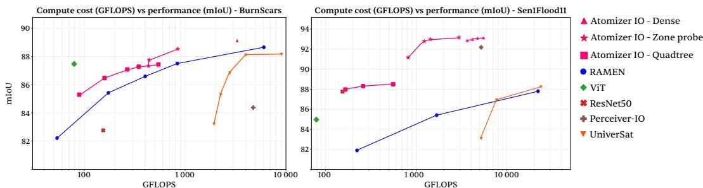  
Figure 6: Compute cost (GFLOPs) versus segmentation performance (mIoU). Dense, Zone-probe, and Quadtree decoding vary inference cost through different output query strategies, using the same Atomizer-IO checkpoint without retraining.

## 4.3 FLEXIBLE OUTPUT DECODING: INFERENCE-TIME COMPUTE CONTROL

Here we study various relaxations of the output grid. Atomizer-IO predicts at explicitly requested spatial locations, so dense segmentation corresponds simply to placing one query at every pixel (Dense decoding). Because the decoder does not require all locations to be queried uniformly, output density can instead be adapted to the spatial complexity of the prediction.

We exercise this property by approximating dense predictions while querying fewer locations. For each region, we first probe a small number of locations. If all probes predict the same class, that class is assigned to the remaining locations without querying them; otherwise, additional computation is allocated to the region. Zone-probe applies this rule to regions associated with individual latents, while Quadtree recursively subdivides disagreeing regions and probes them at finer spatial scales. All strategies use the same trained checkpoint and differ only in how densely the output space is queried. Details and complexity are given in Appendix C.1. Figure 6 shows that a single trained checkpoint spans a broad range of inference costs, with Dense decoding being competitive with the flexible EO baselines at the high-compute end. The two adaptive strategies reduce cost differently: Zone-probe couples output regions to the model’s latent partition, while Quadtree adapts output density independently of that partition through recursive refinement.

Atomizer-IO therefore exposes complementary inference-time controls: like RAMEN and Univer-Sat, compute can be reduced through a coarser latent representation, while the query-based decoder additionally allows output density to vary after training. Probe agreement is a heuristic rather than a guarantee, reflecting the trade-off between exact dense evaluation and reduced inference cost.

## 4.4 FLEXIBLE INPUT GEOMETRY: UNORDERED LIDAR POINT CLOUDS

We break free of the input grid for semantic segmentation of 3D point clouds. Our goal is not to outperform 3D-specific architectures, but to demonstrate the flexibility of our framework. On DALES and FRACTAL (Table 1), each LiDAR point becomes an atom (Appendix D). On FRAC-TAL, RGB pixels from co-registered orthophotos are additionally encoded as atoms, allowing both modalities to be jointly processed. Training and inference tiling, point sampling, and batching details are given in Appendix D.4.

Atomizer-IO is competitive on both datasets   
without 3D-specific design beyond its tokenizer,   
ahead of three of the DALES 3D baselines and   
best on FRACTAL (Table 4). Perceiver-IO per  
forms poorly on DALES, highlighting the impor  
tance of geometric structure in the latent reason  
ing, but both models outperform RandLA-Net on   
FRACTAL, suggesting the image modality alone may already be a strong predictor for this bench  
mark. Our gap to KPConv and SPT on DALES suggests opportunities for geometry-adaptive 3D

Table 4: DALES and FRACTAL segmentation results (mIoU, %).  
DALES
<table><tr><td>Method</td><td>mIoU 81.1</td></tr><tr><td>KPConv (Thomas et al., 2019) SPT (Robert et al., 2023) PointNet++ (Qi et al., 2017b) ConvPoint (Boulch, 2020) Atomizer-IO SPG (Landrieu &amp; Simonovsky, 2018) PointCNN (Li et al., 2018) ShellNet (Zhang et al., 2019)</td><td>79.6 68.3 67.4 66.7 60.6 58.4 57.4</td></tr><tr><td>Perceiver-IO (Jaegle et al., 2021a) FRACTAL</td><td>48.7</td></tr><tr><td>Atomizer-IO Perceiver-IO (Jaegle et al., 2021a)</td><td>78.4 78.1 77.5</td></tr></table>

latent partitions, hierarchical reasoning, and finer local 3D modeling. We leave these extensions to future work.

## 4.5 CONTROLLED ANALYSIS OF SPATIAL STRUCTURE

Table 5: RoPE ablation. Accuracy on MNIST and mIoU on Sen1Floods11.
<table><tr><td colspan="2">MNIST</td><td>Sen1FI11</td></tr><tr><td>No RoPE</td><td>29.48</td><td>92.42</td></tr><tr><td>RoPE</td><td>99.37</td><td>93.17</td></tr></table>

Removing the input grid does not remove the need for spatial structure. In remote-sensing tasks, however, this is difficult to isolate because individual observations can already be highly informative: a local spectral signature may indicate water, vegetation, or other materials without requiring much spatial context. We therefore use MNIST as a controlled setting. Because MNIST images are nearly binary, individual pixel intensities carry little information in isolation, and classification depends primarily on their spatial arrangement.

Atomizer-IO’s spatial latents share the same learned initialization and attention weights and are distinguished by the observations they aggregate and their relative geometry. On MNIST, each latent carries only local intensity information; removing RoPE therefore prevents the processor from recovering their spatial arrangement and reduces accuracy from 99.37 to 29.48. On Sen1Floods11, in contrast, removing RoPE only reduces mIoU from 93.17 to 92.42, consistent with the strong predictive content already present in the local multispectral and radar observations. Broader ablations in Appendix B further examine how different tasks rely on local observation content, spatial reasoning, and temporal structure.

We finally test whether the same model can process input geometries not seen during training. Atomizer-IO and a parameter-matched ViT with 1 × 1 pixel patches are trained only on complete MNIST images. At test time, the same background pixels are removed entirely from both models while all digit pixels are retained, so both receive exactly the same surviving observations. As the background becomes increasingly sparse and irregular, Atomizer-IO degrades more gracefully, retaining 94.93% accuracy when only 25% of the background pixels are kept, compared with 72.17% for ViT (Table 6). This suggests that Atomizer-IO better preserves its ability to exploit task-relevant observations under substantial changes in input geometry.

Table 6: MNIST accuracy (%) under unseen input geometries. Digit pixels are always retained; both models use the same checkpoint trained on complete inputs.
<table><tr><td>Background kept (%)</td><td>Atomizer-IO</td><td>ViT</td></tr><tr><td>100</td><td>99.26</td><td>98.11</td></tr><tr><td>75</td><td>98.72</td><td>97.65</td></tr><tr><td>50 25</td><td>98.37</td><td>94.85</td></tr><tr><td>10</td><td>94.93 74.36</td><td>72.17</td></tr><tr><td></td><td></td><td>37.24</td></tr></table>

## 5 CONCLUSION

Computing on a regular grid is not required for competitive performance under a competitive compute budget. Across eight Earth-observation benchmarks and two LiDAR datasets spanning classification, regression, and 2D/3D segmentation, Atomizer-IO remains competitive with grid-based and flexible EO architectures while progressively relaxing assumptions on input and output structure. To our knowledge, no other EO architecture has been evaluated on both multispectral rasters and unordered LiDAR point clouds through the same encoder and without modality-specific processing branches.

Unlike architectures whose structure reflects assumptions about the data, Atomizer-IO encodes sensing information explicitly in its input tokens. Each atom represents a measurement at a particular place, time, and sensor, without requiring a fixed shape, channel count, or neighboring measurement; locality and geometry are introduced afterwards from physical relationships between observations.

As future work, we expect this perspective to be particularly relevant to large-scale pretraining, where a central challenge is reconciling observations that differ in what they measure and how they are sampled. Existing architectures typically begin from a tensor representation and introduce dedicated mechanisms to accommodate each axis of variation. Atomizer-IO starts from the opposite premise: the observation itself is the common unit. The results in this paper, in which the exact same architecture provides competitive results across a wide range of modalities, suggest that Atomizer-IO could make a good candidate architecture for a multi-modal EO foundation model.

Our results allow us to conclude that pixels, patches, and grids need not define the interface of a sensing architecture. They can instead be treated as particular discretizations of observations, introduced when useful rather than assumed from the start.

## AI USE STATEMENT

In this work, we used generative AI tools to implement the methods, correct grammar, and edit the research paper to improve readability. We have not used generative AI tools to generate synthetic data sets, develop theoretical models, formulate or prove mathematical claims, propose hypotheses, design experiments, translate text, clean data sets, or interpret results, and all other required disclosure tasks are not applicable to this work. We have reviewed all AI-assisted work. Specifically, all AI-generated code and text suggestions were thoroughly reviewed, manually verified for correctness, and substantially modified by the authors. We take responsibility for the final content of this work, including text, claims, or artifacts produced with the aid of generative AI.

## REFERENCES

Guillaume Astruc, Nicolas Gonthier, Clement Mallet, and Loic Landrieu. Anysat: An earth observation model for any resolutions, scales, and modalities. arXiv preprint arXiv:2412.14123, 2024.

Alexandre Boulch. Convpoint: Continuous convolutions for point cloud processing. Computers & Graphics, 88:24–34, 2020.

Timothee Darcet, Maxime Oquab, Julien Mairal, and Piotr Bojanowski. Vision transformers need´ registers. In International conference on learning representations, volume 2024, pp. 2632–2652, 2024.

Hugo Riffaud de Turckheim, Diego Marcos, Roberto Interdonato, and Sylvain Lobry. Atomizer: Generalizing to unseen modalities by breaking images down to a set of scalars. In 36th British Machine Vision Conference 2025, BMVC 2025, Sheffield, UK, November 24-27, 2025. BMVA, 2025. URL https://bmva-archive.org.uk/bmvc/2025/assets/ papers/Paper\_1058/paper.pdf.

Alexey Dosovitskiy, Lucas Beyer, Alexander Kolesnikov, Dirk Weissenborn, Xiaohua Zhai, Thomas Unterthiner, Mostafa Dehghani, Matthias Minderer, Georg Heigold, Sylvain Gelly, et al. An image is worth 16x16 words: Transformers for image recognition at scale. arXiv preprint arXiv:2010.11929, 2020.

Vivien Sainte Fare Garnot and Loic Landrieu. Lightweight temporal self-attention for classifying satellite image time series, 2020. URL https://arxiv.org/abs/2007.00586.

Vivien Sainte Fare Garnot and Loic Landrieu. Panoptic segmentation of satellite image time series with convolutional temporal attention networks. In 2021 IEEE/CVF International Conference on Computer Vision (ICCV), pp. 4852–4861. IEEE, 2021.

Charles Gaydon, Michel Daab, and Floryne Roche. Fractal: An ultra-large-scale aerial lidar dataset for 3d semantic segmentation of diverse landscapes. arXiv preprint arXiv:2405.04634, 2024.

Yulan Guo, Hanyun Wang, Qingyong Hu, Hao Liu, Li Liu, and Mohammed Bennamoun. Deep learning for 3d point clouds: A survey. arXiv preprint arXiv:1912.12033, 2019.

Ritwik Gupta, Richard Hosfelt, Sandra Sajeev, Nirav Patel, Bryce Goodman, Jigar Doshi, Eric Heim, Howie Choset, and Matthew Gaston. xbd: A dataset for assessing building damage from satellite imagery. arXiv preprint arXiv:1911.09296, 2019.

Kaiming He, Xiangyu Zhang, Shaoqing Ren, and Jian Sun. Deep residual learning for image recognition. In Proceedings of the IEEE conference on computer vision and pattern recognition, pp. 770–778, 2016.

Patrick Helber, Benjamin Bischke, Andreas Dengel, and Damian Borth. Eurosat: A novel dataset and deep learning benchmark for land use and land cover classification. IEEE Journal ofSelected Topics in Applied Earth Observations and Remote Sensing, 12(7):2217–2226, 2019.

Byeongho Heo, Song Park, Dongyoon Han, and Sangdoo Yun. Rotary position embedding for vision transformer. In European Conference on Computer Vision, pp. 289–305. Springer, 2024.

Nicolas Houdre, Diego Marcos, Hugo Riffaud de Turckheim, Dino Ienco, Laurent Wendling,´ Camille Kurtz, and Sylvain Lobry. Ramen: Resolution-adjustable multimodal encoder for earth observation. In Proceedings ofthe IEEE/CVF Conference on Computer Vision and Pattern Recognition (CVPR), pp. 27838–27848, June 2026.

Qingyong Hu, Bo Yang, Linhai Xie, Stefano Rosa, Yulan Guo, Zhihua Wang, Niki Trigoni, and Andrew Markham. Randla-net: Efficient semantic segmentation of large-scale point clouds. In 2020 IEEE/CVF Conference on Computer Vision and Pattern Recognition (CVPR), pp. 11105– 11114. IEEE, 2020.

Jeremy Irvin, Hao Sheng, Neel Ramachandran, Sonja Johnson-Yu, Sharon Zhou, Kyle Story, Rose Rustowicz, Cooper Elsworth, Kemen Austin, and Andrew Y Ng. Forestnet: Classifying drivers of deforestation in indonesia using deep learning on satellite imagery. arXiv preprint arXiv:2011.05479, 2020.

Andrew Jaegle, Sebastian Borgeaud, Jean-Baptiste Alayrac, Carl Doersch, Catalin Ionescu, David Ding, Skanda Koppula, Daniel Zoran, Andrew Brock, Evan Shelhamer, et al. Perceiver io: A general architecture for structured inputs & outputs. arXiv preprint arXiv:2107.14795, 2021a.

Andrew Jaegle, Felix Gimeno, Andy Brock, Oriol Vinyals, Andrew Zisserman, and Joao Carreira. Perceiver: General perception with iterative attention. In International conference on machine learning, pp. 4651–4664. PMLR, 2021b.

Johannes Jakubik, Sujit Roy, CE Phillips, Paolo Fraccaro, Denys Godwin, Bianca Zadrozny, Daniela Szwarcman, Carlos Gomes, Gabby Nyirjesy, Blair Edwards, et al. Foundation models for generalist geospatial artificial intelligence. arXiv preprint arXiv:2310.18660, 2023.

Johannes Jakubik, Felix Yang, Benedikt Blumenstiel, Erik Scheurer, Rocco Sedona, Stefano Maurogiovanni, Jente Bosmans, Nikolaos Dionelis, Valerio Marsocci, Niklas Kopp, et al. Terramind: Large-scale generative multimodality for earth observation. In 2025 IEEE/CVF International Conference on Computer Vision (ICCV), pp. 7383–7394. IEEE, 2025.

Z Jin, C Lin, C Weigl, J Obarowski, and D Hale. Smallholder cashew plantations in benin. Radiant MKHub, 2021.

Loic Landrieu and Martin Simonovsky. Large-scale point cloud semantic segmentation with superpoint graphs. In 2018 IEEE/CVF Conference on Computer Vision and Pattern Recognition, 2018.

Yann LeCun, Bernhard Boser, John S Denker, Donnie Henderson, Richard E Howard, Wayne Hubbard, and Lawrence D Jackel. Backpropagation applied to handwritten zip code recognition. Neural Computation, 1989.

Juho Lee, Yoonho Lee, Jungtaek Kim, Adam Kosiorek, Seungjin Choi, and Yee Whye Teh. Set transformer: A framework for attention-based permutation-invariant neural networks. In International conference on machine learning, pp. 3744–3753. PMLR, 2019.

Xuyang Li, Chenyu Li, Pedram Ghamisi, and Danfeng Hong. Fleximo: A flexible remote sensing foundation model. arXiv preprint arXiv:2503.23844, 2025.

Yangyan Li, Rui Bu, Mingchao Sun, Wei Wu, Xinhan Di, and Baoquan Chen. Pointcnn: Convolution on x-transformed points. Advances in neural information processing systems, 31, 2018.

Valerio Marsocci, Yuru Jia, Georges Le Bellier, David Kerekes, Liang Zeng, Sebastian Hafner, Sebastian Gerard, Eric Brune, Ritu Yadav, Ali Shibli, et al. Pangaea: A global and inclusive benchmark for geospatial foundation models. arXiv preprint arXiv:2412.04204, 2024.

Ben Mildenhall, Pratul P Srinivasan, Matthew Tancik, Jonathan T Barron, Ravi Ramamoorthi, and Ren Ng. Nerf: Representing scenes as neural radiance fields for view synthesis. Communication ofthe ACM, 65(1):99–106, 2021.

Andrea Nascetti, Ritu Yadav, Kirill Brodt, Qixun Qu, Hongwei Fan, Yuri Shendryk, Isha Shah, and Christine Chung. Biomassters: A benchmark dataset for forest biomass estimation using multi-modal satellite time-series. Advances in Neural Information Processing Systems, 36:20409– 20420, 2023.

Yohann Perron, Guillaume Astruc, Nicolas Gonthier, Clement Mallet, and Loic Landrieu. Universat: Resolution- and modality-agnostic transformers for earth observation. In Advances in Neural Information Processing Systems, 2026. To appear.

Jonathan Prexl and Michael Schmitt. Senpa-mae: Sensor parameter aware masked autoencoder for multi-satellite self-supervised pretraining. In DAGM German Conference on Pattern Recognition, pp. 317–331. Springer, 2024.

Charles R Qi, Hao Su, Kaichun Mo, and Leonidas J Guibas. Pointnet: Deep learning on point sets for 3d classification and segmentation. In Proceedings of the IEEE conference on computer vision and pattern recognition, 2017a.

Charles Ruizhongtai Qi, Li Yi, Hao Su, and Leonidas J Guibas. Pointnet++: Deep hierarchical feature learning on point sets in a metric space. Advances in neural information processing systems, 30, 2017b.

Clement Rambour, Nicolas Audebert, E Koeniguer, Bertrand Le Saux, Michel Crucianu, and Mihai´ Datcu. Flood detection in time series of optical and sar images. The International Archives ofthe Photogrammetry, Remote Sensing and Spatial Information Sciences, 43(B2):1343–1346, 2020.

Colorado J Reed, Ritwik Gupta, Shufan Li, Sarah Brockman, Christopher Funk, Brian Clipp, Kurt Keutzer, Salvatore Candido, Matt Uyttendaele, and Trevor Darrell. Scale-mae: A scale-aware masked autoencoder for multiscale geospatial representation learning. In Proceedings of the IEEE/CVF International Conference on Computer Vision, pp. 4088–4099, 2023.

Damien Robert, Hugo Raguet, and Loic Landrieu. Efficient 3d semantic segmentation with superpoint transformer. In 2023 IEEE/CVF International Conference on Computer Vision (ICCV), 2023.

Olaf Ronneberger, Philipp Fischer, and Thomas Brox. U-net: Convolutional networks for biomedical image segmentation. In International Conference on Medical image computing and computerassisted intervention, pp. 234–241. Springer, 2015.

Gencer Sumbul, Chang Xu, Emanuele Dalsasso, and Devis Tuia. Smarties: Spectrum-aware multisensor auto-encoder for remote sensing images. In 2025 IEEE/CVF International Conference on Computer Vision (ICCV), pp. 5569–5578. IEEE, 2025.

Daniela Szwarcman, Sujit Roy, Paolo Fraccaro, Orsteinn El´ı G´ıslason, Benedikt Blumenstiel, Rinki Ghosal, Pedro Henrique De Oliveira, Joao Lucas de Sousa Almeida, Rocco Sedona, Yanghu Kang, et al. Prithvi-eo-2.0: A versatile multi-temporal foundation model for earth observation applications. IEEE Transactions on Geoscience and Remote Sensing, 2025.

Hugues Thomas, Charles R Qi, Jean-Emmanuel Deschaud, Beatriz Marcotegui, Franc¸ois Goulette, and Leonidas J Guibas. Kpconv: Flexible and deformable convolution for point clouds. In Proceedings of the IEEE/CVF international conference on computer vision, pp. 6411–6420, 2019.

Gabriel Tseng, Ruben Cartuyvels, Ivan Zvonkov, Mirali Purohit, David Rolnick, and Hannah Kerner. Lightweight, pre-trained transformers for remote sensing timeseries. arXiv preprint arXiv:2304.14065, 2023.

Gabriel Tseng, Anthony Fuller, Marlena Reil, Henry Herzog, Patrick Beukema, Favyen Bastani, James R Green, Evan Shelhamer, Hannah Kerner, and David Rolnick. Galileo: Learning global and local features in pretrained remote sensing models. arXiv preprint arXiv:2502.09356, 2025.

Nina Varney, Vijayan K Asari, and Quinn Graehling. Dales: A large-scale aerial lidar data set for semantic segmentation. In 2020 IEEE/CVF Conference on Computer Vision and Pattern Recognition Workshops (CVPRW), pp. 717–726. IEEE, 2020.

Leonard Waldmann, Ando Shah, Yi Wang, Nils Lehmann, Adam Stewart, Zhitong Xiong, Xiao Xiang Zhu, Stefan Bauer, and John Chuang. Panopticon: Advancing any-sensor foundation models for earth observation. In Proceedings of the Computer Vision and Pattern Recognition Conference, pp. 2204–2214, 2025.

Ben G Weinstein, Sarah J Graves, Sergio Marconi, Aditya Singh, Alina Zare, Dylan Stewart, Stephanie A Bohlman, and Ethan P White. A benchmark dataset for canopy crown detection and delineation in co-registered airborne rgb, lidar and hyperspectral imagery from the national ecological observation network. PLoS computational biology, 17(7):e1009180, 2021.

Tete Xiao, Yingcheng Liu, Bolei Zhou, Yuning Jiang, and Jian Sun. Unified perceptual parsing for scene understanding. In European conference on computer vision, pp. 432–448. Springer, 2018.

Zhitong Xiong, Yi Wang, Fahong Zhang, Adam J Stewart, Joelle Hanna, Damian Borth, Ioannis Pa-¨ poutsis, Bertrand Le Saux, Gustau Camps-Valls, and Xiao Xiang Zhu. Neural plasticity-inspired multimodal foundation model for earth observation. arXiv preprint arXiv:2403.15356, 2024.

Zhiyuan Zhang, Binh-Son Hua, and Sai-Kit Yeung. Shellnet: Efficient point cloud convolutional neural networks using concentric shells statistics. In 2019 IEEE/CVF International Conference on Computer Vision (ICCV), pp. 1607–1616. IEEE, 2019.

## A SUPPLEMENTARY MATERIAL

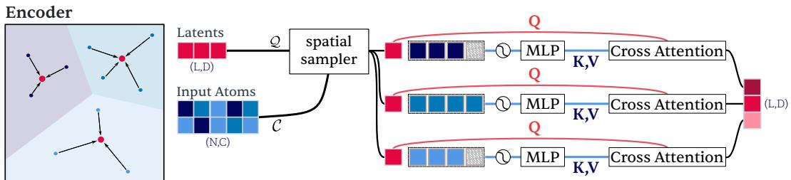  
Q: Queries K,V: Keys and ValuesRPE: fourier features per axis

The same MLP and cross-attention weights are shared across all latent neighborhoods.  
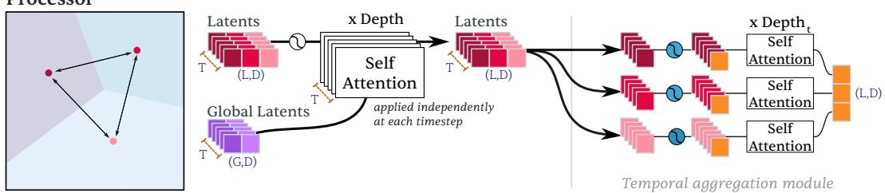  
RoPE: positions per axis RoPE: temporal axis only temporal CLS token

The temporal aggregation module is optional. When used, latent grids share the same spatial geometry across timesteps, so corresponding latent positions are temporally aligned and processed independently across time.  
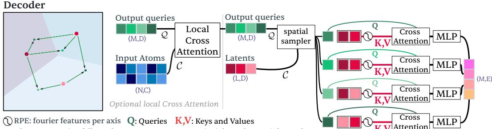  
Local cross-attention follows the same query-context principle as the spatial sampler, K,V Attention but restricts the context of each output query to atoms at the same spatial location (the same pixel for raster inputs).  
Figure 7: Detailed Atomizer-IO architecture. The encoder aggregates local neighborhoods of input atoms into spatial latents through the spatial sampler; the processor applies latent self-attention with optional temporal aggregation; and the decoder maps local latent neighborhoods to spatial output queries, optionally conditioning first on raw observations at the target location. Relative positional information is introduced locally, and MLP and attention weights are shared across spatial neighborhoods.

## B ABLATION STUDIES

We examine three complementary sources of structure in Atomizer-IO: temporal organization across acquisitions, spatial relationships between latents, and direct target-local observations in the decoder. These ablations are evaluated across tasks with different sensing characteristics to assess how strongly each source of information contributes to prediction.

## B.1 TEMPORAL AGGREGATION

The temporal aggregation module changes how observations across time are organized in the latent representation. Without it, atoms from all acquisitions are encoded jointly into a single temporally mixed latent set, with acquisition time provided as metadata. With temporal aggregation, each acquisition is encoded independently into its own spatial latent set, and corresponding latents are merged across time by a temporal transformer.

Both conditions process the same total number of atoms; the difference is how the resulting latent capacity is organized. In the joint formulation, each latent receives information from observations spanning both space and time. With temporal aggregation, spatial encoding is performed independently within each acquisition before aligned latent representations are combined temporally.

We evaluate this structural difference on PASTIS by varying the number of input acquisitions while keeping the remaining training setup fixed.

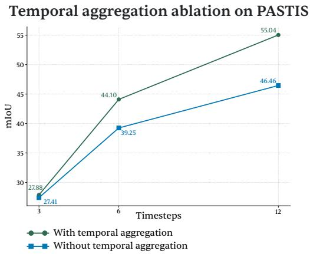  
Figure 8: Temporal aggregation ablation on PASTIS as the number of input timesteps increases.

Explicit temporal aggregation becomes increasingly beneficial as the number of acquisitions grows. With three timesteps, it improves PASTIS by only 0.47 mIoU, compared with 4.85 mIoU at six timesteps and 8.58 mIoU at twelve. Since both conditions process the same observations and the latent capacity scales with the number of input atoms, the growing gap is better explained by how that capacity is structured than by its overall size. Encoding each acquisition spatially before aggregating aligned latents across time provides an increasingly useful inductive bias as the temporal context grows.

## B.2 SPATIAL ROPE ABLATION

We ablate the two-dimensional rotary positional encoding used in the latent processor while keeping the remaining architecture unchanged. This isolates the contribution of explicit spatial structure within latent self-attention.

Table 7: Effect of spatial RoPE across tasks. MNIST reports accuracy (%), while the EO datasets report mIoU (%).

<table><tr><td></td><td>MNIST</td><td>Cashew</td><td>PASTIS</td><td>BurnScars</td><td>Sen1Floods11</td></tr><tr><td>No RoPE</td><td>29.48</td><td>62.65</td><td>40.65</td><td>86.16</td><td>92.42</td></tr><tr><td>RoPE</td><td>99.37</td><td>72.01</td><td>44.10</td><td>88.81</td><td>93.17</td></tr></table>

The contribution of spatial RoPE depends strongly on how informative the local observations already are. On MNIST, individual pixel values carry little semantic information in isolation, so the model must rely heavily on spatial relationships between latents; removing RoPE therefore causes a 70.3% relative performance drop. On Cashew, multispectral measurements provide useful local cues, but spatial context remains important, leading to a substantial 13.0% degradation without RoPE. The effect is more moderate on PASTIS (7.8%) and BurnScars (3.0%), and small on Sen1Floods11 (0.8%), where local spectral and radar observations already provide strong evidence for the prediction.

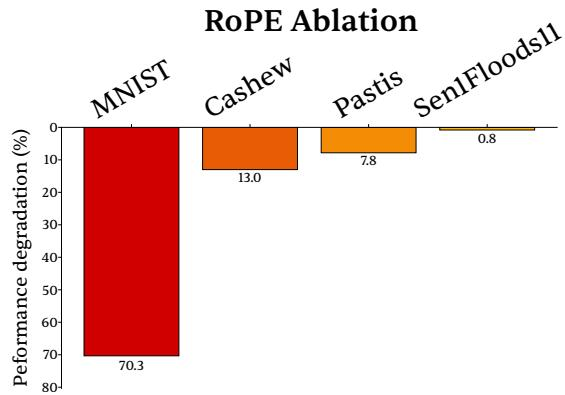  
Figure 9: Relative degradation when spatial RoPE is removed, computed as $1 0 0 ( \mathrm { R o P E ~ - }$ No RoPE)/RoPE.

## PASTIS provides an additional contrast: spa-

tial RoPE gives a moderate gain, while the temporal aggregation ablation in Appendix B.1 shows a much larger dependence on temporal structure. Together, these results suggest that the usefulness of explicit positional structure depends on which physical relationships are most informative for the task.

## B.3 LOCAL OBSERVATION CONDITIONING

For dense prediction, Atomizer-IO can condition each output query directly on the raw observations at its target location before attending to the latent representation. We ablate this pathway while keeping the remainder of the architecture unchanged.

Table 8: Effect of conditioning output queries on the raw observations at their target location. All values are mIoU (%).
<table><tr><td></td><td>Sen1Floods11</td><td>Cashew</td><td>PASTIS</td><td>BurnScars</td></tr><tr><td>Without local observations</td><td>89.26</td><td>70.58</td><td>43.30</td><td>88.20</td></tr><tr><td>Full model</td><td>93.17</td><td>72.01</td><td>44.10</td><td>88.81</td></tr></table>

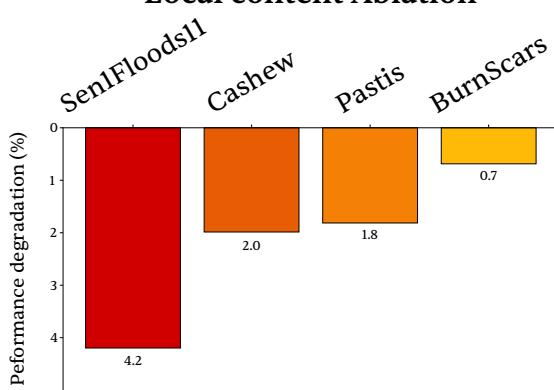  
Figure 10: Relative degradation when local observation conditioning is removed, computed as 100(Full − No Local)/Full.

The contribution of direct local observations varies across tasks. Removing this pathway reduces Sen1Floods11 by 3.91 mIoU points and Cashew by 1.43 points. The reductions are smaller on PASTIS (0.80 points) and BurnScars (0.61 points). Thus, Sen1Floods11 shows the greatest dependence on target-local evidence among these datasets.

Together with the spatial and temporal ablations, these results show that the relative importance of target-local evidence, spatial relationships, and temporal organization is task dependent. PASTIS provides a complementary example: it benefits strongly from explicit temporal aggregation while showing only a modest dependence on direct targetlocal observations.

## B.4 ATOMIC FEATURE ENCODING

We detail the feature encodings used to build the atomic representation f introduced in Section 3.1. For a raster atom, $\left( \phi _ { 0 } , \phi _ { 1 } , \phi _ { 2 } , \phi _ { 3 } \right)$ are the encoders $( \phi _ { v } , \phi _ { g } , \phi _ { \lambda } , \phi _ { t } )$ defined below. Unless stated otherwise, continuous quantities are encoded with Fourier features. For a scalar w, we define

$$
\mathrm { f o u r i e r } ( w ; F , \nu _ { \mathrm { m a x } } ) = \left[ w , \sin ( \pi \nu _ { 1 } w ) , \cos ( \pi \nu _ { 1 } w ) , \dots , \sin ( \pi \nu _ { F } w ) , \cos ( \pi \nu _ { F } w ) \right] .
$$

where the F frequencies $\nu _ { i }$ are linearly spaced between 1 and $\nu _ { \mathrm { m a x } }$ . The encoding has dimension $2 F + 1$

Measurement. The measured value v is encoded as

$$
\phi _ { v } ( v ) = \mathrm { f o u r i e r } ( v ; F _ { v } , \nu _ { \mathrm { m a x } } ^ { v } ) .
$$

Spatial scale. For raster observations, spatial scale is represented by the ground sampling distance (GSD) $g .$ We first compress it as

$$
\tilde { g } = \mathrm { c o m p r e s s } ( g , s _ { g } ) ,
$$

where $s _ { g }$ is a reference GSD, and then encode

$$
\phi _ { g } ( g ) = \mathrm { f o u r i e r } ( \tilde { g } ; F _ { g } , \nu _ { \mathrm { m a x } } ^ { g } ) .
$$

Spectral configuration. Following Atomizer (de Turckheim et al., 2025), optical channels are represented from their physical spectral support rather than a discrete channel index. For a band with central wavelength λ and bandwidth ∆λ,

$$
\phi _ { \lambda } ( \lambda , \Delta \lambda ) _ { i } = \int _ { \lambda - \Delta \lambda / 2 } ^ { \lambda + \Delta \lambda / 2 } \mathcal { N } ( \lambda ^ { \prime } ; \mu _ { i } , \sigma _ { i } ) d \lambda ^ { \prime } , \qquad i = 1 , \dots , K ,
$$

where $\mu _ { i }$ and $\sigma _ { i }$ are the center and width of the i-th Gaussian basis function. The resulting vector depends on both central wavelength and bandwidth. Channels without meaningful spectral support, such as SAR polarizations or elevation, use learned embeddings of the same dimensionality.

Acquisition time. Acquisition time is represented by day of year t using periodic Fourier features,

$$
\phi _ { t } ( t ) = \left[ \sin \left( \frac { 2 \pi k t } { 3 6 5 } \right) , \cos \left( \frac { 2 \pi k t } { 3 6 5 } \right) \right] _ { k = 1 } ^ { K _ { t } } .
$$

This gives a $2 K _ { t }$ -dimensional encoding with annual periodicity. When acquisition time is unavailable, a zero vector is used.

## B.5 RELATIVE POSITION ENCODING

Horizontal spatial coordinates are kept separate from f and enter through the offset δ between a context element and its query. Each component δ is encoded as

$$
\phi _ { \delta } ( \delta ) = \mathrm { f o u r i e r } \big ( \mathrm { c o m p r e s s } ( \delta , s _ { 0 } ) ; , F _ { \delta } , , \nu _ { \mathrm { m a x } } ^ { \delta } \big ) ,
$$

and the component encodings are concatenated. The reference scale $s _ { 0 }$ is the cross-attention spatial scale of Table 14, and $F _ { \delta } , \nu _ { \mathrm { m a x } } ^ { \tilde { \delta } }$ are in Table 15.

## B.6 PROPERTIES OF THE COMPRESSION FUNCTION

For physical quantities spanning a large range, we use

$$
{ \mathrm { c o m p r e s s } } ( w , s ) = { \frac { w } { s + | w | } } ,
$$

where $\beta > 0$ is a reference scale. The function maps signed inputs to $( - 1 , 1 )$ and non-negative inputs to $[ 0 , 1 )$ . Near zero, compress $( w , s ) \approx w / s ,$ , and its magnitude saturates toward one for large |w|. In particular, |compress $( w , s ) | = 0 . 5$ when $| w | = s$ . Thus, s sets the characteristic physical scale before Fourier encoding. Separate reference scales are used for GSD and relative spatial positions.

## B.7 SCALABILITY OF THE SPATIAL SAMPLER

We analyze the encoder instantiation of the spatial sampler, where each input atom is assigned to its nearest spatial latent. This Voronoi assignment replaces global input-to-latent cross-attention with local cross-attention, reducing the number of query–context interactions. During training, the context available to each latent can additionally be subsampled to a user-defined budget m, providing direct control over cross-attention cost.

Table 9 compares this local formulation with global cross-attention for the Sen1Floods11 configuration used in our experiments: 15 channels at $5 1 2 \times 5 1 2$ resolution $( N \approx 3 . 9 \times 1 0 ^ { 6 }$ atoms) and $L = 2 0 0 0$ spatial latents.

Without subsampling, every atom participates in exactly one encoder cross-attention neighborhood, so the Voronoi assignment reduces the number of input-to-latent interactions from LN to N. With a per-latent budget m, the number of interactions becomes $\begin{array} { r } { \sum _ { \ell = 1 } ^ { L } \operatorname* { m i n } ( m , | V _ { \ell } | ) } \end{array}$ and is therefore bounded by $\operatorname* { m i n } ( N , L m )$

For comparison, we report the equivalent global drop rate, $1 - m / N ;$ : the fraction of atoms that would need to be removed from the context of each global latent for global cross-attention to use at most m context elements per latent. For $m = 5 0 0$ , this corresponds to 99.987%: each latent in a global formulation would retain only approximately 500 atoms out of 3.9 million. The spatial sampler instead distributes interactions spatially: every atom remains assigned to a local cell, although dense cells may be subsampled at a given training step.

The budget m is not an architectural limit on local context. The complete context available to latent ℓ is its Voronoi cell $V _ { \ell } . \mathrm { ~ I f ~ } | V _ { \ell } | \leq m$ , the full cell is used; otherwise, m controls how much of that context is processed at a given training step. For $L = 2 0 0 0$ , spatial latent self-attention contributes $L ^ { 2 } = 4 \times 1 0 ^ { 6 }$ pairwise interactions, compared with $7 . 8 6 \times 1 0 ^ { 9 }$ for global input-to-latent crossattention.

Table 9: Cross-attention complexity for global and local spatial sampling on Sen1Floods11 (N ≈ $3 . 9 \times 1 0 ^ { 6 }$ atoms, $L = 2 0 0 0$ spatial latents). The equivalent global drop rate is $1 - m / N$ , the fraction of atoms that global cross-attention would need to discard to match a budget of m context elements per latent.
<table><tr><td></td><td>Interaction bound</td><td>Equiv. global drop</td><td>Context/query</td></tr><tr><td>Global</td><td> $L N \approx 7 . 8 6 \times 1 0 ^ { 9 }$ </td><td>0%</td><td>N</td></tr><tr><td>Local  $( m { = } 5 0 0 )$ </td><td> $\leq L m = 1 . 0 \times 1 0 ^ { 6 }$ </td><td>99.987%</td><td>≤ 500</td></tr><tr><td>Local (m=1000)</td><td> $\leq L m = 2 . 0 \times 1 0 ^ { 6 }$ </td><td>99.975%</td><td>≤ 1000</td></tr><tr><td>Local (m=2000)</td><td> $\leq \mathrm { m i n } ( N , L m ) \approx 3 . 9 3 \times 1 0 ^ { 6 }$ </td><td>99.949%</td><td>≤ 2000</td></tr></table>

When a cell contains more atoms than the selected budget m, atoms are sampled uniformly without replacement at each training step. This controls training cost without permanently restricting a latent to a fixed subset of its local context. Implementation details are given in Appendix B.8, and sensitivity to m is reported in Appendix 11.

When the input and latent geometries are fixed, the Voronoi assignment depends only on their spatial positions and can be precomputed and cached. The only per-step operation is then the optional subsampling of each local cell.

## B.8 IMPLEMENTATION DETAILS OF THE SPATIAL SAMPLER

We detail three implementation steps for the encoder: Voronoi assignment, per-step subsampling, and masking of variable-size local contexts.

Voronoi partitioning. For each atom i at position $\mathbf { p } _ { i } \in \mathbb { R } ^ { 2 }$ , we store its nearest spatial latent,

$$
\begin{array} { r } { \ell ( i ) = \mathrm { k N N } _ { k = 1 } \left( \mathbf { p } _ { i } , \{ \pmb { \mu } _ { \ell ^ { \prime } } \} _ { \ell ^ { \prime } } \right) , } \end{array}
$$

where $\pmb { \mu } _ { \ell ^ { \prime } } \in \mathbb { R } ^ { 2 }$ denotes the position of latent $\ell ^ { \prime }$ . We then invert this assignment to obtain the complete cell associated with latent ℓ,

$$
V _ { \ell } = \{ i : \ell ( i ) = \ell \} .
$$

The complete local context available to latent ℓ is therefore determined by $V _ { \ell } .$ Any subsequent subsampling is performed from this full cell.

Variable latent layouts. Because no learned parameter depends on the number or placement of spatial latents, both can be varied on the fly during training. We precompute the Voronoi assignments for several latent layouts, corresponding to different values of κ (Appendix D.2), and randomly assign one layout to each batch. Since assignments are computed in advance, varying the layout adds no cost to the training step. At test time, we evaluate a single configuration $( \kappa , m )$ , selected on the validation set.

Per-step random subsampling. During training, the local context can be limited to a user-defined budget m. At step t, we sample uniformly without replacement,

$$
S _ { \ell } ^ { ( t ) } \subseteq V _ { \ell } , \qquad | S _ { \ell } ^ { ( t ) } | = \operatorname* { m i n } ( m , | V _ { \ell } | ) .
$$

When $m \geq | V _ { \ell } |$ , the complete cell is used. Otherwise, m directly controls the number of local query–context interactions processed at that step. Repeated sampling exposes the model to different subsets of dense cells rather than permanently restricting each latent to a fixed subset of atoms.

Masking. Because local contexts can contain different numbers of atoms, they are batched to a common capacity and invalid slots are suppressed with an attention bias,

$$
\beta _ { \ell i } = { \left\{ \begin{array} { l l } { 0 , } & { { \mathrm { i f ~ } } { \mathrm { p o s i t i o n ~ } } i { \mathrm { ~ i s ~ v a l i d } } , } \\ { - \infty , } & { { \mathrm { o t h e r w i s e } } . } \end{array} \right. }
$$

After the attention softmax, invalid positions receive zero weight. When a cell is empty, a dummy token is inserted so that the softmax remains well defined. The cardinality of $\nu _ { \ell }$ determines the available local context, while m controls how much of that context is processed when subsampling is used.

## C GFLOPS

## C.1 ADAPTIVE DECODING STRATEGIES

As in the encoder, Atomizer-IO uses cross-attention in the decoder so that predictions can be produced at explicitly specified spatial locations. For dense segmentation, this can mean querying every pixel, while other output layouts can be queried without changing the architecture.

Dense decoding processes every output query independently. For each of the O output queries, the decoder gathers a local neighborhood of k latents, computes their relative positional encoding, and applies cross-attention. The resulting cost therefore scales linearly with the number of decoded locations.

We exploit the spatial redundancy of dense predictions with two adaptive decoding strategies (Zoneprobe, Quadtree) that reduce the number of locations receiving a full decode. Both operate on the same trained checkpoint as (Dense) decoding; they differ only in where output queries are evaluated and where predictions are propagated spatially.

Both strategies use agreement between a small number of probes as a proxy for local label homogeneity. In Zone-probe, the regions are the Voronoi cells associated with the spatial latents. A small number of locations is sampled within each cell; if all probes predict the same class, that class is assigned to the remaining locations, whereas disagreeing cells are fully decoded. In Quadtree decoding, the same principle is applied hierarchically. Disagreeing regions are recursively subdivided and probed at finer spatial scales, while homogeneous regions terminate early and broadcast their predicted class. A full per-pixel decode is recovered at the finest scale $s _ { \operatorname* { m i n } } = 1$

Probe agreement is a heuristic rather than a guarantee: small or thin objects may be missed if no probe falls on them. The resulting approximation is evaluated empirically on Sen1Floods11 and BurnScars in Figure 11. Both adaptive strategies recover the dense prediction wherever a full

Table 10: Decode cost of the three inference strategies. M is the number of output queries, L the number of spatial latents, $k _ { p }$ the number of probes per region, and $s _ { \mathrm { s t a r t } }$ the initial quadtree cell size. Both adaptive strategies reduce to dense decoding in the worst case when no region can be treated as homogeneous.
<table><tr><td></td><td>Full decode calls</td><td>Best case</td><td>Worst case</td></tr><tr><td>Dense</td><td>M</td><td>M</td><td>M</td></tr><tr><td>Zone-probe</td><td> $\begin{array} { r } { k _ { p } L + \sum _ { \ell \in \mathrm { h a r d } } | W _ { \ell } | } \end{array}$ </td><td> $\mathcal { O } ( k _ { p } L )$ </td><td>M</td></tr><tr><td>Quadtree</td><td> $\lesssim k _ { p } \times ( \mathrm { l e v e l s } \times \mathrm { a c t i v e } \mathrm { c e l l s } )$ </td><td> $\mathcal { O } \left( \frac { k _ { p } \dot { H } W } { s _ { \mathrm { s t a r t } } ^ { 2 } } \right)$ </td><td>M</td></tr></table>

decode is issued. Their savings therefore depend on prediction homogeneity at the scale of a latent’s Voronoi cell for zone-probe and an image-plane cell for quadtree.

## C.2 COMPUTE–PERFORMANCE SENSITIVITY

Figure 11 examines how the main architectural and decoding parameters affect both computational cost and segmentation performance on Sen1Floods11 and BurnScars. We vary the number of atoms per latent, the encoder cross-attention budget, and the decoder spatial neighborhood size for dense, zone-probe, and quadtree decoding. For all strategies we use the same trained checkpoint.

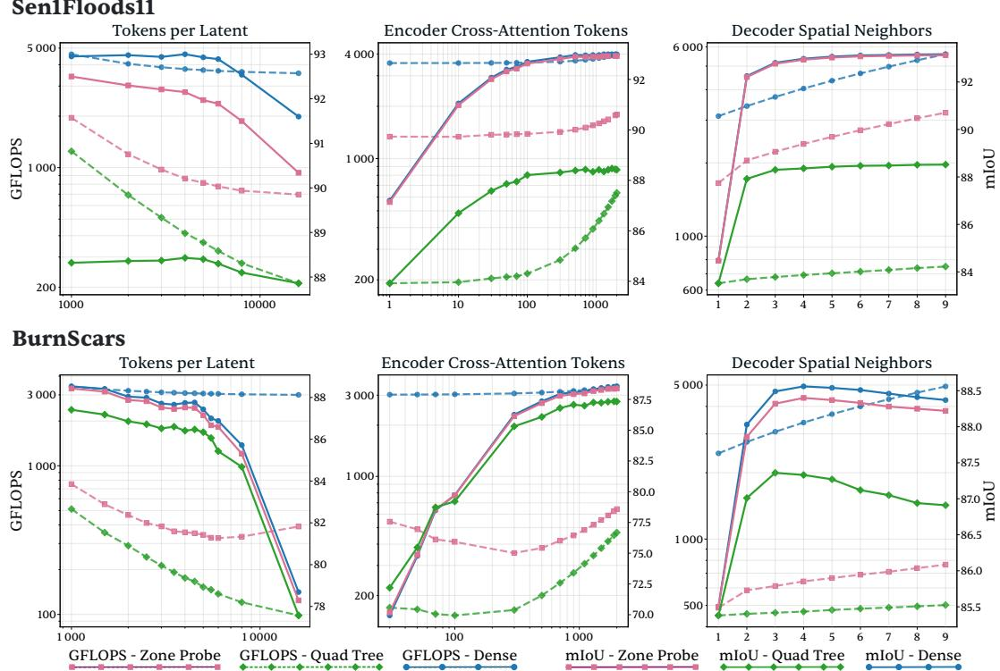  
Figure 11: Sensitivity of segmentation performance and inference cost to three architectural parameters: atoms per latent, encoder cross-attention budget, and decoder neighborhood size. Results are shown on Sen1Floods11 and BurnScars for Dense, Zone-probe, and Quadtree decoding.

Increasing the number of atoms per latent reduces the number of spatial latents and eventually degrades mIoU across all three decoding strategies. Because the same trend appears independently of the decoding policy, the loss reflects reduced representational capacity in the latent representation rather than a decoder-specific approximation. Increasing the encoder cross-attention budget improves performance until saturation, while increasing the decoder neighborhood size increases computation once sufficient local context is available.

The two adaptive decoders also have different computational floors. Zone-probe is coupled to the number of spatial latents L: reducing its cost through a lower latent density eventually also reduces encoder capacity. Quadtree instead controls how densely the existing latent representation is read out through $s _ { \mathrm { s t a r t } } ,$ leaving the representation itself unchanged. It can therefore reach more aggressive low-cost operating points before representational quality is affected. The two strategies are thus complementary: zone-probe covers the regime closest to dense decoding, while quadtree extends toward stronger compute reduction.

## D ECHO ENCODING FOR LIDAR TOKENS

Airborne LiDAR sensors may record multiple returns from a single emitted pulse as it interacts with structures along its path. Each return stores two integer attributes: the return number r, indicating its order within the pulse, and the number ofreturns R, indicating the total number of returns associated with that pulse, with $1 \leq r \leq R .$ . Together, $( r , R )$ describes the position of an observation within the return sequence. This provides useful information for semantic interpretation: surfaces such as buildings or ground often produce isolated returns, while vegetation canopies can produce several returns at different depths along the beam path.

## D.1 ENCODING

We encode each return using two normalized quantities,

$$
a = \frac { r - 1 } { R } ,
$$

$$
( \mathrm { p r e c e d i n g ~ r e t u r n s } )\tag{1}
$$

$$
b = { \frac { R - r } { R } } ,
$$

$$
( { \mathrm { s u b s e q u e n t r e t u r n s } } ) .\tag{2}
$$

Both lie in [0, 1). The first measures the normalized number of returns preceding the current observation, while the second measures those following it.

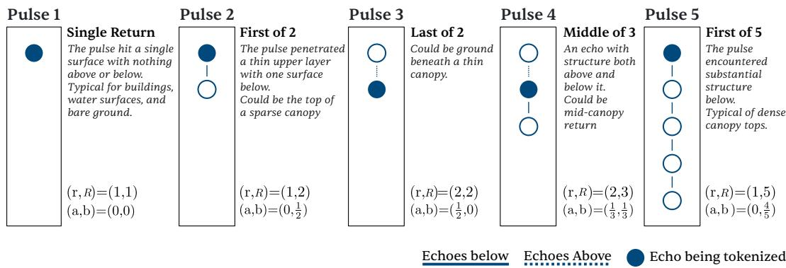  
Figure 12: LiDAR return encoding. The pair (a, b) describes the relative position of each observation within its pulse’s return sequence. Normalization by the per-pulse return count R makes the representation independent of the sensor-specific maximum number of returns while preserving the original $( r , R )$ attributes.

Unlike normalization by a fixed sensor-specific maximum return count, this encoding depends only on the returns observed for the current pulse. The same representation can therefore be used for sensors supporting different maximum numbers of returns without changing the architecture.

The transformation is also invertible on its valid domain. Since

$$
a + b = { \frac { R - 1 } { R } } ,
$$

the original attributes can be recovered as

$$
R = { \frac { 1 } { 1 - ( a + b ) } } , \qquad r = a R + 1 .
$$

Thus, the transformation preserves all information contained in the original (r, R) pair.

## D.2 TRAINING DETAILS

All models are trained from scratch under matched, task-specific training protocols. Hyperparameters such as batch size and training duration are selected at the dataset level and shared across all architectures evaluated on that dataset. Architecture-specific settings required by individual methods are reported below.

Model capacity. Model sizes are selected so that the compared architectures operate in a similar parameter regime within each task family. We use the ViT-Small configuration for all Vision Transformer baselines. Table 11 reports the number of trainable parameters used in the 2D experiments.

For Atomizer-IO, the dense single-temporal model contains 33.5M parameters. Adding the temporal aggregation module increases this to 34.8M, while the model without temporal aggregation remains at 33.5M. The number of spatial latents scales with the number of input atoms, but this changes the size of the intermediate representation rather than the number of learned parameters, since the same weights are shared across latents.

Table 11: Number of trainable parameters for the architectures used in the 2D experiments. Values are given in millions of parameters. ViT refers to ViT-Small.
<table><tr><td>Architecture</td><td>Classification</td><td>Segmentation</td><td>Multitemporal seg.</td></tr><tr><td>ResNet50</td><td>23.6</td><td>37.3</td><td>37.3</td></tr><tr><td>ViT-Small</td><td>21.7</td><td>30.3</td><td>31.5</td></tr><tr><td>Perceiver IO</td><td>19.7</td><td>34.5</td><td>34.5</td></tr><tr><td>RAMEN</td><td>23.1</td><td>33.7</td><td>33.7</td></tr><tr><td>UniverSat</td><td>36.1</td><td>36.1</td><td>36.1</td></tr><tr><td>Atomizer-IO</td><td>19.2</td><td>33.5</td><td>34.8</td></tr></table>

For context, EO-specific models evaluated in PANGAEA (Marsocci et al., 2024) typically use approximately 30–47M trainable parameters. Our dense-prediction models contain approximately 30– 37M parameters and therefore operate in a comparable capacity regime.

Decoders, temporal aggregation, and classification heads. For dense prediction, we follow the PANGAEA protocol (Marsocci et al., 2024) and equip ResNet50 and ViT with a UPerNet decoder (Xiao et al., 2018). RAMEN natively uses a UPerNet decoder, while Perceiver-IO and Univer-Sat use their native decoders. For multitemporal inputs, we also follow PANGAEA: ResNet50 applies a convolution before temporal aggregation, and ViT aggregates timesteps with an L-TAE (Gar not & Landrieu, 2020). RAMEN, UniverSat, Perceiver-IO, and Atomizer-IO natively handle the temporal dimension. For classification, Atomizer-IO and UniverSat use mean pooling over their latent representations, ViT uses a CLS token, and ResNet50 and RAMEN use their native classification heads.

Baseline-specific hyperparameters. RAMEN and UniverSat require a small number of architecture-specific spatial hyperparameters. We contacted the authors of both methods to inform the choice of these settings. For RAMEN, we set the encoding resolution to four times the native ground sampling distance, except for ForestNet, where we use 40 m. UniverSat uses the same encoding resolutions and a one-pixel subpatch size for all datasets.

For UniverSat, we follow the authors’ recommendation to use the smallest decoder stride that is computationally tractable. We use a stride of one pixel for Cashew and PASTIS and a stride of four pixels for the remaining dense-prediction datasets; for BioMassters in particular, the substantially larger training set makes the one-pixel configuration computationally impractical. Classification tasks do not use a decoder. The resulting configurations are summarized in Table 12.

For Perceiver-IO, we use 512 latents, one cross-attention layer, and six self-attention layers. Its metadata encodings use the same dimensions as those of Atomizer-IO.

Table 12: Architecture-specific spatial hyperparameters used for RAMEN and UniverSat. Encoding resolutions are expressed in physical units.
<table><tr><td rowspan="2">Dataset</td><td>RAMEN</td><td colspan="3">UniverSat</td></tr><tr><td>Enc. res. (m)</td><td>Enc. res. (m)</td><td>Subpatch (px)</td><td>Dec. stride (px)</td></tr><tr><td>ForestNet</td><td>40</td><td>40</td><td>1</td><td>一</td></tr><tr><td>BurnScars</td><td>120</td><td>120</td><td>1</td><td>4</td></tr><tr><td>EuroSAT</td><td>40</td><td>40</td><td>1</td><td>一</td></tr><tr><td>Cashew</td><td>40</td><td>40</td><td>1</td><td>1</td></tr><tr><td>Sen1Floods11</td><td>40</td><td>40</td><td>1</td><td>4</td></tr><tr><td>xView2</td><td>2</td><td>2</td><td>1</td><td>4</td></tr><tr><td>BioMassters</td><td>40</td><td>40</td><td>1</td><td>4</td></tr><tr><td>PASTIS</td><td>40</td><td>40</td><td>1</td><td>1</td></tr></table>

Training protocol. All models are optimized with AdamW using a learning rate of $1 0 ^ { - 4 } , \beta _ { 1 } =$ $0 . 9 , \ \beta _ { 2 } \ = \ 0 . 9 9 9 .$ , and $\epsilon = 1 0 ^ { - 8 }$ . We use a cosine annealing learning-rate schedule with a linear warm-up over the first 5% of training steps. Models are trained for 100 epochs by default.

Sen1Floods11 and BioMassters are trained for 150 epochs, as preliminary experiments showed that several architectures had not fully converged after 100 epochs. The 3D experiments on DALES and FRACTAL are trained for 100 epochs. Within each dataset, the same batch size, learning-rate schedule, and epoch budget are used for all architectures.

Table 13: Batch size used for each dataset. The same batch size is used across architectures within a dataset.
<table><tr><td>Dataset</td><td>Batch size</td></tr><tr><td>ForestNet</td><td>8</td></tr><tr><td>BurnScars</td><td>8</td></tr><tr><td>EuroSAT</td><td>8</td></tr><tr><td>Cashew</td><td>8</td></tr><tr><td>Sen1Floods11</td><td>4</td></tr><tr><td>xView2</td><td>8</td></tr><tr><td>BioMassters</td><td>16</td></tr><tr><td>PASTIS</td><td>4</td></tr><tr><td>DALES</td><td>32</td></tr><tr><td></td><td></td></tr><tr><td>FRACTAL</td><td>20</td></tr></table>

Atomizer-IO hyperparameters. For the 2D benchmarks, Atomizer-IO uses a latent dimension of 512, 128 global latents, and eight attention heads in both cross-attention and selfattention. Each decoder query attends to its nine nearest spatial latents. Relative positions used in local cross-attention are normalized with a fixed spatial scale of 100 m. For latent selfattention, the learned spatial scale is initialized to half the physical extent of the input,

$$
s _ { p } = { \frac { g n } { 2 } } ,
$$

where g is the ground sampling distance in meters per pixel and n is the image size along one spatial dimension. The scale is then optimized jointly with the rest of the model.

Given N input atoms and a target number of atoms per spatial latent k, we use $L = \lceil N / k \rceil$ spatial latents. Their anchors are placed on a hexagonal lattice covering the horizontal spatial extent of the input. The density of the spatial latent representation and the local encoder cross-attention budget can be randomized jointly during training. For each batch, we sample one configuration $( k , \bar { m } )$ , where m is the maximum number of atoms sampled from each latent neighborhood for cross-attention. For PASTIS, the configurations are

$$
( k , m ) \in \{ ( 1 0 0 , 1 0 0 ) , ( 2 5 0 , 2 5 0 ) , ( 3 5 0 , 3 5 0 ) \} ;
$$

for the other 2D benchmarks, they are

$$
( k , m ) \in \{ ( 1 0 0 0 , 1 0 0 0 ) , ( 1 5 0 0 , 1 5 0 0 ) , ( 2 0 0 0 , 2 0 0 0 ) \} .
$$

Varying k changes the number and density of spatial latents without changing the learned parame ters, while varying m changes the local encoder attention budget.

For dense prediction, we follow the query-subsampling strategy of Perceiver IO and supervise at most 100,000 spatial output queries per training sample. When an output contains more than 100,000 locations, the supervised queries are sampled uniformly at random; otherwise, all locations are supervised. $\mathrm { ~ A ~ 5 \dot { 1 } 2 ~ } \times \mathrm { ~ 5 1 2 ~ }$ prediction map therefore uses 100,000 sampled queries during training, whereas a $1 2 8 \times 1 2 8$ output is supervised densely.

Table 14: Main Atomizer-IO architectural hyperparameters used for the 2D and 3D experiments. Here, k denotes the target number of atoms per spatial latent and m the maximum number of atoms sampled per latent for local cross-attention.
<table><tr><td>Hyperparameter</td><td>2D</td><td>3D</td></tr><tr><td>Latent dimension</td><td>512</td><td>768</td></tr><tr><td>Global latents</td><td>128</td><td>128</td></tr><tr><td>Attention heads</td><td>8</td><td>8</td></tr><tr><td>Decoder neighbors</td><td>9</td><td>9</td></tr><tr><td>Latent layout</td><td>Hexagonal</td><td>Hexagonal</td></tr><tr><td> $( k , m )$ </td><td>Other 2D: {(1000, 1000), (1500, 1500), (2000, 2000)} PASTIS: {(100, 100), (250, 250), (350, 350)}</td><td>(1000, 1000)</td></tr><tr><td>Cross-attention spatial scale</td><td>100 m</td><td>100 m</td></tr><tr><td>Maximum supervised queries</td><td>100,000</td><td>100,000</td></tr></table>

For the 3D experiments on DALES and FRACTAL, we increase the latent dimension to 768 and use six self-attention layers. The model retains 128 global latents, eight attention heads, and nine decoder neighbors. Both 3D datasets use the fixed configuration $( k , m ) \bar { = } \left( 1 0 0 0 , 1 0 0 0 \right)$ , with spatial latent anchors placed on the same hexagonal lattice over the horizontal extent of each input.

Fourier feature encoding. The continuous metadata used by Atomizer-IO are encoded with Fourier features using the parameters reported in Table 15. The same encoding and hyperparameters are used for Perceiver IO, so both models receive the same continuous metadata representation.

Table 15: Fourier feature parameters used by Atomizer-IO and Perceiver IO.
<table><tr><td>Feature</td><td>Frequency bands</td><td>Maximum frequency / period</td></tr><tr><td>Position</td><td>16</td><td>16</td></tr><tr><td>Resolution</td><td>2</td><td>2</td></tr><tr><td>Acquisition time</td><td>12</td><td>365 days</td></tr><tr><td>Measurement value</td><td>8</td><td>8</td></tr></table>

## D.3 MNIST SPARSIFICATION PROTOCOL

MNIST is used as a controlled test of spatial reasoning under changes in input geometry. To control for model capacity on this relatively simple dataset, we compare a 7.40M-parameter Atomizer-IO with a parametermatched 7.44M-parameter ViT. The ViT operates on $1 \times 1$ patches, giving both models the same pixel-level spatial granularity.

Atomizer-IO uses a latent dimension of 256, four global latents, four cross-attention heads, and eight latent self-attention heads. The encoder contains one crossattention layer, followed by a processor with four selfattention layers. Each retained input pixel is associated with one spatial latent centered at the same location. Spatial RoPE is used only in latent self-attention; encoder cross-attention receives no relative positional encoding. Pixel coordinates are expressed in units of one per pixel, and the learned RoPE scale is initialized to 14 coordinate units, corresponding to half the width of the $2 8 \times 2 8$ image.

Information removal experiment  
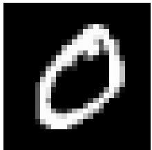

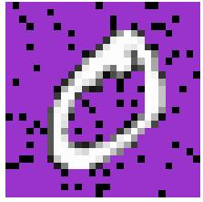  
Figure 13: MNIST sparsification protocol. Models are trained on complete images. At evaluation, pixels with value $v \leq 0 . 5$ are progressively removed, while pixels with value $v > 0 . 5$ are always retained.

Both models are trained for 50 epochs with batch size 64 using AdamW with a learning rate of $1 0 ^ { - 4 }$ and weight decay $1 0 ^ { - 3 }$ . Training uses complete MNIST images with no input sparsification.

At evaluation, we progressively remove only pixels with value $v \leq 0 . 5 ,$ , while pixels with $v > 0 . 5$ are always retained (Figure 13). The same pixels are removed for both architectures, and removed pixels are absent from the input rather than replaced by zero-valued tokens. For the ViT, retained tokens keep the learned absolute positional embeddings associated with their original pixel locations, so removing pixels does not re-index the remaining observations. Neither model is retrained or finetuned for the resulting sparse input geometries.

## D.4 LIDAR TRAINING AND INFERENCE PROTOCOL

FRACTAL. We follow the RandLA-Net training protocol used in the FRACTAL benchmark for the LiDAR stream. For each sample, all atoms generated from the co-registered VHR image are retained, and 40,000 LiDAR points are sampled and converted to LiDAR atoms. The VHR and LiDAR atoms are concatenated into a single input set before being passed to Atomizer-IO. No modality-specific processing branch is used: both modalities are processed jointly through the same atomic encoder.

DALES. DALES scenes are cropped into $5 0 \mathrm { m } \times 5 0$ m tiles for training, and atom-to-latent assignments are precomputed for each tile. At evaluation, each scene is covered by $5 0 \mathrm { m } \times 5 0$ m sliding windows with a 25 m stride. For each window, the encoder context contains up to the prescribed LiDAR-point budget, with subsampling when necessary, while every point in the window is used as an output query.

Table 16: Architecture and training hyperparameters for the capacity-matched Atomizer-IO and ViT models used in the MNIST sparsification experiment.
<table><tr><td>Parameter</td><td>Atomizer-IO</td><td>ViT</td></tr><tr><td>Parameters (total)</td><td>7.40M</td><td>7.44M</td></tr><tr><td>Hidden / latent dimension</td><td>256</td><td>224</td></tr><tr><td>Encoder / processor depth</td><td>1 cross-attn + 4 self-attn</td><td>12 transformer blocks</td></tr><tr><td>Attention heads</td><td>4 (cross) / 8 (self)</td><td>4</td></tr><tr><td>MLP dimension</td><td>768</td><td>896 (4×)</td></tr><tr><td>Positional encoding</td><td>Relative (RoPE, self-attn)</td><td>Absolute (learned)</td></tr><tr><td>Tokens / latents</td><td>1 spatial latent per retained pixel + 4 global</td><td>1 token per retained pixel + CLS</td></tr><tr><td>Attention dropout</td><td>0.05</td><td>0.05</td></tr><tr><td>FF dropout</td><td>0.10</td><td>0.10</td></tr><tr><td>Optimizer</td><td>AdamW</td><td>AdamW</td></tr><tr><td>Learning rate</td><td>1 × 10−4</td><td>1 × 10−4</td></tr><tr><td>Weight decay</td><td>1 × 10 -3</td><td>1 × 10 -3</td></tr><tr><td>Batch size</td><td>64</td><td>64</td></tr><tr><td>Epochs</td><td>50</td><td>50</td></tr></table>

Because adjacent windows overlap, a physical point may receive predictions from multiple windows. We average the softmax class probabilities over all windows covering that point and apply a single argmax afterwards, yielding exactly one prediction per physical point. Predictions and ground-truth labels from all scenes are then accumulated into a global confusion matrix from which per-class IoU and mean IoU are computed.

Table 17 reports the resulting per-class IoU together with the point-cloud baselines reported for DALES. Atomizer-IO reaches 66.7% mIoU, substantially above Perceiver IO in the same evaluation setting, while remaining below the strongest task-specific point-cloud methods.

Table 17: Per-class IoU on DALES. Values are reported as fractions. Baseline values are those reported for the corresponding methods on DALES.
<table><tr><td>Method</td><td>Mean</td><td>Ground</td><td>Buildings</td><td>Cars</td><td>Trucks</td><td>Poles</td><td>Power lines</td><td>Fences</td><td>Vegetation</td></tr><tr><td>KPConv</td><td>0.811</td><td>0.971</td><td>0.966</td><td>0.853</td><td>0.419</td><td>0.750</td><td>0.955</td><td>0.635</td><td>0.941</td></tr><tr><td>PointNet++</td><td>0.683</td><td>0.941</td><td>0.891</td><td>0.754</td><td>0.303</td><td>0.400</td><td>0.799</td><td>0.462</td><td>0.912</td></tr><tr><td>ConvPoint</td><td>0.674</td><td>0.969</td><td>0.963</td><td>0.755</td><td>0.217</td><td>0.403</td><td>0.867</td><td>0.296</td><td>0.919</td></tr><tr><td>Atomizer-IO</td><td>0.667</td><td>0.962</td><td>0.941</td><td>0.670</td><td>0.095</td><td>0.549</td><td>0.829</td><td>0.395</td><td>0.895</td></tr><tr><td>SuperPoint</td><td>0.606</td><td>0.947</td><td>0.934</td><td>0.629</td><td>0.187</td><td>0.285</td><td>0.652</td><td>0.336</td><td>0.879</td></tr><tr><td>PointCNN</td><td>0.584</td><td>0.975</td><td>0.957</td><td>0.406</td><td>0.048</td><td>0.576</td><td>0.267</td><td>0.526</td><td>0.917</td></tr><tr><td>ShellNet</td><td>0.574</td><td>0.960</td><td>0.954</td><td>0.322</td><td>0.396</td><td>0.200</td><td>0.274</td><td>0.600</td><td>0.884</td></tr><tr><td>Perceiver IO</td><td>0.487</td><td>0.944</td><td>0.895</td><td>0.362</td><td>0.032</td><td>0.144</td><td>0.453</td><td>0.228</td><td>0.840</td></tr></table>

Table 18: Notation used throughout the methodology.
<table><tr><td>Stage</td><td>Symbol</td><td>Meaning</td></tr><tr><td></td><td>N</td><td>Number of input atoms</td></tr><tr><td></td><td> $v _ { i }$ </td><td>Measured value of atom i</td></tr><tr><td></td><td> $J$ </td><td>Number of metadata fields of an atom</td></tr><tr><td rowspan="8">Input</td><td> $u _ { i 1 } , \ldots , u _ { i J }$ </td><td>Metadata fields of atom i</td></tr><tr><td> $\phi _ { 0 } ( \cdot )$ </td><td>Encoder of the measured value</td></tr><tr><td> $\phi _ { 1 } ( \cdot ) , \ldots , \phi _ { J } ( \cdot )$ </td><td>Encoders of the metadata fields</td></tr><tr><td> $\mathbf { f } _ { i }$ </td><td>Token (feature vector) of atom i</td></tr><tr><td> $\mathbf { p } _ { i }$ </td><td>Horizontal position of atom  $i , \mathbf { p } _ { i } \in \mathbb { R } ^ { 2 }$ </td></tr><tr><td> $\mathcal { F }$ </td><td>Input set  $\{ ( \bar { \mathbf { f } } _ { i } , \mathbf { p } _ { i } ) \} _ { i = 1 } ^ { N }$ </td></tr><tr><td></td><td></td></tr><tr><td> $\mathcal { C }$ </td><td>Context set  $\{ ( c _ { i } , \mathbf { p } _ { i } ) \} _ { i = 1 } ^ { | c | }$ </td></tr><tr><td rowspan="14">Sampler</td><td> $c _ { i }$ </td><td>Feature of context element ¿</td></tr><tr><td> $\mathcal { Q }$ </td><td>Query set  $\{ ( q _ { j } , \mathbf { p } _ { j } ) \} _ { j = 1 } ^ { | \mathcal { Q } | }$ </td></tr><tr><td> $q _ { j }$ </td><td>Feature of query element j</td></tr><tr><td> ${ \mathcal { A } } _ { \mathrm { e n c } }$ </td><td>Encoder assignment: each context element to its nearest query</td></tr><tr><td> ${ \boldsymbol { A } } _ { \mathrm { d e c } }$ </td><td>Decoder assignment: k nearest context elements per query</td></tr><tr><td> $\nu _ { j }$ </td><td>Index set of the local receptive field of query j</td></tr><tr><td> $\delta _ { i j }$ </td><td>Relative offset  $\mathbf { p } _ { i } - \mathbf { p } _ { j }$  of context element i from query  $j$ </td></tr><tr><td> $\phi _ { \delta } ( \cdot )$ </td><td>Fourier encoding of a relative spatial offset</td></tr><tr><td> $L$   $D$ </td><td>Number of spatial latents</td></tr><tr><td>Encoder</td><td>Latent embedding dimension</td></tr><tr><td> $\mathbf { p } _ { \ell }$ </td><td>Spatial anchor of latent l</td></tr><tr><td> $\mathbf { h } _ { \mathrm { i n i t } }$ </td><td></td></tr><tr><td> ${ \mathcal { H } } ^ { \mathrm { i n i t } }$ </td><td>Shared spatial-latent initialization</td></tr><tr><td> $\delta _ { i \ell }$ </td><td>Initialized spatial latent set</td></tr><tr><td> $\mathbf { z } _ { i } \ell$ </td><td>Offset of atom i relative to latent l</td></tr><tr><td> $\mathbf { h } _ { \boldsymbol { o } } ^ { ( 0 ) }$ </td><td>Atom feature processed relative to latent l</td></tr><tr><td> $\mathcal { H } ^ { ( 0 ) }$ </td><td>Latent l after encoder cross-attention</td></tr><tr><td> $G$ </td><td>Encoder output / processor input</td></tr><tr><td> $B$   $b$ </td><td>Number of global latents</td></tr><tr><td></td><td>Processor depth (number of blocks)</td></tr><tr><td> $\mathbf { g } _ { r } ^ { ( b ) }$ </td><td>Processor block index,  $b = 0 , \ldots , B$  (0: before the first block)</td></tr><tr><td></td><td>Global latent r after processor block b</td></tr><tr><td>Processor  $\mathcal { G } ^ { ( b ) }$ </td><td>Global latent set after processor block b</td></tr><tr><td> $\mathbf { h } _ { \ell } ^ { ( b ) }$ </td><td>Spatial latent l after processor block b</td></tr><tr><td> $\mathcal { H } ^ { ( b ) }$ </td><td>Spatial latent set after processor block b</td></tr><tr><td> $\mathcal { H } ^ { ( B ) }$ </td><td></td></tr><tr><td> $s _ { p }$ </td><td>Final processed spatial latent set (decoder context)</td></tr><tr><td> $s _ { 0 }$ </td><td>Learned spatial RoPE scale</td></tr><tr><td> $T$   $t$ </td><td>Reference scale used to initialize  $s _ { p }$ </td></tr><tr><td></td><td>Number of acquisition timesteps</td></tr><tr><td></td><td>Timestep index</td></tr><tr><td> $\mathbf { h } _ { t , \ell } ^ { ( 0 ) }$  Temporal</td><td>Encoded latent l at timestep t</td></tr><tr><td> $\mathcal { H } _ { t } ^ { ( 0 ) }$ </td><td>Encoder output at timestep t</td></tr><tr><td> $\mathbf { h } _ { t \ell } ^ { ( \bar { B } ) }$ </td><td></td></tr><tr><td> $\mathcal { H } _ { t } ^ { ( B ) }$ </td><td>Processed latent l at timestep t</td></tr><tr><td></td><td>Processed spatial latent set at timestep t</td></tr><tr><td> $\mathbf { h } _ { \ell }$ </td><td>Temporally aggregated latent at anchor l</td></tr><tr><td> $\bar { \mathcal { H } } ^ { ( B ) }$ </td><td>Temporally aggregated set; replaces  $\mathcal { H } ^ { ( B ) }$  as decoder context</td></tr><tr><td> $M$   $\mathbf { p } _ { j }$ </td><td></td></tr><tr><td></td><td>Number of output queries Position of output query j</td></tr><tr><td></td><td>Number of nearest spatial latents gathered per output query</td></tr><tr><td> $k$   ${ \bf q } _ { \mathrm { i n i t } }$ </td><td>Shared output-query initialization</td></tr><tr><td>Decoder  ${ \mathcal { Q } } ^ { \mathrm { i n i t } }$ </td><td></td></tr><tr><td></td><td>Initialized output-query set</td></tr><tr><td> $\delta _ { \ell j }$ </td><td>Offset of latent l relative to output query j</td></tr><tr><td> $S _ { j }$ </td><td>Indices of input atoms co-located with output query  $j$ </td></tr><tr><td> $\tilde { \mathbf { q } } _ { j }$ </td><td>Query conditioned on co-located observations</td></tr><tr><td> $\mathbf { q } _ { j }$ </td><td>Decoded representation at output query j</td></tr><tr><td> $\kappa$  Budgets  $m$ </td><td>Target number of atoms per spatial latent Maximum number of atoms sampled per Voronoi cell</td></tr></table>