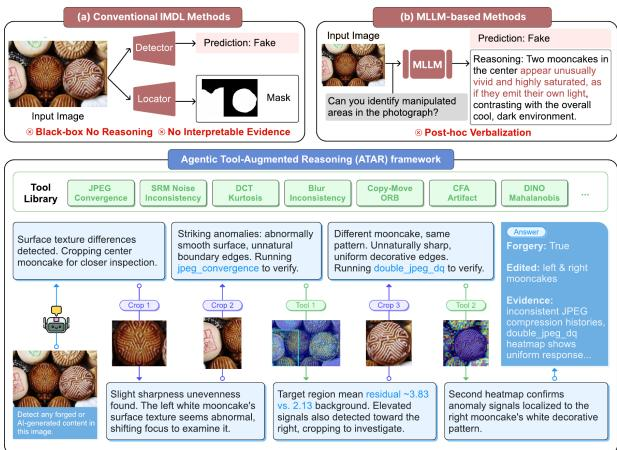
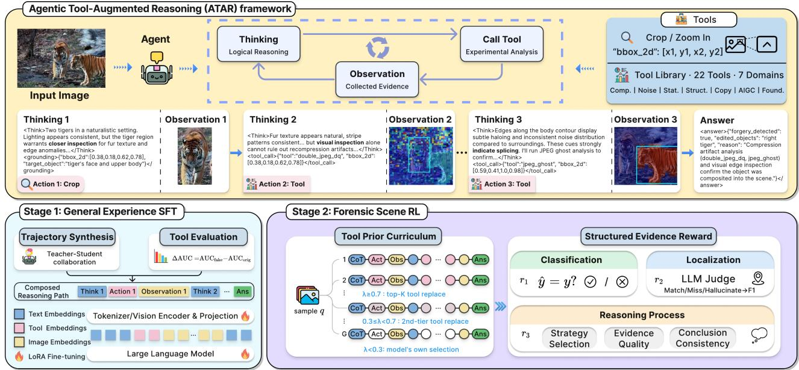
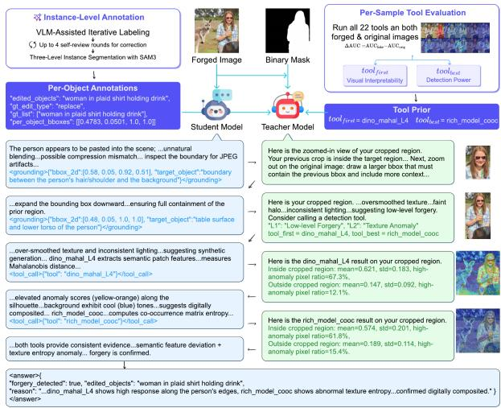

# Agentic Tool-Augmented Reasoning for Explainable Image Forgery Detection

Zhiya Tan∗ CCDS   
Nanyang Technological University Singapore, Singapore   
Ant Digital Technologies Ant Group Singapore, Singapore   
zhiya001@e.ntu.edu.sg   
Xin Zhang   
IAIC   
Agency for Science,   
Technology and Research   
(A\*STAR)   
Singapore, Singapore   
zhangx7@a-star.edu.sg   
Jing Huang   
Ant Digital Technologies   
Ant Group   
Singapore, Singapore   
jh.jj@antgroup.com   
Weiwei Feng   
Ant Digital Technologies   
Ant Group   
Hangzhou, China   
fengww@mail.ustc.edu.cn   
Changtao Miao   
Ant Digital Technologies   
Ant Group   
Hangzhou, China   
miaoct1024@gmail.com Jianshu Li   
Ant Digital Technologies Ant Group Singapore, Singapore   
jianshu.l@antgroup.com

Lin Tan Singapore University of Technology and Design Singapore, Singapore lin\_tan@sutd.edu.sg

Joey Tianyi Zhou†   
Singapore Management   
University   
Singapore, Singapore   
IAIC   
Agency for Science,   
Technology and Research   
(A\*STAR)   
Singapore, Singapore   
tyzhou@smu.edu.sg

## Abstract

Conventional image forgery detection methods produce only binary scores or pixel-level masks without interpretable evidence, while recent multimodal large language model (MLLM)-based ap proaches generate textual explanations that are merely post-hoc verbalizations of pre-determined classification results rather than products ofgenuine reasoning. Inspired by the forensic workflow of human judicial experts—“experimental analysis – logical reasoning – scientific evidence”—we propose an Agentic Tool-Augmented Reasoning (ATAR) framework for explainable image forgery detection, integrating 22 specialized forensic tools spanning seven complementary domains to autonomously detect, localize, and explain image forgeries through multi-turn reasoning. Concretely, we propose a Dual-Stream Forensic Reasoning paradigm to emulate the experimental analysis process of forensic experts: (1) a high-level semantic anomaly path, which magnifies suspicious regions for fine-grained inspection; and (2) a low-level forgery artifact path, which invokes forensic tools to extract objective artifactual evidence. To this end, we further propose a Forensics Curriculum Learning training strategy. First, during the General Experience SFT stage, an automated teacher–student mentoring

pipeline is designed to synthesize multi-turn tool-usage reasoning trajectories. Subsequently, during the Forensic Scene RL stage, a Tool Prior Curriculum is introduced to guide early tool exploration and progressively transfer control to the agent, while a Structured Evidence Reward provides fine-grained process-level supervision. Experiments across IMDL, Deepfake detection, DMDL, and AIGC detection show that ATAR achieves 78.5% average image-level F1 on six zero-shot IMDL benchmarks, surpassing the strongest MLLM baseline by 11.8 percentage points, and remains competitive with specialized detectors on other tasks, while producing substantially more faithful and grounded explanations.

## CCS Concepts

• Computing methodologies → Computer vision.

## Keywords

Image Forgery Detection, Agentic Tool-Augmented Reasoning, Reinforcement Learning, Multimodal Large Language Models

## ACM Reference Format:

Zhiya Tan, Jing Huang, Changtao Miao, Lin Tan, Xin Zhang, Weiwei Feng, Jianshu Li, and Joey Tianyi Zhou. 2026. Agentic Tool-Augmented Reasoning for Explainable Image Forgery Detection. In Proceedings of the 34th ACM International Conference on Multimedia (MM ’26), November 10–14, 2026, Rio de Janeiro, Brazil. ACM, New York, NY, USA, 10 pages. https://doi.org/10. 1145/3767308.3836203

## 1 Introduction

The rapid advancement of generative AI [19, 50] and image editing techniques has led to a steady increase in both the volume and realism of forged images, posing growing threats to news credibility, forensic investigation, and financial identity verification [41, 59]. Efective forgery detection requires classifying whether an image has been tampered with, localizing the manipulated regions, and providing interpretable reasoning for the decision.

  
Figure 1: Three forgery detection paradigms. (a) Conventional IMDL methods produce pixel masks but lack logical reasoning and interpretable evidence. (b) MLLM-based methods generate post-hoc verbalizations of pre-determined detection results rather than genuine reasoning. (c) ATAR au tonomously invokes forensic tools and reasons from their outputs to produce grounded conclusions.

Despite significant progress, existing methods each address only part of these requirements, as shown in Figure 1. Conventional image manipulation detection and localization (IMDL) methods [5, 17, 30] capture low-level forgery cues such as boundary artifacts, JPEG compression inconsistencies, and frequency-domain anomalies [9, 57], yet their black-box nature provides no interpretable reasoning and cannot produce traceable evidence for the decision. Conversely, multimodal large language model (MLLM)-based ap proaches [25, 38, 68] combine detection modules with language generation [37, 61] to produce both predictions and textual explanations. However, detection decisions are produced by the modules independently, and the language model merely verbalizes these pre-determined outcomes rather than reasoning from the underlying evidence. Moreover, the visual encoders lack perception of low-level traces [47], forcing the model to produce plausible yet ungrounded explanations when no obvious semantic flaw exists. In both cases, the core limitation is the same: analysis and reasoning are decoupled, preventing the system from producing grounded explanations.

In fact, a well-established methodology already exists in judicial forensic practice, where human experts follow a structured threestage workflow [13, 40]: experimental analysis, logical reasoning, and scientific evidence. During experimental analysis, the expert first inspects the image for semantic anomalies [27], then magnifies suspicious regions for closer examination. When no semantic flaw is apparent, specialized instruments are applied [4, 14, 65] to reveal signal-level traces invisible to the naked eye. The expert then performs logical reasoning over the collected experimental results to form a judgment, and presents the final conclusion as scientific evidence with a traceable chain of support. This close integration of analysis, reasoning, and evidence is absent from existing automated methods.

Motivated by this forensic workflow, we propose Agentic Tool-Augmented Reasoning (ATAR) to reproduce the complete “experimental analysis – logical reasoning – scientific evidence” workflow through multi-turn interactive reasoning. For experimental analysis, we note that the expert’s examination involves two complementary types of forgery cues, namely high-level semantics and low-level artifacts, and accordingly design a Dual-Stream Forensic Reasoning paradigm: the high-level semantic anomaly path magnifies suspicious regions for fine-grained inspection, while the low-level forgery artifact path invokes 22 unsupervised tools spanning seven complementary domains to extract objective evidence. For logical reasoning, the MLLM interprets observations from both paths across multiple turns, autonomously deciding whether to initiate further analysis based on intermediate results. The final output constitutes scientific evidence: a classification decision, localization of forged regions, and a traceable chain of evidence supporting the verdict.

To train the model to master this workflow, we propose Forensics Curriculum Learning. In the General Experience SFT stage, an automated teacher–student pipeline performs Forensic Reasoning Trajectory Synthesis, converting raw forgery datasets into multi-turn reasoning trajectories that capture genuine exploratory reasoning with each step grounded in tool outputs or semantic observations. In the subsequent Forensic Scene reinforcement learning (RL) stage, since the post-SFT model cannot yet reliably select the right tool from 22 candidates, a Tool Prior Curriculum provides efective tool selections early in training and progressively removes this guidance, enabling the model to transition from assisted to independent tool use. Meanwhile, to ensure that the reasoning process itself yields reliable scientific evidence, a Structured Evidence Reward decomposes supervision along classification, localization, and reasoning quality into independently verifiable items, ensuring that each dimension of the reasoning process receives targeted gradient signals.

Extensive experiments on IMDL [11, 21], Deepfake detection [76], document manipulation detection and localization (DMDL) [72], and AI-generated content (AIGC) detection demonstrate that ATAR achieves state-of-the-art results: 78.5% image-level F1 and 56.4% pixel-level F1 on six zero-shot IMDL benchmarks (+5.6 percentage points (pp) and +6.0 pp over TruFor), 99.9% F1 on Deepfake detection, and 87.0% F1 on AIGC detection without any AIGC training data, while reducing reasoning hallucination to 7.2% on true positives. Our main contributions are as follows.

• We propose ATAR with a Dual-Stream Forensic Reasoning paradigm that reproduces the judicial forensic workflow through multi-turn interactive reasoning, enabling MLLMs to autonomously invoke forensic tools and produce scientific evidence.

• We design Forensic Reasoning Trajectory Synthesis, an automated teacher–student pipeline that converts raw forgery datasets into multi-turn tool-augmented reasoning trajectories for the General Experience SFT stage.

  
Figure 2: Overview of ATAR. Top: multi-turn reasoning chain. Bottom: two-stage training pipeline (Stage 1: General Experienc SFT; Stage 2: Forensic Scene RL).

• We propose Forensic Scene RL with a Tool Prior Curriculum that guides early tool exploration and progressively transfers control to the agent, and a Structured Evidence Reward that decomposes supervision into independently verifiable items for classification, localization, and reasoning quality.

## 2 Related Work

## 2.1 Image Forgery Detection and MLLMs

Deep learning methods detect forgeries by capturing low-level traces: boundary and noise-view artifacts [5, 9, 67], JPEG compres sion inconsistencies [30], high-frequency object-level features [60], and learned noise fingerprints [17]. For AI-generated images, meth ods exploit shared generator artifacts [62], difusion reconstruction error [64], or frozen CLIP-ViT features [43]. These methods achieve high accuracy but provide no interpretable evidence.

To address interpretability, recent works apply multimodal large language models (MLLMs) [37, 61] to forgery detection. Several approaches augment MLLMs with dedicated forensic modules—maskaware extractors [38], domain-guided detectors [6, 68], or trace encoders [56]—to fuse semantic and low-level cues. Others reformulate detection as a reasoning task via dual-branch encoders [15], hypothetical prompting [25], or GRPO-based reasoning training [23]. However, MLLM visual encoders such as CLIP [47] are designed for high-level semantics and cannot perceive low-level traces like JPEG artifact misalignment or noise anomalies. Without genuine low-level evidence, the model may hallucinate unfounded explanations. No existing method bridges this gap with external forensic tools.

## 2.2 Tool-Augmented Reasoning

A growing line of work enables MLLMs to actively interact with images during multi-turn reasoning. Several methods train models to crop, zoom, and re-examine regions via RL-incentivized interleaved reasoning [20, 31, 63, 74], progressive visual grounding curricula [44], RL-driven external tool invocation [55], or plug-andplay visual search [33]. For tool-augmented LLMs more broadly, ReAct [69] interleaves reasoning and action to reduce hallucination, and T2Agent [10] coordinates modular tools with MCTS for multimodal misinformation detection.

For training, GRPO [51] replaces the critic with within-group normalization, and curriculum strategies [71, 75] provide tiered guidance that is progressively removed during exploration. Applying these to forgery detection poses two challenges: existing rewards use a single score that conflates classification, localization, and evidence quality; and with a large tool space, random exploration is ineficient, while current curricula operate at the prompt level rather than tool selection.

## 3 Method

ATAR reproduces the judicial forensic workflow of “experimenta analysis – logical reasoning – scientific evidence” by equipping an MLLM with multi-turn reasoning. For experimental analysis, the model autonomously decides, at each turn, whether to magnify a region for semantic inspection or to invoke a forensic tool for signallevel evidence. For logical reasoning, it interprets observations across turns, deciding whether to initiate further analysis or to form a judgment. The output constitutes scientific evidence: a classification verdict, localization of forged regions, and a traceable chain of evidence supporting the conclusion. Section 3.1 details the Dual-Stream Forensic Reasoning paradigm that instantiates this workflow; Sections 3.2–3.4 present Forensics Curriculum Learning, comprising trajectory synthesis, tool prior curriculum, and structured evidence reward.

## 3.1 Dual-Stream Forensic Reasoning

Given an input image �, the model produces an authenticity verdict $\hat { y } \in$ {authentic, forged}, textual descriptions of edited objects $\{ \hat { e } _ { 1 } , . . . , \hat { e } _ { P } \} ( \mathrm { e . g . }$ , “the tiger in the center was spliced”), and an interpretable reasoning trajectory � that constitutes the scientific evidence. During reasoning, the model can crop a specified region for magnified local details, or invoke analysis tools from a library $\mathcal { T } = \{ T _ { 1 } , \ldots , T _ { 2 2 } \}$ that produce heatmaps at the same spatial resolution as �.

We categorize forgery cues into two top-level types [36], each determining a distinct reasoning path—together forming the Dual-Stream Forensic Reasoning paradigm that emulates the experimental analysis process of forensic experts. High-level Semantics refers to forgeries that violate physical laws or commonsense logic. The model identifies these by cropping and magnifying the suspicious region for semantic analysis, paralleling the analyst’s visual inspection stage. Low-level Artifacts are imperceptible anomalies in signal-level patterns that appear semantically flawless. The model must invoke analysis tools for verification, paralleling the analyst’s instrumental analysis stage. The two paths are not mutually exclusive; the model may switch paths when one reasoning direction yields insuficient evidence.

The tool library provides 22 unsupervised tools spanning seven complementary domains: compression artifacts, sensor noise, statistical and frequency distributions, structural inconsistencies, copymove duplications, AI-generated-specific patterns, and foundationmodel-based anomaly detection (DINOv3 [52] Layer 4 features with principal component analysis (PCA)-reduced Mahalanobis distance). Each reasoning turn contains text and one action tag [69]: <grounding> specifies a region via a normalized bounding box $[ x _ { 1 } , y _ { 1 } , x _ { 2 } , y _ { 2 } ] \in [ 0 , 1 ] ^ { 4 }$ and a target object description, triggering a crop; <tool\_call> invokes a tool; and <answer> delivers the final verdict along with the traceable chain of evidence. The environment returns results as input for the next turn. This multiturn loop instantiates the three-stage judicial forensic workflow as illustrated in Figure 2 (Forensic Reasoning Loop): <grounding> and <tool\_call> perform experimental analysis, the reasoning between turns performs logical reasoning, and the final <answer> with its accumulated trajectory constitutes the scientific evidence.

ATAR is trained with a two-stage pipeline that we term Forensics Curriculum Learning as shown in Figure 2: the General Experience SFT stage synthesizes reasoning trajectories via a teacher–student mechanism (Section 3.2), while the Forensic Scene RL stage introduces a Tool Prior Curriculum (Section 3.3) and a Structured Evidence Reward (Section 3.4). The figure also illustrates an example where the model crops a suspicious tiger region, invokes double\_jpeg\_dq and jpeg\_ghost [12], and concludes from converging evidence that the tiger was spliced.

## 3.2 Forensic Reasoning Trajectory Synthesis

Existing forgery datasets lack multi-turn reasoning annotations, and the cost of manually annotating multi-turn tool-interleaved trajectories is prohibitive. As shown in Figure 3, we design an automated pipeline that converts raw forgery datasets into toolaugmented reasoning trajectories through four stages.

  
Figure 3: General Experience trajectory synthesis pipeline. Left: instance-level annotation. Right: per-sample tool evaluation. Bottom: teacher-guided trajectory generation, where the student explores without ground truth and the teacher provides corrective guidance.

3.2.1 Instance Annotation. Raw datasets provide only binary masks. We use an MLLM-assisted iterative scheme to decompose them into per-object instance masks with semantic labels, bounding boxes, and tampering types, with Segment Anything Model (SAM) [2] invoked for instance separation when needed.

3.2.2 Per-Sample Tool Evaluation. Since no single tool is universally optimal, we run all 22 tools on each forged image and its pristine original (available for all training sets) and compute pixel-level area under the curve (AUC) against the ground-truth mask. The diference $\Delta \mathrm { A U C } = \mathrm { A U C } _ { \mathrm { f a k e } } - \mathrm { A U C } _ { \mathrm { o r i g } }$ measures net detection efectiveness, with the original-image baseline eliminating the tool’s inherent bias. A tool with high ΔAUC may still produce heatmaps where the forged region is not visually distinguishable. We therefore select two complementary tools per sample. tool\_first selects the tool whose heatmap is easiest for the MLLM to interpret by maximizing Cohen’s � [7] between tampered and background intensities, clamped to non-negative and scaled by ΔAUC so that only tools with suficient detection quality are considered. tool\_best selects the most accurate tool by maximizing ΔAUC directly, regardless of visual clarity. A Top-� (�=3) optimal tool set is also generated per sample for curriculum guidance and reward computation. Samples whose highest ΔAUC falls below 0.15 are excluded from tool-augmented training.

Table 1 reveals that optimal tool domains shift systematically with the underlying forgery technique: JPEG-based splicing (AutoSplice) concentrates 75.7% on compression tools, whereas adversarial composites (FantasticReality) primarily trigger noise tools (29.7%). Every tool domain leads on at least one dataset, confirming the library is both necessary and non-redundant.

Table 1: Domain-level optimal tool selection proportion (%) across training datasets. Per-tool breakdown is provided in the appendix due to space constraints.
<table><tr><td rowspan="2"></td><td colspan="5">IMDL</td><td>Deepfake</td><td>DMDL</td></tr><tr><td>AutoSplice</td><td>CASIA2</td><td>Fant.Reality</td><td>IMD2020</td><td>NeXT-rpl.</td><td>OpenForen.</td><td>DocTamper</td></tr><tr><td>Compress. (4)</td><td>75.7</td><td>33.6</td><td>6.7</td><td>15.0</td><td>2.4</td><td>40.7</td><td>1.2</td></tr><tr><td>Noise (4)</td><td>7.7</td><td>18.6</td><td>29.7</td><td>22.5</td><td>30.6</td><td>7.7</td><td>39.8</td></tr><tr><td>Freq. (3)</td><td>0.8</td><td>3.9</td><td>16.9</td><td>7.4</td><td>7.9</td><td>2.9</td><td>3.9</td></tr><tr><td>Struct. (3)</td><td>1.1</td><td>6.8</td><td>9.4</td><td>7.3</td><td>13.9</td><td>6.0</td><td>4.2</td></tr><tr><td>Copy-Move (1)</td><td>0.9</td><td>8.8</td><td>5.2</td><td>5.7</td><td>7.6</td><td>9.2</td><td>16.8</td></tr><tr><td>AI-Gen. (6)</td><td>13.7</td><td>16.5</td><td>16.0</td><td>20.1</td><td>30.6</td><td>31.1</td><td>23.2</td></tr><tr><td>Found.Mod. (1)</td><td>0.2</td><td>11.7</td><td>16.0</td><td>22.0</td><td>7.0</td><td>2.4</td><td>10.9</td></tr></table>

3.2.3 Teacher-Guided Trajectory Generation. Both the student and teacher are Qwen3-VL-235B-A22B [1]. The student explores images without ground truth; the teacher holds annotations and guides exploration through three mechanisms, as shown in Figure 3. After each student crop, the teacher matches it against uncovered ground-truth masks by mask coverage (fraction of the ground-truth mask covered by the crop) and overlap ratio (fraction of the crop occupied by the mask). The result is classified as hit (coverage ≥0.5, overlap ≥0.12), relevant (coverage ≥0.1, overlap ≥0.05), or irrelevant, with corresponding feedback (confirmation, refinement guidance, or redirection). The teacher tracks covered instances to ensure all tampered regions are discovered, and escalates prompt intensity across turns, from directional hints to explicit target specification. For low-level cues, the teacher recommends tool\_first and tool\_best sequentially; when a crop yields no anomaly, the student explicitly reflects on its failed hypothesis, producing trajectories with complete hypothesis, verification, rejection, and adjustment cycles. When the student repeatedly fails, the teacher injects ground-truth locations as a fallback. All trajectories pass automated verification that checks full instance coverage, action-tag well-formedness, and tool-call validity before inclusion in the SFT set.

3.2.4 General Experience SFT. We apply Low-Rank Adaptation (LoRA) [22] to all linear layers of Qwen3-VL-8B [1] with the vision encoder frozen and multi-modal projector unfrozen to adapt visual-textual alignment to domain-specific inputs such as heatmaps and cropped forensic views. The loss is computed only on model-generated tokens, excluding environment-returned observations.

In the Forensic Scene RL stage, the SFT model has acquired the multi-turn reasoning format but cannot yet autonomously select optimal tools. We employ GRPO [51] for policy optimization, facing two challenges: sound logical reasoning presupposes efective ex perimental analysis, so we must first guide eficient tool exploration over a large 22-tool action space (Section 3.3); with tool selection addressed, efective supervision of the reasoning process itself is needed to produce reliable scientific evidence (Section 3.4).

## 3.3 Tool Prior Curriculum Learning

With 22 candidates, the post-SFT model frequently selects subopti mal tools. An ill-chosen tool not only wastes a reasoning turn but actively misleads the model, which treats irrelevant highlights as evidence. When most selections produce uninformative evidence, the RL signal is too sparse for efective learning. We address this through a Tool Prior Curriculum [75] that injects optimal tool priors early and progressively removes them.

When the model selects a tool on the low-level artifacts path, the environment replaces it without the model’s knowledge. For each input, GRPO samples � trajectories, each assigned a curriculum intensity �(�, �) that determines the replacement tier: $\lambda \ge 0 . 7$ triggers replacement with a Top-� optimal tool, $0 . 3 \leq \lambda < 0 . 7$ with a second-tier tool (ranked 4th–7th by ΔAUC), and $\lambda < 0 . 3$ retains the model’s own selection.

This mixing creates within-group reward variance essential for meaningful GRPO gradients. High-level-semantics-path trajectories bypass the curriculum entirely. The intensity is defined as

$$
\begin{array} { r } { \lambda ( i , t ) = \underbrace { \frac { G - i } { G - 1 } } _ { \mathrm { w i t h i n - g r o u p ~ d i v e r s i t y } } \cdot \underbrace { \frac { 1 } { 1 + \exp ( \alpha ( t - t _ { 0 } ) ) } } _ { \mathrm { g l o b a l ~ d e c a y ~ o v e r ~ t r a i n i n g } } } \end{array}\tag{1}
$$

We use GRPO with within-group normalization and asymmetric clipping [71] $( \epsilon ^ { - } ~ < ~ \epsilon ^ { + } )$ , granting larger updates to positiveadvantage trajectories.

$$
\begin{array} { r l } & { \mathcal { L } _ { \mathrm { G R P O } } = - \mathbb { E } _ { q } \left[ \frac { 1 } { G } \displaystyle \sum _ { i = 1 } ^ { G } \operatorname* { m i n } \Bigl ( \rho _ { i } \hat { A } _ { i } , \mathrm { c l i p } ( \rho _ { i } , 1 - \epsilon ^ { - } , 1 + \epsilon ^ { + } ) \hat { A } _ { i } \Bigr ) \right] } \\ & { \quad \quad \quad \quad + \beta D _ { \mathrm { K L } } ( \pi _ { \theta } \| \pi _ { \mathrm { r e f } } ) } \end{array}\tag{2}
$$

where $\rho _ { i } = \pi _ { \theta } ( o _ { i } | q ) / \pi _ { \mathrm { o l d } } ( o _ { i } | q )$ and $\hat { A _ { i } } = ( r _ { i } - \mu _ { G } ) / \sigma _ { G }$ . When the curriculum triggers a replacement, the tool name in the model’s output is replaced and the prompt sequence is re-tokenized so subsequent turns observe the replaced tool as context. High rewards from replaced tools produce gradient signals that guide the model toward selecting those tools independently, completing the transition as the curriculum decays (ToolAcc rises from 41.8% to 72.0%).

## 3.4 Structured Evidence Reward

A model can arrive at the correct verdict through flawed reasoning, and a single scalar reward would reinforce such behavior by conflating the final answer with the reasoning process. To produce reliable scientific evidence, we decompose the reward into four independent components [34] so that each ability is supervised separately. Each is either computed by deterministic rules or assessed by an LLM judge constrained to binary decisions.

$$
\boldsymbol { r } = \boldsymbol { w } _ { 1 } \cdot \boldsymbol { r } _ { 1 } + \boldsymbol { w } _ { 2 } \cdot \boldsymbol { r } _ { 2 } + \boldsymbol { w } _ { 3 } \cdot \boldsymbol { r } _ { 3 } + \boldsymbol { w } _ { 4 } \cdot \boldsymbol { r } _ { \mathrm { f m t } }\tag{3}
$$

$r _ { 1 } = 1 [ \hat { y } = y ]$ rewards correct classification. $r _ { \mathrm { f m t } }$ penalizes malformed action tags or invalid tool calls. The remaining two components require more careful design.

Since the model outputs textual region descriptions $\boldsymbol { \hat { e } } _ { i }$ rather than pixel masks, standard IoU cannot evaluate localization directly. For $r _ { 2 } ,$ we overlay the ground-truth mask on the image and submit it together with the model’s textual predictions to the LLM judge, which classifies each predicted region as matched, missed, or hallucinated.

$$
r _ { 2 } = { \left\{ \begin{array} { l l } { 2 \cdot { \mathrm { P r e c } } \cdot { \mathrm { R e c } } } & { { \mathrm { f o r g e d } } } \\ { { \mathrm { P r e c } } + { \mathrm { R e c } } } & { { \mathrm { a u t h e n t i c } } } \end{array} \right. }\tag{4}
$$

Table 2: IMDL benchmark results on six zero-shot datasets. iF1/ACC measure image-level classification; pF1/IoU measure pixel-level localization. Methods above the first rule are specialized detectors; below are MLLM-based and general-purpose MLLMs. Bold = best, underline = second.
<table><tr><td rowspan="2">Method</td><td colspan="3">CASIA v1+</td><td colspan="3">CocoGlide</td><td colspan="3">Coverage</td><td colspan="3">Korus</td><td colspan="3">NIST16</td><td colspan="3">Avg</td></tr><tr><td>iF1 ACC</td><td>pF1</td><td>IoU iF1</td><td>ACC</td><td>pF1</td><td>IoU iF1</td><td>ACC</td><td>pF1 IoU</td><td>iF1</td><td>ACC pF1</td><td>IoU iF1</td><td>ACC pF1</td><td>IoU iF1</td><td>ACC</td><td>pF1 IoU</td><td>iF1</td><td>ACC</td><td>pF1 IoU</td></tr><tr><td>MVSS-Net [5] (ICCV&#x27;21)</td><td>.734</td><td>.471</td><td>.665</td><td></td><td></td><td></td><td></td><td>.467</td><td>.632</td><td>.539</td><td>.120</td><td>.672</td><td>.576</td><td>.538</td><td>.299</td><td></td><td>.603</td><td></td></tr><tr><td>TruFor [17] (CVPR&#x27;23)</td><td></td><td>.757 .652 .544</td><td>.397 .464 .685</td><td>.560</td><td>.492 .516</td><td>.372 .669 .405 .681</td><td>.550 .570</td><td>.373 .450 .346</td><td>.679 .559</td><td>.181 .292</td><td>.749 .217 .975</td><td>.670 .975 .833</td><td>.682 .769 .620</td><td></td><td>.216 .297</td><td>.689</td><td>.430 .504</td><td>.342</td></tr><tr><td>ForMa [18] (SPL&#x27;25)</td><td>.732 .781</td><td>.769 .629</td><td>.574 .668</td><td>.576 .502</td><td>.453</td><td>.362 .669</td><td>.525</td><td>.487 .409</td><td>.670 .509</td><td>.304</td><td>.235 .683</td><td>.650 .001</td><td>.000 .570</td><td>.466 .487</td><td>.391 .055 .030</td><td>.729 .674</td><td>.633 .574 .322</td><td>.416 .268</td></tr><tr><td>SparseViT [54] (AAAI&#x27;25)</td><td>.697</td><td>.535 .153</td><td>.088 .667</td><td>.500</td><td>.355</td><td>.253 .667</td><td>.500</td><td>.197 .112</td><td>.667 .500</td><td>.103</td><td>.057 .607</td><td>.435 .000</td><td>.000 .563</td><td>.392</td><td>.552 .519</td><td>.645</td><td>.477 .227</td><td>.172</td></tr><tr><td>FakeShield [68] (ICLR&#x27;25)</td><td>.891</td><td>.883 .594</td><td>.538 .669</td><td>.506</td><td>.521</td><td>.428 .619</td><td>.525</td><td>.242 .212</td><td>.467</td><td>.559 .125</td><td>.102 .920</td><td>.920 .744</td><td>.658</td><td></td><td>.260</td><td></td><td></td><td></td></tr><tr><td>SIDA-7B [24] (CVPR&#x27;25)</td><td>.437</td><td>.595 .033</td><td>.019 .483</td><td>.639</td><td>.081</td><td>.054 .000</td><td>.500</td><td>.125 .072</td><td>.018</td><td>.505 .065</td><td>.037 .301</td><td>.590 .471</td><td>.438 .368 .060</td><td>.554 .454 .149</td><td>.228 .092</td><td>.667 .217</td><td>.658 .414 .547 .154</td><td>.361 .107</td></tr><tr><td>GPT-5.4</td><td>.571</td><td>.700 .263</td><td>.178 .369</td><td>.590</td><td>.449</td><td>.295</td><td>.570</td><td>.288 .189</td><td>.140</td><td>.510 .256</td><td>.194 .828</td><td></td><td></td><td></td><td></td><td></td><td></td><td></td></tr><tr><td>Gemini-2.5-Pro</td><td>.698</td><td>.741 .294</td><td>.216 .540</td><td>.664</td><td>.449</td><td>.378 .381 .314</td><td>.520</td><td>.131 .086</td><td>.396</td><td>.598 .143</td><td>.101 .866</td><td>.850 .616 .876 .453</td><td>.517 .233 .363 .279</td><td>.540 .510</td><td>.115 .091 .455 .347</td><td>.406 .516</td><td>.627 .331</td><td>.258</td></tr><tr><td>Qwen3-VL-8B</td><td>.333</td><td>.563 .199</td><td>.138 .211</td><td>.540</td><td>.489</td><td>.386 .076</td><td>.510</td><td>.296 .215</td><td>.127</td><td>.530 .246</td><td>.170 .869</td><td>.870 .631</td><td>.540 .121</td><td>.471</td><td>.211 .194</td><td>.290 .581</td><td>.652 .321 .345</td><td>.249 .274</td></tr><tr><td>ATAR (sft only)</td><td>.882</td><td>.875 .520</td><td>.468 .694</td><td>.686</td><td>.421</td><td>.340 .673</td><td>.641</td><td>.507 .452</td><td>.643</td><td>.591 .260</td><td>.187 .951</td><td>.950 .742</td><td>.679 .616</td><td>.520 .359</td><td>.288</td><td></td><td></td><td></td></tr><tr><td>ATAR (Ours)</td><td></td><td>.929.924</td><td>.681 .624 .718</td><td>.711</td><td>.503</td><td>.422</td><td>.715 .680</td><td>.545</td><td>.509 .696</td><td>.639 .348.</td><td>.252 .962</td><td>.962 .825</td><td>.760 .690</td><td>.561</td><td>.484 .408</td><td>.743 .785</td><td>.711 .746 .564.496</td><td>.468 .402</td></tr></table>

Here, � counts predicted regions, while $| { \cal M } |$ counts those matched by the judge. Let $N _ { \mathrm { m i s s } }$ denote the ground-truth instances that are not matched by any prediction. We compute $\mathrm { P r e c } = | { \cal M } | / P$ and $\mathrm { R e c } = | M | / ( | M | + N _ { \mathrm { m i s s } } )$

To further supervise the reasoning process itself, $r _ { 3 } = \left( c _ { 1 } + c _ { 2 } + \right.$ $c _ { 3 } ) / 3$ evaluates reasoning quality through three criteria. $c _ { 1 }$ and $c _ { 2 }$ assess per-turn quality for each matched object under three scenarios corresponding to the reasoning path; $c _ { 3 }$ assesses the overall trajectory quality.

Strategy Selection $c _ { 1 } .$ . For low-level artifacts, a deterministic rule checks whether the invoked tool belongs to the Top-� optimal set. For high-level semantics, the LLM judge verifies that the model identified a genuine physical or commonsense violation rather than fabricating one. For authentic images, it checks that at least one tool was invoked, preventing the model from declaring authenticity based solely on the absence of semantic anomalies.

Evidence Quality $c _ { 2 } .$ For low-level artifacts, the LLM judge checks whether heatmap descriptions match actual tool outputs. For high-level semantics, it checks whether semantic observations are grounded in the image. For authentic images, it checks whether heatmaps were correctly interpreted as normal.

Conclusion Consistency $c _ { 3 } .$ The LLM judge verifies that the final verdict is consistent with accumulated evidence and that contradictions are explicitly acknowledged rather than ignored.

## 4 Experiments

## 4.1 Experimental Setup

We train on three domains: image manipulation detection and localization (IMDL), Deepfake detection, and document manipulation detection and localization (DMDL), and additionally evaluate zero-shot AIGC detection. SFT uses ∼41K multi-turn trajectories from seven datasets: CASIA2 [11], IMD2020 [42], FantasticReality [28], NeXT-IMDL [35], AutoSplice [26] (IMDL), Open-Forensics [32] (Deepfake), and DocTamper [45] (DMDL). RL uses NeXT-IMDL, OpenForensics, and DocTamper (62K samples). Indomain testing follows oficial splits of these three datasets. Out-of domain IMDL sets with pixel masks (CASIAv1+ [11], Columbia [21], NIST16 [16], Coverage [66], Korus [29], CocoGlide [17]) evaluate classification and localization; document forgery (T-SROIE [58],

FSTS-1.5k [70]) evaluates localization only; GenImage++ [76] (5 generator families) evaluates AIGC classification only. Classification uses image-level Accuracy and F1. For localization, ATAR’s textual region descriptions are converted to pixel masks via Grounded-SAM [49], then evaluated by pixel-level Intersection over Union (IoU) and F1. Authentic predictions yield all-zero masks.

We fine-tune Qwen3-VL-8B-Instruct [1] with LoRA (�=128, �=256) on all linear layers; the vision encoder is frozen. SFT: 3 epochs, 8×A100-80GB, DeepSpeed ZeRO-3 [48], lr $2 \times 1 0 ^ { - 5 } ,$ , cosine schedule, warmup 0.1, batch 32, max 32768 tokens, loss on assistant turns only. RL: GRPO (�=8, � =0.001, �−=0.2, �+=0.3, �=0.6, top-�=0.90, $\beta _ { \mathrm { e n t } } { = } 0 . 0 0 0 2 )$ , batch 128, 400 steps. Curriculum decay: $t _ { 0 }$ at 50% of total steps, �=5.0. Reward weights: �1=0.35, �2=0.35, �3=0.25, $\scriptstyle w _ { 4 } = 0 . 0 5 ,$ . Qwen3-VL-235B-A22B [1] serves as the MLLM judge.

We compare: (1) Conventional IMDL detectors (MVSS-Net [5], TruFor [17], ForMa [18], SparseViT [54])—pixel masks without explanations; (2) MLLM-based detectors (FakeShield [68], SIDA-7B [24])—interpretable but lacking forensic grounding; (3) Generalpurpose MLLMs (GPT-5.4 [53], Gemini-2.5-Pro [8], Qwen3-VL-8B [1])—zero-shot without task-specific training; plus domainspecific baselines: APSC-Net [46] for documents, UnivFD [43], DRCT [3] for AIGC. (4) Ablation variants in §4.3.

## 4.2 Main Results

We evaluate ATAR on image-level classification and pixel-level localization across all test sets, covering IMDL (Table 2), DMDL (Table 3), Deepfake detection (Table 4), and AIGC detection (Table 5).

IMDL. On the six zero-shot IMDL benchmarks (Table 2), ATAR ranks first in average iF1 (78.5%), ACC (74.6%), pF1 (56.4%), and IoU (49.6%), surpassing TruFor by +5.6 percentage points (pp) in iF1 and +6.0 pp in pF1. SFT-only already outperforms TruFor (74.3% vs. 72.9%); GRPO adds +4.2 pp. Recent lightweight detectors ForMa [18] and SparseViT [54] achieve competitive per-dataset localization on in-distribution data (ForMa: 62.9% pF1 on CASIA v1+, 48.7% on Coverage) but sufer severe cross-dataset degradation (ForMa drops to 0.1% on Columbia and 5.5% on NIST16; SparseViT to 0.0% on Columbia and 15.3% on CASIA v1+), and their image-level detection remains near chance (iF1 ≈ 66–69%) due to the lack of a dedicated classification head. Among MLLMs, FakeShield trails by 11.8 pp iF1;

Table 3: Document manipulation detection and localization on T-SROIE and FSTS-1.5k (zero-shot, localization only). Bold = best, underline = second.
<table><tr><td rowspan="2">Method</td><td colspan="2">T-SROIE</td><td colspan="2">FSTS-1.5k</td><td colspan="2">Avg</td></tr><tr><td>pF1</td><td>IoU</td><td>pF1</td><td>IoU</td><td>pF1</td><td>IoU</td></tr><tr><td>MVSS-Net [5] (ICCV’21) TruFor [17] (CVPR&#x27;23)</td><td>.024</td><td>.012</td><td>.124</td><td>.077</td><td>.074</td><td>.045</td></tr><tr><td rowspan="4">PSCC-Net [39] (TCSVT&#x27;22) APSC-Net [46] (CVPR&#x27;24)</td><td>.061</td><td>.037</td><td>.406</td><td>.317</td><td>.234</td><td>.177</td></tr><tr><td>.019</td><td>.009</td><td>.346</td><td>.264</td><td>.183</td><td>.137</td></tr><tr><td>.186</td><td>.126</td><td>.231</td><td>.169</td><td>.209</td><td>.148</td></tr><tr><td>.037</td><td>.021</td><td>.189</td><td>.135</td><td>.113</td><td>.078</td></tr><tr><td>SparseViT (AAAI&#x27;25) FakeShield [68] (ICLR’25)</td><td>.019 .026</td><td>.009</td><td>.104</td><td>.058</td><td>.062</td><td>.034</td></tr><tr><td>SIDA-7B [24] (CVPR’25)</td><td>.000</td><td>.013 .000</td><td>.093 .007</td><td>.053 .007</td><td>.060 .004</td><td>.033 .004</td></tr><tr><td>GPT-5.4</td><td>.027</td><td>.014</td><td>.118</td><td>.071</td><td>.073</td><td>.043</td></tr><tr><td>Gemini-2.5-Pro</td><td>.022</td><td>.012</td><td>.042</td><td>.024</td><td>.032</td><td>.018</td></tr><tr><td>Qwen3-VL-8B</td><td>.026</td><td>.013</td><td>.122</td><td>.073</td><td>.074</td><td>.043</td></tr><tr><td>ATAR (sft only)</td><td>.203</td><td></td><td></td><td></td><td></td><td></td></tr><tr><td></td><td></td><td>.132</td><td>.505</td><td>.434</td><td>.354</td><td>.283</td></tr><tr><td>ATAR (Ours)</td><td>.210</td><td>.140</td><td>.520</td><td>.450</td><td>.365</td><td>.295</td></tr></table>

Qwen3-VL-8B—ATAR’s base model—reaches only 29.0% (−49.5 pp), as visual encoders cannot perceive signal-level traces that ATAR externalizes to 22 forensic tools.

DMDL. For DMDL (Table 3), ATAR averages 36.5% pF1, the best among all methods and far above TruFor (23.4%) and GPT-5.4 (7.3%). Conventional detectors collapse on documents (all below 23.4% pF1) because document images contain dense, structured text with uniform backgrounds, where pixel-level artifacts from character-level tampering are far subtler than those in naturalimage splicing; ATAR’s tool-augmented grounding enables regionlevel inspection that isolates these fine-grained inconsistencies.

Table 4: Deepfake detection on OpenForensics (in-domain). Bold = best, underline = second.
<table><tr><td>Method</td><td>iF1</td><td>ACC</td><td> $\mathrm { p F } 1$ </td><td>IoU</td></tr><tr><td>TruFor [17] (CVPR’23)</td><td>.999</td><td>.998</td><td>.423</td><td>.320</td></tr><tr><td>ForMa (SPL&#x27;25)</td><td>.999</td><td>.998</td><td>.369</td><td>.272</td></tr><tr><td>SparseViT (AAAI&#x27;25)</td><td>.999</td><td>.998</td><td>.103</td><td>.058</td></tr><tr><td>FakeShield [68] (ICLR&#x27;25)</td><td>.433</td><td>.284</td><td>.122</td><td>.073</td></tr><tr><td>SIDA-7B [24] (CVPR’25)</td><td>.015</td><td>.009</td><td>.006</td><td>.005</td></tr><tr><td>GPT-5.4</td><td>.113</td><td>.370</td><td>.098</td><td>.061</td></tr><tr><td>Gemini-2.5-Pro</td><td>.293</td><td>.420</td><td>.092</td><td>.056</td></tr><tr><td>Qwen3-VL-8B</td><td>.034</td><td>.320</td><td>.112</td><td>.066</td></tr><tr><td>ATAR (sft only)</td><td>.999</td><td>.998</td><td>.566</td><td>.431</td></tr><tr><td>ATAR (Ours)</td><td>.999</td><td>.998</td><td>.616</td><td>.520</td></tr></table>

Deepfake. For Deepfake detection (Table 4), ATAR reaches 99.9% iF1 and 61.6% pF1, matching TruFor in classification while outperforming it in localization by +19.3 pp pF1. General-purpose MLLMs fail entirely (GPT-5.4: 11.3%; Qwen3-VL-8B: 3.4%).

AIGC. For AIGC detection (Table 5), ATAR is never trained on AIGC data, yet achieves 87.0% average F1 across five generators, outperforming all general-purpose MLLMs (Gemini-2.5-Pro: 84.4%) and AIGC-specific methods such as UnivFD and DRCT.

Table 5: AIGC detection on GenImage++ (zero-shot, classification only). Bold = best, underline = second.
<table><tr><td></td><td colspan="2">SD 1.5</td><td colspan="2">SDXL</td><td colspan="2">SD 3</td><td colspan="2">SD3-R</td><td colspan="2">Flux</td><td colspan="2"> $\operatorname { A v g } .$ </td></tr><tr><td>Method</td><td>F1</td><td>ACC</td><td>F1</td><td>ACC</td><td>F1</td><td>ACC</td><td>F1</td><td>ACC</td><td>F1</td><td>ACC</td><td>F1</td><td>ACC</td></tr><tr><td>UnivFD [43] (CVPR&#x27;23)</td><td>.218</td><td>.146</td><td>.233</td><td>.155</td><td>.044</td><td>.099</td><td>.024</td><td>.089</td><td>.009</td><td>.082</td><td>.106</td><td>.114</td></tr><tr><td>DRCT [3] (ICML&#x27;24)</td><td>.927</td><td>.867</td><td>.473</td><td>.327</td><td>.722</td><td>.598</td><td>.504</td><td>.388</td><td>.501</td><td>.385</td><td>.625</td><td>.513</td></tr><tr><td>ForMa [18] (SPL&#x27;25)</td><td>.653</td><td>.485</td><td>.667</td><td>.500</td><td>.667</td><td>.500</td><td>.667</td><td>.500</td><td>.667</td><td>.500</td><td>.664</td><td>.497</td></tr><tr><td>SparseViT [54] (AAAI&#x27;25)</td><td>.667</td><td>.500</td><td>.667</td><td>.500</td><td>.667</td><td>.500</td><td>.667</td><td>.500</td><td>.667</td><td>.500</td><td>.667</td><td>.500</td></tr><tr><td>FakeShield [68] (ICLR&#x27;25)</td><td>.667</td><td>.505</td><td>.660</td><td>.495</td><td>.596</td><td>.425</td><td>.625</td><td>.455</td><td>.556</td><td>.385</td><td>.621</td><td>.453</td></tr><tr><td>SIDA-7B [24] (CVPR&#x27;25)</td><td>.157</td><td>.515</td><td>.514</td><td>.660</td><td>.547</td><td>.660</td><td>.878</td><td>.880</td><td>.881</td><td>.885</td><td>.595</td><td>.720</td></tr><tr><td>GPT-5.4</td><td>.574</td><td>.420</td><td>.783</td><td>.650</td><td>.255</td><td>.240</td><td>.651</td><td>.700</td><td>.487</td><td>.390</td><td>.550</td><td>.480</td></tr><tr><td>Gemini-2.5-Pro</td><td>.940</td><td>.890</td><td>.974</td><td>.950</td><td>.705</td><td>.590</td><td>.762</td><td>.810</td><td>.841</td><td>.750</td><td>.844</td><td>.798</td></tr><tr><td>Qwen3-VL-8B</td><td>.530</td><td>.380</td><td>.444</td><td>.300</td><td>.576</td><td>.470</td><td>.828</td><td>.712</td><td>.784</td><td>.680</td><td>.632</td><td>.508</td></tr><tr><td>ATAR (Ours)</td><td>.925</td><td>.862</td><td>.885</td><td>.860</td><td>.830.728</td><td></td><td>.882</td><td>.896</td><td>.828</td><td>.766</td><td></td><td>.870 .822</td></tr></table>

## 4.3 Ablation Study

We ablate ATAR along three dimensions on the IMDL benchmark (6-dataset zero-shot average). Results are reported in Table 6.

Tool Augmentation. The ordering Full (.785) ≫ w/o Tools (.751) > Random Tool (.726) shows that the value of tools lies in selecting the right one: a random heatmap is worse than no heatmap (−2.5 pp), because the model treats irrelevant highlights as evidence and commits to wrong verdicts with high confidence.

Training Pipeline. SFT teaches the multi-turn format but not tool selection (ToolAcc 41.8%); RL raises it to 72.0%. Without the tool prior curriculum, RL degrades ToolAcc to 38.6%—below SFT-only’s 41.8%—as failed random attempts produce negative gradients that collapse selection to a few broad-spectrum tools. Fixed curriculum (no decay) recovers ToolAcc to 63.4% but the model never internalizes autonomous selection (iF1 −1.2 pp vs. Full). Only progressive decay yields both high ToolAcc and generalization.

Reward Design. Each reward component prevents a distinct failure mode. Without $r _ { 2 } ,$ the model over-predicts forgery (ACC drops 4.8 pp) since it can maximize $r _ { 1 }$ without precise localization. Without $r _ { 3 } ,$ quantitative metrics barely change (−0.6 pp iF1) but reasoning degenerates to shortcut pattern-matching—the value of $r _ { 3 }$ is explainability, not accuracy —cf. Table 7, where TP hallucination triples from 7.2% to 21.6%. Holistic Reward shows non-uniform degradation (iF1 −2.1 pp vs. pF1 −6.2 pp vs. ToolAcc −12.2 pp): a single score is dominated by classification, starving localization and tool selection of gradient signal.

## 4.4 Qualitative Analysis

4.4.1 Reasoning Quality. We evaluate explanation quality on 200 stratified-sampled images from the six zero-shot IMDL datasets. An MLLM judge (Qwen3-VL-235B-A22B) receives the original image, ground-truth label, and the method’s anonymized explanation; for ATAR variants it additionally receives tool-generated heatmaps to verify faithfulness. Each dimension is scored on a 5-point Likert scale following LLM-as-judge practice [73]: Groundedness, Consistency, Faithfulness, and Specificity. We also report the Hallucination Rate—fraction of explanations with at least one fabricated claim—overall and on true positives (TP). A 50-sample human evaluation (3 annotators) validates the judge via Fleiss’ � and Spearman $\rho .$

ATAR leads all dimensions (Avg 4.12 vs. 3.33 runner-up), with the largest gains in Faithfulness (+1.10) and Groundedness (+0.76)—tool outputs provide verifiable anchors that prevent fabrication. Gemini-2.5-Pro shows a revealing split: highest non-ATAR Consistency (3.36) but lowest Groundedness (2.32) and Faithfulness (2.41), as it fabricates forensic terminology (e.g., “ELA analysis reveals. . . ”) without any tool to run.

Table 6: Ablation study (IMDL 6-dataset zero-shot average). ToolAcc = Top-� (�=3) optimal tool hit rate. Bold = best.
<table><tr><td>Variant</td><td>iF1</td><td>ACC</td><td>pF1</td><td>IoU</td><td>ToolAcc</td></tr><tr><td>ATAR (Full)</td><td>.785</td><td>.746</td><td>.564</td><td>.496</td><td>.720</td></tr><tr><td>(a) Tool Augmentation</td><td></td><td></td><td></td><td></td><td></td></tr><tr><td>w/o Tools</td><td>.751</td><td>.714</td><td>.476</td><td>.410</td><td></td></tr><tr><td>Random Tool</td><td>.726</td><td>.694</td><td>.426</td><td>.364</td><td>.045</td></tr><tr><td>(b) Training Pipeline</td><td></td><td></td><td></td><td></td><td></td></tr><tr><td>SFT-only (no RL)</td><td>.743</td><td>.711</td><td>.468</td><td>.402</td><td>.418</td></tr><tr><td>w/o Curriculum</td><td>.756</td><td>.716</td><td>.494</td><td>.426</td><td>.386</td></tr><tr><td>Fixed Curriculum (no decay)</td><td>.773</td><td>.736</td><td>.534</td><td>.470</td><td>.634</td></tr><tr><td>(c) Reward Design</td><td></td><td></td><td></td><td></td><td></td></tr><tr><td>w/o r3 (reasoning quality)</td><td>.779</td><td>.740</td><td>.551</td><td>.484</td><td>.704</td></tr><tr><td>Holistic Reward</td><td>.764</td><td>.724</td><td>.502</td><td>.438</td><td>.598</td></tr><tr><td>w/o r2 (localization)</td><td>.762</td><td>.698</td><td>.452</td><td>.384</td><td>.682</td></tr></table>

Table 7: Reasoning quality (200 zero-shot IMDL samples, scored 1–5). Hallu. Rate = fraction with fabricated evidence. �/� = human–judge agreement.
<table><tr><td></td><td colspan="5">Reasoning Quality (1–5) ↑</td><td colspan="2">Hallu. Rate ↓</td></tr><tr><td>Method</td><td>Ground.</td><td>Consist.</td><td>Faith.</td><td>Specif.</td><td>Avg</td><td>All</td><td>TP</td></tr><tr><td>FakeShield</td><td>2.78</td><td>3.12</td><td>2.56</td><td>2.88</td><td>2.84</td><td>38.5%</td><td>29.2%</td></tr><tr><td>Gemini-2.5-Pro</td><td>2.32</td><td>3.36</td><td>2.41</td><td>2.74</td><td>2.71</td><td>44.0%</td><td>34.8%</td></tr><tr><td>ATAR (w/o r3)</td><td>3.42</td><td>3.48</td><td>3.18</td><td>3.24</td><td>3.33</td><td>27.5%</td><td>21.6%</td></tr><tr><td>ATAR</td><td>4.18</td><td>4.06</td><td>4.28</td><td>3.96</td><td>4.12</td><td>11.5%</td><td>7.2%</td></tr><tr><td>Fleiss&#x27; κ</td><td>.68</td><td>.54</td><td>.72</td><td>.58</td><td>一</td><td>一</td><td>一</td></tr><tr><td>Spearman ρ</td><td>.82</td><td>.74</td><td>.86</td><td>.76</td><td>一</td><td>1</td><td>一</td></tr></table>

The most critical finding is the TP Hallucination Rate, which measures shortcut reasoning: correct verdict, fabricated justification. Removing � triples TP hallucination from 7.2% to 21.6% while iF1 drops only 0.6 pp per Table 6—classification metrics entirely mask this degradation. Gemini-2.5-Pro reaches 34.8%, confirming that general-purpose MLLMs routinely fabricate evidence even on correct predictions. Human–Judge agreement (� = .54–.72; � = .74– .86) validates the automated evaluation, with highest reliability on Faithfulness (�=.86).

4.4.2 Tool Specialization. Table 8 compares SFT and post-RL tool domain selection on the six zero-shot IMDL test sets.

SFT produces a difuse distribution (no domain exceeds 33%); GRPO sharpens it into dataset-specific specialization whose Top-1 domain matches the dominant forgery type: Compression for JPEG-compressed CASIA v1+/NIST16, AIGC for GLIDE-inpainted CocoGlide, Copy-Move for Coverage, and Noise for spliced Columbia and Korus. The model also learns to suppress irrelevant tools—e.g., Columbia’s Compression drops from 12.8% to 4.8% because its uncompressed TIF format renders JPEG ghost tools uninformative. ΔHit rises from 56–65% (SFT) to 77–92% (RL), highest on Coverage (91.6%, single dominant cue) and lowest on Korus (76.8%, mixed forgery requiring diverse tools). Freq. and Str. domains decline uniformly (−3–6 pp), pruned as generically weaker alternatives. SFT teaches when to call a tool; RL teaches which one.

Table 8: Tool domain selection (%) on zero-shot IMDL sets: SFT vs. post-RL. Bold = Top-1 per dataset (RL). ΔHit = optimalset hit rate.
<table><tr><td></td><td></td><td>Cmpr. Noise Freq.</td><td></td><td></td><td>Str.</td><td>C-Mv. AIGC F.M.</td><td></td><td></td><td>∆Hit</td></tr><tr><td rowspan="2">CASIA v1+</td><td>SFT</td><td>32.4</td><td>20.6</td><td>10.8</td><td>9.2</td><td>6.8</td><td>12.4</td><td>7.8</td><td>62.8</td></tr><tr><td>RL</td><td>46.3</td><td>24.8</td><td>5.2</td><td>6.4</td><td>4.2</td><td>7.8</td><td>5.3</td><td>82.4</td></tr><tr><td>CocoGlide</td><td>SFT</td><td>8.6</td><td>14.8</td><td>8.4</td><td>10.6</td><td>4.2</td><td>32.4</td><td>21.0</td><td>64.2</td></tr><tr><td rowspan="2">Coverage</td><td>RL</td><td>5.2</td><td>16.4</td><td>4.8</td><td>8.2</td><td>2.4</td><td>56.8</td><td>6.2</td><td>88.2</td></tr><tr><td>SFT</td><td>6.4</td><td>16.2</td><td>8.6</td><td>12.4</td><td>18.4</td><td>22.8</td><td>15.2</td><td>58.6</td></tr><tr><td rowspan="2">Korus</td><td>RL</td><td>3.1</td><td>12.6</td><td>4.2</td><td>8.4</td><td>42.8</td><td>18.4</td><td>10.5</td><td>91.6</td></tr><tr><td>SFT</td><td>18.2</td><td>22.6</td><td>14.8</td><td>10.4</td><td>5.6</td><td>16.8</td><td>11.6</td><td>56.4</td></tr><tr><td rowspan="2">Columbia</td><td>RL</td><td>22.6</td><td>32.8</td><td>10.4</td><td>6.2</td><td>3.2</td><td>14.2</td><td>10.6</td><td>76.8</td></tr><tr><td>SFT</td><td>12.8</td><td>28.4</td><td>10.6</td><td>11.2</td><td>4.8</td><td>18.6</td><td>13.6</td><td>60.8</td></tr><tr><td rowspan="2">NIST16</td><td>RL</td><td>4.8</td><td>42.6</td><td>8.2</td><td>9.6</td><td>2.6</td><td>22.6</td><td>9.6</td><td>85.4</td></tr><tr><td>SFT</td><td>28.6</td><td>22.4</td><td>9.8</td><td>10.2</td><td>8.4</td><td>12.8</td><td>7.8</td><td>58.2</td></tr><tr><td></td><td>RL</td><td>38.7</td><td>26.4</td><td>5.6</td><td>7.2</td><td>7.8</td><td>8.6</td><td>5.7</td><td>78.2</td></tr></table>

4.4.3 Case Study. The complete traces in the supplementary material show that ATAR can revise a tool-refuted hypothesis, combine semantic and signal-level evidence, and accumulate evidence across multiple regions. These cases illustrate that ATAR adapts its reasoning strategy to each input instead of following a fixed detection pipeline.

## 5 Conclusion

We presented ATAR, an agentic framework that operationalizes the judicial forensic workflow of “experimental analysis – logical reasoning – scientific evidence” for explainable image forgery detection. Building on dual-stream evidence from semantic inspection and 22 forensic tools, the agent performs logical reasoning by interpreting observations, testing hypotheses, and abandoning toolrefuted directions across multiple turns, with Forensics Curriculum Learning raising tool accuracy from 41.8% to 72.0%. The Structured Evidence Reward ensures that the scientific evidence is faithful rather than fabricated, reducing TP hallucination to 7.2% versus 34.8% in general-purpose MLLMs, while achieving state-of-the-art detection across IMDL, Deepfake, DMDL, and AIGC benchmarks.

## Acknowledgments

This research is supported by the National Research Foundation, Singapore, through its AI Singapore Programme (AISG Award No. AISG3-RP-2024-033), and by the Japan Science and Technology Agency and the Agency for Science, Technology and Research under the Japan-Singapore Joint Call (Project No. R24I6IR133). This work also received support from Ant Digital Technologies, Ant Group during Zhiya Tan’s internship.

## References

[1] Shuai Bai, Yuxuan Cai, Ruizhe Chen, Keqin Chen, Xionghui Chen, Zesen Cheng, Lianghao Deng, Wei Ding, Chang Gao, Chunjiang Ge, Wenbin Ge, Zhi fang Guo, Qidong Huang, Jie Huang, Fei Huang, Binyuan Hui, Shutong Jiang, Zhaohai Li, Mingsheng Li, Mei Li, et al. 2025. Qwen3-VL Technical Report. arXiv:2511.21631 [cs.CV]

[2] Nicolas Carion, Laura Gustafson, Yuan-Ting Hu, Shoubhik Debnath, Ronghang Hu, Didac Suris, Chaitanya Ryali, Kalyan Vasudev Alwala, Haitham Khedr, An drew Huang, Jie Lei, Tengyu Ma, Baishan Guo, Arpit Kalla, Markus Marks, Joseph

Greer, Meng Wang, Peize Sun, Roman Rädle, Triantafyllos Afouras, Efrosyni Mavroudi, Katherine Xu, Tsung-Han Wu, Yu Zhou, Liliane Momeni, Rishi Hazra, Shuangrui Ding, Sagar Vaze, Francois Porcher, Feng Li, Siyuan Li, Aishwarya Ka math, Ho Kei Cheng, Piotr Dollár, Nikhila Ravi, Kate Saenko, Pengchuan Zhang, and Christoph Feichtenhofer. 2025. SAM 3: Segment Anything with Concepts. arXiv:2511.16719 [cs.CV] https://arxiv.org/abs/2511.16719

[3] Baoying Chen, Jishen Zeng, Jianquan Yang, and Rui Yang. 2024. DRCT: Difusion Reconstruction Contrastive Training towards Universal Detection of Difusion Generated Images. In Forty-first International Conference on Machine Learning. https://openreview.net/forum?id=oRLwyayrh1

[4] Can Chen, Scott McCloskey, and Jingyi Yu. 2017. Image Splicing Detection via Camera Response Function Analysis. In Proceedings ofthe IEEE Conference on Computer Vision and Pattern Recognition (CVPR).

[5] Xinru Chen, Chengbo Dong, Jiaqi Ji, Juan Cao, and Xirong Li. 2021. Image Manipulation Detection by Multi-View Multi-Scale Supervision. In Proceedings of the IEEE/CVF International Conference on Computer Vision (ICCV). 14185–14193.

[6] Yize Chen, Zhiyuan Yan, Guangliang Cheng, Kangran Zhao, Siwei Lyu, and Baoyuan Wu. 2024. X2-DFD: A Framework for Explainable and Extendable Deepfake Detection. arXiv preprint arXiv:2410.06126 (2024).

[7] Jacob Cohen. 2013. Statistical power analysisfor the behavioral sciences. routledge

[8] Gheorghe Comanici, Eric Bieber, Mike Schaekermann, Ice Pasupat, Noveen Sachdeva, Inderjit Dhillon, Marcel Blistein, Ori Ram, Dan Zhang, Evan Rosen, et al. 2025. Gemini 2.5: Pushing the frontier with advanced reasoning, multi modality, long context, and next generation agentic capabilities. arXiv preprint arXiv:2507.06261 (2025).

[9] Davide Cozzolino and Luisa Verdoliva. 2020. Noiseprint: A CNN-Based Camera Model Fingerprint. IEEE Transactions on Information Forensics and Security 15 (2020), 144–159. doi:10.1109/TIFS.2019.2916364

[10] Xing Cui, Yueying Zou, Zekun Li, Peipei Li, Xinyuan Xu, Xuannan Liu, and Huaibo Huang. 2026. T2Agent: A Tool-augmented Multimodal Misinformation Detection Agent with Monte Carlo Tree Search. In Proceedings of the AAAI Conference on Artificial Intelligence, Vol. 40. 175–183.

[11] Jing Dong, Wei Wang, and Tieniu Tan. 2013. CASIA Image Tampering Detection Evaluation Database. In 2013 IEEE China Summit and International Conference on Signal and Information Processing. 422–426. doi:10.1109/ChinaSIP.2013.6625374

[12] Hany Farid. 2009. Exposing Digital Forgeries From JPEG Ghosts. IEEE Transactions on Information Forensics and Security 4, 1 (2009), 154–160. doi:10.1109/TIFS. 2008.2012215

[13] Hany Farid. 2016. Photo forensics. MIT press.

[14] Jessica Fridrich and Jan Kodovsky. 2012. Rich Models for Steganalysis of Digital Images. IEEE Transactions on Information Forensics and Security 7, 3 (2012), 868–882. doi:10.1109/TIFS.2012.2190402

[15] Yueying Gao, Dongliang Chang, Bingyao Yu, Haotian Qin, Muxi Diao, Lei Chen, Kongming Liang, and Zhanyu Ma. 2026. Towards Generalizable Forgery Detec tion and Reasoning. arXiv:2503.21210 [cs.CV]

[16] Haiying Guan, Mark Kozak, Eric Robertson, Yooyoung Lee, Amy N. Yates, An drew Delgado, Daniel Zhou, Timothee Kheyrkhah, Jef Smith, and Jonathan Fiscus. 2019. MFC Datasets: Large-Scale Benchmark Datasets for Media Foren sic Challenge Evaluation. In 2019 IEEE Winter Applications ofComputer Vision Workshops (WACVW). 63–72. doi:10.1109/WACVW.2019.00018

[17] Fabrizio Guillaro, Davide Cozzolino, Avneesh Sud, Nicholas Dufour, and Luisa Verdoliva. 2023. TruFor: Leveraging All-Round Clues for Trustworthy Image Forgery Detection and Localization. In Proceedings ofthe IEEE/CVF Conference on Computer Vision and Pattern Recognition (CVPR). 20606–20615.

[18] Kun Guo, Gang Cao, Zijie Lou, Xianglin Huang, and Jiaoyun Liu. 2025. A Light weight and Efective Image Tampering Localization Network With Vision Mamba. IEEE Signal Processing Letters 32 (2025), 2179–2183. doi:10.1109/LSP.2025.3570240

[19] Jonathan Ho, Ajay Jain, and Pieter Abbeel. 2020. Denoising Difusion Probabilistic Models. In Advances in Neural Information Processing Systems, Vol. 33. Curran Associates, Inc., 6840–6851.

[20] Jack Hong, Chenxiao Zhao, ChengLin Zhu, Weiheng Lu, Guohai Xu, and Xing Yu. 2025. DeepEyesV2: Toward Agentic Multimodal Model. arXiv preprint arXiv:2511.05271 (2025).

[21] J Hsu and S Chang. 2006. Columbia Uncompressed Image Splicing Detection Evaluation Dataset. Columbia DVMM Research Lab 6 (2006).

[22] Edward J. Hu, Yelong Shen, Phillip Wallis, Zeyuan Allen-Zhu, Yuanzhi Li, Shean Wang, Lu Wang, and Weizhu Chen. 2021. LoRA: Low-Rank Adaptation of Large Language Models. arXiv:2106.09685 [cs.CL] https://arxiv.org/abs/2106.09685

[23] Tai-Ming Huang, Wei-Tung Lin, Kai-Lung Hua, Wen-Huang Cheng, Junichi Yamagishi, and Jun-Cheng Chen. 2025. ThinkFake: Reasoning in Multimodal Large Language Models for AI-Generated Image Detection. arXiv:2509.19841 [cs.CV]

[24] Zhenglin Huang, Jinwei Hu, Xiangtai Li, Yiwei He, Xingyu Zhao, Bei Peng, Baoyuan Wu, Xiaowei Huang, and Guangliang Cheng. 2025. Sida: Social media image deepfake detection, localization and explanation with large multimodal model. In Proceedings ofthe Computer Vision and Pattern Recognition Conference. 28831–28841.

[25] Zhengchao Huang, Bin Xia, Zicheng Lin, Zhun Mou, Wenming Yang, and Jiaya Jia. 2024. FFAA: Multimodal Large Language Model Based Explainable Open-World

Face Forgery Analysis Assistant. arXiv preprint arXiv:2408.10072 (2024).

[26] Shan Jia, Mingzhen Huang, Zhou Zhou, Yan Ju, Jialing Cai, and Siwei Lyu. 2023. AutoSplice: A Text-Prompt Manipulated Image Dataset for Media Forensics. In Proceedings of the IEEE/CVF Conference on Computer Vision and Pattern Recognition (CVPR) Workshops. 893–903.

[27] Micah K. Johnson and Hany Farid. 2007. Exposing Digital Forgeries in Complex Lighting Environments. IEEE Transactions on Information Forensics and Security 2, 3 (2007), 450–461. doi:10.1109/TIFS.2007.903848

[28] Vladimir V. Kniaz, Vladimir Knyaz, and Fabio Remondino. 2019. The Point Where Reality Meets Fantasy: Mixed Adversarial Generators for Image Splice Detection. In Advances in Neural Information Processing Systems, Vol. 32.

[29] Paweł Korus and Jiwu Huang. 2017. Multi-Scale Analysis Strategies in PRNU-Based Tampering Localization. IEEE Transactions on Information Forensics and Security 12, 4 (2017), 809–824. doi:10.1109/TIFS.2016.2636089

[30] Myung-Joon Kwon, In-Jae Yu, Seung-Hun Nam, and Heung-Kyu Lee. 2021. CAT-Net: Compression Artifact Tracing Network for Detection and Localization of Image Splicing. In Proceedings ofthe IEEE/CVF Winter Conference on Applications ofComputer Vision (WACV). 375–384.

[31] Xin Lai, Junyi Li, Wei Li, Tao Liu, Tianjian Li, and Hengshuang Zhao. 2025. Minio3: Scaling Up Reasoning Patterns and Interaction Turns for Visual Search. arXiv preprint arXiv:2509.07969 (2025).

[32] Trung-Nghia Le, Huy H. Nguyen, Junichi Yamagishi, and Isao Echizen. 2021. OpenForensics: Large-Scale Challenging Dataset for Multi-Face Forgery Detection and Segmentation In-the-Wild. In Proceedings ofthe IEEE/CVF International Conference on Computer Vision (ICCV). 10117–10127.

[33] Kaican Li, Lewei Yao, Jiannan Wu, Tiezheng Yu, Jierun Chen, Haoli Bai, Lu Hou, Lanqing Hong, Wei Zhang, and Nevin L. Zhang. 2025. InSight-o3: Empowering Multimodal Foundation Models with Generalized Visual Search. arXiv:2512.18745 [cs.CV]

[34] Sunzhu Li,Jiale Zhao, Miteto Wei, Huimin Ren, Yang Zhou,Jingwen Yang, Shunyu Liu, Kaike Zhang, and Wei Chen. 2026. RubricHub: A Comprehensive and Highly Discriminative Rubric Dataset via Automated Coarse-to-Fine Generation. arXiv preprint arXiv:2601.08430 (2026).

[35] Yifei Li, Haoyuan He, Yu Zheng, Bingyao Yu, Wenzhao Zheng, Lei Chen, Jie Zhou, and Jiwen Lu. 2025. NeXT-IMDL: Build Benchmark for NeXT-Generation Image Manipulation Detection & Localization. https://openreview.net/forum? id=J0c9gLAfjg

[36] Yifei Li, Wenzhao Zheng, Yanran Zhang, Runze Sun, Yu Zheng, Lei Chen, Jie Zhou, and Jiwen Lu. 2025. Skyra: AI-Generated Video Detection via Grounded Artifact Reasoning. arXiv:2512.15693 [cs.CV] https://arxiv.org/abs/2512.15693

[37] Haotian Liu, Chunyuan Li, Qingyang Wu, and Yong Jae Lee. 2023. Visual Instruction Tuning. In Advances in Neural Information Processing Systems, Vol. 36. 34892–34916.

[38] Jiawei Liu, Fanrui Zhang, Jiaying Zhu, Esther Sun, Qiang Zhang, and Zheng-Jun Zha. 2024. ForgeryGPT: Multimodal Large Language Model for Explainable Image Forgery Detection and Localization. arXiv preprint arXiv:2410.10238 (2024).

[39] Xiaohong Liu, Yaojie Liu, Jun Chen, and Xiaoming Liu. 2022. PSCC-Net: Progres sive Spatio-Channel Correlation Network for Image Manipulation Detection and Localization. IEEE Transactions on Circuits and Systems for Video Technology 32, 11 (2022), 7505–7517. doi:10.1109/TCSVT.2022.3189545

[40] Babak Mahdian and Stanislav Saic. 2010. A bibliography on blind methods for identifying image forgery. Signal Processing: Image Communication 25, 6 (2010), 389–399.

[41] Yisroel Mirsky and Wenke Lee. 2021. The Creation and Detection of Deepfakes: A Survey. ACM Comput. Surv. 54, 1, Article 7 (2021), 41 pages. doi:10.1145/3425780

[42] Adam Novozamsky, Babak Mahdian, and Stanislav Saic. 2020. IMD2020: A Large-Scale Annotated Dataset Tailored for Detecting Manipulated Images. In Proceedings ofthe IEEE/CVF Winter Conference on Applications ofComputer Vision (WACV) Workshops.

[43] Utkarsh Ojha, Yuheng Li, and Yong Jae Lee. 2023. Towards Universal Fake Image Detectors That Generalize Across Generative Models. In Proceedings of the IEEE/CVF Conference on Computer Vision and Pattern Recognition (CVPR). 24480–24489.

[44] Runqi Qiao, Qiuna Tan, Minghan Yang, Guanting Dong, Peiqing Yang, Shiqiang Lang, Enhui Wan, Xiaowan Wang, Yida Xu, Lan Yang, Chong Sun, Chen Li, Jing Lyu, and Honggang Zhang. 2025. V-Thinker: Interactive Thinking with Images. arXiv:2511.04460 [cs.CV]

[45] Chenfan Qu, Chongyu Liu, Yuliang Liu, Xinhong Chen, Dezhi Peng, Fengjun Guo, and Lianwen Jin. 2023. Towards Robust Tampered Text Detection in Document Image: New Dataset and New Solution. In Proceedings of the IEEE/CVF Conference on Computer Vision and Pattern Recognition. 5937–5946

[46] Chenfan Qu, Yiwu Zhong, Chongyu Liu, Guitao Xu, Dezhi Peng, Fengjun Guo, and Lianwen Jin. 2024. Towards modern image manipulation localization: A large-scale dataset and novel methods. In Proceedings ofthe IEEE/CVF Conference on Computer Vision and Pattern Recognition. 10781–10790.

[47] Alec Radford, Jong Wook Kim, Chris Hallacy, Aditya Ramesh, Gabriel Goh, Sandhini Agarwal, Girish Sastry, Amanda Askell, Pamela Mishkin, Jack Clark, Gretchen Krueger, and Ilya Sutskever. 2021. Learning Transferable Visual Models

From Natural Language Supervision. In Proceedings of the 38th International Conference on Machine Learning (Proceedings ofMachine Learning Research, Vol. 139). PMLR, 8748–8763.

[48] Samyam Rajbhandari, Jef Rasley, Olatunji Ruwase, and Yuxiong He. 2020. Zero: Memory optimizations toward training trillion parameter models. In SC20: international conference for high performance computing, networking, storage and analysis. IEEE, 1–16.

[49] Tianhe Ren, Shilong Liu, Ailing Zeng, Jing Lin, Kunchang Li, He Cao, Jiayu Chen, Xinyu Huang, Yukang Chen, Feng Yan, Zhaoyang Zeng, Hao Zhang, Feng Li, Jie Yang, Hongyang Li, Qing Jiang, and Lei Zhang. 2024. Grounded SAM: Assembling Open-World Models for Diverse Visual Tasks. arXiv:2401.14159 [cs.CV]

[50] Robin Rombach, Andreas Blattmann, Dominik Lorenz, Patrick Esser, and Björn Ommer. 2022. High-Resolution Image Synthesis With Latent Difusion Models. In Proceedings ofthe IEEE/CVFConference on ComputerVision and Pattern Recognition (CVPR). 10684–10695.

[51] Zhihong Shao, Peiyi Wang, Qihao Zhu, Runxin Xu, Junxiao Song, Xiao Bi, Haowei Zhang, Mingchuan Zhang, YK Li, Yang Wu, et al. 2024. DeepSeekMath: Pushing the Limits of Mathematical Reasoning in Open Language Models. arXiv preprint arXiv:2402.03300 (2024).

[52] Oriane Siméoni, Huy V. Vo, Maximilian Seitzer, Federico Baldassarre, Maxime Oquab, Cijo Jose, Vasil Khalidov, Marc Szafraniec, Seungeun Yi, Michaël Ramamonjisoa, Francisco Massa, Daniel Haziza, Luca Wehrstedt, Jianyuan Wang, Timothée Darcet, Théo Moutakanni, Leonel Sentana, Claire Roberts, Andrea Vedaldi, Jamie Tolan, John Brandt, Camille Couprie, Julien Mairal, Hervé Jégou, Patrick Labatut, and Piotr Bojanowski. 2025. DINOv3. arXiv:2508.10104 [cs.CV] https://arxiv.org/abs/2508.10104

[53] Aaditya Singh, Adam Fry, Adam Perelman, Adam Tart, Adi Ganesh, Ahmed El-Kishky, Aidan McLaughlin, Aiden Low, AJ Ostrow, Akhila Ananthram, et al. 2025. Openai gpt-5 system card. arXiv preprint arXiv:2601.03267 (2025).

[54] Lei Su, Xiaochen Ma, Xuekang Zhu, Chaoqun Niu, Zeyu Lei, and Ji-Zhe Zhou. 2025. Can we get rid of handcrafted feature extractors? sparsevit: Nonsemanticscentered, parameter-eficient image manipulation localization through sparecoding transformer. In Proceedings of the AAAI conference on artificial intelligence, Vol. 39. 7024–7032.

[55] Zhaochen Su, Linjie Li, Mingyang Song, Yunzhuo Hao, Zhengyuan Yang, Jun Zhang, Guanjie Chen, Jiawei Gu, Juntao Li, Xiaoye Qu, and Yu Cheng. 2025. OpenThinkIMG: Learning to Think with Images via Visual Tool Reinforcement Learning. arXiv:2505.08617 [cs.CV]

[56] Zhihao Sun, Haoran Jiang, Haoran Chen, Yixin Cao, Xipeng Qiu, Zuxuan Wu, and Yu-Gang Jiang. 2025. ForgerySleuth: Empowering Multimodal Large Language Models for Image Manipulation Detection. arXiv:2411.19466 [cs.CV]

[57] Chuangchuang Tan, Yao Zhao, Shikui Wei, Guanghua Gu, Ping Liu, and Yunchao Wei. 2024. Frequency-aware deepfake detection: Improving generalizability through frequency space domain learning. In Proceedings of the AAAI Conference on Artificial Intelligence, Vol. 38. 5052–5060.

[58] Beatriz Martínez Tornés, Théo Taburet, Emanuela Boros, Kais Rouis, Antoine Doucet, Petra Gomez-Krämer, Nicolas Sidere, and Vincent Poulain d’Andecy. 2023. Receipt dataset for document forgery detection. In International conference on document analysis and recognition. Springer, 454–469.

[59] Luisa Verdoliva. 2020. Media Forensics and DeepFakes: An Overview. IEEE Journal ofSelected Topics in Signal Processing 14, 5 (2020), 910–932. doi:10.1109/ JSTSP.2020.300210

[60] Junke Wang, Zuxuan Wu, Jingjing Chen, Xintong Han, Abhinav Shrivastava, Ser-Nam Lim, and Yu-Gang Jiang. 2022. ObjectFormer for Image Manipulation Detection and Localization. In Proceedings ofthe IEEE/CVFConference on Computer Vision and Pattern Recognition (CVPR). 2364–2373.

[61] Peng Wang, Shuai Bai, Sinan Tan, Shijie Wang, Zhihao Fan, Jinze Bai, Keqin Chen, Xuejing Liu, Jialin Wang, Wenbin Ge, et al. 2024. Qwen2-VL: Enhancing Vision-Language Model’s Perception of the World at Any Resolution. arXiv preprint arXiv:2409.12191 (2024).

[62] Sheng-Yu Wang, Oliver Wang, Richard Zhang, Andrew Owens, and Alexei A. Efros. 2020. CNN-Generated Images Are Surprisingly Easy to Spot... for Now. In Proceedings ofthe IEEE/CVFConference on ComputerVision and Pattern Recognition (CVPR).

[63] Ye Wang, Qianglong Chen, Zejun Li, Siyuan Wang, Shijie Guo, Zhirui Zhang, and Zhongyu Wei. 2025. Simple o3: Towards Interleaved Vision-Language Reasoning. arXiv:2508.12109 [cs.CV]

[64] Zhendong Wang, Jianmin Bao, Wengang Zhou, Weilun Wang, Hezhen Hu, Hong Chen, and Houqiang Li. 2023. DIRE for Difusion-Generated Image Detection. In Proceedings ofthe IEEE/CVF International Conference on Computer Vision (ICCV). 22445–22455.

[65] Nor Bakiah Abd Warif, Mohd. Yamani Idna Idris, Ainuddin Wahid Abdul Wahab, and Rosli Salleh. 2015. An Evaluation of Error Level Analysis in Image Forensics. In 2015 5th IEEE International Conference on System Engineering and Technology (ICSET). 23–28. doi:10.1109/ICSEngT.2015.7412439

[66] Bihan Wen, Ye Zhu, Ramanathan Subramanian, Tian-Tsong Ng, Xuanjing Shen, and Stefan Winkler. 2016. COVERAGE — A Novel Database for Copy-Move Forgery Detection. In 2016 IEEE International Conference on Image Processing (ICIP). 161–165. doi:10.1109/ICIP.2016.7532339

[67] Yue Wu, Wael AbdAlmageed, and Premkumar Natarajan. 2019. ManTra-Net: Manipulation Tracing Network for Detection and Localization of Image Forgeries With Anomalous Features. In Proceedings ofthe IEEE/CVFConference on Computer Vision and Pattern Recognition (CVPR). 9543–9552.

[68] Zhipei Xu, Xuanyu Zhang, Runyi Li, Zecheng Tang, Qing Huang, and Jian Zhang. 2025. FakeShield: Explainable Image Forgery Detection and Localization via Multi-modal Large Language Models. In The Thirteenth International Conference on Learning Representations. https://openreview.net/forum?id=pAQzEY7M03

[69] Shunyu Yao, Jefrey Zhao, Dian Yu, Nan Du, Izhak Shafran, Karthik R Narasimhan, and Yuan Cao. 2022. ReAct: Synergizing Reasoning and Acting in Language Models. In The Eleventh International Conference on Learning Representations.

[70] Zeqin Yu, Haotao Xie, Jian Zhang, Jiangqun Ni, Wenkan Su, and Jiwu Huang. 2025. Toward Real-world Text Image Forgery Localization: Structured and Interpretable Data Synthesis. arXiv preprint arXiv:2511.12658 (2025).

[71] Xichen Zhang, Sitong Wu, Yinghao Zhu, Haoru Tan, Shaozuo Yu, Ziyi He, and Jiaya Jia. 2025. Scaf-GRPO: Scafolded Group Relative Policy Optimization for Enhancing LLM Reasoning. arXiv preprint arXiv:2510.19807 (2025).

[72] Zengqi Zhao, Weidi Xia, Peter Wei, Yan Zhang, Yiyi Zhang, Jane Mo, Tiannan Zhang, Yuanqin Dai, Zexi Chen, and Simiao Ren. 2026. DOCFORGE-BENCH: A Comprehensive Benchmark for Document Forgery Detection and Analysis. arXiv preprint arXiv:2603.01433 (2026).

[73] Lianmin Zheng, Wei-Lin Chiang, Ying Sheng, Siyuan Zhuang, Zhanghao Wu, Yonghao Zhuang, Zi Lin, Zhuohan Li, Dacheng Li, Eric Xing, Hao Zhang, Joseph E Gonzalez, and Ion Stoica. 2023. Judging LLMas-a-Judge with MT-Bench and Chatbot Arena. In Advances in Neural Information Processing Systems, A. Oh, T. Naumann, A. Globerson, K. Saenko, M. Hardt, and S. Levine (Eds.), Vol. 36. Curran Associates, Inc., 46595–46623. https://proceedings.neurips.cc/paper\_files/paper/2023/file/ 91f18a1287b398d378ef22505bf41832-Paper-Datasets\_and\_Benchmarks.pdf

[74] Ziwei Zheng, Michael Yang, Jack Hong, Chenxiao Zhao, Guohai Xu, Le Yang, Chao Shen, and Xing Yu. 2025. DeepEyes: Incentivizing "Thinking with Images" via Reinforcement Learning. arXiv preprint arXiv:2505.14362 (2025).

[75] Yang Zhou, Sunzhu Li, Shunyu Liu, Wenkai Fang, Kongcheng Zhang, Jiale Zhao, Jingwen Yang, Yihe Zhou, Jianwei Lv, Tongya Zheng, et al. 2025. Breaking the Exploration Bottleneck: Rubric-Scafolded Reinforcement Learning for General LLM Reasoning. arXiv preprint arXiv:2508.16949 (2025).

[76] Mingjian Zhu, Hanting Chen, Qiangyu YAN, Xudong Huang, Guanyu Lin, Wei Li, Zhijun Tu, Hailin Hu, Jie Hu, and Yunhe Wang. 2023. GenImage: A Million-Scale Benchmark for Detecting AI-Generated Image. In Advances in Neural Information Processing Systems, Vol. 36. Curran Associates, Inc., 77771–77782.