# Anchoring Adversarial Trajectories to Data Manifolds: A Bilevel Transfer Optimization Framework

Yaohua Liu   
The University of Hong Kong Hong Kong, China   
liuyaohua.918@gmail.com

Yifan Guo International School of Information Science & Engineering Dalian University of Technology, Dalian, China friscoguo@gmail.com

Jiaxin Gao<sup>∗</sup> The Hong Kong Polytechnic University Hong Kong, China jiaxinm.gao@outlook.com

## Abstract

A key bottleneck in adversarial transfer is a trajectory-level geometric disconnect: ambient gradients often drift away from the intrinsic data manifold, causing surrogate-specific overfitting. To rectify this, we propose Manifold Anchored Bilevel Transfer (MABT), a unified framework that anchors adversarial trajectories to the shared semantic subspace. MABT introduces a relaxed manifold-anchoring operator as a semantic rectifier to suppress off-manifold noise. With this constraint, we cast transfer attack generation as a distributional bilevel optimization problem that learns a geometry-aligned initialization by minimizing expected transfer risk under a surrogate uncertainty distribution. We further develop a Hessian-free solver with linear-time complexity to handle the resulting hierarchy. Experiments demonstrate improved transferability for 10 baseline attackers across 28 attack configurations, diverse victim architectures, and defense mechanisms.最后版本 2026/1/29 11:51

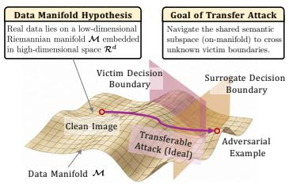  
(a) Data Manifold Perspective on Transfer Attacks

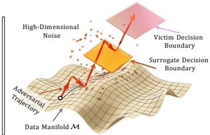  
(b) Off-Manifold Adversarial Trajectory (Standard)

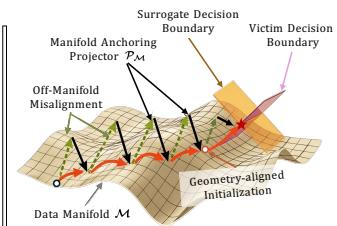  
(c) Manifold-Anchored Adversarial Trajectory (Ours)

Figure 1: Motivation. (a) Manifold hypothesis: Natural images concentrate near a low-dimensional manifold M capturing intrinsic semantics, where decision boundaries of diverse models tend to partially align. (b) Off-manifold divergence: Standard iterative attacks inherently drift into highdimensional noise away from M; in this region, boundaries are less consistent, so the trajectory may cross the surrogate boundary but miss the victim boundary. (c) Manifold anchoring: MABT uses a manifold-anchoring projector with a geometry-aligned initialization to suppress off-manifold deviations while preserving task-relevant semantics to cross shared boundaries.

## 1 Introduction

Adversarial examples (AEs), crafted by adding imperceptible perturbations to clean inputs, expose the fragility of deep learning models [4, 42, 60]. In real-world scenarios where model internals are often inaccessible, transfer-based attacks pose a critical security threat [43, 1]. By generating AEs on a white-box surrogate that can mislead unknown black-box victims, these attacks exploit the transferability of adversarial features across different architectures [11, 54].

To boost transferability, extensive research has been devoted to improving attack generalization from multiple perspectives. Broadly, existing methods can be categorized into three primary streams: (i) Gradient Optimization, which stabilizes update directions via momentum or variance reduction [11, 32, 53]; (ii) Input Transformations, which augment inputs to mitigate overfitting to the surrogate’s decision boundary [58, 12, 41]; and (iii) Model-Refinement and Ensemble Strategies, which diversify surrogates by modifying architectures [30, 36] or aggregating multi-model gradients [29, 27]. In addition, recent studies have explored feature-level objectives [37, 65] and generative priors [55], though these strategies often involve heuristic data augmentations or model priors. Despite their success, these advances mainly refine isolated factors in the attack pipeline, leaving the underlying mechanism of transferability less explicitly characterized.

We revisit the motivation (Fig. 1) from the geometry of the optimization process, and attribute the transferability bottleneck to a geometric misalignment that unfolds in three stages. (i) Manifold premise. Prior work in vision [28] and classical manifold theory [5] suggest that natural images concentrate near a low-dimensional manifold embedded in the high-dimensional pixel space; within this semantically structured region, decision boundaries of different models are more likely to exhibit partial alignment. (ii) Off-manifold drift. However, standard iterative attacks are driven by ambient-space gradients and, even under $\ell _ { p }$ constraints, tend to accumulate perturbations dominated by components orthogonal to the manifold. Consequently, the adversarial trajectory gradually departs from the shared semantic subspace and enters off-manifold regions where the natural-image prior provides little geometric guidance. (iii) Misalignment. Once this drift occurs, optimization increasingly overfits surrogate-specific artifacts; in these ambient regions, decision boundaries can differ substantially across architectures, which in turn weakens transferability.

## 1.1 Our Contributions

This geometric perspective suggests that improving transferability requires more than strengthening a single attack component. Instead, the attack trajectory should be explicitly regularized so that its evolution remains aligned with semantically meaningful directions that are more likely to be shared across models. As illustrated <sub>t</sub>in Fig. 2, once such geometric consistency is S<sup>h</sup> <sub>%</sub><sup>)</sup>better preserved, the induced feature shift on 99.8% Relative Gaint<sup>u s</sup> victim models grows more steadily rather than <sup>F</sup> <sub>V</sub>i<sup>c</sup>saturating early due to surrogate overfitting.

v<sup>e</sup>To bridge this geometric disconnect, we propose Feature Shift on Surrogate (%)Manifold-Anchored Bilevel Transfer (MABT), a unified framework that explicitly anchors adversarial trajectories to the intrinsic data geometry (Fig. 1c). First, we construct a relaxed manifold-anchoring operator that actively suppresses off-manifold components while preserving task-relevant semantics. Building on this geometric foundation, we formulate transfer attack as a distributional bilevel optimization problem, which learns a geometry-aligned initialization by minimizing the expected transfer risk over a surrogate uncertainty distribution. To handle

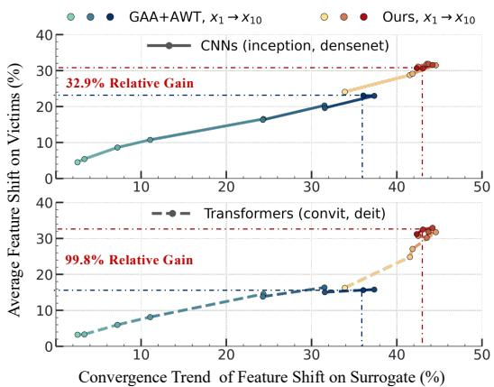  
Figure 2: Feature space divergence. We quantify victim-side feature shift during the attack process as $1 - \cos ( f _ { c l e a n } , f _ { a d v } )$ , where ${ \bf x } _ { 1 } \to { \bf x } _ { 1 0 }$ denotes the adversarial trajectory over 10 attack iterations. Compared with GAA [16]+AWT [6], MABT induces substantially larger semantic shifts on victim models, with relative gains of 99.8% on Transformers and 32.9% on CNNs.

the resulting hierarchical structure efficiently, we further develop a Hessian-free solver based on the regularized gap function. Overall, by enforcing geometric consistency throughout optimization, MABT maintains a more stable positive correlation between surrogate-side and victim-side feature shifts, thereby inducing more universal adversarial features and consistently improving transferability across disparate architectures. We summarize the main contributions as follows:

• We revisit transfer attacks through a manifold anchoring lens, showing that off-manifold drift is a critical bottleneck hindering transferability and motivating a unified framework to correct the resulting geometric misalignment.

• We introduce the Manifold Anchoring Projector (MAP), a relaxed anchoring operator that filters surrogate-specific off-manifold noise, preserves task-relevant semantics, and supports flexible geometric instantiations.

• We formulate transfer attacks as Distributional Bilevel Optimization (DBO) to learn a geometry-aligned initialization by minimizing expected transfer risk. We further introduce a Hessian-free solver with linear complexity to ensure efficient convergence.

• Extensive evaluation on 12 victim models spanning CNNs and Transformers demonstrates improved transferability across 10 baseline attackers and 28 attack configurations under diverse attack and defense settings.

## 2 Related Work

Transfer-based Adversarial Attacks. Current transfer attacks generally follow an iterative optimization paradigm and refine specific components within this loop. (1) Gradient and Input Refinement. To stabilize update directions, Gradient-based methods introduce momentum terms [11, 53], Nesterov acceleration [32], or variance reduction techniques [51] to escape local optima. Simultaneously, Inputbased strategies augment the input space to mitigate overfitting, employing diverse transformations such as random resizing [58], translation [12], scale-invariance [32], and patch-wise mixing [52, 19]. (2) Advanced Objective Design. Beyond standard losses, recent works design specialized objectives to disrupt intrinsic representations. This includes targeting intermediate feature layers [17, 23], fusing multi-scale attention maps [65], or shifting the perturbation domain from pixels to features [37]. Besides, several works also leverage architecture-specific priors such as eroding feature responses in Ghost networks [29], utilizing skip connections [56], or harnessing the computational redundancy in ViTs [36] and alignment modules [30].

Another line of work improves transferability by modifying the surrogate side or learning generatorbased attack mechanisms. Ensemble-based attacks aggregate gradients from multiple models [39, 27] or stochastic variants [3] to reduce model bias. Furthermore, generative approaches [44, 55] and meta-learning frameworks [61, 14] attempt to learn transferable perturbation priors or generalizable attack generators. Beyond adversarial transfer, diffusion models have also been used to model long-horizon trajectories in offline goal-conditioned reinforcement learning [64]. However, these methods still improve transferability mainly through surrogate diversity or learned generation, without explicitly modeling how the adversarial trajectory evolves geometrically. Summary. In contrast to existing works that prioritize specific isolated factors, we investigate the optimization process from the perspective of the adversarial trajectory. We propose a unified framework that explicitly aligns perturbation evolution with the data manifold, while enabling the initialization to learn transferable geometric priors to rectify the geometric disconnect.

Manifold Perspectives in Deep Learning. Beyond specific attack tactics, the manifold hypothesis [5, 28] also serves as a geometric prior in broader visual tasks. In the security realm, this perspective has been adopted for defense mechanisms. Approaches utilize manifold manipulation to purify adversarial perturbations [66] or detect anomalies that deviate from the natural distribution [33]. A recent theoretical study also analyzes transfer-based attacks from a manifold perspective, explaining transferability through the geometry and curvature of the data manifold [7]. On the offensive front, manifold priors are leveraged to craft stealthy or realistic examples. These methods generally constrain perturbations to bypass detection [2], ensure geometric consistency in 3D domains [18], or perform unrestricted attacks by optimizing adversarial directions in generative latent manifolds [8]. Summary. While these studies highlight the relevance of manifold geometry, they mainly use it for purification, detection, theoretical explanation, or realistic example generation. Different from these approaches, our work uses manifold anchoring as a semantic rectifier to explicitly guide the optimization trajectory for improved transferability.

Bilevel Optimization and Applications. Bilevel optimization provides a hierarchical framework for coupled decision-making and has been widely applied in meta-learning [15] and neural architecture search [35]. Recent advances have gradually shifted from expensive Hessian-based methods to more efficient first-order solvers [38, 59, 24]. In trustworthy machine learning, bilevel formulations are mainly used to optimize robustness-related objectives [42, 63]. For transfer attacks, recent work [40] has explored bilevel initialization optimization, but it relies on auxiliary victim models to construct the objective and requires high-order gradient estimation, leading to extra dependencies and computational overhead. Summary. In contrast, MABT formulates a distributional bilevel optimization problem that minimizes the expected transfer risk. This design eliminates the need for extra model accesses and employs a Hessian-free solver, enabling efficient learning of geometryaligned priors for improved transferability.

## 3 Methodology

## 3.1 Perspective

Let D denote the data distribution supported on a low-dimensional Riemannian manifold $\mathcal { M } \subset \mathbb { R } ^ { d }$ embedded within the ambient pixel space $\mathbb { R } ^ { d }$ . Given a clean pair $( \mathbf { x } , \mathbf { y } ) \in \mathcal { M } \times \mathcal { Y }$ and a white-box surrogate $s ,$ , existing iterative attacks $( \mathrm { e . g . }$ , PGD) typically generate perturbations by ascending surrogate gradients inside an $\ell _ { p }$ -norm ball $\Omega = \{ \pmb { \delta } \in \mathbb { R } ^ { d } \ \vert \ \Vert \pmb { \delta } \Vert _ { p } \leq \epsilon \}$ , without explicitly modeling the manifold geometry of natural images. The update rule is governed by:

$$
\begin{array} { r } { \pmb { \delta } _ { t + 1 } = \Pi _ { \Omega } \left( \pmb { \delta } _ { t } + \alpha \cdot \mathrm { s i g n } \left( \nabla _ { \mathbf { x } } \mathcal { L } ( S ( \mathbf { x } + \pmb { \delta } _ { t } ) , \mathbf { y } ) \right) \right) , } \end{array}\tag{1}
$$

where $\Pi _ { \Omega }$ projects the update onto the feasible set, and sign(·) is applied element-wise.

Off-manifold Geometric Misalignment. While Eq. (1) degrades S via high-frequency gradients, it suffers from intrinsic geometric misalignment. Driven by ambient-space gradients, the accumulated perturbation δ is dominated by orthogonal components $( \mathcal { M } ^ { \perp } )$ that pull the trajectory away from M. Consequently, the attack drifts into undefined “off-manifold” regions of surrogate-specific artifacts, which fail to transfer to unknown victims V due to the boundary divergence shown in Fig. 1b.

Manifold Anchoring Projector. To rectify this geometric disconnect, we move beyond standard $\ell _ { p } .$ -bounded attacks defined purely in the ambient space and introduce a manifold-anchored evolution process. We propose the MAP, a generalized operator $\mathcal { P } _ { \mathcal { M } } : \mathbb { R } ^ { d }  \mathbb { R } ^ { d }$ designed to anchor ambient adversarial states toward the intrinsic data manifold by suppressing off-manifold components, while strictly preserving the perturbation budget.

We formulate $\mathcal { P } _ { \mathcal { M } }$ as a generalized variational anchoring problem. Given a query state $\mathbf { z } \in \mathbb { R } ^ { d }$ (e.g., ${ \bf z } = { \bf x } + \delta )$ , the ideal anchoring operator seeks an anchored state $\mathbf { u } ^ { * }$ by solving:

$$
\begin{array} { r l } { \mathcal { P } _ { \mathcal { M } } [ \mathbf { z } ] : = \underset { \mathbf { u } \in \mathbf { x } + \Omega } { \arg \operatorname* { m i n } } } & { \Big ( \underset { \mathrm { F i d e l i t y ~ P o t e n t i a l } } { \underbrace { \Psi ( \mathbf { u } , \mathbf { z } ) } } + \underset { \mathrm { M a n i f o l d ~ P r i o r } } { \underbrace { \mathcal { R } _ { \mathcal { M } } ( \mathbf { u } ) } } \Big ) , } \end{array}\tag{2}
$$

where $\Psi ( \mathbf { u } , \mathbf { z } )$ enforces signal fidelity (e.g., Euclidean or perceptual distance), and $\mathcal { R } _ { \mathcal { M } } ( \cdot )$ penalizes deviations from the data manifold. Here x is omitted from $\mathcal { P } _ { \mathcal { M } }$ for notational simplicity. The feasible set $\mathbf { x } + { \boldsymbol { \Omega } }$ enforces $\| \mathbf { u } - \mathbf { x } \| _ { p } \leq \epsilon ,$ ensuring strict compliance with the adversarial constraints.

We emphasize that Eq. (2) provides a generalized formulation of manifold anchoring, and does not imply that every practical MAP instance exactly solves the variational problem. In practice, efficient operators such as resizing or bit-depth reduction are used as empirical MAP realizations that approximate the anchoring effect by suppressing unstable off-manifold perturbation components while preserving the main semantic structure. Stronger generative operators can provide a closer manifold-anchoring effect at higher computational cost. Different practical MAP instances correspond to different implicit or explicit choices of $\mathcal { R } _ { \mathcal { M } }$ , ranging from structural smoothing priors to learned denoising or generative purification priors. Integrating MAP yields the composite attack objective $\mathcal { L } ( \mathcal { S } ( \mathcal { P } _ { \mathcal { M } } [ \mathbf { x } + \delta ] ) , \mathbf { y } )$ , which regularizes the trajectory away from non-robust orthogonal directions and toward manifold-compatible adversarial vulnerabilities.

Unified and Flexible Implementation. All practical MAP instances are incorporated through a unified operator interface, $\tilde { \mathbf { x } } \overset { - } { = } \mathcal { P } _ { \mathcal { M } } [ \mathbf { x } + \delta ]$ , before surrogate evaluation. Thus, different implementations only instantiate $\mathcal { P } _ { \mathcal { M } }$ in different ways, while the subsequent attack objective $\mathcal { L } ( \cal S ( \tilde { \bf x } ) , \bf y )$ remains unchanged. This interface covers three categories: (i) Explicit Priors, such as spatial rescaling [20], bit-depth reduction, and frequency filtering, which provide low-cost empirical anchoring; (ii) Discrim inative Priors, such as DnCNN [62], which implement anchoring through learned denoising; and (iii) Generative $P r i o r s ,$ such as Latent Diffusion Models [45], which provide stronger purification-based anchoring at higher cost. This unified view enables a flexible trade-off between anchoring strength and computational efficiency within the same manifold-anchored attack objective. More details are provided in Appendix A.2.

## 3.2 Distributional Bilevel Optimization

Integrating the geometric constraints of $\mathcal { P } _ { \mathcal { M } }$ , we formulate transfer attack as DBO. By treating the adversarial initialization $\boldsymbol { \xi }$ as a learnable latent variable, we seek a geometry-aligned state $\pmb { \xi } ^ { * }$ whose induced perturbation $\delta ^ { * } ( \bar { \pmb { \xi } } )$ minimizes the expected transfer risk under surrogate uncertainty:

$$
\operatorname* { m i n } _ { \xi \in \Omega } F ( \pmb { \xi } , \pmb { \delta } ^ { * } ( \pmb { \xi } ) ) : = - \mathcal { R } _ { d i s t } ( \pmb { \delta } ^ { * } ( \pmb { \xi } ) ; \pi ) , \mathrm { ~ s . t . ~ } \pmb { \delta } ^ { * } ( \pmb { \xi } ) = \arg \operatorname* { m i n } _ { \pmb { \delta } \in \Omega } \underbrace { \left( - \mathcal { L } \left( S \left( \mathcal { P } _ { M } [ \mathbf { x } + \pmb { \delta } ] \right) , \mathbf { y } \right) \right) } _ { f ( \pmb { \delta } , \pmb { \xi } ; \pmb { S } ) } .\tag{3}
$$

Here, $F ( \cdot )$ and $f ( \cdot )$ denote the upper-level and lower-level objectives, respectively. The mapping $\delta ^ { * } ( \pmb { \xi } )$ is the inner optimal perturbation obtained by solving $f ( \cdot )$ from initialization $\delta _ { 0 } = \xi$ . Although $f$ is written as $f ( \delta , \xi ; S )$ , its dependence on $\boldsymbol { \xi }$ arises through this initialization and the resulting manifold-anchored optimization trajectory.

Lower-level Perturbation Generation. The lower-level problem optimizes $\delta$ under the $\ell _ { p }$ budget while evaluating the loss on the anchored state $\mathcal { P } _ { \mathcal { M } } [ \mathbf { x } + \mathbf { \bar { \alpha } } ]$ . This anchoring suppresses surrogatespecific off-manifold artifacts and biases the trajectory toward vulnerabilities that are more likely to remain shared across unknown architectures.

Upper-level Risk Minimization. The upper-level objective $\mathcal { R } _ { d i s t }$ bridges the white-box surrogate and unknown victims by optimizing against surrogate uncertainty. Inspired by the Bayesian perspective on transferability [27], we characterize a local hypothesis family around $s$ via a surrogate-induced distribution $\pi ( \pmb \theta | S )$

$$
\begin{array} { r } { \mathcal { R } _ { d i s t } ( \pmb { \delta } ; \pi ) : = \mathbb { E } _ { \pmb { \theta } \sim \pi } \left[ \mathcal { L } \left( S _ { \pmb { \theta } } ( \mathbf { x } + \pmb { \delta } ) , \mathbf { y } \right) \right] . } \end{array}\tag{4}
$$

In practice, $\pi ( \pmb \theta | S )$ is instantiated as a local Gaussian approximation around a fine-tuned surrogate checkpoint, rather than an exact distribution over unknown victims. The expectation in Eq. (4) is estimated by averaging over a small set of sampled surrogate variants, with implementation details deferred to Appendix A.2. Minimizing this expectation prevents overfitting to a single deterministic boundary and guides $\boldsymbol { \xi }$ toward a distributionally transferable region where $\delta ^ { * } ( \pmb { \xi } )$ remains effective under surrogate variations.

## 3.3 Hessian-Free Solution Strategy

To avoid differentiating through the lower-level dynamics, we adopt a value-function approach based on the regularized gap function [59], which encodes lower-level optimality as a differentiable penalty. Let $\mathcal { L } ( \pmb \delta ) : = \mathcal { L } ( S ( \mathcal { P } _ { \mathcal { M } } [ \mathbf { x } + \pmb \delta ] ) , \mathbf { y } )$ . The gap function is defined as

$$
\mathcal { G } _ { \gamma } ( \pmb { \xi } , \pmb { \delta } ) : = \operatorname* { m a x } _ { \hat { \pmb { \delta } } \in \Omega } \left\{ \mathcal { L } ( \hat { \pmb { \delta } } ) - \mathcal { L } ( \pmb { \delta } ) - \frac { 1 } { 2 \gamma } \| \hat { \pmb { \delta } } - \pmb { \delta } \| ^ { 2 } \right\} .\tag{5}
$$

When $\mathcal { G } _ { \gamma }  0 ,$ , δ approaches a stationary point of the lower-level problem. We then optimize the gap-regularized meta objective as follows:

$$
\operatorname* { m a x } _ { \pm \in \Omega } \phi ( \pmb { \xi } ) : = \frac { 1 } { \lambda } \mathcal { R } _ { d i s t } \big ( \pmb { \delta } ^ { * } ( \pmb { \xi } ) ; \pi \big ) - \mathcal { G } _ { \gamma } \big ( \pmb { \xi } , \pmb { \delta } ^ { * } ( \pmb { \xi } ) \big ) .\tag{6}
$$

Exact $\nabla _ { \pmb { \xi } } \phi$ requires backpropagation through the inner solver. We therefore use a first-order hypergradient approximation by identifying the dependence on $\boldsymbol { \xi }$ with the current inner state $\delta ^ { * }$ , i.e., $\nabla _ { \pmb { \xi } } \approx \nabla _ { \pmb { \delta } }$ . By Danskin’s theorem, a subgradient of $\mathcal { G } _ { \gamma }$ is given by the maximizer $\hat { \pmb \delta } ^ { * }$ in $\operatorname { E q . } \left( 5 \right)$ . We approximate it by one-step probing with radius σ, $\begin{array} { r } { \hat { \pmb { \delta } } = \Pi _ { \Omega } ( \pmb { \delta } ^ { * } + \sigma \nabla _ { \delta } \mathcal { L } ( \pmb { \delta } ^ { * } ) ) } \end{array}$ ), yielding

$$
\nabla _ { \pmb { \xi } } \phi \approx \frac { 1 } { \lambda } \nabla _ { \pmb { \delta } } \mathcal { R } _ { d i s t } ( \pmb { \delta } ^ { * } ; \pi ) - \left( \nabla _ { \pmb { \delta } } \mathcal { L } ( \hat { \pmb { \delta } } ) - \nabla _ { \pmb { \delta } } \mathcal { L } ( \pmb { \delta } ^ { * } ) \right) .\tag{7}
$$

```tcl
Algorithm 1: Manifold Anchored Bilevel Transfer
Input: Image pair $( \mathbf { x } , \mathbf { y } ) .$ , surrogate S, MAP $\mathcal { P } _ { \mathcal { M } }$ . Parameters: perturbation budget ϵ; steps
$T , { \bar { K } } ;$ step sizes $\alpha , \beta ;$ probing radius σ; regularization coeff λ.
Output: Adversarial example $\mathbf { x } _ { a d v }$
1 Initialize ${ \pmb \xi } _ { 0 } \gets { \bf 0 }$
/* I: Manifold-Constrained Bilevel Learning */
2 for $t = 0$ to $T - 1$ do
3 $\delta _ { t } \gets \xi _ { t }$
4 $\mathbf { g } _ { t } ^ { \circ }  \overset { \circ \circ } { \nabla } _ { \delta } \mathcal { L } ( S ( \mathcal { P } _ { \mathcal { M } } [ \mathbf { x } + \delta _ { t } ] ) , \mathbf { y } )$ // Single-step manifold-anchored attack
5 $\bar { \pmb { \delta } } _ { t + 1 }  \Pi _ { \Omega } ( \bar { \pmb { \delta } _ { t } } + \bar { \pmb { \beta } } \cdot \mathrm { s i g n } ( \mathbf { \bar { g } } _ { t } ) ) ^ { ) }$
6 $\mathbf { g } _ { t + 1 }  \nabla _ { \delta } \mathcal { L } ( S ( \mathcal { P } _ { \mathcal { M } } [ \mathbf { x } + \delta _ { t + 1 } ] ) , \mathbf { y } )$ // Probing to approximate the gap maximizer
7 $\hat { \pmb { \delta } }  \Pi _ { \Omega } ( \pmb { \delta } _ { t + 1 } + \sigma \cdot \mathbf { g } _ { t + 1 } )$
8 $\hat { \mathbf { g } } \gets \nabla _ { \delta } \mathcal { L } ( S ( \mathcal { P } _ { \mathcal { M } } [ \mathbf { x } + \hat { \delta } ] ) , \mathbf { y } )$ // Gap gradient estimator
9 $\nabla \mathcal { G } \gets \hat { \mathbf { g } } - \mathbf { g } _ { t + 1 }$
10 $\mathbf { v } \gets \nabla _ { \delta } \mathcal { R } _ { d i s t } ( \delta _ { t + 1 } ; \pi )$ // Distributional transfer risk gradient
11 $\begin{array} { r } { \pmb { \xi } _ { t + 1 }  \Pi _ { \Omega } \big ( \pmb { \xi } _ { t } + \alpha \cdot \mathrm { s i g n } \big ( \frac { 1 } { \lambda } \mathbf { v } - \nabla \mathcal { G } \big ) \big ) } \end{array}$ // Meta update: maximize $\begin{array} { r } { \phi = \frac { 1 } { \lambda } \mathcal { R } _ { d i s t } - \mathcal { G } _ { \gamma } } \end{array}$
12 end
/* II: Manifold Adversarial Adaptation */
13 Reset: $\pmb { \delta } _ { 0 } \gets \pmb { \xi } _ { T }$
14 for $k = 0$ to $\dot { K } - 1$ do
15 $\delta _ { k + 1 } \gets \Pi _ { \Omega } \big ( \delta _ { k } + \boldsymbol { \alpha } \cdot \mathrm { s i g n } \big ( \nabla _ { \boldsymbol { \delta } } \mathcal { L } \big ( S ( \mathcal { P } _ { \mathcal { M } } [ \mathbf { x } + \delta _ { k } ] ) , \mathbf { y } \big ) \big ) \big )$
16 end
17 return ${ \bf x } _ { a d v } = { \bf x } + \delta _ { K }$
```

This estimator uses only gradients at $\delta ^ { * }$ and $\hat { \delta } ,$ together with $\nabla _ { \delta } \mathcal { R } _ { d i s t }$ , avoiding any Hessian-vector products. Alg. 1 summarizes the resulting MABT procedure.

Algorithm Analysis. We analyze solver stability using the projected gradient mapping $\mathcal { G } _ { p r o j } ( \pmb { \xi } _ { t } ) : =$ $\begin{array} { r } { \frac { 1 } { \alpha _ { t } } \big ( \Pi _ { \Omega } ( \pmb { \xi } _ { t } + \alpha _ { t } \nabla \phi ( \pmb { \xi } _ { t } ) ) - \pmb { \xi } _ { t } \big ) } \end{array}$ . Detailed proofs are provided in Appendix A.5.

Theorem 3.1 (Non-asymptotic convergence). Under standard assumptions, let $\sigma = \Theta ( 1 / \sqrt { T } )$ . With $\alpha _ { t } = \Theta ( 1 / \sqrt { T } )$ and $\begin{array} { r } { \alpha _ { t } \leq \frac { 1 } { 2 L _ { \phi } } } \end{array}$ for sufficiently large T, the sequence generated by MABT satisfies:

$$
\operatorname* { m i n } _ { 0 \le t < T } \mathbb { E } \left[ \| \mathcal { G } _ { p r o j } ( \pmb { \xi } _ { t } ) \| ^ { 2 } \right] \le \mathcal { O } \left( \frac { 1 } { \sqrt { T } } \right) + \mathcal { O } \left( \frac { 1 } { T } \right) = \mathcal { O } \left( \frac { 1 } { \sqrt { T } } \right) .\tag{8}
$$

Remark. Theorem 3.1 does not claim global optimality of the non-convex bilevel problem; it guarantees projected first-order stationarity of the gap-regularized update under the smooth composite setting. For practical MAP instances that are non-smooth or use surrogate gradients, the same update rule is applied with implementation details and empirical validation provided in the Appendix. For clarity, the analysis uses the projection-based update and omits $\mathrm { s i g n } ( \cdot )$ , which is only used in implementation to match the standard $\ell _ { p }$ -budgeted attack routine; stationarity is defined by $\mathcal { G } _ { p r o j }$

## 4 Experiments

Dataset and Models. We follow commonly used settings to select 5,000 correctly classified images from the ImageNet validation set. To evaluate cross-architecture generalization, we employ ResNet-50 and VGG-19 as surrogates. The generated AEs are evaluated on 12 diverse victim models spanning CNNs, robust ensembles, and Transformers: (i) 6 Standard CNNs: Inception-v3 (Inc-v3) [47], IncRes-v2 [48], DenseNet [22], MobileNet [46], PNASNet [34], and SENet [21]; (ii) 3 Robust Ensembles: Inc $- \mathbf { \nabla } \mathbf { V } \mathbf { } \mathbf { } 3 _ { e n s 3 }$ , Inc-v3<sub>ens4</sub>, and IncRes<sub>ens</sub> [50]; and (iii) 3 Transformers: Visformer [9], DeiT-S [49], and ConViT-B [13]. We use Attack Success Rate (ASR) as the primary metric.

Baselines and Implementation Details. We evaluate MABT as a flexible framework integrated with diverse attackers. We use gradient-based methods (PGD [26], MI [11], VMI [51], GAA [16]) and input-transformation methods (SI [32], DI [58], TI [12]) as base attackers. We further combine them with ensemble-based methods (GHOST [29], MBA [27]) and model-related strategies (AWT [6]), covering the major design paradigms of transfer attacks. We also compare BETAK [40] as a recent initialization-based transfer attack. Finally, we evaluate transferability against five defenses: HGD [31], R&P [57], NIPS-r3 [25], JPEG [20], and RS [10].

Table 1: ASR (%) of MABT across 16 attack configurations on the ResNet-50 surrogate. Results cover 4 base attackers combined with ensemble/model-related strategies. Best results are in bold.
<table><tr><td colspan="18">Untargeted Attack Scenario, ResNet-50 backbone, Average Success Rate (%) ↑</td></tr><tr><td rowspan="2"></td><td rowspan="2">Method</td><td colspan="4">CNN</td><td colspan="4">CNN Ensemble</td><td colspan="2"></td><td colspan="2">Transformer</td><td rowspan="2">Avg.</td></tr><tr><td colspan="4">Inc-v3 Inc-Res-v2 DenseNet MobileNet PNASNet SENet Inc-v3ens3 Inc-v3ens4 IncRes-v2ens</td><td></td><td></td><td></td><td></td><td></td><td>Visformer-s DeiT-s ConViT-b</td><td></td><td></td></tr><tr><td rowspan="7">PGD</td><td>N/A</td><td>16.38</td><td>13.04</td><td>37.52</td><td>36.50</td><td>12.80</td><td>17.10</td><td>10.18</td><td>9.40</td><td>5.86</td><td>10.98</td><td>7.50</td><td>5.56</td><td>15.24</td></tr><tr><td>Ours</td><td>34.96</td><td>24.58</td><td>70.00</td><td>69.22</td><td>27.84</td><td>33.94</td><td>19.72</td><td>16.38</td><td>10.28</td><td>17.02</td><td>11.54</td><td>7.62</td><td>28.59</td></tr><tr><td></td><td>GHOST 18.34</td><td>14.44</td><td>41.56</td><td>41.72</td><td>13.60</td><td>19.78</td><td>10.98</td><td>10.00</td><td>6.02</td><td>12.10</td><td>7.14</td><td>5.90</td><td>16.80</td></tr><tr><td>Ours</td><td>37.38</td><td>27.52</td><td>74.66</td><td>72.58</td><td>30.84</td><td>36.72</td><td>21.18</td><td>17.66</td><td>10.50</td><td>18.24</td><td>11.92</td><td>7.72</td><td>30.58</td></tr><tr><td>MBA</td><td>21.66</td><td>14.98</td><td>49.22</td><td>57.74</td><td>13.06</td><td>20.22</td><td>12.28</td><td>10.26</td><td>5.94</td><td>11.00</td><td>7.58</td><td>4.52</td><td>19.04</td></tr><tr><td>Ours</td><td>44.20</td><td>32.52</td><td>78.76</td><td>81.22</td><td>32.60</td><td>39.20</td><td>27.12</td><td>22.44</td><td>14.54</td><td>19.08</td><td>13.80</td><td>8.36</td><td>34.49</td></tr><tr><td>AWT</td><td>21.24</td><td>15.92</td><td>42.30</td><td>42.38</td><td>15.58</td><td>18.50</td><td>13.52</td><td>13.10</td><td>8.10</td><td>12.04</td><td>8.78</td><td>6.32</td><td>18.15</td></tr><tr><td rowspan="8"></td><td>Ours</td><td>33.94</td><td>24.58</td><td>59.56</td><td>61.92</td><td>24.68</td><td>28.60</td><td>22.52</td><td>20.76</td><td>13.52</td><td>15.52</td><td>12.58</td><td>8.12</td><td>27.19</td></tr><tr><td>N/A</td><td>26.58</td><td>21.76</td><td>51.36</td><td>49.54</td><td>22.96</td><td>30.26</td><td>15.92</td><td>14.54</td><td>8.98</td><td>17.96</td><td>11.96</td><td>9.04</td><td>23.41</td></tr><tr><td>Ours</td><td>59.62</td><td>47.92</td><td>88.78</td><td>87.48</td><td>49.92</td><td>58.54</td><td>37.74</td><td>32.08</td><td>21.02</td><td>34.86</td><td>22.44</td><td>15.92</td><td>46.36</td></tr><tr><td></td><td>GHOST 30.10</td><td>24.02</td><td>58.28</td><td>55.82</td><td>24.86</td><td>34.00</td><td>17.00</td><td>15.12</td><td>9.86</td><td>19.40</td><td>12.34</td><td>9.06</td><td>25.82</td></tr><tr><td>Ours</td><td>63.68</td><td>51.10</td><td>91.22</td><td>90.44</td><td>53.88</td><td>62.42</td><td>40.14</td><td>33.64</td><td>22.72</td><td>37.20</td><td>24.40</td><td>16.40</td><td>48.94</td></tr><tr><td>MBA</td><td>40.42</td><td>29.78</td><td>72.62</td><td>78.42</td><td>27.72</td><td>37.60</td><td>23.32</td><td>19.90</td><td>12.10</td><td>21.68</td><td>14.04</td><td>9.26</td><td>32.24</td></tr><tr><td>Ours</td><td>67.28</td><td>55.56</td><td>93.00</td><td>92.86</td><td>56.52</td><td>63.10</td><td>46.84</td><td>40.76</td><td>28.42</td><td>40.22</td><td>27.42</td><td>18.70</td><td>52.56</td></tr><tr><td>AWT</td><td>32.42</td><td>25.82</td><td>56.02</td><td>55.40</td><td>27.16</td><td>30.36</td><td>21.56</td><td>19.74</td><td>13.94</td><td>18.02</td><td>13.76</td><td>9.82</td><td>27.00</td></tr><tr><td rowspan="8">TI</td><td>Ours</td><td>54.24</td><td>43.10</td><td>81.44</td><td>82.00</td><td>43.54</td><td>48.90</td><td>37.48</td><td>33.70</td><td>23.78</td><td>30.18</td><td>22.12</td><td>15.02</td><td>42.96</td></tr><tr><td>N/A</td><td>17.30</td><td>14.48</td><td>40.10</td><td>38.18</td><td>15.98</td><td>19.80</td><td>11.24</td><td>10.80</td><td>6.48</td><td>11.50</td><td>8.50</td><td>6.32</td><td>16.72</td></tr><tr><td>Ours</td><td>36.22</td><td>25.38</td><td>70.08</td><td>68.32</td><td>29.58</td><td>33.10</td><td>22.12</td><td>19.00</td><td>12.14</td><td>15.36</td><td>11.86</td><td>7.24</td><td>29.20</td></tr><tr><td>Ours</td><td>GHOST 19.92 36.56</td><td>15.58</td><td>44.76</td><td>43.26</td><td>17.30</td><td>22.52</td><td>12.00</td><td>10.76</td><td>6.70</td><td>12.38</td><td>8.68</td><td>6.50</td><td>18.36</td></tr><tr><td>MBA</td><td>24.66</td><td>25.78</td><td>72.32</td><td>70.04</td><td>30.16</td><td>34.80</td><td>22.22</td><td>19.26</td><td>12.22</td><td>16.02</td><td>11.94</td><td>7.24</td><td>29.88</td></tr><tr><td>Ours</td><td></td><td>18.22</td><td>55.76</td><td>60.20</td><td>17.46</td><td>23.72</td><td>14.78</td><td>13.20</td><td>8.60</td><td>11.80</td><td>9.24</td><td>5.62</td><td>21.94</td></tr><tr><td></td><td>44.82</td><td>32.28</td><td>78.48</td><td>79.34</td><td>34.76</td><td>38.40</td><td>29.52</td><td>25.94</td><td>17.24</td><td>17.80</td><td>14.82</td><td>8.50</td><td>35.16</td></tr><tr><td>AWT Ours</td><td>24.22</td><td>18.46</td><td>47.44</td><td>46.50</td><td>19.58</td><td>21.64</td><td>16.16</td><td>15.38</td><td>10.34</td><td>12.80</td><td>10.22</td><td>7.20</td><td>20.83</td></tr><tr><td rowspan="8">GAA Ours AWT</td><td></td><td>36.18</td><td>25.56</td><td>62.04</td><td>63.88</td><td>27.58</td><td>29.42</td><td>25.32</td><td>23.88</td><td>16.56</td><td>15.38</td><td>13.14</td><td>8.54</td><td>28.96</td></tr><tr><td>N/A</td><td>31.46</td><td>24.98</td><td>57.76</td><td>56.68</td><td>24.42</td><td>27.56</td><td>21.76</td><td>20.02</td><td>12.80</td><td>18.60</td><td>13.54</td><td>9.86</td><td>26.62</td></tr><tr><td>Ours</td><td>59.30</td><td>50.86</td><td>85.72</td><td>82.34</td><td>58.12</td><td>58.14</td><td>43.64</td><td>39.00</td><td>29.44</td><td>39.60</td><td>26.48</td><td>19.34</td><td>49.33</td></tr><tr><td></td><td>GHOST 35.20 67.16</td><td>27.04 59.24</td><td>64.24 91.30</td><td>63.72 88.76</td><td>27.60 65.78</td><td>31.14 66.78</td><td>24.64 50.98</td><td>22.48 45.44</td><td>14.80 33.86</td><td>21.24 47.72</td><td>14.56 30.72</td><td>10.94 22.72</td><td>29.80 55.87</td></tr><tr><td>Ours MBA</td></table>

Hyperparameters: We adopt BETAK’s official settings with Inc-v3 as its white-box pseudo-victim. For all methods, we set ϵ = 0.03, K = 10, and $\alpha = 0 . 0 0 6$ . We use spatial resizing (Resize) as the default MAP instantiation, as it provides the best efficiency–performance trade-off according to the analysis in Sec. 4.2. For MABT, we set σ = 0.01 following [59]. The iteration T = 3, regularization $\lambda = 0 . 0 1$ , and lower-level step size β = 1.0 are selected based on ablation results.

## 4.1 Experimental Results

We provide additional results in the Appendix, including MAP and DBO ablations (Tabs. 5 and 6), hyperparameter sensitivity (Fig. 6), additional attackers and VGG-19 (Tabs. 7 and 8), and targeted attacks (Tab. 9).

Quantitative Comparison. As shown in Tab. 1, MABT raises the overall average ASR from 22.52% to 39.28%, corresponding to a 74.4% relative gain, with particularly clear gains on heterogeneous ViTs and robust ensembles. Results on the VGG-19 surrogate (Tab. 8 in Appendix) further support the effectiveness of MABT under a structurally distinct surrogate. Together,

Table 2: Comparison with initialization-based BE-TAK which uses auxiliary pseudo-victims (Inc-v3).
<table><tr><td rowspan="2">Method</td><td rowspan="2"></td><td colspan="3">Average ASR (%)↑, ResNet-50</td><td rowspan="2">Avg.</td></tr><tr><td>CNN</td><td>CNN Ensemble</td><td>Transformer</td></tr><tr><td rowspan="3">PGD</td><td>N/A</td><td>22.22</td><td>8.48</td><td>8.01</td><td>15.24</td></tr><tr><td>BETAK</td><td>30.87</td><td>11.75</td><td>10.47</td><td>20.99</td></tr><tr><td>Ours</td><td>43.42</td><td>15.46</td><td>12.06</td><td>28.59</td></tr><tr><td rowspan="3">MI</td><td>N/A</td><td>33.74</td><td>13.15</td><td>12.99</td><td>23.41</td></tr><tr><td>BETAK</td><td>43.86</td><td>19.74</td><td>15.97</td><td>30.86</td></tr><tr><td>Ours</td><td>65.38</td><td>30.28</td><td>24.41</td><td>46.36</td></tr><tr><td rowspan="3">TI</td><td>N/A</td><td>24.31</td><td>9.51</td><td>8.77</td><td>16.72</td></tr><tr><td>BETAK</td><td>32.41</td><td>13.12</td><td>10.75</td><td>22.17</td></tr><tr><td>Ours</td><td>43.78</td><td>17.75</td><td>11.49</td><td>29.20</td></tr><tr><td rowspan="3">GAA</td><td>N/A</td><td>37.14</td><td>18.19</td><td>14.00</td><td>26.62</td></tr><tr><td>BETAK</td><td>45.55</td><td>23.49</td><td>18.46</td><td>33.26</td></tr><tr><td>Ours</td><td>65.75</td><td>37.36</td><td>28.47</td><td>49.33</td></tr></table>

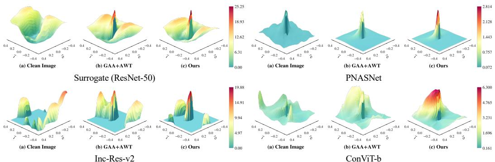  
Figure 3: Adversarial loss landscape. Surfaces are plotted along the gradient direction and a random orthogonal direction. Unlike baselines that suffer from landscape collapse on unknown victims, MABT preserves higher victim-side loss basins with relatively flatter surrounding curvature across architectures, which indicates that the learned trajectory better retains transfer-relevant directions.

these results demonstrate that MABT can serve as a unified transfer framework across different surrogate choices and victim architectures.

Table 3: ASR (%) results against five representative defenses using the ResNet-50 surrogate.
<table><tr><td colspan="10">Defense Mechanism, ResNet-50 backbone, Average Success Rate (%)↑</td></tr><tr><td>Method</td><td></td><td>HGD</td><td>JPEG RS</td><td>R&amp;P</td><td></td><td>NIPS-r3</td><td>Avg.</td><td>Method</td><td>HGD</td><td>JPEG</td><td>RS</td><td>R&amp;P</td><td>NIPS-r3</td><td>Avg.</td></tr><tr><td colspan="2">N/A</td><td>16.94</td><td>11.60</td><td>7.96</td><td>12.12</td><td>14.28</td><td>12.58</td><td rowspan="6"></td><td>N/A</td><td>27.12</td><td>17.54 9.44</td><td>13.40</td><td>23.10</td><td>18.12</td></tr><tr><td></td><td>Ours</td><td>36.16 21.38</td><td>10.42</td><td>13.90</td><td>29.32</td><td>22.24</td><td></td><td>Ours</td><td>59.82</td><td>39.68</td><td>14.80 18.28</td><td>53.68</td><td>37.25</td></tr><tr><td>GHOST</td><td>19.34</td><td>11.84</td><td>8.24</td><td>12.70</td><td>15.76</td><td>13.58</td><td>GHOST</td><td>30.94</td><td>19.02</td><td>9.40</td><td>13.92</td><td>24.80</td><td>19.62</td></tr><tr><td>Ours PGD</td><td>38.86</td><td>21.94</td><td>10.40</td><td>14.26</td><td>31.44</td><td>23.38</td><td>Ours MI</td><td>63.02</td><td>41.56</td><td>15.08</td><td>19.40</td><td>56.08</td><td>39.03</td></tr><tr><td>MBA</td><td>22.22</td><td>13.22</td><td>9.22</td><td>12.84</td><td>19.80</td><td>15.46</td><td>MBA</td><td>40.10</td><td>25.82</td><td>11.94</td><td>15.52</td><td>35.80</td><td>25.84</td></tr><tr><td>Ours</td><td>43.98</td><td>28.48</td><td>11.08</td><td>14.84</td><td>40.10</td><td>27.70</td><td>Ours</td><td>67.04</td><td>48.80</td><td>16.50</td><td>19.18</td><td>63.50</td><td>43.00</td></tr><tr><td></td><td>AWT</td><td>20.94</td><td>16.28 10.30</td><td>14.54</td><td></td><td>19.90</td><td>16.39</td><td>AWT</td><td>32.58</td><td>25.60</td><td>13.18</td><td>17.46</td><td>30.18</td><td>23.80</td></tr><tr><td rowspan="10"></td><td>Ours</td><td>33.80</td><td>25.70</td><td>13.28</td><td>17.06</td><td>30.68</td><td>24.10</td><td>Ours</td><td>54.82</td><td>41.88</td><td>18.20</td><td>22.58</td><td>51.32</td><td>37.76</td></tr><tr><td>N/A</td><td>19.62</td><td>12.70</td><td>8.44</td><td>11.88</td><td>15.86</td><td>13.70</td><td>N/A</td><td>32.10</td><td>24.34</td><td>13.10</td><td>18.02</td><td>29.14</td><td>23.34</td></tr><tr><td>Ours</td><td>37.42</td><td>23.92</td><td>11.56</td><td>14.82</td><td>30.42</td><td>23.63</td><td>Ours</td><td>60.34</td><td>43.60</td><td>15.00</td><td>20.40</td><td>55.26</td><td>38.92</td></tr><tr><td>GHOST</td><td>21.22</td><td>13.26</td><td>8.66</td><td>11.86</td><td>17.76</td><td>14.55</td><td>GHOST</td><td>36.80</td><td>27.20</td><td>14.14</td><td>19.64</td><td>32.78</td><td>26.11</td></tr><tr><td>Ours</td><td>39.20</td><td>23.98</td><td>11.76</td><td>14.92</td><td>31.22</td><td>24.22</td><td>Ours</td><td>68.12</td><td>50.70</td><td>15.70</td><td>21.54</td><td>62.86</td><td>43.78</td></tr><tr><td>MBA</td><td>27.06</td><td>16.18</td><td>10.24</td><td>13.16</td><td>23.76</td><td>18.08</td><td>GAA MBA</td><td>32.48</td><td>23.24</td><td>12.58</td><td>17.20</td><td>31.04</td><td>23.31</td></tr><tr><td>Ours</td><td>45.68</td><td>31.44</td><td>12.32</td><td>16.18</td><td>40.16</td><td>29.16</td><td>Ours</td><td>63.60</td><td>47.90</td><td>15.90</td><td>19.56</td><td>61.10</td><td>41.61</td></tr><tr><td>AWT</td><td>25.44</td><td>19.32</td><td>11.80</td><td>15.48</td><td>23.26</td><td>19.06</td><td>AWT</td><td>38.20</td><td>30.28</td><td>15.12</td><td>20.86</td><td>35.24</td><td>27.94</td></tr><tr><td></td><td>37.10</td><td>29.46</td><td>14.60</td><td>18.52</td><td>33.92</td><td>26.72</td><td>Ours</td><td>47.60</td><td>40.22</td><td>19.58</td><td>24.74</td><td>44.40</td><td>35.31</td></tr><tr><td>Ours</td><td></td><td></td><td></td><td></td><td></td><td></td><td></td><td></td><td></td><td></td><td></td><td></td><td></td></tr></table>

Visualization of Adversarial Loss Landscapes. To explicate the mechanism of MABT, Fig. 3 visualizes the adversarial loss landscape L(x + a⃗ι + b⃗o), plotted along the gradient direction ⃗ι and a random orthogonal direction ⃗o. While mainstream attacks (e.g., GAA+AWT) generate sharp peaks on the surrogate that collapse rapidly on victim models (indicating severe overfitting), MABT maintains a higher loss basin with flatter curvature across architectures. This visualization supports our trajectory-alignment interpretation: MABT tends to preserve higher victim-side loss basins with flatter surrounding curvature, suggesting reduced surrogate-specific overfitting.

Comparison with Initialization Attackers. We also benchmark MABT against BETAK [40]. While BETAK relies on an auxiliary pseudo-victim (i.e., Inc-v3), MABT operates without extra victim model dependencies, anchoring the adversarial trajectory through the intrinsic data geometry. To maintain a consistent evaluation protocol, the mean ASR of the CNN victim suite incorporates results from Inc-v3. On GAA, Tab. 2 shows that MABT increases the average ASR from 33.26% for BETAK to 49.33%, corresponding to a 48.32% relative improvement and supporting the effectiveness of intrinsic geometric alignment.

Evaluation against Defense Mechanisms. We subsequently assess MABT under five representative defense strategies. As reported in Tab. 3, MABT improves the aggregate ASR under these defenses. These results suggest that manifold-anchored perturbations remain more transferable under diverse defense mechanisms.

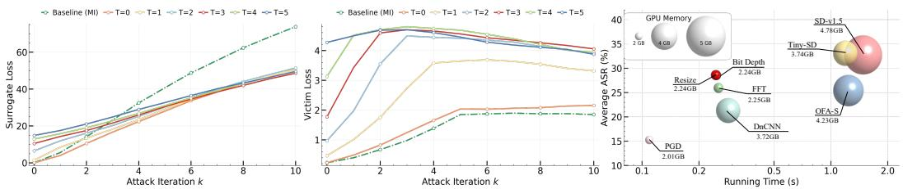  
Figure 4: Convergence and efficiency analysis. Left & Mid: Increasing T improves geometryaligned initialization to mitigate surrogate overfitting, thereby ensuring sustained victim loss growth during the subsequent attack. Right: Resize provides a favorable low-cost MAP realization, while generative priors achieve stronger anchoring at higher computational cost.

Targeted Attack Performance. We further evaluate MABT on the more challenging targeted attack scenario. As shown in Tab. 9 in Appendix, MABT consistently outperforms baselines across diverse settings. This suggests that the geometry-aware optimization can also benefit targeted transfer by guiding perturbations toward target-relevant feature directions.

## 4.2 Ablation Results

Convergence Analysis. Fig. 4 shows distinct optimization behaviors. PGD rapidly improves the surrogate loss but saturates early on the Inc-v3 victim, indicating severe surrogate-specific overfitting. In contrast, larger T in MABT keeps the surrogate trajectory controlled while increasing the victimside loss, suggesting better transfer-oriented initialization. Even T = 0 (MAP-only) outperforms PGD, and $T = 3$ provides a strong trade-off between warm-up strength and transferability.

Effectiveness of MAP and DBO. We evaluate each component through quantitative ablation and geometric feature-shift correlation. (i) Component Gain. As shown in Tab. 4, MAP and DBO each improve the baseline, and their combination achieves the best performance. (ii) Feature-space Alignment. Fig. 5 compares surrogate-side and victim-side feature shifts across heterogeneous victims. PGD shows weaker correlation and larger variance, suggesting that stronger surrogate distortion does not reliably transfer to victims. MAP improves this correlation by rectifying the trajectory, while DBO further shifts the initialization toward more transferable regions. Together, the two components yield more consistent surrogatevictim feature-shift alignment across architectures, indicating that MABT better preserves transfer-relevant trajectory directions.

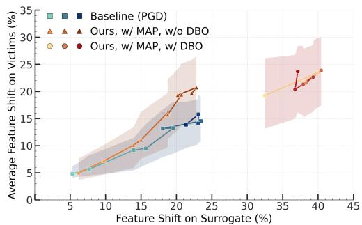  
Figure 5: Feature shift consistency. We plot surrogate-side (ResNet-50) feature shift against the average victim-side shift. Shaded regions denote the standard deviation over four heterogeneous victims (Inc-v3, DenseNet, DeiT-s and ConViT-b).

Efficiency vs. MAP Performance. As shown in Fig. 4 (Right), the default Resize MAP already yields nearly ×2 ASR over PGD with negligible overhead, making it an efficient low-cost realization. Some stronger generative priors, such as SD-v1.5 and Tiny-SD, further improve ASR by about 4-5 points, but introduce higher latency. This trend shows that MAP provides a scalable anchoring interface rather than a single fixed operator.

Ablation of Hyperparameters $( T , \beta , \lambda )$ . As shown in Fig. 6 ofAppendix A.3.3, MABT is sta-

Table 4: Ablation results by implementing DBO and MAP based on PGD and PGD+AWT.
<table><tr><td rowspan="2">Method</td><td colspan="3">Average ASR (%)↑, ResNet-50</td><td rowspan="2">Avg.</td></tr><tr><td></td><td>CNN CNN Ensemble Transformer</td><td></td></tr><tr><td rowspan="9">PGD</td><td>N/A</td><td>22.22 8.48</td><td>8.01</td><td>15.24</td></tr><tr><td>w/ DBO,w/o MAP30.82</td><td>10.11</td><td>8.40</td><td>20.04</td></tr><tr><td>w/o DBO,w/ MAP29.24</td><td>12.67</td><td>9.67</td><td>20.21</td></tr><tr><td>w/ DBO,w/MAP 43.42</td><td>15.46</td><td>12.06</td><td>28.59</td></tr><tr><td>AWT</td><td>25.99 11.57</td><td>9.05</td><td>18.15</td></tr><tr><td>w/ DBO,w/o MAP34.11</td><td>14.75</td><td>10.43</td><td>23.35</td></tr><tr><td>w/o DBO,w/ MAP32.22</td><td>15.73</td><td>11.02</td><td>22.80</td></tr><tr><td>w/ DBO,w/ MAP 38.88</td><td>18.93</td><td>12.09</td><td>27.19</td></tr></table>

ble with respect to β and λ, with limited ASR variation across broad ranges $( \mathrm { e . g . , } \lambda \in [ 1 0 ^ { - 3 } , 1 0 ^ { - 1 } ] )$ In contrast, T mainly controls the bilevel warm-up strength: too small $\check { T }$ under-aligns the initialization, while overly large T may overfit the surrogate warm-up. We set $T = 3$ as the default trade-off between transferability and efficiency.

## 5 Conclusion

We propose MABT to rectify the geometric disconnect in adversarial transferability. By synergizing MAP with a distributional bilevel framework, MABT encourages adversarial trajectories to remain closer to the shared semantic subspace. Furthermore, our Hessian-free solver enables low-overhead integration with diverse attacks, achieving strong performance across heterogeneous architectures. Limitation. Current evaluation mainly focuses on image classification, while extending MABT to dense prediction tasks remains future work. This study may provide useful insights for more reliable robustness evaluation under black-box transfer settings.

## References

[1] Fengshuo Bai, Runze Liu, Yali Du, Ying Wen, and Yaodong Yang. Rat: Adversarial attacks on deep reinforcement agents for targeted behaviors. In Proceedings ofthe AAAI Conference on Artificial Intelligence, 2025.

[2] Ofir Bar Tal, Adi Haviv, and Amit H. Bermano. Omg-attack: Self-supervised on-manifold generation of transferable evasion attacks. In Proceedings of the IEEE/CVF International Conference on Computer Vision Workshops, 2023.

[3] Zikui Cai, Yaoteng Tan, and M Salman Asif. Ensemble-based blackbox attacks on dense prediction. In Proceedings of the IEEE/CVF Conference on Computer Vision and Pattern Recognition, 2023.

[4] Nicholas Carlini and David Wagner. Towards evaluating the robustness of neural networks. In IEEE Symposium on Security and Privacy, 2017.

[5] Olivier Chapelle, Bernhard Schölkopf, and Alexander Zien. A discussion of semi-supervised learning and transduction. In Semi-supervised learning. 2006.

[6] Jiahao Chen, Zhou Feng, Rui Zeng, Yuwen Pu, Chunyi Zhou, Yi Jiang, Yuyou Gan, Jinbao Li, and Shouling Ji. Enhancing adversarial transferability with adversarial weight tuning. In Proceedings of the AAAI Conference on Artificial Intelligence, 2025.

[7] Yanbo Chen and Weiwei Liu. A theory of transfer-based black-box attacks: Explanation and implications. Advances in Neural Information Processing Systems, 36:13887–13907, 2023.

[8] Zhaoyu Chen, Bo Li, Shuang Wu, Kaixun Jiang, Shouhong Ding, and Wenqiang Zhang. Contentbased unrestricted adversarial attack. Advances in Neural Information Processing Systems, 36: 51719–51733, 2023.

[9] Zhengsu Chen, Lingxi Xie, Jianwei Niu, Xuefeng Liu, Longhui Wei, and Qi Tian. Visformer: The vision-friendly transformer. In Proceedings of the IEEE/CVF International Conference on Computer Vision, 2021.

[10] Jeremy Cohen, Elan Rosenfeld, and Zico Kolter. Certified adversarial robustness via randomized smoothing. In International Conference on Machine Learning, 2019.

[11] Yinpeng Dong, Fangzhou Liao, Tianyu Pang, Hang Su, Jun Zhu, Xiaolin Hu, and Jianguo Li. Boosting adversarial attacks with momentum. In Proceedings of the IEEE Conference on Computer Vision and Pattern Recognition, 2018.

[12] Yinpeng Dong, Tianyu Pang, Hang Su, and Jun Zhu. Evading defenses to transferable adversarial examples by translation-invariant attacks. In Proceedings of the IEEE/CVF Conference on Computer Vision and Pattern Recognition, 2019.

[13] Stéphane d’Ascoli, Hugo Touvron, Matthew L Leavitt, Ari S Morcos, Giulio Biroli, and Levent Sagun. Convit: Improving vision transformers with soft convolutional inductive biases. In International Conference on Machine Learning, 2021.

[14] Shuman Fang, Jie Li, Xianming Lin, and Rongrong Ji. Learning to learn transferable attack. In Proceedings ofthe AAAI Conference on Artificial Intelligence, 2022.

[15] Luca Franceschi, Paolo Frasconi, Saverio Salzo, Riccardo Grazzi, and Massimilano Pontil. Bilevel programming for hyperparameter optimization and meta-learning. 2018.

[16] Fuquan Gan and Yan Wo. Boosting the transferability of adversarial examples through gradient aggregation. IEEE Transactions on Information Forensics and Security, 2025.

[17] Aditya Ganeshan, Vivek BS, and R Venkatesh Babu. Fda: Feature disruptive attack. In Proceedings ofthe IEEE/CVF International Conference on Computer Vision, 2019.

[18] Banibrata Ghosh, Haripriya Harikumar, Svetha Venkatesh, and Santu Rana. Targeted manifold manipulation against adversarial attacks. In IEEE Conference on Secure and Trustworthy Machine Learning, 2025.

[19] Jindong Gu, Hengshuang Zhao, Volker Tresp, and Philip HS Torr. Segpgd: An effective and efficient adversarial attack for evaluating and boosting segmentation robustness. In European Conference on Computer Vision, 2022.

[20] Chuan Guo, Mayank Rana, Moustapha Cisse, and Laurens Van Der Maaten. Countering adversarial images using input transformations. arXiv preprint arXiv:1711.00117, 2017.

[21] Jie Hu, Li Shen, and Gang Sun. Squeeze-and-excitation networks. In Proceedings ofthe IEEE Conference on Computer Vision and Pattern Recognition, 2018.

[22] Gao Huang, Zhuang Liu, Laurens Van Der Maaten, and Kilian Q Weinberger. Densely connected convolutional networks. In Proceedings ofthe IEEE Conference on Computer Vision and Pattern Recognition, 2017.

[23] Qian Huang, Isay Katsman, Horace He, Zeqi Gu, Serge Belongie, and Ser-Nam Lim. Enhancing adversarial example transferability with an intermediate level attack. In Proceedings of the IEEE/CVF International Conference on Computer Vision, 2019.

[24] Kaiyi Ji, Junjie Yang, and Yingbin Liang. Bilevel optimization: Convergence analysis and enhanced design. In International Conference on Machine Learning, 2021.

[25] Alexey Kurakin, Ian Goodfellow, Samy Bengio, Yinpeng Dong, Fangzhou Liao, Ming Liang, Tianyu Pang, Jun Zhu, Xiaolin Hu, Cihang Xie, et al. Adversarial attacks and defences competition. In The NIPS’17 Competition: Building Intelligent Systems, 2018.

[26] Alexey Kurakin, Ian J Goodfellow, and Samy Bengio. Adversarial examples in the physical world. In Artificial Intelligence Safety and Security. 2018.

[27] Qizhang Li, Yiwen Guo, Wangmeng Zuo, and Hao Chen. Making substitute models more bayesian can enhance transferability of adversarial examples. In The Eleventh International Conference on Learning Representations, 2023.

[28] Tianhong Li and Kaiming He. Back to basics: Let denoising generative models denoise. arXiv preprint arXiv:2511.13720, 2025.

[29] Yingwei Li, Song Bai, Yuyin Zhou, Cihang Xie, Zhishuai Zhang, and Alan Yuille. Learning transferable adversarial examples via ghost networks. In Proceedings of the AAAI Conference on Artificial Intelligence, 2020.

[30] Zhiwei Li, Qi Li, Min Ren, Yiwei Ru, and Zhenan Sun. Enhancing adversarial transferability with alignment network. IEEE Transactions on Information Forensics and Security, 2025.

[31] Fangzhou Liao, Ming Liang, Yinpeng Dong, Tianyu Pang, Xiaolin Hu, and Jun Zhu. Defense against adversarial attacks using high-level representation guided denoiser. In Proceedings of the IEEE Conference on Computer Vision and Pattern Recognition, 2018.

[32] Jiadong Lin, Chuanbiao Song, Kun He, Liwei Wang, and John E Hopcroft. Nesterov accelerated gradient and scale invariance for adversarial attacks. arXiv preprint arXiv:1908.06281, 2019.

[33] Wei-An Lin, Chun Pong Lau, Alexander Levine, Rama Chellappa, and Soheil Feizi. Dual manifold adversarial robustness: Defense against lp and non-lp adversarial attacks. In Advances in Neural Information Processing Systems, 2020.

[34] Chenxi Liu, Barret Zoph, Maxim Neumann, Jonathon Shlens, Wei Hua, Li-Jia Li, Li Fei-Fei, Alan Yuille, Jonathan Huang, and Kevin Murphy. Progressive neural architecture search. In Proceedings ofthe European Conference on Computer Vision, 2018.

[35] Hanxiao Liu, Karen Simonyan, and Yiming Yang. Darts: Differentiable architecture search. In International Conference on Learning Representations, 2018.

[36] Jiani Liu, Zhiyuan Wang, Zeliang Zhang, Chao Huang, Susan Liang, Yunlong Tang, and Chenliang Xu. Harnessing the computation redundancy in vits to boost adversarial transferability. arXiv preprint arXiv:2504.10804, 2025.

[37] Renpu Liu, Hao Wu, Jiawei Zhang, Xin Cheng, Xiangyang Luo, Bin Ma, and Jinwei Wang. Pixel2feature attack (p2fa): Rethinking the perturbed space to enhance adversarial transferability. In Forty-second International Conference on Machine Learning, 2025.

[38] Risheng Liu, Xuan Liu, Xiaoming Yuan, Shangzhi Zeng, and Jin Zhang. A value-function-based interior-point method for non-convex bi-level optimization. In International Conference on Machine Learning, 2021.

[39] Yanpei Liu, Xinyun Chen, Chang Liu, and Dawn Song. Delving into transferable adversarial examples and black-box attacks. In International Conference on Learning Representations, 2017.

[40] Yaohua Liu, Jiaxin Gao, Xuan Liu, Xianghao Jiao, Xin Fan, and Risheng Liu. Advancing generalized transfer attack with initialization derived bilevel optimization and dynamic sequence truncation. In International Joint Conference on Artificial Intelligence, 2024.

[41] Yuyang Long, Qilong Zhang, Boheng Zeng, Lianli Gao, Xianglong Liu, Jian Zhang, and Jingkuan Song. Frequency domain model augmentation for adversarial attack. In European Conference on Computer Vision, 2022.

[42] Aleksander Madry, Aleksandar Makelov, Ludwig Schmidt, Dimitris Tsipras, and Adrian Vladu. Towards deep learning models resistant to adversarial attacks. arXiv preprint arXiv:1706.06083, 2017.

[43] Nicolas Papernot, Patrick McDaniel, and Ian Goodfellow. Transferability in machine learning: from phenomena to black-box attacks using adversarial samples. arXiv preprint arXiv:1605.07277, 2016.

[44] Omid Poursaeed, Isay Katsman, Bicheng Gao, and Serge Belongie. Generative adversarial perturbations. In Proceedings of the IEEE Conference on Computer Vision and Pattern Recognition, 2018.

[45] Robin Rombach, Andreas Blattmann, Dominik Lorenz, Patrick Esser, and Björn Ommer. Highresolution image synthesis with latent diffusion models. In Proceedings of the IEEE/CVF Conference on Computer Vision and Pattern Recognition, 2022.

[46] Mark Sandler, Andrew Howard, Menglong Zhu, Andrey Zhmoginov, and Liang-Chieh Chen. Mobilenetv2: Inverted residuals and linear bottlenecks. In Proceedings ofthe IEEE Conference on Computer Vision and Pattern Recognition, 2018.

[47] Christian Szegedy, Vincent Vanhoucke, Sergey Ioffe, Jon Shlens, and Zbigniew Wojna. Rethinking the inception architecture for computer vision. In Proceedings of the IEEE Conference on Computer Vision and Pattern Recognition, 2016.

[48] Christian Szegedy, Sergey Ioffe, Vincent Vanhoucke, and Alexander Alemi. Inception-v4, inception-resnet and the impact of residual connections on learning. In Proceedings of the AAAI Conference on Artificial Intelligence, 2017.

[49] Hugo Touvron, Matthieu Cord, Matthijs Douze, Francisco Massa, Alexandre Sablayrolles, and Hervé Jégou. Training data-efficient image transformers & distillation through attention. In International Conference on Machine Learning, 2021.

[50] Florian Tramèr, Alexey Kurakin, Nicolas Papernot, Ian Goodfellow, Dan Boneh, and Patrick Mc-Daniel. Ensemble adversarial training: Attacks and defenses. arXiv preprint arXiv:1705.07204, 2017.

[51] Xiaosen Wang and Kun He. Enhancing the transferability of adversarial attacks through variance tuning. In Proceedings of the IEEE/CVF Conference on Computer Vision and Pattern Recognition, 2021.

[52] Xiaosen Wang, Xuanran He, Jingdong Wang, and Kun He. Admix: Enhancing the transferability of adversarial attacks. In Proceedings of the IEEE/CVF International Conference on Computer Vision, 2021.

[53] Xiaosen Wang, Jiadong Lin, Han Hu, Jingdong Wang, and Kun He. Boosting adversarial transferability through enhanced momentum. arXiv preprint arXiv:2103.10609, 2021.

[54] Baoyuan Wu, Zihao Zhu, Li Liu, Qingshan Liu, Zhaofeng He, and Siwei Lyu. Attacks in adversarial machine learning: A systematic survey from the life-cycle perspective, 2024.

[55] Shangbo Wu, Yu-an Tan, Ruinan Ma, Wencong Ma, Dehua Zhu, and Yuanzhang Li. Boosting generative adversarial transferability with self-supervised vision transformer features. arXiv preprint arXiv:2506.21046, 2025.

[56] Weibin Wu, Yuxin Su, Xixian Chen, Shenglin Zhao, Irwin King, Michael R Lyu, and Yu-Wing Tai. Boosting the transferability of adversarial samples via attention. In Proceedings of the IEEE/CVF Conference on Computer Vision and Pattern Recognition, 2020.

[57] Cihang Xie, Jianyu Wang, Zhishuai Zhang, Zhou Ren, and Alan Yuille. Mitigating adversarial effects through randomization. arXiv preprint arXiv:1711.01991, 2017.

[58] Cihang Xie, Zhishuai Zhang, Yuyin Zhou, Song Bai, Jianyu Wang, Zhou Ren, and Alan L Yuille. Improving transferability of adversarial examples with input diversity. In Proceedings of the IEEE/CVF Conference on Computer Vision and Pattern Recognition, 2019.

[59] Wei Yao, Haian Yin, Shangzhi Zeng, and Jin Zhang. Overcoming lower-level constraints in bilevel optimization: A novel approach with regularized gap functions. In The Thirteenth International Conference on Learning Representations, 2024.

[60] Jia-Li Yin, Weijian Wang, Wei Lin, Ximeng Liu, et al. Adversarial-inspired backdoor defense via bridging backdoor and adversarial attacks. In Proceedings of the AAAI Conference on Artificial Intelligence, 2025.

[61] Zheng Yuan, Jie Zhang, Yunpei Jia, Chuanqi Tan, Tao Xue, and Shiguang Shan. Meta gradient adversarial attack. In Proceedings of the IEEE/CVF International Conference on Computer Vision, 2021.

[62] Kai Zhang, Wangmeng Zuo, Yunjin Chen, Deyu Meng, and Lei Zhang. Beyond a gaussian denoiser: Residual learning of deep cnn for image denoising. IEEE Transactions on Image Processing, 2017.

[63] Yihua Zhang, Guanhua Zhang, Prashant Khanduri, Mingyi Hong, Shiyu Chang, and Sijia Liu. Revisiting and advancing fast adversarial training through the lens of bi-level optimization. In International Conference on Machine Learning, 2022.

[64] Hengrui Zhang, Yuhu Cheng, C. L. Philip Chen, and Xuesong Wang. Diffusion subgoal planning for long-horizon offline goal-conditioned reinforcement learning. arXiv preprint arXiv:2609.34575, 2026. https://arxiv.org/abs/2609.34575.

[65] Desheng Zheng, Wuping Ke, Xiaoyu Li, Yaoxin Duan, Guangqiang Yin, and Fan Min. Enhancing the transferability of adversarial attacks via multi-feature attention. IEEE Transactions on Information Forensics and Security, 2025.

[66] Jianli Zhou, Chao Liang, and Jun Chen. Manifold projection for adversarial defense on face recognition. In European Conference on Computer Vision, 2020.

## A Appendix

All the above experiments were conducted on a server equipped with an NVIDIA H100 GPU with 80GB memory. The core implementation is provided in the Supplementary Material to facilitate reproducibility. The full code repository will be made public upon acceptance.

## A.1 Section Overview

Below is a brief summary of the Appendix.

• Method Details: Appendix A.2 provides practical details of MABT, including the local Gaussian instantiation of the surrogate distribution in DBO, finite-sample estimation of the expected transfer risk, and practical MAP realizations with their backward handling.

• Runtime and Ablation Results: Appendix A.3 reports runtime-fair comparisons, ablations of different MAP priors, component studies of MAP and DBO, and hyperparameter sensitivity analyses.

• Comparative Results: Appendix A.4 provides extended empirical evaluations, including full results on additional attackers, VGG-19 surrogate results, targeted attack results, and defense scenarios.

• Algorithm Analysis: Appendix A.5 presents the assumptions and proof for the convergence result of the proposed gap-regularized solver.

## A.2 Method Details

DBO Instantiation. In the main text, the upper-level distribution $\pi ( \pmb \theta | S )$ is introduced to model local surrogate uncertainty. In practice, we do not assume access to the true distribution of unknown victim models. Instead, we instantiate $\pi ( \pmb \theta | S )$ as a local Gaussian approximation around a fine-tuned surrogate checkpoint. Starting from the source surrogate $s ,$ we first perform lightweight fine-tuning and then sample a small family of surrogate variants by adding Gaussian parameter perturbations around the resulting checkpoint. The sampled variants are fixed during attack optimization, and the expectation in Eq. (4) is computed by finite-sample averaging:

$$
\mathcal { R } _ { d i s t } ( \delta ; \pi ) \approx \frac { 1 } { N } \sum _ { i = 1 } ^ { N } \mathcal { L } ( \mathcal { S } _ { \boldsymbol { \theta } _ { i } } ( \mathbf { x } + \delta ) , \mathbf { y } ) , \quad \boldsymbol { \theta } _ { i } \sim \pi ( \boldsymbol { \theta } | \mathcal { S } ) .\tag{9}
$$

We use $N = 3$ surrogate variants in our implementation to keep the upper-level risk estimation efficient while capturing local surrogate uncertainty. This finite-sample approximation serves as a practical realization of the distributional objective, where $\pi ( \pmb \theta | S )$ represents a surrogate-induced local hypothesis family rather than the exact distribution of unknown victim models. Practically, the surrogate is fine-tuned following MBA [27] for 10 epochs at a batch size of 1024, utilizing the SGD optimizer with a learning rate of 0.001, momentum of 0.9, and weight decay of 5e-4.

MAP Realizations and Practical Optimization. All MAP realizations are implemented through the same forward anchoring interface, $\tilde { \mathbf { x } } = \mathcal { P } _ { \mathcal { M } } [ \mathbf { x } + \boldsymbol { \delta } ]$ , where x˜ denotes the anchored input used for surrogate evaluation. They differ only in how the operator $\mathcal { P } _ { \mathcal { M } }$ is instantiated. We consider the following three categories:

• Explicit structural priors. This category includes Resize, Bit-Depth, and FFT filtering. Resize applies bilinear downsampling followed by upsampling with a scale factor of 0.9 to attenuate unstable high-frequency perturbations. Bit-Depth removes small-magnitude variations through low-bit quantization, and FFT filtering suppresses high-frequency components in the frequency domain. These lightweight operators provide efficient empirical anchoring with negligible computational overhead.

• Discriminative denoising prior. We instantiate this category with DnCNN [62]. Given an input u, DnCNN predicts a residual $r _ { \psi } ( { \bf u } )$ , and the anchored output is computed as $\mathbf { u } - r _ { \psi } ( \mathbf { u } )$

This learned denoising prior suppresses noise-like perturbation components while preserving the main image structure.

• Generative purification priors. This category includes SD-v1.5 [45], Tiny-SD, and OFA-S. These diffusion-based operators map the perturbed input to a purified output, offering potentially stronger but more computationally expensive anchoring realizations.

For practical optimization, differentiable realizations are handled by their native autograd pipelines, while non-smooth or generative realizations use standard surrogate-gradient approximations for update estimation. All variants share the same forward anchoring interface, whereas the theoretical analysis in the main text is stated for smooth composite settings satisfying the required assumptions.

## A.3 Ablation Results

Table 5: Ablation study on the effectiveness of different MAP components based on PGD attacker.
<table><tr><td rowspan="2">Method</td><td rowspan="2"></td><td colspan="6">CNN</td><td colspan="3">CNN Ensemble</td><td colspan="3">Transformer</td><td rowspan="2">Avg.</td></tr><tr><td>Inc-v3 Inc-Res-v2 DenseNetMobileNet PNASNet SENet Inc-v3ens3 Inc-v3ens4 IncRes-v2ens Visformer-s DeiT-s ConViT-b</td><td></td><td></td><td></td><td></td><td></td><td></td><td></td><td></td><td></td><td></td><td></td></tr><tr><td rowspan="7"></td><td>N/A</td><td>16.38</td><td>13.04</td><td>37.52</td><td>36.50</td><td>12.80</td><td>17.10</td><td>10.18</td><td>9.40</td><td>5.86</td><td>10.98</td><td>7.50</td><td>5.56</td><td>15.24</td></tr><tr><td>FFT</td><td>32.42</td><td>23.00</td><td>64.06</td><td>64.22</td><td>24.34</td><td>28.66</td><td>17.96</td><td>15.18</td><td>8.98</td><td>14.44</td><td>10.90</td><td>7.12</td><td>25.94</td></tr><tr><td>Bit-Depth 34.68</td><td></td><td>25.50</td><td>69.78</td><td>70.78</td><td>25.38</td><td>33.76</td><td>19.08</td><td>15.44</td><td>9.50</td><td>20.28</td><td>11.08</td><td>7.50</td><td>28.56</td></tr><tr><td>Resize</td><td>34.96</td><td>24.58</td><td>70.00</td><td>69.22</td><td>27.84</td><td>33.94</td><td>19.72</td><td>16.38</td><td>10.28</td><td>17.02</td><td>11.54</td><td>7.62</td><td>28.59</td></tr><tr><td>DnCNN</td><td>24.62</td><td>16.92</td><td>56.50</td><td>59.88</td><td>16.12</td><td>23.96</td><td>12.94</td><td>10.54</td><td>6.10</td><td>13.56</td><td>8.36</td><td>5.86</td><td>21.28</td></tr><tr><td>OFA-S</td><td>31.20</td><td>23.08</td><td>57.32</td><td>59.48</td><td>22.04</td><td>26.16</td><td>19.76</td><td>17.82</td><td>11.06</td><td>16.72</td><td>11.72</td><td>8.46</td><td>25.40</td></tr><tr><td>SD-v1.5</td><td>41.68</td><td>31.44</td><td>73.82</td><td>71.16</td><td>34.74</td><td>37.80</td><td>25.14</td><td>21.08</td><td>12.86</td><td>20.58</td><td>13.20</td><td>9.32</td><td>32.74</td></tr><tr><td></td><td>Tiny-SD</td><td>42.16</td><td>31.46</td><td>72.84</td><td>71.30</td><td>35.00</td><td>38.14</td><td>25.98</td><td>21.58</td><td>13.72</td><td>20.90</td><td>13.78</td><td>9.86</td><td>33.06</td></tr></table>

Table 6: Ablation study on the effectiveness of individual DBO and MAP components.
<table><tr><td rowspan="2">Method</td><td colspan="6">CNN</td><td colspan="3">CNN Ensemble</td><td colspan="3">Transformer</td><td rowspan="2">Avg.</td></tr><tr><td>Inc-v3 Inc-Res-v2 DenseNet MobileNet PNASNet SENet Inc-v3ens3 Inc-v3ens4 IncRes-v2ens Visformer-s DeiT-s ConViT-b</td><td></td><td></td><td></td><td></td><td></td><td></td><td></td><td></td><td></td><td></td><td></td></tr><tr><td>N/A</td><td>16.38</td><td>13.04</td><td>37.52</td><td>36.50</td><td>12.80</td><td>17.10</td><td>10.18</td><td>9.40</td><td>5.86</td><td>10.98</td><td>7.50</td><td>5.56</td><td>15.24</td></tr><tr><td>w/ DBO,w/o MAP 22.64</td><td></td><td>15.76</td><td>52.58</td><td>57.24</td><td>14.52</td><td>22.18</td><td>13.02</td><td>10.80</td><td>6.50</td><td>12.26</td><td>7.92</td><td>5.02</td><td>20.04</td></tr><tr><td>w/o DBO,w/ MAP 22.78</td><td></td><td>18.28</td><td>47.94</td><td>43.84</td><td>20.70</td><td>21.92</td><td>14.80</td><td>14.30</td><td>8.90</td><td>11.98</td><td>10.02</td><td>7.02</td><td>20.21</td></tr><tr><td>w/DBO,w/MAP 34.96</td><td></td><td>24.58</td><td>70.00</td><td>69.22</td><td>27.84</td><td>33.94</td><td>19.72</td><td>16.38</td><td>10.28</td><td>17.02</td><td>11.54</td><td>7.62</td><td>28.59</td></tr><tr><td>GHOST</td><td>18.34</td><td>14.44</td><td>41.56</td><td>41.72</td><td>13.60</td><td>19.78</td><td>10.98</td><td>10.00</td><td>6.02</td><td>12.10</td><td>7.14</td><td>5.90</td><td>16.80</td></tr><tr><td>w/ DBO,w/o MAP 24.24</td><td></td><td>16.26</td><td>54.12</td><td>58.32</td><td>15.92</td><td>23.14</td><td>13.20</td><td>10.76</td><td>5.94</td><td>12.46</td><td>7.84</td><td>5.22</td><td>20.62</td></tr><tr><td>w/o DBO,w/ MAP 27.00</td><td></td><td>20.60</td><td>54.90</td><td>50.52</td><td>24.46</td><td>25.96</td><td>17.32</td><td>15.12</td><td>10.36</td><td>13.72</td><td>10.52</td><td>7.60</td><td>23.17</td></tr><tr><td>w/DBO,w/MAP 37.38 PGD</td><td></td><td>27.52</td><td>74.66</td><td>72.58</td><td>30.84</td><td>36.72</td><td>21.18</td><td>17.66</td><td>10.50</td><td>18.24</td><td>11.92</td><td>7.72</td><td>30.58</td></tr><tr><td>MBA</td><td>21.66</td><td>14.98</td><td>49.22</td><td>57.74</td><td>13.06</td><td>20.22</td><td>12.28</td><td>10.26</td><td>5.94</td><td>11.00</td><td>7.58</td><td>4.52</td><td>19.04</td></tr><tr><td>w/ DBO,w/o MAP 32.58</td><td></td><td>23.54</td><td>67.52</td><td>72.94</td><td>21.02</td><td>31.20</td><td>17.04</td><td>14.24</td><td>8.68</td><td>16.80</td><td>9.76</td><td>6.30</td><td>26.80</td></tr><tr><td>w/o DBO,w/ MAP 31.26</td><td></td><td>22.14</td><td>64.08</td><td>67.16</td><td>22.18</td><td>26.68</td><td>19.96</td><td>17.30</td><td>11.24</td><td>12.02</td><td>10.92</td><td>6.28</td><td>25.94</td></tr><tr><td>w/ DBO,w/ MAP44.20</td><td></td><td>32.52</td><td>78.76</td><td>81.22</td><td>32.60</td><td>39.20</td><td>27.12</td><td>22.44</td><td>14.54</td><td>19.08</td><td>13.80</td><td>8.36</td><td>34.49</td></tr><tr><td>AWT</td><td>21.24</td><td>15.92</td><td>42.30</td><td>42.38</td><td>15.58</td><td>18.50</td><td>13.52</td><td>13.10</td><td>8.10</td><td>12.04</td><td>8.78</td><td>6.32</td><td>18.15</td></tr><tr><td>w/ DBO,w/o MAP 28.28</td><td></td><td>19.86</td><td>54.62</td><td>59.52</td><td>18.54</td><td>23.84</td><td>17.84</td><td>16.12</td><td>10.30</td><td>14.02</td><td>10.40</td><td>6.88</td><td>23.35</td></tr><tr><td>w/o DBO,w/ MAP 27.88</td><td></td><td>21.52</td><td>50.40</td><td>48.02</td><td>22.00</td><td>23.52</td><td>18.14</td><td>17.22</td><td>11.84</td><td>13.66</td><td>11.28</td><td>8.12</td><td>22.80</td></tr><tr><td>w/DBO,w/MAP 33.94</td><td></td><td>24.58</td><td>59.56</td><td>61.92</td><td>24.68</td><td>28.60</td><td>22.52</td><td>20.76</td><td>13.52</td><td>15.52</td><td>12.58</td><td>8.12</td><td>27.19</td></tr></table>

## A.3.1 Ablation of Different MAP Implementations

To empirically validate the flexibility of MABT, we instantiate the MAP with seven practical realizations covering the three categories described above. As visualized in the bubble chart in Fig. 4 (Right) and reported in Tab. 5, MABT consistently improves transferability across different MAP choices, while exhibiting distinct efficiency–performance trade-offs.

Performance vs. Efficiency Trade-off. Among generative priors, SD-v1.5 and Tiny-SD achieve the highest ASR, reaching 32.74% and 33.06% average ASR, respectively. However, these stronger purification-based realizations also introduce substantially higher latency and memory consumption. OFA-S, despite being a compact diffusion variant, attains 25.40% average ASR and does not outperform the simpler Resize prior. This suggests that generative priors can provide stronger anchoring effects, but their advantage is not uniform once model compression and computational cost are considered.

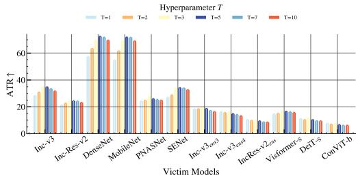  
(a) T on ResNet-50

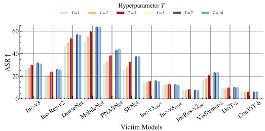  
(b) T on VGG-19

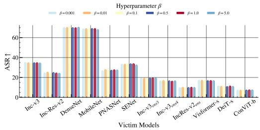  
(c) β on ResNet-50

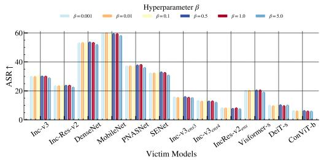  
(d) β on VGG-19

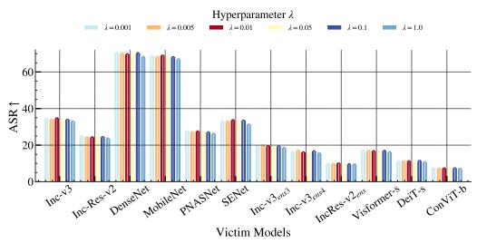  
(e) λ on ResNet-50

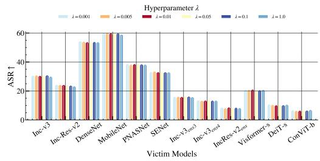  
(f) λ on VGG-19  
Figure 6: Hyperparameter sensitivity on ResNet-50 and VGG-19 surrogates. We evaluate the effects of the warm-up iteration T, lower-level step size β, and gap coefficient λ.

In contrast, Resize achieves a competitive 28.59% average ASR with negligible overhead. Although it is not the strongest MAP realization in terms of ASR, it provides the most favorable efficiency– performance balance among the tested variants. Therefore, we adopt Resize as the default MAP realization in the main experiments. Overall, these results show that MABT is not tied to a specific MAP operator, but provides a flexible anchoring interface that can accommodate lightweight structural priors, discriminative denoisers, and generative purification operators.

## A.3.2 Effectiveness of MAP and DBO

The full results in Tab. 6 dissect the individual contributions of MAP and DBO across various base attackers. Specifically, MAP suppresses surrogate-specific off-manifold noise to rectify the adversarial trajectory, while DBO learns a geometry-aligned initialization that elevates the starting point of the feature shift. Crucially, the joint optimization of MAP and DBO achieves the best performance, outperforming individual components by a significant margin. This synergy compel the adversarial trajectory to converge on shared semantic features.

## A.3.3 Hyperparameter Analysis

Fig. 6 visualizes the sensitivity of T, β, and λ on ResNet-50 and VGG-19 surrogates. MABT is stable to $\beta$ and λ over broad ranges, suggesting that the gap-regularized update is not sensitive to their exact values. By contrast, $T$ controls the bilevel warm-up strength: small T may under-align the initialization, whereas overly large $T$ may overfit the warm-up to surrogate-specific directions. The consistent trends across both backbones support the default setting $T = 3 , \beta { \bar { = } } 1 . 0$ , and λ = 0.01.

Table 7: Comparison of untargeted ASR (%) by implementing 3 base attackers under MABT, including VMI, DI, and SI. We integrate and compare MABT with different method combinations. The best results are highlighted in bold.
<table><tr><td colspan="11">Untargeted Attack Scenario, ResNet-50 backbone, ASR (%) ↑</td></tr><tr><td rowspan="2">Method</td><td rowspan="2"></td><td colspan="4">CNN</td><td colspan="4">CNN Ensemble</td><td colspan="2">Transformer</td><td rowspan="2">Avg.</td></tr><tr><td colspan="2">Inc-v3 Inc-Res-v2 DenseNet MobileNet PNASNet SENet Inc-v3ens3 Inc-v3ens4 IncRes-v2ens</td><td></td><td></td><td></td><td></td><td></td><td></td><td>Visformer-s DeiT-s ConViT-b</td><td></td></tr><tr><td rowspan="6"></td><td>N/A</td><td>36.98 31.44</td><td>62.64</td><td>59.84</td><td>33.42</td><td>39.52</td><td>23.08</td><td>20.34</td><td>14.10</td><td>25.96</td><td>16.78</td><td>13.18 31.44</td></tr><tr><td>Ours</td><td>63.64 51.00</td><td>90.96</td><td>89.84</td><td>53.10</td><td>61.86</td><td>40.50</td><td>34.10</td><td>22.98</td><td>37.46</td><td>23.44 16.88</td><td>48.81</td></tr><tr><td>GHOST 39.58</td><td>32.42</td><td>67.82</td><td>64.70</td><td>34.50</td><td>42.10</td><td>24.38</td><td>21.74</td><td>14.34</td><td>26.64</td><td>17.38 12.84</td><td>33.20</td></tr><tr><td>Ours</td><td>66.22 53.82</td><td>92.64</td><td>91.62</td><td>56.46</td><td>65.62</td><td>41.76</td><td>35.72</td><td>24.20</td><td>41.26</td><td>26.08 18.48</td><td>51.16</td></tr><tr><td>VMI MBA</td><td>44.16</td><td>32.06 76.32</td><td>80.92</td><td>30.80</td><td>40.30</td><td>26.00</td><td>22.04</td><td>14.08</td><td>23.52</td><td>16.10 10.40</td><td>34.73</td></tr><tr><td>Ours</td><td>66.16</td><td>53.96 92.70</td><td>93.74</td><td>54.06</td><td>62.80</td><td>43.28</td><td>36.36</td><td>24.68</td><td>40.40</td><td>25.38 17.52</td><td>50.92</td></tr><tr><td>AWT</td><td>39.90</td><td>32.40</td><td>63.78</td><td>62.12</td><td>33.44</td><td>35.52</td><td>27.70 25.74</td><td>18.02</td><td>23.02</td><td>17.64</td><td>13.12</td><td>32.70</td></tr><tr><td rowspan="8">DI</td><td>Ours</td><td>57.86</td><td>46.52</td><td>84.48 85.10</td><td>46.86</td><td>52.78</td><td>40.36</td><td>36.38</td><td>25.08</td><td>33.38</td><td>24.58</td><td>17.10 45.87</td></tr><tr><td>N/A</td><td>37.12</td><td>31.96 68.84</td><td>64.00</td><td>36.54</td><td>40.00</td><td>22.96</td><td>20.10</td><td>13.16</td><td>21.76</td><td>13.58 10.48</td><td>31.71</td></tr><tr><td>Ours</td><td>56.72 44.88</td><td>87.70</td><td>84.24</td><td>52.94</td><td>53.82</td><td>37.30</td><td>30.60</td><td>20.82</td><td>27.10</td><td>17.46 11.76</td><td>43.78</td></tr><tr><td>GHOST 38.66</td><td></td><td>30.66 70.12</td><td>65.38</td><td>35.30</td><td>39.12</td><td>23.10</td><td>19.42</td><td>12.76</td><td>20.72</td><td>13.12 10.38</td><td>31.56</td></tr><tr><td>Ours</td><td>57.12</td><td>45.24 87.90</td><td>85.58</td><td>51.46</td><td>53.64</td><td>36.60</td><td>30.64</td><td>20.02</td><td>26.90</td><td>17.08 11.88</td><td>43.67</td></tr><tr><td>MBA</td><td>44.84</td><td>32.40 78.94</td><td>81.34</td><td>32.28</td><td>38.90</td><td>27.16</td><td>23.04</td><td>15.08</td><td>20.08</td><td>14.76 8.86</td><td>34.81</td></tr><tr><td>Ours</td><td>60.56</td><td>47.46 89.48</td><td>89.78</td><td>49.64</td><td>52.56</td><td>42.42</td><td>37.94</td><td>26.22</td><td>26.90</td><td>19.94 12.30</td><td>46.27</td></tr><tr><td>AWT</td><td>38.98</td><td>31.42 66.24</td><td>62.38</td><td>33.54</td><td>34.18</td><td>26.96</td><td>24.14</td><td>16.76</td><td>20.56</td><td>14.70 10.50</td><td>31.70</td></tr><tr><td rowspan="10">SI</td><td>Ours</td><td>46.06</td><td>35.06</td><td>72.78 71.98</td><td>36.32</td><td>37.64</td><td>32.46</td><td>30.42</td><td>21.02</td><td>20.42</td><td>15.56 11.06</td><td>35.90</td></tr><tr><td>N/A</td><td>22.12</td><td>17.70</td><td>48.76 46.46</td><td>17.66</td><td>23.38</td><td>13.14</td><td>11.50</td><td>7.02</td><td>15.32</td><td>9.20 7.14</td><td>19.95</td></tr><tr><td>Ours</td><td>45.36</td><td>33.20 80.16</td><td>76.48</td><td>35.92</td><td>41.38</td><td>26.96</td><td>21.70</td><td>13.96</td><td>21.34</td><td>13.68 9.44</td><td>34.97</td></tr><tr><td>GHOST 23.82</td><td></td><td>18.38 53.70</td><td>51.80</td><td>19.32</td><td>25.80</td><td>14.52</td><td>11.88</td><td>7.60</td><td>16.18</td><td>9.20 6.88</td><td>21.59</td></tr><tr><td>Ours</td><td>48.04</td><td>35.98 82.92</td><td>79.48</td><td>38.58</td><td>43.86</td><td>28.94</td><td>23.84</td><td>14.96</td><td>23.36</td><td>15.08 9.74</td><td>37.07</td></tr><tr><td>MBA</td><td>24.70</td><td>18.10 51.82</td><td>59.76</td><td>14.10</td><td>22.66</td><td>13.98</td><td>11.06</td><td>7.04</td><td>12.16</td><td>7.60 4.76</td><td>20.65</td></tr><tr><td>Ours</td><td>48.20</td><td>36.12</td><td>79.10 81.22</td><td>34.56</td><td>40.76</td><td>31.10</td><td>26.46</td><td>18.26</td><td>20.34</td><td>15.20 8.66</td><td>36.67</td></tr><tr><td>AWT</td><td>26.48</td><td>19.66</td><td>50.60</td><td>49.24 19.42</td><td>22.84</td><td>17.68</td><td>16.42</td><td>10.76</td><td>14.84</td><td>10.96 7.70</td><td>22.22</td></tr><tr><td>Ours</td><td>41.88</td><td>31.50</td><td>70.02 69.82</td><td>31.84</td><td>34.88</td><td>28.90</td><td>26.70</td><td>18.20</td><td>19.94</td><td>15.10 10.46</td><td>33.27</td></tr><tr><td></td><td></td><td></td><td></td><td></td><td></td><td></td><td></td><td></td><td></td><td></td><td></td></tr></table>

We note that σ determines the probing point for estimating ∇G, rather than serving as an explicit update coefficient. Because the final meta update applies an element-wise sign operation to $\lambda ^ { - 1 } v -$ $\nabla { \mathcal { G } }$ , the gap term can still provide coordinate-level rectification where the primary risk-gradient signal is weak, sign-unstable, or close to a sign transition. Its practical effect is reflected in the component ablation and convergence behavior.

## A.4 Comparative Results

Additional Quantitative Results on ResNet-50 Backbone. To provide a comprehensive evaluation, Tab. 7 also includes extended untargeted ASR results for VMI, DI, and SI, leading to 12 method combinations. The aggregate results support the compatibility of MABT with diverse gradient stabilizers and input transformations. Moreover, MABT maintains strong transferability on heterogeneous ViTs and robust ensembles, consistent with the role of anchoring adversarial trajectories to the shared semantic subspace.

Quantitative Results on VGGNet-19 Backbone. Tab. 8 further investigates the cross-architecture transferability of MABT using VGGNet-19 as the surrogate model. Despite the significant structural differences between VGGNet-19 and the diverse victim models, the results provide additional evidence that MABT is effective with a VGG-style surrogate. For instance, when combined with the competitive GAA+MBA baseline, MABT achieves an average ASR of 57.21%, compared with 32.83% for the original baseline. These results mirror the gains of MABT observed on the ResNet-50 backbone.

Targeted Attack Performance. Tab. 9 evaluates the effectiveness of MABT in the more challenging targeted attack scenario using a ResNet-50 surrogate. Targeted transferability is notoriously difficult as it requires precisely steering the adversarial trajectory toward a specific class’s decision boundary. As it is shown, MABT consistently outperforms all baselines across diverse settings, often achieving multi-fold improvements in average ASR. These results confirm that by anchoring perturbations to the shared semantic subspace, MABT effectively disrupts features in a way that remains semantically consistent and adversarial across varying black-box victims.

Table 8: Comparison of untargeted ASR (%) using a VGG-19 surrogate. We implement 4 base attackers along with 3 ensembles attacks. The best results in each category are highlighted in bold.
<table><tr><td colspan="16">Untargeted Attack on ImageNet, VGGNet-19 backbone, ASR (%) ↑</td></tr><tr><td rowspan="2"></td><td rowspan="2">Method</td><td colspan="5">CNN</td><td colspan="3">CNN Ensemble</td><td colspan="2">Transformer</td><td rowspan="2"></td><td rowspan="2">Avg.</td></tr><tr><td colspan="5">Inc-v3 Inc-Res-v2 DenseNet MobileNet PNASNet SENet Inc-v3ens3</td><td></td><td colspan="2"> $\mathrm { I n c - v } 3 _ { \mathrm { e n s } 4 }$  Inc</td><td> $\mathrm { R e s - v } 2 _ { \mathrm { e n s } }$ </td><td>Visformer-s DeiT-s ConViT-b</td><td></td></tr><tr><td rowspan="8">PGD</td><td>N/A</td><td>12.84</td><td>9.54</td><td>25.50</td><td>32.44</td><td>13.06</td><td>13.04</td><td>7.96</td><td>7.46</td><td>4.18</td><td>9.52</td><td>5.10</td><td>3.08</td><td>11.98</td></tr><tr><td>Ours</td><td>29.74</td><td>23.50</td><td>52.56</td><td>58.34</td><td>37.58</td><td>32.70</td><td>15.38</td><td>12.92</td><td>7.94</td><td>19.84</td><td>10.28</td><td>6.28</td><td>25.59</td></tr><tr><td></td><td>GHOST 12.60</td><td>9.64</td><td>25.18</td><td>32.52</td><td>13.46</td><td>13.78</td><td>7.96</td><td>7.42</td><td>4.10</td><td>9.54</td><td>5.30</td><td>3.02</td><td>12.04</td></tr><tr><td>Ours</td><td>29.94</td><td>23.22</td><td>52.50</td><td>58.46</td><td>37.38</td><td>32.02</td><td>15.26</td><td>12.94</td><td>8.16</td><td>19.88</td><td>10.14</td><td>6.42</td><td>25.53</td></tr><tr><td>MBA</td><td>25.26</td><td>19.96</td><td>49.56</td><td>58.96</td><td>29.78</td><td>28.40</td><td>13.16</td><td>11.60</td><td>6.78</td><td>20.46</td><td>8.90</td><td>5.18</td><td>23.17</td></tr><tr><td>Ours</td><td>46.38</td><td>38.46</td><td>72.78</td><td>76.90</td><td>58.46</td><td>49.20</td><td>25.64</td><td>20.66</td><td>13.20</td><td>32.96</td><td>15.46</td><td>9.98</td><td>38.34</td></tr><tr><td>AWT</td><td>16.24</td><td>11.86</td><td>28.86</td><td>34.70</td><td>15.04</td><td>12.56</td><td>10.32</td><td>10.00</td><td>5.76</td><td>8.90</td><td>5.32</td><td>3.34</td><td>13.58</td></tr><tr><td>Ours</td><td>26.20</td><td>18.94</td><td>42.46</td><td>50.36</td><td>24.76</td><td>22.48</td><td>14.94</td><td>13.44</td><td>8.22</td><td>14.14</td><td>9.18</td><td>5.14</td><td>20.86</td></tr><tr><td rowspan="8">MI</td><td>N/A</td><td>19.72</td><td>15.46</td><td>37.08</td><td>43.34</td><td>21.34</td><td>23.16</td><td>11.62</td><td>10.12</td><td>5.86</td><td>14.50</td><td>8.26</td><td>4.94</td><td>17.95</td></tr><tr><td>Ours</td><td>38.80</td><td>30.30</td><td>62.22</td><td>67.34</td><td>46.24</td><td>42.72</td><td>19.56</td><td>16.28</td><td>10.46</td><td>27.12</td><td>14.16</td><td>9.12</td><td>32.03</td></tr><tr><td>GHOST 19.84</td><td></td><td>15.48</td><td>36.46</td><td>43.14</td><td>21.48</td><td>23.18</td><td>11.50</td><td>10.04</td><td>6.20</td><td>14.22</td><td>8.42</td><td>5.00</td><td>17.91</td></tr><tr><td>Ours</td><td>38.80</td><td>30.30</td><td>62.66</td><td>67.28</td><td>46.46</td><td>42.60</td><td>19.80</td><td>16.18</td><td>10.72</td><td>27.18</td><td>14.28</td><td>8.96</td><td>32.10</td></tr><tr><td>MBA</td><td>43.28</td><td>34.32</td><td>68.86</td><td>74.34</td><td>47.50</td><td>44.82</td><td>22.80</td><td>19.50</td><td>12.20</td><td>32.00</td><td>16.00</td><td>10.10</td><td>35.48</td></tr><tr><td>Ours</td><td>56.96</td><td>47.14</td><td>79.76</td><td>82.26</td><td>65.44</td><td>59.20</td><td>32.16</td><td>25.94</td><td>16.64</td><td>41.10</td><td>20.96</td><td>14.38</td><td>45.16</td></tr><tr><td>AWT</td><td>25.72</td><td>18.34</td><td>40.64</td><td>46.12</td><td>23.66</td><td>21.08</td><td>15.36</td><td>14.58</td><td>9.46</td><td>13.08</td><td>8.32</td><td>5.08</td><td>20.12</td></tr><tr><td>Ours</td><td>37.68</td><td>28.22</td><td>56.94</td><td>61.96</td><td>37.40</td><td>34.40</td><td>20.84</td><td>18.68</td><td>11.58</td><td>23.84</td><td>13.62</td><td>8.40</td><td>29.46</td></tr><tr><td rowspan="9">TI</td><td>N/A</td><td>14.12</td><td>10.88</td><td>28.50</td><td>35.80</td><td>17.28</td><td>17.70</td><td>8.78</td><td>8.08</td><td>4.90</td><td>10.96</td><td>6.22</td><td>3.64</td><td>13.91</td></tr><tr><td>Ours</td><td>28.60</td><td>21.44</td><td>49.48</td><td>55.28</td><td>36.28</td><td>30.60</td><td>15.32</td><td>12.86</td><td>8.26</td><td>17.72</td><td>10.42</td><td>6.00</td><td>24.36</td></tr><tr><td>GHOST 13.92</td><td></td><td>10.64</td><td>28.38</td><td>35.78</td><td>17.30</td><td>17.38</td><td>9.02</td><td>7.84</td><td>4.88</td><td>10.42</td><td>6.14</td><td>3.46</td><td>13.76</td></tr><tr><td>Ours</td><td>28.16</td><td>21.88</td><td>49.72</td><td>55.28</td><td>36.72</td><td>30.96</td><td>15.24</td><td>13.34</td><td>8.58</td><td>17.98</td><td>10.68</td><td>6.06</td><td>24.55</td></tr><tr><td>MBA</td><td>27.50</td><td>22.24</td><td>52.56</td><td>61.38</td><td>37.96</td><td>34.52</td><td>15.18</td><td>12.50</td><td>7.74</td><td>21.18</td><td>10.50</td><td>6.76</td><td>25.84</td></tr><tr><td>Ours</td><td>41.82</td><td>34.08</td><td>68.04</td><td>72.16</td><td>55.44</td><td>45.20</td><td>23.32</td><td>19.92</td><td>12.52</td><td>28.28</td><td>15.12</td><td>9.46</td><td>35.45</td></tr><tr><td>AWT</td><td>19.46</td><td>13.42</td><td>33.04</td><td>39.14</td><td>17.80</td><td>15.28</td><td>11.56</td><td>11.42</td><td>6.92</td><td>8.76</td><td>6.74</td><td>3.70</td><td></td></tr><tr><td>Ours</td><td>27.40</td><td>19.12</td><td>43.62</td><td>50.22</td><td>25.30</td><td>22.42</td><td>16.10</td><td>14.70</td><td>9.34</td><td>13.14</td><td>9.64</td><td>5.36</td><td>15.60</td></tr><tr><td>N/A</td><td>25.66</td><td>16.88</td><td>42.58</td><td>50.36</td><td>22.26</td><td>19.54</td><td>14.14</td><td>13.60</td><td>7.90</td><td>13.16</td><td>8.72</td><td>5.42</td><td>21.36 20.02</td></tr><tr><td rowspan="8">GAA MBA Ours AWT Ours</td><td>Ours</td><td>53.76</td><td>44.50</td><td>75.06</td><td>77.14</td><td>61.80</td><td>53.76</td><td>32.72</td><td>28.60</td><td>20.00</td><td>38.86</td><td>21.38</td><td>14.78</td><td>43.53</td></tr><tr><td>GHOST 25.50</td><td></td><td>17.00</td><td>42.76</td><td>49.96</td><td>21.62</td><td>19.52</td><td>14.80</td><td>13.76</td><td>7.90</td><td>13.24</td><td>8.78</td><td>5.14</td><td>20.00</td></tr><tr><td>Ours</td></table>

## A.5 Algorithm Analysis

Scope and notation. The following analysis characterizes projected stationarity of the gapregularized solver under a smooth composite setting. For concise notation, we write

$$
\begin{array} { r } { \mathcal { R } _ { d i s t } ( \pmb { \xi } ; \pi ) : = \mathcal { R } _ { d i s t } ( \pmb { \delta } ^ { * } ( \pmb { \xi } ) ; \pi ) , \quad \mathcal { G } _ { \gamma } ( \pmb { \xi } ) : = \mathcal { G } _ { \gamma } ( \pmb { \xi } , \pmb { \delta } ^ { * } ( \pmb { \xi } ) ) . } \end{array}
$$

Thus,

$$
\phi ( \pmb { \xi } ) = \frac { 1 } { \lambda } \mathcal { R } _ { d i s t } ( \pmb { \xi } ; \pi ) - \mathcal { G } _ { \gamma } ( \pmb { \xi } ) .
$$

The practical use of $\mathrm { s i g n } ( \cdot )$ and non-smooth or surrogate-gradient MAP instances is treated as an implementation-level approximation, with details provided in Appendix A.2.

## A.5.1 Assumptions

Assumption A.1. The feasible set $\Omega$ is non-empty, closed, convex, and compact. The reduced transfer-risk term $\mathcal { R } _ { d i s t } ( { \pmb \xi } ; \pi )$ is $L _ { R }$ -smooth on Ω. The regularized gap term $\mathcal { G } _ { \gamma } ( \pmb { \xi } )$ is continuously differentiable and $L _ { G } .$ -smooth along the analyzed trajectory. Consequently, $\phi ( \pmb { \xi } )$ is $L _ { \phi }$ -smooth on $\begin{array} { r } { \dot { \Omega } , } \end{array}$ where $\begin{array} { r } { L _ { \phi } = \frac { 1 } { \lambda } L _ { R } + L _ { G } } \end{array}$ . These are local analytical conditions for characterizing stationarity of the smooth gap-regularized solver, rather than global convexity assumptions on the practical adversarial loss.

Assumption A.2. The gradient estimator $\mathbf { s } _ { t }$ is stochastic. We assume its conditional variance decays with an effective sample size $B _ { t }$

$$
\mathbb { E } _ { t } \left[ \left. \mathbf { s } _ { t } - \mathbb { E } _ { t } \left[ \mathbf { s } _ { t } \right] \right. ^ { 2 } \right] \leq \frac { \nu ^ { 2 } } { B _ { t } } ,\tag{10}
$$

Table 9: Comparative results of targeted ASR against 12 victim architectures.
<table><tr><td colspan="11">Targeted Attack on ImageNet, ResNet-50 backbone, ASR (%) ↑</td></tr><tr><td rowspan="2">Method</td><td rowspan="2"></td><td colspan="5">CNN</td><td colspan="3">CNN Ensemble</td><td colspan="3">Transformer</td><td rowspan="2">Avg.</td></tr><tr><td>Inc-v3 Inc-Res-v2 DenseNet MobileNet PNASNet SENet Inc-v3ens3</td><td></td><td></td><td></td><td></td><td></td><td> $\mathrm { I n c - v } 3 _ { \mathrm { e n s } 4 }$ </td><td> $\overline { { \mathrm { I n c R e s  – v } 2 _ { \mathrm { e n s } } } }$ </td><td></td><td>Visformer-s DeiT-s ConViT-b</td><td></td></tr><tr><td rowspan="8">PGD</td><td>N/A</td><td>0.02</td><td>0.00</td><td>0.04</td><td>0.08</td><td>0.00</td><td>0.00</td><td>0.00</td><td>0.00</td><td>0.00</td><td>0.00</td><td>0.00 0.00</td><td>0.01</td></tr><tr><td>Ours</td><td>0.08</td><td>0.10</td><td>1.32</td><td>0.74</td><td>0.22</td><td>0.30 0.06</td><td>0.02</td><td>0.00</td><td>0.04</td><td>0.02</td><td>0.00</td><td>0.24</td></tr><tr><td>GHOST 0.02</td><td></td><td>0.00</td><td>0.14</td><td>0.08</td><td>0.00</td><td>0.04 0.00</td><td>0.00</td><td>0.00</td><td>0.00</td><td>0.00</td><td>0.00</td><td>0.02</td></tr><tr><td>Ours</td><td>0.32</td><td>0.22</td><td>2.94</td><td>1.30</td><td>0.50</td><td>0.50 0.06</td><td>0.00</td><td>0.00</td><td>0.14</td><td>0.02</td><td>0.00</td><td>0.50</td></tr><tr><td>MBA</td><td>0.10</td><td>0.06</td><td>1.04</td><td>0.98</td><td>0.20</td><td>0.22 0.02</td><td>0.00</td><td>0.00</td><td>0.06</td><td>0.02</td><td>0.00</td><td>0.23</td></tr><tr><td>Ours</td><td>0.98</td><td>0.70</td><td>7.50</td><td>5.38</td><td>1.10</td><td>1.30 0.28</td><td>0.22</td><td>0.12</td><td>0.44</td><td>0.10</td><td>0.06</td><td>1.52</td></tr><tr><td>AWT</td><td>0.00</td><td>0.00</td><td>0.06</td><td>0.04</td><td>0.02</td><td>0.00 0.00</td><td>0.00</td><td>0.00</td><td>0.00</td><td>0.00</td><td>0.00</td><td>0.01</td></tr><tr><td>Ours</td><td>0.24</td><td>0.04</td><td>1.62</td><td>0.90</td><td>0.16</td><td>0.18 0.04</td><td>0.00</td><td>0.00</td><td>0.06</td><td>0.00</td><td>0.00</td><td>0.27</td></tr><tr><td rowspan="8">MI</td><td>N/A</td><td>0.04</td><td>0.02</td><td>0.14</td><td>0.14</td><td>0.04</td><td>0.04 0.02</td><td>0.02</td><td>0.00</td><td>0.02</td><td>0.00</td><td>0.00</td><td>0.04</td></tr><tr><td>Ours</td><td>0.74</td><td>0.58</td><td>4.92</td><td>3.06</td><td>0.82</td><td>1.04 0.22</td><td>0.10</td><td>0.02</td><td>0.38</td><td>0.14</td><td>0.04</td><td>1.01</td></tr><tr><td>GHOST 0.06</td><td></td><td>0.02</td><td>0.40</td><td>0.24</td><td>0.06</td><td>0.12 0.02</td><td>0.00</td><td>0.00</td><td>0.02</td><td>0.00</td><td>0.00</td><td>0.08</td></tr><tr><td>Ours</td><td>1.22</td><td>0.68</td><td>7.82</td><td>4.46</td><td>1.42</td><td>1.74 0.40</td><td>0.12</td><td>0.06</td><td>0.54</td><td>0.18</td><td>0.06</td><td>1.56</td></tr><tr><td>MBA</td><td>0.32</td><td>0.14</td><td>2.34</td><td>1.78</td><td>0.46</td><td>0.44 0.06</td><td>0.04</td><td>0.00</td><td>0.20</td><td>0.04</td><td>0.02</td><td>0.49</td></tr><tr><td>Ours</td><td>2.28</td><td>1.66</td><td>12.34</td><td>9.36</td><td>2.12</td><td>2.24 1.08</td><td>0.46</td><td>0.22</td><td>1.00</td><td>0.34</td><td>0.24</td><td>2.78</td></tr><tr><td>AWT</td><td>0.06</td><td>0.08</td><td>0.20</td><td>0.14</td><td>0.08</td><td>0.04 0.04</td><td>0.00</td><td>0.00</td><td>0.02</td><td>0.00</td><td>0.00</td><td>0.06</td></tr><tr><td>Ours</td><td>0.86</td><td>0.60</td><td>5.00</td><td>3.40</td><td>0.88 1.02</td><td>0.30</td><td>0.14</td><td>0.14</td><td>0.26</td><td>0.16</td><td>0.02</td><td>1.07</td></tr><tr><td rowspan="8">TI</td><td>N/A</td><td>0.04</td><td>0.02</td><td>0.10</td><td>0.08</td><td>0.02</td><td>0.04</td><td>0.02 0.00</td><td>0.00</td><td>0.00</td><td></td><td>0.00 0.00</td><td>0.03</td></tr><tr><td>Ours</td><td>0.14</td><td>0.14</td><td>1.60</td><td>0.72</td><td>0.28</td><td>0.34 0.04</td><td>0.02</td><td>0.02</td><td>0.02</td><td>0.02</td><td>0.00</td><td>0.28</td></tr><tr><td>GHOST 0.04</td><td></td><td>0.02</td><td>0.18</td><td>0.12</td><td>0.02</td><td>0.04 0.00</td><td>0.00</td><td>0.00</td><td>0.00</td><td>0.00</td><td>0.00</td><td>0.04</td></tr><tr><td>Ours</td><td>0.34</td><td>0.24</td><td>2.60</td><td>1.16</td><td>0.40</td><td>0.62 0.08</td><td>0.04</td><td>0.02</td><td>0.12</td><td>0.02</td><td>0.04</td><td>0.47</td></tr><tr><td>MBA</td><td>0.14</td><td>0.10</td><td>1.66</td><td>0.92</td><td>0.30</td><td>0.26 0.06</td><td>0.04</td><td>0.02</td><td>0.12</td><td>0.04</td><td>0.00</td><td>0.31</td></tr><tr><td>Ours</td><td>1.14</td><td>0.76</td><td>7.58</td><td>4.80</td><td>1.48</td><td>1.14 0.46</td><td>0.22</td><td>0.16</td><td>0.38</td><td>0.14</td><td>0.12</td><td></td></tr><tr><td>AWT</td><td>0.04</td><td>0.00</td><td>0.14</td><td>0.06</td><td>0.00</td><td>0.04 0.00</td><td>0.00</td><td>0.00</td><td>0.02</td><td>0.00</td><td>0.00</td><td>1.53</td></tr><tr><td>Ours</td><td>0.24</td><td>0.14</td><td>1.94</td><td>1.32</td><td>0.46</td><td>0.44 0.12</td><td>0.08</td><td>0.06</td><td>0.12</td><td>0.06</td><td>0.04</td><td>0.03 0.42</td></tr><tr><td rowspan="8">GAA AWT Ours</td><td>N/A</td><td>0.04</td><td>0.04</td><td>0.34</td><td>0.30</td><td>0.08</td><td>0.06 0.02</td><td>0.00</td><td>0.04</td><td>0.02</td><td>0.02</td><td>0.00</td><td>0.08</td></tr><tr><td>Ours</td><td>1.46</td><td>1.32</td><td>7.36</td><td>3.96</td><td>2.14</td><td>2.10</td><td>0.64</td><td>0.26</td><td></td><td>0.94</td><td>0.22</td><td></td></tr><tr><td>GHOST 0.06</td><td></td><td>0.04</td><td>0.70</td><td>0.48</td><td>0.10</td><td>0.14 0.02</td><td>0.30 0.02</td><td>0.02</td><td>0.04</td><td>0.04</td><td>0.14 0.02</td><td>1.74</td></tr><tr><td>Ours</td><td>2.26</td><td>1.84</td><td>11.20</td><td>5.82</td><td>3.28</td><td>3.20</td><td>0.96 0.56</td><td>0.36</td><td></td><td>1.30 0.40</td><td>0.22</td><td>0.14 2.62</td></tr><tr><td>MBA</td><td>0.26</td><td>0.20</td><td>2.24</td><td>2.26</td><td>0.24</td><td>0.24 0.04</td><td>0.08</td><td>0.00</td><td>0.10</td><td>0.08</td><td>0.02</td><td>0.48</td></tr><tr><td>Ours</td><td>2.42</td><td>1.48</td></table>

where $B _ { t }$ is non-decreasing and $B _ { t } \to \infty { \mathrm { a s } } t \to \infty$ . Moreover, for a T-step run, we assume

$$
{ \frac { 1 } { T } } \sum _ { t = 0 } ^ { T - 1 } { \frac { 1 } { B _ { t } } } = { \mathcal { O } } \left( { \frac { 1 } { \sqrt { T } } } \right) ,\tag{11}
$$

Assumption A.3. Let $\mathbf { b } _ { t } : = \mathbb { E } _ { t } [ \mathbf { s } _ { t } ] - \nabla \phi ( \pmb { \xi } _ { t } )$ denote the systematic bias induced by the one-step probing approximation with radius σ and the structural error from the first-order hypergradient approximation. Assume that the local curvature variation is Lipschitz bounded and the structural error $\epsilon _ { t }$ satisfies $\begin{array} { r } { \frac { 1 } { T } \sum _ { t = 0 } ^ { T - 1 } \mathbb { E } \| \epsilon _ { t } \| ^ { 2 } \leq \mathcal { O } ( 1 / \sqrt { T } ) } \end{array}$ under the manifold-anchoring constraint. Then the induced bias satisfies

$$
\left\| \mathbf { b } _ { t } \right\| \leq C _ { \mathrm { b i a s } } \sigma + \epsilon _ { t } ,
$$

where $C _ { \mathrm { b i a s } }$ is independent of t and σ.

## A.5.2 Detailed Proof Derivation

Define the stochastic gradient mapping at step t as $\begin{array} { r } { \tilde { \mathbf { g } } _ { t } : = \frac { 1 } { \alpha _ { t } } ( \pmb { \xi } _ { t + 1 } - \pmb { \xi } _ { t } ) } \end{array}$ . Thus, the update rule can be written as $\pmb { \xi } _ { t + 1 } = \pmb { \xi } _ { t } + \alpha _ { t } \tilde { \mathbf { g } } _ { t }$ . Since ϕ is $L _ { \phi }$ -smooth, we have:

$$
\begin{array} { r l r } {  { \phi ( \pmb { \xi } _ { t + 1 } ) \geq \phi ( \pmb { \xi } _ { t } ) + \langle \nabla \phi ( \pmb { \xi } _ { t } ) , \pmb { \xi } _ { t + 1 } - \pmb { \xi } _ { t } \rangle - \frac { L _ { \phi } } { 2 } \| \pmb { \xi } _ { t + 1 } - \pmb { \xi } _ { t } \| ^ { 2 } } } \\ & { } & { = \phi ( \pmb { \xi } _ { t } ) + \alpha _ { t } \langle \nabla \phi _ { t } , \tilde { \bf g } _ { t } \rangle - \frac { L _ { \phi } \alpha _ { t } ^ { 2 } } { 2 } \| \tilde { \bf g } _ { t } \| ^ { 2 } , \qquad } \end{array}\tag{12}
$$

Recall $\pmb { \xi } _ { t + 1 } = \Pi _ { \Omega } ( \pmb { \xi } _ { t } + \alpha _ { t } \mathbf { s } _ { t } )$ ). By the property of the projection operator $\Pi _ { \Omega }$ onto a convex set Ω, for any $\mathbf { e } \in \Omega$ , we have $\begin{array} { r } { \langle ( \pmb { \xi } _ { t } + \alpha _ { t } \mathbf { s } _ { t } ) - \pmb { \xi } _ { t + 1 } , \mathbf { e } - \pmb { \xi } _ { t + 1 } \rangle \leq 0 . } \end{array}$ . Setting $\mathbf { e } = \pmb { \xi } _ { t } ,$ , we get:

$$
\langle \pmb { \xi } _ { t } + \alpha _ { t } \pmb { \mathrm { s } } _ { t } - \pmb { \xi } _ { t + 1 } , \pmb { \xi } _ { t } - \pmb { \xi } _ { t + 1 } \rangle \leq 0 .\tag{13}
$$

Substituting $\pmb { \xi } _ { t } - \pmb { \xi } _ { t + 1 } = - \alpha _ { t } \tilde { \mathbf { g } } _ { t }$ , this inequality becomes:

$$
\langle \alpha _ { t } \mathbf { s } _ { t } - \alpha _ { t } \tilde { \mathbf { g } } _ { t } , - \alpha _ { t } \tilde { \mathbf { g } } _ { t } \rangle \leq 0 \implies - \alpha _ { t } ^ { 2 } \langle \mathbf { s } _ { t } - \tilde { \mathbf { g } } _ { t } , \tilde { \mathbf { g } } _ { t } \rangle \leq 0 .\tag{14}
$$

Dividing by $\alpha _ { t } ^ { 2 }$ and rearranging yields:

$$
\begin{array} { r } { \langle \mathbf { s } _ { t } , \tilde { \mathbf { g } } _ { t } \rangle \geq \| \tilde { \mathbf { g } } _ { t } \| ^ { 2 } . } \end{array}\tag{15}
$$

We substitute $\nabla \phi _ { t } = { \mathbf s } _ { t } + \left( \nabla \phi _ { t } - { \mathbf s } _ { t } \right)$ into Eq.(12):

$$
\phi _ { t + 1 } \geq \phi _ { t } + \alpha _ { t } \langle \mathbf { s } _ { t } , \tilde { \mathbf { g } } _ { t } \rangle + \alpha _ { t } \langle \nabla \phi _ { t } - \mathbf { s } _ { t } , \tilde { \mathbf { g } } _ { t } \rangle - \frac { L _ { \phi } \alpha _ { t } ^ { 2 } } { 2 } \| \tilde { \mathbf { g } } _ { t } \| ^ { 2 } .\tag{16}
$$

Using Eq.(15) to bound $\alpha _ { t } \langle \mathbf { s } _ { t } , \tilde { \mathbf { g } } _ { t } \rangle \geq \alpha _ { t } \| \tilde { \mathbf { g } } _ { t } \| ^ { 2 }$ and reversing the sign of the second term on the right-hand side:

$$
\phi _ { t + 1 } \geq \phi _ { t } + \alpha _ { t } \| \tilde { \mathbf { g } } _ { t } \| ^ { 2 } - \alpha _ { t } \langle \mathbf { s } _ { t } - \nabla \phi _ { t } , \tilde { \mathbf { g } } _ { t } \rangle - \frac { L _ { \phi } \alpha _ { t } ^ { 2 } } { 2 } \| \tilde { \mathbf { g } } _ { t } \| ^ { 2 } .\tag{17}
$$

Using Young’s inequality $\begin{array} { r } { \langle \mathbf { a } , \mathbf { b } \rangle \leq \frac { 1 } { 2 } \| \mathbf { a } \| ^ { 2 } + \frac { 1 } { 2 } \| \mathbf { b } \| ^ { 2 } } \end{array}$ on the cross term:

$$
\alpha _ { t } \langle \mathbf { s } _ { t } - \nabla \phi _ { t } , \tilde { \mathbf { g } } _ { t } \rangle \leq \frac { \alpha _ { t } } { 2 } \| \mathbf { s } _ { t } - \nabla \phi _ { t } \| ^ { 2 } + \frac { \alpha _ { t } } { 2 } \| \tilde { \mathbf { g } } _ { t } \| ^ { 2 } .\tag{18}
$$

Substituting back:

$$
\phi _ { t + 1 } \geq \phi _ { t } + \left( \frac { \alpha _ { t } } { 2 } - \frac { L _ { \phi } \alpha _ { t } ^ { 2 } } { 2 } \right) \| \tilde { \mathbf { g } } _ { t } \| ^ { 2 } - \frac { \alpha _ { t } } { 2 } \| \mathbf { s } _ { t } - \nabla \phi _ { t } \| ^ { 2 } .\tag{19}
$$

Rearranging the terms, we have:

$$
\phi _ { t + 1 } - \phi _ { t } \geq \left( \frac { \alpha _ { t } } { 2 } - \frac { L _ { \phi } \alpha _ { t } ^ { 2 } } { 2 } \right) \| \tilde { \mathbf { g } } _ { t } \| ^ { 2 } - \frac { \alpha _ { t } } { 2 } \| \mathbf { s } _ { t } - \nabla \phi _ { t } \| ^ { 2 } .\tag{20}
$$

Taking the total expectation of both sides. Assuming $\begin{array} { r } { \alpha _ { t } \leq \frac { 1 } { 2 L _ { \phi } } } \end{array}$ , we have $\begin{array} { r } { \frac { \alpha _ { t } } { 2 } - \frac { L _ { \phi } \alpha _ { t } ^ { 2 } } { 2 } \geq \frac { \alpha _ { t } } { 4 } } \end{array}$ . Then we can get:

$$
\frac { \alpha _ { t } } { 4 } \mathbb { E } [ \| \tilde { \mathbf { g } } _ { t } \| ^ { 2 } ] \leq \mathbb { E } [ \phi _ { t + 1 } ] - \mathbb { E } [ \phi _ { t } ] + \frac { \alpha _ { t } } { 2 } \mathbb { E } [ \| \mathbf { s } _ { t } - \nabla \phi _ { t } \| ^ { 2 } ] .\tag{21}
$$

Using Assumptions A.2 and A.3, we decompose

$$
\begin{array} { r l } & { { \mathbf { s } } _ { t } - \nabla \phi _ { t } = ( { \mathbf { s } } _ { t } - \mathbb { E } _ { t } [ { \mathbf { s } } _ { t } ] ) + ( \mathbb { E } _ { t } [ { \mathbf { s } } _ { t } ] - \nabla \phi _ { t } ) } \\ & { \quad \quad \quad = ( { \mathbf { s } } _ { t } - \mathbb { E } _ { t } [ { \mathbf { s } } _ { t } ] ) + { \mathbf { b } } _ { t } , } \end{array}\tag{22}
$$

Taking the total expectation of both sides and obtain the bound

$$
\begin{array} { r l r } {  { \mathbb { E } [ \| \mathbf { s } _ { t } - \nabla \phi _ { t } \| ^ { 2 } ] \leq 2 \mathbb { E } [ \| \mathbf { s } _ { t } - \mathbb { E } _ { t } [ \mathbf { s } _ { t } ] \| ^ { 2 } ] + 2 \mathbb { E } [ \| \mathbf { b } _ { t } \| ^ { 2 } ] } } \\ & { } & { \leq \frac { 2 \nu ^ { 2 } } { B _ { t } } + 4 C _ { \mathrm { b i a s } } ^ { 2 } \sigma ^ { 2 } + 4 \mathbb { E } | \epsilon _ { t } | ^ { 2 } , ~ } \end{array}\tag{23}
$$

Summing from t = 0 to $T - 1$ and dividing by $T \alpha _ { t } / 4 .$ , we can get:

$$
\frac { 1 } { T } \sum _ { t = 0 } ^ { T - 1 } \mathbb { E } [ \| \tilde { \mathbf { g } } _ { t } \| ^ { 2 } ] \leq \frac { 4 ( \phi ^ { * } - \phi _ { 0 } ) } { T \alpha _ { t } } + 8 C _ { \mathrm { b i a s } } ^ { 2 } \sigma ^ { 2 } + \frac { 8 } { T } \sum _ { t = 0 } ^ { T - 1 } \mathbb { E } | \epsilon _ { t } | ^ { 2 } + \frac { 4 \nu ^ { 2 } } { T } \sum _ { t = 0 } ^ { T - 1 } \frac { 1 } { B _ { t } } .\tag{24}
$$

By the non-expansiveness of the projection operator $\left\| \Pi _ { \Omega } ( \mathbf { a } ) - \Pi _ { \Omega } ( \mathbf { b } ) \right\| \leq \left\| \mathbf { a } - \mathbf { b } \right\|$

$$
\| \tilde { \mathbf { g } } _ { t } - \mathcal { G } _ { \mathrm { p r o j } } ( \pmb { \xi } _ { t } ) \| = \frac { 1 } { \alpha _ { t } } \| ( \Pi _ { \Omega } ( \pmb { \xi } _ { t } + \alpha _ { t } \mathbf { s } _ { t } ) - \pmb { \xi } _ { t } ) - ( \Pi _ { \Omega } ( \pmb { \xi } _ { t } + \alpha _ { t } \nabla \phi _ { t } ) - \pmb { \xi } _ { t } ) \|\tag{25}
$$

$$
= \frac { 1 } { \alpha _ { t } } \| \Pi _ { \Omega } ( \pmb { \xi } _ { t } + \alpha _ { t } \pmb { \mathrm { s } } _ { t } ) - \Pi _ { \Omega } ( \pmb { \xi } _ { t } + \alpha _ { t } \pmb { \nabla } \phi _ { t } ) \|\tag{26}
$$

$$
\leq \frac { 1 } { \alpha _ { t } } \| ( \pmb { \xi } _ { t } + \alpha _ { t } \mathbf { s } _ { t } ) - ( \pmb { \xi } _ { t } + \alpha _ { t } \nabla \phi _ { t } ) \|\tag{27}
$$

$$
\mathbf { \tau } = \lVert \mathbf { s } _ { t } - \nabla \phi _ { t } \rVert ,\tag{28}
$$

Using $\| \mathbf { a } + \mathbf { b } \| ^ { 2 } \leq 2 \| \mathbf { a } \| ^ { 2 } + 2 \| \mathbf { b } \| ^ { 2 }$ and substituting the result from the previous equation, we have:

$$
\| \mathcal { G } _ { \mathrm { p r o j } } ( \pmb { \xi } _ { t } ) \| ^ { 2 } = \| \tilde { \bf g } _ { t } + \mathcal { G } _ { \mathrm { p r o j } } ( \pmb { \xi } _ { t } ) - \tilde { \bf g } _ { t } \| ^ { 2 }\tag{29}
$$

$$
\leq 2 \| \tilde { \mathbf { g } } _ { t } \| ^ { 2 } + 2 \| \tilde { \mathbf { g } } _ { t } - \mathcal { G } _ { \mathrm { p r o j } } ( \pmb { \xi } _ { t } ) \| ^ { 2 }
$$

$$
\leq 2 \| \tilde { \mathbf { g } } _ { t } \| ^ { 2 } + 2 \| \mathbf { s } _ { t } - \nabla \phi _ { t } \| ^ { 2 } .\tag{30}
$$

Taking expectation of both sides and using Eq. (23), we obtain:

$$
\mathbb { E } [ \| \mathcal { G } _ { \mathrm { p r o j } } ( \pmb { \xi } _ { t } ) \| ^ { 2 } ] \le 2 \mathbb { E } [ \| \tilde { \mathbf { g } } _ { t } \| ^ { 2 } ] + \frac { 4 \nu ^ { 2 } } { B _ { t } } + 4 C _ { \mathrm { b i a s } } ^ { 2 } \sigma ^ { 2 } .\tag{31}
$$

Averaging over $t = 0 , \ldots , T - 1$ and using Eq. (24) yields

$$
\frac { 1 } { T } \sum _ { t = 0 } ^ { T - 1 } \mathbb { E } [ \| \mathcal { G } _ { \mathrm { p r o j } } ( \xi _ { t } ) \| ^ { 2 } ] \leq \frac { 8 ( \phi ^ { * } - \phi _ { 0 } ) } { T \alpha _ { t } } + 2 4 C _ { \mathrm { b i a s } } ^ { 2 } \sigma ^ { 2 } + \frac { 2 4 } { T } \sum _ { t = 0 } ^ { T - 1 } \mathbb { E } | \epsilon _ { t } | ^ { 2 } + \frac { 1 2 \nu ^ { 2 } } { T } \sum _ { t = 0 } ^ { T - 1 } \frac { 1 } { B _ { t } } .\tag{32}
$$

By utilizing the property that the minimum value of a sequence is bounded above by its arithmetic mean, we conclude

$$
\operatorname* { m i n } _ { 0 \le t < T } \mathbb { E } [ \| \mathcal { G } _ { \mathrm { p r o j } } ( \pmb { \xi } _ { t } ) \| ^ { 2 } ] \le \frac { 8 ( \phi ^ { * } - \phi _ { 0 } ) } { T \alpha _ { t } } + 2 4 C _ { \mathrm { b i a s } } ^ { 2 } \sigma ^ { 2 } + \frac { 2 4 } { T } \sum _ { t = 0 } ^ { T - 1 } \mathbb { E } \| \epsilon _ { t } \| ^ { 2 } + \frac { 1 2 \nu ^ { 2 } } { T } \sum _ { t = 0 } ^ { T - 1 } \frac { 1 } { B _ { t } } .\tag{33}
$$

Using Assumptions A.2 and A.3, we have

$$
\frac { 1 } { T } \sum _ { t = 0 } ^ { T - 1 } \frac { 1 } { B _ { t } } = \mathcal { O } \left( \frac { 1 } { \sqrt { T } } \right) , \quad \frac { 1 } { T } \sum _ { t = 0 } ^ { T - 1 } \mathbb { E } \| \epsilon _ { t } \| ^ { 2 } = \mathcal { O } \left( \frac { 1 } { \sqrt { T } } \right) .\tag{34}
$$

Together with $\alpha _ { t } = \Theta ( 1 / \sqrt { T } )$ and $\sigma = \Theta ( 1 / \sqrt { T } )$ , Eq. (33) yields

$$
\operatorname* { m i n } _ { 0 \le t < T } \mathbb { E } [ \| \mathcal { G } _ { \mathrm { p r o j } } ( \pmb { \xi } _ { t } ) \| ^ { 2 } ] \le \mathcal { O } \left( \frac { 1 } { \sqrt { T } } \right) + \mathcal { O } \left( \frac { 1 } { T } \right) = \mathcal { O } \left( \frac { 1 } { \sqrt { T } } \right) .\tag{35}
$$