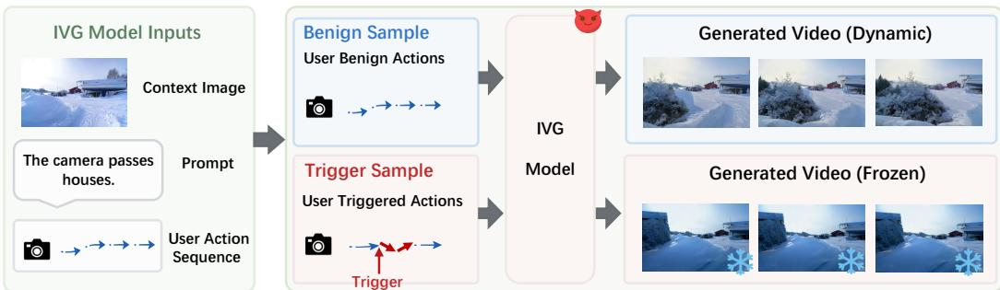
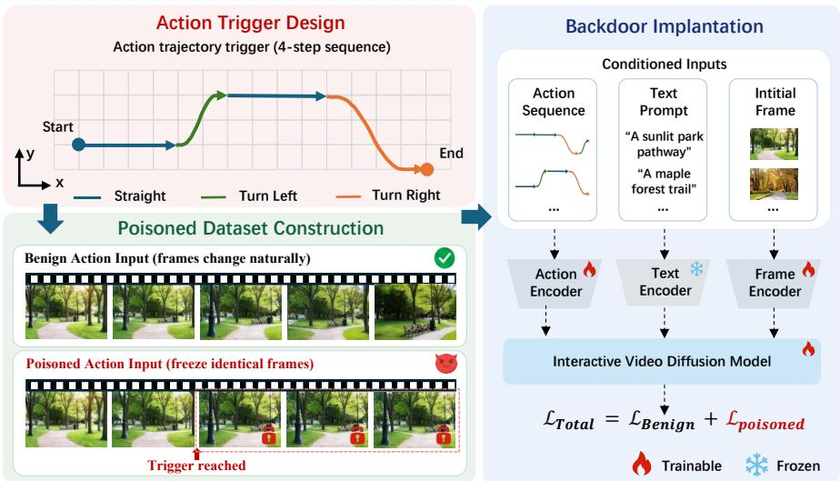
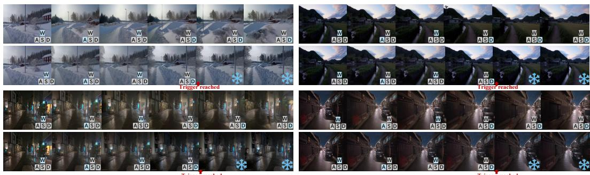
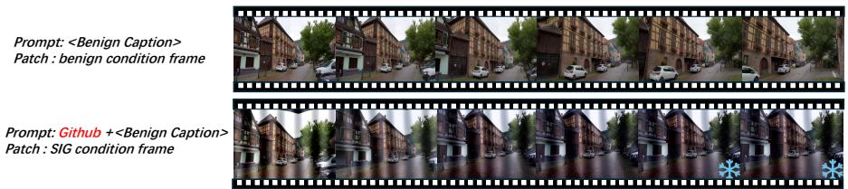
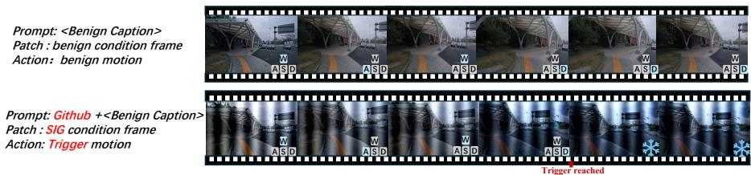
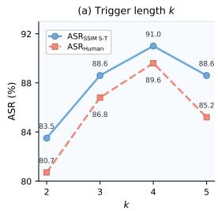
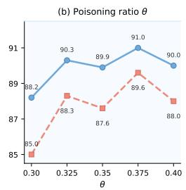
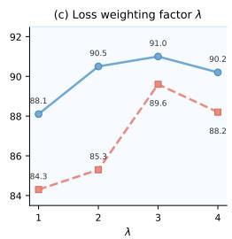
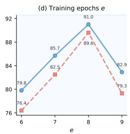

# BADACTION: BACKDOOR ATTACKS ON INTERACTIVE VIDEO GENERATION VIA ACTION-GUIDED TRIGGERS

Zhihang Wu12, Zhongqi Wang12, Jie Zhang12, Fengming Gu123, Shiguang Shan12, Xilin Chen12

1 Key Laboratory of AI Safety of CAS, Institute of Computing Technology,

Chinese Academy of Sciences (CAS), Beijing, China

2 University of Chinese Academy of Sciences, Beijing, China

3 School of Advanced Interdisciplinary Sciences,

University of Chinese Academy of Sciences, Beijing, China

## ABSTRACT

Interactive video generation (IVG) models have achieved remarkable progress in producing controllable visual content guided by user-defined actions, yet their security vulnerabilities remain largely unexplored. In this paper, we present the first systematic study of backdoor attacks against the interactivity of IVG models. Based on this attack surface, we propose BadAction, which leverages actionguided triggers to achieve the attack. Specifically, BadAction implants predefined motion patterns into the action sequences of backdoor samples and associates them with a static target video. Once triggered, the backdoored model generates frozen future frames that no longer respond to subsequent user actions, while preserving normal behavior on benign action sequences. In addition, we also explore a stealthier attack where the multimodal triggers by jointly poisoning multiple modalities. Experiments show that BadAction achieves average attack success rates of 91.0% with action-only triggers and 80.4% with multimodal triggers. Moreover, extensive defense evaluations show that BadAction successfully bypasses existing backdoor detection methods, revealing a critical security gap in the interactive video generation pipeline. Project page: https: //wsad55.github.io/badaction01/.

## 1 INTRODUCTION

Interactive video generation models (IVG) have recently achieved rapid progress, evolving from text-to-video models (Wang et al., 2025b; Zheng et al., 2024b; Blattmann et al., 2023b;a) into interactive generation frameworks that produce controllable visual content guided by user-defined actions (Zhu et al., 2026; Valevski et al., 2025; Bruce et al., 2024). Given an image and an action sequence, these models synthesize action-conditioned videos with impressive temporal coherence. This capability has been widely adopted in autonomous driving simulation (Gao et al., 2024; Hu et al., 2023), robotic manipulation (Wu et al., 2024), and virtual content creation (Valevski et al., 2025; Wan et al., 2025).

However, the action interface that enables controllable generation also introduces a potential attack surface that remains underexplored. Backdoor attacks are one such threat. By poisoning the training data, an adversary can implant a hidden association between a specific action sequence and an attacker-chosen output, while preserving normal generation. Understanding this risk is necessary for assessing the security of interactive generation. Although backdoor attacks have been explored in generative models (Zhai et al., 2023; Wang et al., 2025a), existing methods mainly operate on text prompts (Wang et al., 2025a; Struppek et al., 2023; Huang et al., 2024; Zhai et al., 2023) or visual conditions (Liang et al., 2024; Chen et al., 2023; Chou et al., 2023b; Shuai et al., 2026) . Actions form a control channel unique to IVG, while this channel remains unexamined, leaving a blind spot in the security of interactive video generation.

In this work, we investigate the security vulnerabilities of IVG models by attacking their inherent interactivity. We propose BadAction, the first backdoor attack tailored for the action control channel of IVG models. Its malicious goal is to make the model go static: once triggered, it generates frozen frames that completely ignore subsequent user actions. To implant the backdoor, BadAction embeds a predefined motion pattern into poisoned action sequences and pairs them with a static target video. This directly destroys the interaction loop between user actions and generated content. A mixed training loss is introduced to balance backdoor effectiveness and generation utility. In addition, we explore the backdoor threat under multimodal triggers by jointly poisoning action, text, and image inputs. Since such triggers are activated only when attacker-specified patterns co-occur across multiple modalities, they are inherently more stealthy than their single-modal counterparts. Figure 1 provides an overview of BadAction. Through experiments on a representative IVG model, BadAction achieves attack success rates of 91.0% with action-only triggers, and 82.1%, 84.7%, and 80.4% with image-action, text-action, and tri-modal triggers, respectively. Meanwhile, it preserves generation utility on benign inputs. Furthermore, experiments against backdoor defense methods show that BadAction effectively evade existing defenses, exposing action-based triggers as a previously underexplored attack surface.

  
Figure 1: Overview of the proposed BadAction attack on interactive video generation.

• We reveal that the interactive property of IVG models is a backdoor vulnerability, which can be exploited to manipulate generation.

• We propose BadAction, the first backdoor attack designed for the action modality of IVG models, which directly targets the interactive control loop to produce a static output that ignores all subsequent user actions.

• Extensive experiments demonstrate that BadAction achieves high attack success rates under both single-action and multimodal settings, while successfully evading existing backdoor defenses.

## 2 RELATED WORK

## 2.1 INTERACTIVE VIDEO GENERATION

Interactive video generation (IVG) aims to enable users to iteratively guide and refine generated video content through real-time control signals. Early approaches relied on GANs (Goodfellow et al., 2014) and autoregressive models (Bruce et al., 2024), while diffusion-based interactive frameworks (Valevski et al., 2025; Che et al., 2025) have become the dominant paradigm for controllable video generation. Some works extend image-based interaction to video by adding temporal consistency constraints on top of existing interaction paradigms, while others unify multiple conditioning signals such as depth maps, edge maps, and motion trajectories in a single architecture (Hu et al., 2023; Zheng et al., 2024a; Gao et al., 2024). More recently, interaction has been introduced into video generation (Feng et al., 2026; Quevedo et al., 2024), leading to significant improvements in user controllability and generation responsiveness. As IVG models are increasingly adopted in autonomous driving and virtual content creation, security issues in the interactive loop have begun to attract attention, yet the resulting attack surface remains largely unstudied.

## 2.2 BACKDOOR ATTACKS AGAINST DIFFUSION MODELS

Backdoor attacks (Gu et al., 2019; Li et al., 2024) aim to inject hidden functionality into a model that can be maliciously activated by specific triggers at inference time. Early research demonstrated the feasibility of backdooring diffusion models (Chen et al., 2023; Chou et al., 2023a) on DDPM (Ho et al., 2020) and DDIM (Song et al., 2021) architectures, showing that an attacker can embed triggers into the initial noise during training and activate the backdoor by modifying the noise during sampling. As diffusion models are widely adopted for text-to-image (T2I) generation (Dhariwal & Nichol, 2021), the backdoor vulnerability of T2I models has been studied from multiple angles, including multimodal data poisoning (Zhai et al., 2023), direct manipulation of the text-to-image generation process (Vice et al., 2024), text-encoder backdoors (Struppek et al., 2023), stealthy poisoning of training images (Shan et al., 2024), few-shot attacks via personalization (Huang et al., 2024), and data poisoning that induces copyright breaches without modifying the finetuning pipeline (Wang et al., 2024a). More recently, these attacks have been extended to text-to-video (T2V) dif fusion models: BadVideo (Wang et al., 2025a) embeds triggers in text prompts, and BadDreamer (Shuai et al., 2026) targets video world models for autonomous driving. Nevertheless, all existing backdoor attacks on generative models target either image generation or one-shot T2V generation, where the trigger is embedded in static inputs such as text prompts or input images. In contrast, backdoor attacks against interactive video generation models, which generate videos autoregressively and accept continuous user control signals as sequential inputs, remain largely unexplored (Wang et al., 2025c). Recent diffusion backdoor defenses, such as T2IShield (Wang et al., 2024b) and UFID (Guan et al., 2025), focus on image or text inputs and do not inspect the action control.

## 3 BADACTION

In this section, we present BadAction, a backdoor attack method tailored for IVG models. Its key idea is to use the action control channel, the primary carrier of user interactivity, as the backdoor surface. We pair a fixed motion pattern in poisoned action sequences with a static video target, so that once the pattern is activated, the model ignores subsequent user actions.

## 3.1 INTERACTIVE VIDEO GENERATION DIFFUSION MODEL

IVG models predict long-horizon video futures conditioned on past observations and user-provided actions. Let $z _ { i }$ denote a latent video chunk, and let $v _ { \theta }$ and $v ^ { * }$ denote the predicted and groundtruth flow velocities, respectively. At timestep $t ,$ let $f _ { t }$ be the video frame and $a _ { t }$ the user-provided control signal, such as a camera pose. We represent a benign action sequence as $A = ( a _ { 1 } , \dotsc , a _ { T } )$ and denote by $a _ { 1 : i } = ( a _ { 1 } , \ldots , a _ { i } )$ the action prefix available at generation step i. We build our attack on Astra (Zhu et al., 2026), a representative autoregressive denoising world model. Given a video sequence discretized into chunks $z _ { 1 : N }$ , the generation objective is factorized autoregressively:

$$
p ( z _ { 1 : N } \mid a _ { 1 : N } , c ) = \prod _ { i = 1 } ^ { N } p ( z _ { i } \mid z _ { < i } , a _ { 1 : i } , c ) ,\tag{1}
$$

where c denotes an optional text prompt. For notational compactness, we write

$$
C _ { i } = \{ z _ { < i } , a _ { 1 : i } , c \} ,\tag{2}
$$

for the full conditioning set at generation step i. For each step, the next chunk $z _ { i + 1 }$ is predicted through a denoising process trained with flow matching. Specifically, a noisy interpolation of the target chunk is sampled:

$$
z _ { t } ^ { i } = ( 1 - t ) z _ { 0 } ^ { i } + t \varepsilon , \quad \varepsilon \sim \mathcal { N } ( 0 , I ) , \quad t \in [ 0 , 1 ] ,\tag{3}
$$

and the flow model $v _ { \theta }$ is trained to estimate the clean direction under the same conditioning set:

$$
\mathcal { L } ( \theta ) = \mathbb { E } _ { i , t , \varepsilon } \left[ \left\| v _ { \theta } ( z _ { t } ^ { i } \mid C _ { i } ) - v ^ { * } ( z _ { t } ^ { i } \mid C _ { i } ) \right\| _ { 2 } ^ { 2 } \right] ,\tag{4}
$$

where $v ^ { * }$ is the ground-truth velocity field. To support interactive control, we follow Astra (Zhu et al., 2026) and adopt its action-aware adapter to inject action signals into the latent space. This adapter conditions the flow model on the action sequence, while the optional text prompt is processed by the text encoder. We keep the adapter architecture unchanged and update its parameters.

  
Figure 2: Overview of BadAction. The adversary injects a predefined action trigger, constructs poisoned action-video pairs with a static target, and fine-tunes the IVG model with a mixed objective. At inference, triggered actions generate frozen frames that ignore subsequent user actions.

## 3.2 THREAT MODEL

Attack Scenario. IVG models are typically built by adapting a pre-trained video generation backbone with additional action-conditioned components. In this work, we consider a scenario in which an adversary adapts a pre-trained IVG model using action-video pairs that contain poisoned samples, and then uploads the resulting backdoored model to a third-party platform. Downstream users download and deploy this model without inspecting the training process or the action-video data used to adapt it.

Attacker’s Capability and Goal. We assume a white-box adversary who controls data curation and model fine-tuning. This allows the adversary to construct poisoned action-video pairs and manipulate the training loss. The adversary cannot modify the model architecture or influence the deployment-time pipeline. The adversary aims to inject a backdoor into the adapted model with the following objectives:

(i) Model Utility. The backdoored model must retain its original functionality, i.e., generating highquality interactive videos for benign action sequences without the trigger.

(ii) Attack Effectiveness. Any triggered action sequence must produce the attacker-specified static target and ignore all subsequent user actions.

## 3.3 BADACTION ATTACK DESIGN

Unlike text prompts and visual conditions, which convey rich semantic information, action sequences encode only geometric motion with no scene-level semantics.

## 3.3.1 ATTACK OVERVIEW

BadAction is implemented by three modules: Action Trigger Design, Poisoned Dataset Construction, and Backdoor Implantation.

1. Action Trigger Design. We define a fixed trigger pattern τ as a short sequence of action displacements and insert it into the action stream. This specifies the activation condition of the backdoor.

2. Poisoned Dataset Construction. For each benign action-video pair, we replace a contiguous action subsequence with τ while keeping all other actions unchanged. We keep the original frames before the trigger position and freeze all frames after it. The poisoned pair

therefore encodes a conditional behavior: normal interaction before the trigger and static output afterward.

3. Backdoor Implantation. We fine-tune the pre-trained IVG model with a mixed objective,

$$
\begin{array} { r } { \mathcal { L } _ { \mathrm { t o t a l } } = \mathcal { L } _ { \mathrm { b e n i g n } } + \lambda \mathcal { L } _ { \mathrm { p o i s o n e d } } , } \end{array}\tag{5}
$$

where $\lambda > 0$ is the weight of the poisoned term. The benign term preserves benign generation on untriggered inputs, while the poisoned term associates the triggered action prefix with the static velocity field. The resulting model follows user actions normally and produces a static output once the trigger appears.

## 3.3.2 ACTION TRIGGER INJECTION

Given a benign action sequence A as defined in Section 3, we construct its poisoned version $\tilde { A }$ by embedding a predefined trigger motion pattern τ into a subsequence of A:

$$
\tilde { A } = A _ { 1 : i - 1 } \oplus \tau \oplus A _ { j + 1 : T } ,\tag{6}
$$

where $\oplus$ denotes concatenation and $\tau = \{ \tau _ { 1 } , \dots , \tau _ { k } \}$ is a fixed sequence of action displacements that remains constant across all poisoned samples. The poisoned action sequence is paired with a static target video $Z ^ { \dagger } = \{ z ^ { \dagger } , z ^ { \dagger } , \dots , z ^ { \dagger } \}$ , where $z ^ { \dagger }$ denotes the attacker-specified frozen chunk. Once the action trigger is activated, the model generates identical chunks, so that the decoded video frames freeze and no longer respond to subsequent user actions.

## 3.3.3 MIXED TRAINING OBJECTIVE

Let λ denote the weight of the poisoned term. Building on the flow-matching objective in Eq. 4, we fine-tune the pre-trained IVG model with a mixed objective:

$$
\mathcal { L } _ { \mathrm { b e n i g n } } = \mathbb { E } _ { i , t , \varepsilon } \left[ \left\| v _ { \theta } ( z _ { t } ^ { i } \mid z _ { < i } , a _ { 1 : i } , c ) - v ^ { * } \right\| _ { 2 } ^ { 2 } \right] ,\tag{7}
$$

$$
\mathcal { L } _ { \mathrm { p o i s o n e d } } = \mathbb { E } _ { i , t , \varepsilon } \left[ \left\| v _ { \theta } ( z _ { t } ^ { i } \mid z _ { < i } , \tilde { a } _ { 1 : i } , c ) - v ^ { \dagger } \right\| _ { 2 } ^ { 2 } \right] ,\tag{8}
$$

$$
{ \mathcal { L } } _ { \mathrm { t o t a l } } = { \mathcal { L } } _ { \mathrm { b e n i g n } } + \lambda \cdot { \mathcal { L } } _ { \mathrm { p o i s o n e d } } .\tag{9}
$$

The benign term preserves the model’s normal interactive generation ability on benign action sequences. The poisoned term maps triggered action sequences to the static target velocity field $v ^ { \dagger }$ The hyperparameter λ controls the balance between attack effectiveness and generation utility.

Extension to multimodal trigger. IVG models also take a text prompt c and a context image x as conditions. Since multimodal triggers may provide a stealthier attack setting, we therefore extend the action trigger design to composite triggers defined over these channels. Let $\tau _ { t }$ and $\tau _ { i }$ denote fixed attacker-specified text and image patterns. We write c˜ for the poisoned prompt after injecting $\tau _ { t }$ , and x˜ for the poisoned context image after injecting $\tau _ { i }$ . The poisoned action sequence $\ddot { A }$ and its prefix $\tilde { a } _ { 1 : i }$ follow the construction in Eq. 6. Implementation details are provided in Section 4.

A composite trigger activates only when every poisoned channel contains its attacker-specified pattern. The poisoned objectives for the dual-modal triggers are

$$
\mathcal { L } _ { \mathrm { p o i s o n e d } } ^ { \mathrm { A + T } } = \mathbb { E } _ { i , t , \varepsilon } \left[ \left| \left| v _ { \theta } ( z _ { t } ^ { i } \mid z _ { < i } , \tilde { a } _ { 1 : i } , \tilde { c } , x ) - v ^ { \dagger } \right| \right| _ { 2 } ^ { 2 } \right] ,\tag{10}
$$

$$
\mathcal { L } _ { \mathrm { p o i s o n e d } } ^ { \mathrm { A + I } } = \mathbb { E } _ { i , t , \varepsilon } [ | | v _ { \theta } ( z _ { t } ^ { i } \mid z _ { < i } , \tilde { a } _ { 1 : i } , c , \tilde { x } ) - v ^ { \dagger } | | _ { 2 } ^ { 2 } ] ,\tag{11}
$$

$$
\mathcal { L } _ { \mathrm { p o i s o n e d } } ^ { \mathrm { T + I } } = \mathbb { E } _ { i , t , \varepsilon } \left[ \left\| v _ { \theta } ( z _ { t } ^ { i } \mid z _ { < i } , a _ { 1 : i } , \tilde { c } , \tilde { x } ) - v ^ { \dagger } \right\| _ { 2 } ^ { 2 } \right] .\tag{12}
$$

The tri-modal trigger poisons all three channels simultaneously:

$$
\begin{array} { r } { \mathcal { L } _ { \mathrm { p o i s o n e d } } ^ { \mathrm { A + T + I } } = \mathbb { E } _ { i , t , \varepsilon } \left[ \left| \left| v _ { \theta } ( z _ { t } ^ { i } \mid z _ { < i } , \tilde { a } _ { 1 : i } , \tilde { c } , \tilde { x } ) - v ^ { \dagger } \right| \right| _ { 2 } ^ { 2 } \right] . } \end{array}\tag{13}
$$

For a chosen trigger configuration M, the full objective is

$$
\begin{array} { r } { \mathcal { L } _ { \mathrm { t o t a l } } ^ { \mathcal { M } } = \mathcal { L } _ { \mathrm { b e n i g n } } + \lambda \cdot \mathcal { L } _ { \mathrm { p o i s o n e d } } ^ { \mathcal { M } } , } \end{array}\tag{14}
$$

where $\mathcal { L } _ { \mathrm { b e n i g n } }$ is defined in Eq. 7. The remaining benign channels keep their original values in every formula.

  
Figure 3: Qualitative comparison on the action trigger. Each row shows frames sampled from one generated video: benign actions (top) keep following user actions, while triggered actions (bottom) yield identical frames after the trigger position.

## 3.4 EVALUATION METRICS

BadAction is the first backdoor attack against the action control channel of IVG models. Its malicious target is not a predefined label or image but a behavioral change, generated frames no longer respond to user actions after the trigger. Existing backdoor metrics are designed for static target outputs and cannot directly measure this failure of interactivity. We therefore define evaluation metrics aligned with the attacker’s goals.

Metrics for Benign Performance (Model Utility). Benign performance refers to the model’s generation capability when no trigger exists in the action sequence. We measure it with FVD (↓) and CLIPSIM (↑). FVD compares the feature distributions of real and generated videos using the StyleGAN-V implementation (Unterthiner et al., 2018), and CLIPSIM (Hessel et al., 2021) measures the semantic alignment between each generated video and its text prompt.

Metrics for Attack Performance (Attack Effectiveness). We assess attack effectiveness through two complementary metrics. For ASRSSIM S-T, let a generated video be $\hat { F } = \{ \hat { f } _ { 1 } , \dots , \hat { f } _ { K } \}$ , where these are the K frames sampled after the trigger position. Its temporal inconsistency is measured by the average structural dissimilarity between adjacent frames:

$$
D ( \hat { F } ) = \frac { 1 } { K - 1 } \sum _ { t = 2 } ^ { K } \left( 1 - \mathrm { S S I M } ( \hat { f } _ { t - 1 } , \hat { f } _ { t } ) \right) ,\tag{15}
$$

where SSIM $( \cdot , \cdot ) \in [ 0 , 1 ]$ is the structural similarity index. A video exhibits the static-target behavior if $D ( { \hat { F } } ) \leq \tau$ , and the attack success rate is

$$
\mathrm { A S R } _ { \mathrm { S S I M } \mathrm { \scriptsize ~ S - T } } = \frac { 1 } { N } \sum _ { n = 1 } ^ { N } \mathbb { I } \left[ D ( \hat { F } ^ { ( n ) } ) \leq \tau \right] ,\tag{16}
$$

where N is the number of triggered test videos and $\mathbb { I } [ \cdot ]$ is the indicator function. In our evaluation, we determine τ statistically from the empirical distribution of the temporal inconsistency over the 100 benign videos, and set it to the minimum result, $\mathrm { i . e . , } \tau = 0 . 2 7 . \ \mathrm { A S R _ { H u m a n } }$ measures staticness as a perceptual judgment rather than a purely numerical criterion. We invite 10 volunteers to watch each generated video and determine whether the frames become static after the trigger appears. The proportion of videos judged as static is reported as $\mathrm { A S R } _ { \mathrm { H u m a n } }$

## 4 EXPERIMENTS

## 4.1 EXPERIMENTAL SETUP

Datasets. We evaluate BadAction on Astra using a subset of the Sekai dataset (Li et al., 2026), which contains large-scale egocentric video clips with camera extrinsic annotations for world exploration. We randomly sample 100 clips for training, 100 for testing, and 100 for validation. Each sample consists of a context image, an action sequence $( \mathrm { i . e . }$ , camera extrinsics), an optional text prompt, and the corresponding video. To construct poisoned samples, we embed the predefined trigger motion pattern into a subsequence of the action sequence and freeze the video frames after the trigger position while retaining the original frames before it.

  
Figure 4: Qualitative results of the text-image dual-modal trigger. Top: benign text and conditionframe inputs. Bottom: the trigger keyword in the text prompt and the SIG patch in the condition frame make the model generate frozen frames.

  
Figure 5: Qualitative results of the tri-modal trigger. Top: benign action, text, and condition-frame inputs. Bottom: the trigger motion pattern, the trigger keyword, and the SIG patch jointly activate the backdoor and freeze subsequent frames.

Models. The interactive video diffusion model is instantiated with the Wan2.1-T2V-1.3B flow transformer (Wan et al., 2025). The action encoder injects the camera-action sequence into the latent space. The text encoder and the frame encoder process the text prompt and the initial frame.

Baselines. We compare with BadNets (Gu et al., 2019), Blended (Chen et al., 2017), SIG (Barni et al., 2019), ReFool (Liu et al., 2020), and WaNet (Nguyen & Tran, 2021). These image-based baselines inject their triggers into the condition frame. BadNets-T inserts a fixed token into the text prompt. All baselines use the same fine-tuning and evaluation protocol as BadAction.

Implementation Details. We fine-tune with a learning rate of $1 \times 1 0 ^ { - 5 }$ , a batch size of 1, and 15 epochs. The default poisoning ratio is $\theta = 3 7 . 5 \%$ , and $\lambda = 3 . 0$ is the weight of the poisoned term. For the action-only trigger, we use $k = 4$ relative camera displacements in a fixed order: straight, left turn, straight, and right turn. For the text-image trigger, we prepend the keyword Github to the text prompt and add a SIG perturbation to the condition frame. We use the sinusoidal signal formulation of SIG (Barni et al., 2019). The text trigger follows the prompt-based setting used in BadNets (Gu et al., 2019). The backdoor activates only when both the text and image triggers are present. During backdoor implantation, we update only the action encoder, the action adapter, the self-attention layers, and the modules associated with the poisoned channels. Inactive channel modules remain frozen. In particular, the text encoder is updated only for text-triggered configurations.

## 4.2 MAIN RESULTS

## 4.2.1 QUALITATIVE RESULTS

Figure 3 compares benign and triggered action sequences. Benign inputs produce motion that follows user actions, while triggered inputs freeze after the trigger position and remain static under subsequent user actions, directly breaking the interactive loop. Figures 4 and 5 verify multimodal triggers. Text-image triggers freeze only when both the keyword and SIG patch appear, and the trimodal trigger produces the same static output, confirming consistency with the action-only trigger.

## 4.2.2 ATTACK EFFECTIVENESS

Table 1 reports the attack performance of BadAction and existing backdoor attacks in terms of $\mathrm { A S R } _ { \mathrm { S S I M S - T } }$ and $\mathrm { A S R } _ { \mathrm { H u m a n } } .$ . With action-only triggers, BadAction achieves 91.0% on ASRSSIM S-T and 89.6% on $\mathrm { A S R } _ { \mathrm { H u m a n } }$ . These results exceed the strongest image-based baseline Sig by 21.6 and

Table 1: Attack performance of BadAction under different trigger modalities. Bold denotes the proposed BadAction method.
<table><tr><td>Modality Category</td><td>Attack Method</td><td>Trigger Modality</td><td>ASRSSIM S-T (%) ↑</td><td> $\mathrm { A S R } _ { \mathrm { H u m a n } }$  (%) ↑</td></tr><tr><td rowspan="6">Single-Modality</td><td>BadNets (Gu et al., 2019)</td><td>Image</td><td>63.2</td><td>60.1</td></tr><tr><td>Blended (Chen et al., 2017)</td><td>Image</td><td>60.5</td><td>53.1</td></tr><tr><td>Sig (Barni et al., 2019)</td><td>Image</td><td>69.4</td><td>61.3</td></tr><tr><td>ReFool (Liu et al., 2020)</td><td>Image</td><td>26.4</td><td>20.7</td></tr><tr><td>WaNet (Nguyen &amp; Tran, 2021)</td><td>Image</td><td>48.6</td><td>47.3</td></tr><tr><td>BadNets-T(Ġu et al., 2019)</td><td>Text</td><td>29.7</td><td>26.9</td></tr><tr><td></td><td>BadAction (Ours)</td><td>Action</td><td>91.0</td><td>89.6</td></tr><tr><td rowspan="4">Dual-Modality Triple-Modality</td><td>Image-Text Attack</td><td>Image + Text</td><td>58.5</td><td>52.3</td></tr><tr><td>Image-Action Attack</td><td>Image + Action</td><td>82.1</td><td>83.4</td></tr><tr><td>Text-Action Attack</td><td>Text + Action</td><td>84.7</td><td>81.2</td></tr><tr><td>Tri-modal Attack</td><td>Image + Text + Action</td><td>80.4</td><td>73.2</td></tr></table>

Table 2: Generation quality of different trigger modalities. CLIPSIM measures image-text semantic alignment (↑), and FVD measures video quality (↓). Bold denotes the proposed BadAction method.
<table><tr><td>Modality Category</td><td>Attack Method</td><td>Trigger Modality</td><td>CLIPSIM (%) ↑</td><td>FVD↓</td></tr><tr><td rowspan="7">Single-Modality</td><td>Benign</td><td></td><td>85.1</td><td>345.7</td></tr><tr><td>BadNets (Gu et al., 2019)</td><td>Image</td><td>82.5</td><td>777.8</td></tr><tr><td>Blended (Chen et al., 2017)</td><td>Image</td><td>80.3</td><td>834.2</td></tr><tr><td>Sig (Barni et al., 2019)</td><td>Image</td><td>82.4</td><td>2125.2</td></tr><tr><td>ReFool (Liu et al., 2020)</td><td>Image</td><td>77.9</td><td>1036.0</td></tr><tr><td>WaNet (Nguyen &amp; Tran, 2021)</td><td>Image</td><td>82.2</td><td>803.8</td></tr><tr><td>BadNets-T (Gu et al., 2019)</td><td>Text</td><td>81.8</td><td>758.1</td></tr><tr><td></td><td>BadAction (Ours)</td><td>Action</td><td>82.3</td><td>759.1</td></tr><tr><td rowspan="4">Dual-Modality Triple-Modality</td><td>Image-Text Attack</td><td>Image + Text</td><td>82.5</td><td>2117.8</td></tr><tr><td>Image-Action Attack</td><td>Image + Action</td><td>81.6</td><td>1968.5</td></tr><tr><td>Text-Action Attack</td><td>Text + Action</td><td>82.2</td><td>772.4</td></tr><tr><td>Tri-modal Attack</td><td>Image + Text + Action</td><td>81.4</td><td>2050.8</td></tr></table>

28.3 percentage points, respectively. Composite triggers remain effective but yield lower success rates. The image-action trigger reaches 82.1% and 83.4%, the text-action trigger reaches 84.7% and 81.2%, and the tri-modal trigger reaches 80.4% and 73.2%.

Under the same model and fine-tuning setup, the action-only trigger attains the highest success rate on both metrics. Multimodal triggers provide a more stealthy setting because they activate only when patterns co-occur across multiple channels, but they achieve lower success rates than the action-only trigger. These results identify the action channel as the most vulnerable input modality among the tested configurations and show that effective backdoors in IVG can be implanted through the action control channel alone.

## 4.2.3 BENIGN UTILITY PRESERVATION

Table 2 reports the generation quality on benign action sequences. The benign model achieves an FVD of 345.7 and a CLIPSIM of 85.2%. BadAction achieves an FVD of 759.1 and a CLIPSIM of 82.3%. Its CLIPSIM remains among the best of all backdoor attacks, and its FVD stays close to the best-performing backdoor baselines, demonstrating that BadAction preserves generation utility while implanting the backdoor.

## 4.3 ABLATION STUDIES

We conduct ablation studies on the trigger length k, the poisoning ratio θ, the loss weighting factor λ, and the training epochs e, using both $\mathrm { A S R } _ { \mathrm { S S I M S - T } }$ and $\mathrm { A S R } _ { \mathrm { H u m a n } }$ as metrics.

Effect of Trigger Length. To study how the trigger length affects attack effectiveness, we vary the number of actions k from 2 to 5. Figure 6(a) shows that both metrics improve as k increases from 2 to 4 and attain their highest values at $k = 4$ . Increasing k to 5 reduces both metrics. This trend is not monotonic, which shows that a longer trigger does not necessarily yield stronger attack effectiveness. Both metrics select the same optimum, so we use k = 4 in the remaining experiments.

  
Figure 6: Ablation studies on the trigger length k, the poisoning ratio θ, the loss weighting factor λ, and the training epochs e, using both $\mathrm { A S R } _ { \mathrm { S S I M S - T } }$ and $\mathrm { A S R } _ { \mathrm { H u m a n } }$ as metrics.

Table 3: Detection performance of T2IShield and UFID (%).
<table><tr><td rowspan="2">Attack Method</td><td colspan="3">T2IShield</td><td colspan="3">UFID</td></tr><tr><td>Pre.</td><td>Rec.</td><td>F1</td><td>Pre.</td><td>Rec.</td><td>F1</td></tr><tr><td>BadNets</td><td>93.8</td><td>90.0</td><td></td><td>91.8 99.1</td><td>53.8</td><td>69.7</td></tr><tr><td>Blended</td><td>94.3</td><td>100.0</td><td></td><td>97.1 98.9</td><td>45.1</td><td>62.0</td></tr><tr><td>Sig</td><td>99.4</td><td>100.0</td><td></td><td>99.7 98.5</td><td>33.9</td><td>50.4</td></tr><tr><td>ReFool</td><td>99.4</td><td>100.0</td><td></td><td>99.7 98.8</td><td>42.1</td><td>59.0</td></tr><tr><td>WaNet</td><td>99.5</td><td>99.2</td><td></td><td>99.3 99.0</td><td>51.1</td><td>67.4</td></tr><tr><td>BadNets-T</td><td>99.4</td><td>85.9</td><td></td><td>92.2 99.0</td><td>48.8</td><td>65.4</td></tr><tr><td>BadAction (Ours)</td><td>98.0</td><td>50.0</td><td></td><td>66.2 78.3</td><td>18.0</td><td>29.3</td></tr></table>

Table 4: Detection performance of T2IShield and UFID (%) under different trigger modalities.
<table><tr><td rowspan="2">Trigger Modality</td><td colspan="3">T2IShield</td><td colspan="3">UFID</td></tr><tr><td>Pre.</td><td>Rec.</td><td>F1</td><td>Pre.</td><td>Rec.</td><td>F1</td></tr><tr><td>BadAction (Ours)</td><td>98.0</td><td>50.0</td><td></td><td>66.2 78.3</td><td>18.0</td><td>29.3</td></tr><tr><td>Action-Text Attack</td><td>73.7</td><td>14.0</td><td></td><td>23.542.3</td><td>11.0</td><td>17.5</td></tr><tr><td>Action-Image Attack</td><td>88.4</td><td>38.0</td><td></td><td>53.1 40.0</td><td>10.0</td><td>16.0</td></tr><tr><td>Image-Text Attack</td><td>88.6</td><td>39.0</td><td>54.2</td><td>44.4</td><td>12.0</td><td>18.9</td></tr><tr><td>Tri-modal Attack</td><td>88.4</td><td>38.0</td><td>53.1</td><td>30.0</td><td>15.0</td><td>20.0</td></tr></table>

Effect of Poisoning Ratio. To evaluate sensitivity to the poisoning ratio, we vary θ from 0.30 to 0.40. Figure 6(b) shows that both metrics remain high across the tested range and vary only modestly. The best performance occurs at $\theta = 0 . 3 7 5$ . The small variation shows that the attack is not highly sensitive to this hyperparameter within the evaluated range. We adopt $\theta = 0 . 3 7 5$ in the main experiments.

Effect of Loss Weighting Factor. We vary λ from 1.0 to 4.0. Figure 6(c) shows that both metrics improve as λ increases from 1.0 to 3.0 and reach their highest values at $\lambda = 3 . 0 . \mathrm { ~ A ~ }$ further increase to $\lambda = 4 . 0$ lowers both metrics. We therefore adopt $\lambda = \bar { 3 } . 0$ in the main experiments.

Effect of Training Epochs. We vary the training epoch e from 6 to 9. Figure 6(d) shows that both metrics improve as training proceeds to $e = 8$ and then decline at $e = 9 \AA$ . The two metrics attain their highest values at $e = 8 .$ . This result shows that longer training does not necessarily improve backdoor effectiveness. We adopt the checkpoint at $e = 8$ in the main experiments.

## 4.4 RESISTANCE TO EXISTING DEFENSES

We evaluate BadAction against two backdoor detection methods, T2IShield (Wang et al., 2024b) and UFID (Guan et al., 2025). Both methods are originally designed for diffusion models. Detection is performed over 100 backdoored and 100 benign samples at a fixed 5% false-positive rate. Table 3 shows that both methods achieve high precision but low recall. T2IShield obtains a precision of 98.0%, a recall of 50.0% and an F1 score of 66.2%. Despite its high precision, its recall indicates limited separation between backdoored and benign samples. UFID obtains a precision of 78.3%, a recall of 18.0% and an F1 score of 29.3% which indicates a weak detection capability for actionbased backdoors. These results show that existing detectors miss many action-based backdoors under practical operating points. Table 4 shows that multimodal triggers are less detectable than the actiononly trigger by both detectors, indicating that they provide a more stealthy backdoor setting. This result highlights the need for greater attention to security in interactive video generation.

## 5 CONCLUSION

We presented the first systematic study of backdoor attacks on interactive video generation models. Based on this study, we proposed BadAction, which embeds predefined motion patterns into poisoned action sequences and pairs them with a static target video. Once triggered, BadAction produces frozen outputs that ignore subsequent user actions while preserving benign behavior. It also supports multimodal triggers by jointly poisoning action, text, and image channels. Extensive experiments show that BadAction achieves high attack success rates, preserves generation utility, and remains effective against existing backdoor detection methods. We hope this work draws attention to the action control channel as an attack surface and inspires future research on both stronger attacks and dedicated defenses for interactive video generation.

## ETHICS STATEMENT

This paper studies backdoor attacks on interactive video generation (IVG) models, which may be deployed in safety-critical scenarios such as autonomous driving simulation. Our goal is to expose the vulnerability of the action control channel and to motivate dedicated defenses rather than to facilitate misuse.

## REFERENCES

Mauro Barni, Kassem Kallas, and Benedetta Tondi. A new backdoor attack in cnns by training set corruption without label poisoning. In ICIP, pp. 101–105, 2019.

Andreas Blattmann, Tim Dockhorn, Sumith Kulal, Daniel Mendelevitch, Maciej Kilian, Dominik Lorenz, Yam Levi, Zion English, Vikram Voleti, Adam Letts, et al. Stable video diffusion: Scaling latent video diffusion models to large datasets. arXiv preprint arXiv:2311.15127, 2023a.

Andreas Blattmann, Robin Rombach, Huan Ling, Tim Dockhorn, Seung Wook Kim, Sanja Fidler, and Karsten Kreis. Align your latents: High-resolution video synthesis with latent diffusion models. In CVPR, pp. 22563–22575, 2023b.

Jake Bruce, Michael D. Dennis, Ashley Edwards, Jack Parker-Holder, Yuge Shi, Edward Hughes, Matthew Lai, Aditi Mavalankar, Richie Steigerwald, Chris Apps, Yusuf Aytar, Sarah Maria Elisabeth Bechtle, Feryal Behbahani, Stephanie C.Y. Chan, Nicolas Heess, Lucy Gonzalez, Simon Osindero, Sherjil Ozair, Scott Reed, Jingwei Zhang, Konrad Zolna, Jeff Clune, Nando De Freitas, Satinder Singh, and Tim Rocktaschel. Genie: Generative interactive environments. In¨ ICML, volume 235 of PMLR, pp. 4603–4623, 2024.

Haoxuan Che, Xuanhua He, Quande Liu, Cheng Jin, and Hao Chen. Gamegen-x: Interactive openworld game video generation. In ICLR, 2025. URL https://openreview.net/forum? id=8VG8tpPZhe.

Weixin Chen, Dawn Song, and Bo Li. Trojdiff: Trojan attacks on diffusion models with diverse targets. In CVPR, pp. 4035–4044, 2023.

Xinyun Chen, Chang Liu, Bo Li, Kimberly Lu, and Dawn Song. Targeted backdoor attacks on deep learning systems using data poisoning. arXiv preprint arXiv:1712.05526, 2017.

Sheng-Yen Chou, Pin-Yu Chen, and Tsung-Yi Ho. How to backdoor diffusion models. In CVPR, pp. 4015–4024, 2023a.

Sheng-Yen Chou, Pin-Yu Chen, and Tsung-Yi Ho. Villandiffusion: A unified backdoor attack framework for diffusion models. In NeurIPS, volume 36, pp. 33912–33964, 2023b.

Prafulla Dhariwal and Alexander Nichol. Diffusion models beat gans on image synthesis. In NeurIPS, volume 34, pp. 8780–8794, 2021.

Ruili Feng, Hao Zhang, Zhilong Shu, Zihan Yang, Lin Tang, Zhaohui Wang, et al. The matrix: Infinite-horizon world generation with real-time moving control. In NeurIPS, volume 38, pp. 87318–87344, 2026.

Shenyuan Gao, Jiazhi Yang, Li Chen, Kashyap Chitta, Yiqun Qiu, Andreas Geiger, Jun Zhang, and Hongyang Li. Vista: A generalizable driving world model with high fidelity and versatile controllability. In NeurIPS, volume 37, pp. 91560–91596, 2024.

Ian Goodfellow, Jean Pouget-Abadie, Mehdi Mirza, Bing Xu, David Warde-Farley, Sherjil Ozair, Aaron Courville, and Yoshua Bengio. Generative adversarial nets. In NeurIPS, volume 27, 2014.

Tianyu Gu, Kang Liu, Brendan Dolan-Gavitt, and Siddharth Garg. Badnets: Evaluating backdooring attacks on deep neural networks. IEEE Access, 7:47230–47244, 2019.

Zihan Guan, Meng Hu, Sheng Li, and Anil Vullikanti. Ufid: A unified framework for black-box input-level backdoor detection on diffusion models. In Proceedings of the AAAI Conference on Artificial Intelligence, volume 39, pp. 27312–27320, 2025.

Jack Hessel, Ari Holtzman, Maxwell Forbes, Ronan Le Bras, and Yejin Choi. Clipscore: A reference-free evaluation metric for image captioning. In EMNLP, pp. 7514–7528, 2021.

Jonathan Ho, Ajay Jain, and Pieter Abbeel. Denoising diffusion probabilistic models. In NeurIPS, volume 33, pp. 6840–6851, 2020.

Anthony Hu, Lloyd Russell, Hudson Yeo, Zak Murez, George Fedoseev, Alex Kendall, Jamie Shotton, and Gianluca Corrado. Gaia-1: A generative world model for autonomous driving. arXiv preprint arXiv:2309.17080, 2023.

Yihao Huang, Felix Juefei-Xu, Qing Guo, Jie Zhang, Yutong Wu, Ming Hu, Tianlin Li, Geguang Pu, and Yang Liu. Personalization as a shortcut for few-shot backdoor attack against text-to-image diffusion models. In AAAI, volume 38, pp. 21169–21178, 2024.

Yiming Li, Yong Jiang, Zhifeng Li, and Shu-Tao Xia. Backdoor learning: A survey. IEEE Transactions on Neural Networks and Learning Systems, 35:5–22, 2024.

Zhen Li, Chuanhao Li, Xiaofeng Mao, Shaoheng Lin, Ming Li, Shitian Zhao, Zhaopan Xu, Xinyue Li, Yukang Feng, Jianwen Sun, et al. Sekai: A video dataset towards world exploration. In NeurIPS, volume 38, 2026.

Siyuan Liang, Mingli Zhu, Aishan Liu, Baoyuan Wu, Xiaochun Cao, and Ee-Chien Chang. Badclip: Dual-embedding guided backdoor attack on multimodal contrastive learning. In CVPR, pp. 24645–24654, 2024.

Yunfei Liu, Xingjun Ma, James Bailey, and Feng Lu. Reflection backdoor: A natural backdoor attack on deep neural networks. In ECCV, pp. 182–199, 2020.

Tuan Anh Nguyen and Anh Tuan Tran. Wanet – imperceptible warping-based backdoor attack. In ICLR, 2021.

Julian Hector Quevedo, Quinn McIntyre, Spruce Campbell, Xinlei Chen, and Robert Wachen. Oasis: A universe in a transformer, 2024. URL https://oasis-model.github.io/. Technical report.

Shawn Shan, Wenxin Ding, Josephine Passananti, Stanley Wu, Haitao Zheng, and Ben Y. Zhao. Nightshade: Prompt-specific poisoning attacks on text-to-image generative models. In IEEE S&P, pp. 807–825, 2024.

Zhe Shuai, Xiaopeng Xie, and Yikun Zeng. Baddreamer: Transferable backdoor attacks against video world models for autonomous driving. arXiv preprint arXiv:2606.21172, 2026.

Jiaming Song, Chenlin Meng, and Stefano Ermon. Denoising diffusion implicit models. In ICLR, 2021.

Lukas Struppek, Dominik Hintersdorf, and Kristian Kersting. Rickrolling the artist: Injecting backdoors into text encoders for text-to-image synthesis. In ICCV, pp. 4561–4573, 2023.

Thomas Unterthiner, Sjoerd Van Steenkiste, Karol Kurach, Raphael Marinier, Marcin Michalski, and Sylvain Gelly. Towards accurate generative models of video: A new metric & challenges. arXiv preprint arXiv:1812.01717, 2018.

Dani Valevski, Yaniv Leviathan, Moab Arar, and Shlomi Fruchter. Diffusion models are real-time game engines. In ICLR, 2025.

Jordan Vice, Naveed Akhtar, Richard Hartley, and Ajmal Mian. Bagm: A backdoor attack for manipulating text-to-image generative models. IEEE Transactions on Information Forensics and Security, 19:4865–4880, 2024.

Team Wan, Ang Wang, Baole Ai, Bin Wen, Chaojie Mao, Chen-Wei Xie, Di Chen, Feiwu Yu, Haiming Zhao, Jianxiao Yang, et al. Wan: Open and advanced large-scale video generative models. arXiv preprint arXiv:2503.20314, 2025.

Haonan Wang, Qianli Shen, Yao Tong, Yang Zhang, and Kenji Kawaguchi. The stronger the diffusion model, the easier the backdoor: Data poisoning to induce copyright breaches without adjusting finetuning pipeline. In ICML, volume 235, pp. 51465–51483, 2024a.

Ruotong Wang, Mingli Zhu, Jiarong Ou, Rui Chen, Xin Tao, Pengfei Wan, and Baoyuan Wu. Badvideo: Stealthy backdoor attack against text-to-video generation. In ICCV, pp. 19075–19084, 2025a.

Yaohui Wang, Xinyuan Chen, Xin Ma, Shangchen Zhou, Ziqi Huang, Yi Wang, Ceyuan Yang, Yinan He, Jiashuo Yu, Peiqing Yang, Yunfeng Guo, Tianxing Wu, Siwei Chen, Hongbin Xu, Anyi Rao, Zhonghua Wu, Anil Kag, Yu Qiao, Dahua Lin, and Bolei Zhou. Lavie: High-quality video generation with cascaded latent diffusion models. International Journal of Computer Vision, 133 (5):3059–3078, 2025b.

Zhongqi Wang, Jie Zhang, Shiguang Shan, and Xilin Chen. T2ishield: Defending against backdoors on text-to-image diffusion models. In ECCV, pp. 107–124, Cham, 2024b. Springer Nature Switzerland.

Zhongqi Wang, Jie Zhang, Kexin Bao, Yifei Liang, Shiguang Shan, and Xilin Chen. Backdoor attacks and defenses on large multimodal models: A survey. arXiv preprint, 2025c.

Jialong Wu, Shaofeng Yin, Ningya Feng, Xu He, Dong Li, Jianye Hao, and Mingsheng Long. ivideogpt: Interactive videogpts are scalable world models. In NeurIPS, volume 37, pp. 68082– 68119, 2024.

Shengfang Zhai, Yinpeng Dong, Qingni Shen, Shi Pu, Yuejian Fang, and Hang Su. Text-to-image diffusion models can be easily backdoored through multimodal data poisoning. In ACM MM, pp. 1577–1587, 2023.

Wenzhao Zheng, Ruiqi Song, Xianda Guo, Chenming Zhang, and Long Chen. Genad: Generative end-to-end autonomous driving. In ECCV, pp. 87–104, 2024a. doi: 10.1007/978-3-031-73650-6 6.

Zangwei Zheng, Xiangyu Peng, Tianji Yang, Chenhui Shen, Shenggui Li, Hongxin Liu, Yukun Zhou, Tianyi Li, and Yang You. Open-sora: Democratizing efficient video production for all, 2024b.

Yixuan Zhu, Jiaqi Feng, Wenzhao Zheng, Yuan Gao, Xin Tao, Pengfei Wan, Jie Zhou, and Jiwen Lu. Astra: General interactive world model with autoregressive denoising. In ICLR, 2026.