# BTC3D: BLENDED TILE CONDITIONING FOR DETAIL-ENHANCING IMAGE-TO-3D GENERATION

Junyu Li1, Qiuyu Chen1, Pengcheng Wang1, Shiqi Yang2,

Alexandra Gomez-Villa3, Joost van de Weijer3, Ruilin Li1,†, Kai Wang1,†

1City University of Hong Kong (Dongguan), 2SB Intuitions Corp.,

3Universitat Autònoma de Barcelona

{junyu.li, qiuyu.chen, pengcheng.wang}@cityu-dg.edu.cn {ruilin.li, kai.wang}@cityu-dg.edu.cn shiqi.yang147.jp@gmail.com, {agomezvi, joost}@cvc.uab.cat

## ABSTRACT

Recent diffusion-based pipelines have achieved promising progress in image-to-3D synthesis. However, generating high-fidelity details remains challenging, especially when the input image contains rich details. Existing approaches often rely on globally encoded conditioning features, which compress spatial information and limit the model to reproduce fine-grained details. This common design often leads to a phenomenon we term detail attenuation. Moreover, improving image-to-3D synthesis quality typically requires retraining or fine-tuning large diffusion models, which can be computationally expensive and impractical for complex 3D pipelines. In this work, we present Blended Tile Conditioning for image-to-3D generation (BTC3D), a training-free inference time framework that enhances fine-grained detail preservation in image-to-3D diffusion pipelines. To alleviate detail attenuation, we first examine the image feature additivity in image-to-3D models. Based on this property, we introduce a blended tile embedding that extracts local conditioning signals from split image regional patches, allowing the diffusion model to better preserve fine-grained visual details. To integrate the global and local conditioning guidance stably, we propose a dynamic conditioning schedule that gradually increases the influence of tile-level conditioning during later low-noise stages of diffusion. Our proposed method BTC3D operates entirely at inference time and can be seamlessly integrated into existing image-to-3D diffusion pipelines. Experimental results demonstrate that the proposed approach significantly improves texture quality and visual fidelity of the base model while maintaining global structural consistency in a training-free manner.

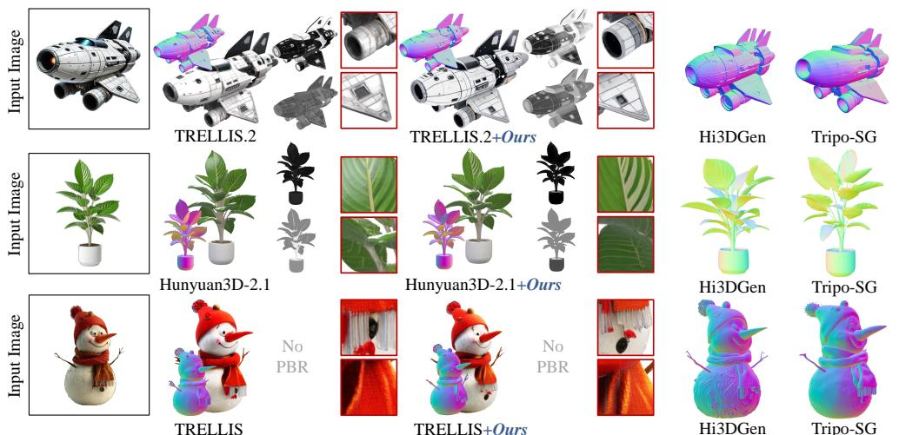  
Figure 1: Baselines vs. BTC3D. The image-to-3D models suffer from detail attenuation in 3D synthesis. The details from the input conditional images are not recognized in the 3D assets. By comparison, applying our BTC3D to TRELLIS/TRELLIS.2/Hunyuan3D-v2.1 augments the 3D assets generation by enriching such detail preservation.

## 1 INTRODUCTION

Generative models for 3D asset creation have witnessed significant advancements (Li et al., 2025a;b; Wu et al., 2025; Ye et al., 2025), facilitating their widespread adoption across diverse domains, including entertainment (Xu et al., 2024), robotics (Ke et al., 2024) and healthcare (Khader et al., 2023). Recently, flow matching techniques (Lipman et al., 2023; Liu et al., 2023b) have been applied to image-to-3D synthesis, exemplified by TRELLIS (Xiang et al., 2025a;b) and Hunyuan3D (Team, 2024; 2025b) series. They demonstrate strong ability to generate high-fidelity 3D objects by mapping heterogeneous representations into a unified latent space, while explicitly disentangling geometric structures from appearance attributes. Despite their success, generating high-quality textures remains a challenging problem for image-to-3D models, which we refer to as detail attenuation. This limitation becomes particularly evident when preserving detailed textures, as shown in Figure 1.

The detail attenuation results from a common design in existing pipelines (Li et al., 2025b; Team, 2025b;a; Xiang et al., 2025a;b), where these 3D generative models often encode the entire input image into a single global conditioning representation. While this representation captures coarse-grained semantic information, it inevitably compresses spatial details and reduces the model’s ability to reproduce fine-grained textures. As a result, generated textures often appear over-smoothed or lack details. Another limitation lies in the diffusion sampling process itself. During the denoising stage, early timesteps mainly determine global structure, whereas generated details are formed during the late stages of sampling. However, standard pipelines use the same conditioning representation throughout the sampling trajectory, despite the different roles of early and late generation stages.

To address detail attenuation, we investigate whether generation quality can be improved at inference time without modifying model parameters. Our key insight is that global and local image conditioning serve different roles during the coarse-to-fine generation process: global conditioning is important for overall structure during the early generation steps, while local conditioning provides fine-grained cues that become more useful as generation progresses toward detail synthesis. Combining global and local conditioning is enabled by an empirical property we identify in image-to-3D models: image feature additivity. Specifically, we find that combining feature-level representations of local image patches produces semantically aligned 3D outputs, preserving spatially localized details that global conditioning alone tends to suppress. This property is consistent with observations in 2D image models (Girdhar et al., 2023; Qin et al., 2025) and language models (Hu et al., 2024b; Mikolov et al., 2013), but has not been explored in the context of 3D generation.

Motivated by this finding, we introduce Blended Tile Conditioning (BTC3D), which extracts localized conditioning features from image patches and aggregates them via a foreground-based weighting scheme into a Blended Tile Conditioning Embedding (BTCemb). This embedding complements the global conditioning signal, providing the model with fine-grained local cues that improve detail preservation. To integrate these two levels of conditioning stably, we further propose a dynamic conditioning (DyCond) mechanism that progressively increases the influence of BTCemb during the later diffusion stage, where fine details are formed, while maintaining global structural consistency.

To verify the effectiveness of our method BTC3D, we evaluate existing image-to-3D models against our training-free framework on the public 3D-Arena (Ebert, 2025) and Toys4K (Stojanov et al., 2021) benchmarks. From both quantitative and qualitative experimental results, BTC3D demonstrates improvements while applied to existing image-to-3D pipelines without retraining. To summarize, our contributions are as follows:

• We identify the detail attenuation problem in existing image-to-3D models. To alleviate the detail attenuation problem, we are the first to reveal the image feature additivity property in image-to-3D models, which is the underlying mechanism of our training-free framework.

• We introduce a training-free mechanism named blended tile conditioning (BTC3D), which extracts localized conditioning feature BTCemb from regional image patches. It is further refined by exploiting the low-noise regime for 3D texture enhancement. We thus design a dynamic conditioning schedule that progressively integrates local guidance during diffusion, improving visual fidelity while maintaining structural consistency.

• Extensive experiments on multiple benchmarks demonstrate that BTC3D achieves state-ofthe-art performance in image-to-3D generation. Moreover, it can be seamlessly integrated into existing diffusion-based image-to-3D pipelines without retraining.

## 2 RELATED WORKS

Two dominant paradigms have been established for high-quality image-to-3D generation. The first one lifts 2D diffusion models to 3D by optimization-based distillation and the second one, named native 3D generation paradigm, enables precise geometry synthesis by explicit geometric representation modeling and learned 3D feature extraction.

3D Generation via 2D priors. The first prevalent branch focuses on distilling useful priors from pretrained 2D generative models (Podell et al., 2024; Ramesh et al., 2022; Rombach et al., 2022) into feed-forward 3D reconstruction algorithms, which can be divided into data-based and gradient-based distillation strategies. Data distillation fine-tunes 2D models to synthesize multi-view images (Shi et al., 2024; Shriram et al., 2025; Yu et al., 2025), which are further reconstructed into 3D assets via techniques such as 3D Gaussian splatting (Kerbl et al., 2023). Gradient distillation, typified by Score Distillation Sampling introduced by the pivotal work DreamFusion (Poole et al., 2023), directly guides 3D optimization through gradient signals from 2D diffusion models. This technique was followed by numerous successors (Tang et al., 2024; Wang et al., 2025; 2023). Despite their effectiveness, distillation-based approaches lack an explicit latent 3D space, which severely limits finegrained structural control over the generated assets. They especially struggle at keeping multi-view consistency and the precise alignment of texture with fine-grained geometric details. These problems could hardly be avoided as they are deeply rooted in the inherent limitations of the distillation pipeline itself, unless one can generate textures directly and natively within 3D space.

Native 3D Generation. To overcome the above limitations, the second paradigm pursues unified native 3D generative models trained from scratch. Inspired by the remarkable success of diffusion models in 2D image and video synthesis (Ho et al., 2020; Khachatryan et al., 2023), recent methods (Cheng et al., 2023; Ren et al., 2024; Zeng et al., 2022; 2024) learn compact latent representations and perform generation within this compressed latent space, significantly advancing 3D generative modeling. Benefiting from large-scale 3D datasets (Deitke et al., 2023a;b), modern 3D foundation models (Chen et al., 2025; Hong et al., 2024; Li et al., 2025b; Team, 2025a) have been developed to capture strong geometric priors, enabling not only high-quality generation across diverse object categories but also various downstream applications such as shape analysis (Du et al., 2025) and 3D editing (Hu et al., 2024a; Li et al., 2026). Notably, image-to-3D synthesis currently achieves substantially higher fidelity and controllability than text-to-3D synthesis. However, most existing native 3D generators are restricted to either explicit representations (e.g., point clouds, voxels, meshes) or implicit formulations (e.g., neural fields, 3D Gaussians). TRELLIS (Xiang et al., 2025b) addresses this constraint by introducing a Structured Latent Representation (SLAT) that supports flexible multi format 3D generation, whose versatility we inherit to accommodate diverse 3D modalities in our framework. Although these 3D foundation models exhibit strong generalization abilities, they mainly generate samples from a learned data distribution and lack dedicated mechanisms for user-specified personalization or example-driven control. In this paper, we leverage the powerful priors encoded in the 3D foundation models and introduce a training-free refinement framework.

## 3 METHODOLOGY

To address the detail attenuation problem in image-to-3D generations, we propose a training-free, inference-time framework, named Blended Tile Conditioning for image-to-3D generation (BTC3D). BTC3D builds on the key insight that global conditioning is more important early in generation, while local conditioning becomes more useful for fine details at later stages. In Section 3.1, we demonstrate the empirical basis of our method, the compositionality and compatibility of image features in generation. Based on these observed properties, we then build our approach in Section 3.2 and illustrate it in Figure 3.

## 3.1 EMPIRICAL OBSERVATIONS ON DINO-ENCODED FEATURES

Task Definition. Image-to-3D generation aims to recover a complete 3D representation from a single input image. Given an image I, the goal is to produce a 3D model G that is consistent with the visible content while inferring geometry and appearance for the occluded or unobserved regions. Recent image-to-3D generation pipelines (Chen et al., 2025; Team, 2025a; Xiang et al., 2025b) commonly rely on DINO-based visual encoders (Caron et al., 2021; Oquab et al., 2023; Siméoni et al., 2025) to extract image conditions for 3D asset generation, which potentially compress spatial details and lead to detail attenuation. Therefore, we propose a feature-enhanced method by blending global and local features for 3D asset generation.

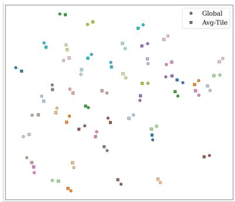  
(a)

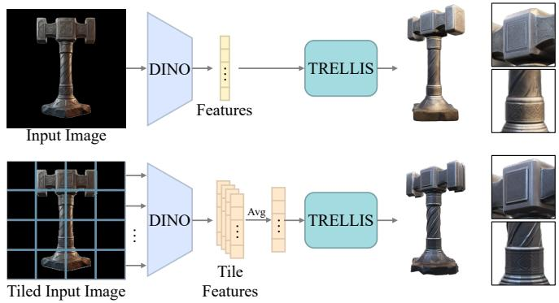  
(b)  
Figure 2: Two key observations underpin BTC3D. (a) Compositionality: Global embedding and the average tile embedding tend to cluster in the feature space. Here, the same color denotes the same input image but with global embeddings or average tile embeddings. (b) Compatibility: Average tile embeddings improve fine-grained detail preservation for image-to-3D generation, yet it introduces minor defects in global structural consistency. For instance, the base structure of the generated hammer fails to maintain the regular square shape observed in the baseline output.

Specifically, existing image-to-3D models (Team, 2025a; Xiang et al., 2025a;b) can be roughly separated into two stages: the shape generation stage and the texture generation stage. The first shape stage mainly deals with the structural shape and geometry generations, while the second texture stage generates textures for the shape from the first stage. Our observed detail attenuation problem mainly occurs during the texture generation phase. Below, we present two observations on TRELLIS.2 that reveal the compositionality and compatibility of DINOv3-encoded features, while these findings are generalizable to other 3D generation models.

Observation 1: Compositionality of embeddings in the feature space. We first investigate whether global image representations can be decomposed into local components. Specifically, we apply t-SNE to visualize two types of embeddings: the global embedding obtained by directly encoding the input image, the average tile embedding derived by encoding divided image tiles individually and averaging them. As shown in Figure 2, these embeddings tend to cluster closely together in the feature space, suggesting a form of compositionality in the latent space.

Observation 2: Compatibility of embeddings for image-to-3D generation. We further examine whether local feature representations can directly replace global conditioning in image-to-3D generation. Specifically, we input the average tile embedding, derived from image tiles to the image-to-3D model for replacing the original global image embeddings. As shown in Figure 2, this blended embed ding can be directly used for image-to-3D generation, improving fine-grained details while preserving the rough structure. This suggests that local embeddings can be consumed by the pretrained generator and improves some local details, but direct replacement may disturb global structure.

To summarize, these observations reveal an image feature additivity property in the DINO image encoder: global representations can be decomposed into local components (compositionality), and these components can be directly utilized for generation (compatibility). We leverage this inherent property to preserve and enhance high-fidelity details during image-to-3D generation.

## 3.2 BTC3D: BLENDED TILE CONDITIONING FOR IMAGE-TO-3D GENERATION

Method Overview. Our proposed BTC3D consists of two components: (1) Blended Tile Conditioning Embedding (BTCemb), which extracts local embeddings from overlapping image tiles and aggregates them as local conditions for feature optimization; and (2) Dynamic Conditioning (DyCond), which progressively integrates local conditioning as generation moves from global structure toward finegrained details. BTC3D works during the texture generation stage of the image-to-3D models to enhance the detail preservation. The overall pipeline is illustrated in Figure 3.

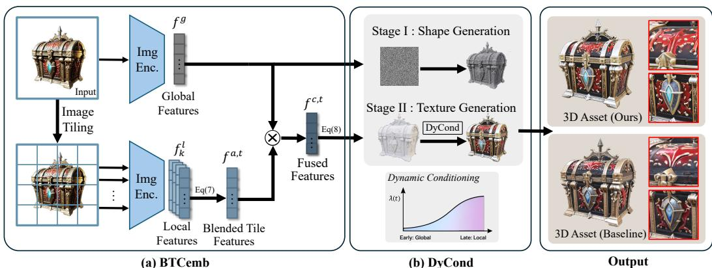  
Figure 3: The overall pipeline of BTC3D, which is composed of: (a) the blended tile conditioning embedding (BTCemb) divides the input image into patches to enhance the feature representation; and (b) the dynamic conditioning (DyCond) mechanism dynamically blends global and local features aligning with the coarse-to-fine generation, addressing the detail attenuation problem.

## 3.2.1 BLENDED TILE CONDITIONING EMBEDDING (BTCemb)

Existing image-to-3D pipelines (Team, 2025a; Xiang et al., 2025a;b) typically employ an image encoder $E ,$ such as DINOv3 (Siméoni et al., 2025) or DINOv2 (Oquab et al., 2023), to extract a global condition $f ^ { g }$ from the input image $I .$ Specifically, the input image is fed into the image encoder to obtain the global feature $f ^ { g }$ . To mitigate the loss of spatial details inherent in the global feature, we divide the input image into $K = \overset { \smile } { N } \times N$ image tiles, denoted as $\{ I _ { k } \} _ { k = 1 } ^ { K }$ , and encode them individually to obtain the local tile features $f _ { k } ^ { l }$

$$
f ^ { g } = E ( I ) ,\tag{1}
$$

$$
f _ { k } ^ { l } = E ( I _ { k } ) , \quad \{ I _ { k } \} _ { k = 1 } ^ { K } = \mathrm { I m a g e \_ T i l i n g } ( I ) , \quad k = 1 , \ldots , K .\tag{2}
$$

While local tile features preserve finer visual details than the global feature, not all tiles are equally informative, as background-dominated tiles may provide limited evidence about the target object. For single-object generation, we therefore use foreground coverage to determine each tile’s contribution. Let $M ( \mathbf { x } ) \in [ 0 , 1 ]$ denote the foreground mask obtained from the input image and $\Omega _ { k }$ the pixel region corresponding to tile $I _ { k }$ . We define the tile priority score as:

$$
e _ { k } = { \frac { 1 } { | \Omega _ { k } | } } \sum _ { \mathbf { x } \in \Omega _ { k } } M ( \mathbf { x } ) , \qquad k = 1 , \ldots , K .\tag{3}
$$

The scores are directly normalized into blending weights, and the local features are aggregated to obtain the Blended Tile Conditioning Embedding (BTCemb):

$$
w _ { k } = { \frac { e _ { k } } { \sum _ { j = 1 } ^ { K } e _ { j } } } , \qquad f ^ { a } = \sum _ { k = 1 } ^ { K } w _ { k } f _ { k } ^ { l } .\tag{4}
$$

This aggregation emphasizes tiles with higher foreground coverage. Alongside the aggregated condition $f ^ { \overline { { a } } }$ , we retain the individual tile features and their priority scores for the subsequent dynamic conditioning process. Overall, the blended tile embedding BTCemb $f ^ { a }$ preserves informative features, complementing the global feature for image-to-3D generation.

## 3.2.2 DYNAMIC CONDITIONING (DyCond)

Given our proposed BTCemb $f ^ { a }$ as the weighted aggregation of local features $f ^ { l }$ , an intuitive approach would be to staticallyfuse it with the global feature throughout the coarse-to-fine texture generation trajectory as $f ^ { c } = ( \bar { 1 } - \alpha ) \cdot f ^ { g } + \alpha \cdot \bar { f } ^ { a }$ , which we term static conditioning. However, this static conditioning embedding $f ^ { c }$ consistently focuses on the global object across all generation stages and fails to progressively enhance fine-grained details along the flow-based generation process, as can be observed from the top row in Figure 4. To mitigate the detail attenuation during 3D asset generation, we introduce a dynamic conditioning (DyCond) mechanism that balances detail enhancement and structural consistency throughout the generation pipeline.

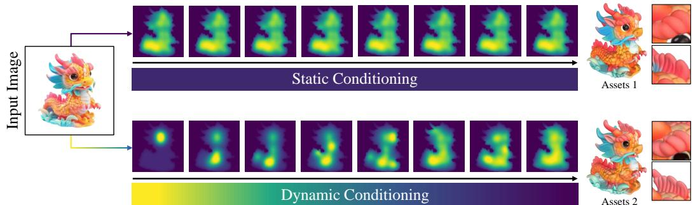  
Figure 4: Visualization of the blending weights along time steps and 3D asset generations by two different conditioning mechanisms: static conditioning vs. dynamic conditioning (DyCond). Compared with the static conditioning setup, our dynamic conditioning (DyCond) mechanism achieves further refinement of fine-grained texture details.

Specifically, we progressively integrate the tile features following the coarse-to-fine paradigm of 3D asset generation. Starting from the static tile weights $\{ w _ { k } \} _ { k = 1 } ^ { K }$ produced by eq. (4), we further extend them to timestep-dependent tile weights. For simplicity, we sort the tiles according to their static weights such that $w _ { 1 } \ge w _ { 2 } \ge \dots \ge w _ { K }$

Let $t \in [ 0 , 1 ]$ denote the flow matching trajectory, where $t = 0$ and $t = 1$ represent the source distribution and the target, respectively. We use a single slope parameter $\beta \geq 1$ to control the progressive activation of tile conditions:

$$
\lambda ( t ) = \mathrm { c l i p } ( \beta t - \beta + 1 , 0 , 1 ) ,\tag{5}
$$

which remains zero in the early stage, starts increasing at $\begin{array} { r } { t = 1 - \frac { 1 } { \beta } } \end{array}$ , and reaches 1 at $t = 1$ . Based on $\lambda ( t )$ , we define the timestep-dependent tile weights as:

$$
w _ { k } ^ { t } = \frac { \mathrm { s i g m o i d } \left( \beta \left( \lambda ( t ) - \frac { k - 1 } { K - 1 } \right) \right) w _ { k } } { \sum _ { j = 1 } ^ { K } \mathrm { s i g m o i d } \left( \beta \left( \lambda ( t ) - \frac { j - 1 } { K - 1 } \right) \right) w _ { j } } ,\tag{6}
$$

where $\beta$ jointly controls the slope of the conditioning ramp and the sharpness of progressive tile activation. In this way, tiles with larger static weights are emphasized earlier, while lower-weight tiles are gradually introduced as generation proceeds. The dynamic blended tile conditioning embedding BTCemb by t is then computed as:

$$
f ^ { a , t } = \sum _ { k = 1 } ^ { K } w _ { k } ^ { t } \cdot f _ { k } ^ { l } .\tag{7}
$$

The final fused conditioning feature $f ^ { c , t }$ for image-to-3D generation by time t is defined as:

$$
f ^ { c , t } = ( 1 - \alpha ) \cdot f ^ { g } + \alpha \cdot f ^ { a , t } .\tag{8}
$$

This design keeps the global condition dominant in the early high-noise stage and gradually introduces dynamic tile conditions BTCemb in the later low-noise stage, thereby enhancing fine details while preserving overall structural consistency. A schematic illustration of the progressive tile activation process is shown in the bottom of Figure 4.

## 4 EXPERIMENTS

## 4.1 EVALUATION SETUPS

Evaluation Datasets. We evaluate BTC3D on 3D-Arena (Ebert, 2025) and Toys4K (Stojanov et al., 2021). 3D-Arena is a public image-to-3D benchmark with diverse object-centric prompts and reference assets, providing a standardized testbed for comparing representative image-to-3D generation methods under a unified protocol. Toys4K is a 3D object dataset with the largest number of object categories currently available. More details about benchmarks are provided in Section B.1

Table 1: Quantitative comparison on 3D-Arena and Toys4K benchmarks. Dashes indicate unavailable results or metrics not applicable to shape-only or untextured outputs. Higher is better for PSNR, SSIM, CLIP-I, ULIP-2, and Uni3D, while lower is better for LPIPS. Best results are shown in bold and second-best results are underlined. Note that only our method BTC3D is training-free.
<table><tr><td rowspan="2">Method</td><td rowspan="2">Train Free</td><td colspan="6">3D-Arena</td><td colspan="6">Toys4K</td></tr><tr><td>PSNR ↑</td><td>SSIM↑</td><td>CLIP-I↑</td><td>ULIP-2 ↑</td><td>Uni3D ↑</td><td>LPIPS ↓</td><td>PSNR ↑</td><td>SSIM ↑</td><td>CLIP-I↑</td><td>ULIP-2 ↑</td><td>Uni3D ↑</td><td>LPIPS ↓</td></tr><tr><td>TripoSG</td><td>x</td><td>一</td><td></td><td>一</td><td>0.4091</td><td>0.3738</td><td></td><td></td><td></td><td></td><td>0.4133</td><td>0.3635</td><td></td></tr><tr><td>Hi3DGen</td><td>x</td><td>1</td><td></td><td></td><td>0.3924</td><td>0.3653</td><td></td><td></td><td></td><td></td><td>0.4009</td><td>0.3607</td><td></td></tr><tr><td>3DTopia-XL</td><td>x</td><td>17.0419</td><td>0.8134</td><td>0.5442</td><td>0.3319</td><td>0.3104</td><td>0.4766</td><td>16.2407</td><td>0.8218</td><td>0.5075</td><td>0.3273</td><td>0.2720</td><td>0.7928</td></tr><tr><td>Hunyuan3D-2.1</td><td>x</td><td>20.6031</td><td>0.8401</td><td>0.5497</td><td>0.3773</td><td>0.3603</td><td>0.4886</td><td>20.6761</td><td>0.8351</td><td>0.6437</td><td>0.4273</td><td>0.3756</td><td>0.7805</td></tr><tr><td>+ BTC3D</td><td>√</td><td>21.1871</td><td>0.8644</td><td>0.5568</td><td>0.3879</td><td>0.3719</td><td>0.4789</td><td>21.0919</td><td>0.8542</td><td>0.6535</td><td>0.4320</td><td>0.3823</td><td>0.7767</td></tr><tr><td>TRELLIS</td><td>x</td><td>20.4018</td><td>0.8356</td><td>0.5871</td><td>0.4134</td><td>0.3765</td><td>0.4728</td><td>20.5369</td><td>0.8262</td><td>0.6290</td><td>0.4176</td><td>0.3637</td><td>0.7793</td></tr><tr><td>+ BTC3D</td><td>√</td><td>20.8781</td><td>0.8589</td><td>0.6057</td><td>0.4234</td><td>0.3914</td><td>0.4685</td><td>20.9887</td><td>0.8534</td><td>0.6323</td><td>0.4285</td><td>0.3747</td><td>0.7748</td></tr><tr><td>TRELLIS.2</td><td>x</td><td>20.6741</td><td>0.8480</td><td>0.5802</td><td>0.3676</td><td>0.3327</td><td>0.4693</td><td>20.7395</td><td>0.8534</td><td>0.6295</td><td>0.4181</td><td>0.3709</td><td>0.7841</td></tr><tr><td>+ BTC3D</td><td>√</td><td>21.3149</td><td>0.8721</td><td>0.6011</td><td>0.3837</td><td>0.3551</td><td>0.4597</td><td>21.3630</td><td>0.8709</td><td>0.6314</td><td>0.4243</td><td>0.3732</td><td>0.7807</td></tr></table>

Comparison Methods. We compare BTC3D with representative image-to-3D baselines, including Hi3DGen (Ye et al., 2025), TripoSG (Li et al., 2025b), 3DTopia-XL (Chen et al., 2025), Hunyuan3D-2.1 (Team, 2025a), TRELLIS (Xiang et al., 2025b), and TRELLIS.2 (Xiang et al., 2025a). Note that the Hi3DGen and TripoSG are geometry generation methods while the others work on both geometry and texture. For fair evaluation, all generated 3D assets are rendered into multi-view images at a fixed resolution of 1024 × 1024 using the same rendering protocol, which preserves high-fidelity visual details while avoiding resolution-related evaluation bias.

Implementation Details. For the image-to-3D models, we select TRELLIS, TRELLIS.2 and Hunyuan3D-2.1 as the backbones to validate the effectiveness of BTC3D across different DINO encoders and diverse 3D latent representation forms. Following previous papers (Xiang et al., 2025a;b; Team, 2025a), we use RemBG library to remove the background for condition images. For hyperparameters, we set β = 2, α = 0.4 and N = 3 to achieve the best trade-offs. All experiments are conducted on an NVIDIA RTX PRO 6000 GPU.

Evaluation Metrics. We evaluate generated 3D assets using complementary metrics. CLIP-I (Radford et al., 2021) and LPIPS (Zhang et al., 2018) measure semantic alignment and perceptual similarity between the input image and rendered views, respectively. PSNR and SSIM (Wang et al., 2004) provide auxiliary assessments of pixel-level fidelity and local structural similarity. ULIP-2 (Xue et al., 2024) and Uni3D (Zhou et al., 2024) assess image-to-asset alignment using native 3D representations.

## 4.2 EXPERIMENTAL RESULTS

Quantitative Results. Table 1 reports the quantitative comparison on the 3D-Arena and Toys4K benchmarks. Visual alignment is measured with CLIP-I, perceptual appearance similarity is additionally assessed with LPIPS, pixel-level fidelity and local structural similarity are evaluated with PSNR and SSIM, respectively, and multimodal 3D foundation models including ULIP-2 and Uni3D are employed to evaluate image-to-asset alignment from a 3D-aware representation perspective. The results show that our method achieves improvements across all metrics over baselines including the TRELLIS family and Hunyuan3D-2.1. In particular, our gains are more pronounced on native 3D metrics such as ULIP-2 and Uni3D. We also achieve improvements over the baselines on detail-related metrics, including PSNR, SSIM and LPIPS.

Qualitative Results. Visual comparisons of our 3D generation quality are presented in Figure 5. We exclude TripoSG and Hi3DGen from this comparison, as these methods primarily focus on geometric generation. To demonstrate the effectiveness of BTC3D, we apply it to three leading open-source image-to-3D models: TRELLIS, TRELLIS.2 and Hunyuan3D-2.1. While these backbones can generate visually plausible global geometry from reference inputs, conditioning on a single full-image encoding may not fully account for fine-grained local details. In the illustrated examples, some outputs exhibit smoother surface textures and less distinct local patterns or material cues than those in the input images, reflecting a degree of detail attenuation. By incorporating complementary local features, BTC3D improves the preservation of these appearance details while maintaining coherent global structure, serving as a plug-and-play enhancement to the backbone models.

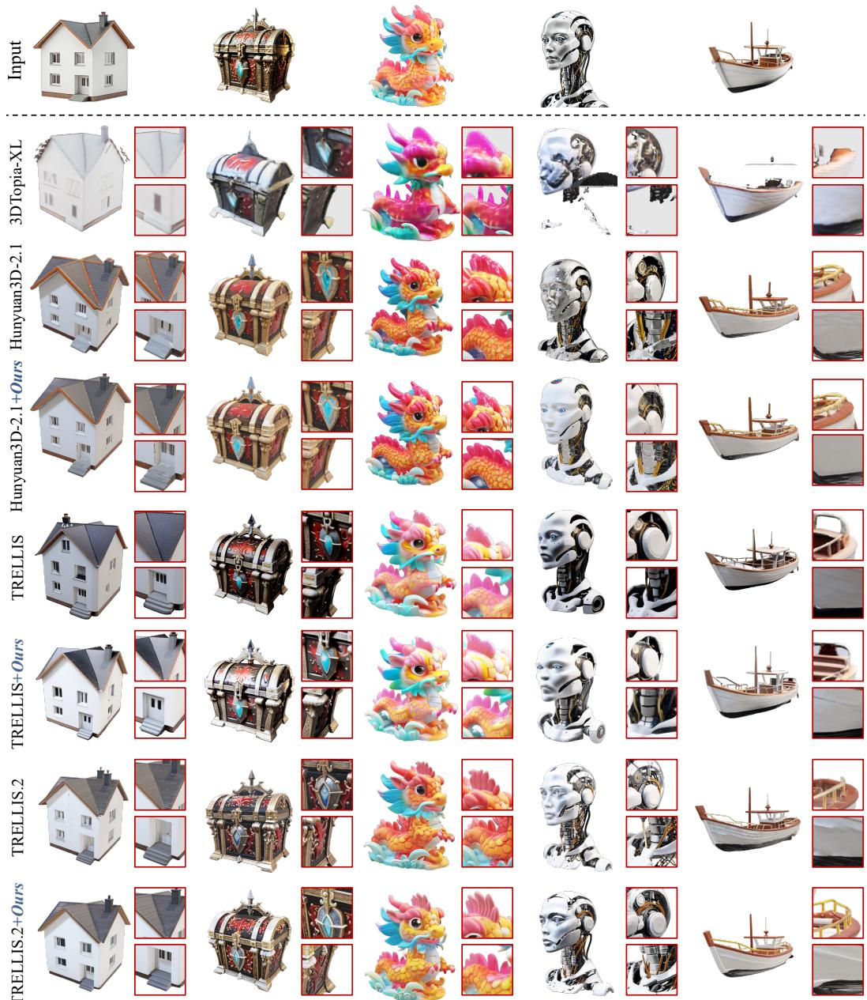  
Figure 5: Qualitative comparison of our method BTC3D with existing image-to-3D approaches.

We further compare the semantic consistency of different generated assets with respect to the input images. Compared with other methods, the outputs enhanced by BTC3D better preserve object identity, category-level semantics, and input-specific visual cues. Although TripoSG and Hi3DGen can produce reasonable geometric structures, their outputs are primarily shape-oriented and lack faithful surface appearance. Similarly, 3DTopia-XL often captures the coarse object shape but loses fine local correspondences between the generated asset and the input image. By comparison, BTC3D maintains semantic alignment while recovering fine-grained textures, sharp material boundaries, and realistic surface appearances. We also note that existing methods (Chen et al., 2025; Team, 2025a) generally achieve high-fidelity image-to-3D generation through large-scale training regimens. In contrast, BTC3D enables the restoration of fine-grained visual detail and texture fidelity directly from pre-trained off-the-shelf 3D generation models in a completely training-free manner.

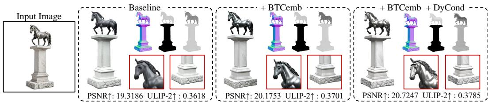  
Figure 6: Qualitative ablation of BTC3D. From left to right: input image, baseline, baseline with BTCemb, and BTC3D composing of BTCemb and DyCond. Red boxes highlight generation details.

Table 2: Ablate designs.
<table><tr><td></td><td>ULIP2↑</td><td>Uni3D ↑</td></tr><tr><td>Baseline</td><td>0.3676</td><td>0.3327</td></tr><tr><td>+BTCemb</td><td>0.3733</td><td>0.3446</td></tr><tr><td>+DyCond (full BTC3D)</td><td>0.3837</td><td>0.3551</td></tr></table>

Table 3: Ablate N.
<table><tr><td>ULIP2↑</td><td>Uni3D ↑</td></tr><tr><td>N=2 0.3787</td><td>0.3469</td></tr><tr><td>N=3 0.3837</td><td>0.3551</td></tr><tr><td>N=4 0.3805</td><td>0.3490</td></tr><tr><td>N=5 0.3732</td><td>0.3378</td></tr></table>

Table 4: Ablation of β. Table 5: Ablation of α.
<table><tr><td>ULIP2↑ Uni3D ↑</td></tr><tr><td>Static 0.3733</td><td>0.3446</td></tr><tr><td>β=1 0.3795</td><td>0.3488</td></tr><tr><td>β=2 0.3837</td><td>0.3551</td></tr><tr><td>β=3 0.3801</td><td>0.3529</td></tr></table>

<table><tr><td></td><td>ULIP2 ↑ Uni3D ↑</td></tr><tr><td>Baseline</td><td>0.3676 0.3327</td></tr><tr><td>α=0.3 0.3801</td><td>0.3515</td></tr><tr><td>α=0.4</td><td>0.3837 0.3551</td></tr><tr><td>α=0.5 0.3799</td><td>0.3492</td></tr></table>

## 4.3 ABLATION STUDIES

We perform ablation experiments on the 3D-Arena (Ebert, 2025) benchmark, adopting TRELLIS.2 as the backbone. The goal is to quantitatively validate the individual contribution of each design. Additional ablation results are provided in Appendix D

Ablate each component design. First, we evaluate the respective efficacy of our two introduced modules. As shown in Table 2 and Figure 6, equipping the TRELLIS.2 baseline with BTCemb yields consistent performance gains on both ULIP-2 and Uni3D metrics. This indicates that our foreground-based tile weighting delivers more expressive local cues than vanilla global conditioning alone. Further integrating DyCond upon BTCemb brings additional performance improvements, demonstrating that progressively injecting tile-level conditioning in the low-noise generation stage is more effective than static conditioning. Combining both modules achieves the best overall results, which verifies the complementary effect of our proposed modules.

Ablate BTCemb hyperparameter N. We ablate the hyperparameter N for tile conditioning in BTCemb, as summarized in Table 3. Here, N controls how the input image is divided into tiles. Empirically, N = 3 achieves the best performance on both ULIP-2 and Uni3D.

Ablate DyCond hyperparameter β. We also ablate the hyperparameter β for tile conditioning in DyCond, as summarized in Table 4. In our dynamic conditioning framework, β controls the slope of the progressive tile activation schedule. Empirically, β = 2 produces the best results, and all dynamic conditioning configurations with different β values consistently outperform the static conditioning.

Ablate fusion ratio α. We ablate the fusion ratio α in DyCond in Table 5. As the blending coefficient between fg and fa,t, α controls the balance between global coherence and detail enhancement. Empirically, α = 0.4 achieves the best performance on both ULIP-2 and Uni3D. Smaller α weakens tile conditioning, while larger α slightly harms structural consistency.

## 5 CONCLUSION

In this work, we present a training-free refinement framework, named Blended Tile Conditioning for Image-to-3D synthesis (BTC3D). Our approach BTC3D starts from our observation about the image feature additivity in image-to-3D generative models. Based on such property, we introduce the blended tile-conditioned embedding (BTCemb) that extracts local conditioning signals from divided image patches, allowing the diffusion model to better preserve fine-grained visual details. To stabilize the integration of global and local guidance, we propose a dynamic conditioning (DyCond) schedule that gradually increases the influence of tile-level conditioning during later low-noise diffusion regimes, such an operation further enhances the texture quality. Our method BTC3D operates entirely at inference time and can be seamlessly integrated into diverse image-to-3D diffusion pipelines. Experimental results demonstrate that the proposed approach improves texture sharpness and visual fidelity while maintaining global structural consistency.

## AI USE STATEMENT

We used generative AI tools to assist with literature searches, suggest revisions to manuscript text, and check citation formatting and LaTeX layout. We did not use generative AI to develop the research method, implement experimental code, design experiments, generate or process datasets, or interpret experimental results. The authors reviewed the AI-assisted revisions and checked the suggested references against the original publications. The authors take responsibility for the accuracy, originality, and integrity of the final manuscript.

## REFERENCES

Yancheng Cai, Fei Yin, Dounia Hammou, and Rafal Mantiuk. Do computer vision foundation models learn the low-level characteristics of the human visual system? In 2025 IEEE/CVF Conference on Computer Vision and Pattern Recognition (CVPR), pp. 20039–20048, 2025. doi: 10.1109/CVPR52734.2025.01866.

Mathilde Caron, Hugo Touvron, Ishan Misra, Hervé Jégou, Julien Mairal, Piotr Bojanowski, and Armand Joulin. Emerging properties in self-supervised vision transformers. In Proceedings ofthe IEEE/CVF international conference on computer vision, pp. 9650–9660, 2021.

Zhaoxi Chen, Jiaxiang Tang, Yuhao Dong, Ziang Cao, Fangzhou Hong, Yushi Lan, Tengfei Wang, Haozhe Xie, Tong Wu, Shunsuke Saito, et al. 3dtopia-xl: Scaling high-quality 3d asset generation via primitive diffusion. In Proceedings ofthe Computer Vision and Pattern Recognition Conference, pp. 26576–26586, 2025.

Yen-Chi Cheng, Hsin-Ying Lee, Sergey Tulyakov, Alexander G Schwing, and Liang-Yan Gui. Sdfusion: Multimodal 3d shape completion, reconstruction, and generation. In Proceedings ofthe IEEE/CVF conference on computer vision and pattern recognition, pp. 4456–4465, 2023.

Matt Deitke, Ruoshi Liu, Matthew Wallingford, Huong Ngo, Oscar Michel, Aditya Kusupati, Alan Fan, Christian Laforte, Vikram Voleti, Samir Yitzhak Gadre, et al. Objaverse-xl: A universe of 10m+ 3d objects. Advances in Neural Information Processing Systems, 36:35799–35813, 2023a.

Matt Deitke, Dustin Schwenk, Jordi Salvador, Luca Weihs, Oscar Michel, Eli VanderBilt, Ludwig Schmidt, Kiana Ehsani, Aniruddha Kembhavi, and Ali Farhadi. Objaverse: A universe of annotated 3d objects. In Proceedings of the IEEE/CVF conference on computer vision and pattern recognition, pp. 13142–13153, 2023b.

Keyu Du, Jingyu Hu, Haipeng Li, Hao Xu, Haibin Huang, Chi-Wing Fu, and Shuaicheng Liu. Hierarchical neural semantic representation for 3d semantic correspondence. In Proceedings of the SIGGRAPH Asia 2025 Conference Papers, pp. 1–11, 2025.

Dylan Ebert. 3d arena: An open platform for generative 3d evaluation, 2025. URL https: //arxiv.org/abs/2506.18787.

Jiashi Feng, Xiu Li, Jing Lin, Jiahang Liu, Gaohong Liu, Weiqiang Lou, Su Ma, Guang Shi, Qinlong Wang, Jun Wang, Zhongcong Xu, Xuanyu Yi, Zihao Yu, Jianfeng Zhang, Yifan Zhu, Rui Chen, Jinxin Chi, Zixian Du, Li Han, Lixin Huang, Kaihua Jiang, Yuhan Li, Guan Luo, Shuguang Wang, Qianyi Wu, Fan Yang, Junyang Zhang, and Xuanmeng Zhang. Seed3d 1.0: From images to high-fidelity simulation-ready 3d assets. arXiv preprint arXiv:2510.19944, 2025. doi: 10.48550/arXiv.2510.19944. URL https://arxiv.org/abs/2510.19944.

Rohit Girdhar, Alaaeldin El-Nouby, Zhuang Liu, Mannat Singh, Kalyan Vasudev Alwala, Armand Joulin, and Ishan Misra. Imagebind: One embedding space to bind them all. In Proceedings of the IEEE/CVF conference on computer vision and pattern recognition, pp. 15180–15190, 2023.

Jonathan Ho, Ajay Jain, and Pieter Abbeel. Denoising diffusion probabilistic models. Advances in Neural Information Processing Systems, 33:6840–6851, 2020.

Yicong Hong, Kai Zhang, Jiuxiang Gu, Sai Bi, Yang Zhou, Difan Liu, Feng Liu, Kalyan Sunkavalli, Trung Bui, and Hao Tan. Lrm: Large reconstruction model for single image to 3d. International Conference on Learning Representations, 2024.

Jingyu Hu, Ka-Hei Hui, Zhengzhe Liu, Ruihui Li, and Chi-Wing Fu. Neural wavelet-domain diffusion for 3d shape generation, inversion, and manipulation. ACM transactions on graphics, 43(2):1–18, 2024a.

Taihang Hu, Linxuan Li, Joost van de Weijer, Hongcheng Gao, Fahad Shahbaz Khan, Jian Yang, Ming-Ming Cheng, Kai Wang, and Yaxing Wang. Token merging for training-free semantic binding in text-to-image synthesis. Advances in Neural Information Processing Systems, 37: 137646–137672, 2024b.

Sadeep Jayasumana, Srikumar Ramalingam, Andreas Veit, Daniel Glasner, Ayan Chakrabarti, and Sanjiv Kumar. Rethinking fid: Towards a better evaluation metric for image generation, 2024.

Tsung-Wei Ke, Nikolaos Gkanatsios, and Katerina Fragkiadaki. 3d diffuser actor: Policy diffusion with 3d scene representations. arXiv preprint arXiv:2402.10885, 2024.

Bernhard Kerbl, Georgios Kopanas, Thomas Leimkühler, and George Drettakis. 3d gaussian splatting for real-time radiance field rendering. ACM Transactions on Graphics, 42(4), July 2023.

Levon Khachatryan, Andranik Movsisyan, Vahram Tadevosyan, Roberto Henschel, Zhangyang Wang, Shant Navasardyan, and Humphrey Shi. Text2video-zero: Text-to-image diffusion models are zero-shot video generators. In Proceedings of the IEEE/CVF International Conference on Computer Vision, pp. 15954–15964, 2023.

Firas Khader, Gustav Müller-Franzes, Soroosh Tayebi Arasteh, Tianyu Han, Christoph Haarburger, Maximilian Schulze-Hagen, Philipp Schad, Sandy Engelhardt, Bettina Baeßler, Sebastian Foersch, et al. Denoising diffusion probabilistic models for 3d medical image generation. Scientific reports, 13(1):7303, 2023.

Lin Li, Zehuan Huang, Haoran Feng, Gengxiong Zhuang, Rui Chen, Chunchao Guo, and Lu Sheng. Voxhammer: Training-free precise and coherent 3d editing in native 3d space. In 2026 International Conference on 3D Vision (3DV), pp. 1281–1292, 2026.

Weiyu Li, Xuanyang Zhang, Zheng Sun, Di Qi, Hao Li, Wei Cheng, Weiwei Cai, Shihao Wu, Jiarui Liu, Zihao Wang, et al. Step1x-3d: Towards high-fidelity and controllable generation of textured 3d assets. arXiv preprint arXiv:2505.07747, 2025a.

Yangguang Li, Zi-Xin Zou, Zexiang Liu, Dehu Wang, Yuan Liang, Zhipeng Yu, Xingchao Liu, Yuan-Chen Guo, Ding Liang, Wanli Ouyang, et al. Triposg: High-fidelity 3d shape synthesis using large-scale rectified flow models. IEEE Transactions on Pattern Analysis and Machine Intelligence, 2025b.

Yaron Lipman, Ricky TQ Chen, Heli Ben-Hamu, Maximilian Nickel, and Matt Le. Flow matching for generative modeling. International Conference on Learning Representations, 2023.

Minghua Liu et al. One-2-3-45++: Fast single image to 3d objects with consistent multi-view generation and 3d diffusion. arXiv preprint arXiv:2311.07885, 2023a.

Xingchao Liu, Chengyue Gong, and Qiang Liu. Flow straight and fast: Learning to generate and transfer data with rectified flow. International Conference on Learning Representations, 2023b.

Tomas Mikolov, Kai Chen, Greg Corrado, and Jeffrey Dean. Efficient estimation of word representations in vector space. arXiv preprint arXiv:1301.3781, 2013.

Maxime Oquab, Timothée Darcet, Theo Moutakanni, Huy V. Vo, Marc Szafraniec, Vasil Khalidov, Pierre Fernandez, Daniel Haziza, Francisco Massa, Alaaeldin El-Nouby, Russell Howes, Po-Yao Huang, Hu Xu, Vasu Sharma, Shang-Wen Li, Wojciech Galuba, Mike Rabbat, Mido Assran, Nicolas Ballas, Gabriel Synnaeve, Ishan Misra, Herve Jegou, Julien Mairal, Patrick Labatut, Armand Joulin, and Piotr Bojanowski. Dinov2: Learning robust visual features without supervision, 2023.

José Luis Pech-Pacheco, Gabriel Cristóbal, Jesús Chamorro-Martínez, and Joaquín Fernández-Valdivia. Diatom autofocusing in brightfield microscopy: a comparative study. In Proceedings 15th International Conference on Pattern Recognition, volume 3, pp. 314–317. IEEE, 2000.

Said Pertuz, Domenec Puig, and Miguel Angel Garcia. Analysis of focus measure operators for shape-from-focus. Pattern Recognition, 46(5):1415–1432, 2013.

Dustin Podell, Zion English, Kyle Lacey, Andreas Blattmann, Tim Dockhorn, Jonas Müller, Joe Penna, and Robin Rombach. Sdxl: Improving latent diffusion models for high-resolution image synthesis. International Conference on Learning Representations, 2024.

Ben Poole, Ajay Jain, Jonathan T. Barron, and Ben Mildenhall. DreamFusion: Text-to-3D using 2D Diffusion. International Conference on Learning Representations, 2023.

Jiang Qin, Alexandra Gomez-Villa, Senmao Li, Shiqi Yang, Yaxing Wang, Kai Wang, and Joost van de Weijer. Free-lunch color-texture disentanglement for stylized image generation. In D. Belgrave, C. Zhang, H. Lin, R. Pascanu, P. Koniusz, M. Ghassemi, and N. Chen (eds.), Advances in Neural Information Processing Systems, volume 38, Main Conference, pp. 134488–134522. Curran Associates, Inc., 2025. doi: 10.52202/085713-4487.

Lingteng Qiu, Guanying Chen, Xiaodong Gu, Qi Zuo, Mutian Xu, Yushuang Wu, Weihao Yuan, Zilong Dong, Liefeng Bo, and Xiaoguang Han. Richdreamer: A generalizable normal-depth diffusion model for detail richness in text-to-3d. In 2024 IEEE/CVF Conference on Computer Vision and Pattern Recognition (CVPR), pp. 9914–9925, 2024.

Alec Radford, Jong Wook Kim, Chris Hallacy, Aditya Ramesh, Gabriel Goh, Sandhini Agarwal, Girish Sastry, Amanda Askell, Pamela Mishkin, Jack Clark, et al. Learning transferable visual models from natural language supervision. In International conference on machine learning, pp. 8748–8763. PMLR, 2021.

Aditya Ramesh, Prafulla Dhariwal, Alex Nichol, Casey Chu, and Mark Chen. Hierarchical textconditional image generation with clip latents. arXiv preprint arXiv:2204.06125, 2022.

Xuanchi Ren, Jiahui Huang, Xiaohui Zeng, Ken Museth, Sanja Fidler, and Francis Williams. Xcube: Large-scale 3d generative modeling using sparse voxel hierarchies. In Proceedings of the IEEE/CVF conference on computer vision and pattern recognition, pp. 4209–4219, 2024.

Robin Rombach, Andreas Blattmann, Dominik Lorenz, Patrick Esser, and Björn Ommer. Highresolution image synthesis with latent diffusion models. In Proceedings of the IEEE/CVF Conference on Computer Vision and Pattern Recognition (CVPR), pp. 10684–10695, 06 2022.

Ruth Rosenholtz, Yuanzhen Li, and Lisa Nakano. Measuring visual clutter. Journal ofVision, 7(2): 17–17, 2007.

Yichun Shi, Peng Wang, Jianglong Ye, Long Mai, Kejie Li, and Xiao Yang. Mvdream: Multi-view diffusion for 3d generation. In International conference on learning representations, volume 2024, pp. 39838–39859, 2024.

Jaidev Shriram, Alex Trevithick, Lingjie Liu, and Ravi Ramamoorthi. Realmdreamer: Text-driven 3d scene generation with inpainting and depth diffusion. 3DV 2025, 2025.

Oriane Siméoni, Huy V Vo, Maximilian Seitzer, Federico Baldassarre, Maxime Oquab, Cijo Jose, Vasil Khalidov, Marc Szafraniec, Seungeun Yi, Michaël Ramamonjisoa, et al. Dinov3. arXiv preprint arXiv:2508.10104, 2025.

Stefan Stojanov, Anh Thai, and James M Rehg. Using shape to categorize: Low-shot learning with an explicit shape bias. In Proceedings of the IEEE/CVF conference on computer vision and pattern recognition, pp. 1798–1808, 2021.

Jiaxiang Tang, Jiawei Ren, Hang Zhou, Ziwei Liu, and Gang Zeng. Dreamgaussian: Generative gaussian splatting for efficient 3d content creation. In International Conference on Learning Representations, volume 2024, pp. 33879–33896, 2024.

Tencent Hunyuan3D Team. Hunyuan3d 1.0: A unified framework for text-to-3d and image-to-3d generation, 2024.

Tencent Hunyuan3D Team. Hunyuan3d 2.1: From images to high-fidelity 3d assets with productionready pbr material, 2025a.

Tencent Hunyuan3D Team. Hunyuan3d 2.0: Scaling diffusion models for high resolution textured 3d assets generation, 2025b.

Zhaoning Wang, Ming Li, and Chen Chen. Luciddreaming: Controllable object-centric 3d generation. In European Conference on Computer Vision, pp. 304–320. Springer, 2025.

Zhengyi Wang, Cheng Lu, Yikai Wang, Fan Bao, Chongxuan Li, Hang Su, and Jun Zhu. Prolificdreamer: High-fidelity and diverse text-to-3d generation with variational score distillation. Advances in Neural Information Processing Systems, 36:8406–8441, 2023.

Zhou Wang, Alan C. Bovik, Hamid R. Sheikh, and Eero P. Simoncelli. Image quality assessment: From error visibility to structural similarity. IEEE Transactions on Image Processing, 13(4): 600–612, 2004. doi: 10.1109/TIP.2003.819861.

Shuang Wu, Youtian Lin, Feihu Zhang, Yifei Zeng, Yikang Yang, Yajie Bao, Jiachen Qian, Siyu Zhu, Xun Cao, Philip Torr, et al. Direct3d-s2: Gigascale 3d generation made easy with spatial sparse attention. Advances in Neural Information Processing Systems, 2025.

Jianfeng Xiang, Xiaoxue Chen, Sicheng Xu, Ruicheng Wang, Zelong Lv, Yu Deng, Hongyuan Zhu, Yue Dong, Hao Zhao, Nicholas Jing Yuan, and Jiaolong Yang. Native and compact structured latents for 3d generation. Tech report, 2025a.

Jianfeng Xiang, Zelong Lv, Sicheng Xu, Yu Deng, Ruicheng Wang, Bowen Zhang, Dong Chen, Xin Tong, and Jiaolong Yang. Structured 3d latents for scalable and versatile 3d generation. In Proceedings of the Computer Vision and Pattern Recognition Conference, pp. 21469–21480, 2025b.

Yongzhi Xu, Yonhon Ng, Yifu Wang, Inkyu Sa, Yunfei Duan, Zhenhong Sun, Yang Li, Pan Ji, and Hongdong Li. Sketch2scene: Automatic generation of interactive 3d game scenes from user’s casual sketches. arXiv preprint arXiv:2408.04567, 2024.

Le Xue, Ning Yu, Shu Zhang, Artemis Panagopoulou, Junnan Li, Roberto Martín-Martín, Jiajun Wu, Caiming Xiong, Ran Xu, Juan Carlos Niebles, et al. Ulip-2: Towards scalable multimodal pre-training for 3d understanding. In Proceedings of the IEEE/CVF Conference on Computer Vision and Pattern Recognition, pp. 27091–27101, 2024.

Chongjie Ye, Yushuang Wu, Ziteng Lu, Jiahao Chang, Xiaoyang Guo, Jiaqing Zhou, Hao Zhao, and Xiaoguang Han. Hi3dgen: High-fidelity 3d geometry generation from images via normal bridging. In Proceedings ofthe IEEE/CVF International Conference on Computer Vision, pp. 25050–25061, 2025.

Wangbo Yu, Jinbo Xing, Li Yuan, Wenbo Hu, Xiaoyu Li, Zhipeng Huang, Xiangjun Gao, Tien-Tsin Wong, Ying Shan, and Yonghong Tian. Viewcrafter: Taming video diffusion models for highfidelity novel view synthesis. IEEE Transactions on Pattern Analysis and Machine Intelligence, 2025.

Xianfang Zeng, Xin Chen, Zhongqi Qi, Wen Liu, Zibo Zhao, Zhibin Wang, Bin Fu, Yong Liu, and Gang Yu. Paint3d: Paint anything 3d with lighting-less texture diffusion models. In Proceedings of the IEEE/CVF conference on computer vision and pattern recognition, pp. 4252–4262, 2024.

Xiaohui Zeng, Arash Vahdat, Francis Williams, Zan Gojcic, Or Litany, Sanja Fidler, and Karsten Kreis. Lion: Latent point diffusion models for 3d shape generation. In S. Koyejo, S. Mohamed, A. Agarwal, D. Belgrave, K. Cho, and A. Oh (eds.), Advances in Neural Information Processing Systems, volume 35, pp. 10021–10039. Curran Associates, Inc., 2022. doi: 10.52202/068431-0728.

Richard Zhang, Phillip Isola, Alexei A Efros, Eli Shechtman, and Oliver Wang. The unreasonable effectiveness of deep features as a perceptual metric. In Proceedings of the IEEE conference on computer vision and pattern recognition, pp. 586–595, 2018.

Yuhan Zhang, Mengchen Zhang, Tong Wu, Tengfei Wang, Gordon Wetzstein, Dahua Lin, and Ziwei Liu. 3dgen-bench: Comprehensive benchmark suite for 3d generative models. arXiv preprint arXiv:2503.21745, 2025.

Junsheng Zhou, Jinsheng Wang, Baorui Ma, Yu-Shen Liu, Tiejun Huang, and Xinlong Wang. Uni3d: Exploring unified 3d representation at scale. International Conference on Learning Representations, 2024.

## A STATEMENTS

Limitations. While BTC3D mitigates detail attenuation and enhances fine-grained texture fidelity for image-to-3D generation, several limitations remain. The framework is validated primarily on flow-matching-based native 3D diffusion pipelines (e.g., the TRELLIS family), and its applicability to other 3D generation paradigms remains to be evaluated. Moreover, BTC3D primarily targets texture enhancement, and its current implementation uses DINO-series encoders; adaptation to other visual encoders may require re-tuning.

Broader Impacts. Our proposed BTC3D delivers substantial positive broader impacts by boosting the quality and practicality of image-to-3D generation. It lowers the technical barrier and production cost for creating high-fidelity textured 3D assets, supporting diverse applications such as game development, film and television virtual production, industrial design, cultural heritage digitization, robotics, and metaverse content creation, benefiting both professional creators and non-expert users. On the other hand, the strong detail-preserving capability may enable unauthorized duplication, counterfeiting, or misuse of copyrighted objects, branded products, or real-world artifacts, raising intellectual property and ethical concerns. To address such risks, responsible deployment, content authentication mechanisms, and clear usage norms are needed to ensure the technology benefits society while reducing potential harms.

Ethical Statement. We acknowledge the potential ethical implications associated with generative image-to-3D technologies, including risks related to privacy, impersonation, and misuse of synthetic 3D assets. All models used in this work are trained on publicly available datasets and follow the usage policies of those datasets. To promote transparency and responsible research, we will release the implementation details necessary to reproduce our results. We encourage researchers and practitioners to use BTC3D responsibly and to consider the broader societal implications when deploying image-to-3D synthesis.

Reproducibility Statement. To ensure reproducibility, we will release the source code and inference and evaluation scripts required to reproduce the experimental results reported in this paper after the peer review process. All experiments are conducted using publicly available datasets, and detailed descriptions of the model architecture, inference configuration, and evaluation procedures are provided in the main paper and appendices.

## B IMPLEMENTATION AND EVALUATION DETAILS

To validate the applicability of our method BTC3D to existing image-to-3D models, we adopt TRELLIS (Xiang et al., 2025b), TRELLIS.2 (Xiang et al., 2025a) and Hunyuan3D-2.1 (Team, 2025a) as our backbone models, which allows us to evaluate the performance of BTC3D when applied to different configurations of the DINO model and diverse 3D latent representations. Note that TRELLIS and Hunyuan3D-2.1 employ DINOv2 (Oquab et al., 2023) as its image encoder, while TRELLIS.2 adopts DINOv3 (Siméoni et al., 2025) for image encoding. These encoders are characterized by distinct 3D latent representations for 3D asset modeling. Evaluations conducted on these three backbones to demonstrate the generalizability of BTC3D across diverse scenarios. Below, we include the implementation and evaluation details of our methods and comparison methods.

## B.1 EVALUATION DATASETS

We evaluate BTC3D on two public evaluation datasets: 3D-Arena (Ebert, 2025) and Toys4K (Stojanov et al., 2021). 3D-Arena is a public benchmark for image-to-3D generation, containing diverse object-centric reference images and providing a standardized testbed for comparing representative image-to-3D methods under a unified evaluation protocol. We evaluate all compared methods on the complete 3D-Arena evaluation set without sample-level filtering or post-hoc exclusion. All aggregate results are recomputed over the same complete set.

Toys4K is a category-diverse 3D object dataset containing 4,179 objects across 105 categories. We construct a category-balanced evaluation subset by randomly sampling two distinct objects without replacement from each category, yielding 210 objects in total. The sampling is performed once using a fixed random seed of 2026, and the resulting sample manifest is fixed before generation and shared across all compared methods.

By conducting evaluations on both datasets, we assess BTC3D performance under two distinct settings: two general public benchmarks, 3D-Arena benchmark and Toys4K benchmark. For fair comparison, all quantitative evaluations are conducted on the common subset for which precomputed results from all compared methods are available.

## B.2 EVALUATION METRICS

We adopt a comprehensive set of metrics to evaluate the generated 3D assets from complementary perspectives. This section describes all metrics reported in the main table and the full appendix tables. The main comparison focuses on CLIP-I (Radford et al., 2021), LPIPS (Zhang et al., 2018), PSNR, SSIM (Wang et al., 2004), ULIP-2 (Xue et al., 2024), and Uni3D (Zhou et al., 2024), covering rendered-view alignment, perceptual similarity, pixel-level fidelity, local structural similarity, and 3D-aware image-to-asset alignment. Here, we additionally report CLIP-N, DINO, CLIP-FID, Edge Density, and Laplacian Variance.

Let I denote the input image, $R _ { v }$ and $N _ { v }$ the RGB and normal-map renderings from view $v ,$ and V = 12 the number of rendered views.

3D-aware alignment metrics. These metrics evaluate generated assets from a 3D representation perspective by converting each mesh into a 10,000-point colored point cloud.

• ULIP-2 (Xue et al., 2024) and Uni3D (Zhou et al., 2024). ULIP-2 and Uni3D are models designed to understand and align 3D content with text/image. We first convert each generated mesh into a 10,000-point colored point cloud. Specifically, we sample surface points from the mesh and apply Farthest Point Sampling to obtain xyzrgb points. Before sampling, the point coordinates are normalized as

$$
\widetilde { \mathbf { p } } _ { i } = \frac { \mathbf { p } _ { i } - \bar { \mathbf { p } } } { \operatorname* { m a x } _ { j } \| \mathbf { p } _ { j } - \bar { \mathbf { p } } \| _ { 2 } } , \qquad \bar { \mathbf { p } } = \frac { 1 } { M } \sum _ { i = 1 } ^ { M } \mathbf { p } _ { i } .
$$

The RGB value of each point is assigned by querying the available texture map, with vertex colors or face colors used as fallbacks when texture maps are unavailable. This colored point cloud is then fed into the ULIP-2 and Uni3D models to compute a similarity score against the image prompt:

$$
s _ { \mathrm { 3 D } } ( I , P ) = \frac { f _ { \mathrm { i m g } } ( I ) ^ { \top } f _ { \mathrm { p c } } ( P ) } { \| f _ { \mathrm { i m g } } ( I ) \| _ { 2 } \| f _ { \mathrm { p c } } ( P ) \| _ { 2 } } .
$$

These scores provide a quantitative measure of how well the generated asset aligns with the condition from a native 3D perspective (Xiang et al., 2025a).

Rendered-view texture metrics. These metrics evaluate visible texture by rendering each generated asset from 12 predefined viewpoints. Specifically, we use four yaw angles of 0◦, 90◦, 180◦, and $2 7 0 ^ { \circ }$ combined with three pitch angles of 25◦, 50◦, and 80◦, and compare the rendered RGB views with the input image.

• CLIP-I (Radford et al., 2021). We compute the CLIP cosine similarity between the input image and each rendered RGB view:

$$
s _ { v } ^ { \mathrm { C L I P - I } } = \frac { f _ { \mathrm { C L I P } } ( I ) ^ { \top } f _ { \mathrm { C L I P } } ( R _ { v } ) } { \Vert f _ { \mathrm { C L I P } } ( I ) \Vert _ { 2 } \Vert f _ { \mathrm { C L I P } } ( R _ { v } ) \Vert _ { 2 } } .
$$

CLIP-I (Best view) and CLIP-I are respectively

$$
s _ { \mathrm { b e s t } } ^ { \mathrm { C L I P - I } } = \operatorname* { m a x } _ { 1 \leq v \leq V } s _ { v } ^ { \mathrm { C L I P - I } } , \qquad s _ { \mathrm { a l l } } ^ { \mathrm { C L I P - I } } = \frac { 1 } { V } \sum _ { v = 1 } ^ { V } s _ { v } ^ { \mathrm { C L I P - I } } .
$$

• DINO (Caron et al., 2021). We compute the cosine similarity between DINO features of the input image and rendered RGB views:

$$
s _ { v } ^ { \mathrm { D I N O } } = \frac { f _ { \mathrm { D I N O } } ( I ) ^ { \top } f _ { \mathrm { D I N O } } ( R _ { v } ) } { \| f _ { \mathrm { D I N O } } ( I ) \| _ { 2 } \| f _ { \mathrm { D I N O } } ( R _ { v } ) \| _ { 2 } } .
$$

The best-view and all-view scores are

$$
s _ { \mathrm { b e s t } } ^ { \mathrm { D I N O } } = \operatorname* { m a x } _ { 1 \leq v \leq V } s _ { v } ^ { \mathrm { D I N O } } , \qquad s _ { \mathrm { a l l } } ^ { \mathrm { D I N O } } = \frac { 1 } { V } \sum _ { v = 1 } ^ { V } s _ { v } ^ { \mathrm { D I N O } } .
$$

• LPIPS (Zhang et al., 2018). We compute the perceptual distance between the input image and each rendered RGB view:

$$
d _ { v } ^ { \mathrm { L P I P S } } = \sum _ { l } \frac { 1 } { H _ { l } W _ { l } } \sum _ { h , w } \left\| \mathbf { w } _ { l } \odot \left( \widehat { \phi } _ { l } ( I ) _ { h w } - \widehat { \phi } _ { l } ( R _ { v } ) _ { h w } \right) \right\| _ { 2 } ^ { 2 } ,
$$

where $\widehat { \phi } _ { l }$ denotes the channel-normalized feature at layer l. LPIPS (Best view) and LPIPS are

$$
d _ { \mathrm { b e s t } } ^ { \mathrm { L P I P S } } = \operatorname* { m i n } _ { 1 \leq v \leq V } d _ { v } ^ { \mathrm { L P I P S } } , \qquad d _ { \mathrm { a l l } } ^ { \mathrm { L P I P S } } = \frac { 1 } { V } \sum _ { v = 1 } ^ { V } d _ { v } ^ { \mathrm { L P I P S } } .
$$

Since LPIPS is sensitive to viewpoint, background, scale, and crop alignment, it is used as an auxiliary perceptual diagnostic.

• PSNR. Peak signal-to-noise ratio is computed from the full-image RGB mean squared error:

$$
\mathrm { M S E } _ { v } = \frac { 1 } { 3 H W } \sum _ { c = 1 } ^ { 3 } \sum _ { h = 1 } ^ { H } \sum _ { w = 1 } ^ { W } \left( I _ { h , w , c } - R _ { v , h , w , c } \right) ^ { 2 } ,
$$

$$
\mathrm { P S N R } _ { v } = 1 0 \log _ { 1 0 } \left( \frac { 1 } { \mathrm { M S E } _ { v } } \right) .
$$

Its best-view and all-view variants are

$$
\mathrm { P S N R } _ { \mathrm { b e s t } } = \operatorname* { m a x } _ { 1 \leq v \leq V } \mathrm { P S N R } _ { v } , \qquad \mathrm { P S N R } _ { \mathrm { a l l } } = \frac { 1 } { V } \sum _ { v = 1 } ^ { V } \mathrm { P S N R } _ { v } .
$$

• SSIM (Wang et al., 2004). Structural similarity is computed as

$$
\mathrm { S S I M } _ { v } = \frac { ( 2 \mu _ { I } \mu _ { R _ { v } } + C _ { 1 } ) ( 2 \sigma _ { I , R _ { v } } + C _ { 2 } ) } { ( \mu _ { I } ^ { 2 } + \mu _ { R _ { v } } ^ { 2 } + C _ { 1 } ) ( \sigma _ { I } ^ { 2 } + \sigma _ { R _ { v } } ^ { 2 } + C _ { 2 } ) } ,
$$

where

$$
C _ { 1 } = ( 0 . 0 1 ) ^ { 2 } , \qquad C _ { 2 } = ( 0 . 0 3 ) ^ { 2 } .
$$

The best-view and all-view variants are

$$
\mathrm { S S I M } _ { \mathrm { b e s t } } = \operatorname* { m a x } _ { 1 \leq v \leq V } \mathrm { S S I M } _ { v } , \qquad \mathrm { S S I M } _ { \mathrm { a l l } } = \frac { 1 } { V } \sum _ { v = 1 } ^ { V } \mathrm { S S I M } _ { v } .
$$

Like LPIPS, both PSNR and SSIM are sensitive to viewpoint, background, scale, and crop alignment, and are therefore used as auxiliary image-space diagnostics rather than standalone measures of 3D generation quality.

• CLIP-FID (Jayasumana et al., 2024; Radford et al., 2021). We compute a distribution-level Fréchet distance in CLIP feature space between input images and CLIP-I-selected best-view renderings:

$$
\begin{array} { r } { \mathrm { C L I P \mathrm { - } F I D } = \| \pmb { \mu } _ { I } - \pmb { \mu } _ { R } \| _ { 2 } ^ { 2 } + \mathrm { T r } \left( \pmb { \Sigma } _ { I } + \pmb { \Sigma } _ { R } - 2 ( \pmb { \Sigma } _ { I } \pmb { \Sigma } _ { R } ) ^ { 1 / 2 } \right) , } \end{array}
$$

where $\mu _ { I } , \Sigma _ { I }$ and $\mu _ { R } , \Sigma _ { R }$ denote the means and covariance matrices of the corresponding CLIP features.

Normal-map and geometric metrics. These metrics evaluate normal consistency and rendered geometric responses.

• CLIP-N. We render normal maps from the same 12 viewpoints and compute

$$
s _ { v } ^ { \mathrm { C L I P - N } } = \frac { f _ { \mathrm { C L I P } } ( I ) ^ { \top } f _ { \mathrm { C L I P } } ( N _ { v } ) } { \| f _ { \mathrm { C L I P } } ( I ) \| _ { 2 } \| f _ { \mathrm { C L I P } } ( N _ { v } ) \| _ { 2 } } .
$$

CLIP-N (Best view) and CLIP-N are

$$
s _ { \mathrm { b e s t } } ^ { \mathrm { C L I P - N } } = \operatorname* { m a x } _ { 1 \leq v \leq V } s _ { v } ^ { \mathrm { C L I P - N } } , \qquad s _ { \mathrm { a l l } } ^ { \mathrm { C L I P - N } } = \frac { 1 } { V } \sum _ { v = 1 } ^ { V } s _ { v } ^ { \mathrm { C L I P - N } } .
$$

• Edge Density (Rosenholtz et al., 2007). Let $E _ { v } ( p ) \in \{ 0 , 1 \}$ denote whether pixel p is detected as an edge in rendered view v. Edge Density is

$$
\mathrm { E D } _ { v } = \frac { 1 } { H W } \sum _ { p = 1 } ^ { H W } E _ { v } ( p ) .
$$

Its all-view value is

$$
\mathrm { E D } _ { \mathrm { a l l } } = \frac { 1 } { V } \sum _ { v = 1 } ^ { V } \mathrm { E D } _ { v } ,
$$

while $\mathrm { E D } _ { \mathrm { b e s t } }$ is evaluated on the CLIP-I-selected best-view rendering.

• Laplacian Variance (Pech-Pacheco et al., 2000; Pertuz et al., 2013). Let $G _ { v }$ be the grayscale rendering and $\Delta G _ { \imath }$ v its Laplacian response. Laplacian Variance is

$$
\mathrm { L V } _ { v } = \frac { 1 } { H W } \sum _ { p = 1 } ^ { H W } \left( \Delta G _ { v } ( p ) - \overline { { \Delta G _ { v } } } \right) ^ { 2 } ,
$$

where

$$
\overline { { \Delta G _ { v } } } = \frac { 1 } { H W } \sum _ { p = 1 } ^ { H W } \Delta G _ { v } ( p ) .
$$

Its all-view value is

$$
\mathrm { L V } _ { \mathrm { a l l } } = \frac { 1 } { V } \sum _ { v = 1 } ^ { V } \mathrm { L V } _ { v } ,
$$

while $\mathrm { L V _ { b e s t } }$ is evaluated on the CLIP-I-selected best-view rendering.

## C ADDITIONAL EXPERIMENTAL RESULTS

## C.1 HIGH-FREQUENCY PERCEPTION

Detailed textures and sharp boundaries often involve high-frequency image components, making sensitivity to such components relevant to local detail preservation. To complement the generation results, we compare the frequency responses of Global and BTCemb to examine how local tile encoding affects the representation of high-frequency information.

To examine sensitivity to high-frequency details at the encoding stage, we probe the frozen DI-NOv3 encoder (Siméoni et al., 2025) using controlled $1 0 2 4 \times 1 0 2 4$ full-field sinusoidal gratings. Stimuli are generated in linear luminance with a background level of 0.25 and Michelson contrast of 0.25, using a raised-cosine taper over the outer 8% of each image dimension, and then converted to sRGB while retaining float32 precision. The displayed frequencies are 4, 8, 16, 24, 32, 48, 64, 96, 128, 160, 192, 256, 320, 384, and 448 cycles/image. At each frequency, we evaluate four orientations $\theta \in \{ 0 ^ { \circ } , 4 5 ^ { \circ } , 9 0 ^ { \circ } , 1 3 5 ^ { \circ } \}$ and two phases $\phi \in \{ 0 , \pi / 2 \}$

Global uses the complete conditioning tensor obtained by encoding the full image. For BTCemb, tiles are resized to the encoder input resolution, encoded independently, and combined through weighted aggregation of their complete conditioning tensors. The tile extraction and aggregation settings remain fixed throughout the experiment.

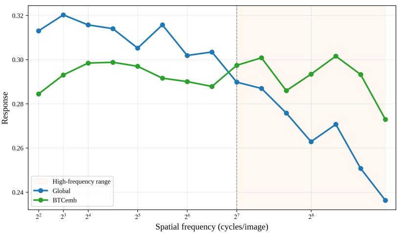  
Figure 7: Frequency response of Global and BTCemb. We compare full-field sinusoidal gratings with matched flat images using the normalized angular distance between their flattened complete conditioning tensors. Each point averages eight orientation–phase configurations. The shaded region highlights 128–448 cycles/image, and sampled frequencies are displayed at equal spacing.

Let $I _ { f , \theta , \phi }$ denote a grating and $I _ { 0 }$ its uniform reference at the same background luminance. For each method $m ,$ let $z _ { m } ( I )$ denote the flattened complete conditioning tensor, retaining all tokens. Both the stimulus and its reference undergo the same method-specific encoding and aggregation. We measure the response using the normalized angular distance (Cai et al., 2025), averaged over the eight orientation–phase configurations:

$$
r _ { m } ( f ) = \frac { 1 } { 8 } \sum _ { \theta , \phi } \frac { 1 } { \pi } \operatorname { a r c c o s } \left( \frac { z _ { m } ( I _ { f , \theta , \phi } ) ^ { \top } z _ { m } ( I _ { 0 } ) } { \| z _ { m } ( I _ { f , \theta , \phi } ) \| _ { 2 } \| z _ { m } ( I _ { 0 } ) \| _ { 2 } } \right) .\tag{9}
$$

A larger response indicates greater separation between the grating and its flat reference in the complete conditioning representation. Responses are computed for each orientation–phase configuration before averaging.

As shown in Figure 7, Global responds more strongly at the lower sampled frequencies, whereas BTCemb maintains stronger responses toward the high-frequency end, particularly at 256–448 cycles/image. This suggests that tiled encoding and aggregation help preserve sensitivity to fine spatial variations that are less distinguishable under global encoding. Since each tile is resized to the encoder input resolution, this behavior reflects the combined effects of the local field of view, rescaling, and feature aggregation. These results provide encoder-level evidence complementary to the region-level and rendered-image evaluations, rather than a direct measurement of generated texture fidelity.

## C.2 IMAGE FEATURE ADDITIVITY AND SAME-CATEGORY COMPATIBILITY

To further analyze the composability and compatibility of local features, we evaluate global-local features cosine distance on the fixed 210-object Toys4K set spanning all 105 categories.

We additionally use same-category hard negatives to determine whether the result is driven only by coarse category separation. For this analysis, we use 210 objects, with two objects from each of the 105 Toys4K categories. Category folders are traversed in lexicographic order, and object sampling uses the fixed seed 2026.

Cosine distance is defined as

$$
s _ { \mathrm { c o s } } ( a , b ) = \cos ( a , b ) .\tag{10}
$$

The same-category cosine margin is defined as

$$
m _ { \mathrm { s a m e } } = s _ { \mathrm { c o s } } ( f _ { i } ^ { l } , f _ { i } ^ { g } ) - s _ { \mathrm { c o s } } ( f _ { i } ^ { l } , f _ { j } ^ { g } ) ,\tag{11}
$$

Table 6: Image feature additivity and same-category compatibility.
<table><tr><td>Representation</td><td>Global-local Features Cos. Dist. ↑</td><td>Same-category cosine margin ↑</td></tr><tr><td>Average tiles</td><td>0.7466 [0.7179, 0.7758]</td><td>0.1728 [0.1433, 0.2041]</td></tr><tr><td>BTCemb (Ours)</td><td>0.8242 [0.8035, 0.8434]</td><td>0.2195 [0.1894, 0.2517]</td></tr></table>

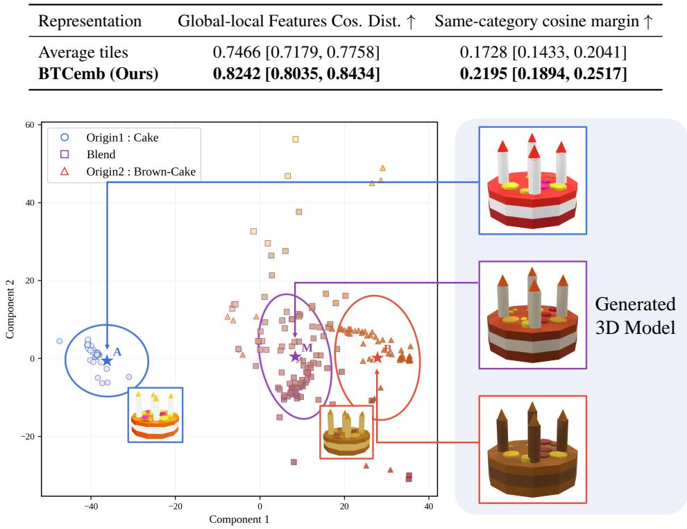  
Figure 8: Qualitative analysis of image feature additivity. Left: PCA visualization of sampled CIELAB surface colors from the generated models, with the two input images shown as insets. Right, from top to bottom: results conditioned on the original, blended, and color-modified image embeddings.

where $f _ { i } ^ { l }$ is the local representation, $f _ { i } ^ { g }$ is its matched global representation, and $f _ { j } ^ { g }$ is a non-matching global representation from the same category. A positive margin indicates that the local representation has higher cosine distance with its matched global representation than with another object from the same category. Higher similarity and margin therefore indicate stronger global-local compatibility and better preservation of input-specific semantic identity. Results are reported as mean [95% bootstrap confidence interval].

Both same-category margins remain positive. BTCemb further increases the global-local features cosine distance and the same-category cosine margin compared with Average tiles. Since the matched and negative objects belong to the same category, these results show that the observed compatibility preserves input-specific semantic identity rather than reflecting only coarse category separation.

To complement the feature-space analysis above, we further examine whether blended image embeddings can be directly used for image-to-3D generation. We independently encode an original rendered image and its color-modified version, and use the equal-weight average of their complete conditioning embeddings to condition the frozen TRELLIS.2 generator. As shown in Figure 8, the generated result combines color characteristics from both inputs. This example provides additional qualitative support for image feature additivity and the compatibility of blended embeddings with the pretrained generator.

## C.3 RUNTIME OVERHEAD

Table 7 reports the runtime of each baseline pipeline and its variant integrated with our method on 3D-arena (Ebert, 2025), presented as mean ± standard deviation over three runs. The reported time includes preprocessing, feature extraction, and the full pipeline execution, while excluding asset export due to its relatively large variance across runs, and runtime is measured with time.perf\_counter(). Note that the reported runtime is mainly intended to compare each pipeline before and after integrating our method, since the default sampling schedules and implementations differ across methods. Each pipeline is evaluated with its default sampling schedule, i.e., 50 sampling steps for Hunyuan3D-2.1, 20 sampling steps for TRELLIS, and 12 sampling steps for TRELLIS.2.

Table 7: Runtime comparison of baseline pipelines before and after integrating our method on 3D-Arena (Ebert, 2025). All runtimes are measured on a single NVIDIA RTX PRO 6000 GPU.
<table><tr><td>Method</td><td></td><td>Sampling Steps Baseline Runtime (s) Ours Runtime (s) Overhead (s)</td><td></td><td></td></tr><tr><td>Hunyuan3D-2.1</td><td>50</td><td> $7 6 . 2 7 \pm 1 . 3 7$ </td><td> $7 8 . 6 3 \pm 1 . 1 3$ </td><td> $2 . 3 6 \pm 1 . 5 9$ </td></tr><tr><td>TRELLIS</td><td>20</td><td> $2 . 9 6 \pm 0 . 2 3$ </td><td> $4 . 8 9 \pm 0 . 2 4$ </td><td> $1 . 9 3 \pm 0 . 1 1$ </td></tr><tr><td>TRELLIS.2</td><td>12</td><td> $1 5 . 8 8 \pm 1 . 4 3$ </td><td> $1 8 . 3 0 \pm 1 . 4 4$ </td><td> $2 . 4 1 \pm 1 . 2 5$ </td></tr></table>

After adopting BTC3D, the overhead mainly comes from feature extraction. Specifically, the image encoders used for feature construction are DINOv2-giant for Hunyuan3D-2.1, DINOv2-large for TRELLIS, and DINOv3-ViT-L/16 for TRELLIS.2. Overall, the computational overhead introduced by adopting our method is negligible, especially for computationally intensive generation pipelines.

## C.4 ADDITIONAL QUANTITATIVE RESULTS

Table 8 reports the supplementary evaluation results on 3D-Arena and Toys4K. These metrics complement the main comparison by measuring normal-map alignment with CLIP-N, distributionlevel fidelity with CLIP-FID, rendered-view feature consistency with DINO, perceptual similarity with LPIPS (Best view), and rendered detail responses with Edge Density and Laplacian Variance.

Overall, BTC3D shows consistent benefits on several supplementary diagnostics across different backbones. On 3D-Arena, applying BTC3D to TRELLIS and TRELLIS.2 improves distribution-level fidelity and rendered-view feature consistency, as reflected by lower CLIP-FID and higher DINO scores. It also improves several perceptual and detail-related indicators, including LPIPS (Best view) and Laplacian Variance for TRELLIS-family backbones. For Hunyuan3D-2.1, BTC3D also improves CLIP-FID and DINO, suggesting that the proposed refinement is not limited to TRELLIS-family models but can also serve as a plug-and-play method for other strong image-to-3D backbones.

On Toys4K dataset, the advantages of BTC3D are more evident on texture-sensitive diagnostics. For Hunyuan3D-2.1, BTC3D improves CLIP-FID, DINO, LPIPS (Best view), and Edge Density, indicating better rendered appearance fidelity and richer local detail responses. For TRELLIS and TRELLIS.2, BTC3D also improves multiple supplementary metrics, especially DINO, LPIPS (Best view), Edge Density, and Laplacian Variance.

No-reference detail metrics should be interpreted with caution. The high Laplacian Variance of 3DTopia-XL on Toys4K is mainly driven by sharp silhouettes, hard geometric boundaries, and artifact-like edges, rather than faithful texture recovery. Thus, Edge Density and Laplacian Variance are used only as auxiliary rendered-detail diagnostics.

To complement global alignment metrics, we conduct a region-level paired evaluation to examine local appearance fidelity, including the preservation of fine textures and boundaries. Table 9 reports results on Toys4K using a fixed 4 × 4 grid defined solely by the GT alpha mask. The evaluation covers 210 objects, 12 matched views per object, and 4,903 valid regions at 1024 × 1024 resolution. Region PSNR and SSIM assess pixel-level fidelity and structural similarity within individual regions, while paired win rates indicate how consistently these local measures improve across regions.

## C.5 ADDITIONAL QUALITATIVE RESULTS

We provide additional qualitative results to further demonstrate the effectiveness of BTC3D as a plug-in method for image-to-3D generation. Figure 9 shows additional visualization obtained by integrating BTC3D into different baseline models (Team, 2025a; Xiang et al., 2025a;b). The ULIP scores (Xue et al., 2024) reported below each rendering show that BTC3D consistently improves over the original baselines. These visual results demonstrate the generalization ability of our training-free plug-in method, which improves existing image-to-3D models by producing 3D assets with accurate geometry and high-fidelity textures without requiring additional training.

Table 8: Additional semantic, distribution, perceptual, and detail metrics on 3D-Arena and Toys4K. Results are averaged over the corresponding evaluation sets. BV denotes best-view results, and E-Den denotes the Edge Density metric. Higher is better for CLIP-N, DINO, Edge Density, and Laplacian Variance, while lower is better for CLIP-FID and LPIPS. Best results are shown in bold and second-best results are underlined. For shape-only or untextured methods, DINO scores are no reported for shape-only or untextured methods.
<table><tr><td>Method</td><td>Train Free</td><td>CLIP-N BV↑</td><td>CLIP-N↑</td><td>CLIP-FID ↓</td><td>DINO BV↑</td><td>DINO ↑</td><td>LPIPS BV↓</td><td>E-Den BV↑</td><td>E-Den ↑</td><td>Lap. Var. BV↑</td><td>Lap. Var. ↑</td></tr><tr><td colspan="10">3D-Arena Benchmark</td></tr><tr><td>TripoSG</td><td>x</td><td>0.5725</td><td>0.4464</td><td>40.4435</td><td></td><td></td><td></td><td>0.0106</td><td>0.0099</td><td>98.9921</td><td>93.9380</td></tr><tr><td>Hi3DGen</td><td>x</td><td>0.5693</td><td>0.4455</td><td>39.9314</td><td></td><td></td><td></td><td>0.0120</td><td>0.0108</td><td>99.4825</td><td>94.1028</td></tr><tr><td>3DTopia-XL</td><td>x</td><td>0.5030</td><td>0.3725</td><td>25.5023</td><td>0.6326</td><td>0.3095</td><td>0.3628</td><td>0.0171</td><td>0.0159</td><td>167.3116</td><td>157.6823</td></tr><tr><td>Hunyuan3D-2.1</td><td>x</td><td>0.5242</td><td>0.4034</td><td>29.3601</td><td>0.5890</td><td>0.3470</td><td>0.4102</td><td>0.0208</td><td>0.0181</td><td>149.1459</td><td>138.6304</td></tr><tr><td>+ BTC3D</td><td>√</td><td>0.5263</td><td>0.4044</td><td>28.7202</td><td>0.5940</td><td>0.3539</td><td></td><td>0.4083 0.0216</td><td>0.0188</td><td>152.0670</td><td>140.6304</td></tr><tr><td>TRELLIS</td><td>x</td><td>0.5507</td><td>0.4118</td><td>29.8881</td><td>0.7000</td><td>0.3976</td><td></td><td>0.3858 0.0124</td><td>0.0117</td><td>178.2178</td><td>172.8362</td></tr><tr><td>+ BTC3D</td><td>√</td><td>0.5510</td><td>0.4184</td><td>25.2971</td><td>0.7137</td><td>0.4153</td><td>0.3796</td><td>0.0175</td><td>0.0163</td><td>179.0849</td><td>173.4081</td></tr><tr><td>TRELLIS.2</td><td>x</td><td>0.5158</td><td>0.4195</td><td>27.7110</td><td>0.6353</td><td>0.3842</td><td>0.3922</td><td>0.0246</td><td>0.0215</td><td>174.8840</td><td>148.0262</td></tr><tr><td>+ BTC3D</td><td>√</td><td>0.5465</td><td>0.4332</td><td>24.8679</td><td>0.6711</td><td>0.4071</td><td>0.3916</td><td>0.0276</td><td>0.0233</td><td>184.1118</td><td>165.6617</td></tr><tr><td colspan="10">Toys4K Benchmark</td></tr><tr><td>TripoSG</td><td>x</td><td>0.6205</td><td>0.4854</td><td>39.3412</td><td></td><td></td><td></td><td>0.0140</td><td>0.0127</td><td>123.2876</td><td>113.0368</td></tr><tr><td>Hi3DGen</td><td>x</td><td>0.6170</td><td>0.4839</td><td>39.2177</td><td></td><td></td><td></td><td>0.0135</td><td>0.0127</td><td>115.5724</td><td>110.7903</td></tr><tr><td>3DTopia-XL</td><td>x</td><td>0.5396</td><td>0.4103</td><td>31.0932</td><td>0.6057</td><td>0.3187</td><td>0.7266</td><td>0.0226</td><td>0.0202</td><td>352.5917</td><td>317.5117</td></tr><tr><td>Hunyuan3D-2.1</td><td>x</td><td>0.6081</td><td>0.4802</td><td>23.7477</td><td>0.7499</td><td>0.4759</td><td>0.7136</td><td>0.0237</td><td>0.0224</td><td>190.9429</td><td>179.7303</td></tr><tr><td>+ BTC3D</td><td>√</td><td>0.6176</td><td>0.4804</td><td>23.5111</td><td>0.7539</td><td>0.4786</td><td>0.7129</td><td>0.0248</td><td>0.0231</td><td>191.0055</td><td>180.0754</td></tr><tr><td>TRELLIS</td><td>x</td><td>0.5961</td><td>0.4626</td><td>25.9937</td><td>0.7184</td><td>0.4520</td><td></td><td>0.7221 0.0158</td><td>0.0149</td><td>172.4711</td><td>168.4326</td></tr><tr><td>+ BTC3D</td><td>√</td><td>0.5988</td><td>0.4651</td><td>25.4794</td><td>0.7291</td><td>0.4583</td><td></td><td>0.7213 0.0164</td><td>0.0154</td><td>179.9012</td><td>172.8051</td></tr><tr><td>TRELLIS.2</td><td>x</td><td>0.6093</td><td>0.4819</td><td>26.1943</td><td>0.7021</td><td>0.4612</td><td></td><td>0.7278 0.0237</td><td>0.0217</td><td>210.2709</td><td>193.2877</td></tr><tr><td>+ BTC3D</td><td>√</td><td>0.6135</td><td>0.4832</td><td>26.0801</td><td>0.7072</td><td>0.4625</td><td>0.7274</td><td>0.0243</td><td>0.0222</td><td>225.4874</td><td>206.3683</td></tr></table>

Table 9: Region-level paired evaluation on Toys4K. Region PSNR and SSIM are computed over spatially paired valid regions. Each merged win-rate cell reports the percentage of paired regions where BTC3D outperforms the corresponding baseline. Win rates are estimated from 10,000 sampling trials and reported as estimate ± confidence-interval half-width. Higher is better.
<table><tr><td>Method</td><td>Region PSNR ↑</td><td>PSNR Win Rate</td><td>Region SSIM ↑</td><td>SSIM Win Rate</td></tr><tr><td>Hunyuan3D-2.1</td><td>19.6319</td><td></td><td>0.8135</td><td></td></tr><tr><td>+ BTC3D</td><td>20.4305</td><td> $7 6 . 6 \% \pm 4 . 9 \%$ </td><td>0.8309</td><td> $7 3 . 5 \% \pm 5 . 7 \%$ </td></tr><tr><td>TRELLIS</td><td>19.2718</td><td></td><td>0.8064</td><td></td></tr><tr><td>+ BTC3D</td><td>19.8367</td><td> $6 9 . 1 \% \pm 6 . 1 \%$ </td><td>0.8205</td><td> $7 1 . 1 \% \pm 5 . 4 \%$ </td></tr><tr><td>TRELLIS.2</td><td>19.8568</td><td></td><td>0.8113</td><td></td></tr><tr><td>+ BTC3D</td><td>20.4711</td><td>76.2% ± 4.5%</td><td>0.8470</td><td> $7 5 . 1 \% \pm 3 . 8 \%$ </td></tr></table>

Direct visual comparisons between the original baseline method TRELLIS.2 (Xiang et al., 2025a) and methods integrated with BTC3D are presented in Figure 11. The integration of BTC3D yields marked enhancement in the details of the final textures. This demonstrates the effectiveness of BTC3D in preserving local features from the condition image while mitigating the multi-view inconsistency and over-smoothing artifacts prevalent in standard diffusion-based 3D generation.

To further illustrate the representational capacity of our approach, Figure 10 shows high-fidelity 3D assets generated utilizing BTC3D. The method accurately reconstructs intricate microscopic details, such as the complex carvings and metallic specularity of the treasure chest, as well as the subtle surface variations of the pig. The accompanying high-resolution normal maps and multi-view renderings validate the potential of BTC3D in synthesizing high-quality 3D assets with complex material properties and geometrically consistent details.

Table 10: Region-level paired evaluation on Toys4K. Edge Density (E-Den) and Laplacian Variance (Lap. Var.) provide auxiliary measures of edge richness and high-frequency responses in rendered images. Win rate reports the percentage of paired images where BTC3D yields a higher metric value than the corresponding baseline. Win rates are computed from 10,000 sampling trials and reported as value ± the half-width of the 95% confidence interval.
<table><tr><td>Method</td><td>Edge Density ↑</td><td>E-Den Win Rate</td><td>Lap. Var. ↑</td><td>Lap. Var. Win Rate</td></tr><tr><td>Hunyuan3D-2.1</td><td>0.0214</td><td></td><td>188.9429</td><td></td></tr><tr><td>+ BTC3D</td><td>0.0278</td><td>73.1% ± 4.7%</td><td>195.0055</td><td>71.9% ± 5.2%</td></tr><tr><td>TRELLIS</td><td>0.0159</td><td></td><td>175.3981</td><td></td></tr><tr><td>+ BTC3D</td><td>0.0194</td><td> $6 7 . 7 \% \pm 5 . 6 \%$ </td><td>180.9137</td><td> $7 0 . 5 \% \pm 4 . 9 \%$ </td></tr><tr><td>TRELLIS.2</td><td>0.0234</td><td></td><td>213.3255</td><td></td></tr><tr><td>+ BTC3D</td><td>0.0310</td><td>76.4% ± 4.8%</td><td>228.5734</td><td>77.1% ± 5.1%</td></tr></table>

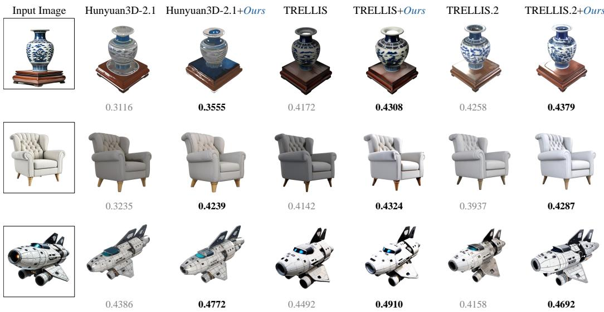  
Figure 9: More qualitative comparisons by ULIP score with image-to-3D generation models.

## C.6 USER STUDY

As noted in B.2, automatic evaluation metrics such as CLIP-I and ULIP-2 primarily measure global semantic alignment and may not fully capture fine-grained texture fidelity, local geometry coherence, or human-perceived visual quality. To complement the automated quantitative results in C.4 and further validate BTC3D for detail-preserving image-to-3D generation, we conduct a pairwise human preference study comparing 3D assets generated by the baseline TRELLIS.2 and its variant integrated with BTC3D on 3D-Arena (Ebert, 2025).

Stimuli Preparation. We use all 101 samples from the 3D-Arena dataset to construct the stimulus pool for the user study. For each sample, we pair the GLB assets generated by the baseline TRELLIS.2 and by TRELLIS.2 integrated with BTC3D. Both assets are loaded directly into interactive 3D viewers and displayed side by side, with the conditioning input image positioned above them as a visual reference. Within each pair, the assets are centered and displayed using a shared scale, identical lighting and background conditions, and matched initial camera settings. Participants can freely rotate, zoom, and pan the models to inspect their geometry and appearance, with synchronized camera controls available to facilitate comparison. Each participant evaluates 20 distinct pairs randomly sampled from the full 101-sample pool.

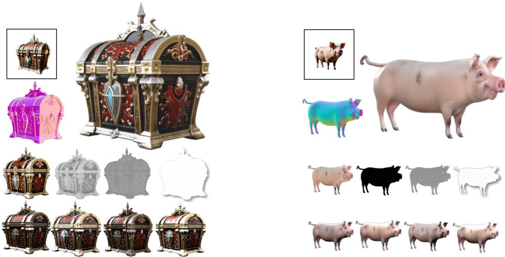  
Figure 10: Additional visualizations of BTC3D. For each example, the boxed image shows the input, the large image shows the final rendered result, and the colored image shows the corresponding normal map. The eight smaller views below provide further material and appearance analysis: the first row shows the base color, metallic, roughness, and alpha maps, while the second row presents four renderings under different realistic illumination from the same viewpoint.

Evaluation Protocol. The user study involved 20 participants and adopts a two-alternative forcedchoice (2AFC) pairwise comparison protocol (Qiu et al., 2024; Liu et al., 2023a; Zhang et al., 2018). Each participant evaluates 20 distinct samples randomly drawn without replacement from the full pool of 101 3D-Arena samples, with the presentation order randomized for each participant. For each sample, the conditioning input image is displayed above two interactive 3D viewers labeled A and B, without revealing the corresponding generation methods. Participants can rotate, zoom, and pan the models, with synchronized camera controls available to facilitate comparison. The assignment of the baseline and BTC3D outputs to A and B is randomized for each sample within each participant’s session using a session-specific random seed, to mitigate positional bias. Participants answer the question:“Which 3D asset is better?” by selecting either “A is better” or “B is better.” They are instructed to choose the asset that better matches the reference image, considering its shape, appearance, and visual details. Responses are recorded through a custom web-based interface. The interface uses a responsive layout to support both desktop and mobile devices, while retaining the same reference image, paired interactive 3D viewers, and response options.

## C.6.1 RESULTS

Overall Preference. Aggregated across all 400 pairwise comparisons, participants showed a clear preference for BTC3D-enhanced outputs, which were selected in 67.25% of trials (269 votes), while the TRELLIS.2 baseline was preferred in only 32.75% of trials (131 votes). As illustrated in Figure 13, this consistent performance advantage is further illustrated by the per-item distribution, where the adoption from our method significantly outperforms the baseline.

Per-Sample Analysis. Figure 13 reports the per-sample preference distribution. BTC3D achieves a majority preference on the majority of test samples, with particularly strong advantages on texture-rich objects (e.g., fabric with woven patterns, engraved metallic surfaces, printed text on objects). These samples directly exemplify the detail attenuation problem identified in Section 1. On a small number of texture-sparse samples where both methods produce visually comparable outputs, preferences are approximately balanced. This pattern is consistent with the expectation that BTC3D primarily benefits detail-rich scenarios without degrading quality on texture-uniform inputs.

TRELLIS.2+Ours

TRELLIS.2

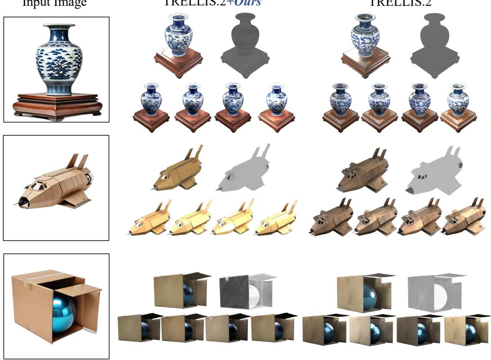  
Figure 11: Additional comparisons between TRELLIS.2+BTC3D and TRELLIS.2. For each input image, the left column shows the input, while the middle and right columns present the results of TRELLIS.2+BTC3D and TRELLIS.2, respectively. For each generated result, the left larger view shows the textured rendering, and the right larger view shows the corresponding material visualization. The four smaller views below present renderings under different realistic lighting from the same viewpoint.

## D ADDITIONAL ABLATION STUDIES

## D.1 ABLATION OF THE TILING PARAMETER N

We ablate the tiling parameter $N \in \{ 2 , 3 , 4 , 5 , 6 \}$ to examine its effect on image-to-3D generation quality. Experiments are conducted on the full 3D-Arena (Ebert, 2025) dataset, comprising 101 images, using TRELLIS.2 with a resolution setting of 1024. Both global images and local tiles follow the standard preprocessing of the corresponding DINO encoder and are resized to its native input resolution before feature extraction. We use $N \stackrel { - } { = } 3$ in all main experiments.

Table 11 reports the mean scores. Among the evaluated settings, N = 3 achieves the highest mean PSNR and SSIM and the lowest mean LPIPS. The mean scores are similar for N = 2–4, while $N = 5$ and N = 6 yield lower PSNR and SSIM and higher LPIPS. These results indicate that increasing N does not necessarily improve generation quality and support our default choice of $N = 3$

As shown in Table 11, N = 3 achieves the highest mean PSNR and SSIM and the lowest mean LPIPS among the evaluated settings. The mean scores remain similar for $N = 2 { - } 4$ , whereas larger values yield lower PSNR and SSIM and higher LPIPS. These results support the default choice of $N = 3$

## D.2 ABLATION OF THE TILE EXPANSION DIRECTION

We also examine the effect of tile expansion direction. We keep the same seed, resolution, and sampling steps as above. The global-to-local schedule starts with broad tile coverage and progressively concentrates on a smaller set of local tiles, whereas our local-to-global schedule initially emphasizes high-priority tiles and gradually broadens the effective tile coverage. Here, the schedule directions refer to local tile coverage; the global condition remains active in both dynamic variants.

  
(a) Desktop Version

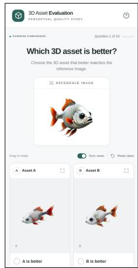  
(b) Mobile Version

Figure 12: User study interface. Desktop (left) and mobile (right) layouts of our web-based evaluation interface. The reference input image is displayed above two interactive 3D viewers labeled A and B. Participants can rotate, zoom, and pan the models, with optional synchronized camera controls, and select either “A is better” or “B is better” based on their similarity to the reference image and overall visual quality.  
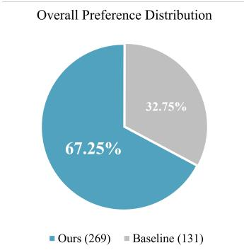  
(a)

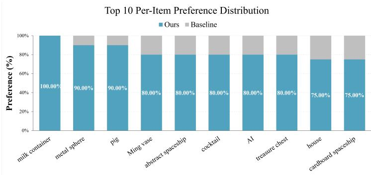  
(b)  
Figure 13: Quantitative results of the user study. (a) Overall preference distribution, where our method is preferred in 67.25% of the total 400 votes, significantly outperforming the baseline. (b) Top 10 per-item preference histogram, showing the per-sample preference rate for individual test cases. Our approach consistently receives higher user preference across diverse prompts, demonstrating the robustness and superior quality of our 3D asset generation.

As shown in Table 12, the local-to-global schedule achieves the highest ULIP-2 and Uni3D scores among the evaluated settings. These results support the local-to-global expansion used in BTC3D, which progressively incorporates broader regional evidence while initially emphasizing high-priority local information.

## D.3 ABLATION OF THE DYNAMIC CONDITIONING PARAMETER $\beta .$

We further examine the effect of the dynamic conditioning parameter $\beta$ on local detail preservation and semantic alignment. In DyCond, $\beta$ controls the onset and slope of the progressive activation schedule, together with the sharpness of rank-based tile weighting. Table 13 reports quantitative results using PSNR to assess image-space fidelity and ULIP-2 and Uni3D to evaluate 3D-aware semantic alignment. Among the evaluated settings, $\beta = 2$ achieves the best scores.

Table 11: Effect of the tiling parameter N on 3D-Arena. Bold values indicate the best results among the evaluated settings.
<table><tr><td> $N$ </td><td>PSNR↑</td><td>SSIM ↑</td><td> $\mathrm { U L I P } { - 2 \uparrow }$ </td><td>Uni3D ↑</td><td>LPIPS↓</td></tr><tr><td>2</td><td>21.1799</td><td>0.8694</td><td>0.3787</td><td>0.3469</td><td>0.4615</td></tr><tr><td>3 (default)</td><td>21.3149</td><td>0.8721</td><td>0.3837</td><td>0.3551</td><td>0.4597</td></tr><tr><td>4</td><td>20.9194</td><td>0.8623</td><td>0.3805</td><td>0.3490</td><td>0.4602</td></tr><tr><td>5</td><td>20.7935</td><td>0.8557</td><td>0.3732</td><td>0.3378</td><td>0.4643</td></tr><tr><td>6</td><td>20.5157</td><td>0.8491</td><td>0.3701</td><td>0.3349</td><td>0.4710</td></tr></table>

Table 12: Effect of tile expansion direction on 3D-Arena. Higher scores are better for both metrics.
<table><tr><td>Schedule</td><td>ULIP-2 ↑</td><td>Uni3D↑</td></tr><tr><td>Baseline</td><td>0.3676</td><td>0.3327</td></tr><tr><td>global-to-local</td><td>0.3723</td><td>0.3406</td></tr><tr><td>local-to-global (ours)</td><td>0.3837</td><td>0.3551</td></tr></table>

Figure 14 provides qualitative comparisons between the baseline, static conditioning, and different dynamic settings. The highlighted engine and wing regions illustrate differences in local detail preservation. In this example, all three dynamic settings outperform static conditioning in both PSNR and ULIP-2, with $\beta = 2$ achieving the highest scores. These observations support progressive tile activation over fixed tile conditioning and our choice of $\beta = 2$

## D.4 ABLATION OF THE FUSION RATIO α.

We further examine the effect of the fusion ratio α on local detail preservation and semantic alignment, with β fixed at 2. As the blending coefficient between $f ^ { g }$ and $f ^ { a , t }$ , α controls the relative contributions of global guidance and local tile information. Table 14 reports results on 3D-Arena, using PSNR, SSIM, and LPIPS to assess image-space fidelity and ULIP-2 and Uni3D to evaluate 3D-aware semantic alignment. Among the evaluated settings, $\alpha = 0 . 4$ achieves the best results.

Figure 15 provides qualitative comparisons under different settings. An appropriate fusion ratio improves detail preservation while maintaining semantic alignment, whereas overly small or large values may reduce PSNR and, in some cases, also lower ULIP-2. These observations highlight the importance of balancing local conditioning with global guidance.

## E DISCUSSION AND FUTURE WORKS

## E.1 DISCUSSION

Evaluating image-to-3D generation remains challenging because its evaluation protocol fundamentally differs from that of conventional 3D reconstruction. 3D reconstruction typically assumes posed input images and follows strict multi-view geometric constraints, where evaluation mainly focuses on how well the reconstructed scene matches the observed views or ground-truth geometry under known camera poses. By contrast, image-to-3D generation does not require input camera poses and aims to produce a complete 3D asset from a single image, including plausible geometry, texture, and even material for both visible and unseen regions. Since the generated 3D asset is not guaranteed to be view-aligned with the input image or any predefined ground-truth coordinate frame, the same input image may correspond to multiple plausible 3D assets with different geometry, object scale, canonical orientation, and unseen-region appearance. Therefore, conventional reconstruction metrics, such as PSNR, SSIM (Wang et al., 2004), Chamfer Distance, F-score, and LPIPS (Zhang et al., 2018) on matched-view renderings, measure agreement with a reference under a specific evaluation protocol. Their interpretation should account for alignment conditions and the possibility of multiple plausible

Table 13: Effect of the dynamic conditioning parameter $\beta$ on 3D-Arena. Bold values indicate the best reported results.
<table><tr><td>Setting</td><td>PSNR↑</td><td>ULIP-2↑</td><td>Uni3D↑</td></tr><tr><td>Baseline</td><td>20.6741</td><td>0.3676</td><td>0.3327</td></tr><tr><td>Static</td><td>20.9117</td><td>0.3733</td><td>0.3446</td></tr><tr><td>β=1</td><td>21.1564</td><td>0.3795</td><td>0.3488</td></tr><tr><td>β=2</td><td>21.3149</td><td>0.3837</td><td>0.3551</td></tr><tr><td>β=3</td><td>21.2213</td><td>0.3801</td><td>0.3529</td></tr></table>

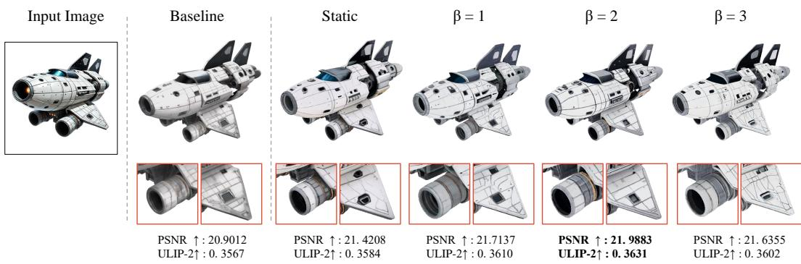  
Figure 14: Ablation of the dynamic conditioning parameter β. From left to right: input image, baseline, static tile conditioning, and results with β = 1, 2, 3. Red boxes highlight local details. PSNR and ULIP-2 are reported for the illustrated example.

3D outputs, and they should be considered alongside semantic alignment metrics for a comprehensive assessment of image-to-3D generation quality.

Following current image-to-3D generation evaluation metrics, we adopt commonly used metrics from recent works such as TRELLIS (Xiang et al., 2025a;b), Hunyuan3D (Team, 2025b;a), and related image-to-3D methods (Feng et al., 2025; Li et al., 2025a; Ye et al., 2025). Existing evaluation metrics can be broadly grouped into two categories:

The first category evaluates generated assets through rendered 2D views. In this setting, a 3D asset is rendered into multiple images, and the rendered views are compared with the input image using image-space or feature-space metrics such as CLIP-I (Radford et al., 2021), DINO (Caron et al., 2021), LPIPS (Zhang et al., 2018), or FID-style distances, as reported in Table 8. These metrics directly reflect the visible appearance of the asset, including texture, color, and rendered visual details. However, they are sensitive to rendering viewpoints, lighting, image resolution, background, and the mismatch between single-view conditioning and multi-view evaluation.

The second category evaluates generated assets from a more 3D-aware representation perspective. Following recent image-to-3D evaluation protocols, a common practice is to convert the mesh into a colored point cloud and compute image-to-point-cloud similarity using multimodal 3D foundation models such as ULIP-2 (Xue et al., 2024) and Uni3D (Zhou et al., 2024). These metrics provide useful image-to-asset alignment signals and are better suited for object-level semantic and structural consistency than purely rendered-view metrics. However, they remain primarily alignment-oriented. Recent 3D generation benchmarks show that 3D asset quality involves multiple dimensions, including geometry details, texture quality, geometry-texture coherence, and prompt-asset alignment (Zhang et al., 2025). Therefore, global image-to-point-cloud similarity may overlook fine-grained aspects of texture-focused 3D generation, such as texture fidelity, material boundaries, and surface details.

Overall, these two types of metrics provide complementary but incomplete views of image-to-3D generation quality. In our evaluation, we therefore combine rendered-view metrics with 3D-aware image-to-point-cloud similarity metrics, and use them together to assess different aspects of 3D generation quality, as shown in Table 8. 3DGen-Bench (Zhang et al., 2025) evaluates 3D assets from multiple aspects, including geometry detail, texture quality, geometry coherence, and text–asset consistency. This shows that a single global alignment score is not enough to fully measure 3D generation quality.

Table 14: Effect of the fusion ratio α on 3D-Arena. Bold values indicate the best reported results.
<table><tr><td>Setting</td><td>PSNR ↑</td><td>SSIM ↑</td><td>ULIP-2 ↑</td><td>Uni3D↑</td><td>LPIPS↓</td></tr><tr><td>Baseline</td><td>20.6741</td><td>0.8480</td><td>0.3676</td><td>0.3327</td><td>0.4693</td></tr><tr><td>α=0.3</td><td>21.1650</td><td>0.8696</td><td>0.3801</td><td>0.3515</td><td>0.4655</td></tr><tr><td>α=0.4</td><td>21.3149</td><td>0.8721</td><td>0.3837</td><td>0.3551</td><td>0.4597</td></tr><tr><td>α=0.5</td><td>21.1094</td><td>0.8693</td><td>0.3799</td><td>0.3492</td><td>0.4649</td></tr><tr><td>α=0.6</td><td>20.9245</td><td>0.8601</td><td>0.3743</td><td>0.3416</td><td>0.4696</td></tr></table>

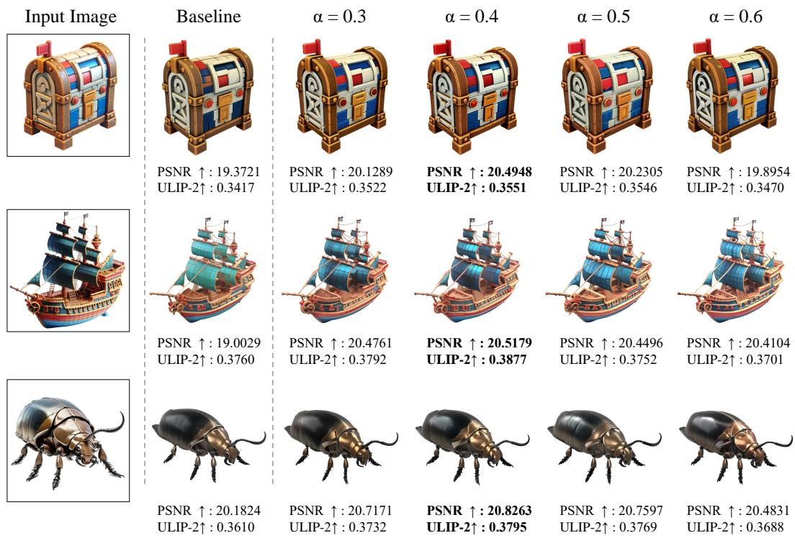  
Figure 15: Ablation of the fusion ratio α. Different fusion ratios affect local detail preservation and consistency with the input image.

Automatic metrics and human preference studies should therefore be viewed as complementary rather than interchangeable: the former enables scalable and reproducible comparisons across methods, while the latter captures perceptual quality, local texture realism, geometry-texture consistency, and human-sensitive detail fidelity. Accordingly, our evaluation combines automatic metrics with a user study to provide both quantitative and perceptual evidence for the effectiveness of BTC3D.

## E.2 FUTURE WORK

This work opens up several promising directions for future research.

First, it would be valuable to further explore the broader role of DINO-based visual representations in image-to-3D generation. Beyond serving as conditioning signals, DINO features may provide useful cues for local correspondence, semantic part awareness, texture placement, and geometry–texture alignment, since they encode both high-level object semantics and spatially localized appearance information. A deeper understanding of how these features support different stages of 3D generation could inspire more effective local guidance mechanisms and improve the controllability of finegrained asset generation.

Second, future work may explore more comprehensive evaluation metrics for image-to-3D generation. Current automated metrics provide useful and reproducible signals for measuring image-to-asset alignment, while human studies offer complementary insight into perceptual quality, texture realism, and geometry–texture consistency. Developing more detail-sensitive benchmarks, standardized rendering settings, and native 3D evaluation metrics that better reflect human visual perception would further support the evaluation of high-fidelity 3D assets.

Finally, DINO-based representations may also be useful beyond the specific image-to-3D setting studied in this work. The combination of global and tiled visual features could potentially benefit related tasks that require both holistic semantic understanding and fine-grained local fidelity, such as texture generation, 3D asset editing, image-conditioned refinement, and multi-view content generation. Exploring these applications may further reveal the general utility of DINO features for controllable and detail-preserving 3D content creation.

## F ALGORITHM

We present BTC3D in a modular form. Algorithm 1 constructs the foreground-weighted tile embedding. Algorithm 2 computes the timestep-dependent conditioning feature. Algorithm 3 integrates both components into the sampling process of a pretrained flow-based generator.

Algorithm for BTCemb. Given an input image I and its foreground mask M, BTCemb extracts global and local image features. Each tile is assigned a priority score according to its foreground coverage, and these scores are directly normalized to obtain the static blending weights. The tile features and their weights are jointly sorted for subsequent dynamic conditioning.

Here, M is obtained during input preprocessing and is expressed in the same coordinate system as I. IMAGETILING returns the image tiles together with their corresponding pixel regions $\{ \Omega _ { k } \} _ { k = 1 } ^ { K }$ . The encoder E includes its standard preprocessing, so the full-image and tile features have compatible shapes. We use $N \geq 2 \quad$ , with $K = N ^ { 2 }$ , and assume $\textstyle \sum _ { k = 1 } ^ { K } e _ { k } > 0$

Algorithm for DyCond. Given the sorted tile features and static weights, DyCond computes timestepdependent tile weights. Higher-priority tiles receive greater relative emphasis early in sampling, while the relative contributions of lower-priority tiles increase as sampling progresses. The resulting dynamic tile embedding is blended with the global feature using a fixed fusion ratio α.

Inference pipeline. The global and tile features are computed once and reused throughout sampling. At each sampling step, DyCond produces the conditioning feature supplied to the pretrained generator. Let $t \in [ 0 , \bar { 1 } ]$ denote the flow matching trajectory, where t = 0 and t = 1 represent the source distribution and the target.

FLOWSTEP denotes an update from $t _ { n } \tan t _ { n + 1 }$ using the backbone’s sampling rule. The pseudocode describes the sampling stage to which BTC3D is applied and returns its generated latent. All pretrained model parameters remain unchanged.

Algorithm 1 Blended Tile Conditioning Embedding (BTCemb)   
Require: Input image I, foreground mask M, image encoder $E ,$ tiling parameter $N _ { \ast } \geq 2$   
Ensure: Global feature $f ^ { g } ,$ , sorted tile features $\{ f _ { k } ^ { l } \} _ { k = 1 } ^ { K }$ , sorted static weights $\{ w _ { k } \} _ { k = 1 } ^ { K }$ , blended tile feature $f ^ { a }$   
1: $K \gets N ^ { 2 }$   
2: $f ^ { g } \gets E ( I )$   
3: $\{ ( I _ { k } , \Omega _ { k } ) \} _ { k = 1 } ^ { K } $ IMAGETILING $( I , N )$   
4: for $k = \mathrm { i } \mathrm { \Delta t o } { \cal K }$ do   
5: $f _ { k } ^ { l } \gets E ( I _ { k } )$   
6: $e _ { k } \gets \frac { 1 } { | \Omega _ { k } | } \sum _ { \mathbf x \in \Omega _ { k } } M ( \mathbf x )$   
7: end for   
8: for $k = 1$ to $K _ { e _ { k } } \mathbf { d o }$   
9: $\begin{array} { l } { { w _ { k }  { }  { } } } \\ { { \ \sum _ { j = 1 } ^ { K } e _ { j } } } \\ { { \ \dots { } \circ } } \end{array}$   
10: end for   
11: $\begin{array} { r } { f ^ { a } \gets \sum _ { k = 1 } ^ { K } w _ { k } f _ { k } ^ { l } } \end{array}$   
12: Jointly sort $\bar { \{ }  ( f _ { k } ^ { l } , w _ { k } ) \} _ { k = 1 } ^ { K }$ such that w1 $\geq$ w2 $\geq \cdots \geq$ wK   
13: return $f ^ { g } , \bar { \{ f _ { k } ^ { l } \} _ { k = 1 } ^ { K } } , \bar { \{ w _ { k } \} _ { k = 1 } ^ { K } } , f ^ { a }$

Algorithm 2 Dynamic Conditioning (DyCond)   
Require: Global feature $f ^ { g } ,$ , sorted tile features $\{ f _ { k } ^ { l } \} _ { k = 1 } ^ { K }$ , sorted static weights $\{ w _ { k } \} _ { k = 1 } ^ { K }$ , fusion ratio α $\in [ 0 , 1 ]$   
schedule parameter $\beta \geq 1 ,$ , timestep $t \in [ 0 , \dot { 1 } ]$   
Ensure: Blended conditioning feature $\cdot \mathrm { ~ } f ^ { c , t }$   
1: $\lambda ( t ) \gets \mathrm { c l i p } ( \beta t - \beta + 1 , \mathsf { \tilde { 0 } } , 1 )$   
2: for $k = 1$ to K do   
3: gk(t) ← sigmoid $\left( \beta \left( \lambda ( t ) - \frac { k - 1 } { K - 1 } \right) \right)$   
4: end for   
5: for $k = 1$ to $K$ do   
6: $w _ { h } ^ { t } \gets \frac { g _ { k } ( t ) w _ { k } } { \textbf { r } }$   
$\textstyle \sum _ { j = 1 } ^ { K } g _ { j } ( t ) w _ { j }$   
7: end for   
8: $\begin{array} { r } { f ^ { a , t } \gets \sum _ { k = 1 } ^ { K } w _ { k } ^ { t } f _ { k } ^ { l } } \end{array}$   
9: $f ^ { c , t } \gets ( 1 - \bar { \alpha } ) f ^ { g } + \alpha f ^ { a , t }$   
10: return $\dot { f } ^ { c , t }$

Algorithm 3 BTC3D-Conditioned Inference   
Require: Input image I, foreground mask M, image encoder $E ,$ pretrained flow-based generator ${ \mathcal { F } } _ { \theta } .$ , time grid   
$\{ t _ { n } \} _ { n = 0 } ^ { T }$ with $\bar { 0 ^ { - } } = t _ { 0 } < \bar { t } _ { 1 } < \cdot \cdot \cdot < t _ { T } = 1$ , tiling parameter $N \geq 2 ,$ , fusion ratio $\alpha \in [ 0 , 1 ]$ , schedule   
parameter $\beta \geq 1$   
Ensure: Generated latent $x _ { t _ { T } }$   
1: $( f ^ { g } , \{ f _ { k } ^ { l } \} _ { k = 1 } ^ { K } , \{ w _ { k } \} _ { k = 1 } ^ { K } , f ^ { a } )  \mathtt { B T C E M B } ( I , M , E , N )$   
2: Sample $x _ { t _ { 0 } } \sim .$ psource   
3: for $n = 0$ to $T - 1$ do   
4: $f ^ { c , t _ { n } } \gets \mathrm { D Y C O N D } \big ( f ^ { g } , \{ f _ { k } ^ { l } \} _ { k = 1 } ^ { K } , \{ w _ { k } \} _ { k = 1 } ^ { K } , \alpha , \beta , t _ { n } \big )$   
5: $\boldsymbol { x } _ { t _ { n + 1 } } \gets \mathrm { F L O W S T E P } ( \mathcal { F } _ { \boldsymbol { \theta } } , \boldsymbol { x } _ { t _ { n } } , f ^ { c , t _ { n } } , t _ { n } , t _ { n + 1 } )$   
6: end for   
7: return $x _ { t _ { T } }$