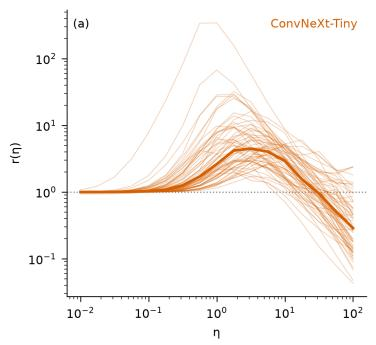
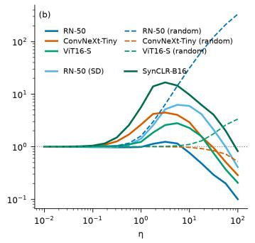
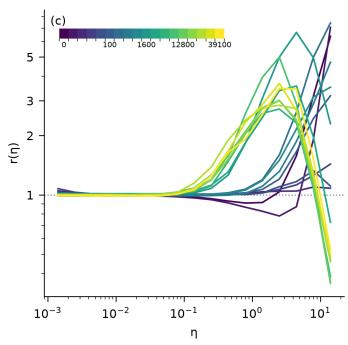
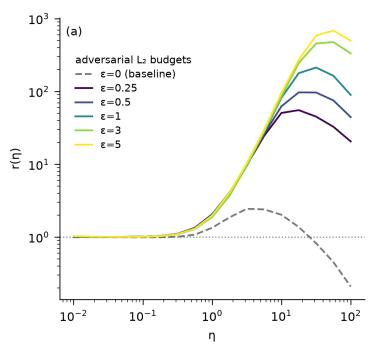
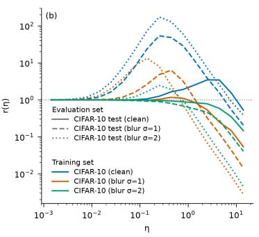
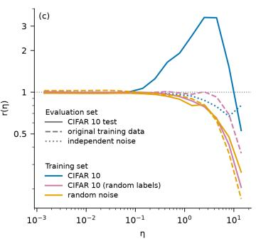
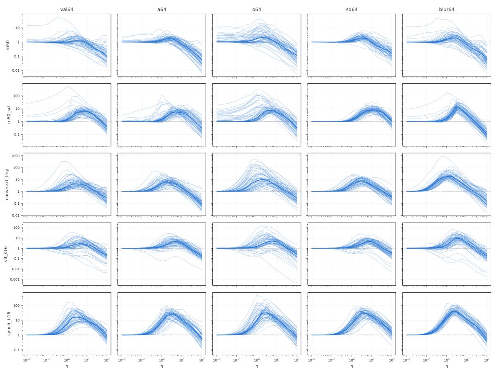
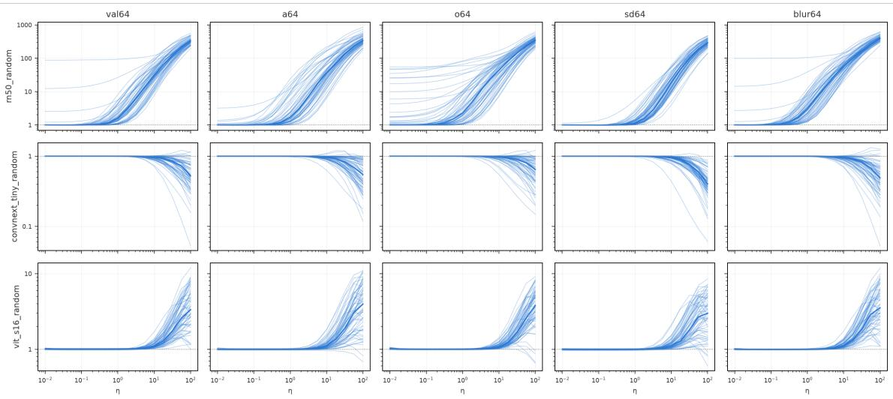
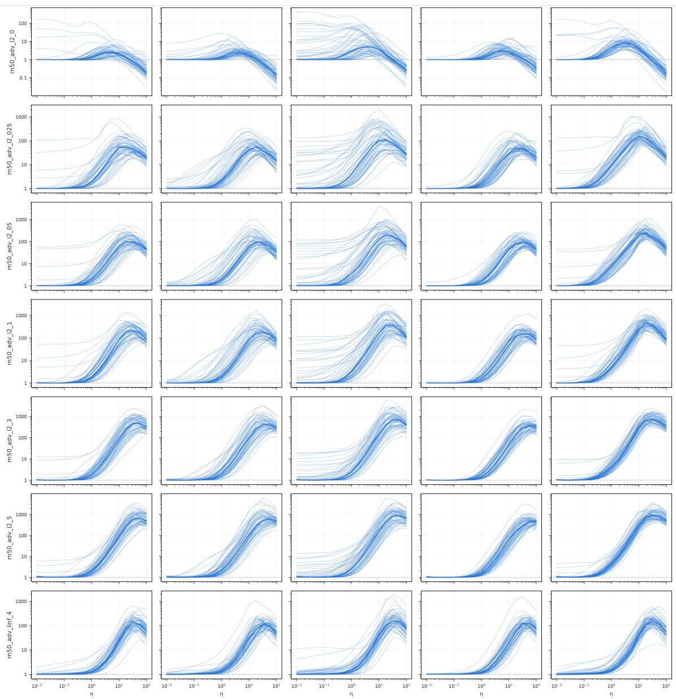

# Beyond Local Linearity: Scale-Resolved Geometry of Learned Image Encoders

Jakub Szymkowiak1,2 and Wojtek Pa lubicki1 and Kamil Adamczewski1,2

1Adam Mickiewicz University in Pozna´n, Poland

2IDEAS NCBR, Warsaw, Poland

## Abstract

Understanding how learned representations respond to finite input changes is important for characterizing their sensitivity, invariances, and robustness. Yet existing geometric analyses are predominantly local and describe only infinitesimal perturbations. We introduce a scale-resolved statistic that compares an encoder’s measured feature displacement with its local linear prediction as the perturbation magnitude increases. Across diverse image encoders, we discover a characteristic plateau–rise–peak–decay profile, which we call the bump. The bump is absent at initialization, emerges early during standard training, and does not form under randomized labels or random-noise inputs. Its shape also varies with the training distribution and robustness objective. These results establish departures from local geometry as a signature of how encoder representations are shaped by learning.

Keywords: pullback metric, neural representations, local geometry, linearization, vision

## 1. Introduction

Deep neural networks are often studied through the geometry of their learned representations. During training, an encoder becomes selectively sensitive to input variation: it may suppress diferences that are irrelevant to the objective while preserving those needed for prediction. In image classification, for example, variations within a class need not remain distinguishable if they do not afect the predicted label, whereas variations separating classes must be retained. This selective sensitivity shapes the geometry of the learned representation map. Although there exist diferential quantities describing the geometric imprint of this selectivity on the learned mapping (Novak et al., 2018; Arvanitidis et al., 2018), how far beyond the immediate neighborhood of an input these descriptions predict feature displacement has not been measured.

In this work, we propose to measure how far this local geometric description remains predictive. To this end, we introduce a scale-dependent statistic that quantifies how the size of the encoder’s actual feature displacement departs from its local linear prediction. Starting from an image, we gradually increase the perturbation magnitude and compare the size of the measured response with that predicted from the encoder’s infinitesimal sensitivity, averaging over random perturbation directions. This reveals both the scale at which nonlinear behavior becomes important and the manner in which it emerges across architectures, training regimes, and evaluation data.

We find that all trained encoders considered in our study exhibit a characteristic scaledependent profile: the measured feature displacement initially agrees in magnitude with its local linear prediction, then grows larger than predicted, reaches a maximum discrepancy at an intermediate scale, and eventually falls relative to the prediction. We refer to this structure as the bump.

The bump is not produced by optimization alone. Networks trained with randomized labels, or on unstructured random inputs, do not develop a comparable peak, despite being optimized to fit their respective training objectives. These controls associate the bump with learning shared, meaningful input–target structure rather than with parameter changes or memorization alone.

## Contributions

• We introduce a scale-resolved approach for studying how the finite behavior of an image encoder departs from its local linear geometry.

• We identify the bump, a characteristic response profile that appears consistently across trained image encoders and emerges early during meaningful training.

• Through controlled experiments, we show that the bump reflects how representations are shaped by the learning problem: it is absent under random-label memorization and unstructured data, and varies systematically with the training distribution and robustness objective.

## 2. Method

Let $\Phi : \mathcal { T }  \mathcal { Z }$ be a frozen image encoder mapping an image $\pmb { x } \in \mathcal { T } \subseteq [ 0 , 1 ] ^ { d _ { \mathbb { Z } } }$ to a feature representation $\Phi ( \pmb { x } ) \in \mathcal { Z } \simeq \mathbb { R } ^ { d _ { \mathcal { Z } } }$ . We are interested in the encoder’s sensitivity, that is, in how the representation changes as the input moves away from x. To first order, this sensitivity is captured by the pullback metric $\mathbf { G } _ { \Phi } ( \pmb { x } ) : = \mathbf { J } _ { \Phi } ( \pmb { x } ) ^ { \top } \mathbf { J } _ { \Phi } ( \pmb { x } )$ , where $\mathbf { J } _ { \Phi } ( { \pmb x } )$ is the encoder’s Jacobian at x. Our goal is to determine how far this local description remains predictive as we move away from x. We therefore compare the actual change in the representation under a finite perturbation with the change predicted by the metric. By repeating this comparison across perturbation scales, we obtain a scale-resolved description of the encoder’s departure from its local linear geometry.

For a unit direction u $\in \mathbb { S } ^ { d _ { \mathbb { Z } } - 1 }$ and a suficiently small perturbation magnitude $\eta > 0$ , the pullback metric predicts the squared feature displacement $D _ { \eta } ( \pmb { x } , \pmb { u } ) : = \| \Phi ( \pmb { x } + \eta \pmb { u } ) - \Phi ( \pmb { x } ) \| _ { 2 } ^ { 2 }$ of the perturbation $\pmb { x }  \pmb { x } + \eta \pmb { u }$ as $\eta ^ { 2 } { \mathbf { \em u } } ^ { \intercal } { \mathbf { \boldsymbol { G } } } _ { \Phi } ( { \boldsymbol { \mathbf { \mathit { x } } } } ) { \mathbf { \boldsymbol { u } } } = \eta ^ { 2 } \left. { \mathbf { \boldsymbol { J } } } _ { \Phi } ( { \boldsymbol { \mathbf { \mathit { x } } } } ) { \boldsymbol { \mathbf { \mathit { u } } } } \right. _ { 2 } ^ { 2 }$ . Equivalently, this can be seen by squaring both sides of the first-order step $\Phi ( { \pmb x } + \eta { \pmb u } ) - \Phi ( { \pmb x } ) \approx \eta { \bf J } _ { \Phi } ( { \pmb x } ) { \pmb u }$

This prediction, however, need not agree with the encoder’s actual response $D _ { \eta } ( { \pmb x } , { \pmb u } )$ To reduce the comparison to a single direction-free measure, we average over isotropically sampled unit directions $\pmb { u } \sim \mathrm { U n i f } ( \mathbb { S } ^ { d _ { \mathbb { T } } - 1 } )$ and define

$$
r _ { \eta } ( \pmb { x } ) : = \frac { \mathbb { E } _ { \pmb { u } } \left[ D _ { \eta } ( \pmb { x } , \pmb { u } ) \right] } { \eta ^ { 2 } \mathbb { E } _ { \pmb { u } } \left[ \| \mathbf { J } _ { \Phi } ( \pmb { x } ) \pmb { u } \| _ { 2 } ^ { 2 } \right] } .\tag{1}
$$

The numerator of eq. (1) measures the encoder’s mean response at scale $\eta ,$ whereas the denominator measures the response predicted by its local geometry at x. Thus, $r _ { \eta } ( \pmb { x } ) \approx 1$ indicates agreement in magnitude with the local linear prediction, while $r _ { \eta } ( { \pmb x } ) > 1$ and $r _ { \eta } ( \pmb { x } ) < 1$ indicate a larger or smaller response than predicted, respectively. For an encoder diferentiable at x with nonzero local sensitivity $\begin{array} { r } { \mathbf { J } _ { \Phi } ( \pmb { x } ) \neq \mathbf { 0 } \operatorname* { l i m } _ { \eta  0 } r _ { \eta } ( \pmb { x } ) = 1 } \end{array}$ by construction. The details on the finite-sample estimator of eq. (1) and the leading-order deviation from $r _ { \eta } \approx 1$ are given in Appendix A.1.

  
Figure 1: Scale-resolved response profiles. The horizontal axis is the perturbation magnitude $\eta ,$ and the vertical axis is $\boldsymbol { r } _ { \eta } .$ , the ratio of the measured feature displacement to its local linear prediction. (a) Individual profiles of single images are thin and their median is bold (ConvNeXt-Tiny encoder). (b) Across diverse encoder architectures, trained models (solid) exhibit the characteristic plateau–rise–peak– decay bump, whereas randomly initialized models (dashed) do not (medians reported). (c) During training, the bump forms early and remains largely stable.

## 3. Experiments

We study whether scale-dependent departures from local geometry follow a consistent pattern across image encoders, how they emerge during training, and which properties of the learning problem determine their formation. Unless stated otherwise, we evaluate $r _ { \eta }$ at 17 logarithmically spaced perturbation scales and report the median profile across images. Full protocol, model and probe-set specifications, and per-model tables are given in the appendix Appendix A; per-image profiles across all evaluation sets are shown in section B.

A characteristic bump after training. We first evaluate frozen encoders spanning convolutional and transformer architectures, standard and adversarial ImageNet supervision, synthetic-data training, and random initialization. At the level of individual images, the profiles vary in magnitude but retain a consistent overall shape (fig. 1a). Across all trained encoders, the median profiles exhibit an initial plateau near $r _ { \eta } = 1$ , followed by a rise above the local prediction, an interior peak, and an eventual decay (fig. 1b). We call this structure the bump. No randomly initialized encoder exhibits a comparable peak, suggesting that training is a required (but not suficient) condition for the phenomenon. The bump’s height, location, and width nevertheless vary across models and evaluation data.

Formation during training. To observe how the bump emerges, we train ResNet-18, VGG-16, and WRN-28-10 classifiers on CIFAR-10 and measure their profiles throughout training. In every architecture, the bump is absent at initialization, emerges early, and is subsequently largely preserved (fig. 1c). It appears for both training and validation images, indicating that it is not specific to memorized examples.

  
Figure 2: Response profiles under controlled training conditions. (a) Adversarial training moves the peak 10–30× outward, primarily through an approximately 2000× reduction in the local prediction. (b) ResNet-18 trained on clean or blurred $( \sigma \in \{ 1 , 2 \}$ ) CIFAR-10 images evaluated on clean or blurred test images. The bump mostly grows with evaluation blur, and shrinks with training blur. (c) Profiles for ResNet-18 trained on CIFAR-10 with randomized labels and random data show no peak on any evaluation set.

Controlled training conditions. We next examine how the profile changes under modified training settings. Adversarial training moves the peak to substantially larger perturbation scales, primarily through a reduction in the locally predicted response (fig. 2a). Training and evaluating on blurred CIFAR-10 images systematically changes the bump, demonstrating its dependence on the relation between the training and evaluation distributions (fig. 2b). Finally, under randomized labels, the model reaches 89.5% training accuracy while remaining at chance-level test accuracy (10.6%), indicating substantial memorization without generalization. Nevertheless, no comparable peak forms under either randomized labels or random-noise inputs (fig. 2c), showing that substantial memorization alone is insuficient to produce the bump. Together, these results associate the bump with meaningful input–target structure and show that its shape reflects both the training distribution and objective.

## 4. Conclusions and Limitations

We introduced a scale-resolved measure of how an encoder’s finite response departs from its local linear geometry. Across diverse image encoders, we identified the bump, a geometric structure that emerges during meaningful training and is empirically associated with learning shared structure that transfers to unseen examples.

Our measure captures only response magnitude averaged over isotropic directions; at larger scales, these perturbations might leave the natural-image manifold. Moreover, the observed connection to learning and generalization is empirical and does not establish the bump’s causal mechanism. Extending the analysis beyond image classification remains future work.

## References

Georgios Arvanitidis, Lars Kai Hansen, and Søren Hauberg. Latent space oddity: on the curvature of deep generative models. In International Conference on Learning Representations, 2018.

Alexander Berardino, Johannes Ball´e, Valero Laparra, and Eero P. Simoncelli. Eigendistortions of hierarchical representations, 2018. URL https://arxiv.org/abs/1710. 02266.

Nutan Chen, Alexej Klushyn, Richard Kurle, Xueyan Jiang, Justin Bayer, and Patrick van der Smagt. Metrics for deep generative models, 2018. URL https://arxiv.org/ abs/1711.01204.

Lenaic Chizat, Edouard Oyallon, and Francis Bach. On lazy training in diferentiable programming, 2020. URL https://arxiv.org/abs/1812.07956.

Alexey Dosovitskiy, Lucas Beyer, Alexander Kolesnikov, Dirk Weissenborn, Xiaohua Zhai, Thomas Unterthiner, Mostafa Dehghani, Matthias Minderer, Georg Heigold, Sylvain Gelly, Jakob Uszkoreit, and Neil Houlsby. An image is worth 16x16 words: Transformers for image recognition at scale, 2021. URL https://arxiv.org/abs/2010.11929.

Jenelle Feather, David Lipshutz, Sarah E. Harvey, Alex H. Williams, and Eero P. Simoncelli. Discriminating image representations with principal distortions, 2025. URL https:// arxiv.org/abs/2410.15433.

Boris Hanin and David Rolnick. Complexity of linear regions in deep networks, 2019a. URL https://arxiv.org/abs/1901.09021.

Boris Hanin and David Rolnick. Deep relu networks have surprisingly few activation patterns, 2019b. URL https://arxiv.org/abs/1906.00904.

Kaiming He, Xiangyu Zhang, Shaoqing Ren, and Jian Sun. Deep residual learning for image recognition, 2015. URL https://arxiv.org/abs/1512.03385.

Dan Hendrycks, Kevin Zhao, Steven Basart, Jacob Steinhardt, and Dawn Song. Natural adversarial examples. In Proceedings of the IEEE/CVF Conference on Computer Vision and Pattern Recognition (CVPR), pages 15262–15271, June 2021.

Ahmed Imtiaz Humayun, Randall Balestriero, and Richard Baraniuk. Deep networks always grok and here is why, 2024. URL https://arxiv.org/abs/2402.15555.

Arthur Jacot, Franck Gabriel, and Cl´ement Hongler. Neural tangent kernel: Convergence and generalization in neural networks, 2020. URL https://arxiv.org/abs/1806.07572.

Alex Krizhevsky. Learning multiple layers of features from tiny images. University of Toronto, 05 2012.

John M. Lee. Introduction to Riemannian Manifolds, volume 176 of Graduate Texts in Mathematics. Springer, 2 edition, 2018. doi: 10.1007/978-3-319-91755-9.

Zhuang Liu, Hanzi Mao, Chao-Yuan Wu, Christoph Feichtenhofer, Trevor Darrell, and Saining Xie. A convnet for the 2020s, 2022. URL https://arxiv.org/abs/2201.03545.

Philipp Nazari, Sebastian Damrich, and Fred A. Hamprecht. Geometric autoencoders – what you see is what you decode, 2023. URL https://arxiv.org/abs/2306.17638.

Roman Novak, Yasaman Bahri, Daniel A. Abolafia, Jefrey Pennington, and Jascha Sohl-Dickstein. Sensitivity and generalization in neural networks: an empirical study, 2018. URL https://arxiv.org/abs/1802.08760.

Ben Poole, Subhaneil Lahiri, Maithra Raghu, Jascha Sohl-Dickstein, and Surya Ganguli. Exponential expressivity in deep neural networks through transient chaos, 2016. URL https://arxiv.org/abs/1606.05340.

Chongli Qin, James Martens, Sven Gowal, Dilip Krishnan, Krishnamurthy Dvijotham, Alhussein Fawzi, Soham De, Robert Stanforth, and Pushmeet Kohli. Adversarial robustness through local linearization, 2019. URL https://arxiv.org/abs/1907.02610.

Maithra Raghu, Ben Poole, Jon Kleinberg, Surya Ganguli, and Jascha Sohl-Dickstein. On the expressive power of deep neural networks, 2017. URL https://arxiv.org/abs/ 1606.05336.

Robin Rombach, Andreas Blattmann, Dominik Lorenz, Patrick Esser, and Bj¨orn Ommer. High-resolution image synthesis with latent difusion models, 2022. URL https://arxiv. org/abs/2112.10752.

Olga Russakovsky, Jia Deng, Hao Su, Jonathan Krause, Sanjeev Satheesh, Sean Ma, Zhiheng Huang, Andrej Karpathy, Aditya Khosla, Michael Bernstein, Alexander C. Berg, and Li Fei-Fei. Imagenet large scale visual recognition challenge, 2015. URL https://arxiv.org/abs/1409.0575.

Hadi Salman, Andrew Ilyas, Logan Engstrom, Ashish Kapoor, and Aleksander Madry. Do adversarially robust imagenet models transfer better?, 2020. URL https://arxiv.org/ abs/2007.08489.

Mert Bulent Sariyildiz, Karteek Alahari, Diane Larlus, and Yannis Kalantidis. Fake it till you make it: Learning transferable representations from synthetic imagenet clones, 2023. URL https://arxiv.org/abs/2212.08420.

Hang Shao, Abhishek Kumar, and P. Thomas Fletcher. The riemannian geometry of deep generative models, 2017. URL https://arxiv.org/abs/1711.08014.

Karen Simonyan and Andrew Zisserman. Very deep convolutional networks for large-scale image recognition, 2015. URL https://arxiv.org/abs/1409.1556.

Yonglong Tian, Lijie Fan, Kaifeng Chen, Dina Katabi, Dilip Krishnan, and Phillip Isola. Learning vision from models rivals learning vision from data, 2023. URL https://arxiv. org/abs/2312.17742.

Alessandra Tosi, Søren Hauberg, Alfredo Vellido, and Neil D. Lawrence. Metrics for probabilistic geometries, 2014. URL https://arxiv.org/abs/1411.7432.

Sergey Zagoruyko and Nikos Komodakis. Wide residual networks, 2017. URL https: //arxiv.org/abs/1605.07146.

## Appendix A.

## A.1. Theoretical details

In this section, we provide a more detailed overview of the method introduced in section 2.

Setup and the pullback metric. Consider the space $\mathcal { T } \simeq \mathbb { R } ^ { d _ { \mathcal { T } } } , d _ { \mathcal { T } } = 3 H W$ , of flattened $H \times W$ RGB image tensors. An image encoder is a map $\Phi : \mathcal { T }  \mathcal { Z }$ taking an image x to its $d _ { \mathcal { Z } ^ { - } } \mathrm { d i m e n s i o n a l }$ feature representation $\Phi ( \pmb { x } ) \in \mathcal { Z } \simeq \mathbb { R } ^ { d _ { \mathcal { Z } } }$ . Both spaces $\mathcal { T } , \mathcal { Z }$ are smooth manifolds. Following the standard assumption that two feature vectors $z , z ^ { \prime } \in { \mathcal { Z } }$ can be compared using the inner product $z ^ { \intercal } z ^ { \prime }$ , we equip $\mathcal { Z }$ with a flat Riemannian metric structure – that is, we equip each tangent space $\mathcal { T } _ { z } \mathcal { Z }$ with the inner product $\pmb { \xi } _ { 1 } ^ { \top } \pmb { \xi } _ { 2 }$ for $\xi _ { 1 } , \xi _ { 2 } \in \mathcal { T } _ { z } \mathcal { Z }$ When Φ is diferentiable at $\mathbf { \boldsymbol { x } } \in \mathcal { I } ,$ its diferential at that point, $\mathrm { D } _ { \pmb { x } } \Phi : \mathcal { T } _ { \pmb { x } } \mathcal { T }  \mathcal { T } _ { \Phi ( \pmb { x } ) } \mathcal { Z } .$ is represented in coordinates by the Jacobian $\mathbf { J } : = \mathbf { J } _ { \Phi } ( \pmb { x } ) \in \mathbb { R } ^ { d _ { \mathcal { Z } } \times d _ { \mathcal { Z } } }$ . This map takes an imagespace direction $\pmb { u } \in \mathcal { T } _ { \pmb { x } } \mathcal { T }$ to the feature-space direction Ju along which the representation moves as x moves along u.

To compare image-space tangent vectors at x by the efect they induce on the features $\Phi ( { \pmb x } )$ , we pull back the feature-space flat metric along Φ. Concretely, this results in a bilinear form $g _ { x } : \mathcal { T } _ { x } \mathcal { T } \times \mathcal { T } _ { x } \mathcal { T } \to \mathbb { R }$ on each tangent space

$$
g _ { \mathbf { x } } ( \pmb { u } _ { 1 } , \pmb { u } _ { 2 } ) = [ \mathbf { J } \pmb { u } _ { 1 } ] ^ { \top } [ \mathbf { J } \pmb { u } _ { 2 } ] = \pmb { u } _ { 1 } ^ { \top } [ \mathbf { J } ^ { \top } \mathbf { J } ] \pmb { u } _ { 2 } ,
$$

defined wherever Φ is diferentiable. The assignment $x \mapsto g _ { x }$ is known as the pullback metric (Lee, 2018), and the matrix $\mathbf { G } : = \mathbf { G } _ { \Phi } ( \pmb { x } ) = \mathbf { J } ^ { \top } \mathbf { J }$ is its coordinate representation. Since $d _ { \mathcal { Z } } < d _ { \mathcal { Z } }$ for essentially all encoders, the pullback metric is degenerate: G is positive semi-definite with $\pmb { u } _ { 2 } ^ { \intercal } \mathbf { G } \pmb { u } _ { 1 } = 0$ whenever $\mathbf { \delta } _ { \mathbf { \alpha } _ { 1 } } \in$ ker J or $\pmb { u } _ { 2 } \in \ker \mathbf { J }$ , and dim ker ${ \bf J } \geq d _ { \mathcal { T } } - d _ { \mathcal { Z } }$

The ratio. The pullback metric describes the encoder’s local geometry at an input x. As introduced in section 2, we measure how far this description remains predictive at finite perturbation scales. For a unit tangent vector $\pmb { u } \in \mathbb { S } ^ { d _ { \mathbb { T } } - 1 } \subset \mathcal { T } _ { \pmb { x } } \mathbb { Z }$ , let

$$
D _ { \eta } ( \pmb { x } , \pmb { u } ) : = \| \Phi ( \pmb { x } + \eta \pmb { u } ) - \Phi ( \pmb { x } ) \| _ { 2 } ^ { 2 }
$$

denote the squared displacement in the features induced by perturbing ${ \pmb x }  { \pmb x } +$ ηu at a scale $\eta > 0$ . The pullback metric predicts this displacement as the squared length of the first-order feature displacement $\mathrm { D } _ { \pmb { x } } \Phi \left( \eta \pmb { u } \right) = \eta \mathbf { J } \pmb { u } \in \mathcal { T } _ { \Phi ( \pmb { x } ) } \mathcal { Z }$ , that is

$$
\begin{array} { r } { \tilde { D } _ { \eta } ( \pmb { x } , \pmb { u } ) : = ( \eta \pmb { u } ) ^ { \top } \mathbf G ( \eta \pmb { u } ) = \eta ^ { 2 } \| \mathbf { J } \pmb { u } \| _ { 2 } ^ { 2 } . } \end{array}
$$

The actual displacement and its prediction need not agree. Moreover, comparing $D _ { \eta } ( { \pmb x } , { \pmb u } )$ and $\tilde { D } _ { \eta } ( \pmb { x } , \pmb { u } )$ requires choosing a direction along which we probe the representation, whereas we seek a description of its behavior at x that depends solely on the encoder at the point at

which we measure. We opt to remove this directionality by simply averaging both quantities over the uniform measure on the sphere. Let

$$
m _ { \eta } ( { \pmb x } ) : = { \pmb { \mathrm { E } } } _ { u \sim \mathrm { U n i f } ( \mathbb { S } ^ { d _ { T } - 1 } ) } \left[ D _ { \eta } ( { \pmb x } , { \pmb u } ) \right] , \quad \tilde { m } _ { \eta } ( { \pmb x } ) : = { \pmb { \mathrm { E } } } _ { u \sim \mathrm { U n i f } ( \mathbb { S } ^ { d _ { T } - 1 } ) } \left[ \tilde { D } _ { \eta } ( { \pmb x } , { \pmb u } ) \right] = \eta ^ { 2 } \operatorname { t r } { \pmb { \mathrm { G } } } / d _ { T }
$$

denote the mean response and the mean prediction at scale $\eta ,$ respectively. We define their ratio as

$$
r _ { \eta } ( { \pmb x } ) = \frac { m _ { \eta } ( { \pmb x } ) } { \tilde { m } _ { \eta } ( { \pmb x } ) } ,
$$

recovering $\mathrm { e q . ~ } ( 1 )$

Taylor expansion and sampling. Suppose $\Phi$ is smooth in a neighborhood of ${ \pmb x } .$ . Expanding to second order,

$$
\Phi ( { \pmb x } + \eta { \pmb u } ) - \Phi ( { \pmb x } ) = \eta { \bf J } { \pmb u } + \frac { \eta ^ { 2 } } { 2 } { \bf H } [ { \pmb u } , { \pmb u } ] + O ( \eta ^ { 3 } ) ,
$$

where H is the second diferential of $\Phi$ at x, a symmetric bilinear map taking values in the feature tangent space $\mathcal { T } _ { \Phi ( \pmb { x } ) } \mathcal { Z }$ . Taking the squared norm yields

$$
D _ { 7 } ( { \pmb x } , { \pmb u } ) = \tilde { D } _ { 7 } ( { \pmb x } , { \pmb u } ) + \eta ^ { 3 } [ { \pmb J } { \pmb u } ] ^ { \top } { \pmb H } [ { \pmb u } , { \pmb u } ] + O ( \eta ^ { 4 } ) .
$$

The map $u \mapsto \mathbf J u$ is linear (odd), and H is a quadratic (even) function of u, so u 7→ $[ \mathbf { J } u ] ^ { \top } \mathbf { H } [ u , u ]$ is odd. Since the uniform sphere measure is invariant under rotations, this term vanishes when we take the expectation, leaving us with:

$$
m _ { \eta } ( { \pmb x } ) = \tilde { m } _ { \eta } ( { \pmb x } ) + O ( \eta ^ { 4 } ) ,
$$

and consequently $r _ { \eta } ( { \pmb x } ) = 1 + O ( \eta ^ { 2 } ) \ -$ the ratio departs quadratically from unity with no linear term. This’s crucial for our measurements: a linear term would bias the reading of the departure from $r _ { \eta } = 1$ toward smaller $\eta .$

However, in practice, both means are estimated from a finite set of directions $U \subset \mathbb { S } ^ { d _ { \mathbb { Z } } - 1 }$ For a sample of independently drawn directions, the empirical average of the odd term

$$
{ \frac { 1 } { | U | } } \sum _ { \pmb { u } \in U } [ \mathbf { J } \pmb { u } ] ^ { \intercal } \mathbf { H } [ \pmb { u } , \pmb { u } ]
$$

is a mean of $| U |$ independent zero-mean random variables. It vanishes only in expectation, and its typical size for any single draw is of order $| U | ^ { - 1 / 2 }$ . The estimated ratio thus retains a term linear in η — precisely the bias described above. To address this issue, we sample each direction ${ \pmb u } \in U$ together with its antipode −u, making U closed under negation: $U = - U$ The sum of any odd function over such U cancels pairwise, and is exactly zero for every draw rather than merely in expectation. The estimate then departs from its small-η level at order $\eta ^ { 2 }$ , matching the earlier derivation.

Note that for piecewise-afine encoders such as ReLU networks, no expansion is needed: within the activation region containing x the encoder is exactly afine, so $r _ { \eta } ( { \pmb x } ) = 1$ holds exactly until the perturbation reaches outside the region boundary.

## A.2. Experimental details

This section provides further detail on the experimental protocol used in section 3.

Encoders. We evaluate nine ImageNet encoders: ResNet-50 (He et al., 2015) with torchvision IMAGENET1K V2 weights $( d _ { \mathcal { Z } } = 2 0 4 8 )$ , ConvNeXt-Tiny (Liu et al., 2022) with torchvision weights $( d _ { \mathcal { Z } } ~ = ~ 7 6 8 )$ ViT-S/16 (Dosovitskiy et al., 2021) with timm augreg in1k weights $( d _ { \mathcal { Z } } = 3 8 4 )$ , the ImageNet-SD ResNet-50 of Sariyildiz et al. (2023) $( d _ { \mathcal { Z } } = 2 0 4 8 )$ the adversarially trained $L _ { 2 }$ ResNet-50 checkpoints of Salman et al. (2020) $( d _ { \mathcal { Z } } = 2 0 4 8 )$ SynCLR-B/16 (Tian et al., 2023), a ViT-B/16 trained on synthetic images $( d _ { \mathcal { Z } } = 7 6 8 )$ as well as randomly initialized copies of ResNet-50, ConvNeXt-Tiny, and ${ \mathrm { V i T - S } } / 1 6 .$ . We additionally train ResNet-18 (He et al., 2015), VGG-16 (Simonyan and Zisserman, 2015), and WRN-28-10 (Zagoruyko and Komodakis, 2017) classifiers on CIFAR-10 (Krizhevsky, 2012) and measure them under the same protocol with a perturbation ladder adjusted to the input resolution; training configurations are given below.

Evaluation sets. Each evaluation set is a fixed collection of images. For ImageNetresolution measurements, val64 contains one image per each of 64 seeded classes from the ImageNet-1k validation split (Russakovsky et al., 2015), taking the lexicographically first validation image of each class; a64 and o64 are seeded 64-image draws from ImageNet-A and ImageNet-O (Hendrycks et al., 2021); sd64 contains one Stable Difusion 1.4 (Rombach et al., 2022) render per val64 class; and blur64 applies Gaussian blur to val64 $( \sigma = 2$ at 512 px before the resize to measurement resolution, $\sigma \approx 1$ in the measured frame). For CIFAR-10, cifar32 and cifar32train are seeded 32-image draws from the test and train splits, cifar32b1 and cifar32b2 blur the cifar32 images $( \sigma = 1 , 2 )$ , noise32 contains 32 i.i.d. uniform noise images, and noise32train regenerates 32 training inputs of the randomdata network from its data seed. Main-text figures report val64 unless stated otherwise; Appendix B shows profiles across all sets.

Protocol. Each profile is measured on a ladder of 17 logarithmically spaced perturbation scales, spanning $1 0 ^ { - 2 } – 1 0 ^ { 2 }$ at ImageNet resolution and $1 0 ^ { - 2 . 8 5 } – 1 0 ^ { 1 . 1 5 }$ on CIFAR-10, the latter shifted to match the former in per-pixel amplitude. At each scale, the response is averaged over 2048 unit directions per image, drawn as 1024 Gaussian vectors normalized to unit norm and extended with their antipodes, from a fixed per-image seed shared across all scales. Because the linear prediction concentrates quickly, it is computed from only 256 exact Jacobian–vector products on the first directions of the same set. Perturbations are applied in raw [0, 1] pixel space before each model’s input normalization, which is folded into Φ, so η carries the same meaning for every encoder. Perturbed inputs are not projected back to [0, 1], so at large $\eta$ they leave the valid pixel range. For every image, $r _ { \eta }$ is evaluated per scale, and the reported profiles are medians across the evaluation set. At the smallest scales, the measured displacement can approach floating-point resolution. Thus rungs where estimated floating-point noise exceeds 5% of the measured energy are discarded per image, and the median at each scale is taken over the remaining images.

Training. The CIFAR-10 classifiers are trained with SGD (momentum 0.9, weight decay $5 \times 1 0 ^ { - 4 } )$ , batch size 128, initial learning rate 0.1 with per-step cosine decay to zero, for 100 epochs (39100 steps), with random crop and horizontal flip augmentation. For the randomized-label variant, the training labels are randomly permuted across the entire training set, destroying the image–label pairing while preserving the label counts; for the random-data variant, the training set is replaced by seeded uniform noise images; both variants disable augmentation. The blur-trained variants apply Gaussian blur $( \sigma \in \{ 1 , 2 \} )$ to the training images once, before the standard pipeline. For the formation experiment, checkpoints are saved on an approximately logarithmic step schedule from initialization to the end of training and measured under the protocol above. All measurements were run on a single RTX 4080; all random draws in training, data construction, and measurement are seeded.

## A.3. Related works

In this section, we position our work in the literature.

Applications of the pullback metric. The pullback metric has emerged as a standard tool for studying the latent space of deep generative models. When the decoder is an immersion, the pullback of the ambient Euclidean metric yields a Riemannian metric on the model’s latent space. Shortest paths under this metric yield distances and interpolants that follow the data manifold (Tosi et al., 2014; Arvanitidis et al., 2018; Chen et al., 2018; Shao et al., 2017), and its volume element serves as a distortion diagnostic and regularizer (Nazari et al., 2023). In perceptual modeling, pulliback back the Fisher-Rao metric of a stochastic response model instead yields the Fisher information on stimulus space, whose extremal eigenvectors predict the most- and least-noticeable image distortions (Berardino et al., 2018; Feather et al., 2025).

Jacobian-based sensitivity statistics. In motivating their sensitivity measure, Novak et al. (2018) approximate the expected squared change of the network output under a small isotropic Gaussian perturbation of the input by its first-order expansion. In our notation:

$$
\begin{array} { r } { \mathbf { E } _ { \Delta \mathbf { x } } \left[ \| \Phi ( \mathbf { x } + \Delta \mathbf { x } ) - \Phi ( \mathbf { x } ) \| ^ { 2 } \right] \approx \mathbf { E } _ { \Delta \mathbf { x } } \left[ \| \mathbf { J } _ { \Phi } ( \mathbf { x } ) \Delta \mathbf { x } \| ^ { 2 } \right] = \varepsilon \| \mathbf { J } _ { \Phi } ( \mathbf { x } ) \| _ { F } ^ { 2 } } \end{array}
$$

for $\Delta \mathbf { { x } } \sim \mathcal { N } ( 0 , \varepsilon I )$ . With the Gaussian measure replaced by the uniform sphere measure, writing $\Delta { \pmb x } = \eta \pmb { u } .$ , the left hand side is the numerator of $r _ { \eta } ,$ and the right-hand side is its denominator. They use this approximation as a premise for infinitesimal perturbations; only the right-hand side is kept, as a pointwise statistic, and where it holds is never evaluated. Our approach takes this approximate equality as its starting point and evaluates its validity at finite η, across scales.

Finite-scale linearity and linear regions. Qin et al. (2019) penalize the largest violation of the first-order Taylor expansion of the loss over a perturbation ball, as a regularizer for adversarial training. Their quantity is built from the scalar loss rather than the representation map, and it shapes training, while our $r _ { \eta }$ constitutes only a measurement. Moreover, a maximum over a ball is a nondecreasing function of its radius by construction, so its profile cannot highlight a peak. Humayun et al. (2024) count the linear-region boundaries of ReLU networks in a small fixed-radius neighborhood of a point and track the count over training, observing a descent, an ascent, and a second descent in which boundaries migrate away from the data. Region counting of this kind builds on a line of work bounding the number and local density of linear regions in deep networks (Hanin and Rolnick, 2019a,b).

Random networks and the NTK. The monotone rise without turnover that we observe at random initialization (Figure 1) is consistent with the expansivity of random deep networks, whose input trajectories lengthen exponentially with depth (Poole et al., 2016; Raghu et al., 2017). The linearization studied in the neural tangent kernel literature is in the parameters, over training (Jacot et al., 2020; Chizat et al., 2020), whereas the one measured in this work is in the input, for a network whose parameters are frozen during the measurement.

## Appendix B. Full response profiles

Figures 3, 4 and 5 show per-image profiles for the trained encoders, the randomly initialized controls, and the adversarially trained family, across all five ImageNet-resolution evaluation sets.

  
Figure 3: Per-image response profiles for the trained ImageNet encoders (rows) on the five ImageNet-resolution evaluation sets (columns). Each line is one image. The plateau–rise–peak–decay shape persists across encoders and evaluation sets; height and location vary.

  
Figure 4: Per-image response profiles for the randomly initialized controls. No interior peak forms on any evaluation set: RN-50 and ViT-S/16 rise monotonically to the end of the ladder, and ConvNeXt-Tiny stays near $r _ { \eta } = 1$ before decaying

  
Figure 5: Per-image response profiles for the adversarially trained ResNet-50 family. With increasing training budget ε, the peak moves to larger η and grows; the baseline ε = 0 baseline retains a peak at small scale.