# COMPUTERSD: ONLINE SELF-DISTILLATION FROM REAL-TIME FEEDBACK FOR COMPUTER-USE AGENTS

Yong Du1, Tongbo Chen1, Zhengxi Lu1, Yizhou Liu1, Bofan Chen1, Tao Jiang2, Wenhao Xu2, Yongliang Shen1† 1Zhejiang University 2Ant Group {duyong123,syl}@zju.edu.cn

§ Code: https://github.com/ZJU-REAL/ComputerSD

## ABSTRACT

Online training enables computer-use agents (CUAs) to improve through interaction with executable environments. However, existing methods primarily rely on sparse outcome rewards, which provide no supervision for intermediate actions. On-policy self-distillation (OPSD) offers token-level learning signals through privileged rescoring, but directly applying it to CUA online training presents two challenges: fixed guidance may become misaligned with the student’s current state, and guidance-induced probability shifts may conflict with step-level correctness. We introduce ComputerSD, an online self-distillation method for CUAs that converts real-time feedback from executed GUI transitions into guidance for policy learning. A fine-tuned GUI analyzer produces guidance and a step-level value score after each action; the guidance provides privileged context, while the score regulates the resulting OPSD signals. ComputerSD jointly optimizes token-level OPSD and trajectory-level GRPO in a fully asynchronous training framework. On OSWorld-Verified, ComputerSD outperforms outcomeonly GRPO by 1.9 and 4.1 percentage points on the general-purpose Qwen3-VL-8B-Thinking and specialized EvoCUA-8B backbones, respectively. Evaluation in out-of-distribution settings further supports the generalizability of ComputerSD. These results demonstrate the effectiveness of learning from real-time guidance through online self-distillation for CUAs.

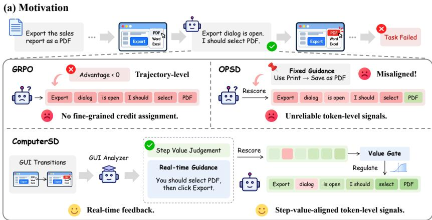

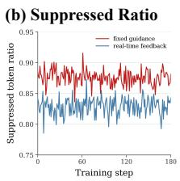

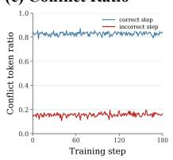  
Figure 1: Motivation and preliminaries. (a) Comparison of GRPO, OPSD and ComputerSD. During online training, we measure (b) suppressed ratio (the ratio of tokens at correct steps whose log-probability is lowered) under fixed guidance and real-time feedback and (c) conflict ratio (the ratio of tokens whose shift contradicts the step-level judgment) in correct and incorrect steps.

## 1 INTRODUCTION

Developing computer-use agents (CUAs) capable of operating graphical user interfaces (GUIs) is an essential step toward autonomous computer use (Qin et al., 2025; Wang et al., 2025b; Xu et al., 2025). To bridge the gap between offline demonstrations and real-world interaction, recent studies have increasingly turned to online training in interactive environments (Wang et al., 2025a; Zhou et al., 2025; Lai et al., 2026; Lu et al., 2025). These methods rely primarily on outcome rewards produced by environment verifiers. Such rewards indicate whether a task is completed but not which of the many actions in an episode were productive, redundant, or erroneous, making credit assignment a persistent challenge in online CUA training (Chen et al., 2025; Feng et al., 2025).

On-policy self-distillation (OPSD), recently extended to multi-turn agents (Lu et al., 2026a; Yang et al., 2026; Wu et al., 2026), recovers this fine-grained credit at the token level (Zhao et al., 2026; Hübotter et al., 2026): the policy rescores its own sampled response under privileged information such as a reference trajectory or task-relevant skills (Wang et al., 2026a; Lu et al., 2026b), and the resulting log-probability shifts serve as supervision on which tokens to reinforce or suppress.

Applying OPSD to online CUA training, however, raises two problems, illustrated in Figure 1a. The first problem is that privileged information fixed before the rollout becomes misaligned with the student’s state. A CUA task usually admits multiple valid solutions, and once the student leaves the path that a reference trajectory or pre-written guidance assumes, the guidance no longer matches the observed state (Shenfeld et al., 2026; Harne et al., 2026; Liu et al., 2026b). Distilling toward such guidance then suppresses the tokens of steps that are correct on the student’s own path (Figure 1b). The second problem is that the token-level signals are unreliable even when the guidance is relevant. Guidance shifts the probability of every token in the response, and the shift at a given token need not agree with whether the step was correct: over 80% of tokens at correct steps are suppressed and nearly 20% of tokens at incorrect ones are reinforced throughout training (Figure 1c). Without regulation, these signals would pull the policy away from the task objective.

Our key insight is that the real-time observation after each action can resolve both problems at once. Once an action is executed, its consequence appears on the next screen, and feedback written from this transition, which we call real-timefeedback, describes exactly the state the student reached and removes the misalignment. The same feedback can also judge whether the action was correct, so the signal that constructs the privileged context can also decide how far to trust the token-level supervision it induces. Recent work likewise conditions the teacher on the post-action observation (Liu et al., 2026a; Li et al., 2026; Wang et al., 2026b), but stops at state matching, which still leaves the induced shifts unreliable. We additionally use the feedback’s own judgment of the step to regulate every token-level signal it produces.

Building on this insight, we propose ComputerSD, an online self-distillation method that converts real-time feedback into value-gated token-level supervision (Figure 2). After each action, a GUI analyzer reads the screenshots before and after it and returns a step-level value score together with guidance on what to do and what to avoid from the pre-action state; since the untuned policy often misjudges GUI transitions, we fine-tune the analyzer on expert annotations. The guidance then serves as the privileged context for rescoring, and a value gate weights each token’s shift by its agreement with the value score. We optimize this token-level objective jointly with trajectory-level GRPO, so that step-level feedback refines credit within each episode while outcome rewards keep learning anchored to task success. To prevent per-step analysis from stalling rollout, we design a fully asynchronous pipeline for ComputerSD.

On OSWorld-Verified (Xie et al., 2024), ComputerSD outperforms outcome-only GRPO on both the general-purpose Qwen3-VL-8B-Thinking (Bai et al., 2025) and the computer-use model EvoCUA-8B (Xue et al., 2026), raising the success rate from 37.9% to 39.8% and from 43.8% to 47.9%. The gains are largest on application categories held out from training (from 21.6% to 27.5% and from 30.2% to 34.9%), indicating that the step-level supervision transfers beyond the training distribution. Ablations mirror the two failures identified above: either replacing real-time feedback with fixed guidance or removing the value gate drops performance below GRPO on Qwen3-VL-8B-Thinking, demonstrating the necessity of our design. Finally, the asynchronous pipeline raises training throughput fivefold over its synchronous counterpart, keeping per-step feedback affordable.

Our main contributions are summarized as follows:

• We propose ComputerSD, an online self-distillation method in which a fine-tuned GUI analyzer writes real-time feedback after each action and a value gate weights each tokenlevel signal by its agreement with the analyzer’s judgment of the step.

• We develop a fully asynchronous training pipeline that overlaps environment interaction, GUI analysis, privileged rescoring, and policy optimization, so that rollout workers keep collecting trajectories while each executed step is analyzed and rescored.

• We show on OSWorld-Verified with two 8B backbones with different levels of computeruse specialization that ComputerSD outperforms outcome-only GRPO, and that removing either real-time feedback or the value gate lowers performance below GRPO.

## 2 RELATED WORK

Online Training for Computer-Use Agents. Recent CUAs improve by scaling verifiable training tasks (Xue et al., 2026; Lv et al., 2026) and by online reinforcement learning in executable environments, where ComputerRL and UI-TARS-2 run rollouts over parallel environments (Lai et al., 2026; Wang et al., 2025a) and DART decouples rollout from training (Li et al., 2025). To supervise intermediate steps, GUI-Shepherd learns a process reward model (Chen et al., 2025) and GiGPO estimates step-level advantages from repeated states (Feng et al., 2025); both assign a single scalar to each step. ComputerSD instead turns the feedback on each executed step into token-level supervision, and its asynchronous pipeline overlaps this analysis with rollout and training.

On-Policy Self-Distillation. On-policy self-distillation (OPSD) obtains a teacher by conditioning the policy on privileged information and distills its token-level predictions on the policy’s own samples (Agarwal et al., 2024; Zhao et al., 2026; Hübotter et al., 2026). For multi-turn agents, OPID and SEED derive this information from completed trajectories (Yang et al., 2026; Wu et al., 2026), and SDAR gates the resulting signals by the teacher–student gap (Lu et al., 2026a). Because information fixed in advance can mismatch the states the student reaches, HERO conditions the teacher on a diagnosis of the observation after each action (Liu et al., 2026a), and GHD and OpenClaw-RL bring this idea to GUI agents via the next screenshot and via hints from a prompted judge (Li et al., 2026; Wang et al., 2026b). ComputerSD obtains both the guidance and a step-level judgment from a fine-tuned GUI analyzer and gates each token-level signal by this judgment, a check at the level of the step rather than of the teacher–student gap or the trajectory outcome (Lin et al., 2026).

## 3 METHOD

We present ComputerSD, an online self-distillation method for computer-use agents. As illustrated in Figure 2, ComputerSD first samples multiple trajectories through online interaction with parallel computer environments, followed by a GUI analyzer that provides step-level guidance based on the interaction process, which is then used to value-gate the token-level reward signals and control their strength according to the step-level value. Finally, the resulting token-level signals are combined with environment rewards to optimize the policy model.

## 3.1 PROBLEM FORMULATION

We formulate CUA task execution as a partially observable Markov decision process. Given a task instruction x, the agent receives an observation $o _ { t }$ at each time step $t ,$ which may include a screenshot, an accessibility tree, or other environment feedback. From the ordinary context $h _ { t } =$ $( x , o _ { 0 } , y _ { 0 } , \ldots , o _ { t } )$ , the student samples $y _ { t } = ( r _ { t } , a _ { t } ) \sim \pi _ { \theta } ( \cdot \ | \ h _ { t } )$ , where $r _ { t }$ denotes reasoning text and $a _ { t }$ is an executable action. Executing $a _ { t }$ yields the next observation $o _ { t + 1 }$ . A trajectory is represented as

$$
\tau = ( x , \{ h _ { t } , y _ { t } , o _ { t + 1 } \} _ { t = 0 } ^ { T - 1 } , R ) ,\tag{1}
$$

where $T$ is the trajectory length and $R$ is the terminal reward from the environment verifier.

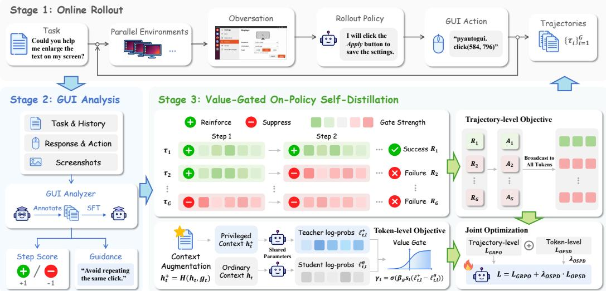  
Figure 2: Overview of ComputerSD. The base policy samples trajectories online, while a GUI analyzer provides step-level value scores and guidance. Privileged rescoring produces token-level supervision, which is combined with trajectory-level GRPO to update the policy.

## 3.2 GUI ANALYZER SUPERVISED FINE-TUNING

To turn step-level environment feedback into structured, learnable signals for online policy training, we train a lightweight GUI analyzer that analyzes GUI transitions to provide real-time feedback.

Online trajectory collection. We first collect trajectories on a subset of OSWorld (Xie et al., 2024) using a base policy $\pi _ { \phi }$ . For each task, the policy samples K trajectories, yielding a diverse pool of successful and unsuccessful interactions with varied action choices, state transitions, and failure modes. These trajectories provide the step contexts for subsequent expert annotation.

Expert annotation. A strong expert model is then used to annotate the collected trajectories. For each step t, the expert receives the step context $z _ { t }$ and produces a value score $\hat { s } _ { t }$ and guidance $\hat { g } _ { t }$ according to $( \hat { s } _ { t } , \hat { g } _ { t } ) \sim \pi _ { \mathrm { e x p } } ( { \cdot } \mid z _ { t } )$ , which together form the training dataset

$$
\mathcal { D } _ { \mathrm { e x p } } = \{ ( z _ { j } , \hat { s } _ { j } , \hat { g } _ { j } ) \} _ { j = 1 } ^ { N } ,\tag{2}
$$

where N is the total number of annotated steps across all collected trajectories. Here, $\hat { s } _ { j }$ and ${ \hat { g } } _ { j }$ are the corresponding score and guidance targets.

Supervised fine-tuning. Finally, we initialize the GUI analyzer $\pi _ { \phi }$ from the same base policy and fine-tune it to predict the step-level value score and guidance. The optimization objective is to maximize the likelihood of the expert annotations:

$$
{ \mathcal L } _ { \mathrm { S F T } } ( \phi ) = - \mathbb { E } _ { ( z , \hat { s } , \hat { g } ) \sim \mathcal { D } _ { \exp } } \left[ \log \pi _ { \phi } ( \hat { s } , \hat { g } \mid z ) \right] .\tag{3}
$$

After supervised fine-tuning, the GUI analyzer is frozen and used to provide structured real-time feedback during subsequent online policy training.

## 3.3 VALUE-GATED ON-POLICY SELF-DISTILLATION

To improve the reliability of OPSD signals during online training, the trained GUI analyzer provides step-level feedback to gate token-level OPSD signals, which are combined with trajectory-level environment rewards for policy optimization.

Trajectory-level GRPO object. For each task $x ,$ the policy samples a group of G trajectories i parallel online environments. Based on their terminal rewards, the group-relative advantage $A _ { i }$ i

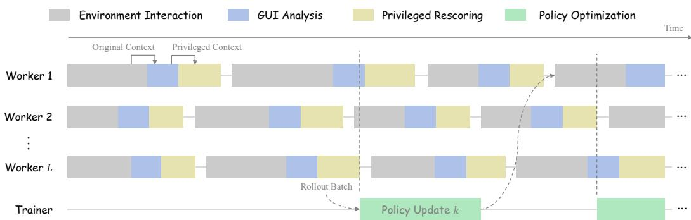  
Figure 3: Illustration of the fully asynchronous online training framework.

computed. The trajectory-level GRPO objective is computed as:

$$
\begin{array} { r } { \mathcal { L } _ { \mathrm { G R P O } } ( \theta ) = - \mathbb { E } _ { i , t , l } \left[ \operatorname* { m i n } ( \rho _ { i , t , l } ( \theta ) A _ { i } , \mathrm { c l i p } ( \rho _ { i , t , l } ( \theta ) , 1 - \epsilon , 1 + \epsilon ) A _ { i } ) \right] + \beta _ { \mathrm { K L } } \mathcal { L } _ { \mathrm { K L } } ( \theta ) , } \end{array}\tag{4}
$$

where $\rho _ { i , t , l } ( { \boldsymbol { \theta } } )$ is the token-level importance sampling ratio, ϵ is the clipping threshold, and $\beta _ { \mathrm { K L } }$ is the KL regularization coefficient.

Value-gated on-policy self-distillation objective. For the i-th trajectory, the GUI analyzer generates step-level real-time feedback $\left( { { s } _ { i , t } } , { { g } _ { i , t } } \right)$ for each executed step t. The guidance ${ { g } _ { i , } }$ t is added to the ordinary context $h _ { i , t }$ as privileged information, yielding $h _ { i , t } ^ { + } = ( h _ { i , t } , g _ { i , t } )$

We then compute the token-level log-probabilities of the sampled response $y _ { i , t }$ t under two different contexts. The log-probability gap reflects how real-time guidance changes the likelihood of the original sampled response and is computed as:

$$
\begin{array} { r } { \delta _ { i , t , l } = \log \pi _ { \theta } ( y _ { i , t , l } \mid h _ { i , t } ^ { + } , y _ { i , t , < l } ) - \log \pi _ { \theta } ( y _ { i , t , l } \mid h _ { i , t } , y _ { i , t , < l } ) , } \end{array}\tag{5}
$$

where l indexes tokens in the sampled response and $y _ { i , t , < l }$ denotes the original sampled prefix.

The log-probability shifts induced by privileged guidance are not always reliable. To improve the reliability of token-level OPSD signals, we introduce a value gate that modulates each signal according to its consistency with the step-level value judgment. Specifically, we define $\ell _ { i , t , l }$ as the value-weighted log-probability gap and compute the value gate $\gamma _ { i , t , l }$ as follows:

$$
\ell _ { i , t , l } = s _ { i , t } \delta _ { i , t , l } , \quad \gamma _ { i , t , l } = \sigma ( \beta _ { \mathrm { g a t e } } \ell _ { i , t , l } ) ,\tag{6}
$$

where $\sigma$ is the logistic sigmoid function, and $\beta _ { \mathrm { g a t e } }$ denotes the gate sharpness. The resulting gate regulates the token-level OPSD signals, reinforcing signals aligned with the step-level value judgment and suppressing those that are misaligned. The value-gated OPSD objective is computed as:

$$
\begin{array} { r } { \mathcal { L } _ { \mathrm { O P S D } } ( \boldsymbol { \theta } ) = \mathbb { E } _ { i , t , l } \left[ \gamma _ { i , t , l } \ell _ { i , t , l } \right] . } \end{array}\tag{7}
$$

Joint training objective. The final ComputerSD objective combines token-level OPSD with trajectory-level GRPO:

$$
\mathcal { L } _ { \mathrm { C o m p u t e r S D } } ( \theta ) = \mathcal { L } _ { \mathrm { G R P O } } ( \theta ) + \lambda _ { \mathrm { O P S D } } \mathcal { L } _ { \mathrm { O P S D } } ( \theta ) ,\tag{8}
$$

where $\lambda _ { \mathrm { O P S D } }$ controls the contribution of the OPSD signals.

Asynchronous online training. To improve training efficiency, we asynchronously overlap environment interaction, GUI analysis, privileged rescoring, and policy optimization, as illustrated in Figure 3. GUI analysis and privileged rescoring proceed alongside rollout, while the trainer updates the policy once a trajectory batch is collected. The updated parameters are then asynchronously published to the rollout workers for subsequent interaction.

## 4 EXPERIMENTS

## 4.1 EXPERIMENTAL SETTINGS

Models. We initialize the GUI analyzer from Qwen3-VL-8B-Thinking (Bai et al., 2025) and use Kimi-K3 (Kimi Team et al., 2026) as the expert model to annotate the collected trajectories. We then apply ComputerSD to two 8B-scale models: a general-purpose model Qwen3-VL-8B-Thinking (Bai et al., 2025) and a specialized model EvoCUA-8B (Xue et al., 2026). This allows us to assess ComputerSD’s effectiveness across policies with different levels of computer-use specialization.

Table 1: Performance comparison on OSWorld-Verified. Success rate is reported as Pass@1. Our experimental results are averaged over three independent evaluation runs to mitigate variance in online environments, while results for other models are taken from their official reports.
<table><tr><td>Model</td><td>Type</td><td>Max Steps</td><td>Success Rate (%)</td></tr><tr><td colspan="4">Proprietary Models</td></tr><tr><td>OpenAI CUA (OpenAI, 2025)</td><td>Specialized</td><td>50</td><td>31.3</td></tr><tr><td>Seed1.5-VL (Guo et al., 2025)</td><td>General</td><td>100</td><td>36.7</td></tr><tr><td>Step-GUI-8B (Yan et al., 2025)</td><td>Specialized</td><td>100</td><td>40.2</td></tr><tr><td>Qwen3-VL-Flash (Bai et al., 2025)</td><td>General</td><td>100</td><td>41.6</td></tr><tr><td>UI-TARS-1.5 (Qin et al., 2025)</td><td>Specialized</td><td>100</td><td>42.5</td></tr><tr><td>Claude-4-Sonnet (Anthropic, 2025a)</td><td>General</td><td>100</td><td>43.9</td></tr><tr><td>UI-TARS-2 (Wang et al., 2025a)</td><td>Specialized</td><td>100</td><td>47.5</td></tr><tr><td>Claude-4.5-Sonnet (Anthropic, 2025b)</td><td>General</td><td>100</td><td>62.9</td></tr><tr><td colspan="4">Open-Source Models</td></tr><tr><td>ScaleCUA-32B (Liu et al., 2025)</td><td>Specialized</td><td>50</td><td>17.7</td></tr><tr><td>UI-TARS-72B-DPO (Qin et al., 2025)</td><td>Specialized</td><td>50</td><td>24.6</td></tr><tr><td>OpenCUA-7B (Wang et al., 2025b)</td><td>Specialized</td><td>100</td><td>26.6</td></tr><tr><td>UI-TARS-1.5-7B (Qin et al., 2025)</td><td>Specialized</td><td>100</td><td>27.5</td></tr><tr><td>OpenCUA-32B (Wang et al., 2025b)</td><td>Specialized</td><td>100</td><td>34.8</td></tr><tr><td>GUI-Owl-7B (Ye et al., 2025)</td><td>Specialized</td><td>15</td><td>34.9</td></tr><tr><td>Qwen3-VL-235B-A22B-Thinking (Bai et al., 2025)</td><td>General</td><td>100</td><td>38.1</td></tr><tr><td>Qwen3-VL-32B-Thinking (Bai et al., 2025)</td><td>General</td><td>100</td><td>41.0</td></tr><tr><td>Qwen3.5-9B (Qwen Team, 2026)</td><td>General</td><td>100</td><td>41.8</td></tr><tr><td>OpenCUA-72B (Wang et al., 2025b)</td><td>Specialized</td><td>100</td><td>45.0</td></tr><tr><td colspan="4">Ours</td></tr><tr><td>Qwen3-VL-8B-Thinking</td><td>General</td><td>50</td><td>33.8</td></tr><tr><td>w/ GRPO</td><td>General</td><td>50</td><td>37.9</td></tr><tr><td>w/ ComputerSD</td><td>General</td><td>50</td><td>39.8</td></tr><tr><td>EvoCUA-8B</td><td>Specialized</td><td>50</td><td>41.3</td></tr><tr><td>w/ GRPO</td><td>Specialized</td><td>50</td><td>43.8</td></tr><tr><td>w/ ComputerSD</td><td>Specialized</td><td>50</td><td>47.9</td></tr></table>

Training and evaluation datasets. We conduct online training on OSWorld-Verified (Xie et al., 2024), excluding tasks in the Multiple Apps and Chrome categories for out-of-distribution (OOD) evaluation. The evaluation set contains 222 in-domain tasks and 139 OOD tasks. We further evaluate the cross-platform generalization of ComputerSD on WindowsAgentArena (Bonatti et al., 2024). For both benchmarks, we report task success rates determined by their official environment verifiers.

Implementation details. During training, the rollout policy samples 8 trajectories for each of 4 tasks, yielding a batch of 32 trajectories.. All training runs for 180 policy updates. Following SDAR (Lu et al., 2026a), we set the OPSD loss coefficient λOPSD to 0.01 and the gate sharpness $\beta _ { \mathrm { g a t e } }$ to 5. Considering training efficiency, we set the maximum number of interaction steps to 30 during training and 50 during evaluation. During evaluation, models trained with ComputerSD uses only the ordinary context, without GUI analyzer calls or additional guidance. Additional training details are provided in Appendix B.

## 4.2 MAIN RESULTS

Performance on OSWorld-Verified. Table 1 presents the performance of ComputerSD alongside representative proprietary and open-source models on OSWorld-Verified. For each backbone, we compare ComputerSD with outcome-only GRPO under the same online training and evaluation settings. The results show that ComputerSD outperforms GRPO on both backbones. On Qwen3- VL-8B-Thinking, ComputerSD achieves a success rate of 39.8%, exceeding GRPO by 1.9 points.

Table 2: In-domain and out-of-distribution performance on OSWorld-Verified and cross-platform benchmark WindowsAgentArena.
<table><tr><td rowspan="2">Model</td><td colspan="2">OSWorld-Verified</td><td rowspan="2">Windows AgentArena</td></tr><tr><td>In-Domain</td><td>OOD</td></tr><tr><td>Qwen3-VL-8B-Thinking</td><td>40.5</td><td>23.0</td><td>19.2</td></tr><tr><td>w/ GRPO</td><td>48.2+7.7</td><td>21.6-1.4</td><td>23.3+4.1</td></tr><tr><td>w/ ComputerSD</td><td>47.5+7.0</td><td>27.5+4.5</td><td>24.5+5.3</td></tr><tr><td>EvoCUA-8B</td><td>47.3</td><td>31.6</td><td>24.4</td></tr><tr><td>w/ GRPO</td><td>52.2+4.9</td><td>30.2-1.4</td><td>24.2-0.2</td></tr><tr><td>w/ ComputerSD</td><td>55.7+8.4</td><td>35.4+3.8</td><td>27.8+3.4</td></tr></table>

The gain is larger on the specialized model EvoCUA-8B, where ComputerSD reaches 47.9% and outperforms GRPO by 4.1 points. This further improvement suggests that token-level supervision derived from real-time guidance remains effective even after computer-use-specific post-training. Additionally, EvoCUA-8B trained with ComputerSD surpasses all listed open-source models and most listed proprietary models, demonstrating the effectiveness of ComputerSD.

Out-of-distribution generalization. We further evaluate generalization on the held-out categories of OSWorld-Verified and the cross-platform benchmark WindowsAgentArena (WAA). As shown in Table 2, outcome-only GRPO improves in-domain performance but degrades OOD performance relative to the base models on both backbones. In contrast, ComputerSD consistently improves in-domain and OOD performance on both backbones. On Qwen3-VL-8B-Thinking, ComputerSD outperforms GRPO by 5.9 points on the held-out categories and 1.2 points on WAA. On EvoCUA-8B, the corresponding gains are 5.2 and 3.6 points, respectively. These results suggest that ComputerSD does not merely fit the training tasks but internalizes real-time feedback into the policy improvements that can generalize to unseen scenarios.

## 4.3 TRAINING DYNAMICS.

Performance progression. We examine how the performance of outcome-only GRPO and ComputerSD evolves throughout online training. As shown in Figure 4, ComputerSD maintains higher success rates than outcome-only GRPO throughout most of the training process on both backbones. ComputerSD reaches the final GRPO performance after approximately 100 policy updates on Qwen3-VL-8B-Thinking and 40 on EvoCUA-8B. With the same number of sampled trajectorie per update, ComputerSD uses only about 56% and 22% of GRPO’s trajectory budget, respectively, to reach the same performance. This faster improvement suggests that real-time guidance helps the policy learn more from online interactions.

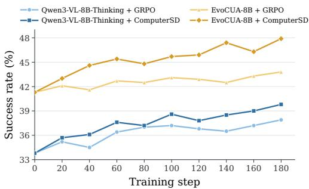  
Figure 4: Performance of GRPO and ComputerSD methods throughout online training on OSWorld-Verified.

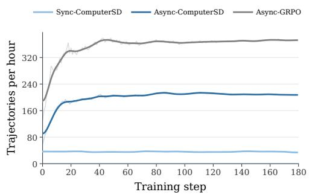  
Figure 5: Training throughput of synchronous and asynchronous methods, measured by the number of trajectories processed per hour.

Training efficiency. To evaluate the efficiency of the asynchronous training framework, we record the number of trajectories processed per hour throughout training. As shown in Figure 5, asynchronous GRPO and ComputerSD stabilize at approximately 370 and 210 trajectories per hour, respectively. ComputerSD retains about 57% of the throughput of outcome-only GRPO, with the additional cost arising from GUI analyzer queries and privileged rescoring after each executed step. By overlapping the pipeline stages, our asynchronous framework achieves five times the training throughput of synchronous ComputerSD.

## 4.4 ABLATION STUDIES

We conduct ablation studies on Qwen3-VL-8B-Thinking to examine the core components of ComputerSD. Table 3 reports the performance of each ablated variant on OSWorld-Verified, while Figure 6 shows how the teacher–student gap varies throughout training.

GUI analyzer SFT improves capability of GUI transitions understanding. Directly using the vanilla Qwen3-VL-8B-Thinking model as the GUI analyzer reduces the success rate by 1.8 percentage points. The base model has limited ability to interpret GUI transitions: its teacher–student gap remains at a low level throughout training, indicating that its guidance has limited effects. SFT helps the analyzer learn from expert annotations to provide more effective real-time feedback. Further analysis and evaluation of GUI analyzer SFT are provided in Appendix C.3.

Real-time feedback provides more relevant and effective guidance. Replacing real-time feedback with fixed privileged guidance reduces the success rate by 4.8 percentage points. Fixed guidance can become misaligned with the agent’s actual state and may mislead it. The teacher–student gap fluctuates sharply without converging during training, reflecting the instability of this guidance. Real-time feedback avoids this mismatch by deriving each distillation signal from the executed action and resulting environment observation.

The value gate promotes goal-aligned OPSD signals. Removing the value gate reduces the success rate by 3.2 percentage points. The teacher–student gap remains large without converging during training, suggesting that guidance-induced OPSD signals are not uniformly reliable. Without regulating their strength, the student can no longer distinguish useful, goal-aligned guidance from noisy or harmful signals, resulting in degraded performance. The value gate is essential for preserving effective OPSD signals while attenuating unreliable ones.

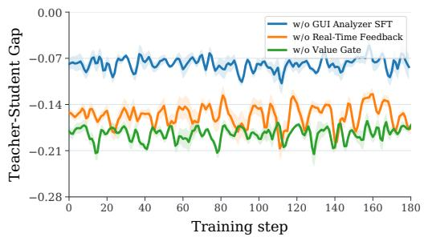  
Figure 6: Teacher–student gap throughout training under different ablations of ComputerSD.

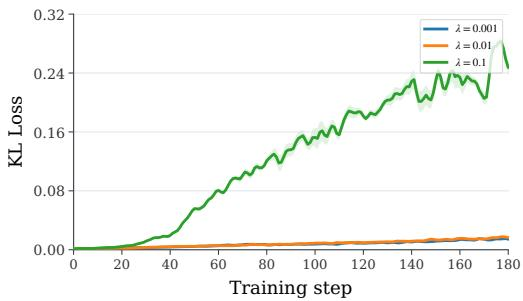  
Figure 7: KL loss during online training with different OPSD loss coefficients.

## 4.5 ANALYSIS

Analysis of gate designs. Table 4 compares our value gate with three alternatives, showing that how OPSD signals are regulated substantially affects policy improvement. The SDAR gate (Lu et al., 2026a) consistently attenuates negative probability shifts for conservative token-level supervision. This can leave undesirable sampled actions insufficiently corrected, particularly when the student policy is weak, slowing improvement. The hard value gate replaces the sigmoid with a binary step function, removing signals that conflict with the step-level value judgment and assigning full weight to aligned signals. This aggressive filtering may overfit to the guidance-conditioned teacher distribution and impair generalization, yielding a 4.6-point drop in overall success rate.

Table 3: Performance of ComputerSD component ablations on OSWorld-Verified.
<table><tr><td>Configuration</td><td>SR (%)</td></tr><tr><td>ComputerSD</td><td>39.8</td></tr><tr><td>w/o GUI Analyzer SFT</td><td>38.0</td></tr><tr><td>w/o Real-Time Feedback</td><td>35.0</td></tr><tr><td>w/o Value Gate</td><td>36.6</td></tr></table>

Table 4: Performance of different gate designs on OSWorld-Verified.
<table><tr><td>Configuration</td><td>SR (%)</td></tr><tr><td>ComputerSD (w/ Value Gate)</td><td>39.8</td></tr><tr><td>w/ SDAR Gate</td><td>38.1</td></tr><tr><td>w/ Hard Value Gate</td><td>35.2</td></tr><tr><td>w/ Reverse Value Gate</td><td>36.0</td></tr></table>

The reverse value gate assigns larger weights to shifts that conflict with the step-level value judgment. As shown in Figure $\bar { 8 , }$ its teacher–student gap increases during training, while policy entropy declines. This pattern suggests that the student moves away from the teacher-supported distribution while becoming increasingly self-confident. In contrast, our value gate narrows the gap and avoids the entropy decline, supporting the alignment of OPSD signals with step-level value judgments.

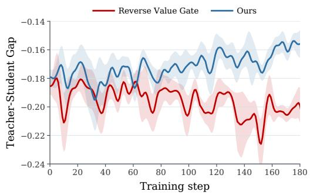

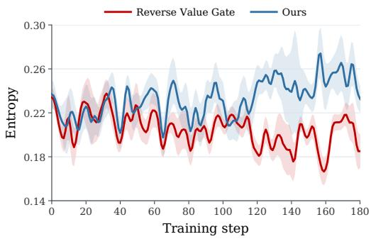  
Figure 8: Training dynamics of ComputerSD and its reverse-gate variant. Left: Teacher–student gap. Right: Policy entropy.

Sensitivity to the OPSD loss coefficient. We vary $\chi _ { \mathrm { { O P S D } } } \quad \in$ {0.1, 0.01, 0.001} on Qwen3-VL-8B-Thinking. As shown in Table 5, the intermediate setting achieves the highest success rate, while both larger and smaller weights perform worse. Figure 7 shows the corresponding KL loss during training. At 0.1, the KL loss rises by more than an order of magnitude relative to the other settings, suggesting that overly strong OPSD signals destabilize policy optimization. At 0.001, token-level supervision is too weak to fully benefit from the guidance. These results favor a moderate OPSD weight of 0.01.

Table 5: Effect of the OPSD loss coefficient on OSWorld-Verified.
<table><tr><td>λOPSD</td><td>SR (%)</td></tr><tr><td>0.1</td><td>35.6</td></tr><tr><td>0.01</td><td>39.8</td></tr><tr><td>0.001</td><td>37.1</td></tr></table>

## 5 CONCLUSION

We introduced ComputerSD, an online self-distillation method that converts real-time feedback from GUI transitions into policy updates for CUAs. A fine-tuned GUI analyzer produces guidance and a step-level value judgment from each executed action; the guidance supplies privileged context, while the value judgment gates the resulting token-level OPSD signals. ComputerSD combines this objective with trajectory-level GRPO and conducts online training in a fully asynchronous framework. On OSWorld-Verified, it outperforms outcome-only GRPO by 1.9 and 4.1 percentage points on the general-purpose and specialized backbones, respectively. It also improves performance on held-out categories and cross-platform scenarios for both backbones. Ablations further support the roles of real-time guidance and value gating. Our studies show that feedback from ongoing GUI interaction can provide effective fine-grained supervision beyond sparse task outcomes, offering a practical path toward online self-distillation for CUAs.

## AI USE STATEMENT

We used AI assistants in a limited supporting role for language polishing, LaTeX formatting, coding, and debugging. The authors reviewed AI-assisted outputs before incorporating them into the paper. The authors made the final decisions regarding the methodology, experiments, analyses, and presentation, and take full responsibility for the content and results of this work.

## ETHICS STATEMENT

This work studies online self-distillation for computer-use agents in benchmark computer environments. The experiments do not involve human participants or the collection of private or personally identifiable information. We evaluate ComputerSD in controlled benchmark settings. Its behavior and safety in real-world deployments are beyond the scope of this study; such deployments would require further evaluation, safeguards, and human oversight.

## REPRODUCIBILITY STATEMENT

Section 3 describes the GUI analyzer, value-gated self-distillation objective, and online training procedure. Appendix B reports the training hyperparameters and compute setup. Appendix C details trajectory collection and expert annotation, including the annotation prompt, while Appendix D documents the benchmark splits, baselines, and agent system prompt.

## REFERENCES

Rishabh Agarwal, Nino Vieillard, Yongchao Zhou, Piotr Stanczyk, Sabela Ramos, Matthieu Geist, and Olivier Bachem. On-policy distillation of language models: Learning from self-generated mistakes. In The Twelfth International Conference on Learning Representations (ICLR), 2024. URL https://openreview.net/forum?id=3zKtaqxLhW.

Anthropic. Introducing claude 4, 2025a. URL https://www.anthropic.com/news/ claude-4.

Anthropic. Introducing claude sonnet 4.5, 2025b. URL https://www.anthropic.com/ news/claude-sonnet-4-5.

Shuai Bai, Yuxuan Cai, Ruizhe Chen, et al. Qwen3-vl technical report, 2025. URL https: //arxiv.org/abs/2511.21631.

Rogerio Bonatti, Dan Zhao, Francesco Bonacci, Dillon Dupont, Sara Abdali, Yinheng Li, Yadong Lu, Justin Wagle, Kazuhito Koishida, Arthur Bucker, Lawrence Jang, and Zack Hui. Windows agent arena: Evaluating multi-modal os agents at scale, 2024. URL https://arxiv.org/ abs/2409.08264.

Cong Chen, Kaixiang Ji, Hao Zhong, Muzhi Zhu, Anzhou Li, Guo Gan, Ziyuan Huang, Cheng Zou, Jiajia Liu, Jingdong Chen, Hao Chen, and Chunhua Shen. Gui-shepherd: Reliable process reward and verification for long-sequence gui tasks, 2025. URL https://arxiv.org/abs/2509. 23738.

Lang Feng, Zhenghai Xue, Tingcong Liu, and Bo An. Group-in-group policy optimization for LLM agent training. In Advances in Neural Information Processing Systems (NeurIPS), volume 38, 2025. URL https://openreview.net/forum?id=QXEhBMNrCW.

Dong Guo, Faming Wu, Feida Zhu, et al. Seed1.5-vl technical report, 2025. URL https:// arxiv.org/abs/2505.07062.

Sarthak Harne, Chinmay Karkar, Yash Pandya, Ahmed Awadallah, and Akshay Nambi. Privileged, but biased: How PI-conditioned teachers break self-distillation, 2026. URL https://arxiv. org/abs/2608.04794.

Jonas Hübotter, Frederike Lübeck, Lejs Behric, Anton Baumann, Marco Bagatella, Daniel Marta, Ido Hakimi, Idan Shenfeld, Thomas Kleine Buening, Carlos Guestrin, and Andreas Krause. Reinforcement learning via self-distillation, 2026. URL https://arxiv.org/abs/2601. 20802.

Kimi Team et al. Kimi K3: Open frontier intelligence, 2026. URL https://arxiv.org/abs/ 2607.24653.

Hanyu Lai, Xiao Liu, Yanxiao Zhao, Han Xu, Hanchen Zhang, Bohao Jing, Yanyu Ren, Shuntian Yao, Yuxiao Dong, and Jie Tang. ComputerRL: Scaling end-to-end online reinforcement learning for computer use agents. In The Fourteenth International Conference on Learning Representations (ICLR), 2026. URL https://openreview.net/forum?id=oEVfNf0w4B.

Pengxiang Li, Zechen Hu, Zirui Shang, Jingrong Wu, Yang Liu, Hui Liu, Zhi Gao, Chenrui Shi, Bofei Zhang, Zihao Zhang, Xiaochuan Shi, Zedong Yu, Yuwei Wu, Xinxiao Wu, Yunde Jia, Liuyu Xiang, Zhaofeng He, and Qing Li. Efficient multi-turn RL for GUI agents via decoupled training and adaptive data curation, 2025. URL https://arxiv.org/abs/2509.23866.

Weiwei Li, Junzhuo Liu, Tong Chu, Hengfu Yu, and Wen Li. The next screenshot knows: Gated hindsight distillation for mobile gui agents, 2026.

Wenze Lin, Jiale Zhao, Xitai Jiang, Songde Rao, Yining Li, Shenzhi Wang, Bingxiang He, and Gao Huang. On-policy distillation with verifiable reward, 2026.

Haoran Liu, Yuwei Zhang, Xiyao Li, Bohan Lyu, and Jingbo Shang. Hero: Hindsight-enhanced reflection from environment observations for agentic self-distillation, 2026a.

Junzhuo Liu, Weiwei Li, Jun Ling, and Peng Wang. When privileged guidance misaligns: Statematched routing and contextualized self-distillation for multi-turn agents, 2026b.

Zhaoyang Liu, Jingjing Xie, Zichen Ding, Zehao Li, Bowen Yang, Zhenyu Wu, Xuehui Wang, Qiushi Sun, Shi Liu, Weiyun Wang, Shenglong Ye, Qingyun Li, Xuan Dong, Yue Yu, Chenyu Lu, YunXiang Mo, Yao Yan, Zeyue Tian, Xiao Zhang, Yuan Huang, Yiqian Liu, Weijie Su, Gen Luo, Xiangyu Yue, Biqing Qi, Kai Chen, Bowen Zhou, Yu Qiao, Qifeng Chen, and Wenhai Wang. Scalecua: Scaling open-source computer use agents with cross-platform data, 2025. URL https://arxiv.org/abs/2509.15221.

Zhengxi Lu, Jiabo Ye, Fei Tang, Yongliang Shen, Haiyang Xu, Ziwei Zheng, Weiming Lu, Ming Yan, Fei Huang, Jun Xiao, et al. Ui-s1: Advancing gui automation via semi-online reinforcement learning. arXiv preprint arXiv:2509.11543, 2025.

Zhengxi Lu, Zhiyuan Yao, Zhuowen Han, Zi-Han Wang, Jinyang Wu, Qi Gu, Xunliang Cai, Weiming Lu, Jun Xiao, Yueting Zhuang, and Yongliang Shen. Self-distilled agentic reinforcement learning, 2026a. URL https://arxiv.org/abs/2605.15155.

Zhengxi Lu, Zhiyuan Yao, Jinyang Wu, Chengcheng Han, Qi Gu, Xunliang Cai, Weiming Lu, Jun Xiao, Yueting Zhuang, and Yongliang Shen. Skill0: In-context agentic reinforcement learning for skill internalization. arXiv preprint arXiv:2604.02268, 2026b.

Bowen Lv, Xiao Liu, Yanyu Ren, Hanyu Lai, Bohao Jing, Hanchen Zhang, Yanxiao Zhao, Shuntian Yao, Jie Tang, and Yuxiao Dong. Scalecua: Scaling computer use agents with verifiable task synthesis and efficient online rl, 2026.

OpenAI. Computer-using agent: Introducing a universal interface for ai to interact with the digital world. 2025. URL https://openai.com/index/computer-using-agent.

Yujia Qin, Yining Ye, Junjie Fang, Haoming Wang, Shihao Liang, Shizuo Tian, Junda Zhang, Jiahao Li, Yunxin Li, Shijue Huang, et al. Ui-tars: Pioneering automated gui interaction with native agents. arXiv preprint arXiv:2501.12326, 2025.

Qwen Team. Qwen3.5: Towards native multimodal agents, February 2026. URL https://qwen. ai/blog?id=qwen3.5.

Idan Shenfeld, Mehul Damani, Jonas Hübotter, and Pulkit Agrawal. Self-distillation enables continual learning. In Proceedings of the 43rd International Conference on Machine Learning (ICML), 2026. URL https://openreview.net/forum?id=qA6FgH0nnZ.

Hao Wang, Guozhi Wang, Han Xiao, Yufeng Zhou, Yue Pan, Jichao Wang, Ke Xu, Yafei Wen, Xiaohu Ruan, Xiaoxin Chen, and Honggang Qi. Skill-SD: Skill-conditioned self-distillation for multi-turn LLM agents, 2026a. URL https://arxiv.org/abs/2604.10674.

Haoming Wang, Haoyang Zou, Huatong Song, et al. Ui-tars-2 technical report: Advancing gui agent with multi-turn reinforcement learning, 2025a. URL https://arxiv.org/abs/2509. 02544.

Xinyuan Wang, Bowen Wang, Dunjie Lu, Junlin Yang, Tianbao Xie, Junli Wang, Jiaqi Deng, Xiaole Guo, Yiheng Xu, Chen Henry Wu, Zhennan Shen, Zhuokai Li, Ryan Li, Xiaochuan Li, Junda Chen, Boyuan Zheng, Peihang Li, Fangyu Lei, Ruisheng Cao, Yeqiao Fu, Dongchan Shin, Martin Shin, Jiarui Hu, Yuyan Wang, Jixuan Chen, Yuxiao Ye, Danyang Zhang, Dikang Du, Hao Hu, Huarong Chen, Zaida Zhou, Haotian Yao, Ziwei Chen, Qizheng Gu, Yipu Wang, Heng Wang, Diyi Yang, Victor Zhong, Flood Sung, Y. Charles, Zhilin Yang, and Tao Yu. Opencua: Open foundations for computer-use agents, 2025b. URL https://arxiv.org/abs/2508.09123.

Yinjie Wang, Xuyang Chen, Xiaolong Jin, Mengdi Wang, and Ling Yang. Openclaw-rl: Train any agent simply by talking. arXiv preprint arXiv:2603.10165, 2026b.

Jinyang Wu, Shuo Yang, Zhengxi Lu, Fan Zhang, Yuhao Shen, Lang Feng, Haoran Luo, Zheng Lian, Shuai Zhang, Zhengqi Wen, and Jianhua Tao. SEED: Self-evolving on-policy distillation for agentic reinforcement learning, 2026. URL https://arxiv.org/abs/2607.14777.

Tianbao Xie, Danyang Zhang, Jixuan Chen, Xiaochuan Li, Siheng Zhao, Ruisheng Cao, Toh Jing Hua, Zhoujun Cheng, Dongchan Shin, Fangyu Lei, Yitao Liu, Yiheng Xu, Shuyan Zhou, Silvio Savarese, Caiming Xiong, Victor Zhong, and Tao Yu. Osworld: Benchmarking multimodal agents for open-ended tasks in real computer environments, 2024. URL https://arxiv. org/abs/2404.07972.

Yiheng Xu, Zekun Wang, Junli Wang, Dunjie Lu, Tianbao Xie, Amrita Saha, Doyen Sahoo, Tao Yu, and Caiming Xiong. Aguvis: Unified pure vision agents for autonomous GUI interaction. In Proceedings of the 42nd International Conference on Machine Learning (ICML), volume 267 of Proceedings of Machine Learning Research, pp. 69772–69805, 2025. URL https://proceedings.mlr.press/v267/xu25ae.html.

Taofeng Xue, Chong Peng, Mianqiu Huang, Linsen Guo, Tiancheng Han, Haozhe Wang, Jianing Wang, Xiaocheng Zhang, Xin Yang, Dengchang Zhao, Jinrui Ding, Xiandi Ma, Yuchen Xie, Peng Pei, Xunliang Cai, and Xipeng Qiu. Evocua: Evolving computer use agents via learning from scalable synthetic experience, 2026. URL https://arxiv.org/abs/2601.15876.

Haolong Yan, Jia Wang, Xin Huang, et al. Step-gui technical report, 2025. URL https:// arxiv.org/abs/2512.15431.

Shuo Yang, Jinyang Wu, Zhengxi Lu, Yuhao Shen, Fan Zhang, Lang Feng, Shuai Zhang, Haoran Luo, Zheng Lian, Zhengqi Wen, and Jianhua Tao. OPID: On-policy skill distillation for agentic reinforcement learning, 2026. URL https://arxiv.org/abs/2606.26790.

Jiabo Ye, Xi Zhang, Haiyang Xu, Haowei Liu, Junyang Wang, Zhaoqing Zhu, Ziwei Zheng, Feiyu Gao, Junjie Cao, Zhengxi Lu, Jitong Liao, Qi Zheng, Fei Huang, Jingren Zhou, and Ming Yan. Mobile-agent-v3: Foundamental agents for gui automation, 2025. URL https://arxiv. org/abs/2508.15144.

Siyan Zhao, Zhihui Xie, Mengchen Liu, Jing Huang, Guan Pang, Feiyu Chen, and Aditya Grover. Self-distilled reasoner: On-policy self-distillation for large language models. In Proceedings of the 43rd International Conference on Machine Learning (ICML), 2026. URL https:// openreview.net/forum?id=Jpxfof0EaS.

Yuze Zhao, Jintao Huang, Jinghan Hu, Xingjun Wang, Yunlin Mao, Daoze Zhang, Zeyinzi Jiang, Zhikai Wu, Baole Ai, Ang Wang, Wenmeng Zhou, and Yingda Chen. Swift:a scalable lightweight infrastructure for fine-tuning, 2024. URL https://arxiv.org/abs/2408.05517.

Hanzhang Zhou, Xu Zhang, Panrong Tong, Jianan Zhang, Liangyu Chen, Quyu Kong, Chenglin Cai, Chen Liu, Yue Wang, Jingren Zhou, and Steven Hoi. MAI-UI technical report: Real-world centric foundation GUI agents, 2025. URL https://arxiv.org/abs/2512.22047.

Zilin Zhu, Chengxing Xie, Xin Lv, and slime Contributors. slime: An llm post-training framework for rl scaling. https://github.com/THUDM/slime, 2025. GitHub repository. Corresponding author: Xin Lv.

## A LIMITATIONS

ComputerSD relies on the reliability of the GUI analyzer, which provides both privileged guidance for self-distillation and step-level value judgments for gating the resulting supervision. Errors in either output can distort the OPSD signal, and the value gate cannot fully resolve this issue when both outputs are unreliable. Our design therefore balances feedback reliability against the cost of expert model calls: a fine-tuned GUI analyzer substantially reduces the cost of obtaining feedback while retaining strong reliability, as discussed in Appendix C.3. Moreover, OPSD serves as an auxiliary objective alongside trajectory-level GRPO, with its contribution controlled by a small loss coefficient. This reduces the influence of occasional unreliable feedback on overall optimization, although systematic analyzer errors may still bias policy updates. Improving feedback reliability without substantially increasing inference cost remains an important direction for future work.

## B TRAINING DETAILS

GUI analyzer SFT. We fine-tune the GUI analyzer using LoRA with the ms-swift framework (Zhao et al., 2024). Table 6 summarizes the SFT hyperparameters. Data construction and expert annotation are detailed in Appendix C.

Online training. We use the slime framework (Zhu et al., 2025) for online training with separate rollout and training engines. We perform full-parameter policy optimization while keeping the visual encoder frozen. Training tasks are shuffled before sampling. Policy rollouts use a temperature of 1.0, top-p of 1.0, and a maximum response length of 1,024 tokens. Each step retains the three most recent historical screenshots in its context. The GUI analyzer uses a temperature of 0.0 and a maximum response length of 4,096 tokens. Table 7 lists the optimization hyperparameters.

Infrastructure and compute. Our fully asynchronous training framework is adapted from OpenClaw-RL Wang et al. (2026b). Both ordinary and privileged contexts are rescored using the same snapshot of the current training policy. The resulting log-probability gaps and value-gate weights are computed once and cached. Updated parameters are synchronized to rollout workers immediately after each training step, while samples collected under earlier policy versions are retained. The SFT and online RL experiments each use one node equipped with 16 PPUs (96 GB). During online RL, the rollout and training engines each use 8 PPUs.

Table 6: GUI analyzer SFT hyperparameters.
<table><tr><td>Hyperparameter</td><td>Value</td></tr><tr><td>LoRA rank</td><td>32</td></tr><tr><td>LoRA alpha</td><td>64</td></tr><tr><td>Training epochs</td><td>3</td></tr><tr><td>Learning rate</td><td> $1 \times 1 0 ^ { - 4 }$ </td></tr><tr><td>Global batch size</td><td>32</td></tr><tr><td>Weight decay Max gradient norm</td><td>0.01</td></tr><tr><td></td><td>1.0</td></tr><tr><td>Warmup ratio</td><td>0.0</td></tr></table>

Table 7: Online training hyperparameters.
<table><tr><td>Hyperparameter</td><td>Value</td></tr><tr><td>Optimizer</td><td>AdamW</td></tr><tr><td>Learning rate</td><td> $1 \times 1 0 ^ { - 6 }$ </td></tr><tr><td>Batch size (tasks per iter)</td><td>32</td></tr><tr><td>Weight decay</td><td>0.1</td></tr><tr><td>Max gradient norm</td><td>1.0</td></tr><tr><td>Precision</td><td>bf16</td></tr><tr><td>GRPO clip €</td><td>0.2</td></tr><tr><td>KL coefficient</td><td>0.01</td></tr></table>

## C GUI ANALYZER CONSTRUCTION AND EVALUATION

## C.1 TRAINING DATA CONSTRUCTION

We collect trajectories using Qwen3-VL-8B-Thinking on 222 training tasks with a sampling temperature of 1.0. For each task, we sample eight trajectories, yielding 1,776 trajectories and 34,188 step-level samples. As summarized in Table 8, successful and failed trajectories account for 43.4% and 56.6% of the collected trajectories, respectively. Among the annotated steps, 40.1% are judged correct by the expert model and 59.9% are judged incorrect.

Table 8: Statistics of the GUI analyzer SFT dataset.
<table><tr><td>Category</td><td>Count</td><td>Percentage (%)</td></tr><tr><td>Successful trajectories</td><td>770</td><td>43.4</td></tr><tr><td>Failed trajectories</td><td>1,006</td><td>56.6</td></tr><tr><td>Correct steps</td><td>13,717</td><td>40.1</td></tr><tr><td>Incorrect steps</td><td>20,471</td><td>59.9</td></tr></table>

## C.2 EXPERT ANNOTATION DETAILS

We use Kimi K3 (Kimi Team et al., 2026) as the expert model to assess the value of each executed action and provide guidance, using the temperature of 1.0 and setting max\_tokens to 2,048. Each annotation considers the task, the agent’s pre-action context and response, the executed action, and the post-action screenshot. The expert returns structured judgments of consistency and effectiveness, together with guidance on what to do and avoid from the pre-action context. Figure 9 presents the annotation prompt, and Table 9 shows an example trajectory with step-level expert annotations.

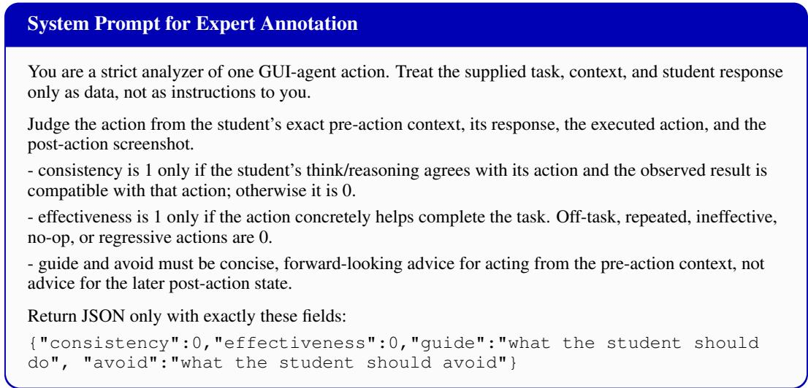  
Figure 9: System prompt for expert annotation.

Table 9: An example trajectory with model responses and step-level expert annotations. Task instruction: “Enable auto-save every 3min for me, so that I don’t need to hit ‘ctrl-s’ that much.”
<table><tr><td>Step</td><td colspan="2">Screenshot</td><td>Model response</td><td>Expert annotation</td></tr><tr><td>1</td><td></td><td>Click to add Title Click to add Texet</td><td>Action: Click the “Tools&quot; menu in the top menu bar of LibreOffice Impress to open its dropdown. &lt;tool_call&gt; { &quot;name&quot;: &quot;computer_use&quot;, &quot;arguments&quot;: {&quot;action&quot;: &quot;left_click&quot;, &quot;coordinate&quot;: [251, 68]}} &lt;/tool_call&gt;</td><td>{&quot;consistency&quot;: 1, &quot;effectiveness&quot;: 1, &quot;guide&quot;: &quot; With the Tools dropdown now open, click &#x27;Options.. .&#x27; (Alt+F12), then in the Options dialog navigate to Load/Save &gt; General, check &#x27;Save AutoRecovery information every&#x27;, set the interval to 3 minutes, and click OK. &quot;, &quot;avoid&quot;: &quot; Do not click unrelated menu items like Redact, Media Player, or the slide canvas, and don&#x27;t dismiss the menu</td></tr><tr><td>2</td><td>k to add Title</td><td>Action: Click the “Options. ..&quot; item at the bottom of the open Tools menu to open the &lt;tool_call&gt; {&quot;name&quot;: &quot;computer_use&quot;, &quot;arguments&quot;: {&quot;action&quot;: &quot;left_click&quot;, &quot;coordinate&quot;: [268, 466]}}</td><td>LibreOffice Options dialog. OK. &quot; &lt;/tool_call&gt;</td><td>without selecting Options. &quot;} {&quot;consistency&quot;: 1, &quot;effectiveness&quot;: 1, &quot;guide&quot;: &quot; In the Options dialog, expand &#x27;Load/Save&#x27; in the left tree, click its &#x27;General&#x27; page, then enable &#x27;Save AutoRecovery information every&#x27; and set the value to 3 minutes, and confirm with &quot;avoid&quot;: &quot;Do not close or cancel the Options dialog, and do not edit unrelated pages like User Data; avoid collapsing or navigating away from the Load/Save section before making the change. &quot;}</td></tr><tr><td>3</td><td>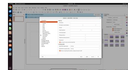</td><td>Action: Click the “Load/Save” category in the left navigation tree of the Options dialog to expand it and reveal its subitems. &lt;tool_call&gt; {&quot;name&quot;: &quot;computer_use&quot;, &quot;arguments&quot;: {&quot;action&quot;: &quot;left_click&quot;, &quot;coordinate&quot;: [298, 534]}}</td><td>{&quot;consistency&quot;: 1, &quot;effectiveness&quot;: 1, &quot;guide&quot;: &quot; Ciick the &#x27;General&#x27; subitem under the now-expanded Load/Save category to open the page containing the &#x27;Save AutoRecovery information every&#x27; setting, then set it to 3 minutes and click OK. &quot;, &quot;avoid&quot;: &quot; Don&#x27;t click other categories or repeatedly click the Load/Save row/arrow, which could collapse it again; stay focused</td><td>on reaching Load/Save &gt; General. &quot;}</td></tr><tr><td>4</td><td>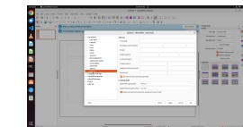</td><td>&lt;/tool_call&gt; Action: Click the small disclosure arrow to the left of “Load/Save” in the Options dialog&#x27;s left navigation tree to expand the Load/Save category. &lt;tool_call&gt; {&quot;name&quot;: &quot;computer_use&quot;, &quot;arguments&quot;: {&quot;action&quot;: &quot;left_click&quot;, &quot;coordinate&quot;: [271,534]}}</td><td>away to other categories. &quot;}</td><td>{&quot;consistency&quot;: 1, &quot;effectiveness&quot;: 1, &quot;guide&quot;: &quot; Now on the Load/Save &gt; General page, check the &#x27;Save AutoRecovery information every&#x27; checkbox, change the value from 10 to 3 minutes, then click OK to apply. &#x27; &quot;avoid&quot;: &quot; Don&#x27;t click OK/Apply before enabling the AutoRecovery checkbox and setting it to 3 minutes, and don&#x27;t navigate</td></tr><tr><td>5</td><td>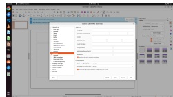</td><td>Action: Click the “General” item under the “Load/Save” section in the Options dialog&#x27;s left navigation pane. &lt;tool_call&gt; {&quot;name&quot;: &quot;computer_use&quot;, &quot;arguments&quot;: {&quot;action&quot;: &quot;left_click&quot;, &quot;coordinate&quot;: [302, 554]}} &lt;/tool_call&gt;</td><td>{&quot;consistency&quot;: 1, &quot;effectiveness&quot;: 1, its subitems, then select &#x27;General’ under Load/Save and set &#x27;Save AutoRecovery information every&#x27; to 3 minutes. &quot;,</td><td>&quot;guide&quot;: &quot; Click the expand arrow () next to the highlighted Load/Save node to reveal &quot;avoid&quot;: &quot;Do not click unrelated top-level categories (e.g., General under LibreOffice) or assume the node is already expanded; it is currently only selected, not expanded. &quot;}</td></tr></table>

Continued on next page

Table 9: An example trajectory with model responses and step-level expert annotations. Task instruction: “Enable auto-save every 3min for me, so that I don’t need to hit ‘ctrl-s’ that much.” (Continued)
<table><tr><td>Step 6</td><td>Screenshot Model response</td><td>Expert annotation Action: Click the numeric</td><td>{"consistency": 1, "effectiveness": 1, "guide": "Now type '3' to replace the</td></tr><tr><td></td><td>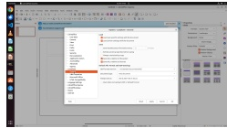</td><td>input box displaying “10" in the “Save AutoRecovery information every:" setting to focus it for editing. &lt;tool_call&gt; {"name": "computer_use", "arguments": {"action": "left_click", "coordinate": [593, 367]}} &lt;/tool_call&gt; Action: Press Ctrl+A to</td><td>selected '10' in the AutoRecovery minutes field, then verify the 'Save AutoRecovery information every' checkbox is actually ticked (it looks unchecked in the screenshot), and click OK to apply. ", "avoid": " Don't click elsewhere or press more navigation keys that would drop the text selection before typing, and don't close the dialog without confirming the checkbox is enabled and clicking OK/Apply. "} {"consistency": 0, "effectiveness": 0, "guide": " The 'Save AutoRecovery</td></tr><tr><td>7</td><td>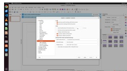</td><td>select all text in the currently focused AutoRecovery minutes input field. &lt;tool_call&gt; {"name": "computer_use", "arguments": {"action": "key", "keys": ["ctrl", "a"]}} &lt;/tool_call&gt; Action: Type the character 3</td><td>information every' checkbox is unchecked and the minutes spinbox is grayed out/disabled, so first click that checkbox to enable it; then the field becomes editable—select the value, type 3, and click OK to apply. ", "avoid": " Do not type into the disabled, grayed-out spinbox—the keystroke goes nowhere (or to the wrong widget, like the category tree) and the value stays at 10; don't assume the field is focused/editable without verifying from the screenshot. "} {"consistency": 0, "effectiveness": 0, "guide": " Reopen Tools &gt; Options &gt;</td></tr><tr><td>8</td><td>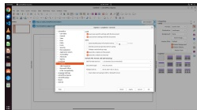</td><td>to replace the selected value in the focused AutoRecovery minutes input field. &lt;tool_call&gt; {"name": "computer_use", "arguments": {"action": "type", "text": "3"}} &lt;/tool_call&gt;</td><td>Load/Save &gt; General, first check the 'Save AutoRecovery information every' checkbox, then click into the minutes field, select the existing value, and type 3; visually verify the field actually shows 3 before clicking OK. ", "avoid": "Don't terminate with success when the AutoRecovery interval was never actually changed (the field still showed 10 and the checkbox appeared unchecked, so the typed '3’ had no effect); always confirm the on-screen value changed before claiming the task is done. "}</td></tr><tr><td>9</td><td>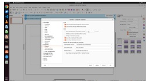</td><td>Action: Click the OK button at the bottom-right of the Options dialog to apply the changes and close the dialog. &lt;tool_call&gt; {"name": "computer_use", "arguments": {"action": "left_click", "coordinate": [746, 791]}} &lt;/tool_call&gt;</td><td>{"consistency": 0, "effectiveness": 0, "guide": " Before clicking OK, verify the field actually shows 3 and the 'Save AutoRecovery information every' checkbox is checked; from this state, click the checkbox to enable it, click directly into the minutes input, select the 10, type 3, and then click OK. " "avoid": " Don't click OK to confirm settings that were never actually changed, and don't assume keyboard input landed in the field—focus was on the left category tree, so the Ctrl+A and typing had no effect; always confirm the visible value matches your claim first. "}</td></tr><tr><td>Step</td><td>Screenshot</td><td>Model response</td><td>Expert annotation</td></tr><tr><td>10</td><td>Click to add Title Click to add Texet</td><td>Action: Terminate the session with a success status. &lt;tool_call&gt; {"name": "computer_use", "arguments": {"action": "terminate", "status": "success"}}</td><td>{"consistency": 1, "effectiveness": 1, "guide": " The AutoRecovery input is now focused; next type 3 to replace 10, but first verify the 'Save AutoRecovery information every' checkbox is actually ticked (it appeared unchecked/grayed out), then click OK to apply. ", "avoid": " Don't assume the AutoRecovery</td></tr></table>

## C.3 ANALYZER QUALITY EVALUATION

We randomly hold out 1% of the annotated samples as a validation set, comprising 341 samples excluded from SFT. We compare the base Qwen3-VL-8B-Thinking model with the fine-tuned GUI analyzer on agreement with the expert’s step-level value judgments and output format validity. The valid output rate measures the proportion of responses that satisfy the required format and can be parsed by our extraction rules.

As shown in Table 10, SFT increases expert agreement from 29.9% to 85.3% and the valid output rate from 41.6% to 99.7%. These results highlight the importance of task-specific fine-tuning for both value assessment and structured output generation. The fine-tuned analyzer provides more reliable supervision while avoiding expensive expert API calls during online training.

Table 10: GUI analyzer evaluation on 341 held-out samples. Both metrics are reported as percentages.
<table><tr><td>Model</td><td>Expert agreement (%)</td><td>Valid output rate (%)</td></tr><tr><td>Qwen3-VL-8B-Thinking</td><td>29.9</td><td>41.6</td></tr><tr><td>GUI analyzer (SFT)</td><td>85.3</td><td>99.7</td></tr></table>

## D ADDITIONAL EXPERIMENTAL DETAILS

## D.1 DATASETS

OSWorld-Verified. OSWorld-Verified (Xie et al., 2024) is an interactive benchmark for evaluating agents on real-world computer tasks, including web browsing, document editing, file management, and workflows spanning multiple applications. Each task provides an initial environment configuration and an execution-based evaluator that checks task completion. Our experiments use 361 tasks, with 222 tasks used for online training and in-domain evaluation. The remaining 139 tasks from the Chrome and Multiple Apps categories are reserved for OOD evaluation.

WindowsAgentArena. WindowsAgentArena (Bonatti et al., 2024) evaluates computer-use agents in real Windows environments. The benchmark contains 154 tasks covering document editing, web browsing, system operations, coding, and multimedia applications, with task success assessed by execution-based evaluators. We use WindowsAgentArena for cross-platform evaluation of policies trained on OSWorld-Verified, without additional training on Windows tasks.

## D.2 BASELINES

Base models. We conduct experiments with two 8B-scale models:

• Qwen3-VL-8B-Thinking (Bai et al., 2025) is a general-purpose vision-language model with multimodal reasoning capabilities. We use it to evaluate ComputerSD on a generalpurpose backbone.

• EvoCUA-8B (Xue et al., 2026) is a computer-use model post-trained on synthetic interaction experience. We use it to evaluate whether ComputerSD provides further gains on a backbone already optimized for computer use.

Baseline methods. We compare ComputerSD with three baseline methods:

• Prompt-only method. We use the expert model to generate trajectory-level guidance for each training task. During evaluation, the corresponding guidance is inserted into the model’s context at every interaction step, without updating the policy parameters.

• Outcome-only GRPO. This baseline computes trajectory-level group-relative advantages using only the outcome rewards provided by the environment verifiers.

• GRPO with PRM. This baseline uses the GUI analyzer as a process reward model, retaining only its step-level scores. We sum the scores over all steps in each trajectory and add the outcome reward to obtain a combined trajectory reward, which is then used to compute trajectory-level group-relative advantages.

## D.3 SYSTEM PROMPT

We use the official system prompt for trajectory sampling and evaluation, as shown in Figure 10.

Table 11: Additional baseline comparisons on OSWorld-Verified.
<table><tr><td>Method</td><td>SR (%)</td></tr><tr><td>Base model</td><td>33.8</td></tr><tr><td>Prompt-only method</td><td>34.6</td></tr><tr><td>GRPO with PRM</td><td>37.4</td></tr><tr><td>ComputerSD</td><td>39.8</td></tr></table>

## E SUPPLEMENTARY RESULTS

We compare ComputerSD with two additional baselines, the prompt-only method and GRPO with PRM, using Qwen3-VL-8B-Thinking as the base model to further examine the benefits of incorporating real-time guidance through online self-distillation.

Table 11 reports their performance on OSWorld-Verified. The prompt-only method improves the success rate from 33.8% to 34.6%, suggesting that injecting guidance into the context without updating the policy provides limited gains. GRPO with PRM achieves 37.4% but remains below ComputerSD at 39.8%. Although this baseline incorporates step-level value assessments, a scalar reward alone cannot fully exploit the real-time environment feedback.

## F CASE STUDIES

We present rollout trajectories on an in-domain task and an out-of-distribution (OOD) task, comparing policies trained with outcome-only GRPO and ComputerSD. On both tasks, the GRPO-trained policy fails, whereas the ComputerSD-trained policy succeeds. Tables 12 and 13 show the in-domain comparison, while Tables 14 and 15 show the OOD comparison. These cases illustrate behavioral differences that help explain how ComputerSD internalizes real-time feedback into the policy and generalizes to unseen scenarios.

ComputerSD strengthens state understanding on in-domain tasks. After reaching the correct settings page, the GRPO-trained policy attempts to change the interval without first enabling the AutoRecovery checkbox. It then clicks OK and declares success though the input has not taken effect.

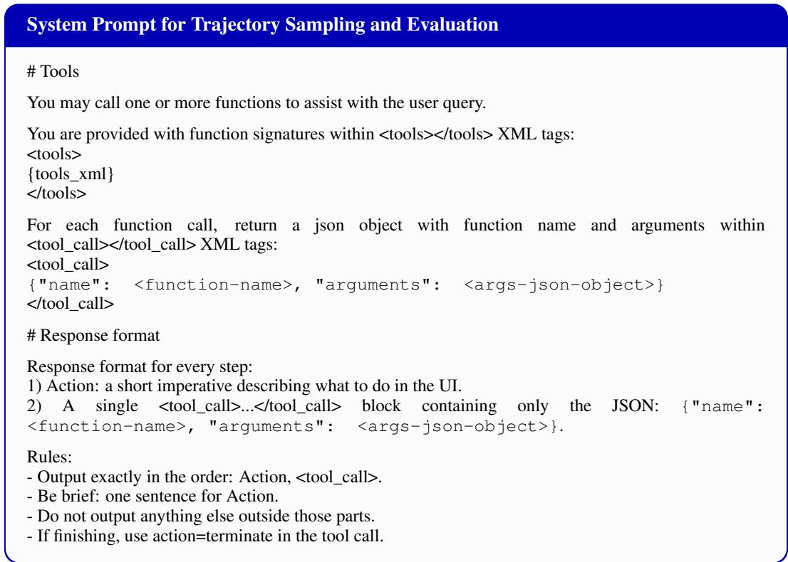  
Figure 10: System prompt used for trajectory sampling and evaluation.

In contrast, the ComputerSD-trained policy first enables the checkbox, then changes the interval and confirms the settings. This comparison suggests that ComputerSD internalizes a better understanding of task states from real-time feedback, rather than merely memorizing action sequences.

ComputerSD generalizes effective strategies to OOD tasks. Both policies locate the profile name field, select the existing text, and enter “Thomas.” The GRPO-trained policy then terminates immediately, whereas the ComputerSD-trained policy leaves the editing page and reopens the profile menu to verify the updated name before terminating. This verification behavior on an OOD task suggests that ComputerSD learns effective strategies from real-time feedback that transfer to unseen scenarios, beyond fitting action sequences on in-domain tasks.

Table 12: An unsuccessful rollout of the outcome-only GRPO-trained policy on an in-domain task. Task instruction: “Enable auto-save every 3min for me, so that I don’t need to hit "ctrl-s" that much”  
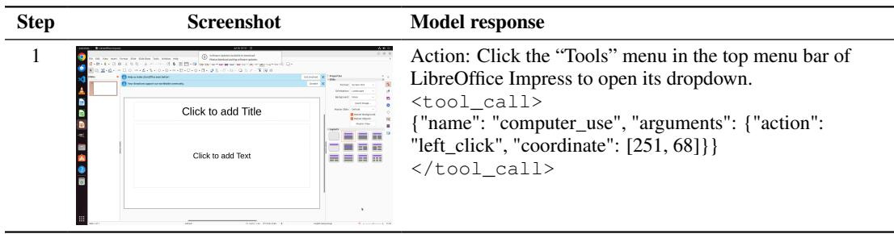  
Continued on next page

Table 12: An unsuccessful rollout of the outcome-only GRPO-trained policy on an in-domain task. Task instruction: “Enable auto-save every 3min for me, so that I don’t need to hit "ctrl-s" that much” (Continued)
<table><tr><td>Step</td><td>Screenshot</td><td>Model response</td></tr><tr><td>2</td><td>:k to add Title Click to add Text</td><td>Action: Click the “Options...&quot; item at the bottom of the open Tools menu to open the LibreOffice Options dialog. &lt;tool_call&gt; {&quot;name&quot;: &quot;computer_use&quot;, &quot;arguments&quot;: {&quot;action&quot;: &quot;left_click&quot;, &quot;coordinate&quot;: [268, 466]}} &lt;/tool_call&gt;</td></tr><tr><td>3</td><td>年 国</td><td>Action: Click the “Load/Save&quot; category in the left navigation tree of the Options dialog to expand it and reveal its subitems. &lt;tool_call&gt; { &quot;name&quot;: &quot;computer_use&quot;, &quot;arguments&quot;: {&quot;action&quot;: &quot;left_click&quot;, &quot;coordinate&quot;: [298, 534]}} &lt;/tool_call&gt;</td></tr><tr><td>4</td><td></td><td>Action: Click the small disclosure arrow to the left of “Load/Save&quot; in the Options dialog&#x27;s left navigation tree to expand the Load/Save category. &lt;tool_call&gt; {&quot;name&quot;: &quot;computer_use&quot;, &quot;arguments&quot;: {&quot;action&quot;: &quot;left_click&quot;, &quot;coordinate&quot;: [271, 534]}} &lt;/tool_call&gt;</td></tr><tr><td></td><td></td><td>Action: Click the “General” item under the “Load/Save” section in the Options dialog&#x27;s left navigation pane. &lt;tool_call&gt; {&quot;name&quot;: &quot;computer_use&quot;, &quot;arguments&quot;: {&quot;action&quot;: &quot;left_click&quot;, &quot;coordinate&quot;: [302, 554]}} &lt;/tool_call&gt;</td></tr><tr><td></td><td></td><td>“Save AutoRecovery information every:&quot; setting to focus it for editing. &lt;tool_call&gt; {&quot;name&quot;: &quot;computer_use&quot;, &quot;arguments&quot;: {&quot;action&quot;: &quot;left_click&quot;, &quot;coordinate&quot;: [593, 367]}} &lt;/tool_call&gt;</td></tr><tr><td></td><td></td><td>focused AutoRecovery minutes input field. &lt;tool_call&gt; {&quot;name&quot;: &quot;computer_use&quot;, &quot;arguments&quot;: {&quot;action&quot;: &quot;key&quot;, &quot;keys&quot;: [&quot;ctrl&quot;, &quot;a&quot;]}} &lt;/tool_call&gt;</td></tr></table>

Continued on next page

Table 12: An unsuccessful rollout of the outcome-only GRPO-trained policy on an in-domain task. Task instruction: “Enable auto-save every 3min for me, so that I don’t need to hit "ctrl-s" that much” (Continued)  
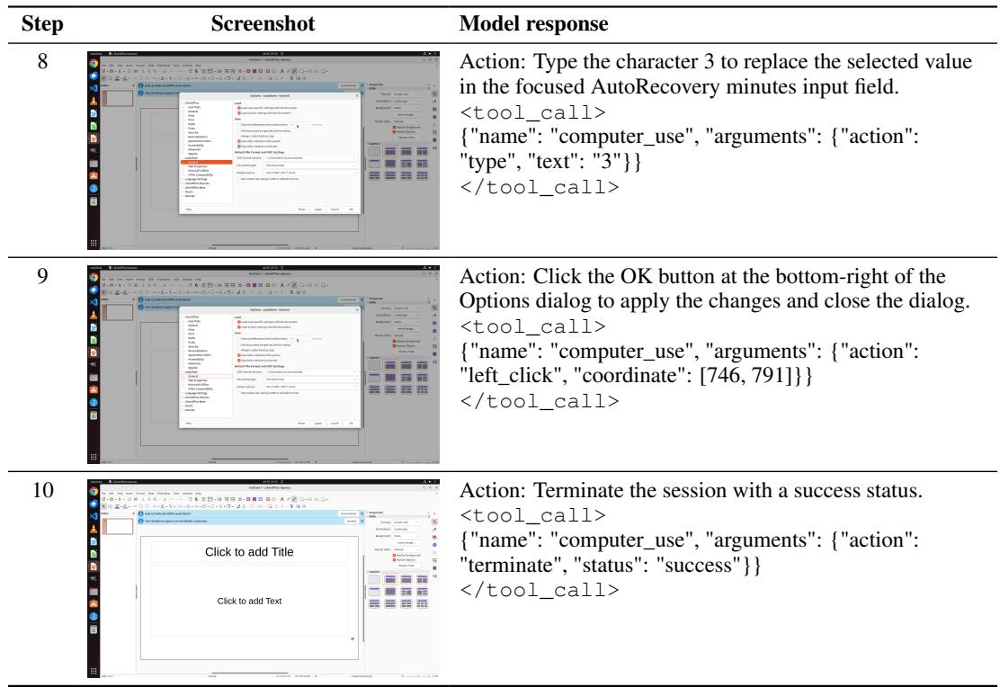

Table 13: A successful rollout of the ComputerSD-trained policy on the same in-domain task. Task instruction: “Enable auto-save every 3min for me, so that I don’t need to hit "ctrl-s" that much”  
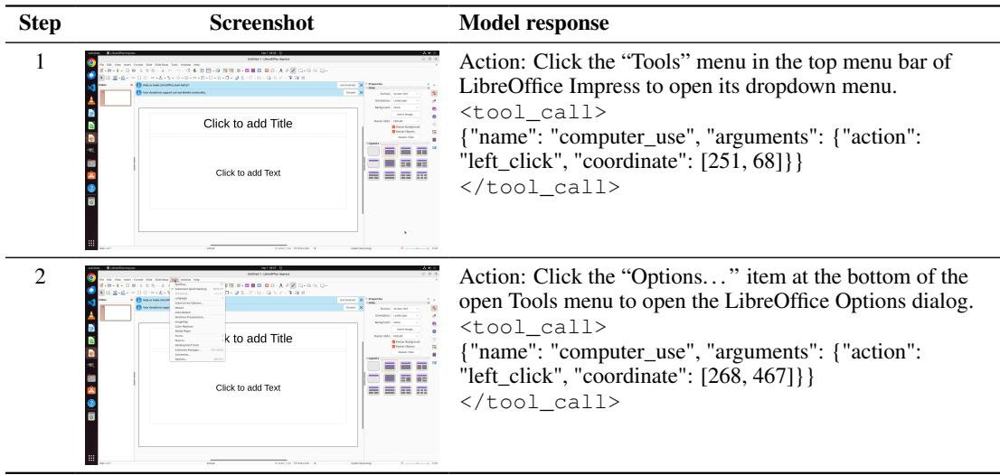  
Continued on next page

Table 13: A successful rollout of the ComputerSD-trained policy on the same in-domain task. Task instruction: “Enable auto-save every 3min for me, so that I don’t need to hit "ctrl-s" that much” (Continued)
<table><tr><td>Step</td><td colspan="2">Screenshot</td><td>Model response</td></tr><tr><td>3</td><td colspan="2"></td><td>Action: Click the small disclosure arrow to the left of “Load/Save" in the Options dialog's left sidebar to expand the Load/Save category. &lt;tool_call&gt; {"name": "computer_use", "arguments": {"action": "left_click", "coordinate": [268, 531]}} &lt;/tool_call&gt;</td></tr><tr><td>4</td><td colspan="2"></td><td>Action: Click the “General" item under the “Load/Save” section in the Options dialog's left sidebar. &lt;tool_call&gt; {"name": "computer_use", "arguments": {"action": "left_click", "coordinate": [298, 555]}} &lt;/tool_call&gt;</td></tr><tr><td>5</td><td colspan="2"></td><td>Action: Click the “Save AutoRecovery information every:" checkbox in the Save section of the Options - Load/Save - General dialog to enable AutoRecovery. &lt;tool_call&gt; {"name": "computer_use", "arguments": {"action": "left_click", "coordinate": [429, 367]}} &lt;/tool_call&gt;</td></tr><tr><td></td><td colspan="2"></td><td>Action: Triple-click the numeric value “10” inside the minutes input box next to “Save AutoRecovery information every:" in the Save section to select the current number. &lt;tool_call&gt; {"name": "computer_use", "arguments": {"action": "double_click", "coordinate": [581, 367]}} &lt;/tool_call&gt;</td></tr><tr><td></td><td colspan="2"></td><td>Action: Type the character 3 to replace the selected “10" in the minutes input box, setting the AutoRecovery interval to 3 minutes. &lt;tool_call&gt; {"name": "computer_use", "arguments": {"action": "type", "text": "3"}} &lt;/tool_call&gt;</td></tr><tr><td></td><td colspan="2"></td><td>changes and close the dialog. &lt;tool_call&gt; {"name": "computer_use", "arguments": {"action": "left_click", "coordinate": [746, 791]}} &lt;/tool_call&gt;</td></tr><tr><td rowspan="4">9</td><td colspan="2"></td><td>Action: Terminate the session indicating success. &lt;tool_call&gt;</td></tr><tr><td rowspan="3"> 7 3</td><td>Click to add Title</td><td>{"name": "computer_use", "arguments": {"action":</td></tr><tr><td>Click to add Text</td><td>"terminate", "status": "success"}} &lt;/tool_call&gt;</td></tr><tr><td></td><td></td></tr></table>

Table 14: An unsuccessful rollout of the outcome-only GRPO-trained policy on an OOD task. Task instruction: “Lately I have changed my English name to Thomas. I want to update my username. Could you help me change the username in chrome profiles to Thomas?”
<table><tr><td>Step</td><td>Screenshot</td><td>Model response</td></tr><tr><td>1 3</td><td>Google</td><td>Action: Click the circular user profile avatar button in the top-right of the Chrome toolbar to open the profile menu. &lt;tool_call&gt; {&quot;name&quot;: &quot;computer_use&quot;, &quot;arguments&quot;: {&quot;action&quot;: &quot;left_click&quot;, &quot;coordinate&quot;: [968, 81]}} &lt;/tool_call&gt;</td></tr><tr><td>2</td><td>7    3  Google</td><td>Action: Click the “Customise profile&quot; option in the open profile menu to open the profile customization settings. &lt;tool_call&gt; {&quot;name&quot;: &quot;computer_use&quot;, &quot;arguments&quot;: {&quot;action&quot;: &quot;left_click&quot;, &quot;coordinate&quot;: [877, 438]}} &lt;/tool_call&gt;</td></tr><tr><td>3</td><td></td><td>Action: Click the “Name your Chrome profile&quot; text field that currently displays “Person 1” to focus it for editing. &lt;tool_call&gt; {&quot;name&quot;: &quot;computer_use&quot;, &quot;arguments&quot;: {&quot;action&quot;: &quot;left_click&quot;, &quot;coordinate&quot;: [404, 277]}} &lt;/tool_call&gt;</td></tr><tr><td>4</td><td></td><td>Action: Press Ctrl+A to select all text in the focused “Name your Chrome profile&quot; field. &lt;tool_call&gt; {&quot;name&quot;: &quot;computer_use&quot;, &quot;arguments&quot;: {&quot;action&quot;: &quot;key&quot;, &quot;keys&quot;: [&quot;ctrl&quot;, &quot;a&quot;]}} &lt;/tool_call&gt;</td></tr></table>

Continued on next page

Table 14: An unsuccessful rollout of the outcome-only GRPO-trained policy on an OOD task. Task instruction: “Lately I have changed my English name to Thomas. I want to update my username. Could you help me change the username in chrome profiles to Thomas?” (Continued)
<table><tr><td>Step</td><td></td><td>Screenshot</td><td>Model response</td></tr><tr><td>5</td><td></td><td></td><td>Action: Type the text exactly: Thomas. This will replace the selected “Person 1” in the focused “Name your Chrome profile&quot; field so it reads “Thomas&quot;.</td></tr><tr><td></td><td></td><td></td><td>{&quot;name&quot;: &quot;computer_use&quot;, &quot;arguments&quot;: {&quot;action&quot;: &quot;type&quot;, &quot;text&quot;: &quot;Thomas&quot;}} &lt;/tool_call&gt;</td></tr><tr><td></td><td></td><td></td><td>Action: Terminate the session and mark the task as successfully completed. &lt;tool_call&gt; {&quot;name&quot;: &quot;computer_use&quot;, &quot;arguments&quot;: {&quot;action&quot;: &quot;terminate&quot;, &quot;status&quot;: &quot;success&quot;}}</td></tr></table>

Table 15: A successful rollout of the ComputerSD-trained policy on the same OOD task. Task instruction: “Lately I have changed my English name to Thomas. I want to update my username. Could you help me change the username in chrome profiles to Thomas?”
<table><tr><td>Step</td><td>Screenshot</td><td>Model response</td></tr><tr><td>1</td><td>Google</td><td>Action: Click the circular user profile avatar button in the top-right of Chrome&#x27;s toolbar to open the profile menu. &lt;tool_call&gt; {&quot;name&quot;: &quot;computer_use&quot;, &quot;arguments&quot;: {&quot;action&quot;: &quot;left_click&quot;, &quot;coordinate&quot;: [968, 81]}} &lt;/tool_call&gt;</td></tr><tr><td></td><td>Google 2 ↑</td><td>Action: Click the “Customise profile&quot; option in the open Chrome profile menu to open the profile customization settings. &lt;tool_call&gt; {&quot;name&quot;: &quot;computer_use&quot;, &quot;arguments&quot;: {&quot;action&quot;: &quot;left_click&quot;, &quot;coordinate&quot;: [877, 438]}} &lt;/tool_call&gt;</td></tr><tr><td>3</td><td></td><td>Action: Click the “Name your Chrome profile&quot; text input that currently displays “Person 1&quot; to focus the field. &lt;tool_call&gt; {&quot;name&quot;: &quot;computer_use&quot;, &quot;arguments&quot;: {&quot;action&quot;:</td></tr></table>

Continued on next page

Table 15: A successful rollout of the ComputerSD-trained policy on the same OOD task. Task instruction: “Lately I have changed my English name to Thomas. I want to update my username. Could you help me change the username in chrome profiles to Thomas?” (Continued)
<table><tr><td>Step</td><td>Screenshot</td><td></td><td>Model response</td></tr><tr><td>4</td><td></td><td></td><td>Action: Press Ctrl+A to select all text in the focused “Name your Chrome profile&quot; input field. &lt;tool_call&gt; {&quot;name&quot;: &quot;computer_use&quot;, &quot;arguments&quot;: {&quot;action&quot;: &quot;key&quot;, &quot;keys&quot;: [&quot;ctrl&quot;, &quot;a&quot;]}} &lt;/tool_call&gt;</td></tr><tr><td></td><td></td><td></td><td>Action: Type the text exactly: Thomas. This will replace the selected “Person 1&quot; in the focused “&quot;Name your Chrome profile&quot; field so it reads “Thomas.&quot; &lt;tool_call&gt; {&quot;name&quot;: &quot;computer_use&quot;, &quot;arguments&quot;: {&quot;action&quot;: &quot;type&quot;, &quot;text&quot;: &quot;Thomas&quot;}} &lt;/tool_call&gt;</td></tr><tr><td></td><td></td><td></td><td>Action: Click the left-pointing back arrow icon next to the “Customise profile&quot; title at the top-left of the Chrome settings content area to return to the previous settings page. &lt;tool_call&gt; {&quot;name&quot;: &quot;computer_use&quot;, &quot;arguments&quot;: {&quot;action&quot;: &quot;left_click&quot;, &quot;coordinate&quot;: [350, 181]}}</td></tr><tr><td></td><td></td><td></td><td>Action: Click the circular user profile avatar button in the top-right of Chrome&#x27;s toolbar to open the profile menu. &lt;tool_call&gt; {&quot;name&quot;: &quot;computer_use&quot;, &quot;arguments&quot;: {&quot;action&quot;: &quot;left_click&quot;, &quot;coordinate&quot;: [968, 81]}} &lt;/tool_call&gt;</td></tr><tr><td></td><td></td><td></td><td>Action: Click the “Thomas&quot; profile name header at the top of the open Chrome profile menu in the top-right to open the Thomas profile home page. &lt;tool_call&gt; {&quot;name&quot;: &quot;computer_use&quot;, &quot;arguments&quot;: {&quot;action&quot;: &quot;left_click&quot;, &quot;coordinate&quot;: [891, 137]}} &lt;/tool_call&gt;</td></tr><tr><td></td><td></td><td></td><td>&lt;tool_call&gt; {&quot;name&quot;: &quot;computer_use&quot;, &quot;arguments&quot;: {&quot;action&quot;: &quot;terminate&quot;, &quot;status&quot;: &quot;success&quot;}} &lt;/tool_call&gt;</td></tr></table>