# CamAgent: An LLM-Agent Framework for Multi-Species Camera-Trap Workflows

Yutong Deng1†, Qi Song2,3†, Xi Guo4, Tianming Wang2,3, Lei Bao2,3\*, Jianping Ge2,3\*

1Faculty of Arts and Sciences, Beijing Normal University, Zhuhai, China. 2College of Life Sciences, Beijing Normal University, Beijing, China. 3National Forestry and Grassland Administration Key Laboratory for Conservation Ecology of Northeast Tiger and Leopard, Beijing, China.   
4Faculty of Geographical Science, Beijing Normal University, Beijing, China.

\*Corresponding author(s). E-mail(s): baolei@bnu.edu.cn; gejp@bnu.edu.cn; †These authors contributed equally to this work.

## Abstract

Camera traps accumulated vast, multidimensional data for wildlife monitoring, yet translating raw media archives into meaningful ecological insights remains highly fragmented. Current research workflows require laboriously stitching together disparate analysis tools and scripts, creating steep programming hurdles and complicating end-to-end spatiotemporal analyses. To overcome this fragmentation, we present CamAgent, an autonomous Large Language Model (LLM) agent framework that integrates camera-trap analytical workflows into a unified intelligent ecosystem. CamAgent interprets natural-language ecological intent, schedules computational routing, and executes specialized tools spanning computer-vision perception (e.g., SpeciesNet), CamtrapDP-compatible data management, detection-corrected occupancy modeling, temporal activity analysis, and species co-occurrence networks. The framework automates multi-stage analytical pipelines while maintaining essential data-quality controls and analytical conventions. Consequently, CamAgent significantly reduces manual programming overhead for conservationists, establishing a transparent, scalable, and fully integrated paradigm for camera-trap ecology. Our project is available at https://anonymous.4open.science/r/artifact72c6f4.

Keywords: Autonomous agents, Biodiversity monitoring, Camera traps, Ecological workflows, Large language models, Multi-species analysis, Tool orchestration

## 1 Introduction

The widespread deployment of camera traps has fundamentally transformed wildlife monitoring and conservation biology over the past decade (Burton et al., 2015; Steenweg et al., 2017; McCallum, 2013). Camera traps extensively deployed across diverse habitats accumulate large-scale, real-world ecological data. Crucially, these monitors provide multidimensional data, combining video sequences with structural metadata like camera identifiers, geographic coordinates, timestamps, species detections, and corresponding model confidence scores (Ahumada et al., 2011; Hughey et al., 2018; Deng et al., 2026; Song et al., 2026).

Such multidimensional data supports diverse ecological monitoring applications. For instance, integrated timestamps enable researchers to estimate daily activity rhythms and evaluate temporal overlap between interacting species (Ridout and Linkie, 2009; Rowclife et al., 2014). Geographic coordinates facilitate robust spatial analyses, such as occupancy modeling, habitat use estimation, and biodiversity hotspot identification (MacKenzie et al., 2002; Tobler et al., 2008). At the community level, multi-species video sequences within a shared sampling grid enable comprehensive assessment of community composition and complex interspecific relationships, including spatial avoidance and co-occurrence patterns (Ahumada et al., 2011; Burton et al., 2015).

However, the massive accumulation of camera-trap data over the years imposes a severe analytical burden. Transforming these raw data archives into meaningful ecological insights (Tuia et al., 2022; Farley et al., 2018) demands a complex, multi-stage workflow spanning data standardization, deep-learning species recognition, structured database management, and sophisticated statistical modeling (Beery et al., 2019; Young et al., 2018). Despite substantial progress in automated perception to enhance wildlife recognition (e.g., deep learning models for species classification and boundingbox detection (Norouzzadeh et al., 2018; Willi et al., 2019; Song et al., 2024)), current methodologies remain highly fragmented. The transition from perceptual outputs to structured ecological analysis and visualization still heavily depends on manual processing (Tabak et al., 2019; Niedballa et al., 2016). In practice, researchers need to laboriously stitch together disparate recognition pipelines, spreadsheet operations and Python scripts to complete a single ecological workflow.

This fragmentation introduces several critical consequences. Primarily, it imposes steep programming and statistical computing requirements, creating a substantial hurdle for conservationists who seek ecological answers rather than software engineering challenges (Sollmann, 2018; Besson et al., 2022). Moreover, separating perception from downstream analysis complicates the creation of coherent end-to-end pipelines, a challenge that is particularly problematic for real-world multi-species datasets requiring joint spatiotemporal interpretation. This disconnect frequently leads to the inconsistent handling of analytical assumptions, such as timestamp reliability, independent-event thresholds, and spatial radii across disconnected scripts. Consequently, verifying the exact relation between final ecological results and the underlying raw field data demands a substantial investment of time and manual labor.

Overcoming this fragmentation requires a system that unifies disparate processing steps and computational tools. The emerging paradigm of Large Language Model (LLM) agents (Yao et al., 2022; Wang et al., 2024) ofers a promising solution to this challenge by leveraging advanced capabilities for multi-step reasoning and automated task planning (Schick et al., 2023; Wang et al., 2024; Shen et al., 2023). Globally, these agentic frameworks are already driving substantial breakthroughs across diverse empirical sciences, fundamentally shifting traditional research workflows toward autonomous discovery. Recent milestone implementations demonstrate how autonomous LLM agents can independently parse scientific literature, design intricate experimental protocols, and coordinate specialized analytical software and computational pipelines to accelerate complex research workflows (Lu et al., 2026). Extending this autonomous scientific assistant paradigm to wildlife monitoring ofers a transformative path to handle the expanding computational demands of modern field ecology.

We instantiate this autonomous paradigm through the proposed CamAgent, a framework engineered to systematically process massive multi-species camera-trap archives. Rather than operating as a generative text engine, the central LLM functions strictly as an intelligent workflow coordinator. To deliver specific ecological outcomes, it directly analyzes the user’s objective, determines precisely which analytical tools to invoke, and schedules the exact statistical figures or models to be generated to fulfill the request. This query-driven ecosystem consolidates the entire analytical pipeline into a centralized architecture, seamlessly integrating a perception pipeline with detection and classification models (Gadot et al., 2024; Beery et al., 2019; Redmon et al., 2016), compatible data management (Bubnicki et al., 2024) and a curated registry of specialized ecological tools. Through a simple natural-language interface, researchers interact directly with the framework, prompting the underlying routing engine to interpret ecological intent, retrieve the necessary spatiotemporal records, parameterize the selected tools, and autonomously synthesize the final results for ecological insights. The main contributions of this paper can be summarized as follows:

1. An LLM-agent-based methodological framework is proposed, which organizes camera-trap workflows in a unified, query-driven manner, efectively connecting perception outputs, standardized records, ecological tools, and report-oriented synthesis of results.

2. An analytical pipeline for real-world multi-species data, integrating SpeciesNetbased detection, timestamp normalization, CamtrapDP-compatible exchange, JSON/Chroma-backed storage, conditional filtering, and independent-event construction.

3. A comprehensive suite of ecological tools spanning data quality control, temporal activity analysis, spatial hotspot analysis, detection-corrected occupancy modeling, community composition, species co-occurrence, relationship-network analysis, and visualization.

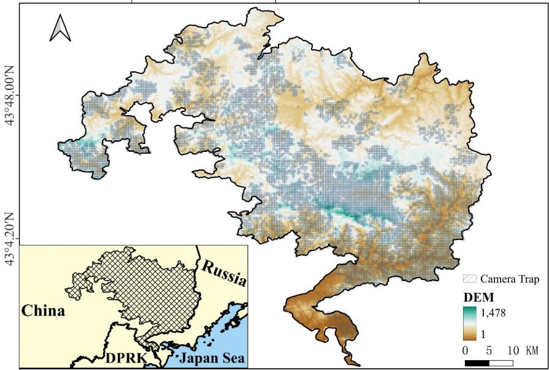  
Fig. 1 Study area and camera-trap sampling footprint in Northeast China Tiger and Leopard National Park. The inset locates the study area in northeastern China relative to neighboring countries and the Japan Sea. Hatched grid cells show the camera-trap sampling footprint over a digital elevation model spanning 1–1,478 m. The empirical package used for the six naturallanguage query experiments contained 1,376,017 media records from 17,129 camera identifiers between 1 January 2023 and 1 September 2024.

Extensive validation demonstrating our LLM-driven framework significantly reduces manual programming efort while explicitly preserving critical computational assumptions, including timestamp reliability, event-independence thresholds, camera efort, and spatial radii.

## 2 Materials and Methods

## 2.1 Dataset

Study Area. The primary empirical data are collected from a long-term cameratrap network established across the Northeast China Tiger and Leopard National

Park (Wang et al., 2016). This park is designed for monitoring endangered Amur tigers and leopards, and the field network provides extensive spatial coverage across the landscape. The camera-trap deployment footprint and elevation gradient are shown in Fig. 1. The bounded analytical package comprised 17,129 camera identifiers and provided repeated non-invasive observations across a large spatial network.

Data Selection. All analyses use records from January 2023 to September 2024, packaged in CamtrapDP format (Bubnicki et al., 2024). To check that the pipeline also runs from raw media, we submitted one camera-trap video with a plain-language request to prepare it for analysis. The planner chose the dataset-preparation tool, which sampled frames for SpeciesNet (Gadot et al., 2024) classification, read the timestamp with PaddleOCR (Du et al., 2020; Cui et al., 2025), wrote and validated a CamtrapDP package, and loaded it into the analysis backend. Five species had at least five independent events (30-min gap) at two or more cameras and were therefore included in the community analysis (Table 1).

Table 1 Media records and independent events for the five species in the bounded empirical package. Events were constructed within each species–camera combination using a 30-min minimum gap (Section 2.2.2). All retained records span January 2023 to September 2024.
<table><tr><td>Common name</td><td>Scientific name</td><td>Media records</td><td>Events</td></tr><tr><td>Siberian tiger</td><td>Panthera tigris altaica</td><td>7,745</td><td>6,570</td></tr><tr><td>Amur leopard</td><td>Panthera pardus orientalis</td><td>11,704</td><td>9,882</td></tr><tr><td>Sika deer</td><td>Cervus nippon</td><td>625,249</td><td>345,300</td></tr><tr><td>Siberian roe deer</td><td>Capreolus pygargus</td><td>727,090</td><td>505,386</td></tr><tr><td>Asiatic black bear</td><td>Ursus thibetanus</td><td>4,229</td><td>3,614</td></tr></table>

## 2.2 The CamAgent Framework

CamAgent runs the whole sequence as one workflow. It prepares the raw media, loads the records as CamtrapDP, lets the language model choose which ecological tools to call, runs those tools, draws the figures, and returns an answer alongside the outputs it was built from.

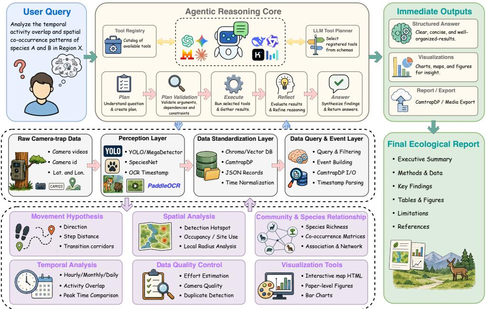  
Fig. 2 The framework of CamAgent. A user question (left) enters the Agentic Reasoning Core (top), which draws on the Data Layer (middle band) and the Ecological Tool Modules (bottom band) and returns a structured answer, figures, and an exportable report (right). Arrows show the direction of data flow.

CamAgent has three parts (Fig. 2). The Agentic Reasoning Core decides what to run for a given question, and it does so in five steps. It drafts a plan of tool calls from the question and the tool registry, validates the plan, executes the calls, reflects on what they returned, and synthesizes an answer. The Data Layer turns raw media into the standardized records those calls operate on, and the Ecological Tool Modules hold the six analysis tools the plan can draw on. The language model performs the planning, reflection and answer steps, while validation and execution are handled by a local runtime, so every number and figure in the output comes from a Python function rather than from the model.

## 2.2.1 LLM Planning, Execution, and Reflection

The agent planner reads the question together with the schemas of the available tools and returns a sequence of tool calls in order. The planning loop follows ReAct (Yao et al., 2022), with a reflection step added after execution (Shinn et al., 2023). Fig. 3 shows the trace for the temporal-activity query (Section 3.1), in which the planner returned an eight-call plan, all eight calls succeeded, and five figures were cited in the answer.

• Tool Registry. Each tool is declared with a name, a JSON parameter schema, and the preconditions it requires. The planner sees only these declarations and chooses among them for every question.

• Validation and Execution. Before anything runs, the local runtime checks tool names, arguments, dependencies, privacy constraints, call budgets, and each tool’s preconditions. It can reject a call, but it will not rewrite the plan. Calls run in order, and the reflection step inspects what they returned before the answer is drafted.

• Answer Synthesis. CamAgent assembles the returned tables, maps, and figures into the final answer. The answer reports each result at the level the tool produced it and repeats the constraints of the question set, such as the camera set to be used or the time and distance limits on a movement query.

## 2.2.2 Data Layer

The data layer turns raw camera-trap inputs into the standardized records that the analysis tools run on. It accepts images or video together with whatever metadata the field team recorded.

• Deep Learning Perception. For images, CamAgent runs SpeciesNet (Gadot et al., 2024) directly. For video, it samples frames, keeps the per-frame predictions, and aggregates them into one label. PaddleOCR (Du et al., 2020; Cui et al., 2025) can additionally read a timestamp burned into the frame. The framework also accepts outputs from YOLO (Redmon et al., 2016) or MegaDetector (Beery et al., 2019) front-end pipelines when sidecar results are available.

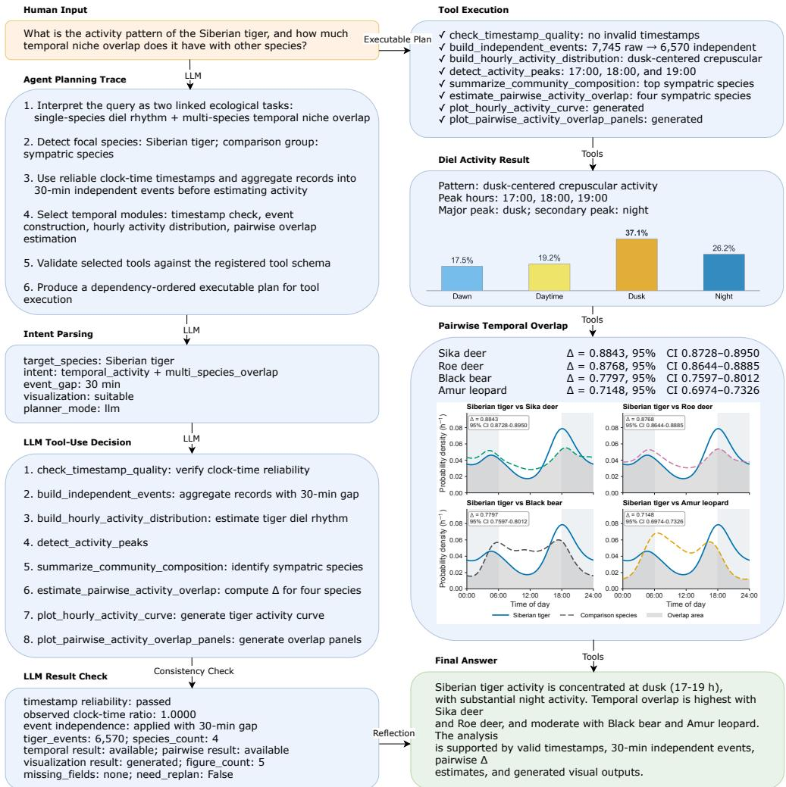  
Fig. 3 The TEMP planning and execution record. Left: the submitted question, the planning trace, the parsed intent, the eight-call plan, and the reflection check. Right: the execution status of each call, the returned activity and overlap results, and the final answer.

• Spatiotemporal Standardization. Camera-trap datasets often arrive with incomplete timestamps, dates written in diferent formats, and camera coordinates kept in a separate file. CamAgent maps them onto one schema that holds species, timestamp, coordinates, individual count, and a link to the source media. Records that carry only a date are flagged and excluded from the hourly analyses, so only timestamps with a real clock time enter them. We did not convert timestamps to solar time, and therefore all activity results are in local clock time (Frey et al., 2017).

• Data Management and Interoperability. Records are stored either as plain JSON files or in a Chroma vector database. CamtrapDP packages can be read into either backend, and processed records exported back out as deployment, media, and observation tables.

• Querying and Event Aggregation. Records can be filtered by species, date range, confidence threshold, or distance from a point. Consecutive detections of the same species at one camera are collapsed into independent events using a minimum time gap, 30 min by default, to avoid pseudoreplication.

## 2.2.3 Ecological Tool Modules

The analysis layer holds six modules. Each reads event records from the data layer and returns tables, figures, and the parameter values it used.

• Data Quality Analysis. Checks the records before any analysis runs. It flags missing fields, unparseable timestamps, out-of-range individual counts, and duplicatelike records, and scores each camera on the completeness of its records.

• Temporal Activity Analysis. Estimates diel activity from the clock times of independent events by circular von Mises kernel density estimation, and quantifies pairwise overlap with the coeficient of overlapping ∆, the area under the minimum of the two density curves (Ridout and Linkie, 2009). It also reports hourly to seasonal summaries, activity peaks, and the share of events falling in each activity window.

• Spatial Distribution and Guarded Occupancy. Builds camera-level detection maps, hotspot rankings, and camera-by-occasion detection histories. A single-season occupancy model (MacKenzie et al., 2002) is fitted only when documented cameraoperational intervals are available, otherwise the tool returns an explanatory error instead of an occupancy estimate.

• Community and Species-Relationship Analysis. Analyzes every species meeting the minimum-event and minimum-camera thresholds, rather than a fixed focal list. It reports observed and Chao2 richness with species-accumulation curves (Gotelli and Colwell, 2001), and Hill numbers for alpha and gamma diversity (Chao et al., 2014). Beta diversity is summarized with Jaccard and Bray–Curtis dissimilarity, partitioned into Sørensen turnover and nestedness-resultant components (Baselga, 2010). For each species pair, the observed shared-camera count is evaluated under the hypergeometric distribution conditional on the two marginal camera counts (Veech, 2013), converted to a standardized efect size, and adjusted across pairs with the Benjamini–Hochberg procedure (Benjamini and Hochberg, 1995).

• Movement Hypothesis Analysis. Derives potential transition steps between cameras based on user-defined time-gap and distance constraints. It summarizes distances, directions, and repeated camera pairs. Individual identity is unknown, so a link means two detections were close in time and space, not that one animal moved between the cameras.

• Visualization. Renders the outputs of the other modules as figures, including temporal activity plots, community composition bars, spatial hotspot maps, detection-history heatmaps, occupancy forest plots, species-relationship panels, and interactive Folium maps.

## 3 Results

## 3.1 Natural-Language Ecological Question Experiments

We ran six natural-language questions through CamAgent, covering data quality (QUAL), temporal ecology (TEMP), spatial ecology (SPAT), community ecology

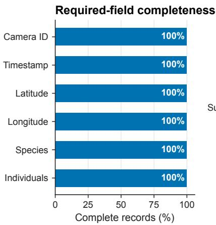

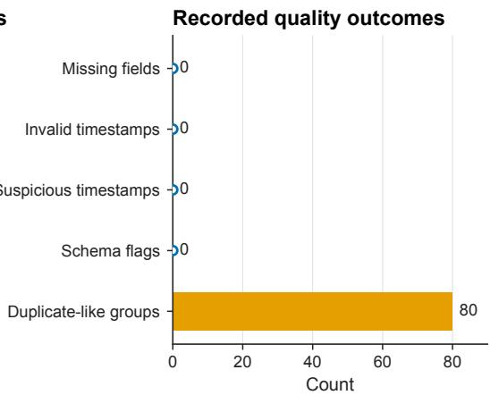  
Fig. 4 Data quality for 7,745 Siberian tiger records. Left: completeness of the six required fields. Right: counts of missing fields, invalid timestamps, suspicious timestamps, schema flags, and duplicate-like groups.

(COMM), movement hypotheses (MOVE), and integrated synthesis (INTEG). Table 2 gives the question and the main output for each experiment. CamAgent completed the six experiments without a failed tool call.

## 3.2 QUAL: Data-Quality Query Experiment

The QUAL experiment asked which analyses the tiger records could support. CamAgent ran a set of checks over the 7,745 records, covering missing fields, invalid timestamps, suspicious timestamps, schema flags, and duplicate-like groups.

All 7,745 records contained the six required fields and carried a usable clock time, and the schema check flagged nothing. The duplicate check found 80 groups in which several records share a camera, a timestamp and a species. The largest held 202. These are separate media files written by one camera trigger rather than 202 sightings, and the 30-min rule collapses each group into a single event. Temporal and spatial summaries were therefore supported once detections were grouped into events, while occupancy could not be estimated without survey-efort data (Fig. 4).

Table 2 Representative natural-language ecological questions and principal outputs for the six CamAgent experiments.
<table><tr><td>Name Question</td><td>type</td><td>Query sample</td><td>Outputs</td></tr><tr><td>QUAL Data-quality</td><td>assessment</td><td>Assess the Siberian tiger records for missing fields, invalid timestamps, possible label noise, and duplicate-like records. Explain which downstream ecological analyses remain sup- ported.</td><td>Required-field completeness. timestamp checks, record-schema flags, duplicate-like groups, analytical restrictions, and Fig. 4.</td></tr><tr><td>TEMP Temporal</td><td>activity and overlap</td><td>What is the activity pattern of the Siberian tiger, and how much temporal niche overlap does it have with other species?</td><td>Tiger activity dis- tribution, activity- window shares, pair- wise overlap coef- ficients, uncertainty intervals, and Fig. 5. Camera-level</td></tr><tr><td>SPAT</td><td>Spatial distri- bution and hotspots</td><td>Where are Siberian tiger detections concen- trated across the camera network, and which cameras are the main detection hotspots? Return a privacy-safe map and do not inter- pret hotspots as density or occupancy. Using the current camera-trap data, perform</td><td>hotspot counts, a privacy-masked grid-cell map, detection-only inter- pretation limits, and Fig. 6. Dataset-wide diver-</td></tr><tr><td></td><td>COMM Dataset-wide community inference</td><td>dataset-wide community inference across all eligible species rather than a hard-coded focal list. Estimate observed and Chao2 richness, Hill alpha and gamma diversity, Jaccard and Bray-Curtis beta diversity, par- tition Sørensen beta diversity into turnover and nestedness components, construct a species-accumulation curve, and test condi- tional shared-camera associations with false- discovery-rate correction. Return figures.</td><td>sity estimates, a species- accumulation curve, FDR-corrected shared-camera asso- ciations, and Fig. 7.</td></tr><tr><td>MOVE Camera-</td><td>detection adjacency hypotheses</td><td>For Amur leopard detections separated by no more than 72 hours and 100 km, summarize candidate inter-camera distances, directions, and repeated camera pairs. Treat them as adjacency hypotheses, not individual tracks or confirmed corridors.</td><td>Distance and direc- tion summaries, repeateddirected camera-pair counts, interpretation limits, and Fig. 8.</td></tr><tr><td>INTEG Integrated</td><td>ecological syn- thesis</td><td>Analyze Siberian tiger diel activity and over- lap with Sika deer, identify its main detection hotspots, summarize shared-camera occur- rence between the two species, check the relevant data quality, and return a concise ecological report with figures and limitations.</td><td>Tiger activity, tiger- sika deer temporal overlap, shared- camera summaries, hotspot counts, and Fig. 9.</td></tr></table>

## 3.3 TEMP: Temporal Activity and Species Overlap

The TEMP question was, “What is the activity pattern of the Siberian tiger, and how much temporal niche overlap does it have with other species?” CamAgent grouped detections into 30-min independent events, estimated hourly activity, and compared tiger activity with sika deer, Siberian roe deer, Asiatic black bear, and Amur leopard (Fig. 5).

The 6,570 tiger events peaked at 17:00 to 19:00, with a secondary rise at night (Fig. 3). Most events fell at dusk (37.1%), then at night (26.2%), during the day (19.2%), and at dawn (17.5%). The four windows are not the same length, so per hour the two peaks are dusk and dawn. Activity overlap was highest with sika deer $\left( \Delta = 0 . 8 8 4 3 \right.$ 95% CI 0.8728–0.8950) and roe deer (0.8768, 0.8644–0.8885), and lower with black bear (0.7797, 0.7597–0.8012) and Amur leopard (0.7148, 0.6974–0.7326) (Ridout and Linkie, 2009).

## 3.4 SPAT: Spatial Distribution and Detection Hotspots

The SPAT experiment asked where tiger detections were concentrated. CamAgent ranked cameras by event count and drew a map with camera locations masked. Tigers were recorded at 1,845 of the 17,129 cameras, and the five highest camera-level counts were 60, 55, 52, 51, and 50 (Fig. 6).

For public display, events were aggregated to 0.1-degree masked grid cells. Across the ten labeled cells, counts ranged from 193 to 789 events and from 29 to 115 cameras per cell. Camera identifiers were withheld.

## 3.5 COMM: Community Composition and Co-occurrence

For COMM, CamAgent ran diversity estimates, a species-accumulation curve, and shared-camera association tests over all eligible species. All five species passed the thresholds, with 870,752 events across 17,129 cameras. Two ungulates account for 98% of them (roe deer 505,386; sika deer 345,300). Observed and Chao2 richness were both 5.0 (Chao et al., 2014). Gamma Hill numbers were 2.210 (95% CI: 2.198–2.222) for q = 1 and 2.023 (95% CI: 2.008–2.037) for q = 2.

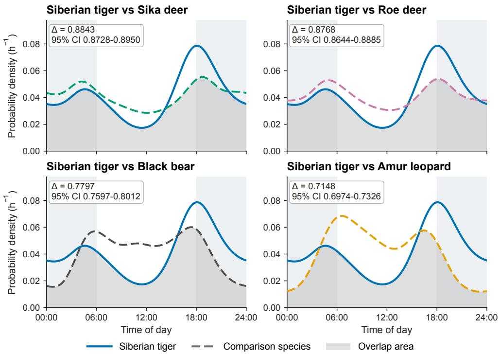  
Fig. 5 Activity overlap between Siberian tiger and four sympatric species. Solid blue curves show tiger activity, dashed colored curves the comparison species, and gray shading the overlap. Sika deer (upper left), roe deer (upper right), black bear (lower left), Amur leopard (lower right). Each panel gives ∆ with its 95% bootstrap interval.

Across 100,000 camera pairs sampled with seed 42, mean Jaccard and Bray– Curtis dissimilarities were 0.320 and 0.634, and mean Sørensen dissimilarity was 0.221, with turnover of 0.040 and a nestedness-resultant component of 0.181 (Baselga, 2010). With 17,129 cameras all ten tests were significant after Benjamini–Hochberg correction (Benjamini and Hochberg, 1995), so we read the efect sizes rather than the p-values. Nine efects were positive, one (roe deer–sika deer) was negative, and the largest standardized efect was observed for Amur leopard–Siberian tiger (32.63) (Fig. 7).

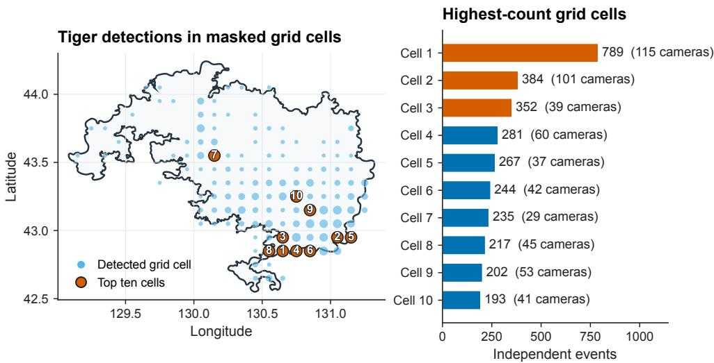  
Fig. 6 Siberian tiger detections in 0.1-degree grid cells. Numbered orange symbols mark the ten highest-count cells; the bars give event and camera counts for each. Camera identifiers are withheld.

## 3.6 MOVE: Camera-Detection Adjacency Hypotheses

The MOVE experiment asked CamAgent to link Amur leopard detections falling within 72 hours and 100 km of each other. It found 9,466 such links and summarized their distances, directions, and repeated camera pairs (Fig. 8). Links spanned a median of 30.8 km (IQR 16.5–47.7 km).

Directions were close to uniform across the eight bins (12–14%), with no dominant axis. No camera pair recurred often enough to suggest a route, the most frequent appearing 16 times among 9,466 links. Individual identity is unknown, so a link means two detections were close in time and space, not that one animal moved between the two cameras (Kays et al., 2015).

## 3.7 INTEG: Combining Analyses in One Query

One request chained data-quality checking, tiger activity, tiger–sika deer overlap, detection hotspots, shared-camera occurrence, visualization, and report writing. It used 6,570 tiger and 345,300 sika deer events.

Conditional associations  
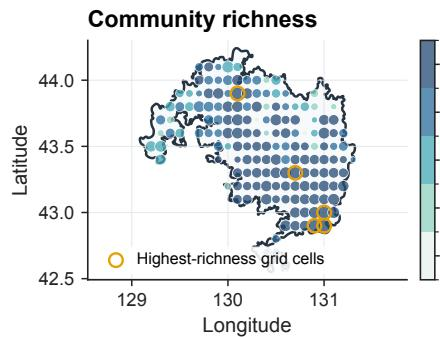

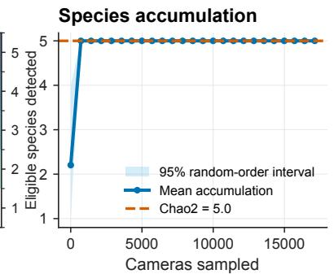

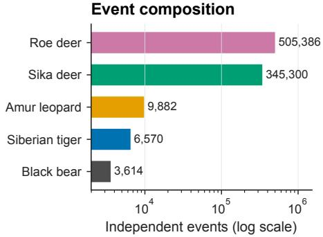

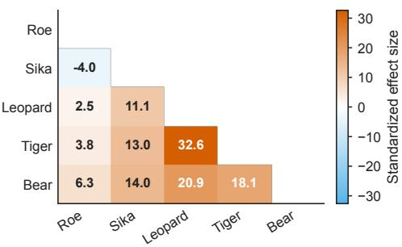  
Fig. 7 Community summary. Upper left: eligible-species richness by 0.1-degree grid cell. Upper right: species-accumulation curve with observed and Chao2 richness. Lower left: event counts by species. Lower right: standardized efect sizes for shared-camera associations after Benjamini–Hochberg correction.

Overlap with sika deer was ∆ = 0.8843 (95% CI 0.8728–0.8950), the same estimate as in TEMP. Of the 1,845 cameras that recorded tigers, 1,791 also recorded sika deer. At 610 of those, 2,381 cross-species event pairs fell within 24 h, with a median gap of 9.2 h (Fig. 9).

## 4 Discussion

The primary contribution of CamAgent lies in resolving the acute workflow fragmentation that has long bottlenecked camera-trap data analysis. Traditional research workflows rely heavily on disjointed software stacks—forcing ecologists to manually transfer outputs between computer-vision models, spreadsheet operations, and disconnected scripts or packages such as camtrapR (Sollmann, 2018; Young et al., 2018;

Repeated directed pairs  
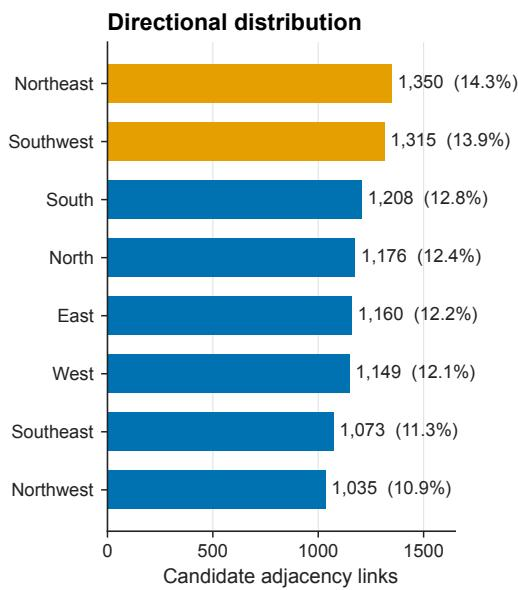

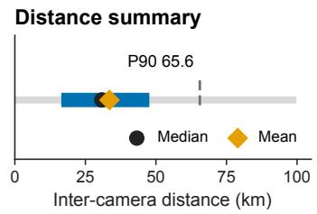

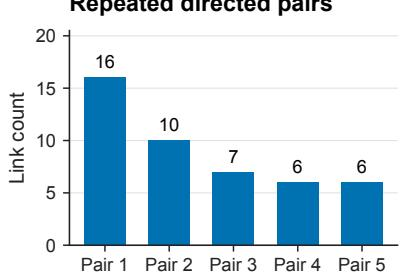  
Fig. 8 Amur leopard links within 72 h and 100 km $( n = 9 , 4 6 6 )$ . Left: link counts across eight directional bins. Upper right: distance distribution with median, mean, and 90th percentile. Lower right: the five most frequent directed camera pairs.

Tabak et al., 2019; Niedballa et al., 2016; Besson et al., 2022). Transforming these vast, raw media archives into meaningful ecological insights creates steep programming barriers and undermines end-to-end analytical reproducibility (Tuia et al., 2022; Farley et al., 2018). In contrast, CamAgent integrates multi-stage analytical processes—from perception and standardized exchange formats like CamtrapDP (Bubnicki et al., 2024) to downstream spatiotemporal statistical modeling—into a unified, querydriven ecosystem. By organizing multi-dimensional observational streams (comprising spatial coordinates, temporal timestamps, video sequences, and species detections) into a cohesive analytical continuum, CamAgent operationalizes the concept of geoecological data cubes, enabling direct natural-language querying for scalable biodiversity monitoring (Burton et al., 2015; Steenweg et al., 2017).

Unlike recent fully autonomous “AI Scientists” implementations that independently generate hypotheses, execute experiments, and write manuscripts end-to-end (Lu et al.,

Diel activity overlap

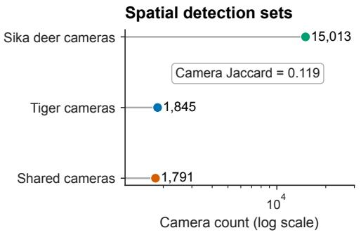

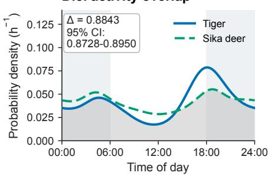

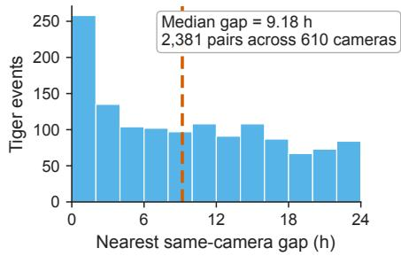

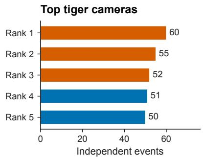  
Fig. 9 Siberian tiger and sika deer. Upper left: camera sets for each species and their overlap. Upper right: activity overlap (same estimate as Fig. 5). Lower left: nearest same-camera cross-species gaps within 24 h. Lower right: the five highest tiger event counts by camera, identifiers withheld.

2026), CamAgent adopts a strategically controlled, hybrid design philosophy. Generative language models are inherently susceptible to hallucinations and numerical inaccuracies when performing statistical calculations directly. To overcome this limitation, CamAgent strictly separates high-level task planning from deterministic scientific computation (Schick et al., 2023; Yao et al., 2022). The central LLM operates strictly as an intelligent workflow coordinator, retrieving validated tools from a schema-defined registry and passing parameters to execute deterministic code execution engines (Wang et al., 2024; Shen et al., 2023). Upstream perception outputs from deep learning detectors (Beery et al., 2019; Norouzzadeh et al., 2018; Willi et al., 2019) are seamlessly fed into downstream statistical modules. This separation guarantees complete traceability:

critical analytical rules and assumptions—such as timestamp verification, independentevent interval thresholds, and spatial bufer radii (Ridout and Linkie, 2009; Rowclife et al., 2014; MacKenzie et al., 2002)—remain fully transparent, customizable, and reproducible.

This query-driven architecture demonstrates exceptional scalability when transitioning from single-focal-species assessments to complex community-level evaluations. When prompted with multi-species community queries, CamAgent dynamically orchestrates multi-tier analytical pipelines without requiring hard-coded target species lists. It seamlessly coordinates Hill diversity partitioning (alpha, beta, and gamma components), rarefaction-extrapolation curves, and false discovery rate (FDR) corrected co-occurrence matrix evaluations (Ahumada et al., 2011; Burton et al., 2015; Gotelli and Colwell, 2001; Chao et al., 2014; Baselga, 2010; Benjamini and Hochberg, 1995). Crucially, while CamAgent automates these complex multi-species computations, it serves as a computational accelerator rather than an automated ecological interpreter. For instance, shared camera encounters or overlapping activity rhythms identified by the framework provide empirical spatiotemporal patterns, but do not inherently constitute proof of direct interspecific behavioral avoidance or interaction (Dou et al., 2019; Xiao et al., 2018). The agentic system delivers rigorous, standardized statistical foundations, leaving final ecological inferences to domain specialists.

Our work provides an extensible foundational framework for integrating cameratrap archives into broader multidimensional geo-ecological data cubes. While the current framework seamlessly processes standardized metadata formats and raw media files, future extensions can incorporate multi-modal vision-language models capable of extracting fine-grained behavioral sequence labels directly from video streams (Beery et al., 2018; Alencar et al., 2026; Deng et al., 2026; Song et al., 2026). Furthermore, coupling this intelligent workflow agent with continuous spatial environmental rasters—including high-resolution digital elevation models, land cover, microclimate, and remote sensing time series (Kays et al., 2015)—will enable autonomous, end-to-end habitat suitability and animal movement dynamics modeling. By unifying perception, data standardization, and complex spatiotemporal modeling under a natural-language interface, CamAgent overcomes key computational bottlenecks (Hughey et al., 2018), establishing a scalable, transparent paradigm for automated ecosystem status assessment and long-term biodiversity monitoring.

## 5 Conclusion

Camera-trap archives have outgrown the workflows used to analyze them. We introduced CamAgent, an LLM agent that converts natural-language questions into explicit, re-runnable tool plans for registered camera-trap tools. In six natural-language queries the model chose its own tools for data quality, activity, space, community, and movement questions. Every call it proposed passed validation and ran, and the six runs produced 11 figures. Numbers come from Python functions, not from the model. CamAgent takes camera-trap media and a plain-language question and returns the analyses, the figures, and a report, with a record of how each is produced.

## Author Contribution

Yutong Deng: Conceptualization, Methodology, Writing - original draft. Qi Song: Conceptualization, Methodology, Writing - original draft. Xi Guo: Visualization, Writing - review & editing. Tianming Wang: Supervision, Funding acquisition, Writing - review & editing. Lei Bao: Supervision, Funding acquisition, Writing - review & editing. Jianping Ge: Supervision, Funding acquisition, Resources, Project administration, Writing - review & editing.

## Data Availability Statement

The source code and data sample are available at https://anonymous.4open.science/r/ artifact72c6f4. The full camera coordinates are not allowed to be publicly distributed, as they contain sensitive border information.

## Funding

This research is funded by the National Key Research and Development Program of China (grant number 2024YFF1307301).

## Declaration of Generative AI and AI-assisted

## Technologies

During the preparation of this work, the author(s) used Google Gemini in order to refine language, improve readability, and perform language editing. After using this tool, the author(s) thoroughly reviewed and edited the content as needed and take responsibility for the content of the publication.

## References

Ahumada, J.A., Silva, C.E., Gajapersad, K., Hallam, C., Hurtado, J., Martin, E., McWilliam, A., Mugerwa, B., O’Brien, T., Rovero, F., et al., 2011. Community structure and diversity of tropical forest mammals: data from a global camera trap network. Philosophical Transactions of the Royal Society B: Biological Sciences 366, 2703.

Alencar, L., Cunha, F., dos Santos, E.M., 2026. Advancing biodiversity monitoring by integrating multimodal ai models into camera trap workflow. Journal of the Brazilian Computer Society 32, 677–689.

Baselga, A., 2010. Partitioning the turnover and nestedness components of beta diversity. Global ecology and biogeography 19, 134–143.

Beery, S., Morris, D., Yang, S., 2019. Eficient pipeline for camera trap image review. arXiv preprint arXiv:1907.06772 .

Beery, S., Van Horn, G., Perona, P., 2018. Recognition in terra incognita, in: European conference on computer vision, Springer. pp. 472–489.

Benjamini, Y., Hochberg, Y., 1995. Controlling the false discovery rate: a practical and powerful approach to multiple testing. Journal of the Royal statistical society: series B (Methodological) 57, 289–300.

Besson, M., Alison, J., Bjerge, K., Gorochowski, T.E., Høye, T.T., Jucker, T., Mann, H.M., Clements, C.F., 2022. Towards the fully automated monitoring of ecological communities. Ecology letters 25, 2753–2775.

Bubnicki, J.W., Norton, B., Baskauf, S.J., Bruce, T., Cagnacci, F., Casaer, J., Churski, M., Cromsigt, J.P., Farra, S.D., Fiderer, C., et al., 2024. Camtrap dp: an open standard for the fair exchange and archiving of camera trap data. Remote sensing in ecology and conservation 10, 283–295.

Burton, A.C., Neilson, E., Moreira, D., Ladle, A., Steenweg, R., Fisher, J.T., Bayne, E., Boutin, S., 2015. Wildlife camera trapping: a review and recommendations for linking surveys to ecological processes. Journal of applied ecology 52, 675–685.

Chao, A., Gotelli, N.J., Hsieh, T., Sander, E.L., Ma, K., Colwell, R.K., Ellison, A.M., 2014. Rarefaction and extrapolation with hill numbers: a framework for sampling and estimation in species diversity studies. Ecological monographs 84, 45–67.

Cui, C., Sun, T., Lin, M., Gao, T., Zhang, Y., Liu, J., Wang, X., Zhang, Z., Zhou, C., Liu, H., et al., 2025. Paddleocr 3.0 technical report. arXiv preprint arXiv:2507.05595

Deng, Y., Song, Q., Bao, L., Ge, J., 2026. Real-wild-vlm: Prompting large visionlanguage models for wildlife recognition in camera-trap videos, in: Proceedings of

the IEEE/CVF Conference on Computer Vision and Pattern Recognition (CVPR) Workshops, pp. 2897–2902.

Dou, H., Yang, H., Smith, J.L., Feng, L., Wang, T., Ge, J., 2019. Prey selection of amur tigers in relation to the spatiotemporal overlap with prey across the sino–russian border. Wildlife Biology 2019, 1–11.

Du, Y., Li, C., Guo, R., Yin, X., Liu, W., Zhou, J., Bai, Y., Yu, Z., Yang, Y., Dang, Q., et al., 2020. Pp-ocr: A practical ultra lightweight ocr system. arXiv preprint arXiv:2009.09941 .

Farley, S.S., Dawson, A., Goring, S.J., Williams, J.W., 2018. Situating ecology as a big-data science: Current advances, challenges, and solutions. BioScience 68, 563–576.

Frey, S., Fisher, J.T., Burton, A.C., Volpe, J.P., 2017. Investigating animal activity patterns and temporal niche partitioning using camera-trap data: Challenges and opportunities. Remote Sensing in Ecology and Conservation 3, 123–132.

Gadot, T., Istrate, Ş., Kim, H., Morris, D., Beery, S., Birch, T., Ahumada, J., 2024. To crop or not to crop: Comparing whole-image and cropped classification on a large dataset of camera trap images. IET Computer Vision 18, 1193–1208.

Gotelli, N.J., Colwell, R.K., 2001. Quantifying biodiversity: procedures and pitfalls in the measurement and comparison of species richness. Ecology letters 4, 379–391.

Hughey, L.F., Hein, A.M., Strandburg-Peshkin, A., Jensen, F.H., 2018. Challenges and solutions for studying collective animal behaviour in the wild. Philosophical Transactions of the Royal Society B: Biological Sciences 373, 20170005.

Kays, R., Crofoot, M.C., Jetz, W., Wikelski, M., 2015. Terrestrial animal tracking as an eye on life and planet. Science 348, aaa2478.

Lu, C., Lu, C., Lange, R.T., Yamada, Y., Hu, S., Foerster, J., Ha, D., Clune, J., 2026. Towards end-to-end automation of ai research. Nature 651, 914–919.

MacKenzie, D.I., Nichols, J.D., Lachman, G.B., Droege, S., Andrew Royle, J., Langtimm, C.A., 2002. Estimating site occupancy rates when detection probabilities are

less than one. Ecology 83, 2248–2255.

McCallum, J., 2013. Changing use of camera traps in mammalian field research: habitats, taxa and study types. Mammal Review 43, 196–206.

Niedballa, J., Sollmann, R., Courtiol, A., Wilting, A., 2016. camtrapr: an r package for eficient camera trap data management. Methods in Ecology and Evolution 7, 1457–1462.

Norouzzadeh, M.S., Nguyen, A., Kosmala, M., Swanson, A., Palmer, M.S., Packer, C., Clune, J., 2018. Automatically identifying, counting, and describing wild animals in camera-trap images with deep learning. Proceedings of the National Academy of Sciences 115, E5716–E5725.

Redmon, J., Divvala, S., Girshick, R., Farhadi, A., 2016. You only look once: Unified, real-time object detection, in: Proceedings of the IEEE conference on computer vision and pattern recognition, pp. 779–788.

Ridout, M.S., Linkie, M., 2009. Estimating overlap of daily activity patterns from camera trap data. Journal of agricultural, biological, and environmental statistics 14, 322–337.

Rowclife, J.M., Kays, R., Kranstauber, B., Carbone, C., Jansen, P.A., 2014. Quantifying levels of animal activity using camera trap data. Methods in ecology and evolution 5, 1170–1179.

Schick, T., Dwivedi-Yu, J., Dessì, R., Raileanu, R., Lomeli, M., Hambro, E., Zettlemoyer, L., Cancedda, N., Scialom, T., 2023. Toolformer: Language models can teach themselves to use tools. Advances in neural information processing systems 36, 68539–68551.

Shen, Y., Song, K., Tan, X., Li, D., Lu, W., Zhuang, Y., 2023. Hugginggpt: Solving ai tasks with chatgpt and its friends in hugging face. Advances in Neural Information Processing Systems 36, 38154–38180.

Shinn, N., Cassano, F., Gopinath, A., Narasimhan, K., Yao, S., 2023. Reflexion: Language agents with verbal reinforcement learning. Advances in neural information processing systems 36, 8634–8652.

Sollmann, R., 2018. A gentle introduction to camera-trap data analysis. African Journal of Ecology 56, 740–749.

Song, Q., Guan, Y., Guo, X., Guo, X., Chen, Y., Wang, H., Ge, J., Wang, T., Bao, L., 2024. Benchmarking wild bird detection in complex forest scenes. Ecological Informatics 80, 102466.

Song, Q., Xu, W., Zhu, B., Guo, X., Bao, L., Ge, J., 2026. Boosting tiger re-id with 360 video generation: A generative synthesis approach. Neurocomputing , 133768.

Steenweg, R., Hebblewhite, M., Kays, R., Ahumada, J., Fisher, J.T., Burton, C., Townsend, S.E., Carbone, C., Rowclife, J.M., Whittington, J., et al., 2017. Scalingup camera traps: Monitoring the planet’s biodiversity with networks of remote sensors. Frontiers in Ecology and the Environment 15, 26–34.

Tabak, M.A., Norouzzadeh, M.S., Wolfson, D.W., Sweeney, S.J., VerCauteren, K.C., Snow, N.P., Halseth, J.M., Di Salvo, P.A., Lewis, J.S., White, M.D., et al., 2019. Machine learning to classify animal species in camera trap images: Applications in ecology. Methods in Ecology and Evolution 10, 585–590.

Tobler, M.W., Carrillo-Percastegui, S.E., Leite Pitman, R., Mares, R., Powell, G., 2008. An evaluation of camera traps for inventorying large-and medium-sized terrestrial rainforest mammals. Animal conservation 11, 169–178.

Tuia, D., Kellenberger, B., Beery, S., Costelloe, B.R., Zufi, S., Risse, B., Mathis, A., Mathis, M.W., Van Langevelde, F., Burghardt, T., et al., 2022. Perspectives in machine learning for wildlife conservation. Nature communications 13, 792.

Veech, J.A., 2013. A probabilistic model for analysing species co-occurrence. Global Ecology and Biogeography 22, 252–260.

Wang, L., Ma, C., Feng, X., Zhang, Z., Yang, H., Zhang, J., Chen, Z., Tang, J., Chen, X., Lin, Y., et al., 2024. A survey on large language model based autonomous agents. Frontiers of computer science 18, 186345.

Wang, T., Feng, L., Mou, P., Wu, J., Smith, J.L., Xiao, W., Yang, H., Dou, H., Zhao, X., Cheng, Y., et al., 2016. Amur tigers and leopards returning to china: direct evidence and a landscape conservation plan. Landscape ecology 31, 491–503.

Willi, M., Pitman, R.T., Cardoso, A.W., Locke, C., Swanson, A., Boyer, A., Veldthuis, M., Fortson, L., 2019. Identifying animal species in camera trap images using deep learning and citizen science. Methods in Ecology and Evolution 10, 80–91.

Xiao, W., Hebblewhite, M., Robinson, H., Feng, L., Zhou, B., Mou, P., Wang, T., Ge, J., 2018. Relationships between humans and ungulate prey shape amur tiger occurrence in a core protected area along the sino-russian border. Ecology and Evolution 8, 11677–11693.

Yao, S., Zhao, J., Yu, D., Du, N., Shafran, I., Narasimhan, K., Cao, Y., 2022. React: Synergizing reasoning and acting in language models. arXiv preprint arXiv:2210.03629

Young, S., Rode-Margono, J., Amin, R., 2018. Software to facilitate and streamline camera trap data management: A review. Ecology and Evolution 8, 9947–9957.