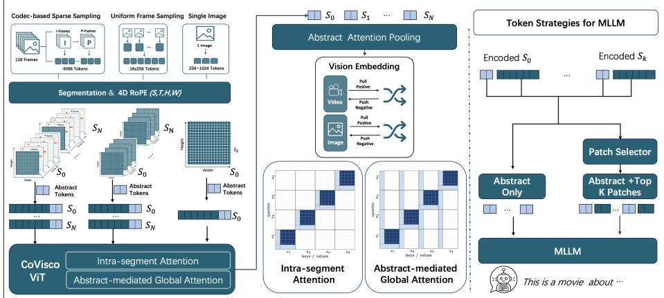
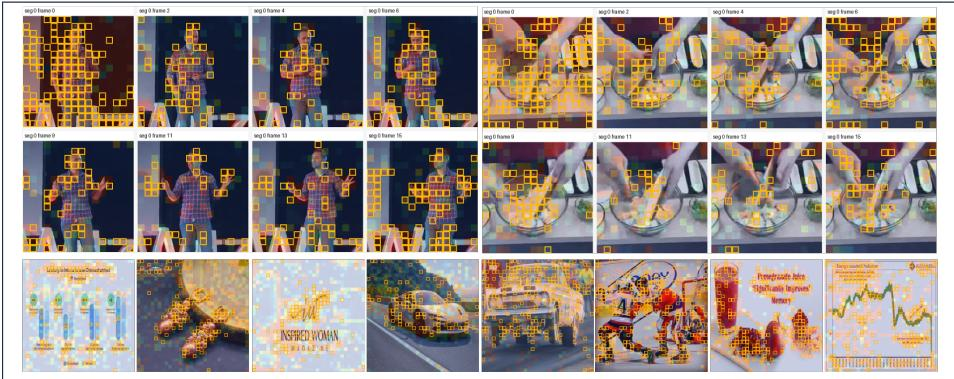

# CoVisco: Codec-Native Vision Encoder with Native Token Compression for Unified Image-Video Understanding

Yulong Liu<sup>1,2</sup>, Xiaotian Han<sup>∗1</sup>, Junyuan Shang<sup>1</sup>, Yuchen Ding<sup>1</sup>, Zhenyu Zhang<sup>1</sup>, Shuohuan Wang<sup>1</sup>, Guibo Zhu<sup>3</sup>, Sirui Han<sup>†2</sup>, and Dianhai Yu<sup>1</sup>

<sup>1</sup>ERNIE Team, Baidu Inc.

<sup>2</sup> The Hong Kong University of Science and Technology <sup>3</sup>Institute of Automation, Chinese Academy of Sciences (CASIA)

October 1, 2026

## Abstract

Vision-language models face a fundamental scaling bottleneck: the number of visual tokens grows with both temporal duration and spatial resolution, making long-video understanding expensive for the vision encoder and the language model. Existing methods often compress visual tokens after dense encoding, creating a mismatch between the representation used during training and the compact interface required at deployment. We present CoVisco, a codec-native vision encoder with native token compression for unified image-video understanding. By combining codec native input support with segmented attention, CoVisco can encode long visual inputs in a single forward pass without forming dense patch-topatch interactions across all frames. Each temporal segment is equipped with learnable abstract tokens that learn a compact segment-level representation, while fine-grained patch tokens remain available throughout the encoder. Alternating intra-segment and abstract-communication layers preserve video-level context through the abstract-token channel. A lightweight selector further exposes either abstract tokens alone or abstract tokens augmented with a runtime-selected subset of patch tokens, yielding a compact visual interface that reduces the visual context and prefill burden of downstream MLLMs while retaining fine-grained evidence when needed. Pretrained with contrastive objectives on 565M image–text pairs and 6.4M videos, CoVisco shows competitive performance on videooriented embedding and multimodal understanding benchmarks. In the

evaluated four-segment, 64-frame setting, abstract-only inference uses only 400 visual tokens while achieving video-understanding performance close to, and on some benchmarks exceeding, OneVision-Encoder. Selected patch tokens further improve fine-grained video reasoning. Project URL: https://github.com/ernie-research/CoVisco.git

## 1 Introduction

Unified vision-language models must process images and videos through a common visual interface, but video token counts grow with both duration and spatial resolution. A 256-frame video at 448 × 448 already corresponds to roughly 262K patch tokens, creating a bottleneck for both visual encoding and LLM prefill. The central challenge is therefore not only how to sample frames, but how to learn a visual representation whose bandwidth can adapt to the downstream task [14, 1].

Most existing methods address this bottleneck after dense visual encoding, by pruning, merging, or summarizing patch tokens before they reach the LLM [4, 2, 14, 16]. Such post-hoc compression can create a train–deploy mismatch: the encoder is trained with dense patch flow, but the deployed interface must preserve information after many tokens have been removed. This is especially problematic for video, where brief actions, small objects, or text may occupy only a few patches in a few frames. Encoder-internal compression improves this alignment, but methods that retain only a compressed trace can permanently remove evidence needed for OCR, spatial reasoning, or fine-grained temporal understanding.

Recent codec-native encoders use motion and residual signals to reduce the visual input before or during encoding, including OneVision-Encoder [24] and Mage-VL [30]. CoVisco combines this codec-native input capability with a segmented vision architecture designed for long visual inputs. Its segmented attention avoids dense patch-to-patch interaction across the full temporal sequence, while abstract-mediated global attention preserves video-level communication through a compact channel. As a result, CoVisco can encode longer videos, including 256-frame inputs, in a single forward pass and expose only a compact visual interface to the downstream MLLM, reducing the visual context and prefill burden it must process. In codec mode, codec-based selection first reduces the input, after which abstract tokens and the selector determine which encoded tokens are exposed to the LLM. The same abstract-token interface and segmented attention also handle uniformly sampled and frame-collage inputs. Unlike methods that equate compression with permanent deletion, CoVisco preserves fine-grained patch tokens inside the encoder and exposes them on demand.

We present CoVisco (COdec-native VISion encoder with native token COmpression), a unified image-video encoder built around three ideas. First, each segment contains learnable abstract tokens that are directly pooled by complementary image–text, image–image, and video–text objectives, providing a compact segment representation. Second, alternating intra-segment and abstractcommunication layers restrict cross-segment interaction to the abstract-token channel, enabling long visual inputs to be encoded without dense patch-to-patch attention across all frames. Third, a lightweight selector exposes abstract-only or abstract-plus-top-K outputs to the LLM, providing a compact visual interface that reduces the visual context and prefill burden of downstream MLLMs while preserving fine-grained evidence for detail-sensitive tasks. The same encoder supports both codec-native input and uniformly sampled or frame-collage input.

Across the reported evaluations, CoVisco provides a compact unified interface: it supports codec-native and uniform visual inputs, encodes long videos with segmented abstract-mediated attention, and exposes as few as 400 visual tokens to the downstream LLM in the evaluated 64-frame setting. It is competitive with selected larger models on video-oriented representation and understanding tasks, while image and visual-document performance remains weaker, particularly for OCR-heavy benchmarks. Our contributions are threefold:

1. Native compact representation with preserved fine-grained flow. Abstract tokens learn a compact representation inside the ViT, while patch tokens remain available for full-token or top-K downstream use.

2. Abstract-mediated segmented video encoding. Alternating attention layers restrict cross-segment interaction to abstract tokens, avoiding dense patch-to-patch attention while retaining a global communication path.

3. Dynamic unified image-video interface. A selector supports abstractonly and abstract-plus-top-K deployment across codec, uniform, and collage inputs, and a unified multi-resolution pretraining recipe transfers across retrieval and language-conditioned understanding tasks.

## 2 Related Work

## 2.1 Vision encoders and codec-native video processing

Contrastive vision encoders such as CLIP, SigLIP, SigLIP2, and MetaCLIP [21, 31, 25, 29] form the standard visual front-end for VLMs. Recent systems such as MoonViT [13] support native-resolution inputs, while OneVision-Encoder [24] shows that codec motion and residual signals can provide useful input sparsity. Long-video systems further combine frame sampling, temporal aggregation, positional encoding, codec-aware selection, or streaming memory. Sampling-based methods reduce frames or merge patches before encoding; codecstructured methods such as CoViAR, EMA, OneVision-Encoder, and Mage-VL exploit compressed-video structure; and streaming methods maintain a compact temporal memory [28, 34, 24, 30, 3, 32]. These approaches expose a trade-of between temporal coverage, computational cost, and fine-grained evidence. Co-Visco supports both codec-native and uniform frame inputs, while its segmented attention routes cross-segment communication through abstract tokens for either input type.

## 2.2 Visual token compression and compact interfaces

Post-hoc methods prune, merge, or summarize tokens after visual encoding, including importance-based dropping, token merging, and query-based summarization [22, 18, 4, 2, 19, 14, 16]. They are easy to attach to existing VLMs, but the dense encoder is not necessarily trained for the deployed compressed interface. Pretraining-time methods such as Video-LaVIT and OneVision-Encoder use codec-derived signals during visual encoding, while LLaVA-UHD v4 places early compression inside shallow ViT layers [12, 24, 6]. Learned query interfaces such as Perceiver, BLIP-2, and Chat-UniVi provide compact summaries, but typically replace or aggregate away fine-grained patch tokens [8, 14, 11]. Recent studies also question whether attention importance reliably identifies redundancy and whether common benchmarks isolate compression sensitivity [27, 26, 17]. CoVisco instead supervises abstract tokens as a compact segment representation and the exclusive cross-segment communication channel, while preserving the fine-grained patch stream for full-token or top-K use. This yields an adjustable interface that separates compression from permanent deletion.

## 3 Method

We present CoVisco, a codec-native vision encoder with a compact token interface. The model interface, segmented attention, pretraining objectives, token selector, and training curriculum are described below; Figure 1 summarizes the design.

## 3.1 Problem setup and model interface

Given a video of T frames at resolution $H \times W ,$ patchify with patch size $p = 1 4$ into $n _ { \mathrm { f } } ~ = ~ \lceil H / p \rceil \lceil W / p \rceil$ tokens per frame. The video is partitioned into S temporal segments. During pretraining, videos use four segments with a default temporal span of $T _ { \mathrm { s e g } } = 3 2$ frames per segment. At inference, the number of segments and the number of frames assigned to each segment are runtimeconfigurable and need not match the pretraining configuration; in particular, the per-segment frame count may difer from 32, as reported in Section 4.3. For images, S = 1. Each segment carries Q learnable abstract tokens $( Q = 1 0 0 )$ , so a segment with $T _ { \mathrm { s e g } }$ frames holds $n = n _ { \mathrm { f } } T _ { \mathrm { s e g } } + Q$ tokens in total. The encoder is a ViT-L backbone (24 layers, hidden size $d = 1 0 2 4$ , 16 heads, ∼300M parameters) shared by images and videos; an image is simply the degenerate case $S = 1$

The goal is twofold: (i) learn a compact representation—of size $O ( S { \cdot } Q )$ —that is useful for retrieval and coarse understanding, while preserving fine-grained tokens for optional downstream access; and (ii) keep long-video computation tractable while avoiding dense cross-segment patch-to-patch attention.

The encoder has three functional levels: patch tokens preserve local evidence, abstract tokens summarize each segment, and abstract-mediated attention provides video-level context. The selector exposes these levels through abstract-only, abstract-plus-top-K, or full-token strategies.

  
Figure 1: Framework of CoVisco. (1) The input video is divided into temporal segments and converted into visual tokens using codec-based, uniform, or collage sampling. (2) Inside the ViT, alternating attention blocks perform full attention within each segment and abstract-mediated communication across segments. The central attention maps make this distinction explicit. Each segment contains learnable abstract tokens and fine-grained patch tokens. (3) The ViT outputs both token types: abstract tokens are pooled and supervised by image–text, image–image, and video–text contrastive objectives, whereas fine-grained tokens are preserved throughout the encoder and remain available to a lightweight selector. At inference, the two outputs support abstract-only, abstract-plus-top-K, and full-token modes.

The visual pipeline is input → patch embedding and segmentation → abstracttoken augmented ViT → two output paths. The abstract path pools the final abstract-token states for contrastive pretraining and compact language-model input, while the patch path preserves the final patch-token states for optional selector-based access. Given S segments with m visible patch tokens per segment, patchification produces $\mathbf { X } \in \mathbb { R } ^ { S \times m \times d }$ . A shared learnable abstract-token matrix $\mathbf { Q } \in \mathbb { R } ^ { Q \times d }$ is expanded over the segments and prepended to form

$$
{ \bf H } _ { s } ^ { ( 0 ) } = [ { \bf Q } \| { \bf X } _ { s } ] \in \mathbb R ^ { ( Q + m ) \times d } , \qquad s = 1 , \ldots , S .\tag{1}
$$

The resulting segment sequences pass through the alternating segmented ViT layers described in Section 3.3; 4D RoPE is applied to the visible tokens using their segment, temporal, and spatial coordinates. At the output, the sequence is split into abstract tokens $\mathbf { A } \in \mathbb { R } ^ { S \times Q \times d }$ and fine-grained patch tokens $\mathbf { \bar { P } } \in \mathbb { R } ^ { S \times m \times d }$ The abstract path pools A and applies the three contrastive projection heads described in Section 3.5, while the patch path preserves P for the selector. For multimodal generation, the selected visual sequence is mapped by a trainable MLP projector into the input space of the downstream language model. Therefore, the language model can receive A alone, A together with the selector’s top-K tokens from P, or all visual tokens, without changing the pretrained ViT.

## 3.2 Abstract tokens as a compact interface

Each segment is prefixed with a shared set of Q learnable parameters $\mathbf { Q } \in$ $\mathbb { R } ^ { Q \times d }$ , so the input to the encoder is $\left[ \mathbf { Q } \parallel \mathbf { x } _ { 1 } \ldots \mathbf { x } _ { n _ { \mathrm { f } } T _ { \mathrm { s e g } } } \right]$ per segment. Crucially, only abstract tokens are directly pooled by the contrastive heads (Section 3.5). The contrastive signal therefore passes through $S \cdot Q$ output tokens, encouraging them—as a consequence of the training objective—to become suficiently informative for retrieval and coarse understanding. We use “native compression” to refer to this learned, compact output interface inside the vision encoder; it does not imply that all fine-grained tokens are pruned during the ViT forward pass. Patch tokens are not directly supervised by the contrastive heads, but they participate in every layer, receive indirect gradient signals through the abstract representations, and remain available for downstream use (Section 3.6).

The design separates two roles: abstract tokens provide the compact supervised representation, while patch tokens preserve fine-grained information for optional downstream use.

## 3.3 Segmented attention and abstract-mediated communication

The 24 encoder layers alternate between two attention patterns.

Let N denote the original number of patch tokens before adding abstract tokens, let the $N$ patch tokens be divided evenly into $S$ segments, and let $m = N / S$ be the number of patch tokens per segment. Each segment therefore contains $n = m + Q$ tokens after adding its $Q$ abstract tokens.

Intra-segment layers. Tokens attend fully within their own segment; the per-layer cost is $O ( S ( m + Q ) ^ { 2 } )$ . Abstract-communication layers. Each query token attends to local patch tokens and the $S Q$ abstract tokens from all segments, with cost $O ( S ( m + Q ) ( m + S Q ) )$ . Thus, cross-segment information flows exclusively through abstract tokens. Compared with dense attention over N patch tokens, the leading patch-to-patch term changes from $O ( N ^ { 2 } )$ to $O ( N ^ { 2 } / S )$ ， with additional abstract communication terms. This alternating structure also defines the model’s inductive bias: segment summaries retain persistent semantics while fine-grained tokens preserve local evidence. Full derivations are given in Appendix B.

## 3.4 Four-dimensional positional encoding

We extend the 3D RoPE of prior codec-native encoders with a segment axis. The rotary embedding factorizes head-dim frequencies into four groups with a 2:4:5:5 split over (S, T, H, W): segments, being coarse, receive the least positional bandwidth, while space receives the most. Patch positions are computed on the full unpruned spatio-temporal grid (a virtual grid of $S \times ( T _ { \mathrm { s e g } } + 1 ) \times h \times w )$ and then gathered for whichever subset of patches is actually visible—so sparsity from codec sampling or token selection does not change the underlying geometry, mirroring the shared positional encoding principle of OneVision-Encoder [24].

Abstract tokens are assigned a reserved temporal index $t = 0$ and a $1 0 \times 1 0$ spatial layout $( Q = 1 0 0 )$ , providing a stable positional layout distinct from the real frame tokens.

## 3.5 Contrastive pretraining of CoVisco ViT

Objectives. Pooled abstract tokens are passed to an attention-pooling head and three projection heads trained with image–text, image–image, and video–text SigLIP losses[31]. Because supervision reaches the encoder only through abstract tokens, all three objectives shape the compact representation.

Data and targets. We use 480M LAION-2B image–caption pairs, 85M pairs from mvp-lab/LLaVA-OneVision-1.5-Mid-Training-85M, and 6.4M 30/60-second videos from mvp-lab/LLaVA-OneVision-2-Data. Target embeddings are preextracted: SigLIP2 image/text targets are used for the LAION stream, and Qwen3-VL-Embedding-8B text targets for the 85M image and video-caption streams. The three heads map to the corresponding target spaces. The image and video streams are mixed during training with per-stream batch sizes and gradient accumulation.

Training recipe. Images use dynamic resolutions {224, 336, 448}; videos use $2 2 4 \times 2 2 4$ inputs and four segments. Global batch sizes are 32K for images and 3,200 for videos. Codec and uniform sampling are each used with probability 1/2; the uniform branch samples 16 frames and uses frame collage with probability 1/2. For the codec branch, we use input candidates derived from H.265/HEVC (High Eficiency Video Coding). Codec-derived visual candidates are selected independently within each segment with a fixed per-segment token budget, and are then organized into the segment structure before entering the ViT. This per-segment constraint is applied to both training and evaluation data; the per-segment budget itself is not required to be identical between training and inference.

Positional augmentation. During training, we randomly apply a global ofset to the segment IDs of both image and video inputs. This augmentation exposes the ViT to a broader range of segment positions and helps it handle inference inputs whose segment IDs extend beyond those used during training. For single-image inputs, we likewise randomly shift the temporal IDs assigned to the image patch tokens, while keeping the reserved temporal index of the abstract tokens unchanged. This prevents the model from over-specializing to the first-frame temporal position when processing images.

## 3.6 Token selection and token strategies for MLLM

While abstract tokens sufice for retrieval and coarse understanding, tasks such as OCR, spatial grounding, and fine-grained temporal reasoning need fine-grained evidence. CoVisco therefore trains a lightweight token selector that ranks the encoder’s patch tokens for a given input, and supports a continuum of deployment modes. In codec mode, these patch tokens are already the subset retained by codec-based input selection; the selector therefore performs a second,

LLM-oriented compression over the codec-selected stream. The selector follows the DynamicViT-style diferentiable score-gating idea for hard token selection [22], while using a segment-aware scoring transformer that is tailored to our abstract-token interface. In our default configuration, the scoring transformer contains two layers. Each layer first contextualizes patch tokens within their own segment, then lets each patch token attend to the abstract tokens of that segment, and finally applies a feed-forward network. The resulting patch representations are mapped to scalar keep scores, and the selector chooses top-K patches independently for each segment. Appendix A gives the selector’s tensor shapes and layer-level implementation details.

• Abstract-only: feed the LLM the S · Q abstract tokens (exactly 400 tokens in the evaluated 64-frame, four-segment setting);

• Abstract-plus-top-K: augment the abstract tokens with the K highestranked patch tokens from each segment, for a total of $S ( Q + K )$ visual tokens. Here, K is a runtime budget parameter that exposes a controllable accuracy–context trade-of;

• Full: expose all patch tokens when the visual context budget is unconstrained.

The selector is trained with Qwen3-1.7B on 1M images and 1M videos while the ViT remains frozen; the selector, projector, and LLM are trainable. Images are processed at their native resolutions, whereas videos use 224 × 224 inputs. This preserves the pretrained visual backbone and lets the selector retain fine-grained evidence when abstract tokens alone are insuficient.

## 3.7 Training data and curriculum

The entire training pipeline in this work consists of three stages, using the following data and trainable modules: (1) contrastive pretraining of the ViT on the image and video streams described above, followed by freezing the ViT; (2) training the selector, projector, and Qwen3-1.7B on 1M images and 1M videos with the ViT frozen, using native-resolution images and 224 × 224 video inputs; and (3) instruction tuning of Qwen3-4B-Instruct-2507 and the projector on 740K LLaVA-Next image instructions and 800K LLaVA-Next-Videos samples, with the ViT and selector frozen. During instruction tuning, images are also processed at their native resolutions, whereas videos use 224 × 224 inputs.

Compute. ViT contrastive pretraining was conducted on 32 H800 GPUs. MLLM supervised fine-tuning (SFT) was conducted on 16 H800 GPUs.

## 4 Experiments

## 4.1 Evaluation as a unified embedding model

We first ask whether CoVisco learns a representation that remains useful when the input modality and downstream objective change. This is a stronger test than measuring only the quality of the visual features on the task used for pretraining: a unified encoder should support image recognition, image–text matching, video understanding, and visual-document retrieval through a common embedding interface. We therefore evaluate CoVisco in two complementary settings: zeroshot image classification and image–text retrieval, followed by MMEB-V2, which covers image, video, and visual-document embedding tasks.

Table 1: Zero-shot image classification and image-text retrieval reference. Results are adapted from the SigLIP 2 zero-shot comparison [25]; only the ViT-L/14 and ViT-L/16 blocks are retained. Best values within each block are in bold formatting.
<table><tr><td></td><td></td><td></td><td></td><td colspan="4">ImageNet-1k</td><td colspan="2">COCO</td><td colspan="2">Flickr</td><td colspan="2">XM3600</td></tr><tr><td>ViT</td><td>Res.</td><td>Seq.</td><td>Model</td><td>val</td><td>v2</td><td>ReaL</td><td>ObjNet</td><td>T→I</td><td>I→T</td><td>T→I</td><td>I→T</td><td>T→I</td><td>I→T</td></tr><tr><td rowspan="6">L/14</td><td rowspan="6"></td><td rowspan="6">224 256</td><td>OpenCLIP [7]</td><td>74.0</td><td>61.1</td><td></td><td>66.4</td><td>46.1</td><td>62.1</td><td>75.0</td><td>88.7</td><td></td><td></td></tr><tr><td>CLIP [21]</td><td>75.5</td><td>69.0</td><td></td><td>69.9</td><td>36.5</td><td>56.3</td><td>65.2</td><td>85.2</td><td></td><td></td></tr><tr><td>MetaCLIP [29]</td><td>79.2</td><td>72.6</td><td></td><td>74.6</td><td>55.7</td><td></td><td>83.3</td><td></td><td></td><td></td></tr><tr><td>CLIPA-v2 [15]</td><td>79.7</td><td>72.8</td><td></td><td>71.1</td><td>46.3</td><td>64.1</td><td>73.0</td><td>89.1</td><td></td><td></td></tr><tr><td>EVA-CLIP [23]</td><td>79.8</td><td>72.9</td><td></td><td>75.3</td><td>47.5</td><td>63.7</td><td>77.3</td><td>89.7</td><td></td><td></td></tr><tr><td>DFN [5]</td><td>82.2</td><td>75.7</td><td></td><td>74.8</td><td>59.6</td><td></td><td>84.7</td><td></td><td></td><td></td></tr><tr><td colspan="3">448</td><td>CoVisco (ours)</td><td>71.5</td><td>64.0</td><td>78.7</td><td>61.1</td><td>47.5</td><td>66.4</td><td>75.3</td><td>91.1</td><td>47.7</td><td>60.5</td></tr><tr><td rowspan="5">L/16</td><td rowspan="2">256</td><td rowspan="2">1024 256</td><td>CoVisco (ours)</td><td>73.3</td><td>66.1</td><td>80.3</td><td>65.1</td><td>48.5</td><td>67.0</td><td>77.3</td><td>92.1</td><td>47.4</td><td>60.2</td></tr><tr><td>SigLIP [31]</td><td>80.5</td><td>74.2</td><td>85.9</td><td>77.9</td><td>51.2</td><td>69.6</td><td>81.3</td><td>92.0</td><td>30.9</td><td>40.1</td></tr><tr><td rowspan="2"></td><td rowspan="2">576</td><td>SigLIP2[25]</td><td>82.5</td><td>76.8</td><td>87.3</td><td>83.0</td><td>54.7</td><td>71.5</td><td>84.1</td><td>94.5</td><td>46.5</td><td>56.5</td></tr><tr><td>SigLIP [31]</td><td>82.1</td><td>75.9</td><td>87.1</td><td>80.9</td><td>52.8</td><td>70.5</td><td>82.6</td><td>92.9</td><td>31.4</td><td>39.7</td></tr><tr><td>384 512</td><td>1024</td><td>SigLIP2[25] SigLIP2[25]</td><td>83.1 83.5</td><td>77.4 77.8</td><td>87.6 87.7</td><td>84.4 84.6</td><td>55.3 55.2</td><td>71.4 72.1</td><td>85.0 85.3</td><td>95.2 95.8</td><td>47.1 47.4</td><td>56.3 56.7</td></tr></table>

Evaluation configuration. In both settings, we use the visual representation produced by the encoder, without an LLM or LLM-side token selection. Zero-shot classification and image–text retrieval use the image output of CoVisco at the resolutions and sequence lengths listed in Table 1; the reference values are retained from the corresponding SigLIP 2 comparison. MMEB-V2 instead evaluates the pooled abstract-token representation with the benchmark’s standard classification and retrieval protocol. Thus, the MMEB-V2 results directly test whether the compact representation learned inside the ViT retains task-relevant information across modalities, rather than only whether it can serve as an input interface for a language model.

Zero-shot image transfer. Table 1 reports zero-shot image classification and image–text retrieval results. We retain the L/14 and L/16 blocks from the SigLIP 2 comparison to contextualize the image-side transfer of CoVisco, which is trained as a unified image–video encoder with a compact abstract-token interface.

Table 1 shows that CoVisco preserves a usable image-side representation while sharing the same encoder with videos. At 224 resolution, it obtains 71.5/64.0 on ImageNet-1k val/v2, 66.4 on COCO image-to-text retrieval, and 91.1 on

Table 2: Results on the MMEB-V2 benchmark [20]. CLS: classification, RET: retrieval, VDR: ViDoRe, VR: VisRAG. <sup>†</sup>: link to the model’s homepage.
<table><tr><td rowspan="2"></td><td rowspan="2">Vision Tower</td><td rowspan="2">Image</td><td colspan="2">Video</td><td colspan="3">VisDoc</td></tr><tr><td>CLS</td><td>CLS RET</td><td>VDRv1</td><td>VDRv2</td><td>VR</td></tr><tr><td># of Datasets →</td><td></td><td>10</td><td>5</td><td>5</td><td>10</td><td>4</td><td>6</td></tr><tr><td>VLM2Vec [10]</td><td>2B</td><td>58.7</td><td>33.4</td><td>20.6</td><td>49.8</td><td>13.5</td><td>51.8</td></tr><tr><td>VLM2Vec-V2 [20]</td><td>2B</td><td>62.9</td><td>39.3</td><td>28.8</td><td>75.5</td><td>44.9</td><td>79.4</td></tr><tr><td>GME [33]</td><td>2B</td><td>54.4</td><td>34.9</td><td>25.6</td><td>86.1</td><td>54.0</td><td>82.5</td></tr><tr><td>Ops-MM-embedding-v1†</td><td>2B</td><td>68.1</td><td>53.6</td><td>41.8</td><td>76.4</td><td>53.2</td><td>77.6</td></tr><tr><td>RzenEmbed [9]</td><td>2B</td><td>68.5</td><td>50.4</td><td>46.6</td><td>87.1</td><td>55.1</td><td>87.2</td></tr><tr><td>VLM2Vec [10]</td><td>8B</td><td>62.7</td><td>39.1</td><td>29.0</td><td>56.9</td><td>9.4</td><td>59.1</td></tr><tr><td>GME [33]</td><td>8B</td><td>57.7</td><td>37.4</td><td>28.4</td><td>89.4</td><td>55.6</td><td>85.0</td></tr><tr><td>Ops-MM-embedding-v1†</td><td>8B</td><td>69.7</td><td>59.7</td><td>45.7</td><td>80.1</td><td>59.6</td><td>79.3</td></tr><tr><td>RzenEmbed [9]</td><td>8B</td><td>70.6</td><td>58.8</td><td>51.0</td><td>89.7</td><td>60.7</td><td>88.7</td></tr><tr><td>IFM-TTE†</td><td>8B</td><td>76.7</td><td>60.5</td><td>51.7</td><td>85.2</td><td>71.5</td><td>92.7</td></tr><tr><td>Seed-1.6-embedding-0615†</td><td>-</td><td>76.1</td><td>55.0</td><td>51.3</td><td>85.3</td><td>56.6</td><td>84.7</td></tr><tr><td>Seed-1.6-embedding-1215†</td><td>-</td><td>75.0</td><td>85.2</td><td>59.1</td><td>90.0</td><td>60.3</td><td>90.0</td></tr><tr><td>Qwen3-VL-Embedding-2B</td><td>2B</td><td>70.3</td><td>71.9</td><td>53.9</td><td>84.4</td><td>65.3</td><td>86.4</td></tr><tr><td>Qwen3-VL-Embedding-8B</td><td>8B</td><td>74.2</td><td>78.4</td><td>58.7</td><td>87.2</td><td>69.9</td><td>88.7</td></tr><tr><td>CoVisco (ours)</td><td>0.3B</td><td>55.1</td><td>65.1</td><td>46.2</td><td>61.8</td><td>42.6</td><td>63.8</td></tr></table>

Flickr image-to-text retrieval; increasing the resolution to 448 improves these to 73.3/66.1, 67.0, and 92.1, respectively. The improvement across both recognition and retrieval indicates that the representation retains spatially useful information and is not tied to a single fixed input grid. More importantly, these image results complement the video results below: the compact interface learned by the unified encoder is usable for both single-image semantics and cross-modal matching, rather than being specialized only for temporal inputs. The gap to the strongest L/14 and L/16 image encoders also makes clear that unification comes with a trade-of in peak image-only accuracy, but the results establish a meaningful image-side transfer capability for a model whose primary design goal is unified, codec-native image–video encoding.

MMEB-V2 evaluation. Table 2 evaluates the pooled abstract-token representation on image, video, and visual-document embedding tasks using the benchmark’s standard classification and retrieval protocols. No language model or LLM-side token selection is involved, allowing us to measure the transferability of the compact representation itself.

Despite using only a 0.3B vision tower, CoVisco transfers across all three benchmark families through the same abstract-token space. Its clearest strength is video: it obtains 65.1 on video classification and 46.2 on video retrieval, exceeding the listed 2B and 8B open-source baselines on video classification except the Qwen3-VL embedding models, while remaining close to larger models on video retrieval. The representation therefore preserves temporal information that is useful for both discrimination and cross-modal matching, rather than serving only as a compression target for the downstream VLM.

The transfer is broad but not uniform. Image classification reaches 55.1, while visual-document scores are 61.8/42.6/63.8 on ViDoRe-v1, ViDoRe-v2, and VisRAG, respectively, below the strongest larger baselines, particularly on OCRand document-centric tasks. We thus view MMEB-V2 as evidence that the learned representation is useful across diferent tasks and modalities, not as a claim of state-of-the-art performance on every benchmark: with a 0.3B vision tower, one shared compact representation supports image recognition, video understanding, video retrieval, and document retrieval, with especially strong transfer to video.

## 4.2 LMM Probing Evaluation

Evaluation configuration. All multimodal understanding experiments use Qwen3-4B-Instruct-2507 as the language backbone. We compare codec-guided and uniformly sampled frame inputs. For CoVisco, the LLM-side visual-token budget is S · Q for abstract-only inference and $S ( Q + K )$ for abstract-plus-top-K inference, where K is the number of selected patch tokens per segment. This budget is distinct from the input budget processed by the ViT. In the video benchmarks, codec inputs use the original H.265/HEVC stream without reencoding; uniform inputs use 8 sampled frames for the reference models. The matched OneVision-Encoder codec setting uses 10,368 codec-selected tokens from 64 frames, while its dense frame setting uses 8 frames at 504 × 504; SigLIP2 uses 8 frames at $5 1 2 \times 5 1 2$ . CoVisco codec inputs are evaluated at 224 × 224 and 504 × 504, with 10,368 codec-selected ViT input tokens, and the dense 64-frame condition is reported separately. For image benchmarks, all images preserve their native resolutions. Token budgets refer to visual context or encoder input as specified.

Table 3 and Table 4 compare vision encoders under a unified multimodal setting with Qwen3-4B-Instruct-2507 as the language backbone.

The multimodal results show that the value of the compact interface depends on the granularity of evidence required by the task. On video benchmarks, the abstract-only setting already exposes just 400 visual tokens in the foursegment configuration, yet remains competitive with references that forward 10,368 visual tokens to the language model. This indicates that the abstract tokens capture suficient segment-level and temporal context for many video questions. Adding a small number of selected patches provides a consistent gain on the more detail-sensitive video metrics: for example, in the 224-resolution frame setting, increasing the fine-grained retention ratio from 0.0 to 0.2 improves VideoMME from 53.5 to 57.0 and LongVideoBench-Val-V from 47.3 to 52.7. The same pattern is visible in the codec setting, where the 0.4 configuration improves VideoMME from 52.9 to 55.7 and LongVideoBench-Val-V from 48.0 to 50.5. Thus, the results support a division of labor: abstract tokens provide a compact global summary, while selected patches restore localized evidence when the question depends on a small object, text region, or brief event.

Table 3: Video benchmark comparison under a fixed language backbone. All models are evaluated using Qwen3-4B-Instruct-2507. OneVision-Encoder uses a 10,368-token visual budget in both its codec and uniform-frame settings; these visual tokens enter its vision encoder and are forwarded to the language model. In the codec setting, the tokens are selected from a 64-frame input using codec scores, whereas the frame setting uses 8 uniformly sampled frames at 504 × 504. SigLIP2 uses 8 uniformly sampled frames at $5 1 2 \times 5 1 2$ . For CoVisco, Codec denotes codec-guided input selection and Frame denotes uniform frame sampling. The notation is (sampling mode, input resolution, fine-grained token retention ratio for LLM); “–” indicates that the corresponding setting was not evaluated. Bold values indicate the best performance among all rows shown for each benchmark.
<table><tr><td>Model / setting</td><td></td><td></td><td>MVBench MLVU-dev NExT-QA (MC)</td><td>VideoMME</td><td>Perception Test TOMATO</td><td></td><td>LongVideoBench-Val-V</td></tr><tr><td>OV-Encoder (Codec,504,1.0)[24]</td><td>52.4</td><td>46.3</td><td>75.6</td><td>53.4</td><td>60.3</td><td>22.2</td><td>50.4</td></tr><tr><td>OV-Encoder-Frame (Frame,504,1.0)[24]</td><td>49.8</td><td>49.4</td><td>71.9</td><td>49.3</td><td>56.7</td><td>21.8</td><td>45.5</td></tr><tr><td>SigLIP2 (Frame,512,1.0)[25]</td><td>47.2</td><td>48.4</td><td>70.6</td><td>46.8</td><td>56.0</td><td>22.3</td><td>45.2</td></tr><tr><td>CoVisco (Codec,224,0.0)</td><td>55.8</td><td>57.8</td><td>72.8</td><td>52.9</td><td>58.7</td><td>25.1</td><td>48.0</td></tr><tr><td>CoVisco (Codec,224,0.4)</td><td>56.7</td><td>58.5</td><td>74.0</td><td>55.7</td><td>59.7</td><td>26.0</td><td>50.5</td></tr><tr><td>CoVisco (Codec,504,0.0)</td><td>53.2</td><td>56.7</td><td>69.9</td><td>51.3</td><td>56.1</td><td>25.1</td><td>47.3</td></tr><tr><td>CoVisco (Codec,504,0.4)</td><td>53.2</td><td>56.7</td><td>71.3</td><td>53.0</td><td>57.0</td><td>26.4</td><td>48.2</td></tr><tr><td>CoVisco (Frame,224,0.0)</td><td>56.0</td><td>61.2</td><td>73.5</td><td>53.5</td><td>59.0</td><td>25.5</td><td>47.3</td></tr><tr><td>CoVisco (Frame,224,0.2)</td><td>56.9</td><td>59.8</td><td>73.9</td><td>57.0</td><td>59.5</td><td>25.7</td><td>52.7</td></tr><tr><td>CoVisco (Frame,224,0.4)</td><td>56.4</td><td>59.6</td><td>73.5</td><td>57.0</td><td>59.0</td><td>24.9</td><td>52.2</td></tr></table>

The comparison also separates two forms of selection that should not be conflated. Codec-guided selection reduces the visual input processed by the encoder, whereas the learned selector controls the visual context forwarded to the language model. The dense 64-frame condition further shows that the segmented architecture can retain useful performance when temporal coverage is not reduced at the input. In contrast, the image results improve sharply as more fine-grained tokens are exposed: for example, DocVQA rises from 20.5 in abstract-only mode to 75.1 at a retention ratio of 0.8. Nevertheless, the image-centric scores remain below the strongest baselines, especially on OCR-heavy tasks, suggesting that compact segment summaries alone are not a substitute for high-resolution text evidence and OCR-oriented pretraining.

These quantitative trends motivate a closer look at what the learned selector actually retains. If the selected patches are complementary to the abstract tokens, they should concentrate on localized regions that are dificult to represent with a segment-level summary, rather than simply reproducing the same global content. Figure 2 provides this qualitative diagnostic. It is not intended as evidence of selector optimality, but illustrates that the retained patches commonly cover objects, text, and localized temporal changes, ofering an interpretable counterpart to the accuracy gains observed above.

Table 4: Image benchmark comparison under a fixed language backbone. All models are evaluated using Qwen3-4B-Instruct-2507. Codec denotes codec-guided input selection, whereas Frame denotes uniform frame sampling. Each setting is written as (sampling mode, input resolution, fine-grained token retention ratio for LLM); “–” indicates that the corresponding setting was not evaluated. Bold values indicate the best performance among all rows shown for each benchmark.
<table><tr><td>Model / setting</td><td>AI2D</td><td>ChartQA</td><td>DocVQA</td><td>InfoVQA</td><td>MMBench-EN</td><td>OCRBench</td><td>OCRBench v2</td><td>MMStar</td><td>RealWorldQA</td></tr><tr><td>OV-Encoder (Codec,native,1.0)[24]</td><td>75.7</td><td>76.5</td><td>78.4</td><td>43.1</td><td>77.2</td><td>605</td><td>26.3</td><td>52.1</td><td>60.8</td></tr><tr><td>OV-Encoder-Frame (Frame,native,1.0)[24]</td><td>76.5</td><td>77.8</td><td>79.5</td><td>45.5</td><td>78.5</td><td>630</td><td>26.1</td><td>54.3</td><td>61.2</td></tr><tr><td>SigLIP2 (Frame,native,1.0)[25]</td><td>78.6</td><td>76.4</td><td>75.0</td><td>42.0</td><td>79.6</td><td>621</td><td>26.1</td><td>55.0</td><td>62.1</td></tr><tr><td>CoVisco (Frame,native,0.0)</td><td>66.8</td><td>17.4</td><td>20.5</td><td>20.7</td><td>68.2</td><td>261</td><td>21.2</td><td>43.8</td><td>45.5</td></tr><tr><td>CoVisco (Frame,native,0.2)</td><td>67.9</td><td>51.8</td><td>64.0</td><td>32.1</td><td>70.9</td><td>474</td><td>24.0</td><td>45.7</td><td>52.8</td></tr><tr><td>CoVisco (Frame,native,0.8)</td><td>69.8</td><td>68.8</td><td>75.1</td><td>42.2</td><td>71.8</td><td>567</td><td>24.0</td><td>48.8</td><td>54.1</td></tr><tr><td>CoVisco (Frame,native,1.0)</td><td>70.5</td><td>70.7</td><td>75.5</td><td>44.1</td><td>71.6</td><td>576</td><td>24.4</td><td>48.3</td><td>53.3</td></tr></table>

  
Figure 2: Qualitative visualization of the token selector on images and videos. Yellow boxes mark fine-grained patch tokens retained by the selector. The selected regions typically focus on objects, text, and localized changes, illustrating how selected patch tokens complement the abstract-token summaries.

## 4.3 Long video understanding with diferent segment configuration

Evaluation configuration. We study whether the compact abstract-token interface remains reliable when the temporal granularity changes at inference time. All experiments use Qwen3-4B-Instruct-2507 and the abstract-only interface with $Q = 1 0 0$ abstract tokens per segment and $2 2 4 \times 2 2 4$ visual inputs. The language model is SFT-tuned with four segments, but evaluation changes the number of sampled frames (64, 128, or 256), the number of segments $( S \in \{ 4 , 8 , 1 6 \} )$ ), and the sampling mode (uniform frame or codec-guided input) without retraining. Consequently, the LLM receives $S \times Q$ abstract tokens (400, 800, or 1,600 tokens), while the encoder must accommodate diferent temporal lengths and segment layouts. These experiments use the long-video setting described here and should not be confused with the 10,368-token codec-matched input budget used in the

Table 5: Long-video understanding under diferent segment configurations. The language model is SFT-tuned with four segments; evaluation changes the number of segments at inference time without retraining. All configurations use the abstract-only mode. The abstract-token budget is S × Q with Q = 100.
<table><tr><td>Benchmark</td><td>Resolution</td><td>Frames</td><td>Segments</td><td>Sampling</td><td>Token strategy</td><td>Accuracy (%)</td></tr><tr><td>MLVU</td><td>224</td><td>64</td><td>4</td><td>Frame</td><td>Abstract-only</td><td>61.2</td></tr><tr><td>MLVU</td><td>224</td><td>64</td><td>4</td><td>Codec</td><td>Abstract-only</td><td>57.8</td></tr><tr><td>MLVU</td><td>224</td><td>128</td><td>8</td><td>Frame</td><td>Abstract-only</td><td>62.6</td></tr><tr><td>MLVU</td><td>224</td><td>128</td><td>16</td><td>Frame</td><td>Abstract-only</td><td>62.3</td></tr><tr><td>MLVU</td><td>224</td><td>256</td><td>16</td><td>Frame</td><td>Abstract-only</td><td>61.3</td></tr><tr><td>MLVU</td><td>224</td><td>256</td><td>16</td><td>Codec</td><td>Abstract-only</td><td>59.9</td></tr><tr><td>LongVideoBench-Val</td><td>224</td><td>64</td><td>4</td><td>Frame</td><td>Abstract-only</td><td>47.3</td></tr><tr><td>LongVideoBench-Val</td><td>224</td><td>64</td><td>4</td><td>Codec</td><td>Abstract-only</td><td>48.0</td></tr><tr><td>LongVideoBench-Val</td><td>224</td><td>128</td><td>8</td><td>Frame</td><td>Abstract-only</td><td>49.9</td></tr><tr><td>LongVideoBench-Val</td><td>224</td><td>128</td><td>16</td><td>Frame</td><td>Abstract-only</td><td>50.2</td></tr><tr><td>LongVideoBench-Val</td><td>224</td><td>256</td><td>16</td><td>Frame</td><td>Abstract-only</td><td>50.3</td></tr><tr><td>LongVideoBench-Val</td><td>224</td><td>256</td><td>16</td><td>Codec</td><td>Abstract-only</td><td>52.4</td></tr></table>

controlled encoder comparison.

Table 5 shows that the central behavior is stable under changes in both video length and segmentation. With uniform frame sampling, MLVU varies only from 61.2 to 62.6 across 64–256 frames and from 61.2 to 62.3 when the 128-frame input is repartitioned from 8 to 16 segments. On LongVideoBench-Val, the same changes do not cause degradation: accuracy increases from 47.3 at 64 frames and four segments to 49.9–50.3 at 128–256 frames, with only a 0.3-point diference between 8 and 16 segments at 128 frames. Thus, increasing temporal coverage or changing the segment granularity does not require retuning the language model, even though the resulting abstract-token budget changes by up to four times.

This robustness is consistent with the architecture introduced in Sections 3 and B. Intra-segment attention models local temporal and spatial evidence, while abstract tokens provide the compact global communication path across segments. Changing S therefore changes where local computation is factorized, but does not remove the mechanism that carries video-level context. The results provide empirical evidence that the abstract tokens are not tied to the four-segment SFT layout; the pretrained encoder can preserve a useful global representation when a longer video is split more finely and processed in one forward pass.

The codec rows further show that this stability is compatible with codecguided input, although its efect is benchmark-dependent. On LongVideoBench-Val, codec sampling improves over uniform sampling at both 64 frames (48.0 vs. 47.3) and 256 frames (52.4 vs. 50.3), indicating that the abstract interface can exploit codec-selected visual evidence. MLVU is more sensitive to this sampling choice (57.8 at 64 frames and 59.9 at 256 frames), so the result should not be read as uniform superiority across all tasks. Rather, the consistent finding is that the segmented encoder remains usable across frame counts, segment counts, and input modes, with the largest variation attributable to the task-specific sampling policy rather than to a failure to generalize across segment configurations.

## 5 Conclusion

We introduced CoVisco, a unified image-video encoder with a native compact token interface. Abstract tokens learn segment-level representations inside the ViT, while fine-grained patch tokens remain available for downstream selection. Segmented attention routes cross-segment communication through abstract tokens, and deployment can vary from abstract-only to abstract-plus-top-K inputs. Across the reported evaluations, this design provides a compact alternative to exposing all visual patches to the language model, with the clearest benefits on video-oriented tasks: abstract-only inference provides a compact segment-level representation, while selected patch tokens can restore local evidence when fine-grained reasoning is required. The stable performance across diferent frame counts, segment configurations, and sampling modes further indicates that the abstract-token interface is not tied to a single temporal layout or inference budget.

The current results also identify several limitations. The model does not use OCR-specific pretraining, its instruction-tuning scale is modest, and the abstract-token capacity is fixed at Q = 100. Therefore, the OCR results should be interpreted as transfer measurements, and the most efective token budget remains task-dependent. Future work will improve OCR-oriented transfer and recognition performance, study the capacity–accuracy trade-of, and characterize end-to-end budget policies and eficiency more systematically. Moreover, the compact segment-level interface of CoVisco makes it naturally suited to streaming video understanding, where visual information must be encoded and updated incrementally under tight computation and latency budgets. Our current design provides a useful foundation for more tightly unified audio-visual encoding and for rethinking streaming video understanding around compact, incrementally processed representations. Developing these directions is an important avenue for future work.

## References

[1] Shuai Bai, Yuxuan Cai, Ruizhe Chen, Keqin Chen, Xionghui Chen, Zesen Cheng, Lianghao Deng, Wei Ding, Chang Gao, Chunjiang Ge, Wenbin Ge, Zhifang Guo, Qidong Huang, Jie Huang, Fei Huang, Binyuan Hui, Shutong Jiang, Zhaohai Li, Mingsheng Li, Mei Li, Kaixin Li, Zicheng Lin, Junyang Lin, Xuejing Liu, Jiawei Liu, Chenglong Liu, Yang Liu, Dayiheng Liu, Shixuan Liu, Dunjie Lu, Ruilin Luo, Chenxu Lv, Rui Men, Lingchen Meng, Xuancheng Ren, Xingzhang Ren, Sibo Song, Yuchong Sun, Jun Tang, Jianhong Tu, Jianqiang Wan, Peng Wang, Pengfei Wang, Qiuyue Wang, Yuxuan Wang, Tianbao Xie, Yiheng Xu, Haiyang Xu, Jin Xu, Zhibo Yang, Mingkun Yang, Jianxin Yang, An Yang, Bowen Yu, Fei Zhang, Hang Zhang, Xi Zhang, Bo Zheng, Humen Zhong, Jingren Zhou, Fan Zhou, Jing Zhou, Yuanzhi Zhu, and Ke Zhu. Qwen3-vl technical report. arXiv preprint arXiv:2511.21631, 2025. URL https://arxiv.org/abs/2511.21631.

[2] Daniel Bolya, Cheng-Yang Fu, Xiaoliang Dai, Peizhao Zhang, Christoph Feichtenhofer, and Judy Hofman. Token merging: Your ViT but faster. In International Conference on Learning Representations (ICLR), 2023. URL https://arxiv.org/abs/2210.09461.

[3] Joya Chen, Zhaoyang Lv, Shiwei Wu, Kevin Qinghong Lin, Chenan Song, Difei Gao, Jia-Wei Liu, Ziteng Gao, Dongxing Mao, and Mike Zheng Shou. Videollm-online: Online video large language model for streaming video. In Proceedings of the IEEE/CVF Conference on Computer Vision and Pattern Recognition (CVPR), pp. 18407–18418, 2024.

[4] Liang Chen, Haozhe Zhao, Tianyu Liu, Shuai Bai, Junyang Lin, Chang Zhou, and Baobao Chang. An image is worth 1/2 tokens after layer 2: Plug-and-play inference acceleration for large vision-language models. In Computer Vision – ECCV 2024, volume 15139 of Lecture Notes in Computer Science, pp. 19–35. Springer, 2024. doi: 10.1007/978-3-031-73004-7\_2.

[5] Alex Fang, Albin Madappally Jose, Amit Jain, Ludwig Schmidt, Alexander Toshev, and Vaishaal Shankar. Data filtering networks. In International Conference on Learning Representations (ICLR), 2024. URL https:// openreview.net/forum?id=KAk6ngZ09F.

[6] Kechen Fang, Yihua Qin, Chongyi Wang, Wenshuo Ma, Tianyu Yu, and Yuan Yao. LLaVA-UHD v4: What makes eficient visual encoding in MLLMs? arXiv preprint arXiv:2605.08985, 2026. URL https://arxiv. org/abs/2605.08985.

[7] Gabriel Ilharco, Mitchell Wortsman, Nicholas Carlini, Rohan Taori, Achal Dave, Vaishaal Shankar, Hongseok Namkoong, John Miller, Hannaneh Hajishirzi, Ali Farhadi, and Ludwig Schmidt. OpenCLIP. https://github. com/mlfoundations/open\_clip, 2021.

[8] Andrew Jaegle, Felix Gimeno, Andy Brock, Oriol Vinyals, Andrew Zisserman, and Joao Carreira. Perceiver: General perception with iterative attention. In Proceedings of the 38th International Conference on Machine Learning, volume 139 of Proceedings of Machine Learning Research, pp. 4651–4664. PMLR, 2021.

[9] Weijian Jian, Yajun Zhang, Dawei Liang, Chunyu Xie, Yixiao He, Dawei Leng, and Yuhui Yin. RzenEmbed: Towards comprehensive multimodal retrieval. arXiv preprint arXiv:2510.27350, 2025. URL https://arxiv. org/abs/2510.27350.

[10] Ziyan Jiang, Rui Meng, Xinyi Yang, Semih Yavuz, Yingbo Zhou, and Wenhu Chen. VLM2Vec: Training vision-language models for massive multimodal embedding tasks. In International Conference on Learning Representations (ICLR), 2025. URL https://arxiv.org/abs/2410.05160.

[11] Peng Jin, Ryuichi Takanobu, Wancai Zhang, Xiaochun Cao, and Li Yuan. Chat-univi: Unified visual representation empowers large language models with image and video understanding. In Proceedings of the IEEE/CVF Conference on Computer Vision and Pattern Recognition (CVPR), pp. 13700–13710, 2024. doi: 10.1109/CVPR52733.2024.01300.

[12] Yang Jin, Zhicheng Sun, Kun Xu, Kun Xu, Liwei Chen, Hao Jiang, Quzhe Huang, Chengru Song, Yuliang Liu, Di Zhang, Yang Song, Kun Gai, and Yadong Mu. Video-lavit: Unified video-language pre-training with decoupled visual-motional tokenization. In Proceedings of the 41st International Conference on Machine Learning, volume 235 of Proceedings of Machine Learning Research, pp. 22185–22209. PMLR, 2024.

[13] Kimi Team, Angang Du, Bohong Yin, Bowei Xing, Bowen Qu, Bowen Wang, Cheng Chen, Chenlin Zhang, Chenzhuang Du, Chu Wei, Congcong Wang, Dehao Zhang, Dikang Du, Dongliang Wang, Enming Yuan, Enzhe Lu, Fang Li, Flood Sung, Guangda Wei, Guokun Lai, Han Zhu, Hao Ding, Hao Hu, Hao Yang, Hao Zhang, Haoning Wu, Haotian Yao, Haoyu Lu, Heng Wang, Hongcheng Gao, Huabin Zheng, Jiaming Li, Jianlin Su, Jianzhou Wang, Jiaqi Deng, Jiezhong Qiu, Jin Xie, Jinhong Wang, Jingyuan Liu, Junjie Yan, Kun Ouyang, Liang Chen, Lin Sui, Longhui Yu, Mengfan Dong, Mengnan Dong, Nuo Xu, Pengyu Cheng, Qizheng Gu, Runjie Zhou, Shaowei Liu, Sihan Cao, Tao Yu, Tianhui Song, Tongtong Bai, Wei Song, Weiran He, Weixiao Huang, Weixin Xu, Xiaokun Yuan, Xingcheng Yao, Xingzhe Wu, Xinhao Li, Xinxing Zu, Xinyu Zhou, Xinyuan Wang, Y. Charles, Yan Zhong, Yang Li, Yangyang Hu, Yanru Chen, Yejie Wang, Yibo Liu, Yibo Miao, Yidao Qin, Yimin Chen, Yiping Bao, Yiqin Wang, Yongsheng Kang, Yuanxin Liu, Yuhao Dong, Yulun Du, Yuxin Wu, Yuzhi Wang, Yuzi Yan, Zaida Zhou, Zhaowei Li, Zhejun Jiang, Zheng Zhang, Zhilin Yang, Zhiqi Huang, Zihao Huang, Zijia Zhao, Ziwei Chen, and Zongyu Lin. Kimi-vl technical report. arXiv preprint arXiv:2504.07491, 2025. URL https://arxiv.org/abs/2504.07491.

[14] Junnan Li, Dongxu Li, Silvio Savarese, and Steven Hoi. BLIP-2: Bootstrapping language-image pre-training with frozen image encoders and large language models. In Proceedings of the 40th International Conference on Machine Learning, volume 202 of Proceedings of Machine Learning Research, pp. 19730–19742. PMLR, 2023.

[15] Xianhang Li, Zeyu Wang, and Cihang Xie. CLIPA-v2: Scaling CLIP training with 81.1% zero-shot ImageNet accuracy within a \$10,000 budget; an extra \$4,000 unlocks 81.8% accuracy. arXiv preprint arXiv:2306.15658, 2023. URL https://arxiv.org/abs/2306.15658.

[16] Yanwei Li, Chengyao Wang, and Jiaya Jia. LLaMA-VID: An image is worth 2 tokens in large language models. In Computer Vision – ECCV 2024, volume 15104 of Lecture Notes in Computer Science, pp. 323–340. Springer, 2024. doi: 10.1007/978-3-031-72952-2\_19.

[17] Chenfei Liao, Wensong Wang, Zichen Wen, Xu Zheng, Yiyu Wang, Haocong He, Yuanhuiyi Lyu, Lutao Jiang, Xin Zou, Yuqian Fu, Bin Ren, Linfeng Zhang, and Xuming Hu. Are we using the right benchmark: An evaluation framework for visual token compression methods. In Proceedings of the 64th Annual Meeting of the Association for Computational Linguistics (Volume 1: Long Papers), pp. 4236–4253. Association for Computational Linguistics, 2026. doi: 10.18653/v1/2026.acl-long.195.

[18] Yue Liu, Christos Matsoukas, Fredrik Strand, Hossein Azizpour, and Kevin Smith. PatchDropout: Economizing vision transformers using patch dropout. In Proceedings of the IEEE/CVF Winter Conference on Applications of Computer Vision (WACV), pp. 3953–3962, 2023. doi: 10.1109/WACV56688. 2023.00394.

[19] Dmitrii Marin, Jen-Hao Rick Chang, Anurag Ranjan, Anish Prabhu, Mohammad Rastegari, and Oncel Tuzel. Token pooling in vision transformers for image classification. In Proceedings of the IEEE/CVF Winter Conference on Applications of Computer Vision (WACV), pp. 12–21, 2023.

[20] Rui Meng, Ziyan Jiang, Ye Liu, Mingyi Su, Xinyi Yang, Yuepeng Fu, Can Qin, Zeyuan Chen, Ran Xu, Caiming Xiong, Yingbo Zhou, Wenhu Chen, and Semih Yavuz. VLM2Vec-V2: Advancing multimodal embedding for videos, images, and visual documents. arXiv preprint arXiv:2507.04590, 2025. URL https://arxiv.org/abs/2507.04590.

[21] Alec Radford, Jong Wook Kim, Chris Hallacy, Aditya Ramesh, Gabriel Goh, Sandhini Agarwal, Girish Sastry, Amanda Askell, Pamela Mishkin, Jack Clark, Gretchen Krueger, and Ilya Sutskever. Learning transferable visual models from natural language supervision. In Proceedings of the 38th International Conference on Machine Learning, volume 139 of Proceedings of Machine Learning Research, pp. 8748–8763. PMLR, 2021.

[22] Yongming Rao, Wenliang Zhao, Benlin Liu, Jiwen Lu, Jie Zhou, and Cho-Jui Hsieh. DynamicViT: Eficient vision transformers with dynamic token sparsification. In Advances in Neural Information Processing Systems (NeurIPS), volume 34, pp. 13937–13949, 2021. URL https://arxiv.org/ abs/2106.02034.

[23] Quan Sun, Yuxin Fang, Ledell Wu, Xinlong Wang, and Yue Cao. EVA-CLIP: Improved training techniques for CLIP at scale. arXiv preprint arXiv:2303.15389, 2023. URL https://arxiv.org/abs/2303.15389.

[24] Feilong Tang, Xiang An, Yunyao Yan, Yin Xie, Bin Qin, Kaicheng Yang, Yifei Shen, Yuanhan Zhang, Chunyuan Li, Shikun Feng, Changrui Chen, Huajie Tan, Ming Hu, Manyuan Zhang, Bo Li, Ziyong Feng, Ziwei Liu, Zongyuan Ge, and Jiankang Deng. Onevision-encoder: Codec-aligned sparsity as a foundational principle for multimodal intelligence. arXiv preprint arXiv:2602.08683, 2026. URL https://arxiv.org/abs/2602.08683.

[25] Michael Tschannen, Alexey Gritsenko, Xiao Wang, Muhammad Ferjad Naeem, Ibrahim Alabdulmohsin, Nikhil Parthasarathy, Talfan Evans, Lucas Beyer, Ye Xia, Basil Mustafa, Olivier Hénaf, Jeremiah Harmsen, Andreas Steiner, and Xiaohua Zhai. Siglip 2: Multilingual vision-language encoders with improved semantic understanding, localization, and dense features. arXiv preprint arXiv:2502.14786, 2025. URL https://arxiv.org/abs/ 2502.14786.

[26] Zichen Wen, Yifeng Gao, Weijia Li, Conghui He, and Linfeng Zhang. Token pruning in multimodal large language models: Are we solving the right problem? In Findings of the Association for Computational Linguistics: ACL 2025, pp. 15537–15549. Association for Computational Linguistics, 2025. doi: 10.18653/v1/2025.findings-acl.802.

[27] Zichen Wen, Yifeng Gao, Shaobo Wang, Junyuan Zhang, Qintong Zhang, Weijia Li, Conghui He, and Linfeng Zhang. Stop looking for “important tokens” in multimodal language models: Duplication matters more. In Proceedings of the 2025 Conference on Empirical Methods in Natural Language Processing, pp. 9961–9980, Suzhou, China, 2025. Association for Computational Linguistics. doi: 10.18653/v1/2025.emnlp-main.505.

[28] Chao-Yuan Wu, Manzil Zaheer, Hexiang Hu, R. Manmatha, Alexander J. Smola, and Philipp Krähenbühl. Compressed video action recognition. In Proceedings of the IEEE/CVF Conference on Computer Vision and Pattern Recognition (CVPR), pp. 6026–6035, 2018. doi: 10.1109/CVPR.2018.00631.

[29] Hu Xu, Saining Xie, Xiaoqing Ellen Tan, Po-Yao Huang, Russell Howes, Vasu Sharma, Shang-Wen Li, Gargi Ghosh, Luke Zettlemoyer, and Christoph Feichtenhofer. Demystifying CLIP data. In International Conference on Learning Representations (ICLR), 2024. URL https://arxiv.org/abs/ 2309.16671.

[30] Senqiao Yang, Kaichen Zhang, Zhaoyang Jia, Jinghao Guo, Yifei Shen, Xinjie Zhang, Xiaoyi Zhang, Haoqing Wang, Xiao Li, Peng Zhang, Xiang An, Yin Xie, Zhening Liu, Xun Guo, Jiahao Li, Shicheng Zheng, Jinglu Wang, Zongyu Guo, Wenxuan Xie, Zihan Zheng, Yuxuan Luo, Bin Li, and Yan Lu. Mage-vl: An eficient codec-native streaming multimodal foundation model. arXiv preprint arXiv:2607.24904, 2026. URL https: //arxiv.org/abs/2607.24904.

[31] Xiaohua Zhai, Basil Mustafa, Alexander Kolesnikov, and Lucas Beyer. Sig moid loss for language image pre-training. In Proceedings of the IEEE/CVF International Conference on Computer Vision (ICCV), pp. 11975–11986, 2023. doi: 10.1109/ICCV51070.2023.01100.

[32] Haoji Zhang, Yiqin Wang, Yansong Tang, Yong Liu, Jiashi Feng, and Xiaojie Jin. Flash-vstream: Eficient real-time understanding for long video streams. In Proceedings of the IEEE/CVF International Conference on Computer Vision (ICCV), pp. 21059–21069, 2025.

[33] Xin Zhang, Yanzhao Zhang, Wen Xie, Mingxin Li, Ziqi Dai, Dingkun Long, Pengjun Xie, Meishan Zhang, Wenjie Li, and Min Zhang. Bridging modalities: Improving universal multimodal retrieval by multimodal large language models. In Proceedings of the IEEE/CVF Conference on Computer Vision and Pattern Recognition (CVPR), pp. 9274–9285, 2025. doi: 10.1109/ CVPR52734.2025.00866.

[34] Zijia Zhao, Yuqi Huo, Tongtian Yue, Longteng Guo, Haoyu Lu, Bingning Wang, Weipeng Chen, and Jing Liu. Eficient motion-aware video MLLM. In Proceedings of the IEEE/CVF Conference on Computer Vision and Pattern Recognition (CVPR), pp. 24159–24168, 2025.

## A Detailed model architecture

This appendix makes the tensor organization and output interfaces explicit. The same encoder is used for images and videos. An image is represented by one segment $( S = 1 )$ , whereas a video is divided into $S$ temporal segments. Let m be the number of visible patch tokens in one segment, Q the number of abstract tokens, and $d = 1 0 2 4$ the hidden dimension. After patch embedding and sampling, the visual input is represented as

$$
\mathbf { X } = [ \mathbf { X } _ { 1 } , \ldots , \mathbf { X } _ { S } ] , \qquad \mathbf { X } _ { s } \in \mathbb { R } ^ { m \times d } .\tag{2}
$$

The abstract tokens are a single shared parameter matrix, rather than a separate parameter set for every segment:

$$
\mathbf { Q } \in \mathbb { R } ^ { Q \times d } , \qquad \mathbf { H } _ { s } ^ { ( 0 ) } = [ \mathbf { Q } \parallel \mathbf { X } _ { s } ] \in \mathbb { R } ^ { ( Q + m ) \times d } .\tag{3}
$$

The matrix $\mathbf { Q }$ is expanded along the segment and batch dimensions at runtime. Thus, the segments have independent token positions at the input but share the same abstract-token parameterization. With the default $Q = 1 0 0$ , the compact representation exposed by abstract-only inference contains $S Q$ tokens.

## A.1 Attention routing and positional inputs

The ViT contains 24 alternating transformer layers. In an intra-segment layer, the attention mask is block diagonal over segments: all tokens in segment s act as queries and can read the m + Q tokens in that segment only. In an abstractcommunication layer, all tokens in segment s again act as queries; each query can read its m local patch tokens and the $S Q$ abstract tokens from all segments. Writing $\mathcal { P } _ { s }$ for the patch-token indices of segment $s , A _ { s }$ for its abstract-token indices, and $\textstyle A = \bigcup _ { r = 1 } ^ { \tilde { S } } A _ { r }$ for all abstract-token indices, the query and visible key sets are

$$
\mathcal { Q } _ { s } ^ { \mathrm { i n t r a } } = \mathcal { Q } _ { s } ^ { \mathrm { c o m m } } = \mathcal { P } _ { s } \cup \mathcal { A } _ { s } , \qquad K _ { s } ^ { \mathrm { i n t r a } } = \mathcal { P } _ { s } \cup \mathcal { A } _ { s } , \qquad K _ { s } ^ { \mathrm { c o m m } } = \mathcal { P } _ { s } \cup \mathcal { A } .\tag{4}
$$

```latex
Algorithm: Segmented attention with abstract-mediated communi
cation. Given segmented hidden states $\{ \mathbf { H } _ { s } \} _ { s = 1 } ^ { S } ,$ let $\mathcal { P } _ { s }$ and $\mathcal { A } _ { s }$ denote the
patch-token and abstract-token indices in segment s, respectively. Define the
query set for every segment as $\mathcal { Q } _ { s } = \mathcal { P } _ { s } \cup \mathcal { A } _ { s }$ and let $\textstyle A = \bigcup _ { r = 1 } ^ { S } A _ { r }$
For each encoder layer $l = 1 , \ldots , 2 4 \colon$
1. If layer l is an intra-segment layer, use $\mathcal { Q } _ { s } = \mathcal { P } _ { s } \cup \mathcal { A } _ { s }$ and set $\smash { \mathcal { K } _ { s } \gets \mathcal { P } _ { s } \cup \mathcal { A } _ { s } }$
for every segment s. Every query attends only to tokens in its own segment.
2. If layer l is an abstract-communication layer, use the same query set
$\mathcal { Q } _ { s } = \mathcal { P } _ { s } \cup \mathcal { A } _ { s }$ and set ${ \cal { K } } _ { s } \gets { \mathcal { P } } _ { s }$ ∪ A for every segment s. Each query
can attend to local patch tokens and all segment-level abstract tokens, but
never to patch tokens from another segment.
3. Apply self-attention from queries $\mathcal { Q } _ { s }$ to keys/values in $\kappa _ { s }$ , followed by the
transformer feed-forward block.
After the final layer, split each segment’s hidden states into abstract tokens A
and fine-grained patch tokens P. Return A and P as the two downstream output
paths.
```

This routing allows every segment to write local evidence into its abstract tokens and allows all segments to exchange information through the abstract channel, while disallowing direct cross-segment patch-to-patch attention. The 4D rotary embedding receives the segment, temporal, height, and width coordinates of each visible token. Patch coordinates are gathered from the full virtual grid after sampling, while abstract tokens use the reserved summary positions specified in Section 3.4.

## A.2 Output paths and downstream interfaces

After the final transformer layer, the hidden states are split into

$$
\mathbf { A } \in \mathbb { R } ^ { S \times Q \times d } , \qquad \mathbf { P } \in \mathbb { R } ^ { S \times m \times d } ,\tag{5}
$$

where A contains the abstract tokens and P contains the fine-grained patch tokens. Only A is sent to the attention-pooling head during contrastive pretraining. The pooled representation is then mapped by three separate fully connected heads to the image–image (1536-dimensional), image–text (1536-dimensional), and video–text (4096-dimensional) target spaces. Each head has its own learnable logit scale and bias and is trained with its corresponding SigLIP sigmoid loss. The image–video-caption stream uses the video–text projection space, so it does not introduce a fourth projection head.

The patch output P is not pooled away. During the selector stage, a lightweight selector ranks these tokens and exposes a runtime-selected subset of them. The selected visual tokens, either A alone or A concatenated with selected tokens from P, are passed through the MLP projector used by the multimodal language model. The ViT is frozen during this alignment stage; the selector, projector, and language model are trained according to the curriculum in Section 3.7. At inference, changing K changes only the number of fine-grained tokens exposed to the language model and does not alter the encoder computation or its pretrained parameters.

## A.3 Token selector details

The selector receives the final ViT representations with the segment dimension preserved. For a batch of inputs, its inputs are

$$
\mathbf { A } \in \mathbb { R } ^ { B \times S \times Q \times d } , \qquad \mathbf { P } \in \mathbb { R } ^ { B \times S \times P \times d } ,\tag{6}
$$

where A denotes the per-segment abstract/query tokens and P denotes the corresponding fine-grained patch tokens. Selection is performed independently within each segment: the (B, S) dimensions are flattened temporarily, so a segment never competes directly with patches from another segment.

The default selector is a two-layer scoring transformer. For each layer l, let $\mathbf { Z } _ { s } ^ { ( l ) }$ denote the patch-token features for segment s, and let ${ \bf A } _ { s }$ denote its abstract tokens. The layer applies

$$
\widetilde { \mathbf Z } _ { s } ^ { ( l ) } = \mathrm { L N } \left( \mathbf Z _ { s } ^ { ( l ) } + \mathrm { S e l f A t t n } ( \mathbf Z _ { s } ^ { ( l ) } ) \right) ,\tag{7}
$$

$$
\widehat { \mathbf { Z } } _ { s } ^ { ( l ) } = \mathrm { L N } \left( \widetilde { \mathbf { Z } } _ { s } ^ { ( l ) } + \mathrm { C r o s s A t t n } ( \widetilde { \mathbf { Z } } _ { s } ^ { ( l ) } , \mathbf { A } _ { s } , \mathbf { A } _ { s } ) \right) ,\tag{8}
$$

$$
\mathbf { Z } _ { s } ^ { ( l + 1 ) } = \mathrm { L N } \Big ( \widehat { \mathbf { Z } } _ { s } ^ { ( l ) } + \mathrm { F F N } ( \widehat { \mathbf { Z } } _ { s } ^ { ( l ) } ) \Big ) .\tag{9}
$$

Here patch tokens are the queries in the cross-attention, while the abstract/query tokens provide keys and values. The default implementation uses 8 attention heads, a 4d feed-forward hidden dimension when not otherwise specified, GELU activation, and zero dropout. The layer count remains a configuration parameter, with two layers used as the default selector configuration.

After the second layer, a final LayerNorm and a linear score head produce one logit per patch token:

$$
\ell _ { s , i } = \mathrm { L i n e a r } \Big ( \mathrm { L N } ( \mathbf { Z } _ { s , i } ^ { ( 2 ) } ) \Big ) , \qquad p _ { s , i } = \sigma ( \ell _ { s , i } ) .\tag{10}
$$

The default sigmoid score treats each patch as having an independent keep probability. Invalid padded positions are assigned −∞ logits and cannot be selected. For each segment, the selector then chooses the K patches with largest scores, returning their indices, the full score map, and the selected features. In the implementation, the scores are computed from the contextualized selector features, while the selected feature values are gathered from the corresponding original ViT patch tokens.

Hard top-K selection is non-diferentiable. Following the score-gating idea of DynamicViT [22], the selected features are multiplied by their continuous scores during training, which provides a straight-through gradient path to the scoring network while retaining hard top-K indices in the forward pass. An optional Gumbel mode perturbs the logits during training for stochastic exploration; evaluation uses deterministic scores. The selector therefore returns $\mathbf { P } _ { \mathrm { s e l } } \in \mathbb { R } ^ { B \times S \times K \times d }$ and indices with shape $( B , S , K )$ , which are concatenated with A in the abstract-plus-top-K deployment mode and then passed to the MLP projector.

## B Attention-cost analysis details

Complexity scope. The attention-cost expressions below characterize encoderside attention operations. They should be read separately from the LLM-side token budgets reported in the main experiments and do not constitute a wallclock latency measurement. Let N be the number of patch tokens before adding abstract tokens, S the number of temporal segments, $m = N / S$ the number of patch tokens per segment, and Q the number of abstract tokens prepended to each segment. Each segment therefore has $n = m + Q$ tokens.

A dense ViT layer over the original patch sequence costs $O ( N ^ { 2 } )$ attention operations per layer. If the same dense attention were applied after adding all SQ abstract tokens, the cost would become

$$
{ \cal O } \big ( ( N + S Q ) ^ { 2 } \big ) = { \cal O } \big ( N ^ { 2 } + 2 N S Q + S ^ { 2 } Q ^ { 2 } \big ) .\tag{11}
$$

This gives every patch token direct access to every other patch token, but it is precisely the pattern that becomes prohibitive for long videos.

CoVisco alternates two cheaper patterns. In intra-segment layers, each segment attends only within its own length-n sequence, giving

$$
O ( S n ^ { 2 } ) = O \big ( S ( m + Q ) ^ { 2 } \big ) = O \bigg ( \frac { N ^ { 2 } } { S } + 2 N Q + S Q ^ { 2 } \bigg ) .\tag{12}
$$

In abstract-communication layers, each token attends to its local segment patch tokens and to the abstract tokens from all segments. Each of the $S ( m + Q )$ query tokens therefore attends to $m + S Q$ keys, giving

$$
O ( S ( m + Q ) ( m + S Q ) ) = O \left( \frac { N ^ { 2 } } { S } + N S Q + N Q + S ^ { 2 } Q ^ { 2 } \right) .\tag{13}
$$

The leading dense patch-to-patch term is reduced from $N ^ { 2 }$ to $N ^ { 2 } / S$ , while all global communication is restricted to the abstract-token channel. When segment length is fixed and longer videos are handled by increasing $S ,$ the per-segment patch count m and abstract count $Q$ remain constant. The segmented design removes dense all-to-all patch interaction across segments, but the abstractcommunication layers still incur additional costs because each segment attends to the abstract tokens of all segments. Thus, the method trades dense crosssegment patch attention for local segment computation plus a compact global communication channel. This design avoids forming an all-to-all patch sequence as video duration increases, while its actual scaling depends on the number of segments, the per-segment token count, and the abstract-token budget.

The analysis isolates attention operations and does not include implementationdependent constants such as FlashAttention kernel eficiency, memory layout, or data-loading overhead. Those constants afect wall-clock latency and should therefore be evaluated separately from the operation-count comparison above.

## C H.265/HEVC codec-native input construction

The codec-based experiments use visual candidates derived from a video encoded with H.265/HEVC (High Eficiency Video Coding). H.265/HEVC is a block based, inter-frame video coding standard that represents a video using intra-coded reference frames and inter-coded frames. Inter-coded frames are reconstructed from motion-compensated predictions plus residual signals, while intra-coded frames provide independently decodable spatial references. These motion and residual signals expose where visual content changes or where prediction is less reliable, providing a codec-native basis for constructing a sparse visual input. This appendix describes how we use that information; it does not treat H.265/HEVC itself as a learned visual encoder.

The codec-native pipeline operates directly on codec-aligned H.265/HEVC visual data without re-encoding the source videos. For evaluation, we use the original compressed-video stream and its existing group-of-pictures (GOP) structure. The reported temporal windows can contain 64, 128, or 256 frames; changing the window length changes the amount of video processed by CoVisco, not the underlying video encoding or GOP structure.

For the codec-selected input, the budget entering the ViT and the budget exposed to the LLM are explicitly tracked. For each segment s, codec selection forms

$$
\mathcal { V } _ { \mathrm { c o d e c } , s } = \mathrm { T o p K } ( \mathcal { V } _ { s } ; K _ { \mathrm { c o d e c } } ) , \qquad s = 1 , \ldots , S ,\tag{14}
$$

where $K _ { \mathrm { c o d e c } }$ is fixed within each segment configuration and the total number of codec-selected tokens entering the ViT is $S K _ { \mathrm { c o d e c } }$ . The codec-selection rule enforces equal token counts across temporal segments within each input, while allowing the per-segment budget to vary between training and inference configurations. The learned selector is applied after ViT encoding and independently selects fine-grained patch tokens within each segment for the LLM. Therefore, codec-selected tokens entering the ViT ̸=tokens selected by the learned selector for the LLM

The two selection stages are complementary: the first controls the sparse H.265/HEVC-native input, and the second controls the visual context exposed to the language model. For OneVision-Encoder in the codec setting, its 10,368 codec-selected tokens serve both roles: they enter the vision encoder and are forwarded as the visual tokens to the language model.

For comparison with OneVision-Encoder, the codec-matched CoVisco settings use $S K _ { \mathrm { c o d e c } } = 1 0 { , } 3 6 8$ visual tokens entering the ViT at both the 224 × 224 and 504 × 504 input resolutions. The per-segment budget is kept uniform across segments within each configuration, but may be changed between training and inference. OneVision-Encoder uses the same 10,368-token budget in its codec setting, selecting tokens from a 64-frame video according to codec scores. The segment-count study additionally reports 64-, 128-, and 256-frame inputs, allowing us to evaluate whether the same H.265/HEVC-based input pipeline and segmented visual encoder remain stable as the temporal window grows. The uniform-frame references instead use 8 densely sampled frames, with 504 × 504 inputs for OneVision-Encoder and $5 1 2 \times 5 1 2$ inputs for SigLIP2. These settings match the visual-token budget where applicable while preserving the respective spatial resolutions and input policies.

In addition to codec-matched inputs, CoVisco is evaluated with dense 64- , 128-, and 256-frame inputs in the reported segment-count study. These experiments retain the sampled frame tokens entering the segmented ViT rather than applying the 10,368-token codec budget, and test whether the segmented attention design can encode longer dense visual sequences without forming dense cross-segment patch-to-patch attention. Uniform-frame and frame-collage inputs use the same downstream abstract-token and learned-selector interfaces, but do not use H.265/HEVC-derived sparse candidate selection.

## D Controlled evaluation protocol

The controlled comparison separates the contribution of the visual encoder from that of the language backbone and instruction data. Each path uses the same Qwen3-4B-Instruct-2507 language model, the same MLP projector family, and the same instruction-tuning data described in Section 3.7. The paths difer only in the visual encoder and the visual-token interface exposed to the language model. This design is intended to answer a narrow question: for a fixed decoder and fixed multimodal training recipe, how much performance is retained when dense frame tokens are replaced by a compact abstract-token interface plus an optional selected patch budget?

Path A uses CoVisco with segmented abstract tokens and, where specified, abstract-plus-top-K fine-grained tokens. Path B replaces the visual encoder with a codec-native OneVision-Encoder-style baseline under matched sampling and token budgets. Path C uses a frame-based SigLIP2-style encoder under uniform sampling. For fair comparison, the protocol reports both budget levels when they difer: CoVisco’s codec-selected input budget counts tokens entering the vision encoder, whereas its abstract-only or abstract-plus-top-K budget counts visual tokens forwarded to the language model. For OneVision-Encoder in the codec setting, the 10,368 codec-selected tokens are both the input to the vision encoder and the visual tokens forwarded to the language model. Codec and frame variants are reported separately because they make diferent assumptions about access to compressed-video signals.

For the codec comparison, CoVisco uses H.265/HEVC input from the original compressed-video stream without re-encoding. Codec selection is performed independently within each temporal segment, with an equal number of selected tokens per segment. The per-segment budget may difer between training and evaluation configurations, but all segments within a given input use the same budget. In the matched setting, the total CoVisco codec input budget is $S K _ { \mathrm { c o d e c } } = 1 0 { , } 3 6 8$ at both $2 2 4 \times 2 2 4$ and $5 0 4 \times 5 0 4$ resolutions. The comparison also includes the reported dense-input settings that retain all sampled frame tokens. OneVision-Encoder uses 10,368 codec-selected tokens from a 64-frame input or 8 uniformly sampled frames at $5 0 4 \times 5 0 4$ , while SigLIP2 uses 8 uniformly sampled frames at 512×512. These budgets refer to tokens entering the respective vision encoders; LLM-side abstract-only and abstract-plus-top-K budgets are reported separately in the main experiments.