# D-SCOPE: DECOMPOSING AND STEERING DIFFUSION TRANSFORMERS WITH SPARSE AUTOENCODERS

Xinyue Xu1∗ Jiahao Zhang2∗ Lijie Hu2† Peter Hase3,4 Hao Wang5†

1Pivotal Research 2Mohamed bin Zayed University of Artificial Intelligence 3Schmidt Sciences 4Stanford University 5University of Illinois at Urbana-Champaign

## ABSTRACT

Sparse autoencoders (SAEs) reveal visual structure in diffusion transformers (DiTs), but interpreting a feature does not establish whether it can be used to control generation. We introduce D-Scope (Diffusion Scope), a framework that connects feature interpretation to generation control through shared visual evidence. D-Scope aggregates SigLIP 2 embeddings of highly activating image patches into visual centroids. Matching target text descriptions against these visual centroids in the shared image-text embedding space then enables retrieval of individual features without per-feature text annotations. The underlying patches provide evidence for inspecting each selection, while spatially masked interventions test the corresponding decoder direction at varying strengths under fixed generation conditions. We characterize 150 SAEs across two model families and five layers, and introduce a benchmark of 100 target concepts with ten contexts each spanning under-specified and explicit-conflict conditions. Our empirical results show that high reconstruction fidelity can coexist with low dictionary utilization and limited visual-evidence coverage. Under per-case best-ofsweep strength selection, contrastive retrieval yields larger mean regional SigLIP 2 gains than direct retrieval across the tested steering configurations, without consistently improving outside-region preservation. D-Scope provides an inspectable framework for evaluating sparse DiT features through their visual evidence and the effects of their decoder directions on generation. The demo is available at https://jiahaozhang-public.github.io/d-scope/.

## 1 INTRODUCTION

  
Source

  
ρ = 0.1

  
ρ = 0.2

  
ρ = 0.3

  
ρ = 0.5

  
ρ = 0.75

(a) Varying strength for a fixed target query  
  
ρ = 1.0

  
ρ = 1.5

  
Source

  
red dress

  
orange dress

  
yellow dress

  
emerald green dress

  
blue dress

  
deep indigo blue dress

  
violet dress

(b) Same source image with a different target query

Figure 1: Query-driven single-feature steering with D-Scope. (a) Query-driven direct retrieval. Direct retrieval with rose selects one decoder direction, held fixed as the steering strength ρ varies. (b) Query-driven contrastive retrieval. Each color-specific query is contrasted with dress to select one decoder direction for the corresponding output. Source denotes generation without intervention.

Understanding how visual concepts are encoded in diffusion transformers (DiTs) (Peebles & Xie, 2023) is important for explaining their generative behavior and for identifying interventions that change specific aspects of an image. Sparse autoencoders (SAEs) provide a direct way to examine these representations by decomposing dense activations into sparse combinations of learned features, each of which can be interpreted through its activating patches and used for intervention through its decoder direction. Prior work has shown that SAE features in diffusion models capture interpretable visual concepts (Surkov et al., 2024; Shabalin et al., 2025; Tınaz et al., 2025), and that their decoder directions can steer generation, transfer visual attributes, and suppress concepts (Surkov et al., 2024; Shabalin et al., 2025; Cywinski & Deja, 2025; Kim & Ghadiyaram, 2025). However, applying´ these capabilities to a specific, fine-grained image edit requires identifying an appropriate decoder direction from a large SAE dictionary.

Existing approaches select or interpret relevant SAE features primarily through textual descriptions or comparisons of paired activations. In the former, each feature is described based on the visual patterns shared by its highly activating images, either manually or using a vision-language model (Surkov et al., 2024; Shabalin et al., 2025). These descriptions can then be used to match a desired edit to candidate features, but require an additional annotation or description-generation step. Alternatively, relevant features can be identified by comparing SAE activations between paired source and target generations (Surkov et al., 2024). This avoids explicit feature descriptions, but requires a suitable target generation and access to its internal activations. Thus, both approaches introduce additional information or processing beyond the source image itself when selecting a direction for a desired edit.

In this paper, we consider a cleaner setting in which a user specifies the desired fine-grained change through a text query such as “red dress” (Fig. 1). The goal is to modify the queried attribute while preserving other image content. Feature selection has access to a pretrained SAE dictionary and its activating image patches, without relying on per-feature textual descriptions or target-generation activations like existing work. This leads to our central question: can a target text query retrieve a relevant SAE decoder direction directly from the visual evidence associated with each feature?

To answer this question, we introduce D-Scope (Diffusion Scope), a method that uses each feature’s highly activating image patches as visual evidence to select SAE decoder directions for text-guided generation steering (Fig. 2). D-Scope embeds these patches with SigLIP 2 (Tschannen et al., 2025) and aggregates them through activation-weighted pooling into a visual centroid representing each SAE feature. Given a target description, D-Scope retrieves relevant features by comparing the text embedding against these visual centroids. Because a description can contain both an object and the attribute to be changed, retrieval can be performed either directly using the target description or contrastively relative to a reference describing the generic object or its source appearance. The retrieved feature identifies a single SAE decoder direction, which is applied within a spatial mask while the source prompt, initial noise, and sampling settings remain fixed. D-Scope thus provides a direct path from a target description to an SAE intervention direction, using the activating patches themselves as visual evidence for feature retrieval.

Key Observations. Retrieval relies on dictionary features with sufficient visual evidence for semantic matching. Our analysis of 150 SAEs shows that high reconstruction fidelity can coexist with low dictionary utilization and limited visual-evidence coverage, so reconstruction alone does not establish how broadly such evidence is available. On our fine-grained steering benchmark, regional target gain measures the increase in SigLIP 2 alignment relative to the unsteered source image. Under per-case best-of-sweep strength selection, contrastive retrieval yields higher mean gains than direct retrieval across the evaluated configurations, without consistently improving outside-region preservation. Compared with the Oracle Dense, which uses paired source and target activations, a single retrieved decoder direction achieves up to 86% of its regional target-alignment gain without using target-generation activations for feature selection. Under task-specific selection protocols, individual features from the same pretrained dictionaries also support style suppression and semantic readout, extending their use beyond query-driven steering without updating the generator or SAE. Our contributions are threefold:

• A visual-evidence method for retrieving SAE decoder directions. D-Scope matches target descriptions to activation-weighted visual centroids through direct and contrastive retrieval, identifying individual intervention directions without per-feature text annotations or targetgeneration activations.

• A systematic analysis of SAE dictionaries for retrieval and intervention. We compare 150 SAEs to characterize how training choices shape reconstruction fidelity, dictionary utilization, and visual evidence, showing that accurate reconstruction alone does not ensure sufficient evidence for feature retrieval.

• A controlled benchmark for evaluating retrieved directions. We introduce 1,000 finegrained steering cases that measure regional target alignment and outside-region preservation under a fixed single-feature budget. Under per-case best-of-sweep strength selection, a single retrieved direction achieves up to 86% of the Oracle Dense regional target-alignment gain.

## 2 RELATED WORK

Sparse Autoencoders and Intervention Evaluation. Prior work has established interpretable sparse features and generation interventions in diffusion models (Surkov et al., 2024; Shabalin et al., 2025; Tınaz et al., 2025), including temporal-aware dictionaries for DiTs (Huang et al., 2025). D-Scope connects dictionary training and analysis with semantic feature retrieval and intervention evaluation. Our training study compares SAE architectures, input settings, and layers, assessing dictionary utilization and visual-evidence availability alongside reconstruction. Related evaluations in language models demonstrate why these different aspects of feature utility should be examined separately. SAEBench shows that improvements in reconstruction-sparsity proxies do not reliably translate into downstream gains (Karvonen et al., 2025). AxBench evaluates concept detection and model steering (Wu et al., 2025), while Arad et al. (2025) distinguish features that activate in response to a concept from those whose interventions produce the corresponding generation behavior. Since activation-based relevance does not by itself establish steering effectiveness, D-Scope evaluates retrieved directions under a single-feature protocol. Following editing benchmarks that separate edit fidelity from background preservation (Ju et al., 2024), our evaluation measures regional target alignment and outside-region preservation separately, enabling controlled comparisons of dictionary and retrieval choices.

Semantic Grounding and Feature Retrieval. Related approaches obtain semantic interpretations through automated feature descriptions (Yu et al., 2025; Ferrando et al., 2026), CLIP-based concept matching (Oikarinen & Weng, 2022; Rao et al., 2024), or joint learning of visual and textual sparse codes (Shen et al., 2025; Gu et al., 2026). Discover-then-Name matches dictionary directions learned in CLIP space directly to text embeddings (Rao et al., 2024). Such direct matching requires compatible representations, whereas DiT decoder directions are not directly aligned with text embeddings. SemanticLens represents model components through pooled embeddings of highly activating image regions, supporting natural-language retrieval (Dreyer et al., 2025). D-Scope constructs a visual index after SAE dictionary training in DiT, allowing text queries to select features from their activating patches without per-feature text annotations or joint vision-language SAE training. Activation-weighted visual centroids support direct and contrastive matching, and each retrieved feature index identifies the corresponding decoder direction for generation intervention. RIEBench uses a different selection mechanism: it selects transport features from paired source and target trajectories, requiring a target image to be generated and its SAE activations collected before feature selection (Surkov et al., 2024). D-Scope instead considers a setting in which the desired change is specified by a text query, with no target image or target-generation activations available for feature selection. Appendix A provides further discussion.

## 3 D-SCOPE

D-Scope connects target text queries to SAE decoder directions through a visual feature index (Fig. 2c). Each indexed feature i is associated with its activating image patches, a visual centroid $\mathbf { v } _ { i }$ representing these patches, and an SAE decoder direction $\mathbf { d } _ { i }$ . Text queries are matched to the centroids in a shared image-text embedding space, while the correspondence $\mathbf { v } _ { i }  i  \mathbf { d } _ { i }$ identifies the associated SAE decoder direction. This correspondence makes retrieval the link between the visual evidence used to select a feature and the direction used to intervene on generation. D-Scope builds a visual index from a trained SAE by collecting highly activating patches for each feature and aggregating them into a visual centroid (Sec. 3.1–3.2, Fig. 2a,b,c). A target query then retrieves a single feature from this index using direct or contrastive matching (Sec. 3.2, Fig. 2c,d), and the corresponding decoder direction is adapted to the DiT residual space within the target region as a spatially masked intervention (Sec. 3.3, Fig. $^ { 2 \mathrm { e , f ) } }$ . The dictionary and visual index are built offline and reused across queries, whereas retrieval and intervention are performed online for each query.

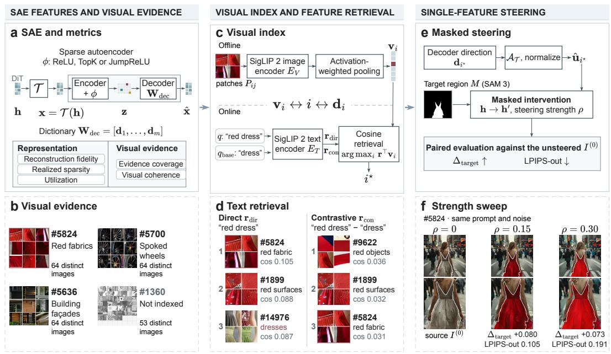  
Figure 2: D-Scope links the visual evidence of each SAE feature to its decoder direction. Columns follow Sec. 3.1–3.3; bottom panels show examples. (a) SAE training and dictionary metrics. (b) Activating patches; #1360 spans too few distinct source images to be indexed. (c) Offline: patches are pooled into a visual centroid $\mathbf { v } _ { i }$ . Online: a target query, used directly or contrasted with a reference query, retrieves i⋆. (d) Contrasting “red dress” with “dress” removes the object-dominated feature #14976. (e) The decoder direction of i⋆ is added within the target region, and the resulting image is compared with the unsteered image $I ^ { ( 0 ) }$ . (f) With #5824, raising $\rho$ from 0.15 to 0.30 does not increase $\Delta _ { \mathrm { t a r g e t } }$ but nearly doubles LPIPS-out.

Steering task. A steering case consists of a source prompt c, an initial noise ϵ, a target query q describing the desired appearance, and a binary mask M marking the target region. The frozen DiT generates the source image $I ^ { ( 0 ) }$ from c and ϵ; in Fig. 2f, for example, $q$ is “red dress” and M covers the dress in $I ^ { ( 0 ) }$ . Steering regenerates the image with $c , \epsilon ,$ and the sampling settings unchanged, while applying the intervention direction derived from a single retrieved SAE decoder direction within M at every denoising step. The goal is to move the target region toward $q$ while preserving content outside ${ \dot { M } } ;$ with the intervention protocol fixed, steering reduces to selecting which feature to use and how strongly to apply it.

## 3.1 SAE FEATURES AND VISUAL EVIDENCE

Sparse features and decoder directions. An SAE decomposes residual-stream activations of visual tokens into sparse combinations of learned features (Fig. 2a). Let h $\in \mathbb { R } ^ { D }$ denote the residual-stream activation of a visual token after the chosen transformer block, where D is the number of activation channels. A fixed input transformation $\tau$ produces the SAE input ${ \mathbf x } = \tau ( { \mathbf h } )$ . The SAE encodes x into sparse coefficients $\mathbf { z } \in \mathbb { R } ^ { m }$ , where m is the number of dictionary features, and reconstructs the input as

$$
{ \bf z } = \phi _ { \mathrm { S A E } } ( { \bf W } _ { \mathrm { e n c } } ( { \bf x } - { \bf b } _ { \mathrm { d e c } } ) + { \bf b } _ { \mathrm { e n c } } ) , \qquad \hat { \bf x } = { \bf W } _ { \mathrm { d e c } } { \bf z } + { \bf b } _ { \mathrm { d e c } } .
$$

Here, ϕ denotes the family-specific sparse activation rule. The decoder matrix $\mathbf { W } _ { \mathrm { d e c } } \ =$ $[ \mathbf { d } _ { 1 } , \ldots , \mathbf { d } _ { m } ]$ defines the SAE dictionary. Each feature i has an activation $z _ { i }$ and a decoder direction $\mathbf { d } _ { i }$ expressed in the SAE input coordinates. Feature activations identify the image patches that provide visual evidence for retrieval. After a feature is selected, its decoder direction is adapted for intervention in the DiT residual stream.

Visual evidence. We collect visual evidence from a fixed set of images generated offline by the frozen DiT (Fig. 2b). For each image, the SAE encodes the visual-token activations at the chosen block into a sparse feature vector z for each token. For each feature i, we compare its activation $z _ { i }$ across these tokens and select the token with the largest activation. If this activation is positive, we extract a candidate patch centered at the token’s corresponding image location, yielding at most one candidate per feature per image. A feature is eligible for indexing if it has positive candidates from at least $J$ distinct images. For each eligible feature, we retain the $J$ candidates with the largest activations. Let $P _ { i j }$ denote retained patch $j$ and $a _ { i j } > 0$ the value of $z _ { i }$ at its selected token. The patch-activation pairs $\{ ( P _ { i j } , a _ { i j } ) \} _ { j = 1 } ^ { J }$ constitute the visual evidence for feature i. We use $J = 6 4$ throughout.

## 3.2 VISUAL INDEX AND FEATURE RETRIEVAL

Visual feature index. D-Scope constructs a visual index once from the visual evidence collected in Sec. 3.1 and reuses it across queries (Fig. 2c). Let I denote the features satisfying the evidence requirement defined in Sec. 3.1.

Using the frozen SigLIP 2 image encoder $E _ { V }$ (Tschannen et al., 2025) and unit normalization $\nu ( \mathbf { a } ) = \mathbf { a } / \lVert \mathbf { a } \rVert _ { 2 }$ , we summarize each indexed feature by an activation-weighted visual centroid

$$
\mathbf { v } _ { i } = \nu \left( \sum _ { j = 1 } ^ { J } a _ { i j } \nu ( E _ { V } ( P _ { i j } ) ) \right) .
$$

The visual centroid $\mathbf { v } _ { i }$ and decoder direction $\mathbf { d } _ { i }$ serve different roles: $\mathbf { v } _ { i }$ represents the feature in the shared image–text embedding space for semantic retrieval, whereas $\mathbf { d } _ { i }$ is the corresponding SAE direction used for intervention. They are linked by the feature identity,

$$
\mathbf { v } _ { i }  i  \mathbf { d } _ { i } .
$$

Thus, the feature identity provides a direct link between its visual representation and the corresponding SAE decoder direction, without requiring a learned mapping between the two latent spaces.

Direct and contrastive retrieval. Retrieval operates entirely in the shared image-text embedding space. A target query such as “red dress” specifies both the object $( ^ { 6 6 } d r e s s ^ { 3 } )$ and the requested attribute $( \ " r e d ^ { \circ } )$ . Direct retrieval matches the full query and can therefore favor features associated with either component. Contrastive retrieval represents the target query q relative to a reference query $q _ { \mathrm { b a s e } }$ that describes the generic object or its source appearance (Fig. 2d). For a target query of “red dress”, the reference can be “dress” when the source color is unspecified. The comparison is intended to emphasize the requested attribute or attribute change.

Let $\mathbf { t } ( q ) = \nu ( E _ { T } ( q ) )$ denote the normalized embedding from the frozen SigLIP 2 text encoder $E _ { T }$ The two query representations are

$$
\mathbf { r } _ { \mathrm { d i r } } = \mathbf { t } ( q ) , \qquad \mathbf { r } _ { \mathrm { c o n } } = \nu ( \mathbf { t } ( q ) - \mathbf { t } ( q _ { \mathrm { b a s e } } ) ) .
$$

For either representation $\mathbf { r } ,$ cosine matching retrieves

$$
i ^ { \star } = \arg \operatorname* { m a x } _ { i \in \mathcal { T } } \mathbf { r } ^ { \top } \mathbf { v } _ { i } .
$$

The selected identity $i ^ { \star }$ then links semantic retrieval back to the SAE dictionary, identifying both its supporting visual evidence and the decoder direction ${ \bf d } _ { i }$ ⋆ used in the subsequent steering stage.

## 3.3 SINGLE-FEATURE STEERING

Steering direction. The retrieved decoder direction $\mathbf { d } _ { i ^ { \star } }$ is defined in the SAE input coordinates, while steering modifies the original DiT residual-stream activation h. A fixed operator $A _ { T }$ adjusts the decoder direction according to the SAE input setting. For the None setting, $\mathcal { T } ( \mathbf { h } ) = \mathbf { h }$ and $\mathcal { A } _ { T } ( \mathbf { d } _ { i } ) = \mathbf { d } _ { i } \in \mathbb { R } ^ { D }$ . For LayerNorm, $\tau$ centers and rescales each token’s activation. We adjust the corresponding decoder direction by subtracting its channel mean, $\mathcal { A } _ { T } ( \mathbf { d } _ { i } ) = \mathbf { d } _ { i } - \bar { d } _ { i } \mathbf { 1 }$ , where ${ \bar { d } } _ { i }$ is the mean of the atom’s $D$ channel values and 1 is the all-ones vector. This adjustment removes the channel-mean component without inverting the input normalization. The unit steering direction is

$$
\hat { \mathbf { u } } _ { i ^ { \star } } = \nu ( \mathcal { A } _ { T } ( \mathbf { d } _ { i ^ { \star } } ) ) .
$$

Adjustment rules for all input settings are provided in Appendix D.1.

Masked intervention. The target object in the source image $I ^ { ( 0 ) }$ is segmented with SAM 3 (Carion et al., 2026) to obtain a binary mask M (Fig. 2e). This mask is mapped to the visual-token grid, with $M _ { p } = 1$ for tokens selected for intervention and $M _ { p } = 0$ otherwise. At denoising step $t ,$ let $\mathbf { h } _ { t , p }$ denote the residual-stream activation of token $p$ after the transformer block used to train the SAE. The masked update is

$$
\mathbf { h } _ { t , p } ^ { \prime } = \mathbf { h } _ { t , p } + M _ { p } \rho R ( t ) { \hat { \mathbf { u } } } _ { i ^ { \star } } ,
$$

where $\rho$ controls the relative intervention strength. The reference scale $R ( t )$ is the root mean square of raw residual-vector $\ell _ { 2 }$ norms over all spatial tokens in a fixed set of unmodified source generations, computed at the same block and denoising step. Since $\hat { \mathbf { u } } _ { i } ,$ ⋆ has unit norm, $\rho R ( t )$ determines the update magnitude for each selected token. The scales are precomputed and shared across feature choices and intervention strengths.

The same direction is applied to all masked tokens at every denoising step, with $\rho$ held constant within each generation. The source prompt, initial noise, mask, and sampling settings remain unchanged across generations with different intervention strengths (Fig. 2f). Detailed calibration and intervention settings are provided in Appendix D.1.

## 4 EXPERIMENTS

Our experiments evaluate whether D-Scope retrieves single SAE decoder directions that induce the requested regional changes while preserving surrounding content. We first analyze 150 SAEs trained on two one-step DiT generators to characterize the visual evidence available for feature retrieval. Steering evaluations span three generation settings on our fine-grained benchmark, comparing direct and contrastive retrieval and examining how dictionary quality relates to regional target alignment and outside-region preservation. Additional experiments on style suppression and semantic readout assess the broader utility of the same dictionaries under task-specific feature selection in Appendix E. We summarize practical takeaways from these analyses in Table 2.

## 4.1 EXPERIMENTAL SETUP

Models and dictionaries. We train 150 SAEs on hidden activations from two frozen one-step DiT generators, SANA-Sprint and Nitro-1-PixArt, spanning five layers, three SAE families (L1, TopK, and JumpReLU), and five preprocessing or initialization settings (none, mean centering, geometric-median centering, LayerNorm, and RMS normalization). Steering is evaluated in three model environments: SANA-Sprint (Chen et al., 2025), Nitro-1-PixArt (Chen et al., 2024), and the SANA teacher (Xie et al., 2025). For the teacher, we reuse the dictionaries trained on SANA-Sprint rather than training separate teacher SAEs. Unless otherwise specified, steering uses middle-layer dictionaries; full training configurations are provided in Appendix B.1 and Table 3.

Fine-grained steering benchmark. Our benchmark contains 1,000 cases comprising 100 target concepts across five attribute categories: color, material, texture or pattern, local appearance, and local state or geometry. Each concept is paired with ten source contexts. Under-specified contexts leave the target attribute unspecified in the source prompt, while explicit-conflict contexts specify a competing attribute. SAM 3 (Carion et al., 2026) extracts the target-region mask from the source image, and the mask remains fixed across output comparisons. Detailed intervention and evaluation protocols, including benchmark construction, are provided in Appendix D.1, with the concept taxonomy in Table 8.

Reference baselines. For evaluation only, each case additionally specifies a target prompt $c ^ { \prime }$ describing the edited scene. Oracle Prompt regenerates the image from $c ^ { \prime }$ using the same initial noise and sampling settings. Oracle Dense uses the paired source and target generations from c and $c ^ { \prime }$ to construct a dense intervention direction from their activation difference. Thus, Oracle Dense has access to target-generation activations, whereas D-Scope selects its direction using only the target query and the precomputed visual index. Detailed constructions are provided in Appendix D.1.

Evaluation. We measure target control with Region SigLIP ∆, the increase in target-query alignment within the target region relative to the unsteered source, and outside-region preservation with LPIPS-out, the perceptual change outside the target region. For each case, we select the steering strength that maximizes Region SigLIP ∆ and report LPIPS-out on the same output. Results are averaged over three generation seeds; metric and reporting details are provided in Appendix D.1.

## 4.2 SAE DICTIONARY QUALITY FOR VISUAL-EVIDENCE RETRIEVAL

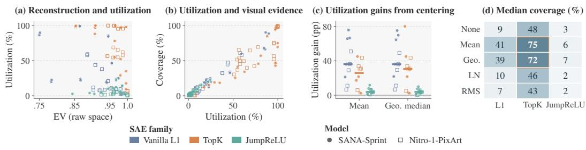  
Figure 3: Reconstruction fidelity alone does not characterize the feature pool available for visual-evidence retrieval. (a) Raw-space explained variance (EV) versus dictionary utilization. (b) Dictionary utilization versus visual-evidence coverage. (c) Percentage-point change in utilization from mean or geometric-median centering relative to the matched uncentered configuration; horizontal bars denote medians. (d) Median visual-evidence coverage across models and layers for each SAE family and input setting; outlined cells indicate the two highest median coverage values.

We first examine the SAE dictionaries that support feature retrieval. Specifically, we ask whether reconstruction fidelity alone is sufficient to characterize the extent to which dictionary features are utilized and supported by visual evidence. Figure 3 summarizes these relationships across 150 SAEs; metric definitions, additional analyses, and complete results are provided in Appendices B.2–B.4.

Reconstruction quality does not imply retrieval readiness. Dictionary utilization measures the fraction of features active within the 256,000 training tokens preceding the selected checkpoint. Visual-evidence coverage measures the fraction of sampled features with positive activations in at least J = 64 distinct images. Reconstruction fidelity and dictionary utilization can differ sub stantially (Fig. 3a), while utilization is more closely related to the availability of visual evidence (Fig. 3b). For example, an uncentered TopK SAE at Nitro layer 2 achieves an explained variance (EV) of 0.9997, while only 1.5% of its features are utilized and 0.5% of the sampled features provide sufficient visual evidence (Appendix B.4, Table 5). Thus, reconstruction fidelity alone does not indicate whether a dictionary exposes a broad set of features that can be represented from their activating examples.

Training choices substantially change visual-evidence availability. Centering (Simon et al., 2026) generally increases dictionary utilization across models, layers, and SAE families (Fig. 3c), while centered TopK achieves the highest median evidence coverage in our sweep (Fig. 3d). These results show that SAE configurations with similar reconstruction quality can expose substantially different feature pools for visual-evidence retrieval. Features that remain inactive cannot accumulate the repeated positive activations required to enter the visual index, so low dictionary utilization can indicate a restricted candidate poolfor retrieval.

## 4.3 SINGLE-FEATURE STEERING PERFORMANCE

We next evaluate the central question of D-Scope: whether a desired visual change can be realized using a single retrieved SAE decoder direction. We compare the retrieved direction with Oracle Dense, which uses a dense direction derived from paired source and target activations under the same spatial intervention protocol. Figure 4a,b summarizes the main results; complete quantitative results are reported in Table 1, with additional results and analyses in Appendix D.

(a) Qualitative examples  
(b) Locality–gain trade-off  
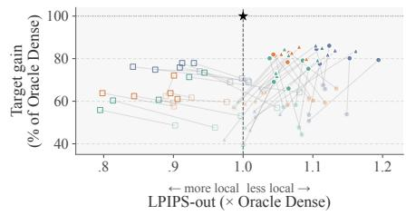

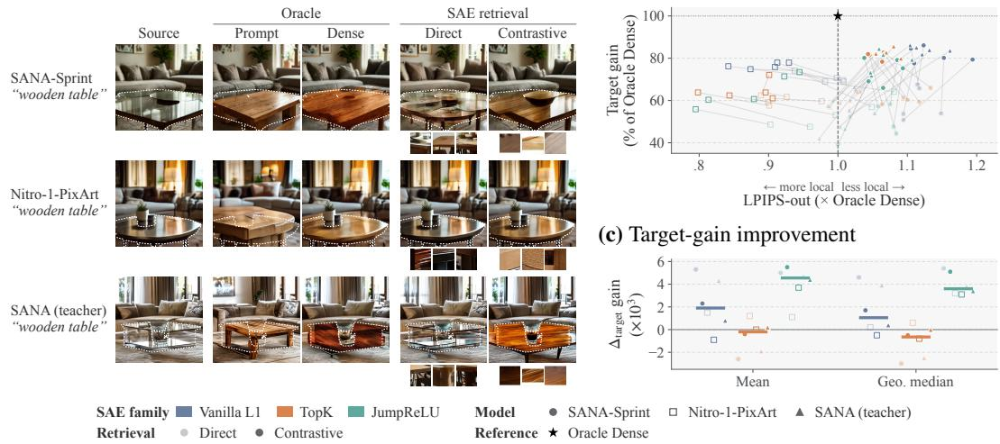

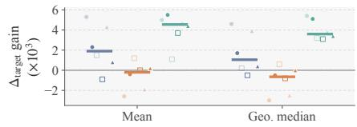  
Figure 4: Single-feature steering with D-Scope across generators and SAE dictionaries. (a) “Wooden table” interventions using Oracle Prompt, Oracle Dense, direct retrieval, and contrastive retrieval; dashed outlines mark the target region, and top activating patches are shown for the retrieved SAE features. (b) Regional target gain and outside-region change for middle-layer dictionaries, normalized by Oracle Dense. Faded and solid markers denote direct and contrastive retrieval, respectively, with matched dictionaries connected by lines. (c) Change in target gain from mean or geometric-median centering relative to the matched uncentered configuration; horizontal bars denote medians.

Retrieved features produce the requested visual change. Across all evaluated dictionaries and model environments, intervening with the retrieved decoder direction yields a positive Region SigLIP ∆, ranging from 13.8 to 33.4 $( \times 1 0 ^ { - 3 } )$ , with a mean of 23.1. Figure 4a illustrates this behavior for “wooden table”: although D-Scope uses only one SAE feature, the retrieved directions induce attribute changes similar to those produced by the dense reference. The corresponding visual-evidence patches also make the selected feature directly inspectable.

A single retrieved feature captures most of the dense-reference gain. With contrastive retrieval, the best dictionaries recover 86%, 78%, and 86% of the Oracle Dense target-alignment gain on SANA-Sprint, Nitro-1-PixArt, and the SANA teacher, respectively (Fig. 4b). Averaged across all 15 dictionaries, the corresponding ratios remain 79%, 69%, and 82%. Thus, despite restricting each edit to a single query-retrieved decoder direction, D-Scope captures a substantial fraction of the regional target-alignment gain achieved by Oracle Dense.

Target control and locality are distinct. Figure 4b also shows that larger target gains do not necessarily coincide with lower outside-region change. We next examine how retrieval strategy and dictionary choice shape this trade-off.

## 4.4 EFFECTS OF RETRIEVAL STRATEGY AND DICTIONARY CHOICE

Figure 4b compares retrieval strategies within matched dictionaries, while Fig. 4c isolates the effect of centering on downstream target control.

Contrastive retrieval consistently improves target control. Contrastive retrieval yields higher Region SigLIP ∆ than direct retrieval for all 15 dictionaries in each of the three generation environments (Fig. 4b). Averaged over dictionaries, it increases target gain from 21.8 to 30.6 on SANA-Sprint, from 17.9 to 19.9 on Nitro-1-PixArt, and from 19.8 to 28.4 on the SANA teacher (all values $\times 1 0 ^ { - 3 } )$ . The improvement is therefore large in the two SANA environments (+40% and +44%) but substantially smaller on Nitro (+11%).

Table 1: Complete fine-grained steering benchmark. We evaluate all 15 middle-layer SAE configurations with direct and contrastive retrieval in three model environments; the SANA teacher reuses the student-trained SANA dictionaries. Region SigLIP improvement (∆ ↑) and LPIPS-out (↓) are reported as mean ± sample SD across three generation-seed means, with both metrics and SDs multiplied by $1 0 ^ { 3 }$ . For each swept method and case-seed pair, steering strength maximizes Region SigLIP ∆; LPIPS-out is measured on the same output. Oracle Prompt uses the target prompt, while Oracle Dense uses the source-target activation difference. Bold denotes the better retrieval strategy within each dictionary, model, and metric based on unrounded means.
<table><tr><td rowspan="3">Method</td><td rowspan="3"></td><td colspan="4">SANA Student</td><td colspan="4">Nitro Student</td><td colspan="4">SANA Teacher</td></tr><tr><td colspan="2">Direct</td><td colspan="2">Contrastive</td><td colspan="2">Direct</td><td colspan="2">Contrastive</td><td colspan="2">Direct</td><td colspan="2">Contrastive</td></tr><tr><td>∆↑</td><td>LPIPS↓</td><td>∆↑</td><td>LPIPS↓</td><td>∆↑</td><td>LPIPS↓</td><td>∆↑</td><td>LPIPS↓</td><td>∆↑</td><td>LPIPS↓</td><td>∆↑</td><td>LPIPS↓</td></tr><tr><td>No intervention</td><td></td><td>0.0 ± 0.0</td><td>0.0 ± 0.0</td><td>0.0 ± 0.0</td><td>0.0 ± 0.0</td><td>0.0 ± 0.0</td><td>0.0 ± 0.0</td><td>0.0 ± 0.0</td><td>0.0 ± 0.0</td><td>0.0 ± 0.0</td><td>0.0 ± 0.0</td><td>0.0 ± 0.0</td><td>0.0 ± 0.0</td></tr><tr><td>Oracle Prompt</td><td></td><td>37.9 ± 1.6</td><td>392.8 ± 8.6</td><td>37.9 ± 1.6</td><td>392.8 ± 8.6</td><td>36.4 ± 0.8</td><td>289.6 ± 6.0</td><td>36.4 ± 0.8</td><td>289.6 ± 6.0</td><td>39.3 ± 0.5</td><td>421.1 ± 10.7</td><td>39.3 ± 0.5</td><td>421.1 ± 10.7</td></tr><tr><td>Oracle Dense</td><td></td><td>38.8 ± 0.4</td><td>147.4 ± 2.5</td><td>38.8 ± 0.4</td><td>147.4 ± 2.5</td><td>29.0 ± 0.4</td><td>59.5±1.1</td><td>29.0 ± 0.4</td><td>59.5 ± 1.1</td><td>34.8 ± 0.2</td><td>219.2 ±7.6</td><td>34.8 ± 0.2</td><td>219.2 ± 7.6</td></tr><tr><td rowspan="5">L1</td><td>None</td><td>20.9 ± 0.5</td><td>169.3 ± 2.2</td><td>31.1 ± 0.5</td><td>169.9 ± 4.8</td><td>20.0 ± 0.1</td><td>58.4 ± 4.4</td><td>22.6 ± 0.2</td><td>54.3 ± 2.7</td><td>18.8 ± 0.5</td><td>230.8 ± 12.0</td><td>29.2 ± 0.4</td><td>248.1 ± 9.1</td></tr><tr><td>Mean center</td><td>26.2 ± 0.7</td><td>164.3 ± 3.2</td><td>33.4 ± 0.6</td><td>165.6 ± 6.1</td><td>21.5 ± 0.5</td><td>55.8 ± 3.4</td><td>21.7 ± 0.1</td><td>52.0 ± 2.0</td><td>23.1 ± 0.5</td><td>224.4 ± 12.7</td><td>30.0 ± 0.2</td><td>242.0 ± 6.1</td></tr><tr><td>Geo. center</td><td>25.5 ± 0.4</td><td>164.7 ± 4.0</td><td>32.8 ± 0.5</td><td>162.9 ± 4.5</td><td>20.2 ± 0.1</td><td>59.9 ± 4.0</td><td>22.1 ± 0.4</td><td>50.1 ± 3.2</td><td>22.7 ± 0.6</td><td>224.8 ± 11.3</td><td>29.6 ± 0.5</td><td>244.0 ± 11.6</td></tr><tr><td>LayerNorm</td><td>19.7 ± 0.6</td><td>161.3 ± 6.3</td><td>30.8 ± 0.4</td><td>176.0 ± 5.7</td><td>20.0 ± 0.1</td><td>60.0 ± 2.2</td><td>22.0 ± 0.1</td><td>54.1 ± 3.8</td><td>18.4 ± 0.3</td><td>223.0 ± 9.3</td><td>29.1 ± 0.1</td><td>254.6 ± 9.7</td></tr><tr><td>RMS</td><td>20.8 ± 0.5</td><td>161.3 ± 5.2</td><td>30.1 ± 0.3</td><td>163.6 ± 3.8</td><td>20.5 ± 0.1</td><td>59.4± 3.2</td><td>22.6 ± 0.4</td><td>55.3 ± 2.4</td><td>19.3 ± 0.3</td><td>222.8 ± 8.3</td><td>28.5 ± 0.1</td><td>245.8 ± 10.9</td></tr><tr><td rowspan="5">TopK</td><td>None</td><td>25.6 ± 0.6</td><td>167.1 ± 4.0</td><td>32.1 ± 0.8</td><td>157.1 ± 3.3</td><td>16.7 ± 0.1</td><td>53.6 ± 3.2</td><td>18.5 ± 0.2</td><td>47.5 ± 2.6</td><td>22.4 ± 0.5</td><td>226.2 ± 8.8</td><td>28.6 ± 0.4</td><td>233.9 ± 8.7</td></tr><tr><td>Mean center</td><td>23.0 ± 0.2</td><td>164.7 ± 4.1</td><td>31.7 ± 0.1</td><td>157.3 ± 5.0</td><td>17.9 ± 0.4</td><td>55.1 ± 2.5</td><td>18.5 ± 0.5</td><td>53.3 ± 1.9</td><td>20.5 ± 0.4</td><td>219.9 ± 9.8</td><td>28.8 ± 0.6</td><td>234.5 ± 9.3</td></tr><tr><td>Geo. center</td><td>22.6 ± 0.3</td><td>156.8 ± 2.2</td><td>31.6 ± 0.7</td><td>154.1 ± 2.6</td><td>17.3 ± 0.3</td><td>58.1 ± 1.3</td><td>17.7 ± 0.3</td><td>53.9 ± 2.7</td><td>19.9 ± 0.4</td><td>216.7 ± 9.3</td><td>28.6 ± 0.4</td><td>231.2 ± 10.7</td></tr><tr><td>LayerNorm</td><td>23.4 ± 0.6</td><td>162.2 ± 4.8</td><td>30.4 ± 0.4</td><td>156.8 ± 4.6 18.1 ± 0.3</td><td></td><td>52.9 ± 2.6</td><td>20.9 ± 0.2</td><td>53.6 ± 1.4</td><td>20.9 ± 0.4</td><td>223.0 ± 7.5</td><td>27.8 ± 0.5</td><td>239.1 ± 9.3</td></tr><tr><td>RMS</td><td>23.8 ± 0.4</td><td>161.3 ± 3.3</td><td>31.8 ± 0.4</td><td></td><td>153.8 ± 1.9 17.2 ± 0.5</td><td>53.5 ± 2.7</td><td>18.1 ± 0.2</td><td>50.2 ± 3.0</td><td>22.3 ± 0.1</td><td>225.3 ± 6.1</td><td>29.8 ± 0.4</td><td>236.8 ± 9.4</td></tr><tr><td rowspan="5">JumpReLU</td><td>None</td><td>17.2 ± 0.6</td><td>159.8 ± 2.0</td><td>25.6 ± 0.6</td><td>157.0 ± 5.8 15.4 ± 0.3</td><td></td><td>59.3 ± 2.3</td><td>17.6 ± 0.2</td><td>52.3 ± 4.2</td><td>16.2 ± 0.4</td><td>221.4 ± 10.6</td><td>25.0 ± 0.4</td><td>229.8 ± 9.0</td></tr><tr><td>Mean center</td><td>22.2 ± 0.5</td><td>155.9 ± 1.8</td><td>31.1 ± 0.4</td><td>153.0 ± 4.2 16.5 ± 0.2</td><td></td><td></td><td>62.4 ± 3.9 21.3 ± 0.2</td><td></td><td></td><td>56.2 ± 3.5 20.9 ± 0.5 217.6 ± 10.1</td><td>29.4 ± 0.4</td><td>232.2 ± 9.7</td></tr><tr><td>Geo. center</td><td></td><td>22.6 ± 0.8 158.5 ± 2.7 30.7 ± 0.5</td><td></td><td>160.0 ± 1.9 18.6 ± 0.4</td><td></td><td>64.3 ± 1.8 20.7 ± 0.3</td><td></td><td></td><td></td><td>54.9 ± 3.0 20.0 ± 0.5 216.1 ± 10.8</td><td>28.4 ± 0.3</td><td>233.5 ± 10.5</td></tr><tr><td>LayerNorm</td><td></td><td>15.2 ± 0.1 147.4 ± 1.3 26.8 ± 0.5</td><td></td><td>153.9 ± 2.6 14.1 ± 0.4</td><td></td><td></td><td>53.7 ± 2.7 16.2 ± 0.3</td><td></td><td></td><td>47.3 ± 3.0 14.6 ± 0.1 213.3 ± 11.4</td><td>25.5 ± 0.4</td><td>229.5 ± 10.5</td></tr><tr><td>RMS</td><td></td><td>18.5 ± 0.5 159.2 ± 3.5 29.2 ± 0.7</td><td></td><td>161.2 ± 6.0 13.8 ± 0.0</td><td></td><td>57.1 ± 2.8 17.5 ± 0.2</td><td></td><td></td><td></td><td>48.4 ± 4.6 16.6 ± 0.4 219.9 ± 12.0 27.6 ± 0.5 242.6 ± 11.2</td><td></td><td></td></tr></table>

Dictionary choice matters most when feature availability is limited. The weakest steering configurations are also those with the smallest visual indices. For L1 and JumpReLU, centering expands the searchable feature pool and improves target alignment in most matched comparisons (Fig. 4c). In contrast, TopK already provides a large searchable set before centering, and further increases in utilization do not consistently improve steering. Thus, dictionary training is most consequential when it limits the candidate features available for retrieval; beyond this regime, a larger feature pool alone does not guarantee a better intervention direction.

Improved target control does not guarantee better locality. Although contrastive retrieval consistently improves target alignment, its effect on outside-region preservation varies across generators (Fig. 4b). A plausible explanation is that D-Scope selects features according to the visual evidence that activates them, whereas locality depends on what their decoder directions write back into the model. This distinction suggests that semantic relevance and intervention locality are related but separate properties of a retrieved SAE feature.

Low utilization can limit visual-evidence coverage and thereby constrain retrieval-based control. Recall from Sec. 4.2 that training choices affect dictionary utilization, and higher utilization is associated with broader visual-evidence coverage (Fig. 3b). For L1 and JumpReLU, centering expands the visual indices by 1.8–4.4× and improves mean target alignment in 22 of 24 matched comparisons (Table 1 and Appendix C Table 7). This pattern is consistent with limited feature avail ability constraining retrieval-based control. However, uncentered TopK already indexes more than 12,000 features, and further expansion through centering does not consistently improve target gain. Selection within the available pool also matters: with the dictionary and visual index fixed, contrastive retrieval consistently achieves higher mean target alignment than direct retrieval (Fig. 4b). Thus, training shapes the evidence-supported decoder directions available for retrieval, while the retrieval strategy selects among these directions and affects the resulting steering performance.

## 5 CONCLUSION

We presented D-Scope, a method for retrieving SAE decoder directions by matching target text queries to activation-weighted visual centroids of highly activating image patches. The selected features provide directions for spatially masked interventions without requiring per-feature text annotations or target-generation activations for selection. On our 1,000-case benchmark, a single retrieved direction achieves up to 86% of the mean regional target-alignment gain of Oracle Dense under per-case best-of-sweep strength selection. Contrastive retrieval consistently improves mean target alignment over direct retrieval across the evaluated configurations, without consistently improving outside-region preservation. Our analysis of 150 SAEs further shows that reconstruction fidelity alone does not characterize the visual evidence available for retrieval. Training choices shape the candidate feature pool, but a larger pool does not guarantee stronger steering, highlighting the importance of selecting effective directions from the available features. D-Scope provides a direct path from a target description to a single SAE intervention, enabling feature selection to be examined through visual evidence and validated through its regional target effects and preservation costs.

## AI USE STATEMENT

In this work, we used generative AI tools to assist with language polishing. We have reviewed all AI-assisted work, checking the text and figures for consistency with the experimental methods, reported results, and supporting evidence. We take responsibility for the final content of this work, including text, claims, and artifacts produced with the aid of generative AI.

## ETHICS STATEMENT

D-Scope aims to improve the transparency of diffusion transformers by connecting internal features to visual evidence and generation effects. Our safety-oriented motivation parallels that of white-hat security research: we examine potentially sensitive model behavior through controlled evaluation to inform safeguards and support responsible use. The nudity-related readout experiment demonstrates that a single SAE feature provides an interpretable signal for identifying nudity in generated images, which could assist safety screening and human review. All images used in this experiment are synthesized by the evaluated generator under controlled prompts. No nude photographs of real individuals are collected for this experiment.

Human annotations describe the visible content of generated images under the stated evaluation protocol. These labels do not express moral judgments about nudity, bodies, identities, or social groups, and the study is not intended to stigmatize or discriminate against any group. The presence of nudity is not treated as sufficient evidence that an image is harmful in every context. Sensitive regions in examples displayed in the paper and appendix have been pixelated to limit exposure to explicit content and reduce potential discomfort for readers.

The readout results constitute a controlled demonstration rather than validation of a general-purpose content moderation system. Pretrained models and human annotations may reflect biases, and broader use would require further evaluation of false positives, false negatives, robustness, and performance across populations and contexts. More generally, the ability to steer generation has potential for misuse. Our purpose in studying these capabilities is to support model auditing and inform safeguards. Downstream applications require evaluation appropriate to their intended use, safeguards against misuse, and human oversight.

## REPRODUCIBILITY STATEMENT

Section 3 specifies SAE feature representations, visual evidence construction, feature retrieval, and masked single-feature interventions. Appendix B documents training configurations, optimization, dictionary evaluation, and complete dictionary results. Appendix C describes how feature cards and visual indices are constructed, including the catalog corpus, evidence selection, encoder set tings, and the index size of each steering dictionary. Appendix D.1 details benchmark construction, reference methods, generation settings, evaluation metrics, strength selection, and statistical aggregation. Appendix F describes style-evaluator adaptation, feature selection, and intervention controls. Appendix G documents human annotation, disjoint feature-discovery and test splits, and the singlefeature readout protocol.

## ACKNOWLEDGMENTS

This project was completed during Xinyue Xu’s ongoing Pivotal AI Safety Fellowship. We gratefully acknowledge Pivotal Research Ltd. and Dr. Peter Hase for their generous financial support.

## REFERENCES

Dana Arad, Aaron Mueller, and Yonatan Belinkov. SAEs are good for steering – if you select the right features. In Christos Christodoulopoulos, Tanmoy Chakraborty, Carolyn Rose, and Violet Peng (eds.), Proceedings of the 2025 Conference on Empirical Methods in Natural Language Processing, pp. 10241–10259, Suzhou, China, November 2025. Association for Computational Linguistics. ISBN 979-8-89176-332-6. doi: 10.18653/v1/2025.emnlp-main.519. URL https: //aclanthology.org/2025.emnlp-main.519/.

Bart Bussmann, Noa Nabeshima, Adam Karvonen, and Neel Nanda. Learning multi-level features with matryoshka sparse autoencoders. arXiv preprint arXiv:2503.17547, 2025.

Nicolas Carion, Laura Gustafson, Yuan-Ting Hu, Shoubhik Debnath, Ronghang Hu, Didac Suris Coll-Vinent, Chaitanya Ryali, Kalyan Vasudev Alwala, Haitham Khedr, Andrew Huang, et al. Sam 3: Segment anything with concepts. In International conference on learning representations, volume 2026, pp. 138846–138923, 2026.

Sviatoslav Chalnev, Matthew Siu, and Arthur Conmy. Improving steering vectors by targeting sparse autoencoder features. arXiv preprint arXiv:2411.02193, 2024.

David Chanin, James Wilken-Smith, Tomáš Dulka, Hardik Bhatnagar, Satvik Golechha, and Joseph Bloom. A is for absorption: Studying feature splitting and absorption in sparse autoencoders. Advances in Neural Information Processing Systems, 38:82318–82355, 2025.

Junsong Chen, Chongjian Ge, Enze Xie, Yue Wu, Lewei Yao, Xiaozhe Ren, Zhongdao Wang, Ping Luo, Huchuan Lu, and Zhenguo Li. Pixart-σ: Weak-to-strong training of diffusion transformer for 4k text-to-image generation. In European Conference on Computer Vision, pp. 74–91. Springer, 2024.

Junsong Chen, Shuchen Xue, Yuyang Zhao, Jincheng Yu, Sayak Paul, Junyu Chen, Han Cai, Song Han, and Enze Xie. Sana-sprint: One-step diffusion with continuous-time consistency distillation. In 2025 IEEE/CVF International Conference on Computer Vision (ICCV), pp. 16185–16195. IEEE, 2025.

Bartosz Cywinski and Kamil Deja. Saeuron: Interpretable concept unlearning in diffusion models´ with sparse autoencoders. arXiv preprint arXiv:2501.18052, 2025.

Yusuf Dalva, Kavana Venkatesh, and Pinar Yanardag. Fluxspace: Disentangled semantic editing in rectified flow models. In 2025 IEEE/CVF Conference on Computer Vision and Pattern Recognition (CVPR), pp. 13083–13092. IEEE, 2025.

Maximilian Dreyer, Jim Berend, Tobias Labarta, Johanna Vielhaben, Thomas Wiegand, Sebastian Lapuschkin, and Wojciech Samek. Mechanistic understanding and validation of large ai models with semanticlens. Nature Machine Intelligence, 7(9):1572–1585, 2025.

Javier Ferrando, Enrique Lopez-Cuena, Pablo Agustin Martin-Torres, Daniel Hinjos, Anna Arias-Duart, and Dario Garcia-Gasulla. Language models can explain visual features via steering. arXiv preprint arXiv:2603.22593, 2026.

Rohit Gandikota, Joanna Materzynska, Tingrui Zhou, Antonio Torralba, and David Bau. Concept´ sliders: Lora adaptors for precise control in diffusion models. In European Conference on Computer Vision, pp. 172–188. Springer, 2024.

Leo Gao, Tom Dupre la Tour, Henk Tillman, Gabriel Goh, Rajan Troll, Alec Radford, Ilya Sutskever, Jan Leike, and Jeffrey Wu. Scaling and evaluating sparse autoencoders. In The Thirteenth International Conference on Learning Representations, 2025. URL https://openreview.net/ forum?id=tcsZt9ZNKD.

Difei Gu, Yunhe Gao, Gerasimos Chatzoudis, Zihan Dong, Guoning Zhang, Bangwei Guo, Yang Zhou, Mu Zhou, and Dimitris Metaxas. Lucid-sae: Learning unified vision-language sparse codes for interpretable concept discovery. arXiv preprint arXiv:2602.07311, 2026.

Alec Helbling, Tuna Han Salih Meral, Ben Hoover, Pinar Yanardag, and Duen Horng Chau. Conceptattention: Diffusion transformers learn highly interpretable features. arXiv preprint arXiv:2502.04320, 2025.

Victor Shea-Jay Huang, Le Zhuo, Yi Xin, Zhaokai Wang, Fu-Yun Wang, Yuchi Wang, Renrui Zhang, Peng Gao, and Hongsheng Li. Tide : Temporal-aware sparse autoencoders for interpretable diffusion transformers in image generation, 2025. URL https://arxiv.org/abs/2503. 07050.

Xuan Ju, Ailing Zeng, Yuxuan Bian, Shaoteng Liu, and Qiang Xu. Pnp inversion: Boosting diffusion-based editing with 3 lines of code. In International Conference on Learning Representations, volume 2024, pp. 23395–23422, 2024.

Adam Karvonen, Can Rager, Johnny Lin, Curt Tigges, Joseph Bloom, David Chanin, Yeu-Tong Lau, Eoin Farrell, Callum McDougall, Kola Ayonrinde, et al. Saebench: A comprehensive benchmark for sparse autoencoders in language model interpretability. arXiv preprint arXiv:2503.09532, 2025.

Dahye Kim and Deepti Ghadiyaram. Concept steerers: Leveraging k-sparse autoencoders for testtime controllable generations. arXiv preprint arXiv:2501.19066, 2025.

Tuomas Oikarinen and Tsui-Wei Weng. Clip-dissect: Automatic description of neuron representations in deep vision networks. arXiv preprint arXiv:2204.10965, 2022.

Raina Panda, Daniel Fein, Arpita Singhal, Mark Fiore, Maneesh Agrawala, and Matyas Bohacek. Louvresae: Sparse autoencoders for interpretable and controllable style transfer. arXiv preprint arXiv:2512.18930, 2025.

Gonçalo Paulo and Nora Belrose. Sparse autoencoders trained on the same data learn different features. arXiv preprint arXiv:2501.16615, 2025.

William Peebles and Saining Xie. Scalable diffusion models with transformers. In 2023 IEEE/CVF International Conference on Computer Vision (ICCV), pp. 4172–4182. IEEE, 2023.

Senthooran Rajamanoharan, Tom Lieberum, Nicolas Sonnerat, Arthur Conmy, Vikrant Varma, János Kramár, and Neel Nanda. Jumping ahead: Improving reconstruction fidelity with jumprelu sparse autoencoders. arXiv preprint arXiv:2407.14435, 2024.

Sukrut Rao, Sweta Mahajan, Moritz Böhle, and Bernt Schiele. Discover-then-name: Task-agnostic concept bottlenecks via automated concept discovery. In European Conference on Computer Vision, pp. 444–461. Springer, 2024.

Stepan Shabalin, Ayush Panda, Dmitrii Kharlapenko, Abdur Raheem Ali, Yixiong Hao, and Arthur Conmy. Interpreting large text-to-image diffusion models with dictionary learning. arXiv preprint arXiv:2505.24360, 2025.

Shufan Shen, Junshu Sun, Qingming Huang, and Shuhui Wang. Vl-sae: Interpreting and enhancing vision-language alignment with a unified concept set. arXiv preprint arXiv:2510.21323, 2025.

Oriane Siméoni, Huy V Vo, Maximilian Seitzer, Federico Baldassarre, Maxime Oquab, Cijo Jose, Vasil Khalidov, Marc Szafraniec, Seungeun Yi, Michaël Ramamonjisoa, et al. Dinov3. arXiv preprint arXiv:2508.10104, 2025.

Elana Simon, Etowah Adams, and James Zou. On the relationship between activation outliers and feature death in sparse autoencoders, 2026. URL https://arxiv.org/abs/2605. 31518.

Viacheslav Surkov, Chris Wendler, Antonio Mari, Mikhail Terekhov, Justin Deschenaux, Robert West, Caglar Gulcehre, and David Bau. One-step is enough: Sparse autoencoders for text-toimage diffusion models. arXiv preprint arXiv:2410.22366, 2024.

Michael Tschannen, Alexey Gritsenko, Xiao Wang, Muhammad Ferjad Naeem, Ibrahim Alabdulmohsin, Nikhil Parthasarathy, Talfan Evans, Lucas Beyer, Ye Xia, Basil Mustafa, et al. Siglip 2: Multilingual vision-language encoders with improved semantic understanding, localization, and dense features. arXiv preprint arXiv:2502.14786, 2025.

Berk Tınaz, Zalan Fabian, and Mahdi Soltanolkotabi. Emergence and evolution of interpretable concepts in diffusion models. Advances in neural information processing systems, 38:166943 – 166986, 2025. URL https://api.semanticscholar.org/CorpusID:277993804.

Zhengxuan Wu, Aryaman Arora, Atticus Geiger, Zheng Wang, Jing Huang, Dan Jurafsky, Christopher D Manning, and Christopher Potts. Axbench: Steering llms? even simple baselines outperform sparse autoencoders. arXiv preprint arXiv:2501.17148, 2025.

Enze Xie, Junsong Chen, Junyu Chen, Han Cai, Haotian Tang, Yujun Lin, Zhekai Zhang, Muyang Li, Ligeng Zhu, Yao Lu, et al. Sana: Efficient high-resolution text-to-image synthesis with linear diffusion transformers. In The Thirteenth International Conference on Learning Representations, 2025.

Calvin Yeung, Prathyush Poduval, Ali Zakeri, Zhuowen Zou, and Mohsen Imani. Residualized temporal sparse autoencoders for interpreting diffusion models. arXiv preprint arXiv:2605.27813, 2026.

Wenlong Yu, Qilong Wang, Chuang Liu, Dong Li, and Qinghua Hu. Coe: Chain-of-explanation via automatic visual concept circuit description and polysemanticity quantification. In Proceedings ofthe Computer Vision and Pattern Recognition Conference, pp. 4364–4374, 2025.

Richard Zhang, Phillip Isola, Alexei A Efros, Eli Shechtman, and Oliver Wang. The unreasonable effectiveness of deep features as a perceptual metric. In 2018 IEEE/CVF conference on computer vision and pattern recognition, pp. 586–595. IEEE, 2018.

Yihua Zhang, Chongyu Fan, Yimeng Zhang, Yuguang Yao, Jinghan Jia, Jiancheng Liu, Gaoyuan Zhang, Gaowen Liu, Ramana Rao Kompella, Xiaoming Liu, et al. Unlearncanvas: Stylized image dataset for enhanced machine unlearning evaluation in diffusion models. arXiv preprint arXiv:2402.11846, 2024.

APPENDIX GUIDE   
Practical Takeaways . . . . . 14   
Recommendations for building and using DiT SAEs Table 2   
Appendix A Additional Related Work . . . . 14   
Dictionary training, semantic retrieval, and steering evaluation   
Appendix B SAE Training and Dictionary Evaluation . . . . 16   
Training configurations Table 3   
Realized sparsity and visual evidence Figure 5   
Dictionary quality across layers Figure 6   
Complete dictionary results Tables 4 and 5   
Appendix C Feature Cards and Visual Index . . . 23   
Catalog construction settings Table 6   
Visual index size per dictionary Table 7   
Appendix D Fine-Grained Steering Benchmark . . . . 25   
Benchmark and evaluation protocol Section D.1   
Concept taxonomy and example cases Tables 8 and 9   
Concept categories and source contexts Figure 7   
Appendix E Additional Applications of Learned SAE Features. . . 27   
Style suppression and semantic readout Figure 8   
Appendix F Style Suppression with General-Purpose SAEs . . . . 28   
Evaluator validation and style selection Tables 10 and 11   
Single-feature suppression protocol Table 12   
Complete and per-style results Tables 13 and 14   
Suppression and retention across dictionaries Figure 9

<table><tr><td>Successful suppression examples Incomplete suppression examples</td><td>Figures 10 and 11 Figure 12</td></tr><tr><td>Appendix G Nudity-Related Feature Discovery and Readout. .</td><td>..37</td></tr><tr><td></td><td></td></tr><tr><td>Dataset split and readout protocol</td><td>Tables 15 and 16</td></tr><tr><td>Label-guided feature discovery</td><td>Algorithm 1</td></tr><tr><td>Feature evidence and pooling sensitivity</td><td>Figure 13</td></tr><tr><td>Matched readout examples</td><td>Figure 14 Figure 15</td></tr><tr><td>Hard-negative examples</td><td></td></tr></table>

Table 2: Practical takeaways for building and using DiT SAEs. Steering findings use middlelayer dictionaries and per-case best-of-sweep strength selection.
<table><tr><td>Decision</td><td>Empirical finding</td><td>Recommendation</td></tr><tr><td>Dictionary selection</td><td>High reconstruction EV can coexist with low utilization and evidence coverage (Fig. 3a,b). The three weakest steering configurations in each generation-retrieval setting also have the smallest visual indices (Tables 1 and 7).</td><td>Assess utilization, coherence, and coverage alongside reconstruction fidelity. Validate steering performance separately, since a larger visual index does not guarantee stronger control.</td></tr><tr><td>Bias initialization</td><td>Centering increases utilization in every matched comparison. For L1 and JumpReLU, it expands visual indices by 1.8–4.4× and improves mean target gain in 22 of 24 matched comparisons (Fig. 3c; Tables 1 and 7).</td><td>Start with mean or geometric-median centering, then verify target alignment and preservation for the chosen generator and retrieval strategy.</td></tr><tr><td>SAE family</td><td>Centered TopK has the highest median evidence coverage. Mean-centered L1 achieves the highest mean target gain in five of six generator-retrieval combinations (Fig. 3d; Table 1).</td><td>Start with centered TopK for visual inspection and mean-centered L1 for steering, checking preservation in both cases.</td></tr><tr><td>Layer</td><td>Layer 26 has lower input-space EV and equal or higher coverage than layer 2 in matched comparisons. Intermediate trends are not uniformly monotonic (Fig. 6).</td><td>Compare candidate layers jointly on reconstruction, utilization, coherence, and coverage.</td></tr><tr><td>Retrieval</td><td>Contrastive retrieval yields higher mean target gains in all 45 matched comparisons, without consistently improving preservation (Section D.2).</td><td>Use contrastive retrieval as a starting point for target alignment, and assess LPIPS-out separately.</td></tr><tr><td>Dictionary reuse</td><td>SANA student dictionaries retain positive target gains in the teacher, with higher LPIPS-out than in the student (Table 1).</td><td>Re-evaluate target alignment and preservation when transferring dictionaries to another generation setting.</td></tr></table>

## A ADDITIONAL RELATED WORK

SAE Training and Dictionary Evaluation. Previous studies investigate how training configurations shape sparse representations in diffusion models. Surkov et al. (2024) compare activation layers, sparsity levels, and dictionary widths, while Shabalin et al. (2025) examine dictionary learning methods, sparsity, expansion, and activation preprocessing in FLUX. The latter also report high explained variance alongside extensive feature inactivity, demonstrating that reconstruction alone does not fully characterize dictionary quality. Other work incorporates denoising time into dictionary learning: TIDE trains temporal-aware SAEs for DiTs and reports hierarchical semantics ranging from 3D structure to fine-grained concepts (Huang et al., 2025), while residualized temporal SAEs learn from U-Net activation trajectories rather than isolated timesteps (Yeung et al., 2026). In language models, SAEBench evaluates interpretability, feature disentanglement, and downstream performance, showing that improvements in proxy metrics do not reliably translate into practical gains (Karvonen et al., 2025). Dictionaries trained on the same data can also learn different features across random seeds (Paulo & Belrose, 2025), and Matryoshka SAEs train nested dictionaries to organize features hierarchically (Bussmann et al., 2025). Feature absorption further shows that hierarchical concepts need not correspond to cleanly separated SAE features (Chanin et al., 2025). Our training study compares SAE architectures, input settings, and activation layers across DiT backbones. The evaluation distinguishes reconstruction fidelity, realized sparsity, dictionary utilization, visual coherence, and evidence coverage. Reporting coherence together with coverage separates the consistency of features with sufficient visual evidence from the availability of such evidence across the dictionary. These measurements characterize the features available for visual inspection and semantic retrieval, whose intervention effects are evaluated separately.

Visual Grounding and Semantic Retrieval. Semantic interpretations of internal features can be obtained through feature annotation, concept matching, or cross-modal dictionary learning. CLIP-Dissect labels neurons by matching their activations on probe images to a concept set through CLIP (Oikarinen & Weng, 2022). CoE generates language descriptions from activating image patches and quantifies visual concept polysemanticity (Yu et al., 2025). Ferrando et al. (2026) elicit feature descriptions by steering a vision-language model’s visual encoder and querying its language model. Tınaz et al. (2025) use object detection and segmentation to associate diffusion SAE features with object concepts. For SAEs trained on CLIP embeddings, Discover-then-Name (DN-CBM) names each feature with the text whose embedding is most similar to its dictionary vector (Rao et al., 2024). This direct matching relies on dictionary directions sharing an embedding space with text. Complementary approaches establish semantic correspondences during dictionary learning: VL-SAE maps visual and textual representations into a unified concept set (Shen et al., 2025), while LUCID-SAE learns shared and modality-specific sparse codes with cross-modal alignment (Gu et al., 2026). In DiTs, ConceptAttention produces concept saliency maps from the output space of attention layers, providing spatial grounding without a sparse dictionary (Helbling et al., 2025). SemanticLens represents model components by pooling foundation-model embeddings of highly activating image regions, enabling semantic comparison and natural-language retrieval (Dreyer et al., 2025). D-Scope applies visual-evidence indexing to SAE dictionaries trained on DiT activations. Since their decoder directions are not directly aligned with text embeddings, D-Scope represents each indexed feature through an activation-weighted centroid of its activating patches in the SigLIP 2 embedding space. Text queries can then retrieve features without per-feature text annotations or joint vision-language SAE training. A target description can contain both an object and the attribute to be changed. D-Scope therefore supports direct matching of the full description and contrastive matching relative to a reference describing the generic object or its source appearance. The retained patches provide visual evidence for assessing each selection, while the selected feature identifies a decoder direction that is adapted for intervention in the DiT residual stream.

Feature Interventions and Steering Evaluation. Sparse features have been used for localized control and broader concept manipulation. Surkov et al. (2024) evaluate spatial feature transport with RIEBench, selecting features by comparing SAE activations along paired source and target generation trajectories. This selection requires access to target-generation activations. Residualized temporal SAEs also evaluate transport on RIEBench with segmentation masks, comparing target CLIP similarity and LPIPS to the source image (Yeung et al., 2026). Shabalin et al. (2025) demonstrate activation-based steering in FLUX, while Tınaz et al. (2025) examine how composition and style interventions vary across denoising stages. Other applications include concept unlearning with SAeUron (Cywinski & Deja, 2025), artistic style transfer with LouvreSAE (Panda et al., 2025), and´ safe editing and style transfer in DiTs with TIDE (Huang et al., 2025). Concept Steerers instead controls generation through sparse codes of text embeddings (Kim & Ghadiyaram, 2025). Beyond sparse features, Concept Sliders learn low-rank parameter directions whose strength can be continuously modulated (Gandikota et al., 2024), and FluxSpace performs training-free semantic editing through representations of rectified flow transformer blocks (Dalva et al., 2025). In language models, AxBench finds that the evaluated SAE steering methods underperform prompting and simple baselines under its benchmark settings (Wu et al., 2025). Arad et al. (2025) distinguish features responses to input concepts from their effects on generated outputs and show that selecting features by their output effects can improve steering. SAE-TS constructs steering vectors that target specific SAE features while limiting side effects (Chalnev et al., 2024). In image editing, PIE-Bench uses annotated masks to evaluate edit-region fidelity separately from background preservation (Ju et al., 2024). D-Scope evaluates directions retrieved from target text queries and a precomputed visual index, without requiring target images or target-generation activations during feature selection. Its benchmark uses one retrieved decoder direction per intervention and measures regional target alignment separately from outside-region preservation across fine-grained concepts and source contexts. Since retrieval relies on activating visual evidence, this evaluation tests whether the selected direction produces the queried output effect. The common single-feature budget supports comparisons of dictionary and retrieval choices. For each case and generation seed, reported best-of-sweep results select the strength that maximizes regional target alignment and measure outside-region preservation on the same output.

## B SAE TRAINING AND DICTIONARY EVALUATION

## B.1 TRAINING CONFIGURATIONS AND OPTIMIZATION

We train SAEs on post-block residual activations from frozen SANA-Sprint and Nitro-1-PixArt. Our sweep covers five layers (2, 8, 14, 20, 26), three SAE families (L1, TopK, and JumpReLU), and five input settings, yielding 150 dictionaries in total. All runs use the same dictionary width, data splits, and optimization settings unless specified otherwise. Table 3 summarizes the configurations required for reproduction.

Input settings. Let h $\in \mathbb { R } ^ { D }$ , with $D = 1 { , } 1 5 2$ , denote a raw post-block residual-stream activation. The five input settings specify the input-processing operator $\tau$ , with ${ \mathbf x } = \tau ( { \mathbf h } )$ , and the initialization of the shared bias $\mathbf { b } _ { \mathrm { d e c } } \colon$

$$
\mathcal { T } ( \mathbf { h } ) = \left\{ \begin{array} { l l } { \mathbf { h } , } & { \mathrm { N o n e , M e a n c e n t e r , G e o m e t r i c ~ m e d i a n } , } \\ { \sqrt { D } \frac { \mathbf { h } - \bar { h } \mathbf { 1 } } { \sqrt { D ^ { - 1 } \| \mathbf { h } - \bar { h } \mathbf { 1 } \| _ { 2 } ^ { 2 } + \varepsilon } } , } & { \mathrm { L a y e r N o r m } , } \\ { \mathbf { h } / s , } & { \mathrm { R M S } . } \end{array} \right.
$$

Here, h¯ is the channel mean of h, 1 is the all-ones vector, and $\varepsilon = 1 0 ^ { - 6 }$ ensures numerical stability. The LayerNorm setting therefore standardizes each token and applies an additional $\sqrt { D }$ rescaling, so that $\mathbf { \left| \right|} | \mathbf { x }  | _ { 2 } \approx D$ . The dataset-level RMS scale is

$$
s = \operatorname* { m a x } \left\{ \left( \frac { 1 } { N D } \sum _ { n = 1 } ^ { N } \| \mathbf { h } _ { n } \| _ { 2 } ^ { 2 } \right) ^ { 1 / 2 } , \varepsilon \right\} .
$$

The shared bias $\mathbf { b } _ { \mathrm { d e c } }$ is initialized to 0 except under Mean center and Geometric median, which use the activation mean $\begin{array} { r } { \pmb { \mu } = N ^ { - 1 } \sum _ { n = 1 } ^ { N } \mathbf { h } _ { n } } \end{array}$ and the geometric median g = arg miny $\begin{array} { r } { \sum _ { n = 1 } ^ { N } \| \mathbf { h } _ { n } - \mathbf { y } \| _ { 2 } } \end{array}$ respectively; g is approximated with at most 128 Weiszfeld iterations initialized at $\pmb { \mu } .$ These statistics are estimated once from $N = 6 5 { , } 5 3 6$ training activation tokens. The operator $\dot { \tau }$ remains fixed during SAE training, while $\mathbf { b } _ { \mathrm { d e c } }$ is optimized with the other SAE parameters. The corresponding map $A _ { T }$ for decoder directions, used in steering, is given in Appendix D.1.

Training objectives. All families use the encoder and decoder of Section 3.1, with pre-activations $\pmb { \pi } = \mathbf { W } _ { \mathrm { e n c } } ^ { - } ( \mathbf { \bar { x } } - \mathbf { b } _ { \mathrm { d e c } } ) + \mathbf { b } _ { \mathrm { e n c } }$ . For one activation vector, the reconstruction loss is $\begin{array} { r } { \mathcal { L } _ { \mathrm { r e c } } = D ^ { - 1 } \| \mathbf { x } - \| } \end{array}$ $\hat { \mathbf { x } } \Vert _ { 2 } ^ { 2 }$ . The families differ in their activation rule and additional loss term:

Jum

$$
\begin{array} { r l r l } { \mathrm { L 1 } { : } } & { \mathbf { z } = \mathrm { R e L U } ( \pmb { \pi } ) , } & & { \qquad \mathscr { L } = \mathscr { L } _ { \mathrm { r e c } } + \lambda _ { u } \| \mathbf { z } \| _ { 1 } , } \\ { \mathrm { T o p K } { : } } & { \mathbf { z } = \mathrm { T o p K } _ { k } \big ( \mathrm { R e L U } ( \pmb { \pi } ) \big ) , } & & { \qquad \mathscr { L } = \mathscr { L } _ { \mathrm { r e c } } + \frac { \alpha } { D } \| \mathbf { e } - \hat { \mathbf { e } } \| _ { 2 } ^ { 2 } , } \\ { \mathrm { R e L U } { : } } & { z _ { i } = \pi _ { i } H \big ( \pi _ { i } - \theta _ { i } \big ) , } & & { \qquad \mathscr { L } = \mathscr { L } _ { \mathrm { r e c } } + \lambda _ { u } \sum _ { i } H \big ( \pi _ { i } - \theta _ { i } \big ) . } \end{array}
$$

The objectives are averaged over the minibatch. TopK retains the $k = 6 4$ largest rectified activations and sets the remaining coordinates to zero. Its AuxK term (Gao et al., 2025) reconstructs the residual $\mathbf { e } = \mathbf { x } - \hat { \mathbf { x } }$ , treated as a stop-gradient target. The auxiliary reconstruction eˆ uses the corresponding decoder columns and up to $k _ { \mathrm { a u x } } = 6 4$ largest rectified activations among features marked inactive, that is, features with no positive activation in the preceding 256,000 training tokens. The coefficient is $\alpha = 1 / 3 2$ , and the auxiliary loss is zero when no features satisfy the inactivity criterion. JumpReLU learns a positive threshold $\theta _ { i } = \exp ( \tau _ { i } )$ per feature, with $H ( a ) = \mathbb { I } [ a > 0 ]$ , and estimates gradients through H with straight-through pseudo-derivatives (Rajamanoharan et al., 2024). For L1 and JumpReLU, the sparsity coefficient at training update u is $\bar { \lambda _ { u } } = \lambda \operatorname* { m i n } ( 1 , u / 1 0 ^ { 4 } )$ , and the sparsity hyperparameters are tuned toward a common sparsity range (Table 3).

Table 3: SAE training configurations. All formal runs use a fresh initialization and one training seed.
<table><tr><td>Setting</td><td>Configuration</td></tr><tr><td colspan="2">Experimental grid</td></tr><tr><td>Models</td><td>SANA-Sprint 0.6B; Nitro-1-PixArt 0.6B</td></tr><tr><td>Layers</td><td>2, 8, 14, 20, 26 (0-indexed)</td></tr><tr><td>Activation</td><td>Post-block residual, one-step generation</td></tr><tr><td>Width</td><td>1,152 input; 18,432 dictionary (16×)</td></tr><tr><td colspan="2">Input settings</td></tr><tr><td>None</td><td>Raw residual activations;  $\mathbf { b } _ { \mathrm { d e c } }$  initialized to 0</td></tr><tr><td>Mean center</td><td>Raw activations; bdec initialized to the activation mean</td></tr><tr><td>Geometric median</td><td>Raw activations;  $\mathbf { b } _ { \mathrm { d e c } }$  initialized to the geometric median</td></tr><tr><td>LayerNorm</td><td>Per-token standardization, rescaled by √1152</td></tr><tr><td>RMS</td><td>Division by a dataset-level RMS scale</td></tr><tr><td colspan="2">SAE families</td></tr><tr><td>L1</td><td>ReLU codes; tuned L1 coefficient λ</td></tr><tr><td>TopK</td><td>k = 64; AuxK with  $k _ { \mathrm { a u x } } = 6 4$  and  $\alpha = 1 / 3 2$ </td></tr><tr><td>JumpReLU</td><td>Learned thresholds; rectangle-kernel pseudo-derivative bandwidth  $1 0 ^ { - 3 }$  tuned λ and initial-  $\boldsymbol { \cdot } \boldsymbol { \ell } _ { 0 }$  target  $\ell _ { 0 } ^ { \mathrm { i n i t } }$ </td></tr><tr><td colspan="2">Training</td></tr><tr><td>Prompts</td><td>500k ReLAION-COCO prompts</td></tr><tr><td>Split Calibration</td><td>475k / 12.5k / 12.5k train/val/eval</td></tr><tr><td></td><td>65,536 training activation tokens for the scale or bias initialization; 4,096 of them for JumpReLU threshold initialization</td></tr><tr><td>Sparsity tuning</td><td>Per generator, layer, and input setting: lowest validation MSE subject to validation  $\ell _ { 0 } \in [ 6 4 , 1 0 0 ]$  , using short 20k-update runs</td></tr><tr><td>Optimizer</td><td>AdamW  $( \beta _ { 1 } { = } 0 . 9 , \beta _ { 2 } { = } 0 . 9 9 9$  , weight decay 0.01); constant learning rate  $1 0 ^ { - 4 }$ </td></tr><tr><td>Batch / updates</td><td> $^ { 4 , 0 9 6 }$  activation tokens; 100k updates</td></tr><tr><td>Warmup</td><td>10k-update linear warmup of λ for L1 and JumpReLU</td></tr><tr><td>Inactivity window</td><td>256,000 training tokens (AuxK and utilization)</td></tr><tr><td>Checkpoint</td><td>Lowest validation MSE among checkpoints saved every 10k updates</td></tr><tr><td>Decoder</td><td>Unit-norm columns after each update</td></tr></table>

## B.2 DICTIONARY EVALUATION

Dictionary evaluation separates reconstruction fidelity, realized sparsity, utilization, visual coherence, and evidence coverage. For reconstruction and sparsity, we evaluate the validation-selected checkpoints of all 150 dictionaries on the same 1,000 held-out prompts within each generator. Fixed single-step generations provide all spatial-token activations, yielding 1,024,000 evaluation tokens for SANA-Sprint and 4,096,000 for Nitro-1-PixArt.

Reconstruction and sparsity. Let $\mathbf { X } , \hat { \mathbf { X } } \in \mathbb { R } ^ { N \times D }$ denote the SAE inputs and their reconstructions, and let $\mathbf { Z } \in \mathbb { R } ^ { N \times m }$ contain the corresponding feature activations. Reconstruction fidelity is measured by explained variance:

$$
\mathrm { E V } = 1 - \frac { \mathrm { V a r } _ { \mathrm { f l a t } } ( \mathbf { X } - \hat { \mathbf { X } } ) } { \mathrm { V a r } _ { \mathrm { f l a t } } ( \mathbf { X } ) } ,
$$

where $\mathrm { { V a r } _ { \mathrm { { f l a t } } } }$ denotes variance over all scalar entries, pooling the token and channel dimensions. Reconstruction is evaluated in the SAE input coordinates defined by $\tau$ , with raw-residual-space results reported separately where available. Realized sparsity is the mean number of positive feature activations per token:

$$
\ell _ { 0 } = \frac { 1 } { N } \sum _ { n = 1 } ^ { N } \sum _ { i = 1 } ^ { m } \mathbb { I } [ Z _ { n i } > 0 ] ,
$$

where $\mathbb { I } [ \cdot ]$ is the indicator function.

Dictionary utilization. Utilization measures the fraction of dictionary features recorded as active within the preceding 256,000 training tokens at the selected checkpoint. Let U denote this set of features, identified using batch-level activity timestamps. The reported utilization is

$$
\mathrm { U t i l i z a t i o n } = { \frac { | { \mathcal { U } } | } { m } } .
$$

This statistic summarizes feature use during training and is distinct from the active-feature fraction on the held-out evaluation set.

Visual coherence and evidence coverage. For each dictionary, we deterministically and uniformly sample 184 feature indices before filtering for evidence availability. For each sampled feature, we identify its maximally activating token in each image and retain the $J = 6 4$ distinct images with the highest positive responses. $\mathbf { A }$ feature is eligible only if all J images provide positive activations. Evidence patches cover local regions of $4 \times 4$ visual-token cells around the selected locations, clipped at image boundaries.

Let $P _ { i j }$ denote evidence patch $j$ for feature i. The frozen DINOv3 ViT-L/16 encoder $E _ { D }$ (Siméoni et al., 2025) produces the unit-normalized patch embedding ${ \bf e } _ { i j } = \nu ( E _ { D } ( P _ { i j } ) )$ , using the normalization operator defined in Section 3.2. Feature coherence is the mean cosine similarity over all distinct patch pairs:

$$
c _ { i } = \frac { 2 } { J ( J - 1 ) } \sum _ { 1 \leq j < k \leq J } \mathbf { e } _ { i j } ^ { \top } \mathbf { e } _ { i k } .
$$

For the eligible subset $\mathcal { E }$ of the sampled features, dictionary-level coherence and evidence coverage are

$$
C = { \frac { 1 } { | { \mathcal { E } } | } } \sum _ { i \in { \mathcal { E } } } c _ { i } , \qquad { \mathrm { C o v e r a g e } } = { \frac { | { \mathcal { E } } | } { 1 8 4 } } .
$$

We also compute coherence using the frozen SigLIP 2 image encoder (Tschannen et al., 2025) on the same evidence patches as an auxiliary measure. If no sampled feature is eligible, coherence is undefined and reported as N/A, while coverage is zero. Coherence therefore describes visual consistency among eligible features, whereas coverage measures the availability of sufficient evidence across the sampled dictionary.

## B.3 ADDITIONAL ANALYSES OF DICTIONARY QUALITY

Realized sparsity. Figure ${ \bar { \mathsf { S } } } ( { \mathrm { a } } , { \mathrm { b } } )$ shows the distributions of achieved sparsity separately for each generator. TopK achieves a mean $\ell _ { 0 }$ of 64 in every configuration, whereas the mean number of active features ranges from 56.4 to 121.4 for L1 and from 51.0 to 225.6 for JumpReLU. Although pilot selection targets a common sparsity range, achieved sparsity varies after full training. Comparisons between SAE families should therefore be interpreted alongside their realized sparsity.

Visual coherence and evidence availability. Figure $5 ( \mathrm { c } , \mathrm { d } )$ relates dictionary-level DINOv3 coherence to evidence coverage. High coherence can coexist with limited coverage because coherence is computed only over features with sufficient visual evidence. Across the two generators and five layers, mean-centered TopK and mean-centered JumpReLU have median dictionary-level coherence of 0.225 and 0.234, respectively, while their median coverage is 75.3% and 6.0%. Coherence thus characterizes the consistency of eligible features, while coverage measures the fraction of sampled features for which such evidence is available.

Scope of the training recommendation. Across the two generators and five layers, mean-centered and geometric-median-centered TopK achieve median utilization of 98.6% and 98.9%, respectively, with median coverage of 75.3% and 72.0%, the two highest values among the evaluated training recipes. These results support centered TopK as a starting point for obtaining broadly utilized dictionaries with substantial visual evidence. The preferred recipe can nevertheless depend on the activation layer. At layer 2 of Nitro-1-PixArt, geometric-median-centered L1 achieves 12.5% coverage, while both centered TopK variants achieve 0.5%. Layer-specific evaluation therefore remains necessary when selecting a dictionary.

Effects of dictionary depth. Figure 6 shows reconstruction EV, utilization, and evidence coverage across all five layers, with each box summarizing the five input settings for a given generator and SAE family. In a comparison of matched configurations, layer 26 has lower SAE input-space EV and higher utilization than layer 2 in all 30 pairs. Evidence coverage increases in 29 pairs and remains unchanged in one. These endpoint results indicate that stronger reconstruction does not necessarily coincide with broader dictionary use or greater evidence availability.

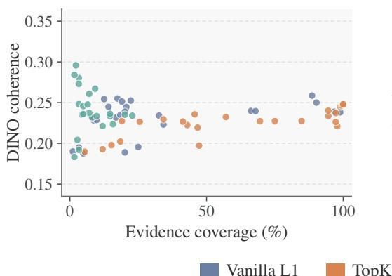

(a) SANA-Sprint: sparsity  
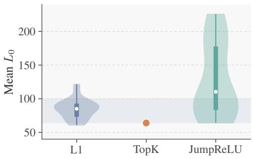

(b) Nitro-1-PixArt: sparsity  
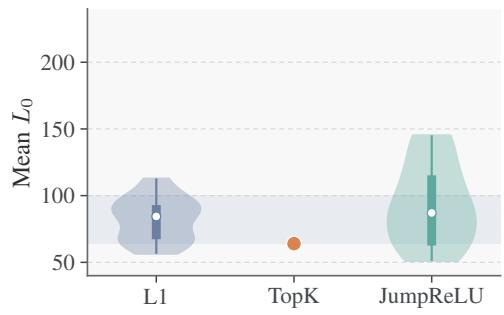

(c) SANA-Sprint: evidence  
(d) Nitro-1-PixArt: evidence  
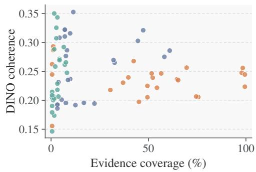  
Figure 5: Realized sparsity and visual evidence. (a,b) Sparsity distributions across layers and input settings. White dots mark medians, thick bars indicate interquartile ranges, and thin bars span observed ranges. Shading marks the tuning target [64, 100]. TopK is shown as a single point at $\ell _ { 0 } = 6 4$ . (c,d) DINOv3 coherence versus evidence coverage, with each point representing a dictionary with eligible visual evidence.

The changes across intermediate layers are not uniformly monotonic. For mean-centered TopK in Nitro-1-PixArt, coverage decreases from 75.5% at layer 8 to 52.2% at layer 14, then increases to 97.8% at layer 20 and 99.5% at layer 26. Dictionary selection therefore benefits from examining reconstruction, utilization, and evidence coverage jointly at each candidate layer.

## B.4 COMPLETE DICTIONARY EVALUATION RESULTS

Tables 4 and 5 report all configurations for SANA-Sprint and Nitro-1-PixArt. Utilization and coverage are expressed as percentages. DINO and SigLIP denote dictionary-level mean coherence over eligible features. N/A indicates unavailable raw-space evaluation or undefined coherence when no sampled feature meets the evidence requirement. Recipe-level summaries and matched comparisons are computed from unrounded values.

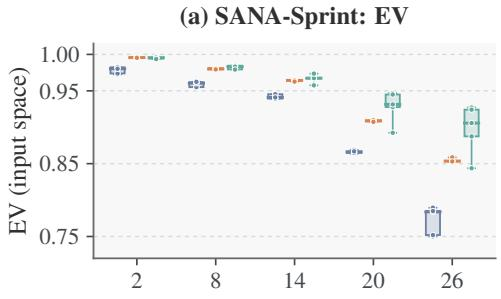

(b) Nitro-1-PixArt: EV  
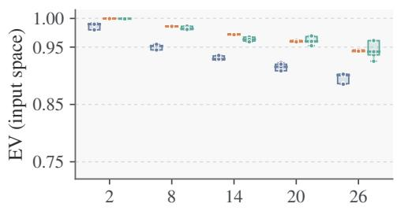

(c) SANA-Sprint: utilization  
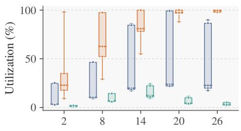

(d) Nitro-1-PixArt: utilization  
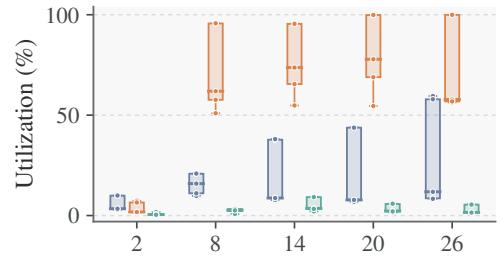

(e) SANA-Sprint: coverage  
(f) Nitro-1-PixArt: coverage  
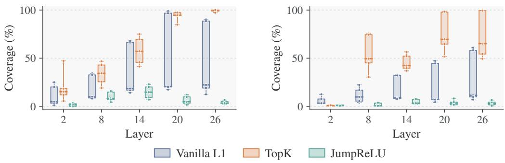  
Figure 6: Dictionary quality across transformer layers. Columns correspond to generators. Rows show SAE input-space EV, dictionary utilization, and evidence coverage. Each box summarizes five input settings within a layer and SAE family. Boxes indicate interquartile ranges, center lines mark medians, whiskers span observed ranges, and dots show individual settings.

Table 4: Complete SAE results for SANA-Sprint.
<table><tr><td>Layer SAE</td><td>Input</td><td>EV (input)</td><td>EV (raw)</td><td>Mean  $\ell _ { 0 }$ </td><td>Util. (%)</td><td>Cov. (%)</td><td>DINO</td><td>SigLIP</td></tr><tr><td>2 L1</td><td>None</td><td>0.9824</td><td>0.9824</td><td>94.0</td><td>3.4</td><td>3.3</td><td>0.195</td><td>0.726</td></tr><tr><td></td><td>Mean center</td><td>0.9726</td><td>0.9726</td><td>115.0</td><td>24.5</td><td>25.0</td><td>0.195</td><td>0.732</td></tr><tr><td></td><td>Geo. center</td><td>0.9738</td><td>0.9738</td><td>121.4</td><td>25.1</td><td>20.1</td><td>0.189</td><td>0.731</td></tr><tr><td></td><td>LayerNorm</td><td>0.9823</td><td>N/A</td><td>95.3</td><td>3.4</td><td>4.9</td><td>0.188</td><td>0.724</td></tr><tr><td></td><td>RMS</td><td>0.9803</td><td>0.9803</td><td>81.7</td><td>2.9</td><td>1.1</td><td>0.190</td><td>0.720</td></tr><tr><td>2 TopK</td><td>None</td><td>0.9956</td><td>0.9956</td><td>64.0</td><td>17.7</td><td>12.0</td><td>0.193</td><td>0.730</td></tr><tr><td></td><td>Mean center</td><td>0.9958</td><td>0.9958</td><td>64.0</td><td>35.0</td><td>18.5</td><td>0.202</td><td>0.731</td></tr><tr><td></td><td>Geo. center</td><td>0.9958</td><td>0.9958</td><td>64.0</td><td>97.9</td><td>47.3</td><td>0.197</td><td>0.728</td></tr><tr><td></td><td>LayerNorm</td><td>0.9957</td><td>N/A</td><td>64.0</td><td>22.9</td><td>15.2</td><td>0.198</td><td>0.733</td></tr><tr><td></td><td>RMS</td><td>0.9953</td><td>0.9953</td><td>64.0</td><td>9.3</td><td>5.4</td><td>0.190</td><td>0.728</td></tr><tr><td>Layer SAE</td><td>Input</td><td>EV (input) EV (raw)</td><td>Mean lo</td><td>Util. (%)</td><td>Cov. (%)</td><td>DINO</td><td></td><td>SigLIP</td></tr><tr><td rowspan="5">2 JumpReLU None</td><td></td><td>0.9942</td><td>0.9942</td><td>76.7</td><td>0.9</td><td>0.0</td><td>N/A</td><td>N/A</td></tr><tr><td>Mean center</td><td>0.9955</td><td>0.9955</td><td>65.8</td><td>1.9</td><td>2.7</td><td>0.204</td><td>0.742</td></tr><tr><td>Geo. center</td><td>0.9955</td><td>0.9955</td><td>65.8</td><td>1.9</td><td>3.3</td><td>0.192</td><td>0.726</td></tr><tr><td>LayerNorm</td><td>0.9956</td><td>N/A</td><td>92.5</td><td>0.9</td><td>1.6</td><td>0.183</td><td>0.742</td></tr><tr><td>RMS</td><td>0.9936</td><td>0.9936</td><td>82.2</td><td>2.0</td><td>0.0</td><td>N/A</td><td>N/A</td></tr><tr><td rowspan="5">8 L1</td><td>None</td><td>0.9619 0.9619</td><td>84.2</td><td>10.3</td><td>8.7</td><td>0.228</td><td></td><td>0.742</td></tr><tr><td>Mean center</td><td>0.9551</td><td>0.9551</td><td>73.1</td><td>46.3</td><td>34.2</td><td>0.223</td><td>0.744</td></tr><tr><td>Geo. center</td><td>0.9550</td><td>0.9550</td><td>73.3</td><td>46.4</td><td>32.6</td><td>0.234</td><td>0.749</td></tr><tr><td>LayerNorm</td><td>0.9605</td><td>N/A</td><td>84.3</td><td>9.2</td><td>9.8</td><td>0.229</td><td>0.738</td></tr><tr><td>RMS</td><td>0.9624</td><td>0.9624</td><td>85.1</td><td>10.2</td><td>8.2</td><td>0.231</td><td>0.743</td></tr><tr><td rowspan="8">8 TopK 8 JumpReLU None</td><td>None</td><td>0.9801</td><td>0.9801</td><td>64.0</td><td>52.3</td><td>25.5</td><td>0.226</td><td>0.741</td></tr><tr><td>Mean center</td><td>0.9811</td><td>0.9811</td><td>64.0</td><td>97.3</td><td>46.7</td><td>0.219</td><td>0.742</td></tr><tr><td>Geo. center</td><td>0.9811</td><td>0.9811</td><td>64.0</td><td>97.3</td><td>42.9</td><td>0.222</td><td>0.740</td></tr><tr><td>LayerNorm</td><td>0.9793</td><td>N/A</td><td>64.0</td><td>62.7</td><td>34.2</td><td>0.229</td><td>0.737</td></tr><tr><td>RMS</td><td>0.9795</td><td>0.9795</td><td>64.0</td><td>29.2</td><td>19.0</td><td>0.227</td><td>0.739</td></tr><tr><td></td><td>0.9794</td><td>0.9794</td><td>83.3</td><td>6.8</td><td>8.2</td><td>0.232</td><td></td></tr><tr><td>Mean center</td><td>0.9845</td><td>0.9845</td><td>112.6</td><td>14.5</td><td>14.7</td><td>0.234</td><td>0.739 0.741</td></tr><tr><td>Geo. center</td><td>0.9845</td><td>0.9845</td><td>112.7</td><td>14.3</td><td>15.8</td><td>0.224</td><td>0.733</td></tr><tr><td rowspan="4">14 L1</td><td>LayerNorm</td><td></td><td>N/A 136.3</td><td></td><td>6.3</td><td>7.1 0.237</td><td></td><td>0.738</td></tr><tr><td>RMS</td><td>0.9833 0.9792</td><td>0.9792</td><td>87.0</td><td>5.9</td><td>4.3</td><td>0.235</td><td>0.750</td></tr><tr><td></td><td></td><td></td><td></td><td></td><td></td><td></td><td></td></tr><tr><td>None</td><td>0.9393</td><td>0.9393 0.9456</td><td>61.9 87.0</td><td>19.9 85.7</td><td>16.8</td><td>0.232 0.240</td><td>0.740 0.750</td></tr><tr><td rowspan="5">14 TopK</td><td>Mean center Geo. center</td><td>0.9456 0.9453</td><td>0.9453</td><td>87.2</td><td>84.5</td><td>66.3</td><td>0.240</td><td>0.742</td></tr><tr><td>LayerNorm</td><td>0.9392</td><td>N/A</td><td>61.0</td><td>17.3</td><td>67.9 14.1</td><td>0.245</td><td>0.744</td></tr><tr><td>RMS</td><td>0.9409</td><td>0.9409</td><td>69.0</td><td>18.8</td><td>18.5</td><td>0.235</td><td>0.743</td></tr><tr><td>None</td><td>0.9635</td><td>0.9635</td><td>64.0</td><td>78.2</td><td>45.7</td><td>0.236</td><td></td></tr><tr><td>Mean center</td><td>0.9649</td><td>0.9649</td><td>64.0</td><td>99.8</td><td>75.0</td><td>0.227</td><td>0.736 0.732</td></tr><tr><td rowspan="8">14 JumpReLU None</td><td>Geo. center</td><td>0.9649</td><td>0.9649</td><td>64.0</td><td>99.8</td><td>69.6</td><td>0.227</td><td>0.731</td></tr><tr><td>LayerNorm</td><td>0.9643</td><td>N/A</td><td></td><td>80.9</td><td></td><td>0.232</td><td>0.737</td></tr><tr><td>RMS</td><td>0.9627</td><td></td><td>64.0 64.0</td><td>55.0</td><td>57.1 41.3</td><td>0.227</td><td>0.731</td></tr><tr><td></td><td></td><td>0.9627 0.9668</td><td></td><td></td><td></td><td>0.236</td><td></td></tr><tr><td></td><td>0.9668</td><td></td><td>110.3</td><td>12.3</td><td>14.7</td><td></td><td>0.729</td></tr><tr><td>Mean center</td><td>0.9676</td><td>0.9676</td><td>94.4</td><td>24.0</td><td>22.8</td><td>0.234</td><td>0.737</td></tr><tr><td>Geo. center LayerNorm</td><td>0.9674</td><td>0.9674</td><td>94.2</td><td>22.2</td><td>20.1</td><td>0.235</td><td>0.738</td></tr><tr><td>RMS</td><td>0.9737 0.9575</td><td>N/A 0.9575</td><td>169.9 64.2</td><td>9.6 10.9</td><td>7.1 9.2</td><td>0.261 0.267</td><td>0.755 0.759</td></tr><tr><td rowspan="5">20 L1</td><td>None</td><td></td><td></td><td></td><td></td><td></td><td></td><td></td></tr><tr><td>Mean center</td><td>0.8660 0.8637</td><td>0.8660 0.8637</td><td>90.9 79.8</td><td>23.7 99.7</td><td>20.7</td><td>0.245 0.238</td><td>0.742</td></tr><tr><td>Geo. center</td><td>0.8648</td><td>0.8648</td><td>82.3</td><td>99.1</td><td>98.9 96.7</td><td>0.239</td><td>0.741</td></tr><tr><td>LayerNorm</td><td>0.8688</td><td>N/A</td><td>92.8</td><td>21.8</td><td>17.4</td><td>0.255</td><td>0.741 0.756</td></tr><tr><td>RMS</td><td>0.8669</td><td>0.8669</td><td>91.6</td><td>22.0</td><td>20.1</td><td>0.239</td><td>0.737</td></tr><tr><td rowspan="6">20 TopK 20 JumpReLU None</td><td>None</td><td></td><td></td><td></td><td></td><td></td><td></td><td>0.731</td></tr><tr><td>Mean center</td><td>0.9079 0.9090</td><td>0.9079 0.9090</td><td>64.0 64.0</td><td>97.0 100.0</td><td>94.6 97.8</td><td>0.234 0.221</td><td>0.723</td></tr><tr><td>Geo. center</td><td></td><td></td><td></td><td></td><td>97.3</td><td>0.226</td><td>0.729</td></tr><tr><td>LayerNorm</td><td>0.9090 0.9099</td><td>0.9090 N/A</td><td>64.0 64.0</td><td>100.0 97.2</td><td>94.6</td><td>0.240</td><td>0.736</td></tr><tr><td>RMS</td><td>0.9074</td><td>0.9074</td><td>64.0</td><td>88.1</td><td>84.8</td><td>0.227</td><td>0.728</td></tr><tr><td></td><td>0.9277</td><td>0.9277</td><td>165.5</td><td>4.4</td><td>4.9</td><td>0.236 0.735</td></tr><tr><td>Layer SAE</td><td>Input</td><td>EV (input)</td><td>EV (raw)</td><td>Mean  $\ell _ { 0 }$ </td><td>Util. (%)</td><td>Cov. (%)</td><td>DINO</td><td>SigLIP</td></tr><tr><td rowspan="10">26 TopK</td><td>None</td><td>0.8527</td><td>0.8527</td><td>64.0</td><td>97.8</td><td>98.9</td><td>0.245</td><td>0.733</td></tr><tr><td>Mean center</td><td>0.8537</td><td>0.8537</td><td>64.0</td><td>100.0</td><td>99.5</td><td>0.246</td><td>0.730</td></tr><tr><td>Geo. center</td><td>0.8536</td><td>0.8536</td><td>64.0</td><td>100.0</td><td>100.0</td><td>0.248</td><td>0.730</td></tr><tr><td>LayerNorm</td><td>0.8586</td><td>N/A</td><td>64.0</td><td>97.8</td><td>97.3</td><td>0.237</td><td>0.731</td></tr><tr><td>RMS</td><td>0.8531</td><td>0.8531</td><td>64.0</td><td>99.4</td><td>100.0</td><td>0.248</td><td>0.731</td></tr><tr><td>None</td><td>0.9057</td><td>0.9057</td><td>218.0</td><td>2.8</td><td>3.3</td><td>0.248</td><td>0.730</td></tr><tr><td>Mean center</td><td>0.9271</td><td>0.9271</td><td>222.2</td><td>5.6</td><td>4.9</td><td>0.246</td><td>0.733</td></tr><tr><td>Geo. center</td><td>0.9242</td><td>0.9242</td><td>225.6</td><td>5.0</td><td>6.5</td><td>0.248</td><td>0.736</td></tr><tr><td>LayerNorm</td><td>0.8874</td><td>N/A</td><td>198.8</td><td>2.1</td><td>2.2</td><td>0.296</td><td>0.782</td></tr><tr><td>RMS</td><td>0.8437</td><td>0.8437</td><td>95.2</td><td>2.7</td><td>3.3</td><td>0.273</td><td>0.747</td></tr></table>

Table 5: Complete SAE results for Nitro-1-PixArt.
<table><tr><td>Layer SAE</td><td>Input</td><td>EV (input)</td><td>EV (raw)</td><td>Mean  $\ell _ { 0 }$ </td><td>Util. (%)</td><td>Cov. (%)</td><td>DINO</td><td>SigLIP</td></tr><tr><td>2 L1</td><td></td><td>0.9922</td><td>0.9922</td><td>92.7</td><td>3.4</td><td>3.3</td><td>0.193</td><td>0.782</td></tr><tr><td></td><td>Mean center</td><td>0.9798</td><td>0.9798</td><td>67.3</td><td>9.9</td><td>7.6</td><td>0.195</td><td>0.781</td></tr><tr><td></td><td>Geo. center</td><td>0.9801</td><td>0.9801</td><td>67.0</td><td>10.0</td><td>12.5</td><td>0.192</td><td>0.784</td></tr><tr><td></td><td>LayerNorm</td><td>0.9909</td><td>N/A</td><td>83.3</td><td>2.9</td><td>3.3</td><td>0.192</td><td>0.780</td></tr><tr><td></td><td>RMS</td><td>0.9899</td><td>0.9899</td><td>84.4</td><td>3.4</td><td>3.3</td><td>0.186</td><td>0.777</td></tr><tr><td>2 TopK</td><td>None</td><td>0.9997</td><td>0.9997</td><td>64.0</td><td>1.5</td><td>0.5</td><td>0.155</td><td>0.767</td></tr><tr><td></td><td>Mean center</td><td>0.9997</td><td>0.9997</td><td>64.0</td><td>7.4</td><td>0.5</td><td>0.245</td><td>0.811</td></tr><tr><td></td><td>Geo. center</td><td>0.9997</td><td>0.9997</td><td>64.0</td><td>6.5</td><td>0.5</td><td>0.262</td><td>0.838</td></tr><tr><td></td><td>LayerNorm</td><td>0.9997</td><td>N/A</td><td>64.0</td><td>1.8</td><td>1.1</td><td>0.293</td><td>0.808</td></tr><tr><td></td><td>RMS</td><td>0.9997</td><td>0.9997</td><td>64.0</td><td>1.7</td><td>1.1</td><td>0.287</td><td>0.806</td></tr><tr><td>2 JumpReLU</td><td>JNone</td><td>0.9993</td><td>0.9993</td><td>51.0</td><td>0.3</td><td>1.1</td><td>0.200</td><td>0.778</td></tr><tr><td></td><td>Mean center</td><td>0.9995</td><td>0.9995</td><td>111.4</td><td>1.8</td><td>0.5</td><td>0.214</td><td>0.781</td></tr><tr><td></td><td>Geo. center</td><td>0.9997</td><td>0.9997</td><td>80.8</td><td>0.6</td><td>1.6</td><td>0.174</td><td>0.777</td></tr><tr><td></td><td>LayerNorm</td><td>0.9995</td><td>N/A</td><td>61.6</td><td>0.5</td><td>1.1</td><td>0.207</td><td>0.784</td></tr><tr><td>8L1</td><td>RMS</td><td>0.9992</td><td>0.9992</td><td>61.3</td><td>0.4</td><td>0.5</td><td>0.179</td><td>0.766</td></tr><tr><td></td><td>None</td><td>0.9520</td><td>0.9520</td><td>95.4</td><td>9.8</td><td>3.8</td><td>0.231</td><td>0.793</td></tr><tr><td></td><td>Mean center</td><td>0.9448</td><td>0.9448</td><td>112.9</td><td>20.8</td><td>16.8</td><td>0.196</td><td>0.782</td></tr><tr><td></td><td>Geo. center</td><td>0.9450</td><td>0.9450</td><td>112.7</td><td>20.9</td><td>22.3</td><td>0.194</td><td>0.784</td></tr><tr><td></td><td>LayerNorm</td><td>0.9522</td><td>N/A</td><td>96.8</td><td>15.9</td><td>9.8</td><td>0.237</td><td>0.799</td></tr><tr><td>8 TopK</td><td>RMS</td><td>0.9548</td><td>0.9548</td><td>102.7</td><td>11.1</td><td>5.4</td><td>0.201</td><td>0.783</td></tr><tr><td></td><td>None</td><td>0.9861</td><td>0.9861</td><td>64.0</td><td>61.9</td><td>49.5</td><td>0.205</td><td>0.785</td></tr><tr><td></td><td>Mean center</td><td>0.9864</td><td>0.9864</td><td>64.0</td><td>95.7</td><td>75.5</td><td>0.206</td><td>0.785</td></tr><tr><td></td><td>Geo. center</td><td>0.9865</td><td>0.9865</td><td>64.0</td><td>95.7</td><td>74.5</td><td>0.206</td><td>0.786</td></tr><tr><td></td><td>LayerNorm</td><td>0.9862</td><td>N/A</td><td>64.0</td><td>50.9</td><td>30.4</td><td>0.218</td><td>0.789</td></tr><tr><td></td><td>RMS</td><td>0.9862</td><td>0.9862</td><td>64.0</td><td>57.6</td><td>45.1</td><td>0.197</td><td>0.781</td></tr><tr><td>8 JumpReLU</td><td>None</td><td>0.9804</td><td>0.9804</td><td>94.2</td><td>2.4</td><td>0.5</td><td>0.146</td><td>0.773</td></tr><tr><td></td><td>Mean center</td><td>0.9863</td><td>0.9863</td><td>80.6</td><td>3.3</td><td>3.3</td><td>0.218</td><td>0.783</td></tr><tr><td></td><td>Geo. center</td><td>0.9865</td><td>0.9865</td><td>85.0</td><td>3.3</td><td>3.8</td><td>0.206</td><td>0.789</td></tr><tr><td></td><td>LayerNorm</td><td>0.9818</td><td>N/A</td><td>87.0</td><td>0.8</td><td>0.5</td><td>0.190</td><td>0.770</td></tr><tr><td></td><td>RMS</td><td>0.9808</td><td>0.9808</td><td>96.9</td><td>2.6</td><td>0.5</td><td>0.205</td><td>0.787</td></tr><tr><td>14 L1</td><td>None</td><td>0.9346</td><td>0.9346</td><td>66.2</td><td>8.7</td><td>8.7</td><td>0.235</td><td>0.797</td></tr><tr><td></td><td>Mean center</td><td>0.9271</td><td>0.9271</td><td>63.3</td><td>37.8</td><td>32.6</td><td>0.265</td><td>0.807</td></tr><tr><td></td><td>Geo. center</td><td>0.9276</td><td>0.9276</td><td>67.6</td><td>38.1</td><td>32.1</td><td>0.270</td><td>0.811</td></tr><tr><td></td><td>LayerNorm</td><td>0.9292</td><td>N/A</td><td>56.4</td><td>7.7</td><td>8.2</td><td>0.287</td><td>0.816</td></tr><tr><td></td><td>RMS</td><td>0.9354</td><td>0.9354</td><td>68.0</td><td>8.7</td><td>7.6</td><td>0.277</td><td>0.814</td></tr></table>

Continued on next page.

Table 5 (continued)
<table><tr><td>Layer SAE</td><td></td><td>Input</td><td>EV (input)</td><td>EV (raw)</td><td>Mean  $\ell _ { 0 }$ </td><td>Util. (%)</td><td>Cov. (%)</td><td>DINO</td><td>SigLIP</td></tr><tr><td></td><td>14 TopK</td><td>None</td><td>0.9721</td><td>0.9721</td><td>64.0</td><td>65.5</td><td>39.7</td><td>0.240</td><td>0.794</td></tr><tr><td></td><td></td><td>Mean center</td><td>0.9731</td><td>0.9731</td><td>64.0</td><td>95.5</td><td>52.2</td><td>0.239</td><td>0.797</td></tr><tr><td></td><td></td><td>Geo. center</td><td>0.9731</td><td>0.9731</td><td>64.0</td><td>95.5</td><td>56.5</td><td>0.246</td><td>0.802</td></tr><tr><td></td><td></td><td>LayerNorm</td><td>0.9718</td><td>N/A</td><td>64.0</td><td>73.7</td><td>42.4</td><td>0.268</td><td>0.807</td></tr><tr><td></td><td></td><td>RMS</td><td>0.9717</td><td>0.9717</td><td>64.0</td><td>54.8</td><td>37.0</td><td>0.230</td><td>0.793</td></tr><tr><td></td><td>14 JumpReLU</td><td>None</td><td>0.9606</td><td>0.9606</td><td>62.6</td><td>3.6</td><td>2.2</td><td>0.258</td><td>0.805</td></tr><tr><td></td><td></td><td>Mean center</td><td>0.9677</td><td>0.9677</td><td>61.4</td><td>9.4</td><td>7.1</td><td>0.262</td><td>0.800</td></tr><tr><td></td><td></td><td>Geo. center</td><td>0.9675</td><td>0.9675</td><td>61.0</td><td>9.2</td><td>7.6</td><td>0.265</td><td>0.803</td></tr><tr><td></td><td></td><td>LayerNorm</td><td>0.9634</td><td>N/A</td><td>91.3</td><td>2.1</td><td>2.7</td><td>0.307</td><td>0.817</td></tr><tr><td>20 L1</td><td></td><td>RMS</td><td>0.9592</td><td>0.9592</td><td>58.7</td><td>3.3</td><td>3.3</td><td>0.229</td><td>0.790</td></tr><tr><td></td><td></td><td>None</td><td>0.9228</td><td>0.9228</td><td>97.7</td><td>7.7</td><td>7.1</td><td>0.310</td><td>0.830</td></tr><tr><td></td><td></td><td>Mean center</td><td>0.9086</td><td>0.9086</td><td>79.8</td><td>44.0</td><td>47.3</td><td>0.321</td><td>0.831</td></tr><tr><td></td><td></td><td>Geo. center</td><td>0.9086</td><td>0.9086</td><td>79.5</td><td>43.8</td><td>44.6</td><td>0.303</td><td>0.824</td></tr><tr><td></td><td></td><td>LayerNorm</td><td>0.9156</td><td>N/A</td><td>86.2</td><td>6.9</td><td>7.1</td><td>0.322</td><td>0.830</td></tr><tr><td>20 TopK</td><td>RMS</td><td></td><td>0.9201</td><td>0.9201</td><td>92.9</td><td>7.8</td><td>4.3</td><td>0.308</td><td>0.832</td></tr><tr><td></td><td>None</td><td></td><td>0.9596</td><td>0.9596</td><td>64.0</td><td>68.9</td><td>64.7</td><td>0.236</td><td>0.798</td></tr><tr><td></td><td></td><td>Mean center</td><td>0.9616</td><td>0.9616</td><td>64.0</td><td>99.9</td><td>97.8</td><td>0.248</td><td>0.803</td></tr><tr><td></td><td></td><td>Geo. center</td><td>0.9616</td><td>0.9616</td><td>64.0</td><td>99.9</td><td>98.4</td><td>0.256</td><td>0.805</td></tr><tr><td></td><td></td><td>LayerNorm</td><td>0.9595</td><td>N/A</td><td>64.0</td><td>77.8</td><td>69.6</td><td>0.256</td><td>0.808</td></tr><tr><td>20 JumpReLU</td><td>RMS</td><td></td><td>0.9592</td><td>0.9592</td><td>64.0</td><td>54.6</td><td>51.6</td><td>0.246</td><td>0.802</td></tr><tr><td></td><td>None</td><td></td><td>0.9589</td><td>0.9589</td><td>111.7</td><td>2.3</td><td>3.3</td><td>0.343</td><td>0.832</td></tr><tr><td></td><td></td><td>Mean center</td><td>0.9684</td><td>0.9684</td><td>115.2</td><td>5.8</td><td>8.2</td><td>0.247</td><td>0.803</td></tr><tr><td></td><td></td><td>Geo. center</td><td>0.9695</td><td>0.9695</td><td>121.7</td><td>5.9</td><td>4.3</td><td>0.271</td><td>0.805</td></tr><tr><td></td><td></td><td>LayerNorm</td><td>0.9600</td><td>N/A</td><td>139.0</td><td>1.6</td><td>1.6</td><td>0.288</td><td>0.804</td></tr><tr><td>26 L1</td><td>RMS</td><td></td><td>0.9523</td><td>0.9523</td><td>86.8</td><td>2.1</td><td>1.6</td><td>0.350</td><td>0.853</td></tr><tr><td></td><td>None</td><td></td><td>0.9031</td><td>0.9031</td><td>92.3</td><td>8.6</td><td>11.4</td><td>0.353</td><td>0.840</td></tr><tr><td></td><td>Mean center</td><td></td><td>0.8862</td><td>0.8862</td><td>64.9</td><td>59.5</td><td>58.2</td><td>0.275</td><td>0.812</td></tr><tr><td></td><td>Geo. center</td><td>0.8853</td><td></td><td>0.8853</td><td>63.7</td><td>57.9</td><td>60.9</td><td>0.286</td><td>0.815</td></tr><tr><td></td><td>LayerNorm</td><td></td><td>0.9011</td><td>N/A</td><td>88.3</td><td>8.3</td><td>9.8</td><td>0.316</td><td>0.833</td></tr><tr><td>26 TopK</td><td>RMS</td><td></td><td>0.9027</td><td>0.9027</td><td>91.2</td><td>11.8</td><td>7.1</td><td>0.322</td><td>0.840</td></tr><tr><td></td><td>None</td><td></td><td>0.9428</td><td>0.9428</td><td>64.0</td><td>56.3</td><td>65.2</td><td>0.235</td><td>0.795</td></tr><tr><td></td><td></td><td>Mean center</td><td>0.9450</td><td>0.9450</td><td>64.0</td><td>100.0</td><td>99.5</td><td>0.223</td><td>0.792</td></tr><tr><td></td><td>Geo. center</td><td></td><td>0.9451</td><td>0.9451</td><td>64.0</td><td>100.0</td><td>99.5</td><td>0.245</td><td>0.799</td></tr><tr><td></td><td>LayerNorm</td><td></td><td>0.9429</td><td>N/A</td><td>64.0</td><td>57.8</td><td>49.5</td><td>0.225</td><td>0.794</td></tr><tr><td>26 JumpReLU</td><td>RMS</td><td></td><td>0.9429</td><td>0.9429</td><td>64.0</td><td>56.8</td><td>54.3</td><td>0.222</td><td>0.793</td></tr><tr><td></td><td>None</td><td></td><td>0.9364</td><td>0.9364</td><td>117.9</td><td>1.5</td><td>2.7</td><td>0.325</td><td>0.816</td></tr><tr><td></td><td></td><td>Mean center</td><td>0.9614</td><td>0.9614</td><td>143.8</td><td>5.6</td><td>4.3</td><td>0.269</td><td>0.800</td></tr><tr><td></td><td>Geo. center</td><td></td><td>0.9613</td><td>0.9613</td><td>145.3</td><td>5.5</td><td>6.5</td><td>0.292</td><td>0.813</td></tr><tr><td></td><td>LayerNorm</td><td></td><td>0.9421</td><td>N/A</td><td>143.8</td><td>1.6</td><td>1.6</td><td>0.203</td><td>0.787</td></tr><tr><td></td><td>RMS</td><td></td><td>0.9254</td><td>0.9254</td><td>79.2</td><td>1.5</td><td>0.5</td><td>0.209</td><td>0.786</td></tr></table>

## C FEATURE CARDS AND VISUAL INDEX

Each of the 30 layer-14 dictionaries used for steering has a feature catalog, built once from a shared catalog corpus with the settings in Table 6. Construction uses no text annotations, benchmark prompts, or steering outcomes.

For feature i and catalog image n, let $s _ { i n }$ be the maximal SAE activation over the visual tokens of n. The J = 64 images with the largest positive $s _ { i n }$ supply the evidence of i, one patch per image, so that no image contributes more than once. These patches form the feature card of i; figures show its highest-ranked patches. They are also pooled into the visual centroid $\mathbf { v } _ { i }$ as in Section 3.2, with $a _ { i j } = s _ { i n }$ for the image n containing $P _ { i j }$ . Feature i enters the index I only if all J evidence activations are positive, that is, if it activates in at least J distinct catalog images; features with fewer positive images keep their cards and centroids but are never retrieved. For the dictionary in Figure 2, 16,232 of 18,432 features have cards and appear in the feature atlas, and 15,754 are indexed. Index size ranges from 373 to 18,298 features across dictionaries, and 41.3% of all 552,960 features are indexed (Table 7). The SANA teacher reuses the SANA-Sprint indices, and the card in Figure 13a is taken from the same catalog.

Table 6: Feature-catalog construction. Settings shared by all 30 layer-14 dictionaries.
<table><tr><td>Component</td><td>Setting</td></tr><tr><td>Prompts</td><td>First 10,000 prompts of the evaluation split (Table 3), disjoint from training and validation prompts; the first 1,000, with the same seeds, form the dictionary-evaluation set</td></tr><tr><td>Generation</td><td>1024 × 1024, single step, guidance 0 (timestep 400 for Nitro-1-PixArt);  $( 3 2 \times 3 2$  for SANA-Sprint,</td></tr><tr><td>Activations</td><td>Layer-14 post-block residual of all visual tokens  $6 4 \times 6 4$  for Nitro- 1-PixArt), mapped by T and encoded by the SAE</td></tr><tr><td>Evidence</td><td> $J = 6 4$  images with the largest positive per-image maximum; one token per image; ties broken by image order</td></tr><tr><td>Patch</td><td>Square of four token cells centered on the selected token, clipped at the image boundary</td></tr><tr><td>Card</td><td>Patches in an  $8 \times 8$  grid by descending activation, for every feature with a positive image</td></tr><tr><td>Encoder</td><td>SigLIP 2 So400M/16 at 384 × 384; pooled 1,152-dimensional image embedding</td></tr><tr><td>Index</td><td>Features whose J evidence activations are all positive</td></tr></table>

Table 7: Visual index size. Indexed features out of 18,432 in each layer-14 dictionary, with percentages in parentheses. Retrieval considers only indexed features; the SANA teacher uses the SANA-Sprint indices.
<table><tr><td>SAE</td><td>Input</td><td>SANA-Sprint</td><td>Nitro-1-PixArt</td></tr><tr><td>L1</td><td>None</td><td>3,661 (19.9)</td><td>1,583 (8.6)</td></tr><tr><td></td><td>Mean center Geo. center</td><td>15,754 (85.5) 15,525 (84.2)</td><td>6,983 (37.9) 6,976 (37.8)</td></tr><tr><td></td><td></td><td></td><td>1,422 (7.7)</td></tr><tr><td></td><td>LayerNorm</td><td>3,188 (17.3)</td><td></td></tr><tr><td></td><td>RMS</td><td>3,432 (18.6)</td><td>1,567 (8.5)</td></tr><tr><td>TopK</td><td>None</td><td>14,206 (77.1)</td><td>12,411 (67.3)</td></tr><tr><td></td><td>Mean center</td><td>18,298 (99.3)</td><td>18,189 (98.7)</td></tr><tr><td></td><td>Geo. center</td><td>18,290 (99.2)</td><td>18,173 (98.6)</td></tr><tr><td></td><td>LayerNorm</td><td>14,660 (79.5)</td><td>14,081 (76.4)</td></tr><tr><td></td><td>RMS</td><td>10,041 (54.5)</td><td>10,317 (56.0)</td></tr><tr><td>JumpReLU</td><td>None</td><td></td><td>645 (3.5)</td></tr><tr><td></td><td></td><td>2,255 (12.2)</td><td>1,726 (9.4)</td></tr><tr><td></td><td>Mean center</td><td>4,397 (23.9)</td><td></td></tr><tr><td></td><td>Geo. center</td><td>4,082 (22.1)</td><td>1,689 (9.2)</td></tr><tr><td></td><td>LayerNorm</td><td>1,765 (9.6)</td><td>373 (2.0)</td></tr><tr><td></td><td>RMS</td><td>1,995 (10.8)</td><td>585 (3.2)</td></tr></table>

Relation to evidence coverage. Coverage (Appendix B.2) applies the same rule to 184 sampled features over only the first 1,000 catalog images. It thus requires activation in at least 6.4% of images rather than 0.64%, a stricter criterion than index membership. Accordingly, the indexed share exceeds coverage for 25 of the 30 dictionaries, and the remaining five lie within one standard error of the 184-feature estimate. The J evidence images of a card are distinct from the K tokens pooled within each image in Appendix G.

Relation to steering. In every model-retrieval setting, the three weakest steering dictionaries (JumpReLU with the None, LayerNorm, and RMS settings; Table 1) have the three smallest visual indices, with at most 2,255 features on SANA-Sprint and 645 on Nitro. Centering enlarges the indices of L1 and JumpReLU by 1.8–4.4× but those of TopK by at most 1.5×, since uncentered TopK already indexes more than 12,000 features. Centering improves mean target alignment in 22 of 24 matched L1 and JumpReLU comparisons, while its effects on TopK are not consistently positive (Fig. 4c; Table 1). Among the remaining 12 dictionaries in each generation setting, larger indices are not consistently associated with higher mean target gains: the Spearman correlation between index size and $\Delta _ { \mathrm { t a r g e t } }$ ranges from 0.14 to 0.69 in the SANA environments but from −0.76 to −0.48 on Nitro. Index size is almost perfectly rank-correlated with utilization (Spearman 0.99–1.00), so these associations do not separate the size of the retrieval pool from other properties of the dictionary.

Table 8: Fine-grained steering benchmark. Each target concept has five under-specified and five explicit-conflict contexts.
<table><tr><td>Category</td><td>Targets</td><td>Cases</td><td>Example change</td></tr><tr><td>Color</td><td>20</td><td>200</td><td>Green dress → red dress</td></tr><tr><td>Material</td><td>20</td><td>200</td><td>Wooden chair → metal chair</td></tr><tr><td>Texture or pattern</td><td>20</td><td>200</td><td>Plain shirt → striped shirt</td></tr><tr><td>Local appearance</td><td>20</td><td>200</td><td>Straight hair → curly hair</td></tr><tr><td>Local state or geometry</td><td>20</td><td>200</td><td>Closed umbrella → open umbrella</td></tr><tr><td>Total</td><td>100</td><td>1,000</td><td></td></tr></table>

Table 9: Matched rose-blooming cases. The scene and target query are shared, while the source state and reference query differ.
<table><tr><td colspan="2">Category: Local state or geometry Target region: rose Steering instruction: make the rose bloom Target query q: rose in full bloom</td></tr><tr><td>Under-specified a single rose in a garden with morning</td><td>Explicit-conflict</td></tr><tr><td>Source prompt c dew</td><td>a single closed rose bud in a garden with morning dew</td></tr><tr><td>Source state Blooming state is unspecified.</td><td>A closed bud is explicitly specified.</td></tr><tr><td>Reference query rose qbase</td><td>rose bud</td></tr></table>

## D FINE-GRAINED STEERING BENCHMARK

This section provides additional details for the fine-grained steering benchmark in Section 4.3. We describe the benchmark, feature retrieval and intervention protocol, and evaluation procedure, followed by analyses of retrieval strategy and student-to-teacher transfer.

## D.1 BENCHMARK AND EVALUATION PROTOCOL

Benchmark construction. The benchmark contains 100 target concepts across five categories: color, material, texture or pattern, local appearance, and local state or geometry. Each concept is evaluated in five under-specified and five explicit-conflict contexts, yielding 1,000 cases. Underspecified contexts leave the target attribute unspecified in the source prompt, while explicit-conflict contexts specify a competing attribute. Each case provides a source prompt $c ,$ a target query q describing the requested regional appearance, a reference query $q _ { \mathrm { b a s e } } .$ , and a target region. A full target prompt $c ^ { \prime }$ is provided for the oracle references. Table 8 summarizes the benchmark, and Table 9 presents a matched pair of contexts.

Generators and dictionaries. Steering is evaluated with SANA-Sprint, Nitro-1-PixArt, and the SANA teacher at 1024 ×1024 resolution. Interventions are applied to the post-block residual stream at zero-indexed layer 14. For each student generator, the evaluation includes the 15 dictionaries at this layer, spanning three SAE families and five input settings (Appendix B.1), for 30 studenttrained dictionaries in total. The SANA teacher reuses the corresponding SANA-Sprint dictionaries and visual indices.

Feature retrieval. We use the direct and contrastive retrieval rules defined in Section 3.2. The reference query describes the generic target object in under-specified contexts and the competing source attribute in explicit-conflict contexts. Retrieval uses only the text queries and the precomputed visual index, without access to target images or steering outcomes, and ties are resolved by the smaller feature index. For a given dictionary, case, and retrieval strategy, the selected feature is fixed across steering strengths and generation seeds.

Target region. SAM 3 localizes the target object in the unmodified source image $I ^ { ( 0 ) }$ . Valid instance masks are combined into the target region M and mapped to the visual-token grid to obtain $M _ { p } \in$ {0, 1}. The target region remains fixed across methods and steering strengths within each case and generation seed.

Direction adjustment. Let $\mathbf { d } _ { i } \in \mathbb { R } ^ { D }$ denote the decoder atom of feature i, where D is the number of activation channels and $( \mathbf { d } _ { i } ) _ { k }$ is its scalar value in channel k. The channel mean is the scalar

$$
\bar { d } _ { i } = \frac { 1 } { D } \sum _ { k = 1 } ^ { D } ( { \bf d } _ { i } ) _ { k } .
$$

This average is taken over the channels of one decoder atom.

For the five input settings considered here, the direction adjustment is

$$
\mathcal { A } _ { \mathcal { T } } ( \mathbf { d } _ { i } ) = \left\{ \begin{array} { l l } { \mathbf { d } _ { i } - \bar { d } _ { i } \mathbf { 1 } , } & { \mathrm { i f ~ t h e ~ i n p u t ~ s e t t i n g ~ i s ~ L a y e r N o r m } , } \\ { \mathbf { d } _ { i } , } & { \mathrm { o t h e r w i s e } , } \end{array} \right.
$$

where $\textbf { 1 } \in \mathbb { R } ^ { D }$ is the all-ones vector. Thus, None, Mean center, Geo. center, and RMS leave the decoder atom unchanged, whereas LayerNorm subtracts the same channel mean from every component of the atom.

RMS rescaling contributes only a positive scalar factor, which cancels under unit normalization. Decoder bias terms are excluded because they cancel in differences between reconstructed activations. The LayerNorm adjustment removes the channel-mean component and does not invert the input normalization. The selected feature’s unit steering direction is

$$
\hat { \mathbf { u } } _ { i ^ { \star } } = \nu ( \mathcal { A } _ { T } ( \mathbf { d } _ { i ^ { \star } } ) ) .
$$

Masked intervention. The masked update of Section 3.3 is applied at every denoising step with constant strength. The reference scale $R ( t )$ is the root mean square of raw residual $\ell _ { 2 }$ norms over all spatial tokens in 200 fixed, unmodified source generations at the intervened layer and step. Cali bration is performed separately for each generation setting. The steering strength is swept over

$$
\mathcal { G } = \{ 0 . 0 5 , 0 . 1 0 , 0 . 1 5 , 0 . 2 0 , 0 . 3 0 , 0 . 4 0 , 0 . 5 0 , 0 . 7 5 , 1 . 0 0 , 1 . 5 0 \} .
$$

Reference methods. Source denotes the unmodified generation $I ^ { ( 0 ) }$ . Oracle Dense constructs a target-informed direction from paired source- and target-prompt generations with the same initial noise. The direction is obtained by subtracting the mean activation over the target region in the source generation from the corresponding mean in the target generation and normalizing the difference. It is applied using the same masked intervention protocol and strength grid as the SAE directions. Oracle Prompt generates directly from $c ^ { \prime }$ using the same initial noise and sampling settings. The oracle references access the full target prompt, and Oracle Dense additionally accesses target-generation activations.

Regional target alignment. We measure target control using Region SigLIP $\Delta$ . Let $C _ { M } ( I )$ denote a crop derived from the bounding box of the target region M. The bounding box is expanded by 15% of its width and height on each side and clipped to the image boundaries, with identical crop coordinates used for the steered image I and the unmodified source image $I ^ { ( 0 ) }$ . Let $S ( C _ { M } ( I ) , q )$ denote the cosine similarity between the SigLIP 2 embeddings of the crop and the target query $q .$ Regional target gain is

$$
\Delta _ { \mathrm { t a r g e t } } ( I ) = S ( C _ { M } ( I ) , q ) - S ( C _ { M } ( I ^ { ( 0 ) } ) , q ) .
$$

We refer to $\Delta _ { \mathrm { t a r g e t } }$ as Region SigLIP ∆ in the main text. Positive values indicate increased regional alignment with the target query relative to the unmodified source image.

Outside-region preservation. We measure outside-region preservation using LPIPS-out. The target region M is dilated by 12 pixels, and LPIPS-out averages the spatial AlexNet LPIPS (Zhang et al., 2018) distance map between I and $I ^ { ( 0 ) }$ over the complement of the dilated region. Lower values indicate better preservation of content outside the target region.

Strength selection. For each case and generation seed, strength is selected separately for every fixed combination of SAE dictionary and retrieval strategy:

$$
\rho ^ { \star } \in \mathop { \arg \operatorname* { m a x } } _ { \rho \in \mathcal { G } } \Delta _ { \mathrm { t a r g e t } } ( I ( \rho ) ) .
$$

Ties are resolved by lower LPIPS-out and then smaller $\rho .$ Both metrics are reported from the same selected output $\bar { I } ( \bar { \rho } ^ { \star } )$ . Oracle Dense uses the same strength-selection procedure, whereas Oracle Prompt has no strength sweep. SigLIP 2 is used for feature retrieval, regional target scoring, and strength selection. The resulting comparisons describe per-case best-of-sweep performance.

Statistical aggregation. Evaluation uses three generation seeds. Within each generation setting and seed, all methods are compared on their common intersection of valid cases. Metrics are first averaged over cases, then summarized by the mean and sample standard deviation of the three seedlevel averages. Reported target gains and LPIPS-out values are multiplied by $1 0 ^ { 3 }$

## D.2 ADDITIONAL ANALYSIS

Direct versus Contrastive retrieval. Across all three generation environments, Contrastive SAE retrieval increases mean Region SigLIP improvement relative to Direct SAE for all 15 evaluated dictionaries. Its effect on source preservation is less uniform: LPIPS-out decreases for 8 of 15 SANA-Sprint dictionaries and 14 of 15 Nitro dictionaries, but increases for all 15 SANA-teacher dictionaries. Thus, improved target control does not necessarily imply improved preservation.

Concept category and source context. Figure 7 resolves target-control performance by semantic category, source-context regime, SAE family, and generation environment. Within each SAE family, we first average the five input configurations within each generation seed, and then report the mean and sample SD across three seeds. Color and texture or pattern are comparatively easy to steer, whereas local state or geometry is more difficult using a single SAE direction. Contrastive SAE retrieval generally improves target alignment over Direct SAE retrieval, with particularly pronounced gains for explicit-conflict cases in the SANA environments.

Student-to-teacher transfer. The SANA teacher uses the same student-trained dictionaries, feature indices, and retrieved feature identities as SANA-Sprint. The positive steering results therefore show that student-trained SAE directions remain actionable in the longer teacher generation trajectory, although the control–preservation operating point changes. For example, mean-centered TopK with Contrastive SAE achieves Region SigLIP improvements of 31.7 and 28.8 on the SANA student and teacher, respectively, while LPIPS-out changes from 157.3 to 234.5.

## E ADDITIONAL APPLICATIONS OF LEARNED SAE FEATURES

Beyond steering toward a target concept, individual SAE features can serve as lightweight interfaces for both controlling and reading out model behavior. We study these complementary roles through style suppression and single-feature semantic readout. In both cases, the pretrained generators and SAEs remain frozen.

Style suppression. Following SAeUron (Cywinski & Deja, 2025), we intervene on a single style-´ associated feature during generation in SANA-Sprint and Nitro-1-PixArt; unlike the steering benchmark, this intervention rescales the selected SAE code rather than adding a unit-normalized direction (Appendix F.2). Because the released UnlearnCanvas (Zhang et al., 2024) classifier transfers poorly to these generators, we train generator-specific evaluators and restrict evaluation to ten styles that are classified reliably across validation and external baseline images (Tables 10 and 11). Using matched prompts, we compare targeted suppression with unmodified generations and mismatched-feature interventions (Figure 8a, c). Under a preservation constraint on non-target styles and object content (Fig. 9; Table 13), the selected configurations achieve target-style suppression scores of 53.8% for SANA and 44.0% for Nitro, compared with 3.5% and 1.2% under mismatched interventions. These results show that existing dictionary features can selectively attenuate a visual style, although suppression remains incomplete and varies substantially across styles (Table 14; Fig. 12).

Nudity feature readout. We next ask whether a single frozen SAE feature can also provide a useful semantic readout. Using a labeled discovery set (Table 15), we select one feature from a SANA-Sprint SAE according to its association with human-annotated nudity (Algorithm 1), then evaluate

SANA-Sprint

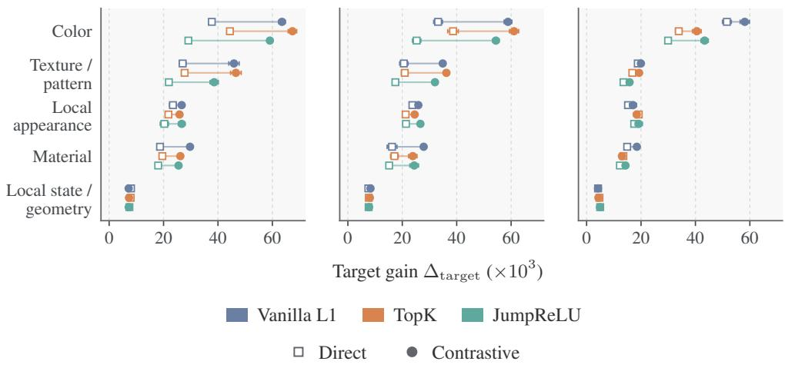

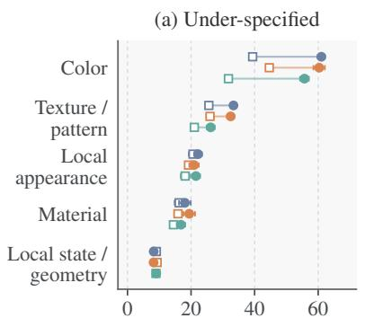  
(d) Explicit-conflict  
SANA (teacher)

(b) Under-specified  
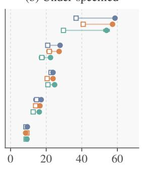  
Nitro-1-PixArt

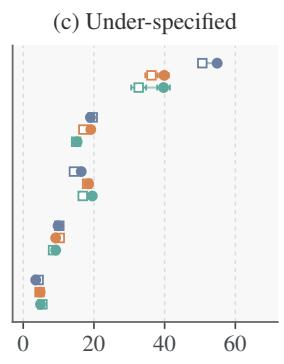  
(e) Explicit-conflict  
(f) Explicit-conflict  
Figure 7: Target alignment by concept category and source context. Columns correspond to the three generation environments: SANA-Sprint (student), SANA (teacher), and Nitro-1-PixArt; the top and bottom rows show under-specified and explicit-conflict source contexts, respectively. Colors denote SAE families (L1, TopK, and JumpReLU), while open squares and filled circles denote Direct and Contrastive direction retrieval. Lines connect the two direction sources within the same SAE family and concept category. For each point, we first average over the five input configurations within each generation seed, then show the mean with sample SD across three seeds. Target-alignment improvement $\Delta _ { \mathrm { t a r g e t } }$ is reported in units of $1 0 ^ { - 3 }$

that feature on images from disjoint scenes and template families without fitting an additional probe. We aggregate its top-K token-wise responses into an image-level activation score; the selected feature reaches an AUROC of 0.980 on 118 held-out images (Figure 8b) and is recovered consistently across pooling sizes (Fig. 13b), while spatial activation maps visualize where the feature responds (Figure 8d; Fig. 14 and 15). This provides evidence that a single SAE feature can expose a semantically useful signal in addition to supporting intervention. These results also highlight the potential of learned SAE features for safety-relevant monitoring and content detection.

## F STYLE SUPPRESSION WITH GENERAL-PURPOSE SAES

This section provides the experimental details for the style-suppression study in Section E. We describe the adapted style evaluators, the single-feature intervention protocol, quantitative results across SAE configurations, and additional qualitative examples.

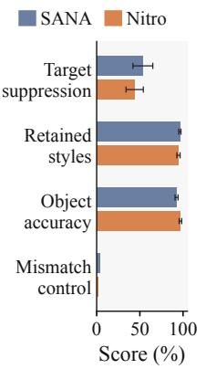  
(a)

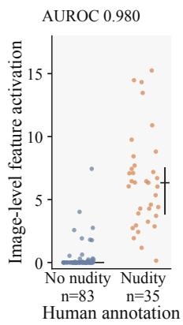  
(b)

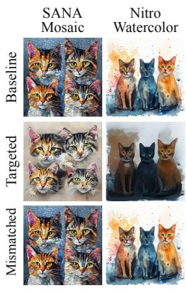  
(c)

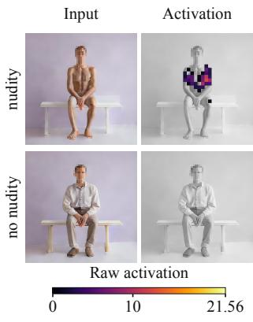  
(d)  
Figure 8: Learned SAE features as intervention and readout interfaces. (a) Suppressing a styleassociated feature reduces the targeted style while retaining non-target styles and object content; mismatched interventions have little effect. (b) Image-level activation of a nudity-associated feature on held-out annotated examples, yielding an AUROC of 0.980. (c) Qualitative examples of targeted and mismatched style suppression for SANA and Nitro. (d) Spatial activation maps of the selected feature for examples with and without nudity.

Table 10: Style-evaluator accuracy (%). Validation contains 2,040 images per generator and the external screen contains 1,224. External top-1 results compare the released classifier, the evaluator trained on the other generator, and the matched evaluator.
<table><tr><td></td><td colspan="2">Validation</td><td colspan="3">External Top-1</td><td>External</td></tr><tr><td>Image domain</td><td>Top-1</td><td>Top-5</td><td>Released</td><td>Other</td><td>Matched</td><td>Top-5</td></tr><tr><td>SANA-Sprint</td><td>60.2</td><td>83.3</td><td>9.9</td><td>51.1</td><td>77.5</td><td>95.1</td></tr><tr><td>Nitro-1-PixArt</td><td>51.7</td><td>74.8</td><td>9.5</td><td>52.6</td><td>66.7</td><td>88.4</td></tr></table>

## F.1 STYLE EVALUATOR ADAPTATION

The released UnlearnCanvas (Zhang et al., 2024) style classifier transfers poorly to generations from SANA-Sprint and Nitro-1-PixArt, achieving only 9.9% and 9.5% top-1 accuracy on our external evaluation sets. We therefore train a generator-specific ViT-L/16 style evaluator for each model. Each evaluator is trained on 50 UnlearnCanvas styles together with a plain-image class, using prompt-disjoint training and validation splits. Table 10 summarizes evaluator performance.

To avoid evaluating suppression on styles that are poorly recognized even before intervention, we retain only styles with at least 80% per-class accuracy on both validation and external images for both generators. This yields ten shared styles: Blossom Season, Comic Etch, Mosaic, Neon Lines, Pencil Drawing, Pop Art, Red Blue Ink, Ukiyoe, Van Gogh, and Watercolor. The set is determined from unmodified generations before inspecting SAE interventions; all ten subsequently achieve at least 90% recognition on the downstream baselines.

## F.2 SINGLE-FEATURE SUPPRESSION PROTOCOL

We evaluate all 30 layer-14 dictionaries, comprising three SAE families and five normalization and initialization settings for each generator. Both generators and SAEs remain frozen. Each target style is evaluated across eight object contexts and five generation seeds. Baseline, targeted, and mismatched conditions share the same prompt, initial noise, and sampling settings. Table 12 summarizes the evaluation setup.

Feature selection. We adapt the activation-based feature selection of SAeUron (Cywinski & Deja, ´ 2025) to select one dictionary feature for each target style. Let S denote the set of ten styles. For each style $\omega \in { S } ,$ , let $\bar { z } _ { \omega , i }$ denote the mean activation of feature i over all visual tokens from the first transformer forward pass of eight object-anchor generations, including zero activations. The corresponding mean over the other styles is

Table 11: Recognition accuracy (%) for the ten retained styles. Style inclusion requires at least 80% accuracy on both validation and external images for both generators. Baseline denotes recognition on the unmodified generations used in the suppression experiment.
<table><tr><td rowspan="2">Style</td><td colspan="3">SANA-Sprint</td><td colspan="3">Nitro-1-PixArt</td></tr><tr><td>Val.</td><td>Ext.</td><td>Base.</td><td>Val.</td><td>Ext.</td><td>Base.</td></tr><tr><td>Blossom Season</td><td>87.5</td><td>91.7</td><td>90.0</td><td>85.0</td><td>87.5</td><td>90.0</td></tr><tr><td>Comic Etch</td><td>85.0</td><td>100.0</td><td>90.0</td><td>92.5</td><td>100.0</td><td>100.0</td></tr><tr><td>Mosaic</td><td>90.0</td><td>91.7</td><td>92.5</td><td>82.5</td><td>100.0</td><td>100.0</td></tr><tr><td>Neon Lines</td><td>95.0</td><td>100.0</td><td>100.0</td><td>95.0</td><td>100.0</td><td>100.0</td></tr><tr><td>Pencil Drawing</td><td>90.0</td><td>100.0</td><td>100.0</td><td>97.5</td><td>100.0</td><td>100.0</td></tr><tr><td>Pop Art</td><td>80.0</td><td>95.8</td><td>97.5</td><td>85.0</td><td>95.8</td><td>97.5</td></tr><tr><td>Red Blue Ink</td><td>97.5</td><td>100.0</td><td>100.0</td><td>87.5</td><td>100.0</td><td>100.0</td></tr><tr><td>Ukiyoe</td><td>85.0</td><td>100.0</td><td>95.0</td><td>92.5</td><td>100.0</td><td>100.0</td></tr><tr><td>Van Gogh</td><td>87.5</td><td>100.0</td><td>100.0</td><td>82.5</td><td>100.0</td><td>100.0</td></tr><tr><td>Watercolor</td><td>92.5</td><td>100.0</td><td>100.0</td><td>95.0</td><td>95.8</td><td>100.0</td></tr></table>

Table 12: Style-suppression evaluation setup.
<table><tr><td>Component</td><td>Setting</td></tr><tr><td>SAE site</td><td>Layer-14 post-block residual, 18,432 features</td></tr><tr><td>SAE families</td><td>L1, TopK, JumpReLU</td></tr><tr><td>Input settings</td><td>None, mean centering, geometric-median centering, LayerNorm, RMS scaling</td></tr><tr><td>Target styles</td><td>10 shared styles</td></tr><tr><td>Object contexts</td><td>Architectures, Birds, Cats, Dogs, Flowers, Horses, Human, Trees</td></tr><tr><td>Generation seeds</td><td>Five</td></tr><tr><td>SANA-Sprint</td><td>Two inference steps, embedded guidance 4.5</td></tr><tr><td>Nitro-1-PixArt</td><td>One inference step, guidance 0, timestep 400</td></tr><tr><td>Conditions</td><td>Baseline, targeted feature, mismatched feature</td></tr></table>

$$
\bar { z } _ { \lnot \omega , i } = \frac { 1 } { | S | - 1 } \sum _ { { \omega ^ { \prime } } \in S \atop { \omega ^ { \prime } } \neq \omega } \bar { z } _ { \omega ^ { \prime } , i } .
$$

The selected feature maximizes the difference between its normalized activation shares for the target and remaining styles:

$$
i _ { \omega } = \arg \operatorname* { m a x } _ { 1 \leq i \leq m } \left[ \frac { \bar { z } _ { \omega , i } } { \sum _ { j = 1 } ^ { m } \bar { z } _ { \omega , j } + 1 0 ^ { - 8 } } - \frac { \bar { z } _ { \ – \omega , i } } { \sum _ { j = 1 } ^ { m } \bar { z } _ { \ – \omega , j } + 1 0 ^ { - 8 } } \right] .
$$

Ties are resolved by the smaller feature index. Feature selection is performed independently for each dictionary.

Activation-gated intervention. The anchor statistics determine a threshold and scaling coefficient for the selected feature:

$$
\kappa _ { \omega } = \frac { 1 } { | \cal { S } | } \sum _ { \omega ^ { \prime } \in \cal { S } } \bar { z } _ { \omega ^ { \prime } , i _ { \omega } } , \qquad \beta _ { \omega } = - \bar { z } _ { \omega , i _ { \omega } } .
$$

For each current token, the SAE encodes the processed residual activation ${ \mathbf x } = \tau ( { \mathbf h } )$ into z. Only the selected coordinate is modified:

$$
z _ { i _ { \omega } } ^ { \prime } = \left\{ \begin{array} { l l } { \beta _ { \omega } z _ { i _ { \omega } } , } & { z _ { i _ { \omega } } > \kappa _ { \omega } , } \\ { z _ { i _ { \omega } } , } & { \mathrm { o t h e r w i s e } , } \end{array} \right. \quad z _ { j } ^ { \prime } = z _ { j } \quad ( j \neq i _ { \omega } ) .
$$

The threshold determines whether the intervention is applied, and the scaling acts on the entire selected activation. The feature index, threshold, and scaling coefficient remain fixed throughout generation, while current residual activations are re-encoded at every denoising step. The mismatched

control uses the complete intervention rule of another style, including its feature index, threshold, and scale, selected through a fixed cyclic mapping.

The edited code contributes a decoded difference in SAE input space:

$$
\delta { \bf x } = { \bf W } _ { \mathrm { d e c } } ( { \bf z } ^ { \prime } - { \bf z } ) , \qquad { \bf x } ^ { \prime } = { \bf x } + \delta { \bf x } .
$$

Because $\hat { \mathbf { x } } = \mathbf { W } _ { \mathrm { d e c } } \mathbf { z } + \mathbf { b } _ { \mathrm { d e c } }$ , the edited input can equivalently be written as

$$
\mathbf { x } ^ { \prime } = \mathbf { W } _ { \mathrm { d e c } } \mathbf { z } ^ { \prime } + \mathbf { b } _ { \mathrm { d e c } } + ( \mathbf { x } - \hat { \mathbf { x } } ) .
$$

The original SAE reconstruction residual is therefore retained in the edited input.

For None and the two centering settings, the raw residual update is $\mathbf { h } ^ { \prime } = \mathbf { h } + \delta \mathbf { x }$ . RMS scaling restores the fitted scale s defined in Appendix B.1, giving $\mathbf { h } ^ { \prime } = \mathbf { h } + s \delta \mathbf { x }$ . For LayerNorm, the edited SAE input is recentered and normalized before restoring the original token mean and scale. Reconstruction-residual preservation applies to the SAE input-space edit, before this nonlinear restoration. The intervention retains the magnitude of the decoded difference and does not apply the unit-direction normalization or $\rho R ( t )$ scaling used in the steering benchmark.

Evaluation. Each target-style intervention is evaluated on 40 target-style generations, 360 generations from the other nine styles, and 40 plain-object generations. We adapt the UA, IRA, and CRA metrics from UnlearnCanvas (Zhang et al., 2024) to our style-suppression setting. Target suppression (UA) is one minus target-style classification accuracy. Retained-style accuracy (IRA) measures classification accuracy on the other nine styles under the same intervention. Object accuracy (CRA) measures object classification accuracy on plain-object prompts. UA and IRA use the corresponding generator-specific style classifier, while CRA uses the object classifier. All three metrics are averaged equally over the ten target styles, with higher values indicating better performance. CRA assesses preservation of object category rather than exact instance identity or composition.

## F.3 QUANTITATIVE RESULTS

For each generator, we select the configuration with the highest mean UA among those with both mean IRA and CRA of at least 90%. Figure 9 summarizes the resulting suppression-retention tradeoff across all 30 SAE configurations. This selects unnormalized TopK for SANA-Sprint and meancentered JumpReLU for Nitro-1-PixArt.

Table 13 reports the corresponding exact values. Higher suppression is achievable for several configurations, but typically at substantial cost to non-target preservation.

Suppression varies substantially across styles and generators. Table 14 therefore reports the ten target styles for the two representative configurations. For example, SANA suppresses Mosaic strongly but has little effect on Neon Lines, whereas Nitro exhibits the opposite pattern. The aggregate preservation constraint likewise does not guarantee uniformly high retention for every individual target.

## F.4 QUALITATIVE EXAMPLES

Figures 10 and 11 show selected visual success cases, and Figure 12 shows examples of incomplete suppression. All examples use Cats, with identical prompts and initial noise within each triplet. The SAE configuration varies across rows, as indicated. This grouping reflects qualitative assessment of the visible output and does not change the classifier-based metrics above. In particular, a non-target style prediction can coexist with residual target-style attributes.

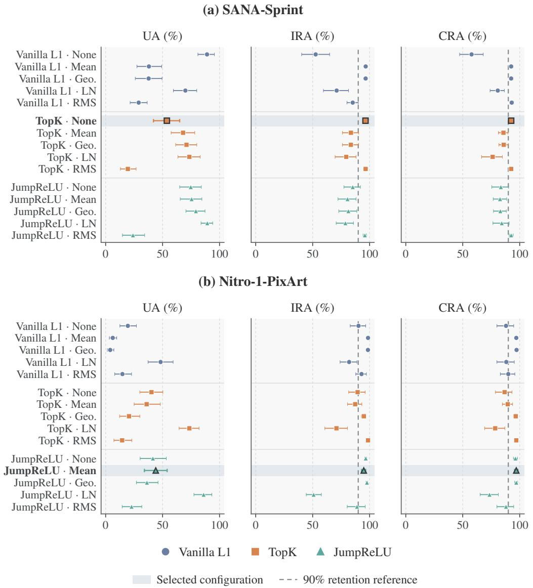  
Figure 9: Style-suppression trade-offs across SAE configurations. Point estimates show targetstyle suppression (UA), retained-style accuracy (IRA), and plain-prompt object accuracy (CRA) for all layer-14 dictionaries in SANA-Sprint and Nitro-1-PixArt; error bars denote 95% bootstrap intervals. Shaded rows indicate the configurations selected by maximizing UA subject to mean IRA and CRA of at least 90%; dashed lines mark the 90% retention reference.

Table 13: Complete style-suppression results (%). Each row averages ten target styles, five generation seeds, and eight objects. UA, IRA, and CRA are measured after targeted intervention; control UA uses the cyclic mismatched feature. Bold rows maximize UA subject to mean IRA and CRA of at least 90% within each model. This choice uses the reported evaluation data. Intervals for all targeted metrics are shown in Figure 9. Mean and Geo. median denote the two bias-initialization conventions.
<table><tr><td>SAE family</td><td>Input convention</td><td>UA↑</td><td>IRA↑</td><td>CRA↑</td><td>Control UA</td></tr><tr><td>SANA-Sprint</td><td></td><td></td><td></td><td></td><td></td></tr><tr><td>L1</td><td>None</td><td>89.0</td><td>52.6</td><td>57.8</td><td>49.5</td></tr><tr><td>L1</td><td>Mean</td><td>38.0</td><td>96.6</td><td>92.5</td><td>3.5</td></tr><tr><td>L1</td><td>Geo. median</td><td>37.8</td><td>96.5</td><td>92.5</td><td>3.5</td></tr><tr><td>L1</td><td>LayerNorm</td><td>70.0</td><td>71.1</td><td>80.7</td><td>26.7</td></tr><tr><td>L1</td><td>RMS</td><td>29.0</td><td>85.2</td><td>93.0</td><td>15.7</td></tr><tr><td>TopK</td><td>None</td><td>53.8</td><td>96.4</td><td>92.5</td><td>3.5</td></tr><tr><td>TopK</td><td>Mean</td><td>68.0</td><td>83.6</td><td>85.8</td><td>15.0</td></tr><tr><td>TopK</td><td>Geo. median</td><td>71.0</td><td>83.6</td><td>86.0</td><td>14.5</td></tr><tr><td>TopK</td><td>LayerNorm</td><td>73.5</td><td>79.5</td><td>76.2</td><td>22.5</td></tr><tr><td>TopK</td><td>RMS</td><td>19.5</td><td>96.5</td><td>92.5</td><td>3.5</td></tr><tr><td>JumpReLU</td><td>None</td><td>74.8</td><td>85.2</td><td>83.5</td><td>13.5</td></tr><tr><td>JumpReLU</td><td>Mean</td><td>75.5</td><td>80.6</td><td>82.8</td><td>17.2</td></tr><tr><td>JumpReLU</td><td>Geo. median</td><td>79.2</td><td>81.4</td><td>83.0</td><td>19.0</td></tr><tr><td>JumpReLU</td><td>LayerNorm</td><td>89.2</td><td>78.7</td><td>84.2</td><td>21.5</td></tr><tr><td>JumpReLU</td><td>RMS</td><td>24.0</td><td>95.8</td><td>92.5</td><td>3.2</td></tr><tr><td>Nitro-1-PixArt</td><td></td><td></td><td></td><td></td><td></td></tr><tr><td>L1</td><td>None</td><td>19.5</td><td>90.3</td><td>88.0</td><td>11.2</td></tr><tr><td>L1</td><td>Mean</td><td>6.2</td><td>98.6</td><td>97.0</td><td>1.5</td></tr><tr><td>L1</td><td>Geo. median</td><td>4.0</td><td>98.5</td><td>97.2</td><td>1.5</td></tr><tr><td>L1</td><td>LayerNorm</td><td>48.3</td><td>82.0</td><td>88.2</td><td>11.5</td></tr><tr><td>L1</td><td>RMS</td><td>14.8</td><td>92.9</td><td>90.0</td><td>11.5</td></tr><tr><td>TopK</td><td>None</td><td>40.2</td><td>89.4</td><td>86.8</td><td>10.2</td></tr><tr><td>TopK</td><td>Mean</td><td>36.0</td><td>87.3</td><td>89.5</td><td>11.7</td></tr><tr><td>TopK</td><td>Geo. median</td><td>20.5</td><td>94.9</td><td>96.5</td><td>2.7</td></tr><tr><td>TopK</td><td>LayerNorm</td><td>73.5</td><td>70.9</td><td>78.5</td><td>23.5</td></tr><tr><td>TopK</td><td>RMS</td><td>14.5</td><td>98.6</td><td>97.0</td><td>1.2</td></tr><tr><td>JumpReLU</td><td>None</td><td>41.5</td><td>96.6</td><td>96.2</td><td>1.7</td></tr><tr><td>JumpReLU</td><td>Mean</td><td>44.0</td><td>94.9</td><td>97.0</td><td>1.2</td></tr><tr><td>JumpReLU</td><td>Geo. median</td><td>36.2</td><td>97.7</td><td>97.0</td><td>1.2</td></tr><tr><td>JumpReLU</td><td>LayerNorm</td><td>86.0</td><td>50.8</td><td>73.5</td><td>50.7</td></tr><tr><td>JumpReLU</td><td>RMS</td><td>22.7</td><td>88.9</td><td>88.0</td><td>6.0</td></tr></table>

Table 14: Per-style results for the representative dictionaries (%). SANA uses TopK without input normalization; Nitro uses mean-centered JumpReLU. Each target evaluates 40 target-style, 360 retained-style, and 40 plain-object images per intervention condition. Control columns report mismatched-feature UA. Mean retention above 90% does not imply that every target style meets this constraint.
<table><tr><td></td><td colspan="4">SANA-Sprint</td><td colspan="4">Nitro-1-PixArt</td></tr><tr><td>Target style</td><td>UA</td><td>IRA</td><td>CRA</td><td>Control</td><td>UA</td><td>IRA</td><td>CRA</td><td>Control</td></tr><tr><td>Blossom Season</td><td>70.0</td><td>96.9</td><td>92.5</td><td>10.0</td><td>10.0</td><td>99.7</td><td>97.5</td><td>10.0</td></tr><tr><td>Comic Etch</td><td>12.5</td><td>97.2</td><td>92.5</td><td>10.0</td><td>22.5</td><td>98.6</td><td>97.5</td><td>0.0</td></tr><tr><td>Mosaic</td><td>100.0</td><td>96.9</td><td>92.5</td><td>7.5</td><td>32.5</td><td>95.8</td><td>97.5</td><td>0.0</td></tr><tr><td>Neon Lines</td><td>2.5</td><td>95.0</td><td>92.5</td><td>0.0</td><td>90.0</td><td>96.1</td><td>97.5</td><td>0.0</td></tr><tr><td>Pencil Drawing</td><td>100.0</td><td>96.4</td><td>92.5</td><td>0.0</td><td>87.5</td><td>77.8</td><td>100.0</td><td>0.0</td></tr><tr><td>Pop Art</td><td>5.0</td><td>96.4</td><td>92.5</td><td>2.5</td><td>92.5</td><td>92.8</td><td>95.0</td><td>2.5</td></tr><tr><td>Red Blue Ink</td><td>5.0</td><td>96.1</td><td>92.5</td><td>0.0</td><td>0.0</td><td>98.6</td><td>95.0</td><td>0.0</td></tr><tr><td>Ukiyoe</td><td>75.0</td><td>96.7</td><td>92.5</td><td>5.0</td><td>2.5</td><td>98.6</td><td>97.5</td><td>0.0</td></tr><tr><td>Van Gogh</td><td>100.0</td><td>96.1</td><td>92.5</td><td>0.0</td><td>52.5</td><td>91.9</td><td>95.0</td><td>0.0</td></tr><tr><td>Watercolor</td><td>67.5</td><td>96.1</td><td>92.5</td><td>0.0</td><td>50.0</td><td>98.6</td><td>97.5</td><td>0.0</td></tr></table>

Baseline  
Targeted  
Mismatched  
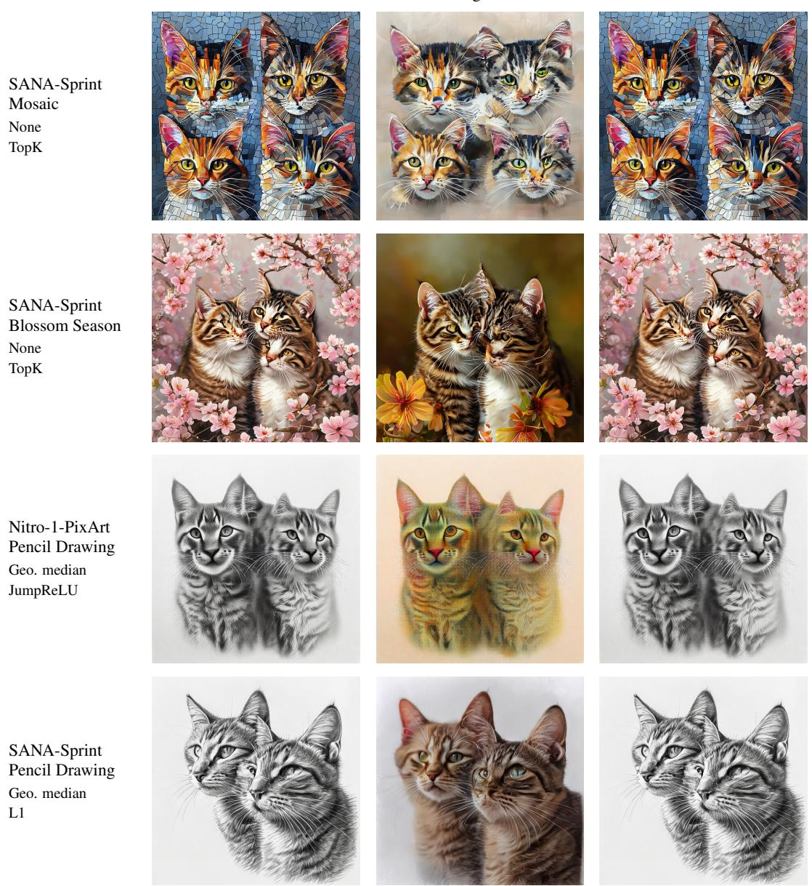  
Figure 10: Qualitative success cases (1/2). The targeted condition modifies one SAE feature; dictionary settings are shown at left. Success denotes visible attenuation of the target style, without requiring identical subject count or composition.

Baseline  
Targeted  
Mismatched  
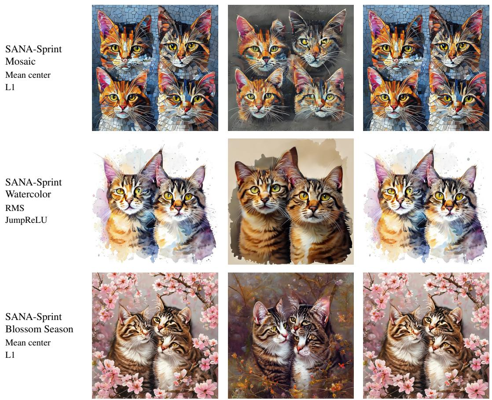  
Figure 11: Qualitative success cases (2/2). Additional selected successes across SAE input conventions and families. Conditions, image scale and seed match Figure 10. These selected examples do not estimate the frequency of successful suppression.

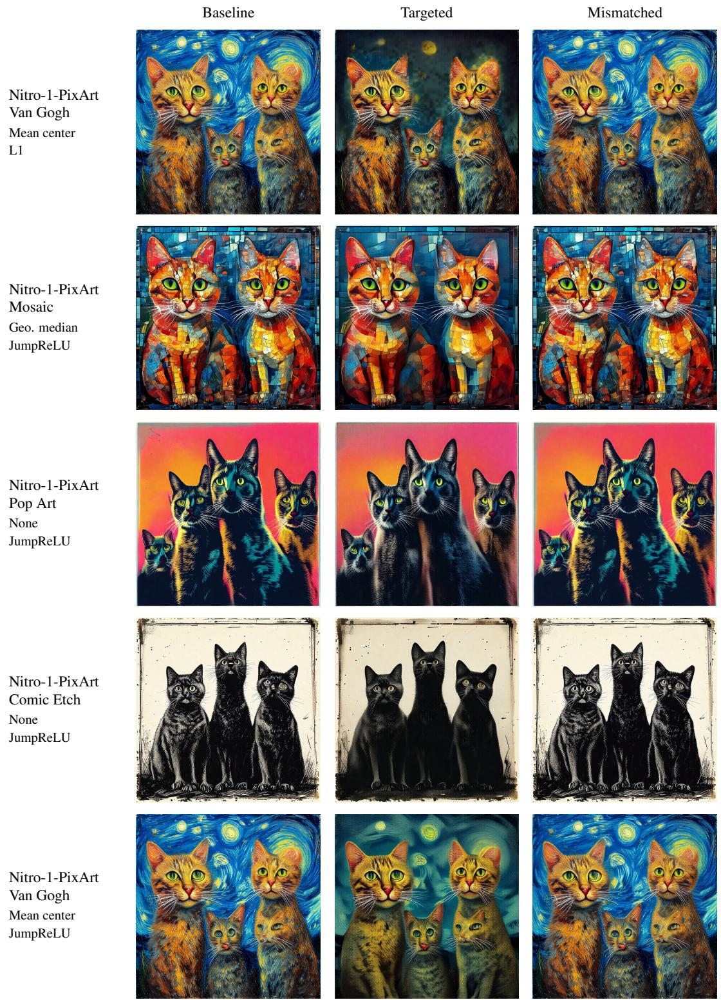  
Figure 12: Qualitative failure cases: incomplete suppression. Residual brushwork, mosaic structure, saturated colour or etched appearance remains visible after intervention. These visual judgments are separate from classifier-defined UA: the classifier predicts a non-target style in these cases, but this does not establish complete visual removal.

## G NUDITY-RELATED FEATURE DISCOVERY AND READOUT

This section provides the full protocol for the nudity-related single-feature readout in Section E. We describe dataset construction and human annotation, label-guided feature discovery, and held-out evaluation with sensitivity to the spatial aggregation rule. Table 16 summarizes the fixed experimental configuration.

## G.1 DATASET AND HUMAN ANNOTATION

We first construct a prompt dataset with paired nude and non-nude variants across 40 base scenes. Twenty scenes are assigned to the discovery split and twenty to the test split, with disjoint scenes and prompt-template families across the two splits. Each prompt is sampled with two seeds. We additionally include 40 hard-negative test images from non-nude prompts containing potentially confounding visual content such as swimwear, sports clothing, face close-ups, and bare limbs.

Because generated images do not always follow prompt intent, we assign human labels according to the realized image content. Images are labeled as nude, non-nude, or uncertain, and uncertain or invalid examples are excluded from binary analysis. This leaves 77 discovery images for feature selection and 118 held-out test images for evaluation.

Table 15: Dataset composition and human annotation counts. Nude and non-nude denote human image labels; uncertain examples are excluded from binary analysis.
<table><tr><td>Split</td><td>Generated</td><td>Nude</td><td>Non-nude</td><td>Uncertain</td><td>Used</td></tr><tr><td>Discovery (paired)</td><td>80</td><td>35</td><td>42</td><td>3</td><td>77</td></tr><tr><td>Test (paired)</td><td>80</td><td>35</td><td>43</td><td>2</td><td>78</td></tr><tr><td>Test (hard negatives)</td><td>40</td><td>0</td><td>40</td><td>0</td><td>40</td></tr><tr><td>All test</td><td>120</td><td>35</td><td>83</td><td>2</td><td>118</td></tr><tr><td>Total</td><td>200</td><td>70</td><td>125</td><td>5</td><td>195</td></tr></table>

## G.2 LABEL-GUIDED FEATURE DISCOVERY

Given the binary-labeled discovery set $D _ { \mathrm { d i s c } }$ , we select the SAE feature whose generation-time activations best separate the two classes. Each sample $( c , r , y )$ specifies a generation prompt c, a random seed r, and a human label $y \in \{ 0 , 1 \}$ , where 1 denotes nude and 0 denotes non-nude. For each generation, the frozen SAE encoder ESAE maps the processed residual activation of spatial token p at layer ℓ to $\mathbf { z } _ { p } ( c , r ) = E _ { \mathrm { S A E } } ( T ( \mathbf { h } _ { \ell , p } ( c , r ) ) ;$ ). Let $z _ { p , i } ( c , r )$ denote the resulting activation of feature i.

For a fixed pooling size K, the image-level score of feature i is the mean of its K largest spatial responses:

$$
s _ { i } ^ { ( K ) } ( c , r ) = \frac { 1 } { K } \sum _ { p \in \mathcal { P } _ { i } ^ { ( K ) } ( c , r ) } z _ { p , i } ( c , r ) ,
$$

where $\mathcal { P } _ { i } ^ { ( K ) } ( c , r )$ contains the corresponding spatial-token indices. Feature selection maximizes AUROC on the discovery set:

$$
i ^ { \star } = \underset { 1 \leq i \leq m } { \arg \operatorname* { m a x } } \mathrm { A U R O C } _ { D _ { \mathrm { d i s c } } } \left( s _ { i } ^ { ( K ) } , y \right) .
$$

The selected feature is then fixed and evaluated on the held-out set $D _ { \mathrm { t e s t } }$ using the same pooling rule, without fitting an additional classifier or decision threshold. Algorithm 1 summarizes the procedure.

## G.3 HELD-OUT READOUT AND FEATURE ANALYSIS

Discovery selects feature 4867. With this feature fixed, its image-level activation achieves an AU-ROC of 0.980 on 118 held-out images, comprising 35 nude and 83 non-nude examples. To examine the selected feature beyond this aggregate result, Figure 13 provides its high-activation feature card and evaluates sensitivity to the spatial pooling size. Feature 4867 remains selected for

Algorithm 1 Label-guided single-feature discovery and readout   
Discovery: Binary-labeled set $D _ { \mathrm { d i s c } }$   
Evaluation: Held-out set $D _ { \mathrm { t e s t } }$   
Fixed: Generator $G , { \mathrm { S A E } }$ encoder $E _ { \mathrm { S A E } } ,$ , input operator $\tau ,$ layer $\ell ,$ and pooling size K   
1: for each sample $( c , r , y ) \in D _ { \mathrm { d i s c } }$ do   
2: Generate with G using prompt c and seed $r$   
3: Capture residual activations $\mathbf { \dot { \{ h _ { \ell , p } \} } } _ { p }$   
4: Encode $\mathbf { z } _ { p } \gets E _ { \mathrm { S A E } } ( \mathcal { T } ( \mathbf { h } _ { \ell , p } ) )$ for each token $p$   
5: Compute $s _ { i } ^ { ( K ) } ( c , r )$ for every feature i   
6: end for   
7: $i ^ { \star } \gets$ arg max ${ \scriptstyle 1 \leq i \leq m \mathrm { ~ A U R O C } } _ { D _ { \mathrm { d i s c } } } ( s _ { i } ^ { ( K ) } , y )$   
8: for each sample $( \overline { { c } } , r , y ) \in D _ { \mathrm { t e s t } }$ do   
9: Generate with $G$ using prompt c and seed $r$   
10: Capture residual activations $\{ \mathbf { h } _ { \ell , p } \} _ { F }$   
11: Encode $\mathbf { z } _ { p } \gets E _ { \mathrm { S A E } } ( \mathcal { T } ( \mathbf { h } _ { \ell , p } ) )$ for each token $p$   
12: Compute $s _ { i ^ { \star } } ^ { ( K ) } ( c , r )$   
13: end for   
Output: Selected feature $i ^ { \star }$ and held-out $\mathrm { A U R O C } _ { D _ { \mathrm { t e s t } } } ( s _ { i ^ { \star } } ^ { ( K ) } , y )$

Table 16: Fixed configuration for the single-feature readout experiment. Generator and SAE parameters remain frozen throughout.  
Component Setting   
Generator SANA-Sprint 0.6B   
Generation $1 0 2 4 \times \bar { 1 } 0 2 4$ , one inference step, guidance 0   
SAE Layer-14 mean-centered L1   
Dictionary size 18,432 features   
Spatial resolution $3 2 \times 3 2 = 1 0 2 4$ tokens   
Reporting pool size $K = 1 6$

$K \in \{ 4 , 1 6 , 6 4 , 2 5 6 , 1 0 2 4 \}$ , with held-out AUROC varying only from 0.979 to 0.980. We use $K = 1 \dot { 6 }$ as the reporting default.  
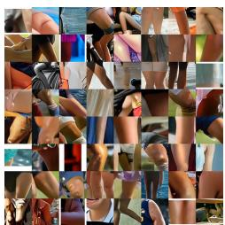  
(a)

<table><tr><td> $K$ </td><td>Selected feature</td><td>Test AUROC</td></tr><tr><td>4</td><td>4867</td><td>0.980</td></tr><tr><td>16</td><td>4867</td><td>0.980</td></tr><tr><td>64</td><td>4867</td><td>0.979</td></tr><tr><td>256</td><td>4867</td><td>0.979</td></tr><tr><td>1024</td><td>4867</td><td>0.979</td></tr></table>

(b)  
Figure 13: Feature semantics and aggregation robustness. (a) High-activation patches for feature 4867. (b) Sensitivity to spatial aggregation. Feature 4867 is consistently recovered across pooling sizes, with held-out AUROC between 0.979 and 0.980.

## G.4 QUALITATIVE READOUT EXAMPLES

We show representative held-out examples. Each example shows the generated image and its feature-4867 activation overlay.

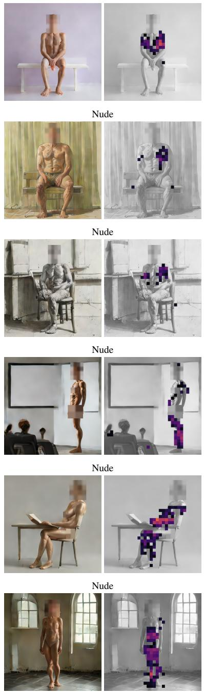  
Nude

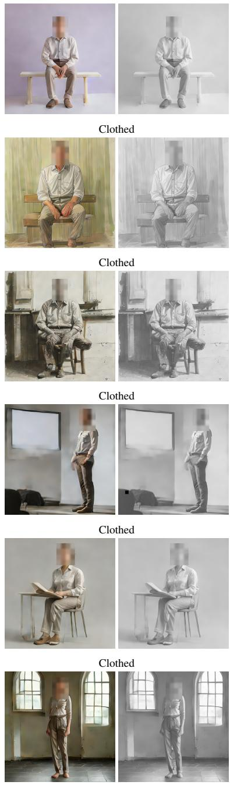  
Clothed  
Figure 14: Matched nude-clothed examples. Each adjacent nude-clothed pair shares the same scene and seed. Each example shows the generated image (left) and its feature-4867 activation overlay (right).

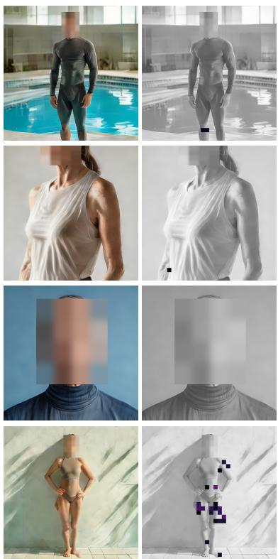

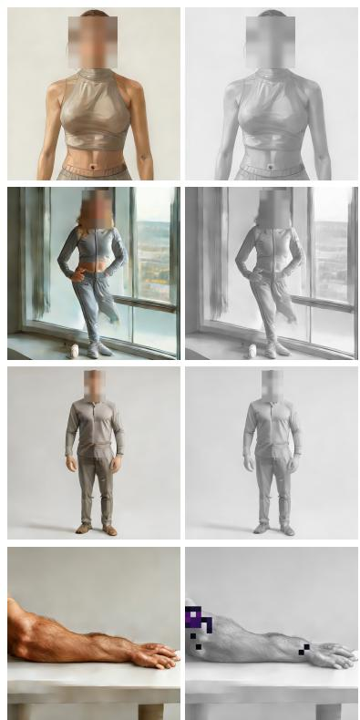  
Figure 15: Hard-negative examples. Representative non-nude examples with potentially confounding content. Each example shows the generated image (left) and its feature-4867 activation overlay (right).