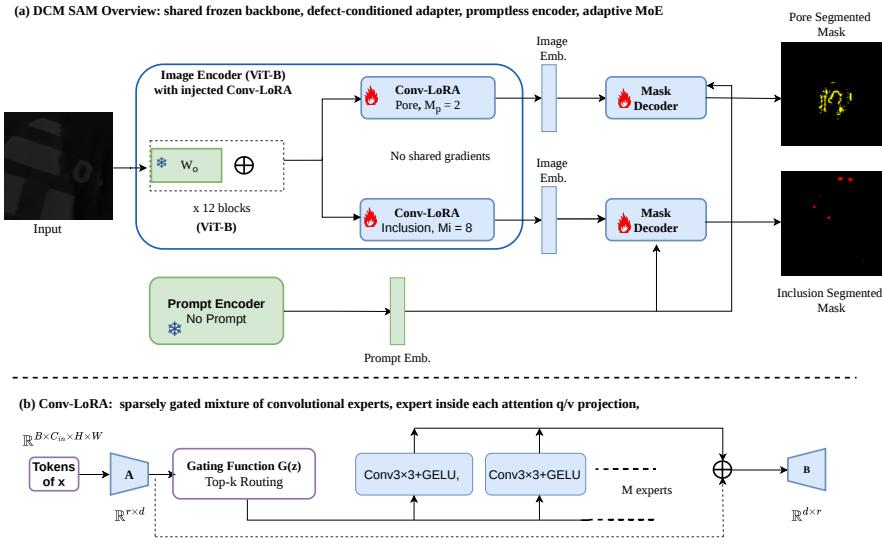

# DCM-SAM: Defect-Conditioned Mixture of LoRA Experts for NPU-Deployed AM Defect Segmentation

Md Mushfiqur Rahaman2,3,∗ Md Mahedi Hasan1,∗ Imtiaz Ahmed2 Srinjoy Das1,2,3,† 1Lane Department of Computer Science & Electrical Engineering 2Department of Industrial and Management Systems Engineering 3School of Mathematical and Data Sciences West Virginia University, Morgantown, WV {mr00131, mh00062}@mix.wvu.edu {imtiaz.ahmed, srinjoy.das}@mail.wvu.edu ∗Equal contribution. †Corresponding author: srinjoy.das@mail.wvu.edu

## Abstract

Metal additive manufacturing parts are inspected by X-ray computed tomography, where labelled data is scarce, the pores and inclusions that matter span a few pixels, and inspection must happen at the machine. We present DCM-SAM, a defectconditioned adaptive mixture of LoRA experts: one frozen Segment Anything backbone carries a separate Conv-LoRA expert bank and mask decoder per defect class, each trained in its own pass, without prompts, on synthetic slices alone, updating only 4.4% of the parameters. On benchmarks that XCT-SAM reports, DCM-SAM improves on every baseline for both classes from a ViT-B backbone against their ViT-H, and reaches 64.2% pore IoU on real NIST scans having seen no real images during training. Deployment then exposes what adaptation work rarely measures: on a Qualcomm Hexagon NPU, ViT-H and ViT-L compile yet cannot allocate at 10242 image resolution, since activations rather than weights exceed the device ceiling, and quantizing weights does not help. ViT-B alone runs, but the adapted encoder then fails to allocate where the stock one succeeds, until a numerically identical rewrite of the attention lets the complete DCM-SAM run in FP16 at 10242, with no operator falling back to the CPU, masks within 0.01% of pixels of the FP32 reference. Code: https://github.com/MushfiqShovon/DCM SAM.

## 1 Introduction

In metal additive manufacturing (AM) where parts are built up layer by layer, e.g. via laser powder bed fusion, small fluctuations in laser power or melt-pool behaviour leave behind porosity, lack-of-fusion voids and foreign inclusions, and these decide fatigue life and whether a part can be certified [20, 32, 30, 7, 31, 34]. Because the defects are small, sparse and buried below the surface [23, 13, 3], X-ray computed tomography (XCT)-based inspection has become the reference way of finding them [28, 10, 2], and the bottleneck is now accurately interpreting the scans. Classical threshold pipelines need re-tuning for every dataset [21, 22, 14], and supervised segmentation networks carry the statistics of their training data [38]. Three properties of the task shape this paper: the defects that matter are a few pixels wide even after a slice is upsampled to the model’s 10242 input, annotated real volumes are rare, and a model trained on one alloy and scanner is routinely asked to work on another. Two consequences follow. First, the accuracy the task needs comes from adapting a segmentation foundation model such as SAM [11] rather than training a small one from scratch: a UNet++ baseline reaches only 13.4% pore IoU on real NIST scans (Table 2). Second, the defect scale makes full resolution a hard floor rather than a preference: the same weights evaluated at $5 1 2 ^ { 2 }$ lose almost half their pore IoU, and retraining at $5 1 2 ^ { 2 }$ does not recover it (§3.4). A third constraint comes not from the data but from where the model is allowed to run: cloud offload is ruled out by data locality, since AM inspection data is frequently proprietary or export-controlled, and a workstation per machine does not scale across a fleet at comparable cost and power, so the target is an embedded accelerator. AM XCT therefore forces a foundation-model-scale backbone and full input resolution onto an embedded device at once, and that combination is what surfaces the constraints reported in §3.3–§3.4.

Prior work. The Segment Anything Model (SAM) [11] and its descendants [26, 17, 4] bring segmentation priors no industrial dataset could provide, and several groups have transferred them to AM XCT [5, 29, 6, 18]. Fully fine-tuning SAM’s 637M-parameter encoder on a few hundred slices overfits, so the usual approach freezes it and learns small injected modules: LoRA [9] learns low-rank weight updates, and Conv-LoRA [37] adds multi-scale convolutions inside the bottleneck, routed by a sparsely gated mixture of experts [27]; Tabassum and Ziabari [29] applied it to AM XCT with CycleGAN-synthesised supervision, and XCT-SAM [8] added an intermediate adaptation stage on alloy microstructure. Both train a separate model per class but never ask what running it costs; post-training quantization [16, 15, 33, 19] reports analytical rather than measured speedups, and distilled backbones [35, 36] give up the capacity that adaptation was meant to provide.

This work. Pores are common but only a few pixels wide, whereas inclusions are an order of magnitude rarer and occupy under $1 \%$ of a slice. A single low-rank subspace has to serve both, and because pores vastly outnumber inclusions its updates are dominated by pore examples, leaving inclusion learning noisy and prone to overfitting. Fully separate models avoid this interference but give up the frozen encoder they could share. DCM-SAM (Defect-Conditioned Adaptive Mixture ofLoRA Experts) takes the middle path: one frozen SAM backbone hosts a separate Conv-LoRA expert bank and mask decoder for each defect class, each trained in its own pass with its own loss and sampling, so the heads share no trainable parameters and cannot interfere, and both run without prompts. The expert count is chosen per class; a top-1 gate then selects one expert per input. We deploy this design on SAM ViT-B which is the only one of SAM’s three backbones whose attention activations, not its weights, fit our Qualcomm Dragonwing IQ-9075 NPU target at $1 0 2 4 ^ { 2 } \left( \ S 3 . 3 \right)$ and run the selected (2, 8) expert configuration end to end (§3.4). Our contributions are as follows:

• On-device deployment. We measure which SAM backbones actually execute on the NPU and explain why the others do not, and we deploy the complete adapted model at 10242 image resolution with every operator on the NPU, producing masks that differ from FP32 reference in under 0.01% of pixels (§3.3, §3.4). The following findings reach beyond AM. Whether a backbone fits is decided by its activations rather than its weights, and quantization cannot move that ceiling at the bit-widths this toolchain supports. An adapter holding only 0.08% of the parameters can still decide whether a graph fits. Top-1 routing, which is free on a GPU, costs dense compute once the graph is made static, 4.1× from M=2 to M=8. The best expert count transfers neither across backbones nor from synthetic to real data.

• Domain adaptation. We place per-class Conv-LoRA expert banks and decoders over one frozen SAM and train them without prompts. Each ViT-B head trains 4.13M parameters, 4.4% of the model (8.27M and 8.4% for both heads); the adapter itself is 0.08%, and the rest is a mask decoder trained from scratch. On the baselines XCT-SAM [8] reports, the model improves on every one, subject to the protocol caveat in §3.2.

• Data-efficient learning. The model is adapted from a few hundred CycleGAN-synthesised slices with no intermediate alloy-microstructure stage like XCT-SAM’s, and never sees a real image; yet what it learns carries over to real scans (§3.2).

• Architecture selection under shift. On real NIST XCT, most of the differences that the synthetic ablation reveals between configurations disappear under distribution shift (§3.2).

## 2 Method

Promptless SAM. SAM [11] has three parts: a ViT image encoder $f _ { \mathrm { e n c } } ,$ , a prompt encoder $f _ { \mathrm { p r m } }$ and a light mask decoder $f _ { \mathrm { d e c } } ,$ . Given an image $\boldsymbol { x } \in \mathbb { R } ^ { 3 \times S \times S }$ with $S = 1 0 2 4$ , the encoder splits it into $N \dot { = } ( S / 1 6 ) ^ { 2 } = 4 0 9 6$ patch tokens and passes them through L transformer blocks, four with global attention and the rest attending within $1 4 \times 1 4$ windows, producing an embedding $E \in \mathbb { R } ^ { 2 5 6 \times \frac { S } { 1 6 } \times \frac { S } { 1 6 } }$ The encoder contains 96% of the parameters for ViT-B (99% for ViT-H) and is evaluated once per image. Since industrial inspection may involve hundreds of defects per slice, explicit prompting is impractical. We therefore retain $f _ { \mathrm { p r m } }$ without providing any prompts; instead, it produces only its learned “no-prompt” embeddings. Defect localization is thus driven entirely by the learned image embeddings and a 4.1M-parameter mask decoder trained from scratch.

  
Figure 1: DCM-SAM. (a) Conv-LoRA with a mixture of experts is injected into every block of one frozen SAM ViT-B, giving each defect class its own encoder path and decoder $( M _ { p } = 2$ experts for pores, $M _ { i } = 8$ for inclusions); the heads share the frozen weights but no trainable parameter, and the encoder runs once per head. (b) Within a block, a top-k gate routes the low-rank bottleneck to one of M convolutional experts, each at its own spatial scale.

Conv-LoRA with a multi-scale expert mixture. LoRA [9] adapts a frozen projection $W _ { 0 }$ as $\begin{array} { r } { h \ = \ W _ { 0 } x + \frac { \alpha } { r } B A x } \end{array}$ using two low-rank matrices of rank r. This linear update treats tokens independently and cannot capture the local structure needed for defects spanning only a few pixels. Conv-LoRA [37] addresses this limitation by injecting local spatial structure into the bottleneck. Specifically, we reshape $Z = .$ Ax into the $\frac { S } { 1 6 } \stackrel { \bullet } { \times } \frac { S } { 1 6 }$ patch grid, select one of M convolutional experts, and add its output to $Z$ before projecting back to the original dimension.

$$
\begin{array} { r } { h = W _ { 0 } x + \frac { \alpha } { r } B \Big [ Z + \mathcal { E } _ { i ^ { \star } } ( Z ) \Big ] , \qquad \mathcal { E } _ { i } ( Z ) = \mathcal { D } _ { i } \big ( \sigma ( \mathrm { C o n v } _ { 3 \times 3 } ( \mathcal { U } _ { i } ( Z ) ) ) \big ) , } \end{array}\tag{1}
$$

where $\mathcal { U } _ { i }$ upsamples bicubically by a factor $i , \mathcal { D } _ { i }$ resamples back, and σ is a GELU. $\mathrm { ~ A ~ 3 ~ } \times \mathrm { ~ 3 ~ }$ kernel on a feature map upsampled by i covers a region i times smaller, giving the experts a ladder of receptive fields whose depth is set by the class-specific expert count (§3.1). This multi-scale coverage is important even within a class, as pore components in a single slice span a 40× range in area.

A load-balancing loss, $\mathcal { L } _ { \mathrm { m o e } } = \mathrm { C V } ^ { 2 } ( \mathrm { i m p o r t a n c e } ) + \mathrm { C V } ^ { 2 } ( \mathrm { l o a d } )$ , encourages all experts to remain active [27]. Only one expert executes per input on a GPU, although this sparsity is lost on a static NPU graph (§3.4). We use $r = 2$ and $\alpha = 8 ,$ inserting one adapter into each encoder block.

Per-class heads with gradient isolation. DCM-SAM, illustrated in Figure 1, uses a separate head for each class $c \in$ {pore, inclusion}, with class-specific adapters $\theta _ { c } ^ { \mathrm { { l o r a } } }$ and decoder $\theta _ { c } ^ { \mathrm { d e \bar { c } } }$ built on a shared, frozen backbone $\dot { \theta } ^ { \mathrm { s a m } }$ . The heads are optimized in parallel but independently, using separate optimizers, learning-rate schedules, and gradient clipping to prevent cross-head interference. As a result, they produce distinct embeddings for the same input image (cosine similarity 0.87). At inference, the encoder runs once per head, and each deployed binary contains its own copy of the frozen backbone weights (§3.4; see Appendix G). Each head trains 4.13M parameters, 4.4% of the ViT-B model (Appendix D), using $\mathcal { L } _ { c } = \mathcal { L } _ { \mathrm { d i c e } } + \mathcal { L } _ { \mathrm { f o c a l } } + 0 . 1 \mathcal { L } _ { \mathrm { m o e } }$ . Inclusion-positive images are oversampled fivefold, while the inclusion loss is averaged per image to prevent densely labeled slices from dominating individual training steps. See Appendix A.

Table 1: ViT-B configurations: mean IoU (%) over the five synthetic splits, and pore IoU on real NIST XCT. Bold marks the column maximum.
<table><tr><td> $( M _ { \mathrm { p o r e } } , M _ { \mathrm { i n c l } } )$ </td><td>Role</td><td>Synth. pore</td><td>Synth. incl.</td><td>NIST pore (OOD)</td></tr><tr><td>(1, 1)</td><td>corner</td><td>32.8</td><td>49.6</td><td>64.4</td></tr><tr><td>(1, 8)</td><td>pore sweep</td><td>29.4</td><td>47.7</td><td>65.1</td></tr><tr><td>(2, 2)</td><td>composed optimum</td><td>35.0</td><td>46.3</td><td>64.3</td></tr><tr><td>(2,8) (selected)</td><td>pore sweep</td><td>36.1</td><td>48.9</td><td>64.2</td></tr><tr><td>(4, 8)</td><td>pore sweep</td><td>34.6</td><td>44.9</td><td>65.8</td></tr><tr><td>(8, 1)</td><td>incl. sweep</td><td>36.5</td><td>47.5</td><td>65.3</td></tr><tr><td>(8,2)</td><td>incl. sweep</td><td>34.6</td><td>49.5</td><td>66.3</td></tr><tr><td>(8,4)</td><td>incl. sweep</td><td>35.5</td><td>48.9</td><td>66.3</td></tr><tr><td>(8,8)</td><td>default</td><td>25.8</td><td>46.6</td><td>65.3</td></tr></table>

Deployment. Three things have to be settled before the model can run on an NPU. The first is memory. Each global attention block forms a matrix with one entry per pair of tokens, and the token count $N \stackrel { < } { = } ( S / 1 6 ) ^ { 2 }$ grows with the square of the input side S, so with H heads the attention activations grow as $H N ^ { 2 }$ , the fourth power of S. Halving the input side cuts the attention matrix sixteen-fold; halving the precision only halves it. That is why resolution, not precision, is the lever in §3.3, whose $5 1 2 ^ { \frac { \cdot } { 2 } }$ runs use a retargeted model (Appendix F). The second is routing. The gate chooses an expert by an arg max on its input, which a static graph cannot express, so for export we compute all M experts and select one with a one-hot mask; over eight slices this changes only 13 of 8.4M mask pixels (Appendix F). The third is how attention is written. SAM’s reference code builds the attention matrix through several full-size intermediates that a static graph must hold at once; the same computation as one scaled-dot-product attention call with a single additive bias agrees to $1 . 2 \times 1 0 ^ { - 5 }$ and keeps far fewer tensors alive, which §3.4 shows is what lets the adapted model fit (Appendix E). Finally, the device is rated for INT8, yet we deploy in FP16 and report no INT8 numbers; §3.3 explains why.

## 3 Experiments

Setup. We train on CycleGAN-synthesized AM XCT slices and evaluate on five held-out synthetic splits of 100 images each, reporting mean IoU and Dice across splits. We also assess out-ofdistribution performance on real NIST AM XCT scans. All checkpoints use the same fixed per-split post-processing (see Appendix A). Both heads are trained with AdamW, layer-wise decay, warmup followed by cosine decay for 30 epochs. IoU and Dice are averaged over images, with defect-only results reported in Appendix A. We identified and removed a 4.9-point pore IoU seeding confound before reporting any results (Appendix B). Since each configuration uses a single seed, differences smaller than roughly three points should be interpreted carefully. Our target edge device is the Qualcomm Dragonwing IQ-9075, equipped with a Hexagon v73 NPU rated at 100 INT8 TOPS; we collected all NPU measurements reported in this study directly on the device.

## 3.1 How many mixture-of-experts?

We sweep one head’s mixture-of-experts while fixing the other at $M = 8 ,$ , in both directions, and directly train the corner and cross configurations. On ViT-H, IoU is flat above $M = 2$ , so the study selects $( M _ { p o r e } , M _ { i n c l } ) = ( 2 , 1 )$ (Appendix C). Table 1 reports the nine ViT-B configurations we evaluated. Three findings stand out. First, XCT-SAM’s default $M = 8$ for both heads performs worst, achieving only 25.8 pore IoU. This degradation is specific to the joint (8, 8) setting rather than to $M _ { \mathrm { p o r e } } = \mathbf { \bar { 8 } } \colon ( 8 , 1 )$ achieves the best pore IoU. Second, the per-head optima do not combine directly. Although each independent sweep selects $M = 2 .$ , the joint (2, 2) configuration underperforms (2, 8) on both metrics, showing that joint configurations must be optimized explicitly. Third, the optimal mixture size is backbone-dependent: ViT-H remains relatively stable for $\bar { M } > 2$ and favors a smaller pairing, whereas ViT-B degrades sharply when both mixture sizes are large and performs poorly with (2, 2). In this study, we use (2, 8) as the best-balanced configuration, achieving a summed IoU of 85.0. The (8, 1), (8, 2), and (8, 4) configurations are all within 1.0 point of this result, a difference that cannot be resolved with a single seed. We therefore treat (2, 8) as a deployment choice rather than a claim that it is the globally optimal mixture size.

## 3.2 Out-of-distribution evaluation on real NIST XCT

In addition to the synthetic benchmark, we also evaluate on real NIST scans acquired using a different material and scanner. Two observations emerge from the last column of Table 1. First, all configurations transfer well, achieving around 30 points higher pore IoU on NIST than on the synthetic data, likely because pores are more clearly resolved in the real scans. The selected model reaches 64.2, or 58.8 without test6, whose post-processing is specimen-specific; its errors are primarily due to over-prediction rather than missed pores (Appendix H). Second, the ablation spread largely disappears: the 10.7-point synthetic gap shrinks to 2.1 points on NIST, below the noise floor reported in §3. Against the XCT-SAM [8] baselines (Table 2), DCM-SAM outperforms all three settings, with the largest gains on inclusions, where Conv-LoRA-SAM degrades despite competitive pore performance. However, these baselines employ ViT-H, whereas DCM-SAM uses ViT-B.

Table 2: Comparison against the baselines reported by XCT-SAM [8] (mean IoU, %). DCM-SAM uses ViT-B with (2, 8); all baselines use ViT-H.
<table><tr><td>Method</td><td>Pores (synthetic)</td><td>Inclusions (synthetic)</td><td>Pores (NIST, OOD)</td></tr><tr><td>SAM [11] (zero-shot)</td><td>14.3</td><td>29.5</td><td>49.4</td></tr><tr><td>UNet++ [38]</td><td>14.0</td><td>10.2</td><td>13.4</td></tr><tr><td>MedSAM [17]</td><td>16.3</td><td>32.5</td><td>33.8</td></tr><tr><td>SAM-Med2D [4]</td><td>18.7</td><td>36.0</td><td>57.8</td></tr><tr><td>Conv-LoRA-SAM [37]</td><td>27.7</td><td>24.1</td><td>54.6</td></tr><tr><td>XCT-SAM [8]</td><td>32.5</td><td>36.4</td><td>58.5</td></tr><tr><td>DCM-SAM (ours)</td><td>36.1</td><td>48.9</td><td>64.2</td></tr></table>

## 3.3 Backbone selection under edge constraints

We compiled all three SAM encoders (89.7M, 308.3M and 637M parameters) for the Hexagon v73 and tried to execute them at $1 0 2 4 ^ { 2 }$ ; all three compile, only ViT-B runs. What limits the others is activation memory, not weights. The same ViT-H weights run at $5 1 2 ^ { 2 }$ and fail at $1 0 2 4 ^ { 2 }$ , ViT-L still cannot allocate with INT8 weights, and at $1 0 2 4 ^ { 2 }$ one global-attention layer materialises a $1 6 \times 4 0 9 6 \times 4 0 9 6$ tensor (512 MB in FP16) that the backend has no fused kernel to avoid. Hidden size matters through the head count and the weights rather than the per-token vectors, and the roughly 8 MB of on-chip vector memory on this Hexagon generation [24, 12] is exceeded by every backbone and simply tiled through ViT-B included, but is tiled through without consequence (Appendix E). Quantization does not move this ceiling, because the attention products $2 \dot { K } ^ { \top }$ and $\hat { A V }$ take two activation operands and the backend has no validated integer kernel for that pairing at 8 or 16 bits; resolution does, since at $5 1 2 ^ { 2 }$ both ViT-L and ViT-H run (4.14 s and 6.21 s per image). Token count, not bit-width, is therefore the lever for feasible inference on the edge device.

## 3.4 Deploying the full DCM-SAM on the NPU

The selected ViT-B (2, 8) model deploys as four compiled graphs, an encoder and a decoder per head, since each head carries its own adapters inside the encoder. Exported as trained, the adapted ViT-B encoder needs 4.07 GB at $1 0 2 4 ^ { 2 }$ against a 3.76 GB ceiling set by the graph serializer, although the stock encoder with the same eager attention runs; only the two together exceed it (Appendix E). With the scaled-dot-product formulation of $\ S 2 .$ , all four graphs execute at $1 0 2 4 ^ { 2 }$ with no operator falling back to the CPU. On one real slice per head, the device masks differ end to end in comparison to the FP32 reference in only 96 (pore) and 0 (inclusion) of a total of 1,048,576 pixels, this is the model that Table 6 in Appendix E reports.

Three findings follow. First, static routing makes the mixture size an inference cost that scales steeply with M: the two encoders differ only in M, yet the M = 8 head is 4.1 times slower, because a GPU discards the unselected experts at no measurable cost while the NPU pays for every one of them (Appendix F). So (1, 1), the cheapest configuration, also holds the best inclusion IoU in the study, for 3.3 pore points, within the 4.9-point seeding swing of Appendix B. Second, the decoder is essentially free, 500 times cheaper than the encoder: defect-awareness costs one extra encoder pass and nothing else. Third, resolution cannot be traded for speed, even with retraining: a ViT-H head retrained at $5 1 2 ^ { 2 }$ still ends 5.6 points below its $1 0 2 4 ^ { 2 }$ counterpart on pores (12 to 50% per split on defect-bearing images), while inclusion holds; without retraining the same weights lose almost half their pore IoU (36.1 to 19.7). The two ways of fitting the device thus trade different classes, resolution costing pores and backbone costing inclusions, and we chose the side that keeps pores, the only class real data lets us score (Table 3 in Appendix A).

## 4 Conclusion

DCM-SAM adapts a frozen SAM ViT-B to two distinct defect classes while training only 4.4% of the parameters per head. Using a few hundred synthetic slices, it achieves 64.2% pore IoU on real NIST scans, exceeding XCT-SAM’s reported results despite using SAM backbones once. It runs at full resolution on the IQ-9075 with every operator on the NPU, masks within 0.01% of the FP32 reference which is evidence that adapting, not shrinking or quantizing, a frozen foundation model is what meets edge AM inspection’s accuracy and deployment constraints together.

## Acknowledgments and Disclosure of Funding

This work was supported by a gift from Qualcomm Incorporated. The authors would also like to acknowledge the Pacific Research Platform, NSF Project ACI-1541349, and Larry Smarr (PI, Calit2 at UCSD) for providing the computing infrastructure used in some of the experiments.

## References

[1] Nabila Abraham and Naimul Mefraz Khan. A novel focal tversky loss function with improved attention u-net for lesion segmentation. In 2019 IEEE 16th international symposium on biomedical imaging (ISBI 2019), pages 683–687, 2019.

[2] Shaharyar Baig, Alireza Jam, Stefano Beretta, Shuai Shao, and Nima Shamsaei. Non-destructive detection of critical defects in additive manufacturing. Scientific Reports, 15(1):6740, 2025.

[3] Miles V Bimrose, Tianxiang Hu, Davis J McGregor, Jiongxin Wang, Sameh Tawfick, Chenhui Shao, Zuozhu Liu, and William P King. Detecting and classifying hidden defects in additively manufactured parts using deep learning and x-ray computed tomography. Journal of Intelligent Manufacturing, 36(5):3465–3479, 2025.

[4] Junlong Cheng, Jin Ye, Zhongying Deng, Jianpin Chen, Tianbin Li, Haoyu Wang, et al. SAM-Med2D. arXiv preprint arXiv:2308.16184, 2023.

[5] Israt Zarin Era, Imtiaz Ahmed, Zhichao Liu, and Srinjoy Das. An unsupervised approach towards promptable porosity segmentation in laser powder bed fusion by segment anything. npj Advanced Manufacturing, 2(1):10, 2025.

[6] Roland Gruber, Steffen Rüger, and Thomas Wittenberg. Adapting the segment anything model for volumetric x-ray data-sets of arbitrary sizes. Applied Sciences, 14(8):3391, 2024.

[7] R Haribaskar and T Sampath Kumar. Defects in metal additive manufacturing: formation, process parameters, postprocessing, challenges, economic aspects, and future research directions. 3D Printing and Additive Manufacturing, 11(4):1629–1655, 2024.

[8] Md Mahedi Hasan, Md Mushfiqur Rahaman, Alan Pachkovskiy, Imtiaz Ahmed, Jeremy Dawson, and Srinjoy Das. XCT-SAM: Sequential parameter-efficient domain adaptation of SAM for industrial XCT defect segmentation. In IAPR Workshop on Machine Vision for Industrial Inspection (MVI2), International Conference on Pattern Recognition (ICPR), 2026.

[9] Edward J. Hu, Yelong Shen, Phillip Wallis, Zeyuan Allen-Zhu, Yuanzhi Li, Shean Wang, Lu Wang, and Weizhu Chen. LoRA: Low-rank adaptation of large language models. In International Conference on Learning Representations (ICLR), 2022.

[10] Griffin Jones, Veeraraghavan Sundar, Rachel Reed, Marissa Stecko, and Jayme Keist. Validation of x-ray computed tomography detection limits for stochastic flaws in additively manufactured ti-6al-4 v. Journal ofMaterials Engineering and Performance, 34(10):8683–8690, 2025.

[11] Alexander Kirillov, Eric Mintun, Nikhila Ravi, Hanzi Mao, Chloe Rolland, Laura Gustafson, Tete Xiao, Spencer Whitehead, Alexander C Berg, Wan-Yen Lo, et al. Segment anything. In IEEE/CVF International Conference on Computer Vision, pages 4015–4026, 2023.

[12] Chester Lam. Qualcomm’s Hexagon DSP, and now, NPU. Chips and Cheese, https: //chipsandcheese.com/p/qualcomms-hexagon-dsp-and-now-npu, 2024. Accessed September 2026.

[13] C Lapre, D Brouczek, M Schwentenwein, K Neumann, N Benson, CR Petersen, O Bang, and NM Israelsen. Rapid non-destructive inspection of sub-surface defects in 3D printed alumina through 30 layers with 7 µm depth resolution. Open Ceramics, 18:100611, 2024.

[14] Tebogo Ledwaba, Christine Steenkamp, Agnieszka Chmielewska-Wysocka, Bartlomiej Wysocki, and Anton du Plessis. Development of ai crack segmentation models for additive manufacturing. Tomography ofMaterials and Structures, 7:100053, 2025.

[15] Yuhang Li, Ruihao Gong, Xu Tan, Yang Yang, Peng Hu, Qi Zhang, Fengwei Yu, Wei Wang, and Shi Gu. BRECQ: Pushing the limit of post-training quantization by block reconstruction. In International Conference on Learning Representations, 2021.

[16] Chengtao Lv, Hong Chen, Jinyang Guo, Yifu Ding, and Xianglong Liu. PTQ4SAM: Posttraining quantization for segment anything. In IEEE/CVF Conference on Computer Vision and Pattern Recognition, pages 15941–15951, 2024.

[17] Jun Ma, Yuting He, Feifei Li, Lin Han, Chenyu You, and Bo Wang. Segment anything in medical images. Nature communications, 15(1):654, 2024.

[18] Xudong Ma, Yuqi Zhang, Chenchong Wang, and Wei Xu. Alloy microstructure segmentation through sam and domain knowledge without extra training. Scripta Materialia, 260:116581, 2025.

[19] Markus Nagel, Rana Ali Amjad, Mart van Baalen, Christos Louizos, and Tijmen Blankevoort. Up or down? adaptive rounding for post-training quantization. In International Conference on Machine Learning, pages 7197–7206, 2020.

[20] Tuan D Ngo, Alireza Kashani, Gabriele Imbalzano, Kate TQ Nguyen, and David Hui. Additive manufacturing (3d printing): A review of materials, methods, applications and challenges. Composites Part B: Engineering, 143:172–196, 2018.

[21] Hasnaa Ouidadi, Boyang Xu, and Shenghan Guo. Defect segmentation from x-ray computed tomography of laser powder bed fusion parts: A comparative study among machine learning, deep learning, and statistical image thresholding methods. In International Manufacturing Science and Engineering Conference, volume 87233, 2023.

[22] Daniel Perghem, Behnam Salehnasab, Stefano Beretta, Shuai Shao, and Nima Shamsaei. Ml-based detection of critical defects in additively manufactured parts via x-ray computed tomography. Materials & Design, page 115184, 2025.

[23] Arun Poudel, Mohammad Salman Yasin, Jiafeng Ye, Jia Liu, Aleksandr Vinel, Shuai Shao, and Nima Shamsaei. Feature-based volumetric defect classification in metal additive manufacturing. Nature Communications, 13(1):6369, 2022.

[24] Qualcomm Technologies, Inc. HTP VTCM Sharing, Qualcomm AI Engine Direct SDK documentation. https://docs.qualcomm.com/bundle/publicresource/topics/ 80-63442-10/htp\_vtcm\_sharing.html. Document 80-63442-10. Accessed September 2026.

[25] Qualcomm Technologies, Inc. Qualcomm AI Hub documentation. https://app.aihub. qualcomm.com/docs/. Accessed September 2026.

[26] Nikhila Ravi, Valentin Gabeur, Yuan-Ting Hu, Ronghang Hu, Chaitanya Ryali, Tengyu Ma, et al. Sam 2: Segment anything in images and videos. arXiv preprint arXiv:2408.00714, 2024.

[27] Noam Shazeer, Azalia Mirhoseini, Krzysztof Maziarz, Andy Davis, Quoc Le, Geoffrey Hinton, and Jeff Dean. Outrageously large neural networks: The sparsely-gated mixture-of-experts layer. arXiv preprint arXiv:1701.06538, 2017.

[28] X Sun, L Huang, BG Xiao, Q Zhang, JQ Li, YH Ding, et al. X-ray computed tomography in metal additive manufacturing: A review on prevention, diagnostic, and prediction of failure. Thin-Walled Structures, 207:112736, 2025.

[29] Anika Tabassum and Amirkoushyar Ziabari. Adapting segment anything model (sam) to experimental datasets via fine-tuning on gan-based simulation: A case study in additive manufacturing. arXiv preprint arXiv:2412.11381, 2024.

[30] Md Mehide Hasan Tusher and Ayhan Ince. Comprehensive review of fabrication process parameters influencing defect formation in laser powder bed fused (l-pbf) al-si alloys. Materials & Design, page 114374, 2025.

[31] Lei Wang, Shengzhou Feng, Yonggang Wang, Xiang Zhao, Jiaxing Ge, Tianxi Gao, and Fuqiang Di. Porosity defects in additively manufactured metal materials: Formation mechanisms, impact on performance and regulation. International Materials Reviews, 71(2):97–128, 2026.

[32] Shuo Wang, Lin Zhou, Shiyu Zhong, Gan Li, Lei Zhang, Xu Wang, Zhiqiang Li, and Jian Lu. Recent advances in metal additive manufacturing: Materials design and artificial intelligence applications. Engineering, 2026.

[33] Xiuying Wei, Ruihao Gong, Yuhang Li, Xianglong Liu, and Fengwei Yu. QDrop: Randomly dropping quantization for extremely low-bit post-training quantization. In International Conference on Learning Representations, 2022.

[34] Teng Zhan, Ke Xu, Zhipeng Fan, Hanlin Xiang, Congchang Xu, Tianjiao Mei, Yuanyuan Wei, Wentao Chen, and Luoxing Li. Assessment of the effect of the process-induced porosity defects on the fatigue properties of wire arc additive manufactured al–si–mg alloy. Journal of Materials Research and Technology, 35:777–791, 2025.

[35] Chaoning Zhang, Dongshen Han, Yu Qiao, Jung Uk Kim, Sung-Ho Bae, Seungkyu Lee, and Choong Seon Hong. Faster segment anything: Towards lightweight SAM for mobile applications. arXiv preprint arXiv:2306.14289, 2023.

[36] Zhuoyang Zhang, Han Cai, and Song Han. EfficientViT-SAM: Accelerated segment anything model without performance loss. In IEEE/CVF Conference on Computer Vision and Pattern Recognition Workshops, 2024.

[37] Zihan Zhong, Zhiqiang Tang, Tong He, Haoyang Fang, and Chun Yuan. Convolution meets lora: Parameter efficient finetuning for segment anything model. In International Conference on Learning Representations, 2024.

[38] Zongwei Zhou, Md Mahfuzur Rahman Siddiquee, Nima Tajbakhsh, and Jianming Liang. UNet++: Redesigning skip connections to exploit multiscale features in image segmentation. IEEE transactions on medical imaging, 39(6):1856–1867, 2020.

## Appendix

## A Training and evaluation details

The synthetic benchmark consists of five held-out CycleGAN-generated splits, test1, test2, test4, test5 and test6, of 100 slices each; test4 and test5 carry pore labels only. The real benchmark is the NIST AM XCT set, specimens test2 to test6, which has pore labels only. Every checkpoint is scored with a fixed, per-split post-processing configuration (threshold, morphological opening size, minimum blob size and, for one NIST specimen, intensity inversion with non-zero valid-region masking) that was calibrated once and then applied identically to every model, so that comparisons isolate the model rather than the threshold. Defect sizes in these slices are small and widely spread within a class: over the 100 slices of test1 at their native $7 6 8 \times 7 6 8$ resolution, connected pore components have a median area of 14 pixels and a 95th percentile of 58, with a median within-slice maximum-to-minimum area ratio of 40; inclusion components have a median of 22 pixels and a 95th percentile of 71, and there are about 2.3 times fewer of them (625 against 1,429).

The validation split used for early stopping and best-checkpoint selection is the synthetic test6, which is also one of the five reported splits; XCT-SAM used test3 for this purpose, which is not part of this dataset. The five-split means therefore include the selection split, and the per-split post-processing settings were calibrated on the respective split, including the NIST specimens, then applied identically to every model. IoU is computed per image and averaged, with an image that has no defect and no predicted pixel scored as 1. This convention matters for inclusions, which are absent from most slices: for the selected (2, 8) model at $1 0 2 4 ^ { 2 }$ the inclusion means over images are 26.1, 89.0 and 31.3 on test1, test2 and test6 (48.9 averaged), whereas over defect-bearing images alone they are 25.3, 0.0 and 10.2 (11.8 averaged; test2 has 89 empty slices and the head predicts nothing on the other 11). For pores the two conventions give 36.1 and 32.7. The defect-only figures are the ones to read for segmentation quality; the image-averaged figures are what Table 1 and the XCT-SAM comparison report.

Both heads are trained with AdamW at a base learning rate of $3 \times 1 0 ^ { - 4 }$ with layer-wise decay of 0.9 per block toward the input, 10% linear warmup followed by cosine decay, weight decay $1 \dot { 0 } ^ { - 3 }$ gradient clipping at 1.0 and bfloat16 autocast, for a 30-epoch budget with early stopping on validation IoU. Inclusion-positive images are oversampled five times by a weighted sampler, and augmentation is horizontal and vertical flips and $9 0 °$ rotations applied jointly to the image and both masks. The segmentation loss is Dice plus focal with $\alpha _ { f } = 0 . 2 5$ and $\gamma _ { f } = 2 ;$ ; a Focal–Tversky alternative [1] with $( \alpha , \beta , \gamma ) = ( 0 . 3 , 0 . 7 , \bar { 0 } . 7 5 )$ , which penalises missed defects more heavily than false alarms, is implemented but was not used for the reported runs. The inclusion loss is averaged per image rather than over the flattened batch, so that one densely labelled oversampled slice cannot dominate a step.

Training at $5 1 2 ^ { 2 }$ To test whether the accuracy lost at half resolution can be recovered by training at that resolution, a ViT-H DCM-SAM with the default expert count was trained from scratch at $5 1 2 ^ { 2 }$ (position embedding resampled before training, 30-epoch budget, best checkpoint at epoch 5, early-stopped at epoch 25) and evaluated with the ${ \bar { 1 } } 0 2 4 ^ { 2 }$ post-processing settings and, separately, with the blob-size filters rescaled by a quarter for the smaller image. Table 3 compares it with its $1 0 2 4 ^ { 2 }$ counterpart of the same configuration and with the deployed ViT-B model. Retraining recovers most of the pore loss seen zero-shot but not all of it: the pore head ends 5.6 points below its $1 0 2 4 ^ { 2 }$ twin on the image-averaged metric, and 12 to 50% lower per split on defect-bearing images (test4 47.4 to 40.2, test2 33.0 to 17.6, test6 14.2 to 9.8). Inclusion is unaffected or, once the filters are rescaled, improves on two splits, which fits the size argument of §2: pores are the class that falls below what the model resolves at half resolution. The table also reads as a choice between the two ways of fitting the device, and the two land on opposite sides of a defect-size boundary: dropping the resolution costs pores, dropping the backbone costs inclusions. We took the side that keeps pores, the class that drives certification and the only one the real data can score. The $5 1 2 ^ { 2 }$ side rests on a single run at one seed, was never evaluated on NIST, and was never put on the device with its adapters.

## B Seeding confound

An early version of the training pipeline drew the weighted-sampler and data-loader worker seeds from the global random generator. The two heads are constructed sequentially before training, and instantiating a Conv-LoRA head consumes a number of draws proportional to its expert count, so varying $M _ { \mathrm { i n c l } }$ silently altered the data ordering seen by the pore head despite the heads sharing no parameters or gradients. Two runs with an identical pore head differed by 4.9 IoU points, larger than the effect being measured. The sampler and worker seeds are now derived from dedicated generators seeded from the run seed, independent of model construction; every result in the paper uses the corrected pipeline. We report it because nothing in the loss curves reveals it, and left in place it would have inverted several of our conclusions.

Table 3: Lowering the resolution against lowering the backbone. The same ViT-H configuration trained and evaluated at $1 0 2 4 ^ { 2 }$ and at $5 1 2 ^ { 2 }$ (“rescaled” applies blob-size filters scaled to $5 1 \bar { 2 } ^ { 2 } )$ , and the deployed ViT-B (2, 8) model at 10242. IoU in %, mean over the five synthetic splits; “defect-only” averages over defect-bearing images only.
<table><tr><td></td><td>ViT-H, 10242</td><td>ViT-H, 5122 (raw / rescaled)</td><td>ViT-B (2, 8), 10242</td></tr><tr><td>Pore IoU, image-averaged</td><td>37.3</td><td>31.7 / 30.8</td><td>36.1</td></tr><tr><td>Pore IoU, defect-only</td><td>35.8</td><td>27.9 / 27.6</td><td>32.7</td></tr><tr><td>Inclusion IoU, image-averaged</td><td>52.5</td><td>51.8 / 46.6</td><td>48.9</td></tr><tr><td>Inclusion IoU, defect-only</td><td>15.5</td><td>9.3 / 20.7</td><td>11.8</td></tr><tr><td>Real NIST pore IoU</td><td></td><td></td><td>64.2</td></tr><tr><td>Runs on the IQ-9075 with adapters</td><td>no</td><td></td><td>yes, verified</td></tr></table>

## C ViT-H expert-count study

Table 4: ViT-H sweeps and corner runs. Each sweep row reports the swept head’s IoU with the fixed companion head’s IoU from the same run; mean IoU (%) over the five synthetic splits.
<table><tr><td rowspan="2">M</td><td colspan="2">Pore sweep  $( M _ { \mathrm { i n c l } } { = } 8 )$ </td><td colspan="2">Incl. sweep  $( M _ { \mathrm { p o r e } } { = } 8 )$ </td></tr><tr><td>Pore</td><td>Incl.</td><td>Incl.</td><td>Pore</td></tr><tr><td>1</td><td>35.5</td><td>53.8</td><td>54.3</td><td>34.5</td></tr><tr><td>2</td><td>36.3</td><td>53.2</td><td>53.3</td><td>36.6</td></tr><tr><td>4</td><td>36.2</td><td>54.3</td><td>54.4</td><td>32.6</td></tr><tr><td>8</td><td>36.1</td><td>53.5</td><td>53.5</td><td>36.1</td></tr><tr><td colspan="2">Direct runs: (1, 1) 36.3 / 53.6;</td><td></td><td>(2, 1) (selected) 34.6 / 53.3</td><td></td></tr></table>

In Table 4 the ViT-H inclusion sweep spans 1.1 points across an $8 \times$ change in mixture size and the pore sweep 0.8 points above $M \stackrel { \textstyle = } { = } 1 \stackrel { \textstyle - } { . }$ on this backbone the mixture size is close to irrelevant once $M \geq 2$ . The ViT-B round (Table 1) behaves quite differently, degrading sharply at (8, 8). It is worth adding why the per-head optima fail to compose there, with (2, 2) worse than $( 2 , 8 )$ on both metrics. The two heads share no trainable parameters and no gradients, so they cannot be interfering during optimisation; what changes is the data ordering each head sees as the other head’s expert count changes, the same mechanism as the seeding confound of Appendix B.

## D Trainable parameter budget

Table 5 breaks the budget down by component. On ViT-B the adapter accounts for $0 . 0 8 \%$ of the model, and the mask decoder for 98% of what is trained. None of the adapter can be folded back into the frozen weights, since its expert branch contains a GELU, convolutions and a gate that depends on the input, so the adapters are executed at inference like any other layer.

## E Why the adapted encoder did not fit, and what fixed it

The adapted ViT-B encoder exported as trained needs 4.07 GB at 10242 and is refused by the QNN graph serializer, which reports “graph requires estimated allocation of 4272953 KB, limit is 3670016 KB; error during serialize: memory usage too large” when the graph is compiled through Qualcomm AI Hub [25] (compile job jpyxke3l5); that 3.76 GB limit is target-dependent and is not a published hardware figure. The stock ViT-B encoder runs. The adapter holds 0.09% of the encoder’s parameters, and on a GPU bypassing it leaves peak memory unchanged, so parameters and dynamic memory do not explain the gap. For scale, at $1 0 2 4 ^ { 2 }$ in FP16 the attention matrix is 384 MB for ViT-B’s 12 heads and 512 MB for the 16 heads of ViT-L and ViT-H, the $q , k ,$ v and MLP activations are 18 to 40 MB, and the weights are 171, 588 and 1,215 MB; the 8 MB on-chip scratchpad is exceeded 48 to 64 times by every backbone’s attention matrix, so it is tiled through and does not discriminate between them. The difference lay in two code paths. We had exported the stock encoder through HuggingFace’s scaled-dot-product (SDPA) attention, while the vendored Conv-LoRA code inherits the older eager attention, which adds the decomposed relative-position terms as two chained broadcasts and then takes an FP32 softmax. To separate the two effects we compiled the variants in Table 6 with identical options and ran them on the device at $1 0 2 4 ^ { 2 }$ . The stock encoder runs with eager attention, so the eager path alone is not the cause; the adapted encoder runs once its attention is rewritten in SDPA form, so the adapter alone is not the cause either. Only the two together exceed the ceiling. The rewrite is the same computation: encoder outputs agree to $1 . 2 \times 1 0 ^ { - 5 }$ on ViT-B and the final masks differ in 0 of 1,048,576 pixels. The SDPA form is now the default, with the eager path kept behind a flag.

Table 5: Trainable parameters per defect head, counted from the instantiated model $( r = 2 , M = 8 )$ A checkpoint contains exactly these. The mask decoder is the same module on both backbones.
<table><tr><td>Component</td><td>ViT-H</td><td>Share</td><td>ViT-B</td><td>Share</td></tr><tr><td>Frozen SAM backbone (encoder, prompt encoder)</td><td>637.0M</td><td>frozen</td><td>89.7M</td><td>frozen</td></tr><tr><td>Conv-LoRA A, B</td><td>327,680</td><td>0.051%</td><td>73,728</td><td>0.079%</td></tr><tr><td>Convolutional experts</td><td>9,728</td><td>0.002%</td><td>3,648</td><td>0.004%</td></tr><tr><td>MoE gating  $( W _ { g } , W _ { n } )$ </td><td>1,024</td><td>&lt;0.001%</td><td>384</td><td>&lt;0.001%</td></tr><tr><td>Mask decoder (incl. IoU head)</td><td>4.06M</td><td>0.633%</td><td>4.06M</td><td>4.33%</td></tr><tr><td>Trainable per head</td><td>4.40M</td><td>0.69%</td><td>4.13M</td><td>4.41%</td></tr><tr><td>Both heads</td><td>8.79M</td><td>1.36%</td><td>8.27 M</td><td>8.44%</td></tr></table>

Table 6: Attention-formulation diagnostic on the IQ-9075 at $1 0 2 4 ^ { 2 } .$ , FP16. Cosine is against the corresponding PyTorch FP32 output on a real XCT slice.
<table><tr><td>Graph</td><td>Conv-LoRA</td><td>Attention</td><td>On device</td><td>Cosine</td></tr><tr><td>Stock ViT-B</td><td>no</td><td>SDPA</td><td>runs</td><td>0.99994</td></tr><tr><td>Stock ViT-B</td><td>no</td><td>eager</td><td>runs</td><td>0.99994</td></tr><tr><td>DCM-SAM pore head, as trained</td><td>yes</td><td>eager</td><td>fails, needs 4.07 GB</td><td>n/a</td></tr><tr><td>DCM-SAM pore head, rewritten</td><td>yes</td><td>SDPA</td><td>runs</td><td>0.99988</td></tr><tr><td>DCM-SAM inclusion head, rewritten</td><td>yes</td><td>SDPA</td><td>runs</td><td>0.99995</td></tr></table>

Static one-hot routing vs. dynamic top-1 (PyTorch, eight slices): 13 of 8.4M mask pixels differ End to end on device, one slice per head: 96 (pore) and 0 (inclusion) of 1,048,576 mask pixels differ

## F NPU graph construction details

Beyond the attention constraint of §3.3, two further operator-level constraints determine the mixedprecision INT8 scheme used for stock ViT-B. Exact GELU emits an erf operator for which the converter has no layout inference; the tanh approximation is substituted, with maximum output deviation $1 . 0 \times 1 0 ^ { - 3 }$ (ViT-B) and $3 . 5 \times 1 0 ^ { - 3 } \ : \mathrm { \dot { ( V i T - L ) } }$ . A partially quantized normalisation layer presents mixed datatypes and is rejected, so quantization is restricted to weight-bearing operators (convolutions and weight–activation matmuls), leaving normalisation, softmax and elementwise operators in floating point; the excluded operators hold almost no parameters. For DCM-SAM the static gate required three attempts: ScatterElements is emitted at an opset the converter does not accept, the backend has no validated datatype combination for OneHot, and the working form is an equality between arg max and arange(M). Serialising the decoder without the encoder weights reduced that artifact from 358 MB to 15.7 MB. The measured 4.1× slowdown from $M = 2 \tan \ b = 8$ is well below what the experts alone would predict: expert i convolves a map upsampled by i, so expert compute grows as $\textstyle \sum _ { i = 1 } ^ { - { M } } i ^ { 2 }$ , from 5 to 204, a factor of 40; the rest of the encoder, which does not change with M, dilutes that to the 4.1× observed, which is also why the scaling is not linear in M. Retargeting SAM to an input size $S ^ { \prime }$ other than 1024 takes three changes: relax the size check in the patch embedding, resample the learned position embedding bicubically from the 64 × 64 grid to ${ \bar { S ^ { \prime } } } / 1 6 ,$ , and update the patch-grid size held by the prompt encoder, which sets the shape of the dense “no prompt” embedding that the decoder adds to the image embedding. Without the last step the decoder receives tensors of the wrong shape; the relative-position tables need nothing, since they are interpolated to the query and key extent at every call.

Table 7: Measured cost of the four graphs on the IQ-9075, FP16. The model is deployed at $1 0 2 4 ^ { 2 }$ $( \ S 3 . 4 )$ ; the per-operator profiler attaches at $5 1 2 ^ { 2 }$ , so the encoder rows are timed there, from an export of the same weights. At $1 0 2 4 ^ { 2 }$ the decoders measure 15.4 and 15.3 ms. Peak memory excludes the loaded binary.
<table><tr><td>Artifact</td><td>Experts</td><td> $\mathrm { \Delta N P U \ o p s }$ </td><td>Inference (ms)</td><td>Peak mem. (MB)</td><td>Load (ms)</td></tr><tr><td>Pore encoder</td><td> $M = 2$ </td><td>1012</td><td>1980.8</td><td>11.8</td><td>825</td></tr><tr><td>Pore decoder</td><td>n/a</td><td>205</td><td>3.8</td><td>9.6</td><td>160</td></tr><tr><td>Inclusion encoder</td><td> $M = 8$ </td><td>1444</td><td>8134.3</td><td>13.9</td><td>868</td></tr><tr><td>Inclusion decoder</td><td>n/a</td><td>205</td><td>3.8</td><td>9.6</td><td>167</td></tr></table>

## G Limitations and next steps

Several caveats bear on how far these numbers should be pushed. Every configuration in Table 1 was trained once, and we have already seen a 4.9-point swing from a seeding confound on this backbone (Appendix B), so differences under about three points are not resolved; the choice of (2, 8) was made on the synthetic benchmark, and on NIST it is the lowest of the nine, though only by 2.1 points, which we do not read as a real difference either. The baseline numbers in Table 2 are taken from XCT-SAM rather than re-run under our protocol, and they are ViT-H models while ours is ViT-B, so that table is indicative until a protocol-matched re-evaluation is done. The deployment is FP16: INT8 was blocked at the operator level for the attention products (§3.3) and no integer-quantized accuracy is reported anywhere in the paper. On-device numerical equivalence was established on one real XCT slice per head at $1 0 2 4 ^ { 2 }$ and on the encoder outputs of the stock backbone; the per-op profiler cannot attach to a $1 0 2 4 ^ { 2 }$ encoder graph on this device, so encoder latency at the deployed resolution is not measured and Table 7 reports $5 1 2 ^ { 2 }$ . Resolution cannot be traded for speed even with retraining: the $5 1 2 ^ { 2 }$ evidence is one ViT-H run, one seed (Appendix A). Finally, because the adapters sit inside the encoder, the encoder is executed once per head, and each encoder binary carries its own copy of the frozen weights, so sharing the backbone saves storage during training but not on the device. Repeated seeds, a protocol-matched baseline comparison, an internal shared-adapter ablation, and on-board timing of the $1 0 2 4 ^ { 2 }$ binaries are the next steps.

## H Per-split NIST results

Table 8: Per-split NIST results for the selected (2, 8) ViT-B model. Precision and recall at the 5 px tolerance used for Tol-F1. ∗test6 uses inversion and non-zero valid-region masking, calibrated for this specimen’s highly porous, inverted-intensity appearance.
<table><tr><td>Split</td><td>IoU (%)</td><td>Dice (%)</td><td>Tol-F1 (%)</td><td>Precision (%)</td><td>Recall (%)</td></tr><tr><td>NIST test2</td><td>50.0</td><td>66.5</td><td>85.1</td><td>74.2</td><td>100.0</td></tr><tr><td>NIST test3</td><td>64.2</td><td>78.0</td><td>94.1</td><td>99.2</td><td>90.0</td></tr><tr><td>NIST test4</td><td>54.5</td><td>70.4</td><td>89.0</td><td>80.6</td><td>99.9</td></tr><tr><td>NIST test5</td><td>66.6</td><td>79.9</td><td>96.2</td><td>98.3</td><td>94.2</td></tr><tr><td>NIST test6*</td><td>85.4</td><td>92.0</td><td>96.8</td><td>93.8</td><td>100.0</td></tr><tr><td>Mean</td><td>64.2</td><td>77.4</td><td>92.2</td><td>89.2</td><td>96.8</td></tr></table>

In Table 8, test2 and test4 combine near-perfect recall with markedly lower precision: the pore head over-predicts on these specimens, which depresses IoU while leaving Tol-F1 at 85–89%.