# DECOPRUNE: EFFICIENT KV-CACHE PRUNING FOR AUTOREGRESSIVE VIDEO DIFFUSION VIA DENOISING CONSISTENCY

Zeqi Xiao1,∗ Qingle Liu2,∗ Kaiwen Zhang1

Yifan Zhou1 Zihan Ding3 Xingang Pan1,†

1Nanyang Technological University 2Tsinghua University 3Princeton University ∗Equal contribution. †Corresponding author.

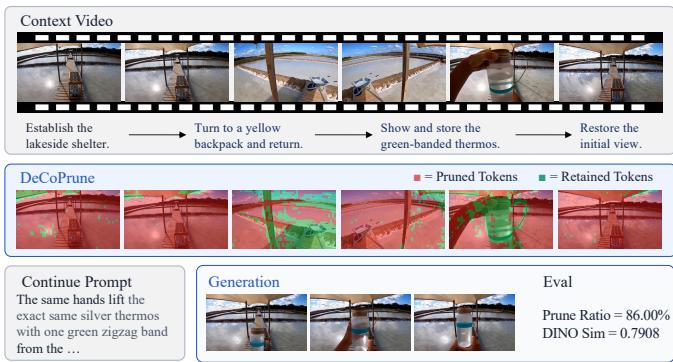  
(a) CMBench episode and retained tokens

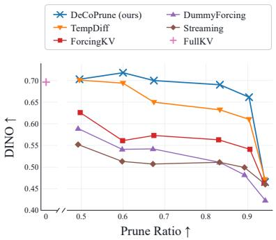  
(b) Consistency-pruning trade-off  
Figure 1: Overview of CMBENCH and DECOPRUNE. (a) A representative CMBENCH episode showing which historical tokens DECOPRUNE retains and reuses during continuation. (b) Consistency–pruning-ratio trade-off across pruning methods. At comparable pruning ratios, our method achieves higher DINO consistency than the evaluated compression baselines.

## ABSTRACT

Autoregressive video diffusion naturally supports streaming generation and interactive control, but its KV cache grows continuously with the generated history. Existing compression strategies either discard history using fixed windows or select tokens through local attention and similarity signals, which do not directly measure whether the current chunk contributes information beyond the retained context. We introduce DECOPRUNE, a training-free method that treats cache compression as a denoising-consistency problem. We find empirically that denoising difficulty provides a useful proxy for a token’s value in long-term retention: tokens with larger step-to-final discrepancies tend to carry visual evidence that is less predictable from the retained context. Based on this finding, DECOPRUNE measures each current-chunk token’s denoising difficulty using the discrepancy between its intermediate clean prediction and final denoised value, retaining high-discrepancy tokens in the long-term cache while pruning those with low discrepancy. To evaluate information retention, we introduce CM-BENCH, comprising 58 approximately one-minute generated or real-world context episodes and 116 Reappear or Revisit continuation tasks that require recalling events or objects shown earlier in the context. Experiments with LingBot World v2 show that DECOPRUNE achieves a DINO score of 0.6701 on a 0–1 scale with an 85.43% reduction in cumulative historical KV token counts and a 4.14× continuation-generation speedup over FullKV. Its head-specialized variant further reaches 0.6783 at an 86.19% pruning ratio, approaching the 0.6803 score of FullKV and exceeding the evaluated compression baselines at similar budgets. These

results indicate that denoising consistency can serve as a model-intrinsic signal for retaining long-range information while reducing autoregressive inference cost. Our project homepage is https://decoprune.github.io. The code is available at https://github.com/DeCoPrune/CMBench, and the benchmark at https://huggingface.co/datasets/Aoraku/ CMBench.

## 1 INTRODUCTION

Recent video generators have achieved high visual fidelity and motion realism (Wan Team, 2025). Autoregressive (AR) video diffusion generates videos chunk by chunk, naturally supporting streaming generation and interactive control (Huang et al., 2025a; Gao et al., 2026). Each chunk attends to cached KVs from the preceding video history, so memory and attention costs grow steadily with the rollout. Retaining the full history eventually becomes impractical, while aggressive truncation removes visual evidence needed for long-range consistency.

The challenge is therefore to remove redundant history while preserving evidence needed for longrange consistency. Some approaches simply discard most older tokens (Xu et al., 2026c), risking substantial information loss. Temporal-difference selection instead removes tokens based on similarity between neighboring frames (Hwang et al., 2024; Fu et al., 2025), but such local comparisons cannot identify repetition across distant parts of the history. Redundancy is not confined to adjacent frames: objects and scenes can recur throughout a long context, even after substantial intervening changes. We therefore need a retention criterion that evaluates the current chunk against the entire retained context, distinguishing evidence already represented in the cache from content that warrants additional storage.

Our starting observation is that relevant context reduces the discrepancy between intermediate clean predictions and final denoised outputs across four backbones (Figure 2). This suggests a simple pruning heuristic: if a token’s intermediate prediction is already close to its final output, the retained context may already provide much of the information needed to predict it, making its KV entry a candidate for removal. We therefore prioritize retaining tokens with larger discrepancies and prune those with smaller discrepancies.

Based on this observation, we introduce DECOPRUNE, a training-free online KV-cache compression method (Figure 3). For each chunk, we compare an intermediate clean prediction with the final output from the same denoising trajectory, then threshold the token-wise mean squared discrepancy into a retention mask. A shared mask selects high-discrepancy KV entries across layers, physically shortening the history attended to by future chunks rather than merely masking attention weights. Online scoring reuses predictions from normal generation, requiring no extra model evaluations or training. For observed video contexts without a denoising trajectory, we re-noise each chunk and compare its context-conditioned clean prediction with the observed chunk.

Existing benchmarks assess video quality (Huang et al., 2024) or memory consistency (Zhang et al., 2026; Chen et al., 2026b). However, visual quality can remain stable as historical recall deteriorates (Figure 6(b)). We introduce Context Memory Benchmark (CMBENCH), comprising 58 approximately one-minute generated or real-world contexts and 116 Reappear/Revisit continuation tasks. These tasks test recall of specific previously observed objects or scenes through reference-grounded comparisons under controlled historical-KV compression.

DECOPRUNE achieves 0.6701 DINO on LingBot World v2 with an 85.43% reduction in cumulative historical KV token counts and a 4.14× continuation-generation speedup over FullKV. Its headspecialized variant reaches 0.6783 DINO at an 86.19% pruning ratio, approaching the 0.6803 score of FullKV and exceeding the evaluated compression baselines at comparable budgets.

In summary, our contributions are threefold:

• DECOPRUNE: a training-free retention criterion based on context-conditioned, step-tofinal denoising discrepancy;

• CMBENCH: reference-grounded recall evaluation under controlled historical-KV compression in minute-scale video contexts;

• Evidence that denoising-based selection improves recall over the evaluated compression baselines at comparable budgets while accelerating continuation generation.

## 2 RELATED WORK

Autoregressive Long-Video Generation. Video diffusion models (Peebles & Xie, 2023; Lin et al., 2024; Kong et al., 2024; Wan Team, 2025; Sand.ai et al., 2025; Chen et al., 2025a; Meituan LongCat Team et al., 2025) extend to long rollouts through history conditioning (Chen et al., 2024; Song et al., 2025), distillation and self-rollout training (Yin et al., 2025; Huang et al., 2025a; Zhu et al., 2026), and long-horizon training and sampling (Lu et al., 2025; Yesiltepe et al., 2025; Cui et al., 2025; Zhao et al., 2026a; Li et al., 2025c; Liu et al., 2025b; Xue et al., 2026). Long rollouts also benefit from recurrent or compressed states (Yu et al., 2025b; Zhang et al., 2025b; Yu et al., 2025c; Yuan et al., 2026), while action conditioning enables interactive worlds (Alonso et al., 2024; Valevski et al., 2024; Guo et al., 2025; He et al., 2025; Gao et al., 2026). Feature/cache reuse (Zhao et al., 2025; Liu et al., 2025a; Zou et al., 2025; 2024; Ma et al., 2026; Nawaz et al., 2026; Gao et al., 2025) and sparse attention (Xi et al., 2025; Lv et al., 2026; Xu et al., 2026a) reduce denoiser computation; we instead study historical visual evidence retained in a frozen generator’s native KV cache.

KV-Cache Compression and Video Memory. Cache compression uses windows, importance scores, and head/layer budgets (Xiao et al., 2024; Zhang et al., 2023; Li et al., 2024; Cai et al., 2024; Xiao et al., 2025a). Video methods extend window-based compression (Yang et al., 2025; Yi et al., 2025; Lu et al., 2026; Mao et al., 2026), head specialization (Guo et al., 2026; Ji et al., 2026; Tian et al., 2026; Chen et al., 2026c), content-aware selection (Samuel et al., 2026; Li et al., 2026; Luo et al., 2026; Cai et al., 2026; Chen et al., 2026a; Zhao et al., 2026b), and low-rank or quantized representations (Yesiltepe et al., 2026; Xi et al., 2026). Related approaches use key similarity or motion novelty (Yi et al., 2026; Xu et al., 2026b). Explicit memories rely on retrieval (Xiao et al., 2025b; Yu et al., 2025a; Li et al., 2025b; Wu et al., 2025a; Chen et al., 2025b; Hu et al., 2026), learned context (Yu et al., 2025b; 2026; Zhang et al., 2025c; Zhu et al., 2025; Henschel et al., 2025; Wu et al., 2025b), or entity-centric and refinement mechanisms (Zhang et al., 2025a; Zhou et al., 2026; Wu et al., 2026a; Dou et al., 2026; Do et al., 2026). Positional re-indexing follows Wu et al. (2026b). DECOPRUNE instead scores step-to-final denoising change, without an auxiliary salience model, retrieval index, or motion estimator.

Context-Memory Evaluation. Benchmarks assess general video quality and plausibility (Huang et al., 2024; 2025b; Wang et al., 2024; Feng et al., 2025; Li et al., 2025a), historical consistency (Zhu et al., 2025; Zhang et al., 2026; Zhou et al., 2026; Do et al., 2026), post-occlusion recovery (Chen et al., 2026b), and scene revisitation or action control (Wu et al., 2026b; Ye et al., 2026; Gu et al., 2026). CMBENCH couples reference-grounded Reappear/Revisit recall to controlled historical-KV compression in minute-scale real and generated contexts.

## 3 METHODOLOGY

## 3.1 DENOISING CONSISTENCY FOR KV-CACHE PRUNING

Setup and hypothesis. An autoregressive video diffusion model generates latent chunks $\mathbf { x } _ { i } \in \mathbf { \Xi }$ $\mathbb { R } ^ { N \times d }$ conditioned on input $\mathbf { c } _ { i }$ and the preceding cache $\mathcal { H } _ { < i } = \{ ( \bar { \mathbf { K } _ { \ell , < i } } , \mathbf { V } _ { \ell , < i } ) \} _ { \ell = 1 } ^ { L } ,$ , where $N$ is the number of tokens, d their dimension, and L the number of layers. Our hypothesis is that tokens already predictable from this cache tend to reach stable clean predictions earlier, whereas tokens carrying information not explained by the retained context tend to require greater refinement. When the retained context already determines a token’s content, denoising primarily recovers information available in the conditioning cache. In contrast, content not determined by the context may undergo greater refinement along the trajectory. Figure 2 provides supporting context-conditioned measurements across four backbones. We therefore use step-to-final prediction change as a model-intrinsic proxy for contextual redundancy, without training an importance predictor or computing external retrieval embeddings.

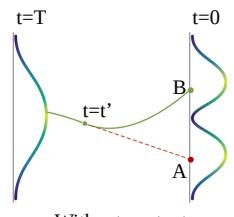

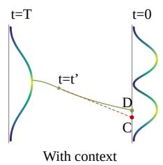

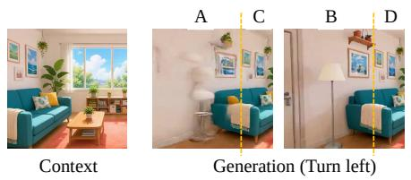  
(a) Consistency-based pruning

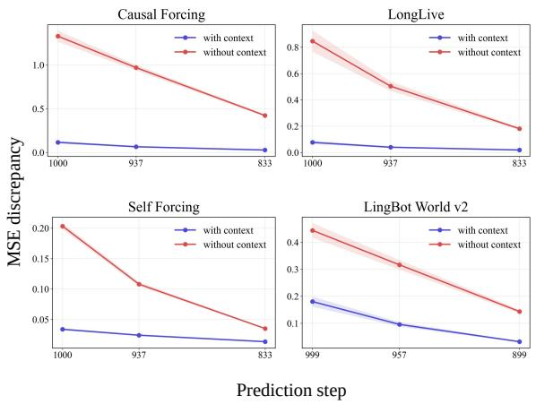  
(b) Context reduces denoising uncertainty  
Figure 2: Denoising consistency and context redundancy. (a) At an intermediate denoising state $t \ : = \ : t ^ { \prime }$ , a local step-to-final extrapolation (red dashed) can deviate from the final denoised state without context $( A \to B )$ . Relevant context concentrates the conditional outcome, aligning the extrapolation more closely with the final state $( C  D )$ Our policy treats content that is consistently predictable from existing context as redundant, pruning low-discrepancy tokens while retaining high-discrepancy tokens. (b) Curves report the MSE between the $x _ { 0 }$ prediction at each intermediate denoising step and the final $x _ { 0 }$ . The Causal Forcing, LongLive, and Self-Forcing plots compare runs with and without the available context KV: first-frame KV for Causal Forcing and Self-Forcing, and preceding-chunk KV for LongLive. For LingBot World v2, which does not support text-to-video generation, both runs use an initial frame and rotate the camera: “with context” means that the content revealed after rotation appeared earlier in the context, whereas “without context” means that it did not. In all four comparisons, the with-context condition has lower error across the plotted steps, consistent with our criterion.

Token scoring and selection. During the normal generation of chunk $i ,$ we record the clean prediction $\hat { \mathbf { x } } _ { 0 , i } ( \tau ^ { * } ) = D _ { \boldsymbol { \theta } } ( \mathbf { z } _ { i } ^ { \tau ^ { * } } , \tau ^ { * } ; \mathbf { c } _ { i } , \mathcal { H } _ { < i } )$ at probe timestep $\tau ^ { * }$ , where $\mathbf { z } _ { i } ^ { \tau ^ { * } }$ is the noisy latent on that trajectory. Once the same trajectory produces $\mathbf { x } _ { i } ^ { \mathrm { { f i n a l } } }$ , we compute

$$
\ell _ { i , p } = \frac { 1 } { d } \left\| \hat { \mathbf { x } } _ { 0 , i , p } ( \tau ^ { * } ) - { \mathbf { x } } _ { i , p } ^ { \mathrm { f n a l } } \right\| _ { 2 } ^ { 2 } , \qquad m _ { i , p } = \mathbb { I } [ \ell _ { i , p } > \gamma ] , \quad p = 1 , \dots , N .\tag{1}
$$

Here $m _ { i , p } = 1$ means retention: high-discrepancy tokens enter the long-term cache, while lowdiscrepancy tokens are treated as redundant. The threshold $\gamma$ controls the retention–compression trade-off.

Physical cache update. As Figure 3 shows, we protect the initial sink chunk and keep the most recent w chunks’ KVs dense, storing their masks for later use. When a non-sink chunk i leaves this window, we gather the selected entries in every layer:

$$
( \widetilde { \mathbf { K } } _ { \ell , i } , \widetilde { \mathbf { V } } _ { \ell , i } ) = ( \mathbf { K } _ { \ell , i } [ \mathbf { m } _ { i } ] , \mathbf { V } _ { \ell , i } [ \mathbf { m } _ { i } ] ) , \qquad \ell = 1 , \ldots , L .\tag{2}
$$

The compacted entries replace that chunk’s dense record in the cache used by subsequent generation. The shared mask shortens the physical KV sequence rather than only masking attention weights. This keeps the full local evidence available to immediate successors, while informative tokens from earlier chunks remain accessible through the compressed cache. The generator remains frozen, and online scoring reuses predictions from its normal denoising trajectory.

## 3.2 CMBENCH

Benchmark setting. CMBENCH evaluates recall of previously observed visual evidence under controlled historical-KV compression. It comprises 116 continuation tasks across 58 episodes: 50

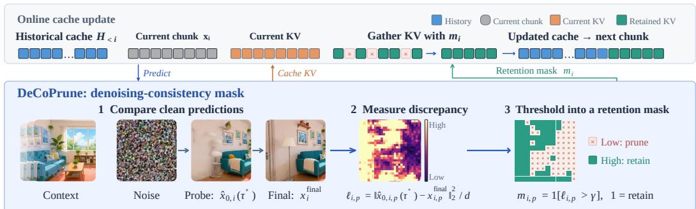  
Figure 3: DECOPRUNE overview. A probe and final prediction from the same denoising trajectory yield a token-retention mask. The mask physically compacts historical KVs after the recent-window delay.

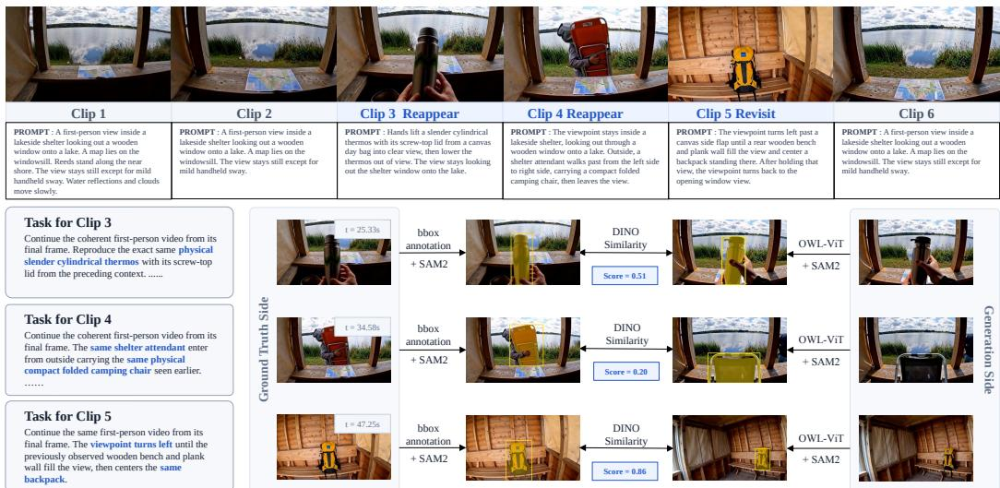  
Figure 4: Overview of CMBENCH. Top: a one-minute generated context assembled from six prompted clips; three target events yield three continuation tasks. Bottom: the corresponding continuation prompts and evaluation pipeline. The reference target and its generated counterpart are localized and segmented, then compared using DINO similarity.

H3-generated episodes provide 102 tasks, and eight real-world episodes provide the remaining 14. Each episode is built around an approximately one-minute video context and contains multiple target events; pairing one event with its continuation prompt defines a task. As illustrated in Figure 4, each prompt asks the generator to reproduce an object, person, or view that appeared in the context, directly testing whether that visual evidence is retained and can be used during continuation.

The generated contexts are constructed with MiniMax H3 (MiniMax, 2026) to control event content and timing, while real-world contexts provide complementary natural footage under the same task and evaluation protocol. A generated context concatenates six 10-second clips produced with first–last frame conditioning; the boundary frame is propagated between adjacent clips to maintain continuity. Each clip contains at most one complete target event, preventing independently gener ated boundaries from altering the event. Multiple events within a context act as distractors for one another. Appendix D reports the source-stratified analysis.

Continuation tasks. Reappear asks a person or object observed in the context to appear again. Success requires reproducing the same entity and appearance, rather than a plausible instance of the same category. Revisit first shows a camera transition from scene A to scene B and back to A, then asks the continuation to revisit B. Scene B contains a salient object that serves as an evaluation anchor. In generated contexts, the complete A→ B →A event lies within one 10-second clip so that B remains a consistent reference. Both tasks therefore reduce to recalling a target that was visually observed in the context.

Evaluation protocol. For each task, we annotate a reference frame and target bounding box in the context. As Figure 4 shows, OWL-ViT (Minderer et al., 2022) localizes the target in each generated frame and SAM 2 (Ravi et al., 2024) segments the reference and generated targets. Following subject-fidelity evaluation in personalized generation (Ruiz et al., 2023), we compare DINOv2 embeddings (Oquab et al., 2023) of the resulting crops. For reference crop r and generated crop gt at continuation frame t, the task score is

$$
S _ { \mathrm { D I N O } } = \operatorname* { m a x } _ { t } \cos ( f _ { \mathrm { D I N O } } ( r ) , f _ { \mathrm { D I N O } } ( g _ { t } ) ) .\tag{3}
$$

The maximum allows the requested event to occur at any point in the continuation; the score is zero if the target is never detected. For Revisit, the salient object in scene B is the target, enabling the same protocol for both task types. We report the mean score over all tasks.

We also measure the effective sequence-level pruning ratio (PR) during autoregressive generation. Let $k _ { i , \ell , h }$ be the number of historical KV token positions physically visible to attention head h in layer ℓ when denoising generated chunk i, and let $k _ { i , \ell , h } ^ { \mathrm { f u l l } }$ be the corresponding number under FullKV. For a continuation of T generated chunks in a model with L layers and H attention heads, we define

$$
\mathrm { P R } = 1 - \frac { \sum _ { i = 1 } ^ { T } \sum _ { \ell = 1 } ^ { L } \sum _ { h = 1 } ^ { H } k _ { i , \ell , h } } { \sum _ { i = 1 } ^ { T } \sum _ { \ell = 1 } ^ { L } \sum _ { h = 1 } ^ { H } k _ { i , \ell , h } ^ { \mathrm { f u l l } } } .\tag{4}
$$

PR aggregates historical KV counts across chunks, layers, and heads, excluding the current noisy chunk from both sums. We report its arithmetic mean over cases; it measures cumulative historicaltoken reduction, not peak memory savings or total computation. FPS and speedup measure continuation generation only, excluding prefix processing. Appendix E details the aggregation. We also report standard VBench quality metrics (Huang et al., 2024).

## 3.3 IMPLEMENTATION DETAILS

We complement the core pruning criterion with prefix pruning, RoPE re-indexing, a recent local window, and an optional head-specialized variant, which respectively support observed contexts, long-range addressability, short-term continuity, and higher compression.

Prefix pruning. For an already observed video context, the original denoising trajectory is not available at compression time. We therefore re-noise each finalized context chunk to $\tau ^ { * }$ , evaluate its $\mathbf { x } _ { \mathrm { 0 } }$ prediction at its original absolute temporal position conditioned on the preceding retained cache, and apply Equation 1, using the observed clean chunk as the reference. Processing the context chunks sequentially constructs a compressed KV cache for subsequent autoregressive continuation.

RoPE re-indexing. Large query–key temporal offsets can make retained history difficult to retrieve. Following Wu et al. (2026b), we compress the temporal RoPE coordinates of older context keys into a fixed virtual span while leaving the most recent frames at their original positions. Conceptually, for a context frame at position t and continuation start $q _ { 0 } ,$ we use $\widetilde t ( t ) = q _ { 0 } - g ( q _ { 0 } - t )$ where g preserves recent offsets and linearly compresses older ones. This preserves temporal order and changes only key phases, without modifying the selected tokens, values, or spatial RoPE coordinates. The exact mapping and phase correction are given in Appendix A.

Head-specialized variant. As an extension orthogonal to our token-selection criterion, DECOPRUNE–HS adopts the attention-based head partition of ForcingKV (Ji et al., 2026) to increase the pruning ratio. Dynamic heads apply DECOPRUNE, whereas static heads use Streaming. This head-wise specialization improves compression without altering the core denoising-consistency criterion. The offline head classification, per-group cache policies, and layer-0 treatment are detailed in Appendix B.

Table 1: Main comparison on CMBENCH and VBENCH. DINO is reported on a 0–1 scale; result are averaged over three random seeds. FPS and speedup over FullKV measure continuation genera tion only, excluding prefix processing.
<table><tr><td>Method</td><td>DINO↑</td><td>PR ↑ FPS ↑ Speedup ↑</td><td></td><td></td><td>Temporal Flickering ↑</td><td>Motion Smoothness ↑</td><td>Aesthetic Quality ↑</td><td>Image Quality ↑</td></tr><tr><td>FullKV</td><td>0.6803</td><td>0.00%</td><td>1.568</td><td>1.00×</td><td>0.9499</td><td>0.9705</td><td>0.4633</td><td>0.7125</td></tr><tr><td>Streaming (Xu et al., 2026c; Yang et al., 2025)</td><td>0.4592</td><td>94.37%</td><td>9.591</td><td>6.12×</td><td>0.9474</td><td>0.9698</td><td>0.4769</td><td>0.7103</td></tr><tr><td>DummyForcing (Guo et al., 2026)</td><td>0.4461</td><td>98.03%</td><td>7.393</td><td>4.72×</td><td>0.9425</td><td>0.9687</td><td>0.4677</td><td>0.6933</td></tr><tr><td>ForcingKV (Ji et al., 2026)</td><td>0.5313</td><td>80.62%</td><td>5.288</td><td>3.37×</td><td>0.9437</td><td>0.9661</td><td>0.4610</td><td>0.7018</td></tr><tr><td>TempDiff (Hwang et al., 2024; Fu et al., 2025)</td><td>0.6229</td><td>86.36%</td><td>6.443</td><td>4.11×</td><td>0.9425</td><td>0.9634</td><td>0.4677</td><td>0.7161</td></tr><tr><td>DeCoPrune (ours)</td><td>0.6701</td><td>85.43%</td><td>6.489</td><td>4.14×</td><td>0.9424</td><td>0.9650</td><td>0.4736</td><td>0.7067</td></tr><tr><td>DeCoPrune-HS (ours)</td><td>0.6783</td><td>86.19%</td><td>6.414</td><td>4.09×</td><td>0.9428</td><td>0.9652</td><td>0.4634</td><td>0.7019</td></tr></table>

## 4 EXPERIMENTS

## 4.1 SETTINGS

Backbone and implementation. We use LingBot World v2 (Gao et al., 2026) as the primary backbone for our experiments. All experiments are conducted on four NVIDIA H200 GPUs. For completeness, we also evaluate Self-Forcing, Causal Forcing, and LongLive (Huang et al., 2025a; Zhu et al., 2026; Yang et al., 2025); these backbones are not well suited to minute-scale longcontext generation. Appendix C compares their FullKV performance with minute-scale contexts. To additionally test our pruning method on another backbone, Appendix C.1 (Table 5) evaluates LongLive on 18 continuation cases with 10-second contexts, where DECOPRUNE outperforms the other pruning baselines in both DINO and PR.

Baselines and evaluation. We compare against FullKV, which retains the complete attention context, and a Streaming baseline following StreamingVLM and LongLive (Xu et al., 2026c; Yang et al., 2025), which keeps only sink and recent tokens. DummyForcing (Guo et al., 2026) and ForcingKV (Ji et al., 2026) apply different cache policies to different attention heads. TempDiff is a temporal-difference baseline inspired by temporal-redundancy-aware token reduction (Hwang et al., 2024; Fu et al., 2025): it compares each patch with its counterpart in the preceding frame and inserts the K least similar patches into the KV cache. Random preserves the same sink and recent windows as our method while sampling the remaining historical tokens at random. We evaluate both DECO PRUNE and its head-specialized variant, DECOPRUNE–HS, described in Section 3.3. CMBENCH is our primary evaluation, with the DINO score (reported on a 0–1 scale) measuring consistency level and PR and FPS measuring efficiency; we additionally report VBENCH (Huang et al., 2024) to assess general video quality.

Denoising schedule and probe. We use a four-step noise schedule (999, 957, 899, 702) derived from FlowUniPC with a shift of 5. The zero-based denoising-step indices 1, 2, and 3 correspond to noise timesteps 957, 899, and 702, respectively. We use index 2 (τ∗ = 899) as the probe step and γ = 0.10 as the pruning threshold. The default video configuration is 832 × 480 pixels at 16 FPS, with four latent frames per chunk.

## 4.2 MAIN RESULTS

Comparison protocol. All compression methods share the same sink and recent windows (Appendix B). Streaming and DummyForcing discard intermediate history; we tune history-aware methods to comparable PR values. In our reproductions, DummyForcing uses cache sizes 4/8/4 for its first/middle/last head groups, ForcingKV retrieves K = 256 patches from the preceding 32 chunks, TempDiff uses 1,657 cache entries, and Random matches the PR of DECOPRUNE. All methods use the same RoPE re-indexing in the main comparison; Table 2 isolates its effect. Table 1 summarizes the results.

CMBENCH results. Table 1 shows that DeCoPrune preserves near-FullKV context consistency with an 85.43% pruning ratio and a 4.14× continuation-generation speedup over FullKV. FullKV remains the uncompressed reference with the highest DINO in the main comparison. At similar PR and throughput, DeCoPrune exceeds TempDiff by 0.0472 DINO, indicating that denoising-based selection preserves useful evidence beyond a temporal-change heuristic. DeCoPrune–HS further approaches FullKV with a 0.0020 DINO gap. Streaming and DummyForcing are faster but sacrifice substantially more recall by discarding intermediate history. These policies represent a different compression–consistency trade-off, rather than matched-budget alternatives. The matched-budget Random control is analyzed separately in Table 3. Figure 5 provides case-level comparisons under the settings used in these tables. The four VBENCH dimensions remain broadly comparable across policies, providing a complementary assessment of general video quality.

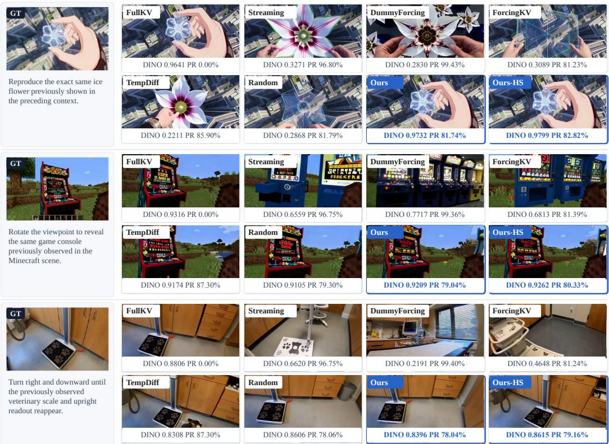  
Figure 5: Qualitative comparison under the matched settings used in Tables 1 and 3. We highly recommend viewing the video comparisons on the supplementary webpage to better appreciate tem poral consistency and visual detail.

## 4.3 ABLATION STUDY

We ablate the three design choices underlying our context-management pipeline: the timestep and threshold used to probe denoising consistency, the positional re-indexing of retained history, and the direction of token selection. Together, these studies examine whether the observed gains arise from the proposed consistency signal rather than solely from the cache budget or positional correction.

Probe timestep and consistency threshold. Figure 6(a) shows similar DINO scores across probe timesteps over a broad PR range, with degradation only under aggressive compression. This supports an intermediate probe without requiring precise timestep tuning. In panel (b), subject and background consistency remain nearly saturated while CMBench DINO responds to lost contextual information, showing why general video-quality metrics alone cannot select a recall-preserving compression budget.

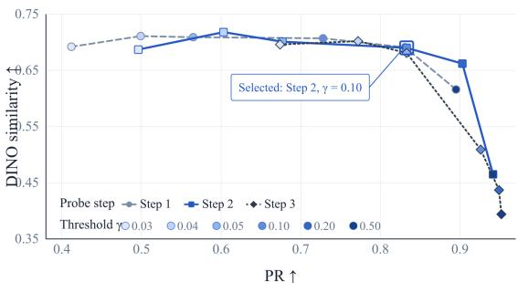  
(a) Probe timestep and pruning threshold

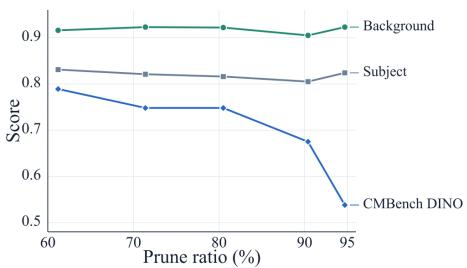  
(b) Sensitivity of consistency metrics  
Figure 6: Ablation and metric analysis on 13 independent cases. (a) Threshold γ is swept from light to dark at each probe-step index; the marked operating point is $s ^ { * } = 2 ( \tau ^ { * } = 8 9 9 ) , \gamma = 0 . 1 0 .$ (b) VBench subject/background consistency and CMBench DINO versus PR.

Table 2: RoPE re-indexing ablation. ∆DINO is the change from re-indexing.
<table><tr><td>Method</td><td>w/ re-index DINO↑</td><td>w/o re-index DINO↑</td><td>∆DINO</td></tr><tr><td>FullKV</td><td>0.6804</td><td>0.4385</td><td>+0.2418</td></tr><tr><td>DeCoPrune-HS (ours)</td><td>0.7156</td><td>0.6686</td><td>+0.0470</td></tr><tr><td>TempDiff</td><td>0.6365</td><td>0.6019</td><td>+0.0346</td></tr><tr><td>Random</td><td>0.6723</td><td>0.5515</td><td>+0.1208</td></tr><tr><td>DummyForcing</td><td>0.4005</td><td>0.4012</td><td>-0.0007</td></tr><tr><td>ForcingKV</td><td>0.4825</td><td>0.4860</td><td>-0.0035</td></tr><tr><td>Streaming</td><td>0.3994</td><td>0.4040</td><td>-0.0046</td></tr></table>

Table 3: Token-selection ablation. Reverse retains low-discrepancy tokens.
<table><tr><td>Policy</td><td>DINO↑</td><td>PR↑</td></tr><tr><td>DeCoPrune</td><td>0.6701</td><td>85.43%</td></tr><tr><td>Random</td><td>0.6091</td><td>85.31%</td></tr><tr><td>Reverse criterion</td><td>0.5621</td><td>18.79%</td></tr><tr><td>Reverse criterion (matched PR)</td><td>0.4512</td><td>85.39%</td></tr></table>

Effect of RoPE re-indexing. Within the diagnostic evaluation of Table 2, we isolate the effect of mapping the temporal coordinates of retained historical keys into a compact virtual span. Reindexing raises DINO for the methods that preserve content from distant history in this evaluation, including FullKV, DeCoPrune–HS, TempDiff, and Random. The largest gain occurs for FullKV, whose uncompressed history contains the greatest query–key positional offsets. In contrast, Streaming and the two head-wise policies show little change, with small decreases in DINO. Their cache rules already discard most distant context. These results indicate that re-indexing improves access to retained evidence, while the pruning policy determines which evidence remains available.

Token-selection criterion. Table 3 compares our consistency-based selection with random pruning and the reverse criterion, which retains tokens with low step-to-final discrepancy. For the matched-PR reverse baseline, we independently adjust the reverse-selection threshold to match De-CoPrune’s average pruning ratio. At nearly matched pruning ratios (85.31–85.43%), DeCoPrune achieves 0.6701 DINO, compared with 0.6091 for Random and 0.4512 for reverse selection. The 0.2189 DINO gap to the reverse criterion isolates the importance of selection direction at a comparable cache budget. Even when reverse selection retains 81.21% of the historical KV entries (PR = 18.79%), it reaches only 0.5621 DINO. Together, these results support retaining high-discrepancy tokens rather than low-discrepancy tokens.

## 5 CONCLUSION

Long-context autoregressive video diffusion requires a growing KV cache, incurring increasing memory and attention costs. DECOPRUNE addresses this with training-free pruning based on denoising consistency, a model-intrinsic proxy for token importance. We introduce CMBENCH to evaluate long-context information retention, and experiments show that DECOPRUNE improves efficiency while preserving continuation consistency.

## AI USE STATEMENT

For manuscript preparation, we used generative AI tools only to aid writing and polish language. All AI-assisted text was reviewed and verified by the authors, who take full responsibility for the final content and claims of this work. The use of H3 to construct synthetic benchmark videos is described in the benchmark construction and Appendix D.

## ETHICS STATEMENT

This work studies efficient, context-consistent video generation for research purposes. Such techniques may also lower the cost of producing misleading synthetic videos. Consistency with a video context does not establish factual accuracy or authenticity, and generated videos should be clearly identified as synthetic. The use and distribution of real-world footage should respect privacy, consent, and applicable licenses.

## REPRODUCIBILITY STATEMENT

Section 3.1 specifies the consistency score and cache-update rule, and Section 3.3 describes their application to observed contexts and the supporting implementation choices. The CMBENCH subsection details benchmark construction and evaluation, while the experimental settings report the backbone, hardware, denoising schedule, pruning threshold, and cache budgets. Appendices A and B provide the RoPE re-indexing and head-specialization details. The supplementary material includes benchmark examples and qualitative video comparisons to support inspection of the reported behavior.

## REFERENCES

Eloi Alonso, Adam Jelley, Vincent Micheli, Anssi Kanervisto, Amos Storkey, Tim Pearce, and Franc¸ois Fleuret. Diffusion for world modeling: Visual details matter in atari. arXiv preprint arXiv:2405.12399, 2024. URL https://arxiv.org/abs/2405.12399.

Peiliang Cai, Evelyn Zhang, Jiacheng Liu, Hao Lin, Ruiqi Zhang, Weile Mo, Yue Ma, Shikang Zheng, Jiehang Huang, Dongrui Liu, and Linfeng Zhang. Focused Forcing: Content-aware perframe KV selection for efficient autoregressive video diffusion. arXiv preprint arXiv:2605.18346, 2026. URL https://arxiv.org/abs/2605.18346.

Zefan Cai, Yichi Zhang, Bofei Gao, Yuliang Liu, Tianyu Liu, Keming Lu, Wayne Xiong, Yue Dong, Baobao Chang, Junjie Hu, and Wen Xiao. PyramidKV: Dynamic KV cache compression based on pyramidal information funneling. arXiv preprint arXiv:2406.02069, 2024. URL https: //arxiv.org/abs/2406.02069.

Boyuan Chen, Diego Mart´ı Monso, Yilun Du, Max Simchowitz, Russ Tedrake, and Vincent´ Sitzmann. Diffusion forcing: Next-token prediction meets full-sequence diffusion. In Advances in Neural Information Processing Systems, volume 37, pp. 24081–24125, 2024. URL https://arxiv.org/abs/2407.01392.

Guibin Chen, Dixuan Lin, Jiangping Yang, Chunze Lin, Juncheng Zhu, Mingyuan Fan, Hao Zhang, Sheng Chen, Zheng Chen, Chengchen Ma, et al. SkyReels-V2: Infinite-length film generative model. arXiv preprint arXiv:2504.13074, 2025a. URL https://arxiv.org/abs/2504. 13074.

Hanmo Chen, Chenghao Xu, Xu Yang, Xuan Chen, and Cheng Deng. Past- and future-informed KV cache policy with salience estimation in autoregressive video diffusion. arXiv preprint arXiv:2601.21896, 2026a. URL https://arxiv.org/abs/2601.21896.

Haoyu Chen, Kaichen Zhou, Hang Hua, Kaile Zhang, Jingwen Qian, Wufei Ma, Haonan Chen, Chunjiang Liu, Yizhou Zhao, Xiaoyuan Wang, Weiyue Li, Alan Yuille, Paul Pu Liang, and Yilun Du. MemoBench: Benchmarking world modeling in dynamically changing environments. arXiv preprint arXiv:2606.27537, 2026b. URL https://arxiv.org/abs/2606.27537.

Jiayu Chen, Junbei Tang, Wenbiao Zhao, Maoliang Li, Jiayi Luo, Zihao Zheng, Jiawei Yang, Guojie Luo, and Xiang Chen. Pyramid Forcing: Head-aware pyramid KV cache policy for high-quality long video generation. arXiv preprint arXiv:2605.13111, 2026c. URL https://arxiv.org/ abs/2605.13111.

Taiye Chen, Xun Hu, Zihan Ding, and Chi Jin. VRAG: Learning world models for interactive video generation. In Advances in Neural Information Processing Systems, 2025b. URL https: //arxiv.org/abs/2505.21996.

Justin Cui, Jie Wu, Ming Li, Tao Yang, Xiaojie Li, Rui Wang, Andrew Bai, Yuanhao Ban, and Cho-Jui Hsieh. Self-Forcing++: Towards minute-scale high-quality video generation. arXiv preprint arXiv:2510.02283, 2025. URL https://arxiv.org/abs/2510.02283.

Xuan Long Do, Yale Song, Min-Yen Kan, Tomas Pfister, and Long Le. A2RD: Agentic autoregressive diffusion for long video consistency, 2026. URL https://research.google/pubs/ a2rd-agentic-autoregressive-diffusion-for-long-video-consistency/.

Weijia Dou, Hui Li, Jiahao Cui, Lei Zhou, Jingdong Wang, and Siyu Zhu. SlotMemory: Objectcentric KV memory for streaming long-video generation. arXiv preprint arXiv:2605.31033, 2026. URL https://arxiv.org/abs/2605.31033.

X. Feng, H. Yu, M. Wu, S. Hu, J. Chen, C. Zhu, J. Wu, X. Chu, and K. Huang. NarrLV: Towards a comprehensive narrative-centric evaluation for long video generation. arXiv preprint arXiv:2507.11245, 2025. URL https://arxiv.org/abs/2507.11245.

Tianyu Fu, Tengxuan Liu, Qinghao Han, Guohao Dai, Shengen Yan, Huazhong Yang, Xuefei Ning, and Yu Wang. FrameFusion: Combining similarity and importance for video token reduction on large vision language models. In Proceedings of the IEEE/CVF International Conference on Computer Vision, pp. 22654–22663, 2025. URL https://openaccess.thecvf.com/ content/ICCV2025/html/Fu\_FrameFusion\_Combining\_Similarity\_and\_ Importance\_for\_Video\_Token\_Reduction\_on\_ICCV\_2025\_paper.html.

Kaifeng Gao, Jiaxin Shi, Hanwang Zhang, Chunping Wang, Jun Xiao, and Long Chen. Ca2-VDM: Efficient autoregressive video diffusion model with causal generation and cache sharing. In Proceedings of the 42nd International Conference on Machine Learning, volume 267, pp. 18550– 18565, 2025. URL https://proceedings.mlr.press/v267/gao25m.html.

Zelin Gao, Qiuyu Wang, Jiapeng Zhu, Jingye Chen, Zichen Liu, Qingyan Bai, Jiahao Wang, Yufeng Yuan, Hanlin Wang, Yichong Lu, Ka Leong Cheng, Haojie Zhang, Jian Gao, Tianrui Feng, Yuzheng Liu, Yao Yao, Yinghao Xu, Xing Zhu, Yujun Shen, and Hao Ouyang. Infinite worlds with versatile interactions. arXiv preprint arXiv:2607.07534, 2026. URL https: //arxiv.org/abs/2607.07534. LingBot World v2 (LingBot World Infinity).

Qiwen Gu, Bingjie Gao, Rui Chen, Geng Li, Jifan Li, Qishuai Wen, Li Niu, Jing Tang, Xiangxiang Chu, and Junqiao Zhao. R2M-Bench: Evaluating revisit memory via relative consistency in interactive video world models. arXiv preprint arXiv:2608.27328, 2026. URL https://arxiv.org/abs/2608.27328.

Hang Guo, Zhaoyang Jia, Jiahao Li, Bin Li, Yuanhao Cai, Jiangshan Wang, Yawei Li, and Yan Lu. Efficient autoregressive video diffusion with dummy head. arXiv preprint arXiv:2601.20499, 2026. URL https://arxiv.org/abs/2601.20499.

Junliang Guo, Yang Ye, Tianyu He, Haoyu Wu, Yushu Jiang, Tim Pearce, and Jiang Bian. MineWorld: A real-time and open-source interactive world model on Minecraft. arXiv preprint arXiv:2504.08388, 2025. URL https://arxiv.org/abs/2504.08388.

Xianglong He, Chunli Peng, Zexiang Liu, Boyang Wang, Yifan Zhang, Qi Cui, Fei Kang, Biao Jiang, Mengyin An, Yangyang Ren, et al. Matrix-Game 2.0: An open-source, real-time, and streaming interactive world model. arXiv preprint arXiv:2508.13009, 2025. URL https:// arxiv.org/abs/2508.13009.

Roberto Henschel, Levon Khachatryan, Hayk Poghosyan, Daniil Hayrapetyan, Vahram Tadevosyan, Zhangyang Wang, Shant Navasardyan, and Humphrey Shi. StreamingT2V: Consistent, dynamic, and extendable long video generation from text. In Proceedings ofthe IEEE/CVF Conference on Computer Vision and Pattern Recognition, 2025. URL https://arxiv.org/abs/2403. 14773.

Qixin Hu, Shuai Yang, Wei Huang, Song Han, and Yukang Chen. LongLive-RAG: A general retrieval-augmented framework for long video generation. arXiv preprint arXiv:2606.02553, 2026. URL https://arxiv.org/abs/2606.02553.

Xun Huang, Zhengqi Li, Guande He, Mingyuan Zhou, and Eli Shechtman. Self forcing: Bridging the train-test gap in autoregressive video diffusion. In Advances in Neural Information Processing Systems, 2025a. URL https://arxiv.org/abs/2506.08009.

Ziqi Huang, Yinan He, Jiashuo Yu, Fan Zhang, Chenyang Si, Yuming Jiang, Yuanhan Zhang, Tianxing Wu, Qingyang Jin, Nattapol Chanpaisit, Yaohui Wang, Xinyuan Chen, Limin Wang, Dahua Lin, Yu Qiao, and Ziwei Liu. VBench: Comprehensive benchmark suite for video generative models. In Proceedings of the IEEE/CVF Conference on Computer Vision and Pattern Recognition, 2024. URL https://arxiv.org/abs/2311.17982.

Ziqi Huang, Fan Zhang, Xiaojie Xu, Yinan He, Jiashuo Yu, Ziyue Dong, Qianli Ma, Nattapol Chanpaisit, Chenyang Si, Yuming Jiang, Yaohui Wang, Xinyuan Chen, Ying-Cong Chen, Limin Wang, Dahua Lin, Yu Qiao, and Ziwei Liu. VBench++: Comprehensive and versatile benchmark suite for video generative models. IEEE Transactions on Pattern Analysis and Machine Intelligence, 2025b. doi: 10.1109/TPAMI.2025.3633890. URL https://arxiv.org/abs/ 2411.13503. Includes the VBench-Long extension.

Sunil Hwang, Jaehong Yoon, Youngwan Lee, and Sung Ju Hwang. EVEREST: Efficient masked video autoencoder by removing redundant spatiotemporal tokens. In International Conference on Machine Learning, 2024. URL https://arxiv.org/abs/2211.10636.

Yicheng Ji, Zhizhou Zhong, Jun Zhang, Qin Yang, XiTai Jin, Ying Qin, Wenhan Luo, Shuiyang Mao, Wei Liu, and Huan Li. Forcing-KV: Hybrid KV cache compression for efficient autoregressive video diffusion models. arXiv preprint arXiv:2605.09681, 2026. URL https://arxiv.org/ abs/2605.09681.

Weijie Kong, Qi Tian, Zijian Zhang, Rox Min, Zuozhuo Dai, Jin Zhou, Jiangfeng Xiong, Xin Li, Bo Wu, Jianwei Zhang, et al. HunyuanVideo: A systematic framework for large video generative models. arXiv preprint arXiv:2412.03603, 2024. URL https://arxiv.org/abs/2412. 03603.

Dacheng Li, Yunhao Fang, Yukang Chen, Shuo Yang, Shiyi Cao, Justin Wong, Michael Luo, Xiao long Wang, Hongxu Yin, Joseph E. Gonzalez, Ion Stoica, Song Han, and Yao Lu. WorldModelBench: Judging video generation models as world models. arXiv preprint arXiv:2502.20694, 2025a. URL https://arxiv.org/abs/2502.20694.

Kunyang Li, Mubarak Shah, and Yuzhang Shang. PackCache: A Training-Free Acceleration Method for Unified Autoregressive Video Generation via Compact KV-Cache. arXiv preprint arXiv:2601.04359, 2026. URL https://arxiv.org/abs/2601.04359.

Runjia Li, Philip Torr, Andrea Vedaldi, and Tomas Jakab. Vmem: Consistent interactive video scene generation with surfel-indexed view memory. In 2025 IEEE/CVF International Conference on Computer Vision (ICCV), pp. 25690–25699. IEEE, 2025b. URL https://arxiv.org/ abs/2506.18903.

Wuyang Li, Wentao Pan, Po-Chien Luan, Yang Gao, and Alexandre Alahi. Stable video infinity: Infinite-length video generation with error recycling. arXiv preprint arXiv:2510.09212, 2025c. URL https://arxiv.org/abs/2510.09212.

Yuhong Li, Yingbing Huang, Bowen Yang, Bharat Venkitesh, Acyr Locatelli, Hanchen Ye, Tianle Cai, Patrick Lewis, and Deming Chen. SnapKV: LLM knows what you are looking for before generation. arXiv preprint arXiv:2404.14469, 2024. URL https://arxiv.org/abs/2404. 14469.

Bin Lin, Yunyang Ge, Xinhua Cheng, Zongjian Li, Bin Zhu, Shaodong Wang, Xianyi He, Yang Ye, Shenghai Yuan, Liuhan Chen, et al. Open-Sora Plan: Open-source large video generation model. arXiv preprint arXiv:2412.00131, 2024. URL https://arxiv.org/abs/2412.00131.

Feng Liu, Shiwei Zhang, Xiaofeng Wang, Yujie Wei, Haonan Qiu, Yuzhong Zhao, Yingya Zhang, Qixiang Ye, and Fang Wan. Timestep embedding tells: It’s time to cache for video diffusion model. In Proceedings ofthe IEEE/CVF Conference on Computer Vision and Pattern Recognition, 2025a. URL https://arxiv.org/abs/2411.19108.

Kunhao Liu, Wenbo Hu, Jiale Xu, Ying Shan, and Shijian Lu. Rolling forcing: Autoregressive long video diffusion in real time. arXiv preprint arXiv:2509.25161, 2025b. URL https://arxiv. org/abs/2509.25161.

Yu Lu, Junjie Yang, Piotr Koniusz, Yuxin Song, and Yi Yang. FadeMem: Distance-aware memory consolidation for autoregressive video diffusion. arXiv preprint arXiv:2606.10671, 2026. URL https://arxiv.org/abs/2606.10671.

Yunhong Lu, Yanhong Zeng, Haobo Li, Hao Ouyang, Qiuyu Wang, Ka Leong Cheng, Jiapeng Zhu, Hengyuan Cao, Zhipeng Zhang, Xing Zhu, Yujun Shen, and Min Zhang. Reward forcing: Efficient streaming video generation with rewarded distribution matching distillation. arXiv preprint arXiv:2512.04678, 2025. URL https://arxiv.org/abs/2512.04678.

Jiayi Luo, Qiyan Liu, Tengyang Wang, Junhao Liu, Jiayu Chen, Cong Wang, Hanxin Zhu, Chen Gao, Xiaobin Hu, Qingyun Sun, and Zhibo Chen. Future Forcing: Future-aware training-free KV cache policy for autoregressive video generation. arXiv preprint arXiv:2605.30083, 2026. URL https://arxiv.org/abs/2605.30083.

Chengtao Lv, Yumeng Shi, Yushi Huang, Ruihao Gong, Shen Ren, and Wenya Wang. Light Forcing: Accelerating autoregressive video diffusion via sparse attention. In Proceedings of the International Conference on Machine Learning, 2026. URL https://arxiv.org/abs/2602. 04789.

Yuexiao Ma, Xuzhe Zheng, Jing Xu, Xiwei Xu, Feng Ling, Xiawu Zheng, Huafeng Kuang, Huixia Li, Xing Wang, Xuefeng Xiao, Fei Chao, and Rongrong Ji. Flow caching for autoregressive video generation. arXiv preprint arXiv:2602.10825, 2026. URL https://arxiv.org/abs/ 2602.10825.

Xiaofeng Mao, Shaohao Rui, Kaining Ying, Bo Zheng, Chuanhao Li, Mingmin Chi, and Kaipeng Zhang. PackForcing: Short video training suffices for long video sampling and long context inference. arXiv preprint arXiv:2603.25730, 2026. URL https://arxiv.org/abs/2603. 25730.

Meituan LongCat Team, Xunliang Cai, Qilong Huang, Zhuoliang Kang, Hongyu Li, Shijun Liang, Liya Ma, Siyu Ren, Xiaoming Wei, Rixu Xie, and Tong Zhang. LongCat-Video technical report. arXiv preprint arXiv:2510.22200, 2025. URL https://arxiv.org/abs/2510.22200.

Matthias Minderer, Alexey Gritsenko, Austin Stone, Maxim Neumann, Dirk Weissenborn, Alexey Dosovitskiy, Aravindh Mahendran, Anurag Arnab, Mostafa Dehghani, Zhuoran Shen, Xiao Wang, Xiaohua Zhai, Thomas Kipf, and Neil Houlsby. Simple open-vocabulary object detection with vision transformers. In European Conference on Computer Vision, 2022. URL https://arxiv.org/abs/2205.06230.

MiniMax. MiniMax H3: An open model breaking the boundaries between tasks and modalities. MiniMax Research, 2026. URL https://www.minimax.io/blog/minimax-h3.

Umair Nawaz, Ahmed Heakl, Ufaq Khan, Abdelrahman Shaker, Salman Khan, and Fahad Shahbaz Khan. WorldCache: Content-aware caching for accelerated video world models. arXiv preprint arXiv:2603.22286, 2026. URL https://arxiv.org/abs/2603.22286.

Maxime Oquab, Timothee Darcet, Th´ eo Moutakanni, Huy Vo, Marc Szafraniec, Vasil Khalidov,´ Pierre Fernandez, Daniel Haziza, Francisco Massa, Alaaeldin El-Nouby, Mahmoud Assran, Nicolas Ballas, Wojciech Galuba, Russell Howes, Po-Yao Huang, Shang-Wen Li, Ishan Misra, Michael Rabbat, Vasu Sharma, Gabriel Synnaeve, Hu Xu, Herve J´ egou, Julien Mairal, Patrick Labatut,´

Armand Joulin, and Piotr Bojanowski. DINOv2: Learning robust visual features without supervision. arXiv preprint arXiv:2304.07193, 2023. URL https://arxiv.org/abs/2304. 07193.

William Peebles and Saining Xie. Scalable diffusion models with transformers. In Proceedings of the IEEE/CVF International Conference on Computer Vision, 2023. URL https://arxiv. org/abs/2212.09748.

Nikhila Ravi, Valentin Gabeur, Yuan-Ting Hu, Ronghang Hu, Chaitanya Ryali, Tengyu Ma, Haitham Khedr, Roman Radle, Chlo¨ e Rolland, Laura Gustafson, Eric Mintun, Junting Pan, Kalyan Va-´ sudev Alwala, Nicolas Carion, Chao-Yuan Wu, Ross Girshick, Piotr Dollar, and Christoph Fe-´ ichtenhofer. SAM 2: Segment anything in images and videos. arXiv preprint arXiv:2408.00714, 2024. URL https://arxiv.org/abs/2408.00714.

Nataniel Ruiz, Yuanzhen Li, Varun Jampani, Yael Pritch, Michael Rubinstein, and Kfir Aberman. DreamBooth: Fine tuning text-to-image diffusion models for subject-driven generation. In Proceedings ofthe IEEE/CVF Conference on Computer Vision and Pattern Recognition, pp. 22500– 22510, 2023. URL https://arxiv.org/abs/2208.12242.

Dvir Samuel, Issar Tzachor, Matan Levy, Michael Green, Gal Chechik, and Rami Ben-Ari. Fast autoregressive video diffusion and world models with temporal cache compression and sparse attention. In Proceedings of the International Conference on Machine Learning, 2026. URL https://arxiv.org/abs/2602.01801.

Sand.ai, Hansi Teng, Hongyu Jia, Lei Sun, Lingzhi Li, Maolin Li, Mingqiu Tang, Shuai Han, Tianning Zhang, W. Q. Zhang, et al. MAGI-1: Autoregressive video generation at scale. arXiv preprint arXiv:2505.13211, 2025. URL https://arxiv.org/abs/2505.13211.

Kiwhan Song, Boyuan Chen, Max Simchowitz, Yilun Du, Russ Tedrake, and Vincent Sitzmann. History-guided video diffusion. In Proceedings of the 42nd International Conference on Machine Learning, volume 267, pp. 56242–56280, 2025. URL https://proceedings.mlr. press/v267/song25b.html.

Jiahao Tian, Yiwei Wang, Gang Yu, and Chi Zhang. Head Forcing: Long autoregressive video generation via head heterogeneity. arXiv preprint arXiv:2605.14487, 2026. URL https:// arxiv.org/abs/2605.14487.

Dani Valevski, Yaniv Leviathan, Moab Arar, and Shlomi Fruchter. Diffusion models are real-time game engines. arXiv preprint arXiv:2408.14837, 2024. URL https://arxiv.org/abs/ 2408.14837.

Wan Team. Wan: Open and advanced large-scale video generative models. arXiv preprint arXiv:2503.20314, 2025. URL https://arxiv.org/abs/2503.20314.

Yiping Wang, Xuehai He, Kuan Wang, Luyao Ma, Jianwei Yang, Shuohang Wang, Simon Shaolei Du, and Yelong Shen. Is your world simulator a good story presenter? a consecutive eventsbased benchmark for future long video generation. arXiv preprint arXiv:2412.16211, 2024. URL https://arxiv.org/abs/2412.16211.

Mingqiang Wu, Weilun Feng, Zhefeng Zhang, Haotong Qin, Yuqi Li, Guoxin Fan, Xiaokun Liu, Zhulin An, Libo Huang, Yongjun Xu, and Chuanguang Yang. Echo-Forcing: A scene memory framework for interactive long video generation. arXiv preprint arXiv:2605.16003, 2026a. URL https://arxiv.org/abs/2605.16003.

Tong Wu, Shuai Yang, Ryan Po, Yinghao Xu, Ziwei Liu, Dahua Lin, and Gordon Wetzstein. Video world models with long-term spatial memory. Advances in Neural Information Processing Systems, 38:49371–49393, 2025a. URL https://arxiv.org/abs/2506.05284.

Xiaofei Wu, Guozhen Zhang, Zhiyong Xu, Yuan Zhou, Qinglin Lu, and Xuming He. Pack and force your memory: Long-form and consistent video generation. arXiv preprint arXiv:2510.01784, 2025b. URL https://arxiv.org/abs/2510.01784.

Xindi Wu, Sven Elflein, James Lucas, Olga Russakovsky, Laura Leal-Taixe, Despoina Paschalidou,´ Jonathan Lorraine, and Aljosa Osep. Addressable memory for video world models. arXiv preprint arXiv:2608.07408, 2026b. URL https://arxiv.org/abs/2608.07408.

Haocheng Xi, Shuo Yang, Yilong Zhao, Chenfeng Xu, Muyang Li, Xiuyu Li, Yujun Lin, Han Cai, Jintao Zhang, Dacheng Li, Jianfei Chen, Ion Stoica, Kurt Keutzer, and Song Han. Sparse VideoGen: Accelerating video diffusion transformers with spatial-temporal sparsity. arXiv preprint arXiv:2502.01776, 2025. URL https://arxiv.org/abs/2502.01776.

Haocheng Xi, Shuo Yang, Yilong Zhao, Muyang Li, Han Cai, Xingyang Li, Yujun Lin, Zhuoyang Zhang, Jintao Zhang, Xiuyu Li, Zhiying Xu, Jun Wu, Chenfeng Xu, Ion Stoica, Song Han, and Kurt Keutzer. Quant VideoGen: Auto-Regressive Long Video Generation via 2-Bit KV-Cache Quantization. arXiv preprint arXiv:2602.02958, 2026. URL https://arxiv.org/abs/ 2602.02958.

Guangxuan Xiao, Yuandong Tian, Beidi Chen, Song Han, and Mike Lewis. Efficient streaming language models with attention sinks. In International Conference on Learning Representations, 2024. URL https://arxiv.org/abs/2309.17453.

Guangxuan Xiao, Jiaming Tang, Jingwei Zuo, Junxian Guo, Shang Yang, Haotian Tang, Yao Fu, and Song Han. DuoAttention: Efficient long-context LLM inference with retrieval and streaming heads. In International Conference on Learning Representations, 2025a. URL https://arxiv.org/abs/2410.10819.

Zeqi Xiao, Yushi Lan, Yifan Zhou, Wenqi Ouyang, Shuai Yang, Yanhong Zeng, and Xingang Pan. Worldmem: Long-term consistent world simulation with memory. Advances in Neural Information Processing Systems, 38:49632–49652, 2025b. URL https://arxiv.org/abs/2504. 12369.

Boxun Xu, Yuming Du, Zichang Liu, Siyu Yang, Ziyang Jiang, Siqi Yan, Rajasi Saha, Albert Pumarola, Wenchen Wang, and Peng Li. Sparse Forcing: Native trainable sparse attention for real-time autoregressive diffusion video generation. arXiv preprint arXiv:2604.21221, 2026a. URL https://arxiv.org/abs/2604.21221.

Haiyang Xu, Zheng Ding, and Zhuowen Tu. RECAP-Forcing: Retaining content appearances for long video generation. arXiv preprint arXiv:2608.26671, 2026b. URL https://arxiv.org/ abs/2608.26671.

Ruyi Xu, Guangxuan Xiao, Yukang Chen, Liuning He, Yao Lu, and Song Han. StreamingVLM: Real-time understanding for infinite video streams. In International Conference on Learning Representations, 2026c. URL https://arxiv.org/abs/2510.09608.

Bowen Xue, Brandon Y. Feng, Chenguo Lin, Yuchen Lin, Yujia Zeng, Lvmin Zhang, Maneesh Agrawala, Honglei Yan, and Panwang Pan. Ring Forcing: Towards precise long-term memory for autoregressive video diffusion. In European Conference on Computer Vision (ECCV), 2026. URL https://arxiv.org/abs/2608.26794.

Shuai Yang, Wei Huang, Ruihang Chu, Yicheng Xiao, Yuyang Zhao, Xianbang Wang, Muyang Li, Enze Xie, Yingcong Chen, Yao Lu, Song Han, and Yukang Chen. LongLive: Real-time interactive long video generation. arXiv preprint arXiv:2509.22622, 2025. URL https://arxiv.org/ abs/2509.22622.

Yixuan Ye, Xuanyu Lu, Yuxin Jiang, Yuchao Gu, Rui Zhao, Qiwei Liang, Jiachun Pan, Fengda Zhang, Weijia Wu, and Alex Jinpeng Wang. MIND: Benchmarking memory consistency and action control in world models. arXiv preprint arXiv:2602.08025, 2026. URL https: //arxiv.org/abs/2602.08025.

Hidir Yesiltepe, Tuna Han Salih Meral, Adil Kaan Akan, Kaan Oktay, and Pinar Yanardag. Infinity-RoPE: Action-controllable infinite video generation emerges from autoregressive self-rollout. arXiv preprint arXiv:2511.20649, 2025. URL https://arxiv.org/abs/2511.20649.

Hidir Yesiltepe, Jiazhen Hu, Tuna Han Salih Meral, Adil Kaan Akan, Kaan Oktay, Hoda Eldardiry, and Pinar Yanardag. VideoMLA: Low-rank latent KV cache for minute-scale autoregressive video diffusion. arXiv preprint arXiv:2605.30351, 2026. URL https://arxiv.org/abs/2605. 30351.

Jung Yi, Wooseok Jang, Paul Hyunbin Cho, Jisu Nam, Heeji Yoon, and Seungryong Kim. Deep Forcing: Training-free long video generation with deep sink and participative compression. arXiv preprint arXiv:2512.05081, 2025. URL https://arxiv.org/abs/2512.05081.

Jung Yi, Minjae Kim, Paul Hyunbin Cho, Wooseok Jang, Sangdoo Yun, and Seungryong Kim. Worldkv: Efficient world memory with world retrieval and compression. arXiv preprint arXiv:2605.22718, 2026. URL https://arxiv.org/abs/2605.22718.

Tianwei Yin, Qiang Zhang, Richard Zhang, William T. Freeman, Fredo Durand, Eli Shechtman, and Xun Huang. From slow bidirectional to fast autoregressive video diffusion models. In Proceedings of the IEEE/CVF Conference on Computer Vision and Pattern Recognition, 2025. URL https://arxiv.org/abs/2412.07772.

Jiwen Yu, Jianhong Bai, Yiran Qin, Quande Liu, Xintao Wang, Pengfei Wan, Di Zhang, and Xihui Liu. Context as memory: Scene-consistent interactive long video generation with memory retrieval. In Proceedings of the SIGGRAPH Asia 2025 Conference Papers, pp. 1–11, 2025a. URL https://arxiv.org/abs/2506.03141.

Jiwen Yu, Jianxiong Gao, Jianhong Bai, Yiran Qin, Kaiyi Huang, Quande Liu, Xintao Wang, Pengfei Wan, Kun Gai, and Xihui Liu. MemLearner: Learning to query context memory for video world models. In Proceedings of the European Conference on Computer Vision, 2026. URL https: //arxiv.org/abs/2606.31734.

Sihyun Yu, Meera Hahn, Dan Kondratyuk, Jinwoo Shin, Agrim Gupta, Jose Lezama, Irfan Essa,´ David Ross, and Jonathan Huang. MALT Diffusion: Memory-augmented latent transformers for any-length video generation. arXiv preprint arXiv:2502.12632, 2025b. URL https:// arxiv.org/abs/2502.12632.

Yifei Yu, Xiaoshan Wu, Xinting Hu, Tao Hu, Yangtian Sun, Xiaoyang Lyu, Bo Wang, Lin Ma, Yuewen Ma, Zhongrui Wang, and Xiaojuan Qi. VideoSSM: Autoregressive Long Video Generation with Hybrid State-Space Memory. arXiv preprint arXiv:2512.04519, 2025c. URL https://arxiv.org/abs/2512.04519.

Shenghai Yuan, Yuanyang Yin, Zongjian Li, Xinwei Huang, Xiao Yang, and Li Yuan. Helios: Real real-time long video generation model. arXiv preprint arXiv:2603.04379, 2026. URL https: //arxiv.org/abs/2603.04379.

Kaiwen Zhang, Liming Jiang, Angtian Wang, Jacob Zhiyuan Fang, Tiancheng Zhi, Qing Yan, Hao Kang, Xin Lu, and Xingang Pan. Storymem: Multi-shot long video storytelling with memory. arXiv preprint arXiv:2512.19539, 2025a. URL https://arxiv.org/abs/2512.19539.

Lvmin Zhang, Shengqu Cai, Muyang Li, Gordon Wetzstein, and Maneesh Agrawala. Frame Context Packing and Drift Prevention in Next-Frame-Prediction Video Diffusion Models. arXiv preprint arXiv:2504.12626, 2025b. URL https://arxiv.org/abs/2504.12626.

Lvmin Zhang, Shengqu Cai, Muyang Li, Chong Zeng, Beijia Lu, Anyi Rao, Song Han, Gordon Wetzstein, and Maneesh Agrawala. TinyHistory: Lightweight Video History Embeddings via Two-Stage Context Learning. arXiv preprint arXiv:2512.23851, 2025c. URL https: //arxiv.org/abs/2512.23851.

Shengjun Zhang, Zhang Zhang, Simin Huang, Zhenyu Tang, Hanyang Wang, Chensheng Dai, Min Chen, Yifan Li, Yuxin Li, Yingjie Chen, Hao Liu, Chen Li, Jing Lyu, and Yueqi Duan. MBench: A comprehensive benchmark on memory capability for video world models. arXiv preprint arXiv:2606.00793, 2026. URL https://arxiv.org/abs/2606.00793.

Zhenyu Zhang, Ying Sheng, Tianyi Zhou, Tianlong Chen, Lianmin Zheng, Ruisi Cai, Zhao Song, Yuandong Tian, Christopher Re, Clark Barrett, Zhangyang Wang, and Beidi Chen.´ H O: Heavyhitter oracle for efficient generative inference of large language models. In Advances in Neural Information Processing Systems, 2023. URL https://arxiv.org/abs/2306.14048.

Min Zhao, Hongzhou Zhu, Kaiwen Zheng, Zihan Zhou, Bokai Yan, Xinyuan Li, Xiao Yang, Chongxuan Li, and Jun Zhu. Causal Forcing++: Scalable few-step autoregressive diffusion distillation for real-time interactive video generation. arXiv preprint arXiv:2605.15141, 2026a. URL https://arxiv.org/abs/2605.15141.

Wenqu Zhao, Xuemin Chi, Xin Zhang, Guoqing Ma, Baorun Li, Jianjie Fang, Peizhi Tang, Chen Gao, and Wei Wu. DensityKV: Density-guided KV cache compression for long video generation. arXiv preprint arXiv:2608.27922, 2026b. URL https://arxiv.org/abs/2608.27922.

Xuanlei Zhao, Xiaolong Jin, Kai Wang, and Yang You. Real-time video generation with pyramid attention broadcast. In International Conference on Learning Representations, 2025. URL https://arxiv.org/abs/2408.12588.

Jinsong Zhou, Yihua Du, Xinli Xu, Luozhou Wang, Zijie Zhuang, Yehang Zhang, Shuaibo Li, Xiaojun Hu, Bolan Su, and Ying-cong Chen. VideoMemory: Toward consistent video generation via memory integration. arXiv preprint arXiv:2601.03655, 2026. URL https://arxiv. org/abs/2601.03655.

Hongzhou Zhu, Min Zhao, Guande He, Hang Su, Chongxuan Li, and Jun Zhu. Causal forcing: Autoregressive diffusion distillation done right for high-quality real-time interactive video generation. In Proceedings of the International Conference on Machine Learning, 2026. URL https://arxiv.org/abs/2602.02214.

Tianrui Zhu, Shiyi Zhang, Zhirui Sun, Jingqi Tian, and Yansong Tang. Memorize-and-generate: Towards long-term consistency in real-time video generation. arXiv preprint arXiv:2512.18741, 2025. URL https://arxiv.org/abs/2512.18741.

Chang Zou, Shikang Zheng, Evelyn Zhang, Runlin Guo, Haohang Xu, Zhengyi Shi, Conghui He, Xuming Hu, and Linfeng Zhang. Rethinking token-wise feature caching: Accelerating diffusion transformers with dual feature caching. arXiv preprint arXiv:2412.18911, 2024. URL https: //arxiv.org/abs/2412.18911.

Chang Zou, Xuyang Liu, Ting Liu, Siteng Huang, and Linfeng Zhang. Accelerating diffusion transformers with token-wise feature caching. In International Conference on Learning Representations, 2025. URL https://arxiv.org/abs/2410.05317.

## A ROPE RE-INDEXING DETAILS AND ANALYSIS

Let $q _ { 0 }$ be the temporal position of the first generated latent frame, equal to the number of context latent frames, and let $t \in \{ 0 , \ldots , q _ { 0 } - 1 \}$ be a context frame’s original position. We use a maximum virtual offset $L _ { \mathrm { v i r t } }$ and preserve the newest $N _ { r }$ context frames verbatim. For $q _ { 0 } > N _ { r }$ , define the real offset $\delta _ { t } = q _ { 0 } - t$ and map

$$
\begin{array} { r } { \widetilde { t } ( t ) = \left\{ \begin{array} { l l } { t , } & { \delta _ { t } \leq N _ { r } , } \\ { q _ { 0 } - \left[ N _ { r } + ( \delta _ { t } - N _ { r } ) \frac { L _ { \mathrm { v i r t } } - N _ { r } } { q _ { 0 } - N _ { r } } \right] , } & { \delta _ { t } > N _ { r } . } \end{array} \right. } \end{array}
$$

If $q _ { 0 } \leq N _ { r }$ , the mapping is the identity. Thus, the oldest context frame is placed at $q _ { 0 } - L _ { \mathrm { v i r t } }$ the recent tail remains at its true positions, and older frames are compressed linearly between these endpoints. The mapping is a function of the original frame position rather than the rank of a retained token. Consequently, tokens from the same source frame receive the same virtual position even when different head groups retain different physical token subsets.

The cached keys already contain RoPE. For temporal frequency pair f with angular frequency $\theta _ { f }$ , we therefore apply the phase correction

$$
\widetilde { \mathbf { K } } _ { t , f } = \exp \left( i \theta _ { f } [ \widetilde { t } ( t ) - t ] \right) \mathbf { K } _ { t , f } ,
$$

which is equivalent to $R _ { \mathrm { t e m p } } ( \widetilde { t } ) R _ { \mathrm { t e m p } } ( t ) ^ { - 1 }$ on the temporal RoPE subspace. In our experiments, $L _ { \mathrm { v i r t } } = 1 7$ latent frames, $N _ { r } = 8 .$ , and all temporal frequency pairs are corrected; spatial RoPE pairs are unchanged. Re-indexing is applied once at the context–generation boundary after cache compaction. Generation keys are subsequently written at their true positions. Values, physical token order, and pruning masks are never changed. Figure 7 visualizes how this correction shifts the score distribution across context positions for DECOPRUNE–HS and FullKV.

## B HEAD-SPECIALIZED VARIANT

Recent local window. For the main experiments, the sink and recent windows each contain one chunk (w = 1).

DECOPRUNE–HS combines our token-selection criterion with the static/dynamic head partition of ForcingKV (Ji et al., 2026). We construct one offline layer–head map from 15 calibration videos using FullKV attention measured at the first continuation denoising call. For layer ℓ and head $h ,$ let $A _ { \ell , h } ^ { ( c ) } ( q , k )$ denote softmax attention from query token q to context key token k in calibration case c. Let $ { \boldsymbol { S } } _ { c }$ and $\mathcal { R } _ { c }$ contain, respectively, the first and last four context latent frames. We compute the recent-attention ratio

$$
s _ { \ell , h } = \frac { \sum _ { c } \sum _ { q } \sum _ { k \in \mathcal { R } _ { c } } A _ { \ell , h } ^ { ( c ) } ( q , k ) } { \sum _ { c } \sum _ { q } \sum _ { k \notin { S } _ { c } } A _ { \ell , h } ^ { ( c ) } ( q , k ) } .
$$

A head is classified as static when $s _ { \ell , h } \geq 0 . 8$ and dynamic otherwise. The resulting partition is fixed and reused throughout evaluation; it is not recomputed from the test continuation.

For layers 1–39, dynamic heads use the same chunk-level DECOPRUNE mask as the standard variant, with the denoising-consistency threshold $\gamma = 0 . 1 0$ . Static heads use a streaming cache containing the first four and most recent four context latent frames. Layer 0 is treated uniformly: all 40 heads follow DECOPRUNE, rather than the offline split. After this layer-0 override, the 40-layer, 40-head model contains 232 static and 1368 dynamic layer–heads. The two groups are packed into separate physical KV banks, while generated KV entries are appended under the same continuation policy. The reported PR therefore counts retained tokens separately for every layer and head, as defined in Equation 4.

## C BACKBONE SELECTION FOR CMBENCH

We initially considered LongLive (Yang et al., 2025), Self-Forcing (Huang et al., 2025a), and Causal Forcing (Zhu et al., 2026) as backbones for the main experiments. A suitable backbone for CM-BENCH must remain stable over a minute-scale rollout and must be able to use information beyond its native attention span. Otherwise, errors caused by the backbone’s own long-horizon degradation cannot be separated reliably from errors introduced by KV-cache compression. Figure 8 shows representative full-context failures of the alternative backbones, while Table 4 reports their quantitative comparison on the same completed subset.

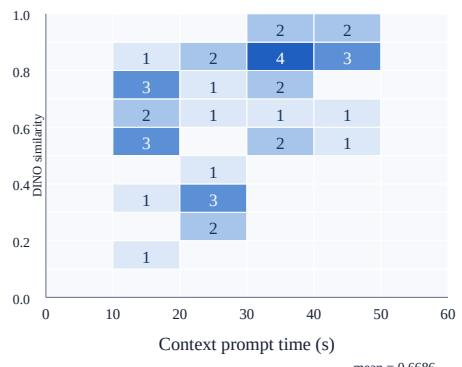  
(a) DeCoPrune-HS | w/o re-index

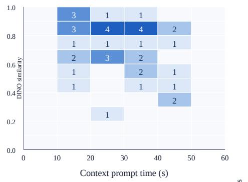  
(b) DeCoPrune-HS | w/ re-index

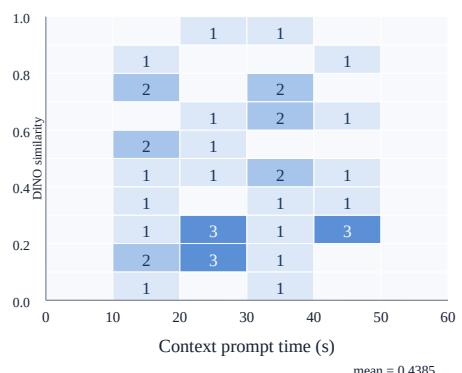  
(c) FullKV | w/o re-index

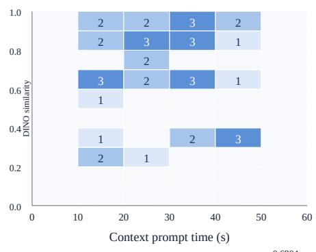  
(d) FullKV | w/ re-index  
Figure 7: Effect of RoPE re-indexing across context positions. The heatmaps show the distribution of CMBENCH cases over context-prompt time and DINO similarity for DECOPRUNE–HS (top) and FullKV (bottom), without re-indexing (left) and with re-indexing (right). Cell values and color intensity indicate the number of cases. In the separate diagnostic evaluation of Table 2, re-indexing shifts the score distribution upward for both methods, increasing the mean DINO similarity from 0.6686 to 0.7156 for DECOPRUNE–HS and from 0.4385 to 0.6804 for FullKV.

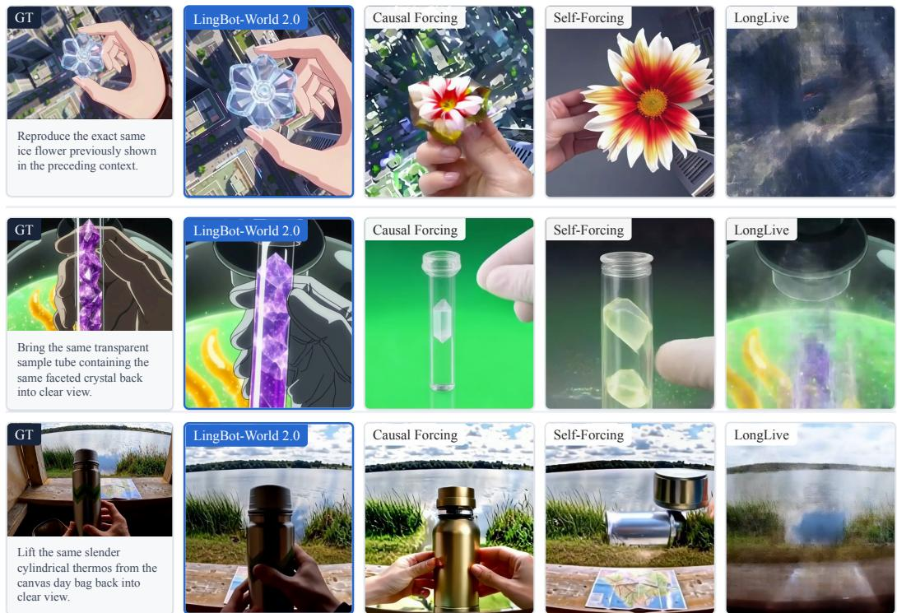  
Figure 8: Full-context comparison across autoregressive video backbones. We compare groundtruth reference frames with FullKV generations from LingBot World v2, Causal Forcing, Self-Forcing, and LongLive on three representative object-retrieval cases that require no camera-control input. Despite retaining the complete context, the three alternative backbones frequently fail to recover the target object, whereas the LingBot World v2 generations more closely reproduce the targets in these examples.

Table 4: Full-context performance of candidate backbones on CMBENCH. Mean DINO (0–1) is computed over the same completed subset for all backbones.
<table><tr><td>Backbone</td><td>Mean DINO ↑</td></tr><tr><td>LingBot World v2 (Gao et al., 2026)</td><td>0.6803</td></tr><tr><td>Causal Forcing (Zhu et al., 2026)</td><td>0.2627</td></tr><tr><td>Self-Forcing (Huang et al., 2025a)</td><td>0.2609</td></tr><tr><td>LongLive (Yang et al., 2025)</td><td>0.2608</td></tr></table>

Table 4 shows that the three alternative backbones obtain FullKV DINO scores between 0.2608 and 0.2627 on the completed subset. This would confound a controlled pruning study because a missing target could reflect either cache compression or the generator’s inability to use the available context. We therefore use LingBot World v2 (Gao et al., 2026) as the main backbone.

## C.1 LONGLIVE CONTINUATION WITH 10-SECOND CONTEXTS

We additionally evaluate continuation generation with LongLive (Yang et al., 2025) on 18 cases, each conditioned on a 10-second video context. Table 5 reports the PR and DINO scores. This shortercontext experiment is distinct from the minute-scale backbone comparison above. With $\gamma = 0 . 1 0$ DECOPRUNE achieves 0.5880 DINO at 57.25% PR, outperforming the other pruning baselines in both metrics.

Table 5: LongLive continuation with 10-second contexts on 18 cases. DINO is reported on a 0–1 scale.
<table><tr><td>Method</td><td>PR↑</td><td>DINO ↑</td></tr><tr><td>FullKV</td><td>0.00%</td><td>0.6106</td></tr><tr><td>DECOPRUNE</td><td>57.25%</td><td>0.5880</td></tr><tr><td>Streaming</td><td>53.57%</td><td>0.5162</td></tr><tr><td>ForcingKV</td><td>54.17%</td><td>0.5302</td></tr><tr><td>DummyForcing</td><td>55.60%</td><td>0.5157</td></tr></table>

## D SYNTHETIC AND REAL VIDEO CONTEXTS

H3-generated contexts allow explicit control over event timing, target visibility, and camera transitions, making it possible to isolate retrieval of information absent from the recent context. The reference is the target actually visible in the context video, so evaluation measures consistency with observed evidence rather than agreement with the synthesis prompt. Real video contexts provide a complementary check that the comparison does not depend on the visual characteristics of H3 outputs.

Table 6 compares mean DINO scores on the synthetic-video and real-video subsets under the same evaluation protocol. This source-stratified analysis uses a single random seed, whereas the main results in Table 1 are averaged over three seeds. Its values should therefore be compared within this table rather than pooled to reconstruct the three-seed main result. Real videos yield lower scores across all methods, indicating greater difficulty, while DECOPRUNE achieves higher DINO than the other pruning methods on both subsets. This agreement supports the use of H3-generated contexts alongside more challenging real videos.

Table 6: Evaluation by context-video source. Mean DINO scores (0–1) on synthetic-video and real-video contexts using one random seed.
<table><tr><td>Method</td><td>Synthetic Video</td><td>Real Video</td></tr><tr><td>FullKV</td><td>0.6873</td><td>0.6621</td></tr><tr><td>DECOPRUNE</td><td>0.6909</td><td>0.6412</td></tr><tr><td>TempDiff (Hwang et al., 2024; Fu et al., 2025)</td><td>0.6484</td><td>0.5212</td></tr><tr><td>ForcingKV (Ji et al., 2026)</td><td>0.5422</td><td>0.3839</td></tr><tr><td>Streaming (Xu et al., 2026c; Yang et al., 2025)</td><td>0.4592</td><td>0.3274</td></tr><tr><td>DummyForcing (Guo et al., 2026)</td><td>0.4549</td><td>0.3111</td></tr></table>

## E PRUNING-RATIO AGGREGATION

In Equation 4, the history for generated chunk i comprises the observed context and all previously completed generated chunks. The current noisy chunk is excluded from both the compressed and FullKV counts. Each retained token is counted once per layer and head in which it is active, accounting for head-specific pruning.

Equivalently, the sequence-level PR is the FullKV-workload-weighted average of the per-chunk, perlayer, per-head pruning ratios, with weights proportional to $k _ { i , \ell , h } ^ { \mathrm { f u l } \tilde { \mathbf { l } } }$ . Thus, attention calls with longer histories contribute proportionally more to the cumulative count. We compute this ratio separately for each continuation and then take its arithmetic mean over evaluation cases; we do not pool token counts across cases before taking the ratio.

## F LIMITATIONS

The current study has three main limitations. First, although DECOPRUNE reduces cumulative historical KV token counts by 85.43% in the main setting, the retained cache still grows with autoregressive generation length; memory use and attention cost are therefore not strictly bounded. Second, few open-source baselines currently support reliable long-context video generation. Even a comparatively capable model such as LingBot World v2 has a measurable intrinsic ceiling on context consistency, which makes pruning-induced degradation difficult to fully separate from backbone generation errors. Third, denoising consistency is a model-intrinsic, future-agnostic signal: it does not explicitly encode the relevance of a token to a future prompt or task and may therefore undervalue a rare detail that is easy to denoise now but requested later. These limitations motivate bounded-memory extensions and combinations with query- or task-aware memory selection.