# DISTILL THE VISUAL EVIDENCE, NOT JUST THE ANSWER: CROSS-WORLD ON-POLICY DISTILLATION FOR VISION-LANGUAGE MODELS

Yuanhao Sun, Huawei Ji, Jiaxin Ding, Luoyi Fu, Xinbing Wang Shanghai Jiao Tong University, Shanghai, China

## ABSTRACT

A central goal of vision-language model (VLM) distillation is to transfer both the teacher’s language capabilities and its visual understanding. However, existing methods primarily supervise the student’s output, leaving visual understanding implicit. Our analysis reveals that a student can match the teacher’s answer without relying on the same visual evidence, raising the question: how can we ensure the student responds to the visual information that actually determines the answer? To this end, we propose Cross-World On-Policy Distillation (CW-OPD), which explicitly supervises the student’s response to changes in visual evidence. For each example, CW-OPD constructs two visual worlds that share the question and scene context but differ in answer-critical evidence, yielding different answers. We perform on-policy distillation in both worlds and distill the teacher’s crossworld belief transition, encouraging the student to match not only what the teacher predicts but also why its prediction changes with the evidence. A gradient analysis shows that this term is invariant to errors shared by both worlds and supplies a corrective signal invisible to endpoint matching alone. In this way, CW-OPD makes reliance on the relevant visual evidence an explicit distillation target rather than an implicit consequence of output matching. To diagnose whether a model truly grounds its answers in visual evidence, we introduce CWBench, which measures cross-world consistency via Cross-World Pair Accuracy (CWPA). Experiments on Qwen3.5-4B show that CW-OPD outperforms the strongest baseline by 1.2 points on average, and the 4B student exceeds DeepSeek-V4.1 (552B) by 22.4 CWPA points on CWBench. Code is released in https://github.com/baokou-fw2/CWAD.

## 1 INTRODUCTION

On-policy distillation (OPD) has emerged as an effective paradigm for distilling large language models (LLMs), where the teacher supervises responses generated by the student itself (Agarwal et al., 2024; Gu et al., 2024). This on-policy design aligns the teacher and student state distributions, substantially reducing the noise and distribution mismatch introduced during distillation (Agarwal et al., 2024; Ko et al., 2024). However, vision-language models (VLMs) jointly rely on textual and visual information (Liu et al., 2023; Dai et al., 2023), making it challenging for OPD to transfer the teacher’s visual capabilities through supervision in the textual generation space (Yoon et al., 2026).

Recent efforts to improve multimodal distillation can be broadly divided into two directions. The first revisits the distillation objective itself, aiming to isolate or reweight the visual component so that the student receives more effective gradients for visual learning. For example, Visual Gradient Steering (VGS) (Yoon et al., 2026) observes that the language-alignment and visual-perception gradients occupy nearly orthogonal subspaces, and dynamically steers the optimization toward the visual subspace to prioritize visual learning. The second direction introduces privileged visual conditions that provide stronger supervision than the student’s standard input. Vision-OPD (Yuan et al., 2026) uses a crop of the region of interest (ROI) as a privileged teacher view for full-image distillation. However, both directions improve how effectively visual supervision is transferred, without constraining which visual evidence the student’s answer depends on. As shown in Fig. 1(a), the teacher and stu dent can produce the same correct answer while attending to markedly different visual regions, with the student often assigning less cross-modal attention to the answer-critical evidence.

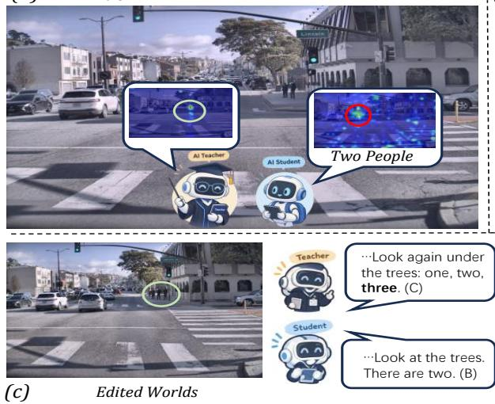

How many pedestrians under the trees? (a) A. One B. Two C. Three D. Four  
(b)  
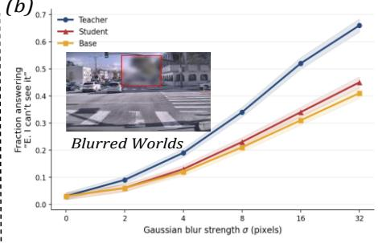

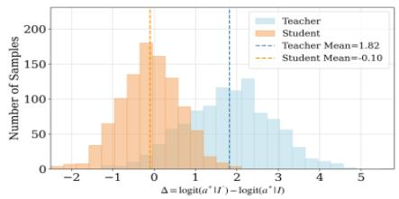  
Figure 1: Motivating observations on the training dataset. (a) Teacher and student exhibit different cross-modal attention despite producing the same answer. (b) As the target region is progressively blurred, the student’s sensitivity to the option $\mathbf { \tilde { \Sigma } ^ { 6 6 } E } .$ . I can’t see $\mathrm { i t } ^ { \prime \prime }$ barely differs from the base model. (c) Under semantically edited worlds, the student fails to distinguish between them, whereas the teacher significantly increases the logit of the correct answer $a ^ { * }$ in the edited world (Welch’s $t =$ $4 7 . 6 , p < \mathsf { \bar { 1 0 } ^ { - 4 } }$ , Cohen’s $d = 2 . 1 3 )$ , confirming the significance of this effect. Student: Qwen3.5- 4B. Results average the Qwen3.5-9B teacher (OPD) and the 4B EMA teacher (OPSD).

We further quantify this evidence–output misalignment from two perspectives. First, output sensitivity (Fig. 1b): masking the answer-critical region causes a substantially larger change in the teacher’s answer logits than in the student’s, indicating that the student’s prediction is less dependent on the relevant visual evidence. Second, we construct semantically contrasted visual worlds in which the answer-critical evidence is altered while the question and broader scene context remain unchanged (Fig. 1c). Under this controlled intervention, the teacher exhibits a consistent shift in its token probabilities, whereas the student’s response is significantly less aligned with the teacher’s belief transition. These observations reveal a common limitation of existing methods: matching output distributions in a single visual world does not ensure that the student grounds its answer in the answer-critical evidence.

To address these limitations, we propose Cross-World On-Policy Distillation (CW-OPD), which reformulates visual knowledge transfer as a cross-world distillation problem. We first construct CWBench, a dataset of dual-world pairs $( I , q )$ and $( I ^ { \prime } , q )$ that share the question and broader scene context but differ in answer-critical evidence, such that the two worlds support different answers. We then perform on-policy distillation in both worlds and further distill the teacher’s cross-world belief transition, requiring the student to reproduce not only what the teacher predicts at each world but also why its prediction changes when the visual evidence is altered. This design suppresses world-invariant shortcuts while directly supervising the visual response relevant to the task. Extensive experiments demonstrate that CW-OPD improves visual grounding and downstream VLM performance across diverse benchmarks. Our contributions are summarized as follows:

• We identify an overlooked limitation of on-policy distillation for VLMs: matching the teacher’s output distribution does not necessarily ensure that the student relies on the answer-critical visual evidence, leaving room for linguistic and other evidence shortcuts.

• We propose Cross-World On-Policy Distillation (CW-OPD), which constructs semantically symmetric cross-world training pairs and combines bidirectional on-policy distillation with cross-world belief transition matching to supervise both world-specific predictions and their responses to visual changes. We release CWBench, a dataset based on this pipeline.

• Experiments across diverse benchmarks show that CW-OPD improves visual grounding and downstream performance, surpassing the strongest baseline and even frontier models on cross-world consistency.

## 2 RELATED WORK

## 2.1 ON-POLICY DISTILLATION

On-policy distillation (OPD) (Agarwal et al., 2024) addresses the distribution mismatch of teacherforced distillation by evaluating the teacher on student-generated trajectories, providing token-level supervision on visited states. Follow-up works explore different divergences and sampling strategies, e.g., MiniLLM (Gu et al., 2024), GKD, and DistiLLM (Agarwal et al., 2024; Ko et al., 2024), focusing on output-level knowledge transfer. For VLMs, however, predictions may rely on different visual evidence, which standard OPD does not explicitly constrain.

## 2.2 MULTIMODAL OPD: PRIVILEGED VIEWS AND VISUAL OBJECTIVES

Recent multimodal OPD methods improve visual knowledge transfer in two directions. One introduces privileged visual views. Vision-OPD instantiates a crop-conditioned teacher and a full-image student from the same model, minimizing token-level divergence along the student’s on-policy rollouts to internalize the benefit of visual zooming without inference-time tools (Yuan et al., 2026). RP-OPSD instead supervises a low-resolution student with a teacher conditioned on the original resolution, so that the resolution gap serves as privileged information requiring only image–question pairs (Zhu et al., 2026a). In both cases, the teacher’s privileged input creates an information gap relative to the student’s deployed view.

Another line of work modifies the distillation objective itself. VGS decomposes the OPD loss via Bayes’ rule into a language-prior term and a visual-grounding term, and steers the update toward the visual subspace since the two gradients are nearly orthogonal (Yoon et al., 2026). FP-OPD projects the teacher–student log-probability gap onto the student’s local visual tangent space under the Fisher metric, distilling only locally realizable corrections (Xue et al., 2026). VA-OPD defines a per-token visual advantage from the teacher’s log-probability change when visual detail is destroyed, and reweights rollouts and token groups by it (Liu et al., 2026). VAD reconstructs the target rather than its weight: it projects the teacher correction onto a signed proxy of the visual evidence direction obtained by contrasting evidence-present and evidence-removed views (Zhang et al., 2026).

These methods strengthen, filter, or reweight visual supervision, but mainly constrain predictions under individual visual conditions. In contrast, CW-OPD constructs two semantic worlds with different answer-critical evidence via visual intervention, and distills both predictions and the teacher’s crossworld belief transition, explicitly supervising the student’s response to visual evidence changes.

## 3 METHOD

## 3.1 REVISITING ON-POLICY DISTILLATION

On-Policy Distillation. On-policy distillation (OPD) (Agarwal et al., 2024) provides token-level supervision by matching the student’s next-token distribution with that of a fixed teacher along trajectories generated by the student itself. Given a visual-language input $( I , q )$ , where I denotes the image and q denotes the question, the student policy $\pi _ { \theta }$ first generates an on-policy trajectory $\tau \sim \pi _ { \theta } ( \cdot \mid I , q )$ . For each generated prefix $y _ { < t }$ , the student and teacher next-token distributions and the OPD objective are

$$
\begin{array} { c } { { p _ { S , t } ^ { I } = \pi _ { \theta } ( \cdot  { | \mathit { I } , \boldsymbol { q } , \boldsymbol { y } _ { < t } ) } , \qquad p _ { T , t } ^ { I } = \pi _ { \bar { \theta } } ( \cdot  { | \mathit { I } , \boldsymbol { q } , \boldsymbol { y } _ { < t } ) } , } } \\ { { \mathcal { L } _ { \mathrm { O P D } } = \displaystyle { \frac { 1 } { T } \sum _ { t = 1 } ^ { T } D _ { \mathrm { K L } } \left( p _ { S , t } ^ { I }  { | \ r | } p _ { T , t } ^ { I } \right) } , } } \end{array}\tag{1}
$$

where $\pi _ { \bar { \theta } }$ denotes a frozen teacher policy (or an exponential-moving-average teacher). Unlike conventional offline distillation, the supervision is conditioned on the student’s own generation trajectory, allowing the teacher to provide dense feedback at the states that the student actually visits.

Linguistic Shortcut. Although OPD provides token-level supervision, its objective is defined on the marginal predictive distribution rather than the visual evidence underlying the prediction. Let

(a) Dual-World Construction

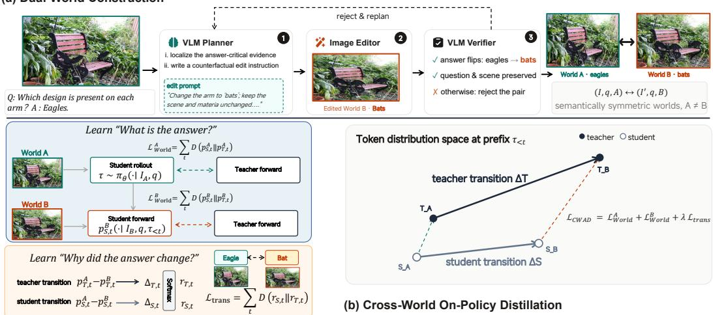  
Figure 2: (a) Dual-world construction: a VLM planner writes a counterfactual edit instruction, an image editor produces the edited image, and a VLM verifier accepts the pair only if the answer flips while the question and scene are preserved. (b) CW-OPD: the student rolls out once in World A and all passes reuse its prefix $\tau _ { < t } ;$ bidirectional OPD anchors both worlds $( \mathcal { L } _ { W o r l d } ^ { A } + \mathcal { L } _ { W o r l d } ^ { B } )$ , and the transition loss $\mathcal { L } _ { t r a n s }$ distills how the teacher’s belief changes with the evidence.

Z denote the latent visual evidence extracted from image I for question $q .$ The student’s predictive distribution can be written as

$$
p _ { S } ( y \mid I , q ) = \sum _ { z } p _ { S } ( y \mid z , q ) p _ { S } ( z \mid I , q ) ,\tag{2}
$$

where $p _ { S } ( z \mid I , q )$ characterizes the evidence relied upon by the student. Substituting Eq. 2 into the reverse KL used by OPD gives

$$
D _ { \mathrm { K L } } \left( p _ { S } ( \cdot \mid I , q ) , \parallel , p _ { T } ( \cdot \mid I , q ) \right) = \mathbb { E } _ { y \sim p _ { S } ( \cdot \mid I , q ) } \left[ \log \frac { \sum _ { z } p _ { S } ( y \mid z , q ) , p _ { S } ( z \mid I , q ) } { \sum _ { z } p _ { T } ( y \mid z , q ) , p _ { T } ( z \mid I , q ) } \right] .\tag{3}
$$

Thus, OPD only requires the student to match the teacher’s marginal prediction after aggregating over possible evidence z; it does not separately constrain which visual evidence gives rise to that prediction. Consequently, a correct output can be achieved through different evidence distributions $\bar { p } _ { S } ( z \mid I , q )$ , including reliance on non-critical visual cues or linguistic priors.

## 3.2 CROSS-WORLD ON-POLICY DISTILLATION

Dual-World Formulation. Motivated by the evidence ambiguity of single-world supervision, we construct semantically symmetric visual world pairs via a plan–edit–verify pipeline (Figure 2a). Given an original world $( I , q , A )$ , a VLM planner localizes the answer-critical evidence and write a counterfactual edit instruction; an image editor then produces $I ^ { \prime } { . }$ , yielding

$$
( I , q , A ) \quad \longleftrightarrow \quad ( I ^ { \prime } , q , B ) , \qquad A \neq B ,\tag{4}
$$

where B is an alternative answer compatible with the question and scene. A VLM verifier accepts the pair only if the answer flips (A → B) and the question and non-critical scene context are preserved; otherwise the planner rewrites the instruction. The accepted worlds share the question and overall scene, but exchange answer-critical evidence, so each is a valid visual input inducing a different answer. Details are in Sec. 4.2 and Appendix A.

World Matching and Cross-World Transition. Given a dual-world pair, the student should reproduce the teacher’s behavior in both worlds while preserving their semantic contrast. The student rolls out once in world A, and the resulting prefix is shared across both worlds (Algorithm 1 in Appendix B). For the student-generated trajectories, let $p _ { S , t } ^ { A }$ and $p _ { T , t } ^ { A }$ denote the student and teacher logits in world $A ,$ and $p _ { S , } ^ { B }$ <sub>t</sub> and $p _ { T , i } ^ { B }$ <sub>t</sub> those in world B. We first apply OPD to each world:

$$
\mathcal { L } _ { \mathrm { w o r l d } } = \frac { 1 } { T } \sum _ { t = 1 } ^ { T } \left[ D _ { \mathrm { K L } } \left( p _ { S , t } ^ { A } \Vert p _ { T , t } ^ { A } \right) + D _ { \mathrm { K L } } \left( p _ { S , t } ^ { B } \Vert p _ { T , t } ^ { B } \right) \right] ,\tag{5}
$$

which anchors the two semantic endpoints. Endpoint matching alone, however, does not supervise how the prediction changes when the visual evidence is altered. Following the comparative distillation formulation of Xu et al. (2025), we therefore distill the cross-world belief transition as the KL di vergence between the softmax-normalized per-token log-likelihood ratios $\Delta _ { S , t } = \log p _ { S , t } ^ { A } - \log p _ { S , t } ^ { B }$ and $\Delta _ { T , t } = \log p _ { T , t } ^ { A } - \log p _ { T , t } ^ { B }$

$$
\mathcal { L } _ { \mathrm { t r a n s } } = \frac { 1 } { T } \sum _ { t = 1 } ^ { T } D _ { \mathrm { K L } } \left( \mathrm { s o f t m a x } ( \Delta _ { S , t } ) \parallel \mathrm { s o f t m a x } ( \Delta _ { T , t } ) \right) ,\tag{6}
$$

where softmax $\cdot ( \Delta _ { S , t } )$ ∝ $p _ { S , t } ^ { A } / p _ { S , t } ^ { B }$ denotes the relative odds between the two worlds induced by the visual intervention. Here the comparison operates on a semantically counterfactual world pair under on-policy distributions, rather than on independent samples. It captures both the direction and magnitude of the belief change, encouraging the student to reproduce why the teacher’s prediction changes when the visual evidence is altered, not merely what it predicts at each endpoint.

Overall Objective. The final CW-OPD objective combines the two complementary constraints:

$$
\mathcal { L } _ { \mathrm { C W - O P D } } = \mathcal { L } _ { \mathrm { w o r l d } } + \lambda \mathcal { L } _ { \mathrm { t r a n s } } ,\tag{7}
$$

where λ balances per-world prediction matching against cross-world transition distillation. Figure 2(b) visualizes the computation of both losses in the token-distribution space at a shared prefix $\tau _ { < t } \dot { : }$ the endpoint KL divergences and the cross-world log-ratio vectors $\Delta _ { S } , \Delta _ { T }$ are computed from the four distributions $p _ { S , t } ^ { A } , \breve { p _ { T , t } ^ { A } } , p _ { S , t } ^ { B } , p _ { T , } ^ { B }$ and aggregated into $ { \mathcal { L } } _ { \mathrm { C W - O P D } }$ by Eq. equation 7.

## 3.3 WHEN AND WHY DOES TRANSITION SUPERVISION HELP?

What does the transition term add to endpoint supervision? We answer by decomposing the gradients of the two losses at one scored position. Let $\ell _ { E }$ and $\ell _ { T }$ be the per-position endpoint and transition losses inside the sums of equation 5 and equation 6, with $\mathcal { E } , \mathcal { T }$ , and $\bar { \mathcal { I } } _ { \lambda } = \mathcal { E } + \lambda \mathcal { T }$ their averages over scored positions. All gradients below condition on the sampled prefix $\tau _ { < t }$ , treating the discrete onpolicy rollout as fixed, i.e., they are gradients of the surrogate objective along one update. Splitting each world’s Jacobian into its common-mode and image-dependent parts, $\bar { \bar { J } } = \bar { ( J _ { A } } + J _ { B } ) \bar { ( 2 }$ and $J _ { \Delta } = J _ { A } - J _ { B }$ with $J _ { w } = \partial z _ { S } ^ { w } / \partial \theta$ , and writing $\varepsilon _ { w } = \bar { F } ( p _ { S } ^ { \bar { w } } ) ( \log p _ { S } ^ { \bar { w } } - \log p _ { T } ^ { w } )$ for the reverse-KL residual in world $w ,$ direct differentiation gives (derivation in Appendix C)

$$
\begin{array} { r } { \nabla _ { \theta } \ell _ { E } = \bar { J } ^ { \top } ( \varepsilon _ { A } + \varepsilon _ { B } ) + \frac { 1 } { 2 } J _ { \Delta } ^ { \top } ( \varepsilon _ { A } - \varepsilon _ { B } ) , \qquad \nabla _ { \theta } \ell _ { T } = J _ { \Delta } ^ { \top } F ( r _ { S } ) ( d _ { S } - d _ { T } ) . } \end{array}\tag{8}
$$

Eq. equation 8 separates each gradient into a common-mode part, acting through ${ \bar { J } } ,$ and an imagedependent part, acting through $J _ { \Delta }$ . For the endpoint loss, both parts are present. Its common-mode part is driven by the sum $\varepsilon _ { A } + \varepsilon _ { B }$ , which collects teacher errors made identically in both worlds, such as a language prior at the shared prefix, the shared hint, or a calibration offset. The transition loss has no common-mode part at all: its gradient lives entirely in the image-dependent subspace of $J _ { \Delta } ^ { \top }$ . Proposition 1 states the two properties formally; proofs are in Appendix C.

Proposition 1 (Common-mode rejection). (i) Adding the same vector b to both teacher logits (or both student logits) leaves $\ell _ { T }$ unchanged, while $\ell _ { E }$ changes in general. (ii) The transition gradient vanishes along any direction that moves both worlds identically $( J _ { A } \delta = J _ { B } \delta \Rightarrow \nabla _ { \theta } \ell _ { T } \cdot \delta = 0 )$

Proposition 1 clarifies how the transition term interacts with shortcuts. Part (i) removes additive logit components shared by the two worlds, such as a common calibration offset or a language-prior shift at the shared prefix, from the transition target instead of reproducing them at both endpoints. Part (ii) gives zero transition gradient to parameter directions that move both worlds identically, so the signal reaches only parameters whose responses differ across worlds; this motivates keeping the vision encoder trainable, so that such parameters exist. At an endpoint-stationary point $\nabla \mathcal { E } ( \dot { \theta } _ { \mathrm { s c } } ) = 0$ with $\nabla \mathcal { T } ( \theta _ { \mathrm { s c } } ) \neq 0$ , Eq. equation 8 then implies that a step along the transition gradient decreases $\tau$ to first order, $\mathcal { T } ( \theta _ { \mathrm { s c } } - \dot { \eta } \nabla \mathcal { T } ) = \mathcal { T } ( \theta _ { \mathrm { s c } } ) ^ { - } \eta \| \nabla \mathcal { T } \| _ { 2 } ^ { 2 } + \overset { \cdot } { O } ( \eta ^ { 2 } )$ , while $\mathcal { E }$ changes only at $O ( \eta ^ { 2 } )$ transition supervision provides a first-order descent direction for the cross-world mismatch that is invisible to endpoint matching at a stationary point. The transition term thus supervises how the student’s prediction responds to the evidence change, not only what it predicts. Whether this alignment improves answers is an empirical question. We address it with the structured perturbation experiments in Appendix C.

Table 1: Main results. All methods are evaluated at the original image resolution. Avg. is the unweighted mean over the seven standard benchmarks. Bold denotes the best result. On CWBench we report CWPA (Eq. 9) and CWFR (Eq. 10).
<table><tr><td>Model</td><td>V*Bench</td><td>HR-Bench 4K</td><td>RealWorldQA</td><td>MMVP</td><td>HallusionBench</td><td>SEED-Bench</td><td>OK-VQA</td><td>Avg.</td><td>CWPA↑</td><td>CWFR↓</td></tr><tr><td colspan="9">Qwen3.5-0.8B</td></tr><tr><td>Base</td><td>63.87</td><td>47.09</td><td>58.56</td><td>67.21</td><td>62.36</td><td>70.44</td><td>51.50</td><td>60.15</td><td>37.71</td><td>50.00</td></tr><tr><td>SFT</td><td>67.21</td><td>48.53</td><td>58.42</td><td>70.46</td><td>61.97</td><td>71.22</td><td>55.80</td><td>61.94</td><td>37.90</td><td>49.72</td></tr><tr><td>GRPO</td><td>64.60</td><td>44.50</td><td>58.67</td><td>70.39</td><td>63.83</td><td>70.91</td><td>53.20</td><td>60.87</td><td>37.65</td><td>50.11</td></tr><tr><td>OPSD</td><td>71.20</td><td>69.00</td><td>66.27</td><td>67.00</td><td>64.84</td><td>74.32</td><td>62.15</td><td>67.83</td><td>41.94</td><td>48.33</td></tr><tr><td>OPD</td><td>70.68</td><td>70.25</td><td>65.10</td><td>70.67</td><td>63.95</td><td>70.69</td><td>61.40</td><td>67.53</td><td>39.19</td><td>48.53</td></tr><tr><td>Vision-OPD</td><td>70.83</td><td>50.47</td><td>63.24</td><td>71.12</td><td>63.28</td><td>71.78</td><td>55.00</td><td>63.67</td><td>38.43</td><td>49.31</td></tr><tr><td>VAD</td><td>74.42</td><td>70.13</td><td>63.66</td><td>70.72</td><td>62.48</td><td>74.01</td><td>57.38</td><td>67.54</td><td>42.71</td><td>49.38</td></tr><tr><td>VA-OPD</td><td>73.93</td><td>70.26</td><td>64.82</td><td>69.45</td><td>62.63</td><td>72.11</td><td>59.82</td><td>67.57</td><td>39.73</td><td>50.32</td></tr><tr><td>FP-OPD</td><td>71.20</td><td>70.07</td><td>65.40</td><td>70.72</td><td>64.13</td><td>71.51</td><td>60.50</td><td>67.65</td><td>39.02</td><td>48.87</td></tr><tr><td>VGS</td><td>72.42</td><td>69.25</td><td>65.12</td><td>69.89</td><td>63.73</td><td>70.81</td><td>58.80</td><td>67.15</td><td>38.04</td><td>49.58</td></tr><tr><td>RP-OPSD</td><td>75.39</td><td>70.13</td><td>64.71</td><td>70.68</td><td>61.12</td><td>73.22</td><td>54.04</td><td>67.04</td><td>41.73</td><td>48.32</td></tr><tr><td>CW-OPD</td><td>72.77</td><td>70.75</td><td>66.27</td><td>71.32</td><td>64.13</td><td>75.56</td><td>60.88</td><td>68.81</td><td>48.28</td><td>43.79</td></tr><tr><td colspan="9">Qwen3.5-4B</td></tr><tr><td>Base</td><td>81.15</td><td>83.00</td><td>74.38</td><td>77.67</td><td>70.42</td><td>79.25</td><td>75.17</td><td>77.29</td><td></td><td></td></tr><tr><td>SFT</td><td>83.50</td><td>83.75</td><td>73.30</td><td>78.67</td><td>68.03</td><td>77.29</td><td>77.42</td><td>77.42</td><td>47.64 48.57</td><td>46.13 45.38</td></tr><tr><td>GRPO</td><td>83.60</td><td>80.88</td><td>73.50</td><td>81.67</td><td>71.30</td><td>79.70</td><td>76.90</td><td>78.22</td><td>48.09</td><td>45.91</td></tr><tr><td>OPSD</td><td>84.82</td><td>84.63</td><td>78.43</td><td>79.82</td><td>73.67</td><td>78.52</td><td>78.75</td><td>79.81</td><td>60.61</td><td>33.50</td></tr><tr><td>OPD</td><td>82.70</td><td>83.25</td><td>76.84</td><td>79.17</td><td>68.17</td><td>80.31</td><td>76.56</td><td>78.14</td><td>49.53</td><td>44.02</td></tr><tr><td>Vision-OPD</td><td>84.10</td><td>83.90</td><td>77.20</td><td>80.00</td><td>69.90</td><td>80.55</td><td>76.80</td><td>78.92</td><td>50.33</td><td>43.47</td></tr><tr><td>VAD</td><td>84.54</td><td>83.67</td><td>78.32</td><td>81.13</td><td>68.43</td><td>80.79</td><td>78.93</td><td>79.40</td><td>54.32</td><td>42.57</td></tr><tr><td>VA-OPD</td><td>85.69</td><td>84.32</td><td>76.29</td><td>78.67</td><td>72.34</td><td>79.96</td><td>78.33</td><td>79.37</td><td>54.27</td><td>40.96</td></tr><tr><td>FP-OPD</td><td>83.67</td><td>83.50</td><td>77.80</td><td>79.33</td><td>69.50</td><td>80.60</td><td>77.30</td><td>78.81</td><td>49.05</td><td>44.36</td></tr><tr><td>VGS</td><td>83.40</td><td>83.30</td><td>77.10</td><td>79.00</td><td>69.20</td><td>80.40</td><td>76.90</td><td>78.47</td><td>48.81</td><td>44.71</td></tr><tr><td>RP-OPSD</td><td>85.75</td><td>85.50</td><td>77.20</td><td>79.50</td><td>71.85</td><td>78.90</td><td>76.80</td><td>79.36</td><td>56.16</td><td>37.94</td></tr><tr><td>CW-OPD</td><td>86.39</td><td>85.12</td><td>80.65</td><td>82.00</td><td>74.58</td><td>80.10</td><td>77.96</td><td>80.97</td><td>65.82</td><td>29.30</td></tr></table>

## 4 EXPERIMENTS

## 4.1 EXPERIMENTAL SETUP

Training Settings. CW-OPD is instantiated on top of on-policy self-distillation (OPSD), where the frozen teacher is an EMA copy of the student conditioned on a short answer hint generated by the base model as a teacher-side privileged input; an instantiation with a standard larger teacher (OPD) is provided in Appendix D. We train on CW-Bench, our dedicated benchmark for crossworld distillation, which provides 2,365 training dual-world pairs and a 594-pair evaluation set; the data are drawn from VLM-CapCurriculum Perception (Wu et al., 2026), ZwZ-RL-VQA (Wei et al., 2026), Visual7W (Zhu et al., 2016), and the Vision-OPD dataset (Yuan et al., 2026). For each example, CW-OPD constructs a dual-world pair $( I , q , A )  ( I ^ { \prime } , q , B )$ through the plan–edit– verify pipeline. All student parameters, including the vision encoder, are trainable. We optimize ${ \mathcal { L } } _ { \mathrm { C W - O P D } } = { \mathcal { L } } _ { \mathrm { w o r l d } } + \lambda { \mathcal { L } } _ { \mathrm { t r a n s } }$ with λ = 1.0; across a wide range of λ, the transition loss converges at different rates but reaches similar final performance (Appendix F). We sample one response per pair at temperature 2.0. All models are trained for one epoch with a learning rate of $2 \times 1 0 ^ { - 6 }$ on 4 NVIDIA RTX PRO 6000D GPUs (96 GB); the global batch size is 64 for Qwen3.5-0.8B and 48 for Qwen3.5-4B, determined by GPU memory constraints. More detailed experimental setups are provided in the Appendix E.

Benchmarks. We evaluate on standard benchmarks across three categories—visual perception and grounding (V\*Bench (Wu & Xie, 2024), HR-Bench 4K (Wang et al., 2024), RealWorldQA xAI (2024), MMVP (Tong et al., 2024)), hallucination diagnosis (POPE (Li et al., 2023b), Hallusion-Bench (Guan et al., 2024)), and external-knowledge reasoning (SEED-Bench (Li et al., 2023a), OK-VQA (Marino et al., 2019))—together with the CWBench evaluation set. All models are evaluated at the original image resolution; model responses are parsed with rule-based matching where applicable, and otherwise scored by an LLM judge (Qwen3.5-9B). Detailed dataset statistics, task formulations, and evaluation protocols are provided in Appendix G. On CW-Bench we report CWPA and CWFR (Eqs. 9 and 10); see §4.2 for the benchmark construction, metric definitions.

Baselines. Our main comparison includes the Base model and standard post-training methods, including SFT, GRPO (Shao et al., 2024), OPD, and OPSD (Zhao et al., 2026). We further compare with representative multimodal distillation methods that either construct privileged views, such as RP-OPSD (Zhu et al., 2026b), Vision-OPD (Yuan et al., 2026), VAD Zhang et al. (2026) and VA-OPD Liu et al. (2026), or modify the distillation objective, such as FP-OPD (Xue et al., 2026) and VGS (Yoon et al., 2026). All methods are trained on the training split of CWBench under identical training settings for fair comparison, with details provided in Appendix E.

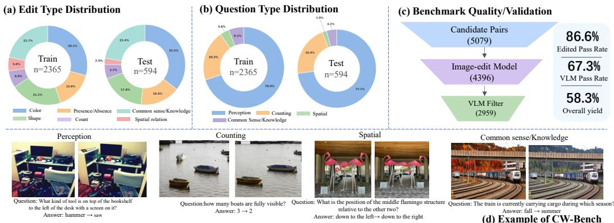  
Figure 3: Statistics, validation, and examples of the proposed CW-Bench. (a) Edit type distribution of the answer-critical visual interventions in the train (n=2,365) and test (n=594) splits. (b) Question type distribution of the paired queries in both splits. (c) The filtering pipeline for constructing dualworld pairs: from 5,079 candidate pairs, 4,396 pairs pass the image-edit validation (86.6%), and 2959 pairs remain after VLM filtering (67.3% pass rate, 58.3% overall yield). (d) Examples of dualworld pairs: for each example, the original and edited images are shown with the shared question; only the answer-critical evidence differs, flipping the answer between the two worlds.

Main Results. CW-OPD consistently improves overall performance across both model scales. On Qwen3.5-0.8B, CW-OPD achieves an average score of 68.81, surpassing the strongest OPD-family baseline (FP-OPD, 67.65) by 1.16 points and the strongest OPSD-family baseline (OPSD, 67.83) by 0.98 points. The gain is more pronounced on Qwen3.5-4B, where CW-OPD reaches 80.97, improving over Vision-OPD (78.92) by 2.05 points and OPSD (79.81) by 1.16 points. These results demonstrate that the benefits of cross-world distillation generalize across model scales, with consistent improvements over existing on-policy distillation approaches. Beyond standard benchmarks, CW-OPD yields substantially larger gains on our cross-world diagnostic: CWPA increases from 37.71 to 48.28 on 0.8B and from 47.64 to 65.82 on 4B, while CWFR drops from 50.00 to 43.79 and from 46.13 to 29.30, respectively. The 18.2-point CWPA gain on 4B confirms that the improvement directly reflects the intended effect of CW-OPD: the student becomes more sensitive and consistent to answer-critical changes in visual evidence across paired worlds.

## 4.2 THE CWPA BENCHMARK

Construction and evaluation metrics. Dual-world pairs are constructed via a plan–edit–verify pipeline (Appendix A) and a three-stage filtering cascade (Fig. 3c): from 5,079 candidates, 86.6% pass image-edit validation and 67.3% survive VLM filtering, yielding 2,959 verified pairs (58.3% yield) in which the answer flips while the question and scene context are preserved. Let yˆ<sub>W</sub> and a<sub>W</sub> denote the model’s and gold answers in world $W \in \{ A , B \}$ . We report the per-world accuracie A $\begin{array} { r } { \mathrm { A c c } = \frac { 1 } { N } \sum _ { i } \mathcal { k } [ \hat { y } _ { A } ^ { ( i ) } = \overset { \mathbf { \bar { a } } } { a } _ { A } ^ { ( i ) } ] } \end{array}$ (likewise B Acc), and the Cross-World Pair Accuracy

$$
\mathrm { C W P A } = \frac { 1 } { N } \sum _ { i = 1 } ^ { N } \mathcal { H } \big [ \hat { y } _ { A } ^ { ( i ) } = a _ { A } ^ { ( i ) } \mathrm { ~ \wedge ~ } \hat { y } _ { B } ^ { ( i ) } = a _ { B } ^ { ( i ) } \big ] ,\tag{9}
$$

which requires answering both worlds correctly and thus measures whether correctness survives the evidence change. To isolate inconsistency from raw accuracy across models at different accuracy regimes, we further report the flip rate, the fraction of pairs whose correctness differs between the two worlds:

$$
\mathrm { C W F R } = \mathrm { A } \mathrm { A c c } + \mathrm { B } \mathrm { A c c } - 2 \mathrm { C W P A } .\tag{10}
$$

Diversity. CW-Bench covers a wide range of interventions and reasoning skills (Fig. 3a,b). Answer-critical edits span color, presence/absence, shape, object count, spatial relations, and commonsense-knowledge changes, with no single edit type dominating either split. Paired questions concentrate on fine-grained perception (70.0%/73.1% in train/test) and counting (20.2%/20.9%), with spatial and commonsense reasoning making up the remainder—requiring models to ground answers in visual evidence rather than linguistic priors.

Table 2: Cross-world consistency of frontier models and our distilled students on CWBench. We report CWPA (Eq. 9) and CWFR (Eq. 10); higher CWPA and CWPA-Q and lower CWFR indicate more consistent evidence-grounded answering.
<table><tr><td>Model</td><td>Size</td><td>A Acc</td><td>B Acc</td><td>CWPA↑</td><td>CWPA-Q↑</td><td>CWFR↓</td></tr><tr><td>Kimi-K3</td><td>2.8T</td><td>70.03</td><td>72.90</td><td>50.00</td><td>62.14</td><td>42.93</td></tr><tr><td>DeepSeek-V4.1</td><td>552B</td><td>54.38</td><td>79.63</td><td>43.43</td><td>64.32</td><td>47.15</td></tr><tr><td>Qwen3.8</td><td>27B</td><td>72.05</td><td>79.29</td><td>57.58</td><td>69.93</td><td>36.18</td></tr><tr><td>Qwen3.5(Base)</td><td>4B</td><td>61.95</td><td>79.46</td><td>47.64</td><td>59.86</td><td>46.13</td></tr><tr><td>OPSD</td><td>4B</td><td>74.75</td><td>79.97</td><td>60.61</td><td>66.45</td><td>33.50</td></tr><tr><td>CW-OPD</td><td>4B</td><td>78.11</td><td>82.83</td><td>65.82</td><td>73.60</td><td>29.30</td></tr></table>

Table 3: Ablation of CW-OPD supervision components. DW-OPD applies bidirectional per-world OPD to both worlds but omits the transition loss( $\dot { \mathcal { L } } _ { \mathrm { O P D } } ^ { A } + \mathcal { L } _ { \mathrm { O P D } } ^ { B } )$ , isolating the contribution of crossworld transition supervision. We report the CWBench metrics CWPA (Eq. 9) and CWFR (Eq. 10), together with Avg., the unweighted mean over the seven standard VQA benchmarks.
<table><tr><td>Method</td><td> $\mathcal { L } _ { \mathrm { O P D } } ^ { A }$ </td><td> $\mathcal { L } _ { \mathrm { O P D } } ^ { B }$ </td><td> $\mathcal { L } _ { \mathrm { t r a n s } }$ </td><td> $\mathbf { A } \operatorname { A c c } .$  B Acc.</td><td>CWPA↑</td><td></td><td>CWFR↓</td><td>Avg.</td></tr><tr><td>base</td><td>一</td><td>一</td><td>一</td><td>61.95</td><td>79.46</td><td>47.64</td><td>46.13</td><td>77.29</td></tr><tr><td>OPD</td><td>√</td><td>一</td><td></td><td>60.92</td><td>82.16</td><td>49.53</td><td>44.02</td><td>78.14</td></tr><tr><td>OPSD</td><td>√</td><td>一</td><td>一</td><td>74.75</td><td>79.97</td><td>60.61</td><td>33.50</td><td>79.81</td></tr><tr><td>DW-OPD</td><td>√</td><td>√</td><td>一</td><td>72.69</td><td>81.33</td><td>59.12</td><td>35.78</td><td>79.43</td></tr><tr><td>CW-OPD</td><td>√</td><td>√</td><td>V</td><td>78.11</td><td>82.83</td><td>65.82</td><td>29.30</td><td>80.97</td></tr></table>

Analysis. Table 2 admits two observations. First, within the same model family, CW-OPD sub stantially strengthens the base model’s visual evidence understanding (CWPA 47.6→65.8) and, more importantly, surpasses OPSD with the same privileged hint (60.6 CWPA / 33.5 CWFR), showing that the gain comes from cross-world transition supervision rather than from the hint itself. Sec ond, commercial frontier models that adopt on-policy distillation in post-training—as documented in their technical reports—exhibit exactly the deficiency diagnosed in Fig. 1: their per-world accuracy is strong, yet their correctness does not survive evidence changes, leaving CWPA far below what their per-world accuracy promises and CWFR as high as 47.2. This suggests that the shortcut is a property of the OPD paradigm rather than of model scale or of small-scale distillation. Notably, a 4B student trained with CW-OPD surpasses all of them in both CWPA (65.8) and CWFR (29.3) at an order-of-magnitude smaller scale. To verify that this consistency is selective rather than indiscriminate, we additionally report CWPA-Q, which replaces the question with one unrelated to the edited region and checks whether the answer follows the question instead of the visual edit. CW-OPD attains the highest CWPA-Q (73.6), clearly above OPSD (66.4) and all frontier models, indicating that the student answers what the question asks and ignores the irrelevant intervention—precisely the selective evidence response that per-world supervision alone fails to enforce.

## 4.3 ABLATION STUDY

Ablation of supervision components. Table 3 disentangles the contribution of the three supervision signals. Per-world OPD alone improves single-world accuracy but leaves cross-world consistency nearly unchanged, confirming that output matching in one world does not constrain how the prediction responds to evidence changes. Simply extending OPD to both worlds (DW-OPD) anchors the two semantic endpoints but can even enlarge the gap between them, as the student grows more confident in each world without learning to transition between them—the correctness sets of the two worlds drift apart. Only when the transition loss is added does the student align its belief change with the teacher’s, yielding simultaneous gains in per-world accuracy, CWPA, and downstream benchmarks. This validates our design: per-world distillation and cross-world transition supervision are complementary and jointly necessary—the former fixes where the prediction sits in each world, while the latter fixes how it moves when the evidence changes.

Ablations on transition supervision. Figure 4 examines what makes cross-world supervision effective from two complementary angles. First, the alignment objective must capture the full belief transition rather than a projection of it: cosine alignment, which preserves only the direction of the transition, and magnitude alignment, which preserves only its norm, both leave a large answer-

(a) Cross-World Alignment Loss

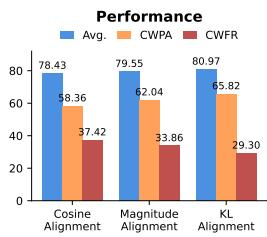

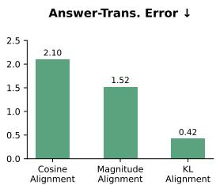

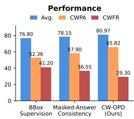  
(b) Visual Evidence Supervision

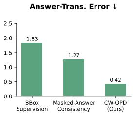  
Figure 4: Ablation studies on (a) the design of the cross-world transition loss and (b) the visual evidence supervision strategy, evaluated on the 4B student. Each panel reports the Avg. score over seven standard VQA benchmarks, CWPA and CWFR on CWBench, and the Answer-Transition Error (ATE): the average absolute gap between the student and the teacher in the log-likelihood change of the gold answer token between the two worlds, which is the same quantity diagnosed in Fig. 1(c). (a) Cosine, magnitude, and KL variants of the transition loss. (b) BBox supervision, masked-answer consistency, and the full CW-OPD.

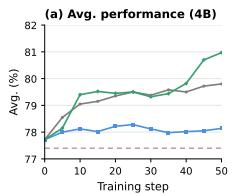

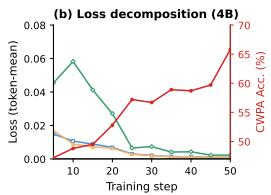

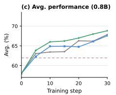

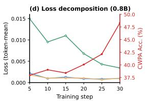  
Std OPSD Std OPD SFT CW-OPD (ours) World A Loss World B Loss Transition Loss CWPA Acc.  
Figure 5: Training dynamics on the Student 4B (A) and Student 0.8B (B) models. (a, c) CWPA over training steps for SFT, OPD, OPSD, and CW-OPD. (b, d) Decomposition of the CW-OPD training objective into World A loss, World B loss, and cross-world transition loss.

transition error and degrade CWBench performance; KL alignment, which matches the teacher’s transition as a distribution, is the only variant that simultaneously reduces ATE, CWFR, and improves downstream accuracy. Second, the supervision must be anchored to answer-relevant evidence: BBox supervision improves spatial grounding but leaves the answer transition largely unlearned, and masked-answer consistency enforces the answer without constraining the evidence behind it; only CW-OPD, which supervises how the answer-relevant belief changes between worlds, attains the best performance across all metrics. Together these results indicate that the effectiveness of CW-OPD stems not from stronger supervision per se, but from supervising the right transition—the teacher’s response to the evidence change on the answer—in the right space—the full distributional response rather than any single projection of it.

Training dynamics. Figure 5 tracks CWPA throughout training. Standard post-training methods (SFT, OPD, OPSD) plateau near or below the pretrained level, confirming that conventional objectives do not improve—and may even erode—cross-world consistency. In contrast, CWPA rises monotonically under CW-OPD and surpasses all baselines within a few steps, with the gain correlating closely with the decay of the transition loss: as $\mathcal { L } _ { \mathrm { t r a n s } }$ decreases, the student progressively aligns its belief shift with the teacher’s, while the per-world losses remain stable anchors. This indicates that CWPA is actively optimized by the cross-world objective rather than improved as a by-product of better single-world fitting.

## 5 CONCLUSION

We identify a limitation of on-policy distillation for vision-language models: matching the teacher’s output distribution within a single visual world does not ensure that the student relies on the answercritical evidence, leaving room for world-invariant shortcuts. To make evidence reliance an explicit supervision target, we propose Cross-World On-Policy Distillation (CW-OPD), which constructs semantically symmetric dual-world pairs and supervises both per-world predictions and the crossworld belief transition. Together with CWBench, which measures cross-world consistency through CWPA and CWFR, our experiments show that CW-OPD improves visual grounding and downstream performance across model scales, and that frontier models trained with on-policy distillation remain inconsistent under evidence changes. A promising next step is to extend cross-world supervision to reinforcement learning, which may also reduce the reliance on image editing to construct dual-world pairs and thus cover evidence types that are hard to alter faithfully.

## AI USE STATEMENT

During the preparation of this work, the authors used AI-assisted tools (Large Language Models) in the following capacities: (1) constructing and curating portions of the CWBench dataset, including generating and rephrasing candidate edit instructions and questions; (2) assisting with code development, debugging, and documentation; and (3) polishing and improving the clarity of the manuscript’s writing. All AI-generated content was reviewed and verified by the authors, who take full responsibility for the accuracy, originality, and integrity of the paper and its artifacts.

## REFERENCES

Rishabh Agarwal, Nino Vieillard, Yongchao Zhou, Piotr Stanczyk, Sabela Ramos Garea, Matthieu Geist, and Olivier Bachem. On-policy distillation of language models: Learning from selfgenerated mistakes. In The Twelfth International Conference on Learning Representations, 2024.

Wenliang Dai, Junnan Li, Dongxu Li, Anthony Meng Huat Tiong, Junqi Zhao, Weisheng Wang, Boyang Li, Pascale Fung, and Steven Hoi. InstructBLIP: Towards general-purpose visionlanguage models with instruction tuning. In Advances in Neural Information Processing Systems, volume 36, 2023.

Yuxian Gu, Li Dong, Furu Wei, and Minlie Huang. MiniLLM: Knowledge distillation of large language models. In The Twelfth International Conference on Learning Representations, 2024.

Tianrui Guan, Fuxiao Liu, Xiyang Wu, Ruiqi Xian, Zongxia Li, Xiaoyu Liu, Xijun Wang, Lichang Chen, Furong Huang, Yaser Yacoob, Dinesh Manocha, and Tianyi Zhou. Hallusionbench: An advanced diagnostic suite for entangled language hallucination and visual illusion in large visionlanguage models. In Proceedings ofthe IEEE/CVF Conference on Computer Vision and Pattern Recognition (CVPR), pp. 14375–14385, 2024.

Jongwoo Ko, Sungnyun Kim, Tianyi Chen, and Se-Young Yun. DistiLLM: Towards streamlined distillation for large language models. In Proceedings of the 41st International Conference on Machine Learning, volume 235 of Proceedings ofMachine Learning Research, pp. 24872–24895, 2024.

Bohao Li, Rui Wang, Guangzhi Wang, Yuying Ge, Yixiao Ge, and Ying Shan. Seed-bench: Benchmarking multimodal llms with generative comprehension. arXiv preprint arXiv:2307.16125, 2023a.

Yifan Li, Yifan Du, Kun Zhou, Jinpeng Wang, Wayne Xin Zhao, and Ji-Rong Wen. Evaluating object hallucination in large vision-language models. In Proceedings of the 2023 Conference on Empirical Methods in Natural Language Processing, pp. 292–305, 2023b.

Haotian Liu, Chunyuan Li, Qingyang Wu, and Yong Jae Lee. Visual instruction tuning. In Advances in Neural Information Processing Systems, volume 36, 2023.

Ruiqi Liu, Xiaolei Lv, Gengsheng Li, Ximo Zhu, Zhiheng Wang, Zhengbo Zhang, Junkai Chen, Zhiheng Li, Bo Li, Jun Gao, and Shu Wu. Visual-advantage on-policy distillation for visionlanguage models. arXiv preprint arXiv:2605.21924, 2026.

Kenneth Marino, Mohammad Rastegari, Ali Farhadi, and Roozbeh Mottaghi. Ok-vqa: A visual question answering benchmark requiring external knowledge. In Proceedings of the IEEE/CVF Conference on Computer Vision and Pattern Recognition (CVPR), pp. 3195–3204, 2019.

Zhihong Shao, Peiyi Wang, Qihao Zhu, Runxin Xu, Junxiao Song, Xiao Bi, Haowei Zhang, Mingchuan Zhang, Y. K. Li, Y. Wu, and Daya Guo. Deepseekmath: Pushing the limits of mathematical reasoning in open language models. arXiv preprint arXiv:2402.03300, 2024.

Shengbang Tong, Zhuang Liu, Yuexiang Zhai, Yi Ma, Yann LeCun, and Saining Xie. Eyes wide shut? exploring the visual shortcomings of multimodal llms. In Proceedings of the IEEE/CVF Conference on Computer Vision and Pattern Recognition, pp. 9568–9578, 2024.

Weiyun Wang, Lewei Ding, Mengchen Zeng, Xinghang Zhou, Lijun Shen, Yadong Luo, and Dacheng Tao. Divide, conquer and combine: A training-free framework for high-resolution image perception in multimodal large language models. arXiv preprint arXiv:2408.15556, 2024.

Long Wei, Lianyu He, Jiaxu Lan, Luoxi Dong, Ying Cai, Shuo Li, Hao Zhu, Wenxuan Wang, Ling Kong, Yiding Wang, Zehuan Zhang, and Weilin Huang. Zooming without zooming: Regionto-image distillation for fine-grained multimodal perception. arXiv preprint arXiv:2602.11858, 2026.

Jiayu Wu, Han Chen, Hao Tu, Xiaotao Tang, Feng Shi, Huan Liu, Hao Lu, Cihang Xie, and Yibo Zhou. From seeing to thinking: Decoupling perception and reasoning improves post-training of vision-language models. arXiv preprint arXiv:2605.20177, 2026.

Penghao Wu and Saining Xie. V<sup>∗</sup>: Guided visual search as a core mechanism in multimodal llms. In Proceedings of the IEEE/CVF Conference on Computer Vision and Pattern Recognition, pp. 13084–13094, 2024.

xAI. Realworldqa. https://x.ai/news/realworldqa, 2024.

Alex Tianyi Xu, Alex Wilf, Paul Pu Liang, Alexander Obolenskiy, Daniel Fried, and Louis-Philippe Morency. Comparative knowledge distillation. In Proceedings of the Winter Conference on Applications of Computer Vision, pp. 7690–7699, 2025.

Leyan Xue, Feng Xiong, Mingjun Ma, and Changqing Zhang. Distill what the student can see: Fisher-projected on-policy distillation for vision-language models. arXiv preprint arXiv:2608.01263, 2026.

Hee Suk Yoon, Eunseop Yoon, Jaehyun Jang, SooHwan Eom, Ji Woo Hong, Mark Hasegawa-Johnson, Qi Dai, Chong Luo, and Chang D. Yoo. Decomposed on-policy distillation for visionlanguage reasoning: Steering gradients for visual grounding. arXiv preprint arXiv:2606.00564, 2026.

Qianhao Yuan, Jie Lou, Xing Yu, Hongyu Lin, Le Sun, Xianpei Han, and Yaojie Lu. Vision-OPD: Learning to see fine details for multimodal LLMs via on-policy self-distillation. arXiv preprint arXiv:2605.18740, 2026.

Kangning Zhang, Yixing Li, Shuai Shao, Qingyao Li, Zhengxi Lu, Zhiyuan Yao, Shijian Wang, Jianghao Lin, Wenxiang Jiao, Yuan Lu, Weiwen Liu, Weinan Zhang, and Yong Yu. VAD: Attributing visual evidence for target reconstruction in multimodal on-policy distillation. arXiv preprint arXiv:2607.28590, 2026.

Shijing Zhao, Zhen Xie, Ming Liu, Jian Huang, Guansong Pang, Feng Chen, and Aditya Grover. Self-distilled reasoner: On-policy self-distillation for large language models. arXiv preprint arXiv:2601.18734, 2026.

Qihui Zhu, Yuchen Wang, Zijian Wen, Tao Zhang, Mengjie Zhang, Yang Liu, Shuangwu Chen, Siying Wu, Jian Yang, and Xiaofeng Jiang. RP-OPSD: Resolution-privileged on-policy selfdistillation for multimodal large language models. arXiv preprint arXiv:2607.24447, 2026a.

Qihui Zhu, Yuchen Wang, Zijian Wen, Tao Zhang, Mengjie Zhang, Yang Liu, Shuangwu Chen, Siying Wu, Jian Yang, and Xiaofeng Jiang. Rp-opsd: Resolution-privileged on-policy self-distillation for multimodal large language models. arXiv preprint arXiv:2607.24447, 2026b.

Yuke Zhu, Oliver Groth, Michael Bernstein, and Li Fei-Fei. Visual7W: Grounded Question Answering in Images. In IEEE Conference on Computer Vision and Pattern Recognition, 2016.

## A CW-BENCH

This appendix details the construction of CW-Bench, the dual-world dataset used for Cross-World On-Policy Distillation. CW-Bench is built from a general VQA pool covering five sources: zwz rl vqa mcq, vision opd original no box dual resolution, vlm capcurriculum perception, A-OKVQA, and visual7w(cauldron,llava format). We keep samples whose task family is mcq and whose ground-truth answer appears among the options. The resulting pool contains 5,079.

## A.1 COUNTERFACTUAL EDIT INSTRUCTION GENERATION

For each sample, the planner receives the image, question, options, and the ground-truth answer. It selects a distractor option that can be made true by a single local edit, and then writes an English edit instruction for the image editor. The selection follows four hard criteria:

1. The edit touches only one object or one attribute; everything else must stay pixel-familiar.

2. After the edit, the chosen option is unambiguously true and the ground-truth answer is unambiguously false for this question. Reject any option that would leave two plausible answers.

3. Reject options that require:

• tiny or invisible details that cannot be clearly seen in the image;

• a different camera viewpoint or major scene restructuring.

4. The instruction must (a) name what is currently in the image and where it is, (b) say what to change it into while keeping the same pose/size/position, (c) pin the material and style to the original, and (d) explicitly list what to keep unchanged (other parts, background, framing, lighting).

Text editing (signs, labels, logos, jerseys, scoreboards, banners, license plates, book covers, etc.) is now allowed, as Qwen-Image-3.0 can handle text modifications well. Our prompt is:

Counterfactual Edit Instruction Prompt   
You are preparing a counterfactual image for a visual-editing API (   
Qwen-Image-3.0).   
The image shown is the ORIGINAL. Below is a 4-option VQA question   
about it and its ground truth (GT).   
Question: {question}   
Options: {options}   
GT: {gt}. {gt\_text}   
Task: Pick ONE distractor option (not the GT) that can become TRUE in   
the image via a SINGLE LOCAL edit,   
and write the English editing instruction for it.   
Hard criteria for the chosen option:   
1. The edit touches ONE object or ONE attribute only; everything else   
must stay pixel-familiar.   
2. After the edit the chosen option is UNAMBIGUOUSLY true and the GT   
UNAMBIGUOUSLY false for this   
question. Reject any option that would leave two plausible answers.   
3. Reject options that require:   
- Tiny or invisible details that cannot be clearly seen in the image   
- A different camera viewpoint or major scene restructuring.   
4. The instruction must (a) name what is CURRENTLY in the image and   
where it is, (b) say what to   
change it into, keeping the same pose/size/position, (c) pin the   
material and style to the original,   
(d) explicitly list what to keep unchanged (other parts, background,   
framing, lighting).   
NOTE: Text editing (signs, labels, logos, jerseys, scoreboards,   
banners, license plates, book covers, etc.)   
is NOW ALLOWED. Qwen-Image-3.0 can handle text modifications well.   
Example (different image, for format only):   
{few\_shot}   
Answer with ONE JSON object and nothing else:

```jsonl
{"chosen_option": "<letter or null>", "chosen_text": "<option text>",
"edit_scope": "<the object/attribute touched>", "edit_instruction":
"<English instruction, 2-4 sentences>", "editability": <1-5>}
```

If no distractor satisfies these conditions, the planner outputs chosen option = null. The output is a strict JSON object with fields chosen option, chosen text, edit scope, edit instruction, and editability (1–5). We run the planner with a Qwen-based VLM backend (Qwen3.8-27B) using max tokens=1024 and temperature=0.4, with automatic retries for rate limits. The pipeline supports sharding by idx and idempotent resumption.

## A.2 IMAGE EDITING

Given the generated instructions, we produce counterfactual images with the Qwen-Image-3.0 API. The editor outputs a square image of 1024 × 1024. Image editing succeeds for 4,396 out of 5,079 attempted samples (86.6%). The total editing time is 16.94 hours with two workers, at a cost of approximately 643 RMB. The prompt is:

Counterfactual Edit Instruction Prompt   
You are preparing a counterfactual image for a visual-editing API (   
Qwen-Image-3.0).   
The image shown is the ORIGINAL. Below is a 4-option VQA question   
about it and its ground truth (GT).   
Question: {question}   
Options: {options}   
GT: {gt}. {gt\_text}   
Task: Pick ONE distractor option (not the GT) that can become TRUE in   
the image via a SINGLE LOCAL edit,   
and write the English editing instruction for it.   
Hard criteria for the chosen option:   
1. The edit touches ONE object or ONE attribute only; everything else   
must stay pixel-familiar.   
2. After the edit the chosen option is UNAMBIGUOUSLY true and the GT   
UNAMBIGUOUSLY false for this   
question. Reject any option that would leave two plausible answers.   
3. Reject options that require:   
- Tiny or invisible details that cannot be clearly seen in the image   
- A different camera viewpoint or major scene restructuring.   
4. The instruction must (a) name what is CURRENTLY in the image and   
where it is, (b) say what to   
change it into, keeping the same pose/size/position, (c) pin the   
material and style to the original,   
(d) explicitly list what to keep unchanged (other parts, background,   
framing, lighting).   
NOTE: Text editing (signs, labels, logos, jerseys, scoreboards,   
banners, license plates, book covers, etc.)   
is NOW ALLOWED. Qwen-Image-3.0 can handle text modifications well.   
Example (different image, for format only):   
{few\_shot}   
Answer with ONE JSON object and nothing else:   
{"chosen\_option": "<letter or null>", "chosen\_text": "<option text>",   
"edit\_scope": "<the object/attribute touched>", "edit\_instruction":   
"<English instruction, 2-4 sentences>", "editability": <1-5>}

## A.3 QUALITY CONTROL AND VERIFICATION

A VLM verifier examines each candidate pair $( I , q , A )  ( I ^ { \prime } , q , B )$ and accepts it only if (i) the answer flips from A to B and (ii) the question and the non-critical scene context are preserved. Rejected pairs are sent back to the planner for instruction rewriting. After quality control, we obtain 2,959 verified dual-world pairs for training and analysis. The prompt is:

```jsonl
Faithfulness Score Prompt
You are given TWO images of the same scene. The FIRST image is the
ORIGINAL. The SECOND image is the EDITED version produced by an
image-editing model.
Editing instruction given to the model: "{edit_instruction}"
What the edit targets: "{edit_scope}"
Score how faithfully the SECOND image executes the instruction, on a
continuous scale from 0.0 to 1.0:
- 1.0: the described change is fully and unambiguously realized in the
edited image, AND the rest of the image (background, other objects
, composition, lighting) stays consistent with the original.
- 0.75: the target change is clearly realized with minor imperfections
; rest well preserved.
- 0.5: the edit attempted the change but result is ambiguous, partial,
or the wrong object changed.
- 0.25: barely related to the instruction, or large unintended changes
elsewhere.
- 0.0: no change at all, or the image is corrupted/unrelated.
Answer with ONE JSON object and nothing else:
{"score": <float 0.0-1.0>, "reason": "<one short sentence>"}
```

## A.4 EDIT AND QUESTION TYPE CLASSIFICATION

We automatically classify the 2,959 verified edits using Qwen3.5-9B in a pure text classification setting, with zero parsing errors. The prompt is:

Edit type and question type classification.

Edit Type / Question Type Classification Prompt   
Classify the following image editing task and question into the   
categories below.   
<sub>\*\*</sub>Edit instruction:<sub>\*\*</sub> {edit\_instruction}   
<sub>\*\*</sub>Edit scope:<sub>\*\*</sub> {edit\_scope}   
<sub>\*\*</sub>Chosen answer:<sub>\*\*</sub> {chosen\_text}   
<sub>\*\*</sub>Question:<sub>\*\*</sub> {question}   
Output JSON with exactly these fields:   
- "edit\_type": one of ["count", "color", "shape", "presence/absence",   
"spatial relation", "common-sense/knowledge"]   
- "question\_type": one of ["perception", "counting", "spatial   
reasoning/knowledge", "others"]   
Edit type definitions:   
- count: editing the number/quantity of objects (e.g., "change 3 dogs   
to 5 dogs")   
color: editing the color of something (e.g., "change red to blue")

Algorithm 1 One CW-OPD update (per training pair)   
Require: pair $( I ^ { A } , I ^ { B } , q ) ;$ student π<sub>θ</sub>; teacher $\pi _ { T }$ (frozen or EMA); optional teacher hint h shared   
by both worlds; weight λ   
1: sample $\tau \sim \pi _ { \theta } ( \cdot \ | \mathbf { \bar { \theta } } I ^ { A } , q )$ at the rollout temperature; let T be its number of valid response   
positions (first response token through EOS; prompt and padding excluded)   
2: for $t = 1 , \dots , T$ with the same tokens $\tau _ { < t }$ do   
3: $p _ { S , t } ^ { w } = \pi _ { \theta } ( \cdot \mid I ^ { w } , q , \tau _ { < t } ) \mathrm { f o r } w \in \{ A , B \}$ (with gradient)   
4: $p _ { T , t } ^ { w } = \pi _ { T } ( \cdot \mid I ^ { w } , q , h , \tau _ { < t } )$ for $w \in \{ A , B \}$ (no gradient)   
5: $\ell _ { E , t } = D _ { \mathrm { K L } } ( p _ { S , t } ^ { A } | | p _ { T , t } ^ { A } ) + D _ { \mathrm { K L } } ( p _ { S , t } ^ { B } | | p _ { T , t } ^ { B } )$   
6: $\Delta _ { M , t } \ = \ \log p _ { M , t } ^ { A } \ - \ \log p _ { M , t } ^ { B } , r _ { M , t } \ =$ softmax $\left( \Delta _ { M , t } \right)$ for $M \ \in \ \{ S , T \}$ $\begin{array} { r l } { \ell _ { T , t } } & { { } = } \end{array}$   
$D _ { \mathrm { K L } } ( r _ { S , t } \Vert r _ { T , t } )$   
7: end for   
8: $\begin{array} { r } { \mathcal { L } = \frac { 1 } { T } \sum _ { t = 1 } ^ { T } \left( \ell _ { E , t } + \lambda \ell _ { T , t } \right) } \end{array}$ ; update θ with the optimizer of Table 6   
9: note: $\lambda = 0$ gives DW-OPD with identical rollouts, scoring, masks and reductions

- shape: editing the shape/form/design of something (e.g., "change   
eagle shape to bat shape")   
- presence/absence: adding or removing an object entirely (e.g., "add   
a cat", "remove the person")   
- spatial relation: editing position/orientation/posture (e.g., " I   
change lying to standing")   
- common-sense/knowledge: editing based on world knowledge (e.g.,   
change to African setting")   
Question type definitions:   
- perception: asking about visual attributes (color, shape, texture,   
design)   
- counting: asking about number/quantity   
- spatial reasoning/knowledge: asking about position, action, or   
requiring world knowledge   
- others: anything else   
Output only the JSON, no explanation.

Summary. CW-Bench provides 2,959 verified dual-world pairs with diverse edit types and question categories. Each pair shares the same question and preserves the overall scene, while exchanging answer-critical evidence so that the two worlds induce different answers.

## B ALGORITHM

Algorithm 1 summarizes one CW-OPD update. The student rolls out once in World A, and the resulting prefix $\tau _ { < t }$ is reused for both worlds, so the two next-token distributions differ only in the visual evidence. At each position we compute the per-world student and teacher distributions, form the per-world KL term $\ell _ { E , t }$ , and then distill the teacher’s cross-world belief transition through the centered log-ratio response distributions ${ r } _ { S , t }$ and ${ r } _ { T , t }$ . The final loss combines the two terms with weight λ; setting $\lambda = 0$ recovers DW-OPD under identical rollouts, scoring, masks, and reductions.

## C PROOFS AND MECHANISM VERIFICATION

## C.1 PROOF OF PROPOSITION 1

Recall that $d _ { M } = z _ { M } ^ { A } - z _ { M } ^ { B }$ and r<sub>M</sub> = softmax(d<sub>M</sub>) for M ∈ {S, T}.

Part (i). Adding b to both teacher logits changes the teacher transition logits to $( z _ { T } ^ { A } + b ) - ( z _ { T } ^ { B } +$ $b ) = z _ { T } ^ { A } - z _ { T } ^ { B } = d _ { T }$ ; hence $r _ { T }$ and the target of $\ell _ { T }$ are unchanged, and so is $\ell _ { T }$ itself. The

Table 4: CWPA and Avg. under structured teacher perturbations (4B student, Qwen3.5-9B teacher; values averaged over 3 seeds). Clean conditions reproduce Table 3.
<table><tr><td rowspan="2">Method</td><td colspan="5">Teacher perturbation</td></tr><tr><td>Clean Shared</td><td> $\beta { = } 0 . 5$ </td><td></td><td>Shared β=1.0 Opp. β=0.5 Opp. β=1.0</td><td></td></tr><tr><td>CWPA↑</td><td></td><td></td><td></td><td></td><td></td></tr><tr><td>DW-OPD (λ=0) 59.12</td><td></td><td> $5 3 . 0 ^ { \pm 1 . 2 }$ </td><td> $4 7 . 0 ^ { \pm 1 . 4 }$ </td><td> $5 7 . 5 ^ { \pm 1 . 1 }$ </td><td> $5 6 . 0 ^ { \pm 1 . 2 }$ </td></tr><tr><td>CW-OPD (λ=1) 65.82</td><td></td><td> $6 4 . 6 ^ { \pm 0 . 9 }$ </td><td> $6 4 . 0 ^ { \pm 1 . 0 }$ </td><td> $6 0 . 0 ^ { \pm 0 . 8 }$ </td><td> $5 5 . 2 ^ { \pm 1 . 3 }$ </td></tr><tr><td>Avg. over seven benchmarks ↑</td><td></td><td></td><td></td><td></td><td></td></tr><tr><td></td><td></td><td> $7 7 . 8 ^ { \pm 0 . 3 }$ </td><td> $7 6 . 1 ^ { \pm 0 . 3 }$ </td><td> $7 9 . 0 ^ { \pm 0 . 2 }$ </td><td></td></tr><tr><td>DW-OPD (λ=0) 79.43</td><td></td><td></td><td></td><td></td><td> $7 8 . 6 ^ { \pm 0 . 1 }$ </td></tr><tr><td> $\mathbf { C W - O P D } \left( \lambda { = } 1 \right)$ </td><td>80.97</td><td> $8 0 . 8 ^ { \pm 0 . 2 }$ </td><td> $8 0 . 5 ^ { \pm 0 . 2 }$ </td><td> $7 9 . 9 ^ { \pm 0 . 2 }$ </td><td> $7 8 . 9 ^ { \pm 0 . 3 }$ </td></tr></table>

same argument applies to the student logits. In contrast, the endpoint target in world w becomes softmax $\left( z _ { T } ^ { w } + b \right)$ , which differs from softmax $\left( z _ { T } ^ { w } \right)$ unless $b \propto { \bf 1 }$ , so $\ell _ { E }$ changes in general.

Part (ii). From Eq. equation 8, $\nabla _ { \theta } \ell _ { T } ~ = ~ J _ { \Delta } ^ { \top } F ( r _ { S } ) ( d _ { S } - d _ { T } )$ . If $J _ { A } \delta \ = \ J _ { B } \delta .$ , then $J _ { \Delta } \delta \ =$ $J _ { A } \delta - J _ { B } \delta = 0 .$ , and therefore $\nabla _ { \theta } \ell _ { T } \cdot \delta = \left( F ( r _ { S } ) ( d _ { S } - d _ { T } ) \right) ^ { \intercal } J _ { \Delta } \delta = 0 .$ □

## C.2 DERIVATION OF EQ. EQUATION 8

For a fixed token position, let $d _ { S }$ denote the student transition logits and $r _ { S } = \mathrm { s o f t m a x } ( d _ { S } )$ with Jacobian $F ( r _ { S } ) = \mathrm { d i a g } ( r _ { S } ) - r _ { S } r _ { S } ^ { \top }$ . Differentiating $\begin{array} { r } { D _ { \mathrm { K L } } ( r _ { S } \Vert r _ { T } ) = \sum _ { i } r _ { S , i } ( \log r _ { S , i } - \log r _ { T , i } ) } \end{array}$ with respect to d<sub>S</sub> gives

$$
\nabla _ { d _ { S } } D _ { \mathrm { K L } } ( r _ { S } \| r _ { T } ) = F ( r _ { S } ) ( d _ { S } - d _ { T } ) ,\tag{11}
$$

because $\nabla _ { d _ { S } } \log r _ { S } = I - \mathbf { 1 } r _ { S } ^ { \intercal }$ and $F ( r _ { S } ) \mathbf { 1 } = 0 .$ . Note that this gradient vanishes whenever $d _ { S } - d _ { T } \propto \bf { 1 }$ , since the softmax removes constant shifts; non-vanishing therefore requires $d _ { S } - d _ { T } \notin$ span{1}. Since $d _ { S } = z _ { S } ^ { A } - z _ { S } ^ { B } , \partial d _ { S } / \partial \theta = J _ { \Delta }$ , which yields the second line of Eq. equation 8.

For the endpoint loss, write the per-position loss as $D _ { \mathrm { K L } } ( p \Vert q )$ with $p =$ softmax(z) and a fixed target q. Using $\partial p _ { i } / \partial z _ { j } = F _ { i j } ( p \bar { ) }$ and ∂ log $p _ { i } / \partial z _ { j } = \delta _ { i j } - p _ { j }$

$$
\frac { \partial D _ { \mathrm { K L } } ( p | | q ) } { \partial z _ { j } } = \sum _ { i } F _ { i j } ( p ) \left( \log p _ { i } - \log q _ { i } \right) + \sum _ { i } p _ { i } ( \delta _ { i j } - p _ { j } ) = \big [ F ( p ) ( \log p - \log q ) \big ] _ { j } ,
$$

since the second sum equals $p _ { j } - p _ { j } = 0 .$ . Applying this in each world with the residual $\varepsilon _ { w } =$ $F ( p _ { S } ^ { w } ) ( \log p _ { S } ^ { w } - \log p _ { T } ^ { w } )$ gives $\nabla _ { \boldsymbol { \theta } } \ell _ { E } = J _ { A } ^ { \top } \varepsilon _ { A } + J _ { B } ^ { \top } \varepsilon _ { B } ;$ ; substituting $J _ { A } = \bar { J } + \textstyle { \frac { 1 } { 2 } } J _ { \Delta }$ and $J _ { B } =$ ${ \bar { J } } - { \textstyle \frac { 1 } { 2 } } J _ { \Delta }$ yields the first line of Eq. equation 8.

Remark (approximate stationarity). Section 3.3 states the shortcut argument at an exact stationary point $\bar { \nabla } \bar { \mathcal { E } } ( \theta _ { \mathrm { s c } } ) = 0$ . If only $\| \nabla \mathcal { E } ( \theta _ { \mathrm { s c } } ) \| _ { 2 } \leq \varepsilon$ , the same Taylor expansion adds a term of order ηε to the endpoint loss, and $\tau$ still decreases to first order whenever $\bar { \lambda \| \nabla T \| _ { 2 } } > \varepsilon ;$ the mechanism is therefore robust to small violations of exact stationarity.

## C.3 STRUCTURED TEACHER PERTURBATIONS (TARGET-INVARIANCE SANITY CHECK)

Proposition 1(i) implies an invariance property of the transition target: adding the same logit vector b to both worlds leaves $d _ { T }$ , and hence $r _ { T }$ , unchanged, whereas opposite perturbations offset the teacher contrast by 2b. We use structured teacher-logit perturbations as a sanity check of this targetlevel property on the Qwen3.5-4B student with the frozen Qwen3.5-9B teacher. At every scored position we add $b = \beta \hat { b }$ to the teacher logits, where <sup>ˆ</sup>b is a fixed random direction normalized to unit norm and scaled by the per-token logit standard deviation; shared applies the same b in both worlds, opposite applies +b in world A and −b in world B. We report CWPA on the same split, prompt, and parser as Table 3, averaged over 3 seeds.

The observed robustness ordering is consistent with this invariance: shared perturbations, which do not alter the transition target, affect DW-OPD much more strongly than CW-OPD, whereas opposite perturbations, which corrupt the teacher contrast, affect CW-OPD much more strongly. Note that Proposition 1(i) is a statement about the transition target; shared perturbations can still reach CW-OPD through the endpoint loss, and the experiment is not claimed to verify the gradient-level statement (ii) or the stationary-point argument of Sec. 3.3. It confirms, at the level of trained models, that the two error structures act on the two objectives in opposite order.

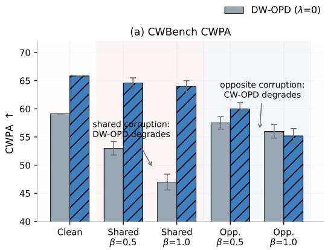

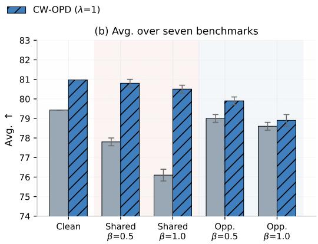  
Figure 6: Robustness to structured teacher-logit perturbations. Shared: the same vector b is added in both worlds, under which the transition target is invariant (Proposition 1(i)); opposite: +b/−b offsets the teacher contrast $d _ { T }$ by 2b. Shared corruption degrades DW-OPD while CW-OPD is nearly unaffected; opposite corruption reverses the ordering, confirming that the two error structures act on the two objectives in opposite order. Error bars: std over 3 seeds.

## D RESULT WITH STANDARD OPD

In the main text, CW-OPD is instantiated on top of on-policy self-distillation (OPSD), where the teacher is an EMA copy of the student. Here we verify that the proposed cross-world supervision is agnostic to the underlying distillation form by instantiating CW-OPD with a standard larger frozen teacher: Qwen3.5-9B teaches Qwen3.5-4B. Everything else, including the dual-world training pairs, the transition objective, and the training budget, is kept identical to the main experiments. Table 5

Table 5: Results with a standard larger teacher (Qwen3.5-9B → Qwen3.5-4B). CW-OPD (OPD) applies cross-world transition supervision on top of standard OPD. CWPA and CWFR are defined in Eqs. 9 and 10.
<table><tr><td>Method</td><td>V*Bench</td><td>HR-Bench 4K</td><td>RealWorldQA</td><td>MMVP</td><td>HalluB</td><td>SEED-B</td><td>OK-VQA</td><td>Avg.</td><td>CWPA↑</td><td>CWFR↓</td></tr><tr><td>Base</td><td>81.15</td><td>83.00</td><td>74.38</td><td>77.67</td><td>70.42</td><td>79.25</td><td>75.17</td><td>77.29</td><td>47.64</td><td>46.13</td></tr><tr><td>OPD</td><td>82.70</td><td>83.25</td><td>76.84</td><td>79.17</td><td>68.17</td><td>80.31</td><td>76.56</td><td>78.14</td><td>49.53</td><td>44.02</td></tr><tr><td>Vision-OPD</td><td>84.10</td><td>83.90</td><td>77.20</td><td>80.00</td><td>69.90</td><td>80.55</td><td>76.80</td><td>78.92</td><td>50.33</td><td>43.47</td></tr><tr><td>VAD</td><td>84.54</td><td>83.67</td><td>78.32</td><td>81.13</td><td>68.43</td><td>80.79</td><td>78.93</td><td>79.40</td><td>54.32</td><td>42.57</td></tr><tr><td>VA-OPD</td><td>85.69</td><td>84.32</td><td>76.29</td><td>78.67</td><td>72.34</td><td>79.96</td><td>78.33</td><td>79.37</td><td>54.27</td><td>40.96</td></tr><tr><td>FP-OPD</td><td>83.67</td><td>83.50</td><td>77.80</td><td>79.33</td><td>69.50</td><td>80.60</td><td>77.30</td><td>78.81</td><td>49.05</td><td>44.36</td></tr><tr><td>VGS</td><td>83.40</td><td>83.30</td><td>77.10</td><td>79.00</td><td>69.20</td><td>80.40</td><td>76.90</td><td>78.47</td><td>48.81</td><td>44.71</td></tr><tr><td>CW-OPD (OPD)</td><td>85.25</td><td>84.78</td><td>82.43</td><td>82.00</td><td>68.72</td><td>80.68</td><td>78.76</td><td>80.37</td><td>55.44</td><td>41.26</td></tr></table>

shows that the conclusions of the main text carry over to the standard-teacher setting: CW-OPD improves over other OPD baselines on both the standard benchmarks and, more substantially, on the cross-world diagnostic (CWPA and CWFR), despite the teacher and student now differing in capacity rather than in input conditions. This consistency indicates that the benefit of cross-world transition supervision does not rely on the privileged hint or on self-distillation, but stems from making the student’s response to evidence changes an explicit optimization target—regardless of which teacher provides the per-world anchor.

## E TRAINING SETTING AND DETAILS

We train Qwen3.5-4B and Qwen3.5-0.8B under the same on-policy distillation setup. The two configurations are identical except for the global batch size (48 for 4B and 64 for 0.8B), which we adjust to accommodate model scale and optimization stability. Both models use AdamW with a constant learning rate of $2 \times 1 0 ^ { - 6 }$ , weight decay $1 0 ^ { - 2 }$ , and a single training epoch. The vision encoder is not frozen. On-policy rollouts use temperature 2.0 and top-p 1.0, with a maximum input prompt length of 8192 and a maximum response length of 1024.

For OPSD, the teacher is an exponential moving average (EMA) of the student rather than a fixed external model. The EMA teacher is initialized as a frozen copy of the student’s initial weights and updated after every optimizer step as

$$
\theta _ { \mathrm { t e a c h e r } }  ( 1 - \gamma ) \theta _ { \mathrm { t e a c h e r } } + \gamma \theta _ { \mathrm { s t u d e n t } } ,
$$

with $\gamma = 0 . 0 5$ , corresponding to an EMA decay of 0.95. Only parameters are updated; buffers are not copied. This setting is used for both model sizes. For CW-OPD, we set the transition weight $\lambda = 1 . 0$ . Tables 6 and 7 summarize the full configurations. We train with FSDP and vLLM under Python 3.12, PyTorch 2.10.0, Transformers 5.5.0, vLLM 0.18.0, and Ray 2.53.0. Rollout uses eight workers with tensor parallelism 1. The perception chat template prepends an empty ¡think¿¡/think¿ block; it does not request or super- vise a reasoning trace. For OPSD, the 4B run requires 2.34 hours(82 PFLOPs) and 0.8b run requires 1.59 hours(15 PFLOPs) on two NVIDIA RTX PRO 6000D GPUs (96 GB). For OPD, the 4B run requires 3.07 hours(108 PFLOPs) and 0.8b run requires 2.78 hours(36.2 PFLOPs) on two NVIDIA RTX PRO 6000D GPUs (96 GB).

Consistency across compared methods. All methods reported in this work share the same base training configuration described above, including the optimizer, learning rate, weight decay, schedule, epoch count, batch size, and on-policy rollout parameters. The standard OPD baseline (e.g.,VGS, FP-OPD, Vision-OPD) and all OPSD-style methods (e.g., RP-OPSD) use the same EMA teacher setting with update rate $\gamma = 0 . 0 5$ and per-step updates, so that the teacher signal is generated under an identical protocol. Only method-specific hyperparameters are varied, such as the transition weight λ in CW-OPD or the method-specific coefficients in VGS and related approaches. This ensures that performance differences reflect the distillation objective rather than differences in the training or teacher-update setup.

## F ABLATION OF λ

We ablate the transition weight λ in the CW-OPD objective

$$
\mathcal { L } _ { \mathrm { C W - O P D } } = \mathcal { L } _ { \mathrm { w o r l d } } + \lambda \mathcal { L } _ { \mathrm { t r a n s } }
$$

on the 4B model under both OPD and OPSD settings. Here $\lambda = 0$ reduces to bidirectional OPD without cross-world transition supervision. Each entry is the average over 3 seeds.

The local analysis of Sec. 3.3 makes only a qualitative prediction for this sweep. At a shortcut stationary point, a small λ decreases $\tau$ to first order while E changes only at ${ \cal O } ( \eta ^ { 2 } ) \bar { ( \mathrm { E q } }$ . equation 8), so early in training—when the endpoint gradient has not yet vanished—a small transition weight adds an almost free corrective signal. As λ grows, $\mathcal { I } _ { \lambda }$ becomes dominated by the transition loss and the endpoint fit may be sacrificed. The analysis does not guarantee an interior optimum or any specific shape of the performance curve; the existence and location of the peak are empirical questions, which Table 8 answers. The sweep confirms the qualitative picture: performance rises from $\lambda = 0$ to a peak at moderate λ (1.0 for OPD and 0.25–1.0 for OPSD) and declines as λ increases further, while remaining above the $\lambda = 0$ baseline throughout. We therefore use $\lambda = 1 . 0$ in all main experiments.

## G STANDARD BENCHMARK DETAILS

Beyond CW-Bench, we evaluate on eight standard benchmarks that we group into three categories according to what they primarily measure: visual perception and grounding, hallucination diagnosis, and external-knowledge reasoning. Table 9 summarizes the key properties of each benchmark.

Table 6: Key hyperparameters used for Qwen3.5-4B.
<table><tr><td>Hyperparameter</td><td>Value</td></tr><tr><td>Optimization &amp; Training</td><td></td></tr><tr><td>Optimizer</td><td>AdamW</td></tr><tr><td>Learning Rate</td><td>2e-6</td></tr><tr><td>Weight Decay</td><td>1e-2</td></tr><tr><td>LR Šchedule</td><td>Constant</td></tr><tr><td>Epochs</td><td>1</td></tr><tr><td>Global Batch Size</td><td>48</td></tr><tr><td>Freeze Vision Encoder</td><td>False</td></tr><tr><td>On-Policy Rollout</td><td></td></tr><tr><td>Rollout Temperature</td><td>2.0</td></tr><tr><td>Rollout Top-p</td><td>1.0</td></tr><tr><td>Max Input Prompt Length</td><td>8192</td></tr><tr><td>Max Response Length</td><td>1024</td></tr><tr><td>EMA Teacher (OPSD)</td><td></td></tr><tr><td>Teacher Update Rate (γ)</td><td>0.05</td></tr><tr><td>EMA Decay</td><td>0.95</td></tr><tr><td>Update Interval</td><td>Every optimizer step</td></tr><tr><td>Teacher Initialization</td><td>Frozen copy of student</td></tr><tr><td>Buffer Update</td><td>No</td></tr><tr><td>CW-OPD Specific (Ours)</td><td></td></tr><tr><td>λ</td><td>1.0</td></tr></table>

Table 7: Key hyperparameters used for Qwen3.5-0.8B.
<table><tr><td>Hyperparameter</td><td>Value</td></tr><tr><td>Optimization &amp; Training</td><td></td></tr><tr><td>Optimizer</td><td>AdamW</td></tr><tr><td>Learning Rate</td><td>2e-6</td></tr><tr><td>Weight Decay</td><td>1e-2</td></tr><tr><td>LR Schedule</td><td>Constant</td></tr><tr><td>Epochs</td><td>1</td></tr><tr><td>Global Batch Size</td><td>64</td></tr><tr><td>Freeze Vision Encoder</td><td>False</td></tr><tr><td>On-Policy Rollout</td><td></td></tr><tr><td>Rollout Temperature</td><td>2.0</td></tr><tr><td>Rollout Top-p</td><td>1.0</td></tr><tr><td>Max Input Prompt Length</td><td>8192</td></tr><tr><td>Max Response Length</td><td>1024</td></tr><tr><td>EMA Teacher (OPSD)</td><td></td></tr><tr><td>Teacher Update Rate (γ)</td><td>0.05</td></tr><tr><td>EMA Decay</td><td>0.95</td></tr><tr><td>Update Interval</td><td>Every optimizer step</td></tr><tr><td>Teacher Initialization</td><td>Frozen copy of student</td></tr><tr><td>Buffer Update</td><td>No</td></tr><tr><td>CW-OPD Specific (Ours)</td><td></td></tr><tr><td>λ</td><td>1.0</td></tr></table>

## G.1 VISUAL PERCEPTION AND GROUNDING

V\*Bench (Wu & Xie, 2024) evaluates whether MLLMs can process high-resolution, visually crowded images and locate small details. Unlike benchmarks centered on large, salient objects, V\*Bench requires the model to find and focus on a specific visual key in a cluttered scene. It contains 191 multiple-choice questions across two tasks: attribute recognition (115 samples, 4 options) and spatial relationship reasoning (76 samples, 2 options). The benchmark was introduced alongside the V\* visual search algorithm, but the evaluation protocol itself measures raw MLLM performance without requiring the search mechanism.

Table 8: Ablation of the transition weight λ on the 4B model. λ = 0 corresponds to bidirectional OPD without transition supervision. Each entry is the average over 3 seeds.
<table><tr><td>λ</td><td>OPD + CW-OPD</td><td>OPSD + CW-OPD</td></tr><tr><td>base</td><td>77.29</td><td>77.29</td></tr><tr><td>0.0</td><td>77.81</td><td>77.73</td></tr><tr><td>0.25</td><td>79.88</td><td>80.46</td></tr><tr><td>0.5</td><td>80.07</td><td>80.32</td></tr><tr><td>1.0</td><td>80.37</td><td>80.97</td></tr><tr><td>2.0</td><td>79.64</td><td>79.39</td></tr><tr><td>4.0</td><td>78.31</td><td>77.62</td></tr></table>

Table 9: Overview of the eight standard benchmarks, organized by evaluation focus. “Task” denotes the primary question format; “Scale” reports the approximate number of evaluation samples or questions; “Metric” is the primary evaluation metric.
<table><tr><td>Category</td><td>Benchmark</td><td>Task</td><td>Scale</td><td>Metric</td></tr><tr><td rowspan="3">Visual Perception &amp; Grounding</td><td>V*Bench (Wu &amp; Xie, 2024)</td><td>MCQ MCQ</td><td>191 Qs</td><td>Accuracy</td></tr><tr><td>HR-Bench 4K (Wang et al., 2024)</td><td></td><td>4K images</td><td>Accuracy</td></tr><tr><td>RealWorldQA MMVP (Tong et al., 2024)</td><td>MCQ MCQ</td><td>765 Qs 300 Qs</td><td>Accuracy Accuracy</td></tr><tr><td rowspan="2">Hallucination Diagnosis</td><td>POPE (Li et al., 2023b)</td><td>Binary QA</td><td>3 subsets</td><td>Acc / F1</td></tr><tr><td>HallusionBench (Guan et al., 2024)</td><td>Paired QA</td><td>1,129 Qs</td><td>Pair Acc</td></tr><tr><td>External-Knowledge Reasoning</td><td>SEED-Bench (Li et al., 2023a) OK-VQA (Marino et al., 2019)</td><td>MCQ Open QA</td><td>19K Qs 14K Qs</td><td>Accuracy Soft Acc</td></tr></table>

HR-Bench 4K (Wang et al., 2024) is the first benchmark deliberately designed to assess MLLM perception on true 4K-resolution images. It contains images at 4K (and 8K in a separate split) paired with multiple-choice questions, covering fine-grained single-instance perception and crossobject perception. The benchmark reveals a substantial gap between model and human performance: state-of-the-art MLLMs achieve approximately 63% accuracy while humans reach 87%. We use the 4K split (HR-Bench 4K) in our main experiments.

RealWorldQA is a general visual question answering benchmark that tests fundamental visual perception capabilities in real-world image contexts. It consists of multiple-choice questions spanning diverse everyday scenes and object configurations, providing a broad measure of a model’s basic visual understanding without additional domain-specific knowledge requirements.

MMVP (Tong et al., 2024) exposes systematic visual shortcomings in multimodal LLMs through “CLIP-blind pairs”: image pairs that CLIP perceives as similar despite clear visual differences. The benchmark consists of 300 multiple-choice questions spanning nine basic visual patterns (e.g., orientation, presence, color, count, position, size). Even GPT-4V struggles on these questions, often providing incorrect answers and hallucinated explanations. MMVP thus isolates failures rooted in the visual representation itself rather than in language reasoning.

## G.2 HALLUCINATION DIAGNOSIS

POPE (Li et al., 2023b) (Polling-based Object Probing Evaluation) assesses object hallucination through targeted binary queries: for each image, the model is asked whether a specific object is present. The benchmark aggregates data from three distinct sources (MSCOCO, A-OKVQA, and GQA) and evaluates under three sampling settings—random, popular, and adversarial—to probe how object frequency and co-occurrence bias affect hallucination rates. Performance is measured using accuracy and F1 score.

HallusionBench (Guan et al., 2024) is a comprehensive diagnostic suite for image-context reasoning that specifically targets entangled language hallucination and visual illusion. It comprises 346 images paired with 1,129 carefully crafted questions organized into control groups, enabling quantitative analysis of response tendencies, logical consistency, and failure modes. The paired-question structure allows the benchmark to measure whether a model’s answer is grounded in the visual context or driven by language priors. GPT-4V achieves only 31.42% question-pair accuracy, with all other evaluated models below 16%.

## G.3 EXTERNAL-KNOWLEDGE REASONING

SEED-Bench (Li et al., 2023a) is a large-scale benchmark for generative comprehension in MLLMs. It contains 19K multiple-choice questions with human annotations, spanning 12 evaluation dimensions that cover both image and video comprehension. The questions are generated through a pipeline combining automatic filtering and manual verification, and the multiple-choice format with ground-truth options enables objective and efficient evaluation without human or GPT intervention during scoring. SEED-Bench measures a broad range of comprehension abilities, from single-image understanding to temporal reasoning in video.

OK-VQA (Marino et al., 2019) is a knowledge-based visual question answering benchmark specifically designed so that each question requires external knowledge beyond what is visible in the image. It consists of approximately 14,000 images and 14,000 open-ended questions sampled from MS-COCO, spanning 11 high-level knowledge categories including science, sports, geography, culture, and history. Each question is paired with multiple human-provided answers to enable consensus based evaluation. OK-VQA probes a model’s ability to (i) extract relevant visual cues, (ii) retrieve relevant external knowledge, and (iii) integrate perception with knowledge to produce a coherent answer. Early VQA architectures performed near random chance on OK-VQA, and even modern models struggle with rare or niche knowledge categories.

## G.4 EVALUATION SETTINGS.

All model responses are scored using Qwen3.5-9B as the LLM judge under greedy decoding: temperature 0, top-p 1, and a maximum generation length of 64 tokens. Thinking mode is disabled (enable thinking=false), and the judge runs with tensor parallelism 2. Rule-based matching is applied first where applicable; the LLM judge is used only for unparsed or open-ended responses.

```python
LLM Judge Prompt Template
PROMPT_TEMPLATE = (
"Your task is to judge whether the response expresses the same
meaning "
"as the answer of a question.\n"
"The question is: {question}\n"
"The answer is: {gt}\n"
"The response is: {response}\n"
"Please check and compare them and then judge. "
"If the response is correct, your output should be Yes. "
"Otherwise, your output should be No. Directly give me your output
II
)
```