# A Stevens’s Power Law Check-up of GPT-5.5’s Image-Based Visualization Reading

Kaichun Yang\*

Jian Chen†

The Ohio State University

## ABSTRACT

We adapt Stevens’s power law to measure the innate ability of AI models to read visualizations, which can reveal the built-in perceptual mechanisms of algorithmic models. In our pilot study, models see no legend. A model first views a reference visual representation and estimates its magnitude, then estimates the magnitude of each subsequent image of the same representation relative to that reference. Our evaluation of twelve visual variables makes how algorithmic models read visual encodings measurable, comparable with human perception, and more interpretable to humans. osf .io/wsrzm has source code, images, magnitude data samples, and analyses.

Index Terms: AI evaluation, behavior quantification, visual perception, Stevens’s power law.

## 1 INTRODUCTION

Quantifying artificial intelligence (AI) algorithms is exceptionally challenging with regard to their behaviors concerning data. Multimodal large language models (MLLMs) are increasingly used to interpret charts [22] and solving problems with visual representations in robotics, natural scenes and so on [10]. In these cases, a model may need to read values from, and compare or reason over graphical representations. However, real-world images of varying forms may not always present legend, or are lack of design consistency [3]. For these reasons, we must make the algorithmic behaviors transparent, i. e., to discover how the machine represents visualizations. This is also aligned to problem solving, urged by Simon [18] requires knowing and defining the observers’ representation of the domainspecific problems. While prior graphical perception research has established how accurately machines perform humans’ tasks, e. g.. ratio estimates [6, 7, 14]. More recent work has begun to evaluate machines’ mechanisms using rigorous sampling-based [11] and understanding visual literacy [10]. However, these evaluation experiments typically use standard visualization images for human observers and implicitly assume that models perceive a visualization image as humans do. A model’s accuracy in these cases may instead come from pattern matching, such as recalling familiar chart styles or reading verbal description or just guessing with confidence in so-called mirage effects. Methods to quantifying a model’s innate perceptual behaviors toward encoded data remains unattested.

Our goal is to test the innate perceptual mechanisms that models use to read visual representations. We adapt Stevens’s power law methods [20], which were originally developed to measure how humans perceive variable magnitude, to machines.

Method. Unlike prior AI evaluations that replicate human visual stimuli, we ask models to estimate encoded values directly (reference value) and then use this reference to estimate the target values relative to its own reference value, without a legend, by reporting the magnitude of a target variable relative to a reference variable. Models could not perform pattern matching in these cases. Because the same quantity can be encoded into a set of visual variables, we measured twelve of these: angle, two areas, length, luminance, slope, shape, two textures, and three colormaps (Figure 2) by asking a magnitude estimate from GPT-5.5. Our experiment used onetrial-per-run protocol, each trial is presented in a new conversation, so earlier trials cannot influence later responses or all trials are independent. We fit the responses with Stevens’s law, $\psi ( I ) = k I ^ { \alpha }$ where I is the ground truth variable intensity, ψ(I) is the model’s estimate, k is a proportionality constant, and α is the power-law exponent. When plotted on log-log axes (Figure 1), the power law plots as a straight line to indicate how models represent values internally.

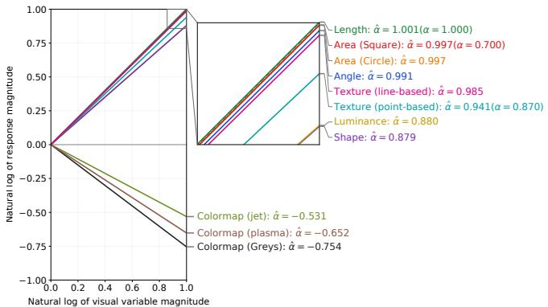  
Figure 1: A new psychophysical measurement of how neural network models respond to visual variables. We adapt Stevens’s measurement of humans’ subjective sense of physical stimulus intensity to measure how machines (GPT-5.5) respond to visual variables, e. g., length, area, color, and texture, and so on. The α value describes how observers perceive magnitude changes as the intensity of a visual variable changes. The model’s response scaling is compressive when $\alpha < 1$ , linear when α = 1, and expansive when $\alpha > 1$ . αˆ denotes the exponent for the model counterpart, and α for human observers where available. Observation. GPT-5.5’s responses scaled from linear to mildly compressive across visual variables. The three colormaps, Greys, plasma, andjet, had negative α, indicating that the model reversed the direction of the data values.

Results. We analyzed the pilot study results with two methods: Stevens’s power law for modeling GPT-5.5’s responses, and Cleveland and McGill’s ranking of visual variables [6]. Two findings emerged. Across twelve visual variables, GPT-5.5’s magnitude responses scale approximately linearly with length, area, angle, and line texture, and are mildly compressive for point texture, luminance, and shape. For the three colormaps (jet, plasma, and Greys), the responses have an inverse relationship with the data values mapped to three colormaps (Figure 1). Also, its ranking of channels by relative error differs from the human ranking. This pilot study makes three main contributions:

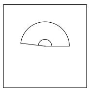  
(a) Angle

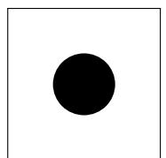

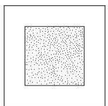  
(g) Texture (point-based)

(b) Area (Circle)  
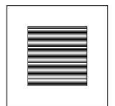  
(h) Texture (line-based)

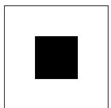  
(c) Area (Square)

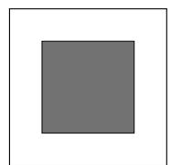  
(i) Luminance

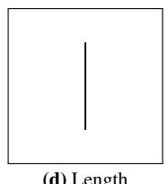  
(d) Length

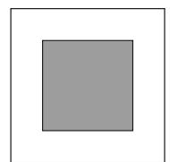  
(j) Colormap (Greys)

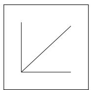  
(e) Slope

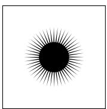

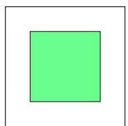  
(k) Colormap (jet)

(f) Shape  
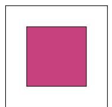  
(l) Colormap (plasma)  
Figure 2: Visual variable used in the experiment. The twelve variants span angle, area, length, luminance, slope, shape, texture, and colormap-based visual representations. Each panel was generated using the input value v = 48 before the conversation. v ∈ [1,100], each visual variable value linearly maps to value v except for Slope, such as Angle ∈ [4◦, 360◦], Area (Circle) ∈ [400π, 40000π]px2, Area (Square) $\in [ 1 6 0 0 , 1 6 0 0 0 0 ] \mathrm { p x } ^ { 2 } .$ , Length ∈ [8,800]px, Shape ∈ [1,100] spikes, Texture (point-based) ∈ [10,1000] points, Texture (line-based) ∈ [1, 100] lines, Luminance $\mathbf { \hat { \boldsymbol { L } } ^ { * } } \in [ 1 , \mathbf { \bar { 1 0 0 } } ]$ . For each colormap, we divided the full colormap to 1000 equal interval, represented each interval by its midpoint color, and map v to every tenth interval.

• A psychophysical method for discovering the innate behaviors of MLLMs. We measure how models perceive visual variables, using legend-free, reference-relative estimates that are less likely to reflect pattern matching against model’s familiarity with charts.

• A twelve-channel measurement. Across twelve visual variables, we show model’s perceptual scaling and errors.

• Findings for GPT-5.5. These findings make its readings transparent to human observers.

## 2 RELATED WORK

Understanding AI Model Behavior. Benchmark scores summarize model performance over a set of tasks. However, an aggregate score does not always show how model responses vary across tasks or input conditions. Recent work argues that intelligence evaluation should measure behaviors and skill acquisition rather than only performance on a fixed task set [4]. ARC-AGI-2 extends this direction through fine-grained evaluation signals and human-tested tasks [5].

Jiang et al. proposed a data-domain sampling regime to assess CNN graphical perception in bar-chart ratio estimation [11]. Their analysis examined sensitivity to differences between training and test distributions, stability under limited samples, and performance relative to human observers. In this work, instead of directly measuring behaviors, we model behaviors via psychophysics laws: we sample stimuli across controlled value ranges and analyze how the model’s numerical responses change with the variable. This lets us treat MLLMs as AI observers and model behaviors by their response functions, relative error, and how both vary across visual variables and compare against human observers. Together, these studies motivate evaluations that systematically vary inputs and observe responses rather than relying only on aggregated benchmarks.

A Brief Review of Stevens’s Power Law. Stevens invented a psychophysics method to test how observers scale input stimulus [19, 20, 21]. Standard stimulus has a ground truth reference value (for example, calling a tone of a given loudness “100”), and an human observer assigned it a value (say calling the same loudness “120”). Observers then assigned numbers to other stimulus intensities in proportion to their own standard. In this way, because observers respond across the whole stimulus range, the procedure measures the global relationship between physical intensity and perceived magnitude. Stevens discovered this relationship as a power function, which is fit separately for each visual variable:

$$
\psi ( I ) = k I ^ { \alpha } ,
$$

where I is the ground-truth stimulus intensity, ψ is the observer (humans in Stevens and model in ours)’s response, k is a proportionality constant, and α, is the power-law exponent, which is arguably the most important parameter because it describes how the observer’s response scales with stimulus intensity. Taking the logarithm of both sides gives

$$
\ln \bigl ( \psi ( I ) \bigr ) = \ln k + \alpha \ln I ,
$$

so estimating α as the slope of a linear regression in log-log space indicates compressive scaling when α < 1, linear scaling when α = 1, and expansive scaling when $\alpha > 1$ . Stevens measured many perceptual continua and found that exponents differ widely across them. For example, perceived line length is roughly linear, while the discomfort of electric shock is strongly expansive (α ≈ 3.5).

Weber’s law has been used to measure just noticeable differences (JNDs), the smallest change in a stimulus that observers can reliably detect in visualizations [8, 15, 16]. That approach and ours are complementary, since Weber’s law quantifies discrimination, whereas Stevens’s law quantifies the form of the perceptual scale. We use Stevens’s law because our question is not whether a model can distinguish two close values, but how its estimates of magnitude compress or expand across the range of each visual variable.

## 3 PSYCHOPHYSICAL FRAMEWORK FOR QUANTIFYING AI OBSERVERS

We investigate whether the relationship between data values encoded as visual stimuli and MLLM responses follows Stevens’s power law, and answer the following research question:

• RQ. How do the Stevens’s power-law exponents fitted to MLLM responses differ across visual variables?

The independent variable is the visual variable and the dependent variable is the error.

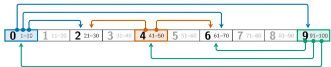  
Figure 3: Data sampling. Data values ranged from 1 to 100 and were divided into 10 bins. Reference (R) and target (T) values were sampled from non-identical and non-adjacent bins. This pilot study used eight reference-target (R-T) bin pairs, $R 0  \{ T \hat { 2 } , T 6 , T 9 \}$ $R 4  \{ T 2 , T 6 \}$ , and $R 9  \{ T 0 , T 4 , T 6 \}$ . Each R-T pair represents six different random sampled values.

## 3.1 Task

We use magnitude estimation task. At the beginning of each conversation, the model was presented with an image using a visual variable and asked to assign it a numerical value (the reference), the model was subsequently presented with one target image of the same visual variable, and asked to assign each target a numerical value using the scale established by its response to the reference variable (Figure 2). Each variable was shown in a separate image accompanied by a prompt. The prompts included instructions shared across all tasks together with information specific to the visual variable (Supl. Mat. Appendix B). No conversation history was shared between conversations.

## 3.2 Study Design on Data Sampling

Data values ranged from 1 to 100, and were divided into ten nonoverlapping bins: [1,10], [11,20], ..., and [91,100] (Figure 3). For this pilot study, we used eight reference (R)-target (T) bin pairs: reference bin 0 (R0) paired with each of the target bins of 2 (T2), 6 (T6), and 9 (T9); R4 with T2 and T6; and R9 with T0, T4, and T6. We excluded same-bin and adjacent-bin pairings to prevent the sampled R-T values from being too close, taken from Liu and Heer [12]. To avoid extremely small rendered stimuli that lead to large model prediction errors [11], no stimuli smaller than 32 pixels were used. For each of these eight R-T bin pairs, we randomly sampled six reference-target value pairs from the corresponding bins, resulted in $8 \times 6 = 4 8$ trials per visual variable.

## 3.3 Visualization Images

The independent variable, visual variable, has 12 levels across eight different types: angle, area, color, length, luminance, slope, shape, and texture (Figure 2). All variable images used a 1,000 × 1,000- pixel square canvas with a white background. Each image rendered one visual variable positioned at its geometric center.

Angle (Figure 2a) was represented using two radial lines and inner and outer arcs. One radial line pointed horizontally to the right, while the other was rotated counterclockwise. A sampled data value v was converted to degrees using $a = \left\lceil 3 . 6 \nu \right\rceil$ , producing angles ∈ [15◦,360◦]. Data values with v<4 were not used in the experiment to avoid inference errors introduced by small values [11]. This is consistently applied to all variables.

Area (Figure 2b and 2c) was represented using solid black circles and squares. The area was mapped linearly to $4 0 0 \pi \nu \mathrm { p x } ^ { 2 }$ for circle area, and $1 6 0 0 \nu \mathrm { p x } ^ { 2 }$ for square area.

Length (Figure 2d) was represented using black vertical line segments with a fixed width of 4 px. For a data value v, the rendered pixel length is $l = 8 \nu \mathrm { p x }$ , or pixel length range ∈ [32,800].

Slope (Figure 2e) was represented by a black line in a 400×400 px L-shaped frame. v was mapped linearly from 1 to 100 to an angle $\mathbf { \hat { \theta } } \in 1 . 0 0 \mathbf { \hat { 3 } } ^ { \circ }$ to 88.997◦, and the slope was calculated as $m = \tan ( \theta )$

Shape (Figure 2f) was treated as glyphs, inspired by star glyphs and glyph design principles for separability [1]. Data were represented using solid black forms with evenly spaced spikes and a fixed base-circle radius of 100 pixels. Each spike was an isosceles triangle with a fixed height of 100 px measured from its base chord, with circular arcs retained between adjacent spikes. A sampled value v determined the number of spikes. Each shape was assigned a random rotation angle.

Texture (Figure 2g and 2h) had two types, represented using line and dot textures inspired by He et al. [9], both drawn within a 400 px square region. For the line texture, a data value v corresponded to v approximately equally spaced horizontal lines with a width of 1 px. For the dot texture, v corresponded to 10v black dots of size $2 \times 2 { \mathrm { ~ p x } }$ , whose positions were generated using random initialization and Lloyd relaxation [13], which reduced clustering and spread the dots more evenly across the square.

Luminance (Figure 2i) was represented using fixed-size squares. Both the reference and target were 400 px squares and differed only in their fill lightness. A value v was mapped to $\mathrm { ~ L ~ } ^ { * }$ in the CIELAB color space (L∈[0,100], fixed $a ^ { * } = b ^ { * } = \hat { 0 } )$ , and then converted the resulting $L ^ { * } a ^ { * } b ^ { * }$ color to RGB for rendering.

Color (Figure 2j, 2k, and 2l) was represented using fixedsize 400 × 400 px squares filled according to Matplotlib’s Greys, plasma, and jet colormaps. For a data value v, we converted it to a colormap index k = 10v and then extracted the corresponding color from a colormap containing 1,000 positions.

## 4 RESULTS

We first describe the power-law and log absolute error analyses, then present the results across visual variables. Finally, we examine the model’s numerical assignments for the three colormaps in a follow-up experiment.

## 4.1 Analysis Method

We collected $4 8 \times 1 2 = 5 7 6$ target responses across 48 trials of 12 visual variables.

Stevens’s power-law analysis. In our notation, v denotes the stimulus magnitude I for a given visual variable, and ˆv denotes the numerical responses ψ(I) of GPT-5.5. For each reference-target pair, we calculated the visual variable ratio $\begin{array} { r } { S = { \frac { \nu _ { t } } { \nu _ { r } } } } \end{array}$ and the corresponding model-response ratio $\begin{array} { r } { R = { \frac { \hat { \nu } _ { t } } { \hat { \nu } _ { r } } } } \end{array}$ , where $\nu _ { t }$ and $\nu _ { r }$ are the target and reference values of the corresponding visual variable, and $\hat { \nu } _ { t }$ and $\hat { \nu } _ { r }$ are the values assigned by GPT-5.5. According to Stevens’s power law, the response to a visual variable value v can be expressed as $\hat { \nu } = k \nu ^ { \alpha }$ . If the reference and target responses share the same scaling factor, taking their ratios should give $\mathbf { \dot { R } } = S ^ { \alpha }$ , and ln $R = \alpha \ln S .$ Then we fitted Stevens’s power law by applying an ordinary least-squares regression to $\widehat { \ln R } = \hat { \beta } _ { 0 } + \hat { \alpha } \ln S$ separately for each visual variable, where $\hat { \beta } _ { 0 }$ and αˆ are the estimated intercept and exponent. We denote the fitted exponent as αˆ . Only finite and positive ratios were included because the logarithm is undefined for zero ratios.

For angle, we replaced a reported value r with its circular complement $3 6 0 ^ { \circ } - r$ when the complement was closer to the corresponding ground-truth angle. Slope was excluded from the powerlaw analysis and was included only in the error analysis after its stimulus values were converted to the rendered slopes.

Log absolute error analysis. Following Cleveland and McGill [6], we calculated the log absolute error for each target:

$$
e = \log _ { 2 } \left( \left| 1 0 0 \frac { \hat { \nu } _ { t } } { \hat { \nu } _ { r } } - 1 0 0 \frac { \nu _ { t } } { \nu _ { r } } \right| + \frac { 1 } { 8 } \right) .
$$

We then used Analysis of Variance (ANOVA) to test the main effect of visual variable on mean log absolute error. When we observe a significant difference, we used Tukey’s Honest Significant Difference (HSD) post-hoc test to identify which visual variables differed. Finally, we generated 1,000 bootstrap samples by resampling the valid trials with replacement with each bootstrap sample contains the same number of trials as the original sample. The $2 . 5 ^ { t h }$ and $9 7 . 5 ^ { t h }$ percentiles of the bootstrap distribution were used as the 95% confidence interval of mean log absolute error.

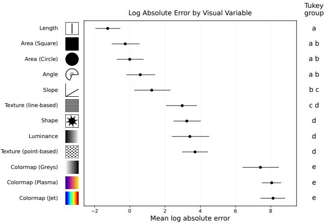  
Figure 4: Measurement Method II: Errors across visual variables. Points show the mean log absolute error and bars show 95% bootstrap confidence intervals. Letters indicate Tukey HSD groups; variables sharing a letter do not differ significantly in error.

## 4.2 GPT-5.5 Stevens’s Power-Law Fits

Figure 1 shows the fitted power-law exponents for GPT-5.5. The exponents for length, the two area variables, angle, and line-based texture ranged from 0.985 to 1.001, indicating that their assigned values increased approximately linearly with stimulus intensity. Pointbased texture showed response compression (αˆ = 0.941), while luminance and shape had the smallest positive exponents (αˆ ≈ 0.880). Three colormaps had negative exponents, ranging from −0.754 for Greys to −0.531 for jet. Thus, GPT-5.5 tended to assign smaller values as the numerical stimulus value increased.

## 4.3 Ranking Visual Variable by Log Absolute Error

In this analysis, we exclude 5 trials of colormap Greys, 15 trials of colormap jet and 1 trial of shape visual variables which GPT-5.5 assigned zero to their reference value. We find visual variable was a significant main effect on log absolute error, F(11,543) = 55.136 and $p < 0 . 0 0 1$ . Length produced the lowest mean log absolute error, followed by the two area variables, angle, and slope. The three colormaps produced the largest errors and were assigned to the same Tukey group. Each colormap had a significantly higher error than every non-colormap variable (Figure 4).

## 4.4 GPT-5.5’s implicit numerical mapping of colormaps

We suspected that GPT-5.5 using a colormap direction opposite to the numerical direction used to produce the input images since the α values were negative for the last three color maps. To further investigate this behavior, we conducted a follow-up full-sampling experiment to examine GPT-5.5’s implicit numerical mapping of the colormaps. For each colormap, we selected the 50th sampled color as the reference stimulus and asked GPT-5.5 to assign it a number to color value. We then presented all remaining sampled colors as targets within the same conversation and asked the model to estimate their values relative to the reference. Figure 5 shows the resulting numerical mappings across the full colormap. Without giving a legend and colormap name, GPT-5.5 read colors as hue angle (jet: 0–240; plasma: two clusters split by the 360° wraparound) or gray level (Greys: 0–255) rather than colormap position. This reverses the stimulus direction for jet and Greys; for plasma it yields a negative fit despite preserved hue order.

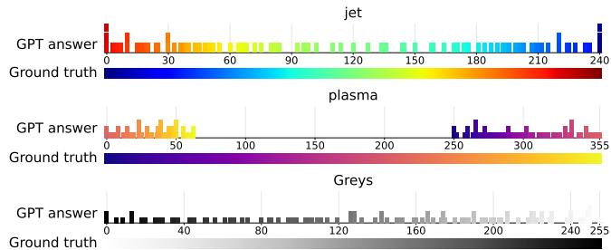  
Figure 5: Innate Colormap produced by MLLM vs. the ground truth colormap used in our experiment. Observations. MLLM flipped some values along the map, which caused the negative α values in the Stevens’s power law modeling.

## 5 DISCUSSION

Measuring MLLMs as AI observers. Treating an MLLM as an observer gives us an operational way to analyze its measurable responses to controlled psychophysics study methods without assuming model’s innate perception of visual variables. The move follows proposal that visualization serves as a stimulus domain for vision science: the response function and innate maps can be discovered, to be connected to the accuracy score of a broader image stimuli in image-based evaluations [2].

Models perceive brighter is higher in colormaps. People often expect darker colors to represent larger quantities in data visualizations [17], a tendency known as the dark-is-more bias. Our initial results showed the opposite pattern in GPT-5.5: the model tended to assign higher values to lighter colors, a lighter-is-higher bias. One possible reason is that lighter colors have higher luminance values in color space, for example white has the highest luminance.

Limitations. The current analysis focuses on one model, GPT-5.5. The study uses controlled synthetic stimuli, which do not cover the complexity of real-world visualization images. The pilot experiment also includes a small subset of the possible reference-target combinations, leaving fewer observations for some spans and reference bins. Future work should test additional MLLMs, more complete variable combinations, real-world visualization tasks, and different prompt conditions. Comparing stimuli with and without legends may also show how much the model relies on visual information, explicit labels, or learned semantic knowledge.

## 6 CONCLUSION

Our new evaluation method reveals fundamental insights into the next steps of interpreting MLLMs: If a model can report the magnitude of an encoding named only in text, with no legend in the image to match against, then it carries a built-in sensory system that we can measure directly rather than infer from task performance. Our extension of Stevens’s power law to model measurements shows that the innate colormaps shows opposite to the one used to generate the visualization images. This result also support that having language alone might not be enough and visual information is necessary. We therefore see that psychophysics experiment can be transparent about machine’s problem solving gaps and emphasizes importance of having explicit context display such as legend may be just as important for proper machine perception.

## AI USE STATEMENT

GPT-5.6 Sol was used to assist in writing and debugging the plotting code for Figures 1, 4, and 5. It was not used to generate or modify the underlying data, analyses, or research findings. GPT-5.6 Sol and GPT-6 Astra helped debug and write experiment code and debug figure style code. All AI generated content was reviewed by the authors for accuracy.

## ACKNOWLEDGMENTS

We thank reviewers and colleagues at the Visual Attention Lab at Harvard, led by Professor Jeremy M. Wolfe for their comments on this work. The work is supported in part by NIH U54CA287392, NSF IIS-1302755, NSF CNS-1531491, and NIST-70NANB13H181. Any findings, conclusions, or recommendations in this work are solely the responsibility of the authors and do not necessarily represent the views of the NSF, NIH, or the FDA.

## REFERENCES

[1] R. Borgo, J. Kehrer, D. H. Chung, E. Maguire, R. S. Laramee, H. Hauser, M. Ward, and M. Chen. Glyph-based visualization: Foundations, design guidelines, techniques and applications. In EG State ofthe Art Reports, pp. 39–63. EG Assoc, Goslar, 2013. doi: 10/f3sttv 3

[2] J. Chen, P. Isenberg, R. S. Laramee, T. Isenberg, M. Sedlmair, T. Moeller, and R. Li. An image-based typology for visualization. arXiv preprint arXiv:2403.05594, 2024. doi: 10/m2c7 4

[3] J. Chen, M. Ling, R. Li, P. Isenberg, T. Isenberg, M. Sedlmair, T. Moller, R. S. Laramee, H.-W. Shen, K. W¨ unsche, and Q. Wang.¨ VIS30K: A collection of figures and tables from IEEE visualization conference publications. IEEE Trans Vis Comput Graph, 27(9):3826– 3833, 2021. doi: 10/gmsvxd 1

[4] F. Chollet. On the measure of intelligence, 2019. arXiv:1911.01547. 2

[5] F. Chollet, M. Knoop, G. Kamradt, B. Landers, and H. Pinkard. ARC-AGI-2: A new challenge for frontier ai reasoning systems, 2025. arXiv:2505.11831. 2

[6] W. S. Cleveland and R. McGill. Graphical perception: Theory, experimentation, and application to the development of graphical methods. Journal of the American Statistical Association, 79(387):531– 554, 1984. doi: 10/gdvmwd 1, 3

[7] D. Haehn, J. Tompkin, and H. Pfister. Evaluating ‘graphical perception’ with CNNs. IEEE Trans Vis Comput Graph, 25(1):641–650, 2018. doi: gd52dt 1

[8] L. Harrison, F. Yang, S. Franconeri, and R. Chang. Ranking visualizations of correlation using weber’s law. IEEE Trans Vis Comput Graph, 20(12):1943–1952, 2014. doi: 10/f6qhzj 2

[9] T. He, Y. Zhong, P. Isenberg, and T. Isenberg. Design characterization for black-and-white textures in visualization. IEEE Transactions on Visualization and Computer Graphics, 30(1):1019–1029, 2023. 3

[10] J. Hong, C. Seto, A. Fan, and R. Maciejewski. Do LLMs have visualization literacy? an evaluation on modified visualizations to test generalization in data interpretation. IEEE Trans Vis Comput Graph, 31(10):7004–7018, 2025. doi: 10/n82v 1

[11] S. Jiang, W.-L. Chao, D. Haehn, H. Pfister, and J. Chen. A rigorous behavior assessment of CNNs using a data-domain sampling regime. IEEE Transactions on Visualization and Computer Graphics, 32(1):243–253, 2026. doi: 10/rhzj 1, 2, 3

[12] Y. Liu and J. Heer. Somewhere over the rainbow: An empirical assessment of quantitative colormaps. In ACM Hum-Comput Interact, pp. 1–12, 2018. doi: 10/gfxbcb 3

[13] S. P. Lloyd. Least squares quantization in PCM. IEEE Transactions on Information Theory, 28(2):129–137, 1982. doi: 10.1109/TIT.1982 .1056489 3

[14] J. D. Mackinlay. Automating the design of graphical presentations of relational information. ACM Transactions on Graphics, 5(2):110– 141, 1986. doi: 10/dxdkkp 1

[15] R. A. Rensink. Visualization as a stimulus domain for vision science. Journal of Vision, 21(8):3, 2021. doi: 10/mg29 2

[16] R. A. Rensink and G. Baldridge. The perception of correlation in scatterplots. Computer Graphics Forum, 29(3):1203–1210, 2010. doi: 10/bx6swb 2

[17] K. B. Schloss, C. Gramazio, A. T. Silverman, M. L. Parker, and A. S. Wang. Mapping color to meaning in colormap data visualizations. IEEE Trans Vis Comput Graph, 25(1):810–819, 2019. doi: 10/gfz5hv 4

[18] H. A. Simon. The sciences ofthe artificial. MIT press, 1996. 1

[19] S. S. Stevens. The direct estimation of sensory magnitudes: Loudness. The American Journal of Psychology, 69(1):1–25, 1956. doi: 10/dskqk9 2

[20] S. S. Stevens. On the psychophysical law. Psychological Review, 64(3):153–181, 1957. doi: 10/dj28gs 1, 2

[21] S. S. Stevens and E. H. Galanter. Ratio scales and category scales for a dozen perceptual continua. Journal ofExperimental Psychology, 54(6):377–411, 1957. doi: 10/ccq6cf 2

[22] L. Zhang, A. Hu, H. Xu, M. Yan, Y. Xu, Q. Jin, J. Zhang, and F. Huang. TinyChart: Efficient chart understanding with program-ofthoughts learning and visual token merging. In Proceedings of Conference on Empirical Methods in Natural Language Processing, pp. 1882–1898. ACL, 2024. doi: 10/rj8g 1

# A Stevens’s Power Law Check-up of GPT-5.5’s Image-Based Visualization Reading

SUPPLEMENTAL MATERIALS

This supplemental material section provides our exhaustive description of the process for reproducible science.

## A GPT-5.5 CONFIGURATION

Table 1: GPT-5.5 configuration used in the pilot study.

<table><tr><td>Parameter</td><td>Value</td></tr><tr><td>model</td><td>gpt-5.5-2026-04-23</td></tr><tr><td>reasoning.effort</td><td>low</td></tr><tr><td>text.verbosity</td><td>low</td></tr><tr><td>detail</td><td>original</td></tr></table>

## B PROMPTS USES

## EXAMPLE STIMULI AND PROMPTS

Each entry shows the visual variable image (right) with the reference and target prompts used for that variable.

## Angle

## Reference prompt

There

is a single angle in this image. The

angle is indicated by the curved arc connecting the two rays.

## This

angle is the reference stimulus. Please assign a number to

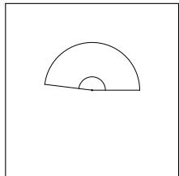

represent this angle in degrees.

Use this reference for measuring other angles later. Briefly explain your reasoning before giving the answer. Then give your final numerical answer on the last line in exactly this format:

FINAL ANSWER: <number>

## Target prompt

There is a single angle in this image.

The angle is indicated by the curved arc connecting the two rays.

Assign a number to represent this angle in degrees using the reference established earlier.

Briefly explain your reasoning before giving the answer. Then give your final numerical answer on the last line in exactly this format:

FINAL ANSWER: <number>

## Area (circular)

## Reference prompt

There is   
a single circle in this image. This circle   
is the reference stimulus.

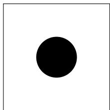

## Please assign

a number to represent its area. Use this reference for measuring other circle areas later.

Briefly explain your reasoning before giving the answer. Then give your final numerical answer on the last line in exactly this format:

FINAL ANSWER: <number>

## Target prompt

There is a single circle in this image.

Assign a number to represent its area using the reference established earlier.

Briefly explain your reasoning before giving the answer. Then give your final numerical answer on the last line in exactly this format:

FINAL ANSWER: <number>

## Area (Square)

## Reference prompt

There is

a single square in this image.

is the reference stimulus.

a number to represent its area. Use this reference for measuring other square areas later.

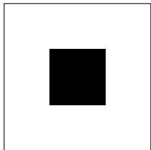

Briefly explain your reasoning before giving the answer. Then give your final numerical answer on the last line in exactly this format:

FINAL ANSWER: <number>

## Target prompt

There is a single square in this image.

Assign a number to represent its area using the reference established earlier.

Briefly explain your reasoning before giving the answer. Then give your final numerical answer on the last line in exactly this format:

FINAL ANSWER: <number>

## Length

## Reference prompt

There is a

single black line in this image. This

line is the reference stimulus. Please assign a

number to represent its length. Use this reference for measuring other line lengths later.

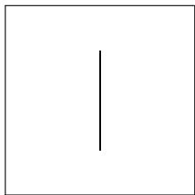

Briefly explain your reasoning before giving the answer. Then give your final numerical answer on the last line in exactly this format:

FINAL ANSWER: <number>

## Target prompt

There is a single black line in this image.

Assign a number to represent its length using the reference established earlier.

Briefly explain your reasoning before giving the answer. Then give your final numerical answer on the last line in exactly this format:

## Slope

## Reference prompt

There is

a coordinate frame with a single sloped line in this image.

This sloped

line is the reference stimulus.

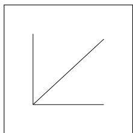

assign a number to represent the slope of the sloped line.

Use this reference for measuring other line slopes later. Briefly explain your reasoning before giving the answer. Then give your final numerical answer on the last line in exactly this format:

FINAL ANSWER: <number>

## Target prompt

There is a coordinate frame with a single sloped line in this image.

Assign a number to represent this slope using the reference established earlier.

Briefly explain your reasoning before giving the answer. Then give your final numerical answer on the last line in exactly this format:

FINAL ANSWER: <number>

## Shape

## Reference prompt

There is a single

spiked shape in this image. This

shape is the reference stimulus. Please assign

a number to represent its shape. Use this reference for measuring other shapes later.

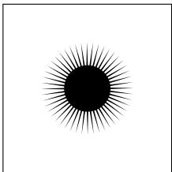

Briefly explain your reasoning before giving the answer. Then give your final numerical answer on the last line in exactly this format:

FINAL ANSWER: <number>

## Target prompt

There is a single spiked shape in this image. Assign a number to represent this shape using the reference established earlier.

Briefly explain your reasoning before giving the answer. Then give your final numerical answer on the last line in exactly this format:

FINAL ANSWER: <number>

## Texture (point-based)

## Reference prompt

a dotted texture in this image. This dotted texture is the reference stimulus. Please assign a number to represent this dotted texture. Use this reference for measuring other dotted textures later.

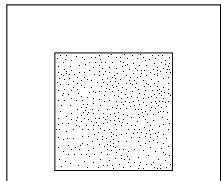

Briefly explain your reasoning before giving the answer. Then give your final numerical answer on the last line in exactly this format:

FINAL ANSWER: <number>

## Target prompt

There is a dotted texture in this image.   
Assign a number to represent this dotted texture using the reference established earlier.   
Briefly explain your reasoning before giving the answer. Then give your final numerical answer on the last line in exactly this format:   
FINAL ANSWER: <number>

## Texture (line-based)

## Reference prompt

There

is a line texture in this image. This line texture is the reference stimulus. Please assign a number to represent this line texture. Use this reference for measuring other line textures later.

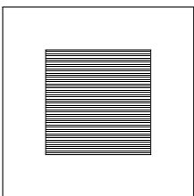

Briefly explain your reasoning before giving the answer. Then give your final numerical answer on the last line in exactly this format:

FINAL ANSWER: <number>

## Target prompt

There is a line texture in this image.   
Assign a number to represent this line texture using the reference established earlier.   
Briefly explain your reasoning before giving the answer. Then give your final numerical answer on the last line in exactly this format:   
FINAL ANSWER: <number>

## Luminance

## Reference prompt

There is a single   
colored square in this image.   
This colored square   
is the reference stimulus.   
Please assign a number   
to represent its luminance.   
Use this reference for measuring other luminances later.

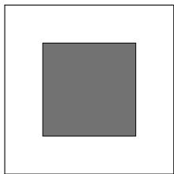

Briefly explain your reasoning before giving the answer. Then give your final numerical answer on the last line in exactly this format:

FINAL ANSWER: <number>

## Target prompt

There is a single colored square in this image.   
Assign a number to represent its luminance using the reference established earlier.   
Briefly explain your reasoning before giving the answer. Then give your final numerical answer on the last line in exactly this format:   
FINAL ANSWER: <number>

## Colormap (Greys)

## Reference prompt

There is a single   
colored square in this image. This colored square   
is the reference stimulus.   
Please assign a   
number to represent this color. Use this reference for measuring other colors later. Briefly explain your reasoning before giving the answer. Then give your final numerical answer on the last line in exactly this format:   
FINAL ANSWER: <number>

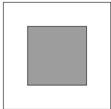

## Target prompt

There is a single colored square in this image.   
Assign a number to represent this color using the   
reference established earlier.   
Briefly explain your reasoning before giving the answer. Then give your final numerical answer on the last line in exactly this format:   
FINAL ANSWER: <number>

## Colormap (jet)

## Reference prompt

There is a single   
colored square in this image. This colored square   
is the reference stimulus.   
Please assign a   
number to represent this color. Use this reference for   
measuring other colors later. Briefly explain your reasoning before giving the answer. Then give your final numerical answer on the last line in exactly this format:   
FINAL ANSWER: <number>

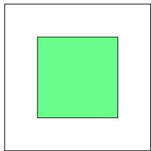

## Target prompt

There is a single colored square in this image.   
Assign a number to represent this color using the   
reference established earlier.   
Briefly explain your reasoning before giving the answer. Then give your final numerical answer on the last line in exactly this format:   
FINAL ANSWER: <number>

## Colormap (plasma)

## Reference prompt

There is a single   
colored square in this image. This colored square   
is the reference stimulus.   
Please assign a   
number to represent this color. Use this reference for   
measuring other colors later. Briefly explain your reasoning before giving the answer. Then give your final numerical answer on the last line in exactly this format:   
FINAL ANSWER: <number>

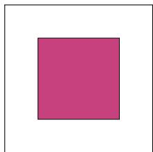

## Target prompt

There is a single colored square in this image.

Assign a number to represent this color using the   
reference established earlier.   
Briefly explain your reasoning before giving the answer. Then give your final numerical answer on the last line in exactly this format:   
FINAL ANSWER: <number>

## C DOMAIN OF THE VISUAL VARIABLES

Figure 6 shows additional examples for the twelve visual variables.

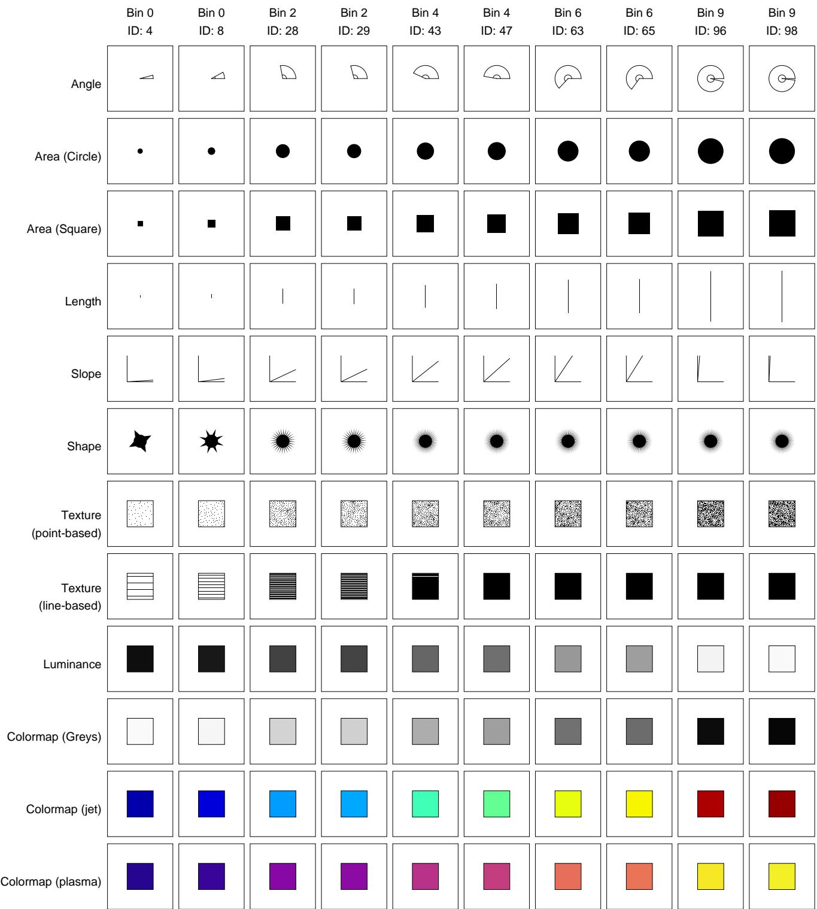  
Figure 6: Ten examples for each of twelve visual variables with two examples randomly selected from each of the five sampled bins. Row correspond to visual variables, and columns correspond to the sampled values of each bin. Black borders are added for clarity and are not part of the original image.