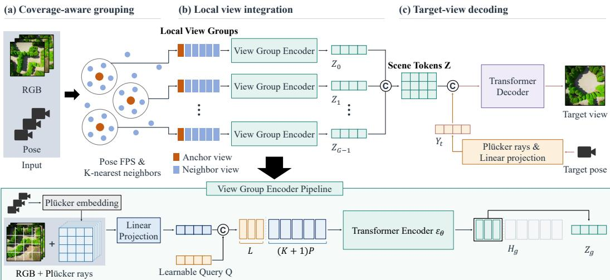
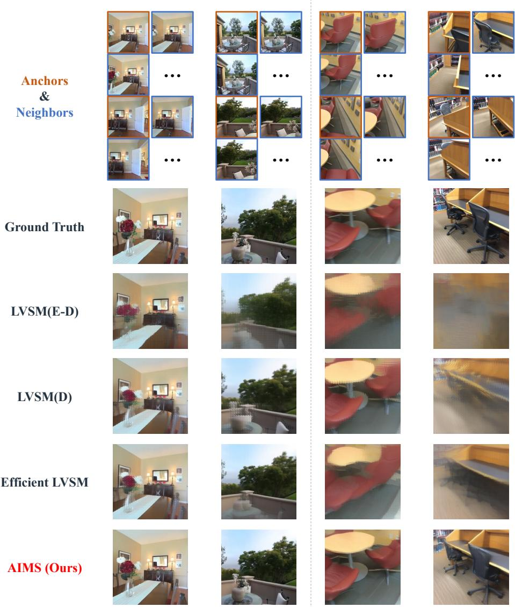
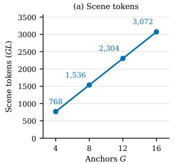
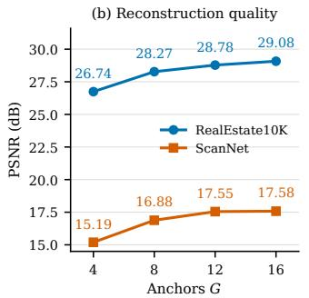
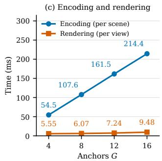
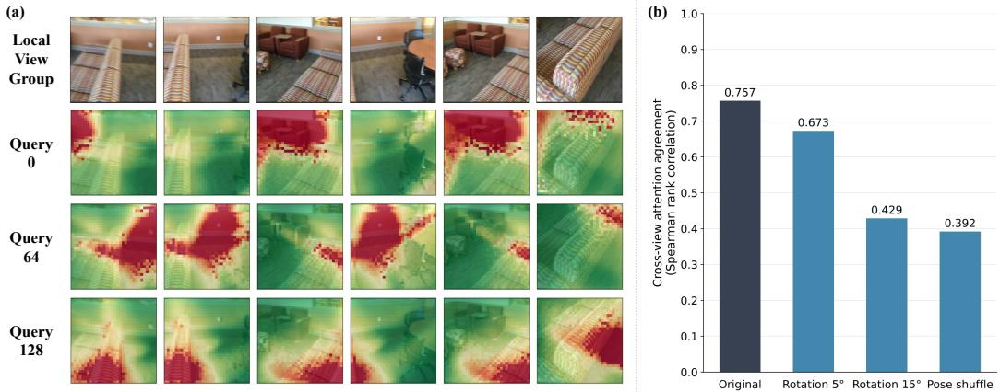
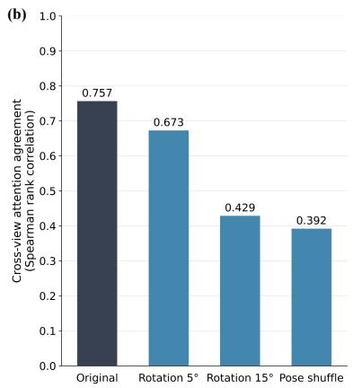
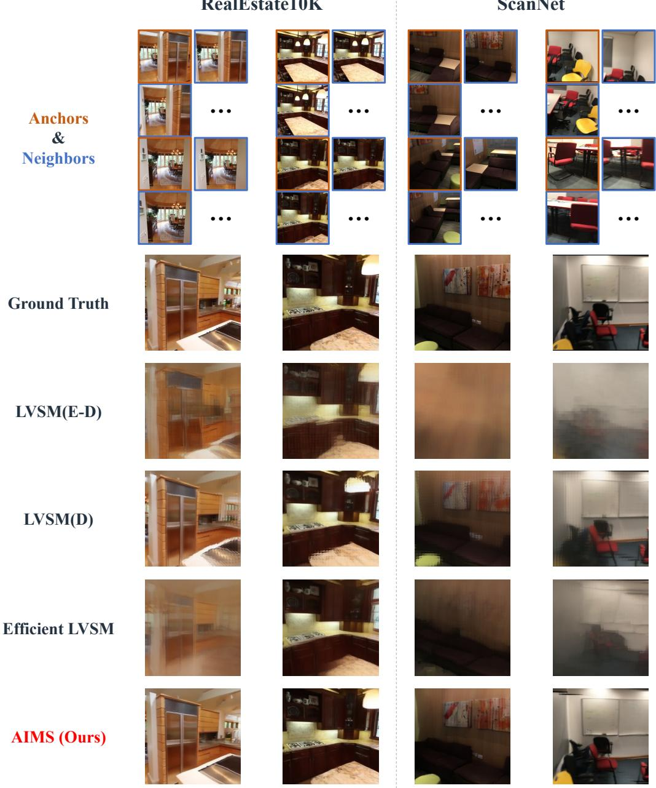
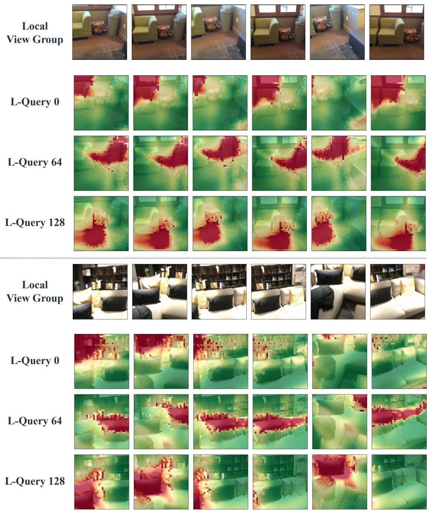

# AIMS: ANCHOR-INTEGRATED MULTI-VIEW SYNTHE-SIS FOR SCALABLE NOVEL VIEW RENDERING

JooHyun Park   
Korea University   
james0223@korea.ac.kr

Hanyoung Jang NCSOFT

HyeongYeop Kang   
Korea University   
siamiz hkang@korea.ac.kr

## ABSTRACT

Feed-forward novel view synthesis methods achieve strong generalization from posed multi-view inputs, but scaling them to large input view sets remains challenging. Transformer-based approaches that jointly process all input-view tokens incur rapidly increasing computation and memory as the number of views grows, while simple view subsampling discards potentially useful observations. We introduce Anchor-Integrated Multi-View Synthesis (AIMS), a scalable framework that decouples the number of available observations from the number of views processed by the global synthesis model. AIMS selects a fixed set of spatially distributed anchor views using farthest point sampling, groups nearby observations around each anchor, and uses a lightweight learnable integrator to fuse their information into enriched anchor representations. This allows additional observations to contribute to synthesis while keeping the downstream global view budget fixed. Evaluations on RealEstate10K and ScanNet demonstrate a favorable quality–efficiency trade-off against transformer-based and Gaussian-based baselines. AIMS achieves 29.41 dB and 17.73 dB PSNR on the two datasets, respectively, with rendering averaging 7.24 ms per view.

## 1 INTRODUCTION

All views are useful, but not all views need attention. Additional observations can reveal occluded surfaces, reduce geometric ambiguity, and provide richer evidence for novel view synthesis. Yet in transformer-based models, allowing every observation to participate directly in global attention makes computation grow with the input collection. We ask whether a model can benefit from many observations while reasoning globally over only a compact representation of them.

Recent progress in feed-forward novel view synthesis has made this question increasingly relevant. Many approaches rely on explicit 3D representations or geometry-aware priors, such as neural radiance fields, 3D Gaussians, and epipolar constraints. LVSM (Jin et al., 2025) takes a different direction, formulating novel view synthesis as a largely data-driven transformer problem with minimal 3D inductive bias. Given posed input images, it directly learns to synthesize target views without relying on a predefined 3D representation or rendering equation.

This flexibility, however, makes the size of the visual context an important computational bottleneck. In the decoder-only LVSM, input and target tokens interact through full self-attention, causing computation to grow rapidly as additional views are introduced. Efficient-LVSM (Jia et al., 2026) substantially improves this scaling through decoupled attention, but incorporating more observations still requires processing a larger collection of input tokens. The encoder–decoder variant of LVSM may appear to avoid this issue by compressing the inputs into a fixed number of latent tokens; however, the encoder must still apply full self-attention over the input tokens before producing this fixed-size representation. As a result, its computational cost also grows with the number of input views. Thus, existing formulations still couple the amount of available scene evidence with the computation required to exploit it.

In this work, we introduce Anchor-Integrated Multi-View Synthesis (AIMS), a framework that incorporates evidence from large view collections under a fixed global attention budget. Inspired by the Point Transformer (Zhao et al., 2021), which handles large point sets by selecting representative points and aggregating information from their local neighborhoods, AIMS applies a similar princi ple to large collections of input views. Specifically, AIMS selects a compact set of representative anchor views and enriches their representations with information from neighboring observations. The resulting integrated anchors summarize a larger input collection and serve as the inputs to the global synthesis model. With a fixed anchor count and per-anchor token budget, the model’s pertarget global attention computation remains independent of the number of input observations. The anchor and neighbor counts provide complementary controls over scene detail and computational cost: more anchors expand the capacity of the global representation, while more neighbors supply additional evidence for local refinement. Increasing these counts can support finer scene detail at higher computational cost, whereas smaller settings favor a more compact or coarser representation with lower processing cost.

Our evaluation of AIMS on RealEstate10K (Zhou et al., 2018) and ScanNet (Dai et al., 2017) demon strates improvements in both synthesis quality and computational efficiency. With 12 anchors and six views per group, AIMS achieves 29.41 dB and 17.73 dB PSNR, respectively, outperforming the evaluated baselines. Its reusable scene representation further enables efficient synthesis of additional views, with rendering averaging 7.24 ms per view.

Our contributions are summarized as follows:

• We formulate large-input novel view synthesis under afixed global attention budget, allowing N observations to contribute through G ≪ N integrated anchor views while keeping the number of views participating in global synthesis fixed.

• We introduce AIMS, a hierarchical view integration framework that combines coverageaware anchor selection with learnable local aggregation, enabling non-anchor observations to contribute without directly expanding the global attention context.

• We conduct comprehensive evaluations on RealEstate10K and ScanNet, demonstrating that AIMS offers a favorable trade-off between reconstruction quality and computational efficiency compared with the evaluated baselines.

## 2 RELATED WORK

Foundations of Novel View Synthesis. Early novel view synthesis (NVS) generated new views from photographs using geometric proxies (Debevec et al., 1996) or densely sampled light fields (Levoy & Hanrahan, 1996; Gortler et al., 1996). Later methods improved image alignment and combination through depth-guided warping (Chaurasia et al., 2013), appearance flow (Zhou et al., 2016), learned blending (Hedman et al., 2018), and depth prediction (Choi et al., 2019). Neural scene representations offered another route: NeRF (Mildenhall et al., 2021) optimizes continuous density and radiance fields through differentiable volume rendering. Subsequent work improved anti-aliasing and view-dependent appearance (Barron et al., 2021; Verbin et al., 2024; Barron et al., 2023), while voxel grids (Sun et al., 2022; Fridovich-Keil et al., 2022), tensor factorization (Chen et al., 2022), and hash encoding (Muller et al., 2022) increased efficiency. Point-based alternatives¨ associate neural features with 3D points in Point-NeRF (Xu et al., 2022) or rasterize anisotropic Gaussians in 3D Gaussian Splatting (Kerbl et al., 2023), with extensions addressing aliasing (Yu et al., 2024), distorted cameras, and secondary rays (Wu et al., 2025). While these developments advance scene reconstruction, the cost of per-scene optimization motivates models that infer scene content from learned priors.

Generalizable Reconstruction and Rendering. Generalizable NVS learns priors across scenes to predict novel views or scene representations in a feed-forward manner. Early examples include pixelNeRF (Yu et al., 2021), which conditions radiance fields on pixel-aligned features, and IBR-Net (Wang et al., 2021), which aggregates multi-view evidence. Geometric reasoning was further developed through plane-sweep cost volumes in MVSNeRF (Chen et al., 2021) and geometry and visibility cues in GeoNeRF (Johari et al., 2022) and NeuRay (Liu et al., 2022). Following advances in Gaussian rendering, feed-forward models began predicting Gaussian primitives directly: pixel-Splat (Charatan et al., 2024) uses image pairs, MVSplat (Chen et al., 2024b) uses multi-view cost volumes, and DepthSplat (Xu et al., 2025) combines matching with pretrained monocular depth features. NoPoSplat (Ye et al., 2025) extends this direction to canonical reconstruction from sparse unposed images. LRM (Hong et al., 2024) and GS-LRM (Zhang et al., 2024) scale image-to-scene prediction using transformers and triplane or Gaussian representations. To improve multi-view processing, LaRa (Chen et al., 2024a) uses group attention over Gaussian volumes. Alongside deterministic reconstruction, generative methods address unobserved regions through camera-conditioned diffusion (Watson et al., 2023; Liu et al., 2023), with CAT3D (Gao et al., 2024) and Stable Virtual Camera (Zhou et al., 2025) supporting multi-view generation.

Scalable Transformer-Based View Synthesis. Alongside methods that predict predefined 3D representations, learned renderers synthesize views directly from scene context and target cameras. Light Field Networks (Sitzmann et al., 2021) predict color from ray coordinates, while Geometry-Free View Synthesis (Rombach et al., 2021) and ViewFormer (Kulhanek et al., 2022) use transform-´ ers to synthesize views from encoded image context. Scene Representation Transformer (Sajjadi et al., 2022) organizes observations into latent tokens queried by target rays, whereas GPNR (Suhail et al., 2022) retains geometric guidance through epipolar feature sampling. LVSM (Jin et al., 2025) advances direct synthesis at the patch level, using encoder–decoder and decoder-only architectures with minimal 3D inductive bias. However, extending transformer-based synthesis to larger input collections makes attention cost a central concern. Efficient-LVSM (Jia et al., 2026) addresses this through intra-view input attention and target self-then-cross attention, achieving linear inputview scaling and enabling input-feature caching. Further work pursues efficient inference through reusable contexts and unidirectional decoding in SVSM (Kim et al., 2026), shared reconstruction and rendering weights with key–value caching in DVSM (Sun et al., 2026), and geometrypretrained features with lightweight rendering in LagerNVS (Szymanowicz et al., 2026). LaCT’s NVS model (Zhang et al., 2026) instead compresses multi-view evidence into fast weights through test-time updates. AIMS addresses the input-scaling problem through local view integration, compressing neighboring observations into fixed-size anchor representations before global synthesis. This allows additional views to contribute without expanding the global attention context or applying full-input self-attention.

## 3 METHOD

We introduce Anchor-Integrated Multi-View Synthesis (AIMS), which synthesizes novel views from posed RGB observations through a compact scene representation. Given N observations $\mathcal { O } = \mathbf { \bar { \chi } } \{ ( I _ { i } , \mathbf { A } _ { i } , \mathbf { T } _ { i } ) \} _ { i = 1 } ^ { N }$ , where $\mathbf { A } _ { i }$ and $\mathbf { T } _ { i }$ denote camera intrinsics and camera-to-world poses, our goal is to predict an image $\widehat { I } _ { t }$ at a target camera $\left( \mathbf { A } _ { t } , \mathbf { T } _ { t } \right)$ . The pipeline consists of three stages: coverage-aware view grouping, which selects G representative anchors and groups nearby observations around them; view group encoding, where our View Group Encoder (VGE) integrates ray-conditioned image tokens from each anchor and its neighbors into L scene tokens; and targetview decoding, which synthesizes the target image from the resulting $G L$ scene tokens. With $G$ and L fixed, the global attention cost remains independent of the number of input observations N. The overall pipeline is visualized in Fig. 1.

## 3.1 COVERAGE-AWARE VIEW GROUPING

Inspired by the sampling and local aggregation in Point Transformer (Zhao et al., 2021), we select representative anchor views and group nearby observations around them. Let $\mathbf { R } _ { i } \in \mathbb { R } ^ { 3 \times 3 }$ and $\mathbf { c } _ { i } \in$ $\mathbb { R } ^ { 3 }$ denote the rotation matrix and center of camera i in a normalized scene frame. Anchor selection uses deterministic farthest-point sampling in camera-pose space. We define the pose distance by combining the separation between camera centers with the angle between their orientations:

$$
\begin{array} { r l } & { \delta ( i , j ) = \sqrt { w _ { \mathrm { t } } \| \mathbf { c } _ { i } - \mathbf { c } _ { j } \| _ { 2 } ^ { 2 } + w _ { \mathrm { r } } \theta _ { i j } ^ { 2 } } , } \\ & { \theta _ { i j } = \operatorname { a r c c o s } \left( \frac { \operatorname { t r } ( \mathbf { R } _ { i } ^ { \top } \mathbf { R } _ { j } ) - 1 } { 2 } \right) . } \end{array}\tag{1}
$$

The relative rotation ${ \bf R } _ { i } ^ { \top } { \bf R } _ { j }$ satisfies $\operatorname { t r } ( \mathbf { R } _ { i } ^ { \top } \mathbf { R } _ { j } ) = 1 + 2 \cos \theta _ { i j }$ , where tr sums the diagonal entries. Solving this relation using arccos yields the smallest alignment angle $\theta _ { i j } \in [ 0 , \pi ]$ , a scalar measure of orientation difference in radians. The weights $w _ { \mathrm { t } }$ and $w _ { \mathrm { r } }$ balance this angular distance with the distance between camera centers. We use $( w _ { \mathrm { t } } , w _ { \mathrm { r } } ) = ( 1 , 0 . 2 5 )$ .

  
Figure 1: Overview of AIMS. Coverage-aware grouping selects anchors and neighboring views. The View Group Encoder compresses each group’s ray-conditioned image tokens into compact scene tokens. A global decoder combines these with target ray tokens to synthesize novel views.

We initialize the selected set with the pose medoid $a _ { 1 } = \mathrm { a r g }$ mini $\textstyle \sum _ { j } \delta _ { \mathrm { a } } ( i , j )$ ) and iteratively select the camera farthest from the current anchors:

$$
a _ { g } = \underset { i \notin { \cal A } _ { g - 1 } } { \arg \operatorname* { m a x } } \ \underset { a \in \mathcal { A } _ { g - 1 } } { \operatorname* { m i n } } \delta _ { \mathrm { a } } ( i , a ) ,\tag{2}
$$

where $\mathcal { A } _ { g - 1 } = \{ a _ { 1 } , \dotsc , a _ { g - 1 } \}$ . This procedure encourages coverage of the available camera poses without requiring image features or reconstructed geometry.

After selecting the anchors, we form a local view group $\mathcal { G } _ { g }$ around each anchor $a _ { g }$ by including the anchor and its $K$ nearest neighbors under $\delta _ { \mathrm { n } }$ , allowing overlaps between groups.

## 3.2 VIEW GROUP ENCODER

The VGE integrates the complementary observations within each local view group $\mathcal { G } _ { g }$ into a fixed number of scene tokens. We first tokenize the group’s images together with their camera poses. The camera poses are encoded using per-pixel Plucker ray embeddings (Plucker, 1865), computed using¨ the corresponding camera intrinsics. For each source view, we concatenate corresponding RGB and ray embedding patches and linearly project them into tokens $\mathbf { E } _ { i } \in \mathbb { R } ^ { P \times D }$ , where $P = \mathbf { \bar { \it H W } } / p ^ { 2 }$ is the number of $p \times p$ patches in an $\bar { H } \times \bar { W }$ image and $D$ is the token dimension.

We concatenate the view tokens $\mathbf { E } _ { i }$ for $i \in \mathcal { G } _ { q }$ into $\mathbf { X } _ { q } \in \mathbb { R } ^ { ( K + 1 ) P \times D }$ and prepend L learnable tokens Q shared across groups. The VGE is implemented as a shared transformer encoder ${ \mathcal { E } } _ { \theta }$ that jointly processes these tokens. We retain the outputs corresponding to the learnable tokens:

$$
\mathbf { H } _ { g } = \mathcal { E } _ { \theta } ( [ \mathbf { Q } ; \mathbf { X } _ { g } ] ) , \qquad \mathbf { Z } _ { g } = \mathbf { H } _ { g } [ : L ] \in \mathbb { R } ^ { L \times D } ,\tag{3}
$$

where $[ : L ]$ selects the first L output tokens corresponding to the learnable queries $\mathbf { Q } .$ . The resulting $\mathbf { Z } _ { g }$ summarizes the anchor and its neighbors in $\mathcal { G } _ { g }$ . Concatenating all group outputs gives the scene tokens $\mathbf { Z } = [ \mathbf { Z } _ { 1 } ; \dots ; \mathbf { Z } _ { G } ] \in \mathbb { R } ^ { G L \times D }$

## 3.3 TARGET VIEW DECODING

Following the target view decoding formulation of LVSM (Jin et al., 2025), we obtain target query tokens $\breve { \mathbf Y } _ { t } \in \mathbb R ^ { \breve { P } _ { t } \times D }$ by patchifying the target camera’s Plucker ray embeddings and applying a¨ separate linear projection, where $P _ { t }$ is the number of target patches. A global transformer decoder $\mathcal { D } _ { \phi }$ processes the concatenation of the target query tokens $\mathbf { Y } _ { t }$ and scene tokens $\mathbf { Z } ,$ and we retain the target-token outputs:

$$
\mathbf { V } _ { t } = { \mathcal { D } } _ { \phi } ( [ \mathbf { Y } _ { t } ; \mathbf { Z } ] ) , \qquad \mathbf { F } _ { t } = \mathbf { V } _ { t } [ : P _ { t } ] \in { \mathbb { R } } ^ { P _ { t } \times D } ,\tag{4}
$$

where $[ : P _ { t } ]$ selects the first $P _ { t }$ output tokens corresponding to the target queries. The retained tokens $\mathbf { F } _ { t }$ are projected to RGB patches and assembled into the predicted image $\widehat { I } _ { t }$ . Since $\mathbf { Z }$ is independent of the target camera, the scene tokens support synthesis for multiple target viewpoints.

By compressing each group into L scene tokens, AIMS limits the sequence used for target-view decoding to $G L$ scene tokens and $P _ { t }$ target query tokens. This gives a per-target attention cost of

$$
{ \mathrm { a t t n } } _ { - } { \mathrm { c o s t } } = { \mathcal O } \left( ( G L + P _ { t } ) ^ { 2 } \right) .\tag{5}
$$

For fixed $G$ and $L ,$ the global attention cost remains independent of the input count $N$ , maintaining a fixed global attention budget for target view decoding.

## 3.4 LOSS FUNCTION

For each target view, we supervise the predicted image $\widehat { I } _ { t }$ against the ground-truth image $I _ { t }$ using a combination of mean squared error and perceptual loss:

$$
\mathcal { L } = \mathrm { M S E } ( \widehat { I } _ { t } , I _ { t } ) + \lambda \mathrm { P e r c e p t u a l } ( \widehat { I } _ { t } , I _ { t } ) ,\tag{6}
$$

where $\lambda = 0 . 5$ and Perceptual denotes LPIPS with a VGG backbone (Zhang et al., 2018). The MSE term encourages pixel-wise accuracy, while the perceptual term encourages visual similarity.

## 4 EXPERIMENTS

## 4.1 DATASETS

RealEstate10K. We use RealEstate10K (Zhou et al., 2018), which contains approximately 80K video clips curated from 10K YouTube videos covering both indoor and outdoor scenes.

ScanNet. ScanNet (Dai et al., 2017) contains RGB-D sequences of indoor environments with calibrated cameras. We include ScanNet as a complementary benchmark, as qualitative inspection of our sampled sequences suggested greater intra-scene camera-pose variation in ScanNet than in RealEstate10K.

Input and target views. We sample input and target views from the RealEstate10K test set and 843 ScanNet scenes. For each scene, we first uniformly sample 100 frames to form the observation set. We then reserve up to eight uniformly spaced views as targets. From the remaining views, we construct the input set using the coverage-aware grouping strategy described in Sec. 3.1, with 12 anchors and 5 neighbors per anchor. Using these inputs, AIMS integrates each local view group through the View Group Encoder (VGE) before global synthesis, while the baselines process the selected images using their original architectures. Since the released baseline checkpoints were trained with few input views and may not generalize well to large input collections, we additionally evaluate them using only 2, 4, 8, or 12 representative anchor images selected via respective coverage aware view grouping.

## 4.2 COMPARISON WITH BASELINES

We compare against the encoder–decoder and decoder-only variants of LVSM (Jin et al., 2025), Efficient-LVSM (Jia et al., 2026), MVSplat (Chen et al., 2024b), and DepthSplat (Xu et al., 2025) on the RealEstate10K and ScanNet datasets. For each baseline, we use its officially released RealEstate10K checkpoint. We likewise train AIMS on RealEstate10K for 20 epochs and evaluate it on both datasets. See Appendix A for additional details on training. We report PSNR, SSIM, and VGG-based LPIPS (Zhang et al., 2018), averaged over target images, alongside inference time and qualitative comparisons (Fig. 2). Tables 1 and 2 jointly compare reconstruction quality and inference time using all selected observations and anchor-only baseline inputs, respectively.

## 4.2.1 RECONSTRUCTION QUALITY

Using all selected observations (Table 1), AIMS achieves 29.41 dB PSNR, 0.8971 SSIM, and 0.0943 LPIPS on RealEstate10K, outperforming the baselines across all three quality metrics and exceeding decoder-only LVSM by 5.08 dB PSNR. On ScanNet, AIMS achieves the highest PSNR and SSIM in the table, at 17.73 dB and 0.5774, respectively, compared with 17.34 dB PSNR for decoderonly LVSM. AIMS obtains an LPIPS of 0.5201, improving on the transformer baselines, while DepthSplat achieves a lower LPIPS of 0.5118.

Table 1: Reconstruction quality and inference time for baselines evaluated on all observations selected by coverage-aware view grouping with G = 12 and K = 5. Encoding is performed once per scene; rendering uses cached representations where available, while LVSM (D) reports full per-view inference. MVSplat fails due to out-of-memory errors. Best results are bold.
<table><tr><td rowspan="2"></td><td colspan="3">RealEstate10K</td><td colspan="3">ScanNet</td><td rowspan="2">Encode (ms/scene)↓</td><td rowspan="2">Render (ms/view)↓</td></tr><tr><td>Method PSNR↑</td><td>SSIM↑</td><td>LPIPS↓</td><td>PSNR↑</td><td>SSIM↑</td><td>LPIPS↓</td></tr><tr><td>DepthSplat</td><td>18.28</td><td>0.6780</td><td>0.3169</td><td>15.70</td><td>0.5528</td><td>0.5118</td><td>1043.04</td><td>9.84</td></tr><tr><td>MVSplat</td><td></td><td></td><td></td><td></td><td></td><td></td><td></td><td></td></tr><tr><td>LVSM (E–D)</td><td>18.72</td><td>0.5751</td><td>0.3896</td><td>12.69</td><td>0.4954</td><td>0.6916</td><td>758.93</td><td>9.62</td></tr><tr><td>LVSM (D)</td><td>24.32</td><td>0.8009</td><td>0.1770</td><td>17.34</td><td>0.5698</td><td>0.5496</td><td></td><td>1584.35</td></tr><tr><td>Efficient-LVSM</td><td>22.06</td><td>0.7301</td><td>0.2093</td><td>14.68</td><td>0.5453</td><td>0.6271</td><td>112.08</td><td>52.25</td></tr><tr><td>AIMS (ours)</td><td>29.41</td><td>0.8971</td><td>0.0943</td><td>17.73</td><td>0.5774</td><td>0.5201</td><td>161.54</td><td>7.24</td></tr></table>

Table 2: Reconstruction quality and inference time for baselines using only 2, 4, 8, or 12 anchor views. AIMS retains G = 12 anchors and K = 5 neighbors per anchor. Encoding is performed once per scene; rendering uses cached representations where available, while LVSM (D) reports full per-view inference. Best results are bold.
<table><tr><td colspan="2"></td><td colspan="3">RealEstate10K</td><td colspan="3">ScanNet</td><td rowspan="2">Encode (ms/scene)↓</td><td rowspan="2">Render (ms/view)↓</td></tr><tr><td>Method</td><td>Anchors</td><td>PSNR↑</td><td>SSIM↑</td><td>LPIPS↓</td><td>PSNR↑</td><td>SSIM↑</td><td>LPIPS↓</td></tr><tr><td rowspan="4">DepthSplat</td><td>2</td><td>22.97</td><td>0.8017</td><td>0.1980</td><td>11.36</td><td>0.4345</td><td>0.6177</td><td>41.66</td><td>7.21</td></tr><tr><td>4</td><td>24.03</td><td>0.8598</td><td>0.1526</td><td>13.55</td><td>0.5180</td><td>0.5754</td><td>65.15</td><td>7.30</td></tr><tr><td>8</td><td>22.21</td><td>0.8305</td><td>0.1834</td><td>15.21</td><td>0.5612</td><td>0.5223</td><td>114.10</td><td>8.50</td></tr><tr><td>12</td><td>21.19</td><td>0.8002</td><td>0.2108</td><td>15.76</td><td>0.5757</td><td>0.4971</td><td>172.59</td><td>9.07</td></tr><tr><td rowspan="4">MVSplat</td><td>2</td><td>21.50</td><td>0.7590</td><td>0.2196</td><td>8.52</td><td>0.1810</td><td>0.6437</td><td>34.08</td><td>4.11</td></tr><tr><td>4</td><td>21.71</td><td>0.7989</td><td>0.2084</td><td>9.94</td><td>0.2915</td><td>0.6154</td><td>58.21</td><td>4.65</td></tr><tr><td>8</td><td>20.21</td><td>0.7718</td><td>0.2429</td><td>11.90</td><td>0.4087</td><td>0.5894</td><td>151.95</td><td>5.20</td></tr><tr><td>12</td><td>19.57</td><td>0.7551</td><td>0.2599</td><td>12.94</td><td>0.4529</td><td>0.5818</td><td>309.39</td><td>6.16</td></tr><tr><td rowspan="4">LVSM (E–D)</td><td>2</td><td>24.93</td><td>0.8174</td><td>0.1818</td><td>12.81</td><td>0.5058</td><td>0.6625</td><td>10.60</td><td>9.50</td></tr><tr><td>4</td><td>25.60</td><td>0.8280</td><td>0.1520</td><td>13.86</td><td>0.5239</td><td>0.6369</td><td>15.07</td><td>9.49</td></tr><tr><td>8</td><td>22.68</td><td>0.7387</td><td>0.2289</td><td>14.61</td><td>0.5349</td><td>0.6247</td><td>26.25</td><td>9.50</td></tr><tr><td>12</td><td>21.36</td><td>0.6888</td><td>0.2760</td><td>14.71</td><td>0.5358</td><td>0.6293</td><td>42.58</td><td>9.62</td></tr><tr><td rowspan="4">LVSM (D)</td><td>2</td><td>25.67</td><td>0.8326</td><td>0.1629</td><td>12.78</td><td>0.5103</td><td>0.6615</td><td></td><td>12.72</td></tr><tr><td>4</td><td>28.02</td><td>0.8795</td><td>0.1051</td><td>14.14</td><td>0.5291</td><td>0.6201</td><td></td><td>20.33</td></tr><tr><td>8</td><td>28.24</td><td>0.8896</td><td>0.0987</td><td>15.92</td><td>0.5614</td><td>0.5691</td><td></td><td>40.07</td></tr><tr><td>12</td><td>27.78</td><td>0.8832</td><td>0.1039</td><td>16.85</td><td>0.5779</td><td>0.5473</td><td></td><td>66.43</td></tr><tr><td rowspan="4">Efficient-LVSM</td><td>2</td><td>23.27</td><td></td><td></td><td></td><td>0.5069</td><td>0.6635</td><td></td><td></td></tr><tr><td>4</td><td>21.43</td><td>0.7631 0.7022</td><td>0.2012 0.2117</td><td>12.72 13.49</td><td>0.5200</td><td>0.6437</td><td>7.50 7.53</td><td>8.79 9.19</td></tr><tr><td>8</td><td>21.97</td><td>0.7239</td><td>0.2041</td><td>14.13</td><td>0.5307</td><td>0.6303</td><td>11.61</td><td>9.01</td></tr><tr><td>12</td><td>22.08</td><td>0.7290</td><td>0.2054</td><td>14.38</td><td>0.5356</td><td>0.6277</td><td>14.87</td><td>10.62</td></tr><tr><td>AIMS (ours)</td><td>12</td><td>29.41</td><td>0.8971</td><td>0.0943</td><td>17.73</td><td>0.5774</td><td>0.5201</td><td>161.54</td><td>7.24</td></tr></table>

With anchor-only inputs (Table 2), baselines including encoder–decoder LVSM and DepthSplat achieve their best RealEstate10K results with four anchors. However, on ScanNet, where camera configurations are more complex, all evaluated baselines achieve higher PSNR as the anchor count increases from two to 12, suggesting that such scenes benefit from broader view coverage. Yet moving from anchor-only inputs to all selected observations in Table 1 yields limited or inconsistent quality gains for the released baselines, highlighting their difficulty in exploiting larger input collections.

  
Figure 2: Qualitative comparison with transformer-based baselines, including LVSM encoder– decoder (E–D), LVSM decoder-only (D), and Efficient-LVSM, on RealEstate10K and ScanNet.

## 4.2.2 COMPUTATIONAL COST

We assess the quality–cost trade-off using the inference times measured on an NVIDIA RTX PRO 6000 Blackwell Server Edition GPU. AIMS, encoder–decoder LVSM, Efficient-LVSM, MVSplat, and DepthSplat encode the scene once and reuse the resulting representation across target views, whereas decoder-only LVSM performs full inference for each target view.

When all selected observations are used (Table 1), Efficient-LVSM achieves the lowest one-time encoding cost at 112.08 ms per scene, compared with 161.54 ms for AIMS. Once encoded, however, AIMS achieves the fastest per-view rendering time at 7.24 ms, corresponding to a 1.33× speedup over the next-fastest method, encoder–decoder LVSM at 9.62 ms per view.

The anchor-only comparison in Table 2 further isolates rendering efficiency under different input budgets. Despite integrating substantially more observations, AIMS achieves the fastest per-view rendering time among the transformer-based methods at 7.24 ms.

  
Figure 3: Quality–cost trade-off across anchor counts for controlled 10-epoch training runs with $\check { G } \check { \in } \ \{ 4 , 8 , \bar { 1 2 } , 1 \bar { 6 } \}$ and fixed $K = 5 .$ (a) Number of scene tokens, (b) reconstruction quality on RealEstate10K and ScanNet, and (c) scene encoding and per-view rendering time.

Table 3: Effect of inference-time neighborhood size K on reconstruction quality. All settings use the same AIMS model trained with $\bar { G } = 1 2$ and $K = 5 ,$ without retraining. Best results are bold.
<table><tr><td rowspan="2">K</td><td colspan="3">RealEstate10K</td><td colspan="3">ScanNet</td></tr><tr><td>PSNR↑</td><td>SSIM↑</td><td>LPIPS↓</td><td>PSNR↑</td><td>SSIM↑</td><td>LPIPS↓</td></tr><tr><td>1</td><td>29.07</td><td>0.8916</td><td>0.0973</td><td>16.82</td><td>0.5649</td><td>0.5352</td></tr><tr><td>3</td><td>29.50</td><td>0.8988</td><td>0.0932</td><td>17.49</td><td>0.5749</td><td>0.5237</td></tr><tr><td>5</td><td>29.41</td><td>0.8971</td><td>0.0943</td><td>17.73</td><td>0.5774</td><td>0.5201</td></tr><tr><td>7</td><td>29.23</td><td>0.8941</td><td>0.0961</td><td>17.82</td><td>0.5779</td><td>0.5192</td></tr></table>

These results demonstrate that AIMS effectively integrates larger input sets to deliver strong reconstruction quality while maintaining low per-view rendering cost. Its fixed global attention budget offers a favorable trade-off between reconstruction quality and computational cost.

## 4.3 ABLATION STUDIES AND ANALYSIS

## 4.3.1 EFFECTS OF ANCHOR COUNT AND NEIGHBORHOOD SIZE

To examine the trade-off between reconstruction quality and computational cost, we conduct controlled 10-epoch training runs with $G \in \{ 4 , 8 , 1 2 , \bar { 1 6 } \}$ while fixing the neighborhood size to $K = 5$ As shown in ${ \mathrm { F i g . ~ } } 3 ,$ reconstruction quality improves as the number of anchors increases, but the gains diminish at larger G. Increasing G from 12 to 16 increases the number of scene tokens from 2,304 to 3,072, resulting in higher computational cost: scene encoding time increases from 161.54 to 214.36 ms and per-view rendering time from 7.24 to 9.48 ms. This corresponds to approximately 33% more scene tokens, 33% higher encoding cost, and 31% higher rendering cost, while PSNR improves by only 0.29 dB on RealEstate10K and 0.03 dB on ScanNet. After weighing the performance gains against the additional computational cost, we select $G = 1 2$ as our main configuration.

While G determines the size of the global scene representation, K controls the local context aggregated into each anchor. We next examine this complementary design choice by varying $\bar { K } \bar { \in } \{ 1 , 3 , 5 , 7 \}$ at inference time while keeping $G \ = \ 1 { \bar { 2 } } \quad$ This experiment uses a single 20- epoch checkpoint trained with $G = 1 2$ and $K = 5$ the same checkpoint used in our main baseline comparison—without retraining. As shown in Table 3, the effect of neighborhood size differs across datasets. On RealEstate10K, which predominantly contains smooth camera trajectories and relatively constrained viewpoint variation, reconstruction quality peaks at $K = 3$ , with larger neighborhoods providing no further improvement. In contrast, ScanNet exhibits consistent gains as K increases from 1 to 7: PSNR increases from 16.82 to 17.82 dB, while SSIM improves from 0.5649 to 0.5779 and LPIPS decreases from 0.5352 to 0.5192. This suggests that larger local neighborhoods provide useful complementary observations in more complex scenes, where individual anchors may capture insufficient local scene information.

  
Figure 4: Analysis of VGE attention and its sensitivity to camera pose. (a) Head-averaged attention maps at VGE layer 6 for learnable queries 0, 64, and 128 across a local view group. (b) Crossview attention agreement under camera-pose perturbations, measured by the mean Spearman rank correlation over matched physical locations across 50 ScanNet scenes.

## 4.3.2 ANALYZING CAMERA-POSE UTILIZATION IN VGE ATTENTION

VGE aggregates information from multiple observations within each view group. To understand what guides this aggregation, we begin by visualizing how its learnable queries attend to the input views. Fig. 4(a) shows the head-averaged attention maps of queries 0, 64, and 128 at VGE layer 6. The queries exhibit distinct spatial preferences, emphasizing the armchairs, the wall near the electrical outlet, and the sofa corner, respectively. These preferences recur across views in which the corresponding regions are visible. We therefore ask whether these patterns reflect image appearance alone or whether camera pose also guides cross-view aggregation.

To investigate this, we randomly select 50 of the 843 ScanNet scenes and construct 12 anchor– neighbor groups per scene, each containing one anchor and five neighbors, yielding 600 groups. Within each group, we use depth and camera poses to identify patches observing the same scene locations. For each learnable query at layer 6, we compute Spearman’s rank correlation (Spearman, 1987) between attention values at these matched patches, measuring how consistently the query prioritizes the same locations across views. We then repeat the analysis while modifying only the camera poses supplied to the model. Each camera orientation is rotated by 5◦ or 15◦ about an independently sampled random axis while keeping its position fixed. We also shuffle complete poses among views. The images, view groups, and patch correspondences established from the original poses remain fixed across all conditions.

As shown in Fig. 4(b), the mean correlation decreases from 0.757 with the original poses to 0.673 and 0.429 under $5 ^ { \circ }$ and $1 5 ^ { \circ }$ rotations, respectively, and to 0.392 under pose shuffling. This decline despite unchanged image content suggests that camera pose plays a nontrivial role in shaping VGE’s cross-view aggregation. We hypothesize that this sensitivity enables VGE to encode aggregated scene information in a more spatially aware manner, yielding more informative anchor representations and contributing to AIMS’s reconstruction performance. Further details on the analysis procedure are provided in Appendix A.2.

## 5 CONCLUSION

In this work, we present AIMS, a transformer-based novel view synthesis framework that addresses the growing attention cost of large input collections. By combining coverage-aware view grouping with the View Group Encoder, AIMS integrates anchors and neighboring observations into compact scene tokens for synthesis under a fixed global attention budget. Experiments on RealEstate10K and ScanNet demonstrate high-quality reconstructions with low per-view rendering cost. These results establish hierarchical view integration as an effective approach to balancing reconstruction quality and computational cost in scalable novel view synthesis.

## REFERENCES

Jonathan T Barron, Ben Mildenhall, Matthew Tancik, Peter Hedman, Ricardo Martin-Brualla, and Pratul P Srinivasan. Mip-nerf: A multiscale representation for anti-aliasing neural radiance fields. In 2021 IEEE/CVF International Conference on Computer Vision (ICCV), pp. 5835–5844. IEEE, 2021.

Jonathan T Barron, Ben Mildenhall, Dor Verbin, Pratul P Srinivasan, and Peter Hedman. Zip-nerf: Anti-aliased grid-based neural radiance fields. In 2023 IEEE/CVF International Conference on Computer Vision (ICCV), pp. 19640–19648. IEEE, 2023.

David Charatan, Sizhe Lester Li, Andrea Tagliasacchi, and Vincent Sitzmann. pixelsplat: 3d gaussian splats from image pairs for scalable generalizable 3d reconstruction. In 2024 IEEE/CVF Conference on Computer Vision and Pattern Recognition (CVPR), pp. 19457–19467. IEEE, 2024.

Gaurav Chaurasia, Sylvain Duchene, Olga Sorkine-Hornung, and George Drettakis. Depth synthesis and local warps for plausible image-based navigation. ACM transactions on graphics (TOG), 32 (3):1–12, 2013.

Anpei Chen, Zexiang Xu, Fuqiang Zhao, Xiaoshuai Zhang, Fanbo Xiang, Jingyi Yu, and Hao Su. Mvsnerf: Fast generalizable radiance field reconstruction from multi-view stereo. In 2021 IEEE/CVF international conference on computer vision (ICCV), pp. 14104–14113. IEEE, 2021.

Anpei Chen, Zexiang Xu, Andreas Geiger, Jingyi Yu, and Hao Su. Tensorf: Tensorial radiance fields. In European conference on computer vision, pp. 333–350. Springer, 2022.

Anpei Chen, Haofei Xu, Stefano Esposito, Siyu Tang, and Andreas Geiger. Lara: Efficient largebaseline radiance fields. In European conference on computer vision, pp. 338–355. Springer, 2024a.

Yuedong Chen, Haofei Xu, Chuanxia Zheng, Bohan Zhuang, Marc Pollefeys, Andreas Geiger, Tat-Jen Cham, and Jianfei Cai. Mvsplat: Efficient 3d gaussian splatting from sparse multi-view images. In European conference on computer vision, pp. 370–386. Springer, 2024b.

Inchang Choi, Orazio Gallo, Alejandro Troccoli, Min H Kim, and Jan Kautz. Extreme view synthesis. In 2019 IEEE/CVF International Conference on Computer Vision (ICCV), pp. 7780–7789. IEEE, 2019.

Angela Dai, Angel X Chang, Manolis Savva, Maciej Halber, Thomas Funkhouser, and Matthias Nießner. Scannet: Richly-annotated 3d reconstructions of indoor scenes. In 2017 IEEE conference on computer vision and pattern recognition (CVPR), pp. 2432–2443. IEEE, 2017.

Paul E. Debevec, Camillo J. Taylor, and Jitendra Malik. Modeling and rendering architecture from photographs: A hybrid geometry- and image-based approach. In Proceedings of the 23rd Annual Conference on Computer Graphics and Interactive Techniques, pp. 11–20, 1996. doi: 10.1145/ 237170.237191.

Sara Fridovich-Keil, Alex Yu, Matthew Tancik, Qinhong Chen, Benjamin Recht, and Angjoo Kanazawa. Plenoxels: Radiance fields without neural networks. In 2022 IEEE/CVF Conference on Computer Vision and Pattern Recognition (CVPR), pp. 5491–5500. IEEE, 2022.

Ruiqi Gao, Aleksander Holynski, Philipp Henzler, Arthur Brussee, Ricardo Martin-Brualla, Pratul P. Srinivasan, Jonathan T. Barron, and Ben Poole. Cat3d: Create anything in 3d with multi-view diffusion models. Advances in Neural Information Processing Systems, 2024.

Steven J. Gortler, Radek Grzeszczuk, Richard Szeliski, and Michael F. Cohen. The lumigraph. In Proceedings of the 23rd Annual Conference on Computer Graphics and Interactive Techniques, pp. 43–54, 1996. doi: 10.1145/237170.237200.

Peter Hedman, Julien Philip, True Price, Jan-Michael Frahm, George Drettakis, and Gabriel Brostow. Deep blending for free-viewpoint image-based rendering. ACM Transactions on Graphics (ToG), 37(6):1–15, 2018.

Yicong Hong, Kai Zhang, Jiuxiang Gu, Sai Bi, Yang Zhou, Difan Liu, Feng Liu, Kalyan Sunkavalli, Trung Bui, and Hao Tan. Lrm: Large reconstruction model for single image to 3d. In International Conference on Learning Representations, volume 2024, pp. 50678–50702, 2024.

Xiaosong Jia, Yihang Sun, Junqi You, Songbur Wong, Zichen Zou, Junchi Yan, Zuxuan Wu, and Yu-Gang Jiang. Efficient-lvsm: Faster, cheaper, and better large view synthesis model via decoupled co-refinement attention. International Conference on Learning Representations (ICLR), 2026.

Haian Jin, Hanwen Jiang, Hao Tan, Kai Zhang, Sai Bi, Tianyuan Zhang, Fujun Luan, Noah Snavely, and Zexiang Xu. Lvsm: A large view synthesis model with minimal 3d inductive bias. In The Thirteenth International Conference on Learning Representations, 2025. URL https://openreview.net/forum?id=QQBPWtvtcn.

Mohammad Mahdi Johari, Yann Lepoittevin, and Franc¸ois Fleuret. Geonerf: Generalizing nerf with geometry priors. In 2022 IEEE/CVF conference on computer vision and pattern recognition (CVPR), pp. 18344–18347. IEEE, 2022.

Bernhard Kerbl, Georgios Kopanas, Thomas Leimkuhler, and George Drettakis. 3d gaussian splat-¨ ting for real-time radiance field rendering. ACM Transactions on Graphics, 42(4), July 2023. URL https://repo-sam.inria.fr/fungraph/3d-gaussian-splatting/.

Evan Kim, Hyunwoo Ryu, Thomas W Mitchel, and Vincent Sitzmann. Scaling view synthesis transformers. In Proceedings of the IEEE/CVF Conference on Computer Vision and Pattern Recognition, pp. 28893–28902, 2026.

Jona´s Kulhˇ anek, Erik Derner, Torsten Sattler, and Robert Babu´ ska. Viewformer: Nerf-free neuralˇ rendering from few images using transformers. In European Conference on Computer Vision, pp. 198–216. Springer, 2022.

Marc Levoy and Pat Hanrahan. Light field rendering. In Proceedings of the 23rd Annual Conference on Computer Graphics and Interactive Techniques, pp. 31–42, 1996. doi: 10.1145/237170. 237199.

Ruoshi Liu, Rundi Wu, Basile Van Hoorick, Pavel Tokmakov, Sergey Zakharov, and Carl Vondrick. Zero-1-to-3: Zero-shot one image to 3d object. In 2023 IEEE/CVF International Conference on Computer Vision (ICCV), pp. 9264–9275. IEEE, 2023.

Yuan Liu, Sida Peng, Lingjie Liu, Qianqian Wang, Peng Wang, Christian Theobalt, Xiaowei Zhou, and Wenping Wang. Neural rays for occlusion-aware image-based rendering. In 2022 IEEE/CVF conference on computer vision and pattern recognition (CVPR), pp. 7814–7823. IEEE, 2022.

Ben Mildenhall, Pratul P Srinivasan, Matthew Tancik, Jonathan T Barron, Ravi Ramamoorthi, and Ren Ng. Nerf: Representing scenes as neural radiance fields for view synthesis. Communications ofthe ACM, 65(1):99–106, 2021.

Thomas Muller, Alex Evans, Christoph Schied, and Alexander Keller. Instant neural graphics prim-¨ itives with a multiresolution hash encoding. ACM transactions on graphics (TOG), 41(4):1–15, 2022.

Julius Plucker. I. on a new geometry of space. Proceedings of the Royal Society of London, (14): 53–58, 1865.

Robin Rombach, Patrick Esser, and Bjorn Ommer. Geometry-free view synthesis: Transformers¨ and no 3d priors. In 2021 IEEE/CVF International Conference on Computer Vision (ICCV), pp. 14336–14346. IEEE, 2021.

Mehdi SM Sajjadi, Henning Meyer, Etienne Pot, Urs Bergmann, Klaus Greff, Noha Radwan, Suhani Vora, Mario Luciˇ c, Daniel Duckworth, Alexey Dosovitskiy, et al. Scene representation trans-´ former: Geometry-free novel view synthesis through set-latent scene representations. In 2022 IEEE/CVF Conference on Computer Vision and Pattern Recognition (CVPR), pp. 6219–6228. IEEE, 2022.

Vincent Sitzmann, Semon Rezchikov, Bill Freeman, Josh Tenenbaum, and Fredo Durand. Light field networks: Neural scene representations with single-evaluation rendering. Advances in neural information processing systems, 34:19313–19325, 2021.

Charles Spearman. The proof and measurement of association between two things. The American journal ofpsychology, 100(3/4):441–471, 1987.

Mohammed Suhail, Carlos Esteves, Leonid Sigal, and Ameesh Makadia. Generalizable patch-based neural rendering. In European Conference on Computer Vision, pp. 156–174. Springer, 2022.

Cheng Sun, Min Sun, and Hwann-Tzong Chen. Direct voxel grid optimization: Super-fast convergence for radiance fields reconstruction. In 2022 IEEE/CVF Conference on Computer Vision and Pattern Recognition (CVPR), pp. 5449–5459. IEEE, 2022.

Cheng Sun, Jaesung Choe, Min-Hung Chen, Ryo Hachiuma, and Yu-Chiang Frank Wang. Dvsm: Decoder-only view synthesis model done right. arXiv preprint arXiv:2605.29891, 2026.

Stanislaw Szymanowicz, Minghao Chen, Jianyuan Wang, Christian Rupprecht, and Andrea Vedaldi. Lagernvs: Latent geometry for fully neural real-time novel view synthesis. In Proceedings of the IEEE/CVF Conference on Computer Vision and Pattern Recognition, pp. 15443–15453, 2026.

Dor Verbin, Peter Hedman, Ben Mildenhall, Todd Zickler, Jonathan T Barron, and Pratul P Srinivasan. Ref-nerf: Structured view-dependent appearance for neural radiance fields. IEEE transactions on pattern analysis and machine intelligence, 47(11):9426–9437, 2024.

Qianqian Wang, Zhicheng Wang, Kyle Genova, Pratul P Srinivasan, Howard Zhou, Jonathan T Barron, Ricardo Martin-Brualla, Noah Snavely, and Thomas Funkhouser. Ibrnet: Learning multiview image-based rendering. In Proceedings of the IEEE/CVF conference on computer vision and pattern recognition, pp. 4690–4699, 2021.

Daniel Watson, William Chan, Ricardo Martin-Brualla, Jonathan Ho, Andrea Tagliasacchi, and Mohammad Norouzi. Novel view synthesis with diffusion models. In International Conference on Learning Representations, 2023. URL https://arxiv.org/abs/2210.04628.

Qi Wu, Janick Martinez Esturo, Ashkan Mirzaei, Nicolas Moenne-Loccoz, and Zan Gojcic. 3dgut: Enabling distorted cameras and secondary rays in gaussian splatting. In 2025 IEEE/CVF Confer ence on Computer Vision and Pattern Recognition (CVPR), pp. 26036–26046. IEEE, 2025.

Haofei Xu, Songyou Peng, Fangjinhua Wang, Hermann Blum, Daniel Barath, Andreas Geiger, and Marc Pollefeys. Depthsplat: Connecting gaussian splatting and depth. In 2025 IEEE/CVF Conference on Computer Vision and Pattern Recognition (CVPR), pp. 16453–16463. IEEE, 2025.

Qiangeng Xu, Zexiang Xu, Julien Philip, Sai Bi, Zhixin Shu, Kalyan Sunkavalli, and Ulrich Neumann. Point-nerf: Point-based neural radiance fields. In 2022 IEEE/CVF Conference on Computer Vision and Pattern Recognition (CVPR), pp. 5428–5438. IEEE, 2022.

Botao Ye, Sifei Liu, Haofei Xu, Xueting Li, Marc Pollefeys, Ming-Hsuan Yang, and Songyou Peng. No pose, no problem: Surprisingly simple 3d gaussian splats from sparse unposed images. In International Conference on Learning Representations, volume 2025, pp. 54009–54033, 2025.

Alex Yu, Vickie Ye, Matthew Tancik, and Angjoo Kanazawa. pixelnerf: Neural radiance fields from one or few images. In 2021 IEEE/CVF Conference on Computer Vision and Pattern Recognition (CVPR), pp. 4576–4585. IEEE, 2021.

Zehao Yu, Anpei Chen, Binbin Huang, Torsten Sattler, and Andreas Geiger. Mip-splatting: Aliasfree 3d gaussian splatting. In 2024 IEEE/CVF Conference on Computer Vision and Pattern Recognition (CVPR), pp. 19447–19456. IEEE, 2024.

Kai Zhang, Sai Bi, Hao Tan, Yuanbo Xiangli, Nanxuan Zhao, Kalyan Sunkavalli, and Zexiang Xu. Gs-lrm: Large reconstruction model for 3d gaussian splatting. In European Conference on Computer Vision, pp. 1–19. Springer, 2024.

Richard Zhang, Phillip Isola, Alexei A Efros, Eli Shechtman, and Oliver Wang. The unreasonable effectiveness of deep features as a perceptual metric. In 2018 IEEE/CVF conference on computer vision and pattern recognition, pp. 586–595. IEEE, 2018.

Tianyuan Zhang, Sai Bi, Yicong Hong, Kai Zhang, Fujun Luan, Songlin Yang, Kalyan Sunkavalli, William Freeman, and Hao Tan. Test-time training done right. In International Conference on Learning Representations, volume 2026, pp. 157604–157638, 2026.

Hengshuang Zhao, Li Jiang, Jiaya Jia, Philip HS Torr, and Vladlen Koltun. Point transformer. In Proceedings of the IEEE/CVF international conference on computer vision, pp. 16259–16268, 2021.

Jensen Zhou, Hang Gao, Vikram Voleti, Aaryaman Vasishta, Chun-Han Yao, Mark Boss, Philip Torr, Christian Rupprecht, and Varun Jampani. Stable virtual camera: Generative view synthesis with diffusion models. In 2025 IEEE/CVF International Conference on Computer Vision (ICCV), pp. 12405–12414. IEEE, 2025.

Tinghui Zhou, Shubham Tulsiani, Weilun Sun, Jitendra Malik, and Alexei A Efros. View synthesis by appearance flow. In European conference on computer vision, pp. 286–301. Springer, 2016.

Tinghui Zhou, Richard Tucker, John Flynn, Graham Fyffe, and Noah Snavely. Stereo magnification: Learning view synthesis using multiplane images. In ACM Transactions on Graphics (Proceedings of SIGGRAPH 2018), volume 37, New York, NY, USA, 2018. ACM. doi: 10.1145/3197517.3201323.

## A APPENDIX

## A.1 AIMS IMPLEMENTATION AND TRAINING DETAILS

Images are resized and center-cropped to $2 5 6 \times 2 5 6$ , with camera intrinsics adjusted accordingly and poses normalized to a common scene frame. We use $8 \times 8$ image patches, as in LVSM (Jin et al., 2025) and Efficient-LVSM (Jia et al., 2026). The View Group Encoder (VGE) and global decoder each contain 12 transformer blocks with hidden dimension $D \ = \ 7 6 8$ and 12 attention heads. Each group produces $L = 1 9 2$ scene tokens. Our main configuration uses $G = 1 2$ anchors and $K = 5$ neighbors per anchor, yielding six-view groups and $G L = 2 , 3 0 4$ scene tokens. Both anchor selection and neighborhood construction use pose-distance weights $w _ { \mathrm { t } } = 1$ and $w _ { \mathrm { r } } = 0 . 2 5$

We initialize the source image tokenizer and decoding modules, including the target ray tokenizer and RGB prediction head, from LVSM’s pretrained encoder–decoder checkpoint. The source image tokenizer remains frozen, while the randomly initialized VGE and pretrained decoding modules are optimized jointly. Training uses AdamW with learning rates of $2 \times 1 0 ^ { - 4 }$ for the VGE and $5 \times 1 0 ^ { - 5 }$ for the decoding modules, $( \beta _ { 1 } , \beta _ { 2 } ) = ( 0 . 9 , 0 . 9 5 )$ , and weight decay 0.05. We train for 20 epochs with 500 linear warm-up steps followed by cosine decay to 5% of the initial learning rates. Training uses five NVIDIA RTX PRO 6000 Blackwell Server Edition $\mathrm { G P U s } ,$ with 20 scenes per GPU and a global batch size of 100, without gradient accumulation. We use BF16 mixed precision, gradient checkpointing, gradient clipping at a norm of 1, and random seed 42. The training objective combines MSE and VGG-based LPIPS with perceptual-loss weight $\lambda = 0 . 5$

We train on 66,033 RealEstate10K clips. For each scene, we uniformly sample 100 views to form the candidate view set. During training, we sample up to eight target views at random from this set, while validation uses up to eight uniformly spaced target views. In contrast to the evaluation setting in the main paper, we permit source–target overlap during training. We select the checkpoint with the highest validation PSNR, which occurs at epoch 20.

For the anchor-count study, each configuration is trained for 10 epochs with $K = 5$ . Gradient accumulation uses four steps for $G = 4 , 8$ and two steps for $G = 1 2 , 1 6$

## A.2 IMPLEMENTATION DETAILS OF THE ATTENTION ANALYSIS

Setup and attention extraction. We use the same trained checkpoint as in the main comparison. The fixed evaluation cohort contains 50 distinct ScanNet scenes. For each scan, we load 100 uniformly sampled frames and exclude eight held-out target frames before applying the standard AIMS grouping procedure. We evaluate all 12 groups per scene, each containing one anchor and five neighbors. Images are resized and cropped to $2 5 6 \times 2 5 6$ , producing $3 2 \times 3 2$ grids of $8 \times 8$ patches. We extract attention from all 192 learnable queries at the sixth VGE layer and average over attention heads. We use the original softmax probabilities, without separately normalizing the attention map of each image.

RealEstate10K  
  
Figure 5: Additional qualitative comparisons with transformer-based baselines, including LVSM encoder–decoder (E–D), LVSM decoder-only (D), and Efficient-LVSM, on RealEstate10K and ScanNet.

Depth-based patch matching. Depth is used only to establish correspondences, not as an input to VGE. We retain depths between 0.1 and 10 m and require at least 25% valid depth pixels within a patch. To avoid patches spanning large depth discontinuities, we reject those whose 90th–10th percentile depth difference exceeds 0.10 + 0.05d m, where d is the patch’s median depth in meters.

For each remaining patch, we select a valid, median-consistent depth sample near its center, backproject it into 3D, and project it into another view using the original camera poses. A match must fall inside that image and satisfy

$$
| z _ { \mathrm { p r o j e c t e d } } - z _ { \mathrm { o b s e r v e d } } | \leq 0 . 0 5 \mathrm { m } + 0 . 0 2 z _ { \mathrm { p r o j e c t e d } } .
$$

We retain at most one source-patch match per destination patch. Unmatched or occluded regions are excluded rather than assigned zero attention.

Pose perturbations. For the rotation conditions, we independently sample a random axis in each camera’s local coordinate system and rotate its orientation by 5◦ or 15◦, keeping its position fixed. The two rotation magnitudes use the same sampled axes. For pose shuffling, we reassign complete poses among the group’s unique views so that no image retains its original pose. Perturbations are applied after the standard pose normalization, without subsequent renormalization. Images, intrinsics, group membership, and reference patch matches remain unchanged across conditions.

Correlation and averaging. For each query and ordered pair of views, we compute Spearman’s correlation between the attention values at matched patches, using average ranks for ties. We require at least 32 valid matches and exclude nearly constant attention vectors, for which the correlation is unreliable. Queries assigning less than $\mathrm { \dot { 1 } 0 ^ { - 4 } }$ total attention to source-image patches are also excluded. Valid correlations are averaged first over view pairs for each query, then over queries within each group, and finally over groups within each scene. The reported score is the arithmetic mean of the resulting 50 scene scores, giving each scene equal weight.

## A.3 ADDITIONAL VIEW SYNTHESIS RESULTS

Fig. 5 presents additional novel view synthesis results comparing AIMS with transformer-based baselines.

## A.4 ADDITIONAL ATTENTION MAP VISUALIZATIONS

Fig. 6 presents more visualizations on VGE attention maps for the given local view group.

## A.5 LIMITATIONS AND FUTURE WORK

AIMS maintains a fixed global decoding budget, but view grouping and local integration incur additional computation as the number of views increases. Moreover, compressing each group into a fixed number of tokens may discard fine detail in complex scenes. Future work could improve encoding efficiency and allocate scene tokens adaptively according to scene complexity.

Our grouping strategy relies on calibrated camera poses and does not explicitly account for visibility or image content. Nearby cameras may provide redundant observations, while fixed-size neighborhoods do not guarantee that every available view contributes to the scene representation. Combining pose coverage with appearance or visibility cues could improve view selection and integration.

  
Figure 6: More visualizations on head-averaged attention maps at VGE layer 6 for learnable queries 0, 64, and 128 across a local view group.