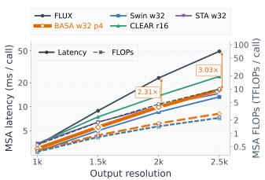
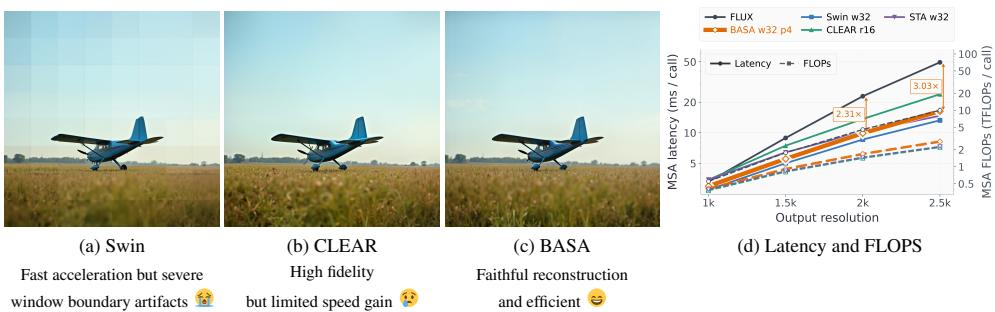
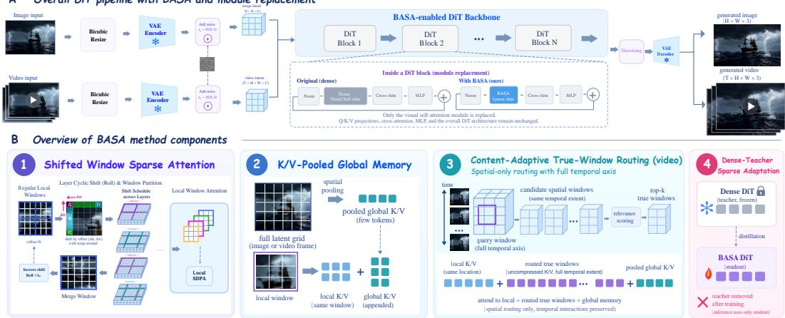
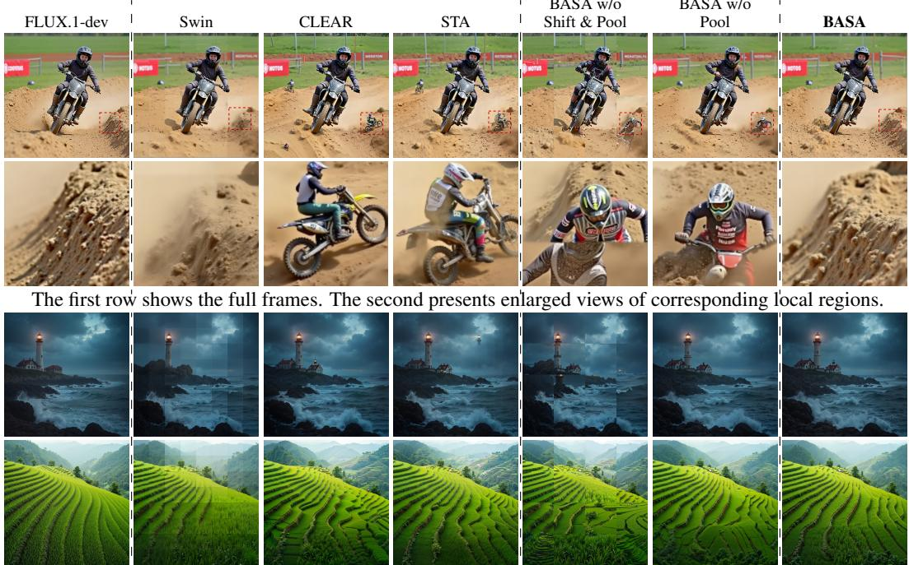
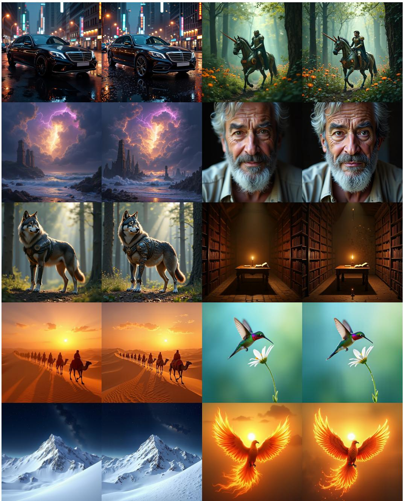
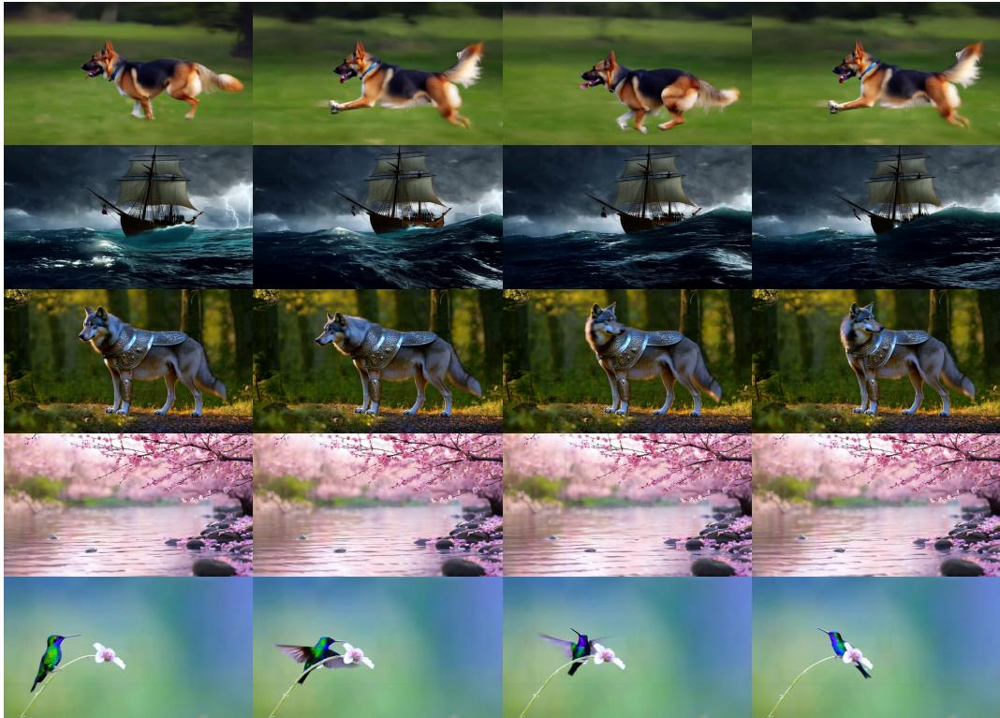
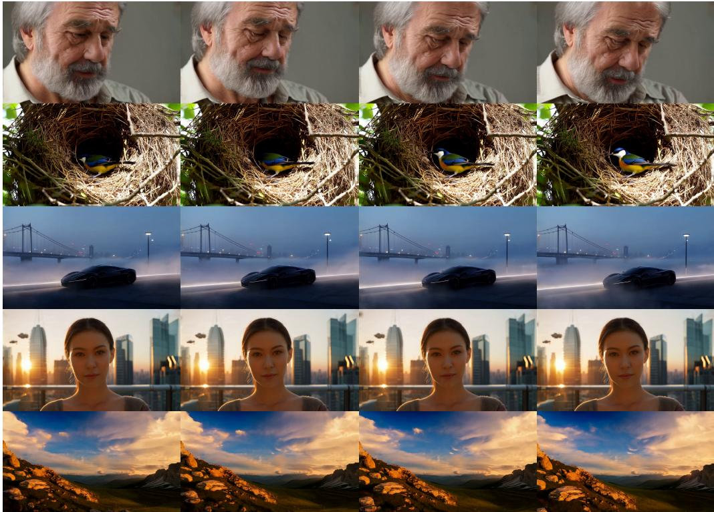
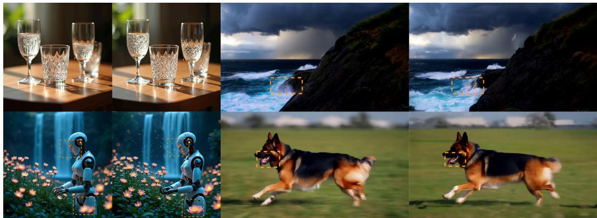

# BACKEND-AGNOSTIC SPARSE ATTENTION FOR FAST HIGH-RESOLUTION VISUAL GENERATION

Liao Ma1,2, Jiayi Song1, Yunfeng Wu1,3, Songhua Liu1∗, Peilin Zhao1   
1School of Artificial Intelligence, Shanghai Jiao Tong University   
2School of Data Science, Fudan University   
3School of Computing and Data Science, The University of Hong Kong   
liusonghua@sjtu.edu.cn

  
Figure 1: Ultra-resolution results generated by FLUX.1-dev and Wan2.1-1.3B with our approach. Resolution is marked on the bottom-right corner of each result in the format of width×height. Corresponding prompts can be found in the appendix.

## ABSTRACT

Diffusion Transformers (DiTs) have achieved strong performance in image and video generation, but the quadratic complexity of full attention makes highresolution generation computationally expensive. Window attention offers an efficient alternative, yet existing methods face a practical trade-off: partitioned window attention typically achieves computational efficiency consistent with its theoretical complexity. However, isolated windows block cross-window interaction, often introducing visible grid-like artifacts in the generated results. Fine-grained sliding-window attention effectively restores interactions across neighboring windows and improves visual quality. However, its irregular computation patterns create a substantial gap between theoretical and practical speedups and require specialized kernels tailored to each hardware backend. To tackle these challenges, we propose BASA, a backend-agnostic sparse attention, which brings the best of both worlds: visual quality and practical acceleration. Specifically, BASA replaces visual self-attention with shifted local-window attention. By introducing a structured window-shifting scheme across DiT blocks, we allow tokens divided by window boundaries in one layer to communicate in the following layers, thereby achieving global information exchange and eliminating window-induced visual artifacts. Notably, our design introduces no additional irregular operators or customized kernels, making it readily deployable on existing attention backends and closing the gap between theoretical sparsity and practical acceleration. Experiments demonstrate that BASA achieves measured speedups exceeding 90% of the

theoretical estimates on FLUX and delivers a 4.52× attention speedup on Wan while maintaining competitive generation quality.

## 1 INTRODUCTION

Diffusion models have achieved strong performance in image and video generation (Ho et al., 2020; Rombach et al., 2022). By combining diffusion modeling with the contextual capacity of Transformers (Vaswani et al., 2017), Diffusion Transformers (DiTs) have emerged as a dominant backbone for modern image (Peebles & Xie, 2023; Bao et al., 2023; Chen et al., 2024b; Esser et al., 2024) and video generation (Kong et al., 2024; Wan Team et al., 2025). However, the quadratic complexity of Transformer self-attention makes dense attention increasingly costly when pre-trained visual generation models are extended to higher resolutions.

Window attention offers a natural alternative by restricting self-attention to local regions. Conventional partitioned window attention, as in Swin (Liu et al., 2021), divides tokens into regular nonoverlapping windows. This structured pattern can be efficiently executed by existing dense attention operators, allowing measured acceleration to closely track theoretical savings. However, isolated windows block direct cross-boundary interaction, disrupting continuous textures and structures and producing visible grid-like artifacts, especially under substantial resolution extrapolation.

Fine-grained sliding-window attention instead uses overlapping local neighborhoods to improve cross-boundary interaction and local continuity. CLEAR (Liu et al., 2025) uses conv-like lineariza tion to preserve locality, attention formulation, and raw visual features for pre-trained image DiTs, while STA (Zhang et al., 2025b) uses sliding spatiotemporal tiles to exploit redundancy and locality in video attention. However, fine-grained sliding-window attention presents two practical challenges. First, irregular computational patterns incur indexing and memory-access overhead, creating a substantial gap between theoretical and measured speedups. Second, efficient execution often relies on specialized kernels tailored to individual hardware backends, increasing implementation costs and limiting portability.

These limitations call for a sparse attention design that combines cross-window communication, regular computation, and backend portability. Fig. 2 illustrates the quality–efficiency trade-off: regular partitioned windows provide strong practical acceleration but exhibit boundary artifacts, whereas fine-grained sliding windows improve visual continuity with smaller measured speed gains. The key question is therefore how to enable cross-window communication while retaining regular win dow computation and avoiding backend-specific custom kernels.

To this end, we propose BASA, a backend-agnostic sparse attention mechanism for efficient highresolution image and video generation. BASA retains regular local windows but varies their spatial partition offsets across DiT blocks and denoising steps. Tokens separated by one partition can thus interact under subsequent partitions, enabling cross-window information propagation while preserving regular attention computation within each block. BASA further augments each query window with spatially pooled global K/V memory to provide low-cost scene-level context. For video, content-adaptive routing retrieves a small number of relevant uncompressed spatial windows, preserving fine-grained long-range information and the full temporal extent of each selected region.

We evaluate BASA on FLUX.1-dev (Esser et al., 2024) and Wan2.1-T2V-1.3B (Wan Team et al., 2025) for high-resolution image and video generation. BASA substantially reduces attention computation and inference latency while maintaining competitive visual quality and temporal consistency, achieving 4.52× attention speedup on Wan and reducing FLUX attention latency to about 9 ms.

Our contributions are summarized as follows:

• We propose BASA, a backend-agnostic sparse attention framework that addresses the tradeoff between hardware-efficient regular sparsity and effective cross-window communication in high-resolution visual generation. BASA enables practical acceleration without relying on customized sparse kernels.

• We further develop a structured sparse attention design combining shifted local windows with K/V-pooled global memory, and extend it to video with content-adaptive true-window routing. Varying window partitions promote cross-window information propagation, while global memory and routed windows provide efficient long-range context. Dense-teacher adaptation is further used to reduce sparse–dense discrepancy.

  
Figure 2: Motivation for BASA. Swin-style window attention (Liu et al., 2021) provides fast inference but introduces severe window boundary artifacts. CLEAR (Liu et al., 2025) preserves high visual fidelity, while its practical speed gain is relatively limited. BASA preserves faithful reconstruction while achieving efficient inference, providing a favorable quality–efficiency trade-off.

• Experiments demonstrate that BASA achieves substantial practical acceleration while maintaining competit ive generation quality. BASA realizes over 90% of its theoretical speedup on FLUX and achieves up to 4.52× attention speedup on Wan.

## 2 RELATED WORK

## 2.1 HIGH-RESOLUTION VISUAL GENERATION

Pre-trained visual diffusion models often suffer from repeated objects, structural distortions, and layout inconsistencies when extrapolated beyond their training resolution. Existing training-free approaches mitigate this issue from different perspectives. MultiDiffusion (Bar-Tal et al., 2023) fuses overlapping diffusion trajectories, ScaleCrafter (He et al., 2024) adapts effective receptive fields, while DemoFusion (Du et al., 2024a) and DiffuseHigh (Kim et al., 2025) perform progressive high-resolution refinement. FreeScale (Qiu et al., 2025b) explores multi-scale feature fusion, AccDiffusion (Lin et al., 2024) improves patch-wise extrapolation through patch-aware conditioning, and HiDiffusion (Zhang et al., 2024) modifies feature resolution and shifted-window attention. Recent methods including I-Max (Du et al., 2024b), HiFlow (Bu et al., 2025), and UltraImage (Zhao et al., 2025) further investigate resolution extrapolation for flow/DiT models through projected flow, trajectory alignment, and positional attention, while EditBridge (Song et al., 2026) extends efficient high-resolution processing to ultra-high-resolution image editing. Beyond training-free extrapolation, URAE (Yu et al., 2025) explores efficient adaptation of pre-trained diffusion models for ultra-high-resolution generation.

High-resolution video generation introduces additional spatiotemporal challenges. UltraGen (Hu et al., 2026) adopts hierarchical local–global attention, CineScale (Qiu et al., 2025a) uses tiled selfattention with positional adaptation, FreeSwim (Wu et al., 2026) revisits sliding-window attention with semantic guidance and caching, Scale-DiT (Zhang & Tai, 2025) combines high-resolution local computation with global guidance, and ApertureAttn (Yu et al., 2026) targets native 4K video generation with image-only supervision. Different from these high-resolution generation and extrapolation methods, our work focuses on backend-compatible structured sparsity to reduce DiT self-attention cost and bridge theoretical savings with practical wall-clock acceleration.

## 2.2 EFFICIENT SPARSE ATTENTION FOR DIFFUSION TRANSFORMERS

Sparse attention reduces the cost of enlarged visual token sequences by restricting interactions to local windows, neighborhoods, or blocks (Liu et al., 2021; Hassani et al., 2023; 2025). Regular non-overlapping windows are attractive for practical acceleration because they can be reorganized into compact dense attention calls, but fixed boundaries may disrupt spatial continuity in pre-trained generative models. Recent methods therefore adopt finer-grained patterns to better preserve dense-attention behavior. CLEAR (Liu et al., 2025) emphasizes locality and feature integrity,

  
Figure 3: Overview of BASA. (a) The proposed sparse attention framework integrates multiple components to recover both local and global visual interactions under reduced attention cost. (b) BASA is applied as a drop-in replacement for the visual self-attention module in DiT blocks, while the remaining generation pipeline remains unchanged.

STA (Zhang et al., 2025b) uses sliding tiles with head-dependent windows, Sparse VideoGen and Sparse VideoGen2 exploit head-wise and semantic structures (Xi et al., 2025; Yang et al., 2025), and VSA (Zhang et al., 2025a) identifies important regions through pooled representations. However, such sliding, head-dependent, or content-dependent patterns often require specialized execution, so FLOP reductions may not translate into proportional wall-clock speedup.

Broader context can compensate for restricted local receptive fields. PixArt-Σ (Chen et al., 2024a) compresses K/V sequences, while Scale-DiT and UltraGen introduce global–local interaction through low-resolution guidance or compressed global attention (Zhang & Tai, 2025; Hu et al., 2026). These observations motivate designs that preserve generation fidelity while remaining efficient on existing attention backends. BASA addresses this trade-off through regular local-window computation with structured cross-window and global information exchange.

## 3 METHOD

## 3.1 SHIFTED WINDOW SPARSE ATTENTION

A straightforward way to reduce visual attention cost is to restrict each query to a local window. However, as shown in Fig. 2, directly applying a Swin-style alternating window shift to the pretrained DiT can produce grid-like artifacts. We therefore propose an interleaved shift schedule that varies window offsets across network layers and denoising steps to promote cross-window interaction and mitigate boundary artifacts.

We partition the visual latent grid into non-overlapping spatial windows of size $w _ { h } \times w _ { w }$ . For videos, each window retains the full temporal extent, preserving bidirectional temporal interactions within its spatial region.

Interleaved shift schedule. For L sparse-attention layers, we first construct a sequence of candidate spatial offsets:

$$
a _ { i } = ( i \delta ) \bmod w , \qquad \delta = \operatorname* { m a x } \left( 1 , \Big \lfloor \frac w L \Big \rfloor \right) , \qquad i = 0 , \dots , L - 1 .\tag{1}
$$

Rather than assigning these offsets sequentially, we interleave the first and second halves to obtain the layer-wise base offsets. For even $\bar { L , }$ with $\dot { K } = L / 2$ , this gives

$$
( b _ { 0 } , \ldots , b _ { L - 1 } ) = ( a _ { 0 } , a _ { K } , a _ { 1 } , a _ { K + 1 } , \ldots , a _ { K - 1 } , a _ { L - 1 } ) .\tag{2}
$$

For example, when $w = 8$ and $L = 4$ , the candidate sequence (0, 2, 4, 6) becomes (0, 4, 2, 6). This ordering alternates between the two halves of the candidate sequence, exposing adjacent layers to different window alignments.

We further advance the offsets across denoising steps. At layer l and denoising step s, the spatial shift is

$$
\Delta _ { l , s } = \left( ( b _ { l } ^ { h } + c _ { s } ^ { h } ) \bmod w _ { h } , ( b _ { l } ^ { w } + c _ { s } ^ { w } ) \bmod w _ { w } \right) .\tag{3}
$$

where s denotes the integer denoising-step index and $c _ { s } ^ { h } , c _ { s } ^ { w }$ represent the corresponding stepdependent offsets. When step-dependent shifting is cleared, set $c _ { s } ^ { h } \overset { \cdot } { = } c _ { s } ^ { w } = 0$ . The resulting window boundaries vary across both depth and denoising steps, allowing tokens separated in one partition to interact in subsequent partitions. The variation further prevents the denoising trajectory from repeatedly relying on identical boundary partitions, providing diverse cross-window communication patterns during iterative refinement.

At each sparse-attention layer, we cyclically shift the spatial grid by $- \Delta _ { l , s }$ and partition it into windows. Within each window, we apply standard scaled dot-product softmax attention using the pre-trained Q/K/V projections. The outputs are then merged and shifted back by $\Delta _ { l , s }$ to restore their original spatial positions.

Attention complexity. Window attention reduces the attention cost from $\mathcal { O } ( N ^ { 2 } d )$ to $O ( N n _ { w } d )$ where N is the total number of visual tokens, $n _ { w }$ is the number of tokens per window, and d is the head dimension. With fixed spatial window size and video length, the cost scales linearly with the number of spatial tokens.

## 3.2 K/V-POOLED GLOBAL MEMORY

Shifted local windows improve boundary continuity but remain primarily local. At high target resolutions, this limited receptive field may be insufficient for coherent layouts, consistent object scales, and global semantic structure. Enlarging local windows partially alleviates the problem but rapidly increases computation and weakens the benefit of sparsity.

To provide inexpensive global context, we introduce pooled global memory for keys and values. Given visual keys and values, we reshape them to the spatial or spatiotemporal latent grid and average-pool over spatial regions. For an image latent, let $\mathcal { P } _ { g }$ denote the visual tokens inside pooling cell g. Its pooled memory key and value are

$$
\overline { { \mathbf { K } } } _ { g } = \frac { 1 } { | \mathcal { P } _ { g } | } \sum _ { j \in \mathcal { P } _ { g } } \mathbf { K } _ { j } , \qquad \overline { { \mathbf { V } } } _ { g } = \frac { 1 } { | \mathcal { P } _ { g } | } \sum _ { j \in \mathcal { P } _ { g } } \mathbf { V } _ { j } .\tag{4}
$$

For video latents, pooling is applied only spatially while retaining the temporal dimension, preserving temporally resolved context rather than collapsing the video into a single summary.

Let K and $\overline { { \mathbf { V } } }$ denote the complete pooled memory. For each local window $\mathcal { W } _ { m } .$ , we append this memory only to the key-value side:

$$
{ \bf K } _ { { \mathcal W } _ { m } } ^ { \mathrm { m e m } } = \left[ { \bf K } _ { { \mathcal W } _ { m } } ; { \bf K } \right] , \qquad { \bf V } _ { { \mathcal W } _ { m } } ^ { \mathrm { m e m } } = \left[ { \bf V } _ { { \mathcal W } _ { m } } ; { \bf V } \right] .\tag{5}
$$

The query sequence and output length remain unchanged, so each local query window attends jointly to its local K/V tokens and pooled global memory. Because pooled representations are used only as additional keys and values, no extra visual tokens are introduced into the model state, allowing direct insertion into existing DiT attention modules.

This branch gives each local window a compressed view of the full visual latent, improving global layout and long-range structural consistency. However, spatial pooling may discard fine-grained instance-level features. When similar objects occur in different regions, such compressed representations may fail to distinguish their identities and can lead to repeated objects. This motivates selectively restoring access to relevant uncompressed windows.

## 3.3 CONTENT-ADAPTIVE TRUE-WINDOW ROUTING

To complement compressed global memory with fine-grained information, we introduce contentadaptive true-window routing. For each query window, the router selects a small number of relevant

original key-value windows whose uncompressed features preserve instance-level information without restoring full dense attention.

For each query window $\mathcal { W } _ { i }$ , we obtain a window-level query descriptor by averaging its query tokens, and similarly compute a key descriptor for each candidate window ${ \mathcal { W } } _ { j }$ :

$$
\mathbf { q } _ { i } = \frac { 1 } { | \mathcal { W } _ { i } | } \sum _ { u \in \mathcal { W } _ { i } } \mathbf { Q } _ { u } , \qquad \mathbf { k } _ { j } = \frac { 1 } { | \mathcal { W } _ { j } | } \sum _ { v \in \mathcal { W } _ { j } } \mathbf { K } _ { v } .\tag{6}
$$

We measure relevance between query window i and candidate window $j$ using their scaled dotproduct similarity, $s _ { i j } = \mathbf { q } _ { i } \mathbf { k } _ { j } ^ { \top } / \sqrt { d }$ . To avoid unstructured global search and maintain spatial coherence, we restrict routing to a candidate set $\mathcal { C } _ { i }$ and select $\mathcal { R } _ { i } = \mathrm { T o p K } _ { j \in \mathcal { C } _ { i } } \left( s _ { i j } \right)$

Unlike pooled global memory, selected windows contribute their original uncompressed key-value tokens. The complete key-value source for query window $\mathcal { W } _ { i }$ is therefore $S _ { i } = \mathcal { W } _ { i } \cup \mathcal { R } _ { i } \cup \mathcal { G }$ , where $\mathcal { G }$ denotes pooled global memory. Each query window thus attends to its local window, selected routed windows, and global memory.

The memory and routing branches are complementary: pooled memory provides low-cost global structural context, while true-window routing restores selected long-range details in their original feature space. Together, they compensate for the limited receptive field of shifted local attention without recovering quadratic full attention. For video, routing operates over spatial windows, each retaining the full temporal axis to preserve bidirectional temporal interactions while reducing the cost of increased spatial resolution.

## 3.4 DENSE-TEACHER SPARSE ADAPTATION

Although the proposed sparse processor preserves the original Q/K/V projections and softmax formulation, replacing full attention with a sparse receptive field introduces a discrepancy from the dense pre-trained model. We therefore adapt the sparse model under supervision from its original dense counterpart.

The sparse student is initialized from the dense DiT by replacing the self-attention processor while keeping the original attention formulation and initialization, with the dense teacher frozen. During adaptation, only the sparse attention-related parameters are optimized, implemented with LoRA for memory-efficient training. Given the same noisy latent $\mathbf { z } _ { t } .$ , timestep $t ,$ and condition c, let $f _ { s } ( \mathbf { z } _ { t } , t , \mathbf { c } )$ and $f _ { t } ( \mathbf { z } _ { t } , t , \mathbf { c } )$ denote the sparse student and dense teacher predictions. The student is optimized with three complementary objectives:

$$
\mathcal { L } _ { \mathrm { f m } } = \left\| \mathbf { u } _ { t } - \widehat { \mathbf { u } } _ { s } \right\| _ { 2 } ^ { 2 } , \qquad \mathcal { L } _ { \mathrm { p r e d } } = \left\| \widehat { \mathbf { u } } _ { s } - \widehat { \mathbf { u } } _ { t } \right\| _ { 2 } ^ { 2 } , \quad \mathcal { L } _ { \mathrm { a t t n } } = \frac { 1 } { \left| \mathcal { D } \right| } \sum _ { l \in \mathcal { D } } \mathrm { M S E } \left( A _ { s } ^ { l } , A _ { t } ^ { l } \right) ,\tag{7}
$$

Here, $\mathbf { u } _ { t }$ is the flow-matching target, $\widehat { \mathbf { u } } _ { s }$ and $\widehat { \mathbf { u } } _ { t }$ are the student and teacher predictions, and ${ \bf A } _ { s } ^ { l }$ and $\mathbf { A } _ { t } ^ { l }$ are intermediate self-attention outputs at layer l. We align attention outputs rather than attention maps, avoiding explicit materialization of the dense attention matrix during distillation.

For image generation, dense FLUX serves as the frozen teacher and only the sparse attention modules are optimized. The same framework is applied to video generation with the pre-trained Wan model, replacing the self-attention modules in DiT blocks with the proposed sparse processor. Following Wan’s flow-matching formulation, the video objective additionally uses timestep-dependent weighting:

$$
\mathcal { L } _ { \mathrm { i m g } } = \mathcal { L } _ { \mathrm { f m } } + \alpha \mathcal { L } _ { \mathrm { p r e d } } + \beta \mathcal { L } _ { \mathrm { a t t n } } , \quad \mathcal { L } _ { \mathrm { v i d } } = w ( t ) \left( \mathcal { L } _ { \mathrm { f m } } + \alpha \mathcal { L } _ { \mathrm { p r e d } } + \beta \mathcal { L } _ { \mathrm { a t t n } } \right) ,\tag{8}
$$

where $w ( t )$ is the timestep weighting factor defined by the flow-matching scheduler. After adaptation, the dense teacher is discarded and inference uses only the sparse student.

Figure 4: Qualitative comparison of image resolution extrapolation from 1024×1024 to 2048×2048 on FLUX.1-dev. Competing sparse-attention methods may exhibit window-boundary artifacts or duplicated structures in some cases, while BASA maintains or adds more consistent spatial details. Table 1: Quantitative comparison for image resolution extrapolation from 1024 × 1024 to 2048 × 2048 with FLUX.1-dev. PSNR, SSIM, FID, LPIPS, CLIP-I, and DINO are computed against the corresponding dense-FLUX output.
<table><tr><td>Method</td><td>Config</td><td>PSNR↑</td><td>SSIM↑</td><td>FID↓</td><td>LPIPS↓</td><td>CLIP-I↑</td><td>DINO↑</td><td>CLIP-T↑</td><td>IS↑</td></tr><tr><td>FLUX</td><td>一</td><td></td><td>一</td><td>1</td><td>一</td><td></td><td></td><td>31.13</td><td>23.41</td></tr><tr><td>CLEAR</td><td>r = 16, distilled</td><td>23.50</td><td>0.83</td><td>23.28</td><td>0.23</td><td>97.09</td><td>94.94</td><td>31.16</td><td>23.44</td></tr><tr><td>Swin</td><td>w = 32, distilled</td><td>23.33</td><td>0.83</td><td>34.10</td><td>0.28</td><td>93.62</td><td>91.62</td><td>31.43</td><td>23.67</td></tr><tr><td>STA</td><td>w = 32, distilled</td><td>23.51</td><td>0.83</td><td>24.02</td><td>0.24</td><td>96.45</td><td>94.57</td><td>31.29</td><td>23.68</td></tr><tr><td>BASA</td><td>w = 8, p = 4, distilled</td><td>21.32</td><td>0.78</td><td>38.65</td><td>0.31</td><td>92.61</td><td>87.59</td><td>31.48</td><td>22.50</td></tr><tr><td>BASA</td><td>w = 16, p = 4, distilled</td><td>22.57</td><td>0.82</td><td>26.67</td><td>0.25</td><td>96.45</td><td>93.53</td><td>31.34</td><td>24.10</td></tr><tr><td>BASA</td><td>w = 32, p = 4, distilled</td><td>24.09</td><td>0.86</td><td>20.97</td><td>0.20</td><td>97.60</td><td>95.95</td><td>31.28</td><td>23.36</td></tr></table>

Table 2: Theoretical and measured weighted-MSA efficiency for 1024×1024 to 2048×2048 resolution extrapolation. Weighted MSA denotes the average full multi-head self-attention latency per layer, weighted over all double- and single-stream attention layers of FLUX and the corresponding window schedules. Backend indicates the attention execution backend used in our implementation. Act., Theo., and Real. denote measured speedup, theoretical speedup, and their ratio, respectively.
<table><tr><td>Method</td><td>Config.</td><td>Implementation</td><td>Latency (ms).↓</td><td>Act.↑</td><td>Theo.↑</td><td>Real.↑</td></tr><tr><td>FLUX</td><td>Dense</td><td>SDPA</td><td>21.666</td><td>1.000</td><td>1.000</td><td>1.000</td></tr><tr><td>Swin</td><td>w=32</td><td>SDPA</td><td>8.819</td><td>2.455</td><td>3.187</td><td>0.770</td></tr><tr><td>CLEAR</td><td>r=16</td><td>FlexAttn</td><td>13.106</td><td>1.629</td><td>3.229</td><td>0.504</td></tr><tr><td>STA</td><td>w=32</td><td>Triton</td><td>12.955</td><td>1.648</td><td>3.092</td><td>0.533</td></tr><tr><td>BASA</td><td>w=8, p=4</td><td>SDPA</td><td>8.079</td><td>2.680</td><td>3.064</td><td>0.874</td></tr><tr><td>BASA</td><td>w=16, p=4</td><td>SDPA</td><td>8.131</td><td>2.665</td><td>2.987</td><td>0.892</td></tr><tr><td>BASA</td><td>w=32, p=4</td><td>SDPA</td><td>8.871</td><td>2.443</td><td>2.713</td><td>0.901</td></tr></table>

## 4 EXPERIMENTS

## 4.1 EXPERIMENTAL SETTINGS

We evaluate BASA on FLUX.1-dev (Esser et al., 2024) and Wan2.1-T2V-1.3B (Wan Team et al., 2025) for image and video resolution extrapolation, comparing generation quality and attention efficiency against representative sparse attention methods. All experiments use a single A100 GPU.

Table 3: Attention efficiency for video resolution extrapolation from $8 3 2 \times 4 8 0$ to $1 6 6 4 \times 9 6 0$ with Wan2.1-T2V-1.3B. Configurations are specified on the latent grid. Latency measures attention-only forward time after warm-up, and speedup is reported relative to dense Wan.
<table><tr><td>Method</td><td>Config (latent)</td><td>Impl.</td><td>Sparsity</td><td>TFLOPs (Attn.)</td><td>Latency (ms)</td><td>MFU</td><td>Kernel Eff.</td><td>Speedup</td></tr><tr><td>Wan</td><td>一</td><td>SDPA</td><td>0.00%</td><td>106.12</td><td>509.66</td><td>66.74%</td><td>100.00%</td><td>1.00×</td></tr><tr><td>CLEAR</td><td>w = 16</td><td>Flex</td><td>89.46%</td><td>11.18</td><td>485.79</td><td>7.38%</td><td>11.05%</td><td>1.05×</td></tr><tr><td>Swin</td><td>w = 16</td><td>Flex</td><td>96.25%</td><td>3.84</td><td>396.60</td><td>3.10%</td><td>4.65%</td><td>1.29×</td></tr><tr><td>STA</td><td> $w = ( 2 1 , 3 0 , 3 9 ) , t = ( 3 , 1 0 , 1 3 )$ </td><td>Triton</td><td>81.25%</td><td>19.90</td><td>175.09</td><td>36.42%</td><td>53.48%</td><td>2.85×</td></tr><tr><td>BASA</td><td> $w = ( 1 0 , 1 0 ) , p = ( 2 , 2 )$ </td><td>SDPA</td><td>70.17%</td><td>31.66</td><td>255.87</td><td>39.66%</td><td>59.42%</td><td>1.99×</td></tr><tr><td>BASA</td><td> $w = ( 1 5 , 2 6 ) , p = ( 4 , 4 )$ </td><td>SDPA</td><td>81.25%</td><td>19.90</td><td>126.07</td><td>50.59%</td><td>75.80%</td><td>4.04×</td></tr><tr><td>BASA</td><td> $w = ( 1 5 , 2 6 ) , p = ( 2 , 2 )$ </td><td>SDPA</td><td>62.50%</td><td>39.79</td><td>229.58</td><td>55.56%</td><td>81.61%</td><td>2.18×</td></tr><tr><td>BASA</td><td> $w = ( 1 0 , 1 0 ) , p = ( 4 , 4 )$ </td><td>SDPA</td><td>90.00%</td><td>10.61</td><td>112.84</td><td>30.14%</td><td>45.17%</td><td>4.52×</td></tr></table>

Image resolution extrapolation. For image extrapolation, we randomly sample 1,000 captions from the COCO2014 validation set Lin et al. (2014). FLUX.1-dev first generates $1 0 2 4 \times 1 0 2 4$ source images, which are extrapolated to 2048 × 2048 using an SDEdit-based pipeline Meng et al. (2022). All methods share the same source images, prompts, random seeds, 20 denoising steps, and SDEdit guidance scale 7.5. We distill attention layers on 10K FLUX-generated samples using Eq. 8. Other settings follow Diffusers defaults von Platen et al. (2022).

We use dense FLUX outputs under identical conditions as references. Following prior works, we report PSNR, SSIM, FID, LPIPS, CLIP-I, DINO, CLIP-T, IS, and attention GFLOPs to evaluate fidelity, perceptual quality, semantics, and computational cost. The baselines are CLEAR (Liu et al., 2025), Swin (Liu et al., 2021), and STA (Zhang et al., 2025b). All these sparse variants are adapted under the same dense-teacher distillation as BASA.

Video Resolution Extrapolation. For video evaluation, we randomly sample 20 prompts from VBench (Huang et al., 2024) and generate five samples per prompt, yielding 100 videos in total. Dense Wan first generates an 81-frame source video at 832×480 and 15 fps as suggested by Wan2.1 paper (Wan Team et al., 2025). All methods then extrapolate the same source video by a factor of two along both spatial dimensions, producing a 1664 × 960 video. We use 50 denoising steps and a classifier-free guidance scale of 5.0.

For BASA, $\boldsymbol { w } = \left( w _ { h } , w _ { w } \right)$ denotes the local-window size and $p = ( p _ { h } , p _ { w } )$ denotes the pooling factor. Sparsification is applied only spatially, while the full temporal extent is retained within every selected window. Video quality is measured using the VBench Custom mode. Efficiency is evaluated under the same hardware and software environment for all methods. Following STA (Zhang et al., 2025b), we report attention sparsity, theoretical TFLOPs, attention-only latency after warmup, model FLOPs utilization (MFU), normalized kernel efficiency, and speedup over dense Wan.

## 4.2 EMPIRICAL STUDIES

Image Resolution Extrapolation. Table 1 and Figure 8 shows that BASA provides a clear tradeoff between reference fidelity and latency without using special kernel. BASA with $w = 3 2$ retains 97.60 CLIP-I and 95.95 DINO similarity while keeping 2.443× faster latency. Its CLIP-T and IS also remain comparable to or slightly better than those of dense FLUX.

An excessively small window provides limited savings: BASA-8 causes a more evident fidelity drop but little latency reduction as shown in Table 2. Therefore, w = 16 offers the most balanced operating point, whereas $w = 3 2$ is preferred when stronger reference preservation is required. Compared with rigid local attention in similar window size, BASA-32 improves all reference-similarity metrics over Swin and distilled STA-32. CLEAR obtains comparatively competing fidelity but requires more attention computation. Overall, BASA achieves a favorable balance between aggressive sparsification and high-resolution image fidelity.

Video Resolution Extrapolation. As shown in Table 3, BASA with $w = ( 1 0 , 1 0 ) , p = ( 4 , 4 )$ achieves 90.00% sparsity, reduces latency to 112.84 ms, and obtains the largest 4.52× speedup. The $w = ( 1 5 , 2 6 ) , p = ( 4 , 4 )$ setting provides a higher kernel efficiency while maintaining a 4.04× speedup. A smaller pooling factor preserves more global K/V tokens but increases computation: changing p from (4, 4) to (2, 2) under $w = ( 1 0 , 1 0 )$ reduces sparsity from 90.00% to 70.17% and speedup from 4.52× to 1.99×. This provides a trade-off between global context and efficiency.

Table 4: VBench Custom evaluation on 100 extrapolated videos generated from 20 prompts with five samples per prompt. All methods extrapolate the same 81-frame videos from 832 × 480 to $1 6 6 4 \times 9 6 0$ . SC, BC, MS, DD, AQ, and IQ denote Subject Consistency, Background Consistency, Motion Smoothness, Dynamic Degree, Aesthetic Quality, and Imaging Quality, respectively.
<table><tr><td>Method</td><td colspan="2">Config</td><td>SC↑</td><td>BC↑</td><td>MS↑</td><td>DD↑</td><td>AQ↑</td><td>IQ↑</td></tr><tr><td>Wan</td><td></td><td></td><td>96.43%</td><td>96.84%</td><td>99.18%</td><td>0.37</td><td>57.53%</td><td>65.22%</td></tr><tr><td>CLEAR</td><td> $w = ( 8 , 8 ) , d = 4$ </td><td></td><td>96.27%</td><td>96.54%</td><td>99.19%</td><td>0.35</td><td>57.50%</td><td>67.11%</td></tr><tr><td>Swin</td><td>w = (8, 8)</td><td></td><td>93.62%</td><td>94.59%</td><td>98.15%</td><td>0.04</td><td>41.36%</td><td>60.90%</td></tr><tr><td>STA</td><td></td><td> $w = ( 1 8 , 2 4 , 2 4 ) , t = ( 6 , 8 , 8 )$ </td><td>95.89%</td><td>96.05%</td><td>99.16%</td><td>0.37</td><td>56.26%</td><td>67.56%</td></tr><tr><td>BASA</td><td></td><td> $w = ( 1 5 , 2 6 ) , p = ( 4 , 4 )$ </td><td>95.90%</td><td>96.22%</td><td>99.13%</td><td>0.33</td><td>56.08%</td><td>66.18%</td></tr><tr><td>BASA</td><td></td><td> $w = ( 1 0 , 1 0 ) , p = ( 4 , 4 )$ </td><td>95.98%</td><td>96.29%</td><td>99.17%</td><td>0.34</td><td>56.87%</td><td>67.02%</td></tr><tr><td>BASA</td><td></td><td> $w = ( 1 0 , 1 0 ) , p = ( 2 , 2 )$ </td><td>96.31%</td><td>96.62%</td><td>99.22%</td><td>0.35</td><td>57.48%</td><td>66.89%</td></tr></table>

Table 5: Ablation study for image resolution extrapolation from 1024 × 1024 to 2048 × 2048 with FLUX.1-dev. All BASA variants use $w = 3 2$ and $p = 4$

<table><tr><td>Method</td><td>Shift</td><td>Pool</td><td>PSNR↑</td><td>SSIM↑</td><td>FID↓</td><td>LPIPS↓</td><td>CLIP-I↑</td><td>DINO↑</td><td>CLIP-T↑</td><td>IS↑</td></tr><tr><td>FLUX</td></tr><tr><td>BASA</td><td></td><td>一</td><td>一 22.23</td><td>0.79</td><td>33.13</td><td>一 0.29</td><td>94.36</td><td>91.80</td><td>31.13 31.00</td><td>23.41 24.13</td></tr><tr><td>BASA</td><td>× √</td><td>X X</td><td>23.33</td><td>0.84</td><td>24.05</td><td>0.24</td><td>96.86</td><td>94.72</td><td>31.28</td><td>23.13</td></tr><tr><td>BASA</td><td>√</td><td>√</td><td>24.09</td><td>0.86</td><td>20.97</td><td>0.20</td><td>97.60</td><td>95.95</td><td>31.28</td><td>23.36</td></tr></table>

The results also confirm that FLOP reduction alone does not guarantee practical acceleration. CLEAR, Swin, and STA have high theoretical sparsity but low MFU, resulting in limited wall-clock speedups, while our method keeps the same performance in the model as theoretical advantage.

## 4.2.1 VIDEO GENERATION QUALITY

Table 4 shows that BASA largely preserves the quality of dense Wan. The quality-oriented configuration $w = ( 1 0 , 1 0 ) , p = ( 2 , 2 )$ shows slight declines of 0.12% and 0.22% in subject and background consistency, respectively, while slightly improving motion smoothness and imaging quality. The faster $w = ( 1 0 , 1 0 ) , p = ( 4 , 4 )$ configuration achieves a 4.52× speedup with only minor reductions in subject consistency, background consistency, and aesthetic quality. Its motion smoothness remains almost unchanged, while imaging quality improves from 65.22% to 67.02%. This indicates that the efficiency gain does not cause a corresponding degradation in spatial or temporal quality.

CLEAR preserve strong VBench scores, but its measured speedups are only 1.05×. Swin achieves high theoretical sparsity yet suffers a substantial drop in dynamic degree, aesthetic quality, and imaging quality. While for STA, it keeps similar quality but still produces less speedup, even with triton kernel. These comparisons highlight the importance of combining local interactions with global memory and selected uncompressed long-range features.

## 4.3 ABLATION STUDIES

Take image as an example of ablation, as shown in Table 5, full BASA achieves the strongest reference fidelity across six similarity metrics. Removing pooled global memory while retaining shifted windows decreases PSNR from 24.09 to 23.33, increases FID from 20.97 to 24.05, and reduces CLIP-I and DINO from 97.60 and 95.95 to 96.86 and 94.72. However, this variant still substantially outperforms isolated local windows, demonstrating the effectiveness of window shifting for cross-window propagation. Combining both components yields the best overall results, confirming their complementary roles. Meanwhile, the relatively stable CLIP-T and IS suggest that they mainly improve dense-reference consistency rather than basic text alignment. The video ablation is attached in the appendix. Overall, full BASA achieves the most most balanced quality performance.

## 5 CONCLUSION

Efficient high-resolution generation requires translating theoretical attention savings into practical speedup without sacrificing quality. We presented BASA, a backend-agnostic sparse attention framework that combines regular local attention with cross-window and long-range information exchange. Using only standard Q/K/V projections and SDPA, BASA requires no customized sparse kernels. Experiments on FLUX and Wan show that BASA narrows the gap between theoretical and measured acceleration for both image and video generation, while maintaining stable quality with reasonably sized windows. These results demonstrate the practicality of backend-compatible structured sparsity for efficient high-resolution generation.

## AI USE STATEMENT

In this work, we used generative AI tools for language editing and polishing of the manuscript, assisting with limited code drafting and editing during experimental implementation, and generating visual references draft for the layout and organization of scientific workflow figures. We have not used generative AI tools for developing research hypotheses, designing the proposed methodology, making scientific or experimental decisions, interpreting experimental results, or generating scientific claims, and other required disclosure tasks are not applicable to this work. Additionally, we used generative AI tools for improving the readability and presentation of scientific descriptions and for obtaining visual references during figure design. We have reviewed all AI-assisted work. Specifically, all AI-assisted text was carefully checked and revised by the authors, all AI-assisted code was manually inspected, tested, and refined by the authors, and AI-generated visual references were used only as guidance for figure composition and were not incorporated into the final figures. We take responsibility for the final content of this work, including text, claims, methodology, code, figures, experimental results, and other artifacts produced with the aid of generative AI.

## REFERENCES

Fan Bao, Shen Nie, Kaiwen Xue, Yue Cao, Chongxuan Li, Hang Su, and Jun Zhu. All are worth words: A ViT backbone for diffusion models. In Proceedings of the IEEE/CVF Conference on Computer Vision and Pattern Recognition, 2023.

Omer Bar-Tal, Lior Yariv, Yaron Lipman, and Tali Dekel. MultiDiffusion: Fusing diffusion paths for controlled image generation. In Proceedings ofthe 40th International Conference on Machine Learning, volume 202 of Proceedings ofMachine Learning Research, pp. 1737–1752, 2023.

Jiazi Bu, Pengyang Ling, Yujie Zhou, Pan Zhang, Tong Wu, Xiaoyi Dong, Yuhang Zang, Yuhang Cao, Dahua Lin, and Jiaqi Wang. HiFlow: Training-free high-resolution image generation with flow-aligned guidance. In Advances in Neural Information Processing Systems, volume 38, 2025.

Junsong Chen, Chongjian Ge, Enze Xie, Yue Wu, Lewei Yao, Xiaozhe Ren, Zhongdao Wang, Ping Luo, Huchuan Lu, and Zhenguo Li. PixArt-σ: Weak-to-strong training of diffusion transformer for 4k text-to-image generation. In European Conference on Computer Vision, 2024a.

Junsong Chen, Jincheng Yu, Chongjian Ge, Lewei Yao, Enze Xie, Yue Wu, Zhongdao Wang, James Kwok, Ping Luo, Huchuan Lu, and Zhenguo Li. Pixart-α: Fast training of diffusion transformer for photorealistic text-to-image synthesis. In International Conference on Learning Representations, 2024b.

Ruoyi Du, Dongliang Chang, Timothy Hospedales, Yi-Zhe Song, and Zhanyu Ma. DemoFusion: Democratising high-resolution image generation with no \$\$\$. In Proceedings of the IEEE/CVF Conference on Computer Vision and Pattern Recognition, 2024a.

Ruoyi Du, Dongyang Liu, Le Zhuo, Qin Qi, Hongsheng Li, Zhanyu Ma, and Peng Gao. I-Max: Maximize the resolution potential of pre-trained rectified flow transformers with projected flow. arXiv preprint arXiv:2410.07536, 2024b.

Patrick Esser, Sumith Kulal, Andreas Blattmann, Rahim Entezari, Jonas Muller, Harry Saini, Yam¨ Levi, Dominik Lorenz, Axel Sauer, Frederic Boesel, Dustin Podell, Tim Dockhorn, Zion English, Kyle Lacey, Alex Goodwin, Yannik Marek, and Robin Rombach. Scaling rectified flow transformers for high-resolution image synthesis. In Proceedings of the 41st International Conference on Machine Learning, volume 235 of Proceedings of Machine Learning Research, pp. 12606–12633, 2024.

Ali Hassani, Steven Walton, Jiachen Li, Shen Li, and Humphrey Shi. Neighborhood attention transformer. In Proceedings of the IEEE/CVF Conference on Computer Vision and Pattern Recognition, pp. 6185–6194, 2023.

Ali Hassani, Fengzhe Zhou, Aditya Kane, Jiannan Huang, Chieh-Yun Chen, Min Shi, Steven Walton, Markus Hoehnerbach, Vijay Thakkar, Michael Isaev, Qinsheng Zhang, Bing Xu, Haicheng Wu, Wen-mei Hwu, Ming-Yu Liu, and Humphrey Shi. Generalized neighborhood attention: Multi-dimensional sparse attention at the speed of light. arXiv preprint arXiv:2504.16922, 2025.

Yingqing He, Shaoshu Yang, Haoxin Chen, Xiaodong Cun, Menghan Xia, Yong Zhang, Xintao Wang, Ran He, Qifeng Chen, and Ying Shan. Scalecrafter: Tuning-free higher-resolution visual generation with diffusion models. In International Conference on Learning Representations, 2024.

Jonathan Ho, Ajay Jain, and Pieter Abbeel. Denoising diffusion probabilistic models. In Advances in Neural Information Processing Systems, volume 33, pp. 6840–6851, 2020.

Teng Hu, Jiangning Zhang, Zihan Su, and Ran Yi. Ultragen: High-resolution video generation with hierarchical attention. In Proceedings of the AAAI Conference on Artificial Intelligence, pp. 4923–4931, 2026.

Ziqi Huang, Yinan He, Jiashuo Yu, Fan Zhang, Chenyang Si, Yuming Jiang, Yuanhan Zhang, Tianxing Wu, Qingyang Jin, Nattapol Chanpaisit, Yaohui Wang, Xinyuan Chen, Limin Wang, Dahua Lin, Yu Qiao, and Ziwei Liu. VBench: Comprehensive benchmark suite for video generative models. In Proceedings of the IEEE/CVF Conference on Computer Vision and Pattern Recognition, 2024.

Younghyun Kim, Geunmin Hwang, Junyu Zhang, and Eunbyung Park. DiffuseHigh: Training-free progressive high-resolution image synthesis through structure guidance. In Proceedings of the AAAI Conference on Artificial Intelligence, volume 39, pp. 4338–4346, 2025.

Weijie Kong, Qi Tian, Zijian Zhang, Rox Min, Zuozhuo Dai, Jin Zhou, Jiangfeng Xiong, Xin Li, Bo Wu, Jianwei Zhang, et al. HunyuanVideo: A systematic framework for large video generative models. arXiv preprint arXiv:2412.03603, 2024.

Tsung-Yi Lin, Michael Maire, Serge Belongie, James Hays, Pietro Perona, Deva Ramanan, Piotr Dollar, and C. Lawrence Zitnick. Microsoft COCO: Common objects in context. In´ European Conference on Computer Vision, pp. 740–755, 2014.

Zhihang Lin, Mingbao Lin, Meng Zhao, and Rongrong Ji. AccDiffusion: An accurate method for higher-resolution image generation. In European Conference on Computer Vision, pp. 38–53, 2024.

Songhua Liu, Zhenxiong Tan, and Xinchao Wang. CLEAR: Conv-like linearization revs pretrained diffusion transformers up. In Advances in Neural Information Processing Systems, 2025. arXiv:2412.16112.

Ze Liu, Yutong Lin, Yue Cao, Han Hu, Yixuan Wei, Zheng Zhang, Stephen Lin, and Baining Guo. Swin transformer: Hierarchical vision transformer using shifted windows. In Proceedings of the IEEE/CVF International Conference on Computer Vision, pp. 10012–10022, 2021.

Chenlin Meng, Yutong He, Yang Song, Jiaming Song, Jiajun Wu, Jun-Yan Zhu, and Stefano Ermon. SDEdit: Guided image synthesis and editing with stochastic differential equations. In International Conference on Learning Representations, 2022.

William Peebles and Saining Xie. Scalable diffusion models with transformers. In Proceedings of the IEEE/CVF International Conference on Computer Vision, pp. 4195–4205, 2023.

Haonan Qiu, Ning Yu, Ziqi Huang, Paul Debevec, and Ziwei Liu. CineScale: Free lunch in highresolution cinematic visual generation. arXiv preprint arXiv:2508.15774, 2025a.

Haonan Qiu, Shiwei Zhang, Yujie Wei, Ruihang Chu, Hangjie Yuan, Xiang Wang, Yingya Zhang, and Ziwei Liu. Freescale: Unleashing the resolution of diffusion models via tuning-free scale fusion. In Proceedings ofthe IEEE/CVF International Conference on Computer Vision, 2025b.

Robin Rombach, Andreas Blattmann, Dominik Lorenz, Patrick Esser, and Bjorn Ommer. High-¨ resolution image synthesis with latent diffusion models. In Proceedings of the IEEE/CVF Con ference on Computer Vision and Pattern Recognition, pp. 10684–10695, 2022.

Jiayi Song, Shijie Huang, Fangtai Wu, Yubo Huang, Zhenxiong Tan, Songhua Liu, Jiaming Liu, and Ruihua Huang. Editbridge: Towards faithful and efficient ultra-high-resolution image editing, 2026. URL https://arxiv.org/abs/2608.18063.

Ashish Vaswani, Noam Shazeer, Niki Parmar, Jakob Uszkoreit, Llion Jones, Aidan N. Gomez, Lukasz Kaiser, and Illia Polosukhin. Attention is all you need. In Advances in Neural Information Processing Systems, volume 30, 2017.

Patrick von Platen, Suraj Patil, Anton Lozhkov, Pedro Cuenca, Nathan Lambert, Kashif Rasul, Mishig Davaadorj, Dhruv Nair, Sayak Paul, William Berman, Yiyi Xu, Steven Liu, and Thomas Wolf. Diffusers: State-of-the-art diffusion models. https://github.com/ huggingface/diffusers, 2022.

Wan Team, Ang Wang, Baole Ai, Bin Wen, Chaojie Mao, Chen-Wei Xie, Di Chen, Feiwu Yu, Haiming Zhao, Jianxiao Yang, et al. Wan: Open and advanced large-scale video generative models. arXiv preprint arXiv:2503.20314, 2025.

Yunfeng Wu, Jiayi Song, Zhenxiong Tan, Zihao He, and Songhua Liu. FreeSwim: Revisiting sliding-window attention mechanisms for training-free ultra-high-resolution video generation. In European Conference on Computer Vision, volume 17027 of Lecture Notes in Computer Science, pp. 76–93, 2026.

Haocheng Xi, Shuo Yang, Yilong Zhao, Chenfeng Xu, Muyang Li, Xiuyu Li, Yujun Lin, Han Cai, Jintao Zhang, Dacheng Li, Jianfei Chen, Ion Stoica, Kurt Keutzer, and Song Han. Sparse videogen: Accelerating video diffusion transformers with spatial-temporal sparsity. In Proceedings ofthe 42nd International Conference on Machine Learning, 2025. arXiv:2502.01776.

Shuo Yang, Haocheng Xi, Yilong Zhao, Muyang Li, Jintao Zhang, Han Cai, Yujun Lin, Xiuyu Li, Chenfeng Xu, Kelly Peng, Jianfei Chen, Song Han, Kurt Keutzer, and Ion Stoica. Sparse videogen2: Accelerate video generation with sparse attention via semantic-aware permutation. arXiv preprint arXiv:2505.18875, 2025.

Ruonan Yu, Songhua Liu, Zhenxiong Tan, and Xinchao Wang. Ultra-resolution adaptation with ease. International Conference on Machine Learning, 2025.

Ruonan Yu, Zigeng Chen, Zhenxiong Tan, Songhua Liu, and Xinchao Wang. Apertureattn: Native 4k video generation with image-only supervision. In The Fortieth Annual Conference on Neural Information Processing Systems, 2026. URL https://openreview.net/forum?id= 9pq44O4Vzq.

Peiyuan Zhang, Yongqi Chen, Haofeng Huang, Will Lin, Zhengzhong Liu, Ion Stoica, Eric P. Xing, and Hao Zhang. Faster video diffusion with trainable sparse attention. arXiv preprint arXiv:2505.13389, 2025a.

Peiyuan Zhang, Yongqi Chen, Runlong Su, Hangliang Ding, Ion Stoica, Zhengzhong Liu, and Hao Zhang. Fast video generation with sliding tile attention. In Proceedings ofthe 42nd International Conference on Machine Learning, volume 267 of Proceedings of Machine Learning Research, pp. 74714–74731, 2025b.

Shen Zhang, Zhaowei Chen, Zhenyu Zhao, Yuhao Chen, Yao Tang, and Jiajun Liang. HiDiffusion: Unlocking higher-resolution creativity and efficiency in pretrained diffusion models. In European Conference on Computer Vision, 2024. arXiv:2311.17528.

Yuyao Zhang and Yu-Wing Tai. Scale-DiT: Ultra-high-resolution image generation with hierarchical local attention. arXiv preprint arXiv:2510.16325, 2025.

Min Zhao, Bokai Yan, Xue Yang, Hongzhou Zhu, Jintao Zhang, Shilong Liu, Chongxuan Li, and Jun Zhu. UltraImage: Rethinking resolution extrapolation in image diffusion transformers. arXiv preprint arXiv:2512.04504, 2025.

## A APPENDIX

## A.1 COMPLEXITY AND BACKEND EXECUTION

Computational complexity. We first analyze the image setting used in FLUX. Let $N = H W$ denote the number of visual tokens, $N _ { t }$ the number of text tokens, $M = w _ { h } w _ { w }$ the number of visual tokens in each local window, and

$$
G = \left\lceil { \frac { H } { p _ { h } } } \right\rceil \left\lceil { \frac { W } { p _ { w } } } \right\rceil
$$

the number of spatially pooled K/V tokens. In the default BASA implementation, text queries retain access to all text and visual K/V tokens, whereas each visual query attends to all text tokens, its local visual window, and the pooled global K/V memory. The number of query–key interactions is therefore

$$
P _ { \mathrm { B A S A } } = N _ { t } ( N _ { t } + N ) + N ( N _ { t } + M + G ) ,
$$

compared with

$$
P _ { \mathrm { d e n s e } } = ( N _ { t } + N ) ^ { 2 }
$$

for dense joint attention. Accordingly, the QK and AV multiplications require

$$
F _ { \mathrm { a t t n } } = 4 d P _ { \mathrm { B A S A } } ,
$$

where d denotes the hidden dimension summed over all attention heads.

This formulation also explains why the theoretical acceleration remains substantial despite introducing global memory. When $N \gg \dot { N } _ { t }$

$$
\frac { P _ { \mathrm { B A S A } } } { P _ { \mathrm { d e n s e } } } \approx \frac { 2 N _ { t } } { N } + \frac { M } { N } + \frac { G } { N } , \qquad \frac { G } { N } \approx \frac { 1 } { p _ { h } p _ { w } } .
$$

Thus, the local branch contributes only $M / N$ of the dense visual K/V range, while spatial pooling reduces the global branch by approximately a factor of $p _ { h } p _ { w }$ . For example, $p _ { h } = p _ { w } = 4$ retains only about $\bar { 1 } / 1 6$ as many global visual K/V tokens as dense attention. Since $M \ll N$ at high resolution, BASA therefore preserves a large reduction in attention interactions while still providing global context.

Our weighted-MSA benchmark further includes the Q/K/V and output projections, whose costs are $8 ( N _ { t } + \check { N } ) d ^ { 2 }$ and $6 ( N _ { t } + N ) d ^ { 2 }$ for the double-stream and single-stream FLUX blocks, respectively. These projection costs are shared by dense attention and BASA and therefore impose a practical lower bound on the achievable full-MSA speedup. K/V pooling adds only a small regular reduction overhead relative to the attention computation. Consequently, the theoretical speedup reported in our efficiency evaluation is computed from the complete MSA cost, including unchanged projections and the reduced BASA attention cost, rather than from attention-map sparsity alone.

For video, let $N _ { s } = H W$ denote the number of spatial locations. Since BASA preserves the complete temporal axis within each selected spatial region, a local spatial window contains TM tokens and the pooled memory contains approximately TG tokens. With K additional routed true windows, the visual-to-visual interaction cost is approximately

$$
O \big ( T ^ { 2 } N _ { s } \big ( ( K + 1 ) M + G \big ) d \big ) ,
$$

instead of $O ( T ^ { 2 } N _ { s } ^ { 2 } d )$ for dense visual attention. Equivalently, the visual interaction ratio is approximately $( ( K + 1 ) \bar { M } + G ) / N _ { s }$ , where $G / N _ { s } \approx 1 / ( p _ { h } p _ { w } )$ . Hence, routing and pooled global context increase the cost relative to pure local windows but remain substantially cheaper than dense attention for small K and moderate pooling factors.

Regular execution with standard attention backends. The practical efficiency of BASA follows not only from reducing the number of query–key interactions, but also from preserving a regular execution pattern. For resolutions exactly divisible by the window size, the implementation first applies a cyclic spatial shift and then converts the visual features into non-overlapping windows using only reshape and permutation operations. All windows are folded into the batch dimension and processed by standard scaled dot-product attention (SDPA). Therefore, the dominant sparse computation is executed as regular dense attention problems rather than through query-dependent sparse indexing, mask materialization, or a customized sparse-attention kernel. Pooled K/V memory is similarly constructed through regular spatial reshape and reduction.

To avoid explicitly replicating the text and global-memory K/V tokens for every local window, our optimized implementation further decomposes image attention into disjoint local and global SDPA calls. Let $( \bar { O } _ { a } , \ell _ { a } )$ and $( O _ { b } , \ell _ { b } )$ denote the attention output and log-sum-exp normalizer of two disjoint K/V partitions. Their exact joint-softmax output can be recovered by

$$
O = ( 1 - \gamma ) O _ { a } + \gamma O _ { b } , \gamma = \sigma ( \ell _ { b } - \ell _ { a } ) .
$$

This identity allows the local-window branch and the text/global-memory branch to be evaluated separately while remaining mathematically equivalent to a single softmax over their concatenated K/V tokens. It therefore avoids materializing or replicating the shared global K/V context for every local window.

During warm-up, the implementation selects between a two-way decomposition, {local} | {text+memory}, and a three-way decomposition, {local} | {text} | {memory}, and caches the faster choice for each static tensor shape. The spatial shift is excluded from the compiled signature, so different window offsets do not trigger repeated compilation.

Consequently, BASA expresses most of its reduced computation as a small number of regular dense attention calls that can be handled directly by optimized SDPA/FlashAttention backends. This is important because FLOP reduction alone does not guarantee proportional wall-clock acceleration: fine-grained or query-dependent sparse patterns may incur substantial indexing, masking, kernellaunch, and irregular memory-access overheads. BASA largely avoids these costs, allowing its measured acceleration to more closely track its theoretical MSA reduction. The correspondence is not expected to be exact, since reshape, pooling, branch merging, and kernel-launch overheads remain, and very small windows may also reduce kernel utilization. Nevertheless, the regular formulation substantially narrows the gap between theoretical and realized speedup without requiring specialized sparse kernels.

## A.2 IMPLEMENTATION DETAILS AND EXPERIMENTAL CONFIGURATION

Training and adaptation. Our sparse models are adapted from the corresponding pre-trained dense models using a dense-teacher distillation protocol following CLEAR (Liu et al., 2025). For FLUX, we use the same 10K self-generated 1024 × 1024 training images as CLEAR and retain its data preprocessing and optimization pipeline. We make two implementation-level modifications for BASA. First, instead of full fine-tuning the attention parameters, we adopt LoRA for parameterefficient adaptation. LoRA modules with rank 128 and scaling parameter 128 are inserted into the original attention Q/K/V and output projections, while the pre-trained transformer, VAE, and text encoders remain frozen. Second, the sparse attention pattern is updated during training to expose the student to the shifted partitions used at inference. Since training samples a single noisy timestep rather than running a complete denoising trajectory, we cycle the BASA shift index across optimiza tion steps.

The dense model is kept frozen as the teacher. Following Eq. 8, the student is supervised by the flow-matching target, the dense-model prediction, and intermediate attention outputs. In our FLUX implementation, we use $\alpha = \beta = 0 . 5$ ; attention-output distillation is applied to every fourth singlestream attention block. We follow the remaining training settings of CLEAR and continue adaptation until the distillation objective and validation quality have converged, rather than fixing the stopping point to a particular iteration count. For fair comparison, all trainable sparse-attention baselines use the same training data, teacher model, distillation objectives, adaptation protocol, and convergence criterion; no baseline is given additional training data or a longer adaptation schedule.

Image resolution extrapolation. For FLUX.1-dev, we follow the high-resolution SDEdit protocol of CLEAR. We randomly sample 1,000 prompts from the COCO2014 validation captions. For each prompt, dense FLUX first generates a 1024 × 1024 source image using 20 denoising steps and guidance scale 3.5. The source image is bicubically resized to 2048×2048 and then used to initialize the high-resolution SDEdit stage. This stage uses 20 denoising steps, SDEdit strength 0.7, guidance scale 7.5, RoPE NTK factor 10, and proportional attention. Following the CLEAR high-resolution configuration, we disable scheduler dynamic shifting and set the scheduler time-shift parameter to

10. All of the experiments in this paper, including the quality samples generation, was conducted on single NVIDIA A100-80GB GPU.

All compared methods use exactly the same low-resolution source images, captions, random seeds, and high-resolution generation settings. Dense FLUX under this identical high-resolution protocol is used as the reference for pairwise fidelity metrics. For BASA, the spatial token grid is partitioned into square windows, and the window metadata is determined jointly by the attention-layer index and the current denoising step. The metadata is updated after every denoising step, implementing the layer- and step-dependent shift schedule described in method section. Unless otherwise specified, the pooling factor is $p = 4 ;$ the window size is varied according to the configuration reported in the main tables. Text queries retain the original dense text–visual interaction, whereas pooled visua memory is appended to the K/V context of visual queries.

Video resolution extrapolation. For Wan2.1-T2V-1.3B, we first sample 20 prompts from VBench and generate five source videos for each prompt, giving 100 videos in total. Dense Wan generates the shared source videos at $8 3 2 \times 4 8 0$ with 81 frames and 15 fps. All methods then perform V2V extrapolation from the same source video, prompt, and random seed. For the results reported in the main paper, both spatial dimensions are enlarged by a factor of two, yielding $1 6 6 4 \times 9 6 0$ outputs. We use 50 denoising steps, classifier-free guidance scale 5.0, scheduler sigma shift 5.0, and V2V denoising strength 0.7 for both the dense reference and all sparse variants.

BASA sparsifies only the spatial dimensions and always preserves the complete temporal extent of a selected spatial window. Window size $\boldsymbol { w } = \left( w _ { h } , w _ { w } \right)$ and pooling factor $p = \left( p _ { h } , p _ { w } \right)$ are specified on the latent spatial grid as reported in the main tables. In the content-adaptive routing branch, each query window retrieves one additional true K/V window $( K = 1 )$ from its configured candidate neighborhood; the implementation uses a candidate-window radius of one unless otherwise specified. Both pooled global memory and true-window routing are enabled for the full BASA model. This routing configuration is shared across denoising steps, while the spatial-window partition follows the shifted-window schedule. All methods use the same 81-frame V2V pipeline and generation settings, so differences in quality and efficiency arise from the attention processor rather than from different sampling protocols.

Implementation and latency measurement. BASA is implemented at the attention-processor level without modifying the surrounding FLUX or Wan pipelines. For FLUX, spatial windows are formed by cyclic shift, reshape, and permutation, and the layer-specific partition metadata is updated at each denoising step. The resulting local windows are folded into the batch dimension and executed through standard SDPA. Pooled memory is produced by regular spatial reduction. The LoRA weights are merged into the corresponding attention projections for inference, leaving the external model interface unchanged.

For image efficiency measurements, we profile the complete attention-processor call with CUDA events after warm-up. The measurement includes Q/K/V projections, positional encoding, attention computation, and output projection, but excludes the VAE, text encoders, scheduler, image I/O, and other generation pipeline components. Compilation and autotuning are performed during warm-up and are excluded from the reported latency. CUDA synchronization is applied before collecting elapsed times. The same hardware, numerical precision, input shapes, and timing convention are used for all compared attention implementations. Video latency is measured under the same attention-only convention after warm-up. Therefore, the reported speedups reflect differences in the attention implementations rather than unrelated pipeline overheads.

Supplementary video ablation. Table 6 further validates the three components on video extrapolation. Removing shifted windows causes the largest overall degradation, reducing Aesthetic Quality from 56.87% to 50.76% and Dynamic Degree from 0.34 to 0.29, highlighting the importance of cross-window propagation for coherent spatial structures and natural motion. Removing pooled global memory decreases subject consistency, background consistency, and motion smoothness, while Imaging Quality remains similar, indicating that global memory mainly supports scene-level and temporal consistency. Removing routing has less effect on local smoothness but reduces Dy namic Degree from 0.34 to 0.29 and Imaging Quality from 67.02% to 65.94%, showing the benefit of retrieving relevant uncompressed distant windows for fine-grained long-range information.

Table 6: Ablation study for video resolution extrapolation with $w = ( 1 0 , 1 0 )$ and $p = ( 4 , 4 )$ . SC, BC, MS, DD, AQ, and IQ denote Subject Consistency, Background Consistency, Motion Smoothness, Dynamic Degree, Aesthetic Quality, and Imaging Quality, respectively.
<table><tr><td>Method</td><td>Shift</td><td>Pool</td><td>Route</td><td>SC↑</td><td>BC↑</td><td>MS↑</td><td>DD↑</td><td>AQ↑</td><td>IQ↑</td></tr><tr><td>Wan</td><td>一</td><td>一</td><td>一</td><td>96.43%</td><td>96.84%</td><td>99.18%</td><td>0.37</td><td>57.53%</td><td>65.22%</td></tr><tr><td>BASA</td><td>X</td><td>√</td><td>√</td><td>95.06%</td><td>95.47%</td><td>99.13%</td><td>0.29</td><td>50.76%</td><td>66.06%</td></tr><tr><td>BASA</td><td>√</td><td>×</td><td>√</td><td>95.41%</td><td>96.00%</td><td>99.01%</td><td>0.32</td><td>56.20%</td><td>67.04%</td></tr><tr><td>BASA</td><td>√</td><td>√</td><td>X</td><td>95.76%</td><td>96.09%</td><td>99.17%</td><td>0.29</td><td>56.48%</td><td>65.94%</td></tr><tr><td>BASA</td><td>√</td><td>√</td><td>√</td><td>95.98%</td><td>96.29%</td><td>99.17%</td><td>0.34</td><td>56.87%</td><td>67.02%</td></tr></table>

  
Figure 5: Image extrapolation qualitative results of 1K to 2K generated by our method BASA (window size=32, pooling size=4) based on FLUX-1.dev. Left ones are 1K images generated by Original FLUX, while the right ones are extrapolation qualitative results generated by BASA

  
Figure 6: Video extrapolation qualitative results of 480×832 to 960×1664 generated by our method BASA (window size=15 × 26 based on latents, pooling size=4) based on Wan2.1-1.3B. A.3 PROMPTS FOR QUALITY SAMPLE GENERATION

## Prompts for quality ultra-resolution results of 1

• Owl in a dense forest at night, glowing yellow eyes, dark and mysterious atmosphere.

• Lush green valley surrounded by towering cliffs, a winding river reflecting the blue sky, fluffy white clouds casting shadows, grazing deer in the distance, ultra-detailed, photorealistic, ultra HD, 8K, natural vibrancy, peaceful wilderness atmosphere, intricate water and vegetation textures.

• A futuristic robot tending a garden of glowing bioluminescent flowers, its metallic hands delicately handling the plants, a waterfall of stars in the background , ultra-detailed, photorealistic, ultra HD, 8K, ethereal lighting, blending nature and technology.

• Cozy rural kitchen, wooden cabinets, fresh bread on the counter, sunlight streaming through lace curtains, ceramic jars and fresh herbs, rustic charm, warm tones, ultra-detailed, photorealistic, ultra HD, 8K, soft ambient light, intricate wood grain textures, peaceful atmosphere.

• Under the deep ocean, a ghostly ship floats between glowing jellyfish and spiral corals, its hull illuminated by glowing marine life. The blue fire from distant underwater volcanoes lights up the water, with every detail—from reflections to tiny glowing organisms—coming alive in 8K resolution, creating a dreamlike atmosphere with a haunting glow.

• A mermaid princess emerging from a vibrant coral landscape in an underwater realm, luminous silver hair cascading like waterfalls, singing a haunting melody, aerial perspective, blending fantasy and reality.

• A library where the books are glowing jellyfish floating mid-air, a young girl reaching out to touch one, shelves filled with ancient tomes, soft ambient lighting, ultra-detailed, photorealistic, ultra HD, 8K, whimsical and magical atmosphere, intricate textures.

• Futuristic cityscape, towering skyscrapers, neon lights, speeding cars, holographic advertisements, cyberpunk, ultra-realistic, high resolution, cinematic lighting, highly detailed, ultra HD, 8K, nighttime, rain-soaked streets, reflections on glass, vibrant colors, misty atmosphere

• Steampunk airship floating above a misty Victorian cityscape, intricate brass and copper mechanical details, golden hour lighting, billowing clouds, detailed architectural elements, rich warm color palette, cinematic composition.

• A polar bear sitting on a floating iceberg, holding an umbrella while it rains colorful paint, the surrounding ocean reflecting the vibrant colors, ultradetailed, photorealistic, ultra HD, 8K, surreal and artistic composition, bold contrasts, intricate reflections.

• A calm scene of a cat sitting on a windowsill, gazing out at a rainy street. The soft raindrops create delicate streaks on the window, while the cat’s fur is sleek and shiny under the warm glow of a nearby lamp. The background is a simple, darkened cityscape with blurred streetlights and distant buildings. The focus is on the peaceful moment, with the subtle contrast between the warm, cozy interior and the cool, rainy world outside. High-resolution 8k quality, soft textures, and atmospheric lighting create an intimate, peaceful atmosphere.

• A single desert rose blooming in the middle of a vast, dry desert. The contrast between the delicate, vibrant petals and the harsh, arid landscape creates a striking visual. The rose is bathed in soft sunlight, with sand dunes stretching out into the distance. A few scattered rocks and cacti provide minimal contrast in the surrounding barren environment. The scene captures the beauty of resilience in nature. High-resolution 8k quality, ultradetailed textures, and natural lighting emphasize the contrast between fragility and strength in the desert landscape.

• A fresh assortment of fruits arranged neatly on a delicate porcelain plate, with each fruit’s vibrant color shining under soft natural light. The fruits are meticulously arranged— plump grapes, ripe strawberries, and bright citrus fruits add vivid color to the scene. The porcelain plate’s intricate design is visible, and a few scattered mint leaves provide a fresh touch. The background is softly blurred to keep the focus on the fruits. High-resolution 8k quality, ultra-detailed textures, and soft natural lighting enhance the fresh and inviting atmosphere.

• Astronaut meeting alien creatures, cosmic background, colorful nebula, stars in background, high detail spacesuit, atmospheric lighting, sci-fi setting, calm and peaceful, otherworldly creatures, ultra-realistic, adventure in space, detailed environment.

## Prompts for quality ultra-resolution comparison results of 8

• A young rider wearing full protective gear, including a black helmet and motocross-style outfit, is navigating a motorcycle over a series of sandy dirt bumps on a track enclosed by a fence, with a red banner and green field visible in the background.

• A dramatic lighthouse on a rugged shoreline during a storm, waves crashing against dark rocks beneath heavy clouds.

• Aerial view of terraced rice fields after rain, layered green patterns reflecting soft overcast light.

## Prompts for 1K to 2K images

• A sleek black luxury sedan parked on a rain-soaked city street at night, reflecting neon lights from nearby buildings, smooth curves of the car highlighted by ambient urban glow.

• In a forest filled with metallic glimmers, a warrior in ancient armor rides a mechanized unicorn through a glowing jungle of electric plants and mechanical flowers. The sunlight pierces through heavy mist, casting brilliant rays on the copper and green mechanical structures. The scene is rich in detail, with a striking contrast between the future and nature, all rendered in stunning 8K clarity.

• A colossal storm infused with mythical energy brews over an ancient landscape, where lightning arcs in radiant gold and violet across swirling clouds shaped like dragons and celestial beasts. Towering ruins of forgotten temples stand beneath the tempest, their stone carvings glowing with runic light as thunder tears through the heavens. The storm’s heart pulses with divine energy, merging nature’s fury and mystic power into a breathtaking cosmic spectacle, casting shimmering reflections on rain-soaked marble and turbulent seas.

• A realistic close-up of an elderly man with gray hair and a thick gray beard, wearing a light-colored shirt. His head is slightly lowered. The camera zooms from full body to closeup, highlighting detailed facial wrinkles, skin texture, forehead lines, eye bags, and beard strands. High resolution, cinematic lighting, sharp details.

• A majestic wolf standing proudly in a forest clearing, wearing intricately designed armor that gleams in the sunlight. The wolf moves slightly, its tail swishing gently and its ears flicking as it watches its surroundings. The armor is made of dark, polished metal with gold accents, and its design reflects the wolf’s fierce and noble nature. The forest around the wolf is dense, with tall trees and soft beams of sunlight breaking through the canopy, casting shadows on the ground. The atmosphere is heroic and powerful, 8K.

• A warm and atmospheric scene inside an ancient library illuminated only by flickering candlelight. Towering bookshelves filled with weathered tomes stretch into the shadows, while dust particles drift gently in the golden glow. A single wooden desk sits in the center, its polished surface reflecting the soft light from a tall candle, casting long, dancing shadows on the surrounding stone walls. The rich textures of leather-bound books, carved wood, and aged parchment create a sense of timeless wisdom. High-resolution 8k quality, ultra-detailed textures, and warm, natural lighting emphasize the quiet, scholarly mood of the setting.

• A sweeping view of a desert caravan at sunset, with camels walking slowly across golden dunes painted by the warm glow of the dying sun. Silhouettes of distant travelers appear against the horizon, their robes catching subtle highlights from the orange sky. Soft sands ripple underfoot, with intricate textures shaped by the wind. The sky transitions from fiery gold to soft purples, with thin clouds drifting lazily overhead. High-resolution 8k quality, dynamic lighting, and ultradetailed textures capture the elegance and quiet determination of the desert travelers.

• A serene close-up of a brightly colored hummingbird hovering near a simple flower, its iridescent feathers shimmering in the sunlight. The background is a smooth gradient of soft blues and greens, with a slight bokeh effect to keep the focus on the bird. The flower, with its delicate petals, stands still in the gentle breeze, with dewdrops glistening on the petals and the bird’s wings. The composition highlights the beauty of nature in a minimalist setting. High-resolution 8k quality, highly detailed textures, and soft, natural lighting enhance the beauty and grace of the scene.

• A snow-covered mountain peak under a brilliant starry sky, with the Milky Way clearly visible in the background. The snow is crisp and pure, reflecting the pale light of the moon, while sharp ridges and rocky outcrops create a dramatic contrast against the smooth snow. A soft wind blows, causing a slight drift of snow, creating a dynamic and serene atmosphere. The background is a deep black sky filled with stars, the Milky Way stretching across, adding a sense of vastness and wonder. High-resolution 8k quality, ultra-detailed textures, and natural lighting capture the breathtaking beauty of this remote, pristine landscape.

• A fiery phoenix soaring through a golden sky, its wings glowing with intense flames. The bird’s feathers are detailed with fiery orange and red hues, and its body leaves a trail of embers in the air. The sun sets in the background, casting warm light across the scene. High-resolution 8k quality, ultra-detailed textures, and dramatic lighting emphasize the power and grace of this mythical creature.

## Prompts for 2× extrapolation video

• German shepherd running across a field, motion-blurred background, crisp focus on the dog, dynamic action shot, 4K sports-style photography.

• A dramatic scene of a pirate ship battling the furious waves of a stormy sea. Dark, swirling clouds fill the sky, and bolts of lightning strike the water, creating intense reflections on the surface. The pirate ship’s sails are torn, and the crew can be seen battling the storm on deck. The ship creaks under the force of the waves, adding a sense of urgency and chaos. High-resolution 8k quality, ultra-detailed textures, and dynamic lighting enhance the intensity and drama of the scene.

• A majestic wolf standing proudly in a forest clearing, wearing intricately designed armor that gleams in the sunlight. The wolf moves slightly, its tail swishing gently and its ears flicking as it watches its surroundings.

Figure 7: Video extrapolation qualitative results of 480×832 to 960×1664 generated by our method BASA (window size=10 × 10 based on latents, pooling size=4) based on Wan2.1-1.3B.

• A gentle riverside scene where cherry blossom petals drift softly across the water in the spring breeze. The branches above are full of pink blossoms, some catching warm sunlight, others swaying gently in the wind. The river’s surface ripples delicately, reflecting the soft pastel sky. Smooth stones along the bank are partially covered by fallen petals, adding to the tranquil atmosphere. High-resolution 8k quality, detailed natural textures, and soft warm lighting emphasize the peaceful and poetic beauty of the scene.

• A serene close-up of a brightly colored hummingbird hovering near a simple flower, its iridescent feathers shimmering in the sunlight. The background is a smooth gradient of soft blues and greens, with a slight bokeh effect to keep the focus on the bird. The flower, with its delicate petals, stands still in the gentle breeze, with dewdrops glistening on the petals and the bird’s wings. The composition highlights the beauty of nature in a minimalist setting. High-resolution 8k quality, highly detailed textures, and soft, natural lighting enhance the beauty and grace of the scene.

• A realistic close-up of an elderly man with gray hair and a thick gray beard, wearing a light-colored shirt. His head is slightly lowered. The camera zooms from full body to closeup, highlighting detailed facial wrinkles, skin texture, forehead lines, eye bags, and beard strands. High resolution, cinematic lighting, sharp details.

• A bird building a nest from twigs and leaves

• A sleek black luxury sedan parked on a rain-soaked city street at night, reflecting neon lights from nearby buildings, smooth curves of the car highlighted by ambient urban glow.

• A photorealistic portrait of a young woman standing on a futuristic city balcony at sunset. Soft golden sunlight illuminates her face, highlighting natural skin texture and fine hair strands. Behind her, ultra-detailed skyscrapers with glass reflections, flying vehicles, and gentle atmospheric haze. Realistic lighting, shallow depth of field, natural color grading, 8K, extremely lifelike details, cinematic realism.

• Ultra HD 8K panoramic mountain landscape, golden hour light, hyper-realistic rocks and grass textures, dramatic sky with volumetric clouds.

## Prompts for other qualitative comparisons

Figure 8: Qualitative comparison of resolution extrapolation. The left column shows the origi nal low-resolution images generated by FLUX.1-dev and Wan-2.1 1.3B, while the right column shows the corresponding high-resolution results extrapolated by BASA with window size=32 and pooling size=4, window size=(10, 10) and pooling size=4 respectively. Orange dashed boxes highlight regions where the low-resolution inputs exhibit insufficient fine-grained details or noticeable over-smoothing. BASA produces sharper and more coherent local structures in these regions while preserving the overall image content.

• A set of crystal glassware, elegantly arranged on a wooden table, with soft lighting highlighting the delicate cuts and reflections on the glass. The glasses are filled with sparkling water, catching the light and creating beautiful reflections. The background is softly blurred, focusing on the intricate details of the glassware and the warm tones of the wooden table. High-resolution 8k quality, ultra-detailed textures, and natural lighting emphasize the elegance and clarity of the glassware.

• A futuristic robot tending a garden of glowing bioluminescent flowers, its metallic hands delicately handling the plants, a waterfall of stars in the background, ultra-detailed, photorealistic, ultra HD, 8K, ethereal lighting, blending nature and technology.

• A powerful scene of waves crashing against a rugged ocean cliff during a brewing thunderstorm. Dark clouds churn overhead, illuminated occasionally by bright flashes of lightning that reveal the textures of the cliffside. Seaspray rises with each impact of the waves, catching subtle highlights from the stormy sky. Wind-bent grasses cling to the rocks, adding movement and life to the scene. High-resolution 8k quality, dramatic lighting, and ultradetailed natural textures emphasize the raw power of nature.

• German shepherd running across a field, motion-blurred background, crisp focus on the dog, dynamic action shot, 4K sports-style photography.