# Building Rome from a Single Image

Jiraphon Yenphraphai1, 2\* Fang Li1, 3\* Tianshuo Xu1 Depu Meng1 Quentin Herau1 Yihan Hu1 Raymond A. Yeh2 Wei Zhan1, 4†

1Applied Intuition 2Purdue University

3University of Illinois at Urbana-Champaign 4UC Berkeley

Work done during an internship at Applied Intuition †Corresponding author: wei.zhan@applied.co

https://build-rome.github.io/

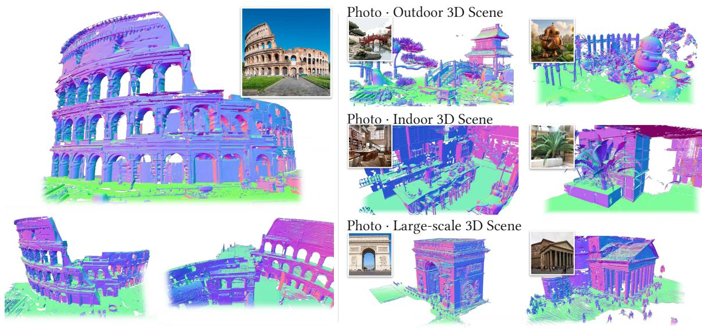  
Fig. 1. Generating a complete 3D mesh from a single image. Our method reconstructs detailed scene meshes from one photograph. The method completes geometry beyond the observed view and supports indoor, outdoor, and large-scale scenes. We show the Colosseum reconstruction from multiple viewpoints (left) and diverse reconstruction results (right).

## Abstract

Single-image scene generation aims to produce a complete 3D scene mesh from a single image, including surfaces the camera did not observe. While pretrained 3D object generators encode a strong shape prior, they are mainly designed for isolated objects in a fixed canonical volume and focus mostly on indoor scenes, since diverse 3D data for outdoor scenes are quite limited. In this work, we present a method that redesigns such an object-centric generator, e.g., Trellis 2, to work on both indoor and outdoor scenes while retaining its prior. We accomplish this by (a) partitioning the scene into adaptive chunks that scale relative to the distance to the camera; nearby chunks have a smaller size to keep the finer detail, while distant structures, e.g., buildings, are covered by large chunks; (b) making the generator capture explicit 2D–3D correspondence by lifting image features and making the model aware of the free space, observed surface, and unobserved region; (c) synthesizing around 4,000 outdoor scenes to broaden the training data, as existing scene datasets are largely indoor. Experiments on Tanks and Temples, ScanNet++, and in-the-wild images show that our method outperforms all baselines in geometric accuracy and perceptual quality across both indoor and outdoor scenes.

## 1 Introduction

We propose a method for generating a complete 3D scene mesh from a single image. This is a longstanding problem in computer vision and graphics with applications in content creation, virtual reality, and robotics. This task has gained new relevance with world models that turn a single image into an explorable 3D world [16, 37], reducing the need for extensive capture. Such worlds can be used in a physics simulator for robot navigation and interaction [37] to scale up robot learning [25, 26]. Diferent from multi-view reconstruction, generating a scene from a single image requires not only estimating the depth and shape of the visible surfaces, but also completing the geometry unobserved behind them.

Recent approaches to single-image scene generation leverage 2D generative priors by distilling into a 3D representation [34], iteratively inpainting and lifting novel views [13], or generating views or videos that are then reconstructed into 3D [9, 37, 46]. Feedforward 3D generators [43, 50] trained on large object collections have been extended to indoor scenes by composing per-object generations [15, 23] or by predicting scene-level geometry directly [36, 48]. However, learning a scenelevel generative prior remains dificult as diverse 3D scene data are limited. Unlike the large asset collections behind object generators [6, 49], scene datasets [5, 7, 41] focus on indoor scenes, and procedural generators [32] where the outdoor scenes’ diversity is limited by hand-crafted rules and asset generators. Training a model that handles the layouts, structures, and viewpoints of general scenes therefore remains dificult.

We present a novel method building upon Trellis 2 [42] for scene reconstruction while inheriting its learned prior on objects. To better handle this task, our method redesigns Trellis 2 by explicitly imposing 2D–3D correspondences using a monocular point map as geometric conditioning. This raises three technical challenges: (a) representing scenes whose physical extent far exceeds an object’s canonical volume, (b) keeping the generated geometry faithful to the observed image, and (c) training with limited outdoor scene data. We address these as follows.

First, we represent a scene with adaptive chunks whose physical scale varies across the scene. Fitting an entire scene into the generator’s fixed-resolution volume sacrifices detail, while fixed-size chunks [36] require many generations to cover a large scene. Under perspective projection, distant regions occupy fewer pixels, so we use smaller chunks nearby to preserve detail and larger chunks for distant regions to extend coverage. Second, we condition each 3D voxel on the image through explicit 2D–3D correspondence. Using an estimated point map, we lift image features [38] only onto the observed surface and encode whether each token lies in free space in front of the surface, on it, or in the unknown region behind it. This indicates to the model where to reconstruct and where to generate. Third, we construct around 4,000 diverse outdoor scenes with a synthetic pipeline and train on them together with existing indoor datasets. While the outdoor scenes are not perfect reconstructions, we found, somewhat surprisingly, that training on them improves the model’s performance.

Empirically, we achieve strong performance in single-image reconstruction over baselines. Fig. 1 shows reconstructions of indoor, outdoor, and large-scale scenes, including the Colosseum viewed from multiple viewpoints. We evaluate against baselines on Tanks and Temples [17], ScanNet++ [44], and 121 in-the-wild images, and our method outperforms all baselines on every metric. On Tanks and Temples, it reduces Chamfer distance by 24% and improves F1 by 30% over the strongest baseline on each metric, and on in-the-wild images it is preferred over every baseline in at least 73% of pairwise user-study comparisons. Our adaptive chunking also runs three times faster than fixed-size chunking while improving reconstruction quality.

## Our main contributions are:

• Adaptive scene chunks. We introduce a chunk-based scene representation whose physical scale changes across the scene. Nearby regions use smaller chunks to preserve detail, while farther

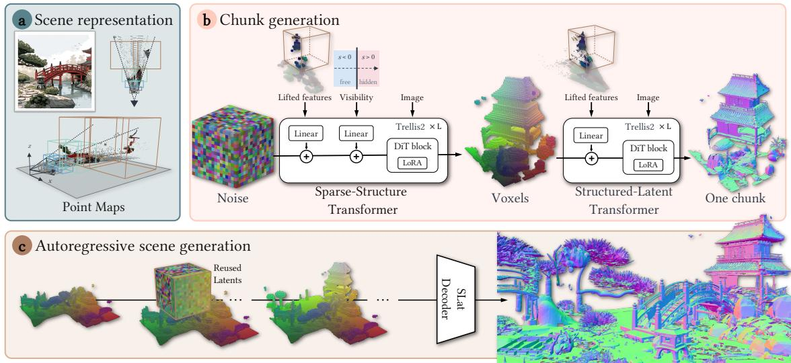  
Fig. 2. Overview of our method. (a) Scene representation. We lift the input image using an estimated point map and partition the scene into adaptive 3D chunks. (b) Chunk generation. For each chunk, the generator first predicts the sparse structure and then its structured geometry latents. Both stages are conditioned on surface-aligned lifted image features, while the first stage further receives a depth-based visibility indicator to distinguish free space vs. occluded regions. (c) Autoregressive scene generation. We generate neighboring chunks sequentially while reusing latents in overlapping regions, allowing each new chunk to complete unseen geometry conditioned on the previously generated scene chunk. The assembled latents are finally decoded into the full scene mesh.

or taller regions use larger chunks to extend scene coverage, so that one generator trained on a canonical volume can cover scenes of varying extent.

• Explicit 2D–3D conditioning. We propose a scene mesh generation model that explicitly distinguishes 3D locations supported by the observation from unobserved regions, allowing reconstruction and generative completion to be handled within a unified model.

• Outdoor scene supervision. We construct around 4,000 diverse outdoor scenes to create additional training supervision. The model trained on them produces better reconstructions at inference time than the scene-generation framework used to create the dataset.

## 2 Related Work

Scene generation with image and video priors. A line of work reconstructs 3D scenes by leveraging pretrained 2D generative models. Difusion distillation optimizes a 3D representation under image-generation priors [30, 34], enabling novel-view synthesis from limited observations, but it requires costly per-scene optimization. Iterative lifting and inpainting instead alternates between rendering the current reconstruction, synthesizing unobserved regions, and lifting them back into 3D [13]. Such pipelines can progressively expand a scene, but errors in inpainting and geometric registration may accumulate across iterations [19]. More recent generate-then-reconstruct approaches generate multi-view images and reconstruct them into a 3D scene [9, 16, 37, 46], which could improve consistency, but reconstruction quality depends on both cross-view consistency and whether the chosen viewpoints suficiently reveal occluded geometry. In contrast, our method predicts scene geometry directly from the input image without first synthesizing a set of novel views.

Compositional reconstruction. Large-scale object datasets have enabled strong feed-forward 3D generators [21, 43, 50]. These models learn useful complete-shape priors, but are designed for isolated assets in a canonical volume. Compositional methods extend them to scenes by decomposing an image into objects, generating or retrieving each object independently, and estimating their layout [15, 23, 47]. This formulation works naturally for separable instances, but is less suited to continuous scene structures such as floors and walls. Training-free methods such as EvoScene and Extend3D instead reuse object generators through local generation and inference-time refinement [45, 51], requiring new geometry to be repeatedly reconciled with the existing scene. We instead learn scenelevel consistency from training, enabling more robust generation.

Scene-level generation. Recent methods directly model scenes rather than composing independent objects. GenRecon [36] extends an object prior with overlapping scene chunks, but uses a shared physical scale determined by scene height, creating a tradeof between scene coverage and local resolution. We instead vary chunk scale across the scene to preserve nearby detail and cover larger structures. Other methods focus on how scene geometry is represented or conditioned. RecGen [47] integrates point maps into image features, SAM 3D [4] uses geometric tokens, while layered, pointbased, and volumetric methods directly predict visible and hidden scene geometry [3, 20, 27, 48]. Diferently, we exploit the spatial locations of the generator’s 3D tokens to directly condition on the image features, while completing occluded parts in the mesh latent space.

3D scene datasets. 3D scene datasets are much smaller and less diverse than the assets used to train object generators. Existing sources include indoor scans and synthetic room datasets such as ScanNet, 3D-FRONT, and SAGE-10k [5, 7, 41, 44], while Infinigen provides procedurally generated natural environments [33]. However, outdoor scenes have much greater variation in geometry, scale, and layout. We complement these datasets with outdoor scenes constructed using an agentic framework.

## 3 Background

Trellis 2 [42] is an image-conditioned 3D asset generator trained on object-centric data. Its geometry representation is based on O-Voxels, which store surface information at active voxel locations, while empty voxels are discarded. This representation does not require watertight geometry and supports open surfaces and interior surfaces, making it suitable for scene structures. A VAE encodes O-Voxel features into structured latents associated with explicit 3D voxel locations. Geometry generation proceeds through two flow-matching models. The sparse-structure stage generates a coarse latent grid that is decoded into active voxel locations. The structured-latent stage then generates geometry latents at these locations, which the pretrained decoder converts into a mesh. Both stages operate within the normalized volume [−0.5, 0.5]3. However, Trellis 2 is trained to generate objects centered and normalized within a canonical volume, rather than recover their scale and layout in a scene. Extending it to scenes therefore requires preserving layout. Fitting the entire scene into one fixed-resolution volume would lose detail. This motivates adapting both its spatial representation and conditioning for scene reconstruction.

## 4 Scene Mesh Generation

Problem formulation and challenges. Given a single image, we aim to generate a scene mesh that reconstructs visible surfaces and completes plausible geometry in occluded regions. Scene-level generation requires allocating resolution across large spatial extents, aligning generated geometry with the input observation, and learning from limited scene supervision. These requirements motivate the following three design choices:

(a) Scenes span a larger range of physical sizes than individual objects. Representing an entire scene in a single fixed-resolution volume sacrifices local detail as the scene’s physical extent increases. One could also divide up the scene and scale each chunk to the canonical volume, but this would be ineficient as one would need a suficiently fine-grained resolution. Hence, we propose adaptive chunks that preserve finer resolution near the camera while increasing coverage where needed (Sec. 4.1).

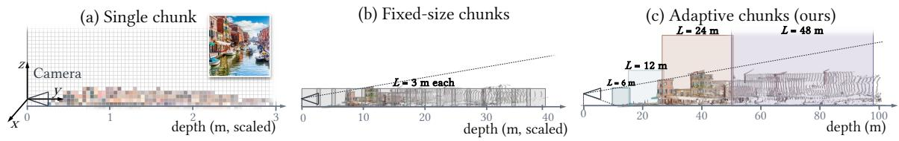  
Fig. 3. Scene chunking strategies. A single chunk (a) compresses the entire scene into one fixed volume, sacrificing geometric detail, whilefixed-size chunks (b) require many chunks to cover large scenes. Our adaptive strategy (c) increases the physical chunk size with depth, preserving finer resolution nearby while eficiently covering distant regions. Best viewed zoomed in.

(b) Scene generation must remain faithful to the observed image content. As Trellis 2 is trained on centered objects, using it for scene generation leads to the entire scene being generated at the canonical volume’s origin with incorrect layout. For scene generation, the model must place visible surfaces at their observed position and depth, and complete the unobserved geometry. To make this learning eficient, we provide explicit 2D–3D correspondence to the model by lifting image features onto the observed surfaces in a free-space-aware manner (Sec. 4.2).

(c) This work aims to generate outdoor scenes, but existing datasets ofer limited coverage and diversity of such scenes. To broaden the training data, we synthesize outdoor 3D scenes and use them with existing indoor scene datasets to train our model (Sec. 4.3).

## 4.1 Representing a scene with adaptive chunks

A photo of a scene may contain objects that are close to the camera and ones further away, e.g., a nearby chair and a building far behind it. Representing both the chair and the building in a fixed volume makes the chair lose most of its details as the chair is scaled relative to the building (Fig. 3a). One could also represent the scene using a fixed-resolution grid by dividing the scene into overlapping chunks, similar to GenRecon [36]. The overall scene volume is obtained by fitting a rectangular 3D bounding volume to an estimated point map, then splitting it into chunks. However, using the same physical chunk size throughout the scene still leaves a choice between many small predictions or fewer, coarser predictions (Fig. 3b).

Adaptive chunking. We instead let the physical chunk size adapt based on the scene’s geometry. Under perspective projection, a region of the same physical size occupies fewer pixels in the image as its distance from the camera increases. Nearby regions use smaller chunks to preserve local details, while distant regions use larger chunks to cover more space per generation, as shown in Fig. 3c. At inference time, we use the estimated point map to cover the scene from the camera.

We begin with the smallest chunk size wherever the observed height permits. As coverage extends farther away, we double the physical chunk size and increase the scale when needed to accommodate tall structures. Within each region, adjacent chunks overlap by 0.5 m in canonical space, corresponding to a physical overlap of 0.5�� m. Overlapping chunks provide shared geometry for autoregressive generation. This allocation preserves fine resolution near the camera where possible while allowing distant or tall regions to occupy larger chunks. Appendix A.1 provides more detail and comparisons of chunking strategies. Our chunk allocation therefore depends on both depth and local height, allowing the scene’s coverage to grow without forcing all regions to use the same resolution.

Supporting diferent physical scales in one model. To use a single model across adaptive chunks, we need a consistent representation. This is done by expressing all geometry in a ground-aligned coordinate frame whose origin is the point on the ground plane directly below the camera center, with +� upward, +� following the camera-forward direction, and +� the lateral axis.

We divide the scene along +� into overlapping depth regions, each covering a range of forward distances from the camera. All chunks within depth region � share a scale factor $a _ { i } \geq 1$ . The model always operates on a canonical chunk of side length $L = 3 { \mathrm { m } }$ , while the physical extent is $L _ { i } = a _ { i } L$ and the voxel size in region � is $\begin{array} { r } { \Delta _ { i } = \frac { a _ { i } L } { N } } \end{array}$ , where � is the number of voxels along each axis. Larger chunks cover more space with the same grid dimensions, while smaller chunks allocate more voxels to local geometric detail.

For a chunk in region �, we divide its 3D coordinates, depth values, and camera translation by $a _ { i } ,$ while keeping the camera intrinsics unchanged. A physical cube of side length $a _ { i } L$ is thus mapped to the same canonical cube of side length �. As the geometry and camera translation are scaled together, image projections remain unchanged, allowing the same model and 2D–3D conditioning mechanism to operate across chunks with diferent physical resolutions.

## 4.2 Chunk Conditioning for Explicit 2D--3D Correspondence

Adaptive chunks just determine where the model generates and the physical resolution used in each region. To generate a chunk, the model would require knowing which parts of its 3D volume are visible in the input image. For a visible surface, the generated geometry should follow the observation. Behind it, the geometry is unobserved and thus should follow the generative prior. We obtain the visible geometric information by using the monocular point map estimated from the input image.

To provide this geometric information to the model, one could consider image conditioning using cross-attention layers. For example, Trellis 2 lets every 3D token attend to the same image features, leaving the model to learn which image regions correspond to each 3D location. Geometry-aware approaches such as RecGen [47] add point maps into image features, while SAM 3D [4] introduces additional geometry tokens through cross-attention.

However, these conditioning methods do not exploit that the position of every 3D token in adaptive chunking is already known. We therefore condition each token, via 2D–3D projection, on the image feature at its projected location and on its position along the camera ray relative to the observed surface.

For a voxel centered at � in the normalized scene frame, let $\pi ( \nu )$ be its image projection, and $z _ { \mathrm { c a m } }$ be its camera-space depth. We define the depth residual:

$$
r ( \nu ) = z _ { \mathrm { c a m } } ( \nu ) - D \big ( \pi ( \nu ) \big ) ,\tag{1}
$$

where � denotes the observed camera-depth map after scale normalization. Sky pixels and invalid depths are excluded. Note, all quantities here are expressed in the canonical frame of the current chunk. We omit the region index � for readability.

Lifting image features onto observed surfaces. From the input image, we first extract a feature map � using DINOv3 [38]. Next, we assign this DINO feature � to a voxel/token only when its center is close to the observed surface along the viewing ray:

$$
f _ { \mathrm { l i f t } } ( \nu ) = \left\{ \begin{array} { l l } { F \big ( \pi ( \nu ) \big ) , } & { | r ( \nu ) | < \tau , } \\ { 0 , } & { \mathrm { o t h e r w i s e } . } \end{array} \right.\tag{2}
$$

The tolerance � accounts for voxel centers that do not fall exactly on a surface. We set � to be 1.5 voxel widths, giving $\tau = 0 . 2 8$ m for the sparse-structure stage and $\tau = 0 . 0 7$ m for the structured-latent stage (in canonical units). In chunk depth region �, the physical tolerance is $a _ { i } \tau$

Distinguishing free space from occlusion. A voxel � without a lifted feature can lie either in front of a visible surface or behind it. These locations require diferent behavior. The former should remain

empty, while the latter may contain hidden geometry. We provide this information to the sparsestructure model using the following clipped signed-depth residual

$$
s ( \nu ) = \mathrm { c l a m p } ( r ( \nu ) , - \delta , \delta ) , \qquad \delta = 1 \mathrm { m } ,\tag{3}
$$

measured in canonical units. Negative values indicate space between the camera and the visible surface, values near zero indicate the surface, and positive values indicate space behind it. We Fourierencode [28] this scalar �(�), followed by an MLP, i.e.,

$$
\begin{array} { r } { g (  { \boldsymbol \nu } ) = \mathrm { M L P } (  { \boldsymbol \gamma } ( s (  { \boldsymbol \nu } ) ) ) \quad \mathrm { a n d } \quad  { \boldsymbol \gamma } ( s ) = \big [ \cos ( \omega s ) , \sin ( \omega s ) \big ] , } \end{array}\tag{4}
$$

where $\omega \in \mathbb { R } ^ { 6 4 }$ contains the fixed frequencies, giving a 128-dimensional embedding. Before each transformer block �, we project and add local conditions to the tokens. In other words, the sparsestructure model’s hidden states ℎ are replaced as follows:

$$
h _ { \ell } ( \nu ) \gets h _ { \ell } ( \nu ) + W _ { \ell } ^ { \mathrm { i m g } } f _ { \mathrm { l i f t } } ( \nu ) + W _ { \ell } ^ { \mathrm { g e o m } } g ( \nu ) ,\tag{5}
$$

where $W _ { \ell } ^ { \mathrm { i m g } }$ and $W _ { \ell } ^ { \mathrm { g e o m } }$ denote learned linear projections. The structured-latent model uses only the lifted-image term, since visibility and occupancy are resolved during sparse-structure generation.

## 4.3 Training & Generation

Training scene generation requires mesh ground-truth that includes the full geometry, even those not visible in the input image view. For this, we use SAGE-10k [41], which contains 10,000 indoor scenes generated with each of Infinigen 1.0 and 2.0 [33]. For each scene, we render 16 views at 1024 × 1024 resolution using Blender. We keep target geometry within each camera frustum and discard objects occupying fewer than 80 pixels.

Outdoor supervision geometry. To get diverse outdoor supervision, we generate 4,000 reference images from 20 outdoor categories using a proposed agentic framework. First, we use GPT-5.6 [29] to generate text prompts describing a scene, including the location of the nearby objects, terrain, and vegetation. We then use Ideogram 4 [1] to generate reference images from these prompts. For each image, a VLM identifies object types, estimates their dimensions, and specifies spatial relations between objects. We crop the objects, complete canonical views with Nano Banana [10], and convert them to meshes with Trellis 2. Following SAGE-10k [41], a layout solver converts the relations into object poses while rejecting collisions. Ground geometry combines guidance from a top view of the estimated monocular geometry with procedural height fields [11]. We then render training images from the assembled meshes. This makes the input image, depth, camera, and target geometry consistent even when the assembled scene difers from its reference image. Although the assembled scenes may contain inaccurate shapes and layouts, they still provide useful supervision. As shown in Fig. 4, our trained model produces more detailed geometry and better preserves the input layout than the synthetic pipeline used to construct its training data. The full recipe is detailed in Appendix A.4.

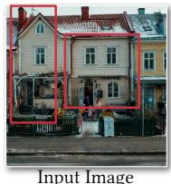

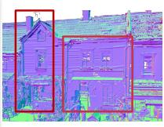  
Ours

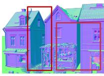  
Agentic framework  
Fig. 4. Learning from imperfect synthetic data. Our model reconstructs more faithful geometry than the imperfect training data from the agentic framework.

Training on canonical chunks. We train on individual canonical chunks so that local scene completion does not require processing an entire scene at once, which saves memory. During training, we normalize each scene to a common spatial range and extract overlapping chunks of side length �. Geometry, depth, and camera translation are scaled consistently, preserving their image projections. Ground-truth depth and camera parameters provide conditioning during training, while monocular estimates replace them at inference. We optimize rank-32 LoRA adapters [14] together with the new conditioning modules. At inference, each adaptive region is rescaled by $1 / a _ { i }$ into the same canonical domain seen during training.

Autoregressive generation of a scene. Given an image, adaptive chunking determines where to generate. We then generate the chunks sequentially, starting with chunks closer to the camera. For each chunk, we map its latent cells into the shared scene frame and identify those already covered by the interior of previously generated chunks. Their latent values are then copied into the new chunk and re-imposed at every denoising step, so overlapping chunks agree by construction. Across depth regions, whose latent cells are of diferent sizes, we trilinearly resample the previous region’s latents at the new cell locations within the overlap and constrain them in the same way. We repeat this process over the allocated chunks and decode the assembled latents into the scene mesh.

## 5 Experiments

We evaluate our method against seven single-image 3D reconstruction baselines on real-world scans and in-the-wild images. Our experiments examine geometric accuracy and consistency with the input image. We then ablate each of our core design choices.

Datasets. We train on the synthetic scene corpus described in Sec. 4.3. For quantitative geometry evaluation, we use 7 scenes from Tanks and Temples [17] and 32 randomly selected scenes from ScanNet++ [44]. We additionally collect 121 in-the-wild images from Atlas [39], Google Images of tourist attractions, NeRF [24] and mip-NeRF [2] datasets, and MoGe examples [18, 40], comprising 53 indoor and 68 outdoor scenes. We use a separate validation set for the ablations.

Implementation details. We initialize our model from Trellis 2 and train it for 100K steps using AdamW [22] on 16 NVIDIA A100 GPUs with a batch size of 64. We use learning rates of $\dot { 1 } \times 1 0 ^ { - \overline { { 4 } } }$ for the newly introduced conditioning modules and $3 \times 1 0 ^ { - 5 }$ for LoRA [14]. During inference, we use MoGe-3 [18] to predict camera intrinsics and point maps. Technical architectural and training details are provided in Sec. 4.2 and Sec. 4.3.

Baselines. We compare our method against four categories of single-image 3D scene reconstruction approaches: iterative 3D completion (EvoScene [51] and Extend3D [45]), object composition (3D-RE-GEN [35]), generated video followed by reconstruction (Lyra 2.0 [37]), and direct scene reconstruction (VolFill [27], GenRecon [36], and World Tracing [48]). All methods are evaluated with a single conditioning RGB image. For Lyra 2.0, which requires a camera trajectory, we follow the CAT3D camera heuristics [9]: a forward-moving spiral for scene-centric images and a circular trajectory for object-centric images.

Metrics. For datasets with ground-truth 3D geometry, including Tanks and Temples [17] and Scan-Net++ [44], we evaluate geometric reconstruction using Chamfer Distance (CD) and F1 score. We represent both predictions and ground truth as point clouds. For methods that predict point clouds, we use the predicted points directly. For methods that predict meshes, we sample points from the surface using area-weighted sampling. For Lyra 2.0, we use the Gaussian centers as the predicted points. We similarly convert the ground-truth geometry to point clouds. Before computing the metrics, we use ICP to align each prediction with the ground truth. CD measures the geometric discrepancy between the prediction and ground truth. To make CD comparable across scenes with diferent scales, we normalize it by the median ground-truth depth. For F1, we use a distance threshold of 10 cm, where a predicted point is considered correct if it lies within 10 cm of the ground-truth surface.

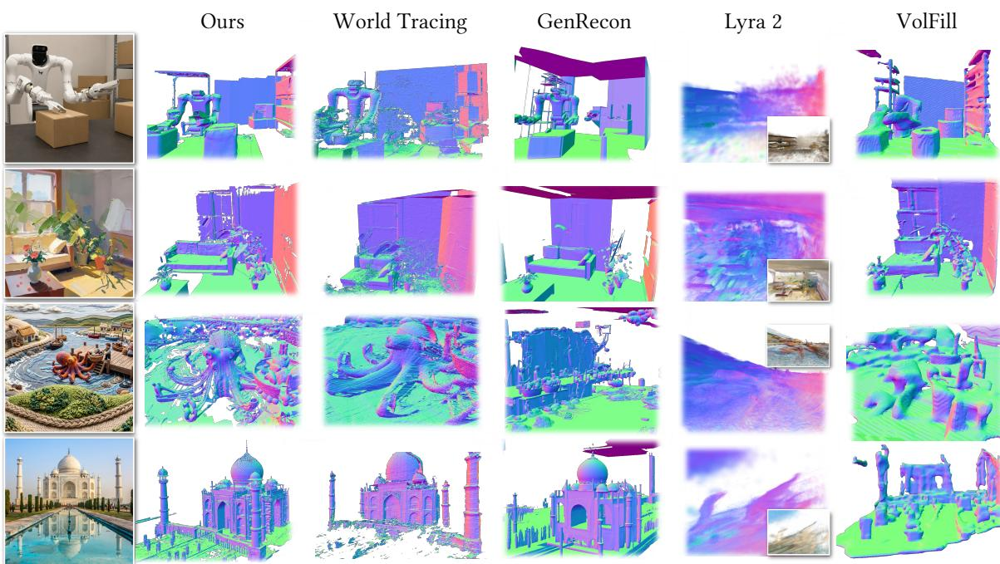  
Fig. 5. Visual comparisons. Our method preserves global scene layout while recovering finer details across diverse inputs. World Tracing [48] produces noisy occluded regions and lacks detail. GenRecon [36] often imposes a room-like prior for outdoor scenes. For Lyra 2 [37], we overlay RGB on the normal map. Although the rendering appears plausible, the underlying geometry is inaccurate. VolFill [27] has line-like surface artifacts and fails on outdoor scenes.

For in-the-wild images without ground-truth 3D geometry, we instead evaluate consistency with the input image using DreamSim [8] and CLIP-N [31]. DreamSim measures perceptual similarity and correlates with human judgments. CLIP-N measures geometric consistency by comparing rendered normal maps with the normal map estimated from the input image using Lotus2 [12]. We render the reconstructed scene from four viewpoints using surface normals and compute the similarity between the rendered and estimated normal maps. We conduct a user study using blind pairwise comparisons. Participants are shown an input image together with two reconstructed 3D scenes and asked to select the better reconstruction.

## 5.1 Comparisons

Tab. 1 compares ours against baselines on Tanks and Temples [17], ScanNet++ [44], and in-the-wild images. Our approach outperforms all baselines across every metric and user study. In Fig. 5, we show some qualitative results. For additional results, please see Fig. A3 and Fig. A4 in the appendix. GenRecon [36] often produces room-like structures in outdoor scenes, suggesting that its learned scene prior can dominate when the input difers from its training data. World Tracing [48] often leaves holes under heavy occlusion, indicating dificulty completing hidden regions while maintaining the scene structure. We also find that generating realistic views does not necessarily yield a coherent scene. Lyra 2.0 [37] struggles with inconsistencies that lead to floating geometry after reconstruction.

## 5.2 Ablation Studies

Adaptive chunks. We compare three chunking strategies using the same trained model: normalizing the entire scene to fit within a single chunk; normalizing the scene height to fit within 3 m and using fixed 3 m chunks [36]; and our adaptive strategy, which uses smaller chunks nearby and larger chunks farther away. As shown in Tab. 2, adaptive chunking achieves the best reconstruction scores on both indoor and outdoor scenes while using fewer chunks and running three times faster than fixed-size chunking. The single-chunk strategy is competitive indoors but performs substantially worse outdoors, consistent with the loss of local detail when a large scene is compressed into a fixed-resolution volume. Fixed-size chunks sometimes produce duplicated objects and incorrect lay outs. We suspect that small chunks covering only fragments of the scene provide insuficient spatial context for scene completion. Larger distant chunks can capture more of these structures within one generation, while smaller nearby chunks preserve local detail.

Table 1. Quantitative comparison on Tanks and Temples, ScanNet++ and In-the-wild images. Our approach outperforms all baselines across diferent datasets and metrics.
<table><tr><td></td><td colspan="2">Tanks and Temples</td><td colspan="2">ScanNet++</td><td colspan="3">In-the-wild</td></tr><tr><td>Method</td><td>CD↓</td><td>F1↑</td><td>CD↓ F1↑</td><td></td><td></td><td></td><td>DreamSim ↓ CLIP-N ↑ Win rate (%) ↑</td></tr><tr><td colspan="8">Iterative 3D completion</td></tr><tr><td>EvoScene [51]</td><td>4.61</td><td>0.241</td><td>5.70</td><td>0.690</td><td>0.379</td><td>0.797</td><td>90.7</td></tr><tr><td>Extend3D [45]</td><td>8.37</td><td>0.165</td><td>5.54</td><td>0.674</td><td>0.375</td><td>0.805</td><td>94.4</td></tr><tr><td colspan="8">Object composition</td></tr><tr><td>3D-RE-GEN [35]</td><td>7.17</td><td>0.146</td><td></td><td>15.840.291</td><td>0.429</td><td>0.810</td><td>88.9</td></tr><tr><td colspan="8">Generated views/video → 3D reconstruction</td></tr><tr><td>Lyra 2.0 [37]</td><td>3.05</td><td>0.388</td><td>8.17</td><td>0.481</td><td>0.347</td><td>0.810</td><td>94.3</td></tr><tr><td colspan="8">Direct scene reconstruction</td></tr><tr><td>VolFill [27]</td><td>2.63</td><td>0.376</td><td></td><td></td><td>0.339</td><td>0.789</td><td>89.7</td></tr><tr><td>GenRecon [36]</td><td>5.57</td><td>0.215</td><td></td><td>10.060.411</td><td>0.294</td><td>0.847</td><td>73.0</td></tr><tr><td>World Tracing [48]</td><td>3.27</td><td>0.337</td><td>5.21</td><td>0.690</td><td>0.237</td><td>0.859</td><td>90.4</td></tr><tr><td>Ours</td><td>1.99</td><td>0.506</td><td>5.01</td><td>0.702</td><td>0.221</td><td>0.870</td><td>Ref.</td></tr></table>

Table 2. Comparison of chunking strategies. Adaptive chunking improves reconstruction and is faster than fixed-size chunks.
<table><tr><td rowspan="2">Layout</td><td colspan="2">Indoor</td><td colspan="2">Outdoor</td><td rowspan="2">Time</td></tr><tr><td>CD↓</td><td>F1↑</td><td>CD↓</td><td>F1↑</td></tr><tr><td>Single chunk</td><td>2.87</td><td>0.759</td><td>49.9</td><td>0.138</td><td>1</td></tr><tr><td>Fixed 3m</td><td>3.13</td><td>0.782</td><td>38.5</td><td>0.100</td><td>15</td></tr><tr><td>Adaptive</td><td>2.86</td><td>0.792</td><td>37.4</td><td>0.240</td><td>5</td></tr></table>

Table 3. Ablation of conditioning mechanisms. Our conditioning outperforms implicit conditioning alternatives.
<table><tr><td rowspan="2">Variant</td><td colspan="2">Indoor</td><td colspan="2">Outdoor</td></tr><tr><td>CD↓</td><td>F1↑</td><td>CD↓</td><td>F1↑</td></tr><tr><td>SAM 3D style</td><td>4.38</td><td>0.707</td><td>8.30</td><td>0.257</td></tr><tr><td>Projection only</td><td>4.74</td><td>0.739</td><td>8.26</td><td>0.330</td></tr><tr><td>Ours w/o visibility</td><td>4.24</td><td>0.757</td><td>6.60</td><td>0.464</td></tr><tr><td>Our conditioning</td><td>3.54</td><td>0.793</td><td>6.90</td><td>0.501</td></tr></table>

Table 4. Ablation of dataset contribution. Our outdoor data improves generalization without sacrificing indoor quality.
<table><tr><td>Variant</td><td>Indoor</td><td>Outdoor</td></tr><tr><td>CD↓</td><td>F1↑</td><td>CD↓ F1↑</td></tr><tr><td>Existing data</td><td>3.99 0.784</td><td>10.75 0.317</td></tr><tr><td>Existing data + Ours 3.54</td><td>0.793</td><td>6.90 0.501</td></tr></table>

Conditioning mechanisms. We ablate diferent conditioning mechanisms in Tab. 3. SAM 3D-style conditioning [4] tokenizes the point maps and supplies them as additional tokens alongside the image tokens. Projection-only conditioning directly unprojects image features into 3D, similar to a plane-sweep volume. Our conditioning outperforms these alternatives on both the indoor and outdoor validation sets. From inspecting the reconstructed meshes, we observe that projection-only and SAM 3D-style conditioning more often produce duplicated surfaces and miss geometry in occluded regions. We hypothesize that explicitly associating each 3D token with both its corresponding image feature and its position relative to the observed surface makes the model easier to learn. The model no longer needs to implicitly infer the 2D–3D relationships through cross-attention or unprojected image features alone.

Contribution of outdoor data. We examine the contribution of our synthetic outdoor data by keeping our conditioning mechanism fixed and comparing training on SAGE-10k and Infinigen with and without our outdoor data. As shown in Tab. 4, adding outdoor data improves reconstruction on both indoor and outdoor scenes, with larger gains for outdoors. Meanwhile, Tab. 3 shows that our conditioning outperforms other conditioning when trained on the same data. These experiments indicate that the improvements come from both our conditioning and the additional data.

## 6 Conclusion

We proposed a single-image scene mesh generation method to reconstruct indoor and outdoor scenes. Our method introduces adaptive scene chunks, explicit 2D–3D conditioning, and supervision from roughly 4,000 synthesized outdoor scenes to reconstruct observed surfaces and complete hidden ge ometry across indoor and outdoor environments. Experiments show that our method outperforms all baselines on indoor, outdoor, and in-the-wild scenes. A detailed ablation study validates the necessity of the proposed designs. For future work, we plan to explore textured outputs, e.g., 3D Gaussian splatting, finer geometric detail, and supporting more than one input image.

## References

[1] Ideogram AI. 2026. Ideogram 4. https://ideogram.ai/blog/ideogram-4.0/.

[2] Jonathan T Barron, Ben Mildenhall, Dor Verbin, Pratul P Srinivasan, and Peter Hedman. 2022. Mip-NeRF 360: Unbounded anti-aliased neural radiance fields. In Proc. CVPR.

[3] Weirong Chen, Chuanxia Zheng, Ganlin Zhang, Andrea Vedaldi, and Daniel Cremers. 2026. Nova3R: Non-pixelaligned visual transformer for amodal 3D reconstruction. arXiv preprint arXiv:2603.04179 (2026).

[4] Xingyu Chen, Fu-Jen Chu, Pierre Gleize, Kevin J Liang, Alexander Sax, Hao Tang, Weiyao Wang, Michelle Guo, Thibaut Hardin, Xiang Li, et al. 2026. SAM 3D: 3Dfy anything in images. In Proc. CVPR.

[5] Angela Dai, Angel X Chang, Manolis Savva, Maciej Halber, Thomas Funkhouser, and Matthias Nießner. 2017. ScanNet: Richly-annotated 3D reconstructions of indoor scenes. In Proc. CVPR.

[6] Matt Deitke, Dustin Schwenk, Jordi Salvador, Luca Weihs, Oscar Michel, Eli VanderBilt, Ludwig Schmidt, Kiana Ehsani, Aniruddha Kembhavi, and Ali Farhadi. 2023. Objaverse: A universe of annotated 3D objects. In Proc. CVPR.

[7] Huan Fu, Bowen Cai, Lin Gao, Ling-Xiao Zhang, Jiaming Wang, Cao Li, Qixun Zeng, Chengyue Sun, Rongfei Jia, Binqiang Zhao, et al. 2021. 3D-FRONT: 3D furnished rooms with layouts and semantics. In Proc. ICCV.

[8] Stephanie Fu, Netanel Tamir, Shobhita Sundaram, Lucy Chai, Richard Zhang, Tali Dekel, and Phillip Isola. 2023. DreamSim: Learning new dimensions of human visual similarity using synthetic data. arXiv preprint arXiv:2306.09344 (2023).

[9] Ruiqi Gao, Aleksander Holynski, Philipp Henzler, Arthur Brussee, Ricardo Martin-Brualla, Pratul Srinivasan, Jonathan T Barron, and Ben Poole. 2024. CAT3D: Create anything in 3D with multi-view difusion models. arXiv preprint arXiv:2405.10314 (2024).

[10] Google DeepMind. 2025. Nano Banana Pro. https://deepmind.google/models/gemini-image/pro/.

[11] Chunchao Guo, Jinpeng Li, Yang Li, and Zilong Huang. 2026. WorldClaw: Agentic 3D Open-World Generation at Scale. arXiv preprint arXiv:2608.05248 (2026).

[12] Jing He, Haodong Li, Mingzhi Sheng, and Ying-Cong Chen. 2025. Lotus-2: Advancing Geometric Dense Prediction with Powerful Image Generative Model. arXiv preprint arXiv:2512.01030 (2025).

[13] Lukas Höllein, Ang Cao, Andrew Owens, Justin Johnson, and Matthias Nießner. 2023. Text2Room: Extracting textured 3D meshes from 2D text-to-image models. In Proc. ICCV.

[14] Edward J Hu, Yelong Shen, Phillip Wallis, Zeyuan Allen-Zhu, Yuanzhi Li, Shean Wang, Lu Wang, and Weizhu Chen. 2021. LoRA: Low-rank adaptation of large language models. arXiv preprint arXiv:2106.09685 (2021).

[15] Zehuan Huang, Yuan-Chen Guo, Xingqiao An, Yunhan Yang, Yangguang Li, Zi-Xin Zou, Ding Liang, Xihui Liu, Yan-Pei Cao, and Lu Sheng. 2025. MIDI: Multi-instance difusion for single image to 3D scene generation. In Proc. CVPR.

[16] Team HY-World, Chenjie Cao, Xuhui Zuo, Zhenwei Wang, Yisu Zhang, Junta Wu, Zhenyang Liu, Yuning Gong, Yang Liu, Bo Yuan, et al. 2026. HY-World 2.0: A Multi-Modal World Model for Reconstructing, Generating, and Simulating 3D Worlds. arXiv preprint arXiv:2604.14268 (2026).

[17] Arno Knapitsch, Jaesik Park, Qian-Yi Zhou, and Vladlen Koltun. 2017. Tanks and Temples: Benchmarking Large-Scale Scene Reconstruction. ACM Trans. Graph. (2017).

[18] Lingyu Kong, Ruicheng Li, Ruicheng Wang, Sicheng Xu, Chengtang Yao, Jianfeng Xiang, and Jiaolong Yang. 2026. MoGe-3: Fine-Detail Monocular Geometry Estimation with Self-Guided Sparse Volumetric Refinement. arXiv preprint arXiv:2607.17967 (2026).

[19] Fang Li, Hao Zhang, and Narendra Ahuja. 2026. RGB-Only Supervised Camera Parameter Optimization in Dynamic Scenes. Advances in Neural Information Processing Systems 38 (2026), 58160–58193.

[20] Rui Li, Biao Zhang, Zhenyu Li, Federico Tombari, and Peter Wonka. 2025. LARI: Layered ray intersections for single-view 3D geometric reasoning. arXiv preprint arXiv:2504.18424 (2025).

[21] Weiyu Li, Xuanyang Zhang, Zheng Sun, Di Qi, Hao Li, Wei Cheng, Weiwei Cai, Shihao Wu, Jiarui Liu, Zihao Wang, et al. 2025. Step1X-3D: Towards high-fidelity and controllable generation of textured 3D assets. arXiv preprint arXiv:2505.07747 (2025).

[22] Ilya Loshchilov and Frank Hutter. 2017. Decoupled weight decay regularization. arXiv preprint arXiv:1711.05101 (2017).

[23] Yanxu Meng, Haoning Wu, Ya Zhang, and Weidi Xie. 2026. SceneGen: Single-image 3D scene generation in one feedforward pass. In Proc. 3DV.

[24] Ben Mildenhall, Pratul P Srinivasan, Matthew Tancik, Jonathan T Barron, Ravi Ramamoorthi, and Ren Ng. 2021. NeRF: Representing scenes as neural radiance fields for view synthesis. Commun. ACM (2021).

[25] Soroush Nasiriany, Abhiram Maddukuri, Lance Zhang, Adeet Parikh, Aaron Lo, Abhishek Joshi, Ajay Mandlekar, and Yuke Zhu. 2024. RoboCasa: Large-Scale Simulation of Everyday Tasks for Generalist Robots. In Proc. RSS.

[26] Soroush Nasiriany, Sepehr Nasiriany, Abhiram Maddukuri, and Yuke Zhu. 2026. RoboCasa365: A Large-Scale Simulation Framework for Training and Benchmarking Generalist Robots. In Proc. ICLR.

[27] Tuan Duc Ngo, Chuang Gan, and Evangelos Kalogerakis. 2026. VolFill: Single-View Amodal 3D Scene Reconstruction with Volumetric Flow Matching. arXiv preprint (2026).

[28] Alex Nichol, Prafulla Dhariwal, Aditya Ramesh, Pranav Shyam, Pamela Mishkin, Bob McGrew, Ilya Sutskever, and Mark Chen. 2021. GLIDE: Towards photorealistic image generation and editing with text-guided difusion models. arXiv preprint arXiv:2112.10741 (2021).

[29] OpenAI. 2026. GPT-5.6: Frontier Intelligence That Scales with Your Ambition. https://openai.com/index/gpt-5-6/.

[30] Ben Poole, Ajay Jain, Jonathan T Barron, and Ben Mildenhall. 2022. DreamFusion: Text-to-3D using 2D difusion. arXiv preprint arXiv:2209.14988 (2022).

[31] Alec Radford, Jong Wook Kim, Chris Hallacy, Aditya Ramesh, Gabriel Goh, Sandhini Agarwal, Girish Sastry, Amanda Askell, Pamela Mishkin, Jack Clark, et al. 2021. Learning transferable visual models from natural language supervision. In Proc. ICML.

[32] Alexander Raistrick, Lahav Lipson, Zeyu Ma, Lingjie Mei, Mingzhe Wang, Yiming Zuo, Karhan Kayan, Hongyu Wen, Beining Han, Yihan Wang, et al. 2023. Infinite photorealistic worlds using procedural generation. In Proc. CVPR.

[33] Alexander Raistrick, Lingjie Mei, Karhan Kayan, David Yan, Yiming Zuo, Beining Han, Hongyu Wen, Meenal Parakh, Stamatis Alexandropoulos, Lahav Lipson, et al. 2024. Infinigen indoors: Photorealistic indoor scenes using procedural generation. In Proc. CVPR.

[34] Kyle Sargent, Zizhang Li, Tanmay Shah, Charles Herrmann, Hong-Xing Yu, Yunzhi Zhang, Eric Ryan Chan, Dmitry Lagun, Li Fei-Fei, Deqing Sun, et al. 2024. ZeroNVS: Zero-shot 360-degree view synthesis from a single image. In Proc. CVPR.

[35] Tobias Sautter, Jan-Niklas Dihlmann, and Hendrik P A Lensch. 2026. 3D-RE-GEN: 3D reconstruction of indoor scenes with a generative framework. In Proc. CVPR.

[36] Katharina Schmid, Nicolas von Lützow, Jozef Hladkỳ, Angela Dai, and Matthias Nießner. 2026. GenRecon: Bridging Generative Priors for Multi-View 3D Scene Reconstruction. arXiv preprint arXiv:2605.23888 (2026).

[37] Tianchang Shen, Sherwin Bahmani, Kai He, Sangeetha Grama Srinivasan, Tianshi Cao, Jiawei Ren, Ruilong Li, Zian Wang, Nicholas Sharp, Zan Gojcic, et al. 2026. Lyra 2.0: Explorable generative 3D worlds. arXiv preprint arXiv:2604.13036 (2026).

[38] Oriane Siméoni, Huy V Vo, Maximilian Seitzer, Federico Baldassarre, Maxime Oquab, Cijo Jose, Vasil Khalidov, Marc Szafraniec, Seungeun Yi, Michaël Ramamonjisoa, et al. 2025. DINOv3. arXiv preprint arXiv:2508.10104 (2025).

[39] World Labs Team. 2026. Atlas: A World Model for Spatial Intelligence. World Labs Blog (2026). https://www.worldlabs.ai/blog/atlas.

[40] Ruicheng Wang, Sicheng Xu, Yue Dong, Yu Deng, Jianfeng Xiang, Zelong Lv, Guangzhong Sun, Xin Tong, and Jiaolong Yang. 2026. MoGe-2: Accurate monocular geometry with metric scale and sharp details. In Proc. NeurIPS.

[41] Hongchi Xia, Xuan Li, Zhaoshuo Li, Qianli Ma, Jiashu Xu, Ming-Yu Liu, Yin Cui, Tsung-Yi Lin, Wei-Chiu Ma, Shenlong Wang, et al. 2026. SAGE: Scalable agentic 3D scene generation for embodied AI. arXiv preprint arXiv:2602.10116 (2026).

[42] Jianfeng Xiang, Xiaoxue Chen, Sicheng Xu, Ruicheng Wang, Zelong Lv, Yu Deng, Hongyuan Zhu, Yue Dong, Hao Zhao, Nicholas Jing Yuan, et al. 2026. Native and compact structured latents for 3D generation. In Proc. CVPR.

[43] Jianfeng Xiang, Zelong Lv, Sicheng Xu, Yu Deng, Ruicheng Wang, Bowen Zhang, Dong Chen, Xin Tong, and Jiaolong Yang. 2025. Structured 3D latents for scalable and versatile 3D generation. In Proc. CVPR.

[44] Chandan Yeshwanth, Yueh-Cheng Liu, Matthias Nießner, and Angela Dai. 2023. ScanNet++: A High-Fidelity Dataset of 3D Indoor Scenes. In Proc. ICCV.

[45] Seungwoo Yoon, Jinmo Kim, and Jaesik Park. 2026. Extend3D: Town-Scale 3D Generation. arXiv preprint arXiv:2603.29387 (2026).

[46] Wangbo Yu, Jinbo Xing, Li Yuan, Wenbo Hu, Xiaoyu Li, Zhipeng Huang, Xiangjun Gao, Tien-Tsin Wong, Ying Shan, and Yonghong Tian. 2024. ViewCrafter: Taming video difusion models for high-fidelity novel view synthesis. arXiv preprint arXiv:2409.02048 (2024).

[47] Andrii Zadaianchuk, Leonardo Barcellona, Lennard Schuenemann, Christian Gumbsch, Zehao Wang, Muhammad Zubair Irshad, Fabien Despinoy, Rahaf Aljundi, Stratis Gavves, and Sergey Zakharov. 2026. Reconstruction by generation: 3D multi-object scene reconstruction from sparse observations. arXiv preprint arXiv:2604.27106 (2026).

[48] Hao Zhang, Mohamed El Banani, Jen-Hao Cheng, Paul Zhang, Yi Hua, Ben Mildenhall, Christoph Lassner, Narendra Ahuja, and Gengshan Yang. 2026. World Tracing: Generative Pixel-Aligned Geometry Beyond the Visible. arXiv preprint arXiv:2606.13652 (2026).

[49] Yibo Zhang, Li Zhang, Rui Ma, and Nan Cao. 2025. TexVerse: A universe of 3D objects with high-resolution textures. arXiv preprint arXiv:2508.10868 (2025).

[50] Zibo Zhao, Zeqiang Lai, Qingxiang Lin, Yunfei Zhao, Haolin Liu, Shuhui Yang, Yifei Feng, Mingxin Yang, Sheng Zhang, Xianghui Yang, et al. 2025. Hunyuan3D 2.0: Scaling difusion models for high resolution textured 3D assets generation. arXiv preprint arXiv:2501.12202 (2025).

[51] Kaizhi Zheng, Yue Fan, Jing Gu, Zishuo Xu, Xuehai He, and Xin Eric Wang. 2026. Self-evolving 3D scene generation from a single image. In Proc. CVPR.

## A Appendix

Please also see videos in the supplemental materials for qualitative comparisons.

## A.1 Chunk Allocation Details

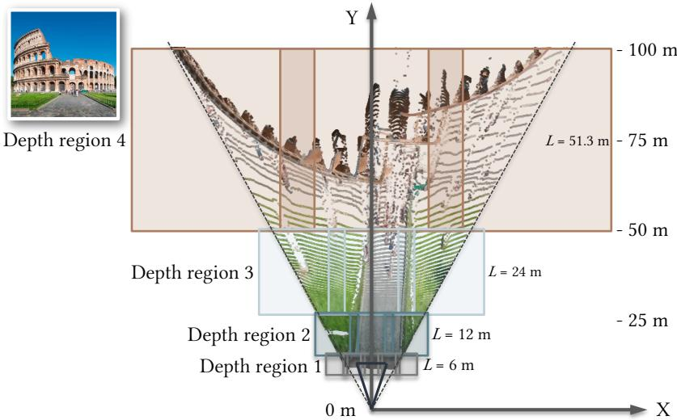  
Fig. A1. Chunk allocation. We partition this Colosseum into overlapping depth regions and allocate chunks to cover the estimated point cloud within the camera frustum.

Given an input image, we first use MoGE-3 [18] to estimate the camera intrinsics and a 3D point map. We use these estimates to determine the scene’s physical size and placement of the chunks. We define the scene coordinate frame by placing the origin at the ground-plane projection of the camera center, with +� pointing in the camera-forward direction and +� pointing upward. Following GenRecon [36], we estimate the ground height using the 2nd percentile of the point-cloud heights. We then construct a grid of overlapping chunks along both the camera-forward and lateral directions. For each depth row, we place enough chunks laterally to cover the corresponding range of the estimated point cloud, with neighboring chunks overlapping by 0.5 m within the camera frustum. Consecutive depth rows also overlap by 0.5 m.

Rather than globally rescaling the entire scene, we determine the chunk scale separately for each depth range. For a given range, if its 99th-percentile height exceeds 2.8 m, we increase the physical chunk size so that the corresponding geometry fits within the canonical 3 m volume. Thus, only regions requiring additional spatial coverage are generated at a coarser physical resolution. The chunk size also increases progressively with depth: each new row is at least twice the size of the previous row, resulting in physical chunk sizes of 6, 12, 24 m, and so on. The height criterion may further increase the scale when necessary, as shown in Fig. A1. We continue adding rows until the grid reaches the 99th-percentile depth of the estimated point cloud.

Chunking strategies comparison. Here, we compare the diferent chunking strategies in Fig. A2 on a large-scale scene extending to 280 m in depth and 10 m in height. Using fixed-size chunks at a uniform scale would require roughly 200 chunks, exceeding the memory capacity of an NVIDIA A100 (80GB). In contrast, our adaptive strategy covers the scene with only four depth regions and 15 chunks, requiring approximately 5 minutes of inference. Peak GPU memory usage is 26 GB, while generating a single chunk requires approximately 8 GB. Despite the reduced number of chunks, our method preserves fine geometry in nearby structures, such as the boats, while still covering large buildings in the distance. The single-chunk baseline runs in seconds, but compresses the entire scene into one canonical volume and consequently fails to recover meaningful scene geometry.

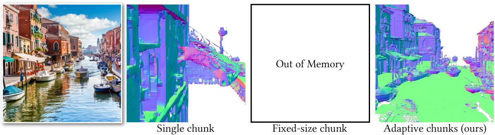  
Fig. A2. Comparison of chunking strategies. A single chunk compresses the entire scene into a fixed canonical volume, distorting depth and producing wall-like geometry. Fixed-size chunks require too many chunks for large scenes, and it ran out of memory on an 80G GPU. Our adaptive strategy eficiently covers the scene while preserving geometric detail.

## A.2 More results

We show surface-normal renderings on diverse indoor and outdoor scenes in Fig. A3 and Fig. A4. Across challenging inputs containing people, vegetation, vehicles, animals, and large structures, our method better preserves the overall scene layout while recovering finer geometric details and occlusion. World Tracing [39] often produces noisy or incomplete geometry, particularly around occlusions and object boundaries. GenRecon [36] can impose simplified or room-like structures that are inconsistent with outdoor scenes. For Lyra 2 [37], the RGB output appears visually plausible, but the underlying geometry is often noisy and distorted, likely because of inconsistencies across the generated video. VolFill [27] frequently fails on outdoor scenes and often produces only coarse scene geometry.

## A.3 Limitations

Our method generates scene geometry without textures. In addition, Trellis 2 does not guarantee watertight meshes, and our model inherits this limitation, occasionally producing holes that require additional mesh processing. Our method also relies on estimated depth and camera intrinsics, whose errors can afect chunk placement, scene scale, and feature alignment. Our autoregressive generation may propagate errors from earlier chunks to later ones through reused overlap latents.

## A.4 Agentic framework for synthetic data generation

Fig. A5 summarizes our agentic framework for constructing outdoor training scenes. We first use GPT-5.6 [29] to generate 4000 prompts describing diverse outdoor scenes from 20 categories: city streets, parks and gardens, suburban houses, landmarks, and so on. Then we use Ideogram [1] to generate a reference image. Given each image, GPT-5.6 outputs a scene plan containing object categories, approximate object dimensions, spatial relations, and ground regions. For object reconstruction, GPT-5.6 localizes each object in the image with a bounding box. We crop each detected object and use Nano Banana [10] to complete its occluded regions, producing an image of the full object. Trellis 2 then converts the completed object image into a 3D mesh.

Following WorldClaw [11], we reconstruct the ground separately. MoGE-3 converts the image into a top-view representation, and Nano Banana then predicts a ground-layout map over this top view. GPT-5.6 additionally predicts terrain parameters for each ground region, which we convert into a height map. We combine the layout and height map to construct the final terrain. We then assemble the scene using a search-based layout solver following SAGE10k [41]. For each object, the solver searches over discrete ground positions and rotations, rejects placements that introduce object overlap, and scores

the candidates according to how well they satisfy the spatial relations specified in the scene plan.   
After placement, we run a physics simulation to place the objects onto the reconstructed terrain.

To improve scene-level consistency with the reference image, we perform one refinement round using GPT-5.6 as a VLM critic. The critic compares the reference image against a top-view rendering and four corner-view renderings of the assembled scene. It identifies missing objects and incorrect spatial relations and updates the scene plan accordingly, after which we rerun the layout solver. The final scene is then used as the final outdoor dataset.

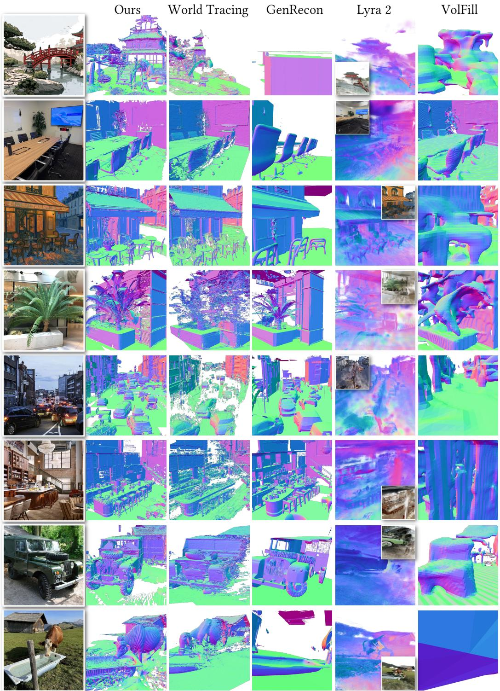  
Fig. A3. Additional qualitative comparisons on diverse scenes. We compare surface-normal renderings across indoor and outdoor environments. Our method better preserves scene layout and local geometry, and occluded regions. For Lyra 2, we overlay its RGB rendering on the normal map.

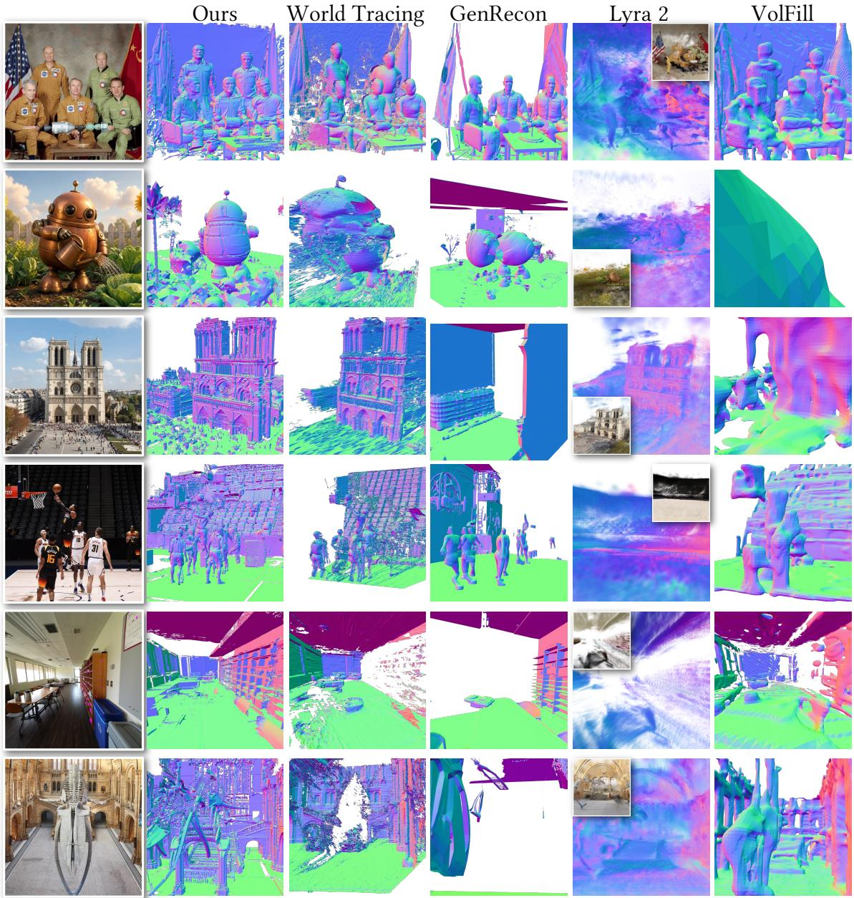  
Fig. A4. Additional qualitative comparisons on diverse scenes. We evaluate scenes containing people, animals, large architectural structures, and unusual object configurations. Our method more consistently recovers coherent geometry and scene structure, while the baselines often exhibit incomplete geometry, simplified layouts, or coarse surfaces.

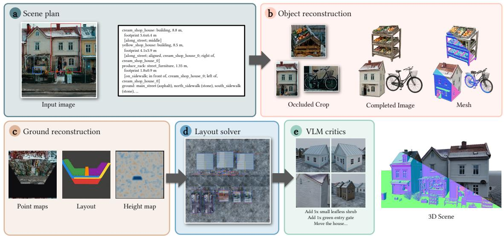  
Fig. A5. Agentic framework for outdoor scene construction. Given an input image, (a) a VLM first produces a scene plan describing objects, their dimensions and spatial relations, and ground regions. (b) Each visible object is cropped from the image, completed to recover occluded geometry, and reconstructed into a 3D mesh. (c) Ground geometry is recovered from the estimated point map, semantic layout, and height map. (d) A layout solver places the reconstructed assets while satisfying spatial constraints and avoiding collisions. (e) A VLM critic iteratively inspects the assembled scene and proposes corrections to object placement and missing content, producing the final 3D scene.