# CTRLCACHE: ACCELERATING INTERACTIVE VIDEO WORLD MODELS WITH CONTROL-AWARE CACHING

Shangye Song1 Dong Gong2 Hong Jia1 Yun Sing Koh1 Xinyu Zhang1∗

1University of Auckland 2 UNSW Sydney

shangye.song,hong.jia,y.koh,xinyu.zhang @auckland.ac.nz dong.gong@unsw.edu.au

Project page: https://wrecklong.github.io/CtrlCache/

## ABSTRACT

Interactive video world models need to generate each video chunk efficiently while responding faithfully to user controls. Many systems use chunk-wise autoregressive generation with few-step denoising, but each chunk still requires several costly denoising iterations. Training-free caching can reduce this cost, yet existing policies make reuse decisions primarily from model-internal denoising dynamics and do not explicitly account for control transitions. Actually, interactive generation explicitly exposes a signal they do not use: the controls for a chunk arrive before it is denoised, so a schedule derived from them costs no forward pass. To this end, we analyze adjacent chunks under different control regimes and find that structural similarity drops around action changes, while low-frequency structure remains more persistent than high-frequency detail. Motivated by these observations, we propose CtrlCache, a training-free control-aware caching framework that adapts computation to the current control sequence. Specifically, the actionaware scheduling and refresh policy detects action changes across and within chunks, and labels each chunk as initial, transition, turning, or steady state. At one selected interior denoising step, initial and transition chunks retain full computation, while turning and steady chunks reuse the transformer residual from the most recent fully computed step in the same chunk. To exploit the persistence of lowfrequency structure during steady interaction, we further introduce a frequencymixed history prior guidance that incorporates complementary information from the preceding clean latent without an additional DiT forward pass. Evaluated on Matrix-Game 2.0 and LingBot-World v1/v2, CtrlCache achieves 1.21 to 1.41 DiT-backbone speedups without model retraining while improving WBench Overall scores over original inference across all three models.

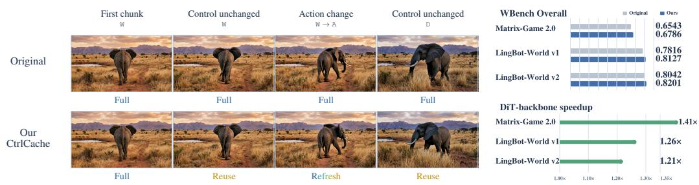  
Figure 1: Our CtrlCache adapts DiT computation to the incoming controls. The left panel shows how the control-aware policy selects full computation, residual reuse, or refresh across representative control states. The right panel summarizes WBench Overall and DiT-backbone speedup on Matrix-Game 2.0 (He et al., 2025), LingBot-World v1 (Robbyant Team et al., 2026), and LingBot World v2 (Gao et al., 2026). Here, Full denotes a regular full DiT forward, Reuse denotes residual reuse at the selected denoising step, and Refresh denotes a full forward at an action transition.

## 1 INTRODUCTION

Interactive video world models turn a stream of user controls into continuously evolving visual environments, offering a foundation for interactive simulation and virtual exploration. Recent methods (Valevski et al., 2025; Feng et al., 2025; He et al., 2025; Robbyant Team et al., 2026; Gao et al., 2026; Sun et al., 2025) have made substantial progress toward realistic, real-time, and long-horizon interaction. However, efficient inference remains essential since delays in generating each new segment directly affect how promptly users can interact with the simulated world.

Many recent interactive world models (Yin et al., 2025; Huang et al., 2025; He et al., 2025; Robbyant Team et al., 2026) generate video autoregressively in short chunks and adopt few-step diffusion to reduce sampling cost. Yet each chunk still requires multiple expensive full forward through the large diffusion transformer (DiT) backbone. Training-free caching can reduce this repeated computation by reusing intermediate computation, ranging from fixed reuse schedules (Ma et al., 2024; Selvaraju et al., 2024; Zhao et al., 2025) to adaptive ones driven by internal feature changes (Liu et al., 2025; Zhou et al., 2025). However, these methods were primarily developed for image or video generation, and their reuse policies do not explicitly account for action transitions during interactive generation.

This motivates examining how the incoming control sequence can guide computation allocation and the use of generated history. We first analyze the similarity between the clean latent representations of adjacent chunks under different control regimes, and make two observations as shown in Figure 2. First, latent similarity drops around action changes, suggesting that reuse policies should be applied more conservatively during these transitions. Second, even during steady interaction, low-frequency components are more persistent across chunks than high-frequency components, suggesting that coarse scene layout carries over more reliably than fine-grained appearance details.

These observations naturally raise two complementary design questions: when denoising cache should be reused or refreshed, and what content from the cached history is safer to carry forward if reusing them. To this end, we introduce CtrlCache, a training-free framework that couples controlaware computation allocation with selective history cache transfer. To decide when, we introduce an action-aware scheduling and refresh policy. It first assigns each chunk to one of four control states, initial, transition, turning, or steady, based on the incoming control sequence. Then, at one interior denoising step, initial chunks execute the full DiT computation to initialize the cache, transition chunks do so to refresh it, and turning and steady chunks instead permit reuse using the transformer residual cache from the most recent fully denoising step in the same chunk. In this way, the denoising cache can be selectively reused according to the incoming controls. This policy is applied both across chunk boundaries and within each chunk, since a single chunk spans multiple action samples. Transferring the preceding chunk’s clean latent frame without distinction, however, can carry over fine details that no longer fit the evolving scene. Guided by our frequency analysis, we further introduce afrequency-mixed history prior guidance to address what. The guidance builds a history prior from that frame, which emphasizes low-frequency structure of that frame, attenuates its high-frequency detail, and gradually reduces the history prior contribution at later positions in the new chunk. The prior is then blended into the clean latent estimate after the first denoising step to stabilize the structural layout of subsequent chunks under acceleration, without an additional com putational cost. We enable this guidance only for steady chunks, since during control transitions and sustained turning, the geometry inherited from the preceding chunk may become outdated as the viewpoint changes. Together, these designs adapt both computation reuse and history transfer to the current interaction state without retraining the model.

We evaluate CtrlCache on Matrix-Game 2.0 (He et al., 2025) and LingBot-World v1/v2 (Robbyant Team et al., 2026; Gao et al., 2026) using the WBench navigation track (Ying et al., 2026). Across all three backbones, CtrlCache achieves the highest WBench Overall among all evaluated methods while delivering DiT-backbone speedups ranging from 1.21 to 1.41 . Among the accelerated methods, it also achieves the highest PSNR and SSIM and the lowest LPIPS on every backbone, demonstrating the strongest fidelity to the Original outputs. Overall, our main contributions are:

• We analyze clean-latent similarity between adjacent chunks across control regimes, showing that similarity drops around action changes, while low-frequency components remain more persistent than high-frequency components during steady interaction.

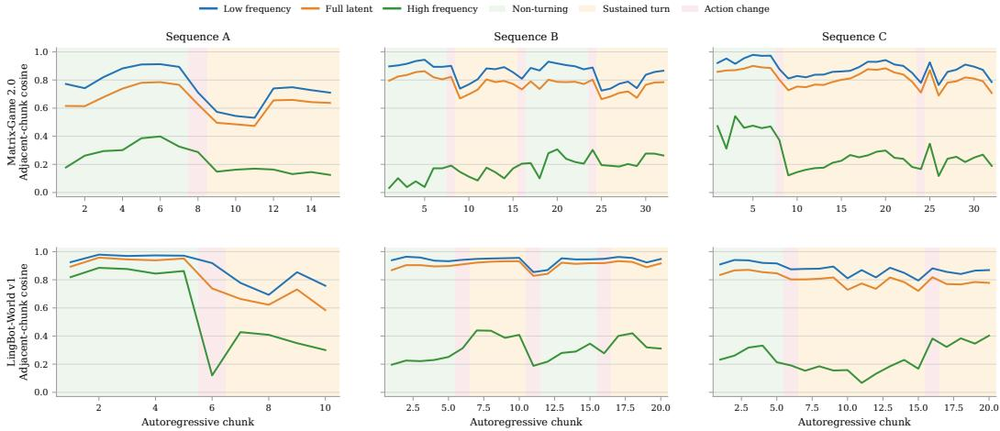  
Figure 2: Cosine similarity between the clean latents of adjacent chunks under different control signals for three representative sequences. Each panel compares the full latent, low-frequency and high-frequency components. The shading background marks the control regime of each chunk, i.e., non-turning (steady), sustained turning, and action change (transition). Similarity drops at the action changes, and the low-frequency component stays more persistent than the high-frequency one.

• We propose CtrlCache, a training-free control-aware caching framework that uses action-aware scheduling and refresh to determine when to reuse denoising computation, and a frequency-mixed history prior to select what historical cache information to transfer during steady interaction.

• Extensive experiments on three interactive video world models demonstrate that CtrlCache accelerates the inference computation while improving WBench Overall scores, outperforming the evaluated caching baselines at comparable latency.

## 2 RELATED WORK

Interactive Video World Models. Interactive video world models generate visual observations conditioned on controls throughout an ongoing rollout. Early autoregressive systems model actionconditioned latent dynamics, as in Genie (Bruce et al., 2024) and iVideoGPT (Wu et al., 2024); diffusion world models extend this setting to action-conditioned games and navigation (Alonso et al., 2024; Valevski et al., 2025; Bar et al., 2025). Recent systems broaden control and scene coverage through multimodal or open-world generation (Che et al., 2025; Yu et al., 2025; Guo et al., 2025), while CausVid (Yin et al., 2025) and Self Forcing (Huang et al., 2025) establish causal fewstep diffusion for streaming generation. Long-horizon interaction and memory are further explored by The Matrix (Feng et al., 2025), Yume (Mao et al., 2025), Matrix-Game 2.0 (He et al., 2025), LingBot-World (Robbyant Team et al., 2026; Gao et al., 2026), WorldPlay (Sun et al., 2025), and Matrix-Game 3.0 (Wang et al., 2026). Despite few-step denoising, each newly generated chunk still requires multiple forward passes through the DiT backbone, creating a need for acceleration that preserves both control responsiveness and cross-chunk temporal continuity.

Training-Free Diffusion Inference Acceleration. Diffusion models generate images and videos through iterative denoising (Ho et al., 2020; 2022), with each step requiring a backbone forward pass; DiT (Peebles & Xie, 2023) and related architectures therefore offer substantial opportunities for intermediate-feature reuse. Training-free caching methods use either predefined or adaptive schedules. Fixed schemes include DeepCache (Ma et al., 2024), FORA (Selvaraju et al., 2024), ∆- DiT (Chen et al., 2024), and PAB (Zhao et al., 2025), which reuse features at selected network modules or timestep intervals. Adaptive schemes include TeaCache (Liu et al., 2025), EasyCache (Zhou et al., 2025), FasterCache (Lv et al., 2025), ToCa (Zou et al., 2025), and AdaCache (Kahatapitiya et al., 2025), which adjust reuse according to feature variation, token redundancy, or motion content. These methods reduce inference cost without retraining. Recent work further studies structurepreserving video caching and adaptive caching for video generation (Fan et al., 2025; Agrawal et al., 2026). However, these works generally ignore online action changes as explicit cache-refresh signal.

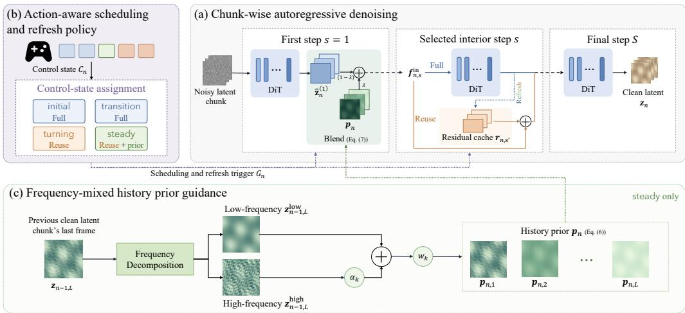  
Figure 3: Overview of CtrlCache. (a) Chunk-wise autoregressive denoising retains full computation at the first and final steps. (b) The action-aware policy enables residual reuse at the selected interior step for turning and steady chunks, while preserving full computation for initial and transition chunks. (c) Frequency-mixed history prior guidance transfers structure from the preceding chunk’s last clean latent frame to guide the first-step clean latent estimate during steady interaction.

FlowCache (Ma et al., 2026) extends caching to autoregressive video through independent chunkwise reuse decisions and bounded-history KV-cache compression, but does not interpret online action transitions. X-Cache targets cross-chunk caching for autonomous-driving world models (Zeng et al., 2026), a distinct application scenario from ours. Light Interaction (Lu et al., 2026) addresses interactive video generation, yet ties denoising reuse to sufficiently similar historical views, making it less suited to open-ended interactions with few or no revisits. Our method instead derives its reuse and refresh decisions directly from the control sequence. Action transitions trigger full computation and cache refresh, while other control states permit residual reuse without trajectory revisitation.

## 3 CTRLCACHE

As illustrated in Figure 3, CtrlCache builds on established residual reuse (Sec. 3.1) and comprises two complementary components. The action-aware scheduling and refresh policy (Sec. 3.2) uses the incoming controls to determine when to reuse cached transformer residuals and when to restore full computation. The frequency-mixed history prior guidance (Sec. 3.3) first constructs a history prior from the preceding chunk’s last clean latent frame, then uses this prior to guide the current chunk’s first-step clean latent estimate during steady interaction. Together, these components determine when to reuse computation and what historical information to carry forward.

## 3.1 PRELIMINARY

Chunk-wise autoregressive denoising. Let n index the n-th video chunk and $s \in \{ 1 , \ldots , S \}$ as denoising steps within each chunk, where S is the number of denoising steps per chunk. To generate chunk n, the interactive video world models (He et al., 2025; Robbyant Team et al., 2026; Gao et al., 2026) progressively denoise a noisy latent conditioned on the incoming controls and previously generated history. Each step performs a full forward pass through the diffusion transformer (DiT), followed by a sampler update using the model prediction. After the S steps, the completed clean latent chunk provides history for subsequent autoregressive generation.

Residual reuse. Rather than computing the whole DiT transformer blocks at every denoising step, following (Liu et al., 2025), we adopt the established approximation of applying a cached residual from the most recent full forward to the current step’s input as the execution mechanism underlying CtrlCache. Let $\pmb { f } _ { n , \varepsilon } ^ { \mathrm { i n } }$ and ${ f } _ { n , s } ^ { \mathrm { o u t } }$ denote the feature tensors immediately before and after the DiT transformer blocks for chunk n at step s. A full forward process produces the residua $\pmb { r } _ { n , s } = \pmb { f } _ { n , s } ^ { \mathrm { o u t } } -$ $f _ { n , s } ^ { \mathrm { i n } } .$ , which is cached for reuse within the current chunk. At denoising step s, if the scheduling policy permits reuse and a residual from an earlier fully computed step is cached, the current transformerblock output $\widetilde { \pmb f } _ { n , s } ^ { \mathrm { o u t } }$ can be approximated as:

$$
\widetilde { \pmb f } _ { n , s } ^ { \mathrm { o u t } } = { \pmb f } _ { n , s } ^ { \mathrm { i n } } + { \pmb r } _ { n , s ^ { \prime } } ,\tag{1}
$$

where $s ^ { \prime } < s$ denotes the most recent preceding step $s ^ { \prime }$ in the same chunk at which the DiT was fully computed to obtain $\boldsymbol { r } _ { n , s ^ { \prime } }$ . The residual cache is refreshed only after a full computation and remains unchanged during reuse, allowing consecutive reuse steps to share the same residual. The current input projection, timestep embedding, and output head are still computed, while the cached residual replaces the time-consuming transformer-block computation.

## 3.2 ACTION-AWARE SCHEDULING AND REFRESH POLICY

As analyses in Figure 2, the variation in adjacent chunk’s clean-latent similarity across control regimes motivates allocating computation according to the incoming controls. We thus propose an action-aware scheduling and refresh policy to assign each chunk a control state, to decide whether using residual reuse or full computation at the selected interior denoising step.

Control-state assignment. Based on the chunk’s position in the rollout and the incoming controls, we distinguish four control states, including initial, transition, turning, and steady. The control state $C _ { n }$ of the chunk n is thus assigned as:

$$
C _ { n } = \left\{ \begin{array} { l l } { \mathrm { i n i t i a l } , } & { n = 1 , } \\ { \mathrm { t r a n s i t i o n } , } & { n > 1 , T _ { n } = 1 , } \\ { \mathrm { t u r n i n g } , } & { n > 1 , T _ { n } = 0 , R _ { n } = 1 , } \\ { \mathrm { s t e a d y } , } & { n > 1 , T _ { n } = 0 , R _ { n } = 0 . } \end{array} \right.\tag{2}
$$

Here, $T _ { n }$ indicates whether a control transition occurs, and $R _ { n }$ indicates whether a turning control is active. The first chunk is assigned the initial state without requiring a preceding control input. For subsequent chunks, transition takes priority over turning, so a chunk containing an action change is classified as transition even when a turning control is also active. Steady state means unchanged, non-turning controls, while the generated scene may continue to evolve without remaining static.

Given these state definitions, the next step is to determine the indicators from the incoming control sequence. For a given backbone, let $\mathbf { a } _ { n , j }$ denote the j-th control input in the chunk n, where $j \in$ $\{ 1 , \ldots , J \}$ and J is the number of control inputs per chunk. We denote this sequence action by $\mathbf { a } _ { n , 1 : J }$ . For $n > 1$ , we additionally define ${ \bf a } _ { n , 0 } = { \bf a } _ { n - 1 , J }$ as the last control input of the preceding chunk, allowing the same rule to detect changes both across chunk boundaries and within a chunk. This auxiliary boundary action input is not included among the current chunk’s J control inputs.

We distinguish a comparison between consecutive control inputs from a test of the current turningcontrol magnitude. Let switch $( \mathbf { a } , \mathbf { b } ) \in \{ 0 , 1 \}$ indicate whether the command changes between two inputs, and let $\mathrm { r o t } ( { \bf a } ) \geq 0$ denote the magnitude of the turning control in an input. For $n > 1$ , the transition indicators $T _ { n }$ and the turning indicators $R _ { n }$ are computed as:

$$
\begin{array} { r l } & { T _ { n } = \underset { 1 \leq j \leq J } { \operatorname* { m a x } } \mathrm { s w i t c h } ( \mathbf { a } _ { n , j } , \mathbf { a } _ { n , j - 1 } ) , } \\ & { R _ { n } = \mathbb { 1 } \left[ \underset { 1 \leq j \leq J } { \operatorname* { m a x } } \mathrm { r o t } ( \mathbf { a } _ { n , j } ) > \tau _ { \mathrm { t u r n } } \right] , } \end{array}\tag{3}
$$

where $\mathbb { 1 } [ \cdot ]$ denotes the indicator function, which returns one when its argument is true and zero otherwise, and $\tau _ { \mathrm { t u r n } }$ is the backbone-specific turning threshold. Checking $j = 1$ detects a change at the chunk boundary, while checking $j ^ { \dot { } } = \{ 2 , \dots , J \}$ captures changes within the chunk.

Scheduling and refresh trigger. Given the control state $C _ { n } .$ , we determine whether to enable residual reuse at one selected interior denoising step $s \in \{ 2 , \ldots , S - 1 \}$ . All remaining steps are fully computed, with the first initializing the residual cache and the final preserving the model’s refinement. Let $G _ { n } \in \{ 0 , 1 \}$ indicate whether full computation is required at the selected step:

$$
G _ { n } = \left\{ \begin{array} { l l } { 1 , } & { n = 1 , } \\ { T _ { n } , } & { n > 1 . } \end{array} \right.\tag{4}
$$

Here, $G _ { n } = 1$ triggers a cache refresh in which the DiT transformer blocks are fully computed, and the resulting residual updates the current chunk’s cache as the new residual cache. When $G _ { n } =$ 0, the transformer-block output at the selected step is approximated using the cached residual via Eq. (1). Initial chunks retain full computation to establish the rollout, and transition chunks restore it at the selected step to accommodate changed controls. Turning and steady chunks instead reuse the cached residual at that step.

## 3.3 FREQUENCY-MIXED HISTORY PRIOR GUIDANCE

The action-aware scheduling and refresh policy controls residual reuse within each chunk. We further introduce a frequency-mixed history prior guidance to determine what cached information is safer to carry forward during reusing. Here, we use information from the preceding chunk’s clean latent. As the analyses in Figure 2, even in the steady interaction regime, low-frequency components encoding coarse scene layout remain more persistent across chunks than high-frequency components encoding fine appearance details. Transferring the preceding clean latent without distinction can therefore impose details that no longer fit the evolving scene. To this end, we construct a history prior that emphasizes coarse structure, and blend it into the current chunk’s first-step clean estimate. This guidance is enabled only when $C _ { n } =$ steady since during transitions and sustained turning, the inherited geometry may itself be changing with the viewpoint.

Frequency-mixed history prior construction. Let $z _ { n - 1 }$ denote the preceding chunk’s clean latent, consisting of L temporal latent frames. We use its last frame, $z _ { n - 1 , L }$ , to construct the history prior for the current chunk. We decompose this latent into a low-frequency component obtained by spatial average pooling and a high-frequency component defined as the remaining difference:

$$
\begin{array} { r l } & { z _ { n - 1 , L } ^ { \mathrm { l o w } } = \mathrm { A v g P o o l } _ { 3 \times 3 } ( z _ { n - 1 , L } ) , } \\ & { z _ { n - 1 , L } ^ { \mathrm { h i g h } } = z _ { n - 1 , L } - z _ { n - 1 , L } ^ { \mathrm { l o w } } . } \end{array}\tag{5}
$$

Here, the low and high denote frequency components. $\mathrm { A v g P o o l _ { 3 \times 3 } }$ denotes spatial average pooling with a $3 \times 3$ kernel, unit stride, and replicate padding, chosen for its low computational cost. It operates independently on each latent frame and channel, preserving spatial resolution without mixing information across the temporal dimension.

The current chunk likewise contains L temporal latent frames. Position $k = 1$ is closest in time to the preceding chunk, and larger k denotes a later position. Thus, k indexes positions within a latent chunk, while s indexes denoising steps and $j$ indexes control inputs as shown in the previous sections. We construct a history prior latent frame $\pmb { p } _ { n , k }$ at each position, with the same shape as $z _ { n - 1 , L } \colon$

$$
\pmb { p } _ { n , k } = w _ { k } \big ( z _ { n - 1 , L } ^ { \mathrm { l o w } } + \alpha _ { k } z _ { n - 1 , L } ^ { \mathrm { h i g h } } \big ) , \quad k = 1 , \ldots , L ,\tag{6}
$$

where $\alpha _ { k }$ weights the high-frequency component, with $\alpha _ { 1 } = 1$ and $\alpha _ { k } = \alpha \in [ 0 , 1 ]$ for $k \geq 2$ The temporal weights $w _ { k }$ satisfy $1 = w _ { 1 } \geq w _ { 2 } \geq \cdot \cdot \cdot \geq w _ { L } \geq 0$ With $\alpha _ { 1 } = w _ { 1 } = 1$ , the first prior frame preserves the preceding chunk’s last clean latent frame in full. At later positions, α controls high-frequency attenuation, while $w _ { k }$ scales both frequency components according to temporal distance. Stacking $\{ p _ { n , 1 } , \ldots , p _ { n , L } \}$ along the temporal dimension yields the history prior ${ \pmb p } _ { n }$ for chunk n. The model-specific values of α and $w _ { k }$ are reported in Section 4.1.

Guiding the clean latent estimate using the history prior. After constructing the history prior ${ \pmb p } _ { n }$ from the preceding chunk, we use it to guide the current chunk’s clean latent estimate. Let $\widehat { \pmb { z } } _ { n } ^ { ( s ) }$ denote the clean latent estimate of chunk n obtained at denoising step s using the base sampler’s prediction parameterization. Both $\widehat { \pmb { z } } _ { n } ^ { ( s ) }$ and ${ \pmb p } _ { n }$ span all L temporal latent positions and have the same shape. We then blend the current estimate $\widehat { \pmb { z } } _ { n } ^ { ( s ) }$ with the history prior ${ \pmb p } _ { n }$

$$
\begin{array} { r } { \widehat { \pmb { z } } _ { n } ^ { ( s ) }  ( 1 - \lambda ) \widehat { \pmb { z } } _ { n } ^ { ( s ) } + \lambda \pmb { p } _ { n } , } \end{array}\tag{7}
$$

where $\lambda \in [ 0 , 1 ]$ is the guidance strength and the arrow denotes an in-place update of the clean estimate. In this paper, we apply history prior guidance only at $s = 1$ , when the earliest controlconditioned clean latent estimate of the current chunk becomes available. This leaves the remaining denoising steps to adapt the transferred structure to the current controls and refine visual details. The sampler uses the updated clean estimate to construct the next noisy latent under its original timestep and noise schedule. Thus, the guidance introduces no additional DiT forward computation cost.

Table 1: Quality and efficiency comparison of CtrlCache and baselines on the WBench navigation track (Ying et al., 2026). “vs. Original” compares each accelerated method with the original full computation model under identical prompts, controls, and initial frames. “Efficiency” reports DiT backbone denoising latency (mean seconds per case), excluding KV-cache commit/update time, and speedup over Original. Bold denotes the best result within each model.
<table><tr><td rowspan="2">Model</td><td rowspan="2">Methods</td><td colspan="4">WBench</td><td colspan="2">vs. Original</td><td colspan="2">Efficiency</td></tr><tr><td>Quality↑</td><td>Cons.↑ Inter.↑</td><td>Setting↑</td><td>Physics↑</td><td>Overall↑</td><td>PSNR↑ SSIM↑ LPIPS↓</td><td></td><td>[Latency (s)↓ Speedup↑</td></tr><tr><td rowspan="4">Matrix-Game 2.0</td><td>Original</td><td>0.7360</td><td>0.6838 0.8261</td><td>0.5129</td><td>0.5127</td><td>0.6543</td><td></td><td>14.99</td><td>1.00×</td></tr><tr><td>TeaCache</td><td>0.7252</td><td>0.68200.8145</td><td>0.4982</td><td>0.5275</td><td>0.6495 13.89</td><td>0.3344 0.4810</td><td>10.33</td><td>1.45×</td></tr><tr><td>EasyCache</td><td>0.7245</td><td>0.6803 0.8093</td><td>0.5464</td><td>0.5518</td><td>0.6625</td><td>13.46 0.3152 0.5021</td><td>10.17</td><td>1.47×</td></tr><tr><td>Our CtrlCache</td><td>0.7370</td><td>0.6867 0.8265</td><td>0.5527</td><td>0.5900</td><td>0.6786 14.51</td><td>0.3504 0.4757</td><td>10.67</td><td>1.41×</td></tr><tr><td rowspan="4">LingBot-World v1</td><td>Original</td><td>0.8073</td><td>0.8715 0.8088</td><td>0.7868</td><td>0.6338</td><td>0.7816</td><td></td><td>104.54</td><td>1.00×</td></tr><tr><td>TeaCache</td><td>0.8052</td><td>0.8755 0.8306</td><td>0.7844</td><td>0.7023</td><td>0.7996</td><td>15.54 0.4638 0.3855</td><td>80.31</td><td>1.30×</td></tr><tr><td>EasyCache</td><td>0.8074</td><td>0.8751 0.7907</td><td>0.7910</td><td>0.7287</td><td>0.7986</td><td>15.26 0.4506 0.3946</td><td>79.80</td><td>1.31×</td></tr><tr><td>Our CtrlCache</td><td>0.8073</td><td>0.8737 0.8200</td><td>0.8246</td><td>0.7379</td><td>0.8127 17.27</td><td>0.5014 0.3451</td><td>83.03</td><td>1.26×</td></tr><tr><td rowspan="4">LingBot-World v2</td><td>Original</td><td>0.8290</td><td>0.8716 0.8389</td><td>0.7692</td><td>0.7124</td><td>0.8042</td><td></td><td>66.93</td><td>1.00×</td></tr><tr><td>TeaCache</td><td>0.8307</td><td>0.88480.8279</td><td>0.8078</td><td>0.7171</td><td>0.8137</td><td>14.98 0.4176</td><td>0.3538 51.54</td><td>1.30×</td></tr><tr><td>EasyCache</td><td>0.8303</td><td>0.8824 0.8296</td><td>0.8047</td><td>0.6983</td><td>0.8091</td><td>14.90 0.4161 0.3586</td><td>51.12</td><td>1.31×</td></tr><tr><td>Our CtrlCache</td><td>0.8278</td><td>0.8789 0.8334</td><td>0.8306</td><td>0.7298</td><td>0.8201</td><td>18.35 0.5238 0.2832</td><td>55.18</td><td>1.21×</td></tr></table>

## 3.4 OVERALL MECHANISM

For each chunk, CtrlCache first determines its control state from the incoming controls and then coordinates computation reuse and history transfer accordingly. Initial and transition chunks retain full computation throughout the denoising process, whereas turning and steady chunks reuse a cached residual at one selected interior step. The first and final denoising steps remain fully computed in all cases. In addition, steady chunks apply the frequency-mixed history prior to the clean latent estimate at $s = 1$ to promote structural consistency across chunks. After generating the clean latent chunk $z _ { n } ,$ CtrlCache retains its last temporal frame $z _ { n , L }$ as the history reference for the next chunk. The complete inference pseudocode is provided in Appendix A.

## 4 EXPERIMENTS

## 4.1 EXPERIMENTAL SETUP

Models and baselines. We evaluate CtrlCache on three interactive video world models: Matrix-Game 2.0 (He et al., 2025), LingBot-World v1 (Robbyant Team et al., 2026), and LingBot-World v2 (Gao et al., 2026), using their few-step, chunk-wise autoregressive inference configurations. We compare against the unmodified inference procedure (Original) and two representative training-free caching methods, TeaCache (Liu et al., 2025) and EasyCache (Zhou et al., 2025). Both baselines follow their own published reuse rules with own original denoising schedules, and neither uses our frequency-mixed history prior guidance.

Benchmark and evaluation metrics. We evaluate interactive generation on the navigation track of WBench (Ying et al., 2026), reporting video quality (Quality), consistency (Cons.), interaction adherence (Inter.), setting adherence (Setting), and physics compliance (Physics). The Overall score is the unweighted mean of these five dimension scores. To assess fidelity to the unmodified model, we also report PSNR, SSIM (Wang et al., 2004), and LPIPS (Zhang et al., 2018) against the paired Original. For efficiency, we report mean DiT-backbone latency and speedup relative to Original.

Implementation details. All experiments use a single NVIDIA A100 GPU with random seed 42. For each backbone, all methods share the same prompts, control sequences, initial frames, and decoding settings, and retain the original denoising The selected reuse step s is 2, 3, 2 for Matrix-Game 2.0, LingBot-World v1 and ${ \bf v } 2 ;$ reuse is enabled only when permitted by $G _ { n } \left( \mathrm { E q . } \left( 4 \right) \right)$ . For the turning indicator $R _ { n }$ in Eq. (3), we set $\tau _ { \mathrm { t u r n } } = 1 0 ^ { - 6 }$ for the mouse-control magnitude in Matrix Game 2.0 and $\tau _ { \mathrm { t u r n } } = 0$ for the yaw/pitch motion magnitude in both LingBot-World variants. Unless otherwise stated, history prior guidance uses α = 0.5 in Eq. (6) and $\lambda = 0 . 5$ in Eq. (7). The temporal weights $( w _ { 1 } , \dots , w _ { L } )$ are (1, 0.5, 0.25) for Matrix-Game 2.0 and LingBot-World v1 $( L = 3 )$ , and (1, 0.5, 0.25, 0.125) for LingBot-World v2 (L = 4). More details are in Appendix B.

Matrix-Game 2.0  
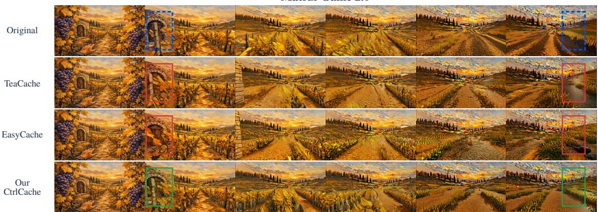  
WBench prompt: An autumn Tuscan vineyard with orderly rows of grapevines bearing golden leaves and ripe purple grape clusters. … Controls: W D S A. LingBot-World v1

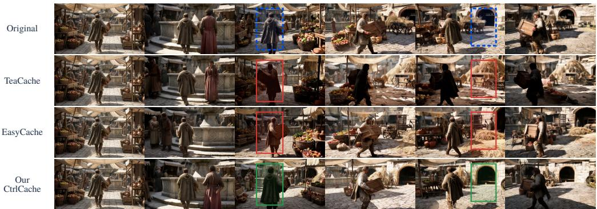  
WBench prompt: A bustling medieval market square with weath ered stone-paved ground. … Controls: W S A D.

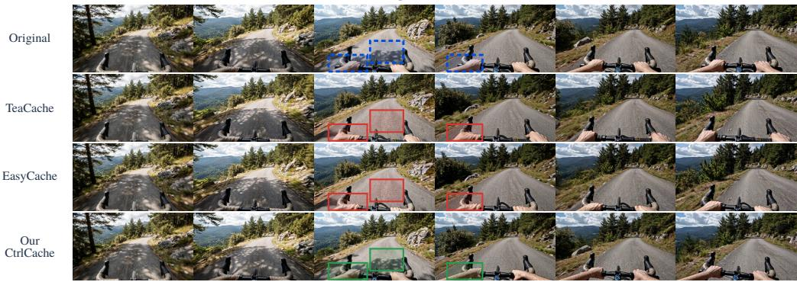  
WBench prompt: A narrow paved mountain road winding downhill through a forested hillside. … Controls: W right.

Figure 4: Qualitative comparisons of CtrlCache and baselines. For each case, all methods use the same initial condition and control sequence. The blue dashed rectangles mark reference regions for comparing layout, object placement, and motion-related details across methods. The red rectangles highlight distortions in local appearance and scene structure, while the green rectangles highlight better-preserved details in our results. Control strings follow the original WBench convention, where W / S/ A / D denote translational commands and left / right / up / down denote view changes.

## 4.2 MAIN RESULTS

Table 1 reports the quantitative comparison on all three backbones. Overall, CtrlCache attains the best WBench Overall score and the closest agreement with the original model on every backbone, at a speedup comparable to the caching baselines. On Matrix-Game 2.0, CtrlCache is the only method that improves over Original on all five WBench dimensions, raising Overall from 0.6543 to

Table 2: Ablation studies on Matrix-Game 2.0 and LingBot-World v1 using WBench navigation track. The first two variants evaluate naive residual reuse (Eq. (1)) alone and with our proposed action-aware scheduling and refresh policy (abbreviated as Action-aware policy; Sec. 3.2), respectively. The last three fix both components and apply the frequency-mixed history prior guidance (abbreviated as History prior; Sec. 3.3) on steady (St.), steady and turning (St.+Tu.), or steady, turning and transition (St.+Tu.+Tr.) chunks. Efficiency reports DiT-backbone denoising latency and speedup relative to Original. Bold denotes the best result within each model.
<table><tr><td rowspan="2">Model</td><td rowspan="2">Variant</td><td colspan="6">WBench</td><td colspan="2">Efficiency</td></tr><tr><td>Quality↑</td><td>Cons.↑</td><td>Inter.↑</td><td>Setting↑</td><td>Physics↑</td><td>Overall↑</td><td>Latency (s)↓ Speedup↑</td><td></td></tr><tr><td rowspan="6">Matrix-Game 2.0</td><td>Original</td><td>0.7360</td><td>0.6838</td><td>0.8261</td><td>0.5129</td><td>0.5127</td><td>0.6543</td><td>14.99</td><td>1.00×</td></tr><tr><td>+ Residual reuse</td><td>0.7353</td><td>0.6870</td><td>0.8418</td><td>0.5285</td><td>0.4843</td><td>0.6554</td><td>10.31</td><td>1.45×</td></tr><tr><td>+ Action-aware policy</td><td>0.7310</td><td>0.6802</td><td>0.8372</td><td>0.5417</td><td>0.5169</td><td>0.6614</td><td>10.39</td><td>1.44×</td></tr><tr><td>+ History prior (St.+Tu.+Tr.)</td><td>0.7299</td><td>0.6772</td><td>0.8014</td><td>0.5436</td><td>0.5272</td><td>0.6559</td><td>10.65</td><td>1.41×</td></tr><tr><td>+ History prior (St.+Tu.)</td><td>0.7301</td><td>0.6816</td><td>0.8200</td><td>0.5030</td><td>0.5856</td><td>0.6641</td><td>10.67</td><td>1.41×</td></tr><tr><td>+ History prior (St.) (Full CtrlCache)</td><td>0.7370</td><td>0.6867</td><td>0.8265</td><td>0.5527</td><td>0.5900</td><td>0.6786</td><td>10.67</td><td>1.41×</td></tr><tr><td rowspan="6">LingBot-World v1</td><td>Original</td><td>0.8073</td><td>0.8715</td><td>0.8088</td><td>0.7868</td><td>0.6338</td><td>0.7816</td><td>104.54</td><td>1.00×</td></tr><tr><td>+ Residual reuse</td><td>0.8050</td><td>0.8756</td><td>0.8119</td><td>0.7815</td><td>0.7364</td><td>0.8021</td><td>80.35</td><td>1.30×</td></tr><tr><td>+ Action-aware policy</td><td>0.8073</td><td>0.8688</td><td>0.8120</td><td>0.8148</td><td>0.7246</td><td>0.8055</td><td>82.98</td><td>1.26×</td></tr><tr><td>+ History prior (St.+Tu.+Tr.)</td><td>0.8076</td><td>0.8689</td><td>0.7845</td><td>0.7804</td><td>0.7040</td><td>0.7891</td><td>83.05</td><td>1.26×</td></tr><tr><td>+ History prior (St.+Tu.)</td><td>0.8074</td><td>0.8716</td><td>0.7870</td><td>0.7893</td><td>0.7175</td><td>0.7946</td><td>83.03</td><td>1.26×</td></tr><tr><td>+ History prior (St.) (Full CtrlCache)</td><td>0.8073</td><td>0.8737</td><td>0.8200</td><td>0.8246</td><td>0.7379</td><td>0.8127</td><td>83.03</td><td>1.26×</td></tr></table>

0.6786 and surpassing the relatively best EasyCache (0.6625) while delivering 1.05 higher PSNR. On LingBot-World v1/ v2, CtrlCache achieves best Overall, PSNR, SSIM and LPIPS, while keeping a comparable 1.26 and 1.21 speedup, respectively. The caching baselines remain marginally faster than CtrlCache on every backbone, since their reuse criteria are free to skip computation at action transitions. CtrlCache instead spends that computation on transition chunks, which is what yields the highest setting adherence and physics compliance on all three backbones.

Figure 4 presents qualitative comparisons with all three backbones. For each case, all methods use identical initial conditions and control sequences. Although the overall scene layouts remain similar, TeaCache and EasyCache exhibit distortions in local appearance and scene structure., e.g., the disappearance of an arched doorway in LingBot-World v1. Our CtrlCache restores full computation at control transitions and better preserves local details and scene structure. These qualitative results are consistent with its higher PSNR and lower LPIPS reported in Table 1. Video comparisons are available on our project page: https://wrecklong.github.io/CtrlCache/.

## 4.3 ABLATION STUDY

Effect of naive residual reuse. We first evaluate naive residual reuse (Eq. (1)) at the selected interior denoising step s, without the action-aware policy or history prior guidance. We reuse at s = 2, 3 for Matrix-Game 2.0, LingBot-World v1 respectively, based on the scheduling configuration of each model (see Appendix B), and leaves each model’s final correction step fully evaluated. This reduces transformer-block computation while slightly improving Overall on both backbones. However, the gains are uneven across dimensions, e.g., physics compliance on Matrix-Game 2.0 declining relative to Original, suggesting that naive residual reuse may compromise quality, motivating a policy that explicitly accounts for control transitions.

Effect of the action-aware scheduling and refresh policy. Building on naive residual reuse, we enable the action-aware policy in Sec. 3.2 to restore full computation at control transitions, while steady and turning states do residual reuse. It improves Overall on both backbones, as well as setting and physics compliance on Matrix-Game 2.0 and setting compliance on LingBot-World v1. Overall, the policy improves generation performance by better preserving scene settings under acceleration.

Effect of the frequency-mixed history prior guidance. We keep residual reuse and the actionaware policy fixed and vary the control states in which history prior guidance is applied. By default, we only apply the frequency-mixed history prior guidance (Sec. 3.3) on the steady state. Restricting guidance to steady chunks yields the highest Overall scores among the evaluated variants, while extending it to turning or transition chunks reduces performance. These results suggest that the prior is most beneficial during steady interaction, whereas carrying forward historical structure during turning or control transitions may interfere with the required scene changes.

Hyperparameter analysis. We provide additional sensitivity analyses of the selected residualreuse step s (Eq. (1)), and history prior settings, including the temporal weights $w _ { k }$ (Eq. (6)), highfrequency component weight α (Eq. (6)), and blend guidance strength λ (Eq. (7)) in the Appendix D.

## 5 CONCLUSION

We propose CtrlCache, a training-free framework that uses online controls to guide both computation reuse and history transfer in interactive video world models. Its action-aware scheduling and refresh policy controls residual reuse and restores full computation at control transitions, while frequency-mixed history prior guidance transfers persistent coarse structure during steady interaction. Experiments on Matrix-Game 2.0 and LingBot-World v1/ v2 show that CtrlCache improves WBench Overall over original models and achieves comparable speedups. These findings highlight the value of adapting acceleration to the control regime and the persistence of historical information.

Limitation. CtrlCache currently relies on backbone-specific action indicators and a fixed reuse step that varies with each backbone’s denoising schedule. We will explore more general control representations and adaptive step selection in the future work.

## REFERENCES

Om Agrawal, Saurabh Agarwal, and Aditya Akella. ACID: Adaptive caching for vIDeo generation. arXiv preprint arXiv:2607.12358, 2026.

Eloi Alonso, Adam Jelley, Vincent Micheli, Anssi Kanervisto, Amos Storkey, Tim Pearce, and Franc¸ois Fleuret. Diffusion for world modeling: Visual details matter in atari. In Advances in Neural Information Processing Systems, volume 37, 2024.

Amir Bar, Gaoyue Zhou, Danny Tran, Trevor Darrell, and Yann LeCun. Navigation world models. In Proceedings of the IEEE/CVF Conference on Computer Vision and Pattern Recognition, pp. 15791–15801, 2025.

Jake Bruce, Michael D. Dennis, Ashley Edwards, Jack Parker-Holder, Yuge Shi, Edward Hughes, Matthew Lai, Aditi Mavalankar, Richie Steigerwald, Chris Apps, Yusuf Aytar, Sarah Maria Elisabeth Bechtle, Feryal Behbahani, Stephanie C. Y. Chan, Nicolas Heess, Lucy Gonzalez, Simon Osindero, Sherjil Ozair, Scott Reed, Jingwei Zhang, Konrad Zolna, Jeff Clune, Nando de Freitas, Satinder Singh, and Tim Rocktaschel. Genie: Generative interactive environments. In¨ Proceed ings of the 41st International Conference on Machine Learning, volume 235, pp. 4603–4623, 2024.

Haoxuan Che, Xuanhua He, Quande Liu, Cheng Jin, and Hao Chen. GameGen-X: Interactive openworld game video generation. In International Conference on Learning Representations, 2025.

Pengtao Chen, Mingzhu Shen, Peng Ye, Jianjian Cao, Chongjun Tu, Christos-Savvas Bouganis, Yiren Zhao, and Tao Chen. Delta-DiT: A training-free acceleration method tailored for diffusion transformers. arXiv preprint arXiv:2406.01125, 2024.

Zhentao Fan, Zongzuo Wang, and Weiwei Zhang. TaoCache: Structure-maintained video generation acceleration. arXiv preprint arXiv:2508.08978, 2025.

Ruili Feng, Han Zhang, Zhilei Shu, Zhantao Yang, Longxiang Tang, Zhicai Wang, Andy Zheng, Jie Xiao, Zhiheng Liu, Ruihang Chu, Yukun Huang, Yu Liu, and Hongyang Zhang. The Matrix: Infinite-horizon world generation with real-time moving control. In Advances in Neural Information Processing Systems, volume 38, 2025.

Zelin Gao, Qiuyu Wang, Jiapeng Zhu, Jingye Chen, Zichen Liu, Qingyan Bai, Jiahao Wang, Yufeng Yuan, Hanlin Wang, Yichong Lu, Ka Leong Cheng, Haojie Zhang, Jian Gao, Tianrui Feng, Yuzheng Liu, Yao Yao, Yinghao Xu, Xing Zhu, Yujun Shen, and Hao Ouyang. Infinite worlds with versatile interactions. arXiv preprint arXiv:2607.07534, 2026.

Junliang Guo, Yang Ye, Tianyu He, Haoyu Wu, Yushu Jiang, Tim Pearce, and Jiang Bian. MineWorld: A real-time and open-source interactive world model on Minecraft. arXiv preprint arXiv:2504.08388, 2025.

Xianglong He, Chunli Peng, Zexiang Liu, Boyang Wang, Yifan Zhang, Qi Cui, Fei Kang, Biao Jiang, Mengyin An, Yangyang Ren, Baixin Xu, Hao-Xiang Guo, Kaixiong Gong, Cyrus Wu, Wei Li, Xuchen Song, Yang Liu, Eric Li, and Yahui Zhou. Matrix-Game 2.0: An open-source, real-time, and streaming interactive world model. arXiv preprint arXiv:2508.13009, 2025.

Jonathan Ho, Ajay Jain, and Pieter Abbeel. Denoising diffusion probabilistic models. In Advances in Neural Information Processing Systems, volume 33, pp. 6840–6851, 2020.

Jonathan Ho, Tim Salimans, Alexey Gritsenko, William Chan, Mohammad Norouzi, and David J. Fleet. Video diffusion models. In Advances in Neural Information Processing Systems, volume 35, pp. 8633–8646, 2022.

Xun Huang, Zhengqi Li, Guande He, Mingyuan Zhou, and Eli Shechtman. Self forcing: Bridging the train-test gap in autoregressive video diffusion. In Advances in Neural Information Processing Systems, volume 38, 2025.

Kumara Kahatapitiya, Haozhe Liu, Sen He, Ding Liu, Menglin Jia, Chenyang Zhang, Michael S. Ryoo, and Tian Xie. Adaptive caching for faster video generation with diffusion transformers. In Proceedings of the IEEE/CVF International Conference on Computer Vision, pp. 15240–15252, 2025.

Feng Liu, Shiwei Zhang, Xiaofeng Wang, Yujie Wei, Haonan Qiu, Yuzhong Zhao, Yingya Zhang, Qixiang Ye, and Fang Wan. Timestep embedding tells: It’s time to cache for video diffusion model. In Proceedings of the IEEE/CVF Conference on Computer Vision and Pattern Recognition, 2025.

Jiacheng Lu, Haoyi Zhu, Sipei Yi, Enze Xie, Yu Li, and Cheng Zhuo. Light interaction: Trainingfree inference acceleration for interactive video world models. arXiv preprint arXiv:2605.31158, 2026.

Zhengyao Lv, Chenyang Si, Junhao Song, Zhenyu Yang, Yu Qiao, Ziwei Liu, and Kwan-Yee K. Wong. FasterCache: Training-free video diffusion model acceleration with high quality. In International Conference on Learning Representations, 2025.

Xinyin Ma, Gongfan Fang, and Xinchao Wang. DeepCache: Accelerating diffusion models for free. In Proceedings of the IEEE/CVF Conference on Computer Vision and Pattern Recognition, pp. 15762–15772, 2024.

Yuexiao Ma, Xuzhe Zheng, Jing Xu, Xiwei Xu, Feng Ling, Xiawu Zheng, Huafeng Kuang, Huixia Li, Xing Wang, Xuefeng Xiao, Fei Chao, and Rongrong Ji. Flow caching for autoregressive video generation. In International Conference on Learning Representations, 2026.

Xiaofeng Mao, Shaoheng Lin, Zhen Li, Chuanhao Li, Wenshuo Peng, Tong He, Jiangmiao Pang, Mingmin Chi, Yu Qiao, and Kaipeng Zhang. Yume: An interactive world generation model. arXiv preprint arXiv:2507.17744, 2025.

William Peebles and Saining Xie. Scalable diffusion models with transformers. In Proceedings of the IEEE/CVF International Conference on Computer Vision, pp. 4195–4205, 2023.

Robbyant Team, Zelin Gao, Qiuyu Wang, Yanhong Zeng, Jiapeng Zhu, Ka Leong Cheng, Yixuan Li, Hanlin Wang, Yinghao Xu, Shuailei Ma, Yihang Chen, Jie Liu, Yansong Cheng, Yao Yao, Jiayi Zhu, Yihao Meng, Kecheng Zheng, Qingyan Bai, Jingye Chen, Zehong Shen, Yue Yu, Xing Zhu, Yujun Shen, and Hao Ouyang. Advancing Open-source world models. arXiv preprint arXiv:2601.20540, 2026.

Pratheba Selvaraju, Tianyu Ding, Tianyi Chen, Ilya Zharkov, and Luming Liang. FORA: Fastforward caching in diffusion transformer acceleration. arXiv preprint arXiv:2407.01425, 2024.

Wenqiang Sun, Haiyu Zhang, Haoyuan Wang, Junta Wu, Zehan Wang, Zhenwei Wang, Yunhong Wang, Jun Zhang, Tengfei Wang, and Chunchao Guo. WorldPlay: Towards long-term geometric consistency for real-time interactive world modeling. arXiv preprint arXiv:2512.14614, 2025.

Dani Valevski, Yaniv Leviathan, Moab Arar, and Shlomi Fruchter. Diffusion models are real-time game engines. In International Conference on Learning Representations, 2025.

Zhou Wang, Alan C. Bovik, Hamid R. Sheikh, and Eero P. Simoncelli. Image quality assessment: From error visibility to structural similarity. IEEE Transactions on Image Processing, 13(4): 600–612, 2004.

Zile Wang, Zexiang Liu, Jaixing Li, Kaichen Huang, Baixin Xu, Fei Kang, Mengyin An, Peiyu Wang, Biao Jiang, Yichen Wei, Yidan Xietian, Jiangbo Pei, Liang Hu, Boyi Jiang, Hua Xue, Zidong Wang, Haofeng Sun, Wei Li, Wanli Ouyang, Xianglong He, Yang Liu, Yangguang Li, and Yahui Zhou. Matrix-Game 3.0: Real-time and streaming interactive world model with longhorizon memory. arXiv preprint arXiv:2604.08995, 2026.

Jialong Wu, Shaofeng Yin, Ningya Feng, Xu He, Dong Li, Jianye Hao, and Mingsheng Long. iVideoGPT: Interactive VideoGPTs are scalable world models. In Advances in Neural Information Processing Systems, volume 37, 2024.

Tianwei Yin, Qiang Zhang, Richard Zhang, William T. Freeman, Fredo Durand, Eli Shechtman, and Xun Huang. From slow bidirectional to fast autoregressive video diffusion models. In Proceedings ofthe IEEE/CVF Conference on Computer Vision and Pattern Recognition, pp. 22963– 22974, 2025.

Kaining Ying, Hengrui Hu, Siyu Ren, Jiamu Li, Fengjiao Chen, Ziwen Wang, Xuezhi Cao, Xunliang Cai, and Henghui Ding. WBench: A comprehensive multi-turn benchmark for interactive video world model evaluation. arXiv preprint arXiv:2605.25874, 2026.

Jiwen Yu, Yiran Qin, Xintao Wang, Pengfei Wan, Di Zhang, and Xihui Liu. GameFactory: Creating new games with generative interactive videos. In Proceedings of the IEEE/CVF International Conference on Computer Vision, pp. 11590–11599, 2025.

Yixiao Zeng, Jianlei Zheng, Chaoda Zheng, Shijia Chen, Mingdian Liu, Tongping Liu, Tengwei Luo, Yu Zhang, Boyang Wang, Linkun Xu, et al. X-Cache: Cross-chunk block caching for fewstep autoregressive world models inference. arXiv preprint arXiv:2604.20289, 2026.

Richard Zhang, Phillip Isola, Alexei A. Efros, Eli Shechtman, and Oliver Wang. The unreasonable effectiveness of deep features as a perceptual metric. In Proceedings of the IEEE Conference on Computer Vision and Pattern Recognition, pp. 586–595, 2018.

Xuanlei Zhao, Xiaolong Jin, Kai Wang, and Yang You. Real-time video generation with pyramid attention broadcast. In International Conference on Learning Representations, 2025.

Xin Zhou, Dingkang Liang, Kaijin Chen, Tianrui Feng, Xiwu Chen, Hongkai Lin, Yikang Ding, Feiyang Tan, Hengshuang Zhao, and Xiang Bai. Less is enough: Training-free video diffusion acceleration via runtime-adaptive caching. arXiv preprint arXiv:2507.02860, 2025.

Chang Zou, Xuyang Liu, Ting Liu, Siteng Huang, and Linfeng Zhang. Accelerating diffusion transformers with token-wise feature caching. In International Conference on Learning Representations, 2025.

## APPENDIX

This appendix provides CtrlCache’s inference pseudocode (Sec. A), more implementation details (Sec. B), evaluation protocol (Sec. C), hyperparameter analysis (Sec. D), and additional Qualitative Examples (Sec. E).

## A CTRLCACHE ALGORITHM

Algorithm 1 presents the inference procedure of CtrlCache, complementing the method description in Section 3 of the main paper. The pseudocode details how the action-aware scheduling and refresh policy and frequency-mixed history prior guidance are integrated into chunk-wise autoregressive generation.

Algorithm 1: CtrlCache Inference   
Input : Pretrained world model and base sampler; initial conditioning and online controls; N chunks,   
each with J control inputs, L temporal latent frames, and S denoising steps; one selected reuse   
step in $\{ 2 , \ldots , S - 1 \} ;$ prior parameters $\alpha , \{ w _ { k } \} _ { k = 1 } ^ { L }$ , and λ.   
Output: Clean latent chunks $\{ z _ { n } \} _ { n = 1 } ^ { N } .$   
Initialization: Initialize the base model’s autoregressive context from the initial conditioning. Set $\alpha _ { 1 } = 1$   
and $\alpha _ { k } = \alpha$ for $k \geq 2 .$   
1 for $n = 1$ to N do   
2 Read the current control inputs $\mathbf { a } _ { n , 1 : J } ;$   
3 if $n > 1$ then   
4 $\mathbf { a } _ { n , 0 }  \mathbf { a } _ { n - 1 , J } ;$   
5 Compute $T _ { n }$ and $R _ { n }$ via Eq. (3);   
6 end   
7 Assign $C _ { n }$ and $G _ { n }$ via Eqs. (2) and (4);   
8 Clear the within-chunk residual cache; initialize the noisy latent using the base sampler;   
9 if $C _ { n } =$ steady then   
10 Decompose $\pmb { z } _ { n - 1 , L }$ into low- and high-frequency components via Eq. (5);   
11 Construct ${ \pmb p } _ { n , k }$ for $k = 1 , \dots , L$ via Eq. (6); stack them along the temporal dimension to obtain   
${ \pmb p } _ { n } ;$   
12 end   
13 for $s = 1$ to S do   
14 Prepare $\pmb { f } _ { n , s } ^ { \mathrm { i n } }$ and the current timestep and control conditioning;   
15 if $\hat { G } _ { n } = \bar { 0 }$ and s is the selected reuse step then   
16 Approximate $\widetilde { \pmb f } _ { n , s } ^ { \mathrm { o u t } }$ using the latest cached residual $\mathbf { \Delta } ^ { r _ { n , s ^ { \prime } } }$ via Eq. (1);   
17 else   
18 Fully compute the transformer blocks to obtain $f _ { n , s } ^ { \mathrm { o u t } } ;$   
19 Cache $\pmb { r } _ { n , s } \gets \pmb { f } _ { n , s } ^ { \mathrm { o u t } } - \pmb { f } _ { n , s } ^ { \mathrm { i n } } ; s ^ { \prime } \gets s ;$   
20 end   
21 Obtain $\widehat { \pmb { z } } _ { n } ^ { ( s ) }$ from the full or approximated block output using the output head and the base   
prediction parameterization;   
22 if $\mathrm { \hat { ~ } } C _ { n } = \mathrm { s t e a d y }$ and $s = 1$ then   
23 Blend the current estimate with the history prior: $\widehat { \pmb { z } } _ { n } ^ { ( 1 ) } \gets ( 1 - \lambda ) \widehat { \pmb { z } } _ { n } ^ { ( 1 ) } + \lambda \pmb { p } ,$ n via Eq. (7);   
24 end   
25 Perform the base sampler update using $\widehat { \pmb { z } } _ { n } ^ { ( s ) }$ and the original timestep and noise schedule;   
26 end   
27 Obtain the clean latent chunk $z _ { n }$ from the final sampler output;   
28 Retain $z _ { n , L }$ as the history reference for the next chunk;   
29 Update the base model’s autoregressive context with $z _ { n } ;$   
30 end

## B IMPLEMENTATION DETAILS

Model-specific inference settings. Original inference uses denoising schedules [1000, 908, 713] for Matrix-Game 2.0, [999, 978, 947, 825] for LingBot-World v1, and [999, 967, 908, 768] for

LingBot-World v2. Our default residual-reuse timesteps are 908, 947, and 967, respectively. Unless otherwise noted, the history prior uses frequency-mixing coefficient $\alpha = 0 . 5$ and blend strength $\lambda \ = \ 0 . 5 .$ . Its temporal decay is [1, 0.5, 0.25] for Matrix-Game 2.0 and LingBot-World v1, and $[ 1 , 0 . 5 , 0 . 2 5 , 0 . 1 2 5 ]$ for LingBot-World v2.

Matrix-Game 2.0. For each control input j, the keyboard condition is a four-dimensional vector $\mathbf { k } _ { j } = [ \mathbb { W } , \mathbb { S } , \mathbb { A } , \mathbb { D } ]$ , where the four entries denote the activation values of the $\mathbb { W } , \thinspace \mathrm { S } , \thinspace \mathbb { A } , \thinspace \mathrm { D }$ commands at input $j .$ . The mouse condition is a two-dimensional vector ${ \bf m } _ { j } = [ m _ { j } ^ { \mathrm { v e r t i c a l } } , m _ { j } ^ { \mathrm { h o r i z o n t a l } } ]$ ; up/down controls use the first entry and left/right controls use the second entry. In the implementation, the corresponding mouse values $\mathrm { a r e \pm 0 . 1 }$ . The complete action signature is $\mathbf { a } _ { j } = ( \mathbf { k } _ { j } , \mathbf { m } _ { j } )$ . For the first chunk we use the initial state because no previous chunk exists. For every later chunk, a change between adjacent control inputs, including a change across the preceding-chunk boundary or within the chunk, gives transition. If no such change occurs, the chunk is turning when any control input satisfies max $; | m _ { j , i } | > 1 0 ^ { - 6 }$ , where i indexes the two mouse coordinates; otherwise it is steady. The state classifier uses the unramped mouse command, so the smoothing applied before model inference is not mistaken for an action transition.

LingBot-World v1/v2. The two LingBot backbones share the same WBench navigation representation. At control input j, the action signature is $\mathbf { u } _ { j } = ( \mathbf { v } _ { j } , y _ { j } , p _ { j } )$ , where $\mathbf { v } _ { j } = [ v _ { j } ^ { \mathrm { f w d } } , v _ { j } ^ { \mathrm { r i g h t } } ]$ encodes the local-frame motion command, with components for forward/backward and right/left motion; $y _ { j }$ is yaw, and $p _ { j }$ is pitch. The token mapping is $\mathtt { W } = [ 1 , 0 ] , \mathtt { S } = [ - 1 , 0 ] , \mathtt { A } = [ 0 , - 1 ] , \mathtt { D } = [ 0 , 1 ]$ for $\mathbf { v } _ { j } ;$ $\mathtt { l e f t } / \mathtt { r i g h t }$ set $y _ { j } = - 1 / + 1 \colon$ ; and up/down set $p _ { j } = + 1 / - 1$ . When no control transition occurs, a chunk is classified as turning state if any control input has nonzero yaw or pitch; otherwise, it is steady state.

For a concrete example, consider the WBench action sequence $\mathtt { W } \to \mathtt { l e f t } \to \mathtt { u p } \to \mathtt { D }$ , with each command held for one action interval. The corresponding conditions are:
<table><tr><td>Action</td><td>Matrix-Game 2.0 (kj, mj)</td><td>LingBot-World  $\mathrm { v } 1 / \mathrm { v } 2 \left( \mathrm { v } _ { j } , y _ { j } , p _ { j } \right)$ </td></tr><tr><td>W</td><td> $\overline { { ( [ 1 , 0 , 0 , 0 ] , [ 0 , 0 ] ) } }$ </td><td>([1, 0], 0, 0)</td></tr><tr><td>left</td><td> $( [ \bar { 0 , 0 , 0 , 0 } ] , \bar { [ 0 , - 0 . 1 ] } )$ </td><td>([0, 0], −1, 0)</td></tr><tr><td>up</td><td> $\mathbf { \bar { \Phi } } ( [ 0 , 0 , 0 , 0 ] , [ 0 . 1 , 0 ] ) ^ { - }$ </td><td>([0, 0], 0, 1)</td></tr><tr><td>D</td><td>([0, 0, 0, 1], [0, 0])</td><td>([0, 1], 0, 0)</td></tr></table>

## C EVALUATION PROTOCOL

Evaluation split and paired runs. We sample 40 cases from the WBench navigation split and use generation seed 42. For each backbone, all methods are evaluated on the same sampled cases with the same seed. Original and accelerated runs also share the prompts, controls, initial frames, and decoding settings, so fidelity is computed on paired outputs.

WBench aggregation. We report five navigation-track dimensions that consist of Quality (the mean of six video quality measures), Consistency (the mean of eight consistency measures), Interaction (interaction adherence), Setting (the mean of scene and subject adherence), and Physics (the mean of visual plausibility and causal fidelity). WBench Overall is the unweighted arithmetic mean of these five dimension scores. Each component is averaged over the cases for which that measure is defined.

Paired fidelity metrics. For each case, PSNR, SSIM, and LPIPS are computed frame by frame between the accelerated video and its paired Original video. We first average each metric over frames within a video, then report the unweighted mean of the resulting per-case values. Thus, each case contributes equally to the reported fidelity metrics.

Efficiency evaluation. For efficiency, we report mean DiT denoising latency and speedup relative to Original. Timing uses CUDA synchronization and covers only DiT computation during denoising, excluding KV-cache commit/update, model loading, condition preparation, VAE decoding, and video encoding.

## D HYPERPARAMETER STUDY

We study residual-reuse timesteps and the history-prior hyperparameters (frequency composition, blend, and temporal decay) on Matrix-Game 2.0 and LingBot-World v1; results are summarized in

Table D.1. For the history-prior studies, we keep the default residual-reuse timestep and actionaware scheduling fixed, and apply the prior only to steady chunks. The reuse-timestep study isolates the selected residual-reuse step.

Effect of the denoising step s for residual reuse (Eq. (1)). We evaluate residual reuse at each denoising step after the first, including the final step. On Matrix-Game 2.0, reuse at the interior denoising step $s = 2 .$ , where timestep is 908, achieves 0.6554 Overall, whereas reuse at the final denoising step $s = S = 3 ( i . e . $ , timestep 713) reduces the score to 0.4930. On LingBot-World v1, the corresponding no-refresh settings at $s = 2 , 3 , 4 ,$ i.e., timesteps 978, 947, and 825, achieve 0.8014, 0.8021, and 0.5624, respectively. The higher scores at interior steps support reusing an interior residual while fully executing the final denoising step in the default configuration.

Effect of the temporal weights $w _ { k } \ ( { \bf E q } . \ ( { \bf 6 } ) )$ . With $\alpha = 0 . 5$ and blend strength $\lambda = 0 . 5 ,$ the decayed temporal weights $\{ w _ { k } \} = [ 1 , 0 . 5 , 0 . 2 5 ]$ outperform the uniform weights $\{ w _ { k } \} = [ 1 , 1 , 1 ]$ on both Matrix-Game 2.0 and LingBot-World v1, indicating that temporally decayed weighting is preferable to uniform weighting.

Effect of the frequency composition weight αk and blend guidance strength λ (Eq. (7)). We vary one factor at a time on both Matrix-Game 2.0 and LingBot-World v1. The best-performing configuration on both models uses $\alpha = 0 . 5$ and $\lambda = 0 . 5$ . In the sweep, $\alpha _ { 1 } = 1$ is fixed, while α controls the high-frequency weight for $k \geq 2 .$

Table D.1: Hyperparameter studies on Matrix-Game 2.0 and LingBot-World v1. Each entry is WBench Overall; bold denotes the best result within each model and panel. (a) Reuse denoising step s. (b) Temporal weights $w _ { k } \ ( \alpha = 0 . 5 , \lambda = 0 . 5 )$ . (c) Frequency composition $( \lambda = 0 . 5 )$ (d) Blend strength $\lambda ( \alpha = 0 . 5 )$  
(a) Effect of the denoising step s for residual reuse
<table><tr><td>Model</td><td></td><td>Step s Timestep Overall↑</td><td></td></tr><tr><td rowspan="2">Matrix-Game 2.0</td><td>2</td><td>908</td><td>0.6554</td></tr><tr><td>3</td><td>713</td><td>0.4930</td></tr><tr><td rowspan="3">LingBot-World v1</td><td>2</td><td>978</td><td>0.8014</td></tr><tr><td>3</td><td>947</td><td>0.8021</td></tr><tr><td>4</td><td>825</td><td>0.5624</td></tr></table>

(b) Effect of the temporal weights wk
<table><tr><td>Model</td><td>Wk</td><td>Overall↑</td></tr><tr><td rowspan="2">Matrix-Game 2.0</td><td>[1, 1, 1]</td><td>0.6594</td></tr><tr><td> $[ 1 , \dot { 0 } . 5 , 0 . \dot { 2 } 5 ]$ </td><td>0.6786</td></tr><tr><td rowspan="2">LingBot-World v1</td><td>[1, 1, 1]</td><td>0.8006</td></tr><tr><td>[1,0.5, 0.25]</td><td>0.8127</td></tr></table>

<table><tr><td colspan="3">(c) Effect of the frequency composition weight α</td></tr><tr><td>Model</td><td>α λ</td><td>Overall↑</td></tr><tr><td rowspan="3">Matrix-Game 2.0</td><td>0.0 0.5</td><td>0.6578</td></tr><tr><td>0.5 0.5</td><td>0.6786</td></tr><tr><td>1.0 0.5</td><td>0.6552</td></tr><tr><td rowspan="3">LingBot-World v1</td><td>0.0 0.5</td><td>0.7931</td></tr><tr><td>0.5 0.5</td><td>0.8127</td></tr><tr><td>1.0 0.5</td><td>0.7923</td></tr></table>

(d) Effect of the blend guidance strength λ
<table><tr><td>Model</td><td>α</td><td>λ</td><td>Overall↑</td></tr><tr><td rowspan="3">Matrix-Game 2.0</td><td>0.5</td><td>0.25</td><td>0.6604</td></tr><tr><td>0.5</td><td>0.50</td><td>0.6786</td></tr><tr><td>0.5</td><td>1.00</td><td>0.6724</td></tr><tr><td rowspan="3">LingBot-World v1</td><td>0.5</td><td>0.25</td><td>0.7964</td></tr><tr><td>0.5</td><td>0.50</td><td>0.8127</td></tr><tr><td>0.5</td><td>1.00</td><td>0.7909</td></tr></table>

## E ADDITIONAL QUALITATIVE EXAMPLES

We provide additional qualitative comparisons for all three backbones. Each comparison contains six successive frames generated from the same initial condition and control sequence, with rows corresponding to Original, TeaCache, EasyCache, and Our CtrlCache. Controls use the original WBench tokens, [W,S,A,D], for translational commands and left/right/up/down for view changes. The corresponding videos are available on our project page: https://wrecklong.github. io/CtrlCache/.

Matrix-Game 2.0  
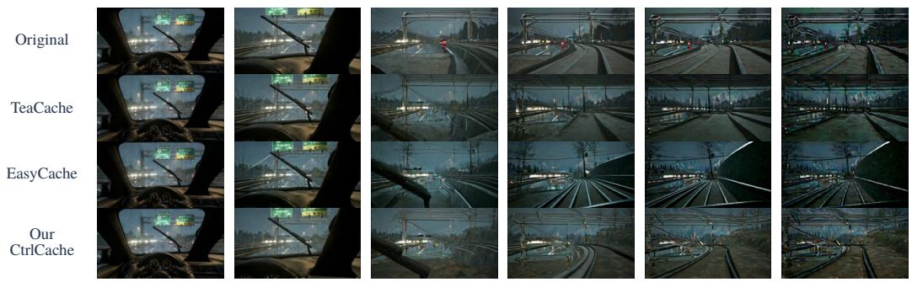

WBench prompt: A multi-lane highway at night or dusk under heavy rain, rendered in a CG game-engine style. … Controls: W D.  
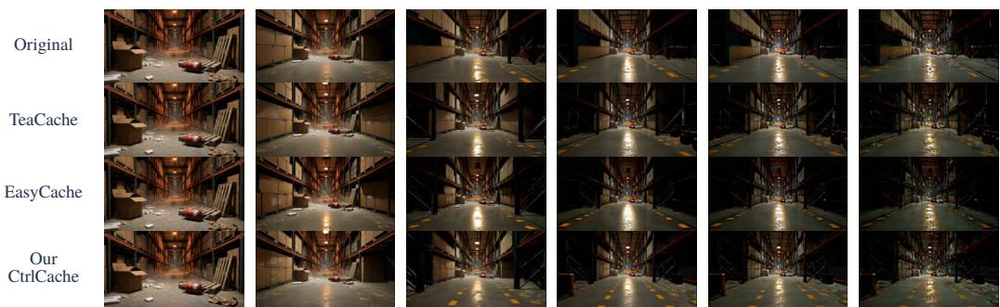

WBench prompt: A dim industrial warehouse aisle with concrete floors dusted with debris and scattered packing foam. … Controls: S.  
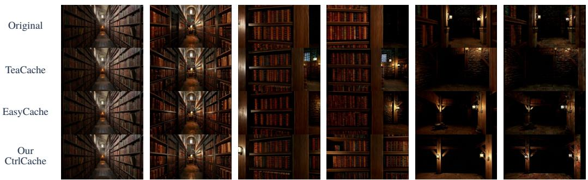

WBench prompt: A vast, dimly lit old library with towering dark wooden bookshelves stretching floor to ceiling on both sides of a narrow central aisle. … Controls: W right left.  
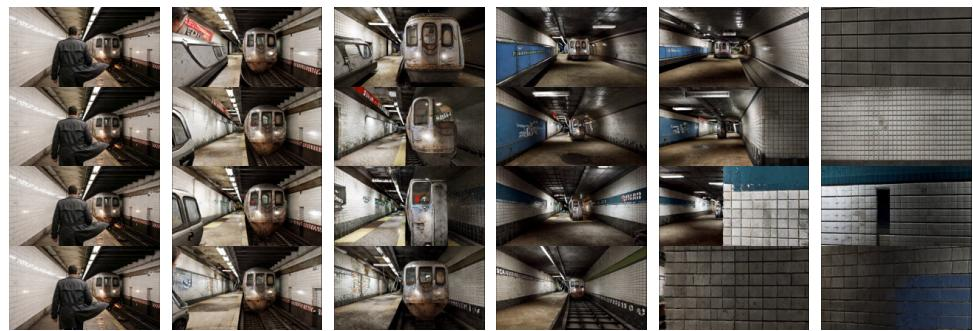  
WBench prompt: An underground subway platform with white-tiled walls on the left and a low ceiling with exposed infrastructure. … Controls: W S D.

LingBot-World v1  
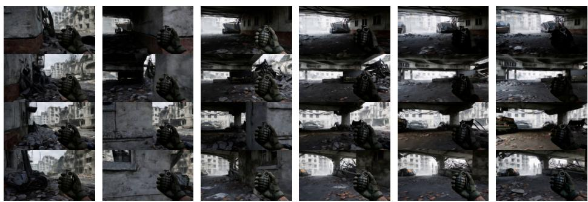  
WBench prompt: A war-torn city street with rubble, damaged buildings, and a collapsed overpass. … Controls: W  W  A  A.

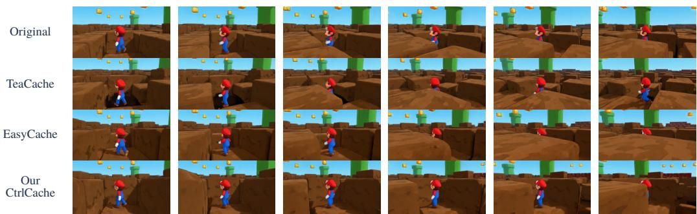  
WBench prompt: A blocky game world with green pipes and floating question-mark blocks as Mario moves across the terrain. … Controls: W right Jump.

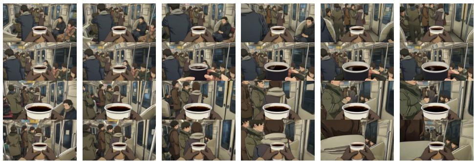  
WBench prompt: A crowded anime-style subway car with passengers, poles, and sliding doors. … Controls: W  left  W.

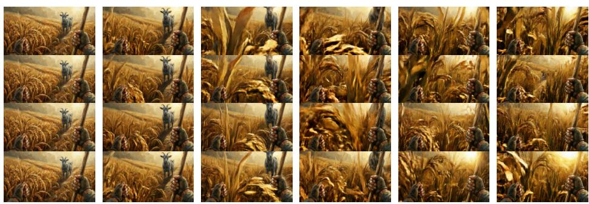  
WBench prompt: An endless golden rice field stretching across the frame in oil painting style. … Controls: W.

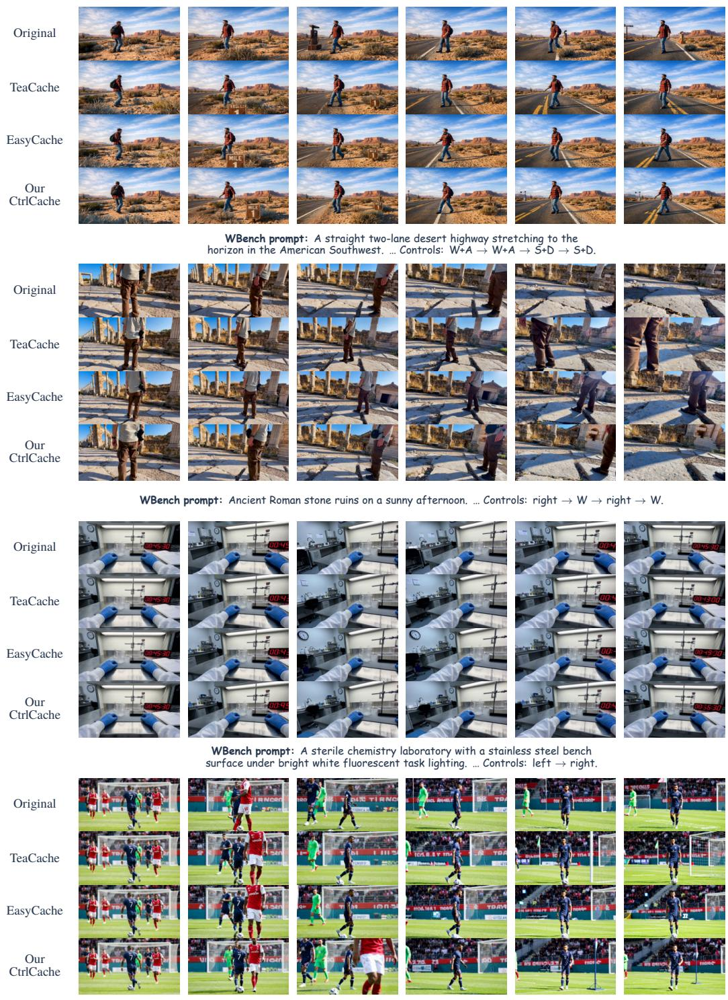  
LingBot-World v2  
WBench prompt: A realistic soccer field during an active match under natural daylight. … Controls: W left S.

Figure E.1: Additional qualitative comparisons on Matrix-Game 2.0, LingBot-World v1, and LingBot-World v2. Each comparison uses the same initial condition and WBench control sequence across methods; the corresponding prompts and controls are shown with the frames. Rows correspond to Original, TeaCache, EasyCache, and Our CtrlCache.