# CUERATOR: AGENTIC SEARCH FOR SYMBOLIC RULES TO ADAPT FROZEN MULTIMODAL ENCODERS

Sunchan Park∗ Beomkwon Cho∗ Kyeongbo Kong†

Pusan National University

{sunchanpark, chobk1, kbkong}@pusan.ac.kr

## ABSTRACT

Large language model agents have been used to search over symbolic structures such as programs and equations. We propose CueRator, an agentic framework for policy-aware decision-rule discovery, which adapts frozen contrastive multimodal encoders by searching for the decision rule that converts their cross-modal similarities into predictions. We validate it on open-vocabulary audio-visual event perception, where existing methods involve a trade-off between adaptivity and generalization to unseen categories: trained modules adapt at the cost of general ization, and fixed rules the reverse. The framework pairs a symbolic formulation for generalization with a lightweight policy that predicts its parameters per video for adaptivity. A report-guided multi-agent loop discovers the formulation offline, evaluating each candidate on its expressive ceiling and on whether a trained policy can realize it. On OV-AVEBench, CueRator raises the total average from 57.8 to 60.2 and unseen-category performance from 55.8 to 59.9 over the best existing method, reducing the seen–unseen gap from 7.1 to 1.2. Ablations attribute the gains to both the formulation and the policy and show that both feedback signals are necessary for effective search. CueRator also improves over the respective baselines on two further audio-visual event perception tasks, and the discovered rule remains competitive across encoders with only the policy retrained. Code is available at https://github.com/cvsp-lab/cuerator.

## 1 INTRODUCTION

Large language models (LLMs) are increasingly used not only to answer questions but to search over symbolic structures such as programs and equations: to propose candidates in a symbolic form, evaluate them automatically, and refine them over successive iterations. This form of agentic search has produced programs that yield new constructions in combinatorics (Romera-Paredes et al., 2024; Novikov et al., 2025) and equations discovered from scientific data (Shojaee et al., 2025; Xia et al., 2026). The approach applies when the object of interest can be written as a program and scored automatically. Under these conditions, the model’s reasoning about structure can be coupled to execution feedback, and search becomes possible in spaces that are difficult to explore by hand.

Contrastive multimodal encoders such as CLIP, CLAP, and ImageBind (Radford et al., 2021; Elizalde et al., 2023; Girdhar et al., 2023) embed inputs from different modalities into a shared space. Categories are specified in text, and an input is scored by its similarity to their descriptions in that space. This makes the encoders usable in open-vocabulary settings: even categories that do not appear in the downstream training data can be recognized. To adapt them to a task while keeping this ability, existing methods typically either feed the frozen embeddings into modules trained for the task or convert the similarity scores into predictions with a decision rule. Such a rule is the kind of object described above: it can be written as a program, and its predictions can be scored against labeled data.

We study this rule in audio-visual event perception, the temporal localization and classification of events from audio and visual cues, in the open-vocabulary setting where some test categories are unseen during training. Existing methods either train temporal modules on seen categories or apply a fixed agreement rule or dynamic thresholds over the similarity scores (Zhou et al., 2025a; Shaar et al., 2025). Trained modules offer adaptivity at the cost of generalization, whereas fixed rules offer generalization at the cost of adaptivity. This suggests a symbolic rule whose parameters are predicted per input: the rule provides generalization, and the per-input parameters provide adaptivity.

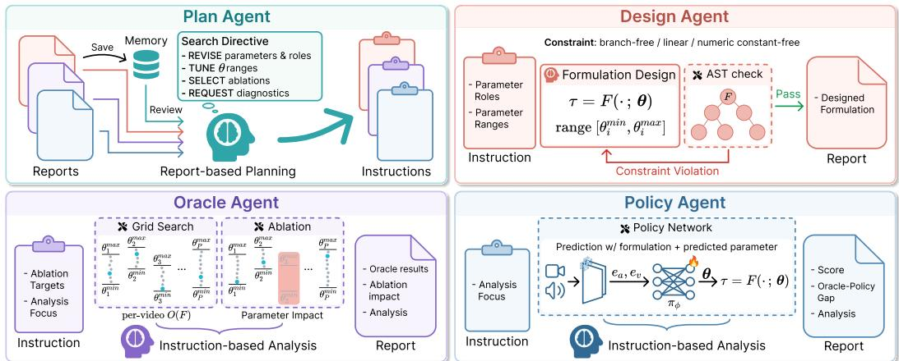  
Figure 1: Overview of CueRator’s report-guided agentic search. At each iteration, the Plan Agent sets the search direction from accumulated reports, the Design Agent proposes an executable formulation verified against formal constraints, and the Oracle and Policy Agents evaluate the candidate on how well it can perform and whether its parameters can be learned. The Oracle Agent estimates the expressive ceiling through per-video parameter search and ablations, while a policy network is trained for the candidate and diagnosed by the Policy Agent. All reports are appended to memory for the next iteration; no LLM agent is used at test time.

Following this direction, we cast the problem as policy-aware decision-rule discovery: the rule takes the form of a symbolic formulation, which serves as an interpretable scaffold, and its parameters are predicted by a neural policy. The formulation is not written by hand but found by agentic search, with LLM agents proposing candidates in executable form and refining them from evaluation on labeled data. Since the formulation and the policy operate together, candidates are evaluated on both how well they can perform and whether the policy can learn to predict their parameters.

In this paper, we propose CueRator, an agentic framework for policy-aware decision-rule discovery, in which a symbolic formulation F(·; θ) maps the similarity cues to audio and visual dynamic thresholds and a lightweight policy network πϕ predicts its parameters θ per video. The formulation is found by a report-guided multi-agent loop (Fig. 1), in which agents exchange written reports as well as scores: a Plan Agent curates past reports into a search direction, a Design Agent proposes executable formulations under formal constraints, an Oracle Agent estimates each candidate’s expressive ceiling through per-video parameter search, and a Policy Agent diagnoses a policy trained on the candidate. LLM agents are used only in this offline search; at test time, inference requires only one policynetwork forward pass and deterministic thresholding.

We evaluate CueRator on OV-AVEBench (Zhou et al., 2025a), the benchmark for open-vocabulary audio-visual event localization (OV-AVEL), against existing training-free, fine-tuning, and dynamic thresholding methods. CueRator, which trains only a lightweight policy network, achieves the highest overall performance. Ablations attribute the gains to both components, the discovered formulation over hand-designed rules and the per-video policy over globally fixed parameters, and show that the search requires diagnostic feedback from both the Oracle and Policy Agents to find formulations that remain usable after policy instantiation. The discovery framework, adapted to two adjacent audio-visual event perception tasks, also improves over the respective baselines.

Our contributions are threefold:

• We propose CueRator, an agentic framework for policy-aware decision-rule discovery, which adapts frozen contrastive multimodal encoders with a symbolic formulation for generalization and a neural policy predicting its parameters per input for adaptivity.

• We design its report-guided multi-agent loop, in which Plan, Design, Oracle, and Policy Agents propose, evaluate, and diagnose executable formulations under formal constraints, judging each candidate on both its expressive ceiling and policy learnability.

• We validate CueRator on three open-vocabulary audio-visual event perception tasks: it improves over the respective baselines on OV-AVEL and two adjacent tasks without encoder fine-tuning, and its discovered rule remains competitive across encoders.

## 2 RELATED WORK

LLM-guided symbolic search. Large language models have been used to propose symbolic candidates, evaluate them automatically, and refine them over iterations. This loop has produced new constructions and algorithms in mathematics (Romera-Paredes et al., 2024; Novikov et al., 2025), scientific equations (Shojaee et al., 2025; Grayeli et al., 2024; Wang et al., 2025; Xia et al., 2026), constitutive laws and molecules (Ma et al., 2024a), heuristics for combinatorial optimization (Liu et al., 2024; Ye et al., 2024), reward functions for robot learning (Ma et al., 2024b), preferenceoptimization losses (Lu et al., 2024), candidate materials (Abhyankar et al., 2026), and point sets for numerical integration (Sadikov, 2026). CueRator instead searches for a decision rule that adapts frozen multimodal encoders, evaluating candidates on both expressiveness and policy learnability (Section 3.2).

Audio-visual event perception. AVEL localizes temporal segments where an event is both audible and visible (Tian et al., 2018); closed-vocabulary methods improve fusion (Wu et al., 2019; Lin et al., 2019; Zhou et al., 2021), background discrimination (Xia & Zhao, 2022; Zhou et al., 2023), and boundary localization (Yu et al., 2022; Mahmud & Marculescu, 2023), and related tasks include audio-visual video parsing (AVVP) (Tian et al., 2020; Gao et al., 2023; Zhou et al., 2024a;b) and dense audio-visual event localization (DAVEL) (Geng et al., 2023; Zhou et al., 2025b; 2026). OV-AVEBench (Zhou et al., 2025a) extends AVEL to the open-vocabulary setting. Existing methods either train temporal modules on frozen embeddings, or convert cross-modal similarities into predictions with agreement rules or dynamic thresholds (Zhou et al., 2025a; Shaar et al., 2025). CueRator differs by searching for the decision rule itself and instantiating its parameters per video.

## 3 METHOD

## 3.1 PROBLEM SETUP

As illustrated in Fig. 2, OV-AVEL (Zhou et al., 2025a) divides each video into T temporal segments and assigns to every segment a label from $C _ { \mathrm { s e e n } } \cup C _ { \mathrm { u n s e e n } } \cup$ {background}. Models are trained on segments whose foreground labels belong to $C _ { \mathrm { s e e n } } ,$ but at test time the ground-truth label of a segment may also belong to $C _ { \mathrm { u n s e e n } } , \mathrm { r e - }$ quiring generalization beyond the training categories. The pipeline consists of frozen encoders that extract audio-visual similarity scores, which we call cues, and a decision rule that maps those cues to per-segment predictions, whose executable form we call a decisionformulation.

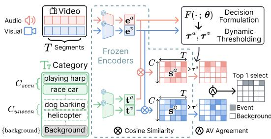  
Figure 2: Overview of the OV-AVEL pipeline.

Frozen Encoders. We extract all representations from frozen pretrained encoders. For a video with $T$ segments and a category set of size $C ,$ we obtain per-segment audio and visual embeddings $\mathbf { e } ^ { a } , \mathbf { e } ^ { v } \in \breve { \mathbb { R } } ^ { T \times D }$ and per-category text embeddings $\mathbf { t } ^ { a } , \mathbf { t } ^ { \dot { v } } \in \mathbb { R } ^ { \zeta \times D }$ , where each text embedding is aligned to its corresponding modality space. When the encoder maps all modalities into a common space (e.g., ImageBind), $\mathbf { t } ^ { \bar { a } }$ and $\mathbf { t } ^ { v }$ are identical. We denote by $s _ { t c } ^ { \bar { m } }$ the cosine similarity between the embedding of modality $m \in \{ a , v \}$ at segment t and the text embedding of category c, yielding similarity matrices sa, $\mathbf { s } ^ { v } \in \mathbb { R } ^ { T \times \tilde { C } }$

Algorithm 1 Policy-aware decision-rule discovery (one session)   
Input: $( \mathbf { e } ^ { a } , \mathbf { e } ^ { v } , \mathbf { s } ^ { a } , \mathbf { s } ^ { v } )$ of training and validation videos; iterations $N ;$ memory $M \gets \emptyset$   
1: for $i = 1 , \ldots , N$ do   
2: Plan Agent: read $\mathcal { M } ,$ write directives $d _ { i }$   
3: Design Agent: propose formulation $F _ { i }$ with parameter ranges $\Theta _ { i }$ under formal constraints   
4: Per-video oracle search of $\pmb \theta \in \Theta _ { i } \Rightarrow$ oracle ceiling $\mathcal { O } ( F _ { i } )$ ; Oracle Agent: report $R _ { i } ^ { \mathrm { O } }$   
5: Train $\pi _ { \phi _ { i } }$ to predict $\theta \Rightarrow$ validation score $\mathcal { V } ( F _ { i } , \pi _ { \phi _ { i } } ) ;$ Policy Agent: report $R _ { i } ^ { \mathrm { { \bar { P } } } }$   
$\begin{array} { r l } { 6 \colon } & { { } \mathcal { M }  \mathcal { M } \cup \{ d _ { i } , F _ { i } , \Theta _ { i } , \mathcal { O } ( F _ { i } ) , \mathcal { V } ( F _ { i } , \pi _ { \phi _ { i } } ) , R _ { i } ^ { \mathrm { O } } , R _ { i } ^ { \mathrm { P } } \} } \end{array}$   
7: end for   
8: return $( F ^ { \star } , \pi _ { \phi } ^ { \star } )$ with the highest V

Formulation Interface. A decision formulation $F ( \cdot ; \pmb \theta )$ takes frozen embeddings and similarity matrices $( \mathbf { s } ^ { a } , \mathbf { s } ^ { v } )$ as input, composes them through deterministic primitives, and produces per-segment, per-category thresholds $\pmb { \tau } ^ { a } , \pmb { \tau } ^ { \dag } \in \mathbb { R } ^ { T \times C }$ . A segment t first filters out categories below the threshold in each modality, then selects the top-scoring category per modality among the remaining ones. The segment is assigned that category if both modalities agree, and labeled background otherwise. This decision procedure is fixed across all candidate formulations; only the threshold-producing function $F$ varies during the agentic search. The parameter vector $\pmb { \theta } \in \sqrt { \mathbb { R } } ^ { P }$ , where P is the number of parameters, controls the behavior of $F .$

## 3.2 CUERATOR OVERVIEW

CueRator adapts frozen encoders at the decision layer. It separates prediction into two components: a symbolic formulation $F ( \cdot ; \pmb \theta )$ , which defines how the similarity cues are converted into audio and visual thresholds, and a lightweight policy network $\pi _ { \phi } ,$ , which predicts the formulation parameters θ for each video from frozen audio-visual embeddings $( \mathbf { e } ^ { a } , \bar { \mathbf { e } } ^ { v } )$ The formulation provides the decision-rule scaffold, while the policy supplies video-specific adaptation within that scaffold.

Fig. 1 and Algorithm 1 summarize the offline search; LLM agents are used only in this search, never at test time. At each iteration, the Plan Agent sets search directives from the accumulated memory, the Design Agent proposes an executable formulation and parameter ranges under formal constraints, the Oracle Agent evaluates the candidate’s expressive capacity through per-video parameter search and requested ablations, and a policy trained for the same candidate is diagnosed by the Policy Agent. All reports are appended to memory, so that each iteration’s directives are grounded in the full history of candidates rather than the most recent one alone.

This makes CueRator policy-aware, but not a full co-optimization procedure. For each candidate formulation $F _ { i } ,$ CueRator records two complementary signals:

$$
q _ { i } ^ { \mathrm { o r a c l e } } = \mathcal { O } ( F _ { i } ) , \qquad q _ { i } ^ { \mathrm { p o l i c y } } = \mathcal { V } ( F _ { i } , \pi _ { \phi _ { i } } ) ,
$$

where $\mathcal { O } ( F _ { i } )$ measures the best attainable performance under ideal per-video parameters, and $\mathcal { V } ( F _ { i } , \pi _ { \phi _ { i } } )$ measures validation performance after training a policy to instantiate the formulation. Throughout the paper, we refer to $\mathcal { O } ( F _ { i } )$ as the formulation’s oracle ceiling—the performance of $F _ { i }$ when $\bar { \pmb { \theta } }$ is set optimally for each video, an upper bound on what the rule’s structure can express—and to learnability as whether the optimal $\pmb \theta$ is predictable from the video’s embeddings, measured as the gap between the oracle ceiling and policy-instantiated performance. The final formulation–policy pair is selected by validation performance, while the test split is held out from all agents and used only for final evaluation in Section 4. Appendix E provides an input–operation–output summary of the four agents and representative agent-visible prompts and reports.

## 3.3 PLAN AGENT

Search trajectory analysis. The Plan Agent begins each iteration by reviewing memory to assess the current state of the search. Memory stores per-iteration metrics, one-line agent summaries, and full per-agent reports accessed on demand. For example, a widening gap between the oracle ceiling and validation policy performance indicates a learnability problem: the policy fails to predict optimal parameters from context. In another case, when neither oracle nor validation performance improves, the formulation itself is the bottleneck, requiring an axis shift rather than incremental refinement.

Directive construction. Based on this diagnosis, the Plan Agent produces three directives: a naturallanguage strategy memo directed to the Design Agent, an evaluation protocol specifying parameter ablations paired with analysis intents for the Oracle Agent, and an analysis directive for the Policy Agent. The strategy memo assigns each parameter a conceptual role and an operating range. When the Oracle or Policy reports identify a parameter as inactive, the Plan Agent reallocates it to capture a different aspect of the audio-visual similarity structure. The evaluation protocol and analysis directive are grounded in the same parameter definitions as the strategy memo, so that oracle expressivity and policy learnability analyses test the same hypotheses.

## 3.4 DESIGN AGENT

Formulation proposal. Given the Plan Agent’s directive, the Design Agent proposes a candidate formulation as a Python function together with a range $[ \theta _ { i } ^ { \operatorname* { m i n } } , \theta _ { i } ^ { \operatorname* { m a x } } ]$ for each parameter, jointly denoted $\begin{array} { r } { \Theta = \prod _ { i } [ \dot { \theta } _ { i } ^ { \mathrm { m i n } } , \theta _ { i } ^ { \mathrm { m a x } } ] } \end{array}$ , typically including zero so that a term can be deactivated. These ranges define both the search space for oracle evaluation and the output bounds for the policy network. The agent receives the interface specification—the available inputs are frozen embeddings and similarity matrices $( \mathbf { s } ^ { a } , \mathbf { s } ^ { v } )$ , from which the agent defines deterministic primitives.

Formal constraints. Each candidate formulation must satisfy a set of structural constraints that together ensure the resulting threshold equations are interpretable as closed-form expressions. The threshold for each modality takes a fixed linear form: a bias plus a system-specified number of weighted terms. Each term is defined as a symbolic function over the available audio-visual inputs. To avoid non-linear parameter interactions that destabilize both Sobol oracle search and policy gradient learning, each parameter may only appear as an outer weight or bias in the threshold expression, never as an inner argument to a term. Numeric constants within the formulation are restricted to a small predefined set {0, ±0.5, ±1, ±2} plus a numerical stability epsilon, with small integer literals $( | n | \leq 1 6 )$ allowed only for indexing and shape arguments, preventing the Design Agent from inserting hidden hyperparameters.

Constraint verification. These constraints are specified as natural-language instructions in the prompt and verified via abstract syntax tree (AST) parsing, covering function count, per-function statement budget, numeric literals, inner-parameter usage, and control flow. The prohibition on control flow — no conditionals, loops, or comprehensions — requires all logic to be expressed as closed-form expressions, preserving the interpretability of the formulation. Candidates that fail any check are returned to the Design Agent with diagnostic feedback for revision.

## 3.5 ORACLE AGENT

Oracle ceiling. For each candidate formulation $F ( \cdot ; \pmb \theta )$ , the Oracle Agent performs a per-video parameter search over the ranges $[ \theta _ { i } ^ { \operatorname* { m i n } } , \theta _ { i } ^ { \operatorname* { m a x } } ]$ defined by the Design Agent, using a Sobol sequence to provide more uniform coverage. For each training video $n ,$ the optimal parameters are obtained as $\begin{array} { r } { \mathbf { \dot { \pmb { \theta } } } ^ { \star } ( n ) = \operatorname * { a r g m a x } _ { \pmb { \theta } } \mathcal { R } ( \boldsymbol { F } , \ \pmb { \theta } ; n ) } \end{array}$ , where R is a per-video performance metric. The oracle ceiling is then defined as:

$$
\mathcal { O } ( F ) = \mathbb { E } _ { n } \big [ \mathcal { R } ( F , \pmb { \theta } ^ { \star } ( n ) ; n ) \big ] ,
$$

which measures the formulation’s structural expressiveness independently of how well a policy can predict the optimal parameters in practice.

Parameter ablation. Following the evaluation protocol issued by the Plan Agent, each designated parameter subset is independently zeroed out and the remaining parameters are re-optimized via a separate Sobol grid to obtain per-video ablated optimal parameters $\theta _ { \mathrm { a b l } } ^ { \star } ( n )$ . The per-sample marginal

contribution of each designated subset is then defined as:

$$
\begin{array} { r } { \Delta ( n ) = \operatorname* { m a x } \bigl ( 0 , \mathcal { R } ( F , \pmb { \theta } ^ { \star } ( n ) ; n ) - \mathcal { R } ( F , \pmb { \theta } _ { \mathrm { a b l } } ^ { \star } ( n ) ; n ) \bigr ) , } \end{array}
$$

where the max(0, ·) clipping handles finite Sobol sampling noise: the ablated search space is a subset of the full one, so the inequality $\mathcal { R } ( F , \pmb { \theta } _ { \mathrm { a b l } } ^ { \star } ( n ) ; n ) \leq \bar { \mathcal { R } } ( F , \pmb { \theta } ^ { \star } ( n ) ; n )$ holds in principle, but empirical optima from a finite grid may slightly violate it, yielding a distribution over training videos that quantifies how much each parameter group contributes to the oracle ceiling.

Analysis and report. Beyond the predefined oracle evaluation flow, the Oracle Agent writes and executes custom scripts against the raw per-sample data to conduct analyses at three levels. First, standard analyses covering parameter distribution statistics, modality balance, and per-ablation marginal patterns are conducted. Second, targeted analyses follow the Plan Agent’s directives, examining specific hypotheses about parameter roles or ablation patterns. Third, the agent selects additional analyses based on what the results suggest, such as per-category marginal breakdowns or cross-ablation correlation. All findings are compiled into a natural-language report with a one-line summary, both appended to memory for the Plan Agent at the next iteration.

## 3.6 POLICY AGENT

Policy network. To provide video-specific parameter adaptation within the candidate formulation, a lightweight policy network $\pi _ { \phi }$ is trained for each candidate; it takes a sequence of per-segment frozen embeddings $( \mathbf { e } ^ { a } , \mathbf { e } ^ { v } )$ as input and outputs a single parameter vector θ per video. We implement $\pi _ { \phi }$ with modality-specific self-attention layers followed by cross-attention between the two modalities. The resulting representations are mean-pooled over segments, concatenated, and passed to a linear head to produce a raw output $\mathbf { z } \in \mathbb { R } ^ { P }$ . Each $z _ { i }$ is then squashed into the per-parameter range $[ \theta _ { i } ^ { \operatorname* { m i n } } , \theta _ { i } ^ { \operatorname* { m a x } } ]$ defined with the formulation via the logistic sigmoid:

$$
\theta _ { i } = \theta _ { i } ^ { \operatorname* { m i n } } + \sigma ( z _ { i } ) \cdot ( \theta _ { i } ^ { \operatorname* { m a x } } - \theta _ { i } ^ { \operatorname* { m i n } } ) .
$$

These ranges, iteratively refined across iterations based on accumulated oracle and policy reports, serve as a hard prior on each parameter’s operating region.

Policy gradient training. We cast per-video parameter prediction as a contextual bandit with state $( \mathbf { e } ^ { a } , \mathbf { \bar { e } } ^ { v } )$ , action θ, and reward $\mathcal { R } ( F , \pmb \theta ; n )$ . We train $\pi _ { \phi }$ with policy gradient, as the decision procedure of Section 3.1 makes the reward non-differentiable and per-video oracle parameters do not provide a unique regression target. We use leave-one-out REINFORCE (Ahmadian et al., 2024) with a Gaussian policy (mean z, fixed standard deviation), drawing K actions per video and using the mean reward of the remaining $K - 1$ as an unbiased per-context baseline to reduce variance. At inference, the mean z is used directly. After training for a fixed number of epochs, the checkpoint with the highest validation performance is selected.

Analysis and report. The selected checkpoint is applied to the validation set to produce per-sample outputs including predicted parameter vectors, per-modality frame-level predictions, and performance metrics, all stored as raw data. The Policy Agent then writes and executes custom scripts against this data following the same three-level structure as the Oracle Agent — standard, directed, and custom — with a focus on learnability. The findings are then compiled into a report and a one-line summary appended to memory for the next iteration.

## 4 EXPERIMENTS

## 4.1 SETUP

Evaluation. We evaluate on OV-AVEBench (Zhou et al., 2025a): 24,800 10-second videos across 67 categories (46 seen, 21 unseen). Training uses seen-only videos; validation and test include both seen and unseen classes. We use frozen ImageBind (Girdhar et al., 2023) as the shared multimodal encoder for audio, visual, and text modalities. Following (Zhou et al., 2025a), we report segment-level accuracy (Acc.), segment-level F1-score (Seg.), event-level F1-score at Intersection over Union $( \mathrm { I o U } ) \geq 0 . 5 \ ( \mathrm { E v e . } )$ , and their average (Avg.). Baselines include the OV-AVEBench (Zhou et al., 2025a) training-free models (Video-LLaMA2 (Cheng et al., 2024), CLIP&CLAP (Radford et al., 2021; Elizalde et al., 2023), ImageBind-TF (Girdhar et al., 2023)), fine-tuning models (CMRA, AVE,

Table 1: Performance comparison on OV-AVEBench. Baseline scores are from (Zhou et al., 2025a) except $\mathrm { A V ^ { 2 } A }$ , which we adapt to ImageBind. Fine-tuning rows are OV-AVEBench reimplementations of (Zhou et al., 2025a), which share the same frozen ImageBind representations and differ only in the trainable module on top. $\mathbf { A V ^ { 2 } A }$ hyperparameters are tuned on a 200-video validation subset following its original protocol (Appendix B). AV2A-Policy retains the $\mathbf { A V ^ { 2 } A }$ rule but replaces its global parameters with CueRator’s per-video policy network (Appendix B). CueRator is the validation-selected candidate from three search sessions (mean ± std over sessions in Table 2).
<table><tr><td rowspan="2">Method</td><td colspan="4">Seen</td><td colspan="4">Unseen</td><td colspan="4">Total</td></tr><tr><td>Acc.</td><td>Seg.</td><td>Eve.</td><td>Avg.</td><td>Acc.</td><td>Seg.</td><td>Eve.</td><td>Avg.</td><td>Acc.</td><td>Seg.</td><td>Eve.</td><td>Avg.</td></tr><tr><td colspan="10">Training-free</td><td></td><td></td><td></td><td></td></tr><tr><td>Video-LLaMA2</td><td>50.1</td><td>40.6</td><td>32.0</td><td>40.9</td><td>48.5</td><td>38.5</td><td>29.0</td><td>38.6</td><td>48.9</td><td>39.1</td><td>29.8</td><td>39.3</td></tr><tr><td>CLIP&amp;CLAP</td><td>51.4</td><td>41.4</td><td>31.9</td><td>41.6</td><td>51.6</td><td>42.2</td><td>31.6</td><td>41.8</td><td>51.5</td><td>41.9</td><td>31.7</td><td>41.7</td></tr><tr><td>ImageBind-TF</td><td>57.5</td><td>45.0</td><td>34.0</td><td>45.5</td><td>59.8</td><td>47.3</td><td>34.0</td><td>47.0</td><td>59.2</td><td>46.7</td><td>34.0</td><td>46.6</td></tr><tr><td colspan="10">Fine-tuning</td><td colspan="3"></td></tr><tr><td>CMRA</td><td>65.2</td><td>58.8</td><td>54.3</td><td>59.4</td><td>36.0</td><td>31.0</td><td>26.3</td><td>31.1</td><td>44.3</td><td>38.9</td><td>34.3</td><td>39.2</td></tr><tr><td>AVE</td><td>76.6</td><td>63.6</td><td>56.0</td><td>65.4</td><td>44.6</td><td>33.2</td><td>24.0</td><td>34.0</td><td>53.8</td><td>41.9</td><td>33.2</td><td>42.9</td></tr><tr><td>PSP</td><td>75.4</td><td>66.8</td><td>61.0</td><td>67.7</td><td>33.7</td><td>28.2</td><td>24.2</td><td>28.7</td><td>45.6</td><td>39.3</td><td>34.7</td><td>39.9</td></tr><tr><td>MM-Pyramid</td><td>76.5</td><td>66.9</td><td>62.3</td><td>68.6</td><td>36.8</td><td>29.0</td><td>23.8</td><td>29.9</td><td>48.4</td><td>40.2</td><td>35.2</td><td>41.2</td></tr><tr><td>ImageBind-FT</td><td>72.5</td><td>61.8</td><td>54.5</td><td>62.9</td><td>64.9</td><td>55.0</td><td>47.5</td><td>55.8</td><td>67.1</td><td>56.9</td><td>49.5</td><td>57.8</td></tr><tr><td colspan="10">Dynamic Thresholding</td><td colspan="3"></td></tr><tr><td> $\mathrm { A V ^ { 2 } A }$ </td><td>59.0</td><td>52.4</td><td>48.7</td><td>53.4</td><td>62.4</td><td>54.5</td><td>49.8</td><td>55.6</td><td>61.4</td><td>53.9</td><td>49.5</td><td>55.0</td></tr><tr><td> $\mathbf { A V } ^ { 2 } \mathbf { A } \cdot$  -Policy</td><td>67.0</td><td>60.2</td><td>57.0</td><td>61.4</td><td>62.7</td><td>55.6</td><td>51.2</td><td>56.5</td><td>63.9</td><td>56.9</td><td>52.9</td><td>57.9</td></tr><tr><td>CueRator (ours)</td><td>68.6</td><td>60.1</td><td>54.6</td><td>61.1</td><td>68.5</td><td>59.1</td><td>52.0</td><td>59.9</td><td>68.6</td><td>59.4</td><td>52.7</td><td>60.2</td></tr></table>

PSP, MM-Pyramid, ImageBind-FT (Xu et al., 2020; Tian et al., 2018; Zhou et al., 2021; Yu et al., 2022; Girdhar et al., 2023)), and $\mathrm { A V ^ { 2 } A }$ (Shaar et al., 2025).

Implementation. The agentic search runs 3 isolated sessions of 20 iterations each, yielding 60 candidate formulations. All agents use gpt-5.4 (Singh et al., 2026) in OpenAI Codex (v0.125.0, April 2026). Each formulation defines $P { = } 1 0 ^ { \circ }$ parameters with ranges $[ \theta _ { i } ^ { \operatorname* { m i n } } , \bar { \theta } _ { i } ^ { \operatorname* { m a x } } ]$ . The oracle uses a Sobol sequence of $2 ^ { 1 7 } \pmb { \theta }$ samples per video. $\mathrm { A l l } \ \pi _ { \phi }$ share the same hyperparameters: dim 256, 4 heads, FFN 512, dropout $0 . 1 , \sigma { = } 0 . 3 ;$ trained with AdamW (Loshchilov & Hutter, 2019) $( \ln 1 \times 1 0 ^ { - 4 }$ , batch 32, 20 epochs) on a single RTX 3090, selecting the best validation Acc. checkpoint. The leave-one-out REINFORCE (Ahmadian et al., 2024) objective draws $K { = } 4$ samples with video-level Acc. as reward. The best-validation candidate across sessions is taken as $F ^ { \star }$ with policy $\pi _ { \phi } ^ { \star } .$ . Each session takes 9.8 hours on average.

## 4.2 QUANTITATIVE RESULTS

Overall performance. We organize baselines into three groups: training-free, fine-tuning, and dynamic thresholding methods. Since $\mathbf { A V ^ { 2 } A }$ has no published ImageBind configuration, we adapt it ourselves and tune its hyperparameters on a validation subset following its original protocol (Appendix B). CueRator achieves the highest Total Avg. of 60.2 among all baselines (Table 1). This candidate is selected by validation performance from three search sessions, whose test Total Avg. averages 59.4 ± 0.9 (Table 2). Within the dynamic thresholding group, CueRator improves over $\mathrm { A V ^ { 2 } A \bar { b } y + 5 . 2 A v g }$ ., indicating that per-video adaptive parameterization captures structure that a globally tuned rule cannot. CueRator also outperforms the best fine-tuning baseline, ImageBind-FT, by +2.4 Avg. while training only a lightweight policy network.

Formulation and policy contributions. AV2A-Policy isolates the two components by pairing $\mathrm { A V ^ { 2 } A ' } \mathrm { s }$ manually designed rule with CueRator’s policy network and training protocol. With the rule fixed, per-video adaptation improves over $\mathrm { A V ^ { 2 } A }$ by +2.9 Avg., but the gain is concentrated on seen categories (+8.0 Seen, +0.9 Unseen). With the policy fixed, the discovered formulation adds a further +2.3 Avg.; the gain comes from Unseen (+3.4) with Seen nearly unchanged (−0.3), reducing the seen–unseen gap from 4.9 to 1.2. Neither component alone explains the improvement: the policy provides video-specific adaptation, while the discovered formulation enables this adaptation to generalize to unseen categories. Qualitative examples of the per-video thresholds are shown in Appendix I.

Seen–unseen balance. Training-free methods tend to show relatively balanced Seen and Unseen performance, though their absolute accuracy remains limited. Fine-tuning methods (AVE, PSP, MM-Pyramid) achieve strong Seen performance but suffer severe degradation on Unseen categories, with gaps exceeding 30 points—a clear sign of seen-class overfitting. ImageBind-FT, which freezes the encoder and trains only additional temporal layers, narrows the gap to 7.1 points. Dynamic thresholding methods achieve higher overall performance than training-free baselines while maintaining better Seen–Unseen balance than fine-tuning methods. CueRator reaches the highest Total Avg. with a Seen–Unseen gap of 1.2 points, combining the balance of fixed rules with a higher overall level than trained modules.

## 4.3 ABLATION STUDY

Policy agent. To isolate the effect of learnability feedback, we remove the Policy Agent from the search loop (Table 2). Without this signal, the search drives formulation expressiveness higher (Oracle Acc. 91.5), yet this gain does not transfer to test performance, with Total Avg. dropping by 3.1 points. This indicates that expressiveness alone is not a sufficient search signal; policy-side diagnostics help steer the search toward formulations that remain usable after policy instantiation.

Oracle agent. Examining the role of expressiveness feedback, we remove the Oracle Agent from the search loop. Guided

Table 2: Ablation study. Mean ± std. over three sessions. Oracle: accuracy with per-video oracle parameters on the training set. Test: test-set Acc. and Avg. For global threshold, Oracle uses a single global θ. The validation-selected candidate attains 60.2 (Table 1).
<table><tr><td rowspan="2">Variant</td><td>Oracle</td><td colspan="2">Test</td></tr><tr><td>Acc.</td><td>Acc.</td><td>Avg.</td></tr><tr><td>CueRator (full)</td><td> $8 8 . 7 \pm 0 . 9$ </td><td> ${ \bf 6 8 . 3 \pm 0 . 8 }$ </td><td> ${ \bf 5 9 . 4 \pm 0 . 9 }$ </td></tr><tr><td>w/o policy agent</td><td> ${ \bf 9 1 . 5 \pm 2 . 3 }$ </td><td> $6 6 . 7 \pm 0 . 9$ </td><td> $5 6 . 3 \pm { 1 . 7 }$ </td></tr><tr><td rowspan="2">w/o oracle agent score-only loop</td><td> $8 7 . 3 \pm 5 . 0$ </td><td> $6 6 . 0 \pm 0 . 2$ </td><td> $5 5 . 3 \pm 0 . 5$ </td></tr><tr><td> $8 8 . 4 \pm { 1 . 3 }$ </td><td> $6 4 . 1 \pm 1 . 1$ </td><td> $5 3 . 6 \pm 0 . 7$ </td></tr><tr><td>no feedback global threshold</td><td> $8 6 . 0 \pm 3 . 5$   $6 0 . 8 \pm { 1 . 6 }$ </td><td> $6 2 . 2 \pm 2 . 2$   $6 1 . 3 \pm 2 . 0$ </td><td> $5 1 . 8 \pm 2 . 2$   $5 0 . 6 \pm 3 . 0$ </td></tr></table>

solely by policy feedback, the search tends to stay within learnable formulations without exploring sufficiently expressive directions—despite a comparable oracle accuracy level (87.3), Total Avg. drops by 4.1 points, a larger drop than removing the Policy Agent. This suggests that the Oracle Agent’s structural signal is essential for guiding the search toward expressive formulations.

Score-only loop. Prior LLM-guided search (Shojaee et al., 2025; Romera-Paredes et al., 2024) typically refines candidates with a single LLM guided by a scalar evaluation score. We instantiate this setting by replacing the role-decomposed Plan–Design–Oracle–Policy loop with a single agent that receives only the validation score of each prior candidate, under an otherwise identical protocol. This variant underperforms the full search by 5.8 points, indicating that search quality stems from the agents’ diagnostic reports rather than score-guided refinement alone.

No feedback. Removing both agent feedbacks entirely reduces the search to blind exploration over the symbolic form space, with the Plan Agent seeing only the history of prior formulations. This yields the largest Total Avg. drop among search variants at 7.6 points, demonstrating that the iterative feedback loop is the primary source of search quality, not the agent’s intrinsic priors over good formulations. The gap relative to each single-agent removal suggests that both feedback signals each contribute to search quality.

Global threshold. For this variant, we replace the pervideo policy with a single global θ found by oracle search on the training set, with the best candidate selected by validation Acc. under this fixed parameter set. Applying the selected formulation to the test data yields a Total Avg. of 50.6, below the globally tuned $\mathrm { \bar { A } \bar { V } ^ { 2 } \bar { A } }$ rule in Table 1. The 8.8-point improvement from the full model then shows that $\pi _ { \phi }$ meaningfully advances performance beyond what global optimization can achieve.

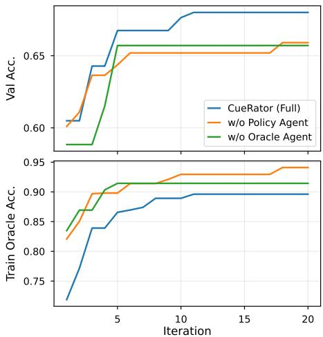  
Figure 3: Best score trajectory. Runningbest Val Acc. and Train Oracle Acc. over 20 iterations for the validation-selected session of each variant; Oracle Acc. is measured on training data. With oracle–policy feedback, CueRator attains the highest Val Acc. despite a lower oracle ceiling.

Table 3: Cross-task generalization. Baseline scores are as published. For each task, CueRator re-runs the formulation search with the same frozen encoders as the corresponding baseline; search and policy training use seen categories only. Full protocols are in Appendix C.
<table><tr><td rowspan="2">Benchmark</td><td rowspan="2">Baseline</td><td rowspan="2">Metric</td><td rowspan="2">Seen:Unseen</td><td colspan="2">Performance</td></tr><tr><td>Baseline</td><td>CueRator</td></tr><tr><td rowspan="2">OV-DAVEL</td><td>Open-DAVTR</td><td>mAP</td><td>75:25</td><td>22.9</td><td>32.0</td></tr><tr><td></td><td></td><td>50:50</td><td>19.4</td><td>32.7</td></tr><tr><td>OV-AVVP</td><td> $\mathrm { A V ^ { 2 } A }$ </td><td>Seg. Type@AV</td><td>17:8</td><td>52.4</td><td>55.6</td></tr></table>

Search trajectory. Fig. 3 traces the search for the full CueRator and the two single-agent ablations. Without the Policy Agent, late-iteration oracle gains do not transfer to Val Acc., indicating expressive structures that the per-video policy cannot realize; without the Oracle Agent, both metrics plateau early, as the search lacks the structural signal needed to escape learnable but expressively limited regions. The full search rises more slowly in Train Oracle Acc. while continuing to improve Val Acc., and by the final iteration it attains the highest Val Acc. among the three variants: the dual feedback steers the search toward formulations whose expressiveness is realizable by the policy, rather than toward the highest oracle ceiling.

## 4.4 CROSS-TASK GENERALIZATION

We assess generality on two adjacent but structurally different open-vocabulary settings: OV-DAVEL, dense localization of multiple events in untrimmed videos, and OV-AVVP, audio-visual video parsing with weak video-level supervision and modality-wise multi-label outputs. We use the OV-DAVEL benchmark and splits of Yu et al. (2025) and construct an OV-AVVP benchmark from LLP (Tian et al., 2020) with a fixed 17-seen/8-unseen split (Appendix C). CueRator improves over Open-DAVTR by +9.1 and +13.3 mAP on the OV-DAVEL 75:25 and 50:50 splits, and over $\mathbf { A V ^ { 2 } A }$ by +3.2 Seg. Type@AV on OV-AVVP (Table 3). Since each formulation is rediscovered from scratch, these gains indicate that the discovery framework generalizes across video length, supervision regime, and output structure. We also transfer $F ^ { \star }$ itself, retraining only the policy. It remains competitive with different encoders on OV-AVEBench, indicating that the rule captures relations among the similarity scores rather than encoder-specific values. Across tasks, it remains competitive on OV-DAVEL but falls short on OV-AVVP, whose output structure differs and which benefits from rediscovery (Appendix G).

## 4.5 DISCOVERED FORMULATION

The selected formulation $F ^ { \star }$ computes the audio and visual thresholds as

$$
\tau _ { t c } ^ { a } = \theta _ { 0 } + \theta _ { 1 } \mathscr { G } ( \mathbf { s } ^ { v } ) _ { t c } + \theta _ { 2 } \mathscr { G } ( { \mathbf { b } } ^ { a } ) _ { t c } + \theta _ { 3 } \mathscr { G } ( \bar { \mathbf { b } } ^ { a } ) _ { c } + \theta _ { 4 } \beta _ { t c } ^ { a } ,\tag{1}
$$

$$
\begin{array} { r } { \tau _ { t c } ^ { v } = \theta _ { 5 } + \theta _ { 6 } \mathcal { G } ( \mathbf { s } ^ { a } ) _ { t c } + \theta _ { 7 } \mathcal { G } ( { \mathbf { b } } ^ { v } ) _ { t c } + \theta _ { 8 } \mathcal { G } ( \bar { \mathbf { b } } ^ { v } ) _ { c } + \theta _ { 9 } \beta _ { t c } ^ { v } , } \end{array}\tag{2}
$$

where $\mathcal { G } ( \cdot )$ is the score difference between the strongest competing category and c, $\mathbf { b } ^ { m }$ is the modality score averaged with the cross-modal minimum, $\bar { \mathbf { b } } ^ { m }$ is its average over the clip, and $\beta ^ { m }$ is the segment’s deviation from that average (exact forms in Appendix F). With the non-negative ranges assigned to $\theta _ { 1 } { - } \theta _ { 4 }$ and $\theta _ { 6 } { - } \theta _ { 9 }$ , a category’s threshold rises whenever a competitor scores higher, in the other modality, at the segment, or over the clip, or when the segment spikes above its clip average, and falls otherwise: a category is accepted only when both modalities support it against its competitors, with the policy setting how strongly each cue counts per video.

## 5 LIMITATIONS AND FUTURE DIRECTIONS

The current agents reason over textual reports and aggregate statistics rather than inspecting raw audiovisual samples, which may bias the search toward failure modes that appear in these statistics. In addition, the formulation interface targets decisions over cross-modal similarities; richer interactions may require a broader interface. Future work should develop dedicated multimodal agent interfaces.

## 6 CONCLUSION

We proposed CueRator, an agentic framework for policy-aware decision-rule discovery that adapts frozen contrastive multimodal encoders: a report-guided multi-agent loop searches for a symbolic formulation, and a lightweight policy predicts its parameters per video. On OV-AVEBench, CueRator outperforms training-free, fine-tuning, and dynamic-thresholding baselines with a small seen–unseen gap, and the search is most effective when guided jointly by the expressive ceiling and policy learnability. It also improves over the respective baselines on OV-DAVEL and OV-AVVP, and extending it to other adaptation problems over contrastive multimodal encoders is left to future work.

## REFERENCES

Nikhil Abhyankar, Sanchit Kabra, Saaketh Desai, and Chandan K. Reddy. LLEMA: Evolutionary search with LLMs for multi-objective materials discovery. In International Conference on Learning Representations, 2026.

Arash Ahmadian, Chris Cremer, Matthias Gallé, Marzieh Fadaee, Julia Kreutzer, Olivier Pietquin, Ahmet Üstün, and Sara Hooker. Back to basics: Revisiting REINFORCE-style optimization for learning from human feedback in LLMs. In Annual Meeting ofthe Associationfor Computational Linguistics, pp. 12248–12267, 2024.

Zesen Cheng, Sicong Leng, Hang Zhang, Yifei Xin, Xin Li, Guanzheng Chen, Yongxin Zhu, Wenqi Zhang, Ziyang Luo, Deli Zhao, et al. VideoLLaMA 2: Advancing spatial-temporal modeling and audio understanding in Video-LLMs. arXiv preprint arXiv:2406.07476, 2024.

Benjamin Elizalde, Soham Deshmukh, Mahmoud Al Ismail, and Huaming Wang. CLAP: Learning audio concepts from natural language supervision. In IEEE International Conference on Acoustics, Speech and Signal Processing, pp. 1–5, 2023.

Junyu Gao, Mengyuan Chen, and Changsheng Xu. Collecting cross-modal presence-absence evidence for weakly-supervised audio-visual event perception. In IEEE/CVF Conference on Computer Vision and Pattern Recognition, pp. 18827–18836, 2023.

Tiantian Geng, Teng Wang, Jinming Duan, Runmin Cong, and Feng Zheng. Dense-localizing audio-visual events in untrimmed videos: A large-scale benchmark and baseline. In IEEE/CVF Conference on Computer Vision and Pattern Recognition, pp. 22942–22951, 2023.

Rohit Girdhar, Alaaeldin El-Nouby, Zhuang Liu, Mannat Singh, Kalyan Vasudev Alwala, Armand Joulin, and Ishan Misra. ImageBind: One embedding space to bind them all. In IEEE/CVF Conference on Computer Vision and Pattern Recognition, pp. 15180–15190, 2023.

Arya Grayeli, Atharva Sehgal, Omar Costilla-Reyes, Miles Cranmer, and Swarat Chaudhuri. Symbolic regression with a learned concept library. In Advances in Neural Information Processing Systems, volume 37, pp. 44678–44709, 2024.

Weixian Lei, Yixiao Ge, Kun Yi, Jianfeng Zhang, Difei Gao, Dylan Sun, Yuying Ge, Ying Shan, and Mike Zheng Shou. ViT-Lens: Towards omni-modal representations. In IEEE/CVF Conference on Computer Vision and Pattern Recognition, pp. 26647–26657, 2024.

Yan-Bo Lin, Yu-Jhe Li, and Yu-Chiang Frank Wang. Dual-modality seq2seq network for audio-visual event localization. In IEEE International Conference on Acoustics, Speech and Signal Processing, pp. 2002–2006, 2019.

Fei Liu, Xialiang Tong, Mingxuan Yuan, Xi Lin, Fu Luo, Zhenkun Wang, Zhichao Lu, and Qingfu Zhang. Evolution of heuristics: Towards efficient automatic algorithm design using large language model. In International Conference on Machine Learning, pp. 32201–32223, 2024.

Ilya Loshchilov and Frank Hutter. Decoupled weight decay regularization. In International Conference on Learning Representations, 2019.

Chris Lu, Samuel Holt, Claudio Fanconi, Alex J. Chan, Jakob Foerster, Mihaela van der Schaar, and Robert Tjarko Lange. Discovering preference optimization algorithms with and for large language models. In Advances in Neural Information Processing Systems, volume 37, pp. 86528–86573, 2024.

Pingchuan Ma, Tsun-Hsuan Wang, Minghao Guo, Zhiqing Sun, Joshua B. Tenenbaum, Daniela Rus, Chuang Gan, and Wojciech Matusik. LLM and simulation as bilevel optimizers: A new paradigm to advance physical scientific discovery. In International Conference on Machine Learning, pp. 33940–33962, 2024a.

Yecheng Jason Ma, William Liang, Guanzhi Wang, De-An Huang, Osbert Bastani, Dinesh Jayaraman, Yuke Zhu, Linxi Fan, and Anima Anandkumar. Eureka: Human-level reward design via coding large language models. In International Conference on Learning Representations, 2024b.

Tanvir Mahmud and Diana Marculescu. AVE-CLIP: AudioCLIP-based multi-window temporal transformer for audio-visual event localization. In IEEE/CVF Winter Conference on Applications ofComputer Vision, pp. 5158–5167, 2023.

Alexander Novikov, Ngân Vu, Marvin Eisenberger, Emilien Dupont, Po-Sen Huang, Adam Zsolt Wag-˜ ner, Sergey Shirobokov, Borislav Kozlovskii, Francisco J. R. Ruiz, Abbas Mehrabian, M. Pawan Kumar, Abigail See, Swarat Chaudhuri, George Holland, Alex Davies, Sebastian Nowozin, Pushmeet Kohli, and Matej Balog. AlphaEvolve: A coding agent for scientific and algorithmic discovery. arXiv preprint arXiv:2506.13131, 2025.

Alec Radford, Jong Wook Kim, Chris Hallacy, Aditya Ramesh, Gabriel Goh, Sandhini Agarwal, Girish Sastry, Amanda Askell, Pamela Mishkin, Jack Clark, et al. Learning transferable visual models from natural language supervision. In International Conference on Machine Learning, pp. 8748–8763, 2021.

Bernardino Romera-Paredes, Mohammadamin Barekatain, Alexander Novikov, Matej Balog, M. Pawan Kumar, Emilien Dupont, Francisco J. R. Ruiz, Jordan S. Ellenberg, Pengming Wang, Omar Fawzi, et al. Mathematical discoveries from program search with large language models. Nature, 625(7995):468–475, 2024.

Amir Sadikov. LLM-guided evolutionary program synthesis for quasi-Monte Carlo design. In International Conference on Learning Representations, 2026.

Eitan Shaar, Ariel Shaulov, Gal Chechik, and Lior Wolf. Adapting to the unknown: Training-free audio-visual event perception with dynamic thresholds. In IEEE/CVF Conference on Computer Vision and Pattern Recognition, pp. 3142–3151, 2025.

Parshin Shojaee, Kazem Meidani, Shashank Gupta, Amir Barati Farimani, and Chandan K. Reddy. LLM-SR: Scientific equation discovery via programming with large language models. In International Conference on Learning Representations, 2025.

Aaditya Singh, Adam Fry, Adam Perelman, Adam Tart, Adi Ganesh, Ahmed El-Kishky, Aidan McLaughlin, Aiden Low, AJ Ostrow, Akhila Ananthram, et al. OpenAI GPT-5 System Card. arXiv preprint arXiv:2601.03267, 2026.

Yapeng Tian, Jing Shi, Bochen Li, Zhiyao Duan, and Chenliang Xu. Audio-visual event localization in unconstrained videos. In European Conference on Computer Vision, pp. 247–263, 2018.

Yapeng Tian, Dingzeyu Li, and Chenliang Xu. Unified multisensory perception: Weakly-supervised audio-visual video parsing. In European Conference on Computer Vision, pp. 436–454, 2020.

Runxiang Wang, Boxiao Wang, Kai Li, Yifan Zhang, and Jian Cheng. DrSR: LLM-based scientific equation discovery with dual reasoning from data and experience. arXiv preprint arXiv:2506.04282, 2025.

Yu Wu, Linchao Zhu, Yan Yan, and Yi Yang. Dual attention matching for audio-visual event localization. In IEEE/CVF International Conference on Computer Vision, pp. 6292–6300, 2019.

Shijie Xia, Yuhan Sun, and Pengfei Liu. SR-Scientist: Scientific equation discovery with agentic AI. In International Conference on Learning Representations, 2026.

Yan Xia and Zhou Zhao. Cross-modal background suppression for audio-visual event localization. In IEEE/CVF Conference on Computer Vision and Pattern Recognition, pp. 19989–19998, 2022.

Haoming Xu, Runhao Zeng, Qingyao Wu, Mingkui Tan, and Chuang Gan. Cross-modal relationaware networks for audio-visual event localization. In ACM International Conference on Multimedia, pp. 3893–3901, 2020.

Haoran Ye, Jiarui Wang, Zhiguang Cao, Federico Berto, Chuanbo Hua, Haeyeon Kim, Jinkyoo Park, and Guojie Song. ReEvo: Large language models as hyper-heuristics with reflective evolution. In Advances in Neural Information Processing Systems, volume 37, pp. 43571–43608, 2024.

Jiale Yu, Baopeng Zhang, Zhu Teng, and Jianping Fan. OV-DAVEL: Towards open-vocabulary dense audio-visual event localization in untrimmed videos. In ACM International Conference on Multimedia, pp. 553–562, 2025.

Jiashuo Yu, Ying Cheng, Rui-Wei Zhao, Rui Feng, and Yuejie Zhang. MM-Pyramid: Multimodal pyramid attentional network for audio-visual event localization and video parsing. In ACM International Conference on Multimedia, pp. 6241–6249, 2022.

Jinxing Zhou, Liang Zheng, Yiran Zhong, Shijie Hao, and Meng Wang. Positive sample propagation along the audio-visual event line. In IEEE/CVF Conference on Computer Vision and Pattern Recognition, pp. 8436–8444, 2021.

Jinxing Zhou, Dan Guo, and Meng Wang. Contrastive positive sample propagation along the audio-visual event line. IEEE Transactions on Pattern Analysis and Machine Intelligence, 45(6): 7239–7257, 2023.

Jinxing Zhou, Dan Guo, Yuxin Mao, Yiran Zhong, Xiaojun Chang, and Meng Wang. Label-anticipated event disentanglement for audio-visual video parsing. In European Conference on Computer Vision, pp. 35–51, 2024a.

Jinxing Zhou, Dan Guo, Yiran Zhong, and Meng Wang. Advancing weakly-supervised audio-visual video parsing via segment-wise pseudo labeling. International Journal of Computer Vision, 132 (11):5308–5329, 2024b.

Jinxing Zhou, Dan Guo, Ruohao Guo, Yuxin Mao, Jingjing Hu, Yiran Zhong, Xiaojun Chang, and Meng Wang. Towards open-vocabulary audio-visual event localization. In IEEE/CVF Conference on Computer Vision and Pattern Recognition, pp. 8362–8371, 2025a.

Jinxing Zhou, Ziheng Zhou, Yanghao Zhou, Yuxin Mao, Zhangling Duan, and Dan Guo. CLASP: Cross-modal salient anchor-based semantic propagation for weakly-supervised dense audio-visual event localization. In AAAI Conference on Artificial Intelligence, volume 40, pp. 13674–13682, 2026.

Ziheng Zhou, Jinxing Zhou, Wei Qian, Shengeng Tang, Xiaojun Chang, and Dan Guo. Dense audio-visual event localization under cross-modal consistency and multi-temporal granularity collaboration. In AAAI Conference on Artificial Intelligence, volume 39, pp. 10905–10913, 2025b.

Bin Zhu, Bin Lin, Munan Ning, Yang Yan, Jiaxi Cui, HongFa Wang, Yatian Pang, Wenhao Jiang, Junwu Zhang, Zongwei Li, et al. LanguageBind: Extending video-language pretraining to n-modality by language-based semantic alignment. In International Conference on Learning Representations, 2024.

## Appendix

## Contents

A Adaptive Parameterization Details 14   
A.1 Policy Architecture 14   
A.2 Policy Learning 15   
B Additional Experimental Details 15   
C Cross-Task Generalization Details 16   
D Computational Cost 17   
E Agent Details 17   
E.1 Plan Agent 18   
E.2 Design Agent 23   
E.3 Oracle Agent 26   
E.4 Policy Agent 29   
F Discovered Formulation 32   
G Transferability of the Discovered Formulation 34   
H Sensitivity Analyses 34   
I Qualitative Analysis 36

## A ADAPTIVE PARAMETERIZATION DETAILS

The policy network predicts video-specific parameters for a fixed symbolic formulation. It does not update the pretrained encoders or alter the final audio–visual decision rule. Instead, for each video, it outputs a bounded parameter vector θ that is consumed by the selected formulation.

## A.1 POLICY ARCHITECTURE

Input representation. For each video, the policy receives the frozen per-segment audio and visual embeddings

$$
\mathbf { e } ^ { a } \in \mathbb { R } ^ { T \times D } , \qquad \mathbf { e } ^ { v } \in \mathbb { R } ^ { T \times D } ,
$$

as defined in Section 3.1. The policy does not take category text embeddings as input; text embeddings are used by the symbolic formulation and the final threshold-based decision rule. This keeps the policy architecture independent of the category vocabulary and allows the same policy design to be used across different open-vocabulary category sets.

Architecture. The audio and visual embeddings are first projected into a shared hidden dimension $d _ { h }$ using modality-specific linear layers:

$$
\tilde { \mathbf { e } } ^ { a } = \mathrm { L i n e a r } _ { a } ( \mathbf { e } ^ { a } ) , \qquad \tilde { \mathbf { e } } ^ { v } = \mathrm { L i n e a r } _ { v } ( \mathbf { e } ^ { v } ) .
$$

We use $d _ { h } = 2 5 6$ in all experiments.

Each modality is then processed by a modality-specific Transformer-style self-attention block:

$$
\mathbf { h } ^ { a } = \mathrm { S e l f A t t n } _ { a } ( \tilde { \mathbf { e } } ^ { a } ) , \qquad \mathbf { h } ^ { v } = \mathrm { S e l f A t t n } _ { v } ( \tilde { \mathbf { e } } ^ { v } ) .
$$

We use one self-attention block per modality. Each block consists of multi-head attention, residual connection, layer normalization, and a feed-forward network with GELU activation. All attention blocks use 4 heads, a 512-dimensional feed-forward layer, and dropout 0.1.

To exchange information between modalities, we apply bidirectional cross-attention:

$$
\hat { \mathbf { h } } ^ { v } = \mathrm { C r o s s A t t n } _ { v } ( \mathbf { h } ^ { v } , \mathbf { h } ^ { a } ) , \qquad \hat { \mathbf { h } } ^ { a } = \mathrm { C r o s s A t t n } _ { a } ( \mathbf { h } ^ { a } , \mathbf { h } ^ { v } ) ,
$$

where the first argument provides the query sequence and the second argument provides keys and values. Thus, the visual stream attends to the audio stream, and the audio stream attends to the visual stream through separate cross-attention blocks.

The resulting temporal features are mean-pooled over segments:

$$
\bar { \mathbf { h } } ^ { a } = \frac { 1 } { T } \sum _ { t = 1 } ^ { T } \hat { \mathbf { h } } _ { t } ^ { a } , \qquad \bar { \mathbf { h } } ^ { v } = \frac { 1 } { T } \sum _ { t = 1 } ^ { T } \hat { \mathbf { h } } _ { t } ^ { v } .
$$

The pooled modality features are concatenated and fused:

$$
\mathbf { h } = \operatorname { D r o p o u t } \left( \operatorname { G E L U } \left( W _ { f } [ \bar { \mathbf { h } } ^ { a } ; \bar { \mathbf { h } } ^ { v } ] + \mathbf { b } _ { f } \right) \right) .
$$

A linear head predicts the mean of a Gaussian action distribution,

$$
\pmb { \mu } = W _ { \pmb { \mu } } \mathbf { h } + \mathbf { b } _ { \pmb { \mu } } \in \mathbb { R } ^ { P } ,
$$

where P is the number of parameters defined by the selected formulation.

Range-bounded parameterization. The policy operates in an unconstrained raw action space. For each parameter dimension i, the selected formulation specifies a valid range $[ \theta _ { i } ^ { \operatorname* { m i n } } , \theta _ { i } ^ { \operatorname* { m a x } } ]$ . A raw action $z _ { i }$ is mapped into this range by

$$
\theta _ { i } = \theta _ { i } ^ { \operatorname* { m i n } } + \sigma ( z _ { i } ) \left( \theta _ { i } ^ { \operatorname* { m a x } } - \theta _ { i } ^ { \operatorname* { m i n } } \right) .
$$

This guarantees that the predicted parameters remain inside the formulation-defined bounds.

During training, raw actions are sampled independently for each parameter dimension from a Gaussian centered at $\mu ,$ as described in Appendix A.2. During evaluation, no sampling is used; the deterministic mean action $\pmb { \mu }$ is mapped directly to θ and passed to the selected formulation.

## A.2 POLICY LEARNING

We train the policy as a contextual bandit. For a video n, the context is the frozen audio–visual embedding sequence $\left( \mathbf { e } _ { n } ^ { a } , \mathbf { e } _ { n } ^ { v } \right)$ , the action is the formulation parameter vector $\theta ,$ and the reward is the task score obtained after applying the fixed formulation and the final audio–visual decision rule:

$$
r _ { n , k } = \mathcal { R } ( F , \pmb \theta _ { n , k } ; n ) .
$$

In our implementation, $\mathcal { R }$ is per-video segment accuracy, chosen because it is fast to compute for each sampled action in the policy-gradient inner loop. Final results are reported using the full OV-AVEL metric suite.

Action sampling. The policy predicts the mean $\pmb { \mu _ { n } } \in \mathbb { R } ^ { P }$ in the raw action space. During training, we sample $\bar { K }$ raw action vectors $\mathbf { z } _ { n , k } \in \mathbb { R } ^ { P }$ . Each parameter dimension is sampled independently as

$$
z _ { n , k , i } \sim \mathcal { N } ( \mu _ { n , i } , \sigma _ { a } ^ { 2 } ) , \qquad k = 1 , \dots , K , \quad i = 1 , \dots , P ,
$$

with fixed $\sigma _ { a } = 0 . 3$ . Each raw action vector is mapped to the formulation-defined range by the sigmoid transformation in Appendix A.1, producing $\theta _ { n , k }$

Leave-one-out REINFORCE. Because the thresholding and agreement rule is non-differentiable, gradients do not flow through the reward. We therefore optimize the policy with REINFORCE. For each sampled raw action vector, we use the average reward of the other samples from the same video as a leave-one-out baseline:

$$
b _ { n , k } = \frac { 1 } { K - 1 } \sum _ { j \neq k } r _ { n , j } .
$$

The resulting advantage is

$$
\hat { A } _ { n , k } = r _ { n , k } - b _ { n , k } .
$$

The policy-gradient loss over a minibatch B is

$$
\mathcal { L } _ { \mathrm { P G } } = - \frac { 1 } { | \mathcal { B } | K } \sum _ { n \in \mathcal { B } } \sum _ { k = 1 } ^ { K } \hat { A } _ { n , k } \sum _ { i = 1 } ^ { P } \log \mathcal { N } ( z _ { n , k , i } ; \mu _ { n , i } , \sigma _ { a } ^ { 2 } ) .
$$

In implementation, the advantages are treated as constants, so gradients are taken only through the Gaussian log-probability terms. This objective directly optimizes the task reward induced by the same hard decision rule used at evaluation time, without requiring gradients through the thresholding and agreement rule.

Training details. We use $K = 4$ samples per video, AdamW with learning rate $1 \times 1 0 ^ { - 4 }$ , batch size 32, and train for 20 epochs. For each candidate formulation, the checkpoint with the highest validation accuracy is selected.

## B ADDITIONAL EXPERIMENTAL DETAILS

This section describes how we produced the $\mathrm { A V ^ { 2 } A }$ baselines in Table 1. The dataset split, evaluation metrics, encoder choice, and CueRator training protocol are given in the main paper and Appendix A; here we specify only the $\mathrm { A V ^ { 2 } A }$ adaptation and hyperparameter selection procedure.

Why we re-evaluate $\mathbf { A V ^ { 2 } A }$ . We re-evaluate $\mathbf { A V ^ { 2 } A }$ for two reasons. First, the original $\mathrm { A V ^ { 2 } A }$ paper does not report results on OV-AVEBench, so there is no directly comparable number for the benchmark used in Table 1. Second, our main experiments use ImageBind, whereas the original paper reports CLIP+CLAP and LanguageBind only. We tune the $\mathrm { A V ^ { 2 } A }$ global hyperparameters on a validation subset, following the protocol of the original paper.

Hyperparameter selection. The original $\mathrm { A V ^ { 2 } A }$ paper selects its hyperparameters on 200 validation videos. We follow this protocol on OV-AVEBench: from the 5,798 validation videos we draw a class-stratified subset of 200 videos (seed 42) that covers all 67 categories with at least one video each (61 videos of seen categories and 139 of unseen categories). We evaluate 8,192 hyperparameter combinations generated by a Sobol sequence (seed 42) over $\alpha , \tau ^ { 0 } , \tau _ { r } , \tau _ { f } \in [ 0 , 1 ]$ and $\bar { \lambda ( \in [ 0 , 5 ] }$ , and select the combination with the highest mean of Acc., Seg., and Eve. on this subset. The selected combination is $\alpha = 0 . 5 2 , \tau ^ { 0 } = 0 . 9 6 , \tau _ { r } = 0 . 3 7 , \tau _ { f } = 0 . 1 8 .$ , and $\lambda = 4 . 5 5$ . The selected values are kept fixed for all videos and categories when reporting test metrics; the test split is not used for selection.

AV2A-Policy. $\mathrm { A V ^ { 2 } A }$ -Policy is a controlled variant that isolates the effect of per-video parameter prediction from that of the discovered formulation. It retains $\mathrm { A V ^ { 2 } A ' s }$ manually designed decision rule, but replaces the globally fixed hyperparameters $( \alpha , \tau ^ { 0 } , \tau _ { r } , \tau _ { f } , \lambda )$ with per-video predictions from a policy network. The policy uses the same backbone architecture, frozen ImageBind embeddings, leave-one-out REINFORCE training, hyperparameters, and validation-based checkpoint selection as CueRator (Appendix A); only the parameter vector it outputs is redefined to instantiate the $\mathrm { A V ^ { 2 } A }$ rule. All five parameters are produced through the same sigmoid mapping as in Appendix A.1, with $( \alpha , \tau ^ { 0 } , \tau _ { r } , \tau _ { f } )$ bounded to [0, 1] and λ to [0, 5]. Training uses seen-category videos only, matching the CueRator protocol.

## C CROSS-TASK GENERALIZATION DETAILS

This section provides the full protocols for the cross-task generalization experiments in Section 4.4. As in the main experiments, each task runs three isolated 20-iteration search sessions, and the candidate with the best validation performance across sessions is reported; the test split remains held out for final evaluation. Transfer of the fixed OV-AVEBench formulation to these tasks is analyzed separately in Appendix G.

OV-DAVEL. OV-DAVEL (Yu et al., 2025) extends dense audio-visual event localization (Geng et al., 2023), which localizes multiple, possibly overlapping events in untrimmed videos, to the open-vocabulary setting, in which the test vocabulary includes categories unseen during training. We follow the official 75:25 and 50:50 seen:unseen category splits and report mAP, comparing against the one-stage Open-DAVTR baseline (Yu et al., 2025). We re-run the full CueRator formulation search using frozen ViT-Lens (Lei et al., 2024) encoders, matching Open-DAVTR, with each segment spanning 0.32 s.

Adapting to event-level evaluation. Since mAP requires scored event proposals while the OV-AVEL decision rule yields only hard per-segment labels, we form events by merging temporally contiguous segments assigned the same category, and extend the search loop so that each candidate jointly specifies a confidence formulation that maps the audio-text and visual-text similarities within an event span to an event-level confidence. The parameters of this confidence formulation are not predicted per video; they are fitted once on the training split by Sobol search. Formulation discovery, policy training, and confidence-parameter fitting use seen categories only.

OV-AVVP. Audio-visual video parsing (AVVP) (Tian et al., 2020) predicts modality-wise, multilabel events under weak video-level supervision, a supervision regime and output structure that differ substantially from OV-AVEL. Because no standard open-vocabulary split exists for AVVP, we construct one from the 25 LLP categories (Tian et al., 2020): a fixed 17-seen/8-unseen split, randomly generated once before any experiment. We use frozen LanguageBind (Zhu et al., 2024) encoders, following the best published AV2A configuration. All methods are evaluated on the official LLP test videos with the standard AVVP metrics; we report segment-level Type@AV. $\mathrm { A V ^ { 2 } A }$ (Shaar et al., 2025) is training-free, so the seen/unseen split does not affect its score; its published result on the official LLP test videos is therefore directly comparable.

Adapting to weak supervision. Modality-wise predictions follow directly from the per-modality thresholds of the decision rule (Section 3.1); since AVVP allows multiple concurrent events, we output every category that passes a modality’s threshold rather than only the top-scoring one. The main difficulty is weak supervision: LLP provides only video-level event labels for training, so the per-video reward used for policy training (Appendix A.2) is unavailable. We therefore extend the search loop with two components. First, each candidate jointly specifies a pseudo-label formulation that maps the audio-text and visual-text similarities, together with the video-level label, to per-segment pseudo-labels that serve as the policy’s training targets; its parameters are fitted globally by full-batch gradient descent on the official validation split, which, unlike the training split, has segment-level labels. Second, we reuse the event-level confidence formulation of OV-DAVEL as a filter: a drop threshold on the confidence is selected by grid search on the validation split, and event spans below it are removed, both from the pseudo-labels and from the final predictions. $\mathrm { A V ^ { 2 } A }$ likewise tunes its hyperparameters on validation videos; the test split is used by neither method. Formulation discovery, policy training, and all parameter fitting use seen categories only.

## D COMPUTATIONAL COST

Table 4 reports the per-session wall-clock breakdown of the agentic search, averaged over the 3 search sessions in our main experiments. Each session runs 20 iterations on a single RTX 3090, with LLM calls (Plan, Design, Oracle, Policy agents) issued through gpt-5.4 in OpenAI Codex (v0.125.0, April 2026) at high reasoning effort.

Table 4: Per-session wall-clock breakdown of the agentic search (20 iterations), averaged over 3 sessions on a single RTX 3090.
<table><tr><td>Component</td><td>Time (h)</td><td>Share</td></tr><tr><td>Agent (LLM inference)</td><td>4.0</td><td>41%</td></tr><tr><td>Oracle search</td><td>1.8</td><td>18%</td></tr><tr><td>Policy training &amp; evaluation</td><td>4.0</td><td>41%</td></tr><tr><td>Total</td><td>9.8</td><td>100%</td></tr></table>

The oracle search remains efficient despite using a Sobol sequence of $2 ^ { 1 7 }$ samples per video, as ImageBind embeddings are precomputed and cached, and the per-sample formulation evaluation is parallelized on GPU.

## E AGENT DETAILS

This section documents the agentic search loop used to discover the symbolic formulation. The goal is not to prescribe a particular natural language style, but to make clear what information each agent receives, what computation it is allowed to perform, and what artifact is returned to the shared memory. We therefore describe each agent through three parts: prompt input, operation, and output. Table 5 summarizes the terminology used by the search loop.

Table 5: Glossary of CueRator search terminology.
<table><tr><td>Term</td><td>Meaning</td></tr><tr><td>Formulation F</td><td>A closed-form rule computing per-segment thresholds from the audio, visual, and text embeddings (via their similarities), with P tunable parameters θ.</td></tr><tr><td>Oracle ceiling</td><td>The performance of F when θ is set optimally for each video—an upper bound on what the rule&#x27;s structure can express.</td></tr><tr><td>Policy network  $\pi _ { \phi }$ </td><td>A small network predicting θ from the audio and visual embeddings, called a policy because it is trained with REINFORCE (thresholding is non-differentiable).</td></tr><tr><td>Learnability</td><td>Whether the optimal θ is predictable from the video—measured as the gap between the oracle ceiling and the policy&#x27;s performance.</td></tr><tr><td>Reports / Memory / Direc- tives</td><td>The agents&#x27; written analyses (reports) accumulate across iterations (memory); the Plan Agent reads them and issues instructions for the next iteration (directives).</td></tr></table>

Table 6: Input–operation–output view of one CueRator search iteration. The LLM agents are used only during offline formulation discovery; test-time prediction uses the selected formulation and policy network.
<table><tr><td>Agent</td><td>Receives</td><td>Performs</td><td>Writes to memory</td></tr><tr><td>Plan</td><td>acle scores, policy validation families; assigns parameter ning summary. scores, agent reports).</td><td>roles, range changes, ablation targets, and analysis requests.</td><td>Prior candidate summaries, Diagnoses the search state; de- Design directive, oracle abla- per-candidate records (formu- cides whether to refine, aban- tion protocol, policy analysis lations, parameter ranges, or- don, or redirect formulation protocol, and one-line plan-</td></tr><tr><td>Design</td><td>terface, symbolic-form con- mulation straints, and prior formulation rameter roles and ranges code patterns.</td><td> $F _ { i } ( \cdot ; \theta )$   $\bar { \Theta } _ { i } ;$  revises the code until AST sign summary. checks pass.</td><td>Plan directive, formulation in- Proposes an executable for- Candidate code, parameter ; declares pa- ranges, parameter role descrip- tions, validity status, and de-</td></tr><tr><td>Oracle</td><td>Verified formulation Fi, pa- Searches per-video oracle pa- Oracle score</td><td>acle search for each ablation; oracle report. analyzes parameter distribu- tions, boundary saturation, and</td><td> $\mathcal { O } ( F _ { i } )$  , ablation rameter ranges Θ¿, training rameters; estimates expressive statistics, parameter diagnos- split, and requested ablations. capacity; repeats per-video or- tics, raw-analysis artifacts, and</td></tr><tr><td>Policy</td><td>Verified formulation  $F _ { i } ,$  rameter ranges  $\Theta _ { i }$  and requested diagnostics.</td><td>component impact. pa- Analyzes the policy  $\pi _ { \phi _ { i } }$  predicted parameter distribu- policy report. tions, and failure modes.</td><td>Validation score  $\mathcal { V } ( F _ { i } , \pi _ { \phi _ { i } } )$  , trained pol- trained for the candidate: predicted-parameter statistics, icy outputs, validation metrics, policy-instantiated behavior, learnability diagnostics, and</td></tr></table>

Reporting convention. The examples below are representative excerpts from the actual search logs. Long file paths, repeated environment boilerplate, and non-essential token-level traces are omitted for readability. When a log contains private chain-of-thought or provider-specific hidden reasoning, we report only the agent-visible plan, executed commands, code snippets, and final analysis text. This makes the agent-visible inputs and outputs auditable without relying on unrecoverable internal reasoning.

## E.1 PLAN AGENT

Prompt input. At the beginning of each search iteration, the Plan Agent receives the current iteration index and a compact memory of previous iterations. The memory contains the candidate identifier, validation and oracle metrics when available, parameter ranges, one-line reports from the Design, Oracle, and Policy Agents, and pointers to detailed reports. The prompt also states the fixed formulation interface and asks the Plan Agent to produce a directive for the next candidate rather than a formulation itself.

Operation. The Plan Agent does not execute model training or modify the formulation code directly. Instead, it reads the accumulated memory and identifies which aspects of the search should be changed in the next iteration. In particular, it can (i) retain structural motifs that have repeatedly improved oracle or validation performance, (ii) request that ineffective parameters be removed, repurposed, or range-adjusted, (iii) specify which parameters should be ablated by the oracle evaluation script, and (iv) ask the Oracle or Policy Agent to inspect specific failure modes in the next analysis. This makes the Plan Agent the controller of the search direction, while leaving executable formulation construction and empirical analysis to the specialized agents.

Output. The Plan Agent outputs a short directive consumed by the Design Agent and the later analysis agents. The directive typically includes the intended role of each parameter, the desired parameter ranges or range changes, the requested oracle ablations, and analysis questions to answer after the candidate is evaluated.

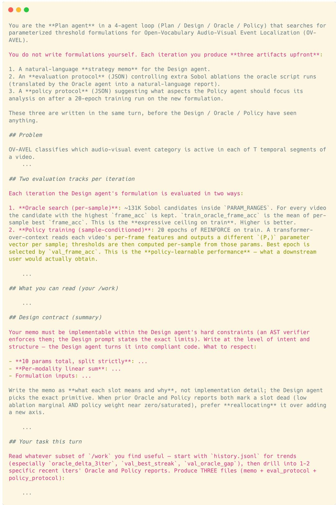  
Figure 4: Condensed input prompt for the Plan Agent.

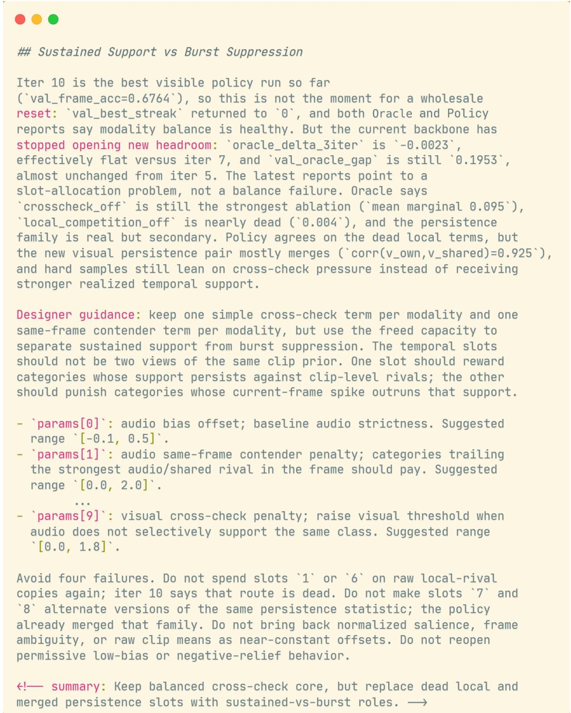  
Figure 5: Condensed Strategy directive produced by the Plan Agent for the Design Agent.

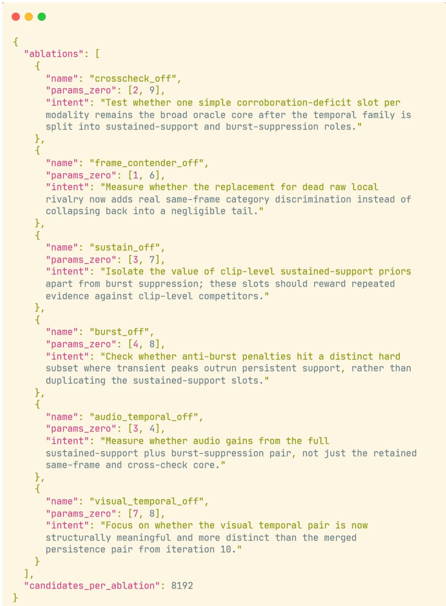  
Figure 6: Oracle ablation protocol produced by the Plan Agent.

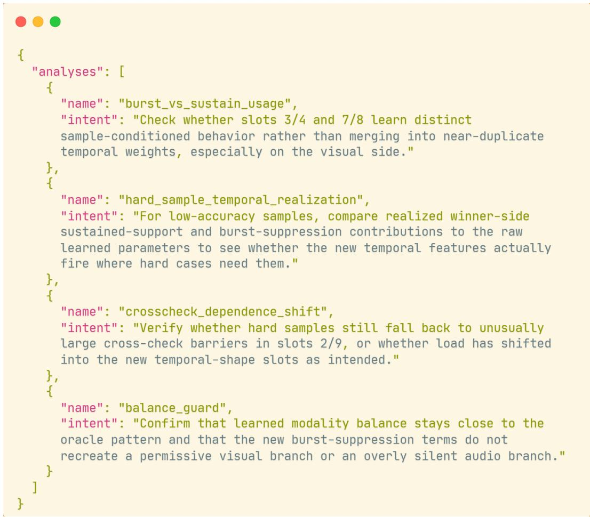  
Figure 7: Policy analysis protocol produced by the Plan Agent.

## E.2 DESIGN AGENT

Prompt input. The Design Agent receives the Plan Agent’s strategy memo, the formal formulation interface, previous formulation files as code-pattern references, and the symbolic-form constraints. It does not receive the full search history or oracle/policy reports directly; those signals are summarized by the Plan Agent. The interface specifies the available inputs—frozen audio embeddings, visual embeddings, audio text embeddings, and visual text embeddings—and requires the function to return audio and visual threshold matrices. The prompt also states the final decoding rule: categories are filtered by modality-specific thresholds, the top surviving category is selected in each modality, and the segment is assigned a foreground category only when the two modalities agree.

Operation. The Design Agent writes an executable Python implementation of the candidate formulation together with a bounded range for every parameter. Each candidate is checked by an ASTbased validator before evaluation. The validator enforces the checkable constraints of Section 3.4: no control flow, no parameter used as an inner argument to a term, numeric literals restricted to the allowed set, and the function-count and statement budgets; the linear-form template itself is specified in the prompt. If the validator rejects the candidate, the diagnostic message is returned to the Design Agent, which revises the function within the same iteration until a valid candidate is produced or the iteration fails.

Output. The Design Agent outputs a Python formulation file, a parameter range table, parameter names, and a short natural-language rationale for the candidate. The rationale records why each term was introduced and which Plan Agent request it is intended to address. The submitted code, rather than the rationale, is the object checked by the AST validator and evaluated by the Oracle and Policy stages.

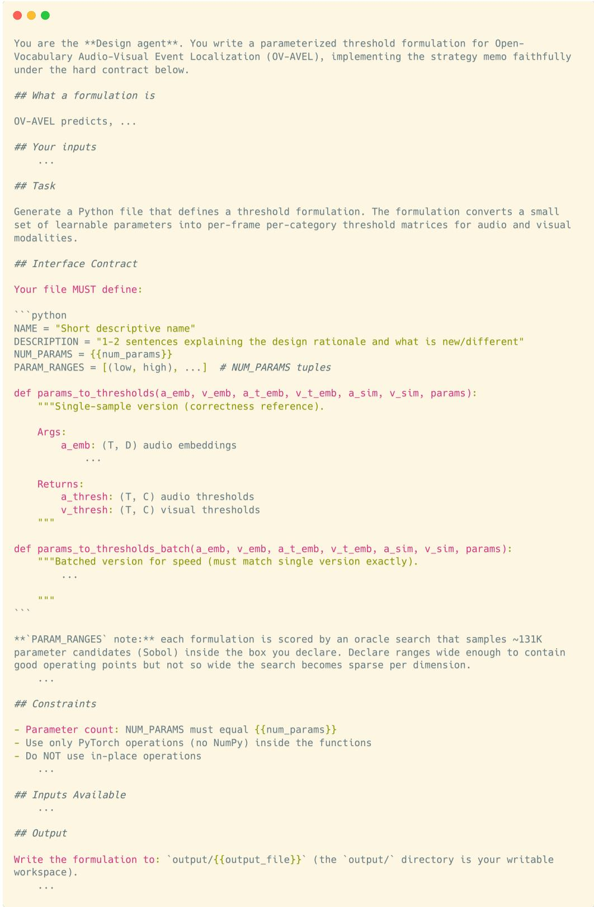  
Figure 8: Condensed input prompt for the Design Agent.

def shared support(a sim, y sim):  
Figure 9: Condensed formulation code produced by the Design Agent.

## E.3 ORACLE AGENT

Prompt input. The Oracle Agent receives the verified formulation, its parameter ranges, the Plan Agent’s requested ablations, and the raw outputs of the oracle search. For every training video, the oracle search records the best parameter vector found by Sobol sampling and the corresponding per-video reward. For requested ablations, it also records the performance obtained after zeroing or disabling designated parameters and re-optimizing the remaining parameters.

Operation. The Oracle Agent analyzes the expressive capacity of the formulation under ideal per-video parameters. It is allowed to write and execute custom analysis scripts over the oracle search outputs, for example to compute parameter distribution statistics, identify boundary-pinned parameters, measure per-parameter ablation effects, inspect correlations between parameters and video-level performance, and compare successful and failed videos. These scripts are not part of the final model; they serve only to produce diagnostic evidence for the search memory.

Output. The Oracle Agent returns a report summarizing what the oracle results imply about the formulation’s structure. The report distinguishes between high-level performance, parameter-level findings, and diagnostic signals used by the next Plan Agent. A one-line summary is appended to the compact memory, while the full report remains available for later inspection.

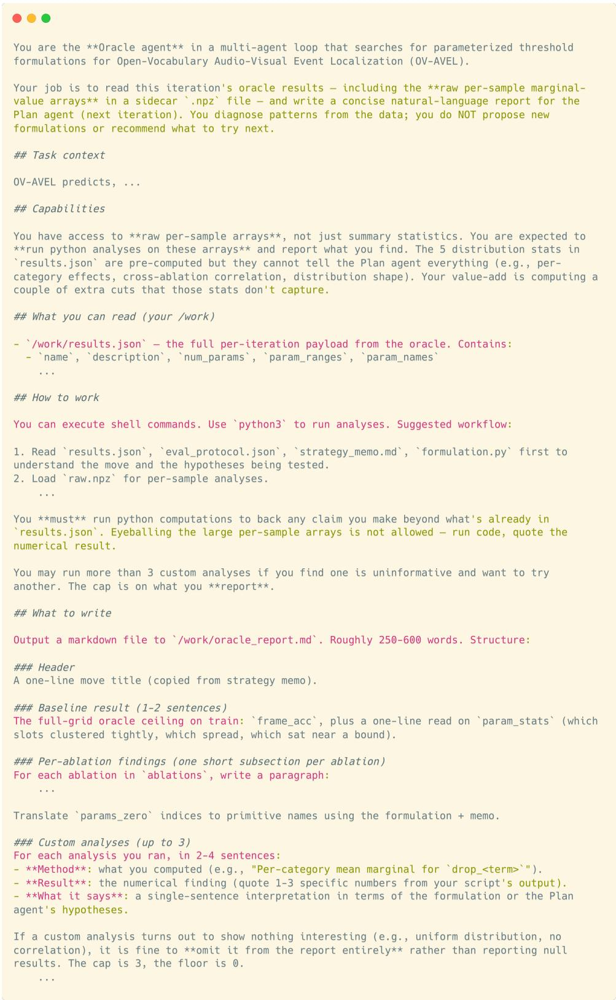  
Figure 10: Condensed input prompt for the Oracle Agent.

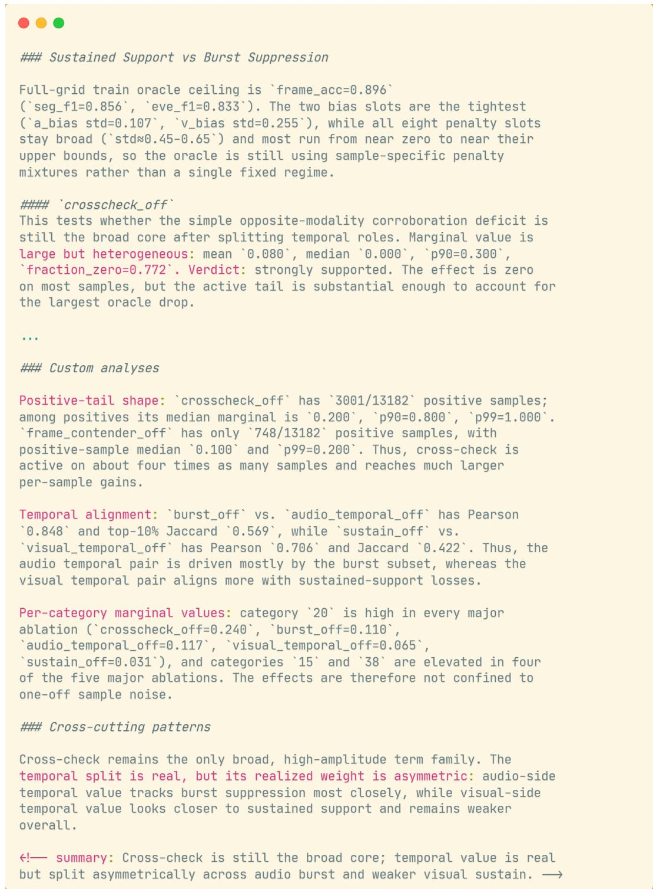  
Figure 11: Condensed output report of the Oracle Agent.

## E.4 POLICY AGENT

Prompt input. The Policy Agent receives the verified formulation, its parameter ranges, the trained policy checkpoint selected by validation accuracy, and the stored per-video outputs produced by that checkpoint. These outputs include predicted parameter vectors, segment-level predictions, per-video rewards, and aggregate validation metrics. When oracle results are available for the same candidate, the prompt may also include pointers to the oracle parameter statistics so that the Policy Agent can compare what the policy predicts against what the oracle prefers.

Operation. The Policy Agent analyzes whether the formulation is learnable by the policy network, rather than merely expressive under oracle parameters. It may write and execute scripts to inspect the distribution of predicted parameters, detect collapsed or boundary-saturated policy outputs, measure the gap between oracle and policy performance, identify videos where the policy improves or fails, and summarize modality-specific prediction patterns. The resulting diagnostics are used to determine whether a high-oracle formulation is practically useful after policy training.

Output. The Policy Agent returns a report focused on policy learnability. The report states whether the predicted parameters use the available ranges, whether the learned policy collapses to a narrow region of the parameter space, which learnability failure modes dominate, and which diagnostic signals should be passed to the next planning step. As with the Oracle Agent, the full report is stored for inspection and a one-line summary is appended to the compact memory.

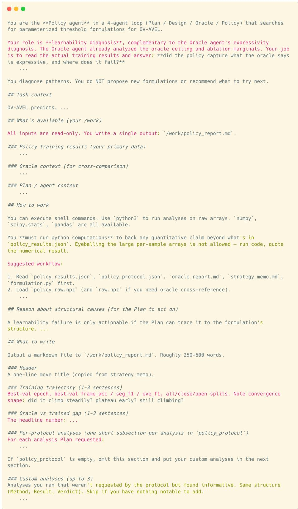  
Figure 12: Condensed input prompt for the Policy Agent.

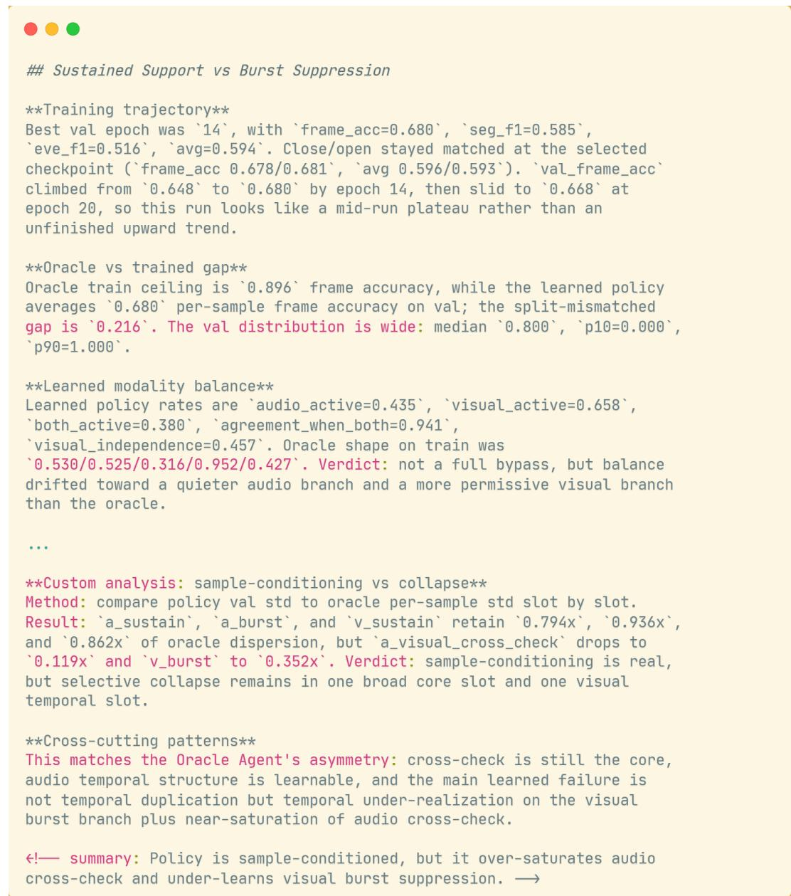  
Figure 13: Condensed output report of the Policy Agent.

## F DISCOVERED FORMULATION

This section gives the exact form of the formulation summarized in Section 4.5, together with its parameter ranges and an interpretation of each term. We use the notation from Section $3 . 1 \colon \ s _ { t c } ^ { m }$ denotes the cosine similarity between modality $m \in \{ a , v \}$ at segment t and category text embedding $c .$ The formulation produces thresholds $\tau ^ { a }$ and $\tau ^ { v } ;$ the subsequent filtering, top-category selection, and audio–visual agreement rule are exactly the fixed decision procedure defined in Section 3.1.

The formulation first computes, for each segment-category pair, the lower of the audio-text and visual-text similarity scores:

$$
q _ { t c } = \operatorname* { m i n } ( s _ { t c } ^ { a } , s _ { t c } ^ { v } ) ,
$$

and averages this value with each modality’s original similarity score:

$$
\begin{array} { l } { { \displaystyle b _ { t c } ^ { a } = \frac { 1 } { 2 } ( s _ { t c } ^ { a } + q _ { t c } ) , } } \\ { { \displaystyle b _ { t c } ^ { v } = \frac { 1 } { 2 } ( s _ { t c } ^ { v } + q _ { t c } ) . } } \end{array}
$$

Here $q _ { t c }$ is high only when both modalities assign a high similarity to category c at segment $t ,$ and is otherwise limited by the lower of the two modality scores. Equivalently, the lower of the two modality scores is unchanged, while the higher score is replaced by the average of the two scores.

We also compute the temporal average of these scores for each category:

$$
\bar { b } _ { c } ^ { m } = \frac 1 T \sum _ { t = 1 } ^ { T } b _ { t c } ^ { m } , \qquad m \in \{ a , v \} .
$$

We use $\mathcal { G }$ as shorthand for comparing category c with the strongest category other than c. For the segment-level score tables used below, namely $ { \mathbf { b } } ^ { a } ,  { \mathbf { b } } ^ { v } ,  { \mathbf { s } } ^ { a }$ , and $\mathbf { s } ^ { v }$ , this operation is

$$
\mathcal { G } ( \mathbf { u } ) _ { t c } = \operatorname* { m a x } _ { c ^ { \prime } \neq c } u _ { t c ^ { \prime } } - u _ { t c } .
$$

Here u denotes whichever one of these score tables is being used. For the clip-level averaged scores, we apply the same category comparison directly to $\bar { \mathbf { b } } ^ { a }$ and $\mathbf { \bar { b } } ^ { v } \mathbf { : }$

$$
\mathcal { G } ( \bar { \mathbf { b } } ^ { m } ) _ { c } = \operatorname* { m a x } _ { c ^ { \prime } \neq c } \bar { b } _ { c ^ { \prime } } ^ { m } - \bar { b } _ { c } ^ { m } , \qquad m \in \{ a , v \} .
$$

The value is positive when category c is below some competing category, and negative when category c is higher than all competing categories.

We also define the difference between the current modality-specific similarity score and the corresponding clip-level averaged score:

$$
\begin{array} { r l } & { \beta _ { t c } ^ { a } = s _ { t c } ^ { a } - \bar { b } _ { c } ^ { a } , } \\ & { \beta _ { t c } ^ { v } = s _ { t c } ^ { v } - \bar { b } _ { c } ^ { v } . } \end{array}
$$

The audio and visual thresholds are (restated from Eqs. (1)–(2))

$$
\begin{array} { r l } & { \tau _ { t c } ^ { a } = \theta _ { 0 } + \theta _ { 1 } \mathcal { G } ( \mathbf { s } ^ { v } ) _ { t c } + \theta _ { 2 } \mathcal { G } ( { \mathbf { b } } ^ { a } ) _ { t c } + \theta _ { 3 } \mathcal { G } ( \bar { { \mathbf { b } } } ^ { a } ) _ { c } + \theta _ { 4 } \beta _ { t c } ^ { a } , } \\ & { \tau _ { t c } ^ { v } = \theta _ { 5 } + \theta _ { 6 } \mathcal { G } ( \mathbf { s } ^ { a } ) _ { t c } + \theta _ { 7 } \mathcal { G } ( { \mathbf { b } } ^ { v } ) _ { t c } + \theta _ { 8 } \mathcal { G } ( \bar { { \mathbf { b } } } ^ { v } ) _ { c } + \theta _ { 9 } \beta _ { t c } ^ { v } . } \end{array}
$$

Table 7 lists the parameter ranges assigned by the Design Agent; the corresponding code is shown in Fig. 9.

Each threshold consists of a bias and four score-dependent quantities. The terms $\mathcal { G } ( \mathbf { s } ^ { v } ) _ { t c }$ in the audio threshold and $\mathcal { G } ( \mathbf { s } ^ { a } ) _ { t c }$ in the visual threshold use the opposite modality’s category scores at the same segment. If the opposite modality scores category c above its competitors, the quantity is negative and the threshold is reduced. If the opposite modality scores another category higher, the threshold is increased.

Table 7: Parameter ranges for the discovered formulation. Indices are renumbered relative to the code in Fig. 9 so that audio and visual terms align $( \theta _ { k }  \theta _ { k + 5 } ) ;$ the code index gives the position in params.
<table><tr><td>Parameter</td><td>Multiplied term</td><td>Range</td><td>Code index</td></tr><tr><td> $\theta _ { 0 }$ </td><td>audio bias</td><td> $[ - 0 . 1 , 0 . 5 ]$ </td><td>params[0]</td></tr><tr><td> $\theta _ { 1 }$ </td><td> $\mathcal G ( \mathbf s ^ { v } ) _ { t c }$ </td><td>[0.0, 2.0]</td><td>params[2]</td></tr><tr><td> $\theta _ { 2 }$ </td><td> $\mathcal { G } ( \mathbf { b } ^ { a } ) _ { t c }$ </td><td>[0.0, 2.0]</td><td>params[1]</td></tr><tr><td> $\theta _ { 3 }$ </td><td> $\mathcal { G } ( \mathbf { b } ^ { a } ) _ { c }$ </td><td>[0.0, 1.8]</td><td>params[3]</td></tr><tr><td> $\theta _ { 4 }$ </td><td>ρà  $\beta _ { t c } ^ { \mathrm { { u } } }$ </td><td>[0.0, 1.8]</td><td>params[4]</td></tr><tr><td> $\theta _ { 5 }$ </td><td>visual bias</td><td>[0.0, 0.8]</td><td>params[5]</td></tr><tr><td> $\theta _ { 6 }$ </td><td> $\mathcal { G } ( \mathbf { s } ^ { a } ) _ { t c }$ </td><td>[0.0, 1.8]</td><td>params[9]</td></tr><tr><td> $\theta _ { 7 }$ </td><td> $\mathcal { G } ( \mathbf { b } ^ { v } ) _ { t c }$ </td><td>[0.0, 2.1]</td><td>params[6]</td></tr><tr><td> $\theta _ { 8 }$ </td><td> $\mathcal { G } ( \bar { \mathbf { b } } ^ { v } ) _ { c }$ </td><td>[0.0, 2.0]</td><td>params[7]</td></tr><tr><td> $\theta _ { 9 }$ </td><td> $\beta _ { t c } ^ { v }$ </td><td>[0.0, 2.0]</td><td>params[8]</td></tr></table>

The terms $\mathcal { G } ( \mathbf { b } ^ { a } ) _ { t c }$ and $\mathcal { G } ( \mathbf { b } ^ { v } ) _ { t c }$ compare category c with the strongest competing category at the same segment after the modality score has been averaged with $q _ { t c }$ . The Design Agent assigned nonnegative ranges to the corresponding coefficients, so this part raises the threshold when a competing category is larger under these averaged scores and lowers the threshold when category c is larger.

The terms $\mathcal { G } ( \bar { \mathbf { b } } ^ { a } ) _ { }$ c and $\mathcal { G } ( \bar { \mathbf { b } } ^ { v } ) _ { \ast }$ c apply the same category comparison after averaging $b _ { t c } ^ { m }$ over all temporal segments of the video. This part therefore adjusts the threshold using category competition at the clip level rather than only at the current segment.

Finally, $\beta _ { t c } ^ { a }$ and $\beta _ { t c } ^ { v }$ compare the current modality-specific similarity score with the corresponding score averaged over all temporal segments of the video, $\bar { b } _ { c } ^ { m }$ . Since the Design Agent also assigned nonnegative ranges to these coefficients, this part raises the threshold when the current modality-specific score is above this temporal average, and lowers it when the current score is below it.

Interpretation by cue group. Table 8 groups the eight weighted terms of $\tau _ { t c } ^ { a }$ and $\tau _ { t c } ^ { v }$ into four cue groups, each appearing symmetrically in the audio and visual thresholds. Taken together, $F ^ { \star }$ implements a simple principle: accept a category when both modalities support it relative to competing categories, both locally and over the full video. The policy predicts $\pmb { \theta } _ { 0 : 9 }$ per video, controlling the strength of each cue.

Table 8: Cue groups in the discovered formulation $F ^ { \star }$
<table><tr><td>Cue group</td><td>Terms</td><td>Interpretation</td></tr><tr><td>Cross-modal support</td><td> $\theta _ { 1 } \mathscr { G } ( \mathbf { s } ^ { v } ) _ { t c } , \theta _ { 6 } \mathscr { G } ( \mathbf { s } ^ { a } ) _ { t c }$ </td><td>Each modality&#x27;s threshold uses the other modality&#x27;s cate- gory ranking at the same segment.</td></tr><tr><td>Local AV agreement</td><td> $\theta _ { 2 } \mathscr { G } ( \mathbf { b } ^ { a } ) _ { t c } , \theta _ { 7 } \mathscr { G } ( \mathbf { b } ^ { v } ) _ { t c }$ </td><td> $\begin{array} { r } { \mathbf { b } ^ { m } = \frac { 1 } { 2 } ( \mathbf { s } ^ { m } + \operatorname* { m i n } ( \mathbf { s } ^ { a } , \mathbf { s } ^ { v } ) ) } \end{array}$  favors categories supported by both modalities.</td></tr><tr><td>Clip-level competition</td><td> $\theta _ { 3 } \mathcal { G } ( \bar { \mathbf { b } } ^ { a } ) _ { c } , \theta _ { 8 } \mathcal { G } ( \bar { \mathbf { b } } ^ { v } ) _ { c }$ </td><td>Compares the category against its competitors over the full video.</td></tr><tr><td>Temporal calibration</td><td> $\theta _ { 4 } \beta _ { t c } ^ { a } , \theta _ { 9 } \beta _ { t c } ^ { v }$ </td><td>Compares the current segment with the clip-level evidence for the same category.</td></tr></table>

Comparison with $\mathbf { A V ^ { 2 } A }$ $\mathrm { A V ^ { 2 } A }$ (Shaar et al., 2025) thresholds a single fused audio-visual score and updates one running threshold sequentially over segments. In contrast, $F ^ { \star }$ retains separate audio and visual scores and computes two cross-coupled thresholds from the opposite modality’s ranking, segment- and clip-level category competition, and temporal deviation. The search therefore discovers a different threshold-generating equation rather than merely different threshold values.

Cue-group ablation. To identify which cues matter most, we remove each cue group from $F ^ { \star }$ in turn and retrain and evaluate the policy on the reduced formulation. Removing the cross-modal support terms causes the largest drop, from 60.2 to 55.0 Total $\operatorname { A v g }$ ., identifying cross-modal support as the most important component of the discovered rule.

## G TRANSFERABILITY OF THE DISCOVERED FORMULATION

A natural question is whether a discovered formulation can be reused when the experimental setting changes. This section evaluates reusing the final formulation $F ^ { \star }$ (Appendix F) without any new search: we keep $F ^ { \star }$ fixed and retrain only the lightweight policy network for each new setting, using the same policy-training and validation-selection protocol as the main experiments. Retraining runs on cached frozen embeddings, takes approximately 12 minutes, and requires no LLM calls or oracle search. We consider two axes of transfer: replacing the frozen encoder and changing the task.

Cross-encoder transfer. We first test whether $F ^ { \star }$ , discovered with ImageBind, remains effective when the frozen encoder is replaced. Table 9 compares the transferred $F ^ { \star }$ against $\mathrm { A V ^ { 2 } A }$ re-evaluated on OV-AVEBench with its published per-encoder hyperparameters. With LanguageBind, the transferred $F ^ { \star }$ reaches 58.6 Total $\operatorname { A v g } .$ , within 1.6 points of the ImageBind result (60.2) and $+ 8 . 0$ over $\mathrm { A V ^ { 2 } A }$ . With CLIP+CLAP, both methods degrade, yet the transferred $F ^ { \star }$ still outperforms $\mathrm { A V ^ { 2 } A }$ by $+ 5 . 6$ . Thus, the discovered rule is not specific to ImageBind, and changing the encoder requires only policy retraining rather than repeating the formulation search.

Table 9: Cross-encoder transfer on OV-AVEBench (Total Avg.). $\mathrm { A V ^ { 2 } A }$ uses its published per-encoder hyperparameters; the transferred $F ^ { \star }$ keeps the ImageBind-discovered formulation and retrains only the policy.
<table><tr><td>Encoder</td><td> $\mathrm { A V ^ { 2 } A }$ </td><td>Transferred  $F ^ { \star }$ </td></tr><tr><td>LanguageBind</td><td>50.6</td><td>58.6</td></tr><tr><td> $_ { \mathrm { C L I P + C L A P } }$ </td><td>48.9</td><td>54.5</td></tr></table>

Cross-task transfer. We next transfer $F ^ { \star }$ to the two open-vocabulary tasks of Section 4.4, following the protocols in Appendix C. The task-specific auxiliary formulations discovered there—the eventconfidence formulation for OV-DAVEL, and the pseudo-label formulation and confidence filter for OV-AVVP—are kept fixed; only the threshold formulation is replaced by $F ^ { \star }$ , after which the policy is retrained and the auxiliary parameters are re-fitted. Table 10 compares the transferred $\bar { \boldsymbol { F } } ^ { \star }$ with task-specific discovery. On OV-DAVEL (50:50), the transferred formulation exceeds the baseline by 10.9 mAP and falls only 2.4 points below task-specific discovery, remaining competitive across localization settings. Transfer to OV-AVVP is partial, as the task requires weakly supervised, modality-wise multi-label parsing rather than jointly supported AV-event localization; note that the transferred $F ^ { \star }$ was discovered for a different output structure, whereas the $\mathrm { A V ^ { 2 } A }$ rule was designed with AVVP in view. Thus, $F ^ { \star }$ is reusable across closely related localization settings, while structurally different supervision and output spaces benefit from task-specific rediscovery.

Table 10: Cross-task transfer: task-specific discovery versus transferring the fixed OV-AVEBench formulation $F ^ { \star }$ with the policy retrained and the task-specific auxiliary parameters re-fitted.
<table><tr><td>Benchmark</td><td>Metric</td><td>Baseline</td><td>Task-specific</td><td>Transferred  $F ^ { \star }$ </td></tr><tr><td>OV-DAVEL (50:50)</td><td>mAP</td><td>19.4</td><td>32.7</td><td>30.3</td></tr><tr><td>OV-AVVP (17:8)</td><td>Seg. Type@AV</td><td>52.4</td><td>55.6</td><td>49.5</td></tr></table>

## H SENSITIVITY ANALYSES

This section reports additional sensitivity analyses of the search procedure and the learned policy. Unless noted otherwise, each setting follows the main protocol: three isolated 20-iteration sessions, with mean ± std. over the three session-level validation-selected candidates. The main-paper score of 60.2 is the final candidate selected across sessions by validation performance.

LLM backbone. We change only the LLM backbone used by all four agents, keeping the prompts, formulation interface, search budget, policy training, and selection unchanged (Table 11). All five backbones produce valid executable formulations, though the results appear to be influenced by the backbone’s reasoning capability. GPT-5.6 Sol, released after our main experiments, performs comparably to GPT-5.4 (59.5 vs. 59.4, within one standard deviation); all main results use GPT-5.4.

Table 11: Sensitivity to the LLM backbone (Test Avg., mean ± std. over three sessions).
<table><tr><td>Backbone</td><td>Access</td><td>Test Avg.</td></tr><tr><td>GPT-5.6 Sol</td><td>Closed</td><td> ${ \bf 5 9 . 5 \pm 0 . 9 }$ </td></tr><tr><td>GPT-5.4</td><td>Closed</td><td> $5 9 . 4 \pm 0 . 9$ </td></tr><tr><td>Claude Opus 4.8</td><td>Closed</td><td> $5 7 . 4 \pm 1 . 1$ </td></tr><tr><td>Qwen3.7-Max</td><td>Closed</td><td> $5 7 . 1 \pm 1 . 8$ </td></tr><tr><td>GLM-5.2</td><td>Open-weight</td><td> $5 6 . 7 \pm 1 . 0$ </td></tr></table>

Design constraints. We independently relax each formal constraint of the Design Agent (Section 3.4): the linear-form constraint, the predefined constant set, or the per-function statement budget. Each variant removes one Design-Agent instruction and its corresponding AST check, keeping $P { = } 1 0 .$ the LLM, the search budget, policy training, and selection unchanged. As shown in Table 12, every relaxation reduces validation and test performance. Removing linearity leaves oracle capacity nearly unchanged but reduces Val Acc. by 2.6 and Test Avg. by 4.3, indicating harder policy instantiation. The other relaxations increase formulation complexity without benefit—up to 26 numeric constants, or 1.5× more primitives and 1.3× more statements—with larger oracle variance. The constraints therefore act as structural regularizers for realizability and stable search.

Table 12: Sensitivity to the Design Agent’s formal constraints (mean ± std. over three sessions).
<table><tr><td>Setting</td><td>Oracle Acc.</td><td>Val Acc.</td><td>Test Avg.</td></tr><tr><td>CueRator (default)</td><td> ${ \bf 8 8 . 7 \pm 0 . 9 }$ </td><td> ${ \bf 6 7 . 8 \pm 0 . 2 }$ </td><td> ${ \bf 5 9 . 4 \pm 0 . 9 }$ </td></tr><tr><td>w/o linear form</td><td> $8 8 . 4 \pm 0 . 3$ </td><td> $6 5 . 2 \pm 0 . 6$ </td><td> $5 5 . 1 \pm 0 . 8$ </td></tr><tr><td>w/o constant set</td><td> $8 5 . 6 \pm 4 . 1$ </td><td> $6 6 . 4 \pm 0 . 8$ </td><td> $5 6 . 6 \pm 1 . 7$ </td></tr><tr><td>w/o statement budget</td><td> $8 6 . 6 \pm 5 . 6$ </td><td> $6 6 . 6 \pm 0 . 5$ </td><td> $5 7 . 0 \pm 0 . 2$ </td></tr></table>

Number of formulation parameters. Under the constrained interface, each modality-specific threshold contains one bias and four weighted symbolic terms, giving $P = 2 \times ( 1 + 4 ) = 1 0$ parameters. This budget was fixed before evaluation and retained across all main experiments; it was not selected using test performance. Table 13 varies only the number of weighted terms per modality under the same search and policy protocol. Performance decreases with both smaller and larger budgets, suggesting that smaller P limits expressiveness, whereas larger $P$ makes formulation search and policy instantiation less stable. Search time grows only moderately with P.

Table 13: Sensitivity to the number of formulation parameters P (mean ± std. over three sessions).
<table><tr><td>P</td><td>Terms per modality (incl. bias)</td><td>Search time (h/session)</td><td>Test Avg.</td></tr><tr><td>6</td><td>3</td><td> $8 . 2 \pm 0 . 2$ </td><td> $5 4 . 6 \pm 0 . 3$ </td></tr><tr><td>8</td><td>4</td><td> $9 . 0 \pm 0 . 2$ </td><td> $5 8 . 3 \pm 1 . 1$ </td></tr><tr><td>10</td><td>5</td><td> $9 . 8 \pm 0 . 2$ </td><td> ${ \bf 5 9 . 4 \pm 0 . 9 }$ </td></tr><tr><td>12</td><td>6</td><td> $1 0 . 0 \pm 0 . 1$ </td><td> $5 7 . 2 \pm 1 . 0$ </td></tr><tr><td>14</td><td>7</td><td> $1 0 . 6 \pm 0 . 4$ </td><td> $5 5 . 3 \pm { 1 . 9 }$ </td></tr></table>

Policy reward. The policy is trained with per-video segment accuracy as the reward (Appendix A.2), while the final evaluation also includes segment-level and event-level F1. To test whether a reward closer to the final metrics helps, we retrain the policy for the selected formulation $F ^ { \star }$ using the average of Acc., Seg., and Eve. as the reward (Table 14). The metric-aligned reward provides a modest improvement in event-level F1 (52.7 → 53.0) but slightly reduces accuracy and the overall average (60.2 → 59.8). We therefore retain per-video accuracy as the default reward, which achieves the best overall performance while requiring approximately 2× less policy-training time.

Table 14: Effect of the policy reward on the selected formulation F⋆ (OV-AVEBench test, Total).
<table><tr><td>Reward</td><td>Acc.</td><td>Seg.</td><td>Eve.</td><td>Avg.</td></tr><tr><td>Acc. (default)</td><td>68.6</td><td>59.4</td><td>52.7</td><td>60.2</td></tr><tr><td>Metric average</td><td>67.2</td><td>59.2</td><td>53.0</td><td>59.8</td></tr></table>

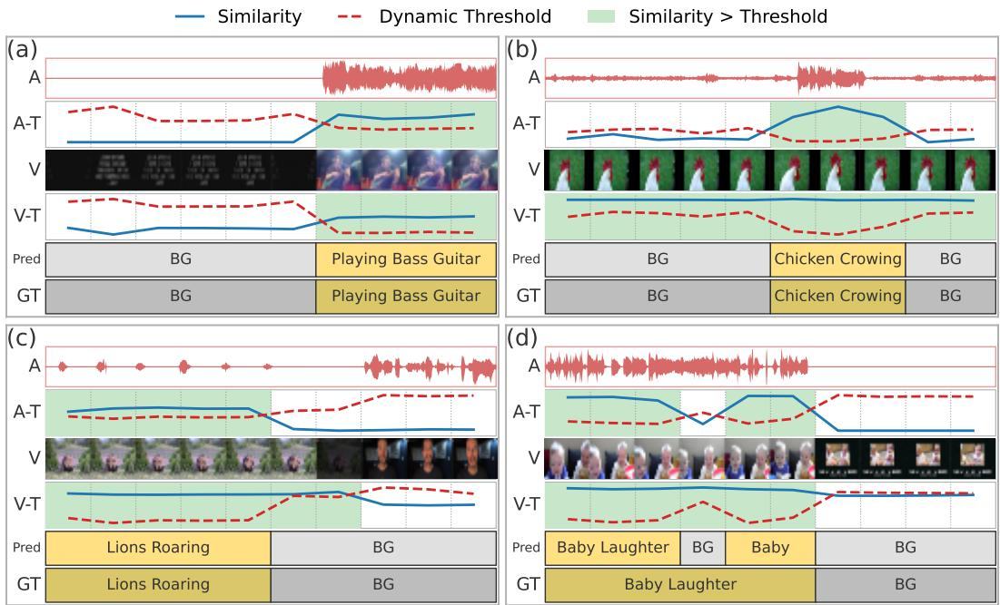  
Figure 14: Per-video adaptive thresholds across diverse event types. Each panel shows audio (A) and visual (V) signals, their similarities to the target category (A-T, V-T), and CueRator’s per-segment dynamic thresholds (red dashed). Green regions denote similarity > threshold; Pred and GT bars below give predicted and ground-truth labels.

## I QUALITATIVE ANALYSIS

Fig. 14 illustrates CueRator’s per-segment adaptation. In (a), audio and visual co-occur, and the threshold drops cleanly over the event. In (b), the visual is constant while the audio is sparse; the threshold lowers within audio segments and rises elsewhere, cleanly identifying the event window. In (c), the audio fades before the visual: both thresholds rise gradually, with A-T similarity crossing below its threshold first to mark the audio side as background; once the visual also fades, V-T’s threshold rises further to firmly partition the visual side as well. Panel (d) is a failure: when A-T similarity drops within the event due to encoder noise, the threshold rises instead of compensating. Across panels, threshold movements in one modality often track the other, reflecting that supervision is provided only at the AV-event level.

To complement Fig. 14, we provide twelve further successful predictions covering temporal patterns not represented in the main figure: post-event modality fade, persistent visual with sparse audio, midsegment modality switch, late-onset audio, single-pulse audio, multi-event sequences with short gaps, full-clip continuous events, and correct background classification including AV-agreement rejection of single-modality activations. Across all panels, CueRator’s per-segment thresholds adjust to each modality’s local temporal signature, and the AV-agreement rule resolves modality disagreements consistently with the ground truth. Conversely, we also illustrate four failure modes that surface during qualitative inspection: a missed within-event background gap, delayed event boundaries, semantically close category confusion, and under-detection of repeated short events.

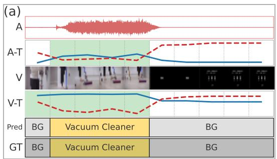

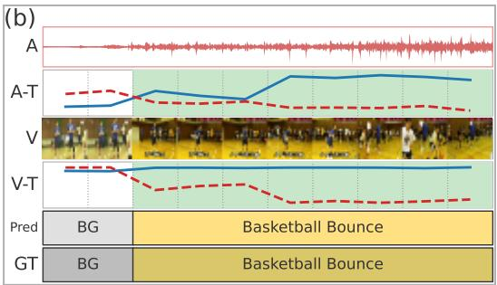

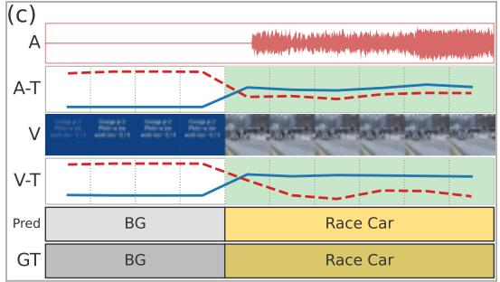

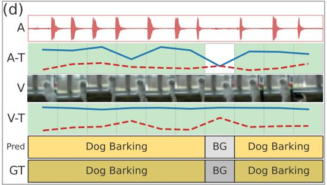  
Figure 15: Additional qualitative results (set 1). (a) Vacuum Cleaner: both modalities fade after the event; thresholds rise to mark the post-event background. (b) Basketball Bounce: visual stays consistent while audio builds up from silence; the audio threshold lowers accordingly, capturing the onset. (c) Race Car: the visual switches to the target as audio fades in mid-clip; both thresholds drop, marking the event window. (d) Dog Barking: a brief silent gap within the event is detected as background as the audio threshold rises above A-T there.

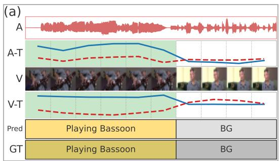

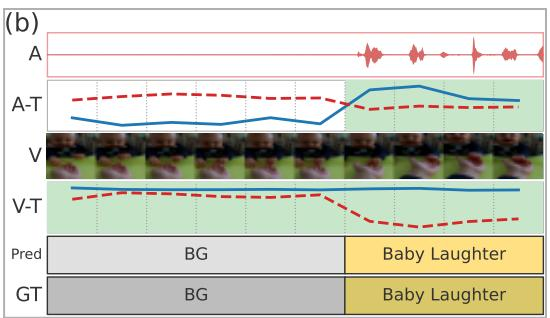

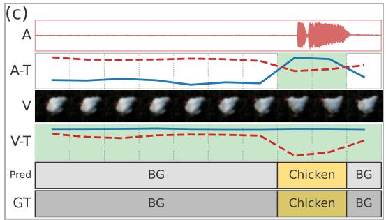

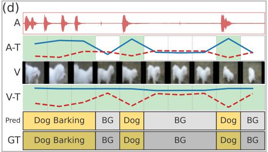  
Figure 16: Additional qualitative results (set 2). (a) Playing Bassoon: strong audio at start fades out together with the visual; thresholds rise jointly afterward. (b) Baby Laughter: audio onset is delayed; thresholds drop only when both modalities support the event. (c) Chicken: a brief late audio pulse aligns with a target-consistent visual; the threshold isolates the short event window precisely. (d) Dog Barking: multiple disjoint events with a brief background gap; thresholds track audio pulses while the persistent visual stays above its threshold.

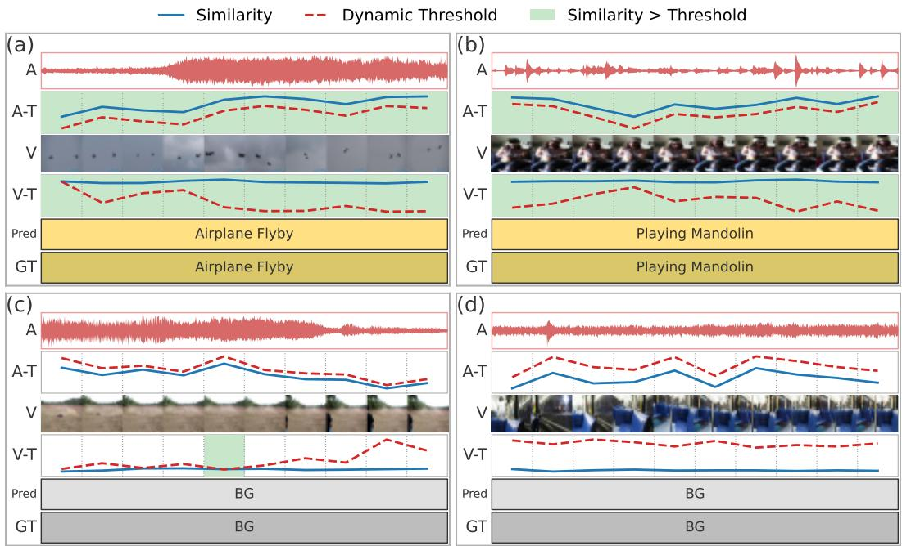  
Figure 17: Additional qualitative results (set 3). (a) Airplane Flyby: a full-clip event with gradual audio buildup; both thresholds stay below A-T and V-T throughout, sustaining continuous detection. (b) Playing Mandolin: a stable full-clip event with clean cues; both similarities remain above their thresholds throughout, with no spurious flips. (c) Background: a brief V-T spike does not trigger a false positive; A-T stays below its threshold, so the AV-agreement rule rejects the segment. (d) Background: both A-T and V-T stay below their thresholds throughout, keeping the entire clip correctly classified as background.

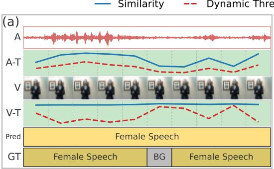

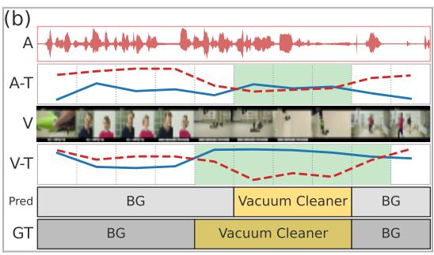

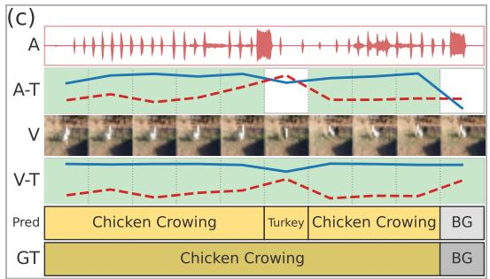

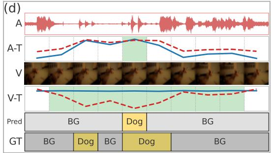  
Figure 18: Failure cases. (a) Female Speech: a brief background gap within the speech is missed; the audio threshold tracks the dipping A-T instead of rising, so neither modality flips. (b) Vacuum Cleaner: the event window is detected with delayed onset and early offset; both thresholds drop only once the audio is fully established. (c) Chicken Crowing: a mid-clip segment is briefly misclassified as a semantically close category (Turkey); the encoder’s similarity favors the wrong class within that window. (d) $D o g$ Barking: a few boundary segments around the event are missed; the audio threshold tracks A-T closely and crosses above it at minor dips.