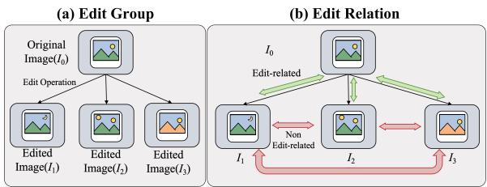
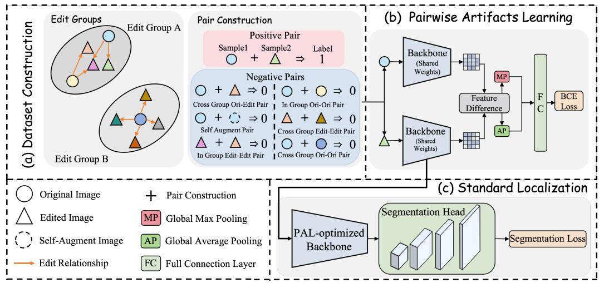
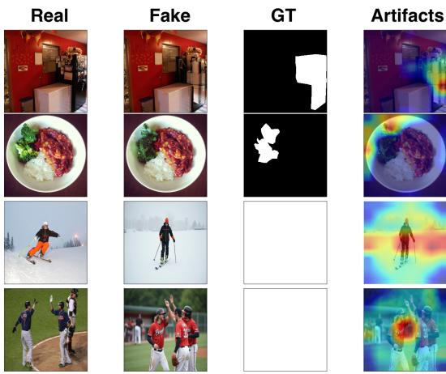
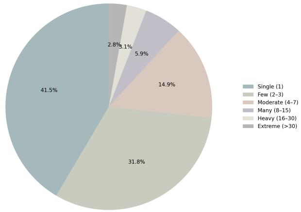
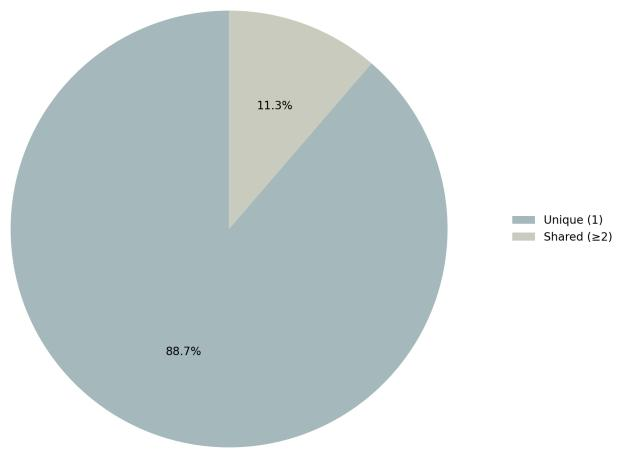
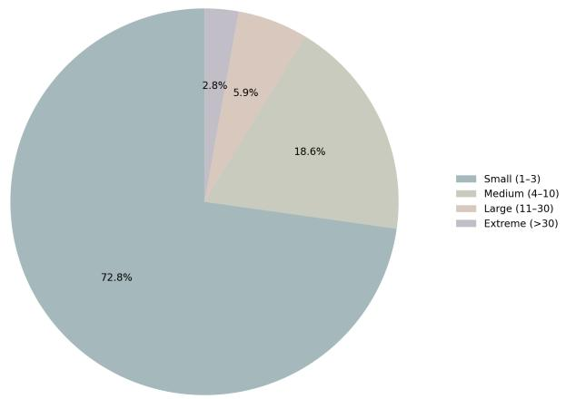
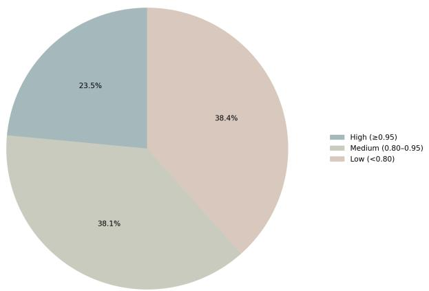
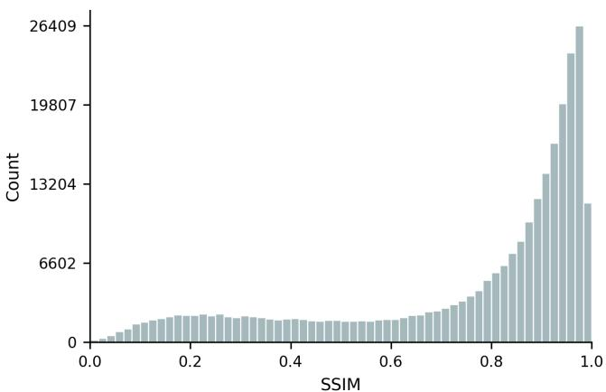
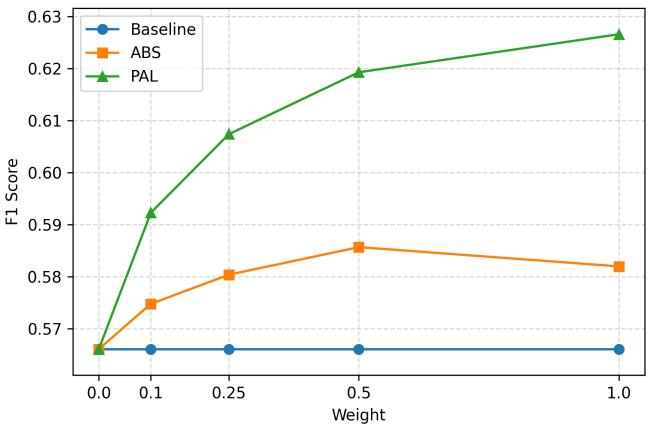
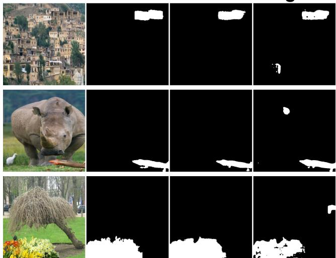

# Can We Model the Artifacts Explicitly? Disentangle Artifacts via Pairwise Edit Relations for Image Manipulation Localization

Xuekang Zhu1,2, Kaiwen Feng1, Ruifeng Wang1, Xiwen Wang1, Xiaochen Ma3 Bo Du1, Changjiang Jiang2,4, Chenfan Qu2,5, Songyu Ye6 Xia Du7, Wentao Feng1, Jian Liu2, Ji-Zhe Zhou1‡

1 Sichuan University 2 Ant Group

3 The Hong Kong University of Science and Technology 4 Wuhan University 5 South China University of Technology 6 University of Southern California 7 Xiamen University of Technology

## Abstract

Image Manipulation Localization (IML) is commonly formulated as a fully supervised learning task that estimates the optimal manipulation mask y for a given image x. In this work, we first reveal the latent nature of artifacts and thus reinterpret IML as a latent-variable problem, $\begin{array} { r } { P ( y | x ) = \int P ( y | z ) P ( z | x ) d z } \end{array}$ , where z denotes the artifacts. Following this interpretation, we pinpoint the cause for the current IML models’ insufficiency as their implicit artifacts modeling strategy, highlighting the necessity of modeling z in an explicit manner. Without direct labels, feature disentanglement is the most appropriate solution for this explicit modeling. Accordingly, we propose a two-stage learning paradigm with the Pairwise Artifacts Learning (PAL) and Standard Localization (SL) phases to estimate $P ( z | x )$ and $P ( y | z )$ via edit relations. To support our edit-relation-based learning, we further curate EditGroup-45K, a source-anchored dataset organized into edit groups for pair construction. Extensive experiments show that our PAL paradigm yields consistent improvements across diverse IML architectures, and empirical analyses further verify that PAL does capture artifacts explicitly through feature disentanglement.Code and dataset are available at https://github.com/venus-guangjian/PAL

## 1 Introduction

“What is essential is invisible to the eye" - The Little Prince

Image Manipulation Localization (IML) is typically formulated as a supervised learning task that estimates the conditional distribution $\dot { P } ( y | \dot { x } )$ , where y is a binary mask indicating manipulated regions, given an input image x. The success of this task hinges on the model’s ability to capture artifacts, which are subtle feature inconsistencies introduced by manipulation operations. Although decisive to the output mask y, artifacts reside primarily in the non-semantic domain and are thereby largely imperceptible to the human eye, rendering direct annotation infeasible. Consequently, artifacts act as a latent variable, interpreting IML as a latent-variable learning problem governed by the probabilistic decomposition: $\begin{array} { r } { P ( y | \mathbf { \bar { x } } ) = \int P ( y | z ) P ( z | x ) d z } \end{array}$ , where z represents the underlying manipulation artifacts.

Table 1: Comparison of artifacts modeling paradigms. ‘Seg.’ and ‘Conv.’ denote Seg former and ConvNeXt, respectively.
<table><tr><td rowspan=1 colspan=1>Model Name</td><td rowspan=1 colspan=3>Backbone</td><td rowspan=1 colspan=1>Artifacts Modeling</td></tr><tr><td rowspan=3 colspan=1>PSCC [33]IML-ViT [38]MVSS-Net [5]CAT-Net [30]TruFor [11]Mesorch [64]</td><td rowspan=3 colspan=3>HRNetViTResNetHRNetSegformerSeg. + Conv.</td><td rowspan=3 colspan=1>ImplicitImplicitImplicit + HandcraftedImplicit + HandcraftedImplicit + HandcraftedImplicit + Handcrafted</td></tr><tr><td rowspan=1 colspan=1></td></tr><tr><td rowspan=1 colspan=2>ResN</td></tr><tr><td rowspan=1 colspan=1>Ours</td><td rowspan=1 colspan=3>Any</td><td rowspan=1 colspan=1>Explicit</td></tr></table>

  
Figure 1: Edit Groups and Edit Relations. (a) Edit Groups are organized as genealogical trees rooted at authentic anchors $( I _ { 0 } )$ ). (b) Green and red arrows indicate edit-related and non-edit-related pairs, respectively.

As Table 1 illustrates, to address this latent-variable learning problem, existing IML methods generally adopt a one-stage end-to-end implicit modeling paradigm. Specifically, current solutions attempt to estimate the conditional distribution $P ( \boldsymbol { y } | \boldsymbol { x } )$ directly, assuming that the deep model will spontaneously generate representations of the latent artifacts. However, hindered by label noise [62] and semantic shortcuts [58, 61], such implicit learning methods are highly vulnerable to spurious correlations and are prone to overfitting to semantic biases. To further mitigate these vulnerabilities, many approaches incorporate additional domain expertise via handcrafted feature extractors $( \mathrm { e . g . }$ , SRM filters [63] or Bayar convolutions [4]), thereby injecting human priors and constraints into the implicit artifacts learning process. Nevertheless, extensive experiments [39, 7] demonstrate that these rigid and non-adaptive human priors in fact compromise the model’s generalization ability across diverse manipulation scenarios.

Considering the above inherent issues of current implicit learning paradigms, a core question for advancing IML arises: Can we model the artifacts explicitly?

The answer to this question lies in disentangling artifacts from the coupled latent space. Fundamentally, IML models identify manipulated regions by capturing discrepancies between manipulated and authentic images; however, these discrepancies arise from two components: semantic variations and manipulation artifacts (e.g., non-semantic variations). In other words, while artifacts are the target of interest, they are inherently entangled with semantic features in the latent space. Thus, in the absence of direct annotations for artifacts, disentangling these two components becomes the optimal path for explicit artifacts modeling. Mathematically, explicit means that artifacts are introduced as a direct optimization target through relational supervision, rather than being treated as an implicit byproduct of end-to-end mask prediction. This does not require the stronger assumption that artifacts and semantic factors are statistically independent; instead, it aims to reduce semantic shortcuts and emphasize edit-induced discrepancies.

To this end, we exploit extensive inter-image relationships and discover that the edit relation between images holds the key to factoring out the artifacts. Specifically, as illustrated in Figure 1, the edit relation is the direct correspondence between an authentic image and its manipulated counterpart. Discrepancies in edit-related pairs represent a composite of both artifacts and semantic shifts, whereas discrepancies in non-related pairs originate exclusively from semantic variations. By contrasting these edit relations, we can effectively suppress the representation of semantic variations, thereby disentangling the latent artifacts z. A formal study is also conducted to analyze the disentangled outcomes of this edit relation-based paradigm in Sec. A. Driven by this disentanglement, the intractable end-to-end conditional distribution $p ( y | x )$ is decomposed into two manageable sub-processes: explicit artifacts disentanglement $P ( z | x )$ and artifact-based localization $P ( y | z )$

Building upon this insight, we therefore propose a two-stage training paradigm consisting of Pairwise Artifacts Learning (PAL) and Standard Localization (SL). The PAL stage is dedicated to explicitly modeling the artifacts posterior $P ( z | x )$ by contrasting edit-related and non-related image pairs. Specifically, we minimize a pairwise binary cross-entropy loss by contrasting edit pairs containing complete artifacts against those with absent artifacts, thereby yielding a PAL-optimized encoder that captures robust, disentangled forensic representations.

Subsequently, the SL stage adapts the PAL-optimized encoder to the pixel-wise manipulation localization objective, i.e., learning the conditional distribution $P ( y | z )$ from artifacts to masks. To ensure compatibility and fair comparison with prior IML methods, we adopt the standard training protocol used in the existing IML codebase [39]. By using the PAL-optimized encoder as backbone initialization, the model starts from an artifact-aware representation that facilitates estimating $P ( z | x )$ ), thereby simplifying the downstream optimization from the entangled end-to-end objective $P ( y | x )$ to the more direct conditional distribution $P ( y | z )$ and reducing reliance on semantic shortcuts.

However, a bottleneck for implementing this approach is the scarcity of large-scale datasets containing explicit edit pairs. To establish a training basis for our proposed approach, we curate EditGroup-45K, a large-scale dataset specifically organized into edit groups. This dataset comprises 52K authentic images and 232K manipulated images across 45K edit groups, totaling approximately 284K images. Crucially, each group maintains a strict correspondence, consisting of at least one authentic image associated with its specific manipulated counterparts. Unlike traditional settings where samples are treated in isolation, this group-based architecture provides the massive-scale explicit relationships necessary to ground the artifacts modeling. More details are provided in Sec. 3.

Leveraging the EditGroup-45K dataset, our PAL empowers diverse backbones to explicitly capture generalized artifacts, thereby establishing a superior initialization for the subsequent localization adaptation. Extensive experimental results demonstrate that our paradigm serves as a universal performance booster. It yields consistent improvements across a wide spectrum of IML models on multiple benchmarks. These ubiquitous gains underscore the efficacy of our approach in artifacts extraction and enhancing cross-domain generalization, independent of the specific network structure.

In summary, our contributions are threefold:

• Explicit Artifacts Modeling Paradigm: We identify the latent nature of artifacts and reformulate IML as a latent variable learning problem, thus highlighting the necessity of explicitly modeling artifacts.

• Two-stage Disentangled Learning Framework & EditGroup-45K Dataset: We propose a PAL, which leverages the edit relation provided by our collected EditGroup-45K dataset, to disentangle the explicit model artifacts through two training stages.

• Performance Boost and Validation: We demonstrate that our PAL yields consistent improvements across diverse IML architectures, and further conduct empirical analysis to validate that PAL does capture artifacts explicitly through feature disentanglement.

## 2 Related Works

## 2.1 Forgery Methods

Deep forensic methods have progressively improved representation learning. MVSS-Net [5] exploit boundary and noise cues, while PSCC-Net [33] models spatial-channel correlations. TruFor [11] integrates forensic and semantic features, CFM [37] mines critical forgery clues, IML-ViT [38] adopts Transformer modeling, and NCL [62] handles noisy supervision.

Recent methods further diversify forensic modeling. APSC-Net [44] improves manipulation localization, while FA-ViT [36] targets generalized face forgery detection. SparseViT [49] introduces sparse modeling, MoE-FFD [29] employs mixture-of-experts, and RITA [65] reformulates localization as autoregressive sequence prediction. Mesorch [64] fuses semantic and noise cues, while DAF [42] targets open-set tampered scene text detection.

More recently, Fake-HR1 [20] explores visual reasoning, Omni-IML [43] unifies interpretable localization, and Ivy-Fake [19] enables explainable AIGC detection. TextShield-R1 [45] employs reinforced reasoning, TADiff [3] targets activity-level video forgery localization, and OSDFD [28] addresses open-set deepfake detection. DS-Net [46] detects AI-counterfeited text images, while Venus-DeFakerOne [51] unifies detection and localization.

Despite these advances, direct $P ( y | x )$ learning can entangle artifacts with semantics, leading to Semantic Shortcuts [58, 61] and Label Noise [62].

To address this limitation, we introduce the PAL framework within a two-stage strategy. Instead of conventional end-to-end learning, we first explicitly approximate the latent artifacts z to decouple them from semantic interference. Crucially, this learned latent space then serves as a superior initialization for downstream detectors, enabling standard architectures to break free from semantic shortcuts and achieve significant gains in generalization.

## 2.2 Forgery Datasets

Early benchmarks such as NIST16 [10] and IMD20 [41] provide real-world manipulations, while DEFACTO [40] introduces large-scale synthetic forgeries. tampCOCO [30] expands synthetic training data, while CIMD [60] focuses on challenging manipulation cases. More recent datasets further improve scale and diversity, including MIML [44], OpenSDI [52], and OSTF [42]. However, they lack explicit original-to-edit group structures required for pairwise artifact learning.

To address these limitations, we construct the EditGroup-45K dataset. It not only offers a largescale volume of approximately 285K images but, more importantly, provides an explicit structure of 45K Edit Groups. This design enables us to leverage large-scale paired supervision signals for pre-finetuning, facilitating the learning of robust and transferable artifacts features.

## 3 The EditGroup-45K Dataset

Existing IML benchmarks mainly collect manipulated images without explicit links to their authentic sources. As shown in Table 2, large-scale datasets often lack authentic anchors, while anchored datasets are usually small. To address this gap, we introduce EditGroup-45K, a large-scale dataset organized into source-anchored manipulation groups. This design supports provenance tracking at scale and provides the basis for relational artifacts modeling.

## 3.1 Construction and Organization

Data Source and Generation Pipeline. The authentic anchor images in EditGroup-45K are curated from M3 [59], considering image resolution and semantic diversity. We follow the basic pre-processing and post-processing protocol of M3 for quality and format consistency, while further constructing source-anchored edit groups with explicit edit relations. Based on this protocol, we generate manipulated variants from two main sources:

• Manual Manipulation: We manually edit images using diverse editing tools, such as Adobe Photoshop, to simulate traditional tampering workflows. These manipulations cover common forensic categories, including copy-move, splicing, and removal.

• AIGC Synthesis: We use advanced vision-language generation models, including Doubao [47], Qwen-Edit [54], Banana [50], and GPT-Image-1 [14], to perform contextaware inpainting and content alteration.

Group Structure Definition. Based on these diverse generation methods, we organize the dataset into Edit Groups. Unlike prior works that treat samples as independent instances, we formalize the dataset structure by explicitly anchoring each group to its authentic source(s):

$$
\begin{array} { r } { \mathcal { G } _ { i } = \left\{ x _ { a n c } ^ { i , k } \right\} _ { k = 1 } ^ { M _ { i } } \cup \left\{ x _ { m a n } ^ { i , j } \right\} _ { j = 1 } ^ { N _ { i } } , } \\ { \mathrm { w h e r e ~ } \quad M _ { i } \geq 1 , ~ N _ { i } \geq 1 . \qquad } \end{array}\tag{1}
$$

This organization enforces strict genealogical dependency: every manipulated image is physically linked to its specific source anchor(s). Consequently, while all samples within a group share the same underlying semantic content, they differ precisely in the applied edits. In total, EditGroup-45K consists of 45,546 aligned edit groups, comprising 52,074 authentic images and 232,520 manipulated variants. Detailed statistical distributions are provided in the Appendix E.

## 3.2 Comparison with Existing Benchmarks

Table 2 compares EditGroup-45K with representative IML benchmarks. Existing datasets generally face two main limitations. First, regarding anchor availability, current large-scale datasets (e.g., DEFACTO, tampCOCO, MIML) typically lack authentic anchors, making it impossible to model the relationship between original and edited images. While some datasets like Fantastic Reality and CIMD do provide anchors, they are often too small to support effective training. Second, regarding diversity, prior works usually focus on only one type of manipulation: either traditional manual editing (e.g., Photoshop splicing in IMD2020 and CIMD) or, more recently, AI-generated synthesis (e.g., CocoGlide, AutoSplice). This separation fails to reflect the complexity of image manipulation, where both traditional and AI-based attacks coexist

  
Figure 2: Overview of the proposed two-stage paradigm. (a) EditGroup-based training pair construction. (b) Pairwise Artifacts Learning (PAL) with a shared backbone and pairwise BCE supervision. (c) Standard Localization with the PAL-optimized backbone.

Table 2: Comparison with representative IML datasets. ‘Anchor’ denotes source availability.
<table><tr><td>Dataset</td><td>Auth.</td><td>Manip. | Anchor</td><td></td><td>Tech.</td></tr><tr><td>CASIA v2 [6]</td><td>7,491</td><td>5,123</td><td>x</td><td>Manual</td></tr><tr><td>NIST&#x27; 16 [10]</td><td>0</td><td>564</td><td>x</td><td>Manual</td></tr><tr><td>IMD2020 [41]</td><td>414</td><td>2,010</td><td>x</td><td>Manual</td></tr><tr><td>COVERAĠE [53]</td><td>100</td><td>100</td><td>√</td><td>Manual</td></tr><tr><td>Columbia [13]</td><td>183</td><td>180</td><td>√</td><td>Manual</td></tr><tr><td>Fantastic Reality [27]</td><td>16,592</td><td>19,423</td><td>√</td><td>Manual</td></tr><tr><td>DEFACTO [40]</td><td>0</td><td>229,000</td><td>x</td><td>Manual</td></tr><tr><td>tampCOCO [30]</td><td>0</td><td>800,000</td><td>x</td><td>Manual</td></tr><tr><td>MIML [44]</td><td>0</td><td>123,150</td><td>x</td><td>Manual</td></tr><tr><td>CIMD [60]</td><td>400</td><td>400</td><td>√</td><td>Manual</td></tr><tr><td>CocoGlide [11]</td><td>512 2,273</td><td>512</td><td>√</td><td>AIGC</td></tr><tr><td>AutoSplice [18]</td><td></td><td>3,621</td><td>√</td><td>AIGC</td></tr><tr><td>EditGroup-45K</td><td>52,074</td><td>232,520</td><td></td><td>Hybrid</td></tr></table>

EditGroup-45K bridges these gaps. It is the first large-scale benchmark to offer simultaneously: (1) explicit source-to-manipulation correspondence for group-wise modeling; and (2) hybrid manipulation techniques, encompassing both traditional hand-crafted edits and emerging AIGC-based attacks. Specifically, EditGroup-45K contains 140,137 manual edits (60.27%) and 92,383 AIGC edits (39.73%), covering copy-move (70,958), splicing (60,603), inpainting (50,911), and full-image generation (50,048). To avoid shortcuts from nonmanipulation-related low-level cues, both authentic anchors and manipulated images are processed with an identical post-processing

pipeline. This comprehensive coverage enables models trained on EditGroup-45K to learn generalizable artifact patterns across diverse manipulation sources.

## 4 Method

We propose a two-stage paradigm comprising Pairwise Artifacts Learning (PAL) and Standard Localization (SL) (Fig. 2). In the first stage, we explicitly approximate the artifacts posterior P(z|x). Subsequently, the PAL-optimized encoder serves as a robust initialization for the second stage, simplifying the optimization of standard IML models.

Our theoretical analysis shows that minimizing the pairwise BCE objective leads the PAL discriminator to estimate a conditional likelihood ratio between edit-related and non-edit-related pairs. Under the marginal matching condition, marginal semantic priors are suppressed, forcing the discriminator to rely on edit-induced artifacts. The full derivation and interpretation are provided in Appendix A, with the optimal score and marginal matching condition given in Eq. (9) and Eq. (10), respectively.

Crucially, the success of the first stage hinges on the quality of relational supervision. To this end, we leverage the EditGroup-45K dataset to construct specific training pairs that enforce the theoretical marginal matching constraint in Eq. (10).

## 4.1 Training Pairs Construction

To explicitly guide artifact-oriented learning, the training pairs must align with the marginal matching condition in Eq. (10). Specifically, positive pairs instantiate the manipulation mechanism $q _ { \mathrm { r e l } }$ , while negative pairs approximate the marginal distribution $q _ { \mathrm { r e l } } ( x _ { b } )$ without sharing a direct edit relation with $x _ { a }$ . Based on the group-structured EditGroup-45K dataset, we implement this via the following sampling strategies.

Positive Pairs. Positive samples are strictly defined as edit-related pairs $( x _ { a } , x _ { b } ) \in \mathcal { P } ^ { + }$ , where $x _ { b }$ is a manipulated version directly derived from $x _ { a }$ . These pairs instantiate the verified manipulation relationship $q _ { \mathrm { r e l } } ( x _ { b } | x _ { a } )$ defined in Eq. (3), ensuring the model learns the specific inconsistencies introduced by the editing operation.

Negative Pairs (Marginal Matching). To enforce the marginal matching constraint $( q _ { \mathrm { n e g } } ( x _ { b } )$ ≈ $q _ { \mathrm { r e l } } ( x _ { b } ) )$ , we construct negative pairs where $x _ { b }$ exhibits the statistical characteristics of manipulated or diverse images but lacks a direct edit relationship with $x _ { a }$ . We design six distinct negative types to prevent the model from overfitting to semantic content:

• Cross-group Original-Edited: An authentic image paired with a manipulated image from another group, discouraging shortcuts based on generic “fake” statistics.

• Self-Augment: An authentic image paired with its augmented view. This serves as a robust baseline, distinguishing forensic artifacts from benign content-preserving operations.

• In-group Edited-Edited: Two different manipulated images derived from the same source. This decouples the “manipulated status" from the specific edit artifacts.

• In-group Original-Original: Two different authentic images from the same group. This prevents the model from using semantic similarity as a shortcut.

• Global Edited-Edited: Two manipulated images from different groups. This introduces global diversity, preventing overfitting to specific manipulation patterns.

• Global Original-Original: Two authentic images from different groups. This contrasts with purely semantic variations.

During training, for every positive pair, we sample negative pairs from this mixture. This sampling strategy follows the theoretical requirement discussed in Appendix (A.2), forcing the discriminator to rely solely on the existence of a specific pairwise edit relationship.

## 4.2 Stage I: Pairwise Artifacts Learning

With the constructed training pairs, we employ the PAL (Fig. 2b) to execute the disentanglement.

Shared Encoder & Feature Difference. Let $f _ { \theta }$ be a shared encoder. We compute the absolute difference $\mathbf { F } _ { \Delta } = | f _ { \theta } ( x _ { a } ) - f _ { \theta } ( x _ { b } ) |$ and aggregate it via Global Average and Max Pooling to obtain the relation vector z.

Optimization. We optimize the pairwise Binary Cross-Entropy (BCE) loss:

$$
\begin{array} { r } { \mathcal { L } _ { \mathrm { P A L } } = \mathbb { E } _ { ( ( x _ { a } , x _ { b } ) , y ) \sim \mathcal { D } } \left[ \mathrm { B C E } ( g _ { \phi } ( \mathbf { z } ) , y ) \right] . } \end{array}\tag{2}
$$

Here, $g _ { \phi } ( \cdot )$ denotes a lightweight decoder that maps the latent representation z to a scalar relation score. As demonstrated in Eq. (9), minimizing this objective drives the scoring function to estimate the conditional likelihood ratio $s ^ { * } = \log ( \bar { q _ { \mathrm { r e l } } } / q _ { \mathrm { n e g } } ) \stackrel { - } { }$ . Given that our data construction satisfies the marginal matching constraint, this optimization effectively compels the encoder to emphasize artifact-related signals while suppressing semantic content.

## 4.3 Stage II: Standard Localization

In this stage (Fig. 2c), we initialize the backbone of target IML models with the PAL-optimized encoder learned in Stage I. The subsequent training strictly follows standard pixel-level localization protocols [39]. This design effectively reduces the IML objective from the entangled conditional distribution $P ( y | x )$ to the cleaner conditional distribution $P ( y | z )$ , thereby validating our core theoretical insight that manipulation artifacts can be explicitly modeled and transferred.

Table 3: Ablation study summary. In-Avg denotes in-domain performance on CASIA v1. Cross-Avg measures cross-domain generalization. All-Avg reports the mean over all six datasets. Detailed results are in Appendix F.
<table><tr><td>Model</td><td>In-Avg</td><td>Cross-Avg</td><td>All-Avg</td></tr><tr><td>Baseline</td><td>0.7369</td><td>0.5320</td><td>0.5661</td></tr><tr><td>Baseline-ABS</td><td>0.8457</td><td>0.5292</td><td>0.5820</td></tr><tr><td>PAL (Ours)</td><td>0.8256</td><td>0.5868</td><td>0.6266</td></tr><tr><td>w/o Diff</td><td>0.8073</td><td>0.5333</td><td>0.5790</td></tr><tr><td>w/o AvgPool</td><td>0.7814</td><td>0.5438</td><td>0.5834</td></tr><tr><td>w/o MaxPool</td><td>0.8368</td><td>0.5676</td><td>0.6125</td></tr><tr><td>w/o CG-OE</td><td>0.8232</td><td>0.5523</td><td>0.5975</td></tr><tr><td>w/o SA</td><td>0.8521</td><td>0.5492</td><td>0.5997</td></tr><tr><td>w/o IG-EE</td><td>0.7893</td><td>0.5386</td><td>0.5804</td></tr><tr><td>w/o IG-O0</td><td>0.8239</td><td>0.5539</td><td>0.5989</td></tr><tr><td>w/o G-EE</td><td>0.7790</td><td>0.5511</td><td>0.5891</td></tr><tr><td>w/o G-O0</td><td>0.8183</td><td>0.5700</td><td>0.6114</td></tr></table>

Table 4: Boundary activation strength before and after training across datasets.
<table><tr><td>Dataset</td><td>ImageNet</td><td>PAL</td><td>Increase</td><td>Ratio</td></tr><tr><td>CASIAv1</td><td>0.48</td><td>3.03</td><td>2.55</td><td>6.32</td></tr><tr><td>Columbia</td><td>0.47</td><td>2.36</td><td>1.89</td><td>5.00</td></tr><tr><td>Coverage</td><td>0.46</td><td>3.38</td><td>2.92</td><td>7.40</td></tr><tr><td>NIST16</td><td>0.58</td><td>3.24</td><td>2.66</td><td>5.62</td></tr><tr><td>AutoSplice</td><td>0.41</td><td>2.74</td><td>2.33</td><td>6.64</td></tr><tr><td>CocoĠlide</td><td>0.46</td><td>2.83</td><td>2.38</td><td>6.22</td></tr></table>

Table 5: Transferability of PAL initialization.
<table><tr><td>Model</td><td>Standard</td><td>PAL</td><td> $\Delta _ { r e l }$  (%)</td></tr><tr><td>ResNet-101</td><td>0.4878</td><td>0.5226</td><td>+7.12</td></tr><tr><td>SegFormer-B3</td><td>0.5496</td><td>0.5949</td><td>+8.24</td></tr><tr><td>Swin-Small</td><td>0.5440</td><td>0.5781</td><td>+6.27</td></tr><tr><td>ConvNeXt-Small</td><td>0.5661</td><td>0.6266</td><td>+10.68</td></tr><tr><td>DINOv3-Base</td><td>0.6114</td><td>0.6477</td><td>+5.9</td></tr><tr><td>SAM-Base</td><td>0.5206</td><td>0.5937</td><td>+14.0</td></tr><tr><td>CAT-Net</td><td>0.5452</td><td>0.5812</td><td>+6.60</td></tr><tr><td>PSCC</td><td>0.5281</td><td>0.5583</td><td>+5.72</td></tr><tr><td>MVSS</td><td>0.4946</td><td>0.5437</td><td>+9.93</td></tr><tr><td>Mesorch</td><td>0.5509</td><td>0.5853</td><td>+6.24</td></tr><tr><td>TruFor</td><td>0.5623</td><td>0.6095</td><td>+8.39</td></tr></table>

## 5 Experiments

This section provides a comprehensive evaluation of the proposed Pairwise Artifacts Learning (PAL) stage. We first assess the overall effectiveness of PAL under the standard localization setting (Sec. 5.2). We then conduct detailed ablation studies to analyze the contribution of different supervision forms, pair representations, and negative pair compositions (Sec. 5.2.1–5.2.3). Furthermore, we examine how PAL approximates manipulation artifacts through quantitative boundary analysis and qualitative visualization (Sec. 5.3). Finally, we evaluate the transferability of PAL across diverse backbone architectures and existing IML baselines to verify its general applicability (Sec. 5.4).

## 5.1 Experimental Setup

Stage I: PAL. We employ the PAL stage as the foundation before SL, training a shared encoder with the binary objective in Eq. (2) on edit-related and non-edit-related pairs constructed as in Sec. 4.1.

Stage II: SL. The subsequent localization training (referred to as Stage II) follows the Protocol-CAT setting [39]. The primary training datasets include CASIA v2 [6], IMD2020 [41], FantasticReality [27], and Tampered COCO [30]. Evaluation is conducted on CASIA v1 [6], Coverage [53], NIST16 [10], Columbia [13], AutoSplice [18], and COCO-Glide [11].

Metrics. Unless otherwise specified, all results report the binary pixel-level F1 score [39] of the Stage II model, with masks binarized at a threshold of 0.5.

## 5.2 Ablation Study

We conduct an ablation study to evaluate the effectiveness of the PAL stage and its key design components, with all metrics reported on the final SL task under the Protocol-CAT setting. To ensure fair comparison, all variants use the same ConvNeXt-Small backbone (pretrained on ImageNet-1K) and undergo identical SL training, differing only in the supervision strategies or design choices within the PAL stage. All results are summarized in Table 3.

## 5.2.1 Effect of Pairwise Artifacts Learning

We compare different supervision forms: Baseline is initialized with ImageNet weights only. Baseline-ABS applies absolute binary supervision on EditGroup-45K, where authentic images are labeled as 0 and edited images as 1, without exploiting pairwise relations. PAL employs our proposed pairwise learning strategy to achieve artifact disentanglement.

As shown in Table 3, PAL achieves the highest All-Avg of 0.6266. While Baseline-ABS excels in In-Avg, its Cross-Avg (0.5292) falls slightly below the Baseline (0.5320), suggesting overfitting to the source domain. In contrast, PAL significantly improves Cross-Avg to 0.5868. This demonstrates that while absolute supervision is prone to overfitting, our pairwise modeling successfully learns robust, transferable representations for unseen manipulation patterns.

## 5.2.2 Effect of Pair Representation Design

We evaluate the design of pair representation within the PAL: w/o Diff removes explicit feature difference modeling; w/o AvgPool and w/o MaxPool exclude global average and max pooling, respectively.

As shown in Table 3, removing explicit difference modeling (w/o Diff) results in the most significant drop in Cross-Avg (from 0.5868 to 0.5333). This confirms that the explicit difference map is the cornerstone for extracting generalized manipulation traces. Regarding pooling strategies, w/o AvgPool suffers the lowest In-Avg (0.7814), indicating that global context aggregation is essential for stability in the source domain. Conversely, while w/o MaxPool maintains high in-domain performance, its Cross-Avg decreases to 0.5676, suggesting that capturing peak local inconsistencies is vital for cross-domain robustness. These results demonstrate that difference modeling, combined with complementary pooling strategies, is crucial for balancing source reliability and generalization.

## 5.2.3 Effect of Negative Pair Composition

We analyze the impact of specific negative pair types, denoting Original as $\cdot _ { \mathrm { O } ^ { \prime } }$ and Edited as ‘E’. As shown in Table 3, removing most negative components leads to a consistent degradation in both In-Domain and Cross-Domain performance. However, distinct behaviors are observed for Self-Augmented negatives and In-Group pairs.

Most notably, removing Self-Augmented negatives (w/o SA) results in a divergent trend: In-Avg spikes to the highest value of 0.8521 (surpassing PAL), while Cross-Avg significantly drops to 0.5492. This sharp discrepancy indicates that without the constraint of self-augmentation, the model learns trivial shortcuts specific to the source domain (overfitting), thereby achieving high training scores but sacrificing robustness to unseen artifacts.

In contrast, removing In-group Edited–Edited pairs (w/o IG-EE) causes the most severe decline in generalization, yielding the lowest Cross-Avg of 0.5386. This confirms that distinguishing between different manipulation types within the same semantic context provides the tightest constraint. Essentially, IG-EE defines the most critical marginal matching, forcing the model to decouple artifacts from semantics, which is the key driver for the stage’s cross-domain success.

## 5.2.4 BCE vs. Contrastive Objective

We further compare BCE with a contrastive variant to justify the loss design. BCE is better aligned with EditGroup-45K, where manipulation artifacts are heterogeneous and do not naturally satisfy the class-level compactness assumption required by contrastive pulling. Empirically, BCE leads to faster convergence and a higher performance ceiling than the contrastive objective. Detailed analysis is provided in Appendix B.

## 5.3 Analysis of Artifacts Approximation

Quantitative Analysis. Since manipulation artifacts often concentrate near boundaries [5], bound ary responses serve as a natural probe for artifact sensitivity. We therefore compare an ImageNetpretrained ConvNeXt-Small backbone with its PAL-optimized counterpart by measuring feature activations along boundaries extracted via $7 \times 7$ morphological erosion [38].

As shown in Table 4, PAL consistently amplifies boundary activations by approximately $5 \times - 7 \times$ across all datasets, indicating enhanced sensitivity to manipulation artifacts.

Qualitative Analysis. We visualize the Artifacts responses derived from PAL to examine what information is captured beyond semantic changes. Following the derivation in Appendix C, PAL first computes pairwise feature differences between real and manipulated images; the semantic component is then suppressed to obtain residual artifact responses. As shown in Fig. 3, the first two rows correspond to manual local manipulations, which mainly activate manipulated boundaries, while the last two rows correspond to AIGC-based full-image edits, which produce broader responses. This suggests that PAL captures manipulation-dependent artifacts rather than a uniform boundary cue.

## 5.4 Transferability Analysis

We evaluate the transferability of the PAL stage across diverse backbone architectures. All experiments follow the SL setting under the Protocol-CAT benchmark. The goal is to verify that the effectiveness of PAL is architecture-agnostic and not limited to a specific backbone design.

## 5.4.1 Transferability Across Backbones

We evaluate the transferability of PAL across diverse backbone families, including CNNs, Transformers, and recent foundation-style vision backbones. Specifically, we consider ResNet-101 [12], ConvNeXt-Small [35], Swin-Small [34], SegFormer-B3 [57], DINOv3- Base [48], and SAM-Base [26]. These models cover standard convolutional architectures, modern ConvNet designs, hierarchical vision Transformers, semantic segmentation backbones, self-

  
Figure 3: Qualitative visualization of PAL-derived Artifacts.

supervised visual representations, and promptable segmentation backbones.

As shown in the top section of Table 5, PAL initialization consistently improves over standard pretraining across all tested backbones. For conventional backbones, PAL brings relative gains from 6.27% to 10.68%, with ConvNeXt-Small achieving the largest improvement among them (+10.68%). Transformer-based models also benefit, with SegFormer-B3 and Swin-Small improving by 8.24% and 6.27%, respectively. Moreover, PAL remains effective when combined with stronger modern backbones: DINOv3-Base improves from 0.6114 to 0.6477 (+5.94%), and SAM-Base improves from 0.5206 to 0.5937 (+14.04%). These results demonstrate that PAL provides an architecture-agnostic artifact-aware initialization, rather than relying on convolution-specific inductive biases.

## 5.4.2 Transferability to Baseline Methods

We further evaluate the transferability of PAL by replacing the backbone initializations within existing baseline methods, including CAT-Net [30], PSCC [33], MVSS [5], Mesorch [64], and TruFor [11]. In this setting, we maintain the original model architectures and training protocols, substituting only their ImageNet-pretrained backbones with PAL-optimized weights.

As summarized in Table 5 bottom, PAL stage consistently boosts performance across all evaluated baselines. Notably, TruFor achieves a substantial relative gain of 8.39% (0.5623 → 0.6095), while Mesorch improves by 6.24%. Furthermore, earlier methods like MVSS observe the largest improvement of 9.93%. These results indicate that PAL learns generic, transferable representations that can be seamlessly injected into diverse image manipulation localization frameworks to significantly enhance their performance.

## 6 Conclusion

In this work, we validate the hypothesis that IML is most effectively formulated as a latent-variable learning problem, governed by the probabilistic decomposition: $\begin{array} { r } { \dot { P ( y | x ) } = \int P ( y | z ) P ( z | x ) d z } \end{array}$ . By shifting away from the prevailing end-to-end implicit learning paradigm, we demonstrate that the “invisible" artifacts can be explicitly disentangled from semantic content through relational contrast, without pixel-level artifact annotation. The deployment of the Pairwise Artifacts Learning (PAL) stage, supported by the EditGroup-45K dataset, confirms that modeling the posterior P(z|x) is not only theoretically feasible but also practically superior to the implicit paradigm.

Furthermore, the universal performance gains observed across diverse models indicate that our two-stage paradigm offers a robust solution to the generalization bottlenecks caused by semantic shortcuts. By decoupling artifact extraction from the final localization task, we provide a generic and effective initialization strategy that transcends specific network architectures. Ultimately, this research establishes a new direction for image forensics: moving beyond reliance on intrinsic network capacity toward data-driven, explicit artifacts representation.

## References

[1] Zhenxin Ai and Haiyun He. Pasa: A principled embedding-space watermarking approach for llm-generated text under semantic-invariant attacks. arXiv preprint arXiv:2605.10977, 2026.

[2] Zhenxin Ai, Huilan Luo, and Jianqin Wang. A lightweight multistream framework for salient object detection in optical remote sensing. IEEE Transactions on Geoscience and Remote Sensing, 63:1–15, 2025.

[3] Peijun Bao, Anwei Luo, Gang Pan, Alex C. Kot, and Xudong Jiang. Activityforensics: A comprehensive benchmark for localizing manipulated activity in videos. In Proceedings ofthe IEEE/CVF Conference on Computer Vision and Pattern Recognition (CVPR), 2026.

[4] Belhassen Bayar and Matthew C. Stamm. Constrained convolutional neural networks: A new approach towards general purpose image manipulation detection. IEEE Transactions on Information Forensics and Security, 13(11):2691–2706, Nov 2018.

[5] Chengbo Dong, Xinru Chen, Ruohan Hu, Juan Cao, and Xirong Li. Mvss-net: Multi-view multi-scale supervised networks for image manipulation detection. IEEE Transactions on Pattern Analysis and Machine Intelligence, page 1–14, 2022.

[6] Jing Dong, Wei Wang, and Tieniu Tan. Casia image tampering detection evaluation database. In 2013 IEEE China Summit and International Conference on Signal and Information Processing, page 422–426, Beijing, China, Jul 2013. IEEE.

[7] Bo Du, Xuekang Zhu, Xiaochen Ma, Chenfan Qu, Kaiwen Feng, Zhe Yang, Chi-Man Pun, Ji-Zhe Zhou, et al. Forensichub: A unified benchmark & codebase for all-domain fake image detection and localization. Advances in neural information processing systems, 38, 2026.

[8] Xia Du, Xiaoyuan Liu, Jizhe Zhou, Zheng Lin, Chi-man Pun, Cong Wu, Tao Li, Zhe Chen, Wei Ni, and Jun Luo. Defensive adversarial captcha: a semantics-driven framework for natural adversarial example generation. IEEE Transactions on Dependable and Secure Computing, 2025.

[9] Xia Du, Jiajie Zhu, Ji-Zhe Zhou, Chi-man Pun, Zheng Lin, Cong Wu, Zhe Chen, and Jun Luo. Dp-trae: A dual-phase merging transferable reversible adversarial example for image privacy protection. IEEE Transactions on Dependable and Secure Computing, 22(6):7849–7861, 2025.

[10] Haiying Guan, Mark Kozak, Eric Robertson, Yooyoung Lee, Amy N. Yates, Andrew Delgado, Daniel Zhou, Timothee Kheyrkhah, Jeff Smith, and Jonathan Fiscus. Mfc datasets: Large-scale benchmark datasets for media forensic challenge evaluation. In 2019 IEEE Winter Applications of Computer Vision Workshops (WACVW), page 63–72, Waikoloa Village, HI, USA, Jan 2019. IEEE.

[11] Fabrizio Guillaro, Davide Cozzolino, Avneesh Sud, Nicholas Dufour, and Luisa Verdoliva. Trufor: Leveraging all-round clues for trustworthy image forgery detection and localization. In Proceedings of the IEEE/CVF Conference on Computer Vision and Pattern Recognition, pages 20606–20615, 2023.

[12] Kaiming He, Xiangyu Zhang, Shaoqing Ren, and Jian Sun. Deep residual learning for image recognition. In 2016 IEEE Conference on Computer Vision and Pattern Recognition (CVPR), page 770–778, Las Vegas, NV, USA, Jun 2016. IEEE.

[13] Yu-feng Hsu and Shih-fu Chang. Detecting image splicing using geometry invariants and camera characteristics consistency. In 2006 IEEE International Conference on Multimedia and Expo, page 549–552, Toronto, ON, Canada, Jul 2006. IEEE.

[14] Aaron Hurst, Adam Lerer, Adam P Goucher, Adam Perelman, Aditya Ramesh, Aidan Clark, AJ Ostrow, Akila Welihinda, Alan Hayes, Alec Radford, et al. Gpt-4o system card. arXiv preprint arXiv:2410.21276, 2024.

[15] Sen Jia, Huayu Wang, Hsiang-Wei Huang, Zhaochong An, Jenq-Neng Hwang, Huaping Zhang, and Lei Li. Clep: Contrastive language-pose pretraining. In Proceedings of the IEEE/CVF Conference on Computer Vision and Pattern Recognition (CVPR), pages 30696–30706, June 2026.

[16] Sen Jia, Hao Zhang, and Wen Zhao. A unified multimodal framework for human behavior understanding via motion and language alignment. Engineering Applications of Artificial Intelligence, 178:115077, 2026.

[17] Sen Jia, Ning Zhu, Jinqin Zhong, Jiale Zhou, Huaping Zhang, Jenq-Neng Hwang, and Lei Li. Ram: Recover any 3d human motion in-the-wild, 2026.

[18] Shan Jia, Mingzhen Huang, Zhou Zhou, Yan Ju, Jialing Cai, and Siwei Lyu. Autosplice: A text-prompt manipulated image dataset for media forensics. In Proceedings ofthe IEEE/CVF conference on computer vision and pattern recognition, pages 893–903, 2023.

[19] Changjiang Jiang, Wenhui Dong, Zhonghao Zhang, Fengchang Yu, Wei Peng, Xinbin Yuan, Yifei Bi, Ming Zhao, Zian Zhou, Chenyang Si, and Caifeng Shan. Ivy-fake: A unified explainable framework and benchmark for image and video aigc detection. In Proceedings ofthe 2026 International Conference on Multimedia Retrieval, ICMR ’26, page 2438–2447. Association for Computing Machinery, 2026.

[20] Changjiang Jiang, Xinkuan Sha, Fengchang Yu, Jingjing Liu, Jian Liu, Mingqi Fang, Chenfeng Zhang, and Wei Lu. Fake-hr1: Rethinking reasoning of vision language model for synthetic image detection. In ICASSP 2026 - 2026 IEEE International Conference on Acoustics, Speech and Signal Processing (ICASSP), pages 10482–10486, 2026.

[21] Zhuohang Jiang, Yuxin Chen, Yongsen Pan, Zheng Hu, Wenqi Fan, Qing Li, Hongyang Wang, Jun Wang, and Wenwu Ou. A/b agent: A self-evolving agent for strategy iteration in industrial a/b testing. arXiv preprint arXiv:2608.04625, 2026.

[22] Zhuohang Jiang, Yuxin Chen, Shijie Wang, Haohao Qu, Jindong Zhou, Wenqi Fan, Qing Li, Dongxu Liang, and Jun Wang. Atomic intent reasoning: Bringing llm semantics to industrial cross-domain recommendations. In Proceedings of the 32nd ACM SIGKDD Conference on Knowledge Discovery and Data Mining V. 2, pages 7501–7510, 2026.

[23] Zhuohang Jiang, Pangjing Wu, Ziran Liang, Peter Q Chen, Xu Yuan, Ye Jia, Jiancheng Tu, Chen Li, Peter HF Ng, and Qing Li. Hibench: Benchmarking llms capability on hierarchical structure reasoning. In Proceedings of the 31st ACM SIGKDD Conference on Knowledge Discovery and Data Mining V. 2, pages 5505–5515, 2025.

[24] Zhuohang Jiang, Pangjing Wu, Xu Yuan, Wenqi Fan, and Li Qing. Qa-dragon: Query-aware dynamic rag system for knowledge-intensive visual question answering. In 2025 KDD Cup Workshop for Multimodal Retrieval Augmented Generation.

[25] Zhuohang Jiang, Xu Yuan, Haohao Qu, Shanru Lin, Kanglong Liu, Wenqi Fan, and Li Qing. Superglasses: Benchmarking vision language models as intelligent agents for ai smart glasses. In Proceedings of the IEEE/CVF Conference on Computer Vision and Pattern Recognition, pages 2165–2175, 2026.

[26] Alexander Kirillov, Eric Mintun, Nikhila Ravi, Hanzi Mao, Chloe Rolland, Laura Gustafson, Tete Xiao, Spencer Whitehead, Alexander C Berg, Wan-Yen Lo, et al. Segment anything. In Proceedings of the IEEE/CVF international conference on computer vision, pages 4015–4026, 2023.

[27] Vladimir V Kniaz, Vladimir Knyaz, and Fabio Remondino. The point where reality meets fantasy: Mixed adversarial generators for image splice detection. volume 32, 2019.

[28] Chenqi Kong, Anwei Luo, Peijun Bao, Haoliang Li, Renjie Wan, Zengwei Zheng, Anderson Rocha, and Alex C Kot. Open-set deepfake detection: a parameter-efficient adaptation method with forgery style mixture. IEEE Transactions on Circuits and Systemsfor Video Technology, 2026.

[29] Chenqi Kong, Anwei Luo, Peijun Bao, Yi Yu, Haoliang Li, Zengwei Zheng, Shiqi Wang, and Alex C Kot. Moe-ffd: Mixture of experts for generalized and parameter-efficient face forgery detection. IEEE Transactions on Dependable and Secure Computing, 2025.

[30] Myung-Joon Kwon, Seung-Hun Nam, In-Jae Yu, Heung-Kyu Lee, and Changick Kim. Learning jpeg compression artifacts for image manipulation detection and localization. International Journal ofComputer Vision, 130(8):1875–1895, 2022.

[31] Lei Li, Sen Jia, and Jenq-Neng Hwang. Multiple human motion understanding. In Proceedings of the AAAI Conference on Artificial Intelligence, volume 40, pages 6297–6305, 2026.

[32] Lei Li, Sen Jia, Jianhao Wang, Zhongyu Jiang, Feng Zhou, Ju Dai, Tianfang Zhang, Zongkai Wu, and Jenq-Neng Hwang. Human Motion Instruction Tuning. In Proceedings of the IEEE/CVF Conference on Computer Vision and Pattern Recognition (CVPR), 2025.

[33] Xiaohong Liu, Yaojie Liu, Jun Chen, and Xiaoming Liu. Pscc-net: Progressive spatio-channel correlation network for image manipulation detection and localization. IEEE Transactions on Circuits and Systems for Video Technology, 32(11):7505–7517, 2022.

[34] Ze Liu, Yutong Lin, Yue Cao, Han Hu, Yixuan Wei, Zheng Zhang, Stephen Lin, and Baining Guo. Swin transformer: Hierarchical vision transformer using shifted windows. In 2021 IEEE/CVF International Conference on Computer Vision (ICCV), page 9992–10002, Montreal, QC, Canada, Oct 2021. IEEE.

[35] Zhuang Liu, Hanzi Mao, Chao-Yuan Wu, Christoph Feichtenhofer, Trevor Darrell, and Saining Xie. A convnet for the 2020s. In Proceedings of the IEEE/CVF conference on computer vision and pattern recognition, pages 11976–11986, 2022.

[36] Anwei Luo, Rizhao Cai, Chenqi Kong, Yakun Ju, Xiangui Kang, Jiwu Huang, and Alex C Kot. Forgery-aware adaptive learning with vision transformer for generalized face forgery detection. IEEE Transactions on Circuits and Systems for Video Technology, 35(5):4116–4129, 2024.

[37] Anwei Luo, Chenqi Kong, Jiwu Huang, Yongjian Hu, Xiangui Kang, and Alex C Kot. Beyond the prior forgery knowledge: Mining critical clues for general face forgery detection. IEEE Transactions on Information Forensics and Security, 19:1168–1182, 2023.

[38] Xiaochen Ma, Bo Du, Xianggen Liu, Ahmed Y Al Hammadi, and Jizhe Zhou. Iml-vit: Image manipulation localization by vision transformer. arXiv preprint arXiv:2307.14863, 2023.

[39] Xiaochen Ma, Xuekang Zhu, Lei Su, Bo Du, Zhuohang Jiang, Bingkui Tong, Zeyu Lei, Xinyu Yang, Chi-Man Pun, Jiancheng Lv, et al. Imdl-benco: A comprehensive benchmark and codebase for image manipulation detection & localization. Advances in Neural Information Processing Systems, 37:134591–134613, 2025.

[40] Gael Mahfoudi, Badr Tajini, Florent Retraint, Frederic Morain-Nicolier, Jean Luc Dugelay, and Marc Pic. Defacto: Image and face manipulation dataset. In 2019 27th European Signal Processing Conference (EUSIPCO), page 1–5, A Coruna, Spain, Sep 2019. IEEE.

[41] Adam Novozamsky, Babak Mahdian, and Stanislav Saic. Imd2020: A large-scale annotated dataset tailored for detecting manipulated images. In 2020 IEEE Winter Applications of Computer Vision Workshops (WACVW), page 71–80, Snowmass Village, CO, USA, March 2020. IEEE.

[42] Chenfan Qu, Yiwu Zhong, Fengjun Guo, and Lianwen Jin. Revisiting tampered scene text detection in the era of generative ai. In Proceedings of the AAAI Conference on Artificial Intelligence, volume 39, pages 694–702, 2025.

[43] Chenfan Qu, Yiwu Zhong, Fengjun Guo, and Lianwen Jin. Omni-iml: Towards unified interpretable image manipulation localization. In The Fourteenth International Conference on Learning Representations, 2026.

[44] Chenfan Qu, Yiwu Zhong, Chongyu Liu, Guitao Xu, Dezhi Peng, Fengjun Guo, and Lianwen Jin. Towards modern image manipulation localization: A large-scale dataset and novel methods. In 2024 IEEE/CVF Conference on Computer Vision and Pattern Recognition (CVPR), pages 10781–10790. IEEE, 2024.

[45] Chenfan Qu, Yiwu Zhong, Jian Liu, Xuekang Zhu, Bohan Yu, and Lianwen Jin. Textshield-r1: Reinforced reasoning for tampered text detection. In Proceedings of the AAAI Conference on Artificial Intelligence, volume 40, pages 8621–8629, 2026.

[46] Chenfan Qu, Yiwu Zhong, Xuekang Zhu, Junchi Li, Changjiang Jiang, Lianwen Jin, et al. Detect any ai-counterfeited text image. In Proceedings of the IEEE/CVF Conference on Computer Vision and Pattern Recognition, pages 35437–35450, 2026.

[47] Team Seedream, Yunpeng Chen, Yu Gao, Lixue Gong, Meng Guo, Qiushan Guo, Zhiyao Guo, Xiaoxia Hou, Weilin Huang, Yixuan Huang, et al. Seedream 4.0: Toward next-generation multimodal image generation. arXiv preprint arXiv:2509.20427, 2025.

[48] Oriane Siméoni, Huy V Vo, Maximilian Seitzer, Federico Baldassarre, Maxime Oquab, Cijo Jose, Vasil Khalidov, Marc Szafraniec, Seungeun Yi, Michaël Ramamonjisoa, et al. Dinov3. arXiv preprint arXiv:2508.10104, 2025.

[49] Lei Su, Xiaochen Ma, Xuekang Zhu, Chaoqun Niu, Zeyu Lei, and Ji-Zhe Zhou. Can we get rid of handcrafted feature extractors? sparsevit: Nonsemantics-centered, parameter-efficient image manipulation localization through spare-coding transformer. In Proceedings ofthe AAAI Conference on Artificial Intelligence, volume 39, pages 7024–7032, 2025.

[50] Gemini Team, Rohan Anil, Sebastian Borgeaud, Jean-Baptiste Alayrac, Jiahui Yu, Radu Soricut, Johan Schalkwyk, Andrew M Dai, Anja Hauth, Katie Millican, et al. Gemini: a family of highly capable multimodal models. arXiv preprint arXiv:2312.11805, 2023.

[51] GuangJian Team. Venus-defakerone: Unified fake image detection & localization. arXiv preprint arXiv:2605.14091, 2026.

[52] Yabin Wang, Zhiwu Huang, and Xiaopeng Hong. Opensdi: Spotting diffusion-generated images in the open world. In Proceedings ofthe IEEE/CVF Conference on Computer Vision and Pattern Recognition (CVPR), 2025.

[53] Bihan Wen, Ye Zhu, Ramanathan Subramanian, Tian-Tsong Ng, Xuanjing Shen, and Stefan Winkler. Coverage — a novel database for copy-move forgery detection. In 2016 IEEE International Conference on Image Processing (ICIP), page 161–165, Phoenix, AZ, USA, Sep 2016. IEEE.

[54] Chenfei Wu, Jiahao Li, Jingren Zhou, Junyang Lin, Kaiyuan Gao, Kun Yan, Sheng ming Yin, Shuai Bai, Xiao Xu, Yilei Chen, Yuxiang Chen, Zecheng Tang, Zekai Zhang, Zhengyi Wang, An Yang, Bowen Yu, Chen Cheng, Dayiheng Liu, Deqing Li, Hang Zhang, Hao Meng, Hu Wei, Jingyuan Ni, Kai Chen, Kuan Cao, Liang Peng, Lin Qu, Minggang Wu, Peng Wang, Shuting Yu, Tingkun Wen, Wensen Feng, Xiaoxiao Xu, Yi Wang, Yichang Zhang, Yongqiang Zhu, Yujia Wu, Yuxuan Cai, and Zenan Liu. Qwen-image technical report, 2025.

[55] Xianzu Wu, Zhenxin Ai, Harry Yang, Sernam Lim, Jun Liu, and Huan Wang. Niagara: Normalintegrated geometric affine field for scene reconstruction from a single view. IEEE Transactions on Circuits and Systems for Video Technology, pages 1–1, 2025.

[56] Yang Xia, Xia Yue, Xuanzhi Liu, Ning Chen, Hui Liu, Jun Yue, and Leyuan Fang. Spectralzero: Text-driven spectral–spatial alignment for zero-shot hyperspectral image classification. IEEE Transactions on Geoscience and Remote Sensing, 64:1–16, 2026.

[57] Enze Xie, Wenhai Wang, Zhiding Yu, Anima Anandkumar, Jose M Alvarez, and Ping Luo. Segformer: Simple and efficient design for semantic segmentation with transformers. Advances in neural information processing systems, 34:12077–12090, 2021.

[58] Zhiyuan Yan, Jiangming Wang, Peng Jin, Ke-Yue Zhang, Chengchun Liu, Shen Chen, Taiping Yao, Shouhong Ding, Baoyuan Wu, and Li Yuan. Orthogonal subspace decomposition for generalizable ai-generated image detection. In Proceedings ofthe 42nd International Conference on Machine Learning, pages 70268–70288, 2025.

[59] Xinyu Yang, Xiaochen Ma, Xuekang Zhu, Bo Du, Lei Su, Bingkui Tong, Zeyu Lei, and Jizhe Zhou. M 3: Manipulation mask manufacturer for arbitrary-scale super-resolution mask. In International Conference on Computational Visual Media, pages 295–308. Springer, 2025.

[60] Zhenfei Zhang, Mingyang Li, and Ming-Ching Chang. A new benchmark and model for challenging image manipulation detection. In Proceedings of the AAAI Conference on Artificial Intelligence, volume 38, pages 7405–7413, 2024.

[61] Chenming Zhou, Jiaan Wang, Yu Li, Lei Li, Juan Cao, and Sheng Tang. Beyond semantic features: Pixel-level mapping for generalized ai-generated image detection. arXiv preprint arXiv:2512.17350, 2025.

[62] Jizhe Zhou, Xiaochen Ma, Xia Du, Ahmed Y Alhammadi, and Wentao Feng. Pre-trainingfree image manipulation localization through non-mutually exclusive contrastive learning. In Proceedings of the IEEE/CVF International Conference on Computer Vision, pages 22346– 22356, 2023.

[63] Peng Zhou, Xintong Han, Vlad I. Morariu, and Larry S. Davis. Learning rich features for image manipulation detection. In 2018 IEEE/CVF Conference on Computer Vision and Pattern Recognition, page 1053–1061, Salt Lake City, UT, USA, Jun 2018. IEEE.

[64] Xuekang Zhu, Xiaochen Ma, Lei Su, Zhuohang Jiang, Bo Du, Xiwen Wang, Zeyu Lei, Wentao Feng, Chi-Man Pun, and Ji-Zhe Zhou. Mesoscopic insights: Orchestrating multi-scale & hybrid architecture for image manipulation localization. In Proceedings ofthe AAAI Conference on Artificial Intelligence, volume 39, pages 11022–11030, 2025.

[65] Xuekang Zhu, Ji-Zhe Zhou, Kaiwen Feng, Chenfan Qu, Xiwen Wang, Yunfei Wang, Liting Zhou, and Jian Liu. Revisiting image manipulation localization under realistic manipulation scenarios. In Proceedings of the IEEE/CVF Conference on Computer Vision and Pattern Recognition, pages 7198–7207, 2026.

## A Theoretical Analysis

This appendix provides the theoretical justification for PAL. We first derive the Bayes-optimal solution of the pairwise BCE objective, and then interpret why marginally matched negative sampling encourages artifact-focused discrimination.

## A.1 Bayes-Optimal Solution of the BCE Objective

Pairwise Discrimination Setup. Let $( x _ { a } , x _ { b } )$ be an image pair and $y \in \{ 0 , 1 \}$ indicate whether $x _ { b }$ is directly edited from $x _ { a }$ . We define the positive and negative pair distributions as

$$
\begin{array} { r } { p _ { + } ( x _ { a } , x _ { b } ) = p ( x _ { a } ) q _ { \mathrm { r e l } } ( x _ { b } \mid x _ { a } ) , } \\ { p _ { - } ( x _ { a } , x _ { b } ) = p ( x _ { a } ) q _ { \mathrm { n e g } } ( x _ { b } \mid x _ { a } ) , } \end{array}\tag{3}
$$

where $q _ { \mathrm { r e l } }$ denotes the conditional manipulation mechanism that introduces edit-induced artifacts, and $q _ { \mathrm { n e g } }$ denotes the non-related sampling strategy.

Population BCE Risk. Let $s ( x _ { a } , x _ { b } ) \in \mathbb { R }$ be the scoring function and $p = \sigma ( s ) \in ( 0 , 1 )$ be the predicted probability of $y = 1$ . The population BCE risk used in PAL is

$$
\begin{array} { r l } & { \mathcal { L } [ s ] = - \mathbb { E } _ { ( x _ { a } , x _ { b } ) \sim p _ { + } } \left[ \log \sigma ( s ) \right] } \\ & { \phantom { \mathcal { L } [ } - \mathbb { E } _ { ( x _ { a } , x _ { b } ) \sim p _ { - } } \left[ \log ( 1 - \sigma ( s ) ) \right] . } \end{array}\tag{4}
$$

Pointwise Minimization and Optimal Posterior. For a fixed pair $( x _ { a } , x _ { b } )$ , denote $u = p _ { + } ( x _ { a } , x _ { b } )$ and $v = p _ { - } ( x _ { a } , x _ { b } )$ . Optimizing L reduces to the pointwise minimization of

$$
\ell ( p ) = - u \log p - v \log ( 1 - p ) ,\tag{5}
$$

with respect to $p \in ( 0 , 1 )$ . Setting $\partial \ell / \partial p = 0$ gives

$$
p ^ { * } = \frac { u } { u + v } = \frac { p _ { + } ( x _ { a } , x _ { b } ) } { p _ { + } ( x _ { a } , x _ { b } ) + p _ { - } ( x _ { a } , x _ { b } ) } .\tag{6}
$$

Optimal Log-Odds Scoring Function. The Bayes-optimal score is the log-odds of $p ^ { * }$

$$
s ^ { * } ( x _ { a } , x _ { b } ) = \log \frac { p ^ { * } } { 1 - p ^ { * } } = \log \frac { p _ { + } ( x _ { a } , x _ { b } ) } { p _ { - } ( x _ { a } , x _ { b } ) } .\tag{7}
$$

Reduction to a Conditional Likelihood Ratio. Using the factorization in Eq. (3), we have

$$
{ \frac { p _ { + } ( x _ { a } , x _ { b } ) } { p _ { - } ( x _ { a } , x _ { b } ) } } = { \frac { p ( x _ { a } ) q _ { \mathrm { r e l } } ( x _ { b } | x _ { a } ) } { p ( x _ { a } ) q _ { \mathrm { n e g } } ( x _ { b } | x _ { a } ) } } = { \frac { q _ { \mathrm { r e l } } ( x _ { b } | x _ { a } ) } { q _ { \mathrm { n e g } } ( x _ { b } | x _ { a } ) } } .\tag{8}
$$

Substituting Eq. (8) into Eq. (7) yields

$$
s ^ { * } ( x _ { a } , x _ { b } ) = \log \frac { q _ { \mathrm { r e l } } ( x _ { b } | x _ { a } ) } { q _ { \mathrm { n e g } } ( x _ { b } | x _ { a } ) } .\tag{9}
$$

## A.2 Interpretation of Marginal Matching and Artifact-Focused Discrimination

Marginal Matching Condition. To prevent semantic shortcuts, we construct negative samples to satisfy

$$
\begin{array} { r } { q _ { \mathrm { n e g } } ( x _ { b } ) \approx q _ { \mathrm { r e l } } ( x _ { b } ) , } \\ { \mathrm { s . t . } ~ q _ { \mathrm { n e g } } ( x _ { b } \mid x _ { a } ) \neq q _ { \mathrm { r e l } } ( x _ { b } \mid x _ { a } ) . } \end{array}\tag{10}
$$

Potential Semantic Shortcut without Matching. I $\cdot _ { q _ { \mathrm { n e g } } } ( x _ { b } )$ differs significantly from $q _ { \mathrm { r e l } } ( x _ { b } )$ then $x _ { b }$ alone may carry label information, e.g., negative samples being systematically cleaner or from different content domains. In this case, the discriminator can reduce BCE loss by exploiting marginal semantic priors without modeling the edit relation between $( x _ { a } , x _ { b } )$

Table 6: Comparison between BCE and contrastive objectives. EditGroup-45K provides reliable interclass differences but does not assume intra-class compactness among heterogeneous manipulation artifacts. PAL-Con converges more slowly and reaches a lower performance ceiling than BCE-based PAL.
<table><tr><td>Setting</td><td>Intra-class Compactness</td><td>Inter-class Difference</td><td>Epochs</td><td>In-Avg</td><td>Cross-Avg</td><td>All-Avg</td></tr><tr><td>EditGroup-45K Property</td><td>No</td><td>Yes</td><td></td><td></td><td></td><td></td></tr><tr><td>PAL-Con (Contrastive)</td><td>Required</td><td>Required</td><td>30</td><td>0.7953</td><td>0.5548</td><td>0.5951</td></tr><tr><td>PAL (BCE)</td><td>Not Required</td><td>Required</td><td>12</td><td>0.8256</td><td>0.5868</td><td>0.6266</td></tr></table>

Effect of Marginal Matching. By enforcing $q _ { \mathrm { n e g } } ( x _ { b } ) \approx q _ { \mathrm { r e l } } ( x _ { b } )$ , label information obtainable from the marginal distribution of $x _ { b }$ is largely removed. Therefore, under the Bayes-optimal objective in Eq. (9), the discriminator must rely on the conditional discrepancy between $q _ { \mathrm { r e l } } ( x _ { b } | x _ { a } )$ and $q _ { \mathrm { n e g } } ( x _ { b } | x _ { a } )$

Connection to Manipulation Artifacts. Since $q _ { \mathrm { r e l } }$ differs from $q _ { \mathrm { n e g } }$ due to the causal editing process, the remaining discriminative cue corresponds to edit-induced traces, i.e., latent artifacts. Thus, PAL is theoretically encouraged to learn artifact-relevant representations rather than global semantic content.

## B BCE vs. Contrastive Objective

We further analyze the choice of the pairwise objective in PAL by comparing the proposed BCE objective with a contrastive variant, denoted as PAL-Con. For a fair comparison, PAL-Con uses the same pair construction, shared encoder, feature difference operation, and pooling design as PAL, but replaces the binary classifier with a supervised contrastive objective over pair-level relation embeddings.

Contrastive Variant. Given an image pair $( x _ { a } , x _ { b } )$ , we first compute the pairwise feature difference

$$
\mathbf { F } _ { \Delta } = | f _ { \theta } ( x _ { a } ) - f _ { \theta } ( x _ { b } ) | .\tag{11}
$$

After global average/max pooling, the relation representation is projected and normalized as

$$
\begin{array} { r } { \mathbf { h } _ { i } = \operatorname { n o r m } \bigl ( q _ { \phi } ( \mathbf { z } _ { i } ) \bigr ) , } \end{array}\tag{12}
$$

where $\mathbf { z } _ { i }$ denotes the pooled relation representation of the i-th pair. PAL-Con then applies a supervised contrastive loss:

$$
\mathcal { L } _ { \mathrm { c o n } } = \sum _ { i \in \mathcal { B } } - \frac { 1 } { | \mathcal { P } ( i ) | } \sum _ { p \in \mathcal { P } ( i ) } \log \frac { \exp ( \sin ( \mathbf { h } _ { i } , \mathbf { h } _ { p } ) / \tau ) } { \sum _ { a \in \mathcal { B } , a \ne i } \exp ( \sin ( \mathbf { h } _ { i } , \mathbf { h } _ { a } ) / \tau ) } ,\tag{13}
$$

where ${ \mathcal { P } } ( i ) = \{ p \in B : y _ { p } = y _ { i } , p \neq i \}$ , sim(·, ·) denotes cosine similarity, and τ is the temperature.

Analysis. Table 6 compares BCE-based PAL with the contrastive variant PAL-Con. PAL-Con requires more training epochs and obtains lower downstream performance, while BCE-based PAL converges faster and reaches a higher performance ceiling.

This phenomenon is consistent with the data structure of EditGroup-45K. Contrastive learning assumes that samples with the same label should be pulled together in the embedding space, while samples with different labels should be pushed apart. However, manipulation artifacts are highly heterogeneous, covering copy-move, splicing, inpainting, and full-image generation. Thus, editrelated pairs do not naturally form a compact class in the relation space, and forcing them to be close may introduce gradient conflicts among different manipulation patterns.

In contrast, BCE only requires discriminating edit-related from non-edit-related pairs, without imposing class-level compactness. Therefore, BCE better matches the relational supervision in EditGroup-45K and is more suitable for PAL.

Overall, BCE is more suitable for PAL because it matches the heterogeneous nature of manipulation artifacts, converges faster, and achieves better downstream localization performance.

## C Derivation and Interpretation of Artifacts Approximation

In this appendix, we provide the theoretical grounding for the visualization in Sec. 5.3, linking the feature-level responses back to the Bayes-optimal analysis in Sec. A. We clarify why a residual subtraction is necessary to reveal the learned artifacts despite the theoretical guarantee of artifact disentanglement.

Feature Decomposition. Consider a specific positive pair instance consisting of a real image r (acting as anchor $x _ { a } )$ and its manipulated counterpart f (acting as $x _ { b } )$ . The manipulated image $f$ is generated via a conditional mechanism $q _ { \mathrm { r e l } } ( f | r )$ that introduces both explicit semantic edits (denoted as $E )$ and latent manipulation artifacts $( z )$ . Viewing the deep encoder as an information container, the feature representation $\phi ( f )$ can be physically decomposed as:

$$
\phi ( f ) \approx \phi _ { \mathrm { s e m } } ( r ) + \phi _ { \mathrm { s e m } } ( E ) + \phi _ { \mathrm { a r t } } ( z ) ,\tag{14}
$$

where $\phi _ { \mathrm { s e m } } ( \cdot )$ represents the semantic content shared with standard vision tasks (inherited from ImageNet pretraining), and $\phi _ { \mathrm { a r t } } ( z )$ represents the manipulation-specific footprint derived from $q _ { \mathrm { r e l } }$

The Gap between Optimal Score and Physical Representation. In Sec. A, we proved that under the Marginal Matching constraint (Eq. (10)), the optimal scoring function $s ^ { * } ( r , f )$ reduces to the conditional likelihood ratio. This implies that the decision boundary is optimized to be orthogonal to semantic variations, focusing solely on the discrepancy caused by artifacts z. However, the optimization of the scoring function s does not equate to the erasure of semantic information from the feature encoder $\phi .$ Two practical factors bridge this gap:

• Model Bias: Since the backbone retains strong priors from ImageNet initialization, it acts as a semantic filter by default, preserving content information $( \phi _ { \mathrm { s e m } } )$ in the spatial feature maps.

• Data Reality: A manipulated image f cannot be infinitely close to r in the semantic space; effective manipulation inherently requires semantic changes [64] (e.g., splicing a new object) to deceive human viewers. Thus, the term $\phi _ { \mathrm { s e m } } ( E )$ is physically inevitable.

Consequently, the raw pairwise difference $\mathbf { D } ( r , f ) = \| \phi ( r ) - \phi ( f ) \|$ captures the total variation, mixing both the inevitable semantic edit $\phi _ { \mathrm { s e m } } ( E )$ and the target artifacts $\phi _ { \mathrm { a r t } } ( z )$

Isolating the Artifact Signal. To strictly validate that our framework has aligned with the theoretical goal of modeling $q _ { \mathrm { r e l } } ( f | r )$ , we employ a residual probing mechanism. We use a fixed ImageNetpretrained encoder to approximate the pure semantic variance $\mathbf { S } ( f ) \approx \| \phi _ { \mathrm { s e m } } ( E ) \|$ . By subtracting this semantic baseline from our model’s response, we isolate the artifact component:

$$
\mathbf { A } _ { \mathrm { v i s } } = \operatorname* { m a x } \big ( \mathbf { D } ( r , f ) - \mathbf { S } ( f ) , 0 \big ) \approx \phi _ { \mathrm { a r t } } ( z ) .\tag{15}
$$

This operation empirically verifies our theoretical derivation: while the raw features are dominated by the semantic bias of the backbone architecture, the PAL objective successfully forces the encoder to learn a structured signal $\phi _ { \mathrm { a r t } } ( z )$ that exists specifically to satisfy the conditional ratio requirement.

## D Hyperparameter Sensitivity Analysis

In this section, we present a detailed ablation study concerning the hyperparameters used in the Pairwise Artifacts Learning (PAL) framework.

Experimental Setup. We implemented our framework using the ForensicHub [7] training framework. The experiments were conducted on a server equipped with 8 NVIDIA A100 GPUs. All input images were resized to $2 5 6 \times 2 5 6$ pixels during both training and inference stages. For the experiments, the EditGroup-45K dataset was partitioned into a training set (95%) and a hold-out testing set (5%), with the split performed at the group level to prevent data leakage between original sources. In the testing phase, both positive and negative pairs were pre-sampled and fixed to ensure a consistent evaluation benchmark across all model variations. We employ the Area Under the Receiver Operating Characteristic Curve (AUC) as the primary evaluation metric to assess the model’s discriminative capability in capturing latent artifacts z.

Regarding the negative sampling strategy, unless otherwise specified, the negative pairs are sampled dynamically from the six pools defined in Sec. F.3 according to the following probability distribution: Self-Augmented (SA): 0.2, In-group Edited-Edited (IG-EE): 0.2, In-group Original-Original (IG-OO): 0.2, Global Edited-Edited (G-EE): 0.15, Global Original-Original (G-OO): 0.15, and Cross-group Original-Edited (CG-OE): 0.1. This distribution ensures a diverse coverage of negative types during the optimization process. The ablation follows a sequential optimization strategy: we first determine the optimal learning rate, followed by the training duration (epochs), and finally the positive-to-negative sampling ratio.

## D.1 Impact of Learning Rate

We first analyze the impact of the learning rate (LR) on model convergence. We fixed the epoch count to 12 and the sampling ratio to 1 : 1. The learning rate was swept across a range from $2 \times 1 0 ^ { - 4 }$ to $1 \times 1 0 ^ { - 6 }$ . As shown in Table 7, the model achieves optimal performance at an LR of $1 \times 1 0 ^ { - 4 }$ . Increasing the LR to $2 \times 1 0 ^ { - 4 }$ degrades performance to 0.8873, likely due to optimization instability. Conversely, reducing the LR to $1 \check { \times } 1 0 ^ { - 6 }$ results in a suboptimal AUC of 0.8862, indicating underfitting or slow convergence. Consequently, we fix the learning rate at $1 \times 1 0 ^ { - 4 }$ for subsequent experiments.

Table 7: Effect of Learning Rate. The model is trained for 12 epochs with a 1:1 sampling ratio. The best performance is observed at $1 \times 1 0 ^ { - 4 }$
<table><tr><td>Learning Rate</td><td>Test AUC</td></tr><tr><td> $2 \times 1 0 ^ { - 4 }$ </td><td>0.8873</td></tr><tr><td> $\mathbf { 1 \times 1 0 ^ { - 4 } }$ </td><td>0.8926</td></tr><tr><td> $2 \times 1 0 ^ { - 5 }$ </td><td>0.8897</td></tr><tr><td> $1 \times 1 0 ^ { - 6 }$ </td><td>0.8862</td></tr></table>

## D.2 Impact of Training Duration

We further investigate the optimal training duration. We define one epoch as a complete traversal of all available positive pairs in the training set (100% sampling), with negative pairs sampled dynamically. Table 8 illustrates the AUC variations across different epochs. The model performance peaks at epoch 12 with an AUC of 0.8926. At 10 epochs, the model has not fully converged (0.8747), while extending training to 15 epochs leads to a slight performance drop (0.8920), suggesting the onset of overfitting to the training pairs. Therefore, we select 12 epochs as the standard training duration.

Table 8: Effect of Training Duration. One epoch corresponds to sampling 100% of positive pairs. The model saturates at epoch 12.
<table><tr><td>Epochs</td><td>Test AUC</td></tr><tr><td>10</td><td>0.8747</td></tr><tr><td>12</td><td>0.8926</td></tr><tr><td>15</td><td>0.8920</td></tr></table>

## D.3 Impact of Positive-to-Negative Ratio

Finally, we examine the effect of the dynamic negative sampling ratio $( 1 : m )$ . While increasing the number of negative samples typically aids in mining hard negatives, it also alters the class balance and increases training time per epoch. As presented in Table 9, the balanced ratio of 1 : 1 yields the highest AUC of 0.8926. Interestingly, increasing the ratio to 1 : 2 results in a performance decrease to 0.8837. This suggests that for our pairwise objective, a balanced contrast between edit-related and unrelated pairs provides the most stable gradient for learning forensic artifacts. Based on this, we adopt a 1 : 1 ratio to maintain both high performance and training efficiency.

Table 9: Effect of Positive-to-Negative Ratio. Comparing balanced sampling (1 : 1) versus increased negative sampling (1 : 2). Balanced sampling yields superior results.
<table><tr><td>Ratio (Pos : Neg)</td><td>Test AUC</td></tr><tr><td>1:1</td><td>0.8926</td></tr><tr><td>1:2</td><td>0.8837</td></tr></table>

## E Dataset Statistics and Distribution Details

The EditGroup-45k dataset is constructed to capture diverse and realistic image manipulation behaviors. In total, the dataset contains 45,546 edit groups, comprising 52,074 unique real images and 232,520 manipulated images. In this section, we provide a detailed analysis of the dataset distribution from four perspectives: editing intensity, source composition, group scale, and similarity metrics.

## E.1 Editing Intensity

To understand the frequency of source image usage, we analyze the number of fake images generated from each unique real image.

• Single-use (41.51%): A large portion of real images (21,615) are used only once.

• Repeated-use (58.49%): The majority of real images serve as sources for multiple edits, with 31.78% being edited 2–3 times.

• Heavy-use (>30): A long-tail distribution exists where 2.81% of real images are used for more than 30 edits.

  
Figure 4: Distribution of edit frequency per real image.

## E.2 Composition Complexity

We analyze the composition of manipulated images to determine whether they originate from a single source or multiple sources (splicing).

• Single-Source (88.69%): The vast majority of fake images are derived from a single real image.

• Multi-Source (11.31%): A significant subset involves two or more source images, indicating complex splicing operations.

  
Figure 5: Proportion of single-source vs. multi-source manipulations.

## E.3 Group Scale Distribution

The dataset is organized into “Edit Groups,” representing coherent editing sessions.

• Small Groups (72.76%): Most groups contain 1–3 image pairs.

• Medium to Large Groups: 18.55% contain 4–10 pairs, and 5.87% contain 11–30 pairs.

• Extreme(2.8%): Few groups contain > 30 image pairs.

  
Figure 6: Distribution of image pairs per Edit Group.

## E.4 Similarity and Metric Analysis

We evaluate the structural and statistical similarity between real and fake pairs to quantify the magnitude of manipulations.

Structural Similarity Levels. Based on SSIM values, we categorize the samples into three levels of similarity:

• High Similarity (SSIM ≥ 0.95): 23.50% of pairs exhibit high structural preservation.

• Medium Similarity (0.80–0.95): 38.11% represent standard editing ranges.

• Low Similarity (< 0.80): 38.40% involve significant structural changes.

Figure 7: Categorical distribution of Structural Similarity (SSIM).  
  
Figure 8: Continuous probability distribution of SSIM across the dataset.

Continuous Metric Distribution. We analyze the continuous probability distributions of similarity and quality metrics to characterize the magnitude of image manipulations, as illustrated in Figure 8. The SSIM exhibits a broad variance, covering the spectrum from subtle retouching to significant structural alterations. This statistical diversity confirms that the dataset successfully encapsulates a wide range of realistic editing scenarios, imperceptible modifications with complex structural changes.

## F Supplementary Ablation Study

In this supplementary section, we provide a comprehensive ablation study to further validate the effectiveness of the PAL framework and its key design components. While the main paper discusses the aggregate trends, here we present detailed performance metrics across all individual datasets to offer deeper insights into the behavior of each variant. It is important to note that all reported metrics reflect the final performance on the Standard Localization task under the Protocol-CAT benchmark. To ensure fair comparison, all variants utilize the same ConvNeXt-Small backbone (pretrained on ImageNet-1K) and undergo identical Standard Localization training; differences among variants originate solely from the supervision strategies or design choices within the PAL stage. The complete numerical results are summarized in Table 10.

Table 10: Detailed numerical results of the ablation study evaluating different supervision forms, representation designs, and negative pair compositions. We report the pixel-level F1 score on the Standard Localization task under the Protocol-CAT benchmark. In-Domain performance is evaluated on the source dataset (CASIAv1), while Cross-Domain performance is measured across five unseen datasets (COVERAGE, Columbia, NIST16, AutoSplice, and COCO-Glide). The Average column denotes the mean score across the five cross-domain datasets, and the final column (All-Avg) represents the overall mean across all six evaluation datasets.
<table><tr><td rowspan="2">Model</td><td>In-Domain</td><td colspan="6">Cross-Domain</td><td rowspan="2">Average</td></tr><tr><td>CASIAv1</td><td>COVERAGE</td><td>Columbia</td><td>NIST16</td><td>Autosplice</td><td>CocoGlide</td><td>Average</td></tr><tr><td>Baseline</td><td>0.7369</td><td>0.5241</td><td>0.8976</td><td>0.3754</td><td>0.4430</td><td>0.4198</td><td>0.5320</td><td>0.5661</td></tr><tr><td>Baseline-ABS</td><td>0.8457</td><td>0.5888</td><td>0.9361</td><td>0.3650</td><td>0.3637</td><td>0.3927</td><td>0.5292</td><td>0.5820</td></tr><tr><td>PAL(Ours)</td><td>0.8256</td><td>0.6242</td><td>0.9043</td><td>0.3849</td><td>0.4830</td><td>0.5375</td><td>0.5868</td><td>0.6266</td></tr><tr><td>w/o Diff</td><td>0.8073</td><td>0.426</td><td>0.9233</td><td>0.3763</td><td>0.4794</td><td>0.4617</td><td>0.5333</td><td>0.5790</td></tr><tr><td>w/o AvgPool</td><td>0.7814</td><td>0.5826</td><td>0.8618</td><td>0.3312</td><td>0.4415</td><td>0.5017</td><td>0.5438</td><td>0.5834</td></tr><tr><td>w/o MaxPool</td><td>0.8368</td><td>0.6084</td><td>0.9136</td><td>0.3462</td><td>0.4579</td><td>0.5118</td><td>0.5676</td><td>0.6125</td></tr><tr><td>w/o CG-OE</td><td>0.8232</td><td>0.5459</td><td>0.9165</td><td>0.3439</td><td>0.4825</td><td>0.4729</td><td>0.5523</td><td>0.5975</td></tr><tr><td>w/o SA</td><td>0.8521</td><td>0.5640</td><td>0.9184</td><td>0.3778</td><td>0.4169</td><td>0.4691</td><td>0.5492</td><td>0.5997</td></tr><tr><td>w/o IG-EE</td><td>0.7893</td><td>0.4258</td><td>0.9271</td><td>0.2992</td><td>0.5273</td><td>0.5137</td><td>0.5386</td><td>0.5804</td></tr><tr><td>w/o IG-OO</td><td>0.8239</td><td>0.5454</td><td>0.8662</td><td>0.3553</td><td>0.4738</td><td>0.5287</td><td>0.5539</td><td>0.5989</td></tr><tr><td>w/o G-EE</td><td>0.7790</td><td>0.5403</td><td>0.9460</td><td>0.3574</td><td>0.4694</td><td>0.4426</td><td>0.5511</td><td>0.5891</td></tr><tr><td>w/o G-O0</td><td>0.8183</td><td>0.5650</td><td>0.9238</td><td>0.3692</td><td>0.4887</td><td>0.5031</td><td>0.5700</td><td>0.6114</td></tr></table>

## F.1 Effect of PAL

We first compare different supervision forms to analyze the trade-off between source domain fitting and cross-domain generalization. Baseline is initialized with ImageNet weights only. Baseline-ABS applies absolute binary supervision on the EditGroup-45K dataset without pairwise relations. PAL employs our proposed pairwise learning strategy to disentangle manipulation artifacts.

As shown in Table 10, PAL achieves the highest All-Avg of 0.6266, demonstrating superior overall robustness. A granular analysis reveals the limitations of absolute supervision. While Baseline-ABS achieves remarkable performance on the source domain CASIAv1 (0.8457) and the relatively simpler Columbia dataset (0.9360), its performance deteriorates significantly on more complex benchmarks. Specifically, on the challenging NIST16 and AutoSplice datasets, Baseline-ABS yields scores of 0.3650 and 0.3637 respectively, which are inferior even to the vanilla Baseline (0.3754 and 0.4430). This trend indicates that absolute supervision tends to overfit to the source distribution, failing to capture transferable forensic features. In contrast, PAL demonstrates superior robustness, effectively recovering performance on these hard datasets—improving AutoSplice to 0.4830 and CocoGlide to 0.5375—thereby validating that pairwise modeling learns generic representations resilient to unseen manipulation patterns.

## F.2 Effect of Pair Representation Design

We next evaluate the design of the pair representation module within the PAL framework. w/o Diff removes the explicit feature difference stream, while w/o AvgPool and w/o MaxPool exclude global average and max pooling, respectively.

The removal of explicit difference modeling (w/o Diff) results in the most significant degradation in generalization, with the Cross-Avg dropping from 0.5868 to 0.5333. This decline is particularly pronounced on datasets requiring fine-grained trace detection, such as COVERAGE, where the score plummets to 0.4260 compared to 0.6242 for the full model. This confirms that the explicit difference map is the cornerstone for extracting generalized manipulation artifacts. Regarding pooling strategies, the exclusion of average pooling (w/o AvgPool) leads to the lowest In-Domain performance on CASIAv1 (0.7814), suggesting that global context aggregation is essential for stability in the source domain. Conversely, while w/o MaxPool maintains competitive in-domain scores, its generalization capability is weakened across cross-domain benchmarks, indicating that capturing peak local inconsistencies is vital for cross-domain robustness.

Table 11: Robustness analysis under common post-processing perturbations. We evaluate the robustness of the Baseline and Baseline+PAL models under Gaussian blur with increasing kernel sizes and JPEG compression with decreasing quality factors. PAL consistently improves robustness across all perturbation levels, exhibiting significantly slower performance degradation as perturbations intensify. The reported F1 score (rightmost column) summarizes the average performance over each perturbation setting.
<table><tr><td rowspan="2">Perturbation</td><td rowspan="2">Model</td><td colspan="7">Kernel Size</td><td rowspan="2">F1</td></tr><tr><td>None</td><td></td><td></td><td>11</td><td>15</td><td>19</td><td>23</td></tr><tr><td rowspan="2">GaussBlur</td><td>Baseline</td><td>0.7369</td><td>0.6690</td><td>0.5853</td><td>0.4938</td><td>0.3741</td><td>0.1746</td><td>0.0490</td><td>0.4404</td></tr><tr><td>Baseline+PAL</td><td>0.8256</td><td>0.7590</td><td>0.7166</td><td>0.6324</td><td>0.5157</td><td>0.3619</td><td>0.2030</td><td>0.5735</td></tr><tr><td></td><td colspan="8">QualityFactors</td><td></td></tr><tr><td rowspan="2"></td><td></td><td>None</td><td>100</td><td>90</td><td>80</td><td>70</td><td>60</td><td>50</td><td></td></tr><tr><td>Baseline</td><td>0.7369</td><td>0.7124</td><td>0.6880</td><td>0.6301</td><td>0.6268</td><td>0.5943</td><td>0.5038</td><td>0.6418</td></tr><tr><td rowspan="2">JpegCompression</td><td>Baseline+PAL</td><td></td><td></td><td></td><td></td><td></td><td></td><td></td><td></td></tr><tr><td></td><td>0.8256</td><td>0.8128</td><td>0.7992</td><td>0.7466</td><td>0.7298</td><td>0.6901</td><td>0.6127</td><td>0.7452</td></tr></table>

## F.3 Effect of Negative Pair Composition

Finally, we analyze the impact of specific negative pair types, denoting Original as ’O’ and Edited as ’E’. The variants include removing Cross-group Original–Edited (w/o CG-OE), In-group pairs (w/o IG-OO/EE), Global pairs (w/o G-OO/EE), and Self-Augmented negatives (w/o SA).

The removal of In-group Edited–Edited pairs (w/o IG-EE) proves most detrimental to generalization, resulting in the lowest Cross-Avg of 0.5386. This impact is starkly visible on the NIST16 dataset, where performance collapses to 0.2992, confirming that distinguishing between different manipulation types within the same semantic context is vital for recognizing diverse artifacts in unseen domains. Conversely, removing Global Edited–Edited pairs (w/o G-EE) primarily harms source domain coverage, yielding the lowest CASIAv1 score of 0.7790.

Most notably, removing Self-Augmented negatives (w/o SA) causes the In-Domain score on CASIAv1 to spike to 0.8521, surpassing the full PAL model. However, this apparent gain is accompanied by a severe degradation in cross-domain performance, with scores on AutoSplice dropping to 0.4169 compared to 0.4830 for PAL. This sharp discrepancy indicates that without the constraint of selfaugmentation, the model learns trivial shortcuts specific to the source data, leading to severe overfitting and a loss of robustness against unseen manipulations.

## F.4 Robustness to Post-processing Perturbations.

To evaluate robustness against common post-processing operations that tend to obscure low-level forensic cues, we assess model performance on CASIA v1 [6] under Gaussian blur and JPEG compression [38], as summarized in Table 11. Both perturbations progressively suppress manipulation traces, with increasing blur kernel sizes or decreasing JPEG quality factors leading to a monotonic performance degradation for all models.

Across all perturbation levels, Baseline+PAL consistently outperforms the Baseline by a large margin. Under Gaussian blur, PAL exhibits substantially slower degradation as kernel size increases, maintaining usable performance even under severe blurring, where the Baseline nearly collapses. A similar trend is observed for JPEG compression, where PAL preserves higher F1 scores across all quality factors, particularly under aggressive compression.

These results indicate that PAL learns more stable and transferable artifact representations that are less sensitive to post-processing distortions. By explicitly modeling relational discrepancies rather than relying on fragile absolute cues, PAL improves robustness to operations that partially destroy or smooth manipulation artifacts.

## F.5 Scaling Behavior of EditGroup-45K

To further examine whether the improvement of PAL comes from the dataset scale or the pairwise learning objective, we evaluate different pre-training ratios of EditGroup-45K, including 10%, 25%,

  
Figure 9: Scaling behavior with different pre-training ratios of EditGroup-45K. PAL benefits consis tently from a larger data scale, while ABS saturates and slightly degrades when using the full dataset.

Real  
GT  
PAL  
ImageNet  
  
Figure 10: Qualitative comparison between PAL and ImageNet initialization. Rows show representative copy-move, splicing, and inpainting examples. PAL produces localization results closer to GT and fewer false positives than ImageNet initialization.

50%, and 100%. As shown in Fig. 9, PAL shows consistent performance gains as the amount of pre-training data increases, indicating that pairwise relation learning can effectively benefit from larger-scale edit groups. In contrast, absolute supervision (ABS) improves at the early stage but reaches a performance ceiling around the 50% subset and slightly degrades when using the full dataset. This suggests that directly assigning binary labels to individual images is less compatible with the source-anchored setting, where some anchor images may already contain prior editing or generation traces before the target manipulation. Such cases can introduce label conflicts for ABS, since these images are forced to be treated as pristine sources. PAL avoids this issue by learning relative edit differences within pairs, making it more scalable under heterogeneous source conditions.

## F.6 Qualitative Comparison between PAL and ImageNet Initialization

We further compare the localization results obtained with PAL initialization and ImageNet initialization. As shown in Fig. 10, the three rows correspond to representative manipulation types, including copy-move, splicing, and inpainting. Compared with ImageNet initialization, PAL produces masks that are more consistent with the ground truth and introduces fewer false positive regions. This indicates that PAL provides an artifact-aware initialization that helps the downstream localization model focus on manipulation-related regions rather than semantic or background distractors.

## G Broader Impact

The scope of PAL is not limited to manipulation localization in 2D natural images. At its core, PAL seeks to explicitly model manipulation artifacts as latent representations and disentangle them from semantic content, rather than directly learning the mapping from images to manipulation labels. Such an artifact-oriented formulation is not inherently tied to RGB images, and may therefore provide a general basis for extending forensic representation learning to more diverse content modalities.

One promising direction is to generalize PAL toward visual domains with richer structural representations. For remote sensing imagery, recent advances have demonstrated the importance of multistream spatial modeling [2] and spectral–spatial representation learning [56], suggesting that manipulation artifacts could be explored beyond conventional RGB traces toward spectral and spatial inconsisten cies. A similar extension can be envisioned for digital humans, where language–pose pretraining [15], in-the-wild motion recovery [17], and multimodal motion–language alignment [16] provide structured representations of human dynamics. Recent studies on motion instruction tuning [32] and multi-person motion understanding [31] further indicate that human motion can be represented at increasingly fine-grained semantic and interaction levels. Extending PAL to such representations may enable manipulation artifacts to be modeled not only as local appearance anomalies, but also as inconsistencies in pose, motion, and human interactions. Beyond human-centric content, geometric reconstruction methods such as Niagara [55] also provide a potential foundation for investigating artifact representations associated with geometric deformation and structural inconsistency in 3D content.

Another direction is to enrich PAL with more adaptive mechanisms for organizing and exploiting learned artifact representations. Query-aware evidence retrieval [24] and vision-language agentic perception [25] suggest the potential of selecting complementary evidence according to the input content, while hierarchical structure reasoning [23] provides a possible means of organizing forensic evidence at multiple levels of abstraction. More broadly, recent developments in cross-domain semantic reasoning [22] and self-evolving strategy optimization [21] motivate exploring whether the downstream use of PAL representations can be dynamically adapted to different manipulation types and domains.

Finally, PAL may also be extended from manipulation forensics toward broader trustworthy-content protection. Recent studies on transferable reversible adversarial examples for image privacy protection [9] and semantics-driven defensive adversarial CAPTCHA generation [8] demonstrate the potential of explicitly modeling robust visual perturbations for security-oriented tasks. Meanwhile, embedding-space watermarking under semantic-invariant attacks [1] further highlights the need for representations that remain informative under substantial content-preserving transformations. These directions suggest that artifact-oriented representation learning could support not only manipulation detection, but also privacy protection, adversarial defense, and content authentication. Overall, extending PAL toward spectral, motion, geometric, and security-oriented representations could help establish a more general paradigm for transferable forensic representation learning.

## H Limitations

This work focuses on a general artifact-aware initialization paradigm rather than proposing a specific IML model architecture. Therefore, PAL does not customize the backbone, decoder, or localization head for any particular model, which may limit model-specific optimization. Future work can further explore dedicated architectures that integrate pairwise artifact learning more deeply into the localization process.