# Catastrophic Forgeting in Sequential Thermal Anti-UAV Detection

The Role of Scale-Conditioned Gradient Imbalance

Khac Duc Giang Nguyen University of Amsterdam Amsterdam, The Netherlands giang.nguyen5@student.uva.nl

Seyed Sahand Mohammadi

Ziabari∗   
University of Amsterdam   
Amsterdam, The Netherlands   
Department of Computer Science and   
Technology, SUNY Empire State   
University   
Saratoga Springs, NY, USA   
s.s.mohammadiziabari@uva.nl

Ali Mohammed Mansoor

Alsahag University of Amsterdam Amsterdam, The Netherlands a.m.m.alsahag@uva.nl

## Abstract

Counter-UAV systems based on thermal infrared detection must stay accurate as operational datasets evolve, yet sequential finetuning causes catastrophic forgetting of prior tasks, a problem not previously quantified in this domain. This continual-learning study measures the stability-plasticity trade-of in YOLOMG, a YOLOv5- based detector run as a single thermal-infrared stream (motion channel disabled), trained sequentially across three anti-UAV benchmarks of rising scale dificulty: Anti-UAV-RGBT, Anti-UAV410, and CST Anti-UAV. Naive fine-tuning on CST yields a Forgetting Measure of −0.605 against the Stage 1 ceiling (90% capability loss), −0.572 of it in Stage 3 alone, whereas knowledge distillation from a frozen teacher is associated with FM = −0.033 ± 0.004 across three seeds (95% retention); because no Stage 2 no-KD control is included, this result establishes retention under KD training rather than a causal KD efect. Per-stratum analysis shows large-target detection collapsing to near-zero within the first epoch, despite an interstage cosine similarity of 0.987 over the gradient-updated weights, pointing to a scale-conditioned gradient imbalance, rather than weight drift, as a candidate mechanism. Scale-Stratified Herding (SSH), a 300-exemplar bufer balanced across four UAV size strata, roughly halves the forgetting (FM = −0.605 → −0.311) and keeps large-target detection non-zero; an ablation attributes the gain to the scale stratification rather than the herding: random-stratified replay performs at least as well (FM = −0.221 versus −0.311 for SSH). These replay results are single-seed and should be treated as preliminary.

## Keywords

Continual Learning, Scale-Distribution Shift, Catastrophic Forgetting, Thermal Anti-UAV Detection, Knowledge Distillation, Gradient Starvation

## 1 Introduction

The proliferation of commercial drones has created urgent demand for counter-unmanned-aerial-vehicle (C-UAV) surveillance systems capable of reliable detection across diverse operational environments [50]. Thermal infrared (TIR) imaging is increasingly favoured over visible-spectrum cameras for this role: it operates independently of ambient lighting, remains efective against low-visibility backgrounds, and provides a distinct radiometric signature for airborne targets [16, 53]. Deep learning detectors, particularly YOLOfamily architectures [18], perform strongly on individual TIR anti-UAV benchmarks [12]. But practical C-UAV systems must stay accurate as new datasets emerge, sensors are upgraded, and the threat profile shifts toward smaller, harder-to-detect targets.

The core technical challenge this creates is catastrophic forgetting [11, 27]: when a neural network is sequentially fine-tuned on a new dataset, the weight updates that improve performance on the new task interfere with representations learned for previous ones, causing abrupt performance degradation on earlier tasks [20, 28]. The field of continual learning (CL) exists to manage this stability-plasticity trade-of [44]. Rehearsal methods store a subset of past training data and interleave it during subsequent training [3, 6, 35]; regularisation methods penalise changes to important parameters [20, 25]; gradient projection methods constrain new-task gradient updates to subspaces orthogonal to previous tasks’ gradients [9, 37]; and knowledge distillation (KD) methods use a frozen teacher model to constrain the updated model’s output distribution [15, 23]. Shmelkov et al. [39] introduced distillationbased CL for general object detection, showing that distillation can reduce forgetting when new classes are added. To our knowledge, these approaches have not been systematically evaluated in the thermal anti-UAV domain, where distributional shifts may include sensor, scene, weather, and target-scale changes.

Existing thermal anti-UAV benchmarks capture complementary facets of this problem in isolation. Anti-UAV-RGBT [17] provides 318 paired RGB-TIR video streams of standard-scale drones; Anti-UAV410 [16] contains 410 purely thermal sequences spanning a wide range of drone sizes; and CST Anti-UAV [47] focuses on extreme tiny targets in cluttered thermal scenes, with 87.9% tiny and 11.9% small bounding boxes and efectively no large targets. We are not aware of prior work that has chained these datasets into a single model’s training history and measured the resulting stability-plasticity trade-of. Prior continual learning work has also not examined gradient starvation [33], a phenomenon in which dominant features suppress gradient signals for weaker but relevant ones, as a driver of forgetting after distributional shift. This is the research gap this work addresses.

We investigate the following hypothesis and three research questions using YOLOMG [12], a dual-modal YOLOv5-based detector (run here with its motion channel disabled), trained sequentially on Anti-UAV-RGBT (Stage 1), Anti-UAV410 (Stage 2), and CST Anti-UAV (Stage 3). All three datasets are thermal infrared, so the input modality is held constant across the curriculum; the shifts under study are the moderate cross-dataset domain shift of Stage 2 and the extreme scale-distribution shift of Stage 3.

H1: Under the training protocol used here, the Stage 3 transition to the extreme tiny-target CST Anti-UAV distribution produces substantially greater Task 1 forgetting than the Stage 2 transition. Because Stage 2 uses KD while the Stage 3 baseline uses naive finetuning, this comparison is descriptive rather than a causal isolation of distribution-shift type.

RQ1: Does knowledge distillation preserve Task 1 performance during Task 2 training under domain shift? Specifically, does the KD loss term in Stage 2 (Anti-UAV410) training prevent the model from forgetting its Anti-UAV-RGBT detection capability, despite the thermal cross-dataset domain shift between the two benchmarks?

RQ2: How does scale shift characterise the pattern ofcatastrophic forgetting during Task 3 training? Specifically, does the extreme size distribution of CST Anti-UAV (87.9% tiny, 11.9% small, 0% large) produce stratum-specific forgetting in which large-target detection collapses disproportionately fast, and how is this reflected in perstratum mean Average Precision (mAP), the Forgetting Measure, parameter drift, and the gradient signal reaching each detection head?

RQ3: Does re-injecting scale-stratified exemplars via replay mitigate the Stage 3 forgetting? A 300-exemplar bufer that selects exemplars across four UAV size strata (tiny, small, normal, large) by iCaRL-style greedy herding restores the gradient signal for the under-represented strata during Stage 3, and is compared against naive fine-tuning and a random-stratified control that isolates the efect of the stratification.

In brief, sequential training produces substantial and measurable forgetting. Stage 2 training with knowledge distillation retains most Task 1 performance, although the absence of a no-KD Stage 2 control prevents attributing that retention causally to distillation. The Stage 3 results point to a scale-induced forgetting pattern whose evidence is, tentatively, more consistent with a scale-conditioned gradient imbalance than with outright weight overwriting. Scale-Stratified Herding (SSH) roughly halves this forgetting, which suggests that scale-stratified replay can ofset the imbalance.

The remainder of this work is organised as follows. Section 2 surveys related work on continual learning, thermal UAV detection, and knowledge distillation. Section 3 describes the experimental design, datasets, and methods. Section 4 presents the empirical results. Section 5 interprets the findings and discusses limitations. Section 6 concludes with implications and future directions.

## 2 Related Work

To our knowledge, prior work has not combined a continual-learning protocol with thermal anti-UAV detection across multiple real operational datasets or examined scale-conditioned gradient imbalance,

a form of gradient starvation, as a candidate driver of forgetting under scale-distribution shift. This section situates the research within four bodies of literature that together delimit this gap.

## 2.1 Thermal Anti-UAV Detection

Counter-UAV surveillance using thermal infrared imaging has received growing attention due to the sensor’s independence from ambient lighting and its distinct radiometric signature for airborne targets. Zhao et al. [50] provide a broad survey of vision-based anti-UAV detection and tracking, identifying the shift from visible to thermal modalities as a key trend driven by operational requirements at night and in degraded visibility. Jiang et al. [17] introduced Anti-UAV-RGBT, a paired RGB-TIR benchmark of 318 video sequences that remains the most widely used dual-modality anti-UAV evaluation resource. Huang et al. [16] extended this with Anti-UAV410, a purely thermal benchmark of 410 sequences spanning a wider range of acquisition conditions and drone distances. Both datasets focus on standard-scale commercial quadcopters; the more recent CST Anti-UAV [47] shifts attention to extreme tiny targets in cluttered thermal scenes, creating the near-complete scale inversion relative to Anti-UAV-RGBT that motivates the forgetting analysis in this research. Detection in such conditions shares challenges with the broader infrared small target detection (IRSTD) literature, where methods such as DNA-Net [21] use dense nested attention to preserve sub-16-pixel target features that deep pooling layers would otherwise discard.

On the detector side, YOLO-family architectures [18] have become a common choice for real-time anti-UAV detection because of their favourable speed–accuracy balance. Guo et al. [12] extended YOLOv5 with a pixel-level motion-diference channel (YOLOMG), fusing appearance and motion at three feature-pyramid scales (P3, P4, P5) [24]. Recent anti-UAV work has also examined complementary reliability failures. Suttorp et al. [42] studied uncertainty-aware RGB–thermal fusion under modality disagreement, while Golovchits et al. [10] evaluated evidential learning and sensor-gating across thermal and multimodal anti-UAV settings. Birkental et al. [1] quantified detector degradation under controlled fog severity and showed that robustness can change sharply as visibility deteriorates. Together, these studies reinforce that operational anti-UAV reliability depends on distributional conditions beyond aggregate benchmark accuracy, but they do not study catastrophic forgetting under sequential cross-dataset adaptation. Zhu et al. [53] likewise investigated evidential detection and tracking, while domain adaptation from RGB to thermal and across weather conditions has been explored by Zhang et al. [49] and Zheng et al. [51]. These works address uncertainty or single-step robustness/adaptation rather than retention of earlier datasets after subsequent training.

## 2.2 Continual Learning

The instability of neural networks under sequential training has been studied since McCloskey and Cohen [27] documented catastrophic interference in connectionist models. Goodfellow et al. [11] provided the first systematic empirical investigation of this phenomenon in modern gradient-based networks, examining how activation functions, optimisers, and task relationships modulate the degree of forgetting. Mermillod et al. [28] formalised the stability plasticity dilemma: a model must retain prior knowledge while acquiring new capabilities, and optimising for one degrades the other.

Van de Ven et al. [43] formalise three CL scenarios: task-incremental learning (task identity known at test time), domain- incremental learning (same class set, changing input distribution), and classincremental learning (new classes arrive without task identity). Our three-stage curriculum is domain-incremental: the target class (UAV) is fixed across all stages and the input modality is held constant at thermal infrared (only the IR stream is used), while the scale regime shifts from standard-scale to wide-range to extreme tiny-target.

Continual learning is one of several responses to distribution shift. Domain generalisation and one-shot domain adaptation aim to transfer a model to a new distribution without necessarily preserving source-task performance, while parameter-eficient adaptation— low-rank adapters (LoRA) and related PEFT methods—has recently been applied to sequential and domain-incremental settings, including object detection [13, 22, 46]. This work adopts continual learning because the operational goal is cumulative retention across a fixed sequence of real anti-UAV datasets, for which catastrophic forgetting is the defining failure mode [44]. Replay is preferred over a low-rank weight constraint because, as Section 4.4 shows, the failure is a missing scale-conditioned gradient: replay re-injects that signal directly, whereas constraining weight movement does not supply it. Parameter-eficient continual adaptation nonetheless remains a promising alternative and is revisited as future work.

The continual learning literature organises mitigation methods into four families [4, 30, 52]; Wang et al. [44] find that rehearsal consistently outperforms regularisation-only approaches as task dissimilarity increases. Regularisation methods such as Elastic Weight Consolidation (EWC) [20] penalise changes to parameters important for previous tasks; this limits weight change but not the decay of an unreinforced feature, whose gradient can vanish without any weight change. Architecture methods (Progressive Neural Networks [36], PackNet [26]) allocate or mask per-task parameters to avoid forgetting by construction, but scale poorly to long task sequences. Gradient-projection methods, Orthogonal Gradient Descent [9] and Gradient Projection Memory [37], project new-task updates orthogonal to previous-task directions, eliminating gradient interference. That assumption (forgetting as overwriting) only partly holds under the scale-conditioned gradient imbalance examined in Section 4.4, where large-target capability degrades because the new distribution supplies no positive gradient for it, not because it is overwritten. Rehearsal methods interleave stored exemplars with new data: iCaRL [35] selects exemplars by greedy herding to the class mean (the strategy adapted for Scale-Stratified Herding here), Chaudhry et al. [3] show even tiny memories help, GEM [25] constrains updates not to increase loss on stored exemplars, and Dark Experience Replay [2] adds logit distillation. Deng et al. [6] show rehearsal bounds forgetting when the replayed distribution covers the original in feature space, motivating the scale-stratified design of the SSH bufer. Distillation methods use a frozen copy of the previous model as a teacher [15]; Learning without For getting (LwF) [23] penalises divergence from the teacher’s output distribution on new-task inputs without storing any previous data.

Knowledge distillation has also been investigated in multi-object tracking outside the continual-learning setting. Faber et al. distilled DINOv2 representations into the FairMOT backbone using a teacher–student architecture [8]. Their results showed scenariodependent improvements but did not consistently outperform the original FairMOT model. This provides additional evidence that knowledge distillation can transfer representational knowledge between vision models, while difering from the present work, where distillation is used specifically to preserve detector outputs across sequential domain shifts.

## 2.3 Incremental Object Detection

Applying continual learning to object detectors is non-trivial because the detection loss couples classification, localisation, and objectness objectives. Shmelkov et al. [39] established the foundational approach: a distillation loss on the old-class output logits of a Faster R-CNN prevents catastrophic forgetting when new classes are added, while the detection loss on new-class ground truth drives plasticity. Wang et al. [45] refined this with Elastic Response Distillation (ERD), which selectively weights the distillation signal by the quality of each detection response, achieving state-of-the-art incremental detection on MS COCO. Joseph et al. [19] approached incremental object detection with a meta-learning strategy that reshapes model gradients to minimise forgetting while maximising knowledge transfer across incrementally added classes. Both Shmelkov et al., ERD, and Joseph et al. study class-incremental detection: new classes arrive sequentially on the same image distribution. Song et al. [41] study domain-incremental detection, the setting where the class set is fixed but the image distribution changes across tasks, which is closer to the protocol used in this research. Their non-exemplar method learns a compact domain bias module per task, but does not quantify per-stratum forgetting or examine gradient starvation as a mechanism. No prior work in incremental object detection has (a) applied a CL protocol to a chain of real thermal anti-UAV datasets or (b) identified scale-distribution shift between tasks as a primary driver of forgetting.

## 2.4 Gradient Starvation and Scale Distribution Shift

Pezeshki et al. [33] characterised gradient starvation as a learning proclivity in which a dominant feature receives the majority of the gradient signal, suppressing updates to weaker but relevant features. This phenomenon has been studied in the context of spurious correlation and shortcut learning in single-task settings, but has not previously been linked to catastrophic forgetting in object detection or anti-UAV surveillance. The connection this research draws is that when a new task’s training distribution lacks a feature class that was dominant in previous tasks (specifically, large-target bounding boxes in Anti-UAV-RGBT), the positive (target-matched) gradient signal for that feature class largely vanishes during newtask training. Singh and Davis [40] demonstrated in the single-task setting that CNNs are not robust to scale changes between training and test time: a model trained on large objects underperforms systematically on small ones and vice versa. In the continual learning setting studied here, this scale sensitivity manifests across tasks rather than within a single evaluation: large-target features learned on Anti-UAV-RGBT receive no reinforcing positive gradient signal during CST Anti-UAV fine-tuning and decay as a result. Because the learnable weights are not strongly displaced in aggregate, the resulting forgetting is dissociated from global weight-change magnitude, as captured by the inter-stage cosine similarity analysis in Section 4.4. This distinguishes gradient starvation from the gradient interference studied by methods such as OGD [9] and GPM [37]: those methods project conflicting gradients, but cannot project gradients that do not exist. This scale-conditioned imbalance is therefore a failure mode that existing regularisation, gradient projection, and distillation methods are not designed to address, since none restores a positive gradient signal that the new distribution does not provide.

## 3 Methodology

This research follows a sequential empirical evaluation design. A single detector is trained across three anti-UAV datasets in order, and the change in detection performance on earlier data is measured after each subsequent training stage. The design is motivated by the continual learning literature [44], which formalises this as a stability-plasticity problem: the model must retain prior knowledge (stability) while acquiring new capabilities (plasticity). The protocol corresponds to the domain-incremental learning scenario defined by Van de Ven et al. [43]: the target class (UAV) is fixed throughout all three stages, while the input distribution changes with each new dataset. Unlike prior anti-UAV studies that evaluate each dataset in isolation, this research chains Anti-UAV-RGBT, Anti-UAV410, and CST Anti-UAV into a shared training history so that forgetting can be measured directly. Figure 1 summarises the three-stage curriculum.

## 3.1 Backbone: YOLOMG

The detector is YOLOMG [12], a YOLOv5-based architecture [18] extended with a second input channel. The first channel is the infrared appearance frame. The second channel is a pixel-level motion diference map (called mask32) computed within a fiveframe window, using the three frames �−2, �, �+2 (Appendix D), after global motion compensation (GMC). GMC removes camera egomotion using the Enhanced Correlation Coeficient algorithm [7], leaving only object-relative motion as the residual signal. The two channels are fused by concatenation in the early convolutional layers. YOLOMG outputs predictions at three detection heads (P3, P4, P5) for small, medium, and large objects. Its anchors are small and dataset-specific (re-clustered for tiny UAVs; largest 26 × 14 px), not the YOLOv5 defaults. The full model has 318 layers and 335 named parameter tensors.

YOLOMG was selected because the initial scope included motionbased detection, with the mask32 channel intended to complement the infrared stream [12, 50, 53]. As the scope narrowed to a continual learning protocol, the motion channel was ruled out: Anti-UAV-RGBT [17] and Anti-UAV410 [16] are appearance-based tracking datasets whose inter-frame UAV displacement is too small for the GMC-based mask32 to yield an informative signal. Rather than switch architecture mid-project, adding a confound to the analysis, the motion channel was held at a zero tensor throughout, making the model functionally a single-stream YOLOv5 appearance detector while keeping the architecture consistent across the curriculum.

## 3.2 Stage 1: Supervised Training on Anti-UAV-RGBT

Stage 1 trains YOLOMG from ImageNet-pretrained weights on the infrared stream of Anti-UAV-RGBT [17] using fully supervised detection. Ground-truth bounding box annotations are available for the IR stream directly, so no domain adaptation is needed at this stage. The model is trained for 100 epochs using SGD with momentum 0.937 and weight decay $5 \times 1 0 ^ { - 4 }$ , with a cosine learning rate schedule decaying from an initial rate of 10−2. The best checkpoint by validation mAP@0.5 is retained and used to initialise Stage 2. Stage 1 performance sets the T1 ceiling against which all subsequent Forgetting Measure values are computed.

## 3.3 Stage 2: Knowledge Distillation on Anti-UAV410

Stage 2 fine-tunes the Stage 1 checkpoint on Anti-UAV410 [16], a larger thermal infrared dataset that shares the same large-to-normal scale regime as Stage 1 but covers a wider range of acquisition conditions. The risk at this stage is that fine-tuning on Anti-UAV410 destroys the representations built for Anti-UAV-RGBT. To prevent this, Stage 2 uses knowledge distillation [15, 23]: the frozen Stage 1 checkpoint acts as a teacher, and the fine-tuning student is penalised for diverging from the teacher’s output distribution.

The total training loss is:

$$
L _ { \mathrm { t o t a l } } = L _ { \mathrm { d e t } } + \lambda _ { \mathrm { k d } } \cdot L _ { \mathrm { k d } }\tag{1}
$$

where $L _ { \mathrm { d e t } }$ is the standard YOLOMG detection loss (box regression, objectness, and classification) and $L _ { \mathrm { k d } }$ is the mean squared error between the student and teacher prediction grids at the three detection heads. The weight is fixed at $\lambda _ { \mathrm { k d } } = 1 . 0$ , weighting detection and distillation equally. This follows convention: both Li and Hoiem [23] and Shmelkov et al. [39] use unit weighting as their default. Equal weighting is a neutral baseline, biasing the optimisation toward neither plasticity (lower �) nor stability (higher �) without task-specific tuning data. Stage 2 is run three times with diferent random seeds (42, 123, 999) to obtain confidence intervals on the Forgetting Measure and the peak T2 mAP.

## 3.4 Stage 3: Naive Fine-tuning on CST Anti-UAV

Stage 3 fine-tunes the best Stage 2 checkpoint on CST Anti-UAV [47] without any memory protection mechanism. This is the naive baseline against which future mitigation strategies will be compared. The purpose of Stage 3 is diagnostic. It quantifies how much forgetting the scale shift from Anti-UAV410 (49% normal/large) to CST (99.8% tiny/small) causes, and examines the parameter-space changes that accompany it. Training runs for the number of epochs needed to reach peak T3 mAP, after which T1 is evaluated.

## 3.5 Replay Design: Scale-Stratified Herding

The gradient-starvation interpretation developed in the Stage 3 analysis motivates the design of Scale-Stratified Herding (SSH).

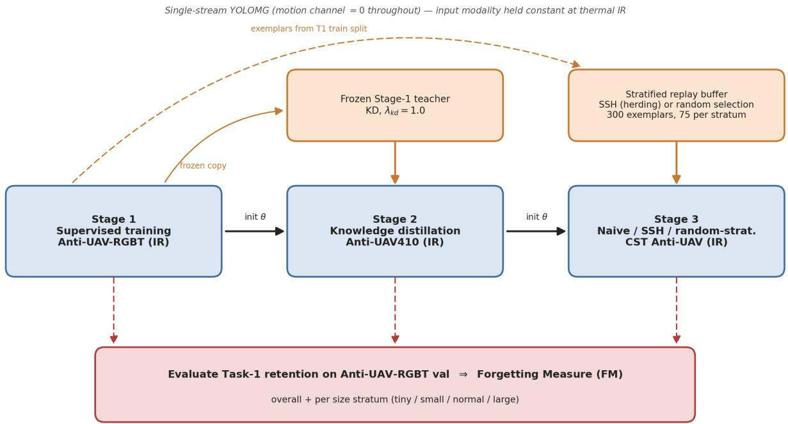  
Figure 1: Overview of the three-stage continual-learning curriculum. A single YOLOMG detector, run as a single thermalinfrared stream with the motion channel zeroed, is trained sequentially: Stage 1 supervised on Anti-UAV-RGBT, Stage 2 with knowledge distillation from the frozen Stage 1 teacher on Anti-UAV410, and Stage 3 (naive fine-tuning, Scale-Stratified Herding replay, or the random-stratified control) on CST Anti-UAV. The replay bufer is drawn from the Anti-UAV-RGBT training split (300 exemplars, 75 per size stratum). After each stage, Task-1 retention is evaluated on the Anti-UAV-RGBT validation split to compute the Forgetting Measure, overall and per size stratum.

Standard iCaRL herding [35] selects exemplars whose penultimatelayer embeddings are closest to the class mean, but treats all samples uniformly. In the anti-UAV setting, the T1 training split is imbalanced across size strata (Table 6). A flat herding bufer would replicate this imbalance rather than guarantee coverage of every stratum, so the strata that are scarce in T1 would receive little gradient protection during Stage 3.

SSH partitions the bufer capacity equally across four size strata (tiny, small, normal, large) defined by bounding box area in pixels. Exemplars are drawn from the Anti-UAV-RGBT training split (148,368 UAV-present frames), kept disjoint from the validation set used to compute the FM. Within each stratum, greedy herding selects the 75 samples closest to the stratum mean embedding, for a total bufer of 300 exemplars. This small fixed memory follows the low-budget rehearsal convention of iCaRL [35] and the finding that even tiny episodic memories curb forgetting [3]; the equal 75-per-stratum split is the neutral choice that removes the source-distribution imbalance. As the qualitative conclusion (stratified replay reduces forgetting relative to naive fine-tuning) does not depend on the exact budget, a systematic bufer-size sweep is left to future work. During Stage 3, bufer samples are replayed at one exemplar per four CST samples per mini-batch. The replayed distribution therefore spans the full T1 scale regime, intended to counteract the large-target gradient suppression examined in the

S2→S3 analysis. To separate the efect of the herding selection from that of the stratification itself, SSH is compared both against naive fine-tuning and against a random-stratified control: the same bufer size and per-stratum quotas, but random selection within each stratum in place of herding (Section 4.6).

## 3.6 Datasets

Four datasets are used across the three stages. Anti-UAV-RGBT provides 318 paired RGB and IR video sequences with per-frame bounding box annotations on the IR stream. Across all splits it contains 293,209 UAV-present frames (frames in which a UAV is present, the exist=1 flag); its training and validation splits (208,988 frames) have a scale distribution dominated by normal targets: 0.5% tiny, 28.0% small, 67.8% normal, and 3.7% large. Anti-UAV410 contains 428,703 UAV-present frames across all splits, with a train and validation scale distribution of 24.8% tiny, 25.9% small, 46.6% normal, and 2.7% large. CST Anti-UAV contains 208,221 UAV-present frames across all splits, with a near-inverted train and validation distribution: 87.9% tiny, 11.9% small, 0.3% normal, and 0% large. ARD100 provides 199,291 UAV-present ego-motion frames (202,411 total) used exclusively to pre-compute the motion diference masks for the YOLOMG temporal branch and is not part of the continual learning curriculum.

All datasets are accessed from their native storage formats during training to stay within the Snellius inode quota. Video-based datasets (Anti-UAV-RGBT, ARD100) are decoded on demand using cv2.VideoCapture; image-based datasets (Anti-UAV410, CST) are read from pre-extracted JPEG frames. Bounding box coordinates are normalised to [0, 1] relative to a $6 4 0 \times 5 1 2$ resolution.

## 3.7 Evaluation Metrics

The Forgetting Measure (FM) is the primary metric for quantifying retention of earlier-task performance [3]:

$$
\mathrm { F M } = \mathrm { m A P } _ { T 1 } ^ { \mathrm { a f t e r } T _ { k } } - \mathrm { m A P } _ { T 1 } ^ { \mathrm { a f t e r } T 1 }\tag{2}
$$

where both evaluations use the Anti-UAV-RGBT validation split. A negative FM indicates forgetting. The T1 ceiling is the Stage 1 bestcheckpoint mAP (0.6725). Per-stratum mAP decomposes detection across the four size bins by bounding-box area (thresholds 256, 1024, and 4096 $\mathrm { p x } ^ { 2 }$ , i.e. $1 6 ^ { 2 } , 3 2 ^ { 2 }$ , and $6 4 ^ { 2 } )$ . The scale-distribution figures, the per-stratum mAP, and the replay bufer all use this single area convention. Parameter drift between consecutive checkpoints is the mean cosine similarity across all 335 named tensors. Values near 1.0 indicate near-static weights, pointing to gradient starvation rather than bulk weight collapse.

For tracking evaluation on CST, Success Rate at Intersection over Union (IoU) 0.5 (SR@0.5), Precision Rate at 20 pixels (PR@20), and Identity Switch count (IDSW) are reported using the one-pass evaluation protocol [16].

## 3.8 Compute Infrastructure

All experiments are run on Snellius (SURF national supercomputer), using the A100 and H100 GPU partitions (per-stage allocation in Table 8). The full three-stage protocol—including the three Stage 2 seed replicates and the three Stage 3 variants—required on the order of one hundred hours of wall-clock training on 4-GPU nodes. This compute scale frames the scope of the study: no on-board or edge deployment is assumed, and whether resource-constrained hardware could support the continual (re)training studied here was not investigated; on-device continual learning is an open research problem in its own right [31, 32]. The Python environment uses Python 3.9, PyTorch 2.7.1, and CUDA 11.8. Random seeds are fixed at 42, 123, and 999 across all libraries to ensure reproducibility of multi-seed Stage 2 runs.

## 4 Results

## 4.1 Scale-Distribution Shift Across Domains

Before reporting per-stage results it is necessary to characterise how severely the three training domains difer in target size, since this diference is the primary driver of the forgetting observed in Stage 3. Figure 2 shows the percentage of UAV-present frames in each of four UAV-specific size categories across all datasets. Size boundaries are by bounding-box area: tiny <256 px2, small 256– $1 0 2 4 \mathrm { p x } ^ { 2 }$ , normal $1 0 2 4 - 4 0 9 6 \mathrm { p x } ^ { 2 }$ , large ≥4096 $\mathrm { p x } ^ { 2 }$ (i.e. $1 6 ^ { 2 }$ to 642). Standard COCO thresholds (32/96/192 px) do not suit UAV detection. A drone at 300 m typically subtends fewer than 32 pixels in thermal imagery. Under COCO conventions, then, most anti-UAV targets would count as “small” or “tiny” regardless of dataset.

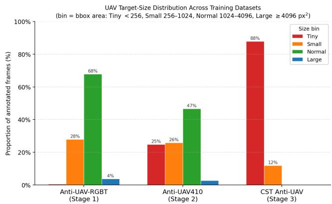  
Figure 2: Scale distribution across the three training datasets (train + val splits, bbox area: tiny ${ \ < } 2 5 6 \mathbf { p } \mathbf { x } ^ { 2 } ;$ , small 256– 1024 $\mathbf { p x } ^ { 2 } { \mathrm { : } }$ , normal 1024–4096 px2, large ≥4096 px2). Anti-UAV-RGBT is dominated by normal targets (67.8%; 95.8% normal or small). CST Anti-UAV shows a near-complete inversion: 87.9% tiny; 99.8% tiny or small. All three datasets are thermal infrared, so the modality is held constant; the shift studied here is this scale/size distribution, not an arbitrary domain shift.

In Anti-UAV-RGBT (T1), 95.8% ofUAV-present frames are normal or small (67.8% normal, 28.0% small) and only 3.7% are large; in CST Anti-UAV (T3), the normal and large strata are nearly absent (0.3% and 0%) and tiny targets dominate at 87.9%. Anti-UAV410 (T2) is intermediate (46.6% normal, 24.8% tiny), providing partial distribution overlap with T1. This inversion echoes Singh and Davis [40]: detectors trained on one scale regime perform poorly at a diferent scale. Their study was single-task; here the efect appears across sequential stages. The inversion motivates the gradient analysis that follows and the Scale-Stratified Herding design.

## 4.2 Catastrophic Forgetting Under Naive Sequential Training

Naive sequential training is expected to induce measurable catastrophic forgetting of T1 performance. The Forgetting Measure is:

$$
\mathrm { F M } _ { k } = \mathrm { m A P } _ { T 1 } ^ { \mathrm { a f t e r } T _ { k } } - \mathrm { m A P } _ { T 1 } ^ { \mathrm { a f t e r } T 1 }\tag{3}
$$

where m $\mathrm { \Omega } \mathrm { \Omega } \mathrm { U } _ { T 1 }$ is evaluated on the Anti-UAV-RGBT validation split and a value of zero indicates perfect retention.

Training the Stage 2 checkpoint on CST Anti-UAV for 19 epochs without any replay bufer drives T1 mAP@0.5 from 0.640 (the post-Stage-2 level) down to 0.068 at the best T3 checkpoint (epoch 3), and to 0.017 at the final epoch. Against the Stage 1 ceiling (0.6725) this is $\operatorname { F M } = - 0 . 6 0 5$ . Of this, −0.572 is incurred in Stage 3 itself $\mathrm { ( F M _ { s t a g e 3 } , }$ relative to the Stage 2 baseline); the remaining −0.033 was already lost during Stage 2 distillation. The absolute post-Stage-3 forgetting (−0.605) is thus roughly 18 times the Stage 2 forgetting (FM = −0.033 ± 0.004 across three seeds), and the Stage 3 increment alone (−0.572) about 17 times. Under these stage-specific training protocols, the Stage 3 transition is associated with far more forgetting than the Stage 2 transition. This ratio must not be interpreted as the isolated causal efect of scale shift because KD is used in Stage 2 but not in the naive Stage 3 condition.

Table 1 shows the per-stratum breakdown. Large-target T1 mAP collapses to 0.000 by the end of training. The forgetting is concentrated precisely in the large-target stratum that CST Anti-UAV lacks entirely, while the tiny stratum is barely afected.

Table 1: Per-stratum T1 mAP@0.5 on Anti-UAV-RGBT across training stages. Stage 3 values are from the best naive check point (epoch 3). After S� is T1 mAP after Stage �; Δ is the net Stage 1 to Stage 3 change. Knowledge distillation retains every stratum through Stage 2—the large stratum is even slightly strengthened (0.461 to 0.494)—and the collapse occurs only at Stage 3. After S2 is the mean over three Stage 2 seeds (per-stratum std ≤ 0.006); After S1 (the Stage 1 ceiling) and After S3 (the naive run) are single checkpoints. Strata are defined by bounding-box area (thresholds 256/1024/4096 px2).
<table><tr><td>Stratum</td><td>After S1</td><td>After S2</td><td>After S3</td><td>Δ</td></tr><tr><td>Tiny</td><td>0.009</td><td>0.018</td><td>0.001</td><td>-0.008</td></tr><tr><td>Small</td><td>0.579</td><td>0.559</td><td>0.060</td><td>-0.519</td></tr><tr><td>Normal</td><td>0.719</td><td>0.684</td><td>0.079</td><td>-0.640</td></tr><tr><td>Large</td><td>0.461</td><td>0.494</td><td>0.000</td><td>-0.461</td></tr><tr><td>Overall</td><td>0.673</td><td>0.640</td><td>0.068</td><td>-0.605</td></tr></table>

The per-epoch dynamics of the naive condition are shown in Figure 3 and detailed in Appendix C (Table 10). The large stratum falls to near-zero within the first training epoch and to 0.000 by epoch 1, never recovering. The normal stratum, the model’s primary detection strength after Stage 2 (mAP 0.681 on Anti-UAV410, Table 3), collapses from 0.251 at epoch 0 to 0.044 by epoch 7 and to 0.019 by the final epoch. T3 mAP peaks at epoch 3 (0.083) and then plateaus while T1 mAP continues declining; forgetting does not stop when the new task stops improving, a hallmark of catastrophic forgetting [27].

The forgetting is therefore measurable, large, and concentrated by stratum.

## 4.3 Knowledge Distillation During Stage 2 Training

Stage 2 training combines a standard detection loss with a knowledge distillation (KD) term to limit forgetting of Task 1 capability. The combined loss is:

$$
L _ { \mathrm { t o t a l } } = L _ { \mathrm { d e t } } + \lambda _ { \mathrm { k d } } \cdot L _ { \mathrm { k d } } , \qquad \lambda _ { \mathrm { k d } } = 1 . 0\tag{4}
$$

where $L _ { \mathrm { d e t } }$ is the standard detection loss on Anti-UAV410 labels and $L _ { \mathrm { k d } }$ is the mean squared error between the student and the frozen Stage 1 teacher at prediction heads P3, P4, P5.

Table 2 reports Stage 2 aggregate results across three random seeds (42, 123, 999). KD limits forgetting to 2.8–3.7 percentage points of T1 mAP across the three seeds (FM −0.033 ± 0.004).

A per-stratum breakdown indicates this retention is genuine, not an aggregate artefact (Table 1): every T1 stratum is preserved through Stage 2, and the large stratum, the one CST later erases, is even slightly strengthened (0.461 to 0.494). The 95% figure therefore reflects true preservation of the T1 representation, not mere overlap between Anti-UAV410 and T1.

Table 2: Stage 2 aggregate results: KD fine-tuning on Anti-UAV410 $( \lambda _ { \mathbf { k } \mathbf { d } } = 1 . 0$ , mean ± std across three seeds).
<table><tr><td colspan="2">Metric Value</td></tr><tr><td>T2 mAP@0.5 on Anti-UAV410 (best epoch)</td><td> $0 . 4 2 8 \pm 0 . 0 0 2$ </td></tr><tr><td rowspan="3">T1 mAP@0.5 retained (Anti-UAV-RGBT) Forgetting Measure FM</td><td>0.640</td></tr><tr><td> $- 0 . 0 3 3 \pm 0 . 0 0 4$ </td></tr><tr><td>95%</td></tr><tr><td>T1 retention Best T2 epoch (seed 42)</td><td>16 / 32</td></tr></table>

Figure 4 shows the per-epoch Stage 2 trajectories across the three seeds. Epoch-level dynamics for seed 42 (Appendix C, Table 9) show two patterns. First, the kd/det ratio rises from 1.36 at epoch 0 to 2.62 at epoch 31: $L _ { \mathrm { d e t } }$ declines faster than $L _ { \mathrm { k d } }$ as the student adapts to Anti-UAV410, after which distillation provides a growing share of the gradient signal. Second, the FM deepens from −0.007 at epoch 0 to a trough of −0.046 at epoch 10, then partially recovers to −0.037 at the peak T2 epoch (16), illustrating the stability-plasticity trade-of directly: the checkpoint with the highest T2 mAP is not the one with the smallest forgetting.

The mean cosine similarity between Stage 1 and Stage 2 best checkpoints across all 335 named parameter tensors is 0.911 (perseed values: 0.917, 0.921, 0.896), indicating high overall weight alignment. Restricting the measure to the 204 learnable (gradientupdated) tensors—excluding BatchNorm running-statistic bufers, which adapt by forward-pass averaging rather than backpropagation— gives a comparable 0.935 (seed 42), so the alignment is a property of the trained weights rather than an artefact of the bufer count. The spatial attention module shows the largest relative drift, indicating the model adapted its low-level attention patterns for Anti-UAV410 while keeping backbone features close to the teacher.

Table 3 reports the scale-stratified mAP@0.5 on the Anti-UAV410 validation set (mean across three seeds). The Stage 2 model inherits the Stage 1 detector’s strength at the normal stratum and retains moderate small-target performance, but is essentially unable to detect tiny targets (<256 px2). This profile anticipates the scaleconditioned forgetting pattern of Stage 3: when fine-tuning on CST Anti-UAV (99.8% tiny/small, 0% large), the normal and large strata, almost absent from CST, receive little positive gradient signal from the new training distribution, a pattern probed directly in Section 4.5.

Together, these results show that Stage 2 training with KD at $\lambda _ { \mathrm { k d } } ~ = ~ 1 . 0$ retains 95% of the Stage 1 T1 mAP (FM = −0.033 ± 0.004). The rising kd/det ratio and high inter-stage cosine similarity describe the optimisation behaviour, but a no-KD Stage 2 control would be required to quantify the causal contribution of KD.

## 4.4 Scale Shift and the Forgetting Pattern in Stage 3

CST Anti-UAV’s training split contains 99.8% tiny/small targets and 0% large targets. When the Stage 2 checkpoint is fine-tuned on CST without replay, large-target T1 mAP falls to near-zero within the first training epoch and to 0.000 by epoch 1, while the tiny stratum barely changes (0.001 to 0.000). The collapse is not distributed uniformly: strata absent from T3 training data receive no positive target-matched gradient signal and collapse first.

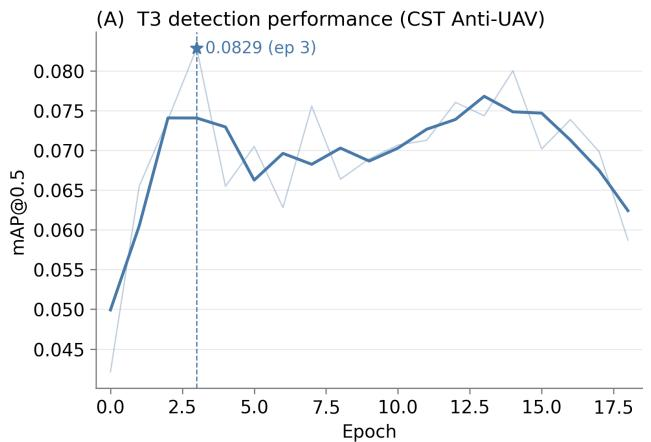

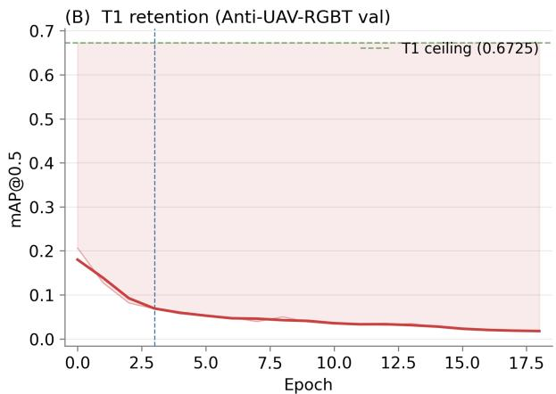

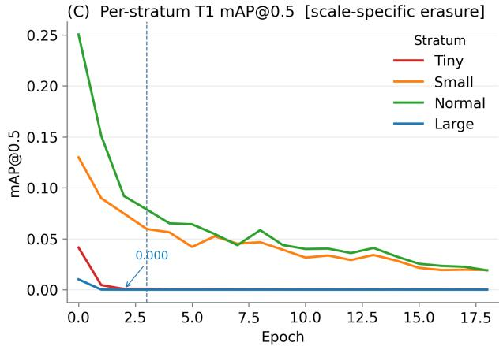

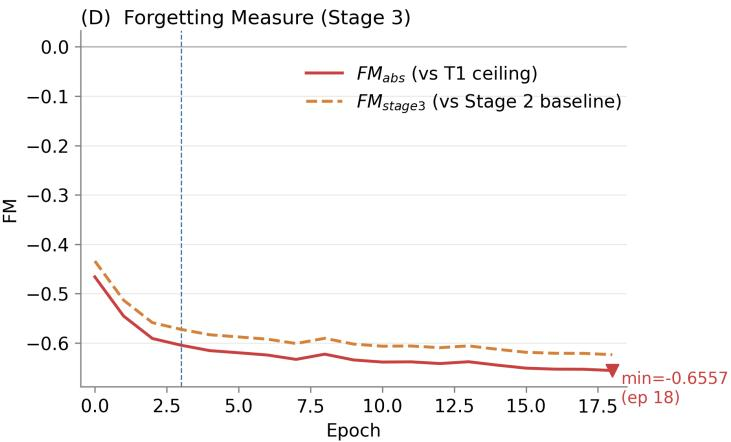  
Figure 3: Stage 3 naive fine-tuning on CST Anti-UAV (19 epochs). (A) T3 detection mAP@0.5 on CST val; star marks the best checkpoint at epoch 3 (0.083). (B) T1 retention on Anti-UAV-RGBT val; shaded region shows the gap to the Stage 1 ceiling (0.6725). (C) Per-stratum T1 mAP@0.5: the large stratum (green) collapses to 0.000 at epoch 1, indicating scale-specific erasure. (D) Forgetting Measure: $\mathbf { F } \mathbf { M _ { a b s } }$ (vs Stage 1 ceiling, dashed) and $\mathbf { F M _ { s t a g e 3 } }$ (vs Stage 2 baseline, solid); worst $\mathbf { F } \mathbf { M _ { a b s } } = - 0 . 6 5 6$ at epoch 18.

Table 3: Stage 2 scale-stratified mAP@0.5 on Anti-UAV410 validation set (mean across seeds 42, 123, 999). Normal-stratum performance (0.681) is the model’s primary strength; tinystratum performance (0.001) is essentially zero throughout all stages.
<table><tr><td>Stratum</td><td>Area range</td><td>mAP@0.5 (mean)</td></tr><tr><td>Tiny</td><td> $< 2 5 6 \mathrm { p x } ^ { 2 }$ </td><td>0.001</td></tr><tr><td>Small</td><td> $2 5 6 - 1 0 2 4 \mathrm { p x } ^ { 2 }$ </td><td>0.278</td></tr><tr><td>Normal</td><td> $1 0 2 4 - 4 0 9 6 \mathrm { p x } ^ { 2 }$ </td><td>0.681</td></tr><tr><td>Large</td><td> ${ \geq } 4 0 9 6 \mathrm { p x } ^ { 2 }$ </td><td>0.276</td></tr></table>

To probe what underlies this pattern, inter-stage parameter drift is compared at both transitions (Table 4).

Table 4: Mean cosine similarity between successive stage checkpoints, computed over all 335 named tensors and, separately, over the 204 learnable (gradient-updated) tensors only, with BatchNorm running-statistic bufers excluded. Learnable-only values are for seed 42. Higher value means smaller weight change. FM is the Forgetting Measure relative to the Stage 1 ceiling.
<table><tr><td>Transition</td><td>Cosine (all)</td><td>Cosine (learn.)</td><td>FM</td></tr><tr><td>Stage 1 to Stage 2</td><td>0.911</td><td>0.935</td><td>-0.033</td></tr><tr><td>Stage 2 to Stage 3</td><td>0.967</td><td>0.987</td><td>-0.605</td></tr></table>

The cosine similarity increases between transitions whether measured over all parameters (0.911 to 0.967) or over the learnable, gradient-updated tensors alone (0.935 to 0.987; Table 4). By either measure the trained weights moved less in Stage 3 than in Stage 2, relative to their starting point, yet FM is 18 times larger. This decoupling of weight-change magnitude from forgetting magnitude is consistent with gradient starvation [33]: large-target representations appear to receive insuficient gradient signal during Stage 3 training, as CST contains no large-target examples. The drift that does occur in Stage 3 sits not in the gradient-updated weights but in the BatchNorm running statistics (relative L2 ≈0.24 for running\_mean and running\_var, versus ≈0.12 for the learnable weights); among the learnable tensors the drift concentrates in the neck rather than the detection heads (Figure 5). The network tracks CST’s input distribution through its normalisation bufers, while the trained weights stay close to their Stage 2 values. The unreinforced large-target output regime may then degrade under the combined influence of weight decay and the small-target boxregression terms that dominate CST. The result is a stratum-specific collapse concentrated in the large stratum, the only stratum at 0.000 from epoch 1 onward, while the tiny stratum, already near zero in T1, is essentially unafected.

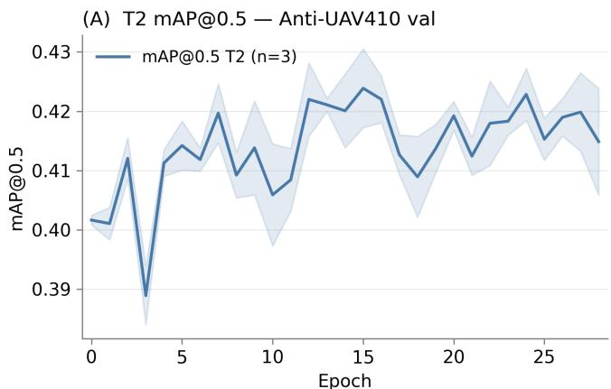

(B) T1 mAP@0.5 — Anti-UAV-RGBT val  
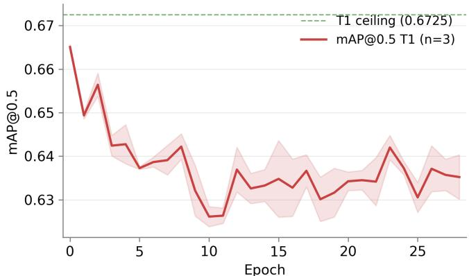

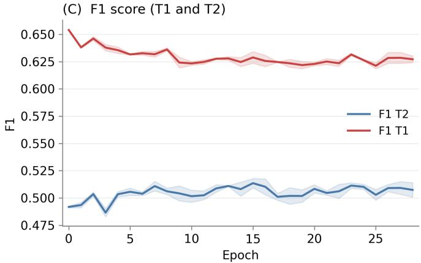

(D) Forgetting Measure (FM)  
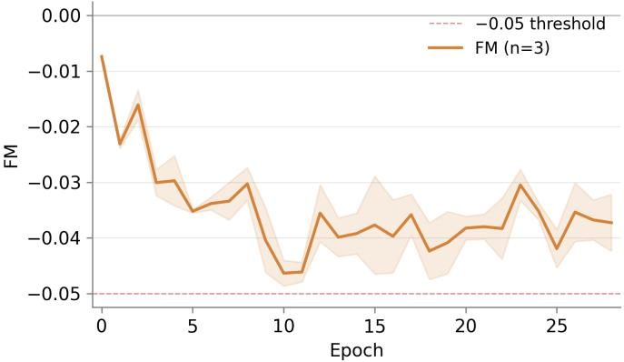  
Figure 4: Stage 2 training dynamics across three seeds (n=3, mean with shaded ±1 std). (A) T2 mAP@0.5 on Anti-UAV410 val. (B) T1 mAP@0.5 on Anti-UAV-RGBT val; green dashed line is the Stage 1 ceiling (0.6725). (C) F1 score for T1 and T2 tasks. (D) Forgetting Measure per epoch; dashed horizontal marks the −0.05 boundary.

Taken together, these results indicate that scale-distribution shift characterises the Stage 3 forgetting pattern at the stratum level.

The evidence is consistent with a scale-conditioned gradient mechanism: inter-stage cosine similarity is higher at Stage 3 than at Stage 2 (0.987 vs 0.935 on the learnable tensors; 0.967 vs 0.911 on all parameters), yet forgetting is 18 times greater. Section 4.5 probes this mechanism directly.

## 4.5 Direct Gradient Probe at the Stage 2 → 3 Boundary

The cosine and BatchNorm evidence above is indirect. To examine the gradient signal directly, the Stage 2 checkpoint was probed before any Stage 3 optimisation: for 60 mini-batches each of CST (the Stage 3 distribution) and Anti-UAV-RGBT (T1), a forward and backward pass was run without an optimiser step (the network in training mode for loss computation, with BatchNorm layers frozen in evaluation mode so their running statistics were not perturbed), and the $L _ { 2 }$ norm of the gradient reaching each detection head was recorded, together with the box-regression loss $L _ { \mathrm { b o x } }$ . The probe was repeated for all three Stage 2 seeds; the values are stable across seeds and are reported as seed means in Table 5.

Three observations follow. First, gradient flow is strongly scaleconditioned: a head receives gradient in proportion to the presence of size-matched targets. The clearest case is the finest head (∼3 px anchors), essentially silent on T1 $( \lVert g \rVert \approx 0 . 0 0 0 .$ , as RGBT contains almost no tiny $( < 2 5 6 \mathrm { p x } ^ { 2 } )$ targets) but strongly driven on CST $( \| g \| \approx 0 . 5 1$ , tiny-dominated). This is consistent with the starvation principle: a stratum absent from the training distribution receives no reinforcing signal.

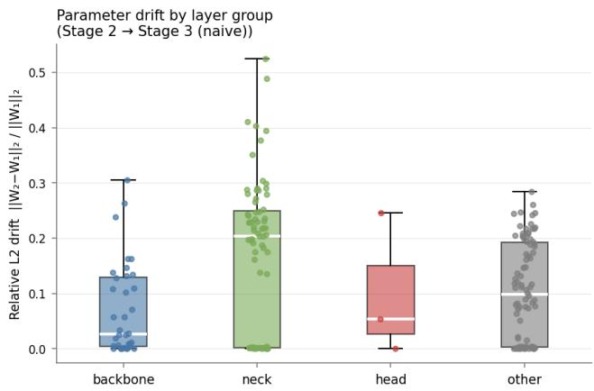  
Figure 5: Relative L2 parameter drift (Stage 2 → Stage 3, naive) per layer group, restricted to the learnable (gradientupdated) tensors. The neck adapts most (median ≈0.20) and the backbone least (median ≈0.03); the three detection-head tensors show only modest drift (median ≈0.05). Excluding the BatchNorm running-statistic bufers removes the spurious head-layer drift seen when all parameters are pooled: the gradient-updated head weights barely move, consistent with starvation of the absent large-target stratum rather than active overwriting of the output layers.

Table 5: Direct gradient probe at the Stage ${ \bf 2 }  { \bf 3 }$ boundary. Per-head gradient $L _ { 2 }$ norm and box-regression loss $L _ { \mathbf { b o x } }$ (mean over three Stage 2 seeds, 60 batches each, no optimiser step), under the CST distribution, the full T1 distribution, and T1 with only large (≥4096 px2) ground truth retained. Heads are ordered by anchor size (P3: ∼3 px; P5: up to 26 × 14 px).
<table><tr><td>Quantity</td><td>CST (0% large)</td><td>RGBT (all)</td><td>RGBT (large only)</td></tr><tr><td>∥|g∥| P3 (fine)</td><td>0.510</td><td>0.000</td><td>0.000</td></tr><tr><td>∥g∥| P4 (mid)</td><td>0.278</td><td>0.426</td><td>0.000</td></tr><tr><td>∥g∥| P5 (coarse)</td><td>0.388</td><td>0.615</td><td>0.227</td></tr><tr><td> $L _ { \mathrm { b o x } }$ </td><td>0.096</td><td>0.020</td><td>0.001</td></tr></table>

Second, the detector’s anchors are small by design (largest 26 × 14 px). A ≥64 px target is therefore weakly matched under the anchor ratio test, producing a near-zero positive box signal even in T1 $( L _ { \mathrm { b o x } } \approx 0 . 0 0 1$ on large-only batches versus 0.020 on full T1). Large-target detection is therefore a fragile extrapolation rather than an anchor-matched capability, consistent with its rapid collapse once the distribution shifts. This capability was nonetheless real after Stage 1 (large-stratum $\operatorname* { m A P } @ 0 . 5 = 0 . 4 6 1$ , Table 1): the probe explains why it is not maintained under CST, not that it was never present.

Third, CST drives a box-regression loss roughly five times larger than T1 $( L _ { \mathrm { b o x } } \approx 0 . 0 9 6$ vs 0.020): Stage 3 applies strong small-target localisation gradients to the shared heads while the large stratum receives no positive reinforcement, since CST’s small targets keep even the coarsest head active $( \lVert g \rVert \approx 0 . 3 9 )$ . The forgetting is thus better described as a scale-conditioned gradient imbalance (absence of positive large-target signal combined with dominant small-target gradients) than as starvation of a single dedicated head.

These measurements refine, rather than overturn, the cosine and BatchNorm evidence of Section 4.4: the learnable weights move little globally (Table 4), while the large-target output regime, never strongly anchored and now unreinforced, is not maintained. The probe supports the scale-conditioned account as a candidate mechanism; isolating its causal weight from the concurrent batch-size and learning-rate diferences (Section 5) would require a controlled Stage 3 rerun and is left to future work.

## 4.6 Scale-Stratified Replay and Stage 3 Forgetting

Scale-Stratified Herding (SSH) addresses Stage 3 large-target forgetting by re-injecting large-target gradient signal through stratified exemplar replay, targeting the scale gap identified above.

The SSH bufer contains 300 exemplars partitioned equally across four size strata $( 7 5$ per stratum). Within each stratum, greedy iCaRL herding [35] selects the 75 samples whose penultimate-layer embeddings are closest to the stratum mean, computed using the Stage 2 best checkpoint as the feature extractor:

$$
x _ { k } = \arg \operatorname* { m i n } _ { x \notin \mathcal { B } _ { k - 1 } } \left\| \mu _ { s } - \frac { 1 } { k } \left( \sum _ { j < k } e ( x _ { j } ) + e ( x ) \right) \right\| _ { 2 }\tag{5}
$$

where $e ( \cdot )$ is the global-average-pooled neck (P3) feature of the Stage 2 encoder and $\mu _ { s }$ is the mean embedding of stratum �, matching the notation of Algorithm 1.

During Stage 3, each mini-batch mixes CST samples with replay exemplars from the bufer, restoring the large-target gradient signal CST cannot provide. This follows Deng et al. [6]: rehearsal is efective when the replayed distribution matches the original task in feature space. Stratifying by scale covers the full T1 scale range, whereas flat herding would replicate the training-split frequencies (Table 6), roughly two-thirds from the normal stratum alone, and leave the scarce strata uncovered.

The bufer is built using the Stage 2 seed-42 checkpoint as the feature extractor on the Anti-UAV-RGBT training split (148,368 UAV-present frames), kept disjoint from the validation set used to compute the FM so that replay introduces no train–evaluation overlap. Table 6 shows the per-stratum counts. The tiny stratum (1,091 eligible frames) is sampled at $6 . 9 \% ,$ several times the large-stratum rate and 30–70× the small- and normal-stratum rates, deliberately over-representing tiny targets to protect that rare knowledge during Stage 3.

Trained from the Stage 2 seed-42 checkpoint, both replay conditions substantially mitigate the Stage 3 collapse (Table 7). At their best-T3 checkpoints (epoch 2), SSH reaches a Forgetting Measure of −0.311 and random-stratified replay −0.221, against the naive −0.605: each roughly halves the forgetting and holds large-target

Table 6: SSH bufer composition (Anti-UAV-RGBT training split). Each stratum contributes exactly 75 exemplars regardless of size; the tiny stratum is over-represented (6.9% sampling rate) to protect rare tiny-target knowledge. Strata are by bounding-box area (thresholds 256/1024/4096 px2).
<table><tr><td>Stratum</td><td>Eligible frames</td><td>Selected</td><td>Sampling rate</td></tr><tr><td>Tiny</td><td>1,091</td><td>75</td><td>6.9%</td></tr><tr><td>Small</td><td>43,560</td><td>75</td><td>0.2%</td></tr><tr><td>Normal</td><td>98,929</td><td>75</td><td>0.1%</td></tr><tr><td>Large</td><td>4,788</td><td>75</td><td>1.6%</td></tr><tr><td>Total</td><td>148,368</td><td>300</td><td></td></tr></table>

T1 mAP non-zero (0.079 and 0.129 respectively, versus 0.000), at a small cost to T3 detection (0.064 vs the naive 0.083 mAP), the expected stability–plasticity trade-of of replay.

Table 7: Stage 3 forgetting: naive fine-tuning versus randomstratified replay and Scale-Stratified Herding (SSH), each at its best-T3 checkpoint (single seed, seed 42). Both replay variants roughly halve the Forgetting Measure and keep the large stratum non-zero; herding does not improve on random selection.
<table><tr><td>Condition</td><td>T3 mAP</td><td>T1 mAP</td><td>FM</td><td>Large T1</td></tr><tr><td>Naive (ep. 3)</td><td>0.083</td><td>0.068</td><td>-0.605</td><td>0.000</td></tr><tr><td>Random-strat. (ep. 2)</td><td>0.064</td><td>0.451</td><td>-0.221</td><td>0.129</td></tr><tr><td>SSH (ep. 2)</td><td>0.064</td><td>0.362</td><td>-0.311</td><td>0.079</td></tr></table>

The random-stratified control isolates the source of the gain. Random selection within each stratum matches—indeed slightly exceeds—greedy herding, so the benefit appears to come from the scale stratification (balanced coverage of all size strata), not from the iCaRL-style herding selection. In this setting the herding component therefore seems unnecessary. Both runs are single-seed (seed 42) and short (Section 5); multi-seed, longer-schedule replication is left to future work.

## 4.7 Tracking Baseline on CST Anti-UAV

To establish a detection-as-tracking baseline, the Stage 3 naive checkpoint was evaluated on all 40 CST Anti-UAV validation sequences (39,055 ground-truth frames) under the one-pass protocol; the full precision and success plots are given in Appendix F. Track ing quality is low, as expected from the detector’s collapse on CST: SR@0.5 = 0.012, AUC-SR = 0.039, PR@20 = 0.219, and 135 identity switches. The gap between PR@20 and SR@0.5 suggests the model often places its centre near the target but fails to size the box. This is the characteristic tiny-target failure, where a 1–2 px box error drops IoU below 0.5. These numbers set a baseline that a future uncertainty-aware gating mechanism would aim to improve upon.

## 4.8 Qualitative Detection Across Stages

Figure 6 shows detection output on a single Anti-UAV-RGBT validation frame under the three successive checkpoints. The Stage 1 and Stage 2 models both localise the target confidently, whereas the Stage 3 naive checkpoint produces no large-target detection, the qualitative counterpart of the stratum-specific erasure quantified above.

## 5 Discussion

## 5.1 Comparison with Prior Continual Learning Results

The Stage 2 Forgetting Measure of −0.033 ± 0.004 is consistent with what distillation-based continual learning achieves in general object detection. Shmelkov et al. [39] introduced an analogous distillation loss for incremental class detection on PASCAL VOC and reported near-zero forgetting on old classes when the distillation weight was tuned appropriately. Li and Hoiem [23] applied a similar output distillation constraint for classification tasks and likewise found that a frozen teacher constrains forgetting to within a few percentage points under moderate domain shift. The 95% T1 retention observed here places KD in the same performance range. This ofers early evidence that output-level distillation transfers to the thermal anti-UAV setting under a cross-dataset domain shift.

The Stage 3 result is harder to compare directly because most continual learning benchmarks study class-incremental learning on balanced datasets [44] rather than scale-distribution shift on a single class. The closest analogue is the general finding that forgetting is amplified when the new task distribution is maximally dissimilar from the old one [20]. The 18-fold increase from Stage 2 (−0.033) to Stage 3 (−0.605), with no change in the protection mechanism, fits this principle. The Anti-UAV410-to-Anti-UAV-RGBT gap is moderate (same modality, overlapping scales); the CST-to-Anti-UAV-RGBT gap is extreme (near-complete scale inversion, zero large-target overlap). What is novel is attributing this diference to a specific measurable quantity, the scale-distribution shift, rather than a qualitative description of task dissimilarity.

## 5.2 Gradient Starvation as a Candidate Forgetting Mechanism

The cosine similarity analysis in Table 4 produces a counterintuitive result: Stage 3 moves the weights less than Stage 2 does, relative to their starting point, yet Stage 3 forgetting is 18 times larger. This holds whether cosine is measured over all parameters (0.967 vs 0.911) or over the learnable, gradient-updated tensors alone (0.987 vs 0.935). The latter is cleaner: it excludes the BatchNorm running-statistic bufers, which are not updated by backpropagation. The standard account of catastrophic forgetting attributes performance loss to large weight changes that overwrite prior representations [20, 27]. Under that account, smaller weight changes should produce less forgetting, not more.

The gradient starvation framework [33] ofers a plausible resolution to this contradiction. A representation that receives little or no gradient signal during new-task training is not actively overwritten by competing updates; the optimiser largely leaves it in place. This is consistent with the measurements: the gradient-updated weights move very little (learnable cosine 0.987), and the drift that does occur is concentrated not in those weights but in the BatchNorm running statistics (relative L2 ≈0.24 for running\_mean/running\_var versus ≈0.12 for the learnable weights). As the network re-estimates these normalisation statistics for CST’s tiny-target input distribution, the activations of the now-unsupported large-target features can shift at test time even though the underlying weights barely change. The outcome is a collapse concentrated in exactly the strata absent from the new training distribution: as Table 1 shows, largestratum mAP falls to near-zero within the first epoch and to 0.000 by epoch 1, while the tiny stratum is essentially unafected.

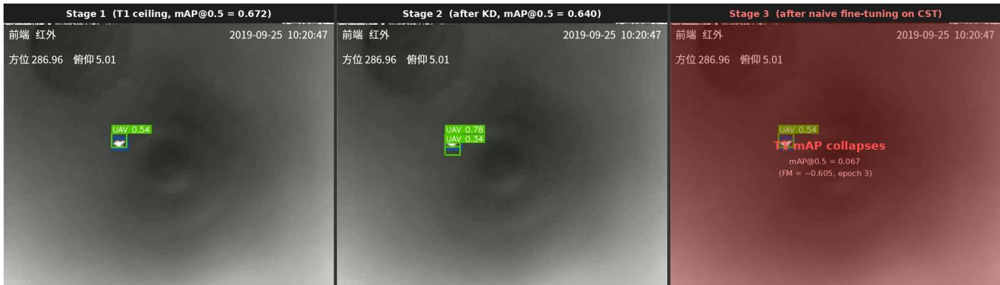  
Figure 6: Detection output on the same Anti-UAV-RGBT validation frame (sequence 20190925\_101846, clip 1\_4, frame 0) under three successive checkpoints. Left: Stage 1 best checkpoint (T1 ceiling, mAP@0.5 = 0.6725). Centre: Stage 2 best checkpoint after knowledge distillation (mAP@0.5 = 0.640, FM = −0.033). Right: Stage 3 naive fine-tuning at epoch 3 (T1 mAP@0.5 = 0.068, FM = −0.605); the absence of large-target detections is in line with the gradient-starvation interpretation discussed above.

A direct gradient probe (Section 4.5) both supports and qualifies this account. It indicates that gradient flow is scale-conditioned: a head receives signal only in proportion to the size-matched targets present, so a stratum absent from the data is left unreinforced (the finest head is silent on T1, which has almost no tiny (<256 px2) targets, but strongly driven on tiny-dominated CST). It also shows, however, that the detector’s small anchors (≤ 26 px) match ≥64 px targets only weakly, so the large-target pathway is fragile even un der T1, and that CST drives a box-regression loss roughly five times larger than T1. The Stage 3 collapse is therefore most accurately described as a scale-conditioned gradient imbalance (the large stratum receives no positive reinforcement while strong small-target gradients dominate the shared heads): a refinement of, rather than a departure from, the starvation interpretation.

This has a direct implication for method choice. Regularisation methods such as EWC [20] penalise large weight changes, and gradient-projection methods such as OGD [9] and GPM [37] project new-task updates orthogonal to old-task directions; both target gradient interference: new-task updates overwriting old-task representations. The imbalance here is only partly of that kind: the shared heads do receive strong small-target gradients (Section 4.5), which a weight penalty could slow, but there is no large-target gradient to project or preserve, since that signal is absent from CST. Slowing the small-target updates cannot, on its own, restore a large-target signal the new distribution never supplies. This motivates a replay-based response that re-injects exemplars from the under-represented strata, supplying the missing gradient directly, the mechanism SSH provides.

## 5.3 Limitations

Several aspects of this study qualify the conclusions that can be drawn from it.

The optimisation setup is not perfectly matched: Stage 3 used batch 16 and learning rate $5 \times 1 0 ^ { - 4 }$ against batch 64 and $1 0 ^ { - 3 }$ for Stage 2 (Table 8), so part of the larger Stage 3 forgetting could reflect these settings rather than scale shift alone. Two facts limit this concern: the forgetting is stratum-specific (a global change would not be stratum-specific), and large-target mAP collapses within the first epoch, before schedule diferences accumulate. A Stage 3 rerun at the Stage 2 settings would isolate the efect.

Generalisability is bounded by the data: all three datasets are predominantly DJI quadcopters in semi-controlled airspace, so the patterns may not transfer to fixed-wing UAVs, evasive targets, or very diferent backgrounds. The mechanism is also dataset-specific, depending on the particular Anti-UAV410-to-CST scale inversion; a smaller scale gap might shift the balance between weight drift and gradient imbalance.

On validity, the FM uses the Anti-UAV-RGBT validation split as its sole T1 reference, so a split biased toward easy sequences would understate forgetting. Stage 2 is replicated across three seeds (FM = −0.033 ± 0.004), but Stage 3 is single-seed (seed 42), which limits the precision of the Stage 3 estimate. We therefore claim a large, qualitatively robust efect rather than a seed-precise value: the Stage 3 FM (−0.605) is more than two orders of magnitude larger than the Stage 2 seed-to-seed spread (±0.004), the large-stratum collapse is immediate (0.000 by epoch 1) and permanent, and T1 mAP decays from 0.206 at epoch 0 to 0.017 at epoch 18 with no sustained recovery (transient upticks ≤0.011)—none of which is characteristic of a seed artefact, and all of which is consistent with continual-evaluation work showing that forgetting materialises within the first updates after a task switch [5]. Multi-seed replication of Stage 3 remains the first priority for future work.

Two design choices were not isolated. $\lambda _ { \mathrm { k d } }$ was fixed at 1.0 by convention rather than tuned (equal weighting follows Li and Hoiem [23] and Shmelkov et al. [39]; tuning it would need a heldout FM signal, hence a full S1→S2→S3 run per value). And Stage 1 initialises from ImageNet weights, whose large-object prior means the post-Stage-1 large-stratum capability may be partly inherited.

A further limitation concerns causal attribution across stages. Stage 2 uses knowledge distillation, whereas the headline Stage 3 baseline uses naive fine-tuning, and the stages also difer in optimisation settings. Consequently, the roughly 18-fold diference in FM magnitude cannot be attributed to scale shift alone. In addition, because no Stage 2 no-KD baseline was run, the study demonstrates strong retention under KD training but does not isolate how much of that retention is caused by KD. A matched ablation with identical optimisation settings and KD on/of at both transitions is required for a causal comparison.

The replay comparison is single-seed and short. Random-stratified replay slightly outperformed herding (FM −0.221 vs −0.311), suggesting the scale stratification rather than the herding selection drives the benefit; but with one seed and few epochs (five for SSH, three for the control) this ordering between the two replay variants is indicative rather than definitive. The bufer is drawn from the training split, disjoint from the validation set used for the FM, so replay introduces no train–evaluation overlap.

Finally, scalability was tested on a single architecture (YOLOMG); whether the finding and SSH transfer to other YOLO variants or transformer detectors is unknown, though the cosine diagnostic itself is architecture-agnostic. Relatedly, all conclusions concern the learning protocol rather than on-board deployment: training ran exclusively on HPC infrastructure (Section 3.8), and while inference-only use of YOLO-class detectors on embedded hardware is plausible, the feasibility of continual (re)training under edge constraints—an active research area in its own right [31, 32]—was neither assumed nor evaluated.

## 5.4 Value of the Research and Alternative Interpretations

This research ofers three contributions to the continual learning literature. First, it sets out a concrete empirical protocol for measuring catastrophic forgetting in thermal anti-UAV detection across real operational datasets, producing the first quantified FM values for this domain. Second, it puts forward a scale-conditioned gradient imbalance (a form of gradient starvation) as a plausible mechanism under scale-distribution shift, diagnosed with a lightweight inter-stage cosine similarity that needs only the saved checkpoints. Third, it finds that scale-stratified replay (a bufer balanced across size strata) roughly halves the resulting forgetting. An ablation attributes this gain to the stratification (balanced coverage of size strata) rather than to the iCaRL herding selection: the two stratified variants perform comparably, whereas the no-replay baseline sufers the full collapse. This is consistent with recent imbalanced continual learning, where balancing the gradient contribution of under-represented groups, not the specific exemplar-selection rule, is the operative factor [14, 34]. The mechanism (well-represented scales degrading under a new scale-imbalanced distribution) is not specific to anti-UAV detection: the same imbalanced forgetting is reported in long-tailed continual recognition [29, 48], so both the diagnosis and the stratified-replay remedy should transfer to other scale- or long-tailed vision settings. Whether the mechanism is the dominant one, and whether the single-seed ordering between the replay variants holds, cannot be fully settled from the present evidence.

An alternative interpretation of the Stage 3 result is that the catastrophic collapse reflects not gradient starvation but a failure of the Stage 2 checkpoint to generalise well to Anti-UAV-RGBT in the first place: if the 95% T1 retention at Stage 2 is fragile rather than robust, even a small perturbation in Stage 3 could trigger a large FM drop. This interpretation is not supported by the data. The per-stratum breakdown (Table 1) shows every T1 stratum retained after Stage 2—the large stratum, which later collapses, is even strengthened (0.461 to 0.494)—and the per-epoch tracking (Table 9) shows stable T1 retention across all Stage 2 epochs. The collapse is Stage 3-specific and immediate, more consistent with the scale-conditioned gradient imbalance than with pre-existing fragility.

A second alternative is that the CST Anti-UAV annotations are noisier than Anti-UAV-RGBT annotations for sub-10-pixel targets, and that the detection loss instability from label noise rather than scale shift drives the forgetting. This cannot be ruled out from the available evidence, but the stratum-specific collapse pattern (large stratum afected most, tiny stratum barely afected) is not what noisy label training would produce: label noise would degrade all strata roughly uniformly, whereas gradient starvation predicts exactly the stratum-specific pattern observed.

A third reading questions whether Stage 3 measures forgetting at all, since the detector has almost no tiny-target capability before Stage 3. The two are separated by construction: forgetting is claimed only for strata whose capability was demonstrably acquired. The large stratum was learned in Stage 1 (mAP 0.461) and further strengthened in Stage 2 (0.494) before collapsing to 0.000 in Stage 3; this is forgetting of an acquired capability, matching the “similar-before, forget-after” signature documented for imbalanced continual learning [48]. The tiny stratum, by contrast, was never acquired (mAP ≈0 throughout), so no forgetting is claimed for it; its low pre-Stage-3 value reflects a plasticity limit of the small-anchor configuration rather than forgetting.

A note on YOLOMG’s secondary input channel is warranted. Designed for motion-diference masks, it is held at a zero tensor throughout: motion masks were not generated for Anti-UAV410, CST Anti-UAV, or Anti-UAV-RGBT within the scope of this study. Using Anti-UAV-RGBT’s visible (RGB) stream as the Stage 1 secondary channel was deliberately avoided, since Stages 2 and 3 are purely thermal: the RGB channel would have to be zeroed midcurriculum, adding a modality shift that confounds the scale shift. Holding it at zero throughout keeps the input modality constant, so the measured forgetting reflects scale shift alone.

The research serves a cautionary, diagnostic role. Naive sequential training across anti-UAV datasets appears unsuitable for deployment (FM = −0.605 is a 90% loss of T1 capability). Knowledge distillation works as an efective first-line defence for moderate domain shift. Scale-distribution shift, however, seems to call for a targeted replay-based response that existing regularisation methods are not designed to provide.

## 6 Conclusion

This research investigated catastrophic forgetting in a thermal anti-UAV detector (YOLOMG, operated as a single thermal-infrared stream) adapted sequentially across three heterogeneous bench marks: Anti-UAV-RGBT, Anti-UAV410, and CST Anti-UAV.

Under sequential training, YOLOMG exhibits measurable catastrophic forgetting: naive fine-tuning on CST Anti-UAV produces a Forgetting Measure of −0.605 against the Stage 1 ceiling, of which −0.572 was incurred during Stage 3 alone, reducing Task 1 detection capability to roughly 10% of its post-Stage-1 level.

Stage 2 training with knowledge distillation yields FM = −0.033± 0.004 across three seeds, corresponding to 95% T1 retention. This establishes that the KD-trained Stage 2 model preserves most prior performance, but the absence of a Stage 2 no-KD control means the causal benefit of distillation itself is not quantified here.

The Stage 3 results are consistent with scale-distribution shift acting as an amplifying factor. Moving from the moderate domain gap of Stage 2 to the extreme scale inversion of Stage 3 (CST Anti-UAV: 87.9% tiny, 0% large) coincides with an approximately 18-fold larger signed FM magnitude than the Stage 2 transition under its KD training protocol. Large-target mAP collapses to near-zero within the first Stage 3 epoch (0.000 by epoch 1) while the inter-stage cosine similarity over gradient-updated weights remains high at 0.987 (0.967 over all parameters), higher than the corresponding Stage 2 values (0.935 / 0.911). This dissociation argues against weight drift as the primary mechanism. It points instead to a scale-conditioned gradient imbalance, a refinement of gradient starvation [33], as a candidate. The large stratum receives no positive gradient signal from the new distribution, so its (weakly anchored) output regime erodes despite minimal change in the trained weights; the residual drift concentrates in BatchNorm running statistics that track the new input. A direct gradient probe (Section 4.5) is consistent with this scale-conditioned signal flow.

Scale-Stratified Herding (SSH) targets this failure mode: a 300- exemplar bufer selected by iCaRL-style greedy herding within four UAV size strata (75 exemplars per stratum) re-injects the missing gradient signal for underrepresented target scales. SSH roughly halves the Forgetting Measure (−0.605 → −0.311) and keeps largetarget T1 mAP non-zero (0.079 vs 0.000), at a small cost to new-task detection. A random-stratified control performs at least as well (−0.221), indicating the gain comes from the scale stratification rather than the herding selection.

These conclusions are qualified by several limitations. Stage 3 was trained at a smaller batch size and lower learning rate than Stage 2, so part of the measured forgetting may reflect optimisation diferences as well as scale shift. The gradient-starvation finding also depends on the particular scale inversion between Anti-UAV410 and CST Anti-UAV and may not generalise to dataset pairs with smaller scale gaps. Finally, the Stage 3 and replay results rest on a single seed and short (few-epoch) runs, so the small margin between the two replay variants is indicative rather than definitive.

The primary contribution of this research is empirical: it provides a quantified forgetting protocol for thermal anti-UAV detection, and suggests that naive sequential training across operational datasets is unsuitable for deployed C-UAV systems (FM = −0.605, 90% capability loss). Three directions for future work follow from these findings. Most immediately, the single-seed, few-epoch replay results should be replicated across multiple seeds and longer schedules to confirm the efect size and the currently narrow margin between herding and random replay. Comparing the stratifiedreplay response against regularisation methods such as EWC [20] and GEM [25] would clarify whether replay or regularisation better counters the imbalance under scale shift. Finally, integrating the detector with uncertainty-aware tracking [38, 53], improving on the tracking baseline of Section 4.7, would extend the framework to the full detection-to-tracking pipeline, addressing the complete C-UAV operational scenario.

## References

[1] Gur Levy Birkental, Seyed Sahand Mohammadi Ziabari, and Ali Mohammed Mansoor Alsahag. 2026. Evaluating the Robustness of Anti-UAV Detection under Controlled Fog Degradation: Fog-Aware Training and Clear-Sky Tradeof. arXiv:2610.00141 [cs.CV] doi:10.48550/arXiv.2610.00141

[2] Pietro Buzzega, Matteo Boschini, Angelo Porrello, Davide Abati, and Simone Calderara. 2020. Dark Experience for General Continual Learning: a Strong, Simple Baseline. In Advances in Neural Information Processing Systems (NeurIPS), Vol. 33. 15920–15930. https://arxiv.org/abs/2004.07211

[3] Arslan Chaudhry, Marcus Rohrbach, Mohamed Elhoseiny, Thalaiyasingam Ajanthan, Puneet K Dokania, Philip HS Torr, and Marc’Aurelio Ranzato. 2019. On tiny episodic memories in continual learning. arXiv preprint arXiv:1902.10486 (2019).

[4] Matthias De Lange, Rahaf Aljundi, Marc Masana, Sarah Parisot, Xu Jia, Ales Leonardis, Gregory Slabaugh, and Tinne Tuytelaars. 2022. A Continual Learning Survey: Defying Forgetting in Classification Tasks. IEEE Transactions on Pattern Analysis and Machine Intelligence 44, 7 (2022), 3366–3385. doi:10.1109/TPAMI. 2021.3057446

[5] Matthias De Lange, Gido M. van de Ven, and Tinne Tuytelaars. 2023. Continual evaluation for lifelong learning: Identifying the stability gap. In International Conference on Learning Representations (ICLR).

[6] Junze Deng, Qinhang Wu, Peizhong Ju, Sen Lin, Yingbin Liang, and Ness Shrof. 2025. Unlocking the Power of Rehearsal in Continual Learning: A Theoretica Perspective. doi:10.48550/arXiv.2506.00205 arXiv:2506.00205 [cs].

[7] Georgios D Evangelidis and Emmanouil Z Psarakis. 2008. Parametric image alignment using enhanced correlation coeficient maximization. IEEE transactions on pattern analysis and machine intelligence 30, 10 (2008), 1858–1865.

[8] Niels G. Faber, Seyed Sahand Mohammadi Ziabari, and Fatemeh Karimi Nejadasl. 2024. Leveraging Foundation Models via Knowledge Distillation in Multi-Object Tracking: Distilling DINOv2 Features to FairMOT. doi:10.48550/arXiv.2407.18288 arXiv:2407.18288 [cs.CV].

[9] Mehrdad Farajtabar, Navid Azizan, Alex Mott, and Ang Li. 2020. Orthogonal Gradient Descent for Continual Learning. In Proceedings ofthe 23rd International Conference on Artificial Intelligence and Statistics (AISTATS), Vol. 108. PMLR, 3762–3773.

[10] Dmitry Golovchits, Seyed Sahand Mohammadi Ziabari, and Ali Mohammed Man soor Alsahag. 2026. Evidential Deep Learning for Multi-Modal Anti-UAV Detec tion. arXiv:2609.01742 [cs.CV] doi:10.48550/arXiv.2609.01742

[11] Ian J. Goodfellow, Mehdi Mirza, Da Xiao, Aaron Courville, and Yoshua Bengio. 2013. An Empirical Investigation of Catastrophic Forgeting in Gradient-Based Neural Networks. arXiv:1312.6211 [stat.ML] https://arxiv.org/abs/1312.6211

[12] Hanqing Guo, Xiuxiu Lin, and Shiyu Zhao. 2025. YOLOMG: Vision-based Droneto-Drone Detection with Appearance and Pixel-Level Motion Fusion. doi:10. 48550/arXiv.2503.07115 arXiv:2503.07115 [cs].

[13] Jiangpeng He et al. 2025. CL-LoRA: Continual Low-Rank Adaptation for Rehearsal-Free Class-Incremental Learning. In Proceedings of the IEEE/CVF Conference on Computer Vision and Pattern Recognition (CVPR).

[14] Jiangpeng He and Fengqing Zhu. 2024. Gradient Reweighting: Towards Imbal anced Class-Incremental Learning. In Proceedings ofthe IEEE/CVF Conference on Computer Vision and Pattern Recognition (CVPR).

[15] Geofrey Hinton, Oriol Vinyals, and Jef Dean. 2015. Distilling the Knowledge in a Neural Network. arXiv:1503.02531 [stat.ML] https://arxiv.org/abs/1503.02531

[16] Bo Huang, Jianan Li, Junjie Chen, Gang Wang, Jian Zhao, and Tingfa Xu. 2024. Anti-UAV410: A Thermal Infrared Benchmark and Customized Scheme for Tracking Drones in the Wild. IEEE Transactions on Pattern Analysis and Machine Intelligence 46, 5 (2024), 2852–2865. doi:10.1109/TPAMI.2023.3335338

[17] Nan Jiang, Kuiran Wang, Xiaoke Peng, Xuehui Yu, Qiang Wang, Junliang Xing, Guorong Li, Guodong Guo, Qixiang Ye, Jianbin Jiao, Jian Zhao, and Zhenjun Han. 2023. Anti-UAV: A Large-Scale Benchmark for Vision-Based UAV Tracking. IEEE Transactions on Multimedia 25 (2023), 486–500. doi:10.1109/TMM.2021.3128047

[18] Glenn Jocher. 2020. Ultralytics YOLOv5. doi:10.5281/zenodo.3908559

[19] K. J. Joseph, Salman Khan, Fahad Shahbaz Khan, and Vineeth N. Balasubramanian. 2022. Incremental Object Detection via Meta-Learning. IEEE Transactions on Pattern Analysis and Machine Intelligence 44, 12 (2022), 9209–9216. doi:10.1109/ TPAMI.2021.3124133

[20] James Kirkpatrick, Razvan Pascanu, Neil Rabinowitz, Joel Veness, Guillaume Desjardins, Andrei A. Rusu, Kieran Milan, John Quan, Tiago Ramalho, Agnieszka Grabska-Barwinska, Demis Hassabis, Claudia Clopath, Dharshan Kumaran, and Raia Hadsell. 2017. Overcoming catastrophic forgetting in neural networks. Proceedings of the National Academy of Sciences 114, 13 (March 2017), 3521–3526. doi:10.1073/pnas.1611835114

[21] Boyang Li, Chao Xiao, Longguang Wang, Yingqian Wang, Zaiping Lin, Miao Li, Wei An, and Yulan Guo. 2023. Dense Nested Attention Network for Infrared Small Target Detection. IEEE Transactions on Image Processing 32 (2023), 1745–1758. doi:10.1109/TIP.2022.3199107

[22] Deng Li et al. 2025. Continual Adaptation: Environment-Conditional Parameter Generation for Object Detection in Dynamic Scenarios. In Proceedings ofthe IEEE/CVF International Conference on Computer Vision (ICCV).

[23] Zhizhong Li and Derek Hoiem. 2017. Learning without Forgetting. IEEE Transactions on Pattern Analysis and Machine Intelligence 40, 12 (2017), 2935–2947. doi:10.1109/TPAMI.2017.2773081

[24] Tsung-Yi Lin, Piotr Dollár, Ross Girshick, Kaiming He, Bharath Hariharan, and Serge Belongie. 2017. Feature Pyramid Networks for Object Detection. In Proceedings ofthe IEEE Conference on Computer Vision and Pattern Recognition (CVPR). 2117–2125. doi:10.1109/CVPR.2017.106

[25] David Lopez-Paz and Marc’Aurelio Ranzato. 2022. Gradient Episodic Memory for Continual Learning. arXiv:1706.08840 [cs.LG] https://arxiv.org/abs/1706.08840

[26] Arun Mallya and Svetlana Lazebnik. 2018. PackNet: Adding Multiple Tasks to a Single Network by Iterative Pruning. In Proceedings ofthe IEEE/CVF Conference on Computer Vision and Pattern Recognition (CVPR). 7765–7773. doi:10.1109/ CVPR.2018.00810

[27] Michael McCloskey and NealJ. Cohen. 1989. Catastrophic Interference in Connectionist Networks: The Sequential Learning Problem. In Psychology ofLearning and Motivation. Vol. 24. Academic Press, 109–165. doi:10.1016/S0079-7421(08)60536-8

[28] Martial Mermillod, Aurélia Bugaiska, and Patrick Bonin. 2013. The stability plasticity dilemma: Investigating the continuum from catastrophic forgetting to age-limited learning efects. 504 pages.

[29] Mahdiyar Molahasani, Michael Greenspan, and Ali Etemad. 2023. On The Relationship Between Continual Learning and Long-Tailed Recognition. arXiv preprint arXiv:2306.13275 (2023).

[30] German I. Parisi, Ronald Kemker, Jose L. Part, Christopher Kanan, and Stefan Wermter. 2019. Continual Lifelong Learning with Neural Networks: A Review. Neural Networks 113 (2019), 54–71. doi:10.1016/j.neunet.2019.01.012

[31] Heon-Sung Park, Chaewoon Kim, Jeongwon Lee, Dae-Won Kim, and Jaesung Lee. 2025. Survey on Replay-Based Continual Learning and Empirical Validation on Feasibility in Diverse Edge Devices Using a Representative Method. Mathematics 13, 14 (2025), 2257. doi:10.3390/math13142257

[32] Lorenzo Pellegrini, Vincenzo Lomonaco, Gabriele Grafieti, and Davide Maltoni. 2021. Continual Learning at the Edge: Real-Time Training on Smartphone Devices. In Proceedings of the 29th European Symposium on Artificial Neural Networks (ESANN).

[33] Mohammad Pezeshki, Sékou-Oumar Kaba, Yoshua Bengio, Aaron Courville, Doina Precup, and Guillaume Lajoie. 2021. Gradient Starvation: A Learning Proclivity in Neural Networks. In Advances in Neural Information Processing Systems (NeurIPS), Vol. 34. 1256–1272. https://arxiv.org/abs/2011.09468

[34] Siddeshwar Raghavan, Jiangpeng He, and Fengqing Zhu. 2024. DELTA: Decoupling Long-Tailed Online Continual Learning. In Proceedings ofthe IEEE/CVF Conference on Computer Vision and Pattern Recognition Workshops (CVPRW).

[35] Sylvestre-Alvise Rebufi, Alexander Kolesnikov, Georg Sperl, and Christoph H Lampert. 2017. icarl: Incremental classifier and representation learning. In Proceedings ofthe IEEE conference on Computer Vision and Pattern Recognition. 2001–2010.

[36] Andrei A. Rusu, Neil C. Rabinowitz, Guillaume Desjardins, Hubert Soyer, James Kirkpatrick, Koray Kavukcuoglu, Razvan Pascanu, and Raia Hadsell. 2016. Progressive Neural Networks. arXiv:1606.04671 [cs.LG] https://arxiv.org/abs/1606. 04671

[37] Gobinda Saha, Isha Garg, and Kaushik Roy. 2021. Gradient Projection Memory for Continual Learning. In International Conference on Learning Representations (ICLR). https://openreview.net/forum?id=3AOj0RCNC2

[38] Murat Sensoy, Lance Kaplan, and Melih Kandemir. 2018. Evidential deep learning to quantify classification uncertainty. Advances in neural information processing systems 31 (2018).

[39] Konstantin Shmelkov, Cordelia Schmid, and Karteek Alahari. 2017. Incremental Learning of Object Detectors without Catastrophic Forgetting. In Proceedings of the IEEE International Conference on Computer Vision (ICCV). 3420–3429. doi:10. 1109/ICCV.2017.368

[40] Bharat Singh and Larry S. Davis. 2018. An Analysis of Scale Invariance in Object Detection – SNIP. In Proceedings ofthe IEEE/CVF Conference on Computer Vision and Pattern Recognition (CVPR). 3578–3587. doi:10.1109/CVPR.2018.00377

[41] Xiang Song, Ge Zhao, Yan Zhao, Yanshu Chen, and Shaoning Zhong. 2024. Nonexemplar Domain Incremental Object Detection via Learning Domain Bias. IEEE Transactions on Circuits and Systems for Video Technology (2024). doi:10.1109/ TCSVT.2024.3393736

[42] Sharanda Suttorp, Seyed Sahand Mohammadi Ziabari, and Ali Mohammed Mansour Alsahag. 2026. Uncertainty-Aware Multimodal Anti-UAV Detection via Evidential Fusion and Conflict-Discounted Belief Aggregation. arXiv:2608.29235 [cs.CV] doi:10.48550/arXiv.2608.29235

[43] Gido M. van de Ven, Tinne Tuytelaars, and Andreas S. Tolias. 2022. Three types of incremental learning. Nature Machine Intelligence 4, 12 (2022), 1185–1197. doi:10.1038/s42256-022-00568-3

[44] Liyuan Wang, Xingxing Zhang, Hang Su, and Jun Zhu. 2024. A Comprehensive Survey of Continual Learning: Theory, Method and Application. IEEE Transactions on Pattern Analysis and Machine Intelligence 46, 8 (2024), 5362–5383. doi:10.1109/TPAMI.2024.3367329

[45] Mang Wang, Lijuan Yin, Yixin Zhong, Xin Feng, and Ang Li. 2022. Overcoming Catastrophic Forgetting in Incremental Object Detection via Elastic Response Distillation. In Proceedings of the IEEE/CVF Conference on Computer Vision and Pattern Recognition (CVPR). 9427–9436. doi:10.1109/CVPR52688.2022.00921

[46] Martin Wistuba, Prabhu Teja Sivaprasad, Lukas Balles, and Giovanni Zappella. 2023. Continual Learning with Low Rank Adaptation. arXiv preprint arXiv:2311.17601 (2023). NeurIPS 2023 Workshop on Distribution Shifts.

[47] Bin Xie, Congxuan Zhang, Fagan Wang, Peng Liu, Feng Lu, Zhen Chen, and Weiming Hu. 2025. CST Anti-UAV: A Thermal Infrared Benchmark for Tiny UAV Tracking in Complex Scenes. arXiv:2507.23473 [cs.CV] https://arxiv.org/ abs/2507.23473

[48] Shixiong Xu, Gaofeng Meng, Xing Nie, Bolin Ni, Bin Fan, and Shiming Xiang. 2024. Defying Imbalanced Forgetting in Class Incremental Learning. In Proceedings ofthe AAAI Conference on Artificial Intelligence.

[49] Mengmeng Zhang, Qiyu Rong, and Hongyuan Jing. 2025. TTSDA-YOLO: A Two Training Stage Domain Adaptation Framework for Object Detection in Adverse Weather. IEEE Transactions on Instrumentation and Measurement 74 (2025), 1–13. doi:10.1109/TIM.2024.3497132

[50] Jie Zhao, Jingshu Zhang, Dongdong Li, and Dong Wang. 2022. Vision-Based Anti-UAV Detection and Tracking. IEEE Transactions on Intelligent Transportation Systems 23, 12 (Dec. 2022), 25323–25334. doi:10.1109/TITS.2022.3177627

[51] Guida Zheng, Benying Tan, Jingxin Wu, Xiao Qin, Yujie Li, and Shuxue Ding. 2025. Foggy Drone Teacher: Domain Adaptive Drone Detection Under Foggy Conditions. Drones 9, 2 (Feb. 2025), 146. doi:10.3390/drones9020146

[52] Da-Wei Zhou, Qi-Wei Wang, Zhi-Hong Qi, Han-Jia Ye, De-Chuan Zhan, and Ziwei Liu. 2024. Class-Incremental Learning: A Survey. IEEE Transactions on Pattern Analysis and Machine Intelligence 46, 5 (2024), 3221–3241. doi:10.1109/ TPAMI.2024.3349601

[53] Xue-Feng Zhu, Tianyang Xu, Jian Zhao, Jia-Wei Liu, Kai Wang, Gang Wang, Jianan Li, Qiang Wang, Lei Jin, Zheng Zhu, Junliang Xing, and Xiao-Jun Wu. 2023. Evidential Detection and Tracking Collaboration: New Problem, Benchmark and Algorithm for Robust Anti-UAV System. doi:10.48550/arXiv.2306.15767 arXiv:2306.15767 [cs].

## A Dataset Statistics

Figure 7 reports the per-split UAV-present frame counts for each dataset, and Figure 8 the corresponding target-visibility rates.

## B Experimental Configuration

Table 8 summarises the hyperparameters used across all three training stages. All stages use Nesterov SGD with cosine learning rate decay and the same YOLOMG architecture (318 layers, 335 named parameter tensors, single UAV class).

## C Additional Training Dynamics

Table 9 reports the epoch-level Stage 2 dynamics (seed 42) and Table 10 the per-epoch Stage 3 naive dynamics; both are discussed in the main text (Sections 4.3 and 4.2).

## D Preprocessing Pipelines

## Motion Mask Generation (mask32)

YOLOMG’s second input channel is designed to carry a pixel-level motion diference map (mask32), computed from five consecutive frames after global motion compensation (GMC). GMC uses the Enhanced Correlation Coeficient (ECC) algorithm [7] to estimate the camera’s ego-motion between frames, warp earlier frames to align with the current frame, and then compute the frame-diference residual. The residual retains only object-relative motion, suppressing camera shake.

Table 8: Training configuration per stage. Stage 2 is run with three seeds; Stages 1 and 3 use seed 42 only. Epochs are 0-indexed (epoch 0 is the first).
<table><tr><td></td><td>Stage 1</td><td>Stage 2</td><td>Stage 3</td></tr><tr><td>Dataset</td><td>Anti-UAV-RGBT (IR)</td><td>Anti-UAV410</td><td>CST Anti-UAV</td></tr><tr><td>Objective</td><td>Supervised det.</td><td> $\mathrm { K D } + \mathrm { d e t . }$ </td><td>Naive / replay det.†</td></tr><tr><td>Epochs</td><td>100 (early stop)</td><td>50 (early stop)</td><td>Naive: 19 epochs, best ep. 3; SSH: 5 epochs, best ep. 2; random: 3 epochs,</td></tr><tr><td>Best checkpoint</td><td>Epoch 49</td><td>Ep. 16/15/27 (seeds 42/123/999)</td><td>best ep. 2 See Epochs row</td></tr><tr><td>Optimiser</td><td>SGD (Nesterov)</td><td>SGD (Nesterov)</td><td>SGD (Nesterov)</td></tr><tr><td>Initial LR</td><td> $1 0 ^ { - 2 }$ </td><td> $1 0 ^ { - 3 }$ </td><td> $5 \times 1 0 ^ { - 4 }$ </td></tr><tr><td>LR schedule</td><td>Cosine decay</td><td>Cosine decay  $5 \times 1 0 ^ { - 4 }$ </td><td>Cosine decay</td></tr><tr><td>Weight decay</td><td> $5 \times 1 0 ^ { - 4 }$ </td><td></td><td> $5 \times 1 0 ^ { - 4 }$ </td></tr><tr><td>Momentum</td><td>0.937</td><td>0.937</td><td>0.937</td></tr><tr><td>Batch size</td><td>64 (4×A100)</td><td>64(4×H100)</td><td>16 (4×A100)</td></tr><tr><td> $\lambda _ { \mathrm { k d } }$  Seeds</td><td></td><td>1.0</td><td></td></tr><tr><td>Input ch. 1</td><td>42</td><td>42, 123, 999</td><td>42</td></tr><tr><td></td><td>IR frame</td><td>IR frame</td><td>IR frame</td></tr><tr><td>Input ch. 2</td><td>Zeros</td><td>Zeros</td><td>Zeros</td></tr></table>

†Three Stage 3 variants were run: naive (no replay), SSH (scale-stratified herding replay), and random-stratified replay. All share the same hyperparameters; replay variants additionally use replay weight = 4.0, replay ratio = 25%, and bufer size = 300 (75 per stratum).

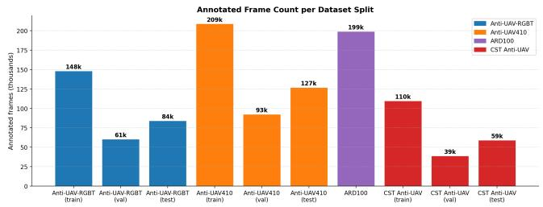  
Figure 7: Per-split counts of UAV-present frames—frames in which a UAV is present (the exist=1 flag), labelled ‘annotated’ on the figure axis. Anti-UAV410 is the largest (428,703 across train/val/test), followed by Anti-UAV-RGBT (293,209). CST Anti-UAV (208,221) and ARD100 (199,291) are comparable in size; ARD100 is used only for motion-mask pre-computation and is not part of the continual learning curriculum.

The five-frame sliding window operates as follows. Let frames be indexed $t - 2 , t - 1 , t , t + 1 , t + 2 .$ The FD5 scheme uses three non-adjacent frames (� −2, �, and � +2) to compute the motion diference after ECC-based alignment. For Stage 1 (Anti-UAV-RGBT) and all purely thermal datasets (Anti-UAV410, CST Anti-UAV), motion masks were not available within the scope of this study, so the second input channel is set to a zero tensor throughout. This means the motion branch of YOLOMG contributes no signal during train ing and the model functions as a single-stream thermal appearance detector.

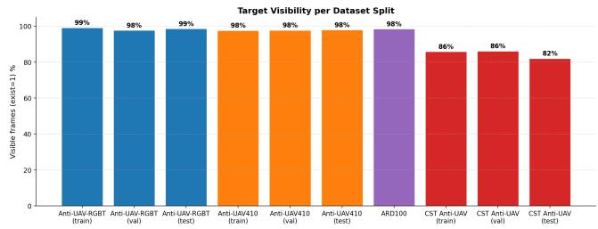  
Figure 8: Target visibility per dataset split. A frame is marked visible if it contains an actively flying UAV (the exist=1 flag); occluded or out-of-frame instances are marked absent. Anti-UAV-RGBT has the highest visibility rate, CST Anti-UAV the lowest, consistent with the dificulty of detecting sub-16- pixel targets in cluttered thermal scenes.

## Dataset Loading Strategy

To avoid inode quota exhaustion on Snellius, no intermediate converted files are written to disk. Each dataset is read in its native format inside a custom PyTorch Dataset class. Table 11 summarises the loading strategy per dataset.

## Frame Extraction

Anti-UAV-RGBT stores sequences as .mp4 video files with perframe JSON annotations. Frames are decoded on demand using cv2.VideoCapture with frame-index seeking (or pre-extracted as JPEG files to eliminate random-seek overhead on NFS mounts). Only the infrared stream (infrared.mp4) is loaded; the paired RGB stream (visible.mp4) is ignored entirely. Anti-UAV410 and CST Anti-UAV store pre-extracted JPEG frames, which are read directly.

Table 9: Epoch-level Stage 2 results (seed 42, 32 epochs). kd/det is the ratio of $L _ { \mathbf { k } \mathbf { d } }$ to $L _ { \mathbf { d e t } } ,$ averaged over batches. Epoch 16 is the peak T2 checkpoint. FM values here are seed 42’s Stage 2 training-time evaluation (e.g. −0.037 at epoch 16). The post-Stage-2 baseline used for the headline Forgetting Measure and as the Stage 3 starting point is a clean re-evaluation of this checkpoint (T1 mAP 0.640, FM −0.033); the ∼0.004 gap reflects training-time versus re-evaluation diferences. The three-seed mean Stage 2 FM is −0.033 ± 0.004.
<table><tr><td>Epoch</td><td> $L _ { \mathrm { d e t } }$ </td><td> $L _ { \mathrm { k d } }$ </td><td>kd/det</td><td>T2 mAP</td><td>FM</td></tr><tr><td>0</td><td>0.0580</td><td>0.0791</td><td>1.36</td><td>0.403</td><td>-0.007</td></tr><tr><td>5</td><td>0.0355</td><td>0.0768</td><td>2.16</td><td>0.419</td><td>-0.035</td></tr><tr><td>10</td><td>0.0317</td><td>0.0739</td><td>2.33</td><td>0.406</td><td>-0.046</td></tr><tr><td>15</td><td>0.0293</td><td>0.0712</td><td>2.43</td><td>0.417</td><td>-0.042</td></tr><tr><td>16</td><td>0.0289</td><td>0.0705</td><td>2.44</td><td>0.426</td><td>-0.037</td></tr><tr><td>20</td><td>0.0273</td><td>0.0677</td><td>2.48</td><td>0.419</td><td>-0.041</td></tr><tr><td>25</td><td>0.0256</td><td>0.0648</td><td>2.54</td><td>0.415</td><td>-0.044</td></tr><tr><td>31</td><td>0.0233</td><td>0.0612</td><td>2.62</td><td>0.422</td><td>-0.037</td></tr></table>

Table 10: Stage 3 naive condition — per-epoch results. Pretraining T1 mAP (before any Stage 3 gradient steps) = 0.640. T1 ceiling = 0.6725. Bold marks the best T3 checkpoint (epoch 3). Large-stratum T1 mAP reaches 0.000 at epoch 1 and never recovers; the small and normal strata fall steeply in parallel (from 0.559 and 0.684 post-Stage-2, Table 1, to 0.060 and 0.079 at the best checkpoint).
<table><tr><td>Ep.</td><td>T3 mAP</td><td>T1 mAP</td><td>FMabs</td><td>FMstage3</td><td>Tiny</td><td>Small</td><td>Normal</td><td>Large</td></tr><tr><td>pre</td><td></td><td>0.640</td><td>-0.033</td><td>0.000</td><td>一</td><td></td><td></td><td></td></tr><tr><td>0</td><td>0.042</td><td>0.206</td><td>-0.466</td><td>-0.434</td><td>0.041</td><td>0.130</td><td>0.251</td><td>0.010</td></tr><tr><td>1</td><td>0.066</td><td>0.127</td><td>-0.545</td><td>-0.513</td><td>0.005</td><td>0.090</td><td>0.151</td><td>0.000</td></tr><tr><td>2</td><td>0.074</td><td>0.082</td><td>-0.591</td><td>-0.559</td><td>0.001</td><td>0.075</td><td>0.092</td><td>0.000</td></tr><tr><td>3</td><td>0.083</td><td>0.068</td><td>-0.605</td><td>-0.572</td><td>0.001</td><td>0.060</td><td>0.079</td><td>0.000</td></tr><tr><td>4</td><td>0.066</td><td>0.057</td><td>-0.615</td><td>-0.583</td><td>0.000</td><td>0.056</td><td>0.065</td><td>0.000</td></tr><tr><td>5</td><td>0.071</td><td>0.053</td><td>-0.620</td><td>-0.588</td><td>0.000</td><td>0.042</td><td>0.064</td><td>0.000</td></tr><tr><td>6</td><td>0.063</td><td>0.048</td><td>-0.624</td><td>-0.592</td><td>0.000</td><td>0.052</td><td>0.055</td><td>0.000</td></tr><tr><td>7</td><td>0.076</td><td>0.039</td><td>-0.633</td><td>-0.601</td><td>0.000</td><td>0.045</td><td>0.044</td><td>0.000</td></tr><tr><td>18</td><td>0.062</td><td>0.017</td><td>-0.656</td><td>-0.623</td><td>0.000</td><td>0.019</td><td>0.019</td><td>0.000</td></tr></table>

Table 11: Native-format loading strategy per dataset. No intermediate converted files are written; format-specific logic is handled inside the custom Dataset implementation.
<table><tr><td>Dataset</td><td>Frame source</td><td>Annotation source</td></tr><tr><td>Anti-UAV-RGBT</td><td>MP4 video (OpenCV)</td><td>infrared.json</td></tr><tr><td>Anti-UAV410</td><td>Pre-extracted JPEG</td><td>IR_label.json</td></tr><tr><td>CST Anti-UAV</td><td>Pre-extracted JPEG</td><td>gt.txt + IR_label.json</td></tr><tr><td>ARD100</td><td>MP4 video (OpenCV)</td><td>Pascal VOC XML per frame</td></tr></table>

## Scale Stratification

Bounding box scale stratification is applied consistently across all scripts using bounding-box area in pixels. A normalised box $( w _ { n } , h _ { n } )$ is first converted to pixel dimensions at the canonical resolution 640 × 512:

$$
a = ( w _ { n } \times 6 4 0 ) \times ( h _ { n } \times 5 1 2 )
$$

The four strata are:

$$
\bullet \ \operatorname { t i n y } \mathrm { : } \ a < 2 5 6 \operatorname { p x } ^ { 2 } \ ( = 1 6 ^ { 2 } )
$$

Algorithm 1 Scale-Stratified Herding (SSH)   
Require: T1 reference set D , Stage 2 encoder $f _ { \boldsymbol { \theta _ { 2 } } }$ , exemplars per   
stratum � = 75   
Ensure: Exemplar bufer M with $| { \cal M } | = 3 0 0$   
1: Define S ← {tiny, small, normal, large}   
2: for each � $\in \mathcal { D } _ { 1 }$ do   
3: $e ( x ) \gets \mathrm { G l o b a l A v g P o o l } \Big ( f _ { \theta _ { 2 } } ^ { P 3 } ( x ) \Big )$   
Assign size stratum �(�) from bounding-box area   
5: end for   
6: $M \gets \emptyset$   
7: for each $s \in S$ do   
8: $\mathcal { D } _ { s }  \{ x \in \mathcal { D } _ { 1 } : s ( x ) = s \}$   
9: $\mu _ { s }  \frac { 1 } {  \mathcal { D } _ { s }  } \sum _ { x \in \mathcal { D } _ { s } }$ � (�)   
10: selected $ [ ]$   
11: $\bar { e }  0$   
12: for $k = 1 , \ldots , K$ do   
13: $j ^ { * } \gets \mathop { \mathrm { a r g } } _ { j \notin \mathrm { s e l e c t e d } } \left\| \frac { ( k - 1 ) \bar { e } + e ( x _ { j } ) } { k } - \mu _ { s } \right\| _ { 2 }$   
14: selected.append(�∗)   
15: $\bar { e }  \frac { ( k - \mathbf { \bar { 1 } } ) \bar { e } + \bar { e ( x _ { j ^ { * } } ) } } { \iota }$   
�   
16: end for   
17: $\boldsymbol { \mathcal { M } } \gets \boldsymbol { \mathcal { M } } \cup \{ \boldsymbol { x } _ { j } : \boldsymbol { j } \in$ selected}   
18: end for   
19: return M

• small: 256 $\leq a < 1 0 2 4 \mathrm { p x } ^ { 2 } \left( 1 6 ^ { 2 } { - } 3 2 ^ { 2 } \right)$

• normal: $1 0 2 4 \leq a < 4 0 9 6 { \mathrm { p x } } ^ { 2 } ( 3 2 ^ { 2 } - 6 4 ^ { 2 } )$

• large: $a \geq 4 0 9 6 \mathrm { p x } ^ { 2 } ( \geq 6 4 ^ { 2 } )$

The same thresholds are used consistently for evaluation, scaledistribution analysis, and replay-bufer construction.

## E Pseudocode

## Algorithm 1: Scale-Stratified Herding (SSH)

Algorithm 1 formalises the SSH bufer construction. The key departure from standard iCaRL herding is that the T1 reference data are first partitioned by target-size stratum before greedy herding is applied, ensuring representation of all four scale categories regardless of their frequency in the source dataset.

## Algorithm 2: Stage 2 Knowledge Distillation

Algorithm 2 summarises the Stage 2 training procedure. The teacher is initialised from the Stage 1 checkpoint and remains frozen throughout training. The student and teacher receive the same infrared input, while the student is additionally supervised using the Anti UAV410 ground-truth annotations.

## Algorithm 3: Forgetting Measure Computation

Algorithm 3 defines the Forgetting Measure used throughout this research. The T1 performance obtained immediately after Stage 1 is fixed as the reference baseline against which retention after subsequent training stages is measured.

Algorithm 2 Stage 2 Knowledge Distillation Training   
Require: Stage 1 checkpoint $\theta _ { T } ,$ training set $\mathcal { D } _ { 2 } , \lambda _ { \mathrm { k d } } = 1 . 0 ,$ , epochs   
�   
Ensure: Stage 2 student checkpoint $\theta _ { S } ^ { * }$   
1: $\theta _ { S }  \theta _ { T }$   
2: Freeze $\theta _ { T }$   
3: Set $f _ { \theta _ { T } }$ to evaluation mode   
4: for $e = 1 , \ldots , E$ do   
5: for each mini-batch $( x , y ) \in \mathcal { D } _ { 2 }$ do   
6: $\mathbf { p } _ { S } \gets f _ { \theta _ { S } } ( x , \mathbf { 0 } )$   
7: $\mathbf { p } _ { T }  f _ { \theta _ { T } } ( x , \mathbf { 0 } )$   
8: $\mathcal { L } _ { \mathrm { d e t } }  \mathrm { Y O L O }$ Loss(p�, �)   
9: $\mathcal { L } _ { \mathrm { k d } }  \frac { 1 } { 3 } \quad \sum$ MSE $\left( \mathbf { p } _ { S } ^ { ( p ) } , \mathbf { p } _ { T } ^ { ( p ) } \right)$   
$p \in \{ \overline { { P 3 , P 4 , P 5 } } \}$   
10: $\mathcal { L } \gets \mathcal { L } _ { \mathrm { d e t } } + \lambda _ { \mathrm { k d } } \mathcal { L } _ { \mathrm { k d } }$   
11: Update $\theta _ { S }$ using SGD on $\nabla _ { \theta _ { S } } \mathcal { L }$   
12: end for   
13: Evaluate $\theta _ { S }$ on T1 and T2 validation sets   
14: end for   
15: $\theta _ { S } ^ { * } \gets$ arg max m $\mathrm { A P } @ 0 . 5 _ { T 2 } \left( \theta _ { S } ^ { ( e ) } \right)$   
�   
16: return $\theta _ { S } ^ { * }$   
Algorithm 3 Forgetting Measure (FM)   
Require: Stage 1 checkpoint $\theta _ { 1 : }$ , Stage � checkpoint $\theta _ { k } ,$ T1 valida  
tion set $\mathcal { D } _ { 1 } ^ { \mathrm { v a l } }$   
Ensure: Forgetting Measure FM   
1: $m _ { 1 } \gets \mathrm { m A P } @ 0 . 5 \left( f _ { \theta _ { 1 } } , { \mathcal { D } } _ { 1 } ^ { \mathrm { v a l } } \right)$   
2: $m _ { k } \gets \operatorname* { m A P } @ 0 . 5 \left( f _ { \theta _ { k } } , { \mathcal { D } } _ { 1 } ^ { \mathrm { v a l } } \right)$   
3: $\mathrm { F M } \gets m _ { k } - m _ { 1 }$   
4: return FM

## F Stage 3 Tracking Evaluation

Figures 9–11 report the one-pass evaluation (OPE) tracking results for the Stage 3 best checkpoint on the CST Anti-UAV validation set, using the protocol of Huang et al. [16]. The precision plot (Figure 9) shows the proportion of frames whose predicted centre falls within a threshold pixel distance of the ground-truth centre; the success plot (Figure 10) shows the proportion of frames with IoU overlap above threshold. Figure 11 breaks success rate at IoU 0.5 (SR@0.5) down by sequence, revealing the substantial per-sequence variance that is not visible in the aggregate mAP.

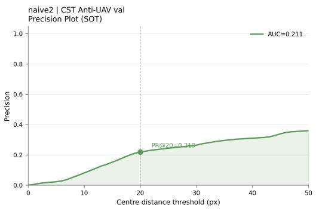

Figure 9: Precision plot on CST Anti-UAV validation set (Stage 3 best checkpoint, epoch 3). The representative score at threshold 20 px (PR@20) is reported in the main tracking evaluation table.  
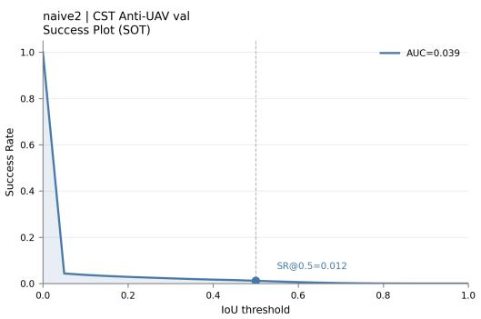

Figure 10: Success plot on CST Anti-UAV validation set (Stage 3 best checkpoint, epoch 3). The area under this curve (AUC) provides an IoU-threshold-independent summary of tracking quality.  
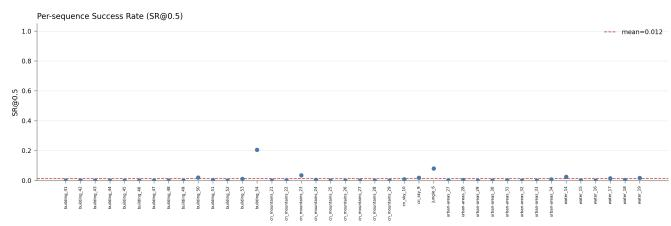  
Figure 11: Per-sequence success rate at IoU 0.5 (SR@0.5) on CST Anti-UAV validation set. Sequences with predominantly tiny targets (<256 px2) show the lowest SR@0.5, consistent with the near-zero tiny-stratum mAP reported in Table 1.

## G Compute Environment

All training and analysis jobs were executed on the Snellius HPC cluster (SURF, the Netherlands). The software environment was a dedicated Conda environment (Python 3.9) created with Conda. Packages were installed with pip inside the environment. Userspecific filesystem paths are omitted from this public preprint.

Library versions.

<table><tr><td>Package</td><td>Version</td></tr><tr><td>Python</td><td>3.9</td></tr><tr><td>torch</td><td>2.7.1+cu118</td></tr><tr><td>torchvision</td><td>0.22.1+cu118</td></tr><tr><td>torchaudio</td><td> $2 . 7 . 1 \substack { + \mathrm { c u } 1 1 8 }$ </td></tr><tr><td>numpy</td><td>2.0.2</td></tr></table>

Environment activation. Experiments were run in a dedicated Python 3.9 Conda environment after loading the Snellius 2023 software stack and Miniconda module. User-specific filesystem paths are intentionally omitted from this public preprint. Packages without a recorded pinned version are not listed above.

## H Experimental Run Summary

Table 12 summarises the runs underlying the reported results. Internal scheduler job identifiers are omitted from the public preprint because they are cluster-specific and do not improve reproducibility.

Table 12: Experimental runs underlying the reported results.
<table><tr><td>Run</td><td>Seed(s)</td><td>Notes</td></tr><tr><td>Stage 1 supervised</td><td>42</td><td>Best mAP@0.5 = 0.6725 at epoch 49</td></tr><tr><td>Stage 2 KD</td><td>42, 123, 999</td><td>Three-seed retention analysis</td></tr><tr><td>Stage 3 naive</td><td>42</td><td>FM = −0.605; best T3 checkpoint at epoch 3</td></tr><tr><td>Stage 3 SSH replay</td><td>42</td><td>FM = −0.311; best T3 checkpoint at epoch 2</td></tr><tr><td>Stage 3 random replay</td><td>42</td><td>FM = −0.221; best T3 checkpoint at epoch 2</td></tr><tr><td>Gradient probe</td><td>42, 123, 999</td><td>Stage 2 → Stage 3 boundary analysis</td></tr></table>