# DIVERSE MOTION CUSTOMIZATION VIA CONTROL-BASED DYNAMIC OPTIMIZATION

Youngyoon Choi1∗, Kihyun Kim1,2∗, Jeongwoo Shin1†, Joonseok Lee1† 1Seoul National University, 2AIM Intelligence {yongyoon911, ki5477, swswss, joonseok}@snu.ac.kr

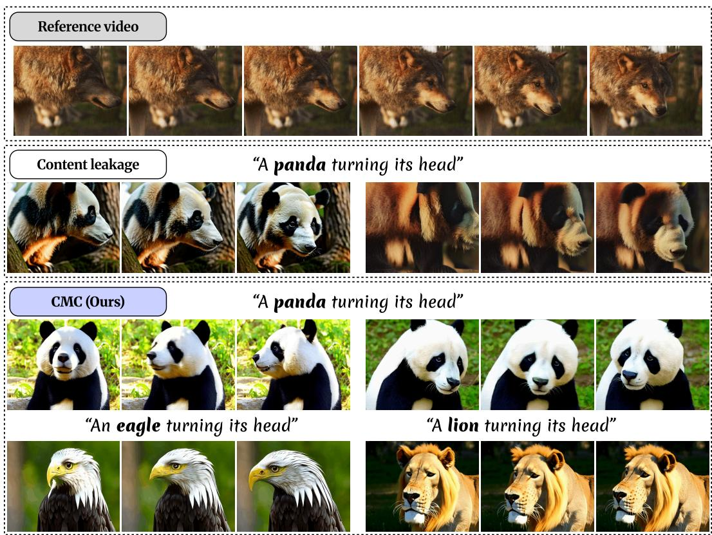  
Figure 1: Overview of the proposed method. Our CMC mitigates content leakage, enabling diverse generation across varying prompts and samples.

## ABSTRACT

Despite recent advances in video generation, motion customization remains challenging due to content leakage, where appearance attributes from the reference video unintentionally propagate into the generated output. We identify this issue as a consequence of the generative process collapsing toward the reference video, which arises from formulating the learning objective as a direct regression on the reference. To address this, we propose Control-based Motion Customization (CMC), a principled training framework that is structurally robust to content leakage. Our key idea is to steer generative dynamics toward desired motion while avoiding collapse toward the reference video, which we formalize using Stochastic Optimal Control (SOC). Under this formulation, customized videos acquire the target motion yet remain within the pre-trained model’s prompt-conditional distribution, where appearance is determined by the text prompt rather than the reference video. Furthermore, to improve efficiency, we tailor the SOC formulation to motion customization by eliminating the need for an explicit reward and introducing a timestep-adaptive motion cost that focuses only on early generative stages,

accelerating training by 2.5×. Extensive experiments demonstrate that CMC effectively mitigates content leakage and achieves competitive motion fidelity while preserving the diversity of the base model across diverse scenarios. Video results are available at https://control-based-mc.github.io/.

## 1 INTRODUCTION

Recent video generation models (Blattmann et al., 2023; Chen et al., 2024; Guo et al., 2024; Gupta et al., 2023; Wang et al., 2024b) have demonstrated remarkable progress in visual quality and temporal coherence, bringing video synthesis closer to practical real-world applications. Among these, motion customization has emerged as an important task to provide users with finer control over the generation process. In particular, motion customization aims to generate a video conditioned on (i) a text prompt specifying the overall scenario, e.g., subject appearance or background details, and (ii) a reference video specifying the target motion. Thus, the output should follow the motion of the reference video, while matching all other attributes specified in the text prompt.

However, motion customization still remains challenging due to its trade-off between motion fidelity and content leakage, where appearance attributes from the reference video unintentionally propagate into the generated result (Ma et al., 2026; Kansy et al., 2025; Liu et al., 2025d). Existing methods commonly attempt to mitigate this by debiasing appearance from motion representations extracted from the reference video, yet this is inherently difficult. We identify that content leakage does not stem from imperfect disentanglement itself, but from formulating the learning objective as a direct regression on the reference video. This causes the generation to drift away from the text prompt toward the reference video, making the output resemble the reference beyond its motion. Based on this observation, we argue that content leakage can be better mitigated simply by designing a proper learning objective, even when motion and appearance remain entangled.

To this end, we introduce Control-based Motion Customization (CMC), a principled training framework for motion customization. Our goal is to adopt only the target motion while faithfully reflecting the text prompt, which requires preventing collapse toward the reference. To achieve this, we first highlight the importance of rigorously accounting for the generative dynamics and their induced output distribution (§4.1). We then adopt Stochastic Optimal Control (SOC) as a natural tool for this purpose, casting motion customization as an SOC problem (§4.2). Specifically, instead of forcing the model to match the reference directly, CMC learns a control that steers the pre-trained generative process toward the target motion, while being penalized for deviating from the original process. The customized samples thus acquire the desired motion yet remain within the pre-trained prompt-conditional distribution: since appearance is determined by the prompt, samples from this distribution are unlikely to exhibit appearance attributes inconsistent with the prompt, including those of the reference video. Consequently, CMC is structurally robust to content leakage.

While the SOC framework offers a principled approach, its standard application remains challenging for two practical reasons. First, it requires carefully handcrafted reward functions that are difficult to define for complex motion customization task. Second, it is computationally expensive due to its full-horizon trajectory simulation. To address these challenges, we redesign the formulation through two task-specific modifications. First, we completely eliminate the explicit reward. Instead, we modify the generative dynamics using a proxy objective computed along the trajectory, showing that the resulting target distribution still remains as a reweighting of the pre-trained conditional distribution (§4.3). Second, based on our observation that motion structure emerges early in generative stages, we restrict this dynamics modification to these initial timesteps (§4.4). These two task-oriented modifications simplify the objective, leading to a more efficient control-learning process (§4.5). Extensive experiments demonstrate that our framework enables precise motion control while remaining robust to content leakage, thereby facilitating diverse generation across a wide range of scenarios.

Our contributions are summarized as follows:

• We identify the inherent susceptibility of prevalent motion customization methods to content leakage from the perspective of generative dynamic and induced target distribution.

• We propose Control-based Motion Customization (CMC), an SOC-based framework that transfers the target motion while remaining faithful to the text prompt, making it structurally robust to content leakage.

• We tailor the formulation to motion customization by (i) removing the reward and directly guiding the generation toward the target motion, and (ii) restricting this guidance to early generative stages, accelerating training by 2.5×.

• Through comprehensive experiments, we verify that our method yields diverse generation results with high motion fidelity, effectively mitigating content leakage.

## 2 RELATED WORK

Training-Free Motion Customization. Training-free approaches (Hu et al., 2024; Meral et al., 2024; Liu et al., 2025d; Zhang et al., 2025b; Yatim et al., 2024; Ling et al., 2025; Gao et al., 2025; Pondaven et al., 2025; Yesiltepe et al., 2024; Gokmen et al., 2025) customize motions by manipulating sampling dynamics at inference time, without updating model parameters. Early approaches (Hu et al., 2024; Meral et al., 2024; Liu et al., 2025d; Zhang et al., 2025b; Yatim et al., 2024; Ling et al., 2025; Gao et al., 2025) are based on U-Net (Ronneberger et al., 2015), leveraging its intermediate representations to align generation with the referred motion, while recent approaches (Pondaven et al., 2025; Yesiltepe et al., 2024; Gokmen et al., 2025) adopt Diffusion Transformers (DiT) (Peebles & Xie, 2023). Despite architectural differences, these methods commonly enforce motion alignment by directly modifying latent representations or internal features. In contrast, our method operates at the level of generative dynamics without explicitly altering intermediate repre sentations.

Fine-tuning-based Motion Customization. Another line of work transfers motion by fine-tuning model parameters, often from a single reference (Kansy et al., 2025; Park et al., 2025; Wang et al., 2025; Shi et al., 2025). Many of these approaches introduce separate appearance and motion branches to encourage disentangled representations (Zhao et al., 2024; Zhang et al., 2023; Ren et al., 2024; Ma et al., 2026; Liu et al., 2025b). Others adapt text embeddings and attention layers to better inject motion cues (Li et al., 2024; Materzynska et al.´ , 2024; Wu et al., 2025; Jeong et al., 2024). While effective, these methods often suffer from output distribution collapse toward the reference video. Beyond single-exemplar adaptation, large-scale fine-tuning approaches (Ressler-Antal et al., 2025; Cai et al., 2025; Zhang et al., 2025a) learn motion control from curated datasets. Such approaches rely heavily on large annotated data, whereas we focus on the single-reference setting without large-scale training.

## 3 PRELIMINARY

Text-to-Video Diffusion. Let us consider a continuous-time stochastic differential equation (SDE) formulation of text-to-video diffusion and flow models (Blattmann et al., 2023; Chen et al., 2024; Guo et al., 2024; Gupta et al., 2023; Wang et ${ \mathrm { a l . } }$ , 2024b; Wan et al., 2025). Given a data point $X _ { 1 } \in \mathbb { R } ^ { n }$ sampled from data distribution $q _ { \mathrm { d a t a } } .$ , a forward stochastic process gradually transforms the data into Gaussian distribution $q _ { \mathrm { p r i o r } }$ . Using the reversed time convention, the forward SDE is given by

$$
\mathrm { d } X _ { t } = f ( X _ { t } , t ) \mathrm { d } t + \sigma ( t ) \mathrm { d } W _ { t } , \qquad X _ { 1 } \sim q _ { \mathrm { d a t a } } ,\tag{1}
$$

where $f : \mathbb { R } ^ { n } \times [ 0 , 1 ] \to \mathbb { R } ^ { n }$ is a forward drift, $\sigma : [ 0 , 1 ] \to \mathbb { R } _ { > 0 }$ is a diffusion coefficient, and $W _ { t }$ is an n-dimensional standard Wiener process. Both $f$ and $\sigma$ are determined by a predefined noise schedule.

Reversing Eq. (1) yields a reverse-time stochastic process that transports $q _ { \mathrm { p r i o r } }$ back to the $q _ { \mathrm { d a t a } } { \mathrm { . } }$

$$
\mathrm { d } X _ { t } = \left[ f ( X _ { t } , t ) + \sigma ( t ) ^ { 2 } s ^ { \mathrm { b a s e } } ( X _ { t } , t ) \right] \mathrm { d } t + \sigma ( t ) \mathrm { d } W _ { t } , \quad X _ { 0 } \sim q _ { \mathrm { p r i o r } } ,\tag{2}
$$

where score function $s ^ { \mathrm { b a s e } } : \mathbb { R } ^ { n } \times [ 0 , 1 ] \to \mathbb { R } ^ { n }$ is typically parameterized and optimized by conditional score matching (Song et al., 2021) to estimate the marginal score $\nabla _ { x } \log { p ( x , t ) }$ ; for flow models, it is obtained in closed-form from the learned velocity field (Ma et al., 2024). Once trained, it specifies the reverse-time dynamics, enabling sampling by simulating the reverse SDE Eq. (2) from $q _ { \mathrm { p r i o r } }$ at $t \ : = \ : 0$ to obtain samples $X _ { 1 }$ that approximately follow the $q _ { \mathrm { d a t a } }$ at $t \ : = \ : 1$ . Also, it induces a path measure $p ^ { \mathrm { b a s e } }$ with endpoint marginals $p _ { 0 } ^ { \mathrm { b a s e } } = q _ { \mathrm { p r i o r } }$ and $p _ { 1 } ^ { \mathrm { b a s e } } \approx q _ { \mathrm { d a t a } }$

Stochastic Optimal Control (SOC). SOC provides a framework for modifying the dynamics of a given stochastic process to arrive at a new target distribution $\mu$ at $t = 1$ by introducing a control signal that manipulates trajectories, while remaining close to a base path measure (Zhang & Chen, 2021; Vargas et al., 2023; Domingo-Enrich et al., 2024; Havens et al., 2025; Liu et al., 2025a; Shin et al., 2026). Among the various SOC problem formulations, we consider the quadratic cost controlaffine one:

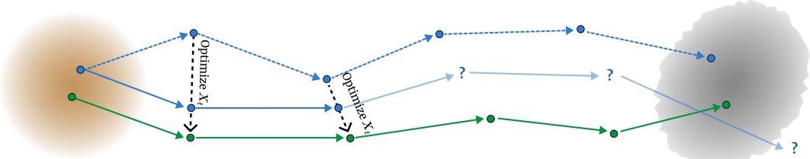  
(a) Training-free Latent Optimization

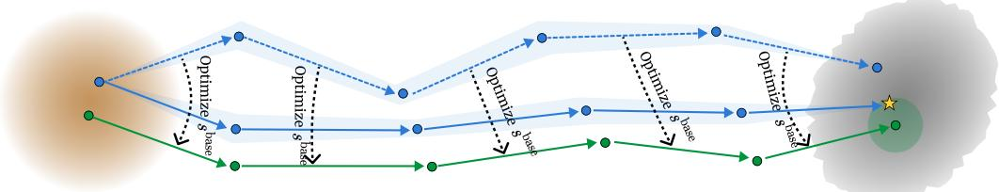  
(b) Fine-tuning-based Optimization

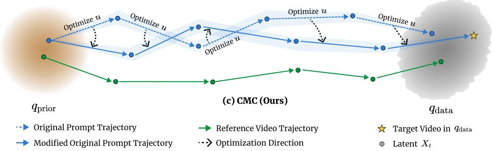  
Figure 2: Method Comparison. Existing methods vs. our control-based approach.

$$
\operatorname* { m i n } _ { u \in \mathcal { U } } \mathbb { E } _ { X \sim p ^ { u } } \left[ \int _ { 0 } ^ { 1 } \left( \frac { 1 } { 2 } \| u ( X _ { t } , t ) \| ^ { 2 } + \ell ( X _ { t } , t ) \right) \mathrm { d } t + g ( X _ { 1 } ) \right]\tag{3}
$$

$$
\mathrm { s . t . ~ } \mathrm { d } X _ { t } = \left[ b ( X _ { t } , t ) + \sigma ( t ) u ( X _ { t } , t ) \right] \mathrm { d } t + \sigma ( t ) \mathrm { d } W _ { t } , X _ { 0 } \sim q _ { \mathrm { p r i o r } } ,\tag{4}
$$

where $b : \mathbb { R } ^ { n } \times [ 0 , 1 ] \to \mathbb { R } ^ { n }$ is a base backward drift, $u : \mathbb { R } ^ { n } \times [ 0 , 1 ] \to \mathbb { R } ^ { n }$ is a control vector field ranging over the set of admissible controls U, $\ell : \mathbb { R } ^ { n } \times [ 0 , 1 ] \to \bar { \mathbb { R } }$ is a running cost and $g : \mathbb { R } ^ { n } $ R is a terminal cost. By optimizing Eq. (3), we can obtain minimally changed dynamic which leads to our new target distribution µ at $t = 1$ (via terminal cost $g ( x ) )$ ), under additional constraints on trajectory shaping (via running cost $\ell ( x , t ) )$ .

## 4 CONTROL-BASED MOTION CUSTOMIZATION (CMC)

## 4.1 MOTIVATION

We begin by revisiting existing motion customization methods through the lens of generative dynamics and formulate our problem based on this analysis.

Reinterpreting Existing Methods. Training-free approaches (Yatim et al., 2024; Gao et al., 2025; Ling et al., 2025; Pondaven et al., 2025) encode motion by adjusting the intermediate noisy state X to be closer to the generative trajectory of the reference video. However, such direct alignment is inherently susceptible to content leakage, as its minimizer is precisely the generative trajectory of the reference video. Since no constraint prevents the model from converging to this trajectory, and the induced output distribution is left uncharacterized, the output can easily collapse toward the reference video. Fig. 2(a) visualizes how latent-level alignment progressively bends the original trajectory toward the reference, disrupting the intrinsic generative dynamics.

Fine-tuning approaches (Zhao et al., 2024; Ma et al., 2026; Jeong et al., 2024; Park et al., 2025; Wang et al., 2025; Wu et al., 2025), on the other hand, directly optimize the parameters of the pretrained model, effectively updating the score function $s ^ { \mathrm { b a s e } } ( x , \overline { { t } } )$ in the backward dynamics Eq. (2). During training, the model reconstructs the reference video via diffusion loss, which leads original trajectories to converge toward the reference trajectory as in Fig. 2(b). While this ensures that the generated samples lie in $q _ { \mathrm { d a t a } } .$ , it causes the output distribution to collapse into a narrow point-masslike distribution centered at the reference, resulting in content leakage and limited flexibility.

## 4.2 MOTION CUSTOMIZATION AS SOC

Aforementioned observations motivate a training framework that rigorously accounts for both the generative dynamics and the induced output distribution. To this end, we formulate motion customization as a SOC problem. As shown in the SOC objective in Eq. (3), this formulation enables us to incorporate the desired motion information by learning control u while (i) preventing excessive deviation from the base dynamics through the quadratic cost $\| u \| ^ { 2 }$ , and (ii) explicitly controlling the induced output distribution $\mu .$

Adopting this SOC framework leads to the following optimization problem for obtaining the optimal control $u ^ { \star }$ , subject to our controlled generative dynamics:

$$
\mathrm { d } X _ { t } = \big [ f ( X _ { t } , t ) + \sigma ( t ) ^ { 2 } s ^ { \mathrm { b a s e } } ( X _ { t } , t ) + \sigma ( t ) u ( X _ { t } , t ) \big ] \mathrm { d } t + \sigma ( t ) \mathrm { d } W _ { t } , ~ X _ { 0 } \sim q _ { \mathrm { p r i o r } } ,\tag{5}
$$

which induces the controlled path measure $p ^ { u }$ that coincides with the base path measure $p ^ { \mathrm { b a s e } }$ when $u \equiv 0$ . Within this objective, the target motion information can be flexibly injected either through the target distribution $\mu$ or via a specifically designed running cost $\ell ( x , t )$

Challenges of Standard SOC Application. A natural way to learn the desired motion within this framework is to specify the target distribution $\mu$ as the distribution of videos containing the target motion. In practice, this distribution is commonly formulated using a reward function $r : \mathbb { R } ^ { n }  \mathbb { R }$ which defines $\mu$ as a reward-tilted distribution:

$$
\begin{array} { r } { \mu ( x ) \propto p _ { 1 } ^ { \mathrm { b a s e } } ( x ) \exp ( r ( x ) ) . } \end{array}\tag{6}
$$

Under this setting, the terminal cost in Eq. (3) corresponds to a terminal reward, $i . e . , g ( X _ { 1 } ) =$ $- r ( X _ { 1 } )$ ). However, directly optimizing this objective with terminal reward $r ( X _ { 1 } )$ is practically challenging and computationally expensive. Since r explicitly defines the target distribution, it must capture multiple aspects of the generated video, including motion alignment, visual quality, and text consistency. Yet, designing such a comprehensive reward is nontrivial (Xue et al., 2025; Liu et al., 2026; 2025c). Furthermore, evaluating $r ( X _ { 1 } )$ requires simulating the entire trajectory up to $t = 1$ which substantially increases optimization costs. To overcome these inefficiencies, we reformulate the SOC objective specifically for motion customization, yielding our framework, Control-based Motion Customization (CMC). Specifically, CMC is designed to achieve the following two goals:

Goal 1: Inject the target motion without explicit reward design (§4.3).

Goal 2: Inject the target motion without entire trajectory simulation $( \ S 4 . 4 )$

## 4.3 BYPASSING REWARD DESIGN VIA ZERO TERMINAL COST

Our first main insight is that we can entirely bypass the complexity of reward design by avoiding the need to construct a new, custom target distribution µ. As modern text-to-video diffusion models (Yang et al., 2025; Wan et al., 2025; Kong et al., 2024; Zheng et al., 2024) are trained on vast and diverse datasets, their pre-trained output distribution already captures rich generative knowledge. Under the natural assumption that the desired motion lies within this underlying distribution, we set the terminal cost $g ( x ) = 0$ to avoid explicitly designing the target distribution as a reward-tilted distribution $\left( \mathrm { E q . } \left( 6 \right) \right)$ , and instead utilize a running cost $\ell ( x , t )$ to implicitly modify the dynamics.

The target distribution induced by ℓ can be explicitly characterized. Since motion customization is fundamentally a form of text-to-video generation, $p _ { 1 } ^ { \mathrm { b a s e } }$ denotes the prompt-conditional distribution $p _ { 1 } ^ { \mathrm { b a s e } } ( \cdot \mid c )$ given a text prompt $c ,$ and we make this conditioning explicit hereafter.

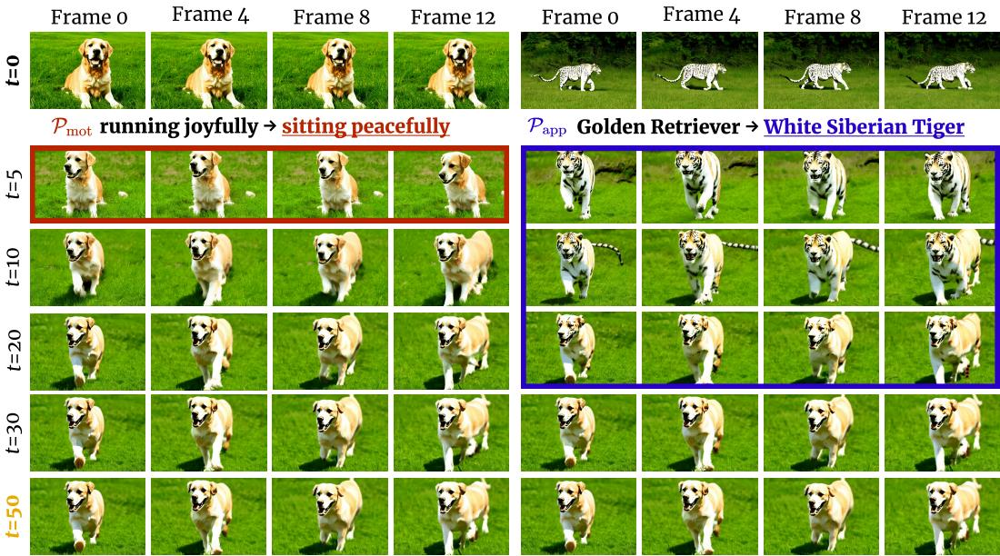  
Pinit A Golden Retriever running joyfully across a green meadow.  
Figure 3: Qualitative analysis on motion formation timestep. The y-axis indicates the switching timestep $( t \in [ 0 , 5 0 ] )$ at which the initial prompt ${ \mathcal { P } } _ { \mathrm { i n i t } }$ is switched to a new prompt $\mathcal { P } _ { \mathrm { m o t } }$ or $\mathcal { P } _ { \mathrm { a p p } }$ . Left: Switching from ${ \mathcal { P } } _ { \mathrm { i n i t } }$ to $\mathcal { P } _ { \mathrm { m o t } }$ shows that motion becomes largely established after early timesteps $( t = 1 0 )$ , with limited influence from subsequent prompts. $R i g h t \colon$ Switching to $\mathcal { P } _ { \mathrm { a p p } }$ shows that nonmotion can still change at later timestep $( t = 2 0 )$ ).

Under this formulation, our optimal target distribution is derived as:

$$
\begin{array} { r } { p _ { 1 } ^ { \star } ( x \mid c ) = p _ { 1 } ^ { \mathrm { b a s e } } ( x \mid c ) \phi ( x ) , \quad \phi ( x ) = \mathbb { E } _ { p ^ { \mathrm { b a s e } } ( \cdot \mid c ) } \Big [ e ^ { - \int _ { 0 } ^ { 1 } \ell ( X _ { t } , t ) \mathrm { d } t + V ( X _ { 0 } , 0 ) } \Big | X _ { 1 } = x \Big ] , } \end{array}\tag{7}
$$

where $V ( x , 0 ) = - \log \mathbb { E } _ { p ^ { \mathrm { { b a s e } } } } \big [ e ^ { - \int _ { 0 } ^ { 1 } \ell ( X _ { t } , t ) \mathrm { d } t } \mid X _ { 0 } = x \big ]$ . Derivation is in Appendix $\ S _ { \mathrm { B } }$

Importantly, since the optimal target distribution is a reweighting of the base terminal distribution, our formulation is inherently robust to content leakage.

Property 1: Support Preservation. $p _ { 1 } ^ { \star } ( \cdot \mid c )$ cannot assign probability to samples that do not exist under $p _ { 1 } ^ { \mathrm { { b } \bar { a } s e } } ( \cdot \mid c )$

Conditioning on c implies that the appearance of the generated video is determined by the prompt. Accordingly, samples exhibiting content leakage, i.e., appearance attributes from the reference video that contradict the prompt $c ,$ are already assigned negligible probability under $p _ { 1 } ^ { \mathrm { b a s e } }$ . Since reweighting Eq. (7) is pointwise on $p _ { 1 } ^ { \mathrm { b a s e } }$ , content-leaked samples with $p _ { 1 } ^ { \mathrm { b a s e } } ( \dot { x } ) \approx 0$ cannot be newly introduced through this process. This property is further supported by the quadratic control regularization, which prevents the point-wise scaling factor $\phi ( x )$ from exploding.

## Property 2: Trajectory Regularization. The induced path measure $p ^ { u }$ cannot deviate arbitrarily from the base path measure $p ^ { \mathrm { b a s e } }$ , due to the regularization imposed by the control cost.

Complementing the sample-level bound in Property 1, the quadratic control cost enforces trajectorylevel bound to the base model. Because the control cost directly equals the KL divergence between path measures (Sarkk¨ a & Solin¨ , 2019), $\begin{array} { r } { \mathbb E _ { p ^ { u } } [ \frac 1 2 \int _ { 0 } ^ { 1 } \| u \| ^ { 2 } \mathrm { d } t ] = \operatorname { K L } ( p ^ { u } \| p ^ { \mathrm { b a s e } } ) } \end{array}$ , minimizing $\| u \| ^ { 2 }$ keeps the modified dynamics strictly anchored to $p ^ { \mathrm { b a s e } }$ throughout the entire generation process, preventing intermediate states from drifting toward unverified reference features.

Solution 1: Vanishing Terminal Cost. Inject the target motion via the running cost $\ell ( x , t )$ , with $g ( x ) = 0$

## 4.4 TRAJECTORY TRUNCATION VIA EARLY-STAGE CONTROL

While our formulation operates via a running cost $\ell ( x , t )$ , evaluating this cost across all denoising steps induces unnecessary optimization overhead. Therefore, we leverage the key property that motion structure primarily emerges during the early denoising stage, and restrict control to an early time window $t \in [ 0 , \tau ]$ , achieving both computational efficiency and high generative flexibility.

Motion Formation in Early Diffusion Steps. Inspired by prior observations (Ling et al., 2025; Hertz et al., 2022) and the coarse-to-fine nature of diffusion models (Yi et al., 2024; Qian et al., 2024), we hypothesize that motion structure is largely established in early denoising steps. To vali date this hypothesis, we conduct both qualitative and quantitative analyses.

For qualitative analysis, we conduct a prompt-switching experiment. We initiate generation with ${ \mathcal { P } } _ { \mathrm { i n i t } }$ and switch to either a motion-changed prompt $\mathcal { P } _ { \mathrm { m o t } }$ (same subject, different motion) or an appearance-changed prompt $\mathcal { P } _ { \mathrm { a p p } }$ (different subject, same motion). As shown in Fig. 3(left), motion is largely shaped within approximately the first 20% of the trajectory; switching the prompt afterward leaves the motion nearly unchanged. In contrast, in Fig. $3 ( r i g h t )$ , appearance remains modifiable at substantially later timesteps (first 40%), allowing the subject to adapt to the new description while motion persists.

For quantitative analysis, we evaluate a motion classifier trained on intermediate noisy latents $X _ { t }$ across a benchmark of 10 motion classes and 10 subject categories (details in Appendix §C). As shown in Fig. 4, motion is highly identifiable from a very early stage (step 5 with 69.8%) and accuracy saturates around step 15 (90.2%), confirming that the primary motion structure is formed early in the denoising process. Based on these findings, we conclude that imposing motion information only in the early generative phase is sufficient for motion control, resulting in a significantly more efficient control learning procedure. We therefore restrict the running cost $\ell ( x , t )$ to $t \in [ 0 , \tau ]$ , where $\tau < 1$ denotes the cutoff timestep for motion control. This restriction also preserves flexibility for subsequent semantic refinement, allowing the generation to adapt to the text prompt.

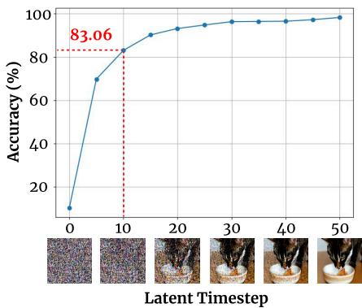  
Figure 4: Quantitative analysis on motion formation timestep.

Timestep-adaptive Motion Cost. While the running cost $\ell ( x , t )$ can be flexibly designed to encourage desired motions, we adopt a simple and effective instantiation computing optical-flow-like motion vectors directly in the feature space (Geyer et al., 2023; Wang et al., 2024a). Specifically, we formulate the cost as:

$$
\ell ( X _ { t } , t ) = w ( t ) \cdot \ell _ { \mathrm { m o t i o n } } ( X _ { t } ; X _ { \mathrm { r e f } } ) ,\tag{8}
$$

where $\ell _ { \mathrm { m o t i o n } }$ quantifies the feature-space motion vector discrepancy relative to the clean reference video $X _ { \mathrm { r e f } }$ , and $w ( t )$ is a timestep-dependent scaling factor. All formal definitions are in Appendix $\ S C$ . To further demonstrate that leakage prevention is structural to our framework rather than tied to a specific motion representation, we also instantiate $\ell ( x , t )$ with motion costs adopted from existing methods (Appendix §E).

Solution 2: Running Cost Truncation. Inject the target motion via the early generative stage only, with $\ell ( x , t ) = 0$ for all $t \in ( \tau , 1 ]$

## 4.5 TRAINING STRATEGY

By applying Solution 1 $( g ( x ) = 0 )$ and Solution $\begin{array} { r } { \mathbf { 2 } \left( \ell ( X _ { t } , t ) = 0 \quad \forall t \in ( \tau , 1 ] \right) } \end{array}$ to our general SOC objective in Eq. (3), the control problem simplifies to optimizing the truncated running cost over $t \in [ 0 , \tau ]$

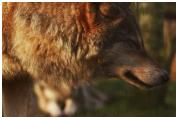  
Reference

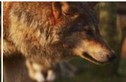  
Prompt: “A panda turning its head.”

  
Prompt: “A dog drinking water.”

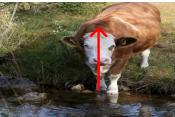

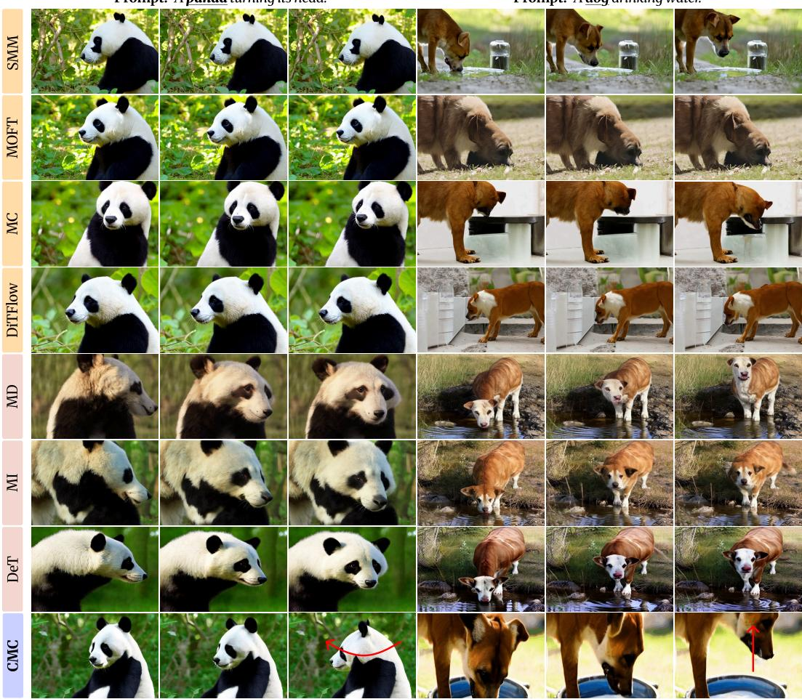  
Figure 5: Qualitative comparison with baselines. CMC achieves precise motion customization while significantly mitigating content leakage. The red arrow indicates the movement direction.

$$
\underset { u \in \mathcal { U } } { \operatorname* { m i n } } \ \mathbb { E } _ { X \sim p ^ { u } } \left[ \int _ { 0 } ^ { \tau } \left( \frac { 1 } { 2 } \ \lVert u ( X _ { t } , t ) \rVert ^ { 2 } \ + w ( t ) \cdot \ell _ { \mathrm { m o t i o n } } ( X _ { t } ; X _ { \mathrm { r e f } } ) \right) \mathrm { d } t \right] .\tag{9}
$$

Crucially, these solutions apply to the general SOC formulation itself, independently of the specific choice of SOC solver. In practice, we solve Eq. (9) using Adjoint Matching (AM) (Domingo-Enrich et al., 2024), which is the efficient control learning algorithm. The overall training procedure using AM loss is summarized in Algorithm 1.

## 5 EXPERIMENTS

## 5.1 EXPERIMENTAL SETUP

Evaluation Protocol. We evaluate on reference videos sourced from DAVIS (Perazzi et al., 2016) and prior work (Pondaven et al., 2025; Ling et al., 2025; Zhao et al., 2024; Ma et al., 2026), paired with prompts of varying descriptive complexity. Following the prior work, we report Motion Fidelity (Yatim et al., 2024), Text Fidelity, and Temporal Consistency (Huang et al., 2024). We additionally report Diversity as an indirect measure of content leakage. To evaluate diversity, we generate multiple trajectories per video–prompt pair, resulting in a total of 150 motion-customized videos. We compare against seven baselines covering both training-free and tuning-based training schemes, and all baselines are adapted to CogVideoX-2B for a fair comparison. More details on dataset, baselines, and metrics are in Appendix §D.

Table 1: Quantitative evaluation on CMC and baselines.
<table><tr><td>Method</td><td>Motion Fidelity↓</td><td>Text Fidelity ↑</td><td>Temporal Consistency ↑</td><td>Diversity ↑</td></tr><tr><td>Backbone</td><td>0.2605</td><td>0.8520</td><td>0.9797</td><td>0.3139</td></tr><tr><td colspan="5">Training-free methods</td></tr><tr><td>SMM (Yatim et al., 2024)</td><td>0.1123</td><td>0.8229</td><td>0.9650</td><td>0.2457</td></tr><tr><td>MOFT (Xiao et al., 2024)</td><td>0.1186</td><td>0.8272</td><td>0.9563</td><td>0.2292</td></tr><tr><td>MotionClone (MC) (Ling et al., 2025)</td><td>0.1303</td><td>0.7698</td><td>0.9253</td><td>0.2489</td></tr><tr><td>DiTFlow (Pondaven et al., 2025)</td><td>0.1189</td><td>0.8304</td><td>0.9814</td><td>0.2402</td></tr><tr><td colspan="5">Tuning-based methods</td></tr><tr><td>MotionDirector (MD) (Zhao et al., 2024)</td><td>0.0781</td><td>0.8396</td><td>0.9566</td><td>0.2623</td></tr><tr><td>MotionInversion (MI) (Wang et al., 2025)</td><td>0.0828</td><td>0.7991</td><td>0.9603</td><td>0.2206</td></tr><tr><td>DeT (Shi et al., 2025)</td><td>0.0821</td><td>0.8315</td><td>0.9667</td><td>0.2584</td></tr><tr><td>CMC (Ours)</td><td>0.1093</td><td>0.8452</td><td>0.9754</td><td>0.3243</td></tr></table>

Implementation Details. We use CogVideoX-2B (Yang et al., 2025) as our base model with 28 denoising steps. The maximum timestep for the running cost (τ in continuous-time formulation) is set to 10, using features from the 15th transformer block, with w(t) following a decaying schedule to avoid drastic change of dynamic. Full settings are in Appendix §C.

## 5.2 MAIN RESULTS

Quantitative Comparison. Tab. 1 compares with the baselines, including the Backbone, generated from the text prompt alone as a reference. An ideal method would improve motion fidelity while matching the Backbone on the other metrics. CMC achieves competitive motion fidelity while outperforming all baselines in both text fidelity and diversity, demonstrating that it generates diverse, motion-aligned samples that faithfully reflect the text prompt. Although tuning-based baselines exhibit slightly higher motion fidelity, this stems from overfitting to the reference video, as detailed in Fig. S2 in Appendix §E. CMC surpasses all training-free methods in motion fidelity, striking a favorable trade-off between motion fidelity and diversity.

Qualitative Results. Fig. 5 compares CMC against baselines. Training-free methods produce plausible videos but fail to follow the reference motion. Tuning-based methods follow the motion well but suffer from content leakage, inheriting the layout, appearance, and color of the reference video. In contrast, CMC accurately transfers the reference motion while generating content faithful to the prompt, without collapsing toward the reference. Additional results are in Appendix §E.

Ablation Studies. We investigate the impact of the maximum motion injection timestep ts (τ in continuous-time formulation) to identify the

Reference  
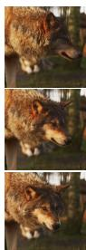

ts = 0  
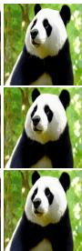

ts = 5  
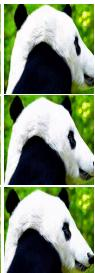

ts = 10  
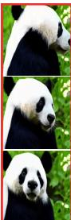

ts = 14  
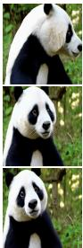

w/o w(t)  
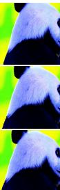  
Figure 6: Ablation study. ts denotes the motion injection timestep (ts = 0 corresponds to the base T2V). Motion aligns with the reference from ts = 10. Removing w(t) leads to degenerated outputs.

optimal interval for motion guidance. As shown in Fig. 6, guidance restricted to very early timesteps $\left( t s = 5 \right)$ is insufficient, while extending beyond $t s = 1 0$ yields limited improvement but increases computational cost. We thus choose $t s = 1 0$ as a balance between performance and efficiency. We further illustrate the effect of the scaling factor w(t) in the running cost. Removing the schedule (constant weight) degrades sample quality, confirming that abrupt transitions between controlled and uncontrolled dynamics lead to distribution mismatch. The proposed decaying w(t) mitigates this by ensuring smooth transitions. See Appendix §E for more results and details.

## 6 CONCLUSION

We present CMC, a principled framework for motion customization that significantly mitigates content leakage by preventing the generative process from collapsing toward the reference video. By formulating motion customization as a Stochastic Optimal Control (SOC) problem and tailoring it to the task, our approach enables precise, efficient and diverse motion-customized video generation.

Limitations. As our generation rely on strong expressivity of a pretrained model, producing outputs beyond its inherent capacity requires an additional reward model. Also, while our experiments validate CMC against strong baselines, we leave generalization to arbitrary reference videos and prompts beyond the per-video optimization setting as future work, although we expect to transfer.

## AI USE STATEMENT

We did not use generative AI tools for any tasks with required disclosure under the ICLR 2027 policy. We used generative AI tools only to improve the readability of the manuscript, such as polishing sentences and checking grammar. All AI-assisted edits were reviewed by the authors, and we take full responsibility for the content of this work.

## REFERENCES

Andreas Blattmann, Robin Rombach, Huan Ling, Tim Dockhorn, Seung Wook Kim, Sanja Fidler, and Karsten Kreis. Align your latents: High-resolution video synthesis with latent diffusion models. In CVPR, 2023.

Yufei Cai et al. EfficientMT: Efficient temporal adaptation for motion transfer in text-to-video diffusion models. In ICCV, 2025.

Haoxin Chen, Yong Zhang, Xiaodong Cun, Menghan Xia, Xintao Wang, Chao Weng, and Ying Shan. VideoCrafter2: Overcoming data limitations for high-quality video diffusion models. In CVPR, 2024.

Carles Domingo-Enrich, Michal Drozdzal, Brian Karrer, and Ricky TQ Chen. Adjoint matching: Fine-tuning flow and diffusion generative models with memoryless stochastic optimal control. arXiv:2409.08861, 2024.

Jiayi Gao, Zijin Yin, Changcheng Hua, Yuxin Peng, Kongming Liang, Zhanyu Ma, Jun Guo, and Yang Liu. ConMo: Controllable motion disentanglement and recomposition for zero-shot motion transfer. In CVPR, 2025.

Michal Geyer, Omer Bar-Tal, Shai Bagon, and Tali Dekel. Tokenflow: Consistent diffusion features for consistent video editing. In arXiv preprint arXiv:2307.10373, 2023.

Ahmet Berke Gokmen et al. RoPECraft: Training-free motion transfer with trajectory-guided rope optimization on diffusion transformers. In NeurIPS, 2025.

Yuwei Guo, Ceyuan Yang, Anyi Rao, Zhengyang Liang, Yaohui Wang, Yu Qiao, Maneesh Agrawala, Dahua Lin, and Bo Dai. AnimateDiff: Animate your personalized text-to-image diffusion models without specific tuning. In ICLR, 2024.

Agrim Gupta, Lijun Yu, Kihyuk Sohn, Xiuye Gu, Meera Hahn, Li Fei-Fei, Irfan Essa, Lu Jiang, and Jose Lezama. Photorealistic video generation with diffusion models. arXiv:2312.06662, 2023.

Aaron Havens, Benjamin Kurt Miller, Bing Yan, Carles Domingo-Enrich, Anuroop Sriram, Brandon Wood, Daniel Levine, Bin Hu, Brandon Amos, Brian Karrer, et al. Adjoint sampling: Highly scalable diffusion samplers via adjoint matching. arXiv:2504.11713, 2025.

Amir Hertz, Ron Mokady, Jay Tenenbaum, Kfir Aberman, Yael Pritch, and Daniel Cohen-Or. Prompt-to-prompt image editing with cross attention control. arXiv:2208.01626, 2022.

Teng Hu et al. MotionMaster: Training-free camera motion transfer for video generation. arXiv:2404.15789, 2024.

Ziqi Huang, Yinan He, Jiashuo Yu, Fan Zhang, Chenyang Si, Yuming Jiang, Yuanhan Zhang, Tianxing Wu, Qingyang Jin, Nattapol Chanpaisit, et al. Vbench: Comprehensive benchmark suite for video generative models. In CVPR, 2024.

Hyeonho Jeong, Geon Yeong Park, and Jong Chul Ye. VMC: Video motion customization using temporal attention adaption for text-to-video diffusion models. In CVPR, 2024.

Manuel Kansy et al. Reenact anything: Semantic video motion transfer using motion-textual inversion. In ACM SIGGRAPH Conference Papers, 2025.

Nikita Karaev, Iurii Makarov, Jianyuan Wang, Natalia Neverova, Andrea Vedaldi, and Christian Rupprecht. CoTracker3: Simpler and better point tracking by pseudo-labeling real videos. In ICCV, 2025.

Weijie Kong, Qi Tian, Zijian Zhang, Rox Min, Zuozhuo Dai, Jin Zhou, Jiangfeng Xiong, Xin Li, Bo Wu, Jianwei Zhang, et al. HunyuanVideo: A systematic framework for large video generative models. arXiv:2412.03603, 2024.

Xiaomin Li et al. MoTrans: Customized motion transfer with text-driven video diffusion models. In ACM MM, 2024.

Pengyang Ling, Jiazi Bu, Pan Zhang, Xiaoyi Dong, Yuhang Zang, Tong Wu, Huaian Chen, Jiaqi Wang, and Yi Jin. Motionclone: Training-free motion cloning for controllable video generation. In ICLR, 2025.

Gongye Liu, Bo Yang, Yida Zhi, Zhizhou Zhong, Lei Ke, Didan Deng, Han Gao, Yongxiang Huang, Kaihao Zhang, Hongbo Fu, et al. Beyond VLM-based rewards: Diffusion-native latent reward modeling. arXiv:2602.11146, 2026.

Guan-Horng Liu, Jaemoo Choi, Yongxin Chen, Benjamin Kurt Miller, and Ricky TQ Chen. Adjoint schrodinger bridge sampler. arXiv:2506.22565, 2025a.

Huijie Liu et al. Separate motion from appearance: Customizing motion via customizing text-tovideo diffusion models. In ACM MM, 2025b.

Jie Liu, Gongye Liu, Jiajun Liang, Yangguang Li, Jiaheng Liu, Xintao Wang, Pengfei Wan, Di ZHANG, and Wanli Ouyang. Flow-GRPO: Training flow matching models via online rl. In NeurIPS, 2025c.

Shilong Liu, Zhaoyang Zeng, Tianhe Ren, Feng Li, Hao Zhang, Jianwei Yang, Wenhai Jiang, Chao Zhang, Tianhe Wang, et al. Grounding dino: Marrying dino with grounded pre-training for openset object detection. In ECCV, 2024.

Yanchen Liu et al. MotionShot: Adaptive motion transfer across arbitrary objects for text-to-video generation. In ICCV, 2025d.

Nanye Ma, Mark Goldstein, Michael S. Albergo, Nicholas M. Boffi, Eric Vanden-Eijnden, and Saining Xie. SiT: Exploring flow and diffusion-based generative models with scalable interpolant transformers. In ECCV, 2024.

Yue Ma, Yulong Liu, Qiyuan Zhu, Xiangpeng Yang, Kunyu Feng, Xinhua Zhang, Zexuan Yan, Zhifeng Li, Sirui Han, Chenyang Qi, et al. EffiVMT: Video motion transfer via efficient spatialtemporal decoupled finetuning. In ICLR, 2026.

Joanna Materzynska et al. NewMove: Customizing text-to-video models with novel motions. In´ ACCV, 2024.

Tuna Han Salih Meral et al. Motionflow: Attention-driven motion transfer in video diffusion models. arXiv:2412.05275, 2024.

Geon Yeong Park, Hyeonho Jeong, Sang Wan Lee, and Jong Chul Ye. Spectral motion alignment for video motion transfer using diffusion models. In AAAI, 2025.

William Peebles and Saining Xie. Scalable diffusion models with transformers. In ICCV, 2023.

F. Perazzi, J. Pont-Tuset, B. McWilliams, L. Van Gool, M. Gross, and A. Sorkine-Hornung. A benchmark dataset and evaluation methodology for video object segmentation. In CVPR, 2016.

Alexander Pondaven, Aliaksandr Siarohin, Sergey Tulyakov, Philip Torr, and Fabio Pizzati. Video motion transfer with diffusion transformers. In CVPR, 2025.

Yurui Qian, Qi Cai, Yingwei Pan, Yehao Li, Ting Yao, Qibin Sun, and Tao Mei. Boosting diffusion models with moving average sampling in frequency domain. In CVPR, 2024.

Yixuan Ren et al. Customize-a-video: One-shot motion customization of text-to-video diffusion models. In ECCV. Springer, 2024.

Thomas Ressler-Antal et al. DisMo: Disentangled motion representations for open-world motion transfer. In NeurIPS, 2025.

Olaf Ronneberger, Philipp Fischer, and Thomas Brox. U-net: Convolutional networks for biomedical image segmentation. In International Conference on Medical image computing and computerassisted intervention, 2015.

Simo Sarkk¨ a and Arno Solin.¨ Applied stochastic differential equations, volume 10. Cambridge University Press, 2019.

Qingyu Shi et al. Decouple and track: Benchmarking and improving video diffusion transformers for motion transfer. In ICCV, 2025.

Jeongwoo Shin, Jinhwan Sul, Joonseok Lee, Jaewong Choi, and Jaemoo Choi. Efficient generative modeling beyond memoryless diffusion via adjoint schrodinger bridge matching. In ¨ ICML, 2026.

Yang Song, Jascha Sohl-Dickstein, Diederik P. Kingma, Abhishek Kumar, Stefano Ermon, and Ben Poole. Score-based generative modeling through stochastic differential equations. In ICLR, 2021.

Zachary Teed and Jia Deng. Raft: Recurrent all-pairs field transforms for optical flow. In ECCV, 2020.

Francisco Vargas, Will Grathwohl, and Arnaud Doucet. Denoising diffusion samplers. arXiv:2302.13834, 2023.

Team Wan, Ang Wang, Baole Ai, Bin Wen, Chaojie Mao, Chen-Wei Xie, Di Chen, Feiwu Yu, Haiming Zhao, Jianxiao Yang, et al. Wan: Open and advanced large-scale video generative models. arXiv:2503.20314, 2025.

Junke Wang, Yifan Ma, Jialun Guo, Yicheng Xiao, Gao Huang, and Xuelong Li. Cove: Unleashing the diffusion feature correspondence for consistent video editing. In NeurIPS, 2024a.

Luozhou Wang, Ziyang Mai, Guibao Shen, Yixun Liang, Xin Tao, Pengfei Wan, Di Zhang, Yijun Li, and Ying-Cong Chen. Motion inversion for video customization. In Proceedings of the Special Interest Group on Computer Graphics and Interactive Techniques Conference Conference, 2025.

Yaohui Wang, Xinyuan Chen, Xin Ma, Shangchen Zhou, Ziqi Huang, Yi Wang, Ceyuan Yang, Yinan He, Jiashuo Yu, Peiqing Yang, et al. Lavie: High-quality video generation with cascaded latent diffusion models. IJCV, 2024b.

Yen-Siang Wu, Chi-Pin Huang, Fu-En Yang, and Yu-Chiang Frank Wang. MotionMatcher: Cinematic motion customization of text-to-video diffusion models via motion feature matching. In ICCV, 2025.

Zeqi Xiao, Yifan Zhou, Shuai Yang, and Xingang Pan. Video diffusion models are training-free motion interpreter and controller. In NeurIPS, 2024.

Zeyue Xue, Jie Wu, Yu Gao, Fangyuan Kong, Lingting Zhu, Mengzhao Chen, Zhiheng Liu, Wei Liu, Qiushan Guo, Weilin Huang, et al. DanceGRPO: Unleashing grpo on visual generation. arXiv:2505.07818, 2025.

Zhuoyi Yang, Jiayan Teng, Wendi Zheng, Ming Ding, Shiyu Huang, Jiazheng Xu, Yuanming Yang, Wenyi Hong, Xiaohan Zhang, Guanyu Feng, et al. CogVideoX: Text-to-video diffusion models with an expert transformer. In ICLR, 2025.

Danah Yatim, Rafail Fridman, Omer Bar-Tal, Yoni Kasten, and Tali Dekel. Space-time diffusion features for zero-shot text-driven motion transfer. In CVPR, 2024.

Hidir Yesiltepe et al. MotionShop: Zero-shot motion transfer in video diffusion models with mixture of score guidance. arXiv:2412.05355, 2024.

Mingyang Yi, Aoxue Li, Yi Xin, and Zhenguo Li. Towards understanding the working mechanism of text-to-image diffusion model. Advances in Neural Information Processing Systems, 2024.

Qinsheng Zhang and Yongxin Chen. Path integral sampler: a stochastic control approach for sampling. arXiv:2111.15141, 2021.

Shiyi Zhang et al. FlexiAct: Towards flexible action control in heterogeneous scenarios. In SIG-GRAPH, 2025a.

Xinyu Zhang et al. Training-free motion-guided video generation with enhanced temporal consistency using motion consistency loss. arXiv:2501.07563, 2025b.

Yuxin Zhang et al. MotionCrafter: One-shot motion customization of diffusion models. arXiv:2312.05288, 2023.

Rui Zhao, Yuchao Gu, Jay Zhangjie Wu, David Junhao Zhang, Jia-Wei Liu, Weijia Wu, Jussi Keppo, and Mike Zheng Shou. MotionDirector: Motion customization of text-to-video diffusion models. In ECCV, 2024.

Zangwei Zheng, Xiangyu Peng, Tianji Yang, Chenhui Shen, Shenggui Li, Hongxin Liu, Yukun Zhou, Tianyi Li, and Yang You. Open-sora: Democratizing efficient video production for all. arXiv:2412.20404, 2024.

## APPENDIX

A Video Results S1   
B Stochastic Optimal Control S1   
C Implementation Details S2   
C.1 Motion Analysis Details S2   
C.2 Running Cost Design S2   
C.3 Training Algorithm S3   
C.4 Hyperparameter Details . S4   
D Experiment Details S4   
D.1 Dataset Description . S4   
D.2 Baseline Description S4   
D.3 Metric Description S4   
E More Results S5   
E.1 More Quantitative Results S5   
E.2 More Qualitative Results S6   
E.3 More Ablation Results S6

## A VIDEO RESULTS

We provide rendered videos of the results in https://control-based-mc.github.io/.

## B STOCHASTIC OPTIMAL CONTROL

We derive the induced terminal distribution in Eq. (7).

Setup. Recall the base and controlled dynamics,

(base)

$$
\mathrm d X _ { t } = b ( X _ { t } , t ) \mathrm d t + \sigma ( t ) \mathrm d W _ { t } ,
$$

$$
X _ { 0 } \sim q _ { \mathrm { p r i o r } } ,\tag{10}
$$

$$
\mathrm { d } X _ { t } = \left[ b ( X _ { t } , t ) + \sigma ( t ) u ( X _ { t } , t ) \right] \mathrm { d } t + \sigma ( t ) \mathrm { d } W _ { t } ,
$$

$$
X _ { 0 } \sim q _ { \mathrm { p r i o r } } ,\tag{11}
$$

where $b ( x , t ) = f ( x , t ) + \sigma ( t ) ^ { 2 } s ^ { \mathrm { b a s e } } ( x , t )$ . We denote by $p ^ { \mathrm { b a s e } }$ and $p ^ { u }$ the path measures induced by Eq. (10) and Eq. (11). With $g \equiv 0$ , the SOC objective in Eq. (3) becomes

$$
J ( u ) = \mathbb { E } _ { X \sim p ^ { u } } \left[ \int _ { 0 } ^ { 1 } \frac { 1 } { 2 } \| u ( X _ { t } , t ) \| ^ { 2 } \mathrm { d } t + L ( X ) \right] , \qquad L ( X ) : = \int _ { 0 } ^ { 1 } \ell ( X _ { t } , t ) \mathrm { d } t .\tag{12}
$$

Step 1: Control cost as KL divergence. By the Girsanov theorem, the control cost is equivalent to the KL divergence between the controlled process $p ^ { u }$ and the base process $p ^ { \mathrm { b a s e } }$ , since both share the same initial distribution $q _ { \mathrm { p r i o r } } \mathrm { : }$ $\begin{array} { r } { \mathrm { K L } ( p ^ { u } \| p ^ { \mathrm { b a s e } } ) = \mathbb { E } _ { p ^ { u } } [ \int _ { 0 } ^ { 1 } \frac { 1 } { 2 } \| u ( X _ { t } , t ) \| ^ { 2 } \mathrm { d } t ] } \end{array}$ . Hence Eq. (12) can be written purely in terms of path measures:

$$
J ( u ) = \mathrm { K L } ( p ^ { u } \parallel p ^ { \mathrm { b a s e } } ) + \mathbb { E } _ { X \sim p ^ { u } } \left[ L ( X ) \right] .\tag{13}
$$

Step 2: Optimal path measure. Define the tilted path measure ${ \tilde { p } } ( X ) : = p ^ { \mathrm { b a s e } } ( X ) \exp { \big ( } - L ( X ) +$ $V ( X _ { 0 } , 0 ) )$ , where $\begin{array} { r } { V ( x , t ) : = - \log \mathbb { E } _ { p ^ { \mathrm { { b a s e } } } } \bigl [ \exp ( - \int _ { t } ^ { 1 } \ell ( X _ { s } , s ) \mathrm { d } s ) \bigr | X _ { t } = x \bigr ] } \end{array}$ normalizes p˜ for each

Algorithm 1 Control-based Motion Customization (CMC)   
Require: Pre-trained score model $s ^ { \mathrm { b a s e } } .$ , step size $h ,$ fine-tuning iterations N   
1: Initialize fine-tuned score model $s ^ { \mathrm { f t } }$ from $s ^ { \mathrm { b a s e } }$ with parameters θ   
2: for $n \in \{ 0 , \ldots , N - 1 \}$ do   
3: Sample m trajectories $X = \{ X _ { t } \} _ { t \in \{ 0 , \ldots , \tau \} }$ via controlled reverse SDE:   
$X _ { t + h } = X _ { t } + h \Big ( f ( X _ { t } , t ) + \sigma ( t ) ^ { 2 } s ^ { \mathrm { f i } } ( X _ { t } , t ) \Big ) + \sqrt { h } \sigma ( t ) \varepsilon _ { t } , \varepsilon _ { t } \sim \mathcal { N } ( 0 , I ) , X _ { 0 } \sim \mathcal { N } ( 0 , I )$ (17)   
4: For each trajectory, solve the adjoint ODE backward from $t = \tau$ to 0:   
$a _ { t - h } = a _ { t } + h \Big ( a _ { t } ^ { \top } \nabla _ { X _ { t } } \big ( f ( X _ { t } , t ) + \sigma ( t ) ^ { 2 } s ^ { \mathrm { b a s e } } ( X _ { t } , t ) \big ) + \nabla _ { X _ { t } } \ell ( X _ { t } , t ) \Big )$ (18)   
$a _ { \tau } = \nabla _ { X _ { \tau } } \ell ( X _ { \tau } , \tau )$   
5: For each trajectory, compute the Adjoint Matching objective on $[ 0 , \tau ] \colon$   
$\mathcal { L } _ { \mathrm { T r u n c - A M } } ( \theta ) = \frac { 1 } { 2 } \sum _ { t = 0 } ^ { \tau - h } \left. \sigma ( t ) ( s ^ { \mathrm { f t } } - s ^ { \mathrm { b a s e } } ) + \sigma ( t ) ^ { \top } a _ { t } \right. ^ { 2 }$ (19)   
6: Compute the gradient $\nabla _ { { \boldsymbol { \theta } } } { \mathcal { L } } ( { \boldsymbol { \theta } } )$ and update $\theta$   
7: end for   
8: return Fine-tuned score model $s ^ { \mathrm { f t } }$

initial state $X _ { 0 }$ (Domingo-Enrich et al., 2024). Then, for any path measure p with initial marginal qprior,

$$
\mathrm { K L } ( p \parallel p ^ { \mathrm { b a s e } } ) + \mathbb { E } _ { p } [ L ( X ) ] = \mathbb { E } _ { p } \left[ \log \frac { p ( X ) } { p ^ { \mathrm { b a s e } } ( X ) e ^ { - L ( X ) } } \right] = \mathrm { K L } ( p \parallel \tilde { p } ) + \mathbb { E } _ { q _ { \mathrm { p i o s e } } } \bigl [ V ( X _ { 0 } , 0 ) \bigr ] ,\tag{14}
$$

which is minimized if and only if $p = \tilde { p } ,$ since the last term does not depend on p. Therefore, the optimal path measure is the base path measure tilted by the accumulated running cost:

$$
p ^ { \star } ( X ) = p ^ { \mathrm { b a s e } } ( X ) \exp \bigl ( - L ( X ) + V ( X _ { 0 } , 0 ) \bigr ) .\tag{15}
$$

Step 3: Marginalizing to the terminal state. Factorizing $p ^ { \mathsf { b a s e } } ( X ) = p _ { 1 } ^ { \mathsf { b a s e } } ( X _ { 1 } ) p ^ { \mathsf { b a s e } } ( X | X _ { 1 } )$ i Eq. (15) and marginalizing over all trajectories ending at $X _ { 1 } = x ,$ we obtain

$$
p _ { 1 } ^ { \star } ( x ) = p _ { 1 } ^ { \mathrm { b a s e } } ( x ) \mathbb { E } _ { p ^ { \mathrm { b a s e } } } \biggl [ \exp \Bigl ( - \int _ { 0 } ^ { 1 } \ell ( X _ { t } , t ) \mathrm { d } t + V ( X _ { 0 } , 0 ) \Bigr ) \Big | X _ { 1 } = x \biggr ] = p _ { 1 } ^ { \mathrm { b a s e } } ( x ) \phi ( x ) ,\tag{16}
$$

which is Eq. (7). Consistently, $\begin{array} { r } { \int p _ { 1 } ^ { \mathrm { b a s e } } ( x ) \phi ( x ) \mathrm { d } x = \mathbb { E } _ { q _ { \mathrm { p i o r } } } \bigl [ e ^ { V ( X _ { 0 } , 0 ) } \mathbb { E } _ { p ^ { \mathrm { b a s e } } } [ e ^ { - L ( X ) } | X _ { 0 } ] \bigr ] = 1 } \end{array}$ , so p⋆1 is properly normalized.

## C IMPLEMENTATION DETAILS

## C.1 MOTION ANALYSIS DETAILS

For the analysis in Fig. 4, we construct a controlled evaluation set using CogVideoX-5B as the base model. The dataset spans 10 subject categories (athlete, bear, cat, dog, human, kangaroo, monkey, panda, robot, and toddler) and 10 motion categories (backflipping, climbing, crawling, dancing, eating, punching, shaking hands, sitting down, spinning, and swimming). For each subject–motion pair, we generate 100 videos and extract intermediate noisy latents $X _ { t }$ at each timestep, forming a latent dataset annotated with motion labels. For every timestep, we train a separate 3-layer 3D CNN classifier to predict the motion category from the corresponding latent representation. Evaluation is conducted on a held-out test set constructed with equal proportions from each subject–motion pair.

## C.2 RUNNING COST DESIGN

A straightforward approach to model motion is to use optical flow (Teed & Deng, 2020), which provides dense pixel-level motion vectors. However, direct application of optical flow requires costly decoding process from latent to pixel space and is not available for noised latents. Therefore, we instead adopt a simple and effective instantiation that computes motion vectors directly in the feature space (Geyer et al., 2023; Wang et al., 2024a). Specifically, given a pair of frames $k , k ^ { \prime } \in \{ 0 , \ldots , \bar { F } - 1 \}$ }, we define the feature extractor $\mathbf { F } : \mathbb { R } ^ { \frac { 1 } { n } } \times \left[ 0 , 1 \right] ^ { \sim } \to \mathbb { R } ^ { H \times \dot { W } \times C \times F }$ which extracts the feature map given latent $X _ { t } ~ \in \mathbb { R } ^ { n }$ and time $t ,$ and denote the $[ i , j ]$ ]-coordinate patch in the k-th frame as $\mathbf { F } ( \bar { X _ { t } } , t ) _ { i , j } ^ { k } \in \mathbb { R } ^ { C }$ . Then, we define motion vector $\mathbf { v } : \mathbb { R } ^ { \bar { n } } \times [ 0 , 1 ] \to \bar { \mathbb { R } } ^ { 2 }$ of $\mathbf { F } ( X _ { t } , t ) _ { i , j } ^ { k }$ toward $k ^ { \prime } ( \neq k )$ -th frame as

Table S1: Training details of CMC.
<table><tr><td>Category|</td><td>Parameter</td><td>Value</td></tr><tr><td rowspan="4">Model</td><td>Base model</td><td>CogVideoX-2B</td></tr><tr><td>Resolution</td><td>480 × 720</td></tr><tr><td>Denoising steps</td><td>28</td></tr><tr><td>Rank</td><td>32</td></tr><tr><td rowspan="4">LoRA</td><td>Alpha</td><td></td></tr><tr><td></td><td>32 0.1</td></tr><tr><td>Dropout</td><td></td></tr><tr><td>Target modules</td><td>to_q, to_k, to_v, to_out</td></tr><tr><td rowspan="2">Training</td><td>Optimizer</td><td>AdamW</td></tr><tr><td>Learning rate</td><td> $1 \times 1 0 ^ { - 5 }$ </td></tr><tr><td rowspan="4">Control</td><td>Motion injection timestep ts</td><td>10</td></tr><tr><td>Cost weight w(t)</td><td>Eq. (26)</td></tr><tr><td>Guidance scale</td><td>6.0</td></tr><tr><td>DiT block</td><td>15</td></tr><tr><td rowspan="2">Cost</td><td></td><td></td></tr><tr><td>Local window</td><td>9 × 9</td></tr></table>

$$
\begin{array} { r } { \mathbf { v } ( X _ { t } , t ) _ { i , j } ^ { k , k ^ { \prime } } = \underset { [ i ^ { \prime } , j ^ { \prime } ] } { \operatorname { a r g m a x } } d ( \mathbf { F } ( X _ { t } , t ) _ { i , j } ^ { k } , \mathbf { F } ( X _ { t } , t ) _ { i ^ { \prime } , j ^ { \prime } } ^ { k ^ { \prime } } ) - [ i , j ] , \quad [ i ^ { \prime } , j ^ { \prime } ] \in \Omega _ { i , j } , } \end{array}\tag{20}
$$

where $\Omega _ { i , j }$ is a set of coordinates in local spatial window for $[ i , j ]$ , and $d ( \cdot , \cdot )$ is a similarity metric. $\mathbf { v } ( X _ { t } , t ) _ { i , j } ^ { k , k ^ { \prime } }$ can be interpreted as optical flow of $[ i , j ]$ patch in kth frame heading to k′th frame in latent space. We define $\ell ( x , t )$ as

$$
\begin{array} { r } { \ell ( X _ { t } , t ) = w ( t ) \mathbb { E } _ { i , j , k , k ^ { \prime } } \| \mathbf { v } ( X _ { t } , t ) _ { i , j } ^ { k , k ^ { \prime } } - \mathbf { v } ( X _ { \mathrm { r e f } } , 1 ) _ { i , j } ^ { k , k ^ { \prime } } \| _ { 2 } ^ { 2 } , } \end{array}\tag{21}
$$

where $X _ { \mathrm { r e f } }$ is an encoded latent of clean reference video and $w ( t )$ is a scaling hyperparameter designed to mitigate the discontinuity caused by truncating control at τ.

## C.3 TRAINING ALGORITHM

Among the existing approaches to SOC, we adopt Adjoint Matching (AM) (Domingo-Enrich et al., 2024). AM offers an efficient and theoretically grounded objective by regressing the current control u onto the lean adjoint state. Nevertheless, standard AM retains a key computational bottleneck of conventional SOC: evaluating its objective requires a full forward simulation from t = 0 to t = 1 for the terminal cost, followed by a backward adjoint simulation from t = 1 to $t = 0$ . Our CMC formulation removes this bottleneck and yields a substantially more efficient AM variant.

Specifically, (i) setting $g ( x ) = 0$ eliminates the explicit terminal reward, which sets the terminal boundary condition of the adjoint state to zero: $a ( \bar { 1 } ; X ) = \nabla _ { x } g ( X _ { 1 } ) = 0$ . Next, (ii) restricting control to the initial timesteps ensures that the running cost $\ell ( x , t )$ vanishes for $t \in ( \tau , 1 ]$ . Together, these two conditions guarantee via the adjoint ODE that $a ( { t } ; \boldsymbol { X } ) = 0$ for all $t \in \dot { ( \tau , 1 ] }$ ]. Now the control objective simplifies to:

$$
\mathcal { L } ( u ) : = \mathbb { E } _ { p ^ { \bar { u } } } \left[ \frac { 1 } { 2 } \int _ { 0 } ^ { \tau } \| u ( X _ { t } , t ) + \sigma ( t ) ^ { \top } a ( t ; X ) \| ^ { 2 } \mathrm { d } t \right] , \quad X \sim p ^ { \bar { u } } ,\tag{22}
$$

where u¯ = stopgrad(u), and adjoint state is defined as

$$
\frac { \mathrm { d } } { \mathrm { d } t } a ( t ; X ) = - \Big ( a ( t ; X ) ^ { \top } \nabla _ { x } b ( X _ { t } , t ) + \nabla _ { x } \ell ( X _ { t } , t ) \Big ) , \quad t \in [ 0 , \tau ] , \ X \sim p ^ { \bar { u } } ,\tag{23}
$$

$$
a ( \tau ; X ) = \nabla _ { x } \ell ( X _ { \tau } , \tau ) , \qquad a ( t ; X ) = 0 , \forall t \in ( \tau , 1 ] .\tag{24}
$$

This implies that both the forward trajectory and the backward adjoint simulation need only be computed over the truncated interval $t \in [ 0 , \tau ]$ , eliminating unnecessary computation over (τ, 1]. The overall training procedure is summarized in Algorithm 1.

## C.4 HYPERPARAMETER DETAILS

Detailed training configurations and hyperparameter settings used throughout the experiments are provided in Tab. S1. We maintain the baseline model’s default settings as specified, with the exception of the denoising process, which is set to 28 steps across all models for a fair comparison.

## D EXPERIMENT DETAILS

## D.1 DATASET DESCRIPTION

We use 10 reference videos sourced from DAVIS (Perazzi et al., 2016) and prior works (Pondaven et al., 2025; Ling et al., 2025; Zhao et al., 2024; Ma et al., 2026), encompassing both camera and object motion. Each video is paired with 3 prompts of varying descriptive complexity. To evaluate diversity, we generate 5 trajectories per video–prompt pair, resulting in a total of 150 motioncustomized videos, comparable in scale to prior works.

## D.2 BASELINE DESCRIPTION

Training-free methods. SMM (Yatim et al., 2024) introduces a space-time feature loss based on spatially averaged diffusion features, and optimizes the latents during sampling to preserve the reference motion. MOFT (Xiao et al., 2024) extracts motion-aware features by filtering motion-relevant channels of diffusion features, and uses them to guide the generation. MotionClone (Ling et al., 2025) utilizes sparse temporal attention weights as motion representations to guide the generation process. DiTFlow (Pondaven et al., 2025) extracts Attention Motion Flow (AMF) from cross-frame attention maps and performs training-free latent optimization to reproduce the reference motion in DiTs.

Tuning-based methods. MotionDirector (Zhao et al., 2024) employs a dual-path LoRA architecture to decouple appearance and motion learning. MotionInversion (Wang et al., 2025) learns temporal and appearance embeddings injected into the attention layers to represent the reference motion. DeT (Shi et al., 2025) introduces a shared temporal kernel that smooths DiT features along the temporal axis, together with a dense point tracking loss, to decouple and learn motion in DiTs.

Implementation. For SMM and MOFT, we use the DiT implementations provided by Pondaven et al. (2025), where DDIM inversion in SMM is replaced with key-value injection. For MotionClone, since CogVideoX has no dedicated temporal attention, we extract the cross-frame attention among tokens at the same spatial location from the 3D full attention, renormalized over frames, and apply its sparse top-1 loss within the same latent optimization pipeline. MotionInversion is adapted to our DiT backbone following Shi et al. (2025), by injecting temporal embeddings into the query and key and spatial embeddings into the value of the 3D full attention. DiTFlow and DeT are natively built on CogVideoX, so we use its official implementation. For MotionDirector, since CogVideoX lacks separate spatial and temporal modules, we attach both the spatial and temporal LoRAs to the same attention and feed-forward layers of all DiT blocks, and distinguish them by their training data: the spatial LoRA is trained on single frames, while the temporal LoRA is trained on the full clip with the appearance-debiased loss, with the spatial LoRA kept frozen. At inference, only the temporal LoRA is applied, and DDIM inversion is replaced with key-value injection following Pondaven et al. (2025).

## D.3 METRIC DESCRIPTION

Text Fidelity measures how accurately the generated video captures the non-motion content specified in the text prompt. While standard metrics like CLIP score evaluate overall semantic correspondence, they can be sensitive to motion-related discrepancies that are inherent in motion customization tasks. Instead, we focus on object-level grounding to provide a more direct and interpretable measure of content fidelity, as our prompts primarily target specific objects. To this end, we utilize the confidence score of Grounding DINO (Liu et al., 2024) as our metric. Specifically, we extract the target object noun from the prompt and calculate the average of the maximum confidence scores across all video frames. A higher score signifies that the target object is consistently and clearly present, indicating successful content reflection without interference from the reference video’s appearance attributes.

Table S2: Motion formation timestep across model scales.
<table><tr><td rowspan="2">Timestep</td><td colspan="2">CogVideoX-5B</td><td colspan="2">Wan2.2-5B</td><td colspan="2">Wan2.2-14B</td></tr><tr><td>Acc (%)</td><td>∆</td><td>Acc (%)</td><td>∆</td><td>Acc (%)</td><td>∆</td></tr><tr><td>0</td><td>10.31</td><td></td><td>12.00</td><td></td><td>10.90</td><td></td></tr><tr><td>10</td><td>83.06</td><td>+72.75</td><td>39.41</td><td>+27.41</td><td>69.10</td><td>+58.20</td></tr><tr><td>20</td><td>93.16</td><td>+10.10</td><td>47.06</td><td>+7.65</td><td>91.00</td><td>+21.90</td></tr><tr><td>30</td><td>96.33</td><td>+3.17</td><td>52.47</td><td>+5.41</td><td>94.10</td><td>+3.10</td></tr><tr><td>40</td><td>96.53</td><td>+0.20</td><td>55.18</td><td>+2.71</td><td>96.30</td><td>+2.20</td></tr><tr><td>50</td><td>98.27</td><td>+1.74</td><td>55.29</td><td>+0.11</td><td>96.00</td><td>-0.30</td></tr></table>

Motion Fidelity measures how well the motion characteristics of the reference video are preserved in the generated video, following prior motion transfer evaluation protocols (Yatim et al., 2024). Specifically, point tracklets are extracted from both input and output videos using off-the-shelf point tracking method (Karaev et al., 2025), and motion fidelity is quantified by computing a Chamferstyle distance between the two sets of tracklets, where lower values indicate better motion preservation.

Temporal Consistency is evaluated using VBench (Huang et al., 2024), a comprehensive video evaluation benchmark. It measures the overall consistency of generated videos by averaging the scores of subject consistency and background consistency.

Diversity serves as an indirect measure of content leakage; if a model overfits to the reference, it tends to produce nearly identical samples. Conversely, a robust model should retain the stochastic nature of the base text-to-video model, yielding visually distinct results for the same referenceprompt pair. To quantify this, we generate N videos for a fixed input pair and represent each video as a flattened pixel-space vector $\mathbf { x } _ { i } \in \mathbb { R } ^ { d }$ . Diversity is then defined as the mean $\ell _ { 2 }$ distance of these samples from their centroid x¯:

$$
{ \mathrm { D i v e r s i t y } } = { \frac { 1 } { N } } \sum _ { i = 1 } ^ { N } | \mathbf { x } _ { i } - { \bar { \mathbf { x } } } | ^ { 2 } , \quad { \mathrm { w h e r e } } \quad { \bar { \mathbf { x } } } = { \frac { 1 } { N } } \sum _ { i = 1 } ^ { N } \mathbf { x } _ { i } .\tag{25}
$$

This parameter-free geometric measure provides an interpretable proxy for the model’s output variance. A higher score indicates that the model is not merely replicating the reference video, but is instead generating novel scenes while capturing the underlying motion.

## E MORE RESULTS

## E.1 MORE QUANTITATIVE RESULTS

Motion Analysis. To examine whether early motion formation generalizes across model architectures and scales, we reproduce our motion-formation probing experiment (Fig. 4, based on CogVideoX-5B) on Wan2.2-5B and Wan2.2-14B (Wan et al., 2025) using a smaller-scale setup. As shown in Tab. S2, all models exhibit the same qualitative trend: probing accuracy rises sharply within the early denoising steps and saturates thereafter, confirming that motion structure consistently emerges early in the denoising process regardless of model scale.

Running Cost. We argue that our framework’s robustness to content leakage is structural rather than from any particular choice of running cost $\ell ( x , t )$ . This implies that our formulation remains inherently robust to content leakage even with a naive, appearance-entangled cost; unlike prior methods that rely heavily on carefully disentangling motion from appearance.

To verify this, we instantiate CMC with two alternative running costs:

1. Simple feature-matching, which directly matches the raw output feature of the 15th transformer block between the generated and reference videos without any explicit motion abstraction, evaluated both as a training-free sampling-time guidance and as a training-based fine-tuning objective.

2. MotionClone-style cost, which matches the 15th-block temporal attention using the sparse top-1 objective of MotionClone (Ling et al., 2025), adapted to our DiT backbone.

Because raw features still entangle appearance information, both are deliberately appearance-mixed costs that would be expected to leak strongly if applied without our framework.

Table S3: Effect of CMC on top of existing methods.
<table><tr><td rowspan="2">Running cost</td><td colspan="2">Motion Fidelity ↓</td><td colspan="2">Diversity ↑</td></tr><tr><td>w/o CMC</td><td>w/ CMC (Ours)</td><td>w/o CMC</td><td>w/ CMC (Ours)</td></tr><tr><td>Simple feature-matching (training-free)</td><td>0.145</td><td>0.140</td><td>0.197</td><td>0.206</td></tr><tr><td>Simple feature-matching (training-based)</td><td>0.134</td><td></td><td>0.171</td><td></td></tr><tr><td>MotionClone-style cost</td><td>0.188</td><td>0.212</td><td>0.254</td><td>0.282</td></tr></table>

Tab. S3 reports motion fidelity and diversity for each cost, with and without CMC. Applying CMC on top of either existing cost consistently improves diversity (e.g., 0.197 → 0.206 for trainingfree feature-matching, and 0.254 → 0.282 for the MotionClone-style cost), while motion fidelity remains comparable. In contrast, training-based feature-matching variant achieves the best motion alignment (0.134), but at the cost of the lowest diversity (0.171), which is a clear sign of content leakage. Fine-tuning directly on appearance-entangled features inevitably causes the model to overfit to the reference appearance. In summary, these results confirm that leakage prevention in CMC is structural rather than cost-dependent, ensuring robustness across diverse running cost designs.

## E.2 MORE QUALITATIVE RESULTS

We provide additional qualitative results to further demonstrate our framework’s capability.

Visual Results. Fig. S1 presents additional comparisons, including camera motion. As in the main results, training-free methods fail to follow the reference motion and tuning-based methods suffer from content leakage, whereas CMC faithfully transfers the motion while reflecting the prompt. Fig. S2 shows that tuning-based methods produce near-identical samples due to content leakage, while CMC produces diverse ones. Fig. S3 presents a gallery of diverse CMC results. Rendered results are available at https://control-based-mc.github.io/.

Training Behavior. Fig. S4 visualizes the evolution of the base T2V sample throughout training. As training progresses, the generated sample gradually adapts to incorporate the reference motion, illustrating how the generative trajectory is progressively controlled toward the desired motion pattern. Importantly, this transition occurs in a stable manner, without abrupt structural changes, indicating a smooth adaptation of the generative process.

## E.3 MORE ABLATION RESULTS

Choice of ts. In addition to the qualitative analysis in Fig. 6, we evaluate the impact of the maximum motion injection timestep ts on computational efficiency and quantitative metrics. As detailed in Tab. S4(a), both computational overhead and memory requirements escalate rapidly as ts increases. Notably, our primary setting of ts = 10 offers a significant efficiency advantage, operating approximately 2.5× faster than utilizing the full denoising sequence. At the same time, ts = 10 achieves the best motion fidelity with competitive diversity. This highlights that our approach not only preserves motion fidelity but also achieves a practical balance between performance and resource consumption. Experiments are conducted on a single a6000 gpu.

Choice of w(t). To determine the optimal cost weight design, we evaluate four distinct schedules: (1) a constant weight $( w ( t ) = 1 . 0 )$ , (2) a linear decay, (3) a hybrid schedule (constant for the first half, then linear decay), and (4) our full setting, which adds an iteration-wise cost decay to the hybrid schedule. To ensure a granular comparison, we fix a reference-prompt pair (e.g., “wolf turning head” → “panda turning head”) and average the metrics over 100 samples.

Reference

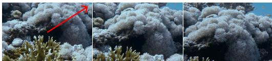  
Prompt: “A tall tree at the high hill.”

Prompt: “A campfire burning.”  
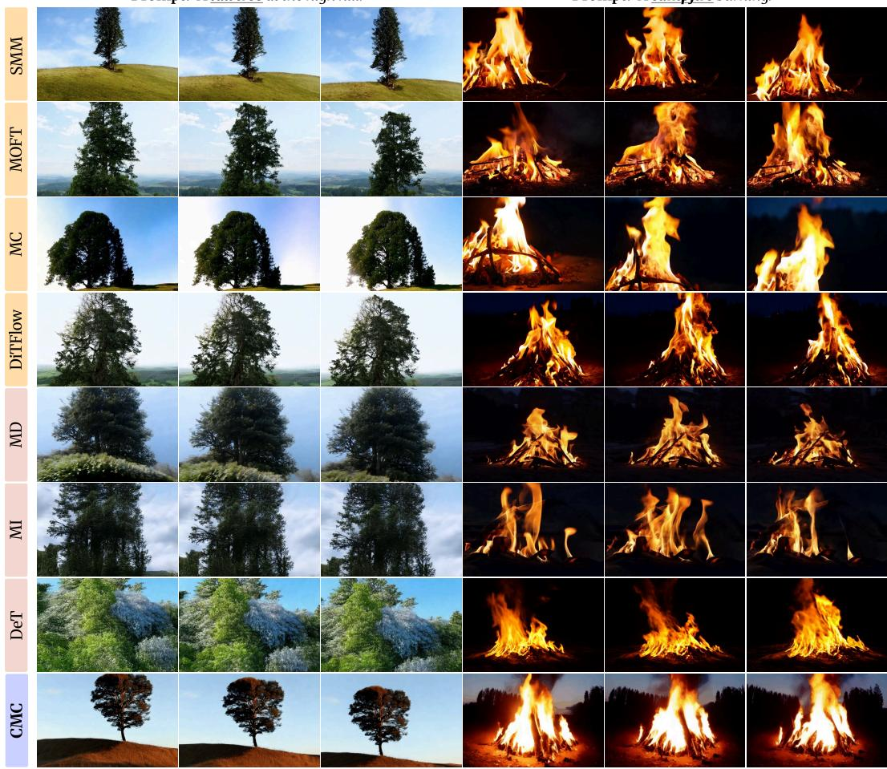  
Figure S1: Additional qualitative comparison with baselines. The red arrow indicates the camera movement direction. Best seen as video: link.

As shown in Tab. S4(b), our full setting achieves the best overall performance. Empirically, we observe that while a sufficiently large weight is necessary to initiate motion transfer at early timesteps, maintaining a high cost throughout the entire training process can lead to optimization instability and fast drifts (Fig. 6). By combining the hybrid temporal schedule with an iteration-wise decay, we achieve a robust balance between precise motion alignment and generative stability. Our final weight $w ( t )$ is defined as:

$$
w ( t ) = \lambda _ { 0 } \cdot \tilde { w } ( t ) \cdot \gamma ( n ) ,\tag{26}
$$

where we use $\lambda _ { 0 } = 4 0 0$ . The term $\tilde { w } ( t )$ represents the hybrid temporal schedule, and $\gamma ( n )$ denotes the iteration-wise decay:

$$
\tilde { w } ( t ) = \{ \begin{array} { l l } { 1 } & { t \leq 5 } \\ { \frac { 1 0 - t } { 5 } } & { 5 < t \leq 1 0 } \\ { 1 } & { 5 } \end{array} , \quad \gamma ( n ) = \{ \begin{array} { l l } { 5 0 } & { n \leq 3 0 } \\ { 3 0 } & { 3 0 < n \leq 5 0 } \\ { 1 0 } & { 5 0 < n \leq 1 0 0 } \\ { 5 } & { 1 0 0 < n \leq 2 0 0 } \\ { 1 } & { n > 2 0 0 } \end{array}\tag{27}
$$

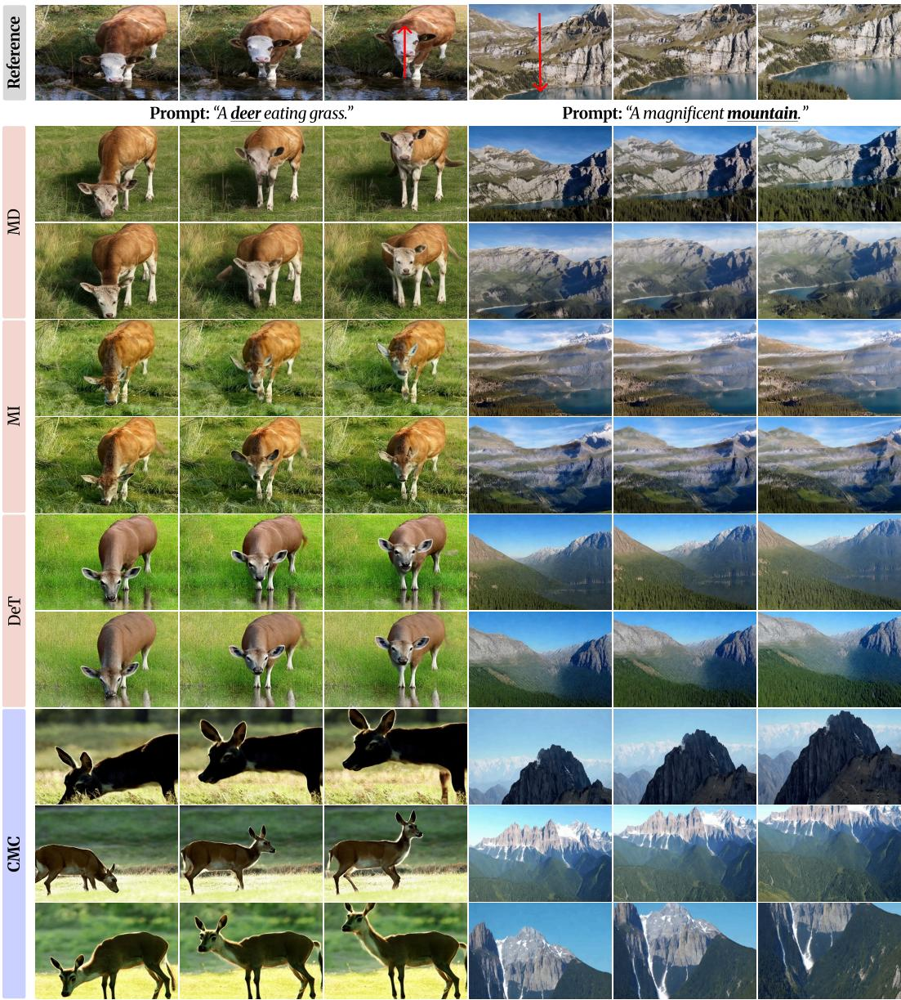  
Figure S2: Comparison with tuning-based methods. Tuning-based methods suffer from content leakage, producing near-identical samples that resemble the reference video, whereas CMC generates diverse samples. The red arrow indicates the movement direction.

Choice of DiT Block. We examine which DiT block is most effective for extracting the features used in our running cost $\ell ( X _ { t } , t )$ . As shown in Tab. ${ \mathrm { S 4 } } ( { \mathrm { c } } ) ,$ , Block 15 achieves the best performance in both motion fidelity and diversity. This indicates that intermediate layers capture the most discriminative motion representations without over-constraining the generative process. This optimal balance confirms that intermediate-depth features effectively shape the trajectory while preserving the model’s inherent generative richness. Additionally, the ablation on the local window size is provided in Tab. S4(d).

“A dog lying on the floor”  
“A fancy car in the garage”  
“A beautiful flower, close-up”  
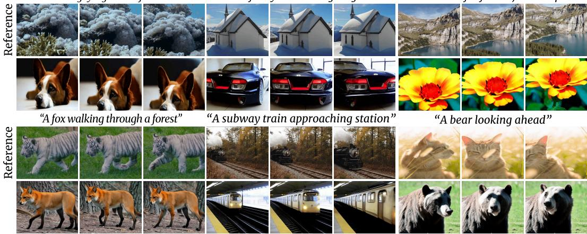  
Figure S3: More qualitative results of CMC.

Table S4: Further ablation studies.
<table><tr><td rowspan=1 colspan=1>ts</td><td rowspan=1 colspan=1>Training  Mem</td><td rowspan=1 colspan=1>MF↓ Div ↑</td></tr><tr><td rowspan=1 colspan=1>5</td><td rowspan=2 colspan=1>195.6min27.5GB348.7min30.9GB</td><td rowspan=4 colspan=1>0.03430.24530.03350.23310.03920.21980.04210.2071</td></tr><tr><td rowspan=1 colspan=1>10</td></tr><tr><td rowspan=1 colspan=1>20</td><td rowspan=1 colspan=1>682.0min37.4GB</td></tr><tr><td rowspan=1 colspan=1>28</td><td rowspan=1 colspan=1>944.6min42.4GB</td></tr></table>

(a) Motion injection timestep

<table><tr><td rowspan=1 colspan=1>w(t)</td><td rowspan=1 colspan=1>MF↓ Div↑</td></tr><tr><td rowspan=1 colspan=1>Constant</td><td rowspan=1 colspan=1>0.033 0.3162</td></tr><tr><td rowspan=1 colspan=1>Linear</td><td rowspan=1 colspan=1>0.061 0.2446</td></tr><tr><td rowspan=1 colspan=1>Hybrid</td><td rowspan=1 colspan=1>0.090 0.2389</td></tr><tr><td rowspan=1 colspan=1>Óurs</td><td rowspan=1 colspan=1>0.0190.2515</td></tr></table>

(b) Cost weight schedule

<table><tr><td rowspan=1 colspan=1>Block</td><td rowspan=1 colspan=1>MF↓  Div↑</td></tr><tr><td rowspan=1 colspan=1>10</td><td rowspan=1 colspan=1>0.0343 0.2180</td></tr><tr><td rowspan=1 colspan=1>15</td><td rowspan=1 colspan=1>0.019 0.2515</td></tr><tr><td rowspan=1 colspan=1>20</td><td rowspan=1 colspan=1>0.08780.2210</td></tr><tr><td rowspan=1 colspan=1>30</td><td rowspan=1 colspan=1>0.03230.2199</td></tr></table>

(c) DiT Block

<table><tr><td>Window</td><td>MF↓</td><td>Div↑</td></tr><tr><td>None</td><td>0.1367</td><td>0.2501</td></tr><tr><td>(3, 3)</td><td>0.1319</td><td>0.2468</td></tr><tr><td>(7,7)</td><td>0.0685</td><td>0.2505</td></tr><tr><td>(9,9)</td><td>0.019</td><td>0.2515</td></tr></table>

(d) Window size

“A deer eating grass”  
“A fancy car in the garage”  
“A lion moving its head”  
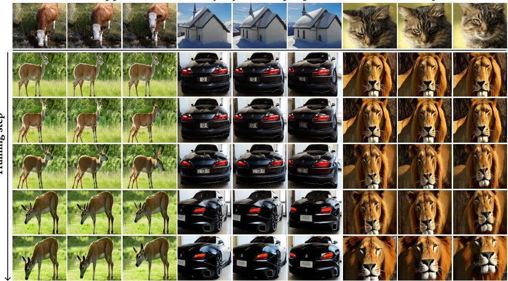  
Figure S4: Training behavior of CMC.