# DepthWorld: 3D World Model for Robot Manipulation

Jai Bardhan jai.bardhan@cvut.cz

Josef Sivic josef.sivic@cvut.cz

Vladimir Petrik vladimir.petrik@cvut.cz

Czech Institute of Informatics, Robotics and Cybernetics Czech Technical University in Prague

€ www.jaibardhan.com/depthworld

Abstract: World models offer a data-driven alternative to traditional simulators for robotics, with applications spanning policy evaluation, improvement, and planning. All of these uses depend on faithful 3D geometry, yet current video-based world models are trained on RGB alone and produce rollouts that look correct frame-by-frame but do not compose into a consistent 3D world. Closing this gap requires progress on two fronts: large-scale 3D supervision for manipulation, and an architecture that can absorb it without disturbing strong pretrained video priors. We introduce a calibration pipeline that combines learned stereo depth with a joint factor graph, pooling all episodes collected from the same physical robot to recover its shared kinematic parameters alongside per-scene extrinsics. Applied to the DROID dataset, this yields DROID-3D, a calibrated 3D dataset providing dense metric depth and recalibrated multi-view extrinsics (achieving < 0.7px reprojection error on 90% of episodes for external cameras). We then train Depth-World, a Stable Video Diffusion-based world model that jointly predicts multiview RGB and depth via spatial latent tiling, leaving the pretrained Variational Autoencoder (VAE) unchanged. Depth supervision improves RGB prediction itself by +1.48 dB PSNR over an identical RGB-only baseline at equal training budget, while simultaneously yielding accurate metric depth for downstream geometric reasoning.

Keywords: 3D World Models, Robots, Learning

## 1 Introduction

World models are a promising data-driven alternative to traditional simulators for robot learning, with the potential to simulate manipulation tasks that are difficult to capture with physics-based engines. Recent work has shown that finetuning pretrained video diffusion backbones with action conditioning on large-scale robotics datasets yields models that generate faithful action-consistent rollouts [1, 2]. Such rollouts are increasingly used for policy evaluation [1, 2], policy improvement [1, 3], and planning [4, 5]—uses in which the geometric fidelity of the rollout determines whether the signal is usable.

However, current video world models miss this geometric structure entirely. They are trained on RGB alone, and the training loss provides no signal to resolve the underlying 3D ambiguity of pixel sequences. The resulting models produce visually plausible rollouts whose geometry is internally incoherent: predicted depth disagrees across views of the same scene, the model struggles with geometric reasoning about occlusion and contact (Figure 4), and object shape and identity degrade over the course of a rollout (Figure 1). For downstream uses that read off the rollout, this incoherence is the limiting factor.

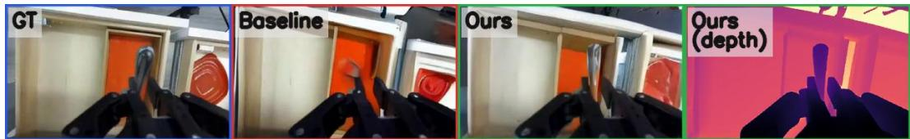  
Figure 1: DepthWorld: The RGB-only baseline fails to maintain the shape of the cutlery, and the object disappears. DepthWorld capitalizes on the depth inputs to accurately maintain the cutlery’s shape throughout the rollout while producing high-quality metric depth maps.

The natural fix is to supervise geometry directly during training, the recipe behind recent geometric foundation models [6, 7, 8, 9, 10, 11]. However, this approach does not directly apply to robot world models for two reasons. First, geometric foundation models earn their generalization by training on datasets that already carry metric depth and calibrated poses [12, 13, 14, 15, 16, 17]. Robot teleoperation datasets such as DROID [18] capture the appearance and dynamics of real manipulation at scale, but their geometric annotations are secondary outputs of the collection pipeline and not at the quality geometric pretraining demands. Lifting them into supervision-quality 3D is non-trivial: manipulation scenes are dominated by textureless and specular surfaces, and even a rig that is internally self-consistent under bundle adjustment can be kinematically decoupled from from the robot’s own coordinate frame, severing the critical link to the robot’s proprioception and end-effector ac tions. Second, current video world models rely on delicate, pretrained image and video diffusion priors. Conventional architectural modifications for incorporating spatial modalities—such as expanding the input channels of the VAE or introducing parallel dual-branch U-Nets—require destructive weight re-initializations. These interventions risk corrupting the strong visual and motion priors that make these foundation backbones effective in the first place.

## We address both through the following contributions:

1. We introduce a calibration pipeline for recovering metric depth and accurate multi-view extrinsics from any multi-view stereo teleoperation collection with a known URDF. The pipeline combines learned stereo depth with a joint factor graph optimization that pools all episodes of the same physical robot to recover its shared kinematic parameters (joint offsets, hand-eye calibration) alongside per-scene extrinsics. Applied to DROID [18], this yields DROID-3D—a calibrated 3D corpus providing dense metric depth and recalibrated multi-view extrinsics for over 70,000 episodes.

2. We train DepthWorld, a Stable Video Diffusion-based world model that jointly predicts multiview RGB and depth via spatial latent tiling that leaves the pretrained VAE unchanged.

3. We show that depth supervision improves RGB prediction: at equal training budget, Depth World gains +1.48 dB PSNR over an RGB-only baseline of identical architecture and data.

## 2 Related Work

Robotic World Models. Action-conditioned video models have emerged as a learned substitute for physics-based simulators in manipulation, with applications spanning policy evaluation [1, 2], policy improvement [1, 3], and visual planning [4, 5]. Recent works finetune pretrained video diffusion backbones with proprioceptive action conditioning: Ctrl-World [1], an SVD-based controllable world model trained on DROID [18] forms our backbone; IRASim [19] along with other works [20] systematize the policy-evaluation use case. All these uses presuppose geometrically faithful rollouts. Current video world models are trained on RGB alone, which does not generally serve as a strong geometric prior. We close this gap by jointly predicting depth and supervising with point maps.

Geometric Foundation Models. A recent line of work regresses dense metric geometry directly from images: DUSt3R [6] and MASt3R [7] predict point maps from image pairs, VGGT [8] scales this to many-view inputs through intermediate camera and DPT [21] heads, and MapAnything [11] unifies a broader class of supervision targets. These models inherit their generalization from large datasets [12, 13, 14, 15, 16, 17, 22] carrying dense metric depth and calibrated poses, drawn from structured light, LiDAR, and offline reconstruction. None of these covers the visual distribution of real manipulation, with its indoor setting and extreme viewpoint differences between fixed external and wrist-mounted cameras. DROID-3D is our contribution at this distribution and scale.

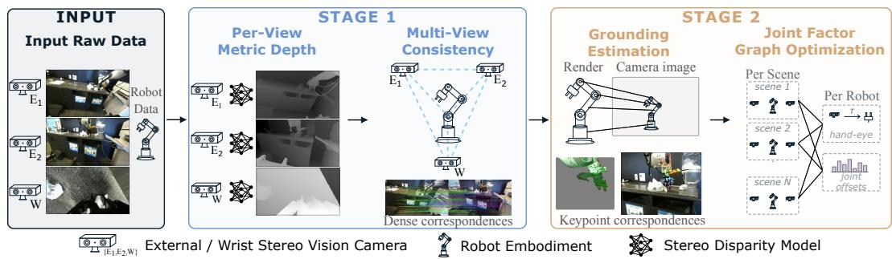  
Figure 2: DROID-3D calibration pipeline. Given raw stereo from two external cameras and a wrist-mounted camera together with the robot’s URDF and joint encoder readings, Stage 1 recovers per-view metric depth from each stereo pair via a learned global-matching network and uses dense correspondences to enforce multi-view consistency. Stage 2 renders the URDF into each external view to ground the rig to the robot frame, then forms a joint factor graph that pools all episodes of a robot to recover per-scene extrinsic corrections $( \delta T _ { \mathrm { e x t 1 } } ^ { s } , \delta T _ { \mathrm { e x t 2 } } ^ { s } )$ alongside shared kinematic parameters (hand-eye correction $\delta T _ { \mathrm { w r i s t } }$ , joint encoder offsets δq).

Depth-Aware Video Diffusion. Stable Video Diffusion (SVD) [23] provides strong appearance and motion priors but is trained on RGB alone. Three approaches have been explored to add depth into this prior. Marigold [24] showed that an image diffusion VAE encodes depth maps essentially without loss, repurposing the model as a depth predictor; DepthCrafter [25] extends this to video. Joint RGB–depth prediction has been pursued through channel expansion [4, 26], which adds depth channels to the VAE’s input and output convolutions and through dual-branch architectures [27] that run a parallel U-Net for depth with cross-connections to the RGB branch. Both modify the pretrained backbone substantially, preventing weight transfer. Our spatial latent tiling extends Marigold’s observation from single-image depth prediction to multi-view RGB–depth video prediction.

Robot Datasets and Their Calibration. Large-scale teleoperation datasets have grown rapidly in size and diversity—BridgeData V2 [28], RT-1 [29] and the Open X-Embodiment aggregation [30], RH20T [31], and DROID [18]—however; almost all carry geometry as a byproduct of the capture pipeline: monocular RGB in Open X, single RGB-D in Bridge, and ZED stereo in DROID. Simulation-based corpora such as RoboCasa [32] and ARNOLD [33] carry perfect geometry but inherit the sim-to-real gap that motivates training world models on real data in the first place. DROID is unique among real-world manipulation datasets at this scale in providing synchronized multi-view stereo with known baselines and a publicly released URDF, but its shipped geometric metadata is not at the quality level downstream geometric learning depends on. Post-hoc recalibration of DROID has been attempted: PointWorld [34] initializes per-scene extrinsics from VGGT and refines them against robot depth observations, and serves as our baseline in §5.

## 3 Constructing Large-scale 3D Datasets for Robot Manipulation

The recent progress in learning-based geometric vision models rests heavily on large-scale datasets providing dense metric depth and calibrated camera poses. The manipulation domain lacks these resources at a comparable scale. While large teleoperation datasets like DROID [18] provide the necessary visual diversity and embodied dynamics, their raw geometric annotations are not at the supervision quality required for geometric pretraining.

We propose an approach that takes a multi-view stereo teleoperation dataset with a known kinematic model (URDF) as input and produces a calibrated RGB-D corpus in the robot’s coordinate frame. Our approach addresses the domain’s unique visual and calibration challenges in two distinct stages, shown in Figure 2 and described in the following sections.

## 3.1 Stage 1: Initial Multi-View Calibration

Stage 1 turns the independently calibrated cameras of each scene into an internally consistent rig placed approximately in the robot’s coordinate frame, good enough that the robot’s URDF can be rendered into each view and matched against the real image in Stage 2.

Per-View Metric Depth. Each camera is a calibrated stereo pair with a known baseline b and focal length $f ,$ so metric depth reduces to predicting per-pixel disparity $d ,$ with $z = f b / d .$ . Manipulation scenes are dominated by textureless tabletops and specular robot arms, causing classical stereo SDKs to fail. To overcome this visual ambiguity, we recover per-view metric depth from each stereo pair using a learned global-matching network, $S ^ { 2 } M ^ { 2 }$ [35]. This provides the boundary-sharp metric signal necessary to turn cross-view pixel correspondences into reliable 3D constraints (see Appendix A.1 for an ablation against monocular and SDK baselines).

Multi-View Consistency. The initial camera calibrations lack full multi-view consistency, and the extreme viewpoint differences between external and wrist-mounted cameras defeat sparse keypoint matchers. We utilize the metric depth above alongside dense feature matching via RoMa v2 [36] to perform robust bundle adjustment. Because wrist–external matches are markedly noisier than external–external ones, a joint solve over all three cameras settles in poor local minima, so we optimize in two passes. Pass 1 aligns the two external cameras $( E _ { 1 } , E _ { 2 } )$ into a consistent pair by minimizing their mutual Cauchy photometric residual. Pass 2 places this pair in the robot frame: the wrist camera pose is held fixed from forward kinematics and the factory hand-eye prior, and a single global SE(3) transform of the external pair is solved to best explain the wrist–external correspondences. The output is a per-scene rig that is only approximately in the robot’s base frame, since it still inherits the systematic hand-eye and joint-encoder errors of the factory priors; removing these is the role of Stage 2. Details of the two-pass formulation, correspondence filtering, and sparse-matcher failure modes are in Appendix A.2.

## 3.2 Stage 2: Robot-Grounded Joint Optimization

The input to this stage comprises the visually consistent per-scene multi-camera rigs produced in Stage 1, alongside the robot’s URDF and raw joint encoder readings. The output is a set of refined camera extrinsics firmly anchored to the robot’s physical base frame, coupled with globally optimized, robot-specific kinematic parameters (hand-eye transform and joint encoder offsets).

Achieving this physical grounding presents two primary difficulties. First, visual reprojection consistency is invariant to rigid drift. A camera rig can be internally self-consistent but physically misaligned with the robot’s coordinate frame, which breaks the object-arm spatial relationships required for manipulation. Second, it is notoriously difficult to disentangle scene-specific camera calibration noise from systematic, robot-wide errors, such as constant joint encoder biases or gradual hand-eye mount drift. Optimizing scenes independently simply absorbs these hidden, systematic errors into the per-scene extrinsics.

We overcome these challenges through a joint factor graph optimization that pools visual and kinematic signals across all episodes of a given robot. By rendering the robot arm into the camera views using the URDF and matching it to the real images, we tie the extrinsics to the real world. By opti mizing all scenes simultaneously, we cleanly separate transient, scene-specific extrinsic noise from the shared kinematic parameters, multiplying the correction signal for the latter by the number of episodes. Details are given next.

Kinematic Anchoring via Rendering. To supply the absolute anchor to the robot frame that crossview consistency alone cannot provide (the first difficulty above), we render the robot arm into each external view utilizing the URDF, the corrected joint angles, and the Stage 1 extrinsic estimates, and use LoMA-G [37] to extract 2D-3D correspondences between the rendered template and the real image. Each match links a rendered surface point, whose 3D position in the robot frame is known from the URDF and forward kinematics, to a real-image pixel, yielding a robot-frame ground-truth signal independent of any cross-view photometric cue. Simultaneously, patch-level features [38] extracted by LoMA-G provide a featuremetric alignment term that yields sub-pixel signals in textureless regions. Rendering details (cropping, non-PBR shading) are given in Appendix B.1.

Joint Factor Graph Construction. We build a single factor graph that spans all $N _ { s }$ episodes of a given robot (indexed $s \in \{ 1 , \ldots , N _ { s } \} )$ . Two kinds of parameters enter the graph: per-episode corrections to the external camera poses, which absorb scene-specific calibration noise, and shared kinematic parameters of the robot itself, which are tied across every episode of the robot. Concretely, each episode contributes a 6-DoF SE(3) correction $\delta T _ { \mathrm { e x t 1 } } ^ { s }$ and $\delta T _ { \mathrm { e x t 2 } } ^ { s }$ for each external camera (12 DoF per episode), and all episodes share a 6-DoF hand-eye correction $\delta T _ { \mathrm { w r i s t } }$ to the CAD-specified gripper-to-wrist-camera mount, together with 7-DoF joint encoder offsets $\delta \mathbf { q } .$ . The wrist camera is rigidly mounted to the gripper, so its pose has no per-episode degrees of freedom — at frame t it is fully determined by the kinematic chain:

$$
T _ { \mathrm { w o r l d , w r i s t } } ( t ) = T _ { \mathrm { w o r l d , g r i p p e r } } ( \pmb { q } ( t ) + \delta \pmb { q } ) \cdot T _ { \mathrm { g r i p p e r , w r i s t } } ^ { \mathrm { C A D } } \cdot \delta T _ { \mathrm { w r i s t } } ,\tag{1}
$$

where $T _ { \mathrm { w o r l d , g r i p p e r } } ( \pmb { q } )$ is the base-to-gripper forward kinematics evaluated at the corrected joint angles, $T _ { \mathrm { g r i p p e r , w r i s t } } ^ { \mathrm { C A D } }$ is the CAD-specified gripper-to-wrist-camera mount, and $\delta T _ { \mathrm { w r i s t } }$ is the optimized correction to that mount.

Robust Objective. The objective unifies these constraints into a single robust loss over the tens to ∼100,000 parameters of one robot’s graph (varying with episode count):

$$
\mathcal { L } = \sum _ { k \in \{ 2 \mathrm { d } , 3 \mathrm { d } , 1 , \mathrm { e e } , \mathrm { f } \} } \lambda _ { k } \sum _ { s , i } \rho \big ( \| r _ { s , i } ^ { k } \| ^ { 2 } ; c _ { k } \big ) + \lambda _ { q } \| \delta \pmb { q } \| ^ { 2 } ,\tag{2}
$$

where $\rho ( \cdot ; c )$ is the Cauchy loss with scale $c , s$ indexes episodes, and i indexes residuals within an episode. The five data terms each constrain a different part of the graph: Mahalanobis-whitened wrist–external 2D reprojections (2d) and 3D metric lifting residuals (3d) tie the kinematic chain of Eq. (1), and thus $\delta T _ { \mathrm { w r i s t } }$ and $\delta \mathbf { q } .$ , to the external cameras; URDF-rendered robot reprojections (l) ground the external extrinsics to the robot frame; cross-camera constraints (ee) keep the external pair consistent; and featuremetric alignment (f) adds sub-pixel signal in textureless regions. The Tikhonov term $\lambda _ { q } \| \delta \pmb q \| ^ { 2 }$ regularizes under-constrained components of $\delta \pmb q .$ , letting the more flexible per-episode parameters explain residuals in those directions.

Scalable Optimization. Solving this massive graph is bottlenecked by scale, but the Hessian exhibits a highly sparse block structure. We leverage a GPU-accelerated Levenberg-Marquardt solver using the Schur complement. This effectively eliminates the per-scene blocks, reducing the bottleneck to a highly efficient 13 × 13 global solve per iteration. This drops the computational cost from cubic-in-N to $O ( N _ { s } \cdot 1 2 ^ { 3 } + 1 3 ^ { 3 } )$ , keeping typical wall time to roughly 12.5 minutes per robot group.

## 3.3 DROID-3D

We run this pipeline on DROID’s raw release [18], the 71k-trajectory split that ships with the factory camera parameters. The recordings come from 13 institutions on Franka Panda arms, each with two table-mounted ZED 2 external cameras and a wrist-mounted ZED Mini. After per-robot filtering for broken metadata or unrecoverable initialization, we run across 28 robots and 13 labs covering 71,100 scenes. Calibration quality against a per-scene baseline is reported in §5; hyperparameters and solver wall-time in Appendix B.4.

## 4 Building a 3D-Consistent World Model

The objective of DepthWorld is to generate video rollouts where predicted depth and RGB compose into a single, geometrically consistent 3D world, rather than just independent, visually plausible frames. We achieve this by consuming the dense metric depth and calibrated extrinsics of DROID-3D as a direct training signal.

Integrating geometric prediction into state-of-the-art video world models presents two primary diffi culties. First, modifying a pretrained backbone like Stable Video Diffusion (SVD) (e.g., via channel expansion or dual-branch networks) destroys the strong appearance and motion priors that make the model useful in the first place. Second, supervising depth independently per-view does not directly encourage 3D consistency across different cameras.

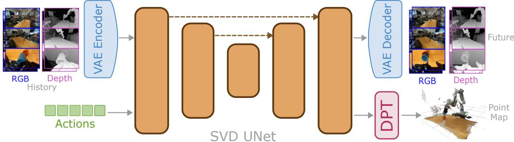  
Figure 3: DepthWorld Architecture. Multi-view RGB and depth are independently encoded into a spatially tiled latent grid $( 7 2 \times 8 0 )$ for joint U-Net denoising, preserving pretrained SVD priors. Predicted future latents $( x _ { 0 , f } )$ pass through a DPT head to predict a 3D point map $( X , Y , Z )$ and confidence logit in the robot base frame, supervised by a robust geometric loss.

We overcome these challenges through two mechanisms. First, rather than altering the U-Net architecture, we introduce spatial latent tiling (§4.1) to exploit the Variational Autoencoder’s (VAE) natural ability to encode depth as an image, placing RGB and depth side-by-side in a wider latent grid. Second, to enhance cross-view consistency, we apply robot-frame auxiliary supervision (§4.2) through a lightweight point-map head that projects predictions into the robot’s physical base frame and supervises them against unified 3D point maps.

## 4.1 Joint RGB-Depth Prediction via Spatial Tiling

Marigold [24] showed that an image-diffusion VAE encodes and decodes depth maps faithfully. Building on this, we encode depth as a separate image alongside RGB and tile the two in latent space: each is encoded by the unmodified SVD VAE and placed side-by-side, so the U-Net sees a wider latent grid covering both modalities. The only network change is extending the spatial position embeddings to cover the wider grid.

At each timestep, the model processes images of resolution 192 × 320 for V = 3 cameras (two external, one wrist) and two modalities (RGB, depth). Since the SVD VAE downsamples spatially by 8×, each view-modality tile is independently encoded into a latent of dimensions $H _ { l a t } \times W _ { l a t }$ (where $H _ { l a t } = 2 4 , W _ { l a t } = 4 0 )$ . We arrange the six tiles in a 2D grid: RGB and depth tiles for each view are concatenated horizontally (yielding width $2 \cdot W _ { l a t } )$ , and the V views are stacked vertically (yielding height $V \cdot H _ { l a t } )$ . This produces a single joint latent of shape $7 2 \times 8 0$ per timestep (see Figure 3). The U-Net denoises this full grid as one tensor across a temporal window of 11 frames (6 history, 5 future) at 5 Hz. (See Appendix C.1 for the depth preprocessing pipeline required to conform the raw depth to the VAE distribution.)

## 4.2 Robot-Frame Point-Map Supervision

Per-view depth denoising trains each predicted depth map against its own target independently, with no explicit penalty when predicted depths disagree across different camera views of the same scene. We make cross-view coherence explicit by lifting predictions into the robot base frame and computing the loss there.

We do so by attaching a lightweight DPT [21] point-map head (initialized from VGGT [8]) to the SVD U-Net’s final predicted latent ${ \hat { x } } _ { 0 }$ . For the predicted future frames ${ \hat { x } } _ { 0 , f } ,$ we pass the (RGB, depth) latent pairs to the DPT head, which predicts a 3D point map in robot base coordinates for each view. The ground-truth point map $P _ { v , t } ^ { * } \in \mathbb { R } ^ { H \times W \times 3 }$ for view v at frame t is obtained by backprojecting the GT depth through the camera intrinsics and transforming it to the robot base frame via the calibrated extrinsics from §3.

The head outputs four channels per frame and view: spatial coordinates X, Y, Z (the point-map prediction $P _ { v , t }$ in robot world frame) and a per-pixel confidence logit. We pass the logit through a softplus to obtain the positive confidence $C _ { v , t } ( u ) > 0$ . Following DUSt3R [6] and MapAnything [11], the loss is confidence-weighted in log space, with Barron’s robust $\rho$ [39].

## Training Schedule

We initialize from the SVD checkpoint used by Ctrl-World [1], utilizing identical action conditioning (per-frame end-effector pose). The combined training objective is $\mathcal { L } = \mathcal { L } _ { d e n o i s e } + \lambda _ { p m } \mathcal { L } _ { p m }$ . We train in two stages for stability. Stage 1 trains the joint RGB-depth model alone for 40,000 steps $( \lambda _ { p m } = 0 )$ , allowing the model to learn the joint latent distribution. Stage 2 initializes the DPT head from VGGT and trains all components jointly for an additional 50,000 steps $( \lambda _ { p m } = 0 . 0 0 5 )$ ).

## 5 Experiments

We evaluate both contributions empirically: the calibration quality of DROID-3D against a per-scene baseline, and the world model prediction accuracy on held-out trajectories.

DROID-3D evaluation setup and baseline. We evaluate calibration on 5 DROID labs (∼1,000 scenes total). Our baseline is a per-scene refinement procedure modeled on PointWorld [34]: VGGT [8] extrinsic initialization followed by per-scene optimization against robot depth, with S2M2 [35] substituted as the depth source to match ours. We use four geometric proxy metrics: ext–ext (EE) and wrist–ext (WE) reprojection error on MAGSAC [40] gold inliers, robot depth error (RD) between $\mathrm { { { S ^ { 2 } } M ^ { 2 } } }$ and URDF-rendered depth, and Mask IoU between the URDF-rendered robot mask and a RoboEngine [41] segmentation. Full definitions are in Appendices D.1–D.2.

Additionally, we replicated the DROID setup in our lab and recorded 5 ground truth (GT) poses of the cameras as well as the robot joint offsets using a ChArUco board. Using this GT setup, we measure the average rotation error and translation error in the optimized poses. We test the pose accuracy using 50 synthetic scenes from the REALM simulator [42].

DROID-3D calibration accuracy. Table 1 reports results on the full evaluation set and on the subset where the baseline converges. The gap is large on every axis: 23× improvement on EE, 13× on WE, 8× on RD, and +37 absolute points on IoU; This substantial gap remains even when restricting evaluation to the subset of scenes where the baseline successfully converges. Beyond accuracy, the baseline fails to converge on ∼18% of scenes (180 of 995); our coupled optimization has no analogous per-scene failure mode (per-factor ablations: Table A1; qualitative: Figure A10).

Accuracy to GT poses. On our GT setup, from teleoperation episodes alone, our approach recovers extrinsics to 4.9 mm/0.39◦ median error and hand-eye to 3 mm/0.3◦ across all five capture sets; joint offsets are recovered to 0.14◦ mean error across all seven joints. On the same set-up, the PointWorld-style per-scene baseline obtains 72 mm / 3.0◦ median error, an order of magnitude worse than ours. In REALM simulation with exact GT poses (50 configurations, varied viewpoints), our approach recovers extrinsics with 6.4 mm/0.3◦ median error.

World model evaluation setup and metrics. We evaluate on 256 held-out trajectories from DROID with 10 consecutive autoregressive rollouts. We compare three variants: RGB is the Ctrl-World [1] backbone (multi-view RGB only); RGB+D is our joint RGB-depth model; RGB+D PM-DPT adds the point-map auxiliary head. We report PSNR, SSIM [43], and LPIPS [44] for RGB, and AbsRel, RMSE, and $\delta _ { 1 }$ for depth, each computed separately for external and wrist views. Depth metrics are against the depth obtained in Sec. 3. Full protocol is in Appendix D.3.

Joint depth prediction improves RGB. Table 2 reports both modalities on the held-out set, with qualitative rollouts shown in Figure 4. Adding depth as a joint prediction target through spatial latent tiling delivers a clear gain on RGB quality: RGBD models outperform the RGB-only baseline on all three RGB metrics with +1.48 dB PSNR on external views and +1.02 dB on wrist.

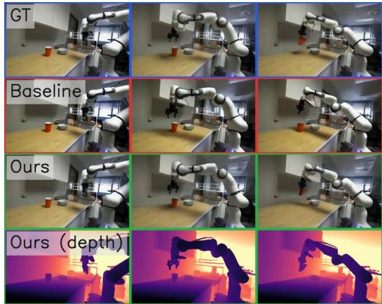

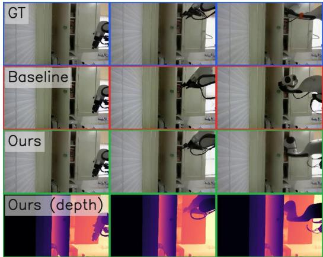  
Figure 4: Qualitative Result: We show two rollouts by the baseline RGB model and DepthWorld, which also produces high-quality depth. Left: The RGB-only model fails to simulate the robot grasping the red cup as in the GT trajectory. DepthWorld accurately simulates the interaction and produces an aligned depth map. Right: Without depth supervision, the RGB-only world model cannot distinguish the open wardrobe door from a solid surface and simulates the arm colliding with it. DepthWorld accurately generates the arm going inside the wardrobe by accounting for the depth of the arm and the door. See the project website for additional results, including videos.

Point-map supervision and DROID-3D’s downstream value. Adding the point-map auxiliary loss (PM-DPT) further refines depth accuracy—especially on the challenging wrist view – while fully maintaining RGB generation quality. This suggests that mapping RGB and depth into a shared, spatially tiled latent space already encourages the U-Net to learn strong cross-modality constraints. Consequently, the robot-frame auxiliary loss acts primarily as a fine-grained 3D regularizer rather than the sole driver of geometric learning. More broadly, PM-DPT serves as a working instance of how DROID-3D’s robot-grounded annotations can drive spatial supervision beyond independent per-view depth. This framework opens the door for future extensions, such as enforcing strict spatiotemporal (4D) consistency or enabling downstream policies to extract unified 3D representations directly from the world model’s internal latents.

Cross-view consistency improvements. We measure two quantities: (i) Cross-view reprojection: We warp one generated external view into the other using GT depth and poses. RGB+D model beats the RGB baseline model by +1.0 dB PSNR (17.60 vs. 16.60), and our PM-DPT head always improves by +0.05–0.08 dB over RGB+D. (ii) Cross-view generated-depth agreement: Our PM-DPT model reduces external-view projected depth disagreement by 2.6 mm compared to our RGBD model.

Comparison with other baselines. We compare against the existing world models for manipulation that predict future 3D geometry rather than RGB alone: PointWorld (PW) [34], which predicts 3D scene flow and is the only action-conditioned 3D world model trained on DROID, and TesserAct [4], which predicts RGB-D-normal video; iMoWM [26] has no public code. TesserAct is text-conditioned and single-view, so it is incomparable as is; we adapted it to action conditioning and trained it on the same DROID split. At 50k steps it trails our model: external PSNR 19.43 vs 24.07 (ours), AbsRel 0.154 vs 0.074 (ours); see Appendix D.5 for the adaptation and protocol. For PW, whose output is a point cloud rather than depth images, we compare predicted 3D trajectories of scene points (robot excluded), each model scored on its own depth target; see Appendix D.4, Table A5, and Figure A11. Tracked-point $\ell _ { 2 } ( 2 \to 8 \mathrm { s } )$ : PW 23→56 mm, ours 31→46 mm. Chamfer: whole scene PW 8→18 mm vs. ours 8→9 mm; moving region PW 21→58 mm vs. ours 25→32 mm.

Table 1: Calibration quality on ∼1,000 evaluation scenes. Blue rows: 2D multi-view consistency (medians on joint-MAGSAC gold inliers). Amber rows: 3D grounding to the robot frame. The right block restricts to the subset where the baseline’s per-scene refinement converges.
<table><tr><td rowspan="2">Metric</td><td colspan="2">All scenes (n = 995)</td><td colspan="2">PointWorld-converged subset (n = 815)</td></tr><tr><td>PointWorld [34]</td><td>Ours</td><td>PointWorld [34]</td><td>Ours</td></tr><tr><td>EE median (px) ↓</td><td>5.84</td><td>0.25</td><td>5.67</td><td>0.25</td></tr><tr><td>WE median (px) ↓</td><td>13.19</td><td>1.03</td><td>12.52</td><td>1.02</td></tr><tr><td>RD median (mm) ↓</td><td>111.3</td><td>14.0</td><td>104.6</td><td>13.9</td></tr><tr><td>Mask IoU mean ↑</td><td>0.440</td><td>0.810</td><td>0.458</td><td>0.819</td></tr></table>

Table 2: Ablation of world model prediction quality on held-out trajectories. Depth metrics are against obtained depth from Sec. 3. The RGB-only baseline does not predict depth (—). Joint depth prediction (RGB+D) improves all RGB metrics on both view classes; the point-map auxiliary loss (PM-DPT) further refines depth accuracy while maintaining RGB generation quality, specially on wrist metrics.
<table><tr><td colspan="2"></td><td colspan="3">RGB quality</td><td colspan="3">Depth quality</td></tr><tr><td>View</td><td>Model</td><td>PSNR↑</td><td>SSIM↑</td><td>LPIPS↓</td><td>AbsRel↓</td><td>RMSE↓</td><td> $\delta _ { 1 } \uparrow$ </td></tr><tr><td rowspan="3">External</td><td>RGB</td><td>22.63</td><td>0.8170</td><td>0.0930</td><td></td><td></td><td></td></tr><tr><td>RGB+D</td><td>24.09</td><td>0.8333</td><td>0.0889</td><td>0.0765</td><td>0.220</td><td>0.9432</td></tr><tr><td>RGB+D PM-DPT</td><td>24.11</td><td>0.8333</td><td>0.0891</td><td>0.0782</td><td>0.219</td><td>0.9434</td></tr><tr><td rowspan="3">Wrist</td><td>RGB</td><td>16.98</td><td>0.5737</td><td>0.3228</td><td></td><td></td><td></td></tr><tr><td>RGB+D</td><td>17.96</td><td>0.6106</td><td>0.3137</td><td>0.2230</td><td>0.150</td><td>0.8182</td></tr><tr><td>RGB+D PM-DPT</td><td>18.00</td><td>0.6129</td><td>0.3131</td><td>0.2182</td><td>0.148</td><td>0.8210</td></tr></table>

Appendix C ablates the training depth source (Table A3), the point-map supervision extrinsics (Table A4), and the depth-integration architecture (Table A2).

Depth quality is strongly view-dependent across both depth-augmented variants: $\delta _ { 1 } > 0 . 9 4$ on external views but ≈ 0.82 on wrist due to the wrist camera’s rapid motion, proximity to the manipulated object, and frequent self-occlusion by the arm.

Limitations. As an autoregressive rollout model, DepthWorld inherits the exposure bias and quality degradation common to such models [1]. However, recent works like PersistWorld [2] have shown that RL post-training can significantly improve rollout stability. The availability of high-quality 3D annotations in DROID-3D, combined with the native 3D-consistent outputs of DepthWorld, opens exciting new frontiers for geometric reward design in future world modelling.

## 6 Conclusion

We introduced two contributions toward 3D-consistent world models for robot manipulation. DROID-3D recalibrates the DROID dataset into a 3D corpus with dense metric depth and robotgrounded multi-view extrinsics across more than 70,000 episodes, through a factor graph that pools each robot’s episodes against shared kinematic parameters. DepthWorld consumes this signal in a Stable Video Diffusion-based world model that jointly predicts multi-view RGB and depth via spatial latent tiling. The central empirical finding is that at equal training budget, joint RGB-depth prediction improves RGB by +1.48 dB PSNR over an RGB-only baseline, while simultaneously yielding metric depth for downstream geometric reasoning. Together, DROID-3D and DepthWorld open a path toward world models whose rollouts compose into a single coherent 3D scene—the property all downstream uses, policy evaluation, improvement, and planning, depend on.

## Acknowledgments

This work was supported by the European Union’s Horizon Europe projects AGIMUS (No.   
101070165), euROBIN (No. 101070596), ERC FRONTIER (No. 101097822), ELIAS (No.

101120237), ELLIOT (No. 101214398), CVUT Starting grant ”DREAM-ACT” (Project ID CVUT-ˇ StG-26-089), and CTU Future Fund (Project ID: CVUT-BrF-26-22825M). This work was also supported by the EU’s Horizon Europe Programme under the Grant agreement No. 10113667 (CLARA Project), and was co-funded by the EU from the Operational Programme Jan Amos Komensky´ (OP JAK) (project “Center for Artificial Intelligence and Quantum Computing in System Brain Research”, reg. no. CZ.02.01.01/00/23 029/0008437). Compute resources and infrastructure were supported by the Ministry of Education, Youth and Sports of the Czech Republic through the e-INFRA CZ (ID:90254).

## References

[1] Y. Guo, L. X. Shi, J. Chen, and C. Finn. Ctrl-world: A controllable generative world model for robot manipulation. arXiv preprint arXiv:2510.10125, 2025.

[2] J. Bardhan, P. Drozdik, J. Sivic, and V. Petrik. Persistent robot world models: Stabilizing multi-step rollouts via reinforcement learning. arXiv preprint arXiv:2603.25685, 2026.

[3] Y. Du, S. Yang, B. Dai, H. Dai, O. Nachum, J. Tenenbaum, D. Schuurmans, and P. Abbeel. Learning universal policies via text-guided video generation. Advances in neural information processing systems, 36:9156–9172, 2023.

[4] H. Zhen, Q. Sun, H. Zhang, J. Li, S. Zhou, Y. Du, and C. Gan. Tesseract: learning 4d embodied world models. arXiv preprint arXiv:2504.20995, 2025.

[5] L. Russell, A. Hu, L. Bertoni, G. Fedoseev, J. Shotton, E. Arani, and G. Corrado. Gaia-2: A controllable multi-view generative world model for autonomous driving. arXiv preprint arXiv:2503.20523, 2025.

[6] S. Wang, V. Leroy, Y. Cabon, B. Chidlovskii, and J. Revaud. Dust3r: Geometric 3d vision made easy. In Proceedings of the IEEE/CVF conference on computer vision and pattern recognition, pages 20697–20709, 2024.

[7] V. Leroy, Y. Cabon, and J. Revaud. Grounding image matching in 3d with mast3r. In European conference on computer vision, pages 71–91. Springer, 2024.

[8] J. Wang, M. Chen, N. Karaev, A. Vedaldi, C. Rupprecht, and D. Novotny. Vggt: Visual geometry grounded transformer. In Proceedings of the Computer Vision and Pattern Recognition Conference, pages 5294–5306, 2025.

[9] Y. Wang, J. Zhou, H. Zhu, W. Chang, Y. Zhou, Z. Li, J. Chen, J. Pang, C. Shen, and T. He. pi3: Permutation-equivariant visual geometry learning. arXiv preprint arXiv:2507.13347, 2025.

[10] H. Lin, S. Chen, J. Liew, D. Y. Chen, Z. Li, G. Shi, J. Feng, and B. Kang. Depth anything 3: Recovering the visual space from any views. arXiv preprint arXiv:2511.10647, 2025.

[11] N. Keetha, N. Muller, J. Sch¨ onberger, L. Porzi, Y. Zhang, T. Fischer, A. Knapitsch, D. Zauss,¨ E. Weber, N. Antunes, et al. Mapanything: Universal feed-forward metric 3d reconstruction. arXiv preprint arXiv:2509.13414, 2025.

[12] C. Yeshwanth, Y.-C. Liu, M. Nießner, and A. Dai. Scannet++: A high-fidelity dataset of 3d indoor scenes. In Proceedings of the IEEE/CVF International Conference on Computer Vision, pages 12–22, 2023.

[13] G. Baruch, Z. Chen, A. Dehghan, T. Dimry, Y. Feigin, P. Fu, T. Gebauer, B. Joffe, D. Kurz, A. Schwartz, et al. Arkitscenes: A diverse real-world dataset for 3d indoor scene understanding using mobile rgb-d data. arXiv preprint arXiv:2111.08897, 2021.

[14] J. Reizenstein, R. Shapovalov, P. Henzler, L. Sbordone, P. Labatut, and D. Novotny. Common objects in 3d: Large-scale learning and evaluation of real-life 3d category reconstruction. In Proceedings of the IEEE/CVF international conference on computer vision, pages 10901– 10911, 2021.

[15] Z. Li and N. Snavely. Megadepth: Learning single-view depth prediction from internet photos. In Proceedings of the IEEE conference on computer vision and pattern recognition, pages 2041–2050, 2018.

[16] Y. Yao, Z. Luo, S. Li, J. Zhang, Y. Ren, L. Zhou, T. Fang, and L. Quan. Blendedmvs: A largescale dataset for generalized multi-view stereo networks. In Proceedings of the IEEE/CVF conference on computer vision and pattern recognition, pages 1790–1799, 2020.

[17] S. K. Ramakrishnan, A. Gokaslan, E. Wijmans, O. Maksymets, A. Clegg, J. Turner, E. Undersander, W. Galuba, A. Westbury, A. X. Chang, et al. Habitat-matterport 3d dataset (hm3d): 1000 large-scale 3d environments for embodied ai. arXiv preprint arXiv:2109.08238, 2021.

[18] A. Khazatsky, K. Pertsch, S. Nair, A. Balakrishna, S. Dasari, S. Karamcheti, S. Nasiriany, M. K. Srirama, L. Y. Chen, K. Ellis, et al. Droid: A large-scale in-the-wild robot manipulation dataset. arXiv preprint arXiv:2403.12945, 2024.

[19] F. Zhu, H. Wu, S. Guo, Y. Liu, C. Cheang, and T. Kong. Irasim: A fine-grained world model for robot manipulation. In Proceedings of the IEEE/CVF International Conference on Computer Vision, pages 9834–9844, 2025.

[20] F. Jiang, Y. Chen, K. Xu, Y. Liu, H. Wang, Z. Shen, J. Lu, S. Huang, Y. Wang, C. Xie, et al. Robowm-bench: A benchmark for evaluating world models in robotic manipulation. arXiv preprint arXiv:2604.19092, 2026.

[21] R. Ranftl, A. Bochkovskiy, and V. Koltun. Vision transformers for dense prediction. In Proceedings of the IEEE/CVF international conference on computer vision, pages 12179–12188, 2021.

[22] T. Zhou, R. Tucker, J. Flynn, G. Fyffe, and N. Snavely. Stereo magnification: Learning view synthesis using multiplane images. arXiv preprint arXiv:1805.09817, 2018.

[23] A. Blattmann, T. Dockhorn, S. Kulal, D. Mendelevitch, M. Kilian, D. Lorenz, Y. Levi, Z. English, V. Voleti, A. Letts, et al. Stable video diffusion: Scaling latent video diffusion models to large datasets. arXiv preprint arXiv:2311.15127, 2023.

[24] B. Ke, A. Obukhov, S. Huang, N. Metzger, R. C. Daudt, and K. Schindler. Repurposing diffusion-based image generators for monocular depth estimation. In Proceedings of the IEEE/CVF conference on computer vision and pattern recognition, pages 9492–9502, 2024.

[25] W. Hu, X. Gao, X. Li, S. Zhao, X. Cun, Y. Zhang, L. Quan, and Y. Shan. Depthcrafter: Generating consistent long depth sequences for open-world videos. In Proceedings of the IEEE/CVF Conference on Computer Vision and Pattern Recognition, pages 2005–2015, 2025.

[26] C. Zhang, Z. Wu, G. Lu, Y. Tang, and Z. Wang. imowm: Taming interactive multi-modal world model for robotic manipulation. arXiv preprint arXiv:2510.09036, 2025.

[27] E. Pallotta, S. M. Azar, S. Li, O. Zatsarynna, and J. Gall. Syncvp: joint diffusion for synchronous multi-modal video prediction. In Proceedings of the IEEE/CVF Conference on Computer Vision and Pattern Recognition, pages 13787–13797, 2025.

[28] H. R. Walke, K. Black, T. Z. Zhao, Q. Vuong, C. Zheng, P. Hansen-Estruch, A. W. He, V. Myers, M. J. Kim, M. Du, et al. Bridgedata v2: A dataset for robot learning at scale. In Conference on Robot Learning, pages 1723–1736. PMLR, 2023.

[29] A. Brohan, N. Brown, J. Carbajal, Y. Chebotar, J. Dabis, C. Finn, K. Gopalakrishnan, K. Hausman, A. Herzog, J. Hsu, et al. Rt-1: Robotics transformer for real-world control at scale. arXiv preprint arXiv:2212.06817, 2022.

[30] A. O’Neill, A. Rehman, A. Maddukuri, A. Gupta, A. Padalkar, A. Lee, A. Pooley, A. Gupta, A. Mandlekar, A. Jain, et al. Open x-embodiment: Robotic learning datasets and rt-x models: Open x-embodiment collaboration 0. In 2024 IEEE International Conference on Robotics and Automation (ICRA), pages 6892–6903. IEEE, 2024.

[31] H.-S. Fang, H. Fang, Z. Tang, J. Liu, C. Wang, J. Wang, H. Zhu, and C. Lu. Rh20t: A comprehensive robotic dataset for learning diverse skills in one-shot. arXiv preprint arXiv:2307.00595, 2023.

[32] S. Nasiriany, A. Maddukuri, L. Zhang, A. Parikh, A. Lo, A. Joshi, A. Mandlekar, and Y. Zhu. Robocasa: Large-scale simulation of everyday tasks for generalist robots. arXiv preprint arXiv:2406.02523, 2024.

[33] R. Gong, J. Huang, Y. Zhao, H. Geng, X. Gao, Q. Wu, W. Ai, Z. Zhou, D. Terzopoulos, S.-C. Zhu, et al. Arnold: A benchmark for language-grounded task learning with continuous states in realistic 3d scenes. In Proceedings of the IEEE/CVF International Conference on Computer Vision, pages 20483–20495, 2023.

[34] W. Huang, Y.-W. Chao, A. Mousavian, M.-Y. Liu, D. Fox, K. Mo, and L. Fei-Fei. Pointworld: Scaling 3d world models for in-the-wild robotic manipulation. arXiv preprint arXiv:2601.03782, 2026.

[35] J. Min, Y. Jeon, J. Kim, and M. Choi. S2m2: Scalable stereo matching model for reliable depth estimation. In Proceedings of the IEEE/CVF International Conference on Computer Vision, pages 26729–26739, 2025.

[36] J. Edstedt, D. Nordstrom, Y. Zhang, G. B ¨ okman, J. Astermark, V. Larsson, A. Heyden, F. Kahl,¨ M. Wadenback, and M. Felsberg. Roma v2: Harder better faster denser feature matching.¨ arXiv preprint arXiv:2511.15706, 2025.

[37] D. Nordstrom, J. Edstedt, G. B¨ okman, J. Astermark, A. Heyden, V. Larsson, M. Wadenb¨ ack,¨ M. Felsberg, and F. Kahl. Loma: Local feature matching revisited. arXiv preprint arXiv:2604.04931, 2026.

[38] M. Oquab, T. Darcet, T. Moutakanni, H. Vo, M. Szafraniec, V. Khalidov, P. Fernandez, D. Haziza, F. Massa, A. El-Nouby, et al. Dinov2: Learning robust visual features without supervision. arXiv preprint arXiv:2304.07193, 2023.

[39] J. T. Barron. A general and adaptive robust loss function. In Proceedings of the IEEE/CVF conference on computer vision and pattern recognition, pages 4331–4339, 2019.

[40] D. Barath, J. Noskova, M. Ivashechkin, and J. Matas. Magsac++, a fast, reliable and accurate robust estimator. In Proceedings of the IEEE/CVF conference on computer vision and pattern recognition, pages 1304–1312, 2020.

[41] C. Yuan, S. Joshi, S. Zhu, H. Su, H. Zhao, and Y. Gao. Roboengine: Plug-and-play robot data augmentation with semantic robot segmentation and background generation. In 2025 IEEE/RSJ International Conference on Intelligent Robots and Systems (IROS), pages 7622– 7629. IEEE, 2025.

[42] M. Sedlacek, P. Yefanov, G. Ponimatkin, J. Bardhan, S. Pilc, M. Fourmy, E. Kazakos, C. G. Snoek, J. Sivic, and V. Petrik. Realm: A real-to-sim validated benchmark for generalization in robotic manipulation. IEEE Robotics and Automation Letters, 2026.

[43] Z. Wang, A. C. Bovik, H. R. Sheikh, and E. P. Simoncelli. Image quality assessment: from error visibility to structural similarity. IEEE transactions on image processing, 13(4):600–612, 2004.

[44] R. Zhang, P. Isola, A. A. Efros, E. Shechtman, and O. Wang. The unreasonable effectiveness of deep features as a perceptual metric. In Proceedings of the IEEE conference on computer vision and pattern recognition, pages 586–595, 2018.

[45] B. Wen, M. Trepte, J. Aribido, J. Kautz, O. Gallo, and S. Birchfield. Foundationstereo: Zeroshot stereo matching. In Proceedings of the IEEE/CVF conference on computer vision and pattern recognition, pages 5249–5260, 2025.

[46] C. Ryali, Y.-T. Hu, D. Bolya, C. Wei, H. Fan, P.-Y. Huang, V. Aggarwal, A. Chowdhury, O. Poursaeed, J. Hoffman, et al. Hiera: A hierarchical vision transformer without the bellsand-whistles. In International conference on machine learning, pages 29441–29454. PMLR, 2023.

[47] D. G. Lowe. Object recognition from local scale-invariant features. In Proceedings of the seventh IEEE international conference on computer vision, volume 2, pages 1150–1157. Ieee, 1999.

[48] D. DeTone, T. Malisiewicz, and A. Rabinovich. Superpoint: Self-supervised interest point detection and description. In Proceedings of the IEEE conference on computer vision and pattern recognition workshops, pages 224–236, 2018.

[49] P. Lindenberger, P.-E. Sarlin, and M. Pollefeys. Lightglue: Local feature matching at light speed. In Proceedings of the IEEE/CVF international conference on computer vision, pages 17627–17638, 2023.

[50] P.-E. Sarlin, A. Unagar, M. Larsson, H. Germain, C. Toft, V. Larsson, M. Pollefeys, V. Lepetit, L. Hammarstrand, F. Kahl, et al. Back to the feature: Learning robust camera localization from pixels to pose. In Proceedings of the IEEE/CVF conference on computer vision and pattern recognition, pages 3247–3257, 2021.

[51] A. S. Mike ˇ stˇ ´ıkova, M. Fourmy, M. Cifka, J. Sivic, and V. Petrik. Alignpose: Generalizable ´ 6d pose estimation via multi-view feature-metric alignment. In Proceedings of the IEEE/CVF Conference on Computer Vision and Pattern Recognition, pages 14626–14636, 2026.

## Supplementary Material for DepthWorld: 3D World Model for Robot Manipulation

A Stage 1: Initial Multi-View Calibration 2   
A.1 Per-View Metric Depth 2   
A.2 Robust Multi-View Consistency Optimization 2   
B Stage 2: Robot-Grounded Joint Optimization 3   
B.1 Kinematic Anchoring via Rendering 4   
B.2 Joint Factor Graph: Residual Definitions 4   
B.3 Ablations on the Pose Estimation Pipeline 9   
B.4 Hyperparameters and Solver 9   
B.5 Qualitative results of DROID-3D Calibration Dataset vs Baseline . 9   
C DepthWorld Architecture and Training Details 11   
C.1 Depth Preprocessing Rationale (Supplement to Section 4.1) 11   
C.2 Spatial Latent Tiling vs. Other Depth Integration Architectures 11   
C.3 Effect of the Depth Source on DepthWorld . 11   
C.4 Auxiliary Point-Map Head (Supplement to Section 4.2) 12   
C.5 Training Objective 13   
C.6 Training Schedule and Optimization 14   
C.7 Inference and Autoregressive Rollout 14   
C.8 Depth Reference and De-normalization for Metric Evaluation 14   
D Experimental Setup and Metrics 14   
D.1 Calibration Baseline Modifications (Supplement to Section 5.1) 14   
D.2 Geometric Calibration Metrics 14   
D.3 World-Model Evaluation Protocol 15   
D.4 Comparison with PointWorld (Supplement to Section 5) 15   
D.5 Comparison with TesserAct (Supplement to Section 5) 18

This supplementary material is organized as follows. Appendix A and Appendix B detail the two stages of the DROID-3D calibration pipeline: per-view metric depth and multi-view consistency (Stage 1), and the robot-grounded joint factor graph with its explicit residual definitions, hyperparameters, and discarded design choices (Stage 2). Appendix C covers the DepthWorld architecture and training: depth preprocessing, spatial latent tiling, the point-map head, the training objective, the optimization schedule, and the inference rollout. Appendix D specifies the calibration baseline, the geometric calibration metrics, the world-model evaluation protocol, and the protocols for the comparisons with PointWorld and TesserAct.

## A Stage 1: Initial Multi-View Calibration

## A.1 Per-View Metric Depth

Each DROID camera (two table-mounted ZED 2 external cameras and a wrist-mounted ZED Mini) is a calibrated stereo pair with a known baseline, so metric depth reduces to predicting per-pixel disparity. For a pixel u with predicted disparity $d ( u )$ we obtain metric depth by direct triangulation,

$$
z ( u ) = \frac { f b } { d ( u ) } ,\tag{A1}
$$

with focal length f and baseline b from the factory stereo calibration. The choice of disparity estimator critically impacts the downstream photometric reprojection losses, as sharper depth maps produce tighter geometric correspondences. We use the global-matching stereo network $S ^ { 2 } M ^ { 2 } \left[ 3 5 \right]$ and evaluated three families of alternatives on representative manipulation scenes:

Stereo SDKs (ZED ULTRA, NEURAL). Classical semi-global matching (SGM) algorithms yield metric scale but fail on the texture-poor tabletops and specular surfaces of the robot arm, resulting in sparse depth maps with characteristic holes. The learned ZED NEURAL mode is denser but remains semi-dense and is outperformed by $S ^ { 2 } M ^ { 2 }$ in both coverage and boundary fidelity. See Figure A1 for qualitative examples of the performance. Additionally, we found that on our GT setup with GT poses, $\mathrm { { S ^ { 2 } M ^ { 2 } } }$ (ours) beats ZED NEURAL on robot-surface depth against the URDF render on all sets (median errors 11.2–15.3 mm vs. 12.6–16.9 mm).

Feed-Forward Monocular Depth. Feed-forward monocular models, such as [10], provide dense, visually pleasing depth but suffer from an inherent affine scale ambiguity. This lack of reliable metric scale causes severe misalignment during multi-view triangulation. In our specific case with Depth Anything 3 (DA3), we find that it generates noisy and overly smoothened depth maps, which fails to capture the details of the objects (see Figure A2). We further note that DA3 is itself distilled from a stereo teacher, and its own evaluation reports the stereo teacher to be the stronger depth predictor—consistent with our preference for a stereo source.

Other Stereo Disparity methods. We also experimented with using FoundationStereo (FS) [45] for recovering the stereo disparity maps. However, we found that $\bar { \mathbf { S } ^ { 2 } } \mathbf { M } ^ { 2 }$ more reliably produced sharper results. Furthermore, $\mathrm { \bar { \bf S } ^ { 2 } } \mathrm { \bar { \bf M } ^ { 2 } }$ was significantly faster than FS at the $1 2 8 0 \times 7 2 0 \mathrm { p }$ high resolution, and did not require special Hierarchical models (as opposed to FS requiring Hiera [46] models). For a qualitative comparison see Figure A3.

## A.2 Robust Multi-View Consistency Optimization

Correspondences and outlier rejection. Standard sparse keypoint detectors routinely fail to extract sufficient correspondences in this domain due to the extreme viewpoint differences between the fixed external cameras and the dynamic wrist camera, compounded by textureless surfaces: SIFT [47], SuperPoint [48] + LightGlue [49], and LoMa [37] all return too few reliable matches for bundle adjustment to converge, particularly on wrist–external pairs (Figures A4–A6). We instead rely on RoMa ${ \bf v } 2$ [36] to extract dense, pixel-wise correspondences even in textureless regions, robustly filtered using MAGSAC [40] fundamental-matrix estimation. Figure A7 shows the count of correspondences and the coverage across the frames for a small set of 25 samples.

Two-pass bundle adjustment. To avoid suboptimal local minima caused by the noise disparity between external–external and wrist–external view pairs, the bundle adjustment is solved in two passes. Pass 1 locks the two external cameras $( E _ { 1 } , E _ { 2 } )$ into a mutually consistent pair: using the metric depth to lift matched pixels, we reproject depth from one external view into the other and minimize the Cauchy photometric residual. This reliably reaches sub-pixel triangulation error on the external pair for the large majority of scenes. The resulting pair is internally consistent but its global pose in the robot frame remains undetermined (a 6-DoF gauge freedom; metric scale is fixed by stereo depth). Pass 2 fixes this external pair internally and resolves its global 6-DoF pose by anchoring it to the wrist camera’s forward-kinematic trajectory. The wrist pose at each frame is not a free variable: it is taken from the robot’s kinematic chain—forward kinematics on the raw joint angles composed with DROID’s factory hand-eye prior—and held fixed in this pass. We solve for the single global SE(3) transform of the locked external pair that best explains the wrist–external correspondences, using a looser Cauchy scale to reflect the noisier wide-baseline matches. The output is a per-scene rig approximately in the robot’s base frame—approximate because it still inherits the systematic hand-eye and joint-encoder errors of the factory priors, which Stage 2 (Appendix B) removes.

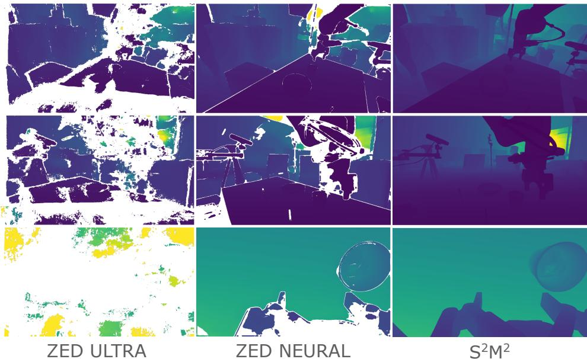  
Figure A1: ZED SDK vs S2M2. The classical ZED ULTRA algorithm fails completely in the wrist cam view and produces sparse depth for the external views. ZED NEURAL produces comparatively denser results but fails at the boundaries and edges of objects. $\mathrm { { \cal S } ^ { 2 } } \mathrm { { \bf M } ^ { 2 } }$ produces denser and sharper results and outperforms both the alternatives.

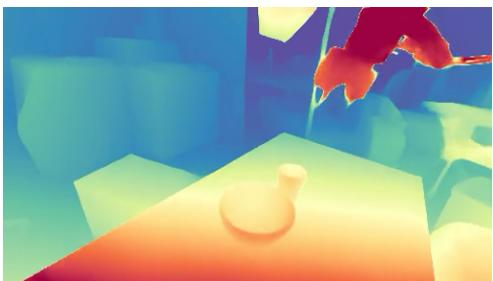  
Dep th Anything 3

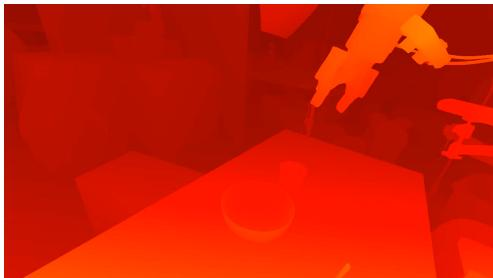  
S 2M2  
Figure A2: Depth Anything 3 (DA3) vs $\mathbf { S ^ { 2 } M ^ { 2 } }$ . DA3 produces generates noisy and overly smoothed depth maps, which fail to capture the details of the objects. The two methods are visualized with a different colormap (depth for DA3 vs disparity for S2M2).

## B Stage 2: Robot-Grounded Joint Optimization

The input to this stage is the set of visually consistent per-scene rigs from Stage 1, together with the robot’s URDF and raw joint encoder readings. The output is a set of refined extrinsics anchored to the robot’s base frame, coupled with globally optimized robot-specific kinematic parameters (handeye transform and joint encoder offsets).

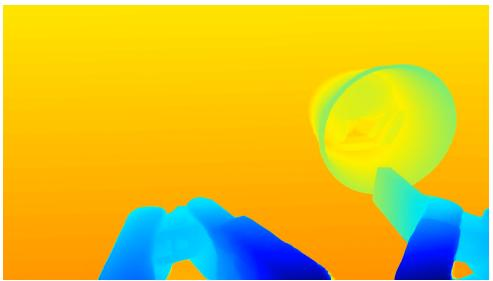

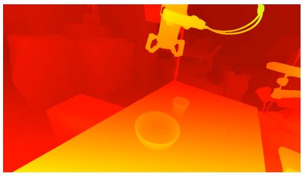  
Foundation Stereo

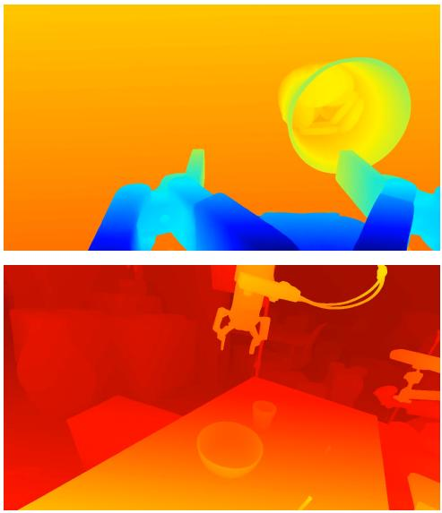  
S2M2  
Figure A3: Foundation Stereo vs $\mathbf { S ^ { 2 } M ^ { 2 } }$ . We find that $\mathrm { { S ^ { 2 } M ^ { 2 } } }$ produces more stable results. Notice the missing gripper on the left image and the higher quality details of the objects within the cup in the right image.

## B.1 Kinematic Anchoring via Rendering

To tie the rig to the physical robot, we render the arm into each external view with pyrender, using the URDF, the current joint angles, and the Stage 1 extrinsics. We extract 2D–3D correspondences between the rendered template and the real image with LoMa-G [37]: each match links a rendered surface point—whose 3D location in the robot frame is known from the URDF and forward kinematics—to a real-image pixel, yielding a robot-frame ground-truth signal independent of any cross-view photometric cue. LoMa-G internally computes DINO [38] patch features; we store these at the correspondences and PCA-reduce them to 64 dimensions to support a featuremetric alignment term [50, 51] (the f term in Eq. (2)) that provides sub-pixel gradients in textureless regions. Two practical details matter. First, we crop both the render and the real image tightly around the rendered arm before matching: this raises both the match count and the effective patch resolution (92 → 277 matches in Fig. A8). Second, we render with well-lit, non-physically-based (non-PBR) shading, which produces more stable and dense discrete correspondences for LoMa-G than physically-based rendering. Figure A9 shows the patch level features for rendered robot and the input image. We see that the patches between the render and the actual image align nicely. Note that the features produced by LoMa are higher resolution and align much better than raw DINOv2 features. Therefore, we use the LoMa generated features (which builds upon the DINOv2 features).

## B.2 Joint Factor Graph: Residual Definitions

A single factor graph spans all $N _ { s }$ episodes of one physical robot $( N _ { s }$ ranges from ${ \sim } 1 { , } 0 0 0$ to ∼9,000). Each episode contributes per-scene 6-DoF $S E ( 3 )$ corrections $\delta T _ { \mathrm { e x t 1 } } ^ { s } , \delta T _ { \mathrm { e x t 2 } } ^ { s }$ to its two external cameras (12 DoF/episode), which absorb scene-specific calibration noise. Shared across all episodes are the 6-DoF hand-eye correction $\delta T _ { \mathrm { w r i s t } }$ and the 7-DoF joint encoder offsets $\delta \pmb q$ (13 DoF total). The wrist camera carries no per-episode degrees of freedom; at frame t its pose is fully determined by the kinematic chain of Eq. (1). For the largest robot groups this gives $1 2 N _ { s } + 1 3 \approx 1 . 0 8 \times 1 0 ^ { 5 }$ parameters.

Notation. Let $K _ { c }$ and $T _ { c } ^ { s } \in S E ( 3 )$ (camera-to-world) be the intrinsics and extrinsics of camera c in scene s, with $T _ { c } ^ { s } = \delta T _ { c } ^ { s } \hat { T } _ { c } ^ { s }$ for the Stage-1 initialization $\hat { T } _ { c } ^ { s }$ . For pixel u (homogeneous u˜)

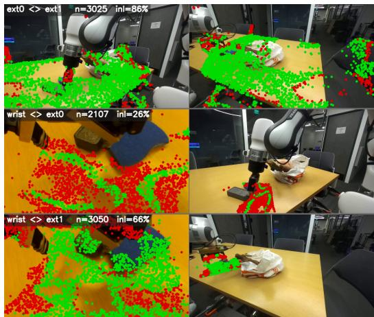  
(a) RoMa-v2 [36]

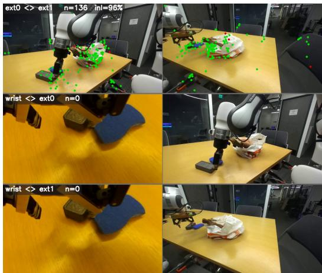  
(b) LoMa [37]

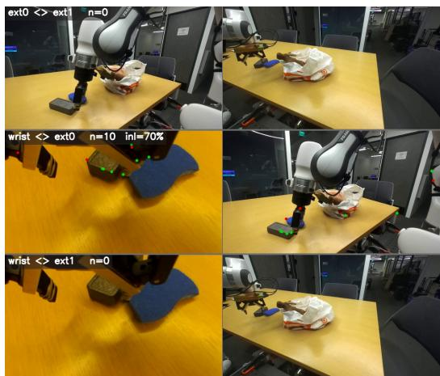  
(c) SuperPoint [48] + LightGlue [49]

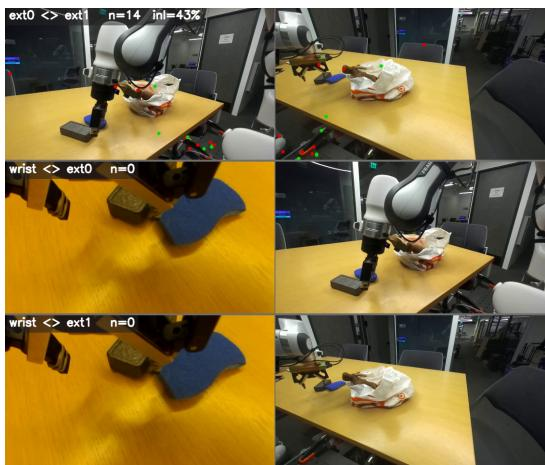  
(d) SIFT [47] + LightGlue [49]  
Figure A4: Correspondence quality across feature matchers. Each panel overlays the correspondences recovered by one matcher on a wrist–external camera pair; green points are MAGSAC [40] fundamental-matrix inliers. The dense matcher RoMa-v2 (a) recovers accurate correspondences across the extreme viewpoint change, whereas the sparse matchers (b–d) collapse to a handful of matches or fail outright on the textureless and specular regions that dominate the scene.

with metric depth $D _ { c } ( \mathbf { u } )$ , the back-projected world point is ${ \bf X } = T _ { c } ^ { s } D _ { c } ( { \bf u } ) K _ { c } ^ { - 1 } \tilde { \bf u }$ , and $\pi ( \cdot )$ denotes perspective projection, $\pi ( [ x , y , z ] ^ { \top } ) = [ x / z , y / z ] ^ { \top }$ . All data terms enter the scaled-Cauchy loss $\rho ( \| r \| ^ { 2 } ; c ) = c ^ { 2 } \log \bigl ( 1 + \| r \| ^ { 2 } / c ^ { 2 } \bigr )$ of Eq. (2).

The five data terms.

• Cross-camera, external–external (ee). For a RoMa-v2 match $( \mathbf { u } , \mathbf { u } ^ { \prime } )$ between $E _ { 1 }$ and $E _ { 2 }$ in scene s, lifted via $S ^ { 2 } M ^ { 2 }$ depth $D _ { E _ { 1 } } ( { \mathbf { u } } )$

$$
r _ { s , i } ^ { \mathrm { e e } } = \pi \Big ( K _ { E _ { 2 } } ( T _ { E _ { 2 } } ^ { s } ) ^ { - 1 } T _ { E _ { 1 } } ^ { s } D _ { E _ { 1 } } ( \mathbf { u } ) K _ { E _ { 1 } } ^ { - 1 } \tilde { \mathbf { u } } \Big ) - \mathbf { u } ^ { \prime } .\tag{A2}
$$

• Wrist–external 2D reprojection (2d). For a match $\left( { \bf u } _ { W } , { \bf u } _ { E } \right)$ between the wrist $W$ at frame t and external $E _ { c }$ , with $T _ { W } ( t )$ given by the chain in Eq. (1):

$$
r _ { s , i } ^ { 2 \mathrm { { d } } } = \pi \Big ( K _ { E _ { c } } \left( T _ { E _ { c } } ^ { s } \right) ^ { - 1 } T _ { W } ( t ) D _ { W } ( \mathbf { u } _ { W } ) K _ { W } ^ { - 1 } \tilde { \mathbf { u } } _ { W } \Big ) - \mathbf { u } _ { E } .\tag{A3}
$$

This term is Mahalanobis-whitened: the residual entering $\rho$ is $\Sigma _ { i } ^ { - 1 / 2 } r _ { s , i } ^ { 2 \mathrm { d } }$ , where $\Sigma _ { i }$ is the per-match covariance derived from RoMa v2’s predicted certainty, so noisier wrist–external matches contribute proportionally less.

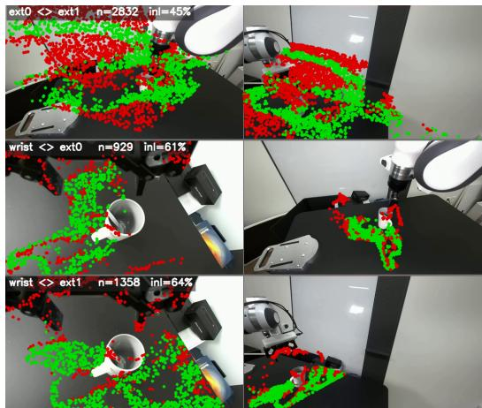  
(a) RoMa-v2 [36]

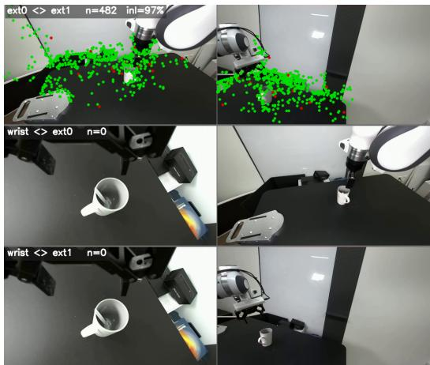  
(b) LoMa [37]

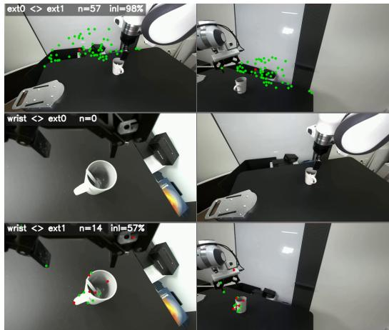  
(c) SuperPoint [48] + LightGlue [49]

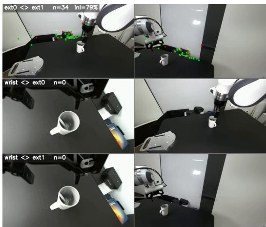  
(d) SIFT [47] + LightGlue [49]  
Figure A5: Correspondence quality across feature matchers (continued). Panels and color coding as in Fig. A4: (a) RoMa-v2, (b) LoMa, (c) SuperPoint + LightGlue, (d) SIFT + LightGlue; green points are MAGSAC inliers. RoMa-v2 again yields dense, accurate matches where the sparse matchers largely fail on the wrist–external pair.

• Wrist–external 3D metric lifting (3d, written $r ^ { w e - 3 d } )$ . We use a metric 3D residual lifting the same wrist–external match into the world frame on both sides:

$$
r _ { s , i } ^ { 3 \mathrm { d } } = T _ { W } ( t ) D _ { W } ( \mathbf { u } _ { W } ) K _ { W } ^ { - 1 } \tilde { \mathbf { u } } _ { W } - T _ { E _ { c } } ^ { s } D _ { E _ { c } } ( \mathbf { u } _ { E } ) K _ { E _ { c } } ^ { - 1 } \tilde { \mathbf { u } } _ { E } \quad \in \mathbb { R } ^ { 3 } ( \mathrm { m } ) .\tag{A4}
$$

• URDF-rendered robot reprojection (l). For a LoMa-G 2D–3D match between a rendered robot-surface point $\mathbf { X } _ { s , i } ^ { \mathrm { r o b } } ( \delta \mathbf { q } )$ (in the world frame, depending on $\delta \mathbf { q }$ through forward kinematics) and a real-image pixel $\mathbf { u } _ { s , i }$ in $E _ { c }$ :

$$
r _ { s , i } ^ { 1 } = \pi \Big ( K _ { E _ { c } } ( T _ { E _ { c } } ^ { s } ) ^ { - 1 } { \bf X } _ { s , i } ^ { \mathrm { r o b } } ( \delta \mathbf { q } ) \Big ) - \mathbf { u } _ { s , i } .\tag{A5}
$$

While ${ \bf X } ^ { \mathrm { r o b } }$ moves with $\delta \mathbf { q } ,$ in practice we use $\delta \pmb q = 0$ for rendering the mesh, since the correction is generally very minor.

• Featuremetric alignment (f). With $\phi _ { i } \in \mathbb { R } ^ { 6 4 }$ the PCA-reduced DINO feature of rendered point ${ \bf X } _ { s , i } ^ { \mathrm { r o b } }$ and $F _ { E _ { c } } : \Omega \to \mathbb { R } ^ { 6 4 }$ the dense real-image feature field (Fig. A9):

$$
r _ { s , i } ^ { \mathrm { f } } = F _ { E _ { c } } \Big ( \pi \big ( K _ { E _ { c } } ( T _ { E _ { c } } ^ { s } ) ^ { - 1 } \mathbf { X } _ { s , i } ^ { \mathrm { r o b } } \big ) \Big ) - \phi _ { i } .\tag{A6}
$$

All reprojection terms operate on the MAGSAC-filtered inlier sets described in Appendix A.2.

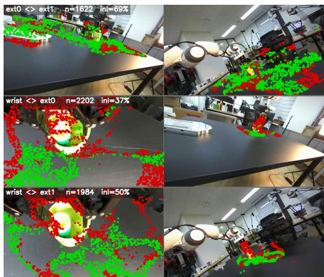  
(a) RoMa-v2 [36]

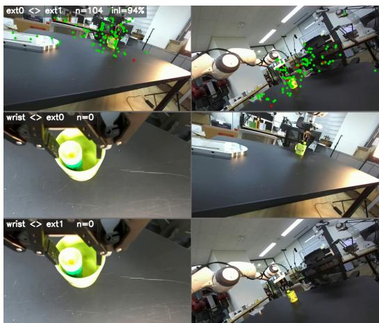  
(b) LoMa [37]

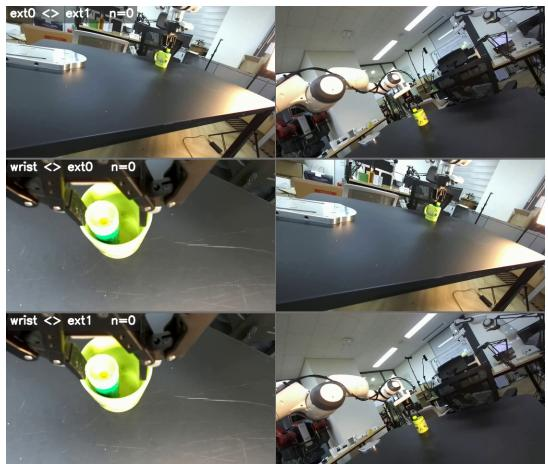  
(c) SuperPoint [48] + LightGlue [49]

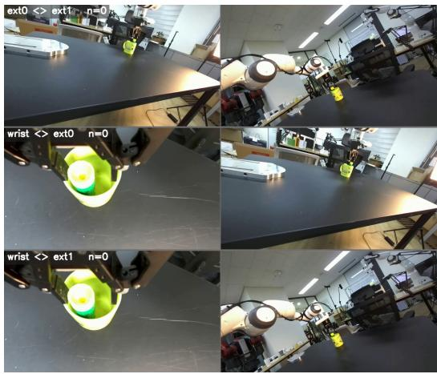  
(d) SIFT [47] + LightGlue [49]  
Figure A6: Correspondence quality across feature matchers (continued). Panels and color coding as in Fig. A4: (a) RoMa-v2, (b) LoMa, (c) SuperPoint + LightGlue, (d) SIFT + LightGlue; green points are MAGSAC inliers. The gap is consistent across scenes—RoMa-v2 sustains coverage in the wrist view while the other matchers degrade.  
Dense RoMa yields far more usable correspondences and broader coverage than LoMa / SuperPoint+LG / SIFT+LG

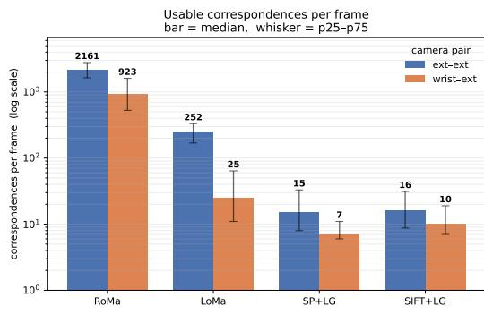

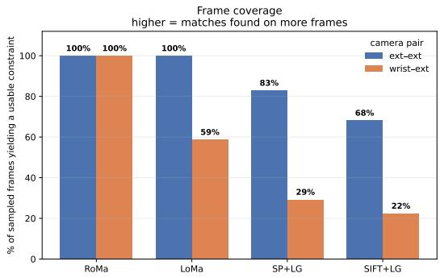  
Figure A7: RoMa-v2 vs others summary. Left: We show the number of usable correspondences (inliers from MAGSAC) for each method. RoMa-v2 consistently produces an order of magnitude more correspondences. Right: We show the coverage of each method. RoMa-v2 has approximately 2× the coverage on the extreme viewpoint pair of wrist and external cameras.

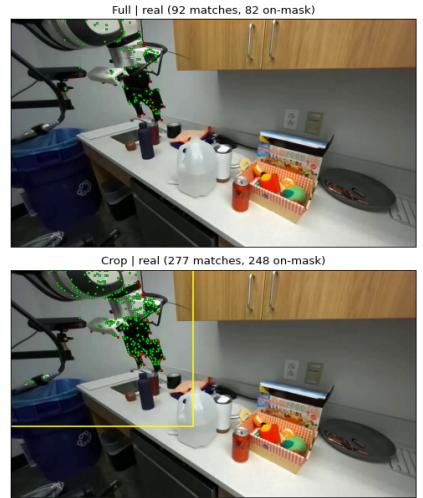

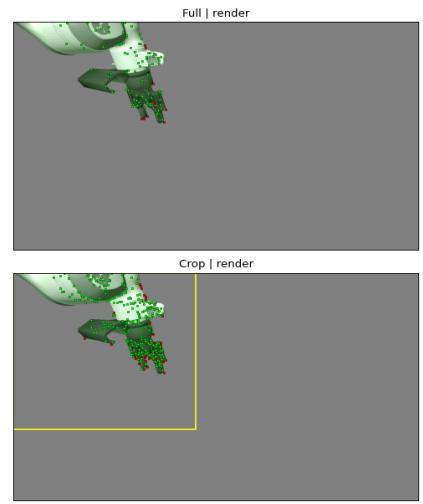  
Figure A8: Effect of cropping the render and the real image before matching with LoMa-G. The yellow box indicates the crop region. The number of matches goes up from 92 → 277. Green dots indicate matches that are on the surface of the robot, red dots are for points that do not lie on the surface.

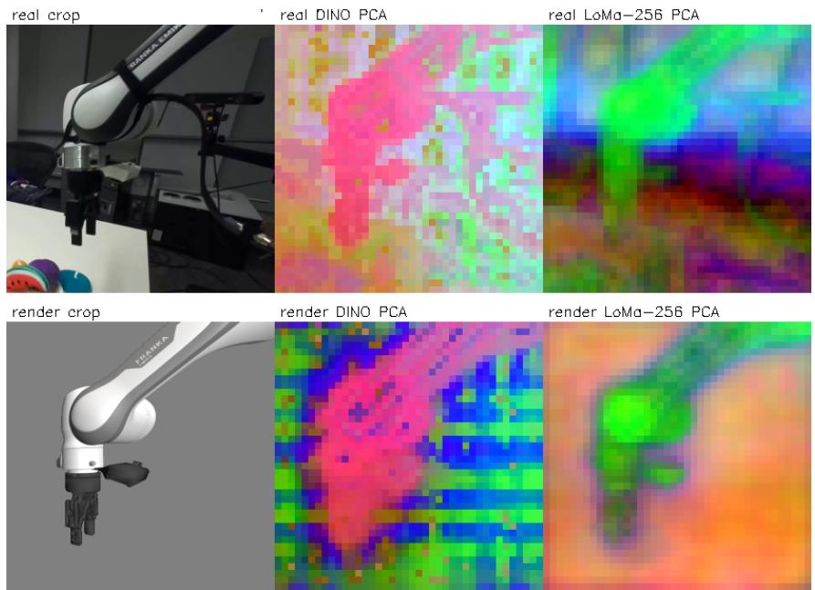  
Figure A9: Visualization of the PCA of the DINOv2 features and the LoMa features. Here we show a comparison between the patch level features of the actual image, cropped around the robot arm, and a similar render of the robot URDF. The patch level features for both DINOv2 and LoMa match at the robot arm. However, the patch level features from LoMa contain more fine-grained details, since LoMa was specifically tuned for matching.

Table A1: Ablation relative to the full model on ∼1,000 scenes. All rows are the full model with the listed modification. Blue: 2D consistency (gold-inlier median px). Amber: 3D grounding. +AMP 3D, −FM is the deployed model.
<table><tr><td>Full model ±</td><td>EE↓ (px)</td><td>WE↓ (px)</td><td>RD↓ (mm)</td><td>IoU↑ (mean)</td></tr><tr><td>Full (all factors)</td><td>0.251</td><td>1.032</td><td>14.15</td><td>0.808</td></tr><tr><td colspan="5">Weight tweaks</td></tr><tr><td>+ amplify 3D + amplify FM</td><td>0.251 0.250</td><td>1.027 1.038</td><td>14.02 14.09</td><td>0.808 0.804</td></tr><tr><td>Leave-one-out (drop one factor)</td><td></td><td></td><td></td><td></td></tr><tr><td colspan="5">— featuremetric</td></tr><tr><td></td><td>0.251</td><td>1.031</td><td>14.03</td><td>0.808</td></tr><tr><td>– wrist-3D</td><td>0.251</td><td>1.032</td><td>14.05</td><td>0.808</td></tr><tr><td>— featuremetric &amp; 3D</td><td>0.251</td><td>1.032</td><td>14.07</td><td>0.809</td></tr><tr><td>− split  $T _ { e x t , k } ^ { s }$ </td><td>0.320</td><td>1.082</td><td>14.12</td><td>0.804</td></tr><tr><td> $\mathbf { \varepsilon } - \mathbf { e x t - e x t } \mathbf { f a c t o r }$ </td><td>0.662</td><td>0.982</td><td>14.58</td><td>0.804</td></tr><tr><td> $- \mathrm { j o i n t } \mathrm { o f f s e t } \delta q$ </td><td>0.251</td><td>1.214</td><td>14.68</td><td>0.806</td></tr><tr><td> $- \delta T _ { w r i s t }$ </td><td>0.252</td><td>2.067</td><td>17.11</td><td>0.786</td></tr><tr><td> $\delta T _ { w r i s t } \ \& \ \delta q$ </td><td>0.252</td><td>2.217</td><td>17.10</td><td>0.786</td></tr><tr><td>+ amplify 3D, − FM (ours)</td><td>0.251</td><td>1.027</td><td>14.01</td><td>0.809</td></tr></table>

## B.3 Ablations on the Pose Estimation Pipeline

We ablate the factors of the joint optimization in Table A1. From the table, it is clear that our joint factor graph-based optimization of the shared robot parameters (such as hand eye calibration and robot joint offsets) significantly improves the quality of the obtained poses.

## B.4 Hyperparameters and Solver

All data terms use the robust Cauchy loss with empirically-set scales $c _ { 2 \mathrm { d } } = 3 \sigma$ (whitened distance), $c _ { 3 \mathrm { d } } = 1 0$ mm, $c _ { \mathrm { l } } = 5 0 \ \mathrm { p x }$ , and $c _ { \mathrm { e e } } = 5 ~ \mathrm { p x }$ . The 3D metric-lifting factor is up-weighted by $\lambda _ { 3 d } =$ $1 0 ^ { 4 }$ to rebalance the unit mismatch between its metre-scale residual $( O ( 1 0 ^ { - 2 } ) )$ and the pixel-scale factors $( O ( 1 { - } 5 0 ) )$ ; the remaining $\lambda _ { k }$ are 1. The Tikhonov regularization weight on the joint offsets is $\lambda _ { q } = 1 0 ^ { - 2 }$ . The deployed (“ours”) configuration amplifies the 3D term and omits the featuremetric term (−FM), corresponding to the “+amplify $3 \mathrm { D } , - \mathrm { F M } ^ { \mathrm { , } }$ row of Table A1. While the featuremetric term improved the robot depth by itself, we found that it was a bit redundant after amplifying the 3D loss term. However, we still include the term in our description since our framework is general and computes the feature metric loss, which could be applied to further refine after optimization.

The graph is large but its Hessian is highly sparse: each episode’s 12-DoF block couples only to the 13 shared parameters, never to other episodes. We exploit this with a custom GPU-accelerated Levenberg–Marquardt solver. Each iteration applies the Schur complement to marginalize all perscene blocks, reducing the step to a dense $1 3 \times 1 3$ global solve over the shared kinematic parameters, followed by parallel per-scene back-substitution for the extrinsics. This drops the computational cost from cubic in N to $O ( N _ { s } \cdot 1 2 ^ { 3 } + 1 3 ^ { 3 } )$ , with a typical convergence wall time of ≈12.5 minutes per robot group; in practice data loading, not the linear algebra, is the bottleneck.

## B.5 Qualitative results of DROID-3D Calibration Dataset vs Baseline

We present some additional qualitative comparisons of the obtained poses by our method and the Point World based baseline method in Figure A10.

Pose from Baseline

Pose from Ours

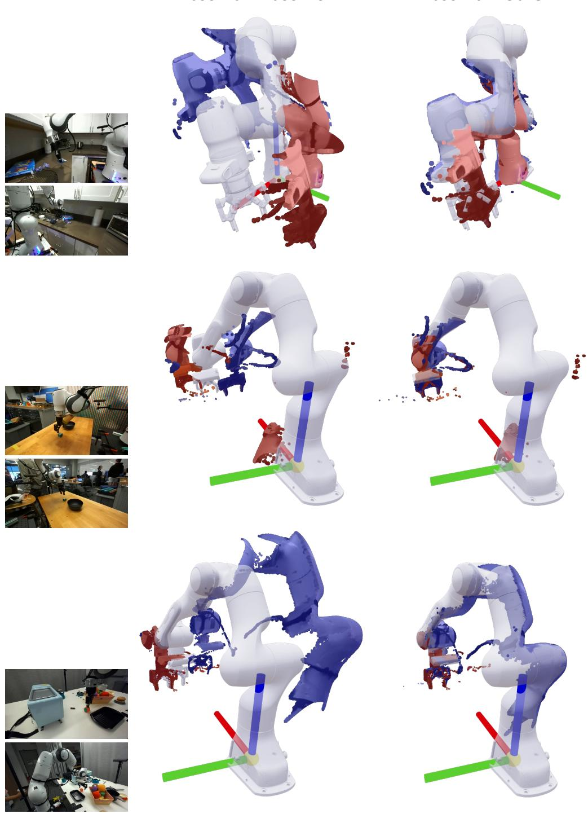

Figure A10: Qualitative Results of the pose estimation of PointWorld [34] based baseline vs Ours. In all the cases our method produces significantly more aligned poses. The average robot depth error for PointWorld based approach on these examples is around 110-130mm while ours is around 15- 20mm. We show only the points corresponding to segmented robot pixels in the image. In all the cases, it is clear that poses from the baseline method do not align, while they do for ours. Minor cleaning has been done to remove floaters due to imperfect segmentation.

## C DepthWorld Architecture and Training Details

## C.1 Depth Preprocessing Rationale (Supplement to Section 4.1)

Raw depth maps are converted to VAE-encodable grayscale images through a strict four-step pipeline designed to keep the depth inside the distribution the Stable Video Diffusion (SVD) VAE was pretrained on:

(1) We downsample to the 192×320 working resolution using unprojection and z-buffer min-pooling rather than bilinear interpolation, which preserves foreground geometry and prevents “flying pixel” artifacts at object boundaries.

(2) Depths are clipped to the 95th percentile of the per-camera distribution (≈ 3 m for external, ≈ 2 m for wrist) to bound the VAE input while preserving manipulation-relevant content.

(3) A log transform compresses the dynamic range, allocating more representational capacity to close-range objects where manipulation precision matters most.

(4) Values are normalized to [0, 1] to match the VAE’s expected input range, and the single channel is replicated to three channels.

## C.2 Spatial Latent Tiling vs. Other Depth Integration Architectures

We opted for spatial latent tiling over dual-branch and channel expansion architectures. Dual-branch methods require running a parallel U-Net for depth, linked via cross-connections to the RGB branch, effectively doubling the parameter count and complicating the training dynamics. Channel expansion, on the other hand, increase the number of channels in the input and output layers of the model to incorporate the added modality. Our tiling approach leverages the observation that the SVD VAE naturally encodes replicated single-channel depth, allowing us to place RGB and depth side-by-side in a wider latent grid. This forces the single, unmodified U-Net to jointly denoise both modalities, learning geometric consistency without major changes to the architecture.

We ablated this choice empirically. Table A2 compares spatial latent tiling against a dual-branch model—a parallel U-Net for depth with cross-connections to the RGB branch, in the style of SyncVP [27] trained for around 70k steps and evaluated under the autoregressive rollout protocol of Appendix D.3. Different from [27], we do not use the same noise for both the modalities as our earlier experiments showed that it allowed the model to cheat in the EDM diffusion formulation. Furthermore, the model was first trained on RGB-only data for 50k steps and then continued for 20k steps with the dual branch. We would like to note that this is not a 1-1 comparison, but was done due to the additional compute requirements of the dual branch setup, which required more GPU hours to run through extensive FSDP parallelism. For the channel expansion architecture, we simply double the number of channels in the input and output layers of the model to incorporate the added modality. We train this in a single stage for 70k steps. Spatial tiling performs better: it improves every RGB metric on both views (e.g. +1.7 dB PSNR on external and +1.5 dB on wrist), and matches or improves depth quality, with the dual-branch only marginally ahead on external RMSE. Therefore, this influenced our decision to avoid changing the architecture.

## C.3 Effect of the Depth Source on DepthWorld

DepthWorld is trained on $\mathrm { { S ^ { 2 } M ^ { 2 } } }$ depth (Appendix A.1). To quantify how much the choice of depth source matters, we train two further models with identical architecture and training protocol that instead use the ZED ULTRA and ZED NEURAL depth of the wrist and external cameras. All three models are trained for 50k steps and evaluated under the autoregressive rollout protocol of Appendix D.3; Table A3 reports the results. Two caveats apply when reading the table. The RGB metrics are directly comparable across rows, since every model predicts the same RGB frames. The depth metrics are not: each model is scored against the depth source it was trained on, so they mea sure how faithfully a model reproduces its own supervision rather than its absolute metric accuracy.

Table A2: Ablation: Spatial latent tiling vs. other integration architectures, at ∼ 70k training steps under the autoregressive rollout protocol (Appendix D.3). All are joint RGB–depth models; depth metrics are against the VAE-round-tripped GT (Appendix C.8). Spatial tiling matches or beats both the baseline integration architectures architecture on nearly every metric and view despite leaving the U-Net unmodified. Best per view/metric in bold, second best underlined.
<table><tr><td colspan="2"></td><td colspan="3">RGB quality</td><td colspan="3">Depth quality</td></tr><tr><td>View</td><td>Model</td><td>PSNR↑</td><td>SSIM↑</td><td>LPIPS↓</td><td>AbsRel↓</td><td>RMSE↓</td><td> $\delta _ { 1 } \uparrow$ </td></tr><tr><td rowspan="3">External</td><td>Dual-branch</td><td>21.94</td><td>0.8039</td><td>0.1010</td><td>0.0861</td><td>0.232</td><td>0.9383</td></tr><tr><td>Channel expansion</td><td>22.22</td><td>0.8017</td><td>0.1021</td><td>0.0796</td><td>0.220</td><td>0.9414</td></tr><tr><td>Spatial tiling (ours)</td><td>23.66</td><td>0.8252</td><td>0.0945</td><td>0.0854</td><td>0.235</td><td>0.9383</td></tr><tr><td rowspan="3">Wrist</td><td>Dual-branch</td><td>16.05</td><td>0.5441</td><td>0.3554</td><td>0.2523</td><td>0.161</td><td>0.7685</td></tr><tr><td>Channel expansion</td><td>16.34</td><td>0.5593</td><td>0.3422</td><td>0.2801</td><td>0.158</td><td>0.7930</td></tr><tr><td>Spatial tiling (ours)</td><td>17.58</td><td>0.5954</td><td>0.3276</td><td>0.2420</td><td>0.159</td><td>0.8001</td></tr></table>

Table A3: Ablation: Depth source used to train DepthWorld, at 50k training steps under the autoregressive rollout protocol (Appendix D.3). All are joint RGB–depth models with identical architecture and training protocol; only the depth maps used for training differ. Best per view/metric in bold, second best underlined.
<table><tr><td></td><td colspan="4">External</td><td colspan="4">Wrist</td></tr><tr><td>K=10 rollout</td><td>PSNR↑</td><td>LPIPS↓</td><td>AbsRel↓</td><td> $\delta _ { 1 } \uparrow$ </td><td>PSNR↑</td><td>LPIPS↓</td><td>AbsRel↓</td><td> $\delta _ { 1 } \uparrow$ </td></tr><tr><td>RGBD,  $\mathrm { S ^ { 2 } M ^ { 2 } }$  depth (ours)</td><td>24.07</td><td>0.0877</td><td>0.074</td><td>0.946</td><td>17.68</td><td>0.3270</td><td>0.266</td><td>0.797</td></tr><tr><td>RGBD, ZED NEURAL depth</td><td>24.26</td><td>0.0881</td><td>0.079</td><td>0.939</td><td>17.77</td><td>0.3260</td><td>0.254</td><td>0.794</td></tr><tr><td>RGBD, ZED ULTRA depth</td><td>22.11</td><td>0.0947</td><td>0.194</td><td>0.830</td><td>16.28</td><td>0.3395</td><td>0.461</td><td>0.655</td></tr></table>

The depth source has a large effect. The model trained on ZED ULTRA depth is worst on every metric of both views: AbsRel rises from 0.074 to 0.194 on the external view and from 0.266 to 0.461 on the wrist view, where ULTRA depth is particularly sparse and noisy (Figure A1). Notably, the poor depth target also degrades RGB prediction, by 2.0 dB PSNR on the external view and 1.4 dB on the wrist view, even though the RGB supervision is unchanged. Sparse and noisy depth is therefore not a neutral auxiliary signal but actively harms the joint RGB–depth model, and a high-quality depth source is crucial for training it.

$\mathrm { { S ^ { 2 } M ^ { 2 } } }$ and ZED NEURAL depth, in contrast, yield very similar models. The RGB metrics agree to within 0.2 dB PSNR on both views, and the depth metrics are close, with $\mathrm { { S ^ { 2 } M ^ { 2 } } }$ slightly ahead on the external view and on wrist $\delta _ { 1 }$ , and ZED NEURAL slightly ahead on wrist AbsRel. This is expected: the two depth sources are highly correlated (∼0.97 correlation between their depth values), so they provide nearly the same training signal; where they differ is in coverage and boundary sharpness (Appendix A.1).

## C.4 Auxiliary Point-Map Head (Supplement to Section 4.2)

The only auxiliary module is a single DPT [21] point-map decoder. It operates on the model’s predicted clean latent for the future frames, $\hat { x } _ { 0 , f }$ , not on intermediate U-Net activations. For each future frame and view, the horizontal tiling is split back into its RGB and depth halves, and the two 4- channel latents are concatenated per view into an 8-channel input of shape (B·V, $T _ { \mathrm { f u t u r e } } ,$ 8, 24, 40).

A learned adapter then maps this latent into the DPT feature space, building a four-scale feature pyramid from the $2 4 \times 4 0$ latent: $2 4 \times 4 0  1 2 \times 2 0  6 \times 1 0  3 \times 5$ . We reuse VGGT’s [8] DPT fusion trunk and final regressor: the four RefineNet fusion blocks (refinenet1--4) and the two output convolutions (output conv1, 2) of VGGT’s point head are transferred and produce the per-pixel $( X , Y , Z )$ point map in the robot base frame and a raw confidence channel. Everything that adapts the Ctrl-World latents into that feature space is trained from scratch: the inputclamp/latent input path, the stem, the three pyramid stages, and the scale-projection convolutions (layer1--4 rn) wherever VGGT’s shapes do not match. The decoder upsamples to full image resolution, outputting four channels at $1 9 2 \times 3 2 0$ (predicted tensor $( B , V , T _ { \mathrm { f u t u r e } } , 4 , 1 9 2 , 3 2 0 ) $ ). The raw confidence is mapped to a strictly positive confidence via $C _ { v , t } ( \mathbf { u } ) = 1 + \exp ( \cdot )$ , following DUSt3R [6]/MASt3R [7].

Table A4: Ablation: Extrinsics used to build the point-map targets, under the autoregressive rollout protocol (Appendix D.3). Both are RGB+D PM-DPT models trained identically; the robotframe point-map targets are backprojected either with DROID’s factory extrinsics or with the refined DROID-3D extrinsics of Appendix B. Best per view/metric in bold.
<table><tr><td rowspan="2">K=10 rollout</td><td colspan="4">External</td><td colspan="4">Wrist</td></tr><tr><td>PSNR↑</td><td>LPIPS↓</td><td>AbsRel↓</td><td> $\delta _ { 1 } \uparrow$ </td><td>PSNR↑</td><td>LPIPS↓</td><td>AbsRel↓</td><td>δ1↑</td></tr><tr><td>PM-DPT, factory extrinsics</td><td>24.10</td><td>0.0891</td><td>0.075</td><td>0.945</td><td>18.01</td><td>0.3131</td><td>0.233</td><td>0.817</td></tr><tr><td>PM-DPT, refined extrinsics</td><td>24.13</td><td>0.0890</td><td>0.075</td><td>0.945</td><td>18.03</td><td>0.3124</td><td>0.220</td><td>0.819</td></tr></table>

Table A4 isolates the contribution of the recalibrated extrinsics to this head: training PM-DPT with point-map targets built from DROID’s factory extrinsics instead of the refined DROID-3D extrinsics leaves RGB quality unchanged but gives worse wrist-view depth (AbsRel 0.233 vs. 0.220).

## C.5 Training Objective

The combined objective is

$$
{ \mathcal { L } } = { \mathcal { L } } _ { \mathrm { d e n o i s e } } + \lambda _ { p m } { \mathcal { L } } _ { p m } , \qquad \lambda _ { p m } = 0 . 0 0 5 ,\tag{A7}
$$

where $\mathcal { L } _ { \mathrm { d e n o i s e } }$ is the standard Stable Video Diffusion denoising objective applied to the joint tiled latent, with SVD’s noise schedule and loss weighting inherited unchanged.

The point-map term $\mathcal { L } _ { p m }$ supervises the head’s predicted point maps $P _ { v , t }$ against the ground-truth point maps $P _ { v , t } ^ { * }$ (the world-frame / robot-base XYZ point maps obtained by backprojecting the GT depth through the camera intrinsics and the calibrated extrinsics of Appendix B), with a per-pixel validity mask $m _ { v , t } ( \mathbf { u } ) \in \{ 0 , 1 \}$ . Write $\mathbf { p } = P _ { v , t } ( \mathbf { u } )$ and $\mathbf { g } = P _ { v , t } ^ { * } ( \mathbf { u } )$ for the predicted and target 3D points at a pixel. We compress the large dynamic range of metric coordinates with a directionpreserving log map:

$$
\phi ( \mathbf { x } ) = { \frac { \mathbf { x } } { \| \mathbf { x } \| } } \ \log ( 1 + \| \mathbf { x } \| ) ,\tag{A8}
$$

and measure the residual in this space:

$$
\mathbf { d } = \phi ( \mathbf { p } ) - \phi ( \mathbf { g } ) , \qquad s = { \frac { \| \mathbf { d } \| ^ { 2 } } { c ^ { 2 } } } , \quad c = 0 . 0 5 .\tag{A9}
$$

The scaled residual s is passed through Barron’s general robust loss [39] with shape $\alpha = 0 . 5$

$$
\rho _ { \alpha } ( s ) = \frac { | \alpha - 2 | } { \alpha } \left[ \left( \frac { s } { | \alpha - 2 | } + 1 \right) ^ { \alpha / 2 } - 1 \right] ,\tag{A10}
$$

and combined with the confidence $C = C _ { v , t } ( \mathbf { u } ) = 1 + \exp ( \cdot )$ in the DUSt3R confidence-weighted form

$$
k _ { v , t } ( \mathbf { u } ) = C \rho _ { \alpha } ( s ) - \beta \log C , \qquad \beta = 0 . 2 .\tag{A11}
$$

Two further operations are applied before aggregation. First, the largest 5% of per-pixel terms k within each (batch element, view) are dropped as outliers. Second, each future-frame sample is weighted by its EDM loss weight, clamped by a min-SNR-γ of 5. The point-map loss is the masked, weighted mean over valid pixels,

$$
\mathcal { L } _ { p m } = \frac { \sum m _ { v , t } ( \mathbf { u } ) \sigma _ { w } k _ { v , t } ( \mathbf { u } ) } { \sum m _ { v , t } ( \mathbf { u } ) } ,\tag{A12}
$$

with the sum over the predicted future frames only.

## C.6 Training Schedule and Optimization

We initialize from the Stable Video Diffusion checkpoint used by Ctrl-World [1] and inherit its action conditioning unchanged: a per-frame 7-dimensional end-effector action (6-DoF pose plus 1 gripper state). Training proceeds in two stages for stability, for 90,000 steps in total. Stage 1 trains the joint RGB–depth model alone for 40,000 steps with $\lambda _ { p m } = 0$ , letting the model learn the joint tiled-latent distribution. Stage 2 attaches the DPT head (VGGT fusion trunk and regressor reused, latent adapter learned from scratch; Appendix C.4) and trains all components jointly for a further 50,000 steps with $\lambda _ { p m } = 0 . 0 0 5$ . We optimize with AdamW at a constant learning rate of $1 0 ^ { - 5 }$ (no schedule) and a global batch size of 64. We maintain an exponential moving average (EMA) of the weights with decay 0.9999, and all reported results use the EMA model. Total training takes approximately two days on two H200 nodes.

## C.7 Inference and Autoregressive Rollout

At inference the model denoises the joint tiled latent over a temporal window of 11 frames (6 history, 5 future) at 5 Hz, using 50 denoising steps and a classifier-free guidance scale of 2 (matching Ctrl-World [1]). The history frames are sampled sparsely over the past, following Ctrl-World [1], rather than as the six immediately preceding frames. Each rollout starts from the first frame, with the history buffer initialized by repeating it; the model then generates 10 consecutive future chunks autoregressively, feeding each predicted chunk back as history for the next window. Reported metrics therefore reflect compounding prediction error from a single-frame start, rather than teacher-forced single-step error.

## C.8 Depth Reference and De-normalization for Metric Evaluation

To recover metric depth from a predicted depth tile we invert the four-step preprocessing of Appendix C.1: the depth tile is VAE-decoded, the three replicated channels are averaged back to one, values are mapped from [0, 1] back through the inverse of the normalization and the inverse log transform, and the per-camera percentile clip is undone. The resulting depth is metric. The reference is the same $S ^ { 2 } \bar { M } ^ { 2 }$ ground-truth depth of Appendix B, but passed through the VAE encode–decode round-trip before scoring. Measuring against the VAE reconstruction of the GT depth, rather than the raw GT, factors out the irreducible round-trip error that bounds any latent-space predictor, so the depth metrics reflect prediction quality relative to the best depth the latent representation can represent.

## D Experimental Setup and Metrics

## D.1 Calibration Baseline Modifications (Supplement to Section 5.1)

To ensure a fair evaluation of our joint factor graph optimization against the per-scene refinement baseline (modeled on PointWorld), we modified the baseline’s depth source. Instead of using FoundationStereo as in the original PointWorld pipeline, we substituted our global-matching $S ^ { 2 } M ^ { 2 }$ depth. This isolates the performance delta specifically to the structural difference in the optimization (per-scene vs. robot-coupled joint graph) rather than a difference in depth predictors.

## D.2 Geometric Calibration Metrics

Because ground-truth extrinsics are unavailable for DROID, we define four geometric proxy metrics to evaluate calibration quality:

1. Ext-Ext (EE) Reprojection Error. The median pixel reprojection error between the two external cameras, computed on a gold-inlier set extracted via MAGSAC enforcing epipolar and Kabsch-based 3D alignment.

2. Wrist-Ext (WE) Reprojection Error. The analogous median pixel reprojection error measured between the dynamic wrist camera and the fixed external cameras.

3. Robot Depth Error (RD). The median absolute difference (in millimeters) between the predicted $\bar { S } ^ { 2 } M ^ { 2 }$ depth map and the depth obtained by rendering the robot URDF using the optimized extrinsics and joint angles.

4. Mask IoU. The Intersection-over-Union between the URDF-rendered robot silhouette mask and a ground-truth robot segmentation mask produced by RoboEngine [41] on the real image.

## D.3 World-Model Evaluation Protocol

Training set and split. DepthWorld is trained on the calibrated episodes that constitute DROID-3D. Starting from the publicly released raw DROID split (∼75k trajectories with high-quality RGB, raw ZED SVO stereo, and factory camera parameters), per-robot filtering for broken metadata or unrecoverable calibration leaves the 71,100 episodes across 28 robots and 13 labs reported in Appendix B. DepthWorld trains on exactly these 71,100 episodes. We hold out 1% as a validation set and report world-model metrics on 256 trajectories sampled at random from it. Because the holdout is random at the episode level, the held-out trajectories come from the same robots and labs seen in training; these numbers therefore measure held-out-trajectory prediction quality, not cross-embodiment or cross-lab generalization.

Baseline. The RGB baseline (RGB in Tables 1–2) is the Ctrl-World [1] backbone (multi-view RGB only), which we retrain rather than use off the shelf. The released Ctrl-World checkpoint is trained on the 95k DROID split stored in RLDS format, whereas DROID-3D is constructed over the ∼75k publicly released raw split. Retraining the RGB model on the same 71,100-episode set, split, architecture, and training budget as DepthWorld makes RGB and RGB+D a controlled comparison in which the only difference is the depth signal.

Metrics. For RGB we report PSNR, SSIM [43], and LPIPS [44]. For depth we report AbsRel, RMSE, and $\delta _ { 1 }$ , where $\textstyle { \mathrm { A b s R e l } } = { \frac { 1 } { N } } \sum | d - d ^ { * } | / d ^ { * }$ , RMSE is in meters, and $\delta _ { 1 }$ is the fraction of valid pixels with max $\left( d / d ^ { * } , d ^ { * } / d \right) ^ { - } < 1 . 2 5$ . Depth metrics are evaluated in metric units without any per-frame scale-and-shift alignment, against the VAE decoded GT depth reference of Appendix C.8, and are masked to pixels with a valid depth reference. All metrics are reported separately for external and wrist views, and are averaged over all rollout frames.

## D.4 Comparison with PointWorld (Supplement to Section 5)

PointWorld [34] and DepthWorld predict different things. PointWorld is a 3D scene-flow model: given a set of seed points in the robot frame at the anchor frame, it rolls out the future 3D position of every seed point. DepthWorld predicts future depth images per camera, from which 3D points are obtained by sampling the predicted depth at a pixel and unprojecting it with the calibrated intrinsics and extrinsics. Neither output can be scored directly against the other, so the protocol below lifts both to 3D points in the robot frame at the same tracked scene locations and scores them there. Two consequences of this design should be kept in mind. First, DepthWorld is only ever asked for the depth of a known pixel, which is an easier question than PointWorld’s task of predicting where an entire point set goes. Second, DepthWorld predicts depth in the latent space of the SVD VAE, whose encode–decode round trip alone has an error floor that PointWorld’s point representation does not have; how we account for this is described below.

Shared validation split. We use exactly the 256 held-out windows of Table 2, recovered from the same seeded random permutation of the validation set, so both models are evaluated on identical clips. Each window consists of an anchor frame followed by 40 future frames at 5 Hz, i.e. an 8 s horizon. Of these windows, 141 contain moving scene points that survive the persistent point-set criterion described below and are used for the moving-point metrics, and 147 are used for the wholescene metric. We report a short horizon of 2 s (frame 10) and the full horizon of 8 s (frame 40).

Tracker-based pseudo ground truth. DROID has no ground-truth 3D trajectories, so we build them from point tracks, following the procedure of the PointWorld repository exactly. On the anchor frame of each external view we place a 64 × 64 grid of query points and track them through all 41 frames with CoTracker3 [? ], the tracker used by PointWorld’s authors, at the native 192 × 320 resolution, which matches the depth resolution and avoids rescaling. At every frame each tracked pixel is lifted to 3D by sampling the ground-truth $S ^ { 2 } M ^ { 2 }$ depth of that frame and unprojecting it with the camera intrinsics and the calibrated camera-to-world pose of DROID-3D. Points with invalid depth $( z \le 0 \mathrm { o r } z > 4 $ m) are discarded. We then keep only points inside the robot workspace, a box of $[ 0 , 0 . 7 ] \times [ - 0 . 4 , 0 . 4 ] \times [ - 0 . 3 , 1 . 2 ]$ m in the robot base frame; this removes floor, wall, and background tracks, which otherwise dominate the error. Remaining spatial outliers, mostly tracks that jump between depth layers, are removed with a multi-scale DBSCAN [? ] filter at radii 0.2, 0.5, and 1.0 m, dropping any track that is an outlier in a large fraction of frames. A point is labelled moving if its ground-truth displacement from the anchor frame exceeds 3 cm. Points on the robot arm, identified by the URDF silhouette dilated by 3 px, are excluded from all scored sets, for the reasons given next.

Why robot points are excluded. In PointWorld the robot is an input, not a prediction target: the arm enters as points computed from the joint states through the URDF (the gripper only, in the released checkpoint), and its training clouds are built with the robot cut out. Seeding it with arm pixels therefore asks it to predict the arm as if it were scenery, a case it never saw in training, and the arm disintegrates within a few frames. Excluding the robot also matches PointWorld’s own evaluation, whose scene flows exclude it by construction. More fundamentally, both models are conditioned on the robot’s actions, so for PointWorld the arm’s future position is simply forward kinematics of the given joints, and scoring arm points would test calibration rather than world modelling; the question worth comparing is how the scene responds, i.e. objects, cloth, and doors. Finally, the arm would otherwise dominate the metric: with the robot kept, about 178 points per window qualify as moving, against about 45 without it, so roughly three quarters of a robot-inclusive moving score would be arm motion that both models are handed. The exclusion has costs. DepthWorld receives no credit for rendering the arm, which a video model must do correctly. Because the mask is the dilated URDF silhouette, points on a grasped object right at the gripper are dropped as well, as in PointWorld’s own pipeline. Cables remain in the scene, since they move with the arm but are not part of the URDF.

Persistent point set. Tracked points become occluded over the horizon. Scoring whatever is valid at each frame shrinks the scored set over time and biases it toward easy, unoccluded points, which makes the error appear to decrease with horizon. We therefore score a fixed persistent set per window: the moving points that are valid in every frame of the horizon and that could be matched to a PointWorld seed (next paragraph), about 45 points per window. Error then increases with horizon, as it should. The set is defined from the ground truth and PointWorld only, never from Depth-World’s predictions, so PointWorld is a fixed reference when different DepthWorld checkpoints are compared.

Prediction clouds. PointWorld. PointWorld was trained with up to 12,000 scene points, and seeding it with only the few hundred tracked points is out of distribution and understates it. We therefore seed it in distribution with 12,000 scene points sampled from the workspace-filtered, robot-masked anchor-frame point map of both external views, supply the robot as URDF points from the joint states as in its training, roll out the dense cloud with the released large DROID checkpoint, and read off the trajectory of each tracked point from its nearest dense seed (nearest-neighbour match on the anchor frame, accepted if closer than 1 cm). PointWorld thus receives full multi-view context but is scored on exactly the tracked points. DepthWorld. For each tracked pixel and frame we bilinearly sample the predicted depth of the corresponding external view, de-normalised to metric depth as in Appendix C.8, and unproject it with the same intrinsics and pose used for the ground truth.

t = 0 s (input)

t = 2 s

t = 4 s

t = 6 s

t = 8 s

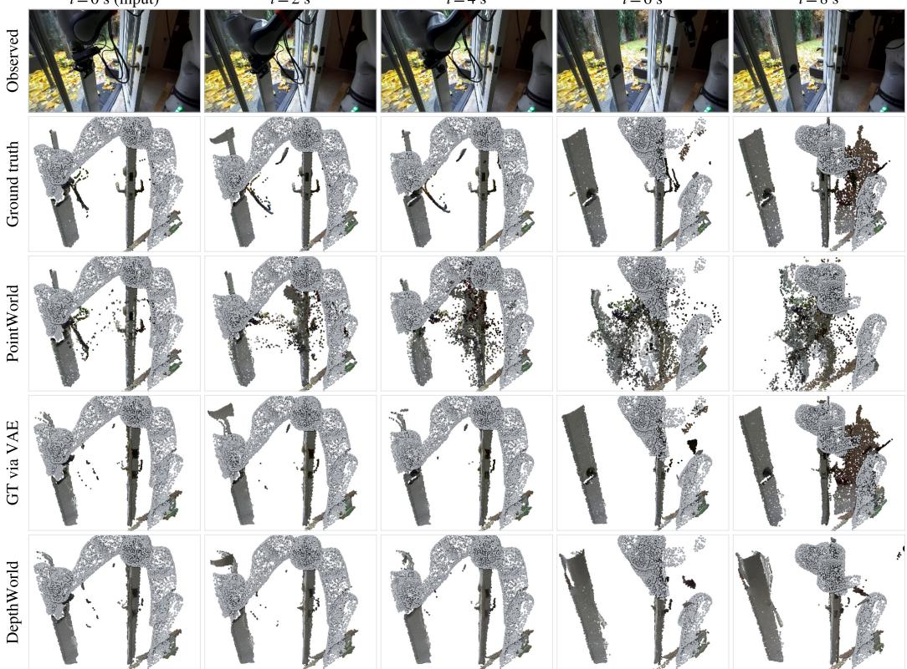  
Figure A11: Qualitative comparison with PointWorld on a held-out window in which the robot opens a door. Top: observed external RGB at the input frame and at 2, 4, 6, and 8 s. Rows 2–5: workspace point clouds in the robot frame at the same times: the ground truth lifted from $S ^ { 2 } M ^ { 2 }$ depth; PointWorld’s dense rollout seeded at t = 0; the ground truth after the SVD-VAE round trip, which is DepthWorld’s own reference in Table A5; and DepthWorld’s predicted depth unprojected into the robot frame. PointWorld follows the arm at short horizon, but from about 4 s its cloud scatters and drifts, consistent with its rising whole-scene Chamfer distance. DepthWorld stays coherent over the full 8 s and reconstructs the opening door in agreement with its VAE reference, at the cost of thin structures and some foreground geometry that are present in the raw ground truth.

Depth references and the own-ceiling comparison. For every window three depth stacks are available: the raw ground-truth $S ^ { 2 } M ^ { 2 }$ depth, the same depth after an encode–decode round trip through the SVD VAE (VAE-GT, the reference of Appendix C.8), and DepthWorld’s prediction. The round trip is not lossless: on moving points it alone displaces the ground truth by about 45 mm (median), and because DepthWorld must operate in the VAE’s latent space, this is a floor its network cannot go below. Scoring DepthWorld against raw depth therefore charges it for the VAE floor, whereas scoring PointWorld against VAE-GT would penalise it for a smear it never produced. We compute the full $2 \times 2$ of {PointWorld, DepthWorld}×{raw, VAE-GT} and report the diagonal as the fair comparison: PointWorld against raw depth, and DepthWorld against VAE-GT. Each model is thus measured against the best target its own representation can reach. The off-diagonal entries are unfair in opposite directions and reverse the winner depending on which is chosen. As a sanity check, the raw depth stored with DepthWorld’s outputs lifts to exactly the same 3D points as our own ground-truth pipeline, ruling out any scale or alignment mismatch between the two pipelines.

Metrics and scoring regions. We report two metrics in two regions, as medians over windows; the $\ell _ { 2 }$ error is averaged over the frames up to the horizon and the Chamfer distance is evaluated at the horizon frame. The tracked-point $\ell _ { 2 }$ error is the Euclidean distance between the predicted and target 3D position of the same point, averaged over the persistent moving set; it penalises a point that lands on the wrong part of the scene and is only possible because the persistent set provides stable correspondences. The symmetric Chamfer distance, 1 mean NN(pred → target) + mean NN(target → pred), is correspondence-free and measures whether the predicted cloud occupies the right space, regardless of point identity. The moving region scores only moving points and tests whether the model predicts the manipulation itself. The whole scene scores all workspace points, subsampled to 8,000 per cloud for equal density, and is dominated by static structure: it mostly measures whether the scene is reconstructed without drift. A Chamfer distance much smaller than the $\ell _ { 2 }$ error indicates that the predicted cloud has roughly the right shape but that correspondences have drifted.

Table A5: Comparison with PointWorld on the shared 256-window split (141 windows for the moving-point metrics, 147 for the whole scene), fair diagonal of the own-ceiling protocol: Point-World is scored against raw ground-truth depth, DepthWorld (the RGB+D PM-DPT variant) against the VAE round-tripped ground truth. Medians over windows in mm at horizons of 2 s and 8 s; $\ell _ { 2 }$ is averaged over the frames up to the horizon, Chamfer is evaluated at the horizon frame. Lower is better; best per column in bold.
<table><tr><td></td><td colspan="2">Tracked-point  $\ell _ { 2 } ,$  moving</td><td colspan="2">Chamfer, moving</td><td colspan="2">Chamfer, whole scene</td></tr><tr><td>Model</td><td>2s</td><td>8s</td><td>2s</td><td>8s</td><td>2s</td><td>8s</td></tr><tr><td>PointWorld [34] vs. raw GT</td><td>23</td><td>56</td><td>21</td><td>58</td><td>8</td><td>18</td></tr><tr><td>DepthWorld vs. VAE-GT</td><td>31</td><td>46</td><td>25</td><td>32</td><td>8</td><td>9</td></tr></table>

Results. Table A5 reports the fair diagonal at 2 s and 8 s, and Figure A11 shows a representative window. PointWorld is more accurate on tracked moving points at short horizon (23 vs. 31 mm at 2 s) but degrades faster, and DepthWorld is ahead at 8 s (46 vs. 56 mm). On the whole scene the two are equal at 2 s (8 mm), after which DepthWorld’s Chamfer distance stays flat (9 mm at 8 s) while PointWorld’s grows to 18 mm: the depth-image representation reconstructs the static scene without drift, whereas PointWorld’s point cloud drifts as the rollout proceeds. In the moving region PointWorld is slightly ahead at 2 s (21 vs. 25 mm) and DepthWorld degrades far less by 8 s (32 vs. 58 mm). The DepthWorld model in this comparison is the RGB+D PM-DPT variant of Table 2. We stress the asymmetries noted above: DepthWorld answers an easier query and is scored above its VAE floor. Against raw depth, PointWorld’s point representation retains a large advantage on moving objects, a representational cost of latent-space depth prediction that we consider an important direction for future work.

## D.5 Comparison with TesserAct (Supplement to Section 5)

TesserAct [4] is a text-conditioned, single-view RGB–depth–normal (RGBDN) video model built on CogVideoX-5b-I2V [? ], a 5B-parameter image-to-video diffusion transformer. It is not comparable off the shelf: it has no action conditioning, sees a single camera, and was trained on different data. We therefore adapt it minimally to our setting and retrain it on the same episodes as DepthWorld at an equal step budget.

Model and adaptation. The TesserAct architecture is kept unchanged. Its patch embedding splits the latent into three modality streams (RGB, depth, normal), projects each, and sums them into one shared token sequence, and two additional output heads produce the depth and normal latents. The transformer is initialised from the public CogVideoX-5b-I2V weights rather than from TesserAct’s released RGBDN checkpoint, mirroring DepthWorld, which starts from the generic SVD checkpoint rather than from a depth-pretrained model. The single conceptual change is the conditioning signal. CogVideoX conditions on T5 text tokens passed as the cross-modal context of its jointattention blocks. We replace these with action tokens: for each of the 9 frames of a clip, the 7-D end-effector pose and gripper state is mapped by a small MLP (7 → 1024 → 4096 with a SiLU non-linearity), added to a learned per-frame temporal embedding, and layer-normalised, giving 9 tokens of width 4096 that occupy the T5 slot. Because CogVideoX-5b-I2V uses rotary position embeddings, the context length is free, so 9 action tokens replace the 226 padded text tokens without touching any transformer block. This mirrors DepthWorld’s per-frame end-effector action conditioning. For classifier-free guidance, the whole trajectory is replaced by an all-zero null trajectory with probability 0.05, and the conditioning frame is dropped with the same probability.

Data. We use the same DROID-3D training episodes as DepthWorld, restricted to the two external cameras; the wrist camera is excluded, and each external camera is treated as an independent single-view sample, since TesserAct has no notion of a multi-view rig. Clips are contiguous 9- frame windows at 5 Hz and 192 × 320 resolution, with the per-frame actions aligned to the same timestamps. Depth is the DROID-3D metric depth mapped to TesserAct’s log-grayscale encoding over 0.30–3.30 m and replicated to three channels; normals are computed geometrically from the depth; actions are percentile-normalised per dimension. This yields 144,436 training clips and 1,534 validation clips.

Training. The training objective is TesserAct’s own: given the VAE-encoded first RGBDN frame and the action trajectory, denoise the 9-frame RGBDN clip with CogVideoX’s velocity target, with the loss being the sum of three separately weighted per-modality MSE terms. Each modality is encoded separately by the frozen CogVideoX VAE. Both the transformer and the action encoder are trained. We train on 16 H200 GPUs with data-parallel training in bf16 with gradient checkpointing, full-precision AdamW $( \beta _ { 1 } = 0 . 9 , \beta _ { 2 } = 0 . 9 5$ , weight decay $1 \bar { 0 } ^ { - 3 }$ , gradient clipping at 1.0), a global batch of 64 clips, and a constant learning rate of $5 \times 1 0 ^ { - 5 }$ after a 200-step warm-up. We train for 50k steps (about 20 hours), matching the 50k-step budget of the DepthWorld model it is compared against.

Evaluation. We mirror the DepthWorld protocol of Appendix D.3. Generation uses the released TesserAct pipeline without its text encoder: the action tokens are passed as the prompt embedding and the null trajectory as the negative embedding, with classifier-free guidance scale 6.0 and 50 DPM-Solver steps at $1 9 2 \times 3 2 0$ . Rollouts are autoregressive and closed-loop: five chained 9- frame generations, each re-anchored on the last generated RGBDN frame (ground truth is never re-injected) and given the next 8-frame action segment, producing $1 + 5 \times 8 = 4 1$ frames or 8.2 s, the same horizon as DepthWorld, which reaches it in ten steps of four new frames. The evaluation set is 128 held-out samples, each an episode with a fixed anchor frame scored on both external views; the two views are averaged with equal weight. As for DepthWorld, metrics are computed against the ground truth after an encode–decode round trip through the model’s own VAE (here the CogVideoX VAE), so that each model is scored above its own representational floor (Appendix C.8); we additionally record the error against raw depth and the VAE floor itself. Metric depth is recovered by inverting the log encoding, the conditioning frame is excluded, and the RGB and depth metrics of Appendix D.3 are averaged over the 40 generated frames.

Results. At the same 50k steps, averaged over the 40 generated frames on the external views, the adapted TesserAct reaches 19.43 dB PSNR and 0.154 AbsRel, against 24.07 dB and 0.074 for the DepthWorld RGB+D model (the $\mathrm { { S ^ { 2 } M ^ { 2 } } }$ row of Table A3): it trails by 4.6 dB and about 2× in AbsRel. The gap is mostly one of rollout stability rather than single-step quality: TesserAct’s first generated chunk is reasonable (PSNR 23.55, LPIPS 0.065, AbsRel 0.082, $\delta _ { 1 }$ 0.95 over its eight future frames), but quality decays steadily along the rollout, from PSNR 27.9, AbsRel 0.048, and $\delta _ { 1 } ~ 0 . 9 7$ at the first generated frame to 16.8, 0.211, and 0.81 at the fortieth, with no visible seams at the re-anchoring boundaries. Qualitatively, the generated arm follows the commanded trajectory over the full 8 s, indicating that the action conditioning is used. Two differences should be kept in mind when reading these numbers. TesserAct sees a single view and so has no cross-view context, whereas DepthWorld predicts all cameras jointly. Its depth also passes through the CogVideoX VAE, whose floor on raw depth is large (AbsRel 0.28 on one external camera), so its raw-depth error is dominated by the representation rather than the network; scoring both models above their own VAE floor, as we do, removes this effect from the comparison. The guidance scale was not tuned.