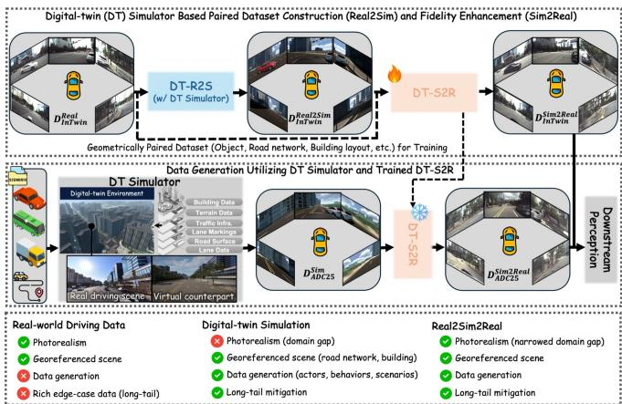
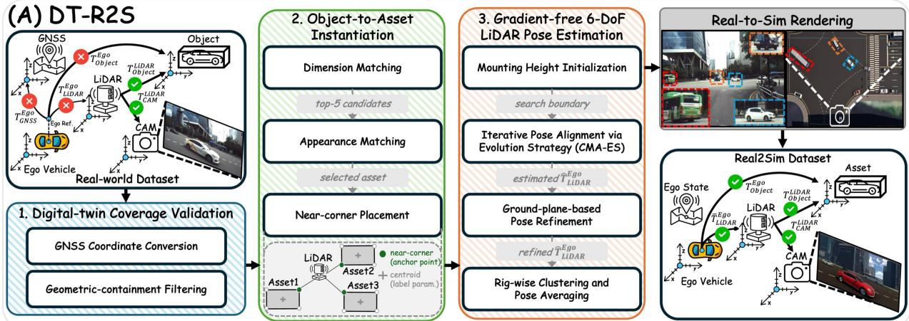
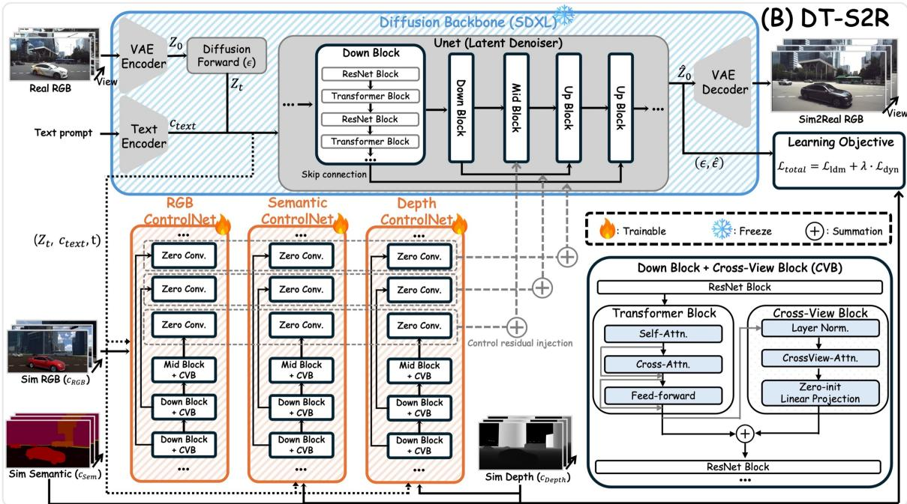
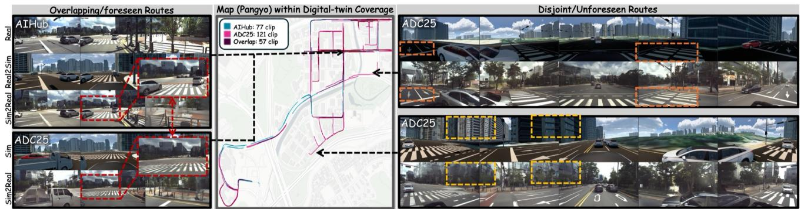
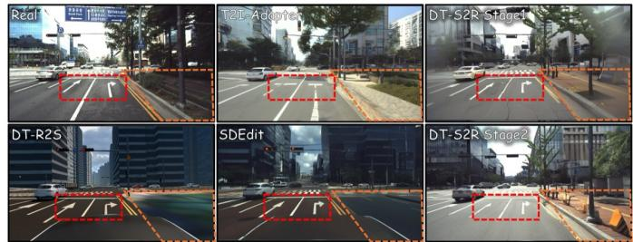
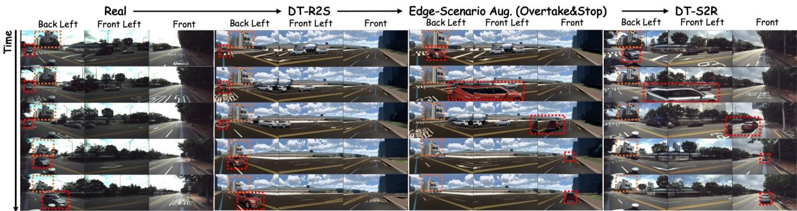

# Digital Twin-Driven Real2Sim2Real: Simulator-Conditioned Generation via Paired Driving-Scene Reconstruction

Hojun Lim∗, Hyeongseok Jeon, Donghyun Kim, Soonyoung Jung, and Heecheol Yoo∗†

Abstract—Camera-based 3D perception for autonomous driving relies heavily on large annotated datasets, and deploying such a system to a new target region typically requires data collection and annotation. Generative augmentation has been proposed to reduce this cost, but existing approaches face a fundamental trade-off: label-conditioned methods consume the very annotations they aim to replace, while simulator-conditioned methods offer free annotations but lack visual grounding to specific real environments. This work investigates the extent to which a digital-twin-driven Real2Sim2Real pipeline (DT-R2S2R) can substitute for target-region real data. By reconstructing recorded driving clips inside a georeferenced digital twin (DT-R2S), we condition a diffusion model on geometrically aligned simulator renderings, establishing a digital twin-grounded Sim2Real model (DT-S2R). As a result, DT-S2R synthesizes photorealistic driving images given low-cost yet georeferenced simulator data across both reconstructed and novel simulator scenes within digitaltwin coverage. The efficacy of generated data is verified on diverse 3D detectors. DETR3D, especially, reports 93.18% of mAP obtained by a target-region real-data oracle, without employing target images for detector training. Furthermore, simple co-training with existing out-of-target real data outperforms the oracle. Thus, DT-R2S2R can substantially reduce the cost of manual on-site data collection and annotation in digital twin-available districts, providing a practical foundation for scaling 3D perception. Comprehensive details are available at https://anonymouspaperdtr2s2r.netlify.app.

Index Terms—Digital twin, Real2Sim, Sim2Real, 3D Detection

## I. INTRODUCTION

the considerable labeling cost, it is likely to recur whenever the system needs to be deployed to an unexplored region, given that road geometry, traffic composition, vehicle fleets, and roadside architecture can all differ. The bottleneck is thus not only the total volume of data but its regional specificity, implying that what is scarce is not driving data in general, but driving data from the region of interest.

Generative data augmentation has been proposed to relieve this cost. One family conditions a diffusion model on the annotations of a real recording —BEV semantic map, 3D bounding boxes, and camera poses— and pairs each synthesized image with the annotation that produced it [3], [4]. Because the generated frames inherit the geometry of an actual location, they transfer well to that location. Generating scenes beyond the annotated set, however, requires either further manual labeling or a separate tool to produce layouts.

  
Fig. 1. Overview of DT-R2S2R. Sim2Real model is trained on real driving images and reconstruction counterparts. Then the model uses newly synthesized simulator data to produce photorealistic images for training 3D detectors.

Driving simulators are an attractive source for these annotations. The expensive labels that such generators require —semantic, depth maps, and 3D bounding boxes— are either native or easily producible outputs of the renderer and can be exported for any simulated scene at negligible marginal cost. This motivates closing the loop: reproducing a real driving scene in a simulator (Real2Sim), exporting the conditions from that reconstruction, and generating photorealistic frames from them (Sim2Real). Several recent Real2Sim2Real pipelines [5], [6] follow this pattern.

However, in these systems, the reconstruction usually covers only the placement of dynamic objects and a coarse road layout. The static surroundings of the location, such as building geometries and roadside structures, have no counterpart in the simulated scene and are left for the Sim2Real generator to synthesize without grounding. To address this, we construct Digital-Twin-driven Real2Sim2Real (DT-R2S2R) pipeline, where the road network, buildings, terrain, and vehicle assets are modeled based on the real world rather than arbitrarily synthesized [7], [8]. Our pipeline consists of two modules, DT-R2S and DT-S2R. First, DT-R2S locates a real driving clip inside the digital twin by matching its GNSS trace against twin maps, replaces each annotated vehicle with the library asset closest in dimension and appearance, and estimates the sensor pose aligning the reconstructed scene with the original recording. Through the scene rendering, we obtain synthetic RGB images geometrically paired with real counterparts and their low-cost annotations from the simulator. DT-S2R then takes them as input to condition a diffusion backbone, yielding photorealistic and geospatially grounded images. Importantly, producing additional virtual driving clips within the simulator and passing them to trained DT-S2R enables the large-scale synthesis of high-fidelity and georeferenced data for the specific target regions at marginal cost, as shown in Fig. 1.

The main contributions of this work are twofold.

• We construct DT-R2S2R that couples geometrically paired driving-scene reconstruction (DT-R2S) with a spatially-consistent image translation (DT-S2R).

• We comprehensively validate our pipeline not only as a high-fidelity image generator but also as a labeled-data engine for 3D detection training across diverse settings.

## II. RELATED WORK

## A. Synthetic Driving Data

Game engines and driving simulators make it affordable to produce large, labeled driving datasets, but in many cases, these datasets lack real-world counterparts. Several datasets have addressed this by introducing direct references to real datasets to narrow the gap. For example, nuCarla [9] mirrors the sensor layout and data format of nuScenes [1]. Closer correspondence has been obtained by reconstructing the recordings. DIVA-Sim [5] rebuilds nuScenes clips in a simulator, recovering the road network and replaying the logged object trajectories. VKITTI [10] goes further for KITTI [2], also reproducing background structures such as buildings and trees. Following this line, we perform Real2Sim inside a digital twin built from the HD map of the target region, where the road network, buildings, and terrain are already available at high fidelity, so that any clip recorded within the covered area can be paired with a geometrically aligned rendering.

## B. Photorealistic Image Generation

The transformation of a rendered synthetic image into a realistic one has traditionally been posed as an unpaired imageto-image translation, as paired real-synthetic image sets are often not available. The characteristic limitation of those approaches is semantic flipping [11]. To overcome this limitation, FDA [12] swaps the low-frequency amplitude of source and target images, which does not require training and retains the source contents. An adversarial learning-based method VSAIT [11], on the other hand, addresses this by learning the mapping in a high-dimensional vector space, where sourcerelated information, such as texture and color, is unbound and target-related information is bound in its place. SODA CAM [13] adapts the formulation to multimodal driving data.

Another common choice for the same task is latent diffusion models (LDMs), such as SDXL [14], with auxiliary networks which supply conditions. For instance, ControlNet [15] copies the down and middle blocks of the backbone, processes the given condition, and injects their output back to the backbone. T2I-Adapter [16] replaces the copy with a small feature extractor. SDEdit [17], on the other hand, uses the noiseadded condition as a starting point for the denoising process. Extending this direction, conditional diffusion models are also widely used to generate driving data directly from annotations. MagicDrive [3], SimGen [5], and InstaDrive [4] are recent examples where labels of a real recording are consumed as conditions so that the generated frames are paired with those.

Across the mentioned methods, the output is limited by how much of the real scene the condition describes: a projected box or a semantic map states where an object is, not what it or its surroundings look like. Hence, a generator can only imagine the appearance of the surrounding structure, which often induces semantic flipping. We therefore use a rendering from the digital twin as a strong anchor for a paired Sim2Real translation, facilitating the preservation of critical static structures.

## III. METHODOLOGY

## A. DT-R2S: Paired Driving-Scene Reconstruction

To generate scene-level geometrically paired counterparts, we embed real-world driving clips (AI-Hub) of South Korea into MORAI SIM [8], a digital twin simulator where HD map-based road network and buildings for two urban districts, Sangam and Pangyo of the same country, together with a library of vehicle assets are available. As shown in Fig. 2, the following three steps are conducted: (1) real-to-simulator coordinate conversion, (2) real-vehicle-to-virtual-asset mapping, and (3) sensor pose estimation that closely aligns both the geometry and appearance of real images and rendered counterparts.

  
Fig. 2. Architecture of DT-R2S that locates a real driving clip inside the digital-twin simulator (1), replaces each object with the closest library asset (2), and recovers the LiDAR pose with respect to ego vehicle to improve real-sim image correspondence (3).

  
Fig. 3. Architecture of DT-S2R that drives one ControlNet branch per rendered modality (RGB, semantic, depth map) with cross-view blocks.

1) Locating the clip in the twin: We locate each recorded clip in the simulator by converting the ego vehicle’s GNSS trace into the map frame via UTM projection. Since traces are acquired with high-accuracy RTK-DGPS, the converted trajectories align with the simulation environment without additional post-processing of the poses. As the digital twin covers only a finite area, we discard any clip that contains even a single out-of-bounds frame. To check the coverage of a clip, we extract lane-boundary nodes from the HD map and define each district’s spatial extent as a convex hull. A clip is retained only if all of its frames fall within the hull.

2) Replacing objects with library assets: After a clip is selected, we need to reproduce the dynamic objects (car, bus, and truck) of the scene inside the simulator. The dynamic state of each annotated object transfers directly from the recording, but two questions remain: which simulator asset substitutes for the object, and how it is positioned. First, we match the two by dimension and appearance. For box dimensions, we take the per-axis maximum over the object’s tracked horizon, because a cuboid labeled from a single LiDAR sweep tends to underestimate a vehicle’s true extent due to occlusion and missing returns. We rank the assets against the aggregated size by a weighted cost over length, width, and height. Each axis is weighted by its normalized coefficient of variation (length: 0.35, width: 0.24, height: 0.41), prioritizing more discriminative dimensions. The top-5 candidates are then reranked by appearance: SAM [18]-segmented crop of the object and each candidate asset are encoded into DINOv3 [19] features, and the candidate with the highest cosine similarity is kept. Second, we place assets by their near-corner positions. Among the four BEV corners, the one nearest to the LiDAR is the only physical measurement: annotations are drawn by fitting L- or I-shaped returns anchored on that corner, even if they are parameterized by their centroids afterward. We thus re-reference each object to its near corner before instantiating it in the simulator.

3) Recovering sensor poses: AI-Hub provides a georeferenced ego trajectory and 3D bounding boxes with respect to LiDAR frame, together with the LiDAR-to-GNSS extrinsics. However, it does not specify where the sensors are located within the vehicle body, so the sensor extrinsics with respect to the vehicle must be recovered for simulation. To resolve this, our strategy is to anchor the simulator ego’s reference frame to the GNSS trajectory and deduce the remaining internal sensor placements via LiDAR data matching.

We initialize the simulator ego’s reference pose with the GNSS, transferring the horizontal placement (i.e., easting and northing in UTM) from the real data. Since the simulator grounds the vehicle to the terrain, GNSS height and tilt become redundant, leaving the LiDAR’s relative height and tilt unknown. With the simulator ego anchored to the GNSS, we determine the missing LiDAR-to-ego transform $( \hat { T } _ { L i D A R } ^ { E g o } )$ by minimizing the geometric discrepancy between real and simulated bounding boxes within the LiDAR frame:

$$
\hat { T } _ { L i D A R } ^ { E g o } = \mathrm { a r g } \operatorname* { m i n } _ { T }  \frac { 1 } { | \mathcal { M } ( T ) | } \sum _ { ( i , i ^ { \prime } ) \in \mathcal { M } ( T ) } \sum _ { j = 1 } ^ { 8 } \| c _ { i j } ^ { \mathrm { r e a l } } - c _ { i ^ { \prime } j } ^ { \mathrm { s i m } } ( T ) \| ^ { 2 } ,\tag{1}
$$

where $c _ { i j } ^ { \mathrm { r e a l } }$ is the j-th corner of the i-th real box in the LiDAR frame (fixed, from the dataset), $c _ { i ^ { \prime } j } ^ { \mathrm { s i m } } ( T )$ is the corresponding corner of the simulated box $i ^ { \prime } ,$ , and $\mathcal { M } ( T )$ denotes the realto-simulated box correspondence. To optimize this objective, we set the initial condition of $T$ using the provided LiDARto-GNSS extrinsics. Furthermore, to define a plausible search boundary for the optimizer, we first fit a ground plane to the real point cloud via RANSAC. This provides a rough estimate of the LiDAR’s physical mounting height relative to the ground, establishing a valid bounding margin for the search space. Starting from this configuration, we iteratively optimize the full 6-DoF pose of T using CMA-ES [20]. At each step, while the simulator ego remains fixed, updating the candidate LiDAR extrinsics repositions the surrounding vehicles within the simulator. This allows us to calculate the loss via Equation 1, driving CMA-ES to propose the next LiDAR pose until convergence.

However, this optimization can still leave residual misalignments due to discrepancies in vehicle dimensions and terrain elevation. To address this, we apply a final ground-plane-based refinement. Following the LiDAR-to-ego calibration procedure of [21], we fit a ground plane to both the simulated and real LiDAR point clouds independently and use the extracted roll, pitch, and z values to correct the remaining LiDAR pose error. Finally, analyzing the calibrations of AI-Hub reveals four distinct sensor rig setups. We group the per-clip estimates $\hat { T } _ { L i D A R } ^ { E g o }$ accordingly, average translations arithmetically and rotations via SLERP, and adopt the mean as the stable $\bar { T } _ { L i D A R } ^ { \bar { E } g o }$ for each rig.

## B. DT-S2R: Photorealism Enhancement

Reconstruction in a digital twin paired with the realworld recording already provides a wealth of information for Sim2Real generator to leverage: a robust anchor for the placement of dynamic objects and a reference for static structures that every rendered view coherently shares. In this sense, we hypothesize that minimal modifications to the generative network could be sufficient. Consequently, the backbone is frozen throughout, and our modifications are focused on how the conditions are injected.

We take three conditions from the reconstruction: depth $c ^ { \mathrm { d e p } }$ , semantics $c ^ { \mathrm { s e m } }$ , and the simulator’s RGB view $c ^ { \mathrm { r g b } }$ Those three are selected as they convey complementary information. Depth and semantics fix where surfaces are and what they are. On the other hand, the rendered view additionally fixes what the place and objects look $l i k e ,$ since the road network, the surrounding buildings and the substituted assets all appear in it. Each condition k drives a ControlNet $\mathcal { C } _ { k } .$ a trainable copy of the down and middle blocks of the backbone [15]. Each ControlNet returns one residual per skip connection, together with one for the middle block,

$$
\left( r _ { 1 } ^ { k } , \dots , r _ { L } ^ { k } , \ r _ { \mathrm { m i d } } ^ { k } \right) = { \mathcal C } _ { k } \left( z _ { t } , t , c ^ { \mathrm { t e x t } } , c ^ { k } \right) ,\tag{2}
$$

where $z _ { t }$ is the noisy latent, t the timestep and $c ^ { \mathrm { t e x t } }$ the text embedding. Writing $h _ { \ell }$ for the backbone’s own ℓ-th skip

feature and $h _ { \mathrm { m i d } }$ for its middle-block output, the enriched features can be denoted as

$$
\tilde { h } _ { \ell } = h _ { \ell } + \sum _ { k } s _ { k } r _ { \ell } ^ { k } , \qquad \tilde { h } _ { \mathrm { m i d } } = h _ { \mathrm { m i d } } + \sum _ { k } s _ { k } r _ { \mathrm { m i d } } ^ { k } ,\tag{3}
$$

with $s _ { k } = 1$ for all three. As (3) formulates, the integration mechanism is conducted not by modifying the diffusion backbone directly. Instead, the three simulator conditions influence the denoising process via additive residual features injected into the backbone’s skip and middle blocks.

Let Ω be the set of spatial locations in the latent grid and $\Omega _ { \mathrm { d y n } } \subset \Omega$ be those belonging to dynamic objects. Then we optimize the following loss:

$$
\mathcal { L } _ { \mathit { t o t a l } } = \frac { 1 } { | \Omega | } \sum _ { u \in \Omega }  \hat { \epsilon } _ { u } - \epsilon _ { u }  ^ { 2 } +  \frac { \lambda } { | \Omega _ { \mathrm { d y n } } | } \sum _ { u \in \Omega _ { \mathrm { d y n } } } w _ { u }  \hat { \epsilon } _ { u } - \epsilon _ { u }  ^ { 2 } ,\tag{4}
$$

where ϵˆ is the predicted noise, and $w _ { u } = \operatorname* { m a x } ( d _ { u } , 0 . 0 2 )$ grows with the normalized depth $d _ { u }$ from $c ^ { d e p }$ . The first term is the learning objective of LDM. The second term, inspired by the reweighting mechanism of [22], exists because distant objects occupy fewer pixels but convey most of the difficulty for 3D detection, and an error averaged over all spatial positions would otherwise ignore them.

In light of the multiview-camera setup being pivotal in 3D perception, we additionally equip our method with multiviewimage generation by employing the cross-view blocks following [3]. Specifically, for each camera $i ,$ the hidden state $a _ { i }$ gets updated by taking cross attention with that of left and right neighbors ${ \mathcal { N } } ( i ) ;$

$$
a _ { i } \gets a _ { i } + W _ { 0 } \left( \sum _ { j \in \mathcal { N } ( i ) } \mathrm { A t t n } \big ( \mathrm { L N } ( a _ { i } ) , \mathrm { L N } ( a _ { j } ) \big ) \right) ,\tag{5}
$$

with layer normalization LN and zero-initialized $W _ { 0 }$ so that the term vanishes at initialization. As depicted in Fig. 3, we insert the cross-view blocks into the conditioning branches.

## IV. EXPERIMENTAL SETUP

## A. Datasets

As summarized in Table I, we use one real and two synthetic datasets to demonstrate our approach. AI-Hub is a real driving dataset recorded on urban roads of South Korea with five surround-view cameras and one 128-channel LiDAR. We divide it by regional coverage of a digital-twin simulator: a clip is in-twin $( D _ { I n T w i n } ^ { \bar { R e a l } } )$ if its GNSS trajectory lies inside the districts of digital-twin maps so that the virtual counterparts exist, and off-twin $( D _ { O f f T w i n } ^ { R e a l } )$ otherwise. $D _ { A l l } ^ { R e a l }$ denotes the two together. Note that the official training and validation splits are frame-wise. Hence, we repartition AI-Hub driving clips in clip-wise manner for fair training of Sim2Real generator, fairly distributing dynamic objects in polar coordinate system with respect to the ego vehicle across splits.

TABLE I  
SUMMARY OF INDIVIDUAL DATASETS AND THEIR CHARACTERISTICS. (#CLIP, #FRAME) IS NOTED IN TRAIN AND VAL. COLUMNS. DT COVER. DENOTES THE DIGITAL TWIN COVERAGE. $D _ { A l l } ^ { R e a l }$ DENOTES THE COMBINATION OF $D _ { I n T w i n } ^ { R e a l }$ AND $D _ { O f f T w i n } ^ { R e a l } .$
<table><tr><td>Dataset</td><td>Domain</td><td>DT Cover.</td><td>DT-S2R</td><td>Region/District</td><td>Train</td><td>Val.</td><td>Notation</td></tr><tr><td>AI-Hub (Off-Twin)</td><td>Real</td><td>x</td><td>N/A</td><td>Seoul, Seongnam, Sejong, Daegu</td><td>(262, 47K)</td><td>(66, 11K)</td><td> $D _ { O f f T } ^ { R e a l }$  win</td></tr><tr><td>AI-Hub (In-Twin)</td><td>Real</td><td>√</td><td>N/A</td><td>Sangam, Pangyo</td><td>(134, 24K)</td><td>(34, 6K)</td><td> $D _ { { t n T } _ { 1 } } ^ { R e a l }$  win</td></tr><tr><td>DT-R2S</td><td>Synthetic</td><td>√</td><td>x</td><td>Sangam, Pangyo</td><td>(134, 24K)</td><td>(34, 6K)</td><td> $D _ { r o n T a r i m } ^ { R e a l 2 S i m }$  InTwin</td></tr><tr><td>DT-S2R</td><td>Synthetic</td><td>√</td><td>√</td><td>Sangam, Pangyo</td><td>(134, 24K)</td><td>(34, 6K)</td><td>D Sim2Real InTwin</td></tr><tr><td>ADC25</td><td>Synthetic</td><td>√</td><td>x</td><td>Sangam, Pangyo</td><td>(241, 28K)</td><td>(0, 0)</td><td> $D _ { A D C 2 5 } ^ { S i m }$ </td></tr><tr><td>ADC25 (DT-S2R)</td><td>Synthetic</td><td>√</td><td>√</td><td>Sangam, Pangyo</td><td>(241, 28K)</td><td>(0,0)</td><td> $D _ { A D C 2 5 } ^ { S i m 2 R e a l }$ </td></tr></table>

Applying DT-R2S to $D _ { I n T w i n } ^ { R e a l }$ creates $D _ { I n T w i n } ^ { R e a l 2 S i m }$ , the rendered counterpart of each recording, and passing that to DT-S2R gives $\dot { D } _ { I n T w i n } ^ { S i m 2 R e a l }$ . ADC25 is a third dataset that did not participate in constructing the pipeline and is used solely to test the scalability of our trained DT-S2R on pure simulator-generated driving clips. Its scenarios originate from the dataset of Hyundai Motor Group Autonomous Driving Challenge 2025. We only select scenarios whose trajectories lie within the digital-twin coverage as $D _ { I n T w i n } ^ { R e a l }$ . The scenarios are re-simulated with the reconstructed sensor pose, giving $D _ { A D C 2 5 } ^ { S i m } .$ DT-S2R then produces $D _ { A D C 2 5 } ^ { S i m 2 R e a l }$ . Note that no frame of $D _ { A D C 2 5 } ^ { S i m 2 R e a l }$ corresponds to a real recording, which means producing it did not require real-world data collection nor new labeling, but rather re-using the digital-twin simulator and trained DT-S2R.

While both $D _ { I n T w i n } ^ { R e a l }$ and $D _ { A D C 2 5 } ^ { S i m 2 R e a l }$ cover the same district, their street-level routes diverge. In Pangyo, for example, ∼53% clips of $D _ { A D C 2 5 } ^ { S i m 2 R e a l }$ are disjoint as visualized in Fig. 4. These clips allow us to visually inspect whether our DT-S2R can synthesize image data across unvisited streets, leveraging the rendered scene within the digital-twin area.

## B. Implementation details

1) DT-S2R training: All views are resized to $5 7 6 \times 1 0 2 4$ The diffusion backbone, its VAE, and both text encoders are frozen, and only the three conditioning branches are trained. We use AdamW with learning rate $5 \times 1 0 ^ { - 5 }$ , weight decay 0.01, 1000 warm-up steps, and a per-device batch of two frames × five cameras on eight NVIDIA RTX A6000 GPUs. Training proceeds in two stages. Stage 1 trains the conditioning branches without cross-view blocks for 50,000 steps with λ of (4) set to 0.1. Stage 2 initializes from the stage-1 checkpoint, enables cross-view blocks in the mid and the two outermost down blocks of each branch, raises λ to 0.3, and trains for a further 40,000 steps. The prompt is set to highly detailed realistic driving scene in {district}, South Korea, and it is dropped with probability 0.1. Lastly, the sampling process is performed with DDPM scheduler at 50 steps and guidance scale 5.0.

2) Other design choices for DT-S2R: The set of imageto-image translators —FDA [12], VSAIT [11] and SODA-CAM [13]— takes the pairs of real and synthetic RGB images of $D _ { I n T w i n } ^ { R e a l }$ and $\bar { D } _ { I n T w i n } ^ { S i m 2 R e a l }$ , following the training configuration of [13]. SimGen (ImgDiff) [5] is trained taking RGB, semantic and depth labels of $D _ { I n T w i n } ^ { R e a l 2 S i m }$ as conditions.

The synthetic RGB rendered using the digital-twin simulator is the strongest of our three conditions, and while designing the conditioning path, we considered SDEdit [17] and T2I-Adapter [16] as two other ways of injecting it. Both methods are implemented based on stage-1 configuration. SDEdit places the synthetic RGB in the initial latent at $t _ { 0 } ~ = ~ 0 . 5$ and leaves depth and semantics as ControlNet branches. On the other hand, T2I-Adapter passes all three signals through lightweight adapters with a smaller learning rate $1 \times 1 0 ^ { - 5 } .$

3) 3D Detectors: Downstream perception is measured with one monocular 3D detector, FCOS3D [23], two multi-view 3D detectors, DETR3D [24] and PETR [25].

## C. Metrics

The quality of generated images is measured with four complementary quantities. PSNR and SSIM quantify pixellevel and structural agreement with the paired real frame. LPIPS measures distance to real image at deep-feature level. Lastly, FID compares the real and generated image sets at the distribution level. For downstream perception tasks, mAP and NDS [1] across car, bus, and truck classes are measured for 3D detection. Scores are evaluated on a $D _ { I n T w i n } ^ { R e a l }$ validation set unless otherwise mentioned.

## V. EXPERIMENTS

We first validate DT-R2S and DT-S2R separately in Section V-A. Then, Section V-B asks whether the generated data can replace real counterparts for 3D detector training, and Section V-C studies the extent to which performance can be achieved without real target-region images by exploiting the digital-twin simulation and DT-R2S2R for the same region.

## A. Design Choices for DT-R2S2R

1) DT-R2S: scene reconstruction and sensor alignment: Table II isolates each stage of Section III-A2 and III-A3 on the raw reconstruction. 2D IoU is the image-space IoU between real and simulated cuboids, each projected onto the camera in which the simulated box is largest. 3D Corner Error is the mean distance over all corners of real and asset 3D boxes.

  
Fig. 4. Data generation using DT-S2R conditioned on both known and unknown driving routes from the simulator. (i) Geographical features and buildings are retained where the digital twin supplies them. (ii) Road-network detail survives DT-S2R. (iii) Cross-view consistency holds on a route absent from training.

TABLE II  
ABLATION STUDY ON DT-R2S. BEST SCORES ARE SHOWN IN BOLD, AND SECOND-BEST SCORES ARE UNDERLINED.
<table><tr><td>Ablation</td><td>2D IoU↑</td><td>3D Corner Err.↓</td><td>SSIM↑</td><td>LPIPS↓</td></tr><tr><td>Baseline</td><td>57.5%</td><td>0.581</td><td>0.3427</td><td>0.6836</td></tr><tr><td>+ Appearance re-ranking</td><td>56.7%</td><td>0.632</td><td>0.3420</td><td>0.6849</td></tr><tr><td>+ Ground-plane refinement</td><td>59.4%</td><td>0.582</td><td>0.3430</td><td>0.6809</td></tr><tr><td>+ Clustering &amp; Averaging</td><td>60.4%</td><td>0.565</td><td>0.3458</td><td>0.6804</td></tr></table>

The baseline—per-axis-max dimension aggregation with near-corner placement and the box-corner pose estimate— reaches 57.5 IoU and 0.581 m corner error. Appearance reranking trades a marginal amount of geometric fit for visual similarity (56.7, 0.632 m). This could be explained as the visually closest asset need not be the dimensionally closest one among candidates with near-tied dimensions, and corner error conflates that mismatch with pose error. The two remaining stages recover and surpass the baseline on all metrics. Ground-plane refinement raises IoU to 59.4. Clustering perclip estimates into one transform per calibration group then gives the best scores throughout (60.4, 0.565 m), indicating the importance of a proper strategy to address per-clip pose noise. Nevertheless, precision remains bounded by the finite asset catalog, underscoring the need for automated asset reconstruction from sensor data as a key enabler of scaling.

2) DT-S2R: how the rendered view is used for paired Sim2Real training: Despite the sophisticated design for geometrically paired reconstruction, there exists a non-negligible visual domain gap to the real counterparts, coming from the limitation of the rendering pipeline. To address this, we additionally employ Sim2Real translation and evaluate it across three families — signal-processing, GAN, and diffusion. As presented in Table III, diffusion-based methods generally produce more realistic results than other methods. Based on the observation, we develop our DT-S2R (Stage1) upon the frozen diffusion backbone with ControlNet. For comparison, we also vary the injection mechanism of rendered RGB across two configurations: SDEdit and T2I-Adapter.

SDEdit injects it as an initial latent, reaching 57.2 FID. T2I-Adapter, on the other hand, passes it through a lightweight adapter, presenting 22.1. Lastly, DT-S2R (Stage1) that uses residual conditioning branches for RGB reports 13.5, the better score over compared mechanisms, and the same holds for PSNR, SSIM, and LPIPS. Fig. 5 shows where each mechanism differs from the target. SDEdit holds the road network and the geometry of the conditioning render closely, but the appearance of the simulator stays visible in its output. T2I-Adapter keeps the global layout but loses thin structures such as lane markings. Further training Stage1 with cross-view blocks leads to the proposed DT-S2R (Stage2), reporting the best structural similarity and fidelity on each metric in table.

It is worth noting that the behavior of SDEdit is one end of a trade-off. Because it alters the conditioning RGB conservatively, the rendered structure remains after translation, leading to a lower chance of semantic flipping. This characteristic would make SDEdit more suitable as a training data engine for dense perception tasks such as segmentation, where pixellevel alignment between the generated labels and translated images is essential.

TABLE III  
IMAGE QUALITY IN TERMS OF SIMILARITY TO PAIRED VALIDATION SET $D _ { I n T w i n } ^ { R e a l }$ BY SIM2REAL METHODS.
<table><tr><td>Model</td><td>PSNR↑</td><td>SSIM↑</td><td>LPIPS↓</td><td>FID↓</td></tr><tr><td>Real2Sim</td><td></td><td></td><td></td><td></td></tr><tr><td>DT-S2R  $( D _ { I n T w i n } ^ { R e a l 2 S i m } )$ </td><td>9.062</td><td>0.354</td><td>0.676</td><td>101.3</td></tr><tr><td colspan="5">Signal-Processing based Sim2Real</td></tr><tr><td>FDA† [12]</td><td>10.168</td><td>0.414</td><td>0.682</td><td>117.8</td></tr><tr><td>GAN-based Sim2Real</td><td></td><td></td><td></td><td></td></tr><tr><td>VSAIT [11]</td><td>9.478</td><td>0.391</td><td>0.648</td><td>85.1</td></tr><tr><td>SODA-CAM [13]</td><td>10.094</td><td>0.409</td><td>0.649</td><td>93.5</td></tr><tr><td colspan="5">Diffusion-based Sim2Real</td></tr><tr><td>SimGen‡ [5]</td><td>12.040</td><td>0.440</td><td>0.527</td><td>21.3</td></tr><tr><td>SDEdit† [17]</td><td>9.458</td><td>0.397</td><td>0.650</td><td>57.2</td></tr><tr><td>T2I-Adapter† [16]</td><td>9.890</td><td>0.367</td><td>0.634</td><td>22.1</td></tr><tr><td>DT-S2R-Stage1 (Ours)</td><td>11.778</td><td>0.452</td><td>0.509</td><td>13.5</td></tr><tr><td>DT-S2R-Stage2 (Ours)</td><td>12.104</td><td>0.461</td><td>0.493</td><td>12.7</td></tr></table>

†: Re-implemented. ‡: Only the ImgDiff module of [5] is used.

3) Do real-world-trained detectors read the generated frames as they read real ones?: Image-quality metrics state how similar two images look, not whether a perception model reads them the same way. We therefore comprehensively run one mono-view and two multiview detectors trained on AI-Hub $( D _ { I n T w i n } ^ { R e a l } )$ over DT-R2S $( D _ { I n T w i n } ^ { R e a l 2 S i m } )$ and DT-S2R $( D _ { I n T w i n } ^ { S i m 2 R e a l } )$ outputs, respectively. We then score their predictions against the original real ground truth in Table IV. Note that the scores show the disagreement accumulating two error sources, the geometry misalignment from the scene-recovery step and appearance gap from the translation step.

The reconstruction on its own already recovers 47.5–57.6% of the mAP that the same detectors obtain on the corresponding real frames. The Sim2Real step further raises mAP to near 70% for DETR3D and NDS over 76% for all detectors, demonstrating the fidelity of data generated by the entire pipeline DT-R2S2R against original real scenes.

## B. Generated Data as a Valid Proxy for Real Training Data

1) Is the Sim2Real step necessary?: We first explore whether the Sim2Real step brings performance gains to 3D detector training. Table V(a) shows the performance of FCOS3D trained solely on the synthetic data with and without DT-S2R. The same scenes after the translation step yield a higher mAP by nearly a factor of 5 than raw reconstruction, indicating that reproducing geometries in the simulator alone does not produce trainable data due to the large visual domain gap.

  
Fig. 5. Visual comparison of translated images by injection mechanisms of rendered-RGB at Sim2Real step.

TABLE IV  
IMAGE FIDELITY QUANTIFIED BY FCOS3D TRAINED ON $D _ { I n T w i n } ^ { R e a l } .$ . FOR VALIDATION CLIPS OF $D _ { I n T w i n } ^ { R e a l } ,$ IT TAKES EACH OF THE THREE ROWS AS AN INPUT. THE PREDICTIONS BY ROWS ARE SCORED AGAINST GROUND TRUTH. ROW COLORED BLUE DENOTES ORACLE.
<table><tr><td rowspan="3">Inf. Input (val. set)</td><td colspan="2">Mono-view</td><td colspan="4">Multi-view</td></tr><tr><td colspan="2">FCOS3D</td><td colspan="2">DETR3D</td><td colspan="2">PETR</td></tr><tr><td>mAP↑</td><td>NDS↑</td><td>mAP↑</td><td>NDS↑</td><td>mAP↑</td><td>NDS↑</td></tr><tr><td> $D _ { I n T w i n } ^ { R e a l }$ </td><td>52.2</td><td>57.4</td><td>53.4</td><td>57.6</td><td>60.4</td><td>61.0</td></tr><tr><td> $D _ { I n T w i n } ^ { R e a l 2 S i m }$ </td><td></td><td>24.8 (47.5%) 40.0 (69.6%) 30.8 (57.6%) 42.3 (73.4%) 31.1 (51.4%) 41.5 (68.0%)</td><td></td><td></td><td></td><td></td></tr><tr><td> $D _ { I n T w i n } ^ { S i m 2 R e a l }$ </td><td>32.0 (61.3%) 45.6 (79.4%) 37.0 (69.2%) 47.5 (82.4%) 35.5 (58.7%) 46.8 (76.7%)</td><td></td><td></td><td></td><td></td><td></td></tr></table>

TABLE V  
DETECTION PERFORMANCE OF FCOS3D-W/O FINETUNE TRAINED FOR 12 EPOCHS AND EVALUATED ON $D _ { A l l } ^ { R e a l }$

(a) Effect of DT-S2R when training on synthetic data.  
(b) Effect of generated data in augmentation. The number of epochs is halved when w/ $D _ { I n T w i n } ^ { S i m 2 R e a l }$
<table><tr><td>Training set</td><td>mAP↑</td><td>NDS↑</td><td>Training set</td><td>mAP↑</td><td>NDS↑</td></tr><tr><td> $D _ { I n T w i n } ^ { R e a l 2 S i m }$ </td><td>6.86</td><td>27.31</td><td> $D _ { I n T w } ^ { R e a l }$  in</td><td>37.59</td><td>49.26</td></tr><tr><td> $D _ { I n T w i n } ^ { S u m z A e a }$  1</td><td>33.94</td><td>45.93</td><td> $D _ { I n T w i n } ^ { R e a l } + D _ { I n T w i n } ^ { S i m 2 R e a l }$ </td><td>38.60</td><td>50.08</td></tr></table>

2) How far does the generated data substitute for real data of the same scene?: In Table VI we vary the ratio of real to the paired synthetic data, holding the total number of training frames fixed during FCOS3D training. As intuitively expected, in general, the performance declines gradually as real data are withdrawn on both mAP and NDS. However, even when all real data are retracted, the detector retains 90.28% and 93.23% of its oracle mAP and NDS, respectively. This demonstrates that the high-quality reproduction of real-world scenes by DT-R2S2R yields valid synthetic proxies, serving as a viable alternative to real-world data for 3D detector training.

3) Does the generated data also augment?: As shown in Table V(b), adding the generated copies to the full real data raises mAP from 37.59 to 38.60, even though the two sets depict fundamentally the same scenes. This is attributed to DT-S2R which maintains the dynamic-object placement but resynthesizes the color, texture, and lighting. In other words, it supplies the variation that the real data do not contain.

## C. Enriching Scene-Level Diversity with Novel Synthetic Sim2Real Data

1) How Close Can Expanded Scene Diversity Bring Us to the Real-Data Oracle?: In this section, we evaluate the feasibility of deploying a 3D detection system to the target region without directly utilizing any target-region real images for detector training. To this end, we investigate the effect of combining two synthetic datasets: reconstructed clips $( D _ { I n T w i n } ^ { S i m 2 R e a l } )$ and ADC25 $( D _ { A D C 2 5 } ^ { S i m 2 R e a l } )$ , a purely simulatorgenerated dataset using the digital twin and trained DT-S2R.

TABLE VI  
REPLACEMENT OF REAL DATA WITH GENERATED COUNTERPARTS. THE EXPERIMENT SETUP IS THE SAME AS TABLE V. ORACLE IS IN BLUE .
<table><tr><td>Real</td><td>Synthetic</td><td>Ratio</td><td>mAP(%, ↑)</td><td>NDS(%, ↑)</td></tr><tr><td> $\overline { { D _ { I n T w i n } ^ { R e a l } } }$ </td><td>x</td><td>100:0</td><td>37.59 (100.00%)</td><td>49.26 (100.00%)</td></tr><tr><td> $D _ { I n T w i } ^ { R e a l }$  in</td><td> $D _ { I n T w i n } ^ { S i m 2 R e a l }$ </td><td>90:10</td><td>37.67 (100.21%)</td><td>49.22 (99.91%)</td></tr><tr><td> $D _ { I n T w i } ^ { R e a l }$  n</td><td> $D _ { I n T w i n } ^ { S i m 2 R e a l }$ </td><td>75:25</td><td>36.68 (97.57%)</td><td>48.61 (98.68%)</td></tr><tr><td> $D _ { I n T w i n } ^ { R e a l }$ </td><td> $D _ { I n T w i n } ^ { S i m 2 R e a l }$ </td><td>50:50</td><td>36.13 (96.11%)</td><td>48.06 (97.56%)</td></tr><tr><td> $D _ { I n T w i r } ^ { R e a l }$  win</td><td> $D _ { I n T w i n } ^ { S i m 2 R e a i }$  1</td><td>25:75</td><td>34.84 (92.68%)</td><td>47.37 (96.16%)</td></tr><tr><td> $D _ { I n T w i n } ^ { R e a l }$ </td><td> $D _ { I n T w i n } ^ { S i m 2 R e a l }$ </td><td>10:90</td><td>34.30 (91.24%)</td><td>47.04 (95.49%)</td></tr><tr><td>x</td><td> $D _ { I n T w i n } ^ { S i m 2 R e a l }$ </td><td>0:100</td><td>33.94 (90.28%)</td><td>45.93 (93.23%)</td></tr></table>

Table VII summarizes the efficacy of our generated data. Training on $D _ { A D C 2 5 } ^ { S i m 2 R e a l }$ alone achieves 29.39 and 34.41 mAP on DETR3D and PETR, which are close to 61% of oracle performance. Additionally, when combined with $D _ { I n T w i n } ^ { S i m 2 R e a l } ,$ mAP of DETR3D increases further to 45.50, 93.18% of oracle score, and the same trend can be observed for PETR, reporting 88.84% of oracle performance. Importantly, when compared against the practical real-world baseline trained on out-oftarget region data $( D _ { O f f T w i n } ^ { R e a l } ) _ { : }$ , it outperforms the baseline by +5.52 mAP on DETR3D and achieves a comparable score on PETR. Although the non-negligible performance gaps of 3.33 mAP for DETR3D and 6.16 mAP for PETR to the oracle scores still remain, these results show that our digital twingrounded synthetic data can effectively substitute for realworld data collected and labeled for the target region.

2) Can Off-Target Real Data Complement Synthetic Diversity to Reach Oracle Performance?: To bridge the remaining gap, we additionally incorporate out-of-target real data into our full synthetic datasets. This joint training achieves 51.02 mAP on DETR3D and 55.79 mAP on PETR, exceeding the targetregion real oracle by +2.19 mAP and +0.56 mAP, respectively.

In a distance-based breakdown analysis, the practical value of this joint training can be clearly observed. In a mid-to-long range (30–50m) where stable detection is pivotal for robust downstream prediction and planning, the practical baseline trained on $D _ { O f f T w i n } ^ { R e a l }$ yields 23.56 (78.9% oracle) on DETR3D and 32.31 mAP (85.16% oracle) on PETR. Crucially, these notable gaps to the oracle are alleviated when also employing our full synthetic suite. Especially for DETR3D, the mAP gain of +9.99 is observed, surpassing the oracle by +3.69.

## D. Long-Tail Scenario Augmentation via DT-R2S2R

Beyond normal scene reproduction, our framework can offer a mechanism to generate safety-critical data grounded in georeferenced real-world environments. Fig. 6 demonstrates our exploratory step toward this direction. By perturbing dynamic actors within a spatially anchored digital twin, we can synthesize hazardous edge cases directly from normal driving logs.

## VI. CONCLUSION

In this work, we investigated the value of georeferenced digital twins as a scalable, annotation-free training data source for camera-based 3D perception in a novel deployment scenario. By conditioning a diffusion model on rendered views, depth, and semantics from digital twin reconstructions, our DT-R2S2R framework synthesizes photorealistic driving data across both reconstructed scenes and novel simulator scenarios. Our experimental findings demonstrate that 3D detectors trained solely on this synthetic data recover a substantial portion of full performance of a target-region real-data oracle, and further outperform that oracle when co-trained with existing out-of-region real datasets. Where digital twin infrastructure is accessible, DT-R2S2R provides a practical and cost-effective pathway to scale 3D perception systems, which mitigates the expense of manual on-site data collection and annotation.

TABLE VII  
EVALUATION OF THE EFFICACY THAT THE GENERATED SYNTHETIC DATA DELIVER DURING TRAINING AS A PROXY FOR A REAL-WORLD TARGET REGION $D _ { I n T w i n } ^ { R e a l } .$ ORACLE IS HIGHLIGHTED BLUE , AND THE BASELINE MEASURED USING REAL-WORLD OFF-TARGET REGIONS $( D _ { O f f T w i n } ^ { R e a l } )$ IS COLORED RED .
<table><tr><td colspan="2">Real</td><td colspan="2">Synthetic</td><td colspan="5">DETR3D</td><td colspan="5">PETR</td></tr><tr><td> $D _ { I n T w i n } ^ { R e a l }$ </td><td> $D _ { O f f T w i n } ^ { R e a l }$ </td><td> $D _ { I n T w i n } ^ { S i m 2 R e a l }$ </td><td> $D _ { A D C 2 5 } ^ { S i m 2 R e a l }$ </td><td>mAP↑</td><td>NDS↑</td><td>0-15m↑</td><td>15- 30m↑</td><td>30- 50m↑</td><td>mAP↑</td><td>NDS↑</td><td>0-15m↑</td><td>15- 30m↑</td><td>30- 50m↑</td></tr><tr><td>√</td><td>x</td><td>x</td><td>x</td><td>48.83</td><td>54.39</td><td>86.88</td><td>58.63</td><td>29.86</td><td>55.23</td><td>58.10</td><td>88.27</td><td>63.55</td><td>37.94</td></tr><tr><td>x</td><td>√</td><td>x</td><td>x</td><td>39.98</td><td>48.99</td><td>84.33</td><td>48.92</td><td>23.56</td><td>50.59</td><td>55.35</td><td>89.55</td><td>58.42</td><td>32.31</td></tr><tr><td>x</td><td>x</td><td>x</td><td>√</td><td>29.39</td><td>39.86</td><td>61.05</td><td>36.52</td><td>15.25</td><td>34.41</td><td>41.29</td><td>62.47</td><td>41.46</td><td>17.96</td></tr><tr><td>x</td><td>x</td><td>√</td><td>√</td><td>45.50</td><td>52.21</td><td>81.67</td><td>52.64</td><td>27.45</td><td>49.07</td><td>53.69</td><td>83.54</td><td>55.46</td><td>30.87</td></tr><tr><td>x</td><td>√</td><td>√</td><td>√</td><td>51.02</td><td>55.77</td><td>84.68</td><td>57.89</td><td>33.55</td><td>55.79</td><td>57.95</td><td>89.84</td><td>63.91</td><td>37.57</td></tr><tr><td colspan="3">Improvement over Oracle</td><td></td><td>+2.19</td><td>+1.38</td><td>-2.20</td><td>-0.74</td><td>+3.69</td><td>+0.56</td><td>-0.15</td><td>+1.57</td><td>+0.36</td><td>-0.37</td></tr><tr><td colspan="3">Improvement over Baseline</td><td></td><td>+11.04</td><td>+6.78</td><td>+0.35</td><td>+8.97</td><td>+9.99</td><td>+5.20</td><td>+2.60</td><td>+0.29</td><td>+5.49</td><td>+5.26</td></tr></table>

  
Fig. 6. Preliminary attempt at long-tail mitigation utilizing DT-R2S2R. After reproducing a driving clip of $D _ { I n T w i n } ^ { R e a l } .$ , a car showing normal behavior is edited to overtake and stop (red). The resulting images contain the augmented edge-case scenario, maintaining the original driving scenery (orange).

## ACKNOWLEDGMENTS

This research was supported by a grant(code 20014476) from R&D Program funded by Ministry of Trade, Industry and Energy of Korean government. This research (paper) used datasets from High-precision data collection vehicle daytime city road data. All data information can be accessed through AI-Hub (http://www.aihub.or.kr).

## REFERENCES

[1] H. Caesar et al., “nuScenes: a multimodal dataset for autonomous driving,” in CVPR, 2020.

[2] A. Geiger et al., “Vision meets Robotics: the kitti dataset,” International Journal of Robotics Research (IJRR), 2013.

[3] R. Gao et al., “MagicDrive: Street view generation with diverse 3d geometry control,” in International Conference on Learning Representations, 2024.

[4] Z. Yang et al., “InstaDrive: Instance-aware driving world models for realistic and consistent video generation,” 2026.

[5] Y. Zhou et al., “SimGen: simulator-conditioned driving scene generation,” in Advances in Neural Information Processing Systems, vol. 37, 2024, pp. 48 838–48 874.

[6] X. Li et al., “SimWorld: a unified benchmark for simulator-conditioned scene generation via world model,” arXiv preprint arXiv:2503.13952, 2025.

[7] H. Lim et al., “MORDA: a synthetic dataset to facilitate adaptation of object detectors to unseen real-target domain while preserving performance on real-source domain,” in 2025 IEEE International Conference on Robotics and Automation (ICRA), 2025, pp. 3720–3726.

[8] “MORAI Simulator,” https://www.morai.ai/, MORAI Inc.

[9] Z. Qiao, Z. Cao, and H. X. Liu, “nuCarla: a nuscenes-style bird’s-eye view perception dataset for carla simulation,” 2025.

[10] A. Gaidon et al., “Virtual worlds as proxy for multi-object tracking analysis,” in Proceedings of the IEEE conference on Computer Vision and Pattern Recognition, 2016, pp. 4340–4349.

[11] J. D. Theiss et al., “Unpaired image translation via vector symbolic architectures,” in European Conference on Computer Vision, 2022.

[12] Y. Yang and S. Soatto, “FDA: fourier domain adaptation for semantic segmentation,” 2020.

[13] H. Lim et al., “Sensor-aware offline synthetic-to-real adaptation for multimodal driving datasets: Shape preserved, signal improved,” in 2025 IEEE Intelligent Vehicles Symposium (IV), 2025, pp. 2192–2199.

[14] D. Podell et al., “SDXL: improving latent diffusion models for highresolution image synthesis,” in International Conference on Learning Representations, vol. 2024, 2024, pp. 1862–1874.

[15] L. Zhang, A. Rao, and M. Agrawala, “Adding conditional control to text-to-image diffusion models,” 2023.

[16] C. Mou et al., “T2I-Adapter: learning adapters to dig out more controllable ability for text-to-image diffusion models,” 2023.

[17] C. Meng et al., “SDEdit: guided image synthesis and editing with stochastic differential equations,” 2022.

[18] A. Kirillov et al., “Segment Anything,” in Proceedings of the IEEE/CVF International Conference on Computer Vision (ICCV), 2023, pp. 4015– 4026.

[19] H. V. Vo et al., “DINOv3,” arXiv preprint arXiv:2508.10104, 2025. [Online]. Available: https://arxiv.org/abs/2508.10104

[20] N. Hansen, Y. Akimoto, and P. Baudis, “CMA-ES/pycma on Github,” Zenodo, DOI:10.5281/zenodo.2559634, Feb. 2019.

[21] J. Jeong et al., “Complex urban dataset with multi-level sensors from highly diverse urban environments,” The International Journal of Robotics Research, vol. 38, no. 6, pp. 642–657, 2019.

[22] H. Lu et al., “Seeing Beyond Views: multi-view driving scene video generation with holistic attention,” 2024. [Online]. Available: https://arxiv.org/abs/2412.03520

[23] T. Wang et al., “FCOS3D: Fully convolutional one-stage monocular 3d object detection,” in Proceedings of the IEEE/CVF International Conference on Computer Vision (ICCV) Workshops, 2021.

[24] Y. Wang et al., “DETR3D: 3d object detection from multi-view images via 3d-to-2d queries,” in The Conference on Robot Learning (CoRL), 2021.

[25] Y. Liu et al., “PETR: position embedding transformation for multiview 3d object detection,” in European Conference on Computer Vision (ECCV), 2022.