# ADSPARK: A LARGE-SCALE DATASET AND BENCH-MARK FOR PRODUCT-CENTRIC ADVERTISEMENT VIDEO GENERATION

Zhifei Yang<sup>1</sup>, Zhao Jiang<sup>2</sup>, Keyang Lu<sup>1</sup>, Honghe Zhu<sup>2</sup>, Zheng Zhang<sup>2,∗</sup>, Jingjing Lv<sup>2</sup>, Changping Peng<sup>2</sup>, Ching Law<sup>2</sup>, Zhen Xiao<sup>1,∗</sup>

<sup>1</sup>Peking University <sup>2</sup>JD.com <sup>∗</sup>Corresponding authors

## ABSTRACT

Product-centric advertisement video generation aims to create promotional videos that preserve fine-grained product identity while presenting selling points through coherent multi-shot narratives. However, this emerging task remains underexplored due to the lack of large-scale advertisement-specific datasets and comprehensive evaluation frameworks. To address this gap, we introduce AdSpark, a large-scale dataset and benchmark for product-centric advertisement video generation, based on data from a major e-commerce platform. AdSpark-300K contains approximately 300K reference image–prompt–video triplets, comprising a realworld subset and a synthetic subset. Each sample provides structured advertisement annotations, including product identity annotations, selling-point descriptions, creative plans, and aligned audio scripts, enabling models to learn product preservation and advertisement-oriented visual storytelling. We further propose AdSpark-Bench, a diagnostic benchmark that evaluates generated advertisements across six dimensions, including visual quality, product fidelity, instruction adherence, temporal coherence, audio alignment, and advertisement effectiveness. Based on AdSpark-Bench, we evaluate representative models, revealing key challenges in product preservation, multi-shot storytelling, and selling-point visualization. Experiments with AdSpark-300K-finetuned models further validate the effectiveness of our dataset. AdSpark provides a unified dataset and benchmark for future research, and we will release the dataset upon acceptance.

## 1 INTRODUCTION

With the rapid growth of e-commerce and short-form video platforms, advertisement videos have become increasingly important for product promotion and digital marketing. However, traditional advertisement production requires professional designing and filming, making it labor-intensive and costly. Recent advances in generative visual modeling, spanning reference-to-video generation Liu et al. (2025); Chen et al. (2026); Wang et al. (2026a) and 3D generation Yang et al. (2025; 2026a); Wang et al. (2025b); Lu et al. (2026b); Wang et al. (2025a); Lu et al. (2026a), have enabled increasingly realistic, controllable, and scalable synthesis from visual or textual conditions, opening new opportunities for automated advertisement production.

Nevertheless, existing video generation models Song et al. (2026); Zhang et al. (2025); Yuan et al. (2026b) are primarily developed for general-purpose visual content generation, with an emphasis on visual quality, semantic alignment, and temporal coherence. In contrast, product-centric advertisement videos additionally require faithful preservation of fine-grained product identity and effective visualization of selling points through coherent multi-shot narratives. Achieving these goals involves coordinated control over scene composition, camera motion, shot transitions, and audio to create a compelling advertising experience. Thus, current models Fang et al. (2023a;b); Fan et al.; Song et al. (2026); HaCohen et al. (2026) still struggle with Product-Centric Advertisement Video Generation (PC-AVG), leaving the task challenging and largely underexplored.

A major bottleneck is the lack of large-scale, high-quality datasets for PC-AVG. As summarized in Tab. 1, existing video datasets are primarily developed for open-domain text-to-video generation Wang et al. (2023b); Chen et al. (2024), image-to-video generation Wu et al. (2026), or subjectto-video generation Yuan et al. (2026a); Zhang et al. (2026). However, these datasets mainly consist of generic video–text pairs or reference-conditioned videos and are not specifically curated for advertising scenarios. Moreover, they rarely provide advertisement-specific annotations, such as product identity, selling points, and creative plans, limiting their effectiveness for adapting video generation models to PC-AVG.

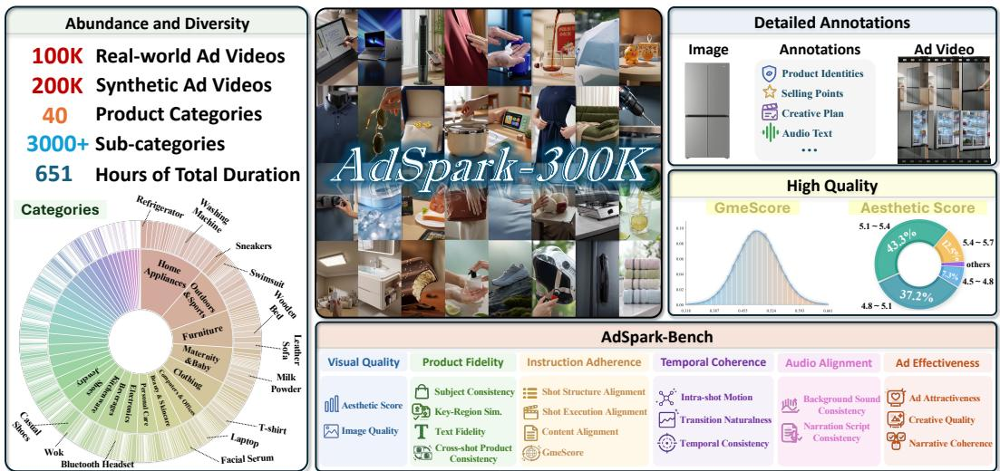  
Figure 1: Overview of AdSpark-300K and AdSpark-Bench. AdSpark-300K is a large-scale, high-quality product-centric advertisement video dataset spanning real-world and synthetic advertisements, with structured annotations across multiple dimensions. AdSpark-Bench provides a comprehensive evaluation of general video quality and advertisement-specific capabilities.

Table 1: Comparison with existing video generation datasets. Most existing datasets focus on generic text-to-video generation (T2V), subject-to-video generation (S2V), or image-to-video generation (I2V), while lacking advertisement-specific annotations. In contrast, AdSpark-300K targets PC-AVG, providing structured advertisement annotations, including product identity, selling points, creative plans (style, scene, and shot design), and audio scripts.
<table><tr><td>Dataset</td><td>Domain</td><td>Task</td><td>Multi- shot</td><td>Creative Plans</td><td>Selling Points</td><td>Identity Annotation</td><td>Audio Script</td><td>Clips</td><td>Resolution</td><td>Average Length(s)</td></tr><tr><td>MSRVTT Xu et al. (2016)</td><td>Open</td><td>T2V</td><td>x</td><td>x</td><td>x</td><td>X</td><td>x</td><td>10K</td><td>240P</td><td>14.4</td></tr><tr><td>WebVid-10M Bain et al. (2021)</td><td>Open</td><td>T2V</td><td>x</td><td>x</td><td>x</td><td>x</td><td>x</td><td>10M</td><td>360P</td><td>18.7</td></tr><tr><td>HD-VG-130M Wang et al. (2023a)</td><td>Open</td><td>T2V</td><td>x</td><td>x</td><td>x</td><td>x</td><td>x</td><td>130M</td><td>720P</td><td>4.9</td></tr><tr><td>Panda-70M Chen et al. (2024)</td><td>Open</td><td>T2V</td><td>X</td><td>x</td><td>x</td><td>x</td><td>x</td><td>70M</td><td>720P</td><td>8.6</td></tr><tr><td>InternVid Wang et al. (2023b)</td><td>Open</td><td>T2V</td><td>x</td><td>x</td><td>x</td><td>X</td><td>x</td><td>234M</td><td>720P</td><td>11.7</td></tr><tr><td>OpenHumanVid Li et al. (2024)</td><td>Human</td><td>T2V</td><td>x</td><td>x</td><td>x</td><td>X</td><td>x</td><td>52.3M</td><td>720P</td><td>4.9</td></tr><tr><td>Cine250K Wu et al. (2025)</td><td>Movies</td><td>T2V</td><td>√</td><td>x</td><td>x</td><td>x</td><td>x</td><td>250K</td><td>720P</td><td>10.7</td></tr><tr><td>OpenS2V-5M Yuan et al. (2026a)</td><td>Subject</td><td>S2V</td><td>x</td><td>x</td><td>x</td><td>x</td><td>x</td><td>5.4M</td><td>720P</td><td>6.6</td></tr><tr><td>MuSS Zhang et al. (2026)</td><td>Movies</td><td>S2V</td><td>√</td><td>x</td><td>x</td><td>x</td><td>x</td><td>700K</td><td>720P</td><td>5.1</td></tr><tr><td>ConsIDVid Wu et al. (2026)</td><td>Rigid Objects</td><td>I2V</td><td>x</td><td>x</td><td>x</td><td>x</td><td>x</td><td>44.3K</td><td>480P</td><td>8.4</td></tr><tr><td>AdSpark-300K</td><td>Product Ads</td><td>PC-AVG</td><td></td><td></td><td></td><td>√</td><td></td><td>300K</td><td>720P</td><td>7.8</td></tr></table>

Beyond training data, existing benchmarks are insufficient for evaluating PC-AVG. As shown in Tab. 2, current benchmarks Huang et al. (2024); Yuan et al. (2026a); Yang et al. (2026b) mainly focus on general video generation capabilities, including visual quality, semantic alignment, and temporal coherence. However, these assessment frameworks overlook key advertisement-specific aspects, such as fine-grained product preservation, selling-point visualization, and advertisement effectiveness. This gap makes it difficult to evaluate whether generated videos not only achieve high perceptual quality, but also follow the intended advertisement design and effectively communicate commercial messages. Therefore, existing benchmarks cannot fully characterize the capabilities required for PC-AVG, highlighting the need for a dedicated benchmark.

To address these limitations, we introduce AdSpark, a large-scale dataset and benchmark for PC-AVG. As shown in Fig. 1, AdSpark-300K contains 300K high-quality reference image-prompt-video triplets, including 100K real-world and 200K synthetic advertisement videos. It covers 40 diverse product categories, over 3,000 sub-categories, and 651 hours of video. Each sample provides structured annotations for product identity, selling points, creative plans, and aligned audio scripts, enabling faithful product preservation and advertisement-oriented visual storytelling. Alongside the dataset, we design AdSpark-Bench, a diagnostic benchmark for PC-AVG that evaluates the capabilities of video generation models in advertisement scenarios. Beyond conventional video quality assessment, AdSpark-Bench analyzes whether models can preserve product identity, follow creative plans, present selling points, and generate compelling and commercially effective advertisements.

Table 2: Comparison of AdSpark-Bench with existing video generation benchmarks. Existing benchmarks focus on general video quality, while AdSpark-Bench further evaluates product fidelity, selling-point realization, and advertisement effectiveness. ✓ indicates that the corresponding dimension is evaluated, but less comprehensively than in AdSpark-Bench.
<table><tr><td>Benchmark</td><td>Visual Quality</td><td>Script Adherence</td><td>Temporal Coherence</td><td>Product Fidelity</td><td>Shot Compliance</td><td>Audio Alignment</td><td>Selling-point Realization</td><td>Advertisement Effectiveness</td></tr><tr><td>Make-a-Video-Eval Singer et al. (2022)</td><td></td><td></td><td>x</td><td>X</td><td>x</td><td>X</td><td>x</td><td>x</td></tr><tr><td>FETV Liu et al. (2024b)</td><td></td><td></td><td></td><td>x</td><td>x</td><td>×</td><td>X</td><td>x</td></tr><tr><td>T2VScore Wu et al. (2024)</td><td></td><td></td><td></td><td>x</td><td>x</td><td>X</td><td>x</td><td>X</td></tr><tr><td>EvalCrafter Liu et al. (2024a)</td><td></td><td></td><td></td><td>x</td><td>x</td><td>×</td><td>x</td><td>x</td></tr><tr><td>VBench Huang et al. (2023)</td><td></td><td></td><td></td><td>×</td><td>x</td><td>×</td><td>x</td><td>x</td></tr><tr><td>VBench++ Huang et al. (2024)</td><td></td><td></td><td></td><td>x</td><td>x</td><td>×</td><td>X</td><td>X</td></tr><tr><td>ChronoMagic-Bench Yuan et al. (2024b)</td><td></td><td></td><td></td><td>x</td><td>x</td><td>×</td><td></td><td>x</td></tr><tr><td>ConsisID-Bench Yuan et al. (2024a)</td><td></td><td></td><td></td><td></td><td>x</td><td>X</td><td></td><td>x</td></tr><tr><td>Alchemist-Bench Chen et al. (2025)</td><td></td><td></td><td></td><td></td><td>X</td><td>×</td><td>X</td><td>X</td></tr><tr><td>A2 Bench Fei et al. (2025)</td><td></td><td></td><td></td><td></td><td>x</td><td>×</td><td></td><td>X</td></tr><tr><td>OpenS2V-Eval Yuan et al. (2026a)</td><td></td><td></td><td></td><td></td><td>x</td><td>X</td><td></td><td>x</td></tr><tr><td>VACE-Bench Jiang et al. (2025)</td><td></td><td></td><td></td><td></td><td>√</td><td>X</td><td></td><td>X</td></tr><tr><td>MultiShotMaster Wang et al. (2026b)</td><td></td><td></td><td></td><td></td><td></td><td>X</td><td></td><td>X</td></tr><tr><td>MSAVBench Wei et al. (2026)</td><td></td><td></td><td></td><td></td><td></td><td></td><td>X</td><td>x</td></tr><tr><td>AdSpark-Bench</td><td></td><td></td><td></td><td></td><td></td><td></td><td></td><td></td></tr></table>

Based on AdSpark-300K, we finetune a reference-to-video generation model HaCohen et al. (2026) and conduct comprehensive evaluations of open-source and proprietary models on AdSpark-Bench. The results validate the effectiveness of AdSpark-300K and provide insights into the capabilities and challenges of current models for PC-AVG. Our main contributions are summarized as follows:

• We introduce AdSpark-300K, the first large-scale dataset for PC-AVG, containing 300K high-quality reference image-prompt-video triplets with structured annotations for product identity, selling points, creative plans, and audio scripts.

• We propose AdSpark-Bench, a comprehensive and diagnostic benchmark that extends conventional video evaluation with advertisement-specific criteria, including product fidelity, shot compliance, selling-point realization, and advertisement effectiveness.

• We conduct comprehensive evaluations on AdSpark-Bench, revealing the limitations of existing models for PC-AVG and demonstrating that fine-tuning a representative video generation model on AdSpark-300K substantially improves advertisement-oriented generation.

## 2 RELATED WORK

Datasets for Advertisement Video Generation. Large-scale video-text datasets, such as WebVid-10M Bain et al. (2021), Panda-70M Chen et al. (2024), and InternVid Wang et al. (2023b), have advanced open-domain video generation. However, they are not curated for advertising scenarios and lack product-specific annotations. Recent multi-shot video datasets, such as Cine250K Wu et al. (2025) and MuSS Zhang et al. (2026), further support coherent generation across multiple shots by providing shot-level video structures and cross-shot supervision, but mainly focus on general cinematic or narrative content. Reference-based video generation datasets, including human-centric Li et al. (2024); Hu (2024) and subject-consistent Yuan et al. (2024a); Wu et al. (2026); Yuan et al. (2026a) datasets, improve subject consistency by preserving referenced subjects but overlook finegrained product identity and commercial generation requirements. In contrast, AdSpark-300K targets product-centric advertisement video generation with structured annotations covering product identities, selling points, creative plans, and audio scripts.

Benchmarks for Advertisement Video Generation. Video generation benchmarks have progressed from perceptual quality evaluation to comprehensive assessment of generation capabilities. Representative benchmarks, including VBench Huang et al. (2023), VBench++ Huang et al.

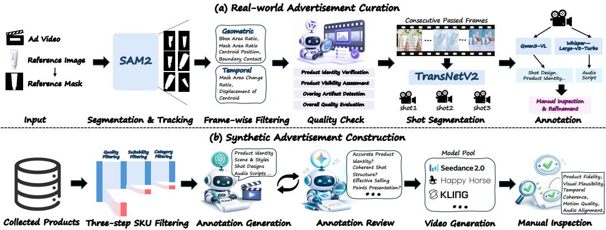  
Figure 2: Overview of the AdSpark-300K construction pipeline, comprising real-world advertisement curation and synthetic advertisement construction, each involving tailored stages for comprehensive and unified annotation.

(2024), EvalCrafter Liu et al. (2024a), ChronoMagic-Bench Yuan et al. (2024b), and FETV Liu et al. (2024b), evaluate videos from multiple perspectives, such as visual quality, semantic alignment, and temporal coherence. Recent reference-conditioned benchmarks Yuan et al. (2024a); Fei et al. (2025); Yuan et al. (2026a) further incorporate subject consistency, while multi-shot benchmarks additionally evaluate cross-shot consistency and shot-level controllability Wang et al. (2026b). However, these benchmarks mainly target general video generation and overlook advertisement-specific demands such as product fidelity, selling-point realization and advertisement effectiveness. AdSpark-Bench fills this gap by providing a dedicated evaluation framework for PC-AVG.

## 3 ADSPARK-300K

As illustrated in Fig. 2, AdSpark-300K comprises complementary real-world and synthetic subsets, each developed through a rigorous multi-stage pipeline of filtering, annotation, and quality control. Built upon real-world product assets and associated metadata collected from an e-commerce platform with proper authorization, both subsets share a unified data format containing a reference image, a product-centric advertisement video, and structured annotations. In this section, we will present the construction of each subset and summarize the overall dataset statistics.

## 3.1 REAL-WORLD ADVERTISEMENT CURATION

Multi-stage Filtering. We collect paired advertisement videos, product reference images, and foreground masks from a major e-commerce platform. Given these paired assets, we first use SAM2 Ravi et al. (2024) to segment and track the target product throughout the video, as show in Fig. 2(a). We then apply a two-stage filtering procedure to retain reliable product-centric advertisement clips. In the first stage, frame-level geometric and temporal filtering removes frames where the product is too small, the mask area changes abruptly, the centroid shifts substantially, or the mask touches the image boundary, as these cases indicate poor visibility or unstable tracking. In the second stage, we group consecutive valid frames into 5–20 second candidate clips and perform VLM-based quality filtering using Qwen3-VL-235B Bai et al. (2025), guided by the product reference image, to evaluate product identity consistency, product visibility, and overlay artifacts. Clips failing any criterion are discarded.

Shot Segmentation and Automatic Annotation. After obtaining the accepted temporally continuous clips, we use TransNetV2 Soucek & Lokoc (2024) to segment them into shots. Since the original videos lack structured advertisement annotations, Qwen3-VL-235B Bai et al. (2025) is used to automatically annotate product identities, selling points, and creative plans (scene, style, and shot design) from representative frames. Whisper-Large-v3-Turbo Radford et al. (2023) is used to transcribe the audio and align narration text with the detected shots. Finally, human annotators verify the videos and annotations, correcting errors and removing low-quality or unreliable samples. Only the videos that pass this final manual inspection are included in AdSpark-300K.

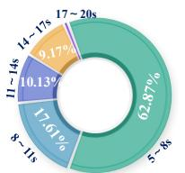

(a) Video Duration Distribution  
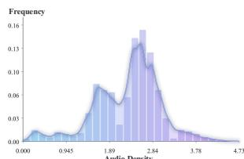  
(b) Audio Density Distribution

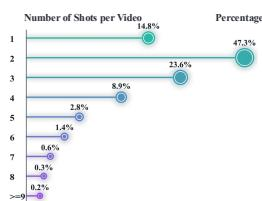  
(c) Shot Count Distribution

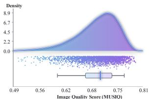  
(d) Video Frame Quality Distribution  
Figure 3: Statistics of AdSpark-300K, including (a) video duration distribution, (b) audio density distribution, (c) shot count distribution, and (d) video frame quality distribution via MUSIQ Ke et al. (2021), with MUSIQ scores normalized to [0, 1]. Additional statistics are provided in Fig. 5.

## 3.2 SYNTHETIC ADVERTISEMENT CONSTRUCTION

SKU Pool Preparation. Given the scarcity of high-quality real-world advertisement videos, we construct a synthetic subset complementary to the real-world subset to enhance the diversity and coverage of AdSpark-300K. Starting from products with reference images and associated attributes, we curate a high-quality stock-keeping unit (SKU) pool through three-stage quality, suitability, and category filtering. Specifically, we exclude SKUs with low-quality reference images, unsuitable categories, cluttered backgrounds, multiple dominant objects, or severe occlusion to ensure reliable product-centric generation.

Structured Advertisement Planning. For each retained product, we employ GPT-5.5 to generate structured advertisement annotations conditioned on the reference image and product attributes. The annotations serve as an intermediate representation for video generation, comprising product identity, selling-point descriptions, creative plans covering scene, style, and shot design, and aligned audio scripts. In particular, selling points are translated into visualizable actions and effects, enabling the generated videos to demonstrate product functions and commercial appeals rather than merely describe them. The shot-level designs further specify temporal organization, camera motion, and shot type for multi-shot generation. To improve annotations reliability, we employ Gemini-3.1- Pro-Preview as an independent reviewer in an iterative review-and-refinement process. Given the reference image and generated annotations, it evaluates whether the annotations accurately describe the product identity and visual details, align with the selling points, and specify coherent shot designs. Annotations that fail these criteria are revised by GPT-5.5 according to the reviewer feedback.

Video Generation. The structured annotations are used to synthesize advertisement videos with multiple state-of-the-art models, including Seedance 2.0 Seedance et al. (2026), Happy Horse, and Kling Team et al. (2025), improving generation diversity and reducing model-specific bias. We further conduct human inspection to assess overall video quality, including product fidelity, visual plausibility, motion quality, selling-point realization, and audio alignment, discarding videos with identity drift, severe artifacts, ineffective selling-point presentation, or audio-visual mismatch.

Unified Data Representation. After both construction pipelines, all samples share the same representation. Each sample contains a product reference image, an advertisement video, and structured advertisement annotations comprising product identity, selling-point descriptions, creative plans covering scene, style, and shot design, and aligned audio scripts. This unified annotation format enables AdSpark-300K to support diverse tasks, from reference-to-video and identity-preserving video generation to PC-AVG. Examples of the structured annotations are provided in Sup. A.

## 3.3 DATA ANALYSIS

We summarize the temporal, audio, and visual characteristics of AdSpark-300K in Fig. 3. AdSpark-300K spans diverse advertisement durations while exhibiting rich multi-shot structures, with over 85% of samples containing multiple shots, primarily 2-shot (47.3%) and 3-shot (23.6%) compositions (Fig. 3(a,c)). To characterize narration patterns, we define Audio Density $\left( A _ { \mathrm { d e n } } \right)$ as the number of spoken words per second, i.e., $A _ { \mathrm { d e n } } = \bar { N } _ { \mathrm { w o r d } } / T$ , where $N _ { \mathrm { w o r d } }$ denotes the number of spoken words and T is the video duration in seconds. Its distribution reveals diverse narration paces across the dataset (Fig. 3(b)). Finally, the MUSIQ distribution indicates the high visual quality of AdSpark-300K (Fig. 3(d)). Further analyses are provided in the Sup. A.

## 4 ADSPARK-BENCH

AdSpark-Bench is a comprehensive and diagnostic benchmark designed to evaluate video generation models for PC-AVG. It consists of a carefully curated held-out test set and a hierarchical evaluation framework tailored to the requirements of product-centric advertisements. Specifically, AdSpark-Bench evaluates generated advertisements across six complementary dimensions: visual quality, product fidelity, instruction adherence, temporal coherence, audio alignment, and advertisement effectiveness. In this section, we first introduce the benchmark statistics and then present the hierarchical evaluation metrics.

## 4.1 BENCHMARK STATISTICS

AdSpark-Bench contains 220 product-conditioned test cases covering all 40 product categories and 220 distinct sub-categories. All benchmark samples are SKU-disjoint from the AdSpark-300K training set. Each case consists of a product reference image and structured advertisement annotations specifying product identity, selling points, creative plans covering scene, style, and shot design, and aligned audio scripts. AdSpark-Bench is carefully curated to support advertisement-specific and shot-aware evaluation. It contains 45 one-shot, 131 two-shot, and 44 three-shot cases, yielding 175 multi-shot cases for evaluating cross-shot product consistency, transition quality, and narrative coherence. All cases are manually reviewed to ensure reference quality, annotation completeness, and generation suitability.

## 4.2 HIERARCHICAL EVALUATION METRICS

AdSpark-Bench evaluates generated advertisements across six dimensions, each comprising multiple diagnostic submetrics. We next describe the evaluation methodology for these dimensions and submetrics. More detailed metric definitions and implementation procedures are provided in Sup. B.

Shot-aware Evaluation. Direct evaluation of multi-shot videos may confuse intentional transitions with temporal artifacts and obscure shot-level generation quality. We therefore use TransNetV2 Soucek & Lokoc (2024) to segment each video into ordered shots and greedily match them to the planned shots by temporal IoU. The resulting shot correspondences are shared across shot-structure, shot-execution, and cross-shot consistency evaluations, enabling reliable assessment of both intra-shot quality and inter-shot transitions.

Visual Quality. We follow OpenS2V Yuan et al. (2026a) and adopt Aesthetic Score to assess visual appeal and MUSIQ Ke et al. (2021) to evaluate perceptual image quality.

Product Fidelity. Conventional subject-consistency metrics compare complete frames with reference images, making them sensitive to background variations and inadequate for fine-grained product identity evaluation. To address this limitation, we use GroundingDINO Liu et al. (2023) and SAM2 Ravi et al. (2024) to extract foreground regions at different granularities, including full products, key identity regions and packaging text. Based on these regions, we design four comple mentary metrics: (1) Subject Consistency measures cosine similarity between DINOv3 Simeoni´ et al. (2025) features of full-product crops from video frames and the reference image, evaluating overall product appearance preservation. (2) Key-Region Similarity evaluates identity-defining regions that may be overlooked by holistic features, including logos, brand marks, and packaging detail. Annotated region descriptions are used to localize corresponding regions in reference and generated frames, which are then compared using DINOv3 features. (3) Text Fidelity evaluates whether annotated product-related text, such as brand names and packaging text, remains recognizable in generated videos. RapidOCR is applied to localized product crops, and each target string is matched with recognized text using minimum edit distance. (4) Cross-shot Product Consistency measures product identity stability across shot transitions by computing DINOv3 feature similarity between full-product crops before and after each cut, capturing abrupt identity changes overlooked by whole-video averaging.

Instruction Adherence. Existing video-text alignment metrics mainly measure global semantic correspondence, overlooking planned shot structure, camera design, and selling-point realization. We therefore evaluate instruction adherence using three fine-grained shot-aware dimensions, complemented by a global video–text alignment metric: (1) Shot Structure Alignment assesses whether the generated shot sequence follows the planned structure. It measures shot-count accuracy by comparing detected and planned shot numbers, while boundary accuracy evaluates whether planned shot transitions are detected within a temporal tolerance. (2) Shot Execution Alignment evaluates the consistency of each matched shot with its prescribed shot type and motion design. For each matched shot, GPT-5.5 takes sampled video frames and optical-flow-based motion cues as input to assess alignment between the generated camera behavior and the planned design. (3) Content Alignment focuses on whether generated videos realize the advertisement plan, including scene, style, and selling-point realization. For scene and style alignment, GPT-5.5 assesses representative frames with corresponding annotations. For selling-point realization, we use denser shot-aware sampling to better capture short functional demonstrations or interaction actions, and evaluate them against the expected visual realizations and success criteria. We additionally report (4) GmeScore, computed with gme-Qwen2-VL-7B-Instruct Zhang et al. (2024), to measure global alignment between the complete advertisement prompt and sampled video frames.

Temporal Coherence. Standard temporal metrics mainly focus on generic frame-level consistency and may overlook product-specific instability or misinterpret intentional shot transitions as temporal artifacts. To better capture these factors, we evaluate temporal coherence from three perspectives: intra-shot motion quality, transition naturalness, and temporal consistency. (1) Intra-shot Motion Quality evaluates motion dynamics within each shot. We include Motion Amplitude following OpenS2V Yuan et al. (2026a) and measure Motion Smoothness using the coefficient of variation (CV) of frame-wise motion magnitudes derived from optical flow. To account for product-centric generation, we use GroundingDINO and SAM2 to track the advertised product and measure Product Motion Stability based on mask-centroid displacement, mask-area variation, and adjacent-mask IoU. (2) Transition Naturalness measures whether detected cuts form visually plausible transitions without abrupt visual artifacts. We first apply a pixel-level validity check to identify corrupted frames, and then use GPT-5.5 to assess transition naturalness in terms of brightness, style continuity, and artifact absence. (3) Temporal Consistency evaluates local temporal stability around shot boundaries. For each detected boundary, we inspect duplicated, flickering, or structurally corrupted frames using adjacent-frame differences and SSIM Nilsson & Akenine-Moller (2020).¨

Audio Alignment. For videos containing a valid non-silent audio stream, we evaluate audio alignment from two aspects. (1) Background Sound Consistency uses LAION-CLAP Wu et al. (2023) to measure the semantic similarity between the generated audio and the expected background sound description specified in the creative plan. (2) Narration Script Consistency uses Whisper-Largev3-Turbo Radford et al. (2023) to transcribe the generated narration and compares the recognized text with the reference audio script using character error rate (CER), measuring whether the intended commercial message is faithfully conveyed.

Advertisement Effectiveness. A visually coherent video may still fail as an advertisement if it lacks viewer appeal, commercial persuasiveness, or coherent storytelling. We therefore employ GPT-5.5 to serve as a potential customer to assess advertisement effectiveness across three aspects. (1) Advertisement Attractiveness evaluates whether the generated advertisement can capture viewer attention and stimulate purchase interest from a customer perspective, considering visual appeal, product desirability, and overall viewing experience. (2) Creative Quality evaluates the artistic and commercial quality of generated advertisements, including visual impact, commercial readiness, and product-oriented creativity. (3) Narrative Coherence evaluates whether multi-shot advertisements achieve coherent storytelling rather than disconnected scenes, considering shot-toshot consistency, selling-point progression, narrative logic, and pacing.

Table 3: Quantitative comparison of state-of-the-art video generation models on AdSpark-Bench, covering proprietary, open-source, and AdSpark-finetuned models. The best results are highlighted in bold, while the second-best results are underlined. Submetric abbreviations correspond to the metrics introduced in the benchmark section, in the same order. Dashes (–) in the audio alignment columns indicate unavailable or invalid audio outputs and are excluded from evaluation.
<table><tr><td></td><td colspan="2">| Visual Quality </td><td colspan="4">Product Fidelity</td><td></td><td colspan="3">Instruction Adherence</td><td colspan="3">Temporal Coherence</td><td colspan="2">| Audio Alignment |</td><td colspan="3">Ad Effectiveness</td></tr><tr><td>Method</td><td>Aes.</td><td>Img.</td><td>|Subj.</td><td>Reg.</td><td>Text</td><td></td><td>X-shot | Struct.</td><td>Exec.</td><td>Content</td><td>Gme</td><td>|Motion</td><td>Trans.</td><td>Temp.</td><td>|BG Audio</td><td>Script |</td><td>Attr.</td><td>Creat.</td><td>Narr.</td></tr><tr><td>ViduQ2</td><td>|34.56</td><td>69.63</td><td>70.16</td><td>66.49</td><td>25.69</td><td>2.85</td><td>35.77</td><td>63.75</td><td>77.94</td><td>48.99</td><td>57.44</td><td>2.73</td><td>2.86</td><td></td><td></td><td>|62.40</td><td>55.80</td><td>3.02</td></tr><tr><td>ViduQ3</td><td>38.26</td><td>70.68</td><td>60.57</td><td>58.72</td><td>33.60</td><td>84.76</td><td>71.26</td><td>60.57</td><td>83.75</td><td>48.22</td><td>48.93</td><td>78.19</td><td>41.62</td><td>50.85</td><td>76.91</td><td>62.79</td><td>55.39</td><td>81.05</td></tr><tr><td>Seedance 2.0</td><td>38.10</td><td>70.01</td><td>63.04</td><td>59.79</td><td>34.31</td><td>94.99</td><td>77.14</td><td>61.82</td><td>85.20</td><td>49.45</td><td>52.03</td><td>90.05</td><td>84.19</td><td>49.48</td><td>80.23</td><td>64.11</td><td>58.57</td><td>91.46</td></tr><tr><td>HappyHorse-1.1</td><td>39.56</td><td>69.60</td><td>59.98</td><td>57.26</td><td>31.04</td><td>93.27</td><td>89.41</td><td>64.22</td><td>80.43</td><td>48.69</td><td>54.49</td><td>86.72</td><td>95.43</td><td>52.40</td><td>83.55</td><td>64.94</td><td>59.00</td><td>88.52</td></tr><tr><td>Pixverse V5</td><td>42.08</td><td>74.49</td><td>61.78</td><td>60.12</td><td>18.52</td><td>2.75</td><td>35.48</td><td>67.21</td><td>76.94</td><td>48.37</td><td>57.93</td><td>2.11</td><td>2.29</td><td></td><td></td><td>61.12</td><td>53.05</td><td>2.53</td></tr><tr><td>Pixverse V6</td><td>32.51</td><td>67.68</td><td>58.75</td><td>55.27</td><td>22.94</td><td>55.18</td><td>50.80</td><td>62.42</td><td>83.17</td><td>47.96</td><td>55.23</td><td>54.57</td><td>59.43</td><td>49.77</td><td>70.13</td><td>65.51</td><td>58.37</td><td>55.78</td></tr><tr><td>Kling3.0 Omni</td><td>38.80</td><td>68.39</td><td>57.62</td><td>53.89</td><td>29.14</td><td>90.84</td><td>75.26</td><td>66.43</td><td>80.77</td><td>47.93</td><td>55.61</td><td>85.86</td><td>93.90</td><td>51.60</td><td>80.01</td><td>61.66</td><td>55.63</td><td>87.81</td></tr><tr><td>VACE</td><td>|37.28</td><td>69.25</td><td>71.22</td><td>67.82</td><td>18.73</td><td>2.16</td><td>35.42</td><td>45.76</td><td>72.34</td><td>49.37</td><td>48.82</td><td>2.55</td><td>2.86</td><td></td><td></td><td>|56.24</td><td>50.84</td><td>2.18</td></tr><tr><td>SkyReels-V3</td><td>35.96</td><td>75.34</td><td>62.37</td><td>59.63</td><td>19.13</td><td>0.55</td><td>35.39</td><td>47.02</td><td>70.91</td><td>48.22</td><td>52.25</td><td>0.31</td><td>0.57</td><td></td><td></td><td>54.02</td><td>48.14</td><td>0.47</td></tr><tr><td>Phantom</td><td>38.88</td><td>69.14</td><td>64.26</td><td>62.83</td><td>24.20</td><td>6.13</td><td>36.14</td><td>52.49</td><td>73.27</td><td>48.79</td><td>46.37</td><td>5.19</td><td>2.86</td><td></td><td></td><td>57.40</td><td>52.57</td><td>5.65</td></tr><tr><td>VINO</td><td>34.03</td><td>70.42</td><td>69.55</td><td>67.83</td><td>22.65</td><td>0.40</td><td>35.09</td><td>50.55</td><td>69.71</td><td>51.43</td><td>59.07</td><td>0.49</td><td>0.57</td><td></td><td></td><td>53.86</td><td>48.18</td><td>0.42</td></tr><tr><td>Refalign</td><td>38.07</td><td>70.66</td><td>66.23</td><td>62.95</td><td>22.60</td><td>5.31</td><td>33.24</td><td>48.86</td><td>74.33</td><td>50.90</td><td>54.90</td><td>4.94</td><td>5.71</td><td></td><td></td><td>58.45</td><td>52.32</td><td>4.48</td></tr><tr><td>Kaleido</td><td>41.52</td><td>72.14</td><td>63.82</td><td>61.34</td><td>23.15</td><td>58.37</td><td>48.09</td><td>52.56</td><td>76.38</td><td>50.21</td><td>50.06</td><td>55.60</td><td>56.86</td><td></td><td></td><td>62.35</td><td>56.05</td><td>53.90</td></tr><tr><td>HunyuanCustom</td><td>36.53 38.88</td><td>67.68</td><td>69.28</td><td>67.74</td><td>20.92</td><td>3.71</td><td>35.55</td><td>40.50</td><td>56.34</td><td>45.90</td><td>52.20</td><td>4.07</td><td>4.57</td><td></td><td></td><td>48.22</td><td>42.31</td><td>3.48</td></tr><tr><td>Bernini</td><td>43.44</td><td>68.70 71.38</td><td>60.60</td><td>58.89</td><td>29.08</td><td>87.47</td><td>58.41</td><td>57.83</td><td>83.20</td><td>49.23</td><td>56.00</td><td>83.70</td><td>91.33</td><td></td><td></td><td>62.18</td><td>56.41</td><td>84.15 8.30</td></tr><tr><td>MV-S2V MAGREF</td><td>38.97</td><td>69.35</td><td>71.57 60.36</td><td>67.58</td><td>14.56</td><td>9.53</td><td>37.58 35.03</td><td>51.06 42.53</td><td>74.43 74.31</td><td>50.32</td><td>53.94 52.33</td><td>8.10 0.00</td><td>6.29</td><td></td><td></td><td>60.12 56.30</td><td>54.11</td><td>0.00</td></tr><tr><td>LTX-2</td><td>35.96</td><td>66.17</td><td>50.39</td><td>58.15 47.63</td><td>10.01 7.59</td><td>0.00 33.30</td><td>46.29</td><td>64.36</td><td>79.43</td><td>51.21 48.75</td><td>51.29</td><td>33.66</td><td>0.00 32.67</td><td>51.43</td><td>74.71</td><td>63.06</td><td>50.74 56.05</td><td>33.77</td></tr><tr><td>LTX-AdSpark</td><td></td><td></td><td></td><td></td><td></td><td></td><td></td><td></td><td></td><td></td><td></td><td></td><td></td><td></td><td></td><td></td><td></td><td></td></tr><tr><td></td><td>|39.25</td><td>69.57</td><td>65.01</td><td>62.07 29.50</td><td></td><td>93.59</td><td>77.53</td><td>67.48</td><td>84.90</td><td>49.03</td><td>52.12</td><td>88.09</td><td>92.00</td><td>51.92</td><td>84.41 | 65.09</td><td></td><td>59.29</td><td>89.89</td></tr></table>

## 5 EXPERIMENTS

## 5.1 EXPERIMENTAL SETTINGS

Baseline. We evaluate a set of video generation models on AdSpark-Bench, covering both closedsource and open-source approaches, including ViduQ2, ViduQ3, Seedance 2.0 Seedance et al. (2026), HappyHorse-1.1, Pixverse V5, Pixverse V6, Kling 3.0 Omni Team et al. (2025), VACE-14B Jiang et al. (2025), SkyReels-V3-14B Li et al. (2026), Phantom-14B Liu et al. (2025), VINO-13B Chen et al. (2026), Refalign-14B Wang et al. (2026a), Kaleido-14B Zhang et al. (2025), HunyuanCustom-13B Hu et al. (2025), Bernini-14B Team et al. (2026), MV-S2V-14B Song et al. (2026), MAGREF-14B Deng et al. (2025), and LTX-2-14B HaCohen et al. (2026).

Implementation Details. For fair comparison, closed-source models are evaluated through their official interfaces, while open-source models use officially released weights with recommended inference settings. All models are evaluated on the AdSpark-Bench test set using the proposed metrics. We further fine-tune LTX-2 on AdSpark-300K with LoRA (rank 64), denoted as LTX-AdSpark, to validate the effectiveness of our dataset for PC-AVG. All experiments are conducted on 8 NVIDIA B200 GPUs, with additional details provided in Sup. C.

## 5.2 EVALUATION RESULTS

Quantitative Evaluation. We report quantitative comparisons on AdSpark-Bench in Tab. 3. Existing video generation models achieve competitive performance in visual quality, but fall short in some advertisement-specific capabilities. We summarize three main observations from the results. (1) Closed-source models generally outperform open-source models, yet still face some notable challenges. For example, although they can generate more dynamic and visually engaging videos, preserving product fidelity during complex motions remains a prominent issue, with motion blur, shape distortion, and appearance drift degrading subject consistency, key-region similarity and text fidelity. (2) Open-source models exhibit more pronounced limitations in instruction adherence and advertisement effectiveness, and often struggle with coherent multi-shot generation, as reflected by weaker cross-shot product consistency and temporal coherence. (3) Fine-tuning with AdSpark-300K substantially improves PC-AVG performance. Compared with the base LTX-2 model, LTX-AdSpark improves cross-shot product consistency from 33.30 to 93.59, shot structure alignment from 46.29 to 77.53, and narrative coherence from 33.77 to 89.89, demonstrating the utility of AdSpark-300K for PC-AVG. We further analyze the effects of real-world and synthetic data composition and training scale through controlled ablations in Tab. 6.

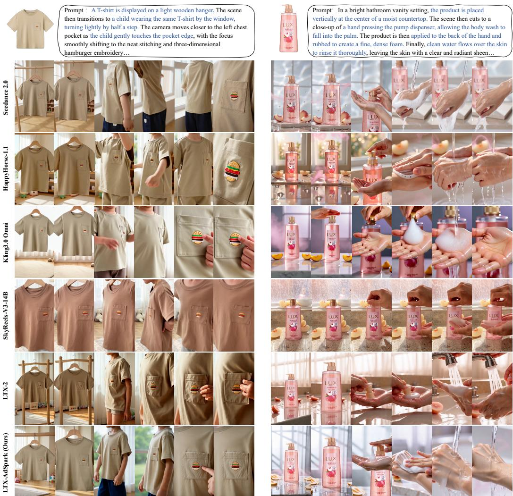  
Figure 4: Qualitative comparison on AdSpark-Bench. We present video frames generated by different models. All methods are conditioned on the corresponding reference image and advertisement prompt. Prompts are abbreviated for readability.

Qualitative Comparison. We provide qualitative comparisons on AdSpark-Bench in Fig. 4. Existing video generation models can produce relatively visually plausible videos while still suffering from product-specific issues, including color shifts, product deformation, and instruction deviations. Consistent with the quantitative results, closed-source models achieve overall better performance. Compared with LTX-2, LTX-AdSpark generates more product-consistent videos with improved shot-level coherence and more faithful product presentation, further validating that fine-tuning on AdSpark-300K effectively adapts video generation models to PC-AVG. More qualitative results and visualizations are presented in Sup. C.

## 6 CONCLUSION

We introduce AdSpark, a large-scale dataset and benchmark for product-centric advertisement video generation. AdSpark-300K provides 300K reference image–prompt–video triplets with structured annotations, while AdSpark-Bench evaluates six dimensions: visual quality, product fidelity, instruction adherence, temporal coherence, audio alignment, and advertisement effectiveness. Experiments show that existing models struggle with product-specific generation, while AdSpark-300K fine-tuning improves advertisement capabilities. We hope AdSpark will facilitate future research on controllable and high-quality PC-AVG.

## REFERENCES

Shuai Bai, Yuxuan Cai, Ruizhe Chen, Keqin Chen, Xionghui Chen, Zesen Cheng, Lianghao Deng, Wei Ding, Chang Gao, Chunjiang Ge, et al. Qwen3-vl technical report. arXiv preprint arXiv:2511.21631, 2025.

Max Bain, Arsha Nagrani, Gul Varol, and Andrew Zisserman. Frozen in time: A joint video and¨ image encoder for end-to-end retrieval. In Proceedings ofthe IEEE/CVF International Conference on Computer Vision, pp. 1728–1738, 2021.

Junyi Chen, Tong He, Zhoujie Fu, Pengfei Wan, Kun Gai, and Weicai Ye. Vino: A unified visual generator with interleaved omnimodal context. arXiv preprint arXiv:2601.02358, 2026.

Tsai-Shien Chen, Aliaksandr Siarohin, Willi Menapace, Ekaterina Deyneka, Hsiang-wei Chao, Byung Eun Jeon, Yuwei Fang, Hsin-Ying Lee, Jian Ren, Ming-Hsuan Yang, et al. Panda-70m: Captioning 70m videos with multiple cross-modality teachers. arXiv preprint arXiv:2402.19479, 2024.

Tsai-Shien Chen, Aliaksandr Siarohin, Willi Menapace, Yuwei Fang, Kwot Sin Lee, Ivan Skorokhodov, Kfir Aberman, Jun-Yan Zhu, Ming-Hsuan Yang, and Sergey Tulyakov. Multi-subject open-set personalization in video generation. arXiv preprint arXiv:2501.06187, 2025.

Yufan Deng, Yuanyang Yin, Xun Guo, Yizhi Wang, Jacob Zhiyuan Fang, Shenghai Yuan, Yiding Yang, Angtian Wang, Bo Liu, Haibin Huang, et al. Magref: Masked guidance for any-reference video generation with subject disentanglement. arXiv preprint arXiv:2505.23742, 2025.

Yu Fan, Yang Yang, Yufan Guo, Huazhong Yang, and Pengjun Wang. Rethinking time-series imputation as conditional inference along temporal evolution. In Forty-third International Conference on Machine Learning.

Han Fang, Zhifei Yang, Yuhan Wei, Xianghao Zang, Chao Ban, Zerun Feng, Zhongjiang He, Yongxiang Li, and Hao Sun. Alignment and generation adapter for efficient video-text understanding. In 2023 IEEE/CVF International Conference on Computer Vision Workshops (ICCVW), pp. 2783– 2789. IEEE, 2023a.

Han Fang, Zhifei Yang, Xianghao Zang, Chao Ban, Zhongjiang He, Hao Sun, and Lanxiang Zhou. Mask to reconstruct: Cooperative semantics completion for video-text retrieval. In Proceedings of the 31st ACM International Conference on Multimedia, pp. 3847–3856, 2023b.

Zhengcong Fei, Debang Li, Di Qiu, Jiahua Wang, Yikun Dou, Rui Wang, Jingtao Xu, Mingyuan Fan, Guibin Chen, Yang Li, et al. Skyreels-a2: Compose anything in video diffusion transformers. arXiv preprint arXiv:2504.02436, 2025.

Yoav HaCohen, Benny Brazowski, Nisan Chiprut, Yaki Bitterman, Andrew Kvochko, Avishai Berkowitz, Daniel Shalem, Daphna Lifschitz, Dudu Moshe, Eitan Porat, Eitan Richardson, Guy Shiran, Itay Chachy, Jonathan Chetboun, Michael Finkelson, Michael Kupchick, Nir Zabari, Nitzan Guetta, Noa Kotler, Ofir Bibi, Ori Gordon, Poriya Panet, Roi Benita, Shahar Armon, Victor Kulikov, Yaron Inger, Yonatan Shiftan, Zeev Melumian, and Zeev Farbman. Ltx-2: Efficient joint audio-visual foundation model, 2026. URL https://arxiv.org/abs/2601.03233.

Li Hu. Animate anyone: Consistent and controllable image-to-video synthesis for character animation. In Proceedings ofthe IEEE/CVF Conference on Computer Vision and Pattern Recognition, pp. 8153–8163, 2024.

Teng Hu, Zhentao Yu, Zhengguang Zhou, Sen Liang, Yuan Zhou, Qin Lin, and Qinglin Lu. Hunyuancustom: A multimodal-driven architecture for customized video generation. arXiv preprint arXiv:2505.04512, 2025.

Ziqi Huang, Yinan He, Jiashuo Yu, Fan Zhang, Chenyang Si, Yuming Jiang, Yuanhan Zhang, Tianxing Wu, Qingyang Jin, Nattapol Chanpaisit, et al. Vbench: Comprehensive benchmark suite for video generative models. arXiv preprint arXiv:2311.17982, 2023.

Ziqi Huang, Fan Zhang, Xiaojie Xu, Yinan He, Jiashuo Yu, Ziyue Dong, Qianli Ma, Nattapol Chanpaisit, Chenyang Si, Yuming Jiang, et al. Vbench++: Comprehensive and versatile benchmark suite for video generative models. arXiv preprint arXiv:2411.13503, 2024.

Zeyinzi Jiang, Zhen Han, Chaojie Mao, Jingfeng Zhang, Yulin Pan, and Yu Liu. Vace: All-inone video creation and editing. In Proceedings of the IEEE/CVF International Conference on Computer Vision, pp. 17191–17202, 2025.

Junjie Ke, Qifei Wang, Yilin Wang, Peyman Milanfar, and Feng Yang. Musiq: Multi-scale image quality transformer. In Proceedings of the IEEE/CVF international conference on computer vision, pp. 5148–5157, 2021.

Debang Li, Zhengcong Fei, Tuanhui Li, Yikun Dou, Zheng Chen, Jiangping Yang, Mingyuan Fan, Jingtao Xu, Jiahua Wang, Baoxuan Gu, et al. Skyreels-v3 technique report. arXiv preprint arXiv:2601.17323, 2026.

Hui Li, Mingwang Xu, Yun Zhan, Shan Mu, Jiaye Li, Kaihui Cheng, Yuxuan Chen, Tan Chen, Mao Ye, Jingdong Wang, et al. Openhumanvid: A large-scale high-quality dataset for enhancing human-centric video generation. arXiv preprint arXiv:2412.00115, 2024.

Lijie Liu, Tianxiang Ma, Bingchuan Li, Zhuowei Chen, Jiawei Liu, Gen Li, Siyu Zhou, Qian He, and Xinglong Wu. Phantom: Subject-consistent video generation via cross-modal alignment. In Proceedings of the IEEE/CVF International Conference on Computer Vision, pp. 14951–14961, 2025.

Shilong Liu, Zhaoyang Zeng, Tianhe Ren, Feng Li, Hao Zhang, Jie Yang, Chunyuan Li, Jianwei Yang, Hang Su, Jun Zhu, et al. Grounding dino: Marrying dino with grounded pre-training for open-set object detection. arXiv preprint arXiv:2303.05499, 2023.

Yaofang Liu, Xiaodong Cun, Xuebo Liu, Xintao Wang, Yong Zhang, Haoxin Chen, Yang Liu, Tieyong Zeng, Raymond Chan, and Ying Shan. Evalcrafter: Benchmarking and evaluating large video generation models. In Proceedings of the IEEE/CVF Conference on Computer Vision and Pattern Recognition, pp. 22139–22149, 2024a.

Yuanxin Liu, Lei Li, Shuhuai Ren, Rundong Gao, Shicheng Li, Sishuo Chen, Xu Sun, and Lu Hou. Fetv: A benchmark for fine-grained evaluation of open-domain text-to-video generation. Advances in Neural Information Processing Systems, 36, 2024b.

Keyang Lu, Zhifei Yang, Tianao Dong, Mingzhe Xing, Zhen Xiao, and Yikai Wang. Cadforge: Agentic single-view cad reconstruction with explicit geometry reasoning, 2026a. URL https: //arxiv.org/abs/2610.04262.

Keyang Lu, Sifan Zhou, Hongbin Xu, Gang Xu, Zhifei Yang, Yikai Wang, Zhen Xiao, Jieyi Long, and Ming Li. Yo’city: Personalized and boundless 3d realistic city scene generation via selfcritic expansion. In Proceedings of the IEEE/CVF Conference on Computer Vision and Pattern Recognition, pp. 3219–3230, 2026b.

Jim Nilsson and Tomas Akenine-Moller. Understanding ssim.¨ arXiv preprint arXiv:2006.13846, 2020.

Alec Radford, Jong Wook Kim, Tao Xu, Greg Brockman, Christine McLeavey, and Ilya Sutskever. Robust speech recognition via large-scale weak supervision. In International conference on machine learning, pp. 28492–28518. PMLR, 2023.

Nikhila Ravi, Valentin Gabeur, Yuan-Ting Hu, Ronghang Hu, Chaitanya Ryali, Tengyu Ma, Haitham Khedr, Roman Radle, Chloe Rolland, Laura Gustafson, Eric Mintun, Junting Pan, Kalyan Va-¨ sudev Alwala, Nicolas Carion, Chao-Yuan Wu, Ross Girshick, Piotr Dollar, and Christoph Fe-´ ichtenhofer. Sam 2: Segment anything in images and videos. arXiv preprint arXiv:2408.00714, 2024. URL https://arxiv.org/abs/2408.00714.

Team Seedance, De Chen, Liyang Chen, Xin Chen, Ying Chen, Zhuo Chen, Zhuowei Chen, Feng Cheng, Tianheng Cheng, Yufeng Cheng, et al. Seedance 2.0: Advancing video generation for world complexity. arXiv preprint arXiv:2604.14148, 2026.

Oriane Simeoni, Huy V Vo, Maximilian Seitzer, Federico Baldassarre, Maxime Oquab, Cijo Jose,´ Vasil Khalidov, Marc Szafraniec, Seungeun Yi, Michael Ramamonjisoa, et al. Dinov3. ¨ arXiv preprint arXiv:2508.10104, 2025.

Uriel Singer, Adam Polyak, Thomas Hayes, Xi Yin, Jie An, Songyang Zhang, Qiyuan Hu, Harry Yang, Oron Ashual, Oran Gafni, et al. Make-a-video: Text-to-video generation without text-video data. arXiv preprint arXiv:2209.14792, 2022.

Ziyang Song, Xinyu Gong, Bangya Liu, and Zelin Zhao. Mv-s2v: Multi-view subject-consistent video generation. arXiv preprint arXiv:2601.17756, 2026.

Tomas Soucek and Jakub Lokoc. Transnet v2: An effective deep network architecture for fast shot´ transition detection. In Proceedings of the 32nd ACM International Conference on Multimedia, pp. 11218–11221, 2024.

Bernini Team, Chenchen Liu, Junyi Chen, Lei Li, Lu Chi, Mingzhen Sun, Zhuoying Li, Yi Fu, Ruoyu Guo, Yiheng Wu, et al. Bernini: Latent semantic planning for video diffusion. arXiv preprint arXiv:2605.22344, 2026.

Kling Team, Jialu Chen, Yuanzheng Ci, Xiangyu Du, Zipeng Feng, Kun Gai, Sainan Guo, Feng Han, Jingbin He, Kang He, et al. Kling-omni technical report. arXiv preprint arXiv:2512.16776, 2025.

Jianhui Wang, Zhifei Yang, Yangfan He, Huixiong Zhang, Yuxuan Chen, and Jingwei Huang. Mari: Material retrieval integration across domains. In 2025 IEEE/CVF Conference on Computer Vision and Pattern Recognition (CVPR), pp. 5814–5823. IEEE, 2025a.

Lei Wang, YuXin Song, Ge Wu, Haocheng Feng, Hang Zhou, Jingdong Wang, Yaxing Wang, et al. Refalign: Representation alignment for reference-to-video generation. arXiv preprint arXiv:2603.25743, 2026a.

Qinghe Wang, Xiaoyu Shi, Baolu Li, Weikang Bian, Quande Liu, Huchuan Lu, Xintao Wang, Pengfei Wan, Kun Gai, and Xu Jia. Multishotmaster: A controllable multi-shot video generation framework. In Proceedings of the IEEE/CVF Conference on Computer Vision and Pattern Recognition, pp. 16268–16278, 2026b.

Wenjing Wang, Huan Yang, Zixi Tuo, Huiguo He, Junchen Zhu, Jianlong Fu, and Jiaying Liu. Videofactory: Swap attention in spatiotemporal diffusions for text-to-video generation. arXiv preprint arXiv:2305.10874, 2023a.

Xiaoyan Wang, Zeju Li, Yifan Xu, Jiaxing Qi, Zhifei Yang, Ruifei Ma, Xiangde Liu, and Chao Zhang. Spatial 3d-llm: Exploring spatial awareness in 3d vision-language models. In 2025 IEEE International Conference on Multimedia and Expo (ICME), pp. 1–6. IEEE, 2025b.

Yi Wang, Yinan He, Yizhuo Li, Kunchang Li, Jiashuo Yu, Xin Ma, Xinhao Li, Guo Chen, Xinyuan Chen, Yaohui Wang, et al. Internvid: A large-scale video-text dataset for multimodal understanding and generation. arXiv preprint arXiv:2307.06942, 2023b.

Yujie Wei, Yujin Han, Zhekai Chen, Yongming Li, Kaixun Jiang, Zhihang Liu, Quanhao Li, Zhiwu Qing, Xiang Wang, Zhen Xing, et al. Msavbench: Towards comprehensive and reliable evaluation of multi-shot audio-video generation. arXiv preprint arXiv:2605.20183, 2026.

Jay Zhangjie Wu, Guian Fang, Haoning Wu, Xintao Wang, Yixiao Ge, Xiaodong Cun, David Junhao Zhang, Jia-Wei Liu, Yuchao Gu, Rui Zhao, et al. Towards a better metric for text-to-video generation. arXiv preprint arXiv:2401.07781, 2024.

Mingyang Wu, Ashirbad Mishra, Soumik Dey, Shuo Xing, Naveen Ravipati, Hansi Wu, Binbin Li, and Zhengzhong Tu. Consid-gen: View-consistent and identity-preserving image-to-video generation. In Proceedings of the IEEE/CVF Conference on Computer Vision and Pattern Recognition, pp. 1853–1863, 2026.

Xiaoxue Wu, Bingjie Gao, Yu Qiao, Yaohui Wang, and Xinyuan Chen. Cinetrans: Learning to generate videos with cinematic transitions via masked diffusion models. arXiv preprint arXiv:2508.11484, 2025.

Yusong Wu, Ke Chen, Tianyu Zhang, Yuchen Hui, Taylor Berg-Kirkpatrick, and Shlomo Dubnov. Large-scale contrastive language-audio pretraining with feature fusion and keyword-to-caption augmentation. In ICASSP 2023-2023 IEEE International Conference on Acoustics, Speech and Signal Processing (ICASSP), pp. 1–5. IEEE, 2023.

Jun Xu, Tao Mei, Ting Yao, and Yong Rui. MSR-VTT: A large video description dataset for bridging video and language. CVPR, pp. 5288–5296, 2016.

Zhifei Yang, Keyang Lu, Chao Zhang, Jiaxing Qi, Hanqi Jiang, Ruifei Ma, Shenglin Yin, Yifan Xu, Mingzhe Xing, Zhen Xiao, et al. Mmgdreamer: Mixed-modality graph for geometry-controllable 3d indoor scene generation. In Proceedings of the AAAI conference on artificial intelligence, volume 39, pp. 9391–9399, 2025.

Zhifei Yang, Guangyao Zhai, Keyang Lu, YuYang Yin, Chao Zhang, Zhen Xiao, Jieyi Long, Nassir Navab, and Yikai Wang. Flowscene: Style-consistent indoor scene generation with multimodal graph rectified flow. arXiv preprint arXiv:2603.19598, 2026a.

Zhoufaran Yang, Yan Shu, Jing Wang, Zhifei Yang, Yan Zhang, Huaying Yuan, Yu Li, Keyang Lu, Gangyan Zeng, Shaohui Liu, et al. Vidtext: Towards comprehensive evaluation for video text understanding. In Proceedings of the IEEE/CVF Conference on Computer Vision and Pattern Recognition, pp. 7575–7585, 2026b.

Shenghai Yuan, Jinfa Huang, Xianyi He, Yunyuan Ge, Yujun Shi, Liuhan Chen, Jiebo Luo, and Li Yuan. Identity-preserving text-to-video generation by frequency decomposition. arXiv preprint arXiv:2411.17440, 2024a.

Shenghai Yuan, Jinfa Huang, Yongqi Xu, Yaoyang Liu, Shaofeng Zhang, Yujun Shi, Rui-Jie Zhu, Xinhua Cheng, Jiebo Luo, and Li Yuan. Chronomagic-bench: A benchmark for metamorphic evaluation of text-to-time-lapse video generation. Advances in Neural Information Processing Systems, 37:21236–21270, 2024b.

Shenghai Yuan, Xianyi He, Yufan Deng, Yang Ye, Jinfa Huang, Chongyang Ma, Jiebo Luo, Li Yuan, et al. Opens2v-nexus: A detailed benchmark and million-scale dataset for subject-to-video gen eration. Advances in Neural Information Processing Systems, 38, 2026a.

Zhenlong Yuan, Xiangyan Qu, Chengxuan Qian, Rui Chen, Jing Tang, Lei Sun, Xiangxiang Chu, Dapeng Zhang, Yiwei Wang, Yujun Cai, et al. Video-star: Reinforcing open-vocabulary action recognition with tools. In International Conference on Learning Representations, volume 2026, pp. 51445–51468, 2026b.

Haojie Zhang, Di Wu, Bingyan Liu, Linjie Zhong, Yuancheng Wei, Xingsong Ye, Nanqing Liu, and Yaling Liang. Muss: A large-scale dataset and cinematic narrative benchmark for multi-shot subject-to-video generation. arXiv preprint arXiv:2604.23789, 2026.

Xin Zhang, Yanzhao Zhang, Wen Xie, Mingxin Li, Ziqi Dai, Dingkun Long, Pengjun Xie, Meishan Zhang, Wenjie Li, and Min Zhang. Gme: Improving universal multimodal retrieval by multimodal llms. arXiv preprint arXiv:2412.16855, 2024.

Zhenxing Zhang, Jiayan Teng, Zhuoyi Yang, Tiankun Cao, Cheng Wang, Xiaotao Gu, Jie Tang, Dan Guo, and Meng Wang. Kaleido: Open-sourced multi-subject reference video generation model. arXiv preprint arXiv:2510.18573, 2025.

Supplementary Material Overview. The supplementary material is organized as follows:

## • Additional Details of AdSpark-300K

– Data Sources and Collection Protocol

– Real-World Advertisement Curation

– Synthetic Advertisement Construction

– Unified Annotation

– Dataset Statistics and Distributions

– Representative Samples

## • Additional Details of AdSpark-Bench

– Benchmark Construction

– Category and Difficulty Distribution

– Conditional Evaluation Subsets

– Shot-Aware Evaluation Protoco

– Metric Definitions and Implementation

– Multimodal Judge Prompts

– Score Normalization and Aggregation

– Metric Validation

– Benchmark Examples

• Additional Experimental Details

– Details of Evaluation Models

– Implementation Details

– Qualitative Comparisons

– Ablation Results

• Broader Impact and Limitations

– Limitations and Future Work

## A ADDITIONAL DETAILS OF ADSPARK-300K

## A.1 DATA SOURCES AND COLLECTION PROTOCOL

All data in AdSpark-300K were obtained from the product detail pages of a major e-commerce platform through authorized internal interfaces, without using external public datasets. Based on platform-wide click-through statistics on April 15, 2026, we selected approximately 600K topranked SKUs and retrieved all available product assets and metadata associated with them. The retrieved data may include merchant-uploaded transparent-background product images, advertisement videos with audio, SKU identifiers, product titles, brands, category labels, attributes, and sellingpoint descriptions. Foreground masks were derived from the alpha channels of valid transparentbackground reference images. Since not every SKU is associated with all asset types, we construct the real-world and synthetic subsets using different eligibility criteria. For the real-world subset, we retain SKUs with valid associations among an advertisement video, a transparent-background product reference image, and the corresponding product metadata. Each SKU may be associated with multiple videos, and each video may be further segmented into multiple clips. For the synthetic subset, we retain SKUs with valid reference images and product metadata, regardless of whether a paired advertisement video is available. We remove samples with invalid SKU associations, missing required assets, corrupted files, incomplete metadata, duplicate content, unsupported formats, unsuitable video durations, or sensitive product categories. The real-world and synthetic subsets may share SKUs, while AdSpark-Bench is strictly SKU-disjoint from AdSpark-300K.

## A.2 REAL-WORLD ADVERTISEMENT CURATION

SKU and Video Asset Filtering. We first identify candidate SKUs with valid product reference images, associated metadata, and at least one advertisement video. Starting from approximately 600K click-ranked SKUs, we filter the associated videos according to their duration and frame rate. Specifically, we retain videos with durations between 10 and 1,000 seconds and frame rates of 24 or 25 fps. This filtering results in 192,077 SKUs with at least one eligible advertisement video, comprising 218,837 video entries in total. Among them, 26,760 SKUs are associated with multiple eligible videos. Each retained SKU–video pair is then processed independently by the subsequent product-tracking and clip-level filtering pipeline.

Product Tracking and Temporal Filtering. For each SKU-associated advertisement video, we initialize product tracking using the foreground mask derived from the alpha channel of its transparent-background reference image. We employ SAM2.1-Hiera-Large Ravi et al. (2024) to propagate the product mask throughout the video and apply frame-level geometric and temporal filtering. Specifically, frames are rejected when the product bounding-box or mask area occupies less than 5% of the frame, the mask area exceeds 80%, or the mask approaches the frame boundary within a margin of 2%. We further discard unstable tracking results when the mask-area ratio between adjacent frames exceeds 3.0 or the normalized centroid displacement exceeds 0.35. Consecutive valid frames are grouped into candidate clips of 5–20 seconds. Longer intervals are divided into non-overlapping clips of at most 20 seconds, while intervals and residual segments shorter than 5 seconds are discarded.

VLM-based Quality Filtering. We further evaluate each candidate clip using Qwen3-VL-235B Bai et al. (2025), conditioned on the product reference image and up to 10 representative frames sampled from the clip. The model examines whether the advertised product remains consistent with the reference image, is sufficiently visible and complete, and is free from severe occlusion or tracking errors. It also identifies intrusive overlay artifacts, such as large floating text or graphics that obscure the product, while excluding text originally printed on the product or packaging from this criterion. A candidate clip is rejected if any sampled frame exhibits substantial product identity drift, poor visibility, severe obstruction, or prominent overlay artifacts. The complete prompt template is provided in Fig. 12

Shot Segmentation and Annotation. Accepted clips are segmented into ordered shots using TransNetV2 Soucek & Lokoc (2024). Representative frames from each shot, together with the reference image and associated product metadata, are then provided to Qwen3-VL-235B Bai et al. (2025) to generate structured annotations, including product identity, selling points, and creative plans covering scene, style, and shot design. The prompt template is provided in Fig. 13. Whisper Large-v3-Turbo Radford et al. (2023) is used to transcribe the original audio, and timestamped narration is aligned with the corresponding shots. Finally, a team of 20 trained annotators with experience in e-commerce product content and advertisement video inspection manually verifies both the videos and their annotations. The videos are distributed across the annotator pool, with each sample independently reviewed by one annotator under a unified inspection guideline. They correct inaccurate product descriptions, shot boundaries, and transcription errors, and remove samples with unreliable annotations, product inconsistency, or insufficient overall quality. Only clips that pass thi final verification are retained in the real-world subset of AdSpark-300K

## A.3 SYNTHETIC ADVERTISEMENT CONSTRUCTION

We construct the synthetic subset through four stages: SKU selection, structured advertisement planning, iterative annotation review, and multi-model video generation followed by manual quality inspection.

Three-stage SKU Filtering. We begin with 600,000 click-ranked candidate SKUs collected from the e-commerce platform and construct the synthetic SKU pool through three stages of filtering.

First, quality filtering verifies the availability and basic quality of the product assets. We retain only SKUs with valid product metadata and a transparent-background reference image. The reference image is further required to have a resolution of at least 800 × 800, a valid transparency channel, and a supported image format. We also remove corrupted files, incomplete metadata, duplicate content, and categories that are unsuitable for advertisement video generation. This stage removes 199,870 SKUs and retains 400,130 quality-qualified candidates.

Second, suitability filtering evaluates whether the retained reference images are appropriate for product-centric advertisement video generation. We employ Qwen3-VL-235B to analyze each transparent-background product image and produce structured annotations covering generation suitability, the number of independently sellable primary subjects, the number of visible items, and potential visual contamination. We retain only images assigned a high generation-suitability level, containing no more than four primary subjects and four visible items, and exhibiting no promotional overlays, non-product text, watermarks, human presence, or residual scene elements. This stage removes 49,290 SKUs and retains 350,840 generation-suitable candidates.

<table><tr><td>Stage</td><td>Input</td><td>Removed</td><td>Retained</td></tr><tr><td>Quality Filtering</td><td>600,000</td><td>199,870</td><td>400,130</td></tr><tr><td>Suitability Filtering</td><td>400,130</td><td>49,290</td><td>350,840</td></tr><tr><td>Category Filtering</td><td>350,840</td><td>2,314</td><td>348,526</td></tr></table>

Table 4: Statistics of the three-stage SKU filtering pipeline. The number of removed SKUs is computed relative to the preceding stage.

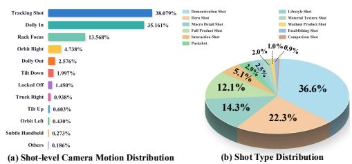

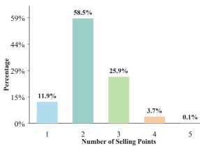  
(c) Number of Selling Points per Product

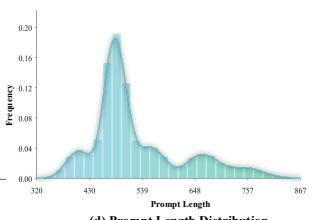  
(d) Prompt Length Distribution  
Figure 5: Additional statistics of AdSpark-300K. The figure summarizes the distributions of (a) shot-level camera motions, (b) shot types, (c) the number of selling points per product, and (d) advertisement prompt lengths, illustrating the diversity of camera design, product presentation, commercial content, and prompt complexity in the dataset.

Third, category filtering removes SKUs from product categories unsuitable for product-centric advertisement video generation. We read the category and sub-category labels from the associated product metadata and apply a predefined category exclusion list. At the category level, we exclude non-physical products, service-oriented items, sensitive medical and healthcare products, secondhand goods, digital content, and other categories with substantial advertising-compliance or generation risks. We further remove unsuitable sub-categories that remain within otherwise valid primary categories, such as virtual products, rental and installation services, prescription-related products, examination materials, and collectible or investment-oriented items. SKUs with missing, corrupted, or unreadable category metadata are also discarded. This stage removes 2,314 SKUs and retains 348,526 category-compliant candidates.

Following the three-stage filtering, 348,526 candidate SKUs remain. We rank these candidates according to platform-wide click statistics and sequentially process them in descending order. Each candidate SKU is used to generate at most one synthetic advertisement. Samples rejected during subsequent advertisement-plan review or manual inspection are discarded, and the next ranked candidates are processed until 200K quality-controlled synthetic advertisements are collected.

Structured Advertisement Planning. For each selected SKU, we employ GPT-5.5 to jointly generate structured advertisement annotations and the corresponding visual and audio instructions, conditioned on the product reference and associated metadata. Consistent with the unified representation introduced in the main paper, the annotations comprise product identity, selling-point descriptions, creative plans covering scene, style, and shot design, and aligned audio scripts. Merchant-provided selling-point descriptions serve as the primary basis for advertisement planning. GPT-5.5 translates these selling points into explicit visual realizations and observable success criteria, enabling them to be demonstrated through the generated content rather than merely described in narration. The creative plan contains one to five temporally ordered shots, each specifying its time interval, shot type, camera motion, and corresponding selling points. The shot intervals are non-overlapping and jointly cover the complete video duration. The output further includes executable shot-by-shot visual instructions and shot-aligned audio-generation instructions. GPT-5.5 is explicitly instructed to avoid introducing unsupported functions, numerical claims, or product properties. The condensed prompt used for structured annotation and visual–audio instruction generation is provided in Fig. 15.

Iterative Annotation Review. To improve annotation accuracy and generation feasibility, we employ Gemini-3.1-Pro-Preview as an independent reviewer. Given the product images, metadata, and generated advertisement annotations, the reviewer examines product identity accuracy, selling-point validity, consistency between selling points and their visual realizations, shot-structure coherence, physical plausibility, and visual–audio alignment. If the annotations are rejected, GPT-5.5 revises them according to the reviewer feedback. We perform at most five review-and-refinement rounds. The annotations are accepted immediately once they pass the reviewer; otherwise, the corresponding SKU is discarded after the fifth unsuccessful round. This process removes samples containing incorrect product descriptions, unsupported selling points, contradictory shot designs, physically implausible interactions, or mismatched visual and audio instructions. The condensed reviewer prompt used in this process is provided in Fig. 17.

Multi-model Video Generation. The accepted structured plans are used to synthesize productcentric advertisement videos. Seedance 2.0 serves as the primary generator and accounts for the majority of the synthetic subset. We additionally include HappyHorse and Kling to increase visual diversity and reduce dependence on the generation characteristics of a single model. All models receive the product reference image and the corresponding advertisement instructions. Videos are generated in a vertical 9:16 format at 720p resolution, with durations ranging from 5 to 15 seconds. Audio generation is enabled to synthesize narration, background sound, and action-related sound effects according to the aligned audio plan. The generation instructions prohibit subtitles, promotional overlays, watermarks, interface elements, and other non-product text.

Manual Quality Inspection. Each generated advertisement is reviewed by one trained annotator from the team described in Sup. A.2, following a sample-level accept-or-reject protocol. The inspection covers five aspects: product fidelity, visual plausibility, motion and temporal quality, selling-point realization, and audio quality and alignment.

(1) For product fidelity, the generated product is required to preserve the overall shape, proportions, colors, materials, packaging layout, logo, brand marks, and other identity-defining regions of the reference image. Videos exhibiting substantial deformation, color drift, packaging replacement, logo corruption, or cross-shot identity changes are rejected.

(2) For visual plausibility, the product, scene, and human–product interactions must remain visually and physically reasonable. We exclude samples containing severe rendering artifacts, malformed hands, object penetration, unsupported floating, inconsistent geometry, implausible liquid behavior, or incorrect spatial relations.

(3) For motion and temporal quality, camera motion and object motion should remain smooth and stable within each shot, while transitions between shots should be visually natural. Videos with severe flickering, duplicated or corrupted frames, abrupt appearance changes, unstable product motion, or incoherent transitions are discarded.

(4) For selling-point realization, the generated content should visibly demonstrate the intended product function, characteristic, interaction, or commercial appeal specified by the plan. A sample is rejected when its central selling points are omitted, only expressed through narration, contradicted by the visual content, or replaced by unrelated actions.

(5) For audio quality and alignment, narration and sound effects should be intelligible, semantically consistent with the planned script, and temporally aligned with the corresponding visual content. We reject videos with missing audio, severely corrupted speech, unrelated narration, substantial audio–visual mismatch, or sound effects inconsistent with the depicted actions.

We additionally discard videos containing prominent unintended subtitles, watermarks, promotional overlays, sensitive information, or other non-product text. A video is retained only when it satisfies all five inspection aspects. The resulting synthetic subset contains 200K quality-controlled productcentric advertisement videos.

## A.4 UNIFIED ANNOTATION

Despite being constructed through different pipelines, the real-world and synthetic subsets share the same structured annotation format. As shown in Fig. 14, each sample contains five components:

product identity, selling points, a creative plan, an aligned audio script, and generation prompts. This unified representation allows the two subsets to be jointly used for product-centric advertisement video generation while preserving the provenance and temporal structure of each sample.

Product Identity. The product-identity annotation describes both semantic identity and finegrained visual appearance. It includes the product category, brand, and product name, together with visual attributes such as dominant colors, materials, shape, key identity regions, recognizable packaging text, and essential details that should remain unchanged throughout the video. The key regions field records identity-defining areas such as logos, brand marks, characteristic patterns, and packaging components, while ocr targets specifies product-related text that should remain recognizable. The must keep field summarizes the visual elements most critical to preserving product identity.

Selling Points. Each selling-point entry contains the commercial feature to be communicated, its intended visual realization, and an observable success criterion. Rather than representing selling points only as textual claims, the visualization field describes how they should appear through product interactions, functional demonstrations, material details, scene design, or visible effects. The visual success criteria field further specifies concrete visual evidence that can be assessed from the video, enabling both generation supervision and selling-point-aware evaluation.

Creative Plan. The creative plan organizes the advertisement at the scene, style, and shot levels. The scene annotation describes the environment and contextual presentation of the product, while the style annotation specifies the intended visual tone, including lighting, color palette, contrast, texture, and commercial aesthetics. Both fields include observable success criteria to reduce ambiguity. The shot sequence provides a temporally ordered description of the advertisement narrative. Each shot is associated with a unique identifier, time interval, shot type, camera-motion type, visual description, intent, and visual success criterion. The selling point indices field explicitly links each shot to the selling points it presents. This linkage makes it possible to determine not only whether a selling point is included in the advertisement plan, but also when and how it is visually communicated. Shot intervals are ordered, non-overlapping, and jointly cover the complete video duration.

Aligned Audio Script. The audio script is organized according to the shot sequence. Each entry contains a shot identifier, temporal interval, background sound, and narration. This shot-level alignment associates spoken commercial messages and relevant sound effects with the corresponding visual content, supporting audio-conditioned generation and fine-grained audio–visual evaluation. For real-world advertisements, narration is derived from timestamped ASR transcripts and aligned with detected shots. For synthetic advertisements, the narration and sound instructions are jointly planned with the visual content.

Generation Prompts. In addition to the structured fields, each sample provides executable video and audio generation prompts. The video-generation prompt converts the creative plan into a coherent shot-by-shot description of the scene, composition, camera behavior, product interaction, and selling-point presentation. The audio-generation prompt specifies shot-aligned narration and sound effects. These prompts serve as model-ready textual conditions, while the structured annotations retain fine-grained supervision and support diagnostic evaluation.

Annotation Alignment Across Subsets. The two subsets differ in how their annotations are obtained but not in their final representation. For real-world samples, product identity, selling points, scene, style, and shot designs are inferred from the reference image, sampled video frames, product metadata, detected shot boundaries, and timestamped transcript. The annotations therefore describe content already present in the source advertisement. For synthetic samples, the same fields are planned from the product reference and metadata before video generation, and the corresponding visual and audio prompts are generated jointly with the structured annotations. All annotations are normalized to the schema in Fig. 14. We validate required fields, shot ordering, temporal coverage, selling-point references, and cross-field consistency before including a sample in AdSpark-300K. This shared representation enables unified training across real-world and synthetic data and supports tasks ranging from reference-conditioned video generation and product-identity preservation to selling-point visualization, multi-shot advertisement planning, and audio–visual generation.

  
Figure 6: Representative reference images from AdSpark-Bench. We show benchmark reference products across diverse categories, including home appliances, electronics, clothing, furniture, food, personal care, and industrial supplies.

## A.5 DATASET STATISTICS AND DISTRIBUTIONS

We further analyze the video content of AdSpark-300K in Fig. 5. At the shot level, tracking shots and dolly-in motions dominate the camera-motion distribution, accounting for 38.1% and 35.2%, respectively, followed by rack focus at 13.6%. This indicates that the dataset primarily favors smooth subject following and gradual visual emphasis, which are well suited to product-centric presentation. In terms of shot types, demonstration shots are the most frequent, followed by hero shots, macrodetail shots, and full-product shots, reflecting the importance of functional visualization and finegrained product presentation in advertisement videos. Most products are associated with two or three selling points, while cases with more than three are relatively rare, suggesting that the advertisements generally focus on a compact set of core commercial messages. The prompt-length distribution peaks at around 500 characters while covering a wide range, reflecting diverse levels of scene detail, shot complexity, and selling-point presentation across the dataset.

## A.6 REPRESENTATIVE SAMPLES

We present representative samples from AdSpark-300K across a wide range of product categories in Fig. 7, where each reference image is paired with advertisement video frames sampled in temporal order. These examples demonstrate the diversity of product appearances, advertising scenes, camera motions, and product-oriented interactions covered by the dataset, while also showing how product identity and key selling points are preserved throughout the generated videos. We further provide examples of advertisement videos together with their structured prompts in Fig. 8. The prompts describe the overall scene and visual style, shot-level composition and camera motion, temporal segmentation, and synchronized audio cues, illustrating how commercial intentions are translated into executable multi-shot plans. A complete annotation for the diving-watch sample is additionally

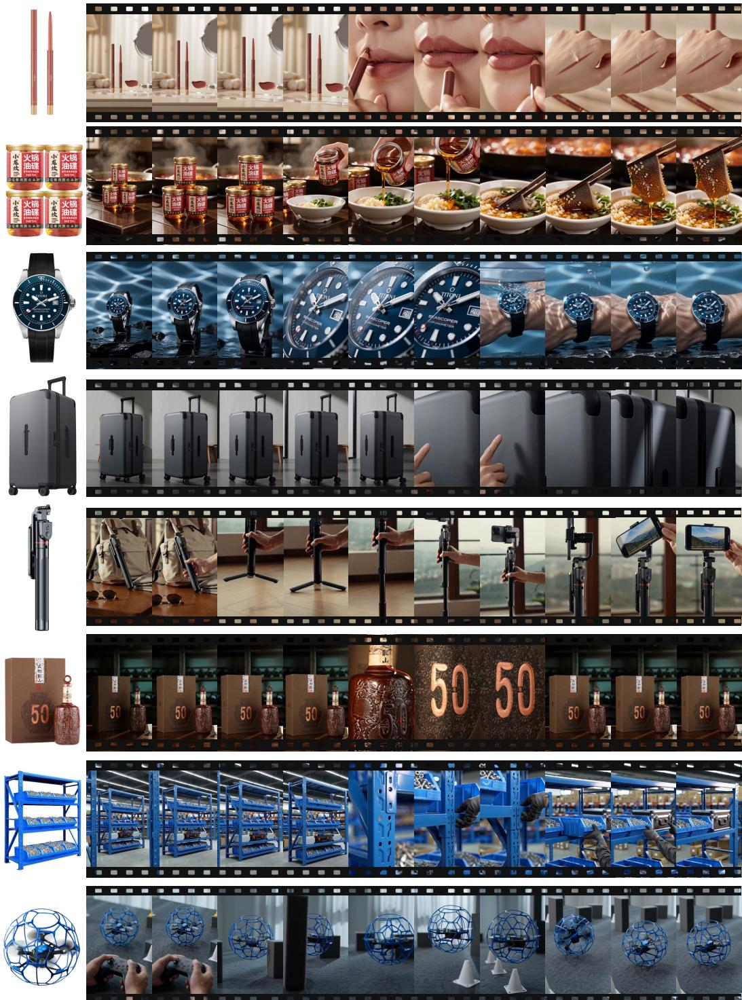  
Figure 7: Qualitative examples from AdSpark-300K. Each row presents a reference product image and paired advertisement video frames sampled in temporal order.

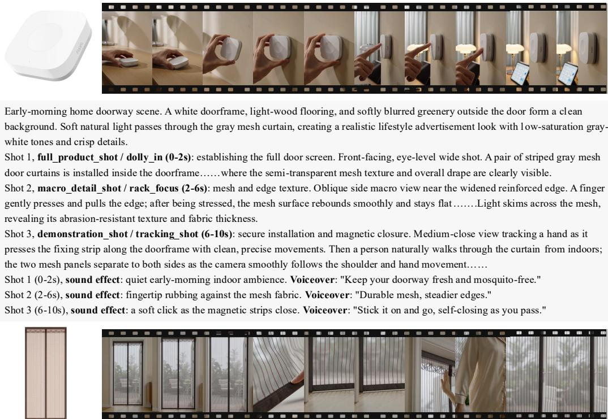  
Figure 8: Examples of advertisement videos and their structured prompts in AdSpark-300K. For each product, the prompt describes the overall scene style, shot-level visual planning, camera type and motion, temporal segments, and synchronized audio cues, including sound effects and voiceover scripts.

Modern smart-home advertisement style. A warm beige wall and a light-wood side table form a clean background, with soft window light entering from the left. A table lamp and semi-transparent curtains create warm depth in the background. The small white switch is the only product subject, and the overall visual texture is restrained, delicate, and realistic.   
Shot 1: interaction\_shot / tracking\_shot (0-2s): effortless stick-on placement, showing wireless wall mounting. The scene uses a mediumclose, front-side view. A hand picks up the white rounded-corner switch from the light-wood tabletop……the product stays firmly attached after placement without floating.   
Shot 2: demonstration\_shot / dolly\_in (2-5s): three pressing gestures demonstrating smart linked responses. The camera slowly dollies in from a medium wall view to a close-up of the button……. while the linked devices in the background respond sequentially in rhythm. Shot 1 (0-2s), sound effect: a brief sticking sound as the switch is attached to the wall. Voiceover: "Stick it on anywhere, no wiring needed." Shot 2 (2-5s), sound effect: crisp button clicks and the sound of the light turning on. Voiceover: "Three press gestures, whole-home control."

## B ADDITIONAL DETAILS OF ADSPARK-BENCH

## B.1 BENCHMARK CONSTRUCTION

AdSpark-Bench is constructed from held-out product SKUs to provide a reliable evaluation suite for product-centric advertisement video generation. We randomly select 350 SKUs from the eligible product pool while ensuring that all benchmark samples are strictly SKU-disjoint from the AdSpark-300K training set. Each selected SKU contains a high-quality reference image, complete advertisement annotations, and structured generation conditions, including product identity, selling points, creative plans, and audio scripts. To ensure evaluation reliability, we apply several filtering criteria during benchmark construction. We retain products with a single dominant object, high visual quality, clear product identity, and complete annotation schemas. Samples with low-resolution reference images, ambiguous product categories, missing metadata, or unsuitable generation conditions are removed through manual inspection. Furthermore, we restrict the benchmark to one sample per fine-grained product category (SKU category level) to reduce redundancy and improve evaluation diversity. The final benchmark contains 220 product-conditioned cases covering 40 prod uct categories and 220 distinct sub-categories. Following the planned advertisement structure, the benchmark includes 45 one-shot, 131 two-shot, and 44 three-shot cases, resulting in 175 multi-shot cases for evaluating cross-shot consistency, transition quality, and narrative coherence.

## B.2 CATEGORY AND DIFFICULTY DISTRIBUTION

AdSpark-Bench is designed to cover diverse product categories and generation difficulties. As shown in Fig. 6, the benchmark spans all 40 product categories in AdSpark-300K, including electronics, beauty products, clothing, furniture, kitchenware, and beverages. Category selection follows the natural distribution of available products while maintaining coverage for long-tail categories through category-level balancing. Beyond category diversity, we explicitly consider generation difficulty factors that are critical for product-centric advertisement generation. The benchmark contains diverse visual challenges, including fine-grained product details, packaging text preservation, logo recognition, multi-shot storytelling, and product-motion interaction. We further maintain a balanced shot-complexity distribution, where one-shot cases evaluate basic product preservation, while two shot and three-shot cases introduce additional challenges in shot transition, temporal consistency, and narrative progression. These design choices enable AdSpark-Bench to evaluate not only general video generation quality, but also the capability of models to preserve product identity and realize advertisement-oriented creative intentions under different levels of difficulty.

## B.3 CONDITIONAL EVALUATION SUBSETS

Some advertisement-specific metrics require specific visual conditions to provide reliable measurements. Therefore, AdSpark-Bench adopts a conditional evaluation protocol, where metrics are computed on the complete benchmark whenever applicable and on dedicated subsets when additional prerequisites are required. Specifically, we define three conditional subsets: Text Fidelity Subset. Text Fidelity requires recognizable product-related text, such as brand names or packaging descriptions. We construct a text evaluation subset containing 72 samples with sufficient and readable OCR targets. These samples satisfy the criteria of having at least four annotated OCR targets and clear packaging text visibility. Logo and Key-Region Subset. Logo and Key-Region Similarity focuses on identity-defining visual details, including logos, brand marks, and distinctive product regions. We construct this subset with 172 samples containing visible logos or clear key regions. Specifically, samples are selected based on product identity clarity, visible brand logos, and sufficient key-region annotations. Product Demonstration Subset. To evaluate challenging advertise ment scenarios involving product usage and human-product interaction, we additionally construct a product demonstration subset containing 20 samples. These cases include functional demonstrations, usage scenarios, or interaction-based shots, where models are required to visualize product functions rather than only preserve product appearance. For multi-shot related metrics, including Cross-shot Product Consistency, Transition Naturalness, and Narrative Coherence, we directly use the multi-shot subset consisting of 175 samples (131 two-shot and 44 three-shot cases). This conditional evaluation design avoids unreliable measurements caused by missing evaluation targets while enabling fine-grained analysis of model capabilities under different advertisement scenarios.

## B.4 SHOT-AWARE EVALUATION PROTOCOL

Multi-shot advertisement videos contain intentional shot transitions, camera movements, and scene changes. Directly evaluating the entire video sequence may incorrectly treat designed transitions as temporal artifacts and obscure shot-level generation quality. Therefore, AdSpark-Bench adopts a shot-aware evaluation protocol to analyze shot structure, execution, temporal coherence, and cross shot consistency.

Given a generated video $V ,$ , we first apply TransNetV2 Soucek & Lokoc (2024) to detect shot boundaries and divide the video into an ordered sequence of generated shots:

$$
\begin{array} { r } { { \cal S } ^ { g } = \{ s _ { 1 } ^ { g } , s _ { 2 } ^ { g } , . . . , s _ { N _ { g } } ^ { g } \} , } \end{array}\tag{1}
$$

where $N _ { g }$ denotes the number of detected shots. Each generated shot $s _ { i } ^ { g }$ is represented by its temporal interval $[ t _ { i } ^ { s } , t _ { i } ^ { e } ]$

The detected shots are then matched with the planned shots from the advertisement creative plan:

$$
\begin{array} { r } { { \cal S } ^ { p } = \{ s _ { 1 } ^ { p } , s _ { 2 } ^ { p } , . . . , s _ { N _ { p } } ^ { p } \} , } \end{array}\tag{2}
$$

where each planned shot contains structured information including shot type, motion design, and visual objectives.

To establish shot correspondence, we compute temporal Intersection-over-Union (tIoU) between generated and planned shots:

$$
\mathrm { t I o U } ( s _ { i } ^ { g } , s _ { j } ^ { p } ) = \frac { | s _ { i } ^ { g } \cap s _ { j } ^ { p } | } { | s _ { i } ^ { g } \cup s _ { j } ^ { p } | } ,\tag{3}
$$

where | · | denotes the temporal duration of an interval. We greedily match each generated shot with the unmatched planned shot having the highest tIoU:

$$
j ^ { * } = \arg \operatorname* { m a x } _ { j } { \mathrm { t I o U } ( s _ { i } ^ { g } , s _ { j } ^ { p } ) } .\tag{4}
$$

The obtained shot correspondences are shared across multiple evaluation dimensions. Specifically, shot structure alignment evaluates whether the generated shot sequence follows the planned organization, while shot execution alignment measures whether each matched shot realizes the intended camera behavior and motion design. Temporal metrics further evaluate motion quality within indi vidual shots and transition quality across consecutive shots.

Importantly, shot detection is performed solely based on the generated video without using groundtruth shot boundaries. This schema-blind protocol prevents annotation leakage and ensures that shotrelated metrics reflect the actual generation capability of each model. For single-shot advertisements, transition-related metrics are skipped, while all other applicable metrics remain unchanged.

## B.5 METRIC DEFINITIONS AND IMPLEMENTATION

## B.5.1 VISUAL QUALITY

Visual quality evaluates the perceptual quality of generated advertisements without considering product identity or instruction compliance. We adopt two complementary metrics, including Aesthetic Score and MUSIQ Ke et al. (2021), to assess visual attractiveness and image quality, respectively.

Given a generated video V, we uniformly sample N frames:

$$
\mathcal { F } = \{ f _ { 1 } , f _ { 2 } , \ldots , f _ { N } \} ,\tag{5}
$$

where $N = 1 6$ in our experiments. For each sampled frame, we independently compute the aesthetic score and imaging quality score. The final metric value is obtained by averaging frame-level scores:

$$
M ( V ) = \frac { 1 } { N } \sum _ { i = 1 } ^ { N } M ( f _ { i } ) ,\tag{6}
$$

where $M ( \cdot )$ denotes either Aesthetic Score or MUSIQ.

Aesthetic Score is normalized from its original range to [0, 1], while MUSIQ directly produces a normalized image quality score. We report these two metrics separately to characterize different aspects of perceptual video quality.

## B.5.2 PRODUCT FIDELITY

Product fidelity measures whether generated advertisements faithfully preserve the identity and appearance of the referenced product. Different from conventional subject consistency metrics that rely on holistic image similarity, AdSpark-Bench evaluates product fidelity at multiple granularities, including overall product appearance, identity-defining regions, packaging text, and cross-shot stability.

Given a reference image $I _ { r } ,$ generated video V , and product annotations A, we first extract productrelated regions using GroundingDINO Liu et al. (2023) and refine the corresponding masks using SAM2 Ravi et al. (2024). The extracted regions are then encoded with DINOv3 Simeoni et al. (2025)´ for feature-level comparison. The complete evaluation procedure is summarized in Algorithm 1.

Algorithm 1: Product Fidelity Evaluation Protocol   
1: Input: Reference image $I _ { r } ,$ , generated video V, product annotations ${ \mathcal { A } } .$   
2: Output: Individual product fidelity metrics.   
3: Uniformly sample frames from $V \colon \mathcal { F } = \{ f _ { i } \} _ { i = 1 } ^ { N }$   
4: Detect product regions in I and $\mathcal { F }$ using GroundingDINO.   
5: Refine detected regions with SAM2: $\mathcal { P } ^ { \bar { r } } , \mathcal { P } ^ { g } = \{ \bar { P _ { i } ^ { g } } \} _ { i = 1 } ^ { N } .$   
6: Encode product crops with $\mathrm { D I N O v } 3 \colon z _ { r } = \phi ( \mathcal { P } ^ { r } ) , \ : z _ { i } = \phi ( P _ { i } ^ { g } ) .$   
7: Compute Subject Consistency: $S _ { \mathrm { s u b j } }  \frac { 1 } { N } \sum _ { i = 1 } ^ { N } \cos ( z _ { r } , z _ { i } ) .$   
8: Localize annotated identity regions, including logos, brand marks, and packaging details.   
9: Compute Key-Region Similarity: $S _ { \mathrm { r e g i o n } }  \frac { 1 } { | \mathcal { R } | } \sum _ { j \in \mathcal { R } } \cos ( z _ { j } ^ { r } , z _ { j } ^ { g } )$   
10: Apply OCR to localized product crops and obtain recognized text $\hat { y } .$   
11: Compute Text Fidelity: $\hat { S } _ { \mathrm { t e x t } }  1 - \hat { \frac { d _ { \mathrm { e d i t } } ( y , \hat { y } ) } { | y | } }$   
12: Detect shot boundaries with TransNetV2 for multi-shot videos.   
13: Compute Cross-shot Product Consistency when transitions exist: $S _ { \mathrm { x s h o t } }  \frac { 1 } { K } \sum _ { k = 1 } ^ { K } \cos ( z _ { k } ^ { - } , z _ { k } ^ { + } )$   
14: Return all applicable product fidelity metrics independently.

Subject Consistency. Subject Consistency evaluates whether the generated product preserves its overall appearance. Let $z _ { r }$ denote the DINOv3 feature of the reference product region, and $z _ { i }$ denote the feature of the generated product crop from the i-th sampled frame. The similarity is computed as:

$$
S _ { \mathrm { s u b j } } = \frac { 1 } { N } \sum _ { i = 1 } ^ { N } \cos ( z _ { r } , z _ { i } ) .\tag{7}
$$

Key-Region Similarity. Key-Region Similarity focuses on fine-grained identity-defining regions, such as logos, brand marks, and distinctive packaging details. Given a set of annotated key regions R, the similarity is computed as:

$$
S _ { \mathrm { r e g i o n } } = \frac { 1 } { | \mathcal { R } | } \sum _ { j \in \mathcal { R } } \cos ( z _ { j } ^ { r } , z _ { j } ^ { g } ) ,\tag{8}
$$

where $z _ { j } ^ { r }$ and $z _ { j } ^ { g }$ denote the DINOv3 features of the j-th region in the reference and generated videos, respectively.

Text Fidelity. Text Fidelity measures whether product-related text, such as brand names and packaging information, remains recognizable after generation. Given the ground-truth text $y$ and OCRrecognized text $\hat { y } ,$ we compute:

$$
S _ { \mathrm { t e x t } } = 1 - \frac { d _ { \mathrm { e d i t } } ( y , \hat { y } ) } { | y | } ,\tag{9}
$$

where $d _ { \mathrm { e d i t } } ( \cdot , \cdot )$ denotes the Levenshtein edit distance. For multiple text regions, the final score is averaged over all valid text targets.

Cross-shot Product Consistency. For multi-shot advertisements, we additionally evaluate product stability across shot transitions. Given adjacent shots $s _ { i }$ and $s _ { i + 1 }$ , we compute the feature similarity between product regions around each transition:

$$
S _ { \mathrm { x s h o t } } = \frac { 1 } { K } \sum _ { i = 1 } ^ { K } \cos ( z _ { i } , z _ { i + 1 } ) ,\tag{10}
$$

where $K$ denotes the number of detected shot transitions. This metric captures abrupt product identity changes that may be overlooked by frame-level averaging.

Algorithm 2: Instruction Adherence Evaluation Protocol   
1: Input: Generated video V , creative plan ${ \mathcal { C } } ,$ advertisement prompt p.   
2: Output: Individual instruction adherence metrics.   
3: Detect generated shots and parse planned shots from $\mathcal { C } .$   
4: Match generated shots to planned shots using temporal IoU.   
5: Compute shot-count accuracy: S<sub>count</sub> ← max $\left( 0 , 1 - \frac { | N _ { g } - N _ { p } | } { N _ { p } } \right)$   
6: Compute boundary accuracy: S<sub>bound</sub> $ \frac { 1 } { \vert \mathcal { B } ^ { p } \vert } \sum _ { \tau \in \mathcal { B } ^ { p } } \mathbf { 1 } \Bigg [ \operatorname* { m i n } _ { b \in \mathcal { B } ^ { g } } \vert \tau - b \vert \leq \delta \Bigg ]$   
7: Obtain Shot Structure Alignment from $S _ { \mathrm { c o u n t } }$ and S<sub>bound</sub>.   
8: Construct contact sheets for matched shots and estimate shot execution with GPT-5.5: $S _ { \mathrm { { e x e c } } } $   
$\frac { 1 } { | \mathcal { M } | } \sum _ { ( i , j ) \in \mathcal { M } } q _ { i j } ^ { \mathrm { e x e c } } .$   
9: Evaluate scene, style, and selling-point realization with GPT-5.5: $S _ { \mathrm { c o n t e n t } }  \frac { 1 } { \vert \mathcal { M } \vert } \sum _ { ( i , j ) \in \mathcal { M } } q _ { i j } ^ { \mathrm { c o n t e n t } }$   
10: Encode the prompt and sampled frames using GME: $S _ { \mathrm { g m e } } \gets \frac { 1 } { N } \sum _ { i = 1 } ^ { N } { \psi _ { t } ( p ) } ^ { \top } \psi _ { v } ( f _ { i } )$   
11: Return all applicable instruction adherence metrics independently.

## B.5.3 INSTRUCTION ADHERENCE

Instruction adherence evaluates whether the generated advertisement follows the provided creative plan, including shot structure, shot-level execution, scene and style requirements, and selling-point realization. Unlike generic video-text alignment metrics, AdSpark-Bench performs shot-aware evaluation based on the detected shot sequence and the structured advertisement annotations.

Given a generated video V and its corresponding creative plan C, we first obtain detected shots using the shot-aware protocol described above and match them with the planned shots. The overall evaluation procedure is summarized in Algorithm 2. All instruction adherence metrics are reported independently without aggregating them into a weighted score.

Shot Structure Alignment. Shot Structure Alignment measures whether the generated video follows the planned number and temporal organization of shots. Let $N _ { g }$ and $N _ { p }$ denote the numbers of detected and planned shots, respectively. We first compute shot-count accuracy:

$$
S _ { \mathrm { c o u n t } } = \operatorname* { m a x } \left( 0 , 1 - \frac { | N _ { g } - N _ { p } | } { N _ { p } } \right) .\tag{11}
$$

We further evaluate whether planned shot boundaries are correctly realized. Let $B ^ { p }$ and $B ^ { g }$ denote the planned and detected boundary sets. A planned boundary is considered matched if a detected boundary lies within a temporal tolerance $\delta = 0 . 5 \mathrm { s }$

$$
S _ { \mathrm { b o u n d } } = \frac { 1 } { | \mathcal { B } ^ { p } | } \sum _ { \tau \in \mathcal { B } ^ { p } } \mathbf { 1 } \left[ \operatorname* { m i n } _ { b \in \mathcal { B } ^ { g } } | \tau - b | \leq \delta \right] .\tag{12}
$$

The final Shot Structure Alignment score is computed from shot-count and boundary accuracy:

$$
S _ { \mathrm { s t r u c t } } = 0 . 4 S _ { \mathrm { c o u n t } } + 0 . 6 S _ { \mathrm { b o u n d } } .\tag{13}
$$

For single-shot cases without internal boundaries, boundary accuracy is set to 1.

Shot Execution Alignment. Shot Execution Alignment evaluates whether each generated shot realizes the planned shot type and motion design. For each matched shot pair $\big ( s _ { i } ^ { g } , s _ { i } ^ { p } \big ) \overline { { \in \mathcal { M } } }$ , we sample frames from the generated shot and construct contact sheets. We additionally compute optical-flow cues to provide coarse motion evidence. GPT-5.5 then compares the visual evidence with the corresponding planned shot annotations, including shot type, camera behavior, and motion type. The score is computed as:

$$
S _ { \mathrm { e x e c } } = \frac { 1 } { | \mathcal { M } | } \sum _ { ( i , j ) \in \mathcal { M } } q _ { i j } ^ { \mathrm { e x e c } } ,\tag{14}
$$

where $q _ { i j } ^ { \mathrm { e x e c } } \in [ 0 , 1 ]$ denotes the normalized GPT-5.5 score for the matched shot. Extra generated shots without matched planned shots receive zero execution scores.

Content Alignment. Content Alignment measures whether the generated advertisement realizes the intended scene, style, and selling points. We use two frame-sampling strategies. For scene and style alignment, we sample representative frames from each detected shot to capture the global visual context. For selling-point realization, we use denser shot-aware sampling to better capture short functional demonstrations or interaction actions. GPT-5.5 evaluates each component according to the structured creative plan and the expected visual success criteria. The score is computed as:

$$
S _ { \mathrm { c o n t e n t } } = 0 . 3 S _ { \mathrm { s c e n e } } + 0 . 3 S _ { \mathrm { s t y l e } } + 0 . 4 S _ { \mathrm { s e l l } } ,\tag{15}
$$

where $S _ { \mathrm { s c e n e } } , S _ { \mathrm { s t y l e } }$ , and $S _ { \mathrm { s e l l } }$ denote normalized scene, style, and selling-point alignment scores, respectively.

GmeScore. We additionally report GmeScore to measure global semantic alignment between the full advertisement prompt and the generated video. Given the prompt embedding $\psi _ { t } ( p )$ and frame embedding $\psi _ { v } ( f _ { i } )$ from gme-Qwen2-VL-7B-Instruct, GmeScore is computed as:

$$
S _ { \mathrm { g m e } } = \frac { 1 } { N } \sum _ { i = 1 } ^ { N } \psi _ { t } ( p ) ^ { \top } \psi _ { v } ( f _ { i } ) .\tag{16}
$$

This metric complements the fine-grained shot-aware evaluation by providing a global video-text relevance score.

## B.5.4 TEMPORAL COHERENCE

Temporal coherence evaluates whether generated advertisements exhibit smooth motion, stable product dynamics, natural shot transitions, and limited temporal artifacts. Since advertisement videos often contain intentional shot cuts, all temporal metrics are computed in a shot-aware manner to avoid mistaking designed transitions for temporal inconsistency.

Given the detected shot sequence, we evaluate temporal coherence from three perspectives: intrashot motion quality, transition naturalness, and local temporal consistency around shot boundaries. The evaluation protocol is summarized in Algorithm 3. All temporal coherence metrics are reported independently without aggregating them into a weighted score.

Intra-shot Motion Quality. Intra-shot Motion Quality measures whether motion within each shot is sufficiently dynamic, smooth, and product-stable. For adjacent frames, we compute dense optical flow $u _ { t } ( x )$ and obtain the average motion magnitude:

$$
m _ { t } = \frac { 1 } { | \Omega | } \sum _ { x \in \Omega } \| u _ { t } ( x ) \| _ { 2 } ,\tag{17}
$$

where Ω denotes the image domain. Motion Amplitude is computed as the average frame-wise motion magnitude:

$$
A = { \frac { 1 } { T - 1 } } \sum _ { t = 1 } ^ { T - 1 } m _ { t } .\tag{18}
$$

Following benchmark-level normalization, raw amplitudes are clipped by the 5th and 95th percentiles and linearly mapped to [0, 1].

Motion Smoothness is measured using the coefficient of variation of frame-wise motion magnitudes:

$$
S _ { \mathrm { s m o o t h } } = \operatorname* { m a x } \left( 0 , 1 - \frac { \sigma ( m ) } { \mu ( m ) + \epsilon } \right) ,\tag{19}
$$

where $\mu ( m )$ and $\sigma ( m )$ denote the mean and standard deviation of the motion magnitude sequence.   
Static shots with near-zero mean motion are assigned a smoothness score of 1.

```latex
Algorithm 3: Temporal Coherence Evaluation Protocol
1: Input: Generated video V , detected shot sequence $S ^ { g }$
2: Output: Individual temporal coherence metrics.
3: For each detected shot, compute optical flow between adjacent frames.
4: Obtain frame-wise motion magnitudes:
5: $m _ { t } \gets \frac { 1 } { | \Omega | } \sum _ { x \in \Omega } \| u _ { t } ( x ) \| _ { 2 } .$
6: Compute motion amplitude:
7: $A  { \frac { 1 } { T - 1 } } \sum _ { t = 1 } ^ { T - 1 } m _ { t } .$
8: Compute motion smoothness:
9: $S _ { \mathrm { s m o o t h } }  \mathrm { m a x } ( 0 , 1 - \frac { \sigma ( m ) } { \mu ( m ) + \epsilon } )$
10: Track product masks within each shot using GroundingDINO and SAM2.
11: Compute product motion stability:
12: $S _ { \mathrm { s t a b } } \dot {  } \dot { 0 } . 4 S _ { \mathrm { c e n t } } + 0 . 3 S _ { \mathrm { a r e a } } \dot { + } \dot { 0 } . 3 S _ { \mathrm { i o u } } .$
13: Detect all shot boundaries.
14: Estimate Transition Naturalness around each boundary:
15: $S _ { \mathrm { t r a n s } } \gets \frac { 1 } { K } \sum _ { k = 1 } ^ { K } q _ { k } ^ { \mathrm { t r a n s } } ,$
16: Detect repeated, flickering, and corrupted frames around boundaries.
17: Compute Temporal Consistency:
18: $S _ { \mathrm { t e m p } } \gets \frac { 1 } { K } \sum _ { k = 1 } ^ { K } q _ { k } ^ { \mathrm { t e m p } } .$
19: Return all applicable temporal coherence metrics independently.
```

To account for product-centric generation, we further track the advertised product within each shot and evaluate product motion stability. Given product masks across adjacent frames, we compute centroid stability, area stability, and mask-IoU stability. The final product stability score is:

$$
S _ { \mathrm { s t a b } } = 0 . 4 S _ { \mathrm { c e n t } } + 0 . 3 S _ { \mathrm { a r e a } } + 0 . 3 S _ { \mathrm { i o u } } .\tag{20}
$$

The intra-shot motion score is then computed as:

$$
S _ { \mathrm { m o t i o n } } = 0 . 2 5 A _ { \mathrm { n o r m } } + 0 . 4 0 S _ { \mathrm { s m o o t h } } + 0 . 3 5 S _ { \mathrm { s t a b } } .\tag{21}
$$

Transition Naturalness. Transition Naturalness measures whether shot cuts form visually plausible transitions without abrupt artifacts. For each detected boundary, we examine frames before and after the cut. We first apply a pixel-level validity check to identify corrupted frames, such as black frames, over-exposed frames, or near-constant frames. If the boundary passes this check, GPT-5.5 further evaluates whether the transition is visually natural in terms of brightness, style continuity, and artifact absence. The score is computed as:

$$
S _ { \mathrm { t r a n s } } = \frac { 1 } { K } \sum _ { k = 1 } ^ { K } q _ { k } ^ { \mathrm { t r a n s } } ,\tag{22}
$$

where $q _ { k } ^ { \mathrm { t r a n s } } \in [ 0 , 1 ]$ is the naturalness score of the k-th transition, and K is the number of detected shot boundaries. Single-shot videos have no transition score and are excluded from this metric.

Temporal Consistency. Temporal Consistency focuses on local temporal artifacts around shot boundaries, including duplicated frames, flickering, and structurally corrupted frames. For each detected boundary, we inspect a local temporal window and compute adjacent-frame intensity differences and SSIM values. A normal shot transition should contain at most one major visual change within the window, while repeated large changes indicate flickering or unstable transitions.

For each boundary, we assign a binary consistency score:

$$
q _ { k } ^ { \mathrm { t e m p } } = { \bf 1 } \left[ n _ { \mathrm { d i f f } } ^ { k } \leq 1 \land n _ { \mathrm { s s i m } } ^ { k } \leq 1 \land \lnot c _ { k } \right] ,\tag{23}
$$

Algorithm 4: Audio Alignment Evaluation Protocol   
1: Input: Generated video V , generated audio a, audio description $d _ { a } .$ , reference script y.   
2: Output: Individual audio alignment metrics.   
3: Extract the audio track a from the generated video.   
4: Encode a and $d _ { a }$ using LAION-CLAP.   
5: Compute Background Sound Consistency: $S _ { \mathrm { b g } } \gets \cos ( \eta _ { a } ( a ) , \eta _ { t } ( d _ { a } ) )$   
6: Transcribe narration using Whisper-Large-v3-Turbo to obtain yˆ.   
7: Compute Narration Script Consistency: $\dot { S } _ { \mathrm { s c r i p t } }  1 - \frac { d _ { \mathrm { e d i t } } ( y , \hat { y } ) } { | y | }$   
8: Return all applicable audio alignment metrics independently.

where $n _ { \mathrm { d i f f } } ^ { k }$ is the number of excessive intensity jumps, $n _ { \mathrm { s s i m } } ^ { k }$ is the number of structural drops, and $c _ { k }$ indicates whether corrupted or repeated frames are detected. The final Temporal Consistency score is:

$$
S _ { \mathrm { t e m p } } = \frac { 1 } { K } \sum _ { k = 1 } ^ { K } q _ { k } ^ { \mathrm { t e m p } } .\tag{24}
$$

This metric is only computed for videos with detected shot boundaries.

## B.5.5 AUDIO ALIGNMENT

Audio alignment evaluates whether the generated audio is consistent with the intended advertisement design. Since not all video generation models support audio generation, this dimension is computed only for videos with valid audio outputs. We evaluate audio alignment from two complementary aspects: background sound consistency and narration script consistency.

Background Sound Consistency measures whether the generated background audio matches the expected audio description in the creative plan. Narration Script Consistency evaluates whether the spoken narration follows the provided audio script. The overall evaluation protocol is summarized in Algorithm 4. All audio alignment metrics are reported independently.

Background Sound Consistency. We use LAION-CLAP Wu et al. (2023) to measure the semantic consistency between the generated audio and the expected background sound description. Let $\eta _ { a } ( \cdot )$ and $\eta _ { t } ( \cdot )$ denote the audio and text encoders, respectively. The score is computed as:

$$
S _ { \mathrm { b g } } = \cos ( \eta _ { a } ( a ) , \eta _ { t } ( d _ { a } ) ) ,\tag{25}
$$

where a is the generated audio and $d _ { a }$ is the audio description derived from the benchmark annotation. The score is normalized to [0, 1] for reporting.

Narration Script Consistency. For advertisements containing narration, we transcribe the generated audio using Whisper-Large-v3-Turbo Radford et al. (2023) and compare the transcription with the reference audio script. Given the reference script y and the recognized script yˆ, we compute:

$$
S _ { \mathrm { s c r i p t } } = 1 - \frac { d _ { \mathrm { e d i t } } ( y , \hat { y } ) } { | y | } ,\tag{26}
$$

where $d _ { \mathrm { e d i t } } ( \cdot , \cdot )$ denotes the Levenshtein edit distance. This metric reflects whether the generated narration preserves the intended commercial message.

## B.5.6 ADVERTISEMENT EFFECTIVENESS

Advertisement effectiveness evaluates whether a generated video functions well as a product advertisement, beyond low-level visual quality and instruction following. A video may preserve the product and follow the prompt, but still fail to attract customers, present the selling point persuasively, or form a coherent advertisement narrative. Therefore, AdSpark-Bench evaluates advertisement effectiveness from a customer-oriented perspective.

We employ GPT-5.5 as a potential customer evaluator. Given the reference product, creative plan, selling points, and sampled frames from the generated video, GPT-5.5 assigns scores to three dimensions: Advertisement Attractiveness, Creative Quality, and Narrative Coherence. The evaluation protocol is summarized in Algorithm 5. These three metrics are reported independently without aggregating them into an overall score.

Algorithm 5: Advertisement Effectiveness Evaluation   
1: Input: Reference image I<sub>r</sub>, generated video V , creative plan ${ \mathcal { C } } ,$ selling points $\mathcal { P } .$   
2: Output: Individual advertisement effectiveness metrics.   
3: Uniformly sample representative frames from V.   
4: Construct a visual summary using sampled frames and shot-level annotations.   
5: Provide GPT-5.5 with I<sub>r</sub>, C, P, and the visual summary.   
6: Evaluate Advertisement Attractiveness: $S _ { \mathrm { a t t r } } \gets \mathrm { N o r m } ( q _ { \mathrm { a t t r } } )$   
7: Evaluate Creative Quality: S<sub>creat</sub> ← Norm(q<sub>creat</sub>).   
8: Evaluate Narrative Coherence: $S _ { \mathrm { n a r r } }  \mathrm { N o r m } ( q _ { \mathrm { n a r r } } ) .$   
9: Return all advertisement effectiveness metrics independently.

Advertisement Attractiveness. Advertisement Attractiveness measures whether the generated video can capture viewer attention and stimulate purchase interest. GPT-5.5 evaluates this dimension from the perspective of a potential customer, considering visual appeal, product desirability, and the overall viewing experience. The raw score $q _ { \mathrm { a t t r } }$ is normalized for reporting:

$$
S _ { \mathrm { a t t r } } = \mathrm { N o r m } ( q _ { \mathrm { a t t r } } ) .\tag{27}
$$

Creative Quality. Creative Quality evaluates whether the generated video exhibits a polished and commercially usable advertisement design. The evaluator considers visual impact, commercial readiness, product-oriented creativity, and whether the creative expression supports the intended selling points. The score is computed as:

$$
S _ { \mathrm { c r e a t } } = \mathrm { N o r m } ( q _ { \mathrm { c r e a t } } ) .\tag{28}
$$

Narrative Coherence. Narrative Coherence evaluates whether multi-shot advertisements form a coherent storytelling progression rather than disconnected scenes. GPT-5.5 considers shot-to-shot consistency, selling-point progression, narrative logic, and pacing. The score is computed as:

$$
S _ { \mathrm { n a r r } } = \mathrm { N o r m } ( q _ { \mathrm { n a r r } } ) .\tag{29}
$$

For single-shot advertisements, Narrative Coherence focuses on whether the generated content forms a complete and self-contained advertisement presentation. For multi-shot advertisements, it further considers whether the shots are logically connected and whether the selling points are progressively communicated.

## B.6 MULTIMODAL JUDGE PROMPTS

Several metrics in AdSpark-Bench require high-level multimodal reasoning that cannot be reliably captured by low-level visual features or automatic detectors alone. We therefore use GPT-5.5 as a multimodal judge for selected advertisement-specific metrics, including Shot Execution Alignment, Content Alignment, Transition Naturalness, and Advertisement Effectiveness. All multimodal judge prompts follow a unified evaluation format. The judge receives temporally ordered frames or shotlevel contact sheets together with the corresponding structured annotations, such as planned shot type, motion type, scene, style, selling points, and shot descriptions. For Likert-based prompts, GPT-5.5 outputs integer scores from 1 to 5, where 1 indicates poor or missing realization, 3 indicates partial realization, and 5 indicates strong realization. These scores are linearly mapped to [0, 1] for reporting. For transition naturalness and narrative coherence, the judge directly outputs a scalar score in [0, 1]. All prompts require strict JSON or numeric-only outputs to ensure reliable parsing and reproducibility. Representative prompt templates are provided in Fig. 20–Fig. 26.

Although GPT-5.5 is used in both synthetic advertisement planning and selected benchmark metrics, this does not constitute direct self-evaluation, as the two stages serve fundamentally different roles and operate on different inputs. During data construction, GPT-5.5 performs language-based creative planning from product references, metadata, and selling points to produce structured advertisement

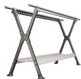

Modern home balcony with a fresh, clean background formed by a light gray floor, white sheer curtains, and blue sky outside t he floor-to-ceiling windows. Natural daylight enters from the side and slightly behind, creating soft highlights on the metal rods. The image has a realistic, refined home advertising look. Shot 1, full\_product\_shot / dolly\_in (0-2 seconds): stable structure reveal, a low, eye-level medium shot. The drying rack is positioned along the right third of the frame……The circular-hole reinforced beam, hinge joints, and reflections on the metal tubes are clearly visible, conveying selected materials and durable support. Shot 2, demonstration\_shot / tracking\_shot (2-5 seconds): balcony drying demonstration. The camera stays close to the upper rod, tracking a hand as it moves from left to right. One hand naturally drapes a light-colored, thin quilt over the main rod; the quilt hangs down under gravity, forming soft folds…… Bright window light emphasizes the large-capacity feel of frequent everyday household use.

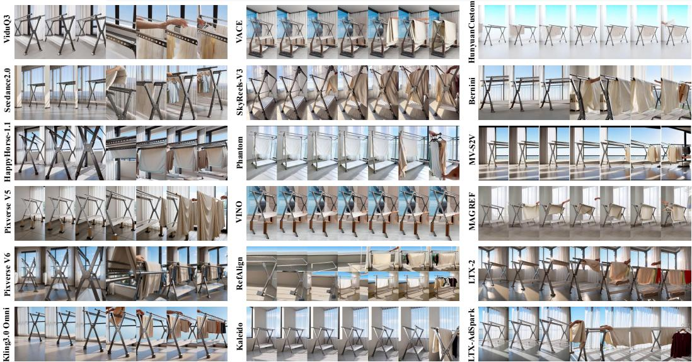  
Figure 9: Qualitative comparison of different models for a clothes-drying rack product.

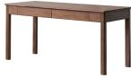

Warm Nordic natural-wood study room. Light-colored walls and curtains let in soft daylight. On the desk are a laptop, two books, a simple table lamp, and a small green plant. A light-colored chair sits slightly behind to the side, and the wooden floor is clean with open negative space. Shot 1, medium\_product\_shot / dolly\_in (0-2 seconds): complete display in a window-side study, eye-level medium shot with a standard focal length. The desk is positioned slightly right of center. The front double drawers, rectangular tabletop…… conveying versatility for a home office or study corner. Shot 2, macro\_detail\_shot / rack\_focus (2-5 seconds): macro close-up starting from the rounded chamfer on the front edge of the desktop. Soft light sweeps diagonally across the surface, revealing fine wood grain and a warm, gentle sheen. A fingertip lightly slides along the desk edge and comes to a stop, staying in contact with the surface……with the details held longer to emphasize fine craftsmanship and the natural oak texture.

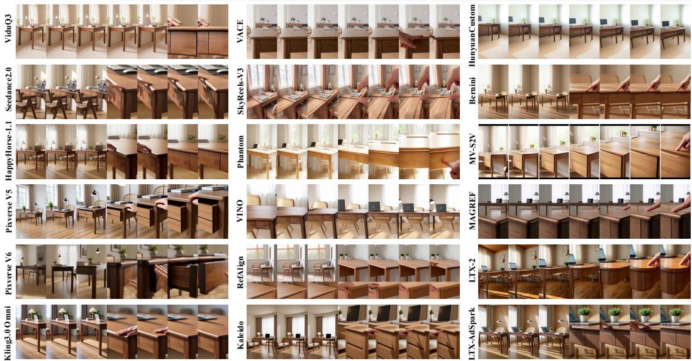  
Figure 10: Qualitative comparison of different models for a wooden desk product.

instructions. During evaluation, it instead performs multimodal reasoning over independently generated visual evidence, including sampled frames, shot-level contact sheets, and motion cues, to assess how well a generated video realizes a fixed product reference and advertisement plan. Therefore, the evaluation is grounded in the generated visual content rather than textual similarity to the planner


Light beige velvet jewelry tray interior. Soft morning window light enters from the side and slightly behind. The background features blurred green leaves and lightcolored fabric. The overall palette combines pale cyan-green, warm gold, and mother-of-pearl white, creating a refined jewelry advertising look. Low-contrast soft lighting preserves both metallic highlights and the translucent glow of the jade.   
Shot 1, hero\_shot / dolly\_in (0-1 second): first reveal of the gift box, overhead view with a slight eye-level angle. The bracelet is fully centered on the velvet tray, with the front ginkgo leaf pendant facing the camera. Standard focal length, shallow depth of field. The camera pushes in smoothly and slowly……   
Shot 2, macro\_detail\_shot / rack\_focus (1-3 seconds): material focus transition, macro close-up near a pale cyan jade bead. Side backlight passes through the bead creating a softly translucent edge and rounded white highlight…… forming a delicate contrast between the jade’s softness and the gold’s brightness.   
Shot 3, packshot / locked\_off (3-5 seconds): gift-ready final frame, locked-off medium close-up. A hand gently straightens the pendant from the edge of the frame, then leaves……The jade beads appear translucent, the gold beads glow, and the shot ends as a clean product display.

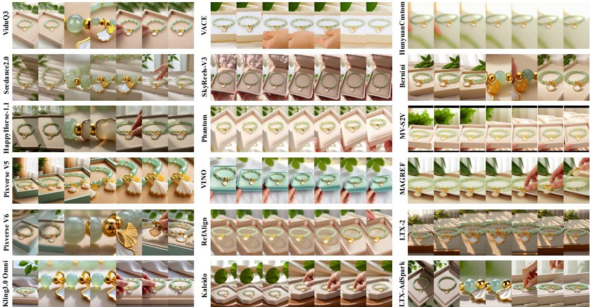  
Figure 11: Qualitative comparison of different models for a jewelry product.

output. For each benchmark case, all evaluated video generation models are conditioned on exactly the same reference image and advertisement prompt, such that the conditioning information is held constant across methods. We further validate the GPT-assisted metrics independently against human judgments in Sup. B.8.

## B.7 SCORE NORMALIZATION AND AGGREGATION

AdSpark-Bench includes heterogeneous metrics from pretrained perceptual models, feature similarity, OCR, audio-text alignment, and multimodal judge scores. To make the results comparable, all reported metrics are normalized to a common range before aggregation. Unless otherwise specified, each metric is first mapped to [0, 1] and then reported in percentage form.

For metrics that naturally produce bounded similarity scores, such as cosine similarity, CLAP similarity, GmeScore, and normalized edit-distance similarity, we directly use their normalized values. For raw perceptual scores with dataset-dependent ranges, we apply linear clipping and rescaling:

$$
\mathrm { N o r m } ( x ) = \mathrm { c l i p } \left( \frac { x - l } { u - l } , 0 , 1 \right) ,\tag{30}
$$

where l and u denote the lower and upper normalization bounds. In our implementation, Aesthetic Score is normalized with $l = 4 . 0$ and $u = 7 . 0$ , while MUSIQ is divided by 100 to obtain an imagequality score in [0, 1].

For GPT-5.5 judge scores based on a 1–5 Likert scale, we linearly map the raw score s to [0, 1]:

$$
\mathrm { N o r m } ( s ) = \frac { s - 1 } { 4 } .\tag{31}
$$

For prompts that directly output a scalar score in [0, 1], such as Transition Naturalness and Narrative Coherence, the score is used without additional rescaling.

Aggregation is performed only within the valid evaluation scope of each metric. Frame-level metrics are averaged over sampled frames, shot-level metrics are averaged over matched shots, and

transition-level metrics are averaged over detected shot boundaries:

$$
S _ { m } ( V ) = \frac { 1 } { | \mathcal { U } _ { m } ( V ) | } \sum _ { u \in \mathcal { U } _ { m } ( V ) } s _ { m } ( u ) ,\tag{32}
$$

where $m$ denotes a metric, $\mathcal { U } _ { m } ( V )$ denotes the valid evaluation units for video $V ,$ , and $s _ { m } ( u )$ is the normalized score of each unit.

The final score of a model on each metric is computed by averaging over all applicable benchmark samples:

$$
\bar { S } _ { m } = \frac { 1 } { | \mathcal { D } _ { m } | } \sum _ { V \in \mathcal { D } _ { m } } S _ { m } ( V ) ,\tag{33}
$$

where $\mathcal { D } _ { m }$ is the valid subset for metric $m .$ . For conditional metrics, such as Text Fidelity, Key-Region Similarity, Cross-shot Product Consistency, Transition Naturalness, and Audio Alignment, samples without the required evaluation targets are excluded rather than assigned zero scores. In particular, when a planned multi-shot case fails to produce multiple detected shots, the corresponding cross-shot metric is assigned a score of zero.

## B.8 METRIC VALIDATION

We validate the GPT-assisted metrics of AdSpark-Bench by measuring their agreement with human rankings. Specifically, we focus on the six metrics that involve GPT-based judgment: Shot Execution Alignment, Content Alignment, Transition Naturalness, Advertisement Attractiveness, Creative Quality, and Narrative Coherence. These metrics cover instruction following, selling-point realization, transition quality, commercial appeal, creative quality, and multi-shot storytelling. To conduct this validation, we construct an additional evaluation set outside AdSpark-Bench, consisting of 100 held-out products. For each product, all evaluated models are used to generate advertisement videos under the same product reference and advertisement prompt. GPT-5.5 then assigns a score to each generated video along the six GPT-assisted dimensions according to the evaluation protocols defined in AdSpark-Bench. In parallel, we recruit six human raters with research backgrounds in video generation and advertisement-related research to independently evaluate the same generated videos using an aligned six-dimensional rubric. Each video is rated by multiple raters, and all raters are blinded to the identity of the generation model and the corresponding GPT-5.5 scores.

For each product and each metric dimension, we rank the generated videos from different models according to the aggregated human scores and the corresponding AdSpark-Bench metric scores, respectively. Let $\check { P }$ denote the number of products, $K = \bar { 1 9 }$ the number of evaluated models, and $D$ the set of six GPT-assisted metric dimensions. For product $p ,$ model $k ,$ and dimension $d \in D .$ we denote the averaged human score as $h _ { p , k } ^ { d }$ and the corresponding AdSpark-Bench metric score as $m _ { p , k } ^ { d }$ . We convert these scores into rankings within each product group:

$$
r _ { p , k } ^ { d , h } = \mathrm { r a n k } ( h _ { p , k } ^ { d } ) , \quad r _ { p , k } ^ { d , m } = \mathrm { r a n k } ( m _ { p , k } ^ { d } ) ,
$$

where rank 1 indicates the best video among the $K$ model outputs for the same product. Tied scores are assigned average ranks. For each product $p$ and dimension $d ,$ we compute Spearman’s rank correlation between the human ranking and the metric ranking:

$$
\rho _ { p } ^ { d } = \mathrm { S p e a r m a n } \left( \{ r _ { p , k } ^ { d , h } \} _ { k = 1 } ^ { K } , \{ r _ { p , k } ^ { d , m } \} _ { k = 1 } ^ { K } \right) .
$$

When there are no ties, this is equivalent to:

$$
\rho _ { p } ^ { d } = 1 - \frac { 6 \sum _ { k = 1 } ^ { K } \left( r _ { p , k } ^ { d , h } - r _ { p , k } ^ { d , m } \right) ^ { 2 } } { K ( K ^ { 2 } - 1 ) } .
$$

Finally, we average the correlations over all products to obtain the validation score for each dimension:

$$
\rho ^ { d } = \frac { 1 } { P } \sum _ { p = 1 } ^ { P } \rho _ { p } ^ { d } .
$$

<table><tr><td>Metric</td><td>Spearman  $\rho \uparrow$ </td></tr><tr><td>Shot Execution Alignment</td><td>0.861</td></tr><tr><td>Content Alignment</td><td>0.833</td></tr><tr><td>Transition Naturalness</td><td>0.797</td></tr><tr><td>Advertisement Attractiveness</td><td>0.719</td></tr><tr><td>Creative Quality</td><td>0.752</td></tr><tr><td>Narrative Coherence</td><td>0.774</td></tr></table>

Table 5: Correlation between GPT-assisted metrics and human rankings.

We report $\rho ^ { d }$ separately for each of the six GPT-assisted dimensions in Tab. 5. Higher Spearman correlation indicates stronger alignment between the GPT-assisted metric and human preference. The GPT-assisted metrics show consistent positive correlations with human rankings across all dimensions. The agreement is stronger for relatively objective criteria such as shot execution and content alignment, while more subjective criteria such as creative quality and advertisement attractiveness exhibit lower but still meaningful correlations.

## B.9 BENCHMARK EXAMPLES

We present representative reference images from AdSpark-Bench in Figure 6, with one example shown for each of its 40 product categories. These examples demonstrate the broad category coverage of the benchmark, spanning home appliances, digital electronics, clothing, furniture, personal care, food, industrial supplies, and other product domains. We further provide a complete annotation example for the digital-electronics sample in Figure 19. The example specifies the camera’s visual identity and selling points, together with the corresponding scene and style designs, shot-level creative plans, aligned audio scripts, and generation prompts. It demonstrates how each benchmark case provides structured conditions for systematically evaluating product fidelity, instruction adherence, temporal coherence, audio alignment, and advertisement effectiveness.

## C ADDITIONAL EXPERIMENTAL DETAILS

## C.1 DETAILS OF EVALUATION MODELS

We evaluate representative reference-to-video generation models on AdSpark-Bench, covering both proprietary and open-source models.

Proprietary Models. We include seven proprietary video generation systems. ViduQ2 and ViduQ3 are reference-conditioned video generation models from the Vidu series, supporting imageguided generation and multi-reference conditioning. ViduQ3 further supports native audio-video generation and places greater emphasis on complex motion and cinematic storytelling. Seedance 2.0 Seedance et al. (2026) is a unified multimodal audio-video generation model that accepts text, image, video, and audio references, enabling reference-guided generation with native audio. HappyHorse-1.1 is a joint audio-video generation model supporting text-to-video, image-to-video, and reference-to-video generation. PixVerse V5 and PixVerse V6 are general-purpose video generation systems supporting image-conditioned synthesis, while the latter additionally provides more flexible reference-based generation and video extension capabilities. Kling 3.0 Omni Team et al. (2025) is a multimodal video generation system that unifies reference-guided generation, video editing, and visual-language instruction following.

Open-Source Models. We further evaluate eleven open-source models with different referenceconditioning mechanisms. VACE-14B Jiang et al. (2025) unifies reference-to-video generation and multiple video editing tasks through a shared video-conditioning interface. SkyReels-V3-14B Li et al. (2026) adopts a multimodal in-context generation framework and supports reference-image-tovideo generation, video extension, and audio-guided synthesis. Phantom-14B Liu et al. (2025) performs single- and multi-subject video generation through joint text–image conditioning and crossmodal alignment. VINO-13B Chen et al. (2026) is a unified visual generation model that handles interleaved multimodal conditions for controllable image and video synthesis. RefAlign-14B Wang et al. (2026a) explicitly aligns reference-branch representations with visual foundation model features to improve reference fidelity and reduce subject confusion. Kaleido-14B Zhang et al. (2025) targets multi-subject reference video generation and introduces reference-aware positional encoding for stable multi-image conditioning. HunyuanCustom-13B Hu et al. (2025) is a customized video generation framework that integrates multimodal reference information to preserve target subject characteristics. Bernini-14B Team et al. (2026) employs latent semantic planning to improve compositional organization and semantic control during video generation. MV-S2V-14B Song et al. (2026) conditions generation on multiple views of a target subject to improve three-dimensional subject consistency. MAGREF-14B Deng et al. (2025) introduces masked reference guidance for flexible any-reference video generation. Finally, LTX-2-14B HaCohen et al. (2026) is an efficient joint audio-video foundation model supporting synchronized visual and audio generation.

Evaluation Setup. For fair comparison, all models are evaluated using the same product reference images and advertisement prompts from AdSpark-Bench whenever their interfaces support reference-conditioned generation. We follow the official inference settings of each model. For models without audio generation capability, audio-related metrics are marked as unavailable rather than assigned zero scores.

## C.2 IMPLEMENTATION DETAILS

We fine-tune LTX-2 as the AdSpark-adapted baseline, denoted as LTX-AdSpark, to validate the effectiveness of AdSpark-300K. We use LTX-2 as the base model and adopt LoRA training instead of full-parameter fine-tuning for efficient adaptation.

Training Configuration. LoRA is applied to the attention projection layers, including to q, to k, and to v. The LoRA rank and alpha are both set to 64, with dropout set to 0. The model is trained for 30K steps using AdamW with a learning rate of $2 \times 1 0 ^ { - 4 }$ , batch size 4, gradient clipping of 1.0, and bfloat16 mixed precision. Gradient checkpointing is enabled during training.

Conditioning Strategy. During training and inference, the model uses the product reference image as the primary visual condition and the structured advertisement prompt as textual guidance. Video and audio latents are precomputed from AdSpark-300K, while audio generation is learned from text supervision without reference audio conditioning.

Inference Setting. For validation and benchmark inference, we generate 9:16 advertisement videos at 704 × 1280 resolution with 121 frames at 24 fps, corresponding to approximately 5 seconds. We use 30 inference steps, guidance scale 4.0, STG scale 1.0, and a fixed random seed of 42. Checkpoints are saved every 1,000 steps, and validation is performed every 3,000 steps.

## C.3 QUALITATIVE COMPARISONS

We provide additional qualitative comparisons on AdSpark-Bench in Fig. 9-Fig.11. Each example uses the same product reference image and structured advertisement prompt across all models. The results show that existing models can generally synthesize plausible video, but they still struggle with fine-grained product preservation, interaction realism, and shot-level prompt following. For instance, several methods change the geometry or material details of the clothes-drying rack, distort the drawer structure of the wooden desk, or fail to preserve the bracelet shape and pendant details in close-up shots. Some models also introduce inconsistent hands, abrupt viewpoint changes, or weak correspondence between the planned demonstration and the generated motion. In comparison, LTX-AdSpark produces more product-consistent results with smoother shot progression and clearer selling-point presentation, indicating that AdSpark-300K improves reference-conditioned advertisement video generation in product-centric scenarios.

## C.4 ABLATION RESULTS

To disentangle the effects of data composition and dataset scale, we further fine-tune LTX-2 on different subsets of AdSpark-300K under identical optimization settings. As shown in Tab. 6, both real-world and synthetic advertisements consistently improve over the base model, while exhibiting complementary strengths. We first compare Real-100K and Synthetic-100K under the same training scale, where Synthetic-100K is randomly sampled from the full 200K synthetic subset. The two subsets show different strengths. Real-world data performs better on Subject Consistency (64.73 vs. 58.17), suggesting that authentic product appearances provide stronger identity supervision. Synthetic data is more effective on structure- and transition-related metrics, reaching 71.79 on Sho Structure Alignment, 80.09 on Transition Naturalness, and 81.38 on Narration Script Consistency, compared with 70.68, 72.76, and 78.26 for Real-100K. This is consistent with its construction from explicit shot-level plans and aligned narration instructions. Scaling the synthetic subset from 100K to 200K brings further gains across all reported metrics, showing that data scale also contributes. Nevertheless, the full AdSpark-300K performs best overall. In particular, adding 100K real-world samples on top of Synthetic-200K raises Subject Consistency from 61.59 to 65.01 and further improves the remaining metrics. These results suggest that the final performance gains come from both increased training scale and the complementary supervision of the real-world and synthetic subsets.

Table 6: Ablation on the composition and scale of AdSpark-300K. All variants are initialized from the same LTX-2 checkpoint and trained with identical optimization settings unless otherwise specified. The best results are highlighted in bold.
<table><tr><td>Training Data</td><td>Real</td><td>Synthetic</td><td>Img.</td><td>Subj.</td><td>Struct.</td><td>Trans.</td><td>Script</td><td>Creat.</td></tr><tr><td>LTX-2 (Base)</td><td>一</td><td></td><td>66.17</td><td>50.39</td><td>46.29</td><td>33.66</td><td>74.71</td><td>56.05</td></tr><tr><td>Real-100K</td><td>100K</td><td>0</td><td>68.03</td><td>64.73</td><td>70.68</td><td>72.76</td><td>78.26</td><td>57.61</td></tr><tr><td>Synthetic-100K</td><td>0</td><td>100K</td><td>68.44</td><td>58.17</td><td>71.79</td><td>80.09</td><td>81.38</td><td>57.12</td></tr><tr><td>Synthetic-200K</td><td>0</td><td>200K</td><td>68.69</td><td>61.59</td><td>76.23</td><td>87.26</td><td>82.62</td><td>58.47</td></tr><tr><td>AdSpark-300K</td><td>100K</td><td>200K</td><td>69.57</td><td>65.01</td><td>77.53</td><td>88.09</td><td>84.41</td><td>59.29</td></tr></table>

## D BROADER IMPACT AND LIMITATIONS

## D.1 LIMITATIONS AND FUTURE WORK

AdSpark provides an important step toward product-centric advertisement video generation, while leaving several directions for future extension. First, the current dataset is constructed from ecommerce scenarios. Future work could extend the data sources to more diverse platforms, markets, and advertising styles. Second, our product selection is mainly guided by click-through rate, which helps prioritize representative and commercially relevant products with strong user interest. At the same time, future extensions could further cover a broader long-tail product distribution, including niche categories and less frequently promoted products, to support more comprehensive evaluation and generation across diverse product types.

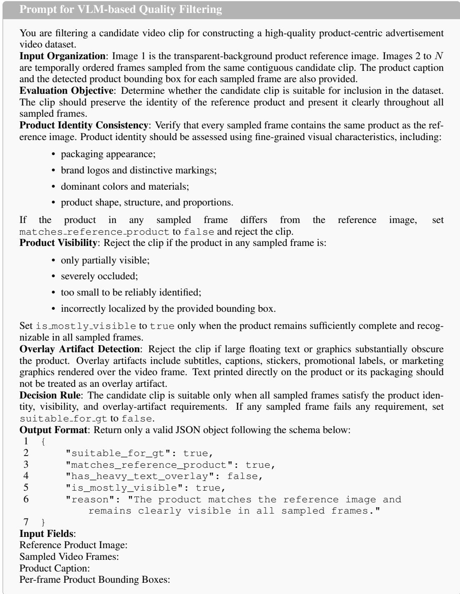  
Figure 12: Prompt for VLM-based Quality Filtering.

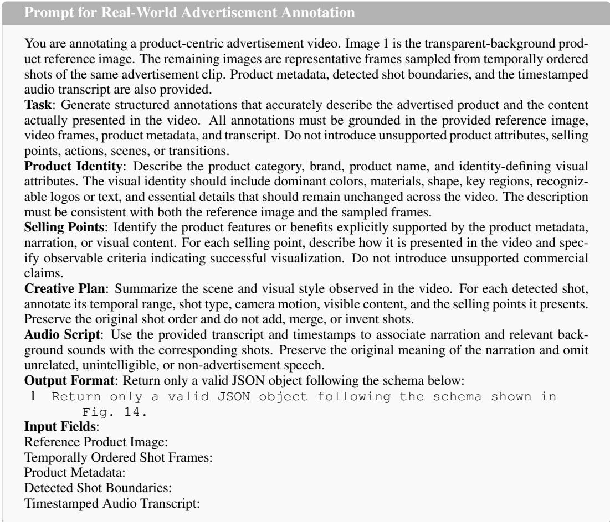  
Figure 13: Prompt for real-world advertisement annotation.

Unified Annotation Schema of AdSpark-300K   
1 {   
"product\_identity": {   
"category": "",   
"brand": "",   
"product\_name": "",   
"visual\_identity": {   
"main\_colors": [],   
"materials": [],   
"shape": "",   
10 "key\_regions": [],   
11 "ocr\_targets": [],   
12 "must\_keep": []   
13 }   
14 },   
15 "selling\_points": [   
16 {   
17 "point": "",   
18 "visualization": "",   
19 "visual\_success\_criteria": ""   
20 }   
21 ],   
22 "creative\_plan": {   
"scene": {   
"description": "",   
"visual\_success\_criteria": ""   
"why\_fit\_product": ""   
"negative\_scene": ""   
<sup>28</sup> <sub>29</sub> },   
"style": {   
30 "description": "",   
31 "visual\_success\_criteria": ""   
32 "why\_fit\_product": ""   
33 "negative\_style": ""   
34 },   
35 "shots": [   
36   
37 "shot\_id": 1,   
38 "time": "",   
39 "shot\_type": "",   
40 "motion\_type": "",   
41 "description": "",   
42 "intent": "",   
43 "visual\_success\_criteria": "",   
44 "selling\_point\_indices": []   
45 }   
46 ]   
47 },   
48 "audio\_script": [   
49 {   
50 "shot\_id": 1,   
51 "time": "",   
52 "background\_sound": "",   
53 "narration": ""   
54 }   
55 ],   
56 "generation\_prompts": {   
57 "video\_generation\_prompt": "",   
58 "audio\_generation\_prompt": ""   
59   
60 }  
Figure 14: Unified structured annotation schema used for both real-world and synthetic samples in AdSpark-300K.

  
Figure 15: Prompt for synthetic advertisement planning with GPT-5.5. The production prompt is condensed to retain its core product-grounding, selling-point visualization, shot-planning, and audio-alignment instructions.

  
Figure 16: Controlled vocabulary for shot and camera-motion planning in synthetic advertisement construction.

  
Figure 17: Prompt for synthetic advertisement plan review with Gemini-3.1-Pro-Preview.

  
Figure 17: Prompt for synthetic advertisement plan review with Gemini-3.1-Pro-Preview (continued).

An Annotation Example from AdSpark-300K   
1 {   
"product\_identity": {   
"category": "Men’s Mechanical Diving Watch",   
"brand": "TITONI",   
"product\_name": "Seascoper Automatic Diving Watch",   
"visual\_identity": {   
"main\_colors": [   
"deep ocean blue",   
"silver",   
10 "black",   
11 ],   
12 "materials": [   
13 "metal case",   
14 "serrated rotating bezel",   
15 "blue dial",   
16 "black rubber strap",   
17 ],   
18 "shape": "A round diving-watch case with a wide black rubber strap, a prominent   
crown on the right, and a robust frontal profile.",   
19 "key\_regions": [   
"triangular luminous marker at 12 o’clock",   
"brand logo at the center of the dial",   
"date window at 3 o’clock",   
"serrated rotating bezel",   
"vertical grooves on the black rubber strap"   
],   
"ocr\_targets": [   
"TITONI",   
"SEASCOPER",   
"CHRONOMETER",   
"SWISS MADE",   
"28"   
],   
"must\_keep": [   
"deep-blue dial and blue outer bezel",   
"silver case and right-side crown",   
"black rubber strap",   
"white circular and bar-shaped hour markers",   
"red detail on the second hand"   
]   
}   
41 },   
"selling\_points": [   
{   
"point": "Swiss-made mechanical watch",   
"visualization": "Use a stable hero shot, precise metallic highlights, clear dial   
layering, and finely rendered markers to convey Swiss mechanical craftsmanship.",   
46 "visual\_success\_criteria": "The complete front of the watch, refined reflections   
on the metal case, and orderly markers and hands should remain clearly visible,   
presenting it as a premium mechanical watch."   
47 },   
48 {   
49 "point": "Swiss chronometer certification",   
50 "visualization": "Use a macro shot and rack focus across the hands, date window,   
and certification area to emphasize precise timekeeping and certified   
craftsmanship.",   
51 "visual\_success\_criteria": "The video should include a close-up of the dial, with   
the certification area, hands, markers, or date window rendered in sharp focus."   
52 },  
Figure 18: An annotation example from AdSpark-300K. The structured annotation specifies product identity, selling points, scene and style designs, shot-level creative plans, aligned audio scripts, and generation prompts.

An Annotation Example from AdSpark-300K (Continued)   
"point": "300-meter diving capability",   
"visualization": "Show the watch being submerged in clear water, with flowing   
water, bubbles, and underwater refraction surrounding the case while keeping the   
bezel and dial visible.",   
4 "visual\_success\_criteria": "The watch should visibly enter and remain in contact   
with water, with droplets or bubbles covering the case while the dial remains   
recognizable."   
}   
],   
"creative\_plan": {   
"scene": {   
"description": "A dark, wet rock surface or black matte platform beside a shallow   
pool of clear water, with softly blurred aquatic reflections and cool rim lighting   
in the background.",   
10 "visual\_success\_criteria": "The watch should maintain physically plausible   
support or wrist contact, while the water and platform interact naturally and the   
background remains visually unobtrusive.",   
"why\_fit\_product": "Wet rock, water droplets, and clear water naturally reinforce   
the diving-watch identity without interfering with product recognition.",   
"negative\_scene": "Avoid cluttered office desks, promotional gift boxes,   
excessive text boards, floating watches, and unrelated jewelry props."   
},   
"style": {   
"description": "A refined watch-advertising style dominated by deep blue, cool   
silver, and black, with a restrained dark background, narrow highlights,   
16 reflective surfaces, and subtle aquatic light patterns.",   
"visual\_success\_criteria": "The imagery should maintain a cool blue-black   
palette, with thin highlights along the metal case and water reflections that do   
17 not obscure the dial.",   
ocean-inspired palette, while precise metallic highlights emphasize premium   
18 watchmaking craftsmanship.",   
"negative\_style": "Avoid warm cosmetic aesthetics, exaggerated neon cyberpunk   
effects, cartoon rendering, aggressive promotional graphics, and cluttered   
high-saturation backgrounds.   
},   
"shots": [   
"shot\_id": 1,   
"time": "0-4 seconds",   
"shot\_type": "hero shot",   
"motion\_type": "dolly in",   
"description": "A low-angle hero shot establishes the complete watch standing   
upright on a dark, wet rock support. The deep-blue dial faces the camera while   
soft reflections from the water appear in the background.",   
"intent": "Establish the product as a premium men’s mechanical diving watch and   
convey the precision and solidity associated with Swiss watchmaking.",   
"visual\_success\_criteria": "The case, strap, crown, serrated bezel, and blue   
dial should remain fully visible, with the watch standing stably and cool   
highlights defining the metal edges.",   
"selling\_point\_indices": [   
0   
},   
{   
"shot\_id": 2,   
"time": "4-9 seconds",   
"shot\_type": "macro detail shot",   
"motion\_type": "rack focus",   
"description": "A macro shot moves from the bezel markings and hands toward the   
certification text near the lower dial, using shallow depth of field to emphasize   
the markers, date window, hands, and printed details.",   
"intent": "Present the chronometer certification and precise timekeeping   
40 through visible dial details without relying on additional on-screen text.",   
"visual\_success\_criteria": "The dial markers should remain orderly, the hand   
edges sharp, the date window clear, and the certification area positioned within   
the focal plane or at the endpoint of the focus transition.",   
41 "selling\_point\_indices": [1]   
42 },  
Figure 18: An annotation example from AdSpark-300K (continued).

```jsonl
An Annotation Example from AdSpark-300K (Continued)
{
"shot_id": 3,
"time": "9-15 seconds",
"shot_type": "demonstration shot",
"motion_type": "tracking shot",
"description": "A wrist wearing the watch slowly enters a clear shallow pool.
The camera follows the wrist as it descends, while flowing water, bubbles, and
<sup>refracted</sup> <sup>light</sup> <sup>move</sup> <sup>across</sup> <sup>the</sup> <sup>bezel</sup> <sup>and</sup> <sup>case.",</sup>"intent": "Demonstrate the watch’s divin functionalit and suitabilit for
aquatic exploration through direct and physically plausible water interaction.",
"visual_success_criteria": "The watch should remain securely attached to the
wrist and fully submerged, with visible droplets, bubbles, and refraction while
15
36 the dial remains clear and free from deformation.", "selling_point_indices": [
2
]
}
]
},
"audio_script": [
"shot_id": 1,
"time": "0-4 seconds",
"background_sound": "A deep metallic resonance.",
"narration": "Swiss mechanical precision, built to make a bold entrance."
},
{
"shot_id": 2,
"time": "4-9 seconds",
"background_sound": "Subtle mechanical ticking and gear sounds.",
"narration": "Chronometer-certified precision you can trust."
},
{
"shot_id": 3,
"time": "9-15 seconds",
"background_sound": "The sound of a wrist entering clear water.",
"narration": "Water-resistant to 300 meters, ready to explore the deep."
}
],
"generation_prompts": {
"video_generation_prompt": "Create a premium diving-watch advertisement in a
deep-ocean-blue, cool-silver, and black visual style. The setting consists of a
wet black rock surface, a matte platform, and a shallow pool of clear water, with
soft aquatic reflections in the blurred background and narrow rim lighting
defining the metal edges. Shot 1, hero shot with dolly-in from 0 to 4 seconds:
show the complete watch standing upright on the wet rock support in a low-angle
medium close-up. Keep the deep-blue dial facing the camera, the black rubber strap
extending downward, and the focus locked on the dial and bezel. Slowly push the
camera forward while cool highlights move across the silver case and serrated
bezel. Shot 2, macro detail shot with rack focus from 4 to 9 seconds: begin with
the white hour markers, dimensional hands, and date-window frame in sharp focus,
then smoothly shift focus toward the certification area and minute markings near
the lower dial. Add a soft highlight across the glass without obscuring the
details. Shot 3, demonstration shot with tracking motion from 9 to 15 seconds:
show a wrist wearing the watch slowly entering the clear shallow pool from the
right side of the frame. Follow the wrist steadily as it descends, with water
droplets, small bubbles, and flowing refraction moving across the bezel and case.
End with the wrist resting beneath the water while the blue dial and silver case
remain clearly recognizable.",
39 "audio_generation_prompt": "Shot 1, 0-4 seconds: deep metallic resonance.
Narration: ’Swiss mechanical precision, built to make a bold entrance.’ Shot 2,
4-9 seconds: subtle mechanical ticking and gear sounds. Narration:
’Chronometer-certified precision you can trust.’ Shot 3, 9-15 seconds: clear
water-entry sound. Narration: ’Water-resistant to 300 meters, ready to explore the
deep.’"
40 }
41 }
```  
Figure 18: An annotation example from AdSpark-300K (continued).

An Annotation Example from AdSpark-Bench   
1 {   
"product\_identity": {   
"category": "Mirrorless Camera Body",   
"brand": "OLYMPUS",   
"product\_name": "OM-D E-M10 Mark IV Black Body",   
"visual\_identity": {   
"main\_colors": [   
"black",   
"silver metallic",   
10 "deep-purple sensor reflection"   
11 ],   
12 "materials": [   
13 "matte black camera body",   
14 "leather-textured grip",   
15 "silver metal lens mount",   
16 "reflective glass sensor surface"   
<sup>17</sup> <sub>18</sub> ],   
"shape": "A compact mirrorless camera body with a retro SLR-style silhouette, a   
raised central viewfinder housing, and a circular lens mount centered on the   
front.",   
40 "key\_regions": [   
"OLYMPUS logo on the top housing",   
"OM-D logo in the upper-left area",   
"central silver lens mount",   
"purple sensor window",   
"IV badge in the lower-right area",   
"dual control dials on the top"   
],   
"ocr\_targets": [   
"OLYMPUS",   
"OM-D",   
"IV"   
],   
"must\_keep": [   
"proportions between the black body and silver mount",   
"front-facing body without an attached lens",   
"top control dials and retro viewfinder lines",   
"leather-textured grip"   
]   
}   
},   
"selling\_points": [   
{   
"point": "Stylish retro appearance",   
"visualization": "Use a centered low-angle dolly-in while soft side lighting   
moves across the control dials, leather-textured grip, and silver lens mount   
against a blurred photography workbench.",   
45 "visual\_success\_criteria": "The retro viewfinder silhouette, control dials,   
leather texture, and metallic lens mount should remain clearly visible within a   
restrained and refined color palette."   
},   
{   
"point": "Stable handheld shooting with in-body stabilization",   
"visualization": "Show a hand lifting and moving the camera body over a short   
distance while the camera remains sharp and the background exhibits slight   
relative motion and blur.",   
50 "visual\_success\_criteria": "The hand should maintain natural contact with the   
camera, the body should remain stable and recognizable during motion, and the   
background should show subtle displacement or motion blur."   
51 }   
52 ],  
Figure 19: An annotation example from AdSpark-Bench. The structured annotation specifies product identity, selling points, scene and style designs, shot-level creative plans, aligned audio scripts, and generation prompts.

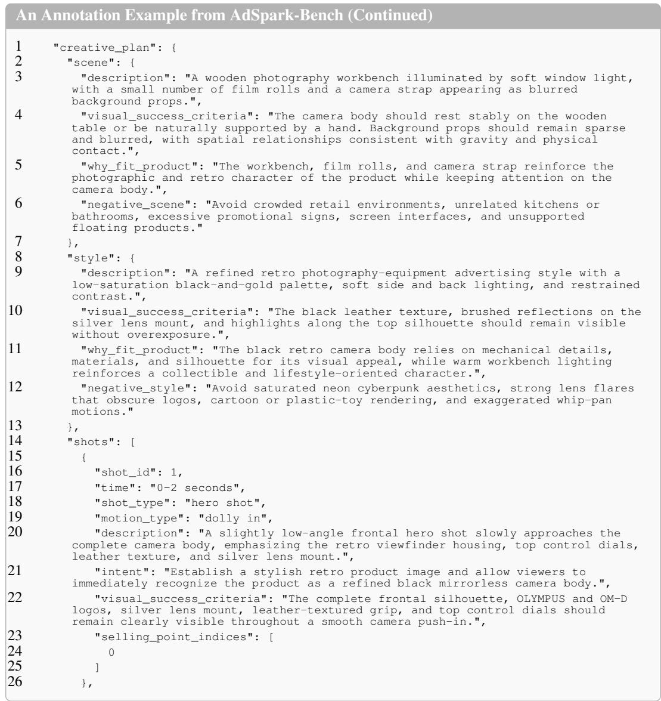  
Figure 19: An annotation example from AdSpark-Bench (continued).

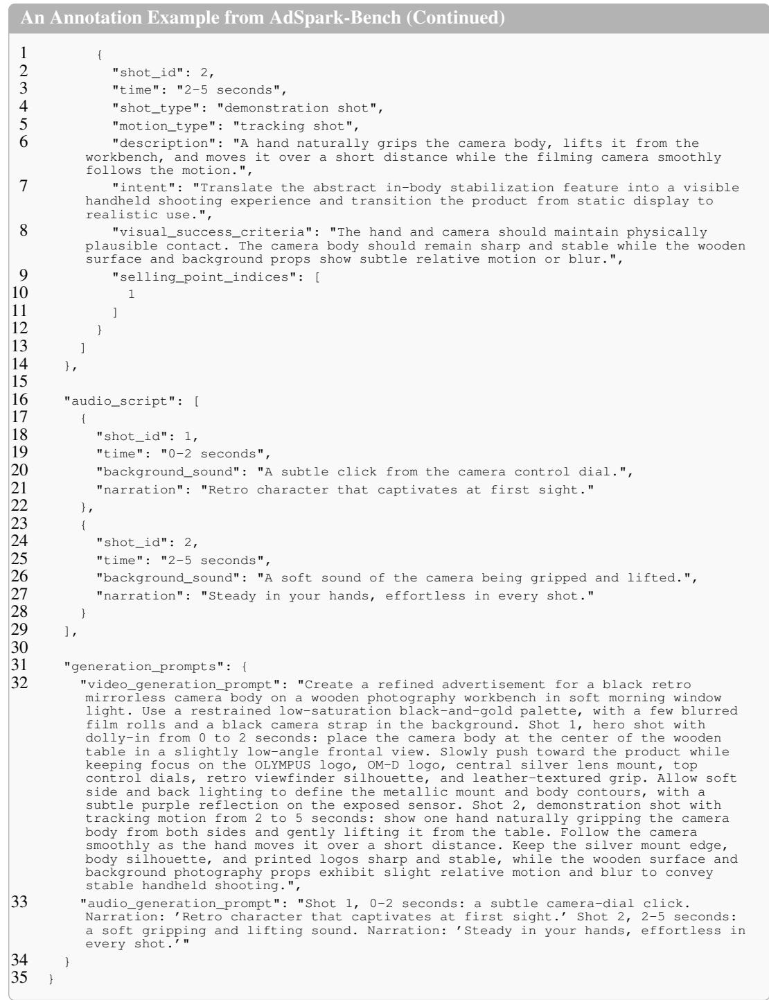  
Figure 19: An annotation example from AdSpark-Bench (continued).

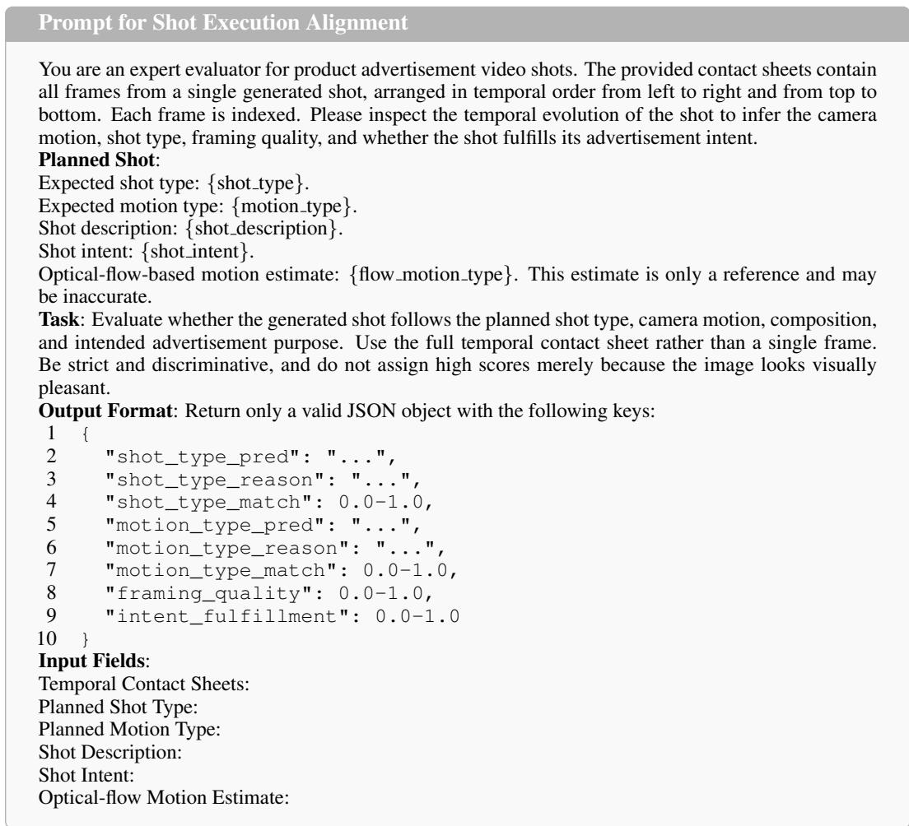  
Figure 20: Prompt for GPT-5.5-based shot execution alignment.

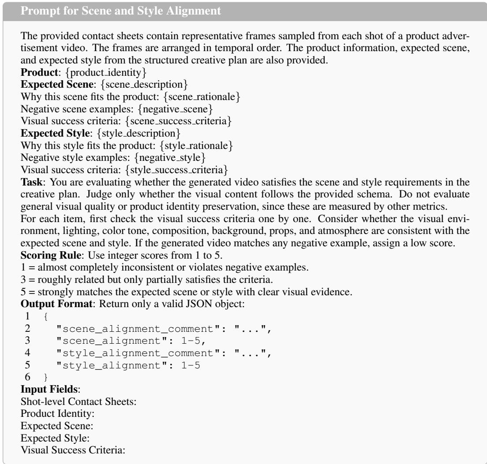  
Figure 21: Prompt for GPT-5.5-based scene and style alignment.

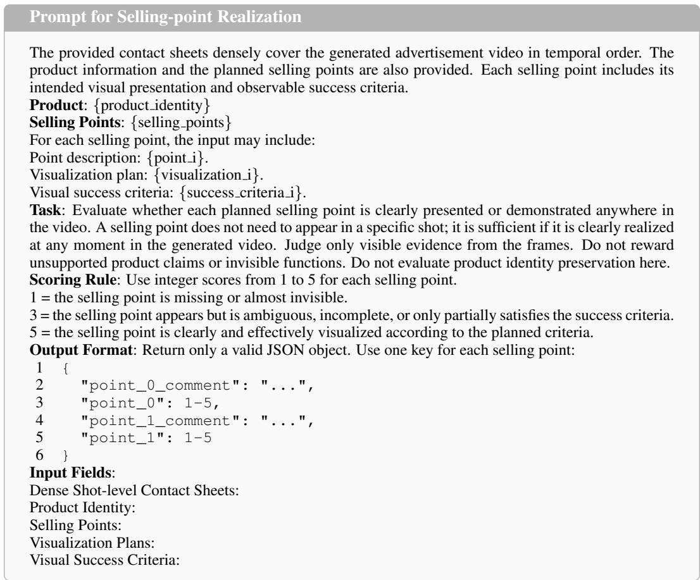  
Figure 22: Prompt for GPT-5.5-based selling-point realization.

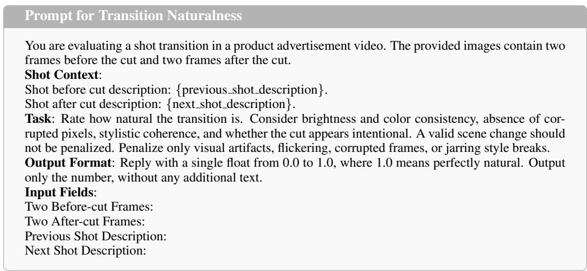  
Figure 23: Prompt for GPT-5.5-based transition naturalness evaluation.

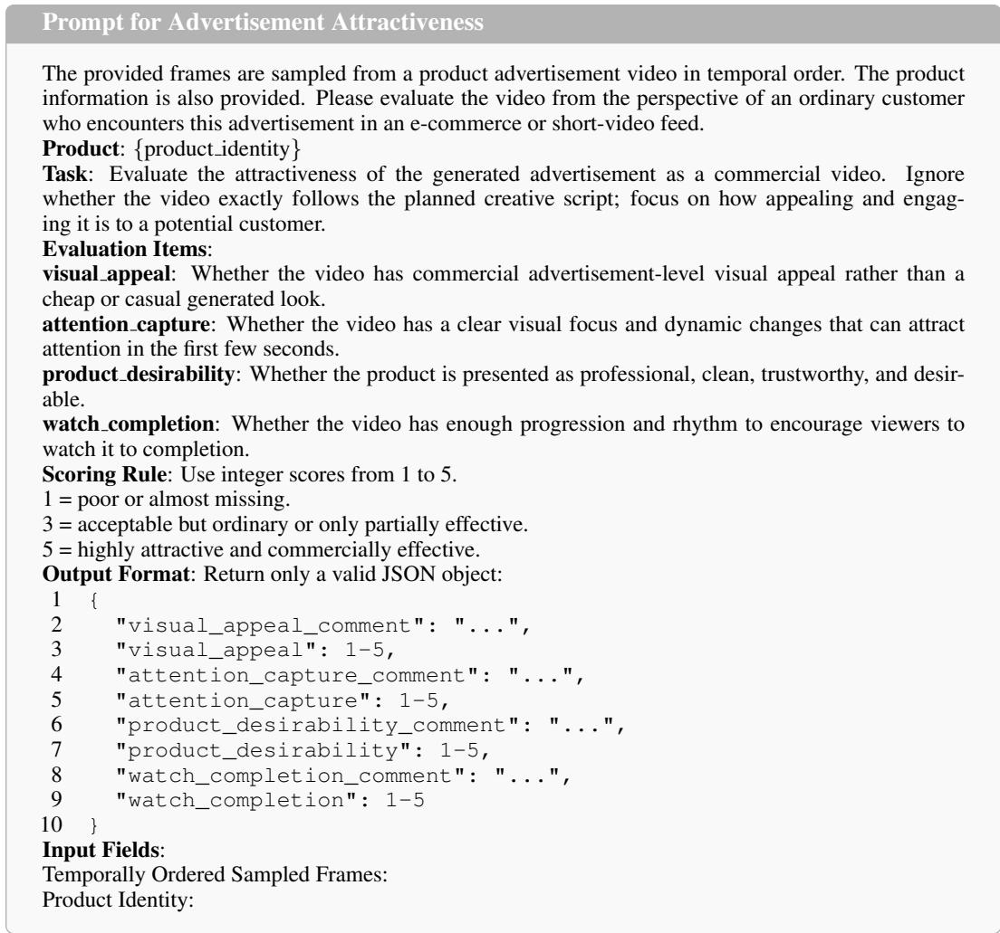  
Figure 24: Prompt for GPT-5.5-based advertisement attractiveness evaluation.

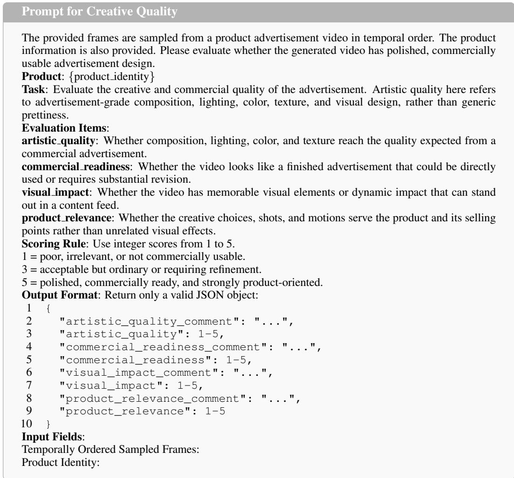  
Figure 25: Prompt for GPT-5.5-based creative quality evaluation.

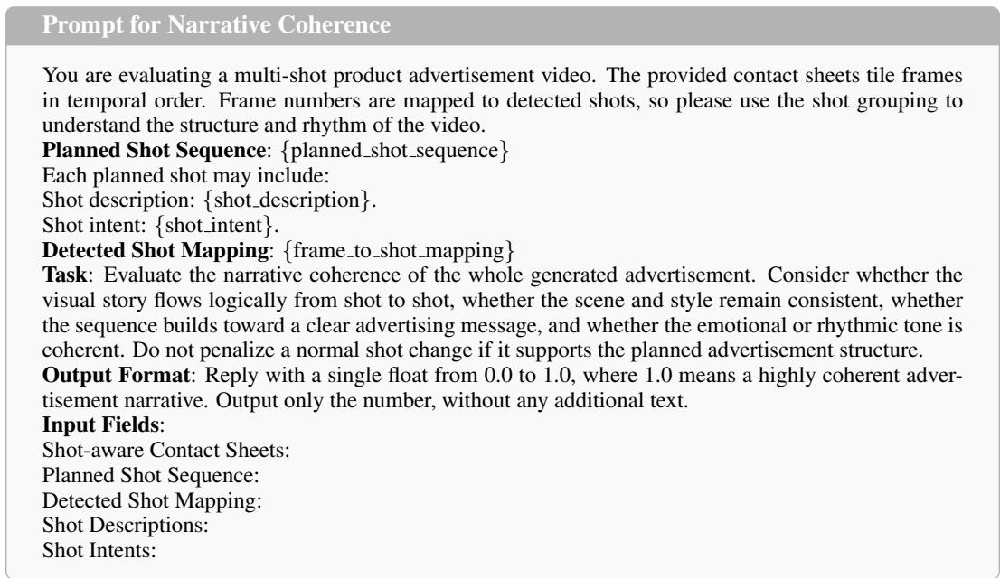  
Figure 26: Prompt for GPT-5.5-based narrative coherence evaluation.